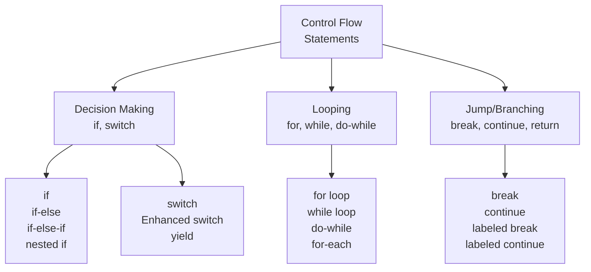
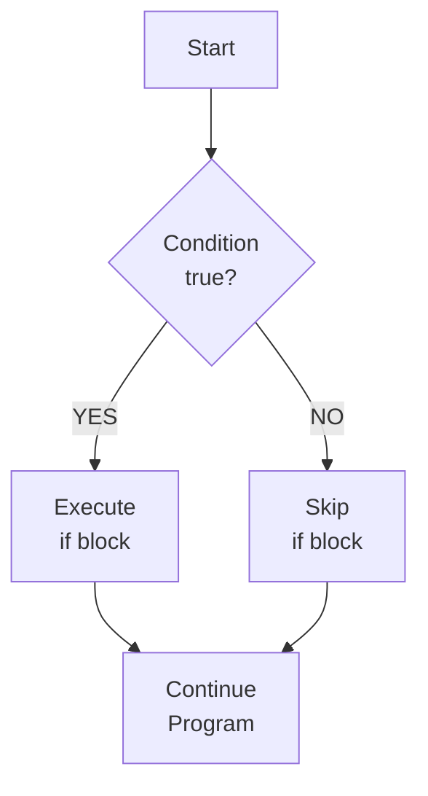
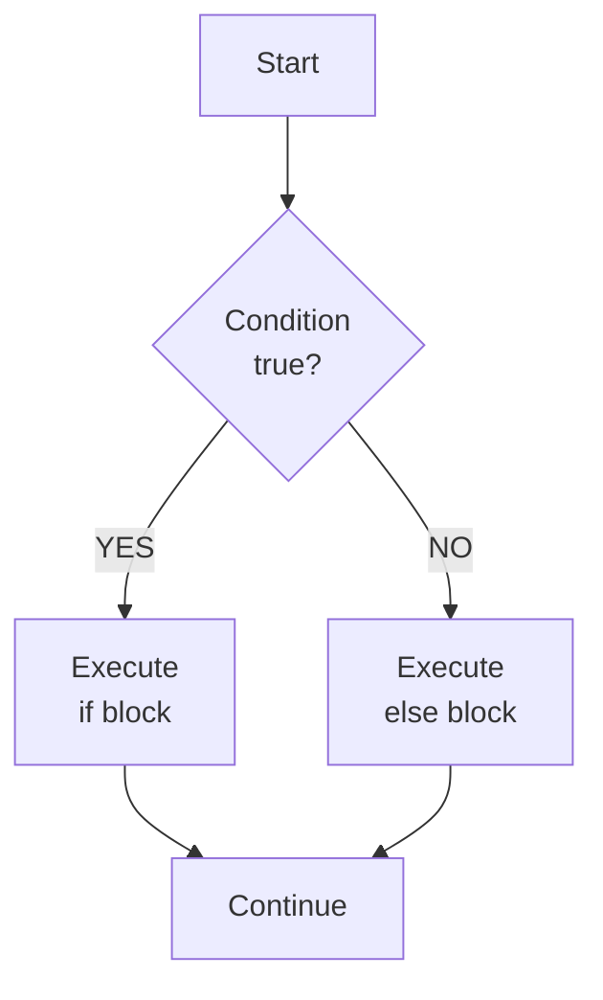
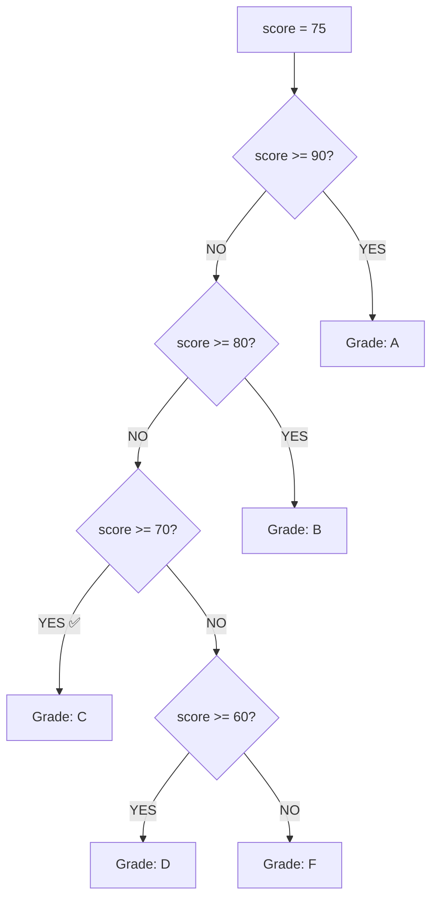
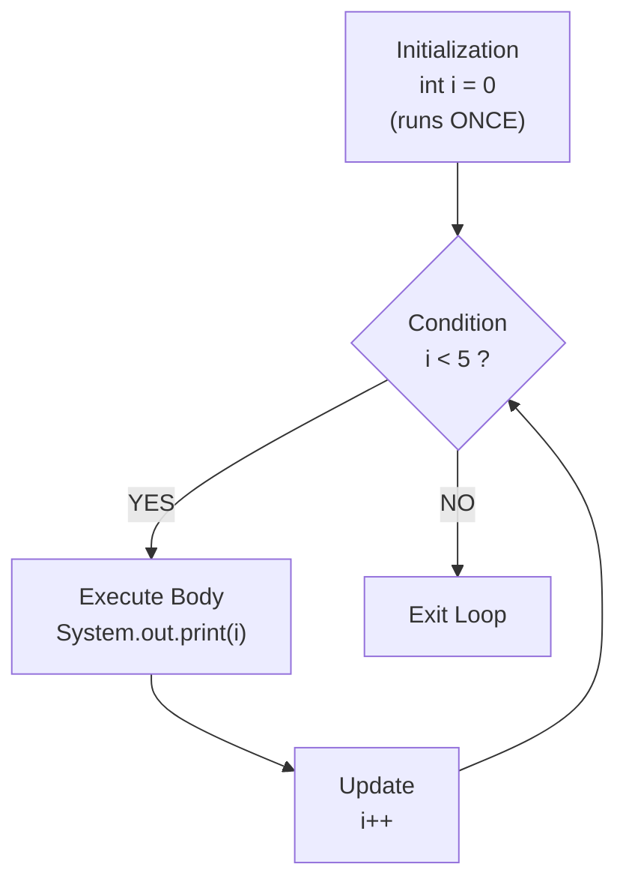
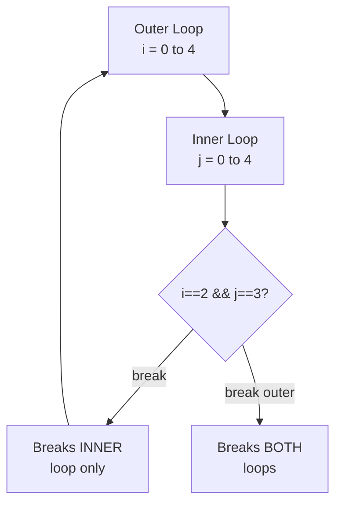

<a id="6-control-flow-statements"></a>

# 📘 Chapter 6: Control Flow Statements

> **Part A: Java Fundamentals — Beginner Foundation**
> `Beginner` | `Foundation` | `Logic Building`

⭐⭐⭐⭐⭐⭐⭐⭐⭐⭐⭐⭐⭐⭐⭐⭐⭐⭐⭐⭐⭐⭐⭐⭐⭐⭐⭐⭐⭐⭐⭐⭐

Java • Core Java • Interview Preparation

⭐⭐⭐⭐⭐⭐⭐⭐⭐⭐⭐⭐⭐⭐⭐⭐⭐⭐⭐⭐⭐⭐⭐⭐⭐⭐⭐⭐⭐⭐⭐⭐

---

<a id="chapter-index-table-6"></a>

## 📚 Chapter 6 — Index Table

| No. | Topic | Subtopics |
|-----|-------|-----------|
| 6.1 | [if Statement](#61-if-statement) | Simple if, Syntax, Flow, Single Statement vs Block |
| 6.2 | [if-else Statement](#62-if-else-statement) | Syntax, Flow, When else Executes |
| 6.3 | [if-else-if Ladder](#63-if-else-if-ladder) | Decision Tree, Multiple Conditions, Best Practices |
| 6.4 | [Nested if-else](#64-nested-if-else) | if Inside if, Readability Concerns, When to Use |
| 6.5 | [switch Statement](#65-switch-statement) | Syntax, Supported Types, Rules, default Case, Nested switch |
| 6.6 | [Fall-Through Behavior](#66-fall-through-behavior) | What Happens Without break, Intentional Fall-Through |
| 6.7 | [Enhanced switch (Java 14+)](#67-enhanced-switch-java-14) | Arrow Labels, switch Expressions, Multiple Labels per Case |
| 6.8 | [switch Expression with yield](#68-switch-expression-with-yield) | yield Keyword, Multi-Statement Case, Return Value from switch |
| 6.9 | [for Loop](#69-for-loop) | Syntax, Components, Multiple Variables, Infinite Loop |
| 6.10 | [while Loop](#610-while-loop) | Entry-Controlled, Syntax, Infinite Loop, Unknown Iterations |
| 6.11 | [do-while Loop](#611-do-while-loop) | Exit-Controlled, Guaranteed Single Execution, vs while |
| 6.12 | [Enhanced for-each Loop](#612-enhanced-for-each-loop) | Syntax, When to Use, Limitations, Arrays & Iterable |
| 6.13 | [Nested Loops](#613-nested-loops) | Time Complexity, Matrix Traversal, Pattern Logic |
| 6.14 | [break Statement](#614-break-statement) | In Loops, In switch, Labeled break |
| 6.15 | [continue Statement](#615-continue-statement) | Skip Iteration, Labeled continue |
| 6.16 | [Labeled Loops](#616-labeled-loops) | Labeled break, Labeled continue, Outer Loop Control |
| 6.17 | [Pattern Programs](#617-pattern-programs) | Star Patterns, Number Patterns, Alphabet, Diamond, Pyramid, Pascal's Triangle |
| 🔥 | [Java vs Other Languages](#6-java-vs-other-languages) | Unique Control Flow Differences |
| 💡 | [Interview Questions](#6-interview-questions) | 15+ Conceptual · Scenario · Output-based |
| 🧪 | [Practice Problems](#6-practice-problems) | 5 Coding + 5 Theory |

---

### 📌 What is Control Flow?

```
Control Flow is a FUNDAMENTAL FEATURE of Java that controls
the ORDER in which Java code is executed.

By default, code runs TOP to BOTTOM, line by line.
Control flow statements CHANGE this default behavior.

Java provides THREE types of control flow statements:
1. DECISION-MAKING statements (if, switch)
2. LOOPING statements (for, while, do-while, for-each)
3. JUMP statements (break, continue, return)
```

### 📊 Control Flow Overview



---

## 6.1 if Statement

<a id="61-if-statement"></a>

### 📌 Simple if Statement

```
The IF statement diverts the control of the program
depending upon a specific CONDITION.

The condition is a BOOLEAN expression (must evaluate to true/false).
If the condition is true → execute the block.
If false → skip the block.
```

```java
public class IfDemo {
    public static void main(String[] args) {

        int age = 20;

        // SIMPLE IF — executes block if condition is true
        if (age >= 18) {
            System.out.println("You are an adult");  // ✅ Prints
            System.out.println("You can vote");       // ✅ Prints
        }

        // Single statement if (no braces — NOT recommended!)
        if (age >= 18) System.out.println("Adult");  // Works but risky

        // WHY not recommended without braces?
        if (age >= 18)
            System.out.println("Line 1 — inside if");
            System.out.println("Line 2 — ALWAYS executes!"); // ⚠️ NOT inside if!
        // Only Line 1 is controlled by if. Line 2 ALWAYS runs.
        // Braces make intent clear. ALWAYS use braces!

        // Condition must be BOOLEAN
        // if (1) { }     // ❌ ERROR in Java! 1 is not boolean
        // if (age) { }   // ❌ ERROR! int is not boolean
        if (age > 0) { }  // ✅ Comparison returns boolean
    }
}
```

### 📊 if Statement Flow



> [!IMPORTANT]
> **Java vs C++:** In Java, `if(1)` is ❌ ERROR because 1 is not boolean. In C++, `if(1)` is valid (non-zero = true). Java STRICTLY requires boolean in conditions. This prevents bugs like `if(a = 5)` (assignment instead of comparison).

<a href="#chapter-index-table-6">Go to Top 🔝</a>

---

## 6.2 if-else Statement

<a id="62-if-else-statement"></a>

### 📌 if-else

```
The ELSE block is executed if the condition of the
if-block is evaluated as FALSE.

One of the two blocks ALWAYS executes — never both, never neither.
```

```java
public class IfElseDemo {
    public static void main(String[] args) {

        int marks = 45;

        if (marks >= 50) {
            System.out.println("Pass ✅");
        } else {
            System.out.println("Fail ❌");  // This executes (45 < 50)
        }

        // Ternary equivalent:
        String result = (marks >= 50) ? "Pass" : "Fail";
        System.out.println(result);  // Fail

        // Check even/odd
        int num = 7;
        if (num % 2 == 0) {
            System.out.println(num + " is Even");
        } else {
            System.out.println(num + " is Odd");  // ✅ 7 is Odd
        }
    }
}
```

### 📊 if-else Flow



<a href="#chapter-index-table-6">Go to Top 🔝</a>

---

## 6.3 if-else-if Ladder

<a id="63-if-else-if-ladder"></a>

### 📌 Decision Tree

```
The if-else-if statement is a CHAIN of if-else statements
that creates a DECISION TREE.

The program enters the block where the condition is TRUE.
Only ONE block executes.
If NO condition is true → else block executes (if present).
```

```java
public class LadderDemo {
    public static void main(String[] args) {

        int score = 75;

        if (score >= 90) {
            System.out.println("Grade: A — Excellent");
        } else if (score >= 80) {
            System.out.println("Grade: B — Very Good");
        } else if (score >= 70) {
            System.out.println("Grade: C — Good");      // ✅ This executes
        } else if (score >= 60) {
            System.out.println("Grade: D — Average");
        } else {
            System.out.println("Grade: F — Fail");
        }

        // IMPORTANT: Order matters!
        // Conditions are checked TOP to BOTTOM
        // First TRUE condition's block executes, rest are SKIPPED

        // BAD ORDER (always matches first condition):
        // if (score >= 60) → would catch 75 here, never reach 70, 80, 90!
        // Always put MOST RESTRICTIVE condition FIRST
    }
}
```

### 📊 Ladder Flow



> [!TIP]
> **Best Practice:** In an if-else-if ladder, always put the **most restrictive** (highest) condition first. If you check `score >= 60` before `score >= 90`, a score of 95 would match the first condition and never reach the 90 check.

<a href="#chapter-index-table-6">Go to Top 🔝</a>

---

## 6.4 Nested if-else

<a id="64-nested-if-else"></a>

### 📌 if Inside if

```
The if statement can contain another if or if-else statement
INSIDE another if or else-if statement.

Used when you need to check MULTIPLE related conditions
in a hierarchical manner.
```

```java
public class NestedIfDemo {
    public static void main(String[] args) {

        int age = 25;
        boolean hasLicense = true;
        boolean hasInsurance = false;

        if (age >= 18) {
            System.out.println("Age is valid");

            if (hasLicense) {
                System.out.println("Has license");

                if (hasInsurance) {
                    System.out.println("Can drive legally! ✅");
                } else {
                    System.out.println("Get insurance first! ⚠️"); // ✅
                }
            } else {
                System.out.println("Get license first! ❌");
            }
        } else {
            System.out.println("Too young to drive! ❌");
        }

        // READABILITY CONCERN:
        // Deep nesting (3+ levels) makes code hard to read.
        // BETTER approach — use logical operators:
        if (age >= 18 && hasLicense && hasInsurance) {
            System.out.println("Can drive!");
        } else {
            System.out.println("Cannot drive");
        }

        // Or use EARLY RETURN pattern (in methods):
        // if (age < 18) return "Too young";
        // if (!hasLicense) return "No license";
        // if (!hasInsurance) return "No insurance";
        // return "Can drive!";
    }
}
```

> [!TIP]
> **Best Practice:** Avoid nesting more than 2-3 levels deep. Use **logical operators** (`&&`, `||`) to combine conditions, or use the **early return pattern** to reduce nesting. Deeply nested code is called "Arrow Anti-pattern" — bad for readability and maintenance.

<a href="#chapter-index-table-6">Go to Top 🔝</a>

---

## 6.5 switch Statement

<a id="65-switch-statement"></a>

### 📌 switch Syntax and Rules

```
The switch statement contains multiple blocks of code called CASES.
A SINGLE case is executed based on the variable being switched.
It's an alternative to long if-else-if ladders.
```

```java
public class SwitchDemo {
    public static void main(String[] args) {

        int day = 3;

        switch (day) {
            case 1:
                System.out.println("Monday");
                break;
            case 2:
                System.out.println("Tuesday");
                break;
            case 3:
                System.out.println("Wednesday");  // ✅ Executes
                break;
            case 4:
                System.out.println("Thursday");
                break;
            case 5:
                System.out.println("Friday");
                break;
            default:
                System.out.println("Weekend");
                // break in default? "Yha pe break lagake kya faida bhai?" 😄
                // Not needed since it's the last block
        }

        // SWITCH WITH STRING (Java 7+)
        String grade = "A";
        switch (grade) {
            case "A":
                System.out.println("Excellent");
                break;
            case "B":
                System.out.println("Good");
                break;
            default:
                System.out.println("Try harder");
        }

        // MULTIPLE CASES — Same action
        int month = 2;
        switch (month) {
            case 1: case 3: case 5: case 7:
            case 8: case 10: case 12:
                System.out.println("31 days");
                break;
            case 4: case 6: case 9: case 11:
                System.out.println("30 days");
                break;
            case 2:
                System.out.println("28 or 29 days");  // ✅
                break;
        }
    }
}
```

### 📌 Rules for switch Statement ⭐

```
┌──────────────────────────────────────────────────────────────┐
│  SWITCH RULES:                                               │
├──────────────────────────────────────────────────────────────┤
│  1. Case variables can be:                                    │
│     ✅ int, short, byte, char                                │
│     ✅ String (Java 7+)                                       │
│     ✅ enum                                                   │
│     ✅ Wrapper classes (Integer, Byte, Short, Character)      │
│     ❌ long, float, double, boolean → NOT allowed!           │
│                                                              │
│  2. Cases CANNOT be duplicate                                 │
│                                                              │
│  3. default is OPTIONAL — executes when no case matches      │
│                                                              │
│  4. break terminates the switch block                         │
│     → If omitted → FALL-THROUGH (next case also executes!)  │
│                                                              │
│  5. Case expression must be a CONSTANT (literal/final var)    │
│     → Cannot use variables as case values                    │
│                                                              │
│  6. Nested switch is allowed                                  │
└──────────────────────────────────────────────────────────────┘
```

> [!IMPORTANT]
> **switch does NOT support:** `long`, `float`, `double`, `boolean`.
> **switch DOES support:** `byte`, `short`, `int`, `char`, `String` (Java 7+), `enum`.
> This is a frequently asked interview question.

<a href="#chapter-index-table-6">Go to Top 🔝</a>

---

## 6.6 Fall-Through Behavior

<a id="66-fall-through-behavior"></a>

### 📌 What Happens Without break?

```java
public class FallThroughDemo {
    public static void main(String[] args) {

        int x = 2;

        // WITHOUT break → Fall-through!
        switch (x) {
            case 1:
                System.out.println("One");
            case 2:
                System.out.println("Two");    // ✅ Matches, executes
            case 3:
                System.out.println("Three");  // ⚠️ Also executes! (fall-through)
            default:
                System.out.println("Default"); // ⚠️ Also executes!
        }
        // OUTPUT: Two, Three, Default

        System.out.println("---");

        // WITH break → Only matching case executes
        switch (x) {
            case 1:
                System.out.println("One");
                break;
            case 2:
                System.out.println("Two");     // ✅ Only this
                break;
            case 3:
                System.out.println("Three");
                break;
            default:
                System.out.println("Default");
        }
        // OUTPUT: Two

        // INTENTIONAL fall-through (useful pattern):
        char c = 'a';
        switch (c) {
            case 'a': case 'e': case 'i': case 'o': case 'u':
            case 'A': case 'E': case 'I': case 'O': case 'U':
                System.out.println("Vowel");
                break;
            default:
                System.out.println("Consonant");
        }
    }
}
```

```
┌──────────────────────────────────────────────────────────────┐
│  FALL-THROUGH:                                               │
│  Without break, execution "falls through" to the NEXT case   │
│  and continues executing ALL subsequent cases until:          │
│  → A break is encountered, OR                                │
│  → The switch block ends                                     │
│                                                              │
│  This is usually a BUG unless INTENTIONAL                    │
│  (like grouping multiple cases for same action)              │
└──────────────────────────────────────────────────────────────┘
```

<a href="#chapter-index-table-6">Go to Top 🔝</a>

---

## 6.7 Enhanced switch (Java 14+)

<a id="67-enhanced-switch-java-14"></a>

### 📌 Arrow Labels — No Fall-Through!

```java
public class EnhancedSwitchDemo {
    public static void main(String[] args) {

        int day = 3;

        // ═══ ARROW SYNTAX (→) — Java 14+ ═══
        // No fall-through! No break needed!
        switch (day) {
            case 1 -> System.out.println("Monday");
            case 2 -> System.out.println("Tuesday");
            case 3 -> System.out.println("Wednesday"); // ✅
            case 4 -> System.out.println("Thursday");
            case 5 -> System.out.println("Friday");
            default -> System.out.println("Weekend");
        }

        // ═══ SWITCH EXPRESSION — Returns a value! ═══
        String dayName = switch (day) {
            case 1 -> "Monday";
            case 2 -> "Tuesday";
            case 3 -> "Wednesday";
            case 4 -> "Thursday";
            case 5 -> "Friday";
            default -> "Weekend";
        }; // Note the semicolon!
        System.out.println(dayName);  // Wednesday

        // ═══ MULTIPLE LABELS per case ═══
        int month = 2;
        int numDays = switch (month) {
            case 1, 3, 5, 7, 8, 10, 12 -> 31;
            case 4, 6, 9, 11 -> 30;
            case 2 -> 28;
            default -> throw new IllegalArgumentException("Invalid month");
        };
        System.out.println(numDays);  // 28
    }
}
```

### 📌 Traditional vs Enhanced switch

```
┌──────────────────────┬────────────────────┬────────────────────┐
│  Feature             │  Traditional       │  Enhanced (14+)    │
├──────────────────────┼────────────────────┼────────────────────┤
│  Syntax              │  case X:           │  case X ->         │
│  Fall-through        │  YES (need break)  │  NO (auto-breaks!) │
│  Returns value?      │  NO                │  YES (expression)  │
│  Multiple labels     │  case 1: case 2:   │  case 1, 2 ->      │
│  break needed?       │  YES               │  NO                │
│  Readability         │  Verbose           │  Clean & concise   │
└──────────────────────┴────────────────────┴────────────────────┘
```

<a href="#chapter-index-table-6">Go to Top 🔝</a>

---

## 6.8 switch Expression with yield

<a id="68-switch-expression-with-yield"></a>

### 📌 yield Keyword — Multi-Statement Case Blocks

```java
public class YieldDemo {
    public static void main(String[] args) {

        int day = 2;

        // When case block has MULTIPLE statements → use yield
        String result = switch (day) {
            case 1 -> "Monday";  // Single expression → no yield needed

            case 2 -> {
                System.out.println("Processing Tuesday...");
                String msg = "It's Tuesday!";
                yield msg;   // yield RETURNS value from the block
            }

            case 3 -> {
                yield "Wednesday";  // yield required in multi-statement block
            }

            default -> {
                yield "Other day";
            }
        };

        System.out.println(result);
        // Output:
        // Processing Tuesday...
        // It's Tuesday!
    }
}
```

```
yield keyword:
→ Used in switch EXPRESSIONS (that return a value)
→ Required when case block has MULTIPLE statements
→ Returns the value from the case block
→ Similar to 'return' but for switch expressions
→ Single expression cases don't need yield (auto-returned)
```

<a href="#chapter-index-table-6">Go to Top 🔝</a>

---

## 6.9 for Loop

<a id="69-for-loop"></a>

### 📌 When to Use for Loop

```
Use FOR LOOP when you EXACTLY KNOW the number of iterations.
Example: Iterate an array (size is known).

It enables initialization, condition, and increment/decrement
all in a SINGLE LINE of code.
```

```java
public class ForLoopDemo {
    public static void main(String[] args) {

        // BASIC for loop
        // for(initialization; condition; update) { body }
        for (int i = 0; i < 5; i++) {
            System.out.print(i + " ");  // 0 1 2 3 4
        }
        System.out.println();

        // COMPONENTS:
        // int i = 0  → Initialization (runs ONCE at start)
        // i < 5      → Condition (checked BEFORE each iteration)
        // i++        → Update (runs AFTER each iteration body)

        // COUNTING BACKWARD
        for (int i = 10; i >= 0; i--) {
            System.out.print(i + " ");  // 10 9 8 7 6 5 4 3 2 1 0
        }
        System.out.println();

        // STEP SIZE
        for (int i = 0; i < 20; i += 3) {
            System.out.print(i + " ");  // 0 3 6 9 12 15 18
        }
        System.out.println();

        // MULTIPLE VARIABLES
        for (int i = 0, j = 10; i <= j; i++, j--) {
            System.out.print(i + "-" + j + " ");  // 0-10 1-9 2-8 3-7 4-6 5-5
        }
        System.out.println();

        // INFINITE for loop
        // for (;;) { System.out.println("Forever"); } // Runs forever!

        // EMPTY body
        int sum = 0;
        for (int i = 1; i <= 100; sum += i, i++) ;  // Semicolon = empty body
        System.out.println("Sum 1-100: " + sum);  // 5050
    }
}
```

### 📊 for Loop Execution Flow



<a href="#chapter-index-table-6">Go to Top 🔝</a>

---

## 6.10 while Loop

<a id="610-while-loop"></a>

### 📌 Entry-Controlled Loop

```
Use WHILE LOOP when the number of iterations is UNKNOWN.
It is an ENTRY-CONTROLLED loop — condition checked FIRST.
If condition is false from the start → body NEVER executes.

Example: Traversing a linked list (size unknown).
```

```java
public class WhileDemo {
    public static void main(String[] args) {

        // BASIC while
        int i = 1;
        while (i <= 5) {
            System.out.print(i + " ");  // 1 2 3 4 5
            i++;
        }
        System.out.println();

        // DIGIT SUM (unknown number of iterations)
        int n = 12345;
        int sum = 0;
        while (n > 0) {
            sum += n % 10;   // Add last digit
            n /= 10;         // Remove last digit
        }
        System.out.println("Digit sum: " + sum);  // 15

        // CONDITION FALSE FROM START → Never executes
        int x = 100;
        while (x < 5) {
            System.out.println("Never prints!");  // Never executes
        }

        // INFINITE while loop
        // while (true) { System.out.println("Forever"); }
    }
}
```

<a href="#chapter-index-table-6">Go to Top 🔝</a>

---

## 6.11 do-while Loop

<a id="611-do-while-loop"></a>

### 📌 Exit-Controlled Loop — Guaranteed Single Execution

```
do-while checks condition at the END of the loop.
Body executes AT LEAST ONCE — even if condition is false.

Also known as EXIT-CONTROLLED loop (condition checked after body).
```

```java
public class DoWhileDemo {
    public static void main(String[] args) {

        // BASIC do-while
        int i = 1;
        do {
            System.out.print(i + " ");  // 1 2 3 4 5
            i++;
        } while (i <= 5);
        System.out.println();

        // KEY DIFFERENCE: Executes AT LEAST ONCE
        int x = 100;
        do {
            System.out.println("Executes ONCE even though 100 > 5!");
        } while (x < 5);  // Condition false, but body already ran!

        // MENU-DRIVEN PROGRAM (Classic use case)
        java.util.Scanner sc = new java.util.Scanner(System.in);
        int choice;
        do {
            System.out.println("┌──────────────────┐");
            System.out.println("│ 1. Add            │");
            System.out.println("│ 2. Subtract        │");
            System.out.println("│ 0. Exit            │");
            System.out.println("└──────────────────┘");
            System.out.print("Choice: ");
            choice = sc.nextInt();
            // Process choice...
        } while (choice != 0);  // Keep showing until Exit
        sc.close();
    }
}
```

### 📌 for vs while vs do-while

```
┌───────────────┬──────────────────────────────────────────────┐
│  Loop Type    │  When to Use                                 │
├───────────────┼──────────────────────────────────────────────┤
│  for          │  When you KNOW exact number of iterations    │
│               │  Index-based traversal (arrays)              │
│               │  Entry-controlled (may execute 0 times)      │
├───────────────┼──────────────────────────────────────────────┤
│  while        │  When iterations are UNKNOWN                 │
│               │  Condition-based (linked list traversal)     │
│               │  Entry-controlled (may execute 0 times)      │
├───────────────┼──────────────────────────────────────────────┤
│  do-while     │  When body must execute AT LEAST ONCE        │
│               │  Menu-driven programs                        │
│               │  Exit-controlled (always executes once)      │
└───────────────┴──────────────────────────────────────────────┘
```

<a href="#chapter-index-table-6">Go to Top 🔝</a>

---

## 6.12 Enhanced for-each Loop

<a id="612-enhanced-for-each-loop"></a>

### 📌 Simplified Array/Collection Traversal

```java
public class ForEachDemo {
    public static void main(String[] args) {

        // WITH ARRAY
        int[] numbers = {10, 20, 30, 40, 50};
        for (int num : numbers) {
            System.out.print(num + " ");  // 10 20 30 40 50
        }
        System.out.println();

        // WITH STRING ARRAY
        String[] fruits = {"Apple", "Banana", "Cherry"};
        for (String fruit : fruits) {
            System.out.println(fruit);
        }

        // WITH LIST (Collection)
        java.util.List<Integer> list = java.util.List.of(1, 2, 3, 4);
        for (int val : list) {
            System.out.print(val + " ");
        }
        System.out.println();

        // ═══ LIMITATIONS ═══
        // 1. NO INDEX access
        // for (int num : numbers) → no way to get index!

        // 2. CANNOT MODIFY elements
        // for (int num : numbers) { num = 100; } → original unchanged!

        // 3. Can only traverse FORWARD

        // 4. CANNOT REMOVE elements while iterating

        // If you need index → use regular for loop:
        for (int i = 0; i < numbers.length; i++) {
            System.out.println("Index " + i + ": " + numbers[i]);
        }
    }
}
```

<a href="#chapter-index-table-6">Go to Top 🔝</a>

---

## 6.13 Nested Loops

<a id="613-nested-loops"></a>

### 📌 Loop Inside Loop

```java
public class NestedLoopDemo {
    public static void main(String[] args) {

        // MATRIX TRAVERSAL (2D array)
        int[][] matrix = {{1,2,3}, {4,5,6}, {7,8,9}};
        for (int i = 0; i < 3; i++) {
            for (int j = 0; j < 3; j++) {
                System.out.print(matrix[i][j] + " ");
            }
            System.out.println();
        }
        // 1 2 3
        // 4 5 6
        // 7 8 9

        // MULTIPLICATION TABLE
        for (int i = 1; i <= 5; i++) {
            for (int j = 1; j <= 10; j++) {
                System.out.printf("%4d", i * j);
            }
            System.out.println();
        }
    }
}
```

```
TIME COMPLEXITY of Nested Loops:
→ Single loop:  O(n)
→ Double nested: O(n²)
→ Triple nested: O(n³)

for (i = 0; i < n; i++)           → O(n)
  for (j = 0; j < n; j++)         → O(n²)
    for (k = 0; k < n; k++)       → O(n³)
```

<a href="#chapter-index-table-6">Go to Top 🔝</a>

---

## 6.14 break Statement

<a id="614-break-statement"></a>

### 📌 Exit the Loop/Switch

```
break is used to BREAK the current flow and transfer control
to the NEXT statement outside the loop or switch.

Note: It breaks ONLY the loop WHERE it is written (innermost).
break CANNOT be used independently — only inside loop or switch.
```

```java
public class BreakDemo {
    public static void main(String[] args) {

        // break in for loop
        for (int i = 0; i < 10; i++) {
            if (i == 5) break;              // Exit loop at i=5
            System.out.print(i + " ");      // 0 1 2 3 4
        }
        System.out.println();

        // break in while loop
        int i = 0;
        while (true) {          // Infinite loop
            if (i == 5) break;  // Exit condition
            System.out.print(i + " ");  // 0 1 2 3 4
            i++;
        }
        System.out.println();

        // break in NESTED loop → breaks INNER loop only
        for (int x = 0; x < 3; x++) {
            for (int y = 0; y < 5; y++) {
                if (y == 3) break;  // Breaks inner loop only
                System.out.print("(" + x + "," + y + ") ");
            }
            System.out.println();
        }
        // (0,0) (0,1) (0,2)
        // (1,0) (1,1) (1,2)
        // (2,0) (2,1) (2,2)
    }
}
```

<a href="#chapter-index-table-6">Go to Top 🔝</a>

---

## 6.15 continue Statement

<a id="615-continue-statement"></a>

### 📌 Skip Current Iteration

```
Unlike break, continue DOESN'T break the loop.
It SKIPS the remaining part of the current iteration
and JUMPS to the next iteration immediately.
```

```java
public class ContinueDemo {
    public static void main(String[] args) {

        // Skip even numbers
        for (int i = 0; i < 10; i++) {
            if (i % 2 == 0) continue;   // Skip even, go to next i
            System.out.print(i + " ");  // 1 3 5 7 9
        }
        System.out.println();

        // Skip number 5
        for (int i = 1; i <= 10; i++) {
            if (i == 5) continue;
            System.out.print(i + " ");  // 1 2 3 4 6 7 8 9 10
        }
    }
}
```

### 📌 break vs continue

```
┌───────────────┬───────────────────────────────────────────────┐
│  Statement    │  Behavior                                     │
├───────────────┼───────────────────────────────────────────────┤
│  break        │  Completely EXITS the loop                    │
│               │  Program continues AFTER the loop             │
│               │  Works with: for, while, do-while, switch     │
├───────────────┼───────────────────────────────────────────────┤
│  continue     │  SKIPS current iteration                      │
│               │  Jumps to NEXT iteration (loop continues)     │
│               │  Works with: for, while, do-while             │
│               │  NOT used with switch                         │
└───────────────┴───────────────────────────────────────────────┘
```

<a href="#chapter-index-table-6">Go to Top 🔝</a>

---

## 6.16 Labeled Loops

<a id="616-labeled-loops"></a>

### 📌 Control Outer Loop from Inner Loop

```java
public class LabeledLoopDemo {
    public static void main(String[] args) {

        // LABELED break — break out of OUTER loop from inner
        outer:
        for (int i = 0; i < 5; i++) {
            for (int j = 0; j < 5; j++) {
                if (i == 2 && j == 3) {
                    break outer;  // Breaks BOTH loops!
                }
                System.out.print("(" + i + "," + j + ") ");
            }
            System.out.println();
        }
        System.out.println("\nAfter outer break");
        // Stops at (2,3) — exits both loops completely

        System.out.println("---");

        // LABELED continue — continue OUTER loop from inner
        outer2:
        for (int i = 0; i < 3; i++) {
            for (int j = 0; j < 3; j++) {
                if (j == 1) {
                    continue outer2;  // Skip to next i
                }
                System.out.print("(" + i + "," + j + ") ");
            }
            System.out.println();
        }
        // Output: (0,0) (1,0) (2,0)
        // When j=1, inner loop is abandoned, outer goes to next i
    }
}
```

### 📊 Labeled break vs Regular break



<a href="#chapter-index-table-6">Go to Top 🔝</a>

---

## 6.17 Pattern Programs

<a id="617-pattern-programs"></a>

### 📌 Classic Pattern Programs (Interview Practice)

```java
public class PatternPrograms {
    public static void main(String[] args) {

        int n = 5;

        // ═══════════════════════════════════════════
        // PATTERN 1: Right Triangle (Stars)
        // ═══════════════════════════════════════════
        // *
        // * *
        // * * *
        // * * * *
        // * * * * *
        System.out.println("=== Right Triangle ===");
        for (int i = 1; i <= n; i++) {
            for (int j = 1; j <= i; j++) {
                System.out.print("* ");
            }
            System.out.println();
        }

        // ═══════════════════════════════════════════
        // PATTERN 2: Inverted Triangle
        // ═══════════════════════════════════════════
        // * * * * *
        // * * * *
        // * * *
        // * *
        // *
        System.out.println("=== Inverted Triangle ===");
        for (int i = n; i >= 1; i--) {
            for (int j = 1; j <= i; j++) {
                System.out.print("* ");
            }
            System.out.println();
        }

        // ═══════════════════════════════════════════
        // PATTERN 3: Number Triangle
        // ═══════════════════════════════════════════
        // 1
        // 1 2
        // 1 2 3
        // 1 2 3 4
        // 1 2 3 4 5
        System.out.println("=== Number Triangle ===");
        for (int i = 1; i <= n; i++) {
            for (int j = 1; j <= i; j++) {
                System.out.print(j + " ");
            }
            System.out.println();
        }

        // ═══════════════════════════════════════════
        // PATTERN 4: Pyramid
        // ═══════════════════════════════════════════
        //     *
        //    * *
        //   * * *
        //  * * * *
        // * * * * *
        System.out.println("=== Pyramid ===");
        for (int i = 1; i <= n; i++) {
            for (int j = i; j < n; j++) System.out.print(" ");
            for (int k = 1; k <= i; k++) System.out.print("* ");
            System.out.println();
        }

        // ═══════════════════════════════════════════
        // PATTERN 5: Diamond
        // ═══════════════════════════════════════════
        //     *
        //    ***
        //   *****
        //  *******
        // *********
        //  *******
        //   *****
        //    ***
        //     *
        System.out.println("=== Diamond ===");
        // Upper half
        for (int i = 1; i <= n; i++) {
            for (int j = i; j < n; j++) System.out.print(" ");
            for (int k = 1; k <= (2 * i - 1); k++) System.out.print("*");
            System.out.println();
        }
        // Lower half
        for (int i = n - 1; i >= 1; i--) {
            for (int j = n; j > i; j--) System.out.print(" ");
            for (int k = 1; k <= (2 * i - 1); k++) System.out.print("*");
            System.out.println();
        }

        // ═══════════════════════════════════════════
        // PATTERN 6: Pascal's Triangle
        // ═══════════════════════════════════════════
        // 1
        // 1 1
        // 1 2 1
        // 1 3 3 1
        // 1 4 6 4 1
        System.out.println("=== Pascal's Triangle ===");
        for (int i = 0; i < n; i++) {
            int val = 1;
            for (int j = n - i; j > 1; j--) System.out.print(" ");
            for (int j = 0; j <= i; j++) {
                System.out.printf("%2d ", val);
                val = val * (i - j) / (j + 1);
            }
            System.out.println();
        }

        // ═══════════════════════════════════════════
        // PATTERN 7: Alphabet Triangle
        // ═══════════════════════════════════════════
        // A
        // A B
        // A B C
        // A B C D
        // A B C D E
        System.out.println("=== Alphabet Triangle ===");
        for (int i = 1; i <= n; i++) {
            for (int j = 0; j < i; j++) {
                System.out.print((char)('A' + j) + " ");
            }
            System.out.println();
        }
    }
}
```

> [!TIP]
> **Pattern Program Strategy:**
> - **Outer loop** = controls ROWS (how many lines)
> - **Inner loop 1** = controls SPACES (for alignment)
> - **Inner loop 2** = controls STARS/NUMBERS (actual pattern)
> - **Observe the relationship** between row number and number of stars/spaces

<a href="#chapter-index-table-6">Go to Top 🔝</a>

---

<a id="6-java-vs-other-languages"></a>

## 🔥 What Makes Java DIFFERENT — Control Flow

> [!IMPORTANT]
> Java's control flow has several **UNIQUE** behaviors compared to other languages.

```
┌──────────────────────┬────────────┬────────────┬────────────┬────────────┐
│  Feature             │  Java      │  C++       │  Python    │  JavaScript│
├──────────────────────┼────────────┼────────────┼────────────┼────────────┤
│  if(1) valid?        │ ❌ ERROR!  │ ✅ Yes     │ ✅ Yes     │ ✅ Yes    │
│                      │ (not bool!)│ (truthy)   │ (truthy)   │ (truthy)   │
├──────────────────────┼────────────┼────────────┼────────────┼────────────┤
│  switch on String    │ ✅ Java 7+ │ ❌ No      │ No switch  │ ✅ Yes    │
├──────────────────────┼────────────┼────────────┼────────────┼────────────┤
│  switch on long      │ ❌ No!     │ ✅ Yes     │ No switch  │ ✅ Yes    │
├──────────────────────┼────────────┼────────────┼────────────┼────────────┤
│  switch expressions  │ ✅ Java 14+│ ❌ No      │ match 3.10+│ ❌ No     │
│  (return value)      │ (yield)    │            │            │            │
├──────────────────────┼────────────┼────────────┼────────────┼────────────┤
│  for-each loop       │ ✅ for(:)  │ ✅ range-for│ ✅ for in │ ✅ for of │
├──────────────────────┼────────────┼────────────┼────────────┼────────────┤
│  Labeled loops       │ ✅ Yes     │ ❌ No      │ ❌ No      │ ✅ Yes    │
│  (break/continue)    │ (unique!)  │ (use goto) │            │            │
├──────────────────────┼────────────┼────────────┼────────────┼────────────┤
│  goto keyword        │ ❌ Reserved│ ✅ Yes     │ ❌ No      │ ❌ No     │
│                      │ but unused!│            │            │            │
├──────────────────────┼────────────┼────────────┼────────────┼────────────┤
│  Ternary inside      │ ✅ Expr    │ ✅ Expr    │ ✅ x if c  │ ✅ Expr   │
│  assignments         │            │            │ else y     │            │
└──────────────────────┴────────────┴────────────┴────────────┴────────────┘
```

### 🎯 Key UNIQUE Points

```
1. BOOLEAN STRICTNESS:
   if(1), if(0), if(null) → ALL ❌ ERROR in Java!
   Java ONLY accepts boolean in conditions.

2. switch DOESN'T SUPPORT long, float, double, boolean:
   Only: byte, short, int, char, String, enum.
   C++ allows long in switch.

3. LABELED LOOPS (break outer, continue outer):
   Java has labeled break/continue — very few languages have this!
   C++ uses goto instead (which Java has reserved but NEVER uses).

4. goto IS RESERVED BUT UNUSED:
   Java reserves 'goto' as a keyword but it does NOTHING.
   This prevents C++ programmers from using goto in Java.

5. ENHANCED SWITCH (Java 14+):
   Arrow syntax with no fall-through — unique to modern Java.
   yield keyword for returning values from switch blocks.
```

<a href="#chapter-index-table-6">Go to Top 🔝</a>

---

<a id="6-interview-questions"></a>

## 💡 Chapter 6 — Interview Questions (15+)

---

### 🔵 Conceptual Questions

**Q1. Difference between while and do-while?**

```
WHILE: Entry-controlled. Condition checked BEFORE body.
       Body may NEVER execute if condition is false initially.

DO-WHILE: Exit-controlled. Condition checked AFTER body.
          Body executes AT LEAST ONCE, even if condition is false.

Example:
int x = 100;
while (x < 5) { ... }     // Body NEVER executes
do { ... } while (x < 5); // Body executes ONCE
```

---

**Q2. What types can be used in switch?**

```
✅ VALID: byte, short, int, char, String (Java 7+), enum
          Wrapper classes: Byte, Short, Integer, Character
❌ INVALID: long, float, double, boolean

WHY no float/double?
→ Floating-point comparison is imprecise (0.1+0.2 ≠ 0.3)
→ Exact equality matching in case would be unreliable

WHY no long?
→ switch uses tableswitch/lookupswitch JVM bytecodes
→ These are designed for int-sized values
```

---

**Q3. What is fall-through in switch?**

```
Fall-through = When a case executes AND continues to
the NEXT case because 'break' is missing.

Without break, ALL subsequent cases execute until
a break is found or switch block ends.

This is usually a BUG unless intentional
(like grouping multiple cases for same action).
```

---

**Q4. What is labeled break and continue?**

```
LABELED BREAK: Exits the OUTER loop from inner loop
→ outer: for(...) { for(...) { break outer; } }
→ Breaks BOTH loops

LABELED CONTINUE: Skips to next iteration of OUTER loop
→ outer: for(...) { for(...) { continue outer; } }
→ Skips rest of inner loop AND continues outer

WITHOUT label: break/continue only affect the INNERMOST loop.
This is UNIQUE to Java — C++ uses goto instead.
```

---

**Q5. Can we use break outside a loop or switch?**

```
NO! break CANNOT be used independently.
It can ONLY be used inside: loop or switch statement.

break;  // ❌ Compile Error if not inside loop/switch
continue; // ❌ Compile Error if not inside loop
```

---

**Q6. Difference between for and for-each loop?**

```
FOR: Index-based, can access/modify elements, flexible
FOR-EACH: Simplified, no index access, read-only

FOR-EACH limitations:
1. No index access
2. Cannot modify elements
3. Only forward traversal
4. Cannot remove while iterating
5. Only works with arrays and Iterable objects
```

---

**Q7. What is the yield keyword in switch?**

```
yield is used in SWITCH EXPRESSIONS (Java 14+) to return
a value from a multi-statement case block.

String result = switch(day) {
    case 1 -> "Monday";        // No yield needed (single expr)
    case 2 -> {
        String s = "Tuesday";
        yield s;               // yield required in multi-stmt
    }
    default -> "Other";
};
```

---

### 🟡 Scenario-Based

**Q8. What happens if default is placed in the middle of switch?**

```java
switch(x) {
    case 1: System.out.println("One"); break;
    default: System.out.println("Default"); break; // Middle!
    case 2: System.out.println("Two"); break;
}
// It WORKS! default can be ANYWHERE in switch.
// It's checked only when NO case matches.
// Position doesn't matter for matching.
// But without break, fall-through still applies!
```

---

### 🔴 Output-Based Questions

**Q9. What is the output?**

```java
int x = 2;
switch (x) {
    case 1: System.out.println("One");
    case 2: System.out.println("Two");
    case 3: System.out.println("Three");
    default: System.out.println("Default");
}
```

```
OUTPUT:
Two
Three
Default

REASON: No break → fall-through!
Matches case 2, then falls through case 3 and default.
```

---

**Q10. What is the output?**

```java
for (int i = 0; i < 5; i++) {
    if (i == 3) continue;
    if (i == 4) break;
    System.out.print(i + " ");
}
```

```
OUTPUT: 0 1 2

REASON:
i=0: prints 0
i=1: prints 1
i=2: prints 2
i=3: continue → skips print, goes to i=4
i=4: break → exits loop
```

---

**Q11. What is the output?**

```java
int x = 10;
do {
    System.out.println("Hello");
    x++;
} while (x < 5);
System.out.println("x = " + x);
```

```
OUTPUT:
Hello
x = 11

REASON: do-while executes body ONCE before checking condition.
x=10, body prints "Hello", x becomes 11.
Then checks: 11 < 5 → false → exits.
```

---

**Q12. What is the output?**

```java
outer:
for (int i = 0; i < 3; i++) {
    for (int j = 0; j < 3; j++) {
        if (j == 1) continue outer;
        System.out.print("(" + i + "," + j + ") ");
    }
}
```

```
OUTPUT: (0,0) (1,0) (2,0)

REASON: When j=1, 'continue outer' skips rest of inner loop
AND continues to next iteration of outer loop.
So only j=0 prints for each i.
```

---

**Q13. Is this valid? What's the output?**

```java
for (;;) {
    System.out.println("Hello");
    break;
}
```

```
OUTPUT: Hello

REASON: for(;;) is an infinite loop (no init, no condition, no update).
But break after first iteration exits the loop.
Prints "Hello" exactly once.
```

---

**Q14. What is the output?**

```java
for (int i = 0; i < 3; i++) {
    for (int j = 0; j < 3; j++) {
        if (i == j) continue;
        System.out.print("(" + i + "," + j + ") ");
    }
}
```

```
OUTPUT: (0,1) (0,2) (1,0) (1,2) (2,0) (2,1)

REASON: Skips when i==j (diagonal elements: 0,0 1,1 2,2)
Prints all non-diagonal pairs.
```

---

**Q15. Which loop to use when?**

```
KNOWN iterations → for loop (arrays, fixed counts)
UNKNOWN iterations → while loop (linked lists, user input)
AT LEAST ONCE → do-while loop (menus, input validation)
ARRAY/COLLECTION → for-each (simple traversal, no modification)
```

<a href="#chapter-index-table-6">Go to Top 🔝</a>

---

<a id="6-practice-problems"></a>

## 🧪 Chapter 6 — Practice Problems

### 📝 5 Theory Questions

```
1. Explain the 3 types of control flow statements in Java
   with examples: Decision-Making, Looping, and Jump.

2. What types can be used in switch? What types CANNOT?
   Explain why long, float, double, boolean are not allowed.
   How does Enhanced switch (Java 14+) differ from traditional?

3. Explain fall-through behavior in switch with code example.
   When is intentional fall-through useful?
   How does Enhanced switch prevent fall-through?

4. Compare for, while, do-while, and for-each loops.
   When to use each? What are the limitations of for-each?
   Give a real-world example for each loop type.

5. Explain labeled break and labeled continue with examples.
   Why doesn't Java support goto even though it's reserved?
   How does Java's labeled loop approach differ from C++ goto?
```

### 💻 5 Coding Questions

```java
// Q1: Grade Calculator using if-else-if ladder
// Input: marks (0-100)
// A >= 90, B >= 80, C >= 70, D >= 60, F < 60
// Also print: "Distinction" for A, "Pass" for B-D, "Fail" for F

public class GradeCalculator {
    public static void main(String[] args) {
        int marks = 75;
        // TODO: Implement grade calculation with if-else-if
    }
}
```

```java
// Q2: Simple Calculator using Enhanced switch (Java 14+)
// Read 2 numbers and operator (+,-,*,/,%)
// Use arrow syntax switch expression to calculate
// Handle division by zero

public class SwitchCalculator {
    public static void main(String[] args) {
        // TODO: Implement using switch expression with ->
    }
}
```

```java
// Q3: Print these 5 patterns using nested loops
// a) Right Triangle
// b) Inverted Triangle
// c) Pyramid (centered)
// d) Diamond
// e) Number Spiral

public class PatternChallenge {
    public static void main(String[] args) {
        int n = 5;
        // TODO: Implement all 5 patterns
    }
}
```

```java
// Q4: Demonstrate break, continue, labeled break, labeled continue
// Find the first pair (i,j) where i*j == 12 in a 5x5 grid
// Use labeled break to exit both loops when found

public class JumpStatements {
    public static void main(String[] args) {
        // TODO: Use nested loops with labeled break
        // Print the pair and say "Found!"
    }
}
```

```java
// Q5: Menu-driven program using do-while
// Options: 1) Area of Circle  2) Area of Rectangle
//          3) Area of Triangle 4) Exit
// Keep showing menu until Exit is chosen

import java.util.Scanner;
public class MenuDrivenProgram {
    public static void main(String[] args) {
        // TODO: Implement with do-while, switch, Scanner
    }
}
```

<a href="#chapter-index-table-6">Go to Top 🔝</a>

---

```
┌─────────────────────────────────────────────────────────────┐
│                  ✅ CHAPTER 6 COMPLETE                      │
│                                                             │
│  Topics Covered:                                            │
│  ✅ 6.1  if Statement — Simple if, Syntax, Boolean only     │
│  ✅ 6.2  if-else — Syntax, Flow, Ternary equivalent         │
│  ✅ 6.3  if-else-if Ladder — Decision Tree, Order matters   │
│  ✅ 6.4  Nested if-else — Hierarchy, Arrow anti-pattern     │
│  ✅ 6.5  switch — Rules, Supported Types, 5 Rules           │
│  ✅ 6.6  Fall-Through — Without break, Intentional use      │
│  ✅ 6.7  Enhanced switch (14+) — Arrow syntax, Expressions  │
│  ✅ 6.8  switch with yield — Multi-stmt blocks, Return val  │
│  ✅ 6.9  for Loop — Components, Multiple vars, Infinite     │
│  ✅ 6.10 while Loop — Entry-controlled, Unknown iterations  │
│  ✅ 6.11 do-while — Exit-controlled, At-least-once          │
│  ✅ 6.12 for-each — Simplified traversal, 4 Limitations     │
│  ✅ 6.13 Nested Loops — Time Complexity, Matrix traversal   │
│  ✅ 6.14 break — Loops, switch, Labeled break               │
│  ✅ 6.15 continue — Skip iteration, Labeled continue        │
│  ✅ 6.16 Labeled Loops — Outer loop control, vs goto        │
│  ✅ 6.17 Patterns — Star, Number, Alphabet, Diamond,        │
│         Pyramid, Pascal's Triangle                          │
│  ✅ 🔥   Java vs Others — 5 UNIQUE Control Flow Points      │
│  ✅ 15+  Interview Questions with Detailed Answers           │
│  ✅ 5    Theory + 5 Coding Practice Problems                 │
│                                                             │
│  ⭐ Next: OOP Concepts (Chapter 7)                          │
└─────────────────────────────────────────────────────────────┘
```

[Go to Main Index 🔝](#main-index)