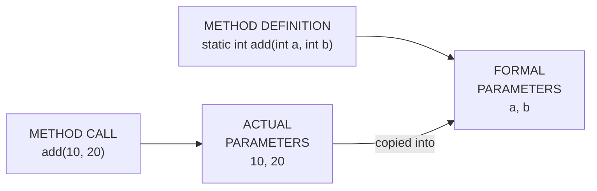
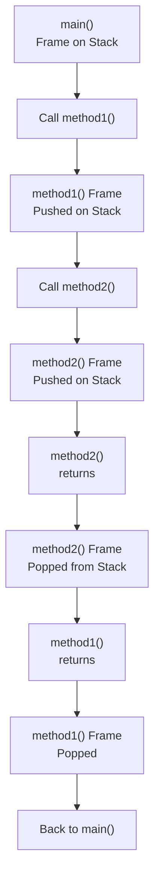
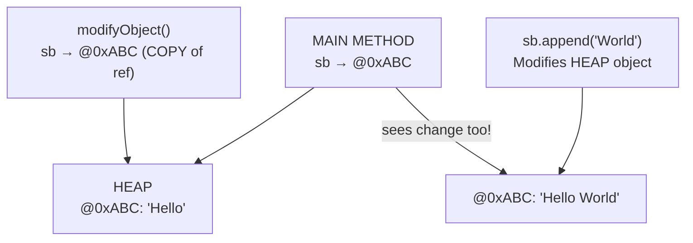
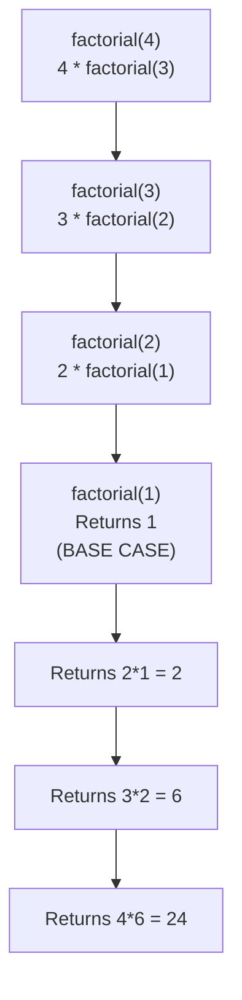

<a id="7-methods-in-java"></a>

# 📘 Chapter 7: Methods in Java

> **Part A: Java Fundamentals — Beginner Foundation**
> `Beginner` | `Foundation` | `Code Reusability`

⭐⭐⭐⭐⭐⭐⭐⭐⭐⭐⭐⭐⭐⭐⭐⭐⭐⭐⭐⭐⭐⭐⭐⭐⭐⭐⭐⭐⭐⭐⭐⭐

Java • Core Java • Interview Preparation

⭐⭐⭐⭐⭐⭐⭐⭐⭐⭐⭐⭐⭐⭐⭐⭐⭐⭐⭐⭐⭐⭐⭐⭐⭐⭐⭐⭐⭐⭐⭐⭐

---

<a id="chapter-index-table-7"></a>

## 📚 Chapter 7 — Index Table

| No. | Topic | Subtopics |
|-----|-------|-----------|
| 7.1 | [What is a Method](#71-what-is-a-method) | Definition, Why Methods, Code Reusability, Predefined vs User-defined Methods |
| 7.2 | [Method Declaration & Signature](#72-method-declaration-signature) | Method Syntax, Signature Definition, Naming Rules |
| 7.3 | [Method Components](#73-method-components) | Access Modifier, Return Type, Method Name, Parameters, Method Body |
| 7.4 | [Return Types & return Statement](#74-return-types-return-statement) | void, Primitive Returns, Object Returns, Multiple Returns, Early Return |
| 7.5 | [Parameters vs Arguments](#75-parameters-vs-arguments) | Formal vs Actual Parameters, Naming Difference |
| 7.6 | [Calling/Invoking Methods](#76-calling-invoking-methods) | Static Method Call, Instance Method Call, Method Chaining |
| 7.7 | [Call Stack & Method Execution](#77-call-stack-method-execution) | Stack Frame, Stack Pointer, Method Execution Flow |
| 7.8 | [Method Overloading](#78-method-overloading) | Same Name Different Signature, Rules, Type Promotion, Ambiguity |
| 7.9 | [Varargs (Variable Arguments)](#79-varargs) | Syntax (...), Rules, With Other Parameters, Ambiguity Issues |
| 7.10 | [Pass by Value in Java (Crucial!)](#710-pass-by-value-in-java) | Java is ALWAYS Pass by Value, Primitives vs Objects, Common Misconception |
| 7.11 | [Recursive Methods](#711-recursive-methods) | Definition, Base Case, Stack Overflow, Examples |
| 7.12 | [Static vs Instance Methods](#712-static-vs-instance-methods) | Static Methods, Instance Methods (Accessor & Mutator), Differences |
| 7.13 | [Method Scope and Lifetime](#713-method-scope-and-lifetime) | Local Variables, Method Execution, Garbage Collection |
| 7.14 | [Method Return Best Practices](#714-method-return-best-practices) | Single Responsibility, Naming, Documentation |
| 🔥 | [Java vs Other Languages](#7-java-vs-other-languages) | Methods in Java vs C++, Python, JavaScript |
| 💡 | [Interview Questions](#7-interview-questions) | 15+ Conceptual · Scenario · Output-based |
| 🧪 | [Practice Problems](#7-practice-problems) | 5 Coding + 5 Theory |

---

## 7.1 What is a Method

<a id="71-what-is-a-method"></a>

### 📌 Definition

```
A METHOD (also called Function) in Java is a BLOCK OF CODE
that performs some SPECIFIC TASK and may or may not return
a result to the caller.

Methods in Java MUST be part of some CLASS.
(Unlike C++ or Python, you CANNOT have standalone functions in Java!)

Main advantage: "CODE REUSABILITY"
→ Write once, use many times
→ Avoids code duplication
→ Easier to maintain and debug
```

### 📌 Why Methods?

```
Without methods:
❌ Same code repeated many times → hard to maintain
❌ Code becomes long and unreadable
❌ Bug fix needs to be done at multiple places
❌ Cannot reuse logic across the program

With methods:
✅ Write logic ONCE, call MANY times
✅ Code becomes modular and organized
✅ Easy to debug (fix in one place)
✅ Improves code readability
✅ Enables abstraction (hide complexity)
✅ Easier testing (test methods independently)
```

### 📌 Two Types of Methods

```
┌──────────────────────────────────────────────────────────────┐
│  Type                │  Description                          │
├──────────────────────┼───────────────────────────────────────┤
│  1. PREDEFINED       │  Already defined in Java class        │
│     (Built-in)       │  libraries.                           │
│                      │  Examples:                            │
│                      │  → System.out.println()              │
│                      │  → Math.sqrt(25)                      │
│                      │  → String.length()                    │
│                      │  → Integer.parseInt()                 │
│                      │  Also called: Standard Library Method │
├──────────────────────┼───────────────────────────────────────┤
│  2. USER-DEFINED     │  Written by the programmer            │
│                      │  according to specific requirements.  │
│                      │  Examples:                            │
│                      │  → calculateTax()                     │
│                      │  → validateEmail()                    │
│                      │  → printStudentDetails()              │
└──────────────────────┴───────────────────────────────────────┘
```

### 🌍 Real-World Analogy (Hinglish)

```
Method ek MACHINE ki tarah hai:

→ Input (parameters) do
→ Process karta hai (method body)
→ Output (return value) deta hai

Example: Juice Machine
- Input: Apple (parameter)
- Process: Crushing, mixing (method body)
- Output: Apple Juice (return value)

Aur kya badhiya baat hai?
→ Ek baar machine banao, hazar baar use karo!
→ Yahi hai CODE REUSABILITY!
```

### 📌 First Method Example

```java
public class MethodDemo {

    // USER-DEFINED METHOD
    static int add(int a, int b) {        // Method declaration
        int sum = a + b;                   // Method body
        return sum;                        // Return statement
    }

    public static void main(String[] args) {
        // CALLING the method
        int result = add(10, 20);          // Call with arguments
        System.out.println("Sum: " + result); // Sum: 30

        // Method can be CALLED MULTIPLE TIMES (reusability!)
        System.out.println(add(5, 7));     // 12
        System.out.println(add(100, 200)); // 300

        // Using PREDEFINED methods
        double sqrt = Math.sqrt(25);       // Built-in: 5.0
        int parsed = Integer.parseInt("42"); // Built-in: 42
    }
}
```

<a href="#chapter-index-table-7">Go to Top 🔝</a>

---

## 7.2 Method Declaration & Signature

<a id="72-method-declaration-signature"></a>

### 📌 Method Syntax

```
<access_modifier> <return_type> <method_name>(list_of_parameters)
{
    // method body
    // statements to execute
    return value;  // if return_type is not void
}
```

### 📌 Method Signature

```
Method SIGNATURE consists of:
→ Method NAME
→ PARAMETER LIST (number, type, and order of parameters)

NOTE: Return type is NOT part of the signature!
(Two methods with same name + parameters but different return
types is NOT valid overloading — compile error!)

Example:
calculate(int a, int b)
→ Method name: calculate
→ Parameters: (int, int)
→ Signature: calculate(int, int)
```

### 📌 Method Naming Rules ⭐

```
1. Method name MUST be a VERB (action word)
   → Methods perform actions: save, get, set, calculate, validate

2. Method name MUST start with LOWERCASE letter

3. If method name has multiple words:
   → First word: VERB (lowercase)
   → Following words: NOUN/ADJECTIVE (each starts with uppercase)
   → Use camelCase!

Examples:
✅ findSum()         (verb + noun)
✅ computeMax()       (verb + noun)
✅ setX(), getX()    (verb + variable name)
✅ isValid()         (verb + adjective)
✅ calculateTotal()  (verb + noun)
✅ printDetails()    (verb + noun)
✅ validateUser()    (verb + noun)

❌ Sum()             (starts with uppercase - looks like class)
❌ student()         (noun - not an action)
❌ calculate_total() (use camelCase, not snake_case)
❌ 1add()            (cannot start with digit)
❌ if()              (cannot use keywords)
```

```java
public class NamingDemo {

    // ✅ GOOD method names (verbs, camelCase)
    static int findMax(int[] arr) { return 0; }
    static String getStudentName(int id) { return ""; }
    static boolean isValidEmail(String email) { return true; }
    static void printAllDetails() { }
    static double calculateInterest(double principal) { return 0; }

    // ❌ BAD method names (avoid these styles)
    // static int Sum() { }              // Starts with uppercase
    // static int sum_total() { }        // snake_case
    // static int sum_of_two() { }       // snake_case
    // static int calculate() { }        // Too generic, not specific
}
```

<a href="#chapter-index-table-7">Go to Top 🔝</a>

---

## 7.3 Method Components

<a id="73-method-components"></a>

### 📌 Complete Breakdown of a Method

```java
public static int calculateSum(int a, int b) throws Exception {
    int sum = a + b;
    return sum;
}
//   ↑      ↑       ↑          ↑           ↑              ↑
//   1      2       3          4           5              6
//
//  Access  Modifier Return    Method      Parameters     Exception
//  Modifier         Type      Name        (Formal Params) List
```

### 📌 6 Components of a Method

```
┌──────────────────────┬───────────────────────────────────────┐
│  Component           │  Description                          │
├──────────────────────┼───────────────────────────────────────┤
│  1. Access Modifier  │  Who can access the method?           │
│                      │  → public, private, protected, default│
│                      │  → OPTIONAL                           │
├──────────────────────┼───────────────────────────────────────┤
│  2. Other Modifiers  │  Special properties of method:        │
│                      │  → static, final, abstract,           │
│                      │  → synchronized, native, strictfp      │
│                      │  → OPTIONAL                           │
├──────────────────────┼───────────────────────────────────────┤
│  3. Return Type      │  What does method return?             │
│                      │  → Primitive: int, double, char, etc. │
│                      │  → Object: String, Array, Class       │
│                      │  → void (returns nothing)             │
│                      │  → MANDATORY                          │
├──────────────────────┼───────────────────────────────────────┤
│  4. Method Name      │  Identifier for the method            │
│                      │  → camelCase, starts with verb        │
│                      │  → MANDATORY                          │
├──────────────────────┼───────────────────────────────────────┤
│  5. Parameters       │  Input values method needs            │
│  (Formal Parameters) │  → Inside parentheses ()              │
│                      │  → Type + Name pairs                  │
│                      │  → Can be empty                       │
├──────────────────────┼───────────────────────────────────────┤
│  6. Exception List   │  Exceptions method might throw        │
│                      │  → throws Keyword                     │
│                      │  → OPTIONAL                           │
│                      │  → Covered in Exception Handling      │
├──────────────────────┼───────────────────────────────────────┤
│  Method Body         │  Actual code inside { }               │
│                      │  → Statements to execute              │
│                      │  → MUST end with return (if non-void) │
└──────────────────────┴───────────────────────────────────────┘
```

### 📌 Real Examples of Each Component

```java
public class MethodComponents {

    // ═══════════════════════════════════════════════
    // EXAMPLE 1: All components
    // ═══════════════════════════════════════════════
    public static int add(int a, int b) {
    // public → access modifier
    // static → modifier
    // int    → return type
    // add    → method name
    // (int a, int b) → parameters
        return a + b;
    }

    // ═══════════════════════════════════════════════
    // EXAMPLE 2: void method (no return)
    // ═══════════════════════════════════════════════
    public static void printHello() {
        System.out.println("Hello!");
        // No return needed for void
    }

    // ═══════════════════════════════════════════════
    // EXAMPLE 3: No parameters
    // ═══════════════════════════════════════════════
    public static int getCurrentYear() {
        return 2024;
    }

    // ═══════════════════════════════════════════════
    // EXAMPLE 4: Multiple parameters of different types
    // ═══════════════════════════════════════════════
    public static String formatStudent(String name, int age, double gpa) {
        return name + " | Age: " + age + " | GPA: " + gpa;
    }

    // ═══════════════════════════════════════════════
    // EXAMPLE 5: With exception list (throws)
    // ═══════════════════════════════════════════════
    public static int parseNumber(String s) throws NumberFormatException {
        return Integer.parseInt(s);
    }

    public static void main(String[] args) {
        System.out.println(add(5, 10));        // 15
        printHello();                            // Hello!
        System.out.println(getCurrentYear());    // 2024
        System.out.println(formatStudent("Rahul", 22, 8.5));
        System.out.println(parseNumber("42"));   // 42
    }
}
```

<a href="#chapter-index-table-7">Go to Top 🔝</a>

---

## 7.4 Return Types & return Statement

<a id="74-return-types-return-statement"></a>

### 📌 Return Type Rules

```
1. EVERY method must declare its return type
2. If method returns nothing → use 'void'
3. If method declares non-void → MUST have return statement
4. Return value type MUST match declared return type
5. Method execution ENDS when return is encountered
```

### 📌 Different Return Types

```java
public class ReturnDemo {

    // ═══ 1. PRIMITIVE return types ═══
    static int getInt() { return 10; }
    static double getDouble() { return 3.14; }
    static char getChar() { return 'A'; }
    static boolean getBoolean() { return true; }
    static long getLong() { return 1000000L; }

    // ═══ 2. OBJECT return types ═══
    static String getName() { return "Rahul"; }
    static int[] getArray() { return new int[]{1, 2, 3}; }
    static java.util.List<String> getList() {
        return java.util.List.of("A", "B", "C");
    }

    // ═══ 3. void (returns NOTHING) ═══
    static void printMessage() {
        System.out.println("Hello");
        // No return needed
    }

    // ═══ 4. void with early return ═══
    static void checkAge(int age) {
        if (age < 0) {
            System.out.println("Invalid age!");
            return;  // EARLY RETURN — exits method
        }
        System.out.println("Age: " + age);
        // 'return' at end of void method is implicit
    }

    // ═══ 5. Multiple return statements ═══
    static String getGrade(int marks) {
        if (marks >= 90) return "A";
        if (marks >= 80) return "B";
        if (marks >= 70) return "C";
        if (marks >= 60) return "D";
        return "F";  // Default
    }

    // ═══ 6. Return type MUST MATCH declared type ═══
    static int wrongReturn() {
        // return "Hello";  // ❌ COMPILE ERROR! Cannot return String when int declared
        return 10;          // ✅ Returns int
    }

    public static void main(String[] args) {
        int x = getInt();              // 10
        String name = getName();       // "Rahul"
        printMessage();                // void return
        System.out.println(getGrade(85)); // "B"
    }
}
```

### 📌 Common Return Mistakes

```java
public class ReturnMistakes {

    // ❌ MISTAKE 1: Missing return statement
    // static int badMethod() {
    //     int x = 10;
    //     // ERROR: Missing return statement
    // }

    // ✅ CORRECT
    static int goodMethod() {
        int x = 10;
        return x;
    }

    // ❌ MISTAKE 2: Unreachable code after return
    static int unreachable() {
        return 10;
        // System.out.println("Never executes"); // ❌ COMPILE ERROR
    }

    // ❌ MISTAKE 3: Conditional return (compiler can't verify)
    // static int conditionalBad(boolean flag) {
    //     if (flag) return 10;
    //     // ERROR: Missing return for else case
    // }

    // ✅ CORRECT
    static int conditionalGood(boolean flag) {
        if (flag) return 10;
        return 0;  // Default for else case
    }
}
```

<a href="#chapter-index-table-7">Go to Top 🔝</a>

---

## 7.5 Parameters vs Arguments

<a id="75-parameters-vs-arguments"></a>

### 📌 Crucial Distinction!

```
PARAMETERS (Formal Parameters):
→ Variables that appear in METHOD DEFINITION
→ Defined inside method signature: (int a, int b)
→ Receive values when method is called

ARGUMENTS (Actual Parameters):
→ Values that appear in METHOD CALL
→ Passed during method invocation: add(10, 20)
→ Get COPIED into parameters

Memory trick:
PARAMETERS = Placeholder (Method Definition)
ARGUMENTS  = Actual values (Method Call)
```

```java
public class ParamsVsArgs {

    // 'a' and 'b' are FORMAL PARAMETERS
    // They are placeholders defined in method signature
    static int add(int a, int b) {
        return a + b;
    }

    public static void main(String[] args) {
        int x = 10;
        int y = 20;

        // 'x' and 'y' are ACTUAL PARAMETERS (Arguments)
        // Their values (10, 20) get COPIED to a, b
        int result = add(x, y);
        // Or directly:
        int result2 = add(5, 10);  // 5, 10 are arguments

        System.out.println(result);  // 30
        System.out.println(result2); // 15

        /*
        Step-by-step:
        1. add(x, y) is called
        2. Values of x (10) and y (20) are COPIED
        3. a = 10, b = 20 inside the method
        4. method computes a + b = 30
        5. Returns 30
        */
    }
}
```

### 📊 Parameters vs Arguments Visual



<a href="#chapter-index-table-7">Go to Top 🔝</a>

---

## 7.6 Calling/Invoking Methods

<a id="76-calling-invoking-methods"></a>

### 📌 Different Ways to Call Methods

```java
public class MethodCalling {

    // STATIC method
    static int addStatic(int a, int b) {
        return a + b;
    }

    // INSTANCE method
    int addInstance(int a, int b) {
        return a + b;
    }

    public static void main(String[] args) {

        // ═══ 1. Calling STATIC method ═══
        // Inside SAME class: just method name
        int r1 = addStatic(10, 20);
        System.out.println(r1);  // 30

        // From OUTSIDE the class: ClassName.method()
        int r2 = MethodCalling.addStatic(5, 15);
        System.out.println(r2);  // 20

        // Predefined static method
        double sqrt = Math.sqrt(25);  // Math is class, sqrt is static method

        // ═══ 2. Calling INSTANCE method ═══
        // MUST create object first
        MethodCalling obj = new MethodCalling();
        int r3 = obj.addInstance(10, 20);  // Call via object
        System.out.println(r3);  // 30

        // ═══ 3. Method CHAINING ═══
        // Calling multiple methods one after another
        String text = "  HELLO WORLD  ";
        String result = text.trim().toLowerCase().replace("o", "0");
        // 1. text.trim() → "HELLO WORLD"
        // 2. .toLowerCase() → "hello world"
        // 3. .replace("o", "0") → "hell0 w0rld"
        System.out.println(result);  // hell0 w0rld
    }
}
```

### 📌 When Does a Method Return Control?

```
A method returns to the CALLER when:

1. It COMPLETES all the statements in the method
   → Reaches the closing }
   → Implicit return for void methods

2. It REACHES a return statement
   → Explicit return value (non-void)
   → Early return (any time during execution)

3. It THROWS an EXCEPTION
   → Method terminates abnormally
   → Control passes to exception handler
```

```java
public class MethodReturns {

    static void example1() {
        System.out.println("Statement 1");
        System.out.println("Statement 2");
        // Method ends here (reaches closing brace)
    }

    static int example2() {
        return 42;  // Explicit return
        // Anything after this is unreachable
    }

    static void example3(int x) {
        if (x < 0) {
            System.out.println("Negative!");
            return;  // Early return
        }
        System.out.println("Positive: " + x);
    }

    static int example4() {
        throw new RuntimeException("Error!");  // Throws exception
        // Method exits via exception
    }
}
```

<a href="#chapter-index-table-7">Go to Top 🔝</a>

---

## 7.7 Call Stack & Method Execution

<a id="77-call-stack-method-execution"></a>

### 📌 How Method Calls Work in Memory

```
Method calls are implemented through a STACK.

Whenever a method is called:
1. A STACK FRAME is created within the STACK AREA
2. The frame stores:
   → Arguments passed to the method
   → Local variables declared in the method
   → Return address (where to go back after method ends)
   → Value to be returned

When method execution finishes:
→ The allocated stack frame is DELETED (popped from stack)
→ Control returns to the calling method

STACK POINTER REGISTER tracks the top of the stack
and is adjusted accordingly.
```

### 📊 Call Stack Execution



```java
public class CallStackDemo {

    public static void main(String[] args) {
        System.out.println("main() starts");
        int result = methodA(5);
        System.out.println("Result: " + result);
        System.out.println("main() ends");
    }

    static int methodA(int x) {
        System.out.println("methodA starts");
        int y = methodB(x);
        System.out.println("methodA ends");
        return y * 2;
    }

    static int methodB(int n) {
        System.out.println("methodB starts");
        int result = n + 10;
        System.out.println("methodB ends");
        return result;
    }
}

/*
EXECUTION ORDER (with Call Stack):

main() starts
[Stack: main()]

methodA(5) called
[Stack: main() → methodA(x=5)]
methodA starts

methodB(5) called
[Stack: main() → methodA(x=5) → methodB(n=5)]
methodB starts
methodB ends (returns 15)
[Stack: main() → methodA(x=5)]  ← methodB frame popped

methodA ends (returns 30)
[Stack: main()]  ← methodA frame popped

Result: 30
main() ends
[Stack: empty]
*/
```

### 📌 Stack Overflow (When Stack is Full)

```java
public class StackOverflowDemo {

    // Infinite recursion → StackOverflowError!
    static void infinite() {
        infinite();  // Calls itself forever
        // Each call adds a frame to the stack
        // Stack eventually fills up → StackOverflowError
    }

    public static void main(String[] args) {
        try {
            infinite();
        } catch (StackOverflowError e) {
            System.out.println("Stack overflowed!");
        }
    }
}
```

<a href="#chapter-index-table-7">Go to Top 🔝</a>

---

## 7.8 Method Overloading ⭐

<a id="78-method-overloading"></a>

### 📌 What is Method Overloading?

```
When there are TWO OR MORE methods in a class that have:
→ The SAME NAME
→ But DIFFERENT PARAMETERS

It is known as METHOD OVERLOADING.

Java allows a method to have the same name if it can DISTINGUISH
them by their:
→ Number of arguments
→ Type of arguments
→ Order of arguments

Note: Return type DOES NOT matter for overloading!
```

### 📌 Rules for Method Overloading

```
For overloading, methods must differ in:
1. ✅ NUMBER of parameters
2. ✅ TYPE of parameters
3. ✅ ORDER of parameters

What does NOT matter:
❌ Return type
❌ Parameter names
❌ Access modifiers
❌ Exception list
```

```java
public class OverloadDemo {

    // ═══ 1. Different NUMBER of parameters ═══
    static int add(int a, int b) {
        return a + b;
    }

    static int add(int a, int b, int c) {
        return a + b + c;
    }

    // ═══ 2. Different TYPE of parameters ═══
    static int add(int a, int b) {  // Already exists, skip
        return a + b;
    }

    static double add(double a, double b) {  // Different types
        return a + b;
    }

    static String add(String a, String b) {  // String concatenation
        return a + b;
    }

    // ═══ 3. Different ORDER of parameters ═══
    static void print(int x, String s) {
        System.out.println(x + " " + s);
    }

    static void print(String s, int x) {  // Reversed order
        System.out.println(s + " " + x);
    }

    // ═══ 4. INVALID overloading ═══
    // static double add(int a, int b) {    // ❌ Same params!
    //     return a + b;                     // Only return type differs
    // }

    public static void main(String[] args) {
        System.out.println(add(5, 10));           // calls add(int, int) → 15
        System.out.println(add(5, 10, 15));       // calls add(int, int, int) → 30
        System.out.println(add(5.5, 10.5));       // calls add(double, double) → 16.0
        System.out.println(add("Hello", " World")); // calls add(String, String)
        print(10, "items");                        // calls print(int, String)
        print("Count:", 10);                       // calls print(String, int)
    }
}
```

### 📌 Type Promotion in Overloading

```java
public class TypePromotion {

    static void show(int x) {
        System.out.println("int: " + x);
    }

    static void show(long x) {
        System.out.println("long: " + x);
    }

    static void show(double x) {
        System.out.println("double: " + x);
    }

    public static void main(String[] args) {
        show(10);        // int → calls show(int)
        show(10L);       // long → calls show(long)
        show(10.5);      // double → calls show(double)

        byte b = 5;
        show(b);         // byte promoted to int → calls show(int)
        // If show(int) didn't exist, would promote further to long, double

        // Type promotion order:
        // byte → short → int → long → float → double
        // char → int → long → float → double
    }
}
```

### 📌 Overloading Ambiguity

```java
public class OverloadAmbiguity {

    static void show(int x, double y) {
        System.out.println("int, double");
    }

    static void show(double x, int y) {
        System.out.println("double, int");
    }

    public static void main(String[] args) {
        // show(10, 20);     // ❌ AMBIGUOUS! Both could match
        // Compiler error: reference to show is ambiguous

        show(10, 20.0);  // ✅ Clear: int, double
        show(10.0, 20);  // ✅ Clear: double, int

        // To force selection, use explicit cast:
        show((double)10, 20);  // double, int
    }
}
```

<a href="#chapter-index-table-7">Go to Top 🔝</a>

---

## 7.9 Varargs (Variable Arguments)

<a id="79-varargs"></a>

### 📌 What is Varargs?

```
VARARGS (Variable Arguments) allow a method to accept
ZERO OR MORE arguments of a specified type.

Introduced in Java 5.

Syntax: dataType... variableName
        (three dots after type)

Internally, varargs is treated as an ARRAY.
```

```java
public class VarargsDemo {

    // Varargs syntax
    static int sum(int... numbers) {
        int total = 0;
        for (int num : numbers) {
            total += num;
        }
        return total;
    }

    // Varargs with String
    static void printAll(String... messages) {
        for (String msg : messages) {
            System.out.println(msg);
        }
    }

    public static void main(String[] args) {
        // Call with DIFFERENT number of arguments
        System.out.println(sum());              // 0 (zero args)
        System.out.println(sum(10));            // 10
        System.out.println(sum(10, 20));        // 30
        System.out.println(sum(10, 20, 30));    // 60
        System.out.println(sum(1, 2, 3, 4, 5)); // 15

        // Can also pass an ARRAY
        int[] arr = {1, 2, 3, 4, 5};
        System.out.println(sum(arr));           // 15

        printAll("Hello", "World", "Java");
    }
}
```

### 📌 Rules for Varargs

```
1. Varargs parameter MUST be the LAST parameter
   ✅ void method(int a, String... s)
   ❌ void method(int... a, String s)

2. A method can have ONLY ONE varargs parameter
   ❌ void method(int... a, double... b)  // ERROR!

3. Varargs is treated as an ARRAY internally
```

```java
public class VarargsRules {

    // ✅ Varargs is LAST parameter
    static void method1(int x, String name, double... values) {
        System.out.println("x=" + x + ", name=" + name);
        for (double v : values) System.out.println(v);
    }

    // ❌ Varargs MUST be last
    // static void method2(double... values, int x) {} // COMPILE ERROR

    // ❌ Only ONE varargs allowed
    // static void method3(int... a, int... b) {}      // COMPILE ERROR

    public static void main(String[] args) {
        method1(10, "Rahul");                  // No varargs
        method1(10, "Rahul", 3.14);            // 1 varargs
        method1(10, "Rahul", 3.14, 2.71, 1.41); // 3 varargs
    }
}
```

### 📌 Varargs vs Overloading Ambiguity

```java
public class VarargsAmbiguity {

    static void show(int x, int y) {
        System.out.println("Two ints");
    }

    static void show(int... numbers) {
        System.out.println("Varargs");
    }

    public static void main(String[] args) {
        show(10, 20);  // Calls show(int, int) — exact match wins
        show(10);       // Calls show(int...) — only varargs matches
        show(10, 20, 30); // Calls show(int...) — only varargs matches
        show();         // Calls show(int...) — zero args

        // RULE: Exact match preferred over varargs
    }
}
```

> [!TIP]
> **Real-World Example:** `System.out.printf()` uses varargs:
> `System.out.printf("Name: %s, Age: %d, GPA: %.2f%n", name, age, gpa);`
> You can pass any number of arguments to printf!

<a href="#chapter-index-table-7">Go to Top 🔝</a>

---

## 7.10 Pass by Value in Java ⭐⭐⭐ (CRUCIAL!)

<a id="710-pass-by-value-in-java"></a>

### 📌 The MOST IMPORTANT Concept!

```
🔥 JAVA IS ALWAYS PASS BY VALUE — NEVER PASS BY REFERENCE!

This is one of the BIGGEST misconceptions in Java.
Even when working with objects, Java passes a COPY of the reference,
not the reference itself.

In Java:
→ ALL PRIMITIVES (int, char, boolean, etc.) → Pass by VALUE
  → A copy of the VALUE is passed to the method

→ ALL NON-PRIMITIVES (objects, arrays) → Pass by VALUE of REFERENCE
  → A COPY of the REFERENCE (memory address) is passed
  → Both references point to the SAME object on Heap
  → Java creates a COPY of references and passes it to method,
    but they still point to SAME memory reference
```

### 📌 Pass by Value for PRIMITIVES

```java
public class PassByValuePrimitive {

    static void changeValue(int x) {
        x = 100;  // Only modifies the LOCAL copy
        System.out.println("Inside method: x = " + x);
    }

    public static void main(String[] args) {
        int num = 10;
        System.out.println("Before: num = " + num); // 10

        changeValue(num);  // Pass the VALUE (10) to method

        System.out.println("After: num = " + num);  // 10 (UNCHANGED!)

        /*
        EXPLANATION:
        1. num = 10 (in main, on Stack)
        2. changeValue(num) is called
        3. A COPY of num's value (10) is passed
        4. Inside method, x = 10 (a different memory location!)
        5. x = 100 modifies only the copy
        6. Original num in main remains 10

        Java passes the VALUE, not the variable itself!
        */
    }
}
```

### 📌 Pass by Value of REFERENCE for OBJECTS

```java
public class PassByReference {

    static void modifyObject(StringBuilder sb) {
        sb.append(" World");  // Modifies the OBJECT via copied reference
        System.out.println("Inside method: " + sb);
    }

    static void replaceObject(StringBuilder sb) {
        sb = new StringBuilder("New Object");  // Reassigns LOCAL reference
        System.out.println("Inside method: " + sb);
    }

    public static void main(String[] args) {
        StringBuilder sb = new StringBuilder("Hello");

        // ═══ Case 1: MODIFY the object ═══
        modifyObject(sb);
        System.out.println("After modify: " + sb);  // "Hello World" ✅

        /*
        WHY did it change?
        1. sb in main holds reference to StringBuilder("Hello") on Heap
        2. modifyObject(sb) called
        3. Method receives a COPY of the reference (both point to SAME object)
        4. sb.append(" World") modifies the OBJECT on Heap
        5. Original sb in main also sees the change (same object!)
        */

        StringBuilder sb2 = new StringBuilder("Hello");

        // ═══ Case 2: REPLACE the reference ═══
        replaceObject(sb2);
        System.out.println("After replace: " + sb2);  // "Hello" (UNCHANGED!)

        /*
        WHY didn't it change?
        1. sb2 in main holds reference to StringBuilder("Hello")
        2. replaceObject(sb2) called
        3. Method receives a COPY of the reference
        4. Inside method, sb = new StringBuilder("New Object")
        5. This REASSIGNS the LOCAL copy to point to a NEW object
        6. Original sb2 in main STILL points to "Hello"
        7. The "New Object" is local to method, lost after method ends
        */
    }
}
```

### 📊 Pass by Value Visualization



### 📌 Common Misconception Cleared ⭐

```java
public class MisconceptionDemo {

    static void changeName(String s) {
        s = "Changed";  // Reassigns LOCAL reference
    }

    static void modifyList(java.util.List<Integer> list) {
        list.add(100);  // MODIFIES the object
    }

    static void replaceList(java.util.List<Integer> list) {
        list = new java.util.ArrayList<>();  // REASSIGNS local ref
        list.add(999);
    }

    public static void main(String[] args) {

        // String example
        String name = "Original";
        changeName(name);
        System.out.println(name);  // "Original" (Strings are immutable + Java pass by value!)

        // List example - MODIFICATION
        java.util.List<Integer> list1 = new java.util.ArrayList<>();
        list1.add(1);
        list1.add(2);
        modifyList(list1);
        System.out.println(list1);  // [1, 2, 100] - MODIFIED!

        // List example - REPLACEMENT
        java.util.List<Integer> list2 = new java.util.ArrayList<>();
        list2.add(1);
        list2.add(2);
        replaceList(list2);
        System.out.println(list2);  // [1, 2] - UNCHANGED!
        // The "new list" inside method is local, lost after method ends
    }
}
```

> [!IMPORTANT]
> **The Golden Rule:**
> - Java is ALWAYS pass by value
> - For primitives → copy of VALUE
> - For objects → copy of REFERENCE (both point to same object)
> - You CAN modify object state through the copied reference
> - You CANNOT make the original reference point to a different object
>
> This is the **#1 most common interview question** about methods!

<a href="#chapter-index-table-7">Go to Top 🔝</a>

---

## 7.11 Recursive Methods

<a id="711-recursive-methods"></a>

### 📌 What is Recursion?

```
RECURSION = A method that CALLS ITSELF (directly or indirectly).

Every recursive method MUST have:
1. BASE CASE → Condition to stop recursion (otherwise infinite!)
2. RECURSIVE CASE → Method calls itself with modified input

Without a base case → StackOverflowError!
```

```java
public class RecursionDemo {

    // ═══ Example 1: Factorial ═══
    // factorial(5) = 5 * 4 * 3 * 2 * 1 = 120
    static int factorial(int n) {
        // BASE CASE
        if (n <= 1) {
            return 1;
        }
        // RECURSIVE CASE
        return n * factorial(n - 1);
    }

    // ═══ Example 2: Fibonacci ═══
    // 0, 1, 1, 2, 3, 5, 8, 13, ...
    static int fibonacci(int n) {
        if (n <= 1) return n;  // Base case
        return fibonacci(n - 1) + fibonacci(n - 2);  // Recursive
    }

    // ═══ Example 3: Sum of N numbers ═══
    static int sumN(int n) {
        if (n == 0) return 0;        // Base case
        return n + sumN(n - 1);      // Recursive
    }

    // ═══ Example 4: Power (base^exp) ═══
    static int power(int base, int exp) {
        if (exp == 0) return 1;      // Base case
        return base * power(base, exp - 1);  // Recursive
    }

    public static void main(String[] args) {
        System.out.println(factorial(5));   // 120
        System.out.println(fibonacci(10));  // 55
        System.out.println(sumN(100));      // 5050
        System.out.println(power(2, 10));   // 1024
    }
}
```

### 📊 Recursion Stack Trace



### 📌 Recursion Pitfalls

```java
public class RecursionPitfalls {

    // ❌ NO BASE CASE → StackOverflowError!
    static int badRecursion(int n) {
        return n + badRecursion(n - 1);  // No base case!
    }

    // ❌ WRONG BASE CASE → Infinite recursion
    // static int badFactorial(int n) {
    //     if (n == 100) return 1;  // Never reached for small n
    //     return n * badFactorial(n - 1);
    // }

    // ❌ INEFFICIENT (recalculates same values)
    // fibonacci(50) takes very long! Use memoization!

    public static void main(String[] args) {
        try {
            badRecursion(10);
        } catch (StackOverflowError e) {
            System.out.println("Stack overflow!");
        }
    }
}
```

<a href="#chapter-index-table-7">Go to Top 🔝</a>

---

## 7.12 Static vs Instance Methods

<a id="712-static-vs-instance-methods"></a>

### 📌 Two Types of Methods

```java
public class MethodTypes {

    int instanceVar = 100;
    static int staticVar = 200;

    // ═══ STATIC METHOD ═══
    // → Belongs to CLASS (not object)
    // → Can be called WITHOUT creating object
    // → Can access ONLY static members directly
    // → Cannot use 'this' keyword
    static void staticMethod() {
        System.out.println("Static method called");
        System.out.println("Static var: " + staticVar);  // ✅ OK
        // System.out.println(instanceVar);  // ❌ ERROR! Need object
        // System.out.println(this.staticVar); // ❌ Cannot use 'this'
    }

    // ═══ INSTANCE METHOD ═══
    // → Belongs to OBJECT (instance)
    // → MUST create object to call
    // → Can access BOTH static AND instance members
    // → Can use 'this' keyword
    void instanceMethod() {
        System.out.println("Instance method called");
        System.out.println("Instance var: " + instanceVar);  // ✅ OK
        System.out.println("Static var: " + staticVar);      // ✅ OK
        System.out.println(this.instanceVar);                // ✅ OK
    }

    public static void main(String[] args) {
        // ═══ Call STATIC method ═══
        staticMethod();              // No object needed
        MethodTypes.staticMethod();  // Or via class name

        // ═══ Call INSTANCE method ═══
        MethodTypes obj = new MethodTypes();  // Create object first
        obj.instanceMethod();                  // Call via object
    }
}
```

### 📌 Types of Instance Methods ⭐

```
There are 2 types of INSTANCE methods (non-static):

1. ACCESSOR METHOD (Getter)
   → READS the instance variable(s)
   → Also known as GETTERS
   → Naming convention: getXxx() or isXxx() (for boolean)
   → Returns the value

2. MUTATOR METHOD (Setter)
   → READS and MODIFIES the instance variable(s)
   → Also known as SETTERS
   → Naming convention: setXxx()
   → Usually returns void
```

```java
public class StudentClass {

    // Instance variables (private — data hiding!)
    private String name;
    private int age;
    private boolean isActive;

    // ═══ ACCESSOR METHODS (Getters) ═══
    public String getName() {
        return name;  // READS the variable
    }

    public int getAge() {
        return age;
    }

    public boolean isActive() {  // 'is' prefix for boolean
        return isActive;
    }

    // ═══ MUTATOR METHODS (Setters) ═══
    public void setName(String name) {
        this.name = name;  // MODIFIES the variable
    }

    public void setAge(int age) {
        if (age >= 0 && age <= 150) {  // Validation in setter
            this.age = age;
        }
    }

    public void setActive(boolean active) {
        this.isActive = active;
    }

    public static void main(String[] args) {
        StudentClass s = new StudentClass();
        s.setName("Rahul");      // MUTATOR (setter)
        s.setAge(22);            // MUTATOR
        s.setActive(true);       // MUTATOR

        System.out.println(s.getName());    // ACCESSOR (getter)
        System.out.println(s.getAge());     // ACCESSOR
        System.out.println(s.isActive());   // ACCESSOR (boolean)
    }
}
```

### 📌 Static vs Instance Methods Comparison

```
┌──────────────────────┬───────────────────┬───────────────────┐
│  Feature             │  Static Method    │  Instance Method  │
├──────────────────────┼───────────────────┼───────────────────┤
│  Belongs to          │  Class            │  Object           │
├──────────────────────┼───────────────────┼───────────────────┤
│  Object needed?      │  ❌ No            │  ✅ Yes           │
├──────────────────────┼───────────────────┼───────────────────┤
│  Call via            │  ClassName.method │  object.method()  │
├──────────────────────┼───────────────────┼───────────────────┤
│  Access static vars  │  ✅ Yes           │  ✅ Yes           │
├──────────────────────┼───────────────────┼───────────────────┤
│  Access instance vars│  ❌ Need object   │  ✅ Yes (direct)  │
├──────────────────────┼───────────────────┼───────────────────┤
│  Use 'this'?         │  ❌ No            │  ✅ Yes           │
├──────────────────────┼───────────────────┼───────────────────┤
│  Memory              │  Method Area      │  Method Area      │
├──────────────────────┼───────────────────┼───────────────────┤
│  Override?           │  ❌ Can't (hides) │  ✅ Yes           │
└──────────────────────┴───────────────────┴───────────────────┘
```

<a href="#chapter-index-table-7">Go to Top 🔝</a>

---

## 7.13 Method Scope and Lifetime

<a id="713-method-scope-and-lifetime"></a>

### 📌 Method Scope

```java
public class MethodScopeDemo {

    int instanceVar = 100;       // Visible to all methods of object
    static int staticVar = 200;  // Visible to all methods of class

    void method1() {
        int local1 = 10;  // Visible ONLY in method1
        System.out.println(local1);
        System.out.println(instanceVar);  // ✅ Accessible
        System.out.println(staticVar);    // ✅ Accessible

        // Block scope
        {
            int blockVar = 50;  // Visible ONLY in this block
            System.out.println(blockVar);
        }
        // System.out.println(blockVar);  // ❌ Out of scope!
    }

    void method2() {
        // System.out.println(local1);  // ❌ Not visible in method2!
        System.out.println(instanceVar);  // ✅ Still accessible
    }

    public static void main(String[] args) {
        MethodScopeDemo obj = new MethodScopeDemo();
        obj.method1();
        obj.method2();
    }
}
```

### 📌 Method Lifetime

```
Methods don't have "lifetime" themselves — they EXIST in memory
when the class is loaded (in Method Area).

LIFETIME refers to LOCAL VARIABLES inside the method:

1. Local variable CREATED when method is CALLED
   → Stack frame created
   → Variables allocated on stack

2. Local variable DESTROYED when method RETURNS
   → Stack frame popped
   → Variables removed from memory

Garbage Collection eligibility:
→ Local primitive variables: destroyed when method exits
→ Local object references: removed, but actual object
  becomes eligible for GC only if no other reference exists
```

```java
public class MethodLifetime {

    static Object getObject() {
        Object obj = new Object();  // Created on Heap
        return obj;                  // Object survives — reference returned
    }

    static void noReturn() {
        Object obj = new Object();  // Created
        // Method ends, obj goes out of scope
        // Object becomes eligible for GC
    }

    public static void main(String[] args) {
        Object o = getObject();  // Object still exists (referenced)
        noReturn();              // Object inside is destroyed (no reference)
    }
}
```

<a href="#chapter-index-table-7">Go to Top 🔝</a>

---

## 7.14 Method Return Best Practices

<a id="714-method-return-best-practices"></a>

### 📌 Good Method Design

```java
public class GoodMethods {

    // ✅ 1. SINGLE RESPONSIBILITY — Method does ONE thing
    static int calculateTax(double income) {
        return (int)(income * 0.30);
    }

    // ✅ 2. DESCRIPTIVE NAME (verb-based)
    static boolean isValidEmail(String email) {
        return email != null && email.contains("@");
    }

    // ✅ 3. EARLY RETURN — Reduce nesting
    static String getGrade(int marks) {
        if (marks < 0 || marks > 100) return "Invalid";
        if (marks >= 90) return "A";
        if (marks >= 80) return "B";
        if (marks >= 70) return "C";
        return "F";
    }

    // ✅ 4. PARAMETERS WITH VALIDATION
    static int divide(int a, int b) {
        if (b == 0) throw new ArithmeticException("Division by zero");
        return a / b;
    }

    // ✅ 5. RETURN MEANINGFUL VALUES (avoid magic numbers)
    static final int SUCCESS = 0;
    static final int FAILURE = -1;
    static int processData() {
        // ... logic
        return SUCCESS;
    }

    // ✅ 6. SHORT METHODS (Easy to understand)
    // Aim for under 20 lines per method
}
```

### 📌 Bad Method Examples (Avoid!)

```java
public class BadMethods {

    // ❌ 1. TOO MANY RESPONSIBILITIES
    static void doEverything(String name) {
        // Validates email, sends email, updates DB, logs activity...
        // SPLIT into multiple methods!
    }

    // ❌ 2. UNCLEAR NAME
    static int x(int a, int b) {  // What does this do?
        return a + b;
    }

    // ❌ 3. DEEP NESTING
    static void badNesting(int a) {
        if (a > 0) {
            if (a > 10) {
                if (a > 100) {
                    if (a > 1000) {
                        // Hard to read!
                    }
                }
            }
        }
    }

    // ❌ 4. TOO MANY PARAMETERS (more than 4-5)
    static void tooManyParams(int a, int b, int c, int d, int e, int f, int g) {
        // Use an object instead!
    }

    // ❌ 5. SIDE EFFECTS
    static int badMethod(int x) {
        System.out.println("Side effect!");  // Unexpected behavior
        return x * 2;
    }
}
```

<a href="#chapter-index-table-7">Go to Top 🔝</a>

---

<a id="7-java-vs-other-languages"></a>

## 🔥 What Makes Java DIFFERENT — Methods

> [!IMPORTANT]
> Java's approach to methods is **UNIQUE** in several ways compared to other languages.

```
┌──────────────────────┬────────────┬────────────┬────────────┬────────────┐
│  Feature             │  Java      │  C++       │  Python    │  JavaScript│
├──────────────────────┼────────────┼────────────┼────────────┼────────────┤
│  Standalone          │ ❌ NO!     │ ✅ Yes     │ ✅ Yes     │ ✅ Yes    │
│  Functions           │ Must be    │ Free       │ def fn():  │ function  │
│                      │ in class   │ functions  │            │ fn()      │
├──────────────────────┼────────────┼────────────┼────────────┼────────────┤
│  Pass by value       │ ✅ ALWAYS  │ ✅ Default │ Object ref │ Object ref│
│                      │ (copy)     │ (or &ref)  │ (mutable)  │ (mutable) │
├──────────────────────┼────────────┼────────────┼────────────┼────────────┤
│  Pass by reference   │ ❌ NEVER!  │ ✅ Yes (&) │ N/A        │ N/A       │
│                      │ Only value │            │            │            │
├──────────────────────┼────────────┼────────────┼────────────┼────────────┤
│  Method Overloading  │ ✅ Yes     │ ✅ Yes     │ ❌ No      │ ❌ No     │
│                      │            │            │ (last one  │ (last one │
│                      │            │            │ wins)      │ wins)     │
├──────────────────────┼────────────┼────────────┼────────────┼────────────┤
│  Default Parameters  │ ❌ NO!     │ ✅ Yes     │ ✅ Yes     │ ✅ Yes    │
│                      │ (use      │ void fn    │ def fn     │ function  │
│                      │ overload)  │ (int x=5)  │ (x=5)      │ fn(x=5)   │
├──────────────────────┼────────────┼────────────┼────────────┼────────────┤
│  Named Arguments     │ ❌ NO      │ ❌ No      │ ✅ Yes     │ ❌ No     │
│                      │            │            │ fn(x=5)    │            │
├──────────────────────┼────────────┼────────────┼────────────┼────────────┤
│  Varargs             │ ✅ int...  │ ✅ ...     │ ✅ *args   │ ✅ ...    │
│                      │            │            │            │ (rest)    │
├──────────────────────┼────────────┼────────────┼────────────┼────────────┤
│  Multiple Returns    │ ❌ NO      │ ❌ Use     │ ✅ Tuples  │ ❌ Use   │
│                      │ (use class │ tuple/pair │            │ array/obj │
│                      │ or array)  │            │            │            │
├──────────────────────┼────────────┼────────────┼────────────┼────────────┤
│  First-class         │ ⚠️ Lambda  │ ❌ No      │ ✅ Yes     │ ✅ Yes    │
│  Functions           │ (Java 8+)  │ (function  │            │            │
│                      │            │ pointer)   │            │            │
└──────────────────────┴────────────┴────────────┴────────────┴────────────┘
```

### 🎯 Key UNIQUE Points

```
1. EVERYTHING INSIDE A CLASS:
   → Java has NO standalone functions!
   → Even main() must be in a class
   → This is UNIQUE to Java (C++, Python, JS allow free functions)

2. PASS BY VALUE ONLY:
   → Java NEVER passes by reference (no C++ &)
   → For objects: passes COPY of reference
   → Most confusing concept for C++ programmers

3. NO DEFAULT PARAMETERS:
   → Java doesn't support: void method(int x = 5)
   → Must use METHOD OVERLOADING instead
   → C++, Python, JS all support default params

4. NO NAMED ARGUMENTS:
   → Cannot do: method(name="Rahul", age=22)
   → Python: ✅ Yes, Java: ❌ No

5. NO MULTIPLE RETURNS:
   → Cannot return: return a, b, c;
   → Must use: array, object, or custom class
   → Python returns tuples naturally

6. METHOD OVERLOADING:
   → Java supports it (compile-time polymorphism)
   → Python doesn't (last defined wins)
   → C++ supports it like Java
```

<a href="#chapter-index-table-7">Go to Top 🔝</a>

---

<a id="7-interview-questions"></a>

## 💡 Chapter 7 — Interview Questions (15+)

---

### 🔵 Conceptual Questions

**Q1. What is a method? Why are methods important?**

```
A method is a block of code that performs a specific task
and may or may not return a result.

Importance:
✅ Code Reusability — Write once, use many times
✅ Modular Programming — Break complex problems into pieces
✅ Easier Maintenance — Fix bugs in one place
✅ Abstraction — Hide implementation details
✅ Testability — Test individual methods independently

In Java, ALL methods must be inside a class (no standalone).
```

---

**Q2. What is a Method Signature?**

```
Method Signature = Method NAME + PARAMETER LIST
(number, type, and order of parameters)

NOTE: Return type is NOT part of signature!

Example:
calculate(int a, int b)
→ Signature: calculate(int, int)

Two methods with same signature but different return types
will cause COMPILE ERROR — that's NOT valid overloading.
```

---

**Q3. What is the difference between Parameters and Arguments?**

```
PARAMETERS (Formal Parameters):
→ Variables in METHOD DEFINITION
→ Placeholders: void method(int x, String s) → x, s are parameters

ARGUMENTS (Actual Parameters):
→ Values in METHOD CALL
→ Actual data: method(10, "Hello") → 10, "Hello" are arguments

Arguments are COPIED into Parameters (pass by value).
```

---

**Q4. What is Method Overloading?**

```
Method Overloading = Multiple methods in SAME class with
SAME NAME but DIFFERENT PARAMETERS.

Rules — Must differ in:
1. ✅ Number of parameters
2. ✅ Type of parameters
3. ✅ Order of parameters

Does NOT matter:
❌ Return type
❌ Parameter names
❌ Access modifiers

Example:
int add(int a, int b)         // Original
int add(int a, int b, int c)  // Different number ✅
double add(double a, double b) // Different type ✅
```

---

**Q5. Is Java pass by value or pass by reference?**

```
JAVA IS ALWAYS PASS BY VALUE — NEVER pass by reference!

For PRIMITIVES:
→ Copy of VALUE is passed
→ Changes inside method don't affect original

For OBJECTS:
→ Copy of REFERENCE (memory address) is passed
→ BOTH references point to SAME object on Heap
→ You CAN modify object state (visible to caller)
→ You CANNOT make original reference point to different object

This is the #1 most asked Java interview question!
Use "pass by value of reference" for objects.
```

---

**Q6. What is the Call Stack?**

```
The Call Stack is a memory structure that manages method calls.

When a method is called:
1. A STACK FRAME is created (pushed onto stack)
2. Frame stores: arguments, local variables, return address
3. When method returns → frame is POPPED off stack

When stack is full (e.g., infinite recursion):
→ StackOverflowError is thrown

Stack pointer tracks the top of the stack.
```

---

**Q7. What is Varargs? When was it introduced?**

```
Varargs (Variable Arguments) allow a method to accept
ZERO OR MORE arguments of a type.

Introduced in Java 5.

Syntax: int... numbers (three dots)

Rules:
1. Varargs MUST be the last parameter
2. Only ONE varargs per method
3. Internally treated as an array

Example:
static int sum(int... nums) {
    int total = 0;
    for (int n : nums) total += n;
    return total;
}

sum();              // 0
sum(1, 2, 3);       // 6
sum(1, 2, 3, 4, 5); // 15
```

---

**Q8. What is the difference between Static and Instance methods?**

```
STATIC METHOD:
→ Belongs to CLASS
→ Called WITHOUT object: ClassName.method()
→ Cannot use 'this' or 'super'
→ Can ONLY access static members directly
→ Cannot be overridden (method hiding instead)

INSTANCE METHOD:
→ Belongs to OBJECT
→ MUST create object first: obj.method()
→ Can use 'this' and 'super'
→ Can access BOTH static AND instance members
→ Can be overridden

main() is static so JVM can call it without creating object.
```

---

**Q9. What are Accessor and Mutator methods?**

```
ACCESSOR Methods (Getters):
→ READ instance variables
→ Convention: getXxx() or isXxx() (for boolean)
→ Returns the value

MUTATOR Methods (Setters):
→ MODIFY instance variables
→ Convention: setXxx()
→ Usually returns void
→ Can include validation

Example:
private int age;

public int getAge() { return age; }            // Accessor
public void setAge(int age) {                   // Mutator
    if (age > 0) this.age = age;               // With validation
}
```

---

### 🟡 Scenario-Based Questions

**Q10. Can a method return multiple values in Java?**

```
NO, Java methods can return only ONE value.

WORKAROUNDS:
1. Return an ARRAY: int[] returnTwo() { return new int[]{1, 2}; }
2. Return a LIST: List<Integer> returnList()
3. Return a CUSTOM CLASS/RECORD:
   record Point(int x, int y) {}
   Point getPoint() { return new Point(1, 2); }
4. Use OUT parameters (modify passed object)

Python supports tuples: return 1, 2 → Java doesn't!
```

---

**Q11. What happens if you don't include a return statement in non-void method?**

```
COMPILE ERROR! "Missing return statement"

Java compiler verifies that all paths in a non-void method
return a value.

// ❌ ERROR
static int bad(boolean flag) {
    if (flag) return 10;
    // Missing return for else case!
}

// ✅ FIX
static int good(boolean flag) {
    if (flag) return 10;
    return 0;  // Default return
}
```

---

### 🔴 Output-Based Questions

**Q12. What is the output?**

```java
static void modify(int x) {
    x = 100;
}

public static void main(String[] args) {
    int a = 10;
    modify(a);
    System.out.println(a);
}
```

```
OUTPUT: 10

REASON: Pass by value!
Copy of 'a' (10) is passed to method.
Inside method, x = 100 modifies only the LOCAL copy.
Original 'a' in main remains 10.
```

---

**Q13. What is the output?**

```java
static void modify(StringBuilder sb) {
    sb.append(" World");
}

public static void main(String[] args) {
    StringBuilder s = new StringBuilder("Hello");
    modify(s);
    System.out.println(s);
}
```

```
OUTPUT: Hello World

REASON: Copy of REFERENCE is passed (still points to same object).
sb.append() modifies the actual object on Heap.
Original 's' in main sees the change too.
```

---

**Q14. What is the output?**

```java
static int test() {
    try {
        return 1;
    } finally {
        return 2;
    }
}

public static void main(String[] args) {
    System.out.println(test());
}
```

```
OUTPUT: 2

REASON: 'finally' block ALWAYS executes.
The return value from finally OVERRIDES the return from try.
This is considered bad practice.
```

---

**Q15. What is the output?**

```java
static void test(int x, int... y) {
    System.out.println("Varargs: " + y.length);
}

static void test(int x, int y) {
    System.out.println("Two ints");
}

public static void main(String[] args) {
    test(10, 20);
}
```

```
OUTPUT: Two ints

REASON: Exact match (two int parameters) is preferred
over varargs match. Java picks the most specific method.
```

---

**Q16. What is the output?**

```java
static int factorial(int n) {
    if (n <= 1) return 1;
    return n * factorial(n - 1);
}

public static void main(String[] args) {
    System.out.println(factorial(5));
}
```

```
OUTPUT: 120

EXECUTION:
factorial(5) = 5 * factorial(4)
factorial(4) = 4 * factorial(3)
factorial(3) = 3 * factorial(2)
factorial(2) = 2 * factorial(1)
factorial(1) = 1 (base case)
= 2 * 1 = 2
= 3 * 2 = 6
= 4 * 6 = 24
= 5 * 24 = 120
```

<a href="#chapter-index-table-7">Go to Top 🔝</a>

---

<a id="7-practice-problems"></a>

## 🧪 Chapter 7 — Practice Problems

### 📝 5 Theory Questions

```
1. Explain Method Signature with examples. Why isn't return type
   part of the signature? Show 3 examples of valid and invalid
   overloading scenarios.

2. Explain Pass by Value in Java with code examples for both
   primitives and objects. Why is Java NOT pass by reference?
   How does this differ from C++?

3. What is Call Stack? Explain step-by-step how stack frames
   are created and destroyed when a method is called.
   What is StackOverflowError and when does it occur?

4. Explain Varargs with rules and 3 use cases. Show ambiguity
   between varargs and regular methods. When does Java prefer
   varargs vs exact match?

5. Compare Static vs Instance methods with 5 differences.
   What are Accessor and Mutator methods? Why are they important
   for Encapsulation?
```

### 💻 5 Coding Questions

```java
// Q1: Demonstrate Method Overloading with 5 versions of 'print()' method
// - print()
// - print(int x)
// - print(String s)
// - print(int x, String s)
// - print(int... numbers) (varargs)

public class OverloadingChallenge {
    public static void main(String[] args) {
        // TODO: Call each overloaded method
    }
}
```

```java
// Q2: Demonstrate Pass by Value
// Create methods that:
// 1. Try to modify primitive (won't work)
// 2. Modify object's state (will work)
// 3. Try to replace object reference (won't work)
// Show output for each

public class PassByValueChallenge {
    public static void main(String[] args) {
        // TODO: Implement all 3 scenarios
    }
}
```

```java
// Q3: Write recursive methods for:
// - Factorial
// - Fibonacci (nth term)
// - Power (base^exponent)
// - Sum of digits of a number
// - Reverse a string

public class RecursionChallenge {
    public static void main(String[] args) {
        // TODO: Implement all 5 recursive methods
    }
}
```

```java
// Q4: Calculator using varargs
// Methods:
// - sum(int... nums)
// - average(int... nums)
// - max(int... nums)
// - min(int... nums)
// - count(int... nums)

public class VarargsCalculator {
    public static void main(String[] args) {
        // TODO: Implement and test all methods
    }
}
```

```java
// Q5: Bank Account using Accessor and Mutator methods
// - Private fields: accountNumber, holderName, balance
// - Getters for all fields
// - Setters with validation:
//   - setHolderName: cannot be null/empty
//   - setBalance: cannot be negative
// - Methods: deposit(amount), withdraw(amount)

public class BankAccount {
    // TODO: Implement complete class with proper encapsulation
}
```

<a href="#chapter-index-table-7">Go to Top 🔝</a>

---

```
┌─────────────────────────────────────────────────────────────┐
│                  ✅ CHAPTER 7 COMPLETE                      │
│                                                             │
│  Topics Covered:                                            │
│  ✅ 7.1  What is a Method — Definition, Reusability         │
│         Predefined vs User-defined                          │
│  ✅ 7.2  Method Declaration & Signature — Naming Rules      │
│  ✅ 7.3  Method Components — All 6 parts explained          │
│  ✅ 7.4  Return Types & return Statement — All scenarios    │
│  ✅ 7.5  Parameters vs Arguments — Formal vs Actual         │
│  ✅ 7.6  Calling Methods — Static, Instance, Chaining       │
│  ✅ 7.7  Call Stack — Stack frames, Execution flow          │
│  ✅ 7.8  Method Overloading — Rules, Type Promotion         │
│  ✅ 7.9  Varargs — Syntax (...), Rules, Ambiguity          │
│  ✅ 7.10 Pass by Value (CRUCIAL!) — Java is ALWAYS by value │
│         Primitives & Objects deeply explained               │
│  ✅ 7.11 Recursive Methods — Base case, Stack flow          │
│  ✅ 7.12 Static vs Instance Methods — Accessor & Mutator    │
│  ✅ 7.13 Method Scope & Lifetime — Local vars on Stack      │
│  ✅ 7.14 Method Return Best Practices                       │
│  ✅ 🔥   Java vs Others — 6 UNIQUE Method Differences        │
│  ✅ 16+  Interview Questions with Detailed Answers           │
│  ✅ 5    Theory + 5 Coding Practice Problems                 │
│                                                             │
│  ⭐ Next: Strings in Java (Chapter 8)                       │
└─────────────────────────────────────────────────────────────┘
```

[Go to Main Index 🔝](#main-index)