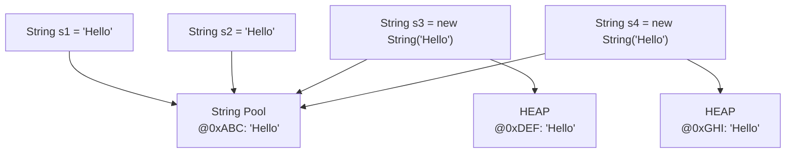
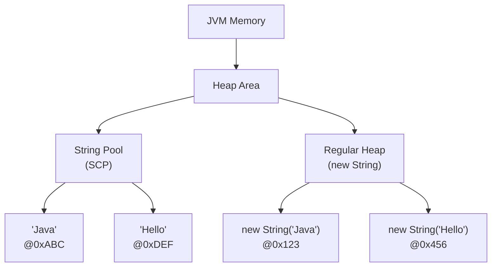

<a id="8-strings-in-java"></a>

# 📘 Chapter 8: Strings in Java

> **Part B: Strings, Arrays & Packages**
> `Intermediate` | `Foundation` | `Most Asked in Interviews`

⭐⭐⭐⭐⭐⭐⭐⭐⭐⭐⭐⭐⭐⭐⭐⭐⭐⭐⭐⭐⭐⭐⭐⭐⭐⭐⭐⭐⭐⭐⭐⭐

Java • Core Java • Interview Preparation

⭐⭐⭐⭐⭐⭐⭐⭐⭐⭐⭐⭐⭐⭐⭐⭐⭐⭐⭐⭐⭐⭐⭐⭐⭐⭐⭐⭐⭐⭐⭐⭐

---

<a id="chapter-index-table-8"></a>

## 📚 Chapter 8 — Index Table

| No. | Topic | Subtopics |
|-----|-------|-----------|
| 8.1 | [What is String](#81-what-is-string) | Definition, Sequence of Characters, Most Used Class |
| 8.2 | [String as Object (Class Hierarchy)](#82-string-as-object) | Not Primitive, Implements Serializable, Comparable, CharSequence |
| 8.3 | [Creating Strings (Literal vs new)](#83-creating-strings) | String Literal, new Keyword, Difference, Memory Allocation |
| 8.4 | [String Pool (String Constant Pool)](#84-string-pool) | What is SCP, Location (Heap), How it Works, Java 7+ Changes |
| 8.5 | [String Immutability](#85-string-immutability) | What is Immutable, Proof with Code, Cannot be Changed |
| 8.6 | [Why Strings are Immutable](#86-why-strings-are-immutable) | Security, String Pool, Thread Safety, HashCode Caching, Class Loading |
| 8.7 | [intern() Method](#87-intern-method) | Force String Pool Storage, Use Case, Interview Trap |
| 8.8 | [String Methods — Length & Access](#88-length-and-access) | length(), charAt(), toCharArray(), getBytes() |
| 8.9 | [String Methods — Comparison](#89-comparison) | equals(), equalsIgnoreCase(), compareTo(), == vs equals() Trap |
| 8.10 | [String Methods — Searching](#810-searching) | indexOf(), lastIndexOf(), contains(), startsWith(), endsWith(), matches() |
| 8.11 | [String Methods — Extraction](#811-extraction) | substring(int), substring(int, int), subSequence() |
| 8.12 | [String Methods — Modification](#812-modification) | concat(), replace(), replaceAll(), toUpperCase(), toLowerCase(), trim(), strip() |
| 8.13 | [String Methods — Splitting & Joining](#813-splitting-joining) | split(), split(limit), String.join() |
| 8.14 | [String.format() & Formatting](#814-string-format) | printf(), format specifiers %d, %s, %f, %.2f |
| 8.15 | [String Concatenation Internals](#815-concatenation-internals) | + Operator Internals, StringBuilder (Pre Java 9), StringConcatFactory (Java 9+), Loop Performance |
| 8.16 | [StringBuilder Class](#816-stringbuilder) | Mutable, Not Thread-Safe, Methods, Capacity, Growth Formula |
| 8.17 | [StringBuffer Class](#817-stringbuffer) | Mutable, Thread-Safe (Synchronized), Same as StringBuilder |
| 8.18 | [String vs StringBuilder vs StringBuffer](#818-comparison-three) | Complete Comparison Table, When to Use Which |
| 8.19 | [StringTokenizer Class](#819-stringtokenizer) | Legacy Class, hasMoreTokens(), nextToken(), vs split() |
| 8.20 | [String Interview Problems](#820-interview-problems) | Reverse, Palindrome, Anagram, Vowels, Duplicates, Compression |
| 🔥 | [Java vs Other Languages](#8-java-vs-other-languages) | Unique String Behaviors |
| 💡 | [Interview Questions](#8-interview-questions) | 20+ Conceptual · Scenario · Output-based |
| 🧪 | [Practice Problems](#8-practice-problems) | 5 Coding + 5 Theory |

---

## 8.1 What is String

<a id="81-what-is-string"></a>

### 📌 Definition

```
A STRING in Java is a SEQUENCE OF CHARACTERS.
It represents TEXT data.

Examples:
"Hello World"
"Shashwat Tiwari"
"Java123"
""  (empty string)

Strings are the MOST WIDELY USED class in Java.
Almost every Java program uses Strings.
```

### 🌍 Real-World Analogy (Hinglish)

```
String ek DOSTI ki tarah hai:
→ Ek baar ban gayi (immutable) toh usse change nahi kar sakte
→ Chahe kitni bhi koshish karo, ORIGINAL string same rahegi
→ Har "change" naya banata hai, purani nahi badalti

Example:
String name = "Shashwat";
name = name.toUpperCase();
→ "Shashwat" wala object BADLA nahi hai
→ "SHASHWAT" ek NAYA object bana
→ name variable ab naye object ko point kar raha hai
```

<a href="#chapter-index-table-8">Go to Top 🔝</a>

---

## 8.2 String as Object (Class Hierarchy)

<a id="82-string-as-object"></a>

### 📌 String is NOT a Primitive!

```
In Java, String is a CLASS, not a primitive data type.
Even though it looks like a primitive due to easy syntax,
it's actually an OBJECT.

Every String is an OBJECT of java.lang.String class.
```

### 📌 String Class Hierarchy

```
┌──────────────────────────────────────────────────────────────┐
│                    java.lang.Object                          │
│                          ↑                                   │
│                    java.lang.String                          │
│                                                              │
│  String implements:                                          │
│  ✅ Serializable  → Can be converted to byte stream         │
│  ✅ Comparable<String> → Can be compared (compareTo())      │
│  ✅ CharSequence → Can be treated as sequence of characters  │
└──────────────────────────────────────────────────────────────┘
```

```java
public class StringHierarchy {
    public static void main(String[] args) {
        String s = "Hello";

        // String extends Object
        System.out.println(s instanceof Object);        // true
        System.out.println(s instanceof String);        // true
        System.out.println(s instanceof Comparable);    // true
        System.out.println(s instanceof CharSequence);  // true
        System.out.println(s instanceof java.io.Serializable); // true

        // String has methods from Object class
        System.out.println(s.hashCode());   // Inherited
        System.out.println(s.toString());   // Overridden
        System.out.println(s.getClass());   // class java.lang.String
    }
}
```

<a href="#chapter-index-table-8">Go to Top 🔝</a>

---

## 8.3 Creating Strings (Literal vs new) ⭐

<a id="83-creating-strings"></a>

### 📌 Two Ways to Create Strings

```java
public class CreatingStrings {
    public static void main(String[] args) {

        // ═══ WAY 1: String Literal (Using double quotes) ═══
        // Stored in STRING POOL (Heap)
        String s1 = "Hello";
        String s2 = "Hello";  // Points to SAME pool object!

        // ═══ WAY 2: Using 'new' Keyword ═══
        // Creates NEW object in HEAP (outside String Pool)
        String s3 = new String("Hello");
        String s4 = new String("Hello");  // Another NEW object!

        // ═══ COMPARISON ═══
        System.out.println(s1 == s2);  // true  (same pool object!)
        System.out.println(s1 == s3);  // false (pool vs heap)
        System.out.println(s3 == s4);  // false (different heap objects!)

        System.out.println(s1.equals(s2)); // true (same content)
        System.out.println(s1.equals(s3)); // true (same content)
        System.out.println(s3.equals(s4)); // true (same content)
    }
}
```

### 📌 How Many Objects are Created? ⭐⭐ (VERY IMPORTANT INTERVIEW Q!)

```java
// SCENARIO 1: Literal only
String s1 = "Hello";
// → 1 object created (in String Pool)

String s2 = "Hello";
// → 0 NEW objects (reuses existing pool object)
// Total: 1 object

// SCENARIO 2: Using new
String s1 = new String("Hello");
// → 2 objects created!
//   1. "Hello" in String Pool (if not already there)
//   2. New String object in Heap

// SCENARIO 3: Mixed
String s1 = "Hello";        // 1 object (pool)
String s2 = new String("Hello");  // 1 more object (heap)
// Total: 2 objects
```

### 📊 String Creation Visual



<a href="#chapter-index-table-8">Go to Top 🔝</a>

---

## 8.4 String Pool (String Constant Pool) ⭐⭐

<a id="84-string-pool"></a>

### 📌 What is String Pool?

```
String Pool (also called String Constant Pool or SCP) is a
SPECIAL MEMORY AREA where JVM stores string literals.

PURPOSE:
→ MEMORY OPTIMIZATION
→ If same string exists, REUSE it instead of creating new
→ Since Strings are IMMUTABLE, this is SAFE

LOCATION (Java 7+):
→ In HEAP memory (moved from PermGen)
→ Managed by Garbage Collector

BEFORE Java 7:
→ String Pool was in PermGen area
→ Fixed size, couldn't grow
→ Caused OutOfMemoryError easily
```

### 📌 How String Pool Works

```java
public class StringPoolDemo {
    public static void main(String[] args) {

        String s1 = "Java";
        // Step 1: JVM checks String Pool for "Java"
        // Step 2: Not found → Creates "Java" in Pool
        // Step 3: s1 points to Pool object

        String s2 = "Java";
        // Step 1: JVM checks String Pool for "Java"
        // Step 2: FOUND! → Reuses existing object
        // Step 3: s2 points to SAME Pool object

        System.out.println(s1 == s2);  // true (same object!)

        String s3 = new String("Java");
        // Step 1: JVM checks Pool → "Java" exists
        // Step 2: But 'new' FORCES creation in Heap
        // Step 3: New object created in Heap
        // Step 4: s3 points to Heap object (NOT Pool)

        System.out.println(s1 == s3);  // false (different memory areas!)
    }
}
```

### 📊 String Pool Diagram



<a href="#chapter-index-table-8">Go to Top 🔝</a>

---

## 8.5 String Immutability ⭐⭐

<a id="85-string-immutability"></a>

### 📌 What Does Immutable Mean?

```
IMMUTABLE = Cannot be CHANGED after creation.

Once a String object is created, its CONTENT cannot be modified.
Any operation that "modifies" a String actually creates a NEW String.

The original String object remains UNCHANGED in memory.
```

### 📌 Proof of Immutability

```java
public class StringImmutability {
    public static void main(String[] args) {

        // ═══ PROOF 1: Assignment creates new object ═══
        String name1 = "Shashwat";
        System.out.println(name1);  // Shashwat

        String name2 = name1;       // name2 points to same object
        name2 = "Amit";              // name2 now points to NEW object

        System.out.println(name1);  // Shashwat (UNCHANGED!)
        System.out.println(name2);  // Amit

        // name1 was NEVER modified — name2 just started pointing elsewhere!

        // ═══ PROOF 2: String methods return NEW String ═══
        String str = "Hello";
        str.toUpperCase();  // Creates new "HELLO" but result is DISCARDED!
        System.out.println(str);  // Hello (STILL lowercase!)

        // To actually get the change, reassign:
        str = str.toUpperCase();
        System.out.println(str);  // HELLO

        // ═══ PROOF 3: Concatenation creates new object ═══
        String s = "Java";
        s.concat(" Programming");  // Result discarded!
        System.out.println(s);      // Java (unchanged!)

        s = s.concat(" Programming");
        System.out.println(s);      // Java Programming (new object)
    }
}
```

### 📌 String Immutability Behavior Demo

```java
public class ImmutableBehavior {
    public static void main(String[] args) {

        // Case 1: Two literals pointing to SAME pool object
        String name1 = "Shashwat";
        String name2 = "Shashwat";  // Reuses pool object
        String name3 = "Shashwat";  // Reuses pool object
        String name4 = name1;       // Same reference

        // All 4 point to SAME object in String Pool
        System.out.println(name1 == name2);  // true
        System.out.println(name2 == name3);  // true
        System.out.println(name3 == name4);  // true
        System.out.println(name4 == name2);  // true
        System.out.println(name1 == name4);  // true

        // Case 2: Using 'new' creates DIFFERENT objects
        String n1 = new String("Shashwat");
        String n2 = new String("Shashwat");
        String n3 = new String("Shashwat");
        String n4 = n1;  // Same reference

        System.out.println(n1 == n2);  // false (different heap objects)
        System.out.println(n2 == n3);  // false
        System.out.println(n3 == n4);  // false
        System.out.println(n1 == n4);  // true (same reference)
    }
}
```

<a href="#chapter-index-table-8">Go to Top 🔝</a>

---

## 8.6 Why Strings are Immutable ⭐⭐⭐

<a id="86-why-strings-are-immutable"></a>

### 📌 5 CRITICAL Reasons

```
┌──────────────────────────────────────────────────────────────┐
│  #1. SECURITY                                                │
├──────────────────────────────────────────────────────────────┤
│  Strings are used for:                                       │
│  → File paths                                                │
│  → Database URLs                                             │
│  → Network connections                                       │
│  → Class loading names                                       │
│  → Passwords and usernames                                    │
│                                                              │
│  If Strings were mutable, hackers could modify them          │
│  after security checks were passed. HUGE security risk!      │
├──────────────────────────────────────────────────────────────┤
│  #2. STRING POOL OPTIMIZATION                                │
├──────────────────────────────────────────────────────────────┤
│  If Strings were mutable, changing one string would          │
│  affect ALL references to it in the pool.                    │
│                                                              │
│  String s1 = "Hello";                                        │
│  String s2 = "Hello";  // Same pool object                   │
│  // If we could modify s1 → s2 would also change!            │
│  // Immutability makes String Pool safe.                     │
├──────────────────────────────────────────────────────────────┤
│  #3. THREAD SAFETY                                           │
├──────────────────────────────────────────────────────────────┤
│  Immutable objects are AUTOMATICALLY thread-safe.            │
│  No synchronization needed.                                  │
│  Multiple threads can safely share String objects.           │
├──────────────────────────────────────────────────────────────┤
│  #4. HASHCODE CACHING                                        │
├──────────────────────────────────────────────────────────────┤
│  String is heavily used as KEY in HashMap.                   │
│  hashCode() is called MANY times per key.                    │
│  Since String is immutable, hashCode is CALCULATED ONCE      │
│  and CACHED for reuse. Massive performance boost!            │
├──────────────────────────────────────────────────────────────┤
│  #5. CLASS LOADING SECURITY                                  │
├──────────────────────────────────────────────────────────────┤
│  Class.forName("com.example.MyClass") loads a class.         │
│  If String were mutable, hackers could change the string     │
│  AFTER validation to load a malicious class.                 │
└──────────────────────────────────────────────────────────────┘
```

### 📌 How String is Made Immutable

```java
// Simplified view of String class (actual Java source):

public final class String                    // ← final: cannot be extended
    implements Serializable, Comparable<String>, CharSequence {

    private final char value[];              // ← final char array (pre Java 9)
    // Java 9+: private final byte value[];  // ← final byte array
    private final int hash;                  // ← Cached hash code (final)

    // NO SETTERS for value[]
    // All methods return NEW String objects
    // Original value[] can NEVER be modified
}
```

### 📌 Can We Create a Mutable String?

```java
// YES — Using StringBuilder or StringBuffer!

public class MutableStringDemo {
    public static void main(String[] args) {

        // Immutable String
        String s = "Hello";
        s.concat(" World");           // Discarded
        System.out.println(s);         // Hello (unchanged)

        // Mutable StringBuilder
        StringBuilder sb = new StringBuilder("Hello");
        sb.append(" World");           // MODIFIES same object!
        System.out.println(sb);        // Hello World (CHANGED!)

        // Mutable StringBuffer (thread-safe)
        StringBuffer sbf = new StringBuffer("Hello");
        sbf.append(" World");
        System.out.println(sbf);       // Hello World
    }
}
```

> [!IMPORTANT]
> **String Immutability is a DESIGN CHOICE, not a limitation!** Sun/Oracle intentionally made String immutable for security, performance, and thread safety. If you need mutable strings, use `StringBuilder` (single-threaded) or `StringBuffer` (multi-threaded).

<a href="#chapter-index-table-8">Go to Top 🔝</a>

---

## 8.7 intern() Method

<a id="87-intern-method"></a>

### 📌 What is intern()?

```
The intern() method FORCES a String to be stored in the String Pool.

If the String already exists in the pool → returns pool reference
If not → adds it to the pool and returns the reference

Purpose: Convert heap String to pool String.
```

```java
public class InternDemo {
    public static void main(String[] args) {

        String s1 = "Hello";                    // Pool object
        String s2 = new String("Hello");        // Heap object
        String s3 = s2.intern();                // Returns pool reference

        System.out.println(s1 == s2);  // false (different areas)
        System.out.println(s1 == s3);  // TRUE!  (both point to pool)
        System.out.println(s2 == s3);  // false (heap vs pool)

        /*
        WITHOUT intern():
        s2 in Heap → different from s1 in Pool

        WITH intern():
        s3 = s2.intern() → gets Pool reference of "Hello"
        s3 and s1 point to SAME pool object
        */
    }
}
```

<a href="#chapter-index-table-8">Go to Top 🔝</a>

---

## 8.8 String Methods — Length & Access

<a id="88-length-and-access"></a>

```java
public class LengthAccess {
    public static void main(String[] args) {

        String str = "Shashwat";

        // ═══ length() — Returns number of characters ═══
        System.out.println(str.length());   // 8

        // ═══ charAt(int index) — Returns char at index ═══
        // Index starts from 0
        System.out.println(str.charAt(0));  // S
        System.out.println(str.charAt(7));  // t
        // str.charAt(8);  // ❌ StringIndexOutOfBoundsException!

        // ═══ toCharArray() — Convert to char array ═══
        char ch[] = str.toCharArray();
        for (int i = 0; i < ch.length; i++) {
            System.out.print(ch[i] + " ");   // S h a s h w a t
        }
        System.out.println();

        // ═══ getBytes() — Convert to byte array ═══
        byte[] bytes = str.getBytes();
        for (byte b : bytes) {
            System.out.print(b + " ");        // ASCII values
        }
    }
}
```

<a href="#chapter-index-table-8">Go to Top 🔝</a>

---

## 8.9 String Methods — Comparison ⭐

<a id="89-comparison"></a>

### 📌 The == vs .equals() TRAP!

```java
public class StringComparison {
    public static void main(String[] args) {

        // ═══ Case 1: String Literals (Pool) ═══
        String name1 = "Shashwat";
        String name2 = "Shashwat";
        String name3 = "Shashwat";
        String name4 = name1;

        // .equals() — Compares CONTENT
        System.out.println(name1.equals(name2));  // true
        System.out.println(name2.equals(name3));  // true
        System.out.println(name3.equals(name4));  // true

        // == — Compares REFERENCES (memory addresses)
        System.out.println(name1 == name2);  // true (same pool obj)
        System.out.println(name2 == name3);  // true
        System.out.println(name3 == name4);  // true
        System.out.println(name1 == name4);  // true

        // ═══ Case 2: Using new (Heap) ═══
        String n1 = new String("Shashwat");
        String n2 = new String("Shashwat");
        String n3 = new String("Shashwat");
        String n4 = n1;

        // .equals() — Still true (content same)
        System.out.println(n1.equals(n2));  // true
        System.out.println(n2.equals(n3));  // true

        // == — All FALSE (different heap objects)!
        System.out.println(n1 == n2);  // false
        System.out.println(n2 == n3);  // false
        System.out.println(n3 == n4);  // false (n4=n1, but n1≠n3)
        System.out.println(n1 == n4);  // true (n4 = n1)
    }
}
```

### 📌 All Comparison Methods

```java
public class ComparisonMethods {
    public static void main(String[] args) {

        // ═══ equalsIgnoreCase() — Case-insensitive compare ═══
        System.out.println("HELLO".equalsIgnoreCase("hello"));  // true
        System.out.println("HELLO".equals("hello"));             // false

        // ═══ compareTo() — Lexicographic comparison ═══
        // Returns:
        //   0     if equal
        //   > 0   if this > argument
        //   < 0   if this < argument
        System.out.println("SHASHWAT".compareTo("SHASH"));      // 3 (extra chars)
        System.out.println("SHASH".compareTo("SHASHWAT"));      // -3 (missing chars)
        System.out.println("SHASHWAT".compareTo("SHASHWAT"));   // 0 (equal)
        System.out.println("SHASH".compareTo("AMASH"));         // 18 (S - A = 18)
        // Compares character by character using Unicode values

        // ═══ compareToIgnoreCase() — Ignore case ═══
        System.out.println("HELLO".compareToIgnoreCase("hello")); // 0

        // ═══ Comparing with null ═══
        String s = null;
        // s.equals("Hello");  // ❌ NullPointerException!

        // SAFE: Use string literal on left
        System.out.println("Hello".equals(s));  // false (no exception)

        // Or Objects.equals (null-safe)
        System.out.println(java.util.Objects.equals(s, "Hello")); // false
    }
}
```

```
┌──────────────────────────────────────────────────────────────┐
│                    GOLDEN RULE!                              │
│                                                              │
│  For String comparison:                                      │
│  ✅ Use .equals() for CONTENT comparison                     │
│  ❌ NEVER use == unless you specifically want               │
│      to check if two references point to same object        │
│                                                              │
│  Reason: == compares REFERENCES (addresses)                  │
│          .equals() compares CONTENT                          │
└──────────────────────────────────────────────────────────────┘
```

<a href="#chapter-index-table-8">Go to Top 🔝</a>

---

## 8.10 String Methods — Searching

<a id="810-searching"></a>

```java
public class StringSearching {
    public static void main(String[] args) {

        String str = "Java Programming Java Language";

        // ═══ indexOf() — First occurrence ═══
        System.out.println(str.indexOf('J'));       // 0
        System.out.println(str.indexOf('a'));       // 1
        System.out.println(str.indexOf("Java"));    // 0
        System.out.println(str.indexOf("Python"));  // -1 (not found)

        // indexOf(char, fromIndex) — Search from index
        System.out.println(str.indexOf('J', 1));    // 17

        // ═══ lastIndexOf() — Last occurrence ═══
        System.out.println(str.lastIndexOf('J'));   // 17
        System.out.println(str.lastIndexOf("Java")); // 17

        // ═══ contains() — Check substring existence ═══
        System.out.println(str.contains("Java"));    // true
        System.out.println(str.contains("Python"));  // false

        // ═══ startsWith() — Check prefix ═══
        System.out.println("shashwat tiwari".startsWith("shash"));  // true
        System.out.println("shashwat tiwari".startsWith("Rshash")); // false

        // ═══ endsWith() — Check suffix ═══
        System.out.println("shashwat tiwari".endsWith("ri"));   // true
        System.out.println("shashwat tiwari".endsWith("shash")); // false

        // ═══ matches() — Regex matching ═══
        System.out.println("Hello123".matches("[A-Za-z]+\\d+"));  // true
        System.out.println("12345".matches("\\d+"));              // true (all digits)
    }
}
```

### 📌 Example: Extract Email Provider

```java
public class EmailExtractor {
    public static void main(String[] args) {

        String email1 = "shashwattiwari8@gmail.com";
        String email2 = "randomAvenger@hotmail.com";

        // Split by @ and get last part
        String[] emailArr = email1.split("@");
        String lastPart = emailArr[emailArr.length - 1]; // "gmail.com"

        // Find last dot and extract provider name
        int dotIndex = lastPart.lastIndexOf('.');
        String provider = lastPart.substring(0, dotIndex);

        System.out.println("Provider: " + provider);  // gmail
    }
}
```

<a href="#chapter-index-table-8">Go to Top 🔝</a>

---

## 8.11 String Methods — Extraction

<a id="811-extraction"></a>

```java
public class StringExtraction {
    public static void main(String[] args) {

        String str = "Shashwat";

        // ═══ substring(int beginIndex) — From index to end ═══
        System.out.println(str.substring(4));    // hwat (from index 4)
        System.out.println(str.substring(0));    // Shashwat (whole string)

        // ═══ substring(int begin, int end) — begin to end-1 ═══
        // end is EXCLUSIVE!
        System.out.println(str.substring(0, 4));  // Shas
        System.out.println(str.substring(3, 7));  // shwa

        // Edge case
        System.out.println(str.substring(3, 3));  // "" (empty string!)
        // Note: begin == end → returns empty string

        // ═══ subSequence(int start, int end) — Returns CharSequence ═══
        CharSequence cs = str.subSequence(0, 4);  // Shas
        System.out.println(cs);

        // Exception cases:
        // str.substring(-1);  // StringIndexOutOfBoundsException
        // str.substring(9);   // StringIndexOutOfBoundsException (length=8)
        // str.substring(5, 3); // StringIndexOutOfBoundsException (end < begin)
    }
}
```

<a href="#chapter-index-table-8">Go to Top 🔝</a>

---

## 8.12 String Methods — Modification

<a id="812-modification"></a>

### ⚠️ Remember: These methods RETURN NEW Strings!

```java
public class StringModification {
    public static void main(String[] args) {

        String str = "Tshashwat TTiwarI";

        // ═══ toLowerCase() / toUpperCase() ═══
        System.out.println(str.toLowerCase());  // tshashwat ttiwari
        System.out.println(str.toUpperCase());  // TSHASHWAT TTIWARI
        System.out.println(str);                // Unchanged!

        // Must REASSIGN to keep changes
        str = str.toLowerCase();
        System.out.println(str);  // tshashwat ttiwari (now changed)

        // ═══ concat() — Append string ═══
        String s1 = "Hello";
        String s2 = s1.concat(" World");
        System.out.println(s2);  // Hello World
        System.out.println(s1);  // Hello (unchanged!)

        // ═══ replace() — Replace all occurrences ═══
        System.out.println("Java Java Java".replace('a', 'o'));
        // Jovo Jovo Jovo

        System.out.println("Hello World".replace("World", "Java"));
        // Hello Java

        // ═══ replaceAll() — Regex based replace ═══
        System.out.println("abc123xyz".replaceAll("\\d", "*"));  // abc***xyz
        System.out.println("Hello World".replaceAll("\\s+", "-")); // Hello-World

        // ═══ replaceFirst() — Only first match ═══
        System.out.println("aabbcc".replaceFirst("a", "z"));  // zabbcc

        // ═══ trim() — Remove leading/trailing whitespace ═══
        System.out.println("    shSHWYUWF     ");      // "    shSHWYUWF     "
        System.out.println("    shSHWYUWF     ".trim()); // "shSHWYUWF"

        // ═══ strip() — Java 11+ (Unicode-aware trim) ═══
        System.out.println("  Hello  ".strip());        // "Hello"
        System.out.println("  Hello  ".stripLeading()); // "Hello  "
        System.out.println("  Hello  ".stripTrailing()); // "  Hello"

        // ═══ isEmpty() vs isBlank() ═══
        System.out.println("".isEmpty());       // true (empty)
        System.out.println("   ".isEmpty());    // false (has spaces)
        System.out.println("   ".isBlank());    // true (Java 11+, whitespace only)

        // ═══ repeat() — Java 11+ ═══
        System.out.println("Ha".repeat(3));     // HaHaHa
    }
}
```

<a href="#chapter-index-table-8">Go to Top 🔝</a>

---

## 8.13 String Methods — Splitting & Joining

<a id="813-splitting-joining"></a>

```java
public class SplitJoinDemo {
    public static void main(String[] args) {

        // ═══ split() — Split string by delimiter ═══
        String myLocations = "hyderabad, chennai, bangalore, noida, pune";
        String[] myLocationList = myLocations.split(",");

        for (int i = 0; i < myLocationList.length; i++) {
            System.out.print(myLocationList[i] + " ");
        }
        // hyderabad  chennai  bangalore  noida  pune

        // ═══ split() with regex ═══
        String data = "apple123banana456cherry";
        String[] parts = data.split("\\d+");
        for (String p : parts) System.out.println(p);
        // apple, banana, cherry

        // ═══ split() with limit ═══
        String csv = "a,b,c,d,e";
        String[] arr1 = csv.split(",");        // [a, b, c, d, e] — 5 elements
        String[] arr2 = csv.split(",", 3);     // [a, b, c,d,e] — max 3 elements
        System.out.println(arr2.length);       // 3

        // ═══ String.join() — Opposite of split ═══
        String result = String.join("-", "Hello", "World", "Java");
        System.out.println(result);  // Hello-World-Java

        // Join array elements
        String[] fruits = {"Apple", "Banana", "Cherry"};
        String joined = String.join(", ", fruits);
        System.out.println(joined);  // Apple, Banana, Cherry

        // Join List
        java.util.List<String> list = java.util.List.of("Java", "Python", "C++");
        String langs = String.join(" | ", list);
        System.out.println(langs);   // Java | Python | C++
    }
}
```

<a href="#chapter-index-table-8">Go to Top 🔝</a>

---

## 8.14 String.format() & Formatting

<a id="814-string-format"></a>

```java
public class StringFormatting {
    public static void main(String[] args) {

        // ═══ printf() — Formatted print ═══
        int rollNum = 40;
        int myClass = 10;
        System.out.printf("My roll number is %d and my class is %d%n",
                          rollNum, myClass);
        // My roll number is 40 and my class is 10

        float percent = 98.34467f;
        System.out.printf("My percentage is %.2f%n", percent);
        // My percentage is 98.34

        // ═══ String.format() — Returns formatted String ═══
        String s = String.format("Name: %s, Age: %d", "Rahul", 25);
        System.out.println(s);  // Name: Rahul, Age: 25

        // ═══ formatted() — Java 15+ ═══
        String s2 = "Name: %s, Age: %d".formatted("Priya", 22);
        System.out.println(s2); // Name: Priya, Age: 22
    }
}
```

### 📌 Format Specifiers Table

```
┌────────────┬─────────────────────────────────────────────┐
│  Specifier │  Meaning                                    │
├────────────┼─────────────────────────────────────────────┤
│  %d        │  Integer (decimal)                          │
│  %f        │  Floating point (6 decimals default)        │
│  %.2f      │  Float with 2 decimal places                │
│  %s        │  String                                     │
│  %c        │  Character                                  │
│  %b        │  Boolean                                    │
│  %n        │  Newline (platform-independent)             │
│  %x, %X    │  Hexadecimal (lowercase/uppercase)          │
│  %o        │  Octal                                      │
│  %e        │  Scientific notation                        │
│  %10d      │  Integer padded to 10 chars (right-aligned) │
│  %-10d     │  Integer padded to 10 chars (left-aligned)  │
│  %05d      │  Integer padded with zeros (e.g., 00042)    │
└────────────┴─────────────────────────────────────────────┘
```

<a href="#chapter-index-table-8">Go to Top 🔝</a>

---

## 8.15 String Concatenation Internals ⭐

<a id="815-concatenation-internals"></a>

### 📌 How + Operator Works Internally

```java
public class ConcatInternals {
    public static void main(String[] args) {

        // What you write:
        String s = "Hello" + " " + "World";

        // What JVM does INTERNALLY:

        // BEFORE Java 9 (using StringBuilder):
        // StringBuilder sb = new StringBuilder();
        // sb.append("Hello").append(" ").append("World");
        // String s = sb.toString();

        // Java 9+ (using StringConcatFactory - invokedynamic):
        // Uses invokedynamic instruction for optimization
        // Much faster than StringBuilder approach

        // ═══ COMPILE-TIME CONCATENATION ═══
        // If ALL operands are compile-time constants:
        String s1 = "Hello" + " " + "World";  // Optimized at compile time
        String s2 = "Hello World";
        System.out.println(s1 == s2);  // true! Both point to same pool obj

        // ═══ RUNTIME CONCATENATION ═══
        // If any operand is a variable → runtime concatenation
        String hello = "Hello";
        String s3 = hello + " World";  // Runtime → New object
        System.out.println(s2 == s3);   // false (s3 is new object)
    }
}
```

### 📌 String Concatenation in Loops (PERFORMANCE ISSUE!) ⭐

```java
public class LoopConcatenation {
    public static void main(String[] args) {

        // ❌ BAD: Using + in loop → Creates MANY objects!
        String result = "";
        for (int i = 0; i < 1000; i++) {
            result = result + i;  // Creates new String each iteration!
        }
        // Creates 1000+ String objects → SLOW and memory-heavy!

        // ✅ GOOD: Use StringBuilder
        StringBuilder sb = new StringBuilder();
        for (int i = 0; i < 1000; i++) {
            sb.append(i);  // Modifies same object → FAST!
        }
        String result2 = sb.toString();

        // Performance difference is MASSIVE:
        // String concat: O(n²) time complexity
        // StringBuilder: O(n) time complexity
    }
}
```

### 📌 concat() vs + Operator

```java
String s1 = "Hello";
String s2 = "World";

// Method 1: + operator
String result1 = s1 + " " + s2;  // "Hello World"

// Method 2: concat() method
String result2 = s1.concat(" ").concat(s2);  // "Hello World"

// DIFFERENCE:
// + can concatenate any type (int, double, etc.) — converts to String
// concat() only accepts String argument

// s1 + 5      → OK (int converted to String)
// s1.concat(5) → ❌ ERROR (concat needs String)

// concat() throws NullPointerException for null argument
// + treats null as "null" string
```

<a href="#chapter-index-table-8">Go to Top 🔝</a>

---

## 8.16 StringBuilder Class ⭐

<a id="816-stringbuilder"></a>

### 📌 What is StringBuilder?

```
StringBuilder is a MUTABLE sequence of characters.
Unlike String, you can MODIFY the same object.

Characteristics:
✅ Mutable (can be changed)
❌ NOT thread-safe (no synchronization)
✅ FASTER than StringBuffer
✅ Use in SINGLE-threaded environments
```

```java
public class StringBuilderDemo {
    public static void main(String[] args) {

        // ═══ Creating StringBuilder ═══
        StringBuilder sb1 = new StringBuilder();               // Default capacity 16
        StringBuilder sb2 = new StringBuilder("Hello");        // Initial content
        StringBuilder sb3 = new StringBuilder(50);             // Initial capacity

        // ═══ Important Methods ═══

        // append() — Add at end
        sb2.append(" World");
        System.out.println(sb2);  // Hello World

        // Chaining is allowed!
        sb2.append(" Java").append(" 21");
        System.out.println(sb2);  // Hello World Java 21

        // insert() — Add at index
        StringBuilder sb = new StringBuilder("Hello World");
        sb.insert(5, "-Java-");
        System.out.println(sb);   // Hello-Java- World

        // delete() — Remove range
        StringBuilder sb4 = new StringBuilder("Hello World");
        sb4.delete(5, 11);
        System.out.println(sb4);  // Hello

        // deleteCharAt() — Remove single char
        sb4.deleteCharAt(0);
        System.out.println(sb4);  // ello

        // replace() — Replace range
        StringBuilder sb5 = new StringBuilder("Hello World");
        sb5.replace(6, 11, "Java");
        System.out.println(sb5);  // Hello Java

        // reverse() — Reverse the string!
        StringBuilder sb6 = new StringBuilder("Hello");
        sb6.reverse();
        System.out.println(sb6);  // olleH

        // charAt(), setCharAt() — Get/set character
        System.out.println(sb6.charAt(0));  // o
        sb6.setCharAt(0, 'O');
        System.out.println(sb6);  // Olleh

        // length() and capacity()
        StringBuilder sb7 = new StringBuilder();
        System.out.println(sb7.length());   // 0
        System.out.println(sb7.capacity()); // 16 (default)

        sb7.append("Hello");
        System.out.println(sb7.length());   // 5
        System.out.println(sb7.capacity()); // 16

        // toString() — Convert to String
        String s = sb7.toString();
        System.out.println(s);  // Hello
    }
}
```

### 📌 StringBuilder Mutability Demo

```java
public class StringBuilderMutability {
    public static void main(String[] args) {

        StringBuilder name1 = new StringBuilder("shashwat");
        StringBuilder name2 = new StringBuilder("shashwat");
        StringBuilder name3 = new StringBuilder("shashwat");
        StringBuilder name4 = name1;  // Same reference

        // == comparison
        System.out.println(name1 == name2);  // false
        System.out.println(name2 == name3);  // false
        System.out.println(name3 == name4);  // false
        System.out.println(name1 == name4);  // true (same ref)

        // MODIFY name4 → affects name1 (same object!)
        name4.append("tiwari");
        System.out.println(name1);  // shashwattiwari (CHANGED!)
        System.out.println(name4);  // shashwattiwari

        // Because name4 and name1 point to SAME mutable object
    }
}
```

### 📌 Capacity Growth Formula

```
Default capacity: 16 characters

When capacity is exceeded:
newCapacity = (oldCapacity * 2) + 2

Example:
Initial: 16
After exceed: (16 * 2) + 2 = 34
After exceed: (34 * 2) + 2 = 70
```

<a href="#chapter-index-table-8">Go to Top 🔝</a>

---

## 8.17 StringBuffer Class

<a id="817-stringbuffer"></a>

### 📌 What is StringBuffer?

```
StringBuffer is SAME as StringBuilder BUT:
✅ Thread-Safe (all methods are SYNCHRONIZED)
❌ SLOWER than StringBuilder due to synchronization

Use StringBuffer when:
→ Multiple threads modify same string
→ Thread safety is required

Otherwise, use StringBuilder (faster).
```

```java
public class StringBufferDemo {
    public static void main(String[] args) {

        // Same methods as StringBuilder
        StringBuffer sb = new StringBuffer("Hello");
        sb.append(" World");           // Thread-safe append
        sb.insert(5, "-");             // Thread-safe insert
        sb.reverse();                   // Thread-safe reverse
        System.out.println(sb);         // dlroW-olleH

        // All methods are synchronized:
        // public synchronized StringBuffer append(String s)
        // public synchronized StringBuffer insert(int i, String s)
        // ... etc
    }
}
```

<a href="#chapter-index-table-8">Go to Top 🔝</a>

---

## 8.18 String vs StringBuilder vs StringBuffer ⭐⭐

<a id="818-comparison-three"></a>

### 📌 Complete Comparison Table

```
┌──────────────────┬─────────────────┬────────────────┬────────────────┐
│  Feature         │  String         │  StringBuilder │  StringBuffer  │
├──────────────────┼─────────────────┼────────────────┼────────────────┤
│  Mutable?        │  ❌ NO          │  ✅ YES        │  ✅ YES        │
├──────────────────┼─────────────────┼────────────────┼────────────────┤
│  Thread-Safe?    │  ✅ YES (immut) │  ❌ NO         │  ✅ YES (sync) │
├──────────────────┼─────────────────┼────────────────┼────────────────┤
│  Performance     │  Slowest        │  FASTEST       │  Slower than   │
│  (modifications) │  (new obj each) │                │  StringBuilder │
├──────────────────┼─────────────────┼────────────────┼────────────────┤
│  Storage         │  String Pool +  │  Heap          │  Heap          │
│                  │  Heap           │                │                │
├──────────────────┼─────────────────┼────────────────┼────────────────┤
│  Introduced In   │  Java 1.0       │  Java 5        │  Java 1.0      │
├──────────────────┼─────────────────┼────────────────┼────────────────┤
│  Synchronized    │  N/A            │  ❌ NO         │  ✅ YES        │
│  Methods         │                 │                │                │
├──────────────────┼─────────────────┼────────────────┼────────────────┤
│  When to Use     │  Immutable text │  Mutable text, │  Mutable text, │
│                  │  Not changing   │  Single thread │  Multi-thread  │
├──────────────────┼─────────────────┼────────────────┼────────────────┤
│  Example Use     │  Constants,     │  StringBuilder │  Legacy multi- │
│                  │  Method names,  │  in loops,     │  threaded code │
│                  │  URLs           │  Concatenation │                │
└──────────────────┴─────────────────┴────────────────┴────────────────┘
```

### 📌 When to Use Which?

```java
// ═══ Use String when: ═══
// → Text won't change
// → Small number of concatenations
// → Storing constants/messages
String greeting = "Hello World";
String url = "https://example.com";

// ═══ Use StringBuilder when: ═══
// → Text changes frequently
// → Single-threaded environment
// → Building strings in loops
// → Performance is critical
StringBuilder sb = new StringBuilder();
for (int i = 0; i < 1000; i++) {
    sb.append(i);
}

// ═══ Use StringBuffer when: ═══
// → Multiple threads modify same string
// → Thread safety is critical
// → Legacy code compatibility
StringBuffer sbf = new StringBuffer();
// Multiple threads can safely modify sbf
```

<a href="#chapter-index-table-8">Go to Top 🔝</a>

---

## 8.19 StringTokenizer Class

<a id="819-stringtokenizer"></a>

### 📌 Legacy Class for Tokenizing Strings

```java
import java.util.StringTokenizer;

public class TokenizerDemo {
    public static void main(String[] args) {

        // Create StringTokenizer with default delimiter (whitespace)
        StringTokenizer st = new StringTokenizer("Hello World Java Programming");

        // countTokens() — Number of tokens
        System.out.println(st.countTokens());  // 4

        // hasMoreTokens() and nextToken()
        while (st.hasMoreTokens()) {
            System.out.println(st.nextToken());
        }
        // Hello
        // World
        // Java
        // Programming

        // Custom delimiter
        StringTokenizer st2 = new StringTokenizer("apple,banana,cherry", ",");
        while (st2.hasMoreTokens()) {
            System.out.println(st2.nextToken());
        }

        // Multiple delimiters
        StringTokenizer st3 = new StringTokenizer("a,b;c d.e", ",; .");
        while (st3.hasMoreTokens()) {
            System.out.print(st3.nextToken() + " ");
        }
        // a b c d e
    }
}
```

### 📌 StringTokenizer vs split()

```
┌──────────────────┬────────────────────┬────────────────────┐
│  Feature         │  StringTokenizer    │  split()           │
├──────────────────┼────────────────────┼────────────────────┤
│  Class           │  java.util          │  String method     │
├──────────────────┼────────────────────┼────────────────────┤
│  Returns         │  Tokens one by one  │  String[] array    │
├──────────────────┼────────────────────┼────────────────────┤
│  Delimiter       │  String (chars)     │  Regex             │
├──────────────────┼────────────────────┼────────────────────┤
│  Performance     │  Faster             │  Slower (regex)    │
├──────────────────┼────────────────────┼────────────────────┤
│  Status          │  Legacy (Java 1.0)  │  Modern (Java 1.4) │
├──────────────────┼────────────────────┼────────────────────┤
│  Recommendation  │  Use split() now    │  ✅ Preferred      │
└──────────────────┴────────────────────┴────────────────────┘
```

<a href="#chapter-index-table-8">Go to Top 🔝</a>

---

## 8.20 String Interview Problems

<a id="820-interview-problems"></a>

### 📌 1. Reverse a String (Multiple Ways)

```java
public class ReverseString {

    // Method 1: Using StringBuilder
    static String reverse1(String s) {
        return new StringBuilder(s).reverse().toString();
    }

    // Method 2: Using char array
    static String reverse2(String s) {
        char[] ch = s.toCharArray();
        int left = 0, right = ch.length - 1;
        while (left < right) {
            char temp = ch[left];
            ch[left++] = ch[right];
            ch[right--] = temp;
        }
        return new String(ch);
    }

    // Method 3: Using recursion
    static String reverse3(String s) {
        if (s.isEmpty()) return s;
        return reverse3(s.substring(1)) + s.charAt(0);
    }

    // Method 4: Using for loop
    static String reverse4(String s) {
        String result = "";
        for (int i = s.length() - 1; i >= 0; i--) {
            result += s.charAt(i);
        }
        return result;
    }

    public static void main(String[] args) {
        String s = "Hello";
        System.out.println(reverse1(s));  // olleH
        System.out.println(reverse2(s));  // olleH
        System.out.println(reverse3(s));  // olleH
        System.out.println(reverse4(s));  // olleH
    }
}
```

### 📌 2. Check Palindrome

```java
public class Palindrome {

    static boolean isPalindrome(String s) {
        int left = 0, right = s.length() - 1;
        while (left < right) {
            if (s.charAt(left) != s.charAt(right)) return false;
            left++;
            right--;
        }
        return true;
    }

    public static void main(String[] args) {
        System.out.println(isPalindrome("madam"));  // true
        System.out.println(isPalindrome("hello"));  // false
        System.out.println(isPalindrome("racecar")); // true
    }
}
```

### 📌 3. Count Vowels and Consonants

```java
public class VowelConsonantCount {
    public static void main(String[] args) {
        String s = "Hello World";
        int vowels = 0, consonants = 0;

        for (char c : s.toLowerCase().toCharArray()) {
            if (Character.isLetter(c)) {
                if ("aeiou".indexOf(c) != -1) vowels++;
                else consonants++;
            }
        }

        System.out.println("Vowels: " + vowels);       // 3
        System.out.println("Consonants: " + consonants); // 7
    }
}
```

### 📌 4. Check Anagram

```java
import java.util.Arrays;

public class Anagram {

    static boolean isAnagram(String s1, String s2) {
        if (s1.length() != s2.length()) return false;
        char[] a = s1.toLowerCase().toCharArray();
        char[] b = s2.toLowerCase().toCharArray();
        Arrays.sort(a);
        Arrays.sort(b);
        return Arrays.equals(a, b);
    }

    public static void main(String[] args) {
        System.out.println(isAnagram("listen", "silent"));  // true
        System.out.println(isAnagram("hello", "world"));    // false
    }
}
```

### 📌 5. First Non-Repeating Character

```java
import java.util.LinkedHashMap;

public class FirstNonRepeating {

    static char firstNonRepeating(String s) {
        LinkedHashMap<Character, Integer> map = new LinkedHashMap<>();
        for (char c : s.toCharArray()) {
            map.put(c, map.getOrDefault(c, 0) + 1);
        }
        for (var entry : map.entrySet()) {
            if (entry.getValue() == 1) return entry.getKey();
        }
        return '_';  // No non-repeating character
    }

    public static void main(String[] args) {
        System.out.println(firstNonRepeating("aabbcdd"));  // c
        System.out.println(firstNonRepeating("swiss"));    // w
    }
}
```

### 📌 6. Count Words in a String

```java
public class CountWords {
    public static void main(String[] args) {
        String s = "Hello World Java Programming";
        String[] words = s.trim().split("\\s+");
        System.out.println("Word count: " + words.length);  // 4
    }
}
```

### 📌 7. String Compression

```java
public class StringCompression {

    static String compress(String s) {
        StringBuilder sb = new StringBuilder();
        int i = 0;
        while (i < s.length()) {
            char c = s.charAt(i);
            int count = 1;
            while (i + 1 < s.length() && s.charAt(i + 1) == c) {
                i++;
                count++;
            }
            sb.append(c).append(count);
            i++;
        }
        return sb.length() < s.length() ? sb.toString() : s;
    }

    public static void main(String[] args) {
        System.out.println(compress("aabcccccaaa"));  // a2b1c5a3
        System.out.println(compress("abc"));           // abc (no compression)
    }
}
```

<a href="#chapter-index-table-8">Go to Top 🔝</a>

---

<a id="8-java-vs-other-languages"></a>

## 🔥 What Makes Java DIFFERENT — Strings

> [!IMPORTANT]
> Java's String handling is **UNIQUE** and often confusing for developers from other languages.

```
┌──────────────────────┬────────────┬────────────┬────────────┬────────────┐
│  Feature             │  Java      │  C++       │  Python    │  JavaScript│
├──────────────────────┼────────────┼────────────┼────────────┼────────────┤
│  String Type         │ Object     │ char[] or  │ Object     │ Primitive  │
│                      │ (Class)    │ std::string│ (Class)    │            │
├──────────────────────┼────────────┼────────────┼────────────┼────────────┤
│  Immutable?          │ ✅ YES     │ ❌ NO      │ ✅ YES     │ ✅ YES    │
│                      │            │ (mutable)  │            │            │
├──────────────────────┼────────────┼────────────┼────────────┼────────────┤
│  String Pool         │ ✅ YES     │ ❌ No      │ ✅ Yes     │ ❌ No     │
│                      │ (SCP)      │            │ (interning)│            │
├──────────────────────┼────────────┼────────────┼────────────┼────────────┤
│  == compares         │ REFERENCES │ Content    │ Content    │ Value      │
│  by default          │ (address!) │            │            │            │
├──────────────────────┼────────────┼────────────┼────────────┼────────────┤
│  Concatenation       │ + creates  │ + modifies │ + creates  │ + creates  │
│                      │ NEW object │ (mutable)  │ NEW obj    │ NEW obj    │
├──────────────────────┼────────────┼────────────┼────────────┼────────────┤
│  Character Encoding  │ UTF-16     │ Depends    │ UTF-8      │ UTF-16     │
│                      │ (Java 8-)  │            │            │            │
│                      │ Latin-1/   │            │            │            │
│                      │ UTF-16     │            │            │            │
│                      │ (Java 9+)  │            │            │            │
├──────────────────────┼────────────┼────────────┼────────────┼────────────┤
│  Mutable Alternative │ StringBuilder│ Already   │ list of    │ Array of  │
│                      │ StringBuffer│ mutable    │ chars     │ chars     │
├──────────────────────┼────────────┼────────────┼────────────┼────────────┤
│  String Comparison   │ .equals()  │ ==         │ ==         │ ===       │
│                      │ (NEVER ==) │            │            │            │
└──────────────────────┴────────────┴────────────┴────────────┴────────────┘
```

### 🎯 Key UNIQUE Points

```
1. STRING POOL (SCP):
   → Java has a special memory area for string literals
   → Reuses strings to save memory
   → Only Java has this concept

2. IMMUTABILITY IS STRICT:
   → Once created, NEVER change
   → All methods return NEW strings
   → C++ strings are mutable — big difference!

3. == COMPARES REFERENCES:
   → In Python/JS, == compares content
   → In Java, == compares addresses
   → ALWAYS use .equals() for content

4. TWO CREATION WAYS:
   → String s = "Hello"  → String Pool
   → String s = new String("Hello") → Heap
   → Different behavior!

5. STRINGBUILDER FOR MUTABILITY:
   → Java requires separate class (StringBuilder)
   → C++ strings are naturally mutable

6. COMPACT STRINGS (Java 9+):
   → JVM uses Latin-1 (1 byte) for ASCII strings
   → UTF-16 (2 bytes) only when needed
   → Memory optimization
```

<a href="#chapter-index-table-8">Go to Top 🔝</a>

---

<a id="8-interview-questions"></a>

## 💡 Chapter 8 — Interview Questions (20+)

---

### 🔵 Conceptual Questions

**Q1. Is String primitive or object in Java?**

```
String is an OBJECT (class in java.lang package).
Not a primitive!

Even though we write String like a primitive:
String s = "Hello";  // Looks like primitive

It's actually:
String s = "Hello";  // s is a reference to String object

String is a special class that:
→ Is FINAL (cannot be extended)
→ Is IMMUTABLE
→ Implements Serializable, Comparable, CharSequence
```

---

**Q2. What is the difference between String literal and new String()?**

```java
String s1 = "Hello";              // Literal → String Pool
String s2 = "Hello";              // Reuses pool object
String s3 = new String("Hello");  // Forces new object in Heap

s1 == s2  → true  (same pool object)
s1 == s3  → false (different memory areas)
s1.equals(s3) → true (same content)

Object Count:
"Hello" literal → 1 object (in Pool)
new String("Hello") → 2 objects (1 in Pool, 1 in Heap)
```

---

**Q3. What is String Pool? Where is it located?**

```
String Pool (String Constant Pool) is a special memory area
in HEAP where JVM stores String literals.

Location:
→ Before Java 7: PermGen area
→ Java 7+: Moved to HEAP (managed by GC)

Purpose:
→ Memory optimization
→ Reuse same string literals
→ Safe because Strings are immutable

Example:
String s1 = "Java";  // Creates in Pool
String s2 = "Java";  // Reuses same Pool object
```

---

**Q4. Why are Strings immutable in Java?**

```
5 CRITICAL Reasons:

1. SECURITY:
   Used for passwords, URLs, class loading
   Preventing modification is essential

2. STRING POOL OPTIMIZATION:
   Sharing strings would be unsafe if mutable

3. THREAD SAFETY:
   Immutable objects are automatically thread-safe

4. HASHCODE CACHING:
   Since content never changes, hashCode is cached
   Great performance in HashMap operations

5. CLASS LOADING SECURITY:
   Class.forName() uses strings — mutability = security risk
```

---

**Q5. Difference between == and .equals() for Strings?**

```java
String s1 = "Hello";
String s2 = "Hello";
String s3 = new String("Hello");

// == compares REFERENCES (memory addresses)
s1 == s2  → true  (same pool object)
s1 == s3  → false (different objects)

// .equals() compares CONTENT
s1.equals(s2) → true (same content)
s1.equals(s3) → true (same content)

GOLDEN RULE: ALWAYS use .equals() for String comparison!
```

---

**Q6. Difference between String, StringBuilder, and StringBuffer?**

```
STRING:
→ Immutable
→ Thread-safe (immutability)
→ Slow for modifications (creates new objects)
→ Stored in String Pool + Heap

STRINGBUILDER:
→ Mutable
→ NOT thread-safe
→ FASTEST for modifications
→ Java 5+
→ Use in single-threaded

STRINGBUFFER:
→ Mutable
→ Thread-safe (synchronized methods)
→ Slower than StringBuilder (sync overhead)
→ Java 1.0
→ Use in multi-threaded
```

---

**Q7. What is intern() method?**

```java
The intern() method forces a String to be stored in the pool.

String s1 = "Hello";                // Pool object
String s2 = new String("Hello");    // Heap object
String s3 = s2.intern();            // Returns pool reference

s1 == s2 → false (different areas)
s1 == s3 → true (both point to pool)

Use case: Convert heap Strings to pool Strings for memory optimization.
```

---

### 🟡 Scenario-Based Questions

**Q8. Why should we NOT use + for concatenation in loops?**

```java
// ❌ BAD: Creates 1000+ String objects!
String result = "";
for (int i = 0; i < 1000; i++) {
    result = result + i;  // New object each iteration
}
// Time Complexity: O(n²)

// ✅ GOOD: Uses same StringBuilder object
StringBuilder sb = new StringBuilder();
for (int i = 0; i < 1000; i++) {
    sb.append(i);  // Modifies same object
}
String result = sb.toString();
// Time Complexity: O(n)
```

---

**Q9. What is the output?**

```java
String s = "Hello";
s.concat(" World");
System.out.println(s);
```

```
OUTPUT: Hello

REASON: String is IMMUTABLE.
concat() returns a NEW String, but result is DISCARDED.
Original 's' remains unchanged.

FIX: s = s.concat(" World");
```

---

### 🔴 Output-Based Questions

**Q10. What is the output?**

```java
String s1 = "Hello";
String s2 = "Hello";
String s3 = new String("Hello");

System.out.println(s1 == s2);
System.out.println(s1 == s3);
System.out.println(s1.equals(s3));
```

```
OUTPUT:
true
false
true

REASON:
s1, s2 → both point to pool "Hello"
s3 → new object in Heap
.equals() compares content, so true
```

---

**Q11. How many String objects are created?**

```java
String s1 = "Hello";
String s2 = "Hello";
String s3 = new String("Hello");
```

```
ANSWER: 2 objects

1. "Hello" in String Pool (created by s1)
2. new String("Hello") in Heap (created by s3)
s2 REUSES the pool object → no new object

Total: 2 String objects
```

---

**Q12. What is the output?**

```java
String s1 = "Java";
String s2 = "Ja" + "va";  // Compile-time concat
System.out.println(s1 == s2);
```

```
OUTPUT: true

REASON: Compile-time constant concatenation.
"Ja" + "va" is resolved at compile time → "Java" literal
Both s1 and s2 point to same Pool object.

BUT if variables are used:
String x = "Ja";
String s3 = x + "va";  // Runtime concat
s1 == s3 → false (s3 is new object)
```

---

**Q13. What is the output?**

```java
StringBuilder sb1 = new StringBuilder("Hello");
StringBuilder sb2 = sb1;
sb2.append(" World");
System.out.println(sb1);
```

```
OUTPUT: Hello World

REASON: StringBuilder is MUTABLE.
sb2 = sb1 → both point to same object.
sb2.append() modifies the same object.
sb1 sees the change too.
```

---

**Q14. What is the output?**

```java
System.out.println("SHASHWAT".compareTo("SHASH"));
System.out.println("SHASH".compareTo("SHASHWAT"));
System.out.println("SHASHWAT".compareTo("SHASHWAT"));
System.out.println("SHASH".compareTo("AMASH"));
```

```
OUTPUT:
3     (SHASHWAT longer by 3 chars)
-3    (SHASH shorter by 3 chars)
0     (equal)
18    (S - A = 83 - 65 = 18, first different char)

REASON: compareTo() returns:
- 0 if equal
- Positive if this > argument
- Negative if this < argument
- Length difference OR Unicode difference of first mismatch
```

---

**Q15. Predict the output:**

```java
String s = "Shashwat";
System.out.println(s.substring(3, 3));
```

```
OUTPUT: (empty string)

REASON: When begin == end, substring returns empty string "".
Not an exception!

Rule: substring(begin, end) → end is exclusive
     If begin == end, no characters extracted
```

---

**Q16. What happens with null comparison?**

```java
String s = null;
System.out.println("Hello".equals(s));   // false (safe)
System.out.println(s.equals("Hello"));   // NullPointerException!
```

```
Best Practice: Put the known non-null String first!
Or use: Objects.equals(s1, s2) — null-safe
```

---

**Q17. What is the output?**

```java
String s = new String("Hello");
String s2 = s.intern();
String s3 = "Hello";
System.out.println(s == s2);
System.out.println(s2 == s3);
```

```
OUTPUT:
false
true

REASON:
s → Heap object
s2 = s.intern() → Pool object (existing "Hello" from Pool)
s3 → Same Pool object
s == s2 → different areas → false
s2 == s3 → same pool object → true
```

<a href="#chapter-index-table-8">Go to Top 🔝</a>

---

<a id="8-practice-problems"></a>

## 🧪 Chapter 8 — Practice Problems

### 📝 5 Theory Questions

```
1. Explain String Pool with a memory diagram. Show how "Hello"
   is stored differently when created via literal vs new keyword.
   How many objects are created in each case?

2. Why are Strings immutable in Java? Explain all 5 reasons with
   code examples for each (Security, String Pool, Thread Safety,
   HashCode Caching, Class Loading).

3. Compare String, StringBuilder, and StringBuffer in detail.
   When would you use each? Show code examples demonstrating
   the performance difference in loops.

4. What is the difference between == and .equals() for Strings?
   Give 5 different code scenarios where == gives unexpected results.

5. Explain how String concatenation works internally in Java.
   How is it different before Java 9 vs after Java 9?
   Why is + in loops considered bad practice?
```

### 💻 5 Coding Questions

```java
// Q1: Reverse a string using 4 different methods
// 1. Using StringBuilder
// 2. Using char array (two pointers)
// 3. Using recursion
// 4. Using for loop

public class ReverseString {
    // TODO: Implement all 4 methods
}
```

```java
// Q2: Check if two strings are anagrams
// Anagram = same characters, different order
// Example: "listen" and "silent" are anagrams
// Case-insensitive comparison

public class AnagramChecker {
    // TODO: Implement isAnagram(String s1, String s2)
}
```

```java
// Q3: Count occurrences of each character in a string
// Input: "programming"
// Output: p=1, r=2, o=1, g=2, a=1, m=2, i=1, n=1
// Use LinkedHashMap to maintain insertion order

public class CharacterCount {
    // TODO: Print character frequencies
}
```

```java
// Q4: Remove all duplicates from a string
// Input: "programming"
// Output: "progamin" (each char appears once, first occurrence kept)
// Use StringBuilder for efficiency

public class RemoveDuplicates {
    // TODO: Implement removeDuplicates(String s)
}
```

```java
// Q5: Implement string compression
// Input: "aabcccccaaa"
// Output: "a2b1c5a3"
// If compressed is not shorter, return original

public class StringCompression {
    // TODO: Implement compress(String s)
}
```

<a href="#chapter-index-table-8">Go to Top 🔝</a>

---

```
┌─────────────────────────────────────────────────────────────┐
│                  ✅ CHAPTER 8 COMPLETE                      │
│                                                             │
│  Topics Covered:                                            │
│  ✅ 8.1  What is String — Sequence of characters            │
│  ✅ 8.2  String as Object — Hierarchy, Interfaces           │
│  ✅ 8.3  Creating Strings — Literal vs new (Object count!)  │
│  ✅ 8.4  String Pool — SCP, Java 7+ moved to Heap           │
│  ✅ 8.5  String Immutability — Proof with Code              │
│  ✅ 8.6  Why Immutable — 5 CRITICAL reasons                 │
│  ✅ 8.7  intern() Method — Force pool storage               │
│  ✅ 8.8  Length & Access — length, charAt, toCharArray      │
│  ✅ 8.9  Comparison — == vs .equals() TRAP explained        │
│  ✅ 8.10 Searching — indexOf, contains, startsWith, matches │
│  ✅ 8.11 Extraction — substring, subSequence                │
│  ✅ 8.12 Modification — replace, trim, strip, upper, lower  │
│  ✅ 8.13 Splitting & Joining — split, String.join           │
│  ✅ 8.14 Formatting — printf, String.format, formatted      │
│  ✅ 8.15 Concatenation Internals — Pre/Post Java 9          │
│         Loop performance issue                              │
│  ✅ 8.16 StringBuilder — Mutable, not thread-safe          │
│  ✅ 8.17 StringBuffer — Mutable, thread-safe (sync)         │
│  ✅ 8.18 String vs StringBuilder vs StringBuffer            │
│  ✅ 8.19 StringTokenizer — Legacy, vs split()               │
│  ✅ 8.20 Interview Problems — Reverse, Palindrome, Anagram, │
│         Vowels, Duplicates, Compression, Non-repeating      │
│  ✅ 🔥   Java vs Others — 6 UNIQUE String Differences       │
│  ✅ 17+  Interview Questions with Detailed Answers           │
│  ✅ 5    Theory + 5 Coding Practice Problems                 │
│                                                             │
│  ⭐ Next: Arrays (Chapter 9)                                │
└─────────────────────────────────────────────────────────────┘
```

[Go to Main Index 🔝](#main-index)