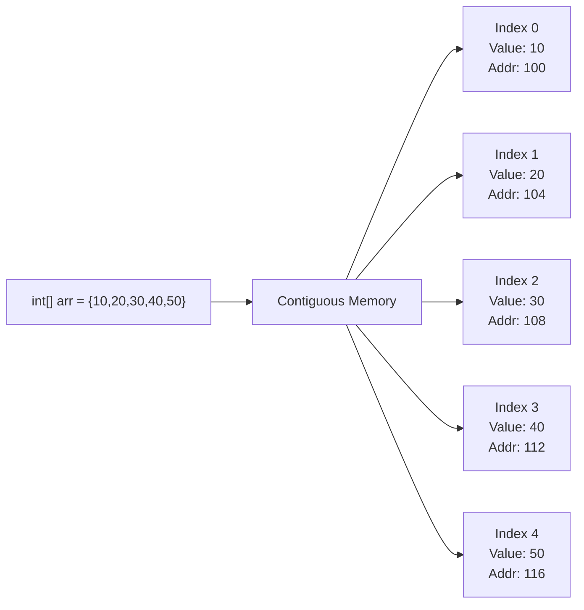
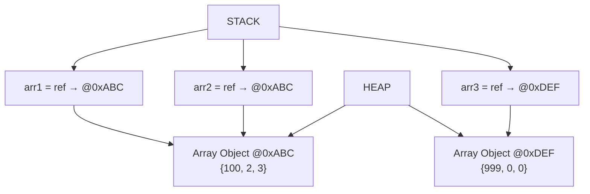
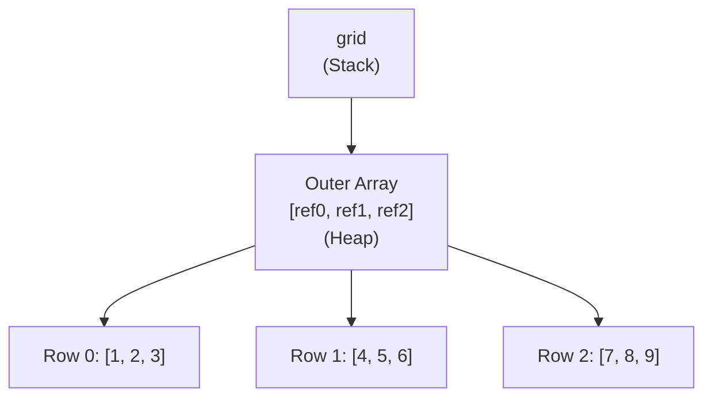

<a id="9-arrays"></a>

# 📘 Chapter 9: Arrays

> **Part B: Strings, Arrays & Packages**
> `Beginner` | `Foundation` | `Data Structure Basics`

⭐⭐⭐⭐⭐⭐⭐⭐⭐⭐⭐⭐⭐⭐⭐⭐⭐⭐⭐⭐⭐⭐⭐⭐⭐⭐⭐⭐⭐⭐⭐⭐

Java • Core Java • Interview Preparation

⭐⭐⭐⭐⭐⭐⭐⭐⭐⭐⭐⭐⭐⭐⭐⭐⭐⭐⭐⭐⭐⭐⭐⭐⭐⭐⭐⭐⭐⭐⭐⭐

---

<a id="chapter-index-table-9"></a>

## 📚 Chapter 9 — Index Table

| No. | Topic | Subtopics |
|-----|-------|-----------|
| 9.1 | [What is an Array](#91-what-is-an-array) | Definition, Need for Arrays, Fixed Size Container |
| 9.2 | [Characteristics of Arrays](#92-characteristics-of-arrays) | Fixed Size, Homogeneous, Contiguous Memory, 0-based Index |
| 9.3 | [1D Array Declaration & Initialization](#93-1d-array-declaration-initialization) | 3 Steps, All Syntax Variations, Shorthand |
| 9.4 | [Accessing Array Elements](#94-accessing-array-elements) | Index-based Access, Reading & Writing |
| 9.5 | [Array Length Property](#95-array-length-property) | .length (NOT method!), Difference from String.length() |
| 9.6 | [ArrayIndexOutOfBoundsException](#96-arrayindexoutofboundsexception) | What Causes It, Prevention, Runtime Exception |
| 9.7 | [Default Values in Arrays](#97-default-values-in-arrays) | int→0, boolean→false, Object→null, char→'\u0000' |
| 9.8 | [Array as Object in Java](#98-array-as-object-in-java) | Arrays are Objects, Stored on Heap, Reference on Stack |
| 9.9 | [2D Arrays (Matrix)](#99-2d-arrays-matrix) | Declaration, Initialization, Row×Column, Matrix Traversal |
| 9.10 | [Jagged/Ragged Arrays](#910-jaggedragged-arrays) | Different Column Sizes, Declaration, Memory Layout |
| 9.11 | [3D Arrays](#911-3d-arrays) | Declaration, Use Cases, Memory |
| 9.12 | [Array Traversal Methods](#912-array-traversal-methods) | for, for-each, while, Arrays.toString(), Arrays.stream() |
| 9.13 | [java.util.Arrays Utility Class](#913-javautilarrays-utility-class) | sort, binarySearch, copyOf, fill, equals, toString, asList, stream, compare, mismatch |
| 9.14 | [Array as Method Parameter](#914-array-as-method-parameter) | Pass by Value of Reference, Modifying Arrays in Methods |
| 9.15 | [Returning Arrays from Methods](#915-returning-arrays-from-methods) | Return Type Syntax, Use Cases |
| 9.16 | [Anonymous Arrays](#916-anonymous-arrays) | Creating Arrays Without Name, Passing Inline |
| 9.17 | [Sorting & Searching Arrays](#917-sorting-searching-arrays) | Bubble Sort, Selection Sort, Linear Search, Binary Search |
| 9.18 | [Array Interview Problems](#918-array-interview-problems) | Second Largest, Reverse, Rotate, Two Sum, Move Zeros, Kadane's, Dutch National Flag |
| 🔥 | [Java vs Other Languages](#9-java-vs-other-languages) | Unique Array Differences |
| 💡 | [Interview Questions](#9-interview-questions) | 15+ Conceptual · Scenario · Output-based |
| 🧪 | [Practice Problems](#9-practice-problems) | 5 Coding + 5 Theory |

---

## 9.1 What is an Array

<a id="91-what-is-an-array"></a>

### 📌 Definition

```
An ARRAY is a FIXED-SIZE, ORDERED COLLECTION of elements
of the SAME DATA TYPE stored in CONTIGUOUS memory locations.

It is the SIMPLEST data structure in Java.
Arrays allow you to store multiple values under a SINGLE variable name
and access them using an INDEX number.
```

### 📌 Why Do We Need Arrays?

```java
// WITHOUT ARRAYS — Storing 5 student marks:
int marks1 = 85;
int marks2 = 90;
int marks3 = 78;
int marks4 = 92;
int marks5 = 88;
// Imagine 1000 students → 1000 variables! 😱

// WITH ARRAYS — Single variable, multiple values:
int[] marks = {85, 90, 78, 92, 88};
// Clean, organized, and scalable!
// For 1000 students: int[] marks = new int[1000];
```

### 🌍 Real-World Analogy (Hinglish)

```
Array ek TRAIN ki tarah hai:

🚃 Train = Array
🚃 Coaches = Elements (same type — all carry passengers)
🚃 Coach Number = Index (0, 1, 2, 3...)
🚃 Total Coaches = Length (fixed, can't add/remove coaches)
🚃 All coaches connected = Contiguous memory

int[] arr = {10, 20, 30, 40, 50};
           Coach 0  1   2   3   4

→ Fixed size: Once train is built, can't add/remove coaches
→ Same type: All coaches carry same type (passengers/goods)
→ Indexed: You go to specific coach by number
→ Contiguous: All coaches are connected in a line
```

<a href="#chapter-index-table-9">Go to Top 🔝</a>

---

## 9.2 Characteristics of Arrays

<a id="92-characteristics-of-arrays"></a>

### 📌 4 Key Characteristics

```
┌──────────────────────────────────────────────────────────────┐
│  CHARACTERISTIC        │  EXPLANATION                        │
├────────────────────────┼─────────────────────────────────────┤
│  1. FIXED SIZE         │  Size decided at creation time      │
│                        │  CANNOT grow or shrink              │
│                        │  int[] a = new int[5]; → always 5   │
├────────────────────────┼─────────────────────────────────────┤
│  2. HOMOGENEOUS        │  All elements MUST be same type     │
│                        │  int[] → only integers              │
│                        │  String[] → only strings            │
│                        │  Cannot mix int and String           │
├────────────────────────┼─────────────────────────────────────┤
│  3. CONTIGUOUS MEMORY  │  Elements stored NEXT TO EACH OTHER │
│                        │  in memory                          │
│                        │  → Fast access using math           │
│                        │  → address = base + (index × size)  │
├────────────────────────┼─────────────────────────────────────┤
│  4. INDEX-BASED (0)    │  First element at index 0           │
│                        │  Last element at index length-1     │
│                        │  arr[0], arr[1], ... arr[n-1]       │
└────────────────────────┴─────────────────────────────────────┘
```

### 📊 Array Memory Layout



```
Memory address calculation:
→ Base address of arr[0] = 100
→ int = 4 bytes
→ arr[i] address = 100 + (i × 4)
→ arr[0] = 100, arr[1] = 104, arr[2] = 108...

This is why array access is O(1) — just math!
```

<a href="#chapter-index-table-9">Go to Top 🔝</a>

---

## 9.3 1D Array Declaration & Initialization

<a id="93-1d-array-declaration-initialization"></a>

### 📌 Three Steps (Can Be Combined)

```java
public class ArrayDeclaration {
    public static void main(String[] args) {

        // ═══ STEP 1: DECLARATION (tells JVM about type) ═══
        int[] arr;         // ✅ Preferred style in Java
        int arr2[];        // ✅ Also valid (C-style)
        int[] arr3, arr4;  // ✅ Both are int arrays
        int arr5[], x;     // ⚠️ arr5 is array, x is just int!

        // ═══ STEP 2: INSTANTIATION (allocates memory) ═══
        arr = new int[5];  // Creates array of 5 ints on HEAP
        // Default values: [0, 0, 0, 0, 0]

        // ═══ STEP 3: INITIALIZATION (assign values) ═══
        arr[0] = 10;
        arr[1] = 20;
        arr[2] = 30;
        arr[3] = 40;
        arr[4] = 50;

        // ═══ ALL 3 STEPS COMBINED (Most Common) ═══
        int[] marks = new int[]{85, 90, 78, 92, 88};
        // OR shorthand:
        int[] marks2 = {85, 90, 78, 92, 88};  // ✅ Only during declaration!

        // ═══ ALL SYNTAX VARIATIONS ═══

        // Style 1: Declaration + size (default values)
        int[] a1 = new int[5];           // [0, 0, 0, 0, 0]

        // Style 2: Declaration + values (size auto-calculated)
        int[] a2 = new int[]{1, 2, 3};   // Size = 3

        // Style 3: Shorthand (ONLY at declaration line!)
        int[] a3 = {1, 2, 3, 4, 5};      // Size = 5

        // Style 4: Declare first, instantiate later
        int[] a4;
        a4 = new int[]{10, 20, 30};      // ✅ OK
        // a4 = {10, 20, 30};            // ❌ Shorthand ONLY at declaration!

        // ═══ DIFFERENT TYPES ═══
        String[] names = {"Alice", "Bob", "Charlie"};
        double[] prices = {9.99, 19.99, 29.99};
        char[] vowels = {'a', 'e', 'i', 'o', 'u'};
        boolean[] flags = {true, false, true};
    }
}
```

### 📌 Common Mistakes

```java
// ❌ MISTAKE 1: Size AND values together
// int[] arr = new int[5]{1,2,3,4,5};  // COMPILE ERROR!
// Either specify size OR values — not both!

// ❌ MISTAKE 2: Shorthand not at declaration
// int[] arr;
// arr = {1, 2, 3};  // COMPILE ERROR!
// Must use: arr = new int[]{1, 2, 3};

// ❌ MISTAKE 3: Negative size
// int[] arr = new int[-5];  // NegativeArraySizeException at RUNTIME!

// ❌ MISTAKE 4: Size too large
// int[] arr = new int[Integer.MAX_VALUE]; // OutOfMemoryError!
```

> [!TIP]
> **Best Practice:** Use `int[] arr` style (type before variable) — it's the Java convention. The C-style `int arr[]` works but is less readable when declaring multiple arrays.

<a href="#chapter-index-table-9">Go to Top 🔝</a>

---

## 9.4 Accessing Array Elements

<a id="94-accessing-array-elements"></a>

```java
public class ArrayAccess {
    public static void main(String[] args) {

        int[] arr = {10, 20, 30, 40, 50};

        // ═══ READING elements ═══
        System.out.println(arr[0]);  // 10 (first element)
        System.out.println(arr[2]);  // 30 (third element)
        System.out.println(arr[4]);  // 50 (last element)

        // ═══ WRITING/MODIFYING elements ═══
        arr[0] = 100;  // Change first element
        arr[4] = 500;  // Change last element
        System.out.println(arr[0]);  // 100
        System.out.println(arr[4]);  // 500

        // ═══ Accessing with variable index ═══
        int index = 2;
        System.out.println(arr[index]);  // 30

        // ═══ Last element shortcut ═══
        System.out.println(arr[arr.length - 1]);  // Last element

        // ═══ Time Complexity: O(1) ═══
        // Direct access by index — no searching needed!
        // address = base + (index × element_size)
    }
}
```

<a href="#chapter-index-table-9">Go to Top 🔝</a>

---

## 9.5 Array Length Property

<a id="95-array-length-property"></a>

```java
public class ArrayLength {
    public static void main(String[] args) {

        int[] arr = {10, 20, 30, 40, 50};

        // ═══ .length is a PROPERTY (field), NOT a method! ═══
        System.out.println(arr.length);    // 5 ✅ (no parentheses!)
        // System.out.println(arr.length()); // ❌ ERROR! It's not a method

        // ═══ COMPARE with String ═══
        String s = "Hello";
        System.out.println(s.length());    // 5 ✅ (WITH parentheses — it's a METHOD!)

        // ═══ IMPORTANT DISTINCTION ═══
        // Array:  .length  → FIELD (no parentheses)
        // String: .length() → METHOD (with parentheses)
        // This is a COMMON interview trap!

        // ═══ length is FINAL — cannot change ═══
        // arr.length = 10;  // ❌ Cannot assign to final variable

        // ═══ Valid index range ═══
        // First index: 0
        // Last index: arr.length - 1 = 4
        // Total elements: arr.length = 5
    }
}
```

```
┌──────────────────────────────────────────────────────────────┐
│  INTERVIEW TRAP: .length vs .length() vs .size()            │
├──────────────────────────────────────────────────────────────┤
│  Array:      arr.length      → FIELD (no parentheses)       │
│  String:     str.length()    → METHOD (with parentheses)    │
│  Collection: list.size()     → METHOD (with parentheses)    │
│                                                              │
│  WHY different?                                              │
│  → Array is a special JVM construct → length is a field     │
│  → String is a class → length() is a method                 │
│  → Collection is an interface → size() is a method          │
└──────────────────────────────────────────────────────────────┘
```

<a href="#chapter-index-table-9">Go to Top 🔝</a>

---

## 9.6 ArrayIndexOutOfBoundsException

<a id="96-arrayindexoutofboundsexception"></a>

```java
public class ArrayException {
    public static void main(String[] args) {

        int[] arr = {10, 20, 30};  // Valid indices: 0, 1, 2

        // ═══ CAUSES ═══
        // System.out.println(arr[3]);   // ❌ Index 3 doesn't exist!
        // System.out.println(arr[-1]);  // ❌ Negative index!
        // System.out.println(arr[arr.length]); // ❌ length=3, max index=2!

        // ═══ RUNTIME Exception (NOT compile-time!) ═══
        // The program COMPILES successfully
        // Error occurs ONLY when the invalid line RUNS

        // ═══ PREVENTION ═══
        int index = 5;
        if (index >= 0 && index < arr.length) {
            System.out.println(arr[index]);
        } else {
            System.out.println("Invalid index: " + index);
        }

        // ═══ CATCHING the exception ═══
        try {
            System.out.println(arr[10]);
        } catch (ArrayIndexOutOfBoundsException e) {
            System.out.println("Exception: " + e.getMessage());
            // Exception: Index 10 out of bounds for length 3
        }
    }
}
```

> [!IMPORTANT]
> `ArrayIndexOutOfBoundsException` is a **RUNTIME exception** (unchecked). The code compiles fine — the error only occurs when the invalid index is actually accessed during execution. Always check `index >= 0 && index < arr.length` before accessing.

<a href="#chapter-index-table-9">Go to Top 🔝</a>

---

## 9.7 Default Values in Arrays

<a id="97-default-values-in-arrays"></a>

```java
public class ArrayDefaults {
    public static void main(String[] args) {

        // Arrays get DEFAULT VALUES when created with 'new'

        int[] intArr = new int[3];
        System.out.println(java.util.Arrays.toString(intArr));
        // [0, 0, 0] — int default = 0

        double[] doubleArr = new double[3];
        System.out.println(java.util.Arrays.toString(doubleArr));
        // [0.0, 0.0, 0.0] — double default = 0.0

        boolean[] boolArr = new boolean[3];
        System.out.println(java.util.Arrays.toString(boolArr));
        // [false, false, false] — boolean default = false

        char[] charArr = new char[3];
        System.out.println(java.util.Arrays.toString(charArr));
        // [\u0000, \u0000, \u0000] — char default = '\u0000' (null char)

        String[] strArr = new String[3];
        System.out.println(java.util.Arrays.toString(strArr));
        // [null, null, null] — Object default = null

        // ═══ Default Values Table ═══
        // int/byte/short/long → 0
        // float/double        → 0.0
        // boolean             → false
        // char                → '\u0000'
        // Any Object/String   → null
    }
}
```

<a href="#chapter-index-table-9">Go to Top 🔝</a>

---

## 9.8 Array as Object in Java

<a id="98-array-as-object-in-java"></a>

### 📌 Arrays ARE Objects!

```java
public class ArrayAsObject {
    public static void main(String[] args) {

        int[] arr = {10, 20, 30};

        // ═══ PROOF: Array is an Object ═══
        System.out.println(arr instanceof Object);  // true!
        System.out.println(arr.getClass().getName()); // [I (int array)
        System.out.println(arr.getClass().getSuperclass()); // class java.lang.Object

        // ═══ Memory Layout ═══
        // 'arr' reference → stored on STACK
        // Actual array data → stored on HEAP (it's an object!)

        // ═══ REFERENCE BEHAVIOR ═══
        int[] arr1 = {1, 2, 3};
        int[] arr2 = arr1;      // arr2 points to SAME array!

        arr2[0] = 100;          // Modifying via arr2
        System.out.println(arr1[0]);  // 100 ← arr1 also changed!
        // Because arr1 and arr2 point to SAME object on Heap!

        // ═══ Creating INDEPENDENT copy ═══
        int[] arr3 = new int[3];
        arr3[0] = 10;

        // arr3 is SEPARATE from arr1
        arr3[0] = 999;
        System.out.println(arr1[0]);  // 100 (not affected)

        // ═══ == comparison for arrays ═══
        int[] a = {1, 2, 3};
        int[] b = {1, 2, 3};
        System.out.println(a == b);                          // false (different objects!)
        System.out.println(java.util.Arrays.equals(a, b));   // true (same content)
    }
}
```

### 📊 Array Reference Behavior



> [!IMPORTANT]
> **Critical Interview Point:** When you assign `arr2 = arr1`, you are NOT copying the array. You're copying the REFERENCE. Both variables now point to the SAME array on Heap. Changes via one affect the other. To create an independent copy, use `Arrays.copyOf()` or `arr.clone()`.

<a href="#chapter-index-table-9">Go to Top 🔝</a>

---

## 9.9 2D Arrays (Matrix)

<a id="99-2d-arrays-matrix"></a>

```java
public class TwoDArrayDemo {
    public static void main(String[] args) {

        // ═══ DECLARATION + INITIALIZATION ═══

        // Style 1: Size only (default values)
        int[][] matrix = new int[3][4];  // 3 rows, 4 columns
        // All elements initialized to 0

        // Style 2: With values
        int[][] grid = {
            {1, 2, 3},      // Row 0
            {4, 5, 6},      // Row 1
            {7, 8, 9}       // Row 2
        };

        // ═══ ACCESSING ELEMENTS ═══
        System.out.println(grid[0][0]);  // 1 (Row 0, Col 0)
        System.out.println(grid[1][2]);  // 6 (Row 1, Col 2)
        System.out.println(grid[2][2]);  // 9 (Row 2, Col 2)

        // ═══ MODIFYING ELEMENTS ═══
        grid[1][1] = 50;  // Change center element
        System.out.println(grid[1][1]);  // 50

        // ═══ DIMENSIONS ═══
        System.out.println("Rows: " + grid.length);       // 3
        System.out.println("Cols: " + grid[0].length);     // 3

        // ═══ TRAVERSAL (Nested loops) ═══
        System.out.println("Matrix:");
        for (int i = 0; i < grid.length; i++) {
            for (int j = 0; j < grid[i].length; j++) {
                System.out.printf("%4d", grid[i][j]);
            }
            System.out.println();
        }
        // Output:
        //    1   2   3
        //    4  50   6
        //    7   8   9

        // ═══ TRAVERSAL using for-each ═══
        for (int[] row : grid) {
            for (int val : row) {
                System.out.print(val + " ");
            }
            System.out.println();
        }
    }
}
```

### 📌 2D Array Memory Layout

```
int[][] grid = {{1,2,3}, {4,5,6}, {7,8,9}};

In Java, 2D array is actually an ARRAY OF ARRAYS.

STACK:
  grid → ref to outer array

HEAP:
  Outer array: [ref0, ref1, ref2]
  ref0 → inner array: [1, 2, 3]
  ref1 → inner array: [4, 5, 6]
  ref2 → inner array: [7, 8, 9]

Each row is a SEPARATE array object on Heap!
This is why Java supports JAGGED arrays (different column sizes).
```

### 📊 2D Array Memory Diagram



<a href="#chapter-index-table-9">Go to Top 🔝</a>

---

## 9.10 Jagged/Ragged Arrays

<a id="910-jaggedragged-arrays"></a>

### 📌 Arrays with Different Column Sizes

```java
public class JaggedArrayDemo {
    public static void main(String[] args) {

        // ═══ JAGGED ARRAY: Different column sizes per row ═══
        int[][] jagged = new int[3][];     // 3 rows, columns NOT specified yet

        jagged[0] = new int[2];            // Row 0: 2 columns
        jagged[1] = new int[4];            // Row 1: 4 columns
        jagged[2] = new int[3];            // Row 2: 3 columns

        // Initialize
        jagged[0] = new int[]{1, 2};
        jagged[1] = new int[]{3, 4, 5, 6};
        jagged[2] = new int[]{7, 8, 9};

        // OR shorthand:
        int[][] jagged2 = {
            {1, 2},          // 2 elements
            {3, 4, 5, 6},   // 4 elements
            {7, 8, 9}       // 3 elements
        };

        // ═══ TRAVERSAL ═══
        for (int i = 0; i < jagged2.length; i++) {
            for (int j = 0; j < jagged2[i].length; j++) {  // Use row-specific length!
                System.out.print(jagged2[i][j] + " ");
            }
            System.out.println();
        }
        // 1 2
        // 3 4 5 6
        // 7 8 9

        // ═══ WHY possible in Java? ═══
        // Because 2D array is ARRAY OF ARRAYS
        // Each inner array is a SEPARATE object → can have different size
        // In C++, 2D array must have fixed columns
    }
}
```

```
JAGGED ARRAY MEMORY:
┌───────────────────────────────────┐
│  jagged → [ref0, ref1, ref2]     │  Outer array
├───────────────────────────────────┤
│  ref0 → [1, 2]                   │  Row 0: length=2
│  ref1 → [3, 4, 5, 6]            │  Row 1: length=4
│  ref2 → [7, 8, 9]               │  Row 2: length=3
└───────────────────────────────────┘

Each row is an INDEPENDENT array object on Heap!
```

<a href="#chapter-index-table-9">Go to Top 🔝</a>

---

## 9.11 3D Arrays

<a id="911-3d-arrays"></a>

```java
public class ThreeDArray {
    public static void main(String[] args) {

        // 3D Array = Array of 2D Arrays
        int[][][] cube = {
            {   // Layer 0
                {1, 2}, {3, 4}
            },
            {   // Layer 1
                {5, 6}, {7, 8}
            }
        };
        // 2 layers × 2 rows × 2 columns

        // Accessing: cube[layer][row][col]
        System.out.println(cube[0][0][0]);  // 1
        System.out.println(cube[1][1][1]);  // 8

        // Traversal
        for (int[][] layer : cube) {
            for (int[] row : layer) {
                for (int val : row) {
                    System.out.print(val + " ");
                }
                System.out.println();
            }
            System.out.println("---");
        }

        // Use cases:
        // → 3D game coordinates (x, y, z)
        // → RGB pixel data (width × height × 3 channels)
        // → Time series data (year × month × day)
    }
}
```

<a href="#chapter-index-table-9">Go to Top 🔝</a>

---

## 9.12 Array Traversal Methods

<a id="912-array-traversal-methods"></a>

```java
import java.util.Arrays;

public class ArrayTraversal {
    public static void main(String[] args) {

        int[] arr = {10, 20, 30, 40, 50};

        // ═══ METHOD 1: for loop (index-based) ═══
        System.out.print("for loop: ");
        for (int i = 0; i < arr.length; i++) {
            System.out.print(arr[i] + " ");
        }
        System.out.println();

        // ═══ METHOD 2: Enhanced for-each ═══
        System.out.print("for-each: ");
        for (int val : arr) {
            System.out.print(val + " ");
        }
        System.out.println();

        // ═══ METHOD 3: while loop ═══
        System.out.print("while: ");
        int i = 0;
        while (i < arr.length) {
            System.out.print(arr[i] + " ");
            i++;
        }
        System.out.println();

        // ═══ METHOD 4: Arrays.toString() ═══
        System.out.println("toString: " + Arrays.toString(arr));
        // [10, 20, 30, 40, 50]

        // ═══ METHOD 5: Arrays.stream() (Java 8+) ═══
        System.out.print("stream: ");
        Arrays.stream(arr).forEach(v -> System.out.print(v + " "));
        System.out.println();

        // ═══ For 2D Arrays: Arrays.deepToString() ═══
        int[][] matrix = {{1,2,3}, {4,5,6}};
        System.out.println("2D: " + Arrays.deepToString(matrix));
        // [[1, 2, 3], [4, 5, 6]]

        // DO NOT use toString() for 2D — gives garbage!
        System.out.println("2D wrong: " + Arrays.toString(matrix));
        // [[I@..., [I@...] ← Object references, not values!
    }
}
```

<a href="#chapter-index-table-9">Go to Top 🔝</a>

---

## 9.13 java.util.Arrays Utility Class ⭐⭐

<a id="913-javautilarrays-utility-class"></a>

```java
import java.util.Arrays;
import java.util.List;

public class ArraysUtilityDemo {
    public static void main(String[] args) {

        int[] arr = {50, 30, 10, 40, 20};

        // ═══ 1. Arrays.sort() — Sort in ascending order ═══
        Arrays.sort(arr);
        System.out.println("Sorted: " + Arrays.toString(arr));
        // [10, 20, 30, 40, 50]

        // Sort range [fromIndex, toIndex)
        int[] arr2 = {50, 30, 10, 40, 20};
        Arrays.sort(arr2, 1, 4);  // Sort index 1 to 3
        System.out.println("Partial sort: " + Arrays.toString(arr2));
        // [50, 10, 30, 40, 20]

        // ═══ 2. Arrays.binarySearch() — Find element (array MUST be sorted!) ═══
        int index = Arrays.binarySearch(arr, 30);
        System.out.println("Found 30 at index: " + index);  // 2
        int notFound = Arrays.binarySearch(arr, 35);
        System.out.println("35 not found: " + notFound);     // negative

        // ═══ 3. Arrays.copyOf() — Copy array (new size) ═══
        int[] copy = Arrays.copyOf(arr, 7);     // Expand to 7 (extra = 0)
        System.out.println("CopyOf: " + Arrays.toString(copy));
        // [10, 20, 30, 40, 50, 0, 0]

        int[] shrink = Arrays.copyOf(arr, 3);   // Shrink to 3
        System.out.println("Shrink: " + Arrays.toString(shrink));
        // [10, 20, 30]

        // ═══ 4. Arrays.copyOfRange() — Copy range ═══
        int[] range = Arrays.copyOfRange(arr, 1, 4);  // index 1 to 3
        System.out.println("Range: " + Arrays.toString(range));
        // [20, 30, 40]

        // ═══ 5. Arrays.fill() — Fill all with same value ═══
        int[] filled = new int[5];
        Arrays.fill(filled, 7);
        System.out.println("Filled: " + Arrays.toString(filled));
        // [7, 7, 7, 7, 7]

        // Fill range
        Arrays.fill(filled, 1, 4, 99);
        System.out.println("Fill range: " + Arrays.toString(filled));
        // [7, 99, 99, 99, 7]

        // ═══ 6. Arrays.equals() — Compare content ═══
        int[] a = {1, 2, 3};
        int[] b = {1, 2, 3};
        System.out.println("equals: " + Arrays.equals(a, b));  // true
        System.out.println("== : " + (a == b));                  // false!

        // ═══ 7. Arrays.deepEquals() — For 2D+ arrays ═══
        int[][] m1 = {{1,2}, {3,4}};
        int[][] m2 = {{1,2}, {3,4}};
        System.out.println("deepEquals: " + Arrays.deepEquals(m1, m2)); // true
        System.out.println("equals 2D: " + Arrays.equals(m1, m2));     // false!

        // ═══ 8. Arrays.toString() / deepToString() — Print ═══
        System.out.println(Arrays.toString(a));         // [1, 2, 3]
        System.out.println(Arrays.deepToString(m1));    // [[1, 2], [3, 4]]

        // ═══ 9. Arrays.asList() — Convert to List ═══
        String[] names = {"Alice", "Bob", "Charlie"};
        List<String> nameList = Arrays.asList(names);
        System.out.println("List: " + nameList);  // [Alice, Bob, Charlie]
        // ⚠️ Returns FIXED-SIZE list (cannot add/remove!)
        // nameList.add("Dave");  // ❌ UnsupportedOperationException!

        // ═══ 10. Arrays.stream() — Java 8+ ═══
        int sum = Arrays.stream(arr).sum();
        System.out.println("Sum: " + sum);  // 150

        long count = Arrays.stream(arr).filter(x -> x > 25).count();
        System.out.println("Count > 25: " + count);  // 3

        // ═══ 11. Arrays.compare() — Java 9+ ═══
        int[] x = {1, 2, 3};
        int[] y = {1, 2, 4};
        System.out.println("compare: " + Arrays.compare(x, y));
        // Negative (x < y, because 3 < 4 at index 2)

        // ═══ 12. Arrays.mismatch() — Java 9+ ═══
        int[] p = {1, 2, 3, 4, 5};
        int[] q = {1, 2, 9, 4, 5};
        System.out.println("mismatch at: " + Arrays.mismatch(p, q));
        // 2 (first difference at index 2)
    }
}
```

<a href="#chapter-index-table-9">Go to Top 🔝</a>

---

## 9.14 Array as Method Parameter

<a id="914-array-as-method-parameter"></a>

### 📌 Pass by Value of REFERENCE!

```java
public class ArrayAsParameter {

    // Arrays are OBJECTS → pass by value of reference
    // Changes inside method AFFECT the original array!
    static void modifyArray(int[] arr) {
        arr[0] = 999;  // ✅ Modifies original array!
    }

    // Replacing reference doesn't affect original
    static void replaceArray(int[] arr) {
        arr = new int[]{100, 200, 300};  // Local reference changed
        // Original reference in caller is UNAFFECTED
    }

    // Print helper
    static void printArray(int[] arr) {
        System.out.println(java.util.Arrays.toString(arr));
    }

    public static void main(String[] args) {
        int[] numbers = {1, 2, 3, 4, 5};

        // Modify → affects original
        modifyArray(numbers);
        printArray(numbers);   // [999, 2, 3, 4, 5] ← CHANGED!

        // Replace → does NOT affect original
        replaceArray(numbers);
        printArray(numbers);   // [999, 2, 3, 4, 5] ← UNCHANGED!

        // Same rule as pass by value for objects:
        // → CAN modify object state through copied reference
        // → CANNOT make original reference point to different object
    }
}
```

<a href="#chapter-index-table-9">Go to Top 🔝</a>

---

## 9.15 Returning Arrays from Methods

<a id="915-returning-arrays-from-methods"></a>

```java
public class ReturnArray {

    // Return an array from method
    static int[] createArray(int size) {
        int[] arr = new int[size];
        for (int i = 0; i < size; i++) {
            arr[i] = (i + 1) * 10;
        }
        return arr;
    }

    // Return 2D array
    static int[][] createMatrix(int rows, int cols) {
        int[][] matrix = new int[rows][cols];
        int count = 1;
        for (int i = 0; i < rows; i++)
            for (int j = 0; j < cols; j++)
                matrix[i][j] = count++;
        return matrix;
    }

    // Reverse and return (new array)
    static int[] reverse(int[] arr) {
        int[] result = new int[arr.length];
        for (int i = 0; i < arr.length; i++) {
            result[i] = arr[arr.length - 1 - i];
        }
        return result;
    }

    public static void main(String[] args) {
        int[] arr = createArray(5);
        System.out.println(java.util.Arrays.toString(arr));
        // [10, 20, 30, 40, 50]

        int[][] matrix = createMatrix(2, 3);
        System.out.println(java.util.Arrays.deepToString(matrix));
        // [[1, 2, 3], [4, 5, 6]]

        int[] reversed = reverse(arr);
        System.out.println(java.util.Arrays.toString(reversed));
        // [50, 40, 30, 20, 10]
    }
}
```

<a href="#chapter-index-table-9">Go to Top 🔝</a>

---

## 9.16 Anonymous Arrays

<a id="916-anonymous-arrays"></a>

```java
public class AnonymousArray {

    static int sum(int[] arr) {
        int total = 0;
        for (int num : arr) total += num;
        return total;
    }

    public static void main(String[] args) {

        // ANONYMOUS ARRAY = Array without a variable name
        // Created inline and passed directly to method

        // ═══ Named array ═══
        int[] nums = {1, 2, 3, 4, 5};
        System.out.println(sum(nums));  // 15

        // ═══ Anonymous array (no variable needed!) ═══
        System.out.println(sum(new int[]{10, 20, 30}));  // 60
        // Array created inline → passed directly → no variable

        // ═══ Use cases ═══
        // 1. One-time use — don't need to reuse the array
        // 2. Method arguments — pass values directly
        // 3. Return values — return new int[]{1, 2, 3};

        // ═══ Note: Cannot use shorthand for anonymous ═══
        // System.out.println(sum({1, 2, 3}));  // ❌ ERROR!
        // Must use: new int[]{1, 2, 3}
    }
}
```

<a href="#chapter-index-table-9">Go to Top 🔝</a>

---

## 9.17 Sorting & Searching Arrays

<a id="917-sorting-searching-arrays"></a>

### 📌 Sorting Algorithms

```java
public class ArraySorting {

    // ═══ BUBBLE SORT — O(n²) ═══
    static void bubbleSort(int[] arr) {
        int n = arr.length;
        for (int i = 0; i < n - 1; i++) {
            boolean swapped = false;
            for (int j = 0; j < n - 1 - i; j++) {
                if (arr[j] > arr[j + 1]) {
                    int temp = arr[j];
                    arr[j] = arr[j + 1];
                    arr[j + 1] = temp;
                    swapped = true;
                }
            }
            if (!swapped) break;  // Optimization: already sorted
        }
    }

    // ═══ SELECTION SORT — O(n²) ═══
    static void selectionSort(int[] arr) {
        int n = arr.length;
        for (int i = 0; i < n - 1; i++) {
            int minIdx = i;
            for (int j = i + 1; j < n; j++) {
                if (arr[j] < arr[minIdx]) minIdx = j;
            }
            int temp = arr[i];
            arr[i] = arr[minIdx];
            arr[minIdx] = temp;
        }
    }

    // ═══ INSERTION SORT — O(n²), best for small/nearly sorted ═══
    static void insertionSort(int[] arr) {
        for (int i = 1; i < arr.length; i++) {
            int key = arr[i];
            int j = i - 1;
            while (j >= 0 && arr[j] > key) {
                arr[j + 1] = arr[j];
                j--;
            }
            arr[j + 1] = key;
        }
    }

    public static void main(String[] args) {
        int[] arr = {64, 25, 12, 22, 11};
        bubbleSort(arr);
        System.out.println(java.util.Arrays.toString(arr));
        // [11, 12, 22, 25, 64]

        // Built-in sort (uses Dual-Pivot Quicksort — O(n log n)):
        int[] arr2 = {50, 30, 10, 40, 20};
        java.util.Arrays.sort(arr2);
        System.out.println(java.util.Arrays.toString(arr2));
    }
}
```

### 📌 Searching Algorithms

```java
public class ArraySearching {

    // ═══ LINEAR SEARCH — O(n) ═══
    static int linearSearch(int[] arr, int target) {
        for (int i = 0; i < arr.length; i++) {
            if (arr[i] == target) return i;
        }
        return -1;  // Not found
    }

    // ═══ BINARY SEARCH — O(log n), array MUST be sorted! ═══
    static int binarySearch(int[] arr, int target) {
        int left = 0, right = arr.length - 1;
        while (left <= right) {
            int mid = left + (right - left) / 2;
            if (arr[mid] == target) return mid;
            else if (arr[mid] < target) left = mid + 1;
            else right = mid - 1;
        }
        return -1;
    }

    public static void main(String[] args) {
        int[] arr = {10, 20, 30, 40, 50};

        System.out.println(linearSearch(arr, 30));  // 2
        System.out.println(binarySearch(arr, 40));  // 3

        // Built-in binary search:
        System.out.println(java.util.Arrays.binarySearch(arr, 30)); // 2
    }
}
```

<a href="#chapter-index-table-9">Go to Top 🔝</a>

---

## 9.18 Array Interview Problems ⭐

<a id="918-array-interview-problems"></a>

### 📌 1. Find Second Largest Element

```java
static int secondLargest(int[] arr) {
    int first = Integer.MIN_VALUE, second = Integer.MIN_VALUE;
    for (int num : arr) {
        if (num > first) {
            second = first;
            first = num;
        } else if (num > second && num != first) {
            second = num;
        }
    }
    return second;
}
// secondLargest({10, 5, 20, 8}) → 10
```

### 📌 2. Reverse an Array (In-place)

```java
static void reverse(int[] arr) {
    int left = 0, right = arr.length - 1;
    while (left < right) {
        int temp = arr[left];
        arr[left] = arr[right];
        arr[right] = temp;
        left++;
        right--;
    }
}
// reverse({1,2,3,4,5}) → {5,4,3,2,1}
```

### 📌 3. Move Zeros to End

```java
static void moveZeros(int[] arr) {
    int nonZeroIndex = 0;
    for (int i = 0; i < arr.length; i++) {
        if (arr[i] != 0) {
            int temp = arr[i];
            arr[i] = arr[nonZeroIndex];
            arr[nonZeroIndex] = temp;
            nonZeroIndex++;
        }
    }
}
// moveZeros({0,1,0,3,12}) → {1,3,12,0,0}
```

### 📌 4. Two Sum (Find pair with given sum)

```java
static int[] twoSum(int[] arr, int target) {
    java.util.Map<Integer, Integer> map = new java.util.HashMap<>();
    for (int i = 0; i < arr.length; i++) {
        int complement = target - arr[i];
        if (map.containsKey(complement)) {
            return new int[]{map.get(complement), i};
        }
        map.put(arr[i], i);
    }
    return new int[]{-1, -1};
}
// twoSum({2,7,11,15}, 9) → {0,1}
```

### 📌 5. Kadane's Algorithm (Maximum Subarray Sum)

```java
static int maxSubarraySum(int[] arr) {
    int maxSoFar = arr[0], maxEndingHere = arr[0];
    for (int i = 1; i < arr.length; i++) {
        maxEndingHere = Math.max(arr[i], maxEndingHere + arr[i]);
        maxSoFar = Math.max(maxSoFar, maxEndingHere);
    }
    return maxSoFar;
}
// maxSubarraySum({-2,1,-3,4,-1,2,1,-5,4}) → 6 (subarray: {4,-1,2,1})
```

<a href="#chapter-index-table-9">Go to Top 🔝</a>

---

<a id="9-java-vs-other-languages"></a>

## 🔥 What Makes Java DIFFERENT — Arrays

```
┌──────────────────────┬────────────┬────────────┬────────────┬────────────┐
│  Feature             │  Java      │  C++       │  Python    │  JavaScript│
├──────────────────────┼────────────┼────────────┼────────────┼────────────┤
│  Array type          │ OBJECT     │ Raw memory │ list (not  │ Object     │
│                      │ on Heap    │ on Stack   │ true array)│            │
├──────────────────────┼────────────┼────────────┼────────────┼────────────┤
│  Fixed size?         │ ✅ YES     │ ✅ YES     │ ❌ Dynamic │ ❌ Dynamic │
├──────────────────────┼────────────┼────────────┼────────────┼────────────┤
│  Homogeneous?        │ ✅ YES     │ ✅ YES     │ ❌ Mixed   │ ❌ Mixed   │
├──────────────────────┼────────────┼────────────┼────────────┼────────────┤
│  Bounds checking     │ ✅ YES     │ ❌ NO!     │ ✅ YES     │ ❌ undefined│
│                      │ (Exception)│ (Buffer    │ (Error)    │            │
│                      │            │ overflow!) │            │            │
├──────────────────────┼────────────┼────────────┼────────────┼────────────┤
│  Default values      │ ✅ YES     │ ❌ Garbage │ N/A        │ ✅ undefined│
│                      │ (0/null)   │ values!    │            │            │
├──────────────────────┼────────────┼────────────┼────────────┼────────────┤
│  .length             │ FIELD      │ sizeof/    │ len()      │ .length    │
│                      │ (no paren) │ manual     │ function   │ property   │
├──────────────────────┼────────────┼────────────┼────────────┼────────────┤
│  Jagged arrays       │ ✅ YES     │ ⚠️ Pointer │ ✅ Lists   │ ✅ YES    │
│                      │ (native)   │ arrays     │ of lists   │            │
├──────────────────────┼────────────┼────────────┼────────────┼────────────┤
│  Negative index      │ ❌ ERROR   │ ❌ Undefined│ ✅ -1=last │ ❌ undefined│
└──────────────────────┴────────────┴────────────┴────────────┴────────────┘
```

### 🎯 Key UNIQUE Points

```
1. ARRAYS ARE OBJECTS: Stored on Heap, have methods from Object
2. BOUNDS CHECKING: Java throws ArrayIndexOutOfBoundsException
   → C++ does NOT check → buffer overflow vulnerability!
3. DEFAULT VALUES: Java initializes to 0/null/false
   → C++ has GARBAGE values (uninitialized memory)
4. FIXED SIZE: Cannot resize → Use ArrayList for dynamic
5. JAGGED ARRAYS: Native support (array of arrays)
6. .length is FIELD: Not a method (no parentheses)
```

<a href="#chapter-index-table-9">Go to Top 🔝</a>

---

<a id="9-interview-questions"></a>

## 💡 Chapter 9 — Interview Questions (15+)

---

**Q1. What is the difference between array and ArrayList?**

```
ARRAY:                          ARRAYLIST:
→ Fixed size                    → Dynamic (grows automatically)
→ Can hold primitives + objects → Only objects (autoboxing for primitives)
→ int[] arr = new int[5]       → ArrayList<Integer> list = new ArrayList<>()
→ arr.length (field)           → list.size() (method)
→ Faster (direct memory)      → Slightly slower (object overhead)
→ No built-in methods          → Rich API (add, remove, contains, etc.)
→ Type-safe at compile time    → Type-safe with generics
```

---

**Q2. Why is array index 0-based in Java?**

```
Historical reason from C:
→ Index = OFFSET from base address
→ arr[0] = base + (0 × size) = base address itself
→ arr[1] = base + (1 × size) = next element
→ arr[i] = base + (i × size) = i-th element

If 1-based: arr[1] = base + (1-1) × size → extra subtraction!
0-based is more efficient for address calculation.
```

---

**Q3. Difference between arr.length, str.length(), list.size()?**

```
arr.length   → Array FIELD (no parentheses, final)
str.length() → String METHOD (with parentheses)
list.size()  → Collection METHOD (with parentheses)

WHY different?
→ Array is a special JVM construct → length is a field
→ String is a class → length() is a method
→ Collection is an interface → size() is a method
```

---

**Q4. Can we change the size of an array after creation?**

```
NO! Arrays have FIXED SIZE in Java.
Once created, size cannot change.

Workaround: Create new bigger array + copy elements
→ int[] newArr = Arrays.copyOf(oldArr, newSize);

Or use ArrayList (dynamic sizing built-in).
```

---

**Q5. What is the difference between Arrays.equals() and ==?**

```java
int[] a = {1, 2, 3};
int[] b = {1, 2, 3};

a == b               → false (different OBJECTS)
Arrays.equals(a, b)  → true (same CONTENT)

For 2D: Use Arrays.deepEquals(a, b)
        Arrays.equals() won't work for 2D!
```

---

**Q6. What happens when you print an array directly?**

```java
int[] arr = {1, 2, 3};
System.out.println(arr);  // [I@1b6d3586 ← garbage!

// WHY? println calls arr.toString() which returns:
// ClassName@HashCode → "[I" means int array

// FIX: Use Arrays.toString()
System.out.println(Arrays.toString(arr));  // [1, 2, 3]
```

---

### 🔴 Output-Based

**Q7.** What is the output?

```java
int[] a = {1, 2, 3};
int[] b = a;
b[0] = 100;
System.out.println(a[0]);
```

```
OUTPUT: 100
REASON: b = a copies REFERENCE, not array.
Both point to same array. Changing via b affects a.
```

---

**Q8.** What is the output?

```java
int[] arr = new int[3];
System.out.println(arr[0]);
System.out.println(arr[1]);
System.out.println(arr[2]);
```

```
OUTPUT: 0, 0, 0
REASON: int arrays default to 0.
```

---

**Q9.** What happens?

```java
int[] arr = {10, 20, 30};
System.out.println(arr[3]);
```

```
OUTPUT: ArrayIndexOutOfBoundsException
REASON: Valid indices are 0, 1, 2. Index 3 doesn't exist.
This is a RUNTIME exception (compiles fine).
```

---

**Q10.** What is the output?

```java
int[][] jagged = {{1,2}, {3,4,5}, {6}};
System.out.println(jagged.length);
System.out.println(jagged[1].length);
System.out.println(jagged[2].length);
```

```
OUTPUT: 3, 3, 1
REASON:
jagged.length = 3 (3 rows)
jagged[1].length = 3 (row 1 has 3 elements)
jagged[2].length = 1 (row 2 has 1 element)
```

<a href="#chapter-index-table-9">Go to Top 🔝</a>

---

<a id="9-practice-problems"></a>

## 🧪 Chapter 9 — Practice Problems

### 📝 5 Theory Questions

```
1. Explain why arrays are objects in Java. How does this
   affect memory layout (Stack vs Heap)?

2. Compare array .length vs String .length() vs ArrayList .size().
   Why are they different?

3. Explain jagged arrays with memory diagram. Why does Java
   support jagged arrays but C++ doesn't natively?

4. What is ArrayIndexOutOfBoundsException? When does it occur?
   How does Java's bounds checking differ from C++?

5. Explain Arrays.equals() vs == vs Arrays.deepEquals().
   When would each give different results?
```

### 💻 5 Coding Questions

```java
// Q1: Reverse array in-place using two pointers
public class ReverseArray {
    public static void main(String[] args) {
        int[] arr = {1, 2, 3, 4, 5};
        // TODO: Reverse without creating new array
        // Output: [5, 4, 3, 2, 1]
    }
}
```

```java
// Q2: Find second largest element without sorting
public class SecondLargest {
    public static void main(String[] args) {
        int[] arr = {10, 5, 20, 8, 15};
        // TODO: Find second largest in ONE pass
        // Output: 15
    }
}
```

```java
// Q3: Rotate array by K positions
public class RotateArray {
    public static void main(String[] args) {
        int[] arr = {1, 2, 3, 4, 5, 6, 7};
        int k = 3;
        // TODO: Rotate right by k positions
        // Output: [5, 6, 7, 1, 2, 3, 4]
    }
}
```

```java
// Q4: Matrix spiral traversal
public class SpiralMatrix {
    public static void main(String[] args) {
        int[][] matrix = {
            {1, 2, 3},
            {4, 5, 6},
            {7, 8, 9}
        };
        // TODO: Print spiral order
        // Output: 1 2 3 6 9 8 7 4 5
    }
}
```

```java
// Q5: Dutch National Flag Problem
// Sort array of 0s, 1s, and 2s in single pass
public class DutchFlag {
    public static void main(String[] args) {
        int[] arr = {2, 0, 1, 2, 0, 1, 0};
        // TODO: Sort using single pass (three pointers)
        // Output: [0, 0, 0, 1, 1, 2, 2]
    }
}
```

<a href="#chapter-index-table-9">Go to Top 🔝</a>

---

```
┌─────────────────────────────────────────────────────────────┐
│                  ✅ CHAPTER 9 COMPLETE                      │
│                                                             │
│  Topics Covered:                                            │
│  ✅ 9.1  What is Array — Definition, Need, Analogy          │
│  ✅ 9.2  Characteristics — Fixed, Homogeneous, Contiguous   │
│  ✅ 9.3  1D Declaration — 3 Steps, All Syntax Variations    │
│  ✅ 9.4  Accessing Elements — Index-based, O(1)             │
│  ✅ 9.5  Length Property — .length vs .length() vs .size()   │
│  ✅ 9.6  ArrayIndexOutOfBoundsException — Runtime error     │
│  ✅ 9.7  Default Values — 0, 0.0, false, null, '\u0000'    │
│  ✅ 9.8  Array as Object — Heap storage, Reference behavior │
│  ✅ 9.9  2D Arrays — Matrix, Nested loops, Memory layout    │
│  ✅ 9.10 Jagged Arrays — Different column sizes             │
│  ✅ 9.11 3D Arrays — Layers, Use cases                      │
│  ✅ 9.12 Traversal — for, for-each, while, toString, stream │
│  ✅ 9.13 Arrays Utility — sort, binarySearch, copyOf, fill  │
│         equals, deepEquals, asList, stream, compare, mismatch│
│  ✅ 9.14 Array as Parameter — Pass by value of reference    │
│  ✅ 9.15 Returning Arrays — Return type syntax              │
│  ✅ 9.16 Anonymous Arrays — Inline creation                 │
│  ✅ 9.17 Sorting & Searching — Bubble, Selection, Insertion │
│         Linear Search, Binary Search                        │
│  ✅ 9.18 Interview Problems — Second Largest, Reverse,      │
│         Move Zeros, Two Sum, Kadane's, Dutch Flag           │
│  ✅ 🔥   Java vs Others — 6 UNIQUE Array Differences        │
│  ✅ 10+  Interview Questions with Answers                    │
│  ✅ 5    Theory + 5 Coding Practice Problems                 │
│                                                             │
│  ⭐ Next: Packages & Modular Programming (Chapter 10)       │
└─────────────────────────────────────────────────────────────┘
```

[Go to Main Index 🔝](#main-index)