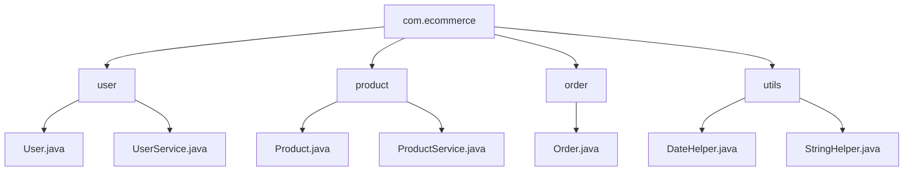

<a id="10-packages-modular-programming"></a>

# 📘 Chapter 10: Packages & Modular Programming

> **Part B: Strings, Arrays & Packages**
> `Intermediate` | `Foundation` | `Code Organization`

⭐⭐⭐⭐⭐⭐⭐⭐⭐⭐⭐⭐⭐⭐⭐⭐⭐⭐⭐⭐⭐⭐⭐⭐⭐⭐⭐⭐⭐⭐⭐⭐

Java • Core Java • Interview Preparation

⭐⭐⭐⭐⭐⭐⭐⭐⭐⭐⭐⭐⭐⭐⭐⭐⭐⭐⭐⭐⭐⭐⭐⭐⭐⭐⭐⭐⭐⭐⭐⭐

---

<a id="chapter-index-table-10"></a>

## 📚 Chapter 10 — Index Table

| No. | Topic | Subtopics |
|-----|-------|-----------|
| 10.1 | [What is a Package](#101-what-is-a-package) | Definition, Namespace, Physical Folder Structure |
| 10.2 | [Why Packages (Benefits)](#102-why-packages-benefits) | Organization, Naming Conflicts, Access Control, Reusability |
| 10.3 | [Built-in Packages](#103-built-in-packages) | java.lang, java.util, java.io, java.net, java.sql |
| 10.4 | [User-defined Packages](#104-user-defined-packages) | Creating Custom Packages, Directory Structure |
| 10.5 | [package Keyword](#105-package-keyword) | Syntax, Must be First Line, Placement Rules |
| 10.6 | [import Statement](#106-import-statement) | Single Class Import, Wildcard Import, Fully Qualified Names |
| 10.7 | [Static Import](#107-static-import) | Import Static Members, Math.PI, Math.sqrt() |
| 10.8 | [package vs import](#108-package-vs-import) | Complete Comparison Table |
| 10.9 | [Package Naming Conventions](#109-package-naming-conventions) | Reverse Domain, All Lowercase, Hierarchy |
| 10.10 | [Accessing Classes Across Packages](#1010-accessing-classes-across-packages) | Access Modifiers, Compilation, Running |
| 10.11 | [Sub-Packages](#1011-sub-packages) | Nested Packages, Independent Namespaces |
| 10.12 | [JAR Files](#1012-jar-files) | Java Archive, Creating, Extracting, Executable JARs |
| 10.13 | [CLASSPATH Explained](#1013-classpath-explained) | Environment Variable, -cp flag, Multiple Paths |
| 10.14 | [Java Modules (JPMS - Java 9+)](#1014-java-modules-jpms) | Project Jigsaw, Module System, Why Modules |
| 10.15 | [module-info.java](#1015-module-info-java) | Module Descriptor, Location, Syntax |
| 10.16 | [Module Directives](#1016-module-directives) | exports, requires, opens, uses, provides |
| 🔥 | [Java vs Other Languages](#10-java-vs-other-languages) | Unique Package/Module Features |
| 💡 | [Interview Questions](#10-interview-questions) | 15+ Conceptual · Scenario · Output-based |
| 🧪 | [Practice Problems](#10-practice-problems) | 5 Coding + 5 Theory |

---

## 10.1 What is a Package

<a id="101-what-is-a-package"></a>

### 📌 Definition

```
A PACKAGE in Java is a NAMESPACE that groups related classes
and interfaces together.

Physically, a package is a FOLDER/DIRECTORY containing .java files.
Logically, it's a GROUPING mechanism for organizing code.

Think of it as:
→ A FILE FOLDER on your computer
→ A CHAPTER in a book
→ A DEPARTMENT in a company

Format: com.company.project.module
```

### 📌 Physical vs Logical Package

```
LOGICAL PACKAGE:                PHYSICAL FOLDER:
package com.myapp.utils;    →   com/
                                └── myapp/
                                    └── utils/
                                        ├── StringHelper.java
                                        └── DateHelper.java

Java package structure MIRRORS the folder structure!
```

### 🌍 Real-World Analogy (Hinglish)

```
Package = Aisa hai jaise APARTMENT BUILDING mein flats:

🏢 Building = Package (com.myapp)
   ├── 🏠 Flat A-101 = Class1 (com.myapp.Class1)
   ├── 🏠 Flat A-102 = Class2 (com.myapp.Class2)
   ├── 🏢 Sub-Building = Sub-Package (com.myapp.utils)
   │    ├── 🏠 Flat B-101 = UtilClass1 (com.myapp.utils.UtilClass1)
   │    └── 🏠 Flat B-102 = UtilClass2 (com.myapp.utils.UtilClass2)

→ Same flat number OK in different buildings
  (com.a.User and com.b.User → different!)
→ Building address = Full package path
→ Post office (JVM) uses address to find the flat
```

<a href="#chapter-index-table-10">Go to Top 🔝</a>

---

## 10.2 Why Packages (Benefits)

<a id="102-why-packages-benefits"></a>

### 📌 5 Major Benefits

```
┌──────────────────────────────────────────────────────────────┐
│  1. ORGANIZATION                                             │
│  → Groups related classes logically                          │
│  → Easier to navigate large projects                         │
│  → Follows separation of concerns                            │
├──────────────────────────────────────────────────────────────┤
│  2. NAMING CONFLICT RESOLUTION                               │
│  → Same class name allowed in DIFFERENT packages             │
│  → com.company.User ≠ com.other.User                         │
│  → Prevents "class already exists" errors                    │
├──────────────────────────────────────────────────────────────┤
│  3. ACCESS CONTROL                                           │
│  → default (package-private): visible only within package    │
│  → protected: visible within package + subclasses            │
│  → Provides encapsulation at package level                   │
├──────────────────────────────────────────────────────────────┤
│  4. REUSABILITY                                              │
│  → Package a set of utilities as JAR                         │
│  → Import and use across multiple projects                   │
│  → Standard libraries (java.util, java.io) are packages      │
├──────────────────────────────────────────────────────────────┤
│  5. MAINTAINABILITY                                          │
│  → Modular code is easier to update                          │
│  → Changes in one package don't break others                 │
│  → Team members can work on different packages               │
└──────────────────────────────────────────────────────────────┘
```

### 📊 Real Project Structure



<a href="#chapter-index-table-10">Go to Top 🔝</a>

---

## 10.3 Built-in Packages

<a id="103-built-in-packages"></a>

### 📌 Most Common Java Built-in Packages

```
┌────────────────────┬─────────────────────────────────────────┐
│  Package           │  Contents                               │
├────────────────────┼─────────────────────────────────────────┤
│  java.lang         │  Core classes — AUTO-IMPORTED!          │
│  (Default!)        │  → String, Object, System, Math         │
│                    │  → Integer, Boolean, Character          │
│                    │  → Thread, Exception, Runtime           │
├────────────────────┼─────────────────────────────────────────┤
│  java.util         │  Utility classes                        │
│                    │  → List, ArrayList, HashMap, HashSet    │
│                    │  → Scanner, Date, Calendar              │
│                    │  → Arrays, Collections                  │
├────────────────────┼─────────────────────────────────────────┤
│  java.io           │  Input/Output operations                │
│                    │  → File, InputStream, OutputStream      │
│                    │  → BufferedReader, PrintWriter           │
│                    │  → Serialization classes                │
├────────────────────┼─────────────────────────────────────────┤
│  java.nio          │  New I/O (Java 7+) - Non-blocking       │
│                    │  → Path, Paths, Files                   │
│                    │  → ByteBuffer, Channels                 │
├────────────────────┼─────────────────────────────────────────┤
│  java.net          │  Networking                             │
│                    │  → URL, Socket, ServerSocket            │
│                    │  → HttpURLConnection, InetAddress       │
├────────────────────┼─────────────────────────────────────────┤
│  java.sql          │  Database (JDBC)                        │
│                    │  → Connection, Statement, ResultSet     │
│                    │  → DriverManager, PreparedStatement     │
├────────────────────┼─────────────────────────────────────────┤
│  java.math         │  Precise math                           │
│                    │  → BigInteger, BigDecimal               │
├────────────────────┼─────────────────────────────────────────┤
│  java.time         │  Date-Time API (Java 8+)                │
│                    │  → LocalDate, LocalTime, LocalDateTime  │
│                    │  → Duration, Period, ZoneId             │
├────────────────────┼─────────────────────────────────────────┤
│  java.text         │  Text formatting                         │
│                    │  → DecimalFormat, SimpleDateFormat      │
├────────────────────┼─────────────────────────────────────────┤
│  java.awt          │  GUI (Legacy - Abstract Window Toolkit) │
├────────────────────┼─────────────────────────────────────────┤
│  javax.swing       │  GUI (Better than AWT)                  │
└────────────────────┴─────────────────────────────────────────┘
```

### 📌 java.lang is Auto-Imported!

```java
// ═══ You DON'T need to import java.lang.* ═══
// It's automatically imported by JVM

// These classes work WITHOUT import:
String s = "Hello";              // java.lang.String
System.out.println("Hi");        // java.lang.System
Math.sqrt(25);                    // java.lang.Math
Integer.parseInt("42");           // java.lang.Integer
Object o = new Object();          // java.lang.Object

// For other packages, you MUST import:
import java.util.Scanner;         // Required!
import java.util.ArrayList;       // Required!
import java.io.File;              // Required!
```

<a href="#chapter-index-table-10">Go to Top 🔝</a>

---

## 10.4 User-defined Packages

<a id="104-user-defined-packages"></a>

### 📌 Creating Your Own Package

```java
// ═══ File: com/myapp/utils/StringHelper.java ═══

package com.myapp.utils;   // Package declaration — MUST be FIRST line!

public class StringHelper {

    public static String reverse(String s) {
        return new StringBuilder(s).reverse().toString();
    }

    public static boolean isPalindrome(String s) {
        return s.equals(reverse(s));
    }
}
```

```java
// ═══ File: com/myapp/utils/MathHelper.java ═══

package com.myapp.utils;

public class MathHelper {

    public static int factorial(int n) {
        if (n <= 1) return 1;
        return n * factorial(n - 1);
    }

    public static boolean isPrime(int n) {
        if (n < 2) return false;
        for (int i = 2; i <= Math.sqrt(n); i++) {
            if (n % i == 0) return false;
        }
        return true;
    }
}
```

```java
// ═══ File: com/myapp/Main.java ═══

package com.myapp;

// Import from your own package
import com.myapp.utils.StringHelper;
import com.myapp.utils.MathHelper;

public class Main {
    public static void main(String[] args) {
        System.out.println(StringHelper.reverse("Hello"));      // olleH
        System.out.println(StringHelper.isPalindrome("madam")); // true
        System.out.println(MathHelper.factorial(5));            // 120
        System.out.println(MathHelper.isPrime(17));             // true
    }
}
```

### 📌 Directory Structure

```
project/
├── com/
│   └── myapp/
│       ├── Main.java              ← package com.myapp;
│       └── utils/
│           ├── StringHelper.java  ← package com.myapp.utils;
│           └── MathHelper.java    ← package com.myapp.utils;
```

### 📌 Compilation and Execution

```bash
# ═══ COMPILE ═══
# From project root directory:

# Method 1: Compile all files
javac com/myapp/Main.java com/myapp/utils/*.java

# Method 2: Compile with -d flag (creates output directory)
javac -d out com/myapp/Main.java com/myapp/utils/*.java

# ═══ RUN ═══
# From project root:
java com.myapp.Main
# Note: Use DOTS (.) not slashes (/), and NO .class extension

# If compiled to output directory:
java -cp out com.myapp.Main
```

<a href="#chapter-index-table-10">Go to Top 🔝</a>

---

## 10.5 package Keyword

<a id="105-package-keyword"></a>

### 📌 Rules for Package Declaration

```java
// ═══ RULE 1: MUST be the FIRST executable line ═══
// (comments and blank lines allowed before)

// This is a valid comment
/*
   Multi-line comments OK too
*/
package com.myapp;       // ✅ First code line

import java.util.List;   // Imports come AFTER package

public class MyClass {   // Class declaration
    // ...
}
```

```java
// ═══ INVALID EXAMPLES ═══

// ❌ WRONG: package after import
// import java.util.List;
// package com.myapp;      // ❌ ERROR!

// ❌ WRONG: multiple package statements
// package com.myapp;
// package com.other;      // ❌ ERROR!

// ❌ WRONG: package inside class
// public class MyClass {
//     package com.myapp;  // ❌ ERROR!
// }
```

### 📌 Rules Summary

```
┌──────────────────────────────────────────────────────────────┐
│  PACKAGE DECLARATION RULES:                                  │
│                                                              │
│  ✅ MUST be the FIRST statement in the file                  │
│  ✅ Only ONE package statement per file                      │
│  ✅ Written in lowercase (convention)                        │
│  ✅ Uses DOTS (.) as separator (com.myapp.utils)            │
│  ✅ Package name = folder path in file system                │
│  ❌ Cannot have multiple package statements                  │
│  ❌ Cannot be inside class                                   │
│                                                              │
│  DEFAULT PACKAGE:                                            │
│  → If NO package statement → class is in "default package"   │
│  → NOT recommended for real projects                         │
│  → Default package classes CANNOT be imported by others!     │
└──────────────────────────────────────────────────────────────┘
```

<a href="#chapter-index-table-10">Go to Top 🔝</a>

---

## 10.6 import Statement

<a id="106-import-statement"></a>

### 📌 Three Ways to Use Classes from Other Packages

```java
// ═══ WAY 1: Fully Qualified Name (No import) ═══
public class NoImportDemo {
    public static void main(String[] args) {
        // Use full path every time — verbose!
        java.util.Scanner sc = new java.util.Scanner(System.in);
        java.util.ArrayList<String> list = new java.util.ArrayList<>();
        java.io.File file = new java.io.File("data.txt");

        // Ugly and hard to read!
    }
}
```

```java
// ═══ WAY 2: Single Class Import (Best Practice) ═══
import java.util.Scanner;      // Imports Scanner ONLY
import java.util.ArrayList;    // Imports ArrayList ONLY
import java.io.File;           // Imports File ONLY

public class SingleImportDemo {
    public static void main(String[] args) {
        Scanner sc = new Scanner(System.in);           // Clean!
        ArrayList<String> list = new ArrayList<>();
        File file = new File("data.txt");
    }
}
```

```java
// ═══ WAY 3: Wildcard Import (All classes from package) ═══
import java.util.*;    // Imports ALL classes from java.util
import java.io.*;      // Imports ALL classes from java.io

public class WildcardImportDemo {
    public static void main(String[] args) {
        Scanner sc = new Scanner(System.in);
        ArrayList<String> list = new ArrayList<>();
        HashMap<String, Integer> map = new HashMap<>();
        File file = new File("data.txt");

        // ⚠️ Wildcard imports:
        // → Does NOT increase compiled file size (no performance impact)
        // → Just tells compiler where to look for classes
        // → BUT: Less clear which classes you actually use
        // → Can cause naming conflicts (if two packages have same class)
    }
}
```

### ⚠️ Wildcard Import Limitations

```java
// ═══ IMPORTANT: Wildcard does NOT import sub-packages! ═══

import java.util.*;   // Imports classes IN java.util
// Does NOT import from java.util.concurrent, java.util.stream, etc.

// For sub-packages, separate import needed:
import java.util.*;
import java.util.concurrent.*;  // Separate!
import java.util.stream.*;      // Separate!
```

### ⚠️ Naming Conflict Example

```java
// ═══ NAMING CONFLICT ═══
import java.util.Date;
import java.sql.Date;   // ❌ COMPILE ERROR! Two 'Date' classes

// FIX: Use fully qualified name for one
import java.util.Date;

public class ConflictFix {
    public static void main(String[] args) {
        Date utilDate = new Date();                      // java.util.Date
        java.sql.Date sqlDate = new java.sql.Date(0);    // Full path
    }
}
```

<a href="#chapter-index-table-10">Go to Top 🔝</a>

---

## 10.7 Static Import

<a id="107-static-import"></a>

### 📌 Import Static Members Directly (Java 5+)

```java
// ═══ WITHOUT static import ═══
public class WithoutStaticImport {
    public static void main(String[] args) {
        System.out.println(Math.PI);          // Prefix Math
        System.out.println(Math.sqrt(25));    // Prefix Math
        System.out.println(Math.pow(2, 10));  // Prefix Math
        System.out.println(Math.max(5, 10));  // Prefix Math
    }
}
```

```java
// ═══ WITH static import ═══
import static java.lang.Math.*;   // Import ALL static members
// Or specific: import static java.lang.Math.PI;

public class WithStaticImport {
    public static void main(String[] args) {
        System.out.println(PI);           // No Math prefix!
        System.out.println(sqrt(25));     // No Math prefix!
        System.out.println(pow(2, 10));   // No Math prefix!
        System.out.println(max(5, 10));   // No Math prefix!
    }
}
```

### 📌 Common Use Cases

```java
// Import specific static members
import static java.lang.Math.PI;
import static java.lang.Math.sqrt;
import static java.util.Arrays.asList;
import static java.lang.System.out;   // Now use 'out' directly!

public class StaticImportDemo {
    public static void main(String[] args) {
        out.println(PI);                        // No System.out
        out.println(sqrt(144));                 // No Math.sqrt
        out.println(asList("a", "b", "c"));     // No Arrays.asList

        // Great for readable math-heavy code:
        double area = PI * pow(5, 2);           // Formula-like
    }
}
```

### ⚠️ Static Import Best Practices

```
✅ USE static import when:
  → Making math formulas more readable
  → Working with utility constants (PI, MAX_VALUE)
  → Using assertions (org.junit.Assert.*)

❌ AVOID static import when:
  → It reduces readability
  → Method names are generic (e.g., 'size', 'length')
  → Multiple classes have same static method names
```

<a href="#chapter-index-table-10">Go to Top 🔝</a>

---

## 10.8 package vs import

<a id="108-package-vs-import"></a>

### 📌 Complete Comparison Table

```
┌──────────────────┬─────────────────────────┬──────────────────────────┐
│  Feature         │  package                │  import                  │
├──────────────────┼─────────────────────────┼──────────────────────────┤
│  Purpose         │  DECLARES which package │  USES classes FROM        │
│                  │  THIS class belongs to  │  other packages           │
├──────────────────┼─────────────────────────┼──────────────────────────┤
│  Position        │  FIRST statement in file│  AFTER package, BEFORE   │
│                  │                         │  class declaration        │
├──────────────────┼─────────────────────────┼──────────────────────────┤
│  Occurrence      │  ONLY ONE per file      │  MULTIPLE allowed         │
├──────────────────┼─────────────────────────┼──────────────────────────┤
│  Syntax          │  package com.myapp;     │  import java.util.List;   │
├──────────────────┼─────────────────────────┼──────────────────────────┤
│  Optional?       │  ✅ Optional            │  ✅ Optional              │
│                  │  (default package if    │  (can use full name)      │
│                  │  omitted)               │                           │
├──────────────────┼─────────────────────────┼──────────────────────────┤
│  Effect on JVM   │  Determines full class  │  Tells compiler WHERE to  │
│                  │  name                   │  find the class           │
├──────────────────┼─────────────────────────┼──────────────────────────┤
│  Directory       │  Class file must be     │  No effect on directory   │
│                  │  in matching folder     │                           │
└──────────────────┴─────────────────────────┴──────────────────────────┘
```

### 📌 Example Showing Both

```java
// File: com/myapp/utils/Helper.java

// ═══ package statement — FIRST ═══
package com.myapp.utils;    // Declares THIS class is in com.myapp.utils

// ═══ import statements — AFTER package ═══
import java.util.List;      // Using classes FROM java.util
import java.util.ArrayList;
import java.io.File;

// ═══ Class declaration ═══
public class Helper {
    public List<String> getData() {
        return new ArrayList<>();
    }
}
```

<a href="#chapter-index-table-10">Go to Top 🔝</a>

---

## 10.9 Package Naming Conventions

<a id="109-package-naming-conventions"></a>

### 📌 Industry-Standard Conventions

```
┌──────────────────────────────────────────────────────────────┐
│  1. ALL LOWERCASE                                             │
│  ✅ com.myapp.utils                                          │
│  ❌ com.MyApp.Utils                                          │
├──────────────────────────────────────────────────────────────┤
│  2. REVERSE DOMAIN NAME                                       │
│  → Start with reversed company domain                        │
│  ✅ com.google.gson                                          │
│  ✅ org.apache.commons                                        │
│  ✅ com.oracle.jdk                                           │
├──────────────────────────────────────────────────────────────┤
│  3. HIERARCHICAL STRUCTURE                                    │
│  → General → Specific                                         │
│  ✅ com.company.project.module.submodule                     │
│  → com.myshop.order.payment.gateway                          │
├──────────────────────────────────────────────────────────────┤
│  4. USE DOTS AS SEPARATORS                                    │
│  → Each dot = new folder level                                │
│  → com.myapp.utils → com/myapp/utils/                        │
├──────────────────────────────────────────────────────────────┤
│  5. AVOID Java KEYWORDS                                       │
│  ❌ com.myapp.class     (class is keyword)                  │
│  ❌ com.myapp.for       (for is keyword)                    │
│  ✅ com.myapp.classroom                                       │
├──────────────────────────────────────────────────────────────┤
│  6. NO DIGITS AT START of package name                       │
│  ❌ com.myapp.2018                                           │
│  ✅ com.myapp._2018 (underscore prefix)                     │
│  ✅ com.myapp.year2018                                        │
├──────────────────────────────────────────────────────────────┤
│  7. SPECIAL PREFIXES                                          │
│  → java.*   → Reserved for Oracle (JDK core)                │
│  → javax.*  → Reserved for Oracle (JDK extensions)           │
│  → org.*    → Non-profit organizations                       │
│  → com.*    → Commercial companies                           │
│  → io.*     → Modern open-source (io.spring, io.github)      │
└──────────────────────────────────────────────────────────────┘
```

### 📌 Real-World Examples

```java
// ═══ Good naming examples ═══
package com.google.gson;                    // Google's Gson library
package org.springframework.web;            // Spring framework
package org.apache.commons.lang3;           // Apache Commons
package com.fasterxml.jackson.databind;     // Jackson JSON
package io.reactivex.rxjava3.core;          // RxJava
package android.content.pm;                 // Android SDK

// ═══ Personal projects ═══
package com.yourname.projectname.module;
package io.github.username.libraryname;
```

<a href="#chapter-index-table-10">Go to Top 🔝</a>

---

## 10.10 Accessing Classes Across Packages

<a id="1010-accessing-classes-across-packages"></a>

### 📌 Access Modifiers & Package Access

```java
// ═══ File: com/myapp/data/User.java ═══
package com.myapp.data;

public class User {                     // ✅ Accessible from anywhere
    public String name;                 // ✅ Accessible anywhere
    protected int age;                  // ✅ Same package + subclasses
    String email;                       // ✅ Same package only (default)
    private String password;             // ❌ Only this class
}
```

```java
// ═══ File: com/myapp/data/UserHelper.java ═══
package com.myapp.data;                 // SAME package as User

public class UserHelper {
    void demo() {
        User u = new User();
        u.name = "Alice";     // ✅ public
        u.age = 25;           // ✅ protected (same package)
        u.email = "a@b.com";  // ✅ default (same package)
        // u.password;        // ❌ private — NOT accessible!
    }
}
```

```java
// ═══ File: com/myapp/service/UserService.java ═══
package com.myapp.service;               // DIFFERENT package

import com.myapp.data.User;

public class UserService {
    void demo() {
        User u = new User();
        u.name = "Alice";     // ✅ public
        // u.age = 25;        // ❌ protected (different package, not subclass)
        // u.email;           // ❌ default (different package)
        // u.password;        // ❌ private
    }
}
```

### 📌 Complete Access Modifier Table

```
┌──────────────┬───────────┬───────────┬───────────┬───────────┐
│  Modifier    │  Same     │  Same     │  Different│  Different│
│              │  Class    │  Package  │  Package  │  Package  │
│              │           │           │  Subclass │  Non-Sub  │
├──────────────┼───────────┼───────────┼───────────┼───────────┤
│  private     │    ✅     │    ❌     │    ❌     │    ❌     │
│  default     │    ✅     │    ✅     │    ❌     │    ❌     │
│  protected   │    ✅     │    ✅     │    ✅     │    ❌     │
│  public      │    ✅     │    ✅     │    ✅     │    ✅     │
└──────────────┴───────────┴───────────┴───────────┴───────────┘
```

<a href="#chapter-index-table-10">Go to Top 🔝</a>

---

## 10.11 Sub-Packages

<a id="1011-sub-packages"></a>

### 📌 Sub-Packages are INDEPENDENT!

```java
// ═══ SUB-PACKAGE ═══
// A package inside another package (nested folders)

// com.myapp.utils                → parent package
// com.myapp.utils.string         → sub-package
// com.myapp.utils.string.helper  → nested sub-package

// ⚠️ CRITICAL: Sub-packages are INDEPENDENT namespaces!
// Importing parent does NOT import sub-packages.
```

```java
// ═══ Example: Sub-packages ═══

// File: com/myapp/utils/StringHelper.java
package com.myapp.utils;

public class StringHelper { }

// File: com/myapp/utils/string/Formatter.java
package com.myapp.utils.string;   // Sub-package

public class Formatter { }

// File: Main.java
import com.myapp.utils.*;           // Imports StringHelper
import com.myapp.utils.string.*;    // Imports Formatter — SEPARATE!

// Just importing com.myapp.utils.* does NOT auto-import
// com.myapp.utils.string.* — they are INDEPENDENT packages!

public class Main {
    public static void main(String[] args) {
        StringHelper sh = new StringHelper();  // From com.myapp.utils
        Formatter f = new Formatter();          // From com.myapp.utils.string
    }
}
```

> [!IMPORTANT]
> **Common Misconception:** `import java.util.*;` does NOT import `java.util.concurrent.*` or `java.util.stream.*`. Each sub-package is a **completely independent namespace** and needs its own import statement.

<a href="#chapter-index-table-10">Go to Top 🔝</a>

---

## 10.12 JAR Files (Java Archive)

<a id="1012-jar-files"></a>

### 📌 What is a JAR File?

```
JAR = Java ARchive

A JAR file is a PACKAGED file (like ZIP) that contains:
→ Compiled .class files
→ Resources (images, config files)
→ Manifest file (META-INF/MANIFEST.MF)

Purpose:
✅ Distribute Java applications/libraries
✅ Deploy web applications (WAR files)
✅ Package reusable code
✅ Reduce number of files
✅ Faster loading (compressed)

Format: ZIP-based archive with .jar extension
```

### 📌 Creating JAR Files

```bash
# ═══ Structure before creating JAR ═══
project/
├── com/
│   └── myapp/
│       ├── Main.class
│       └── utils/
│           ├── StringHelper.class
│           └── MathHelper.class

# ═══ CREATE a JAR ═══
jar cf myapp.jar com/                    # 'cf' = create + file
# Output: myapp.jar containing all classes

# ═══ CREATE EXECUTABLE JAR with main class ═══
jar cfe myapp.jar com.myapp.Main com/    # 'cfe' = create + file + entry point
# Now can run: java -jar myapp.jar

# ═══ CREATE JAR with manifest ═══
jar cfm myapp.jar Manifest.txt com/       # 'cfm' = create + file + manifest

# ═══ VIEW contents ═══
jar tf myapp.jar                          # 'tf' = table of contents + file

# ═══ EXTRACT contents ═══
jar xf myapp.jar                          # 'xf' = extract + file

# ═══ RUN executable JAR ═══
java -jar myapp.jar
```

### 📌 Manifest File Example

```
# ═══ META-INF/MANIFEST.MF ═══
Manifest-Version: 1.0
Main-Class: com.myapp.Main
Class-Path: lib/gson.jar lib/log4j.jar
Created-By: 21 (Oracle Corporation)
```

### 📌 Using External JAR Files

```bash
# ═══ COMPILE with external JAR ═══
javac -cp gson.jar MyClass.java

# ═══ RUN with external JAR ═══
java -cp .:gson.jar MyClass       # Linux/Mac (use : separator)
java -cp .;gson.jar MyClass       # Windows (use ; separator)

# Or with -classpath (same as -cp)
java -classpath .:gson.jar MyClass

# Include multiple JARs:
java -cp .:lib/*.jar MyClass       # All JARs in lib folder
```

<a href="#chapter-index-table-10">Go to Top 🔝</a>

---

## 10.13 CLASSPATH Explained

<a id="1013-classpath-explained"></a>

### 📌 What is CLASSPATH?

```
CLASSPATH is a PARAMETER that tells the JVM WHERE to look
for user-defined classes and packages.

Types:
1. Environment variable (system-wide)
2. -cp or -classpath flag (per command)
3. Manifest file Class-Path attribute (per JAR)

Default: current directory (.)
```

### 📌 Setting CLASSPATH

```bash
# ═══ METHOD 1: Command line -cp flag (RECOMMENDED) ═══
javac -cp lib/gson.jar MyClass.java
java -cp .:lib/gson.jar MyClass          # Linux/Mac
java -cp .;lib\gson.jar MyClass          # Windows

# ═══ METHOD 2: Environment Variable (System-wide) ═══

# Windows:
set CLASSPATH=.;C:\libs\gson.jar
java MyClass

# Linux/Mac:
export CLASSPATH=.:~/libs/gson.jar
java MyClass

# ═══ METHOD 3: Include ALL JARs in a directory ═══
java -cp "lib/*" MyClass                  # All JARs in lib
java -cp ".:lib/*" MyClass                # Current dir + lib
```

### 📌 CLASSPATH Rules

```
┌──────────────────────────────────────────────────────────────┐
│  RULES:                                                      │
│                                                              │
│  ✅ Separator:                                                │
│     Windows: SEMICOLON (;)                                   │
│     Linux/Mac: COLON (:)                                     │
│                                                              │
│  ✅ Current directory: dot (.)                                │
│                                                              │
│  ✅ Wildcard: * (all JARs in that directory)                 │
│     -cp lib/* → includes ALL .jar files in lib               │
│                                                              │
│  ✅ Order matters:                                            │
│     First match wins if duplicate classes                    │
│                                                              │
│  ✅ Priority (highest to lowest):                             │
│     1. Bootstrap classpath (JDK core)                        │
│     2. Extension classpath                                   │
│     3. Application classpath (CLASSPATH env or -cp)          │
└──────────────────────────────────────────────────────────────┘
```

<a href="#chapter-index-table-10">Go to Top 🔝</a>

---

## 10.14 Java Modules (JPMS - Java 9+)

<a id="1014-java-modules-jpms"></a>

### 📌 What are Java Modules?

```
JPMS = Java Platform Module System (Project Jigsaw)
Introduced in JAVA 9 (2017)

A MODULE is a HIGHER-LEVEL grouping ABOVE packages.
Modules contain multiple packages + declare dependencies.

Structure:
Module
  └── Packages
        └── Classes
```

### 📌 Why Modules? (Problems Solved)

```
┌──────────────────────────────────────────────────────────────┐
│  PROBLEMS with old classpath system:                          │
├──────────────────────────────────────────────────────────────┤
│  1. JAR HELL — Missing/conflicting JARs at runtime           │
│  2. Weak encapsulation — All public classes are accessible   │
│  3. No dependency management at JVM level                    │
│  4. Huge JDK — 100+ MB even for small apps                   │
│  5. No way to hide internal APIs                             │
├──────────────────────────────────────────────────────────────┤
│  SOLUTIONS by Modules:                                        │
├──────────────────────────────────────────────────────────────┤
│  ✅ Strong encapsulation (hide internal packages)            │
│  ✅ Explicit dependencies (requires)                          │
│  ✅ Modular JDK (java.base, java.sql, etc.)                  │
│  ✅ Small custom runtime (jlink tool)                        │
│  ✅ Better security (no unauthorized access)                 │
│  ✅ Reliable configuration (fail-fast at startup)            │
└──────────────────────────────────────────────────────────────┘
```

### 📌 Module vs Package vs JAR

```
┌────────────┬──────────────────────────────────────────────┐
│  JAR       │  Physical file containing compiled classes    │
│            │  → No dependency info                         │
│            │  → No access control at file level            │
├────────────┼──────────────────────────────────────────────┤
│  PACKAGE   │  Namespace for grouping classes               │
│            │  → Prevents naming conflicts                  │
│            │  → Package-level access control (default)     │
├────────────┼──────────────────────────────────────────────┤
│  MODULE    │  Higher-level grouping (Java 9+)              │
│            │  → Groups multiple packages                   │
│            │  → Explicit exports and requires              │
│            │  → Strong encapsulation                       │
│            │  → module-info.java descriptor                │
└────────────┴──────────────────────────────────────────────┘
```

### 📌 JDK Modularization

```
Before Java 9:
→ Monolithic rt.jar (60+ MB)
→ All classes loaded together

Java 9+:
→ Modular JDK split into ~90 modules
→ java.base — Core (String, Object, etc.) — ALWAYS included
→ java.sql — Database
→ java.xml — XML processing
→ java.desktop — Swing, AWT
→ java.logging — Logging
→ ... and many more

Benefit: Include ONLY what you need → smaller runtime!
```

<a href="#chapter-index-table-10">Go to Top 🔝</a>

---

## 10.15 module-info.java

<a id="1015-module-info-java"></a>

### 📌 Module Descriptor File

```
module-info.java is a SPECIAL FILE that describes a module.
It MUST be at the ROOT of the module (not inside any package).

Location:
myapp/
├── module-info.java     ← Module descriptor at ROOT
├── com/
│   └── myapp/
│       ├── Main.java
│       └── utils/
│           └── Helper.java
```

### 📌 Basic module-info.java

```java
// ═══ File: module-info.java ═══

module com.myapp {
    // Module directives go here
    exports com.myapp;              // Package accessible to others
    exports com.myapp.utils;

    requires java.base;             // Auto-required (can omit)
    requires java.sql;              // For database access
    requires java.logging;          // For logging
}
```

### 📌 Complete Module Example

```java
// ═══ Project structure ═══
// myapp/
// ├── module-info.java
// └── com/
//     └── myapp/
//         ├── Main.java
//         └── utils/
//             └── Helper.java

// ═══ File: module-info.java ═══
module com.myapp {
    exports com.myapp;              // Main class package
    exports com.myapp.utils;         // Utils package (for others)
    requires java.sql;               // We use SQL
}

// ═══ File: com/myapp/Main.java ═══
package com.myapp;

import com.myapp.utils.Helper;
import java.sql.Connection;         // OK because we required java.sql

public class Main {
    public static void main(String[] args) {
        Helper h = new Helper();
    }
}

// ═══ File: com/myapp/utils/Helper.java ═══
package com.myapp.utils;

public class Helper {
    public void doWork() { }
}
```

### 📌 Compiling and Running Modules

```bash
# ═══ COMPILE with modules ═══
javac -d out/myapp \
      myapp/module-info.java \
      myapp/com/myapp/Main.java \
      myapp/com/myapp/utils/Helper.java

# ═══ RUN a module ═══
java --module-path out \
     --module com.myapp/com.myapp.Main

# Shorthand:
java -p out -m com.myapp/com.myapp.Main
```

<a href="#chapter-index-table-10">Go to Top 🔝</a>

---

## 10.16 Module Directives

<a id="1016-module-directives"></a>

### 📌 All Module Directives

```java
module com.myapp {
    // 1. exports — Make package accessible to OTHER modules
    exports com.myapp.api;
    exports com.myapp.utils to com.friend;  // Qualified export

    // 2. requires — Depends on ANOTHER module
    requires java.sql;                       // Required at runtime + compile
    requires transitive java.logging;        // Passed to consumers too
    requires static java.desktop;            // Compile-time only (optional at runtime)

    // 3. opens — Allow REFLECTION access (deep access)
    opens com.myapp.model;                   // For frameworks (Spring, Hibernate)
    opens com.myapp.entity to spring.core;   // Qualified open

    // 4. uses — Consumes a SERVICE
    uses com.myapp.spi.PaymentService;

    // 5. provides — Provides implementation of a SERVICE
    provides com.myapp.spi.PaymentService
        with com.myapp.impl.PayPalService,
             com.myapp.impl.StripeService;
}
```

### 📌 Directive Explanations

```
┌──────────────────────────────────────────────────────────────┐
│  DIRECTIVE     │  PURPOSE                                     │
├────────────────┼──────────────────────────────────────────────┤
│  exports       │  Makes package's PUBLIC classes accessible   │
│                │  to other modules                            │
│                │  → exports com.myapp.api;                    │
├────────────────┼──────────────────────────────────────────────┤
│  exports...to  │  QUALIFIED export — only to specific modules │
│                │  → exports com.myapp.util to com.other;      │
├────────────────┼──────────────────────────────────────────────┤
│  requires      │  Declares DEPENDENCY on another module       │
│                │  → requires java.sql;                        │
├────────────────┼──────────────────────────────────────────────┤
│  requires      │  Transitive dependency — passed to consumers │
│  transitive    │  → requires transitive java.logging;         │
├────────────────┼──────────────────────────────────────────────┤
│  requires      │  Compile-time dependency only                │
│  static        │  → requires static java.desktop;             │
├────────────────┼──────────────────────────────────────────────┤
│  opens         │  Allows REFLECTIVE access to private members │
│                │  → Used by frameworks like Spring, Hibernate │
│                │  → opens com.myapp.model;                    │
├────────────────┼──────────────────────────────────────────────┤
│  opens...to    │  Qualified open — only to specific modules   │
├────────────────┼──────────────────────────────────────────────┤
│  uses          │  Consumes a service provided by other module │
│                │  → uses java.sql.Driver;                     │
├────────────────┼──────────────────────────────────────────────┤
│  provides...   │  Provides service implementation             │
│  with          │  → provides X with Y;                        │
└────────────────┴──────────────────────────────────────────────┘
```

### 📌 Real-World Example — Spring Module

```java
// A Spring Boot application module
module com.myapp {
    // Package accessible to Spring for scanning
    exports com.myapp.controller;

    // For Spring to access via reflection
    opens com.myapp.model to spring.core;
    opens com.myapp.repository to spring.core;

    // Dependencies
    requires spring.boot;
    requires spring.web;
    requires spring.data.jpa;
    requires transitive java.sql;
    requires java.logging;
}
```

<a href="#chapter-index-table-10">Go to Top 🔝</a>

---

<a id="10-java-vs-other-languages"></a>

## 🔥 What Makes Java DIFFERENT — Packages & Modules

```
┌──────────────────────┬────────────┬────────────┬────────────┬────────────┐
│  Feature             │  Java      │  C++       │  Python    │  JavaScript│
├──────────────────────┼────────────┼────────────┼────────────┼────────────┤
│  Namespace           │ package    │ namespace  │ module     │ module     │
│                      │            │            │ (folder)   │ (file)     │
├──────────────────────┼────────────┼────────────┼────────────┼────────────┤
│  Folder mapping      │ ✅ REQUIRED│ ❌ No      │ ✅ Yes     │ ❌ No     │
│                      │ (must match│            │ (folders   │            │
│                      │ package)   │            │ = packages)│            │
├──────────────────────┼────────────┼────────────┼────────────┼────────────┤
│  Import syntax       │ import x.y;│ #include   │ import x   │ import x   │
│                      │            │ using ns   │ from x     │ from 'x'   │
├──────────────────────┼────────────┼────────────┼────────────┼────────────┤
│  Auto-imported       │ java.lang  │ ❌ None    │ builtins   │ globals    │
├──────────────────────┼────────────┼────────────┼────────────┼────────────┤
│  Module system       │ ✅ JPMS    │ ⚠️ CMake/  │ ⚠️ pip    │ ✅ ES6    │
│                      │ (Java 9+)  │ Modules    │ packages   │ Modules   │
│                      │            │ (C++20)    │            │            │
├──────────────────────┼────────────┼────────────┼────────────┼────────────┤
│  Package manager     │ Maven/     │ Conan,     │ pip        │ npm       │
│                      │ Gradle     │ vcpkg      │            │            │
├──────────────────────┼────────────┼────────────┼────────────┼────────────┤
│  Archive format      │ JAR (.jar) │ .so, .dll  │ .whl, .egg│ .tgz       │
├──────────────────────┼────────────┼────────────┼────────────┼────────────┤
│  Strong encapsulation│ ✅ (with   │ ❌ No      │ ❌ No      │ ❌ No     │
│  at module level     │ modules)   │            │ (convention│ (convention│
│                      │            │            │ only)      │ only)      │
└──────────────────────┴────────────┴────────────┴────────────┴────────────┘
```

### 🎯 Key UNIQUE Points

```
1. FOLDER MUST MATCH PACKAGE:
   → package com.myapp; → must be in com/myapp/ folder
   → Python and JS don't enforce this

2. AUTO-IMPORT ONLY java.lang:
   → String, Math, System auto-imported
   → C++ requires explicit #include for EVERYTHING

3. JPMS (Java 9+):
   → Explicit module system with strong encapsulation
   → Most languages rely on convention

4. NO IMPORT FOR SAME PACKAGE:
   → Classes in same package can access each other directly

5. WILDCARD IS COMPILE-TIME:
   → import java.util.*; doesn't slow runtime
   → Compiler resolves specific classes needed
```

<a href="#chapter-index-table-10">Go to Top 🔝</a>

---

<a id="10-interview-questions"></a>

## 💡 Chapter 10 — Interview Questions (15+)

---

### 🔵 Conceptual Questions

**Q1. What is a package in Java? Why do we need packages?**

```
PACKAGE = A namespace that groups related classes and interfaces.

Physically: A folder in the file system.
Logically: A logical grouping mechanism.

WHY WE NEED PACKAGES:
1. ORGANIZATION — Group related classes logically
2. NAMING CONFLICTS — Same class name OK in different packages
3. ACCESS CONTROL — default (package-private), protected
4. REUSABILITY — Distribute as JARs
5. MAINTAINABILITY — Modular structure

Example: java.util.List vs java.awt.List (both exist!)
```

---

**Q2. What is the difference between package and import?**

```
package:
→ DECLARES which package the class belongs to
→ MUST be FIRST statement in file
→ ONE per file
→ package com.myapp;

import:
→ USES classes from other packages
→ Comes AFTER package, BEFORE class
→ Multiple imports allowed
→ import java.util.Scanner;

Both are optional but usually used together.
```

---

**Q3. What is java.lang and why is it special?**

```
java.lang is the CORE Java package containing fundamental classes:
→ Object, String, Math, System
→ Integer, Double, Boolean (wrappers)
→ Thread, Runtime, Exception

SPECIAL because:
→ AUTOMATICALLY imported by JVM
→ NO need to write "import java.lang.*;"
→ Available in EVERY Java program

Without java.lang auto-import → every program would need:
import java.lang.String;
import java.lang.System;
import java.lang.Math;
```

---

**Q4. What is the difference between single import and wildcard import?**

```java
// Single import — explicit
import java.util.Scanner;         // Only Scanner
import java.util.ArrayList;       // Only ArrayList

// Wildcard import — all classes in that package
import java.util.*;               // ALL classes in java.util

BOTH have SAME performance!
→ Compile time: compiler figures out which class you use
→ Runtime: no difference

DIFFERENCES:
✅ Single import — More explicit, better for team code
✅ Wildcard — Less typing, but hides which classes used
❌ Wildcard doesn't import SUB-PACKAGES!
   → import java.util.*; ≠ import java.util.concurrent.*;
```

---

**Q5. What is static import? When should you use it?**

```java
// Without static import
double area = Math.PI * Math.pow(r, 2);

// With static import
import static java.lang.Math.*;
double area = PI * pow(r, 2);   // Cleaner!

USE static import for:
✅ Math constants (PI, E)
✅ Utility constants
✅ JUnit assertions (assertEquals, assertTrue)

AVOID for:
❌ Generic names (min, max, size)
❌ When it reduces readability
❌ Multiple classes have same static names
```

---

**Q6. What are Java Modules (JPMS)? When were they introduced?**

```
JPMS = Java Platform Module System (Project Jigsaw)
Introduced in JAVA 9 (September 2017)

A MODULE is a group of packages with:
→ Explicit dependencies (requires)
→ Explicit exports (exports)
→ Strong encapsulation

Problems SOLVED:
1. JAR HELL — dependency conflicts
2. Weak encapsulation — everything public was accessible
3. Huge JDK — 100+ MB monolithic
4. No dependency management

BENEFITS:
✅ Modular JDK (~90 modules)
✅ Custom small runtime (jlink)
✅ Better security
✅ Reliable configuration
```

---

**Q7. Explain requires, exports, and opens in module-info.java.**

```java
module com.myapp {
    // exports: Package accessible to OTHER modules
    exports com.myapp.api;

    // requires: Depend on ANOTHER module
    requires java.sql;

    // opens: Allow REFLECTION access (for frameworks)
    opens com.myapp.model;

    // requires transitive: Pass dependency to consumers
    requires transitive java.logging;

    // requires static: Compile-time only
    requires static java.desktop;
}

DIFFERENCE:
→ exports  = other modules can USE the class
→ opens    = other modules can use REFLECTION on class
→ requires = THIS module depends on other module
```

---

**Q8. What is a JAR file?**

```
JAR = Java ARchive
A packaged file (ZIP format) containing:
→ Compiled .class files
→ Resources (images, config)
→ META-INF/MANIFEST.MF (metadata)

USES:
✅ Distribute applications
✅ Package libraries
✅ Deploy web apps (WAR files)
✅ Reduce number of files

CREATE:
jar cf app.jar com/       # Basic JAR
jar cfe app.jar com.myapp.Main com/   # Executable

RUN:
java -jar app.jar
```

---

### 🟡 Scenario-Based

**Q9. Does `import java.util.*;` import `java.util.concurrent.*` too?**

```
NO! Sub-packages are INDEPENDENT namespaces.

import java.util.*;              // Only classes IN java.util
// Does NOT import java.util.concurrent, java.util.stream, etc.

For sub-packages, SEPARATE imports needed:
import java.util.*;
import java.util.concurrent.*;
import java.util.stream.*;

Common misconception — often tested in interviews!
```

---

**Q10. Can two classes with same name exist? How to use both?**

```java
// YES — if in DIFFERENT packages
import java.util.Date;
// import java.sql.Date;   // ❌ Would cause conflict!

public class Demo {
    public static void main(String[] args) {
        // Use import for one
        Date utilDate = new Date();

        // Use FULLY QUALIFIED name for another
        java.sql.Date sqlDate = new java.sql.Date(0);
    }
}

Same class name in DIFFERENT packages is FINE.
Java's package system solves naming conflicts.
```

---

### 🔴 Output-Based Questions

**Q11. Will this compile?**

```java
package com.myapp;

import java.util.Scanner;
package com.other;  // ← Second package statement

public class Test { }
```

```
❌ COMPILE ERROR!

Only ONE package statement is allowed per file.
And it MUST be the FIRST statement.
```

---

**Q12. What happens if you don't write a package statement?**

```java
// File: MyClass.java
public class MyClass { }
```

```
The class is placed in the DEFAULT (unnamed) PACKAGE.

⚠️ Problems with default package:
→ Cannot be IMPORTED by classes in other packages
→ NOT recommended for real projects
→ Used only for testing/learning

Always use named packages in production code!
```

---

**Q13. What is the output?**

```java
package com.myapp;

public class Test {
    private int x = 10;

    public static void main(String[] args) {
        Test t = new Test();
        System.out.println(t.x);
    }
}
```

```
OUTPUT: 10

REASON: main() and 'x' are in SAME class.
private members are accessible within the SAME CLASS,
regardless of packages or objects.
```

---

**Q14. Can a class access default (package-private) members from another package?**

```
NO! Default access = package-private.
Only classes in the SAME package can access default members.

┌──────────────┬───────────┬───────────┬───────────┬───────────┐
│  Modifier    │  Same     │  Same     │  Different│  Different│
│              │  Class    │  Package  │  Pkg Sub  │  Pkg Non  │
├──────────────┼───────────┼───────────┼───────────┼───────────┤
│  default     │    ✅     │    ✅     │    ❌     │    ❌     │
└──────────────┴───────────┴───────────┴───────────┴───────────┘
```

---

**Q15. What is CLASSPATH? How is it different from PATH?**

```
PATH:
→ Operating system environment variable
→ Tells OS WHERE to find executables (java, javac)

CLASSPATH:
→ JVM parameter
→ Tells JVM WHERE to find .class files and JARs

Example:
PATH=C:\Program Files\Java\jdk-21\bin
→ So OS can find "java" command

CLASSPATH=.;lib/gson.jar
→ So JVM can find your compiled classes and libraries
```

<a href="#chapter-index-table-10">Go to Top 🔝</a>

---

<a id="10-practice-problems"></a>

## 🧪 Chapter 10 — Practice Problems

### 📝 5 Theory Questions

```
1. Explain the complete process of creating and using a custom
   package in Java. Include directory structure, package/import
   statements, and compile/run commands.

2. What is JPMS? Explain the problems it solves and its benefits
   over the old classpath system. What is module-info.java?

3. Compare package, import, and module in Java. When would you
   use each? Give real-world examples.

4. Explain access modifiers in the context of packages.
   How does 'protected' behave differently from 'default'
   across packages?

5. What are JAR files? Explain how to create, view, extract,
   and run executable JARs. How do you include external JARs
   in your classpath?
```

### 💻 5 Coding Questions

```java
// Q1: Create a custom package structure
// com.myapp.utils with StringHelper and MathHelper classes
// Include: reverse, isPalindrome, factorial, isPrime methods
// Main class imports and uses both helpers

// TODO: Create the package structure and demonstrate usage
```

```java
// Q2: Demonstrate static import
// Import Math.* statically and calculate:
// - Area of circle
// - Distance between two points (using sqrt, pow)
// - Volume of sphere

import static java.lang.Math.*;

public class GeometryCalculator {
    public static void main(String[] args) {
        // TODO: Use PI, sqrt, pow WITHOUT Math. prefix
    }
}
```

```java
// Q3: Handle package naming conflicts
// Import both java.util.Date and java.sql.Date
// Use both in same program with fully qualified names

public class DateConflict {
    public static void main(String[] args) {
        // TODO: Use both Date classes correctly
    }
}
```

```java
// Q4: Create a simple module
// module com.calculator with packages:
// - com.calculator.basic (BasicOps class)
// - com.calculator.advanced (AdvancedOps class)
// Write module-info.java

// TODO: Create module structure and module-info.java
```

```java
// Q5: Practice access modifiers across packages
// Create Employee class in com.hr package
// Create Manager class in com.mgmt package
// Test which fields/methods are accessible

// TODO: Demonstrate public, protected, default, private
// across packages and inheritance
```

<a href="#chapter-index-table-10">Go to Top 🔝</a>

---

```
┌─────────────────────────────────────────────────────────────┐
│                  ✅ CHAPTER 10 COMPLETE                     │
│                                                             │
│  Topics Covered:                                            │
│  ✅ 10.1  What is a Package — Namespace, Folder Structure   │
│  ✅ 10.2  Why Packages — 5 Benefits                         │
│  ✅ 10.3  Built-in Packages — java.lang, util, io, etc.     │
│  ✅ 10.4  User-defined Packages — Complete Example          │
│  ✅ 10.5  package Keyword — Rules, First Statement          │
│  ✅ 10.6  import Statement — Single, Wildcard, Full Name    │
│  ✅ 10.7  Static Import — Math.PI, sqrt without prefix      │
│  ✅ 10.8  package vs import — Complete Comparison           │
│  ✅ 10.9  Naming Conventions — Reverse Domain, Lowercase    │
│  ✅ 10.10 Access Across Packages — Modifier Table           │
│  ✅ 10.11 Sub-Packages — Independent Namespaces             │
│  ✅ 10.12 JAR Files — Create, Extract, Executable JARs      │
│  ✅ 10.13 CLASSPATH — Environment Var, -cp flag              │
│  ✅ 10.14 Java Modules (JPMS) — Project Jigsaw, Java 9+     │
│  ✅ 10.15 module-info.java — Module Descriptor              │
│  ✅ 10.16 Module Directives — exports, requires, opens,     │
│          uses, provides                                      │
│  ✅ 🔥    Java vs Others — 5 UNIQUE Package Differences     │
│  ✅ 15+   Interview Questions with Detailed Answers         │
│  ✅ 5     Theory + 5 Coding Practice Problems               │
│                                                             │
│  ⭐ Next: Recursion Basics (Chapter 11)                     │
└─────────────────────────────────────────────────────────────┘
```

[Go to Main Index 🔝](#main-index)