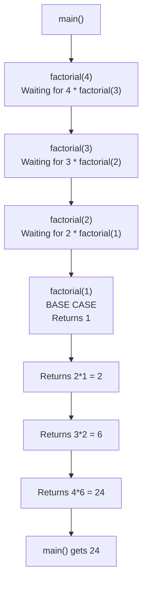
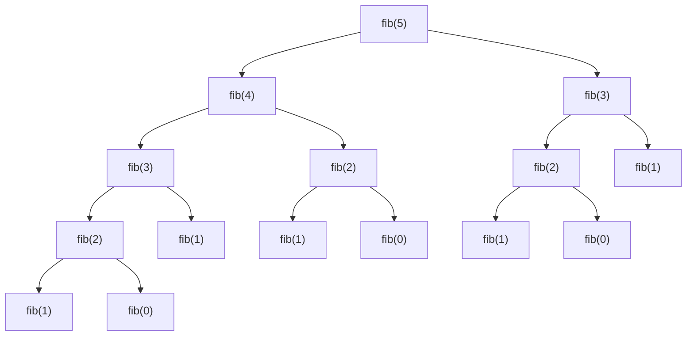

<a id="11-recursion-basics"></a>

# 📘 Chapter 11: Recursion Basics

> **Part B: Strings, Arrays & Packages**
> `Intermediate` | `Foundation` | `Interview Favorite`

⭐⭐⭐⭐⭐⭐⭐⭐⭐⭐⭐⭐⭐⭐⭐⭐⭐⭐⭐⭐⭐⭐⭐⭐⭐⭐⭐⭐⭐⭐⭐⭐

Java • Core Java • Interview Preparation

⭐⭐⭐⭐⭐⭐⭐⭐⭐⭐⭐⭐⭐⭐⭐⭐⭐⭐⭐⭐⭐⭐⭐⭐⭐⭐⭐⭐⭐⭐⭐⭐

---

<a id="chapter-index-table-11"></a>

## 📚 Chapter 11 — Index Table

| No. | Topic | Subtopics |
|-----|-------|-----------|
| 11.1 | [What is Recursion](#111-what-is-recursion) | Definition, Method Calls Itself, When to Use |
| 11.2 | [How Recursion Works (Stack Flow)](#112-how-recursion-works) | Call Stack, Stack Frames, Recursion Tree |
| 11.3 | [Base Case](#113-base-case) | Stopping Condition, Why Critical, Without It → StackOverflow |
| 11.4 | [Recursive Case](#114-recursive-case) | Self-Call, Moving Toward Base Case |
| 11.5 | [Factorial using Recursion](#115-factorial-using-recursion) | Classic Example, Stack Trace, Formula |
| 11.6 | [Fibonacci using Recursion](#116-fibonacci-using-recursion) | Two Recursive Calls, Tree of Calls, Inefficiency |
| 11.7 | [Sum of Natural Numbers](#117-sum-of-natural-numbers) | Simple Recursion, N + Sum(N-1) |
| 11.8 | [Tower of Hanoi](#118-tower-of-hanoi) | Classic Problem, 3 Rules, Recursive Solution |
| 11.9 | [Binary Search using Recursion](#119-binary-search-using-recursion) | Divide and Conquer, O(log n) |
| 11.10 | [Direct vs Indirect Recursion](#1110-direct-vs-indirect-recursion) | A calls A, A calls B calls A |
| 11.11 | [Tail Recursion](#1111-tail-recursion) | Last Statement Recursion, Optimization |
| 11.12 | [Recursion vs Iteration](#1112-recursion-vs-iteration) | Complete Comparison, When to Use Which |
| 11.13 | [StackOverflowError](#1113-stackoverflowerror) | Causes, Prevention, JVM Stack Size |
| 🔥 | [Java vs Other Languages](#11-java-vs-other-languages) | Tail Call Optimization Differences |
| 💡 | [Interview Questions](#11-interview-questions) | 15+ Conceptual · Scenario · Output-based |
| 🧪 | [Practice Problems](#11-practice-problems) | 5 Coding + 5 Theory |

---

## 11.1 What is Recursion

<a id="111-what-is-recursion"></a>

### 📌 Definition

```
RECURSION is a programming technique where a METHOD CALLS ITSELF
to solve a smaller instance of the same problem.

Key Characteristics:
→ Method calls itself (directly or indirectly)
→ Problem is broken into SMALLER subproblems
→ Each recursive call moves TOWARD a base case
→ Must have a STOPPING CONDITION (base case)

Formula:
solve(problem) = smaller_operation + solve(smaller_problem)
```

### 📌 Basic Structure

```java
public class RecursionStructure {

    static void recursiveMethod(int n) {
        // BASE CASE — Stopping condition
        if (n <= 0) {
            return;  // Stop recursion
        }

        // Do some work
        System.out.println(n);

        // RECURSIVE CASE — Call self with smaller input
        recursiveMethod(n - 1);
    }

    public static void main(String[] args) {
        recursiveMethod(5);
        // Output: 5, 4, 3, 2, 1
    }
}
```

### 🌍 Real-World Analogy (Hinglish)

```
Recursion ek MIRROR ke saamne khade hone jaisa hai:

🪞 Do mirrors ek doosre ke saamne rakh do
🪞 Har mirror mein aage waale ka reflection dikhta hai
🪞 Reflection ke andar reflection...
🪞 Reflection ke andar reflection...
🪞 Reflection ke andar reflection...

Yeh chain infinite hoga if we don't STOP it.

Recursion mein bhi:
→ Method calls itself
→ Chain of calls forms
→ MUST have BASE CASE to stop
→ Warna → StackOverflowError!

Aur ek analogy:
Suppose tumhe factorial of 5 nikalna hai:
5! = 5 × 4!
4! = 4 × 3!
3! = 3 × 2!
2! = 2 × 1!
1! = 1  ← BASE CASE (stopping point)

Yeh chain phir wapas unwind hoti hai:
2! = 2 × 1 = 2
3! = 3 × 2 = 6
4! = 4 × 6 = 24
5! = 5 × 24 = 120

RECURSION solved the problem BY BREAKING IT INTO SMALLER PARTS!
```

<a href="#chapter-index-table-11">Go to Top 🔝</a>

---

## 11.2 How Recursion Works (Stack Flow)

<a id="112-how-recursion-works"></a>

### 📌 The Call Stack

```
Every method call in Java creates a STACK FRAME on the Call Stack.
Recursive calls create MULTIPLE frames — one for each call.

STACK BEHAVIOR (LIFO — Last In, First Out):
→ Each call PUSHES a new frame
→ When method returns, frame is POPPED
→ Program returns to previous frame
```

### 📌 Recursion Stack Trace Example

```java
public class RecursionStackFlow {

    static int factorial(int n) {
        System.out.println("Calling factorial(" + n + ")");
        if (n <= 1) {
            System.out.println("Base case reached! Returning 1");
            return 1;
        }
        int result = n * factorial(n - 1);
        System.out.println("Returning from factorial(" + n + ") = " + result);
        return result;
    }

    public static void main(String[] args) {
        int result = factorial(4);
        System.out.println("Final: " + result);
    }
}

/*
OUTPUT (Watch the Stack Push/Pop):

Calling factorial(4)     ← Push factorial(4)
Calling factorial(3)     ← Push factorial(3)
Calling factorial(2)     ← Push factorial(2)
Calling factorial(1)     ← Push factorial(1)
Base case reached! Returning 1    ← Pop factorial(1)
Returning from factorial(2) = 2   ← Pop factorial(2)
Returning from factorial(3) = 6   ← Pop factorial(3)
Returning from factorial(4) = 24  ← Pop factorial(4)
Final: 24
*/
```

### 📊 Recursion Stack Visualization



### 📌 Memory During Recursion

```
STACK DURING factorial(4):

Step 1:  [main()]                                    ← Stack starts
Step 2:  [main(), factorial(4)]                       ← Push factorial(4)
Step 3:  [main(), factorial(4), factorial(3)]        ← Push factorial(3)
Step 4:  [main(), factorial(4), factorial(3), factorial(2)]
Step 5:  [main(), factorial(4), factorial(3), factorial(2), factorial(1)]
         ↑ Base case reached, start returning

Step 6:  [main(), factorial(4), factorial(3), factorial(2)]  ← Pop factorial(1)
Step 7:  [main(), factorial(4), factorial(3)]                 ← Pop factorial(2)
Step 8:  [main(), factorial(4)]                                ← Pop factorial(3)
Step 9:  [main()]                                              ← Pop factorial(4)

Each frame stores its OWN local variables and parameters!
```

<a href="#chapter-index-table-11">Go to Top 🔝</a>

---

## 11.3 Base Case

<a id="113-base-case"></a>

### 📌 What is a Base Case?

```
BASE CASE = The STOPPING CONDITION of recursion.

It's the simplest form of the problem where recursion STOPS
and returns a direct answer WITHOUT calling itself again.

CRITICAL: Every recursive method MUST have a base case!
Without it → INFINITE recursion → StackOverflowError!
```

### 📌 Examples of Base Cases

```java
public class BaseCaseExamples {

    // ═══ Example 1: Factorial ═══
    static int factorial(int n) {
        if (n <= 1) return 1;   // ← BASE CASE
        return n * factorial(n - 1);
    }

    // ═══ Example 2: Fibonacci ═══
    static int fibonacci(int n) {
        if (n <= 1) return n;   // ← BASE CASE (returns 0 for 0, 1 for 1)
        return fibonacci(n - 1) + fibonacci(n - 2);
    }

    // ═══ Example 3: Sum of numbers ═══
    static int sum(int n) {
        if (n == 0) return 0;   // ← BASE CASE
        return n + sum(n - 1);
    }

    // ═══ Example 4: Print numbers ═══
    static void printNumbers(int n) {
        if (n < 1) return;      // ← BASE CASE (nothing to print)
        System.out.println(n);
        printNumbers(n - 1);
    }

    // ═══ Example 5: Reverse a string ═══
    static String reverse(String s) {
        if (s.isEmpty()) return s;  // ← BASE CASE
        return reverse(s.substring(1)) + s.charAt(0);
    }
}
```

### ⚠️ Missing Base Case = DISASTER!

```java
public class NoBaseCase {

    // ❌ NO BASE CASE — Infinite recursion!
    static void infinite(int n) {
        System.out.println(n);
        infinite(n - 1);    // Calls itself FOREVER
        // No stopping condition!
    }

    public static void main(String[] args) {
        try {
            infinite(5);
            // Prints: 5, 4, 3, 2, 1, 0, -1, -2, -3...
            // Until Stack fills up → StackOverflowError!
        } catch (StackOverflowError e) {
            System.out.println("💥 Stack Overflow!");
        }
    }
}
```

> [!IMPORTANT]
> **RULE:** Every recursive method MUST have:
> 1. **Base Case** — When to STOP
> 2. **Recursive Case** — How to move TOWARD the base case
> 3. **Progress** — Each call MUST move closer to base case
>
> Missing any of these → **StackOverflowError**!

<a href="#chapter-index-table-11">Go to Top 🔝</a>

---

## 11.4 Recursive Case

<a id="114-recursive-case"></a>

### 📌 What is the Recursive Case?

```
RECURSIVE CASE = The part where the method calls ITSELF
with a SMALLER/SIMPLER input, moving TOWARD the base case.

Structure:
solution(problem) = do_something + solution(smaller_problem)
```

### 📌 Anatomy of a Recursive Method

```java
public class RecursiveAnatomy {

    static int factorial(int n) {

        // 1. BASE CASE — When to stop
        if (n <= 1) {
            return 1;
        }

        // 2. RECURSIVE CASE — Call self with smaller input
        int smallerResult = factorial(n - 1);  // ← Progress: n-1 is smaller

        // 3. Combine with current step
        return n * smallerResult;
    }

    // ═══ Sum of digits ═══
    static int sumOfDigits(int n) {
        // Base case
        if (n == 0) return 0;

        // Recursive case:
        // Get last digit + sumOfDigits of remaining
        return (n % 10) + sumOfDigits(n / 10);
    }

    // ═══ Count occurrences of a character ═══
    static int countChar(String s, char ch) {
        // Base case
        if (s.isEmpty()) return 0;

        // Recursive case
        int count = (s.charAt(0) == ch) ? 1 : 0;
        return count + countChar(s.substring(1), ch);
    }

    public static void main(String[] args) {
        System.out.println(factorial(5));         // 120
        System.out.println(sumOfDigits(12345));   // 15
        System.out.println(countChar("banana", 'a')); // 3
    }
}
```

<a href="#chapter-index-table-11">Go to Top 🔝</a>

---

## 11.5 Factorial using Recursion

<a id="115-factorial-using-recursion"></a>

### 📌 The Classic Recursion Example

```
Factorial of n (written as n!) = n × (n-1) × (n-2) × ... × 1

Examples:
5! = 5 × 4 × 3 × 2 × 1 = 120
4! = 4 × 3 × 2 × 1 = 24
3! = 3 × 2 × 1 = 6
1! = 1
0! = 1 (by definition)

Recursive Formula:
n! = n × (n-1)!
0! = 1  ← Base case
```

```java
public class FactorialDemo {

    static int factorial(int n) {
        // BASE CASE
        if (n <= 1) return 1;

        // RECURSIVE CASE
        return n * factorial(n - 1);
    }

    public static void main(String[] args) {
        System.out.println(factorial(5));  // 120
        System.out.println(factorial(6));  // 720
        System.out.println(factorial(10)); // 3628800

        // Warning: factorial(13) overflows int!
        // Use long for larger values
    }
}
```

### 📌 Step-by-Step Execution of factorial(5)

```
Call: factorial(5)
  → Check base case: 5 > 1, continue
  → Return 5 * factorial(4)      ← Waiting for factorial(4)
    Call: factorial(4)
      → 4 > 1, continue
      → Return 4 * factorial(3)  ← Waiting for factorial(3)
        Call: factorial(3)
          → 3 > 1, continue
          → Return 3 * factorial(2)
            Call: factorial(2)
              → 2 > 1, continue
              → Return 2 * factorial(1)
                Call: factorial(1)
                  → 1 <= 1, BASE CASE
                  → Return 1  ✅
              → 2 * 1 = 2 ✅
          → 3 * 2 = 6 ✅
      → 4 * 6 = 24 ✅
  → 5 * 24 = 120 ✅

RESULT: 120
```

### 📌 Using long for Larger Factorials

```java
public class LargeFactorial {

    static long factorial(int n) {
        if (n <= 1) return 1L;
        return n * factorial(n - 1);
    }

    public static void main(String[] args) {
        System.out.println(factorial(20));  // 2432902008176640000
        // Beyond 20 → overflows even long!
        // For very large: use BigInteger
    }
}
```

<a href="#chapter-index-table-11">Go to Top 🔝</a>

---

## 11.6 Fibonacci using Recursion

<a id="116-fibonacci-using-recursion"></a>

### 📌 Fibonacci Sequence

```
Fibonacci: 0, 1, 1, 2, 3, 5, 8, 13, 21, 34, 55, 89...

Each number is SUM of previous two:
F(0) = 0
F(1) = 1
F(n) = F(n-1) + F(n-2)  for n > 1
```

```java
public class FibonacciDemo {

    static int fibonacci(int n) {
        // BASE CASES (two of them!)
        if (n <= 1) return n;

        // RECURSIVE CASE (calls itself TWICE!)
        return fibonacci(n - 1) + fibonacci(n - 2);
    }

    public static void main(String[] args) {
        // Print first 10 Fibonacci numbers
        for (int i = 0; i < 10; i++) {
            System.out.print(fibonacci(i) + " ");
        }
        // 0 1 1 2 3 5 8 13 21 34
    }
}
```

### 📊 Fibonacci Call Tree (Shows Inefficiency!)



### ⚠️ Fibonacci Recursion is INEFFICIENT!

```
For fib(5):
→ fib(3) is calculated 2 times
→ fib(2) is calculated 3 times
→ fib(1) is calculated 5 times
→ fib(0) is calculated 3 times

Time Complexity: O(2ⁿ) — EXPONENTIAL!
fib(50) would take FOREVER!

SOLUTION: Use MEMOIZATION or ITERATION
```

### ✅ Optimized: Memoization (Dynamic Programming)

```java
public class FibonacciMemo {

    static int[] memo = new int[100];

    static int fibonacci(int n) {
        if (n <= 1) return n;

        // Check if already computed
        if (memo[n] != 0) return memo[n];

        // Compute and store
        memo[n] = fibonacci(n - 1) + fibonacci(n - 2);
        return memo[n];
    }

    public static void main(String[] args) {
        // Now O(n) instead of O(2^n)!
        System.out.println(fibonacci(50));  // Fast!
    }
}
```

<a href="#chapter-index-table-11">Go to Top 🔝</a>

---

## 11.7 Sum of Natural Numbers

<a id="117-sum-of-natural-numbers"></a>

```java
public class SumRecursion {

    // Sum of 1 + 2 + 3 + ... + n
    static int sum(int n) {
        // BASE CASE
        if (n == 0) return 0;

        // RECURSIVE CASE
        return n + sum(n - 1);
    }

    // Sum of array elements
    static int arraySum(int[] arr, int index) {
        // BASE CASE
        if (index == arr.length) return 0;

        // RECURSIVE CASE
        return arr[index] + arraySum(arr, index + 1);
    }

    public static void main(String[] args) {
        System.out.println(sum(10));   // 55  (1+2+...+10)
        System.out.println(sum(100));  // 5050 (1+2+...+100)

        int[] arr = {1, 2, 3, 4, 5};
        System.out.println(arraySum(arr, 0));  // 15
    }
}
```

### 📌 Trace of sum(4)

```
sum(4)
  → return 4 + sum(3)
    sum(3)
      → return 3 + sum(2)
        sum(2)
          → return 2 + sum(1)
            sum(1)
              → return 1 + sum(0)
                sum(0)
                  → BASE CASE, return 0
              → 1 + 0 = 1
          → 2 + 1 = 3
      → 3 + 3 = 6
  → 4 + 6 = 10

Result: 10
```

<a href="#chapter-index-table-11">Go to Top 🔝</a>

---

## 11.8 Tower of Hanoi

<a id="118-tower-of-hanoi"></a>

### 📌 The Classic Puzzle

```
TOWER OF HANOI:
→ 3 rods: Source (A), Auxiliary (B), Destination (C)
→ N disks of different sizes on Source (A)
→ Move ALL disks from A to C

RULES:
1. Only ONE disk can be moved at a time
2. Only the TOP disk can be moved
3. A LARGER disk CANNOT be placed on a SMALLER disk

GOAL: Move n disks from A to C using B as auxiliary
```

### 📌 Recursive Solution

```java
public class TowerOfHanoi {

    static void solveTOH(int n, char source, char aux, char destination) {
        // BASE CASE: Only 1 disk → move directly
        if (n == 1) {
            System.out.println("Move disk 1 from " + source + " to " + destination);
            return;
        }

        // RECURSIVE CASE:
        // Step 1: Move top (n-1) disks from source to aux (using destination)
        solveTOH(n - 1, source, destination, aux);

        // Step 2: Move nth (largest) disk from source to destination
        System.out.println("Move disk " + n + " from " + source + " to " + destination);

        // Step 3: Move (n-1) disks from aux to destination (using source)
        solveTOH(n - 1, aux, source, destination);
    }

    public static void main(String[] args) {
        int n = 3;  // Number of disks
        System.out.println("Solution for " + n + " disks:");
        solveTOH(n, 'A', 'B', 'C');

        // Total moves = 2^n - 1
        System.out.println("Total moves: " + (int)(Math.pow(2, n) - 1));
    }
}

/*
OUTPUT for n=3:

Solution for 3 disks:
Move disk 1 from A to C
Move disk 2 from A to B
Move disk 1 from C to B
Move disk 3 from A to C
Move disk 1 from B to A
Move disk 2 from B to C
Move disk 1 from A to C
Total moves: 7

Formula: For n disks, MINIMUM moves = 2^n - 1
n=3: 2^3 - 1 = 7 moves
n=10: 2^10 - 1 = 1023 moves
n=64: HUGE number (would take billions of years!)
*/
```

<a href="#chapter-index-table-11">Go to Top 🔝</a>

---

## 11.9 Binary Search using Recursion

<a id="119-binary-search-using-recursion"></a>

### 📌 Divide and Conquer with Recursion

```java
public class BinarySearchRecursion {

    // Recursive Binary Search — O(log n)
    static int binarySearch(int[] arr, int target, int left, int right) {
        // BASE CASE 1: Not found
        if (left > right) return -1;

        int mid = left + (right - left) / 2;

        // BASE CASE 2: Found!
        if (arr[mid] == target) return mid;

        // RECURSIVE CASES: Divide
        if (arr[mid] < target) {
            return binarySearch(arr, target, mid + 1, right);  // Search right half
        } else {
            return binarySearch(arr, target, left, mid - 1);   // Search left half
        }
    }

    public static void main(String[] args) {
        int[] arr = {10, 20, 30, 40, 50, 60, 70, 80, 90, 100};

        int result = binarySearch(arr, 60, 0, arr.length - 1);
        System.out.println("Found at index: " + result);  // 5

        int notFound = binarySearch(arr, 55, 0, arr.length - 1);
        System.out.println("Not found: " + notFound);  // -1

        /*
        For arr = {10, 20, 30, 40, 50, 60, 70, 80, 90, 100}
        Search 60:

        Call 1: left=0, right=9, mid=4, arr[4]=50 < 60
                → Search right half: binarySearch(0..9, target, 5, 9)

        Call 2: left=5, right=9, mid=7, arr[7]=80 > 60
                → Search left half: binarySearch(0..9, target, 5, 6)

        Call 3: left=5, right=6, mid=5, arr[5]=60 == 60
                → Found! Return 5

        Only 3 comparisons for 10 elements! O(log n)
        */
    }
}
```

<a href="#chapter-index-table-11">Go to Top 🔝</a>

---

## 11.10 Direct vs Indirect Recursion

<a id="1110-direct-vs-indirect-recursion"></a>

### 📌 Two Types of Recursion

```java
public class RecursionTypes {

    // ═══ DIRECT RECURSION: Method calls ITSELF directly ═══
    static void directRecursion(int n) {
        if (n <= 0) return;
        System.out.println("Direct: " + n);
        directRecursion(n - 1);   // Calls SAME method
    }

    // ═══ INDIRECT RECURSION: A → B → A (circular) ═══
    static void methodA(int n) {
        if (n <= 0) return;
        System.out.println("A: " + n);
        methodB(n - 1);   // Calls B
    }

    static void methodB(int n) {
        if (n <= 0) return;
        System.out.println("B: " + n);
        methodA(n - 1);   // Calls A (indirect!)
    }

    public static void main(String[] args) {
        System.out.println("=== Direct Recursion ===");
        directRecursion(3);
        // Direct: 3
        // Direct: 2
        // Direct: 1

        System.out.println("\n=== Indirect Recursion ===");
        methodA(4);
        // A: 4
        // B: 3
        // A: 2
        // B: 1
    }
}
```

### 📌 Comparison

```
┌───────────────────┬────────────────────┬─────────────────────┐
│  Feature          │  Direct            │  Indirect           │
├───────────────────┼────────────────────┼─────────────────────┤
│  How it works     │  Method calls      │  A calls B          │
│                   │  ITSELF            │  B calls A           │
├───────────────────┼────────────────────┼─────────────────────┤
│  Complexity       │  Simpler           │  More complex        │
├───────────────────┼────────────────────┼─────────────────────┤
│  Common use       │  Factorial,        │  State machines,    │
│                   │  Fibonacci         │  Mutual dependencies │
├───────────────────┼────────────────────┼─────────────────────┤
│  Example          │  fun() { fun(); }  │  A() { B(); }       │
│                   │                    │  B() { A(); }        │
└───────────────────┴────────────────────┴─────────────────────┘
```

<a href="#chapter-index-table-11">Go to Top 🔝</a>

---

## 11.11 Tail Recursion

<a id="1111-tail-recursion"></a>

### 📌 What is Tail Recursion?

```
TAIL RECURSION: The recursive call is the LAST OPERATION
in the method (nothing to do after the call returns).

Benefits (in some languages):
→ Compiler can OPTIMIZE it into a loop
→ Uses CONSTANT stack space (no new frames)
→ Prevents StackOverflowError

⚠️ JAVA DOES NOT OPTIMIZE TAIL CALLS!
   (Unlike Scala, Kotlin, or functional languages)
   But writing tail-recursive code is still good practice.
```

### 📌 Non-Tail vs Tail Recursion

```java
public class TailRecursion {

    // ═══ NON-TAIL RECURSION ═══
    // Recursive call is NOT the last operation
    static int factorialNonTail(int n) {
        if (n <= 1) return 1;
        return n * factorialNonTail(n - 1);  // Multiplication AFTER call
        //     ↑                     ↑
        // Must wait for recursive call to return, then multiply
    }

    // ═══ TAIL RECURSION ═══
    // Recursive call IS the last operation
    static int factorialTail(int n, int accumulator) {
        if (n <= 1) return accumulator;
        return factorialTail(n - 1, n * accumulator);  // LAST operation
        //     ↑
        // Nothing to do after this call returns
    }

    public static void main(String[] args) {
        System.out.println(factorialNonTail(5));      // 120
        System.out.println(factorialTail(5, 1));      // 120

        /*
        NON-TAIL:
        factorial(5) → 5 * factorial(4) → 5 * (4 * factorial(3))
        → Must remember all pending multiplications
        → Stack grows with recursion depth

        TAIL:
        factorialTail(5, 1) → factorialTail(4, 5) → factorialTail(3, 20)
        → factorialTail(2, 60) → factorialTail(1, 120) → 120
        → No pending operations
        → Compiler COULD reuse stack frame (but Java doesn't!)
        */
    }
}
```

### 📌 Sum Example — Tail vs Non-Tail

```java
public class SumTailRecursion {

    // Non-tail: addition happens AFTER recursive call
    static int sumNonTail(int n) {
        if (n == 0) return 0;
        return n + sumNonTail(n - 1);
    }

    // Tail: addition happens IN the call arguments
    static int sumTail(int n, int total) {
        if (n == 0) return total;
        return sumTail(n - 1, total + n);
    }

    public static void main(String[] args) {
        System.out.println(sumNonTail(100));    // 5050
        System.out.println(sumTail(100, 0));    // 5050
    }
}
```

<a href="#chapter-index-table-11">Go to Top 🔝</a>

---

## 11.12 Recursion vs Iteration

<a id="1112-recursion-vs-iteration"></a>

### 📌 Complete Comparison

```
┌──────────────────┬──────────────────────┬──────────────────────┐
│  Feature         │  Recursion           │  Iteration (Loop)    │
├──────────────────┼──────────────────────┼──────────────────────┤
│  Definition      │  Method calls itself │  Repeated execution  │
│                  │                      │  using for/while     │
├──────────────────┼──────────────────────┼──────────────────────┤
│  Stack Usage     │  Uses call stack     │  No extra stack      │
│                  │  (frame per call)    │                      │
├──────────────────┼──────────────────────┼──────────────────────┤
│  Memory          │  MORE memory         │  LESS memory         │
├──────────────────┼──────────────────────┼──────────────────────┤
│  Speed           │  Slower (call        │  Faster (no          │
│                  │  overhead)           │  overhead)           │
├──────────────────┼──────────────────────┼──────────────────────┤
│  Termination     │  Base case            │  Loop condition      │
├──────────────────┼──────────────────────┼──────────────────────┤
│  Readability     │  Clean for tree/     │  Better for simple   │
│                  │  divide problems     │  repetitions         │
├──────────────────┼──────────────────────┼──────────────────────┤
│  Debugging       │  Harder              │  Easier              │
├──────────────────┼──────────────────────┼──────────────────────┤
│  Risk            │  StackOverflowError  │  Infinite loop       │
│                  │  if base case wrong  │  if condition wrong  │
├──────────────────┼──────────────────────┼──────────────────────┤
│  Best For        │  Tree traversal,     │  Simple counters,    │
│                  │  Divide & conquer,   │  Array iteration,    │
│                  │  Backtracking        │  Linear scans        │
└──────────────────┴──────────────────────┴──────────────────────┘
```

### 📌 Side-by-Side Examples

```java
public class RecursionVsIteration {

    // ═══ FACTORIAL — Recursive ═══
    static int factorialRec(int n) {
        if (n <= 1) return 1;
        return n * factorialRec(n - 1);
    }

    // ═══ FACTORIAL — Iterative ═══
    static int factorialIter(int n) {
        int result = 1;
        for (int i = 2; i <= n; i++) {
            result *= i;
        }
        return result;
    }

    // ═══ FIBONACCI — Recursive (SLOW!) ═══
    static int fibRec(int n) {
        if (n <= 1) return n;
        return fibRec(n - 1) + fibRec(n - 2);
    }

    // ═══ FIBONACCI — Iterative (FAST!) ═══
    static int fibIter(int n) {
        if (n <= 1) return n;
        int prev = 0, curr = 1;
        for (int i = 2; i <= n; i++) {
            int next = prev + curr;
            prev = curr;
            curr = next;
        }
        return curr;
    }

    public static void main(String[] args) {
        // Both give same result
        System.out.println(factorialRec(10));  // 3628800
        System.out.println(factorialIter(10)); // 3628800

        // But performance differs A LOT!
        long start = System.currentTimeMillis();
        fibRec(40);   // Takes seconds!
        System.out.println("Recursive: " + (System.currentTimeMillis() - start) + "ms");

        start = System.currentTimeMillis();
        fibIter(40);  // Instant!
        System.out.println("Iterative: " + (System.currentTimeMillis() - start) + "ms");
    }
}
```

### 📌 When to Use Which?

```
┌─────────────────────────┬──────────────────┐
│  Problem Type            │  Best Choice     │
├─────────────────────────┼──────────────────┤
│  Simple loops (1-N)     │  Iteration       │
│  Array traversal         │  Iteration       │
│  Sum, min, max           │  Iteration       │
├─────────────────────────┼──────────────────┤
│  Tree traversal          │  Recursion       │
│  Graph algorithms        │  Recursion       │
│  Divide & conquer        │  Recursion       │
│  Backtracking            │  Recursion       │
│  Fractal drawing         │  Recursion       │
├─────────────────────────┼──────────────────┤
│  Fibonacci               │  Iteration       │
│  (recursion is O(2^n))   │  (or memoization)│
└─────────────────────────┴──────────────────┘
```

<a href="#chapter-index-table-11">Go to Top 🔝</a>

---

## 11.13 StackOverflowError

<a id="1113-stackoverflowerror"></a>

### 📌 What Causes StackOverflowError?

```
StackOverflowError occurs when the CALL STACK gets FULL.

CAUSES:
1. Missing base case → INFINITE recursion
2. Recursion too deep → exceeds stack limit
3. Wrong base case → never reached
4. Very large input → too many recursive calls

Default JVM stack size: ~512 KB
Typical stack limit: ~10,000 recursive calls
```

### 📌 Examples of StackOverflowError

```java
public class StackOverflowDemo {

    // ═══ CAUSE 1: No base case ═══
    static void infinite() {
        infinite();  // Calls itself FOREVER
    }

    // ═══ CAUSE 2: Wrong base case ═══
    static void wrongBase(int n) {
        if (n == 0) return;   // But what if n is negative?
        wrongBase(n + 1);     // ← Moving AWAY from base case!
    }

    // ═══ CAUSE 3: Too deep recursion ═══
    static void tooDeep(int n) {
        if (n == 0) return;
        tooDeep(n - 1);
    }

    public static void main(String[] args) {

        // Cause 1
        try {
            infinite();
        } catch (StackOverflowError e) {
            System.out.println("💥 Cause 1: Infinite recursion!");
        }

        // Cause 2
        try {
            wrongBase(5);  // 5 → 6 → 7 → 8... FOREVER
        } catch (StackOverflowError e) {
            System.out.println("💥 Cause 2: Wrong base case!");
        }

        // Cause 3
        try {
            tooDeep(100000);  // Depth exceeds stack limit
        } catch (StackOverflowError e) {
            System.out.println("💥 Cause 3: Too deep!");
        }
    }
}
```

### 📌 Prevention Strategies

```
✅ 1. ALWAYS have a proper BASE CASE
✅ 2. Ensure recursive call moves TOWARD base case
✅ 3. Use ITERATION for very deep recursion
✅ 4. Use TAIL RECURSION where possible
✅ 5. Use MEMOIZATION to avoid duplicate calls
✅ 6. INCREASE stack size (last resort)
```

### 📌 Increasing Stack Size

```bash
# Default: -Xss512k (512 KB)
# Increase to 4 MB:
java -Xss4m MyClass

# WARNING: Larger stack = fewer threads possible!
# Better solution: rewrite as iteration
```

### 📌 Detecting Recursion Depth Limit

```java
public class RecursionLimitTest {

    static int count = 0;

    static void recursiveMethod() {
        count++;
        recursiveMethod();
    }

    public static void main(String[] args) {
        try {
            recursiveMethod();
        } catch (StackOverflowError e) {
            System.out.println("Stack overflowed at depth: " + count);
            // Typical result: ~10,000-20,000 (varies by JVM)
        }
    }
}
```

<a href="#chapter-index-table-11">Go to Top 🔝</a>

---

<a id="11-java-vs-other-languages"></a>

## 🔥 What Makes Java DIFFERENT — Recursion

```
┌──────────────────────┬────────────┬────────────┬────────────┬────────────┐
│  Feature             │  Java      │  C++       │  Python    │  JavaScript│
├──────────────────────┼────────────┼────────────┼────────────┼────────────┤
│  Tail Call           │ ❌ NO!     │ ⚠️ Compiler │ ❌ NO      │ ❌ NO     │
│  Optimization        │ (not       │ dependent  │ (limit=1000│ (no TCO)  │
│                      │ supported) │ (GCC yes)  │ default)   │            │
├──────────────────────┼────────────┼────────────┼────────────┼────────────┤
│  Stack size          │ ~512 KB    │ ~1 MB      │ ~1 MB     │ ~1 MB     │
│  (default)           │            │            │            │            │
├──────────────────────┼────────────┼────────────┼────────────┼────────────┤
│  StackOverflow       │ Error      │ Undefined  │ Exception  │ RangeError│
│  behavior            │ (catchable)│ behavior!  │ (catchable)│            │
├──────────────────────┼────────────┼────────────┼────────────┼────────────┤
│  Recursion depth     │ ~10,000    │ ~10,000    │ 1,000     │ ~10,000   │
│  (typical)           │            │            │ (settable) │            │
├──────────────────────┼────────────┼────────────┼────────────┼────────────┤
│  Configurable        │ ✅ -Xss    │ ✅ compiler│ ✅ setrec- │ ⚠️ engine │
│  stack size          │ flag       │ flags      │ ursionlimit│ dependent  │
└──────────────────────┴────────────┴────────────┴────────────┴────────────┘
```

### 🎯 Key UNIQUE Points

```
1. NO TAIL CALL OPTIMIZATION:
   → Java does NOT optimize tail-recursive calls
   → Each recursive call ALWAYS creates a new stack frame
   → This is different from Scala, Kotlin, Haskell

2. STACK OVERFLOW is a CATCHABLE Error:
   → StackOverflowError extends Error (not Exception)
   → Can catch it, but shouldn't rely on it

3. CONFIGURABLE STACK SIZE:
   → -Xss flag to change stack size per JVM
   → Trade-off: More stack = fewer threads

4. LIMITED RECURSION DEPTH:
   → Typically ~10,000 calls before overflow
   → Deep recursion → convert to iteration

5. FUNCTIONAL vs OOP:
   → Java (OOP) prefers iteration for performance
   → Functional languages (Scala, Haskell) prefer recursion
```

<a href="#chapter-index-table-11">Go to Top 🔝</a>

---

<a id="11-interview-questions"></a>

## 💡 Chapter 11 — Interview Questions (15+)

---

### 🔵 Conceptual Questions

**Q1. What is recursion? What are its 3 essential components?**

```
RECURSION = A method that calls itself to solve
smaller instances of the same problem.

3 ESSENTIAL COMPONENTS:
1. BASE CASE → When to stop (prevents infinite recursion)
2. RECURSIVE CASE → Self-call with smaller input
3. PROGRESS → Each call must move TOWARD the base case

Missing ANY of these → StackOverflowError!

Example:
static int factorial(int n) {
    if (n <= 1) return 1;      // 1. Base case
    return n * factorial(n-1); // 2. Recursive case
                                //    (n-1 is progress toward base)
}
```

---

**Q2. Why do we need a base case in recursion?**

```
BASE CASE = The stopping condition.

WITHOUT base case:
→ Recursion continues INDEFINITELY
→ Each call creates new stack frame
→ Stack fills up → StackOverflowError!

Example without base case:
static void bad(int n) {
    bad(n - 1);  // Runs forever!
}

WITH base case:
static void good(int n) {
    if (n <= 0) return;  // ← STOPS here
    good(n - 1);
}
```

---

**Q3. What is the difference between direct and indirect recursion?**

```
DIRECT RECURSION:
Method calls ITSELF directly
static void A() { A(); }

INDIRECT RECURSION (Mutual Recursion):
A calls B, B calls A (circular)
static void A() { B(); }
static void B() { A(); }

Direct is simpler and more common.
Indirect is used in state machines, mutual dependencies.
```

---

**Q4. What is tail recursion? Does Java optimize it?**

```
TAIL RECURSION = Recursive call is the LAST operation
                  in the method (nothing after it).

Example:
NOT tail:  return n * factorial(n-1);  // multiply AFTER
Tail:      return factorial(n-1, n*acc); // last operation

JAVA DOES NOT OPTIMIZE TAIL CALLS!
→ Unlike Scala, Kotlin, Haskell (which have TCO)
→ Each call still creates new stack frame
→ Java may add TCO in future versions

Still good practice to write tail-recursive code
for clarity, even without JVM optimization.
```

---

**Q5. What is StackOverflowError? When does it occur?**

```
StackOverflowError occurs when CALL STACK is FULL.

CAUSES:
1. Missing base case
2. Wrong base case (never reached)
3. Recursion too deep (default ~10,000 calls)
4. Infinite recursion

It's an ERROR (not Exception).
Can be caught, but shouldn't rely on it.

PREVENTION:
✅ Proper base case
✅ Ensure progress toward base
✅ Use iteration for deep recursion
✅ Increase stack: -Xss4m
```

---

**Q6. What are the advantages and disadvantages of recursion?**

```
ADVANTAGES:
✅ Clean, elegant code for tree/graph problems
✅ Natural fit for divide-and-conquer
✅ Easier to understand mathematical formulas
✅ Reduces code size in some cases
✅ Great for backtracking (N-Queens, Sudoku)

DISADVANTAGES:
❌ Higher memory usage (call stack frames)
❌ Slower than iteration (call overhead)
❌ StackOverflowError risk
❌ Harder to debug
❌ Not always optimal (Fibonacci recursion is O(2^n))
```

---

**Q7. When should you prefer recursion over iteration?**

```
PREFER RECURSION for:
✅ Tree traversal (BST, N-ary trees)
✅ Graph algorithms (DFS)
✅ Divide & conquer (Merge Sort, Quick Sort)
✅ Backtracking (permutations, combinations)
✅ Fractals and recursive patterns
✅ Problems with mathematical recursive definitions

PREFER ITERATION for:
✅ Simple loops (counting, summing)
✅ Array/list traversal
✅ Fibonacci (recursion is O(2^n))
✅ Performance-critical code
✅ When recursion depth is very large
```

---

### 🟡 Scenario-Based Questions

**Q8. Why is Fibonacci recursion inefficient?**

```java
static int fib(int n) {
    if (n <= 1) return n;
    return fib(n - 1) + fib(n - 2);
}
```

```
INEFFICIENT because:
→ TIME COMPLEXITY: O(2^n) — exponential!
→ Same subproblems calculated MULTIPLE times

For fib(5):
fib(3) → 2 times
fib(2) → 3 times
fib(1) → 5 times
fib(0) → 3 times

fib(50) would take FOREVER!

SOLUTIONS:
1. Memoization (Dynamic Programming) → O(n)
2. Iterative approach → O(n)
3. Matrix exponentiation → O(log n)
```

---

### 🔴 Output-Based Questions

**Q9.** What is the output?

```java
static int test(int n) {
    if (n <= 0) return 0;
    return n + test(n - 2);
}

public static void main(String[] args) {
    System.out.println(test(5));
}
```

```
OUTPUT: 9

TRACE:
test(5) = 5 + test(3)
test(3) = 3 + test(1)
test(1) = 1 + test(-1)
test(-1) = 0  ← Base case (n <= 0)
test(1) = 1 + 0 = 1
test(3) = 3 + 1 = 4
test(5) = 5 + 4 = 9
```

---

**Q10.** What is the output?

```java
static void printNums(int n) {
    if (n <= 0) return;
    printNums(n - 1);
    System.out.print(n + " ");
}

public static void main(String[] args) {
    printNums(5);
}
```

```
OUTPUT: 1 2 3 4 5

TRACE (print AFTER recursive call = prints in REVERSE of call order):
printNums(5)
  printNums(4)
    printNums(3)
      printNums(2)
        printNums(1)
          printNums(0) → return
          print 1
        print 2
      print 3
    print 4
  print 5

Result: 1 2 3 4 5

KEY: Where you put the print statement matters!
Before recursive call → 5 4 3 2 1
After recursive call → 1 2 3 4 5
```

---

**Q11.** What is the output?

```java
static int mystery(int n) {
    if (n == 0) return 0;
    if (n == 1) return 1;
    return mystery(n - 1) + mystery(n - 2);
}

public static void main(String[] args) {
    System.out.println(mystery(6));
}
```

```
OUTPUT: 8

This is FIBONACCI!
0, 1, 1, 2, 3, 5, 8, 13...
mystery(6) = fib(6) = 8
```

---

**Q12.** What happens?

```java
static void bad(int n) {
    System.out.println(n);
    bad(n + 1);   // Wrong direction!
}

public static void main(String[] args) {
    bad(0);
}
```

```
OUTPUT: 0, 1, 2, 3, ... until StackOverflowError!

REASON: No base case AND moving AWAY from any possible base.
Eventually stack fills up → StackOverflowError

FIX:
static void good(int n, int limit) {
    if (n > limit) return;  // BASE CASE
    System.out.println(n);
    good(n + 1, limit);
}
```

---

**Q13.** How many recursive calls are made for `factorial(5)`?

```java
static int factorial(int n) {
    if (n <= 1) return 1;
    return n * factorial(n - 1);
}
```

```
ANSWER: 5 calls total

factorial(5) — Call 1
factorial(4) — Call 2
factorial(3) — Call 3
factorial(2) — Call 4
factorial(1) — Call 5 (base case, returns 1)

Stack depth at maximum: 5 frames
```

---

**Q14.** What is the output?

```java
static String reverse(String s) {
    if (s.length() <= 1) return s;
    return reverse(s.substring(1)) + s.charAt(0);
}

public static void main(String[] args) {
    System.out.println(reverse("HELLO"));
}
```

```
OUTPUT: OLLEH

TRACE:
reverse("HELLO")
  = reverse("ELLO") + 'H'
  = (reverse("LLO") + 'E') + 'H'
  = ((reverse("LO") + 'L') + 'E') + 'H'
  = (((reverse("O") + 'L') + 'L') + 'E') + 'H'
  = "O" + 'L' + 'L' + 'E' + 'H'
  = "OLLEH"
```

---

**Q15.** How do you convert this recursion to iteration?

```java
static int sum(int n) {
    if (n == 0) return 0;
    return n + sum(n - 1);
}
```

```java
// ITERATIVE VERSION:
static int sumIter(int n) {
    int total = 0;
    for (int i = 1; i <= n; i++) {
        total += i;
    }
    return total;
}

// OR using while:
static int sumIterWhile(int n) {
    int total = 0;
    while (n > 0) {
        total += n;
        n--;
    }
    return total;
}
```

<a href="#chapter-index-table-11">Go to Top 🔝</a>

---

<a id="11-practice-problems"></a>

## 🧪 Chapter 11 — Practice Problems

### 📝 5 Theory Questions

```
1. Explain how recursion uses the call stack. Draw a diagram
   showing stack frames for factorial(4). Why does deep recursion
   cause StackOverflowError?

2. Compare Recursion vs Iteration in detail. When would you
   use each? Give 3 examples where recursion is better and
   3 where iteration is better.

3. What is tail recursion? Why doesn't Java optimize it?
   Show non-tail vs tail versions of factorial. Which
   languages support tail call optimization?

4. Explain why recursive Fibonacci is O(2^n) but iterative
   is O(n). Draw the call tree for fib(5) showing repeated
   subproblems. How does memoization fix this?

5. Analyze Tower of Hanoi:
   - Why is the minimum moves 2^n - 1?
   - What is the time complexity?
   - Explain the recursive breakdown for n=3.
```

### 💻 5 Coding Questions

```java
// Q1: Power function using recursion
// Calculate base^exp using recursion
// Handle edge cases: exp = 0, negative exp

public class PowerRecursion {
    static double power(double base, int exp) {
        // TODO: Implement recursively
    }

    public static void main(String[] args) {
        // Test: power(2, 10) = 1024
        // Test: power(3, 0) = 1
        // Test: power(2, -2) = 0.25
    }
}
```

```java
// Q2: Check palindrome using recursion
// Return true if string is a palindrome

public class PalindromeRecursion {
    static boolean isPalindrome(String s, int start, int end) {
        // TODO: Base case: start >= end → true
        // Compare s[start] and s[end], move pointers
    }

    public static void main(String[] args) {
        // Test: "madam" → true
        // Test: "hello" → false
    }
}
```

```java
// Q3: Sum of digits using recursion
// sumOfDigits(12345) = 1+2+3+4+5 = 15

public class SumOfDigits {
    static int sumOfDigits(int n) {
        // TODO: Base case: n == 0 → 0
        // Return (n % 10) + sumOfDigits(n / 10)
    }
}
```

```java
// Q4: Print all subsequences of a string using recursion
// "abc" → "", "c", "b", "bc", "a", "ac", "ab", "abc"

public class Subsequences {
    static void printSubsequences(String s, String current, int index) {
        // TODO: Include/exclude each character
    }
}
```

```java
// Q5: Reverse an array using recursion (in-place)
// Use two pointers approach

public class ReverseArrayRecursion {
    static void reverse(int[] arr, int left, int right) {
        // TODO: Swap arr[left] and arr[right]
        // Recurse with left+1, right-1
    }
}
```

<a href="#chapter-index-table-11">Go to Top 🔝</a>

---

```
┌─────────────────────────────────────────────────────────────┐
│                  ✅ CHAPTER 11 COMPLETE                     │
│                                                             │
│  Topics Covered:                                            │
│  ✅ 11.1  What is Recursion — Method calls itself           │
│  ✅ 11.2  How Recursion Works — Stack frames, Call trace    │
│  ✅ 11.3  Base Case — Stopping condition, Critical!         │
│  ✅ 11.4  Recursive Case — Self-call with smaller input     │
│  ✅ 11.5  Factorial — Classic example, Step-by-step trace   │
│  ✅ 11.6  Fibonacci — Two calls, Inefficient O(2^n),        │
│         Memoization solution                                │
│  ✅ 11.7  Sum of Natural Numbers — Simple recursion         │
│  ✅ 11.8  Tower of Hanoi — Classic puzzle, 3 rules,          │
│         2^n - 1 minimum moves                                │
│  ✅ 11.9  Binary Search Recursion — Divide & conquer O(logn)│
│  ✅ 11.10 Direct vs Indirect — A→A vs A→B→A                 │
│  ✅ 11.11 Tail Recursion — Last operation, Java no TCO      │
│  ✅ 11.12 Recursion vs Iteration — Complete comparison      │
│  ✅ 11.13 StackOverflowError — Causes, Prevention, -Xss     │
│  ✅ 🔥    Java vs Others — No TCO, Configurable stack       │
│  ✅ 15+   Interview Questions with Detailed Answers          │
│  ✅ 5     Theory + 5 Coding Practice Problems                │
│                                                             │
│  ⭐ Next: OOP Concepts & Classes/Objects (Chapter 12)       │
└─────────────────────────────────────────────────────────────┘
```

[Go to Main Index 🔝](#main-index)