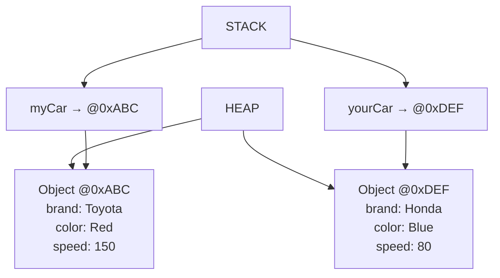
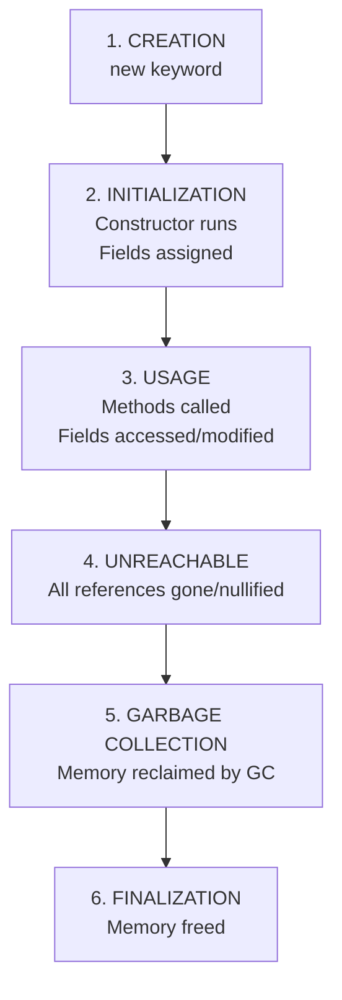

<a id="12-oop-concepts"></a>

# 📘 Chapter 12: OOP Concepts & Classes/Objects

> **Part C: Object Oriented Programming (Core Java)**
> `Core` | `Foundation` | `Interview Critical`

⭐⭐⭐⭐⭐⭐⭐⭐⭐⭐⭐⭐⭐⭐⭐⭐⭐⭐⭐⭐⭐⭐⭐⭐⭐⭐⭐⭐⭐⭐⭐⭐

Java • Core Java • Interview Preparation

⭐⭐⭐⭐⭐⭐⭐⭐⭐⭐⭐⭐⭐⭐⭐⭐⭐⭐⭐⭐⭐⭐⭐⭐⭐⭐⭐⭐⭐⭐⭐⭐

---

<a id="chapter-index-table-12"></a>

## 📚 Chapter 12 — Index Table

| No. | Topic | Subtopics |
|-----|-------|-----------|
| 12.1 | [What is OOP](#121-what-is-oop) | Definition, Core Idea, Real-World Modeling |
| 12.2 | [Programming Paradigms](#122-programming-paradigms) | Procedural, OOP, Functional, Scripting |
| 12.3 | [Why OOP](#123-why-oop) | Benefits, Advantages, Real-World Analogies |
| 12.4 | [Class — Blueprint](#124-class-blueprint) | Definition, Template, Class Syntax |
| 12.5 | [Object — Instance](#125-object-instance) | State + Behavior + Identity, Creating Objects |
| 12.6 | [Four Pillars Overview](#126-four-pillars-overview) | Encapsulation, Inheritance, Polymorphism, Abstraction |
| 12.7 | [Class Declaration Syntax](#127-class-declaration-syntax) | Complete Syntax, Class Modifiers |
| 12.8 | [Components of a Class](#128-components-of-a-class) | Fields, Methods, Constructors, Blocks, Nested Classes |
| 12.9 | [Types of Classes](#129-types-of-classes) | Concrete, Abstract, Final, Inner, Anonymous, POJO, Record, Sealed |
| 12.10 | [Object Creation (new keyword)](#1210-object-creation-new-keyword) | Syntax, Memory Allocation, Constructor Call |
| 12.11 | [Other Ways to Create Objects](#1211-other-ways-to-create-objects) | Reflection, clone(), Deserialization, Factory Methods |
| 12.12 | [Object Lifecycle](#1212-object-lifecycle) | Creation, Usage, Garbage Collection |
| 12.13 | [Anonymous Objects](#1213-anonymous-objects) | Objects without Reference, One-time Use |
| 12.14 | [Memory Allocation (Heap)](#1214-memory-allocation-heap) | Stack vs Heap, Object Storage |
| 12.15 | [What Happens When new is Executed](#1215-what-happens-when-new-is-executed) | Step-by-Step JVM Process |
| 12.16 | [IS-A vs HAS-A Relationship](#1216-is-a-vs-has-a-relationship) | Inheritance vs Composition |
| 🔥 | [Java vs Other Languages](#12-java-vs-other-languages) | Unique OOP Features |
| 💡 | [Interview Questions](#12-interview-questions) | 15+ Conceptual · Scenario · Output-based |
| 🧪 | [Practice Problems](#12-practice-problems) | 5 Coding + 5 Theory |

---

## 12.1 What is OOP

<a id="121-what-is-oop"></a>

### 📌 Definition

```
OOP = OBJECT-ORIENTED PROGRAMMING

A programming paradigm based on the concept of OBJECTS
that contain DATA (fields) and CODE (methods) together.

Instead of writing procedures that operate on data,
OOP models the real world as INTERACTING OBJECTS.

Key Idea:
→ Real world consists of THINGS (objects)
→ Each thing has PROPERTIES (state)
→ Each thing has BEHAVIORS (actions)
→ Things INTERACT with each other

Example:
Car (object) has:
→ Properties: color, brand, speed
→ Behaviors: start(), accelerate(), brake()
```

### 🌍 Real-World Analogy (Hinglish)

```
OOP samajhne ke liye SOCHO ek Real World:

🚗 CAR = Object
   ├── Properties (State):
   │   ├── color = "Red"
   │   ├── brand = "Toyota"
   │   └── speed = 0
   │
   └── Behaviors (Methods):
       ├── start()
       ├── accelerate()
       ├── brake()
       └── stop()

👤 PERSON = Object
   ├── Properties: name, age, height
   └── Behaviors: walk(), talk(), eat(), sleep()

🐶 DOG = Object
   ├── Properties: breed, color, age
   └── Behaviors: bark(), run(), eat()

Har real-world entity ko OOP mein OBJECT ke roop mein
model kar sakte hain!

OOP = Real World ki tarah code likhna
```

<a href="#chapter-index-table-12">Go to Top 🔝</a>

---

## 12.2 Programming Paradigms

<a id="122-programming-paradigms"></a>

### 📌 Different Ways to Write Code

```
┌──────────────────────────────────────────────────────────────┐
│  PARADIGM              │  DESCRIPTION                        │
├────────────────────────┼─────────────────────────────────────┤
│  1. PROCEDURAL         │  Program = sequence of procedures   │
│                        │  (functions) operating on data      │
│                        │  → C, Pascal                        │
│                        │  → Top-down approach                │
│                        │  → Data and functions are SEPARATE  │
├────────────────────────┼─────────────────────────────────────┤
│  2. OBJECT-ORIENTED    │  Program = collection of OBJECTS    │
│                        │  (data + behavior bundled)          │
│                        │  → Java, C++, Python, C#            │
│                        │  → Bottom-up approach               │
│                        │  → Real-world modeling              │
├────────────────────────┼─────────────────────────────────────┤
│  3. FUNCTIONAL         │  Program = evaluation of functions  │
│                        │  (immutable, no side effects)       │
│                        │  → Haskell, Scala, Lisp             │
│                        │  → Emphasis on pure functions       │
│                        │  → Java 8+ supports FP too           │
├────────────────────────┼─────────────────────────────────────┤
│  4. SCRIPTING          │  Interpreted, dynamic               │
│                        │  → Python, JavaScript, Ruby          │
├────────────────────────┼─────────────────────────────────────┤
│  5. LOGIC              │  Facts and rules (declarative)      │
│                        │  → Prolog                            │
└────────────────────────┴─────────────────────────────────────┘
```

### 📌 Procedural vs OOP — Same Problem

```java
// ═══ PROCEDURAL STYLE ═══
public class ProceduralStyle {

    static int[] marks = {80, 90, 70, 85, 95};

    static double calculateAverage(int[] arr) {
        int sum = 0;
        for (int m : arr) sum += m;
        return (double) sum / arr.length;
    }

    static int findMax(int[] arr) {
        int max = arr[0];
        for (int m : arr) if (m > max) max = m;
        return max;
    }

    public static void main(String[] args) {
        System.out.println("Avg: " + calculateAverage(marks));
        System.out.println("Max: " + findMax(marks));
        // Data (marks) and functions are SEPARATE
    }
}

// ═══ OOP STYLE ═══
public class Student {
    private int[] marks;      // Data (bundled with class)
    private String name;

    public Student(String name, int[] marks) {
        this.name = name;
        this.marks = marks;
    }

    // Behavior (methods bundled with data)
    public double calculateAverage() {
        int sum = 0;
        for (int m : marks) sum += m;
        return (double) sum / marks.length;
    }

    public int findMax() {
        int max = marks[0];
        for (int m : marks) if (m > max) max = m;
        return max;
    }

    public static void main(String[] args) {
        Student s = new Student("Rahul", new int[]{80, 90, 70, 85, 95});
        System.out.println("Avg: " + s.calculateAverage());  // Object method
        System.out.println("Max: " + s.findMax());
        // Data and behavior are BUNDLED in one object!
    }
}
```

<a href="#chapter-index-table-12">Go to Top 🔝</a>

---

## 12.3 Why OOP

<a id="123-why-oop"></a>

### 📌 Benefits of OOP

```
┌──────────────────────────────────────────────────────────────┐
│  BENEFIT               │  DESCRIPTION                        │
├────────────────────────┼─────────────────────────────────────┤
│  1. REUSABILITY        │  Inheritance allows code reuse      │
│                        │  → Write once, use in many places   │
│                        │  → Reduces development time         │
├────────────────────────┼─────────────────────────────────────┤
│  2. MODULARITY         │  Code organized into classes        │
│                        │  → Each class = one responsibility  │
│                        │  → Easier to understand and manage  │
├────────────────────────┼─────────────────────────────────────┤
│  3. FLEXIBILITY        │  Polymorphism allows one interface  │
│  (Polymorphism)        │  for many implementations           │
│                        │  → Add new features without changing│
│                        │    existing code                    │
├────────────────────────┼─────────────────────────────────────┤
│  4. MAINTAINABILITY    │  Encapsulation protects data        │
│                        │  → Changes in one class don't       │
│                        │    break others                     │
│                        │  → Easier debugging                 │
├────────────────────────┼─────────────────────────────────────┤
│  5. SCALABILITY        │  Complex systems easier to build    │
│                        │  → Add new classes without          │
│                        │    modifying existing ones          │
├────────────────────────┼─────────────────────────────────────┤
│  6. REAL-WORLD         │  Models real-world entities         │
│  MODELING              │  naturally                          │
│                        │  → Easier to design and think about │
├────────────────────────┼─────────────────────────────────────┤
│  7. DATA HIDING        │  Encapsulation hides internal data  │
│                        │  → Security                         │
│                        │  → Prevents accidental modification │
├────────────────────────┼─────────────────────────────────────┤
│  8. TEAM COLLABORATION │  Different teams work on different  │
│                        │  classes independently               │
└────────────────────────┴─────────────────────────────────────┘
```

### 📌 Problems with Procedural Programming

```
❌ PROCEDURAL PROGRAMMING PROBLEMS:

1. Data is EXPOSED (global variables)
   → Anyone can modify it → Security risk

2. Code becomes DIFFICULT to manage in large programs
   → 10,000+ line files
   → Hard to find related code

3. NO real-world modeling
   → Just data and functions
   → Doesn't reflect how we think

4. LIMITED code reuse
   → No inheritance
   → Copy-paste programming

5. HARD to maintain
   → Change in data structure = update in many places
```

<a href="#chapter-index-table-12">Go to Top 🔝</a>

---

## 12.4 Class — Blueprint

<a id="124-class-blueprint"></a>

### 📌 What is a Class?

```
CLASS = A BLUEPRINT or TEMPLATE for creating objects.

It defines:
→ WHAT DATA (fields) an object will have
→ WHAT BEHAVIOR (methods) an object can perform

A class itself is NOT an object — it's just a design.
Objects are CREATED FROM classes.

Analogy:
CLASS = Architectural blueprint for a house
OBJECT = Actual house built from that blueprint
```

### 📌 Class Syntax

```java
// ═══ BASIC CLASS SYNTAX ═══
[access_modifier] class ClassName {
    // Fields (state/data)
    dataType fieldName;

    // Methods (behavior)
    returnType methodName(parameters) {
        // method body
    }
}

// ═══ EXAMPLE: Car Class ═══
public class Car {

    // Fields (State)
    String brand;
    String color;
    int speed;
    int maxSpeed;

    // Methods (Behavior)
    void start() {
        System.out.println(brand + " is starting...");
    }

    void accelerate(int increment) {
        if (speed + increment <= maxSpeed) {
            speed += increment;
            System.out.println("Speed: " + speed + " km/h");
        } else {
            System.out.println("Max speed reached!");
        }
    }

    void brake() {
        speed = 0;
        System.out.println("Car stopped");
    }
}
```

### 🌍 Real-World Analogy

```
CLASS = COOKIE CUTTER 🍪
OBJECTS = Actual COOKIES you make with it

ONE cookie cutter (class) can make MANY cookies (objects)
All cookies have SAME SHAPE (structure)
But can have DIFFERENT DECORATIONS (state)

Class: CookieCutter shape="Star"
Object 1: Cookie with red icing
Object 2: Cookie with blue icing
Object 3: Cookie with sprinkles

Same class, different objects!
```

<a href="#chapter-index-table-12">Go to Top 🔝</a>

---

## 12.5 Object — Instance

<a id="125-object-instance"></a>

### 📌 What is an Object?

```
OBJECT = An INSTANCE of a class.
        = A real-world entity created from a class.

Every object has:
1. STATE     — Data/values (from fields)
2. BEHAVIOR  — Actions (from methods)
3. IDENTITY  — Unique reference (memory address)

Example:
Class: Car (blueprint)
Object 1: myCar (brand="Toyota", color="Red")
Object 2: yourCar (brand="Honda", color="Blue")

Both are CARS but INDEPENDENT objects with own state!
```

### 📌 Creating and Using Objects

```java
public class Main {
    public static void main(String[] args) {

        // ═══ CREATE Object using 'new' keyword ═══
        Car myCar = new Car();          // Object 1
        Car yourCar = new Car();        // Object 2

        // ═══ SET State (assign values) ═══
        myCar.brand = "Toyota";
        myCar.color = "Red";
        myCar.speed = 0;
        myCar.maxSpeed = 200;

        yourCar.brand = "Honda";
        yourCar.color = "Blue";
        yourCar.speed = 0;
        yourCar.maxSpeed = 180;

        // ═══ CALL Behavior (methods) ═══
        myCar.start();                  // Toyota is starting...
        myCar.accelerate(50);           // Speed: 50 km/h
        myCar.accelerate(100);          // Speed: 150 km/h

        yourCar.start();                // Honda is starting...
        yourCar.accelerate(80);         // Speed: 80 km/h

        // ═══ Each object has INDEPENDENT state ═══
        System.out.println(myCar.speed);    // 150
        System.out.println(yourCar.speed);  // 80

        // ═══ IDENTITY (Unique reference) ═══
        System.out.println(myCar);      // Car@1b6d3586 (hash code)
        System.out.println(yourCar);    // Car@4554617c (different!)
    }
}
```

### 📊 Object Memory Diagram



<a href="#chapter-index-table-12">Go to Top 🔝</a>

---

## 12.6 Four Pillars Overview

<a id="126-four-pillars-overview"></a>

### 📌 The 4 Pillars of OOP

```
┌──────────────────────────────────────────────────────────────┐
│  PILLAR              │  MEANING                              │
├──────────────────────┼───────────────────────────────────────┤
│  1. ENCAPSULATION    │  Wrapping data + methods together     │
│                      │  Hiding internal details              │
│                      │  → Data protection                    │
│                      │  → private fields + public methods    │
├──────────────────────┼───────────────────────────────────────┤
│  2. INHERITANCE      │  Child class inherits Parent class    │
│                      │  IS-A relationship                    │
│                      │  → Code reuse                         │
│                      │  → extends keyword                    │
├──────────────────────┼───────────────────────────────────────┤
│  3. POLYMORPHISM     │  ONE THING, MANY FORMS                │
│                      │  Same method, different behaviors     │
│                      │  → Overloading (compile-time)         │
│                      │  → Overriding (runtime)               │
├──────────────────────┼───────────────────────────────────────┤
│  4. ABSTRACTION      │  Hiding COMPLEXITY, showing ESSENTIALS│
│                      │  → Abstract classes                   │
│                      │  → Interfaces                         │
│                      │  → Only WHAT, not HOW                 │
└──────────────────────┴───────────────────────────────────────┘
```

### 📌 Quick Examples of Each Pillar

```java
// ═══ 1. ENCAPSULATION ═══
class BankAccount {
    private double balance;  // Hidden

    public double getBalance() { return balance; }        // Getter
    public void deposit(double amt) { balance += amt; }   // Controlled access
}

// ═══ 2. INHERITANCE ═══
class Animal {
    void eat() { System.out.println("Eating..."); }
}
class Dog extends Animal {   // Dog IS-A Animal
    void bark() { System.out.println("Woof!"); }
}
// Dog inherits eat() from Animal

// ═══ 3. POLYMORPHISM ═══
class Shape {
    void draw() { System.out.println("Shape"); }
}
class Circle extends Shape {
    void draw() { System.out.println("Circle"); }   // Override
}
Shape s = new Circle();   // Parent reference, child object
s.draw();                 // Prints "Circle" (runtime polymorphism!)

// ═══ 4. ABSTRACTION ═══
abstract class Vehicle {
    abstract void start();  // WHAT to do (no HOW)
}
class Car extends Vehicle {
    void start() {          // HOW to do it
        System.out.println("Turn key to start");
    }
}
// User only knows: start()
// Doesn't know: internal engine mechanics
```

### 🌍 Real-World Analogy

```
🚗 CAR EXAMPLE showing all 4 pillars:

1. ENCAPSULATION 🔒
   → Engine is HIDDEN under the hood
   → You use steering wheel, pedals (interface)
   → Cannot directly touch engine parts

2. INHERITANCE 🌳
   → SUV inherits from Car
   → Sports Car inherits from Car
   → All get basic car features + specific ones

3. POLYMORPHISM 🎭
   → start() method:
     - In Honda Civic: turn key
     - In Tesla: press button
     - In Ford: push start button
   → Same "start" concept, different implementations

4. ABSTRACTION 🎯
   → You know HOW to drive (accelerate, brake, steer)
   → You DON'T need to know how engine works internally
```

<a href="#chapter-index-table-12">Go to Top 🔝</a>

---

## 12.7 Class Declaration Syntax

<a id="127-class-declaration-syntax"></a>

### 📌 Complete Class Syntax

```java
// ═══ FULL CLASS DECLARATION ═══
[access_modifier] [modifier] class ClassName [extends ParentClass] [implements Interface1, Interface2] {

    // 1. Static Fields
    static dataType staticField;

    // 2. Instance Fields
    dataType instanceField;

    // 3. Static Blocks
    static {
        // Static initialization
    }

    // 4. Instance Blocks
    {
        // Instance initialization
    }

    // 5. Constructors
    ClassName() { }

    // 6. Static Methods
    static returnType staticMethod() { }

    // 7. Instance Methods
    returnType instanceMethod() { }

    // 8. Nested Classes
    class NestedClass { }
}
```

### 📌 Class Modifiers

```
┌────────────────┬─────────────────────────────────────────────┐
│  Modifier      │  Meaning                                    │
├────────────────┼─────────────────────────────────────────────┤
│  public        │  Accessible from EVERYWHERE                 │
│  default       │  Accessible only in SAME package            │
│  abstract      │  Cannot be instantiated                     │
│  final         │  Cannot be extended (inherited)             │
│  sealed        │  Restricted subclasses (Java 17+)           │
│  static        │  Only for NESTED classes                    │
├────────────────┼─────────────────────────────────────────────┤
│  ❌ private     │  Only for NESTED classes                    │
│  ❌ protected   │  Only for NESTED classes                    │
└────────────────┴─────────────────────────────────────────────┘

⚠️ For TOP-LEVEL classes:
→ Only 'public' or 'default' (no modifier)
→ Cannot be private or protected
```

### 📌 Real Class Example

```java
public final class Student {

    // Static field (shared)
    static int totalStudents = 0;

    // Instance fields
    private String name;
    private int age;

    // Static block
    static {
        System.out.println("Student class loaded");
    }

    // Instance block
    {
        totalStudents++;
        System.out.println("Creating student #" + totalStudents);
    }

    // Constructor
    public Student(String name, int age) {
        this.name = name;
        this.age = age;
    }

    // Static method
    public static int getTotal() {
        return totalStudents;
    }

    // Instance method
    public void display() {
        System.out.println(name + ", " + age);
    }

    // Nested class
    static class Address {
        String city;
    }
}
```

<a href="#chapter-index-table-12">Go to Top 🔝</a>

---

## 12.8 Components of a Class

<a id="128-components-of-a-class"></a>

### 📌 All 5 Components

```java
public class ComponentsDemo {

    // ═══ 1. FIELDS (Variables) ═══
    // Static fields (shared among all objects)
    static int count = 0;
    static final String COMPANY = "TechCorp";

    // Instance fields (per object)
    private String name;
    private int age;
    private double salary;

    // ═══ 2. METHODS (Functions) ═══
    // Instance method
    public void display() {
        System.out.println("Name: " + name);
    }

    // Static method
    public static int getCount() {
        return count;
    }

    // Getter/Setter
    public String getName() { return name; }
    public void setName(String name) { this.name = name; }

    // ═══ 3. CONSTRUCTORS ═══
    // Default constructor
    public ComponentsDemo() {
        count++;
    }

    // Parameterized constructor
    public ComponentsDemo(String name, int age) {
        this.name = name;
        this.age = age;
        count++;
    }

    // ═══ 4. BLOCKS ═══
    // Static block (runs when class loads)
    static {
        System.out.println("Static block executed");
    }

    // Instance block (runs when object is created, before constructor)
    {
        System.out.println("Instance block executed");
    }

    // ═══ 5. NESTED CLASSES ═══
    // Static nested class
    static class Address {
        String city;
        String state;
    }

    // Inner class (non-static)
    class InnerClass {
        void show() {
            System.out.println("Inner class of " + name);
        }
    }
}
```

<a href="#chapter-index-table-12">Go to Top 🔝</a>

---

## 12.9 Types of Classes

<a id="129-types-of-classes"></a>

### 📌 8 Types of Classes in Java

```java
// ═══ 1. CONCRETE CLASS (Regular class) ═══
public class Car {
    void drive() { }
}
// Can create objects: new Car();

// ═══ 2. ABSTRACT CLASS ═══
public abstract class Shape {
    abstract void draw();      // Abstract method (no body)
    void print() { }           // Concrete method (has body)
}
// CANNOT create objects: new Shape(); ❌
// Must be extended

// ═══ 3. FINAL CLASS ═══
public final class MathUtils {
    static int add(int a, int b) { return a + b; }
}
// CANNOT be extended: class Sub extends MathUtils {} ❌
// Example: String is final

// ═══ 4. INNER CLASS (Non-static Nested) ═══
public class Outer {
    class Inner {   // Inner class
        void show() {
            System.out.println("Inside inner class");
        }
    }
}
// Access: Outer.Inner obj = new Outer().new Inner();

// ═══ 5. ANONYMOUS CLASS (No name) ═══
Runnable r = new Runnable() {
    @Override
    public void run() {
        System.out.println("Anonymous class");
    }
};

// ═══ 6. POJO (Plain Old Java Object) ═══
public class Student {
    private String name;
    private int age;

    // Getters and setters only
    public String getName() { return name; }
    public void setName(String name) { this.name = name; }
    public int getAge() { return age; }
    public void setAge(int age) { this.age = age; }
}
// No business logic, just data + getters/setters

// ═══ 7. RECORD CLASS (Java 14+) ═══
public record Point(int x, int y) { }
// Auto-generates: constructor, getters, equals, hashCode, toString
// Immutable by default
// Great for DTOs and data-carrier classes

// ═══ 8. SEALED CLASS (Java 17+) ═══
public sealed class Vehicle permits Car, Bike, Truck { }

final class Car extends Vehicle { }
final class Bike extends Vehicle { }
final class Truck extends Vehicle { }
// Only Car, Bike, Truck can extend Vehicle
// Restricts inheritance
```

### 📌 Summary Table

```
┌────────────────┬──────────────────────────────────────────────┐
│  Type          │  Description                                 │
├────────────────┼──────────────────────────────────────────────┤
│  Concrete      │  Normal class, can create objects            │
│  Abstract      │  Cannot instantiate, has abstract methods    │
│  Final         │  Cannot be extended                          │
│  Inner         │  Class inside another class                  │
│  Anonymous     │  Class without name (usually for interfaces) │
│  POJO          │  Simple class with fields + getters/setters  │
│  Record (14+)  │  Immutable data carrier (auto-generated code)│
│  Sealed (17+)  │  Restricted inheritance (specified subclasses)│
└────────────────┴──────────────────────────────────────────────┘
```

<a href="#chapter-index-table-12">Go to Top 🔝</a>

---

## 12.10 Object Creation (new keyword)

<a id="1210-object-creation-new-keyword"></a>

### 📌 The 'new' Keyword

```java
public class ObjectCreation {

    public static void main(String[] args) {

        // ═══ SYNTAX ═══
        // ClassName referenceName = new ClassName(arguments);

        // ═══ Example 1: Default constructor ═══
        Student s1 = new Student();
        //  ↑           ↑          ↑
        //  Reference   Constructor Call
        //  (Stack)     (creates object on Heap)

        // ═══ Example 2: Parameterized constructor ═══
        Student s2 = new Student("Rahul", 22);

        // ═══ Example 3: Using existing class ═══
        String name = new String("Hello");
        // Better: String name = "Hello"; (uses String Pool)

        java.util.ArrayList<Integer> list = new java.util.ArrayList<>();
        java.util.Scanner sc = new java.util.Scanner(System.in);
    }
}

class Student {
    String name;
    int age;

    Student() {
        this.name = "Unknown";
        this.age = 0;
    }

    Student(String name, int age) {
        this.name = name;
        this.age = age;
    }
}
```

### 📌 What Does 'new' Do?

```
When you write: new ClassName()

Step 1: Allocates MEMORY on HEAP
        → Enough space for all instance fields

Step 2: Initializes fields to DEFAULT values
        → int → 0, boolean → false, Object → null

Step 3: Calls the CONSTRUCTOR
        → Runs constructor code
        → Assigns specified values

Step 4: Returns REFERENCE (memory address)
        → Assigned to the reference variable
```

<a href="#chapter-index-table-12">Go to Top 🔝</a>

---

## 12.11 Other Ways to Create Objects

<a id="1211-other-ways-to-create-objects"></a>

### 📌 5 Ways to Create Objects in Java

```java
import java.io.*;
import java.lang.reflect.Constructor;

public class ObjectCreationWays {

    public static void main(String[] args) throws Exception {

        // ═══ WAY 1: new Keyword (Most Common) ═══
        Student s1 = new Student("Rahul", 22);

        // ═══ WAY 2: Class.forName().newInstance() (Reflection) ═══
        // Deprecated in Java 9+, use getDeclaredConstructor().newInstance()
        Class<?> c = Class.forName("Student");
        Student s2 = (Student) c.getDeclaredConstructor(String.class, int.class)
                                 .newInstance("Priya", 25);

        // ═══ WAY 3: Constructor.newInstance() ═══
        Constructor<Student> constructor = Student.class.getConstructor(String.class, int.class);
        Student s3 = constructor.newInstance("Amit", 30);

        // ═══ WAY 4: clone() Method ═══
        // Requires class to implement Cloneable interface
        // Student s4 = (Student) s1.clone();  // Shallow copy

        // ═══ WAY 5: Deserialization ═══
        // Reading a serialized object from a file/stream
        // ObjectInputStream in = new ObjectInputStream(new FileInputStream("s.ser"));
        // Student s5 = (Student) in.readObject();

        // ═══ BONUS: Factory Method ═══
        Student s6 = Student.create("Neha", 28);

        System.out.println(s1.name);
        System.out.println(s2.name);
        System.out.println(s6.name);
    }
}

class Student implements Cloneable, Serializable {
    String name;
    int age;

    public Student(String name, int age) {
        this.name = name;
        this.age = age;
    }

    // Factory method
    public static Student create(String name, int age) {
        return new Student(name, age);
    }

    @Override
    protected Object clone() throws CloneNotSupportedException {
        return super.clone();
    }
}
```

### 📌 Summary Table

```
┌───────────────────┬──────────────────────────────────────────┐
│  Method           │  Description                             │
├───────────────────┼──────────────────────────────────────────┤
│  1. new keyword   │  Standard way, calls constructor         │
│  2. Reflection    │  Dynamic creation at runtime             │
│  3. Constructor.  │  Reflective constructor invocation       │
│     newInstance() │                                          │
│  4. clone()       │  Copy of existing object (needs Cloneable)│
│  5. Deserialization│  Read from serialized bytes             │
│  6. Factory Method│  Static method returns object            │
└───────────────────┴──────────────────────────────────────────┘
```

<a href="#chapter-index-table-12">Go to Top 🔝</a>

---

## 12.12 Object Lifecycle

<a id="1212-object-lifecycle"></a>

### 📌 Life of an Object



### 📌 Complete Lifecycle Example

```java
public class ObjectLifecycle {

    static class Person {
        String name;

        public Person(String name) {
            this.name = name;
            System.out.println("1. " + name + " CREATED");
        }

        void greet() {
            System.out.println("3. " + name + " USING method");
        }

        @Override
        protected void finalize() {
            System.out.println("5. " + name + " being GC'd");
            // Note: finalize() is deprecated in Java 9+
        }
    }

    public static void main(String[] args) {
        // 1. CREATION + 2. INITIALIZATION
        Person p = new Person("Rahul");

        // 3. USAGE
        p.greet();
        System.out.println("Name: " + p.name);

        // 4. UNREACHABLE (no more references)
        p = null;

        // 5. Suggest GC (may or may not run)
        System.gc();

        // Wait for GC
        try { Thread.sleep(100); } catch (Exception e) { }

        System.out.println("Program ended");
    }
}
```

<a href="#chapter-index-table-12">Go to Top 🔝</a>

---

## 12.13 Anonymous Objects

<a id="1213-anonymous-objects"></a>

### 📌 Objects Without a Reference

```java
public class AnonymousObjectDemo {

    static class Calculator {
        int add(int a, int b) {
            return a + b;
        }

        void display() {
            System.out.println("Calculator ready!");
        }
    }

    public static void main(String[] args) {

        // ═══ NAMED Object ═══
        Calculator calc = new Calculator();  // Object with reference
        int result = calc.add(5, 10);
        calc.display();

        // ═══ ANONYMOUS Object (no reference!) ═══
        // Created and used immediately, then discarded
        int sum = new Calculator().add(5, 10);       // Anonymous
        System.out.println(sum);                      // 15

        // Chain method calls
        new Calculator().display();                    // Prints and discards

        // Pass to method
        printSum(new Calculator());                    // Anonymous passed

        /*
        WHEN TO USE:
        ✅ ONE-TIME use (won't reuse the object)
        ✅ Passing to method as argument
        ✅ Method chaining

        DRAWBACK:
        ❌ Cannot reuse (no reference to access again)
        ❌ Immediately eligible for garbage collection
        */
    }

    static void printSum(Calculator c) {
        System.out.println(c.add(100, 200));  // 300
    }
}
```

<a href="#chapter-index-table-12">Go to Top 🔝</a>

---

## 12.14 Memory Allocation (Heap)

<a id="1214-memory-allocation-heap"></a>

### 📌 Where Objects Live

```
JAVA MEMORY MODEL:

┌──────────────────────────────────────────────────────────────┐
│                      JVM MEMORY                              │
├──────────────────────────────────────────────────────────────┤
│                                                              │
│  ┌────────────────────┐    ┌──────────────────────────────┐ │
│  │   STACK MEMORY     │    │      HEAP MEMORY             │ │
│  │  (Per Thread)      │    │      (Shared, GC-managed)    │ │
│  │                    │    │                              │ │
│  │  Local variables   │    │  ALL OBJECTS live here!      │ │
│  │  References        │───→│                              │ │
│  │  Method calls      │    │  Object 1: {name="Alice"}    │ │
│  │  Primitives (local)│    │  Object 2: {name="Bob"}      │ │
│  │                    │    │  Object 3: {arr=[1,2,3]}     │ │
│  │  Fast access       │    │                              │ │
│  │  Auto-managed      │    │  Slower access               │ │
│  └────────────────────┘    │  Managed by Garbage Collector │ │
│                            └──────────────────────────────┘ │
└──────────────────────────────────────────────────────────────┘
```

### 📌 Object Memory Example

```java
public class MemoryDemo {

    public static void main(String[] args) {

        // 'p1' is a REFERENCE (Stack)
        // Person object is on HEAP
        Person p1 = new Person("Alice", 25);

        // 'p2' is another REFERENCE (Stack)
        // Points to SAME object as p1 (no new object created!)
        Person p2 = p1;

        // 'p3' is a REFERENCE (Stack)
        // NEW Person object on HEAP
        Person p3 = new Person("Bob", 30);

        // MEMORY:
        // STACK:  p1 → @0xABC
        //         p2 → @0xABC  (same as p1!)
        //         p3 → @0xDEF
        //
        // HEAP:   @0xABC: Person{name="Alice", age=25}
        //         @0xDEF: Person{name="Bob", age=30}

        p2.name = "Alicia";
        System.out.println(p1.name);  // "Alicia" (same object!)
    }
}

class Person {
    String name;
    int age;

    Person(String name, int age) {
        this.name = name;
        this.age = age;
    }
}
```

<a href="#chapter-index-table-12">Go to Top 🔝</a>

---

## 12.15 What Happens When new is Executed ⭐

<a id="1215-what-happens-when-new-is-executed"></a>

### 📌 Step-by-Step JVM Process

```java
Student s = new Student("Rahul", 22);
```

### 📌 5 Steps JVM Performs

```
STEP 1: CLASS LOADING (if not loaded)
        → JVM loads Student.class into memory
        → ClassLoader finds and loads the class
        → Only happens ONCE per class

STEP 2: MEMORY ALLOCATION ON HEAP
        → JVM calculates size needed for object
        → Allocates that memory on Heap
        → Instance fields get DEFAULT values
          (int → 0, String → null, boolean → false)

STEP 3: INSTANCE INITIALIZATION
        → Static block runs (if class loaded first time)
        → Instance blocks run (in order)
        → Instance fields initialized with explicit values

STEP 4: CONSTRUCTOR EXECUTION
        → super() called first (implicit or explicit)
        → Constructor body runs
        → Assigns parameters to fields

STEP 5: RETURN REFERENCE
        → Memory address of object returned
        → Assigned to reference variable (Stack)
```

### 📌 Detailed Example

```java
public class NewKeywordFlow {

    static class Student {
        // Instance fields with defaults
        String name;      // default: null
        int age;          // default: 0
        int rollNumber;   // default: 0

        // Static block
        static {
            System.out.println("Step: Static block");
        }

        // Instance block
        {
            System.out.println("Step: Instance block runs");
            rollNumber = 100;  // Explicit initialization
        }

        // Constructor
        public Student(String name, int age) {
            System.out.println("Step: Constructor runs");
            this.name = name;
            this.age = age;
        }
    }

    public static void main(String[] args) {
        System.out.println("=== Creating student ===");
        Student s = new Student("Rahul", 22);

        System.out.println("Name: " + s.name);
        System.out.println("Age: " + s.age);
        System.out.println("Roll: " + s.rollNumber);
    }
}

/*
OUTPUT:
=== Creating student ===
Step: Static block           ← Only once, when class loads
Step: Instance block runs    ← Before constructor
Step: Constructor runs       ← After instance block
Name: Rahul
Age: 22
Roll: 100

EXECUTION ORDER:
1. Static block  (once, when class loads)
2. Memory allocation
3. Default values assigned
4. Instance block runs
5. Constructor runs
6. Reference returned
*/
```

<a href="#chapter-index-table-12">Go to Top 🔝</a>

---

## 12.16 IS-A vs HAS-A Relationship

<a id="1216-is-a-vs-has-a-relationship"></a>

### 📌 Two Types of Relationships

```
┌──────────────────────────────────────────────────────────────┐
│  IS-A (Inheritance)          │  HAS-A (Composition)          │
├──────────────────────────────┼───────────────────────────────┤
│  Represents inheritance      │  Represents ownership         │
│                              │                               │
│  Achieved via:               │  Achieved via:                │
│  → extends (class)           │  → Object references          │
│  → implements (interface)    │    as fields                  │
│                              │                               │
│  "Dog IS-A Animal"           │  "Car HAS-A Engine"           │
│  "Circle IS-A Shape"         │  "Student HAS-A Address"      │
│                              │                               │
│  Tight coupling              │  Loose coupling                │
│                              │  (preferred!)                 │
└──────────────────────────────┴───────────────────────────────┘
```

### 📌 IS-A Example (Inheritance)

```java
// ═══ IS-A Relationship (Inheritance) ═══

class Animal {
    void eat() { System.out.println("Eating..."); }
    void sleep() { System.out.println("Sleeping..."); }
}

class Dog extends Animal {   // Dog IS-A Animal
    void bark() { System.out.println("Woof!"); }
}

class Puppy extends Dog {    // Puppy IS-A Dog IS-A Animal
    void play() { System.out.println("Playing!"); }
}

public class ISADemo {
    public static void main(String[] args) {
        Puppy p = new Puppy();
        p.eat();    // Inherited from Animal
        p.sleep();  // Inherited from Animal
        p.bark();   // Inherited from Dog
        p.play();   // Own method

        // Puppy IS-A Dog
        // Puppy IS-A Animal
        // Puppy IS-A Object (root)
    }
}
```

### 📌 HAS-A Example (Composition)

```java
// ═══ HAS-A Relationship (Composition) ═══

class Engine {
    String type;

    Engine(String type) {
        this.type = type;
    }

    void start() {
        System.out.println(type + " engine started");
    }
}

class Wheels {
    int count = 4;

    void rotate() {
        System.out.println(count + " wheels rotating");
    }
}

class Car {
    // Car HAS-A Engine
    // Car HAS-A Wheels
    Engine engine;
    Wheels wheels;

    Car(String engineType) {
        this.engine = new Engine(engineType);  // Composition!
        this.wheels = new Wheels();
    }

    void drive() {
        engine.start();
        wheels.rotate();
        System.out.println("Car is driving!");
    }
}

public class HASADemo {
    public static void main(String[] args) {
        Car myCar = new Car("V8");
        myCar.drive();

        // Car HAS-A Engine (not IS-A!)
        // Car HAS-A Wheels
        // If Car is destroyed → Engine and Wheels also destroyed
    }
}
```

### 📌 When to Use IS-A vs HAS-A

```
┌──────────────────────────────────────────────────────────────┐
│  Question: Should Car extend Engine, or contain Engine?     │
├──────────────────────────────────────────────────────────────┤
│                                                              │
│  ❌ Car extends Engine (IS-A)                                │
│     → Wrong! Car is NOT a type of Engine                    │
│     → Car doesn't perform engine actions                    │
│                                                              │
│  ✅ Car HAS-A Engine (Composition)                           │
│     → Correct! Car CONTAINS an engine                       │
│     → Car USES the engine to do things                      │
│                                                              │
│  RULE OF THUMB:                                              │
│  → Ask "Is X a type of Y?"                                  │
│    → If YES → use IS-A (inheritance)                        │
│    → If NO → use HAS-A (composition)                        │
│                                                              │
│  → Ask "Does X have a Y?"                                    │
│    → If YES → use HAS-A (composition)                       │
│                                                              │
│  FAVOR COMPOSITION OVER INHERITANCE!                         │
│  (Recommended by "Effective Java" — Josh Bloch)              │
└──────────────────────────────────────────────────────────────┘
```

<a href="#chapter-index-table-12">Go to Top 🔝</a>

---

<a id="12-java-vs-other-languages"></a>

## 🔥 What Makes Java DIFFERENT — OOP

```
┌──────────────────────┬────────────┬────────────┬────────────┬────────────┐
│  Feature             │  Java      │  C++       │  Python    │  JavaScript│
├──────────────────────┼────────────┼────────────┼────────────┼────────────┤
│  100% OOP?           │ ❌ NO      │ ❌ NO      │ ❌ NO      │ ❌ NO     │
│                      │ (primitives│ (also has  │ (functions │ (functions │
│                      │ exist)     │ primitives)│ standalone)│ standalone)│
├──────────────────────┼────────────┼────────────┼────────────┼────────────┤
│  All code in class?  │ ✅ YES     │ ❌ NO      │ ❌ NO      │ ❌ NO     │
├──────────────────────┼────────────┼────────────┼────────────┼────────────┤
│  Multiple            │ ❌ NO      │ ✅ YES     │ ✅ YES     │ ❌ NO     │
│  Inheritance         │ (classes)  │            │            │            │
│                      │ ✅ YES     │            │            │            │
│                      │ (interfaces)│            │            │            │
├──────────────────────┼────────────┼────────────┼────────────┼────────────┤
│  Operator            │ ❌ NO      │ ✅ YES     │ ✅ YES     │ ❌ NO     │
│  Overloading         │ (except +) │            │            │            │
├──────────────────────┼────────────┼────────────┼────────────┼────────────┤
│  Destructor          │ ❌ NO      │ ✅ YES     │ ⚠️ __del__ │ ❌ NO     │
│                      │ (GC only)  │            │            │            │
├──────────────────────┼────────────┼────────────┼────────────┼────────────┤
│  Virtual keyword     │ ❌ NO      │ ✅ YES     │ N/A        │ N/A        │
│                      │ (all       │ (needed)   │            │            │
│                      │ virtual by │            │            │            │
│                      │ default)   │            │            │            │
├──────────────────────┼────────────┼────────────┼────────────┼────────────┤
│  Access modifiers    │ 4 types    │ 3 types    │ Convention │ Convention │
│                      │            │            │ (_ prefix) │ (# private)│
├──────────────────────┼────────────┼────────────┼────────────┼────────────┤
│  Records             │ ✅ Java 14+│ ❌         │ ✅ Named   │ ❌         │
│                      │            │            │ tuples     │            │
├──────────────────────┼────────────┼────────────┼────────────┼────────────┤
│  Sealed classes      │ ✅ Java 17+│ ❌         │ ❌         │ ❌         │
└──────────────────────┴────────────┴────────────┴────────────┴────────────┘
```

### 🎯 Key UNIQUE Points

```
1. NO STANDALONE FUNCTIONS:
   → Everything must be in a class
   → Even main() must be inside a class!
   → C++, Python, JS allow free functions

2. NOT 100% OOP:
   → Java has 8 primitive types (int, char, etc.)
   → For true 100% OOP, use Wrapper classes
   → Truly OOP languages: Smalltalk, Ruby

3. NO MULTIPLE INHERITANCE (of classes):
   → Diamond problem avoided
   → Achieve through interfaces (multiple)
   → C++ has complex diamond problem

4. NO OPERATOR OVERLOADING (except +):
   → Only + is overloaded for String concatenation
   → Prevents complex, unreadable code
   → C++ has extensive operator overloading

5. NO EXPLICIT DESTRUCTORS:
   → Garbage Collector handles cleanup
   → No delete keyword
   → C++ requires manual memory management

6. RECORDS & SEALED CLASSES:
   → Modern OOP features (Java 14+, 17+)
   → Records: Immutable data carriers
   → Sealed: Restricted inheritance
```

<a href="#chapter-index-table-12">Go to Top 🔝</a>

---

<a id="12-interview-questions"></a>

## 💡 Chapter 12 — Interview Questions (15+)

---

### 🔵 Conceptual Questions

**Q1. What is OOP? What are its 4 pillars?**

```
OOP = Object-Oriented Programming
A paradigm based on OBJECTS that contain data + behavior.

4 PILLARS:
1. ENCAPSULATION — Wrapping data + methods, hiding details
2. INHERITANCE   — Child class inherits from Parent class
3. POLYMORPHISM  — One thing, many forms (overloading/overriding)
4. ABSTRACTION   — Hiding complexity, showing only essentials

Example:
class BankAccount {              // Class
    private double balance;      // ENCAPSULATION (private data)

    public void deposit(double a) {  // Controlled access
        balance += a;
    }
}
```

---

**Q2. What is the difference between class and object?**

```
CLASS:
→ BLUEPRINT/TEMPLATE
→ Defines structure (fields + methods)
→ NOT an object itself
→ Compile-time entity

OBJECT:
→ INSTANCE of a class
→ Has actual values (state)
→ Runtime entity
→ Created using 'new' keyword

Example:
class Car { }              ← Class (blueprint)
Car myCar = new Car();     ← Object (instance)
Car yourCar = new Car();   ← Another object

One class → many objects!
```

---

**Q3. Why is Java NOT 100% Object-Oriented?**

```
Java is NOT 100% OOP because of:

1. PRIMITIVE DATA TYPES:
   → int, char, boolean, byte, short, long, float, double
   → These are NOT objects
   → For 100% OOP, everything should be an object

2. STATIC METHODS:
   → Can be called without creating object
   → Don't need instances

3. WRAPPER CLASSES exist to bridge gap:
   → Integer, Character, Boolean, etc.
   → But primitives themselves aren't objects

Truly 100% OOP languages: Smalltalk, Ruby
In those languages, even 5 + 3 is a message passing between objects!
```

---

**Q4. What is the difference between IS-A and HAS-A relationship?**

```
IS-A (Inheritance):
→ "Dog IS-A Animal"
→ Uses extends/implements
→ Child inherits Parent's members
→ Tight coupling

HAS-A (Composition):
→ "Car HAS-A Engine"
→ One class contains another as field
→ Uses object references
→ Loose coupling (preferred!)

Example:
// IS-A
class Dog extends Animal { }  // Dog IS-A Animal

// HAS-A
class Car {
    Engine engine;  // Car HAS-A Engine
}

RULE: "Favor Composition over Inheritance" — Effective Java
```

---

**Q5. What happens when you use 'new' keyword?**

```
5 STEPS when 'new Student("Rahul", 22)' is executed:

1. CLASS LOADING (if not loaded)
   → ClassLoader loads .class file

2. MEMORY ALLOCATION ON HEAP
   → JVM allocates memory for object
   → Instance fields get default values

3. INSTANCE INITIALIZATION
   → Static block runs (once, if class loaded first time)
   → Instance blocks run
   → Fields with explicit initializers set

4. CONSTRUCTOR EXECUTION
   → super() called (implicit or explicit)
   → Constructor body runs
   → Fields assigned from parameters

5. REFERENCE RETURNED
   → Memory address of new object
   → Assigned to reference variable
```

---

**Q6. What are the different ways to create objects in Java?**

```
5 ways (+ factory method):

1. NEW KEYWORD (most common):
   Student s = new Student();

2. Class.forName().newInstance() (Reflection):
   Class<?> c = Class.forName("Student");
   Student s = (Student) c.getDeclaredConstructor().newInstance();

3. Constructor.newInstance() (Reflection):
   Constructor<Student> con = Student.class.getConstructor();
   Student s = con.newInstance();

4. clone() (must implement Cloneable):
   Student s2 = (Student) s1.clone();

5. Deserialization (from stream):
   ObjectInputStream in = ...;
   Student s = (Student) in.readObject();

6. Factory Methods:
   Student s = Student.create("Rahul", 22);
```

---

**Q7. What is an anonymous object?**

```
Anonymous object = Object WITHOUT a reference variable.

// Named object
Calculator calc = new Calculator();
int result = calc.add(5, 10);

// Anonymous object (used once, discarded)
int result = new Calculator().add(5, 10);
new Calculator().display();

USE CASES:
✅ One-time use
✅ Method chaining
✅ Passing as method argument

DRAWBACK:
❌ Cannot reuse
❌ Eligible for GC immediately after use
```

---

**Q8. What are the different types of classes in Java?**

```
1. CONCRETE CLASS — Regular, can create objects
   class Car { }

2. ABSTRACT CLASS — Cannot instantiate, has abstract methods
   abstract class Shape { }

3. FINAL CLASS — Cannot be extended
   final class MathUtils { }

4. INNER CLASS — Class inside another class
   class Outer { class Inner { } }

5. ANONYMOUS CLASS — Class without name
   new Runnable() { public void run() { } };

6. POJO — Simple class with fields + getters/setters

7. RECORD (Java 14+) — Immutable data carrier
   record Point(int x, int y) { }

8. SEALED (Java 17+) — Restricted inheritance
   sealed class Vehicle permits Car, Bike { }
```

---

### 🟡 Scenario-Based Questions

**Q9. Where are objects stored in Java?**

```
OBJECTS are stored in HEAP MEMORY (shared).

REFERENCES (variables pointing to objects) are stored in:
→ STACK (for local variables)
→ HEAP (for instance variables — part of the object)

Example:
public void method() {
    Person p = new Person("Alice");
    // p (reference) → STACK
    // Person object → HEAP
}

When method ends:
→ p (reference) removed from Stack
→ Person object becomes eligible for GC
```

---

**Q10. Can we execute Java program without creating an object?**

```
YES! Using static methods.

public class Main {
    public static void main(String[] args) {
        // main() itself is called by JVM WITHOUT creating object!
        Utility.doWork();  // static method called without object
    }
}

class Utility {
    public static void doWork() {
        System.out.println("Working...");
    }
}

Static methods:
→ Belong to CLASS, not object
→ Called using ClassName.method()
→ Cannot access non-static members directly
```

---

### 🔴 Output-Based Questions

**Q11. What is the output?**

```java
class Test {
    int x = 10;
    static int y = 20;

    public static void main(String[] args) {
        Test t1 = new Test();
        Test t2 = new Test();
        t1.x = 100;
        t1.y = 200;
        System.out.println(t2.x);
        System.out.println(t2.y);
    }
}
```

```
OUTPUT:
10
200

REASON:
→ x is INSTANCE variable → each object has OWN copy
  → t1.x = 100 doesn't affect t2.x (still 10)

→ y is STATIC variable → SHARED among all objects
  → t1.y = 200 also changes t2.y (both see 200)

Note: Accessing static via object gives warning
      Use Test.y instead
```

---

**Q12. What is the output?**

```java
public class Test {
    static { System.out.println("Static 1"); }
    { System.out.println("Instance 1"); }
    public Test() { System.out.println("Constructor"); }
    static { System.out.println("Static 2"); }
    { System.out.println("Instance 2"); }

    public static void main(String[] args) {
        System.out.println("--- Creating obj1 ---");
        new Test();
        System.out.println("--- Creating obj2 ---");
        new Test();
    }
}
```

```
OUTPUT:
Static 1                    ← Static blocks run FIRST (class load)
Static 2                    ← Only ONCE
--- Creating obj1 ---
Instance 1                  ← Instance blocks (before constructor)
Instance 2
Constructor
--- Creating obj2 ---
Instance 1                  ← Instance blocks run for EACH object
Instance 2
Constructor

EXECUTION ORDER:
1. Static blocks (once, when class loaded, in order)
2. Instance blocks (before constructor, in order)
3. Constructor
```

---

**Q13. Predict the output:**

```java
class A {
    int x;
    A() { x = 5; }
}

public class Test {
    public static void main(String[] args) {
        A a1 = new A();
        A a2 = a1;
        a2.x = 100;
        System.out.println(a1.x);
    }
}
```

```
OUTPUT: 100

REASON:
a2 = a1 copies REFERENCE (both point to SAME object)
Modifying via a2 affects a1 (same object on Heap!)

MEMORY:
STACK: a1 → @0xABC
       a2 → @0xABC  (same!)
HEAP:  Object @0xABC {x: 100}
```

---

**Q14. What is the output?**

```java
class Test {
    int x = 10;

    public static void main(String[] args) {
        Test t = null;
        System.out.println(t.x);
    }
}
```

```
OUTPUT: NullPointerException at runtime

REASON:
t is null (doesn't point to any object)
Accessing t.x → tries to access field on null reference
→ NullPointerException

CODE COMPILES FINE! Error only at runtime.

FIX:
Test t = new Test();
System.out.println(t.x);  // Prints 10
```

---

**Q15. Can a class have a main method inside it, even if it doesn't have any static method?**

```java
public class Test {
    public static void main(String[] args) {
        // main() itself IS static!
        System.out.println("Hello");
    }
}
```

```
YES! main() must be public static void.
It's automatically static.

Every class CAN have its own main() method.
JVM calls the main() of the class specified when running:
java ClassName
```

<a href="#chapter-index-table-12">Go to Top 🔝</a>

---

<a id="12-practice-problems"></a>

## 🧪 Chapter 12 — Practice Problems

### 📝 5 Theory Questions

```
1. Explain the 4 pillars of OOP with real-world examples
   and Java code for each pillar.

2. What are the different ways to create objects in Java?
   Explain each with code examples.

3. Compare IS-A vs HAS-A relationship with examples.
   Why is composition preferred over inheritance?

4. Explain step-by-step what happens in JVM when
   'new ClassName()' is executed. Show execution order of
   static block, instance block, and constructor.

5. Explain the different types of classes in Java
   (Concrete, Abstract, Final, Inner, Anonymous, POJO,
   Record, Sealed) with code examples.
```

### 💻 5 Coding Questions

```java
// Q1: Create a Student class with fields, constructor, methods
// Demonstrate object creation and usage

public class Student {
    // Fields: name, age, rollNumber, marks (array)
    // Constructor with all parameters
    // Methods: display(), calculateAverage(), getGrade()

    // TODO: Implement complete class with getters/setters
    // Create 3 Student objects and demonstrate usage
}
```

```java
// Q2: Model a Library management system
// Create classes: Book, Library
// Library HAS-A List of Books

public class LibrarySystem {
    // Book: title, author, ISBN, isAvailable
    // Library: name, list of books
    // Methods: addBook(), removeBook(), searchBook(), issueBook()

    // TODO: Implement with proper OOP principles
}
```

```java
// Q3: Demonstrate static vs instance
// Create BankAccount class where:
// - Each account has its own balance (instance)
// - Bank has total accounts counter (static)

public class BankAccount {
    // Instance: accountNumber, holderName, balance
    // Static: totalAccounts, bankName (constant)
    // Constructor increments totalAccounts

    // TODO: Create multiple accounts, show counter
}
```

```java
// Q4: Show all 6 ways to create objects
// Create Person class with reflection support

import java.lang.reflect.*;
import java.io.*;

public class ObjectCreationDemo {
    // Create Person using:
    // 1. new keyword
    // 2. Class.forName + newInstance
    // 3. Constructor.newInstance
    // 4. clone() (implement Cloneable)
    // 5. Deserialization (implement Serializable)
    // 6. Factory method

    // TODO: Implement all 6 approaches
}
```

```java
// Q5: Compare IS-A vs HAS-A
// Model a Computer with parts
// Computer HAS-A CPU, RAM, HDD (composition)
// Laptop IS-A Computer (inheritance)

public class ComputerSystem {
    // Classes: CPU, RAM, HDD, Computer, Laptop
    // Computer contains CPU, RAM, HDD as fields
    // Laptop extends Computer and adds Battery

    // TODO: Implement with both IS-A and HAS-A
}
```

<a href="#chapter-index-table-12">Go to Top 🔝</a>

---

```
┌─────────────────────────────────────────────────────────────┐
│                  ✅ CHAPTER 12 COMPLETE                     │
│                                                             │
│  Topics Covered:                                            │
│  ✅ 12.1  What is OOP — Definition, Real-world modeling     │
│  ✅ 12.2  Programming Paradigms — Procedural, OOP, FP       │
│  ✅ 12.3  Why OOP — 8 Benefits, Comparison with Procedural  │
│  ✅ 12.4  Class — Blueprint, Syntax, Examples               │
│  ✅ 12.5  Object — State, Behavior, Identity                │
│  ✅ 12.6  Four Pillars — Overview with code for each        │
│  ✅ 12.7  Class Declaration — Complete syntax, modifiers    │
│  ✅ 12.8  Components — Fields, Methods, Constructors,       │
│         Blocks, Nested classes                              │
│  ✅ 12.9  Types of Classes — 8 types explained              │
│  ✅ 12.10 Object Creation — new keyword, memory allocation  │
│  ✅ 12.11 Other Object Creation — 6 ways (Reflection, clone,│
│         Deserialization, Factory)                           │
│  ✅ 12.12 Object Lifecycle — Creation to GC                 │
│  ✅ 12.13 Anonymous Objects — One-time use                  │
│  ✅ 12.14 Memory Allocation — Stack vs Heap                 │
│  ✅ 12.15 What Happens with new — 5 JVM steps               │
│  ✅ 12.16 IS-A vs HAS-A — Inheritance vs Composition        │
│  ✅ 🔥    Java vs Others — 6 UNIQUE OOP differences         │
│  ✅ 15+   Interview Questions with Detailed Answers         │
│  ✅ 5     Theory + 5 Coding Practice Problems               │
│                                                             │
│  ⭐ Next: Encapsulation (Chapter 13)                        │
└─────────────────────────────────────────────────────────────┘
```

[Go to Main Index 🔝](#main-index)