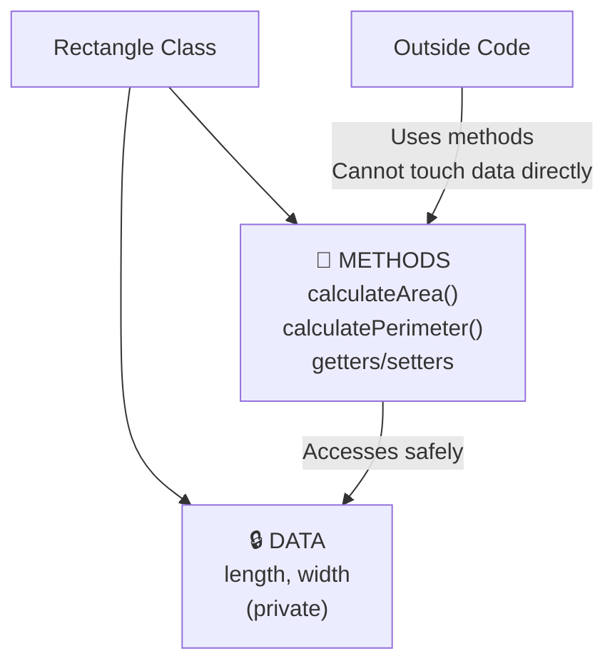
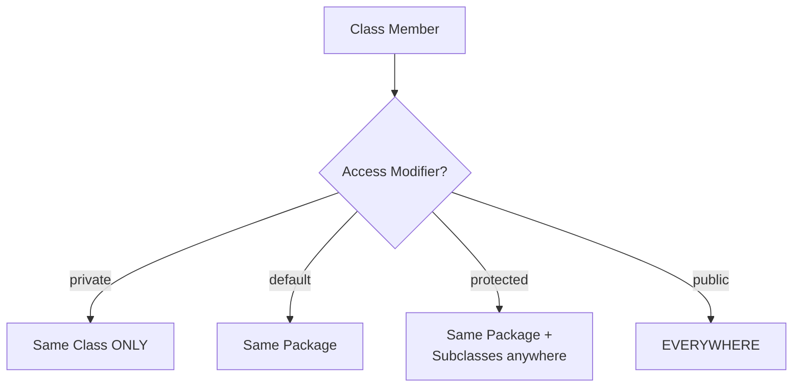

<a id="13-encapsulation"></a>

# 📘 Chapter 13: Encapsulation

> **Part C: Object Oriented Programming (Core Java)**
> `Core` | `OOP Pillar #1` | `Interview Critical`

⭐⭐⭐⭐⭐⭐⭐⭐⭐⭐⭐⭐⭐⭐⭐⭐⭐⭐⭐⭐⭐⭐⭐⭐⭐⭐⭐⭐⭐⭐⭐⭐

Java • Core Java • Interview Preparation

⭐⭐⭐⭐⭐⭐⭐⭐⭐⭐⭐⭐⭐⭐⭐⭐⭐⭐⭐⭐⭐⭐⭐⭐⭐⭐⭐⭐⭐⭐⭐⭐

---

<a id="chapter-index-table-13"></a>

## 📚 Chapter 13 — Index Table

| No. | Topic | Subtopics |
|-----|-------|-----------|
| 13.1 | [What is Encapsulation](#131-what-is-encapsulation) | Definition, First Pillar of OOP, Purpose |
| 13.2 | [Data Hiding](#132-data-hiding) | Restricting Direct Access, Security |
| 13.3 | [Wrapping Data + Methods](#133-wrapping-data-methods) | Binding Together in Single Unit |
| 13.4 | [Real-World Analogies](#134-real-world-analogies) | Capsule, ATM, Car, Bank Account |
| 13.5 | [How to Achieve Encapsulation](#135-how-to-achieve-encapsulation) | 2 Steps — private fields + public methods |
| 13.6 | [Getter and Setter Methods](#136-getter-and-setter-methods) | Naming Conventions, Purpose |
| 13.7 | [Validation in Setters](#137-validation-in-setters) | Adding Business Logic, Data Integrity |
| 13.8 | [Read-Only and Write-Only Classes](#138-read-only-write-only-classes) | Only Getters, Only Setters |
| 13.9 | [Access Modifier — private](#139-access-modifier-private) | Most Restrictive, Same Class Only |
| 13.10 | [Access Modifier — default](#1310-access-modifier-default) | Package-Private, No Keyword |
| 13.11 | [Access Modifier — protected](#1311-access-modifier-protected) | Same Package + Subclasses |
| 13.12 | [Access Modifier — public](#1312-access-modifier-public) | Accessible Everywhere |
| 13.13 | [Access Modifier Comparison Table](#1313-access-modifier-comparison-table) | Complete Visibility Chart |
| 13.14 | [Tricky Questions on Access Modifiers](#1314-tricky-questions-on-access-modifiers) | Interview Traps |
| 13.15 | [POJO and Java Bean](#1315-pojo-and-java-bean) | Plain Old Java Object, Bean Standards |
| 13.16 | [DTO (Data Transfer Object)](#1316-dto) | Purpose, Usage, POJO vs DTO |
| 13.17 | [Record Classes (Java 14+)](#1317-record-classes) | Compact Syntax, Auto-generated Code |
| 13.18 | [Advantages of Encapsulation](#1318-advantages-of-encapsulation) | 8 Benefits |
| 🔥 | [Java vs Other Languages](#13-java-vs-other-languages) | Unique Encapsulation Features |
| 💡 | [Interview Questions](#13-interview-questions) | 15+ Conceptual · Scenario · Output-based |
| 🧪 | [Practice Problems](#13-practice-problems) | 5 Coding + 5 Theory |

---

## 13.1 What is Encapsulation

<a id="131-what-is-encapsulation"></a>

### 📌 Definition

```
ENCAPSULATION = Wrapping DATA (variables) and CODE (methods)
                together into a SINGLE UNIT (class),
                and RESTRICTING direct access to some components.

It is the FIRST PILLAR of Object-Oriented Programming.

Two Key Aspects:
1. BINDING data and methods together (in a class)
2. HIDING data from outside world (data hiding)

Result: SECURE, CONTROLLED access to class data.
```

### 📌 Simple Example

```java
// ═══ WITHOUT Encapsulation (BAD!) ═══
class BadAccount {
    public double balance;  // ❌ Anyone can modify!
}

BadAccount acc = new BadAccount();
acc.balance = -1000;   // ❌ Invalid! But allowed!
acc.balance = 999999;  // ❌ Can set any value

// ═══ WITH Encapsulation (GOOD!) ═══
class GoodAccount {
    private double balance;  // ✅ HIDDEN from outside

    // Public methods to ACCESS (controlled)
    public double getBalance() {
        return balance;
    }

    public void deposit(double amount) {
        if (amount > 0) {           // ✅ VALIDATION
            balance += amount;
        }
    }
}

GoodAccount acc = new GoodAccount();
// acc.balance = -1000;  // ❌ COMPILE ERROR! private
acc.deposit(500);         // ✅ Only via method
acc.deposit(-100);        // Won't work (validation!)
```

<a href="#chapter-index-table-13">Go to Top 🔝</a>

---

## 13.2 Data Hiding

<a id="132-data-hiding"></a>

### 📌 What is Data Hiding?

```
DATA HIDING = Restricting DIRECT ACCESS to class data
              from OUTSIDE the class.

Achieved by:
→ Making fields PRIVATE
→ Providing PUBLIC methods for controlled access

Benefits:
✅ Data cannot be modified accidentally
✅ Validation can be enforced
✅ Internal implementation can change without affecting outside code
✅ Security — sensitive data protected
```

### 📌 Data Hiding in Action

```java
public class Employee {

    // ═══ HIDDEN DATA (private) ═══
    private String name;
    private double salary;
    private String password;   // Very sensitive!
    private int age;

    // ═══ CONTROLLED ACCESS (public methods) ═══

    // Getter — read access
    public String getName() {
        return name;
    }

    // Setter — write access WITH VALIDATION
    public void setName(String name) {
        if (name != null && !name.isEmpty()) {
            this.name = name;
        }
    }

    // No getter for password! (write-only, never expose)
    public void setPassword(String password) {
        if (password != null && password.length() >= 8) {
            this.password = encrypt(password);  // Hash it!
        }
    }

    // Salary getter but no setter (read-only)
    public double getSalary() {
        return salary;
    }

    // Salary can only be changed via special methods (with rules!)
    public void giveRaise(double percentage) {
        if (percentage > 0 && percentage <= 20) {
            salary += salary * (percentage / 100);
        }
    }

    private String encrypt(String password) {
        // Encryption logic (hidden!)
        return "encrypted_" + password;
    }
}

public class Test {
    public static void main(String[] args) {
        Employee emp = new Employee();

        // ❌ CANNOT do this (data is hidden):
        // emp.salary = 1000000;      // ERROR! private
        // emp.password = "12345";    // ERROR! private
        // System.out.println(emp.password);  // ERROR! private

        // ✅ MUST use controlled methods:
        emp.setName("Rahul");
        emp.setPassword("mySecure@123");
        emp.giveRaise(10);
        System.out.println(emp.getName());   // Rahul
        System.out.println(emp.getSalary()); // 0.0 (no way to set directly)
    }
}
```

### 🌍 Real-World Analogy

```
DATA HIDING = ATM Machine 🏧

Kya HIDDEN hai (ATM ke andar):
→ Cash storage (money)
→ Card reader mechanism
→ Network connection to bank server
→ Encryption keys
→ Internal wiring

Aap kya DEKH sakte ho:
→ Screen (Display)
→ Keypad (Input)
→ Card slot
→ Cash dispenser

Aap kya KAR sakte ho:
→ withdraw() method
→ deposit() method
→ checkBalance() method

Aap DIRECT cash nahi utha sakte machine se!
Aap MUST use provided methods (withdraw)!

Yehi hai Encapsulation!
```

<a href="#chapter-index-table-13">Go to Top 🔝</a>

---

## 13.3 Wrapping Data + Methods Together

<a id="133-wrapping-data-methods"></a>

### 📌 Binding Data and Behavior

```
ENCAPSULATION wraps together:
1. DATA (fields/variables)
2. METHODS (functions that operate on that data)

Both live in the SAME CLASS.
Methods that need the data are RIGHT THERE with the data.
```

### 📌 Example — Everything Together

```java
public class Rectangle {

    // ═══ DATA (Fields) ═══
    private double length;
    private double width;

    // ═══ METHODS (Operations on that data) ═══

    // Constructor
    public Rectangle(double length, double width) {
        this.length = length;
        this.width = width;
    }

    // Getters
    public double getLength() { return length; }
    public double getWidth() { return width; }

    // Setters with validation
    public void setLength(double length) {
        if (length > 0) this.length = length;
    }

    public void setWidth(double width) {
        if (width > 0) this.width = width;
    }

    // Business methods (operate on the data!)
    public double calculateArea() {
        return length * width;
    }

    public double calculatePerimeter() {
        return 2 * (length + width);
    }

    public boolean isSquare() {
        return length == width;
    }

    public void display() {
        System.out.println("Rectangle: " + length + " x " + width);
    }
}

// EVERYTHING IS BUNDLED:
// - Data (length, width) live in the class
// - Methods that use this data are also in the class
// - No external code needed to work with Rectangle
```

### 📊 Encapsulation Visual



<a href="#chapter-index-table-13">Go to Top 🔝</a>

---

## 13.4 Real-World Analogies

<a id="134-real-world-analogies"></a>

### 📌 Multiple Analogies to Understand Encapsulation

```
1. 💊 CAPSULE (Medicine)
   → Medicine (data) sealed inside capsule (class)
   → You can't touch the medicine directly
   → You just swallow (use methods) it
   → Body absorbs it internally (encapsulation)

2. 🏧 ATM MACHINE
   → Cash and mechanism (data) hidden
   → Interface: keypad, screen (methods)
   → You interact only through allowed operations
   → Cannot directly access internal cash

3. 🚗 CAR
   → Engine, transmission (data) hidden under hood
   → Steering wheel, pedals (methods) exposed
   → Driver doesn't need to know internals
   → Just uses provided controls

4. 🏦 BANK ACCOUNT
   → Your money (balance) is hidden
   → Access via: deposit, withdraw, transfer (methods)
   → Bank validates every transaction
   → You cannot just "grab" money

5. 📱 SMARTPHONE
   → Internal circuits (data) hidden
   → Touchscreen, buttons (interface)
   → You use apps (methods)
   → Cannot directly modify RAM/CPU

6. 🍔 RESTAURANT
   → Kitchen (data + processing) hidden
   → Menu (methods) visible
   → You order through waiter (public methods)
   → Cannot walk into kitchen
```

### 📌 Bank Account — Full Example

```java
public class BankAccount {

    // 🔒 HIDDEN DATA
    private String accountNumber;
    private String holderName;
    private double balance;
    private String pin;

    public BankAccount(String accountNumber, String holderName, String pin) {
        this.accountNumber = accountNumber;
        this.holderName = holderName;
        this.pin = pin;
        this.balance = 0;
    }

    // 🔓 PUBLIC METHODS (controlled access)

    public String getAccountNumber() {
        return accountNumber;
    }

    public String getHolderName() {
        return holderName;
    }

    public double getBalance(String pin) {
        if (validatePin(pin)) {
            return balance;
        }
        System.out.println("Invalid PIN!");
        return -1;
    }

    public boolean deposit(double amount) {
        if (amount > 0) {
            balance += amount;
            System.out.println("Deposited: " + amount);
            return true;
        }
        System.out.println("Invalid amount!");
        return false;
    }

    public boolean withdraw(double amount, String pin) {
        if (!validatePin(pin)) {
            System.out.println("Invalid PIN!");
            return false;
        }
        if (amount <= 0) {
            System.out.println("Invalid amount!");
            return false;
        }
        if (amount > balance) {
            System.out.println("Insufficient funds!");
            return false;
        }
        balance -= amount;
        System.out.println("Withdrawn: " + amount);
        return true;
    }

    // 🔐 PRIVATE method (internal validation)
    private boolean validatePin(String enteredPin) {
        return this.pin.equals(enteredPin);
    }
}
```

<a href="#chapter-index-table-13">Go to Top 🔝</a>

---

## 13.5 How to Achieve Encapsulation

<a id="135-how-to-achieve-encapsulation"></a>

### 📌 2 Simple Steps

```
STEP 1: Declare ALL fields as PRIVATE
        → private String name;
        → private int age;

STEP 2: Provide PUBLIC getter and setter methods
        → public String getName() { return name; }
        → public void setName(String name) { this.name = name; }

That's it! You've achieved encapsulation.
```

### 📌 Complete Example

```java
// ═══ ENCAPSULATED CLASS ═══
public class Student {

    // STEP 1: private fields
    private String name;
    private int age;
    private double gpa;

    // Constructor
    public Student(String name, int age, double gpa) {
        this.name = name;
        this.age = age;
        this.gpa = gpa;
    }

    // STEP 2: public getters and setters

    // Getter for name
    public String getName() {
        return name;
    }

    // Setter for name
    public void setName(String name) {
        this.name = name;
    }

    // Getter for age
    public int getAge() {
        return age;
    }

    // Setter for age
    public void setAge(int age) {
        this.age = age;
    }

    // Getter for gpa
    public double getGpa() {
        return gpa;
    }

    // Setter for gpa
    public void setGpa(double gpa) {
        this.gpa = gpa;
    }
}

// ═══ USING THE ENCAPSULATED CLASS ═══
public class Test {
    public static void main(String[] args) {
        Student s = new Student("Rahul", 22, 8.5);

        // Cannot access directly:
        // s.name = "New Name";  // ❌ ERROR! private

        // Must use methods:
        System.out.println(s.getName());   // Rahul
        s.setName("Priya");
        System.out.println(s.getName());   // Priya
    }
}
```

<a href="#chapter-index-table-13">Go to Top 🔝</a>

---

## 13.6 Getter and Setter Methods

<a id="136-getter-and-setter-methods"></a>

### 📌 Naming Conventions

```
For a field named 'xyz':

GETTER:
→ Name: getXyz() — for most types
→ Name: isXyz()  — for boolean fields
→ Returns: field's value
→ No parameters

SETTER:
→ Name: setXyz()
→ Returns: void (usually)
→ One parameter: new value
```

### 📌 Complete Getter/Setter Examples

```java
public class Person {

    private String name;
    private int age;
    private boolean active;
    private double salary;

    // ═══ GETTER for String ═══
    public String getName() {
        return name;
    }

    // ═══ GETTER for int ═══
    public int getAge() {
        return age;
    }

    // ═══ GETTER for double ═══
    public double getSalary() {
        return salary;
    }

    // ═══ GETTER for boolean (uses 'is' prefix!) ═══
    public boolean isActive() {   // ← 'is' not 'get'!
        return active;
    }

    // ═══ SETTERS ═══
    public void setName(String name) {
        this.name = name;
    }

    public void setAge(int age) {
        this.age = age;
    }

    public void setSalary(double salary) {
        this.salary = salary;
    }

    public void setActive(boolean active) {
        this.active = active;
    }
}
```

### 📌 IDE Auto-Generation

```
Most IDEs can AUTO-GENERATE getters/setters:

IntelliJ IDEA:
Right-click → Generate → Getter and Setter
Or: Alt + Insert

Eclipse:
Right-click → Source → Generate Getters and Setters
Or: Alt + Shift + S → R

VS Code:
Right-click → Source Action → Generate Getters and Setters
```

<a href="#chapter-index-table-13">Go to Top 🔝</a>

---

## 13.7 Validation in Setters

<a id="137-validation-in-setters"></a>

### 📌 Setters Are Perfect for Validation!

```java
public class BankAccount {

    private String accountNumber;
    private String holderName;
    private double balance;
    private int age;
    private String email;

    // ═══ SETTER WITH VALIDATION ═══

    public void setAccountNumber(String accountNumber) {
        if (accountNumber == null || accountNumber.length() != 10) {
            throw new IllegalArgumentException("Account number must be 10 digits");
        }
        this.accountNumber = accountNumber;
    }

    public void setHolderName(String holderName) {
        if (holderName == null || holderName.isEmpty()) {
            throw new IllegalArgumentException("Name cannot be empty");
        }
        if (holderName.length() < 2) {
            throw new IllegalArgumentException("Name too short");
        }
        this.holderName = holderName;
    }

    public void setBalance(double balance) {
        if (balance < 0) {
            throw new IllegalArgumentException("Balance cannot be negative");
        }
        this.balance = balance;
    }

    public void setAge(int age) {
        if (age < 0 || age > 150) {
            throw new IllegalArgumentException("Invalid age: " + age);
        }
        this.age = age;
    }

    public void setEmail(String email) {
        if (email == null || !email.contains("@")) {
            throw new IllegalArgumentException("Invalid email");
        }
        this.email = email;
    }

    // Getters
    public String getAccountNumber() { return accountNumber; }
    public String getHolderName() { return holderName; }
    public double getBalance() { return balance; }
    public int getAge() { return age; }
    public String getEmail() { return email; }
}

public class ValidationTest {
    public static void main(String[] args) {
        BankAccount acc = new BankAccount();

        // ✅ Valid inputs
        acc.setHolderName("Rahul");
        acc.setAge(25);
        acc.setEmail("rahul@gmail.com");

        // ❌ Invalid inputs (throw exceptions)
        try {
            acc.setAge(-5);  // Exception!
        } catch (IllegalArgumentException e) {
            System.out.println("Error: " + e.getMessage());
        }

        try {
            acc.setEmail("invalid");  // Exception!
        } catch (IllegalArgumentException e) {
            System.out.println("Error: " + e.getMessage());
        }
    }
}
```

<a href="#chapter-index-table-13">Go to Top 🔝</a>

---

## 13.8 Read-Only and Write-Only Classes

<a id="138-read-only-write-only-classes"></a>

### 📌 Read-Only Class (Only Getters)

```java
// ═══ READ-ONLY CLASS ═══
// Only getters, no setters → immutable after creation
public final class Constants {

    private final String companyName;
    private final int foundedYear;
    private final String ceo;

    // Constructor sets values (only chance to set!)
    public Constants(String companyName, int foundedYear, String ceo) {
        this.companyName = companyName;
        this.foundedYear = foundedYear;
        this.ceo = ceo;
    }

    // ONLY GETTERS - no setters!
    public String getCompanyName() { return companyName; }
    public int getFoundedYear() { return foundedYear; }
    public String getCeo() { return ceo; }
}

public class ReadOnlyTest {
    public static void main(String[] args) {
        Constants c = new Constants("TechCorp", 2000, "Alice");

        System.out.println(c.getCompanyName());  // TechCorp
        // c.setCompanyName("New");   // ❌ NO SETTER!

        // Values can NEVER change after creation
        // This is IMMUTABLE class
    }
}
```

### 📌 Write-Only Class (Only Setters)

```java
// ═══ WRITE-ONLY CLASS ═══
// Only setters, no getters → data can be set but not read
public class PasswordManager {

    private String password;

    // Only SETTER (write) - no getter!
    public void setPassword(String password) {
        if (password != null && password.length() >= 8) {
            this.password = encrypt(password);
            System.out.println("Password set successfully");
        } else {
            System.out.println("Password too short!");
        }
    }

    // Utility method (doesn't return password)
    public boolean verifyPassword(String enteredPassword) {
        return password != null && password.equals(encrypt(enteredPassword));
    }

    private String encrypt(String pwd) {
        return "encrypted_" + pwd;  // Simple demo
    }
}

public class WriteOnlyTest {
    public static void main(String[] args) {
        PasswordManager pm = new PasswordManager();
        pm.setPassword("MySecure@123");

        // pm.getPassword();  // ❌ NO GETTER!
        // Password is set but cannot be read directly (security!)

        // Can only VERIFY password
        System.out.println(pm.verifyPassword("MySecure@123"));  // true
    }
}
```

<a href="#chapter-index-table-13">Go to Top 🔝</a>

---

## 13.9 Access Modifier — private

<a id="139-access-modifier-private"></a>

### 📌 private — Most Restrictive

```
private:
→ Accessible ONLY within the SAME CLASS
→ Not accessible from subclasses (even in same package!)
→ Not accessible from other classes
→ Used for encapsulation
```

```java
public class Employee {
    private String name;         // Only accessible in Employee class
    private double salary;

    private void calculateBonus() {   // Private method
        // Internal logic
    }

    public void display() {
        System.out.println(name);  // ✅ Same class
        calculateBonus();          // ✅ Same class
    }
}

class Test {
    public static void main(String[] args) {
        Employee emp = new Employee();
        // emp.name = "Rahul";        // ❌ ERROR! private
        // emp.salary = 50000;         // ❌ ERROR! private
        // emp.calculateBonus();       // ❌ ERROR! private
        emp.display();                 // ✅ OK (public)
    }
}
```

<a href="#chapter-index-table-13">Go to Top 🔝</a>

---

## 13.10 Access Modifier — default (Package-Private)

<a id="1310-access-modifier-default"></a>

### 📌 default — No Keyword Needed

```
default (also called PACKAGE-PRIVATE):
→ NO keyword (just omit the modifier)
→ Accessible within the SAME PACKAGE ONLY
→ Not accessible from other packages
→ Used for package-internal implementation
```

```java
// ═══ File: com/myapp/Employee.java ═══
package com.myapp;

class Employee {              // ← No modifier = default (package-private)
    String name;               // ← default field
    int age;                    // ← default field

    void display() {           // ← default method
        System.out.println(name);
    }
}

// ═══ File: com/myapp/Manager.java (SAME PACKAGE) ═══
package com.myapp;

public class Manager {
    public static void main(String[] args) {
        Employee emp = new Employee();
        emp.name = "Rahul";    // ✅ OK (same package)
        emp.age = 25;           // ✅ OK
        emp.display();          // ✅ OK
    }
}

// ═══ File: com/other/OtherClass.java (DIFFERENT PACKAGE) ═══
package com.other;

// import com.myapp.Employee;  // ❌ Cannot import (Employee is default!)

public class OtherClass {
    // Employee emp;   // ❌ ERROR! Cannot access
}
```

<a href="#chapter-index-table-13">Go to Top 🔝</a>

---

## 13.11 Access Modifier — protected

<a id="1311-access-modifier-protected"></a>

### 📌 protected — For Inheritance

```
protected:
→ Accessible within SAME PACKAGE
→ Accessible in SUBCLASSES (even in different packages!)
→ Used for inheritance-related members
```

```java
// ═══ File: com/animals/Animal.java ═══
package com.animals;

public class Animal {
    protected String name;         // ← Protected field
    protected int age;

    protected void eat() {         // ← Protected method
        System.out.println(name + " is eating");
    }
}

// ═══ File: com/pets/Dog.java (DIFFERENT PACKAGE, but SUBCLASS) ═══
package com.pets;

import com.animals.Animal;

public class Dog extends Animal {   // Subclass in different package

    public void bark() {
        System.out.println(name + " barks!");  // ✅ OK (protected, subclass)
        eat();                                   // ✅ OK (protected method)
    }
}

// ═══ File: com/pets/PetShop.java (DIFFERENT PACKAGE, NOT SUBCLASS) ═══
package com.pets;

import com.animals.Animal;

public class PetShop {
    public static void main(String[] args) {
        Animal a = new Animal();
        // a.name = "Rex";      // ❌ ERROR! (different package, not subclass)
        // a.eat();              // ❌ ERROR!
    }
}
```

<a href="#chapter-index-table-13">Go to Top 🔝</a>

---

## 13.12 Access Modifier — public

<a id="1312-access-modifier-public"></a>

### 📌 public — No Restrictions

```
public:
→ Accessible from EVERYWHERE
→ Same class ✅
→ Same package ✅
→ Subclasses ✅
→ Any other class ✅
```

```java
// ═══ File: com/company/MathUtils.java ═══
package com.company;

public class MathUtils {              // ← public class
    public static double PI = 3.14;   // ← public field
    public String name;                // ← public field

    public int add(int a, int b) {    // ← public method
        return a + b;
    }
}

// ═══ From ANY package ═══
package com.another;

import com.company.MathUtils;

public class Test {
    public static void main(String[] args) {
        MathUtils m = new MathUtils();
        System.out.println(MathUtils.PI);   // ✅ Public
        m.name = "Calculator";               // ✅ Public
        System.out.println(m.add(5, 10));    // ✅ Public
    }
}
```

<a href="#chapter-index-table-13">Go to Top 🔝</a>

---

## 13.13 Access Modifier Comparison Table ⭐⭐

<a id="1313-access-modifier-comparison-table"></a>

### 📌 Complete Visibility Chart

```
┌──────────────┬─────────┬─────────┬────────────┬────────────┐
│  Access      │  Same   │  Same   │  Different │  Different │
│  Modifier    │  Class  │  Package│  Package   │  Package   │
│              │         │         │  (Subclass)│  (Other)   │
├──────────────┼─────────┼─────────┼────────────┼────────────┤
│  private     │   ✅    │   ❌    │    ❌      │    ❌      │
│  default     │   ✅    │   ✅    │    ❌      │    ❌      │
│  protected   │   ✅    │   ✅    │    ✅      │    ❌      │
│  public      │   ✅    │   ✅    │    ✅      │    ✅      │
└──────────────┴─────────┴─────────┴────────────┴────────────┘

Visibility (Most → Least Restrictive):
private < default < protected < public
```

### 📊 Access Modifier Visualization



### 📌 Where Each Modifier Can Be Used

```
┌──────────────┬───────┬───────┬───────┬──────────┬────────┐
│  Modifier    │ Class │ Field │Method │Constructor│ Inner  │
│              │       │       │       │           │ Class  │
├──────────────┼───────┼───────┼───────┼──────────┼────────┤
│  private     │  ❌*  │  ✅   │  ✅   │    ✅    │   ✅   │
│  default     │  ✅   │  ✅   │  ✅   │    ✅    │   ✅   │
│  protected   │  ❌*  │  ✅   │  ✅   │    ✅    │   ✅   │
│  public      │  ✅   │  ✅   │  ✅   │    ✅    │   ✅   │
└──────────────┴───────┴───────┴───────┴──────────┴────────┘

* private and protected are NOT allowed on TOP-LEVEL classes
  (only on inner/nested classes)
```

<a href="#chapter-index-table-13">Go to Top 🔝</a>

---

## 13.14 Tricky Questions on Access Modifiers ⭐

<a id="1314-tricky-questions-on-access-modifiers"></a>

### 📌 Common Interview Traps

```java
// ═══ TRAP 1: Can top-level class be private? ═══
private class MyClass { }   // ❌ COMPILE ERROR!
// Top-level classes can ONLY be:
// → public
// → default (no modifier)

// Inner classes CAN be private:
public class Outer {
    private class Inner { }  // ✅ OK (inner class)
}

// ═══ TRAP 2: Can top-level class be protected? ═══
protected class Test { }    // ❌ COMPILE ERROR!
// Same as above — only public or default

// ═══ TRAP 3: What if no modifier on class? ═══
class Test { }  // ✅ default (package-private)
// Accessible only within same package

// ═══ TRAP 4: Can constructors be private? ═══
public class Singleton {
    private Singleton() { }  // ✅ YES! (Singleton pattern)
    // Prevents instantiation from outside
}

// ═══ TRAP 5: Can main() be private? ═══
public class Test {
    private static void main(String[] args) { }  // ❌ Program won't run!
    // JVM needs public access to call main()
    // COMPILES but fails at runtime
}

// ═══ TRAP 6: Multiple public classes in one file? ═══
// public class A { }        // OK
// public class B { }        // ❌ ERROR!
// Only ONE public class per .java file allowed
// (file name must match public class name)

// ═══ TRAP 7: Reducing visibility in inheritance ═══
class Parent {
    public void show() { }
}

class Child extends Parent {
    // private void show() { }  // ❌ ERROR!
    // Cannot REDUCE visibility during overriding
    // Only increase or keep same
}

// ═══ TRAP 8: protected in different package NON-subclass? ═══
package com.a;
public class A {
    protected int x = 10;
}

package com.b;
import com.a.A;
public class B {  // NOT a subclass of A
    public static void main(String[] args) {
        A a = new A();
        // System.out.println(a.x);  // ❌ ERROR!
        // protected NOT accessible in non-subclass in different package
    }
}

// ═══ TRAP 9: default access within same class? ═══
public class Test {
    int x = 10;  // default field

    public void method() {
        System.out.println(x);  // ✅ OK (same class!)
    }
}
```

<a href="#chapter-index-table-13">Go to Top 🔝</a>

---

## 13.15 POJO and Java Bean

<a id="1315-pojo-and-java-bean"></a>

### 📌 POJO — Plain Old Java Object

```
POJO = A simple Java class with:
→ Private fields
→ Getters and setters
→ NO complex business logic
→ NO framework dependencies
→ NO restrictions on what methods it can have

Just a basic data container class.
```

```java
// ═══ POJO Example ═══
public class Employee {

    // Private fields (any name allowed)
    private String name;
    private int age;
    private String email;

    // Any constructor allowed
    public Employee() { }

    public Employee(String name, int age, String email) {
        this.name = name;
        this.age = age;
        this.email = email;
    }

    // Getters and setters
    public String getName() { return name; }
    public void setName(String name) { this.name = name; }

    public int getAge() { return age; }
    public void setAge(int age) { this.age = age; }

    public String getEmail() { return email; }
    public void setEmail(String email) { this.email = email; }
}
```

### 📌 Java Bean — Strict POJO with Rules

```
Java Bean = POJO with SPECIFIC RULES:
1. Class must be PUBLIC
2. Fields must be PRIVATE
3. Must have a PUBLIC NO-ARG CONSTRUCTOR
4. Getters and setters with SPECIFIC naming:
   → getXxx() / isXxx() / setXxx()
5. Must implement SERIALIZABLE interface
6. Should override equals(), hashCode(), toString()
```

```java
import java.io.Serializable;

// ═══ Java Bean Example ═══
public class Product implements Serializable {   // 5. Serializable

    // 2. Private fields
    private String name;
    private double price;
    private boolean available;

    // 3. Public no-arg constructor
    public Product() { }

    public Product(String name, double price, boolean available) {
        this.name = name;
        this.price = price;
        this.available = available;
    }

    // 4. Standard getters/setters
    public String getName() { return name; }
    public void setName(String name) { this.name = name; }

    public double getPrice() { return price; }
    public void setPrice(double price) { this.price = price; }

    public boolean isAvailable() { return available; }        // ← 'is' for boolean!
    public void setAvailable(boolean available) { this.available = available; }

    // 6. Override toString, equals, hashCode
    @Override
    public String toString() {
        return "Product{name='" + name + "', price=" + price + "}";
    }
}
```

### 📌 POJO vs Java Bean

```
┌──────────────────────┬────────────────────┬────────────────────┐
│  Feature             │  POJO              │  Java Bean         │
├──────────────────────┼────────────────────┼────────────────────┤
│  Access modifier     │  Any               │  Public required   │
│  Fields              │  Any               │  Private required  │
│  No-arg constructor  │  Optional          │  MUST have         │
│  Serializable        │  Optional          │  MUST implement    │
│  Getters/Setters     │  Any style         │  Standard naming   │
│  Restrictions        │  None              │  Strict rules      │
├──────────────────────┼────────────────────┼────────────────────┤
│  Every Java Bean is a POJO, but not every POJO is a Java Bean │
└──────────────────────┴────────────────────┴────────────────────┘
```

<a href="#chapter-index-table-13">Go to Top 🔝</a>

---

## 13.16 DTO (Data Transfer Object)

<a id="1316-dto"></a>

### 📌 What is DTO?

```
DTO = Data Transfer Object

A class designed to CARRY DATA between processes/layers.
Used to reduce number of method calls when transferring data.

Common Usage:
→ Transferring data between server and client (REST APIs)
→ Between service and DAO layer
→ Between microservices

Characteristics:
✅ Only fields (state) + getters/setters
✅ NO business logic
✅ Serializable (for network transfer)
✅ Immutable often preferred
```

### 📌 DTO Example

```java
// ═══ Entity (Database representation) ═══
class UserEntity {
    private Long id;
    private String username;
    private String password;      // Sensitive!
    private String email;
    private String creditCard;    // Sensitive!
    private String phoneNumber;
    // ... other database fields
}

// ═══ DTO (For API response) ═══
class UserDTO {
    private String username;      // Safe to expose
    private String email;
    private String phoneNumber;
    // NO password, NO credit card!

    // Constructors, getters, setters
    public UserDTO(String username, String email, String phoneNumber) {
        this.username = username;
        this.email = email;
        this.phoneNumber = phoneNumber;
    }

    public String getUsername() { return username; }
    public String getEmail() { return email; }
    public String getPhoneNumber() { return phoneNumber; }
}

// ═══ Usage: Converting Entity → DTO ═══
class UserService {
    public UserDTO getUserForApi(Long id) {
        UserEntity entity = fetchFromDatabase(id);
        // Convert Entity to DTO (hide sensitive data)
        return new UserDTO(
            entity.getUsername(),
            entity.getEmail(),
            entity.getPhoneNumber()
        );
    }
}
```

### 📌 POJO vs Java Bean vs DTO

```
┌──────────┬──────────────────────────────────────────────┐
│  POJO    │  Basic Java class with fields + methods      │
├──────────┼──────────────────────────────────────────────┤
│  Java    │  POJO + strict rules (public class, private  │
│  Bean    │  fields, no-arg constructor, Serializable)   │
├──────────┼──────────────────────────────────────────────┤
│  DTO     │  Class for transferring data between layers  │
│          │  (usually simplified version of entity)      │
└──────────┴──────────────────────────────────────────────┘
```

<a href="#chapter-index-table-13">Go to Top 🔝</a>

---

## 13.17 Record Classes (Java 14+)

<a id="1317-record-classes"></a>

### 📌 The Modern Way — Records!

```
RECORD (Java 14+) = A concise way to create IMMUTABLE
                    data-carrier classes.

Records AUTO-GENERATE:
✅ Private final fields
✅ Public constructor
✅ Getters (called accessors)
✅ equals() method
✅ hashCode() method
✅ toString() method

Perfect for DTOs, POJOs, and simple data classes!
```

### 📌 Record Syntax

```java
// ═══ Traditional POJO (LOTS of code) ═══
public class PersonOld {
    private final String name;
    private final int age;

    public PersonOld(String name, int age) {
        this.name = name;
        this.age = age;
    }

    public String getName() { return name; }
    public int getAge() { return age; }

    @Override
    public boolean equals(Object o) {
        if (this == o) return true;
        if (!(o instanceof PersonOld)) return false;
        PersonOld p = (PersonOld) o;
        return age == p.age && name.equals(p.name);
    }

    @Override
    public int hashCode() {
        return java.util.Objects.hash(name, age);
    }

    @Override
    public String toString() {
        return "Person{name='" + name + "', age=" + age + "}";
    }
}

// ═══ Record (SAME functionality, 1 LINE!) ═══
public record Person(String name, int age) { }
// Auto-generates EVERYTHING above!
```

### 📌 Using Records

```java
public class RecordDemo {
    public static void main(String[] args) {

        // Create record
        Person p1 = new Person("Rahul", 25);
        Person p2 = new Person("Rahul", 25);
        Person p3 = new Person("Priya", 30);

        // Access fields (accessor methods)
        System.out.println(p1.name());    // Rahul (no 'get' prefix!)
        System.out.println(p1.age());     // 25

        // toString() auto-generated
        System.out.println(p1);   // Person[name=Rahul, age=25]

        // equals() auto-generated (compares content)
        System.out.println(p1.equals(p2));  // true
        System.out.println(p1.equals(p3));  // false

        // hashCode() auto-generated
        System.out.println(p1.hashCode() == p2.hashCode());  // true

        // ⚠️ IMMUTABLE — no setters!
        // p1.name = "New";      // ❌ ERROR! No setters
        // p1.setName("New");    // ❌ ERROR! Doesn't exist
    }
}

// Record definition
record Person(String name, int age) { }
```

### 📌 Advanced Record Features

```java
// ═══ Record with Custom Methods ═══
public record Rectangle(double length, double width) {

    // Custom method
    public double area() {
        return length * width;
    }

    public double perimeter() {
        return 2 * (length + width);
    }

    // Static method
    public static Rectangle square(double side) {
        return new Rectangle(side, side);
    }
}

// ═══ Compact Constructor (Validation) ═══
public record Person(String name, int age) {

    // Compact constructor — no parameters needed
    public Person {   // ← Compact form
        if (age < 0) {
            throw new IllegalArgumentException("Age cannot be negative");
        }
        if (name == null || name.isEmpty()) {
            throw new IllegalArgumentException("Name cannot be empty");
        }
    }
}

// ═══ Record Restrictions ═══
// ❌ Cannot extend other classes
// ❌ All fields are FINAL (immutable)
// ❌ Cannot add instance fields
// ✅ Can implement interfaces
// ✅ Can have static fields
// ✅ Can have static methods
```

<a href="#chapter-index-table-13">Go to Top 🔝</a>

---

## 13.18 Advantages of Encapsulation

<a id="1318-advantages-of-encapsulation"></a>

### 📌 8 Major Benefits

```
┌──────────────────────────────────────────────────────────────┐
│  ADVANTAGE            │  DESCRIPTION                         │
├───────────────────────┼──────────────────────────────────────┤
│  1. DATA HIDING       │  Private fields protect data from    │
│                       │  external tampering                  │
├───────────────────────┼──────────────────────────────────────┤
│  2. CONTROLLED ACCESS │  Setters can validate before setting │
│                       │  values (data integrity)             │
├───────────────────────┼──────────────────────────────────────┤
│  3. FLEXIBILITY       │  Internal implementation can change  │
│                       │  without affecting external code     │
├───────────────────────┼──────────────────────────────────────┤
│  4. SECURITY          │  Sensitive data protected            │
│                       │  (passwords, credit cards, etc.)     │
├───────────────────────┼──────────────────────────────────────┤
│  5. TESTABILITY       │  Well-encapsulated classes are       │
│                       │  easier to test                      │
├───────────────────────┼──────────────────────────────────────┤
│  6. MAINTAINABILITY   │  Changes in one class don't affect    │
│                       │  other classes                       │
├───────────────────────┼──────────────────────────────────────┤
│  7. REUSABILITY       │  Encapsulated classes are            │
│                       │  self-contained and reusable         │
├───────────────────────┼──────────────────────────────────────┤
│  8. READABILITY       │  Cleaner API — users see only what   │
│                       │  they need                           │
└──────────────────────────────────────────────────────────────┘
```

<a href="#chapter-index-table-13">Go to Top 🔝</a>

---

<a id="13-java-vs-other-languages"></a>

## 🔥 What Makes Java DIFFERENT — Encapsulation

```
┌──────────────────────┬────────────┬────────────┬────────────┬────────────┐
│  Feature             │  Java      │  C++       │  Python    │  JavaScript│
├──────────────────────┼────────────┼────────────┼────────────┼────────────┤
│  Access modifiers    │ 4 types    │ 3 types    │ Convention │ Convention │
│                      │ (private,  │ (private,  │ (_ prefix, │ (# private │
│                      │ default,   │ protected, │ __ private)│ in ES2022) │
│                      │ protected, │ public)    │            │            │
│                      │ public)    │            │            │            │
├──────────────────────┼────────────┼────────────┼────────────┼────────────┤
│  True private?       │ ✅ YES     │ ✅ YES     │ ⚠️ Weak    │ ✅ YES    │
│                      │ (enforced) │ (enforced) │ (name      │ (# prefix) │
│                      │            │            │ mangling)  │            │
├──────────────────────┼────────────┼────────────┼────────────┼────────────┤
│  Auto getters/setters│ ❌ Manual  │ ❌ Manual  │ ✅ @property│ ✅ get/set │
│                      │ (Lombok    │            │ decorator  │ keywords   │
│                      │ helps)     │            │            │            │
├──────────────────────┼────────────┼────────────┼────────────┼────────────┤
│  default             │ ✅ YES     │ ❌ NO      │ ❌ NO      │ ❌ NO     │
│  (package-private)   │ (unique!)  │            │            │            │
├──────────────────────┼────────────┼────────────┼────────────┼────────────┤
│  Records/Data class  │ ✅ Java 14+│ ❌         │ ✅ dataclass│ ❌        │
├──────────────────────┼────────────┼────────────┼────────────┼────────────┤
│  Encapsulation       │ Strong     │ Strong     │ Weak       │ Weak      │
│  enforcement         │            │            │ (convention│ (until ES│
│                      │            │            │ only)      │ 2022)     │
└──────────────────────┴────────────┴────────────┴────────────┴────────────┘
```

### 🎯 Key UNIQUE Points

```
1. FOUR ACCESS MODIFIERS:
   → Java has: private, default, protected, public
   → C++ has: private, protected, public (no default)
   → Python has: convention only (_, __)

2. DEFAULT (Package-Private):
   → UNIQUE to Java!
   → No keyword needed
   → Access within same package only

3. NO AUTO GETTERS/SETTERS:
   → Java: Must write manually (or use Lombok)
   → Python: @property decorator
   → JavaScript: get/set keywords

4. RECORDS (Java 14+):
   → Concise immutable data classes
   → Auto-generates getters, equals, hashCode, toString
   → Similar to Python's @dataclass

5. STRONG ENCAPSULATION:
   → Java strictly enforces access modifiers
   → Python only uses naming conventions
```

<a href="#chapter-index-table-13">Go to Top 🔝</a>

---

<a id="13-interview-questions"></a>

## 💡 Chapter 13 — Interview Questions (15+)

---

### 🔵 Conceptual Questions

**Q1. What is Encapsulation? Why do we need it?**

```
ENCAPSULATION = Wrapping data (variables) and methods (code)
into a single unit (class), and hiding data from outside access.

TWO KEY ASPECTS:
1. Binding data + methods together
2. Data hiding (using access modifiers)

WHY NEEDED:
✅ Data protection (hide sensitive data)
✅ Controlled access (validation in setters)
✅ Maintainability (change internals without affecting outside)
✅ Security
✅ Flexibility

Example:
class BankAccount {
    private double balance;  // Hidden
    public void deposit(double amt) {
        if (amt > 0) balance += amt;  // Validated
    }
}
```

---

**Q2. How to achieve Encapsulation in Java?**

```
2 SIMPLE STEPS:

Step 1: Make ALL fields PRIVATE
        private String name;
        private int age;

Step 2: Provide PUBLIC getter and setter methods
        public String getName() { return name; }
        public void setName(String name) { this.name = name; }

That's it! You've achieved encapsulation.

Optional: Add validation in setters for data integrity.
```

---

**Q3. What are the 4 access modifiers in Java?**

```
┌──────────────┬─────────┬─────────┬────────────┬────────────┐
│  Modifier    │  Same   │  Same   │  Different │  Different │
│              │  Class  │  Package│  Package   │  Package   │
│              │         │         │  Subclass  │  Other     │
├──────────────┼─────────┼─────────┼────────────┼────────────┤
│  private     │   ✅    │   ❌    │    ❌      │    ❌      │
│  default     │   ✅    │   ✅    │    ❌      │    ❌      │
│  protected   │   ✅    │   ✅    │    ✅      │    ❌      │
│  public      │   ✅    │   ✅    │    ✅      │    ✅      │
└──────────────┴─────────┴─────────┴────────────┴────────────┘

Restrictive → Open: private < default < protected < public
```

---

**Q4. Can a top-level class be private or protected?**

```
NO! Top-level classes can only be:
→ public
→ default (no modifier)

// ❌ COMPILE ERROR
private class A { }
protected class B { }

// ✅ Valid
public class A { }
class B { }  // default

WHY?
→ private class → no one can access it → useless
→ protected class → doesn't make sense at top level

INNER classes CAN be private/protected:
public class Outer {
    private class Inner { }     // ✅ OK
    protected class Inner2 { }  // ✅ OK
}
```

---

**Q5. Difference between POJO and Java Bean?**

```
POJO (Plain Old Java Object):
→ Simple Java class
→ No specific rules
→ Any structure allowed
→ Fields, methods, constructors — anything

JAVA BEAN (strict POJO):
→ MUST be public
→ MUST have private fields
→ MUST have public no-arg constructor
→ MUST use standard getter/setter naming
→ MUST implement Serializable

RULE:
Every Java Bean IS a POJO.
But not every POJO IS a Java Bean.

Java Beans have STRICT rules for framework compatibility
(Spring, JSP, JavaBeans framework, etc.)
```

---

**Q6. What is a DTO?**

```
DTO = Data Transfer Object

A class used to transfer data between:
→ Server and client (REST APIs)
→ Service and database layer
→ Microservices

Characteristics:
✅ Only fields + getters/setters
✅ NO business logic
✅ Often immutable
✅ Serializable
✅ Simplified version of entity (hides sensitive data)

Example:
// Database entity (has password)
class User { username, password, email, creditCard }

// DTO for API (safe, no password)
class UserDTO { username, email }

Purpose: Reduce data transfer, hide sensitive fields.
```

---

**Q7. What is Record class? When to use it?**

```
RECORD (Java 14+) = Concise way to create IMMUTABLE data classes.

// Traditional class (30+ lines)
public class Person {
    private final String name;
    // getters, equals, hashCode, toString...
}

// Record (1 line!)
public record Person(String name, int age) { }

AUTO-GENERATED:
✅ Private final fields
✅ Public constructor
✅ Getters (as accessor methods: name(), age())
✅ equals() and hashCode()
✅ toString()

WHEN TO USE:
→ DTOs
→ Simple data carriers
→ Immutable data classes
→ API responses

RESTRICTIONS:
❌ Cannot extend other classes
❌ Fields are FINAL (immutable)
❌ Cannot add instance fields
```

---

### 🟡 Scenario-Based Questions

**Q8. Can we have private constructor? What's the use?**

```java
YES! Common use: SINGLETON PATTERN

public class Singleton {

    private static Singleton instance;

    private Singleton() { }   // Private constructor!

    public static Singleton getInstance() {
        if (instance == null) {
            instance = new Singleton();
        }
        return instance;
    }
}

// Usage:
// Singleton s = new Singleton();  // ❌ ERROR! private
Singleton s = Singleton.getInstance();  // ✅ Only way

WHY private constructor?
→ Prevent instantiation from outside
→ Control object creation (max 1 instance)
→ Singleton pattern
→ Utility classes (Math, Collections)
```

---

**Q9. Can we override private methods?**

```
NO! Private methods CANNOT be overridden.

class Parent {
    private void show() { }
}

class Child extends Parent {
    private void show() { }  // NOT overriding
    // This is a NEW method, coincidentally with same name
}

WHY?
→ private methods are NOT INHERITED
→ Child class doesn't even know about them
→ You can create a method with same name, but it's independent

Only public, protected, and default methods can be overridden.
```

---

**Q10. What if we don't provide any access modifier?**

```java
class Test {          // default (package-private) class
    int x;            // default field
    void method() { } // default method
}

DEFAULT ACCESS:
→ Accessible within SAME PACKAGE
→ NOT accessible from other packages
→ NOT accessible from subclasses in different packages

Also called: PACKAGE-PRIVATE
Java-specific (C++, Python don't have this)

Use case: Internal implementation shared within package
but hidden from other packages.
```

---

### 🔴 Output-Based Questions

**Q11. What is the output?**

```java
class Account {
    private double balance = 1000;

    public double getBalance() {
        return balance;
    }
}

public class Test {
    public static void main(String[] args) {
        Account acc = new Account();
        System.out.println(acc.balance);
    }
}
```

```
OUTPUT: COMPILE ERROR!

Error: balance has private access in Account

REASON: balance is private, cannot access from outside class.
Must use: acc.getBalance()

FIX:
System.out.println(acc.getBalance());  // ✅ 1000.0
```

---

**Q12. What is the output?**

```java
package com.a;
public class Parent {
    protected int x = 10;
}

package com.b;
import com.a.Parent;
public class Test {
    public static void main(String[] args) {
        Parent p = new Parent();
        System.out.println(p.x);
    }
}
```

```
OUTPUT: COMPILE ERROR!

Error: x has protected access in Parent

REASON: Test is in different package AND is not a subclass of Parent.
protected requires: same package OR subclass access.

FIX:
package com.b;
import com.a.Parent;
public class Test extends Parent {  // Make it subclass
    public static void main(String[] args) {
        Test t = new Test();
        System.out.println(t.x);  // ✅ 10
    }
}
```

---

**Q13. Predict the output:**

```java
public class Test {
    public static void main(String[] args) {
        Employee e = new Employee();
        e.setSalary(-5000);
        System.out.println(e.getSalary());
    }
}

class Employee {
    private double salary;

    public void setSalary(double salary) {
        if (salary >= 0) {
            this.salary = salary;
        }
    }

    public double getSalary() {
        return salary;
    }
}
```

```
OUTPUT: 0.0

REASON:
setSalary(-5000) — validation fails (salary < 0)
salary field remains at default value (0.0)
getSalary() returns 0.0

This demonstrates the POWER of setter validation!
```

---

**Q14. What does this Record class provide?**

```java
public record Point(int x, int y) { }

public class Test {
    public static void main(String[] args) {
        Point p1 = new Point(1, 2);
        Point p2 = new Point(1, 2);

        System.out.println(p1);
        System.out.println(p1.x());
        System.out.println(p1.equals(p2));
    }
}
```

```
OUTPUT:
Point[x=1, y=2]     ← Auto-generated toString()
1                    ← Accessor method x() (no 'get' prefix!)
true                 ← Auto-generated equals() compares values

Records auto-generate everything for immutable data classes!
```

---

**Q15. Can we have multiple public classes in one Java file?**

```
NO! Only ONE public class per .java file.

The public class name MUST match the file name.

// File: MyClass.java
public class MyClass { }    // ✅ File name matches
public class AnotherClass { } // ❌ ERROR!

// Multiple non-public classes ARE allowed:
public class MyClass { }
class HelperClass { }   // ✅ OK (default)
class Utility { }        // ✅ OK (default)
```

<a href="#chapter-index-table-13">Go to Top 🔝</a>

---

<a id="13-practice-problems"></a>

## 🧪 Chapter 13 — Practice Problems

### 📝 5 Theory Questions

```
1. Explain Encapsulation with a real-world analogy.
   Show how to achieve it in Java with a complete example.

2. Compare all 4 access modifiers (private, default, protected,
   public) with a visibility table. Explain each with code
   examples showing accessibility across packages.

3. What is the difference between POJO, Java Bean, and DTO?
   Give examples of each and explain when to use which.

4. Explain Record classes (Java 14+). What do they auto-generate?
   Show a traditional class vs Record class comparison.

5. Why should we always use setters (with validation) instead
   of making fields public? Give 5 reasons with examples.
```

### 💻 5 Coding Questions

```java
// Q1: Create fully encapsulated BankAccount class
// Fields: accountNumber, holderName, balance
// Validations:
// - accountNumber: 10 digits
// - holderName: not null/empty
// - balance: cannot be negative
// Methods: deposit(), withdraw(), getBalance(), transfer()

public class BankAccount {
    // TODO: Implement complete encapsulated class
}
```

```java
// Q2: Create a Password Manager (write-only)
// Setter: setPassword() with validation
//   - Min 8 characters
//   - Must contain digit
//   - Must contain uppercase
// No getter for password
// Method: verifyPassword() to check

public class PasswordManager {
    // TODO: Implement write-only class
}
```

```java
// Q3: Convert to Record class
// Traditional Product class → Record
// Also add:
// - Custom validation in compact constructor
// - Static factory method: createOnSale(price)

public record Product(String name, double price, boolean onSale) {
    // TODO: Add compact constructor + factory method
}
```

```java
// Q4: Design User + UserDTO
// User class: has all sensitive fields
// UserDTO class: only safe fields for API
// Method: convertToDTO(User user) returns UserDTO

public class UserSystem {
    // TODO: Create both classes and conversion method
}
```

```java
// Q5: Access Modifier Test
// Create classes across packages demonstrating:
// - private access (fail)
// - default access (works in same package)
// - protected access (works in subclass)
// - public access (works everywhere)

// Package: com.mycompany
// Class: Vehicle with all 4 access levels
// Package: com.mycompany.cars
// Class: Car extends Vehicle
// Package: com.other
// Class: Test (non-subclass, different package)

// TODO: Test which fields are accessible where
```

<a href="#chapter-index-table-13">Go to Top 🔝</a>

---

```
┌─────────────────────────────────────────────────────────────┐
│                  ✅ CHAPTER 13 COMPLETE                     │
│                                                             │
│  Topics Covered:                                            │
│  ✅ 13.1  What is Encapsulation — 1st Pillar of OOP         │
│  ✅ 13.2  Data Hiding — Restricting direct access           │
│  ✅ 13.3  Wrapping Data + Methods — Together in class       │
│  ✅ 13.4  Real-World Analogies — Capsule, ATM, Bank         │
│  ✅ 13.5  How to Achieve — 2 steps (private + getters/setters)│
│  ✅ 13.6  Getter and Setter Methods — Naming conventions    │
│  ✅ 13.7  Validation in Setters — Data integrity            │
│  ✅ 13.8  Read-Only & Write-Only Classes                    │
│  ✅ 13.9  private — Same class only                         │
│  ✅ 13.10 default (package-private) — Same package          │
│  ✅ 13.11 protected — Package + subclasses                  │
│  ✅ 13.12 public — Everywhere                               │
│  ✅ 13.13 Access Modifier Comparison Table                  │
│  ✅ 13.14 Tricky Questions — Interview traps                │
│  ✅ 13.15 POJO and Java Bean — Rules and differences        │
│  ✅ 13.16 DTO — Data Transfer Object                        │
│  ✅ 13.17 Record Classes (Java 14+) — Immutable data class  │
│  ✅ 13.18 Advantages — 8 major benefits                     │
│  ✅ 🔥    Java vs Others — 5 UNIQUE features                │
│  ✅ 15+   Interview Questions with Detailed Answers         │
│  ✅ 5     Theory + 5 Coding Practice Problems               │
│                                                             │
│  ⭐ Next: Inheritance (Chapter 14)                          │
└─────────────────────────────────────────────────────────────┘
```

[Go to Main Index 🔝](#main-index)