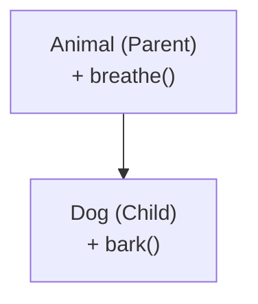
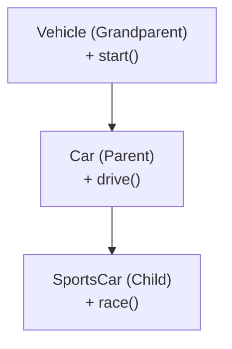
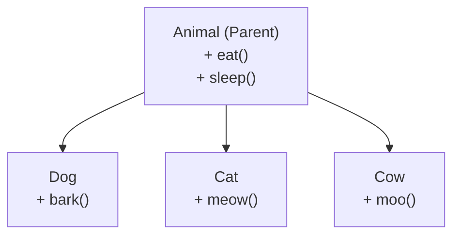
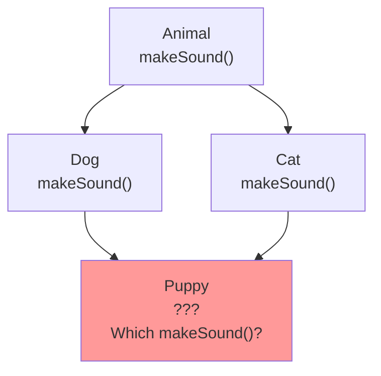

<a id="14-inheritance"></a>

# 📘 Chapter 14: Inheritance

> **Part C: Object Oriented Programming (Core Java)**
> `Core` | `OOP Pillar #2` | `Interview Critical`

⭐⭐⭐⭐⭐⭐⭐⭐⭐⭐⭐⭐⭐⭐⭐⭐⭐⭐⭐⭐⭐⭐⭐⭐⭐⭐⭐⭐⭐⭐⭐⭐

Java • Core Java • Interview Preparation

⭐⭐⭐⭐⭐⭐⭐⭐⭐⭐⭐⭐⭐⭐⭐⭐⭐⭐⭐⭐⭐⭐⭐⭐⭐⭐⭐⭐⭐⭐⭐⭐

---

<a id="chapter-index-table-14"></a>

## 📚 Chapter 14 — Index Table

| No. | Topic | Subtopics |
|-----|-------|-----------|
| 14.1 | [What is Inheritance](#141-what-is-inheritance) | Definition, Code Reuse, Parent-Child Relationship |
| 14.2 | [IS-A Relationship](#142-is-a-relationship) | Inheritance Represents IS-A |
| 14.3 | [extends Keyword](#143-extends-keyword) | Syntax, Class Extension |
| 14.4 | [Single Inheritance](#144-single-inheritance) | One Parent, One Child |
| 14.5 | [Multilevel Inheritance](#145-multilevel-inheritance) | A → B → C Chain |
| 14.6 | [Hierarchical Inheritance](#146-hierarchical-inheritance) | One Parent, Multiple Children |
| 14.7 | [Multiple Inheritance & Diamond Problem](#147-multiple-inheritance-diamond-problem) | Why Not Supported, Diamond Problem |
| 14.8 | [Hybrid Inheritance](#148-hybrid-inheritance) | Combination Not Supported |
| 14.9 | [What is Inherited and What is NOT](#149-what-is-inherited) | Rules of Inheritance |
| 14.10 | [super Keyword](#1410-super-keyword) | 3 Uses of super |
| 14.11 | [super to Access Parent Variables](#1411-super-parent-variables) | Shadowed Variables |
| 14.12 | [super to Call Parent Methods](#1412-super-parent-methods) | Overridden Methods |
| 14.13 | [super() Constructor Call](#1413-super-constructor-call) | First Statement Rule |
| 14.14 | [Method Overriding Rules](#1414-method-overriding-rules) | Complete Rules |
| 14.15 | [@Override Annotation](#1415-override-annotation) | Why Use It, Benefits |
| 14.16 | [Covariant Return Types](#1416-covariant-return-types) | Child Return Type |
| 14.17 | [Exception Handling in Overriding](#1417-exception-in-overriding) | Rules for Exceptions |
| 14.18 | [Object Class (Root Class)](#1418-object-class) | Ultimate Parent, Common Methods |
| 14.19 | [toString(), equals(), hashCode()](#1419-tostring-equals-hashcode) | Override These! |
| 14.20 | [equals() and hashCode() Contract](#1420-equals-hashcode-contract) | Critical Contract |
| 14.21 | [Upcasting and Downcasting](#1421-upcasting-downcasting) | Object Type Casting |
| 14.22 | [ClassCastException](#1422-classcastexception) | Runtime Casting Errors |
| 14.23 | [Composition vs Inheritance](#1423-composition-vs-inheritance) | Favor Composition |
| 🔥 | [Java vs Other Languages](#14-java-vs-other-languages) | Unique Inheritance Features |
| 💡 | [Interview Questions](#14-interview-questions) | 20+ Conceptual · Scenario · Output-based |
| 🧪 | [Practice Problems](#14-practice-problems) | 5 Coding + 5 Theory |

---

## 14.1 What is Inheritance

<a id="141-what-is-inheritance"></a>

### 📌 Definition

```
INHERITANCE = A mechanism where a NEW CLASS acquires the PROPERTIES
              (fields) and BEHAVIORS (methods) of an EXISTING CLASS.

It is the SECOND PILLAR of Object-Oriented Programming.

Terminology:
→ PARENT CLASS (Superclass, Base class) — the class being inherited FROM
→ CHILD CLASS (Subclass, Derived class) — the class doing the inheriting

Benefits:
✅ CODE REUSABILITY — reuse existing code
✅ Method Overriding possible
✅ Polymorphism enabled
✅ Hierarchical classification
```

### 📌 Basic Example

```java
// ═══ PARENT CLASS (Superclass) ═══
class Animal {
    String name;
    int age;

    void eat() {
        System.out.println(name + " is eating");
    }

    void sleep() {
        System.out.println(name + " is sleeping");
    }
}

// ═══ CHILD CLASS (Subclass) ═══
class Dog extends Animal {  // ← Inheriting from Animal

    void bark() {
        System.out.println(name + " is barking!");  // ← Can use parent's field!
    }
}

public class InheritanceDemo {
    public static void main(String[] args) {
        Dog d = new Dog();
        d.name = "Tommy";      // ✅ Inherited from Animal
        d.age = 3;              // ✅ Inherited from Animal

        d.eat();                // ✅ Inherited method
        d.sleep();              // ✅ Inherited method
        d.bark();               // ✅ Own method

        // Dog inherited ALL Animal features + added its own!
    }
}
```

### 🌍 Real-World Analogy (Hinglish)

```
INHERITANCE = Family relationships jaisa hai:

👨 PAPA (Parent class)
   Properties: eye_color = "brown", height = 5.10
   Methods: walk(), talk(), drive()

👦 BETA (Child class) — extends Papa
   ✅ Auto-inherits: eye_color, height (from Papa)
   ✅ Auto-inherits: walk(), talk(), drive() (from Papa)
   ➕ Own additions: play_video_games(), code()

👶 POTA (Grandchild) — extends Beta
   ✅ Inherits everything from Beta AND Papa
   ➕ Own additions: use_smartphone()

Yehi Inheritance hai!

Real Java Example:
Animal → Dog → Puppy
Har naya class parent ke saare features INHERIT karta hai!
```

<a href="#chapter-index-table-14">Go to Top 🔝</a>

---

## 14.2 IS-A Relationship

<a id="142-is-a-relationship"></a>

### 📌 Inheritance Represents "IS-A"

```
IS-A = "IS A TYPE OF" relationship

Whenever we use INHERITANCE, we establish IS-A relationship.

Examples:
→ Dog IS-A Animal
→ Car IS-A Vehicle
→ Circle IS-A Shape
→ Manager IS-A Employee
→ Puppy IS-A Dog IS-A Animal
```

```java
// ═══ Establishing IS-A Relationship ═══

class Vehicle {
    void start() { System.out.println("Vehicle starting..."); }
}

class Car extends Vehicle {   // Car IS-A Vehicle
    void drive() { System.out.println("Car driving..."); }
}

class SportsCar extends Car {  // SportsCar IS-A Car IS-A Vehicle
    void race() { System.out.println("Racing!"); }
}

public class ISADemo {
    public static void main(String[] args) {
        SportsCar sc = new SportsCar();

        // Verifying IS-A relationships
        System.out.println(sc instanceof SportsCar);  // true
        System.out.println(sc instanceof Car);         // true (IS-A Car)
        System.out.println(sc instanceof Vehicle);     // true (IS-A Vehicle)
        System.out.println(sc instanceof Object);      // true (IS-A Object)

        // Can access ALL parent methods
        sc.start();  // From Vehicle
        sc.drive();  // From Car
        sc.race();   // Own
    }
}
```

### 📌 When to Use IS-A?

```
✅ USE IS-A (Inheritance) when:
   → Child is a TYPE OF Parent
   → Child needs ALL parent features
   → Child extends parent's behavior

❌ DON'T USE IS-A when:
   → Child just USES parent's features (use HAS-A/Composition)
   → No strong "is a type of" relationship

WRONG examples:
❌ Car extends Engine    (Car HAS-A Engine, not IS-A)
❌ House extends Room    (House HAS-A Room)
❌ Book extends Chapter  (Book HAS-A Chapter)

RIGHT examples:
✅ SportsCar extends Car   (SportsCar IS-A Car)
✅ Circle extends Shape    (Circle IS-A Shape)
✅ Dog extends Animal      (Dog IS-A Animal)
```

<a href="#chapter-index-table-14">Go to Top 🔝</a>

---

## 14.3 extends Keyword

<a id="143-extends-keyword"></a>

### 📌 Syntax and Rules

```java
// ═══ SYNTAX ═══
class ChildClass extends ParentClass {
    // Additional fields and methods
}

// ═══ RULES ═══
// 1. Java supports SINGLE inheritance (one parent only)
// 2. Cannot extend final classes
// 3. Cannot extend own subclass (no circular inheritance)
// 4. Constructor is NOT inherited
// 5. Every class implicitly extends Object

// ═══ EXAMPLES ═══

class A { }
class B extends A { }        // ✅ Single inheritance

// class C extends A, B { }  // ❌ Multiple inheritance NOT allowed

class D extends B { }        // ✅ Multilevel (D → B → A)

// final class E { }
// class F extends E { }     // ❌ Cannot extend final class

// ═══ Implicit Object Extension ═══
class Person { }             // Implicitly: class Person extends Object
```

### 📌 With Access Modifiers

```java
// Parent class
public class Employee {
    protected String name;   // Accessible to subclass
    private double salary;    // NOT accessible to subclass
    public int age;           // Accessible everywhere
}

// Child class
public class Manager extends Employee {
    void displayInfo() {
        System.out.println(name);   // ✅ protected — accessible
        System.out.println(age);     // ✅ public — accessible
        // System.out.println(salary);  // ❌ private — NOT accessible!
    }
}
```

<a href="#chapter-index-table-14">Go to Top 🔝</a>

---

## 14.4 Single Inheritance

<a id="144-single-inheritance"></a>

### 📌 One Parent, One Child

```
SINGLE INHERITANCE:
→ A class extends ONE parent class
→ Simplest form of inheritance
→ Most common
```

```java
// ═══ Single Inheritance Example ═══

class Animal {
    void breathe() {
        System.out.println("Breathing...");
    }
}

class Dog extends Animal {  // Dog inherits from Animal (single parent)
    void bark() {
        System.out.println("Woof!");
    }
}

public class SingleInheritance {
    public static void main(String[] args) {
        Dog d = new Dog();
        d.breathe();  // Inherited from Animal
        d.bark();     // Own method
    }
}
```

### 📊 Single Inheritance Diagram



<a href="#chapter-index-table-14">Go to Top 🔝</a>

---

## 14.5 Multilevel Inheritance

<a id="145-multilevel-inheritance"></a>

### 📌 Chain of Inheritance

```
MULTILEVEL INHERITANCE:
→ A → B → C (chain)
→ C inherits from B, B inherits from A
→ C ultimately gets features from BOTH A and B
```

```java
// ═══ Multilevel Inheritance Example ═══

class Vehicle {
    void start() {
        System.out.println("Vehicle started");
    }
}

class Car extends Vehicle {   // Level 2
    void drive() {
        System.out.println("Car is driving");
    }
}

class SportsCar extends Car { // Level 3
    void race() {
        System.out.println("Racing at 300 kmph!");
    }
}

public class MultilevelDemo {
    public static void main(String[] args) {
        SportsCar sc = new SportsCar();

        // Has access to ALL levels!
        sc.start();  // From Vehicle (grandparent)
        sc.drive();  // From Car (parent)
        sc.race();   // Own method
    }
}
```

### 📊 Multilevel Inheritance Diagram



<a href="#chapter-index-table-14">Go to Top 🔝</a>

---

## 14.6 Hierarchical Inheritance

<a id="146-hierarchical-inheritance"></a>

### 📌 One Parent, Multiple Children

```
HIERARCHICAL INHERITANCE:
→ ONE parent class
→ MULTIPLE child classes
→ Each child inherits SAME features from parent
→ Each child can ADD their own unique features
```

```java
// ═══ Hierarchical Inheritance Example ═══

class Animal {
    void eat() {
        System.out.println("Animal is eating");
    }
    void sleep() {
        System.out.println("Animal is sleeping");
    }
}

class Dog extends Animal {
    void bark() {
        System.out.println("Woof!");
    }
}

class Cat extends Animal {
    void meow() {
        System.out.println("Meow!");
    }
}

class Cow extends Animal {
    void moo() {
        System.out.println("Moo!");
    }
}

public class HierarchicalDemo {
    public static void main(String[] args) {
        Dog d = new Dog();
        Cat c = new Cat();
        Cow cow = new Cow();

        // All inherit from Animal
        d.eat();    // Dog inherits eat()
        c.eat();    // Cat inherits eat()
        cow.eat();  // Cow inherits eat()

        // Each has own unique method
        d.bark();
        c.meow();
        cow.moo();
    }
}
```

### 📊 Hierarchical Inheritance Diagram



<a href="#chapter-index-table-14">Go to Top 🔝</a>

---

## 14.7 Multiple Inheritance & Diamond Problem ⭐

<a id="147-multiple-inheritance-diamond-problem"></a>

### 📌 Why Java Does NOT Support Multiple Inheritance

```
MULTIPLE INHERITANCE (with classes) = NOT ALLOWED in Java!

// ❌ This is NOT allowed:
class C extends A, B { }   // Compile Error!

WHY? To avoid the DIAMOND PROBLEM.
```

### 📌 The Diamond Problem

```
Imagine multiple inheritance was allowed:

    Animal (has method: makeSound())
       /  \
      /    \
    Dog    Cat  (both override makeSound() differently)
      \    /
       \  /
      Puppy  (which makeSound() does Puppy inherit?)
      /   \
     /     \
   Dog's   Cat's
   version version

DIAMOND PROBLEM:
→ Puppy has TWO parents (Dog and Cat)
→ Both have makeSound() method
→ Which one to inherit? AMBIGUITY!

Java AVOIDS this by not allowing multiple inheritance with classes.
```

### 📌 Diamond Problem Example (Hypothetical)

```java
// If Java allowed multiple inheritance:

class Animal {
    void makeSound() { System.out.println("Animal sound"); }
}

class Dog extends Animal {
    void makeSound() { System.out.println("Bark!"); }
}

class Cat extends Animal {
    void makeSound() { System.out.println("Meow!"); }
}

// class Puppy extends Dog, Cat { }  // ❌ ERROR!
// Puppy would have TWO makeSound() methods — AMBIGUOUS!

// If we did: new Puppy().makeSound();
// Would it be Dog's or Cat's version?
// This is the DIAMOND PROBLEM!
```

### 📌 Solution — Use INTERFACES!

```java
// ✅ Java allows multiple inheritance THROUGH INTERFACES:

interface Swimmer {
    void swim();
}

interface Runner {
    void run();
}

// Class can implement MULTIPLE interfaces!
class Duck implements Swimmer, Runner {
    public void swim() {
        System.out.println("Duck swimming");
    }
    public void run() {
        System.out.println("Duck running");
    }
}

public class SolutionDemo {
    public static void main(String[] args) {
        Duck d = new Duck();
        d.swim();
        d.run();
    }
}

// WHY interfaces work?
// → Traditional interfaces had NO method bodies (just declarations)
// → No ambiguity because no implementation to inherit
// → Java 8+ allowed default methods with rules to avoid conflicts
```

### 📊 Diamond Problem Diagram



<a href="#chapter-index-table-14">Go to Top 🔝</a>

---

## 14.8 Hybrid Inheritance

<a id="148-hybrid-inheritance"></a>

### 📌 Combination of Multiple Types

```
HYBRID INHERITANCE = Combination of Single, Multilevel,
                     Hierarchical, and Multiple inheritance.

NOT DIRECTLY SUPPORTED with classes in Java.
Can be achieved using INTERFACES.
```

```java
// ═══ Hybrid Inheritance using Interfaces ═══

class Animal {                    // Single inheritance base
    void breathe() { System.out.println("Breathing"); }
}

interface Swimmer {                // Interface 1
    void swim();
}

interface Runner {                 // Interface 2
    void run();
}

// Combines: Single (extends) + Multiple (implements)
class Duck extends Animal implements Swimmer, Runner {

    public void swim() {
        System.out.println("Duck swimming");
    }

    public void run() {
        System.out.println("Duck running");
    }
}

public class HybridDemo {
    public static void main(String[] args) {
        Duck d = new Duck();
        d.breathe();  // From Animal (extends)
        d.swim();     // From Swimmer (implements)
        d.run();      // From Runner (implements)
    }
}
```

<a href="#chapter-index-table-14">Go to Top 🔝</a>

---

## 14.9 What is Inherited and What is NOT

<a id="149-what-is-inherited"></a>

### 📌 Complete Rules

```
┌──────────────────────────────────────────────────────────────┐
│  ✅ INHERITED (accessible in child):                          │
├──────────────────────────────────────────────────────────────┤
│  • public members                                            │
│  • protected members                                         │
│  • default members (ONLY if in same package)                 │
│  • Instance methods                                          │
│  • Static methods (but not overridden — method hiding)       │
├──────────────────────────────────────────────────────────────┤
│  ❌ NOT INHERITED:                                            │
├──────────────────────────────────────────────────────────────┤
│  • private members (never inherited)                          │
│  • Constructors (never inherited)                             │
│  • default members (if in different package)                  │
│  • Static blocks (never inherited)                            │
│  • Instance blocks (never inherited)                          │
└──────────────────────────────────────────────────────────────┘
```

### 📌 Detailed Example

```java
// ═══ Parent Class ═══
package com.example;

public class Parent {
    public int publicVar = 1;         // ✅ Inherited
    protected int protectedVar = 2;   // ✅ Inherited
    int defaultVar = 3;               // ✅ Inherited (same package)
    private int privateVar = 4;       // ❌ NOT inherited

    public Parent() { }               // ❌ Constructors NOT inherited
    public Parent(int x) { }          // ❌ Constructors NOT inherited

    public void publicMethod() { }         // ✅ Inherited
    protected void protectedMethod() { }   // ✅ Inherited
    void defaultMethod() { }               // ✅ Inherited (same package)
    private void privateMethod() { }       // ❌ NOT inherited

    static void staticMethod() { }         // ✅ Inherited (hidden if overridden)

    static { }                        // ❌ NOT inherited
    { }                                // ❌ NOT inherited
}

// ═══ Child Class ═══
class Child extends Parent {
    void test() {
        System.out.println(publicVar);      // ✅ OK
        System.out.println(protectedVar);   // ✅ OK
        System.out.println(defaultVar);     // ✅ OK (same package)
        // System.out.println(privateVar);  // ❌ ERROR!

        publicMethod();                     // ✅ OK
        protectedMethod();                  // ✅ OK
        defaultMethod();                    // ✅ OK
        // privateMethod();                 // ❌ ERROR!

        // Constructor NOT inherited:
        // Child inherits Parent's fields/methods
        // But NOT constructors!
    }
}
```

### 📌 Constructors are NOT Inherited

```java
class Parent {
    Parent() {
        System.out.println("Parent constructor");
    }
    Parent(int x) {
        System.out.println("Parent constructor with int");
    }
}

class Child extends Parent {
    // Constructor NOT inherited!
    // But super() is CALLED automatically

    Child() {
        // Implicitly: super();  ← Compiler adds this
        System.out.println("Child constructor");
    }
}

public class Test {
    public static void main(String[] args) {
        Child c = new Child();
        // Output:
        // Parent constructor  ← super() called first
        // Child constructor
    }
}
```

<a href="#chapter-index-table-14">Go to Top 🔝</a>

---

## 14.10 super Keyword

<a id="1410-super-keyword"></a>

### 📌 3 Uses of super

```
The 'super' keyword has 3 major uses:

1. super.variable    → Access PARENT class variable (shadowed)
2. super.method()    → Call PARENT class method (overridden)
3. super()           → Call PARENT class constructor
```

```java
// ═══ Example demonstrating all 3 uses ═══

class Vehicle {
    String type = "Vehicle";        // Parent variable

    Vehicle() {
        System.out.println("Vehicle constructor");
    }

    void display() {
        System.out.println("Vehicle display");
    }
}

class Car extends Vehicle {
    String type = "Car";            // Child variable (shadows parent!)

    Car() {
        super();                    // ← Use 3: Call parent constructor
        System.out.println("Car constructor");
    }

    void display() {
        super.display();            // ← Use 2: Call parent method
        System.out.println("Car display");
    }

    void showTypes() {
        System.out.println(type);           // Child's type
        System.out.println(super.type);     // ← Use 1: Parent's type
    }
}

public class SuperDemo {
    public static void main(String[] args) {
        Car c = new Car();          // Both constructors called
        c.display();                // Both display methods called
        c.showTypes();              // Both types printed
    }
}

/*
OUTPUT:
Vehicle constructor          ← from super()
Car constructor
Vehicle display              ← from super.display()
Car display
Car                          ← this.type (Car's)
Vehicle                      ← super.type (Parent's)
*/
```

<a href="#chapter-index-table-14">Go to Top 🔝</a>

---

## 14.11 super to Access Parent Variables

<a id="1411-super-parent-variables"></a>

### 📌 Variable Shadowing

```java
class Parent {
    int x = 10;
    String name = "Parent";
}

class Child extends Parent {
    int x = 20;                     // Shadows parent's x
    String name = "Child";           // Shadows parent's name

    void showValues() {
        System.out.println(x);           // 20 (child's)
        System.out.println(this.x);       // 20 (same as above)
        System.out.println(super.x);      // 10 (parent's!)

        System.out.println(name);         // Child
        System.out.println(super.name);   // Parent
    }
}

public class ShadowDemo {
    public static void main(String[] args) {
        Child c = new Child();
        c.showValues();
    }
}
```

<a href="#chapter-index-table-14">Go to Top 🔝</a>

---

## 14.12 super to Call Parent Methods

<a id="1412-super-parent-methods"></a>

### 📌 Calling Overridden Methods

```java
class Vehicle {
    void start() {
        System.out.println("Vehicle starting...");
    }
}

class Car extends Vehicle {
    @Override
    void start() {
        super.start();   // Call parent's start() first
        System.out.println("Car starting engine...");
    }
}

class SportsCar extends Car {
    @Override
    void start() {
        super.start();   // Call Car's start() (which calls Vehicle's)
        System.out.println("Sports mode activated!");
    }
}

public class SuperMethodDemo {
    public static void main(String[] args) {
        SportsCar sc = new SportsCar();
        sc.start();

        /*
        OUTPUT:
        Vehicle starting...          ← from super.start() in Car
        Car starting engine...        ← from super.start() in SportsCar
        Sports mode activated!        ← SportsCar's own code
        */
    }
}
```

<a href="#chapter-index-table-14">Go to Top 🔝</a>

---

## 14.13 super() Constructor Call

<a id="1413-super-constructor-call"></a>

### 📌 Calling Parent Constructor

```java
// ═══ Rules of super() ═══
// 1. super() MUST be the FIRST statement in constructor
// 2. If not explicitly called, compiler adds super() automatically
// 3. Only ONE super() call per constructor

class Person {
    String name;

    Person() {
        System.out.println("Default Person constructor");
    }

    Person(String name) {
        this.name = name;
        System.out.println("Person constructor with name");
    }
}

class Student extends Person {

    int rollNumber;

    // Case 1: Implicit super() call
    Student() {
        // super();  ← Compiler adds this automatically
        System.out.println("Default Student constructor");
    }

    // Case 2: Explicit super() with no args
    Student(int roll) {
        super();  // Calls Person()
        this.rollNumber = roll;
        System.out.println("Student constructor with roll");
    }

    // Case 3: Explicit super() with args
    Student(String name, int roll) {
        super(name);  // Calls Person(String)
        this.rollNumber = roll;
        System.out.println("Student constructor with name and roll");
    }
}

public class SuperConstructorDemo {
    public static void main(String[] args) {
        System.out.println("--- new Student() ---");
        Student s1 = new Student();

        System.out.println("\n--- new Student(101) ---");
        Student s2 = new Student(101);

        System.out.println("\n--- new Student(\"Rahul\", 102) ---");
        Student s3 = new Student("Rahul", 102);
    }
}

/*
OUTPUT:
--- new Student() ---
Default Person constructor         ← super() implicit
Default Student constructor

--- new Student(101) ---
Default Person constructor         ← super() explicit
Student constructor with roll

--- new Student("Rahul", 102) ---
Person constructor with name        ← super(name)
Student constructor with name and roll
*/
```

### ⚠️ super() Rules

```java
class Child extends Parent {

    // ❌ WRONG — super() must be FIRST statement
    Child() {
        System.out.println("Before super");
        super();  // ❌ COMPILE ERROR!
    }

    // ❌ WRONG — cannot call super() twice
    Child(int x) {
        super();
        super(x);  // ❌ COMPILE ERROR!
    }

    // ❌ WRONG — cannot mix super() and this() in same constructor
    Child(String s) {
        this();      // ❌ ERROR if super() also called
        super();
    }

    // ✅ CORRECT
    Child(int x, int y) {
        super();
        System.out.println("After super");
    }
}
```

<a href="#chapter-index-table-14">Go to Top 🔝</a>

---

## 14.14 Method Overriding Rules ⭐⭐⭐

<a id="1414-method-overriding-rules"></a>

### 📌 What is Method Overriding?

```
METHOD OVERRIDING = When a CHILD class provides a NEW IMPLEMENTATION
                    of a method that is ALREADY defined in the PARENT class.

Purpose: Change/extend parent's behavior in child class.
```

### 📌 Complete Rules

```
┌──────────────────────────────────────────────────────────────┐
│  METHOD OVERRIDING RULES                                     │
├──────────────────────────────────────────────────────────────┤
│  ✅ Same method NAME                                          │
│  ✅ Same PARAMETERS (number, type, order)                     │
│  ✅ Same or COVARIANT return type                             │
│  ✅ Access modifier can be SAME or MORE VISIBLE               │
│     (private → default → protected → public)                 │
│  ✅ Can throw SAME or FEWER checked exceptions                │
│  ❌ CANNOT reduce visibility (public → private ❌)            │
│  ❌ CANNOT override static methods (method hiding)            │
│  ❌ CANNOT override final methods                              │
│  ❌ CANNOT override private methods                            │
│  ❌ CANNOT override constructors                               │
└──────────────────────────────────────────────────────────────┘
```

### 📌 Method Overriding Example

```java
class Animal {
    // Parent method
    public void makeSound() {
        System.out.println("Animal makes a sound");
    }
}

class Dog extends Animal {

    @Override  // ← Annotation (recommended!)
    public void makeSound() {   // Same signature
        System.out.println("Dog barks: Woof!");
    }
}

class Cat extends Animal {

    @Override
    public void makeSound() {
        System.out.println("Cat meows: Meow!");
    }
}

public class OverridingDemo {
    public static void main(String[] args) {
        Animal a1 = new Dog();
        Animal a2 = new Cat();

        a1.makeSound();  // Dog barks: Woof! (runtime polymorphism!)
        a2.makeSound();  // Cat meows: Meow!
    }
}
```

### 📌 Overriding Rules — Violations

```java
class Parent {
    public void show() {
        System.out.println("Parent show");
    }

    public int calculate() {
        return 10;
    }

    protected static void staticMethod() { }

    public final void finalMethod() { }
}

class Child extends Parent {

    // ✅ CORRECT overriding
    @Override
    public void show() {
        System.out.println("Child show");
    }

    // ❌ WRONG: Cannot reduce visibility
    // @Override
    // private void show() { }  // ERROR!

    // ❌ WRONG: Different return type (not covariant)
    // @Override
    // public String calculate() { return "10"; }  // ERROR!

    // ⚠️ NOT overriding — this is METHOD HIDING!
    protected static void staticMethod() { }

    // ❌ WRONG: Cannot override final methods
    // @Override
    // public void finalMethod() { }  // ERROR!
}
```

<a href="#chapter-index-table-14">Go to Top 🔝</a>

---

## 14.15 @Override Annotation

<a id="1415-override-annotation"></a>

### 📌 Why Use @Override?

```
@Override tells the COMPILER: "I'm intending to override this method"

BENEFITS:
✅ COMPILE-TIME CHECK — If method doesn't exist in parent, error!
✅ Prevents typos in method names
✅ Makes code MORE READABLE
✅ Documents intent

Without @Override:
→ Typo creates a NEW method (silent bug!)

With @Override:
→ Compiler catches typo immediately
```

### 📌 @Override in Action

```java
class Parent {
    public void makeSound() {
        System.out.println("Some sound");
    }
}

// ═══ WITHOUT @Override (Dangerous!) ═══
class BadChild extends Parent {
    public void makesound() {   // TYPO! Lowercase 's'
        System.out.println("Not overriding!");
    }
}

// ═══ WITH @Override (Safe!) ═══
class GoodChild extends Parent {
    @Override
    public void makesound() {   // ❌ COMPILE ERROR!
        // "Method does not override method from its superclass"
    }
}

public class OverrideAnnotationDemo {
    public static void main(String[] args) {
        Parent p = new BadChild();
        p.makeSound();  // Prints "Some sound" (not overridden!)
        // BadChild has BOTH: makeSound() from Parent AND makesound() new method

        Parent p2 = new GoodChild();
        p2.makeSound();  // If compile error fixed properly, works
    }
}
```

### 📌 Best Practices

```
✅ ALWAYS use @Override when overriding
✅ Helps catch bugs at compile time
✅ Improves code readability
✅ Documents intent

Recommended by:
→ Java documentation
→ Effective Java (Josh Bloch)
→ All modern IDEs
```

<a href="#chapter-index-table-14">Go to Top 🔝</a>

---

## 14.16 Covariant Return Types

<a id="1416-covariant-return-types"></a>

### 📌 Return Child Type Instead of Parent

```
COVARIANT RETURN TYPE:
→ Child can override method with a MORE SPECIFIC return type
→ Return type in child = SUBTYPE of parent's return type
→ Introduced in Java 5+
```

```java
// ═══ Covariant Return Types Example ═══

class Animal { }
class Dog extends Animal { }
class Puppy extends Dog { }

class AnimalShelter {
    Animal getAnimal() {  // Returns Animal
        return new Animal();
    }
}

class DogShelter extends AnimalShelter {

    @Override
    Dog getAnimal() {   // ✅ Returns Dog (SUBTYPE of Animal)
        return new Dog();
    }
}

class PuppyShelter extends DogShelter {

    @Override
    Puppy getAnimal() {   // ✅ Returns Puppy (SUBTYPE of Dog)
        return new Puppy();
    }
}

public class CovariantDemo {
    public static void main(String[] args) {
        AnimalShelter as = new AnimalShelter();
        Animal a = as.getAnimal();       // Animal

        DogShelter ds = new DogShelter();
        Dog d = ds.getAnimal();           // Dog (covariant!)

        PuppyShelter ps = new PuppyShelter();
        Puppy p = ps.getAnimal();         // Puppy (covariant!)

        // Before Java 5:
        // Had to return SAME type (Animal)
        // Then downcast: (Dog) as.getAnimal()

        // With covariant:
        // No downcasting needed!
    }
}
```

<a href="#chapter-index-table-14">Go to Top 🔝</a>

---

## 14.17 Exception Handling in Overriding

<a id="1417-exception-in-overriding"></a>

### 📌 Rules for Exceptions in Overridden Methods

```
When overriding methods that throw exceptions:

FOR CHECKED EXCEPTIONS:
✅ Can throw SAME exception
✅ Can throw SUBCLASS exception
✅ Can throw FEWER exceptions
✅ Can throw NO exceptions
❌ CANNOT throw NEW checked exceptions
❌ CANNOT throw SUPERCLASS exception

FOR UNCHECKED EXCEPTIONS (RuntimeException):
✅ Can throw ANY unchecked exception
→ No restrictions
```

### 📌 Examples

```java
import java.io.*;

class Parent {
    public void method1() throws IOException {
        System.out.println("Parent method1");
    }

    public void method2() throws FileNotFoundException {
        System.out.println("Parent method2");
    }
}

class Child extends Parent {

    // ✅ ALLOWED: Same exception
    @Override
    public void method1() throws IOException {
        System.out.println("Child method1");
    }

    // ✅ ALLOWED: Subclass exception (FileNotFoundException extends IOException)
    // @Override
    // public void method1() throws FileNotFoundException { }

    // ✅ ALLOWED: No exception
    // @Override
    // public void method1() { }

    // ❌ NOT ALLOWED: Broader exception
    // @Override
    // public void method2() throws Exception { }  // ERROR!

    // ❌ NOT ALLOWED: New checked exception not in parent
    // @Override
    // public void method1() throws SQLException { }  // ERROR!

    // ✅ ALLOWED: Unchecked exceptions (any)
    @Override
    public void method2() throws RuntimeException {
        // Any RuntimeException OK
    }
}
```

<a href="#chapter-index-table-14">Go to Top 🔝</a>

---

## 14.18 Object Class (Root Class)

<a id="1418-object-class"></a>

### 📌 Every Class Extends Object

```
java.lang.Object is the ROOT CLASS of ALL classes in Java.

EVERY class IMPLICITLY extends Object!

class MyClass { }
// Compiler treats it as:
// class MyClass extends Object { }

Object provides common methods to ALL classes:
→ toString()
→ equals()
→ hashCode()
→ getClass()
→ clone()
→ finalize() (deprecated)
→ wait(), notify(), notifyAll() (for threads)
```

### 📌 Important Methods of Object

```java
public class ObjectMethods {

    public static void main(String[] args) {

        String s = "Hello";

        // ═══ toString() — String representation ═══
        System.out.println(s.toString());       // "Hello"

        // ═══ equals() — Content comparison ═══
        String s2 = "Hello";
        System.out.println(s.equals(s2));       // true

        // ═══ hashCode() — Hash value ═══
        System.out.println(s.hashCode());       // Some integer

        // ═══ getClass() — Runtime class ═══
        System.out.println(s.getClass());       // class java.lang.String
        System.out.println(s.getClass().getName());   // java.lang.String

        // ═══ Every object has these methods! ═══
        Integer i = 100;
        System.out.println(i.toString());       // "100"
        System.out.println(i.hashCode());       // 100
        System.out.println(i.getClass());       // class java.lang.Integer

        // Custom class also has these:
        MyClass obj = new MyClass();
        System.out.println(obj.toString());     // MyClass@1b6d3586
        System.out.println(obj.hashCode());     // Some integer
    }
}

class MyClass { }
// Automatically inherits from Object!
```

<a href="#chapter-index-table-14">Go to Top 🔝</a>

---

## 14.19 toString(), equals(), hashCode()

<a id="1419-tostring-equals-hashcode"></a>

### 📌 Why Override These 3 Methods?

```
Default implementations from Object are basic:

toString() → ClassName@hashCode (like "Person@1b6d3586")
equals()   → Reference comparison (==)
hashCode() → Based on memory address

For meaningful behavior, OVERRIDE these!
```

### 📌 Overriding toString()

```java
class Person {
    String name;
    int age;

    Person(String name, int age) {
        this.name = name;
        this.age = age;
    }

    // ═══ Override toString() ═══
    @Override
    public String toString() {
        return "Person{name='" + name + "', age=" + age + "}";
    }
}

public class ToStringDemo {
    public static void main(String[] args) {
        Person p = new Person("Rahul", 25);

        System.out.println(p);          // Uses toString() implicitly
        // Output: Person{name='Rahul', age=25}

        // Without override:
        // Output: Person@1b6d3586 (useless!)
    }
}
```

### 📌 Overriding equals()

```java
import java.util.Objects;

class Person {
    String name;
    int age;

    Person(String name, int age) {
        this.name = name;
        this.age = age;
    }

    // ═══ Override equals() for CONTENT comparison ═══
    @Override
    public boolean equals(Object obj) {
        // 1. Check if same reference
        if (this == obj) return true;

        // 2. Check if obj is null or different class
        if (obj == null || getClass() != obj.getClass()) return false;

        // 3. Cast and compare fields
        Person p = (Person) obj;
        return age == p.age && Objects.equals(name, p.name);
    }

    // ⚠️ IMPORTANT: If you override equals(), MUST also override hashCode()!
    @Override
    public int hashCode() {
        return Objects.hash(name, age);
    }
}

public class EqualsDemo {
    public static void main(String[] args) {
        Person p1 = new Person("Rahul", 25);
        Person p2 = new Person("Rahul", 25);
        Person p3 = new Person("Priya", 30);

        System.out.println(p1 == p2);           // false (different objects)
        System.out.println(p1.equals(p2));      // true! (content same)
        System.out.println(p1.equals(p3));      // false (different content)
    }
}
```

### 📌 Overriding hashCode()

```java
// hashCode() must be consistent with equals()

@Override
public int hashCode() {
    // Use all fields used in equals()
    return Objects.hash(name, age);
}

// Older way (before Java 7):
@Override
public int hashCode() {
    int result = 17;
    result = 31 * result + (name != null ? name.hashCode() : 0);
    result = 31 * result + age;
    return result;
}
```

<a href="#chapter-index-table-14">Go to Top 🔝</a>

---

## 14.20 equals() and hashCode() Contract ⭐⭐⭐

<a id="1420-equals-hashcode-contract"></a>

### 📌 The CRITICAL Contract

```
IF you override equals(), you MUST also override hashCode()!

THE CONTRACT:
1. If a.equals(b) is true → a.hashCode() MUST EQUAL b.hashCode()
2. If a.equals(b) is false → hashCodes MAY or MAY NOT be equal
3. hashCode() should return SAME value for same object (consistent)
4. Two DIFFERENT objects CAN have same hashCode (collision)
```

### 📌 Why is This Important?

```
Used in Hash-based Collections:
→ HashMap
→ HashSet
→ Hashtable
→ LinkedHashMap
→ LinkedHashSet

These use hashCode() to find objects FAST!

If contract is broken:
❌ Objects "lost" in HashMap
❌ Duplicates in HashSet
❌ Incorrect behavior everywhere
```

### 📌 Broken Contract Example (BAD!)

```java
// ❌ BAD: Override equals() but not hashCode()
class Person {
    String name;

    Person(String name) { this.name = name; }

    @Override
    public boolean equals(Object o) {
        if (!(o instanceof Person)) return false;
        return name.equals(((Person) o).name);
    }

    // NOT overriding hashCode() — BUG!
}

public class BrokenContract {
    public static void main(String[] args) {
        Person p1 = new Person("Rahul");
        Person p2 = new Person("Rahul");

        System.out.println(p1.equals(p2));   // true ✅
        System.out.println(p1.hashCode());    // Some address
        System.out.println(p2.hashCode());    // Different address!

        // Now try in HashSet:
        java.util.HashSet<Person> set = new java.util.HashSet<>();
        set.add(p1);
        set.add(p2);
        System.out.println(set.size());       // 2 ❌ WRONG!
        // Should be 1 (they're "equal")
        // But hashCodes differ → treated as different!
    }
}
```

### 📌 Correct Implementation

```java
// ✅ GOOD: Override BOTH equals() and hashCode()
class Person {
    String name;

    Person(String name) { this.name = name; }

    @Override
    public boolean equals(Object o) {
        if (this == o) return true;
        if (!(o instanceof Person)) return false;
        return name.equals(((Person) o).name);
    }

    @Override
    public int hashCode() {
        return name.hashCode();  // Consistent with equals()!
    }
}

public class CorrectContract {
    public static void main(String[] args) {
        Person p1 = new Person("Rahul");
        Person p2 = new Person("Rahul");

        System.out.println(p1.equals(p2));    // true ✅
        System.out.println(p1.hashCode() == p2.hashCode());  // true ✅

        java.util.HashSet<Person> set = new java.util.HashSet<>();
        set.add(p1);
        set.add(p2);
        System.out.println(set.size());        // 1 ✅ CORRECT!
    }
}
```

<a href="#chapter-index-table-14">Go to Top 🔝</a>

---

## 14.21 Upcasting and Downcasting

<a id="1421-upcasting-downcasting"></a>

### 📌 Object Type Casting

```
UPCASTING (Child → Parent):
→ Automatic (implicit)
→ Always SAFE
→ Called "Widening"

DOWNCASTING (Parent → Child):
→ Manual (explicit)
→ Can throw ClassCastException at RUNTIME
→ Called "Narrowing"
→ Use instanceof to check safely
```

### 📌 Upcasting Example

```java
class Animal {
    void eat() { System.out.println("Eating..."); }
}

class Dog extends Animal {
    void bark() { System.out.println("Barking!"); }
}

public class UpcastingDemo {
    public static void main(String[] args) {

        // ═══ UPCASTING (Child → Parent) ═══
        Dog dog = new Dog();
        Animal animal = dog;    // ✅ Automatic (Dog IS-A Animal)

        // Or directly:
        Animal a = new Dog();   // ✅ Upcasting

        // What can you do?
        a.eat();                // ✅ OK (from Animal)
        // a.bark();            // ❌ ERROR! Reference type is Animal, no bark()

        // ⚠️ IMPORTANT:
        // Reference type = Compile-time (what you can access)
        // Object type = Runtime (which method actually runs)
    }
}
```

### 📌 Downcasting Example

```java
public class DowncastingDemo {
    public static void main(String[] args) {

        // Create Dog object with Animal reference
        Animal a = new Dog();
        a.eat();

        // ═══ DOWNCASTING (Parent → Child) ═══
        // Need explicit cast because compiler can't verify
        Dog d = (Dog) a;   // ✅ Explicit cast
        d.bark();           // ✅ Now can access Dog methods

        // ⚠️ DANGEROUS Downcasting:
        Animal a2 = new Animal();
        // Dog d2 = (Dog) a2;   // ❌ ClassCastException at RUNTIME!
        // a2 is Animal, NOT Dog!

        // ═══ SAFE Downcasting (using instanceof) ═══
        Animal a3 = new Dog();

        if (a3 instanceof Dog) {
            Dog d3 = (Dog) a3;
            d3.bark();      // Safe!
        }

        // Java 16+ Pattern Matching (cleaner):
        if (a3 instanceof Dog d3) {   // Cast and declare in one step!
            d3.bark();
        }
    }
}
```

<a href="#chapter-index-table-14">Go to Top 🔝</a>

---

## 14.22 ClassCastException

<a id="1422-classcastexception"></a>

### 📌 Runtime Exception for Wrong Cast

```java
public class ClassCastDemo {

    static class Animal { }
    static class Dog extends Animal { }
    static class Cat extends Animal { }

    public static void main(String[] args) {

        // ❌ Case 1: Casting to unrelated class
        Animal a = new Dog();
        try {
            Cat c = (Cat) a;    // ClassCastException!
            // Dog is NOT a Cat, even though both are Animal
        } catch (ClassCastException e) {
            System.out.println("Cannot cast Dog to Cat");
        }

        // ❌ Case 2: Casting parent to child (when parent is really parent)
        Animal a2 = new Animal();
        try {
            Dog d = (Dog) a2;   // ClassCastException!
            // a2 is Animal, NOT Dog
        } catch (ClassCastException e) {
            System.out.println("Cannot cast Animal to Dog");
        }

        // ✅ PREVENTION: Use instanceof first
        Animal a3 = new Dog();
        if (a3 instanceof Dog) {
            Dog d = (Dog) a3;    // Safe!
        } else {
            System.out.println("Not a Dog, cannot cast");
        }

        // ✅ Java 16+ Pattern Matching
        Animal a4 = new Dog();
        if (a4 instanceof Dog d) {
            // Automatically cast and declared as 'd'
            System.out.println("Cast successful");
        }
    }
}
```

<a href="#chapter-index-table-14">Go to Top 🔝</a>

---

## 14.23 Composition vs Inheritance ⭐

<a id="1423-composition-vs-inheritance"></a>

### 📌 IS-A vs HAS-A

```
INHERITANCE (IS-A):
→ Dog IS-A Animal → class Dog extends Animal
→ Uses 'extends'
→ Tight coupling (child depends heavily on parent)
→ Compile-time relationship (fixed)

COMPOSITION (HAS-A):
→ Car HAS-A Engine → class Car { Engine engine; }
→ Uses field references
→ Loose coupling (easy to change)
→ Runtime relationship (flexible)

RULE: "Favor composition over inheritance" — Effective Java
```

### 📌 Inheritance Example

```java
// ═══ Using Inheritance (Sometimes Bad!) ═══

class Vehicle {
    void start() { System.out.println("Starting"); }
}

// ❌ Car IS-A Vehicle — makes sense
class Car extends Vehicle {
    void drive() { System.out.println("Driving"); }
}

// ❌ BAD: Car IS-A Engine — DOESN'T MAKE SENSE!
// class Car extends Engine { }  // Wrong relationship!
```

### 📌 Composition Example

```java
// ═══ Using Composition (Better!) ═══

class Engine {
    void start() { System.out.println("Engine starting"); }
    void stop() { System.out.println("Engine stopped"); }
}

class Wheels {
    void rotate() { System.out.println("Wheels rotating"); }
}

class Car {
    // Car HAS-A Engine and Wheels (composition)
    private Engine engine;
    private Wheels wheels;

    Car() {
        this.engine = new Engine();
        this.wheels = new Wheels();
    }

    void drive() {
        engine.start();
        wheels.rotate();
        System.out.println("Car is driving!");
    }
}

public class CompositionDemo {
    public static void main(String[] args) {
        Car myCar = new Car();
        myCar.drive();
    }
}
```

### 📌 When to Use Which?

```
✅ USE INHERITANCE when:
   → Clear IS-A relationship
   → Child truly is a TYPE OF parent
   → You want to extend behavior

✅ USE COMPOSITION when:
   → HAS-A relationship
   → Need flexibility to change parts
   → Multiple behaviors needed
   → Want loose coupling

FAMOUS RULE: "Favor Composition over Inheritance"

WHY?
✅ More flexible
✅ Easier to test
✅ Easier to change
✅ Avoids inheritance issues (diamond problem, fragile base class)
✅ Better encapsulation
```

### 📌 Composition vs Inheritance Table

```
┌─────────────────────┬──────────────────────┬──────────────────────┐
│  Feature            │  Inheritance         │  Composition         │
├─────────────────────┼──────────────────────┼──────────────────────┤
│  Relationship       │  IS-A                │  HAS-A               │
│  Coupling           │  Tight               │  Loose               │
│  Flexibility        │  Less                │  More                │
│  Change parent      │  Affects children    │  Doesn't affect      │
│  Multiple types     │  Only interfaces      │  Any number          │
│  Testing            │  Harder              │  Easier              │
│  Runtime change     │  ❌ Fixed            │  ✅ Flexible          │
│  Recommended        │  Sometimes           │  Preferred           │
└─────────────────────┴──────────────────────┴──────────────────────┘
```

<a href="#chapter-index-table-14">Go to Top 🔝</a>

---

<a id="14-java-vs-other-languages"></a>

## 🔥 What Makes Java DIFFERENT — Inheritance

```
┌──────────────────────┬────────────┬────────────┬────────────┬────────────┐
│  Feature             │  Java      │  C++       │  Python    │  JavaScript│
├──────────────────────┼────────────┼────────────┼────────────┼────────────┤
│  Single inheritance  │ ✅ YES     │ ✅ YES     │ ✅ YES     │ ✅ YES    │
│  (of classes)        │            │            │            │            │
├──────────────────────┼────────────┼────────────┼────────────┼────────────┤
│  Multiple inheritance│ ❌ NO      │ ✅ YES     │ ✅ YES     │ ❌ NO     │
│  (of classes)        │ (interfaces│            │            │ (prototype)│
│                      │ only)      │            │            │            │
├──────────────────────┼────────────┼────────────┼────────────┼────────────┤
│  Diamond problem     │ ❌ Avoided │ ✅ Exists  │ ✅ Exists  │ N/A       │
│                      │            │ (MRO)      │ (MRO)      │            │
├──────────────────────┼────────────┼────────────┼────────────┼────────────┤
│  extends keyword     │ ✅ YES     │ : (colon)  │ (parent)   │ extends   │
├──────────────────────┼────────────┼────────────┼────────────┼────────────┤
│  Virtual methods     │ Default    │ virtual    │ Default    │ Default    │
│                      │            │ keyword    │            │            │
├──────────────────────┼────────────┼────────────┼────────────┼────────────┤
│  Root class          │ Object     │ ❌ None    │ object     │ Object     │
│                      │            │            │            │            │
├──────────────────────┼────────────┼────────────┼────────────┼────────────┤
│  final classes       │ ✅ YES     │ ✅ (final) │ ❌         │ ❌        │
├──────────────────────┼────────────┼────────────┼────────────┼────────────┤
│  Covariant returns   │ ✅ YES     │ ✅ YES     │ N/A        │ N/A       │
├──────────────────────┼────────────┼────────────┼────────────┼────────────┤
│  super keyword       │ ✅ YES     │ Base:: prefix│ super()   │ super     │
└──────────────────────┴────────────┴────────────┴────────────┴────────────┘
```

### 🎯 Key UNIQUE Points

```
1. NO MULTIPLE INHERITANCE (of classes):
   → Java avoids diamond problem entirely
   → Solution: Use interfaces for multiple inheritance

2. EVERY CLASS EXTENDS Object:
   → Automatic, implicit
   → No root class in C++

3. METHODS ARE VIRTUAL BY DEFAULT:
   → Overriding just works
   → C++ requires 'virtual' keyword

4. STRONG @Override ANNOTATION:
   → Compile-time verification
   → Prevents typos

5. STRICT COVARIANT RETURNS:
   → Only allow SUBTYPE returns
   → No arbitrary types

6. NO EXPLICIT DESTRUCTORS:
   → GC handles cleanup
   → C++ has ~destructor for cleanup
```

<a href="#chapter-index-table-14">Go to Top 🔝</a>

---

<a id="14-interview-questions"></a>

## 💡 Chapter 14 — Interview Questions (20+)

---

### 🔵 Conceptual Questions

**Q1. What is Inheritance? Why do we need it?**

```
INHERITANCE = Mechanism where a NEW class acquires properties
              and behaviors of an EXISTING class.

Parent (Superclass): Class being inherited from
Child (Subclass): Class doing the inheriting

WHY:
✅ Code Reusability — reuse existing code
✅ Method Overriding — extend/change parent behavior
✅ Polymorphism — one interface, many forms
✅ Hierarchical classification
✅ Reduces code duplication

Uses 'extends' keyword.
```

---

**Q2. Why doesn't Java support Multiple Inheritance (with classes)?**

```
Multiple inheritance means: class C extends A, B { }

Java DOES NOT support this to AVOID the DIAMOND PROBLEM.

DIAMOND PROBLEM:
      A (has method())
     / \
    B   C (both override method() differently)
     \ /
      D (which method() does D inherit?)

AMBIGUITY!

Java's Solution:
→ Multiple inheritance NOT allowed with classes
→ Allowed WITH INTERFACES (implements A, B)
   • Traditional interfaces have no method bodies
   • Java 8+ default methods have resolution rules
```

---

**Q3. What is the diamond problem? How does Java solve it?**

```
DIAMOND PROBLEM: Ambiguity when a class inherits from
two classes that both inherit from same base class.

Example (hypothetical):
class A { void show(); }
class B extends A { void show(); }  // Different implementation
class C extends A { void show(); }  // Different implementation
class D extends B, C { }  // Which show() to use?

JAVA'S SOLUTION:
1. NO multiple inheritance with CLASSES
2. Multiple inheritance with INTERFACES:
   → Interfaces (traditionally) had no body
   → Java 8+ default methods: must be explicitly overridden if conflict

Example fix:
interface A { default void show() { } }
interface B { default void show() { } }
class D implements A, B {
    @Override
    public void show() {
        A.super.show();  // Choose which one
    }
}
```

---

**Q4. Explain the 3 uses of super keyword.**

```
1. super.variable → Access PARENT class variable (when shadowed)
   class Parent { int x = 10; }
   class Child extends Parent {
       int x = 20;
       void show() {
           System.out.println(x);           // 20 (child's)
           System.out.println(super.x);      // 10 (parent's)
       }
   }

2. super.method() → Call PARENT class method (when overridden)
   class Child extends Parent {
       @Override
       void show() {
           super.show();  // Call parent's show()
           System.out.println("Child show");
       }
   }

3. super() → Call PARENT class CONSTRUCTOR
   → Must be FIRST statement in child constructor
   → Compiler adds super() automatically if not present
   class Child extends Parent {
       Child() {
           super();  // Explicit call
           System.out.println("Child constructor");
       }
   }
```

---

**Q5. What is Method Overriding? What are the rules?**

```
METHOD OVERRIDING = Child class provides NEW IMPLEMENTATION
                    of a method already defined in parent class.

RULES:
✅ Same method NAME
✅ Same PARAMETERS (number, type, order)
✅ Same or COVARIANT return type
✅ Access modifier: SAME or MORE VISIBLE
✅ Throws: SAME or FEWER checked exceptions
❌ CANNOT reduce visibility
❌ CANNOT override static, final, private methods
❌ CANNOT override constructors

Use @Override annotation for compile-time check.

Example:
class Parent { public void show() { } }
class Child extends Parent {
    @Override
    public void show() { }   // Overriding
}
```

---

**Q6. What is the difference between Overloading and Overriding?**

```
┌────────────────────┬───────────────────┬──────────────────┐
│  Feature           │  Overloading      │  Overriding      │
├────────────────────┼───────────────────┼──────────────────┤
│  Scope             │  Same class        │  Parent + Child  │
│  Parameters        │  Different         │  Same             │
│  Return Type       │  Any               │  Same/Covariant  │
│  Access Modifier   │  Any               │  Same or higher  │
│  Runtime/Compile   │  Compile-time      │  Runtime          │
│  Polymorphism      │  Static/Compile    │  Dynamic/Runtime │
│  Purpose           │  Multiple ways to  │  Change parent's │
│                    │  do same thing     │  behavior        │
└────────────────────┴───────────────────┴──────────────────┘

Overloading Example:
class Calculator {
    int add(int a, int b) { return a + b; }
    double add(double a, double b) { return a + b; }
    int add(int a, int b, int c) { return a + b + c; }
}

Overriding Example:
class Animal { void sound() { } }
class Dog extends Animal {
    @Override
    void sound() { System.out.println("Bark"); }
}
```

---

**Q7. What is the Object class? Why is it important?**

```
java.lang.Object = ROOT CLASS of all Java classes.

EVERY class in Java implicitly extends Object.

Provides common methods to ALL classes:
→ toString()         → String representation
→ equals(Object)     → Content comparison
→ hashCode()          → Hash value
→ getClass()         → Runtime class
→ clone()             → Object copy
→ finalize()          → Cleanup (deprecated)
→ wait(), notify()    → Thread synchronization

IMPORTANT because:
✅ Provides uniform API across all classes
✅ Enables collections (List<Object>, etc.)
✅ Foundation of Java's OOP system
✅ Allows generic programming
```

---

**Q8. Why must equals() and hashCode() be overridden together?**

```
CONTRACT between equals() and hashCode():

RULE 1: If a.equals(b) is true → a.hashCode() MUST equal b.hashCode()
RULE 2: If hashCode() same → equals() may or may not be true (collision)
RULE 3: hashCode() must be consistent for same object

BREAKING THE CONTRACT breaks:
❌ HashMap, HashSet, Hashtable (use hashCode for storage)
❌ Objects "lost" in collections
❌ Duplicates in HashSet

BAD EXAMPLE:
class Person {
    @Override
    public boolean equals(Object o) { /* compare names */ }
    // NOT overriding hashCode() = BUG!
}

Person p1 = new Person("A");
Person p2 = new Person("A");
p1.equals(p2)  // true
Set.add(p1); Set.add(p2);
Set.size();  // 2 ❌ WRONG! Should be 1
```

---

**Q9. What are Upcasting and Downcasting?**

```
UPCASTING (Child → Parent):
→ Automatic, no cast needed
→ Always SAFE
→ Example: Animal a = new Dog();

DOWNCASTING (Parent → Child):
→ Manual, explicit cast needed
→ Can throw ClassCastException
→ Use instanceof to check first
→ Example: Dog d = (Dog) a;

// Upcasting
Dog dog = new Dog();
Animal a = dog;   // Auto (Dog IS-A Animal)

// Downcasting
Animal a2 = new Dog();
Dog d2 = (Dog) a2;   // Explicit cast

// Unsafe downcasting
Animal a3 = new Animal();
// Dog d3 = (Dog) a3;  // ClassCastException!

// Safe downcasting
if (a3 instanceof Dog) {
    Dog d = (Dog) a3;
}

// Java 16+ Pattern Matching
if (a3 instanceof Dog d) {
    d.bark();
}
```

---

**Q10. Composition vs Inheritance — Which is better?**

```
INHERITANCE (IS-A):
→ Tight coupling
→ Compile-time fixed
→ Limited flexibility
→ Good for genuine IS-A relationships

COMPOSITION (HAS-A):
→ Loose coupling
→ Runtime flexible
→ Easy to change
→ Preferred approach (mostly)

FAMOUS RULE: "Favor composition over inheritance" — Effective Java

WHEN TO USE INHERITANCE:
✅ Clear IS-A relationship
✅ Framework-designed hierarchies
✅ Need polymorphism

WHEN TO USE COMPOSITION:
✅ HAS-A relationship
✅ Need flexibility
✅ Multiple behaviors
✅ Better testability
✅ Loose coupling

// Inheritance
class Dog extends Animal { }

// Composition
class Car {
    private Engine engine;   // Car HAS-A Engine
    private Wheels wheels;
}
```

---

### 🟡 Scenario-Based Questions

**Q11. Can we override private methods?**

```
NO! Private methods CANNOT be overridden.

Private methods are NOT inherited by child class.
Child cannot even SEE parent's private methods.

class Parent {
    private void show() { }
}

class Child extends Parent {
    private void show() { }  // NOT overriding!
    // This is a completely NEW method
    // Just happens to have the same name
}

Only public, protected, and default methods can be overridden.
```

---

**Q12. Can constructors be inherited?**

```
NO! Constructors are NOT inherited.

class Parent {
    Parent() { }
    Parent(int x) { }
}

class Child extends Parent {
    // Child does NOT inherit Parent() or Parent(int)
    // Child needs its OWN constructors

    Child() {
        // super();  ← Compiler adds this
        // Calls Parent() implicitly
    }
}

Even though not inherited, PARENT constructor is CALLED
during child object creation (via super()).
```

---

### 🔴 Output-Based Questions

**Q13. What is the output?**

```java
class Animal {
    void sound() { System.out.println("Animal sound"); }
}

class Dog extends Animal {
    @Override
    void sound() { System.out.println("Bark"); }
}

public class Test {
    public static void main(String[] args) {
        Animal a = new Dog();
        a.sound();
    }
}
```

```
OUTPUT: Bark

REASON: Runtime polymorphism!
→ Reference type (Animal) = compile-time check
→ Object type (Dog) = runtime method call
→ Dog's sound() is called because object is Dog
```

---

**Q14. What is the output?**

```java
class Parent {
    Parent() { System.out.println("Parent"); }
    Parent(int x) { System.out.println("Parent int"); }
}

class Child extends Parent {
    Child() { System.out.println("Child"); }
    Child(int x) {
        super();
        System.out.println("Child int");
    }
}

public class Test {
    public static void main(String[] args) {
        new Child();
        System.out.println("---");
        new Child(5);
    }
}
```

```
OUTPUT:
Parent           ← super() implicit
Child
---
Parent           ← super() explicit
Child int
```

---

**Q15. What is the output?**

```java
class A {
    int x = 10;
}

class B extends A {
    int x = 20;
}

class C extends B {
    int x = 30;

    void show() {
        System.out.println(x);
        System.out.println(super.x);
        System.out.println(((A)this).x);
    }
}

public class Test {
    public static void main(String[] args) {
        new C().show();
    }
}
```

```
OUTPUT:
30           ← this.x (C's)
20           ← super.x (B's)
10           ← ((A)this).x (A's, via casting)

Java allows accessing ancestor's shadowed variables via casting.
```

---

**Q16. Will this compile?**

```java
class Parent {
    public void show() throws IOException { }
}

class Child extends Parent {
    @Override
    public void show() throws Exception { }
}
```

```
❌ NO! COMPILE ERROR.

Reason: Child throws BROADER checked exception (Exception)
than parent (IOException).

Overriding rule: Child can throw SAME or FEWER checked exceptions.
Can throw UNCHECKED exceptions freely.

FIX:
public void show() throws IOException { }   // ✅ Same
public void show() throws FileNotFoundException { }  // ✅ Subclass
public void show() { }   // ✅ No exception
```

---

**Q17. What is the output?**

```java
class Base {
    static void staticMethod() { System.out.println("Base static"); }
    void instanceMethod() { System.out.println("Base instance"); }
}

class Derived extends Base {
    static void staticMethod() { System.out.println("Derived static"); }
    void instanceMethod() { System.out.println("Derived instance"); }
}

public class Test {
    public static void main(String[] args) {
        Base b = new Derived();
        b.staticMethod();
        b.instanceMethod();
    }
}
```

```
OUTPUT:
Base static           ← Static methods NOT overridden (method HIDING)
Derived instance      ← Instance methods overridden (polymorphism)

KEY:
→ Static methods are RESOLVED at COMPILE time (using reference type)
→ Instance methods are RESOLVED at RUNTIME (using object type)
```

<a href="#chapter-index-table-14">Go to Top 🔝</a>

---

<a id="14-practice-problems"></a>

## 🧪 Chapter 14 — Practice Problems

### 📝 5 Theory Questions

```
1. Explain all 5 types of inheritance in Java with diagrams.
   Which one is NOT supported and why? How to achieve
   multiple inheritance in Java?

2. Explain the 3 uses of super keyword with examples.
   Why must super() be the first statement in constructor?

3. Explain method overriding rules in detail. What can
   and cannot be overridden? Explain exception rules in
   overriding.

4. Explain the equals() and hashCode() contract in detail.
   What happens if you break it? Show a real-world example
   using HashSet.

5. Compare Composition vs Inheritance. When to use which?
   Why is "Favor composition over inheritance" recommended?
```

### 💻 5 Coding Questions

```java
// Q1: Create a Vehicle → Car → SportsCar hierarchy
// Vehicle: start(), stop(), fuel
// Car: numDoors, drive()
// SportsCar: topSpeed, race()
// Demonstrate super, overriding, and inheritance chain

public class VehicleHierarchy {
    // TODO: Implement complete hierarchy
    // Use super() in constructors
    // Override toString() in each class
}
```

```java
// Q2: Override equals() and hashCode() correctly
// Create Employee class with id, name, department
// Two employees are equal if id is same
// Test with HashSet to verify contract

import java.util.*;

public class EmployeeEquals {
    // TODO: Complete class with proper equals/hashCode
    // Create HashSet and verify no duplicates
}
```

```java
// Q3: Demonstrate covariant return types
// AnimalShelter → DogShelter → PuppyShelter
// Each returns more specific type than parent

public class CovariantDemo {
    // TODO: Implement covariant return type hierarchy
}
```

```java
// Q4: Safe downcasting with instanceof
// Given List<Animal> containing Dog, Cat, Bird objects
// Cast and call specific methods (bark, meow, fly)
// Handle ClassCastException properly

import java.util.*;

public class SafeDowncastDemo {
    // TODO: Iterate through list
    // Use instanceof to safely cast
    // Call specific methods
    // Try Java 16+ pattern matching too
}
```

```java
// Q5: Composition vs Inheritance
// Design a Computer system BOTH ways:
// Way 1: Inheritance (Bad approach)
//   Computer extends CPU
// Way 2: Composition (Good approach)
//   Computer HAS-A CPU, RAM, HDD
// Compare code and flexibility

public class ComputerDesign {
    // TODO: Implement both approaches
    // Show which is more flexible
}
```

<a href="#chapter-index-table-14">Go to Top 🔝</a>

---

```
┌─────────────────────────────────────────────────────────────┐
│                  ✅ CHAPTER 14 COMPLETE                     │
│                                                             │
│  Topics Covered:                                            │
│  ✅ 14.1  What is Inheritance — Code reuse, IS-A            │
│  ✅ 14.2  IS-A Relationship — Type of relationship          │
│  ✅ 14.3  extends Keyword — Syntax and rules                │
│  ✅ 14.4  Single Inheritance — One parent, one child        │
│  ✅ 14.5  Multilevel Inheritance — A → B → C chain          │
│  ✅ 14.6  Hierarchical Inheritance — One parent, many kids  │
│  ✅ 14.7  Multiple Inheritance & Diamond Problem            │
│  ✅ 14.8  Hybrid Inheritance — Using interfaces             │
│  ✅ 14.9  What is Inherited — Rules                         │
│  ✅ 14.10 super Keyword — 3 uses                            │
│  ✅ 14.11 super for Variables — Shadowed access             │
│  ✅ 14.12 super for Methods — Overridden calls              │
│  ✅ 14.13 super() Constructor — First statement rule        │
│  ✅ 14.14 Method Overriding Rules — Complete rules          │
│  ✅ 14.15 @Override Annotation — Compile-time check         │
│  ✅ 14.16 Covariant Return Types — Subtype returns          │
│  ✅ 14.17 Exceptions in Overriding — Rules                  │
│  ✅ 14.18 Object Class — Root of all classes                │
│  ✅ 14.19 toString(), equals(), hashCode() — Override!      │
│  ✅ 14.20 equals()/hashCode() Contract — Critical           │
│  ✅ 14.21 Upcasting & Downcasting — Auto vs Explicit        │
│  ✅ 14.22 ClassCastException — Runtime cast errors          │
│  ✅ 14.23 Composition vs Inheritance — Favor composition    │
│  ✅ 🔥    Java vs Others — 6 UNIQUE features                │
│  ✅ 17+   Interview Questions with Detailed Answers         │
│  ✅ 5     Theory + 5 Coding Practice Problems               │
│                                                             │
│  ⭐ Next: Polymorphism (Chapter 15)                         │
└─────────────────────────────────────────────────────────────┘
```

[Go to Main Index 🔝](#main-index)