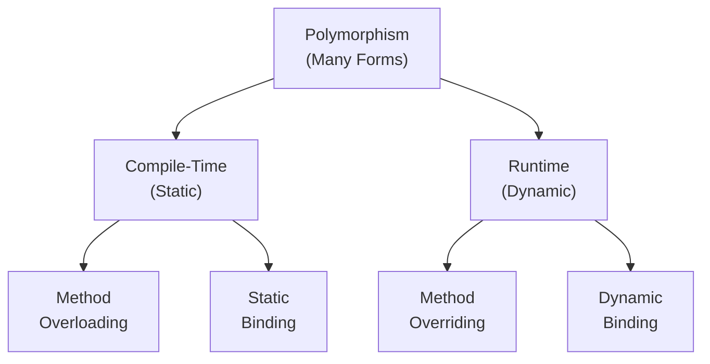
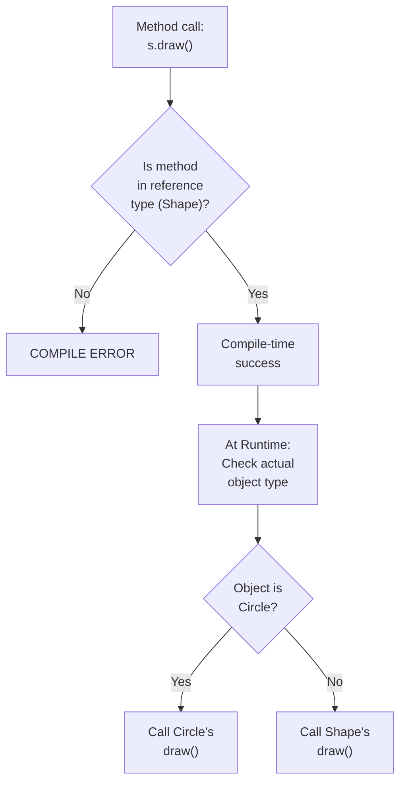

<a id="15-polymorphism"></a>

# 📘 Chapter 15: Polymorphism

> **Part C: Object Oriented Programming (Core Java)**
> `Core` | `OOP Pillar #3` | `Interview Critical`

⭐⭐⭐⭐⭐⭐⭐⭐⭐⭐⭐⭐⭐⭐⭐⭐⭐⭐⭐⭐⭐⭐⭐⭐⭐⭐⭐⭐⭐⭐⭐⭐

Java • Core Java • Interview Preparation

⭐⭐⭐⭐⭐⭐⭐⭐⭐⭐⭐⭐⭐⭐⭐⭐⭐⭐⭐⭐⭐⭐⭐⭐⭐⭐⭐⭐⭐⭐⭐⭐

---

<a id="chapter-index-table-15"></a>

## 📚 Chapter 15 — Index Table

| No. | Topic | Subtopics |
|-----|-------|-----------|
| 15.1 | [What is Polymorphism](#151-what-is-polymorphism) | Definition, "Many Forms", 3rd OOP Pillar |
| 15.2 | [Types of Polymorphism](#152-types-of-polymorphism) | Compile-time vs Runtime |
| 15.3 | [Compile-Time Polymorphism](#153-compile-time-polymorphism) | Static Binding, Method Overloading |
| 15.4 | [Method Overloading (Complete)](#154-method-overloading-complete) | Same Name, Different Parameters |
| 15.5 | [Overloading Rules](#155-overloading-rules) | All Rules Explained |
| 15.6 | [Type Promotion in Overloading](#156-type-promotion-in-overloading) | Automatic Type Promotion |
| 15.7 | [Overloading with Autoboxing & Widening](#157-overloading-autoboxing-widening) | Priority Order |
| 15.8 | [Ambiguity in Overloading](#158-ambiguity-in-overloading) | Compile Errors |
| 15.9 | [Overloading main()](#159-overloading-main) | Yes, You Can! |
| 15.10 | [Runtime Polymorphism](#1510-runtime-polymorphism) | Dynamic Binding, Method Overriding |
| 15.11 | [Method Overriding (Complete)](#1511-method-overriding-complete) | Full Recap with Examples |
| 15.12 | [Dynamic Method Dispatch](#1512-dynamic-method-dispatch) | How JVM Resolves Methods |
| 15.13 | [Virtual Methods](#1513-virtual-methods) | All Java Methods are Virtual |
| 15.14 | [Static vs Dynamic Binding](#1514-static-vs-dynamic-binding) | Complete Comparison |
| 15.15 | [Method Overloading vs Overriding](#1515-overloading-vs-overriding) | Side-by-Side |
| 15.16 | [What is NOT Polymorphic](#1516-what-is-not-polymorphic) | static, private, final |
| 15.17 | [Operator Overloading (+ for String)](#1517-operator-overloading) | Only + in Java! |
| 15.18 | [Polymorphism with Collections](#1518-polymorphism-with-collections) | List of Animals Example |
| 🔥 | [Java vs Other Languages](#15-java-vs-other-languages) | Unique Polymorphism Features |
| 💡 | [Interview Questions](#15-interview-questions) | 20+ Conceptual · Scenario · Output-based |
| 🧪 | [Practice Problems](#15-practice-problems) | 5 Coding + 5 Theory |

---

## 15.1 What is Polymorphism

<a id="151-what-is-polymorphism"></a>

### 📌 Definition

```
POLYMORPHISM = "Many Forms" (Poly = Many, Morph = Forms)

The ability of an object or method to take MANY FORMS.
The same interface can behave DIFFERENTLY based on context.

It is the THIRD PILLAR of Object-Oriented Programming.

In Java:
→ Method Overloading (Compile-time)
→ Method Overriding (Runtime)

CORE IDEA: One name, multiple implementations.
```

### 📌 Simple Example

```java
// ═══ Same method 'add' behaves differently ═══
class Calculator {

    // add for 2 integers
    int add(int a, int b) {
        return a + b;
    }

    // add for 3 integers (SAME name, different params)
    int add(int a, int b, int c) {
        return a + b + c;
    }

    // add for 2 doubles
    double add(double a, double b) {
        return a + b;
    }

    // add for strings (concatenation!)
    String add(String a, String b) {
        return a + " " + b;
    }
}

public class PolymorphismDemo {
    public static void main(String[] args) {
        Calculator c = new Calculator();

        System.out.println(c.add(5, 10));            // 15
        System.out.println(c.add(1, 2, 3));           // 6
        System.out.println(c.add(3.5, 2.5));          // 6.0
        System.out.println(c.add("Hello", "World"));  // Hello World

        // SAME method name 'add' has MANY FORMS!
        // This is POLYMORPHISM!
    }
}
```

### 🌍 Real-World Analogy (Hinglish)

```
POLYMORPHISM = Ek insaan ke MULTIPLE ROLES

👨 EK PERSON multiple roles play karta hai:
   → Office mein: Manager (business decisions)
   → Ghar mein: Father (family care)
   → Cricket mein: Captain (team leader)
   → School mein: Teacher (educator)

Same person (object), DIFFERENT behaviors depending on context!

Real Java Example:
🎨 Shape "draw" karo:
   → Circle draw karo → gol banayega
   → Rectangle draw karo → chorus banayega
   → Triangle draw karo → teen kone banayega

Same method (draw), DIFFERENT implementations based on shape!

Yehi hai Polymorphism!
```

<a href="#chapter-index-table-15">Go to Top 🔝</a>

---

## 15.2 Types of Polymorphism

<a id="152-types-of-polymorphism"></a>

### 📌 Two Types in Java

```
┌──────────────────────────────────────────────────────────────┐
│                    POLYMORPHISM TYPES                        │
├──────────────────────────────────────────────────────────────┤
│                                                              │
│  1. COMPILE-TIME (Static) POLYMORPHISM                       │
│     ↓                                                        │
│     • Method Overloading                                     │
│     • Method resolution at COMPILE time                      │
│     • Also called: Static Binding, Early Binding             │
│                                                              │
│  2. RUNTIME (Dynamic) POLYMORPHISM                           │
│     ↓                                                        │
│     • Method Overriding                                      │
│     • Method resolution at RUNTIME                           │
│     • Also called: Dynamic Binding, Late Binding             │
│                                                              │
└──────────────────────────────────────────────────────────────┘
```

### 📊 Types Diagram



### 📌 Quick Comparison

```
┌───────────────────────┬────────────────────┬────────────────────┐
│  Feature              │  Compile-Time      │  Runtime            │
├───────────────────────┼────────────────────┼────────────────────┤
│  Achieved by          │  Overloading       │  Overriding         │
│  Method resolution    │  At compile time   │  At runtime         │
│  Binding type         │  Static/Early      │  Dynamic/Late       │
│  Performance          │  Faster            │  Slightly slower    │
│  Flexibility          │  Less              │  More               │
│  Inheritance needed?  │  No                │  Yes                │
│  Same name required?  │  Yes               │  Yes                │
│  Different params?    │  Yes               │  No (must be same)  │
└───────────────────────┴────────────────────┴────────────────────┘
```

<a href="#chapter-index-table-15">Go to Top 🔝</a>

---

## 15.3 Compile-Time Polymorphism

<a id="153-compile-time-polymorphism"></a>

### 📌 What is Compile-Time Polymorphism?

```
COMPILE-TIME POLYMORPHISM:
→ Method to be called is DECIDED at COMPILE TIME
→ Also called: STATIC BINDING or EARLY BINDING
→ Achieved through METHOD OVERLOADING

The compiler LOOKS at:
→ Method name
→ Number of arguments
→ Type of arguments
→ Order of arguments

And decides which method to call.
```

### 📌 Example

```java
class Printer {

    // Method 1
    void print(int x) {
        System.out.println("Printing int: " + x);
    }

    // Method 2 - Overloaded
    void print(String s) {
        System.out.println("Printing String: " + s);
    }

    // Method 3 - Overloaded
    void print(double d) {
        System.out.println("Printing double: " + d);
    }
}

public class CompileTimeDemo {
    public static void main(String[] args) {
        Printer p = new Printer();

        // COMPILER decides at compile time which print() to call
        p.print(10);         // Calls print(int)
        p.print("Hello");    // Calls print(String)
        p.print(3.14);       // Calls print(double)

        // Decision made BEFORE program runs!
    }
}
```

<a href="#chapter-index-table-15">Go to Top 🔝</a>

---

## 15.4 Method Overloading (Complete)

<a id="154-method-overloading-complete"></a>

### 📌 What is Method Overloading?

```
METHOD OVERLOADING = Multiple methods in the SAME class
                     with the SAME NAME but DIFFERENT PARAMETERS.

The compiler distinguishes them by:
→ Number of parameters
→ Type of parameters
→ Order of parameters

Return type DOES NOT count for overloading!
```

### 📌 Ways to Overload

```java
public class OverloadingWays {

    // ═══ WAY 1: Different NUMBER of parameters ═══
    int add(int a, int b) {
        return a + b;
    }

    int add(int a, int b, int c) {
        return a + b + c;
    }

    // ═══ WAY 2: Different TYPE of parameters ═══
    int multiply(int a, int b) {
        return a * b;
    }

    double multiply(double a, double b) {
        return a * b;
    }

    // ═══ WAY 3: Different ORDER of parameters ═══
    void display(int num, String name) {
        System.out.println(num + " - " + name);
    }

    void display(String name, int num) {   // Different order!
        System.out.println(name + " - " + num);
    }
}

public class OverloadingTest {
    public static void main(String[] args) {
        OverloadingWays ow = new OverloadingWays();

        System.out.println(ow.add(5, 10));           // 15
        System.out.println(ow.add(1, 2, 3));          // 6
        System.out.println(ow.multiply(2, 3));        // 6
        System.out.println(ow.multiply(2.5, 3.5));    // 8.75
        ow.display(10, "Rahul");                       // 10 - Rahul
        ow.display("Rahul", 10);                       // Rahul - 10
    }
}
```

<a href="#chapter-index-table-15">Go to Top 🔝</a>

---

## 15.5 Overloading Rules

<a id="155-overloading-rules"></a>

### 📌 Complete Rules

```
┌──────────────────────────────────────────────────────────────┐
│  OVERLOADING RULES                                            │
├──────────────────────────────────────────────────────────────┤
│                                                              │
│  ✅ MUST DIFFER IN:                                           │
│     • Number of parameters, OR                               │
│     • Type of parameters, OR                                 │
│     • Order of parameters                                    │
│                                                              │
│  ❌ CANNOT DIFFER ONLY BY:                                    │
│     • Return type (ambiguous)                                │
│     • Parameter names                                        │
│     • Access modifier                                        │
│     • Exception thrown                                       │
│                                                              │
│  ✅ CAN differ in:                                            │
│     • Access modifier (private, public, etc.)                │
│     • Return type (as long as params differ)                 │
│     • Exceptions thrown                                      │
│     • static vs non-static                                   │
│                                                              │
└──────────────────────────────────────────────────────────────┘
```

### 📌 Invalid Overloading Examples

```java
class InvalidOverloading {

    // ❌ INVALID: Only return type differs
    int getData() { return 10; }
    // double getData() { return 20.0; }   // COMPILE ERROR!

    // ❌ INVALID: Only parameter name differs
    void print(int x) { }
    // void print(int y) { }   // COMPILE ERROR!

    // ❌ INVALID: Only access modifier differs
    void method(int x) { }
    // public void method(int x) { }   // COMPILE ERROR!

    // ✅ VALID: Different types
    void print(int x) { }
    void print(String x) { }        // OK - different type

    // ✅ VALID: Different number
    void print(int x, int y) { }    // OK - different count

    // ✅ VALID: Different order
    void log(int x, String y) { }
    void log(String x, int y) { }   // OK - different order
}
```

<a href="#chapter-index-table-15">Go to Top 🔝</a>

---

## 15.6 Type Promotion in Overloading

<a id="156-type-promotion-in-overloading"></a>

### 📌 Automatic Type Promotion

```
When exact match not found, Java PROMOTES the type automatically.

PROMOTION ORDER:
byte → short → int → long → float → double
char → int → long → float → double

Java looks for:
1. EXACT match first
2. If not found, promotes to bigger type
3. If still not found, tries autoboxing
4. Then, tries varargs
```

### 📌 Example

```java
class TypePromotion {

    void show(int x) {
        System.out.println("int: " + x);
    }

    void show(long x) {
        System.out.println("long: " + x);
    }

    void show(double x) {
        System.out.println("double: " + x);
    }
}

public class PromotionDemo {
    public static void main(String[] args) {
        TypePromotion tp = new TypePromotion();

        byte b = 10;
        tp.show(b);          // int (byte promoted to int)
        // Output: int: 10

        char c = 'A';
        tp.show(c);          // int (char promoted to int)
        // Output: int: 65

        float f = 3.14f;
        tp.show(f);          // double (float promoted to double)
        // Output: double: 3.14

        int i = 100;
        tp.show(i);          // Exact int match
        // Output: int: 100

        long l = 1000L;
        tp.show(l);          // Exact long match
        // Output: long: 1000
    }
}
```

### 📌 Type Promotion Table

```
IF NO EXACT MATCH, promotion happens in this order:

byte → short → int → long → float → double
char  → int  → long → float → double

Example:
void method(int x)      { }
void method(long x)     { }
void method(double x)   { }

Passing byte:   → Promoted to int (found match)
Passing char:   → Promoted to int (found match)
Passing float:  → Promoted to double (no float method)
```

<a href="#chapter-index-table-15">Go to Top 🔝</a>

---

## 15.7 Overloading with Autoboxing & Widening

<a id="157-overloading-autoboxing-widening"></a>

### 📌 Priority Order

```
When multiple overloaded methods could match, Java follows:

PRIORITY (Highest to Lowest):
1. EXACT MATCH
2. WIDENING (Type Promotion)
3. AUTOBOXING (Primitive → Wrapper)
4. VARARGS (Variable arguments)
```

### 📌 Priority Example

```java
class PriorityDemo {

    void show(int x) {
        System.out.println("int (exact match)");
    }

    void show(long x) {
        System.out.println("long (widening)");
    }

    void show(Integer x) {
        System.out.println("Integer (autoboxing)");
    }

    void show(int... x) {
        System.out.println("varargs");
    }
}

public class Test {
    public static void main(String[] args) {
        PriorityDemo pd = new PriorityDemo();

        int i = 5;
        pd.show(i);   // "int (exact match)" — Priority 1

        // If show(int) is removed:
        // pd.show(i) → "long (widening)"

        // If both show(int) and show(long) removed:
        // pd.show(i) → "Integer (autoboxing)"

        // If all three removed:
        // pd.show(i) → "varargs"
    }
}
```

### 📌 Widening vs Autoboxing Example

```java
class WideningVsAutoboxing {

    void method(long x) {
        System.out.println("long (widening)");
    }

    void method(Integer x) {
        System.out.println("Integer (autoboxing)");
    }
}

public class Test {
    public static void main(String[] args) {
        int i = 5;
        new WideningVsAutoboxing().method(i);

        // OUTPUT: long (widening)
        // WIDENING has higher priority than AUTOBOXING!
    }
}
```

<a href="#chapter-index-table-15">Go to Top 🔝</a>

---

## 15.8 Ambiguity in Overloading

<a id="158-ambiguity-in-overloading"></a>

### 📌 When Compiler Cannot Decide

```java
class AmbiguityDemo {

    // ═══ Case 1: Ambiguous overloading ═══
    void show(int x, double y) {
        System.out.println("int, double");
    }

    void show(double x, int y) {
        System.out.println("double, int");
    }
}

public class Test {
    public static void main(String[] args) {
        AmbiguityDemo ad = new AmbiguityDemo();

        // ambiguity → BOTH methods match equally!
        // ad.show(10, 20);   // ❌ COMPILE ERROR!
        // Could be:
        // → show(int→10, double→20.0) — need widening on 2nd
        // → show(double→10.0, int→20) — need widening on 1st

        // ✅ FIX: Be explicit
        ad.show(10, 20.0);          // Clearly int, double
        ad.show(10.0, 20);          // Clearly double, int
        ad.show((double)10, 20);    // Explicit cast
    }
}
```

### 📌 Ambiguity with Autoboxing

```java
class AmbiguityWithAutoboxing {

    void show(Integer x) {
        System.out.println("Integer");
    }

    void show(Long x) {
        System.out.println("Long");
    }
}

public class Test {
    public static void main(String[] args) {
        int i = 10;

        // ❌ AMBIGUOUS!
        // Could autobox to Integer OR widen to long then autobox to Long
        // new AmbiguityWithAutoboxing().show(i);   // COMPILE ERROR

        // Actually: Widening happens FIRST, but no long parameter
        // Then autoboxing to Integer → chooses Integer
        // Actually works: "Integer"

        // To force Long:
        Long l = 10L;
        new AmbiguityWithAutoboxing().show(l);   // Long
    }
}
```

<a href="#chapter-index-table-15">Go to Top 🔝</a>

---

## 15.9 Overloading main() ⭐

<a id="159-overloading-main"></a>

### 📌 Yes, You Can Overload main()!

```java
public class MainOverloading {

    // Standard main() — JVM calls this one
    public static void main(String[] args) {
        System.out.println("Original main - called by JVM");

        // Manually call overloaded versions
        main(10);
        main("Hello");
        main(3.14);
    }

    // Overloaded main methods
    public static void main(int x) {
        System.out.println("main with int: " + x);
    }

    public static void main(String s) {
        System.out.println("main with String: " + s);
    }

    public static void main(double d) {
        System.out.println("main with double: " + d);
    }
}

/*
OUTPUT:
Original main - called by JVM
main with int: 10
main with String: Hello
main with double: 3.14

IMPORTANT:
✅ JVM ONLY calls: public static void main(String[] args)
✅ You can create overloaded versions
✅ Other main methods must be called manually
❌ JVM won't automatically call overloaded main methods
*/
```

<a href="#chapter-index-table-15">Go to Top 🔝</a>

---

## 15.10 Runtime Polymorphism

<a id="1510-runtime-polymorphism"></a>

### 📌 What is Runtime Polymorphism?

```
RUNTIME POLYMORPHISM:
→ Method to be called is DECIDED at RUNTIME
→ Also called: DYNAMIC BINDING or LATE BINDING
→ Achieved through METHOD OVERRIDING
→ Requires INHERITANCE

The JVM looks at:
→ ACTUAL OBJECT type (not reference type!)

And decides which method to call at runtime.
```

### 📌 Example

```java
class Animal {
    void sound() {
        System.out.println("Animal makes sound");
    }
}

class Dog extends Animal {
    @Override
    void sound() {
        System.out.println("Dog barks: Woof!");
    }
}

class Cat extends Animal {
    @Override
    void sound() {
        System.out.println("Cat meows: Meow!");
    }
}

class Cow extends Animal {
    @Override
    void sound() {
        System.out.println("Cow moos: Moo!");
    }
}

public class RuntimeDemo {
    public static void main(String[] args) {
        // Reference type: Animal (compile-time)
        // Object type: Dog/Cat/Cow (runtime)

        Animal a1 = new Dog();   // Upcasting
        Animal a2 = new Cat();
        Animal a3 = new Cow();

        // JVM decides at RUNTIME which sound() to call
        a1.sound();  // Dog barks: Woof!
        a2.sound();  // Cat meows: Meow!
        a3.sound();  // Cow moos: Moo!

        // Same reference type (Animal), different behaviors!
        // This is RUNTIME POLYMORPHISM!
    }
}
```

<a href="#chapter-index-table-15">Go to Top 🔝</a>

---

## 15.11 Method Overriding (Complete)

<a id="1511-method-overriding-complete"></a>

### 📌 Complete Recap

```
METHOD OVERRIDING = Child class provides NEW IMPLEMENTATION
                    of a method already in parent class.

RULES:
✅ Same method name
✅ Same parameters
✅ Same or covariant return type
✅ Access modifier: same or MORE visible
✅ Throws: same or fewer checked exceptions
❌ Cannot override: static, final, private
❌ Cannot override: constructors

Uses @Override annotation (recommended).
```

### 📌 Complete Example

```java
class Employee {
    protected String name;
    protected double baseSalary;

    public Employee(String name, double baseSalary) {
        this.name = name;
        this.baseSalary = baseSalary;
    }

    // Parent method to be overridden
    public double calculateSalary() {
        return baseSalary;
    }

    public void display() {
        System.out.println(name + " - Salary: " + calculateSalary());
    }
}

class Manager extends Employee {

    private double bonus;

    public Manager(String name, double baseSalary, double bonus) {
        super(name, baseSalary);
        this.bonus = bonus;
    }

    // ✅ OVERRIDING calculateSalary()
    @Override
    public double calculateSalary() {
        return baseSalary + bonus;  // Different calculation!
    }
}

class Developer extends Employee {

    private double allowance;

    public Developer(String name, double baseSalary, double allowance) {
        super(name, baseSalary);
        this.allowance = allowance;
    }

    // ✅ OVERRIDING calculateSalary()
    @Override
    public double calculateSalary() {
        return baseSalary + allowance + 5000;   // Different calculation
    }
}

public class OverridingDemo {
    public static void main(String[] args) {
        Employee[] employees = {
            new Manager("Rahul", 50000, 20000),
            new Developer("Priya", 40000, 10000),
            new Employee("Amit", 30000)
        };

        // Same display() method, different calculateSalary()!
        for (Employee e : employees) {
            e.display();
        }

        /*
        OUTPUT:
        Rahul - Salary: 70000.0        ← Manager's calculation
        Priya - Salary: 55000.0        ← Developer's calculation
        Amit - Salary: 30000.0         ← Employee's base
        */
    }
}
```

<a href="#chapter-index-table-15">Go to Top 🔝</a>

---

## 15.12 Dynamic Method Dispatch ⭐

<a id="1512-dynamic-method-dispatch"></a>

### 📌 How JVM Resolves Methods at Runtime

```
DYNAMIC METHOD DISPATCH:
The mechanism by which JVM resolves the CORRECT method
to call at RUNTIME.

Process:
1. Java looks at REFERENCE TYPE to check if method exists
2. Java looks at ACTUAL OBJECT TYPE at runtime
3. Executes the method of the ACTUAL object

The COMPILER doesn't know which specific method will be called.
JVM decides at RUNTIME based on the actual object!
```

### 📌 Example with Detailed Explanation

```java
class Shape {
    void draw() {
        System.out.println("Drawing Shape");
    }

    void area() {
        System.out.println("Calculating Shape area");
    }
}

class Circle extends Shape {
    @Override
    void draw() {
        System.out.println("Drawing Circle");
    }

    // Circle-specific method
    void radius() {
        System.out.println("Circle radius");
    }
}

class Square extends Shape {
    @Override
    void draw() {
        System.out.println("Drawing Square");
    }
}

public class DispatchDemo {
    public static void main(String[] args) {

        Shape s;   // Reference type: Shape

        s = new Circle();     // Actual object: Circle
        s.draw();             // OUTPUT: "Drawing Circle"
        // ↑ JVM found actual object is Circle → calls Circle's draw()

        s = new Square();     // Actual object: Square
        s.draw();             // OUTPUT: "Drawing Square"
        // ↑ JVM found actual object is Square → calls Square's draw()

        // ⚠️ IMPORTANT:
        // s.radius();  // ❌ COMPILE ERROR!
        // Reference type is Shape → compiler doesn't know about radius()
        // Even though ACTUAL object is Circle!

        // ✅ To access Circle-specific methods:
        if (s instanceof Circle) {
            ((Circle) s).radius();  // Downcasting
        }
    }
}
```

### 📊 Method Resolution Flow



<a href="#chapter-index-table-15">Go to Top 🔝</a>

---

## 15.13 Virtual Methods

<a id="1513-virtual-methods"></a>

### 📌 All Java Methods are Virtual by Default

```
VIRTUAL METHOD = A method that can be OVERRIDDEN by subclasses
                 and dispatched at RUNTIME.

IN JAVA:
✅ ALL non-static, non-private, non-final methods are VIRTUAL by default
✅ No need for 'virtual' keyword (unlike C++)

VIRTUAL METHODS:
→ Support dynamic method dispatch
→ Can be overridden
→ Runtime polymorphism works

NON-VIRTUAL METHODS:
→ private methods
→ static methods
→ final methods
→ Constructors (never virtual)

These use STATIC BINDING.
```

### 📌 Java vs C++

```java
// ═══ JAVA (all methods virtual by default) ═══
class Parent {
    void show() {   // Virtual (implicit)
        System.out.println("Parent");
    }
}

class Child extends Parent {
    @Override
    void show() {
        System.out.println("Child");
    }
}

// ═══ C++ (must use virtual keyword) ═══
// class Parent {
//     public:
//     virtual void show() {  // Must add 'virtual'!
//         cout << "Parent";
//     }
// };
```

### 📌 Non-Virtual Methods in Java

```java
class Parent {
    // ═══ These are NOT virtual (cannot be overridden) ═══
    static void staticMethod() { System.out.println("Parent static"); }
    final void finalMethod() { System.out.println("Parent final"); }
    private void privateMethod() { System.out.println("Parent private"); }

    // ═══ This IS virtual ═══
    void normalMethod() { System.out.println("Parent normal"); }
}

class Child extends Parent {
    static void staticMethod() { System.out.println("Child static"); }  // HIDING, not overriding
    // final void finalMethod() { }  // ❌ ERROR - can't override final
    private void privateMethod() { System.out.println("Child private"); }  // Different method
    void normalMethod() { System.out.println("Child normal"); }  // OVERRIDING
}

public class VirtualDemo {
    public static void main(String[] args) {
        Parent p = new Child();

        p.normalMethod();     // "Child normal" (VIRTUAL - dynamic dispatch)
        p.staticMethod();     // "Parent static" (NOT virtual - static binding)
        p.finalMethod();      // "Parent final" (NOT virtual - can't override)
    }
}
```

<a href="#chapter-index-table-15">Go to Top 🔝</a>

---

## 15.14 Static vs Dynamic Binding

<a id="1514-static-vs-dynamic-binding"></a>

### 📌 Complete Comparison

```
┌───────────────────────┬────────────────────┬────────────────────┐
│  Feature              │  Static Binding    │  Dynamic Binding    │
├───────────────────────┼────────────────────┼────────────────────┤
│  Also called          │  Early Binding     │  Late Binding       │
│  When resolved        │  Compile time      │  Runtime            │
│  Based on             │  Reference type    │  Actual object      │
│  Used for             │  Overloading       │  Overriding         │
│  Method types         │  static, final,    │  Non-static,        │
│                       │  private           │  non-final,         │
│                       │                    │  non-private        │
│  Performance          │  Faster            │  Slightly slower    │
│  Polymorphism         │  Compile-time      │  Runtime            │
│  Flexibility          │  Less              │  More               │
└───────────────────────┴────────────────────┴────────────────────┘
```

### 📌 Both in Action

```java
class Parent {

    static void staticMethod() {        // STATIC BINDING
        System.out.println("Parent static");
    }

    void instanceMethod() {              // DYNAMIC BINDING
        System.out.println("Parent instance");
    }
}

class Child extends Parent {

    static void staticMethod() {        // Hides parent (STATIC BINDING)
        System.out.println("Child static");
    }

    @Override
    void instanceMethod() {              // Overrides parent (DYNAMIC BINDING)
        System.out.println("Child instance");
    }
}

public class BindingDemo {
    public static void main(String[] args) {

        Parent p = new Child();

        // STATIC BINDING (based on reference type = Parent)
        p.staticMethod();      // "Parent static"
        // Compiler decides at compile time based on reference type

        // DYNAMIC BINDING (based on actual object = Child)
        p.instanceMethod();    // "Child instance"
        // JVM decides at runtime based on actual object type

        System.out.println("---");

        Child c = new Child();
        c.staticMethod();      // "Child static"
        c.instanceMethod();    // "Child instance"
    }
}

/*
OUTPUT:
Parent static      ← STATIC BINDING (reference type used)
Child instance     ← DYNAMIC BINDING (actual object used)
---
Child static
Child instance
*/
```

<a href="#chapter-index-table-15">Go to Top 🔝</a>

---

## 15.15 Method Overloading vs Overriding ⭐⭐

<a id="1515-overloading-vs-overriding"></a>

### 📌 Side-by-Side Comparison

```
┌────────────────────────┬────────────────────┬──────────────────────┐
│  Feature               │  Overloading       │  Overriding          │
├────────────────────────┼────────────────────┼──────────────────────┤
│  Definition            │  Same name,        │  Same name AND      │
│                        │  different params  │  same params        │
├────────────────────────┼────────────────────┼──────────────────────┤
│  Scope                 │  Same class        │  Parent & Child     │
├────────────────────────┼────────────────────┼──────────────────────┤
│  Return type           │  Can be different  │  Same or covariant  │
├────────────────────────┼────────────────────┼──────────────────────┤
│  Parameters            │  Different (must)  │  Same (must)        │
├────────────────────────┼────────────────────┼──────────────────────┤
│  Access modifier       │  Any               │  Same or more open  │
├────────────────────────┼────────────────────┼──────────────────────┤
│  Inheritance           │  Not required      │  Required           │
├────────────────────────┼────────────────────┼──────────────────────┤
│  Binding               │  Static (compile)  │  Dynamic (runtime)  │
├────────────────────────┼────────────────────┼──────────────────────┤
│  Polymorphism type     │  Compile-time      │  Runtime            │
├────────────────────────┼────────────────────┼──────────────────────┤
│  Static methods        │  Can be overloaded │  Cannot be overridden│
├────────────────────────┼────────────────────┼──────────────────────┤
│  private methods       │  Can be overloaded │  Cannot be overridden│
├────────────────────────┼────────────────────┼──────────────────────┤
│  final methods         │  Can be overloaded │  Cannot be overridden│
├────────────────────────┼────────────────────┼──────────────────────┤
│  Exception in throws   │  Can throw ANY     │  Same or fewer      │
│                        │  exceptions        │  checked exceptions │
├────────────────────────┼────────────────────┼──────────────────────┤
│  Purpose               │  Multiple ways to  │  Change parent's    │
│                        │  do same thing     │  behavior           │
└────────────────────────┴────────────────────┴──────────────────────┘
```

### 📌 Combined Example

```java
class Calculator {
    // OVERLOADING (same class, different params)
    int calculate(int a, int b) { return a + b; }
    double calculate(double a, double b) { return a + b; }
    int calculate(int a, int b, int c) { return a + b + c; }
}

class ScientificCalculator extends Calculator {
    // OVERRIDING (parent to child, same params)
    @Override
    int calculate(int a, int b) {
        return a * b;   // Multiplication instead of addition!
    }
}

public class Test {
    public static void main(String[] args) {
        // OVERLOADING (compile-time)
        Calculator c = new Calculator();
        System.out.println(c.calculate(2, 3));       // 5 (int + int)
        System.out.println(c.calculate(2.5, 3.5));   // 6.0 (double + double)

        // OVERRIDING (runtime)
        Calculator sc = new ScientificCalculator();
        System.out.println(sc.calculate(2, 3));      // 6 (Scientific's version!)
    }
}
```

<a href="#chapter-index-table-15">Go to Top 🔝</a>

---

## 15.16 What is NOT Polymorphic

<a id="1516-what-is-not-polymorphic"></a>

### 📌 These Do NOT Support Polymorphism

```
❌ NOT POLYMORPHIC in Java:

1. STATIC METHODS
   → Bound at compile time (static binding)
   → Cannot be overridden — only HIDDEN
   → Called based on reference type

2. PRIVATE METHODS
   → Not visible to subclasses
   → Cannot be inherited or overridden
   → Bound at compile time

3. FINAL METHODS
   → Cannot be overridden
   → Bound at compile time

4. CONSTRUCTORS
   → Not inherited
   → Cannot be polymorphic

5. INSTANCE VARIABLES (Fields)
   → Not polymorphic!
   → Accessed based on reference type

6. Data members
   → Static, private, final data
```

### 📌 Detailed Examples

```java
class Parent {
    // Instance variable (NOT polymorphic!)
    int x = 10;

    // Static (NOT polymorphic - hiding)
    static void staticMethod() {
        System.out.println("Parent static");
    }

    // Private (NOT polymorphic - not inherited)
    private void privateMethod() {
        System.out.println("Parent private");
    }

    // Final (NOT polymorphic - cannot override)
    final void finalMethod() {
        System.out.println("Parent final");
    }

    // Normal method (POLYMORPHIC!)
    void normalMethod() {
        System.out.println("Parent normal");
    }
}

class Child extends Parent {
    int x = 20;                          // Hides parent's x

    static void staticMethod() {         // Hides parent's static
        System.out.println("Child static");
    }

    private void privateMethod() {       // Different method (not overriding!)
        System.out.println("Child private");
    }

    // Cannot override finalMethod - COMPILE ERROR!

    @Override
    void normalMethod() {                // OVERRIDING (polymorphic)
        System.out.println("Child normal");
    }
}

public class NotPolymorphicDemo {
    public static void main(String[] args) {
        Parent p = new Child();

        // ⚠️ NOT POLYMORPHIC (based on reference type = Parent)
        System.out.println(p.x);         // 10 (Parent's x!)
        p.staticMethod();                // "Parent static"
        p.finalMethod();                 // "Parent final"

        // ✅ POLYMORPHIC (based on actual object = Child)
        p.normalMethod();                // "Child normal"
    }
}

/*
OUTPUT:
10
Parent static
Parent final
Child normal
*/
```

### 📌 Static Methods — Method HIDING (not Overriding!)

```java
class Parent {
    static void greet() {
        System.out.println("Hello from Parent");
    }
}

class Child extends Parent {
    // This is METHOD HIDING, not overriding!
    static void greet() {
        System.out.println("Hello from Child");
    }
}

public class HidingDemo {
    public static void main(String[] args) {
        Parent p = new Child();
        p.greet();  // "Hello from Parent" ← Based on reference type!

        // If it were TRUE polymorphism, it would print "Hello from Child"
        // But static methods use STATIC BINDING (compile time)

        Child c = new Child();
        c.greet();  // "Hello from Child"
    }
}
```

<a href="#chapter-index-table-15">Go to Top 🔝</a>

---

## 15.17 Operator Overloading (+ for String)

<a id="1517-operator-overloading"></a>

### 📌 Java Does NOT Support Operator Overloading!

```
Java REMOVED operator overloading feature that C++ has.

REASONS:
→ Keeps language simpler
→ Prevents confusing code
→ Avoids ambiguity

EXCEPTION: The + operator IS overloaded (special case!)
→ For numeric addition: 5 + 3 = 8
→ For String concatenation: "Hello" + " " + "World" = "Hello World"

This is the ONLY built-in operator overloading in Java.
You CANNOT create custom operator overloading.
```

### 📌 The + Operator Overloading

```java
public class OperatorOverloading {
    public static void main(String[] args) {

        // ═══ + for NUMERIC ADDITION ═══
        int sum1 = 5 + 3;
        System.out.println(sum1);        // 8

        double sum2 = 3.5 + 2.5;
        System.out.println(sum2);        // 6.0

        // ═══ + for STRING CONCATENATION ═══
        String s = "Hello" + " " + "World";
        System.out.println(s);           // "Hello World"

        // ═══ Mixed usage ═══
        String result = "Age: " + 25;    // int converts to String
        System.out.println(result);      // "Age: 25"

        // ═══ Left-to-right evaluation ═══
        System.out.println(1 + 2 + "3");   // "33" (1+2=3, then "3"+"3")
        System.out.println("1" + 2 + 3);   // "123" (all Strings)

        // ═══ CANNOT overload for custom types ═══
        // In C++, you can define: Vector + Vector
        // In Java, you CANNOT!
    }
}
```

### 📌 C++ vs Java

```
C++ (allows custom operator overloading):
class Vector {
    public:
    Vector operator+(const Vector& other) { ... }
};
Vector v1, v2;
Vector v3 = v1 + v2;  // Uses overloaded +

Java (no custom operator overloading):
class Vector {
    // Cannot define + operator!
    Vector add(Vector other) { ... }  // Must use methods
}
Vector v1 = new Vector();
Vector v2 = new Vector();
Vector v3 = v1.add(v2);   // Method call instead
```

<a href="#chapter-index-table-15">Go to Top 🔝</a>

---

## 15.18 Polymorphism with Collections

<a id="1518-polymorphism-with-collections"></a>

### 📌 Real-World Power of Polymorphism

```java
import java.util.*;

// ═══ Parent class ═══
abstract class Animal {
    protected String name;

    public Animal(String name) {
        this.name = name;
    }

    // Abstract method (subclasses MUST override)
    abstract void sound();

    public String getName() { return name; }
}

// ═══ Child classes ═══
class Dog extends Animal {
    public Dog(String name) { super(name); }

    @Override
    void sound() {
        System.out.println(name + " says: Woof!");
    }
}

class Cat extends Animal {
    public Cat(String name) { super(name); }

    @Override
    void sound() {
        System.out.println(name + " says: Meow!");
    }
}

class Cow extends Animal {
    public Cow(String name) { super(name); }

    @Override
    void sound() {
        System.out.println(name + " says: Moo!");
    }
}

class Duck extends Animal {
    public Duck(String name) { super(name); }

    @Override
    void sound() {
        System.out.println(name + " says: Quack!");
    }
}

// ═══ Using Polymorphism with Collections ═══
public class Zoo {
    public static void main(String[] args) {

        // List of Animals — but contains different types!
        List<Animal> zoo = new ArrayList<>();
        zoo.add(new Dog("Buddy"));
        zoo.add(new Cat("Whiskers"));
        zoo.add(new Cow("Bessie"));
        zoo.add(new Duck("Donald"));

        // Polymorphism in action!
        // Same method call, different behaviors!
        System.out.println("=== Zoo Sounds ===");
        for (Animal a : zoo) {
            a.sound();  // Each Animal makes its OWN sound
        }

        /*
        OUTPUT:
        Buddy says: Woof!
        Whiskers says: Meow!
        Bessie says: Moo!
        Donald says: Quack!
        */

        // Adding new animal type doesn't require changing loop!
        // Just create new class and add to list — polymorphism handles it
    }
}
```

### 📌 Benefits of Polymorphism with Collections

```
✅ EXTENSIBILITY:
   Add new subclasses without changing existing code
   New Animal type → just create class, no loop changes

✅ CODE REUSABILITY:
   Same loop works for all Animal types

✅ FLEXIBILITY:
   Change behavior by adding new subclasses

✅ MAINTAINABILITY:
   Cleaner, easier to understand code

✅ ABSTRACTION:
   Client code works with abstract types, not specifics

REAL-WORLD USE:
→ Payment processing (CreditCard, DebitCard, UPI, PayPal)
→ Shape drawing (Circle, Square, Triangle)
→ Employee management (Manager, Developer, Designer)
→ Vehicle types (Car, Bike, Truck)
```

<a href="#chapter-index-table-15">Go to Top 🔝</a>

---

<a id="15-java-vs-other-languages"></a>

## 🔥 What Makes Java DIFFERENT — Polymorphism

```
┌──────────────────────┬────────────┬────────────┬────────────┬────────────┐
│  Feature             │  Java      │  C++       │  Python    │  JavaScript│
├──────────────────────┼────────────┼────────────┼────────────┼────────────┤
│  Method Overloading  │ ✅ YES     │ ✅ YES     │ ❌ NO      │ ❌ NO     │
│                      │            │            │ (last wins)│ (last wins)│
├──────────────────────┼────────────┼────────────┼────────────┼────────────┤
│  Method Overriding   │ ✅ YES     │ ✅ YES     │ ✅ YES     │ ✅ YES    │
├──────────────────────┼────────────┼────────────┼────────────┼────────────┤
│  All methods virtual │ ✅ YES     │ ❌ NO      │ ✅ YES     │ ✅ YES    │
│  by default          │            │ (need      │            │            │
│                      │            │ virtual    │            │            │
│                      │            │ keyword)   │            │            │
├──────────────────────┼────────────┼────────────┼────────────┼────────────┤
│  Operator overloading│ ❌ NO      │ ✅ YES     │ ✅ YES     │ ❌ NO     │
│  (custom)            │ (only +   │            │            │            │
│                      │ for String)│            │            │            │
├──────────────────────┼────────────┼────────────┼────────────┼────────────┤
│  Covariant returns   │ ✅ YES     │ ✅ YES     │ N/A        │ N/A       │
├──────────────────────┼────────────┼────────────┼────────────┼────────────┤
│  Static polymorphism │ Overloading │ Overloading│ N/A       │ N/A       │
│                      │ + Templates │ + Templates│            │            │
├──────────────────────┼────────────┼────────────┼────────────┼────────────┤
│  Method resolution   │ Signature- │ Signature- │ Duck typing│ Duck typing│
│                      │ based       │ based      │            │            │
├──────────────────────┼────────────┼────────────┼────────────┼────────────┤
│  Runtime dispatch    │ Yes (VMT) │ Yes (VMT) │ Yes (MRO) │ Yes       │
└──────────────────────┴────────────┴────────────┴────────────┴────────────┘
```

### 🎯 Key UNIQUE Points

```
1. NO CUSTOM OPERATOR OVERLOADING:
   → Java REMOVED this feature from C++
   → Only + is overloaded for String
   → Keeps code readable and predictable

2. ALL METHODS VIRTUAL BY DEFAULT:
   → Java: All non-static, non-final, non-private methods are virtual
   → C++: Must use 'virtual' keyword
   → Python/JS: All methods dynamic by default

3. NO METHOD OVERLOADING IN PYTHON/JS:
   → Java supports overloading based on parameters
   → Python/JS: Only last method definition wins

4. COMPILE-TIME + RUNTIME:
   → Both types of polymorphism supported
   → Method resolution is precise

5. NO CONSTRUCTOR OVERRIDING:
   → Constructors are NOT inherited
   → Cannot be polymorphic
```

<a href="#chapter-index-table-15">Go to Top 🔝</a>

---

<a id="15-interview-questions"></a>

## 💡 Chapter 15 — Interview Questions (20+)

---

### 🔵 Conceptual Questions

**Q1. What is Polymorphism? What are its types?**

```
POLYMORPHISM = "Many Forms"
              = Ability of objects/methods to take MANY FORMS

Same interface can behave DIFFERENTLY based on context.

TYPES IN JAVA:
1. COMPILE-TIME (Static) Polymorphism
   → Achieved by: Method Overloading
   → Resolved at COMPILE time
   → Also called: Static Binding, Early Binding

2. RUNTIME (Dynamic) Polymorphism
   → Achieved by: Method Overriding
   → Resolved at RUNTIME
   → Also called: Dynamic Binding, Late Binding
   → Requires INHERITANCE

Example:
Overloading (compile-time):
int add(int a, int b) { return a + b; }
double add(double a, double b) { return a + b; }

Overriding (runtime):
class Animal { void sound() { } }
class Dog extends Animal {
    @Override
    void sound() { System.out.println("Bark"); }
}
```

---

**Q2. Difference between Method Overloading and Overriding?**

```
OVERLOADING:
→ Same class, same name, DIFFERENT params
→ Compile-time
→ No inheritance needed
→ Static binding

OVERRIDING:
→ Parent-Child classes, same name, SAME params
→ Runtime
→ Requires inheritance
→ Dynamic binding

┌─────────────────────┬──────────────┬──────────────┐
│  Feature            │  Overloading │  Overriding  │
├─────────────────────┼──────────────┼──────────────┤
│  Location           │  Same class  │  Parent/Child│
│  Parameters         │  Different   │  Same        │
│  Return type        │  Any         │  Same/covariant│
│  Binding            │  Static      │  Dynamic     │
│  Time               │  Compile     │  Runtime     │
└─────────────────────┴──────────────┴──────────────┘
```

---

**Q3. What is Dynamic Method Dispatch?**

```
DYNAMIC METHOD DISPATCH:
The mechanism by which JVM resolves the correct method
to call at RUNTIME.

Process:
1. Compiler checks if method exists in REFERENCE type
2. At runtime, JVM finds ACTUAL object type
3. JVM calls the method of the ACTUAL object

Example:
Animal a = new Dog();  // Reference: Animal, Object: Dog
a.sound();             // JVM calls Dog's sound() at runtime

Even though reference is Animal, JVM dispatches to Dog's method.
This is the essence of runtime polymorphism!
```

---

**Q4. What are Virtual Methods in Java?**

```
VIRTUAL METHOD = Method that can be OVERRIDDEN by subclasses
                 and dispatched at RUNTIME.

IN JAVA:
✅ ALL non-static, non-private, non-final methods are VIRTUAL by default
✅ No 'virtual' keyword needed (unlike C++)

NON-VIRTUAL in Java:
❌ static methods
❌ private methods
❌ final methods
❌ Constructors

Virtual methods:
→ Support dynamic method dispatch
→ Enable runtime polymorphism
→ Can be overridden in subclasses

Example:
class Parent {
    void show() { }        // Virtual (implicit)
    static void s() { }    // NOT virtual (static)
    private void p() { }   // NOT virtual (private)
    final void f() { }     // NOT virtual (final)
}
```

---

**Q5. Can you override static methods in Java?**

```
NO! Static methods CANNOT be overridden.

If a child class has a static method with same signature,
it is called METHOD HIDING (not overriding).

Static methods use STATIC BINDING (compile-time).
Actual object type doesn't matter.

Example:
class Parent {
    static void greet() {
        System.out.println("Parent");
    }
}

class Child extends Parent {
    static void greet() {   // HIDING, not overriding!
        System.out.println("Child");
    }
}

Parent p = new Child();
p.greet();   // "Parent" (based on reference type)
// NOT "Child" (like it would for real overriding)

Static methods are resolved AT COMPILE TIME based on reference type.
```

---

**Q6. Can you override private methods?**

```
NO! Private methods cannot be overridden.

Private methods are NOT inherited by child class.
Child cannot even SEE parent's private methods.

class Parent {
    private void show() { }
}

class Child extends Parent {
    private void show() { }   // NEW method, NOT overriding!
    // This is a completely independent method
    // Just happens to have same name
}

Only public, protected, and default methods can be overridden.
```

---

**Q7. What is the difference between static and dynamic binding?**

```
STATIC BINDING (Early Binding):
→ Method resolved at COMPILE TIME
→ Based on REFERENCE TYPE
→ Used for: static, private, final methods, overloading
→ Faster (no runtime lookup)

DYNAMIC BINDING (Late Binding):
→ Method resolved at RUNTIME
→ Based on ACTUAL OBJECT TYPE
→ Used for: overriding, virtual methods
→ Slightly slower (runtime lookup)

Example:
class A {
    static void staticM() { System.out.println("A static"); }
    void normalM() { System.out.println("A normal"); }
}

class B extends A {
    static void staticM() { System.out.println("B static"); }
    void normalM() { System.out.println("B normal"); }
}

A a = new B();
a.staticM();    // "A static" — STATIC binding (uses reference)
a.normalM();    // "B normal" — DYNAMIC binding (uses object)
```

---

**Q8. Why doesn't Java support Operator Overloading?**

```
Java DELIBERATELY DID NOT include operator overloading (except +).

REASONS:
1. SIMPLICITY:
   → Keeps language simpler
   → Easier to learn and read

2. CLARITY:
   → Prevents confusing code
   → What does `matrix1 * matrix2` mean? Element-wise? Cross product?

3. AMBIGUITY AVOIDANCE:
   → C++ has confusing operator overloading
   → Java aims for clear, unambiguous code

4. USE METHODS INSTEAD:
   → Methods are clearer: matrix1.multiply(matrix2)
   → Self-documenting

EXCEPTION: + operator is overloaded for String concatenation
This is BUILT-IN, cannot be extended.

// Java: methods are used
BigInteger a = new BigInteger("100");
BigInteger b = new BigInteger("200");
BigInteger c = a.add(b);  // Method, not operator

// C++: operator overloading
BigInteger a = 100, b = 200;
BigInteger c = a + b;  // Overloaded +
```

---

### 🟡 Scenario-Based Questions

**Q9. What is Method Hiding vs Method Overriding?**

```
METHOD HIDING:
→ Applies to STATIC methods
→ Child class has static method with same signature as parent
→ Uses STATIC BINDING (compile-time)
→ Based on REFERENCE TYPE

METHOD OVERRIDING:
→ Applies to INSTANCE methods
→ Child class has method with same signature
→ Uses DYNAMIC BINDING (runtime)
→ Based on ACTUAL OBJECT TYPE

class Parent {
    static void staticMethod() { System.out.println("Parent static"); }
    void instanceMethod() { System.out.println("Parent instance"); }
}

class Child extends Parent {
    static void staticMethod() { System.out.println("Child static"); }    // HIDING
    void instanceMethod() { System.out.println("Child instance"); }        // OVERRIDING
}

Parent p = new Child();
p.staticMethod();    // "Parent static" (HIDING - based on reference)
p.instanceMethod();  // "Child instance" (OVERRIDING - based on object)
```

---

**Q10. Can main() be overloaded?**

```
YES! main() can be overloaded.

BUT:
✅ JVM ONLY calls: public static void main(String[] args)
✅ Overloaded versions must be called MANUALLY

public class Test {
    public static void main(String[] args) {
        System.out.println("JVM calls this");
        main(10);          // Call overloaded version
        main("Hello");
    }

    public static void main(int x) {
        System.out.println("int: " + x);
    }

    public static void main(String s) {
        System.out.println("String: " + s);
    }
}

Output:
JVM calls this
int: 10
String: Hello
```

---

### 🔴 Output-Based Questions

**Q11. What is the output?**

```java
class Animal {
    void sound() { System.out.println("Animal sound"); }
}

class Dog extends Animal {
    @Override
    void sound() { System.out.println("Dog barks"); }

    void fetch() { System.out.println("Fetching"); }
}

public class Test {
    public static void main(String[] args) {
        Animal a = new Dog();
        a.sound();
        // a.fetch();
    }
}
```

```
OUTPUT: Dog barks

REASON: Runtime polymorphism!
- Reference type: Animal (compile-time)
- Object type: Dog (runtime)
- Dog's sound() is called via dynamic dispatch

Note: a.fetch() would be COMPILE ERROR
because fetch() is not in Animal class!
```

---

**Q12. Overloading resolution — what's called?**

```java
class Test {
    void show(int x) { System.out.println("int"); }
    void show(long x) { System.out.println("long"); }
    void show(Integer x) { System.out.println("Integer"); }
    void show(int... x) { System.out.println("varargs"); }
}

public class Main {
    public static void main(String[] args) {
        Test t = new Test();
        t.show(5);
    }
}
```

```
OUTPUT: int

REASON: Priority order:
1. Exact match → int ← MATCHES!
2. Widening
3. Autoboxing
4. Varargs

If show(int) is removed:
→ Widening: show(long) ← would match

If show(int) and show(long) removed:
→ Autoboxing: show(Integer)

If all above removed:
→ Varargs: show(int...)
```

---

**Q13. What is the output?**

```java
class A {
    int x = 10;
    void show() { System.out.println("A: " + x); }
}

class B extends A {
    int x = 20;
    @Override
    void show() { System.out.println("B: " + x); }
}

public class Test {
    public static void main(String[] args) {
        A a = new B();
        System.out.println(a.x);
        a.show();
    }
}
```

```
OUTPUT:
10       ← Instance variables are NOT polymorphic!
B: 20    ← Methods ARE polymorphic!

REASON:
- a.x uses REFERENCE TYPE (A) → gets A's x = 10
- a.show() uses ACTUAL OBJECT (B) → gets B's show()

Instance variables use static binding.
Methods use dynamic binding.
```

---

**Q14. Will this compile?**

```java
class Parent {
    public void show(int x) { }
}

class Child extends Parent {
    public String show(int x) { return ""; }
}
```

```
❌ NO! COMPILE ERROR.

REASON: This is invalid overriding.
- Same method signature (name + params)
- But DIFFERENT return type (not covariant)
- Cannot override with different return type

For valid overriding:
- Return type must be SAME or COVARIANT (subtype)

Example of covariant:
class Parent {
    Animal getAnimal() { return new Animal(); }
}

class Child extends Parent {
    @Override
    Dog getAnimal() { return new Dog(); }  // Dog is subtype of Animal
}
```

---

**Q15. What is the output?**

```java
class Test {
    static void greet() { System.out.println("Parent"); }
}

class Child extends Test {
    static void greet() { System.out.println("Child"); }
}

public class Main {
    public static void main(String[] args) {
        Test t = new Child();
        t.greet();
    }
}
```

```
OUTPUT: Parent

REASON: Static methods use STATIC BINDING!
- Method resolved based on REFERENCE TYPE (Test)
- Not based on actual object (Child)
- This is METHOD HIDING, not overriding!

For true polymorphism, method must be non-static.
```

<a href="#chapter-index-table-15">Go to Top 🔝</a>

---

<a id="15-practice-problems"></a>

## 🧪 Chapter 15 — Practice Problems

### 📝 5 Theory Questions

```
1. Explain both types of polymorphism (Compile-time and Runtime)
   with detailed examples. When is each used?

2. Method Overloading vs Overriding — Complete comparison
   with real-world examples. What are the rules for each?

3. What is Dynamic Method Dispatch? Explain how JVM resolves
   method calls at runtime. Draw a flow diagram.

4. Why doesn't Java support operator overloading (except +)?
   What are the benefits and drawbacks?

5. Explain what is NOT polymorphic in Java (static, private,
   final, instance variables). Give code examples showing
   why each doesn't support polymorphism.
```

### 💻 5 Coding Questions

```java
// Q1: Create a Shape hierarchy demonstrating runtime polymorphism
// Shape (abstract): draw(), area()
// Circle, Rectangle, Triangle (each with different implementations)
// Create List<Shape> and demonstrate polymorphic behavior

public class ShapeSystem {
    // TODO: Implement complete hierarchy
    // Use polymorphism to calculate total area of all shapes
}
```

```java
// Q2: Create a Calculator demonstrating method overloading
// - add(int, int)
// - add(int, int, int)
// - add(double, double)
// - add(String, String) (concatenation)
// - add(int...) (varargs)

public class OverloadedCalculator {
    // TODO: Implement all overloaded methods
    // Test priority order of resolution
}
```

```java
// Q3: Employee salary system with polymorphism
// Employee (abstract): calculateSalary()
// Manager, Developer, Intern (each with different salary calculation)
// Use array/list to process all employees

public class SalarySystem {
    // TODO: Design complete system
    // Show runtime polymorphism in action
}
```

```java
// Q4: Show method hiding vs overriding
// Create Parent with static and instance methods
// Create Child that "overrides" both
// Demonstrate the difference in behavior

public class HidingVsOverriding {
    // TODO: Show static (hiding) vs instance (overriding)
}
```

```java
// Q5: Payment processing system with polymorphism
// PaymentMethod (interface/abstract): processPayment()
// CreditCard, DebitCard, UPI, PayPal (different implementations)
// PaymentProcessor takes any PaymentMethod

public class PaymentSystem {
    // TODO: Design flexible payment system
    // Show how polymorphism makes code extensible
}
```

<a href="#chapter-index-table-15">Go to Top 🔝</a>

---

```
┌─────────────────────────────────────────────────────────────┐
│                  ✅ CHAPTER 15 COMPLETE                     │
│                                                             │
│  Topics Covered:                                            │
│  ✅ 15.1  What is Polymorphism — Many forms                 │
│  ✅ 15.2  Types — Compile-time vs Runtime                   │
│  ✅ 15.3  Compile-Time Polymorphism — Overloading           │
│  ✅ 15.4  Method Overloading (Complete)                     │
│  ✅ 15.5  Overloading Rules — What's allowed and not        │
│  ✅ 15.6  Type Promotion — Automatic promotion in overloading│
│  ✅ 15.7  Autoboxing & Widening — Priority order            │
│  ✅ 15.8  Ambiguity in Overloading — Compile errors         │
│  ✅ 15.9  Overloading main() — Yes you can!                 │
│  ✅ 15.10 Runtime Polymorphism — Overriding                 │
│  ✅ 15.11 Method Overriding (Complete)                      │
│  ✅ 15.12 Dynamic Method Dispatch — How JVM resolves        │
│  ✅ 15.13 Virtual Methods — All methods virtual in Java     │
│  ✅ 15.14 Static vs Dynamic Binding                         │
│  ✅ 15.15 Overloading vs Overriding — Complete comparison   │
│  ✅ 15.16 What is NOT Polymorphic — static, private, final  │
│  ✅ 15.17 Operator Overloading — Only + in Java             │
│  ✅ 15.18 Polymorphism with Collections — Real-world use    │
│  ✅ 🔥    Java vs Others — 5 UNIQUE features                │
│  ✅ 15+   Interview Questions with Detailed Answers         │
│  ✅ 5     Theory + 5 Coding Practice Problems               │
│                                                             │
│  ⭐ Next: Abstraction (Chapter 16)                          │
└─────────────────────────────────────────────────────────────┘
```

[Go to Main Index 🔝](#main-index)