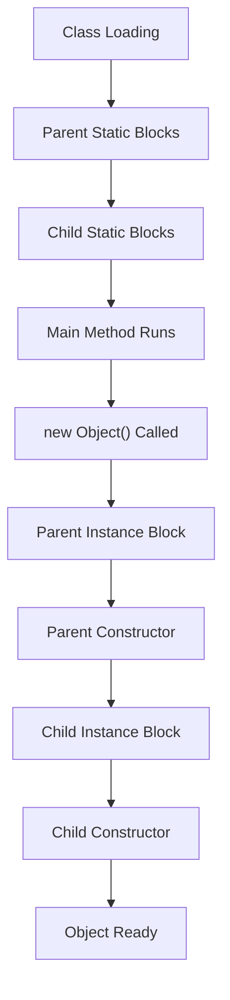

<a id="18-static-keyword"></a>

# 📘 Chapter 18: Static Keyword

> **Part C: Object Oriented Programming (Core Java)**
> `Core` | `Class-Level Members` | `Interview Critical`

⭐⭐⭐⭐⭐⭐⭐⭐⭐⭐⭐⭐⭐⭐⭐⭐⭐⭐⭐⭐⭐⭐⭐⭐⭐⭐⭐⭐⭐⭐⭐⭐

Java • Core Java • Interview Preparation

⭐⭐⭐⭐⭐⭐⭐⭐⭐⭐⭐⭐⭐⭐⭐⭐⭐⭐⭐⭐⭐⭐⭐⭐⭐⭐⭐⭐⭐⭐⭐⭐

---

<a id="chapter-index-table-18"></a>

## 📚 Chapter 18 — Index Table

| No. | Topic | Subtopics |
|-----|-------|-----------|
| 18.1 | [What is Static](#181-what-is-static) | Definition, Class-Level, Memory |
| 18.2 | [Static Variables](#182-static-variables) | Class Variables, Shared, Memory |
| 18.3 | [Static Methods](#183-static-methods) | Class Methods, No Object Needed |
| 18.4 | [Static Block](#184-static-block) | Static Initializer, Class Loading |
| 18.5 | [Multiple Static Blocks](#185-multiple-static-blocks) | Execution Order |
| 18.6 | [Static Nested Class](#186-static-nested-class) | Nested Classes |
| 18.7 | [Static Import](#187-static-import) | Direct Access to Static Members |
| 18.8 | [Why main() is static](#188-why-main-is-static) | JVM Requirements |
| 18.9 | [Instance Block](#189-instance-block) | Instance Initializer |
| 18.10 | [Execution Order](#1810-execution-order) | Static → Instance → Constructor |
| 18.11 | [Static vs Instance Members](#1811-static-vs-instance-members) | Complete Comparison |
| 18.12 | [Static Method Restrictions](#1812-static-method-restrictions) | No this, No super |
| 🔥 | [Java vs Other Languages](#18-java-vs-other-languages) | Unique Static Features |
| 💡 | [Interview Questions](#18-interview-questions) | 15+ Conceptual · Scenario · Output-based |
| 🧪 | [Practice Problems](#18-practice-problems) | 5 Coding + 5 Theory |

---

## 18.1 What is Static

<a id="181-what-is-static"></a>

### 📌 Definition

```
STATIC = A keyword that makes members belong to the CLASS itself
         rather than to any specific OBJECT (instance).

Static members are:
✅ Shared among ALL objects of the class
✅ Loaded when the CLASS is loaded (not when object is created)
✅ Accessed using CLASS NAME (not object reference)
✅ Stored in METHOD AREA (Metaspace) of JVM

Can be applied to:
1. VARIABLES (Static/Class variables)
2. METHODS (Static/Class methods)
3. BLOCKS (Static initializers)
4. NESTED CLASSES (Static nested class)
```

### 📌 Simple Example

```java
class Company {

    // ═══ STATIC VARIABLE (shared by all objects) ═══
    static String companyName = "TechCorp";
    static int totalEmployees = 0;

    // Instance variable (each object has own)
    String employeeName;

    // Constructor
    Company(String name) {
        this.employeeName = name;
        totalEmployees++;   // Increment shared counter
    }

    // Static method (called using class name)
    static void showCompanyInfo() {
        System.out.println("Company: " + companyName);
        System.out.println("Total Employees: " + totalEmployees);
    }
}

public class StaticDemo {
    public static void main(String[] args) {

        Company e1 = new Company("Rahul");
        Company e2 = new Company("Priya");
        Company e3 = new Company("Amit");

        // Static accessed via CLASS NAME (recommended!)
        Company.showCompanyInfo();
        // Company: TechCorp
        // Total Employees: 3

        // Instance accessed via OBJECT
        System.out.println(e1.employeeName);   // Rahul
        System.out.println(e2.employeeName);   // Priya
    }
}
```

### 🌍 Real-World Analogy (Hinglish)

```
STATIC = SCHOOL ki common properties

🏫 SCHOOL (Class)
   ├── STATIC (class-level, shared by ALL students):
   │   ├── school_name = "ABC School"  ← Same for all students
   │   ├── principal = "Mr. Sharma"
   │   └── address = "Delhi"
   │
   ├── INSTANCE (per student):
   │   ├── student_name (different for each)
   │   ├── roll_number
   │   └── class

Har student ka apna name, roll number etc. hai.
LEKIN school_name, principal, address SABKA SAME hai!

Static = "Class ka property" (not "Object ka")
Instance = "Object ka property"

Real Java Example:
Math.PI = 3.14   ← Static (same everywhere)
Math.E = 2.71    ← Static (same everywhere)

student.name    ← Instance (each student different)
```

<a href="#chapter-index-table-18">Go to Top 🔝</a>

---

## 18.2 Static Variables (Class Variables)

<a id="182-static-variables"></a>

### 📌 What are Static Variables?

```
STATIC VARIABLES:
→ Also called CLASS VARIABLES
→ Declared with 'static' keyword
→ ONE COPY shared across ALL objects
→ Memory allocated in METHOD AREA (only once)
→ Initialized when class is loaded
→ Have DEFAULT values (0, null, false)
→ Accessed using: ClassName.variableName
```

### 📌 Example — Counter

```java
class Counter {

    // ═══ STATIC (shared) ═══
    static int count = 0;

    // Instance (per object)
    int id;

    Counter() {
        count++;        // Increment shared counter
        id = count;     // Assign unique id
    }
}

public class CounterDemo {
    public static void main(String[] args) {

        Counter c1 = new Counter();
        Counter c2 = new Counter();
        Counter c3 = new Counter();

        // Instance variable — each object has own
        System.out.println(c1.id);   // 1
        System.out.println(c2.id);   // 2
        System.out.println(c3.id);   // 3

        // Static variable — shared
        System.out.println(Counter.count);   // 3
        System.out.println(c1.count);          // 3 (same as above)
        System.out.println(c2.count);          // 3
    }
}
```

### 📌 Memory Layout

```
┌──────────────────────────────────────────────────────────────┐
│  METHOD AREA (Metaspace)                                     │
│  ┌─────────────────────────────────────────────────┐        │
│  │  Counter Class                                    │        │
│  │  ┌──────────────────────────────────────────┐   │        │
│  │  │  STATIC VARIABLES                        │   │        │
│  │  │  count = 3   ← ONE copy for all objects  │   │        │
│  │  └──────────────────────────────────────────┘   │        │
│  └─────────────────────────────────────────────────┘        │
├──────────────────────────────────────────────────────────────┤
│  HEAP                                                        │
│  ┌───────────────┐  ┌───────────────┐  ┌───────────────┐    │
│  │  Object 1     │  │  Object 2     │  │  Object 3     │    │
│  │  id = 1       │  │  id = 2       │  │  id = 3       │    │
│  │  (instance)   │  │  (instance)   │  │  (instance)   │    │
│  └───────────────┘  └───────────────┘  └───────────────┘    │
└──────────────────────────────────────────────────────────────┘
```

### 📌 Common Use Cases

```java
class MathConstants {

    // ✅ CONSTANTS (widely used)
    static final double PI = 3.14159;
    static final double E = 2.71828;
    static final int MAX_SIZE = 100;

    // ✅ COUNTERS
    static int totalUsers = 0;

    // ✅ CACHE / SHARED RESOURCES
    static Connection dbConnection;

    // ✅ CONFIGURATION
    static String appName = "MyApp";
}

// Access:
System.out.println(MathConstants.PI);           // 3.14159
System.out.println(MathConstants.totalUsers);   // 0
```

<a href="#chapter-index-table-18">Go to Top 🔝</a>

---

## 18.3 Static Methods

<a id="183-static-methods"></a>

### 📌 What are Static Methods?

```
STATIC METHODS:
→ Belong to CLASS, not object
→ Can be called WITHOUT creating an object
→ Can only access STATIC members directly
→ CANNOT use 'this' or 'super'
→ CANNOT be overridden (only hidden)
→ Called using: ClassName.methodName()
```

### 📌 Basic Example

```java
class MathUtils {

    // Static method
    static int add(int a, int b) {
        return a + b;
    }

    static int square(int x) {
        return x * x;
    }

    static boolean isEven(int n) {
        return n % 2 == 0;
    }
}

public class StaticMethodDemo {
    public static void main(String[] args) {

        // No need to create object!
        System.out.println(MathUtils.add(5, 10));      // 15
        System.out.println(MathUtils.square(4));        // 16
        System.out.println(MathUtils.isEven(6));        // true

        // Built-in examples (all static):
        System.out.println(Math.sqrt(25));              // 5.0
        System.out.println(Math.pow(2, 10));            // 1024.0
        System.out.println(Integer.parseInt("42"));     // 42
        System.out.println(String.valueOf(100));         // "100"
    }
}
```

### 📌 When to Use Static Methods?

```
✅ USE static methods when:
   → Method doesn't depend on object state
   → Utility functions (Math.sqrt, Math.pow)
   → Factory methods (Integer.parseInt)
   → Helper methods
   → Constants access

❌ AVOID static when:
   → Method needs to access instance variables
   → Method behavior depends on object state
   → You need polymorphism
```

<a href="#chapter-index-table-18">Go to Top 🔝</a>

---

## 18.4 Static Block (Static Initializer)

<a id="184-static-block"></a>

### 📌 What is Static Block?

```
STATIC BLOCK (Static Initializer):
→ Block of code that runs ONCE when class is LOADED
→ Used for ONE-TIME initialization of static variables
→ Runs BEFORE main() method
→ Runs BEFORE any object is created

Syntax:
static {
    // Initialization code
}
```

### 📌 Example

```java
class DatabaseConfig {

    static String dbUrl;
    static String dbUser;
    static int maxConnections;

    // ═══ STATIC BLOCK ═══
    static {
        System.out.println("Static block executing...");

        // One-time initialization
        dbUrl = "jdbc:mysql://localhost:3306/mydb";
        dbUser = "admin";
        maxConnections = 100;

        // Can do complex initialization here
        System.out.println("Config loaded from static block");
    }

    DatabaseConfig() {
        System.out.println("Constructor called");
    }
}

public class StaticBlockDemo {
    public static void main(String[] args) {
        System.out.println("Main started");

        System.out.println(DatabaseConfig.dbUrl);   // Access static var
        // Static block already executed when class was loaded

        System.out.println("Creating first object...");
        DatabaseConfig config1 = new DatabaseConfig();

        System.out.println("Creating second object...");
        DatabaseConfig config2 = new DatabaseConfig();
    }
}

/*
OUTPUT:
Static block executing...           ← Runs FIRST when class loads
Config loaded from static block
Main started
jdbc:mysql://localhost:3306/mydb
Creating first object...
Constructor called
Creating second object...
Constructor called

KEY: Static block runs ONLY ONCE!
*/
```

### 📌 Common Uses

```java
// Use Case 1: Load configuration from file
class AppConfig {
    static Properties config;

    static {
        try {
            config = new Properties();
            config.load(new FileInputStream("app.properties"));
        } catch (Exception e) {
            System.err.println("Config load failed");
        }
    }
}

// Use Case 2: Register JDBC driver (old style)
class DBInitializer {
    static {
        try {
            Class.forName("com.mysql.jdbc.Driver");
        } catch (ClassNotFoundException e) { }
    }
}

// Use Case 3: Complex constant initialization
class Constants {
    static final Map<String, Integer> WEEKDAYS;

    static {
        WEEKDAYS = new HashMap<>();
        WEEKDAYS.put("Monday", 1);
        WEEKDAYS.put("Tuesday", 2);
        WEEKDAYS.put("Wednesday", 3);
        // ... etc
    }
}
```

<a href="#chapter-index-table-18">Go to Top 🔝</a>

---

## 18.5 Multiple Static Blocks (Order)

<a id="185-multiple-static-blocks"></a>

### 📌 Yes, Multiple Static Blocks Allowed!

```
Java allows MULTIPLE static blocks in a class.

EXECUTION ORDER:
→ Run in the ORDER they appear (top to bottom)
→ ALL static blocks execute before main() runs
→ Run only ONCE (when class is loaded)
```

### 📌 Example

```java
class Test {

    static int a;
    static int b;

    // First static block
    static {
        System.out.println("Block 1");
        a = 10;
    }

    // Second static block
    static {
        System.out.println("Block 2");
        b = 20;
    }

    // Third static block
    static {
        System.out.println("Block 3");
        a = 100;   // Overwrites!
    }

    public static void main(String[] args) {
        System.out.println("Main started");
        System.out.println("a = " + a);
        System.out.println("b = " + b);
    }
}

/*
OUTPUT:
Block 1
Block 2
Block 3
Main started
a = 100         ← Third block overwrote it
b = 20
*/
```

### 📌 Static Block Runs BEFORE main()

```java
class Demo {

    static {
        System.out.println("Static block 1");
    }

    static {
        System.out.println("Static block 2");
    }

    // Even runs BEFORE main!
    public static void main(String[] args) {
        System.out.println("Main method");
    }

    static {
        System.out.println("Static block 3 (AFTER main)");
    }
}

/*
OUTPUT:
Static block 1
Static block 2
Static block 3 (AFTER main)     ← Position of static block doesn't matter!
Main method

All static blocks run FIRST (in order), then main()!
*/
```

<a href="#chapter-index-table-18">Go to Top 🔝</a>

---

## 18.6 Static Nested Class

<a id="186-static-nested-class"></a>

### 📌 Nested Class with static Keyword

```
STATIC NESTED CLASS:
→ Class declared INSIDE another class with 'static' keyword
→ Does NOT need outer class object to be created
→ Can only access STATIC members of outer class
→ Behaves like a top-level class

Non-static nested class = INNER CLASS (needs outer object)
Static nested class = STATIC NESTED CLASS (independent)
```

### 📌 Example

```java
class OuterClass {

    static int staticVar = 100;
    int instanceVar = 200;

    // ═══ STATIC NESTED CLASS ═══
    static class StaticNested {

        void display() {
            System.out.println("Static var: " + staticVar);   // ✅ OK
            // System.out.println(instanceVar);  // ❌ ERROR!
            // Cannot access instance variable directly
        }
    }

    // ═══ INNER CLASS (non-static) ═══
    class Inner {

        void display() {
            System.out.println("Static var: " + staticVar);   // ✅ OK
            System.out.println("Instance var: " + instanceVar); // ✅ OK
        }
    }
}

public class NestedClassDemo {
    public static void main(String[] args) {

        // ═══ Static Nested — no outer object needed! ═══
        OuterClass.StaticNested nested = new OuterClass.StaticNested();
        nested.display();

        // ═══ Inner (non-static) — needs outer object ═══
        OuterClass outer = new OuterClass();
        OuterClass.Inner inner = outer.new Inner();
        inner.display();
    }
}
```

### 📌 When to Use Static Nested Class

```
✅ USE static nested class when:
   → Class logically belongs inside another class
   → Doesn't need outer class instance
   → For grouping related classes

Example: Map.Entry (nested inside Map interface)
Example: Node in LinkedList (nested for encapsulation)
```

<a href="#chapter-index-table-18">Go to Top 🔝</a>

---

## 18.7 Static Import

<a id="187-static-import"></a>

### 📌 Import Static Members Directly (Java 5+)

```java
// ═══ Without static import ═══
public class Test {
    public static void main(String[] args) {
        System.out.println(Math.PI);           // Prefix Math
        System.out.println(Math.sqrt(25));     // Prefix Math
        System.out.println(Math.max(5, 10));   // Prefix Math
    }
}

// ═══ WITH static import ═══
import static java.lang.Math.*;   // Import ALL static members

public class Test2 {
    public static void main(String[] args) {
        System.out.println(PI);         // No Math prefix!
        System.out.println(sqrt(25));   // No Math prefix!
        System.out.println(max(5, 10)); // No Math prefix!
    }
}
```

### 📌 Different Import Styles

```java
// Import specific static member
import static java.lang.Math.PI;
import static java.lang.Math.sqrt;

// Import all static members
import static java.lang.Math.*;

// Import from your own class
import static com.myapp.Constants.MAX_SIZE;

// Common with System.out
import static java.lang.System.out;

public class ImportDemo {
    public static void main(String[] args) {
        out.println(PI);           // Instead of System.out
        out.println(sqrt(144));
    }
}
```

### 📌 When to Use / Avoid

```
✅ USE static import for:
   → Math constants (PI, E)
   → Test assertions (JUnit: assertEquals, assertTrue)
   → Frequently used utility constants

❌ AVOID static import for:
   → Generic names (size, length, min, max)
   → When it makes code less readable
   → Multiple classes with same static names
```

<a href="#chapter-index-table-18">Go to Top 🔝</a>

---

## 18.8 Why main() is static ⭐

<a id="188-why-main-is-static"></a>

### 📌 The Classic Interview Question

```
main() method signature:
public static void main(String[] args)

WHY IS IT STATIC?

1. JVM CALLS main() WITHOUT CREATING AN OBJECT
   → Static methods don't need objects
   → If main() were non-static, JVM would need to create object first
   → Who would create that object? Chicken-egg problem!

2. MEMORY EFFICIENCY
   → No wastage of memory creating unnecessary object

3. ENTRY POINT REQUIREMENT
   → main() is the entry point
   → Must be accessible without any object

4. CONVENTION SINCE JAVA 1.0
   → Standard signature enforced by JVM
```

### 📌 What If main() Wasn't Static?

```java
// Hypothetical scenario if main() were NOT static:

public class Test {

    public void main(String[] args) {   // Non-static
        System.out.println("Hello");
    }
}

// JVM behavior would be:
// 1. JVM tries to call main()
// 2. main() is non-static → needs object
// 3. JVM needs to CREATE object: new Test()
// 4. But which constructor? Which args?
// 5. → Confusion!

// SOLUTION: main() is static → JVM just calls it directly!
```

### 📌 The Perfect Signature

```java
public static void main(String[] args)
   ↓      ↓     ↓    ↓        ↓
   |      |     |    |        |
   PUBLIC → JVM accesses from outside class
   STATIC → JVM calls without creating object
   VOID → main doesn't return anything to JVM
   MAIN → Entry point name JVM looks for
   String[] args → Command line arguments
```

<a href="#chapter-index-table-18">Go to Top 🔝</a>

---

## 18.9 Instance Block

<a id="189-instance-block"></a>

### 📌 What is Instance Block?

```
INSTANCE BLOCK (Non-static block):
→ Block of code without 'static' keyword
→ Runs EVERY TIME an object is created
→ Runs BEFORE constructor
→ Runs AFTER static blocks
→ Copy is created for EACH object

Syntax:
{
    // Code here (no 'static' keyword)
}
```

### 📌 Example

```java
class Test {

    int x;

    // ═══ STATIC BLOCK (runs ONCE when class loads) ═══
    static {
        System.out.println("Static block");
    }

    // ═══ INSTANCE BLOCK (runs EVERY time object is created) ═══
    {
        System.out.println("Instance block");
        x = 100;   // Common initialization
    }

    // ═══ CONSTRUCTOR ═══
    Test() {
        System.out.println("Constructor: x = " + x);
    }
}

public class InstanceBlockDemo {
    public static void main(String[] args) {
        System.out.println("--- Creating obj1 ---");
        Test t1 = new Test();

        System.out.println("--- Creating obj2 ---");
        Test t2 = new Test();

        System.out.println("--- Creating obj3 ---");
        Test t3 = new Test();
    }
}

/*
OUTPUT:
Static block             ← Runs ONCE (when class loads)

--- Creating obj1 ---
Instance block           ← Runs for obj1
Constructor: x = 100

--- Creating obj2 ---
Instance block           ← Runs for obj2
Constructor: x = 100

--- Creating obj3 ---
Instance block           ← Runs for obj3
Constructor: x = 100
*/
```

### 📌 Why Use Instance Blocks?

```
✅ Common initialization code for MULTIPLE constructors
   → Avoids duplication
   → Runs regardless of which constructor is called

Example:
class Product {

    String category;

    // Common initialization for ALL constructors
    {
        category = "General";
        System.out.println("Initializing product...");
    }

    Product() { }
    Product(String name) { }
    Product(String name, double price) { }
    // All constructors get 'category' initialized to "General"
}
```

<a href="#chapter-index-table-18">Go to Top 🔝</a>

---

## 18.10 Execution Order — Static → Instance → Constructor ⭐⭐

<a id="1810-execution-order"></a>

### 📌 The Complete Execution Order

```
When object is created:

1. STATIC BLOCK       (runs ONCE per class, on class loading)
2. INSTANCE BLOCK     (runs for EACH object, before constructor)
3. CONSTRUCTOR        (runs for EACH object, initializes it)

For INHERITANCE:
1. Parent's static
2. Child's static
3. Parent's instance block
4. Parent's constructor
5. Child's instance block
6. Child's constructor
```

### 📌 Complete Example

```java
class Parent {

    // 1. Parent static
    static {
        System.out.println("1. Parent static block");
    }

    // 3. Parent instance
    {
        System.out.println("3. Parent instance block");
    }

    // 4. Parent constructor
    Parent() {
        System.out.println("4. Parent constructor");
    }
}

class Child extends Parent {

    // 2. Child static
    static {
        System.out.println("2. Child static block");
    }

    // 5. Child instance
    {
        System.out.println("5. Child instance block");
    }

    // 6. Child constructor
    Child() {
        System.out.println("6. Child constructor");
    }
}

public class ExecutionOrderDemo {
    public static void main(String[] args) {
        System.out.println("=== Main started ===");
        System.out.println("=== Creating first Child object ===");
        new Child();

        System.out.println("\n=== Creating second Child object ===");
        new Child();
    }
}

/*
OUTPUT:
1. Parent static block         ← Class loading (ONCE)
2. Child static block          ← Class loading (ONCE)
=== Main started ===
=== Creating first Child object ===
3. Parent instance block       ← For obj1
4. Parent constructor          ← For obj1
5. Child instance block        ← For obj1
6. Child constructor           ← For obj1

=== Creating second Child object ===
3. Parent instance block       ← For obj2 (again!)
4. Parent constructor          ← For obj2
5. Child instance block        ← For obj2
6. Child constructor           ← For obj2

NOTICE:
✅ Static blocks run ONLY ONCE (on class load)
✅ Instance blocks & constructors run for EACH object
✅ Parent → Child order maintained
*/
```

### 📊 Execution Order Flow



<a href="#chapter-index-table-18">Go to Top 🔝</a>

---

## 18.11 Static vs Instance Members ⭐

<a id="1811-static-vs-instance-members"></a>

### 📌 Complete Comparison

```
┌───────────────────────┬──────────────────────┬──────────────────────┐
│  Feature              │  Static Members      │  Instance Members    │
├───────────────────────┼──────────────────────┼──────────────────────┤
│  Belongs to           │  CLASS               │  OBJECT (instance)   │
├───────────────────────┼──────────────────────┼──────────────────────┤
│  Memory allocation    │  ONCE (when class    │  EACH object gets    │
│                       │  loaded)             │  own copy            │
├───────────────────────┼──────────────────────┼──────────────────────┤
│  Storage              │  Method Area         │  Heap (with object)  │
├───────────────────────┼──────────────────────┼──────────────────────┤
│  Access               │  ClassName.member    │  object.member       │
├───────────────────────┼──────────────────────┼──────────────────────┤
│  Sharing              │  SHARED among all    │  EACH object own     │
│                       │  objects             │  copy                │
├───────────────────────┼──────────────────────┼──────────────────────┤
│  Access non-static?   │  ❌ NO (directly)    │  ✅ YES              │
├───────────────────────┼──────────────────────┼──────────────────────┤
│  Access static?       │  ✅ YES              │  ✅ YES              │
├───────────────────────┼──────────────────────┼──────────────────────┤
│  this keyword         │  ❌ Cannot use       │  ✅ Can use          │
├───────────────────────┼──────────────────────┼──────────────────────┤
│  super keyword        │  ❌ Cannot use       │  ✅ Can use          │
├───────────────────────┼──────────────────────┼──────────────────────┤
│  Overriding           │  ❌ Method Hiding    │  ✅ Yes (overriding) │
├───────────────────────┼──────────────────────┼──────────────────────┤
│  Loaded when          │  Class is loaded     │  Object is created   │
└───────────────────────┴──────────────────────┴──────────────────────┘
```

### 📌 Example Showing All

```java
class Test {

    static int staticVar = 100;    // Class-level
    int instanceVar = 200;          // Object-level

    // Static method
    static void staticMethod() {
        System.out.println("Static: " + staticVar);
        // System.out.println(instanceVar); ❌ Cannot access directly!
        // System.out.println(this);         ❌ Cannot use 'this'
    }

    // Instance method
    void instanceMethod() {
        System.out.println("Static: " + staticVar);        // ✅ OK
        System.out.println("Instance: " + instanceVar);    // ✅ OK
        System.out.println("This: " + this);               // ✅ OK
    }

    public static void main(String[] args) {

        // Static access — NO OBJECT NEEDED
        Test.staticMethod();
        System.out.println(Test.staticVar);

        // Instance access — OBJECT REQUIRED
        Test t = new Test();
        t.instanceMethod();
        System.out.println(t.instanceVar);
    }
}
```

<a href="#chapter-index-table-18">Go to Top 🔝</a>

---

## 18.12 Static Method Restrictions

<a id="1812-static-method-restrictions"></a>

### 📌 What Static Methods CANNOT Do

```
❌ RESTRICTIONS ON STATIC METHODS:

1. CANNOT use 'this' keyword
   → 'this' refers to current OBJECT
   → Static methods don't belong to any object!

2. CANNOT use 'super' keyword
   → 'super' refers to parent's OBJECT
   → Same reason — no object!

3. CANNOT access INSTANCE variables directly
   → Instance variables belong to specific objects
   → No object context in static method

4. CANNOT call INSTANCE methods directly
   → Instance methods need an object
   → Static method has no object

5. CANNOT be OVERRIDDEN (only hidden)
   → Method hiding, not overriding
   → Uses STATIC binding
```

### 📌 Examples

```java
class Test {

    static int staticVar = 10;
    int instanceVar = 20;

    static void staticMethod() {
        // ✅ Can access static members
        System.out.println(staticVar);
        anotherStaticMethod();

        // ❌ CANNOT do these:
        // System.out.println(instanceVar);    // ERROR!
        // instanceMethod();                    // ERROR!
        // this.something();                    // ERROR!
        // super.something();                   // ERROR!

        // ✅ CAN access instance members via OBJECT
        Test t = new Test();
        System.out.println(t.instanceVar);   // ✅ OK
        t.instanceMethod();                    // ✅ OK
    }

    void instanceMethod() {
        // ✅ Can access EVERYTHING
        System.out.println(staticVar);       // ✅ Static
        System.out.println(instanceVar);     // ✅ Instance
        this.instanceVar = 100;              // ✅ Use 'this'
        staticMethod();                        // ✅ Call static
    }

    static void anotherStaticMethod() {
        System.out.println("Another static");
    }
}
```

### 📌 Method Hiding (Not Overriding)

```java
class Parent {
    static void staticMethod() {
        System.out.println("Parent static");
    }

    void instanceMethod() {
        System.out.println("Parent instance");
    }
}

class Child extends Parent {

    // This is HIDING (not overriding!)
    static void staticMethod() {
        System.out.println("Child static");
    }

    // This is OVERRIDING
    @Override
    void instanceMethod() {
        System.out.println("Child instance");
    }
}

public class HidingDemo {
    public static void main(String[] args) {
        Parent p = new Child();

        // Static → uses REFERENCE type (Parent)
        p.staticMethod();       // "Parent static" ← HIDING

        // Instance → uses ACTUAL OBJECT (Child)
        p.instanceMethod();     // "Child instance" ← OVERRIDING
    }
}
```

<a href="#chapter-index-table-18">Go to Top 🔝</a>

---

<a id="18-java-vs-other-languages"></a>

## 🔥 What Makes Java DIFFERENT — Static

```
┌──────────────────────┬────────────┬────────────┬────────────┬────────────┐
│  Feature             │  Java      │  C++       │  Python    │  JavaScript│
├──────────────────────┼────────────┼────────────┼────────────┼────────────┤
│  static keyword      │ ✅ YES     │ ✅ YES     │ @staticmethod│ static kw │
│                      │            │            │ decorator  │            │
├──────────────────────┼────────────┼────────────┼────────────┼────────────┤
│  Static variables    │ ✅ YES     │ ✅ YES     │ Class vars │ Static prop│
├──────────────────────┼────────────┼────────────┼────────────┼────────────┤
│  Static blocks       │ ✅ YES     │ ❌ No      │ ❌ No      │ Static     │
│                      │            │            │            │ blocks in  │
│                      │            │            │            │ classes    │
├──────────────────────┼────────────┼────────────┼────────────┼────────────┤
│  Instance blocks     │ ✅ YES     │ ❌ No      │ ❌ No      │ ❌ No     │
├──────────────────────┼────────────┼────────────┼────────────┼────────────┤
│  Static import       │ ✅ Yes     │ ✅ using   │ from x import│ ✅ Yes  │
│                      │            │ namespace  │            │            │
├──────────────────────┼────────────┼────────────┼────────────┼────────────┤
│  Static nested class │ ✅ Yes     │ ✅ Yes     │ Nested     │ Nested    │
│                      │            │            │ classes    │ classes    │
├──────────────────────┼────────────┼────────────┼────────────┼────────────┤
│  Instance in static  │ ❌ No      │ ❌ No      │ ❌ No      │ ❌ No     │
│  method (this)       │            │            │            │            │
├──────────────────────┼────────────┼────────────┼────────────┼────────────┤
│  Static polymorphism │ ❌ Hiding  │ ❌ Hiding  │ N/A        │ N/A       │
│                      │ only       │ only       │            │            │
└──────────────────────┴────────────┴────────────┴────────────┴────────────┘
```

### 🎯 Key UNIQUE Points

```
1. STATIC BLOCKS:
   → Java has dedicated static blocks
   → Other languages don't have this feature
   → Great for one-time class initialization

2. INSTANCE BLOCKS:
   → Also unique to Java
   → Common initialization for multiple constructors

3. STATIC METHOD HIDING:
   → Not overriding — hiding
   → Uses static binding (compile-time)

4. main() IS STATIC:
   → Java's convention for entry point
   → Different from C++ (has main function)

5. STATIC MEMBERS IN INTERFACE (Java 8+):
   → Modern Java allows static methods in interfaces
```

<a href="#chapter-index-table-18">Go to Top 🔝</a>

---

<a id="18-interview-questions"></a>

## 💡 Chapter 18 — Interview Questions (15+)

---

### 🔵 Conceptual Questions

**Q1. What is the static keyword? Where can it be used?**

```
STATIC = Belongs to CLASS (not object)
        Shared among all instances of the class

WHERE static CAN BE USED:
1. Variables (static/class variables)
2. Methods (static/class methods)
3. Blocks (static initializer)
4. Nested classes (static nested class)

CANNOT be used with:
❌ Top-level classes
❌ Local variables
❌ Constructors

KEY FEATURES:
✅ ONE copy per class (not per object)
✅ Loaded when class loads
✅ Accessed via ClassName.member
✅ No object needed
```

---

**Q2. What is the difference between static and instance members?**

```
┌──────────────────┬─────────────────┬─────────────────┐
│  Feature         │  Static         │  Instance       │
├──────────────────┼─────────────────┼─────────────────┤
│  Belongs to      │  Class          │  Object         │
│  Memory          │  ONCE (shared)  │  Per object     │
│  Storage         │  Method Area    │  Heap           │
│  Access          │  ClassName.x    │  object.x       │
│  When loaded     │  Class loading  │  Object creation│
│  Sharing         │  ALL objects    │  Each own copy  │
│  this keyword    │  ❌ Cannot use  │  ✅ Can use     │
│  Access instance │  ❌ Directly    │  ✅ Yes         │
│  Access static   │  ✅ Yes         │  ✅ Yes         │
└──────────────────┴─────────────────┴─────────────────┘

Example:
class Test {
    static int a = 10;   // ONE copy shared
    int b = 20;          // Per object copy
}
```

---

**Q3. Why is main() method static?**

```
public static void main(String[] args)

WHY STATIC?

1. JVM CALLS main() WITHOUT CREATING OBJECT
   → Static methods don't need objects
   → JVM calls: ClassName.main(args)
   → No object creation needed

2. If main() were NOT static:
   → JVM would need to create object first
   → Which constructor? What arguments?
   → Chicken-and-egg problem!

3. MEMORY EFFICIENCY:
   → No wasted memory on unnecessary object

4. STANDARD JVM CONVENTION:
   → Established since Java 1.0
   → JVM specifically looks for public static void main(String[])
```

---

**Q4. What is a static block? When does it run?**

```
STATIC BLOCK:
→ Block of code with 'static' keyword
→ Runs ONCE when class is LOADED
→ Used for one-time initialization
→ Runs BEFORE main() method
→ Runs BEFORE any object is created

class Test {
    static {
        System.out.println("Static block runs");
        // Initialize static variables
    }

    public static void main(String[] args) {
        System.out.println("Main");
    }
}

Output:
Static block runs
Main

WHEN?
Class loaded by JVM when:
→ Creating first object
→ Accessing static member
→ Class.forName("classname") called
→ First reference to class

USES:
✅ Load configuration files
✅ Register JDBC drivers (old style)
✅ Initialize complex static variables
✅ One-time setup code
```

---

**Q5. Can we have multiple static blocks? What's their execution order?**

```
YES! Multiple static blocks are allowed.

EXECUTION ORDER:
→ Run in the ORDER they appear (top to bottom)
→ Position (before/after main) doesn't matter
→ All run BEFORE main() executes

class Test {
    static { System.out.println("1"); }

    public static void main(String[] args) {
        System.out.println("Main");
    }

    static { System.out.println("2"); }
    static { System.out.println("3"); }
}

Output:
1
2
3
Main

Multiple static blocks run in source-code order.
```

---

**Q6. What are static method restrictions?**

```
STATIC METHODS CANNOT:

1. Use 'this' keyword
   → 'this' = current object; static has no object

2. Use 'super' keyword
   → Same reason — no object

3. Access instance variables directly
   → Instance vars belong to specific objects

4. Call instance methods directly
   → Instance methods need object

5. Be overridden (only hidden)
   → Static binding, not dynamic

WORKAROUND:
static void method() {
    Test t = new Test();     // Create object
    System.out.println(t.instanceVar);   // ✅ Now can access
    t.instanceMethod();      // ✅ Can call
}
```

---

**Q7. What is the execution order of static block, instance block, and constructor?**

```
When object is created:

1. STATIC BLOCK       (once, on class loading)
2. INSTANCE BLOCK     (each object, before constructor)
3. CONSTRUCTOR        (each object)

class Test {
    static { System.out.println("Static"); }

    { System.out.println("Instance"); }

    Test() { System.out.println("Constructor"); }
}

new Test();
// Output:
// Static           ← Once
// Instance         ← Before constructor
// Constructor      ← Last

new Test();
// Output:
// Instance         ← Static NOT repeated
// Constructor

WITH INHERITANCE:
1. Parent static
2. Child static
3. Parent instance
4. Parent constructor
5. Child instance
6. Child constructor
```

---

**Q8. Can we override static methods?**

```
NO! Static methods cannot be OVERRIDDEN.
They can only be HIDDEN.

class Parent {
    static void show() { System.out.println("Parent"); }
}

class Child extends Parent {
    static void show() { System.out.println("Child"); }  // HIDING (not overriding)
}

Parent p = new Child();
p.show();   // "Parent" (based on REFERENCE type, not object!)

REASON:
→ Static methods use STATIC BINDING (compile-time)
→ Method chosen based on reference type
→ Instance methods use DYNAMIC BINDING (runtime)
→ Method chosen based on actual object

This is why static methods cannot be truly polymorphic.
```

---

### 🟡 Scenario-Based Questions

**Q9. When are static variables initialized?**

```
When class is LOADED by JVM.

Class loading triggered when:
1. Creating first object of the class
2. Accessing any static member
3. Class.forName("Test") called
4. Reflection API used

Once loaded, static variables stay in memory
UNTIL class is UNLOADED (rare, usually till JVM shuts down).

Static variables initialized:
1. To default values (0, null, false)
2. Then to explicit values in declaration
3. Then static block runs
```

---

### 🔴 Output-Based Questions

**Q10. What is the output?**

```java
class A {
    static { System.out.println("A static"); }
    { System.out.println("A instance"); }
    A() { System.out.println("A constructor"); }
}

class B extends A {
    static { System.out.println("B static"); }
    { System.out.println("B instance"); }
    B() { System.out.println("B constructor"); }
}

public class Test {
    public static void main(String[] args) {
        new B();
    }
}
```

```
OUTPUT:
A static             ← Parent static (once)
B static             ← Child static (once)
A instance           ← Parent instance
A constructor        ← Parent constructor
B instance           ← Child instance
B constructor        ← Child constructor

Order: Static (parent→child) → Instance+Constructor (parent→child)
```

---

**Q11. What is the output?**

```java
class Counter {
    static int count = 0;

    Counter() {
        count++;
    }
}

public class Test {
    public static void main(String[] args) {
        Counter c1 = new Counter();
        Counter c2 = new Counter();
        Counter c3 = new Counter();

        System.out.println(c1.count);
        System.out.println(c2.count);
        System.out.println(c3.count);
        System.out.println(Counter.count);
    }
}
```

```
OUTPUT:
3
3
3
3

REASON:
static count is SHARED across all objects.
Each constructor increments the same variable.
Final value: 3 (accessible via any object or ClassName)
```

---

**Q12. Will this compile?**

```java
class Test {
    int x = 10;

    static void method() {
        System.out.println(x);
    }
}
```

```
❌ COMPILE ERROR!

Error: "non-static variable x cannot be referenced from a static context"

REASON: Static method cannot access instance variables directly.
Instance variables need an object!

FIX:
static void method() {
    Test t = new Test();
    System.out.println(t.x);   // ✅ Now OK
}

OR make x static:
static int x = 10;   // Now static method can access directly
```

---

**Q13. What is the output?**

```java
class Test {
    static {
        System.out.println("Static 1");
    }

    static int x = getValue();

    static int getValue() {
        System.out.println("getValue()");
        return 100;
    }

    static {
        System.out.println("Static 2, x = " + x);
    }

    public static void main(String[] args) {
        System.out.println("Main");
    }
}
```

```
OUTPUT:
Static 1
getValue()
Static 2, x = 100
Main

REASON:
Static blocks AND static variable initializations run
in the ORDER they appear (top to bottom).
```

---

**Q14. Can constructor be static?**

```
NO! Constructors CANNOT be static.

WHY?
→ static means belongs to CLASS
→ Constructor is for OBJECT initialization
→ Contradictory concepts!

// class Test {
//     static Test() { }   // ❌ COMPILE ERROR!
// }

ALTERNATIVE: Use static block for class initialization
static {
    // One-time initialization
}
```

---

**Q15. What is the output?**

```java
class Test {
    static int a = 10;

    public static void main(String[] args) {
        Test t = null;
        System.out.println(t.a);
    }
}
```

```
OUTPUT: 10

REASON: Static members can be accessed via null reference!
→ Because static is CLASS-level (doesn't need object)
→ Java resolves t.a as Test.a at compile time

But it's BAD PRACTICE:
→ Compiler shows warning
→ Should use Test.a for clarity
```

<a href="#chapter-index-table-18">Go to Top 🔝</a>

---

<a id="18-practice-problems"></a>

## 🧪 Chapter 18 — Practice Problems

### 📝 5 Theory Questions

```
1. Explain the difference between static and instance members
   in detail. Show memory layout for both.

2. Why is main() method static? What would happen if it were
   not static? Explain the JVM's perspective.

3. Explain execution order of static block, instance block,
   and constructor with inheritance. Show a complete example.

4. What are the restrictions on static methods? Why can't they
   use 'this' or 'super'? What is method hiding vs overriding?

5. When would you use static block vs instance block vs
   constructor? Give real-world use cases for each.
```

### 💻 5 Coding Questions

```java
// Q1: Create a Counter class with static counter
// Each object gets a unique ID (1, 2, 3, ...)
// Total count of objects should be accessible

public class Counter {
    // TODO: Implement with static counter
    // Total count accessible via Counter.getTotal()
}
```

```java
// Q2: Show execution order
// Create Parent and Child classes with:
// - Static blocks (multiple)
// - Instance blocks (multiple)
// - Constructors
// Predict output when creating Child object

public class ExecutionOrder {
    // TODO: Complete Parent and Child classes
    // Verify predicted output
}
```

```java
// Q3: MathUtils class with only static methods
// Include: add, subtract, multiply, divide, power, sqrt
// Cannot instantiate (private constructor)

public class MathUtils {
    // TODO: Utility class with static methods
    // Private constructor to prevent instantiation
}
```

```java
// Q4: Configuration loader using static block
// Load config from Properties file in static block
// Provide static methods to access config values

import java.util.Properties;
public class AppConfig {
    // TODO: Load config in static block
    // Static getters for values
}
```

```java
// Q5: Singleton using static
// Create a database connection class
// Only ONE instance allowed
// Use private constructor + static getInstance()

public class DatabaseConnection {
    // TODO: Implement thread-safe singleton
    // Verify only one instance created
}
```

<a href="#chapter-index-table-18">Go to Top 🔝</a>

---

```
┌─────────────────────────────────────────────────────────────┐
│                  ✅ CHAPTER 18 COMPLETE                     │
│                                                             │
│  Topics Covered:                                            │
│  ✅ 18.1  What is Static — Class-level, shared              │
│  ✅ 18.2  Static Variables — Shared across all objects      │
│  ✅ 18.3  Static Methods — No object needed                 │
│  ✅ 18.4  Static Block — One-time initialization             │
│  ✅ 18.5  Multiple Static Blocks — Order of execution       │
│  ✅ 18.6  Static Nested Class — vs Inner class              │
│  ✅ 18.7  Static Import — Direct access to static members   │
│  ✅ 18.8  Why main() is Static — JVM requirements           │
│  ✅ 18.9  Instance Block — Runs before constructor          │
│  ✅ 18.10 Execution Order — Static → Instance → Constructor │
│  ✅ 18.11 Static vs Instance Members — Complete comparison  │
│  ✅ 18.12 Static Method Restrictions — No this/super         │
│  ✅ 🔥    Java vs Others — 5 UNIQUE features                │
│  ✅ 15+   Interview Questions with Detailed Answers         │
│  ✅ 5     Theory + 5 Coding Practice Problems               │
│                                                             │
│  ⭐ Next: Final Keyword (Chapter 19)                        │
└─────────────────────────────────────────────────────────────┘
```

[Go to Main Index 🔝](#main-index)