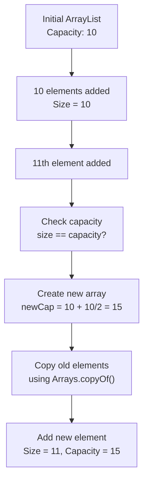

<a id="23-list-interface"></a>

# 📘 Chapter 23: List Interface (ArrayList, LinkedList, Vector)

> **Part E: Collection Framework**
> `Core` | `Most Used Collection` | `Interview Critical`

⭐⭐⭐⭐⭐⭐⭐⭐⭐⭐⭐⭐⭐⭐⭐⭐⭐⭐⭐⭐⭐⭐⭐⭐⭐⭐⭐⭐⭐⭐⭐⭐

Java • Core Java • Interview Preparation

⭐⭐⭐⭐⭐⭐⭐⭐⭐⭐⭐⭐⭐⭐⭐⭐⭐⭐⭐⭐⭐⭐⭐⭐⭐⭐⭐⭐⭐⭐⭐⭐

---

<a id="chapter-index-table-23"></a>

## 📚 Chapter 23 — Index Table

| No. | Topic | Subtopics |
|-----|-------|-----------|
| 23.1 | [List Interface Features](#231-list-interface-features) | Ordered, Indexed, Duplicates |
| 23.2 | [List Methods](#232-list-methods) | All Standard Methods |
| 23.3 | [List.of() & List.copyOf()](#233-list-of-copyof) | Java 9+ Immutable Lists |
| 23.4 | [ArrayList Internal Working](#234-arraylist-internal-working) | Dynamic Array |
| 23.5 | [ArrayList Capacity & Growth](#235-arraylist-capacity-growth) | Initial 10, Growth Formula |
| 23.6 | [ArrayList Time Complexity](#236-arraylist-time-complexity) | O(1) Access, O(n) Insert |
| 23.7 | [ArrayList Constructors](#237-arraylist-constructors) | All 4 Constructors |
| 23.8 | [LinkedList Internal Working](#238-linkedlist-internal-working) | Doubly Linked List |
| 23.9 | [LinkedList Node Structure](#239-linkedlist-node-structure) | Node class |
| 23.10 | [LinkedList Time Complexity](#2310-linkedlist-time-complexity) | O(n) Access, O(1) Insert |
| 23.11 | [LinkedList as Queue/Deque](#2311-linkedlist-as-queue-deque) | Multiple Roles |
| 23.12 | [Vector — Legacy Synchronized](#2312-vector-legacy) | Thread-Safe Legacy |
| 23.13 | [Stack — LIFO](#2313-stack-lifo) | Extends Vector |
| 23.14 | [ArrayList vs LinkedList](#2314-arraylist-vs-linkedlist) | Complete Comparison |
| 23.15 | [ArrayList vs Vector](#2315-arraylist-vs-vector) | Complete Comparison |
| 23.16 | [Iterating Lists (4 ways)](#2316-iterating-lists) | All Iteration Methods |
| 23.17 | [ConcurrentModificationException](#2317-concurrentmodificationexception) | Common Error |
| 23.18 | [Fail-Fast vs Fail-Safe](#2318-fail-fast-vs-fail-safe) | Iterator Types |
| 🔥 | [Java vs Other Languages](#23-java-vs-other-languages) | Unique Features |
| 💡 | [Interview Questions](#23-interview-questions) | 20+ Questions |
| 🧪 | [Practice Problems](#23-practice-problems) | 5 Coding + 5 Theory |

---

## 23.1 List Interface Features

<a id="231-list-interface-features"></a>

### 📌 What Makes a List?

```
LIST INTERFACE — java.util.List

CHARACTERISTICS:
✅ ORDERED — Elements in specific insertion order
✅ INDEXED — Access by position (0, 1, 2, ...)
✅ ALLOWS DUPLICATES — Same element multiple times
✅ ALLOWS NULL — Can store null values

IMPLEMENTATIONS:
1. ArrayList     — Dynamic array (MOST USED)
2. LinkedList    — Doubly linked list
3. Vector        — Legacy, synchronized
4. Stack         — Legacy LIFO (extends Vector)
5. CopyOnWriteArrayList — Concurrent
```

### 📌 Basic Example

```java
import java.util.*;

public class ListFeatures {
    public static void main(String[] args) {

        List<String> list = new ArrayList<>();

        // ✅ ORDERED — insertion order maintained
        list.add("A");
        list.add("B");
        list.add("C");
        System.out.println(list);   // [A, B, C]

        // ✅ ALLOWS DUPLICATES
        list.add("A");   // Duplicate OK
        System.out.println(list);   // [A, B, C, A]

        // ✅ INDEXED access
        String first = list.get(0);      // "A"
        String third = list.get(2);       // "C"

        // ✅ ALLOWS NULL
        list.add(null);
        System.out.println(list);   // [A, B, C, A, null]

        // ✅ Positional operations
        list.add(1, "X");                 // Insert at index
        list.set(0, "Z");                 // Replace at index
        list.remove(2);                   // Remove at index
        System.out.println(list);
    }
}
```

### 🌍 Real-World Analogy (Hinglish)

```
LIST = SHOPPING LIST / QUEUE OF PEOPLE

📝 Shopping List:
   Position 0: "Bread"
   Position 1: "Milk"
   Position 2: "Eggs"
   Position 3: "Bread"   ← Duplicate OK!

Order matters! You can go to specific position!
Same item can appear multiple times!

🚶 People in a QUEUE:
   Person 0: Rahul
   Person 1: Priya
   Person 2: Amit
   Person 3: Rahul     ← Two Rahuls OK!

Same as List:
✅ Ordered (position matters)
✅ Indexed (Person 0, 1, 2...)
✅ Duplicates allowed (two people with same name)
```

<a href="#chapter-index-table-23">Go to Top 🔝</a>

---

## 23.2 List Methods

<a id="232-list-methods"></a>

### 📌 All Standard List Methods

```java
import java.util.*;

public class ListMethodsDemo {
    public static void main(String[] args) {

        List<Integer> list = new ArrayList<>();

        // ═══ ADDING elements ═══
        list.add(10);                    // Add at end
        list.add(20);
        list.add(30);
        list.add(1, 15);                 // Insert at index 1
        list.addAll(Arrays.asList(40, 50));   // Add all
        System.out.println(list);        // [10, 15, 20, 30, 40, 50]

        // ═══ ACCESSING elements ═══
        int elem = list.get(2);          // Get at index → 20
        int size = list.size();          // Total elements → 6
        boolean empty = list.isEmpty();  // false

        // ═══ SEARCHING ═══
        boolean has = list.contains(20);      // true
        int index = list.indexOf(20);         // First occurrence → 2
        int lastIndex = list.lastIndexOf(20); // Last occurrence

        // ═══ MODIFYING elements ═══
        list.set(0, 100);                     // Replace at index → [100, 15, 20, 30, 40, 50]

        // ═══ REMOVING elements ═══
        list.remove(0);                       // Remove at index → [15, 20, 30, 40, 50]
        list.remove(Integer.valueOf(30));     // Remove by value → [15, 20, 40, 50]
        list.removeAll(Arrays.asList(15, 20));// Remove multiple
        list.retainAll(Arrays.asList(40));    // Keep only these

        // ═══ SUBLIST ═══
        List<Integer> list2 = new ArrayList<>(Arrays.asList(1, 2, 3, 4, 5, 6));
        List<Integer> sub = list2.subList(1, 4);   // [2, 3, 4] (indices 1 to 3)
        System.out.println(sub);

        // ═══ ITERATION ═══
        for (Integer num : list2) {
            System.out.println(num);
        }

        // ═══ CONVERT to array ═══
        Object[] arr1 = list2.toArray();
        Integer[] arr2 = list2.toArray(new Integer[0]);

        // ═══ CLEAR all ═══
        list2.clear();
        System.out.println(list2);   // []

        // ═══ Java 8+ SORT ═══
        List<Integer> nums = new ArrayList<>(Arrays.asList(5, 3, 1, 4, 2));
        nums.sort(null);              // Natural order
        System.out.println(nums);     // [1, 2, 3, 4, 5]

        nums.sort(Comparator.reverseOrder());   // Reverse
        System.out.println(nums);     // [5, 4, 3, 2, 1]
    }
}
```

### 📌 Method Summary Table

```
┌──────────────────────────┬──────────────────────────────────┐
│  Method                  │  Purpose                         │
├──────────────────────────┼──────────────────────────────────┤
│  add(E)                  │  Add at end                       │
│  add(index, E)           │  Insert at index                  │
│  addAll(Collection)      │  Add all from another             │
│  get(index)              │  Get element at index             │
│  set(index, E)           │  Replace at index                 │
│  remove(index)           │  Remove at index                  │
│  remove(Object)          │  Remove by value (first match)    │
│  removeAll(Collection)   │  Remove all matching              │
│  retainAll(Collection)   │  Keep only matching               │
│  clear()                 │  Remove all elements              │
│  contains(Object)        │  Check existence                  │
│  indexOf(Object)         │  First occurrence index           │
│  lastIndexOf(Object)     │  Last occurrence index            │
│  size()                  │  Number of elements               │
│  isEmpty()               │  Check if empty                   │
│  subList(from, to)       │  Sublist [from, to)               │
│  toArray()               │  Convert to array                 │
│  iterator()              │  Get iterator                     │
│  listIterator()          │  Get list iterator (bidirectional)│
│  sort(Comparator)        │  Sort (Java 8+)                   │
│  forEach(Consumer)       │  Iterate (Java 8+)                │
│  stream()                │  Get stream (Java 8+)             │
└──────────────────────────┴──────────────────────────────────┘
```

<a href="#chapter-index-table-23">Go to Top 🔝</a>

---

## 23.3 List.of() & List.copyOf() (Java 9+)

<a id="233-list-of-copyof"></a>

### 📌 Immutable Lists

```
Java 9 introduced factory methods:

List.of(...)     — Creates IMMUTABLE list
List.copyOf(list) — Creates IMMUTABLE copy of existing list

Features:
✅ IMMUTABLE (cannot add/remove/set)
✅ NO NULL elements allowed
✅ Space-efficient
✅ Thread-safe
✅ Cleaner syntax than Collections.unmodifiableList()
```

### 📌 Example

```java
import java.util.*;

public class ImmutableListsDemo {
    public static void main(String[] args) {

        // ═══ List.of() — immutable list ═══
        List<String> immutable = List.of("A", "B", "C");
        System.out.println(immutable);   // [A, B, C]

        // ❌ Cannot modify!
        try {
            immutable.add("D");   // UnsupportedOperationException!
        } catch (UnsupportedOperationException e) {
            System.out.println("Cannot add to immutable list");
        }

        try {
            immutable.remove(0);   // UnsupportedOperationException!
        } catch (UnsupportedOperationException e) {
            System.out.println("Cannot remove from immutable list");
        }

        try {
            immutable.set(0, "Z");   // UnsupportedOperationException!
        } catch (UnsupportedOperationException e) {
            System.out.println("Cannot set in immutable list");
        }

        // ❌ Cannot have null
        // List<String> withNull = List.of("A", null, "C");   // NullPointerException!

        // ═══ List.copyOf() — immutable copy ═══
        List<String> mutable = new ArrayList<>(Arrays.asList("X", "Y", "Z"));
        List<String> copy = List.copyOf(mutable);
        System.out.println(copy);       // [X, Y, Z]

        mutable.add("W");                // Original can be modified
        System.out.println(mutable);    // [X, Y, Z, W]
        System.out.println(copy);       // [X, Y, Z] (unchanged!)
    }
}
```

### 📌 Old vs New Way

```java
// ═══ OLD WAY (Java 8 and before) ═══
List<String> old1 = Collections.unmodifiableList(
    new ArrayList<>(Arrays.asList("A", "B", "C"))
);   // Verbose!

// ═══ NEW WAY (Java 9+) ═══
List<String> newList = List.of("A", "B", "C");   // Clean!
```

### 📌 When to Use

```
✅ USE List.of() when:
   → Creating small fixed lists
   → List should never change
   → Configuration data
   → Constants

✅ USE List.copyOf() when:
   → Need immutable snapshot
   → Prevent modification of copy
   → API safety

❌ AVOID when:
   → Need to modify the list
   → Might have null elements
```

<a href="#chapter-index-table-23">Go to Top 🔝</a>

---

## 23.4 ArrayList — Internal Working

<a id="234-arraylist-internal-working"></a>

### 📌 Dynamic Array Under the Hood

```
ArrayList uses a DYNAMIC ARRAY internally!

INTERNAL STRUCTURE:
→ Object[] array (called 'elementData')
→ int size (current number of elements)
→ int capacity (total slots in array)

KEY POINTS:
✅ Backed by Object[] array
✅ Auto-resizes when full
✅ Fast RANDOM ACCESS O(1)
✅ Slow INSERTION/DELETION in middle O(n)
```

### 📌 Simplified Internal View

```java
// ═══ Simplified ArrayList source code ═══
public class ArrayList<E> {

    // Internal array
    private transient Object[] elementData;

    // Current number of elements
    private int size;

    // Default initial capacity
    private static final int DEFAULT_CAPACITY = 10;

    // Constructors
    public ArrayList() {
        this.elementData = new Object[DEFAULT_CAPACITY];
    }

    public boolean add(E e) {
        // Check if resize needed
        if (size == elementData.length) {
            grow();   // Resize array
        }
        elementData[size++] = e;
        return true;
    }

    private void grow() {
        // Increase capacity by 50%
        int newCapacity = elementData.length + (elementData.length >> 1);
        // Copy old array to new bigger array
        elementData = Arrays.copyOf(elementData, newCapacity);
    }

    public E get(int index) {
        return (E) elementData[index];   // O(1) direct access!
    }
}
```

### 📌 Visual Representation

```
Initial ArrayList (capacity 10, size 0):
[ _, _, _, _, _, _, _, _, _, _ ]

After add(1), add(2), add(3):
[ 1, 2, 3, _, _, _, _, _, _, _ ]  size=3, capacity=10

Fill up to capacity 10:
[ 1, 2, 3, 4, 5, 6, 7, 8, 9, 10 ]  size=10, capacity=10

add(11) triggers grow():
New capacity = 10 + (10>>1) = 10 + 5 = 15
[ 1, 2, 3, 4, 5, 6, 7, 8, 9, 10, 11, _, _, _, _ ]  size=11, capacity=15

Old array is DISCARDED (garbage collected).
```

<a href="#chapter-index-table-23">Go to Top 🔝</a>

---

## 23.5 ArrayList — Initial Capacity & Growth

<a id="235-arraylist-capacity-growth"></a>

### 📌 Capacity Management

```
INITIAL CAPACITY: 10 (default)
GROWTH FORMULA: newCapacity = oldCapacity + (oldCapacity >> 1)
              = oldCapacity * 1.5 (approximately)

Growth pattern:
10 → 15 → 22 → 33 → 49 → 73 → 109 → 163 → ...

WHY 1.5x GROWTH?
✅ Amortized O(1) for add
✅ Balance between memory and copy operations
✅ Better than 2x (less memory waste)
```

### 📌 Capacity Demonstration

```java
import java.util.*;
import java.lang.reflect.*;

public class CapacityDemo {

    // Get current capacity using reflection
    static int getCapacity(ArrayList<?> list) throws Exception {
        Field field = ArrayList.class.getDeclaredField("elementData");
        field.setAccessible(true);
        Object[] arr = (Object[]) field.get(list);
        return arr.length;
    }

    public static void main(String[] args) throws Exception {

        // Default constructor - lazy initialization
        ArrayList<Integer> list = new ArrayList<>();
        System.out.println("Initial capacity: " + getCapacity(list));   // 0

        list.add(1);
        System.out.println("After add(1): " + getCapacity(list));       // 10

        // Fill first 10
        for (int i = 2; i <= 10; i++) {
            list.add(i);
        }
        System.out.println("After 10 elements: " + getCapacity(list));  // 10

        // Trigger growth
        list.add(11);
        System.out.println("After add(11): " + getCapacity(list));      // 15

        // Fill more
        for (int i = 12; i <= 15; i++) {
            list.add(i);
        }
        list.add(16);
        System.out.println("After add(16): " + getCapacity(list));      // 22

        list.add(23);
        System.out.println("After add(23): " + getCapacity(list));      // 33
    }
}
```

### 📌 Initial Capacity Optimization

```java
// ═══ Without specifying capacity ═══
List<Integer> list1 = new ArrayList<>();
for (int i = 0; i < 1000000; i++) {
    list1.add(i);   // Many resizes!
    // 10 → 15 → 22 → 33 → ... → many array copies
}

// ═══ With initial capacity (BETTER) ═══
List<Integer> list2 = new ArrayList<>(1000000);
for (int i = 0; i < 1000000; i++) {
    list2.add(i);   // No resizes needed!
}

// TIP: If you know the size, specify it upfront!
// Reduces memory copies significantly
```

<a href="#chapter-index-table-23">Go to Top 🔝</a>

---

## 23.6 ArrayList — Time Complexity

<a id="236-arraylist-time-complexity"></a>

### 📌 Big-O for All Operations

```
┌─────────────────────────┬──────────────┬────────────────────────┐
│  Operation              │  Complexity  │  Explanation           │
├─────────────────────────┼──────────────┼────────────────────────┤
│  add(E) — at end        │  O(1)*       │  Amortized (occasional │
│                         │              │  O(n) for resize)      │
├─────────────────────────┼──────────────┼────────────────────────┤
│  add(index, E)          │  O(n)        │  Shifts elements        │
├─────────────────────────┼──────────────┼────────────────────────┤
│  get(index)             │  O(1)        │  Direct array access   │
├─────────────────────────┼──────────────┼────────────────────────┤
│  set(index, E)          │  O(1)        │  Direct array access   │
├─────────────────────────┼──────────────┼────────────────────────┤
│  remove(index)          │  O(n)        │  Shifts elements        │
├─────────────────────────┼──────────────┼────────────────────────┤
│  remove(Object)         │  O(n)        │  Search + shift        │
├─────────────────────────┼──────────────┼────────────────────────┤
│  contains(Object)       │  O(n)        │  Linear search         │
├─────────────────────────┼──────────────┼────────────────────────┤
│  indexOf(Object)        │  O(n)        │  Linear search         │
├─────────────────────────┼──────────────┼────────────────────────┤
│  size()                 │  O(1)        │  Cached value          │
├─────────────────────────┼──────────────┼────────────────────────┤
│  isEmpty()              │  O(1)        │  Check size == 0       │
└─────────────────────────┴──────────────┴────────────────────────┘

* Amortized: Occasional resize is O(n), but averaged over
             many operations, add is O(1).
```

### 📌 When ArrayList is Best?

```
✅ USE ArrayList when:
- Frequent RANDOM ACCESS (get by index)
- Read-heavy operations
- Adding mostly at the END
- Iteration in order
- Best memory efficiency

Example use cases:
- List of items to display
- Sorted list for binary search
- Collecting data before processing
- Fixed-size read operations
```

<a href="#chapter-index-table-23">Go to Top 🔝</a>

---

## 23.7 ArrayList Constructors

<a id="237-arraylist-constructors"></a>

### 📌 4 Constructors

```java
import java.util.*;

public class ArrayListConstructors {
    public static void main(String[] args) {

        // ═══ 1. Default constructor (capacity 10 on first add) ═══
        ArrayList<Integer> list1 = new ArrayList<>();
        // Initial capacity: 0, becomes 10 when first element added
        // Growth: 1.5x when full

        // ═══ 2. Constructor with initial capacity ═══
        ArrayList<Integer> list2 = new ArrayList<>(100);
        // Initial capacity: 100
        // No resize until 100 elements added
        // GOOD when you know approximate size!

        // ═══ 3. Constructor with Collection ═══
        List<Integer> source = Arrays.asList(1, 2, 3, 4, 5);
        ArrayList<Integer> list3 = new ArrayList<>(source);
        System.out.println(list3);   // [1, 2, 3, 4, 5]
        // Copies elements from source
        // Capacity = source size

        // ═══ 4. Constructor with any Iterable (Java 21+) ═══
        // Set<Integer> mySet = Set.of(1, 2, 3);
        // ArrayList<Integer> list4 = new ArrayList<>(mySet);

        // ═══ Best practice: Specify capacity if known ═══
        ArrayList<Integer> optimized = new ArrayList<>(10000);
        for (int i = 0; i < 10000; i++) {
            optimized.add(i);   // No resizes!
        }
    }
}
```

<a href="#chapter-index-table-23">Go to Top 🔝</a>

---

## 23.8 LinkedList — Internal Working

<a id="238-linkedlist-internal-working"></a>

### 📌 Doubly Linked List Structure

```
LinkedList uses a DOUBLY LINKED LIST internally!

STRUCTURE:
Each element is a NODE with:
→ data (the actual value)
→ prev (pointer to previous node)
→ next (pointer to next node)

LinkedList maintains:
→ head (first node)
→ tail (last node)
→ size (count of nodes)
```

### 📌 Visual Representation

```
LinkedList: [A, B, C, D]

Doubly Linked List:
                    ┌───┐    ┌───┐    ┌───┐    ┌───┐
head ─────────────► │ A │ ◄─►│ B │ ◄─►│ C │ ◄─►│ D │ ◄──── tail
                    └───┘    └───┘    └───┘    └───┘

Each node has:
Node A: prev=null, data='A', next=Node B
Node B: prev=Node A, data='B', next=Node C
Node C: prev=Node B, data='C', next=Node D
Node D: prev=Node C, data='D', next=null

ADD to end (fast!):
1. Create new node
2. Update tail's next → new node
3. Update new node's prev → old tail
4. Update tail → new node
Just 4 operations!

INSERT in middle:
1. Traverse to position (SLOW - O(n))
2. Update pointers (fast)

GET by index:
Must TRAVERSE from head (O(n) - SLOW!)
```

<a href="#chapter-index-table-23">Go to Top 🔝</a>

---

## 23.9 LinkedList — Node Structure

<a id="239-linkedlist-node-structure"></a>

### 📌 Internal Node Class

```java
// ═══ Simplified LinkedList source code ═══
public class LinkedList<E> {

    // Internal Node class (static nested)
    private static class Node<E> {
        E item;             // The data
        Node<E> next;       // Pointer to next node
        Node<E> prev;       // Pointer to previous node

        Node(Node<E> prev, E element, Node<E> next) {
            this.item = element;
            this.next = next;
            this.prev = prev;
        }
    }

    // LinkedList fields
    private Node<E> first;  // Head
    private Node<E> last;   // Tail
    private int size;

    // Add at end - O(1)
    public boolean add(E e) {
        Node<E> l = last;
        Node<E> newNode = new Node<>(l, e, null);
        last = newNode;
        if (l == null) {
            first = newNode;
        } else {
            l.next = newNode;
        }
        size++;
        return true;
    }

    // Get by index - O(n)
    public E get(int index) {
        Node<E> node;
        // Traverse from head OR tail (whichever is closer)
        if (index < (size >> 1)) {
            node = first;
            for (int i = 0; i < index; i++) {
                node = node.next;
            }
        } else {
            node = last;
            for (int i = size - 1; i > index; i--) {
                node = node.prev;
            }
        }
        return node.item;
    }
}
```

### 📌 Memory Layout

```
ArrayList Memory:
[ref1, ref2, ref3, ref4, _, _, _, _, _, _]
Contiguous memory, no overhead per element

LinkedList Memory:
Node1: [prev=null, data, next→] (in memory)
Node2: [prev→, data, next→]     (elsewhere in memory)
Node3: [prev→, data, next→]     (elsewhere in memory)
Node4: [prev→, data, next=null] (elsewhere in memory)

EACH NODE = data + 2 references (prev, next)
More memory per element (~24 extra bytes on 64-bit JVM)
```

<a href="#chapter-index-table-23">Go to Top 🔝</a>

---

## 23.10 LinkedList — Time Complexity

<a id="2310-linkedlist-time-complexity"></a>

### 📌 Big-O for All Operations

```
┌─────────────────────────┬──────────────┬────────────────────────┐
│  Operation              │  Complexity  │  Explanation           │
├─────────────────────────┼──────────────┼────────────────────────┤
│  add(E) — at end        │  O(1)        │  Update tail pointer   │
├─────────────────────────┼──────────────┼────────────────────────┤
│  add(index, E)          │  O(n)        │  Traverse then insert  │
│                         │              │  (traversal is O(n))   │
├─────────────────────────┼──────────────┼────────────────────────┤
│  addFirst(E)            │  O(1)        │  Update head           │
├─────────────────────────┼──────────────┼────────────────────────┤
│  addLast(E)             │  O(1)        │  Update tail           │
├─────────────────────────┼──────────────┼────────────────────────┤
│  get(index)             │  O(n)        │  Traverse to index     │
├─────────────────────────┼──────────────┼────────────────────────┤
│  getFirst()             │  O(1)        │  Access head           │
├─────────────────────────┼──────────────┼────────────────────────┤
│  getLast()              │  O(1)        │  Access tail           │
├─────────────────────────┼──────────────┼────────────────────────┤
│  set(index, E)          │  O(n)        │  Traverse to index     │
├─────────────────────────┼──────────────┼────────────────────────┤
│  remove(index)          │  O(n)        │  Traverse + remove     │
├─────────────────────────┼──────────────┼────────────────────────┤
│  removeFirst()          │  O(1)        │  Update head           │
├─────────────────────────┼──────────────┼────────────────────────┤
│  removeLast()           │  O(1)        │  Update tail           │
├─────────────────────────┼──────────────┼────────────────────────┤
│  contains(Object)       │  O(n)        │  Linear search         │
├─────────────────────────┼──────────────┼────────────────────────┤
│  size()                 │  O(1)        │  Cached value          │
└─────────────────────────┴──────────────┴────────────────────────┘
```

### 📌 When LinkedList is Best?

```
✅ USE LinkedList when:
- Frequent add/remove at BEGINNING or END
- Implementing Queue or Deque
- Don't need random access
- Frequent iterations
- Unknown final size (no capacity concept)

❌ AVOID LinkedList when:
- Need random access by index
- Read-heavy operations
- Memory-constrained (uses more memory)
```

<a href="#chapter-index-table-23">Go to Top 🔝</a>

---

## 23.11 LinkedList as Queue and Deque

<a id="2311-linkedlist-as-queue-deque"></a>

### 📌 Multiple Interface Implementation

```
LinkedList implements THREE interfaces:
✅ List — Indexed access
✅ Queue — FIFO operations
✅ Deque — Double-ended queue

One class, THREE personalities!
```

### 📌 As List

```java
import java.util.*;

LinkedList<Integer> list = new LinkedList<>();
list.add(1);
list.add(2);
list.add(3);
list.add(0, 0);        // Insert at beginning
System.out.println(list);   // [0, 1, 2, 3]
System.out.println(list.get(1));   // 1
```

### 📌 As Queue (FIFO)

```java
import java.util.*;

LinkedList<Integer> queue = new LinkedList<>();

// Add to tail
queue.offer(1);
queue.offer(2);
queue.offer(3);

// Remove from head (FIFO)
System.out.println(queue.poll());   // 1
System.out.println(queue.poll());   // 2
System.out.println(queue.poll());   // 3
```

### 📌 As Deque (Double-Ended)

```java
import java.util.*;

LinkedList<Integer> deque = new LinkedList<>();

// Add to both ends
deque.addFirst(1);   // [1]
deque.addLast(2);    // [1, 2]
deque.addFirst(0);   // [0, 1, 2]
deque.addLast(3);    // [0, 1, 2, 3]

// Remove from both ends
System.out.println(deque.pollFirst());   // 0
System.out.println(deque.pollLast());     // 3
System.out.println(deque);                // [1, 2]

// As Stack (using deque methods)
deque.push(10);   // Add to head (like stack push)
deque.push(20);
System.out.println(deque.pop());   // 20 (LIFO)
System.out.println(deque.pop());   // 10
```

<a href="#chapter-index-table-23">Go to Top 🔝</a>

---

## 23.12 Vector — Legacy Synchronized

<a id="2312-vector-legacy"></a>

### 📌 Java's Original Dynamic Array

```
VECTOR:
→ LEGACY class (from Java 1.0)
→ Thread-SAFE (all methods synchronized)
→ Same as ArrayList but SYNCHRONIZED
→ SLOWER than ArrayList (sync overhead)
→ Grows to DOUBLE capacity (100% growth)

Preferred alternatives:
→ ArrayList (single-threaded)
→ CopyOnWriteArrayList (concurrent)
→ Collections.synchronizedList() (thread-safe wrapper)
```

### 📌 Vector Example

```java
import java.util.*;

public class VectorDemo {
    public static void main(String[] args) {

        // ═══ Vector - synchronized ArrayList ═══
        Vector<Integer> vec = new Vector<>();

        vec.add(10);
        vec.add(20);
        vec.add(30);

        System.out.println(vec);        // [10, 20, 30]
        System.out.println(vec.size()); // 3

        // All ArrayList methods work here
        vec.get(0);
        vec.set(1, 100);
        vec.remove(0);

        // Vector-specific methods (legacy):
        vec.addElement(50);       // Same as add()
        vec.elementAt(0);          // Same as get()
        vec.firstElement();        // Get first
        vec.lastElement();         // Get last

        // Growth: 2x (double) - default
        // vs ArrayList's 1.5x
    }
}
```

### 📌 When to Use Vector?

```
❌ AVOID Vector in modern code:
- Slower than ArrayList (sync overhead even in single thread)
- Legacy API
- Modern alternatives are better

✅ USE Vector only when:
- Maintaining LEGACY code
- Absolutely need thread-safety with simple API
- Working with old libraries requiring Vector
```

<a href="#chapter-index-table-23">Go to Top 🔝</a>

---

## 23.13 Stack — LIFO (Extends Vector)

<a id="2313-stack-lifo"></a>

### 📌 Legacy LIFO Class

```
STACK:
→ LEGACY class (extends Vector)
→ LIFO (Last In, First Out) principle
→ Also synchronized (from Vector)

Modern alternative:
→ ArrayDeque (recommended by Java docs!)

Methods:
push(E)  — Add to top
pop()    — Remove from top
peek()   — Look at top (no remove)
empty()  — Check if empty
search(E) — Find element position
```

### 📌 Stack Example

```java
import java.util.*;

public class StackDemo {
    public static void main(String[] args) {

        // ═══ Legacy Stack ═══
        Stack<Integer> stack = new Stack<>();

        // PUSH (add to top)
        stack.push(1);
        stack.push(2);
        stack.push(3);
        stack.push(4);
        System.out.println(stack);   // [1, 2, 3, 4]

        // PEEK (look at top)
        System.out.println(stack.peek());   // 4

        // POP (remove from top)
        System.out.println(stack.pop());    // 4 (LIFO)
        System.out.println(stack.pop());    // 3
        System.out.println(stack);          // [1, 2]

        // SEARCH (position from top, 1-based!)
        System.out.println(stack.search(1));   // 2 (position from top)

        // EMPTY
        System.out.println(stack.empty());     // false

        // ═══ RECOMMENDED: Use ArrayDeque instead ═══
        Deque<Integer> modernStack = new ArrayDeque<>();
        modernStack.push(1);
        modernStack.push(2);
        modernStack.push(3);

        System.out.println(modernStack.pop());   // 3 (LIFO)
        System.out.println(modernStack.peek());  // 2

        // Faster + not synchronized + modern API!
    }
}
```

### 📌 Why Not Use Stack?

```
❌ Stack has issues:
1. LEGACY class (Java 1.0)
2. SYNCHRONIZED (unnecessary overhead)
3. Extends Vector (poor design)
4. Slower than ArrayDeque

✅ Use ArrayDeque instead:
- Faster (no synchronization)
- Better API
- Modern (Java 6+)
- Officially recommended by Java docs!
```

<a href="#chapter-index-table-23">Go to Top 🔝</a>

---

## 23.14 ArrayList vs LinkedList ⭐⭐

<a id="2314-arraylist-vs-linkedlist"></a>

### 📌 Complete Comparison

```
┌───────────────────────┬──────────────────┬──────────────────┐
│  Feature              │  ArrayList       │  LinkedList      │
├───────────────────────┼──────────────────┼──────────────────┤
│  Data Structure       │  Dynamic array   │  Doubly linked   │
│                       │  (Object[])      │  list            │
├───────────────────────┼──────────────────┼──────────────────┤
│  Memory Layout        │  Contiguous      │  Scattered nodes │
├───────────────────────┼──────────────────┼──────────────────┤
│  Get by index         │  O(1) FAST       │  O(n) SLOW       │
├───────────────────────┼──────────────────┼──────────────────┤
│  Add at end           │  O(1) amortized  │  O(1) always     │
├───────────────────────┼──────────────────┼──────────────────┤
│  Add at beginning     │  O(n) SLOW       │  O(1) FAST       │
├───────────────────────┼──────────────────┼──────────────────┤
│  Add in middle        │  O(n) shift      │  O(n) traverse   │
├───────────────────────┼──────────────────┼──────────────────┤
│  Remove from end      │  O(1)            │  O(1)            │
├───────────────────────┼──────────────────┼──────────────────┤
│  Remove from start    │  O(n) SLOW       │  O(1) FAST       │
├───────────────────────┼──────────────────┼──────────────────┤
│  Memory overhead      │  Low             │  High (2 ptrs)   │
├───────────────────────┼──────────────────┼──────────────────┤
│  Cache friendliness   │  ✅ Excellent    │  ❌ Poor         │
├───────────────────────┼──────────────────┼──────────────────┤
│  Implements           │  List            │  List + Queue +  │
│                       │                  │  Deque           │
├───────────────────────┼──────────────────┼──────────────────┤
│  Best for             │  Random access,  │  Insert/delete   │
│                       │  read-heavy      │  at both ends,   │
│                       │                  │  Queue/Stack use │
└───────────────────────┴──────────────────┴──────────────────┘
```

### 📌 Performance Test

```java
import java.util.*;

public class PerformanceTest {
    public static void main(String[] args) {

        int SIZE = 100_000;

        // ═══ Test: Access by index ═══
        List<Integer> arrayList = new ArrayList<>();
        List<Integer> linkedList = new LinkedList<>();

        for (int i = 0; i < SIZE; i++) {
            arrayList.add(i);
            linkedList.add(i);
        }

        // ArrayList get()
        long start = System.currentTimeMillis();
        for (int i = 0; i < SIZE; i++) {
            arrayList.get(i);   // O(1)
        }
        System.out.println("ArrayList get: " + (System.currentTimeMillis() - start) + "ms");

        // LinkedList get()
        start = System.currentTimeMillis();
        for (int i = 0; i < SIZE; i++) {
            linkedList.get(i);   // O(n) - SLOW!
        }
        System.out.println("LinkedList get: " + (System.currentTimeMillis() - start) + "ms");

        // Result:
        // ArrayList: ~5ms
        // LinkedList: ~5000ms (1000x slower!)
    }
}
```

### 📌 When to Use Which?

```
✅ USE ArrayList when:
- Random access by index (get)
- Frequent iterations
- Read-heavy operations
- Adding at end mostly
- Memory efficiency

✅ USE LinkedList when:
- Insertions/deletions at beginning
- Queue or Deque functionality
- Frequent add/remove at both ends
- Don't need random access
```

<a href="#chapter-index-table-23">Go to Top 🔝</a>

---

## 23.15 ArrayList vs Vector ⭐

<a id="2315-arraylist-vs-vector"></a>

### 📌 Complete Comparison

```
┌───────────────────────┬──────────────────┬──────────────────┐
│  Feature              │  ArrayList       │  Vector          │
├───────────────────────┼──────────────────┼──────────────────┤
│  Introduced           │  Java 1.2        │  Java 1.0 (legacy)│
├───────────────────────┼──────────────────┼──────────────────┤
│  Thread-safe          │  ❌ NO           │  ✅ YES (sync)   │
├───────────────────────┼──────────────────┼──────────────────┤
│  Performance          │  FAST            │  SLOWER (sync)   │
├───────────────────────┼──────────────────┼──────────────────┤
│  Growth               │  1.5x (50%)      │  2x (100%)       │
├───────────────────────┼──────────────────┼──────────────────┤
│  Default capacity     │  10              │  10              │
├───────────────────────┼──────────────────┼──────────────────┤
│  Iterator             │  Fail-fast       │  Fail-fast       │
├───────────────────────┼──────────────────┼──────────────────┤
│  Enumeration          │  ❌              │  ✅ (legacy)     │
├───────────────────────┼──────────────────┼──────────────────┤
│  Use case             │  Modern code     │  Legacy code     │
└───────────────────────┴──────────────────┴──────────────────┘

MODERN THREAD-SAFE ALTERNATIVES:
- Collections.synchronizedList(list)
- CopyOnWriteArrayList (java.util.concurrent)
```

### 📌 When Not to Use Vector

```java
// ❌ AVOID Vector in modern code
Vector<Integer> vec = new Vector<>();

// ✅ Better alternatives:

// Non-thread-safe (most cases)
List<Integer> list = new ArrayList<>();

// Thread-safe wrapper
List<Integer> syncList = Collections.synchronizedList(new ArrayList<>());

// Concurrent (best for multi-threaded)
List<Integer> concurrent = new CopyOnWriteArrayList<>();
```

<a href="#chapter-index-table-23">Go to Top 🔝</a>

---

## 23.16 Iterating Lists (4 ways)

<a id="2316-iterating-lists"></a>

### 📌 All Iteration Methods

```java
import java.util.*;

public class IterationDemo {
    public static void main(String[] args) {

        List<String> list = new ArrayList<>(Arrays.asList("A", "B", "C", "D"));

        // ═══ 1. For loop with index ═══
        System.out.println("--- For loop ---");
        for (int i = 0; i < list.size(); i++) {
            System.out.println(i + ": " + list.get(i));
        }

        // ═══ 2. Enhanced for-each (for-each loop) ═══
        System.out.println("--- Enhanced for ---");
        for (String s : list) {
            System.out.println(s);
        }

        // ═══ 3. Iterator (traditional) ═══
        System.out.println("--- Iterator ---");
        Iterator<String> it = list.iterator();
        while (it.hasNext()) {
            String elem = it.next();
            System.out.println(elem);
            // Can safely remove during iteration:
            // if (elem.equals("B")) it.remove();
        }

        // ═══ 4. ListIterator (bidirectional) ═══
        System.out.println("--- ListIterator ---");
        ListIterator<String> lit = list.listIterator();
        while (lit.hasNext()) {
            System.out.println(lit.nextIndex() + ": " + lit.next());
        }

        // ListIterator can go BACKWARDS too!
        System.out.println("--- Reverse ---");
        while (lit.hasPrevious()) {
            System.out.println(lit.previousIndex() + ": " + lit.previous());
        }

        // ═══ 5. forEach (Java 8+) - Bonus ═══
        System.out.println("--- forEach ---");
        list.forEach(System.out::println);

        // ═══ 6. Stream API (Java 8+) - Bonus ═══
        System.out.println("--- Stream ---");
        list.stream()
            .filter(s -> !s.equals("B"))
            .forEach(System.out::println);
    }
}
```

### 📌 Comparison of Methods

```
┌──────────────────┬────────────┬────────────┬────────────┐
│  Method          │  Speed     │  Modify?   │  Best for  │
├──────────────────┼────────────┼────────────┼────────────┤
│  For loop        │  Fast      │  ✅ Yes    │  Random    │
│  (ArrayList)     │            │            │  access    │
├──────────────────┼────────────┼────────────┼────────────┤
│  For-each        │  Fast      │  ❌ No     │  Simple    │
│                  │            │            │  iteration │
├──────────────────┼────────────┼────────────┼────────────┤
│  Iterator        │  Fast      │  ✅ remove()│  Removal   │
│                  │            │            │  during    │
│                  │            │            │  iteration │
├──────────────────┼────────────┼────────────┼────────────┤
│  ListIterator    │  Fast      │  ✅ All    │  Bidirect. │
│                  │            │  ops       │  + modify  │
├──────────────────┼────────────┼────────────┼────────────┤
│  forEach         │  Fast      │  ❌ No     │  Java 8+   │
│  (Java 8+)       │            │            │  concise   │
├──────────────────┼────────────┼────────────┼────────────┤
│  Stream API      │  Slower    │  ❌ No     │  Complex   │
│                  │            │            │  ops       │
└──────────────────┴────────────┴────────────┴────────────┘
```

<a href="#chapter-index-table-23">Go to Top 🔝</a>

---

## 23.17 ConcurrentModificationException ⭐

<a id="2317-concurrentmodificationexception"></a>

### 📌 Common Runtime Error

```
ConcurrentModificationException:
→ Thrown when collection is MODIFIED during iteration
→ Prevents unpredictable behavior
→ Common bug in for-each loops
```

### 📌 The Problem

```java
import java.util.*;

public class CMEDemo {
    public static void main(String[] args) {

        List<Integer> list = new ArrayList<>(Arrays.asList(1, 2, 3, 4, 5));

        // ❌ WRONG: Modify during iteration
        try {
            for (Integer num : list) {
                if (num == 3) {
                    list.remove(num);   // ConcurrentModificationException!
                }
            }
        } catch (ConcurrentModificationException e) {
            System.out.println("Exception: Cannot modify during iteration!");
        }
    }
}
```

### 📌 3 Solutions

```java
import java.util.*;

public class CMESolutions {
    public static void main(String[] args) {

        List<Integer> list = new ArrayList<>(Arrays.asList(1, 2, 3, 4, 5));

        // ═══ Solution 1: Iterator.remove() ═══
        Iterator<Integer> it = list.iterator();
        while (it.hasNext()) {
            if (it.next() == 3) {
                it.remove();   // ✅ Safe removal via iterator
            }
        }
        System.out.println(list);   // [1, 2, 4, 5]

        // ═══ Solution 2: Collect elements to remove ═══
        List<Integer> list2 = new ArrayList<>(Arrays.asList(1, 2, 3, 4, 5));
        List<Integer> toRemove = new ArrayList<>();
        for (Integer num : list2) {
            if (num == 3) toRemove.add(num);
        }
        list2.removeAll(toRemove);
        System.out.println(list2);

        // ═══ Solution 3: removeIf() (Java 8+) ═══
        List<Integer> list3 = new ArrayList<>(Arrays.asList(1, 2, 3, 4, 5));
        list3.removeIf(num -> num == 3);   // ✅ Best solution!
        System.out.println(list3);
    }
}
```

<a href="#chapter-index-table-23">Go to Top 🔝</a>

---

## 23.18 Fail-Fast vs Fail-Safe Iterators

<a id="2318-fail-fast-vs-fail-safe"></a>

### 📌 Two Iterator Behaviors

```
┌───────────────────────┬──────────────────┬──────────────────┐
│  Feature              │  Fail-Fast       │  Fail-Safe       │
├───────────────────────┼──────────────────┼──────────────────┤
│  Behavior             │  Throws CME      │  No exception    │
├───────────────────────┼──────────────────┼──────────────────┤
│  Detects concurrent   │  ✅ YES          │  ❌ NO           │
│  modification         │                  │                  │
├───────────────────────┼──────────────────┼──────────────────┤
│  Works on             │  Original coll.  │  Clone/snapshot  │
├───────────────────────┼──────────────────┼──────────────────┤
│  Memory overhead      │  Low             │  Higher (clone)  │
├───────────────────────┼──────────────────┼──────────────────┤
│  Reflects changes     │  ✅ YES          │  ❌ NO           │
├───────────────────────┼──────────────────┼──────────────────┤
│  Examples             │  ArrayList,      │  CopyOnWrite-    │
│                       │  HashMap,        │  ArrayList,      │
│                       │  HashSet         │  ConcurrentHash- │
│                       │                  │  Map             │
└───────────────────────┴──────────────────┴──────────────────┘
```

### 📌 Fail-Fast Example

```java
import java.util.*;

public class FailFastDemo {
    public static void main(String[] args) {

        // ═══ FAIL-FAST: ArrayList ═══
        List<Integer> list = new ArrayList<>(Arrays.asList(1, 2, 3, 4, 5));

        Iterator<Integer> it = list.iterator();
        while (it.hasNext()) {
            System.out.println(it.next());
            list.add(6);   // ❌ Modifying during iteration
        }
        // ConcurrentModificationException at next iteration!
    }
}
```

### 📌 Fail-Safe Example

```java
import java.util.concurrent.*;
import java.util.*;

public class FailSafeDemo {
    public static void main(String[] args) {

        // ═══ FAIL-SAFE: CopyOnWriteArrayList ═══
        List<Integer> list = new CopyOnWriteArrayList<>(Arrays.asList(1, 2, 3, 4, 5));

        Iterator<Integer> it = list.iterator();
        while (it.hasNext()) {
            System.out.println(it.next());
            list.add(6);   // ✅ NO exception!
            // But iterator won't see the new element (works on snapshot)
        }
        System.out.println("Final: " + list);
    }
}
```

<a href="#chapter-index-table-23">Go to Top 🔝</a>

---

<a id="23-java-vs-other-languages"></a>

## 🔥 What Makes Java DIFFERENT — List Interface

```
┌──────────────────────┬────────────┬────────────┬────────────┬────────────┐
│  Feature             │  Java      │  C++       │  Python    │  JavaScript│
├──────────────────────┼────────────┼────────────┼────────────┼────────────┤
│  Dynamic list class  │ ArrayList  │ vector<T>  │ list       │ Array      │
├──────────────────────┼────────────┼────────────┼────────────┼────────────┤
│  Linked list         │ LinkedList │ list<T>    │ collections│ (manual)   │
│                      │            │            │ .deque     │            │
├──────────────────────┼────────────┼────────────┼────────────┼────────────┤
│  Immutable list      │ List.of()  │ const      │ tuple      │ Object.    │
│                      │ (Java 9+)  │            │            │ freeze()   │
├──────────────────────┼────────────┼────────────┼────────────┼────────────┤
│  Fail-fast iterators │ ✅ YES     │ ⚠️ Iterator│ ⚠️ Rare    │ ❌ No     │
│                      │            │ invalidation│           │            │
├──────────────────────┼────────────┼────────────┼────────────┼────────────┤
│  Type safety         │ ✅ Generics│ ✅ Templates│ ❌ Dynamic│ ❌ Dynamic│
├──────────────────────┼────────────┼────────────┼────────────┼────────────┤
│  Growth strategy     │ 1.5x       │ 2x         │ Depends    │ Depends   │
│  (default)           │            │            │            │            │
└──────────────────────┴────────────┴────────────┴────────────┴────────────┘
```

<a href="#chapter-index-table-23">Go to Top 🔝</a>

---

<a id="23-interview-questions"></a>

## 💡 Chapter 23 — Interview Questions (15+)

---

### 🔵 Conceptual Questions

**Q1. What is the difference between ArrayList and LinkedList?**

```
┌───────────────────┬──────────────────┬──────────────────┐
│  Feature          │  ArrayList       │  LinkedList      │
├───────────────────┼──────────────────┼──────────────────┤
│  Data Structure   │  Dynamic array   │  Doubly linked   │
│  Get(index)       │  O(1) FAST       │  O(n) SLOW       │
│  Add at end       │  O(1) amortized  │  O(1)            │
│  Add at start     │  O(n) SLOW       │  O(1) FAST       │
│  Add in middle    │  O(n)            │  O(n)            │
│  Memory           │  Less            │  More (pointers) │
│  Cache friendly   │  ✅ Yes          │  ❌ No           │
│  Best for         │  Random access   │  Insert/remove   │
│                   │                  │  at both ends    │
└───────────────────┴──────────────────┴──────────────────┘

Use ArrayList: reading, random access
Use LinkedList: frequent insert/remove at ends, Queue/Deque
```

---

**Q2. What is the initial capacity of ArrayList? How does it grow?**

```
INITIAL CAPACITY: 10 (default constructor)

GROWTH FORMULA:
newCapacity = oldCapacity + (oldCapacity >> 1)
           = oldCapacity * 1.5 (approximately)

Growth pattern:
10 → 15 → 22 → 33 → 49 → 73 → 109 → ...

WHY 1.5x?
✅ Amortized O(1) for add
✅ Better memory usage than 2x
✅ Balance between resize frequency and space

Constructor options:
1. ArrayList() → capacity 10 (lazy)
2. 

<a id="23-list-interface"></a>

# 📘 Chapter 23: List Interface (ArrayList, LinkedList, Vector)

> **Part E: Collection Framework**
> `Core` | `Most Used Collection` | `Interview Critical`

⭐⭐⭐⭐⭐⭐⭐⭐⭐⭐⭐⭐⭐⭐⭐⭐⭐⭐⭐⭐⭐⭐⭐⭐⭐⭐⭐⭐⭐⭐⭐⭐

Java • Core Java • Interview Preparation

⭐⭐⭐⭐⭐⭐⭐⭐⭐⭐⭐⭐⭐⭐⭐⭐⭐⭐⭐⭐⭐⭐⭐⭐⭐⭐⭐⭐⭐⭐⭐⭐

---

<a id="chapter-index-table-23"></a>

## 📚 Chapter 23 — Index Table

| No. | Topic | Subtopics |
|-----|-------|-----------|
| 23.1 | [List Interface Features](#231-list-interface-features) | Ordered, Indexed, Duplicates |
| 23.2 | [List Methods](#232-list-methods) | All Methods with Examples |
| 23.3 | [List.of() & List.copyOf()](#233-list-of-copyof) | Java 9+ Immutable Lists |
| 23.4 | [ArrayList Internal Working](#234-arraylist-internal-working) | Dynamic Array |
| 23.5 | [ArrayList Capacity & Growth](#235-arraylist-capacity-growth) | Growth Formula |
| 23.6 | [ArrayList Time Complexity](#236-arraylist-time-complexity) | Big O Analysis |
| 23.7 | [ArrayList Constructors](#237-arraylist-constructors) | All Constructors |
| 23.8 | [LinkedList Internal Working](#238-linkedlist-internal-working) | Doubly Linked List |
| 23.9 | [LinkedList Node Structure](#239-linkedlist-node-structure) | Node Class |
| 23.10 | [LinkedList Time Complexity](#2310-linkedlist-time-complexity) | Big O Analysis |
| 23.11 | [LinkedList as Queue/Deque](#2311-linkedlist-as-queue-deque) | Multiple Interfaces |
| 23.12 | [Vector — Legacy](#2312-vector-legacy) | Synchronized Legacy Class |
| 23.13 | [Stack — LIFO](#2313-stack-lifo) | Extends Vector |
| 23.14 | [ArrayList vs LinkedList](#2314-arraylist-vs-linkedlist) | Complete Comparison |
| 23.15 | [ArrayList vs Vector](#2315-arraylist-vs-vector) | Complete Comparison |
| 23.16 | [Iterating Lists (4 ways)](#2316-iterating-lists) | Different Ways |
| 23.17 | [ConcurrentModificationException](#2317-concurrent-modification-exception) | Common Exception |
| 23.18 | [Fail-Fast vs Fail-Safe](#2318-fail-fast-vs-fail-safe) | Iterator Types |
| 🔥 | [Java vs Other Languages](#23-java-vs-other-languages) | Unique Features |
| 💡 | [Interview Questions](#23-interview-questions) | 20+ Questions |
| 🧪 | [Practice Problems](#23-practice-problems) | 5 Coding + 5 Theory |

---

## 23.1 List Interface Features

<a id="231-list-interface-features"></a>

### 📌 What is List?

```
LIST INTERFACE:
✅ ORDERED collection (insertion order maintained)
✅ INDEXED (elements accessible by position: 0, 1, 2...)
✅ ALLOWS DUPLICATES
✅ Supports positional operations (get, set, add, remove at index)
✅ Multiple implementations: ArrayList, LinkedList, Vector, Stack

Package: java.util
Extends: Collection<E>

Sub-interfaces: None directly

Key Characteristics:
→ Zero-based indexing (first element at index 0)
→ Elements can be null
→ Order is preserved
→ Fast index-based access (implementation dependent)
```

### 📌 List Feature Example

```java
import java.util.*;

public class ListFeatures {
    public static void main(String[] args) {

        List<String> list = new ArrayList<>();

        // ═══ 1. INSERTION ORDER MAINTAINED ═══
        list.add("Rahul");
        list.add("Priya");
        list.add("Amit");
        System.out.println(list);   // [Rahul, Priya, Amit]

        // ═══ 2. INDEXED ACCESS ═══
        System.out.println(list.get(0));   // Rahul (first)
        System.out.println(list.get(2));   // Amit (last)

        // ═══ 3. DUPLICATES ALLOWED ═══
        list.add("Rahul");   // Same name, different index
        list.add("Rahul");
        System.out.println(list);   // [Rahul, Priya, Amit, Rahul, Rahul]

        // ═══ 4. POSITIONAL OPERATIONS ═══
        list.add(1, "Neha");   // Insert at index 1
        System.out.println(list);   // [Rahul, Neha, Priya, Amit, Rahul, Rahul]

        list.set(0, "Rahul Kumar");   // Replace at index 0
        System.out.println(list);

        list.remove(2);   // Remove at index 2
        System.out.println(list);

        // ═══ 5. NULL VALUES ALLOWED ═══
        list.add(null);
        list.add(null);
        System.out.println(list);
    }
}
```

<a href="#chapter-index-table-23">Go to Top 🔝</a>

---

## 23.2 List Methods

<a id="232-list-methods"></a>

### 📌 All Important Methods

```java
import java.util.*;

public class ListMethodsDemo {
    public static void main(String[] args) {

        List<Integer> list = new ArrayList<>();

        // ═══ ADDING ═══
        list.add(10);                                // Add at end
        list.add(20);
        list.add(1, 15);                             // Add at index
        list.addAll(Arrays.asList(30, 40));          // Add all
        list.addAll(2, Arrays.asList(25, 27));      // Add all at index
        System.out.println(list);   // [10, 15, 25, 27, 20, 30, 40]

        // ═══ ACCESSING ═══
        int elem = list.get(0);                      // 10
        int size = list.size();                      // 7
        boolean empty = list.isEmpty();              // false

        // ═══ MODIFYING ═══
        list.set(0, 100);                            // Replace at index
        System.out.println(list);   // [100, 15, 25, 27, 20, 30, 40]

        // ═══ REMOVING ═══
        list.remove(0);                              // Remove by index
        list.remove(Integer.valueOf(15));            // Remove by value
        list.removeAll(Arrays.asList(30, 40));       // Remove all
        list.removeIf(n -> n > 20);                  // Remove if condition
        System.out.println(list);

        // Add more for testing
        list.addAll(Arrays.asList(1, 2, 3, 4, 5, 6, 7, 8, 9, 10));

        // ═══ SEARCHING ═══
        int idx1 = list.indexOf(5);              // First occurrence
        int idx2 = list.lastIndexOf(5);          // Last occurrence
        boolean has = list.contains(3);           // Check existence

        // ═══ SUBLIST ═══
        List<Integer> sub = list.subList(2, 5);   // From index 2 to 4
        System.out.println(sub);

        // ═══ ITERATION ═══
        // Method 1: for-each
        for (Integer num : list) {
            System.out.print(num + " ");
        }
        System.out.println();

        // Method 2: ListIterator
        ListIterator<Integer> it = list.listIterator();
        while (it.hasNext()) {
            System.out.print(it.next() + " ");
        }
        System.out.println();

        // Method 3: forEach (Java 8+)
        list.forEach(System.out::println);

        // ═══ SORT ═══
        list.sort(null);   // Natural order
        list.sort(Comparator.reverseOrder());   // Custom order

        // ═══ CLEAR ═══
        list.clear();
        System.out.println(list.isEmpty());   // true

        // ═══ CONVERT TO ARRAY ═══
        List<String> strList = Arrays.asList("A", "B", "C");
        Object[] arr1 = strList.toArray();
        String[] arr2 = strList.toArray(new String[0]);

        // ═══ STREAM (Java 8+) ═══
        List<Integer> numbers = Arrays.asList(1, 2, 3, 4, 5);
        int sum = numbers.stream()
                          .filter(n -> n % 2 == 0)
                          .mapToInt(Integer::intValue)
                          .sum();
        System.out.println(sum);   // 6
    }
}
```

### 📌 Methods Summary Table

```
┌─────────────────────────┬────────────────────────────────────┐
│  Method                 │  Purpose                           │
├─────────────────────────┼────────────────────────────────────┤
│  add(E)                 │  Add at end                        │
│  add(int, E)            │  Add at specific index             │
│  addAll(Collection)     │  Add all elements                  │
│  addAll(int, Collection)│  Add all at specific index         │
│  get(int)               │  Get element at index              │
│  set(int, E)            │  Replace element at index          │
│  remove(int)            │  Remove by index                   │
│  remove(Object)         │  Remove by value                   │
│  removeAll(Collection)  │  Remove multiple                   │
│  removeIf(Predicate)    │  Remove based on condition        │
│  indexOf(Object)        │  First occurrence index           │
│  lastIndexOf(Object)    │  Last occurrence index            │
│  contains(Object)       │  Check if exists                  │
│  subList(int, int)      │  Get portion of list              │
│  size()                 │  Number of elements               │
│  isEmpty()              │  Check if empty                   │
│  clear()                │  Remove all                        │
│  iterator()             │  Get iterator                      │
│  listIterator()         │  Get ListIterator (bidirectional) │
│  toArray()              │  Convert to array                 │
│  sort(Comparator)       │  Sort in place                    │
│  stream()               │  Get Stream (Java 8+)             │
│  forEach(Consumer)      │  Iterate with lambda (Java 8+)    │
└─────────────────────────┴────────────────────────────────────┘
```

<a href="#chapter-index-table-23">Go to Top 🔝</a>

---

## 23.3 List.of() & List.copyOf() (Java 9+)

<a id="233-list-of-copyof"></a>

### 📌 Immutable List Factory Methods

```
Java 9+ introduced factory methods to create IMMUTABLE lists:

List.of()      → Create immutable list from values
List.copyOf()  → Create immutable copy of existing collection

Features:
✅ Compact syntax
✅ IMMUTABLE (cannot add/remove/set)
✅ null values NOT allowed
✅ Optimized for small lists
✅ Structurally optimized (uses varargs for small sizes)
```

### 📌 Examples

```java
import java.util.*;

public class ImmutableListDemo {
    public static void main(String[] args) {

        // ═══ List.of() — Create immutable list ═══
        List<Integer> nums = List.of(1, 2, 3, 4, 5);
        System.out.println(nums);   // [1, 2, 3, 4, 5]

        // Empty list
        List<String> empty = List.of();

        // Single element
        List<String> single = List.of("Hello");

        // ═══ IMMUTABILITY ═══
        try {
            nums.add(6);   // ❌ UnsupportedOperationException!
        } catch (UnsupportedOperationException e) {
            System.out.println("Cannot modify immutable list");
        }

        try {
            nums.remove(0);   // ❌ UnsupportedOperationException!
        } catch (UnsupportedOperationException e) {
            System.out.println("Cannot remove from immutable list");
        }

        try {
            nums.set(0, 100);   // ❌ UnsupportedOperationException!
        } catch (UnsupportedOperationException e) {
            System.out.println("Cannot set in immutable list");
        }

        // ═══ null NOT ALLOWED ═══
        try {
            List<String> withNull = List.of("A", null, "C");   // ❌ NPE!
        } catch (NullPointerException e) {
            System.out.println("Cannot have null in List.of()");
        }

        // ═══ List.copyOf() — Java 10+ ═══
        List<Integer> mutable = new ArrayList<>(Arrays.asList(1, 2, 3));
        List<Integer> immutable = List.copyOf(mutable);

        System.out.println(immutable);   // [1, 2, 3]

        // Modifying original doesn't affect copy
        mutable.add(4);
        System.out.println(mutable);      // [1, 2, 3, 4]
        System.out.println(immutable);    // [1, 2, 3] (unchanged)

        // Copy is also immutable
        try {
            immutable.add(10);   // ❌ ERROR!
        } catch (UnsupportedOperationException e) { }

        // ═══ Comparison: Traditional way ═══
        // Before Java 9:
        List<Integer> oldWay = Collections.unmodifiableList(
            new ArrayList<>(Arrays.asList(1, 2, 3, 4, 5))
        );

        // Java 9+ (much cleaner!)
        List<Integer> newWay = List.of(1, 2, 3, 4, 5);
    }
}
```

<a href="#chapter-index-table-23">Go to Top 🔝</a>

---

## 23.4 ArrayList — Internal Working ⭐

<a id="234-arraylist-internal-working"></a>

### 📌 Dynamic Array Implementation

```
ArrayList = DYNAMIC ARRAY (Resizable Array)

Internally uses an ARRAY of Object[]:
→ Grows automatically when full
→ Provides fast RANDOM ACCESS (O(1))
→ Slow INSERTION/DELETION in middle (O(n))
→ Not thread-safe

INTERNAL FIELDS:
transient Object[] elementData;  // Actual storage
private int size;                 // Current number of elements
```

### 📌 How It Works

```
INITIAL STATE:
capacity = 10
size = 0
elementData = [null, null, null, null, null, null, null, null, null, null]

After add(A):
size = 1
elementData = [A, null, null, null, null, null, null, null, null, null]

After add(B), add(C):
size = 3
elementData = [A, B, C, null, null, null, null, null, null, null]

After adding 10 elements:
size = 10, capacity = 10
elementData = [A, B, C, D, E, F, G, H, I, J]

When adding 11th element:
1. Create new array with GROWTH FORMULA
2. Copy existing elements to new array
3. Add new element
4. Update elementData reference

New capacity = oldCapacity + (oldCapacity >> 1) = 10 + 5 = 15
```

### 📊 Growth Visualization



### 📌 Simplified Source Code Concept

```java
public class SimpleArrayList<E> {

    private Object[] elementData;
    private int size;
    private static final int DEFAULT_CAPACITY = 10;

    // Constructor
    public SimpleArrayList() {
        elementData = new Object[DEFAULT_CAPACITY];
        size = 0;
    }

    // Add method (simplified)
    public boolean add(E element) {
        // Check if we need to grow
        if (size == elementData.length) {
            grow();
        }
        elementData[size++] = element;
        return true;
    }

    // Growth logic
    private void grow() {
        int oldCapacity = elementData.length;
        int newCapacity = oldCapacity + (oldCapacity >> 1);   // 1.5x growth
        elementData = Arrays.copyOf(elementData, newCapacity);
    }

    // Get by index (fast!)
    public E get(int index) {
        checkBounds(index);
        return (E) elementData[index];
    }

    // Remove (slow, shifts elements)
    public E remove(int index) {
        checkBounds(index);
        E removed = (E) elementData[index];

        // Shift elements left
        for (int i = index; i < size - 1; i++) {
            elementData[i] = elementData[i + 1];
        }
        elementData[--size] = null;
        return removed;
    }

    private void checkBounds(int index) {
        if (index < 0 || index >= size) {
            throw new IndexOutOfBoundsException();
        }
    }
}
```

<a href="#chapter-index-table-23">Go to Top 🔝</a>

---

## 23.5 ArrayList — Initial Capacity & Growth Formula ⭐

<a id="235-arraylist-capacity-growth"></a>

### 📌 The Critical Numbers

```
INITIAL CAPACITY: 10
(Default when using new ArrayList<>())

GROWTH FORMULA (Java 7+):
newCapacity = oldCapacity + (oldCapacity >> 1)
           = oldCapacity * 1.5  (approx)
           = oldCapacity + (oldCapacity / 2)

Note: >> is right shift (divide by 2)

Growth Progression:
10 → 15 → 22 → 33 → 49 → 73 → 109 → 163 → 244 → 366 ...
```

### 📌 Growth Example

```java
import java.util.*;
import java.lang.reflect.Field;

public class GrowthDemo {

    public static int getCapacity(ArrayList<?> list) throws Exception {
        Field field = ArrayList.class.getDeclaredField("elementData");
        field.setAccessible(true);
        return ((Object[]) field.get(list)).length;
    }

    public static void main(String[] args) throws Exception {

        ArrayList<Integer> list = new ArrayList<>();
        System.out.println("Initial capacity: " + getCapacity(list));   // 10

        // Add 15 elements to trigger growth
        for (int i = 1; i <= 15; i++) {
            list.add(i);
            System.out.println("After adding " + i + ": Size=" + list.size() +
                              ", Capacity=" + getCapacity(list));
        }
    }
}

/*
Output (approximate):
Initial capacity: 10
After adding 1: Size=1, Capacity=10
After adding 2: Size=2, Capacity=10
...
After adding 10: Size=10, Capacity=10
After adding 11: Size=11, Capacity=15   ← GREW!
After adding 12: Size=12, Capacity=15
...
After adding 15: Size=15, Capacity=15
After adding 16: Size=16, Capacity=22   ← GREW AGAIN!
*/
```

### 📌 Optimizing with Initial Capacity

```java
// ═══ BAD: Default capacity (many resizes) ═══
ArrayList<Integer> list1 = new ArrayList<>();
for (int i = 0; i < 1000; i++) {
    list1.add(i);   // Multiple resizes: 10 → 15 → 22 → 33 → ... → 1000
}

// ═══ GOOD: Specify initial capacity ═══
ArrayList<Integer> list2 = new ArrayList<>(1000);
for (int i = 0; i < 1000; i++) {
    list2.add(i);   // NO resizes needed!
}

// ═══ ensureCapacity() - grow before adding many ═══
ArrayList<Integer> list3 = new ArrayList<>();
list3.ensureCapacity(1000);   // Pre-grow
```

<a href="#chapter-index-table-23">Go to Top 🔝</a>

---

## 23.6 ArrayList — Time Complexity ⭐

<a id="236-arraylist-time-complexity"></a>

### 📌 Big O Analysis

```
┌────────────────────┬───────────────┬───────────────────────┐
│  Operation         │  Time         │  Explanation          │
├────────────────────┼───────────────┼───────────────────────┤
│  add(E) - at end   │  O(1) amort.  │  Sometimes O(n) if    │
│                    │               │  resize needed        │
│  add(int, E)       │  O(n)         │  Shifts elements       │
│  get(int)          │  O(1)         │  Direct array access  │
│  set(int, E)       │  O(1)         │  Direct array access  │
│  remove(int)       │  O(n)         │  Shifts elements       │
│  remove(Object)    │  O(n)         │  Search + shift        │
│  contains(Object)  │  O(n)         │  Linear search         │
│  indexOf(Object)   │  O(n)         │  Linear search         │
│  size()            │  O(1)         │  Just field access     │
│  isEmpty()         │  O(1)         │                        │
│  clear()           │  O(n)         │  Set all to null       │
│  iterator()        │  O(1)         │  Create object         │
│  toArray()         │  O(n)         │  Copy all elements     │
└────────────────────┴───────────────┴───────────────────────┘

AMORTIZED O(1) for add:
→ Most add() calls are O(1)
→ Occasionally O(n) when resizing
→ On average, O(1)
```

### 📌 Real-World Performance

```java
import java.util.*;

public class PerformanceDemo {
    public static void main(String[] args) {

        ArrayList<Integer> list = new ArrayList<>();

        // Fill with 100,000 elements
        for (int i = 0; i < 100000; i++) {
            list.add(i);
        }

        // ═══ FAST: get() - O(1) ═══
        long start = System.nanoTime();
        int val = list.get(50000);
        long end = System.nanoTime();
        System.out.println("get(): " + (end - start) + " ns");   // Very fast

        // ═══ SLOW: add() in middle - O(n) ═══
        start = System.nanoTime();
        list.add(50000, 999);
        end = System.nanoTime();
        System.out.println("add(middle): " + (end - start) + " ns");   // Slower

        // ═══ SLOW: contains() - O(n) ═══
        start = System.nanoTime();
        boolean has = list.contains(999);
        end = System.nanoTime();
        System.out.println("contains(): " + (end - start) + " ns");
    }
}
```

<a href="#chapter-index-table-23">Go to Top 🔝</a>

---

## 23.7 ArrayList Constructors

<a id="237-arraylist-constructors"></a>

### 📌 Three Main Constructors

```java
import java.util.*;

public class ArrayListConstructors {
    public static void main(String[] args) {

        // ═══ 1. Default constructor (capacity 10) ═══
        ArrayList<Integer> list1 = new ArrayList<>();
        System.out.println(list1);   // []

        // ═══ 2. Initial capacity ═══
        ArrayList<Integer> list2 = new ArrayList<>(100);
        // Internal array has 100 slots, but size = 0
        System.out.println(list2);   // []

        // Useful when you know approximate size
        // Prevents unnecessary resizing

        // ═══ 3. From another Collection ═══
        List<Integer> source = Arrays.asList(1, 2, 3, 4, 5);
        ArrayList<Integer> list3 = new ArrayList<>(source);
        System.out.println(list3);   // [1, 2, 3, 4, 5]

        // Can convert from Set
        Set<Integer> set = new HashSet<>(Arrays.asList(1, 2, 3));
        ArrayList<Integer> list4 = new ArrayList<>(set);
        System.out.println(list4);
    }
}
```

<a href="#chapter-index-table-23">Go to Top 🔝</a>

---

## 23.8 LinkedList — Internal Working ⭐

<a id="238-linkedlist-internal-working"></a>

### 📌 Doubly Linked List Implementation

```
LinkedList = DOUBLY LINKED LIST

Each element is a NODE containing:
1. Data (the value)
2. Reference to PREVIOUS node
3. Reference to NEXT node

Structure:
┌──────┐     ┌──────┐     ┌──────┐     ┌──────┐
│ null │ ← → │ prev │ ← → │ prev │ ← → │ prev │
│  A   │     │  B   │     │  C   │     │  D   │
│ next │ ← → │ next │ ← → │ next │ ← → │ null │
└──────┘     └──────┘     └──────┘     └──────┘
   ↑                                       ↑
  first                                   last
```

### 📌 Visual Comparison

```
ArrayList (Array-based):
┌───┬───┬───┬───┬───┬───┬───┐
│ A │ B │ C │ D │ E │   │   │
└───┴───┴───┴───┴───┴───┴───┘
  0   1   2   3   4  (unused slots)

LinkedList (Node-based):
first → [A|next] ↔ [prev|B|next] ↔ [prev|C|next] ↔ [prev|D|next] ← last
                                                      (no unused space)
```

### 📌 Advantages & Disadvantages

```
LINKEDLIST ADVANTAGES:
✅ Fast insertion/deletion at both ends (O(1))
✅ No resizing needed (dynamic node allocation)
✅ Can be used as Queue AND Deque
✅ No wasted memory (no unused slots)

LINKEDLIST DISADVANTAGES:
❌ Slow random access (must traverse from start/end)
❌ Higher memory overhead (extra pointers per node)
❌ Poor cache locality (nodes scattered in memory)
❌ No index-based fast access
```

<a href="#chapter-index-table-23">Go to Top 🔝</a>

---

## 23.9 LinkedList — Node Structure

<a id="239-linkedlist-node-structure"></a>

### 📌 Internal Node Class

```java
// From Java source (simplified)

public class LinkedList<E> {

    // Node class (private static, internal)
    private static class Node<E> {
        E item;           // Data
        Node<E> prev;     // Previous node reference
        Node<E> next;     // Next node reference

        Node(Node<E> prev, E element, Node<E> next) {
            this.item = element;
            this.next = next;
            this.prev = prev;
        }
    }

    // Fields
    transient int size = 0;
    transient Node<E> first;    // Head pointer
    transient Node<E> last;     // Tail pointer

    // ... methods
}
```

### 📌 Simplified Add/Remove Operations

```java
public class SimpleLinkedList<E> {

    private static class Node<E> {
        E item;
        Node<E> prev;
        Node<E> next;
    }

    private Node<E> first;
    private Node<E> last;
    private int size;

    // ═══ Add at end (O(1)) ═══
    public void addLast(E element) {
        Node<E> newNode = new Node<>();
        newNode.item = element;
        newNode.prev = last;

        if (last == null) {   // Empty list
            first = newNode;
        } else {
            last.next = newNode;
        }
        last = newNode;
        size++;
    }

    // ═══ Add at start (O(1)) ═══
    public void addFirst(E element) {
        Node<E> newNode = new Node<>();
        newNode.item = element;
        newNode.next = first;

        if (first == null) {
            last = newNode;
        } else {
            first.prev = newNode;
        }
        first = newNode;
        size++;
    }

    // ═══ Get by index (O(n)) ═══
    public E get(int index) {
        Node<E> current;

        // Optimization: traverse from closer end
        if (index < size / 2) {
            current = first;
            for (int i = 0; i < index; i++) {
                current = current.next;
            }
        } else {
            current = last;
            for (int i = size - 1; i > index; i--) {
                current = current.prev;
            }
        }
        return current.item;
    }
}
```

<a href="#chapter-index-table-23">Go to Top 🔝</a>

---

## 23.10 LinkedList — Time Complexity ⭐

<a id="2310-linkedlist-time-complexity"></a>

### 📌 Big O Analysis

```
┌────────────────────┬───────────────┬───────────────────────┐
│  Operation         │  Time         │  Explanation          │
├────────────────────┼───────────────┼───────────────────────┤
│  add(E) - end      │  O(1)         │  Direct tail access   │
│  addFirst(E)       │  O(1)         │  Direct head access   │
│  addLast(E)        │  O(1)         │  Direct tail access   │
│  add(int, E)       │  O(n)         │  Must traverse first  │
│  get(int)          │  O(n)         │  Must traverse        │
│  getFirst()        │  O(1)         │  Direct head access   │
│  getLast()         │  O(1)         │  Direct tail access   │
│  set(int, E)       │  O(n)         │  Must traverse first  │
│  remove(int)       │  O(n)         │  Must traverse first  │
│  removeFirst()     │  O(1)         │  Direct head access   │
│  removeLast()      │  O(1)         │  Direct tail access   │
│  contains(Object)  │  O(n)         │  Linear search        │
│  size()            │  O(1)         │  Field access         │
│  iterator()        │  O(1)         │  Create iterator      │
│  Iterator.next()   │  O(1)         │  Follow pointer       │
└────────────────────┴───────────────┴───────────────────────┘
```

<a href="#chapter-index-table-23">Go to Top 🔝</a>

---

## 23.11 LinkedList as Queue and Deque

<a id="2311-linkedlist-as-queue-deque"></a>

### 📌 LinkedList Implements Multiple Interfaces

```
LinkedList implements:
✅ List<E>  — can use as List
✅ Deque<E> — can use as Deque (double-ended queue)
✅ Queue<E> — can use as Queue (FIFO)

This makes LinkedList very versatile!
```

### 📌 Using LinkedList as Queue (FIFO)

```java
import java.util.*;

public class LinkedListAsQueue {
    public static void main(String[] args) {

        Queue<Integer> queue = new LinkedList<>();   // Queue interface

        // ═══ Add to tail (FIFO) ═══
        queue.offer(1);
        queue.offer(2);
        queue.offer(3);
        System.out.println(queue);   // [1, 2, 3]

        // ═══ Remove from head ═══
        System.out.println(queue.poll());   // 1 (first in)
        System.out.println(queue.poll());   // 2

        // ═══ View head without removing ═══
        System.out.println(queue.peek());    // 3
    }
}
```

### 📌 Using LinkedList as Deque

```java
public class LinkedListAsDeque {
    public static void main(String[] args) {

        Deque<Integer> deque = new LinkedList<>();

        // ═══ Add to both ends ═══
        deque.offerFirst(1);   // Add to front
        deque.offerLast(2);    // Add to back
        deque.offerFirst(0);   // Add to front
        deque.offerLast(3);    // Add to back
        System.out.println(deque);   // [0, 1, 2, 3]

        // ═══ Remove from both ends ═══
        System.out.println(deque.pollFirst());   // 0
        System.out.println(deque.pollLast());    // 3

        // ═══ Use as Stack (LIFO) ═══
        Deque<Integer> stack = new LinkedList<>();
        stack.push(1);
        stack.push(2);
        stack.push(3);
        System.out.println(stack.pop());   // 3 (LIFO)
    }
}
```

<a href="#chapter-index-table-23">Go to Top 🔝</a>

---

## 23.12 Vector — Legacy & Synchronized

<a id="2312-vector-legacy"></a>

### 📌 Legacy Class from JDK 1.0

```
VECTOR:
→ Legacy class (from Java 1.0)
→ Similar to ArrayList
→ SYNCHRONIZED (thread-safe)
→ Slower than ArrayList
→ Uses different growth strategy (doubles capacity)
→ Considered OBSOLETE (use ArrayList instead)

INITIAL CAPACITY: 10
GROWTH: Doubles (10 → 20 → 40 → 80)
Can be customized with capacityIncrement parameter

USE VECTOR only if:
→ Thread safety needed AND
→ Working with legacy code

MODERN ALTERNATIVE:
→ Collections.synchronizedList(new ArrayList<>())
→ CopyOnWriteArrayList (concurrent package)
```

### 📌 Vector Example

```java
import java.util.*;

public class VectorDemo {
    public static void main(String[] args) {

        // ═══ Basic usage ═══
        Vector<Integer> vector = new Vector<>();
        vector.add(1);
        vector.add(2);
        vector.add(3);
        System.out.println(vector);   // [1, 2, 3]

        // ═══ Constructors ═══
        Vector<String> v1 = new Vector<>();                    // Default
        Vector<String> v2 = new Vector<>(20);                  // Initial capacity 20
        Vector<String> v3 = new Vector<>(10, 5);               // Capacity, increment
        Vector<Integer> v4 = new Vector<>(Arrays.asList(1, 2, 3)); // From collection

        // ═══ Legacy methods (avoid!) ═══
        vector.addElement(4);           // Old style, same as add()
        vector.elementAt(0);            // Old style, same as get()
        vector.removeElementAt(0);      // Old style, same as remove()
        Enumeration<Integer> e = vector.elements();  // Old Enumeration

        // ═══ Growth: doubles ═══
        // Vector(10, 0) grows 10 → 20 → 40 → 80
        // Vector(10, 5) grows 10 → 15 → 20 → 25 (linear increment)

        // ═══ All methods are synchronized ═══
        // synchronized public boolean add(E e) { ... }
        // Slower than ArrayList due to lock overhead
    }
}
```

<a href="#chapter-index-table-23">Go to Top 🔝</a>

---

## 23.13 Stack — LIFO (Extends Vector)

<a id="2313-stack-lifo"></a>

### 📌 Stack Class

```
STACK:
→ Legacy class (extends Vector)
→ LIFO (Last In, First Out) order
→ Synchronized (from Vector)
→ Considered OBSOLETE

MODERN ALTERNATIVE:
→ Deque<E> stack = new ArrayDeque<>();
→ Faster and better!
```

### 📌 Stack Example

```java
import java.util.*;

public class StackDemo {
    public static void main(String[] args) {

        // ═══ Legacy Stack ═══
        Stack<Integer> stack = new Stack<>();

        stack.push(1);   // Add to top
        stack.push(2);
        stack.push(3);
        System.out.println(stack);   // [1, 2, 3]

        System.out.println(stack.pop());    // 3 (LIFO)
        System.out.println(stack.pop());    // 2
        System.out.println(stack.peek());   // 1 (view top)

        boolean empty = stack.isEmpty();   // false
        int position = stack.search(1);    // 1-based from top

        // ═══ MODERN way: Use Deque ═══
        Deque<Integer> modernStack = new ArrayDeque<>();
        modernStack.push(1);
        modernStack.push(2);
        modernStack.push(3);
        System.out.println(modernStack.pop());   // 3

        // WHY Deque is better?
        // ✅ Not synchronized (faster)
        // ✅ Not legacy
        // ✅ More flexible (also usable as Queue)
        // ✅ Recommended by Java docs!
    }
}
```

### 📌 Stack Recommendation

```java
// ❌ AVOID: Legacy Stack (slow, synchronized unnecessarily)
Stack<Integer> stack = new Stack<>();

// ✅ USE: ArrayDeque as stack (modern, fast)
Deque<Integer> stack = new ArrayDeque<>();
```

<a href="#chapter-index-table-23">Go to Top 🔝</a>

---

## 23.14 ArrayList vs LinkedList ⭐⭐

<a id="2314-arraylist-vs-linkedlist"></a>

### 📌 Complete Comparison

```
┌────────────────────────┬────────────────────┬────────────────────┐
│  Feature               │  ArrayList         │  LinkedList        │
├────────────────────────┼────────────────────┼────────────────────┤
│  Underlying structure  │  Dynamic array     │  Doubly linked list│
├────────────────────────┼────────────────────┼────────────────────┤
│  Memory layout         │  Contiguous        │  Scattered nodes   │
├────────────────────────┼────────────────────┼────────────────────┤
│  Random access         │  O(1) FAST         │  O(n) SLOW         │
│  (get, set)            │                    │                    │
├────────────────────────┼────────────────────┼────────────────────┤
│  Insert at end         │  O(1) amortized    │  O(1)              │
├────────────────────────┼────────────────────┼────────────────────┤
│  Insert at middle      │  O(n)              │  O(n) (traversal)  │
│                        │  (shifts elements) │  O(1) if have node │
├────────────────────────┼────────────────────┼────────────────────┤
│  Insert at start       │  O(n)              │  O(1)              │
├────────────────────────┼────────────────────┼────────────────────┤
│  Delete at end         │  O(1)              │  O(1)              │
├────────────────────────┼────────────────────┼────────────────────┤
│  Delete at middle      │  O(n)              │  O(n)              │
├────────────────────────┼────────────────────┼────────────────────┤
│  Delete at start       │  O(n)              │  O(1)              │
├────────────────────────┼────────────────────┼────────────────────┤
│  Memory per element    │  Just value         │  Value + 2 pointers│
│                        │                    │  (more memory)     │
├────────────────────────┼────────────────────┼────────────────────┤
│  Cache locality        │  ✅ Good           │  ❌ Poor           │
├────────────────────────┼────────────────────┼────────────────────┤
│  Implements            │  List              │  List, Deque, Queue│
├────────────────────────┼────────────────────┼────────────────────┤
│  Thread-safe           │  ❌ No             │  ❌ No             │
├────────────────────────┼────────────────────┼────────────────────┤
│  Best for              │  Random access     │  Insertion/deletion│
│                        │  Read-heavy        │  at ends           │
│                        │  Simple lists      │  Queue/Deque needs │
└────────────────────────┴────────────────────┴────────────────────┘
```

### 📌 When to Use Which

```
USE ArrayList when:
✅ Frequent RANDOM ACCESS (get by index)
✅ Read-heavy operations
✅ Simple list operations
✅ Cache-friendly access needed
✅ Memory-conscious (less overhead)
✅ Default choice for most cases

USE LinkedList when:
✅ Frequent INSERTIONS/DELETIONS at ends
✅ Need Queue or Deque functionality
✅ Don't need random access
✅ Working with iterators primarily

REALITY CHECK:
→ ArrayList is used in 90% of cases
→ LinkedList is rarely the right choice
→ For queue/deque, use ArrayDeque (better than LinkedList!)
```

### 📌 Performance Test Example

```java
import java.util.*;

public class PerformanceTest {

    public static void main(String[] args) {

        int size = 100000;

        // ═══ Insertion at end ═══
        ArrayList<Integer> arrayList = new ArrayList<>();
        long start = System.currentTimeMillis();
        for (int i = 0; i < size; i++) {
            arrayList.add(i);
        }
        System.out.println("ArrayList add: " + (System.currentTimeMillis() - start) + "ms");

        LinkedList<Integer> linkedList = new LinkedList<>();
        start = System.currentTimeMillis();
        for (int i = 0; i < size; i++) {
            linkedList.add(i);
        }
        System.out.println("LinkedList add: " + (System.currentTimeMillis() - start) + "ms");

        // ═══ Random access ═══
        Random random = new Random();
        start = System.currentTimeMillis();
        for (int i = 0; i < 1000; i++) {
            arrayList.get(random.nextInt(size));
        }
        System.out.println("ArrayList get: " + (System.currentTimeMillis() - start) + "ms");

        start = System.currentTimeMillis();
        for (int i = 0; i < 1000; i++) {
            linkedList.get(random.nextInt(size));   // MUCH slower!
        }
        System.out.println("LinkedList get: " + (System.currentTimeMillis() - start) + "ms");
    }
}
```

<a href="#chapter-index-table-23">Go to Top 🔝</a>

---

## 23.15 ArrayList vs Vector ⭐

<a id="2315-arraylist-vs-vector"></a>

### 📌 Complete Comparison

```
┌────────────────────────┬────────────────────┬────────────────────┐
│  Feature               │  ArrayList         │  Vector            │
├────────────────────────┼────────────────────┼────────────────────┤
│  Introduced            │  Java 1.2          │  Java 1.0 (legacy) │
├────────────────────────┼────────────────────┼────────────────────┤
│  Thread-safety         │  ❌ NOT synced     │  ✅ SYNCHRONIZED   │
├────────────────────────┼────────────────────┼────────────────────┤
│  Performance           │  FAST              │  SLOWER            │
│                        │                    │  (lock overhead)   │
├────────────────────────┼────────────────────┼────────────────────┤
│  Growth strategy       │  1.5x (50%)        │  2x (100%)         │
│                        │  10 → 15 → 22...   │  10 → 20 → 40...   │
├────────────────────────┼────────────────────┼────────────────────┤
│  Customizable growth   │  ❌ No             │  ✅ Yes (increment) │
├────────────────────────┼────────────────────┼────────────────────┤
│  Legacy methods        │  ❌ No             │  ✅ Yes (Enumeration│
│                        │                    │  addElement, etc.) │
├────────────────────────┼────────────────────┼────────────────────┤
│  When to use           │  Default choice    │  Only legacy code  │
└────────────────────────┴────────────────────┴────────────────────┘
```

### 📌 Modern Thread-Safe Alternative

```java
import java.util.*;

public class ThreadSafeList {
    public static void main(String[] args) {

        // ❌ AVOID: Vector (legacy, always synchronized)
        Vector<Integer> vector = new Vector<>();

        // ✅ MODERN Option 1: Synchronized wrapper
        List<Integer> syncList = Collections.synchronizedList(new ArrayList<>());

        // ✅ MODERN Option 2: Concurrent collection (best for high concurrency)
        List<Integer> concurrentList = new java.util.concurrent.CopyOnWriteArrayList<>();

        // ✅ BEST: Use ArrayList if thread-safety not needed
        List<Integer> normalList = new ArrayList<>();   // Most cases
    }
}
```

<a href="#chapter-index-table-23">Go to Top 🔝</a>

---

## 23.16 Iterating Lists (4 Ways)

<a id="2316-iterating-lists"></a>

### 📌 Different Ways to Iterate

```java
import java.util.*;

public class IterationDemo {
    public static void main(String[] args) {

        List<String> list = Arrays.asList("Rahul", "Priya", "Amit", "Neha");

        // ═══ Method 1: Traditional for loop ═══
        System.out.println("--- for loop ---");
        for (int i = 0; i < list.size(); i++) {
            System.out.println(i + ": " + list.get(i));
        }

        // ═══ Method 2: Enhanced for-each ═══
        System.out.println("--- for-each ---");
        for (String name : list) {
            System.out.println(name);
        }

        // ═══ Method 3: Iterator ═══
        System.out.println("--- Iterator ---");
        Iterator<String> it = list.iterator();
        while (it.hasNext()) {
            System.out.println(it.next());
        }

        // ═══ Method 4: ListIterator (bidirectional) ═══
        System.out.println("--- ListIterator (forward) ---");
        ListIterator<String> lit = list.listIterator();
        while (lit.hasNext()) {
            System.out.println(lit.next());
        }

        System.out.println("--- ListIterator (backward) ---");
        while (lit.hasPrevious()) {
            System.out.println(lit.previous());
        }

        // ═══ Method 5 (BONUS): forEach with lambda (Java 8+) ═══
        System.out.println("--- forEach lambda ---");
        list.forEach(name -> System.out.println(name));

        // Method reference
        list.forEach(System.out::println);

        // ═══ Method 6 (BONUS): Streams (Java 8+) ═══
        System.out.println("--- Stream ---");
        list.stream()
             .filter(name -> name.length() > 4)
             .forEach(System.out::println);
    }
}
```

### 📌 Iterator vs ListIterator

```
┌────────────────────────┬────────────────────┬────────────────────┐
│  Feature               │  Iterator          │  ListIterator      │
├────────────────────────┼────────────────────┼────────────────────┤
│  Traverse              │  Forward only      │  Both directions   │
├────────────────────────┼────────────────────┼────────────────────┤
│  Available for         │  All Collections   │  Only List         │
├────────────────────────┼────────────────────┼────────────────────┤
│  Add during iteration  │  ❌ No             │  ✅ Yes (add())    │
├────────────────────────┼────────────────────┼────────────────────┤
│  Remove during iter    │  ✅ Yes (remove())│  ✅ Yes (remove()) │
├────────────────────────┼────────────────────┼────────────────────┤
│  Set during iteration  │  ❌ No             │  ✅ Yes (set())    │
├────────────────────────┼────────────────────┼────────────────────┤
│  Get index             │  ❌ No             │  ✅ nextIndex(),   │
│                        │                    │  previousIndex()   │
└────────────────────────┴────────────────────┴────────────────────┘
```

<a href="#chapter-index-table-23">Go to Top 🔝</a>

---

## 23.17 ConcurrentModificationException ⭐

<a id="2317-concurrent-modification-exception"></a>

### 📌 Common Iterator Exception

```
ConcurrentModificationException:
→ Thrown when collection is MODIFIED during iteration
→ Detects INVALID iterator state
→ Both single-threaded and multi-threaded scenarios
→ Not always thrown (best-effort detection)

Cause: Structural modification of collection during iteration
       (add, remove — NOT set)
```

### 📌 Example That Fails

```java
import java.util.*;

public class ConcurrentModificationDemo {
    public static void main(String[] args) {

        List<Integer> list = new ArrayList<>(Arrays.asList(1, 2, 3, 4, 5));

        // ═══ ❌ WRONG: Modifying during for-each ═══
        try {
            for (Integer num : list) {
                if (num == 3) {
                    list.remove(num);   // ❌ ConcurrentModificationException!
                }
            }
        } catch (ConcurrentModificationException e) {
            System.out.println("Cannot modify during iteration!");
        }

        // ═══ ❌ WRONG: Modifying during iterator ═══
        Iterator<Integer> it = list.iterator();
        try {
            while (it.hasNext()) {
                Integer num = it.next();
                if (num == 3) {
                    list.remove(num);   // ❌ Same problem!
                }
            }
        } catch (ConcurrentModificationException e) {
            System.out.println("Cannot modify during iteration!");
        }
    }
}
```

### 📌 Correct Ways to Remove

```java
public class SafeRemoval {
    public static void main(String[] args) {

        List<Integer> list = new ArrayList<>(Arrays.asList(1, 2, 3, 4, 5));

        // ═══ ✅ SOLUTION 1: Iterator.remove() ═══
        Iterator<Integer> it = list.iterator();
        while (it.hasNext()) {
            Integer num = it.next();
            if (num == 3) {
                it.remove();   // ✅ Use iterator's remove()
            }
        }
        System.out.println(list);   // [1, 2, 4, 5]

        // ═══ ✅ SOLUTION 2: removeIf() (Java 8+) ═══
        List<Integer> list2 = new ArrayList<>(Arrays.asList(1, 2, 3, 4, 5));
        list2.removeIf(num -> num == 3);
        System.out.println(list2);   // [1, 2, 4, 5]

        // ═══ ✅ SOLUTION 3: Traditional for loop (backwards) ═══
        List<Integer> list3 = new ArrayList<>(Arrays.asList(1, 2, 3, 4, 5));
        for (int i = list3.size() - 1; i >= 0; i--) {
            if (list3.get(i) == 3) {
                list3.remove(i);
            }
        }
        System.out.println(list3);   // [1, 2, 4, 5]

        // ═══ ✅ SOLUTION 4: Collect to remove, then remove ═══
        List<Integer> list4 = new ArrayList<>(Arrays.asList(1, 2, 3, 4, 5));
        List<Integer> toRemove = new ArrayList<>();
        for (Integer num : list4) {
            if (num == 3) toRemove.add(num);
        }
        list4.removeAll(toRemove);
        System.out.println(list4);   // [1, 2, 4, 5]
    }
}
```

<a href="#chapter-index-table-23">Go to Top 🔝</a>

---

## 23.18 Fail-Fast vs Fail-Safe Iterators

<a id="2318-fail-fast-vs-fail-safe"></a>

### 📌 Two Types of Iterators

```
FAIL-FAST ITERATORS:
→ Throw ConcurrentModificationException immediately on modification
→ Use internal counter (modCount)
→ Fast detection but not thread-safe
→ Used by: ArrayList, LinkedList, HashMap, HashSet

FAIL-SAFE ITERATORS:
→ Do NOT throw exception on modification
→ Work on a COPY of the collection
→ Slower but thread-safe
→ Used by: CopyOnWriteArrayList, ConcurrentHashMap
```

### 📌 Comparison Table

```
┌────────────────────────┬────────────────────┬────────────────────┐
│  Feature               │  Fail-Fast         │  Fail-Safe         │
├────────────────────────┼────────────────────┼────────────────────┤
│  On modification       │  Throws Exception  │  No exception      │
├────────────────────────┼────────────────────┼────────────────────┤
│  How it works          │  Uses modCount     │  Uses copy of data │
├────────────────────────┼────────────────────┼────────────────────┤
│  Detection             │  Fast (immediate)  │  N/A (no detection)│
├────────────────────────┼────────────────────┼────────────────────┤
│  Performance           │  Faster            │  Slower (copy cost)│
├────────────────────────┼────────────────────┼────────────────────┤
│  Memory                │  Less              │  More (copies)     │
├────────────────────────┼────────────────────┼────────────────────┤
│  Thread-safe           │  ❌ Not really     │  ✅ Yes            │
├────────────────────────┼────────────────────┼────────────────────┤
│  Collections           │  ArrayList,        │  CopyOnWriteArrayList│
│                        │  LinkedList,       │  ConcurrentHashMap │
│                        │  HashMap, HashSet, │                    │
│                        │  Vector, Stack     │                    │
└────────────────────────┴────────────────────┴────────────────────┘
```

### 📌 Fail-Safe Example

```java
import java.util.*;
import java.util.concurrent.CopyOnWriteArrayList;

public class FailSafeDemo {
    public static void main(String[] args) {

        // ═══ Fail-Safe iterator (CopyOnWriteArrayList) ═══
        List<Integer> list = new CopyOnWriteArrayList<>(Arrays.asList(1, 2, 3, 4, 5));

        for (Integer num : list) {
            System.out.println(num);
            if (num == 3) {
                list.add(100);   // ✅ No ConcurrentModificationException!
            }
        }

        System.out.println("Final list: " + list);
        // [1, 2, 3, 4, 5, 100]

        // Note: The 100 won't be seen in current iteration
        // Because iterator works on a snapshot!
    }
}
```

<a href="#chapter-index-table-23">Go to Top 🔝</a>

---

<a id="23-java-vs-other-languages"></a>

## 🔥 What Makes Java DIFFERENT — List Interface

```
┌──────────────────────┬────────────┬────────────┬────────────┬────────────┐
│  Feature             │  Java      │  C++       │  Python    │  JavaScript│
├──────────────────────┼────────────┼────────────┼────────────┼────────────┤
│  Dynamic array       │ ArrayList  │ vector     │ list       │ Array      │
├──────────────────────┼────────────┼────────────┼────────────┼────────────┤
│  Linked list         │ LinkedList │ list       │ deque      │ ⚠️ Manual  │
├──────────────────────┼────────────┼────────────┼────────────┼────────────┤
│  Thread-safe list    │ ✅ Vector, │ ⚠️ Manual  │ ⚠️ Manual  │ ❌ No      │
│                      │ Concurrent │            │            │            │
├──────────────────────┼────────────┼────────────┼────────────┼────────────┤
│  Immutable list      │ ✅ List.of │ const      │ tuple      │ Object.    │
│                      │            │            │            │ freeze()   │
├──────────────────────┼────────────┼────────────┼────────────┼────────────┤
│  Generic type safety │ ✅ Strong  │ ✅ Templates│ ❌ Dynamic│ ❌ Dynamic│
├──────────────────────┼────────────┼────────────┼────────────┼────────────┤
│  Fail-fast iterators │ ✅ Yes     │ ⚠️ Some    │ ⚠️ Some    │ ❌ No     │
├──────────────────────┼────────────┼────────────┼────────────┼────────────┤
│  ConcurrentMod-      │ ✅ Yes     │ ❌ No       │ ❌ No     │ ❌ No     │
│  Exception           │            │            │            │            │
├──────────────────────┼────────────┼────────────┼────────────┼────────────┤
│  Growth strategy     │ ArrayList  │ vector     │ list       │ Array     │
│                      │ 1.5x       │ 2x         │ ~1.125x    │ Depends   │
└──────────────────────┴────────────┴────────────┴────────────┴────────────┘
```

### 🎯 Key UNIQUE Points

```
1. RICH LIST IMPLEMENTATIONS:
   → ArrayList, LinkedList, Vector, Stack
   → Concurrent variants available

2. FAIL-FAST vs FAIL-SAFE:
   → Java specifically designs iterators for concurrent modification detection
   → ConcurrentModificationException is Java-specific

3. STRICT TYPE SAFETY:
   → Generics enforce types at compile-time
   → List<Integer> only accepts Integer

4. IMMUTABLE COLLECTIONS (Java 9+):
   → List.of() creates truly immutable lists
   → Compact syntax

5. INTERFACE-BASED DESIGN:
   → List interface separates from implementation
   → Easy to switch implementations
```

<a href="#chapter-index-table-23">Go to Top 🔝</a>

---

<a id="23-interview-questions"></a>

## 💡 Chapter 23 — Interview Questions (20+)

---

### 🔵 Conceptual Questions

**Q1. What is List interface? What are its features?**

```
LIST INTERFACE = Ordered collection that allows duplicates
                 and indexed access.

FEATURES:
✅ ORDERED (insertion order maintained)
✅ INDEXED (0-based access)
✅ ALLOWS DUPLICATES
✅ Positional operations (get, set, add at index)
✅ Extends Collection interface

IMPLEMENTATIONS:
→ ArrayList — Dynamic array (fast random access)
→ LinkedList — Doubly linked list (fast insert/delete at ends)
→ Vector — Legacy, synchronized ArrayList
→ Stack — LIFO, extends Vector (legacy)

Example:
List<String> list = new ArrayList<>();
list.add("A");    // [A]
list.add("B");    // [A, B]
list.add("A");    // [A, B, A] duplicates OK
list.get(0);      // "A" by index
```

---

**Q2. Explain ArrayList internal working.**

```
ArrayList = DYNAMIC ARRAY

INTERNAL STRUCTURE:
→ Object[] elementData (actual storage)
→ int size (number of elements)

INITIAL CAPACITY: 10 (when using new ArrayList<>())

HOW IT GROWS:
1. When size == capacity, must grow
2. Uses formula: newCap = oldCap + (oldCap >> 1) = 1.5x
3. Creates new larger array
4. Copies elements to new array
5. Updates elementData reference

GROWTH PROGRESSION:
10 → 15 → 22 → 33 → 49 → 73 → 109 → 163 → 244 → 366

OPERATIONS:
- add(E) → O(1) amortized (sometimes O(n) on resize)
- get(int) → O(1) FAST
- add(int, E) → O(n) SLOW (shifts elements)
- remove(int) → O(n) SLOW (shifts elements)
- contains() → O(n) linear search

Example:
ArrayList<Integer> list = new ArrayList<>();
// Internal: [null, null, ..., null] (capacity 10)
list.add(1);   // [1, null, null, ..., null] (size=1)
```

---

**Q3. What is the growth formula of ArrayList?**

```
ArrayList Growth Formula (Java 7+):
newCapacity = oldCapacity + (oldCapacity >> 1)
           = oldCapacity + oldCapacity/2
           = oldCapacity * 1.5

Example:
Initial capacity: 10
After 10 elements added, need to grow:
newCap = 10 + (10 >> 1) = 10 + 5 = 15

Growth progression:
10 → 15 → 22 → 33 → 49 → 73 → 109 ...

Why 1.5x?
→ Balance between memory usage and performance
→ Not too aggressive (like 2x)
→ Amortized O(1) for add operations

Note: Vector uses 2x (doubles capacity)
Vector: 10 → 20 → 40 → 80 → 160
```

---

**Q4. Explain LinkedList internal working.**

```
LinkedList = DOUBLY LINKED LIST

Each element is a NODE:
class Node<E> {
    E item;           // Data
    Node<E> prev;     // Previous node
    Node<E> next;     // Next node
}

Structure:
first → [A|next] ↔ [prev|B|next] ↔ [prev|C|next] ← last

FIELDS:
- Node<E> first (head)
- Node<E> last (tail)
- int size

OPERATIONS:
- addFirst() → O(1) fast
- addLast() → O(1) fast
- add(int, E) → O(n) (must traverse)
- get(int) → O(n) (must traverse)
- remove first/last → O(1) fast
- remove middle → O(n)

MEMORY:
→ Each node needs extra memory for 2 pointers
→ More memory overhead than ArrayList
→ No contiguous memory (poor cache performance)

Example:
LinkedList<Integer> list = new LinkedList<>();
list.addFirst(1);
list.addFirst(2);
list.addLast(3);
// Structure: 2 ↔ 1 ↔ 3
```

---

**Q5. Difference between ArrayList and LinkedList?**

```
┌────────────────────────┬──────────────────┬──────────────────┐
│  Feature               │  ArrayList       │  LinkedList      │
├────────────────────────┼──────────────────┼──────────────────┤
│  Structure             │  Dynamic array   │  Doubly LL       │
│  get(int) - random     │  O(1) FAST       │  O(n) SLOW       │
│  add(E) - end          │  O(1) amortized  │  O(1)            │
│  add(int, E) - middle  │  O(n) shifts     │  O(n) traverse   │
│  remove(int)           │  O(n) shifts     │  O(n) traverse   │
│  addFirst()            │  O(n) shifts     │  O(1) FAST       │
│  Memory                │  Less            │  More (pointers) │
│  Cache locality        │  ✅ Good         │  ❌ Poor         │
│  Implements            │  List            │  List+Deque+Queue│
│  Thread-safe           │  ❌ No           │  ❌ No           │
└────────────────────────┴──────────────────┴──────────────────┘

USE ArrayList when:
✅ Random access (get by index)
✅ Read-heavy operations
✅ Default choice (90% of cases)

USE LinkedList when:
✅ Frequent insertion/deletion at ends
✅ Need Queue or Deque functionality
```

---

**Q6. Difference between ArrayList and Vector?**

```
┌────────────────────────┬──────────────────┬──────────────────┐
│  Feature               │  ArrayList       │  Vector          │
├────────────────────────┼──────────────────┼──────────────────┤
│  Introduced            │  Java 1.2        │  Java 1.0 (legacy)│
│  Thread-safety         │  ❌ NOT synced   │  ✅ SYNCHRONIZED │
│  Performance           │  FAST            │  SLOWER          │
│  Growth                │  1.5x            │  2x (doubles)    │
│  Custom growth         │  ❌ No           │  ✅ Yes          │
│  Legacy methods        │  ❌ No           │  ✅ Yes          │
│  Preferred             │  ✅ Yes          │  ❌ Only legacy  │
└────────────────────────┴──────────────────┴──────────────────┘

Both use dynamic array internally.

FOR THREAD SAFETY, modern alternatives:
→ Collections.synchronizedList(new ArrayList<>())
→ CopyOnWriteArrayList (concurrent)
→ Vector should be avoided in new code
```

---

**Q7. What is ConcurrentModificationException?**

```
ConcurrentModificationException:
→ Thrown when collection is STRUCTURALLY MODIFIED
  during iteration
→ Structural modifications: add, remove
→ Not thrown for: set() (replacing)

WHY IT HAPPENS:
Iterator uses modCount (modification counter)
When modCount changes during iteration → Exception

Example that fails:
List<Integer> list = new ArrayList<>(Arrays.asList(1, 2, 3, 4, 5));
for (Integer num : list) {
    if (num == 3) {
        list.remove(num);   // ❌ ConcurrentModificationException!
    }
}

SOLUTIONS:
1. Use Iterator.remove()
   Iterator<Integer> it = list.iterator();
   while (it.hasNext()) {
       Integer num = it.next();
       if (num == 3) it.remove();   // ✅ Safe
   }

2. Use removeIf() (Java 8+)
   list.removeIf(n -> n == 3);   // ✅ Safe

3. Use CopyOnWriteArrayList (fail-safe iterator)
   List<Integer> list = new CopyOnWriteArrayList<>(...);

4. Traditional for loop (backwards)
   for (int i = list.size() - 1; i >= 0; i--) {
       if (list.get(i) == 3) list.remove(i);
   }
```

---

**Q8. Fail-Fast vs Fail-Safe iterators?**

```
FAIL-FAST ITERATORS:
✅ Throw ConcurrentModificationException on modification
✅ Fast failure (best-effort)
✅ Use modCount internally
✅ Less memory (no copy)
❌ Not thread-safe

Examples:
- ArrayList, LinkedList
- HashMap, HashSet
- Vector, Stack

FAIL-SAFE ITERATORS:
✅ No exception on modification
✅ Work on COPY of collection
✅ Thread-safe
❌ More memory (copy overhead)
❌ May not reflect latest changes

Examples:
- CopyOnWriteArrayList
- ConcurrentHashMap
- Concurrent collections

Example:
// FAIL-FAST
List<Integer> arr = new ArrayList<>();
for (Integer n : arr) {
    arr.add(100);   // ConcurrentModificationException
}

// FAIL-SAFE
List<Integer> cow = new CopyOnWriteArrayList<>();
for (Integer n : cow) {
    cow.add(100);   // ✅ No exception
}
```

---

### 🟡 Scenario-Based Questions

**Q9. When would you use LinkedList over ArrayList?**

```
Use LinkedList when:
✅ Frequent insertions/deletions at ends (O(1))
✅ Need Queue or Deque behavior
✅ Don't need random access

Example scenarios:
1. IMPLEMENTING QUEUE (FIFO)
   Queue<Task> tasks = new LinkedList<>();

2. IMPLEMENTING DEQUE (both ends)
   Deque<Integer> deque = new LinkedList<>();

3. UNDO/REDO functionality
   LinkedList<Action> history = new LinkedList<>();
   history.addLast(action);   // Add
   history.removeLast();       // Undo

4. Media player playlist
   LinkedList<Song> playlist = new LinkedList<>();

But most times, ArrayList is preferred!
```

---

### 🔴 Output-Based Questions

**Q10. What is the output?**

```java
import java.util.*;
public class Test {
    public static void main(String[] args) {
        List<Integer> list = new ArrayList<>();
        list.add(1);
        list.add(2);
        list.add(3);
        list.add(1, 99);   // Insert 99 at index 1
        System.out.println(list);
    }
}
```

```
OUTPUT: [1, 99, 2, 3]

REASON: add(int, E) inserts at specific index
Existing elements shift RIGHT

Before: [1, 2, 3]
Insert 99 at index 1:
After:  [1, 99, 2, 3]
```

---

**Q11. What happens?**

```java
import java.util.*;
public class Test {
    public static void main(String[] args) {
        List<Integer> list = List.of(1, 2, 3);
        list.add(4);
        System.out.println(list);
    }
}
```

```
OUTPUT: UnsupportedOperationException at runtime!

REASON: List.of() creates IMMUTABLE list.
Cannot add, remove, or set elements.

FIX:
List<Integer> list = new ArrayList<>(List.of(1, 2, 3));
list.add(4);   // ✅ Now works
```

---

**Q12. What is the difference between remove(int) and remove(Object)?**

```java
List<Integer> list = new ArrayList<>(Arrays.asList(1, 2, 3, 4, 5));

list.remove(2);                        // Removes at INDEX 2
System.out.println(list);              // [1, 2, 4, 5]

list.remove(Integer.valueOf(2));       // Removes VALUE 2
System.out.println(list);              // [1, 4, 5]

CAUTION:
list.remove(2)              → removes at index 2 (int overload)
list.remove(Integer.valueOf(2))  → removes value 2 (Object overload)

For List<Integer>, always use Integer.valueOf() to remove by value!
```

---

**Q13. Predict the output:**

```java
import java.util.*;
public class Test {
    public static void main(String[] args) {
        ArrayList<Integer> list = new ArrayList<>();
        list.add(1);
        list.add(2);
        list.add(3);

        for (int i = 0; i < list.size(); i++) {
            if (list.get(i) == 2) {
                list.remove(i);
            }
        }
        System.out.println(list);
    }
}
```

```
OUTPUT: [1, 3]

REASON: Using indexed for loop, we can remove safely.
No ConcurrentModificationException because we're not using iterator.

But CAREFUL: removing shifts elements!
After removing at index 1, elements shift.
If two consecutive elements to remove, one may be skipped.

BETTER APPROACH: Iterate backwards or use removeIf()
```

<a href="#chapter-index-table-23">Go to Top 🔝</a>

---

<a id="23-practice-problems"></a>

## 🧪 Chapter 23 — Practice Problems

### 📝 5 Theory Questions

```
1. Explain ArrayList internal working with growth strategy.
   Show step-by-step how it grows from 10 to 22.

2. Compare ArrayList vs LinkedList with time complexities
   for all major operations.

3. Explain ConcurrentModificationException with example.
   Show 4 different ways to safely remove elements while iterating.

4. Difference between Fail-Fast and Fail-Safe iterators.
   Give examples of collections using each.

5. When would you use Vector or Stack in modern Java?
   What are the recommended alternatives?
```

### 💻 5 Coding Questions

```java
// Q1: Remove duplicates from ArrayList maintaining order
// Input: [1, 2, 3, 2, 1, 4, 3, 5]
// Output: [1, 2, 3, 4, 5]

import java.util.*;
public class RemoveDuplicates {
    // TODO: Implement using appropriate collection
}
```

```java
// Q2: Reverse a LinkedList in-place
// Don't use Collections.reverse()

public class ReverseList {
    // TODO: Reverse using iterator or nodes
}
```

```java
// Q3: Merge two sorted ArrayLists
// [1, 3, 5] + [2, 4, 6] = [1, 2, 3, 4, 5, 6]

public class MergeSortedLists {
    // TODO: Implement efficient merge
}
```

```java
// Q4: Find intersection of two lists
// [1, 2, 3, 4] and [3, 4, 5, 6] → [3, 4]

public class ListIntersection {
    // TODO: Find common elements
}
```

```java
// Q5: Implement circular queue using ArrayList
// Add at rear, remove from front
// When full, oldest removed

public class CircularQueue<E> {
    // TODO: Implement with capacity
}
```

<a href="#chapter-index-table-23">Go to Top 🔝</a>

---

```
┌─────────────────────────────────────────────────────────────┐
│                  ✅ CHAPTER 23 COMPLETE                     │
│                                                             │
│  Topics Covered:                                            │
│  ✅ 23.1  List Interface Features                           │
│  ✅ 23.2  List Methods — All methods                        │
│  ✅ 23.3  List.of() & List.copyOf() (Java 9+)               │
│  ✅ 23.4  ArrayList Internal Working                        │
│  ✅ 23.5  ArrayList Capacity & Growth Formula               │
│  ✅ 23.6  ArrayList Time Complexity                         │
│  ✅ 23.7  ArrayList Constructors                            │
│  ✅ 23.8  LinkedList Internal Working                       │
│  ✅ 23.9  LinkedList Node Structure                         │
│  ✅ 23.10 LinkedList Time Complexity                        │
│  ✅ 23.11 LinkedList as Queue/Deque                         │
│  ✅ 23.12 Vector — Legacy & Synchronized                    │
│  ✅ 23.13 Stack — LIFO                                       │
│  ✅ 23.14 ArrayList vs LinkedList                           │
│  ✅ 23.15 ArrayList vs Vector                               │
│  ✅ 23.16 Iterating Lists — 4 ways                          │
│  ✅ 23.17 ConcurrentModificationException                   │
│  ✅ 23.18 Fail-Fast vs Fail-Safe                            │
│  ✅ 🔥    Java vs Others                                    │
│  ✅ 13+   Interview Questions                               │
│  ✅ 5     Theory + 5 Coding Problems                        │
│                                                             │
│  ⭐ Next: Set Interface (Chapter 24)                        │
└─────────────────────────────────────────────────────────────┘
```

[Go to Main Index 🔝](#main-index)