# 📘 Data Structures & Algorithms in Java

# 📑 Index
<a id="top"></a>
| Sr No. | Topic Name | Subtopics |
|--------|------------|-----------|
| [Day 1](#day-1) | [Flowchart & Pseudocode](#day-1) | Programming, Algorithm |
| [Day 2](#day-2) | [Java Intro & Architecture](#day-2) | JDK, JRE, JVM, WORA |
| [Day 3](#day-3) | [First Program in Java ](#day-3) | Hello World, Public , static , Archietecture |
| [Day 4](#day-4) | [Variables in Java ](#day-4) |Errors ,Variables Scope |
| [Day 5](#day-5) | [Data types in Java ](#day-5) |Data Types, Type casting , Errors  |


---


# Day 1 <a id="day-1"></a>
[⬆ Back to Top](#top)                 

## 📘 Flowchart, Pseudocode & Basics
---

## 1️⃣ Core Concepts

### 🔹 What is Programming?
Programming is the process of creating a set of instructions that tell a computer how to perform a task.
*   **Goal:** To solve real-world problems using computational logic.
*   **Process:** We translate human logic into a programming language (like Java) that the computer can execute.
*   **Analogy:** Writing a detailed recipe for a robot to cook a meal.

### 🔹 What is an Algorithm?
An algorithm is a step-by-step procedure or formula for solving a problem.
*   **Input:** It takes data to work on.
*   **Process:** It performs operations logically.
*   **Output:** It produces a result.
*   **Properties of a Good Algorithm:**
    1.  **Finiteness:** Must terminate after a finite number of steps.
    2.  **Definiteness:** Each step must be clear and unambiguous.
    3.  **Effectiveness:** Must be practical to perform.
    4.  **Input/Output:** Should have defined inputs and outputs.

---

## 2️⃣ How to Approach a Problem?

Before writing any code, you must analyze the problem logically.

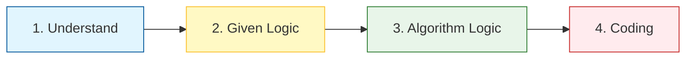

| Step | Action | Question to Ask |
|------|--------|-----------------|
| **1. Understand** | Read the statement carefully | *What is the Input? What is the expected Output?* |
| **2. Given Logic** | Identify constraints/rules | *Are there conditions? (e.g., Age > 18)* |
| **3. Algorithm Logic** | Break down into steps | *How do I go from A to B? Loops? If/Else?* |

---

## 3️⃣ Flowcharts and Its Components

A flowchart is a graphical representation of an algorithm using standardized symbols.

| Symbol | Shape | Meaning |
| :--- | :--- | :--- |
| **Terminator** | Oval / Rounded Rect | Start or End of the program |
| **Process** | Rectangle | An operation (calculation, assignment) |
| **Input/Output** | Parallelogram | Reading input or displaying output |
| **Decision** | Diamond | Checking a condition (Yes/No, True/False) |
| **Flow Line** | Arrow | Shows direction of flow |

---

## 4️⃣ Pseudocode

Pseudocode is an informal high-level description of the operating principle of a program. It uses English mixed with programming keywords.

**Standard Format:**
*   Indent for loops and conditions (like Python).
*   No semicolons (`;`) needed.
*   Use `START` and `END`.

**Example Structure:**
```text
START
    INPUT variable
    IF condition THEN
        DO SOMETHING
    ENDIF
END
```

---

## 5️⃣ Practical Examples (Flowchart & Pseudocode)

### ✅ Example 1: Sum of Two Numbers

**Logic:** Linear Sequence
```text
START
    INPUT num1, num2
    sum = num1 + num2
    PRINT sum
END
```

**Flowchart:**
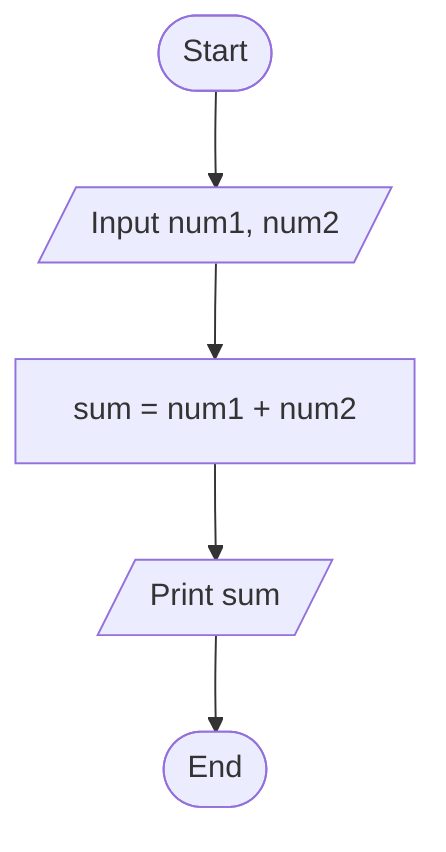

---

### ✅ Example 2: Average of Three Numbers

**Logic:** Linear Sequence with Division
```text
START
    INPUT n1, n2, n3
    sum = n1 + n2 + n3
    avg = sum / 3
    PRINT avg
END
```

**Flowchart:**
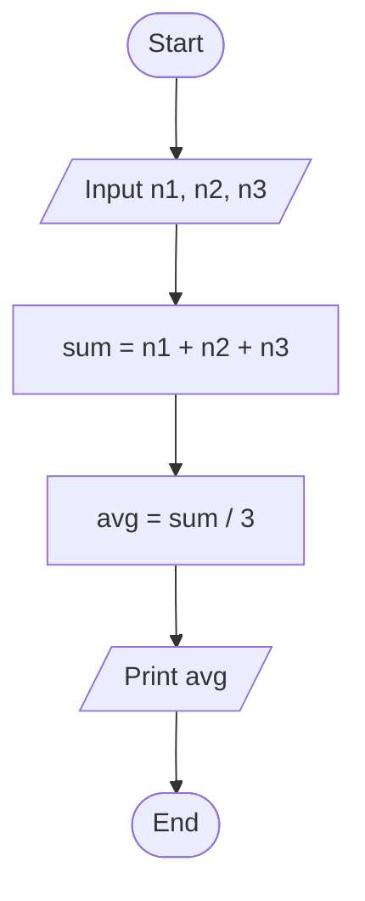

---

### ✅ Example 3: Half Number of A

**Logic:** Division Operation
```text
START
    INPUT a
    half = a / 2
    PRINT half
END
```

**Flowchart:**
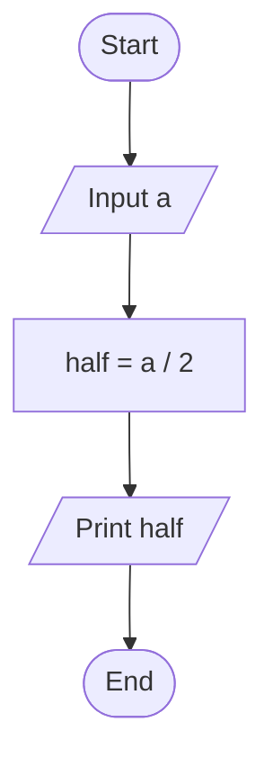

---

### ✅ Example 4: Area of Rectangle

**Logic:** Formula Application ($Length \times Breadth$)
```text
START
    INPUT length, breadth
    area = length * breadth
    PRINT area
END
```

**Flowchart:**
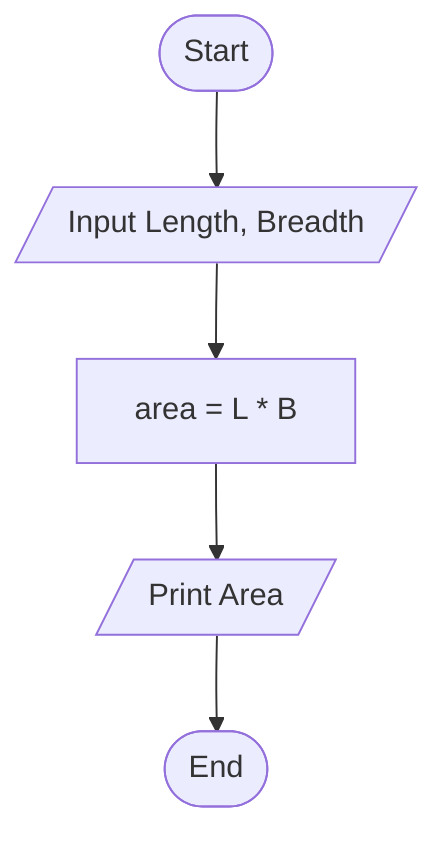

---

### ✅ Example 5: Check Positive, Negative, Zero

**Logic:** Conditional Decision (Selection)
```text
START
    INPUT number
    IF number > 0 THEN
        PRINT "Positive"
    ELSE IF number < 0 THEN
        PRINT "Negative"
    ELSE
        PRINT "Zero"
    ENDIF
END
```

**Flowchart:**
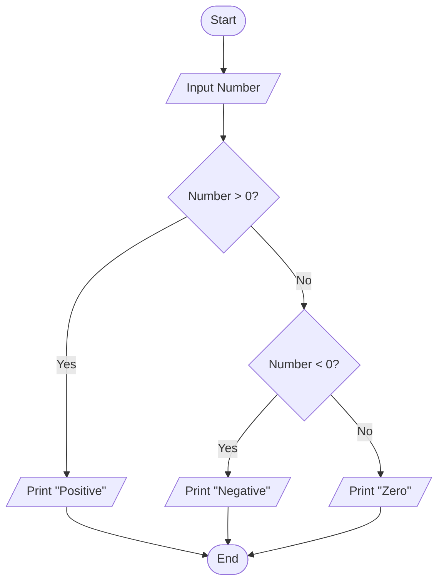

---

### ✅ Example 6: Print Counting from 1 to N

**Logic:** Iteration (Loop)
```text
START
    INPUT N
    i = 1
    WHILE i <= N DO
        PRINT i
        i = i + 1
    ENDWHILE
END
```

**Flowchart:**
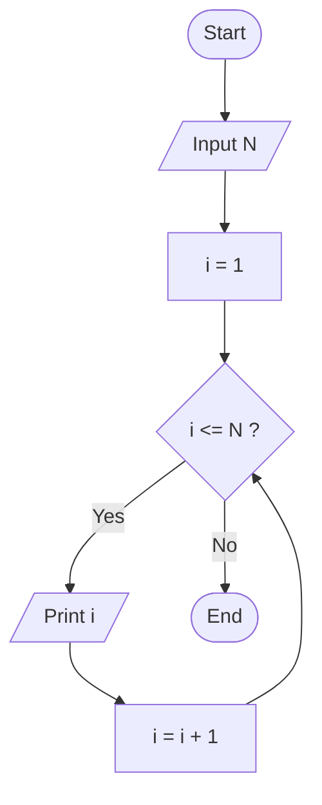

---

### ✅ Example 7: Add N Numbers from User Input

**Logic:** Loop with Accumulation
```text
START
    INPUT count
    total = 0
    i = 1
    WHILE i <= count DO
        INPUT num
        total = total + num
        i = i + 1
    ENDWHILE
    PRINT total
END
```

**Flowchart:**
```mermaid
flowchart TD
    ST([Start]) --> IO1[/Input Count (N)/]
    IO1 --> INIT[total = 0\ni = 1]
    INIT --> LOOP{ i <= N ? }
    LOOP -- Yes --> IN[/Input num/]
    IN --> ACCUM[total = total + num]
    ACCUM --> INC[i = i + 1]
    INC --> LOOP
    LOOP -- No --> OUT[/Print total/]
    OUT --> EN([End])
```

---

## 6️⃣ Most Important Points 💡

1.  **Algorithm First:** Always design your algorithm before opening the IDE. Debugging logic on paper is faster than debugging code.
2.  **Edge Cases:** When designing loops or calculations, always ask: *"What if the input is 0?"* or *"What if the number is negative?"*
3.  **Variable Naming:** In pseudocode, use meaningful names (e.g., `totalSum`, `userCount`) rather than single letters like `x` or `temp` to ensure clarity.
4.  **Loops:** Ensure every loop has a termination condition. If `i` never increases in a `while(i<=N)` loop, it becomes an infinite loop.
5.  **Scalability:** Your algorithm should work whether $N=5$ or $N=1,000,000$.

---

## 7️⃣ Interview Questions (Day 1)

**Q1: What is the difference between an Algorithm and a Program?**
> **Answer:** An algorithm is a logical plan to solve a problem (language-independent). A program is the actual implementation of that algorithm in a specific programming language (like Java).

**Q2: Why do we use Flowcharts?**
> **Answer:** Flowcharts provide a visual overview of the logic flow. They help identify errors early and communicate the design to other team members who might not know the specific coding syntax.

**Q3: What are the three main control structures in programming?**
> **Answer:** 
> 1. **Sequence:** Executing steps one after another.
> 2. **Selection (Decision):** Making choices (If/Else).
> 3. **Iteration (Loop):** Repeating steps (While/For).

**Q4: How would you handle division by zero in an algorithm?**
> **Answer:** Before performing division, add a decision condition to check if the divisor is zero. If it is, print an error message or assign a default value instead of proceeding with calculation.

**Q5: Write pseudocode to find the largest of three numbers.**
> **Answer:**
> ```text
> START
>    INPUT a, b, c
>    IF a > b AND a > c THEN
>       PRINT "a is largest"
>    ELSE IF b > a AND b > c THEN
>       PRINT "b is largest"
>    ELSE
>       PRINT "c is largest"
>    ENDIF
> END
> ```


# Day 2 <a id="day-2"></a>
[⬆ Back to Top](#top)   

## 📘 Day 2: Java Introduction & Architecture
> **Goal:** Master the core architecture, history, and execution flow. This chapter answers "How does Java actually work?" – a favorite topic for interviewers to test your foundational depth.

---

## 1️⃣ History & The "WORA" Principle

### 🔹 What is Java?
Java is a high-level, class-based, object-oriented programming language designed to have as few implementation dependencies as possible.

| Feature | Detail |
| :--- | :--- |
| **Creator** | James Gosling ("Father of Java") at Sun Microsystems |
| **Release Year** | 1995 (Originally named **Oak**, then Green, finally Java) |
| **Current Owner** | Oracle Corporation (acquired Sun in 2010) |
| **Latest LTS Version** | Java 21 (as of 2024) |
| **Core Philosophy** | **WORA**: Write Once, Run Anywhere |

### 💡 The "WORA" Magic (Write Once, Run Anywhere)
Why does Java run on Windows, Mac, Linux, and Android?
*   In languages like C/C++, code is compiled directly into **Machine Code** (0s and 1s) specific to the CPU/OS.
*   In Java, code is compiled into an intermediate format called **Bytecode**.
*   Bytecode acts as a universal language understood by the **Java Virtual Machine (JVM)** which translates it into machine code specific to your OS.

---

## 2️⃣ The Java Editions (Platforms)

Java isn't just one thing; it's split into editions based on where you want to run it.

| Edition | Full Name | Target Audience | Key Use Cases | Status |
| :--- | :--- | :--- | :--- | :--- |
| **Java SE** | Standard Edition | Core Developers | Desktop apps, Backend logic, Algorithms (`java.util`) | ✅ **Active (Base)** |
| **Java EE** | Enterprise Edition | Enterprise Devs | Large-scale web apps, Microservices, Distributed systems. Now known as **Jakarta EE**. | ✅ **Active** |
| **Java ME** | Micro Edition | Embedded Devs | IoT, Old mobile phones, Sensors. | ⚠️ Legacy/Niche |
| **JavaFX** | Graphics Platform | UI Developers | Rich desktop GUIs (Replaced Swing/AWT for modern apps). | ✅ Bundled separately |

> **🎯 Interview Tip:** If asked "Which edition do you use?", say **Java SE** for core logic and **Spring Boot (built on Jakarta EE)** for web development.

---

## 3️⃣ The Holy Trinity: JDK vs JRE vs JVM
*This is the #1 diagrammatic question in Java interviews.*

Many beginners confuse these three. Think of them as layers of software.

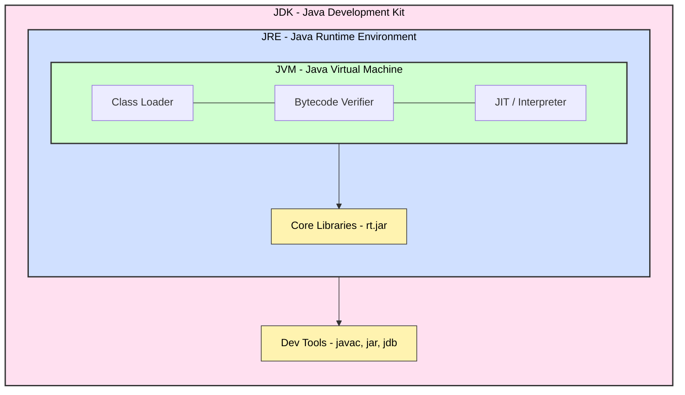

### 🔍 Detailed Breakdown

#### 1. JVM (Java Virtual Machine)
*   **Role:** The actual engine. It reads the Bytecode (`.class` files) and executes them on the underlying hardware.
*   **Platform Dependency:** **Highly Dependent.** You need a different JVM for Windows than for Mac.
*   **Job:** Converts Bytecode → Machine Code (Native instructions).

#### 2. JRE (Java Runtime Environment)
*   **Formula:** `JRE = JVM + Core Libraries`
*   **Role:** Provides the environment to **run** Java programs. It has the libraries (like `java.lang`, `System.out.println`) needed to execute code.
*   **Who needs it?** End-users who only want to run `.jar` files or applications. They don't need to write code.

#### 3. JDK (Java Development Kit)
*   **Formula:** `JDK = JRE + Development Tools`
*   **Role:** The complete package for developers. It contains the compiler (`javac`), debugger, documentation tools, and the runtime environment.
*   **Who needs it?** You (the developer). If you install JDK, you effectively get JRE and JVM too.

> **❓ Interview Question:** "Can I compile a program with just JRE?"
> **✅ Answer:** No. JRE lacks `javac` (the compiler). You can **run** Java with JRE, but not **create** it.

---

## 4️⃣ How Java Works: Compilation to Execution Flow

Unlike C++ which goes straight to Hardware, Java adds a middle layer (Bytecode).

### 🔄 The Execution Pipeline Diagram

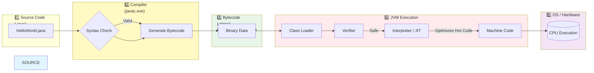

### Step-by-Step Explanation:

1.  **Writing:** You write source code (`HelloWorld.java`).
2.  **Compilation:** You run `javac`. The compiler checks for errors and converts text into **Bytecode** (`.class` file). This bytecode is NOT readable by humans and is NOT machine code yet.
3.  **Loading:** The **Class Loader** (part of JVM) loads the `.class` file into memory.
4.  **Verification:** The **Bytecode Verifier** ensures security. It checks for illegal pointer access or stack overflow attempts before running.
5.  **Execution:**
    *   **Interpreter:** Executes bytecode line-by-line (Safe but slower).
    *   **JIT (Just-In-Time) Compiler:** Finds loops used repeatedly ("Hot Spots") and compiles them into native machine code instantly for speed.
6.  **Hardware:** The CPU executes the native machine code.

---

## 5️⃣ Key Features of Java (With Mechanism)

Don't just memorize words; understand the *mechanism*.

| Feature | Mechanism (How it works) | Why is it important? |
| :--- | :--- | :--- |
| **Simple** | Removed complex C++ features (Pointers, Operator Overloading). | Less chance of crashing due to memory corruption. |
| **Object-Oriented** | Everything (except primitives) is an Object. | Easier to organize large projects using Classes. |
| **Platform Independent** | Compiles to Bytecode, not Machine Code. | Same code runs on Windows, Mac, and Linux. |
| **Robust** | Strong typing, Exception Handling, Garbage Collection. | Prevents bugs related to memory leaks and data types. |
| **Secure** | Runs in a "Sandbox", no explicit pointers. | Protects against malicious code execution (virus safety). |
| **Multithreaded** | Built-in `java.lang.Thread` support. | Can handle multiple tasks (e.g., downloading & playing music) simultaneously. |
| **Distributed** | RMI (Remote Method Invocation), Networking APIs. | Easy to build network applications and databases. |

---

## 6️⃣ Anatomy of `main()` Method
*Why is it written exactly like this?*

```java
public static void main(String[] args)
```

| Keyword | Purpose | What happens if removed? |
| :--- | :--- | :--- |
| **`public`** | **Visibility.** Allows the JVM (external caller) to access this method from anywhere. | ❌ Compile Error: `Main method not public`. |
| **`static`** | **Memory.** Allows calling without creating an object. JVM hasn't loaded any objects yet! | ❌ Compile Error: `Main method must be static`. |
| **`void`** | **Return Type.** Doesn't return data to the JVM when finished. | ❌ Compile Error if changed to `int` or `String`. |
| **`main`** | **Identifier.** Specific name the JVM searches for to start execution. | ❌ Runtime Error: `Main method not found`. |
| **`args`** | **Arguments.** Array to pass values from command line (`java ProgramName arg1`). | ✅ Optional to change name, but `args` is standard convention. |

### 💡 Visualizing Memory during `main` execution

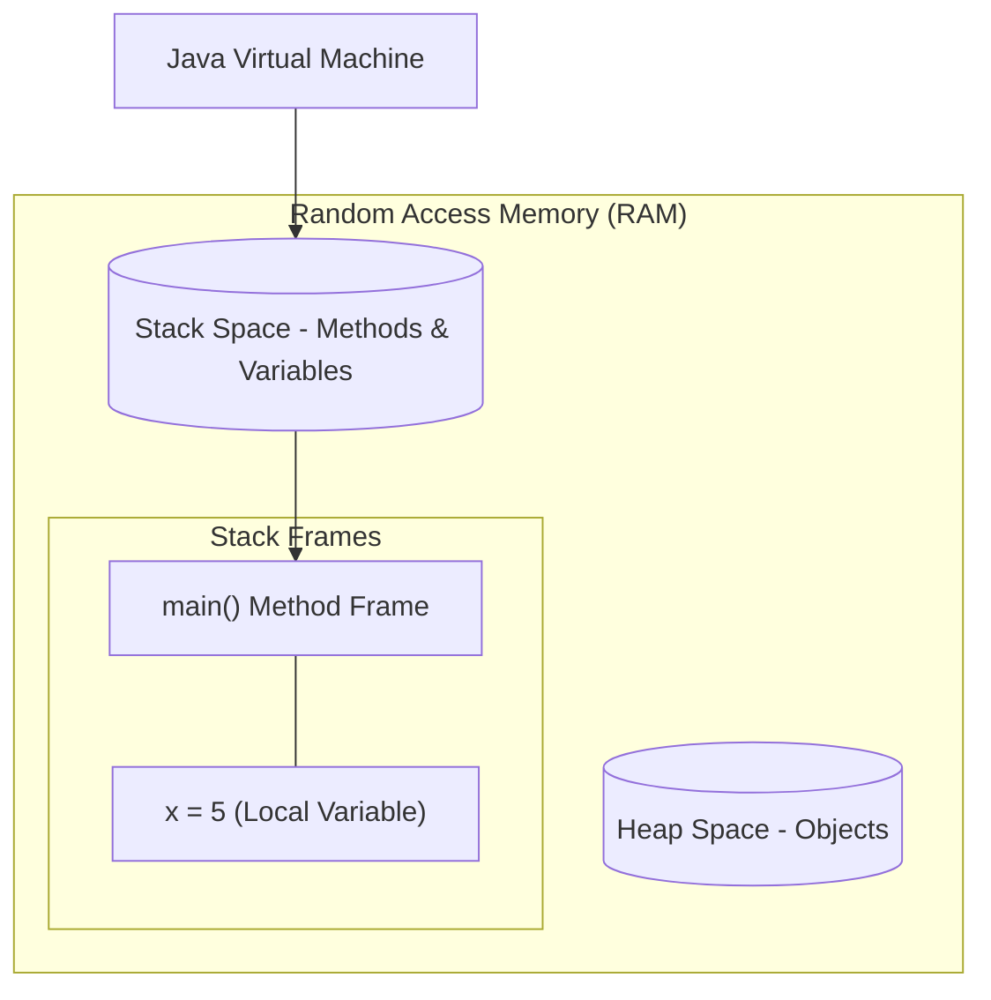

---

## 7️⃣ Comments & Documentation

Comments are ignored by the compiler (`javac` doesn't look at them) but are crucial for other humans reading your code.

### Types of Comments
1.  **Single Line:** `// Comment here` (Best for quick notes).
2.  **Multi-Line:** `/* Comment spanning lines */` (Used to temporarily disable code blocks).
3.  **Javadoc:** `/** ... */` (Special tags that generate HTML documentation automatically).

### 🛠️ Example: Writing Professional Docs
```java
/**
 * Calculates the area of a rectangle safely.
 * 
 * @author YourName       // Who wrote it
 * @version 1.0           // Current version
 * @param length          // Description of 'length' parameter
 * @param width           // Description of 'width' parameter
 * @return double         // Returns the calculated area
 * @throws IllegalArgumentException // Thrown if negative numbers used
 */
public double calculateArea(double length, double width) {
    if (length < 0 || width < 0) {
        throw new IllegalArgumentException("Dimensions cannot be negative");
    }
    return length * width;
}
```

---

## 8️⃣ Practical: Compile & Run Workflow

Understanding how to run Java from the terminal is often tested in intern interviews.

### Step 1: Create File
Save as `Demo.java` (Filename **MUST** match the `public class` name).
```java
public class Demo {
    public static void main(String[] args) {
        System.out.println("Running from Terminal!");
    }
}
```

### Step 2: Compile (Source → Bytecode)
Open terminal/command prompt in the folder:
```bash
javac Demo.java
```
*   **Result:** Creates `Demo.class`.
*   **If Errors:** Fix syntax, save, and try again.

### Step 3: Run (Bytecode → Output)
```bash
java Demo
```
*Note:* Never add `.java` or `.class` extension here. Just the class name.

---

## 🎯 Day 2: Interview Rapid Fire

**Q1: Is Java 100% Object-Oriented?**
*   **A:** No. Because it supports primitive data types (`int`, `char`, `boolean`, `float`) which are not Objects. Wrapper classes exist (`Integer`, `Character`) to make them Objects.

**Q2: What is the difference between JDK 8 and JDK 17?**
*   **A:** JDK 17 is an LTS (Long Term Support) version with newer features like Records, Sealed Classes, and Switch Expressions. JDK 8 is the legacy stable base.

**Q3: Can we change the order of modifiers in main?**
*   **A:** Yes! `static public void main...` works perfectly fine.

**Q4: Does the JVM interpret or compile code?**
*   **A:** Both. It interprets initially (slow, safe) and uses the **JIT Compiler** to optimize hot paths (fast, native).

**Q5: Why is Java considered Secure?**
*   **A:**
    1.  Bytecode Verification (checks for illegal access).
    2.  Sandbox model (Applets couldn't touch hard drive).
    3.  No explicit pointers (prevents manual memory hacking).

---

**✅ Day 2 Complete!**

---

## 9️⃣ Interpreter vs Compiler (NEW)

> This is one of the most commonly confused topics. Let us understand it once and forever.

### 5-Year-Old Explanation
> Imagine your teacher gives you a book written in French.
> - A **Compiler** is like translating the ENTIRE book to English FIRST, then you read it. Fast to read later!
> - An **Interpreter** is like reading line-by-line and translating each sentence as you go. Slower, but flexible!

---

### What is a Compiler?

A **Compiler** translates the entire source code into machine code (or bytecode) **all at once** before execution.

- ✅ Fast execution (translated once, runs many times)
- ❌ Errors shown only after full translation
- ❌ Platform dependent (C/C++ compiles to OS-specific machine code)

**Languages:** C, C++, Rust, Go

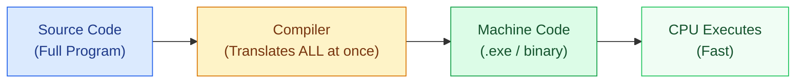

---

### What is an Interpreter?

An **Interpreter** translates and executes source code **line by line**, at runtime.

- ✅ Errors shown immediately (on the line that failed)
- ✅ Platform flexible (runs wherever interpreter exists)
- ❌ Slower (translates EVERY time you run)

**Languages:** Python, JavaScript (in browser), Ruby

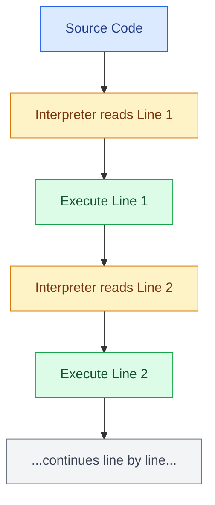

---

### Compiler vs Interpreter: Full Comparison

| Feature | Compiler | Interpreter |
|---------|----------|-------------|
| **Translation** | Entire program at once | Line by line |
| **Speed** | ✅ Fast (runs compiled code) | ❌ Slower (translates each run) |
| **Error Detection** | After full compilation | Immediately on failing line |
| **Output** | Separate executable file | No separate file |
| **Platform** | Platform dependent | Platform flexible |
| **Examples** | C, C++, Rust, Go | Python, JavaScript, Ruby |

---

### Which Languages use Which?

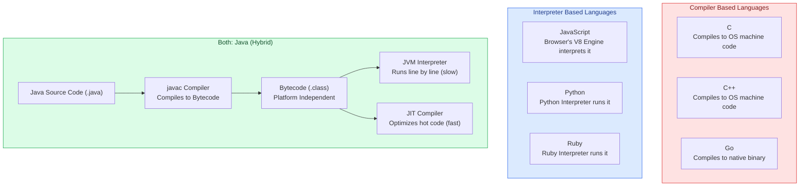

---

### Who Requires What?

| Language | Requires | Tool |
|----------|----------|------|
| **C / C++** | Compiler only | `gcc`, `g++` |
| **JavaScript** | Interpreter (Browser) | V8 (Chrome), SpiderMonkey (Firefox) |
| **Python** | Interpreter | `python3` |
| **Java** | Compiler + Interpreter/JIT | `javac` + JVM |

> **📌 Key Insight:** Java is **Hybrid**. It compiles to Bytecode (Compiler) and then the JVM interprets/JIT compiles the bytecode (Interpreter + Compiler). This is WHY Java gets both platform independence AND good performance.

---

## 🔟 How Java is Platform Independent (NEW)

### The Problem with C/C++ (Platform Dependent)

When you write C++ code and compile it on Windows, it produces a **Windows `.exe` file**. This file contains Windows-specific machine instructions. If you copy it to Linux or Mac, it will NOT run because the machine code is tied to Windows.

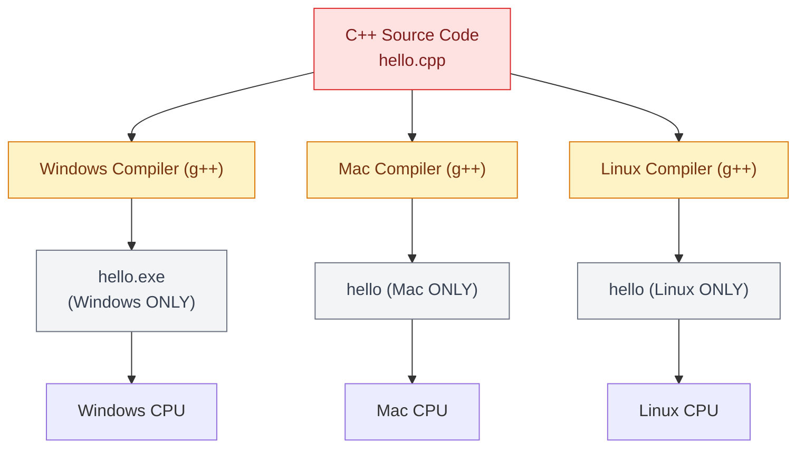

> **Problem:** Same source code needs to be compiled separately for each OS. The output binaries are not interchangeable.

---

### The Java Solution (Platform Independent)

Java solves this with **Bytecode** as the middle layer. You compile ONCE to Bytecode. Then any OS that has a JVM can run that same Bytecode.

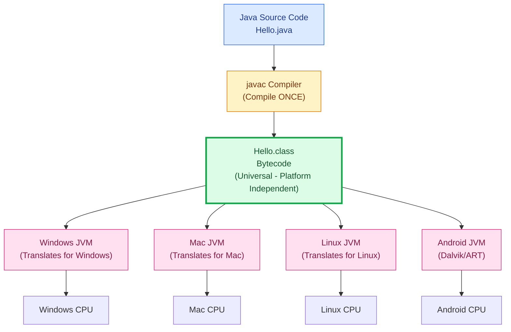

---

### Code Comparison: C++ vs Java

**C++ (Platform Dependent):**
```cpp
// hello.cpp
#include <iostream>
using namespace std;

int main() {
    cout << "Hello World" << endl;
    return 0;
}

// On Windows: g++ hello.cpp -o hello.exe  → Only works on Windows
// On Linux:   g++ hello.cpp -o hello      → Only works on Linux
// ❌ You need to recompile for EVERY OS
```

**Java (Platform Independent):**
```java
// Hello.java
public class Hello {
    public static void main(String[] args) {
        System.out.println("Hello World");
    }
}

// Compile ONCE: javac Hello.java → Creates Hello.class (Bytecode)
// Run ANYWHERE:
// Windows: java Hello  ✅
// Mac:     java Hello  ✅
// Linux:   java Hello  ✅
// Android: Works with Dalvik/ART JVM ✅
```

---

### Memory View During Java Execution

When Java runs, the JVM manages 3 key memory areas:

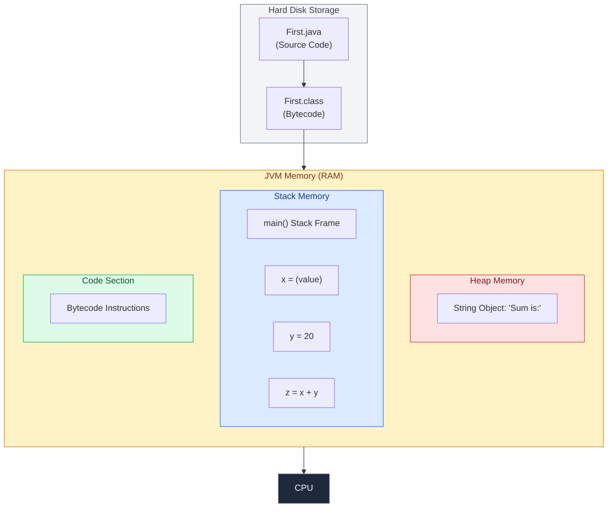

> This is exactly what the reference image shows:
> - **Heap** → Objects (`new String("Sum is:")` lives here)
> - **Stack** → Local variables (`x`, `y`, `z` live here)
> - **Code Section** → Bytecode instructions

---

## 1️⃣1️⃣ Architecture of JVM (NEW)

> Think of the JVM like a **big factory** that takes your `.class` file and produces results on your screen.

### Complete JVM Architecture Diagram

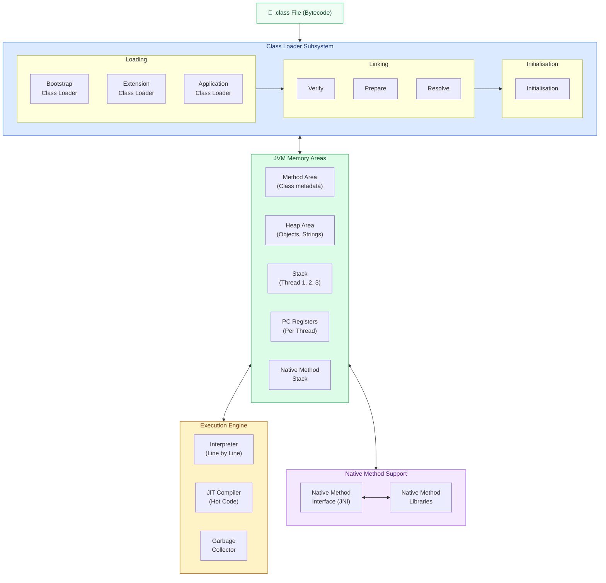

---

### Explain Like I'm 5 (JVM Architecture)

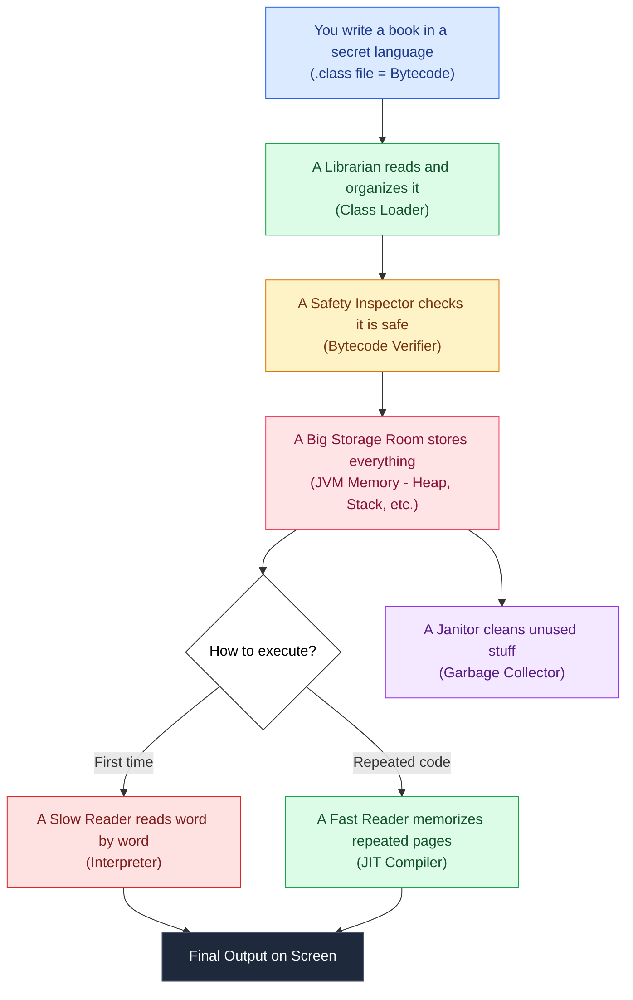

---

### Deep Dive: Each JVM Component

#### 1. Class Loader Subsystem
Responsible for **loading `.class` files** into memory. It has 3 phases:

| Phase | Sub-steps | What happens |
|-------|-----------|--------------|
| **Loading** | Bootstrap, Extension, Application | Finds and loads `.class` files |
| **Linking** | Verify, Prepare, Resolve | Checks safety, allocates memory for static vars, resolves symbolic references |
| **Initialisation** | Initialisation | Assigns actual values to static variables, runs static blocks |

#### 2. JVM Memory Areas
| Area | What it Stores | Shared? |
|------|---------------|---------|
| **Method Area** | Class metadata, static variables, method code | ✅ Shared across all threads |
| **Heap Area** | Objects created with `new` keyword | ✅ Shared across all threads |
| **Stack** | Local variables, method call frames (one stack per thread) | ❌ Per thread |
| **PC Registers** | Current instruction being executed (one per thread) | ❌ Per thread |
| **Native Method Stack** | C/C++ native method calls | ❌ Per thread |

#### 3. Execution Engine
| Component | Role | Speed |
|-----------|------|-------|
| **Interpreter** | Reads and executes bytecode one line at a time | Slow (translates every run) |
| **JIT Compiler** | Detects "hot code" (frequently run loops/methods) and compiles them to native machine code | Fast (compiled once, cached) |
| **Garbage Collector** | Automatically frees heap memory of objects no longer in use | Background process |

#### 4. Native Method Interface (JNI)
Allows Java to call code written in **other languages** (C, C++). Used when Java needs to talk to OS-specific hardware.

---

## 1️⃣2️⃣ Java Buzzwords (NEW)

As shown in the reference image, Java has 10 official buzzwords:

```mermaid
flowchart TD
    JAVA["Java Buzzwords"] --> B1["1. Simple\nRemoved pointers, operator overloading from C/C++"]
    JAVA --> B2["2. Secure\nJVM Sandbox. No direct memory access"]
    JAVA --> B3["3. Portable\nSame bytecode runs on all OS via JVM"]
    JAVA --> B4["4. Object-Oriented\nEverything is a class (except primitives)"]
    JAVA --> B5["5. Robust\nStrong typing, exception handling, GC"]
    JAVA --> B6["6. Multithreaded\njava.lang.Thread built-in"]
    JAVA --> B7["7. Architecture-Neutral\nBytecode has no CPU-specific instructions"]
    JAVA --> B8["8. Interpreted\nJVM interprets bytecode line by line"]
    JAVA --> B9["9. High Performance\nJIT compiler optimizes hot code at runtime"]
    JAVA --> B10["10. Distributed\nRMI, CORBA, Network APIs built-in"]

    style JAVA fill:#1e293b,color:#f8fafc,stroke:#475569
    style B1 fill:#dbeafe,stroke:#2563eb,color:#1e3a8a
    style B2 fill:#dcfce7,stroke:#16a34a,color:#14532d
    style B3 fill:#fef3c7,stroke:#d97706,color:#78350f
    style B4 fill:#fee2e2,stroke:#dc2626,color:#7f1d1d
    style B5 fill:#f3e8ff,stroke:#9333ea,color:#581c87
    style B6 fill:#dbeafe,stroke:#2563eb,color:#1e3a8a
    style B7 fill:#dcfce7,stroke:#16a34a,color:#14532d
    style B8 fill:#fef3c7,stroke:#d97706,color:#78350f
    style B9 fill:#fee2e2,stroke:#dc2626,color:#7f1d1d
    style B10 fill:#f3e8ff,stroke:#9333ea,color:#581c87
```

| # | Buzzword | Key Tool/Mechanism |
|---|----------|--------------------|
| 1 | Simple | Cleaner syntax vs C/C++ |
| 2 | Secure | JVM (Bytecode Verifier, Sandbox) |
| 3 | Portable | Bytecode + JVM |
| 4 | Object-Oriented | Classes, Objects, OOP Pillars |
| 5 | Robust | Checked Exceptions, GC, Strong Typing |
| 6 | Multithreaded | `Thread` class, `synchronized` |
| 7 | Architecture-Neutral | Bytecode has no CPU-specific opcodes |
| 8 | Interpreted | JVM Interpreter |
| 9 | High Performance | JIT Compiler |
| 10 | Distributed | RMI, EJB, Sockets, HTTP |

> **📌 Interview Tip:** When asked "What is Java?", mention **WORA** + **3-4 buzzwords** with mechanisms. Don't just list them — explain the mechanism briefly.

---

## ✅ Day 2 Complete (Updated)!

You now understand:
- [x] History & WORA Principle
- [x] Java Editions (SE, EE, ME, FX)
- [x] JDK vs JRE vs JVM
- [x] Compiler vs Interpreter (with diagrams)
- [x] How Java achieves Platform Independence (with C++ comparison)
- [x] JVM Architecture (Class Loader, Memory, Execution Engine)
- [x] Memory Layout (Heap, Stack, Code Section)
- [x] Java Buzzwords (all 10)
- [x] How Java code compiles and runs end-to-end

**Next → Day 3: First Program in Java** 🚀


# Day 3 <a id="day-3"></a>
[⬆ Back to Top](#top)    

## 📘 Day 3: First Program in Java
> **Goal:** Write your very first Java program, understand every single word in it, and learn what a Function/Method is. Explained so simply that even a 5-year-old could follow along.

---

## 1️⃣ Two Ways to Write Hello World in Java

Java has evolved over time. There are now **two ways** to write your first program.

### Way 1: Classic Hello World (Works in ALL Java versions)

```java
public class Main {
    public static void main(String[] args) {
        System.out.println("Hello, World!");
    }
}


### Way 2: Latest Java Hello World (Java 21+)

java
void main() {
    System.out.println("Hello, World!");
}
```

### Comparison Table

| Feature | Classic Way | Latest Way (Java 21+) |
|---------|-----------|----------------------|
| **Needs `class`?** | Yes | No |
| **Needs `public static`?** | Yes | No |
| **Needs `String[] args`?** | Yes | No |
| **Lines of Code** | 5 | 3 |
| **Used in Interviews?** | Yes (Always) | Rarely |
| **Used in Production?** | Yes | Not yet widely |

> **Important:** In interviews and exams, always use the **Classic Way**. The latest way is just for quick testing.

---

## 2️⃣ Understanding Every Word (Like You Are 5 Years Old)

Let us take the classic program and break down EVERY single word.

```java
public class HelloWorld {
    public static void main(String[] args) {
        System.out.println("Hello World");
    }
}
```

### The Big Picture First

Think of this program like a **School Building**:

```mermaid
flowchart TD
    subgraph School["CLASS = School Building"]
        direction TB
        subgraph Classroom["METHOD = A Classroom"]
            direction TB
            Teacher["CODE = The Teacher Teaching"]
        end
    end

    style School fill:#ffe0e0,stroke:#333,stroke-width:2px,color:#000
    style Classroom fill:#e0e0ff,stroke:#333,stroke-width:2px,color:#000
    style Teacher fill:#e0ffe0,stroke:#333,stroke-width:2px,color:#000
```

*   **Class** = The School Building (container for everything)
*   **Method** = A Classroom inside the school (where work happens)
*   **Code** = The teacher inside the classroom (does the actual job)

---

### Every Keyword Explained

### 🔹 `public` (Who can see it?)

**5-Year-Old Explanation:**
> Imagine you have a toy. If the toy is **public**, EVERYONE in the playground can play with it. If it is **private**, only YOU can play with it.

**Technical Meaning:**
`public` means this class or method is **visible to everyone**. The JVM (which lives outside your class) needs to see your `main` method to start the program.

---

### 🔹 `class` (The Container / Box)

**5-Year-Old Explanation:**
> A `class` is like a **lunchbox**. You put your food (code) inside it. Without the lunchbox, your food has nowhere to go!

**Technical Meaning:**
A class is a blueprint or container that holds your methods (functions) and variables. In Java, ALL code must live inside a class.

```java
public class HelloWorld {
    // Everything lives inside this box
}
```

---

### 🔹 `HelloWorld` (The Name)

**5-Year-Old Explanation:**
> Just like YOU have a name (Rahul, Priya, etc.), the class also needs a name. We called it `HelloWorld`.

**Rules for Naming:**
- Must start with a Capital Letter (convention)
- No spaces allowed (use `HelloWorld` not `Hello World`)
- File name MUST match class name (`HelloWorld.java`)

---

### 🔹 `static` (No Object Needed)

**5-Year-Old Explanation:**
> Imagine a vending machine. You do NOT need to build the machine first to get a candy. You just press the button and candy comes out. `static` means the JVM can directly call `main` WITHOUT building (creating) an object first.

**Technical Meaning:**
`static` means this method belongs to the **class itself**, not to any specific object of the class. Since JVM has not created any objects when the program starts, `main` must be `static`.

---

### 🔹 `void` (Returns Nothing)

**5-Year-Old Explanation:**
> When your mom asks you to clean your room, you just DO it. You don't bring back anything to show her. `void` means "just do the work, don't return anything."

**Technical Meaning:**
`void` is the return type. It means this method does NOT send back any value to whoever called it. The `main` method just runs code and exits.

---

### 🔹 `main` (The Starting Point)

**5-Year-Old Explanation:**
> In a race, there is a **starting line**. Everyone begins from there. `main` is the starting line of your Java program. The computer always looks for `main` first.

**Technical Meaning:**
`main` is the **entry point** of any Java application. The JVM specifically searches for a method named `main` with the exact signature `public static void main(String[] args)` to begin execution.

---

### 🔹 `String[] args` (Extra Instructions)

**5-Year-Old Explanation:**
> When your mom sends you to a shop, she gives you a **list** (buy milk, buy bread). `String[] args` is like that list. You CAN give the program extra instructions when you run it, but you don't HAVE to.

**Technical Meaning:**
`String[] args` is an array of Strings that accepts **command-line arguments**. Example:
```bash
java HelloWorld Rahul 25
// args[0] = "Rahul"
// args[1] = "25"
```

---

### 🔹 `System.out.println()` (The Printer)

**5-Year-Old Explanation:**
> You know how a printer prints paper? `System.out.println()` is like a printer that prints words on your computer screen!

Let us break this down piece by piece:

```mermaid
flowchart LR
    A["System"] --> B["out"] --> C["println"]
    
    A1["The Big Machine<br/>Java System Class"] -.-> A
    B1["The Screen<br/>Output Stream"] -.-> B
    C1["Print and go<br/>to Next Line"] -.-> C

    style A fill:#ffcccc,stroke:#333,color:#000
    style B fill:#ccffcc,stroke:#333,color:#000
    style C fill:#ccccff,stroke:#333,color:#000
```

| Part | What it is | 5-Year-Old Version |
|------|-----------|-------------------|
| `System` | A built-in Java class that talks to the computer | The big machine |
| `out` | The output stream (screen) | The TV screen |
| `println` | Print the text AND move to next line | Write on screen, then go down |
| `print` | Print the text but stay on same line | Write on screen, stay there |

### `println` vs `print` Example
```java
System.out.print("Hello ");
System.out.print("World");
// Output: Hello World (same line)

System.out.println("Hello");
System.out.println("World");
// Output:
// Hello
// World (next line)
```

---

## 3️⃣ Visual: How the Program Runs Step by Step

```mermaid
flowchart TD
    A["You write HelloWorld.java"] --> B["Run: javac HelloWorld.java"]
    B --> C["Compiler creates HelloWorld.class"]
    C --> D["Run: java HelloWorld"]
    D --> E["JVM starts"]
    E --> F["JVM searches for main method"]
    F --> G{"Found main?"}
    G -- Yes --> H["Executes code inside main"]
    H --> I["Prints Hello World on screen"]
    I --> J["Program ends"]
    G -- No --> K["ERROR: Main method not found"]

    style G fill:#fff3b0,stroke:#333,color:#000
    style K fill:#ffcccc,stroke:#333,color:#000
    style I fill:#ccffcc,stroke:#333,color:#000
```

---

## 4️⃣ What is a Function / Method?

### 5-Year-Old Explanation
> A **method** is like a **magic spell**. You give it a name, teach it what to do, and whenever you say the name, it does the trick!

### Technical Definition
A method is a **block of reusable code** that performs a specific task. You define it once and call it whenever needed.

### Anatomy of a Method

```java
public static int add(int a, int b) {
    int sum = a + b;
    return sum;
}
```

```mermaid
flowchart LR
    subgraph Method["Anatomy of a Method"]
        direction TB
        ACC["public static = Access and Type"]
        RET["int = Return Type<br/>What it gives back"]
        NAME["add = Method Name"]
        PARAMS["int a, int b = Parameters<br/>What it needs to work"]
        BODY["int sum = a + b = Body<br/>The actual work"]
        RETURN["return sum = Return<br/>Give back the answer"]
        
        ACC --> RET --> NAME --> PARAMS --> BODY --> RETURN
    end

    style Method fill:#f0f0ff,stroke:#333,stroke-width:2px,color:#000
```

### Breaking Down Each Part

| Part | Example | 5-Year-Old Version |
|------|---------|-------------------|
| **Access Modifier** | `public` | Who can use this spell? Everyone! |
| **Static/Non-Static** | `static` | Can use without building anything first |
| **Return Type** | `int` | What does the spell give back? A number! |
| **Method Name** | `add` | What is the spell called? "Add!" |
| **Parameters** | `(int a, int b)` | What ingredients does it need? Two numbers! |
| **Body** | `{ sum = a + b; }` | What does it actually do? Adds them! |
| **Return Statement** | `return sum;` | Hand over the answer |

---

### Types of Methods

#### Type 1: No Input, No Output (void, no parameters)
```java
void sayHello() {
    System.out.println("Hello!");
}
// Just does something. Takes nothing. Returns nothing.
```

#### Type 2: Takes Input, No Output (void, with parameters)
```java
void greet(String name) {
    System.out.println("Hello " + name);
}
// Takes a name. Prints it. Returns nothing.
```

#### Type 3: Takes Input, Gives Output (return type, with parameters)
```java
int add(int a, int b) {
    return a + b;
}
// Takes two numbers. Returns the sum.
```

#### Type 4: No Input, Gives Output (return type, no parameters)
```java
int getLuckyNumber() {
    return 7;
}
// Takes nothing. Returns 7.
```

### Visual Summary of Method Types

```mermaid
flowchart TD
    subgraph Types["4 Types of Methods"]
        direction TB
        T1["Type 1<br/>No Input, No Output<br/>void sayHello()"]
        T2["Type 2<br/>Has Input, No Output<br/>void greet(String name)"]
        T3["Type 3<br/>Has Input, Has Output<br/>int add(int a, int b)"]
        T4["Type 4<br/>No Input, Has Output<br/>int getLucky()"]
    end

    style T1 fill:#ffcccc,stroke:#333,color:#000
    style T2 fill:#ccffcc,stroke:#333,color:#000
    style T3 fill:#ccccff,stroke:#333,color:#000
    style T4 fill:#ffffcc,stroke:#333,color:#000
```

---

## 5️⃣ Calling a Method (Using the Spell)

```java
public class Main {
    
    // DEFINE the method (teach the spell)
    static int add(int a, int b) {
        return a + b;
    }
    
    // MAIN method (starting point)
    public static void main(String[] args) {
        
        // CALL the method (use the spell)
        int result = add(5, 3);
        
        System.out.println("Sum = " + result);
        // Output: Sum = 8
    }
}
```

### How Calling Works (Step by Step)

```mermaid
flowchart TD
    A["main() starts running"] --> B["Sees: add(5, 3)"]
    B --> C["Jumps to add method"]
    C --> D["a = 5, b = 3"]
    D --> E["sum = 5 + 3 = 8"]
    E --> F["return 8"]
    F --> G["Back to main()"]
    G --> H["result = 8"]
    H --> I["Prints: Sum = 8"]

    style A fill:#e0e0ff,stroke:#333,color:#000
    style F fill:#ffe0e0,stroke:#333,color:#000
    style I fill:#e0ffe0,stroke:#333,color:#000
```

---

## 6️⃣ Common Beginner Mistakes

| Mistake | Wrong Code | Correct Code | Why? |
|---------|-----------|-------------|------|
| Missing semicolon | `System.out.println("Hi")` | `System.out.println("Hi");` | Every statement ends with `;` |
| Wrong file name | File: `Hello.java`, Class: `HelloWorld` | Both must match | Java rule |
| Lowercase `s` in String | `string[] args` | `String[] args` | `String` is a class (capital S) |
| Missing `static` on main | `public void main(...)` | `public static void main(...)` | JVM needs static |
| Using `Main` instead of `main` | `public static void Main(...)` | `public static void main(...)` | Java is case-sensitive |

---

## 7️⃣ The Curly Braces `{}` Rule

**5-Year-Old Explanation:**
> Curly braces are like **doors of a room**. `{` opens the door. `}` closes it. Everything inside the doors belongs to that room.

```java
public class HelloWorld {          // Door 1 Opens (Class Room)
    
    public static void main(String[] args) {   // Door 2 Opens (Method Room)
        
        System.out.println("Hello World");     // Work happens here
        
    }                              // Door 2 Closes (Method Room ends)
    
}                                  // Door 1 Closes (Class Room ends)
```

```mermaid
flowchart TD
    subgraph ClassBrace["Opening Brace of CLASS"]
        direction TB
        subgraph MethodBrace["Opening Brace of METHOD"]
            CODE["Your Code Lives Here"]
        end
        CLOSE_METHOD["Closing Brace of METHOD"]
    end
    CLOSE_CLASS["Closing Brace of CLASS"]

    MethodBrace --> CLOSE_METHOD
    ClassBrace --> CLOSE_CLASS

    style ClassBrace fill:#ffe0e0,stroke:#333,color:#000
    style MethodBrace fill:#e0e0ff,stroke:#333,color:#000
    style CODE fill:#e0ffe0,stroke:#333,color:#000
```

---

## 8️⃣ Complete First Program with Comments

```java
// Step 1: Define a class (The container / lunchbox)
public class HelloWorld {
    
    // Step 2: Define main method (The starting line of the race)
    // public  = everyone can see it
    // static  = no need to create an object
    // void    = returns nothing
    // main    = JVM looks for this name
    // String[] args = optional list of instructions
    public static void main(String[] args) {
        
        // Step 3: Print something on screen
        System.out.println("Hello World");
        
        // Step 4: Try printing more things
        System.out.println("My name is Java");
        System.out.println("I am learning DSA");
        
        // Step 5: Calling a custom method
        int result = add(10, 20);
        System.out.println("10 + 20 = " + result);
    }
    
    // Step 6: A custom method (Your own magic spell)
    static int add(int a, int b) {
        return a + b;
    }
}
```

**Output:**
```text
Hello World
My name is Java
I am learning DSA
10 + 20 = 30
```

---

## 9️⃣ Most Important Points

1. **Every Java program MUST have a `main` method** (unless using Java 21+ simplified syntax).
2. **File name MUST match `public class` name** exactly (case-sensitive).
3. **`System.out.println`** = print + new line. **`System.out.print`** = print, stay on same line.
4. **Semicolons `;`** are mandatory after every statement.
5. **Methods** make code reusable. Write once, call many times.
6. **Java is case-sensitive:** `Main` is NOT the same as `main`.

---

## 🎯 Day 3: Interview Questions

**Q1: Why is the main method `static` in Java?**
> **A:** Because the JVM calls `main()` before any objects are created. `static` allows calling a method without creating an object first.

**Q2: Can we have multiple `main` methods in Java?**
> **A:** Yes! You can overload `main` with different parameter types. But the JVM will ONLY call the one with `String[] args` as the entry point.

**Q3: What is the difference between `println` and `print`?**
> **A:** `println` prints text and moves cursor to the next line. `print` prints text and keeps cursor on the same line.

**Q4: Can we write a Java program without a class?**
> **A:** In Java 21+, yes (using simplified `void main()` syntax). In older versions, no. All code must be inside a class.

**Q5: What happens if we write `static public void main` instead of `public static void main`?**
> **A:** It works perfectly fine! The order of `public` and `static` does not matter.

**Q6: What is the difference between a Method and a Function?**
> **A:** In Java, a function that belongs to a class is called a **Method**. Since everything in Java is inside a class, all functions in Java are technically methods. In other languages like C, standalone functions exist.

**Q7: Can `main` method return `int` instead of `void`?**
> **A:** No. The JVM expects `void`. If you change it to `int`, the JVM will NOT recognize it as the entry point and throw a runtime error.

---

**✅ Day 3 Complete!**


# Day 4 <a id="day-4"></a>
[⬆ Back to Top](#top)    


## 📘 Day 4: Variables in Java
> **Goal:** Understand everything about variables: what they are, why we need them, how to use them, common errors, memory storage, rules, keywords, and tricky interview questions.

---

## 1️⃣ What is a Variable? (5-Year-Old Explanation)
Imagine you have a **box**. You put a toy car inside it and label the box "Toy Car". Later, you can open the box and take out the toy car. If you want, you can replace the toy car with a doll.

A variable is exactly like this box:
- **Box** = The variable itself
- **Label** = Variable name (e.g., `toyCar`)
- **Contents** = Value stored in the variable (e.g., "Car", "Doll")

### Technical Definition
A variable is a named storage location in memory that holds a value of a specific data type. The value can change during program execution.

```java
// Variable Declaration + Initialization
int age = 25;
```

---

## 2️⃣ Why Do We Need Variables?
| Without Variables | With Variables |
|-------------------|----------------|
| `System.out.println(25 + 30);` <br> `System.out.println(25 - 5);` <br> `System.out.println(25 * 2);` | `int age = 25;` <br> `System.out.println(age + 30);` <br> `System.out.println(age - 5);` <br> `System.out.println(age * 2);` |
| ❌ If you want to change the value, you have to edit every line. | ✅ Change the value once in `age = 30` and all lines update automatically. |

### Benefits of Variables
1. **Reusability:** Use the same value multiple times without typing it again.
2. **Maintainability:** Change the value once, and all references update.
3. **Readability:** `int age = 25` is easier to understand than `25`.
4. **Memory Management:** Java automatically manages memory for variables.

---

## 3️⃣ How to Use Variables (3 Steps)
### Step 1: Declare the Variable (Create the Box)
```java
int age; // Declare an integer variable named 'age'
```

### Step 2: Initialize the Variable (Put Something in the Box)
```java
age = 25; // Assign value 25 to 'age'
```

### Step 3: Use the Variable (Take Something Out of the Box)
```java
System.out.println("Age is: " + age); // Output: Age is: 25
```

### Shorthand: Declare + Initialize in One Line
```java
int age = 25; // Best practice
```

---

## 4️⃣ Common Errors with Variables

### Error 1: Uninitialized Variable (Empty Box)
```java
int age; // Declared but not initialized
System.out.println(age); // ❌ Error: Variable 'age' might not have been initialized
```
**Fix:** Initialize the variable before using it:
```java
int age = 25;
System.out.println(age); // ✅ Correct
```

### Error 2: Incompatible Types (Putting Apple in Orange Box)
```java
int age = "25"; // ❌ Error: Incompatible types. Cannot convert String to int.
```
**Fix:** Use matching data type:
```java
int age = 25; // ✅ Correct
String age = "25"; // ✅ Correct
```

### Error 3: Not a Statement (Broken Box)
```java
int age;
age 25; // ❌ Error: Not a statement. Missing = operator.
```
**Fix:** Use assignment operator `=` to assign value:
```java
age = 25; // ✅ Correct
```

### Error 4: Expected Error (Missing Semicolon)
```java
int age = 25 // ❌ Error: ';' expected.
```
**Fix:** Add semicolon at the end of every statement:
```java
int age = 25; // ✅ Correct
```

### Error 5: Duplicate Variable Declaration (Same Label on Two Boxes)
```java
int age = 25;
int age = 30; // ❌ Error: Variable 'age' is already defined in this scope.
```
**Fix:** Use different variable name or reassign value:
```java
int age = 25;
age = 30; // ✅ Correct
```

---

## 5️⃣ How Variables are Stored in Memory
### Visualizing Memory

```mermaid
%%{init: {"theme":"base","flowchart":{"curve":"basis"}}}%%
flowchart TB
    JVM["Java Virtual Machine (JVM)"]

    subgraph RAM["Random Access Memory (RAM)"]
      direction TB

      RAMINFO["Program Memory"]:::title

      subgraph LAYOUT[" "]
        direction LR

        subgraph STACK["Stack Memory (Local Variables)"]
          direction TB
          SF["Stack Frame: main()"]:::frame
          AGE["age : int\n25\n@0x123"]:::var
          NAME["name : String (reference)\n@0x124"]:::var
          SF --> AGE
          SF --> NAME
        end

        subgraph HEAP["Heap Memory (Objects)"]
          direction TB
          STR["String Object\n'Rahul'\n@0x456"]:::obj
        end
      end

      NAME -. "points to" .-> STR
    end

    JVM --> RAMINFO

    classDef title fill:#ffffff,stroke:#333,stroke-width:1.5px,color:#111;
    classDef frame fill:#eef2ff,stroke:#4b6cb7,stroke-width:1px,color:#111;
    classDef var fill:#ffffff,stroke:#333,stroke-width:1px,color:#111;
    classDef obj fill:#ffffff,stroke:#333,stroke-width:1px,color:#111;

    style RAM fill:#f7f7f7,stroke:#333,stroke-width:2px,color:#111
    style STACK fill:#eaf0ff,stroke:#4b6cb7,stroke-width:2px,color:#111
    style HEAP fill:#ffecec,stroke:#c44545,stroke-width:2px,color:#111
 
    style JVM fill:#ffffff,stroke:#333,stroke-width:1.5px,color:#111
```

### Key Points About Memory
1. **Local Variables (int, char, boolean)**: Stored in **Stack Memory**.
2. **Objects (String, User, etc.)**: Stored in **Heap Memory**.
3. **Reference Variables**: Store the memory address of the object in the heap.
4. **Scope**: Variables are only accessible within their scope (e.g., inside a method or block).

---

## 6️⃣ Rules for Naming Variables (Java Language Specification)
### Mandatory Rules (Must Follow)
1. **Start with**: Letter (A-Z, a-z), `_` (underscore), or `$` (dollar sign).
   ```java
   int age; // ✅ Correct
   int _age; // ✅ Correct
   int $age; // ✅ Correct
   int 1age; // ❌ Error: Cannot start with number
   ```
2. **Subsequent Characters**: Letters, digits, `_`, or `$`.
   ```java
   int age123; // ✅ Correct
   int age_123; // ✅ Correct
   int age-123; // ❌ Error: Hyphen not allowed
   int age@123; // ❌ Error: Special character not allowed
   ```
3. **Case Sensitive**: `age` and `Age` are different variables.
   ```java
   int age = 25;
   int Age = 30; // ✅ Correct (different variable)
   ```
4. **Cannot Use Reserved Keywords**: You cannot use words like `int`, `class`, `public`, etc., as variable names.
   ```java
   int int = 25; // ❌ Error: 'int' is a reserved keyword
   ```

### Conventions (Best Practices for Readability)
1. **Camel Case**: Start with lowercase, then capitalize each new word.
   ```java
   int age; // ✅ Correct
   int userAge; // ✅ Correct (camel case)
   int UserAge; // ❌ Wrong (starts with uppercase)
   int user_age; // ❌ Wrong (snake case, not used in Java)
   ```
2. **Meaningful Names**: Use names that describe the variable's purpose.
   ```java
   int a = 25; // ❌ Bad: What is 'a'?
   int age = 25; // ✅ Good: Clearly describes the variable
   ```
3. **Avoid Single Letters**: Unless it's a loop counter (`i`, `j`, `k`).
   ```java
   int i; // ✅ Acceptable for loop counter
   int x; // ❌ Bad: Unclear purpose
   ```

---

## 7️⃣ Reserved Keywords in Java
Reserved keywords are words that have special meaning in Java. You cannot use them as variable names, class names, or method names.

### List of Common Reserved Keywords
| Category | Keywords |
|----------|----------|
| **Data Types** | `int`, `char`, `boolean`, `float`, `double`, `long`, `byte`, `short` |
| **Access Modifiers** | `public`, `private`, `protected` |
| **Control Flow** | `if`, `else`, `switch`, `case`, `default`, `for`, `while`, `do`, `break`, `continue`, `return` |
| **Object-Oriented** | `class`, `interface`, `extends`, `implements`, `super`, `this`, `new`, `abstract`, `final`, `static`, `void` |
| **Exception Handling** | `try`, `catch`, `finally`, `throw`, `throws`, `assert` |
| **Other** | `package`, `import`, `static`, `strictfp`, `synchronized`, `volatile`, `transient` |

### Is `main` a Reserved Keyword?
**No!** `main` is not a reserved keyword in Java. It is just a special method name that the JVM looks for as the entry point of the program. You can use `main` as a variable name, but it is not recommended:
```java
int main = 25; // ✅ Allowed but not recommended
```

---

## 8️⃣ Variable Scope (Where the Variable is Accessible)
### Types of Scope
1. **Local Scope**: Variable declared inside a method or block. Only accessible within that method/block.
   ```java
   public class Main {
       public static void main(String[] args) {
           int age = 25; // Local to main method
           System.out.println(age); // ✅ Accessible
       }
       
       public static void anotherMethod() {
           System.out.println(age); // ❌ Error: Cannot find symbol 'age'
       }
   }
   ```
2. **Instance Scope**: Variable declared inside a class but outside any method. Accessible by all methods of the class.
   ```java
   public class Main {
       int age = 25; // Instance variable
       
       public static void main(String[] args) {
           Main obj = new Main();
           System.out.println(obj.age); // ✅ Accessible via object
       }
       
       public void anotherMethod() {
           System.out.println(age); // ✅ Accessible directly
       }
   }
   ```
3. **Class Scope (Static)**: Variable declared with `static` keyword. Accessible by all static methods of the class.
   ```java
   public class Main {
       static int age = 25; // Class variable
       
       public static void main(String[] args) {
           System.out.println(age); // ✅ Accessible directly
       }
       
       public static void anotherMethod() {
           System.out.println(age); // ✅ Accessible directly
       }
   }
   ```

### Visualizing Scope

```mermaid
flowchart TD
    subgraph ClassScope["🏛️ Class Scope<br/>(Instance Variables)"]
        direction TB
        subgraph MethodScope["📋 Method Scope<br/>(Local Variables)"]
            direction TB
            subgraph BlockScope["🔹 Block Scope<br/>(Variables inside {})"]
                direction TB
                BlockVar["x, y, temp..."]
            end
            MethodVar["i, count, result..."]
        end
        ClassVar["name, age, balance..."]
    end

    style ClassScope fill:#fef2f2,stroke:#ef4444,stroke-width:2px,color:#7f1d1d
    style MethodScope fill:#eff6ff,stroke:#3b82f6,stroke-width:2px,color:#1e3a8a
    style BlockScope fill:#f0fdf4,stroke:#22c55e,stroke-width:2px,color:#14532d
    style BlockVar fill:#dcfce7,stroke:#16a34a,color:#14532d
    style MethodVar fill:#dbeafe,stroke:#2563eb,color:#1e3a8a
    style ClassVar fill:#fee2e2,stroke:#dc2626,color:#7f1d1d
```

---

## 9️⃣ Tricky Interview Questions

### Q1: Can we use `_` as a variable name in Java?
> **A:** Yes! `_` is a valid variable name in Java. But it is not recommended because it is not meaningful:
> ```java
> int _ = 25; // ✅ Allowed but not recommended
> ```

### Q2: What is the difference between `int age = 25;` and `Integer age = 25;`?
> **A:** 
> - `int` is a primitive data type, stored in stack memory.
> - `Integer` is a wrapper class, stored in heap memory.
> - `Integer` can be `null`, but `int` cannot.

### Q3: Can we declare a variable inside a `switch` case without braces?
> **A:** No! Because variables declared inside a `switch` case are in the same scope as the switch block. This can lead to errors:
> ```java
> switch (x) {
>     case 1:
>         int age = 25; // ❌ Error: Variable 'age' is already defined in this scope
>         break;
>     case 2:
>         int age = 30; // ❌ Error: Duplicate variable
>         break;
> }
> ```
> **Fix:** Use braces to create a new scope for each case:
> ```java
> switch (x) {
>     case 1: {
>         int age = 25; // ✅ Correct
>         break;
>     }
>     case 2: {
>         int age = 30; // ✅ Correct
>         break;
>     }
> }
> ```

### Q4: What is variable shadowing?
> **A:** Variable shadowing occurs when a local variable has the same name as an instance variable. The local variable hides the instance variable:
> ```java
> public class Main {
>     int age = 25; // Instance variable
>     
>     public void printAge() {
>         int age = 30; // Local variable shadows instance variable
>         System.out.println(age); // Output: 30 (local variable)
>         System.out.println(this.age); // Output: 25 (instance variable)
>     }
> }
> ```

### Q5: Can we change the data type of a variable after declaration?
> **A:** No! Once you declare a variable with a data type, you cannot change it:
> ```java
> int age = 25;
> age = "25"; // ❌ Error: Incompatible types
> ```

### Q6: What is the default value of an uninitialized instance variable?
> **A:** Instance variables are automatically initialized to their default values:
> - `int`: `0`
> - `char`: `\u0000` (null character)
> - `boolean`: `false`
> - `Object`: `null`
> ```java
> public class Main {
>     int age; // Instance variable
>     
>     public static void main(String[] args) {
>         Main obj = new Main();
>         System.out.println(obj.age); // Output: 0 (default value)
>     }
> }
> ```

---

## 🔟 Summary of Key Points
1. **Variable**: Named storage location in memory that holds a value of a specific data type.
2. **Declaration**: `int age;`
3. **Initialization**: `age = 25;`
4. **Scope**: Variables are only accessible within their scope (local, instance, class).
5. **Rules**: Must start with letter, `_`, or `$`. Cannot use reserved keywords.
6. **Conventions**: Use camel case, meaningful names, avoid single letters.
7. **Memory**: Local variables in stack, objects in heap.
8. **Errors**: Uninitialized variables, incompatible types, duplicate declarations.

---

**✅ Day 4 Complete!**

# Day 5 <a id="day-5"></a>
[⬆ Back to Top](#top)   

## 📘 Day 5: Data Types in Java
> **Goal:** Master Java's data types, understand memory allocation, learn how numbers are stored, handle type casting safely, and use literals & number systems like a pro.

---

## 1️⃣ What is a Data Type? (5-Year-Old Explanation)
Imagine you have different containers:
- A **small cup** holds water 💧
- A **big box** holds toys 🧸
- A **notebook** holds words 📝

In Java, a **Data Type** tells the computer:
1. **What kind of data** goes inside (number, letter, true/false)
2. **How much memory** to reserve (small cup vs big box)
3. **What operations** you can do with it (add numbers, but not add words)

---

## 2️⃣ Primitive vs Non-Primitive Data Types

```mermaid
flowchart TD
    DT["📦 Data Types in Java"] --> P["🟢 Primitive Types<br/>(Built-in, Store Actual Value)"]
    DT --> NP["🔵 Non-Primitive Types<br/>(Objects, Store Memory Address)"]
    
    P --> P1["byte, short, int, long"]
    P --> P2["float, double"]
    P --> P3["char"]
    P --> P4["boolean"]
    
    NP --> NP1["String, Arrays"]
    NP --> NP2["Classes, Interfaces"]
    NP --> NP3["Enums, Wrappers"]

    style P fill:#dcfce7,stroke:#16a34a,color:#14532d
    style NP fill:#dbeafe,stroke:#2563eb,color:#1e3a8a
```

| Feature | Primitive | Non-Primitive |
|---------|-----------|---------------|
| **Created by** | Java language (built-in) | Programmer (classes/objects) |
| **Stores** | Actual value directly | Reference (memory address) to object |
| **Default Value** | `0`, `false`, `\u0000` | `null` |
| **Memory** | Stack (usually) | Heap (objects), Stack (references) |
| **Examples** | `int`, `char`, `boolean` | `String`, `Scanner`, `ArrayList` |

---

## 3️⃣ The 8 Primitive Data Types (Complete Reference)

| Type | Size | Range | Default | Example |
|------|------|-------|---------|---------|
| `byte` | 8-bit (1 byte) | `-128` to `127` | `0` | `byte b = 100;` |
| `short` | 16-bit (2 bytes) | `-32,768` to `32,767` | `0` | `short s = 30000;` |
| `int` | 32-bit (4 bytes) | `-2.14B` to `2.14B` | `0` | `int age = 25;` |
| `long` | 64-bit (8 bytes) | `±9.22 Quintillion` | `0L` | `long id = 9876543210L;` |
| `float` | 32-bit (4 bytes) | `±3.4E38` (7 digits) | `0.0f` | `float price = 19.99f;` |
| `double` | 64-bit (8 bytes) | `±1.7E308` (15 digits) | `0.0d` | `double pi = 3.14159;` |
| `char` | 16-bit (2 bytes) | `\u0000` to `\uffff` | `\u0000` | `char grade = 'A';` |
| `boolean` | 1-bit (JVM uses 1 byte) | `true` or `false` | `false` | `boolean isJavaFun = true;` |

> **📌 Important:** Java guarantees these sizes **regardless of OS**. Whether you run on 32-bit Windows or 64-bit Mac, `int` is ALWAYS 32-bit. This is part of Java's **WORA** promise.

---

## 4️⃣ Why Multiple Integral Types? (`byte`, `short`, `int`, `long`)

| Type | Best Used For | Why? |
|------|---------------|------|
| `byte` | Flags, file reading, IoT sensors | Saves memory (1/4 of `int`). Good for arrays of millions of small numbers. |
| `short` | Audio samples, old game coordinates | 16-bit was standard in legacy systems. Rarely used today. |
| `int` | **Default choice** for numbers | Perfect balance of range & speed. CPU optimized for 32-bit. |
| `long` | Timestamps, IDs, large calculations | `int` overflows at 2.14 billion. `long` handles dates after 2038. |

### 💡 Memory Impact Example
```java
byte[] smallData = new byte[1_000_000]; // ~1 MB
int[] bigData   = new int[1_000_000];   // ~4 MB
// Using byte saves 75% memory when values are small!
```

---

## 5️⃣ Positive & Negative Values + Two's Complement

### Why Both Positive & Negative?
Computers use **Signed Integers** by default. The **Most Significant Bit (MSB)** acts as a sign bit:
- `0` = Positive
- `1` = Negative

### How Negative Numbers are Stored: Two's Complement
Java uses **Two's Complement** to store negatives. It avoids having `+0` and `-0`.

**Steps to store `-5` in 8-bit:**
1. Write `5` in binary: `0000 0101`
2. Flip all bits (One's Complement): `1111 1010`
3. Add `1`: `1111 1011` → This is `-5` in memory!

```mermaid
flowchart LR
    A["5 = 0000 0101"] --> B["Flip Bits → 1111 1010"]
    B --> C["Add 1 → 1111 1011"]
    C --> D["Result: -5 in Memory"]
    
    style A fill:#dcfce7,stroke:#16a34a,color:#14532d
    style B fill:#fef3c7,stroke:#d97706,color:#78350f
    style C fill:#fee2e2,stroke:#dc2626,color:#7f1d1d
    style D fill:#dbeafe,stroke:#2563eb,color:#1e3a8a
```

### How to Find Range?
For an `n`-bit signed integer:
- **Min:** $-2^{n-1}$
- **Max:** $2^{n-1} - 1$

| Type | Bits (n) | Min | Max |
|------|----------|-----|-----|
| `byte` | 8 | $-2^7 = -128$ | $2^7 - 1 = 127$ |
| `short` | 16 | $-32,768$ | $32,767$ |
| `int` | 32 | $-2,147,483,648$ | $2,147,483,647$ |
| `long` | 64 | $-9.22 \times 10^{18}$ | $9.22 \times 10^{18}$ |

---

## 6️⃣ `char` : ASCII vs Unicode

| Feature | ASCII | Unicode (Java `char`) |
|---------|-------|------------------------|
| **Size** | 7-bit (0-127) | 16-bit (0-65,535) |
| **Covers** | English letters, digits, symbols | ALL world languages + emojis |
| **Java Support** | Subset of Unicode | Native support |

```java
char c1 = 'A';      // Stores ASCII 65
char c2 = 65;       // Also 'A' (implicit conversion)
char c3 = '\u0041'; // Unicode for 'A'
char c4 = '😊';     // Unicode emoji (requires surrogate pair in practice)
```

---

## 7️⃣ Literals: What, Why & How

### What is a Literal?
A **literal** is a fixed value written directly in code. It's not a variable.
```java
int age = 25;      // 25 is an integer literal
double pi = 3.14;  // 3.14 is a double literal
boolean flag = true; // true is a boolean literal
```

### Literal Suffixes (Critical!)
| Literal | Default Type | Suffix | Example |
|---------|--------------|--------|---------|
| `100` | `int` | `L` for long | `long big = 100L;` |
| `3.14` | `double` | `F` for float, `D` for double | `float f = 3.14f;` |
| `'A'` | `char` | None | `char c = 'A';` |
| `"Hi"` | `String` | None | `String s = "Hi";` |

> **⚠️ Common Mistake:** `float f = 3.14;` ❌ Error! `3.14` is double by default. Use `3.14f` ✅

---

## 8️⃣ Number Systems in Java

Java supports 4 number systems natively:

| System | Base | Prefix | Example | Decimal Value |
|--------|------|--------|---------|---------------|
| **Decimal** | 10 | None | `int a = 255;` | 255 |
| **Binary** | 2 | `0b` or `0B` | `int b = 0b11111111;` | 255 |
| **Octal** | 8 | `0` | `int c = 0377;` | 255 |
| **Hexadecimal** | 16 | `0x` or `0X` | `int d = 0xFF;` | 255 |

### Convert to Binary String
```java
int num = 42;
System.out.println(Integer.toBinaryString(num)); // Output: 101010
```

---

## 9️⃣ Type Casting: Implicit vs Explicit

```mermaid
flowchart TD
    A["Type Casting"] --> B["Implicit (Widening)<br/>Small → Big<br/>✅ Safe, Automatic"]
    A --> C["Explicit (Narrowing)<br/>Big → Small<br/>⚠️ Risky, Manual"]
    
    B --> B1["byte → short → int → long → float → double"]
    C --> C1["double → float → long → int → short → byte"]
    
    style B fill:#dcfce7,stroke:#16a34a,color:#14532d
    style C fill:#fee2e2,stroke:#dc2626,color:#7f1d1d
```

### Implicit Casting (Automatic)
```java
int a = 100;
double b = a; // ✅ Works! int → double (no data loss)
```

### Explicit Casting (Manual)
```java
double x = 9.78;
int y = (int) x; // ✅ Works! y = 9 (decimal part TRUNCATED)
```

### 🔴 "Possible Lossy Conversion" Error
```java
double price = 19.99;
int dollars = price; // ❌ Error: possible lossy conversion from double to int
```
**Fix:** Use explicit cast if you accept data loss:
```java
int dollars = (int) price; // ✅ Compiles, dollars = 19
```

---

## 🔟 Practical Code: All Concepts Combined

```java
public class DataTypesDemo {
    public static void main(String[] args) {
        // 1. Primitives
        byte b = 127;
        short s = 32000;
        int i = 2_147_483_647; // Underscores for readability
        long l = 9_223_372_036_854_775_807L;
        
        float f = 3.14159f;
        double d = 3.141592653589793;
        
        char c = 'A';
        boolean flag = true;
        
        // 2. Number Systems
        int dec = 255;
        int bin = 0b11111111;
        int oct = 0377;
        int hex = 0xFF;
        
        System.out.println("All equal? " + (dec == bin && bin == oct && oct == hex)); // true
        
        // 3. Type Casting
        double big = 100.99;
        int small = (int) big; // Explicit cast
        System.out.println("Cast result: " + small); // 100
        
        // 4. Constants & Ranges
        System.out.println("Int Min: " + Integer.MIN_VALUE);
        System.out.println("Int Max: " + Integer.MAX_VALUE);
        System.out.println("Int Bytes: " + Integer.BYTES);
        
        // 5. Binary Conversion
        System.out.println("42 in binary: " + Integer.toBinaryString(42));
    }
}
```

---

## 1️⃣1️⃣ Useful Terminal Commands & Constants

### 🔍 `javap` (Class File Disassembler)
View compiled bytecode & constants without decompiling:
```bash
javap java.lang.Integer
javap java.lang.Byte
javap java.lang.Character
```
**Output shows:**
- `public static final int MIN_VALUE = -2147483648;`
- `public static final int MAX_VALUE = 2147483647;`
- `public static final int BYTES = 4;`
- `public static final int SIZE = 32;`

### 📦 Wrapper Class Constants
| Constant | Meaning | Example |
|----------|---------|---------|
| `Integer.MIN_VALUE` | Smallest `int` | `-2147483648` |
| `Integer.MAX_VALUE` | Largest `int` | `2147483647` |
| `Integer.BYTES` | Size in bytes | `4` |
| `Integer.SIZE` | Size in bits | `32` |
| `Double.NaN` | Not a Number | Result of `0.0/0.0` |
| `Double.POSITIVE_INFINITY` | ∞ | Result of `1.0/0.0` |

---

## 1️⃣2️⃣ 🎯 Day 5: Interview Questions

**Q1: Why is `int` always 32-bit even on 64-bit machines?**
> **A:** Java guarantees fixed sizes for primitives to maintain **platform independence** (WORA). The JVM abstracts hardware differences.

**Q2: What happens when you add 1 to `Integer.MAX_VALUE`?**
> **A:** **Integer Overflow**. It wraps around to `Integer.MIN_VALUE` (negative). This is called **Two's Complement wrap-around**.

**Q3: Why does `float f = 3.14;` give an error?**
> **A:** Decimal literals are `double` by default. Assigning `double` to `float` requires explicit cast or `f` suffix: `float f = 3.14f;`

**Q4: What is the difference between `char` and `String`?**
> **A:** `char` is a primitive (16-bit Unicode character). `String` is a non-primitive object (sequence of chars). `char` uses single quotes `'A'`, `String` uses double quotes `"A"`.

**Q5: How do you store a number larger than `long`?**
> **A:** Use `java.math.BigInteger` (for integers) or `BigDecimal` (for decimals). They handle arbitrary precision.

**Q6: Why does Java use Two's Complement for negatives?**
> **A:** It simplifies hardware arithmetic. Addition/subtraction use the same circuit. No separate `-0`. Easy overflow detection.

**Q7: What is the size of `boolean` in Java?**
> **A:** The Java spec doesn't define exact size. JVM typically uses 1 byte in arrays, 4 bytes on stack. It's implementation-dependent.

---

## ✅ Day 5 Summary Checklist
- [x] Understood Primitive vs Non-Primitive
- [x] Memorized 8 primitive types, sizes, ranges, defaults
- [x] Learned why multiple integral types exist (memory optimization)
- [x] Mastered Two's Complement & range calculation
- [x] Differentiated ASCII vs Unicode for `char`
- [x] Used literals correctly with suffixes (`L`, `F`, `D`)
- [x] Converted between Decimal, Binary, Octal, Hex
- [x] Practiced Implicit vs Explicit casting
- [x] Fixed "lossy conversion" errors
- [x] Used `javap` and `Integer.MIN/MAX/BYTES`
- [x] Ready for **Day 6: Operators & Expressions** 🚀

```