# 📘 The Complete Java Mastery Book

⭐⭐⭐⭐⭐⭐⭐⭐⭐⭐⭐⭐⭐⭐⭐⭐⭐⭐⭐⭐⭐⭐⭐⭐⭐⭐⭐⭐⭐⭐⭐⭐

## Java • Core Java • Advanced Java • Interview Preparation

**Built for Deep Understanding + Interview Mastery**

---

## 📌 About This Notes System

These notes are designed for:

- Java Interview Preparation (Beginner → Advanced)
- Core Java Mastery
- Backend & DSA Foundation

Structured for:

- 🧠 Concept clarity
- 💡 Interview readiness
- 🚀 Real-world programming understanding

---

## ✍️ Purpose

A structured roadmap to take you from beginner → interview-ready Java developer.

⭐⭐⭐⭐⭐⭐⭐⭐⭐⭐⭐⭐⭐⭐⭐⭐⭐⭐⭐⭐⭐⭐⭐⭐⭐⭐⭐⭐⭐⭐⭐⭐

<a id="main-index"></a>
---
# 📚 Contents — Master Index 

---

## 📘 PART A: JAVA FUNDAMENTALS (BEGINNER FOUNDATION)

| Chapter | Chapter Name | Key Topics |
|---------|-------------|------------|
| 1 | [Introduction to Programming](#1-introduction-to-programming) | 1.1 Introduction <br> 1.2 What is Programming Language <br> 1.3 Binary Codes <br> 1.4 Assembly Language <br> 1.5 High Level Language <br> 1.6 Procedural Language <br> 1.7 Functional Language <br> 1.8 Object Oriented Programming Language <br> 1.9 Scripting Language <br> 1.10 Compiler & Interpreter <br> 1.11 Statically & Dynamically Typed Language <br> 1.12 Memory Management <br> 1.13 Stack and Heap Memory <br> 1.14 What is Reference <br> 1.15 Garbage Collector |
| 2 | [Introduction to Java & Setup](#2-introduction-to-java-setup) | 2.1 What is Java <br> 2.2 History of Java <br> 2.3 Features of Java <br> 2.4 JDK vs JRE vs JVM <br> 2.5 How Java Program Executes <br> 2.6 JVM Architecture <br> 2.7 Setting Up Java Environment <br> 2.8 First Java Program <br> 2.9 Deep Analysis of First Program <br> 2.10 Java Program Structure <br> 2.11 Java Naming Conventions <br> 2.12 Types of Comments <br> 2.13 Java Keywords |
| 3 | [Basic Syntax & Program Structure](#3-basic-syntax-program-structure) | 3.1 Tokens in Java <br> 3.2 Identifiers — Rules and Conventions <br> 3.3 Literals — Types and Usage <br> 3.4 Escape Sequences <br> 3.5 Class & Object Basics <br> 3.6 main Method Deep Dive <br> 3.7 System.out.println Breakdown <br> 3.8 Naming Conventions <br> 3.9 Java Program Template |
| 4 | [Variables, Data Types & Type Conversion](#4-variables-data-types-type-conversion) | 4.1 What is a Variable <br> 4.2 Types of Variables <br> 4.3 Scope and Lifetime of Variables <br> 4.4 Default Values <br> 4.5 Primitive Data Types (8 Types) <br> 4.6 Non-Primitive Data Types <br> 4.7 Type Casting — Widening <br> 4.8 Type Casting — Narrowing <br> 4.9 Type Promotion in Expressions <br> 4.10 Wrapper Classes <br> 4.11 Autoboxing and Unboxing <br> 4.12 Integer Cache Pool <br> 4.13 var Keyword (Java 10+) <br> 4.14 Overflow and Underflow <br> 4.15 Constants using final |
| 5 | [Operators in Java](#5-operators-in-java) | 5.1 Types of Operators Overview <br> 5.2 Arithmetic Operators <br> 5.3 Unary Operators <br> 5.4 Pre vs Post Increment (Tricky) <br> 5.5 Relational Operators <br> 5.6 Logical Operators <br> 5.7 Short-Circuit Evaluation <br> 5.8 Bitwise Operators <br> 5.9 Shift Operators <br> 5.10 Assignment Operators <br> 5.11 Compound Assignment <br> 5.12 Ternary Operator <br> 5.13 instanceof Operator <br> 5.14 Operator Precedence Table |
| 6 | [Control Flow Statements](#6-control-flow-statements) | 6.1 if Statement <br> 6.2 if-else Statement <br> 6.3 if-else-if Ladder <br> 6.4 Nested if-else <br> 6.5 switch Statement <br> 6.6 Fall-Through Behavior <br> 6.7 Enhanced switch (Java 14+) <br> 6.8 switch Expression with yield <br> 6.9 for Loop <br> 6.10 while Loop <br> 6.11 do-while Loop <br> 6.12 Enhanced for-each Loop <br> 6.13 Nested Loops <br> 6.14 break Statement <br> 6.15 continue Statement <br> 6.16 Labeled Loops <br> 6.17 Pattern Programs |

---

## 📘 PART B: OBJECT ORIENTED PROGRAMMING (CORE JAVA)

| Chapter | Chapter Name | Key Topics |
|---------|-------------|------------|
| 7 | [OOP Concepts](#7-oop-concepts) | 7.1 What is OOP <br> 7.2 Programming Paradigms <br> 7.3 Class and Object <br> 7.4 Four Pillars of OOP <br> 7.5 Encapsulation Overview <br> 7.6 Inheritance Overview <br> 7.7 Polymorphism Overview <br> 7.8 Abstraction Overview <br> 7.9 IS-A vs HAS-A Relationship <br> 7.10 Object Lifecycle <br> 7.11 Ways to Create Objects <br> 7.12 Anonymous Objects |
| 8 | [Encapsulation](#8-encapsulation) | 8.1 What is Encapsulation <br> 8.2 Data Hiding <br> 8.3 Getter and Setter Methods <br> 8.4 Access Modifiers — private <br> 8.5 Access Modifiers — default <br> 8.6 Access Modifiers — protected <br> 8.7 Access Modifiers — public <br> 8.8 Access Modifier Comparison Table <br> 8.9 POJO and Java Bean <br> 8.10 Record Classes (Java 14+) |
| 9 | [Inheritance](#9-inheritance) | 9.1 What is Inheritance <br> 9.2 extends Keyword <br> 9.3 Single Inheritance <br> 9.4 Multilevel Inheritance <br> 9.5 Hierarchical Inheritance <br> 9.6 Multiple Inheritance — Why Not Supported <br> 9.7 Diamond Problem <br> 9.8 What is Inherited and What is Not <br> 9.9 super Keyword <br> 9.10 super() Constructor Call <br> 9.11 Method Overriding <br> 9.12 @Override Annotation <br> 9.13 Covariant Return Type <br> 9.14 Object Class — Root Class <br> 9.15 Upcasting and Downcasting |
| 10 | [Polymorphism](#10-polymorphism) | 10.1 What is Polymorphism <br> 10.2 Compile-Time Polymorphism <br> 10.3 Method Overloading <br> 10.4 Overloading with Type Promotion <br> 10.5 Runtime Polymorphism <br> 10.6 Dynamic Method Dispatch <br> 10.7 Static vs Dynamic Binding <br> 10.8 Method Overloading vs Overriding <br> 10.9 Polymorphism with Interfaces <br> 10.10 What is NOT Polymorphic |
| 11 | [Abstraction](#11-abstraction) | 11.1 What is Abstraction <br> 11.2 Abstract Class <br> 11.3 Abstract Methods <br> 11.4 Rules for Abstract Class <br> 11.5 Interface <br> 11.6 implements Keyword <br> 11.7 Interface Rules <br> 11.8 Marker Interface <br> 11.9 Functional Interface <br> 11.10 Default Methods in Interface (Java 8+) <br> 11.11 Static Methods in Interface (Java 8+) <br> 11.12 Private Methods in Interface (Java 9+) <br> 11.13 Abstract Class vs Interface |
| 12 | [Constructors](#12-constructors) | 12.1 What is a Constructor <br> 12.2 Rules for Constructors <br> 12.3 Default Constructor <br> 12.4 Parameterized Constructor <br> 12.5 Constructor Overloading <br> 12.6 this Keyword <br> 12.7 this() Constructor Chaining <br> 12.8 Constructor vs Method <br> 12.9 Copy Constructor <br> 12.10 Private Constructor <br> 12.11 Constructor in Inheritance <br> 12.12 super() in Constructor |
| 13 | [Static Keyword](#13-static-keyword) | 13.1 What is Static <br> 13.2 Static Variables <br> 13.3 Static Methods <br> 13.4 Static Block <br> 13.5 Static Nested Class <br> 13.6 Static Import <br> 13.7 Why main() is Static <br> 13.8 Instance Block <br> 13.9 Execution Order — Static, Instance, Constructor <br> 13.10 Static vs Instance Members |
| 14 | [Final Keyword](#14-final-keyword) | 14.1 What is final <br> 14.2 final Variable <br> 14.3 Blank final Variable <br> 14.4 final Reference Variable <br> 14.5 final Method <br> 14.6 final Class <br> 14.7 final with static (Constants) <br> 14.8 final Parameter <br> 14.9 finally vs final vs finalize |

---

## 📘 PART C: STRINGS, ARRAYS & LOGIC BUILDING

| Chapter | Chapter Name | Key Topics |
|---------|-------------|------------|
| 15 | [Strings in Java](#15-strings-in-java) | 15.1 What is String <br> 15.2 String as Object <br> 15.3 Creating Strings <br> 15.4 String Pool (String Constant Pool) <br> 15.5 String Immutability <br> 15.6 Why Strings are Immutable <br> 15.7 String Methods — Length and Access <br> 15.8 String Methods — Comparison <br> 15.9 String Methods — Searching <br> 15.10 String Methods — Extraction <br> 15.11 String Methods — Modification <br> 15.12 String Methods — Splitting and Joining <br> 15.13 String Concatenation Internals <br> 15.14 StringBuilder Class <br> 15.15 StringBuffer Class <br> 15.16 String vs StringBuilder vs StringBuffer <br> 15.17 String Interview Problems |
| 16 | [Arrays](#16-arrays) | 16.1 What is an Array <br> 16.2 1D Array Declaration and Initialization <br> 16.3 Accessing Array Elements <br> 16.4 Default Values in Arrays <br> 16.5 Array as Object <br> 16.6 2D Arrays <br> 16.7 Jagged Arrays <br> 16.8 Array Traversal Methods <br> 16.9 Arrays Class Utility Methods <br> 16.10 Array as Method Parameter <br> 16.11 Varargs <br> 16.12 Anonymous Arrays <br> 16.13 Sorting Arrays <br> 16.14 Searching Arrays <br> 16.15 Array Interview Problems |
| 17 | [Recursion Basics](#17-recursion-basics) | 17.1 What is Recursion <br> 17.2 How Recursion Works (Stack Flow) <br> 17.3 Base Case <br> 17.4 Recursive Case <br> 17.5 Factorial using Recursion <br> 17.6 Fibonacci using Recursion <br> 17.7 Sum of Natural Numbers <br> 17.8 Tower of Hanoi <br> 17.9 Binary Search using Recursion <br> 17.10 Direct vs Indirect Recursion <br> 17.11 Tail Recursion <br> 17.12 Recursion vs Iteration <br> 17.13 StackOverflowError |

---

## 📘 PART D: COLLECTION FRAMEWORK (VERY IMPORTANT)

| Chapter | Chapter Name | Key Topics |
|---------|-------------|------------|
| 18 | [Collection Framework Overview](#18-collection-framework-overview) | 18.1 What is Collections Framework <br> 18.2 Need for Collections <br> 18.3 Collections Hierarchy Diagram <br> 18.4 Iterable Interface <br> 18.5 Collection Interface <br> 18.6 List Interface Overview <br> 18.7 Set Interface Overview <br> 18.8 Queue Interface Overview <br> 18.9 Map Interface Overview <br> 18.10 Collections Utility Class <br> 18.11 Comparable Interface <br> 18.12 Comparator Interface <br> 18.13 Comparable vs Comparator |
| 19 | [List Interface](#19-list-interface) | 19.1 List Interface Features <br> 19.2 ArrayList — Internal Working <br> 19.3 ArrayList — Initial Capacity and Growth <br> 19.4 ArrayList — Time Complexity <br> 19.5 ArrayList — Methods <br> 19.6 LinkedList — Internal Working <br> 19.7 LinkedList — Node Structure <br> 19.8 LinkedList — Time Complexity <br> 19.9 LinkedList as Queue and Deque <br> 19.10 Vector — Legacy Class <br> 19.11 Stack — LIFO <br> 19.12 ArrayList vs LinkedList <br> 19.13 ArrayList vs Vector <br> 19.14 Iterating List Collections <br> 19.15 ConcurrentModificationException |
| 20 | [Set Interface](#20-set-interface) | 20.1 Set Interface Features <br> 20.2 HashSet — Internal Working <br> 20.3 HashSet — Hashing Mechanism <br> 20.4 HashSet — Load Factor and Rehashing <br> 20.5 LinkedHashSet — Internal Working <br> 20.6 TreeSet — Internal Working (Red-Black Tree) <br> 20.7 TreeSet — NavigableSet Methods <br> 20.8 EnumSet <br> 20.9 HashSet vs LinkedHashSet vs TreeSet <br> 20.10 equals() and hashCode() Contract <br> 20.11 Treeification in Java 8+ |
| 21 | [Map Interface](#21-map-interface) | 21.1 What is Map <br> 21.2 Map Methods <br> 21.3 Map.Entry Interface <br> 21.4 HashMap — Internal Working (In-Depth) <br> 21.5 HashMap — put() Method Flow <br> 21.6 HashMap — get() Method Flow <br> 21.7 HashMap — Rehashing and Resize <br> 21.8 HashMap — Null Key and Null Value <br> 21.9 LinkedHashMap — Insertion Order <br> 21.10 LinkedHashMap — Access Order (LRU Cache) <br> 21.11 TreeMap — Red-Black Tree <br> 21.12 TreeMap — NavigableMap Methods <br> 21.13 Hashtable — Legacy <br> 21.14 ConcurrentHashMap <br> 21.15 HashMap vs LinkedHashMap vs TreeMap <br> 21.16 HashMap vs Hashtable vs ConcurrentHashMap |
| 22 | [Iterator & Generics](#22-iterator-generics) | 22.1 Iterator Interface <br> 22.2 Iterator Methods <br> 22.3 ListIterator <br> 22.4 Fail-Fast vs Fail-Safe Iterators <br> 22.5 for-each vs Iterator <br> 22.6 What are Generics <br> 22.7 Generic Classes <br> 22.8 Generic Methods <br> 22.9 Generic Interfaces <br> 22.10 Bounded Type Parameters <br> 22.11 Wildcards — Unbounded <br> 22.12 Wildcards — Upper Bounded <br> 22.13 Wildcards — Lower Bounded <br> 22.14 PECS Principle <br> 22.15 Type Erasure |

---

## 📘 PART E: EXCEPTION & FILE HANDLING

| Chapter | Chapter Name | Key Topics |
|---------|-------------|------------|
| 23 | [Exception Handling](#23-exception-handling) | 23.1 What is an Exception <br> 23.2 Error vs Exception <br> 23.3 Exception Hierarchy <br> 23.4 Checked vs Unchecked Exceptions <br> 23.5 try-catch Block <br> 23.6 Multiple catch Blocks <br> 23.7 Multi-catch Block (Java 7+) <br> 23.8 finally Block <br> 23.9 try-with-resources (Java 7+) <br> 23.10 throw Keyword <br> 23.11 throws Keyword <br> 23.12 throw vs throws <br> 23.13 Custom Exceptions <br> 23.14 Exception Chaining <br> 23.15 Exception Handling Best Practices <br> 23.16 Common Runtime Exceptions |
| 24 | [File Handling](#24-file-handling) | 24.1 What is File Handling <br> 24.2 File Class <br> 24.3 File Methods <br> 24.4 FileInputStream and FileOutputStream <br> 24.5 FileReader and FileWriter <br> 24.6 BufferedReader and BufferedWriter <br> 24.7 PrintWriter <br> 24.8 Reading File Line by Line <br> 24.9 Writing to File <br> 24.10 Serialization <br> 24.11 Deserialization <br> 24.12 serialVersionUID <br> 24.13 transient Keyword <br> 24.14 NIO — Path and Files Class <br> 24.15 Files.readString() and writeString() (Java 11+) |

---

## 📘 PART F: MULTITHREADING (ADVANCED)

| Chapter | Chapter Name | Key Topics |
|---------|-------------|------------|
| 25 | [Multithreading Basics](#25-multithreading-basics) | 25.1 What is a Process <br> 25.2 What is a Thread <br> 25.3 Process vs Thread <br> 25.4 Benefits of Multithreading <br> 25.5 Creating Thread — extends Thread <br> 25.6 Creating Thread — implements Runnable <br> 25.7 Thread vs Runnable <br> 25.8 Callable and Future <br> 25.9 Thread Lifecycle States <br> 25.10 Thread State Diagram <br> 25.11 start() vs run() <br> 25.12 sleep() Method <br> 25.13 join() Method <br> 25.14 yield() Method <br> 25.15 Thread Priority <br> 25.16 Daemon Threads |
| 26 | [Synchronization](#26-synchronization) | 26.1 Race Condition <br> 26.2 What is Synchronization <br> 26.3 synchronized Method <br> 26.4 synchronized Block <br> 26.5 Object-Level vs Class-Level Lock <br> 26.6 volatile Keyword <br> 26.7 volatile vs synchronized <br> 26.8 wait() notify() notifyAll() <br> 26.9 Producer-Consumer Problem <br> 26.10 Deadlock <br> 26.11 Four Conditions for Deadlock <br> 26.12 How to Prevent Deadlock <br> 26.13 Livelock and Starvation <br> 26.14 Atomic Classes <br> 26.15 ReentrantLock <br> 26.16 Executor Framework |

---

## 📘 PART G: JVM INTERNALS

| Chapter | Chapter Name | Key Topics |
|---------|-------------|------------|
| 27 | [JVM Architecture](#27-jvm-architecture) | 27.1 JVM Overview <br> 27.2 ClassLoader Subsystem <br> 27.3 Bootstrap ClassLoader <br> 27.4 Extension ClassLoader <br> 27.5 Application ClassLoader <br> 27.6 Parent Delegation Model <br> 27.7 Method Area — Metaspace <br> 27.8 Heap Area <br> 27.9 Stack Area <br> 27.10 Stack Frame <br> 27.11 PC Register <br> 27.12 Native Method Stack <br> 27.13 Execution Engine <br> 27.14 Interpreter <br> 27.15 JIT Compiler <br> 27.16 Stack vs Heap |
| 28 | [Garbage Collection](#28-garbage-collection) | 28.1 What is Garbage Collection <br> 28.2 GC Roots and Reachability <br> 28.3 Mark and Sweep Algorithm <br> 28.4 Young Generation — Eden and Survivor <br> 28.5 Old Generation <br> 28.6 Minor GC vs Major GC <br> 28.7 Serial GC <br> 28.8 Parallel GC <br> 28.9 CMS GC <br> 28.10 G1 GC <br> 28.11 ZGC (Java 11+) <br> 28.12 System.gc() <br> 28.13 finalize() Method <br> 28.14 Memory Leaks in Java <br> 28.15 OutOfMemoryError |

---

## 📘 PART H: JAVA 8+ FEATURES

| Chapter | Chapter Name | Key Topics |
|---------|-------------|------------|
| 29 | [Lambda Expressions](#29-lambda-expressions) | 29.1 What is Lambda Expression <br> 29.2 Functional Interface <br> 29.3 @FunctionalInterface Annotation <br> 29.4 Lambda Syntax Variations <br> 29.5 Built-in Functional Interfaces <br> 29.6 Predicate Interface <br> 29.7 Function Interface <br> 29.8 Consumer Interface <br> 29.9 Supplier Interface <br> 29.10 BiPredicate, BiFunction, BiConsumer <br> 29.11 Method References — Static <br> 29.12 Method References — Instance <br> 29.13 Method References — Constructor <br> 29.14 Lambda vs Anonymous Class <br> 29.15 Variable Capture in Lambda |
| 30 | [Streams API](#30-streams-api) | 30.1 What is Stream API <br> 30.2 Creating Streams <br> 30.3 Intermediate Operations <br> 30.4 filter() <br> 30.5 map() and flatMap() <br> 30.6 sorted() and distinct() <br> 30.7 peek() limit() skip() <br> 30.8 Terminal Operations <br> 30.9 collect() <br> 30.10 reduce() <br> 30.11 count() min() max() <br> 30.12 findFirst() findAny() <br> 30.13 anyMatch() allMatch() noneMatch() <br> 30.14 Collectors — toList toSet toMap <br> 30.15 Collectors — groupingBy() <br> 30.16 Collectors — partitioningBy() <br> 30.17 Collectors — joining() <br> 30.18 Parallel Streams <br> 30.19 Stream API Interview Problems |
| 31 | [Optional Class](#31-optional-class) | 31.1 What is Optional <br> 31.2 Why Optional <br> 31.3 Creating Optional <br> 31.4 Optional.of() vs ofNullable() <br> 31.5 isPresent() and isEmpty() <br> 31.6 ifPresent() and ifPresentOrElse() <br> 31.7 get() and orElse() <br> 31.8 orElseGet() and orElseThrow() <br> 31.9 map() and flatMap() on Optional <br> 31.10 filter() on Optional <br> 31.11 Optional Best Practices |

---

## 📘 PART I: INTERVIEW PREPARATION

| Chapter | Chapter Name | Key Topics |
|---------|-------------|------------|
| 32 | [Java Output Questions](#32-java-output-questions) | 32.1 String Pool Output Questions <br> 32.2 Increment Decrement Tricky Questions <br> 32.3 Autoboxing Integer Cache Questions <br> 32.4 Static Block Execution Order <br> 32.5 Constructor Chaining Output <br> 32.6 Inheritance and Overriding Output <br> 32.7 Exception Handling Output Questions <br> 32.8 Loop Tricky Questions <br> 32.9 Type Casting Output Questions <br> 32.10 Thread Output Questions |
| 33 | [Coding Patterns in Java](#33-coding-patterns-java) | 33.1 Two Pointers Technique <br> 33.2 Sliding Window Technique <br> 33.3 Hashing Technique <br> 33.4 Binary Search Pattern <br> 33.5 Recursion Pattern <br> 33.6 Dynamic Programming Basics <br> 33.7 String Manipulation Problems <br> 33.8 Array Manipulation Problems <br> 33.9 LinkedList Problems <br> 33.10 Stack and Queue Problems |
| 34 | [System Design Basics](#34-system-design-basics) | 34.1 What is System Design <br> 34.2 Low-Level Design vs High-Level Design <br> 34.3 OOP Modeling <br> 34.4 SOLID Principles <br> 34.5 Single Responsibility Principle <br> 34.6 Open Closed Principle <br> 34.7 Liskov Substitution Principle <br> 34.8 Interface Segregation Principle <br> 34.9 Dependency Inversion Principle <br> 34.10 Singleton Pattern <br> 34.11 Factory Pattern <br> 34.12 Builder Pattern <br> 34.13 Observer Pattern <br> 34.14 Strategy Pattern <br> 34.15 Immutable Class Design |

---

## 🏁 FINAL PART: INTERVIEW READY ZONE

| Chapter | Chapter Name | Key Topics |
|---------|-------------|------------|
| 35 | [Java Interview Questions](#35-java-interview-questions) | 35.1 Core Java Questions <br> 35.2 OOP Interview Questions <br> 35.3 String Interview Questions <br> 35.4 Collections Interview Questions <br> 35.5 Exception Handling Questions <br> 35.6 Multithreading Questions <br> 35.7 Java 8+ Features Questions <br> 35.8 JVM and Memory Questions <br> 35.9 Tricky Output-Based Questions <br> 35.10 Coding Round Questions |
| 36 | [Mini Projects](#36-mini-projects) | 36.1 Banking System Project <br> 36.2 Student Management System <br> 36.3 Library Management System <br> 36.4 ATM Simulation <br> 36.5 CRUD Application <br> 36.6 Employee Management System <br> 36.7 Shopping Cart System <br> 36.8 Hospital Management System |

⭐⭐⭐⭐⭐⭐⭐⭐⭐⭐⭐⭐⭐⭐⭐⭐⭐⭐⭐⭐⭐⭐⭐⭐⭐⭐⭐⭐⭐⭐⭐⭐


<a id="1-introduction-to-programming"></a>

# 📘 Chapter 1: Introduction to Programming

> **Part A: Java Fundamentals — Beginner Foundation**
> `Beginner` | `Foundation` | `Must Read`

⭐⭐⭐⭐⭐⭐⭐⭐⭐⭐⭐⭐⭐⭐⭐⭐⭐⭐⭐⭐⭐⭐⭐⭐⭐⭐⭐⭐⭐⭐⭐⭐

Java • Core Java • Interview Preparation

⭐⭐⭐⭐⭐⭐⭐⭐⭐⭐⭐⭐⭐⭐⭐⭐⭐⭐⭐⭐⭐⭐⭐⭐⭐⭐⭐⭐⭐⭐⭐⭐

---

<a id="chapter-index-table-1"></a>

## 📚 Chapter 1 — Index Table

| No. | Topic | Subtopics |
|-----|-------|-----------|
| 1.1 | [Introduction](#11-introduction) | Why Programming, What Computers Understand, Role of Languages |
| 1.2 | [What is Programming Language](#12-what-is-programming-language) | Definition, Types, Syntax vs Semantics, Language Levels |
| 1.3 | [Binary Codes](#13-binary-codes) | Bits & Bytes, ASCII, Unicode, Number Systems |
| 1.4 | [Assembly Language](#14-assembly-language) | Mnemonics, Assembler, Low-level vs High-level |
| 1.5 | [High Level Language](#15-high-level-language) | Abstraction, Examples, Portability |
| 1.6 | [Procedural Language](#16-procedural-language) | Procedures, Flow, Examples (C, Pascal) |
| 1.7 | [Functional Language](#17-functional-language) | Pure Functions, Immutability, Examples |
| 1.8 | [Object Oriented Programming Language](#18-object-oriented-programming-language) | OOP Pillars, Why OOP, Java as OOP |
| 1.9 | [Scripting Language](#19-scripting-language) | Interpreted, Runtime, Use Cases |
| 1.10 | [Compiler & Interpreter](#110-compiler--interpreter) | Compilation Process, Interpretation, Java Hybrid |
| 1.11 | [Statically & Dynamically Typed Language](#111-statically--dynamically-typed-language) | Type Checking, Examples, Pros & Cons |
| 1.12 | [Memory Management](#112-memory-management) | Manual vs Automatic, OS Role, Java Memory |
| 1.13 | [Stack and Heap Memory](#113-stack-and-heap-memory) | Stack vs Heap, Memory Layout, Allocation |
| 1.14 | [What is Reference](#114-what-is-reference) | Reference vs Value, Pointer vs Reference |
| 1.15 | [Garbage Collector](#115-garbage-collector) | GC Working, Eligibility, Algorithms |
| 💡 | [Interview Questions](#1-interview-questions) | 10+ Conceptual · Scenario · Output-based |
| 🧪 | [Practice Problems](#1-practice-problems) | 5 Coding + 5 Theory + 2 Machine Coding |
| 🚀 | [Mini Project](#1-mini-project-language-identifier-tool) | Language Identifier Tool |

---

## 1.1 Introduction

<a id="11-introduction"></a>

### 📌 What is Programming?

```
Programming is the process of giving instructions to a computer
to perform specific tasks.

Just like we give instructions to humans in a language they understand,
we give instructions to computers in a language THEY understand.

Computer only understands: 0s and 1s (Binary)
But we write: Java, Python, C++ (Human-readable)

Programming bridges this gap.
```

### 🧠 Why Do We Need Programming?

```
Without programming:
❌ No apps, no websites, no operating systems
❌ No Google, no Facebook, no YouTube
❌ No ATMs, no medical devices, no satellites

With programming:
✅ Automation of repetitive tasks
✅ Solving complex mathematical problems
✅ Building systems that work 24/7
✅ Processing millions of records in seconds
```

### 🌍 Real-World Analogy

```
Think of a RECIPE BOOK.

A recipe is a set of instructions:
1. Boil water
2. Add pasta
3. Cook for 10 minutes
4. Add sauce

A PROGRAM is exactly this — a set of step-by-step instructions
for the computer to follow.

The difference: Computer follows instructions EXACTLY,
no guessing, no assumptions.
```

### 📊 Evolution of Programming

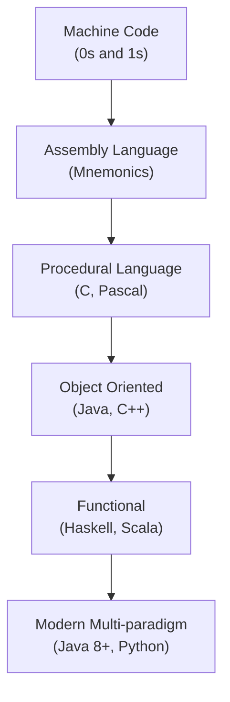

> [!NOTE]
> Programming evolved to make it easier for humans to communicate with machines. Each generation brought more abstraction and power.

<a href="#chapter-index-table-1">Go to Top 🔝</a>

---

## 1.2 What is Programming Language

<a id="12-what-is-programming-language"></a>

### 📌 Definition

```
A Programming Language is a FORMAL LANGUAGE comprising:
→ Set of instructions (Syntax)
→ Rules for combining those instructions (Grammar)
→ Meaning of instructions (Semantics)

It acts as a BRIDGE between human logic and machine execution.
```

### 🔑 Key Concepts

```
SYNTAX    → Rules of writing code (like grammar in English)
           Example: int x = 5;  ✅
                    x int = 5;  ❌ Wrong syntax

SEMANTICS → Meaning of the code
           Example: int x = 5 + 3; → x holds value 8

PROGRAM   → Set of instructions written in a programming language
```

### 📊 Levels of Programming Languages

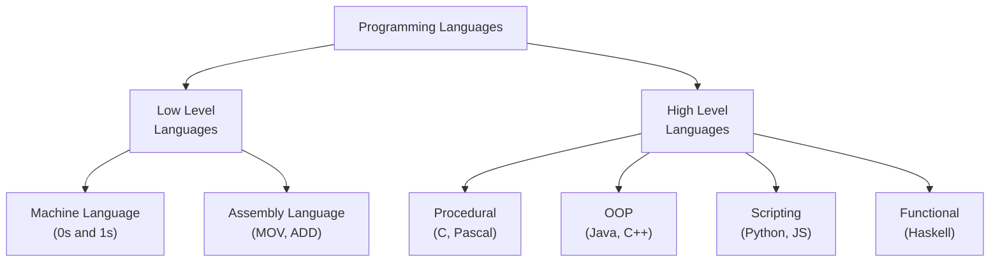

### 📌 Language Categories Summary

```
┌──────────────────────────────────────────────────────────────┐
│  Level          │  Examples          │  Closeness to Machine  │
├─────────────────┼────────────────────┼────────────────────────┤
│  Machine Code   │  0101 1100...      │  Exactly what CPU reads│
│  Assembly       │  MOV AX, 5        │  Very close            │
│  Low-level HLL  │  C                 │  Moderate              │
│  High-level HLL │  Java, Python      │  Far from machine      │
│  Very High-level│  SQL, HTML         │  Very far              │
└──────────────────────────────────────────────────────────────┘
```

> [!IMPORTANT]
> Java is a High-Level, Object-Oriented, Platform-Independent language. It is compiled to Bytecode (not machine code directly), making it unique — it's both compiled and interpreted.

<a href="#chapter-index-table-1">Go to Top 🔝</a>

---

## 1.3 Binary Codes

<a id="13-binary-codes"></a>

### 📌 What is Binary?

```
Computers are electronic machines built with transistors.
A transistor has only 2 states:
→ ON  = 1 (Current flowing)
→ OFF = 0 (No current)

This is why computers use BINARY (Base-2) number system.
Every piece of data — text, image, video — is stored as 0s and 1s.
```

### 🔑 Key Terms

```
BIT  → Smallest unit of data (0 or 1)
BYTE → 8 bits (e.g., 01000001 = 'A' in ASCII)
KB   → 1024 bytes
MB   → 1024 KB
GB   → 1024 MB
TB   → 1024 GB
```

### 📌 Number Systems

```
┌──────────────────────────────────────────────────────────────┐
│  System      │  Base │  Digits Used    │  Example            │
├──────────────┼───────┼─────────────────┼─────────────────────┤
│  Binary      │   2   │  0, 1           │  1010 = 10          │
│  Octal       │   8   │  0–7            │  012 = 10           │
│  Decimal     │  10   │  0–9            │  10 = 10            │
│  Hexadecimal │  16   │  0–9, A–F       │  0xA = 10           │
└──────────────┴───────┴─────────────────┴─────────────────────┘
```

### 📌 How Text is Stored in Binary

```
Character → ASCII Code → Binary

'A' → 65  → 01000001
'B' → 66  → 01000010
'a' → 97  → 01100001
'0' → 48  → 00110000
' ' → 32  → 00100000

Java uses UNICODE (UTF-16) — 2 bytes per character
This supports 65,536+ characters (Chinese, Arabic, etc.)
```

### 📊 Binary Conversion Flow

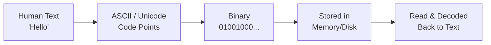

```java
// Java Binary Literals (Java 7+)
int binary = 0b1010;   // 10 in decimal
int hex = 0xFF;        // 255 in decimal
int octal = 012;       // 10 in decimal

System.out.println(binary); // 10
System.out.println(Integer.toBinaryString(65)); // 1000001
System.out.println(Integer.toHexString(255));   // ff
```

> [!TIP]
> In Java interviews, you may be asked about binary operations like bit shifting (`<<`, `>>`, `>>>`) and bitwise operators (`&`, `|`, `^`). Understanding binary is foundational for these.

<a href="#chapter-index-table-1">Go to Top 🔝</a>

---

## 1.4 Assembly Language

<a id="14-assembly-language"></a>

### 📌 What is Assembly Language?

```
Assembly Language is ONE STEP ABOVE machine code.
Instead of writing 01000001, you write human-readable MNEMONICS.

Mnemonic = Short abbreviation for an operation.

MOV → Move data
ADD → Addition
SUB → Subtraction
JMP → Jump to location
```

### 🔑 Key Concepts

```
ASSEMBLER → Converts Assembly code → Machine code
            (Like a translator from English to local language)

Assembly is PROCESSOR-SPECIFIC:
→ x86 assembly runs only on Intel/AMD processors
→ ARM assembly runs only on ARM processors (Mobile phones)
→ NOT portable across different hardware
```

### 📌 Assembly vs High Level Comparison

```
Addition of two numbers:

ASSEMBLY (x86):
   MOV AX, 5     ; Load 5 into register AX
   MOV BX, 3     ; Load 3 into register BX
   ADD AX, BX    ; AX = AX + BX (8)

JAVA:
   int result = 5 + 3;

Same result. Java is far more readable and portable.
```

### 📊 Assembly Execution Flow

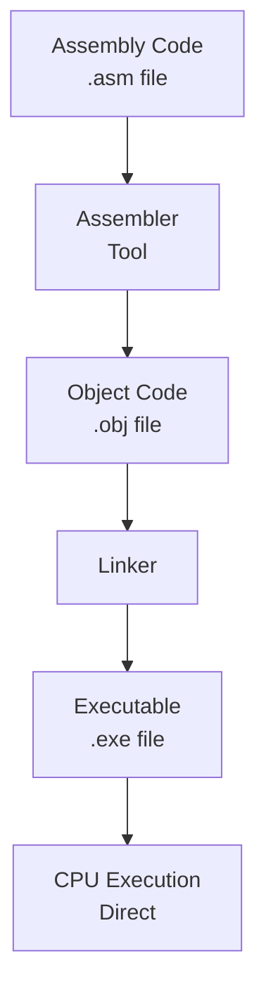

### 📌 Why Learn About Assembly?

```
Even as a Java developer, understanding Assembly helps you:
✅ Understand how CPU works at a fundamental level
✅ Understand why Java has primitive types (int, char...)
✅ Understand stack frames and method calls
✅ Debug performance issues at a low level
✅ Understand JIT compiler optimizations
```

> [!NOTE]
> Java developers never write Assembly. But JVM internally generates optimized machine/native code via the JIT (Just-In-Time) compiler, which is essentially automated assembly generation.

<a href="#chapter-index-table-1">Go to Top 🔝</a>

---

## 1.5 High Level Language

<a id="15-high-level-language"></a>

### 📌 What is a High Level Language?

```
High Level Languages (HLL) are designed to be:
→ Close to HUMAN language (English-like syntax)
→ Far from machine-level operations
→ PORTABLE across different hardware
→ ABSTRACT — hides hardware complexity

You don't manage registers, memory addresses, or CPU instructions.
The language + compiler handles all that for you.
```

### 🔑 Characteristics of High Level Languages

```
✅ Human-readable syntax
✅ Platform independent (mostly)
✅ Rich standard libraries
✅ Automatic memory management (in many)
✅ Object/function abstraction
✅ Error handling built-in
✅ Faster development time
✅ Easier debugging and maintenance
```

### 📌 Popular High Level Languages

```
┌──────────────────────────────────────────────────────────────┐
│  Language  │  Type          │  Primary Use                   │
├────────────┼────────────────┼────────────────────────────────┤
│  Java      │  OOP + HLL     │  Enterprise, Android, Backend  │
│  Python    │  Multi-paradigm│  AI/ML, Data Science, Scripts  │
│  C++       │  OOP + HLL     │  Systems, Games, Performance   │
│  JavaScript│  Multi-paradigm│  Web Frontend, Node.js         │
│  C#        │  OOP           │  Windows Apps, Game Dev        │
│  Kotlin    │  OOP + FP      │  Android, JVM                  │
│  Swift     │  OOP + FP      │  iOS, macOS                    │
└────────────┴────────────────┴────────────────────────────────┘
```

### 📊 Abstraction Levels Diagram

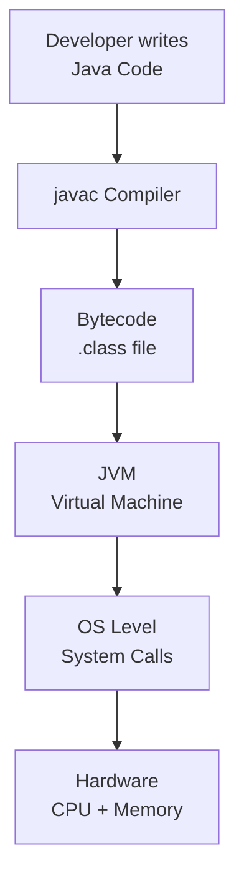

### 🌍 Real-World Analogy

```
Imagine ordering food at a restaurant:

LOW LEVEL:  You go to kitchen, buy raw ingredients, cook yourself
HIGH LEVEL: You just say "I want Biryani" — chef handles everything

High Level Language = You just write logic
Compiler/JVM = The chef who figures out HOW to do it
```

> [!IMPORTANT]
> Java is a high-level language that compiles to BYTECODE (not native machine code). The JVM then interprets/compiles bytecode to machine code at runtime. This makes Java both compiled AND interpreted — a unique hybrid approach.

<a href="#chapter-index-table-1">Go to Top 🔝</a>

---

## 1.6 Procedural Language

<a id="16-procedural-language"></a>

### 📌 What is Procedural Programming?

```
Procedural Programming is a programming paradigm where:
→ Program is divided into PROCEDURES (functions/methods)
→ Instructions execute TOP to BOTTOM
→ Data and functions are SEPARATE
→ Procedures can call other procedures

Also called: Structured Programming or Imperative Programming
```

### 🔑 Key Characteristics

```
✅ Step-by-step execution flow
✅ Code reuse through functions/procedures
✅ Top-down design approach
✅ Shared global data (can be a problem)
✅ Easy to understand for small programs
❌ Hard to manage as codebase grows
❌ Data and function separation causes issues
❌ No real-world modeling (no "objects")
```

### 📌 Examples of Procedural Languages

```
→ C          (Most famous procedural language)
→ Pascal     (Educational language)
→ FORTRAN    (Scientific computing)
→ BASIC      (Early home computers)
→ COBOL      (Business data processing)
```

### 📌 Procedural vs OOP Comparison

```java
// PROCEDURAL STYLE (functions operating on data)
int[] marks = {80, 90, 70};

static double calculateAverage(int[] m) {
    int sum = 0;
    for (int mark : m) sum += mark;
    return (double) sum / m.length;
}

// OOP STYLE (data + behavior together)
class Student {
    int[] marks = {80, 90, 70};

    double calculateAverage() {
        int sum = 0;
        for (int mark : marks) sum += mark;
        return (double) sum / marks.length;
    }
}
```

### 📊 Procedural Execution Flow

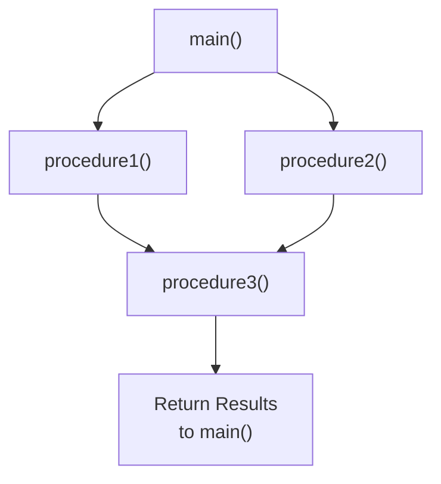

> [!NOTE]
> Java supports procedural-style coding (using static methods), but it is fundamentally an OOP language. You can write procedural code inside Java, but the best practice is to use OOP principles.

<a href="#chapter-index-table-1">Go to Top 🔝</a>

---

## 1.7 Functional Language

<a id="17-functional-language"></a>

### 📌 What is Functional Programming?

```
Functional Programming (FP) is a paradigm where:
→ Programs are built using PURE FUNCTIONS
→ Data is IMMUTABLE (never changed after creation)
→ Functions are FIRST-CLASS CITIZENS (treated like values)
→ No side effects (functions don't change external state)
→ Emphasis on WHAT to do, not HOW to do it
```

### 🔑 Core Concepts of FP

```
PURE FUNCTION:
→ Same input always gives same output
→ No side effects (doesn't modify anything outside)
→ Example: Math.sqrt(25) always returns 5.0

IMMUTABILITY:
→ Once data is created, it cannot change
→ Instead of modifying, you create new data

FIRST-CLASS FUNCTIONS:
→ Functions can be stored in variables
→ Functions can be passed as arguments
→ Functions can be returned from other functions
→ This is the basis of Lambda in Java!

HIGHER-ORDER FUNCTIONS:
→ Functions that take other functions as input
→ Example: map(), filter(), reduce() in Java Streams
```

### 📌 Functional Languages Examples

```
Pure Functional:
→ Haskell     (Most pure FP language)
→ Erlang      (Concurrent systems)
→ Elm         (Web frontend)

Multi-paradigm (supports FP):
→ Java 8+     (Lambda, Streams, Optional)
→ Scala       (JVM, mixed OOP + FP)
→ Kotlin      (Android + FP support)
→ Python      (map, filter, lambda)
→ JavaScript  (Functions as first-class)
```

```java
// Java 8+ Functional Style Example
import java.util.List;
import java.util.stream.Collectors;

List<Integer> numbers = List.of(1, 2, 3, 4, 5, 6, 7, 8, 9, 10);

// Pure functional approach: filter even, square, collect
List<Integer> result = numbers.stream()
    .filter(n -> n % 2 == 0)      // Pure function: even check
    .map(n -> n * n)               // Pure function: squaring
    .collect(Collectors.toList()); // Collect results

System.out.println(result); // [4, 16, 36, 64, 100]
```

### 📊 FP vs OOP

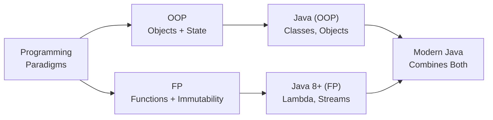

> [!TIP]
> Java 8 introduced Lambda Expressions and Stream API which brought Functional Programming to Java. This is one of the most frequently asked Java interview topics. Understanding FP concepts will help you master Java Streams.

<a href="#chapter-index-table-1">Go to Top 🔝</a>

---

## 1.8 Object Oriented Programming Language

<a id="18-object-oriented-programming-language"></a>

### 📌 What is OOP?

```
Object Oriented Programming (OOP) is a paradigm where:
→ Program is organized around OBJECTS
→ Objects = Real-world entities with STATE + BEHAVIOR
→ Code is modeled after real-world things

Real World:           OOP:
Car            →      Object
Color, Speed   →      State (Fields/Variables)
Drive, Brake   →      Behavior (Methods)
Blueprint/Design →    Class
```

### 🔑 Four Pillars of OOP

```
┌──────────────────────────────────────────────────────────────┐
│  Pillar         │  Meaning                                   │
├─────────────────┼────────────────────────────────────────────┤
│  Encapsulation  │  Wrapping data + methods together          │
│                 │  Hiding internal data (private fields)     │
├─────────────────┼────────────────────────────────────────────┤
│  Inheritance    │  Child class inherits Parent class         │
│                 │  Code reuse, IS-A relationship             │
├─────────────────┼────────────────────────────────────────────┤
│  Polymorphism   │  One thing, many forms                     │
│                 │  Overloading + Overriding                  │
├─────────────────┼────────────────────────────────────────────┤
│  Abstraction    │  Hiding complexity, showing interface      │
│                 │  Abstract class + Interface                │
└──────────────────────────────────────────────────────────────┘
```

### 📊 OOP Architecture

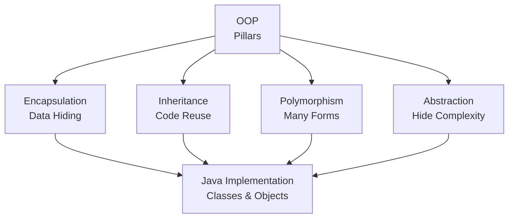

```java
// OOP in Java — Complete Mini Example
class Animal {                          // CLASS = Blueprint
    private String name;                // Encapsulation: private field
    private int age;

    public Animal(String name, int age) { // Constructor
        this.name = name;
        this.age = age;
    }

    public void makeSound() {           // Polymorphism: overridden by child
        System.out.println("Some sound");
    }

    public String getName() { return name; } // Getter
}

class Dog extends Animal {              // Inheritance: Dog IS-A Animal
    public Dog(String name, int age) {
        super(name, age);               // Calling parent constructor
    }

    @Override
    public void makeSound() {           // Polymorphism: overriding
        System.out.println(getName() + " says: Woof!");
    }
}

// Usage
Animal dog = new Dog("Tommy", 3);      // Upcasting
dog.makeSound();                        // Tommy says: Woof! (Runtime polymorphism)
```

### 📌 Why OOP?

```
PROBLEM with Procedural:
→ Large programs become difficult to manage
→ Data is shared globally (security risk)
→ Hard to model real-world entities
→ No code reuse mechanism

SOLUTION with OOP:
✅ Models real-world entities naturally
✅ Data encapsulated inside objects (secure)
✅ Code reuse through inheritance
✅ Easily extensible (Open/Closed Principle)
✅ Better maintainability and scalability
```

> [!IMPORTANT]
> Java is NOT 100% Object Oriented because it has 8 primitive data types (int, char, boolean, etc.) which are NOT objects. Languages like Smalltalk are 100% OOP. This is a VERY common interview question.

<a href="#chapter-index-table-1">Go to Top 🔝</a>

---

## 1.9 Scripting Language

<a id="19-scripting-language"></a>

### 📌 What is a Scripting Language?

```
A Scripting Language is a programming language that:
→ Is typically INTERPRETED (not compiled to machine code)
→ Executes at RUNTIME line by line
→ Designed for AUTOMATION and INTEGRATION tasks
→ Usually simpler and faster to write
→ Runs inside another environment (browser, OS, server)
```

### 🔑 Characteristics of Scripting Languages

```
✅ Interpreted (no separate compilation step needed)
✅ Dynamic typing (type checked at runtime)
✅ Rapid development (less boilerplate)
✅ Glue code (connects different systems)
✅ Often embedded in other environments
❌ Generally slower than compiled languages
❌ Runtime errors instead of compile-time errors
❌ Less type safety
```

### 📌 Types and Examples

```
┌──────────────────────────────────────────────────────────────┐
│  Type               │  Examples                             │
├─────────────────────┼───────────────────────────────────────┤
│  Web Scripting      │  JavaScript, TypeScript               │
│  Server Scripting   │  PHP, Node.js, Ruby                   │
│  Shell Scripting    │  Bash, PowerShell, Zsh                │
│  General Purpose    │  Python, Ruby, Perl                   │
│  Database Scripting │  SQL, PL/SQL                          │
│  Build Scripts      │  Gradle (Groovy/Kotlin), Maven (XML)  │
└──────────────────────────────────────────────────────────────┘
```

### 📌 Scripting vs Compiled Language

```
┌─────────────────────────────────────────────────────────────┐
│  Feature        │  Scripting         │  Compiled            │
├─────────────────┼────────────────────┼──────────────────────┤
│  Execution      │  Interpreted       │  Compiled first       │
│  Speed          │  Slower            │  Faster               │
│  Type Checking  │  Runtime           │  Compile-time         │
│  Error Detection│  Runtime           │  Early (compile)      │
│  Development    │  Faster            │  Slower               │
│  Examples       │  Python, JS, Ruby  │  Java, C, C++         │
└─────────────────┴────────────────────┴──────────────────────┘
```

> [!NOTE]
> Java is NOT a scripting language. Java is compiled (to bytecode) and then interpreted/JIT-compiled by JVM. However, Groovy and Kotlin Script can run as scripting on JVM. Also, JShell (Java 9+) allows Java to be used interactively like a scripting environment.

<a href="#chapter-index-table-1">Go to Top 🔝</a>

---

## 1.10 Compiler & Interpreter

<a id="110-compiler--interpreter"></a>

### 📌 What is a Compiler?

```
A COMPILER is a program that:
→ Reads ENTIRE source code at once
→ Translates it to target code (machine code or bytecode)
→ Reports ALL errors at once (before execution)
→ Produces an output file (.class, .exe, etc.)
→ Execution happens SEPARATELY after compilation

Examples: javac (Java), gcc (C), g++ (C++)
```

### 📌 What is an Interpreter?

```
An INTERPRETER is a program that:
→ Reads source code LINE BY LINE
→ Executes each line immediately
→ Reports error only when that LINE is reached
→ No output file generated
→ Compilation and execution happen TOGETHER

Examples: Python interpreter, JavaScript V8 Engine, Ruby
```

### 📊 Compiler vs Interpreter Flow

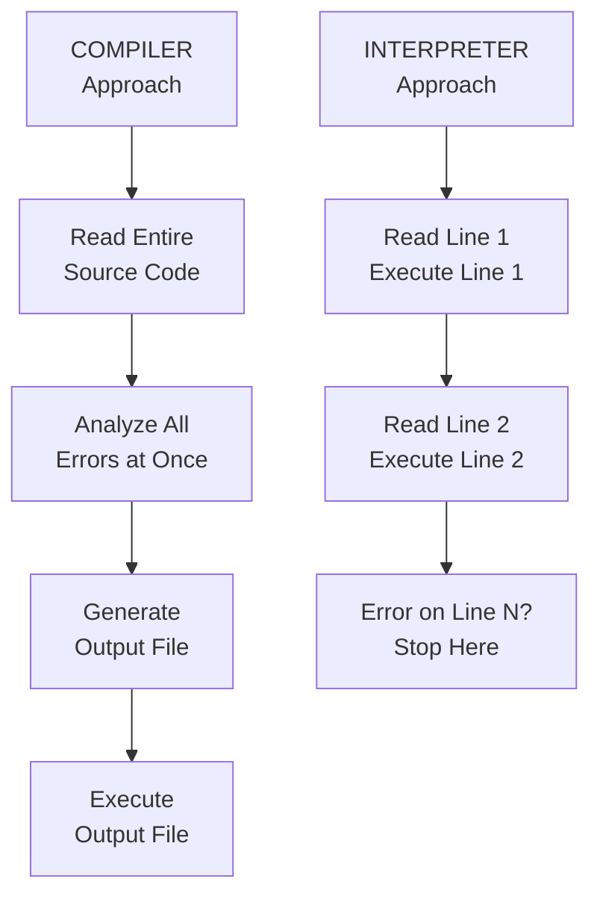

### 📌 Compiler vs Interpreter Comparison

```
┌──────────────────────────────────────────────────────────────┐
│  Feature       │  Compiler         │  Interpreter           │
├────────────────┼───────────────────┼────────────────────────┤
│  Translation   │  Whole program    │  Line by line          │
│  Speed         │  Fast execution   │  Slower execution      │
│  Error Report  │  All at once      │  One at a time         │
│  Output        │  Object file      │  No output file        │
│  Memory        │  More (stores all)│  Less                  │
│  Example       │  C, C++, Java     │  Python, Ruby          │
└──────────────────────────────────────────────────────────────┘
```

### ⭐ How Java Uses BOTH — Hybrid Approach

```
Java is UNIQUE — it uses BOTH Compiler AND Interpreter:

STEP 1: COMPILATION (javac)
→ Java source code (.java) → Bytecode (.class)
→ javac is the Java Compiler
→ Bytecode is NOT machine code — it's platform neutral

STEP 2: INTERPRETATION + JIT (JVM)
→ JVM reads Bytecode
→ Interpreter: Reads bytecode line by line (slow first run)
→ JIT Compiler: Detects "hot" code and compiles to native code
→ Result: Near-native performance over time
```

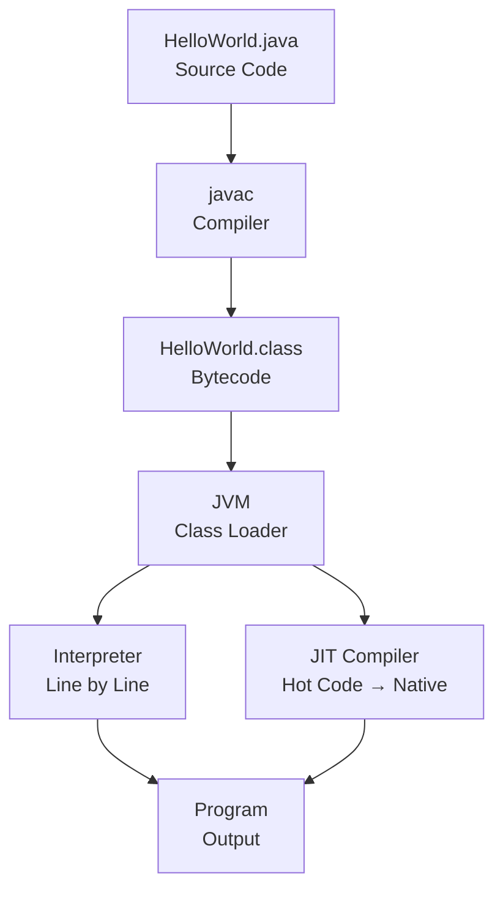

```java
// You write this:
public class Hello {
    public static void main(String[] args) {
        System.out.println("Hello, Java!");
    }
}

// javac compiles to Hello.class (bytecode)
// JVM runs Hello.class

// Commands:
// javac Hello.java   → Compilation
// java Hello         → JVM executes bytecode
```

> [!IMPORTANT]
> This is one of the most critical interview questions: **"Is Java compiled or interpreted?"**
> **Answer:** Java is BOTH — it uses a compiler (javac) to produce bytecode and JVM uses an interpreter + JIT compiler to execute it. This hybrid approach gives Java both portability (bytecode) and performance (JIT).

<a href="#chapter-index-table-1">Go to Top 🔝</a>

---

## 1.11 Statically & Dynamically Typed Language

<a id="111-statically--dynamically-typed-language"></a>

### 📌 What is Type System?

```
A Type System is a set of rules that assigns a TYPE to every
value, variable, expression in a program.

WHY TYPES MATTER:
→ int x = 5;   → x can hold only integers
→ String s;    → s can hold only text
→ Types prevent incorrect operations:
  "Hello" + 5  → What should this be? String? Error?
```

### 📌 Statically Typed Language

```
In STATICALLY TYPED languages:
→ Variable TYPE is declared at COMPILE TIME
→ Type CANNOT change during program execution
→ Type checking done by COMPILER
→ Errors caught BEFORE running the program

Examples: Java, C, C++, Kotlin, Swift, Go, Rust
```

```java
// JAVA - Statically Typed
int age = 25;           // Type declared: int
age = "Twenty Five";    // ❌ COMPILE ERROR! Type mismatch
// Compiler catches this BEFORE you even run the program

String name = "Alice";
name = 42;              // ❌ COMPILE ERROR!
```

### 📌 Dynamically Typed Language

```
In DYNAMICALLY TYPED languages:
→ Variable TYPE is determined at RUNTIME
→ Type CAN change during program execution
→ Type checking done at RUNTIME
→ Errors caught only WHILE running

Examples: Python, JavaScript, Ruby, PHP
```

```python
# Python - Dynamically Typed
age = 25          # No type declaration needed
age = "Twenty"    # ✅ No error! Type changed at runtime
age = True        # ✅ Still no error! Changed again

# Error only at runtime:
result = age + 5  # TypeError at runtime (not compile time)
```

### 📊 Static vs Dynamic Typing

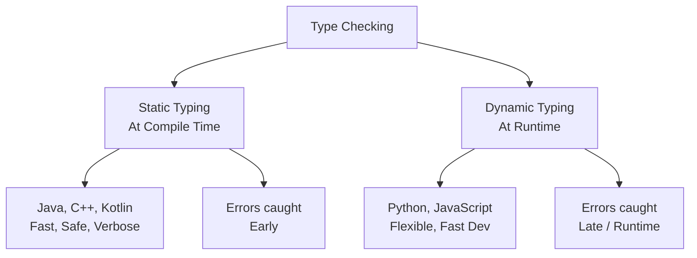

### 📌 Complete Comparison Table

```
┌──────────────────────────────────────────────────────────────┐
│  Feature        │  Static Typing     │  Dynamic Typing       │
├─────────────────┼────────────────────┼───────────────────────┤
│  Type Check     │  Compile time      │  Runtime              │
│  Declaration    │  Required          │  Not needed           │
│  Performance    │  Faster            │  Slightly slower      │
│  Error Detection│  Early (safe)      │  Late (risky)         │
│  Flexibility    │  Less              │  More                 │
│  Refactoring    │  Easier (IDE help) │  Harder               │
│  Examples       │  Java, C++, Swift  │  Python, JS, Ruby     │
└──────────────────────────────────────────────────────────────┘
```

### 📌 Strong vs Weak Typing (Bonus)

```
STRONGLY TYPED: No implicit type conversion
→ Java: int + String → ERROR (must explicitly convert)

WEAKLY TYPED: Implicit type coercion
→ JavaScript: 5 + "5" = "55" (auto coercion!)
→ JavaScript: 5 == "5" is true (loose equality)

Java is:
→ STATICALLY typed (type checked at compile time)
→ STRONGLY typed (no implicit coercion)
```

```java
// Java Strong Typing Examples:
int num = 5;
String s = "5";

// int x = num + s;  // ❌ Cannot mix int and String
int x = num + Integer.parseInt(s); // ✅ Explicit conversion

// Java var keyword (Java 10+): Type INFERRED but still STATIC
var age = 25;        // inferred as int at compile time
// age = "text";     // ❌ Still type error! var is still static
```

> [!IMPORTANT]
> Java is **Statically** and **Strongly** typed. The `var` keyword (Java 10+) does NOT make Java dynamically typed. It is just **type inference** — the compiler infers the type at compile time. The variable type is still fixed after inference.

<a href="#chapter-index-table-1">Go to Top 🔝</a>

---

## 1.12 Memory Management

<a id="112-memory-management"></a>

### 📌 What is Memory Management?

```
Memory Management is the process of:
→ Allocating memory when needed (to store data)
→ Deallocating memory when no longer needed (to free space)

Without proper memory management:
❌ Memory Leak: Program uses more and more memory → Crash
❌ Dangling Pointer: Accessing freed memory → Corruption
❌ Buffer Overflow: Writing beyond allocated memory → Security risk
```

### 📌 Types of Memory Management

```
1. MANUAL MEMORY MANAGEMENT:
   → Developer allocates AND frees memory manually
   → Languages: C (malloc/free), C++ (new/delete)
   → Risk: Forgetting to free memory = Memory Leak
   → Risk: Double-free = Crash/Corruption

2. AUTOMATIC MEMORY MANAGEMENT:
   → Language/Runtime handles allocation and deallocation
   → Languages: Java, Python, C#, Go
   → Mechanism: Garbage Collector
   → Risk: Some performance overhead from GC
```

### 📌 Memory Areas in Java

```
JVM divides memory into several areas:

┌──────────────────────────────────────────────────────────────┐
│  Memory Area      │  What is Stored                         │
├───────────────────┼─────────────────────────────────────────┤
│  Stack Memory     │  Method calls, local variables          │
│                   │  Primitive values, references           │
├───────────────────┼─────────────────────────────────────────┤
│  Heap Memory      │  All Objects (new keyword)              │
│                   │  Instance variables                     │
├───────────────────┼─────────────────────────────────────────┤
│  Method Area      │  Class definitions, static variables    │
│  (Metaspace)      │  Constant pool, method bytecode         │
├───────────────────┼─────────────────────────────────────────┤
│  PC Register      │  Current instruction pointer            │
├───────────────────┼─────────────────────────────────────────┤
│  Native Stack     │  Native (C/C++) method execution        │
└───────────────────┴─────────────────────────────────────────┘
```

### 📊 Java Memory Management Flow

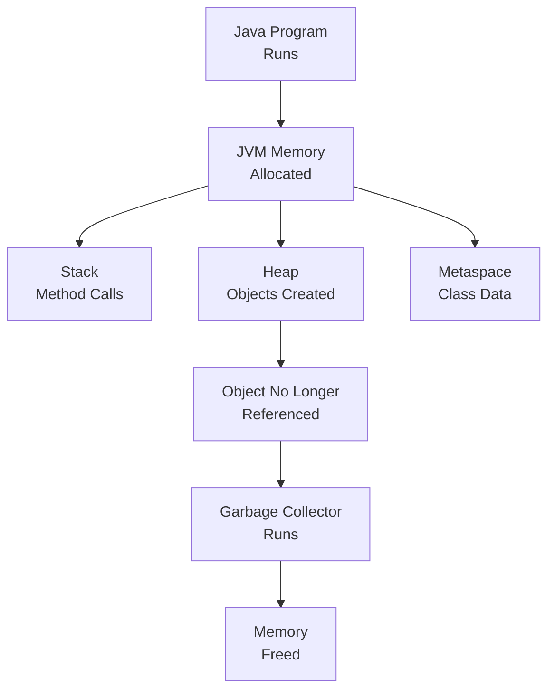

```java
public class MemoryDemo {
    static int staticVar = 100;  // Metaspace (Method Area)

    int instanceVar = 200;       // Heap (with object)

    public static void main(String[] args) {
        int localVar = 300;       // Stack
        MemoryDemo obj = new MemoryDemo(); // obj reference on Stack
                                           // MemoryDemo object on Heap
        String s = "Hello";       // s reference on Stack
                                  // "Hello" on Heap (String Pool)
    }
    // When main() ends, stack frame is destroyed
    // obj and s become eligible for Garbage Collection
}
```

> [!NOTE]
> In Java, you NEVER manually free memory. The Garbage Collector (GC) automatically reclaims memory from objects that are no longer reachable. This prevents memory leaks in most cases, but poorly written code (like static collections growing forever) can still cause leaks.

<a href="#chapter-index-table-1">Go to Top 🔝</a>

---

## 1.13 Stack and Heap Memory

<a id="113-stack-and-heap-memory"></a>

### 📌 Stack Memory

```
STACK is a memory area that works on LIFO principle
(Last In, First Out — like a stack of plates).

WHAT IS STORED:
→ Method call information (Stack Frame)
→ Local variables (primitive values stored directly)
→ References to objects (not the objects themselves)
→ Return addresses

CHARACTERISTICS:
✅ Very FAST access (LIFO structure)
✅ Automatically managed (frame added on call, removed on return)
✅ Thread-safe (each thread has its OWN stack)
✅ Fixed size per thread
❌ Limited size (StackOverflowError if exceeded — infinite recursion)
❌ Short lifetime (lives as long as method runs)
```

### 📌 Heap Memory

```
HEAP is a large pool of memory for DYNAMIC ALLOCATION.
This is where all OBJECTS live.

WHAT IS STORED:
→ All objects created with 'new' keyword
→ Instance variables (fields of objects)
→ Arrays

CHARACTERISTICS:
✅ Large size (configurable with -Xmx flag)
✅ Objects can live longer than the method that created them
✅ Shared among ALL threads
❌ Slower access than Stack
❌ Needs Garbage Collector for management
❌ Fragmentation possible
```

### 📊 Stack vs Heap Visual

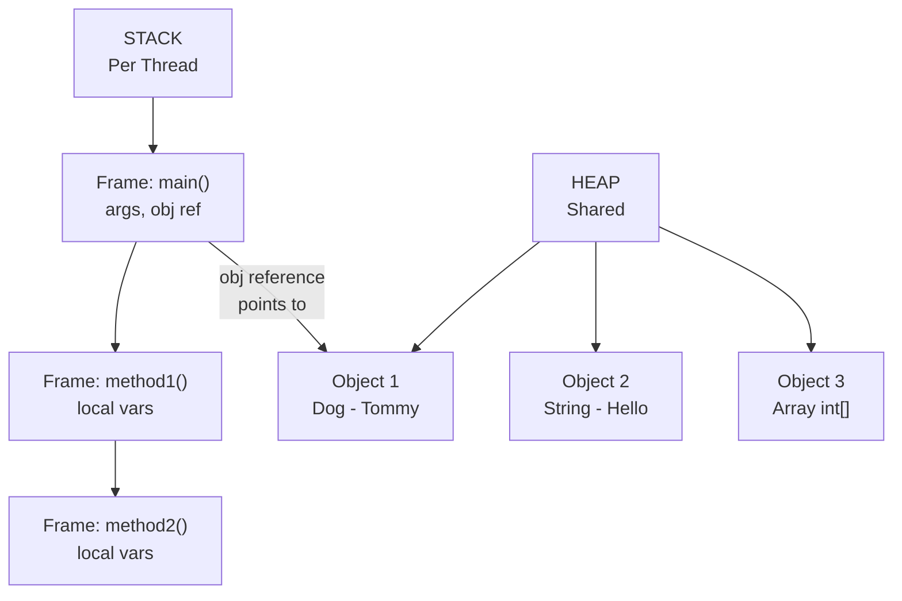

### 📌 Detailed Stack vs Heap Table

```
┌──────────────────────────────────────────────────────────────┐
│  Feature          │  Stack                │  Heap            │
├───────────────────┼───────────────────────┼──────────────────┤
│  What stored      │  Method calls,        │  Objects,        │
│                   │  Local vars, Refs     │  Instance vars   │
├───────────────────┼───────────────────────┼──────────────────┤
│  Access Speed     │  Faster               │  Slower          │
├───────────────────┼───────────────────────┼──────────────────┤
│  Management       │  Automatic (LIFO)     │  GC managed      │
├───────────────────┼───────────────────────┼──────────────────┤
│  Thread Safety    │  Per Thread (safe)    │  Shared (unsafe) │
├───────────────────┼───────────────────────┼──────────────────┤
│  Size             │  Small (512KB–8MB)    │  Large (512MB+)  │
├───────────────────┼───────────────────────┼──────────────────┤
│  Lifetime         │  Method duration      │  Until GC        │
├───────────────────┼───────────────────────┼──────────────────┤
│  Error            │  StackOverflowError   │  OutOfMemoryError│
└───────────────────┴───────────────────────┴──────────────────┘
```

```java
public class StackHeapDemo {

    public static void main(String[] args) {
        // 'x' is a primitive → stored DIRECTLY on Stack
        int x = 10;

        // 'name' reference → stored on Stack
        // "Alice" String object → stored on Heap
        String name = "Alice";

        // 'arr' reference → stored on Stack
        // int[] object {1,2,3} → stored on Heap
        int[] arr = {1, 2, 3};

        // 'obj' reference → stored on Stack
        // Dog object → stored on Heap
        Dog obj = new Dog("Tommy");

        System.out.println(x);    // 10
        System.out.println(name); // Alice
        System.out.println(obj.name); // Tommy
    }
}

class Dog {
    String name; // Instance variable → stored in Heap (with object)
    Dog(String name) { this.name = name; }
}
```

### 📌 Stack Frames Explained

```
When a method is called → NEW STACK FRAME is pushed onto Stack
When method returns → Stack frame is POPPED (destroyed)

Stack Frame contains:
→ Method parameters
→ Local variables
→ Return address (where to go back after method ends)
→ Operand stack for calculations

Infinite Recursion → Stack grows infinitely → StackOverflowError
```

> [!IMPORTANT]
> Interview Gold: **"Where are objects stored in Java?"**
> → Objects are ALWAYS stored on the **Heap**.
> → References (variables pointing to objects) are stored on **Stack** (for local vars) or **Heap** (for instance variables).
> → Primitive values are stored on **Stack** (for local vars) or **Heap** (as part of object when they are instance variables).

<a href="#chapter-index-table-1">Go to Top 🔝</a>

---

## 1.14 What is Reference

<a id="114-what-is-reference"></a>

### 📌 What is a Reference?

```
A REFERENCE is a variable that stores the MEMORY ADDRESS
(location in Heap) of an object.

It does NOT store the object itself.
It stores WHERE the object lives.

Real-World Analogy:
→ House (Object) exists at some location (Heap)
→ Home Address (Reference) tells you WHERE the house is
→ Multiple people can have the same address (multiple references → same object)
→ If everyone loses the address → House cannot be found → GC cleans it up
```

### 📌 Reference vs Primitive

```
PRIMITIVE VARIABLE:
→ Stores the ACTUAL VALUE directly
→ Stored on Stack (for local variables)
→ Types: int, byte, short, long, float, double, char, boolean

REFERENCE VARIABLE:
→ Stores the MEMORY ADDRESS of an object
→ Reference itself on Stack, Object on Heap
→ Types: Any class (String, Dog, Employee, int[], etc.)
→ Default value: null (points to nothing)
```

```java
public class ReferenceDemo {
    public static void main(String[] args) {

        // PRIMITIVE: x directly stores value 10
        int x = 10;
        int y = x;    // COPY of value: y gets its own 10
        y = 20;       // Changing y does NOT affect x
        System.out.println(x); // 10 (unchanged)
        System.out.println(y); // 20

        // REFERENCE: dog1 stores ADDRESS of Dog object
        Dog dog1 = new Dog("Tommy"); // Object created on Heap
        Dog dog2 = dog1;  // COPY of ADDRESS: both point to SAME object
        dog2.name = "Max"; // Changing via dog2 AFFECTS the same object
        System.out.println(dog1.name); // Max (changed! same object)
        System.out.println(dog2.name); // Max
    }
}

class Dog {
    String name;
    Dog(String name) { this.name = name; }
}
```

### 📊 Reference Visual Diagram

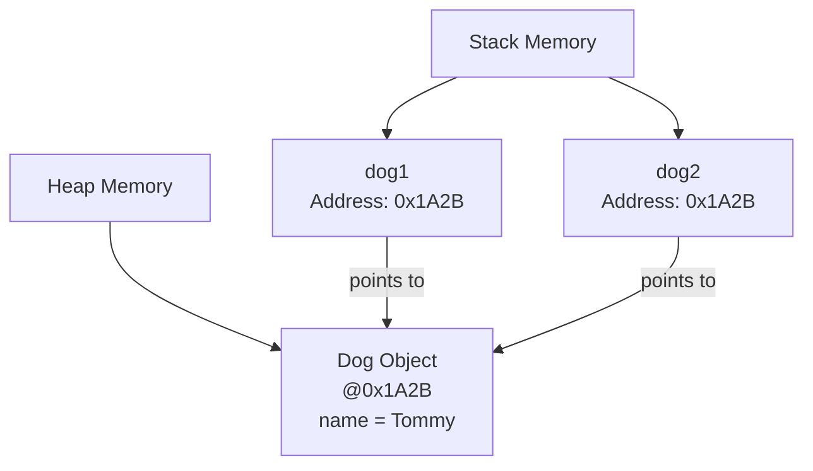

### 📌 null Reference

```java
// null means "reference points to NOTHING"
Dog dog = null;      // dog doesn't point to any object

// Accessing null reference → NullPointerException
// dog.name;         // ❌ NullPointerException!

// Always check before using:
if (dog != null) {
    System.out.println(dog.name);
}

// Java 14+ helpful NullPointerException messages:
// "Cannot read field 'name' because 'dog' is null"
```

### 📌 Reference vs Pointer (Java vs C++)

```
C++ POINTER:                    JAVA REFERENCE:
→ Direct memory address         → Abstracted memory address
→ Can do arithmetic (+, -)      → Cannot do arithmetic
→ Can be null or garbage        → Only null (safe)
→ Must manually delete          → GC handles cleanup
→ Dangerous (security risk)     → Safe (no direct memory access)

Java REMOVED pointers for security and safety.
But references internally are still addresses — just abstracted.
```

> [!NOTE]
> Java is **"Pass by Value"** — always. When you pass a reference variable to a method, you pass a **copy of the reference (address)**, not the object itself. So the method can modify the object (via the copied address) but cannot change which object the original reference points to. This is a super common interview trap!

<a href="#chapter-index-table-1">Go to Top 🔝</a>

---

## 1.15 Garbage Collector

<a id="115-garbage-collector"></a>

### 📌 What is Garbage Collector?

```
Garbage Collector (GC) is a BACKGROUND PROCESS in JVM that:
→ Automatically finds objects that are NO LONGER REACHABLE
→ Frees (deallocates) their Heap memory
→ Runs automatically (developer cannot force it exactly)

WITHOUT GC: Developer must manually free every object (like C++)
WITH GC: Java handles it automatically → No memory leaks (mostly)
```

### 📌 When is an Object Eligible for GC?

```
An object becomes eligible for GC when it is NO LONGER REACHABLE.
= No reference (variable) points to it anymore.

Ways an object becomes eligible:

1. NULLIFYING REFERENCE:
   Dog d = new Dog();
   d = null;              // Dog object is now unreachable

2. RE-ASSIGNING REFERENCE:
   Dog d = new Dog("A");
   d = new Dog("B");      // First Dog is now unreachable

3. OBJECT GOES OUT OF SCOPE:
   void method() {
       Dog d = new Dog(); // d is local variable
   } // method ends → d destroyed → Dog object unreachable

4. ISLAND OF ISOLATION:
   Objects referencing each other but NOT reachable from
   any GC Root → All are eligible for GC
```

### 📊 GC Eligibility Flow

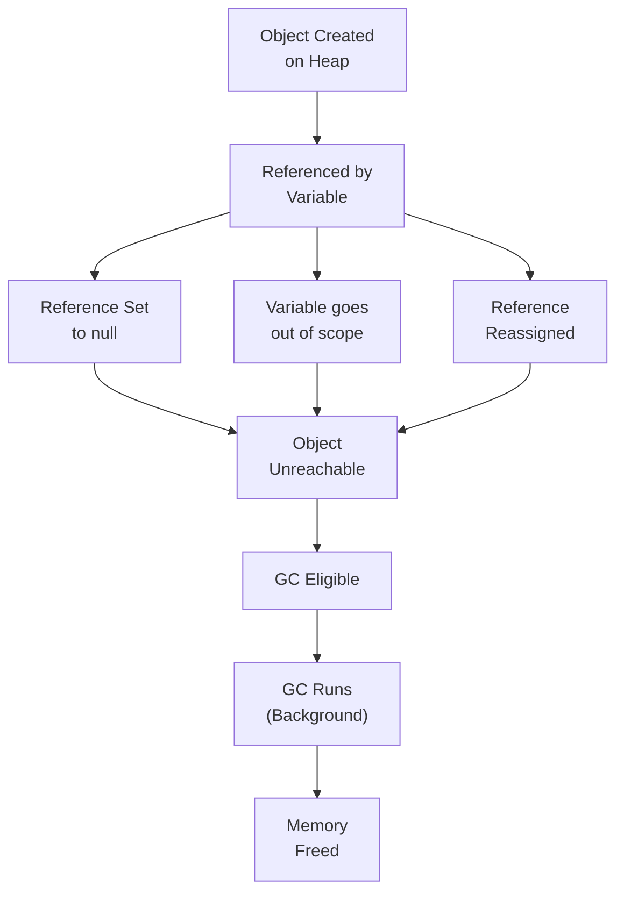

### 📌 GC Generations in Java

```
HEAP is divided into GENERATIONS:

┌──────────────────────────────────────────────────────────────┐
│  Generation     │  Contents                                  │
├─────────────────┼────────────────────────────────────────────┤
│  Young Gen      │  Newly created objects                     │
│   → Eden Space  │  New objects born here                     │
│   → Survivor S0 │  Objects that survived 1 GC                │
│   → Survivor S1 │  Objects that survived more GCs            │
├─────────────────┼────────────────────────────────────────────┤
│  Old Gen        │  Long-lived objects                        │
│  (Tenured)      │  Survived many GC cycles                   │
├─────────────────┼────────────────────────────────────────────┤
│  Metaspace      │  Class metadata (Java 8+)                  │
│  (was PermGen)  │  Not part of Heap                          │
└──────────────────────────────────────────────────────────────┘

MINOR GC → Cleans Young Generation (frequent, fast)
MAJOR GC → Cleans Old Generation (infrequent, slow)
FULL GC  → Cleans everything (rarest, most expensive)
```

### 📌 GC Algorithms in Java

```
┌──────────────────────────────────────────────────────────────┐
│  GC Algorithm   │  Java Version │  Best For                  │
├─────────────────┼───────────────┼────────────────────────────┤
│  Serial GC      │  All          │  Single-threaded, small app│
│  Parallel GC    │  Java 5-8     │  Throughput focused        │
│  CMS GC         │  Java 6-14    │  Low pause time            │
│  G1 GC          │  Java 9+      │  Large heap, balanced      │
│  ZGC            │  Java 11+     │  Ultra low latency (<10ms) │
│  Shenandoah     │  Java 12+     │  Concurrent, low pause     │
└──────────────────────────────────────────────────────────────┘
```

```java
public class GCDemo {
    public static void main(String[] args) {

        // Object created
        Dog d = new Dog("Tommy");

        // d is still referenced → NOT eligible for GC

        d = null;  // Now Dog("Tommy") is eligible for GC

        // Suggest GC to run (NOT guaranteed!)
        System.gc();           // Runtime.getRuntime().gc()

        // finalize() DEPRECATED in Java 9, REMOVED later
        // DO NOT rely on finalize() for cleanup!
        // Use try-with-resources or close() instead

        // Re-creating object
        d = new Dog("Max");    // New object created

    } // d goes out of scope → Dog("Max") eligible for GC
}

class Dog {
    String name;
    Dog(String name) {
        this.name = name;
        System.out.println("Dog created: " + name);
    }
}
```

### 📌 Memory Leak in Java — When GC Cannot Help

```
Even with GC, memory leaks can happen:

1. STATIC COLLECTIONS growing forever:
   static List<Object> cache = new ArrayList<>();
   // Objects added but never removed

2. UNCLOSED RESOURCES:
   Connection conn = getConnection();
   // Never conn.close() → Resource leak

3. THREADLOCAL MISUSE:
   ThreadLocal stored but never removed

4. LISTENERS AND CALLBACKS:
   Event listeners registered but never deregistered

5. INNER CLASS HOLDING OUTER CLASS REFERENCE:
   Anonymous inner class holds reference to outer
```

> [!IMPORTANT]
> **Interview Fact:** You CANNOT force the JVM to run Garbage Collection. `System.gc()` is just a **suggestion** — JVM may ignore it. Also, `finalize()` is **deprecated** in Java 9 and should not be used. Use **try-with-resources** for cleanup of resources like files and connections.

<a href="#chapter-index-table-1">Go to Top 🔝</a>

---

<a id="1-interview-questions"></a>

## 💡 Chapter 1 — Interview Questions (10+)

> 🔥 Frequently asked in Java interviews from beginner to senior level

---

### 🔵 Conceptual Questions

---

**Q1. What is the difference between Compiler and Interpreter? How does Java use both?**

```
COMPILER:
→ Translates entire source code at once
→ Produces output file
→ Errors reported all at once
→ Faster execution (pre-compiled)

INTERPRETER:
→ Translates and executes line by line
→ No output file
→ Errors at that specific line
→ Slower execution

JAVA uses BOTH (Hybrid):
→ javac COMPILES .java → .class (Bytecode) [Compiler role]
→ JVM INTERPRETS Bytecode line by line [Interpreter role]
→ JIT COMPILER converts hot bytecode → native code [Compiler again]
```

---

**Q2. What is the difference between Stack and Heap Memory in Java?**

```
STACK:
→ Stores: Method calls, local variables, references
→ Per thread (each thread has own stack)
→ LIFO structure (auto managed)
→ Fast access, small size
→ Error: StackOverflowError

HEAP:
→ Stores: All objects, instance variables
→ Shared across all threads
→ GC managed
→ Slow access, large size
→ Error: OutOfMemoryError

KEY: References on Stack, Objects on Heap
```

---

**Q3. Is Java statically typed or dynamically typed? Explain with example.**

```
Java is STATICALLY TYPED:
→ Types declared and checked at COMPILE TIME
→ Type cannot change after declaration
→ Compiler catches type errors before running

Example:
int x = 5;         // x is int, fixed
x = "hello";       // ❌ COMPILE ERROR — type mismatch

var y = 10;        // var still STATIC — type inferred as int
y = "text";        // ❌ COMPILE ERROR — y is still int

Java is also STRONGLY TYPED:
→ No automatic/implicit type coercion
→ Must explicitly convert types
```

---

**Q4. What is a Reference in Java? Is Java pass-by-value or pass-by-reference?**

```
REFERENCE: A variable holding the memory address of an object

Java is always PASS BY VALUE:
→ For primitives: copy of the VALUE is passed
→ For objects: copy of the REFERENCE (address) is passed

void change(Dog d) {
    d.name = "Max"; // ✅ Modifies the object (via copied address)
    d = new Dog("New"); // ❌ Original reference unchanged
}

Dog dog = new Dog("Tommy");
change(dog);
System.out.println(dog.name); // Max (object modified)
// But original 'dog' still points to same object, not "New"
```

---

**Q5. What is the difference between OOP and Procedural Programming?**

```
PROCEDURAL:
→ Program = sequence of procedures/functions
→ Data and functions are separate
→ Top-down design
→ Example: C, Pascal
→ Hard to scale, no real-world modeling

OOP:
→ Program = collection of objects
→ Data + behavior bundled (encapsulation)
→ Bottom-up design
→ Example: Java, C++
→ Scalable, models real world
→ 4 Pillars: Encapsulation, Inheritance, Polymorphism, Abstraction
```

---

### 🟡 Scenario-Based Questions

---

**Q6. Two variables point to the same object. One sets it to null. Does the other get affected?**

```java
Dog d1 = new Dog("Tommy");
Dog d2 = d1;  // Both point to same Dog object

d1 = null;    // d1 no longer points to Dog

System.out.println(d2.name); // Tommy ✅ Still works!

// REASON: d1 = null only removes d1's reference
// The Dog object still exists on Heap
// d2 still points to it
// Object becomes GC eligible only when ALL references are gone
```

---

**Q7. What causes StackOverflowError and OutOfMemoryError?**

```
StackOverflowError:
→ Stack memory is full
→ Caused by: Infinite recursion (method calling itself forever)
→ Each method call adds a Stack Frame → Stack fills up

void infinite() {
    infinite(); // Keeps calling itself → StackOverflowError
}

OutOfMemoryError (Heap):
→ Heap memory is full
→ Caused by: Creating too many objects / Memory leak
→ GC cannot free enough memory

while(true) {
    list.add(new byte[1024 * 1024]); // Adding 1MB indefinitely
}
```

---

### 🔴 Output-Based Questions

---

**Q8. What is the output and why?**

```java
public class Test {
    public static void main(String[] args) {
        int a = 5;
        int b = a;
        b = 10;
        System.out.println(a); // ?
        System.out.println(b); // ?
    }
}
```

```
Output:
5
10

Reason:
int a = 5 → Stack: a = 5
int b = a → Stack: b = 5 (COPY of value)
b = 10    → Only b changes, a is unaffected
Primitives are copied by VALUE
```

---

**Q9. What is the output?**

```java
public class Test {
    public static void main(String[] args) {
        StringBuilder s1 = new StringBuilder("Hello");
        StringBuilder s2 = s1;
        s2.append(" World");
        System.out.println(s1); // ?
        System.out.println(s2); // ?
    }
}
```

```
Output:
Hello World
Hello World

Reason:
s1 → reference to StringBuilder object
s2 = s1 → s2 gets COPY of reference (both point to SAME object)
s2.append() → modifies the SAME object
s1 and s2 both see "Hello World"
```

---

**Q10. Can we run a Java program without the main method? (Before Java 7)**

```
Before Java 7: YES — Using static initializer block
static block runs when class is loaded, even before main()

static {
    System.out.println("Running without main!"); ✅
    System.exit(0);
}

From Java 7 onwards: NO
JVM enforces: "Main method not found in class X"
Even if static block exists, JVM looks for main() first.
```

<a href="#chapter-index-table-1">Go to Top 🔝</a>

---

<a id="1-practice-problems"></a>

## 🧪 Chapter 1 — Practice Problems

### 📝 5 Theory Questions

```
1. Explain the difference between Machine Language, Assembly Language,
   and High Level Language with examples.

2. What are the four pillars of OOP? Explain each with a real-world example.

3. Compare Functional Programming with Object-Oriented Programming.
   When would you choose one over the other?

4. Explain Java's memory model. What is stored in Stack vs Heap?
   Give examples for each.

5. What is Garbage Collection? When does an object become eligible for GC?
   What are the four ways an object can become eligible?
```

---

### 💻 5 Coding Questions

```java
// CODING Q1: Demonstrate pass-by-value vs pass-by-reference behavior
// Show that Java is always pass-by-value

class Solution1 {
    static void changePrimitive(int x) {
        x = 100;
    }
    static void changeObject(StringBuilder sb) {
        sb.append(" World"); // This affects original
    }
    static void changeReference(StringBuilder sb) {
        sb = new StringBuilder("New"); // This does NOT affect original
    }
    public static void main(String[] args) {
        // TODO: Call all three methods and predict outputs
        // Test your understanding of pass-by-value in Java
    }
}
```

```java
// CODING Q2: GC Eligibility Analysis
// Comment on which objects become eligible for GC and when

public class GCAnalysis {
    public static void main(String[] args) {
        Object o1 = new Object(); // Line 1
        Object o2 = new Object(); // Line 2
        o1 = o2;                  // Line 3 - what happens to Line 1 object?
        o2 = null;                // Line 4 - is the Line 2 object eligible?
        // Question: After Line 4, how many objects are eligible for GC?
    }
}
```

```java
// CODING Q3: Binary Number Operations
// Convert decimal to binary without using Integer.toBinaryString()

public class BinaryConverter {
    static String decimalToBinary(int n) {
        // TODO: Implement using division and remainder
        // Example: 10 → "1010"
        return "";
    }

    public static void main(String[] args) {
        System.out.println(decimalToBinary(10));  // 1010
        System.out.println(decimalToBinary(255)); // 11111111
        System.out.println(decimalToBinary(0));   // 0
    }
}
```

```java
// CODING Q4: Simulate Stack behavior
// Implement a simple Stack using an array

public class MyStack {
    int[] data;
    int top;
    int capacity;

    MyStack(int capacity) {
        // TODO: Initialize
    }

    void push(int value) {
        // TODO: Add element, handle overflow
    }

    int pop() {
        // TODO: Remove and return top element, handle underflow
        return -1;
    }

    int peek() {
        // TODO: Return top without removing
        return -1;
    }

    boolean isEmpty() {
        // TODO: Check if empty
        return true;
    }
}
```

```java
// CODING Q5: Memory Leak Demonstration
// Find the memory leak in this code and fix it

import java.util.*;

public class MemoryLeakFinder {
    static List<Object> cache = new ArrayList<>();

    static void addToCache(Object obj) {
        cache.add(obj); // Objects added but never removed!
    }

    // FIX: Add a method to clean up cache
    // FIX: Or use WeakReference or bounded cache

    public static void main(String[] args) {
        for (int i = 0; i < 1000000; i++) {
            addToCache(new byte[1024]); // 1KB per object
            // This will eventually cause OutOfMemoryError!
        }
    }
}
```

---

### 🏗️ 2 Machine Coding Problems

---

**Machine Coding 1: Language Classifier System**

```
Problem Statement:
Build a program that classifies programming languages based on
their properties.

Requirements:
1. Create a Language class with: name, paradigm, typingSystem, executionModel
2. Add multiple languages to a list
3. Filter by paradigm (OOP / Functional / Scripting)
4. Filter by typing system (Static / Dynamic)
5. Display results in a formatted table

Input:
Language list with properties

Output:
Filtered and categorized language list

Hint:
class Language {
    String name;
    String paradigm;     // OOP, Functional, Procedural, Scripting
    String typingSystem; // Static, Dynamic
    String execution;    // Compiled, Interpreted, Hybrid
}
```

---

**Machine Coding 2: Memory Tracker Simulator**

```
Problem Statement:
Simulate a simplified Stack and Heap memory tracker.
Track memory allocation and deallocation for method calls and objects.

Requirements:
1. Stack: push frame on method call, pop on return
2. Heap: allocate object with ID and size, deallocate on GC
3. Track total memory used
4. Print memory state at each step
5. Implement simple GC: remove objects with 0 references

Classes needed:
- StackFrame (methodName, localVars)
- HeapObject (id, size, referenceCount)
- MemoryTracker (stack, heap, methods)

Expected Output:
[STACK] main() frame pushed
[HEAP]  Object#1 allocated (24 bytes)
[HEAP]  Object#1 referenceCount = 0, eligible for GC
[GC]    Object#1 freed (24 bytes)
[STACK] main() frame popped
```

<a href="#chapter-index-table-1">Go to Top 🔝</a>

---

<a id="1-mini-project-language-identifier-tool"></a>

## 🚀 Mini Project: Language Identifier & Classifier Tool

---

### 📋 Problem Statement

```
Build a console-based Java application that:
1. Stores a catalog of programming languages with their properties
2. Allows users to search/filter by paradigm, typing system, use case
3. Displays language comparison in formatted tables
4. Shows language evolution timeline
5. Recommends a language based on user's use case input
```

### 🏗️ Architecture

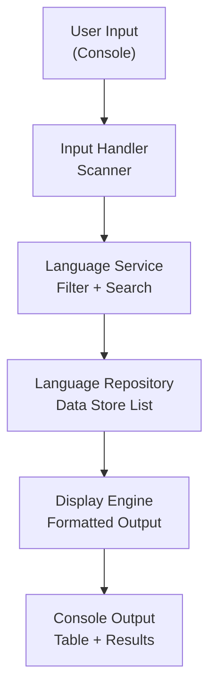

### 📁 Code Structure

```
LanguageIdentifier/
├── model/
│   └── Language.java          // Data model
├── repository/
│   └── LanguageRepository.java // Data store
├── service/
│   └── LanguageService.java    // Business logic
├── display/
│   └── DisplayEngine.java      // Output formatting
└── Main.java                   // Entry point
```

### 💻 Complete Code

```java
// ─────────────────────────────────────────────────────────────
// File: Language.java (Model)
// ─────────────────────────────────────────────────────────────
public class Language {
    private String name;
    private String paradigm;
    private String typingSystem;
    private String executionModel;
    private String primaryUse;
    private int yearCreated;

    public Language(String name, String paradigm, String typingSystem,
                    String executionModel, String primaryUse, int yearCreated) {
        this.name = name;
        this.paradigm = paradigm;
        this.typingSystem = typingSystem;
        this.executionModel = executionModel;
        this.primaryUse = primaryUse;
        this.yearCreated = yearCreated;
    }

    // Getters
    public String getName() { return name; }
    public String getParadigm() { return paradigm; }
    public String getTypingSystem() { return typingSystem; }
    public String getExecutionModel() { return executionModel; }
    public String getPrimaryUse() { return primaryUse; }
    public int getYearCreated() { return yearCreated; }

    @Override
    public String toString() {
        return String.format("%-15s %-15s %-10s %-12s %-20s %d",
            name, paradigm, typingSystem, executionModel, primaryUse, yearCreated);
    }
}
```

```java
// ─────────────────────────────────────────────────────────────
// File: LanguageRepository.java (Data Store)
// ─────────────────────────────────────────────────────────────
import java.util.ArrayList;
import java.util.List;

public class LanguageRepository {
    private List<Language> languages = new ArrayList<>();

    public LanguageRepository() {
        loadData();
    }

    private void loadData() {
        languages.add(new Language("Java",       "OOP",        "Static",  "Hybrid",       "Enterprise/Android",  1995));
        languages.add(new Language("Python",     "Multi",      "Dynamic", "Interpreted",  "AI/ML/Scripts",       1991));
        languages.add(new Language("C",          "Procedural", "Static",  "Compiled",     "Systems/Embedded",    1972));
        languages.add(new Language("C++",        "OOP",        "Static",  "Compiled",     "Games/Systems",       1985));
        languages.add(new Language("JavaScript", "Multi",      "Dynamic", "Interpreted",  "Web Frontend",        1995));
        languages.add(new Language("Haskell",    "Functional", "Static",  "Compiled",     "Research/Finance",    1990));
        languages.add(new Language("Kotlin",     "OOP+FP",     "Static",  "Hybrid",       "Android/JVM",         2011));
        languages.add(new Language("Ruby",       "OOP",        "Dynamic", "Interpreted",  "Web (Rails)",         1995));
        languages.add(new Language("Go",         "Procedural", "Static",  "Compiled",     "Cloud/Backend",       2009));
        languages.add(new Language("Swift",      "OOP+FP",     "Static",  "Compiled",     "iOS/macOS",           2014));
    }

    public List<Language> getAll() { return languages; }

    public List<Language> filterByParadigm(String paradigm) {
        List<Language> result = new ArrayList<>();
        for (Language lang : languages) {
            if (lang.getParadigm().toLowerCase().contains(paradigm.toLowerCase())) {
                result.add(lang);
            }
        }
        return result;
    }

    public List<Language> filterByTyping(String typingSystem) {
        List<Language> result = new ArrayList<>();
        for (Language lang : languages) {
            if (lang.getTypingSystem().equalsIgnoreCase(typingSystem)) {
                result.add(lang);
            }
        }
        return result;
    }

    public Language findByName(String name) {
        for (Language lang : languages) {
            if (lang.getName().equalsIgnoreCase(name)) return lang;
        }
        return null;
    }
}
```

```java
// ─────────────────────────────────────────────────────────────
// File: LanguageService.java (Business Logic)
// ─────────────────────────────────────────────────────────────
import java.util.List;

public class LanguageService {
    private LanguageRepository repo;

    public LanguageService() {
        this.repo = new LanguageRepository();
    }

    public List<Language> getAllLanguages() {
        return repo.getAll();
    }

    public List<Language> getByParadigm(String paradigm) {
        return repo.filterByParadigm(paradigm);
    }

    public List<Language> getByTyping(String typingSystem) {
        return repo.filterByTyping(typingSystem);
    }

    public String recommendLanguage(String useCase) {
        switch (useCase.toLowerCase()) {
            case "android":    return "Java or Kotlin";
            case "ai":
            case "ml":         return "Python";
            case "web":        return "JavaScript or TypeScript";
            case "systems":    return "C or C++ or Rust";
            case "enterprise": return "Java or C#";
            case "ios":        return "Swift";
            case "backend":    return "Java, Go, or Node.js";
            default:           return "Java (versatile, widely used)";
        }
    }
}
```

```java
// ─────────────────────────────────────────────────────────────
// File: Main.java (Entry Point)
// ─────────────────────────────────────────────────────────────
import java.util.List;
import java.util.Scanner;

public class Main {
    static LanguageService service = new LanguageService();
    static Scanner sc = new Scanner(System.in);

    public static void main(String[] args) {
        System.out.println("╔══════════════════════════════════════╗");
        System.out.println("║   Programming Language Classifier    ║");
        System.out.println("╚══════════════════════════════════════╝");

        boolean running = true;
        while (running) {
            showMenu();
            int choice = Integer.parseInt(sc.nextLine().trim());

            switch (choice) {
                case 1 -> displayAll(service.getAllLanguages());
                case 2 -> {
                    System.out.print("Enter paradigm (OOP/Functional/Procedural): ");
                    displayAll(service.getByParadigm(sc.nextLine()));
                }
                case 3 -> {
                    System.out.print("Enter typing system (Static/Dynamic): ");
                    displayAll(service.getByTyping(sc.nextLine()));
                }
                case 4 -> {
                    System.out.print("Enter your use case (android/ai/web/systems/enterprise/ios/backend): ");
                    System.out.println("Recommended: " + service.recommendLanguage(sc.nextLine()));
                }
                case 5 -> running = false;
                default -> System.out.println("Invalid choice.");
            }
        }
        System.out.println("Thank you for using Language Classifier!");
        sc.close();
    }

    static void showMenu() {
        System.out.println("\n┌─────────────────────────────────┐");
        System.out.println("│  1. View All Languages           │");
        System.out.println("│  2. Filter by Paradigm           │");
        System.out.println("│  3. Filter by Typing System      │");
        System.out.println("│  4. Get Language Recommendation  │");
        System.out.println("│  5. Exit                         │");
        System.out.println("└─────────────────────────────────┘");
        System.out.print("Your choice: ");
    }

    static void displayAll(List<Language> languages) {
        if (languages.isEmpty()) {
            System.out.println("No languages found.");
            return;
        }
        System.out.println();
        System.out.printf("%-15s %-15s %-10s %-12s %-20s %s%n",
            "Name", "Paradigm", "Typing", "Execution", "Use Case", "Year");
        System.out.println("─".repeat(85));
        for (Language lang : languages) {
            System.out.println(lang);
        }
    }
}
```

### 📊 Project Flow Diagram

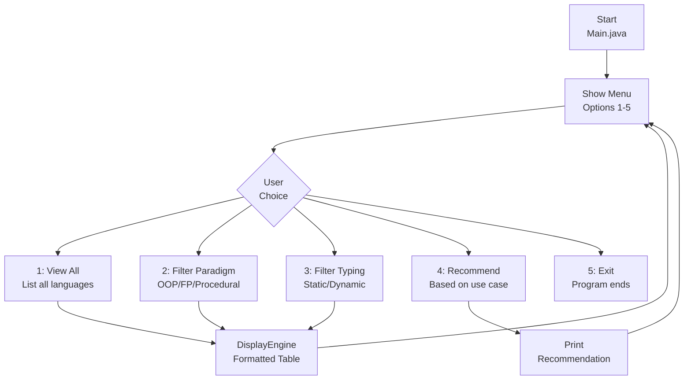

### ✅ Expected Output

```
╔══════════════════════════════════════╗
║   Programming Language Classifier    ║
╚══════════════════════════════════════╝

┌─────────────────────────────────┐
│  1. View All Languages           │
│  2. Filter by Paradigm           │
│  3. Filter by Typing System      │
│  4. Get Language Recommendation  │
│  5. Exit                         │
└─────────────────────────────────┘
Your choice: 2
Enter paradigm (OOP/Functional/Procedural): OOP

Name            Paradigm        Typing     Execution    Use Case             Year
─────────────────────────────────────────────────────────────────────────────────────
Java            OOP             Static     Hybrid       Enterprise/Android   1995
C++             OOP             Static     Compiled     Games/Systems        1985
Kotlin          OOP+FP          Static     Hybrid       Android/JVM          2011
Ruby            OOP             Dynamic    Interpreted  Web (Rails)          1995
Swift           OOP+FP          Static     Compiled     iOS/macOS            2014
```

<a href="#chapter-index-table-1">Go to Top 🔝</a>

---

```
┌─────────────────────────────────────────────────────────────┐
│                ✅ CHAPTER 1 COMPLETE                        │
│                                                             │
│  Topics Covered:                                            │
│  ✅ 1.1  Introduction to Programming                        │
│  ✅ 1.2  What is Programming Language                       │
│  ✅ 1.3  Binary Codes & Number Systems                      │
│  ✅ 1.4  Assembly Language                                  │
│  ✅ 1.5  High Level Language                                │
│  ✅ 1.6  Procedural Language                                │
│  ✅ 1.7  Functional Language                                │
│  ✅ 1.8  Object Oriented Programming Language               │
│  ✅ 1.9  Scripting Language                                 │
│  ✅ 1.10 Compiler & Interpreter (Java Hybrid)               │
│  ✅ 1.11 Statically & Dynamically Typed Language            │
│  ✅ 1.12 Memory Management in Java                          │
│  ✅ 1.13 Stack and Heap Memory (In-Depth)                   │
│  ✅ 1.14 What is Reference (Java vs C++ Pointers)           │
│  ✅ 1.15 Garbage Collector (Algorithms + Eligibility)       │
│  ✅ 10+  Interview Questions with Answers                   │
│  ✅ 5    Theory + 5 Coding Practice Problems                │
│  ✅ 2    Machine Coding Challenges                          │
│  ✅      Mini Project: Language Classifier Tool             │
│                                                             │
│  ⭐ Next Chapter: Introduction to Java & Setup (Chapter 2) │
└─────────────────────────────────────────────────────────────┘
```

[Go to Main Index 🔝](#main-index)

⭐⭐⭐⭐⭐⭐⭐⭐⭐⭐⭐⭐⭐⭐⭐⭐⭐⭐⭐⭐⭐⭐⭐⭐⭐⭐⭐⭐⭐⭐⭐⭐

Java • Core Java • Interview Preparation

Built by Your Name | 🔗 [LinkedIn](#) | 💻 [GitHub](#)

⭐⭐⭐⭐⭐⭐⭐⭐⭐⭐⭐⭐⭐⭐⭐⭐⭐⭐⭐⭐⭐⭐⭐⭐⭐⭐⭐⭐⭐⭐⭐⭐

[Go to Main Index 🔝](#main-index)

---

<a id="2-introduction-to-java-setup"></a>

# 📘 Chapter 2: Introduction to Java & Setup

> **Part A: Java Fundamentals — Beginner Foundation**
> `Beginner` | `Foundation` | `Must Read First`

⭐⭐⭐⭐⭐⭐⭐⭐⭐⭐⭐⭐⭐⭐⭐⭐⭐⭐⭐⭐⭐⭐⭐⭐⭐⭐⭐⭐⭐⭐⭐⭐

Java • Core Java • Interview Preparation

⭐⭐⭐⭐⭐⭐⭐⭐⭐⭐⭐⭐⭐⭐⭐⭐⭐⭐⭐⭐⭐⭐⭐⭐⭐⭐⭐⭐⭐⭐⭐⭐

---

<a id="chapter-index-table-2"></a>

## 📚 Chapter 2 — Index Table

| No. | Topic | Subtopics |
|-----|-------|-----------|
| 2.1 | [What is Java](#21-what-is-java) | Definition, Object-Oriented Nature, Owned by Oracle, Open Source, WORA Principle |
| 2.2 | [History of Java](#22-history-of-java) | James Gosling, Green Team, Greentalk → Oak → Java, Coffee Story, Logo Origin |
| 2.3 | [Features of Java](#23-features-of-java) | Platform Independent, OOP, Secure, Robust, Multithreaded, High Performance, Simple |
| 2.4 | [JDK vs JRE vs JVM](#24-jdk-vs-jre-vs-jvm) | JDK Components, JRE Components, JVM as Interpreter, Relationship Diagram |
| 2.5 | [How Java Program Executes](#25-how-java-program-executes) | Two-Step Execution, .java → .class, ClassLoader, Bytecode Verifier, JIT Compiler |
| 2.6 | [JVM Architecture](#26-jvm-architecture) | ClassLoader Subsystem, Memory Areas, Execution Engine, JIT, GC |
| 2.7 | [Setting Up Java Environment](#27-setting-up-java-environment) | JDK Download, PATH Setup, IDE Links, Verification |
| 2.8 | [First Java Program](#28-first-java-program) | Hello World, Compile & Run, Output |
| 2.9 | [Deep Analysis of First Program](#29-deep-analysis-of-first-program) | public static void main, Each Keyword Explained, Can We Run Without main, Static Block |
| 2.10 | [Java Program Structure](#210-java-program-structure) | Package, Import, Class, Fields, Methods, main Method, Complete Template |
| 2.11 | [Java Naming Conventions](#211-java-naming-conventions) | Classes, Methods, Variables, Constants, Packages |
| 2.12 | [Types of Comments](#212-types-of-comments) | Single Line, Multi Line, Javadoc Documentation |
| 2.13 | [Java Keywords](#213-java-keywords) | 50+ Reserved Words, Categories, true/false/null as Literals |
| 💡 | [Interview Questions](#2-interview-questions) | 15+ Conceptual · Scenario · Output-based |
| 🧪 | [Practice Problems](#2-practice-problems) | 5 Coding + 5 Theory + 2 Machine Coding |
| 🚀 | [Mini Project: Java Environment Checker](#2-mini-project-java-environment-checker) | Problem · Architecture · Code · Flow |

---

## 2.1 What is Java

<a id="21-what-is-java"></a>

### 📌 Definition

```
Java is a HIGH-LEVEL, OBJECT-ORIENTED, PLATFORM-INDEPENDENT,
STRONGLY TYPED, COMPILED + INTERPRETED Programming Language.

It is not just a language — it is a COMPLETE PLATFORM
with runtime, libraries, and tools.
```

### 🔑 Key Facts

```
┌──────────────────────────────────────────────────────────────┐
│  Fact                │  Detail                               │
├──────────────────────┼───────────────────────────────────────┤
│  Owner               │  Oracle Corporation                   │
│  Creator             │  James Gosling (Father of Java)       │
│  First Release       │  1995                                 │
│  Type                │  Object-Oriented + Multi-paradigm     │
│  License             │  Open Source and FREE                 │
│  File Extension      │  .java (source), .class (compiled)   │
│  Latest LTS          │  Java 21 (2023)                       │
│  Principle           │  WORA — Write Once, Run Anywhere      │
└──────────────────────┴───────────────────────────────────────┘
```

### 📌 Why Java?

```
Java gives a CLEAR STRUCTURE to programs and allows code
to be REUSED, lowering development costs.

Used in:
✅ Enterprise Applications (Banking, Insurance)
✅ Android App Development
✅ Web Backend (Spring Boot)
✅ Big Data (Hadoop, Spark)
✅ Cloud Computing
✅ Scientific Applications
✅ IoT and Embedded Systems
```

### 🌍 Real-World Analogy (Hinglish)

```
Java ek aisi language hai jaise ENGLISH — Universal.
Tum ek baar code likho (Write Once),
aur kisi bhi computer pe chala sako (Run Anywhere).

Jaise English samajhne ke liye kisi ko English aani chahiye,
waise Java code chalane ke liye computer pe JVM hona chahiye.

JVM = Java Virtual Machine = Java ka interpreter/translator
```

> [!IMPORTANT]
> Java is NOT 100% Object-Oriented because it has **8 primitive data types** (int, char, boolean, etc.) which are NOT objects. This is one of the most frequently asked interview questions.

<a href="#chapter-index-table-2">Go to Top 🔝</a>

---

## 2.2 History of Java

<a id="22-history-of-java"></a>

### 📌 The Complete Story

```
┌──────────────────────────────────────────────────────────────┐
│  Year   │  Event                                             │
├─────────┼────────────────────────────────────────────────────┤
│  1991   │  James Gosling + Green Team at Sun Microsystems    │
│         │  started a project called "Green Project"          │
│         │  Goal: Language for interactive television         │
│         │  First name: "GREENTALK"                           │
├─────────┼────────────────────────────────────────────────────┤
│  1992   │  Name changed to "OAK" (after an Oak tree         │
│         │  outside Gosling's office)                         │
│         │  Problem: "Oak" was already trademarked            │
├─────────┼────────────────────────────────────────────────────┤
│  1995   │  Renamed to "JAVA" ☕                              │
│         │  Why "Java"? → Named after Java Coffee             │
│         │  James Gosling chose it while having coffee        │
│         │  Java is an island in Indonesia — first coffee     │
│         │  was produced there (Java Coffee / Espresso Bean)  │
│         │  Java 1.0 officially released                      │
├─────────┼────────────────────────────────────────────────────┤
│  1996   │  JDK 1.0 released publicly                        │
├─────────┼────────────────────────────────────────────────────┤
│  2004   │  Java 5 — Generics, Annotations, Autoboxing       │
├─────────┼────────────────────────────────────────────────────┤
│  2010   │  Oracle acquires Sun Microsystems                  │
│         │  Java now owned by Oracle Corporation              │
├─────────┼────────────────────────────────────────────────────┤
│  2014   │  Java 8 (LTS) — Lambda, Streams, Optional         │
│         │  MOST POPULAR VERSION EVER                         │
├─────────┼────────────────────────────────────────────────────┤
│  2017   │  Java 9 — Module System, JShell                    │
├─────────┼────────────────────────────────────────────────────┤
│  2018   │  Java 11 (LTS) — New String methods, HttpClient    │
├─────────┼────────────────────────────────────────────────────┤
│  2021   │  Java 17 (LTS) — Sealed classes, Records           │
├─────────┼────────────────────────────────────────────────────┤
│  2023   │  Java 21 (LTS) — Virtual Threads, Pattern Match   │
└─────────┴────────────────────────────────────────────────────┘
```

### ☕ Why Coffee Logo?

```
The Java logo is a BLUE COFFEE CUP with RED STEAM above it.

WHY?
→ Java engineers consumed A LOT of coffee during development
→ The coffee they drank was "Java Coffee" beans
→ Java Coffee comes from Java Island, Indonesia
→ The logo was a tribute to the engineers' coffee addiction!

Fun Fact: Originally designed for interactive television,
but it was TOO ADVANCED for the cable TV industry at that time.
However, it was BEST SUITED for Internet programming — and that's
where Java became a massive success!
```

### 📊 Java Name Evolution

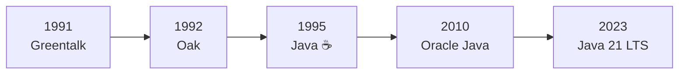

> [!TIP]
> **Interview Tip:** If asked "Why is Java named Java?", say: *"Java is named after Java Coffee from Java Island, Indonesia. James Gosling chose the name while having coffee near his office. The original names were Greentalk and Oak, but Oak was already trademarked."*

<a href="#chapter-index-table-2">Go to Top 🔝</a>

---

## 2.3 Features of Java

<a id="23-features-of-java"></a>

### 📌 All Major Features Explained

---

### ✅ Feature 1: Platform Independent (WORA)

```
WRITE ONCE, RUN ANYWHERE (WORA)

Java code compiles to BYTECODE (not machine code).
Bytecode is PLATFORM-NEUTRAL → Same .class file runs everywhere.

Any machine with JVM installed can run the same bytecode.

Windows → JVM for Windows → Runs .class
Mac     → JVM for Mac     → Runs same .class
Linux   → JVM for Linux   → Runs same .class
```

```java
// This SAME .class file runs on ANY OS with JVM
public class Hello {
    public static void main(String[] args) {
        System.out.println("I run on Windows, Mac, and Linux!");
    }
}
// javac Hello.java → Hello.class (Bytecode)
// java Hello → Output: I run on Windows, Mac, and Linux!
```

> [!IMPORTANT]
> **Java is Platform Independent, but JVM is Platform Dependent!**
> The same bytecode runs everywhere, but each OS needs its own JVM version. JVM acts as the translator between bytecode and machine code.

---

### ✅ Feature 2: Object-Oriented

```
Java treats everything as an OBJECT (except primitives).

4 Pillars of OOP:
1. Encapsulation   → Data + Methods wrapped together, data hiding
2. Inheritance     → Child class inherits from Parent class
3. Polymorphism    → One thing in many forms (Overloading/Overriding)
4. Abstraction     → Hiding complexity, showing only interface

Java gives CLEAR STRUCTURE to programs and allows
code to be REUSED, lowering development costs.
```

---

### ✅ Feature 3: Simple

```
Java is designed to be EASY to learn:
→ Syntax similar to C and C++
→ REMOVED complex features from C++:
  ✗ Explicit Pointers
  ✗ Operator Overloading
  ✗ Multiple Inheritance with classes
  ✗ Header Files
  ✗ Manual Memory Management (GC does it)
```

---

### ✅ Feature 4: Secure

```
Java provides MULTIPLE layers of security:
✅ No explicit pointers → Cannot access unauthorized memory
✅ Bytecode Verifier → Checks code before execution
✅ Security Manager → Controls what program can access
✅ ClassLoader → Separates local code from network code
✅ No direct memory access → Prevents buffer overflow attacks
```

---

### ✅ Feature 5: Robust

```
Java is designed to be RELIABLE:
✅ Strong Type Checking at compile time
✅ Exception Handling (try-catch-finally)
✅ Automatic Memory Management (Garbage Collection)
✅ No pointer arithmetic → No memory corruption
✅ Bounds checking on arrays
```

---

### ✅ Feature 6: Multithreaded

```
Java supports Multithreading BUILT-IN.
Multiple parts of a program run SIMULTANEOUSLY.

Example:
→ Thread 1: Playing video
→ Thread 2: Downloading file
→ Thread 3: Chat notification
All happening at the SAME time!
```

---

### ✅ Feature 7: High Performance

```
Java achieves near-native performance through:
✅ JIT (Just-In-Time) Compiler
   → Converts frequently used bytecode → native machine code
   → Caches compiled code for reuse
   → Result: Performance close to C/C++ over time

Java is FASTER than purely interpreted languages (Python, Ruby)
but slightly SLOWER than fully compiled languages (C, C++)
```

---

### ✅ Feature 8: Distributed

```
Java is built for distributed computing:
✅ RMI (Remote Method Invocation)
✅ Built-in Networking APIs (java.net)
✅ Web Services (RESTful APIs with Spring)
✅ Microservices architecture support
```

---

### ✅ Feature 9: Dynamic

```
Java loads classes DYNAMICALLY at runtime:
✅ Classes loaded on demand (lazy loading)
✅ Reflection API → Inspect/modify classes at runtime
✅ Can load classes over network
```

---

### 📌 All Features Summary Table

```
┌──────────────────────┬───────────────────────────────────────┐
│  Feature             │  What It Means                        │
├──────────────────────┼───────────────────────────────────────┤
│  Platform Independent│  Bytecode runs on any OS with JVM     │
│  Object-Oriented     │  Everything modeled as Objects         │
│  Simple              │  No pointers, no header files          │
│  Secure              │  Bytecode verifier, no direct memory   │
│  Robust              │  GC, Exception handling, type checking │
│  Multithreaded       │  Built-in thread support               │
│  High Performance    │  JIT Compiler optimization             │
│  Distributed         │  Network/Web built-in                  │
│  Dynamic             │  Classes loaded at runtime             │
│  Architecture Neutral│  Bytecode = no hardware dependency     │
│  Portable            │  Same code = same behavior everywhere  │
└──────────────────────┴───────────────────────────────────────┘
```

<a href="#chapter-index-table-2">Go to Top 🔝</a>

---

## 2.4 JDK vs JRE vs JVM

<a id="24-jdk-vs-jre-vs-jvm"></a>

### 📌 The Complete Picture

```
┌─────────────────────────────────────────────────────────────┐
│                                                             │
│   JDK (Java Development Kit)                                │
│   ┌─────────────────────────────────────────────────────┐   │
│   │                                                     │   │
│   │  JDT (Java Development Tools)                       │   │
│   │  → javac (Compiler)                                 │   │
│   │  → javadoc (Documentation Generator)                │   │
│   │  → jdb (Debugger)                                   │   │
│   │  → jar (Archive Tool)                               │   │
│   │  → javap (Disassembler)                             │   │
│   │  → jshell (REPL - Java 9+)                          │   │
│   │                                                     │   │
│   │   JRE (Java Runtime Environment)                    │   │
│   │   ┌───────────────────────────────────────────┐     │   │
│   │   │                                           │     │   │
│   │   │  Java Libraries (rt.jar / modules)        │     │   │
│   │   │  → java.lang (String, System, Math)       │     │   │
│   │   │  → java.util (List, Map, Scanner)         │     │   │
│   │   │  → java.io (File, Stream)                 │     │   │
│   │   │  → java.net (URL, Socket)                 │     │   │
│   │   │                                           │     │   │
│   │   │   JVM (Java Virtual Machine)              │     │   │
│   │   │   ┌─────────────────────────────────┐     │     │   │
│   │   │   │  ClassLoader                    │     │     │   │
│   │   │   │  Bytecode Verifier              │     │     │   │
│   │   │   │  Memory Areas (Heap, Stack...)  │     │     │   │
│   │   │   │  Execution Engine               │     │     │   │
│   │   │   │  → Interpreter                  │     │     │   │
│   │   │   │  → JIT Compiler                 │     │     │   │
│   │   │   │  → Garbage Collector            │     │     │   │
│   │   │   └─────────────────────────────────┘     │     │   │
│   │   └───────────────────────────────────────────┘     │   │
│   └─────────────────────────────────────────────────────┘   │
└─────────────────────────────────────────────────────────────┘
```

### 📌 Detailed Breakdown

```
┌──────────┬──────────────────────────────────────────────────┐
│          │                                                  │
│  JDK     │  → Java Development Kit                          │
│          │  → JRE + Development Tools (javac, jdb, jar...)  │
│          │  → Used to DEVELOP + COMPILE + RUN Java programs │
│          │  → DEVELOPERS install JDK                        │
│          │                                                  │
├──────────┼──────────────────────────────────────────────────┤
│          │                                                  │
│  JRE     │  → Java Runtime Environment                      │
│          │  → JVM + Java Libraries                          │
│          │  → Provides environment to only RUN Java programs│
│          │  → END USERS install JRE (just to run .class)    │
│          │                                                  │
├──────────┼──────────────────────────────────────────────────┤
│          │                                                  │
│  JVM     │  → Java Virtual Machine                          │
│          │  → The heart that actually EXECUTES bytecode     │
│          │  → Contains: ClassLoader + Bytecode Verifier     │
│          │    + Interpreter + JIT Compiler + GC              │
│          │  → JVM is PLATFORM DEPENDENT!                    │
│          │  → Different JVM for Windows, Mac, Linux          │
│          │  → JVM is nothing but an INTERPRETER              │
│          │                                                  │
├──────────┼──────────────────────────────────────────────────┤
│          │                                                  │
│  JDT     │  → Java Development Tools                        │
│          │  → Many tools like compiler, debugger,            │
│          │    and other development tools                    │
│          │  → Part of JDK (not JRE)                          │
│          │                                                  │
└──────────┴──────────────────────────────────────────────────┘
```

### 📊 Relationship Diagram

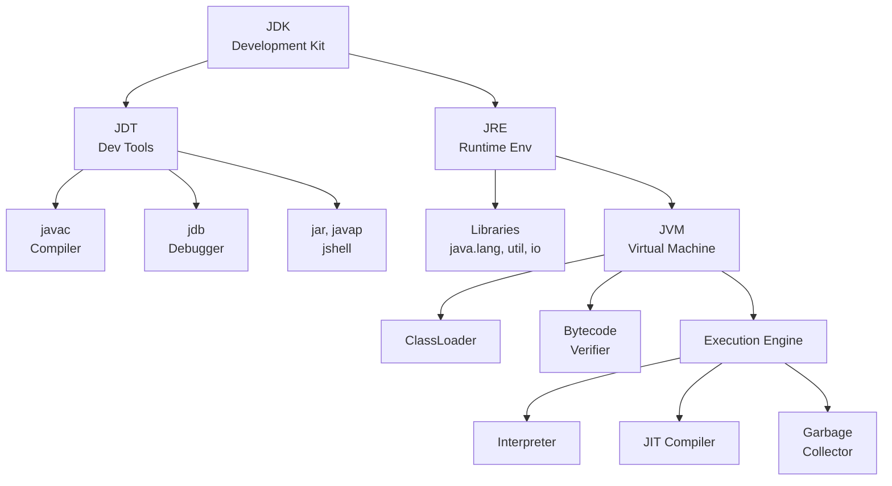

### 🎯 Interview Answer Formula

```
JDK = JRE + Development Tools (javac, jdb, jar, javadoc)
JRE = JVM + Libraries (java.lang, java.util, java.io)
JVM = ClassLoader + Bytecode Verifier + Execution Engine (Interpreter + JIT + GC)

→ Developer uses JDK (to write + compile + run)
→ End user uses JRE (just to run)
→ JVM is inside both JRE and JDK
→ Java code is Platform Independent (Bytecode)
→ JVM is Platform Dependent (Different per OS)
```

> [!IMPORTANT]
> **Most Important Interview Point:**
> Java is platform-independent because bytecodes are platform-independent. The virtual machine (JVM) takes care of the differences between platforms. BUT the JVM itself is platform-dependent — there's a different JVM for Windows, Mac, and Linux.

<a href="#chapter-index-table-2">Go to Top 🔝</a>

---

## 2.5 How Java Program Executes

<a id="25-how-java-program-executes"></a>

### 📌 Two-Step Execution Process

```
Java code involves a TWO-STEP execution:
1. FIRST → Through an OS-INDEPENDENT compiler (javac)
2. SECOND → In a virtual machine (JVM) which is custom-built
            for every operating system
```

### 📊 Complete Execution Flow

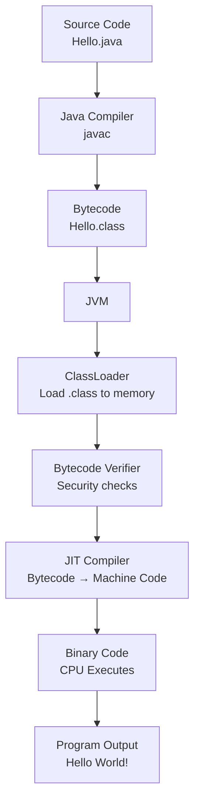

### 📌 Step-by-Step Detailed Explanation

```
STEP 1: WRITING SOURCE CODE
┌──────────────────────────────────────────────────────┐
│  You write a file: Hello.java                         │
│  This is human-readable Java source code              │
│  File name MUST match the public class name           │
└──────────────────────────────────────────────────────┘
                    │
                    ▼
STEP 2: COMPILATION (javac Hello.java)
┌──────────────────────────────────────────────────────┐
│  javac (Java Compiler) reads the ENTIRE source code   │
│  Checks for syntax errors                             │
│  Converts .java → .class (BYTECODE)                   │
│                                                        │
│  Bytecode = Machine-Independent encoding               │
│  The .class file is INDEPENDENT of machine or OS       │
│  which allows it to be run on ANY system               │
└──────────────────────────────────────────────────────┘
                    │
                    ▼
STEP 3: JVM EXECUTION (java Hello)
The .class file is passed to JVM which goes through
3 STAGES before final machine code is executed:
```

### 📌 Three Stages Inside JVM

---

### Stage 1: ClassLoader

```
The main class is LOADED INTO MEMORY by passing its
'.class' file to the JVM.

→ All other classes referenced in the program are also loaded
→ A ClassLoader, itself an object, creates a flat namespace
  of class bodies that are referenced by a string name

3 Types of ClassLoaders:
1. Bootstrap ClassLoader    → Loads core Java classes (java.lang.*)
2. Extension ClassLoader    → Loads extension classes
3. Application ClassLoader  → Loads YOUR application classes

Parent Delegation Model:
→ Child asks parent first → Parent asks its parent
→ If nobody finds the class → ClassNotFoundException
```

---

### Stage 2: Bytecode Verifier

```
After bytecode is loaded by ClassLoader,
it MUST be inspected by the Bytecode Verifier.

Job: Check that instructions don't perform DAMAGING ACTIONS

Checks include:
✅ Variables are INITIALIZED before they are used
✅ Local variable accesses fall within the runtime stack
✅ Method calls match object method signatures
✅ Rules for accessing private data and methods are not violated
✅ No stack overflow or underflow
✅ Type conversions are valid

WHY?
→ Security! Code could come from the internet
→ Prevents malicious bytecode from crashing JVM
→ Ensures Java's "write once, run anywhere" safety
```

---

### Stage 3: Just-In-Time (JIT) Compiler

```
This is the FINAL STAGE encountered by the Java program.
Job: Convert loaded BYTECODE into MACHINE CODE

→ The Interpreter reads bytecode LINE BY LINE (slower)
→ JIT detects "HOT CODE" (frequently executed code)
→ JIT compiles hot code directly to NATIVE MACHINE CODE
→ Caches the compiled code for REUSE

Main purpose: HEAVY OPTIMIZATIONS in performance!

Result: First run is slow (interpretation),
        subsequent runs are FAST (JIT compiled + cached)
```

### 📌 Complete Flow Diagram (Matching Your Image)

```
┌─────────────────┐    ┌──────────────────┐    ┌──────────────────┐
│  Source Code     │───→│  Java Compiler   │───→│   Byte Code      │
│  (.java)         │    │  (javac)         │    │   (.class)       │
└─────────────────┘    └──────────────────┘    └────────┬─────────┘
                                                        │
                                                        ▼
                                               ┌───────────────────┐
                                               │       JVM         │
                                               │                   │
                                               │  ┌─────────────┐  │
                                               │  │ Class Loader │  │
                                               │  └──────┬──────┘  │
                                               │         ▼         │
                                               │  ┌─────────────┐  │
                                               │  │  Byte Code  │  │
                                               │  │  Verifier   │  │
                                               │  └──────┬──────┘  │
                                               │         ▼         │
                                               │  ┌─────────────┐  │
                                               │  │    JIT      │  │
                                               │  │  Compiler   │  │
                                               │  └──────┬──────┘  │
                                               └─────────┼─────────┘
                                                         ▼
                                               ┌──────────────────┐
                                               │   Binary Code    │
                                               │  (Machine Code)  │
                                               │  CPU Executes    │
                                               └──────────────────┘
```

### 📌 What is Bytecode?

```
Bytecode is the INTERMEDIATE REPRESENTATION of Java code.

Source Code    → Human readable    (.java file)
Bytecode       → JVM readable      (.class file)
Machine Code   → CPU readable      (0s and 1s)

IMPORTANT:
→ Bytecode is NOT machine code (not specific to any CPU)
→ Bytecode is NOT source code (not human-readable)
→ Bytecode is PLATFORM INDEPENDENT
→ Same bytecode runs on Windows, Mac, Linux (via JVM)

This is WHY Java is Platform Independent:
The .class files generated by the compiler are INDEPENDENT
of the machine or the OS!
```

> [!NOTE]
> The Two-Step process makes Java unique:
> **Step 1:** javac (Compiler) → OS-Independent Bytecode
> **Step 2:** JVM (Interpreter + JIT) → OS-Dependent Machine Code
> This gives Java both **portability** (bytecode) and **performance** (JIT).

<a href="#chapter-index-table-2">Go to Top 🔝</a>

---

## 2.6 JVM Architecture

<a id="26-jvm-architecture"></a>

### 📌 Complete JVM Architecture

```
┌──────────────────────────────────────────────────────────────┐
│                    JVM ARCHITECTURE                          │
│                                                              │
│  ┌─────────────────────────────────────────────────────────┐ │
│  │              CLASS LOADER SUBSYSTEM                     │ │
│  │  Loading → Linking (Verify+Prepare+Resolve) → Init     │ │
│  └─────────────────────────┬───────────────────────────────┘ │
│                            │                                 │
│  ┌─────────────────────────▼───────────────────────────────┐ │
│  │              RUNTIME DATA AREAS (MEMORY)                │ │
│  │                                                         │ │
│  │  ┌──────────┐  ┌──────────┐  ┌───────────────────────┐ │ │
│  │  │ Method   │  │  Heap    │  │  Java Stack           │ │ │
│  │  │ Area     │  │  Area    │  │  (Per Thread)         │ │ │
│  │  │(Shared)  │  │(Shared)  │  │                       │ │ │
│  │  │          │  │          │  │  ┌─────────────────┐  │ │ │
│  │  │ Class    │  │ Objects  │  │  │  Stack Frame 1  │  │ │ │
│  │  │ info     │  │ Instance │  │  ├─────────────────┤  │ │ │
│  │  │ Static   │  │ vars     │  │  │  Stack Frame 2  │  │ │ │
│  │  │ vars     │  │ Arrays   │  │  └─────────────────┘  │ │ │
│  │  └──────────┘  └──────────┘  └───────────────────────┘ │ │
│  │                                                         │ │
│  │  ┌──────────────────────┐  ┌────────────────────────┐  │ │
│  │  │   PC Register        │  │  Native Method Stack   │  │ │
│  │  │   (Per Thread)       │  │  (Per Thread)          │  │ │
│  │  └──────────────────────┘  └────────────────────────┘  │ │
│  └─────────────────────────────────────────────────────────┘ │
│                                                              │
│  ┌─────────────────────────────────────────────────────────┐ │
│  │                EXECUTION ENGINE                         │ │
│  │                                                         │ │
│  │  ┌──────────────┐  ┌───────────┐  ┌─────────────────┐  │ │
│  │  │ Interpreter  │  │    JIT    │  │ Garbage         │  │ │
│  │  │ (Line by     │  │ Compiler  │  │ Collector       │  │ │
│  │  │  line, slow) │  │ (Hot code │  │ (Cleans unused  │  │ │
│  │  │              │  │  → native)│  │  objects)       │  │ │
│  │  └──────────────┘  └───────────┘  └─────────────────┘  │ │
│  └─────────────────────────────────────────────────────────┘ │
│                                                              │
│  ┌─────────────────────────────────────────────────────────┐ │
│  │  JNI (Java Native Interface) + Native Method Libraries  │ │
│  └─────────────────────────────────────────────────────────┘ │
└──────────────────────────────────────────────────────────────┘
```

### 📊 JVM Components Flow

```mermaid
flowchart TD
    A["JVM\nStartup"] --> B["ClassLoader\nLoads .class"]
    B --> C["Bytecode\nVerifier"]
    C --> D["Memory\nAllocation"]
    D --> E["Method Area\nClass Data"]
    D --> F["Heap\nObjects"]
    D --> G["Stack\nMethod Calls"]
    C --> H["Execution\nEngine"]
    H --> I["Interpreter\nLine by Line"]
    H --> J["JIT Compiler\nHot Code"]
    H --> K["GC\nMemory Cleanup"]
```

### 📌 Memory Areas Explained

```
┌───────────────────┬─────────────────────────────────────────┐
│  Memory Area      │  What is Stored                         │
├───────────────────┼─────────────────────────────────────────┤
│  Method Area      │  Class metadata, static variables       │
│  (Metaspace)      │  Constant pool, method bytecode         │
│  [Shared]         │  Java 8+: called Metaspace              │
├───────────────────┼─────────────────────────────────────────┤
│  Heap Area        │  All OBJECTS (created by new keyword)   │
│  [Shared]         │  Instance variables                     │
│                   │  Arrays                                 │
│                   │  Where Garbage Collector works           │
├───────────────────┼─────────────────────────────────────────┤
│  Stack Area       │  Method calls + local variables         │
│  [Per Thread]     │  Each method call = new Stack Frame     │
│                   │  LIFO structure                         │
│                   │  References to Heap objects              │
├───────────────────┼─────────────────────────────────────────┤
│  PC Register      │  Points to current instruction          │
│  [Per Thread]     │  being executed by that thread          │
├───────────────────┼─────────────────────────────────────────┤
│  Native Method    │  For native (C/C++) method execution    │
│  Stack            │                                         │
│  [Per Thread]     │                                         │
└───────────────────┴─────────────────────────────────────────┘
```

<a href="#chapter-index-table-2">Go to Top 🔝</a>

---

## 2.7 Setting Up Java Environment

<a id="27-setting-up-java-environment"></a>

### 📌 Step 1: Download JDK

```
Official Download Links:

🔗 JDK Download (Oracle):
   https://www.oracle.com/java/technologies/downloads/

🔗 Java Documentation:
   https://docs.oracle.com/en/java/javase/21/

Recommended: JDK 21 (Latest LTS)
```

### 📌 Step 2: IDE Installation

```
Choose ONE of these IDEs:

🔗 IntelliJ IDEA (RECOMMENDED for Java):
   https://www.jetbrains.com/idea/
   → Community Edition = FREE
   → Best for Java development

🔗 VS Code (Lightweight):
   https://code.visualstudio.com/download
   → Install "Extension Pack for Java"
   → Good for beginners

🔗 Eclipse:
   https://www.eclipse.org/downloads/packages/
   → Free and Open Source
   → Heavyweight but powerful
```

### 📌 Step 3: Set Environment Variables (Windows)

```
1. Right click "This PC" → Properties
2. Advanced System Settings → Environment Variables
3. Under System Variables:

   NEW Variable:
   Name  : JAVA_HOME
   Value : C:\Program Files\Java\jdk-21

   EDIT Path Variable:
   Add   : %JAVA_HOME%\bin
```

### 📌 Step 4: Verify Installation

```bash
# Open Command Prompt / Terminal

java --version
# Output: java 21.0.x 2023-xx-xx LTS

javac --version
# Output: javac 21.0.x

# If both commands work → Installation successful! ✅
```

> [!TIP]
> For beginners, start with **IntelliJ IDEA Community Edition** (Free). It has the best Java support with auto-completion, error detection, and debugging tools. Later switch to VS Code if you prefer lightweight editors.

<a href="#chapter-index-table-2">Go to Top 🔝</a>

---

## 2.8 First Java Program

<a id="28-first-java-program"></a>

### 📌 Hello World Program

```java
// File Name: HelloWorld.java
// RULE: File name MUST match the public class name EXACTLY

public class HelloWorld {
    public static void main(String[] args) {
        System.out.println("Hello, World!");
    }
}
```

### 📌 How to Compile and Run

```bash
# Step 1: Save file as HelloWorld.java

# Step 2: Open terminal in that folder

# Step 3: COMPILE
javac HelloWorld.java
# This generates: HelloWorld.class (Bytecode)

# Step 4: RUN (Note: NO .class extension!)
java HelloWorld

# OUTPUT:
# Hello, World!
```

### 📊 Compilation Flow

```mermaid
flowchart LR
    A["HelloWorld.java\nSource Code"] --> B["javac\nCompiler"]
    B --> C["HelloWorld.class\nBytecode"]
    C --> D["java HelloWorld\nJVM Executes"]
    D --> E["Console Output\nHello, World!"]
```

<a href="#chapter-index-table-2">Go to Top 🔝</a>

---

## 2.9 Deep Analysis of First Program

<a id="29-deep-analysis-of-first-program"></a>

### 📌 Line-by-Line Breakdown

```java
public class HelloWorld {                    // Line 1
    public static void main(String[] args) { // Line 2
        System.out.println("Hello, World!"); // Line 3
    }                                        // Line 4
}                                            // Line 5
```

### 📌 Every Keyword Explained

```
┌──────────────────────────────────────────────────────────────┐
│  LINE 1: public class HelloWorld                             │
├──────────────────────────────────────────────────────────────┤
│  public  → Access modifier: visible everywhere              │
│  class   → Keyword to define a class (blueprint)            │
│  HelloWorld → Class name (MUST match file name)             │
│  {       → Start of class body                              │
└──────────────────────────────────────────────────────────────┘

┌──────────────────────────────────────────────────────────────┐
│  LINE 2: public static void main(String[] args)              │
├──────────────────────────────────────────────────────────────┤
│  public  → JVM can access from OUTSIDE the class            │
│  static  → JVM calls WITHOUT creating an object             │
│  void    → Method returns NOTHING                           │
│  main    → Entry point - JVM SEARCHES for this method       │
│  ()      → Denotes this is a FUNCTION/METHOD                │
│  String  → Data type (text)                                 │
│  []      → Denotes an ARRAY                                 │
│  args    → Local variable name (command line arguments)     │
└──────────────────────────────────────────────────────────────┘

┌──────────────────────────────────────────────────────────────┐
│  LINE 3: System.out.println("Hello, World!")                 │
├──────────────────────────────────────────────────────────────┤
│  System   → Class in java.lang package (auto-imported)       │
│  out      → Static field of System (type: PrintStream)       │
│  println  → Method of PrintStream: prints + new line         │
│  "Hello"  → String literal (the text to print)               │
│  ;        → Statement terminator (every statement needs it)  │
└──────────────────────────────────────────────────────────────┘
```

### 📌 What is the Entry Point of a Java Program?

```
The ENTRY POINT of Java programs is the main() method.

→ JVM SEARCHES for main() method
→ If not found → Execution will NOT take place!
→ When a Java program starts, a DAEMON THREAD is attached
  to the main method
→ This thread gets destroyed only when Java program
  stops execution

Function Signature:
public static void main(String[] args)
```

### 📌 Why main() Method Uses Each Keyword

```
┌──────────────────────────────────────────────────────────────┐
│  WHY public?                                                 │
├──────────────────────────────────────────────────────────────┤
│  public = Access modifier, specifies who can access           │
│  Making main() public makes it GLOBALLY AVAILABLE             │
│  JVM needs to invoke it from OUTSIDE the class               │
│  Since JVM is not present in the current class,               │
│  main() must be public for JVM to call it                     │
└──────────────────────────────────────────────────────────────┘

┌──────────────────────────────────────────────────────────────┐
│  WHY static?                                                 │
├──────────────────────────────────────────────────────────────┤
│  static = When associated with a method, makes it            │
│  a CLASS-RELATED method (not object-related)                  │
│                                                               │
│  main() is static so JVM can invoke it                        │
│  WITHOUT INSTANTIATING (creating object of) the class        │
│                                                               │
│  This saves UNNECESSARY WASTAGE OF MEMORY which would        │
│  have been used by the object declared only for calling      │
│  the main() method by the JVM                                │
│                                                               │
│  If not static → JVM needs object → Who creates object?     │
│  → Nobody → CHICKEN-EGG PROBLEM!                             │
└──────────────────────────────────────────────────────────────┘

┌──────────────────────────────────────────────────────────────┐
│  WHY void?                                                   │
├──────────────────────────────────────────────────────────────┤
│  void = Specifies method doesn't RETURN anything              │
│                                                               │
│  As main() doesn't return anything, its return type is void   │
│  But we can still use 'return;' to return void from method    │
│                                                               │
│  As soon as main() terminates → Java program terminates too   │
│  Hence it doesn't make sense to RETURN anything               │
│  because JVM can't DO anything with the return value          │
└──────────────────────────────────────────────────────────────┘

┌──────────────────────────────────────────────────────────────┐
│  WHAT is main?                                               │
├──────────────────────────────────────────────────────────────┤
│  main = NAME of the Java main method                          │
│  It is the IDENTIFIER that JVM looks for as the              │
│  STARTING POINT of the Java program                           │
│                                                               │
│  IMPORTANT: main is NOT a keyword!                            │
│  It is just a method name that JVM specifically searches for  │
└──────────────────────────────────────────────────────────────┘

┌──────────────────────────────────────────────────────────────┐
│  WHAT is String[] args?                                      │
├──────────────────────────────────────────────────────────────┤
│  String = Data type (text)                                    │
│  []     = Denotes an ARRAY                                    │
│  args   = Local variable name (function parameter)            │
│                                                               │
│  Used for COMMAND LINE ARGUMENTS:                             │
│  java HelloWorld Rahul 25                                     │
│  → args[0] = "Rahul"                                          │
│  → args[1] = "25"                                             │
└──────────────────────────────────────────────────────────────┘
```

### 📌 Can We Execute Java Program Without main()?

```java
/*
YES! Using STATIC BLOCK (Before Java 8)

A static block in Java is a group of statements that gets
executed only once when the class is LOADED INTO MEMORY
by ClassLoader.

It is also known as static initialization block,
and it goes into the STACK MEMORY.

⚠️ WON'T RUN on Java 8 and above!
From Java 7+, JVM checks for main() FIRST.
*/

class JavaPlusDSA {
    static {
        System.out.println("Mai chala toh sbko current laga re!!!!");
        System.exit(0); // Must exit to avoid error in Java 7+
    }
}

/*
Java 6 and below:
→ Static block runs FIRST when class loads
→ System.exit(0) terminates before JVM looks for main()
→ Program runs without main()!

Java 7 and above:
→ JVM FIRST searches for main()
→ If not found: "Error: Main method not found"
→ Static block alone won't work!
*/
```

### 📌 Can We Overload main()?

```java
public class MainOverload {

    // Original main — JVM ALWAYS calls this one
    public static void main(String[] args) {
        System.out.println("JVM calls this main");
        main(10);        // Manually calling overloaded main
        main("Hello");   // Manually calling overloaded main
    }

    // Overloaded main 1
    public static void main(int x) {
        System.out.println("main with int: " + x);
    }

    // Overloaded main 2
    public static void main(String s) {
        System.out.println("main with String: " + s);
    }
}

/*
OUTPUT:
JVM calls this main
main with int: 10
main with String: Hello

YES we can overload main().
JVM ALWAYS calls: main(String[] args)
Other overloaded versions must be called manually.
*/
```

> [!IMPORTANT]
> **Interview Fact:** `main` is NOT a keyword in Java. It is just a method name that JVM specifically searches for. You can have a variable named `main`, but it's not recommended. Also, `public static void main(String[] args)` is the EXACT signature JVM looks for — changing any keyword breaks execution.

<a href="#chapter-index-table-2">Go to Top 🔝</a>

---

## 2.10 Java Program Structure

<a id="210-java-program-structure"></a>

### 📌 Complete Program Template

```java
// ─────────────────────────────────────────────────
// 1. PACKAGE DECLARATION (Optional — Must be FIRST line)
// ─────────────────────────────────────────────────
package com.myapp.demo;

// ─────────────────────────────────────────────────
// 2. IMPORT STATEMENTS (Optional — After package)
// ─────────────────────────────────────────────────
import java.util.Scanner;
import java.util.ArrayList;
// java.lang.* is automatically imported (String, System, Math, etc.)

// ─────────────────────────────────────────────────
// 3. CLASS DECLARATION (Required)
// ─────────────────────────────────────────────────
public class MyProgram {

    // ─────────────────────────────────────────────
    // 4. STATIC VARIABLES (Class level)
    // ─────────────────────────────────────────────
    static int count = 0;

    // ─────────────────────────────────────────────
    // 5. INSTANCE VARIABLES (Object level)
    // ─────────────────────────────────────────────
    String name;
    int age;

    // ─────────────────────────────────────────────
    // 6. STATIC BLOCK (Runs when class loads)
    // ─────────────────────────────────────────────
    static {
        System.out.println("Static block runs FIRST!");
    }

    // ─────────────────────────────────────────────
    // 7. CONSTRUCTOR (Runs when object is created)
    // ─────────────────────────────────────────────
    public MyProgram(String name, int age) {
        this.name = name;
        this.age = age;
    }

    // ─────────────────────────────────────────────
    // 8. METHODS (Behaviors)
    // ─────────────────────────────────────────────
    public void display() {
        System.out.println("Name: " + name + ", Age: " + age);
    }

    // ─────────────────────────────────────────────
    // 9. MAIN METHOD (Entry Point — JVM starts here)
    // ─────────────────────────────────────────────
    public static void main(String[] args) {
        MyProgram obj = new MyProgram("Java", 29);
        obj.display();
    }
}

/*
Execution Order:
1. Class loaded → Static block runs
2. main() called by JVM
3. Constructor called when new object is created
4. Methods called on the object

OUTPUT:
Static block runs FIRST!
Name: Java, Age: 29
*/
```

<a href="#chapter-index-table-2">Go to Top 🔝</a>

---

## 2.11 Java Naming Conventions

<a id="211-java-naming-conventions"></a>

### 📌 Standard Conventions

```
┌──────────────────────┬──────────────────┬─────────────────────┐
│  Element             │  Convention       │  Example            │
├──────────────────────┼──────────────────┼─────────────────────┤
│  Class Name          │  PascalCase       │  StudentRecord      │
│                      │  (Capital start)  │  MyProgram          │
├──────────────────────┼──────────────────┼─────────────────────┤
│  Interface Name      │  PascalCase       │  Printable          │
│                      │                   │  Serializable       │
├──────────────────────┼──────────────────┼─────────────────────┤
│  Method Name         │  camelCase        │  getStudentName()   │
│                      │  (lowercase start)│  calculateTotal()   │
├──────────────────────┼──────────────────┼─────────────────────┤
│  Variable Name       │  camelCase        │  studentAge         │
│                      │                   │  totalMarks         │
├──────────────────────┼──────────────────┼─────────────────────┤
│  Constant            │  UPPER_SNAKE_CASE │  MAX_SIZE           │
│  (static final)      │                   │  PI_VALUE           │
├──────────────────────┼──────────────────┼─────────────────────┤
│  Package Name        │  all.lowercase    │  com.company.app    │
│                      │                   │  java.util          │
├──────────────────────┼──────────────────┼─────────────────────┤
│  Enum Name           │  PascalCase       │  DayOfWeek          │
├──────────────────────┼──────────────────┼─────────────────────┤
│  Enum Constants      │  UPPER_SNAKE_CASE │  MONDAY, TUESDAY    │
└──────────────────────┴──────────────────┴─────────────────────┘
```

```java
// CORRECT naming examples:
public class StudentRecord {           // PascalCase
    private static final int MAX_AGE = 100; // UPPER_SNAKE_CASE
    private String studentName;         // camelCase
    private int rollNumber;

    public String getStudentName() {    // camelCase
        return studentName;
    }
}
```

<a href="#chapter-index-table-2">Go to Top 🔝</a>

---

## 2.12 Types of Comments

<a id="212-types-of-comments"></a>

### 📌 Three Types of Comments in Java

```java
public class CommentsDemo {

    // ─────────────────────────────────────────────
    // TYPE 1: SINGLE LINE COMMENT
    // ─────────────────────────────────────────────
    // This is a single line comment
    // Starts with two forward slashes (//)
    // Used for brief explanations
    int age = 25; // Can be at end of line too

    // ─────────────────────────────────────────────
    // TYPE 2: MULTI-LINE COMMENT
    // ─────────────────────────────────────────────
    /*
     * This spans multiple lines.
     * Starts with /* and ends with star-slash
     * Used for longer explanations.
     * Cannot be nested!
     */
    double salary = 50000.0;

    // ─────────────────────────────────────────────
    // TYPE 3: DOCUMENTATION COMMENT (Javadoc)
    // ─────────────────────────────────────────────
    /**
     * This is a Javadoc comment.
     * Used by javadoc tool to generate HTML documentation.
     *
     * @param name   The name of the student
     * @param age    The age of the student
     * @return       A formatted information string
     * @author       Your Name
     * @version      1.0
     * @since        2024
     */
    public String getInfo(String name, int age) {
        return name + " is " + age + " years old";
    }

    public static void main(String[] args) {
        // Comments are IGNORED by the compiler
        // They exist ONLY for human readability
        System.out.println("Comments Demo");
    }
}
```

### 📌 Comments Best Practice

```
DO:
✅ Use comments to explain WHY, not WHAT
✅ Use Javadoc for public APIs
✅ Keep comments updated when code changes

DON'T:
❌ Over-comment obvious code: int x = 5; // assign 5 to x
❌ Leave commented-out code in production
❌ Write novels in comments (keep them short)
```

> [!TIP]
> **Joke from Notes:** *"Best use of comments is that you can comment the Bug in the program and the Bug will be resolved? Wait, don't try this — Bug will be gone but so will your job opportunity, lol!"* 😄

<a href="#chapter-index-table-2">Go to Top 🔝</a>

---

## 2.13 Java Keywords

<a id="213-java-keywords"></a>

### 📌 All 50+ Java Reserved Keywords

```
Java has 50+ reserved keywords.
They CANNOT be used as identifiers (variable/method/class names).

┌──────────────────────┬──────────────────────────────────────────┐
│  Category            │  Keywords                                │
├──────────────────────┼──────────────────────────────────────────┤
│  Data Types          │  int, byte, short, long, float, double   │
│                      │  char, boolean, void                     │
├──────────────────────┼──────────────────────────────────────────┤
│  Access Modifiers    │  public, private, protected              │
├──────────────────────┼──────────────────────────────────────────┤
│  Class / Object      │  class, interface, extends, implements   │
│                      │  enum, record, sealed, new, this, super  │
│                      │  instanceof, abstract, final             │
├──────────────────────┼──────────────────────────────────────────┤
│  Method              │  void, return, static, abstract, final   │
│                      │  synchronized, native, strictfp          │
├──────────────────────┼──────────────────────────────────────────┤
│  Control Flow        │  if, else, switch, case, default         │
│                      │  for, while, do, break, continue         │
├──────────────────────┼──────────────────────────────────────────┤
│  Exception           │  try, catch, finally, throw, throws      │
├──────────────────────┼──────────────────────────────────────────┤
│  Package             │  import, package                         │
├──────────────────────┼──────────────────────────────────────────┤
│  Other               │  volatile, transient, assert             │
│                      │  yield, var (contextual)                 │
└──────────────────────┴──────────────────────────────────────────┘

📌 IMPORTANT:
→ true, false, null are LITERALS (not keywords but reserved)
→ goto and const are reserved but NEVER used in Java
→ 'main' is NOT a keyword (just a method name JVM looks for)
→ 'var' is a reserved type name (Java 10+), not a keyword
```

```java
// These are ALL INVALID variable names:
// int class = 5;      ❌ 'class' is a keyword
// int public = 10;    ❌ 'public' is a keyword
// String if = "test"; ❌ 'if' is a keyword

// These ARE valid (not keywords):
int main = 5;          // ✅ 'main' is NOT a keyword
String data = "hello"; // ✅ 'data' is not a keyword
int number = 10;       // ✅
```

<a href="#chapter-index-table-2">Go to Top 🔝</a>

---

<a id="2-interview-questions"></a>

## 💡 Chapter 2 — Interview Questions (15+)

> 🔥 Most frequently asked in Java interviews — Beginner to Senior

---

### 🔵 Conceptual Questions

---

**Q1. What is Java? What are its main features?**

```
Java is a high-level, object-oriented, platform-independent
programming language developed by James Gosling at Sun Microsystems
(now Oracle) in 1995.

Main Features:
→ Platform Independent (WORA — Write Once, Run Anywhere)
→ Object-Oriented (4 Pillars: Encapsulation, Inheritance,
  Polymorphism, Abstraction)
→ Simple (No pointers, no header files, no operator overloading)
→ Secure (Bytecode Verifier, no direct memory access)
→ Robust (Exception Handling, Garbage Collection)
→ Multithreaded (Built-in thread support)
→ High Performance (JIT Compiler)
→ Dynamic (Runtime class loading, Reflection API)
```

---

**Q2. What is the difference between JDK, JRE, and JVM?**

```
JDK (Java Development Kit):
→ JRE + Development Tools (javac, jdb, jar, javadoc)
→ Used to DEVELOP + COMPILE + RUN programs
→ Installed by DEVELOPERS

JRE (Java Runtime Environment):
→ JVM + Java Libraries (java.lang, java.util, java.io)
→ Used to only RUN programs
→ Installed by END USERS

JVM (Java Virtual Machine):
→ ClassLoader + Bytecode Verifier + Execution Engine
→ Actually EXECUTES bytecode
→ Contains Interpreter + JIT Compiler + Garbage Collector
→ JVM is PLATFORM DEPENDENT (different for each OS)

Relationship: JDK ⊃ JRE ⊃ JVM
```

---

**Q3. Why is Java platform independent?**

```
Java is platform-independent because it uses a VIRTUAL MACHINE.

Step 1: javac compiles .java → .class (BYTECODE)
Step 2: Bytecodes are EFFECTIVELY PLATFORM-INDEPENDENT
Step 3: JVM reads bytecode and converts to machine code for that OS

The .class files generated by the compiler are INDEPENDENT
of the machine or the OS, which allows them to be run on ANY system.

The virtual machine takes care of the DIFFERENCES between
bytecodes for different platforms.

IMPORTANT DISTINCTION:
→ BYTECODE is platform-INDEPENDENT ✅
→ JVM is platform-DEPENDENT ❌ (Different JVM per OS)
→ JVM is the bridge that makes bytecode portable
```

---

**Q4. How does a Java program compile and execute?**

```
Java code involves a TWO-STEP execution:

STEP 1: COMPILATION (javac)
→ Source code (.java) passed through compiler
→ Compiler encodes source code into machine-independent encoding
→ Known as BYTECODE (generates .class files)
→ .class files are independent of machine or OS

STEP 2: JVM EXECUTION (java)
→ .class file passed to JVM → Goes through 3 stages:

  1. ClassLoader:
     → Loads main class into memory by passing .class to JVM
     → All referenced classes also loaded
     → Creates flat namespace of class bodies

  2. Bytecode Verifier:
     → Inspects bytecode for damaging actions
     → Checks: variables initialized before use
     → Checks: local accesses within runtime stack

  3. JIT Compiler:
     → Converts loaded bytecode → machine code
     → Main purpose: heavy optimizations in performance
     → Caches compiled code for reuse
```

---

**Q5. What is bytecode in Java?**

```
Bytecode is the INTERMEDIATE REPRESENTATION produced by javac.

→ NOT machine code (not binary for any specific CPU)
→ NOT source code (not human-readable Java)
→ Platform-neutral format (.class files)
→ Read by JVM and converted to machine code at runtime

WHY BYTECODE?
→ Makes Java platform-independent
→ Same .class file runs on Windows, Mac, Linux
→ More secure (Bytecode Verifier checks before execution)
→ Can be distributed without sharing source code
```

---

**Q6. Why is main() declared as public static void?**

```
public:
→ Access modifier — makes it globally available
→ JVM needs to call main() from OUTSIDE the class
→ If not public, JVM can't access it

static:
→ JVM calls main() WITHOUT instantiating (creating object of) the class
→ Saves unnecessary wastage of memory for creating object
→ If not static → Who creates the object? → Chicken-Egg Problem

void:
→ main() doesn't return anything to JVM
→ When main() terminates → program terminates
→ JVM can't do anything with return value

main:
→ It is the NAME (identifier) JVM looks for
→ NOT a keyword! Just a method name
→ JVM specifically searches for: public static void main(String[] args)
```

---

**Q7. Can we execute a Java program without main method?**

```
BEFORE Java 7: YES — using STATIC BLOCK

static {
    System.out.println("Runs without main!");
    System.exit(0);
}

→ Static block runs when class is loaded by ClassLoader
→ System.exit(0) terminates before JVM searches for main()

FROM Java 7+: NO
→ JVM FIRST checks for main(String[] args)
→ If not found: "Error: Main method not found in class X"
→ Static block alone won't work anymore
→ This was fixed for security reasons
```

---

**Q8. What is JIT Compiler? Why is it needed?**

```
JIT = Just-In-Time Compiler

→ Part of JVM's Execution Engine
→ Interpreter reads bytecode LINE BY LINE (slow)
→ JIT detects "HOT CODE" (frequently executed methods/loops)
→ Compiles hot bytecode directly to NATIVE MACHINE CODE
→ Caches the compiled code for REUSE

WHY NEEDED?
→ Interpreter alone is too slow
→ JIT provides near-native C/C++ performance
→ First run: slow (interpreted)
→ Subsequent runs: FAST (JIT compiled + cached)

It is the FINAL STAGE encountered by the Java program,
and its main purpose is to do HEAVY OPTIMIZATIONS in performance.
```

---

### 🟡 Scenario-Based Questions

---

**Q9. If Java is platform independent, why do we need different JVMs for different OS?**

```
Java SOURCE CODE and BYTECODE are platform-independent.
But bytecode CANNOT directly talk to hardware.

JVM acts as the TRANSLATOR:
→ It converts bytecode → machine code for THAT specific OS
→ Windows machine code ≠ Linux machine code ≠ Mac machine code
→ Each OS needs its OWN JVM to do this translation

ANALOGY:
→ A book written in English (bytecode) is universal
→ But you need a TRANSLATOR per country
→ Translator for Japan (JVM-Windows) ≠ Translator for France (JVM-Mac)
→ Book stays same, translator changes per country
```

---

**Q10. What happens if we change the main method signature?**

```java
// ORIGINAL (JVM looks for EXACTLY this):
public static void main(String[] args) ✅

// CHANGES and their effects:

static void main(String[] args)     // ❌ Missing public
// Error: Main method not found (JVM can't access)

public void main(String[] args)     // ❌ Missing static
// Error: Main method is not static

public static int main(String[] args) // ❌ Return type changed
// Error: Main method must return void

public static void main(int[] args)   // ❌ Parameter type changed
// Error: Main method not found (signature doesn't match)

public static void Main(String[] args) // ❌ Capital 'M'
// Error: Java is CASE-SENSITIVE, Main ≠ main
```

---

**Q11. What is the role of Bytecode Verifier? Can we skip it?**

```
Bytecode Verifier checks that instructions don't perform
DAMAGING ACTIONS before execution:

Checks:
✅ Variables are initialized before they are used
✅ Local variable accesses fall within the runtime stack
✅ Method signatures match
✅ Access rules (private/public) are respected
✅ No stack overflow/underflow in bytecode instructions

CAN WE SKIP IT? No!
→ It's a fundamental security layer in JVM
→ Critical when running code from untrusted sources (internet)
→ Without it, malicious bytecode could crash/exploit JVM
```

---

### 🔴 Output-Based Questions

---

**Q12. What is the output?**

```java
public class Test {
    static {
        System.out.println("Static Block");
    }

    public static void main(String[] args) {
        System.out.println("Main Method");
    }

    static {
        System.out.println("Static Block 2");
    }
}
```

```
OUTPUT:
Static Block
Static Block 2
Main Method

REASON:
→ When class is loaded, ALL static blocks execute FIRST
→ Static blocks execute in ORDER of appearance (top to bottom)
→ Then main() method is called by JVM
→ Multiple static blocks are allowed and execute sequentially
```

---

**Q13. What is the output?**

```java
public class Test {
    public static void main(String[] args) {
        System.out.println(args.length);
    }
}

// Run with: java Test Hello World Java
```

```
OUTPUT:
3

REASON:
→ args = {"Hello", "World", "Java"}
→ args.length = 3
→ Command line arguments are separated by spaces
→ Each word becomes one element in args array
```

---

**Q14. What is the output?**

```java
public class Test {
    public static void main(String[] args) {
        main(10);
    }

    public static void main(int x) {
        System.out.println("Overloaded main: " + x);
    }
}
```

```
OUTPUT:
Overloaded main: 10

REASON:
→ JVM calls main(String[] args) as entry point
→ Inside it, we manually call main(10) → overloaded version
→ main(int x) executes and prints "Overloaded main: 10"
→ YES — we CAN overload main()
→ JVM ALWAYS calls main(String[] args) specifically
```

---

**Q15. Will this compile? What's the output?**

```java
public class Test {
    public static void main(String[] args) {
        System.out.println("Hello");
        return; // return in void method
        // System.out.println("World"); // Unreachable code!
    }
}
```

```
OUTPUT:
Hello

REASON:
→ return; in void method is VALID — it just exits the method
→ We can use return keyword to return void from the function
→ Any code AFTER return is UNREACHABLE CODE → Compile Error
→ That's why "World" line is commented out
→ As soon as main() terminates → Java program terminates too
```

<a href="#chapter-index-table-2">Go to Top 🔝</a>

---

<a id="2-practice-problems"></a>

## 🧪 Chapter 2 — Practice Problems

### 📝 5 Theory Questions

```
1. Explain the complete lifecycle of a Java program from writing
   code to seeing output. Include all 3 stages inside JVM.

2. "Java is both compiled and interpreted" — Explain this statement
   in detail with the role of javac, Interpreter, and JIT Compiler.

3. What are the 3 types of ClassLoaders in Java? Explain the
   Parent Delegation Model with a diagram.

4. Why did Java remove Pointers that C/C++ had? How does Java
   handle memory access without pointers?

5. Compare: Java vs Python vs C++ on these criteria:
   - Compilation model
   - Type system
   - Memory management
   - Performance
   - Platform independence
```

---

### 💻 5 Coding Questions

```java
// Q1: Write a program that prints all command-line arguments
// with their index numbers
// Input: java ArgsDemo Hello World 42
// Output:
//   args[0] = Hello
//   args[1] = World
//   args[2] = 42

public class ArgsDemo {
    public static void main(String[] args) {
        // TODO: Print all args with index
    }
}
```

```java
// Q2: Write a program with multiple static blocks and instance blocks
// Predict and verify the execution order
public class ExecutionOrder {
    static { System.out.println("Static Block 1"); }

    { System.out.println("Instance Block 1"); }

    static { System.out.println("Static Block 2"); }

    { System.out.println("Instance Block 2"); }

    ExecutionOrder() {
        System.out.println("Constructor");
    }

    public static void main(String[] args) {
        System.out.println("Main Method");
        new ExecutionOrder();
        new ExecutionOrder();
    }
    // TODO: Predict the EXACT output order before running
}
```

```java
// Q3: Create a program that uses System.out.println, print, printf
// Print a formatted table of student data

public class OutputFormats {
    public static void main(String[] args) {
        // TODO: Print a table with:
        // Name, Age, Grade, GPA (formatted to 2 decimal places)
        // Use println for header
        // Use printf for formatted rows
        // Use print for a separator line
    }
}
```

```java
// Q4: Write multiple overloaded main methods
// Demonstrate which one JVM calls and how others are invoked

public class MainOverloadDemo {
    // TODO: Create 4 different main methods with different signatures
    // Show JVM entry point vs manual invocation
}
```

```java
// Q5: Write a program that checks if JVM is 32-bit or 64-bit
// and prints Java version, vendor, and OS information

public class SystemInfo {
    public static void main(String[] args) {
        // TODO: Use System.getProperty() to print:
        // Java version
        // Java vendor
        // OS name
        // OS architecture
        // JVM name
        // User directory
        // Hint: System.getProperty("java.version")
    }
}
```

---

### 🏗️ 2 Machine Coding Problems

---

**Machine Coding 1: Java FAQ Bot**

```
Problem Statement:
Build a console-based Java FAQ Bot that answers common
Java interview questions.

Requirements:
1. Store 20+ FAQ questions and answers in a data structure
2. User types a keyword/question number
3. Bot finds the most relevant Q&A
4. Support categories: Basics, OOP, JVM, Features
5. Option to list all questions by category
6. Search by keyword functionality

Input:
User types: "JVM" or "3" (question number)

Output:
Q: What is JVM?
A: JVM is Java Virtual Machine that executes bytecode...

Hint:
Use HashMap<String, String> for Q&A storage
Use categories with HashMap<String, List<String>>
```

---

**Machine Coding 2: Java Program Analyzer**

```
Problem Statement:
Build a tool that analyzes a Java source code string
and extracts information from it.

Requirements:
1. Count number of classes
2. Count number of methods
3. Detect if main method exists
4. Count single-line and multi-line comments
5. List all import statements
6. Check naming conventions (class = PascalCase, methods = camelCase)
7. Print analysis report

Input:
A Java program as a multi-line String

Output:
═══ Java Program Analysis Report ═══
Classes found: 2
Methods found: 5
Main method: ✅ Found
Single-line comments: 8
Multi-line comments: 2
Imports: 3
Naming violations: 1 (method 'GetName' should be 'getName')
```

<a href="#chapter-index-table-2">Go to Top 🔝</a>

---

<a id="2-mini-project-java-environment-checker"></a>

## 🚀 Mini Project: Java Environment Checker Tool

---

### 📋 Problem Statement

```
Build a console-based Java application that:
1. Detects and displays all Java environment information
2. Checks if Java is properly installed
3. Shows JVM details (version, vendor, memory)
4. Displays OS information
5. Shows memory usage (Heap, Free, Max)
6. Runs a simple benchmark test
7. Generates a system readiness report
```

### 🏗️ Architecture

```mermaid
flowchart TD
    A["Start\nEnvironment Checker"] --> B["System Properties\nCollector"]
    B --> C["JVM Info\nDetector"]
    B --> D["OS Info\nDetector"]
    B --> E["Memory Info\nCollector"]
    C --> F["Report\nGenerator"]
    D --> F
    E --> F
    F --> G["Console Output\nFormatted Report"]
```

### 💻 Complete Code

```java
public class JavaEnvironmentChecker {

    public static void main(String[] args) {

        printBanner();
        printJavaInfo();
        printJVMInfo();
        printOSInfo();
        printMemoryInfo();
        printBenchmark();
        printReadinessReport();
    }

    static void printBanner() {
        System.out.println("╔═══════════════════════════════════════════╗");
        System.out.println("║     ☕ JAVA ENVIRONMENT CHECKER TOOL      ║");
        System.out.println("║     Verify your Java Setup                ║");
        System.out.println("╚═══════════════════════════════════════════╝");
        System.out.println();
    }

    static void printJavaInfo() {
        System.out.println("┌─────────────────────────────────────────┐");
        System.out.println("│           ☕ JAVA INFORMATION            │");
        System.out.println("├─────────────────────────────────────────┤");

        printProperty("Java Version", "java.version");
        printProperty("Java Vendor", "java.vendor");
        printProperty("Java Home", "java.home");
        printProperty("Java Class Path", "java.class.path");
        printProperty("Java Spec Version", "java.specification.version");

        System.out.println("└─────────────────────────────────────────┘");
        System.out.println();
    }

    static void printJVMInfo() {
        System.out.println("┌─────────────────────────────────────────┐");
        System.out.println("│           🖥️  JVM INFORMATION            │");
        System.out.println("├─────────────────────────────────────────┤");

        printProperty("JVM Name", "java.vm.name");
        printProperty("JVM Version", "java.vm.version");
        printProperty("JVM Vendor", "java.vm.vendor");
        printProperty("JVM Spec", "java.vm.specification.version");

        Runtime runtime = Runtime.getRuntime();
        System.out.printf("│  %-20s: %d%n", "Available Processors",
                          runtime.availableProcessors());

        System.out.println("└─────────────────────────────────────────┘");
        System.out.println();
    }

    static void printOSInfo() {
        System.out.println("┌─────────────────────────────────────────┐");
        System.out.println("│         💻 OS INFORMATION                │");
        System.out.println("├─────────────────────────────────────────┤");

        printProperty("OS Name", "os.name");
        printProperty("OS Version", "os.version");
        printProperty("OS Architecture", "os.arch");
        printProperty("User Name", "user.name");
        printProperty("User Directory", "user.dir");
        printProperty("File Separator", "file.separator");

        System.out.println("└─────────────────────────────────────────┘");
        System.out.println();
    }

    static void printMemoryInfo() {
        Runtime runtime = Runtime.getRuntime();

        long maxMemory = runtime.maxMemory();
        long totalMemory = runtime.totalMemory();
        long freeMemory = runtime.freeMemory();
        long usedMemory = totalMemory - freeMemory;

        System.out.println("┌─────────────────────────────────────────┐");
        System.out.println("│         📊 MEMORY INFORMATION            │");
        System.out.println("├─────────────────────────────────────────┤");

        System.out.printf("│  %-20s: %s%n", "Max Heap Memory", formatBytes(maxMemory));
        System.out.printf("│  %-20s: %s%n", "Total Memory", formatBytes(totalMemory));
        System.out.printf("│  %-20s: %s%n", "Free Memory", formatBytes(freeMemory));
        System.out.printf("│  %-20s: %s%n", "Used Memory", formatBytes(usedMemory));
        System.out.printf("│  %-20s: %.1f%%%n", "Memory Usage",
                          (double) usedMemory / totalMemory * 100);

        System.out.println("└─────────────────────────────────────────┘");
        System.out.println();
    }

    static void printBenchmark() {
        System.out.println("┌─────────────────────────────────────────┐");
        System.out.println("│         ⚡ BENCHMARK TEST                │");
        System.out.println("├─────────────────────────────────────────┤");

        // Simple benchmark: sum of numbers
        long start = System.nanoTime();
        long sum = 0;
        for (int i = 0; i < 10_000_000; i++) {
            sum += i;
        }
        long end = System.nanoTime();
        double ms = (end - start) / 1_000_000.0;

        System.out.printf("│  %-20s: %.2f ms%n", "10M Additions", ms);
        System.out.printf("│  %-20s: %s%n", "Result", String.valueOf(sum));

        // String benchmark
        start = System.nanoTime();
        StringBuilder sb = new StringBuilder();
        for (int i = 0; i < 100_000; i++) {
            sb.append("x");
        }
        end = System.nanoTime();
        ms = (end - start) / 1_000_000.0;

        System.out.printf("│  %-20s: %.2f ms%n", "100K String Concat", ms);

        System.out.println("└─────────────────────────────────────────┘");
        System.out.println();
    }

    static void printReadinessReport() {
        String version = System.getProperty("java.version");
        int majorVersion = getMajorVersion(version);

        System.out.println("╔═══════════════════════════════════════════╗");
        System.out.println("║         📋 READINESS REPORT               ║");
        System.out.println("╠═══════════════════════════════════════════╣");

        printCheck("Java Installed", true);
        printCheck("JVM Running", true);
        printCheck("Java 8+", majorVersion >= 8);
        printCheck("Java 11+ (LTS)", majorVersion >= 11);
        printCheck("Java 17+ (LTS)", majorVersion >= 17);
        printCheck("Java 21+ (LTS)", majorVersion >= 21);
        printCheck("64-bit Architecture",
                   System.getProperty("os.arch").contains("64"));

        System.out.println("╠═══════════════════════════════════════════╣");
        if (majorVersion >= 11) {
            System.out.println("║  ✅ System is READY for Java Development  ║");
        } else {
            System.out.println("║  ⚠️  Consider upgrading to Java 17/21 LTS ║");
        }
        System.out.println("╚═══════════════════════════════════════════╝");
    }

    // ── Helper Methods ──────────────────────────────────────

    static void printProperty(String label, String key) {
        String value = System.getProperty(key, "N/A");
        if (value.length() > 40) value = value.substring(0, 40) + "...";
        System.out.printf("│  %-20s: %s%n", label, value);
    }

    static void printCheck(String label, boolean status) {
        System.out.printf("║  %s %-30s          ║%n",
                          status ? "✅" : "❌", label);
    }

    static String formatBytes(long bytes) {
        if (bytes < 1024) return bytes + " B";
        if (bytes < 1024 * 1024) return String.format("%.1f KB", bytes / 1024.0);
        if (bytes < 1024 * 1024 * 1024)
            return String.format("%.1f MB", bytes / (1024.0 * 1024));
        return String.format("%.1f GB", bytes / (1024.0 * 1024 * 1024));
    }

    static int getMajorVersion(String version) {
        try {
            if (version.startsWith("1.")) {
                return Integer.parseInt(version.substring(2, 3));
            }
            int dotIndex = version.indexOf(".");
            if (dotIndex == -1) return Integer.parseInt(version);
            return Integer.parseInt(version.substring(0, dotIndex));
        } catch (Exception e) {
            return 0;
        }
    }
}
```

### ✅ Expected Output

```
╔═══════════════════════════════════════════╗
║     ☕ JAVA ENVIRONMENT CHECKER TOOL      ║
║     Verify your Java Setup                ║
╚═══════════════════════════════════════════╝

┌─────────────────────────────────────────┐
│           ☕ JAVA INFORMATION            │
├─────────────────────────────────────────┤
│  Java Version         : 21.0.2
│  Java Vendor          : Oracle Corporation
│  Java Home            : C:\Program Files\Java\jdk-21
│  Java Spec Version    : 21
└─────────────────────────────────────────┘

┌─────────────────────────────────────────┐
│         📊 MEMORY INFORMATION            │
├─────────────────────────────────────────┤
│  Max Heap Memory      : 3.9 GB
│  Total Memory         : 256.0 MB
│  Free Memory          : 248.5 MB
│  Used Memory          : 7.5 MB
│  Memory Usage         : 2.9%
└─────────────────────────────────────────┘

╔═══════════════════════════════════════════╗
║         📋 READINESS REPORT               ║
╠═══════════════════════════════════════════╣
║  ✅ Java Installed                        ║
║  ✅ JVM Running                           ║
║  ✅ Java 8+                               ║
║  ✅ Java 11+ (LTS)                        ║
║  ✅ Java 17+ (LTS)                        ║
║  ✅ Java 21+ (LTS)                        ║
║  ✅ 64-bit Architecture                   ║
╠═══════════════════════════════════════════╣
║  ✅ System is READY for Java Development  ║
╚═══════════════════════════════════════════╝
```

<a href="#chapter-index-table-2">Go to Top 🔝</a>

---

```
┌─────────────────────────────────────────────────────────────┐
│                  ✅ CHAPTER 2 COMPLETE                      │
│                                                             │
│  Topics Covered:                                            │
│  ✅ 2.1  What is Java — Definition, Oracle, OOP             │
│  ✅ 2.2  History — Greentalk → Oak → Java ☕                 │
│  ✅ 2.3  Features — Platform Independent, Secure, Robust    │
│  ✅ 2.4  JDK vs JRE vs JVM — Complete Diagram               │
│  ✅ 2.5  How Java Executes — ClassLoader, Verifier, JIT     │
│  ✅ 2.6  JVM Architecture — Memory Areas, Engine             │
│  ✅ 2.7  Setting Up — JDK, IDE links, PATH setup            │
│  ✅ 2.8  First Java Program — Hello World                   │
│  ✅ 2.9  Deep Analysis — Every keyword of main() explained  │
│  ✅ 2.10 Program Structure — Complete Template               │
│  ✅ 2.11 Naming Conventions — PascalCase, camelCase          │
│  ✅ 2.12 Types of Comments — Single, Multi, Javadoc          │
│  ✅ 2.13 Java Keywords — 50+ Reserved Words                  │
│  ✅ 15+  Interview Questions with Detailed Answers           │
│  ✅ 5    Theory + 5 Coding Practice Problems                 │
│  ✅ 2    Machine Coding Challenges                           │
│  ✅      Mini Project: Java Environment Checker Tool         │
│                                                             │
│  ⭐ Next Chapter: Basic Syntax & Program Structure (Ch 3)   │
└─────────────────────────────────────────────────────────────┘
```

[Go to Main Index 🔝](#main-index)

⭐⭐⭐⭐⭐⭐⭐⭐⭐⭐⭐⭐⭐⭐⭐⭐⭐⭐⭐⭐⭐⭐⭐⭐⭐⭐⭐⭐⭐⭐⭐⭐

Java • Core Java • Interview Preparation

Built by Your Name | 🔗 [LinkedIn](#) | 💻 [GitHub](#)

⭐⭐⭐⭐⭐⭐⭐⭐⭐⭐⭐⭐⭐⭐⭐⭐⭐⭐⭐⭐⭐⭐⭐⭐⭐⭐⭐⭐⭐⭐⭐⭐

[Go to Main Index 🔝](#main-index)

---

<a id="3-basic-syntax-program-structure"></a>

# 📘 Chapter 3: Basic Syntax & Program Structure

> **Part A: Java Fundamentals — Beginner Foundation**
> `Beginner` | `Foundation` | `Syntax Mastery`

⭐⭐⭐⭐⭐⭐⭐⭐⭐⭐⭐⭐⭐⭐⭐⭐⭐⭐⭐⭐⭐⭐⭐⭐⭐⭐⭐⭐⭐⭐⭐⭐

Java • Core Java • Interview Preparation

⭐⭐⭐⭐⭐⭐⭐⭐⭐⭐⭐⭐⭐⭐⭐⭐⭐⭐⭐⭐⭐⭐⭐⭐⭐⭐⭐⭐⭐⭐⭐⭐

---

<a id="chapter-index-table-3"></a>

## 📚 Chapter 3 — Index Table

| No. | Topic | Subtopics |
|-----|-------|-----------|
| 3.1 | [Tokens in Java](#31-tokens-in-java) | What are Tokens, 5 Types of Tokens, Keywords, Identifiers, Literals, Operators, Separators |
| 3.2 | [Identifiers — Rules and Conventions](#32-identifiers--rules-and-conventions) | Naming Rules, Valid/Invalid Examples, Best Practices |
| 3.3 | [Literals — Types and Usage](#33-literals--types-and-usage) | Integral Literals (4 bases), Floating-Point, Char (4 ways), String, Boolean, Mixed Mode Operations |
| 3.4 | [Escape Sequences](#34-escape-sequences) | All Escape Characters, Unicode Escape, Usage in Strings |
| 3.5 | [Class & Object Basics](#35-class--object-basics) | What is Class, What is Object, Declaring an Object, Memory Allocation |
| 3.6 | [main Method Deep Dive](#36-main-method-deep-dive) | Entry Point, Daemon Thread, Static Block Execution, Can We Run Without main |
| 3.7 | [System.out.println Breakdown](#37-systemoutprintln-breakdown) | System Class, out Field, PrintStream, println vs print vs printf |
| 3.8 | [Naming Conventions](#38-naming-conventions) | Classes, Methods, Variables, Constants, Packages |
| 3.9 | [Java Program Template](#39-java-program-template) | Package, Import, Class Structure, Bytecode Generation, Classpath |
| 🔥 | [Java vs Other Languages](#3-java-vs-other-languages) | What's UNIQUE in Java compared to C++, Python, JS |
| 💡 | [Interview Questions](#3-interview-questions) | 15+ Conceptual · Scenario · Output-based |
| 🧪 | [Practice Problems](#3-practice-problems) | 5 Coding + 5 Theory |

---

## 3.1 Tokens in Java

<a id="31-tokens-in-java"></a>

### 📌 What are Tokens?

```
A TOKEN is the SMALLEST INDIVIDUAL UNIT in a Java program.
The Java compiler breaks source code into tokens during compilation.
Think of tokens as ATOMS — the building blocks of your program.

Every line of code you write is made up of these tokens.
```

### 🔑 5 Types of Tokens

```
┌──────────────────────────────────────────────────────────────┐
│  Type           │  What It Is                │  Example       │
├─────────────────┼────────────────────────────┼────────────────┤
│  1. Keywords    │  Reserved words            │  int, class,   │
│                 │  (predefined meaning)      │  public, static│
├─────────────────┼────────────────────────────┼────────────────┤
│  2. Identifiers │  Names given by developer  │  myVariable,   │
│                 │  (class, method, variable) │  Student, main │
├─────────────────┼────────────────────────────┼────────────────┤
│  3. Literals    │  Fixed constant values     │  10, 3.14,     │
│                 │  (actual data values)      │  'A', "Hello"  │
├─────────────────┼────────────────────────────┼────────────────┤
│  4. Operators   │  Symbols for operations    │  +, -, *, /,   │
│                 │  (perform calculations)    │  ==, &&, ++    │
├─────────────────┼────────────────────────────┼────────────────┤
│  5. Separators  │  Punctuation marks         │  { } ( ) [ ]   │
│                 │  (structure the code)      │  ; , .         │
└──────────────────────────────────────────────────────────────┘
```

### 📌 Token Breakdown Example

```java
public class Demo {
    int x = 10 + 5;
}

// TOKENS in this code:
// public  → Keyword
// class   → Keyword
// Demo    → Identifier
// {       → Separator (Opening brace)
// int     → Keyword
// x       → Identifier
// =       → Operator (Assignment)
// 10      → Literal (Integer)
// +       → Operator (Addition)
// 5       → Literal (Integer)
// ;       → Separator (Statement terminator)
// }       → Separator (Closing brace)

// Total tokens = 12
```

### 🌍 Real-World Analogy (Hinglish)

```
Jaise English mein sentence banta hai words se:
"I am learning Java"
→ I, am, learning, Java = Individual words (tokens)

Waise hi Java code banta hai tokens se:
"int x = 10;"
→ int, x, =, 10, ; = Individual tokens

Compiler pehle code ko tokens mein todta hai,
phir unhe samajhta hai.
```

> [!NOTE]
> The process of breaking source code into tokens is called **Lexical Analysis** or **Tokenization**. This is the first step the Java compiler (javac) performs before actually compiling your code.

<a href="#chapter-index-table-3">Go to Top 🔝</a>

---

## 3.2 Identifiers — Rules and Conventions

<a id="32-identifiers--rules-and-conventions"></a>

### 📌 What is an Identifier?

```
An IDENTIFIER is the NAME given by the developer to:
→ Classes
→ Interfaces
→ Variables
→ Methods
→ Packages
→ Constants
→ Enum values

You choose identifiers. Java keywords are pre-defined.
```

### 🔑 Rules for Identifiers (MUST FOLLOW)

```
┌──────────────────────────────────────────────────────────────┐
│  Rule                                        │ Valid? │
├──────────────────────────────────────────────┼────────┤
│  1. Can contain: letters, digits, _, $        │        │
│  2. MUST start with: letter, $ or _           │        │
│  3. CANNOT start with a digit                 │  ❌    │
│  4. CANNOT be a Java keyword                  │  ❌    │
│  5. CANNOT contain spaces                     │  ❌    │
│  6. Java is CASE-SENSITIVE (Name ≠ name)      │        │
│  7. No length limit (but keep it meaningful)  │        │
│  8. Special characters NOT allowed (@ # % !)  │  ❌    │
└──────────────────────────────────────────────┴────────┘
```

### 📌 Valid and Invalid Examples

```java
// ✅ VALID identifiers:
int age;                // Starts with letter
String studentName;     // camelCase
double _salary;         // Starts with underscore
int $value;             // Starts with dollar sign
int myVariable123;      // Contains digits (not at start)
String MAX_SIZE;        // Uppercase with underscore
int a;                  // Single letter (valid but not recommended)
int main;               // ✅ 'main' is NOT a keyword!

// ❌ INVALID identifiers:
int 1age;               // ❌ Starts with digit
int my age;             // ❌ Contains space
int class;              // ❌ 'class' is a keyword
int my-name;            // ❌ Hyphen not allowed
int my@email;           // ❌ Special char @ not allowed
int my#var;             // ❌ Special char # not allowed
```

> [!TIP]
> **Interview Trap:** `main` is NOT a keyword — it's just a method name that JVM specifically looks for. So `int main = 5;` is perfectly valid Java code! But don't do this in production code 😄

<a href="#chapter-index-table-3">Go to Top 🔝</a>

---

## 3.3 Literals — Types and Usage

<a id="33-literals--types-and-usage"></a>

### 📌 What are Literals?

```
Literals in Java are SYNTHETIC REPRESENTATIONS of 
boolean, numeric, character, or string data.

A literal is a FIXED VALUE that appears DIRECTLY in source code.
It is the actual DATA assigned to a variable.

int x = 10;       // 10 is a literal
String s = "Hi";  // "Hi" is a literal
boolean b = true; // true is a literal
```

---

### 📌 1. Integral Literals (4 Number Systems)

```
For Integral data types (byte, short, int, long),
we can specify literals in 4 ways:
```

```java
public class IntegralLiterals {
    public static void main(String[] args) {

        // a) DECIMAL Literals (Base 10)
        //    Digits: 0-9
        //    Most commonly used
        int decimal = 101;
        System.out.println("Decimal: " + decimal);  // 101

        // b) OCTAL Literals (Base 8)
        //    Digits: 0-7
        //    MUST be prefixed with 0
        int octal = 0146;  // prefix with 0
        System.out.println("Octal 0146: " + octal);   // 102

        // c) HEXADECIMAL Literals (Base 16)
        //    Digits: 0-9, A-F (or a-f)
        //    MUST be prefixed with 0X or 0x
        int hex = 0X123Face;  // prefix with 0X or 0x
        System.out.println("Hex: " + hex);  // 19152846

        // Note: Although Java is CASE-SENSITIVE,
        // 0X and 0x are treated as SAME (special exception!)

        // d) BINARY Literals (Base 2) — Java 7+
        //    Digits: 0, 1
        //    MUST be prefixed with 0b or 0B
        int binary = 0b1111;  // prefix with 0b or 0B
        System.out.println("Binary 0b1111: " + binary);  // 15
    }
}
```

### 📌 How to Identify Different Number Systems

```
┌──────────────────────────────────────────────────────────────┐
│  Number System  │  Prefix  │  Digits Used    │  Example      │
├─────────────────┼──────────┼─────────────────┼───────────────┤
│  Decimal        │  None    │  0–9            │  101          │
│  Octal          │  0       │  0–7            │  0146         │
│  Hexadecimal    │  0x / 0X │  0–9, A–F       │  0X123Face    │
│  Binary         │  0b / 0B │  0, 1           │  0b1111       │
└─────────────────┴──────────┴─────────────────┴───────────────┘

How to IDENTIFY in code:
→ Starts with 0x or 0X? → Hexadecimal
→ Starts with 0b or 0B? → Binary
→ Starts with 0 (only)? → Octal
→ Starts with 1-9?      → Decimal
```

> [!IMPORTANT]
> **Default Rule:** By default, every integral literal is of `int` type. We can specify explicitly as `long` type by suffixing with `l` or `L`. There is NO way to specify `byte` and `short` literals explicitly, but indirectly we can — whenever we assign an integral literal to a byte variable and the value is within range of byte, the compiler AUTOMATICALLY treats it as byte literal.

```java
// Default: int type
int x = 100;          // 100 is int literal

// Explicit long: suffix with L or l
long bigNum = 100L;   // 100L is long literal
long big2 = 100l;     // Works but lowercase 'l' looks like '1' — avoid!

// Implicit byte: compiler auto-converts if in range
byte b = 50;          // 50 is within byte range (-128 to 127) → OK
// byte b2 = 200;     // ❌ 200 exceeds byte range → Compile Error!

// Underscore in literals (Java 7+) — for readability
int million = 1_000_000;         // Same as 1000000
long phone = 98_765_43_210L;     // Underscore ignored by compiler
int binary = 0b1010_1100;        // Even in binary!
```

---

### 📌 2. Floating-Point Literals

```
For Floating-point data types, we can specify literals
in ONLY DECIMAL FORM.
We CANNOT specify in Octal or Hexadecimal forms!
```

```java
public class FloatingLiterals {
    public static void main(String[] args) {

        // a) Decimal form (ONLY way)
        double d = 123.456;       // double by default
        float f = 101.230f;       // MUST add 'f' or 'F' for float

        // Scientific notation
        double sci = 1.5e3;       // 1.5 × 10³ = 1500.0
        double small = 1.5E-3;    // 1.5 × 10⁻³ = 0.0015

        System.out.println(d);     // 123.456
        System.out.println(f);     // 101.23
        System.out.println(sci);   // 1500.0
        System.out.println(small); // 0.0015
    }
}
```

> [!IMPORTANT]
> **Default Rule:** By default, every floating-point literal is of `double` type. Hence we CANNOT assign it directly to a `float` variable without suffix.
> - `float f = 3.14;` → ❌ **Compile Error!** (3.14 is double, can't fit in float)
> - `float f = 3.14f;` → ✅ Explicitly marked as float with `f` suffix
> - `double d = 3.14d;` → ✅ Explicitly marked as double (optional `d`)

---

### 📌 3. Character Literals (4 Ways)

```
For char data types, we can specify literals in 4 WAYS:
```

```java
public class CharLiterals {
    public static void main(String[] args) {

        // WAY 1: Single Quote (Most Common)
        char ch1 = 'a';
        System.out.println(ch1);  // a

        // WAY 2: Char as INTEGRAL Literal (Unicode Value)
        //        Represents the Unicode value of the character
        char ch2 = 97;            // 97 is Unicode for 'a'
        System.out.println(ch2);  // a

        // WAY 3: Unicode Representation
        //        Allowed range: 0 to 65535 (\u0000 to \uFFFF)
        char ch3 = '\u0061';      // Unicode for 'a'
        System.out.println(ch3);  // a

        // WAY 4: Escape Sequence
        char ch4 = '\n';          // Newline character
        char ch5 = '\t';          // Tab character
        System.out.println("Hello" + ch4 + "World"); // Hello\nWorld

        // CHAR ARITHMETIC
        char c = 'A';
        System.out.println(c + 1);         // 66 (int arithmetic!)
        System.out.println((char)(c + 1)); // B (cast back to char)

        // Why char is 2 bytes in Java (not 1 byte like C++)?
        // Java uses UNICODE (UTF-16) → 65,536 characters
        // Supports: Chinese, Arabic, Hindi, Japanese, etc.
    }
}
```

---

### 📌 4. String Literals

```java
// Any sequence of characters within DOUBLE QUOTES
// is treated as String literal

String s1 = "Hello";
String s2 = "Hello World";
String s3 = "";              // Empty string (valid!)
String s4 = "Hello\nWorld";  // With escape sequence
```

---

### 📌 5. Boolean Literals

```java
// Only TWO possible values
boolean b1 = true;
boolean b2 = false;

// NOTE: In Java, boolean is NOT 0 or 1 (unlike C/C++)
// int x = true;  // ❌ COMPILE ERROR! boolean ≠ int in Java
// if (1) { }     // ❌ COMPILE ERROR! 1 is not boolean in Java
```

---

### 📌 6. Mixed Mode Operations

```
"Mixed Mode Operation" = Mixing of character literals 
and integers in String concatenation operations.
```

```java
public class MixedMode {
    public static void main(String[] args) {

        // String + int = String (concatenation)
        System.out.println("Hello" + 5);        // Hello5

        // int + int + String = String
        System.out.println(5 + 3 + "Hello");    // 8Hello
        // Why? → 5+3=8 (int math first) → 8+"Hello"="8Hello"

        // String + int + int = String
        System.out.println("Hello" + 5 + 3);    // Hello53
        // Why? → "Hello"+5="Hello5" → "Hello5"+3="Hello53"

        // char + int = int (NOT String!)
        System.out.println('A' + 1);            // 66 (65+1)

        // char + String = String
        System.out.println('A' + "Hello");      // AHello

        // char + char = int (NOT char!)
        System.out.println('A' + 'B');           // 131 (65+66)

        // IMPORTANT RULE:
        // Java evaluates LEFT to RIGHT
        // Once a String is encountered, everything after is concatenation
    }
}
```

### 📊 Mixed Mode Evaluation Flow

```mermaid
flowchart TD
    A["5 + 3 + 'Hello'"] --> B["5 + 3 = 8\n(int + int = int)"]
    B --> C["8 + 'Hello' = '8Hello'\n(int + String = String)"]

    D["'Hello' + 5 + 3"] --> E["'Hello' + 5 = 'Hello5'\n(String + int = String)"]
    E --> F["'Hello5' + 3 = 'Hello53'\n(String + int = String)"]
```

> [!IMPORTANT]
> **Interview Favorite Output Question:**
> ```java
> System.out.println(5 + 3 + "Hello" + 5 + 3);
> // Output: 8Hello53
> // 5+3=8 → 8+"Hello"="8Hello" → "8Hello"+5="8Hello5" → "8Hello5"+3="8Hello53"
> ```
> **Rule:** Left to right. int+int=int. Once String is involved, everything becomes concatenation.

<a href="#chapter-index-table-3">Go to Top 🔝</a>

---

## 3.4 Escape Sequences

<a id="34-escape-sequences"></a>

### 📌 What are Escape Sequences?

```
A character preceded by a BACKSLASH (\) is an escape sequence
and has SPECIAL MEANING to the compiler.

They are used to represent characters that cannot be
typed directly in source code.
```

### 📌 All Escape Sequences in Java

```
┌──────────────┬─────────────────────────────────────────────┐
│  Escape Seq  │  Meaning                                    │
├──────────────┼─────────────────────────────────────────────┤
│  \n          │  Newline (moves cursor to next line)        │
│  \t          │  Horizontal Tab (adds tab space)            │
│  \r          │  Carriage Return (moves cursor to start)    │
│  \\          │  Backslash (prints \)                       │
│  \'          │  Single Quote (prints ')                    │
│  \"          │  Double Quote (prints " inside string)      │
│  \b          │  Backspace (deletes previous char)          │
│  \f          │  Form Feed (new page in printing)           │
│  \0          │  Null character                             │
│  \uXXXX      │  Unicode character (4 hex digits)           │
└──────────────┴─────────────────────────────────────────────┘
```

```java
public class EscapeDemo {
    public static void main(String[] args) {

        // \n → New line
        System.out.println("Hello\nWorld");
        // Output:
        // Hello
        // World

        // \t → Tab
        System.out.println("Name\tAge\tCity");
        System.out.println("Rahul\t25\tPune");
        // Output:
        // Name    Age     City
        // Rahul   25      Pune

        // \\ → Backslash
        System.out.println("C:\\Users\\Desktop");
        // Output: C:\Users\Desktop

        // \" → Double quote inside string
        System.out.println("He said \"Hello\" to me");
        // Output: He said "Hello" to me

        // \' → Single quote in char
        char singleQuote = '\'';
        System.out.println(singleQuote);  // '

        // Unicode escape
        char unicode = '\u0041'; // Unicode for 'A'
        System.out.println(unicode);  // A
    }
}
```

### 📌 Unicode System

```
Unicode is a UNIVERSAL INTERNATIONAL STANDARD character encoding
capable of representing most of the world's written languages.

BEFORE Unicode, there were MANY language standards:
→ ASCII (American Standard Code) for United States
→ ISO 8859-1 for Western European Languages
→ KOI-8 for Russian
→ GB18030 and BIG-5 for Chinese

PROBLEM:
→ Same code value = different letters in different standards!
→ Languages with large character sets had variable length encoding
→ Some chars = 1 byte, others = 2+ bytes

SOLUTION: Unicode System
→ In Unicode, character holds 2 bytes (16 bits)
→ So Java also uses 2 BYTES for characters (char = 2 bytes)
→ Lowest value:  \u0000  (0)
→ Highest value: \uFFFF  (65535)
→ This is why Java can represent Chinese, Arabic, Hindi natively!
```

> [!NOTE]
> This is why Java's `char` is **2 bytes** while C/C++ `char` is **1 byte**. Java uses Unicode (UTF-16) which needs 2 bytes to represent 65,536+ characters from all world languages. C/C++ uses ASCII which only needs 1 byte for 128 characters.

<a href="#chapter-index-table-3">Go to Top 🔝</a>

---

## 3.5 Class & Object Basics

<a id="35-class--object-basics"></a>

### 📌 What is a Class?

```
A CLASS is a BLUEPRINT or TEMPLATE for creating objects.
It defines:
→ What DATA an object will hold (fields/variables)
→ What ACTIONS an object can perform (methods)

Real-World Analogy:
→ Class = BLUEPRINT of a house
→ Object = ACTUAL house built from that blueprint
→ You can build MANY houses (objects) from ONE blueprint (class)
```

### 📌 What is an Object?

```
An OBJECT is an INSTANCE (real copy) of a Class.
It has:
→ STATE    = Data/Values (instance variables)
→ BEHAVIOR = Actions/Methods
→ IDENTITY = Unique reference in memory

Object = Real-world entity created from the Class blueprint
```

### 📌 Declaring an Object

```java
class Student {
    // Fields (State)
    String name;
    int age;

    // Method (Behavior)
    void display() {
        System.out.println("Name: " + name + ", Age: " + age);
    }
}

public class Main {
    public static void main(String[] args) {

        // DECLARING an Object — 3 Steps Combined:
        Student s1 = new Student();
        //  ↑         ↑       ↑
        //  |         |       └── Constructor call (creates object)
        //  |         └────────── 'new' keyword (allocates memory on HEAP)
        //  └──────────────────── Reference variable (stored on STACK)

        // Setting values
        s1.name = "Rahul";
        s1.age = 22;

        // Calling method
        s1.display();  // Name: Rahul, Age: 22

        // MEMORY:
        // STACK: s1 → holds address of Student object
        // HEAP:  Student object {name="Rahul", age=22}
    }
}
```

### 📊 Object Memory Allocation

```mermaid
flowchart TD
    A["Student s1 = new Student()"] --> B["STACK\ns1 = 0x1A2B\n(reference)"]
    A --> C["HEAP\nStudent Object\n@0x1A2B"]
    B --"points to"--> C
    C --> D["name = 'Rahul'\nage = 22"]
```

### 📌 What Happens When `new` is Executed?

```
Step 1: JVM allocates memory on HEAP for the new object
Step 2: Instance variables are initialized to DEFAULT values
        (int → 0, String → null, boolean → false)
Step 3: Constructor is called (initializes the object)
Step 4: Reference (memory address) is returned
Step 5: Reference is stored in the variable on STACK
```

> [!IMPORTANT]
> In Java, **every object is stored on the HEAP**. The reference variable (which holds the address) is stored on the **STACK** (for local variables) or **HEAP** (for instance variables). When you do `Student s1 = new Student();`, `s1` is on Stack, but the actual Student object is on Heap.

<a href="#chapter-index-table-3">Go to Top 🔝</a>

---

## 3.6 main Method Deep Dive

<a id="36-main-method-deep-dive"></a>

### 📌 Entry Point of Java Program

```
In Java programs, the point from where the program starts
its execution — the ENTRY POINT — is the main() method.

→ JVM SEARCHES for a main method
→ If NOT found → Execution will NOT take place!
→ When a Java program starts, a DAEMON THREAD is attached
  to the main method
→ This daemon thread gets DESTROYED only when the
  Java program STOPS execution
```

### 📌 main() Method Signature Breakdown

```java
public static void main(String[] args)

// Let's break down EACH word:
```

```
┌──────────────────────────────────────────────────────────────┐
│  Keyword     │  Role                                         │
├──────────────┼───────────────────────────────────────────────┤
│  public      │  ACCESS SPECIFIER                             │
│              │  → Specifies who can access the method         │
│              │  → public = globally available                 │
│              │  → JVM invokes from OUTSIDE the class          │
├──────────────┼───────────────────────────────────────────────┤
│  static      │  KEYWORD                                      │
│              │  → Makes it a CLASS-RELATED method             │
│              │  → JVM calls WITHOUT instantiating the class   │
│              │  → Saves unnecessary memory wastage            │
├──────────────┼───────────────────────────────────────────────┤
│  void        │  RETURN TYPE                                   │
│              │  → Specifies method doesn't return anything    │
│              │  → We CAN use 'return;' to exit (return void) │
│              │  → When main() terminates → program terminates │
│              │  → JVM can't do anything with return value      │
├──────────────┼───────────────────────────────────────────────┤
│  main        │  METHOD NAME                                   │
│              │  → Identifier that JVM looks for               │
│              │  → NOT a keyword!                              │
│              │  → JVM specifically searches for this name     │
├──────────────┼───────────────────────────────────────────────┤
│  ()          │  DENOTES A FUNCTION                            │
│              │  → Parentheses indicate this is a method       │
├──────────────┼───────────────────────────────────────────────┤
│  String      │  DATA TYPE                                     │
│              │  → Text/character sequence type                │
├──────────────┼───────────────────────────────────────────────┤
│  []          │  DENOTES AN ARRAY                              │
│              │  → Square brackets = array                     │
├──────────────┼───────────────────────────────────────────────┤
│  args        │  LOCAL VARIABLE NAME                           │
│              │  → Passed as a function parameter              │
│              │  → Holds command-line arguments                │
│              │  → Can be named anything (args is convention)  │
└──────────────┴───────────────────────────────────────────────┘
```

### 📌 Can We Execute Without main()?

```java
/*
YES — Using STATIC BLOCK (Before Java 7)

A static block gets executed ONLY ONCE when the class
is loaded into memory by ClassLoader.
Also known as: Static Initialization Block.
It goes into the STACK MEMORY.

⚠️ WON'T RUN on Java 8 and above!
*/

class StaticBlockDemo {
    static {
        System.out.println("I ran without main method!");
        System.exit(0); // Exit before JVM searches for main
    }
}

/*
Java 6 and below: ✅ Prints "I ran without main method!"
Java 7 and above: ❌ "Error: Main method not found"

From Java 7+, JVM checks for main() FIRST before
executing any static blocks.
*/
```

<a href="#chapter-index-table-3">Go to Top 🔝</a>

---

## 3.7 System.out.println Breakdown

<a id="37-systemoutprintln-breakdown"></a>

### 📌 Dissecting System.out.println()

```
System.out.println("Hello, World!");

Let's break this into pieces:
```

```
┌──────────────────────────────────────────────────────────────┐
│  Component    │  What It Is                                  │
├───────────────┼──────────────────────────────────────────────┤
│  System       │  A FINAL CLASS in java.lang package           │
│               │  → Automatically imported (no import needed) │
│               │  → Cannot be instantiated (all static)       │
├───────────────┼──────────────────────────────────────────────┤
│  out          │  A STATIC FIELD of System class              │
│               │  → Type: PrintStream                         │
│               │  → Represents standard output (console)     │
│               │  → System.out = PrintStream object           │
├───────────────┼──────────────────────────────────────────────┤
│  println()    │  A METHOD of PrintStream class               │
│               │  → Prints the argument + moves to NEXT LINE │
│               │  → print() = prints WITHOUT new line         │
│               │  → printf() = formatted print                │
├───────────────┼──────────────────────────────────────────────┤
│  .            │  DOT OPERATOR                                │
│               │  → Used to access members of an object       │
│               │  → System.out = accessing 'out' field        │
│               │  → out.println() = calling method on 'out'   │
└───────────────┴──────────────────────────────────────────────┘
```

### 📌 println vs print vs printf

```java
public class OutputMethods {
    public static void main(String[] args) {

        // println() → Print + New Line
        System.out.println("Hello");   // Hello
        System.out.println("World");   // World (on new line)

        // print() → Print WITHOUT new line
        System.out.print("Hello ");    // Hello (stays same line)
        System.out.print("World");     // World (same line)
        System.out.println();          // Just moves to next line

        // printf() → Formatted print (like C)
        String name = "Rahul";
        int age = 25;
        double gpa = 8.75;

        System.out.printf("Name: %s, Age: %d, GPA: %.2f%n", name, age, gpa);
        // Output: Name: Rahul, Age: 25, GPA: 8.75

        // Format specifiers:
        // %s  = String
        // %d  = Integer (decimal)
        // %f  = Floating point
        // %.2f = Float with 2 decimal places
        // %c  = Character
        // %b  = Boolean
        // %n  = New line (platform-independent)
        // %10d = Integer padded to 10 chars (right-aligned)
    }
}
```

<a href="#chapter-index-table-3">Go to Top 🔝</a>

---

## 3.8 Naming Conventions

<a id="38-naming-conventions"></a>

### 📌 Java Standard Naming Rules

```
┌──────────────────────┬──────────────────┬─────────────────────┐
│  Element             │  Convention       │  Example            │
├──────────────────────┼──────────────────┼─────────────────────┤
│  Class Name          │  PascalCase       │  StudentRecord      │
│                      │  (Capital start)  │  BankAccount        │
├──────────────────────┼──────────────────┼─────────────────────┤
│  Interface Name      │  PascalCase       │  Printable          │
│                      │                   │  Serializable       │
├──────────────────────┼──────────────────┼─────────────────────┤
│  Method Name         │  camelCase        │  getStudentName()   │
│                      │  (lowercase start)│  calculateTotal()   │
├──────────────────────┼──────────────────┼─────────────────────┤
│  Variable Name       │  camelCase        │  studentAge         │
│                      │                   │  totalMarks         │
├──────────────────────┼──────────────────┼─────────────────────┤
│  Constant            │  UPPER_SNAKE_CASE │  MAX_SIZE           │
│  (static final)      │                   │  PI_VALUE           │
├──────────────────────┼──────────────────┼─────────────────────┤
│  Package Name        │  all.lowercase    │  com.company.app    │
│                      │                   │  java.util          │
├──────────────────────┼──────────────────┼─────────────────────┤
│  Enum Name           │  PascalCase       │  DayOfWeek          │
├──────────────────────┼──────────────────┼─────────────────────┤
│  Enum Constants      │  UPPER_SNAKE_CASE │  MONDAY, TUESDAY    │
└──────────────────────┴──────────────────┴─────────────────────┘
```

### 📌 General Rules for Naming Variables

```
1. Names can contain letters, digits, underscores, and dollar signs
2. Names MUST begin with a letter
3. Names should start with LOWERCASE letter
4. Names CANNOT contain whitespace
5. Names can also begin with $ and _
6. Names are CASE SENSITIVE ("myVar" and "myvar" are different)
7. Reserved words (Java keywords) CANNOT be used as names
```

```java
// GOOD naming:
int studentAge = 25;              // Descriptive, camelCase
String firstName = "Rahul";       // Meaningful name
static final int MAX_RETRY = 3;   // Constant: UPPER_SNAKE_CASE

// BAD naming (technically valid but not recommended):
int x = 25;                       // Not descriptive
int SA = 25;                      // Looks like constant
int studentage = 25;              // No camelCase separation
```

<a href="#chapter-index-table-3">Go to Top 🔝</a>

---

## 3.9 Java Program Template

<a id="39-java-program-template"></a>

### 📌 Complete Program Structure

```java
// ─────────────────────────────────────────────────
// 1. PACKAGE DECLARATION (Optional — MUST be first line)
// ─────────────────────────────────────────────────
package com.myapp.demo;

// ─────────────────────────────────────────────────
// 2. IMPORT STATEMENTS (Optional — after package)
// ─────────────────────────────────────────────────
import java.util.Scanner;
// java.lang.* is automatically imported

// ─────────────────────────────────────────────────
// 3. CLASS DECLARATION (Required)
// ─────────────────────────────────────────────────
public class MyProgram {

    // 4. Static Variables
    static int count = 0;

    // 5. Instance Variables
    String name;

    // 6. Static Block
    static {
        System.out.println("Class loaded!");
    }

    // 7. Constructor
    public MyProgram(String name) {
        this.name = name;
    }

    // 8. Methods
    public void display() {
        System.out.println("Name: " + name);
    }

    // 9. MAIN METHOD (Entry Point)
    public static void main(String[] args) {
        MyProgram obj = new MyProgram("Java");
        obj.display();
    }
}
```

### 📌 Generating Bytecode in Different Directory

```bash
# 1. Create .class file in SAME package directory
javac -d . Shashwat.java
# -d .  → Creates package directory structure in current folder

# 2. Create .class file in DIFFERENT directory
javac -d ../bin Shashwat.java
# -d ../bin → Creates package structure in ../bin folder

# 3. Run bytecode from a DIFFERENT directory
# Method 1: Set classpath
set classpath=../bin;
java mypackage.Shashwat

# Method 2: Specify classpath directly (Alternate way)
java -classpath ../bin mypackage.Shashwat
# or
java -cp ../bin mypackage.Shashwat
```

### 📊 Package & Bytecode Flow

```mermaid
flowchart TD
    A["Shashwat.java\npackage mypackage"] --> B["javac -d ../bin\nShashwat.java"]
    B --> C["../bin/mypackage/\nShashwat.class"]
    C --> D["java -cp ../bin\nmypackage.Shashwat"]
    D --> E["Program\nOutput"]
```

> [!TIP]
> **Understanding `-d` flag:**
> - `javac -d . Hello.java` → Creates package folders in current directory
> - `javac -d ../bin Hello.java` → Creates package folders in `../bin`
> - The `-d` flag tells javac WHERE to place generated `.class` files
> - It automatically creates the package directory structure

<a href="#chapter-index-table-3">Go to Top 🔝</a>

---

<a id="3-java-vs-other-languages"></a>

## 🔥 What Makes Java DIFFERENT from Other Languages?

> [!IMPORTANT]
> Java has several features that are **UNIQUE** or work **DIFFERENTLY** compared to C++, Python, JavaScript, and other languages. These are **frequently asked in interviews**.

### 📌 Comparison Table

```
┌──────────────────────┬────────────┬────────────┬────────────┬────────────┐
│  Feature             │  Java      │  C++       │  Python    │  JavaScript│
├──────────────────────┼────────────┼────────────┼────────────┼────────────┤
│  Platform            │ ✅ WORA    │ ❌ Recompile│ ✅ Interpret│ ✅ Browser │
│  Independence        │ (Bytecode) │ per OS      │ per OS     │ engine     │
├──────────────────────┼────────────┼────────────┼────────────┼────────────┤
│  Pointers            │ ❌ Removed │ ✅ Yes      │ ❌ No      │ ❌ No     │
│                      │ for safety │ explicit    │            │            │
├──────────────────────┼────────────┼────────────┼────────────┼────────────┤
│  Memory              │ ✅ Auto GC │ ❌ Manual   │ ✅ Auto GC │ ✅ Auto GC│
│  Management          │ mandatory  │ new/delete  │            │            │
├──────────────────────┼────────────┼────────────┼────────────┼────────────┤
│  Multiple            │ ❌ Classes │ ✅ Yes      │ ✅ Yes     │ ❌ No     │
│  Inheritance         │ ✅ Interface│(Diamond!)  │            │ (Prototype)│
├──────────────────────┼────────────┼────────────┼────────────┼────────────┤
│  Operator            │ ❌ Removed │ ✅ Yes      │ ✅ Yes     │ ❌ No     │
│  Overloading         │ (only +)   │ full        │ limited    │            │
├──────────────────────┼────────────┼────────────┼────────────┼────────────┤
│  Header Files        │ ❌ No      │ ✅ Required │ ❌ No      │ ❌ No     │
│                      │ (packages) │ (.h files)  │ (import)   │ (import)   │
├──────────────────────┼────────────┼────────────┼────────────┼────────────┤
│  Typing System       │ Static +   │ Static +   │ Dynamic +  │ Dynamic +  │
│                      │ Strong     │ Weak       │ Strong     │ Weak       │
├──────────────────────┼────────────┼────────────┼────────────┼────────────┤
│  Boolean Type        │ true/false │ 0/non-zero │ True/False │ truthy/    │
│                      │ ONLY       │ int-based  │ + truthy   │ falsy      │
├──────────────────────┼────────────┼────────────┼────────────┼────────────┤
│  Standalone          │ ❌ No      │ ✅ Yes      │ ✅ Yes     │ ✅ Yes    │
│  Functions           │ (all in    │ (free      │ (def)      │ (function) │
│                      │ class)     │ functions) │            │            │
├──────────────────────┼────────────┼────────────┼────────────┼────────────┤
│  char Size           │ 2 bytes    │ 1 byte     │ No char    │ No char   │
│                      │ (Unicode)  │ (ASCII)    │ type       │ type      │
├──────────────────────┼────────────┼────────────┼────────────┼────────────┤
│  String              │ ✅ IMMUTABLE│ Mutable    │ ✅ Immutable│ ✅ Immutable│
│                      │ (Object)   │ (char[])   │ (Object)   │ (Primitive)│
└──────────────────────┴────────────┴────────────┴────────────┴────────────┘
```

### 🎯 What's UNIQUE to Java — Key Points for Interviews

```
1. BYTECODE + JVM MODEL:
   → Java compiles to bytecode (not machine code)
   → Bytecode is platform-independent
   → JVM converts to machine code at runtime
   → NO other major language uses this EXACT approach

2. NO EXPLICIT POINTERS:
   → Java REMOVED pointers from C++ for security
   → You work with REFERENCES (abstracted pointers)
   → Cannot do pointer arithmetic
   → Prevents buffer overflow attacks

3. EVERYTHING INSIDE A CLASS:
   → No standalone functions allowed in Java!
   → Even main() must be inside a class
   → In C++/Python/JS you can have functions outside classes
   → This is why: "public class Main { public static void main... }"

4. BOOLEAN IS NOT INT:
   → In C++: if(1) is valid, 0 is false, non-zero is true
   → In Java: if(1) is ❌ COMPILE ERROR!
   → Java boolean is ONLY true or false — NOT 0 or 1
   → This makes Java STRICTLY type-safe

5. CHAR IS 2 BYTES (Unicode):
   → C/C++ char = 1 byte (ASCII, 128 chars)
   → Java char = 2 bytes (Unicode, 65536 chars)
   → Java natively supports ALL world languages

6. STRING IS IMMUTABLE AND AN OBJECT:
   → In C++: String is char[] (mutable array)
   → In Java: String is an IMMUTABLE OBJECT
   → Once created, cannot be changed
   → String Pool for optimization

7. NO OPERATOR OVERLOADING:
   → C++ allows custom operators (+, -, *, etc.)
   → Java REMOVED this (except + for String concatenation)
   → Keeps code predictable and readable

8. DEFAULT VALUES FOR INSTANCE VARIABLES:
   → Java initializes instance vars to defaults (0, null, false)
   → C++ does NOT initialize — contains garbage values!
   → But Java LOCAL variables also must be manually initialized

9. GARBAGE COLLECTION IS MANDATORY:
   → C++: You MUST manually delete objects (memory leaks!)
   → Java: GC runs automatically — you CANNOT disable it
   → You can suggest GC (System.gc()) but can't force it

10. PASS-BY-VALUE ONLY:
    → C++: Has both pass-by-value AND pass-by-reference (&)
    → Java: ONLY pass-by-value (even for objects!)
    → For objects, it passes COPY of reference (not reference itself)
```

### 🌍 Hinglish Summary

```
Java mein kuch cheezein UNIQUE hain jo C++ ya Python mein nahi milti:

1. Pointers HATA diye → Security ke liye
2. Sab kuch CLASS ke andar → Free function nahi likh sakte
3. boolean = sirf true/false → 0 ya 1 nahi chalega
4. char = 2 bytes → Duniya ki har language support karta hai
5. String = Immutable → Ek baar bani toh change nahi hogi
6. Memory management → GC automatic hai, manual nahi
7. Platform Independent → Ek baar compile karo, kahin bhi chalao
```

<a href="#chapter-index-table-3">Go to Top 🔝</a>

---

<a id="3-interview-questions"></a>

## 💡 Chapter 3 — Interview Questions (15+)

> 🔥 Most frequently asked questions on Java Syntax, Literals, and Program Structure

---

### 🔵 Conceptual Questions

---

**Q1. What are tokens in Java? How many types of tokens exist?**

```
Tokens are the SMALLEST individual units in a Java program.
The compiler breaks source code into tokens during compilation.

5 Types of Tokens:
1. Keywords    → Reserved words (int, class, public, static)
2. Identifiers → Names given by developer (myVar, Student)
3. Literals    → Fixed values (10, 3.14, 'A', "Hello", true)
4. Operators   → Symbols for operations (+, -, *, ==, &&)
5. Separators  → Punctuation marks ({ } ( ) [ ] ; , .)

This process of breaking code into tokens is called
LEXICAL ANALYSIS or TOKENIZATION.
```

---

**Q2. In how many ways can we specify an integer literal in Java?**

```
4 Ways to specify integral literals:

1. Decimal (Base 10):    int x = 101;
   → No prefix, digits 0-9

2. Octal (Base 8):       int x = 0146;
   → Prefix with 0, digits 0-7

3. Hexadecimal (Base 16): int x = 0X123Face;
   → Prefix with 0x or 0X, digits 0-9 + A-F

4. Binary (Base 2):      int x = 0b1111;
   → Prefix with 0b or 0B, digits 0-1 (Java 7+)

DEFAULT: Every integral literal is of int type.
LONG: Suffix with L or l to make it long literal.
BYTE/SHORT: No explicit way, but compiler auto-treats
            if value is within range.
```

---

**Q3. Why is Java's char 2 bytes but C/C++ char is 1 byte?**

```
C/C++ uses ASCII encoding:
→ Only 128 characters (English alphabet + digits + symbols)
→ 1 byte (8 bits) is enough: 0 to 127

Java uses UNICODE (UTF-16) encoding:
→ 65,536+ characters from ALL world languages
→ Includes: English, Chinese, Arabic, Hindi, Japanese, etc.
→ Needs 2 bytes (16 bits): 0 to 65535
→ Range: \u0000 to \uFFFF

REASON: Java was designed for the INTERNET — it needed
to support all international languages natively.

This is why char in Java is 2 bytes.
```

---

**Q4. In how many ways can we specify a char literal in Java?**

```
4 Ways:

1. Single Quote:
   char ch = 'a';

2. Integral Literal (Unicode value):
   char ch = 97;     // 97 = Unicode for 'a'

3. Unicode Representation:
   char ch = '\u0061';  // \u0061 = 'a'
   Range: 0 to 65535

4. Escape Sequence:
   char ch = '\n';   // Newline
   char ch = '\t';   // Tab
```

---

**Q5. What is the difference between float and double literals?**

```
FLOAT LITERAL:
→ Size: 4 bytes (32 bits)
→ Precision: 6-7 decimal digits
→ Suffix: MUST add 'f' or 'F'
→ float f = 3.14f;
→ float f = 3.14;  // ❌ ERROR! 3.14 is double by default

DOUBLE LITERAL:
→ Size: 8 bytes (64 bits)
→ Precision: 15-16 decimal digits
→ Suffix: Optional 'd' or 'D'
→ double d = 3.14;   // ✅ Default is double
→ double d = 3.14d;  // ✅ Explicit double

DEFAULT RULE:
Every floating-point literal is DOUBLE type by default.
Cannot assign directly to float without 'f' suffix.
```

---

**Q6. What is a "Mixed Mode Operation" in Java?**

```
Mixed Mode Operation = Mixing character literals and
integers in String concatenation operations.

Rules:
→ String + anything = String (concatenation)
→ int + int = int (arithmetic)
→ char + int = int (NOT char!)
→ char + char = int (NOT char!)
→ Java evaluates LEFT to RIGHT
→ Once String is encountered, everything after = concatenation

Examples:
"Hello" + 5 + 3 = "Hello53" (String concat throughout)
5 + 3 + "Hello" = "8Hello"  (5+3=8 first, then concat)
'A' + 1 = 66              (char treated as int)
'A' + "Hello" = "AHello"  (String concat)
```

---

**Q7. Explain the rules for naming identifiers in Java.**

```
RULES (Must Follow):
1. Can contain: letters, digits, underscores (_), dollar signs ($)
2. MUST begin with: letter, $ or _
3. CANNOT start with a digit
4. CANNOT be a Java keyword
5. CANNOT contain whitespace
6. CASE SENSITIVE ("myVar" ≠ "myvar")
7. No length limit
8. Special characters NOT allowed (@ # % !)

CONVENTIONS (Should Follow):
→ Classes:     PascalCase  (StudentRecord)
→ Methods:     camelCase   (getStudentName)
→ Variables:   camelCase   (studentAge)
→ Constants:   UPPER_SNAKE (MAX_SIZE)
→ Packages:    lowercase   (com.myapp)
```

---

**Q8. What is the Unicode System? Why does Java use it?**

```
PROBLEM (Before Unicode):
→ ASCII for US, ISO 8859-1 for Europe, KOI-8 for Russian
→ Same code value = DIFFERENT letters in different standards
→ Large character sets had VARIABLE length encoding

SOLUTION (Unicode):
→ Universal international standard encoding
→ Character holds 2 bytes (16 bits)
→ Java also uses 2 bytes for characters
→ Lowest: \u0000 (0)
→ Highest: \uFFFF (65535)
→ Represents ALL world languages in single standard

WHY JAVA USES IT:
→ Java was designed for the Internet
→ Need to support international content natively
→ One encoding standard for everyone
```

---

### 🟡 Scenario-Based Questions

---

**Q9. What happens if you specify a float literal without 'f' suffix?**

```java
float f = 3.14;    // ❌ COMPILE ERROR!
// Error: "incompatible types: possible lossy conversion
//         from double to float"

// REASON: 3.14 is DOUBLE by default
// double (8 bytes) cannot fit in float (4 bytes) without cast

// FIXES:
float f1 = 3.14f;         // ✅ Add 'f' suffix
float f2 = (float) 3.14;  // ✅ Explicit cast
double d = 3.14;           // ✅ Use double instead
```

---

**Q10. How do you generate bytecode in a different directory?**

```bash
# Scenario: Your .java file is in /src/
# You want .class file in /bin/

# Step 1: Compile with -d flag
javac -d ../bin Shashwat.java

# Step 2: Run from different directory
# Method 1: Set classpath
set classpath=../bin;
java mypackage.Shashwat

# Method 2: Use -classpath flag
java -classpath ../bin mypackage.Shashwat
# or
java -cp ../bin mypackage.Shashwat

# The -d flag creates package directory structure
# in the specified directory automatically
```

---

**Q11. What is the difference between `System.exit(0)` and reaching end of main()?**

```java
// Reaching end of main():
public static void main(String[] args) {
    System.out.println("Hello");
    // Method ends naturally → JVM terminates normally
    // All resources are cleaned up properly
}

// System.exit(0):
public static void main(String[] args) {
    System.out.println("Hello");
    System.exit(0); // IMMEDIATELY terminates JVM
    System.out.println("Never printed!"); // Unreachable
}

// DIFFERENCE:
// → end of main() → JVM waits for all non-daemon threads to finish
// → System.exit(0) → JVM terminates IMMEDIATELY
//   (even if other threads are running)
// → exit(0) = normal termination, exit(non-zero) = abnormal

// Used in static blocks to "run without main" in older Java
```

---

### 🔴 Output-Based Questions

---

**Q12. Predict the output:**

```java
System.out.println(5 + 3 + "Hello" + 5 + 3);
```

```
OUTPUT: 8Hello53

EXPLANATION:
Step 1: 5 + 3 = 8         (int + int = int)
Step 2: 8 + "Hello" = "8Hello"  (int + String = String)
Step 3: "8Hello" + 5 = "8Hello5" (String + int = String)
Step 4: "8Hello5" + 3 = "8Hello53" (String + int = String)

RULE: Left to right. Once String is involved = concatenation.
```

---

**Q13. Predict the output:**

```java
System.out.println('A' + 'B');
System.out.println("" + 'A' + 'B');
System.out.println('A' + 'B' + "");
```

```
OUTPUT:
131
AB
131

EXPLANATION:
Line 1: 'A' + 'B' = 65 + 66 = 131 (char + char = int)
Line 2: "" + 'A' = "A", then "A" + 'B' = "AB" (String concat)
Line 3: 'A' + 'B' = 131 first, then 131 + "" = "131" (int+String)
```

---

**Q14. Is this code valid? What's the output?**

```java
public class Test {
    public static void main(String[] args) {
        byte b = 50;
        // byte b2 = 200; // What happens?
        System.out.println(b);
    }
}
```

```
OUTPUT: 50

EXPLANATION:
byte b = 50;   → ✅ VALID (50 is within byte range -128 to 127)
                → Compiler auto-treats 50 as byte literal

byte b2 = 200; → ❌ COMPILE ERROR!
                → 200 exceeds byte range (max 127)
                → "incompatible types: possible lossy conversion
                    from int to byte"

FIX: byte b2 = (byte) 200;  → b2 = -56 (wrapping/overflow!)
     200 % 256 = 200, but 200 - 256 = -56
```

---

**Q15. Predict the output:**

```java
public class Test {
    static {
        System.out.println("Static 1");
    }
    static {
        System.out.println("Static 2");
    }
    public static void main(String[] args) {
        System.out.println("Main");
    }
    static {
        System.out.println("Static 3");
    }
}
```

```
OUTPUT:
Static 1
Static 2
Static 3
Main

REASON:
→ When class is loaded, ALL static blocks execute FIRST
→ Static blocks execute in ORDER of appearance (top to bottom)
→ Even if some static blocks are AFTER main() in code,
  they still execute BEFORE main()
→ Then main() is called by JVM
```

---

**Q16. What's the output of these octal and hex literals?**

```java
System.out.println(0146);      // Octal
System.out.println(0X1A);      // Hex
System.out.println(0b1010);    // Binary
```

```
OUTPUT:
102
26
10

EXPLANATION:
0146 (Octal) = 1×64 + 4×8 + 6×1 = 64 + 32 + 6 = 102
0X1A (Hex)   = 1×16 + 10×1 = 16 + 10 = 26
0b1010 (Binary) = 1×8 + 0×4 + 1×2 + 0×1 = 8 + 2 = 10

Java ALWAYS prints in DECIMAL format regardless of how
the literal was specified.
```

<a href="#chapter-index-table-3">Go to Top 🔝</a>

---

<a id="3-practice-problems"></a>

## 🧪 Chapter 3 — Practice Problems

### 📝 5 Theory Questions

```
1. Explain all 5 types of tokens in Java with 3 examples each.
   Show how a line of code is broken into tokens.

2. What is the Unicode System? Why does Java use Unicode
   instead of ASCII? What range does Java's char support?

3. Explain Mixed Mode Operations in Java with 5 examples.
   Show step-by-step evaluation for each expression.

4. Compare Java's literal system with C++.
   Cover: int, char, String, boolean, and float literals.
   What's different? What's same?

5. Explain the role of -d flag in javac and -classpath in java.
   How do you compile in one directory and run from another?
   Show the complete command sequence.
```

---

### 💻 5 Coding Questions

```java
// Q1: Write a program that demonstrates all 4 types of
// integral literals (Decimal, Octal, Hex, Binary)
// Print each with its decimal equivalent

public class IntegralLiteralsDemo {
    public static void main(String[] args) {
        // TODO: Declare integer using each number system
        // Print: "Decimal: 100"
        // Print: "Octal 0144 = 100"
        // Print: "Hex 0x64 = 100"
        // Print: "Binary 0b1100100 = 100"
    }
}
```

```java
// Q2: Write a program demonstrating all 4 ways to create
// a char literal. Also show char arithmetic.

public class CharLiteralsDemo {
    public static void main(String[] args) {
        // TODO: Create char using:
        // 1. Single quote
        // 2. Integer value
        // 3. Unicode escape
        // 4. Escape sequence
        // Also demonstrate: char + int, char + char
        // Print uppercase alphabet using loop and char arithmetic
    }
}
```

```java
// Q3: Predict and verify the output of these Mixed Mode Operations
// Write each on separate line and explain WHY

public class MixedModeChallenge {
    public static void main(String[] args) {
        System.out.println(10 + 20 + "Hello");        // ?
        System.out.println("Hello" + 10 + 20);        // ?
        System.out.println("Hello" + (10 + 20));       // ?
        System.out.println('A' + 'B' + "Hello");       // ?
        System.out.println("Hello" + 'A' + 'B');       // ?
        System.out.println(1 + 2 + 3 + "=" + 1 + 2 + 3); // ?
        System.out.println("" + 1 + 2 + 3);           // ?
        System.out.println(1 + 2 + "" + 3 + 4);       // ?

        // TODO: Run and verify. Write explanation for each.
    }
}
```

```java
// Q4: Write a program that prints a formatted student table
// using ALL output methods: println, print, printf, format
// Use escape sequences: \t for tabs, \n for newlines

public class FormattedTable {
    public static void main(String[] args) {
        // TODO: Print this table:
        // ╔═══════════════════════════════════════════╗
        // ║  Name       Age    Grade    GPA           ║
        // ╠═══════════════════════════════════════════╣
        // ║  Rahul      22     A        9.25          ║
        // ║  Priya      21     B+       8.75          ║
        // ║  Amit       23     A+       9.80          ║
        // ╚═══════════════════════════════════════════╝
        // Use printf with format specifiers: %s, %d, %.2f
    }
}
```

```java
// Q5: Token Counter
// Given a simple Java statement as a String,
// count and categorize the tokens manually

public class TokenAnalyzer {
    public static void main(String[] args) {
        // Given statement: int studentAge = 25 + 5;
        //
        // Categorize:
        // Keywords: ___
        // Identifiers: ___
        // Literals: ___
        // Operators: ___
        // Separators: ___
        // Total Tokens: ___

        // Do the same for:
        // public static void main(String[] args)

        // TODO: Print your analysis
    }
}
```

<a href="#chapter-index-table-3">Go to Top 🔝</a>

---

```
┌─────────────────────────────────────────────────────────────┐
│                  ✅ CHAPTER 3 COMPLETE                      │
│                                                             │
│  Topics Covered:                                            │
│  ✅ 3.1  Tokens in Java — 5 Types with Examples             │
│  ✅ 3.2  Identifiers — Rules, Valid/Invalid Names           │
│  ✅ 3.3  Literals — Integral (4 bases), Float, Char (4 ways)│
│         Boolean, String, Mixed Mode Operations              │
│  ✅ 3.4  Escape Sequences — All Characters, Unicode System  │
│  ✅ 3.5  Class & Object Basics — Declaration, Memory        │
│  ✅ 3.6  main Method Deep Dive — Every Keyword Explained    │
│         Static Block, Daemon Thread, Can Run Without main   │
│  ✅ 3.7  System.out.println — Breakdown, print vs printf    │
│  ✅ 3.8  Naming Conventions — Classes, Methods, Variables   │
│  ✅ 3.9  Java Program Template — Package, Classpath, -d flag│
│  ✅ 🔥   Java vs Other Languages — 10 UNIQUE Differences    │
│  ✅ 15+  Interview Questions with Detailed Answers          │
│  ✅ 5    Theory + 5 Coding Practice Problems                │
│                                                             │
│  ⭐ Next Chapter: Variables, Data Types & Type Conversion   │
│     (Chapter 4)                                             │
└─────────────────────────────────────────────────────────────┘
```

[Go to Main Index 🔝](#main-index)

⭐⭐⭐⭐⭐⭐⭐⭐⭐⭐⭐⭐⭐⭐⭐⭐⭐⭐⭐⭐⭐⭐⭐⭐⭐⭐⭐⭐⭐⭐⭐⭐

Java • Core Java • Interview Preparation

Built by Your Name | 🔗 [LinkedIn](#) | 💻 [GitHub](#)

⭐⭐⭐⭐⭐⭐⭐⭐⭐⭐⭐⭐⭐⭐⭐⭐⭐⭐⭐⭐⭐⭐⭐⭐⭐⭐⭐⭐⭐⭐⭐⭐

[Go to Main Index 🔝](#main-index)

---

<a id="4-variables-data-types-type-conversion"></a>

## Chapter 4: Variables, Data Types & Type Conversion

⭐⭐⭐⭐⭐⭐⭐⭐⭐⭐⭐⭐⭐⭐⭐⭐⭐⭐⭐⭐⭐⭐⭐⭐⭐⭐⭐⭐⭐⭐⭐⭐

Java • Core Java • Interview Preparation

Built by Your Name | 🔗 [LinkedIn](#) | 💻 [GitHub](#)

⭐⭐⭐⭐⭐⭐⭐⭐⭐⭐⭐⭐⭐⭐⭐⭐⭐⭐⭐⭐⭐⭐⭐⭐⭐⭐⭐⭐⭐⭐⭐⭐

[Go to Main Index 🔝](#main-index)

---

<a id="5-operators-in-java"></a>

## Chapter 5: Operators in Java

⭐⭐⭐⭐⭐⭐⭐⭐⭐⭐⭐⭐⭐⭐⭐⭐⭐⭐⭐⭐⭐⭐⭐⭐⭐⭐⭐⭐⭐⭐⭐⭐

Java • Core Java • Interview Preparation

Built by Your Name | 🔗 [LinkedIn](#) | 💻 [GitHub](#)

⭐⭐⭐⭐⭐⭐⭐⭐⭐⭐⭐⭐⭐⭐⭐⭐⭐⭐⭐⭐⭐⭐⭐⭐⭐⭐⭐⭐⭐⭐⭐⭐

[Go to Main Index 🔝](#main-index)

---

<a id="6-control-flow-statements"></a>

## Chapter 6: Control Flow Statements

⭐⭐⭐⭐⭐⭐⭐⭐⭐⭐⭐⭐⭐⭐⭐⭐⭐⭐⭐⭐⭐⭐⭐⭐⭐⭐⭐⭐⭐⭐⭐⭐

Java • Core Java • Interview Preparation

Built by Your Name | 🔗 [LinkedIn](#) | 💻 [GitHub](#)

⭐⭐⭐⭐⭐⭐⭐⭐⭐⭐⭐⭐⭐⭐⭐⭐⭐⭐⭐⭐⭐⭐⭐⭐⭐⭐⭐⭐⭐⭐⭐⭐

[Go to Main Index 🔝](#main-index)

---

<a id="7-oop-concepts"></a>

## Chapter 7: OOP Concepts

⭐⭐⭐⭐⭐⭐⭐⭐⭐⭐⭐⭐⭐⭐⭐⭐⭐⭐⭐⭐⭐⭐⭐⭐⭐⭐⭐⭐⭐⭐⭐⭐

Java • Core Java • Interview Preparation

Built by Your Name | 🔗 [LinkedIn](#) | 💻 [GitHub](#)

⭐⭐⭐⭐⭐⭐⭐⭐⭐⭐⭐⭐⭐⭐⭐⭐⭐⭐⭐⭐⭐⭐⭐⭐⭐⭐⭐⭐⭐⭐⭐⭐

[Go to Main Index 🔝](#main-index)

---

<a id="8-encapsulation"></a>

## Chapter 8: Encapsulation

⭐⭐⭐⭐⭐⭐⭐⭐⭐⭐⭐⭐⭐⭐⭐⭐⭐⭐⭐⭐⭐⭐⭐⭐⭐⭐⭐⭐⭐⭐⭐⭐

Java • Core Java • Interview Preparation

Built by Your Name | 🔗 [LinkedIn](#) | 💻 [GitHub](#)

⭐⭐⭐⭐⭐⭐⭐⭐⭐⭐⭐⭐⭐⭐⭐⭐⭐⭐⭐⭐⭐⭐⭐⭐⭐⭐⭐⭐⭐⭐⭐⭐

[Go to Main Index 🔝](#main-index)

---

<a id="9-inheritance"></a>

## Chapter 9: Inheritance

⭐⭐⭐⭐⭐⭐⭐⭐⭐⭐⭐⭐⭐⭐⭐⭐⭐⭐⭐⭐⭐⭐⭐⭐⭐⭐⭐⭐⭐⭐⭐⭐

Java • Core Java • Interview Preparation

Built by Your Name | 🔗 [LinkedIn](#) | 💻 [GitHub](#)

⭐⭐⭐⭐⭐⭐⭐⭐⭐⭐⭐⭐⭐⭐⭐⭐⭐⭐⭐⭐⭐⭐⭐⭐⭐⭐⭐⭐⭐⭐⭐⭐

[Go to Main Index 🔝](#main-index)

---

<a id="10-polymorphism"></a>

## Chapter 10: Polymorphism

⭐⭐⭐⭐⭐⭐⭐⭐⭐⭐⭐⭐⭐⭐⭐⭐⭐⭐⭐⭐⭐⭐⭐⭐⭐⭐⭐⭐⭐⭐⭐⭐

Java • Core Java • Interview Preparation

Built by Your Name | 🔗 [LinkedIn](#) | 💻 [GitHub](#)

⭐⭐⭐⭐⭐⭐⭐⭐⭐⭐⭐⭐⭐⭐⭐⭐⭐⭐⭐⭐⭐⭐⭐⭐⭐⭐⭐⭐⭐⭐⭐⭐

[Go to Main Index 🔝](#main-index)

---

<a id="11-abstraction"></a>

## Chapter 11: Abstraction

⭐⭐⭐⭐⭐⭐⭐⭐⭐⭐⭐⭐⭐⭐⭐⭐⭐⭐⭐⭐⭐⭐⭐⭐⭐⭐⭐⭐⭐⭐⭐⭐

Java • Core Java • Interview Preparation

Built by Your Name | 🔗 [LinkedIn](#) | 💻 [GitHub](#)

⭐⭐⭐⭐⭐⭐⭐⭐⭐⭐⭐⭐⭐⭐⭐⭐⭐⭐⭐⭐⭐⭐⭐⭐⭐⭐⭐⭐⭐⭐⭐⭐

[Go to Main Index 🔝](#main-index)

---

<a id="12-constructors"></a>

## Chapter 12: Constructors

⭐⭐⭐⭐⭐⭐⭐⭐⭐⭐⭐⭐⭐⭐⭐⭐⭐⭐⭐⭐⭐⭐⭐⭐⭐⭐⭐⭐⭐⭐⭐⭐

Java • Core Java • Interview Preparation

Built by Your Name | 🔗 [LinkedIn](#) | 💻 [GitHub](#)

⭐⭐⭐⭐⭐⭐⭐⭐⭐⭐⭐⭐⭐⭐⭐⭐⭐⭐⭐⭐⭐⭐⭐⭐⭐⭐⭐⭐⭐⭐⭐⭐

[Go to Main Index 🔝](#main-index)

---

<a id="13-static-keyword"></a>

## Chapter 13: Static Keyword

⭐⭐⭐⭐⭐⭐⭐⭐⭐⭐⭐⭐⭐⭐⭐⭐⭐⭐⭐⭐⭐⭐⭐⭐⭐⭐⭐⭐⭐⭐⭐⭐

Java • Core Java • Interview Preparation

Built by Your Name | 🔗 [LinkedIn](#) | 💻 [GitHub](#)

⭐⭐⭐⭐⭐⭐⭐⭐⭐⭐⭐⭐⭐⭐⭐⭐⭐⭐⭐⭐⭐⭐⭐⭐⭐⭐⭐⭐⭐⭐⭐⭐

[Go to Main Index 🔝](#main-index)

---

<a id="14-final-keyword"></a>

## Chapter 14: Final Keyword

⭐⭐⭐⭐⭐⭐⭐⭐⭐⭐⭐⭐⭐⭐⭐⭐⭐⭐⭐⭐⭐⭐⭐⭐⭐⭐⭐⭐⭐⭐⭐⭐

Java • Core Java • Interview Preparation

Built by Your Name | 🔗 [LinkedIn](#) | 💻 [GitHub](#)

⭐⭐⭐⭐⭐⭐⭐⭐⭐⭐⭐⭐⭐⭐⭐⭐⭐⭐⭐⭐⭐⭐⭐⭐⭐⭐⭐⭐⭐⭐⭐⭐

[Go to Main Index 🔝](#main-index)

---

<a id="15-strings-in-java"></a>

## Chapter 15: Strings in Java

⭐⭐⭐⭐⭐⭐⭐⭐⭐⭐⭐⭐⭐⭐⭐⭐⭐⭐⭐⭐⭐⭐⭐⭐⭐⭐⭐⭐⭐⭐⭐⭐

Java • Core Java • Interview Preparation

Built by Your Name | 🔗 [LinkedIn](#) | 💻 [GitHub](#)

⭐⭐⭐⭐⭐⭐⭐⭐⭐⭐⭐⭐⭐⭐⭐⭐⭐⭐⭐⭐⭐⭐⭐⭐⭐⭐⭐⭐⭐⭐⭐⭐

[Go to Main Index 🔝](#main-index)

---

<a id="16-arrays"></a>

## Chapter 16: Arrays

⭐⭐⭐⭐⭐⭐⭐⭐⭐⭐⭐⭐⭐⭐⭐⭐⭐⭐⭐⭐⭐⭐⭐⭐⭐⭐⭐⭐⭐⭐⭐⭐

Java • Core Java • Interview Preparation

Built by Your Name | 🔗 [LinkedIn](#) | 💻 [GitHub](#)

⭐⭐⭐⭐⭐⭐⭐⭐⭐⭐⭐⭐⭐⭐⭐⭐⭐⭐⭐⭐⭐⭐⭐⭐⭐⭐⭐⭐⭐⭐⭐⭐

[Go to Main Index 🔝](#main-index)

---

<a id="17-recursion-basics"></a>

## Chapter 17: Recursion Basics

⭐⭐⭐⭐⭐⭐⭐⭐⭐⭐⭐⭐⭐⭐⭐⭐⭐⭐⭐⭐⭐⭐⭐⭐⭐⭐⭐⭐⭐⭐⭐⭐

Java • Core Java • Interview Preparation

Built by Your Name | 🔗 [LinkedIn](#) | 💻 [GitHub](#)

⭐⭐⭐⭐⭐⭐⭐⭐⭐⭐⭐⭐⭐⭐⭐⭐⭐⭐⭐⭐⭐⭐⭐⭐⭐⭐⭐⭐⭐⭐⭐⭐

[Go to Main Index 🔝](#main-index)

---

<a id="18-collection-framework-overview"></a>

## Chapter 18: Collection Framework Overview

⭐⭐⭐⭐⭐⭐⭐⭐⭐⭐⭐⭐⭐⭐⭐⭐⭐⭐⭐⭐⭐⭐⭐⭐⭐⭐⭐⭐⭐⭐⭐⭐

Java • Core Java • Interview Preparation

Built by Your Name | 🔗 [LinkedIn](#) | 💻 [GitHub](#)

⭐⭐⭐⭐⭐⭐⭐⭐⭐⭐⭐⭐⭐⭐⭐⭐⭐⭐⭐⭐⭐⭐⭐⭐⭐⭐⭐⭐⭐⭐⭐⭐

[Go to Main Index 🔝](#main-index)

---

<a id="19-list-interface"></a>

## Chapter 19: List Interface

⭐⭐⭐⭐⭐⭐⭐⭐⭐⭐⭐⭐⭐⭐⭐⭐⭐⭐⭐⭐⭐⭐⭐⭐⭐⭐⭐⭐⭐⭐⭐⭐

Java • Core Java • Interview Preparation

Built by Your Name | 🔗 [LinkedIn](#) | 💻 [GitHub](#)

⭐⭐⭐⭐⭐⭐⭐⭐⭐⭐⭐⭐⭐⭐⭐⭐⭐⭐⭐⭐⭐⭐⭐⭐⭐⭐⭐⭐⭐⭐⭐⭐

[Go to Main Index 🔝](#main-index)

---

<a id="20-set-interface"></a>

## Chapter 20: Set Interface

⭐⭐⭐⭐⭐⭐⭐⭐⭐⭐⭐⭐⭐⭐⭐⭐⭐⭐⭐⭐⭐⭐⭐⭐⭐⭐⭐⭐⭐⭐⭐⭐

Java • Core Java • Interview Preparation

Built by Your Name | 🔗 [LinkedIn](#) | 💻 [GitHub](#)

⭐⭐⭐⭐⭐⭐⭐⭐⭐⭐⭐⭐⭐⭐⭐⭐⭐⭐⭐⭐⭐⭐⭐⭐⭐⭐⭐⭐⭐⭐⭐⭐

[Go to Main Index 🔝](#main-index)

---

<a id="21-map-interface"></a>

## Chapter 21: Map Interface

⭐⭐⭐⭐⭐⭐⭐⭐⭐⭐⭐⭐⭐⭐⭐⭐⭐⭐⭐⭐⭐⭐⭐⭐⭐⭐⭐⭐⭐⭐⭐⭐

Java • Core Java • Interview Preparation

Built by Your Name | 🔗 [LinkedIn](#) | 💻 [GitHub](#)

⭐⭐⭐⭐⭐⭐⭐⭐⭐⭐⭐⭐⭐⭐⭐⭐⭐⭐⭐⭐⭐⭐⭐⭐⭐⭐⭐⭐⭐⭐⭐⭐

[Go to Main Index 🔝](#main-index)

---

<a id="22-iterator-generics"></a>

## Chapter 22: Iterator & Generics

⭐⭐⭐⭐⭐⭐⭐⭐⭐⭐⭐⭐⭐⭐⭐⭐⭐⭐⭐⭐⭐⭐⭐⭐⭐⭐⭐⭐⭐⭐⭐⭐

Java • Core Java • Interview Preparation

Built by Your Name | 🔗 [LinkedIn](#) | 💻 [GitHub](#)

⭐⭐⭐⭐⭐⭐⭐⭐⭐⭐⭐⭐⭐⭐⭐⭐⭐⭐⭐⭐⭐⭐⭐⭐⭐⭐⭐⭐⭐⭐⭐⭐

[Go to Main Index 🔝](#main-index)

---

<a id="23-exception-handling"></a>

## Chapter 23: Exception Handling

⭐⭐⭐⭐⭐⭐⭐⭐⭐⭐⭐⭐⭐⭐⭐⭐⭐⭐⭐⭐⭐⭐⭐⭐⭐⭐⭐⭐⭐⭐⭐⭐

Java • Core Java • Interview Preparation

Built by Your Name | 🔗 [LinkedIn](#) | 💻 [GitHub](#)

⭐⭐⭐⭐⭐⭐⭐⭐⭐⭐⭐⭐⭐⭐⭐⭐⭐⭐⭐⭐⭐⭐⭐⭐⭐⭐⭐⭐⭐⭐⭐⭐

[Go to Main Index 🔝](#main-index)

---

<a id="24-file-handling"></a>

## Chapter 24: File Handling

⭐⭐⭐⭐⭐⭐⭐⭐⭐⭐⭐⭐⭐⭐⭐⭐⭐⭐⭐⭐⭐⭐⭐⭐⭐⭐⭐⭐⭐⭐⭐⭐

Java • Core Java • Interview Preparation

Built by Your Name | 🔗 [LinkedIn](#) | 💻 [GitHub](#)

⭐⭐⭐⭐⭐⭐⭐⭐⭐⭐⭐⭐⭐⭐⭐⭐⭐⭐⭐⭐⭐⭐⭐⭐⭐⭐⭐⭐⭐⭐⭐⭐

[Go to Main Index 🔝](#main-index)

---

<a id="25-multithreading-basics"></a>

## Chapter 25: Multithreading Basics

⭐⭐⭐⭐⭐⭐⭐⭐⭐⭐⭐⭐⭐⭐⭐⭐⭐⭐⭐⭐⭐⭐⭐⭐⭐⭐⭐⭐⭐⭐⭐⭐

Java • Core Java • Interview Preparation

Built by Your Name | 🔗 [LinkedIn](#) | 💻 [GitHub](#)

⭐⭐⭐⭐⭐⭐⭐⭐⭐⭐⭐⭐⭐⭐⭐⭐⭐⭐⭐⭐⭐⭐⭐⭐⭐⭐⭐⭐⭐⭐⭐⭐

[Go to Main Index 🔝](#main-index)

---

<a id="26-synchronization"></a>

## Chapter 26: Synchronization

⭐⭐⭐⭐⭐⭐⭐⭐⭐⭐⭐⭐⭐⭐⭐⭐⭐⭐⭐⭐⭐⭐⭐⭐⭐⭐⭐⭐⭐⭐⭐⭐

Java • Core Java • Interview Preparation

Built by Your Name | 🔗 [LinkedIn](#) | 💻 [GitHub](#)

⭐⭐⭐⭐⭐⭐⭐⭐⭐⭐⭐⭐⭐⭐⭐⭐⭐⭐⭐⭐⭐⭐⭐⭐⭐⭐⭐⭐⭐⭐⭐⭐

[Go to Main Index 🔝](#main-index)

---

<a id="27-jvm-architecture"></a>

## Chapter 27: JVM Architecture

⭐⭐⭐⭐⭐⭐⭐⭐⭐⭐⭐⭐⭐⭐⭐⭐⭐⭐⭐⭐⭐⭐⭐⭐⭐⭐⭐⭐⭐⭐⭐⭐

Java • Core Java • Interview Preparation

Built by Your Name | 🔗 [LinkedIn](#) | 💻 [GitHub](#)

⭐⭐⭐⭐⭐⭐⭐⭐⭐⭐⭐⭐⭐⭐⭐⭐⭐⭐⭐⭐⭐⭐⭐⭐⭐⭐⭐⭐⭐⭐⭐⭐

[Go to Main Index 🔝](#main-index)

---

<a id="28-garbage-collection"></a>

## Chapter 28: Garbage Collection

⭐⭐⭐⭐⭐⭐⭐⭐⭐⭐⭐⭐⭐⭐⭐⭐⭐⭐⭐⭐⭐⭐⭐⭐⭐⭐⭐⭐⭐⭐⭐⭐

Java • Core Java • Interview Preparation

Built by Your Name | 🔗 [LinkedIn](#) | 💻 [GitHub](#)

⭐⭐⭐⭐⭐⭐⭐⭐⭐⭐⭐⭐⭐⭐⭐⭐⭐⭐⭐⭐⭐⭐⭐⭐⭐⭐⭐⭐⭐⭐⭐⭐

[Go to Main Index 🔝](#main-index)

---

<a id="29-lambda-expressions"></a>

## Chapter 29: Lambda Expressions

⭐⭐⭐⭐⭐⭐⭐⭐⭐⭐⭐⭐⭐⭐⭐⭐⭐⭐⭐⭐⭐⭐⭐⭐⭐⭐⭐⭐⭐⭐⭐⭐

Java • Core Java • Interview Preparation

Built by Your Name | 🔗 [LinkedIn](#) | 💻 [GitHub](#)

⭐⭐⭐⭐⭐⭐⭐⭐⭐⭐⭐⭐⭐⭐⭐⭐⭐⭐⭐⭐⭐⭐⭐⭐⭐⭐⭐⭐⭐⭐⭐⭐

[Go to Main Index 🔝](#main-index)

---

<a id="30-streams-api"></a>

## Chapter 30: Streams API

⭐⭐⭐⭐⭐⭐⭐⭐⭐⭐⭐⭐⭐⭐⭐⭐⭐⭐⭐⭐⭐⭐⭐⭐⭐⭐⭐⭐⭐⭐⭐⭐

Java • Core Java • Interview Preparation

Built by Your Name | 🔗 [LinkedIn](#) | 💻 [GitHub](#)

⭐⭐⭐⭐⭐⭐⭐⭐⭐⭐⭐⭐⭐⭐⭐⭐⭐⭐⭐⭐⭐⭐⭐⭐⭐⭐⭐⭐⭐⭐⭐⭐

[Go to Main Index 🔝](#main-index)

---

<a id="31-optional-class"></a>

## Chapter 31: Optional Class

⭐⭐⭐⭐⭐⭐⭐⭐⭐⭐⭐⭐⭐⭐⭐⭐⭐⭐⭐⭐⭐⭐⭐⭐⭐⭐⭐⭐⭐⭐⭐⭐

Java • Core Java • Interview Preparation

Built by Your Name | 🔗 [LinkedIn](#) | 💻 [GitHub](#)

⭐⭐⭐⭐⭐⭐⭐⭐⭐⭐⭐⭐⭐⭐⭐⭐⭐⭐⭐⭐⭐⭐⭐⭐⭐⭐⭐⭐⭐⭐⭐⭐

[Go to Main Index 🔝](#main-index)

---

<a id="32-java-output-questions"></a>

## Chapter 32: Java Output Questions

⭐⭐⭐⭐⭐⭐⭐⭐⭐⭐⭐⭐⭐⭐⭐⭐⭐⭐⭐⭐⭐⭐⭐⭐⭐⭐⭐⭐⭐⭐⭐⭐

Java • Core Java • Interview Preparation

Built by Your Name | 🔗 [LinkedIn](#) | 💻 [GitHub](#)

⭐⭐⭐⭐⭐⭐⭐⭐⭐⭐⭐⭐⭐⭐⭐⭐⭐⭐⭐⭐⭐⭐⭐⭐⭐⭐⭐⭐⭐⭐⭐⭐

[Go to Main Index 🔝](#main-index)

---

<a id="33-coding-patterns-java"></a>

## Chapter 33: Coding Patterns in Java

⭐⭐⭐⭐⭐⭐⭐⭐⭐⭐⭐⭐⭐⭐⭐⭐⭐⭐⭐⭐⭐⭐⭐⭐⭐⭐⭐⭐⭐⭐⭐⭐

Java • Core Java • Interview Preparation

Built by Your Name | 🔗 [LinkedIn](#) | 💻 [GitHub](#)

⭐⭐⭐⭐⭐⭐⭐⭐⭐⭐⭐⭐⭐⭐⭐⭐⭐⭐⭐⭐⭐⭐⭐⭐⭐⭐⭐⭐⭐⭐⭐⭐

[Go to Main Index 🔝](#main-index)

---

<a id="34-system-design-basics"></a>

## Chapter 34: System Design Basics

⭐⭐⭐⭐⭐⭐⭐⭐⭐⭐⭐⭐⭐⭐⭐⭐⭐⭐⭐⭐⭐⭐⭐⭐⭐⭐⭐⭐⭐⭐⭐⭐

Java • Core Java • Interview Preparation

Built by Your Name | 🔗 [LinkedIn](#) | 💻 [GitHub](#)

⭐⭐⭐⭐⭐⭐⭐⭐⭐⭐⭐⭐⭐⭐⭐⭐⭐⭐⭐⭐⭐⭐⭐⭐⭐⭐⭐⭐⭐⭐⭐⭐

[Go to Main Index 🔝](#main-index)

---

<a id="35-java-interview-questions"></a>

## Chapter 35: Java Interview Questions

⭐⭐⭐⭐⭐⭐⭐⭐⭐⭐⭐⭐⭐⭐⭐⭐⭐⭐⭐⭐⭐⭐⭐⭐⭐⭐⭐⭐⭐⭐⭐⭐

Java • Core Java • Interview Preparation

Built by Your Name | 🔗 [LinkedIn](#) | 💻 [GitHub](#)

⭐⭐⭐⭐⭐⭐⭐⭐⭐⭐⭐⭐⭐⭐⭐⭐⭐⭐⭐⭐⭐⭐⭐⭐⭐⭐⭐⭐⭐⭐⭐⭐

[Go to Main Index 🔝](#main-index)

---

<a id="36-mini-projects"></a>

## Chapter 36: Mini Projects

⭐⭐⭐⭐⭐⭐⭐⭐⭐⭐⭐⭐⭐⭐⭐⭐⭐⭐⭐⭐⭐⭐⭐⭐⭐⭐⭐⭐⭐⭐⭐⭐

Java • Core Java • Interview Preparation

Built by Your Name | 🔗 [LinkedIn](#) | 💻 [GitHub](#)

⭐⭐⭐⭐⭐⭐⭐⭐⭐⭐⭐⭐⭐⭐⭐⭐⭐⭐⭐⭐⭐⭐⭐⭐⭐⭐⭐⭐⭐⭐⭐⭐

[Go to Main Index 🔝](#main-index)