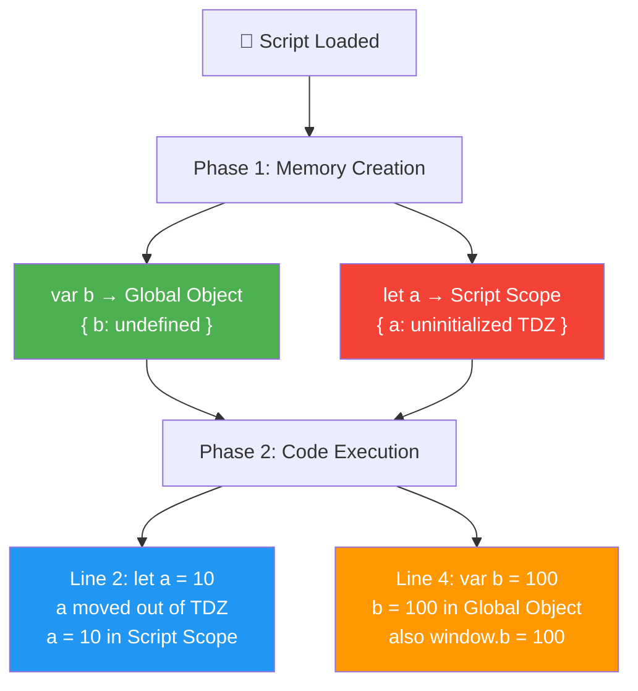
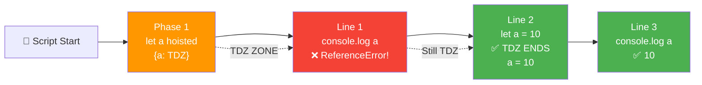
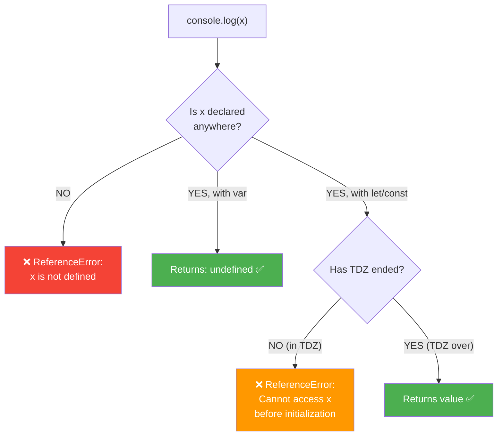
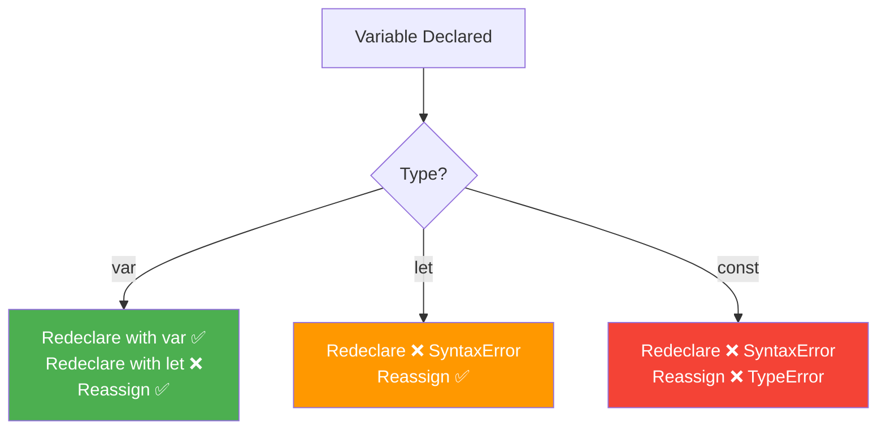
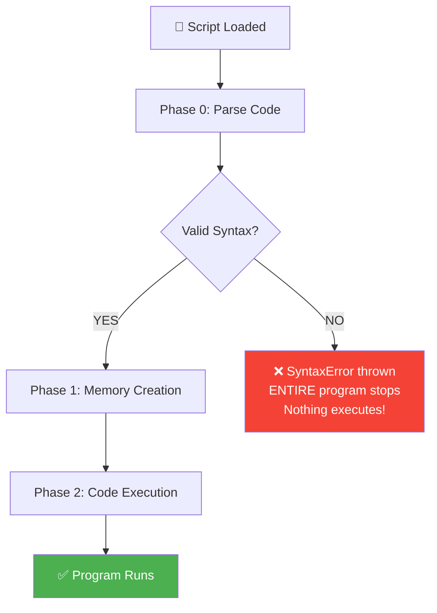
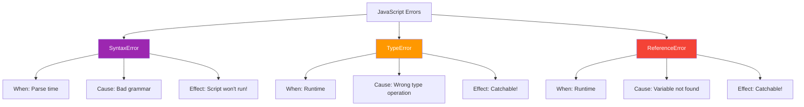
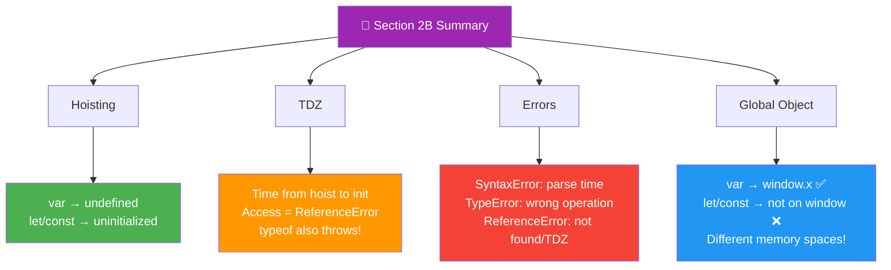

<a id="section-2b-top"></a>

# 📘 Section 2B: let, const & Temporal Dead Zone (TDZ) — Deep Dive

> **Hoisting of let/const • TDZ • Reference Errors • Global Object Relationship**
> **SyntaxError vs TypeError vs ReferenceError • Most Asked Interview Topics ⭐⭐⭐**
> Explained in Simple Hinglish with Debugger Proof & Tricky Output Questions

---

## 📑 Table of Contents
<a id="section-2b-toc"></a>

| # | Topic |
|---|-------|
| 1 | <a href="#hoisting-recap">2B.1 Hoisting Recap — var vs let vs const</a> |
|   | &nbsp;&nbsp;&nbsp;&nbsp;<a href="#var-hoisting-detail">var Hoisting</a> |
|   | &nbsp;&nbsp;&nbsp;&nbsp;<a href="#let-const-hoisting">let & const Hoisting (Yes, They ARE Hoisted!)</a> |
|   | &nbsp;&nbsp;&nbsp;&nbsp;<a href="#hoisting-proof-debugger">Proof in Browser Debugger (From Image)</a> |
| 2 | <a href="#tdz-deep-dive">2B.2 Temporal Dead Zone (TDZ) ⭐⭐⭐ Deep Dive</a> |
|   | &nbsp;&nbsp;&nbsp;&nbsp;<a href="#what-is-tdz">What is TDZ?</a> |
|   | &nbsp;&nbsp;&nbsp;&nbsp;<a href="#why-tdz-exists">Why TDZ Exists? What Problem It Solves?</a> |
|   | &nbsp;&nbsp;&nbsp;&nbsp;<a href="#tdz-timeline">TDZ Timeline Visualization</a> |
|   | &nbsp;&nbsp;&nbsp;&nbsp;<a href="#tdz-when-to-access">When to Access / When NOT to Access</a> |
|   | &nbsp;&nbsp;&nbsp;&nbsp;<a href="#tdz-examples">Practical Examples</a> |
| 3 | <a href="#reference-error-depth"></a>2B.3 ReferenceError in Depth |
|   | &nbsp;&nbsp;&nbsp;&nbsp;<a href="#what-is-reference-error">What is ReferenceError?</a> |
|   | &nbsp;&nbsp;&nbsp;&nbsp;<a href="#types-reference-error">Types of ReferenceError</a> |
|   | &nbsp;&nbsp;&nbsp;&nbsp;<a href="#tdz-vs-not-defined-error">TDZ Error vs "Not Defined" Error</a> |
| 4 | <a href="#global-object-relationship">2B.4 Relation of Global Object with var, let & const</a> |
|   | &nbsp;&nbsp;&nbsp;&nbsp;<a href="#what-is-global-object">What is Global Object?</a> |
|   | &nbsp;&nbsp;&nbsp;&nbsp;<a href="#var-global-object">var → Attaches to Global Object</a> |
|   | &nbsp;&nbsp;&nbsp;&nbsp;<a href="#let-const-global-object">let/const → Does NOT Attach</a> |
|   | &nbsp;&nbsp;&nbsp;&nbsp;<a href="#why-let-const-separate">Why Different Behavior? (Spec Reason)</a> |
| 5 | <a href="#duplicate-redeclaration">2B.5 Duplicate Redeclaration of let & const</a> |
|   | &nbsp;&nbsp;&nbsp;&nbsp;<a href="#var-redeclaration">var → Allows Redeclaration</a> |
|   | &nbsp;&nbsp;&nbsp;&nbsp;<a href="#let-const-redeclaration">let/const → SyntaxError on Redeclaration</a> |
|   | &nbsp;&nbsp;&nbsp;&nbsp;<a href="#cross-keyword-redeclaration">Cross-keyword Redeclaration (var + let)</a> |
| 6 | <a href="#syntax-error">2B.6 SyntaxError in JavaScript</a> |
|   | &nbsp;&nbsp;&nbsp;&nbsp;<a href="#what-is-syntax-error">What is SyntaxError?</a> |
|   | &nbsp;&nbsp;&nbsp;&nbsp;<a href="#syntax-error-examples">Common Examples</a> |
|   | &nbsp;&nbsp;&nbsp;&nbsp;<a href="#syntax-error-special">⚠️ Special Behavior — Stops ENTIRE Program!</a> |
| 7 | <a href="#type-error">2B.7 TypeError in JavaScript</a> |
|   | &nbsp;&nbsp;&nbsp;&nbsp;<a href="#what-is-type-error">What is TypeError?</a> |
|   | &nbsp;&nbsp;&nbsp;&nbsp;<a href="#type-error-examples">Common Examples</a> |
|   | &nbsp;&nbsp;&nbsp;&nbsp;<a href="#type-error-when-thrown">When Is It Thrown?</a> |
| 8 | <a href="#not-defined-vs-undefined-error">2B.8 "Not Defined" vs "Undefined" — Final Clarification</a> |
| 9 | <a href="#error-comparison">2B.9 SyntaxError vs TypeError vs ReferenceError — Complete Comparison</a> |
| 10 | <a href="#var-let-const-difference">2B.10 Difference Between var, let, const — Final Summary</a> |
| 11 | <a href="#how-to-avoid-tdz">2B.11 How to Avoid Temporal Dead Zone</a> |
| 12 | <a href="#interview-hoisting-questions">2B.12 Interview Questions — Hoisting of let & const ⭐⭐⭐</a> |
| 13 | <a href="#mini-project-2b">2B.13 Mini Project — Error Type Identifier</a> |
| 14 | <a href="#practice-2b">2B.14 Practice Questions & Tricky Outputs</a> |

<a href="#section-2b-top">⬆ Back to Top</a>

---

<a id="hoisting-recap"></a>

## 2B.1 🏗️ Hoisting Recap — var vs let vs const

<a id="var-hoisting-detail"></a>

### var Hoisting

```javascript
console.log(a); // undefined (NOT an error!)
var a = 10;
console.log(a); // 10
```

```
WHAT HAPPENS BEHIND THE SCENES:

Phase 1 (Memory Creation):
  Global Memory: { a: undefined }   ← var hoisted with undefined!

Phase 2 (Code Execution):
  Line 1: console.log(a)            → undefined ✅
  Line 2: a = 10                    → a updated to 10
  Line 3: console.log(a)            → 10 ✅

KEY POINT: var attaches to GLOBAL OBJECT (window in browser)
You can access it via: window.a or just a
```

<a id="let-const-hoisting"></a>

### let & const Hoisting — They ARE Hoisted!

> 🚨 **COMMON MYTH:** "let and const are NOT hoisted"
> ✅ **TRUTH:** They ARE hoisted — BUT in a different memory space called **Script Scope**, and remain in **TDZ** (uninitialized) until their declaration line!

```javascript
console.log(a); // ❌ ReferenceError: Cannot access 'a' before initialization
let a = 10;
```

```
WHAT HAPPENS BEHIND THE SCENES:

Phase 1 (Memory Creation):
  Script Scope: { a: <uninitialized> }   ← let IS hoisted but uninitialized!
  
  ⚠️ NOTICE: NOT in Global Object!
  let/const go to a SEPARATE memory space called "Script Scope"

Phase 2 (Code Execution):
  Line 1: console.log(a)
          → a is in TDZ (uninitialized)
          → ❌ ReferenceError!
  Line 2: let a = 10
          → a is now INITIALIZED with 10
          → TDZ ends here for 'a'

KEY POINT:
- var → hoisted with 'undefined' in Global Memory
- let/const → hoisted with '<uninitialized>' in Script Scope (separate from Global)
- Both let & const behave identically for hoisting
- Difference: const must be initialized at declaration, can't reassign
```

<a id="hoisting-proof-debugger"></a>

### Proof in Browser Debugger (From Image!)

> The image shows EXACTLY this in Chrome DevTools — let me explain what you see!

```javascript
// Code in index.js:
let a = 10;        // Line 2
console.log(a);    // Line 3
var b = 100;       // Line 4
```

```
WHEN PAUSED AT BREAKPOINT (Line 2 — BEFORE let a = 10 runs):

Chrome DevTools "Scope" panel shows:

┌──────────────────────────────────────┐
│ Scope                                │
├──────────────────────────────────────┤
│ ▼ Script                             │  ← Special "Script Scope"!
│     a: undefined                     │  ← let 'a' is HERE!
│                                      │     (DevTools shows "undefined"
│                                      │      but technically it's
│                                      │      <uninitialized> in TDZ)
│                                      │
│ ▼ Global                  Window     │  ← Global Object (window)
│     PERSISTENT: 1                    │
│     TEMPORARY: 0                     │
│     addEventListener: f              │
│     alert: f alert()                 │
│     atob: f atob()                   │
│     b: undefined                     │  ← var 'b' is HERE!
│     blur: f blur()                   │
│     btoa: f btoa()                   │
└──────────────────────────────────────┘

📌 KEY OBSERVATIONS FROM IMAGE:

1. let 'a' is in "Script Scope" (separate memory!)
2. var 'b' is in "Global Scope" (window object)
3. Both are hoisted (visible in scope before declaration!)
4. This PROVES let/const ARE hoisted — just in different space!

You CANNOT do: window.a → undefined (let doesn't attach!)
You CAN do:    window.b → undefined (var attaches!)
```



### 🎯 Must-Know Points for Interview

```
✅ var, let, const are ALL hoisted — just differently
✅ var → hoisted with 'undefined' in Global Object
✅ let/const → hoisted with '<uninitialized>' in Script Scope (SEPARATE memory!)
✅ This is why DevTools shows let in "Script" but var in "Global"
✅ NEVER say "let/const are not hoisted" in interview — say "hoisted but in TDZ"!
✅ const has same hoisting behavior as let (just can't reassign)
✅ DevTools "Scope" panel proves this visually — try it yourself!
```

---

<a href="#section-2b-top">⬆ Back to Top</a>

---

<a id="tdz-deep-dive"></a>

## 2B.2 ⏰ Temporal Dead Zone (TDZ) ⭐⭐⭐ Deep Dive

<a id="what-is-tdz"></a>

### What is TDZ?

```
TEMPORAL DEAD ZONE = "Time se related Mara hua Zone"

Simple bhasha mein:
"Wo TIME PERIOD jab variable HOISTED toh ho gaya hai,
 lekin abhi tak INITIALIZED nahi hua hai — usse access karne par
 ReferenceError aata hai!"

This zone exists ONLY for let, const, and class declarations.
var does NOT have TDZ (because it gets undefined immediately).

TDZ ka period:
START: Phase 1 mein hoisting hote hi (script ka start)
END: Jab declaration line execute hoti hai (let/const = value)
```

> 💡 **Interview Definition:** "Temporal Dead Zone is the time period between when a `let`/`const` variable is hoisted (Memory Creation Phase) and when it gets initialized with a value at its declaration line. Accessing the variable during this period throws a `ReferenceError`."

<a id="why-tdz-exists"></a>

### Why TDZ Exists? What Problem It Solves?

```
PROBLEM with var (no TDZ):

console.log(name);  // undefined (no error!)
var name = "Aadi";
console.log(name);  // "Aadi"

❌ PROBLEM:
- Programmer thinks: "Did I forget to declare it?"
- undefined is silent — looks like a bug
- Hard to debug — confused between "not declared" vs "no value"

SOLUTION with let/const (TDZ exists):

console.log(name);  // ❌ ReferenceError: Cannot access 'name' before initialization
let name = "Aadi";

✅ BENEFITS:
- IMMEDIATE error catches the bug
- Clear message: "You're using it BEFORE declaring!"
- Forces good practice: declare before use
- Makes code more predictable and maintainable
- Catches typos early (typo'd variable name = error, not silent undefined)
```

```
REAL-LIFE ANALOGY:

var = Cake order kar diya, abhi tak bana nahi, but
       counter pe khali plate (undefined) de di!
       Tum sochoge "kuch toh hai..." but actually empty!

let/const = Cake order kar diya, jab tak bana nahi,
            counter wala bolega "ERROR! Wait karo!"
            Spasht message — pata chal jata hai cake ready nahi hai!
```

<a id="tdz-timeline"></a>

### TDZ Timeline Visualization

```
ENTIRE SCRIPT EXECUTION TIMELINE:
━━━━━━━━━━━━━━━━━━━━━━━━━━━━━━━

  ┌─────────────────── TDZ for 'a' ───────────────────┐
  │                                                    │
  ▼                                                    ▼
  
Script Start ─────► Line 1 ─────► Line 2 ─────► Line 3 ─────► Script End
   |                  |              |               |
   ▼                  ▼              ▼               ▼
Phase 1:          console.log(a)   let a = 10    console.log(a)
Memory created    ❌ ReferenceError ✅ TDZ ends   ✅ 10
{a: TDZ}                            a = 10 set

  ◀──── TDZ ZONE ────▶              ◀── Normal access ──▶
  (can't access)                    (works fine!)
```



<a id="tdz-when-to-access"></a>

### When to Access / When NOT to Access

```javascript
// ❌ DURING TDZ — ReferenceError!
console.log(x);        // ❌ TDZ — ReferenceError
typeof x;              // ❌ TDZ — ReferenceError (typeof DOES throw for TDZ!)
x = 5;                 // ❌ TDZ — ReferenceError
function foo() {
    console.log(x);    // ❌ Even inside function — TDZ!
}
foo();
let x = 10;            // ✅ TDZ ENDS HERE

// ✅ AFTER TDZ — works fine!
console.log(x);        // ✅ 10
x = 20;                // ✅ Reassignment works
console.log(x);        // ✅ 20
```

```
RULE:
━━━━━
❌ NEVER access let/const BEFORE their declaration line
✅ ALWAYS declare let/const at the TOP of their scope
✅ This way, TDZ is minimized to near-zero!

Bad practice:
function buggy() {
    doSomething(); // What if doSomething uses 'x'? Could be TDZ!
    // ... 50 lines of code ...
    let x = 10;    // Hoisted but in TDZ for 50 lines!
}

Good practice:
function clean() {
    let x = 10;    // Declare at top, no TDZ issues!
    doSomething();
    // ... rest of code ...
}
```

<a id="tdz-examples"></a>

### Practical TDZ Examples

```javascript
// EXAMPLE 1: typeof with TDZ
typeof undeclaredVar; // "undefined" — typeof is SAFE for undeclared

typeof tdz_var;       // ❌ ReferenceError — TDZ throws even with typeof!
let tdz_var = 10;

// Interview tip: typeof is "safe" for completely undeclared variables
// BUT it throws for variables in TDZ!

// EXAMPLE 2: Function call inside TDZ
function logVar() {
    console.log(x); // ❌ ReferenceError if called before let x!
}
logVar();           // Fails!
let x = 10;
logVar();           // Now works — prints 10

// EXAMPLE 3: TDZ in conditional blocks
{
    // Block scope starts
    // TDZ for 'y' starts HERE!
    
    console.log(y); // ❌ ReferenceError (TDZ!)
    let y = 5;      // TDZ ends
    console.log(y); // ✅ 5
}
// y is no longer accessible (out of block scope)

// EXAMPLE 4: TDZ with default parameters
function test(a = b, b = 2) {
    return [a, b];
}
test();             // ❌ ReferenceError!
// 'b' is in TDZ when 'a = b' is evaluated!

// Fix:
function test2(a = 1, b = 2) {
    return [a, b];
}
test2();            // ✅ [1, 2]
```

### 🎯 Must-Know Points for Interview

```
✅ TDZ exists ONLY for let, const, and class
✅ var does NOT have TDZ (always hoisted with undefined)
✅ TDZ = time from hoisting to declaration line
✅ Accessing in TDZ → ReferenceError (NOT TypeError!)
✅ typeof also throws ReferenceError in TDZ (unlike for undeclared)
✅ TDZ exists to catch bugs early — using before declaring = error!
✅ Minimize TDZ by declaring let/const at top of scope
✅ TDZ is per-variable — different vars have different TDZs in same scope
✅ TDZ exists in block scope, function scope, and global scope
```

---

<a href="#section-2b-top">⬆ Back to Top</a>

---

<a id="reference-error-depth"></a>

## 2B.3 🚨 ReferenceError in Depth

<a id="what-is-reference-error"></a>

### What is ReferenceError?

```
ReferenceError = "Aisa variable use kar rahe ho jo MEMORY mein hai hi nahi
                  ya abhi tak INITIALIZED nahi hua!"

JavaScript engine ye error tab throw karta hai jab:
1. Variable kahi declare hi nahi hai (anywhere in scope chain)
2. Variable declare hai but TDZ mein hai (let/const)

Error message types:
- "x is not defined"                              ← undeclared
- "Cannot access 'x' before initialization"       ← TDZ
- "x is not defined" (in strict mode for typos)   ← undeclared
```

<a id="types-reference-error"></a>

### Types of ReferenceError

```javascript
// TYPE 1: Variable never declared anywhere
console.log(neverDeclared);
// ❌ ReferenceError: neverDeclared is not defined

// TYPE 2: TDZ — let/const accessed before declaration
console.log(tdzVar);
let tdzVar = 10;
// ❌ ReferenceError: Cannot access 'tdzVar' before initialization

// TYPE 3: Strict mode — assigning to undeclared variable
"use strict";
undeclaredVar = 10;
// ❌ ReferenceError: undeclaredVar is not defined
// In non-strict mode, this would create a GLOBAL variable (bad!)

// TYPE 4: Accessing from wrong scope
function foo() {
    let localVar = 5;
}
foo();
console.log(localVar);
// ❌ ReferenceError: localVar is not defined
```

<a id="tdz-vs-not-defined-error"></a>

### TDZ Error vs "Not Defined" Error

```javascript
// THESE TWO LOOK SIMILAR BUT ARE DIFFERENT!

// 1. "Not Defined" error → variable doesn't exist AT ALL
console.log(xyz);
// ❌ ReferenceError: xyz is not defined
// Meaning: Engine ne scope chain check kiya, kahi nahi mila!

// 2. "Cannot access before initialization" → TDZ error
console.log(abc);
let abc = 10;
// ❌ ReferenceError: Cannot access 'abc' before initialization
// Meaning: Variable HOISTED hai but TDZ mein hai!

// HOW TO REMEMBER:
// "not defined"           → variable doesn't EXIST
// "before initialization" → variable EXISTS but in TDZ
```



### 🎯 Must-Know Points for Interview

```
✅ ReferenceError = trying to use variable that doesn't exist or in TDZ
✅ "X is not defined" → variable never declared
✅ "Cannot access X before initialization" → variable in TDZ
✅ Both are ReferenceError but different messages!
✅ In strict mode, assigning to undeclared variable also throws ReferenceError
✅ In non-strict, it silently creates global variable (bad practice!)
✅ typeof undeclaredVar → "undefined" (no error)
✅ typeof tdzVar → ReferenceError (TDZ throws even for typeof)
```

---

<a href="#section-2b-top">⬆ Back to Top</a>

---

<a id="global-object-relationship"></a>

## 2B.4 🌐 Relation of Global Object with var, let & const

<a id="what-is-global-object"></a>

### What is Global Object?

```
Global Object = Browser/Node provides ek special object jismein
                saari built-in functions aur global variables rehte hain

In Browser: window (also: self, globalThis)
In Node.js: global (also: globalThis)
Universal:  globalThis (ES2020+)

Ye object mein ye sab milta hai:
- setTimeout, setInterval, fetch, console
- document, localStorage, history
- Math, Object, Array, Promise, etc.
- AUR globally declared var variables!
```

<a id="var-global-object"></a>

### var → Attaches to Global Object

```javascript
// In browser, when you declare var globally:
var name = "Aadi";
var age = 22;

console.log(window.name); // "Aadi"  ← VAR ATTACHES!
console.log(window.age);  // 22      ← VAR ATTACHES!

// They are the SAME thing:
console.log(name === window.name); // true!

// You can even do:
window.someVar = "Hello";
console.log(someVar); // "Hello" ✅ — accessible globally!

// This is why var is considered "polluting global namespace"
```

<a id="let-const-global-object"></a>

### let/const → Does NOT Attach to Global Object

```javascript
// In browser, when you declare let/const globally:
let firstName = "Aadi";
const lastName = "Shah";

console.log(window.firstName); // undefined ⚠️ — let does NOT attach!
console.log(window.lastName);  // undefined ⚠️ — const does NOT attach!

// They exist in "Script Scope" (separate from Global Object)
console.log(firstName); // "Aadi" ✅ — accessible directly
console.log(lastName);  // "Shah" ✅ — accessible directly

// But NOT via window:
console.log(window.firstName === undefined); // true
```

```
PROOF FROM DEVTOOLS:
━━━━━━━━━━━━━━━━━━━

When you pause execution at a breakpoint:

┌──────────────────────────────────────┐
│ Scope Panel:                         │
├──────────────────────────────────────┤
│ ▼ Script                             │  ← let/const live HERE!
│     firstName: "Aadi"                │
│     lastName: "Shah"                 │
│                                      │
│ ▼ Global              Window         │  ← var lives HERE!
│     name: "Aadi"     (var)           │
│     age: 22          (var)           │
│     window methods...                │
└──────────────────────────────────────┘

This SEPARATION is intentional!
```

<a id="why-let-const-separate"></a>

### Why Different Behavior? (Spec Reason)

```
ECMAScript Spec Reason:
━━━━━━━━━━━━━━━━━━━━━━

Global Environment Record has TWO storage areas:

1. [[ObjectRecord]]  → Backed by Global Object (window)
   - var declarations land here
   - function declarations land here
   - This is why they're on window!

2. [[DeclarativeRecord]] → Separate storage (NOT on window)
   - let declarations land here
   - const declarations land here
   - class declarations land here
   - This is why they're NOT on window!

WHY THIS DESIGN?
━━━━━━━━━━━━━━━

Old design (var on window) had problems:
❌ Global namespace pollution
❌ Could accidentally override built-ins (e.g., var alert = "hi")
❌ All scripts could read/modify global vars
❌ Hard to maintain large applications

New design (let/const separate) solves this:
✅ No pollution of window object
✅ Can't accidentally override built-ins
✅ Better encapsulation
✅ Safer for large applications
✅ Modern best practice
```

```javascript
// PRACTICAL EXAMPLE:

// ❌ var can accidentally override built-ins!
var Math = "Hello"; 
console.log(Math); // "Hello" — Math object broken in window!

// ✅ let/const are safer:
let Math2 = "Hello"; // Different name, but even if same:
// Even let Math = "Hello" wouldn't pollute window.Math
// (Though it would still shadow it in current scope)
```

### 🎯 Must-Know Points for Interview

```
✅ var → attaches to Global Object (window/global)
✅ let/const → do NOT attach to Global Object
✅ var name = "x" → window.name = "x" (same thing!)
✅ let name = "x" → window.name = undefined!
✅ Reason: var goes to [[ObjectRecord]], let/const go to [[DeclarativeRecord]]
✅ This is by DESIGN to avoid global namespace pollution
✅ DevTools shows them in different scopes: "Script" vs "Global"
✅ In Node.js, NOT EVEN var attaches to global (different from browser!)
✅ In strict mode files/modules, var also doesn't attach to global
```

---

<a href="#section-2b-top">⬆ Back to Top</a>

---

<a id="duplicate-redeclaration"></a>

## 2B.5 🔁 Duplicate Redeclaration of let & const

<a id="var-redeclaration"></a>

### var → Allows Redeclaration (BAD!)

```javascript
// var allows redeclaration — no error!
var x = 10;
var x = 20;        // ✅ No error
var x = "hello";   // ✅ No error
console.log(x);    // "hello"

// PROBLEM: This can cause bugs in large code!
var userName = "Aadi";
// ... 500 lines of code ...
var userName = "Rahul"; // Accidentally overwrites! No warning!
```

<a id="let-const-redeclaration"></a>

### let/const → SyntaxError on Redeclaration

```javascript
// let — cannot redeclare
let x = 10;
let x = 20;
// ❌ SyntaxError: Identifier 'x' has already been declared

// const — cannot redeclare
const y = 10;
const y = 20;
// ❌ SyntaxError: Identifier 'y' has already been declared

// REASSIGNMENT vs REDECLARATION
let z = 10;
z = 20;          // ✅ Reassignment — allowed (let)
z = 30;          // ✅ Allowed

const w = 10;
// w = 20;       // ❌ TypeError: Assignment to constant variable

// SUMMARY:
// let:   Reassign ✅ | Redeclare ❌
// const: Reassign ❌ | Redeclare ❌
// var:   Reassign ✅ | Redeclare ✅
```

<a id="cross-keyword-redeclaration"></a>

### Cross-keyword Redeclaration (var + let)

```javascript
// Same name with var, then let in SAME scope?
var x = 10;
let x = 20;
// ❌ SyntaxError: Identifier 'x' has already been declared

// Same name with let, then var in SAME scope?
let y = 10;
var y = 20;
// ❌ SyntaxError: Identifier 'y' has already been declared

// BUT in DIFFERENT scopes — OK!
var a = 10;
{
    let a = 20;        // ✅ OK — different scope (block)
    console.log(a);    // 20
}
console.log(a);        // 10 — outer var
```



### 🎯 Must-Know Points for Interview

```
✅ var allows redeclaration (legacy behavior)
✅ let/const throw SyntaxError on redeclaration
✅ Cannot redeclare var as let (or vice versa) in same scope
✅ But same name OK in DIFFERENT scopes (block, function)
✅ Redeclaration ≠ Reassignment
✅ let allows reassignment (=)  | const does not
✅ SyntaxError is thrown BEFORE code runs (during parse)
✅ This is why let/const make code safer and more predictable
```

---

<a href="#section-2b-top">⬆ Back to Top</a>

---

<a id="syntax-error"></a>

## 2B.6 ⚠️ SyntaxError in JavaScript

<a id="what-is-syntax-error"></a>

### What is SyntaxError?

```
SyntaxError = "Tumne CODE LIKHA hi galat hai!"

Ye error tab aata hai jab JS engine ne tumhare code ko PARSE kiya
aur usse samajh hi nahi aaya — grammar galat hai!

Important: SyntaxError is thrown BEFORE code starts running!
The engine first PARSES entire code → if grammar wrong → error → STOP!

Iska matlab: Agar SyntaxError aaya, toh poora program HI NAHI CHALEGA!
Even console.log("hi") at line 1 won't run if line 100 has SyntaxError!
```

<a id="syntax-error-examples"></a>

### Common SyntaxError Examples

```javascript
// 1. Missing closing brace
function test() {
    console.log("hi");
// ❌ SyntaxError: Unexpected end of input

// 2. Invalid variable name
var 2cool = "no";
// ❌ SyntaxError: Invalid or unexpected token

// 3. Reserved keyword as variable
var class = "Math";
// ❌ SyntaxError: Unexpected token 'class'

// 4. Missing parentheses
if condition {
    console.log("hi");
}
// ❌ SyntaxError: Unexpected identifier 'condition'

// 5. Duplicate let/const declaration
let x = 10;
let x = 20;
// ❌ SyntaxError: Identifier 'x' has already been declared

// 6. const without value
const PI;
// ❌ SyntaxError: Missing initializer in const declaration

// 7. Return outside function
return 42;
// ❌ SyntaxError: 'return' outside of function

// 8. Invalid object syntax
let obj = { name: "Aadi", , age: 22 }; // Double comma
// ❌ SyntaxError: Unexpected token ','
```

<a id="syntax-error-special"></a>

### ⚠️ Special Behavior — Stops ENTIRE Program!

```javascript
// THIS IS IMPORTANT! Try this:

console.log("Line 1 — will this run?");
console.log("Line 2 — what about this?");

let x = 10;
let x = 20;  // ❌ SyntaxError here!

console.log("Line 6");
console.log("Line 7");

// OUTPUT:
// ❌ SyntaxError: Identifier 'x' has already been declared
// 
// NONE of the console.log statements run!
// Even Line 1 doesn't print!
// 
// WHY? Because SyntaxError is caught during PARSE phase
// (before execution begins). The entire script is rejected.
```



### 🎯 Must-Know Points for Interview

```
✅ SyntaxError = invalid JavaScript grammar
✅ Thrown during PARSING (before any code runs)
✅ ENTIRE program fails — not even line 1 executes!
✅ Cannot catch SyntaxError with try/catch (in normal code)
✅ Common causes: missing braces, reserved words as vars, duplicate let/const
✅ This is different from runtime errors (TypeError, ReferenceError)
✅ JavaScript is "strictly parsed" — small mistakes break everything
```

---

<a href="#section-2b-top">⬆ Back to Top</a>

---

<a id="type-error"></a>

## 2B.7 🎭 TypeError in JavaScript

<a id="what-is-type-error"></a>

### What is TypeError?

```
TypeError = "Tumne KOI OPERATION KIYA jo us TYPE pe possible nahi hai!"

Variable exists, has a value, BUT you're trying to do something
that the value's TYPE doesn't allow!

Examples:
- undefined.something  → ❌ TypeError (can't access property of undefined)
- 5()                  → ❌ TypeError (5 is not a function)
- null.toString()      → ❌ TypeError (null has no methods)
- const x = 10; x = 20; → ❌ TypeError (const reassignment)
```

<a id="type-error-examples"></a>

### Common TypeError Examples

```javascript
// 1. Calling non-function
let num = 42;
num();
// ❌ TypeError: num is not a function

// 2. Accessing property of undefined
let user;
console.log(user.name);
// ❌ TypeError: Cannot read properties of undefined (reading 'name')

// 3. Accessing property of null
let obj = null;
console.log(obj.value);
// ❌ TypeError: Cannot read properties of null (reading 'value')

// 4. Reassigning const
const PI = 3.14;
PI = 3.15;
// ❌ TypeError: Assignment to constant variable

// 5. Calling method that doesn't exist
let str = "hello";
str.someRandomMethod();
// ❌ TypeError: str.someRandomMethod is not a function

// 6. Trying to iterate non-iterable
for (let x of 42) { }
// ❌ TypeError: 42 is not iterable

// 7. Using new on non-constructor
let obj2 = new "string";
// ❌ TypeError: "string" is not a constructor

// 8. Mutating frozen object (in strict mode)
"use strict";
const frozen = Object.freeze({ a: 1 });
frozen.a = 2;
// ❌ TypeError: Cannot assign to read only property 'a'
```

<a id="type-error-when-thrown"></a>

### When Is TypeError Thrown?

```
TypeError is a RUNTIME error — thrown DURING execution!

Unlike SyntaxError:
- Code parses successfully ✅
- Execution starts ✅
- When the problematic line runs → TypeError ❌

This means:
- console.log("hi") BEFORE error will execute
- console.log("bye") AFTER error will NOT execute (program stops)

UNLESS you catch it with try/catch!
```

```javascript
console.log("Before"); // ✅ Runs

try {
    let x = null;
    x.foo(); // ❌ TypeError caught!
} catch (e) {
    console.log("Caught:", e.message);
}

console.log("After"); // ✅ Runs (because we caught the error)

// Output:
// Before
// Caught: Cannot read properties of null (reading 'foo')
// After
```

### 🎯 Must-Know Points for Interview

```
✅ TypeError = doing wrong operation on a value's type
✅ Thrown at RUNTIME (during execution)
✅ Common with: null/undefined access, const reassignment, calling non-functions
✅ Can be caught with try/catch (unlike SyntaxError mostly)
✅ Optional chaining (?.) helps avoid TypeError on null/undefined
✅ Use typeof check before calling functions to prevent TypeError
✅ const reassignment = TypeError (NOT SyntaxError!)
✅ Different from ReferenceError (variable exists, just wrong operation)
```

---

<a href="#section-2b-top">⬆ Back to Top</a>

---

<a id="not-defined-vs-undefined-error"></a>

## 2B.8 ❓ "Not Defined" vs "Undefined" — Final Clarification

```
TWO DIFFERENT CONCEPTS! Don't confuse them!

╔════════════════════════════════════════════════════════════════╗
║ undefined (VALUE)         vs       not defined (ERROR)         ║
╠════════════════════════════════════════════════════════════════╣
║ • A SPECIAL VALUE              • A REFERENCE ERROR             ║
║ • Variable EXISTS              • Variable DOESN'T EXIST        ║
║ • Has memory allocated         • No memory allocated           ║
║ • typeof returns "undefined"   • typeof returns "undefined"*   ║
║ • No error thrown              • ReferenceError thrown         ║
║ • Default value of declared    • Engine has NO IDEA what it is ║
║   but unassigned variables                                     ║
╚════════════════════════════════════════════════════════════════╝

* typeof is special — doesn't throw for completely undeclared vars
```

```javascript
// "undefined" — variable EXISTS, no value
var x;
console.log(x);          // undefined ← no error, value is undefined
console.log(typeof x);   // "undefined"

// "not defined" — variable DOESN'T EXIST
console.log(y);
// ❌ ReferenceError: y is not defined

// SPECIAL: typeof on undeclared variable
console.log(typeof z);   // "undefined" ← NO error! (typeof is safe!)

// SPECIAL: typeof on TDZ variable
console.log(typeof abc); // ❌ ReferenceError! (TDZ DOES throw)
let abc = 10;
```

```javascript
// QUICK TEST — Predict outputs:

var a;
console.log(a);              // 1. ?
console.log(b);              // 2. ?
console.log(typeof c);       // 3. ?
console.log(typeof a);       // 4. ?
let d = 5;
console.log(d);              // 5. ?
console.log(typeof e);       // 6. ?

// ANSWERS:
// 1. undefined (var declared, no value)
// 2. ReferenceError (b never declared!) - program stops here actually
// 3. "undefined" (typeof safe for undeclared)
// 4. "undefined"
// 5. 5
// 6. "undefined"
```

### 🎯 Must-Know Points for Interview

```
✅ undefined = VALUE (variable exists, no value)
✅ "not defined" = ERROR (variable doesn't exist)
✅ undefined is a primitive TYPE
✅ "not defined" is a ReferenceError type
✅ typeof undeclaredVar → "undefined" (special exception, no error)
✅ typeof tdzVar → ReferenceError (TDZ throws even for typeof)
✅ Use null for intentional emptiness, undefined is JS default
✅ Don't manually assign undefined — use null instead
```

---

<a href="#section-2b-top">⬆ Back to Top</a>

---

<a id="error-comparison"></a>

## 2B.9 ⚖️ SyntaxError vs TypeError vs ReferenceError — Complete Comparison

```
COMPLETE COMPARISON TABLE:
━━━━━━━━━━━━━━━━━━━━━━━━━

┌──────────────┬──────────────────┬──────────────────┬──────────────────┐
│   Feature    │  SyntaxError     │   TypeError      │ ReferenceError   │
├──────────────┼──────────────────┼──────────────────┼──────────────────┤
│ When thrown? │ At PARSE time    │ At RUNTIME       │ At RUNTIME       │
│              │ (before runs)    │ (during exec)    │ (during exec)    │
├──────────────┼──────────────────┼──────────────────┼──────────────────┤
│ Cause        │ Invalid syntax   │ Wrong operation  │ Variable doesn't │
│              │ Grammar wrong    │ on value's type  │ exist or in TDZ  │
├──────────────┼──────────────────┼──────────────────┼──────────────────┤
│ Examples     │ Missing brace    │ undefined.x      │ console.log(x)   │
│              │ Reserved word    │ null.method()    │ where x undeclared│
│              │ Duplicate let    │ const x reassign │ TDZ access       │
├──────────────┼──────────────────┼──────────────────┼──────────────────┤
│ Stops code?  │ ✅ ENTIRE script │ ✅ Until caught   │ ✅ Until caught   │
│              │ won't run!       │ by try/catch     │ by try/catch     │
├──────────────┼──────────────────┼──────────────────┼──────────────────┤
│ Catchable    │ ❌ Usually not   │ ✅ Yes (try/catch)│ ✅ Yes (try/catch)│
│ with         │ (parse-time)     │                  │                  │
│ try/catch?   │                  │                  │                  │
├──────────────┼──────────────────┼──────────────────┼──────────────────┤
│ Common error │ "Unexpected      │ "Cannot read     │ "x is not        │
│ messages     │  token"          │  properties of   │  defined"        │
│              │                  │  undefined"      │ "Cannot access x │
│              │                  │                  │  before init"    │
└──────────────┴──────────────────┴──────────────────┴──────────────────┘
```

```javascript
// CODE EXAMPLES OF EACH:

// SyntaxError — code malformed
// let x = ;  // SyntaxError: Unexpected token ';'

// TypeError — wrong operation on value
let x = undefined;
try {
    x.method();
} catch (e) {
    console.log(e.constructor.name); // "TypeError"
    console.log(e.message);          // Cannot read properties of undefined
}

// ReferenceError — variable doesn't exist
try {
    console.log(undeclaredVar);
} catch (e) {
    console.log(e.constructor.name); // "ReferenceError"
    console.log(e.message);          // undeclaredVar is not defined
}
```



### 🎯 Must-Know Points for Interview

```
✅ SyntaxError → parse time, code doesn't run, hard to catch
✅ TypeError → runtime, wrong operation on type, catchable
✅ ReferenceError → runtime, variable doesn't exist or in TDZ, catchable
✅ const reassignment = TypeError (NOT SyntaxError!)
✅ Duplicate let/const = SyntaxError (NOT ReferenceError!)
✅ Calling null.method() = TypeError
✅ Accessing undeclared variable = ReferenceError
✅ All three inherit from Error class
✅ Can check error type: e instanceof TypeError
```

---

<a href="#section-2b-top">⬆ Back to Top</a>

---

<a id="var-let-const-difference"></a>

## 2B.10 📋 Difference Between var, let, const — Final Summary

```
┌──────────────────┬──────────┬──────────┬──────────┐
│     Feature      │   var    │   let    │  const   │
├──────────────────┼──────────┼──────────┼──────────┤
│ Scope            │ Function │ Block    │ Block    │
│ Hoisting         │ ✅ undef │ ✅ TDZ   │ ✅ TDZ   │
│ TDZ              │ ❌ No    │ ✅ Yes   │ ✅ Yes   │
│ Redeclaration    │ ✅ Yes   │ ❌ Error │ ❌ Error │
│ Reassignment     │ ✅ Yes   │ ✅ Yes   │ ❌ Error │
│ Must initialize? │ ❌ No    │ ❌ No    │ ✅ Yes   │
│ On window?       │ ✅ Yes   │ ❌ No    │ ❌ No    │
│ Memory location  │ Global   │ Script   │ Script   │
│                  │ Object   │ Scope    │ Scope    │
│ Year introduced  │ 1995     │ 2015     │ 2015     │
│ Use case         │ Avoid!   │ Changing │ Constant │
│                  │ Legacy   │ values   │ values   │
└──────────────────┴──────────┴──────────┴──────────┘
```

```javascript
// COMPREHENSIVE EXAMPLE:

// SCOPE
function test() {
    if (true) {
        var v = 1;
        let l = 2;
        const c = 3;
    }
    console.log(v); // ✅ 1
    console.log(l); // ❌ ReferenceError
    console.log(c); // ❌ ReferenceError
}

// HOISTING
console.log(varX); // undefined
console.log(letX); // ❌ TDZ
console.log(constX); // ❌ TDZ
var varX = 1;
let letX = 2;
const constX = 3;

// REDECLARATION
var a = 1;
var a = 2;     // ✅ OK
let b = 1;
let b = 2;     // ❌ SyntaxError

// REASSIGNMENT
var x = 1; x = 2; // ✅ OK
let y = 1; y = 2; // ✅ OK
const z = 1; z = 2; // ❌ TypeError

// GLOBAL OBJECT
var g1 = "var";
let g2 = "let";
console.log(window.g1); // "var"
console.log(window.g2); // undefined
```

---

<a href="#section-2b-top">⬆ Back to Top</a>

---

<a id="how-to-avoid-tdz"></a>

## 2B.11 🛡️ How to Avoid Temporal Dead Zone

```
BEST PRACTICES to avoid TDZ issues:
━━━━━━━━━━━━━━━━━━━━━━━━━━━━━━━━━

1. DECLARE AT THE TOP OF SCOPE
2. INITIALIZE WHEN DECLARING
3. AVOID HOISTING-DEPENDENT CODE
4. USE STRICT MODE
5. USE A LINTER (ESLint, Prettier)
```

```javascript
// ❌ BAD — TDZ is long, prone to bugs
function bad() {
    doSomething();    // What if doSomething needs 'x'?
    moreCode();
    // ... 50 lines ...
    let x = 10;       // TDZ for 'x' was 50+ lines!
}

// ✅ GOOD — TDZ is near-zero
function good() {
    let x = 10;       // Declare at top, no TDZ issues
    doSomething();
    moreCode();
    // ... rest of code uses x safely ...
}

// ❌ BAD — let without initialization
let count;
// ... code ...
count = 10; // Could be undefined if used in between!

// ✅ GOOD — let with initialization
let count = 0;
// Now always has a value

// ❌ BAD — using before declaration even in conditional
function processData(data) {
    if (data) {
        result = data * 2; // 'result' undeclared at this point!
    }
    let result;
}

// ✅ GOOD — declare first
function processData(data) {
    let result;
    if (data) {
        result = data * 2; // Safe!
    }
    return result;
}
```

```javascript
// USE LINTER RULES:
// In your .eslintrc.json:
{
    "rules": {
        "no-use-before-define": ["error", { "let": true, "const": true }],
        "prefer-const": "error",
        "no-var": "error"
    }
}
// This will WARN you at code-write time, not runtime!
```

### 🎯 Must-Know Points for Interview

```
✅ Declare let/const at TOP of their scope
✅ Initialize them with a value when possible
✅ Use linters (ESLint) to catch TDZ issues early
✅ Use strict mode ("use strict") to catch more errors
✅ Prefer const > let > var
✅ Never rely on hoisting behavior in production code
✅ Code should be readable top-to-bottom
✅ If you must use a variable later, declare it early
```

---

<a href="#section-2b-top">⬆ Back to Top</a>

---

<a id="interview-hoisting-questions"></a>

## 2B.12 🔥 Interview Questions — Hoisting of let & const ⭐⭐⭐

### Question 1: What is the output?

```javascript
console.log(a);
console.log(b);
console.log(c);
var a = 1;
let b = 2;
const c = 3;
```

**Answer:**
```
Output:
undefined                                          ← var hoisted
❌ ReferenceError: Cannot access 'b' before initialization
Program STOPS here! 'c' line never runs!

Why? Engine hits TDZ for 'b' → throws ReferenceError → program halts.
```

---

### Question 2: What is the output?

```javascript
let a = 10;
{
    console.log(a);
    let a = 20;
}
```

**Answer:**
```
Output:
❌ ReferenceError: Cannot access 'a' before initialization

Why? Inside the block:
- Phase 1: 'a' (block-scoped let) is hoisted in TDZ
- Phase 2: console.log(a) → TDZ → Error!
- The OUTER 'a' is SHADOWED, can't access it inside block!

This is called "let shadowing creates TDZ for outer var"
```

---

### Question 3: Hoisting behavior differences

```javascript
function test() {
    console.log(x); // ?
    console.log(y); // ?
    console.log(z); // ?
    var x = 1;
    let y = 2;
    const z = 3;
}
test();
```

**Answer:**
```
Output:
undefined                                          ← var hoisted
❌ ReferenceError: Cannot access 'y' before initialization
Program STOPS! z line never runs.

In function:
- var x → hoisted with undefined
- let y → in TDZ
- const z → would be in TDZ if reached
```

---

### Question 4: typeof and TDZ

```javascript
console.log(typeof x); // ?
console.log(typeof y); // ?
let y = 10;
```

**Answer:**
```
Output:
"undefined"                                        ← typeof safe for undeclared!
❌ ReferenceError: Cannot access 'y' before initialization

KEY INSIGHT:
- typeof on completely UNDECLARED variable → "undefined" (no error)
- typeof on variable in TDZ → ReferenceError (TDZ DOES throw!)

This is a tricky interview question to differentiate
"not declared" vs "in TDZ"
```

---

### Question 5: Default parameters and TDZ

```javascript
function test(a = b, b = 2) {
    console.log(a, b);
}
test();
```

**Answer:**
```
❌ ReferenceError: Cannot access 'b' before initialization

Why? Default parameters are evaluated LEFT TO RIGHT.
When evaluating a = b, 'b' is in TDZ (not yet declared)!

Fix:
function test(a = 1, b = 2) { ... }  ← No reference between params
or
function test(b = 2, a = b) { ... }  ← b declared first
```

---

### Question 6: const without initialization

```javascript
const x;
x = 10;
console.log(x);
```

**Answer:**
```
❌ SyntaxError: Missing initializer in const declaration

Why? const MUST be initialized at declaration!
Cannot declare const without value.

Fix:
const x = 10; // ✅ Must initialize immediately
```

---

### Question 7: const mutation vs reassignment

```javascript
const arr = [1, 2, 3];
arr.push(4);          // ?
arr[0] = 99;          // ?
arr = [];             // ?
```

**Answer:**
```
arr.push(4)   → ✅ Works! Mutation allowed. arr = [1,2,3,4]
arr[0] = 99   → ✅ Works! Mutation allowed. arr = [99,2,3,4]
arr = []      → ❌ TypeError: Assignment to constant variable!

const prevents REASSIGNMENT (changing reference)
const does NOT prevent MUTATION (changing contents)
```

---

### Question 8: window object behavior

```javascript
var x = 10;
let y = 20;
const z = 30;

console.log(window.x); // ?
console.log(window.y); // ?
console.log(window.z); // ?
```

**Answer:**
```
window.x → 10        ← var attaches to window!
window.y → undefined ← let does NOT attach!
window.z → undefined ← const does NOT attach!

Reason: var goes to Global Object's [[ObjectRecord]]
let/const go to [[DeclarativeRecord]] (separate from Global Object)
```

---

### Question 9: Block scope with var

```javascript
{
    var a = 10;
    let b = 20;
}
console.log(a); // ?
console.log(b); // ?
```

**Answer:**
```
console.log(a) → 10                                ← var ignores blocks!
console.log(b) → ❌ ReferenceError: b is not defined ← let is block-scoped

var is function-scoped — it leaks out of { } blocks
let/const respect block scope
```

---

### Question 10: Tricky redeclaration

```javascript
function test() {
    var x = 1;
    let x = 2;
}
```

**Answer:**
```
❌ SyntaxError: Identifier 'x' has already been declared

Even though var and let are different declarations,
they cannot exist in the SAME scope with the same name!

JavaScript treats this as redeclaration of 'x'.

BUT in different scopes — OK:
function test() {
    var x = 1;
    {
        let x = 2; // ✅ Different (block) scope
    }
}
```

### Quick Interview Answers Cheat Sheet

| Question | Answer |
|----------|--------|
| Are let/const hoisted? | **YES** — but in TDZ (uninitialized) |
| Where do let/const live in memory? | Script Scope (separate from Global Object) |
| Where does var live? | Global Object (window in browser) |
| What's TDZ? | Time between hoisting and declaration line |
| TDZ error type? | ReferenceError |
| const reassignment error? | TypeError |
| let redeclaration error? | SyntaxError |
| typeof on undeclared? | "undefined" (safe) |
| typeof on TDZ variable? | ReferenceError (NOT safe!) |
| Can const objects be mutated? | YES (only reassignment is blocked) |

---

<a href="#section-2b-top">⬆ Back to Top</a>

---

<a id="mini-project-2b"></a>

## 2B.13 🏗️ Mini Project — Error Type Identifier

```html
<!DOCTYPE html>
<html>
<head>
    <title>JS Error Type Identifier</title>
    <style>
        * { margin: 0; padding: 0; box-sizing: border-box; font-family: 'Segoe UI', sans-serif; }
        body { background: #1a1a2e; color: #eee; padding: 20px; }
        h1 { text-align: center; color: #e94560; margin-bottom: 20px; }
        .container { max-width: 900px; margin: 0 auto; }
        .test-section { background: #16213e; border-radius: 12px; padding: 20px; margin-bottom: 15px; }
        h2 { color: #4CAF50; margin-bottom: 10px; }
        button { padding: 10px 20px; margin: 5px; background: #e94560; color: white; border: none; border-radius: 8px; cursor: pointer; font-size: 14px; }
        button:hover { background: #c73e54; }
        .result { background: #0f3460; padding: 15px; border-radius: 8px; margin-top: 10px; font-family: 'Courier New', monospace; min-height: 50px; }
        .error-syntax { border-left: 4px solid #9C27B0; }
        .error-type { border-left: 4px solid #FF9800; }
        .error-reference { border-left: 4px solid #f44336; }
        .success { border-left: 4px solid #4CAF50; }
    </style>
</head>
<body>
    <div class="container">
        <h1>🚨 JavaScript Error Type Identifier</h1>

        <div class="test-section">
            <h2>1. ReferenceError Tests</h2>
            <button onclick="testNotDefined()">undeclared variable</button>
            <button onclick="testTDZ()">TDZ access</button>
            <button onclick="testTypeofTDZ()">typeof on TDZ var</button>
            <div id="ref-result" class="result"></div>
        </div>

        <div class="test-section">
            <h2>2. TypeError Tests</h2>
            <button onclick="testNullAccess()">null.method()</button>
            <button onclick="testConstReassign()">const reassignment</button>
            <button onclick="testCallNonFn()">call number()</button>
            <div id="type-result" class="result"></div>
        </div>

        <div class="test-section">
            <h2>3. var vs let vs const</h2>
            <button onclick="testHoisting()">Hoisting Demo</button>
            <button onclick="testGlobalObj()">Global Object Check</button>
            <button onclick="testRedeclaration()">Redeclaration</button>
            <div id="vlc-result" class="result"></div>
        </div>
    </div>

    <script>
        function setResult(id, text, className = "") {
            const el = document.getElementById(id);
            el.className = "result " + className;
            el.innerHTML = text;
        }

        function testNotDefined() {
            try {
                console.log(undeclaredVar);
            } catch (e) {
                setResult("ref-result", 
                    `❌ ${e.name}: ${e.message}<br><br>
                    Type: <strong>ReferenceError</strong><br>
                    Reason: Variable was never declared anywhere!`,
                    "error-reference");
            }
        }

        function testTDZ() {
            try {
                eval('console.log(tdzVar); let tdzVar = 10;');
            } catch (e) {
                setResult("ref-result",
                    `❌ ${e.name}: ${e.message}<br><br>
                    Type: <strong>ReferenceError (TDZ)</strong><br>
                    Reason: Variable is hoisted but in Temporal Dead Zone!`,
                    "error-reference");
            }
        }

        function testTypeofTDZ() {
            try {
                eval('console.log(typeof tdzVar); let tdzVar = 10;');
            } catch (e) {
                setResult("ref-result",
                    `❌ ${e.name}: ${e.message}<br><br>
                    KEY INSIGHT: typeof DOES throw for TDZ variables<br>
                    But typeof is SAFE for completely undeclared vars!`,
                    "error-reference");
            }
        }

        function testNullAccess() {
            try {
                let x = null;
                x.method();
            } catch (e) {
                setResult("type-result",
                    `❌ ${e.name}: ${e.message}<br><br>
                    Type: <strong>TypeError</strong><br>
                    Reason: Can't call method on null!`,
                    "error-type");
            }
        }

        function testConstReassign() {
            try {
                eval('const PI = 3.14; PI = 3.15;');
            } catch (e) {
                setResult("type-result",
                    `❌ ${e.name}: ${e.message}<br><br>
                    Type: <strong>TypeError</strong><br>
                    Reason: Cannot reassign const!`,
                    "error-type");
            }
        }

        function testCallNonFn() {
            try {
                let num = 42;
                num();
            } catch (e) {
                setResult("type-result",
                    `❌ ${e.name}: ${e.message}<br><br>
                    Type: <strong>TypeError</strong><br>
                    Reason: 42 is not a function!`,
                    "error-type");
            }
        }

        function testHoisting() {
            let output = "<strong>Hoisting Demo:</strong><br><br>";
            output += `console.log(varX) BEFORE declaration: `;
            try {
                output += (function() { console.log(varX); return varX; })();
                output += " (undefined - var is hoisted!)<br>";
            } catch (e) {
                output += `Error<br>`;
            }
            var varX = 10;

            output += `<br>console.log(letY) BEFORE declaration: `;
            try {
                eval('console.log(letY); let letY = 20;');
            } catch (e) {
                output += `❌ ${e.message}<br>(let is in TDZ!)`;
            }
            
            setResult("vlc-result", output, "success");
        }

        function testGlobalObj() {
            var varA = "I'm var";
            let letB = "I'm let";
            const constC = "I'm const";
            
            // Note: in function scope, none attach to window
            // For true test, would need to run in global scope
            
            const output = `
                <strong>Global Object Test:</strong><br><br>
                If declared in global scope:<br>
                <code>var x = 10</code> → window.x is 10 ✅<br>
                <code>let y = 20</code> → window.y is undefined ❌<br>
                <code>const z = 30</code> → window.z is undefined ❌<br><br>
                <strong>Reason:</strong> var goes to Global Object,<br>
                let/const go to Script Scope (separate memory!)
            `;
            setResult("vlc-result", output, "success");
        }

        function testRedeclaration() {
            let output = "<strong>Redeclaration Tests:</strong><br><br>";
            
            try {
                eval('var x = 1; var x = 2;');
                output += "✅ var can be redeclared: var x = 1; var x = 2; → OK<br><br>";
            } catch (e) {
                output += `var: ${e.message}<br><br>`;
            }
            
            try {
                eval('let y = 1; let y = 2;');
                output += "let redeclaration ✅<br>";
            } catch (e) {
                output += `❌ let: ${e.name}: ${e.message}<br><br>`;
            }
            
            try {
                eval('const z = 1; const z = 2;');
                output += "const redeclaration ✅<br>";
            } catch (e) {
                output += `❌ const: ${e.name}: ${e.message}`;
            }
            
            setResult("vlc-result", output, "success");
        }
    </script>
</body>
</html>
```

---

<a href="#section-2b-top">⬆ Back to Top</a>

---

<a id="practice-2b"></a>

## 2B.14 🎯 Practice Questions & Tricky Outputs

### Practice Set 1: Predict the Output

```javascript
// Q1
console.log(a);
let a = 10;
// A: ReferenceError (TDZ)

// Q2
console.log(b);
var b = 20;
// A: undefined

// Q3
const x;
// A: SyntaxError (const must be initialized)

// Q4
const y = 10;
y = 20;
// A: TypeError (const reassignment)

// Q5
let z = 10;
let z = 20;
// A: SyntaxError (let redeclaration)

// Q6
var a = 10;
let a = 20;
// A: SyntaxError (can't redeclare var as let)

// Q7
function foo() {
    console.log(x);
    let x = 10;
}
foo();
// A: ReferenceError (TDZ in function)

// Q8
let p = 5;
{
    console.log(p);
    let p = 10;
}
// A: ReferenceError (inner let creates TDZ, shadows outer)

// Q9
console.log(typeof undeclaredVar);
// A: "undefined" (typeof safe for undeclared)

// Q10
console.log(typeof tdzVar);
let tdzVar = 10;
// A: ReferenceError (typeof throws for TDZ!)
```

### Mini Projects to Practice

```
PROJECT 1: TDZ Detector
━━━━━━━━━━━━━━━━━━━━━━━
Build a code analyzer that detects potential TDZ issues.
Scan code → find let/const usage before declaration → highlight!
Concepts: TDZ, hoisting, scope analysis

PROJECT 2: Error Type Quiz App
━━━━━━━━━━━━━━━━━━━━━━━━━━━━━
Show code → User picks: SyntaxError / TypeError / ReferenceError
Auto-grade with explanations.
Concepts: All error types

PROJECT 3: var vs let vs const Comparator
━━━━━━━━━━━━━━━━━━━━━━━━━━━━━━━━━━━━━━━━
Interactive tool showing behavior differences in real-time.
Test: scope, hoisting, redeclaration, reassignment, window binding.
Concepts: All variable declaration rules

PROJECT 4: Hoisting Visualizer
━━━━━━━━━━━━━━━━━━━━━━━━━━━━━━
Animation showing Phase 1 vs Phase 2.
Visualize where var/let/const go in memory.
Show TDZ as a "danger zone" until declaration.
Concepts: Hoisting, TDZ, memory phases
```

### Summary Mind Map



### Final Quick Reference

```
HOISTING SUMMARY:
━━━━━━━━━━━━━━━━━
var → hoisted as undefined (Global Object)
let → hoisted as <uninitialized> (Script Scope) → TDZ
const → hoisted as <uninitialized> (Script Scope) → TDZ
function declaration → fully hoisted with code (Global Object)
function expression → follows variable rules
class → hoisted but in TDZ

ERROR TYPES:
━━━━━━━━━━━━
SyntaxError → invalid grammar (parse time) → ENTIRE script fails
TypeError → wrong operation on value type (runtime) → catchable
ReferenceError → variable doesn't exist or in TDZ (runtime) → catchable

GLOBAL OBJECT:
━━━━━━━━━━━━━
var → attaches to window/global
let/const → DO NOT attach (live in Script Scope)
Reason: [[ObjectRecord]] vs [[DeclarativeRecord]]

TDZ:
━━━━
Only for let, const, class
NOT for var
Time from hoisting to declaration line
Access throws ReferenceError
typeof also throws (unlike for undeclared)
```

---

<a href="#section-2b-top">⬆ Back to Top</a>
```