<a name="top"></a>

# 📘 Section 5: Functions in JavaScript — The Complete Bible

> **Complete Interview-Focused Guide with Examples, Diagrams, Programs & Real-World Use Cases**
> **Akshay Saini Style | Deep Technical Analysis | Interview Mastery Edition**

> ⚠️ **Disclaimer:** Functions are the **heart and soul** of JavaScript. If you don't understand functions deeply — execution context, closures, hoisting behavior, `this` binding — you will struggle with every advanced JS concept. This guide covers **everything** with **runnable programs**, **mermaid diagrams**, and **interview-ready explanations**.

---

## 📑 Table of Contents

| #  | Topic |
|----|-------|
| 1  | [Function Invocation & Variable Environment](#1-function-invocation--variable-environment) |
| 2  | [Function Declaration](#2-function-declaration) |
| 3  | [Parameter Function (Function with Parameters)](#3-parameter-function) |
| 4  | [Arrow Functions](#4-arrow-functions) |
| 5  | [How Many Ways to Write a Function](#5-how-many-ways-to-write-a-function) |
| 6  | [Higher Order Functions](#6-higher-order-functions) |
| 7  | [Anonymous Functions](#7-anonymous-functions) |
| 8  | [Function Callback Parameter](#8-function-callback-parameter) |
| 9  | [Passing Function Inside Function as Parameter](#9-passing-function-inside-function-as-parameter) |
| 10 | [Call by Value and Call by Reference](#10-call-by-value-and-call-by-reference) |
| 11 | [Closures](#11-closures) |
| 12 | [Pure Functions & Side Effects](#12-pure-functions--side-effects) |
| 13 | [Recursion](#13-recursion) |
| 14 | [The `this` Keyword in Functions (call, apply, bind)](#14-the-this-keyword-in-functions) |
| 15 | [Function Currying & Partial Application](#15-function-currying--partial-application) |
| 16 | [IIFE — Immediately Invoked Function Expressions](#16-iife) |
| 17 | [Generators & Iterators](#17-generators--iterators) |
| 18 | [Async Functions & Async Patterns](#18-async-functions--async-patterns) |
| 19 | [Garbage Collection & Memory Leaks in Functions](#19-garbage-collection--memory-leaks) |
| 20 | [Interview Questions Cheat Sheet](#20-interview-questions-cheat-sheet) |

---

<a name="1-function-invocation--variable-environment"></a>

## 1. 🚀 Function Invocation & Variable Environment

### What is Function Invocation?

> **Definition:** Function Invocation (or function call) is the process of **executing** a function. When a function is invoked, JavaScript creates a brand new **Execution Context** for that function.

> 💡 **Apni Bhasha Mein:** Jab bhi tum koi function call karte ho — `myFunc()` — toh JS engine ek nayi "duniya" banata hai sirf us function ke liye. Us duniya mein uski apni variables hoti hain, apna memory space hota hai. Jab function khatam hota hai, woh duniya destroy ho jaati hai.

### What is Variable Environment?

> **Definition:** The **Variable Environment** is the local memory space of an execution context where **variables** and **function references** declared inside that function are stored.

```
╔══════════════════════════════════════════════════════════════╗
║               EXECUTION CONTEXT STRUCTURE                    ║
╠══════════════════════════════════════════════════════════════╣
║                                                              ║
║   ┌──────────────────────┐  ┌─────────────────────────────┐ ║
║   │  MEMORY COMPONENT    │  │  CODE COMPONENT             │ ║
║   │  (Variable Env.)     │  │  (Thread of Execution)      │ ║
║   │                      │  │                             │ ║
║   │  key : value pairs   │  │  Executes line by line      │ ║
║   │  x : undefined → 10  │  │  ─────────────────         │ ║
║   │  fn : {full body}    │  │  Line 1: var x = 10;       │ ║
║   │                      │  │  Line 2: fn();             │ ║
║   └──────────────────────┘  └─────────────────────────────┘ ║
║                                                              ║
╚══════════════════════════════════════════════════════════════╝
```

### How It Works — Step by Step

```javascript
// ═══════════════════════════════════════════════
// PROGRAM: Function Invocation & Variable Environment
// ═══════════════════════════════════════════════

var x = 1;
a();
b();
console.log(x);

function a() {
    var x = 10;
    console.log(x);
}

function b() {
    var x = 100;
    console.log(x);
}
```

**Output:**
```
10
100
1
```

### 🔍 Phase-by-Phase Execution

#### Phase 1: Memory Creation Phase (Global Execution Context)

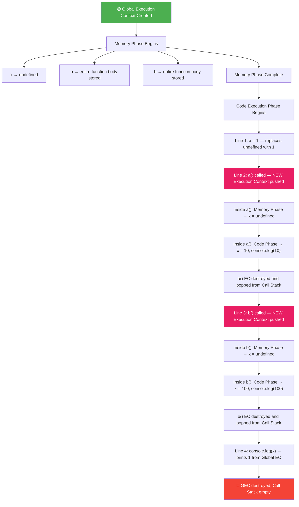

#### Memory Snapshot Table at Each Stage

```
┌─────────────────────────────────────────────────────────────┐
│  STAGE 1: After Memory Phase (before any code runs)         │
├──────────────┬──────────────────────────────────────────────┤
│  Variable    │  Value in Memory                             │
├──────────────┼──────────────────────────────────────────────┤
│  x           │  undefined                                   │
│  a           │  function a() { var x = 10; console.log(x) } │
│  b           │  function b() { var x = 100; console.log(x) }│
└──────────────┴──────────────────────────────────────────────┘

┌─────────────────────────────────────────────────────────────┐
│  STAGE 2: After x = 1 executes                              │
├──────────────┬──────────────────────────────────────────────┤
│  x           │  1                                           │
│  a           │  function a() { ... }                        │
│  b           │  function b() { ... }                        │
└──────────────┴──────────────────────────────────────────────┘

┌─────────────────────────────────────────────────────────────┐
│  STAGE 3: Inside a() — a()'s OWN Execution Context          │
├──────────────┬──────────────────────────────────────────────┤
│  x (local)   │  undefined → 10                              │
└──────────────┴──────────────────────────────────────────────┘

┌─────────────────────────────────────────────────────────────┐
│  STAGE 4: Inside b() — b()'s OWN Execution Context          │
├──────────────┬──────────────────────────────────────────────┤
│  x (local)   │  undefined → 100                             │
└──────────────┴──────────────────────────────────────────────┘
```

### 📦 Call Stack Visualization

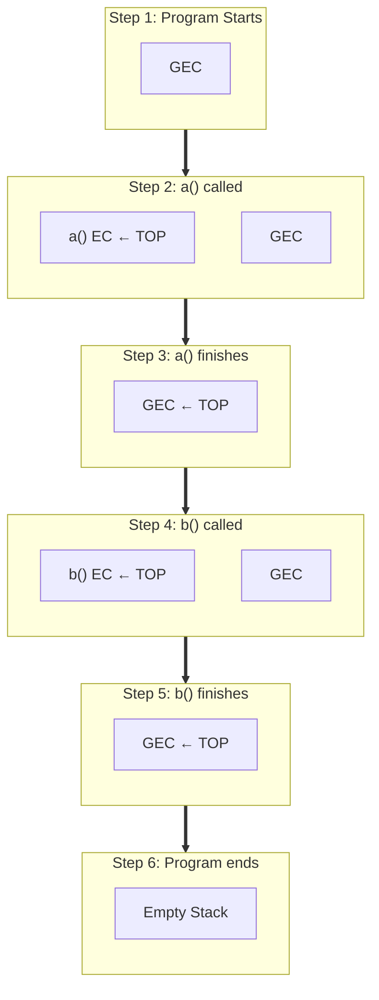

### Program: Nested Function Invocation

```javascript
// ═══════════════════════════════════════════════
// PROGRAM: Nested Function Calls — Deep Call Stack
// ═══════════════════════════════════════════════

var globalVar = "I am global";

function first() {
    var firstVar = "I am first";
    console.log("1:", globalVar);   // "I am global"
    console.log("2:", firstVar);    // "I am first"
    second();
}

function second() {
    var secondVar = "I am second";
    console.log("3:", globalVar);   // "I am global"
    // console.log(firstVar);       // ❌ ReferenceError — not in scope
    console.log("4:", secondVar);   // "I am second"
    third();
}

function third() {
    var thirdVar = "I am third";
    console.log("5:", globalVar);   // "I am global"
    console.log("6:", thirdVar);    // "I am third"
}

first();
console.log("7:", globalVar);      // "I am global"
```

**Output:**
```
1: I am global
2: I am first
3: I am global
4: I am second
5: I am global
6: I am third
7: I am global
```

**Call Stack at deepest point (when third() is running):**
```
┌─────────────────┐
│   third() EC    │ ← TOP
├─────────────────┤
│   second() EC   │
├─────────────────┤
│   first() EC    │
├─────────────────┤
│   Global EC     │
└─────────────────┘
```

### Program: Return Values & Execution Context

```javascript
// ═══════════════════════════════════════════════
// PROGRAM: How Return Values Flow Through Call Stack
// ═══════════════════════════════════════════════

function square(num) {
    var result = num * num;
    return result;
}

function sumOfSquares(a, b) {
    var sq1 = square(a);    // New EC created, returns 16
    var sq2 = square(b);    // New EC created, returns 25
    var total = sq1 + sq2;
    return total;
}

var answer = sumOfSquares(4, 5);
console.log("Sum of squares:", answer);  // 41
```

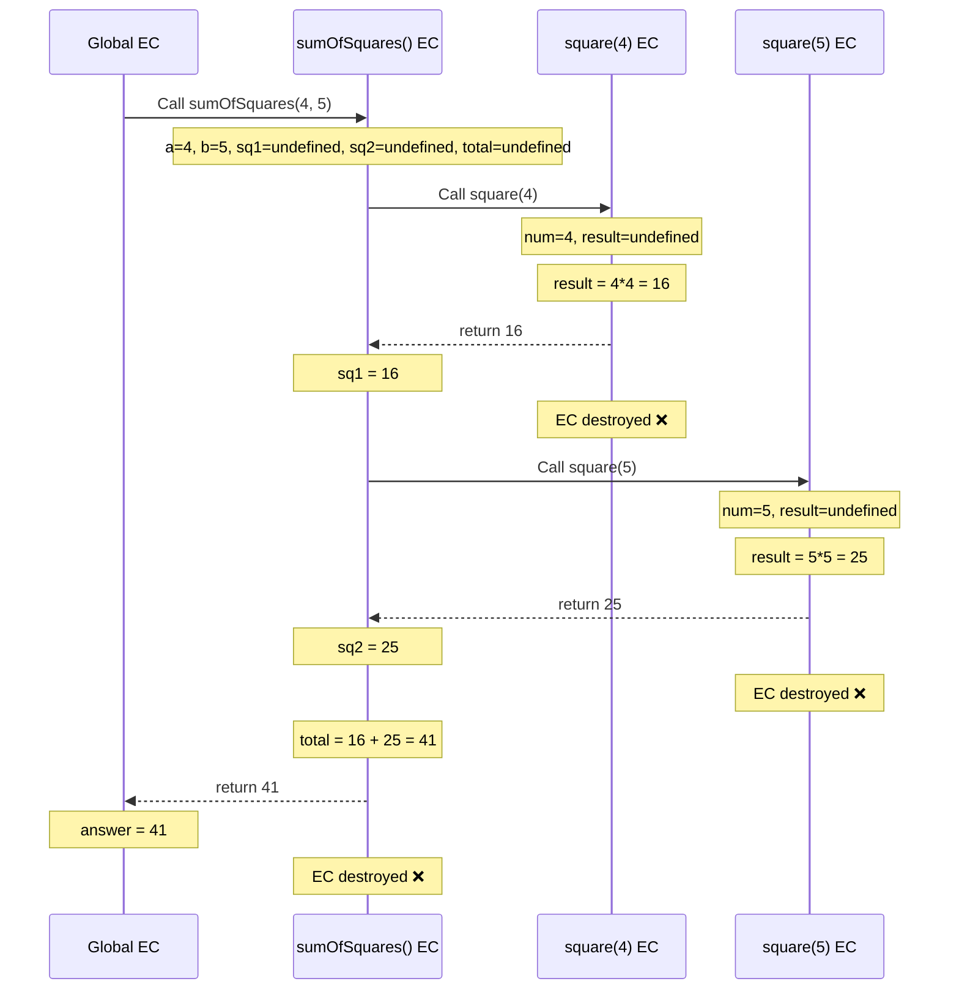

### 🔑 Key Concepts for Interviews

| Concept | Description |
|---------|-------------|
| **Execution Context** | Created every time a function is invoked; has Memory + Code components |
| **Variable Environment** | The memory component of an execution context |
| **Thread of Execution** | The code component — JS executes one line at a time |
| **Call Stack** | Manages the order of execution contexts (LIFO) |
| **GEC** | Global Execution Context — created when program starts |
| **Scope** | Each EC has its own scope — variables are local |

### ❓ Interview Questions

**Q1: What will be the output and why?**

```javascript
var x = 1;

function a() {
    console.log(x);
    var x = 10;
}

a();
```

<details>
<summary>🔍 Click to see Answer</summary>

**Answer:** `undefined`

**Why?** Due to **hoisting**, `var x` inside `a()` is hoisted to the top of `a()`'s execution context. During the memory phase of `a()`'s EC, `x` is set to `undefined`. When `console.log(x)` runs, it finds `x` in its own local variable environment as `undefined` (it hasn't reached the assignment yet).

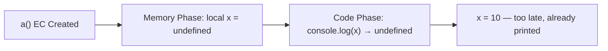

The local `x` **shadows** the global `x = 1`. JS doesn't look at the global scope because it found an `x` in the local scope already.

</details>

---

**Q2: What is the output?**

```javascript
function outer() {
    var a = 10;
    inner();
    
    function inner() {
        console.log(a);
    }
}

outer();
```

<details>
<summary>🔍 Click to see Answer</summary>

**Answer:** `10`

**Why?** `inner()` doesn't have its own `a`, so it looks up the **scope chain** to `outer()`'s variable environment and finds `a = 10`. This is the lexical scope in action.

</details>

---

**Q3: What happens to the Execution Context after a function returns?**

<details>
<summary>🔍 Click to see Answer</summary>

**Answer:** When a function finishes execution (either reaches a `return` statement or the end of the function body), its Execution Context is **destroyed** (popped from the call stack). All local variables are eligible for **garbage collection** — UNLESS a closure still references them.

</details>

---

### Use Case: Understanding Variable Isolation

```javascript
// ═══════════════════════════════════════════════
// USE CASE: Each function call gets its OWN variable
// This is crucial for recursion, counters, etc.
// ═══════════════════════════════════════════════

function counter(label) {
    var count = 0;
    
    function increment() {
        count++;
        console.log(`${label}: ${count}`);
    }
    
    increment();
    increment();
    increment();
}

counter("First");   // First: 1, First: 2, First: 3
counter("Second");  // Second: 1, Second: 2, Second: 3
// Each call to counter() creates a FRESH 'count' variable
```

---

[⬆️ Go to Top](#top)

---

<a name="2-function-declaration"></a>

## 2. 📝 Function Declaration

### What is a Function Declaration?

> **Definition:** A **Function Declaration** (also called **Function Statement**) is the most traditional way to define a function in JavaScript using the `function` keyword followed by a name.

> **Apni Bhasha Mein:** Function declaration woh tarika hai jahan tum `function` keyword likhte ho, usse ek naam dete ho, aur uske andar code likhte ho. Iska sabse bada fayda yeh hai ki yeh **hoisted** hota hai — matlab tum isse define karne se PEHLE bhi call kar sakte ho.

### Syntax

```
function functionName(parameter1, parameter2, ...) {
    // function body
    return value; // optional
}
```

### Program: Function Declaration Basics

```javascript
// ═══════════════════════════════════════════════
// PROGRAM: Function Declaration — Complete Demo
// ═══════════════════════════════════════════════

// ── 1. Basic function declaration ──
function greet(name) {
    return `Hello, ${name}!`;
}
console.log(greet("Rahul")); // Hello, Rahul!

// ── 2. Function without return (returns undefined) ──
function logMessage(msg) {
    console.log("LOG:", msg);
    // no return statement
}
var result = logMessage("Testing");
console.log("Return value:", result); // Return value: undefined

// ── 3. Function with multiple returns ──
function getGrade(score) {
    if (score >= 90) return "A+";
    if (score >= 80) return "A";
    if (score >= 70) return "B";
    if (score >= 60) return "C";
    return "F";
}
console.log(getGrade(85)); // A
console.log(getGrade(55)); // F

// ── 4. Function that modifies nothing (pure) ──
function add(a, b) {
    return a + b;
}

// ── 5. Function that has side effects ──
var total = 0;
function addToTotal(amount) {
    total += amount;  // Side effect: modifies external variable
}
addToTotal(10);
addToTotal(20);
console.log(total); // 30
```

### 🔑 Key Characteristics

```
╔═══════════════════════════════════════════════════════════════╗
║            FUNCTION DECLARATION CHARACTERISTICS               ║
╠═══════════════════════════════════════════════════════════════╣
║                                                               ║
║  ✅ Hoisted          → Can be called BEFORE declaration       ║
║  ✅ Named            → Always has a name                      ║
║  ✅ Has own 'this'   → 'this' depends on how it's called     ║
║  ✅ Has 'arguments'  → Array-like object of all arguments    ║
║  ✅ Can be Constructor → Can use with 'new' keyword          ║
║  ✅ Has 'prototype'  → Has a prototype property              ║
║  ✅ Can be Generator  → Can use function* syntax             ║
║                                                               ║
╚═══════════════════════════════════════════════════════════════╝
```

### Hoisting Behavior — Deep Dive

```javascript
// ═══════════════════════════════════════════════
// PROGRAM: Function Declaration Hoisting Proof
// ═══════════════════════════════════════════════

// ── Calling BEFORE declaration ──
console.log(sayHello());       // ✅ "Hello!"
console.log(multiply(4, 5));   // ✅ 20
console.log(typeof sayHello);  // ✅ "function"

function sayHello() {
    return "Hello!";
}

function multiply(a, b) {
    return a * b;
}

// WHY does this work?
// During Phase 1 (Memory Creation), the JS engine:
// 1. Finds "function sayHello" → stores ENTIRE function body in memory
// 2. Finds "function multiply" → stores ENTIRE function body in memory
// 3. Before Phase 2 even starts, these functions are ready to use
```

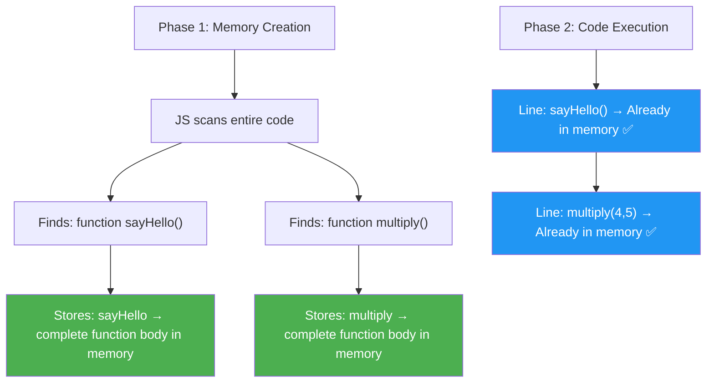

### Function Declaration vs Function Expression — The Critical Difference

```javascript
// ═══════════════════════════════════════════════
// PROGRAM: Declaration vs Expression — Head to Head
// ═══════════════════════════════════════════════

// ── Function Declaration ──
console.log(foo()); // ✅ "foo called"

function foo() {
    return "foo called";
}

// ── Function Expression ──
try {
    console.log(bar()); // ❌ TypeError: bar is not a function
} catch (e) {
    console.log("Error:", e.message);
}

var bar = function() {
    return "bar called";
};

console.log(bar()); // ✅ "bar called" (now it works)
```

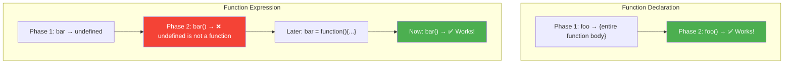

| Feature | Declaration | Expression |
|---------|------------|------------|
| Hoisting | Entire function hoisted | Only variable hoisted (as `undefined`) |
| Can call before definition | ✅ Yes | ❌ No (TypeError) |
| Name | Required | Optional (can be anonymous) |
| Use in conditionals | ⚠️ Inconsistent across engines | ✅ Safe |

### Real-World Use Case: Code Organization

```javascript
// ═══════════════════════════════════════════════
// USE CASE: Top-Down Readable Code Using Hoisting
// ═══════════════════════════════════════════════

// === MAIN LOGIC (What the program does) ===
function main() {
    const users = getUsers();
    const activeUsers = filterActiveUsers(users);
    const emailList = extractEmails(activeUsers);
    sendNewsletter(emailList);
}

main();  // Entry point at the top — easy to understand

// === HELPER FUNCTIONS (Implementation details) ===
// These are defined AFTER main() but work because of hoisting!

function getUsers() {
    return [
        { name: "Rahul", email: "rahul@gmail.com", active: true },
        { name: "Priya", email: "priya@gmail.com", active: false },
        { name: "Amit", email: "amit@gmail.com", active: true },
    ];
}

function filterActiveUsers(users) {
    return users.filter(user => user.active);
}

function extractEmails(users) {
    return users.map(user => user.email);
}

function sendNewsletter(emails) {
    emails.forEach(email => {
        console.log(`📧 Newsletter sent to: ${email}`);
    });
}
```

**Output:**
```
📧 Newsletter sent to: rahul@gmail.com
📧 Newsletter sent to: amit@gmail.com
```

### ❓ Interview Question

**Q: Can you use a function declaration inside an if block?**

```javascript
// ═══════════════════════════════════════════════
// INTERVIEW: Function Declaration in Conditional Block
// ═══════════════════════════════════════════════

// ⚠️ BEHAVIOR IS INCONSISTENT ACROSS ENGINES
// Avoid this pattern!

if (true) {
    function conditionalFunc() {
        return "I exist!";
    }
}

// In some engines: conditionalFunc() works
// In others: conditionalFunc is not defined
// In strict mode: function is block-scoped

// ✅ SAFER ALTERNATIVE: Use function expression
let safeFunc;
if (true) {
    safeFunc = function() {
        return "I definitely exist!";
    };
}
console.log(safeFunc()); // "I definitely exist!"
```

---

[⬆️ Go to Top](#top)

---

<a name="3-parameter-function"></a>

## 3. 🎯 Parameter Function (Functions with Parameters)

### Parameters vs Arguments

> 💡 **Interview Tip:** This is a common "gotcha" question. **Parameters** are the variable names in the function definition. **Arguments** are the actual values passed when the function is called.

```javascript
//         parameter ↓       ↓ parameter
function add(a, b) {
    return a + b;
}

//     argument ↓   ↓ argument
add(5, 10);
```

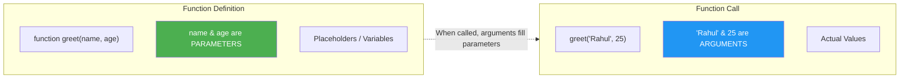

### All Types of Parameters — Complete Program

```javascript
// ═══════════════════════════════════════════════
// PROGRAM: All Parameter Types in JavaScript
// ═══════════════════════════════════════════════

// ──────────────────────────────────────────
// TYPE 1: Simple Parameters
// ──────────────────────────────────────────
function simpleAdd(a, b) {
    return a + b;
}
console.log("Simple:", simpleAdd(3, 5)); // 8

// ──────────────────────────────────────────
// TYPE 2: Default Parameters (ES6+)
// ──────────────────────────────────────────
function greet(name = "Guest", greeting = "Hello") {
    return `${greeting}, ${name}!`;
}

console.log(greet());                      // Hello, Guest!
console.log(greet("Rahul"));              // Hello, Rahul!
console.log(greet("Rahul", "Namaste"));   // Namaste, Rahul!
console.log(greet(undefined, "Hi"));      // Hi, Guest! (undefined triggers default)
console.log(greet(null, "Hi"));           // Hi, null! (null does NOT trigger default)

// ──────────────────────────────────────────
// TYPE 3: Default Parameters Referencing Other Parameters
// ──────────────────────────────────────────
function createBox(width, height = width, depth = width * height) {
    return { width, height, depth };
}

console.log(createBox(5));       // { width: 5, height: 5, depth: 25 }
console.log(createBox(5, 10));   // { width: 5, height: 10, depth: 50 }
console.log(createBox(5, 10, 3)); // { width: 5, height: 10, depth: 3 }

// ──────────────────────────────────────────
// TYPE 4: Rest Parameters (...args) — ES6+
// ──────────────────────────────────────────
function sum(...numbers) {
    return numbers.reduce((total, num) => total + num, 0);
}

console.log(sum(1, 2, 3));           // 6
console.log(sum(1, 2, 3, 4, 5));     // 15
console.log(sum());                   // 0

// Rest parameter MUST be the LAST parameter
function logInfo(name, age, ...hobbies) {
    console.log(`Name: ${name}`);
    console.log(`Age: ${age}`);
    console.log(`Hobbies: ${hobbies.join(", ")}`);
    console.log(`Number of hobbies: ${hobbies.length}`);
}

logInfo("Rahul", 25, "coding", "reading", "gaming");
// Name: Rahul
// Age: 25
// Hobbies: coding, reading, gaming
// Number of hobbies: 3

// ──────────────────────────────────────────
// TYPE 5: Destructured Parameters
// ──────────────────────────────────────────

// Object destructuring
function displayUser({ name, age, city = "Unknown" }) {
    console.log(`${name}, ${age} from ${city}`);
}

const user = { name: "Rahul", age: 25, city: "Delhi" };
displayUser(user);                                  // Rahul, 25 from Delhi
displayUser({ name: "Priya", age: 22 });           // Priya, 22 from Unknown

// Array destructuring
function getFirstAndLast([first, ...rest]) {
    const last = rest[rest.length - 1];
    return { first, last };
}

console.log(getFirstAndLast([10, 20, 30, 40])); // { first: 10, last: 40 }

// Nested destructuring
function processConfig({ server: { host, port }, database: { name: dbName } }) {
    console.log(`Server: ${host}:${port}`);
    console.log(`Database: ${dbName}`);
}

processConfig({
    server: { host: "localhost", port: 3000 },
    database: { name: "myapp_db" }
});

// ──────────────────────────────────────────
// TYPE 6: arguments Object (Pre-ES6)
// ──────────────────────────────────────────
function oldStyleSum() {
    let total = 0;
    for (let i = 0; i < arguments.length; i++) {
        total += arguments[i];
    }
    return total;
}

console.log(oldStyleSum(1, 2, 3, 4)); // 10

// Converting arguments to real array
function argsToArray() {
    // Method 1: Array.from
    const arr1 = Array.from(arguments);
    // Method 2: Spread
    const arr2 = [...arguments];
    // Method 3: Array.prototype.slice
    const arr3 = Array.prototype.slice.call(arguments);
    
    console.log(arr1); // [1, 2, 3]
}
argsToArray(1, 2, 3);
```

### arguments vs Rest Parameters

```
╔══════════════════════════════════════════════════════════╗
║         arguments OBJECT vs REST PARAMETERS             ║
╠════════════════════════╦═════════════════════════════════╣
║    arguments           ║    ...rest                      ║
╠════════════════════════╬═════════════════════════════════╣
║  Array-LIKE object     ║  Real Array                     ║
║  No array methods      ║  Has all array methods          ║
║  Available in regular  ║  Available everywhere           ║
║  functions only        ║                                 ║
║  ❌ NOT in arrow funcs ║  ✅ Works in arrow functions    ║
║  Contains ALL args     ║  Contains only "rest" args     ║
║  Legacy (pre-ES6)      ║  Modern (ES6+)                 ║
╚════════════════════════╩═════════════════════════════════╝
```

```javascript
// ═══════════════════════════════════════════════
// PROGRAM: arguments vs rest — Side by Side
// ═══════════════════════════════════════════════

// Using arguments
function oldWay() {
    console.log(typeof arguments);          // "object"
    console.log(Array.isArray(arguments));   // false
    // arguments.map(x => x * 2);           // ❌ TypeError: not a function
    
    // Must convert to array first
    var arr = Array.from(arguments);
    console.log(arr.map(x => x * 2));       // [2, 4, 6]
}
oldWay(1, 2, 3);

// Using rest
function newWay(...args) {
    console.log(typeof args);              // "object"
    console.log(Array.isArray(args));       // true
    console.log(args.map(x => x * 2));     // [2, 4, 6] — works directly!
}
newWay(1, 2, 3);

// Arrow function — NO arguments
const arrowFunc = () => {
    // console.log(arguments);  // ❌ ReferenceError
};

// Arrow function — rest works fine
const arrowWithRest = (...args) => {
    console.log(args);  // ✅ [1, 2, 3]
};
arrowWithRest(1, 2, 3);
```

### What Happens with Missing/Extra Arguments?

```javascript
// ═══════════════════════════════════════════════
// PROGRAM: Missing and Extra Arguments
// ═══════════════════════════════════════════════

function example(a, b, c) {
    console.log("a:", a, "| b:", b, "| c:", c);
}

// Fewer arguments than parameters
example(1);              // a: 1 | b: undefined | c: undefined
example(1, 2);           // a: 1 | b: 2 | c: undefined

// Exact match
example(1, 2, 3);        // a: 1 | b: 2 | c: 3

// More arguments than parameters
example(1, 2, 3, 4, 5);  // a: 1 | b: 2 | c: 3 (4 and 5 are ignored)
                          // But accessible via 'arguments' object

// Using function.length to check expected parameter count
console.log(example.length);  // 3

// Detecting missing arguments
function safeDivide(a, b) {
    if (typeof a === 'undefined' || typeof b === 'undefined') {
        return "Error: Both arguments required";
    }
    if (b === 0) return "Error: Division by zero";
    return a / b;
}

console.log(safeDivide(10, 2));    // 5
console.log(safeDivide(10));       // "Error: Both arguments required"
console.log(safeDivide(10, 0));    // "Error: Division by zero"
```

### Use Case: Flexible API Function

```javascript
// ═══════════════════════════════════════════════
// USE CASE: Function with Options Object Pattern
// (Common in real libraries like jQuery, Express, etc.)
// ═══════════════════════════════════════════════

function createServer(options = {}) {
    const {
        host = "localhost",
        port = 3000,
        protocol = "http",
        timeout = 5000,
        maxConnections = 100,
        logging = false
    } = options;
    
    console.log(`🚀 Server starting...`);
    console.log(`   Protocol: ${protocol}`);
    console.log(`   Host: ${host}`);
    console.log(`   Port: ${port}`);
    console.log(`   Timeout: ${timeout}ms`);
    console.log(`   Max Connections: ${maxConnections}`);
    console.log(`   Logging: ${logging ? "Enabled" : "Disabled"}`);
    
    return { host, port, protocol, timeout, maxConnections, logging };
}

// All defaults
createServer();

// Partial override
createServer({ port: 8080, logging: true });

// Full custom
createServer({
    host: "0.0.0.0",
    port: 9000,
    protocol: "https",
    timeout: 10000,
    maxConnections: 500,
    logging: true
});
```

### ❓ Interview Question

**Q: What happens when default parameter expression has side effects?**

```javascript
let counter = 0;

function getId(id = ++counter) {
    return id;
}

console.log(getId());    // 1 (default used, counter incremented)
console.log(getId());    // 2 (default used again)
console.log(getId(100)); // 100 (default NOT used, counter NOT incremented)
console.log(getId());    // 3 (default used)
console.log(counter);    // 3
```

> 💡 Default parameter expressions are evaluated **at call time**, NOT at definition time. They only evaluate when the parameter is `undefined`.

---

[⬆️ Go to Top](#top)

---

<a name="4-arrow-functions"></a>

## 4. ➡️ Arrow Functions (ES6)

### What are Arrow Functions?

> **Definition:** Arrow functions are a **shorter syntax** for writing functions, introduced in ES6. They are always **anonymous** (though they can be assigned to named variables) and have several key differences from regular functions.

> **Apni Bhasha Mein:** Arrow functions ek shortcut hai functions likhne ka. Lekin yeh sirf shortcut nahi hai — iska behavior bhi alag hai, khaaskar `this` keyword ke saath. Regular functions apna khud ka `this` banate hain, lekin arrow functions **baap ka this use karte hain** (lexical this).

### All Syntax Variations

```javascript
// ═══════════════════════════════════════════════
// PROGRAM: Arrow Function Syntax — All Variations
// ═══════════════════════════════════════════════

// 1. Full syntax (block body with explicit return)
const add = (a, b) => {
    const result = a + b;
    return result;
};
console.log(add(3, 5)); // 8

// 2. Implicit return (single expression — no curly braces)
const addShort = (a, b) => a + b;
console.log(addShort(3, 5)); // 8

// 3. Single parameter — parentheses optional
const double = x => x * 2;
console.log(double(5)); // 10

// 4. No parameters — parentheses required
const greet = () => "Hello!";
console.log(greet()); // "Hello!"

// 5. Returning an object literal — MUST wrap in parentheses
const createUser = (name, age) => ({ name, age });
console.log(createUser("Rahul", 25)); // { name: 'Rahul', age: 25 }

// ⚠️ Without parentheses, JS thinks {} is a block, not an object
const broken = (name) => { name };     // Returns undefined!
const working = (name) => ({ name });  // Returns { name: "Rahul" }

// 6. Multiline with implicit return using grouping operator
const getUser = (name) => (
    {
        name,
        timestamp: Date.now(),
        greeting: `Hello, ${name}!`
    }
);
console.log(getUser("Rahul"));

// 7. Arrow function in array methods
const numbers = [1, 2, 3, 4, 5];
const squared = numbers.map(n => n ** 2);
console.log(squared); // [1, 4, 9, 16, 25]

// 8. Arrow function with destructuring
const getFullName = ({ firstName, lastName }) => `${firstName} ${lastName}`;
console.log(getFullName({ firstName: "Rahul", lastName: "Kumar" })); // "Rahul Kumar"

// 9. Arrow function with default values
const power = (base, exponent = 2) => base ** exponent;
console.log(power(3));    // 9
console.log(power(3, 3)); // 27

// 10. Arrow IIFE
const result = (() => {
    const x = 10;
    const y = 20;
    return x + y;
})();
console.log(result); // 30
```

### ⚠️ Key Differences from Regular Functions — Deep Dive

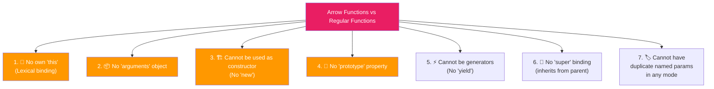

### Difference 1: The `this` Problem — MOST IMPORTANT

```javascript
// ═══════════════════════════════════════════════
// PROGRAM: The 'this' Difference — Complete Analysis
// ═══════════════════════════════════════════════

// ── SCENARIO 1: Object Method ──
const person = {
    name: "Rahul",
    
    // Regular function: 'this' = the object calling it
    regularGreet: function() {
        console.log("Regular:", this.name);  // "Rahul" ✅
    },
    
    // Arrow function: 'this' = lexical (from where it was DEFINED)
    arrowGreet: () => {
        console.log("Arrow:", this.name);    // undefined ❌
        // 'this' here is the global/window object
        // because the arrow function was defined in the global scope
    }
};

person.regularGreet();  // "Rahul"
person.arrowGreet();    // undefined

// ── SCENARIO 2: Callback Inside Method ──
const team = {
    name: "Avengers",
    members: ["Iron Man", "Thor", "Hulk"],
    
    // ❌ Problem with regular function as callback
    showMembersBad: function() {
        this.members.forEach(function(member) {
            // 'this' is NOT 'team' here! It's window/undefined
            console.log(`${this.name}: ${member}`);
            // Output: "undefined: Iron Man" (or error in strict mode)
        });
    },
    
    // ✅ Solution with arrow function as callback
    showMembersGood: function() {
        this.members.forEach((member) => {
            // Arrow function inherits 'this' from showMembersGood
            // which is 'team'
            console.log(`${this.name}: ${member}`);
            // Output: "Avengers: Iron Man"
        });
    }
};

console.log("=== BAD (regular callback) ===");
team.showMembersBad();

console.log("=== GOOD (arrow callback) ===");
team.showMembersGood();
```

**Output:**
```
=== BAD (regular callback) ===
undefined: Iron Man
undefined: Thor
undefined: Hulk
=== GOOD (arrow callback) ===
Avengers: Iron Man
Avengers: Thor
Avengers: Hulk
```

```mermaid
flowchart TD
    subgraph Regular["Regular Function as Callback"]
        R1["forEach calls function()"]
        R2["'this' is determined by HOW it's called"]
        R3["forEach calls it as a standalone function"]
        R4["'this' = window/undefined ❌"]
        R1 --> R2 --> R3 --> R4
    end
    
    subgraph Arrow["Arrow Function as Callback"]
        A1["forEach calls () => {}"]
        A2["Arrow function has NO own 'this'"]
        A3["Looks UP to parent scope: showMembersGood()"]
        A4["'this' = team object ✅"]
        A1 --> A2 --> A3 --> A4
    end
    
    style R4 fill:#f44336,color:white
    style A4 fill:#4CAF50,color:white
```

### Difference 2: No `arguments` Object

```javascript
// ═══════════════════════════════════════════════
// PROGRAM: arguments in Arrow vs Regular Functions
// ═══════════════════════════════════════════════

// Regular function — has 'arguments'
function regularFunc() {
    console.log("arguments:", arguments);       // [1, 2, 3]
    console.log("arguments[0]:", arguments[0]); // 1
    console.log("length:", arguments.length);   // 3
}
regularFunc(1, 2, 3);

// Arrow function — NO 'arguments'
const arrowFunc = () => {
    try {
        console.log(arguments);
    } catch (e) {
        console.log("Arrow error:", e.message); // arguments is not defined
    }
};
arrowFunc(1, 2, 3);

// ✅ Fix: Use rest parameters with arrow functions
const arrowWithRest = (...args) => {
    console.log("Rest args:", args);           // [1, 2, 3]
    console.log("Is array:", Array.isArray(args)); // true
    console.log("Sum:", args.reduce((a, b) => a + b, 0)); // 6
};
arrowWithRest(1, 2, 3);

// Interesting: Arrow function INSIDE a regular function
// inherits the outer function's 'arguments'
function outer() {
    const inner = () => {
        console.log("Inherited arguments:", arguments); // [10, 20, 30]
    };
    inner();
}
outer(10, 20, 30);
```

### Difference 3: Cannot Be Constructor

```javascript
// ═══════════════════════════════════════════════
// PROGRAM: Arrow Functions as Constructors — FAILS
// ═══════════════════════════════════════════════

// Regular function — CAN be constructor
function RegularPerson(name) {
    this.name = name;
}
const p1 = new RegularPerson("Rahul");
console.log(p1); // RegularPerson { name: "Rahul" } ✅

// Arrow function — CANNOT be constructor
const ArrowPerson = (name) => {
    this.name = name;
};

try {
    const p2 = new ArrowPerson("Rahul");
} catch (e) {
    console.log("Error:", e.message);
    // "ArrowPerson is not a constructor"
}

// Arrow function has no prototype
console.log(RegularPerson.prototype); // {constructor: ƒ}
console.log(ArrowPerson.prototype);   // undefined
```

### When to Use and When NOT to Use — Complete Guide

```javascript
// ═══════════════════════════════════════════════
// PROGRAM: When to Use / Not Use Arrow Functions
// ═══════════════════════════════════════════════

// ✅ USE: Array method callbacks
const numbers = [1, 2, 3, 4, 5];
const evens = numbers.filter(n => n % 2 === 0);
const doubled = numbers.map(n => n * 2);
const sum = numbers.reduce((acc, n) => acc + n, 0);

// ✅ USE: Promise chains
// fetch('/api').then(res => res.json()).then(data => console.log(data));

// ✅ USE: Short one-liner functions
const isEven = n => n % 2 === 0;
const square = n => n ** 2;
const greet = name => `Hello, ${name}!`;

// ✅ USE: Inside class methods as callbacks
class Timer {
    constructor() {
        this.seconds = 0;
    }
    
    start() {
        // Arrow function: 'this' = Timer instance ✅
        setInterval(() => {
            this.seconds++;
            console.log(`Time: ${this.seconds}s`);
        }, 1000);
    }
}

// ❌ AVOID: Object methods
const obj = {
    name: "Bad",
    greet: () => {
        return this.name;  // undefined — 'this' is not 'obj'
    }
};

// ❌ AVOID: Event handlers needing 'this'
// button.addEventListener('click', () => {
//     this.classList.add('active');  // 'this' is NOT the button
// });

// ❌ AVOID: Prototype methods
function Dog(name) { this.name = name; }
Dog.prototype.bark = () => {
    return `${this.name} says Woof!`;  // 'this' is wrong!
};

// ❌ AVOID: Functions using 'arguments'
// const bad = () => console.log(arguments);  // Error
```

```
╔════════════════════════════════════════════════════════════╗
║              ARROW FUNCTIONS — DECISION MATRIX             ║
╠════════════════════════════════════════════════════════════╣
║                                                            ║
║  ✅ Use Arrow Functions When:                               ║
║  ────────────────────────────                               ║
║  • Callbacks (map, filter, reduce, forEach)                ║
║  • Promise .then() chains                                  ║
║  • Short utility functions                                 ║
║  • Inside class methods (setTimeout, setInterval)          ║
║  • When you want lexical 'this'                           ║
║  • Functional programming patterns                         ║
║                                                            ║
║  ❌ Avoid Arrow Functions When:                              ║
║  ──────────────────────────────                              ║
║  • Object methods (use regular function or shorthand)      ║
║  • DOM event handlers needing 'this'                       ║
║  • Prototype methods                                       ║
║  • Functions that need 'arguments' object                  ║
║  • Constructors (need 'new' keyword)                       ║
║  • Generator functions (need 'yield')                      ║
║                                                            ║
╚════════════════════════════════════════════════════════════╝
```

### ❓ Interview Questions

**Q1: What will be the output?**

```javascript
const obj = {
    value: 42,
    getValue: () => {
        return this.value;
    },
    getValueRegular: function() {
        return this.value;
    }
};

console.log(obj.getValue());        // ?
console.log(obj.getValueRegular()); // ?
```

<details>
<summary>🔍 Click to see Answer</summary>

```
undefined    (arrow: 'this' = global/window, not obj)
42           (regular: 'this' = obj)
```

**Why?** The arrow function `getValue` does NOT get its own `this`. It looks UP to where it was **defined** — in this case, the global scope (where `this.value` is undefined). The regular function `getValueRegular` gets its `this` set to `obj` because it's called as `obj.getValueRegular()`.

</details>

**Q2: What will be the output?**

```javascript
function Timer() {
    this.seconds = 0;
    
    setInterval(function() {
        this.seconds++;
        console.log(this.seconds);
    }, 1000);
}

const timer = new Timer();
// What happens?
```

<details>
<summary>🔍 Click to see Answer</summary>

**Answer:** It prints `NaN` every second.

**Why?** Inside the `setInterval` callback (a regular function), `this` is NOT the Timer instance. It's the global object (or `undefined` in strict mode). `this.seconds` is `undefined`, and `undefined + 1 = NaN`.

**Fix with arrow function:**
```javascript
function Timer() {
    this.seconds = 0;
    setInterval(() => {
        this.seconds++;        // 'this' is Timer instance ✅
        console.log(this.seconds);
    }, 1000);
}
```

</details>

---

[⬆️ Go to Top](#top)

---

<a name="5-how-many-ways-to-write-a-function"></a>

## 5. 🔢 How Many Ways to Write a Function

JavaScript offers **many** ways to create functions. Here is **every single way**:

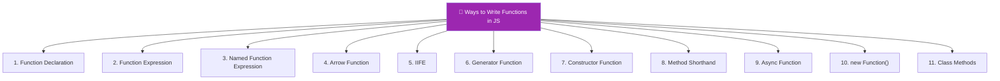

### Complete Program: All 11 Ways

```javascript
// ═══════════════════════════════════════════════
// PROGRAM: Every Way to Write a Function in JS
// ═══════════════════════════════════════════════

// ────────────────────────────────
// 1️⃣ Function Declaration (Function Statement)
// ────────────────────────────────
function declaration(a, b) {
    return a + b;
}
console.log("1. Declaration:", declaration(3, 5)); // 8
// ✅ Hoisted | Named | Has 'this' | Has 'arguments' | Can be constructor

// ────────────────────────────────
// 2️⃣ Function Expression (Anonymous)
// ────────────────────────────────
const expression = function(a, b) {
    return a + b;
};
console.log("2. Expression:", expression(3, 5)); // 8
// ❌ NOT hoisted (variable hoisted as undefined) | Can be anonymous

// ────────────────────────────────
// 3️⃣ Named Function Expression
// ────────────────────────────────
const namedExpr = function myAdd(a, b) {
    // 'myAdd' is only accessible INSIDE this function
    // Useful for recursion and debugging
    if (a <= 0) return b;
    return myAdd(a - 1, b + 1); // Recursive call using internal name
};
console.log("3. Named Expr:", namedExpr(3, 5)); // 8
// console.log(typeof myAdd); // "undefined" — not accessible outside!

// ────────────────────────────────
// 4️⃣ Arrow Function (ES6)
// ────────────────────────────────
const arrow = (a, b) => a + b;
console.log("4. Arrow:", arrow(3, 5)); // 8
// ❌ No 'this' | ❌ No 'arguments' | ❌ Not hoisted | ❌ Not constructor

// ────────────────────────────────
// 5️⃣ IIFE (Immediately Invoked Function Expression)
// ────────────────────────────────
const iifeResult = (function(a, b) {
    return a + b;
})(3, 5);
console.log("5. IIFE:", iifeResult); // 8

// Arrow IIFE
const arrowIIFE = ((a, b) => a + b)(3, 5);
console.log("5b. Arrow IIFE:", arrowIIFE); // 8

// ────────────────────────────────
// 6️⃣ Generator Function
// ────────────────────────────────
function* numberGen(start, end) {
    for (let i = start; i <= end; i++) {
        yield i;
    }
}
const gen = numberGen(1, 5);
console.log("6. Generator:", gen.next().value); // 1
console.log("   Generator:", gen.next().value); // 2

// Generator Expression
const genExpr = function*(n) {
    yield n;
    yield n * 2;
};

// ────────────────────────────────
// 7️⃣ Constructor Function
// ────────────────────────────────
function Calculator(initialValue) {
    this.value = initialValue || 0;
    this.add = function(n) {
        this.value += n;
        return this;  // For chaining
    };
    this.getResult = function() {
        return this.value;
    };
}
const calc = new Calculator(10);
console.log("7. Constructor:", calc.add(5).add(3).getResult()); // 18

// ────────────────────────────────
// 8️⃣ Method Shorthand (ES6 Object Method)
// ────────────────────────────────
const mathUtils = {
    // Old way
    addOld: function(a, b) { return a + b; },
    
    // ES6 shorthand — preferred ✅
    add(a, b) { return a + b; },
    subtract(a, b) { return a - b; }
};
console.log("8. Shorthand:", mathUtils.add(3, 5)); // 8

// ────────────────────────────────
// 9️⃣ Async Function
// ────────────────────────────────

// Async declaration
async function fetchData() {
    return "Data fetched";
}
fetchData().then(data => console.log("9a. Async:", data)); // "Data fetched"

// Async expression
const asyncExpr = async function() {
    return "Async expression";
};

// Async arrow
const asyncArrow = async () => {
    return "Async arrow";
};
asyncArrow().then(data => console.log("9b. Async Arrow:", data));

// Async method
const api = {
    async getData() {
        return "API data";
    }
};

// ────────────────────────────────
// 🔟 new Function() Constructor (RARE)
// ────────────────────────────────
const dynamicAdd = new Function('a', 'b', 'return a + b');
console.log("10. new Function:", dynamicAdd(3, 5)); // 8
// ⚠️ Security risk | No closure access | Poor performance | Avoid!

// ────────────────────────────────
// 1️⃣1️⃣ Class Methods
// ────────────────────────────────
class MathHelper {
    // Instance method
    add(a, b) { return a + b; }
    
    // Static method
    static multiply(a, b) { return a * b; }
    
    // Getter
    get pi() { return 3.14159; }
    
    // Private method (ES2022)
    #validate(n) { return typeof n === 'number'; }
}

const helper = new MathHelper();
console.log("11a. Instance:", helper.add(3, 5));          // 8
console.log("11b. Static:", MathHelper.multiply(3, 5));   // 15
console.log("11c. Getter:", helper.pi);                    // 3.14159
```

### 📊 Complete Comparison Table

```
╔═══════════════════╦════════╦═══════╦═══════════╦═════════════╦════════════════════╗
║ Way               ║ Hoisted║ this  ║ arguments ║ Constructor ║ Best Use Case      ║
╠═══════════════════╬════════╬═══════╬═══════════╬═════════════╬════════════════════╣
║ Declaration       ║ ✅ Yes ║ Own   ║ ✅ Yes    ║ ✅ Yes      ║ General purpose    ║
║ Expression        ║ ❌ No  ║ Own   ║ ✅ Yes    ║ ✅ Yes      ║ Conditional funcs  ║
║ Named Expression  ║ ❌ No  ║ Own   ║ ✅ Yes    ║ ✅ Yes      ║ Recursion/debug    ║
║ Arrow             ║ ❌ No  ║ Lexic.║ ❌ No     ║ ❌ No       ║ Callbacks, short   ║
║ IIFE              ║ N/A    ║ Own   ║ ✅ Yes    ║ N/A         ║ Module pattern     ║
║ Generator         ║ ✅ Yes ║ Own   ║ ✅ Yes    ║ ❌ No       ║ Iterators, lazy    ║
║ Constructor       ║ ✅ Yes ║ New   ║ ✅ Yes    ║ ✅ (IS one) ║ Object creation    ║
║ Method Shorthand  ║ N/A    ║ Own   ║ ✅ Yes    ║ ❌ No       ║ Object methods     ║
║ Async             ║ Varies ║ Varies║ Varies    ║ ❌ No       ║ Async operations   ║
║ new Function()    ║ ❌ No  ║ Own   ║ ✅ Yes    ║ ✅ Yes      ║ Never (avoid)      ║
║ Class Methods     ║ ❌ No  ║ Own   ║ ✅ Yes    ║ N/A         ║ OOP patterns       ║
╚═══════════════════╩════════╩═══════╩═══════════╩═════════════╩════════════════════╝
```

---

[⬆️ Go to Top](#top)

---

<a name="6-higher-order-functions"></a>

## 6. 🏗️ Higher Order Functions

### What is a Higher Order Function?

> **Definition:** A **Higher Order Function** (HOF) is a function that either:
> 1. **Takes one or more functions as arguments**, OR
> 2. **Returns a function** as its result

> **Apni Bhasha Mein:** Higher Order Function woh function hai jo doosre functions ko **kaam pe lagata hai** ya **nayi function factory ki tarah** kaam karta hai. `map`, `filter`, `reduce` — yeh sab higher order functions hain.

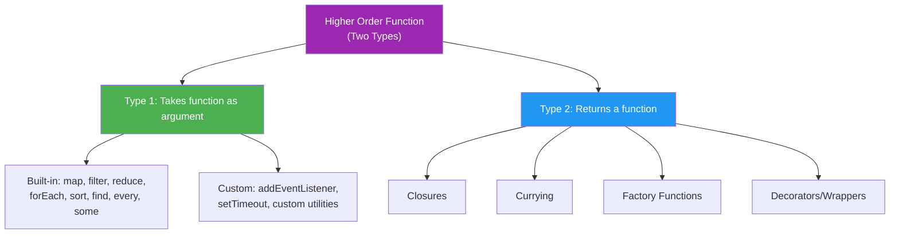

### Type 1: Function That Takes a Function as Argument

```javascript
// ═══════════════════════════════════════════════
// PROGRAM: HOF Type 1 — Function as Argument
// ═══════════════════════════════════════════════

// The SIMPLEST higher order function
function doOperation(a, b, operation) {
    return operation(a, b);
}

// Passing different functions = different behaviors
console.log(doOperation(10, 5, (a, b) => a + b));  // 15 (add)
console.log(doOperation(10, 5, (a, b) => a - b));  // 5  (subtract)
console.log(doOperation(10, 5, (a, b) => a * b));  // 50 (multiply)
console.log(doOperation(10, 5, (a, b) => a / b));  // 2  (divide)
console.log(doOperation(10, 5, (a, b) => a ** b)); // 100000 (power)
console.log(doOperation(10, 5, Math.max));          // 10 (max)
```

### Type 2: Function That Returns a Function

```javascript
// ═══════════════════════════════════════════════
// PROGRAM: HOF Type 2 — Function Returning Function
// ═══════════════════════════════════════════════

function multiplier(factor) {
    return function(number) {
        return number * factor;
    };
}

const double = multiplier(2);
const triple = multiplier(3);
const tenTimes = multiplier(10);

console.log(double(5));    // 10
console.log(triple(5));    // 15
console.log(tenTimes(5));  // 50

// The beauty: 'factor' is remembered via closure!
console.log(double(100));  // 200
console.log(triple(100));  // 300
```

### All Built-in Higher Order Functions — Complete Program

```javascript
// ═══════════════════════════════════════════════
// PROGRAM: Every Built-in HOF with Real Data
// ═══════════════════════════════════════════════

const students = [
    { name: "Rahul", grade: 85, city: "Delhi", subjects: ["Math", "Science"] },
    { name: "Priya", grade: 92, city: "Mumbai", subjects: ["Math", "English"] },
    { name: "Amit", grade: 78, city: "Delhi", subjects: ["Science", "History"] },
    { name: "Neha", grade: 95, city: "Bangalore", subjects: ["Math", "Science", "English"] },
    { name: "Vikram", grade: 88, city: "Mumbai", subjects: ["History", "English"] },
    { name: "Sara", grade: 60, city: "Delhi", subjects: ["Math"] }
];

// ── 1. map() — Transform each element ──
const names = students.map(s => s.name);
console.log("Names:", names);
// ["Rahul", "Priya", "Amit", "Neha", "Vikram", "Sara"]

const gradeReports = students.map(s => `${s.name}: ${s.grade}%`);
console.log("Reports:", gradeReports);

// ── 2. filter() — Keep elements passing a test ──
const toppers = students.filter(s => s.grade >= 90);
console.log("Toppers:", toppers.map(s => s.name));
// ["Priya", "Neha"]

const delhiStudents = students.filter(s => s.city === "Delhi");
console.log("Delhi:", delhiStudents.map(s => s.name));
// ["Rahul", "Amit", "Sara"]

// ── 3. reduce() — Accumulate into single value ──
const totalGrades = students.reduce((sum, s) => sum + s.grade, 0);
const averageGrade = totalGrades / students.length;
console.log("Average:", averageGrade.toFixed(1)); // 83.0

// Group by city using reduce
const byCity = students.reduce((groups, s) => {
    if (!groups[s.city]) groups[s.city] = [];
    groups[s.city].push(s.name);
    return groups;
}, {});
console.log("By City:", byCity);
// { Delhi: ["Rahul", "Amit", "Sara"], Mumbai: ["Priya", "Vikram"], Bangalore: ["Neha"] }

// ── 4. forEach() — Execute for each (no return) ──
console.log("--- Student Report ---");
students.forEach((s, index) => {
    console.log(`${index + 1}. ${s.name} - ${s.grade}% - ${s.city}`);
});

// ── 5. find() — Find first matching ──
const found = students.find(s => s.grade >= 90);
console.log("First topper:", found.name); // "Priya"

// ── 6. findIndex() — Find index of first match ──
const index = students.findIndex(s => s.name === "Amit");
console.log("Amit's index:", index); // 2

// ── 7. some() — At least one passes? ──
const anyTopper = students.some(s => s.grade >= 95);
console.log("Any 95+?", anyTopper); // true

// ── 8. every() — All pass? ──
const allPassed = students.every(s => s.grade >= 40);
console.log("All passed?", allPassed); // true

const allToppers = students.every(s => s.grade >= 90);
console.log("All toppers?", allToppers); // false

// ── 9. sort() — Sort (MUTATES original!) ──
const sorted = [...students].sort((a, b) => b.grade - a.grade);
console.log("Top to Bottom:", sorted.map(s => `${s.name}(${s.grade})`));

// ── 10. flatMap() — Map + Flatten ──
const allSubjects = students.flatMap(s => s.subjects);
console.log("All subjects:", allSubjects);

const uniqueSubjects = [...new Set(allSubjects)];
console.log("Unique subjects:", uniqueSubjects);
```

### Chaining Higher Order Functions

```javascript
// ═══════════════════════════════════════════════
// PROGRAM: Powerful HOF Chaining
// ═══════════════════════════════════════════════

const transactions = [
    { id: 1, type: "credit", amount: 5000, date: "2024-01-15" },
    { id: 2, type: "debit", amount: 2000, date: "2024-01-16" },
    { id: 3, type: "credit", amount: 3000, date: "2024-01-17" },
    { id: 4, type: "debit", amount: 1000, date: "2024-01-18" },
    { id: 5, type: "credit", amount: 7000, date: "2024-01-19" },
    { id: 6, type: "debit", amount: 500, date: "2024-01-20" },
    { id: 7, type: "credit", amount: 2500, date: "2024-01-21" }
];

// Chain: Get total credits above 2000
const totalLargeCredits = transactions
    .filter(t => t.type === "credit")       // Keep only credits
    .filter(t => t.amount > 2000)           // Keep only large ones
    .map(t => t.amount)                     // Extract amounts
    .reduce((sum, amt) => sum + amt, 0);    // Sum up

console.log("Total large credits:", totalLargeCredits); // 15000 (5000+3000+7000)

// Chain: Get a summary report
const report = transactions
    .reduce((summary, t) => {
        summary[t.type].count++;
        summary[t.type].total += t.amount;
        return summary;
    }, { credit: { count: 0, total: 0 }, debit: { count: 0, total: 0 } });

console.log("Report:", JSON.stringify(report, null, 2));
// credit: { count: 4, total: 17500 }
// debit: { count: 3, total: 3500 }
```

### Creating Your Own Higher Order Functions

```javascript
// ═══════════════════════════════════════════════
// PROGRAM: Building Custom HOFs
// ═══════════════════════════════════════════════

// ── Custom map ──
function myMap(arr, transformFn) {
    const result = [];
    for (let i = 0; i < arr.length; i++) {
        result.push(transformFn(arr[i], i, arr));
    }
    return result;
}

// ── Custom filter ──
function myFilter(arr, predicateFn) {
    const result = [];
    for (let i = 0; i < arr.length; i++) {
        if (predicateFn(arr[i], i, arr)) {
            result.push(arr[i]);
        }
    }
    return result;
}

// ── Custom reduce ──
function myReduce(arr, reducerFn, initialValue) {
    let accumulator = initialValue;
    let startIndex = 0;
    
    if (initialValue === undefined) {
        accumulator = arr[0];
        startIndex = 1;
    }
    
    for (let i = startIndex; i < arr.length; i++) {
        accumulator = reducerFn(accumulator, arr[i], i, arr);
    }
    
    return accumulator;
}

// ── Testing ──
const nums = [1, 2, 3, 4, 5];

console.log(myMap(nums, n => n ** 2));           // [1, 4, 9, 16, 25]
console.log(myFilter(nums, n => n % 2 === 0));   // [2, 4]
console.log(myReduce(nums, (a, b) => a + b, 0)); // 15
```

### Use Case: Validation System Using HOFs

```javascript
// ═══════════════════════════════════════════════
// USE CASE: Composable Validation with HOFs
// ═══════════════════════════════════════════════

// Individual validators (each returns a function)
const required = (fieldName) => (value) => 
    value !== undefined && value !== null && value !== ""
        ? null 
        : `${fieldName} is required`;

const minLength = (fieldName, min) => (value) => 
    value && value.length >= min
        ? null 
        : `${fieldName} must be at least ${min} characters`;

const maxLength = (fieldName, max) => (value) => 
    value && value.length <= max
        ? null 
        : `${fieldName} must be at most ${max} characters`;

const isEmail = (fieldName) => (value) => 
    /^[^\s@]+@[^\s@]+\.[^\s@]+$/.test(value)
        ? null 
        : `${fieldName} must be a valid email`;

const isNumber = (fieldName) => (value) => 
    typeof value === 'number' && !isNaN(value)
        ? null 
        : `${fieldName} must be a number`;

const minValue = (fieldName, min) => (value) => 
    value >= min
        ? null 
        : `${fieldName} must be at least ${min}`;

// HOF: Compose validators for a single field
function validateField(value, ...validators) {
    return validators
        .map(validator => validator(value))
        .filter(error => error !== null);
}

// HOF: Create a form validator
function createFormValidator(schema) {
    return function(data) {
        const errors = {};
        let isValid = true;
        
        for (const [field, validators] of Object.entries(schema)) {
            const fieldErrors = validateField(data[field], ...validators);
            if (fieldErrors.length > 0) {
                errors[field] = fieldErrors;
                isValid = false;
            }
        }
        
        return { isValid, errors };
    };
}

// Define validation schema
const validateUserForm = createFormValidator({
    name: [required("Name"), minLength("Name", 2), maxLength("Name", 50)],
    email: [required("Email"), isEmail("Email")],
    age: [required("Age"), isNumber("Age"), minValue("Age", 18)]
});

// Test with bad data
console.log(validateUserForm({
    name: "R",
    email: "bad-email",
    age: 15
}));
// {
//   isValid: false,
//   errors: {
//     name: ["Name must be at least 2 characters"],
//     email: ["Email must be a valid email"],
//     age: ["Age must be at least 18"]
//   }
// }

// Test with good data
console.log(validateUserForm({
    name: "Rahul Kumar",
    email: "rahul@gmail.com",
    age: 25
}));
// { isValid: true, errors: {} }
```

---

[⬆️ Go to Top](#top)

---

<a name="7-anonymous-functions"></a>

## 7. 👤 Anonymous Functions

### What is an Anonymous Function?

> **Definition:** An **Anonymous Function** is a function that has **no name**. It cannot be called independently and is usually used as a **value** — assigned to a variable, passed as an argument, or used in an IIFE.

> **Apni Bhasha Mein:** Anonymous function woh function hai jiska koi naam nahi hota. Agar tum isse akele likhoge toh error aayega. Isse humesha kisi variable mein store karo, ya kisi doosre function ke andar pass karo.

```javascript
// ═══════════════════════════════════════════════
// PROGRAM: Anonymous Functions — All Use Cases
// ═══════════════════════════════════════════════

// ❌ Anonymous function CANNOT be a standalone statement
// function() { console.log("error"); } // SyntaxError!

// ✅ Use Case 1: Assigned to a variable (Function Expression)
const greet = function() {
    return "Hello!";
};
console.log(greet()); // "Hello!"

// ✅ Use Case 2: As a callback argument
const numbers = [1, 2, 3, 4, 5];
const doubled = numbers.map(function(num) {
    return num * 2;
});
console.log("Doubled:", doubled); // [2, 4, 6, 8, 10]

// ✅ Use Case 3: In setTimeout
setTimeout(function() {
    console.log("This runs after 1 second");
}, 1000);

// ✅ Use Case 4: As IIFE
(function() {
    const secret = "I'm private!";
    console.log("IIFE ran:", secret);
})();

// ✅ Use Case 5: As object method
const calculator = {
    add: function(a, b) { return a + b; },
    sub: function(a, b) { return a - b; }
};

// ✅ Use Case 6: Event handlers (browser)
// document.getElementById("btn").addEventListener("click", function(event) {
//     console.log("Clicked!", event.target);
// });

// ✅ Use Case 7: Immediately used in array
const operations = [
    function(a, b) { return a + b; },
    function(a, b) { return a - b; },
    function(a, b) { return a * b; }
];

console.log(operations[0](5, 3));  // 8 (add)
console.log(operations[1](5, 3));  // 2 (subtract)
console.log(operations[2](5, 3));  // 15 (multiply)
```

### Named vs Anonymous — Why It Matters for Debugging

```javascript
// ═══════════════════════════════════════════════
// PROGRAM: Named vs Anonymous — Stack Trace Difference
// ═══════════════════════════════════════════════

// ❌ Anonymous — poor stack trace
const badFunc = function() {
    throw new Error("Something broke in anonymous!");
};

// ✅ Named — better stack trace
const goodFunc = function descriptiveName() {
    throw new Error("Something broke in descriptiveName!");
};

try {
    badFunc();
} catch (e) {
    console.log("Anonymous trace:", e.stack);
    // "Error: Something broke in anonymous!
    //     at Object.<anonymous> ..."
}

try {
    goodFunc();
} catch (e) {
    console.log("Named trace:", e.stack);
    // "Error: Something broke in descriptiveName!
    //     at descriptiveName ..."
}
```

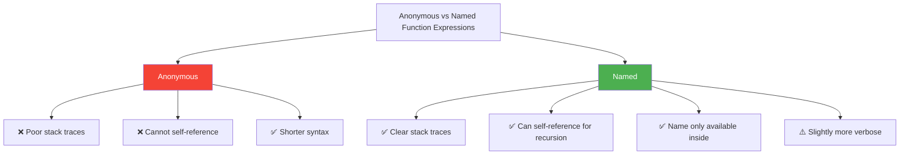

### Named Function Expression — Self-Reference

```javascript
// ═══════════════════════════════════════════════
// PROGRAM: Named Function Expression — Recursion
// ═══════════════════════════════════════════════

// The name 'fact' is ONLY accessible inside the function
const factorial = function fact(n) {
    if (n <= 1) return 1;
    return n * fact(n - 1);  // Uses internal name 'fact'
};

console.log(factorial(5));    // 120
// console.log(fact(5));      // ❌ ReferenceError: fact is not defined

// Why is this useful? If the external variable is reassigned:
let myFunc = function internalName() {
    console.log("I am internalName");
    return "done";
};

const backup = myFunc;
myFunc = null;  // External reference is gone!

console.log(backup());  // ✅ Still works! "I am internalName"
// If it was anonymous and tried to call myFunc() inside, it would fail
```

> 💡 **Best Practice:** Always prefer named function expressions over anonymous ones for better debugging and self-referencing capabilities.

---

[⬆️ Go to Top](#top)

---

<a name="8-function-callback-parameter"></a>

## 8. 📞 Function Callback Parameter

### What is a Callback Function?

> **Definition:** A **Callback Function** is a function that is **passed as an argument** to another function and is **executed later** — either synchronously or asynchronously.

> **Apni Bhasha Mein:** Callback matlab "baad mein phone karna." Tum ek function ko doosre function ko dete ho aur bolte ho — "Jab tera kaam ho jaye, toh isse call kar dena." Woh doosra function apna kaam karta hai aur jab ready hota hai, tumhara function call kar deta hai.


### Synchronous vs Asynchronous Callbacks

```javascript
// ═══════════════════════════════════════════════
// PROGRAM: Sync vs Async Callbacks — Complete Demo
// ═══════════════════════════════════════════════

// ── SYNCHRONOUS Callbacks ──
// Execute IMMEDIATELY, blocking the next line

console.log("=== SYNCHRONOUS ===");

// Example 1: forEach
console.log("Before forEach");
[1, 2, 3].forEach(function(num) {
    console.log("Processing:", num);
});
console.log("After forEach");
// Output order: Before → Processing 1,2,3 → After (synchronous!)

// Example 2: Custom sync callback
function processData(data, callback) {
    console.log("Processing...");
    const result = data.map(x => x * 2);
    callback(result);  // Called synchronously
    console.log("Done processing");
}

processData([1, 2, 3], function(result) {
    console.log("Result:", result);
});
// Processing... → Result: [2,4,6] → Done processing

// ── ASYNCHRONOUS Callbacks ──
// Execute LATER, does NOT block the next line

console.log("\n=== ASYNCHRONOUS ===");

// Example 1: setTimeout
console.log("Before setTimeout");
setTimeout(function() {
    console.log("Inside setTimeout (runs later)");
}, 0);  // Even 0ms delay makes it async!
console.log("After setTimeout");
// Output order: Before → After → Inside setTimeout

// Example 2: Custom async callback
function fetchUser(userId, onSuccess, onError) {
    console.log(`Fetching user ${userId}...`);
    
    setTimeout(function() {
        if (userId > 0) {
            onSuccess({ id: userId, name: "Rahul" });
        } else {
            onError("Invalid user ID");
        }
    }, 1000);
    
    console.log("Request sent (not waiting)");
}

fetchUser(
    1,
    function(user) { console.log("Got user:", user); },
    function(err) { console.log("Error:", err); }
);
// Fetching... → Request sent → (1 second later) → Got user: {...}
```

```mermaid
flowchart TD
    subgraph Sync["Synchronous Callback"]
        S1["Line 1: Do something"]
        S2["Line 2: Call HOF with callback"]
        S3["Line 2a: HOF executes"]
        S4["Line 2b: Callback executes IMMEDIATELY"]
        S5["Line 2c: HOF continues"]
        S6["Line 3: Next line"]
        S1 --> S2 --> S3 --> S4 --> S5 --> S6
    end
    
    subgraph Async["Asynchronous Callback"]
        A1["Line 1: Do something"]
        A2["Line 2: Call HOF with callback"]
        A3["Line 2a: HOF schedules callback for LATER"]
        A4["Line 3: Next line executes IMMEDIATELY"]
        A5["...later..."]
        A6["Callback executes when ready"]
        A1 --> A2 --> A3 --> A4 --> A5 --> A6
    end
    
    style S4 fill:#4CAF50,color:white
    style A3 fill:#FF9800,color:white
    style A6 fill:#2196F3,color:white
```

### ⚠️ Callback Hell — The Problem & Solutions

```javascript
// ═══════════════════════════════════════════════
// PROGRAM: Callback Hell (Pyramid of Doom)
// ═══════════════════════════════════════════════

// ❌ THE PROBLEM — Deeply nested callbacks
function callbackHellDemo() {
    getUser(1, function(user) {
        console.log("Got user:", user.name);
        getOrders(user.id, function(orders) {
            console.log("Got orders:", orders.length);
            getOrderDetails(orders[0].id, function(details) {
                console.log("Got details:", details.product);
                getShipping(details.shippingId, function(shipping) {
                    console.log("Got shipping:", shipping.status);
                    getTracking(shipping.trackingId, function(tracking) {
                        console.log("Got tracking:", tracking.location);
                        // 😱 How deep does this go?!
                    }, handleError);
                }, handleError);
            }, handleError);
        }, handleError);
    }, handleError);
}

// Simulated async functions
function getUser(id, success, error) {
    setTimeout(() => success({ id, name: "Rahul" }), 100);
}
function getOrders(userId, success, error) {
    setTimeout(() => success([{ id: 101, userId }]), 100);
}
function getOrderDetails(orderId, success, error) {
    setTimeout(() => success({ id: orderId, product: "Laptop", shippingId: 201 }), 100);
}
function getShipping(id, success, error) {
    setTimeout(() => success({ id, status: "Shipped", trackingId: 301 }), 100);
}
function getTracking(id, success, error) {
    setTimeout(() => success({ id, location: "Delhi Hub" }), 100);
}
function handleError(err) { console.error("Error:", err); }

callbackHellDemo();
```

### Solutions to Callback Hell

```javascript
// ═══════════════════════════════════════════════
// SOLUTION 1: Named Functions (Flatten the Pyramid)
// ═══════════════════════════════════════════════

function handleTracking(tracking) {
    console.log("Final tracking:", tracking.location);
}

function handleShipping(shipping) {
    getTracking(shipping.trackingId, handleTracking, handleError);
}

function handleDetails(details) {
    getShipping(details.shippingId, handleShipping, handleError);
}

function handleOrders(orders) {
    getOrderDetails(orders[0].id, handleDetails, handleError);
}

function handleUser(user) {
    getOrders(user.id, handleOrders, handleError);
}

// Clean entry point
getUser(1, handleUser, handleError);

// ═══════════════════════════════════════════════
// SOLUTION 2: Promises (Will be covered in Async section)
// ═══════════════════════════════════════════════

function getUserPromise(id) {
    return new Promise((resolve) => {
        setTimeout(() => resolve({ id, name: "Rahul" }), 100);
    });
}

// Much cleaner:
// getUserPromise(1)
//     .then(user => getOrdersPromise(user.id))
//     .then(orders => getDetailsPromise(orders[0].id))
//     .then(details => console.log(details))
//     .catch(err => console.error(err));

// ═══════════════════════════════════════════════
// SOLUTION 3: Async/Await (Cleanest — covered later)
// ═══════════════════════════════════════════════

// async function processOrder() {
//     const user = await getUserPromise(1);
//     const orders = await getOrdersPromise(user.id);
//     const details = await getDetailsPromise(orders[0].id);
//     console.log(details);
// }
```

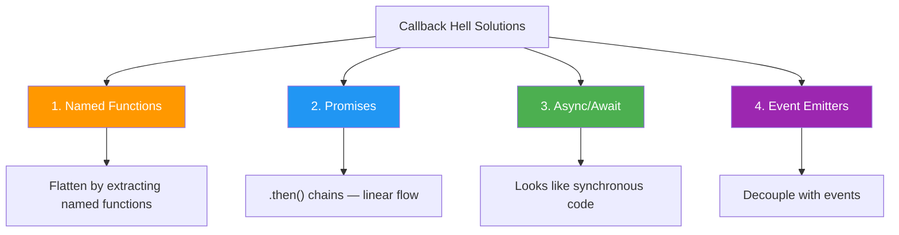

---

[⬆️ Go to Top](#top)

---

<a name="9-passing-function-inside-function-as-parameter"></a>

## 9. 🔄 Passing Function Inside Function as Parameter

### Core Concept: Functions as First-Class Citizens

> **Definition:** In JavaScript, **functions are first-class citizens**, meaning they can be:
> - Assigned to variables
> - Stored in data structures (arrays, objects)
> - **Passed as arguments to other functions**
> - Returned from other functions

```javascript
// ═══════════════════════════════════════════════
// PROGRAM: Functions as First-Class Citizens — Proof
// ═══════════════════════════════════════════════

// 1. Assign to variable
const sayHi = function() { return "Hi!"; };

// 2. Store in array
const operations = [
    (a, b) => a + b,
    (a, b) => a - b,
    (a, b) => a * b
];

// 3. Store in object
const mathOps = {
    add: (a, b) => a + b,
    subtract: (a, b) => a - b
};

// 4. Pass as argument
function executeOperation(a, b, operation) {
    return operation(a, b);
}
console.log(executeOperation(10, 5, operations[0])); // 15
console.log(executeOperation(10, 5, mathOps.subtract)); // 5

// 5. Return from function
function getOperation(type) {
    const ops = {
        "add": (a, b) => a + b,
        "multiply": (a, b) => a * b
    };
    return ops[type] || ((a, b) => 0);
}
const adder = getOperation("add");
console.log(adder(3, 7)); // 10
```

### Strategy Pattern — Interchangeable Behaviors

```javascript
// ═══════════════════════════════════════════════
// PROGRAM: Strategy Pattern — Pass Different Strategies
// ═══════════════════════════════════════════════

// Sorting strategies
function sortArray(arr, compareFn) {
    return [...arr].sort(compareFn);
}

const people = [
    { name: "Zara", age: 22, salary: 50000 },
    { name: "Amit", age: 30, salary: 80000 },
    { name: "Neha", age: 25, salary: 60000 },
    { name: "Rahul", age: 28, salary: 70000 }
];

// Strategy 1: Sort by age ascending
const byAge = sortArray(people, (a, b) => a.age - b.age);
console.log("By Age:", byAge.map(p => `${p.name}(${p.age})`));
// Zara(22), Neha(25), Rahul(28), Amit(30)

// Strategy 2: Sort by name alphabetically
const byName = sortArray(people, (a, b) => a.name.localeCompare(b.name));
console.log("By Name:", byName.map(p => p.name));
// Amit, Neha, Rahul, Zara

// Strategy 3: Sort by salary descending
const bySalary = sortArray(people, (a, b) => b.salary - a.salary);
console.log("By Salary:", bySalary.map(p => `${p.name}(₹${p.salary})`));
// Amit(₹80000), Rahul(₹70000), Neha(₹60000), Zara(₹50000)
```

### Pipeline / Middleware Pattern

```javascript
// ═══════════════════════════════════════════════
// PROGRAM: Pipeline — Chain of Functions
// ═══════════════════════════════════════════════

// Each function takes a value and returns a transformed value
function pipeline(...functions) {
    return function(value) {
        return functions.reduce((acc, fn) => fn(acc), value);
    };
}

// Individual transformations
const trim = str => str.trim();
const toLowerCase = str => str.toLowerCase();
const replaceSpaces = str => str.replace(/\s+/g, '-');
const removeSpecialChars = str => str.replace(/[^a-z0-9-]/g, '');
const addPrefix = str => `blog-${str}`;

// Compose a URL slug creator
const createSlug = pipeline(
    trim,
    toLowerCase,
    replaceSpaces,
    removeSpecialChars,
    addPrefix
);

console.log(createSlug("  Hello World!  "));
// "blog-hello-world"

console.log(createSlug("  JavaScript IS Awesome!! 🚀  "));
// "blog-javascript-is-awesome-"

// Another pipeline: Data processing
const processNumber = pipeline(
    n => n * 2,         // Double
    n => n + 10,        // Add 10
    n => Math.round(n), // Round
    n => `Result: ${n}` // Format
);

console.log(processNumber(3.7));  // "Result: 17"
// 3.7 → 7.4 → 17.4 → 17 → "Result: 17"
```

### Function Composition (Right-to-Left)

```javascript
// ═══════════════════════════════════════════════
// PROGRAM: Compose — Opposite of Pipeline
// ═══════════════════════════════════════════════

function compose(...fns) {
    return function(x) {
        return fns.reduceRight((acc, fn) => fn(acc), x);
    };
}

const add10 = x => x + 10;
const multiply2 = x => x * 2;
const subtract5 = x => x - 5;

// compose reads RIGHT to LEFT
const compute = compose(subtract5, multiply2, add10);
// Execution: add10(5) → 15 → multiply2(15) → 30 → subtract5(30) → 25

console.log(compute(5)); // 25
```

### Use Case: Event Emitter System

```javascript
// ═══════════════════════════════════════════════
// USE CASE: Custom Event System
// ═══════════════════════════════════════════════

class EventEmitter {
    constructor() {
        this.events = {};
    }
    
    on(eventName, callback) {
        if (!this.events[eventName]) {
            this.events[eventName] = [];
        }
        this.events[eventName].push(callback);
        
        // Return unsubscribe function
        return () => {
            this.events[eventName] = this.events[eventName]
                .filter(cb => cb !== callback);
        };
    }
    
    emit(eventName, ...args) {
        const callbacks = this.events[eventName] || [];
        callbacks.forEach(cb => cb(...args));
    }
    
    once(eventName, callback) {
        const unsubscribe = this.on(eventName, (...args) => {
            callback(...args);
            unsubscribe();
        });
    }
}

// Usage
const emitter = new EventEmitter();

// Subscribe with functions as parameters
emitter.on("userLogin", user => console.log(`Welcome, ${user}!`));
emitter.on("userLogin", user => console.log(`Loading ${user}'s data...`));

const unsubNotify = emitter.on("userLogin", user => 
    console.log(`Sending notification for ${user}`)
);

// One-time event
emitter.once("appInit", () => console.log("App initialized (runs once)"));

// Emit events
emitter.emit("appInit");  // "App initialized (runs once)"
emitter.emit("appInit");  // (nothing — once handler removed)

emitter.emit("userLogin", "Rahul");
// Welcome, Rahul!
// Loading Rahul's data...
// Sending notification for Rahul

unsubNotify(); // Unsubscribe notification

emitter.emit("userLogin", "Priya");
// Welcome, Priya!
// Loading Priya's data...
// (no notification — unsubscribed)
```

---

[⬆️ Go to Top](#top)

---

<a name="10-call-by-value-and-call-by-reference"></a>

## 10. 📦 Call by Value and Call by Reference

### Overview

> **Definition:** How data is passed to functions depends on the **data type**:
> - **Primitives** (number, string, boolean, null, undefined, symbol, bigint) → **Call by Value**
> - **Objects** (objects, arrays, functions) → **Call by Sharing** (copy of reference)

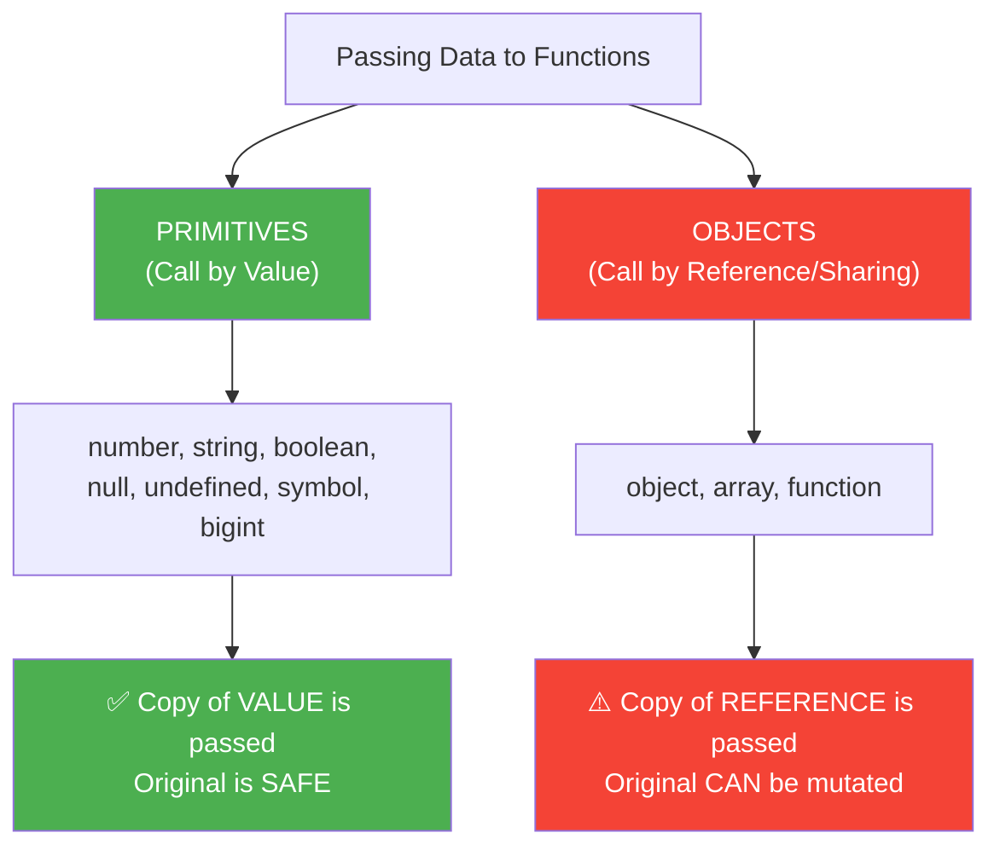

### Call by Value — Deep Dive

```javascript
// ═══════════════════════════════════════════════
// PROGRAM: Call by Value — All Primitive Types
// ═══════════════════════════════════════════════

function modifyPrimitives(num, str, bool, nul, undef) {
    num = 999;
    str = "CHANGED";
    bool = false;
    nul = "not null anymore";
    undef = "defined now";
    
    console.log("Inside function:");
    console.log("  num:", num);       // 999
    console.log("  str:", str);       // "CHANGED"
    console.log("  bool:", bool);     // false
    console.log("  nul:", nul);       // "not null anymore"
    console.log("  undef:", undef);   // "defined now"
}

let myNum = 42;
let myStr = "Hello";
let myBool = true;
let myNull = null;
let myUndef = undefined;

modifyPrimitives(myNum, myStr, myBool, myNull, myUndef);

console.log("\nOutside function (originals UNCHANGED):");
console.log("  myNum:", myNum);       // 42
console.log("  myStr:", myStr);       // "Hello"
console.log("  myBool:", myBool);     // true
console.log("  myNull:", myNull);     // null
console.log("  myUndef:", myUndef);   // undefined
```

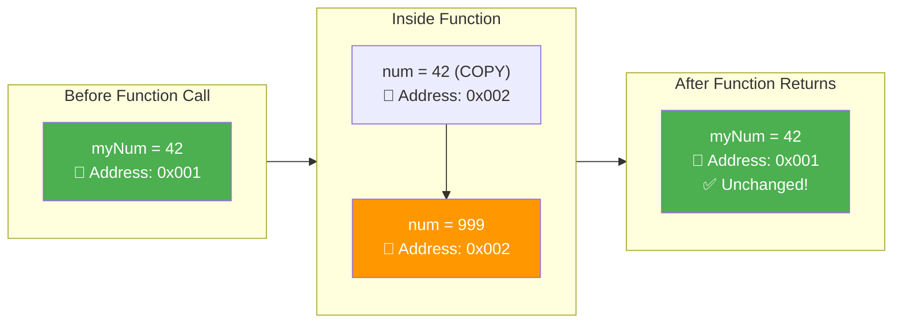

### Call by Reference — Deep Dive

```javascript
// ═══════════════════════════════════════════════
// PROGRAM: Call by Reference — Objects & Arrays
// ═══════════════════════════════════════════════

// ── Objects ──
function modifyObject(obj) {
    obj.name = "MODIFIED";       // ✅ Mutating — affects original
    obj.newProp = "I'm new!";    // ✅ Adding property — affects original
    console.log("Inside:", obj);
}

let person = { name: "Rahul", age: 25 };
modifyObject(person);
console.log("Outside:", person);
// { name: "MODIFIED", age: 25, newProp: "I'm new!" } — CHANGED!

// ── Arrays ──
function modifyArray(arr) {
    arr.push(4);           // ✅ Mutating — affects original
    arr[0] = 999;          // ✅ Modifying element — affects original
    console.log("Inside:", arr);
}

let myArray = [1, 2, 3];
modifyArray(myArray);
console.log("Outside:", myArray);
// [999, 2, 3, 4] — CHANGED!
```

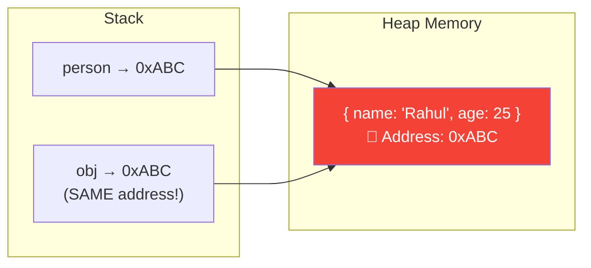

### ⚠️ CRITICAL: Mutation vs Reassignment

```javascript
// ═══════════════════════════════════════════════
// PROGRAM: Mutation vs Reassignment — THE KEY DIFFERENCE
// ═══════════════════════════════════════════════

// ── MUTATION — affects original ✅ ──
function mutateObject(obj) {
    obj.name = "Changed";      // Modifying the SAME object in memory
    obj.newKey = "Added";      // Adding to the SAME object
    delete obj.age;            // Deleting from the SAME object
}

let user1 = { name: "Original", age: 25 };
mutateObject(user1);
console.log("After mutate:", user1);
// { name: "Changed", newKey: "Added" } — MODIFIED!

// ── REASSIGNMENT — does NOT affect original ❌ ──
function reassignObject(obj) {
    obj = { name: "Completely New Object" };  // obj now points to NEW object
    console.log("Inside (reassigned):", obj); // { name: "Completely New Object" }
}

let user2 = { name: "Original", age: 25 };
reassignObject(user2);
console.log("After reassign:", user2);
// { name: "Original", age: 25 } — UNCHANGED!
```

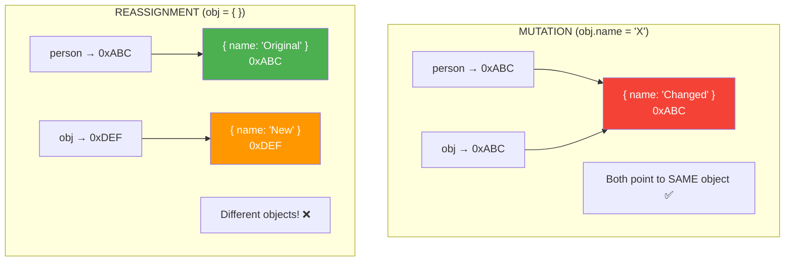

### How to Prevent Mutation — All Methods

```javascript
// ═══════════════════════════════════════════════
// PROGRAM: Preventing Mutation — Every Technique
// ═══════════════════════════════════════════════

const original = {
    name: "Rahul",
    age: 25,
    address: {
        city: "Delhi",
        pin: 110001
    },
    hobbies: ["coding", "reading"]
};

// ── Method 1: Spread Operator (Shallow Copy) ──
function safeModifySpread(obj) {
    const copy = { ...obj };
    copy.name = "Modified";
    return copy;
}

const result1 = safeModifySpread(original);
console.log("Original:", original.name);  // "Rahul" ✅
console.log("Copy:", result1.name);       // "Modified"

// ⚠️ BUT shallow copy — nested objects are STILL shared!
function dangerousNested(obj) {
    const copy = { ...obj };
    copy.address.city = "Mumbai";  // Modifies ORIGINAL's nested object!
    return copy;
}

const result2 = dangerousNested(original);
console.log("Original city:", original.address.city); // "Mumbai" 😱

// ── Method 2: Object.assign (Also Shallow) ──
const shallowCopy = Object.assign({}, original);

// ── Method 3: JSON (Deep Copy — with limitations) ──
function safeDeepCopy(obj) {
    const copy = JSON.parse(JSON.stringify(obj));
    copy.address.city = "Bangalore";
    return copy;
}

// Reset original
original.address.city = "Delhi";

const result3 = safeDeepCopy(original);
console.log("Original city:", original.address.city); // "Delhi" ✅
console.log("Copy city:", result3.address.city);       // "Bangalore"

// ⚠️ JSON method LOSES: functions, undefined, symbols, Date objects, RegExp

// ── Method 4: structuredClone (Modern — Best Deep Copy) ──
const deepCopy = structuredClone(original);
deepCopy.address.city = "Chennai";
console.log("Original:", original.address.city);  // "Delhi" ✅
console.log("Deep copy:", deepCopy.address.city); // "Chennai"

// ── Method 5: Object.freeze (Prevent Mutation Entirely) ──
const frozen = Object.freeze({
    name: "Frozen",
    config: { port: 3000 }  // ⚠️ Nested objects are NOT frozen!
});

frozen.name = "Changed";  // Silently fails (or TypeError in strict mode)
console.log(frozen.name);  // "Frozen" ✅

frozen.config.port = 9000; // This WORKS! (shallow freeze)
console.log(frozen.config.port); // 9000 😱

// Deep freeze helper
function deepFreeze(obj) {
    Object.freeze(obj);
    Object.values(obj)
        .filter(val => typeof val === 'object' && val !== null)
        .forEach(deepFreeze);
    return obj;
}

const deepFrozen = deepFreeze({ a: 1, b: { c: 2, d: { e: 3 } } });
```

### 📊 Complete Comparison

```
╔═══════════════════╦═══════════════════╦════════════════════════╗
║ Feature           ║ Call by Value     ║ Call by Reference      ║
╠═══════════════════╬═══════════════════╬════════════════════════╣
║ Data Types        ║ Primitives        ║ Objects, Arrays, Funcs ║
║ What's Passed     ║ Copy of value     ║ Copy of reference      ║
║ Original Affected ║ ❌ Never          ║ ✅ If mutated          ║
║ Reassignment      ║ No effect         ║ No effect on original  ║
║ Mutation          ║ N/A (immutable)   ║ Affects original       ║
║ Memory            ║ New memory alloc. ║ Points to same memory  ║
║ Performance       ║ Copies data       ║ Faster (no copy)       ║
║ Safety            ║ Inherently safe   ║ Need to be careful     ║
╚═══════════════════╩═══════════════════╩════════════════════════╝
```

### ❓ Interview Questions

**Q1: What will be the output?**

```javascript
function swap(a, b) {
    let temp = a;
    a = b;
    b = temp;
    console.log("Inside:", a, b);
}

let x = 10, y = 20;
swap(x, y);
console.log("Outside:", x, y);
```

<details>
<summary>🔍 Click to see Answer</summary>

```
Inside: 20 10
Outside: 10 20  (NOT swapped! — primitives are pass by value)
```

To actually swap, you'd need to wrap them in an object or use array destructuring with a return.

</details>

**Q2: Tricky — Nested Objects with Shallow Copy**

```javascript
function modify(obj) {
    obj.a.b = 2;
}

let data = { a: { b: 1 } };
let copy = { ...data };   // Shallow copy

modify(copy);
console.log(data.a.b);    // ?
```

<details>
<summary>🔍 Click to see Answer</summary>

**Answer:** `2` — The nested object `data.a` and `copy.a` are the SAME reference. Spread operator only creates a shallow copy.

</details>

---

[⬆️ Go to Top](#top)

---

<a name="11-closures"></a>

## 11. 🔐 Closures

### What is a Closure?

> **Definition:** A **closure** is a function bundled together with its **lexical environment**. A closure gives a function access to variables from its **outer (enclosing) function's scope**, even after the outer function has returned and its execution context has been destroyed.

> **Apni Bhasha Mein:** Closure matlab ek function ke paas ek **backpack** hota hai. Jab outer function khatam ho jaata hai aur uski memory destroy ho jaati hai, tab bhi inner function ke backpack mein outer function ke variables rahte hain. Woh variables kabhi nahi marte jab tak inner function zinda hai.

```javascript
// ═══════════════════════════════════════════════
// PROGRAM: The Simplest Closure
// ═══════════════════════════════════════════════

function outer() {
    let count = 0; // This variable is "closed over"
    
    function inner() {
        count++;
        console.log("Count:", count);
    }
    
    return inner;
}

const counter = outer(); // outer() has finished executing!
// outer()'s execution context is DESTROYED
// But count lives on in inner's closure!

counter(); // Count: 1
counter(); // Count: 2
counter(); // Count: 3

// 'count' is NOT accessible from outside
// console.log(count); // ReferenceError!
```

### How Closures Work — Under the Hood

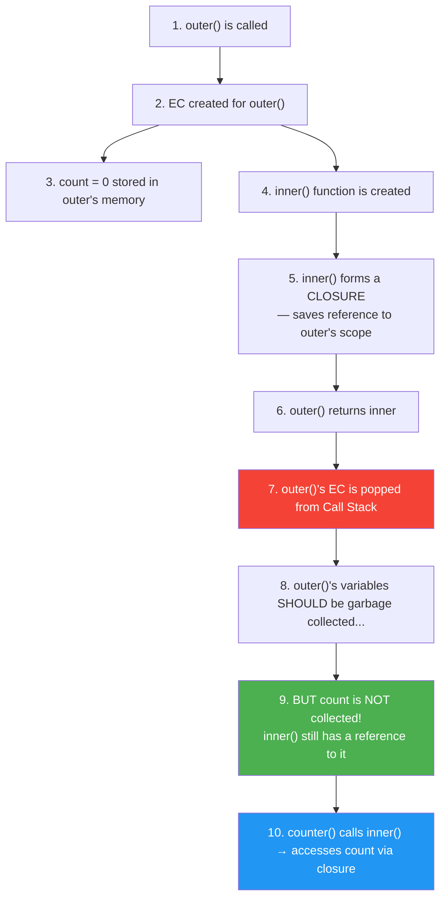

```
┌────────────────────────────────────────────────────────────┐
│                    CLOSURE MENTAL MODEL                     │
│                                                            │
│   ┌──────────────────────────────────────────────────┐     │
│   │  inner() Function                                │     │
│   │  ┌──────────────────────────────────────────┐    │     │
│   │  │  🎒 Closure Backpack                     │    │     │
│   │  │                                          │    │     │
│   │  │  Carries variables from outer scope:     │    │     │
│   │  │    count: 0 → 1 → 2 → 3 → ...          │    │     │
│   │  │                                          │    │     │
│   │  │  These variables PERSIST even after      │    │     │
│   │  │  outer() has returned!                   │    │     │
│   │  └──────────────────────────────────────────┘    │     │
│   │                                                  │     │
│   │  function inner() {                              │     │
│   │      count++;  // ← accesses backpack            │     │
│   │      console.log(count);                         │     │
│   │  }                                               │     │
│   └──────────────────────────────────────────────────┘     │
│                                                            │
│   outer() is DEAD, but its variable lives in the backpack  │
└────────────────────────────────────────────────────────────┘
```

### Closure Examples — Simple to Complex

#### Example 1: Function Factory

```javascript
// ═══════════════════════════════════════════════
// PROGRAM: Function Factory Using Closures
// ═══════════════════════════════════════════════

function createGreeting(greeting) {
    // 'greeting' is closed over
    return function(name) {
        return `${greeting}, ${name}!`;
    };
}

const sayHello = createGreeting("Hello");
const sayNamaste = createGreeting("Namaste");
const sayHola = createGreeting("Hola");

console.log(sayHello("Rahul"));    // "Hello, Rahul!"
console.log(sayNamaste("Priya"));  // "Namaste, Priya!"
console.log(sayHola("Carlos"));    // "Hola, Carlos!"

// Each returned function has its OWN closure with its OWN 'greeting'
```

#### Example 2: Private Variables (Data Encapsulation)

```javascript
// ═══════════════════════════════════════════════
// PROGRAM: Private Variables Using Closures
// ═══════════════════════════════════════════════

function createCounter(initialValue = 0) {
    let count = initialValue;  // PRIVATE — can't be accessed directly
    
    return {
        increment() { return ++count; },
        decrement() { return --count; },
        getCount() { return count; },
        reset() { count = initialValue; return count; }
    };
}

const counter = createCounter(10);
console.log(counter.increment());  // 11
console.log(counter.increment());  // 12
console.log(counter.decrement());  // 11
console.log(counter.getCount());   // 11
console.log(counter.reset());      // 10

// Cannot access 'count' directly
console.log(counter.count);        // undefined
// This is TRUE data privacy in JavaScript!
```

#### Example 3: Bank Account — Real-World Use Case

```javascript
// ═══════════════════════════════════════════════
// USE CASE: Bank Account with Private Balance
// ═══════════════════════════════════════════════

function BankAccount(owner, initialBalance) {
    let balance = initialBalance;  // Private!
    const transactions = [];        // Private!
    
    function recordTransaction(type, amount) {
        transactions.push({
            type,
            amount,
            balance,
            date: new Date().toISOString()
        });
    }
    
    return {
        getOwner() {
            return owner;
        },
        
        deposit(amount) {
            if (amount <= 0) return "❌ Invalid amount";
            balance += amount;
            recordTransaction("deposit", amount);
            return `✅ Deposited ₹${amount}. Balance: ₹${balance}`;
        },
        
        withdraw(amount) {
            if (amount <= 0) return "❌ Invalid amount";
            if (amount > balance) return "❌ Insufficient funds";
            balance -= amount;
            recordTransaction("withdrawal", amount);
            return `✅ Withdrew ₹${amount}. Balance: ₹${balance}`;
        },
        
        getBalance() {
            return `💰 Balance: ₹${balance}`;
        },
        
        getStatement() {
            return [...transactions]; // Return copy
        }
    };
}

const account = BankAccount("Rahul", 1000);
console.log(account.deposit(500));    // ✅ Deposited ₹500. Balance: ₹1500
console.log(account.withdraw(200));   // ✅ Withdrew ₹200. Balance: ₹1300
console.log(account.getBalance());    // 💰 Balance: ₹1300
console.log(account.withdraw(2000));  // ❌ Insufficient funds

// Balance is COMPLETELY private
console.log(account.balance);         // undefined
```

#### Example 4: Memoization (Performance Optimization)

```javascript
// ═══════════════════════════════════════════════
// PROGRAM: Memoization Using Closures
// ═══════════════════════════════════════════════

function memoize(fn) {
    const cache = {};  // Closure variable — persists across calls
    let cacheHits = 0;
    let cacheMisses = 0;
    
    function memoized(...args) {
        const key = JSON.stringify(args);
        
        if (key in cache) {
            cacheHits++;
            return cache[key];
        }
        
        cacheMisses++;
        const result = fn(...args);
        cache[key] = result;
        return result;
    }
    
    memoized.getStats = () => ({
        hits: cacheHits,
        misses: cacheMisses,
        cacheSize: Object.keys(cache).length
    });
    
    memoized.clearCache = () => {
        for (const key in cache) delete cache[key];
        cacheHits = 0;
        cacheMisses = 0;
    };
    
    return memoized;
}

// Expensive computation
function fibonacci(n) {
    if (n <= 1) return n;
    return fibonacci(n - 1) + fibonacci(n - 2);
}

const memoFib = memoize(fibonacci);

console.time("First call");
console.log(memoFib(35));  // Computing...
console.timeEnd("First call");

console.time("Second call (cached)");
console.log(memoFib(35));  // Instant!
console.timeEnd("Second call (cached)");

console.log(memoFib.getStats());
// { hits: 1, misses: 1, cacheSize: 1 }
```

#### Example 5: Debounce Function

```javascript
// ═══════════════════════════════════════════════
// USE CASE: Debounce — Wait until user stops typing
// ═══════════════════════════════════════════════

function debounce(fn, delay) {
    let timeoutId;  // Closure variable — remembered across calls
    
    return function(...args) {
        // Clear previous timer
        clearTimeout(timeoutId);
        
        // Set new timer
        timeoutId = setTimeout(() => {
            fn.apply(this, args);
        }, delay);
    };
}

const searchAPI = debounce(function(query) {
    console.log(`🔍 Searching for: "${query}"`);
}, 300);

// Simulating rapid typing
searchAPI("J");          // Timer set
searchAPI("Ja");         // Previous cleared, new timer
searchAPI("Jav");        // Previous cleared, new timer
searchAPI("Java");       // Previous cleared, new timer
searchAPI("JavaScript"); // Previous cleared, new timer
// Only "JavaScript" fires after 300ms! (saves 4 API calls)
```

#### Example 6: Throttle Function

```javascript
// ═══════════════════════════════════════════════
// USE CASE: Throttle — Limit execution rate
// ═══════════════════════════════════════════════

function throttle(fn, interval) {
    let lastTime = 0;       // Closure variable
    let timeoutId = null;   // Closure variable
    
    return function(...args) {
        const now = Date.now();
        const remaining = interval - (now - lastTime);
        
        if (remaining <= 0) {
            lastTime = now;
            fn.apply(this, args);
        } else if (!timeoutId) {
            timeoutId = setTimeout(() => {
                lastTime = Date.now();
                timeoutId = null;
                fn.apply(this, args);
            }, remaining);
        }
    };
}

const handleScroll = throttle(function() {
    console.log("📜 Scroll handled at:", new Date().toISOString());
}, 1000);

// Even if called 100 times per second, only fires once per second
```

#### Example 7: Once Function

```javascript
// ═══════════════════════════════════════════════
// USE CASE: Function that runs ONLY ONCE
// ═══════════════════════════════════════════════

function once(fn) {
    let called = false;   // Closure
    let result;           // Closure
    
    return function(...args) {
        if (!called) {
            called = true;
            result = fn.apply(this, args);
        }
        return result;
    };
}

const initialize = once(function(config) {
    console.log("🚀 App initialized with:", config);
    return "initialized";
});

console.log(initialize({ env: "production" }));
// 🚀 App initialized with: { env: "production" }
// "initialized"

console.log(initialize({ env: "development" }));
// "initialized" (function not re-executed, returns cached result)

console.log(initialize());
// "initialized" (still cached)
```

### Closure with Loops — THE Classic Interview Question

```javascript
// ═══════════════════════════════════════════════
// PROGRAM: Closure in Loops — The Infamous Problem
// ═══════════════════════════════════════════════

// ❌ THE BUG
console.log("=== var (BUGGY) ===");
for (var i = 0; i < 3; i++) {
    setTimeout(function() {
        console.log("var:", i);  // All print 3!
    }, 100);
}

// ✅ FIX 1: Use let
console.log("=== let (FIXED) ===");
for (let i = 0; i < 3; i++) {
    setTimeout(function() {
        console.log("let:", i);  // 0, 1, 2 ✅
    }, 200);
}

// ✅ FIX 2: IIFE (creates closure per iteration)
console.log("=== IIFE (FIXED) ===");
for (var i = 0; i < 3; i++) {
    (function(j) {
        setTimeout(function() {
            console.log("IIFE:", j);  // 0, 1, 2 ✅
        }, 300);
    })(i);
}

// ✅ FIX 3: Separate function
console.log("=== Function (FIXED) ===");
function createTimer(i) {
    setTimeout(function() {
        console.log("Func:", i);  // 0, 1, 2 ✅
    }, 400);
}
for (var i = 0; i < 3; i++) {
    createTimer(i);
}
```

```mermaid
flowchart TD
    subgraph VarProblem["var i — ONE shared variable"]
        A["Iteration 0: closure → same i"]
        B["Iteration 1: closure → same i"]
        C["Iteration 2: closure → same i"]
        D["Loop ends: i = 3"]
        A --> D
        B --> D
        C --> D
        D --> E["All print 3 ❌"]
    end
    
    subgraph LetFix["let i — NEW variable per iteration"]
        F["Iteration 0: closure → i₀ = 0"]
        G["Iteration 1: closure → i₁ = 1"]
        H["Iteration 2: closure → i₂ = 2"]
        F --> I["Prints 0 ✅"]
        G --> J["Prints 1 ✅"]
        H --> K["Prints 2 ✅"]
    end
    
    style VarProblem fill:#FFEBEE
    style LetFix fill:#E8F5E9
```

### Closure Scope Chain

```javascript
// ═══════════════════════════════════════════════
// PROGRAM: Closure Scope Chain — Multiple Levels
// ═══════════════════════════════════════════════

function grandparent() {
    const a = "grandparent's value";
    
    function parent() {
        const b = "parent's value";
        
        function child() {
            const c = "child's value";
            
            // child can access ALL three scopes!
            console.log("a:", a);  // From grandparent
            console.log("b:", b);  // From parent
            console.log("c:", c);  // Own scope
        }
        
        return child;
    }
    
    return parent;
}

const parentFn = grandparent();
const childFn = parentFn();
childFn();
// a: grandparent's value
// b: parent's value
// c: child's value
```

```mermaid
flowchart BT
    A["child() Scope<br>c = 'child's value'"] --> B["parent() Scope<br>b = 'parent's value'"]
    B --> C["grandparent() Scope<br>a = 'grandparent's value'"]
    C --> D["Global Scope"]
    
    E["child() has a closure backpack<br>containing variables from ALL parent scopes"]
    
    style A fill:#4CAF50,color:white
    style B fill:#2196F3,color:white
    style C fill:#FF9800,color:white
    style D fill:#9E9E9E,color:white
    style E fill:#E8EAF6
```

### ⚠️ Closures and Memory Leaks

```javascript
// ═══════════════════════════════════════════════
// WARNING: Closures Can Cause Memory Leaks
// ═══════════════════════════════════════════════

function createHeavyClosure() {
    const largeData = new Array(1000000).fill("🚀");  // ~8MB
    
    return function() {
        // This closure keeps largeData alive!
        console.log("Data size:", largeData.length);
    };
}

let heavyFn = createHeavyClosure();
// largeData (8MB) is NOT garbage collected because heavyFn references it

// To free memory:
heavyFn = null;  // Now largeData CAN be garbage collected

// ✅ Better pattern: only close over what you need
function createLightClosure() {
    const largeData = new Array(1000000).fill("🚀");
    const dataLength = largeData.length;  // Extract only what's needed
    // largeData can now be garbage collected
    
    return function() {
        console.log("Data size:", dataLength);  // Only number is closed over
    };
}
```

### ❓ Closure Interview Questions

**Q1: What will be the output?**

```javascript
function a() {
    var x = 10;
    function b() {
        console.log(x);
    }
    x = 20;
    return b;
}

var fn = a();
fn();
```

<details>
<summary>🔍 Click to see Answer</summary>

**Answer:** `20`

**Why?** Closures capture the **reference** to the variable, NOT the **value** at the time of function creation. When `fn()` runs, it accesses `x` which is `20` (the value at the time of execution).

</details>

**Q2: Create a function that counts how many times it's been called**

```javascript
function createCallCounter(fn) {
    let count = 0;
    return function(...args) {
        count++;
        console.log(`Call #${count}`);
        return fn(...args);
    };
}

const trackedLog = createCallCounter(console.log);
trackedLog("Hello");  // Call #1, Hello
trackedLog("World");  // Call #2, World
trackedLog("!");      // Call #3, !
```

---

[⬆️ Go to Top](#top)

---

<a name="12-pure-functions--side-effects"></a>

## 12. 🧪 Pure Functions & Side Effects

### What is a Pure Function?

> **Definition:** A **pure function** is a function that:
> 1. **Always** returns the same output for the same input (deterministic)
> 2. Has **no side effects** (doesn't modify external state)

```mermaid
flowchart TD
    A["Is This a Pure Function?"] --> B{"Same input → Same output?"}
    B -->|YES| C{"No side effects?"}
    B -->|NO| D["❌ IMPURE"]
    C -->|YES| E["✅ PURE"]
    C -->|NO| F["❌ IMPURE"]
    
    G["Side Effects Include:"] --> G1["Modifying external variables"]
    G --> G2["Console.log / DOM manipulation"]
    G --> G3["API calls / File I/O"]
    G --> G4["Modifying arguments (objects/arrays)"]
    G --> G5["Using Date.now() / Math.random()"]
    
    style E fill:#4CAF50,color:white
    style D fill:#f44336,color:white
    style F fill:#f44336,color:white
```

### Program: Pure vs Impure

```javascript
// ═══════════════════════════════════════════════
// PROGRAM: Pure vs Impure Functions
// ═══════════════════════════════════════════════

// ── PURE FUNCTIONS ──
// Same input → ALWAYS same output, no side effects

function add(a, b) {
    return a + b;  // Only depends on inputs
}

function double(n) {
    return n * 2;
}

function getFullName(first, last) {
    return `${first} ${last}`;
}

function filterAdults(people) {
    return people.filter(p => p.age >= 18);  // Returns NEW array
}

console.log(add(2, 3));        // Always 5
console.log(add(2, 3));        // Always 5
console.log(double(10));       // Always 20

// ── IMPURE FUNCTIONS ──
// Same input → might give different output, or has side effects

// Impure: Depends on external state
let taxRate = 0.18;
function calculateTax(amount) {
    return amount * taxRate;  // Depends on external 'taxRate'
}

// Impure: Modifies external state
let total = 0;
function addToTotal(amount) {
    total += amount;  // Side effect: modifies 'total'
    return total;
}

// Impure: Uses randomness
function getRandomGreeting(name) {
    const greetings = ["Hi", "Hello", "Hey"];
    const random = greetings[Math.floor(Math.random() * greetings.length)];
    return `${random}, ${name}!`;  // Different output each time
}

// Impure: Uses current time
function logWithTimestamp(message) {
    console.log(`[${new Date().toISOString()}] ${message}`);
}

// Impure: Modifies input object
function addAge(person) {
    person.age = 25;  // Mutates the original object!
    return person;
}
```

### Use Case: Making Impure Functions Pure

```javascript
// ═══════════════════════════════════════════════
// USE CASE: Converting Impure to Pure
// ═══════════════════════════════════════════════

// ❌ Impure: depends on external state
let discount = 0.1;
function getPrice_impure(price) {
    return price * (1 - discount);
}

// ✅ Pure: pass everything as arguments
function getPrice_pure(price, discount) {
    return price * (1 - discount);
}

// ❌ Impure: mutates input
function addProperty_impure(obj) {
    obj.timestamp = Date.now();
    return obj;
}

// ✅ Pure: create new object
function addProperty_pure(obj, timestamp) {
    return { ...obj, timestamp };
}

// ❌ Impure: console.log is a side effect
function processData_impure(data) {
    console.log("Processing:", data);
    return data.map(x => x * 2);
}

// ✅ Pure: return result, let caller handle logging
function processData_pure(data) {
    return data.map(x => x * 2);
}
```

```
╔═══════════════════════════════════════════════════════════╗
║           WHY PURE FUNCTIONS MATTER                       ║
╠═══════════════════════════════════════════════════════════╣
║                                                           ║
║  ✅ Testable     — Same input = same output = easy tests  ║
║  ✅ Predictable  — No surprises from hidden dependencies  ║
║  ✅ Cacheable    — Results can be memoized                ║
║  ✅ Parallelizable — No shared state = safe concurrency   ║
║  ✅ Debuggable   — Easy to trace and reason about         ║
║  ✅ Composable   — Easy to combine into pipelines         ║
║                                                           ║
╚═══════════════════════════════════════════════════════════╝
```

---

[⬆️ Go to Top](#top)

---

<a name="13-recursion"></a>

## 13. 🔄 Recursion

### What is Recursion?

> **Definition:** **Recursion** is when a function **calls itself**. Every recursive function must have:
> 1. **Base Case** — When to STOP (prevents infinite recursion)
> 2. **Recursive Case** — The function calling itself with a smaller problem

```mermaid
flowchart TD
    A["Recursive Function Called"] --> B{"Base Case met?"}
    B -->|YES| C["Return result ✅"]
    B -->|NO| D["Call itself with smaller input"]
    D --> A
    
    style C fill:#4CAF50,color:white
    style D fill:#2196F3,color:white
```

### Program: Classic Recursive Functions

```javascript
// ═══════════════════════════════════════════════
// PROGRAM: Recursion — All Classic Examples
// ═══════════════════════════════════════════════

// ── 1. Factorial ──
function factorial(n) {
    // Base case
    if (n <= 1) return 1;
    // Recursive case
    return n * factorial(n - 1);
}
console.log("5! =", factorial(5)); // 120
// 5 * 4 * 3 * 2 * 1 = 120

// ── 2. Fibonacci ──
function fibonacci(n) {
    if (n <= 0) return 0;
    if (n === 1) return 1;
    return fibonacci(n - 1) + fibonacci(n - 2);
}
console.log("Fib(7) =", fibonacci(7)); // 13

// ── 3. Sum of array ──
function sumArray(arr) {
    if (arr.length === 0) return 0;
    return arr[0] + sumArray(arr.slice(1));
}
console.log("Sum:", sumArray([1, 2, 3, 4, 5])); // 15

// ── 4. Flatten nested array ──
function flatten(arr) {
    let result = [];
    for (const item of arr) {
        if (Array.isArray(item)) {
            result = result.concat(flatten(item));
        } else {
            result.push(item);
        }
    }
    return result;
}
console.log(flatten([1, [2, [3, [4]], 5], 6])); // [1, 2, 3, 4, 5, 6]

// ── 5. Deep clone object ──
function deepClone(obj) {
    if (obj === null || typeof obj !== 'object') return obj;
    
    if (Array.isArray(obj)) {
        return obj.map(item => deepClone(item));
    }
    
    const clone = {};
    for (const key in obj) {
        if (obj.hasOwnProperty(key)) {
            clone[key] = deepClone(obj[key]);
        }
    }
    return clone;
}

const original = { a: 1, b: { c: 2, d: [3, 4] } };
const cloned = deepClone(original);
cloned.b.c = 999;
console.log("Original:", original.b.c); // 2 (unchanged!)
console.log("Clone:", cloned.b.c);       // 999

// ── 6. Countdown ──
function countdown(n) {
    if (n <= 0) {
        console.log("🚀 Liftoff!");
        return;
    }
    console.log(n);
    countdown(n - 1);
}
countdown(5); // 5, 4, 3, 2, 1, 🚀 Liftoff!

// ── 7. Power function ──
function power(base, exp) {
    if (exp === 0) return 1;
    if (exp < 0) return 1 / power(base, -exp);
    return base * power(base, exp - 1);
}
console.log("2^10 =", power(2, 10)); // 1024
```

### Recursion vs Iteration

```javascript
// ═══════════════════════════════════════════════
// PROGRAM: Same Problem — Recursive vs Iterative
// ═══════════════════════════════════════════════

// Factorial — Recursive
function factorialRecursive(n) {
    if (n <= 1) return 1;
    return n * factorialRecursive(n - 1);
}

// Factorial — Iterative
function factorialIterative(n) {
    let result = 1;
    for (let i = 2; i <= n; i++) {
        result *= i;
    }
    return result;
}

// Both give same result
console.log(factorialRecursive(10)); // 3628800
console.log(factorialIterative(10)); // 3628800

// But iterative is usually faster and doesn't risk stack overflow
```

```
╔═══════════════════╦══════════════════╦══════════════════╗
║ Feature           ║ Recursion        ║ Iteration        ║
╠═══════════════════╬══════════════════╬══════════════════╣
║ Readability       ║ Often cleaner    ║ Can be verbose   ║
║ Memory            ║ More (call stack)║ Less (single loop)║
║ Stack Overflow    ║ ⚠️ Possible     ║ ❌ Not possible  ║
║ Performance       ║ Usually slower   ║ Usually faster   ║
║ Best for          ║ Trees, graphs    ║ Simple loops     ║
╚═══════════════════╩══════════════════╩══════════════════╝
```

---

[⬆️ Go to Top](#top)

---

<a name="14-the-this-keyword-in-functions"></a>

## 14. 🎯 The `this` Keyword in Functions (call, apply, bind)

### What is `this`?

> **Definition:** `this` is a special keyword that refers to the **object** that is currently executing the function. Its value depends on **how** the function is called, not where it's defined.

```mermaid
flowchart TD
    A["How is the function called?"] --> B["Method call: obj.fn()"]
    A --> C["Direct call: fn()"]
    A --> D["new keyword: new Fn()"]
    A --> E["call/apply/bind"]
    A --> F["Arrow function"]
    
    B --> B1["this = obj"]
    C --> C1["this = window (non-strict)<br>this = undefined (strict)"]
    D --> D1["this = new empty object"]
    E --> E1["this = whatever you pass"]
    F --> F1["this = lexical (parent scope)"]
    
    style B1 fill:#4CAF50,color:white
    style C1 fill:#FF9800,color:white
    style D1 fill:#2196F3,color:white
    style E1 fill:#9C27B0,color:white
    style F1 fill:#E91E63,color:white
```

### call, apply, bind — Function Borrowing

```javascript
// ═══════════════════════════════════════════════
// PROGRAM: call, apply, bind — Complete Guide
// ═══════════════════════════════════════════════

const person1 = {
    name: "Rahul",
    greet: function(greeting, punctuation) {
        return `${greeting}, I'm ${this.name}${punctuation}`;
    }
};

const person2 = { name: "Priya" };
const person3 = { name: "Amit" };

// ── call() — Invokes immediately, args passed individually ──
console.log(person1.greet.call(person2, "Hello", "!"));
// "Hello, I'm Priya!"

// ── apply() — Invokes immediately, args passed as array ──
console.log(person1.greet.apply(person3, ["Namaste", "!!"]));
// "Namaste, I'm Amit!!"

// ── bind() — Returns NEW function with 'this' permanently set ──
const priyaGreet = person1.greet.bind(person2);
console.log(priyaGreet("Hey", "."));  // "Hey, I'm Priya."
console.log(priyaGreet("Hi", "!"));   // "Hi, I'm Priya!"

// bind with partial application
const rahulHello = person1.greet.bind(person1, "Hello");
console.log(rahulHello("!"));   // "Hello, I'm Rahul!"
console.log(rahulHello("..."));  // "Hello, I'm Rahul..."
```

```
╔════════════════╦════════════════════╦══════════════════════╦═══════════════╗
║ Method         ║ Invokes?           ║ Arguments            ║ Returns       ║
╠════════════════╬════════════════════╬══════════════════════╬═══════════════╣
║ call()         ║ ✅ Immediately     ║ Individual: (a, b)   ║ Function result║
║ apply()        ║ ✅ Immediately     ║ Array: ([a, b])      ║ Function result║
║ bind()         ║ ❌ Returns new fn  ║ Individual: (a, b)   ║ New function  ║
╚════════════════╩════════════════════╩══════════════════════╩═══════════════╝
```

### Polyfill: Implement Your Own bind

```javascript
// ═══════════════════════════════════════════════
// PROGRAM: bind() Polyfill — Common Interview Question
// ═══════════════════════════════════════════════

Function.prototype.myBind = function(context, ...boundArgs) {
    const originalFn = this;  // The function being bound
    
    return function(...callArgs) {
        return originalFn.apply(context, [...boundArgs, ...callArgs]);
    };
};

// Test
function greet(greeting, name) {
    return `${greeting}, ${name}! I'm ${this.role}`;
}

const admin = { role: "Admin" };

const adminGreet = greet.myBind(admin, "Hello");
console.log(adminGreet("Rahul")); // "Hello, Rahul! I'm Admin"
```

---

[⬆️ Go to Top](#top)

---

<a name="15-function-currying--partial-application"></a>

## 15. 🍛 Function Currying & Partial Application

### What is Currying?

> **Definition:** **Currying** transforms a function with multiple arguments into a sequence of functions, each taking **one argument at a time**.

```javascript
// ═══════════════════════════════════════════════
// PROGRAM: Currying — Complete Guide
// ═══════════════════════════════════════════════

// ── Normal function ──
function normalAdd(a, b, c) {
    return a + b + c;
}

// ── Curried version ──
function curriedAdd(a) {
    return function(b) {
        return function(c) {
            return a + b + c;
        };
    };
}

// Usage
console.log(normalAdd(1, 2, 3));        // 6
console.log(curriedAdd(1)(2)(3));        // 6

// Arrow function currying (shorter)
const curriedMultiply = a => b => c => a * b * c;
console.log(curriedMultiply(2)(3)(4));   // 24

// Partial Application — Fill in arguments gradually
const add5 = curriedAdd(5);       // Returns function waiting for b, c
const add5and10 = add5(10);       // Returns function waiting for c
console.log(add5and10(20));        // 35

// ── Generic Curry Function ──
function curry(fn) {
    return function curried(...args) {
        if (args.length >= fn.length) {
            return fn.apply(this, args);
        }
        return function(...nextArgs) {
            return curried.apply(this, [...args, ...nextArgs]);
        };
    };
}

function volume(length, width, height) {
    return length * width * height;
}

const curriedVolume = curry(volume);
console.log(curriedVolume(3)(4)(5));     // 60
console.log(curriedVolume(3, 4)(5));     // 60
console.log(curriedVolume(3)(4, 5));     // 60
console.log(curriedVolume(3, 4, 5));     // 60
```

### Use Case: Reusable Utility Functions

```javascript
// ═══════════════════════════════════════════════
// USE CASE: API URL Builder with Currying
// ═══════════════════════════════════════════════

const buildURL = curry(function(baseURL, endpoint, id) {
    return `${baseURL}/${endpoint}/${id}`;
});

// Create specialized URL builders
const apiURL = buildURL("https://api.example.com");
const userURL = apiURL("users");
const postURL = apiURL("posts");

console.log(userURL(123));    // https://api.example.com/users/123
console.log(userURL(456));    // https://api.example.com/users/456
console.log(postURL(789));    // https://api.example.com/posts/789
```

---

[⬆️ Go to Top](#top)

---

<a name="16-iife"></a>

## 16. 🏃 IIFE — Immediately Invoked Function Expressions

### What is an IIFE?

> **Definition:** An **IIFE** (pronounced "iffy") is a function that is **defined and executed immediately** in a single expression. It creates a private scope.

```javascript
// ═══════════════════════════════════════════════
// PROGRAM: IIFE — All Variations
// ═══════════════════════════════════════════════

// 1. Classic IIFE
(function() {
    const secret = "private!";
    console.log("Classic IIFE:", secret);
})();

// 2. Arrow IIFE
(() => {
    console.log("Arrow IIFE");
})();

// 3. IIFE with parameters
(function(name, version) {
    console.log(`App: ${name} v${version}`);
})("MyApp", "1.0.0");

// 4. Named IIFE
(function init() {
    console.log("Named IIFE: init()");
})();

// 5. IIFE with return value
const result = (function() {
    return 42;
})();
console.log("IIFE returned:", result); // 42

// 6. Module Pattern with IIFE
const Calculator = (function() {
    // Private
    let memory = 0;
    
    function log(operation, value) {
        console.log(`  [${operation}] ${value} → Memory: ${memory}`);
    }
    
    // Public API
    return {
        add(n)      { memory += n; log("ADD", n); return this; },
        subtract(n) { memory -= n; log("SUB", n); return this; },
        multiply(n) { memory *= n; log("MUL", n); return this; },
        getResult() { return memory; },
        reset()     { memory = 0; return this; }
    };
})();

Calculator.reset().add(10).add(5).multiply(2).subtract(3);
console.log("Result:", Calculator.getResult()); // 27
console.log("Memory:", Calculator.memory);       // undefined (private!)
```

---

[⬆️ Go to Top](#top)

---

<a name="17-generators--iterators"></a>

## 17. ⚡ Generators & Iterators

### What is a Generator?

> **Definition:** A **Generator** is a special function that can **pause** its execution and **resume** later. It uses the `function*` syntax and `yield` keyword.

```javascript
// ═══════════════════════════════════════════════
// PROGRAM: Generators — Complete Guide
// ═══════════════════════════════════════════════

// ── Basic Generator ──
function* countUp() {
    yield 1;
    yield 2;
    yield 3;
}

const counter = countUp();
console.log(counter.next()); // { value: 1, done: false }
console.log(counter.next()); // { value: 2, done: false }
console.log(counter.next()); // { value: 3, done: false }
console.log(counter.next()); // { value: undefined, done: true }

// ── Infinite Generator ──
function* idGenerator() {
    let id = 1;
    while (true) {
        yield id++;
    }
}

const getId = idGenerator();
console.log(getId.next().value); // 1
console.log(getId.next().value); // 2
console.log(getId.next().value); // 3
// Can go forever!

// ── Fibonacci Generator ──
function* fibonacci() {
    let a = 0, b = 1;
    while (true) {
        yield a;
        [a, b] = [b, a + b];
    }
}

const fib = fibonacci();
const first10 = Array.from({ length: 10 }, () => fib.next().value);
console.log("Fibonacci:", first10);
// [0, 1, 1, 2, 3, 5, 8, 13, 21, 34]

// ── Generators are iterable ──
function* range(start, end, step = 1) {
    for (let i = start; i < end; i += step) {
        yield i;
    }
}

for (const num of range(0, 10, 2)) {
    process.stdout.write(num + " ");
}
console.log(); // 0 2 4 6 8

// ── Two-way communication ──
function* conversation() {
    const name = yield "What is your name?";
    const age = yield `Hello, ${name}! How old are you?`;
    return `${name} is ${age} years old.`;
}

const chat = conversation();
console.log(chat.next().value);          // "What is your name?"
console.log(chat.next("Rahul").value);   // "Hello, Rahul! How old are you?"
console.log(chat.next(25).value);        // "Rahul is 25 years old."
```

---

[⬆️ Go to Top](#top)

---

<a name="18-async-functions--async-patterns"></a>

## 18. 🌐 Async Functions & Async Patterns

### What are Async Functions?

> **Definition:** Async functions are syntactic sugar over Promises. They allow you to write **asynchronous code that looks synchronous** using the `async` and `await` keywords.

```javascript
// ═══════════════════════════════════════════════
// PROGRAM: Async/Await — Complete Guide
// ═══════════════════════════════════════════════

// Simulated API calls
function delay(ms) {
    return new Promise(resolve => setTimeout(resolve, ms));
}

function fetchUser(id) {
    return delay(100).then(() => ({ id, name: "Rahul" }));
}

function fetchOrders(userId) {
    return delay(100).then(() => [
        { id: 101, product: "Laptop" },
        { id: 102, product: "Mouse" }
    ]);
}

// ── Without async/await (Promise chains) ──
function getUserOrdersPromise(userId) {
    return fetchUser(userId)
        .then(user => {
            console.log("User:", user.name);
            return fetchOrders(user.id);
        })
        .then(orders => {
            console.log("Orders:", orders);
            return orders;
        })
        .catch(err => console.error("Error:", err));
}

// ── With async/await (Clean and readable) ──
async function getUserOrdersAsync(userId) {
    try {
        const user = await fetchUser(userId);
        console.log("User:", user.name);
        
        const orders = await fetchOrders(user.id);
        console.log("Orders:", orders);
        
        return orders;
    } catch (err) {
        console.error("Error:", err);
    }
}

// ── Parallel execution ──
async function fetchAllData() {
    // Sequential (slow) — each waits for previous
    // const user = await fetchUser(1);
    // const orders = await fetchOrders(1);
    
    // Parallel (fast) — both start at same time
    const [user, orders] = await Promise.all([
        fetchUser(1),
        fetchOrders(1)
    ]);
    
    console.log("Parallel results:", user, orders);
}

// Execute
getUserOrdersAsync(1);
```

### Async Function Types

```javascript
// ═══════════════════════════════════════════════
// PROGRAM: All Async Function Variations
// ═══════════════════════════════════════════════

// 1. Async function declaration
async function asyncDeclaration() {
    return "declaration";
}

// 2. Async function expression
const asyncExpression = async function() {
    return "expression";
};

// 3. Async arrow function
const asyncArrow = async () => {
    return "arrow";
};

// 4. Async method
const obj = {
    async getData() {
        return "method";
    }
};

// 5. Async class method
class API {
    async fetch(url) {
        return `Fetched: ${url}`;
    }
}

// All return Promises!
asyncDeclaration().then(console.log);  // "declaration"
asyncExpression().then(console.log);   // "expression"
asyncArrow().then(console.log);        // "arrow"
```

---

[⬆️ Go to Top](#top)

---

<a name="19-garbage-collection--memory-leaks"></a>

## 19. 🗑️ Garbage Collection & Memory Leaks in Functions

### How Garbage Collection Works with Functions

> **Definition:** JavaScript uses **automatic garbage collection** with a **mark-and-sweep** algorithm. Any object that is no longer **reachable** from the root (global scope) is eligible for garbage collection.

```mermaid
flowchart TD
    A["Variable/Object Created"] --> B["Is it REACHABLE from root?"]
    B -->|YES| C["✅ Stays in memory"]
    B -->|NO| D["🗑️ Garbage collected"]
    
    E["What makes something reachable?"] --> F["Referenced by global variable"]
    E --> G["Referenced by closure"]
    E --> H["Referenced in call stack"]
    E --> I["Referenced by event listener"]
    
    style C fill:#4CAF50,color:white
    style D fill:#f44336,color:white
```

### Program: Memory Leak Patterns

```javascript
// ═══════════════════════════════════════════════
// PROGRAM: Common Memory Leaks with Functions
// ═══════════════════════════════════════════════

// ── Leak 1: Forgotten Closures ──
function createLeak() {
    const hugeData = new Array(1000000).fill("💧");
    
    return function() {
        // Even if we never use hugeData, it's retained!
        console.log("I exist, and so does hugeData");
    };
}

let leakyFn = createLeak();
// hugeData is stuck in memory
// Fix: leakyFn = null;

// ── Leak 2: Unremoved Event Listeners ──
// function setupHandler() {
//     const data = getLargeDataSet();
//     document.addEventListener('click', function handler() {
//         console.log(data.length);
//     });
//     // 'handler' keeps 'data' alive even if setupHandler is long gone
//     // Fix: removeEventListener when done
// }

// ── Leak 3: Timers ──
function createLeakyTimer() {
    const data = { /* large object */ };
    
    const intervalId = setInterval(() => {
        console.log("Tick:", data);
    }, 1000);
    
    // Fix: Return cleanup function
    return function cleanup() {
        clearInterval(intervalId);
    };
}

const stopTimer = createLeakyTimer();
// ... later ...
// stopTimer(); // Clean up!

// ── Best Practice: Closure with minimal capture ──
function createEfficientClosure() {
    const hugeData = new Array(1000000).fill("📦");
    const summary = hugeData.length; // Extract only what's needed
    // hugeData can now be GC'd
    
    return function() {
        console.log("Items:", summary); // Only 'summary' is in closure
    };
}
```

---

[⬆️ Go to Top](#top)

---

<a name="20-interview-questions-cheat-sheet"></a>

## 20. 📋 Interview Questions Cheat Sheet

### Quick-Fire Questions & Answers

| # | Question | Short Answer |
|---|----------|--------------|
| 1 | What is a function declaration? | Function with `function` keyword + name. Fully hoisted. |
| 2 | What is a function expression? | Function assigned to variable. Variable hoisted as `undefined`. |
| 3 | What are arrow functions? | ES6 syntax. Lexical `this`, no `arguments`, no `new`. |
| 4 | What is a higher order function? | Takes function as arg OR returns function. |
| 5 | What is a callback function? | Function passed as arg, called later. |
| 6 | What is a closure? | Function + lexical scope. Remembers outer variables. |
| 7 | Call by value vs reference? | Primitives = value copy. Objects = reference copy. |
| 8 | What is IIFE? | Immediately Invoked Function Expression. Private scope. |
| 9 | What is `arguments`? | Array-like object of all args. Not in arrow functions. |
| 10 | What is a pure function? | Same input → same output, no side effects. |
| 11 | What is currying? | Transform `f(a,b,c)` into `f(a)(b)(c)`. |
| 12 | What is `this` in arrow vs regular? | Arrow: lexical (parent). Regular: depends on call site. |
| 13 | Difference: call vs apply vs bind? | call(individual args), apply(array args), bind(returns new fn). |
| 14 | What is recursion? | Function calling itself. Needs base case. |
| 15 | What is a generator? | Function that can pause (yield) and resume. |

### Common Tricky Outputs

```javascript
// ═══════════════════════════════════════════════
// RAPID FIRE: Predict the Output
// ═══════════════════════════════════════════════

// 1. Hoisting
console.log(foo()); // ✅ "foo"
// console.log(bar()); // ❌ TypeError
function foo() { return "foo"; }
var bar = function() { return "bar"; };

// 2. this in arrow vs regular
const obj = {
    x: 10,
    regular: function() { return this.x; },   // 10
    arrow: () => { return this.x; }            // undefined
};

// 3. Closure
function outer() {
    let x = 10;
    return function() { return x; };
}
const fn = outer();
console.log(fn()); // 10

// 4. IIFE
var result = (function() { return 42; })();
console.log(result); // 42

// 5. Closure in loop
for (var i = 0; i < 3; i++) {
    setTimeout(() => console.log(i), 0);
}
// 3, 3, 3

// 6. Default parameters
function test(a = 1, b = a + 1) { return a + b; }
console.log(test());     // 3 (1 + 2)
console.log(test(5));    // 11 (5 + 6)
console.log(test(5, 10)); // 15 (5 + 10)
```

### Master Flowchart

```mermaid
flowchart TD
    A["🚀 JavaScript Functions<br>COMPLETE MAP"] --> B["📝 Creation"]
    A --> C["⚡ Execution"]
    A --> D["🧠 Advanced"]
    A --> E["🔧 Patterns"]
    
    B --> B1["Declaration ✅ Hoisted"]
    B --> B2["Expression ❌ Not Hoisted"]
    B --> B3["Arrow → Lexical this"]
    B --> B4["Generator → yield/pause"]
    B --> B5["Async → await"]
    
    C --> C1["Execution Context"]
    C --> C2["Call Stack (LIFO)"]
    C --> C3["Variable Environment"]
    C --> C4["Scope Chain"]
    C --> C5["this Binding"]
    
    D --> D1["Closures → Memory + Privacy"]
    D --> D2["HOFs → map/filter/reduce"]
    D --> D3["Currying → Partial Application"]
    D --> D4["Recursion → Base + Recursive Case"]
    D --> D5["Pure Functions → No Side Effects"]
    
    E --> E1["IIFE → Module Pattern"]
    E --> E2["Callback → Async Flow"]
    E --> E3["Debounce/Throttle"]
    E --> E4["Memoization"]
    E --> E5["Pipeline/Compose"]
    
    style A fill:#9C27B0,color:white
    style B fill:#4CAF50,color:white
    style C fill:#2196F3,color:white
    style D fill:#FF9800,color:white
    style E fill:#E91E63,color:white
```

---

## 🎯 Final Key Takeaways

```
╔══════════════════════════════════════════════════════════════════╗
║                  FUNCTIONS — GOLDEN RULES                        ║
╠══════════════════════════════════════════════════════════════════╣
║                                                                  ║
║  🥇 Functions are FIRST-CLASS CITIZENS in JavaScript             ║
║     → Can be assigned, passed, returned, stored                  ║
║                                                                  ║
║  🥈 Every function call creates a NEW Execution Context          ║
║     → Own memory, own scope, own 'this'                         ║
║                                                                  ║
║  🥉 Closures = Function + Lexical Environment                    ║
║     → Variables persist in the "backpack"                        ║
║                                                                  ║
║  🏅 Arrow functions have NO own this, arguments, or prototype   ║
║     → Use for callbacks, avoid for methods                       ║
║                                                                  ║
║  🏅 call/apply invoke immediately; bind returns new function     ║
║                                                                  ║
║  🏅 Pure functions are testable, predictable, cacheable          ║
║                                                                  ║
║  🏅 HOFs enable functional programming patterns                  ║
║     → map, filter, reduce are your best friends                  ║
║                                                                  ║
║  🏅 Closures can cause memory leaks — nullify when done         ║
║                                                                  ║
║  🏅 const by default, let if reassign, NEVER var                ║
║                                                                  ║
╚══════════════════════════════════════════════════════════════════╝
```

---

> 📝 **Notes compiled for deep understanding, not just memorization.**
> 🎯 **Every concept has: Definition → Diagram → Program → Use Case → Interview Tip**
> 🚀 **Master functions, master JavaScript.**

---

[⬆️ Go to Top](#top)