<a id="top"></a>

# 📘 Section 5: Functions in JavaScript

> **Complete Interview-Focused Guide with Examples, Diagrams & Use Cases**

---

## 📑 Table of Contents

| #  | Topic |
|----|-------|
| 1  | <a href="#1">Function Invocation & Variable Environment</a> |
| 2  | <a href="#2">Function Declaration</a> |
| 3  | <a href="#3">Parameter Function (Function with Parameters)</a> |
| 4  | <a href="#4">Arrow Functions</a> |
| 5  | <a href="#5">How Many Ways to Write a Function</a> |
| 6  | <a href="#6">Higher Order Functions</a> |
| 7  | <a href="#7">Anonymous Functions</a> |
| 8  | <a href="#8">Function Callback Parameter</a> |
| 9  | <a href="#9">Passing Function Inside Function as Parameter</a> |
| 10 | <a href="#10">Call by Value and Call by Reference</a> |
| 11 | <a href="#11">Closures</a> |
| 12 | <a href="#12">Pure Functions & Side Effects</a> |
| 13 | <a href="#13">Recursion</a> |
| 14 | <a href="#14">The this Keyword in Functions (call, apply, bind)</a> |
| 15 | <a href="#15">Function Currying & Partial Application</a> |
| 16 | <a href="#16">IIFE — Immediately Invoked Function Expressions</a> |
| 17 | <a href="#17">Generators & Iterators</a> |
| 18 | <a href="#18">Async Functions & Async Patterns</a> |
| 19 | <a href="#19">Garbage Collection & Memory Leaks in Functions</a> |
| 20 | <a href="#20">Interview Questions Cheat Sheet</a> |

---

<a id="1"></a>

## 1. 🚀 Function Invocation & Variable Environment

### What is Function Invocation?

**Function Invocation** (or function call) is the process of **executing** a function. When a function is invoked, JavaScript creates a brand new **Execution Context** for that function.

> 💡 **Interview Tip:** Every time a function is invoked in JavaScript, a new execution context is created and pushed onto the **Call Stack**.

### What is Variable Environment?

The **Variable Environment** is the local memory space of an execution context where **variables** and **function references** declared inside that function are stored.

### How It Works — Step by Step

```javascript
var x = 1;
a();
b();
console.log(x);

function a() {
    var x = 10;
    console.log(x);
}

function b() {
    var x = 100;
    console.log(x);
}
```

**Output:**
```
10
100
1
```

### 🔍 Phase-by-Phase Execution

#### Phase 1: Memory Creation Phase (Global Execution Context)

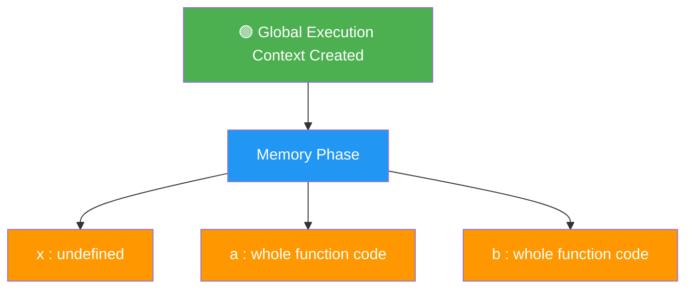

| Variable | Value in Memory |
|----------|----------------|
| `x`      | `undefined`     |
| `a`      | `{...}` (entire function code) |
| `b`      | `{...}` (entire function code) |

#### Phase 2: Code Execution Phase

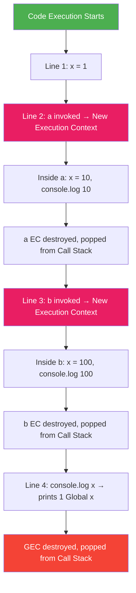

### 📦 Call Stack Visualization

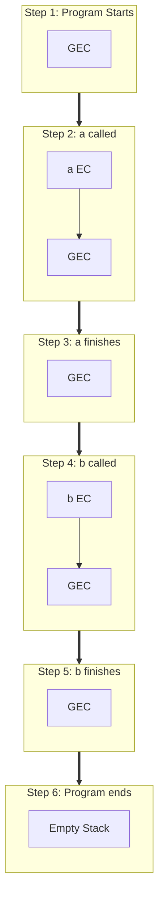

### 🔑 Key Concepts for Interviews

| Concept | Description |
|---------|-------------|
| **Execution Context** | Created every time a function is invoked; has Memory + Code components |
| **Variable Environment** | The memory component of an execution context |
| **Thread of Execution** | The code component — JS executes one line at a time |
| **Call Stack** | Manages the order of execution contexts (LIFO) |
| **GEC** | Global Execution Context — created when program starts |

### ❓ Interview Question

**Q: What will be the output and why?**

```javascript
var x = 1;

function a() {
    console.log(x); // What prints here?
    var x = 10;
}

a();
```

**Answer:** `undefined`  
**Why?** Due to **hoisting**, `var x` inside `a()` is hoisted to the top of `a()`'s execution context. During the memory phase of `a()`'s EC, `x` is set to `undefined`. When `console.log(x)` runs, it finds `x` in its own local variable environment as `undefined`.

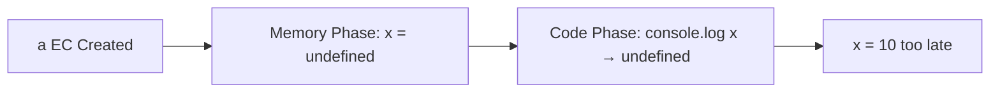

---

<a href="#top">⬆️ Go to Top</a>

---

<a id="2"></a>

## 2. 📝 Function Declaration

### What is a Function Declaration?

A **Function Declaration** (also called **Function Statement**) is the most traditional way to define a function in JavaScript using the `function` keyword.

```javascript
function greet(name) {
    return `Hello, ${name}!`;
}

console.log(greet("Rahul")); // Hello, Rahul!
```

### Syntax

```
function functionName(parameter1, parameter2, ...) {
    // function body
    return value; // optional
}
```

### 🔑 Key Characteristics

| Feature | Description |
|---------|-------------|
| **Hoisted** | ✅ Yes — Can be called before declaration |
| **Named** | ✅ Always has a name |
| **`this` binding** | Has its own `this` |
| **`arguments` object** | ✅ Available |
| **Constructor** | ✅ Can be used with `new` |

### Hoisting Behavior

```javascript
// ✅ This works! Function declarations are hoisted
sayHello(); // Output: "Hello!"

function sayHello() {
    console.log("Hello!");
}
```

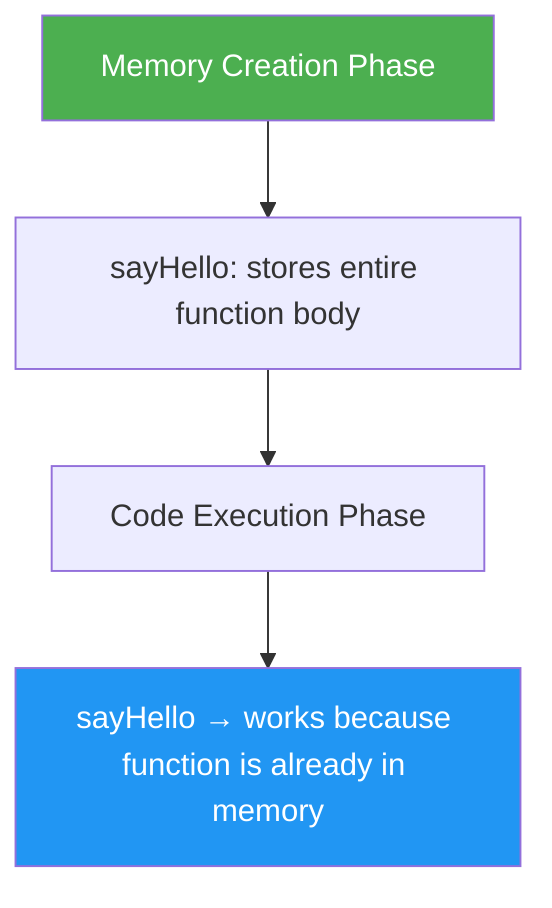

### Real-World Use Case

```javascript
function calculateTax(amount, taxRate) {
    if (amount <= 0) return 0;
    return amount * (taxRate / 100);
}

function formatCurrency(amount) {
    return `₹${amount.toFixed(2)}`;
}

const price = 1000;
const tax = calculateTax(price, 18);
console.log(formatCurrency(tax)); // ₹180.00
```

### ❓ Interview Question

**Q: What is the difference between Function Declaration and Function Expression?**

```javascript
// Function Declaration
function add(a, b) { return a + b; }

// Function Expression
var add = function(a, b) { return a + b; };
```

| Feature | Declaration | Expression |
|---------|------------|------------|
| Hoisting | Entire function hoisted | Only variable hoisted as `undefined` |
| Call before definition | ✅ Yes | ❌ No (TypeError) |
| Name | Required | Optional |

```javascript
foo(); // ✅ "foo called"
bar(); // ❌ TypeError: bar is not a function

function foo() { console.log("foo called"); }
var bar = function() { console.log("bar called"); };
```

---

<a href="#top">⬆️ Go to Top</a>

---

<a id="3"></a>

## 3. 🎯 Parameter Function (Functions with Parameters)

### Parameters vs Arguments

> 💡 **Parameters** are variable names in the definition. **Arguments** are actual values passed at call time.

```javascript
//         parameters ↓   ↓
function add(a, b) {
    return a + b;
}
//    arguments ↓  ↓
add(5, 10);
```

### Types of Parameters

#### 1. Default Parameters (ES6+)

```javascript
function greet(name = "Guest", greeting = "Hello") {
    console.log(`${greeting}, ${name}!`);
}

greet();                    // Hello, Guest!
greet("Rahul");            // Hello, Rahul!
greet("Rahul", "Namaste"); // Namaste, Rahul!
greet(undefined, "Hi");    // Hi, Guest!
```

#### 2. Rest Parameters (`...args`)

```javascript
function sum(...numbers) {
    return numbers.reduce((total, num) => total + num, 0);
}

console.log(sum(1, 2, 3));       // 6
console.log(sum(1, 2, 3, 4, 5)); // 15

function logInfo(name, age, ...hobbies) {
    console.log(`Name: ${name}, Age: ${age}`);
    console.log(`Hobbies: ${hobbies.join(", ")}`);
}

logInfo("Rahul", 25, "coding", "reading", "gaming");
// Name: Rahul, Age: 25
// Hobbies: coding, reading, gaming
```

#### 3. `arguments` Object (Pre-ES6)

```javascript
function oldSum() {
    let total = 0;
    for (let i = 0; i < arguments.length; i++) {
        total += arguments[i];
    }
    return total;
}

console.log(oldSum(1, 2, 3, 4)); // 10
```

> ⚠️ `arguments` is NOT a real array. Arrow functions do NOT have `arguments`.

#### 4. Destructured Parameters

```javascript
function displayUser({ name, age, city = "Unknown" }) {
    console.log(`${name}, ${age} from ${city}`);
}

displayUser({ name: "Rahul", age: 25, city: "Delhi" }); // Rahul, 25 from Delhi

function getFirstTwo([first, second]) {
    return { first, second };
}

console.log(getFirstTwo([10, 20, 30])); // { first: 10, second: 20 }
```

### Parameter Passing — Tricky Interview Scenario

```javascript
function test(a, b = a * 2, c = a + b) {
    console.log(a, b, c);
}

test(2);        // 2 4 6
test(2, 3);     // 2 3 5
test(2, 3, 4);  // 2 3 4
```

### ❓ Interview Question

**Q: What happens when you pass more or fewer arguments than parameters?**

```javascript
function example(a, b, c) {
    console.log(a, b, c);
}

example(1, 2);           // 1 2 undefined
example(1, 2, 3, 4, 5);  // 1 2 3
```

---

<a href="#top">⬆️ Go to Top</a>

---

<a id="4"></a>

## 4. ➡️ Arrow Functions (ES6)

### What are Arrow Functions?

Arrow functions are a **shorter syntax** for writing functions, always **anonymous**, with some key behavioral differences.

### Syntax Variations

```javascript
// Full syntax
const add = (a, b) => { return a + b; };

// Implicit return
const addShort = (a, b) => a + b;

// Single parameter
const double = x => x * 2;

// No parameters
const greet = () => "Hello!";

// Returning object literal — wrap in parentheses
const createUser = (name, age) => ({ name, age });
console.log(createUser("Rahul", 25)); // { name: 'Rahul', age: 25 }
```

### ⚠️ Key Differences from Regular Functions

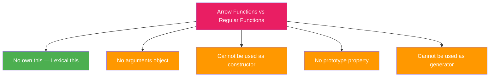

### The `this` Problem — Most Important Difference

```javascript
// ❌ Regular function — 'this' is undefined in strict or window in non-strict
const person1 = {
    name: "Rahul",
    hobbies: ["coding", "reading"],
    showHobbies: function() {
        this.hobbies.forEach(function(hobby) {
            console.log(`${this.name} likes ${hobby}`); // ❌ undefined likes coding
        });
    }
};

// ✅ Arrow function — 'this' is inherited from parent scope
const person2 = {
    name: "Rahul",
    hobbies: ["coding", "reading"],
    showHobbies: function() {
        this.hobbies.forEach((hobby) => {
            console.log(`${this.name} likes ${hobby}`); // ✅ Rahul likes coding
        });
    }
};

person2.showHobbies();
```

### `arguments` — Not Available in Arrow Functions

```javascript
function regularFunc() {
    console.log(arguments); // [Arguments] { '0': 1, '1': 2, '2': 3 }
}
regularFunc(1, 2, 3);

const arrowFunc = (...args) => {
    console.log(args); // [1, 2, 3]  ✅ use rest params instead
};
arrowFunc(1, 2, 3);
```

### Cannot be Used as Constructor

```javascript
const Person = (name) => { this.name = name; };
const p = new Person("Rahul"); // ❌ TypeError: Person is not a constructor
```

### When to Use and When NOT to Use

| ✅ Use Arrow Functions | ❌ Avoid Arrow Functions |
|------------------------|-------------------------|
| Callbacks (map, filter, forEach) | Object methods |
| Short one-liners | Event handlers needing `this` |
| Functional programming chains | Prototype methods |
| Inside class methods | Constructors |
| Promises / `.then()` chains | Functions needing `arguments` |

### Real-World Examples

```javascript
const numbers = [1, 2, 3, 4, 5];

const doubled  = numbers.map(n => n * 2);            // [2, 4, 6, 8, 10]
const evens    = numbers.filter(n => n % 2 === 0);   // [2, 4]
const sum      = numbers.reduce((acc, n) => acc + n, 0); // 15

fetch('/api/users')
    .then(response => response.json())
    .then(data => console.log(data))
    .catch(error => console.error(error));
```

### ❓ Interview Question

**Q: What will be the output?**

```javascript
const obj = {
    value: 42,
    getValue: () => { return this.value; },
    getValueRegular: function() { return this.value; }
};

console.log(obj.getValue());        // undefined (arrow: 'this' = global/window)
console.log(obj.getValueRegular()); // 42 (regular: 'this' = obj)
```

---

<a href="#top">⬆️ Go to Top</a>

---

<a id="5"></a>

## 5. 🔢 How Many Ways to Write a Function

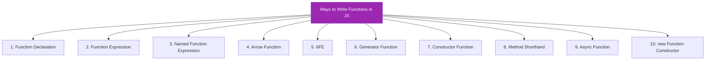

### 1️⃣ Function Declaration

```javascript
function add(a, b) { return a + b; }
// ✅ Hoisted | Named | Has own 'this' | Can be constructor
```

### 2️⃣ Function Expression

```javascript
const add = function(a, b) { return a + b; };
// ❌ Not hoisted | Can be anonymous | Can be constructor
```

### 3️⃣ Named Function Expression

```javascript
const factorial = function fact(n) {
    if (n <= 1) return 1;
    return n * fact(n - 1); // 'fact' accessible INSIDE only
};

console.log(factorial(5)); // 120
// console.log(fact(5));   // ❌ ReferenceError
```

> 💡 The name is only visible inside the function — great for recursion and stack traces.

### 4️⃣ Arrow Function

```javascript
const add = (a, b) => a + b;
// ❌ No 'this' | ❌ No 'arguments' | ❌ Not constructor | ❌ Not hoisted
```

### 5️⃣ IIFE (Immediately Invoked Function Expression)

```javascript
(function() { console.log("Runs immediately!"); })();
(() => { console.log("Arrow IIFE!"); })();
(function(name) { console.log(`Hello, ${name}!`); })("Rahul");
```

### 6️⃣ Generator Function

```javascript
function* numberGenerator() {
    yield 1;
    yield 2;
    yield 3;
}

const gen = numberGenerator();
console.log(gen.next()); // { value: 1, done: false }
console.log(gen.next()); // { value: 2, done: false }
console.log(gen.next()); // { value: 3, done: false }
console.log(gen.next()); // { value: undefined, done: true }
```

### 7️⃣ Constructor Function

```javascript
function Person(name, age) {
    this.name = name;
    this.age = age;
}

const p = new Person("Rahul", 25);
console.log(p.name); // Rahul
```

### 8️⃣ Method Shorthand (ES6)

```javascript
const calculator = {
    add(a, b) { return a + b; },
    subtract(a, b) { return a - b; }
};

console.log(calculator.add(5, 3)); // 8
```

### 9️⃣ Async Function

```javascript
async function fetchData() {
    const response = await fetch('/api/data');
    return response.json();
}

const fetchData2 = async () => {
    const response = await fetch('/api/data');
    return response.json();
};
```

### 🔟 `new Function()` Constructor (Rare)

```javascript
const add = new Function('a', 'b', 'return a + b');
console.log(add(2, 3)); // 5
// ⚠️ Avoid: security risks, no closure, poor performance
```

### 📊 Complete Comparison Table

| Way | Hoisted | `this` | `arguments` | Constructor | Use Case |
|-----|---------|--------|-------------|-------------|----------|
| Declaration | ✅ | Own | ✅ | ✅ | General purpose |
| Expression | ❌ | Own | ✅ | ✅ | Conditional functions |
| Named Expression | ❌ | Own | ✅ | ✅ | Recursion, debugging |
| Arrow | ❌ | Lexical | ❌ | ❌ | Callbacks, short functions |
| IIFE | N/A | Own | ✅ | N/A | Module pattern |
| Generator | ✅ | Own | ✅ | ❌ | Iterators, lazy evaluation |
| Constructor | ✅ | New object | ✅ | ✅ | Object creation |
| Method | N/A | Own | ✅ | ❌ | Object methods |
| Async | Same as base | Same | Same | ❌ | Async operations |
| `new Function` | N/A | Global | ✅ | ✅ | Dynamic code (avoid!) |

---

<a href="#top">⬆️ Go to Top</a>

---

<a id="6"></a>

## 6. 🏗️ Higher Order Functions

### What is a Higher Order Function?

A **Higher Order Function (HOF)** either:
1. **Takes one or more functions as arguments**, OR
2. **Returns a function** as its result

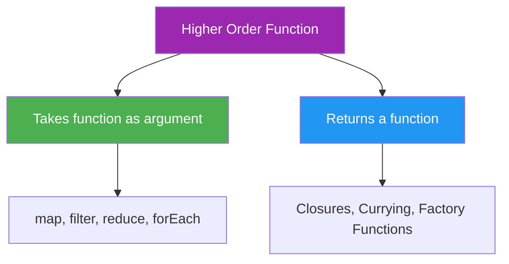

### Type 1: Takes a Function as Argument

```javascript
const numbers = [1, 2, 3, 4, 5];
const double = (num) => num * 2;
const doubled = numbers.map(double); // map is the HOF
console.log(doubled); // [2, 4, 6, 8, 10]
```

### Type 2: Returns a Function

```javascript
function multiplier(factor) {
    return function(number) {
        return number * factor;
    };
}

const double = multiplier(2);
const triple = multiplier(3);

console.log(double(5));  // 10
console.log(triple(5));  // 15
```

### Built-in Higher Order Functions

```javascript
const students = [
    { name: "Rahul", grade: 85 },
    { name: "Priya", grade: 92 },
    { name: "Amit",  grade: 78 },
    { name: "Neha",  grade: 95 }
];

// map — Transform
const names = students.map(s => s.name);
// ["Rahul", "Priya", "Amit", "Neha"]

// filter — Keep matching
const toppers = students.filter(s => s.grade >= 90);
// [{ name: "Priya", ... }, { name: "Neha", ... }]

// reduce — Accumulate
const total = students.reduce((sum, s) => sum + s.grade, 0);
const average = total / students.length; // 87.5

// find — First match
const found = students.find(s => s.name === "Priya");
// { name: "Priya", grade: 92 }

// every / some
const allPassed = students.every(s => s.grade >= 40); // true
const anyTopper = students.some(s => s.grade >= 95);  // true
```

### Chaining HOFs

```javascript
const transactions = [
    { type: "credit", amount: 5000 },
    { type: "debit",  amount: 2000 },
    { type: "credit", amount: 3000 },
    { type: "debit",  amount: 1000 },
    { type: "credit", amount: 7000 }
];

const totalCredits = transactions
    .filter(t => t.type === "credit")
    .map(t => t.amount)
    .reduce((sum, amount) => sum + amount, 0);

console.log(totalCredits); // 15000
```

### Creating Your Own HOF

```javascript
function myMap(arr, transformFn) {
    const result = [];
    for (let i = 0; i < arr.length; i++) {
        result.push(transformFn(arr[i], i, arr));
    }
    return result;
}

const squared = myMap([1, 2, 3, 4], n => n ** 2);
console.log(squared); // [1, 4, 9, 16]

function myFilter(arr, predicateFn) {
    const result = [];
    for (let i = 0; i < arr.length; i++) {
        if (predicateFn(arr[i], i, arr)) result.push(arr[i]);
    }
    return result;
}

const evens = myFilter([1, 2, 3, 4], n => n % 2 === 0);
console.log(evens); // [2, 4]
```

### Real-World: Validation System

```javascript
function createValidator(rules) {
    return function(data) {
        const errors = [];
        for (const [field, rule] of Object.entries(rules)) {
            if (!rule.validate(data[field])) {
                errors.push({ field, message: rule.message });
            }
        }
        return { isValid: errors.length === 0, errors };
    };
}

const validateUser = createValidator({
    name: {
        validate: (v) => v && v.length >= 2,
        message: "Name must be at least 2 characters"
    },
    email: {
        validate: (v) => /^[^\s@]+@[^\s@]+\.[^\s@]+$/.test(v),
        message: "Invalid email format"
    },
    age: {
        validate: (v) => v >= 18,
        message: "Must be at least 18"
    }
});

console.log(validateUser({ name: "R", email: "bad", age: 16 }));
// { isValid: false, errors: [...] }

console.log(validateUser({ name: "Rahul", email: "r@gmail.com", age: 25 }));
// { isValid: true, errors: [] }
```

---

<a href="#top">⬆️ Go to Top</a>

---

<a id="7"></a>

## 7. 👤 Anonymous Functions

### What is an Anonymous Function?

A function that has **no name**. It must be used as a **value** — cannot stand alone as a statement.

```javascript
// ❌ SyntaxError — anonymous function cannot be a statement
// function() { console.log("error"); }

// ✅ Anonymous as a value
const greet = function() { console.log("Hello!"); };
```

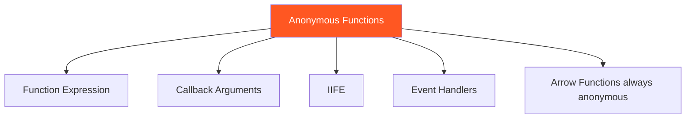

### Where Anonymous Functions Are Used

#### As Callbacks

```javascript
setTimeout(function() {
    console.log("Runs after 2 seconds");
}, 2000);

[1, 2, 3].map(function(num) { return num * 2; }); // [2, 4, 6]

document.getElementById("btn").addEventListener("click", function() {
    console.log("Clicked!");
});
```

#### As Object Methods

```javascript
const obj = {
    greet: function() {
        console.log("Hello from anonymous!");
    }
};
```

### Named vs Anonymous — Debugging

```javascript
// Anonymous — poor stack trace
const badFunc = function() { throw new Error("Broke!"); };

// Named — better stack trace
const goodFunc = function descriptiveName() { throw new Error("Broke!"); };

// Stack trace shows: "Error at descriptiveName" vs "Error at Object.<anonymous>"
```

### ❓ Interview Question

**Q: Difference between anonymous function and named function expression?**

```javascript
const anon = function() {
    console.log(typeof anon); // "function"
    // Cannot call itself by name
};

const named = function myFunc() {
    console.log(typeof myFunc); // "function" — accessible inside!
};

console.log(typeof myFunc); // "undefined" — NOT accessible outside!
```

---

<a href="#top">⬆️ Go to Top</a>

---

<a id="8"></a>

## 8. 📞 Function Callback Parameter

### What is a Callback Function?

A **Callback** is a function passed as an argument to another function and executed later.


### Synchronous Callbacks

```javascript
function greet(name, callback) {
    console.log(`Hello, ${name}!`);
    callback();
}

greet("Rahul", function() {
    console.log("Callback executed!");
});
// Hello, Rahul!
// Callback executed!

// Array methods use synchronous callbacks
[1, 2, 3].forEach(function(num, index) {
    console.log(`Index ${index}: ${num}`);
});
```

### Asynchronous Callbacks

```javascript
console.log("Start");

setTimeout(function() {
    console.log("Async callback after 2s");
}, 2000);

console.log("End");
// Start → End → Async callback after 2s

// Event listener
document.getElementById("btn").addEventListener("click", function(event) {
    console.log("Clicked!", event.target);
});
```

### Real-World: API Pattern with Callbacks

```javascript
function fetchUserData(userId, onSuccess, onError) {
    setTimeout(function() {
        if (userId > 0) {
            onSuccess({ id: userId, name: "Rahul" });
        } else {
            onError("Invalid user ID");
        }
    }, 1500);
}

fetchUserData(
    1,
    function(user)  { console.log("Success:", user); },
    function(error) { console.log("Error:", error); }
);
```

### ⚠️ Callback Hell

```javascript
// ❌ Pyramid of Doom
getUser(userId, function(user) {
    getOrders(user.id, function(orders) {
        getOrderDetails(orders[0].id, function(details) {
            getShipping(details.shippingId, function(shipping) {
                console.log(shipping); // 4 levels deep!
            }, handleError);
        }, handleError);
    }, handleError);
}, handleError);
```

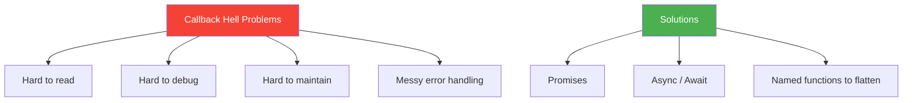

**Solution — Named Functions:**

```javascript
function handleShipping(shipping) { console.log(shipping); }
function handleDetails(details)   { getShipping(details.shippingId, handleShipping, handleError); }
function handleOrders(orders)     { getOrderDetails(orders[0].id, handleDetails, handleError); }
function handleUser(user)         { getOrders(user.id, handleOrders, handleError); }

getUser(userId, handleUser, handleError); // Flat!
```

---

<a href="#top">⬆️ Go to Top</a>

---

<a id="9"></a>

## 9. 🔄 Passing Function Inside Function as Parameter

### Core Concept — First-Class Functions

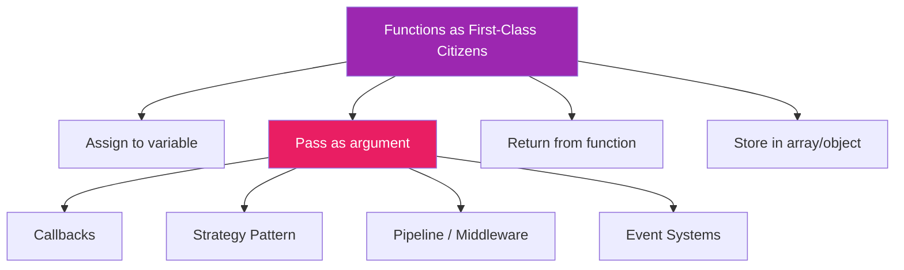

### Basic Example

```javascript
function applyOperation(a, b, operation) {
    return operation(a, b);
}

function add(x, y)      { return x + y; }
function subtract(x, y) { return x - y; }
function multiply(x, y) { return x * y; }

console.log(applyOperation(10, 5, add));                     // 15
console.log(applyOperation(10, 5, subtract));                // 5
console.log(applyOperation(10, 5, multiply));                // 50
console.log(applyOperation(10, 5, (a, b) => a ** b));        // 100000
```

### Strategy Pattern

```javascript
function sortArray(arr, compareFn) {
    return [...arr].sort(compareFn);
}

const numbers = [5, 2, 8, 1, 9, 3];

console.log(sortArray(numbers, (a, b) => a - b));              // [1,2,3,5,8,9]
console.log(sortArray(numbers, (a, b) => b - a));              // [9,8,5,3,2,1]
console.log(sortArray(numbers, (a, b) => (a % 2) - (b % 2))); // evens first
```

### Pipeline Pattern

```javascript
function pipeline(...functions) {
    return function(value) {
        return functions.reduce((acc, fn) => fn(acc), value);
    };
}

const trim         = str => str.trim();
const toLowerCase  = str => str.toLowerCase();
const replaceSpaces = str => str.replace(/\s+/g, '-');
const addPrefix    = str => `url-${str}`;

const createSlug = pipeline(trim, toLowerCase, replaceSpaces, addPrefix);

console.log(createSlug("  Hello World  "));        // "url-hello-world"
console.log(createSlug(" JavaScript IS Awesome ")); // "url-javascript-is-awesome"
```

### Function Composition

```javascript
// compose: right to left (mathematical composition)
function compose(...fns) {
    return function(x) {
        return fns.reduceRight((acc, fn) => fn(acc), x);
    };
}

const add10     = x => x + 10;
const multiply2 = x => x * 2;
const subtract5 = x => x - 5;

// Executes: add10(5)=15 → multiply2(15)=30 → subtract5(30)=25
const compute = compose(subtract5, multiply2, add10);
console.log(compute(5)); // 25
```

### Real-World: Event System

```javascript
class EventEmitter {
    constructor() { this.events = {}; }

    on(eventName, callback) {
        if (!this.events[eventName]) this.events[eventName] = [];
        this.events[eventName].push(callback);
    }

    emit(eventName, ...args) {
        const callbacks = this.events[eventName];
        if (callbacks) callbacks.forEach(cb => cb(...args));
    }
}

const emitter = new EventEmitter();

emitter.on("login", function(user) { console.log(`${user} logged in`); });
emitter.on("login", function(user) { console.log(`Sending welcome email to ${user}`); });

emitter.emit("login", "Rahul");
// Rahul logged in
// Sending welcome email to Rahul
```

---

<a href="#top">⬆️ Go to Top</a>

---

<a id="10"></a>

## 10. 📦 Call by Value and Call by Reference

### Overview

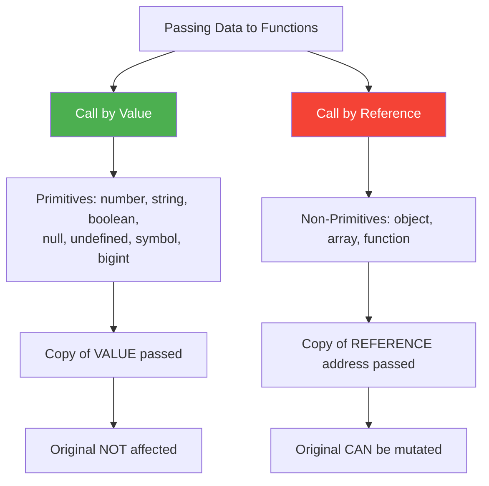

### Call by Value (Primitives)

```javascript
function changeValue(x) {
    x = 100;
    console.log("Inside:", x); // 100
}

let num = 10;
changeValue(num);
console.log("Outside:", num); // 10 — NOT changed!
```

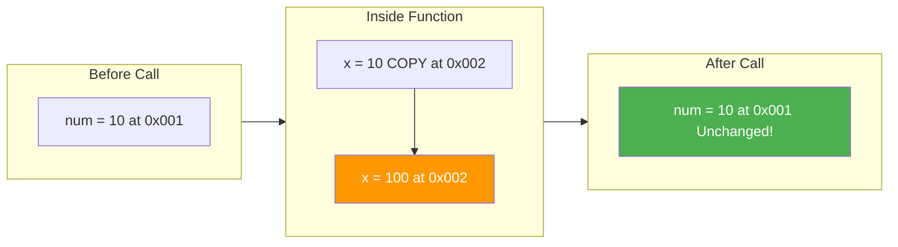

```javascript
function testPrimitives(str, num, bool) {
    str = "changed"; num = 999; bool = false;
    console.log("Inside:", str, num, bool); // changed 999 false
}

let myStr = "hello", myNum = 42, myBool = true;
testPrimitives(myStr, myNum, myBool);
console.log("Outside:", myStr, myNum, myBool); // hello 42 true
```

### Call by Reference (Objects & Arrays)

```javascript
function changeObject(obj) {
    obj.name = "Modified";
}

let person = { name: "Rahul", age: 25 };
changeObject(person);
console.log(person); // { name: "Modified", age: 25 } — CHANGED!
```

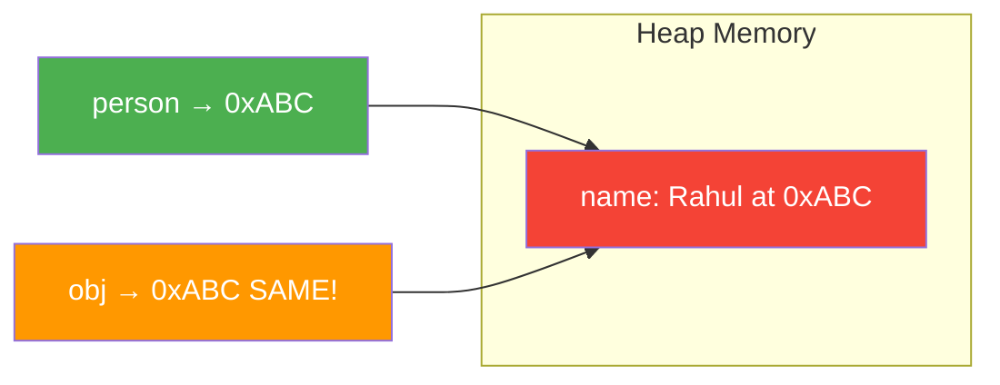

### ⚠️ Mutation vs Reassignment

```javascript
// MUTATION — affects original ✅
function mutate(obj) {
    obj.name = "Changed"; // Modifies same object
}

// REASSIGNMENT — does NOT affect original ❌
function reassign(obj) {
    obj = { name: "New Object" }; // Creates NEW object, local ref changes
    console.log("Inside:", obj.name); // "New Object"
}

let myObj = { name: "Original" };

mutate(myObj);
console.log(myObj.name); // "Changed"

reassign(myObj);
console.log(myObj.name); // "Changed" — NOT reassigned!
```

### Arrays — Also Passed by Reference

```javascript
function addElement(arr) {
    arr.push(4); // Mutates original
}

let myArray = [1, 2, 3];
addElement(myArray);
console.log(myArray); // [1, 2, 3, 4] — CHANGED!

// ✅ Safe version
function safeAdd(arr) {
    return [...arr, 4]; // Return new array
}

let original = [1, 2, 3];
let modified = safeAdd(original);
console.log(original); // [1, 2, 3]
console.log(modified); // [1, 2, 3, 4]
```

### How to Prevent Mutation

```javascript
// Shallow copy — spread
const copy1 = { ...obj };

// Shallow copy — Object.assign
const copy2 = Object.assign({}, obj);

// Deep copy — JSON (limitation: no functions, Date, undefined)
const deep1 = JSON.parse(JSON.stringify(obj));

// Deep copy — modern (recommended)
const deep2 = structuredClone(obj);

// Freeze — prevent mutation
const frozen = Object.freeze({ name: "Rahul" });
frozen.name = "Changed"; // Silent fail (TypeError in strict mode)
console.log(frozen.name); // "Rahul"
```

### ⚠️ Tricky: Shallow Copy Shares Nested References

```javascript
function modify(obj) {
    obj.a.b = 2; // Mutates nested object
}

let data = { a: { b: 1 } };
let copy = { ...data }; // Shallow copy!

modify(copy);
console.log(data.a.b); // 2 — ALSO changed! Use structuredClone for deep copy
```

### 📊 Comparison Table

| Feature | Call by Value | Call by Reference |
|---------|-------------|------------------|
| Data Type | Primitives | Objects, Arrays |
| What's Passed | Copy of value | Copy of reference |
| Original Affected | ❌ No | ✅ Yes (if mutated) |
| Reassignment inside | No effect | No effect |
| Memory | New allocation | Same memory location |

### ❓ Interview Questions

```javascript
// Q1
function modify(obj, num) {
    obj.value = 100;
    num = 100;
}
let myObj = { value: 1 }, myNum = 1;
modify(myObj, myNum);
console.log(myObj.value); // 100
console.log(myNum);       // 1

// Q2
function swap(a, b) {
    let temp = a; a = b; b = temp;
    console.log("Inside:", a, b); // 20 10
}
let x = 10, y = 20;
swap(x, y);
console.log("Outside:", x, y); // 10 20 — NOT swapped!
```

---

<a href="#top">⬆️ Go to Top</a>

---

<a id="11"></a>

## 11. 🔐 Closures

### What is a Closure?

> **A closure is a function bundled together with its lexical environment.** It gives a function access to variables from its outer scope even after the outer function has returned.

```javascript
function outer() {
    let count = 0;

    function inner() {
        count++;
        console.log(count);
    }

    return inner;
}

const counter = outer();
counter(); // 1
counter(); // 2
counter(); // 3
```

### How Closures Work

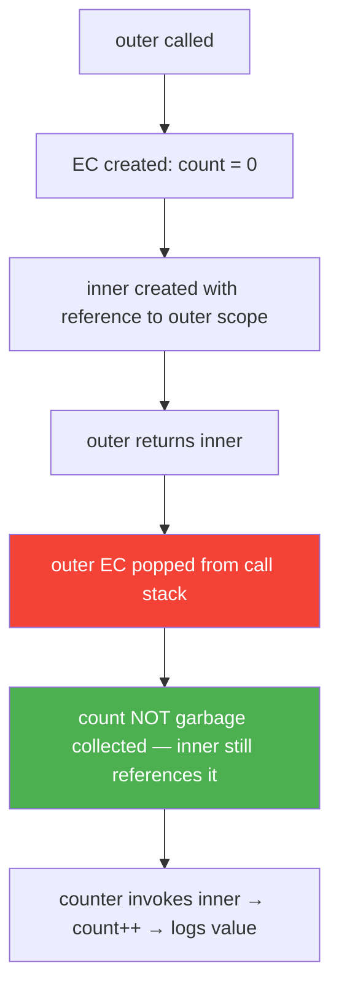

### Closure Examples

#### Counter with Private State

```javascript
function createCounter() {
    let count = 0;

    return {
        increment: function() { return ++count; },
        decrement: function() { return --count; },
        getCount:  function() { return count; },
        reset:     function() { count = 0; return count; }
    };
}

const counter = createCounter();
console.log(counter.increment()); // 1
console.log(counter.increment()); // 2
console.log(counter.decrement()); // 1
console.log(counter.count);       // undefined (PRIVATE!)
```

#### Classic Loop Problem

```javascript
// ❌ All print 3
for (var i = 0; i < 3; i++) {
    setTimeout(function() { console.log(i); }, 1000);
}
// 3, 3, 3

// ✅ Fix 1: IIFE creates new scope per iteration
for (var i = 0; i < 3; i++) {
    (function(j) {
        setTimeout(function() { console.log(j); }, 1000);
    })(i);
}
// 0, 1, 2

// ✅ Fix 2: let creates new binding per iteration
for (let i = 0; i < 3; i++) {
    setTimeout(function() { console.log(i); }, 1000);
}
// 0, 1, 2
```

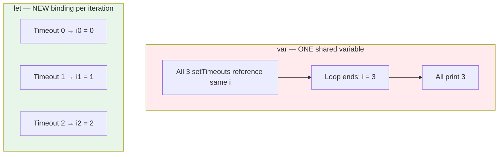

#### Private Bank Account

```javascript
function BankAccount(initialBalance) {
    let balance = initialBalance;
    const transactions = [];

    return {
        deposit(amount) {
            if (amount > 0) {
                balance += amount;
                transactions.push({ type: 'deposit', amount });
                return `Deposited ₹${amount}. Balance: ₹${balance}`;
            }
            return "Invalid amount";
        },
        withdraw(amount) {
            if (amount > 0 && amount <= balance) {
                balance -= amount;
                transactions.push({ type: 'withdraw', amount });
                return `Withdrawn ₹${amount}. Balance: ₹${balance}`;
            }
            return "Insufficient funds";
        },
        getBalance()     { return `₹${balance}`; },
        getTransactions(){ return [...transactions]; }
    };
}

const account = BankAccount(1000);
console.log(account.deposit(500));   // Deposited ₹500. Balance: ₹1500
console.log(account.withdraw(200));  // Withdrawn ₹200. Balance: ₹1300
console.log(account.balance);        // undefined (PRIVATE!)
```

#### Memoization

```javascript
function memoize(fn) {
    const cache = {};

    return function(...args) {
        const key = JSON.stringify(args);
        if (cache[key] !== undefined) {
            console.log("Cache hit!");
            return cache[key];
        }
        console.log("Computing...");
        cache[key] = fn(...args);
        return cache[key];
    };
}

function slowSquare(n) {
    return n * n;
}

const fastSquare = memoize(slowSquare);
console.log(fastSquare(10)); // Computing... 100
console.log(fastSquare(10)); // Cache hit!   100
```

#### Debounce (Uses Closure)

```javascript
function debounce(fn, delay) {
    let timeoutId;

    return function(...args) {
        clearTimeout(timeoutId);
        timeoutId = setTimeout(() => {
            fn.apply(this, args);
        }, delay);
    };
}

const search = debounce(function(query) {
    console.log(`Searching: ${query}`);
}, 300);

search("J");
search("Ja");
search("JavaScript"); // Only this fires after 300ms
```

#### Throttle (Uses Closure)

```javascript
function throttle(fn, interval) {
    let lastTime = 0;

    return function(...args) {
        const now = Date.now();
        if (now - lastTime >= interval) {
            lastTime = now;
            fn.apply(this, args);
        }
    };
}

const handleScroll = throttle(function() {
    console.log("Scroll handled at:", Date.now());
}, 1000);
```

#### Once Function

```javascript
function once(fn) {
    let called = false;
    let result;

    return function(...args) {
        if (!called) {
            called = true;
            result = fn.apply(this, args);
        }
        return result;
    };
}

const initialize = once(() => {
    console.log("Initialized!");
    return "done";
});

console.log(initialize()); // "Initialized!" → "done"
console.log(initialize()); // "done" (no re-execution)
```

### Closure Scope Chain

```javascript
function grandparent() {
    let a = 10;
    function parent() {
        let b = 20;
        function child() {
            let c = 30;
            console.log(a + b + c); // 60 — accesses all scopes!
        }
        return child;
    }
    return parent;
}

const childFn = grandparent()();
childFn(); // 60
```

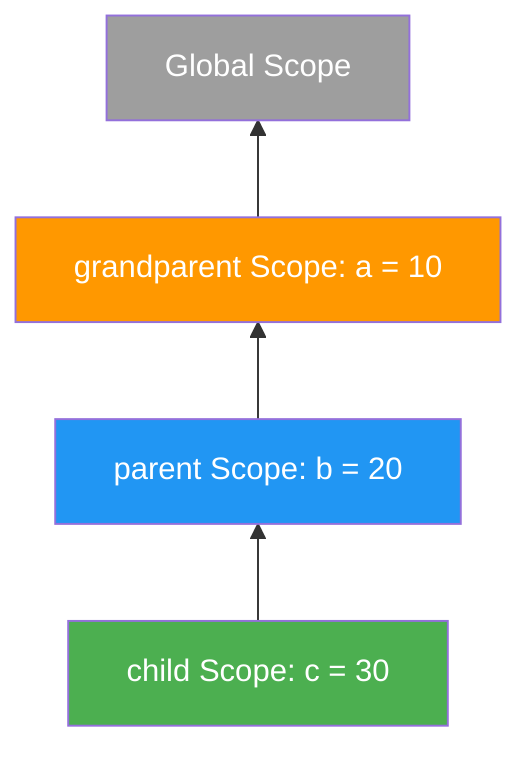

### ⚠️ Memory Leak Warning

```javascript
function createHeavyClosure() {
    const largeArray = new Array(1000000).fill("data");

    return function() {
        console.log(largeArray.length); // largeArray stays in memory!
    };
}

let heavyFn = createHeavyClosure();
// To free memory:
heavyFn = null; // Now largeArray can be garbage collected
```

### ❓ Closure Interview Questions

**Q1:**
```javascript
function a() {
    var x = 10;
    function b() { console.log(x); }
    x = 20;
    return b;
}
a()(); // 20 — closure captures REFERENCE, not value
```

**Q2:**
```javascript
for (var i = 1; i <= 5; i++) {
    setTimeout(function() { console.log(i); }, i * 1000);
}
// 6 6 6 6 6
```

**Q3: Create a function callable only N times**
```javascript
function limitCalls(fn, maxCalls) {
    let count = 0;
    return function(...args) {
        if (count < maxCalls) {
            count++;
            return fn.apply(this, args);
        }
        console.log(`Max ${maxCalls} calls reached`);
    };
}

const limited = limitCalls(console.log, 3);
limited("call 1"); // call 1
limited("call 2"); // call 2
limited("call 3"); // call 3
limited("call 4"); // Max 3 calls reached
```

---

<a href="#top">⬆️ Go to Top</a>

---

<a id="12"></a>

## 12. 🧼 Pure Functions & Side Effects

### What is a Pure Function?

A **Pure Function** is a function that:
1. **Always returns the same output** for the same input
2. **Has no side effects** — does not modify anything outside its scope

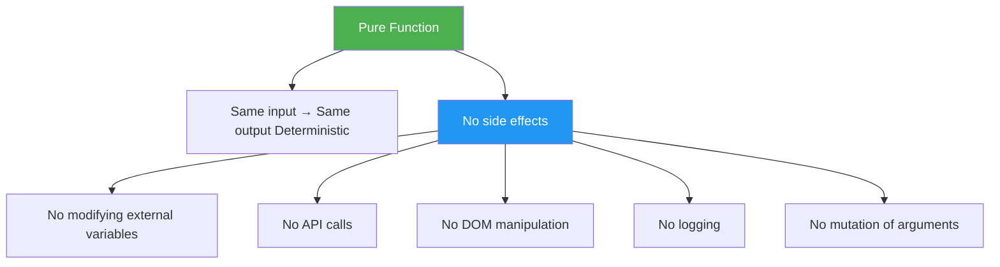

### Pure vs Impure Examples

```javascript
// ✅ PURE — same input always gives same output, no side effects
function add(a, b) {
    return a + b;
}

function multiply(a, b) {
    return a * b;
}

function getFullName(firstName, lastName) {
    return `${firstName} ${lastName}`;
}

// ❌ IMPURE — relies on external state
let tax = 0.18;
function calculatePrice(amount) {
    return amount + amount * tax; // Depends on external 'tax'
}

// ❌ IMPURE — modifies external state
let total = 0;
function addToTotal(num) {
    total += num; // Side effect!
    return total;
}

// ❌ IMPURE — different output each time
function getCurrentTime() {
    return new Date().toISOString(); // Non-deterministic
}

// ❌ IMPURE — API call (side effect)
async function fetchUser(id) {
    const res = await fetch(`/api/users/${id}`);
    return res.json();
}
```

### Side Effects — What They Are

```javascript
// Side effects include:

// 1. Mutating arguments
function impureDouble(arr) {
    for (let i = 0; i < arr.length; i++) {
        arr[i] *= 2; // ❌ Mutates original!
    }
    return arr;
}

// ✅ Pure version — returns new array
function pureDouble(arr) {
    return arr.map(n => n * 2);
}

// 2. Modifying global state
let counter = 0;
function impureIncrement() {
    counter++; // ❌ Side effect
}

// ✅ Pure version
function pureIncrement(count) {
    return count + 1;
}

// 3. Console.log IS a side effect (but acceptable)
function pureWithLog(a, b) {
    console.log("adding", a, b); // Technically impure
    return a + b;
}
```

### Benefits of Pure Functions

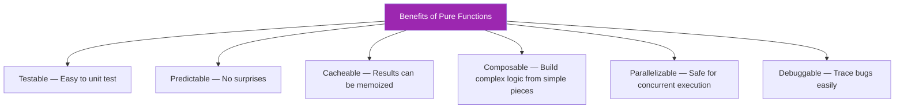

### Practical Example — Impure to Pure Refactor

```javascript
// ❌ IMPURE — hard to test, unpredictable
const cart = { items: [], discount: 0 };

function applyDiscount(code) {
    if (code === "SAVE10") {
        cart.discount = 10;
    }
    cart.items.forEach(item => {
        item.price *= (1 - cart.discount / 100);
    });
}

// ✅ PURE — predictable, testable
function applyDiscountPure(cart, code) {
    const discount = code === "SAVE10" ? 10 : 0;
    return {
        ...cart,
        discount,
        items: cart.items.map(item => ({
            ...item,
            price: item.price * (1 - discount / 100)
        }))
    };
}

const originalCart = {
    items: [{ name: "Shirt", price: 500 }, { name: "Pants", price: 1000 }],
    discount: 0
};

const updatedCart = applyDiscountPure(originalCart, "SAVE10");
console.log(originalCart.items[0].price); // 500 (unchanged!)
console.log(updatedCart.items[0].price);  // 450
```

### Pure Functions in Array Methods

```javascript
const numbers = [1, 2, 3, 4, 5];

// ✅ These are pure — return new array, don't modify original
const doubled  = numbers.map(n => n * 2);
const evens    = numbers.filter(n => n % 2 === 0);
const sum      = numbers.reduce((acc, n) => acc + n, 0);
const sorted   = [...numbers].sort((a, b) => b - a);

console.log(numbers); // [1,2,3,4,5] — original unchanged

// ❌ These mutate original array (impure)
numbers.push(6);     // Mutates!
numbers.splice(0,1); // Mutates!
numbers.sort();      // Mutates!
```

### Real-World: Pure Reducer (Redux Pattern)

```javascript
function cartReducer(state = { items: [], total: 0 }, action) {
    switch (action.type) {
        case "ADD_ITEM":
            return {
                ...state,
                items: [...state.items, action.payload],
                total: state.total + action.payload.price
            };

        case "REMOVE_ITEM":
            const item = state.items.find(i => i.id === action.payload);
            return {
                ...state,
                items: state.items.filter(i => i.id !== action.payload),
                total: state.total - (item ? item.price : 0)
            };

        case "CLEAR_CART":
            return { items: [], total: 0 };

        default:
            return state;
    }
}

const state1 = cartReducer(undefined, {
    type: "ADD_ITEM",
    payload: { id: 1, name: "Shirt", price: 500 }
});
console.log(state1);
// { items: [{ id:1, name:'Shirt', price:500 }], total: 500 }

const state2 = cartReducer(state1, {
    type: "ADD_ITEM",
    payload: { id: 2, name: "Pants", price: 1000 }
});
console.log(state2.total); // 1500
```

### ❓ Interview Questions

**Q1: Is this function pure?**
```javascript
function square(n) { return n * n; }
// ✅ YES — same input → same output, no side effects
```

**Q2: What about this?**
```javascript
function greet() {
    return `Hello, ${Math.random()}`;
}
// ❌ NO — Math.random() makes output non-deterministic
```

**Q3: How would you make this pure?**
```javascript
// Impure
let multiplier = 3;
function multiply(n) { return n * multiplier; }

// Pure
function multiplyPure(n, multiplier) { return n * multiplier; }
```

---

<a href="#top">⬆️ Go to Top</a>

---

<a id="13"></a>

## 13. 🔁 Recursion

### What is Recursion?

**Recursion** is when a function **calls itself** until it reaches a **base case** (stopping condition).

> 💡 **Interview Definition:** "Recursion is a technique where a function solves a problem by breaking it into smaller instances of the same problem, calling itself with a modified input until it reaches a base case."

```mermaid
flowchart TD
    A["Function Called"] --> B{"Base Case Reached?"}
    B -->|"YES"| C["Return result — stop recursion"]
    B -->|"NO"| D["Call itself with smaller input"]
    D --> A

    style C fill:#4CAF50,color:white
    style D fill:#2196F3,color:white
```

### Anatomy of a Recursive Function

```javascript
function recursive(input) {
    // 1. BASE CASE — Stop condition (MUST have this!)
    if (input <= 0) return 0;

    // 2. RECURSIVE CASE — Call itself with smaller input
    return input + recursive(input - 1);
}
```

> ⚠️ **Without a base case → Stack Overflow (infinite recursion)!**

### Classic Examples

#### Factorial

```javascript
function factorial(n) {
    if (n === 0 || n === 1) return 1; // Base case
    return n * factorial(n - 1);      // Recursive case
}

console.log(factorial(5)); // 120
// 5 * 4 * 3 * 2 * 1 = 120
```

```mermaid
flowchart TD
    A["factorial 5"] --> B["5 * factorial 4"]
    B --> C["5 * 4 * factorial 3"]
    C --> D["5 * 4 * 3 * factorial 2"]
    D --> E["5 * 4 * 3 * 2 * factorial 1"]
    E --> F["5 * 4 * 3 * 2 * 1 = 120"]

    style F fill:#4CAF50,color:white
```

#### Fibonacci

```javascript
// Basic Fibonacci
function fibonacci(n) {
    if (n <= 1) return n;
    return fibonacci(n - 1) + fibonacci(n - 2);
}

console.log(fibonacci(0)); // 0
console.log(fibonacci(1)); // 1
console.log(fibonacci(6)); // 8 (0,1,1,2,3,5,8)

// Optimized with Memoization
function fibMemo(n, memo = {}) {
    if (n in memo) return memo[n];
    if (n <= 1) return n;
    memo[n] = fibMemo(n - 1, memo) + fibMemo(n - 2, memo);
    return memo[n];
}

console.log(fibMemo(40)); // Fast! No redundant calls
```

#### Sum of Array

```javascript
function sumArray(arr) {
    if (arr.length === 0) return 0;
    return arr[0] + sumArray(arr.slice(1));
}

console.log(sumArray([1, 2, 3, 4, 5])); // 15
```

#### Power Function

```javascript
function power(base, exp) {
    if (exp === 0) return 1;
    return base * power(base, exp - 1);
}

console.log(power(2, 10)); // 1024
```

#### Reverse a String

```javascript
function reverseString(str) {
    if (str.length <= 1) return str;
    return reverseString(str.slice(1)) + str[0];
}

console.log(reverseString("hello")); // "olleh"
```

### Recursion vs Iteration

```javascript
// Sum 1 to N — Iterative
function sumIterative(n) {
    let sum = 0;
    for (let i = 1; i <= n; i++) sum += i;
    return sum;
}

// Sum 1 to N — Recursive
function sumRecursive(n) {
    if (n <= 0) return 0;
    return n + sumRecursive(n - 1);
}

console.log(sumIterative(100)); // 5050
console.log(sumRecursive(100)); // 5050
```

| Aspect | Iteration | Recursion |
|--------|-----------|-----------|
| Performance | ✅ Faster | ❌ Slower (call overhead) |
| Memory | ✅ O(1) space | ❌ O(n) call stack space |
| Readability | ❌ Sometimes verbose | ✅ Elegant for tree/graph problems |
| Stack Overflow Risk | ❌ No | ✅ Yes (deep recursion) |
| Use Case | Simple loops | Trees, graphs, divide & conquer |

### Advanced: Tree Traversal (Real-World Recursion)

```javascript
const fileSystem = {
    name: "root",
    children: [
        {
            name: "src",
            children: [
                { name: "index.js", children: [] },
                { name: "app.js",   children: [] }
            ]
        },
        {
            name: "public",
            children: [
                { name: "index.html", children: [] },
                {
                    name: "css",
                    children: [
                        { name: "style.css", children: [] }
                    ]
                }
            ]
        }
    ]
};

function printFileTree(node, indent = "") {
    console.log(`${indent}${node.name}`);
    node.children.forEach(child => {
        printFileTree(child, indent + "  ");
    });
}

printFileTree(fileSystem);
// root
//   src
//     index.js
//     app.js
//   public
//     index.html
//     css
//       style.css

// Flatten nested array
function flattenArray(arr) {
    return arr.reduce((flat, item) => {
        return flat.concat(Array.isArray(item) ? flattenArray(item) : item);
    }, []);
}

console.log(flattenArray([1, [2, [3, [4]], 5]])); // [1, 2, 3, 4, 5]
```

### Tail Call Optimization (TCO)

```javascript
// Regular recursion — O(n) stack space
function factorial(n) {
    if (n === 0) return 1;
    return n * factorial(n - 1); // Not tail call
}

// Tail-recursive version — can be optimized to O(1) space
function factorialTail(n, accumulator = 1) {
    if (n === 0) return accumulator;
    return factorialTail(n - 1, n * accumulator); // Tail call
}

console.log(factorialTail(5)); // 120
```

### ❓ Interview Questions

**Q1: What is the difference between recursion and iteration?**
> Recursion uses function call stack; iteration uses loop variables. Recursion is elegant for hierarchical data; iteration is more memory-efficient.

**Q2: What is a stack overflow in recursion?**
```javascript
function infinite() {
    return infinite(); // No base case
}
// RangeError: Maximum call stack size exceeded
```

**Q3: Write a recursive function to count occurrences in an array**
```javascript
function countOccurrence(arr, target) {
    if (arr.length === 0) return 0;
    const found = arr[0] === target ? 1 : 0;
    return found + countOccurrence(arr.slice(1), target);
}

console.log(countOccurrence([1, 2, 3, 2, 2, 4], 2)); // 3
```

---

<a href="#top">⬆️ Go to Top</a>

---

<a id="14"></a>

## 14. 🎯 The `this` Keyword in Functions (call, apply, bind)

### What is `this`?

`this` refers to the **object that is executing the current function**. Its value depends on **how** the function is called, not where it is defined (except for arrow functions).

```mermaid
flowchart TD
    A["How this is determined"] --> B["Regular Function"]
    A --> C["Arrow Function"]

    B --> D["Depends on HOW it is called"]
    C --> E["Lexical — inherits from surrounding scope"]

    D --> F["Standalone call → global/undefined strict"]
    D --> G["Method call → the object"]
    D --> H["Constructor call → new object"]
    D --> I["call/apply/bind → explicit object"]

    style A fill:#9C27B0,color:white
    style C fill:#4CAF50,color:white
    style D fill:#2196F3,color:white
```

### `this` in Different Contexts

```javascript
// 1. Global context
console.log(this); // window (browser) / {} (Node.js module)

// 2. Regular function (non-strict)
function showThis() {
    console.log(this); // window (browser)
}
showThis();

// 3. Regular function (strict mode)
"use strict";
function showThisStrict() {
    console.log(this); // undefined
}
showThisStrict();

// 4. Method call
const obj = {
    name: "Rahul",
    greet: function() {
        console.log(this.name); // "Rahul" — this = obj
    }
};
obj.greet();

// 5. Constructor
function Person(name) {
    this.name = name;
    console.log(this);
}
const p = new Person("Rahul"); // { name: "Rahul" }

// 6. Arrow function — lexical this
const arrow = {
    name: "Rahul",
    greet: () => {
        console.log(this.name); // undefined — inherits from global scope
    }
};
```

### The Losing `this` Problem

```javascript
const person = {
    name: "Rahul",
    greet: function() {
        console.log(`Hello, I'm ${this.name}`);
    }
};

person.greet(); // ✅ Hello, I'm Rahul

// ❌ Losing 'this' when extracting the method
const greetFn = person.greet;
greetFn(); // ❌ Hello, I'm undefined (this = global)

// ✅ Fix using bind
const boundGreet = person.greet.bind(person);
boundGreet(); // ✅ Hello, I'm Rahul
```

### `call()` — Explicit `this` + Arguments One by One

```javascript
function introduce(greeting, city) {
    console.log(`${greeting}! I'm ${this.name} from ${city}.`);
}

const person1 = { name: "Rahul" };
const person2 = { name: "Priya" };

// call(thisArg, arg1, arg2, ...)
introduce.call(person1, "Hello", "Delhi");    // Hello! I'm Rahul from Delhi.
introduce.call(person2, "Namaste", "Mumbai"); // Namaste! I'm Priya from Mumbai.
```

### `apply()` — Explicit `this` + Arguments as Array

```javascript
function introduce(greeting, city) {
    console.log(`${greeting}! I'm ${this.name} from ${city}.`);
}

const person1 = { name: "Rahul" };

// apply(thisArg, [arg1, arg2, ...])
introduce.apply(person1, ["Hello", "Delhi"]);

// Practical: Math.max with array
const numbers = [3, 6, 1, 8, 2];
console.log(Math.max(...numbers));          // ✅ ES6 spread
console.log(Math.max.apply(null, numbers)); // ✅ apply equivalent
```

### `bind()` — Returns New Function with Bound `this`

```javascript
function introduce(greeting, city) {
    console.log(`${greeting}! I'm ${this.name} from ${city}.`);
}

const person1 = { name: "Rahul" };

// bind returns a NEW function — does NOT call immediately
const boundIntroduce = introduce.bind(person1, "Hello");
boundIntroduce("Delhi");  // Hello! I'm Rahul from Delhi.
boundIntroduce("Mumbai"); // Hello! I'm Rahul from Mumbai.
```

### call vs apply vs bind — Quick Reference

| Method | Invokes Immediately | Arguments | Returns |
|--------|---------------------|-----------|---------|
| `call` | ✅ Yes | Comma separated | Result of function |
| `apply` | ✅ Yes | Array | Result of function |
| `bind` | ❌ No | Comma separated (partial) | New bound function |

```javascript
// Memory trick:
// call  → C for Comma separated
// apply → A for Array
// bind  → B for Binds (returns new function)

function sum(a, b, c) { return a + b + c; }
const obj = {};

sum.call(obj, 1, 2, 3);     // 6
sum.apply(obj, [1, 2, 3]);  // 6
const bound = sum.bind(obj, 1, 2);
bound(3);                    // 6
```

### Real-World Use Cases

```javascript
// 1. Method borrowing
const student = { name: "Rahul", scores: [85, 92, 78, 90] };
const teacher = { name: "Dr. Sharma" };

function getAverage() {
    const avg = this.scores.reduce((sum, s) => sum + s, 0) / this.scores.length;
    return `${this.name}'s average: ${avg}`;
}

teacher.scores = [95, 88, 92];
console.log(getAverage.call(student)); // Rahul's average: 86.25
console.log(getAverage.call(teacher)); // Dr. Sharma's average: 91.67

// 2. bind in event handlers
class Timer {
    constructor() {
        this.seconds = 0;
        this.tick = this.tick.bind(this);
    }
    tick() {
        this.seconds++;
        console.log(`Timer: ${this.seconds}s`);
    }
    start() { setInterval(this.tick, 1000); }
}

// 3. Partial application with bind
function multiply(a, b) { return a * b; }

const double = multiply.bind(null, 2);
const triple = multiply.bind(null, 3);

console.log(double(5));  // 10
console.log(triple(5));  // 15

// 4. Borrowing Array methods for array-like objects
function listArguments() {
    const argsArray = Array.prototype.slice.call(arguments);
    console.log(argsArray);
}
listArguments(1, 2, 3); // [1, 2, 3]
```

### `this` in Classes

```javascript
class Counter {
    constructor() {
        this.count = 0;
        this.increment = this.increment.bind(this); // ✅ Bind in constructor
    }
    increment() {
        this.count++;
        console.log(this.count);
    }
    // ✅ Arrow class field — automatically bound
    decrement = () => {
        this.count--;
        console.log(this.count);
    }
}

const counter = new Counter();

const inc = counter.increment;
inc(); // 1 ✅ (bound in constructor)

const dec = counter.decrement;
dec(); // 0 ✅ (arrow function — lexical this)
```

### ❓ Interview Questions

**Q1: What will be the output?**
```javascript
const obj = {
    name: "Rahul",
    getName: function() { return this.name; }
};
const { getName } = obj;
console.log(getName());     // undefined (this = global)
console.log(obj.getName()); // "Rahul"
```

**Q2: Fix this code**
```javascript
// ❌ Problem
function Timer() {
    this.seconds = 0;
    setInterval(function() {
        this.seconds++; // 'this' is wrong!
    }, 1000);
}

// ✅ Fix 1: Arrow function
function Timer() {
    this.seconds = 0;
    setInterval(() => { this.seconds++; }, 1000);
}

// ✅ Fix 2: bind
function Timer() {
    this.seconds = 0;
    setInterval(function() { this.seconds++; }.bind(this), 1000);
}
```

**Q3: Difference between call and bind?**
> `call` invokes immediately with specified `this`. `bind` returns a new function with `this` permanently bound.

---

<a href="#top">⬆️ Go to Top</a>

---

<a id="15"></a>

## 15. 🍛 Function Currying & Partial Application

### What is Currying?

**Currying** transforms a function with **multiple arguments** into a **sequence of functions**, each taking **one argument at a time**.

```
f(a, b, c)  →  f(a)(b)(c)
```

```mermaid
flowchart LR
    A["Normal: add 1 2 3 → 6"] --> B["Curried: add 1  then 2  then 3  → 6"]
    B --> C["add 1 returns function"]
    C --> D["that fn with 2 returns function"]
    D --> E["that fn with 3 returns 6"]

    style A fill:#f44336,color:white
    style B fill:#4CAF50,color:white
```

### Basic Currying

```javascript
// Normal function
function add(a, b, c) {
    return a + b + c;
}
console.log(add(1, 2, 3)); // 6

// Manually curried
function curriedAdd(a) {
    return function(b) {
        return function(c) {
            return a + b + c;
        };
    };
}

console.log(curriedAdd(1)(2)(3)); // 6

// With arrow functions — cleaner
const curriedAddArrow = a => b => c => a + b + c;
console.log(curriedAddArrow(1)(2)(3)); // 6
```

### Generic Curry Function

```javascript
function curry(fn) {
    return function curried(...args) {
        if (args.length >= fn.length) {
            return fn.apply(this, args);
        }
        return function(...args2) {
            return curried.apply(this, args.concat(args2));
        };
    };
}

function add(a, b, c) { return a + b + c; }

const curriedAdd = curry(add);

console.log(curriedAdd(1)(2)(3));    // 6  ✅
console.log(curriedAdd(1, 2)(3));    // 6  ✅
console.log(curriedAdd(1)(2, 3));    // 6  ✅
console.log(curriedAdd(1, 2, 3));    // 6  ✅
```

### Why Currying? — Real Use Cases

#### Use Case 1: Reusable Specialized Functions

```javascript
const multiply = a => b => a * b;

const double = multiply(2);
const triple = multiply(3);
const tenX   = multiply(10);

console.log(double(5));  // 10
console.log(triple(5));  // 15
console.log(tenX(5));    // 50

const numbers = [1, 2, 3, 4, 5];
console.log(numbers.map(double)); // [2, 4, 6, 8, 10]
console.log(numbers.map(triple)); // [3, 6, 9, 12, 15]
```

#### Use Case 2: Configurable Logger

```javascript
const logger = level => module => message =>
    console.log(`[${level.toUpperCase()}] [${module}] ${message}`);

const info  = logger("info");
const error = logger("error");
const warn  = logger("warn");

const authLogger = info("AUTH");
const dbLogger   = info("DB");
const errLogger  = error("SYSTEM");

authLogger("User logged in");          // [INFO] [AUTH] User logged in
dbLogger("Query executed in 45ms");    // [INFO] [DB] Query executed in 45ms
errLogger("Connection timeout");       // [ERROR] [SYSTEM] Connection timeout
```

#### Use Case 3: API Request Builder

```javascript
const buildRequest = method => baseURL => endpoint => body =>
    fetch(`${baseURL}${endpoint}`, {
        method,
        headers: { "Content-Type": "application/json" },
        body: body ? JSON.stringify(body) : undefined
    });

const getRequest  = buildRequest("GET");
const postRequest = buildRequest("POST");

const apiGet  = getRequest("https://api.example.com");
const apiPost = postRequest("https://api.example.com");

// Usage:
// apiGet("/users")(null);
// apiPost("/users")({ name: "Rahul" });
```

#### Use Case 4: Filtering and Validation

```javascript
const isGreaterThan = min => num => num > min;
const isLessThan    = max => num => num < max;
const hasMinLength  = len => str => str.length >= len;

const numbers = [1, 5, 10, 15, 20, 25];

const greaterThan10 = isGreaterThan(10);
const lessThan20    = isLessThan(20);

const between10and20 = numbers.filter(n => greaterThan10(n) && lessThan20(n));
console.log(between10and20); // [15]

const validatePassword = hasMinLength(8);
console.log(validatePassword("secret"));    // false (6 chars)
console.log(validatePassword("mysecret1")); // true (9 chars)
```

### Partial Application

**Partial Application** is pre-filling **some** (not necessarily one at a time) arguments of a function.

```javascript
// Partial Application using bind
function add(a, b, c) { return a + b + c; }

const add5 = add.bind(null, 5);
const add5and3 = add.bind(null, 5, 3);

console.log(add5(3, 2));    // 10
console.log(add5and3(2));   // 10

// Custom partial function
function partial(fn, ...presetArgs) {
    return function(...laterArgs) {
        return fn(...presetArgs, ...laterArgs);
    };
}

function greet(greeting, title, name) {
    return `${greeting}, ${title} ${name}!`;
}

const sayHello    = partial(greet, "Hello");
const sayHelloSir = partial(greet, "Hello", "Sir");

console.log(sayHello("Mr.", "Rahul"));  // Hello, Mr. Rahul!
console.log(sayHelloSir("Rahul"));      // Hello, Sir Rahul!
```

### Currying vs Partial Application

| Aspect | Currying | Partial Application |
|--------|----------|---------------------|
| Arguments per call | One at a time | One or more at a time |
| Always unary? | ✅ Yes | ❌ No |
| Returns function? | Until all args collected | Once, with remaining params |
| Use case | Function composition | Fixing specific arguments |

```javascript
// Currying: f(a)(b)(c)
const curried = a => b => c => a + b + c;
curried(1)(2)(3); // 6

// Partial: fix some args, call rest later
const partial1 = partial(add, 1);
partial1(2, 3);   // 6
```

### Advanced: Curry with Placeholders

```javascript
const _ = Symbol("placeholder");

function advancedCurry(fn) {
    const arity = fn.length;

    return function curried(...args) {
        const cleanArgs = args.filter(a => a !== _);

        if (cleanArgs.length >= arity) {
            return fn(...cleanArgs.slice(0, arity));
        }

        return function(...newArgs) {
            const merged = args.map(a => a === _ && newArgs.length ? newArgs.shift() : a);
            return curried(...merged, ...newArgs);
        };
    };
}

const add = advancedCurry((a, b, c) => a + b + c);

console.log(add(1)(2)(3));      // 6
console.log(add(1, _, 3)(2));   // 6 (filling placeholder)
```

### ❓ Interview Questions

**Q1: Convert to curried form**
```javascript
function volume(l, w, h) { return l * w * h; }

const volumeCurried = l => w => h => l * w * h;
console.log(volumeCurried(3)(4)(5)); // 60
```

**Q2: What is the output?**
```javascript
const multiply = a => b => a * b;
const double   = multiply(2);
const result   = [1, 2, 3, 4, 5].map(double);
console.log(result); // [2, 4, 6, 8, 10]
```

**Q3: Implement curry from scratch**
```javascript
function curry(fn) {
    return function curried(...args) {
        if (args.length >= fn.length) return fn(...args);
        return (...more) => curried(...args, ...more);
    };
}
```

---

<a href="#top">⬆️ Go to Top</a>

---

<a id="16"></a>

## 16. ⚡ IIFE — Immediately Invoked Function Expressions

### What is an IIFE?

An **IIFE** is a function that is **defined and executed immediately** — it runs as soon as it is created.

```javascript
(function() {
    // code runs immediately
})();
```

### Why the Parentheses?

```javascript
// ❌ Without outer parens — SyntaxError
// function() { ... }();

// ✅ Outer parens convert it to an EXPRESSION
(function() { ... })();

// The outer () wraps the function as an expression
// The inner () at the end invokes it
```

### Syntax Variations

```javascript
// 1. Classic IIFE
(function() {
    console.log("Classic IIFE");
})();

// 2. Crockford style
(function() {
    console.log("Crockford style");
}());

// 3. Arrow IIFE (ES6)
(() => {
    console.log("Arrow IIFE");
})();

// 4. IIFE with parameters
(function(name, age) {
    console.log(`${name} is ${age}`);
})("Rahul", 25);

// 5. IIFE with return value
const result = (function() {
    return 42;
})();
console.log(result); // 42

// 6. Named IIFE
(function init() {
    console.log("Init IIFE");
})();

// 7. Async IIFE
(async function() {
    const data = await fetch("/api/data");
    console.log(data);
})();
```

### Why Use IIFEs?

```mermaid
flowchart TD
    A["Why Use IIFEs?"] --> B["Create Private Scope"]
    A --> C["Avoid Global Pollution"]
    A --> D["Module Pattern"]
    A --> E["Initialize Once"]
    A --> F["Avoid Variable Conflicts"]

    style A fill:#9C27B0,color:white
```

#### 1. Private Scope (Pre-ES6)

```javascript
// Without IIFE — pollutes global scope
var counter = 0;
var step = 5;

// With IIFE — variables are private
(function() {
    var counter = 0;
    var step = 5;
    console.log(counter, step);
})();

console.log(typeof counter); // "undefined" — not in global scope
```

#### 2. Module Pattern

```javascript
const ShoppingCart = (function() {
    let items = [];
    let discount = 0;

    function calculateTotal() {
        return items.reduce((sum, item) => sum + item.price, 0);
    }

    return {
        addItem(item) {
            items.push(item);
            console.log(`${item.name} added`);
        },
        removeItem(id) {
            items = items.filter(item => item.id !== id);
        },
        applyDiscount(pct) {
            discount = pct;
        },
        getTotal() {
            const total = calculateTotal();
            return total - (total * discount / 100);
        },
        getItems() {
            return [...items];
        }
    };
})();

ShoppingCart.addItem({ id: 1, name: "Shirt", price: 500 });
ShoppingCart.addItem({ id: 2, name: "Pants", price: 1000 });
ShoppingCart.applyDiscount(10);
console.log(ShoppingCart.getTotal()); // 1350
console.log(ShoppingCart.items);      // undefined — PRIVATE!
```

#### 3. Avoid Variable Name Conflicts

```javascript
(function() {
    var app = { version: "1.0", name: "LibA" };
    console.log(app.name); // LibA
})();

(function() {
    var app = { version: "2.0", name: "LibB" };
    console.log(app.name); // LibB
})();
// No conflict!
```

#### 4. Initialization Code

```javascript
(function init() {
    document.addEventListener("DOMContentLoaded", function() {
        console.log("DOM ready");
    });

    const config = { theme: "dark", language: "en" };

    window.MyApp = { config, version: "1.0.0" };
    console.log("App initialized");
})();
```

#### 5. Solving the Classic Loop Problem

```javascript
// ❌ Problem with var
for (var i = 0; i < 5; i++) {
    setTimeout(function() { console.log(i); }, 1000); // 5 5 5 5 5
}

// ✅ IIFE creates new scope per iteration
for (var i = 0; i < 5; i++) {
    (function(j) {
        setTimeout(function() { console.log(j); }, 1000); // 0 1 2 3 4
    })(i);
}

// ✅ Modern: let
for (let i = 0; i < 5; i++) {
    setTimeout(() => console.log(i), 1000); // 0 1 2 3 4
}
```

#### 6. Async IIFE

```javascript
(async () => {
    try {
        const response = await fetch("https://api.example.com/users");
        const users = await response.json();
        console.log(users);
    } catch (error) {
        console.error("Failed:", error);
    }
})();
```

### IIFE vs Block Scope (ES6)

```javascript
// Old way (IIFE)
(function() { var privateVar = "private"; })();

// Modern way (let/const with blocks)
{ let privateVar = "private"; const alsoPrivate = "also private"; }

// IIFE is still used for returning values, async init, and older environments
```

### ❓ Interview Questions

**Q1: What is the output?**
```javascript
var x = 10;
(function() { var x = 20; console.log(x); })();
console.log(x);
// 20 then 10
```

**Q2: How to pass jQuery as $ safely?**
```javascript
(function($) {
    $(".btn").click(function() { console.log("clicked"); });
})(jQuery);
```

**Q3: Return value from IIFE**
```javascript
const square = (function(n) { return n * n; })(5);
console.log(square); // 25
```

---

<a href="#top">⬆️ Go to Top</a>

---

<a id="17"></a>

## 17. ⚙️ Generators & Iterators

### What is an Iterator?

An **Iterator** implements the iterator protocol — it has a `next()` method returning `{ value, done }`.

```javascript
function createIterator(arr) {
    let index = 0;
    return {
        next() {
            if (index < arr.length) {
                return { value: arr[index++], done: false };
            }
            return { value: undefined, done: true };
        }
    };
}

const iterator = createIterator([10, 20, 30]);
console.log(iterator.next()); // { value: 10, done: false }
console.log(iterator.next()); // { value: 20, done: false }
console.log(iterator.next()); // { value: 30, done: false }
console.log(iterator.next()); // { value: undefined, done: true }
```

### What is a Generator?

A **Generator** uses `function*` and can **pause** (`yield`) and **resume** execution.

```mermaid
flowchart TD
    A["Generator function called"] --> B["Returns generator object paused"]
    B --> C["gen.next called"]
    C --> D["Runs until next yield"]
    D --> E["Returns value done: false"]
    E --> F["Execution PAUSED"]
    F --> G["gen.next called again"]
    G --> D
    D -->|"Function ends"| H["Returns value: undefined done: true"]

    style A fill:#9C27B0,color:white
    style F fill:#FF9800,color:white
    style H fill:#f44336,color:white
```

### Generator Syntax

```javascript
function* simpleGenerator() {
    console.log("Step 1");
    yield 1;

    console.log("Step 2");
    yield 2;

    console.log("Step 3");
    yield 3;

    console.log("Done!");
}

const gen = simpleGenerator();

console.log(gen.next()); // Step 1 → { value: 1, done: false }
console.log(gen.next()); // Step 2 → { value: 2, done: false }
console.log(gen.next()); // Step 3 → { value: 3, done: false }
console.log(gen.next()); // Done!  → { value: undefined, done: true }
```

### Key Generator Patterns

#### Infinite Sequences

```javascript
function* infiniteNumbers(start = 0) {
    let n = start;
    while (true) {
        yield n++;
    }
}

const gen = infiniteNumbers(1);
console.log(gen.next().value); // 1
console.log(gen.next().value); // 2
console.log(gen.next().value); // 3

// ID generator
function* idGenerator() {
    let id = 1;
    while (true) {
        yield `ID_${id++}`;
    }
}

const getId = idGenerator();
console.log(getId.next().value); // ID_1
console.log(getId.next().value); // ID_2
```

#### Range Generator

```javascript
function* range(start, end, step = 1) {
    for (let i = start; i < end; i += step) {
        yield i;
    }
}

// Use in for...of loop (generators are iterable!)
for (const num of range(0, 10, 2)) {
    console.log(num); // 0, 2, 4, 6, 8
}

// Spread into array
console.log([...range(1, 6)]); // [1, 2, 3, 4, 5]
```

#### Two-Way Communication with `next(value)`

```javascript
function* calculator() {
    let result = 0;

    while (true) {
        const input = yield result;
        if (input === null) break;
        result += input;
    }

    return result;
}

const calc = calculator();

console.log(calc.next().value);    // 0 (initial)
console.log(calc.next(10).value);  // 10
console.log(calc.next(5).value);   // 15
console.log(calc.next(20).value);  // 35
console.log(calc.next(null));      // { value: 35, done: true }
```

#### Generator Delegation (`yield*`)

```javascript
function* inner() {
    yield "a";
    yield "b";
}

function* outer() {
    yield 1;
    yield* inner(); // Delegates to inner generator
    yield 2;
}

console.log([...outer()]); // [1, "a", "b", 2]
```

### Real-World: Tree Traversal

```javascript
function* traverseTree(node) {
    yield node.value;

    for (const child of node.children || []) {
        yield* traverseTree(child); // Recursive delegation
    }
}

const tree = {
    value: 1,
    children: [
        { value: 2, children: [{ value: 4, children: [] }, { value: 5, children: [] }] },
        { value: 3, children: [{ value: 6, children: [] }] }
    ]
};

console.log([...traverseTree(tree)]); // [1, 2, 4, 5, 3, 6]
```

### Generator vs Regular Function

| Feature | Regular Function | Generator |
|---------|-----------------|-----------|
| Execution | Runs to completion | Can pause and resume |
| Return | Single value | Multiple values via `yield` |
| State | Stateless | Maintains state between calls |
| Memory | All data at once | Lazy — one value at a time |
| Infinite sequences | ❌ Not possible | ✅ Possible |

### ❓ Interview Questions

**Q1: What will be the output?**
```javascript
function* gen() {
    yield 1;
    yield 2;
    return 3;
    yield 4; // Never reached
}

const g = gen();
console.log(g.next()); // { value: 1, done: false }
console.log(g.next()); // { value: 2, done: false }
console.log(g.next()); // { value: 3, done: true }
console.log(g.next()); // { value: undefined, done: true }
```

**Q2: Implement take(n) using generators**
```javascript
function* take(n, iterable) {
    let count = 0;
    for (const item of iterable) {
        if (count >= n) return;
        yield item;
        count++;
    }
}

function* naturals() {
    let n = 1;
    while (true) yield n++;
}

console.log([...take(5, naturals())]); // [1, 2, 3, 4, 5]
```

---

<a href="#top">⬆️ Go to Top</a>

---

<a id="18"></a>

## 18. ⏳ Async Functions & Async Patterns

### The Problem: JavaScript is Single-Threaded

```mermaid
flowchart TD
    A["Async Patterns Evolution"] --> B["1. Callbacks Old"]
    A --> C["2. Promises ES6"]
    A --> D["3. Async/Await ES2017"]

    B --> E["Simple but leads to callback hell"]
    C --> F["Chainable, better error handling"]
    D --> G["Synchronous-looking, cleanest syntax"]

    style A fill:#9C27B0,color:white
    style D fill:#4CAF50,color:white
```

### 1. Callbacks

```javascript
setTimeout(function() {
    console.log("Done after 1s");
}, 1000);
```

### 2. Promises

```javascript
const promise = new Promise((resolve, reject) => {
    const success = true;
    if (success) {
        resolve("Data fetched!");
    } else {
        reject("Something failed");
    }
});

promise
    .then(data => console.log("✅", data))
    .catch(err => console.log("❌", err))
    .finally(() => console.log("Always runs"));
```

#### Promise Chaining

```javascript
function fetchUser(id) {
    return new Promise((resolve) => {
        setTimeout(() => resolve({ id, name: "Rahul" }), 500);
    });
}

function fetchOrders(userId) {
    return new Promise((resolve) => {
        setTimeout(() => resolve([{ orderId: 1, item: "Shirt" }]), 500);
    });
}

fetchUser(1)
    .then(user => {
        console.log("User:", user.name);
        return fetchOrders(user.id);
    })
    .then(orders => {
        console.log("Orders:", orders);
    })
    .catch(err => console.error("Error:", err));
```

#### Promise Combinators

```javascript
const p1 = new Promise(resolve => setTimeout(() => resolve("Result 1"), 1000));
const p2 = new Promise(resolve => setTimeout(() => resolve("Result 2"), 500));
const p3 = new Promise(resolve => setTimeout(() => resolve("Result 3"), 1500));
const p4 = new Promise((_, reject) => setTimeout(() => reject("Error!"), 800));

// Promise.all — fails if ANY rejects
Promise.all([p1, p2, p3])
    .then(results => console.log(results))
    .catch(err => console.log("One failed:", err));

// Promise.allSettled — waits for ALL regardless
Promise.allSettled([p1, p2, p4])
    .then(results => {
        results.forEach(r => {
            if (r.status === "fulfilled") console.log("✅", r.value);
            else console.log("❌", r.reason);
        });
    });

// Promise.race — first to settle wins
Promise.race([p1, p2, p3])
    .then(winner => console.log("Winner:", winner)); // "Result 2"

// Promise.any — first to FULFILL wins
Promise.any([p1, p4, p2])
    .then(first => console.log("First success:", first));
```

### 3. Async/Await

```javascript
async function fetchUserData(userId) {
    const response = await fetch(`/api/users/${userId}`);
    const user = await response.json();
    return user;
}

// Use it:
fetchUserData(1).then(user => console.log(user));

// Or inside another async function:
async function main() {
    const user = await fetchUserData(1);
    console.log(user);
}
```

#### Error Handling

```javascript
// Method 1: try/catch (recommended)
async function fetchData(id) {
    try {
        const response = await fetch(`/api/data/${id}`);
        if (!response.ok) {
            throw new Error(`HTTP Error: ${response.status}`);
        }
        const data = await response.json();
        return data;
    } catch (error) {
        console.error("Failed:", error.message);
        throw error;
    } finally {
        console.log("Fetch attempt complete");
    }
}

// Method 2: .catch()
fetchData(1).catch(err => console.error(err));
```

#### Sequential vs Parallel

```javascript
// ❌ Sequential — slow
async function sequential() {
    const user   = await fetchUser(1);   // Wait 1s
    const orders = await fetchOrders(1); // Wait 1s more
    // Total: ~2 seconds
}

// ✅ Parallel — fast
async function parallel() {
    const [user, orders] = await Promise.all([
        fetchUser(1),
        fetchOrders(1)
    ]);
    // Total: ~1 second
}
```

### Real-World: API Service Pattern

```javascript
class ApiService {
    constructor(baseURL) {
        this.baseURL = baseURL;
    }

    async request(endpoint, options = {}) {
        const url = `${this.baseURL}${endpoint}`;
        const config = {
            headers: { "Content-Type": "application/json", ...options.headers },
            ...options
        };

        try {
            const response = await fetch(url, config);
            if (!response.ok) {
                const errorData = await response.json().catch(() => ({}));
                throw new Error(errorData.message || `HTTP ${response.status}`);
            }
            return await response.json();
        } catch (error) {
            console.error(`API Error [${endpoint}]:`, error.message);
            throw error;
        }
    }

    get(endpoint)        { return this.request(endpoint); }
    post(endpoint, body) { return this.request(endpoint, { method: "POST", body: JSON.stringify(body) }); }
    put(endpoint, body)  { return this.request(endpoint, { method: "PUT", body: JSON.stringify(body) }); }
    delete(endpoint)     { return this.request(endpoint, { method: "DELETE" }); }
}

const api = new ApiService("https://api.example.com");

async function loadDashboard(userId) {
    try {
        const [user, orders, notifications] = await Promise.all([
            api.get(`/users/${userId}`),
            api.get(`/orders?userId=${userId}`),
            api.get(`/notifications?userId=${userId}`)
        ]);
        return { user, orders, notifications };
    } catch (error) {
        console.error("Dashboard failed:", error);
        return null;
    }
}
```

### Async Patterns Comparison

```javascript
// 1. Callback
function getUser_CB(id, cb) {
    setTimeout(() => cb(null, { id, name: "Rahul" }), 500);
}
getUser_CB(1, (err, user) => { if (!err) console.log(user); });

// 2. Promise
function getUser_P(id) {
    return new Promise(resolve => {
        setTimeout(() => resolve({ id, name: "Rahul" }), 500);
    });
}
getUser_P(1).then(user => console.log(user));

// 3. Async/Await
async function getUser_AA(id) {
    return new Promise(resolve => {
        setTimeout(() => resolve({ id, name: "Rahul" }), 500);
    });
}

(async () => {
    const user = await getUser_AA(1);
    console.log(user);
})();
```

### ❓ Interview Questions

**Q1: What does async function always return?**
> Always a Promise. Non-promise return values are wrapped in `Promise.resolve()`.

```javascript
async function greet() { return "Hello"; }
greet().then(console.log); // "Hello"
```

**Q2: Difference between Promise.all and Promise.allSettled?**
> `Promise.all` rejects if ANY fails. `Promise.allSettled` waits for ALL and gives each result.

**Q3: What will be the output?**
```javascript
async function foo() {
    console.log(1);
    await Promise.resolve();
    console.log(2);
}

console.log(3);
foo();
console.log(4);

// Output: 3 → 1 → 4 → 2
```

---

<a href="#top">⬆️ Go to Top</a>

---

<a id="19"></a>

## 19. 🗑️ Garbage Collection & Memory Leaks in Functions

### What is Garbage Collection?

JavaScript uses **automatic garbage collection** — it frees memory that is no longer reachable.

The primary algorithm is **Mark and Sweep**:

```mermaid
flowchart TD
    A["Garbage Collector Runs"] --> B["Mark Phase: Start from roots global/stack"]
    B --> C["Follow all references — mark reachable objects"]
    C --> D["Sweep Phase: Remove all unmarked objects"]
    D --> E["Memory freed for reuse"]

    style A fill:#9C27B0,color:white
    style D fill:#f44336,color:white
    style E fill:#4CAF50,color:white
```

### How Memory Works with Functions

```javascript
function createUser() {
    const name = "Rahul";
    const scores = [85, 92, 78];
    return name; // Only name value escapes
}

const user = createUser();
// After createUser() finishes:
// 'scores' array has no reference → garbage collected!
```

### Closures & Memory

```javascript
// ✅ Intentional — closure keeps count alive
function createCounter() {
    let count = 0;
    return () => ++count;
}

const counter = createCounter(); // count stays in memory

// ⚠️ Accidental leak — closure holds large data
function setup() {
    const bigData = new Array(1_000_000).fill("data"); // 8MB+

    return function() {
        console.log(bigData.length); // bigData never freed!
    };
}

let fn = setup();
// ✅ Fix: nullify when done
fn = null; // Now bigData can be collected
```

### Common Memory Leaks

#### 1. Forgotten Timers

```javascript
// ❌ Timer runs forever
function startBadTimer() {
    const heavyData = new Array(100000).fill("data");
    setInterval(function() {
        console.log(heavyData.length); // heavyData never freed!
    }, 1000);
}

// ✅ Fix — clear when done
function startGoodTimer() {
    const heavyData = new Array(100000).fill("data");
    let count = 0;
    const timerId = setInterval(function() {
        console.log(heavyData.length);
        count++;
        if (count >= 10) clearInterval(timerId);
    }, 1000);
    return timerId;
}
```

#### 2. Forgotten Event Listeners

```javascript
// ❌ Listener never removed
function addBadListener() {
    const bigObject = { data: new Array(100000).fill("x") };
    document.getElementById("btn").addEventListener("click", function() {
        console.log(bigObject.data.length);
    });
}

// ✅ Fix — remove when done
function addGoodListener() {
    const bigObject = { data: new Array(100000).fill("x") };
    function handleClick() { console.log(bigObject.data.length); }

    const btn = document.getElementById("btn");
    btn.addEventListener("click", handleClick);

    return function cleanup() {
        btn.removeEventListener("click", handleClick);
    };
}

const cleanup = addGoodListener();
// Later: cleanup();
```

#### 3. Global Variable Accumulation

```javascript
// ❌ Cache grows forever
const cache = {};
function cacheData(key, value) { cache[key] = value; }

// ✅ Bounded cache
function createBoundedCache(maxSize = 100) {
    const cache = new Map();
    return {
        set(key, value) {
            if (cache.size >= maxSize) {
                const firstKey = cache.keys().next().value;
                cache.delete(firstKey);
            }
            cache.set(key, value);
        },
        get(key)  { return cache.get(key); },
        has(key)  { return cache.has(key); },
        clear()   { cache.clear(); },
        size()    { return cache.size; }
    };
}
```

#### 4. Closures Holding Unnecessary References

```javascript
// ❌ Closure captures entire scope including large unused data
function processUser(user) {
    const fullProfile = fetchFullProfile(user.id); // Large object
    const summary = extractSummary(fullProfile);

    return function displaySummary() {
        console.log(summary); // Only needs summary but fullProfile is also kept!
    };
}

// ✅ Fix: Release what you don't need
function processUserFixed(user) {
    let fullProfile = fetchFullProfile(user.id);
    const summary = extractSummary(fullProfile);
    fullProfile = null; // Release large object

    return function displaySummary() {
        console.log(summary);
    };
}
```

#### 5. WeakMap and WeakRef

```javascript
// WeakMap — doesn't prevent GC of keys
const cache = new WeakMap();

function processElement(element) {
    if (cache.has(element)) return cache.get(element);
    const result = heavyComputation(element);
    cache.set(element, result);
    return result;
}
// When element is removed from DOM and has no other references,
// WeakMap entry is automatically cleaned up

// WeakRef — allows GC while keeping a reference
function createWeakCache() {
    const cache = new Map();
    return {
        set(key, value) { cache.set(key, new WeakRef(value)); },
        get(key) {
            const ref = cache.get(key);
            return ref ? ref.deref() : undefined;
        }
    };
}
```

### Memory Lifecycle

```mermaid
flowchart LR
    A["Allocate Memory\nvariable created"] --> B["Use Memory\nread/write values"]
    B --> C["Release Memory\nGC reclaims unreachable"]
    C -->|"Next operation"| A

    style A fill:#4CAF50,color:white
    style B fill:#2196F3,color:white
    style C fill:#FF9800,color:white
```

### Best Practices

```javascript
// 1. Clean up timers
const id = setInterval(fn, 1000);
clearInterval(id);

// 2. Remove event listeners
el.removeEventListener("click", handler);

// 3. Nullify large objects when done
let bigData = new Array(1_000_000).fill(0);
bigData = null;

// 4. Use WeakMap/WeakSet for object-keyed caches
const cache = new WeakMap();

// 5. Limit closure scope — only capture what you need
function good() {
    const needed = "small string";
    return () => needed;
}
```

### ❓ Interview Questions

**Q1: What is a memory leak and how can closures cause them?**
> When allocated memory is never released. Closures keep references to outer variables alive — if those variables hold large data, the data stays in memory as long as the closure exists.

**Q2: Difference between WeakMap and Map for caching?**
> `Map` holds strong references — objects only referenced by Map won't be GC'd. `WeakMap` holds weak references — if the key object has no other references, it's GC'd and the WeakMap entry is auto-removed.

**Q3: How to detect a memory leak?**
> Browser DevTools → Performance/Memory tab → Take heap snapshots. Look for growing heap size that doesn't reduce after GC.

---

<a href="#top">⬆️ Go to Top</a>

---

<a id="20"></a>

## 20. 📋 Interview Questions Cheat Sheet

### Quick-Fire Questions & Answers

| # | Question | Answer |
|---|----------|--------|
| 1 | What is a function declaration? | Defined with `function` keyword + name. Fully hoisted. |
| 2 | What is a function expression? | Function assigned to variable. Only variable hoisted as `undefined`. |
| 3 | What are arrow functions? | ES6 short syntax. Lexical `this`, no `arguments`, no constructor. |
| 4 | What is a higher order function? | Takes function as argument OR returns a function. |
| 5 | What is a callback? | Function passed as argument, called later (sync or async). |
| 6 | What is a closure? | Function + its lexical environment. Retains outer scope after outer function returns. |
| 7 | Call by value vs reference? | Primitives = copy of value. Objects = copy of reference. |
| 8 | What is an IIFE? | Function that runs immediately upon definition. Used for private scope. |
| 9 | What is the `arguments` object? | Array-like with all passed args. Not in arrow functions. |
| 10 | What are default parameters? | ES6 — values used when argument is `undefined`. |
| 11 | What is currying? | `f(a,b,c)` → `f(a)(b)(c)`. Multi-arg → sequence of unary functions. |
| 12 | What is partial application? | Pre-filling some arguments using `bind` or custom partial. |
| 13 | What is the execution context? | Environment where code runs — memory (VE) and code (TE) components. |
| 14 | What is the call stack? | LIFO structure managing execution contexts. |
| 15 | What is a pure function? | Same input → same output. No side effects. |
| 16 | What is a generator function? | Uses `function*` and `yield`. Can pause and resume execution. |
| 17 | What is `async`/`await`? | Syntactic sugar over Promises. Makes async code look synchronous. |
| 18 | What does `bind` do? | Returns new function with permanently bound `this`. |
| 19 | Difference between `call` and `apply`? | `call` = comma args. `apply` = array args. Both invoke immediately. |
| 20 | What is a memory leak in closures? | Closure holds reference to large data longer than needed, preventing GC. |
| 21 | What is tail call optimization? | Last action is recursive call — can be optimized to O(1) stack. |
| 22 | What is memoization? | Cache results by input. Returns cached result on repeated calls. |
| 23 | What is debounce? | Delays execution until N ms of inactivity. |
| 24 | What is throttle? | Runs at most once per N ms interval. |

### Tricky Output Questions

```javascript
// 1. Hoisting
console.log(foo()); // "foo" ✅
console.log(bar()); // TypeError ❌

function foo() { return "foo"; }
var bar = function() { return "bar"; };

// 2. Arrow vs Regular this
const obj = {
    x: 10,
    regular: function() { return this.x; }, // 10
    arrow: () => { return this.x; }          // undefined
};

// 3. Closure value capture
function outer() {
    let x = 10;
    const fn = () => x;
    x = 20;
    return fn;
}
console.log(outer()()); // 20 (captures reference, not value)

// 4. var in loop
for (var i = 0; i < 3; i++) {
    setTimeout(() => console.log(i), 0);
}
// 3 3 3

// 5. let in loop
for (let i = 0; i < 3; i++) {
    setTimeout(() => console.log(i), 0);
}
// 0 1 2

// 6. IIFE scope
var x = 1;
(function() { var x = 2; console.log(x); })();
console.log(x);
// 2 then 1

// 7. Async/await order
async function foo() {
    console.log("A");
    await Promise.resolve();
    console.log("B");
}
console.log("C");
foo();
console.log("D");
// C A D B

// 8. Currying
const add = a => b => c => a + b + c;
console.log(add(1)(2)(3)); // 6

const add5 = add(5);
console.log(add5(3)(2));   // 10
```

### Summary Mind Map

```mermaid
flowchart TD
    A["JavaScript Functions"] --> B["Creation"]
    A --> C["Invocation"]
    A --> D["Advanced Patterns"]
    A --> E["Memory & Performance"]

    B --> B1["Declaration"]
    B --> B2["Expression"]
    B --> B3["Arrow"]
    B --> B4["IIFE"]
    B --> B5["Generator / Async"]

    C --> C1["Call Stack"]
    C --> C2["Execution Context"]
    C --> C3["this — call/apply/bind"]
    C --> C4["By Value / By Reference"]

    D --> D1["Closures"]
    D --> D2["HOF: map/filter/reduce"]
    D --> D3["Callbacks"]
    D --> D4["Currying & Partial Application"]
    D --> D5["Pure Functions"]
    D --> D6["Recursion"]

    E --> E1["Debounce / Throttle"]
    E --> E2["Memoization"]
    E --> E3["Garbage Collection"]
    E --> E4["Memory Leaks — WeakMap"]

    style A fill:#9C27B0,color:white
    style B fill:#4CAF50,color:white
    style C fill:#2196F3,color:white
    style D fill:#FF9800,color:white
    style E fill:#f44336,color:white
```

---

<a href="#top">⬆️ Go to Top</a>

---

> 📝 **Notes compiled for interview preparation**
>
> 🔑 **Key Takeaways:**
> - Functions are **first-class citizens** — assign, pass, return, store like any value
> - **Closures** power memoization, debounce, throttle, private state, and currying
> - **`this`** depends on HOW a function is called (except arrow functions — lexical)
> - **Pure functions** are predictable, testable, and composable — prefer them
> - **Async/await** is syntactic sugar over Promises — always returns a Promise
> - **Memory management** matters — clean up timers, listeners, and large closures

---

<a href="#top">⬆️ Go to Top</a>
```