<a id="top"></a>

# 📘 Core JavaScript Concepts — Complete Interview Guide

> **Objects • this Keyword • Arrays • Destructuring • Spread • Rest**
> Explained Simply with Real-Life Examples, Diagrams & Interview Questions

---

## 📑 Table of Contents

| # | Topic |
|---|-------|
| 1 | <a href="#1">Objects — Key Value Pair</a> |
| 2 | <a href="#2">this Keyword — What is it?</a> |
| 3 | <a href="#3">console.log(this) — Explained</a> |
| 4 | <a href="#4">Why this is Important</a> |
| 5 | <a href="#5">this — Arrow Function vs Normal Function</a> |
| 6 | <a href="#6">Lexical Scope</a> |
| 7 | <a href="#7">Arrays — Complete Guide</a> |
| 8 | <a href="#8">Object Destructuring</a> |
| 9 | <a href="#9">Array Destructuring</a> |
| 10 | <a href="#10">Spread Operator</a> |
| 11 | <a href="#11">Rest Operator</a> |
| 12 | <a href="#12">Practice Problems</a> |
| 13 | <a href="#13">Interview Questions Cheat Sheet</a> |

---

<a id="1"></a>

## 1. 🗂️ Objects — Key Value Pair

### 🌍 Real-Life Analogy

> Think of an **Object** like an **Aadhaar Card** or a **Student ID Card**.
> 
> Every card has fields (keys) and their values:
> 
> | Key (Field) | Value |
> |-------------|-------|
> | name | Aadi |
> | age | 22 |
> | city | Pune |
> | isStudent | true |
>
> JavaScript Object works exactly the same way!

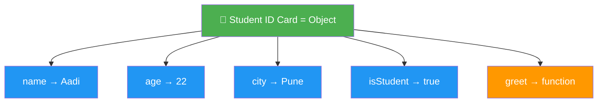

### What is an Object?

An **Object** is a collection of **key : value** pairs. It is used to store related data and functionality together.

> 💡 **Interview Definition:** "An object is a non-primitive data type that stores data as key-value pairs where keys are strings (or Symbols) and values can be any data type."

### 🛒 Tech Example — E-Commerce Product

```javascript
// Real-world: How Amazon/Flipkart stores a product
const product = {
    id: "P001",
    name: "iPhone 15",
    price: 79999,
    brand: "Apple",
    inStock: true,
    ratings: 4.5,
    category: "Electronics",
    discount: function() {
        return this.price * 0.10; // 10% off
    }
};

console.log(product.name);       // iPhone 15
console.log(product.price);      // 79999
console.log(product.discount()); // 7999.9
```

### 👤 Tech Example — User Profile (Like Instagram/Twitter)

```javascript
// How social media apps store user data
const userProfile = {
    username: "@aadi_codes",
    fullName: "Aadi Shah",
    followers: 1200,
    following: 300,
    posts: 45,
    isVerified: false,
    bio: "JavaScript Developer 🚀",
    location: "Pune, India"
};

console.log(userProfile.username);  // @aadi_codes
console.log(userProfile.followers); // 1200
```

### Creating an Object

```javascript
// Object Literal (Most Common Way)
const user = {
    name: "Aadi",
    age: 22,
    isStudent: true,
    city: "Pune"
};
```

### Accessing Values

```javascript
// Method 1: Dot Notation — like reading a book chapter.page
console.log(user.name);   // Aadi
console.log(user.age);    // 22

// Method 2: Bracket Notation — like using a key to open a locker
console.log(user["name"]); // Aadi
console.log(user["age"]);  // 22

// When to use Bracket Notation?
// Example: Search feature — user types key dynamically
const searchField = "name"; // Could come from input box
console.log(user[searchField]); // Aadi — dynamic key access

// Property with space in name — only bracket notation works
const obj = { "full name": "Aadi Shah" };
console.log(obj["full name"]); // Aadi Shah
// console.log(obj.full name); // ❌ SyntaxError
```

### Add, Update, Delete Properties

```javascript
// Real-world: Updating user profile settings
const user = { name: "Aadi", age: 22 };

// Add new property — like adding a new field to profile
user.city = "Pune";
user["country"] = "India";
console.log(user);
// { name: "Aadi", age: 22, city: "Pune", country: "India" }

// Update property — like editing your bio
user.age = 23;
console.log(user.age); // 23

// Delete property — like removing phone number from profile
delete user.city;
console.log(user.city); // undefined
```

### Check if Property Exists

```javascript
// Real-world: Check if user has premium subscription
const user = { name: "Aadi", age: 22 };

// Method 1: in operator
console.log("name" in user);     // true
console.log("premium" in user);  // false — no premium field

// Method 2: hasOwnProperty
console.log(user.hasOwnProperty("name")); // true

// Method 3: optional chaining — safe access
// Like checking if a folder exists before opening a file
console.log(user?.address?.city);  // undefined (no error!)
console.log(user?.name);           // Aadi
```

### Object Methods (Functions inside Objects)

```javascript
// Real-world: ATM Machine Object
const atm = {
    bankName: "SBI",
    balance: 50000,
    withdraw(amount) {
        if (amount > this.balance) {
            return "Insufficient balance!";
        }
        this.balance -= amount;
        return `Withdrawn ₹${amount}. Balance: ₹${this.balance}`;
    },
    checkBalance() {
        return `Balance: ₹${this.balance}`;
    }
};

console.log(atm.checkBalance());   // Balance: ₹50000
console.log(atm.withdraw(5000));   // Withdrawn ₹5000. Balance: ₹45000
console.log(atm.withdraw(100000)); // Insufficient balance!
```

### Iterating Over Objects

```javascript
// Real-world: Display user profile details on screen
const user = { name: "Aadi", age: 22, city: "Pune" };

// for...in — like looping through all profile fields
for (let key in user) {
    console.log(`${key}: ${user[key]}`);
}
// name: Aadi
// age: 22
// city: Pune

// Object.keys() — get all field names
console.log(Object.keys(user));   // ["name", "age", "city"]

// Object.values() — get all field values
console.log(Object.values(user)); // ["Aadi", 22, "Pune"]

// Object.entries() — get key-value pairs (useful for tables)
console.log(Object.entries(user));
// [["name","Aadi"], ["age",22], ["city","Pune"]]
```

### Object.freeze() vs Object.seal()

```javascript
// Real-world analogy:
// freeze() = Published exam paper — nothing can change
// seal()   = Submitted form — can correct answers but can't add/remove fields

const examPaper = { subject: "Math", totalMarks: 100 };

// freeze — like a published official document
Object.freeze(examPaper);
examPaper.subject = "Science"; // ❌ Can't change
examPaper.date = "2024";       // ❌ Can't add
console.log(examPaper);        // { subject: "Math", totalMarks: 100 }

// seal — like a submitted form (can edit, can't add/remove)
const form = { name: "Aadi", score: 85 };
Object.seal(form);
form.score = 90;        // ✅ Update allowed
form.city = "Pune";     // ❌ Add not allowed
delete form.name;       // ❌ Delete not allowed
console.log(form);      // { name: "Aadi", score: 90 }
```

### Shorthand Property Names (ES6)

```javascript
// Real-world: Creating user object from form inputs
const name = "Aadi";
const age = 22;
const city = "Pune";

// Old way — repetitive
const user1 = { name: name, age: age, city: city };

// ES6 Shorthand — clean and modern
const user2 = { name, age, city };
console.log(user2); // { name: "Aadi", age: 22, city: "Pune" }
```

### ❓ Interview Questions

**Q1: What is the difference between dot notation and bracket notation?**
> Dot notation is simpler and readable but can only be used with valid identifier names. Bracket notation can use dynamic keys, variables, and property names with spaces.

```javascript
// Real example: Search filter
const user = { name: "Aadi", age: 22, city: "Pune" };
const field = getUserInput(); // "name" — from search box

// Dot notation won't work with dynamic keys
// user.field — looks for property literally named "field"

// Bracket notation works perfectly
console.log(user[field]); // Aadi ✅
```

**Q2: What is the difference between null and undefined in an object?**
```javascript
const userProfile = {
    name: "Aadi",
    bio: undefined, // Has bio field but hasn't filled it yet
    phone: null     // Has phone field, intentionally left empty (privacy)
};

console.log(userProfile.bio);     // undefined — exists, no value
console.log(userProfile.phone);   // null — exists, intentionally empty
console.log(userProfile.address); // undefined — doesn't exist at all

console.log("bio" in userProfile);     // true — field exists
console.log("address" in userProfile); // false — field doesn't exist
```

**Q3: Are objects passed by value or reference?**
```javascript
// Real-world analogy:
// Value = Sending a PHOTOCOPY of a document (changes don't affect original)
// Reference = Sharing the SAME Google Doc link (changes affect everyone)

const user = { name: "Aadi" };
const copy = user; // Sharing the SAME object — like sharing Google Doc

copy.name = "Rahul"; // Changes the shared object
console.log(user.name); // "Rahul" — original ALSO changed!

// To create independent copy (like making a photocopy):
const trueCopy = { ...user }; // Spread operator — new copy
```

**Q4: What will be the output?**
```javascript
const obj = {};
obj[1] = "one";
obj["1"] = "ONE"; // Numbers convert to string — SAME key!

console.log(obj);                      // { '1': 'ONE' }
console.log(Object.keys(obj).length);  // 1
```

---

<a href="#top">⬆️ Go to Top</a>

---

<a id="2"></a>

## 2. 🎯 this Keyword — What is it?

### 🌍 Real-Life Analogy

> Imagine you are in a company meeting.
>
> The manager says: **"This team will present tomorrow."**
>
> The word **"This"** changes based on WHICH team the manager is talking about!
> - In Sales meeting → "this" = Sales team
> - In Dev meeting → "this" = Dev team
>
> Similarly in JavaScript, **`this`** changes based on WHO is calling the function.

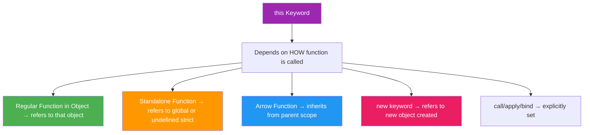

### Basic Example

```javascript
// Real-world: Employee greeting system
const employee = {
    name: "Aadi",
    department: "Engineering",
    greet: function() {
        // 'this' = employee object (the one calling the function)
        console.log(`Hi! I am ${this.name} from ${this.department}`);
    }
};

employee.greet(); // Hi! I am Aadi from Engineering
```

### `this` Changes Based on Caller

```javascript
// Real-world: Same "introduce" function, different person calling it
const person1 = {
    name: "Aadi",
    introduce: function() {
        console.log(`Hello, I am ${this.name}`);
    }
};

const person2 = {
    name: "Rahul"
};

person1.introduce(); // Hello, I am Aadi (this = person1)

// Borrowing the method — like using someone else's visiting card template
person2.introduce = person1.introduce;
person2.introduce(); // Hello, I am Rahul (this = person2 now!)

// Standalone call — no owner, no context
const fn = person1.introduce;
fn(); // Hello, I am undefined (strict) or window.name (non-strict)
```

### `this` in Different Situations

```javascript
// 1. Global context — no specific owner
console.log(this); // window (browser)

// 2. Inside regular function — no specific owner
function showThis() {
    console.log(this); // window (non-strict) / undefined (strict)
}
showThis();

// 3. Inside object method — the object is the owner
const phone = {
    brand: "Samsung",
    model: "S24",
    getInfo() {
        console.log(this); // { brand: "Samsung", model: "S24", getInfo: f }
        console.log(this.brand); // Samsung
    }
};
phone.getInfo();

// 4. Constructor — this = new object being created
function Car(brand, color) {
    this.brand = brand;  // this = new Car object
    this.color = color;
}
const myCar = new Car("BMW", "Black");
console.log(myCar.brand); // BMW

// 5. Arrow function — inherits this from where it is written
const laptop = {
    brand: "Dell",
    show: () => {
        console.log(this.brand); // undefined — arrow uses global this!
    }
};
laptop.show();
```

### ❓ Interview Question

**Q: What will be the output?**

```javascript
const restaurant = {
    name: "Biryani House",
    greet: function() {
        console.log(`Welcome to ${this.name}`);
    }
};

const greetFn = restaurant.greet;
restaurant.greet(); // Welcome to Biryani House (this = restaurant)
greetFn();          // Welcome to undefined (this = global, no restaurant)
```

---

<a href="#top">⬆️ Go to Top</a>

---

<a id="3"></a>

## 3. 🖥️ console.log(this) — Explained

### 🌍 Real-Life Analogy

> Think of `this` like asking **"Who is speaking?"** in a conversation.
>
> - In a classroom → "Who is speaking?" = Teacher
> - On a phone call → "Who is speaking?" = The caller
> - Talking to yourself → "Who is speaking?" = You (global/window)
>
> `console.log(this)` just asks: **"Who is the current context?"**

### In Global Scope (Browser)

```javascript
// Like asking "Who is in charge?" at the top level
// Answer: The Browser Window — it's the global owner!
console.log(this);
// Output: Window { ... }
```

### In Global Scope (Node.js)

```javascript
// In Node.js, each file is a module — module is the owner
console.log(this);
// Output: {}  (empty module.exports object)
```

### Inside Regular Function

```javascript
// Like an employee who hasn't been assigned to any team yet
function showThis() {
    console.log(this);
}

showThis();
// Non-strict: Window { ... }  — defaults to global
// Strict mode: undefined      — no default, explicitly nothing
```

### Inside Object Method

```javascript
// Like asking "Who is the owner of this method?"
// Answer: The object that has the method!
const company = {
    name: "TechCorp",
    location: "Pune",
    showInfo: function() {
        console.log(this);
        // Output: { name: "TechCorp", location: "Pune", showInfo: f }
        // 'this' = the company object itself
    }
};

company.showInfo();
```

### Inside Arrow Function

```javascript
// Arrow function doesn't ask "Who called me?"
// It asks "Where was I WRITTEN?" and uses that context
const company = {
    name: "TechCorp",
    showInfo: () => {
        console.log(this);
        // Output: Window { ... }
        // Arrow was written in global scope, so this = window
    }
};

company.showInfo(); // Window — NOT company!
```

### Inside Nested Function — The Common Problem

```javascript
// Real-world: Timer inside an object
const stopwatch = {
    brand: "Casio",
    start: function() {
        console.log(this.brand); // "Casio" ✅ — this = stopwatch

        // Nested regular function LOSES the context!
        function tick() {
            console.log(this.brand); // undefined ❌ — this = window now!
        }
        tick();
    }
};

stopwatch.start();
```

### Fix for Nested Function — 3 Ways

```javascript
// Real-world: YouTube video player with timer
const videoPlayer = {
    title: "JS Tutorial",
    start: function() {

        // Fix 1: Save 'this' reference (old school way)
        const self = this;
        function updateProgress() {
            console.log(`Playing: ${self.title}`); // ✅
        }
        updateProgress();

        // Fix 2: Arrow function (BEST — modern way)
        const showTitle = () => {
            console.log(`Playing: ${this.title}`); // ✅ — inherits this
        };
        showTitle();

        // Fix 3: bind — explicitly attach context
        function showDuration() {
            console.log(`Playing: ${this.title}`); // ✅
        }
        showDuration.call(this);
    }
};

videoPlayer.start();
// Playing: JS Tutorial (all 3 times)
```

### Summary Table

| Context | `this` value | Real-Life Analogy |
|---------|-------------|-------------------|
| Global (Browser) | `window` | The entire browser is in charge |
| Global (Node.js) | `{}` | The current module file is in charge |
| Regular function (non-strict) | `window` | No owner — defaults to global boss |
| Regular function (strict) | `undefined` | No owner — nothing assigned |
| Object method | The object itself | The object is the owner |
| Arrow function | Parent scope's `this` | Inherits from where it was written |
| Constructor (new) | New object being created | The new instance being built |
| Event listener | The element clicked | The button/input that fired the event |

---

<a href="#top">⬆️ Go to Top</a>

---

<a id="4"></a>

## 4. 💡 Why `this` is Important

### 🌍 Real-Life Analogy

> `this` is like a **pronoun** in English.
>
> Instead of saying: *"Aadi works at Aadi's company and Aadi's salary is..."*
>
> We say: *"Aadi works at **his** company and **his** salary is..."*
>
> `this` works the same — it refers to "the current object" without repeating the name.

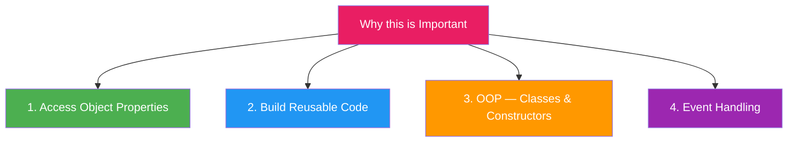

### 1. Access Object Properties

```javascript
// Real-world: Smart TV remote control object
const smartTV = {
    brand: "Sony",
    screenSize: 55,
    currentChannel: 5,
    isOn: false,

    powerToggle() {
        // Using 'this' to access and update own properties
        this.isOn = !this.isOn;
        console.log(`${this.brand} TV is now ${this.isOn ? "ON" : "OFF"}`);
    },

    changeChannel(channel) {
        this.currentChannel = channel;
        console.log(`${this.brand}: Switched to channel ${this.currentChannel}`);
    }
};

smartTV.powerToggle();       // Sony TV is now ON
smartTV.changeChannel(10);   // Sony: Switched to channel 10
```

### 2. Build Reusable Code

```javascript
// Real-world: Same payment function used by different users
function makePayment(amount) {
    console.log(`${this.name} paid ₹${amount} using ${this.paymentMethod}`);
    this.walletBalance -= amount;
    console.log(`Remaining balance: ₹${this.walletBalance}`);
}

const user1 = {
    name: "Aadi",
    paymentMethod: "PhonePe",
    walletBalance: 500
};

const user2 = {
    name: "Rahul",
    paymentMethod: "GPay",
    walletBalance: 1000
};

// Same function, different objects — 'this' adapts!
user1.pay = makePayment;
user2.pay = makePayment;

user1.pay(100);
// Aadi paid ₹100 using PhonePe
// Remaining balance: ₹400

user2.pay(250);
// Rahul paid ₹250 using GPay
// Remaining balance: ₹750
```

### 3. OOP — Classes & Constructors

```javascript
// Real-world: Online course platform (like Udemy/Coursera)
class Course {
    constructor(title, instructor, price) {
        this.title = title;         // 'this' = new Course object
        this.instructor = instructor;
        this.price = price;
        this.students = [];
        this.isPublished = false;
    }

    enroll(studentName) {
        this.students.push(studentName);
        console.log(`${studentName} enrolled in "${this.title}"`);
    }

    publish() {
        this.isPublished = true;
        console.log(`"${this.title}" by ${this.instructor} is now LIVE!`);
    }

    getInfo() {
        return `${this.title} | ₹${this.price} | ${this.students.length} students`;
    }
}

const jsClass = new Course("JavaScript Mastery", "Aadi", 999);
const reactClass = new Course("React Pro", "Rahul", 1499);

jsClass.enroll("Neha");   // Neha enrolled in "JavaScript Mastery"
jsClass.enroll("Priya");  // Priya enrolled in "JavaScript Mastery"
jsClass.publish();         // "JavaScript Mastery" by Aadi is now LIVE!

console.log(jsClass.getInfo());   // JavaScript Mastery | ₹999 | 2 students
console.log(reactClass.getInfo()); // React Pro | ₹1499 | 0 students
```

### 4. Event Handling

```javascript
// Real-world: Like/Unlike button on social media post
document.getElementById("likeBtn").addEventListener("click", function() {
    // 'this' = the button that was clicked
    const currentLikes = parseInt(this.dataset.likes);

    if (this.classList.contains("liked")) {
        this.classList.remove("liked");
        this.dataset.likes = currentLikes - 1;
        this.textContent = `❤️ ${currentLikes - 1} Likes`;
    } else {
        this.classList.add("liked");
        this.dataset.likes = currentLikes + 1;
        this.textContent = `❤️ ${currentLikes + 1} Likes`;
    }
});

// ⚠️ Arrow function — 'this' is NOT the button!
document.getElementById("likeBtn").addEventListener("click", () => {
    console.log(this); // window — NOT the button! ❌
});
```

### call(), apply(), bind() — Explicit this

```javascript
// Real-world: Doctor and patient billing system
function generateBill(tax, discount) {
    const total = this.consultationFee + tax - discount;
    console.log(`Patient: ${this.patientName}`);
    console.log(`Doctor: ${this.doctorName}`);
    console.log(`Total Bill: ₹${total}`);
}

const appointment1 = {
    patientName: "Aadi",
    doctorName: "Dr. Sharma",
    consultationFee: 500
};

const appointment2 = {
    patientName: "Neha",
    doctorName: "Dr. Gupta",
    consultationFee: 800
};

// call — use this object, pass args normally
generateBill.call(appointment1, 50, 100);
// Patient: Aadi | Doctor: Dr. Sharma | Total Bill: ₹450

// apply — use this object, pass args as array
generateBill.apply(appointment2, [100, 50]);
// Patient: Neha | Doctor: Dr. Gupta | Total Bill: ₹850

// bind — create a new function pre-set for appointment1
const aadiBill = generateBill.bind(appointment1, 50);
aadiBill(0);   // Total Bill: ₹550
aadiBill(100); // Total Bill: ₹450
```

### ❓ Interview Questions

**Q1: What is the output?**
```javascript
// Real-world: Countdown timer bug
function Countdown(seconds) {
    this.seconds = seconds;
    setInterval(function() {
        this.seconds--; // ❌ 'this' = window, not Countdown
        console.log(this.seconds); // NaN
    }, 1000);
}
const timer = new Countdown(10);

// Fix — arrow function keeps 'this' = Countdown instance
function CountdownFixed(seconds) {
    this.seconds = seconds;
    setInterval(() => {
        this.seconds--; // ✅ 'this' = CountdownFixed instance
        console.log(this.seconds); // 9, 8, 7...
    }, 1000);
}
```

**Q2: Method Chaining using `this` (Builder Pattern)**
```javascript
// Real-world: Query builder like database queries
const queryBuilder = {
    query: "",
    select(fields) {
        this.query += `SELECT ${fields} `;
        return this; // Return this for chaining!
    },
    from(table) {
        this.query += `FROM ${table} `;
        return this;
    },
    where(condition) {
        this.query += `WHERE ${condition}`;
        return this;
    },
    build() {
        return this.query;
    }
};

const sql = queryBuilder
    .select("name, age")
    .from("users")
    .where("age > 18")
    .build();

console.log(sql);
// SELECT name, age FROM users WHERE age > 18
```

---

<a href="#top">⬆️ Go to Top</a>

---

<a id="5"></a>

## 5. 🏹 this — Arrow Function vs Normal Function

### 🌍 Real-Life Analogy

> **Normal function** = A freelancer who works FOR whoever hires them.
> Their "boss" (`this`) changes based on who called them.
>
> **Arrow function** = A permanent employee. Their "boss" (`this`) is always
> the company where they were HIRED — never changes, no matter who asks them to do work.

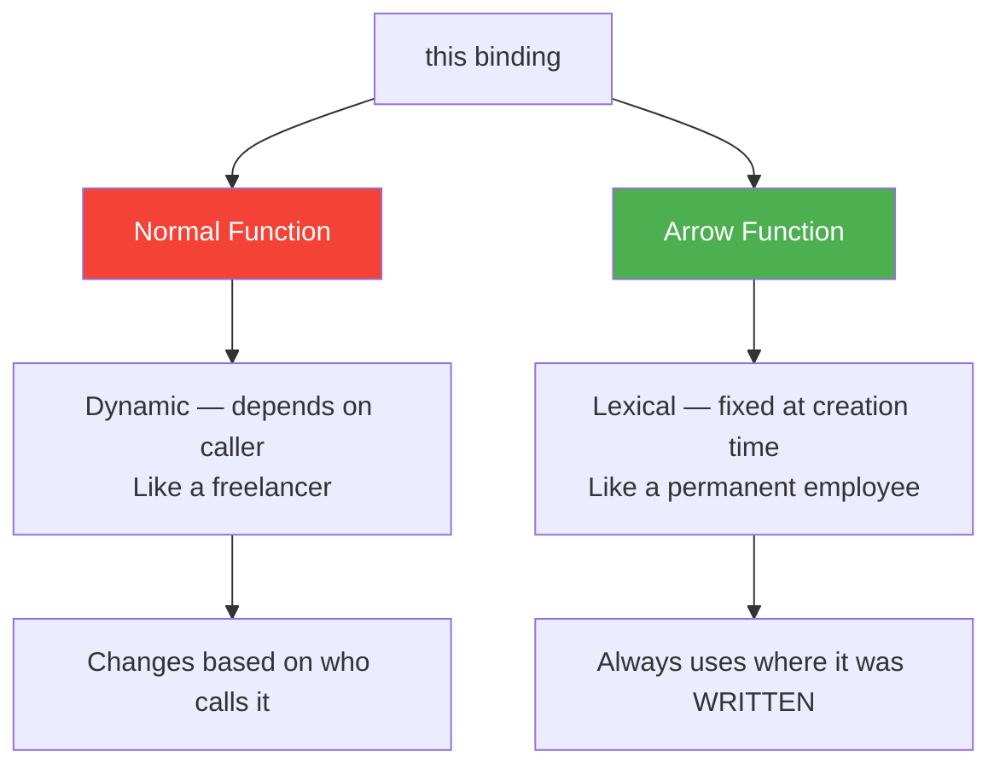

### Side by Side Comparison

```javascript
// Real-world: Smart home device
const alexaDevice = {
    ownerName: "Aadi",
    commands: ["Play music", "Set timer", "Check weather"],

    // Normal function — 'this' = alexaDevice object ✅
    normalResponse: function() {
        console.log(`Hello ${this.ownerName}, processing your request...`);
    },

    // Arrow function — 'this' = global (window) ❌
    arrowResponse: () => {
        console.log(`Hello ${this.ownerName}, processing...`);
        // this.ownerName = undefined — arrow uses global 'this'
    }
};

alexaDevice.normalResponse(); // Hello Aadi, processing your request... ✅
alexaDevice.arrowResponse();  // Hello undefined, processing... ❌
```

### Why Arrow Function Fails as Object Method

```javascript
// Real-world: Food delivery app — restaurant object
const swiggyRestaurant = {
    name: "Biryani Palace",
    // Arrow function at object level — 'this' is captured from GLOBAL scope
    // Because the object {} doesn't create a new 'this' scope!
    getMenu: () => {
        console.log(`Menu of ${this.name}`); // undefined ❌
        // this = window/global — NOT swiggyRestaurant
    }
};

swiggyRestaurant.getMenu(); // Menu of undefined
```

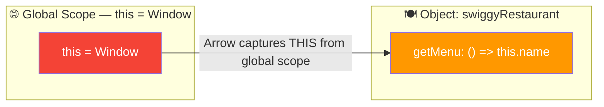

### Where Arrow Function `this` Shines ✅

```javascript
// Real-world: Notification system
const notificationService = {
    appName: "WhatsApp",
    users: ["Aadi", "Rahul", "Neha"],

    // ❌ Problem with regular function inside forEach
    sendWrongWay: function() {
        this.users.forEach(function(user) {
            // 'this' inside forEach callback = window (lost context!)
            console.log(`[${this.appName}] Hello, ${user}!`);
            // [undefined] Hello, Aadi!
        });
    },

    // ✅ Arrow function inherits 'this' from sendRightWay
    sendRightWay: function() {
        this.users.forEach((user) => {
            // Arrow inherits 'this' from sendRightWay = notificationService ✅
            console.log(`[${this.appName}] Hello, ${user}!`);
            // [WhatsApp] Hello, Aadi!
        });
    }
};

notificationService.sendWrongWay();
// [undefined] Hello, Aadi!
// [undefined] Hello, Rahul!

notificationService.sendRightWay();
// [WhatsApp] Hello, Aadi! ✅
// [WhatsApp] Hello, Rahul! ✅
// [WhatsApp] Hello, Neha! ✅
```

### Arrow Function in Class — Perfect Use

```javascript
// Real-world: Ride-sharing app — Uber/Ola trip tracker
class TripTracker {
    constructor(driverName) {
        this.driverName = driverName;
        this.distance = 0;
        this.isActive = false;
    }

    // ❌ Regular function loses 'this' in setInterval
    startWrong() {
        setInterval(function() {
            this.distance += 0.5; // ❌ this = window, not TripTracker
            console.log(`Distance: ${this.distance} km`); // NaN
        }, 1000);
    }

    // ✅ Arrow function keeps 'this' = TripTracker instance
    startTrip() {
        this.isActive = true;
        console.log(`${this.driverName}'s trip started!`);

        const interval = setInterval(() => {
            this.distance += 0.5; // ✅ this = TripTracker instance
            console.log(`${this.driverName}: ${this.distance} km covered`);

            if (this.distance >= 2) {
                clearInterval(interval);
                console.log("Trip ended!");
            }
        }, 1000);
    }
}

const trip = new TripTracker("Ramesh");
trip.startTrip();
// Ramesh's trip started!
// Ramesh: 0.5 km covered
// Ramesh: 1 km covered
// Ramesh: 1.5 km covered
// Ramesh: 2 km covered
// Trip ended!
```

### Key Rules Summary

```javascript
// Rule 1: Arrow never has its own 'this' — even call/bind can't change it
const arrowFn = () => { return this; };
arrowFn.call({ name: "Aadi" }); // Still Window — call() is IGNORED for arrows!

// Rule 2: Normal function 'this' CAN be changed
function normalFn() { return this.name; }
normalFn.call({ name: "Aadi" }); // "Aadi" — changed! ✅

// Rule 3: Arrow in class field — perfect for callbacks
class SubmitButton {
    constructor(formName) {
        this.formName = formName;
    }
    // Auto-bound arrow — always refers to class instance
    handleClick = () => {
        console.log(`${this.formName} form submitted!`);
    }
}

const loginBtn = new SubmitButton("Login");
const handler = loginBtn.handleClick; // Extracted from object
handler(); // "Login form submitted!" ✅ — arrow keeps 'this'
```

### When to Use What

| Situation | Use | Real-World Example |
|-----------|-----|--------------------|
| Object methods | Normal function | `cart.addItem()`, `user.greet()` |
| Event handlers needing `this` | Normal function | Button click changing button style |
| Array callbacks (map, filter) | Arrow function | `users.map(u => u.name)` |
| Nested functions in methods | Arrow function | `forEach` inside object method |
| setTimeout/setInterval in class | Arrow function | Auto-save, polling, animation |
| Constructor functions | Normal function | `new Car()`, `new User()` |
| React event handlers in class | Arrow class field | `handleClick = () => {}` |

### ❓ Tricky Interview Questions

**Q1: What will be the output?**
```javascript
// Real-world: Order notification system
const orderSystem = {
    orderId: "ORD001",
    notifySteps: function() {
        const steps = ["Order placed", "Payment done", "Shipped"];

        steps.forEach((step) => {
            // Arrow inherits 'this' from notifySteps
            console.log(`[${this.orderId}] ${step}`);
        });
    }
};

orderSystem.notifySteps();
// [ORD001] Order placed ✅
// [ORD001] Payment done ✅
// [ORD001] Shipped ✅
```

**Q2: Can you change arrow function's `this` using bind?**
```javascript
const greet = () => { return this.name; };
const bound = greet.bind({ name: "Aadi" });
console.log(bound()); // undefined — bind has NO effect on arrow functions!
// Arrow's 'this' is PERMANENT from definition time
```

**Q3: What will be the output?**
```javascript
// Real-world: React-like component
function Button(label) {
    this.label = label;
    // Arrow captures 'this' from constructor — always this Button instance
    this.handleClick = () => {
        console.log(`${this.label} button clicked!`);
    };
}

const submitBtn = new Button("Submit");
const clickHandler = submitBtn.handleClick; // Extract the method

clickHandler(); // "Submit button clicked!" ✅
// Even though extracted, arrow remembers 'this' = submitBtn
```

---

<a href="#top">⬆️ Go to Top</a>

---

<a id="6"></a>

## 6. 🔭 Lexical Scope

### 🌍 Real-Life Analogy

> Think of a **Russian nesting doll (Matryoshka)**:
>
> The innermost doll can SEE and ACCESS everything outside it.
> But the outer doll CANNOT see what's inside the inner doll.
>
> That's exactly how **Lexical Scope** works in JavaScript!

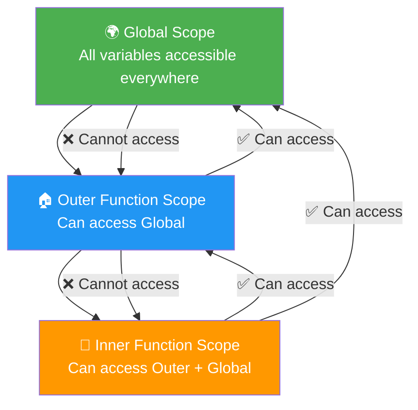

### Basic Example

```javascript
// Real-world: Company → Department → Employee
function company() {
    const companyName = "TechCorp"; // Outer variable

    function department() {
        const deptName = "Engineering"; // Middle variable

        function employee() {
            const empName = "Aadi"; // Inner variable

            // Employee can access ALL outer scopes
            console.log(companyName); // TechCorp ✅
            console.log(deptName);    // Engineering ✅
            console.log(empName);     // Aadi ✅
        }

        employee();
        // console.log(empName); // ❌ ReferenceError — can't access inner
    }

    department();
    // console.log(deptName); // ❌ ReferenceError
}

company();
```

### Scope Chain — Searching for Variables

```javascript
// Real-world: How JavaScript finds a variable
// Like searching for a file — first check current folder, then parent, then grandparent...

const serverURL = "https://api.example.com"; // Global

function makeRequest() {
    const endpoint = "/users"; // makeRequest scope

    function getData() {
        const params = "?limit=10"; // getData scope

        // JavaScript searches: getData scope → makeRequest scope → Global
        const fullURL = serverURL + endpoint + params;
        console.log(fullURL);
        // https://api.example.com/users?limit=10
    }

    getData();
}

makeRequest();
```

### Lexical Scope vs Dynamic Scope

```javascript
// JavaScript uses LEXICAL scope — WHERE function is WRITTEN matters!
// Not where it is called from.

const theme = "dark"; // Global theme

function applyTheme() {
    // Looks for 'theme' WHERE applyTheme is DEFINED (global scope)
    console.log(`Applying theme: ${theme}`);
}

function userSettings() {
    const theme = "light"; // Local theme
    applyTheme(); // Even called here, applyTheme uses GLOBAL theme!
}

userSettings(); // Applying theme: dark (NOT light!)
// This is LEXICAL scope — definition location wins over call location
```

### Lexical Scope Powers Closures

```javascript
// Real-world: Online banking — account balance stays private
function createBankAccount(initialBalance) {
    let balance = initialBalance; // Lives in createBankAccount scope

    // These inner functions REMEMBER balance because of lexical scope
    return {
        deposit(amount) {
            balance += amount;
            console.log(`Deposited ₹${amount}. Balance: ₹${balance}`);
        },
        withdraw(amount) {
            if (amount > balance) {
                console.log("Insufficient funds!");
                return;
            }
            balance -= amount;
            console.log(`Withdrawn ₹${amount}. Balance: ₹${balance}`);
        },
        getBalance() {
            return balance;
        }
    };
}

const myAccount = createBankAccount(10000);
myAccount.deposit(5000);   // Deposited ₹5000. Balance: ₹15000
myAccount.withdraw(3000);  // Withdrawn ₹3000. Balance: ₹12000
console.log(myAccount.getBalance()); // 12000
// Balance is private — no direct access!
```

### Block Scope with let and const

```javascript
// Real-world: if blocks, for loops, switch cases

// var — function scoped (PROBLEM!)
for (var i = 0; i < 3; i++) {
    setTimeout(() => console.log(i), 100); // 3, 3, 3 — all print 3!
}
// 'i' leaks outside the for loop!
console.log(i); // 3 — accessible outside! Dangerous

// let — block scoped (SOLUTION!)
for (let j = 0; j < 3; j++) {
    setTimeout(() => console.log(j), 100); // 0, 1, 2 — correct!
}
// console.log(j); // ❌ ReferenceError — j stays inside loop

// Real-world: If-else blocks
if (true) {
    let secret = "password123"; // Only accessible inside this block
    const apiKey = "abc-xyz";   // Only accessible inside this block
}
// console.log(secret); // ❌ ReferenceError — stays in block
```

### Shadowing

```javascript
// Real-world: Local variable "shadows" outer variable with same name
// Like a nickname overriding a formal name in a specific context

const username = "Global_User"; // App-level username

function userDashboard() {
    const username = "Aadi_123"; // Dashboard-level username (shadows global)
    console.log(username); // "Aadi_123" — local wins

    function profilePage() {
        const username = "aadi_profile"; // Profile-level (shadows dashboard)
        console.log(username); // "aadi_profile" — innermost wins
    }

    profilePage();
    console.log(username); // "Aadi_123" — back to dashboard level
}

userDashboard();
console.log(username); // "Global_User" — global unchanged
```

### ❓ Interview Questions

**Q1: What is the output?**
```javascript
// Real-world: Config system
const config = "production";

function deployApp() {
    const config = "staging";

    function runTests() {
        // Looks where runTests is WRITTEN — inside deployApp
        // So finds config = "staging" (not global "production")
        console.log(config);
    }

    runTests(); // "staging" — lexical scope
}

deployApp();
```

**Q2: What is the output? (Closure + Lexical Scope)**
```javascript
// Real-world: Shopping cart counter
function createCartCounter() {
    let itemCount = 0;

    return {
        addItem()    { itemCount++; },
        removeItem() { itemCount--; },
        getCount()   { return itemCount; }
    };
}

const cart = createCartCounter();
cart.addItem();
cart.addItem();
cart.addItem();
cart.removeItem();
console.log(cart.getCount()); // 2 — lexical scope keeps itemCount alive!
```

**Q3: What is the difference between scope and closure?**
> **Scope** = The rules that define WHERE variables can be accessed (like zones in a building — staff only, public, etc.)
>
> **Closure** = A function that REMEMBERS and uses variables from its outer scope even after that outer scope has finished (like an employee who keeps their office access card even after the project ends)

---

<a href="#top">⬆️ Go to Top</a>

---

<a id="7"></a>

## 7. 📦 Arrays — Complete Guide

### 🌍 Real-Life Analogy

> An **Array** is like a **train with numbered compartments**.
> - Each compartment has a number starting from 0 (index)
> - Each compartment holds a passenger (value)
> - You can add compartments at the end (push) or remove them (pop)
> - The train keeps compartments in ORDER

```javascript
// Train compartments = Array indexes
const passengers = ["Aadi", "Rahul", "Neha", "Priya"];
//                    [0]      [1]      [2]      [3]

console.log(passengers[0]); // Aadi — first compartment
console.log(passengers[3]); // Priya — last compartment
console.log(passengers.length); // 4 — total compartments
```

### push() — Add to End

```javascript
// Real-world: Adding items to Swiggy cart
const cart = ["Biryani", "Raita"];

cart.push("Cold Drink");
console.log(cart); // ["Biryani", "Raita", "Cold Drink"]

// Add multiple
cart.push("Dessert", "Papad");
console.log(cart); // ["Biryani", "Raita", "Cold Drink", "Dessert", "Papad"]

// push() returns new length
const newLength = cart.push("Water Bottle");
console.log(newLength); // 6
```

### pop() — Remove from End

```javascript
// Real-world: Undo last item added to cart
const cart = ["Biryani", "Raita", "Cold Drink"];

const removedItem = cart.pop(); // Returns removed item
console.log(removedItem); // "Cold Drink"
console.log(cart);        // ["Biryani", "Raita"]
```

### unshift() — Add to Beginning

```javascript
// Real-world: Priority queue — add urgent task to top
const taskQueue = ["Write tests", "Deploy app"];

taskQueue.unshift("Fix critical bug"); // Add to front
console.log(taskQueue);
// ["Fix critical bug", "Write tests", "Deploy app"]
```

### shift() — Remove from Beginning

```javascript
// Real-world: Processing queue — handle first task
const printQueue = ["Document A", "Document B", "Document C"];

const nextJob = printQueue.shift(); // Remove from front
console.log(nextJob);    // "Document A"
console.log(printQueue); // ["Document B", "Document C"]
```

### ✅ map() — Transform Each Element

```javascript
// Real-world: Apply discount to all products
const products = [
    { name: "Shirt",  price: 500 },
    { name: "Pants",  price: 1000 },
    { name: "Shoes",  price: 2000 }
];

// Apply 10% discount to all products
const discountedProducts = products.map(product => ({
    ...product,
    discountedPrice: product.price * 0.9
}));

console.log(discountedProducts);
// [
//   { name: "Shirt",  price: 500,  discountedPrice: 450 },
//   { name: "Pants",  price: 1000, discountedPrice: 900 },
//   { name: "Shoes",  price: 2000, discountedPrice: 1800 }
// ]

// Original unchanged ✅
console.log(products[0].price); // 500

// Simple example — double numbers
const scores = [10, 20, 30];

// Long form
const doubled = scores.map(function(score) {
    return score * 2;
});

// Arrow — single line (preferred)
const doubled2 = scores.map(score => score * 2);
console.log(doubled2); // [20, 40, 60]

// Real-world: Extract emails from user list
const users = [
    { name: "Aadi",  email: "aadi@gmail.com" },
    { name: "Rahul", email: "rahul@gmail.com" }
];
const emails = users.map(user => user.email);
console.log(emails); // ["aadi@gmail.com", "rahul@gmail.com"]
```

### ✅ filter() — Keep Matching Elements

```javascript
// Real-world: Job board filtering — show only remote jobs
const jobs = [
    { title: "Frontend Dev",  type: "remote",  salary: 80000 },
    { title: "Backend Dev",   type: "onsite",  salary: 90000 },
    { title: "Full Stack Dev", type: "remote", salary: 120000 },
    { title: "DevOps",        type: "hybrid",  salary: 100000 }
];

// Filter only remote jobs
const remoteJobs = jobs.filter(job => job.type === "remote");
console.log(remoteJobs);
// [{ Frontend Dev, remote }, { Full Stack Dev, remote }]

// Filter high salary jobs (> 90k)
const highPaying = jobs.filter(job => job.salary > 90000);
console.log(highPaying);
// [{ Full Stack Dev, 120000 }, { DevOps, 100000 }]

// Filter: remote AND high salary
const dream = jobs.filter(job => job.type === "remote" && job.salary > 90000);
console.log(dream);
// [{ Full Stack Dev, remote, 120000 }]

// Simple: Get passing students
const students = [
    { name: "Aadi",  marks: 80 },
    { name: "Rahul", marks: 35 },
    { name: "Neha",  marks: 90 }
];

const passed = students.filter(s => s.marks >= 40);
// [{ Aadi, 80 }, { Neha, 90 }]
```

### ✅ reduce() — Reduce to Single Value

```javascript
// Real-world: Calculate total cart value
const cart = [
    { item: "Laptop",   price: 50000, qty: 1 },
    { item: "Mouse",    price: 800,   qty: 2 },
    { item: "Keyboard", price: 1500,  qty: 1 }
];

const totalAmount = cart.reduce((total, product) => {
    return total + (product.price * product.qty);
}, 0);

console.log(totalAmount); // 54100 (50000 + 1600 + 1500)

// Step by step:
// total=0,     item=Laptop   → 0 + 50000 = 50000
// total=50000, item=Mouse    → 50000 + 1600 = 51600
// total=51600, item=Keyboard → 51600 + 1500 = 53100
```

### 📊 reduce() Step-by-Step Diagram


| Step | prev (accumulator) | curr | Return |
|------|-------------------|------|--------|
| 1 | 0 (initial) | 1 | 1 |
| 2 | 1 | 2 | 3 |
| 3 | 3 | 3 | 6 |
| 4 | 6 | 4 | 10 |

### reduce() — Advanced Real-World Use Cases

```javascript
// 1. Analytics: Count visitors per page
const pageVisits = [
    "/home", "/about", "/home", "/products",
    "/home", "/about", "/contact"
];

const visitCount = pageVisits.reduce((acc, page) => {
    acc[page] = (acc[page] || 0) + 1;
    return acc;
}, {});

console.log(visitCount);
// { '/home': 3, '/about': 2, '/products': 1, '/contact': 1 }

// 2. Group orders by status (like Swiggy order history)
const orders = [
    { id: 1, status: "delivered", amount: 350 },
    { id: 2, status: "pending",   amount: 500 },
    { id: 3, status: "delivered", amount: 200 },
    { id: 4, status: "cancelled", amount: 150 }
];

const ordersByStatus = orders.reduce((acc, order) => {
    if (!acc[order.status]) acc[order.status] = [];
    acc[order.status].push(order);
    return acc;
}, {});

console.log(ordersByStatus.delivered);
// [{ id:1, ... }, { id:3, ... }]

// 3. Find highest rated product
const products2 = [
    { name: "Phone",  rating: 4.2 },
    { name: "Laptop", rating: 4.8 },
    { name: "Tablet", rating: 4.5 }
];

const topProduct = products2.reduce((best, product) => {
    return product.rating > best.rating ? product : best;
});

console.log(topProduct); // { name: "Laptop", rating: 4.8 }
```

### Chaining Array Methods — Real World

```javascript
// Real-world: Filter top performing employees, get their names, sorted

const employees = [
    { name: "Aadi",   dept: "Engineering", salary: 80000, performance: 9.2 },
    { name: "Rahul",  dept: "Marketing",   salary: 60000, performance: 7.5 },
    { name: "Neha",   dept: "Engineering", salary: 90000, performance: 9.8 },
    { name: "Priya",  dept: "HR",          salary: 55000, performance: 8.1 },
    { name: "Vikram", dept: "Engineering", salary: 85000, performance: 6.9 }
];

// Get names of high-performing engineers, sorted alphabetically
const topEngineers = employees
    .filter(e => e.dept === "Engineering")      // Only engineers
    .filter(e => e.performance >= 9.0)          // High performers
    .map(e => e.name)                           // Get names only
    .sort();                                    // Sort alphabetically

console.log(topEngineers); // ["Aadi", "Neha"]

// Total salary of high performers
const totalSalary = employees
    .filter(e => e.performance >= 9.0)
    .reduce((sum, e) => sum + e.salary, 0);

console.log(`Total salary of top performers: ₹${totalSalary}`);
// Total salary of top performers: ₹170000
```

### ❓ Interview Questions

**Q1: Difference between map() and forEach()?**
```javascript
// Real-world: Processing list of orders

// map() — like a factory assembly line that RETURNS processed items
const orderIds = [101, 102, 103];
const invoices = orderIds.map(id => `INV-${id}`);
console.log(invoices); // ["INV-101", "INV-102", "INV-103"]

// forEach() — like reading orders aloud (action only, no return)
const result = orderIds.forEach(id => {
    console.log(`Processing order ${id}...`);
});
console.log(result); // undefined — forEach always returns undefined!
```

**Q2: Difference between find() and filter()?**
```javascript
// find() — finds FIRST matching item (like finding first available seat)
const seats = [
    { id: 1, available: false },
    { id: 2, available: true },
    { id: 3, available: true }
];

const firstSeat = seats.find(s => s.available);
console.log(firstSeat); // { id: 2, available: true } — only FIRST match

// filter() — finds ALL matching items (like finding all available seats)
const allSeats = seats.filter(s => s.available);
console.log(allSeats); // [{ id: 2 }, { id: 3 }] — ALL matches
```

**Q4: Remove duplicates from array**
```javascript
// Real-world: Remove duplicate categories from product list
const categories = ["Electronics", "Clothing", "Electronics", "Food", "Clothing"];

// Method 1: Set — like a unique visitor counter
const unique = [...new Set(categories)];
console.log(unique); // ["Electronics", "Clothing", "Food"]

// Method 2: filter with indexOf
const unique2 = categories.filter((cat, idx) => categories.indexOf(cat) === idx);
console.log(unique2); // ["Electronics", "Clothing", "Food"]
```

---

<a href="#top">⬆️ Go to Top</a>

---

<a id="8"></a>

## 8. 🧩 Object Destructuring

### 🌍 Real-Life Analogy

> Imagine you order a **combo meal** at a restaurant.
> The combo has burger + fries + drink — all in one box.
>
> **Destructuring** is like OPENING the box and
> taking each item out separately:
> `const { burger, fries, drink } = comboMeal;`
>
> Instead of always saying `comboMeal.burger`, `comboMeal.fries`...

```javascript
// Without destructuring — like always saying the full address
const user = { name: "Aadi", age: 22, city: "Pune" };
const name1 = user.name; // user.name
const age1 = user.age;   // user.age — repetitive!

// With destructuring — clean extraction
const { name, age, city } = user;
console.log(name); // Aadi
console.log(age);  // 22
```

### Tech Example — API Response Handling

```javascript
// Real-world: Handling API response like GitHub/Twitter API
const apiResponse = {
    status: 200,
    message: "Success",
    data: {
        userId: "USR001",
        username: "aadi_codes",
        email: "aadi@gmail.com",
        followers: 1200,
        following: 300
    },
    timestamp: "2024-01-15T10:30:00Z"
};

// Without destructuring — very verbose
const status1 = apiResponse.status;
const username1 = apiResponse.data.username;

// With destructuring — clean!
const { status, message, data } = apiResponse;
const { username, email, followers } = data;

console.log(status);    // 200
console.log(username);  // aadi_codes
console.log(followers); // 1200
```

### Rename While Destructuring

```javascript
// Real-world: Backend sends 'usr_name' but frontend wants 'username'
const dbUser = {
    usr_name: "aadi_codes",
    usr_age: 22,
    usr_email: "aadi@gmail.com"
};

// Rename while extracting (db name → frontend friendly name)
const {
    usr_name: username,
    usr_age: age,
    usr_email: email
} = dbUser;

console.log(username); // aadi_codes
console.log(age);      // 22
console.log(email);    // aadi@gmail.com
```

### Default Values

```javascript
// Real-world: Config settings with fallbacks
const userSettings = {
    theme: "dark",
    language: "en"
    // fontSize and notifications NOT set by user
};

const {
    theme,
    language,
    fontSize = 16,          // Default if not set
    notifications = true,   // Default if not set
    currency = "INR"        // Default if not set
} = userSettings;

console.log(theme);         // "dark" — user's setting
console.log fontSize);       // 16 — default used
console.log(notifications); // true — default used
console.log(currency);      // "INR" — default used
```

### Nested Object Destructuring

```javascript
// Real-world: Weather API response
const weatherData = {
    city: "Pune",
    temperature: {
        current: 32,
        min: 25,
        max: 38,
        unit: "Celsius"
    },
    humidity: 65,
    wind: {
        speed: 15,
        direction: "NE"
    }
};

// Extract deeply nested values cleanly
const {
    city,
    temperature: { current, min, max },
    wind: { speed: windSpeed, direction }
} = weatherData;

console.log(city);      // Pune
console.log(current);   // 32
console.log(windSpeed); // 15
console.log(direction); // NE
```

### Destructuring in Function Parameters

```javascript
// Real-world: React component (receives props object)
// Without destructuring — props.name, props.age everywhere
function UserCard(props) {
    return `<div>${props.name} | ${props.age} | ${props.city}</div>`;
}

// With destructuring in params — MUCH cleaner!
function UserCard({ name, age, city = "Unknown", isVerified = false }) {
    return `<div>
        ${isVerified ? "✅" : ""} ${name} | ${age} | ${city}
    </div>`;
}

const user = { name: "Aadi", age: 22, city: "Pune", isVerified: true };
console.log(UserCard(user));
// ✅ Aadi | 22 | Pune
```

### Rest in Object Destructuring

```javascript
// Real-world: Remove password before sending user data to frontend
const userFromDB = {
    name: "Aadi",
    email: "aadi@gmail.com",
    password: "hashed_password_123", // Should NOT be sent to frontend!
    authToken: "jwt_token_xyz",       // Should NOT be sent to frontend!
    age: 22,
    city: "Pune"
};

// Extract sensitive fields, collect safe fields
const { password, authToken, ...safeUserData } = userFromDB;

// Safe to send to frontend
console.log(safeUserData);
// { name: "Aadi", email: "aadi@gmail.com", age: 22, city: "Pune" }

// Sensitive data (don't expose!)
console.log(password);   // hashed_password_123
console.log(authToken);  // jwt_token_xyz
```

### Destructuring in Loops

```javascript
// Real-world: Render product list
const products = [
    { id: 1, name: "iPhone",  price: 79999, inStock: true },
    { id: 2, name: "MacBook", price: 129999, inStock: false },
    { id: 3, name: "AirPods", price: 19999, inStock: true }
];

for (const { id, name, price, inStock } of products) {
    const status = inStock ? "✅ In Stock" : "❌ Out of Stock";
    console.log(`[${id}] ${name} - ₹${price} - ${status}`);
}
// [1] iPhone - ₹79999 - ✅ In Stock
// [2] MacBook - ₹129999 - ❌ Out of Stock
// [3] AirPods - ₹19999 - ✅ In Stock
```

### ❓ Interview Questions

**Q1: What is the output?**
```javascript
// Like setting app config with fallbacks
const { theme = "light", mode = "simple" } = { theme: "dark" };
console.log(theme); // "dark"  — user set it, default ignored
console.log(mode);  // "simple" — not set, uses default
```

**Q2: What is the output?**
```javascript
// Renaming coordinates
const point = { x: 10, y: 20 };
const { x: latitude, y: longitude } = point;

console.log(latitude);  // 10
console.log(longitude); // 20
// console.log(x);      // ❌ ReferenceError — x was renamed to latitude
```

**Q3: How to destructure and keep remaining?**
```javascript
// Real-world: Log request but hide auth headers
const request = {
    method: "POST",
    url: "/api/users",
    authorization: "Bearer token123",
    apiKey: "secret-key",
    body: { name: "Aadi" }
};

const { authorization, apiKey, ...safeRequest } = request;
console.log(safeRequest);
// { method: "POST", url: "/api/users", body: { name: "Aadi" } }
```

---

<a href="#top">⬆️ Go to Top</a>

---

<a id="9"></a>

## 9. 📋 Array Destructuring

### 🌍 Real-Life Analogy

> Array destructuring is like **assigning seats on a flight**:
>
> - Seat 1A (index 0) → Window seat → `const [window, middle, aisle] = seats`
> - The POSITION matters, not the name you give it
>
> Unlike object destructuring where you use the KEY name,
> here you use the **POSITION** to extract values.

```javascript
// Like numbered lockers
const lockers = ["Keys", "Wallet", "Phone", "Laptop"];
//                 [0]      [1]       [2]      [3]

const [keys, wallet, phone] = lockers;
console.log(keys);   // Keys
console.log(wallet); // Wallet
console.log(phone);  // Phone
```

### Basic Array Destructuring

```javascript
// Real-world: RGB color values
const rgbColor = [255, 128, 0]; // Orange

// Old way
const red1   = rgbColor[0];
const green1 = rgbColor[1];
const blue1  = rgbColor[2];

// Destructuring — clean!
const [red, green, blue] = rgbColor;
console.log(red);   // 255
console.log(green); // 128
console.log(blue);  // 0

// Real-world: GPS coordinates
const coordinates = [18.5204, 73.8567]; // Pune coordinates
const [latitude, longitude] = coordinates;
console.log(`Lat: ${latitude}, Long: ${longitude}`);
// Lat: 18.5204, Long: 73.8567
```

### Skip Values

```javascript
// Real-world: CSV data — skip columns you don't need
const csvRow = ["USR001", "Aadi Shah", "22", "aadi@gmail.com", "Pune", "India"];

// Only want name and email (skip id, age; stop before city, country)
const [, name, , email] = csvRow;
console.log(name);  // Aadi Shah
console.log(email); // aadi@gmail.com

// Real-world: Race results — only care about 1st and 3rd place
const raceResults = ["Team Alpha", "Team Beta", "Team Gamma", "Team Delta"];
const [gold, , bronze] = raceResults;
console.log(gold);   // Team Alpha
console.log(bronze); // Team Gamma
```

### Default Values in Array Destructuring

```javascript
// Real-world: Function that may return partial data
function getScreenDimensions() {
    return [1920]; // Only width available, height missing
}

const [width, height = 1080] = getScreenDimensions();
console.log(width);  // 1920
console.log(height); // 1080 — default used since not returned
```

### Rest in Array Destructuring

```javascript
// Real-world: Get first item from queue, process rest later
const taskQueue = ["Deploy", "Test", "Review", "Document", "Merge"];

const [currentTask, ...remainingTasks] = taskQueue;
console.log(currentTask);     // "Deploy"
console.log(remainingTasks);  // ["Test", "Review", "Document", "Merge"]

// Real-world: First 2 are special, rest are generic
const leaderboard = ["Aadi", "Neha", "Rahul", "Priya", "Vikram"];
const [champion, runnerUp, ...others] = leaderboard;

console.log(`🥇 Champion: ${champion}`);    // 🥇 Champion: Aadi
console.log(`🥈 Runner Up: ${runnerUp}`);   // 🥈 Runner Up: Neha
console.log(`Others: ${others.join(", ")}`); // Others: Rahul, Priya, Vikram
```

### Swap Variables

```javascript
// Real-world: Swap team assignments without temp variable
let teamA = "Engineering";
let teamB = "Design";

console.log(`Before: A=${teamA}, B=${teamB}`);
// Before: A=Engineering, B=Design

// Old way needs temp variable
// let temp = teamA; teamA = teamB; teamB = temp;

// Destructuring swap — elegant!
[teamA, teamB] = [teamB, teamA];
console.log(`After: A=${teamA}, B=${teamB}`);
// After: A=Design, B=Engineering
```

### Destructuring Function Return Values

```javascript
// Real-world: useState in React returns [state, setter]
function useState(initialValue) {
    let state = initialValue;
    const setState = (newValue) => { state = newValue; };
    return [state, setState]; // Returns array of 2 items
}

const [count, setCount] = useState(0);
console.log(count); // 0
setCount(5);

// Real-world: Function returning min and max
function getStats(numbers) {
    const sorted = [...numbers].sort((a, b) => a - b);
    return [
        sorted[0],                    // min
        sorted[sorted.length - 1],    // max
        sorted.reduce((a, b) => a + b) / sorted.length // avg
    ];
}

const [min, max, average] = getStats([5, 2, 8, 1, 9, 3]);
console.log(`Min: ${min}, Max: ${max}, Avg: ${average}`);
// Min: 1, Max: 9, Avg: 4.666...
```

### Array vs Object Destructuring Comparison

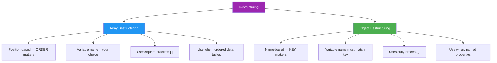

### ❓ Interview Questions

**Q1: What is the output?**
```javascript
// API returns 2 values, we expect 3
const [a, b, c] = [10, 20]; // API only sent 2 values
console.log(a); // 10
console.log(b); // 20
console.log(c); // undefined — missing position
```

**Q2: React useState pattern**
```javascript
// This is exactly how React's useState works internally!
function createState(initial) {
    let value = initial;
    const getter = () => value;
    const setter = (newVal) => { value = newVal; };
    return [getter, setter]; // Array of [getter, setter]
}

const [getCount, setCount] = createState(0);
console.log(getCount()); // 0
setCount(42);
console.log(getCount()); // 42
```

**Q3: Nested array destructuring**
```javascript
// Real-world: Matrix data (like a spreadsheet)
const matrix = [
    [1, 2, 3],  // Row 0
    [4, 5, 6],  // Row 1
    [7, 8, 9]   // Row 2
];

// Extract specific cells
const [[topLeft], [, center], [, , bottomRight]] = matrix;
console.log(topLeft);     // 1
console.log(center);      // 5
console.log(bottomRight); // 9
```

---

<a href="#top">⬆️ Go to Top</a>

---

<a id="10"></a>

## 10. 🌊 Spread Operator (`...`)

### 🌍 Real-Life Analogy

> **Spread** is like **packing vegetables** from one basket INTO individual slots:
>
> 📦 `[carrot, potato, tomato]` → 🥕 🥔 🍅 (spread out individually)
>
> Or like **photocopying** a document — original stays, you get a separate copy.
>
> Or like **sharing a WhatsApp status** — the content spreads to all viewers,
> but the original stays with you.

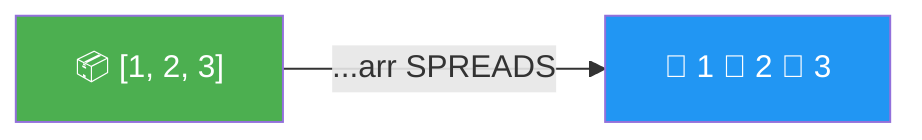

### Spread with Arrays — Copy

```javascript
// Real-world: Creating a backup of your playlist before modifying it

const myPlaylist = ["Song A", "Song B", "Song C"];

// ❌ Without spread — both reference SAME playlist
const editPlaylist = myPlaylist;
editPlaylist.push("Song D");
console.log(myPlaylist); // ["Song A", "Song B", "Song C", "Song D"] ORIGINAL changed!

// ✅ With spread — completely independent copy
const safeEdit = [...myPlaylist];
safeEdit.push("Song E");
console.log(myPlaylist); // ["Song A", "Song B", "Song C", "Song D"] — SAFE!
console.log(safeEdit);   // ["Song A", "Song B", "Song C", "Song D", "Song E"]
```

### Spread with Arrays — Merge

```javascript
// Real-world: Combining two product lists for a sale event

const electronicsDeals = ["iPhone", "MacBook", "iPad"];
const clothingDeals = ["Shirts", "Shoes", "Jeans"];
const bonusDeals = ["Gift Card"];

// Combine all deals into one mega sale
const megaSale = [...electronicsDeals, ...clothingDeals, ...bonusDeals];
console.log(megaSale);
// ["iPhone", "MacBook", "iPad", "Shirts", "Shoes", "Jeans", "Gift Card"]

// Add items while merging
const flashSale = ["BONUS ITEM", ...electronicsDeals, "LAST CHANCE", ...clothingDeals];
console.log(flashSale);
// ["BONUS ITEM", "iPhone", "MacBook", "iPad", "LAST CHANCE", "Shirts", "Shoes", "Jeans"]
```

### Spread with Function Arguments

```javascript
// Real-world: Finding best/worst score from a list

const examScores = [78, 92, 65, 88, 95, 71];

// Old way — verbose
console.log(Math.max.apply(null, examScores)); // 95

// Modern spread — clean!
console.log(Math.max(...examScores)); // 95
console.log(Math.min(...examScores)); // 65

// Real-world: Sending multiple items to a function
function createOrder(item1, item2, item3) {
    console.log(`Order: ${item1}, ${item2}, ${item3}`);
}

const cartItems = ["Burger", "Fries", "Coke"];
createOrder(...cartItems); // Order: Burger, Fries, Coke
```

### Convert String to Array

```javascript
// Real-world: Validate individual characters of a password
const password = "P@ssw0rd";
const chars = [...password];
console.log(chars);
// ["P", "@", "s", "s", "w", "0", "r", "d"]

const hasUpperCase = chars.some(c => c === c.toUpperCase() && c.match(/[A-Z]/));
const hasNumber = chars.some(c => !isNaN(c));
console.log(hasUpperCase); // true
console.log(hasNumber);    // true
```

### Spread with Objects — Copy

```javascript
// Real-world: Creating a new product listing based on existing one
// (like duplicating a template without affecting original)

const baseProduct = {
    brand: "Apple",
    warranty: "1 year",
    inStock: true,
    rating: 4.5
};

// Create iPhone listing from base template
const iPhoneListing = {
    ...baseProduct,
    name: "iPhone 15",
    price: 79999,
    color: "Black"
};

// Create MacBook listing from same template
const macBookListing = {
    ...baseProduct,
    name: "MacBook Air M2",
    price: 129999,
    color: "Silver",
    warranty: "2 years"  // Override warranty for MacBook
};

console.log(iPhoneListing);
// { brand: "Apple", warranty: "1 year", inStock: true, rating: 4.5,
//   name: "iPhone 15", price: 79999, color: "Black" }

console.log(macBookListing.warranty); // "2 years" — overridden!
console.log(baseProduct.warranty);    // "1 year" — original unchanged!
```

### Spread with Objects — Override Values

```javascript
// Real-world: User updating their profile settings

const defaultSettings = {
    theme: "light",
    fontSize: 14,
    language: "en",
    notifications: true,
    autoSave: true
};

const userUpdates = {
    theme: "dark",         // User changed theme
    fontSize: 18,          // User increased font size
    notifications: false   // User disabled notifications
};

// Merge: defaults first, then user updates override
const finalSettings = { ...defaultSettings, ...userUpdates };
console.log(finalSettings);
// {
//   theme: "dark",      ← overridden by user
//   fontSize: 18,       ← overridden by user
//   language: "en",     ← kept from defaults
//   notifications: false, ← overridden by user
//   autoSave: true      ← kept from defaults
// }
```

### Spread — Shallow Copy Warning!

```javascript
// Real-world: The "forwarding" problem in Zomato-like apps

const restaurant = {
    name: "Biryani House",
    contact: {
        phone: "9876543210",
        address: "MG Road, Pune"   // Nested object!
    },
    rating: 4.5
};

// Shallow copy — OK for top-level, NOT for nested!
const restaurantCopy = { ...restaurant };

restaurantCopy.name = "Copied Restaurant";   // ✅ Only changes copy
restaurantCopy.contact.phone = "0000000000"; // ❌ Changes ORIGINAL too!

console.log(restaurant.name);          // "Biryani House" — safe ✅
console.log(restaurant.contact.phone); // "0000000000" — CHANGED! ❌

// Fix: Deep copy using structuredClone
const deepCopy = structuredClone(restaurant);
deepCopy.contact.phone = "1111111111"; // Only affects deep copy now
console.log(restaurant.contact.phone); // "0000000000" — still same
```

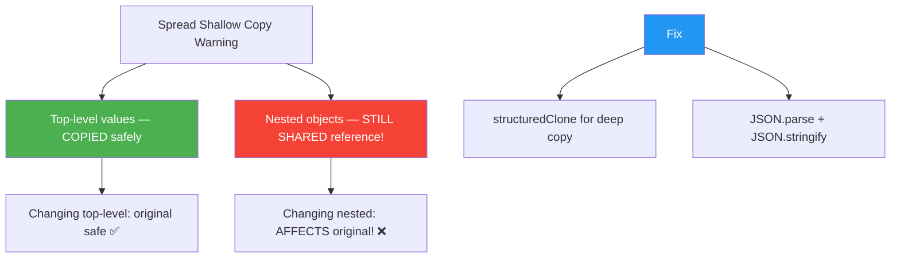

### Real-World Examples

```javascript
// 1. React: Add item to cart immutably (WITHOUT mutating state!)
const cartState = [
    { id: 1, name: "Shirt", qty: 1 }
];

// WRONG — mutates state directly
cartState.push({ id: 2, name: "Pants", qty: 2 }); // ❌ Never do this in React!

// CORRECT — spread creates new array
const newCartState = [...cartState, { id: 2, name: "Pants", qty: 2 }]; // ✅

// 2. Redux: Update state immutably
const reduxState = { user: "Aadi", cart: [], isLoading: false };

// Update loading state — new object, original unchanged
const loadingState = { ...reduxState, isLoading: true };

// 3. API: Merge default options with custom options
function callAPI(endpoint, options = {}) {
    const defaultOptions = {
        method: "GET",
        headers: { "Content-Type": "application/json" },
        timeout: 5000,
        retries: 3
    };

    // User options override defaults
    const finalOptions = { ...defaultOptions, ...options };
    console.log(`Calling ${endpoint} with:`, finalOptions);
}

callAPI("/users", { method: "POST", timeout: 10000 });
// method: "POST" (overridden), timeout: 10000 (overridden)
// headers kept from defaults, retries kept from defaults
```

### ❓ Interview Questions

**Q1: What is the difference between spread and Object.assign()?**
```javascript
const original = { a: 1, b: 2 };

// Object.assign — can mutate target if not careful!
const merged1 = Object.assign(original, { c: 3 }); // Mutates original!
console.log(original); // { a: 1, b: 2, c: 3 } — CHANGED!

// Safe Object.assign with empty target
const merged2 = Object.assign({}, original, { d: 4 }); // Safe

// Spread — always creates new object (preferred in modern JS)
const merged3 = { ...original, e: 5 }; // Clean, safe, no mutation
```

**Q2: How to remove a property from object immutably?**
```javascript
// Real-world: Remove 'password' field before sending to client
const dbUser = {
    id: "USR001",
    name: "Aadi",
    email: "aadi@gmail.com",
    password: "hashed_pwd",    // Remove this!
    lastLogin: "2024-01-15"
};

// Use destructuring + rest to "remove" password
const { password, ...clientSafeUser } = dbUser;
console.log(clientSafeUser);
// { id: "USR001", name: "Aadi", email: "aadi@gmail.com", lastLogin: "2024-01-15" }
```

---

<a href="#top">⬆️ Go to Top</a>

---

<a id="11"></a>

## 11. 🧲 Rest Operator (`...`)

### 🌍 Real-Life Analogy

> **Rest** is like a **"Miscellaneous" box** when packing for a move:
>
> You specifically label: "Laptop" 💻, "Phone" 📱
> Then everything else goes into the **"...rest of the stuff"** box.
>
> `const [laptop, phone, ...everythingElse] = allItems;`
>
> Or think of a restaurant menu:
> "Starter, Main Course, ...and everything else is extra"

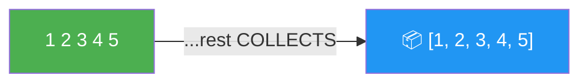

### Spread vs Rest — Same Symbol, Different Purpose!

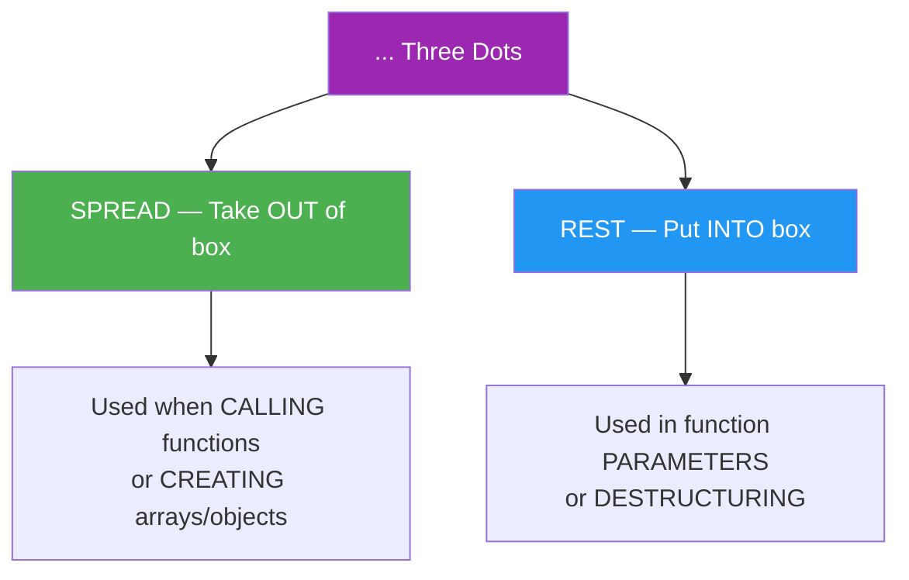

```javascript
// SPREAD = Opening the box, spreading contents out
const nums = [1, 2, 3];
Math.max(...nums);        // SPREAD — opens the box
const copy = [...nums];   // SPREAD — opens and copies

// REST = Collecting remaining items into a box
function fn(...args) {}   // REST — collects into box
const [a, ...rest] = nums; // REST — collects remaining into box
```

### Rest in Function Parameters

```javascript
// Real-world: Restaurant order system — first is table number, rest are dishes

function placeOrder(tableNumber, ...dishes) {
    console.log(`Table ${tableNumber} ordered:`);
    dishes.forEach((dish, i) => console.log(`  ${i + 1}. ${dish}`));
    console.log(`Total items: ${dishes.length}`);
}

placeOrder(5, "Biryani", "Raita", "Cold Drink", "Ice Cream");
// Table 5 ordered:
//   1. Biryani
//   2. Raita
//   3. Cold Drink
//   4. Ice Cream
// Total items: 4

placeOrder(3, "Pizza"); // Table can order just 1 item
// Table 3 ordered:
//   1. Pizza
// Total items: 1

// Real-world: Sum of any number of transactions
function calculateTotal(currency, ...amounts) {
    const total = amounts.reduce((sum, n) => sum + n, 0);
    console.log(`Total: ${currency}${total}`);
}

calculateTotal("₹", 500, 200, 1000, 350);
// Total: ₹2050
calculateTotal("$", 10.99, 5.49);
// Total: $16.48
```

### Rest vs `arguments` Object

```javascript
// Old way: arguments (array-LIKE, not real array)
function oldStyle() {
    console.log(arguments);               // { 0: 1, 1: 2 } — not an array!
    console.log(Array.isArray(arguments)); // false!

    // Can't use map/filter directly!
    // arguments.map(n => n * 2); // ❌ Error!

    // Must convert first
    const arr = Array.from(arguments);
    return arr.reduce((sum, n) => sum + n, 0);
}

// Modern way: rest params (REAL array)
function newStyle(...numbers) {
    console.log(numbers);                // [1, 2, 3] — real array!
    console.log(Array.isArray(numbers)); // true!

    // Can use all array methods directly!
    return numbers
        .filter(n => n > 0)   // Filter negatives
        .reduce((sum, n) => sum + n, 0);
}

console.log(newStyle(10, -5, 20, -3, 15)); // 45
```

### Rest in Array Destructuring

```javascript
// Real-world: Processing exam results

const examResults = [95, 88, 79, 65, 45, 32];
// Already sorted from highest to lowest

// Take top 2, rest go to "others"
const [first, second, ...others] = examResults;

console.log(`🥇 Rank 1: ${first} marks`);   // 🥇 Rank 1: 95 marks
console.log(`🥈 Rank 2: ${second} marks`);  // 🥈 Rank 2: 88 marks
console.log(`Others: ${others}`);            // Others: 79,65,45,32

// Real-world: Processing pipeline — handle first task, queue rest
const [current, next, ...upcoming] = [
    "Fix login bug",
    "Update UI",
    "Add dark mode",
    "Write tests",
    "Deploy"
];

console.log(`Working on: ${current}`); // Working on: Fix login bug
console.log(`Next up: ${next}`);       // Next up: Update UI
console.log(`Later: ${upcoming}`);     // Later: Add dark mode,Write tests,Deploy
```

### Rest in Object Destructuring

```javascript
// Real-world: Middleware — extract route info, pass rest to next handler

const httpRequest = {
    method: "POST",
    url: "/api/users",
    headers: { "Content-Type": "application/json" },
    body: { name: "Aadi", age: 22 },
    ip: "192.168.1.1",
    timestamp: "2024-01-15T10:30:00Z"
};

// Auth middleware: extract method and url, pass rest to controller
function authMiddleware({ method, url, ...requestData }) {
    console.log(`[AUTH] ${method} ${url}`);
    // Pass remaining data to next handler
    routeController(requestData);
}

function routeController({ headers, body, ip }) {
    console.log(`Handling request from IP: ${ip}`);
    console.log(`Body:`, body);
}

authMiddleware(httpRequest);
// [AUTH] POST /api/users
// Handling request from IP: 192.168.1.1
// Body: { name: "Aadi", age: 22 }
```

### Real-World Use Cases

```javascript
// 1. Logger function — message required, tags optional
function logger(level, message, ...tags) {
    const tagStr = tags.length > 0 ? ` [${tags.join(", ")}]` : "";
    console.log(`[${level.toUpperCase()}]${tagStr} ${message}`);
}

logger("info", "Server started on port 3000");
// [INFO] Server started on port 3000

logger("error", "Database connection failed", "DB", "CRITICAL", "ALERT");
// [ERROR] [DB, CRITICAL, ALERT] Database connection failed

logger("warn", "High memory usage", "PERFORMANCE");
// [WARN] [PERFORMANCE] High memory usage

// 2. Event system — handle first event type, rest are listeners
function addEventListener(eventType, ...handlers) {
    console.log(`Registering ${handlers.length} handlers for "${eventType}"`);
    handlers.forEach((handler, i) => {
        console.log(`  Handler ${i + 1}: ${handler.name}`);
    });
}

function validateForm() { /* ... */ }
function submitData()   { /* ... */ }
function showSuccess()  { /* ... */ }

addEventListener("submit", validateForm, submitData, showSuccess);
// Registering 3 handlers for "submit"
//   Handler 1: validateForm
//   Handler 2: submitData
//   Handler 3: showSuccess
```

### Complete Spread vs Rest Comparison

| Feature | Spread `...` | Rest `...` |
|---------|-------------|------------|
| **Purpose** | Expands/unpacks values | Collects/packs values |
| **Direction** | OUT → individual elements | IN → array/object |
| **Used In** | Function calls, array/object literals | Function parameters, destructuring |
| **Position** | Anywhere | Must be LAST |
| **Result** | Individual elements | Array or Object |
| **Analogy** | Photocopying/spreading | Collecting into a box |

```javascript
// Quick reference examples

// Spread — EXPANDS
const arr = [1, 2, 3];
Math.max(...arr);          // Expand into function args: Math.max(1, 2, 3)
const copy = [...arr];     // Expand into new array: [1, 2, 3]
const obj = { ...{a:1} };  // Expand into new object: { a: 1 }

// Rest — COLLECTS
function fn(a, b, ...rest) {}     // rest = remaining args array
const [x, ...others] = [1,2,3];  // others = [2, 3]
const { p, ...q } = {p:1,r:2};   // q = { r: 2 }
```

### ❓ Interview Questions

**Q1: What is the output?**
```javascript
// Real-world: Product configurator
function configureProduct(baseModel, ...features) {
    console.log(`Base: ${baseModel}`);
    console.log(`Features: ${features.length > 0 ? features.join(", ") : "None"}`);
    console.log(`Total add-ons: ${features.length}`);
}

configureProduct("iPhone 15");
// Base: iPhone 15
// Features: None
// Total add-ons: 0

configureProduct("iPhone 15", "512GB Storage", "AppleCare+", "MagSafe Case");
// Base: iPhone 15
// Features: 512GB Storage, AppleCare+, MagSafe Case
// Total add-ons: 3
```

**Q2: What is wrong with this code?**
```javascript
// ❌ Wrong — rest must be LAST parameter
function wrong(...features, baseModel) {
    // SyntaxError: Rest parameter must be last formal parameter
}

// ✅ Correct — named params first, rest last
function correct(baseModel, ...features) {
    // baseModel = "iPhone 15", features = ["512GB", "AppleCare"]
}
```

**Q3: Real-world difference — rest vs spread in same scenario**
```javascript
// Scenario: Building a notification system

// REST — collecting multiple recipients into array
function sendNotification(message, ...recipients) {
    recipients.forEach(user => console.log(`Sending to ${user}: ${message}`));
}

sendNotification("Server is down!", "Admin", "DevOps", "CTO");
// Sending to Admin: Server is down!
// Sending to DevOps: Server is down!
// Sending to CTO: Server is down!

// SPREAD — expanding stored recipients for the function call
const oncallTeam = ["Alice", "Bob", "Charlie"];
sendNotification("Deployment successful!", ...oncallTeam);
// Sending to Alice: Deployment successful!
// Sending to Bob: Deployment successful!
// Sending to Charlie: Deployment successful!
```

---

<a href="#top">⬆️ Go to Top</a>

---

<a id="12"></a>

## 12. 💻 Practice Problems

### 🟢 Level 1 — Basics

**Problem 1: Object Practice — Student ID Card**
```javascript
// Create a student ID card object
const student = {
    name: "Aadi",
    rollNo: "CS2024",
    branch: "Computer Science",
    year: 2
};

// 1. Print name
console.log(student.name); // Aadi

// 2. Add college name
student.college = "MIT Pune";
console.log(student.college); // MIT Pune

// 3. Update year
student.year = 3;
console.log(student.year); // 3

// 4. Print all fields
console.log(Object.keys(student));
// ["name", "rollNo", "branch", "year", "college"]
```

**Problem 2: this Keyword — Smart Device**
```javascript
// Smart speaker object
const speaker = {
    brand: "Amazon Echo",
    owner: "Aadi",
    respond: function() {
        // Use 'this' to respond based on owner
        console.log(`Hello ${this.owner}! I am ${this.brand}`);
    }
};

speaker.respond(); // Hello Aadi! I am Amazon Echo
```

**Problem 3: Array push/pop — Shopping Cart**
```javascript
// Swiggy-like cart
const foodCart = ["Biryani", "Raita"];
foodCart.push("Cold Drink"); // Add item
foodCart.pop();              // Remove last item (changed mind!)
console.log(foodCart);       // ["Biryani", "Raita"]
```

### 🟡 Level 2 — map / filter / reduce

**Problem 4: map() — Apply GST to prices**
```javascript
// E-commerce: Add 18% GST to all product prices
const prices = [100, 200, 500, 1000];
const withGST = prices.map(price => price + price * 0.18);
console.log(withGST); // [118, 236, 590, 1180]
```

**Problem 5: filter() — Show only in-stock products**
```javascript
// E-commerce: Filter available products
const products = [
    { name: "iPhone",   inStock: true  },
    { name: "MacBook",  inStock: false },
    { name: "AirPods",  inStock: true  },
    { name: "iPad",     inStock: false }
];

const available = products.filter(p => p.inStock);
console.log(available.map(p => p.name)); // ["iPhone", "AirPods"]
```

**Problem 6: reduce() — Calculate total cart value**
```javascript
// Swiggy-like bill calculation
const cartItems = [
    { item: "Biryani",  price: 250, qty: 2 },
    { item: "Cold Drink", price: 50, qty: 3 }
];

const totalBill = cartItems.reduce((total, item) => {
    return total + (item.price * item.qty);
}, 0);

console.log(`Total Bill: ₹${totalBill}`); // Total Bill: ₹650
```

### 🟠 Level 3 — Destructuring

**Problem 7: Object Destructuring — API Response**
```javascript
const apiUser = {
    user_name: "aadi_codes",
    user_age: 22,
    user_city: "Pune"
};

// Rename while destructuring (DB names → readable names)
const { user_name: username, user_age: age, user_city: location } = apiUser;
console.log(username);  // aadi_codes
console.log(age);       // 22
console.log(location);  // Pune
```

**Problem 8: Array Destructuring — Race Results**
```javascript
// Extract podium positions from race results
const raceResults = ["Team Alpha", "Team Beta", "Team Gamma", "Team Delta"];

const [gold, , bronze, ...rest] = raceResults;
console.log(`Gold: ${gold}`);    // Gold: Team Alpha
console.log(`Bronze: ${bronze}`); // Bronze: Team Gamma
console.log(`Rest: ${rest}`);    // Rest: Team Delta
```

### 🔵 Level 4 — Spread

**Problem 9: Merge Product Lists**
```javascript
const electronics = ["Phone", "Laptop"];
const clothing    = ["Shirt", "Shoes"];
const sale        = [...electronics, ...clothing, "Accessories"];
console.log(sale); // ["Phone", "Laptop", "Shirt", "Shoes", "Accessories"]
```

**Problem 10: Copy & Update User Profile**
```javascript
const currentProfile = { name: "Aadi", theme: "light", lang: "en" };

// User updates theme without affecting original
const updatedProfile = { ...currentProfile, theme: "dark" };
console.log(updatedProfile);   // { name: "Aadi", theme: "dark", lang: "en" }
console.log(currentProfile.theme); // "light" — original unchanged!
```

### 🔴 Level 5 — Rest

**Problem 11: Order System with Rest**
```javascript
// Restaurant order: table number + any number of dishes
function takeOrder(tableNo, ...dishes) {
    const bill = dishes.length * 150; // ₹150 per dish (simplified)
    console.log(`Table ${tableNo}: ${dishes.join(", ")}`);
    console.log(`Bill: ₹${bill}`);
}

takeOrder(7, "Pasta", "Salad", "Juice");
// Table 7: Pasta, Salad, Juice
// Bill: ₹450
```

### 🟣 Level 6 — Real World

**Problem 12: Employee Analytics**
```javascript
const employees = [
    { name: "Aadi",   dept: "Engineering", salary: 80000, performance: 9.2 },
    { name: "Rahul",  dept: "Marketing",   salary: 60000, performance: 7.5 },
    { name: "Neha",   dept: "Engineering", salary: 90000, performance: 9.8 },
    { name: "Priya",  dept: "HR",          salary: 55000, performance: 8.1 }
];

// 1. Get high performers (performance > 8)
const topPerformers = employees.filter(e => e.performance > 8);
console.log(topPerformers.map(e => e.name)); // ["Aadi", "Neha", "Priya"]

// 2. Get only names
const names = employees.map(e => e.name);
console.log(names); // ["Aadi", "Rahul", "Neha", "Priya"]

// 3. Total salary expense
const totalSalary = employees.reduce((sum, e) => sum + e.salary, 0);
console.log(`Total Salary: ₹${totalSalary}`); // Total Salary: ₹285000
```

### 🧠 Bonus Hard Problems

**Problem 13: Find Best Product (reduce)**
```javascript
const products = [
    { name: "Budget Phone",   price: 15000, rating: 3.8 },
    { name: "Mid Range Phone", price: 25000, rating: 4.5 },
    { name: "Premium Phone",  price: 80000, rating: 4.2 }
];

// Best value = highest rating
const bestProduct = products.reduce((best, current) => {
    return current.rating > best.rating ? current : best;
});

console.log(`Best: ${bestProduct.name} (${bestProduct.rating}⭐)`);
// Best: Mid Range Phone (4.5⭐)
```

**Problem 14: Count Category Items (reduce)**
```javascript
// E-commerce analytics: Count products per category
const inventory = [
    "Electronics", "Clothing", "Electronics",
    "Food", "Clothing", "Electronics", "Food"
];

const categoryCounts = inventory.reduce((acc, category) => {
    acc[category] = (acc[category] || 0) + 1;
    return acc;
}, {});

console.log(categoryCounts);
// { Electronics: 3, Clothing: 2, Food: 2 }
```

**Problem 15: Flatten Nested Cart (flat/reduce)**
```javascript
// Multiple wishlists combined into one cart
const wishlists = [
    ["iPhone", "AirPods"],
    ["Nike Shoes", "Adidas Cap"],
    ["Book", "Pen"]
];

// Method 1: flat()
const allItems1 = wishlists.flat();
console.log(allItems1);
// ["iPhone", "AirPods", "Nike Shoes", "Adidas Cap", "Book", "Pen"]

// Method 2: reduce + concat
const allItems2 = wishlists.reduce((acc, list) => acc.concat(list), []);
console.log(allItems2); // Same result
```

**Problem 16: Remove Duplicate Users**
```javascript
// Users who visited multiple pages — remove duplicates
const visitors = ["Aadi", "Rahul", "Aadi", "Neha", "Rahul", "Priya"];

// Method 1: Set (cleanest!)
const uniqueVisitors = [...new Set(visitors)];
console.log(uniqueVisitors); // ["Aadi", "Rahul", "Neha", "Priya"]
console.log(`Total unique: ${uniqueVisitors.length}`); // 4
```

**Problem 17: Sort Products by Price**
```javascript
const products = [
    { name: "AirPods",  price: 19999 },
    { name: "iPhone",   price: 79999 },
    { name: "Case",     price: 999 },
    { name: "Charger",  price: 2499 }
];

// Sort cheapest first
const byPriceAsc = [...products].sort((a, b) => a.price - b.price);
console.log(byPriceAsc.map(p => `${p.name}: ₹${p.price}`));
// ["Case: ₹999", "Charger: ₹2499", "AirPods: ₹19999", "iPhone: ₹79999"]

// Sort most expensive first
const byPriceDesc = [...products].sort((a, b) => b.price - a.price);
console.log(byPriceDesc[0].name); // iPhone (most expensive)
```

**Problem 18: Group Orders by Status (reduce)**
```javascript
const orders = [
    { id: 1, status: "delivered", amount: 350 },
    { id: 2, status: "pending",   amount: 500 },
    { id: 3, status: "delivered", amount: 200 },
    { id: 4, status: "cancelled", amount: 150 },
    { id: 5, status: "pending",   amount: 750 }
];

const orderSummary = orders.reduce((acc, order) => {
    if (!acc[order.status]) {
        acc[order.status] = { count: 0, total: 0 };
    }
    acc[order.status].count++;
    acc[order.status].total += order.amount;
    return acc;
}, {});

console.log(orderSummary);
// {
//   delivered: { count: 2, total: 550 },
//   pending:   { count: 2, total: 1250 },
//   cancelled: { count: 1, total: 150 }
// }
```

**Problem 19: Deep Clone User Profile**
```javascript
const userProfile = {
    name: "Aadi",
    preferences: {
        theme: "dark",
        language: "en"
    }
};

// ❌ Shallow clone — nested still shared
const shallow = { ...userProfile };
shallow.preferences.theme = "light"; // Affects original!
console.log(userProfile.preferences.theme); // "light" — oops!

// ✅ Deep clone — completely independent
const deep = structuredClone(userProfile);
deep.preferences.theme = "system";
console.log(userProfile.preferences.theme); // "light" — unchanged ✅
```

**Problem 20: Complete Order Processing Pipeline**
```javascript
// Real-world: E-commerce order processing
const allOrders = [
    { id: 1, product: "iPhone",   price: 79999, qty: 1, isPremium: true  },
    { id: 2, product: "Case",     price: 999,   qty: 2, isPremium: false },
    { id: 3, product: "MacBook",  price: 129999, qty: 1, isPremium: true  },
    { id: 4, product: "Charger",  price: 2499,  qty: 3, isPremium: false }
];

// Get total revenue from premium orders with 10% discount
const premiumRevenue = allOrders
    .filter(order => order.isPremium)                   // Only premium
    .map(order => ({
        ...order,
        revenue: order.price * order.qty * 0.9          // 10% loyalty discount
    }))
    .reduce((total, order) => total + order.revenue, 0); // Sum up

console.log(`Premium Revenue: ₹${premiumRevenue}`);
// iPhone: 79999 * 1 * 0.9 = 71999.1
// MacBook: 129999 * 1 * 0.9 = 116999.1
// Total: ₹188998.2
```

---

<a href="#top">⬆️ Go to Top</a>

---

<a id="13"></a>

## 13. 🔥 Interview Questions Cheat Sheet

### Objects

| Question | Answer |
|----------|--------|
| What is an object? | Collection of key-value pairs — like a user profile card |
| Dot vs bracket notation? | Dot for static keys, bracket for dynamic/variable keys |
| How to check if property exists? | `"key" in obj` or `obj.hasOwnProperty("key")` |
| What does `delete` do? | Removes property permanently |
| How to get all keys? | `Object.keys(obj)` — returns array |
| How to get all values? | `Object.values(obj)` — returns array |
| freeze vs seal? | freeze = published document (no changes), seal = edit only (no add/delete) |
| Are objects value or reference? | Reference — like sharing a Google Doc link |

### this Keyword

| Question | Answer |
|----------|--------|
| What is `this`? | The object that is calling the current function |
| `this` in global (browser)? | `window` object |
| `this` in strict mode? | `undefined` |
| `this` in object method? | The object itself |
| `this` in arrow function? | Inherited from where it was WRITTEN (lexical) |
| Can arrow `this` be changed by bind? | No — arrow `this` is permanent |
| `call()` | Invoke immediately, args as comma-separated values |
| `apply()` | Invoke immediately, args as array |
| `bind()` | Returns new function with bound `this`, call later |

### Arrays

| Question | Answer |
|----------|--------|
| push() vs pop()? | push adds to end, pop removes from end |
| shift() vs unshift()? | shift removes from start, unshift adds to start |
| map() vs forEach()? | map returns NEW array, forEach returns undefined |
| filter() vs find()? | filter = ALL matches (array), find = FIRST match (single value) |
| reduce()? | Accumulates array into single value — sum, count, group |
| slice() vs splice()? | slice doesn't mutate, splice mutates original |
| Remove duplicates? | `[...new Set(arr)]` |
| Flatten nested? | `arr.flat(Infinity)` |

### Destructuring

| Question | Answer |
|----------|--------|
| What is destructuring? | Extract values from objects/arrays into variables cleanly |
| Object vs array? | Object: use KEY name. Array: use POSITION |
| Rename in destructuring? | `const { name: username } = obj` |
| Set default? | `const { name = "Guest" } = obj` |
| Rest in destructuring? | `const { a, ...rest } = obj` — rest collects remaining |

### Spread vs Rest

| Question | Answer |
|----------|--------|
| Same symbol, what's different? | Spread EXPANDS (takes out), Rest COLLECTS (puts in) |
| Spread with arrays? | `[...arr1, ...arr2]` — merge/copy |
| Spread with objects? | `{...obj1, ...obj2}` — merge, later overrides earlier |
| Rest in function? | `function fn(...args)` — all remaining args as real array |
| Position rule? | Spread: anywhere. Rest: must be LAST |
| Spread copy limitation? | Shallow copy only — nested objects still shared! |

### Tricky Output Questions

```javascript
// 1. this — who is calling?
const obj = {
    name: "Aadi",
    regular: function() { return this.name; },
    arrow: () => { return this.name; }
};
console.log(obj.regular()); // "Aadi" — this = obj
console.log(obj.arrow());   // undefined — this = window (global)

// 2. Lexical scope — where is it WRITTEN?
const theme = "dark";
function applyTheme() { return theme; } // Written in global scope
function userSettings() {
    const theme = "light";
    return applyTheme(); // Even called here, uses GLOBAL theme!
}
console.log(userSettings()); // "dark" — lexical scope!

// 3. Spread shallow copy trap
const config = { db: { host: "localhost" } };
const copy = { ...config };
copy.db.host = "production"; // Changes ORIGINAL too!
console.log(config.db.host); // "production" — shallow copy trap!

// 4. reduce — no initial value
const scores = [10, 20, 30, 40];
const total = scores.reduce((prev, curr) => prev + curr);
// prev=10(first element), curr=20 → 30 → + 30 = 60 → + 40 = 100
console.log(total); // 100

// 5. Destructuring default vs null
const { x = 10 } = { x: null };
console.log(x); // null — null is NOT undefined, default NOT triggered!

const { y = 10 } = { y: undefined };
console.log(y); // 10 — undefined DOES trigger default!

// 6. Arrow this — even bind can't change it
const arrow = () => this;
const bound = arrow.bind({ name: "Aadi" });
console.log(bound().name); // undefined — bind IGNORED for arrows!

// 7. map returns new array, forEach doesn't
const doubled = [1, 2, 3].map(n => n * 2);   // [2, 4, 6]
const nothing = [1, 2, 3].forEach(n => n * 2); // undefined!

// 8. Spread order matters — last wins
const merged = { color: "red", ...{ color: "blue" } };
console.log(merged.color); // "blue" — later spread overrides earlier
```

### Summary Diagram

```mermaid
flowchart TD
    A["⚡ Core JavaScript"] --> B["🗂️ Objects"]
    A --> C["🎯 this Keyword"]
    A --> D["📦 Arrays"]
    A --> E["🧩 Destructuring"]
    A --> F["🌊 Spread & 🧲 Rest"]

    B --> B1["Key-Value Pairs\nLike ID Card"]
    B --> B2["freeze = Published Doc\nseal = Submit Form"]
    B --> B3["Reference Type\nShared Google Doc"]

    C --> C1["Normal = Freelancer\nCaller determines this"]
    C --> C2["Arrow = Permanent Employee\nDefinition scope fixed"]
    C --> C3["call/apply/bind\nExplicit boss setting"]

    D --> D1["push/pop = Cart add/remove"]
    D --> D2["map = Assembly line transform"]
    D --> D3["filter = Filter by condition"]
    D --> D4["reduce = Accumulate total"]

    E --> E1["Object = Unbox by NAME"]
    E --> E2["Array = Unbox by POSITION"]
    E --> E3["Rename & Defaults\nSafe fallbacks"]

    F --> F1["Spread = Photocopy\nExpand OUT"]
    F --> F2["Rest = Misc Box\nCollect IN"]
    F --> F3["⚠️ Spread = Shallow Copy!"]

    style A fill:#9C27B0,color:white
    style B fill:#4CAF50,color:white
    style C fill:#E91E63,color:white
    style D fill:#2196F3,color:white
    style E fill:#FF9800,color:white
    style F fill:#f44336,color:white
```

---

<a href="#top">⬆️ Go to Top</a>

---

> 📝 **Quick Revision Summary with Real-Life Analogies**
>
> | Concept | Real-Life Analogy | Key Point |
> |---------|-------------------|-----------|
> | **Objects** | Aadhaar / ID Card | Key-value pairs, reference type |
> | **this** | "He/She/They" pronoun | Depends on who is calling |
> | **Arrow this** | Permanent employee | Always refers to where WRITTEN |
> | **Lexical Scope** | Russian nesting doll | Inner sees outer, not vice versa |
> | **Arrays** | Train compartments | Ordered, numbered from 0 |
> | **map()** | Assembly line | Transform each item |
> | **filter()** | Security check | Keep only passing items |
> | **reduce()** | Cashier totaling bill | Accumulate to one value |
> | **Destructuring** | Unboxing combo meal | Extract specific items cleanly |
> | **Spread** | Photocopying | Expand/copy/merge |
> | **Rest** | Miscellaneous box | Collect remaining items |
>
> 🔑 **Most Asked in Interviews:**
> - `this` in arrow vs regular function (with example!)
> - `call` vs `apply` vs `bind` (know the difference!)
> - `map` vs `forEach` vs `filter` vs `find`
> - Spread shallow copy problem (nested objects!)
> - Closure + Lexical Scope combination

---

<a href="#top">⬆️ Go to Top</a>
```