<a id="top"></a>

# 📘 Section 6: Async JavaScript — Complete Interview Guide

> **Is JS Sync or Async? • Event Loop • Call Stack • Callbacks • Promises • Async/Await**
> Explained in Simple Language with Real Examples, Diagrams & Projects

---

## 📑 Table of Contents

| # | Topic |
|---|-------|
| 1 | <a href="#1">Is JavaScript Synchronous or Asynchronous?</a> |
| 2 | <a href="#2">Call Stack & Side Stack — How JS Works</a> |
| 3 | <a href="#3">Event Loop — The Heart of Async JS</a> |
| 4 | <a href="#4">Single Thread vs Multi Thread</a> |
| 5 | <a href="#5">setTimeout — Delayed Execution</a> |
| 6 | <a href="#6">setInterval — Repeated Execution</a> |
| 7 | <a href="#7">Sync vs Async — The Real Difference</a> |
| 8 | <a href="#8">Callbacks — First Solution</a> |
| 9 | <a href="#9">Callback Hell — The Problem</a> |
| 10 | <a href="#10">Error Handling in Callbacks</a> |
| 11 | <a href="#11">Promises — Why, What, How</a> |
| 12 | <a href="#12">Callbacks vs Promises — Same Program Comparison</a> |
| 13 | <a href="#13">Nested Promises & Promise Chaining</a> |
| 14 | <a href="#14">Promise.all, Promise.race, Promise.allSettled</a> |
| 15 | <a href="#15">Async / Await — Modern Way</a> |
| 16 | <a href="#16">Complete Comparison — Callback vs Promise vs Async/Await</a> |
| 17 | <a href="#17">Mini Project — User Dashboard with API</a> |
| 18 | <a href="#18">Practice Projects & Interview Questions</a> |

---

<a id="1"></a>

## 1. 🤔 Is JavaScript Synchronous or Asynchronous?

### The Most Important Answer

> **JavaScript is SYNCHRONOUS and SINGLE-THREADED by nature.**
>
> BUT — it can BEHAVE asynchronously using the **Event Loop + Web APIs**.

### 🍛 Real-Life Analogy — Dhaba vs Restaurant

```
SYNCHRONOUS JS = Dhaba (small food stall)
━━━━━━━━━━━━━━━━━━━━━━━━━━━━━━━━━━━━━
👨‍🍳 Only ONE cook (single thread)
🍽️  Customer 1 orders → Cook makes it → Serves → THEN Customer 2
❌  Customer 2 has to WAIT until Customer 1 is fully served
⏰  If making biryani takes 30 mins — everyone waits!

ASYNCHRONOUS JS = Big Restaurant with waiters
━━━━━━━━━━━━━━━━━━━━━━━━━━━━━━━━━━━━━━━━━━━
👨‍🍳 One cook (single thread) BUT waiters handle tasks
🍽️  Customer 1 orders → Waiter notes it → IMMEDIATELY serves Customer 2
⏰  When biryani is ready → Waiter brings it to Customer 1
✅  No one blocks! Multiple tasks handled "together"
```

### What Problem Does This Solve?

```
PROBLEM without Async:
━━━━━━━━━━━━━━━━━━━━━
Step 1: Fetch user data from server (takes 3 seconds) ⏳
Step 2: Show loading spinner ← BLOCKED! Can't run until step 1 finishes
Step 3: Update UI ← BLOCKED!
Step 4: Handle button clicks ← BLOCKED!

WEBSITE IS FROZEN FOR 3 SECONDS 😱

SOLUTION with Async:
━━━━━━━━━━━━━━━━━━━━
Step 1: Start fetching user data → "Hey server, send me data. I'll wait on the side"
Step 2: Show loading spinner ✅ (runs immediately)
Step 3: Handle button clicks ✅ (runs immediately)
Step 4: When data arrives → Update UI ✅ (runs when ready)

WEBSITE IS SMOOTH AND RESPONSIVE 😊
```

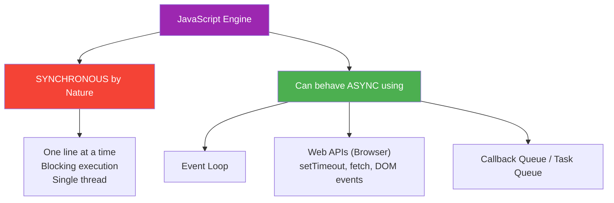

### Simple Proof — JS is Sync by Default

```javascript
console.log("Step 1 - Start");
console.log("Step 2 - Middle");
console.log("Step 3 - End");

// Output (always in ORDER):
// Step 1 - Start
// Step 2 - Middle
// Step 3 - End

// JS executes ONE line at a time — ek ke baad ek
// Jab tak ek complete na ho, dusra start nahi hoga
```

### Where Async Becomes ESSENTIAL

```javascript
// These operations take TIME — we can't block the whole app waiting!
// 1. Fetching data from server (API calls)
fetch("https://api.github.com/users/aadi")  // Could take 1-5 seconds

// 2. Reading files (Node.js)
fs.readFile("bigfile.txt", callback)         // Could take seconds

// 3. Database queries
db.find({ name: "Aadi" }, callback)          // Could take milliseconds to seconds

// 4. User interactions
button.addEventListener("click", handler)     // Could happen anytime

// 5. Timers
setTimeout(() => {}, 3000)                   // Wait 3 seconds
```

---

<a href="#top">⬆️ Go to Top</a>

---

<a id="2"></a>

## 2. 📚 Call Stack & Side Stack — How JS Works

### What is the Call Stack?

> The **Call Stack** is where JavaScript keeps track of WHAT function is currently running.
> It works like a **stack of plates** — Last In, First Out (LIFO).

### 🍽️ Real-Life Analogy — Stack of Plates

```
Adding plates (pushing to stack):
━━━━━━━━━━━━━━━━━━━━━━━━━━━━━━━
[  Plate C  ]  ← Added last (top)
[  Plate B  ]
[  Plate A  ]  ← Added first (bottom)

Removing plates (popping from stack):
━━━━━━━━━━━━━━━━━━━━━━━━━━━━━━━━━━━
Remove Plate C first
Remove Plate B
Remove Plate A last

This is how Call Stack works!
Function called last = executed first (LIFO)
```

### Call Stack in Action

```javascript
function greet(name) {
    return `Hello, ${name}!`;        // Step 4: Returns result
}

function welcome(user) {
    const msg = greet(user.name);    // Step 3: Calls greet()
    console.log(msg);                // Step 5: Logs result
}

function main() {
    const user = { name: "Aadi" };   // Step 2: Runs main
    welcome(user);                   // Step 2: Calls welcome()
}

main();                              // Step 1: main() is called
```

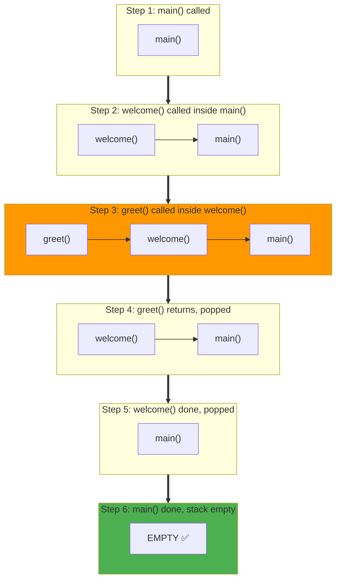

### Stack Overflow — When Stack Gets Too Full

```javascript
// Stack Overflow — infinite recursion (no base case)
function danger() {
    danger(); // Calls itself forever!
}

danger();
// RangeError: Maximum call stack size exceeded

// Real-world: Like trying to stack infinite plates — they fall!
```

### The Side Stack — Web APIs

> The "Side Stack" is actually the **Web APIs** provided by the browser.
> When JS encounters async operations, it sends them to the browser/Node.js to handle.
> **The main Call Stack continues running!**

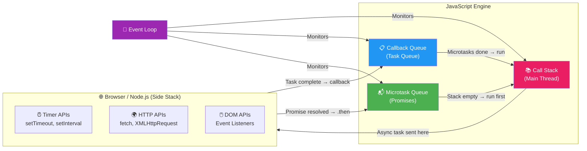

### THE MOST IMPORTANT RULE 🔴

> **"Jab Main Stack (Call Stack) KHALI hota hai, TAB side stack (Queue) dekha jata hai"**
>
> The Event Loop ONLY moves callbacks from the Queue to the Call Stack
> when the Call Stack is **completely EMPTY**.

```javascript
// Proof of this rule:
console.log("1 - Start");           // Goes to Call Stack → runs immediately

setTimeout(() => {
    console.log("2 - setTimeout");  // Goes to Web API → then Callback Queue
}, 0);                               // Even 0ms delay!

console.log("3 - End");             // Goes to Call Stack → runs immediately

// OUTPUT:
// 1 - Start    ← Call Stack (immediate)
// 3 - End      ← Call Stack (immediate)
// 2 - setTimeout ← Runs ONLY after stack is empty!

// WHY?
// setTimeout callback waits in Queue
// Stack runs "1" → then "3" → Stack becomes EMPTY
// NOW Event Loop checks Queue → runs "2"
```

---

<a href="#top">⬆️ Go to Top</a>

---

<a id="3"></a>

## 3. 🔄 Event Loop — The Heart of Async JS

### What is the Event Loop?

> The **Event Loop** is a continuously running process that:
> 1. Watches the Call Stack
> 2. Watches the Queues (Callback Queue + Microtask Queue)
> 3. When Call Stack is EMPTY → moves next task from Queue to Stack

### 🚦 Real-Life Analogy — Traffic Police

```
Event Loop = Traffic Police at a crossing
━━━━━━━━━━━━━━━━━━━━━━━━━━━━━━━━━━━━━━
🚔 Call Stack = Main road (only one lane — single thread!)
🚗 Callback Queue = Cars waiting at signal
🏎️ Microtask Queue = VIP lane (Promises — go FIRST!)

Traffic Police (Event Loop) checks:
  1. Is main road (Call Stack) empty?
  2. If YES → Let VIP lane (Microtasks) go first
  3. Then let regular cars (Callbacks) go
  4. If NO → Wait, main road is busy
```

### Event Loop — Complete Flow Diagram

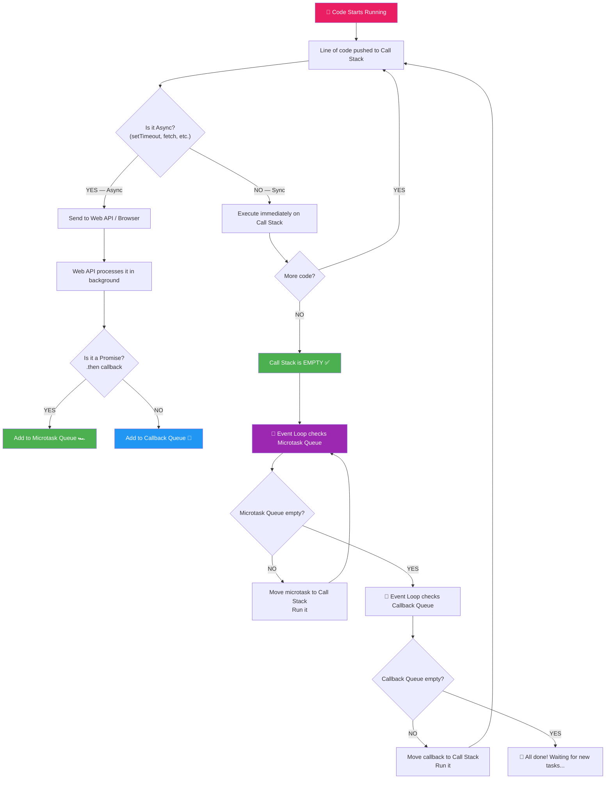

### Microtask Queue vs Callback Queue — Priority

```javascript
// IMPORTANT: Microtasks (Promises) run BEFORE regular callbacks!

console.log("1 - Script start");

setTimeout(() => {
    console.log("4 - setTimeout");      // Callback Queue (lower priority)
}, 0);

Promise.resolve().then(() => {
    console.log("3 - Promise");         // Microtask Queue (HIGHER priority!)
});

console.log("2 - Script end");

// OUTPUT ORDER:
// 1 - Script start     ← Sync, runs immediately
// 2 - Script end       ← Sync, runs immediately
// 3 - Promise          ← Microtask Queue (runs before setTimeout!)
// 4 - setTimeout       ← Callback Queue (runs last)

// WHY?
// After stack is empty → Event Loop checks Microtask FIRST
// Then checks Callback Queue
```

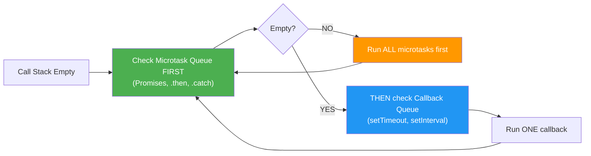

### Real-World Event Loop Example

```javascript
// Real-world: Like ordering food + reading menu + getting water
console.log("1. Sit at table");              // Sync

fetch("https://api.example.com/menu")        // Async — sent to Web API
    .then(res => res.json())
    .then(data => {
        console.log("4. Menu arrived:", data); // Microtask (runs after sync)
    });

setTimeout(() => {
    console.log("5. Waiter came to take order"); // Callback Queue
}, 1000);

console.log("2. Read the menu board");       // Sync
console.log("3. Talk to friend");            // Sync

// OUTPUT:
// 1. Sit at table
// 2. Read the menu board
// 3. Talk to friend
// (Stack is now empty!)
// 4. Menu arrived: {...}   ← Microtask (fetch .then)
// 5. Waiter came...        ← Callback (after 1 second)
```

---

<a href="#top">⬆️ Go to Top</a>

---

<a id="4"></a>

## 4. 🧵 Single Thread vs Multi Thread

### Single Thread — JavaScript

> JavaScript is **SINGLE THREADED** — it has ONE call stack, ONE memory heap.
> It can do only ONE thing at a TIME.

### 🎪 Real-Life Analogy

```
SINGLE THREAD = One juggler at a circus
━━━━━━━━━━━━━━━━━━━━━━━━━━━━━━━━━━━━━
🤹 Can juggle many balls BUT hands one at a time
   - Throw ball 1 → Catch ball 2 → Throw ball 3
   - APPEARS to do multiple things simultaneously
   - Actually doing them one-by-one VERY FAST

MULTI THREAD = Many jugglers
━━━━━━━━━━━━━━━━━━━━━━━━━━━
🤹🤹🤹 Each juggler handles different balls TRULY simultaneously
   - Juggler 1: handles ball 1 (truly parallel)
   - Juggler 2: handles ball 2 (truly parallel)
   - Juggler 3: handles ball 3 (truly parallel)
```

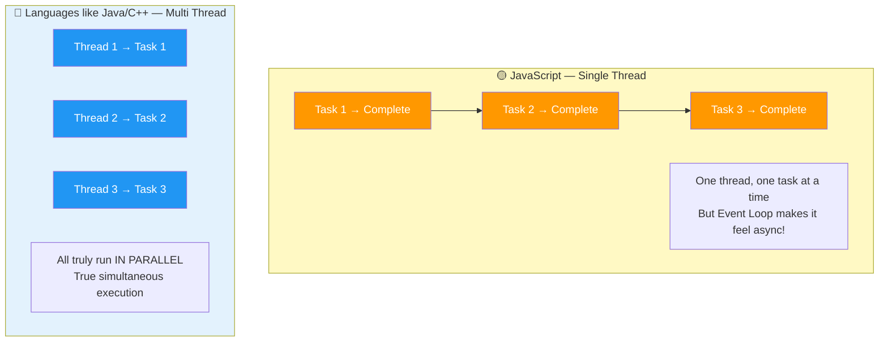

### Why Single Thread for JS?

```
WHY JS is Single Threaded:
━━━━━━━━━━━━━━━━━━━━━━━━━━
✅ Simpler to code — no "race conditions" (two threads modifying same data)
✅ No "deadlocks" — threads waiting for each other forever
✅ Safe for DOM — only one thread modifies the UI at a time
✅ Easier debugging — predictable execution order

DOWNSIDE of Single Thread:
━━━━━━━━━━━━━━━━━━━━━━━━━
❌ One heavy task CAN block everything else
❌ CPU-intensive work freezes the browser
❌ Solution: Web Workers (run JS in separate thread for heavy work)
```

### Single Thread — The Real Problem & Solution

```javascript
// PROBLEM: Heavy computation BLOCKS everything
function heavyComputation() {
    // This loop takes 5 seconds
    let result = 0;
    for (let i = 0; i < 10_000_000_000; i++) {
        result += i;
    }
    return result;
}

console.log("Button click will be ignored for 5 seconds! 😱");
heavyComputation(); // BLOCKS the thread — no button clicks, no UI updates!
console.log("Finally done");

// SOLUTION: Web Worker (separate thread for heavy work)
const worker = new Worker("heavy-task.js");
worker.postMessage("start");
worker.onmessage = (e) => {
    console.log("Result from worker:", e.data); // Non-blocking!
};
// Main thread is FREE to handle UI, clicks, etc.
```

### Comparison Table

| Feature | JavaScript (Single Thread) | Java/Python (Multi Thread) |
|---------|---------------------------|---------------------------|
| Threads | 1 | Many |
| Parallel execution | Simulated (Event Loop) | True parallel |
| Race conditions | No (no shared threads) | Yes (needs locks) |
| Complexity | Simple | Complex |
| DOM access | Safe (one thread) | Risky |
| Heavy CPU work | Blocks (use Web Worker) | Doesn't block |

---

<a href="#top">⬆️ Go to Top</a>

---

<a id="5"></a>

## 5. ⏰ setTimeout — Delayed Execution

### What is setTimeout?

> `setTimeout` runs a function **ONCE** after a specified delay.
> It is NON-BLOCKING — JS continues running other code while timer is set.

### Why is it Needed?

```
NEED for setTimeout:
━━━━━━━━━━━━━━━━━━━
✅ Show notification then auto-hide after 3 seconds
✅ Delay an API call after user stops typing (debounce)
✅ Show "Loading..." and then show content
✅ Auto-logout after 5 minutes of inactivity
✅ Retry failed operations after delay
✅ Animate things step by step
```

### How It Works

```javascript
// Syntax: setTimeout(function, delayInMilliseconds, ...args)
setTimeout(function() {
    console.log("This runs after 2 seconds");
}, 2000);

// Arrow function version
setTimeout(() => {
    console.log("Arrow version");
}, 1000);

// With arguments
setTimeout((name, city) => {
    console.log(`Hello ${name} from ${city}!`);
}, 1500, "Aadi", "Pune");
```

### setTimeout with 0ms — Common Interview Question!

```javascript
console.log("A");

setTimeout(() => {
    console.log("B - setTimeout 0ms");
}, 0); // Even 0ms delay!

console.log("C");

// OUTPUT: A → C → B
// WHY? Even 0ms setTimeout goes to Web API → Callback Queue
// Queue is only checked AFTER call stack is EMPTY
// A and C run first (sync), then B runs (from queue)
```

### Real-World Examples

```javascript
// 1. Auto-hide notification (like Instagram/WhatsApp)
function showNotification(message) {
    const notif = document.createElement("div");
    notif.textContent = message;
    notif.className = "notification show";
    document.body.appendChild(notif);

    // Auto-hide after 3 seconds
    setTimeout(() => {
        notif.classList.remove("show");
        notif.classList.add("hide");
    }, 3000);
}

showNotification("✅ Payment successful!");

// 2. Debounce — wait for user to stop typing
let searchTimer;
const searchInput = document.getElementById("search");

searchInput.addEventListener("input", (e) => {
    clearTimeout(searchTimer); // Cancel previous timer

    searchTimer = setTimeout(() => {
        // Only search after 500ms of NO typing
        console.log(`Searching for: ${e.target.value}`);
        // callSearchAPI(e.target.value);
    }, 500);
});

// 3. Auto-logout (like banking apps)
let inactivityTimer;

function resetInactivityTimer() {
    clearTimeout(inactivityTimer);
    inactivityTimer = setTimeout(() => {
        console.log("Session expired! Logging out...");
        // logout();
    }, 5 * 60 * 1000); // 5 minutes
}

document.addEventListener("click", resetInactivityTimer);
document.addEventListener("keypress", resetInactivityTimer);
resetInactivityTimer();
```

### Cancel setTimeout

```javascript
// Store timer ID to cancel it
const timerId = setTimeout(() => {
    console.log("This will NOT run!");
}, 3000);

// Cancel before it fires
clearTimeout(timerId);
console.log("Timer cancelled!");
```

### setTimeout in Event Loop

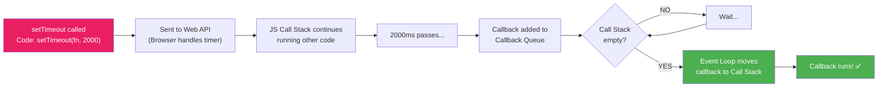

---

<a href="#top">⬆️ Go to Top</a>

---

<a id="6"></a>

## 6. 🔁 setInterval — Repeated Execution

### What is setInterval?

> `setInterval` runs a function **REPEATEDLY** at a fixed interval.
> It keeps running until you call `clearInterval`.

### Why is it Needed?

```
NEED for setInterval:
━━━━━━━━━━━━━━━━━━━━
✅ Real-time clock — update time every second
✅ Auto-save (like Google Docs) — save every 30 seconds
✅ Live score updates — refresh cricket score every 10 seconds
✅ Stock price updates — refresh every 5 seconds
✅ Progress bars — update every 100ms
✅ Polling — check server for updates every N seconds
```

### Basic Example

```javascript
// Syntax: setInterval(function, intervalInMs)
const intervalId = setInterval(() => {
    console.log("Runs every 1 second!");
}, 1000);

// Stop after 5 seconds
setTimeout(() => {
    clearInterval(intervalId);
    console.log("Stopped!");
}, 5000);
```

### Real-World Examples

```javascript
// 1. Real-time Digital Clock
function startClock() {
    const clockEl = document.getElementById("clock");

    const clockInterval = setInterval(() => {
        const now = new Date();
        const time = now.toLocaleTimeString("en-IN", {
            hour: "2-digit",
            minute: "2-digit",
            second: "2-digit"
        });
        clockEl.textContent = time;
    }, 1000);

    return clockInterval; // Return ID to stop later
}

const clock = startClock();
// Stop clock when user leaves page
window.addEventListener("beforeunload", () => clearInterval(clock));

// 2. Auto-save like Google Docs
let hasUnsavedChanges = false;
const editor = document.getElementById("editor");

editor.addEventListener("input", () => {
    hasUnsavedChanges = true;
});

const autoSaveInterval = setInterval(() => {
    if (hasUnsavedChanges) {
        console.log("💾 Auto-saving...");
        // saveToServer(editor.value);
        hasUnsavedChanges = false;
        console.log("✅ Saved!");
    }
}, 30000); // Every 30 seconds

// 3. Live Countdown Timer (like Exam/Sale countdown)
function startCountdown(durationInSeconds) {
    let remaining = durationInSeconds;

    const timer = setInterval(() => {
        const mins = Math.floor(remaining / 60);
        const secs = remaining % 60;
        console.log(`⏱️ ${mins}:${secs.toString().padStart(2, "0")}`);

        remaining--;

        if (remaining < 0) {
            clearInterval(timer);
            console.log("🔔 Time's up!");
        }
    }, 1000);
}

startCountdown(10); // 10 second countdown
// ⏱️ 0:10
// ⏱️ 0:09
// ...
// ⏱️ 0:00
// 🔔 Time's up!

// 4. Polling — Check server status every 5 seconds
function startStatusPolling() {
    const pollInterval = setInterval(async () => {
        try {
            const response = await fetch("/api/status");
            const data = await response.json();

            if (data.status === "completed") {
                console.log("✅ Task completed!");
                clearInterval(pollInterval); // Stop polling
            } else {
                console.log(`⏳ Status: ${data.status}`);
            }
        } catch (err) {
            console.error("❌ Polling error:", err);
        }
    }, 5000);
}
```

### setTimeout vs setInterval

| Feature | setTimeout | setInterval |
|---------|-----------|-------------|
| Runs | Once after delay | Repeatedly at interval |
| Cancel | `clearTimeout(id)` | `clearInterval(id)` |
| Use case | Delayed action | Repeated actions |
| Example | Auto-hide toast | Clock, auto-save |

```javascript
// Simulating setInterval using setTimeout (recursive)
// This is more reliable — next call starts AFTER previous completes
function reliableInterval(fn, delay) {
    function run() {
        fn();
        setTimeout(run, delay); // Schedule next run after current completes
    }
    setTimeout(run, delay);
}

reliableInterval(() => console.log("Reliable tick!"), 1000);
```

---

<a href="#top">⬆️ Go to Top</a>

---

<a id="7"></a>

## 7. ⚡ Sync vs Async — The Real Difference

### The Core Difference

```
SYNCHRONOUS (Sync):
━━━━━━━━━━━━━━━━━━━
Ek kaam khatam hone ke baad hi dusra shuru hota hai
(One task must FINISH before next one STARTS)
Blocking — next line waits!

ASYNCHRONOUS (Async):
━━━━━━━━━━━━━━━━━━━━━
Ek kaam start karo, fir wait mat karo — aage badho!
Jab kaam complete ho, tab result aayega!
Non-Blocking — next lines run immediately!
```

### 🍕 Real-Life Analogy — Pizza Order

```
SYNCHRONOUS Pizza Order:
━━━━━━━━━━━━━━━━━━━━━━━
You:    "Give me a pizza"
Shop:   "Okay, wait here..."  ← You are STANDING and WAITING
        (30 minutes pass...)
Shop:   "Here's your pizza!"
You:    Now you can do other things (too late!)

ASYNCHRONOUS Pizza Order:
━━━━━━━━━━━━━━━━━━━━━━━━
You:    "Give me a pizza"     ← You give ORDER
Shop:   "Okay, we'll call you!"
You:    Go shopping, meet friends, browse phone  ← You're FREE!
Phone:  RING! "Your pizza is ready!"
You:    Go pick up pizza
```

### Code Comparison

```javascript
// ============================================
// SYNCHRONOUS — Blocking
// ============================================
console.log("1. Wake up");
console.log("2. Make chai"); // Takes 5 minutes — EVERYTHING WAITS
console.log("3. Drink chai");
console.log("4. Open laptop");

// Output: 1 → 2 → 3 → 4 (always in order, each waits for previous)

// ============================================
// ASYNCHRONOUS — Non-Blocking
// ============================================
console.log("1. Wake up");

setTimeout(() => {
    console.log("3. Chai is ready!"); // Starts independently
}, 5000); // Put chai on stove (5 min)

console.log("2. Open laptop while chai brews"); // Doesn't wait!
console.log("4. Check emails");

// Output: 1 → 2 → 4 → 3
// (Chai runs in background, laptop work continues!)
```

### Visual Flow Diagram

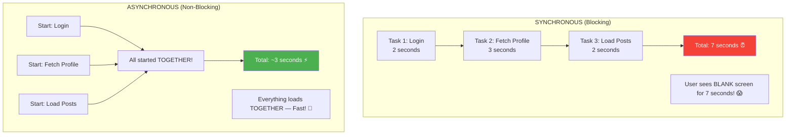

### Real Application — Login Flow

```javascript
// ============================================
// SYNCHRONOUS WAY (Bad — would freeze browser)
// ============================================
function loginSync(username, password) {
    // Imagine these take 2 seconds each
    const user = fetchUserFromDB(username);     // BLOCKS for 2s
    const token = generateToken(user.id);       // BLOCKS for 2s (total 4s)
    const profile = fetchUserProfile(user.id);  // BLOCKS for 2s (total 6s)

    // Browser is FROZEN for 6 seconds!
    return { user, token, profile };
}

// ============================================
// ASYNCHRONOUS WAY (Good — non-blocking)
// ============================================
async function loginAsync(username, password) {
    // All fetches happen — user can still interact with page
    const user = await fetchUserFromDB(username);
    const [token, profile] = await Promise.all([
        generateToken(user.id),      // Both run TOGETHER!
        fetchUserProfile(user.id)     // Same time — saves time!
    ]);
    return { user, token, profile };
}
```

---

<a href="#top">⬆️ Go to Top</a>

---

<a id="8"></a>

## 8. 📞 Callbacks — First Solution to Async

### What is a Callback?

> A **Callback** is a function passed as an argument to another function,
> which gets called when some async operation completes.
>
> "Call me BACK when you're done!"

### Why Callbacks Were Needed?

```
PROBLEM (without callbacks):
━━━━━━━━━━━━━━━━━━━━━━━━━━━
// Fetch data from server
const data = fetchData(); // Returns undefined — data not ready yet!
console.log(data);        // undefined 😱

The server takes time — JS doesn't wait!
We need a way to "do something WHEN data arrives"

SOLUTION (with callbacks):
━━━━━━━━━━━━━━━━━━━━━━━━━
// "Hey fetchData, when you're done, CALL THIS FUNCTION"
fetchData(function(data) {
    console.log(data); // ✅ Called when data actually arrives!
});
```

### How Callbacks Work

```javascript
// Simple callback example
function greetUser(name, callback) {
    console.log(`Processing: ${name}`);
    callback(name); // "Call back" the function when ready
}

function sayHello(name) {
    console.log(`Hello, ${name}!`);
}

greetUser("Aadi", sayHello);
// Processing: Aadi
// Hello, Aadi!
```

### Simple User Data Fetch with Callback

```javascript
// Simulating a real API call with callback
function fetchUser(userId, onSuccess, onError) {
    console.log(`🔍 Fetching user ${userId}...`);

    // Simulating network delay (like real API)
    setTimeout(() => {
        // Simulating server response
        const users = {
            1: { id: 1, name: "Aadi", email: "aadi@gmail.com", role: "admin" },
            2: { id: 2, name: "Rahul", email: "rahul@gmail.com", role: "user" },
        };

        const user = users[userId];

        if (user) {
            onSuccess(user); // Data found! Call success callback
        } else {
            onError(`User with ID ${userId} not found!`); // Call error callback
        }
    }, 1500); // 1.5 second delay
}

// Using the function with callbacks
fetchUser(
    1,
    // Success callback
    function(user) {
        console.log("✅ User found:");
        console.log(`Name: ${user.name}`);
        console.log(`Email: ${user.email}`);
        console.log(`Role: ${user.role}`);
    },
    // Error callback
    function(error) {
        console.log("❌ Error:", error);
    }
);

// Output:
// 🔍 Fetching user 1...
// (1.5 second wait...)
// ✅ User found:
// Name: Aadi
// Email: aadi@gmail.com
// Role: admin
```

### Types of Callbacks

```javascript
// 1. Synchronous callback (runs immediately)
const numbers = [1, 2, 3, 4, 5];
const doubled = numbers.map(n => n * 2); // Arrow callback runs SYNC

// 2. Asynchronous callback (runs later)
setTimeout(() => {
    console.log("I run later!");
}, 1000);

// 3. Named callback (good for reuse and debugging)
function handleSuccess(data) {
    console.log("Success:", data);
}

function handleError(err) {
    console.error("Error:", err);
}

fetchUser(1, handleSuccess, handleError); // Named callbacks
```

---

<a href="#top">⬆️ Go to Top</a>

---

<a id="9"></a>

## 9. 😱 Callback Hell — The Problem

### What is Callback Hell?

> **Callback Hell** is when callbacks are nested inside callbacks inside callbacks...
> creating a "pyramid of doom" that is impossible to read and maintain.

### 🏔️ Real-Life Analogy — Bureaucracy

```
Callback Hell = Government Office Bureaucracy
━━━━━━━━━━━━━━━━━━━━━━━━━━━━━━━━━━━━━━━━━━━
"For passport, first get Aadhaar"
    "For Aadhaar, first get Birth Certificate"
        "For Birth Certificate, first go to Municipal Office"
            "For Municipal Office, first get Form 16"
                "For Form 16, first get..."
                    *infinite bureaucracy* 😱

Each step DEPENDS on previous step completing!
```

### Callback Hell in Code

```javascript
// Real-world: Get user → Get their orders → Get order details → Get shipping info

fetchUser(1, function(user) {                          // Level 1
    console.log("Got user:", user.name);

    fetchOrders(user.id, function(orders) {            // Level 2
        console.log("Got orders:", orders.length);

        fetchOrderDetails(orders[0].id, function(details) {  // Level 3
            console.log("Got details:", details);

            fetchShipping(details.shippingId, function(shipping) {  // Level 4
                console.log("Got shipping:", shipping.address);

                updateOrderStatus(shipping.id, "delivered", function(result) { // Level 5
                    console.log("Updated status:", result);

                    sendEmail(user.email, function(emailResult) {  // Level 6
                        console.log("Email sent:", emailResult);
                        // 😱 6 levels deep! Pyramid of doom!
                    }, handleError);
                }, handleError);
            }, handleError);
        }, handleError);
    }, handleError);
}, handleError);
```

### The Pyramid of Doom

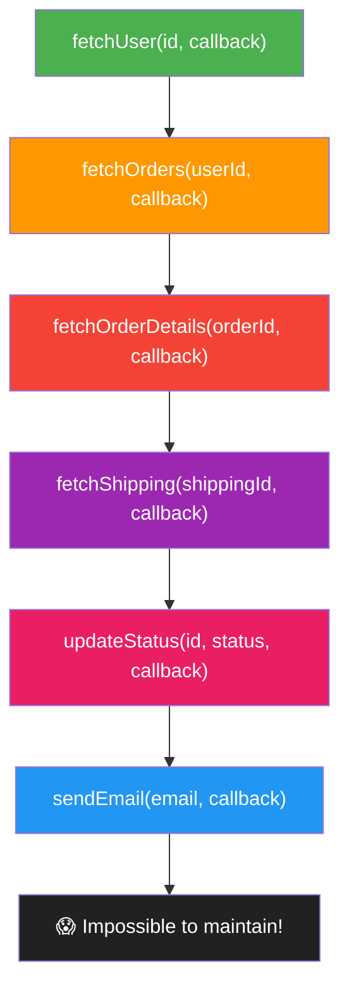

### Problems with Callback Hell

```
PROBLEMS:
━━━━━━━━━
❌ Hard to READ — indentation goes crazy (pyramid shape)
❌ Hard to DEBUG — error messages are confusing
❌ Hard to MAINTAIN — changing one thing breaks everything
❌ Error handling is a NIGHTMARE — repeat try/catch everywhere
❌ Hard to TEST — functions are deeply nested
❌ "Inversion of Control" — you trust the callback invoker
```

### The "Inversion of Control" Problem

```javascript
// You are passing control to someone else's function!
// What if their library has a bug?

thirdPartyLibrary.fetchData(
    myCallback // 😱 What if they:
    // - Call it multiple times?
    // - Never call it?
    // - Call it with wrong data?
    // You've LOST CONTROL of when/how your code runs!
);
```

---

<a href="#top">⬆️ Go to Top</a>

---

<a id="10"></a>

## 10. 🛡️ Error Handling in Callbacks

### The Error-First Callback Pattern (Node.js Style)

> Convention in Node.js: **First argument is always the error!**
> `callback(error, data)` — if no error, first arg is `null`.

```javascript
// Node.js style: callback(error, result)
function fetchUserData(userId, callback) {
    setTimeout(() => {
        if (userId <= 0) {
            // ERROR: First argument is error, second is null
            callback(new Error("Invalid user ID!"), null);
        } else if (userId === 999) {
            callback(new Error("User not found!"), null);
        } else {
            // SUCCESS: First argument is null, second is data
            callback(null, { id: userId, name: "Aadi", email: "aadi@gmail.com" });
        }
    }, 1000);
}

// Using error-first callbacks
fetchUserData(1, function(error, user) {
    // ALWAYS check error first!
    if (error) {
        console.error("❌ Error:", error.message);
        return; // Stop execution
    }

    // No error — use the data
    console.log("✅ User:", user.name);
});

fetchUserData(-1, function(error, user) {
    if (error) {
        console.error("❌ Error:", error.message); // Invalid user ID!
        return;
    }
    console.log("✅ User:", user.name);
});
```

### Error Handling in Nested Callbacks

```javascript
// The error handling nightmare in nested callbacks
function getUserOrders(userId, callback) {
    fetchUser(userId, function(userError, user) {
        if (userError) {
            callback(userError, null);  // Propagate error up
            return;
        }

        fetchOrders(user.id, function(ordersError, orders) {
            if (ordersError) {
                callback(ordersError, null);  // Propagate error up
                return;
            }

            fetchOrderDetails(orders[0].id, function(detailsError, details) {
                if (detailsError) {
                    callback(detailsError, null);  // Propagate error up
                    return;
                }

                // Finally! Data is ready
                callback(null, details);
            });
        });
    });
}

// Each level needs its own error check — repetitive and error-prone!
getUserOrders(1, function(error, data) {
    if (error) {
        console.error("Something went wrong:", error.message);
        return;
    }
    console.log("Success:", data);
});
```

---

<a href="#top">⬆️ Go to Top</a>

---

<a id="11"></a>

## 11. 🤝 Promises — Why, What, How

### Why Were Promises Created?

```
PROBLEM with Callbacks:
━━━━━━━━━━━━━━━━━━━━━━
1. Callback Hell (nested code)
2. Inversion of Control (trust issues)
3. Error handling is messy
4. Hard to run multiple async tasks together

SOLUTION — Promises:
━━━━━━━━━━━━━━━━━━━━
✅ Chain operations instead of nesting
✅ YOU control when .then() runs
✅ Single .catch() handles all errors
✅ Promise.all() runs multiple tasks together
```

### What is a Promise?

> A **Promise** is an object representing the **eventual completion or failure** of an async operation.
>
> It's like a **receipt** from a shop:
> - You ordered something (async operation started)
> - You got a receipt (Promise object returned immediately)
> - Later: "Order ready!" (resolved) or "Out of stock" (rejected)

### Promise States

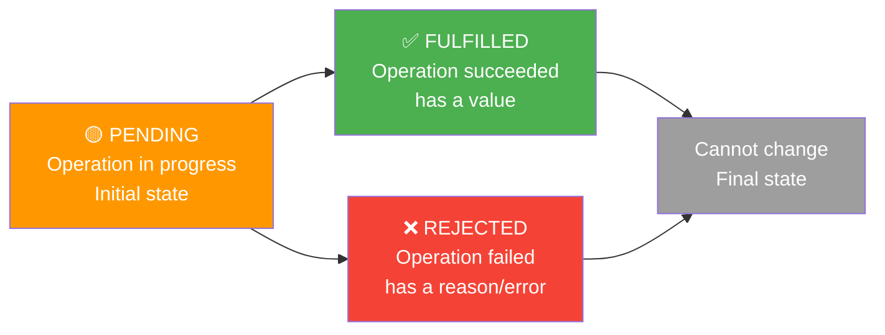

```javascript
// Promise has 3 states:
// 1. Pending   — waiting for result
// 2. Fulfilled — success (resolve was called)
// 3. Rejected  — failure (reject was called)
// Once settled (fulfilled/rejected) — it NEVER changes!

// Creating a Promise
const myPromise = new Promise((resolve, reject) => {
    // Do async work here
    const success = true;

    if (success) {
        resolve("✅ Data fetched successfully!");  // Fulfilled
    } else {
        reject(new Error("❌ Something went wrong!")); // Rejected
    }
});

// Using a Promise
myPromise
    .then(data => {
        console.log(data); // "✅ Data fetched successfully!"
    })
    .catch(error => {
        console.error(error.message);
    })
    .finally(() => {
        console.log("Always runs — success or failure"); // Cleanup
    });
```

### Simple User Fetch with Promise

```javascript
// Converting callback-based fetchUser to Promise-based
function fetchUser(userId) {
    // Return a Promise instead of accepting callback
    return new Promise((resolve, reject) => {
        console.log(`🔍 Fetching user ${userId}...`);

        setTimeout(() => {
            const users = {
                1: { id: 1, name: "Aadi",  email: "aadi@gmail.com",  role: "admin" },
                2: { id: 2, name: "Rahul", email: "rahul@gmail.com", role: "user"  }
            };

            const user = users[userId];

            if (user) {
                resolve(user);  // Success!
            } else {
                reject(new Error(`User ${userId} not found!`));  // Failure!
            }
        }, 1000);
    });
}

// Using the Promise
fetchUser(1)
    .then(user => {
        console.log("✅ Got user:", user.name);
        console.log("Email:", user.email);
    })
    .catch(error => {
        console.error("❌ Error:", error.message);
    });

// Output:
// 🔍 Fetching user 1...
// (1 second wait...)
// ✅ Got user: Aadi
// Email: aadi@gmail.com
```

---

<a href="#top">⬆️ Go to Top</a>

---

<a id="12"></a>

## 12. 🔄 Callbacks vs Promises — Same Program Comparison

### Scenario: Get User → Get Their Posts → Get Post Comments

```javascript
// ============================================================
// WITH CALLBACKS — The Pyramid of Doom 😱
// ============================================================
function getUserWithCallbacks(userId, callback) {
    setTimeout(() => callback(null, { id: userId, name: "Aadi" }), 500);
}
function getPostsWithCallbacks(userId, callback) {
    setTimeout(() => callback(null, [{ id: 1, title: "JS Tutorial" }]), 500);
}
function getCommentsWithCallbacks(postId, callback) {
    setTimeout(() => callback(null, [{ text: "Great post!" }]), 500);
}

// Using callbacks — nested, hard to read
getUserWithCallbacks(1, function(err, user) {
    if (err) { console.error(err); return; }
    console.log("User:", user.name);

    getPostsWithCallbacks(user.id, function(err, posts) {
        if (err) { console.error(err); return; }
        console.log("Posts:", posts[0].title);

        getCommentsWithCallbacks(posts[0].id, function(err, comments) {
            if (err) { console.error(err); return; }
            console.log("Comments:", comments[0].text);
            // 😱 3 levels deep, and this is just the beginning!
        });
    });
});

// ============================================================
// WITH PROMISES — Clean Chain ✅
// ============================================================
function getUser(userId) {
    return new Promise((resolve) => {
        setTimeout(() => resolve({ id: userId, name: "Aadi" }), 500);
    });
}
function getPosts(userId) {
    return new Promise((resolve) => {
        setTimeout(() => resolve([{ id: 1, title: "JS Tutorial" }]), 500);
    });
}
function getComments(postId) {
    return new Promise((resolve) => {
        setTimeout(() => resolve([{ text: "Great post!" }]), 500);
    });
}

// Using promises — flat, readable chain!
getUser(1)
    .then(user => {
        console.log("User:", user.name);
        return getPosts(user.id);        // Return next Promise
    })
    .then(posts => {
        console.log("Posts:", posts[0].title);
        return getComments(posts[0].id); // Return next Promise
    })
    .then(comments => {
        console.log("Comments:", comments[0].text);
    })
    .catch(error => {
        console.error("❌ Error:", error.message); // ONE catch for ALL errors!
    });
```

### Visual Comparison

```mermaid
flowchart TD
    subgraph Callback["CALLBACK (Pyramid of Doom)"]
        C1["getUser()"] --> C2["  getPostsCallbacks()"]
        C2 --> C3["    getComments()"]
        C3 --> C4["      updateStatus()"]
        C4 --> C5["        sendEmail()"]
        C5 --> C6["          😱 Level 5 deep!"]
    end

    subgraph Promise["PROMISE (Flat Chain)"]
        P1["getUser()"] --> P2[".then(posts)"]
        P2 --> P3[".then(comments)"]
        P3 --> P4[".then(status)"]
        P4 --> P5[".then(email)"]
        P5 --> P6[".catch(error) ← ONE error handler"]
    end

    style C6 fill:#f44336,color:white
    style P6 fill:#4CAF50,color:white
```

---

<a href="#top">⬆️ Go to Top</a>

---

<a id="13"></a>

## 13. ⛓️ Nested Promises & Promise Chaining

### Promise Chaining — The Key Concept

> In `.then()`, if you **return a Promise**, the next `.then()` waits for it!
> This is what makes chaining possible!

```javascript
// KEY RULE: Return a Promise from .then() to chain it
function delay(ms, value) {
    return new Promise(resolve => setTimeout(() => resolve(value), ms));
}

delay(1000, "Step 1 done")
    .then(result => {
        console.log(result);               // "Step 1 done"
        return delay(1000, "Step 2 done"); // Return Promise → next .then waits!
    })
    .then(result => {
        console.log(result);               // "Step 2 done"
        return delay(1000, "Step 3 done"); // Return Promise again
    })
    .then(result => {
        console.log(result);               // "Step 3 done"
    });
```

### Real-World: E-Commerce Order Flow

```javascript
// Simulate each step of placing an order
function validateCart(cart) {
    return new Promise((resolve, reject) => {
        setTimeout(() => {
            if (cart.items.length === 0) {
                reject(new Error("Cart is empty!"));
            } else {
                console.log("✅ Cart validated");
                resolve({ ...cart, validated: true });
            }
        }, 500);
    });
}

function checkInventory(cart) {
    return new Promise((resolve, reject) => {
        setTimeout(() => {
            const allInStock = cart.items.every(item => item.qty <= 10);
            if (!allInStock) {
                reject(new Error("Some items are out of stock!"));
            } else {
                console.log("✅ Inventory available");
                resolve({ ...cart, inventoryChecked: true });
            }
        }, 700);
    });
}

function processPayment(cart) {
    return new Promise((resolve, reject) => {
        setTimeout(() => {
            const success = Math.random() > 0.1; // 90% success rate
            if (!success) {
                reject(new Error("Payment failed! Please retry."));
            } else {
                console.log("✅ Payment processed");
                resolve({ ...cart, orderId: "ORD" + Date.now() });
            }
        }, 1000);
    });
}

function sendConfirmation(order) {
    return new Promise((resolve) => {
        setTimeout(() => {
            console.log(`✅ Confirmation sent for order: ${order.orderId}`);
            resolve({ success: true, orderId: order.orderId });
        }, 300);
    });
}

// Complete order flow — clean chain!
const myCart = {
    items: [
        { name: "iPhone",  price: 79999, qty: 1 },
        { name: "AirPods", price: 19999, qty: 2 }
    ],
    total: 119997,
    user: "Aadi"
};

console.log("🛒 Starting order process...");

validateCart(myCart)
    .then(validCart => checkInventory(validCart))
    .then(checkedCart => processPayment(checkedCart))
    .then(paidOrder => sendConfirmation(paidOrder))
    .then(result => {
        console.log("🎉 Order placed successfully!");
        console.log("Order ID:", result.orderId);
    })
    .catch(error => {
        // ONE catch handles ALL errors in the chain!
        console.error("❌ Order failed:", error.message);
        // Show error to user, clean up, etc.
    })
    .finally(() => {
        console.log("🔄 Order process complete (success or failure)");
        // Hide loading spinner, etc.
    });
```

---

<a href="#top">⬆️ Go to Top</a>

---

<a id="14"></a>

## 14. 🚀 Promise.all, Promise.race, Promise.allSettled

### Promise.all — Run All Together, Wait for All

> All Promises run **simultaneously**. Wait for **ALL** to complete.
> If **ANY** fails → immediately rejects!

```javascript
// Real-world: Load dashboard data — need ALL at once
function fetchUserInfo(id) {
    return new Promise(resolve =>
        setTimeout(() => resolve({ id, name: "Aadi", age: 22 }), 1000)
    );
}
function fetchUserPosts(id) {
    return new Promise(resolve =>
        setTimeout(() => resolve([{ title: "JS Tips" }, { title: "React Guide" }]), 1500)
    );
}
function fetchUserFollowers(id) {
    return new Promise(resolve =>
        setTimeout(() => resolve({ count: 1200, list: ["Rahul", "Neha"] }), 800)
    );
}

console.time("Sequential");
// SEQUENTIAL — 1000 + 1500 + 800 = 3300ms total
const user = await fetchUserInfo(1);
const posts = await fetchUserPosts(1);
const followers = await fetchUserFollowers(1);
console.timeEnd("Sequential"); // ~3300ms

console.time("Parallel");
// PARALLEL with Promise.all — max(1000, 1500, 800) = 1500ms total!
const [user2, posts2, followers2] = await Promise.all([
    fetchUserInfo(1),       // Starts immediately
    fetchUserPosts(1),      // Starts immediately
    fetchUserFollowers(1)   // Starts immediately
]);
console.timeEnd("Parallel"); // ~1500ms 🚀 More than 2x faster!

console.log("User:", user2.name);
console.log("Posts:", posts2.length);
console.log("Followers:", followers2.count);
```

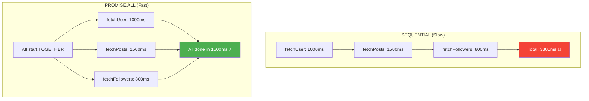

### Promise.allSettled — Wait for All, Don't Fail Fast

> Unlike `Promise.all`, this **NEVER rejects**!
> Returns result for each promise (fulfilled or rejected).

```javascript
// Real-world: Load multiple widgets — show what succeeded, handle failures
const widgetPromises = [
    fetch("https://api.example.com/weather"),    // Might fail
    fetch("https://api.example.com/stocks"),      // Might fail
    fetch("https://api.example.com/news"),        // Might succeed
    fetch("https://api.example.com/sports")       // Might succeed
];

const results = await Promise.allSettled(widgetPromises);

results.forEach((result, index) => {
    if (result.status === "fulfilled") {
        console.log(`✅ Widget ${index + 1}: Loaded successfully`);
        // Show the widget
    } else {
        console.log(`❌ Widget ${index + 1}: Failed — ${result.reason}`);
        // Show error placeholder for this widget only
    }
});
// Shows some widgets even if others fail!
```

### Promise.race — First One Wins!

```javascript
// Real-world: Set a TIMEOUT for an API call
function fetchWithTimeout(url, timeoutMs) {
    const fetchPromise = fetch(url);

    const timeoutPromise = new Promise((_, reject) =>
        setTimeout(() => reject(new Error(`Request timed out after ${timeoutMs}ms!`)),
        timeoutMs)
    );

    // Race: whichever finishes first wins!
    return Promise.race([fetchPromise, timeoutPromise]);
}

fetchWithTimeout("https://api.example.com/data", 3000)
    .then(response => response.json())
    .then(data => console.log("✅ Data:", data))
    .catch(error => console.error("❌", error.message));
// If API takes > 3 seconds → timeout error!
// If API responds in 2 seconds → data shown!
```

### Promise.any — First SUCCESS Wins

```javascript
// Real-world: Try multiple servers, use fastest responding
const servers = [
    fetch("https://server1.api.com/data"),
    fetch("https://server2.api.com/data"),
    fetch("https://server3.api.com/data")
];

// Unlike race(), any() IGNORES failures — needs at least one success
Promise.any(servers)
    .then(response => {
        console.log("✅ Got response from fastest server!");
        return response.json();
    })
    .catch(error => {
        console.error("❌ All servers failed:", error.message);
    });
```

### Comparison Table

| Method | Resolves When | Rejects When |
|--------|-------------|-------------|
| `Promise.all` | ALL resolve | ANY rejects |
| `Promise.allSettled` | ALL settle (any status) | Never rejects |
| `Promise.race` | FIRST settles (any) | FIRST rejects |
| `Promise.any` | FIRST resolves | ALL reject |

---

<a href="#top">⬆️ Go to Top</a>

---

<a id="15"></a>

## 15. ✨ Async/Await — Modern Way

### What is Async/Await?

> **Async/Await** is syntactic sugar over Promises.
> It makes async code look and feel like synchronous code!
>
> **`async`** — marks a function as asynchronous (always returns a Promise)
> **`await`** — pauses execution inside async function until Promise resolves

### Why Async/Await?

```
PROBLEMS with .then()/.catch():
━━━━━━━━━━━━━━━━━━━━━━━━━━━━━━
❌ Still chains — harder to read complex logic
❌ Difficult to use loops (for, while)
❌ Hard to debug (stack traces confusing)
❌ Error handling needs .catch() at end
❌ Sharing data between chains is awkward

BENEFITS of Async/Await:
━━━━━━━━━━━━━━━━━━━━━━━━
✅ Looks like synchronous code — easy to read!
✅ Works perfectly with loops
✅ Great error handling with try/catch
✅ Better debugging (clear stack traces)
✅ Easy to share data between steps
```

### Basic Async/Await

```javascript
// Without async/await (Promise .then)
function getUser() {
    return fetch("https://api.example.com/user")
        .then(res => res.json())
        .then(user => user);
}

// With async/await (clean!)
async function getUser() {
    const res = await fetch("https://api.example.com/user");
    const user = await res.json();
    return user; // Automatically wrapped in Promise
}

// Using an async function
getUser().then(user => console.log(user));
// OR inside another async function:
async function main() {
    const user = await getUser();
    console.log(user);
}
```

### Error Handling with try/catch

```javascript
async function fetchUserData(userId) {
    try {
        console.log(`🔍 Fetching user ${userId}...`);

        const response = await fetch(`https://jsonplaceholder.typicode.com/users/${userId}`);

        if (!response.ok) {
            throw new Error(`HTTP Error! Status: ${response.status}`);
        }

        const user = await response.json();
        console.log("✅ Got user:", user.name);
        return user;

    } catch (error) {
        console.error("❌ Error:", error.message);
        throw error; // Re-throw to let caller handle it too
    } finally {
        console.log("🔄 Fetch attempt complete"); // Always runs
    }
}

// Calling the async function
async function main() {
    try {
        const user = await fetchUserData(1);
        console.log("User email:", user.email);
    } catch (error) {
        console.log("Handled in main:", error.message);
    }
}

main();
```

### Async/Await with Loops

```javascript
// Async/Await makes loops work naturally!
// (Very difficult with .then() chains)

const userIds = [1, 2, 3, 4, 5];

// Sequential — one at a time (when order matters)
async function fetchUsersSequential(ids) {
    const users = [];
    for (const id of ids) {
        const response = await fetch(`https://jsonplaceholder.typicode.com/users/${id}`);
        const user = await response.json();
        users.push(user);
        console.log(`✅ Fetched user ${id}: ${user.name}`);
    }
    return users;
}

// Parallel — all at once (when order doesn't matter — FASTER!)
async function fetchUsersParallel(ids) {
    const promises = ids.map(id =>
        fetch(`https://jsonplaceholder.typicode.com/users/${id}`)
            .then(res => res.json())
    );
    const users = await Promise.all(promises);
    return users;
}

async function main() {
    console.time("sequential");
    await fetchUsersSequential([1, 2, 3]);
    console.timeEnd("sequential"); // Slower

    console.time("parallel");
    await fetchUsersParallel([1, 2, 3]);
    console.timeEnd("parallel"); // Much faster!
}
```

---

<a href="#top">⬆️ Go to Top</a>

---

<a id="16"></a>

## 16. 📊 Complete Comparison — Callback vs Promise vs Async/Await

### Same Feature — 3 Different Ways

```javascript
// ============================================================
// TASK: Fetch user → Fetch their posts → Get comment count
// ============================================================

// Simulated API functions
const API = {
    getUser: (id, cb) => setTimeout(() =>
        cb(null, { id, name: "Aadi", email: "aadi@gmail.com" }), 500),

    getPosts: (userId, cb) => setTimeout(() =>
        cb(null, [
            { id: 1, title: "JS Tutorial", userId },
            { id: 2, title: "React Guide", userId }
        ]), 500),

    getComments: (postId, cb) => setTimeout(() =>
        cb(null, Array(5).fill({ text: "Great!" })), 500)
};

// ===========================================
// WAY 1: CALLBACKS — Pyramid of Doom 😱
// ===========================================
console.log("\n=== CALLBACK WAY ===");

API.getUser(1, function(err, user) {
    if (err) { console.error(err); return; }
    console.log("1. User:", user.name);

    API.getPosts(user.id, function(err, posts) {
        if (err) { console.error(err); return; }
        console.log("2. Posts:", posts.length);

        API.getComments(posts[0].id, function(err, comments) {
            if (err) { console.error(err); return; }
            console.log("3. Comments:", comments.length);
            console.log("✅ Done! (Callback way)");
        });
    });
});

// ===========================================
// WAY 2: PROMISES — Clean Chain ✅
// ===========================================
console.log("\n=== PROMISE WAY ===");

// First, convert callbacks to promises
function getUser(id) {
    return new Promise((resolve, reject) =>
        API.getUser(id, (err, data) => err ? reject(err) : resolve(data))
    );
}
function getPosts(userId) {
    return new Promise((resolve, reject) =>
        API.getPosts(userId, (err, data) => err ? reject(err) : resolve(data))
    );
}
function getComments(postId) {
    return new Promise((resolve, reject) =>
        API.getComments(postId, (err, data) => err ? reject(err) : resolve(data))
    );
}

getUser(1)
    .then(user => {
        console.log("1. User:", user.name);
        return getPosts(user.id);
    })
    .then(posts => {
        console.log("2. Posts:", posts.length);
        return getComments(posts[0].id);
    })
    .then(comments => {
        console.log("3. Comments:", comments.length);
        console.log("✅ Done! (Promise way)");
    })
    .catch(err => console.error("❌ Error:", err.message));

// ===========================================
// WAY 3: ASYNC/AWAIT — Most Readable ✨
// ===========================================
console.log("\n=== ASYNC/AWAIT WAY ===");

async function loadUserData() {
    try {
        const user = await getUser(1);
        console.log("1. User:", user.name);

        const posts = await getPosts(user.id);
        console.log("2. Posts:", posts.length);

        const comments = await getComments(posts[0].id);
        console.log("3. Comments:", comments.length);

        console.log("✅ Done! (Async/Await way)");
        return { user, posts, comments };

    } catch (error) {
        console.error("❌ Error:", error.message);
    }
}

loadUserData();
```

### Side-by-Side Comparison Table

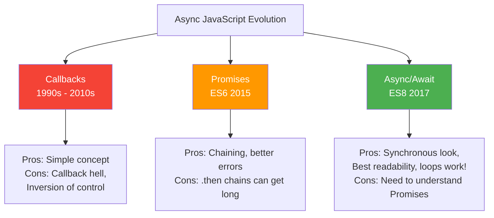

| Feature | Callback | Promise | Async/Await |
|---------|---------|---------|------------|
| Readability | ❌ Poor | ✅ Good | ✅✅ Best |
| Error handling | ❌ Messy | ✅ .catch() | ✅✅ try/catch |
| Debugging | ❌ Hard | ⚠️ Medium | ✅ Easy |
| Loops | ❌ Complex | ❌ Complex | ✅ Simple |
| Parallel execution | ❌ Manual | ✅ Promise.all | ✅ Promise.all |
| Browser support | ✅ All | ✅ Modern | ✅ Modern |
| Use today | Legacy code | Often | Preferred |

---

<a href="#top">⬆️ Go to Top</a>

---

<a id="17"></a>

## 17. 🏗️ Mini Project — User Dashboard with Real API

> **Project:** Build a User Dashboard that fetches real data from JSONPlaceholder API
> using all concepts: Promises, Promise.all, Async/Await, Error Handling

### Project Structure

```
📁 user-dashboard/
  📄 index.html
  📄 style.css
  📄 app.js
```

### The Complete Project

```html
<!-- index.html -->
<!DOCTYPE html>
<html lang="en">
<head>
    <meta charset="UTF-8">
    <title>User Dashboard</title>
    <style>
        * { box-sizing: border-box; margin: 0; padding: 0; font-family: Arial, sans-serif; }
        body { background: #f0f2f5; padding: 20px; }
        .container { max-width: 900px; margin: 0 auto; }
        h1 { text-align: center; color: #333; margin-bottom: 20px; }
        .search-box { display: flex; gap: 10px; margin-bottom: 20px; }
        .search-box input { flex: 1; padding: 12px; border: 2px solid #ddd; border-radius: 8px; font-size: 16px; }
        .search-box button { padding: 12px 24px; background: #4CAF50; color: white; border: none; border-radius: 8px; cursor: pointer; font-size: 16px; }
        .search-box button:hover { background: #388E3C; }
        .card { background: white; border-radius: 12px; padding: 20px; margin-bottom: 15px; box-shadow: 0 2px 10px rgba(0,0,0,0.1); }
        .loading { text-align: center; color: #888; font-size: 18px; padding: 40px; }
        .error { background: #FFEBEE; color: #C62828; padding: 15px; border-radius: 8px; border-left: 4px solid #F44336; }
        .user-info { display: flex; align-items: center; gap: 15px; }
        .avatar { width: 60px; height: 60px; border-radius: 50%; background: #4CAF50; color: white; display: flex; align-items: center; justify-content: center; font-size: 24px; font-weight: bold; }
        .stats { display: grid; grid-template-columns: repeat(3, 1fr); gap: 15px; }
        .stat { text-align: center; padding: 15px; background: #f8f9fa; border-radius: 8px; }
        .stat h3 { font-size: 28px; color: #4CAF50; }
        .stat p { color: #666; font-size: 14px; }
        .post { border-left: 4px solid #4CAF50; padding: 10px 15px; margin-bottom: 10px; background: #f9f9f9; border-radius: 0 8px 8px 0; }
        .todo { display: flex; align-items: center; gap: 10px; padding: 8px; border-bottom: 1px solid #eee; }
        .todo.completed span { text-decoration: line-through; color: #888; }
        .badge { padding: 3px 10px; border-radius: 20px; font-size: 12px; }
        .badge.done { background: #E8F5E9; color: #2E7D32; }
        .badge.pending { background: #FFF8E1; color: #F57F17; }
    </style>
</head>
<body>
    <div class="container">
        <h1>👤 User Dashboard</h1>

        <div class="search-box">
            <input type="number" id="userId" placeholder="Enter User ID (1-10)" min="1" max="10" value="1">
            <button onclick="loadDashboard()">Load Dashboard</button>
        </div>

        <div id="dashboard">
            <div class="loading">Enter a User ID and click "Load Dashboard"</div>
        </div>
    </div>

    <script src="app.js"></script>
</body>
</html>
```

```javascript
// app.js — Complete implementation using all async concepts

const BASE_URL = "https://jsonplaceholder.typicode.com";

// ===================================
// API FUNCTIONS (Return Promises)
// ===================================

async function fetchUser(id) {
    const response = await fetch(`${BASE_URL}/users/${id}`);
    if (!response.ok) throw new Error(`User ${id} not found! (Status: ${response.status})`);
    return response.json();
}

async function fetchPosts(userId) {
    const response = await fetch(`${BASE_URL}/posts?userId=${userId}&_limit=3`);
    if (!response.ok) throw new Error("Failed to fetch posts!");
    return response.json();
}

async function fetchTodos(userId) {
    const response = await fetch(`${BASE_URL}/todos?userId=${userId}&_limit=5`);
    if (!response.ok) throw new Error("Failed to fetch todos!");
    return response.json();
}

async function fetchAlbums(userId) {
    const response = await fetch(`${BASE_URL}/albums?userId=${userId}`);
    if (!response.ok) throw new Error("Failed to fetch albums!");
    return response.json();
}

// ===================================
// MAIN DASHBOARD LOADER
// Uses ALL async concepts!
// ===================================

async function loadDashboard() {
    const userId = document.getElementById("userId").value;
    const dashboardEl = document.getElementById("dashboard");

    if (!userId || userId < 1 || userId > 10) {
        showError("Please enter a valid User ID between 1 and 10!");
        return;
    }

    // Show loading state
    dashboardEl.innerHTML = `<div class="loading">⏳ Loading dashboard for User ${userId}...</div>`;

    try {
        // Step 1: Fetch user first (need userId for other calls)
        const user = await fetchUser(userId);

        // Step 2: Fetch posts, todos, albums ALL AT ONCE (Promise.all)
        // No need to wait one by one — saves time!
        const [posts, todos, albums] = await Promise.all([
            fetchPosts(user.id),
            fetchTodos(user.id),
            fetchAlbums(user.id)
        ]);

        // Step 3: Render dashboard with all data
        renderDashboard(user, posts, todos, albums);

    } catch (error) {
        showError(`❌ ${error.message}`);
        console.error("Dashboard load failed:", error);
    }
}

// ===================================
// RENDER FUNCTIONS
// ===================================

function renderDashboard(user, posts, todos, albums) {
    const completedTodos = todos.filter(t => t.completed).length;
    const initials = user.name.split(" ").map(n => n[0]).join("");

    document.getElementById("dashboard").innerHTML = `
        <!-- User Profile Card -->
        <div class="card">
            <div class="user-info">
                <div class="avatar">${initials}</div>
                <div>
                    <h2>${user.name}</h2>
                    <p>📧 ${user.email}</p>
                    <p>🌐 ${user.website} | 🏢 ${user.company.name}</p>
                    <p>📍 ${user.address.city}, ${user.address.zipcode}</p>
                </div>
            </div>
        </div>

        <!-- Stats Card (uses Promise.all data) -->
        <div class="card">
            <h3>📊 Quick Stats</h3><br>
            <div class="stats">
                <div class="stat">
                    <h3>${posts.length}</h3>
                    <p>Recent Posts</p>
                </div>
                <div class="stat">
                    <h3>${completedTodos}/${todos.length}</h3>
                    <p>Todos Done</p>
                </div>
                <div class="stat">
                    <h3>${albums.length}</h3>
                    <p>Albums</p>
                </div>
            </div>
        </div>

        <!-- Recent Posts -->
        <div class="card">
            <h3>📝 Recent Posts</h3><br>
            ${posts.map(post => `
                <div class="post">
                    <strong>${post.title}</strong>
                    <p style="color:#666;font-size:14px;margin-top:5px">${post.body.substring(0, 80)}...</p>
                </div>
            `).join("")}
        </div>

        <!-- Todos -->
        <div class="card">
            <h3>✅ Recent Todos</h3><br>
            ${todos.map(todo => `
                <div class="todo ${todo.completed ? "completed" : ""}">
                    <span>${todo.completed ? "✅" : "⭕"}</span>
                    <span style="flex:1">${todo.title}</span>
                    <span class="badge ${todo.completed ? "done" : "pending"}">
                        ${todo.completed ? "Done" : "Pending"}
                    </span>
                </div>
            `).join("")}
        </div>
    `;
}

function showError(message) {
    document.getElementById("dashboard").innerHTML = `
        <div class="error">
            <strong>Oops!</strong> ${message}
            <br><small>Try User IDs between 1-10</small>
        </div>
    `;
}

// ===================================
// ADDITIONAL: Promise Chaining Demo
// ===================================

// Show how we can chain operations
async function showPromiseChainDemo() {
    console.log("=== Promise Chain Demo ===");

    // Method 1: Async/Await (modern, clean)
    const user = await fetchUser(1);
    const posts = await fetchPosts(user.id);
    console.log(`User: ${user.name} has ${posts.length} posts`);

    // Method 2: .then() chains (classic)
    fetchUser(2)
        .then(user => {
            console.log("User2:", user.name);
            return fetchPosts(user.id); // Return Promise for chaining
        })
        .then(posts => {
            console.log("User2 posts:", posts.length);
        })
        .catch(err => console.error("Error:", err.message));

    // Method 3: Promise.all for parallel fetch
    const [user3, user4, user5] = await Promise.all([
        fetchUser(3),
        fetchUser(4),
        fetchUser(5)
    ]);
    console.log("Parallel fetch:", user3.name, user4.name, user5.name);

    // Method 4: Promise.allSettled — handles partial failures
    const results = await Promise.allSettled([
        fetchUser(1),   // Will succeed
        fetchUser(99),  // Will fail (no user 99)
        fetchUser(3)    // Will succeed
    ]);

    results.forEach((result, i) => {
        if (result.status === "fulfilled") {
            console.log(`✅ User ${i+1}: ${result.value.name}`);
        } else {
            console.log(`❌ User ${i+1}: ${result.reason.message}`);
        }
    });
}
```

### Project Features Used

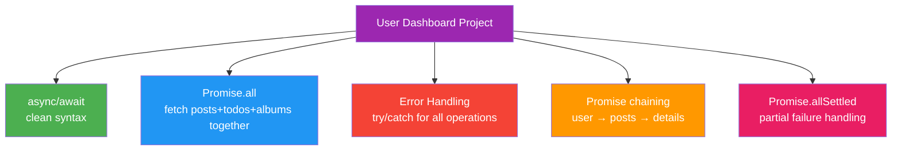

---

<a href="#top">⬆️ Go to Top</a>

---

<a id="18"></a>

## 18. 🎯 Practice Projects & Interview Questions

### Practice Projects

---

#### 🟢 Project 1 — Weather App (Beginner)

```javascript
// Build a weather app using OpenWeatherMap API
// Concepts: fetch, async/await, error handling

async function getWeather(city) {
    const API_KEY = "your_api_key"; // Get from openweathermap.org
    const URL = `https://api.openweathermap.org/data/2.5/weather?q=${city}&appid=${API_KEY}&units=metric`;

    try {
        // Show loading
        document.getElementById("result").textContent = "⏳ Fetching weather...";

        const response = await fetch(URL);

        // Handle HTTP errors
        if (!response.ok) {
            if (response.status === 404) throw new Error(`City "${city}" not found!`);
            throw new Error(`Weather API error: ${response.status}`);
        }

        const data = await response.json();

        // Display results
        document.getElementById("result").innerHTML = `
            <h2>🌤️ ${data.name}, ${data.sys.country}</h2>
            <p>🌡️ Temperature: ${data.main.temp}°C</p>
            <p>💧 Humidity: ${data.main.humidity}%</p>
            <p>💨 Wind: ${data.wind.speed} m/s</p>
            <p>☁️ Condition: ${data.weather[0].description}</p>
        `;

    } catch (error) {
        document.getElementById("result").innerHTML =
            `<p style="color:red">❌ ${error.message}</p>`;
    }
}

// Auto-refresh every 10 minutes using setInterval
setInterval(() => {
    const city = document.getElementById("cityInput").value;
    if (city) getWeather(city);
}, 600000);
```

---

#### 🟡 Project 2 — News Feed with Auto-refresh (Intermediate)

```javascript
// News feed that auto-refreshes every 30 seconds
// Concepts: setInterval, Promise.all, async/await

const NEWS_API = "https://newsapi.org/v2/top-headlines";

async function fetchNews(category = "technology") {
    const response = await fetch(`${NEWS_API}?category=${category}&apiKey=YOUR_KEY&pageSize=5`);
    if (!response.ok) throw new Error("Failed to fetch news");
    return response.json();
}

async function loadMultipleCategoryNews() {
    try {
        // Load tech and business news simultaneously
        const [techNews, businessNews] = await Promise.all([
            fetchNews("technology"),
            fetchNews("business")
        ]);

        renderNews("tech-section", techNews.articles);
        renderNews("business-section", businessNews.articles);

        document.getElementById("last-updated").textContent =
            `Last updated: ${new Date().toLocaleTimeString()}`;

    } catch (error) {
        console.error("News fetch failed:", error);
    }
}

// Initial load
loadMultipleCategoryNews();

// Auto-refresh every 30 seconds
const refreshInterval = setInterval(loadMultipleCategoryNews, 30000);

// Cleanup when page unloads
window.addEventListener("beforeunload", () => clearInterval(refreshInterval));
```

---

#### 🔴 Project 3 — GitHub Profile Viewer (Advanced)

```javascript
// GitHub profile viewer with repos and followers
// Concepts: All async concepts combined

const GITHUB_API = "https://api.github.com";

async function loadGitHubProfile(username) {
    const dashboardEl = document.getElementById("github-dashboard");

    try {
        dashboardEl.innerHTML = "<p>⏳ Loading GitHub profile...</p>";

        // First fetch the user
        const userResponse = await fetch(`${GITHUB_API}/users/${username}`);
        if (!userResponse.ok) throw new Error(`GitHub user "${username}" not found!`);
        const user = await userResponse.json();

        // Fetch repos and followers in PARALLEL
        const [reposResponse, followersResponse] = await Promise.all([
            fetch(`${GITHUB_API}/users/${username}/repos?sort=stars&per_page=5`),
            fetch(`${GITHUB_API}/users/${username}/followers?per_page=5`)
        ]);

        const [repos, followers] = await Promise.all([
            reposResponse.json(),
            followersResponse.json()
        ]);

        // Try to get languages for each repo (might partially fail)
        const repoLanguages = await Promise.allSettled(
            repos.map(repo =>
                fetch(`${GITHUB_API}/repos/${username}/${repo.name}/languages`)
                    .then(r => r.json())
            )
        );

        renderGitHubProfile(user, repos, followers, repoLanguages);

    } catch (error) {
        dashboardEl.innerHTML = `<p style="color:red">❌ ${error.message}</p>`;
    }
}

function renderGitHubProfile(user, repos, followers, repoLanguages) {
    document.getElementById("github-dashboard").innerHTML = `
        <div class="profile">
            
            <h2>${user.name || user.login}</h2>
            <p>${user.bio || "No bio available"}</p>
            <div class="stats">
                <span>⭐ ${user.public_repos} Repos</span>
                <span>👥 ${user.followers} Followers</span>
                <span>➡️ ${user.following} Following</span>
            </div>
        </div>

        <h3>Top Repositories</h3>
        ${repos.map((repo, i) => {
            const langResult = repoLanguages[i];
            const langs = langResult.status === "fulfilled"
                ? Object.keys(langResult.value).join(", ")
                : "Unknown";
            return `
                <div class="repo">
                    <strong>${repo.name}</strong> ⭐ ${repo.stargazers_count}
                    <p>${repo.description || "No description"}</p>
                    <small>Languages: ${langs}</small>
                </div>
            `;
        }).join("")}

        <h3>Recent Followers</h3>
        ${followers.map(f => `
            <div class="follower">
                
                ${f.login}
            </div>
        `).join("")}
    `;
}
```

### Interview Questions

---

#### ❓ Conceptual Questions

```
Q1: What is the Event Loop? Explain with an example.
━━━━━━━━━━━━━━━━━━━━━━━━━━━━━━━━━━━━━━━━━━━━━━━━━━
Answer: The Event Loop monitors the Call Stack and the Callback Queue.
When the Call Stack is empty, it moves the next callback from the queue to the stack.

Example:
setTimeout(() => console.log("B"), 0);
console.log("A");
// Output: A then B
// Even 0ms setTimeout goes to Queue — runs AFTER sync code finishes

Q2: What is the difference between Microtask Queue and Callback Queue?
━━━━━━━━━━━━━━━━━━━━━━━━━━━━━━━━━━━━━━━━━━━━━━━━━━━━━━━━━━━━━━━━━━━━━
Answer: Microtask Queue (Promises) has HIGHER priority than Callback Queue (setTimeout).
Event Loop always empties Microtask Queue FIRST, then checks Callback Queue.

Q3: What is callback hell and how do Promises solve it?
━━━━━━━━━━━━━━━━━━━━━━━━━━━━━━━━━━━━━━━━━━━━━━━━━━━━━━
Answer: Callback hell = deeply nested callbacks creating pyramid of doom.
Hard to read, debug, and maintain.
Promises solve it with .then() chaining (flat instead of nested).
async/await makes it even cleaner by looking synchronous.

Q4: What is the difference between Promise.all and Promise.allSettled?
━━━━━━━━━━━━━━━━━━━━━━━━━━━━━━━━━━━━━━━━━━━━━━━━━━━━━━━━━━━━━━━━━━━━━
Promise.all: Resolves when ALL resolve. Rejects if ANY rejects (fail fast)
Promise.allSettled: Waits for ALL regardless. Never rejects. Returns status for each.

Q5: Is JavaScript single-threaded? How does it handle async operations?
━━━━━━━━━━━━━━━━━━━━━━━━━━━━━━━━━━━━━━━━━━━━━━━━━━━━━━━━━━━━━━━━━━━━━━
Yes, JavaScript is single-threaded. But it handles async operations through:
1. Web APIs (browser handles timers, HTTP requests)
2. Callback Queue / Microtask Queue
3. Event Loop (moves callbacks to stack when stack is empty)
This gives the ILLUSION of parallelism.
```

#### ❓ Code Output Questions

```javascript
// Q1: What is the output? WHY?
console.log("1");
setTimeout(() => console.log("2"), 0);
Promise.resolve().then(() => console.log("3"));
console.log("4");

// Answer: 1 → 4 → 3 → 2
// 1, 4 = Sync (run first)
// 3 = Microtask (Promise — higher priority)
// 2 = Callback Queue (setTimeout — lower priority)

// Q2: What is the output?
async function foo() {
    console.log("A");
    await Promise.resolve();
    console.log("B");
}

console.log("C");
foo();
console.log("D");

// Answer: C → A → D → B
// C = Sync
// A = Sync (inside foo, before await)
// D = Sync (foo pauses at await, control returns)
// B = After await resolves (microtask)

// Q3: What happens here?
const p = new Promise((resolve, reject) => {
    resolve("First");
    reject("Second"); // ← This line?
    resolve("Third"); // ← And this?
});

p.then(v => console.log(v))
 .catch(e => console.log(e));

// Answer: "First"
// Promise settles ONCE — first resolve/reject wins!
// After resolve("First"), reject and second resolve are IGNORED

// Q4: Fix this code
async function getData() {
    const data = await fetch("https://api.example.com/data");
    return data;
}
// Problem: No error handling!

// Fixed version:
async function getData() {
    try {
        const response = await fetch("https://api.example.com/data");
        if (!response.ok) throw new Error(`HTTP Error: ${response.status}`);
        const data = await response.json();
        return data;
    } catch (error) {
        console.error("Fetch failed:", error.message);
        throw error; // Re-throw for caller
    }
}

// Q5: What is the output?
async function fetchData() {
    return 42; // async function auto-wraps in Promise
}

const result = fetchData();
console.log(result);        // Promise {<fulfilled>: 42}
console.log(typeof result); // "object"

result.then(val => console.log(val)); // 42
```

#### ❓ Practical Coding Questions

```javascript
// Q1: Implement a retry function
async function withRetry(asyncFn, maxRetries = 3, delay = 1000) {
    for (let attempt = 1; attempt <= maxRetries; attempt++) {
        try {
            const result = await asyncFn();
            return result;
        } catch (error) {
            if (attempt === maxRetries) throw error;
            console.log(`Attempt ${attempt} failed. Retrying in ${delay}ms...`);
            await new Promise(resolve => setTimeout(resolve, delay));
            delay *= 2; // Exponential backoff
        }
    }
}

// Usage
await withRetry(() => fetch("https://api.example.com/data"), 3, 1000);

// Q2: Run N promises with limited concurrency
async function runWithConcurrency(tasks, limit) {
    const results = [];
    const running = [];

    for (const task of tasks) {
        const promise = task().then(result => {
            running.splice(running.indexOf(promise), 1);
            return result;
        });

        results.push(promise);
        running.push(promise);

        if (running.length >= limit) {
            await Promise.race(running); // Wait for one to finish
        }
    }

    return Promise.all(results);
}

// Q3: Implement a cache with timeout using setTimeout
function createCacheWithTimeout(ttl = 5000) {
    const cache = new Map();

    return {
        async get(key, fetchFn) {
            if (cache.has(key)) {
                console.log(`Cache hit: ${key}`);
                return cache.get(key);
            }

            const data = await fetchFn();
            cache.set(key, data);

            // Auto-expire from cache
            setTimeout(() => {
                cache.delete(key);
                console.log(`Cache expired: ${key}`);
            }, ttl);

            return data;
        }
    };
}

const apiCache = createCacheWithTimeout(10000); // 10 sec cache
const user = await apiCache.get("user-1", () => fetchUser(1));
```

### Quick Revision Cheat Sheet

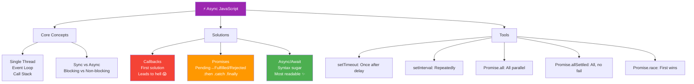

---

<a href="#top">⬆️ Go to Top</a>

---

> 📝 **Quick Revision — Most Important Points**
>
> | Concept | Key Point |
> |---------|-----------|
> | **JS is Sync** | One task at a time, single thread |
> | **Event Loop** | Moves tasks from Queue → Stack (only when stack is EMPTY) |
> | **Microtask Queue** | Promises — runs BEFORE Callback Queue |
> | **Callback Queue** | setTimeout, setInterval — runs AFTER Microtasks |
> | **setTimeout 0ms** | Still async! Goes through Queue |
> | **Callbacks** | First solution — leads to Callback Hell |
> | **Promises** | Pending → Fulfilled/Rejected — chainable with .then() |
> | **async/await** | Syntactic sugar over Promises — cleanest syntax |
> | **Promise.all** | Parallel, fails if ANY fails |
> | **Promise.allSettled** | Parallel, never fails, shows all results |
>
> 🔑 **Most Asked in Interviews:**
> - Explain Event Loop (MOST asked!)
> - setTimeout vs Promise — which runs first?
> - What is callback hell and how to fix it?
> - Difference between Promise.all and Promise.allSettled?
> - How does async/await work under the hood?

---

<a href="#top">⬆️ Go to Top</a>
```