<a id="section-1-top"></a>

# 📘 Section 1: Event Loop — The Complete Deep Dive

> **How JavaScript Runs Behind The Scenes in Browser**
> JavaScript Runtime • JS Engine • Heap • Call Stack • Web APIs • Event Loop • Task Queue (Callback Queue) • Microtask Queue
> Interview Focused — Explained in Simple Hindi+English Language

---

## 📑 Table of Contents

| # | Topic |
|---|-------|
| 1 | <a href="#what-is-event-loop">1.1 What is Event Loop? (The Big Picture)</a> |
|   | &nbsp;&nbsp;&nbsp;&nbsp;<a href="#why-event-loop">Why Event Loop Exists?</a> |
|   | &nbsp;&nbsp;&nbsp;&nbsp;<a href="#what-problem-event-loop-solves">What Problem Does It Solve?</a> |
|   | &nbsp;&nbsp;&nbsp;&nbsp;<a href="#real-life-analogy-event-loop">Real-Life Analogy</a> |
| 2 | <a href="#how-browser-works">1.2 How Everything Works in Browser?</a> |
|   | &nbsp;&nbsp;&nbsp;&nbsp;<a href="#javascript-runtime">What is JavaScript Runtime?</a> |
|   | &nbsp;&nbsp;&nbsp;&nbsp;<a href="#browser-architecture">Browser Architecture Overview</a> |
|   | &nbsp;&nbsp;&nbsp;&nbsp;<a href="#runtime-full-diagram">Full Runtime Diagram (Engine + Web APIs + Queues + Event Loop)</a> |
| 3 | <a href="#call-stack">1.3 Call Stack & Heap — JavaScript Engine</a> |
|   | &nbsp;&nbsp;&nbsp;&nbsp;<a href="#what-is-js-engine">What is JS Engine?</a> |
|   | &nbsp;&nbsp;&nbsp;&nbsp;<a href="#heap-memory">Heap — Memory Storage</a> |
|   | &nbsp;&nbsp;&nbsp;&nbsp;<a href="#what-is-call-stack">What is Call Stack?</a> |
|   | &nbsp;&nbsp;&nbsp;&nbsp;<a href="#call-stack-real-life">Real-Life Analogy — Stack of Plates</a> |
|   | &nbsp;&nbsp;&nbsp;&nbsp;<a href="#call-stack-diagram">Call Stack Step-by-Step Diagram</a> |
|   | &nbsp;&nbsp;&nbsp;&nbsp;<a href="#call-stack-code-examples">Code Examples with Execution Flow</a> |
|   | &nbsp;&nbsp;&nbsp;&nbsp;<a href="#stack-overflow">Stack Overflow — When Stack Breaks</a> |
|   | &nbsp;&nbsp;&nbsp;&nbsp;<a href="#call-stack-must-know">Must-Know Points for Interview</a> |
| 4 | <a href="#global-execution-context">1.4 Global Execution Context (GEC)</a> |
|   | &nbsp;&nbsp;&nbsp;&nbsp;<a href="#gec-creation-phase">Creation Phase (Memory Allocation)</a> |
|   | &nbsp;&nbsp;&nbsp;&nbsp;<a href="#gec-execution-phase">Execution Phase (Code Running)</a> |
|   | &nbsp;&nbsp;&nbsp;&nbsp;<a href="#gec-full-flow">Full Flow Diagram — GEC to Call Stack</a> |
|   | &nbsp;&nbsp;&nbsp;&nbsp;<a href="#gec-must-know">Must-Know Points for Interview</a> |
| 5 | <a href="#how-js-engine-executes">1.5 How JS Engine Executes Code Using Call Stack</a> |
|   | &nbsp;&nbsp;&nbsp;&nbsp;<a href="#execution-step-by-step">Step-by-Step Execution Walkthrough</a> |
|   | &nbsp;&nbsp;&nbsp;&nbsp;<a href="#nested-function-execution">Nested Function Calls in Stack</a> |
|   | &nbsp;&nbsp;&nbsp;&nbsp;<a href="#call-stack-creating-to-deleting">Call Stack — From Creating to Deleting</a> |
|   | &nbsp;&nbsp;&nbsp;&nbsp;<a href="#js-engine-must-know">Must-Know Points for Interview</a> |
| 6 | <a href="#web-apis">1.6 Web APIs — What's NOT Part of JavaScript?</a> |
|   | &nbsp;&nbsp;&nbsp;&nbsp;<a href="#web-apis-vs-js">Web APIs vs Core JS — The Confusion</a> |
|   | &nbsp;&nbsp;&nbsp;&nbsp;<a href="#complete-web-api-list">Complete Web APIs List (Visual Categories)</a> |
|   | &nbsp;&nbsp;&nbsp;&nbsp;<a href="#fetch-api">Fetch API</a> |
|   | &nbsp;&nbsp;&nbsp;&nbsp;<a href="#timer-api">Timers API (setTimeout / setInterval)</a> |
|   | &nbsp;&nbsp;&nbsp;&nbsp;<a href="#console-api">Console API</a> |
|   | &nbsp;&nbsp;&nbsp;&nbsp;<a href="#geolocation-api">Geolocation API</a> |
|   | &nbsp;&nbsp;&nbsp;&nbsp;<a href="#web-storage-api">Web Storage API (localStorage / sessionStorage)</a> |
|   | &nbsp;&nbsp;&nbsp;&nbsp;<a href="#file-api">File API (showOpenFilePicker, Blob, FileList)</a> |
|   | &nbsp;&nbsp;&nbsp;&nbsp;<a href="#performance-api">Performance API</a> |
|   | &nbsp;&nbsp;&nbsp;&nbsp;<a href="#html-dom-api">HTML DOM API</a> |
|   | &nbsp;&nbsp;&nbsp;&nbsp;<a href="#url-api">URL API</a> |
|   | &nbsp;&nbsp;&nbsp;&nbsp;<a href="#indexeddb-api">IndexedDB API</a> |
|   | &nbsp;&nbsp;&nbsp;&nbsp;<a href="#xhr-api">XMLHttpRequest API</a> |
|   | &nbsp;&nbsp;&nbsp;&nbsp;<a href="#web-apis-must-know">Must-Know Points for Interview</a> |
| 7 | <a href="#event-loop-task-queue">1.7 How Event Loop & Task Queue (Callback Queue) Come Into Picture</a> |
|   | &nbsp;&nbsp;&nbsp;&nbsp;<a href="#callback-registration">Where is Callback Registered?</a> |
|   | &nbsp;&nbsp;&nbsp;&nbsp;<a href="#event-loop-job">What is Event Loop's Job?</a> |
|   | &nbsp;&nbsp;&nbsp;&nbsp;<a href="#the-golden-rule">THE GOLDEN RULE — Stack Empty Then Queue</a> |
|   | &nbsp;&nbsp;&nbsp;&nbsp;<a href="#settimeout-0ms-trick">setTimeout(fn, 0) — The Famous Trick</a> |
|   | &nbsp;&nbsp;&nbsp;&nbsp;<a href="#event-loop-must-know">Must-Know Points for Interview</a> |
| 8 | <a href="#full-flow-diagram">1.8 FULL FLOW DIAGRAM — How JavaScript Runs Code</a> |
|   | &nbsp;&nbsp;&nbsp;&nbsp;<a href="#complete-architecture">Complete Architecture — Every Component</a> |
|   | &nbsp;&nbsp;&nbsp;&nbsp;<a href="#async-task-flow">Async Task Flow — From Code to Output</a> |
|   | &nbsp;&nbsp;&nbsp;&nbsp;<a href="#code-walkthrough-full">Code Walkthrough — Line by Line Through Entire System</a> |
|   | &nbsp;&nbsp;&nbsp;&nbsp;<a href="#event-listener-flow">Event Listener Flow — click Event Example</a> |
|   | &nbsp;&nbsp;&nbsp;&nbsp;<a href="#fetch-promise-flow">fetch + Promise Flow — With PromiseState & PromiseResult</a> |
|   | &nbsp;&nbsp;&nbsp;&nbsp;<a href="#when-things-vanish">When Things Vanish — EC, Callbacks, Queue Cleanup</a> |
|   | &nbsp;&nbsp;&nbsp;&nbsp;<a href="#full-flow-must-know">Must-Know Points for Interview</a> |
| 9 | <a href="#microtask-queue">1.9 Microtask Queue — The VIP Queue</a> |
|   | &nbsp;&nbsp;&nbsp;&nbsp;<a href="#what-is-microtask-queue">What is Microtask Queue?</a> |
|   | &nbsp;&nbsp;&nbsp;&nbsp;<a href="#microtask-vs-task-queue">Microtask Queue vs Task Queue (Callback Queue) — Priority</a> |
|   | &nbsp;&nbsp;&nbsp;&nbsp;<a href="#what-creates-microtasks">What Creates Microtasks? (Complete List)</a> |
|   | &nbsp;&nbsp;&nbsp;&nbsp;<a href="#microtask-code-examples">Code Examples with Visual Trace</a> |
|   | &nbsp;&nbsp;&nbsp;&nbsp;<a href="#what-goes-where">What Goes in Which Queue — Comparison Table</a> |
|   | &nbsp;&nbsp;&nbsp;&nbsp;<a href="#microtask-must-know">Must-Know Points for Interview</a> |
| 10 | <a href="#mutation-observer">1.10 Mutation Observer</a> |
|   | &nbsp;&nbsp;&nbsp;&nbsp;<a href="#what-is-mutation-observer">What & Why Mutation Observer?</a> |
|   | &nbsp;&nbsp;&nbsp;&nbsp;<a href="#mutation-observer-examples">Practical Examples</a> |
|   | &nbsp;&nbsp;&nbsp;&nbsp;<a href="#mutation-observer-queue">Which Queue Does It Use?</a> |
|   | &nbsp;&nbsp;&nbsp;&nbsp;<a href="#mutation-observer-must-know">Must-Know Points for Interview</a> |
| 11 | <a href="#starvation">1.11 Starvation of Task Queue (Callback Queue)</a> |
|   | &nbsp;&nbsp;&nbsp;&nbsp;<a href="#what-is-starvation">What is Starvation?</a> |
|   | &nbsp;&nbsp;&nbsp;&nbsp;<a href="#starvation-example">Code Example — Proving Starvation</a> |
|   | &nbsp;&nbsp;&nbsp;&nbsp;<a href="#starvation-real-world">Real-World Impact</a> |
|   | &nbsp;&nbsp;&nbsp;&nbsp;<a href="#starvation-must-know">Must-Know Points for Interview</a> |
| 12 | <a href="#mini-project">1.12 Mini Project — Visualize Event Loop</a> |
| 13 | <a href="#practice-questions">1.13 Practice Questions & Projects</a> |

<a href="#section-1-top">⬆ Back to Top</a>

---

<a id="what-is-event-loop"></a>

## 1.1 🔄 What is Event Loop? (The Big Picture)

<a id="why-event-loop"></a>

### Why Does Event Loop Exist?

```
Socho agar JavaScript ek restaurant hai:

👨‍🍳 Cook (JS Engine) = sirf EK hai — Single Thread
🍽️  Orders (Tasks) = bahut saare aa rahe hain
⏰  Kuch orders time lenge (API calls, setTimeout)

PROBLEM: 
Agar cook ek biryani banane me 30 min lagayega,
toh baaqi sab customers WAIT karenge — Browser FREEZE ho jayega!

SOLUTION → EVENT LOOP:
Cook kehta hai: "Biryani oven mein daal deta hun (Web API),
jab ready ho jayegi toh bell bajegi (Task Queue),
tab main serve karunga. Tab tak dusre orders handle karta hun!"

Event Loop = Wo bell check karne wala manager
Jo dekhta hai: "Cook free hai? Koi bell baji? Toh serve karo!"
```

> 💡 **Interview Definition:** "The Event Loop is a mechanism in JavaScript that continuously monitors the Call Stack and the Task Queue (Callback Queue) / Microtask Queue. When the Call Stack becomes empty, it picks up the next task from the queues and pushes it to the Call Stack for execution."

<a id="what-problem-event-loop-solves"></a>

### What Problem Does It Solve?

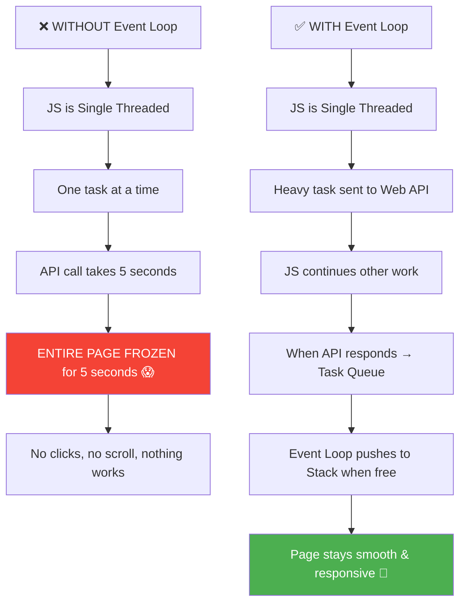

<a id="real-life-analogy-event-loop"></a>

### 🍽️ Real-Life Analogy — Restaurant System

```
🏪 RESTAURANT = BROWSER
━━━━━━━━━━━━━━━━━━━━━━━

👨‍🍳 Cook = JavaScript Engine (Call Stack)
   - Sirf EK cook hai (Single Thread)
   - Ek time pe ek hi dish banata hai
   - Jo dish saamne hai wahi banata hai (current task on stack)

🧑‍🍳 Kitchen Helpers = Web APIs (Browser ke hain, JS ke nahi!)
   - Oven = setTimeout (timer handle karta hai)
   - Waiter = DOM Events (click sunke order laata hai)
   - Delivery Boy = fetch() (bahar se data laata hai)
   - Fridge = localStorage (data store karta hai)

🔔 Order Counter = Task Queue (Callback Queue)
   - Jab helper ka kaam ho jaata hai, order yahan rakhta hai
   - FIFO — First In, First Out (pehle aaya, pehle serve)

⭐ VIP Counter = Microtask Queue (Promises)
   - Promises ka result yahan aata hai
   - PEHLE serve hota hai regular counter se!

🚦 Manager = Event Loop
   - Dekhta hai: "Cook free hai?"
   - Agar haan → VIP Counter check karo (Microtasks)
   - VIP khatam → Regular Counter check karo (Callbacks)
   - Cook ko next order do!
```

### 🎯 Must-Know Points for Interview

```
✅ JavaScript is SINGLE-THREADED — only one task at a time
✅ Event Loop = Manager monitoring Call Stack + Queues
✅ Event Loop ONLY works when Call Stack is EMPTY
✅ Task Queue (also called Callback Queue) — FIFO order
✅ Microtask Queue has HIGHER priority than Task Queue
✅ Without Event Loop → JavaScript can't handle async operations
✅ Event Loop, Web APIs, Queues are NOT part of V8 Engine
   They are part of the JavaScript RUNTIME (Browser/Node.js provides)
```

---

<a href="#section-1-top">⬆ Back to Top</a>

---

<a id="how-browser-works"></a>

## 1.2 🌐 How Everything Works in Browser?

<a id="javascript-runtime"></a>

### What is JavaScript Runtime?

```
JavaScript Runtime = The complete environment where JS code runs

It includes:
1. JavaScript Engine (V8 in Chrome) — has Heap + Call Stack
2. Web APIs (provided by Browser, not JS!)
3. Task Queue (Callback Queue)
4. Microtask Queue
5. Event Loop

Browser provides ALL of these together = JavaScript Runtime!
Node.js provides similar runtime for server-side JS.
```

<a id="browser-architecture"></a>

### Browser Architecture Overview

```
Jab tum browser mein koi website kholte ho, toh bahut saari cheezein
ek saath kaam karti hain. Browser ek TEAM hai — har member ka
apna kaam hai:
```

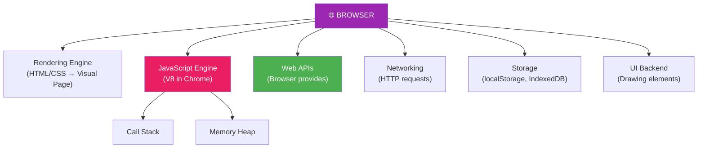

<a id="runtime-full-diagram"></a>

### Full Runtime Diagram (Engine + Web APIs + Queues + Event Loop)

> This is the **complete picture** — exactly how every component fits together inside the JavaScript Runtime.

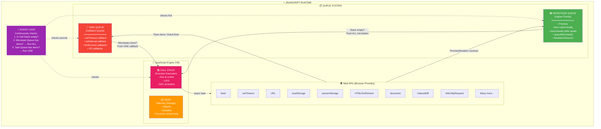

### 🎯 Must-Know Points for Interview

```
✅ JavaScript Runtime = JS Engine + Web APIs + Queues + Event Loop
✅ JS Engine has only TWO things: HEAP and CALL STACK
✅ Web APIs are NOT in JS Engine — Browser provides them separately
✅ Queues (Task + Microtask) are also OUTSIDE JS Engine
✅ Event Loop is also OUTSIDE JS Engine — part of Runtime
✅ Heap = unstructured memory for storing data
✅ Call Stack = structured execution tracker (LIFO)
✅ "Task Queue" and "Callback Queue" are SAME THING (different names)
```

---

<a href="#section-1-top">⬆ Back to Top</a>

---

<a id="call-stack"></a>

## 1.3 📚 Call Stack & Heap — JavaScript Engine

<a id="what-is-js-engine"></a>

### What is JS Engine?

```
JS Engine = Program jo JavaScript code ko execute karta hai

Famous JS Engines:
- V8 (Chrome, Node.js, Edge) — most popular
- SpiderMonkey (Firefox)
- JavaScriptCore (Safari)
- Chakra (older Edge)

JS Engine ke andar SIRF 2 cheezein hoti hain:
1. HEAP — memory storage
2. CALL STACK — execution tracker

NOTE: Web APIs, Event Loop, Queues are NOT in JS Engine!
They are in the Runtime (Browser/Node.js).
```

<a id="heap-memory"></a>

### Heap — Memory Storage

```
Heap = Bada sa "warehouse" jahan saara data store hota hai

Iske andar:
- Objects: { name: "Aadi", age: 22 }
- Arrays: [1, 2, 3, 4, 5]
- Variables: x = 10
- Function definitions

Heap UNSTRUCTURED hai — random places mein data store hota hai
Call Stack reference karta hai Heap ke data ko

Example:
const user = { name: "Aadi" };
//    ↑                    ↑
//    Stored in stack       Object stored in HEAP
//    as reference          (just a pointer)
```

<a id="what-is-call-stack"></a>

### What is Call Stack?

> **Call Stack** = Ek stack data structure jahan JavaScript track rakhta hai ki
> "Abhi KAUNSA function run ho raha hai?"
>
> LIFO — Last In, First Out
> Jo function LAST mein aaya, wo PEHLE execute hoke nikalega

```
Call Stack = Thaalio ka stack (plate stack)
━━━━━━━━━━━━━━━━━━━━━━━━━━━━━━━━━━━━━━━
- Naya function call → Plate upar rakh do (PUSH)
- Function complete → Plate upar se utaaro (POP)
- Jo plate SABSE UPAR hai → wahi abhi execute ho raha hai

Example:
[  greet()   ]  ← Currently running (TOP)
[  welcome() ]
[  main()    ]
[  GEC       ]  ← Bottom (Global Execution Context)
```

<a id="call-stack-real-life"></a>

### 🍽️ Real-Life Analogy — Stack of Plates / Books

```
Imagine tumhare haath mein books ka stack hai:

📕 Step 1: Pick up Math book (PUSH main)
📗 Step 2: While reading, need to check Formula book (PUSH formula)
📘 Step 3: Formula book references Dictionary (PUSH dictionary)

Now the stack looks like:
┌──────────────┐
│  Dictionary  │  ← Currently reading (TOP)
│  Formula     │
│  Math        │  ← Started with this
└──────────────┘

📘 Step 4: Done with Dictionary → POP it off
📗 Step 5: Done with Formula → POP it off
📕 Step 6: Done with Math → POP it off

Stack is EMPTY! All books read ✅
```

<a id="call-stack-diagram"></a>

### Call Stack Step-by-Step Diagram

```javascript
function third() {
    console.log("Inside third");
}

function second() {
    third();
    console.log("Inside second");
}

function first() {
    second();
    console.log("Inside first");
}

first();
```

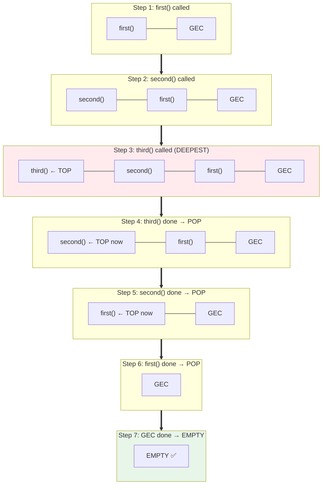

<a id="call-stack-code-examples"></a>

### Code Examples with Execution Flow

```javascript
// Example 1: Simple sequence
function multiply(a, b) {
    return a * b;                    // Step 3: Execute, return 16
}

function square(n) {
    return multiply(n, n);           // Step 2: Calls multiply(4, 4)
}

function printSquare(n) {
    const result = square(n);        // Step 1: Calls square(4)
    console.log(result);             // Step 4: Print 16
}

printSquare(4);

/*
CALL STACK JOURNEY:
━━━━━━━━━━━━━━━━━━

Time 1: | printSquare(4) |
        | GEC            |

Time 2: | square(4)      |  ← pushed on top
        | printSquare(4) |
        | GEC            |

Time 3: | multiply(4,4)  |  ← pushed on top
        | square(4)      |
        | printSquare(4) |
        | GEC            |

Time 4: | square(4)      |  ← multiply popped (returned 16)
        | printSquare(4) |
        | GEC            |

Time 5: | printSquare(4) |  ← square popped (returned 16)
        | GEC            |

Time 6: | console.log(16)|  ← pushed
        | printSquare(4) |
        | GEC            |

Time 7: | printSquare(4) |  ← console.log popped
        | GEC            |

Time 8: | GEC            |  ← printSquare popped

Time 9: | EMPTY ✅       |  ← GEC popped, program done!
*/
```

<a id="stack-overflow"></a>

### Stack Overflow — When Stack Breaks

```javascript
// ❌ Stack Overflow — function calls itself infinitely
function oops() {
    oops();  // No base case! Calls itself forever!
}

oops();
// RangeError: Maximum call stack size exceeded

// Stack keeps growing:
// | oops() |  ← millionth call
// | oops() |
// | oops() |
// | ...    |  ← 10,000+ frames
// | oops() |
// | GEC    |
// 💥 BOOM! Stack overflow!

// ✅ Correct recursion with base case
function countdown(n) {
    if (n <= 0) {
        console.log("Done!");
        return; // BASE CASE — stops recursion!
    }
    console.log(n);
    countdown(n - 1);
}

countdown(5); // 5, 4, 3, 2, 1, Done!
```

<a id="call-stack-must-know"></a>

### 🎯 Must-Know Points for Interview

```
✅ JS Engine has 2 components: HEAP + CALL STACK
✅ Heap stores data (objects, variables)
✅ Call Stack tracks function execution (LIFO)
✅ JS has only ONE Call Stack → Single Threaded
✅ Function calls = PUSH to stack
✅ Function returns = POP from stack
✅ Stack Overflow happens when recursion has no base case
✅ Maximum stack size varies by browser (~10,000-16,000 frames in Chrome)
✅ GEC is ALWAYS at the bottom of the Call Stack
✅ When GEC pops → program ends
```

---

<a href="#section-1-top">⬆ Back to Top</a>

---

<a id="global-execution-context"></a>

## 1.4 🌍 Global Execution Context (GEC)

### What is GEC?

```
Jab bhi JavaScript program start hota hai, SABSE PEHLE
ek Global Execution Context (GEC) banta hai.

Ye ek box jaisa hai jismein:
1. MEMORY PHASE — saare variables aur functions ko memory mein daala jaata hai
2. EXECUTION PHASE — code line by line execute hota hai

GEC sabse NEECHE rehta hai Call Stack mein — sab functions iske upar aate hain.
Program start → GEC PUSH
Program end → GEC POP
```

<a id="gec-creation-phase"></a>

### Creation Phase (Memory Allocation)

```javascript
var name = "Aadi";
var age = 22;

function greet() {
    console.log("Hello " + name);
}

greet();
```

```
PHASE 1 — Memory Creation (BEFORE any code runs):
━━━━━━━━━━━━━━━━━━━━━━━━━━━━━━━━━━━━━━━━━━━━━━━━

┌──────────────────────────────────────────────────┐
│              GLOBAL EXECUTION CONTEXT             │
│                                                   │
│  MEMORY (Variable Environment)                    │
│  ┌────────────┬───────────────────────────┐       │
│  │  Variable   │  Value                   │       │
│  ├────────────┼───────────────────────────┤       │
│  │  name       │  undefined   ← hoisted!  │       │
│  │  age        │  undefined   ← hoisted!  │       │
│  │  greet      │  {entire fn code}        │       │
│  └────────────┴───────────────────────────┘       │
│                                                   │
│  CODE (Thread of Execution)                       │
│  → Not started yet...                             │
└──────────────────────────────────────────────────┘
```

<a id="gec-execution-phase"></a>

### Execution Phase (Code Running)

```
PHASE 2 — Code Execution (line by line):
━━━━━━━━━━━━━━━━━━━━━━━━━━━━━━━━━━━━━━━

Line 1: var name = "Aadi"   → name: undefined → "Aadi" ✅
Line 2: var age = 22        → age: undefined → 22 ✅
Line 3-5: function greet    → Already in memory (hoisted) ✅
Line 7: greet()             → NEW Execution Context created for greet!
                              PUSH greet() EC to Call Stack

┌──────────────────────────────────────────────────┐
│              GLOBAL EXECUTION CONTEXT             │
│                                                   │
│  MEMORY                                           │
│  ┌────────────┬───────────────────────────┐       │
│  │  name       │  "Aadi"    ← updated!   │       │
│  │  age        │  22        ← updated!   │       │
│  │  greet      │  {fn code}              │       │
│  └────────────┴───────────────────────────┘       │
│                                                   │
│  CODE                                             │
│  Line 1: ✅ Done                                   │
│  Line 2: ✅ Done                                   │
│  Line 7: → greet() called! New EC created         │
└──────────────────────────────────────────────────┘
```

<a id="gec-full-flow"></a>

### Full Flow Diagram — GEC to Call Stack

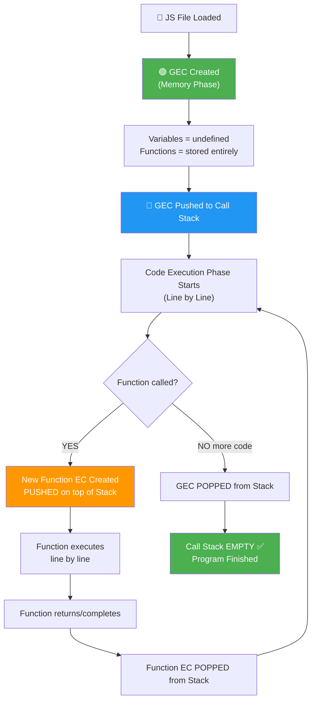

<a id="gec-must-know"></a>

### 🎯 Must-Know Points for Interview

```
✅ GEC = First execution context created when program starts
✅ GEC has 2 phases: Memory Creation Phase + Code Execution Phase
✅ In Memory Phase: var = undefined, functions = full code
✅ In Code Phase: variables get actual values, code executes line by line
✅ GEC sits at BOTTOM of Call Stack throughout program
✅ Each function call creates a NEW Execution Context
✅ Function EC also has Memory + Code phases (same as GEC)
✅ When function returns → its EC is popped and destroyed
✅ When program ends → GEC is popped → Stack empty
```

---

<a href="#section-1-top">⬆ Back to Top</a>

---

<a id="how-js-engine-executes"></a>

## 1.5 ⚡ How JS Engine Executes Code Using Call Stack

<a id="execution-step-by-step"></a>

### Step-by-Step Execution Walkthrough

```javascript
// Let's trace EVERY step of this code
var x = 10;

function add(a, b) {
    var result = a + b;
    return result;
}

function print(value) {
    console.log("Answer:", value);
}

var sum = add(x, 20);
print(sum);
```

```
COMPLETE EXECUTION TRACE:
━━━━━━━━━━━━━━━━━━━━━━━━

═══ PHASE 1: Memory Creation ═══

GEC Memory:
┌──────────┬──────────────────┐
│ x         │ undefined       │
│ add       │ {function code} │
│ print     │ {function code} │
│ sum       │ undefined       │
└──────────┴──────────────────┘

Call Stack: | GEC |

═══ PHASE 2: Code Execution ═══

Line 1: x = 10 → x updated from undefined to 10

Line 12: add(10, 20) called!
  → New Execution Context for add() created
  → PUSH add() to Call Stack

  Call Stack: | add(10,20) |
              | GEC        |

  add() EC Memory:
  ┌──────────┬──────────┐
  │ a         │ 10      │
  │ b         │ 20      │
  │ result    │ undefined│
  └──────────┴──────────┘

  add() Line 1: result = 10 + 20 = 30
  add() Line 2: return 30
  → add() EC DELETED, POPPED from stack
  → sum = 30 in GEC

  Call Stack: | GEC |

Line 13: print(30) called!
  → New EC for print() created
  → PUSH print() to Call Stack

  Call Stack: | print(30)  |
              | GEC        |

  print() Line 1: console.log("Answer:", 30)
  → Output: "Answer: 30"
  → print() DONE, POPPED from stack

  Call Stack: | GEC |

All lines done → GEC POPPED

  Call Stack: | EMPTY ✅ |
```

<a id="nested-function-execution"></a>

### Nested Function Calls in Stack

```javascript
function a() {
    console.log("a start");
    b();
    console.log("a end");
}

function b() {
    console.log("b start");
    c();
    console.log("b end");
}

function c() {
    console.log("c — deepest point!");
}

a();

// Output:
// a start
// b start
// c — deepest point!
// b end
// a end
```

```mermaid
flowchart LR
    subgraph T1["Time 1"]
        S1A["a()"]
        S1B["GEC"]
    end
    subgraph T2["Time 2\na calls b"]
        S2A["b()"]
        S2B["a()"]
        S2C["GEC"]
    end
    subgraph T3["Time 3\nb calls c\n(DEEPEST)"]
        S3A["c() ← TOP"]
        S3B["b()"]
        S3C["a()"]
        S3D["GEC"]
    end
    subgraph T4["Time 4\nc done"]
        S4A["b() ← TOP"]
        S4B["a()"]
        S4C["GEC"]
    end
    subgraph T5["Time 5\nb done"]
        S5A["a() ← TOP"]
        S5B["GEC"]
    end
    subgraph T6["Time 6\na done"]
        S6A["GEC"]
    end
    subgraph T7["Time 7"]
        S7A["EMPTY ✅"]
    end

    T1 ==> T2 ==> T3 ==> T4 ==> T5 ==> T6 ==> T7

    style T3 fill:#FFEBEE
    style T7 fill:#E8F5E9
```

<a id="call-stack-creating-to-deleting"></a>

### Call Stack — From Creating to Deleting (Complete Lifecycle)

```
LIFECYCLE of an Execution Context in Call Stack:
━━━━━━━━━━━━━━━━━━━━━━━━━━━━━━━━━━━━━━━━━━━━━

1. CREATION → Memory Phase
   - Variables: undefined
   - Functions: stored fully
   - arguments object created
   - 'this' binding decided

2. PUSH to Call Stack
   - EC placed on top of stack
   - Now it's the "active" context

3. EXECUTION → Code Phase
   - Code runs line by line
   - Variables get actual values
   - If function called → new EC created, pushed on top

4. RETURN / COMPLETE
   - EC is POPPED from stack
   - EC is DESTROYED (memory freed)
   - Control returns to the EC below it

5. GEC (Global) is LAST to be popped
   - When program ends, GEC is removed
   - Call Stack becomes EMPTY
```

<a id="js-engine-must-know"></a>

### 🎯 Must-Know Points for Interview

```
✅ JS Engine executes code ONE LINE at a time (synchronous by nature)
✅ Each function call creates new Execution Context
✅ Function EC = LOCAL scope (similar to GEC structure)
✅ Function EC has its own Memory + Code phases
✅ Deepest nested function = highest on stack
✅ Functions pop from stack in REVERSE order of how they were pushed
✅ When EC pops → its memory is GARBAGE COLLECTED
✅ Heavy CPU work in a function = blocks entire stack = freezes browser
✅ Solution for heavy work: Web Workers (separate thread)
```

---

<a href="#section-1-top">⬆ Back to Top</a>

---

<a id="web-apis"></a>

## 1.6 🌍 Web APIs — What's NOT Part of JavaScript?

<a id="web-apis-vs-js"></a>

### Web APIs vs Core JS — The Big Confusion

```
BAHUT IMPORTANT CONCEPT FOR INTERVIEWS:

setTimeout()  → JavaScript ka NAHI hai! ❌
fetch()       → JavaScript ka NAHI hai! ❌
console.log() → JavaScript ka NAHI hai! ❌
document.xyz  → JavaScript ka NAHI hai! ❌
localStorage  → JavaScript ka NAHI hai! ❌
indexedDB     → JavaScript ka NAHI hai! ❌

Toh ye sab KAHAN se aate hain?

BROWSER deta hai ye sab! Browser ke andar ye "Web APIs" hain.
JavaScript sirf ACCESS kar paata hai kyunki browser 'window'
object ke through ye sab expose karta hai.

window.setTimeout()
window.document
window.fetch()
window.console.log()
window.localStorage

'window' likhna optional hai — JS automatically samajh jaata hai.
Isliye hum directly setTimeout() likhte hain.
```

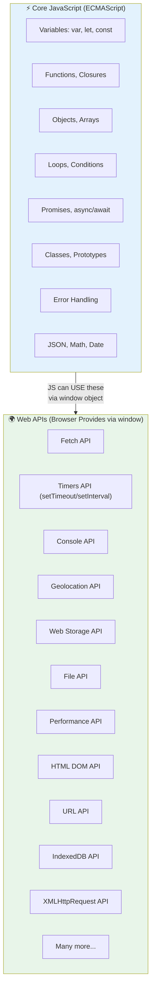

<a id="complete-web-api-list"></a>

### Complete Web APIs List (Visual Categories)

```mermaid
flowchart TD
    A["🌍 Web APIs (Browser Provided)"] --> B["Fetch API\nEnables fetching resources\nfetch()"]
    A --> C["Timers API\nScheduling timed tasks\nsetTimeout, setInterval"]
    A --> D["Console API\nLogging output\nconsole.log/warn/error"]
    A --> E["Geolocation API\nUser location access\nGeolocation, GeolocationPosition"]
    A --> F["Web Storage API\nKey/Value storage\nlocalStorage, sessionStorage"]
    A --> G["File API\nReading/handling files\nBlob, File, FileList"]
    A --> H["Performance API\nMeasure web app speed\nPerformance, PerformanceMeasure"]
    A --> I["HTML DOM API\nManipulate HTML elements\nHTMLElement, HTMLDivElement"]
    A --> J["URL API\nHandle URLs\nURL"]
    A --> K["IndexedDB API\nClient-side database\nindexedDB.open()"]
    A --> L["XMLHttpRequest\nOld HTTP requests\n(predecessor of fetch)"]

    style A fill:#9C27B0,color:white
```

<a id="fetch-api"></a>

### 🌐 Fetch API

```javascript
// fetch() is a Web API — NOT part of core JavaScript!
// Returns a Promise → goes to MICROTASK Queue!

fetch("https://api.example.com/data")
    .then(res => res.json())       // Microtask
    .then(data => console.log(data)) // Microtask
    .catch(error => console.error(error));

// Use case: Get data from server
// Real world: GitHub API, weather data, user profile
```

<a id="timer-api"></a>

### ⏰ Timers API (setTimeout / setInterval)

```javascript
// setTimeout — run ONCE after delay
setTimeout(() => console.log("Done"), 2000);

// setInterval — run REPEATEDLY at interval
const id = setInterval(() => console.log("Tick"), 1000);
setTimeout(() => clearInterval(id), 5000); // Stop after 5s

// Real-world use cases:
// - Auto-hide notifications
// - Debounce search input
// - Auto-logout after inactivity
// - Real-time clock
// - Auto-save (every 30 seconds)
```

<a id="console-api"></a>

### 📝 Console API

```javascript
// console is ALSO a Web API!
console.log("Normal");
console.warn("Warning ⚠️");
console.error("Error ❌");
console.table([{name: "Aadi"}, {name: "Rahul"}]);
console.time("op"); /* ...code... */ console.timeEnd("op");
console.group("Group"); console.log("nested"); console.groupEnd();
```

<a id="geolocation-api"></a>

### 📍 Geolocation API

```javascript
// Browser's GPS access
navigator.geolocation.getCurrentPosition(
    position => console.log(position.coords.latitude, position.coords.longitude),
    error => console.error(error)
);

// Real-world use cases:
// - Show nearby restaurants (Zomato/Swiggy)
// - Track delivery on map (Uber/Ola)
// - Weather for current location
```

<a id="web-storage-api"></a>

### 💾 Web Storage API (localStorage / sessionStorage)

```javascript
// localStorage — persistent across sessions
localStorage.setItem("user", "Aadi");
localStorage.setItem("cart", JSON.stringify([{id: 1, name: "iPhone"}]));
const user = localStorage.getItem("user");
const cart = JSON.parse(localStorage.getItem("cart"));
localStorage.removeItem("user");
localStorage.clear();

// sessionStorage — cleared when tab closes
sessionStorage.setItem("tempToken", "abc123");

// Real-world: Theme preferences, shopping cart, login tokens
```

<a id="file-api"></a>

### 📄 File API (showOpenFilePicker, Blob, FileList)

```javascript
// Modern file picker (Web API)
const [fileHandle] = await window.showOpenFilePicker();
const file = await fileHandle.getFile();
console.log(file.name, file.size);

// Real-world: Upload profile picture, edit documents in browser
```

<a id="performance-api"></a>

### ⚡ Performance API

```javascript
// Measure how fast your code runs
performance.mark("start");
// ...heavy operation...
performance.mark("end");
performance.measure("operation", "start", "end");
console.log(performance.getEntriesByName("operation")[0].duration);

// Real-world: Performance monitoring, optimization
```

<a id="html-dom-api"></a>

### 📄 HTML DOM API

```javascript
// Manipulate HTML elements
const heading = document.getElementById("title");
const buttons = document.querySelectorAll(".btn");

heading.textContent = "New Title!";
heading.style.color = "red";
heading.classList.add("highlight");

document.getElementById("btn").addEventListener("click", () => {
    console.log("Clicked!");
});

// Real-world: Every interactive website uses DOM API!
```

<a id="url-api"></a>

### 🔗 URL API

```javascript
// Parse, manipulate URLs
const url = new URL("https://example.com/users?id=123&name=Aadi");
console.log(url.hostname);        // "example.com"
console.log(url.searchParams.get("id"));   // "123"
console.log(url.searchParams.get("name")); // "Aadi"

url.searchParams.set("age", 22);
console.log(url.toString());
// "https://example.com/users?id=123&name=Aadi&age=22"
```

<a id="indexeddb-api"></a>

### 💽 IndexedDB API

```javascript
// Client-side database (bigger than localStorage)
const request = indexedDB.open("myDb");

request.onsuccess = event => {
    const db = event.target.result;
    console.log("DB opened!", db);
};

request.onerror = error => {
    console.log("Error:", error);
};

// Real-world: Offline-first apps (PWA), large data storage
```

<a id="xhr-api"></a>

### 📡 XMLHttpRequest API

```javascript
// Old way of making HTTP requests (before fetch)
const xhr = new XMLHttpRequest();
xhr.open("GET", "https://api.example.com/data");
xhr.onload = () => console.log(xhr.responseText);
xhr.send();

// Real-world: Legacy code still uses this
// Modern code prefers fetch()
```

<a id="web-apis-must-know"></a>

### 🎯 Must-Know Points for Interview

```
✅ Web APIs are NOT part of core JavaScript (ECMAScript)
✅ Browser provides them via 'window' object
✅ JS Engine has NO setTimeout, NO fetch, NO console!
✅ Common Web APIs categories:
   - Network: fetch, XMLHttpRequest
   - Timers: setTimeout, setInterval
   - Storage: localStorage, sessionStorage, IndexedDB
   - DOM: document, HTMLElement, addEventListener
   - Console: console.log/warn/error
   - Files: Blob, File, FileList, showOpenFilePicker
   - Location: Geolocation
   - URL: URL parsing
   - Performance: Performance metrics
✅ Web API callbacks go to Task Queue (mostly)
✅ Promise-based Web API callbacks (.then) go to Microtask Queue
✅ Node.js provides similar APIs but NOT identical (no DOM, no localStorage)
```

---

<a href="#section-1-top">⬆ Back to Top</a>

---

<a id="event-loop-task-queue"></a>

## 1.7 🔄 How Event Loop & Task Queue (Callback Queue) Come Into Picture

<a id="callback-registration"></a>

### Where is Callback Registered?

```javascript
console.log("Start");

// When JS encounters this line:
setTimeout(function cb() {
    console.log("Timer done!");
}, 5000);

console.log("End");
```

```
STEP-BY-STEP: What happens behind the scenes?
━━━━━━━━━━━━━━━━━━━━━━━━━━━━━━━━━━━━━━━━━━━

1. console.log("Start") → Push to Call Stack → Execute → Pop → "Start" printed

2. setTimeout(cb, 5000) → Push to Call Stack
   → JS sees: "Ye toh Web API ka kaam hai!"
   → cb function ko Web API environment mein REGISTER kar diya
   → setTimeout Call Stack se POP ho gaya
   → Web API timer start: 5...4...3...2...1...
   
3. console.log("End") → Push to Call Stack → Execute → Pop → "End" printed

4. Call Stack ab EMPTY hai!

5. (5 seconds baad...) Web API timer done!
   → cb function ko TASK QUEUE (Callback Queue) mein daal diya
   
6. EVENT LOOP checks:
   "Call Stack khali hai? ✅ YES!"
   "Task Queue mein kuch hai? ✅ YES — cb function!"
   → cb ko Call Stack mein PUSH kar diya

7. cb() executes → console.log("Timer done!") → "Timer done!" printed
   → cb POPPED from stack
```

<a id="event-loop-job"></a>

### What is Event Loop's Job?

```
Event Loop = ek continuously running LOOP (infinite loop jaisa)
Jo har moment ye check karta hai:

while (true) {
    if (callStack.isEmpty()) {
        // Step 1: PEHLE Microtask Queue check karo
        while (microtaskQueue.hasItems()) {
            const task = microtaskQueue.dequeue();
            callStack.push(task);  // Execute it
        }

        // Step 2: PHIR Task Queue check karo (ek item)
        if (taskQueue.hasItems()) {
            const task = taskQueue.dequeue();
            callStack.push(task);  // Execute it
        }
    }
    // Agar stack khali nahi hai — kuch mat karo, wait karo!
}
```

<a id="the-golden-rule"></a>

### THE GOLDEN RULE 🔴

```
╔══════════════════════════════════════════════════════════════╗
║                                                              ║
║   "JAB MAIN STACK (Call Stack) KHALI HOTA HAI,              ║
║    TAB HI Side Queue (Task/Microtask) DEKHA JAATA HAI"      ║
║                                                              ║
║   Event Loop SIRF tab queue se task uthata hai               ║
║   jab Call Stack COMPLETELY EMPTY ho!                        ║
║                                                              ║
║   Chahe queue mein 100 callbacks waiting hon —               ║
║   agar stack mein ek bhi function run ho raha hai,           ║
║   toh queue wait karega!                                     ║
║                                                              ║
╚══════════════════════════════════════════════════════════════╝
```

<a id="settimeout-0ms-trick"></a>

### setTimeout(fn, 0) — The Famous Interview Trick

```javascript
console.log("A");

setTimeout(() => {
    console.log("B");
}, 0);  // 0 milliseconds delay!

console.log("C");

// Output: A → C → B (NOT A → B → C!)
```

```
WHY?? 0ms toh turant hona chahiye na?

Step 1: console.log("A") → Stack → Execute → "A" ✅
Step 2: setTimeout(cb, 0) → Stack → "Ye Web API ka kaam hai!" 
        → cb registered in Web API → setTimeout popped
        → Web API: "0ms delay? DONE! cb ko Task Queue mein daal do"
        → cb → Task Queue mein chala gaya

Step 3: console.log("C") → Stack → Execute → "C" ✅

Step 4: Stack EMPTY ho gaya! ✅
        Event Loop: "Stack khali hai! Queue mein kuch hai? YES!"
        → cb Queue se uthake Stack mein daala

Step 5: cb() executes → console.log("B") → "B" ✅

MORAL: setTimeout(fn, 0) ka matlab hai:
"JITNA JALDI HO SAKE run karo — BUT sync code ke BAAD!"
0ms = minimum delay, guarantee nahi!
```

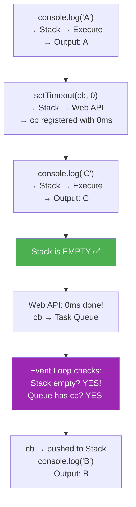

<a id="event-loop-must-know"></a>

### 🎯 Must-Know Points for Interview

```
✅ Event Loop is the MOST ASKED interview topic!
✅ Event Loop = continuously running mechanism
✅ Its only job: "Stack empty hai? Queue se task laao!"
✅ setTimeout(fn, 0) → STILL async! Goes through entire flow
✅ 0ms is MINIMUM delay, NOT guarantee
✅ Web API registers callback → Browser handles it
✅ Browser pushes callback to Task Queue when ready
✅ Event Loop monitors stack EVERY MILLISECOND
✅ One Microtask Queue + One Task Queue (in browser)
✅ Node.js has multiple queues (different priority levels)
```

---

<a href="#section-1-top">⬆ Back to Top</a>

---

<a id="full-flow-diagram"></a>

## 1.8 🎯 FULL FLOW DIAGRAM — How JavaScript Runs Code

<a id="complete-architecture"></a>

### Complete Architecture — Every Component

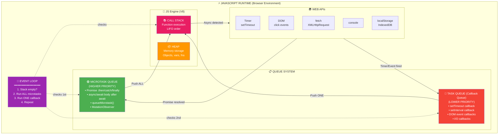

<a id="async-task-flow"></a>

### Async Task Flow — From Code to Output

```javascript
// Generic async task example
asyncTask((result) => console.log(result));
```

```mermaid
flowchart LR
    A["Code calls\nasyncTask(callback)"] --> B["Pushed to Call Stack"]
    B --> C["JS Engine sees:\n'This is a Web API call!'"]
    C --> D["Task SENT to Web API\nCallback REGISTERED"]
    D --> E["asyncTask popped from stack\nCall Stack continues"]
    E --> F["⚙️ Browser does the work\n(timer, network, etc.)"]
    F --> G["Task done!\nBrowser knows callback is ready"]
    G --> H["Callback → Queue\n(Microtask or Task Queue)"]
    H --> I{"Stack empty?"}
    I -->|"NO"| J["Wait..."]
    J --> I
    I -->|"YES"| K["Event Loop pushes\ncallback to Call Stack"]
    K --> L["Callback executes\nconsole.log(result)"]

    style D fill:#9C27B0,color:white
    style H fill:#4CAF50,color:white
    style K fill:#E91E63,color:white
```

<a id="code-walkthrough-full"></a>

### Code Walkthrough — Line by Line Through Entire System

```javascript
console.log("Start");                    // LINE 1

setTimeout(function cbT() {
    console.log("CB setTimeout");        // LINE 2 (callback)
}, 5000);

fetch("https://api.netflix.com")
    .then(function cbF() {
        console.log("CB Netflix");       // LINE 3 (callback)
    });

console.log("End");                      // LINE 4
```

```
COMPLETE FLOW:
━━━━━━━━━━━━━━

STEP 1: LINE 1 → console.log("Start")
┌─────────────┐   ┌─────────────────────────┐
│ Call Stack   │   │ Web APIs                │
│ ─────────── │   │ ─────────────           │
│ console.log │   │ (empty)                 │
│ GEC         │   │                         │
└─────────────┘   └─────────────────────────┘
Output: "Start"
→ console.log popped from stack

STEP 2: LINE 2 → setTimeout(cbT, 5000)
┌─────────────┐   ┌─────────────────────────┐
│ Call Stack   │   │ Web APIs                │
│ ─────────── │   │ ─────────────           │
│ setTimeout  │   │ ⏰ Timer: 5000ms        │
│ GEC         │   │    callback: cbT        │
└─────────────┘   └─────────────────────────┘
→ setTimeout popped, cbT registered in Web API with 5s timer

STEP 3: LINE 3 → fetch("netflix") + .then(cbF)
┌─────────────┐   ┌─────────────────────────┐
│ Call Stack   │   │ Web APIs                │
│ ─────────── │   │ ─────────────           │
│ fetch       │   │ ⏰ Timer: 5000ms (cbT)  │
│ GEC         │   │ 🌐 fetch: netflix (cbF) │
└─────────────┘   └─────────────────────────┘
→ fetch popped, cbF registered in Web API waiting for response

STEP 4: LINE 4 → console.log("End")
┌─────────────┐   ┌─────────────────────────┐
│ Call Stack   │   │ Web APIs                │
│ ─────────── │   │ ─────────────           │
│ console.log │   │ ⏰ Timer: 4500ms (cbT)  │
│ GEC         │   │ 🌐 fetch: waiting (cbF) │
└─────────────┘   └─────────────────────────┘
Output: "End"

STEP 5: GEC finishes → Stack EMPTY
┌─────────────┐   ┌─────────────────────────┐
│ Call Stack   │   │ Web APIs                │
│ ─────────── │   │ ─────────────           │
│ (EMPTY) ✅  │   │ ⏰ Timer: still running │
└─────────────┘   │ 🌐 fetch: data arrived! │
                  └─────────────────────────┘

Microtask Queue: [cbF]  ← fetch resolved → Promise .then callback
Task Queue:      []     ← timer still running

STEP 6: Event Loop → "Stack khali hai? YES! Microtasks hai? YES!"
→ cbF pushed to Call Stack

┌─────────────┐   
│ Call Stack   │   
│ ─────────── │   Microtask Queue: [] ← cbF moved to stack
│ cbF         │   Task Queue:      []
└─────────────┘   
Output: "CB Netflix"
→ cbF popped

STEP 7: (5 seconds baad) Timer done!
┌─────────────┐   
│ Call Stack   │   
│ ─────────── │   Task Queue: [cbT] ← timer callback queued
│ (EMPTY)     │   
└─────────────┘   

Event Loop: "Stack khali! Task queue mein cbT hai!"
→ cbT pushed to Call Stack

┌─────────────┐   
│ cbT         │   
└─────────────┘   
Output: "CB setTimeout"
→ cbT popped → Stack EMPTY

FINAL OUTPUT ORDER:
━━━━━━━━━━━━━━━━━━
Start
End
CB Netflix       ← Microtask (Promise) — higher priority!
CB setTimeout    ← Task Queue — lower priority, after 5s
```

<a id="event-listener-flow"></a>

### Event Listener Flow — click Event Example

```javascript
console.log("Start");

document.getElementById("btn")
    .addEventListener("click", function cb() {
        console.log("Button Clicked!");
    });

console.log("End");
```

```
FLOW:
━━━━━

1. console.log("Start") → Stack → "Start" printed → Popped

2. addEventListener("click", cb)
   → JS says: "Ye DOM ka kaam hai — Web API handle karo"
   → cb function REGISTERED in Web API environment
   → cb is attached to "click" event on the button element
   → addEventListener POPPED from stack
   → Web API is now LISTENING for click events

3. console.log("End") → Stack → "End" printed → Popped

4. Stack is EMPTY. Program done. BUT...
   → Web API is STILL listening for click!
   → cb is NOT in any queue yet — it's waiting in Web API

5. (User clicks the button at some point...)
   → Browser detects click → Web API triggers
   → cb function moved to TASK QUEUE (Callback Queue)

6. Event Loop: "Stack empty? YES! Task queue has cb? YES!"
   → cb pushed to Call Stack → Executes
   → "Button Clicked!" printed

NOTE: addEventListener's callback STAYS registered until:
   - Element is removed from DOM
   - removeEventListener is called
   - Page is closed/refreshed

This is why event listeners can cause MEMORY LEAKS!
If element is removed but listener isn't — callback stays in Web API forever!
```

<a id="fetch-promise-flow"></a>

### fetch + Promise Flow — With PromiseState & PromiseResult

> This shows what happens INSIDE the Promise when fetch resolves.
> Promise objects have internal properties like `[[PromiseState]]`, `[[PromiseResult]]`, `[[PromiseFulfillReactions]]`.

```javascript
fetch("https://dog.ceo/api/...")
    .then(res => console.log(res));

console.log("End of script");
```

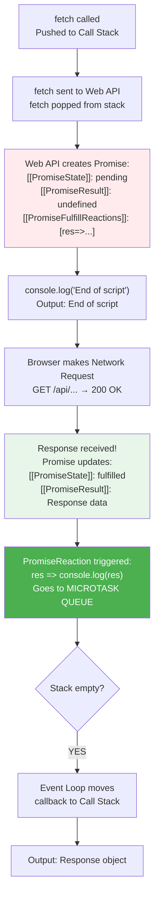

```
WHAT ACTUALLY HAPPENS IN MEMORY:
━━━━━━━━━━━━━━━━━━━━━━━━━━━━━━━

Promise Object (created by fetch):
┌──────────────────────────────────────────┐
│ [[PromiseState]]: "pending"               │
│ [[PromiseResult]]: undefined              │
│ [[PromiseFulfillReactions]]:              │
│   - res => console.log(res)               │
│ [[PromiseRejectReactions]]: []            │
└──────────────────────────────────────────┘

After response arrives:
┌──────────────────────────────────────────┐
│ [[PromiseState]]: "fulfilled" ✅          │
│ [[PromiseResult]]: Response { ... }       │
│ [[PromiseFulfillReactions]]:              │
│   → REACTION TRIGGERED!                   │
│   → Callback queued to MICROTASK QUEUE    │
└──────────────────────────────────────────┘
```

<a id="when-things-vanish"></a>

### When Things Vanish — EC, Callbacks, Queue Cleanup

```
WHEN DOES WHAT GET DELETED/REMOVED?
━━━━━━━━━━━━━━━━━━━━━━━━━━━━━━━━━━

1. EXECUTION CONTEXT — vanishes when:
   → Function returns/completes
   → EC is POPPED from Call Stack
   → Memory is freed (Garbage Collected)
   → GEC vanishes when script finishes

2. WEB API REGISTRATION — vanishes when:
   → setTimeout: After timer fires and callback is queued
   → setInterval: When clearInterval() is called
   → addEventListener: When removeEventListener() or element removed
   → fetch: After response is received

3. CALLBACK in QUEUE — vanishes when:
   → Event Loop picks it up and pushes to Call Stack
   → Once pushed, it's removed from Queue

4. CALLBACK on STACK — vanishes when:
   → Function executes and returns
   → Popped from Call Stack
   → Garbage Collected

5. PROMISE OBJECT — vanishes when:
   → No more references to it
   → All .then/.catch chains completed

IMPORTANT: Event listeners DON'T auto-vanish!
→ That's why cleanup is important
→ React useEffect cleanup, removeEventListener, etc.
```

<a id="full-flow-must-know"></a>

### 🎯 Must-Know Points for Interview

```
✅ Promise has internal properties: [[PromiseState]], [[PromiseResult]],
   [[PromiseFulfillReactions]], [[PromiseRejectReactions]]
✅ When fetch resolves → Promise state changes pending → fulfilled
✅ PromiseReaction (the .then callback) → goes to MICROTASK QUEUE
✅ Event listeners stay in Web API FOREVER until removed
✅ This causes memory leaks if not cleaned up
✅ Promise → Microtask Queue (NOT Task Queue!)
✅ setTimeout/click callbacks → Task Queue
✅ Final flow: Code → Engine → Web API → Queue → Event Loop → Stack → Output
✅ JS Engine has Heap + Stack only — everything else is Runtime
```

---

<a href="#section-1-top">⬆ Back to Top</a>

---

<a id="microtask-queue"></a>

## 1.9 ⭐ Microtask Queue — The VIP Queue

<a id="what-is-microtask-queue"></a>

### What is Microtask Queue?

```
Microtask Queue = VIP line at a concert
Task Queue      = General line at a concert

VIP wale PEHLE andar jaayenge — chahe general line kitni bhi lambi ho!
Aur VIP line ke SAARE log pehle jaayenge, phir general se EK!

Browser mein:
Microtask Queue → Promises (.then, .catch, .finally), MutationObserver,
                  queueMicrotask(), async/await body
Task Queue      → setTimeout, setInterval, DOM events
```

<a id="microtask-vs-task-queue"></a>

### Microtask Queue vs Task Queue (Callback Queue) — Priority

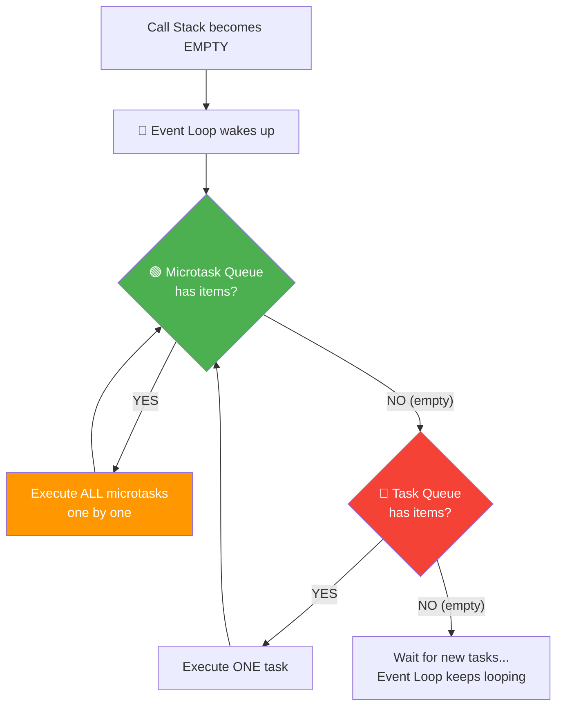

```
KEY DIFFERENCE:
━━━━━━━━━━━━━━

🟢 Microtask Queue:
   - SAARE microtasks run hote hain EK SAATH (before any task)
   - Agar microtask ke andar naya microtask aaye → wo bhi run hoga
   - Task Queue ko STARVE kar sakta hai!

🔴 Task Queue:
   - EK callback run hota hai
   - Phir Event Loop WAPAS Microtask Queue check karta hai
   - Agar naye microtasks aa gaye → wo pehle run honge!
```

<a id="what-creates-microtasks"></a>

### What Creates Microtasks? (Complete List)

```javascript
// 1. Promise .then() — Microtask
Promise.resolve().then(() => console.log("microtask"));

// 2. Promise .catch() — Microtask
Promise.reject().catch(() => console.log("microtask"));

// 3. Promise .finally() — Microtask
Promise.resolve().finally(() => console.log("microtask"));

// 4. async/await — Function body AFTER await is microtask
async function asyncFunc() {
    await someAsyncOp();
    // ↓ Everything after await runs as microtask
    console.log("microtask");
}

// 5. queueMicrotask() — Direct microtask
queueMicrotask(() => console.log("microtask"));

// 6. MutationObserver — Microtask
new MutationObserver(() => console.log("microtask"));
```

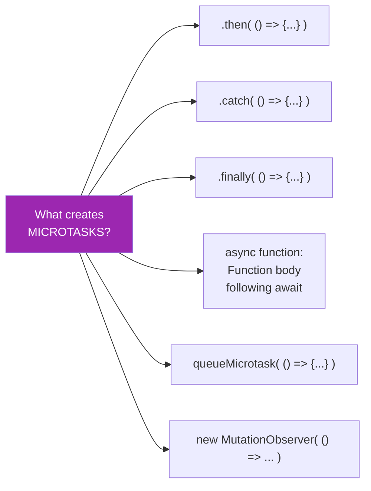

<a id="microtask-code-examples"></a>

### Code Examples with Visual Trace

```javascript
// EXAMPLE 1: Priority proof
console.log("1. Script Start");               // SYNC

setTimeout(() => {
    console.log("5. setTimeout callback");    // Task Queue
}, 0);

Promise.resolve()
    .then(() => {
        console.log("3. Promise 1");          // Microtask Queue
    })
    .then(() => {
        console.log("4. Promise 2");          // Microtask Queue
    });

console.log("2. Script End");                 // SYNC

// OUTPUT ORDER:
// 1. Script Start    ← Sync (Call Stack)
// 2. Script End      ← Sync (Call Stack)
// 3. Promise 1       ← Microtask (runs BEFORE setTimeout!)
// 4. Promise 2       ← Microtask (chained .then also microtask)
// 5. setTimeout      ← Task Queue (runs LAST)
```

```javascript
// EXAMPLE 2: queueMicrotask vs setTimeout
Promise.resolve()
    .then(() => console.log(1));        // Microtask

setTimeout(() => console.log(2), 10);   // Task Queue

queueMicrotask(() => {
    console.log(3);
    queueMicrotask(() => console.log(4)); // Microtask inside microtask
});

console.log(5);

/*
TRACE:
━━━━━━
Sync: console.log(5) → 5

Stack empty? YES!
Microtask Queue: [Promise.then→1, queueMicrotask→3]

Run microtask 1: console.log(1) → 1
Run microtask 2: console.log(3) → 3
              → also adds NEW microtask: console.log(4)

Check microtask queue AGAIN — found 4
Run microtask: console.log(4) → 4

Microtasks done! Check Task Queue.
Task Queue: [console.log(2)]
Run: console.log(2) → 2

OUTPUT: 5, 1, 3, 4, 2
*/
```

```javascript
// EXAMPLE 3: Nested microtasks
console.log("Start");

setTimeout(() => console.log("Timeout 1"), 0);

Promise.resolve().then(() => {
    console.log("Promise 1");
    // Creating NEW microtask INSIDE a microtask!
    Promise.resolve().then(() => {
        console.log("Promise 2 (nested)");
        Promise.resolve().then(() => {
            console.log("Promise 3 (deeply nested)");
        });
    });
});

setTimeout(() => console.log("Timeout 2"), 0);

console.log("End");

// OUTPUT:
// Start
// End
// Promise 1
// Promise 2 (nested)          ← New microtask runs before ANY timeout!
// Promise 3 (deeply nested)   ← Even deeper nested microtask — STILL before timeout!
// Timeout 1                   ← Finally task queue gets a turn
// Timeout 2
```

<a id="what-goes-where"></a>

### What Goes in Which Queue — Comparison Table

| 🟢 Microtask Queue (Higher Priority) | 🔴 Task Queue / Callback Queue (Lower Priority) |
|---------------------------------------|--------------------------------------------------|
| `Promise.then()` | `setTimeout()` |
| `Promise.catch()` | `setInterval()` |
| `Promise.finally()` | DOM Event callbacks (`click`, `scroll`) |
| `async/await` (body after `await`) | `requestAnimationFrame()` |
| `queueMicrotask()` | I/O operations (Node.js) |
| `MutationObserver` | `setImmediate()` (Node.js) |
| `process.nextTick()` (Node.js) | `MessageChannel` |

```javascript
// Interview trick question:
// "async/await ke andar bhi microtask queue use hota hai?"

async function demo() {
    console.log("A");        // Sync
    await Promise.resolve(); // Pauses here!
    console.log("B");        // This becomes a MICROTASK!
}

console.log("C");
demo();
console.log("D");

// Output: C → A → D → B
// "B" is in Microtask Queue (because of await)!
```

<a id="microtask-must-know"></a>

### 🎯 Must-Know Points for Interview

```
✅ Microtask Queue has HIGHER priority than Task Queue
✅ ALL microtasks run BEFORE any task (callback)
✅ New microtasks (added during microtask execution) ALSO run immediately
✅ This can cause STARVATION of Task Queue
✅ Microtask sources: Promise .then/.catch/.finally, async/await body,
   queueMicrotask(), MutationObserver
✅ Task Queue sources: setTimeout, setInterval, DOM events, I/O
✅ "Task Queue" and "Callback Queue" are SAME thing (different names)
✅ Event Loop checks Microtask Queue between EACH task
✅ Promise resolution → Microtask, NOT Task Queue (interview favorite!)
✅ Browser only has ONE Microtask Queue and ONE Task Queue
   (Node.js has multiple queues with different priorities)
```

---

<a href="#section-1-top">⬆ Back to Top</a>

---

<a id="mutation-observer"></a>

## 1.10 👁️ Mutation Observer

<a id="what-is-mutation-observer"></a>

### What & Why Mutation Observer?

```
MutationObserver = DOM mein changes detect karne wala "spy" 🕵️

WHY?
━━━
Kabhi kabhi tumhe jaanna hota hai ki DOM mein kab kya change hua:
- Koi element add/remove hua?
- Attribute change hua? (class, style, etc.)
- Text content change hua?

Old way: Polling (check karte raho har second) — WASTEFUL!
New way: MutationObserver — browser BATAYEGA jab change hoga!

REAL-WORLD USE CASES:
✅ Infinite scroll — detect new items added to list
✅ Dark mode toggle — observe class changes on <body>
✅ Third-party scripts — detect if they modify your DOM
✅ Accessibility tools — detect content changes for screen readers
✅ Frameworks — React, Angular internally use similar concepts
✅ Auto-save on input changes
```

<a id="mutation-observer-examples"></a>

### Practical Examples

```javascript
// 1. Watch for child elements being added/removed
const targetNode = document.getElementById("todo-list");

const observer = new MutationObserver((mutations) => {
    mutations.forEach((mutation) => {
        if (mutation.type === "childList") {
            mutation.addedNodes.forEach(node => {
                if (node.nodeType === 1) { // Element node
                    console.log("✅ New todo added:", node.textContent);
                }
            });
            mutation.removedNodes.forEach(node => {
                if (node.nodeType === 1) {
                    console.log("❌ Todo removed:", node.textContent);
                }
            });
        }
    });
});

// Start observing
observer.observe(targetNode, {
    childList: true,  // Watch for add/remove of child elements
    subtree: true     // Watch entire subtree, not just direct children
});

// Now when we add/remove elements — observer fires!
const newItem = document.createElement("li");
newItem.textContent = "Buy groceries";
targetNode.appendChild(newItem); // Observer fires: "✅ New todo added: Buy groceries"

// Stop observing when done
// observer.disconnect();

// 2. Watch for attribute changes (Dark Mode toggle)
const themeObserver = new MutationObserver((mutations) => {
    mutations.forEach((mutation) => {
        if (mutation.attributeName === "class") {
            const classes = mutation.target.classList;
            if (classes.contains("dark-mode")) {
                console.log("🌙 Dark mode activated!");
            } else {
                console.log("☀️ Light mode activated!");
            }
        }
    });
});

themeObserver.observe(document.body, {
    attributes: true,          // Watch attributes
    attributeFilter: ["class"] // Only "class" attribute
});

// Toggle dark mode — observer fires automatically!
document.body.classList.toggle("dark-mode");
```

<a id="mutation-observer-queue"></a>

### Which Queue Does MutationObserver Use?

```javascript
// MutationObserver callbacks go to MICROTASK Queue! 🟢
// Same queue as Promises — higher priority than setTimeout

console.log("1. Start");

setTimeout(() => console.log("4. setTimeout"), 0);

const observer = new MutationObserver(() => {
    console.log("3. MutationObserver");  // Microtask Queue!
});

observer.observe(document.body, { childList: true });

// Trigger mutation
document.body.appendChild(document.createElement("div"));

Promise.resolve().then(() => console.log("2. Promise"));

console.log("5. End");

// OUTPUT:
// 1. Start             ← Sync
// 5. End               ← Sync
// 2. Promise           ← Microtask
// 3. MutationObserver  ← Microtask (same queue as Promise!)
// 4. setTimeout        ← Task Queue (last!)
```

<a id="mutation-observer-must-know"></a>

### 🎯 Must-Know Points for Interview

```
✅ MutationObserver = API to watch DOM changes
✅ Replaces old "polling" approach (much more efficient)
✅ Callbacks go to MICROTASK Queue (same as Promises!)
✅ Higher priority than setTimeout callbacks
✅ Can watch:
   - childList (children add/remove)
   - attributes (attribute changes)
   - characterData (text content changes)
   - subtree (entire descendant tree)
✅ MUST call .disconnect() to stop observing (memory leak prevention)
✅ Used by frameworks like React, Vue, Angular internally
✅ Browser-only API (Web API) — NOT in Node.js
```

---

<a href="#section-1-top">⬆ Back to Top</a>

---

<a id="starvation"></a>

## 1.11 😰 Starvation of Task Queue (Callback Queue)

<a id="what-is-starvation"></a>

### What is Starvation?

```
STARVATION = Jab Task Queue (Callback Queue) ko kabhi mauka hi nahi
milta execute hone ka!

Kyunki Event Loop ka rule hai:
"PEHLE SAARE Microtasks run karo, PHIR ek Task (callback)"

Agar Microtask Queue mein continuously naye tasks aate rahen
(microtask ke andar microtask), toh Task Queue KABHI execute nahi hoga!

Real Life:
Imagine hospital emergency ward:
- VIP patients (Microtasks) aate rehte hain — ek ke baad ek
- General patients (Tasks/Callbacks) wait karte rehte hain
- Agar VIP patients ki line KABHI khatam nahi ho...
- General patient STARVE kar jaata hai — kabhi dekha hi nahi jaata! 😱

This is STARVATION of the Task Queue!
```

<a id="starvation-example"></a>

### Code Example — Proving Starvation

```javascript
// ⚠️ DANGER: This can FREEZE your browser!
// Don't run this in production!

console.log("Start");

// This setTimeout callback will NEVER run!
setTimeout(() => {
    console.log("I will NEVER execute! 😢"); // STARVED!
}, 0);

// Infinite microtask chain — keeps adding to Microtask Queue forever!
function infiniteMicrotask() {
    Promise.resolve().then(() => {
        console.log("Microtask running...");
        infiniteMicrotask(); // Create ANOTHER microtask!
    });
}

infiniteMicrotask();

// What happens:
// 1. "Start" prints
// 2. setTimeout cb → Task Queue
// 3. infiniteMicrotask creates Promise → Microtask Queue
// 4. Stack empty → Event Loop → Microtask runs
// 5. Microtask creates ANOTHER microtask
// 6. Event Loop: "Microtask Queue empty? NO! Another one!"
// 7. This goes on FOREVER
// 8. Task Queue NEVER gets checked!
// 9. setTimeout callback STARVES — never executes!
// 10. Browser eventually crashes or shows "Page unresponsive"
```

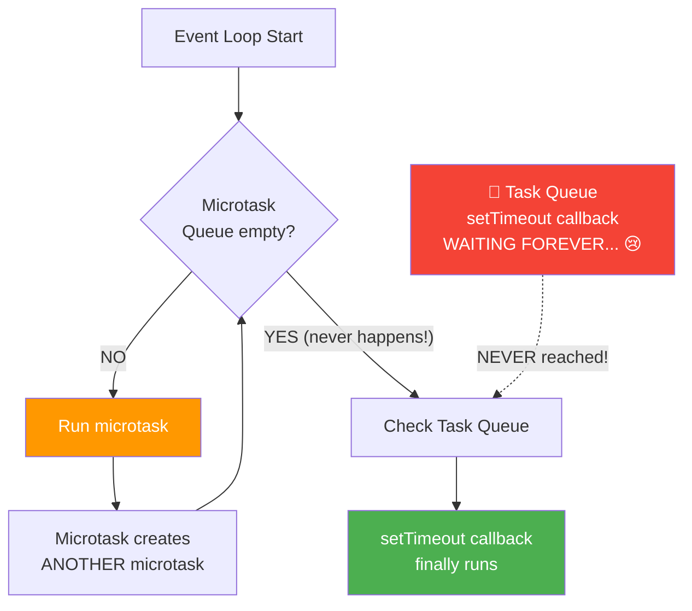

<a id="starvation-real-world"></a>

### Real-World Impact

```javascript
// REAL SCENARIO: Recursive Promise chain blocking UI

// ❌ BAD — Can cause starvation
async function processInfiniteStream() {
    while (true) {
        const data = await fetchNextChunk(); // Each await = microtask
        processChunk(data);
        // Task Queue (UI events, timers) never gets a chance!
    }
}

// ✅ GOOD — Give Task Queue a chance periodically
async function processStreamWithBreaks() {
    let chunkCount = 0;
    while (true) {
        const data = await fetchNextChunk();
        processChunk(data);
        chunkCount++;

        // Give Task Queue a chance every 100 items
        if (chunkCount % 100 === 0) {
            await new Promise(resolve => setTimeout(resolve, 0));
            // This pushes remaining work to Task Queue
            // Allowing other callbacks (UI events) to run!
        }
    }
}
```

<a id="starvation-must-know"></a>

### 🎯 Must-Know Points for Interview

```
✅ Starvation = Task Queue never gets to execute
✅ Caused by: infinite chain of microtasks
✅ Microtasks created inside microtasks run IMMEDIATELY
✅ Event Loop drains FULL microtask queue before moving on
✅ Solution: Use setTimeout(fn, 0) to YIELD control
✅ Wrap in: await new Promise(r => setTimeout(r, 0))
✅ Long-running tasks should periodically yield
✅ Browser may show "Page unresponsive" warning
✅ React's "time slicing" addresses similar concerns
✅ Avoiding starvation = key for responsive UI
```

---

<a href="#section-1-top">⬆ Back to Top</a>

---

<a id="mini-project"></a>

## 1.12 🏗️ Mini Project — Event Loop Visualizer

> Build this in your browser to SEE the Event Loop in action!

```html
<!DOCTYPE html>
<html>
<head>
    <title>Event Loop Visualizer</title>
    <style>
        * { box-sizing: border-box; margin: 0; padding: 0; font-family: 'Segoe UI', sans-serif; }
        body { background: #1a1a2e; color: #eee; padding: 20px; }
        h1 { text-align: center; color: #e94560; margin-bottom: 20px; }
        .container { display: grid; grid-template-columns: 1fr 1fr 1fr; gap: 15px; max-width: 1000px; margin: 0 auto; }
        .box { background: #16213e; border-radius: 12px; padding: 15px; min-height: 200px; }
        .box h3 { text-align: center; padding: 8px; border-radius: 8px; margin-bottom: 10px; }
        .stack-title { background: #e94560; }
        .micro-title { background: #4CAF50; }
        .task-title { background: #f44336; }
        .log-title { background: #FF9800; }
        .item { background: #0f3460; padding: 8px 12px; margin: 5px 0; border-radius: 6px; font-size: 14px; animation: fadeIn 0.3s; }
        @keyframes fadeIn { from { opacity: 0; transform: translateY(-10px); } to { opacity: 1; } }
        .controls { text-align: center; margin: 20px 0; }
        .controls button { padding: 12px 24px; margin: 5px; border: none; border-radius: 8px; cursor: pointer; font-size: 16px; font-weight: bold; }
        .btn-clear { background: #f44336; color: white; }
        .btn-example { background: #2196F3; color: white; }
        .output { grid-column: 1 / -1; }
        .output .item { background: #1b4332; border-left: 3px solid #4CAF50; }
        .event-loop { text-align: center; padding: 20px; }
        .event-loop .status { font-size: 18px; color: #9C27B0; font-weight: bold; }
    </style>
</head>
<body>
    <h1>🔄 Event Loop Visualizer</h1>

    <div class="controls">
        <button class="btn-example" onclick="runExample1()">Example 1: Basic</button>
        <button class="btn-example" onclick="runExample2()">Example 2: Priority</button>
        <button class="btn-example" onclick="runExample3()">Example 3: Nested</button>
        <button class="btn-clear" onclick="clearAll()">Clear All</button>
    </div>

    <div class="container">
        <div class="box">
            <h3 class="stack-title">📚 Call Stack</h3>
            <div id="callStack"></div>
        </div>
        <div class="box">
            <h3 class="micro-title">🟢 Microtask Queue</h3>
            <div id="microQueue"></div>
        </div>
        <div class="box">
            <h3 class="task-title">🔴 Task Queue (Callback Queue)</h3>
            <div id="taskQueue"></div>
        </div>

        <div class="box event-loop" style="grid-column: 1 / -1;">
            <h3 style="background:#9C27B0;display:inline-block;padding:8px 16px;border-radius:8px;">🔄 Event Loop</h3>
            <p class="status" id="eventLoopStatus">Waiting for code to run...</p>
        </div>

        <div class="box output">
            <h3 class="log-title">📝 Console Output</h3>
            <div id="output"></div>
        </div>
    </div>

    <script>
        const stackEl = document.getElementById("callStack");
        const microEl = document.getElementById("microQueue");
        const taskEl = document.getElementById("taskQueue");
        const outputEl = document.getElementById("output");
        const statusEl = document.getElementById("eventLoopStatus");

        let step = 0;

        function addItem(container, text) {
            const div = document.createElement("div");
            div.className = "item";
            div.textContent = text;
            container.prepend(div);
        }

        function removeFirst(container) {
            if (container.firstChild) container.firstChild.remove();
        }

        function logOutput(text) {
            addItem(outputEl, `${++step}. ${text}`);
        }

        function setStatus(text) {
            statusEl.textContent = text;
        }

        function clearAll() {
            stackEl.innerHTML = "";
            microEl.innerHTML = "";
            taskEl.innerHTML = "";
            outputEl.innerHTML = "";
            step = 0;
            setStatus("Waiting for code to run...");
        }

        async function delay(ms) {
            return new Promise(r => setTimeout(r, ms));
        }

        async function runExample1() {
            clearAll();
            setStatus("Running Example 1: console.log → setTimeout → console.log");

            addItem(stackEl, "console.log('Start')");
            await delay(800);
            logOutput("Start");
            removeFirst(stackEl);

            addItem(stackEl, "setTimeout(cb, 0)");
            await delay(800);
            setStatus("setTimeout → Sent to Web API → callback to Task Queue");
            removeFirst(stackEl);
            addItem(taskEl, "cb: console.log('Timeout')");

            addItem(stackEl, "console.log('End')");
            await delay(800);
            logOutput("End");
            removeFirst(stackEl);

            await delay(500);
            setStatus("Stack EMPTY! ✅ Checking Task Queue...");
            await delay(800);
            removeFirst(taskEl);
            addItem(stackEl, "cb()");
            await delay(500);
            logOutput("Timeout");
            removeFirst(stackEl);
            setStatus("✅ All done! Stack empty, Queues empty.");
        }

        async function runExample2() {
            clearAll();
            setStatus("Running Example 2: Microtask vs Task Priority");

            addItem(stackEl, "console.log('Start')");
            await delay(600);
            logOutput("Start");
            removeFirst(stackEl);

            addItem(stackEl, "setTimeout(cbT, 0)");
            await delay(600);
            removeFirst(stackEl);
            addItem(taskEl, "cbT: 'Timeout'");
            setStatus("setTimeout cb → Task Queue");

            addItem(stackEl, "Promise.then(cbP)");
            await delay(600);
            removeFirst(stackEl);
            addItem(microEl, "cbP: 'Promise'");
            setStatus("Promise cb → Microtask Queue (Higher Priority!)");

            addItem(stackEl, "console.log('End')");
            await delay(600);
            logOutput("End");
            removeFirst(stackEl);

            await delay(500);
            setStatus("Stack EMPTY! Checking Microtask Queue FIRST...");
            await delay(800);

            removeFirst(microEl);
            addItem(stackEl, "cbP()");
            await delay(500);
            logOutput("Promise");
            removeFirst(stackEl);
            setStatus("Microtasks done! Now checking Task Queue...");

            await delay(800);
            removeFirst(taskEl);
            addItem(stackEl, "cbT()");
            await delay(500);
            logOutput("Timeout");
            removeFirst(stackEl);
            setStatus("✅ Done! Notice: Promise ran BEFORE setTimeout!");
        }

        async function runExample3() {
            clearAll();
            setStatus("Running Example 3: Nested Microtasks (Starvation Demo)");

            addItem(stackEl, "console.log('A')");
            await delay(500);
            logOutput("A");
            removeFirst(stackEl);

            addItem(stackEl, "setTimeout(cbT, 0)");
            await delay(500);
            removeFirst(stackEl);
            addItem(taskEl, "cbT: 'D'");

            addItem(stackEl, "Promise.then(cbP1)");
            await delay(500);
            removeFirst(stackEl);
            addItem(microEl, "cbP1: 'B' + creates cbP2");

            addItem(stackEl, "console.log('C')");
            await delay(500);
            logOutput("C");
            removeFirst(stackEl);

            await delay(500);
            setStatus("Stack EMPTY! Running ALL microtasks first...");
            await delay(800);

            removeFirst(microEl);
            addItem(stackEl, "cbP1()");
            logOutput("B");
            addItem(microEl, "cbP2: 'B-nested'");
            setStatus("Microtask created NEW microtask! Run it too!");
            await delay(800);
            removeFirst(stackEl);

            removeFirst(microEl);
            addItem(stackEl, "cbP2()");
            await delay(500);
            logOutput("B-nested");
            removeFirst(stackEl);

            setStatus("All microtasks done. Now Task Queue...");
            await delay(800);

            removeFirst(taskEl);
            addItem(stackEl, "cbT()");
            await delay(500);
            logOutput("D");
            removeFirst(stackEl);
            setStatus("✅ Done! Nested microtask ran BEFORE setTimeout!");
        }
    </script>
</body>
</html>
```

---

<a href="#section-1-top">⬆ Back to Top</a>

---

<a id="practice-questions"></a>

## 1.13 🎯 Practice Questions & Projects

### 🟢 Output-Based Questions

```javascript
// Practice Q1: Predict the output
console.log("1");
setTimeout(() => console.log("2"), 1000);
setTimeout(() => console.log("3"), 0);
console.log("4");
Promise.resolve().then(() => console.log("5"));
console.log("6");
// Answer: 1, 4, 6, 5, 3, 2

// Practice Q2: Predict the output
async function async1() {
    console.log("async1 start");
    await async2();
    console.log("async1 end");
}
async function async2() {
    console.log("async2");
}
console.log("script start");
setTimeout(() => console.log("setTimeout"), 0);
async1();
new Promise((resolve) => {
    console.log("promise1");
    resolve();
}).then(() => console.log("promise2"));
console.log("script end");
// Answer: script start, async1 start, async2, promise1, script end,
//         async1 end, promise2, setTimeout

// Practice Q3: Will "setTimeout" ever print?
setTimeout(() => console.log("setTimeout"), 0);

let i = 0;
function busyLoop() {
    Promise.resolve().then(() => {
        i++;
        if (i < 1000000) busyLoop(); // Infinite microtask loop!
    });
}
busyLoop();
// Answer: "setTimeout" will NEVER print — starvation!

// Practice Q4: Predict output
console.log("A");
queueMicrotask(() => console.log("B"));
Promise.resolve().then(() => console.log("C"));
setTimeout(() => console.log("D"), 0);
console.log("E");
// Answer: A, E, B, C, D
// Sync: A, E
// Microtasks: B, C (in order added)
// Task: D
```

### 🟡 Mini Projects

```
PROJECT 1: Build a Debounce Function
━━━━━━━━━━━━━━━━━━━━━━━━━━━━━━━━━━━
Uses: setTimeout, clearTimeout, Event Loop
Task: Create a search input that only searches
      500ms after user STOPS typing
Concepts: setTimeout goes to Web API → Task Queue → Event Loop

PROJECT 2: Build a Promise Queue
━━━━━━━━━━━━━━━━━━━━━━━━━━━━━━━━
Uses: Promises, Microtask Queue, async/await
Task: Execute array of async functions one-by-one in sequence
Concepts: Promise chaining, Microtask Queue priority

PROJECT 3: Task Scheduler
━━━━━━━━━━━━━━━━━━━━━━━━━
Uses: setTimeout, setInterval, Promises, Call Stack
Task: Build a task scheduler that runs tasks with priority:
      - High priority → queueMicrotask
      - Medium priority → setTimeout(fn, 0)
      - Low priority → setTimeout(fn, 100)
Concepts: Microtask vs Task Queue priority

PROJECT 4: Real-time Clock with Auto-save
━━━━━━━━━━━━━━━━━━━━━━━━━━━━━━━━━━━━━━━━━
Uses: setInterval, localStorage, async/await, DOM APIs
Task: Show clock + auto-save notes every 30 seconds
Concepts: All Web APIs, Event Loop, Non-blocking I/O

PROJECT 5: MutationObserver Notes App
━━━━━━━━━━━━━━━━━━━━━━━━━━━━━━━━━━━━━
Uses: MutationObserver, DOM API, localStorage
Task: Watch a textarea for changes → auto-save to localStorage
Concepts: MutationObserver in microtask queue, real Web API usage

PROJECT 6: Build Your Own Event Loop Visualizer
━━━━━━━━━━━━━━━━━━━━━━━━━━━━━━━━━━━━━━━━━━━━━━
Uses: requestAnimationFrame, DOM manipulation, CSS
Task: Visual animation showing items moving from
      Stack → Web API → Queue → back to Stack
Concepts: Complete Event Loop visualization
```

### Quick Summary Diagram

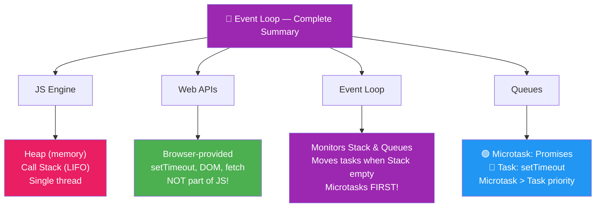

### 🎯 Quick Revision Cheat Sheet

```
SABSE IMPORTANT POINTS (Ek Line Mein):
━━━━━━━━━━━━━━━━━━━━━━━━━━━━━━━━━━━

✅ JS is SYNC — single threaded
✅ JS Engine = HEAP + CALL STACK (sirf yahi do)
✅ Web APIs, Queues, Event Loop = Runtime ka part (Browser/Node)
✅ Task Queue = Callback Queue (same thing!)
✅ Microtask Queue > Task Queue (priority me)
✅ Stack KHALI hone par hi Queue check hoti hai
✅ Microtasks ALL run, Tasks ek-ek run
✅ Promise → Microtask | setTimeout → Task
✅ setTimeout(fn, 0) → STILL async (queue se aata hai)
✅ Starvation = Microtasks task ko marwa dete hain
✅ MutationObserver bhi Microtask Queue use karta hai
✅ Event listener Web API mein STAY karta hai (memory leak risk)
```

---

<a href="#section-1-top">⬆ Back to Top</a>
```