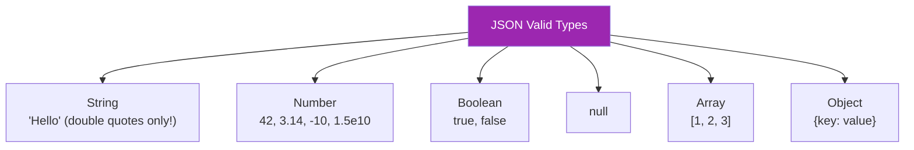
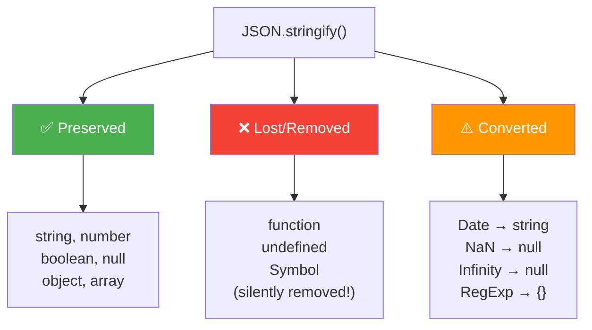
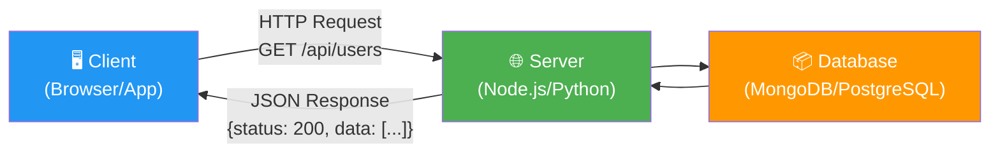
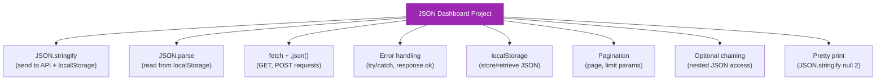
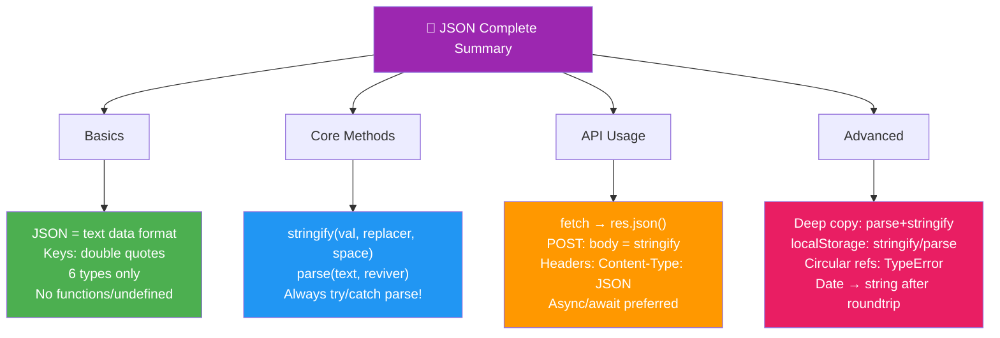

<a id="section-json-top"></a>

# 📘 JSON in JavaScript — The Complete Deep Dive

> **Everything About JSON — From Basics to Real-World API Projects**
> JSON Syntax • stringify/parse • Fetch API • CRUD • LocalStorage • Authentication
> Interview Focused — Explained in Simple Hinglish with Syntax, Arguments & Real Projects

---

## 📑 Table of Contents

<a id="section-json-toc"></a>

| #           | Topic                                                                                   |
| ----------- | --------------------------------------------------------------------------------------- |
| **LEVEL 1** | **JSON BASICS**                                                                         |
| 1           | <a href="#what-is-json">1. What is JSON?</a>                                            |
|             | &nbsp;&nbsp;&nbsp;&nbsp;<a href="#json-meaning">Meaning & Why It Exists</a>             |
|             | &nbsp;&nbsp;&nbsp;&nbsp;<a href="#json-vs-object">JSON vs JavaScript Object</a>         |
|             | &nbsp;&nbsp;&nbsp;&nbsp;<a href="#json-vs-xml">JSON vs XML</a>                          |
| 2           | <a href="#json-syntax">2. JSON Syntax Rules</a>                                         |
|             | &nbsp;&nbsp;&nbsp;&nbsp;<a href="#json-valid-types">Valid Data Types</a>                |
|             | &nbsp;&nbsp;&nbsp;&nbsp;<a href="#json-invalid-things">What's NOT Allowed in JSON</a>   |
| 3           | <a href="#json-structure">3. JSON Structure Types</a>                                   |
|             | &nbsp;&nbsp;&nbsp;&nbsp;<a href="#json-object-structure">JSON Object</a>                |
|             | &nbsp;&nbsp;&nbsp;&nbsp;<a href="#json-array-structure">JSON Array</a>                  |
|             | &nbsp;&nbsp;&nbsp;&nbsp;<a href="#json-nested">Nested JSON</a>                          |
| **LEVEL 2** | **CORE JS JSON METHODS**                                                                |
| 4           | <a href="#json-stringify">4. JSON.stringify() — Complete Guide</a>                      |
|             | &nbsp;&nbsp;&nbsp;&nbsp;<a href="#stringify-syntax">Syntax & All Arguments</a>          |
|             | &nbsp;&nbsp;&nbsp;&nbsp;<a href="#stringify-replacer">Replacer — Filter Properties</a>  |
|             | &nbsp;&nbsp;&nbsp;&nbsp;<a href="#stringify-space">Space — Pretty Print</a>             |
|             | &nbsp;&nbsp;&nbsp;&nbsp;<a href="#stringify-toJSON">toJSON() Custom Method</a>          |
|             | &nbsp;&nbsp;&nbsp;&nbsp;<a href="#stringify-edge-cases">Edge Cases — What Gets Lost</a> |
| 5           | <a href="#json-parse">5. JSON.parse() — Complete Guide</a>                              |
|             | &nbsp;&nbsp;&nbsp;&nbsp;<a href="#parse-syntax">Syntax & All Arguments</a>              |
|             | &nbsp;&nbsp;&nbsp;&nbsp;<a href="#parse-reviver">Reviver — Transform While Parsing</a>  |
|             | &nbsp;&nbsp;&nbsp;&nbsp;<a href="#parse-error-handling">Error Handling</a>              |
| 6           | <a href="#json-common-mistakes">6. Common Mistakes</a>                                  |
| **LEVEL 3** | **REAL WORLD DATA HANDLING**                                                            |
| 7           | <a href="#json-in-apis">7. JSON in APIs</a>                                             |
|             | &nbsp;&nbsp;&nbsp;&nbsp;<a href="#what-is-api-response">What is an API Response?</a>    |
|             | &nbsp;&nbsp;&nbsp;&nbsp;<a href="#request-response-cycle">Request → Response Cycle</a>  |
| 8           | <a href="#fetch-api-json">8. Fetch API with JSON</a>                                    |
|             | &nbsp;&nbsp;&nbsp;&nbsp;<a href="#fetch-get">GET Request</a>                            |
|             | &nbsp;&nbsp;&nbsp;&nbsp;<a href="#fetch-post">POST Request</a>                          |
| 9           | <a href="#async-await-json">9. Async/Await with JSON</a>                                |
| 10          | <a href="#sending-json-backend">10. Sending JSON to Backend</a>                         |
| **LEVEL 4** | **ADVANCED JSON HANDLING**                                                              |
| 11          | <a href="#nested-json-handling">11. Nested JSON Handling</a>                            |
| 12          | <a href="#json-validation">12. JSON Validation</a>                                      |
| 13          | <a href="#deep-copy-json">13. Deep Copy Using JSON</a>                                  |
| 14          | <a href="#json-localstorage">14. JSON in LocalStorage</a>                               |
| **LEVEL 5** | **JSON IN REAL API SYSTEMS**                                                            |
| 15          | <a href="#rest-apis-json">15. REST APIs and JSON</a>                                    |
| 16          | <a href="#json-crud">16. JSON in CRUD Operations</a>                                    |
| 17          | <a href="#error-handling-api">17. Error Handling in API JSON</a>                        |
| 18          | <a href="#pagination-json">18. Pagination JSON</a>                                      |
| 19          | <a href="#auth-json">19. Authentication JSON (JWT)</a>                                  |
| **LEVEL 6** | **INTERVIEW & EDGE CASES**                                                              |
| 20          | <a href="#json-edge-cases">20. Edge Cases & Gotchas</a>                                 |
| 21          | <a href="#json-interview-questions">21. Interview Questions & Tricky Outputs</a>        |
| **LEVEL 7** | **PROJECTS**                                                                            |
| 22          | <a href="#json-mini-project">22. Mini Project — API Data Dashboard</a>                  |
| 23          | <a href="#json-practice-projects">23. Practice Projects</a>                             |

<a href="#section-json-top">⬆ Back to Top</a>

---

<a id="what-is-json"></a>

## 1. 📦 What is JSON?

<a id="json-meaning"></a>

### Meaning & Why It Exists
```

JSON = JavaScript Object Notation

Simple bhasha mein:
"Ek DATA FORMAT hai jo text-based hai aur data exchange karne ke kaam aata hai"

Matlab:
Jab tum kisi se data bhejte ho (server → client ya client → server),
toh ek STANDARD FORMAT chahiye — sab ko samajh aaye.
JSON wo format hai!

SOCHO INN TARAH SE:

Hindi = Ek language jisme log baat karte hain
JSON = Ek language jisme COMPUTERS data exchange karte hain!

Real-world analogy:
📮 Courier package = JSON
📦 Saamaan andar = Data
📋 Packing slip (format) = JSON rules

Tumhe Mumbai se Delhi parcel bhejna hai.
Tum STANDARD box mein pack karte ho (JSON format)
Delhi wala STANDARD tariqe se unpack karta hai (JSON.parse)
Dono ko format pata hai — communication smooth!

```

> 💡 **Interview Definition:** "JSON (JavaScript Object Notation) is a lightweight, text-based, language-independent data interchange format. It's easy for humans to read/write and easy for machines to parse/generate. It's the standard format for API communication on the web."

```

WHY JSON EXISTS:
━━━━━━━━━━━━━━━

PROBLEM:

- Server pe data hai database mein (tables, objects)
- Client (browser) ko ye data chahiye
- HOW to send? In what format?

OLD SOLUTION: XML (heavy, verbose, hard to parse)
NEW SOLUTION: JSON (light, simple, native to JavaScript)

WHERE IS JSON USED:
✅ API responses (90%+ web APIs use JSON)
✅ Config files (package.json, tsconfig.json)
✅ Data storage (MongoDB stores JSON-like documents)
✅ LocalStorage (strings only — JSON.stringify objects)
✅ Data exchange between services (microservices)
✅ WebSocket messages
✅ GraphQL responses

````

<a id="json-vs-object"></a>

### JSON vs JavaScript Object

```javascript
// JAVASCRIPT OBJECT (in memory, JS-only)
const jsObject = {
    name: "Aadi",        // key without quotes ✅
    age: 22,
    greet: function() {  // functions allowed ✅
        return "hi";
    },
    skills: undefined,   // undefined allowed ✅
};

// JSON STRING (text format, language-independent)
const jsonString = `{
    "name": "Aadi",
    "age": 22
}`;
// Keys MUST have double quotes ✅
// No functions ❌
// No undefined ❌
// No trailing commas ❌
// No single quotes for keys ❌
// No comments ❌
````

| Feature        | JavaScript Object | JSON                          |
| -------------- | ----------------- | ----------------------------- |
| Format         | In-memory object  | Text string                   |
| Key quotes     | Optional          | **Required** (double quotes!) |
| Value types    | Any JS type       | Only 6 types                  |
| Functions      | ✅ Allowed        | ❌ Not allowed                |
| undefined      | ✅ Allowed        | ❌ Not allowed                |
| Comments       | ✅ Allowed        | ❌ Not allowed                |
| Trailing comma | ✅ Allowed        | ❌ Not allowed                |
| Single quotes  | ✅ For values     | ❌ Double quotes only         |
| Use case       | Code logic        | Data exchange                 |

<a id="json-vs-xml"></a>

### JSON vs XML

```
JSON:
{
    "name": "Aadi",
    "age": 22,
    "skills": ["JS", "React"]
}

XML (same data):
<person>
    <name>Aadi</name>
    <age>22</age>
    <skills>
        <skill>JS</skill>
        <skill>React</skill>
    </skills>
</person>

JSON = 65 characters
XML  = 150+ characters ← 2x more text for same data!
```

| Feature     | JSON                   | XML                       |
| ----------- | ---------------------- | ------------------------- |
| Readability | ✅ Easy                | ⚠️ Verbose                |
| Size        | ✅ Smaller             | ❌ Larger (tags)          |
| Parse speed | ✅ Fast (native JS)    | ❌ Slower                 |
| Data types  | Limited but sufficient | Text-based                |
| Schema      | Optional               | Required (XSD)            |
| Usage today | 90%+ of web APIs       | SOAP APIs, legacy systems |

### 🎯 Must-Know Points for Interview

```
✅ JSON = text-based data interchange format
✅ NOT a programming language — just a data format!
✅ Inspired by JavaScript objects but language-independent
✅ Every JSON is valid JS object syntax (but NOT vice versa!)
✅ Keys MUST be double-quoted strings
✅ Only 6 value types: string, number, boolean, null, object, array
✅ No functions, no undefined, no comments, no trailing commas
✅ JSON replaced XML as the web's primary data format
✅ File extension: .json | MIME type: application/json
```

---

<a href="#section-json-top">⬆ Back to Top</a>

---

<a id="json-syntax"></a>

## 2. 📝 JSON Syntax Rules

<a id="json-valid-types"></a>

### Valid Data Types in JSON

```json
{
  "string": "Hello World",
  "number_int": 42,
  "number_float": 3.14,
  "number_negative": -10,
  "number_exponent": 1.5e10,
  "boolean_true": true,
  "boolean_false": false,
  "null_value": null,
  "array": [1, "two", true, null],
  "nested_object": {
    "key": "value"
  }
}
```



<a id="json-invalid-things"></a>

### What's NOT Allowed in JSON

```javascript
// ❌ INVALID JSON examples:

// 1. Single quotes for keys/values
{ 'name': 'Aadi' }              // ❌ Must use double quotes

// 2. Unquoted keys
{ name: "Aadi" }                // ❌ Keys must be quoted

// 3. Functions
{ "greet": function() {} }      // ❌ No functions

// 4. undefined
{ "value": undefined }          // ❌ No undefined

// 5. Trailing comma
{ "name": "Aadi", }             // ❌ No trailing comma

// 6. Comments
{
    // This is a comment        // ❌ No comments
    "name": "Aadi"
}

// 7. Single-line break in strings
{ "bio": "Hello
World" }                         // ❌ Use \n for newlines

// 8. Special values
{ "x": NaN }                    // ❌ No NaN
{ "x": Infinity }               // ❌ No Infinity
{ "x": -Infinity }              // ❌ No -Infinity

// ✅ VALID JSON:
{
    "name": "Aadi",
    "age": 22,
    "isStudent": true,
    "address": null,
    "skills": ["JS", "React"],
    "education": {
        "degree": "B.Tech"
    }
}
```

---

<a href="#section-json-top">⬆ Back to Top</a>

---

<a id="json-structure"></a>

## 3. 🏗️ JSON Structure Types

<a id="json-object-structure"></a>

### JSON Object `{ }`

```json
{
  "name": "Aadi",
  "age": 22,
  "city": "Pune"
}
```

<a id="json-array-structure"></a>

### JSON Array `[ ]`

```json
[
  { "name": "Aadi", "age": 22 },
  { "name": "Rahul", "age": 25 },
  { "name": "Neha", "age": 21 }
]
```

<a id="json-nested"></a>

### Nested JSON (Real-World API Response)

```json
{
  "status": 200,
  "message": "Success",
  "data": {
    "user": {
      "id": 1,
      "name": "Aadi",
      "email": "aadi@gmail.com",
      "address": {
        "street": "MG Road",
        "city": "Pune",
        "state": "Maharashtra",
        "pincode": "411001"
      },
      "skills": ["JavaScript", "React", "Node.js"],
      "education": [
        {
          "degree": "B.Tech",
          "college": "MIT Pune",
          "year": 2024
        }
      ]
    },
    "meta": {
      "requestId": "abc-123",
      "timestamp": "2024-01-15T10:30:00Z"
    }
  }
}
```

---

<a href="#section-json-top">⬆ Back to Top</a>

---

<a id="json-stringify"></a>

## 4. 🔄 JSON.stringify() — Complete Guide

### What & Why?

```
JSON.stringify() = JS Object ko JSON STRING mein convert karta hai

WHY NEEDED?
━━━━━━━━━━━
1. API ko data bhejte waqt → body mein STRING chahiye
2. localStorage mein store karte waqt → sirf STRING store hota hai
3. Data ko text file mein save karte waqt
4. Console mein readable format dekhne ke liye
5. Data ko copy/clone karne ke liye (deep copy)
6. Debug karte waqt nested objects print karne ke liye

Without stringify:
localStorage.setItem("user", { name: "Aadi" });
localStorage.getItem("user"); // "[object Object]" 😱 — DATA LOST!

With stringify:
localStorage.setItem("user", JSON.stringify({ name: "Aadi" }));
localStorage.getItem("user"); // '{"name":"Aadi"}' ✅ — Data preserved!
```

<a id="stringify-syntax"></a>

### Syntax & All Arguments

```javascript
// FULL SYNTAX:
JSON.stringify(value, replacer, space);
```

```
┌─────────────────────────────────────────────────────────────────┐
│                    JSON.stringify(value, replacer, space)        │
│                                                                  │
│  ARGUMENT 1: value (REQUIRED)                                   │
│  ━━━━━━━━━━━━━━━━━━━━━━━━━━━                                   │
│  → The JavaScript value to convert to JSON string               │
│  → Can be: object, array, string, number, boolean, null         │
│  → Type: any                                                     │
│                                                                  │
│  ARGUMENT 2: replacer (OPTIONAL)                                │
│  ━━━━━━━━━━━━━━━━━━━━━━━━━━━━━━                                │
│  → Filter/transform what gets included in output                │
│  → Can be: Array of strings (property names to include)         │
│  → OR: Function(key, value) that transforms each property       │
│  → null = include everything (no filter)                        │
│  → Type: Array | Function | null                                │
│                                                                  │
│  ARGUMENT 3: space (OPTIONAL)                                   │
│  ━━━━━━━━━━━━━━━━━━━━━━━━━━━                                   │
│  → Controls indentation/formatting                              │
│  → Number: number of spaces per indent level (max 10)           │
│  → String: custom indent character (max 10 chars)               │
│  → 0 or undefined = no indentation (minified)                   │
│  → Type: number | string                                        │
│                                                                  │
│  RETURNS: string (JSON formatted text)                          │
│  THROWS: TypeError (if circular reference found)                │
└─────────────────────────────────────────────────────────────────┘
```

```javascript
// BASIC USAGE — Argument 1 only
const user = { name: "Aadi", age: 22, city: "Pune" };

const jsonStr = JSON.stringify(user);
console.log(jsonStr);
// '{"name":"Aadi","age":22,"city":"Pune"}'

console.log(typeof jsonStr); // "string" ← It's a string now!
```

<a id="stringify-replacer"></a>

### Replacer — Filter Properties (Argument 2)

```javascript
const user = {
  name: "Aadi",
  age: 22,
  password: "secret123",
  email: "aadi@gmail.com",
  token: "jwt-abc-123",
};

// ━━━ REPLACER AS ARRAY ━━━
// Only include specified keys!
const safeJson = JSON.stringify(user, ["name", "age", "email"]);
console.log(safeJson);
// '{"name":"Aadi","age":22,"email":"aadi@gmail.com"}'
// password and token EXCLUDED! ✅ Safe to send to client!

// ━━━ REPLACER AS FUNCTION ━━━
// Transform values during serialization!
const filtered = JSON.stringify(user, (key, value) => {
  // Remove sensitive fields
  if (key === "password" || key === "token") {
    return undefined; // undefined = skip this property!
  }
  // Transform strings to uppercase
  if (typeof value === "string" && key !== "") {
    return value.toUpperCase();
  }
  return value; // Keep everything else as-is
});
console.log(filtered);
// '{"name":"AADI","age":22,"email":"AADI@GMAIL.COM"}'

// ━━━ REPLACER FUNCTION ARGUMENTS ━━━
JSON.stringify(user, (key, value) => {
  console.log(`Key: "${key}", Value: ${value}`);
  // First call: key = "" (root object itself)
  // Then: key = "name", value = "Aadi"
  // Then: key = "age", value = 22
  // ... and so on
  return value;
});
```

<a id="stringify-space"></a>

### Space — Pretty Print (Argument 3)

```javascript
const user = { name: "Aadi", age: 22, skills: ["JS", "React"] };

// No space — minified (default)
console.log(JSON.stringify(user));
// '{"name":"Aadi","age":22,"skills":["JS","React"]}'

// With 2 spaces — pretty printed!
console.log(JSON.stringify(user, null, 2));
/*
{
  "name": "Aadi",
  "age": 22,
  "skills": [
    "JS",
    "React"
  ]
}
*/

// With 4 spaces
console.log(JSON.stringify(user, null, 4));
/*
{
    "name": "Aadi",
    ...
}
*/

// With custom string (like tab)
console.log(JSON.stringify(user, null, "\t"));
/*
{
	"name": "Aadi",
	...
}
*/

// With custom string (arrow)
console.log(JSON.stringify(user, null, "→→"));
/*
{
→→"name": "Aadi",
→→"age": 22
}
*/

// Combine replacer + space!
console.log(JSON.stringify(user, ["name", "age"], 2));
/*
{
  "name": "Aadi",
  "age": 22
}
*/
```

<a id="stringify-toJSON"></a>

### toJSON() Custom Method

```javascript
// Objects can define HOW they should be stringified!
const user = {
  name: "Aadi",
  password: "secret123",
  createdAt: new Date(),

  // Custom serialization method
  toJSON() {
    return {
      name: this.name,
      // password excluded!
      memberSince: this.createdAt.getFullYear(),
    };
  },
};

console.log(JSON.stringify(user, null, 2));
/*
{
  "name": "Aadi",
  "memberSince": 2024
}
*/
// password is gone! toJSON controls what gets serialized!
```

<a id="stringify-edge-cases"></a>

### Edge Cases — What Gets Lost During stringify

```javascript
// ⚠️ THINGS THAT GET LOST/CHANGED:

const obj = {
  name: "Aadi", // ✅ String → preserved
  age: 22, // ✅ Number → preserved
  isActive: true, // ✅ Boolean → preserved
  address: null, // ✅ null → preserved
  scores: [1, 2, 3], // ✅ Array → preserved
  nested: { x: 1 }, // ✅ Object → preserved

  greet: function () {}, // ❌ LOST! Functions removed
  action: () => {}, // ❌ LOST! Arrow functions too
  data: undefined, // ❌ LOST! undefined removed
  sym: Symbol("id"), // ❌ LOST! Symbols removed
  big: 10n, // ❌ THROWS TypeError! BigInt can't stringify!

  date: new Date(), // ⚠️ CONVERTED to string! (not Date object after parse)
  regex: /abc/g, // ⚠️ BECOMES {} (empty object!)
  nan: NaN, // ⚠️ BECOMES null!
  inf: Infinity, // ⚠️ BECOMES null!
  negInf: -Infinity, // ⚠️ BECOMES null!
};

console.log(JSON.stringify(obj, null, 2));
/*
{
  "name": "Aadi",
  "age": 22,
  "isActive": true,
  "address": null,
  "scores": [1, 2, 3],
  "nested": { "x": 1 },
  "date": "2024-01-15T10:30:00.000Z",  ← string, not Date!
  "regex": {},                           ← empty object!
  "nan": null,                           ← became null!
  "inf": null,                           ← became null!
  "negInf": null                         ← became null!
}
*/
// greet, action, data, sym → ALL GONE!
```



### 🎯 Must-Know Points for Interview

```
✅ JSON.stringify(value, replacer, space) — 3 arguments
✅ Returns a STRING (not object!)
✅ replacer as array = whitelist of properties to include
✅ replacer as function = transform each key-value pair
✅ space = number of spaces for indentation (pretty print)
✅ Functions, undefined, Symbol are SILENTLY REMOVED
✅ Date becomes string, NaN/Infinity become null
✅ BigInt throws TypeError (cannot stringify!)
✅ Circular reference throws TypeError
✅ toJSON() method = custom serialization control
✅ Used for: API requests, localStorage, deep copy, debugging
```

---

<a href="#section-json-top">⬆ Back to Top</a>

---

<a id="json-parse"></a>

## 5. 🔄 JSON.parse() — Complete Guide

### What & Why?

```
JSON.parse() = JSON STRING ko wapas JS OBJECT mein convert karta hai

WHY NEEDED?
━━━━━━━━━━━
1. API se response aata hai STRING mein → Object chahiye kaam karne ke liye
2. localStorage se data nikalte waqt → stored as string → parse to object
3. WebSocket messages → string format mein aate hain

Without parse:
const data = localStorage.getItem("user");
console.log(data.name); // ❌ undefined! data is a STRING, not object!

With parse:
const data = JSON.parse(localStorage.getItem("user"));
console.log(data.name); // ✅ "Aadi" — now it's an object!
```

<a id="parse-syntax"></a>

### Syntax & All Arguments

```javascript
// FULL SYNTAX:
JSON.parse(text, reviver);
```

```
┌─────────────────────────────────────────────────────────────────┐
│                    JSON.parse(text, reviver)                    │
│                                                                  │
│  ARGUMENT 1: text (REQUIRED)                                    │
│  ━━━━━━━━━━━━━━━━━━━━━━━━━━                                    │
│  → The JSON string to convert to JavaScript value               │
│  → MUST be valid JSON format                                    │
│  → If invalid → throws SyntaxError                              │
│  → Type: string                                                  │
│                                                                  │
│  ARGUMENT 2: reviver (OPTIONAL)                                 │
│  ━━━━━━━━━━━━━━━━━━━━━━━━━━━━                                  │
│  → A function that transforms each property during parsing      │
│  → Called for EVERY key-value pair                              │
│  → Function(key, value) → return transformed value              │
│  → Return undefined → removes the property                     │
│  → Type: Function                                               │
│                                                                  │
│  RETURNS: JavaScript value (object, array, string, etc.)        │
│  THROWS: SyntaxError (if text is not valid JSON)                │
└─────────────────────────────────────────────────────────────────┘
```

```javascript
// BASIC USAGE
const jsonString = '{"name":"Aadi","age":22,"skills":["JS","React"]}';

const obj = JSON.parse(jsonString);

console.log(obj); // { name: "Aadi", age: 22, skills: ["JS", "React"] }
console.log(typeof obj); // "object" ← It's an object now!
console.log(obj.name); // "Aadi"
console.log(obj.skills[0]); // "JS"
```

<a id="parse-reviver"></a>

### Reviver — Transform While Parsing (Argument 2)

```javascript
// Reviver = ek function jo har key-value pe chalta hai
// during parsing — values ko transform kar sakte ho!

const jsonString = `{
    "name": "Aadi",
    "age": 22,
    "createdAt": "2024-01-15T10:30:00.000Z",
    "score": "85"
}`;

// WITHOUT reviver — dates remain strings!
const obj1 = JSON.parse(jsonString);
console.log(typeof obj1.createdAt); // "string" 😱 Not a Date!

// WITH reviver — transform specific values!
const obj2 = JSON.parse(jsonString, (key, value) => {
  // Convert date strings back to Date objects
  if (key === "createdAt") {
    return new Date(value);
  }
  // Convert score string to number
  if (key === "score") {
    return Number(value);
  }
  return value; // Keep everything else as-is
});

console.log(obj2.createdAt instanceof Date); // true ✅
console.log(typeof obj2.score); // "number" ✅

// REVIVER TO REMOVE PROPERTIES:
const sanitized = JSON.parse(jsonString, (key, value) => {
  if (key === "score") return undefined; // Remove this!
  return value;
});
console.log(sanitized); // { name: "Aadi", age: 22, createdAt: "..." }
// score is GONE!
```

<a id="parse-error-handling"></a>

### Error Handling — What If JSON is Invalid?

```javascript
// ❌ Invalid JSON → SyntaxError!
try {
  JSON.parse("not valid json");
} catch (e) {
  console.log(e.name); // "SyntaxError"
  console.log(e.message); // "Unexpected token 'o' ..."
}

// ❌ Empty string
try {
  JSON.parse("");
} catch (e) {
  console.log(e.message); // "Unexpected end of JSON input"
}

// ❌ Single quotes
try {
  JSON.parse("{'name': 'Aadi'}"); // Single quotes!
} catch (e) {
  console.log(e.message); // "Unexpected token ..."
}

// ✅ SAFE PARSE FUNCTION (use in production!)
function safeParse(jsonString, fallback = null) {
  try {
    return JSON.parse(jsonString);
  } catch (error) {
    console.error("Invalid JSON:", error.message);
    return fallback;
  }
}

console.log(safeParse('{"name":"Aadi"}')); // { name: "Aadi" }
console.log(safeParse("broken json")); // null (fallback)
console.log(safeParse("", [])); // [] (custom fallback)
```

### 🎯 Must-Know Points for Interview

```
✅ JSON.parse(text, reviver) — 2 arguments
✅ Returns JavaScript value (object, array, etc.)
✅ Throws SyntaxError on invalid JSON
✅ ALWAYS use try/catch when parsing JSON!
✅ Reviver function runs on EVERY key-value pair
✅ Return undefined from reviver to remove property
✅ Common use: convert date strings back to Date objects
✅ parse("null") returns null, parse("undefined") throws!
✅ JSON.parse(JSON.stringify(obj)) = quick deep clone
✅ Don't forget: parse returns OBJECT, stringify returns STRING
```

---

<a href="#section-json-top">⬆ Back to Top</a>

---

<a id="json-common-mistakes"></a>

## 6. 🚫 Common Mistakes

```javascript
// MISTAKE 1: Parsing already-parsed JSON (double parse)
const jsonStr = '{"name":"Aadi"}';
const obj = JSON.parse(jsonStr);
// const obj2 = JSON.parse(obj); // ❌ TypeError! obj is already an object!

// MISTAKE 2: Stringifying already-stringified JSON (double stringify)
const str = JSON.stringify({ name: "Aadi" });
const str2 = JSON.stringify(str); // '"{\\"name\\":\\"Aadi\\"}"' — escaped mess!

// MISTAKE 3: Forgetting to parse API response
fetch("/api/user")
  .then((res) => res.json()) // ← This ALREADY parses! Don't parse again!
  .then((data) => {
    // data is already an object — don't JSON.parse(data)!
    console.log(data.name);
  });

// MISTAKE 4: Using JSON.parse on non-string
// JSON.parse(123);     // Works but returns number
// JSON.parse(true);    // Works but returns boolean
// JSON.parse(null);    // Returns null
// JSON.parse(undefined); // ❌ SyntaxError!

// MISTAKE 5: Not handling errors
// const data = JSON.parse(someInput); // What if someInput is invalid?
// ALWAYS use try/catch!
```

---

<a href="#section-json-top">⬆ Back to Top</a>

---

<a id="json-in-apis"></a>

## 7. 🌐 JSON in APIs

<a id="what-is-api-response"></a>

### What is an API Response?

```
API = Application Programming Interface
      "Ek tarika jisse ek software dusre software se baat karta hai"

Real Life:
Tum Zomato app mein "restaurants near me" search karte ho.
App → Zomato Server ko request bhejta hai
Server → JSON response bhejta hai with restaurant data
App → JSON parse karke screen pe dikhata hai

Flow:
Client (App)  →  HTTP Request   →  Server
Client (App)  ←  JSON Response  ←  Server
```

<a id="request-response-cycle"></a>

### Request → Response Cycle



---

<a id="fetch-api-json"></a>

## 8. 🔄 Fetch API with JSON

<a id="fetch-get"></a>

### GET Request — Fetching JSON Data

```javascript
// SYNTAX:
// fetch(url, options)
//   url: string — the API endpoint
//   options: object — method, headers, body, etc. (optional for GET)
//   Returns: Promise<Response>

// BASIC GET REQUEST:
fetch("https://jsonplaceholder.typicode.com/users/1")
  .then((response) => {
    // response.ok = true if status is 200-299
    if (!response.ok) {
      throw new Error(`HTTP Error: ${response.status}`);
    }
    return response.json(); // Parse JSON body → returns Promise!
  })
  .then((user) => {
    console.log(user.name); // "Leanne Graham"
    console.log(user.email); // "Sincere@april.biz"
  })
  .catch((error) => {
    console.error("Failed:", error.message);
  });
```

```
IMPORTANT:
response.json() = Parses the response body from JSON string to JS object
                  Returns a PROMISE (not the data directly!)
                  That's why we need another .then()

response object has:
  .ok       → boolean (true if 200-299)
  .status   → number (200, 404, 500, etc.)
  .json()   → parse body as JSON (returns Promise)
  .text()   → parse body as text (returns Promise)
  .blob()   → parse body as blob/file (returns Promise)
```

<a id="fetch-post"></a>

### POST Request — Sending JSON Data

```javascript
// SENDING DATA TO SERVER:
const newUser = {
  name: "Aadi",
  email: "aadi@gmail.com",
  age: 22,
};

fetch("https://jsonplaceholder.typicode.com/users", {
  method: "POST", // HTTP method
  headers: {
    "Content-Type": "application/json", // Tell server: "I'm sending JSON!"
  },
  body: JSON.stringify(newUser), // Convert object to JSON string!
})
  .then((res) => res.json())
  .then((data) => {
    console.log("Created:", data);
    console.log("ID:", data.id);
  })
  .catch((err) => console.error("Error:", err));
```

---

<a id="async-await-json"></a>

## 9. ⏳ Async/Await with JSON

```javascript
// MUCH CLEANER than .then() chains!

async function getUser(userId) {
  try {
    const response = await fetch(
      `https://jsonplaceholder.typicode.com/users/${userId}`,
    );

    if (!response.ok) {
      throw new Error(`HTTP Error: ${response.status}`);
    }

    const user = await response.json(); // await the parse!
    console.log("User:", user.name);
    return user;
  } catch (error) {
    console.error("Failed to fetch user:", error.message);
    return null;
  }
}

// Usage:
const user = await getUser(1);

// POST with async/await:
async function createUser(userData) {
  try {
    const response = await fetch("https://jsonplaceholder.typicode.com/users", {
      method: "POST",
      headers: { "Content-Type": "application/json" },
      body: JSON.stringify(userData),
    });

    if (!response.ok) throw new Error(`HTTP ${response.status}`);

    const created = await response.json();
    console.log("Created user with ID:", created.id);
    return created;
  } catch (error) {
    console.error("Create failed:", error.message);
    throw error;
  }
}
```

---

<a href="#section-json-top">⬆ Back to Top</a>

---

<a id="sending-json-backend"></a>

## 10. 📤 Sending JSON to Backend

```javascript
// COMPLETE POST REQUEST with ALL options:
async function sendData(endpoint, data) {
  const response = await fetch(endpoint, {
    method: "POST",
    headers: {
      "Content-Type": "application/json", // REQUIRED for JSON!
      Authorization: "Bearer jwt-token", // Auth token
      Accept: "application/json", // Tell server we want JSON back
    },
    body: JSON.stringify(data), // MUST stringify! Server expects string!
  });

  return response.json();
}

// Usage:
const result = await sendData("/api/users", {
  name: "Aadi",
  email: "aadi@gmail.com",
});
```

```
COMMON MISTAKE:
fetch(url, {
    body: { name: "Aadi" }  // ❌ WRONG! body must be a STRING!
});

CORRECT:
fetch(url, {
    body: JSON.stringify({ name: "Aadi" })  // ✅ Convert to JSON string!
    headers: { "Content-Type": "application/json" }  // ✅ Tell server!
});
```

---

<a href="#section-json-top">⬆ Back to Top</a>

---

<a id="nested-json-handling"></a>

## 11. 🏢 Nested JSON Handling

```javascript
// Real API response is usually DEEPLY NESTED:
const apiResponse = {
  status: 200,
  data: {
    user: {
      name: "Aadi",
      address: {
        city: "Pune",
        coords: { lat: 18.52, lng: 73.85 },
      },
      orders: [{ id: 1, items: [{ name: "iPhone", qty: 1 }] }],
    },
  },
};

// ACCESSING DEEP VALUES:
// ❌ DANGEROUS — if any level is null/undefined → TypeError!
const city = apiResponse.data.user.address.city; // "Pune"
// What if data is null? → TypeError: Cannot read properties of null!

// ✅ SAFE — Optional Chaining (?.)
const safeCity = apiResponse?.data?.user?.address?.city; // "Pune"
const missing = apiResponse?.data?.user?.phone?.number; // undefined (no error!)

// ✅ SAFE with default — Nullish Coalescing (??)
const zipcode = apiResponse?.data?.user?.address?.zipcode ?? "N/A"; // "N/A"
```

---

<a id="json-validation"></a>

## 12. ✅ JSON Validation

```javascript
// Check if a string is valid JSON:
function isValidJSON(str) {
  try {
    JSON.parse(str);
    return true;
  } catch (e) {
    return false;
  }
}

console.log(isValidJSON('{"name":"Aadi"}')); // true
console.log(isValidJSON("{name: Aadi}")); // false
console.log(isValidJSON("hello")); // false
console.log(isValidJSON("null")); // true (null is valid JSON!)
console.log(isValidJSON("42")); // true (number is valid JSON!)
```

---

<a id="deep-copy-json"></a>

## 13. 📋 Deep Copy Using JSON

```javascript
// QUICK DEEP CLONE (stringify + parse):
const original = {
  name: "Aadi",
  address: { city: "Pune", pin: "411001" },
  skills: ["JS", "React"],
};

const deepCopy = JSON.parse(JSON.stringify(original));

deepCopy.address.city = "Mumbai";
deepCopy.skills.push("Node");

console.log(original.address.city); // "Pune" ✅ (NOT affected!)
console.log(original.skills); // ["JS", "React"] ✅ (NOT affected!)

// ⚠️ LIMITATIONS of JSON deep copy:
const problematic = {
  date: new Date(), // ❌ Becomes string after clone
  regex: /abc/g, // ❌ Becomes {}
  fn: function () {}, // ❌ Lost completely
  undef: undefined, // ❌ Lost completely
  nan: NaN, // ❌ Becomes null
  inf: Infinity, // ❌ Becomes null
};

// ✅ Better alternative: structuredClone() (modern)
const betterCopy = structuredClone(original); // Handles more types!
```

---

<a id="json-localstorage"></a>

## 14. 💾 JSON in LocalStorage

```javascript
// localStorage ONLY stores STRINGS!
// So we need JSON.stringify for storing and JSON.parse for retrieving

// ━━━ STORING DATA ━━━
const user = { name: "Aadi", age: 22, darkMode: true };
const cart = [
  { id: 1, name: "iPhone", price: 79999, qty: 1 },
  { id: 2, name: "AirPods", price: 19999, qty: 2 },
];

localStorage.setItem("user", JSON.stringify(user));
localStorage.setItem("cart", JSON.stringify(cart));
localStorage.setItem("theme", "dark"); // Simple string — no stringify needed

// ━━━ RETRIEVING DATA ━━━
const storedUser = JSON.parse(localStorage.getItem("user"));
console.log(storedUser.name); // "Aadi" ✅

const storedCart = JSON.parse(localStorage.getItem("cart"));
console.log(storedCart[0].name); // "iPhone" ✅

const theme = localStorage.getItem("theme"); // "dark" (already string)

// ━━━ SAFE RETRIEVAL (handle null/invalid) ━━━
function getFromStorage(key, fallback = null) {
  try {
    const item = localStorage.getItem(key);
    return item ? JSON.parse(item) : fallback;
  } catch (e) {
    console.error(`Error reading ${key}:`, e.message);
    return fallback;
  }
}

const settings = getFromStorage("settings", { theme: "light" });

// ━━━ UPDATING STORED DATA ━━━
function updateCart(newItem) {
  const cart = getFromStorage("cart", []);
  cart.push(newItem);
  localStorage.setItem("cart", JSON.stringify(cart));
}

// ━━━ REMOVING DATA ━━━
localStorage.removeItem("cart");
localStorage.clear(); // Remove EVERYTHING
```

---

<a href="#section-json-top">⬆ Back to Top</a>

---

<a id="rest-apis-json"></a>

## 15. 🌐 REST APIs and JSON

```
REST = Representational State Transfer
       (Ek standard tarika APIs banane ka)

REST + JSON = Most common API architecture in web development!

REST Principles:
✅ Each URL = one resource (/api/users, /api/products)
✅ HTTP methods define operations (GET, POST, PUT, DELETE)
✅ Stateless — each request independent
✅ JSON as data format
```

| HTTP Method | Operation | Example               | Use Case               |
| ----------- | --------- | --------------------- | ---------------------- |
| GET         | Read      | `GET /api/users`      | Fetch user list        |
| POST        | Create    | `POST /api/users`     | Create new user        |
| PUT         | Replace   | `PUT /api/users/1`    | Replace entire user    |
| PATCH       | Update    | `PATCH /api/users/1`  | Update specific fields |
| DELETE      | Delete    | `DELETE /api/users/1` | Delete a user          |

---

<a id="json-crud"></a>

## 16. 📝 JSON in CRUD Operations

```javascript
const API_URL = "https://jsonplaceholder.typicode.com";

// ━━━ CREATE (POST) ━━━
async function createUser(userData) {
  const res = await fetch(`${API_URL}/users`, {
    method: "POST",
    headers: { "Content-Type": "application/json" },
    body: JSON.stringify(userData),
  });
  return res.json();
}

// ━━━ READ (GET) ━━━
async function getUser(id) {
  const res = await fetch(`${API_URL}/users/${id}`);
  if (!res.ok) throw new Error("User not found");
  return res.json();
}

async function getAllUsers() {
  const res = await fetch(`${API_URL}/users`);
  return res.json();
}

// ━━━ UPDATE (PUT — replace entire resource) ━━━
async function updateUser(id, userData) {
  const res = await fetch(`${API_URL}/users/${id}`, {
    method: "PUT",
    headers: { "Content-Type": "application/json" },
    body: JSON.stringify(userData),
  });
  return res.json();
}

// ━━━ UPDATE (PATCH — update specific fields) ━━━
async function patchUser(id, updates) {
  const res = await fetch(`${API_URL}/users/${id}`, {
    method: "PATCH",
    headers: { "Content-Type": "application/json" },
    body: JSON.stringify(updates), // Only changed fields!
  });
  return res.json();
}

// ━━━ DELETE ━━━
async function deleteUser(id) {
  const res = await fetch(`${API_URL}/users/${id}`, {
    method: "DELETE",
  });
  return res.ok; // Returns true if successful
}

// ━━━ USAGE ━━━
const newUser = await createUser({ name: "Aadi", email: "aadi@mail.com" });
const user = await getUser(1);
const updated = await patchUser(1, { name: "Aadi Updated" });
const deleted = await deleteUser(1);
```

---

<a href="#section-json-top">⬆ Back to Top</a>

---

<a id="error-handling-api"></a>

## 17. 🛡️ Error Handling in API JSON

```javascript
async function fetchWithErrorHandling(url) {
  try {
    // NETWORK ERROR: Server down, no internet, DNS failure
    const response = await fetch(url);

    // HTTP ERROR: 4xx (client), 5xx (server)
    if (!response.ok) {
      const errorBody = await response.json().catch(() => ({}));
      throw new Error(errorBody.message || `HTTP Error ${response.status}`);
    }

    // PARSE ERROR: Response isn't valid JSON
    const data = await response.json();
    return { success: true, data };
  } catch (error) {
    // Could be: NetworkError, HTTP Error, or Parse Error
    if (error.name === "TypeError" && error.message === "Failed to fetch") {
      return { success: false, error: "Network error — check connection" };
    }
    return { success: false, error: error.message };
  }
}

// Usage:
const result = await fetchWithErrorHandling("https://api.example.com/data");
if (result.success) {
  console.log("Data:", result.data);
} else {
  console.error("Error:", result.error);
}
```

---

<a id="pagination-json"></a>

## 18. 📄 Pagination JSON

```javascript
// API PAGINATION — fetching data in pages

// Common pagination params: page, limit, offset
async function fetchPaginated(page = 1, limit = 10) {
  const res = await fetch(
    `https://jsonplaceholder.typicode.com/posts?_page=${page}&_limit=${limit}`,
  );
  const data = await res.json();
  const total = res.headers.get("X-Total-Count"); // Total items

  return {
    data,
    currentPage: page,
    totalPages: Math.ceil(total / limit),
    totalItems: Number(total),
  };
}

// Usage:
const page1 = await fetchPaginated(1, 5);
console.log(page1.data); // First 5 posts
console.log(page1.totalPages); // Total pages available
```

---

<a id="auth-json"></a>

## 19. 🔐 Authentication JSON (JWT)

```javascript
// LOGIN — Send credentials, receive JWT token
async function login(email, password) {
  const res = await fetch("https://api.example.com/auth/login", {
    method: "POST",
    headers: { "Content-Type": "application/json" },
    body: JSON.stringify({ email, password }),
  });

  if (!res.ok) throw new Error("Login failed");

  const { token, user } = await res.json();
  // Response: { token: "jwt-abc-123", user: { name: "Aadi" } }

  // Store token for future requests
  localStorage.setItem("token", token);
  localStorage.setItem("user", JSON.stringify(user));

  return { token, user };
}

// AUTHENTICATED REQUEST — Send token in headers
async function getProfile() {
  const token = localStorage.getItem("token");

  const res = await fetch("https://api.example.com/profile", {
    headers: {
      Authorization: `Bearer ${token}`, // JWT token!
      "Content-Type": "application/json",
    },
  });

  if (res.status === 401) {
    // Token expired or invalid
    localStorage.removeItem("token");
    throw new Error("Session expired — please login again");
  }

  return res.json();
}

// LOGOUT
function logout() {
  localStorage.removeItem("token");
  localStorage.removeItem("user");
}
```

---

<a href="#section-json-top">⬆ Back to Top</a>

---

<a id="json-edge-cases"></a>

## 20. ⚠️ Edge Cases & Gotchas

```javascript
// 1. CIRCULAR REFERENCE — stringify THROWS!
const obj = { name: "Aadi" };
obj.self = obj; // Circular!
// JSON.stringify(obj); // ❌ TypeError: Converting circular structure to JSON

// Fix: Use replacer to handle circular refs
function safeStringify(obj) {
  const seen = new WeakSet();
  return JSON.stringify(
    obj,
    (key, value) => {
      if (typeof value === "object" && value !== null) {
        if (seen.has(value)) return "[Circular]";
        seen.add(value);
      }
      return value;
    },
    2,
  );
}

// 2. DATE OBJECTS — become strings after round-trip!
const now = new Date();
const json = JSON.stringify({ date: now });
const parsed = JSON.parse(json);
console.log(typeof parsed.date); // "string" ← NOT Date object!
// Fix: Use reviver
const fixed = JSON.parse(json, (key, value) => {
  if (key === "date") return new Date(value);
  return value;
});

// 3. NaN, Infinity → become null!
JSON.stringify({ a: NaN, b: Infinity }); // '{"a":null,"b":null}'

// 4. BigInt → THROWS!
// JSON.stringify({ n: 10n }); // ❌ TypeError
// Fix: Convert to string first
JSON.stringify({ n: 10n }, (key, value) =>
  typeof value === "bigint" ? value.toString() : value,
);

// 5. Map/Set → become {} (empty object)!
JSON.stringify(new Map([["a", 1]])); // '{}'
// Fix: Convert to array/object first
JSON.stringify([...new Map([["a", 1]])]); // '[["a",1]]'

// 6. parse("undefined") THROWS, parse("null") doesn't!
JSON.parse("null"); // null ✅
// JSON.parse("undefined"); // ❌ SyntaxError!
JSON.parse('"hello"'); // "hello" ✅
JSON.parse("42"); // 42 ✅
```

---

<a href="#section-json-top">⬆ Back to Top</a>

---

<a id="json-interview-questions"></a>

## 21. 🔥 Interview Questions & Tricky Outputs

### Quick-Fire Answers

| Question                                    | Answer                                                              |
| ------------------------------------------- | ------------------------------------------------------------------- |
| What is JSON?                               | Lightweight text-based data interchange format                      |
| JSON vs JS Object?                          | JSON = string, must have double-quoted keys, no functions/undefined |
| Why stringify?                              | Convert object → string for APIs, localStorage, transmission        |
| Why parse?                                  | Convert JSON string → object for using in code                      |
| What does response.json() return?           | A Promise that resolves to parsed JavaScript object                 |
| Is JSON a language?                         | No — it's a DATA FORMAT (language-independent)                      |
| Can JSON have comments?                     | ❌ No                                                               |
| Can JSON have trailing commas?              | ❌ No                                                               |
| What happens to functions during stringify? | They are REMOVED (silently lost)                                    |
| How to deep copy with JSON?                 | JSON.parse(JSON.stringify(obj)) — but has limitations               |
| How to store objects in localStorage?       | JSON.stringify to store, JSON.parse to retrieve                     |

### Tricky Output Questions

```javascript
// Q1: What is the output?
console.log(JSON.stringify(undefined));
// Answer: undefined (the value, not string!)
// JSON.stringify returns undefined for standalone undefined

// Q2: What is the output?
console.log(JSON.stringify({ a: undefined, b: function () {}, c: Symbol() }));
// Answer: '{}' — all three are REMOVED!

// Q3: What is the output?
console.log(JSON.stringify([undefined, function () {}, Symbol()]));
// Answer: '[null,null,null]' — in arrays they become null, not removed!

// Q4: What is the output?
console.log(JSON.parse(JSON.stringify(NaN)));
// Answer: null (NaN → null during stringify → null after parse)

// Q5: What is the output?
const obj = { a: 1 };
const str = JSON.stringify(obj);
const obj2 = JSON.parse(str);
console.log(obj === obj2);
// Answer: false — different objects in memory (deep copy)!

// Q6: What is the output?
console.log(JSON.parse("true")); // true (boolean)
console.log(JSON.parse('"true"')); // "true" (string!)
console.log(JSON.parse("42")); // 42 (number)
console.log(JSON.parse("null")); // null

// Q7: Can you stringify these?
JSON.stringify(42); // "42" ✅
JSON.stringify("hello"); // '"hello"' ✅ (double-quoted string!)
JSON.stringify(true); // "true" ✅
JSON.stringify(null); // "null" ✅
JSON.stringify(undefined); // undefined (NOT "undefined" string!)

// Q8: What does this produce?
const data = {
  name: "Aadi",
  toJSON() {
    return "custom!";
  },
};
console.log(JSON.stringify(data));
// Answer: '"custom!"' — toJSON() overrides the entire serialization!
```

---

<a href="#section-json-top">⬆ Back to Top</a>

---

<a id="json-mini-project"></a>

## 22. 🏗️ Mini Project — API Data Dashboard

> **This project uses ALL JSON concepts:** fetch, parse, stringify, localStorage, CRUD, error handling, pagination

```html
<!DOCTYPE html>
<html>
  <head>
    <title>JSON API Dashboard</title>
    <style>
      * {
        margin: 0;
        padding: 0;
        box-sizing: border-box;
        font-family: "Segoe UI", sans-serif;
      }
      body {
        background: #1a1a2e;
        color: #eee;
        padding: 20px;
      }
      h1 {
        text-align: center;
        color: #e94560;
        margin-bottom: 20px;
      }
      .container {
        max-width: 900px;
        margin: 0 auto;
      }
      .controls {
        display: flex;
        gap: 10px;
        margin-bottom: 20px;
        flex-wrap: wrap;
      }
      button {
        padding: 10px 20px;
        background: #e94560;
        color: white;
        border: none;
        border-radius: 8px;
        cursor: pointer;
        font-size: 14px;
      }
      button:hover {
        background: #c73e54;
      }
      button.secondary {
        background: #4caf50;
      }
      .card {
        background: #16213e;
        border-radius: 12px;
        padding: 20px;
        margin-bottom: 15px;
      }
      .card h3 {
        color: #4caf50;
        margin-bottom: 10px;
      }
      .user-grid {
        display: grid;
        grid-template-columns: repeat(auto-fill, minmax(280px, 1fr));
        gap: 15px;
      }
      .user-card {
        background: #0f3460;
        border-radius: 10px;
        padding: 15px;
      }
      .user-card h4 {
        color: #e94560;
      }
      .user-card p {
        font-size: 14px;
        color: #aaa;
        margin: 4px 0;
      }
      input {
        padding: 10px;
        border: 2px solid #333;
        background: #16213e;
        color: #eee;
        border-radius: 8px;
        width: 200px;
      }
      .status {
        padding: 10px;
        border-radius: 8px;
        margin-bottom: 15px;
      }
      .status.success {
        background: #1b4332;
        border-left: 4px solid #4caf50;
      }
      .status.error {
        background: #3c1414;
        border-left: 4px solid #f44336;
      }
      .status.loading {
        background: #1a1a3e;
        border-left: 4px solid #ff9800;
      }
      .pagination {
        display: flex;
        gap: 8px;
        justify-content: center;
        margin-top: 15px;
      }
      .pagination button {
        padding: 8px 16px;
      }
      .pagination button.active {
        background: #4caf50;
      }
      #jsonViewer {
        background: #0f3460;
        padding: 15px;
        border-radius: 8px;
        white-space: pre-wrap;
        font-family: "Courier New", monospace;
        font-size: 13px;
        max-height: 300px;
        overflow-y: auto;
      }
    </style>
  </head>
  <body>
    <div class="container">
      <h1>📊 JSON API Dashboard</h1>

      <div class="controls">
        <button onclick="fetchAllUsers()">📥 Fetch Users</button>
        <button onclick="createNewUser()" class="secondary">
          ➕ Create User
        </button>
        <button onclick="showLocalStorage()">💾 Show Saved Data</button>
        <button onclick="clearStorage()">🗑️ Clear Storage</button>
        <input
          type="number"
          id="userId"
          placeholder="User ID (1-10)"
          min="1"
          max="10"
        />
        <button onclick="fetchSingleUser()">🔍 Fetch By ID</button>
      </div>

      <div id="status"></div>
      <div id="content"></div>

      <div class="card" style="margin-top: 20px;">
        <h3>📝 Raw JSON Viewer</h3>
        <div id="jsonViewer">Click any button above to see JSON data...</div>
      </div>
    </div>

    <script>
      const API = "https://jsonplaceholder.typicode.com";
      let currentPage = 1;
      const LIMIT = 5;

      function showStatus(msg, type = "loading") {
        document.getElementById("status").innerHTML =
          `<div class="status ${type}">${msg}</div>`;
      }

      function showJSON(data) {
        document.getElementById("jsonViewer").textContent = JSON.stringify(
          data,
          null,
          2,
        );
      }

      // ━━━ FETCH ALL USERS WITH PAGINATION ━━━
      async function fetchAllUsers(page = 1) {
        currentPage = page;
        showStatus("⏳ Fetching users...", "loading");

        try {
          const res = await fetch(`${API}/users?_page=${page}&_limit=${LIMIT}`);

          if (!res.ok) throw new Error(`HTTP ${res.status}`);

          const users = await res.json();
          const total = Number(res.headers.get("X-Total-Count") || 10);

          // Save to localStorage
          localStorage.setItem(
            "lastFetch",
            JSON.stringify({
              data: users,
              fetchedAt: new Date().toISOString(),
              page,
            }),
          );

          showStatus(
            `✅ Loaded ${users.length} users (Page ${page})`,
            "success",
          );
          renderUsers(users, page, Math.ceil(total / LIMIT));
          showJSON(users);
        } catch (error) {
          showStatus(`❌ Error: ${error.message}`, "error");
        }
      }

      function renderUsers(users, currentPage, totalPages) {
        let html = '<div class="user-grid">';
        users.forEach((user) => {
          html += `
                    <div class="user-card">
                        <h4>${user.name}</h4>
                        <p>📧 ${user.email}</p>
                        <p>📱 ${user.phone || "N/A"}</p>
                        <p>🌐 ${user.website || "N/A"}</p>
                        <p>🏢 ${user.company?.name || "N/A"}</p>
                        <p>📍 ${user.address?.city || "N/A"}</p>
                        <button onclick="fetchSingleUserById(${user.id})" style="margin-top:8px;padding:5px 10px;font-size:12px;">View Details</button>
                    </div>
                `;
        });
        html += "</div>";

        html += '<div class="pagination">';
        for (let i = 1; i <= totalPages; i++) {
          html += `<button class="${i === currentPage ? "active" : ""}" onclick="fetchAllUsers(${i})">${i}</button>`;
        }
        html += "</div>";

        document.getElementById("content").innerHTML = html;
      }

      // ━━━ FETCH SINGLE USER ━━━
      async function fetchSingleUser() {
        const id = document.getElementById("userId").value;
        if (!id) {
          showStatus("⚠️ Enter a User ID!", "error");
          return;
        }
        await fetchSingleUserById(id);
      }

      async function fetchSingleUserById(id) {
        showStatus(`⏳ Fetching user ${id}...`, "loading");

        try {
          const res = await fetch(`${API}/users/${id}`);
          if (!res.ok) throw new Error(`User ${id} not found!`);
          const user = await res.json();

          showStatus(`✅ Found user: ${user.name}`, "success");
          showJSON(user);

          document.getElementById("content").innerHTML = `
                    <div class="card">
                        <h3>👤 ${user.name}</h3>
                        <p>📧 Email: ${user.email}</p>
                        <p>📱 Phone: ${user.phone}</p>
                        <p>🌐 Website: ${user.website}</p>
                        <p>🏢 Company: ${user.company?.name}</p>
                        <p>📍 Address: ${user.address?.street}, ${user.address?.city}</p>
                        <p>📮 Zipcode: ${user.address?.zipcode}</p>
                        <button onclick="fetchAllUsers()" style="margin-top:10px;" class="secondary">← Back to List</button>
                    </div>
                `;
        } catch (error) {
          showStatus(`❌ ${error.message}`, "error");
        }
      }

      // ━━━ CREATE USER (POST) ━━━
      async function createNewUser() {
        const userData = {
          name: "New User " + Date.now(),
          email: "newuser@example.com",
          phone: "1234567890",
        };

        showStatus("⏳ Creating user...", "loading");

        try {
          const res = await fetch(`${API}/users`, {
            method: "POST",
            headers: { "Content-Type": "application/json" },
            body: JSON.stringify(userData),
          });

          const created = await res.json();
          showStatus(`✅ User created with ID: ${created.id}`, "success");
          showJSON({ request: userData, response: created });
        } catch (error) {
          showStatus(`❌ Create failed: ${error.message}`, "error");
        }
      }

      // ━━━ LOCAL STORAGE ━━━
      function showLocalStorage() {
        const saved = localStorage.getItem("lastFetch");
        if (saved) {
          const data = JSON.parse(saved);
          showStatus(`💾 Showing saved data from ${data.fetchedAt}`, "success");
          showJSON(data);
          renderUsers(data.data, data.page, 2);
        } else {
          showStatus("💾 No saved data! Fetch users first.", "error");
        }
      }

      function clearStorage() {
        localStorage.clear();
        showStatus("🗑️ Local storage cleared!", "success");
        showJSON({});
      }
    </script>
  </body>
</html>
```

### Project Concepts Used



---

<a href="#section-json-top">⬆ Back to Top</a>

---

<a id="json-practice-projects"></a>

## 23. 🎯 Practice Projects

```
PROJECT 1: 🌤️ Weather App
━━━━━━━━━━━━━━━━━━━━━━━━
API: OpenWeatherMap
Skills: fetch, JSON parse, error handling, localStorage cache
Features: Search city → show weather → save recent searches

PROJECT 2: ✅ Todo App with CRUD
━━━━━━━━━━━━━━━━━━━━━━━━━━━━━━
API: JSONPlaceholder /todos
Skills: GET, POST, PUT, DELETE, JSON in localStorage
Features: Add/Edit/Delete todos, persist in localStorage

PROJECT 3: 🔐 Auth Login System
━━━━━━━━━━━━━━━━━━━━━━━━━━━━━━
API: reqres.in (free fake auth API)
Skills: POST with JSON body, JWT token storage, auth headers
Features: Login → store token → protected routes → logout

PROJECT 4: 📰 Blog Reader
━━━━━━━━━━━━━━━━━━━━━━━━
API: JSONPlaceholder /posts + /comments
Skills: Nested JSON, pagination, async/await
Features: List posts → click to read → show comments

PROJECT 5: 🛍️ Product Listing with Pagination
━━━━━━━━━━━━━━━━━━━━━━━━━━━━━━━━━━━━━━━━━━━━
API: fakestoreapi.com
Skills: Pagination, filter, sort, JSON manipulation
Features: Products grid → filter by category → pagination
```

### Quick Summary



---

<a href="#section-json-top">⬆ Back to Top</a>

```

```
