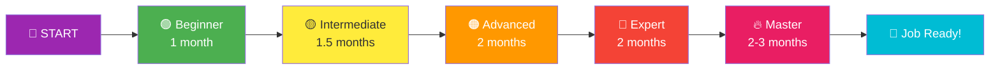

# 🚀 JAVASCRIPT MASTER ROADMAP — Project-Based Learning Path

> **The Complete Hands-On Path: From Zero to Hero through Real Projects**
> Build → Break → Fix → Refactor → Master

---

## 📑 Table of Contents

<a id="roadmap-top"></a>

| Phase | Level                                                        | Projects                                                     |
| ----- | ------------------------------------------------------------ | ------------------------------------------------------------ |
| 🟢 1  | <a href="#phase-1">Beginner — Core JS + DOM</a>              | Calculator, Todo, Color Flipper, Counter, Tip Calculator     |
| 🟡 2  | <a href="#phase-2">Intermediate — Logic + Storage + APIs</a> | Stopwatch, Weather, Notes, Quiz, Currency Converter          |
| 🟠 3  | <a href="#phase-3">Advanced — State + Architecture</a>       | E-Commerce, Login Auth, Dashboard, Movie Search              |
| 🔴 4  | <a href="#phase-4">Expert — System Design</a>                | Chat App, File Manager, Algorithm Visualizer, Code Editor    |
| 🔥 5  | <a href="#phase-5">Master — Industry Projects</a>            | Blog Platform, Netflix Clone, Trello Clone, Real-time Collab |
| 📚 6  | <a href="#bonus">Bonus Topics & Resources</a>                | Testing, Performance, Deployment, Open Source                |

<a href="#roadmap-top">⬆ Back to Top</a>

---

# 🎯 BEFORE YOU START — Pre-Requisites Setup

```
WHAT YOU NEED:
━━━━━━━━━━━━━━

🛠️ TOOLS:
✅ VS Code (with Live Server extension)
✅ Chrome browser (best DevTools)
✅ Git + GitHub account
✅ Node.js installed (for later phases)
✅ Postman (for API testing)

📚 KNOWLEDGE PREREQUISITES (Bare minimum):
✅ HTML basics (tags, attributes, forms)
✅ CSS basics (selectors, flexbox, grid)
✅ Computer fundamentals (files, terminal basics)

⏱️ TIME COMMITMENT:
- Beginner: 2-3 hours/day → 1 month
- Intermediate: 2-3 hours/day → 1.5 months
- Advanced: 3-4 hours/day → 2 months
- Expert: 4 hours/day → 2 months
- Master: Full-time learning → 2-3 months

TOTAL: ~6-9 months from zero to job-ready!
```



---

<a id="phase-1"></a>

# 🟢 PHASE 1 — BEGINNER (Core JS + DOM Basics)

> **Goal:** Master JavaScript fundamentals and DOM manipulation
> **Duration:** 4 weeks | **Projects:** 5

<a href="#roadmap-top">⬆ Back to Top</a>

---

## Project 1: 🧮 Simple Calculator

```
🎯 LEARNING OUTCOMES:
✅ Understand event handling
✅ Master DOM selection
✅ Practice conditional logic
✅ Handle user input

📅 TIME: 4-6 hours
⭐ DIFFICULTY: ★☆☆☆☆
```

### 🛠️ What You Build

A fully functional calculator with +, -, ×, ÷, clear, and decimal point.

### 🪜 Step-by-Step Build Order

```
DAY 1: UI Setup
━━━━━━━━━━━━━━
□ Create HTML structure (display + buttons grid)
□ Style with CSS Grid (4×5 button layout)
□ Add hover effects, button colors
□ Make it responsive

DAY 2: Logic
━━━━━━━━━━━━
□ Capture button clicks with addEventListener
□ Build display string as user types
□ Implement clear (C) function
□ Handle decimal points

DAY 3: Evaluation
━━━━━━━━━━━━━━━━
□ Evaluate expression on "=" press
□ Handle errors (divide by zero)
□ Add keyboard support
□ Polish UI animations
```

### 📚 Topics Covered

```
Core Concepts:
  • Variables (let, const)
  • Operators (+, -, *, /, %)
  • Functions
  • Conditionals (if/else)
  • Template literals

DOM Concepts:
  • document.querySelector
  • addEventListener
  • innerText vs textContent vs innerHTML
  • Element creation/modification
  • Event object (event.target)
```

### 🚀 Stretch Goals (Level Up!)

```
✨ Add scientific functions (sin, cos, sqrt)
✨ Implement history of calculations
✨ Add memory functions (M+, M-, MR, MC)
✨ Create themes (dark/light mode)
✨ Add keyboard shortcuts
✨ Sound effects on button press
```

### 💡 Pro Tips

```
❌ DON'T use eval() — security risk!
✅ DO build your own expression parser
✅ DO handle edge cases (000, .., etc.)
✅ DO learn keyboard event handling
```

---

## Project 2: 📝 To-Do List App

```
🎯 LEARNING OUTCOMES:
✅ Master arrays and array methods
✅ Dynamic DOM rendering
✅ CRUD operations
✅ State management basics

📅 TIME: 6-8 hours
⭐ DIFFICULTY: ★★☆☆☆
```

### 🛠️ What You Build

Add, edit, delete, mark complete tasks with filter (all/active/done).

### 🪜 Step-by-Step Build Order

```
DAY 1: Basic Add/Display
━━━━━━━━━━━━━━━━━━━━━━━
□ Input field + Add button
□ Store tasks in array
□ Render list dynamically
□ Clear input after add

DAY 2: Delete & Edit
━━━━━━━━━━━━━━━━━━━━
□ Delete button on each task
□ Edit task on double-click
□ Save edit on Enter
□ Cancel edit on Escape

DAY 3: Mark Complete + Filter
━━━━━━━━━━━━━━━━━━━━━━━━━━━━
□ Checkbox to mark complete
□ Visual indicator (strikethrough)
□ Filter buttons (All/Active/Completed)
□ Counter (e.g., "3 active tasks")
□ "Clear completed" button
```

### 📚 Topics Covered

```
✅ Array methods: push, splice, filter, map, forEach
✅ Object structure (task = { id, text, done })
✅ Event delegation
✅ Conditional rendering
✅ Form handling & validation
✅ Unique IDs (Date.now())
```

### 🚀 Stretch Goals

```
✨ Drag & drop reorder (HTML5 Drag API)
✨ Due dates with sorting
✨ Categories/tags
✨ Search functionality
✨ Priority levels (low/medium/high)
```

---

## Project 3: 🎨 Color Flipper / Color Palette Generator

```
🎯 LEARNING OUTCOMES:
✅ Math.random() mastery
✅ Style manipulation
✅ Clipboard API

📅 TIME: 3-4 hours
⭐ DIFFICULTY: ★☆☆☆☆
```

### 🪜 Step-by-Step Build Order

```
□ Button to generate random color
□ Apply to background
□ Show HEX/RGB value
□ Copy to clipboard on click
□ History of last 10 colors
□ Generate complete palette (5 colors)
□ Save favorites to localStorage (preview for Phase 2!)
```

### 📚 Topics Covered

```
✅ Math.random(), Math.floor()
✅ String manipulation (HEX conversion)
✅ Clipboard API (navigator.clipboard)
✅ document.body.style
✅ Array slicing for history
```

---

## Project 4: 🔢 Counter App

```
🎯 LEARNING OUTCOMES:
✅ State management basics
✅ Conditional styling
✅ Input validation

📅 TIME: 2-3 hours
⭐ DIFFICULTY: ★☆☆☆☆
```

### 🪜 Step-by-Step Build Order

```
□ Display number (start at 0)
□ Increase/Decrease/Reset buttons
□ Color: green if positive, red if negative, black if zero
□ Custom step size (+/- by 1, 5, 10)
□ Min/Max limits
□ Smooth animations on change
```

---

## Project 5: 💰 Tip Calculator

```
🎯 LEARNING OUTCOMES:
✅ Input event handling (real-time)
✅ Number formatting
✅ Form calculations

📅 TIME: 3-4 hours
⭐ DIFFICULTY: ★★☆☆☆
```

### 🪜 Step-by-Step Build Order

```
□ Input: bill amount, tip percentage, # of people
□ Calculate tip per person
□ Calculate total per person
□ Real-time updates (input event)
□ Preset tip buttons (10%, 15%, 20%)
□ Custom tip input
□ Reset button
□ Format currency (₹1,234.56)
```

---

## 🎓 Phase 1 — Completion Checklist

```
✅ Can manipulate DOM confidently
✅ Comfortable with arrays, objects, functions
✅ Understand event-driven programming
✅ Can handle forms and user input
✅ Use Chrome DevTools (Console, Elements)
✅ Write modular, reusable functions
✅ Use Git for version control
✅ Pushed all projects to GitHub
```

---

<a id="phase-2"></a>

# 🟡 PHASE 2 — INTERMEDIATE (Logic + Storage + APIs)

> **Goal:** Connect to the real world (APIs) and persist data
> **Duration:** 6 weeks | **Projects:** 5

<a href="#roadmap-top">⬆ Back to Top</a>

---

## Project 6: ⏱️ Stopwatch + Pomodoro Timer

```
🎯 LEARNING OUTCOMES:
✅ Master setInterval/setTimeout
✅ Date/time manipulation
✅ Audio integration
✅ Browser notifications

📅 TIME: 5-7 hours
⭐ DIFFICULTY: ★★☆☆☆
```

### 🛠️ What You Build

Multi-feature timer: Stopwatch + Pomodoro (25/5 work/break) + Custom countdown

### 🪜 Step-by-Step Build Order

```
DAY 1: Stopwatch
━━━━━━━━━━━━━━━━
□ Display 00:00:00 (HH:MM:SS)
□ Start/Pause/Reset
□ Lap functionality
□ Save best lap time

DAY 2: Countdown Timer
━━━━━━━━━━━━━━━━━━━━━━
□ Input minutes/seconds
□ Countdown logic
□ Visual progress bar
□ Sound when finished

DAY 3: Pomodoro Mode
━━━━━━━━━━━━━━━━━━━
□ 25-minute work timer
□ 5-minute break timer
□ Long break after 4 cycles
□ Track completed pomodoros
□ Browser notifications
```

### 📚 Topics Covered

```
✅ setInterval, setTimeout, clearInterval
✅ Date object (getTime, etc.)
✅ Audio API (new Audio())
✅ Notification API
✅ Tab title updates
✅ State machines (work/break/idle)
```

---

## Project 7: 🌦️ Weather App (Your First API Project!)

```
🎯 LEARNING OUTCOMES:
✅ Master fetch API
✅ JSON parsing
✅ async/await
✅ Error handling
✅ API key management

📅 TIME: 8-10 hours
⭐ DIFFICULTY: ★★★☆☆
```

### 🛠️ What You Build

Search city → show current weather + 5-day forecast with icons.

### 🪜 Step-by-Step Build Order

```
DAY 1: API Setup
━━━━━━━━━━━━━━━━
□ Sign up at openweathermap.org (free)
□ Get API key
□ Test API in Postman
□ Understand response structure (JSON)

DAY 2: Basic Fetch
━━━━━━━━━━━━━━━━━
□ Search input + button
□ Fetch weather by city name
□ Display: temperature, humidity, condition
□ Show weather icon
□ Loading state while fetching

DAY 3: Advanced Features
━━━━━━━━━━━━━━━━━━━━━━━━
□ 5-day forecast
□ Toggle Celsius/Fahrenheit
□ Get user's location (Geolocation API)
□ Recent searches (localStorage preview!)
□ Error handling (city not found, no internet)
□ Background changes based on weather
```

### 📚 Topics Covered

```
✅ fetch() API
✅ Promises (.then/.catch)
✅ async/await
✅ try/catch error handling
✅ JSON parsing (response.json())
✅ HTTP status codes
✅ Geolocation API
✅ Environment variables (preview)
✅ Dynamic CSS based on data
```

### 🚀 Stretch Goals

```
✨ Hourly forecast graph
✨ Air quality index
✨ UV index warnings
✨ Severe weather alerts
✨ Multiple saved cities (favorites)
✨ Weather map integration
```

---

## Project 8: 📋 Notes App (LocalStorage Master!)

```
🎯 LEARNING OUTCOMES:
✅ localStorage mastery
✅ Data persistence
✅ Search algorithms
✅ Rich text basics

📅 TIME: 8-10 hours
⭐ DIFFICULTY: ★★★☆☆
```

### 🛠️ What You Build

Google Keep clone — create, edit, delete, search, pin, color notes.

### 🪜 Step-by-Step Build Order

```
DAY 1: CRUD
━━━━━━━━━━━
□ Create note (title + content)
□ Display in grid (Masonry layout)
□ Edit on click
□ Delete with confirmation

DAY 2: LocalStorage
━━━━━━━━━━━━━━━━━━
□ Save to localStorage on every change
□ Load notes on page refresh
□ Handle storage quota
□ Export notes as JSON file
□ Import from JSON

DAY 3: Advanced
━━━━━━━━━━━━━━
□ Pin notes (stay on top)
□ Color labels (6 colors)
□ Search functionality
□ Tags system
□ Archive feature
□ Markdown support (bonus)
```

### 📚 Topics Covered

```
✅ localStorage API (setItem, getItem, removeItem)
✅ JSON.stringify / JSON.parse
✅ Data persistence patterns
✅ Search algorithms (filter, includes)
✅ File API (export/import)
✅ Sorting algorithms
✅ Optimistic UI updates
```

---

## Project 9: 🧠 Quiz App (Trivia Master)

```
🎯 LEARNING OUTCOMES:
✅ State management
✅ Game logic
✅ Score tracking
✅ Timer integration

📅 TIME: 8-10 hours
⭐ DIFFICULTY: ★★★☆☆
```

### 🛠️ What You Build

Multi-category trivia quiz with timer, score, and leaderboard.

### 🪜 Step-by-Step Build Order

```
DAY 1: Question Display
━━━━━━━━━━━━━━━━━━━━━━━
□ Use Open Trivia DB API (free!)
□ Display question + 4 options
□ Highlight correct/wrong on click
□ Disable buttons after answer
□ Next question button

DAY 2: Game Flow
━━━━━━━━━━━━━━━
□ Welcome screen (choose category, difficulty)
□ Quiz screen (10 questions)
□ Results screen with score
□ Review answers
□ Play again

DAY 3: Advanced
━━━━━━━━━━━━━━
□ Timer per question (30 sec)
□ Streak bonus (consecutive correct)
□ Difficulty levels (easy/medium/hard)
□ Leaderboard (localStorage)
□ Sound effects
□ Confetti on perfect score
```

### 📚 Topics Covered

```
✅ API integration (Open Trivia DB)
✅ State management (current question, score, etc.)
✅ Conditional rendering (welcome/quiz/results)
✅ Array shuffling algorithm
✅ Timer logic
✅ Game state machines
```

---

## Project 10: 💱 Currency Converter

```
🎯 LEARNING OUTCOMES:
✅ Real-time API calls
✅ Two-way data binding
✅ Country flags integration

📅 TIME: 5-6 hours
⭐ DIFFICULTY: ★★☆☆☆
```

### 🪜 Step-by-Step Build Order

```
□ Two dropdowns (from/to currency)
□ Show flag for each currency
□ Real-time conversion as you type
□ Swap currencies button
□ Show conversion rate
□ Historical chart (bonus)
□ API: exchangerate-api.com
```

---

## 🎓 Phase 2 — Completion Checklist

```
✅ Comfortable with fetch and APIs
✅ Master async/await
✅ Handle errors gracefully
✅ Use localStorage for persistence
✅ Manage application state
✅ Read API documentation
✅ Test APIs in Postman
✅ Deploy to Netlify/Vercel
```

---

<a id="phase-3"></a>

# 🟠 PHASE 3 — ADVANCED (State + Architecture)

> **Goal:** Build complex apps with proper architecture
> **Duration:** 8 weeks | **Projects:** 5

<a href="#roadmap-top">⬆ Back to Top</a>

---

## Project 11: 🛒 E-Commerce Cart System

```
🎯 LEARNING OUTCOMES:
✅ Complex state management
✅ Multiple data flows
✅ Search & filter algorithms
✅ Checkout logic

📅 TIME: 15-20 hours
⭐ DIFFICULTY: ★★★★☆
```

### 🛠️ What You Build

Mini Amazon — product list, cart, wishlist, checkout, order history.

### 🪜 Step-by-Step Build Order

```
WEEK 1: Product Display
━━━━━━━━━━━━━━━━━━━━━━━
□ Fetch products from fakestoreapi.com
□ Display in responsive grid
□ Product detail page
□ Category filter
□ Search bar
□ Sort by price/rating
□ Pagination

WEEK 2: Cart Logic
━━━━━━━━━━━━━━━━━━
□ Add to cart
□ Update quantity
□ Remove from cart
□ Cart icon with count
□ Cart sidebar/page
□ Calculate subtotal, tax, total
□ Persist cart in localStorage

WEEK 3: Checkout & Extras
━━━━━━━━━━━━━━━━━━━━━━━━
□ Wishlist feature
□ Checkout form (address, payment)
□ Order confirmation page
□ Order history
□ Promo code system
□ Empty cart state
□ Loading skeletons
```

### 📚 Topics Covered

```
✅ Complex state (cart, wishlist, user)
✅ Array methods: map, filter, reduce, find
✅ Algorithmic thinking (price calculations)
✅ Module pattern / file organization
✅ Form validation
✅ Event delegation
✅ Performance (debouncing search)
```

### 🚀 Stretch Goals

```
✨ Product reviews & ratings
✨ Image gallery with zoom
✨ Recently viewed
✨ Recommendations
✨ Compare products
✨ Multi-currency support
```

---

## Project 12: 🔐 Login/Signup System (Frontend Auth Mock)

```
🎯 LEARNING OUTCOMES:
✅ Form validation mastery
✅ Auth flow understanding
✅ JWT tokens basics
✅ Protected routes

📅 TIME: 12-15 hours
⭐ DIFFICULTY: ★★★★☆
```

### 🪜 Step-by-Step Build Order

```
□ Signup form with validation
  - Email regex check
  - Password strength meter
  - Confirm password match
□ Login form
  - Remember me
  - Forgot password (mock)
□ Hash passwords (use bcryptjs CDN or simple base64 for demo)
□ Store in localStorage (or use mock API like reqres.in)
□ Auth state management
□ Protected pages (redirect if not logged in)
□ User profile page
□ Logout
□ Session timeout
```

### 📚 Topics Covered

```
✅ Form validation (regex, real-time)
✅ Password hashing concepts
✅ JWT token structure
✅ Session management
✅ Route protection
✅ Auth headers
✅ Security best practices
✅ Toast notifications
```

---

## Project 13: 📊 Admin Dashboard (Analytics)

```
🎯 LEARNING OUTCOMES:
✅ Data visualization
✅ Chart libraries
✅ Real-time updates
✅ Multi-API integration

📅 TIME: 20-25 hours
⭐ DIFFICULTY: ★★★★☆
```

### 🪜 Step-by-Step Build Order

```
WEEK 1: Layout
━━━━━━━━━━━━━
□ Sidebar navigation
□ Top header (search, profile, notifications)
□ Responsive layout (mobile menu)
□ Dark/light mode toggle

WEEK 2: Stats & Charts
━━━━━━━━━━━━━━━━━━━━━━
□ Stat cards (users, revenue, orders)
□ Line chart (Chart.js or ApexCharts)
□ Bar chart, pie chart
□ Data table with sorting/filtering
□ Date range picker

WEEK 3: Features
━━━━━━━━━━━━━━━
□ Multi-page (Dashboard, Users, Orders, Settings)
□ CRUD on users table
□ Export to CSV/PDF
□ Real-time updates (polling)
□ Notifications dropdown
□ Activity feed
```

### 📚 Topics Covered

```
✅ Chart.js / ApexCharts integration
✅ Data transformation for charts
✅ Table sorting/filtering algorithms
✅ Pagination
✅ Date handling (date-fns library)
✅ CSV/PDF generation
✅ SPA routing concepts
```

---

## Project 14: 🎬 Movie Search App (TMDB API)

```
🎯 LEARNING OUTCOMES:
✅ Complex API integration
✅ Infinite scroll
✅ Image lazy loading
✅ Modal patterns

📅 TIME: 12-15 hours
⭐ DIFFICULTY: ★★★☆☆
```

### 🪜 Step-by-Step Build Order

```
□ TMDB API setup (free)
□ Display trending movies
□ Search with debounce
□ Movie cards with poster, rating
□ Click for details modal
□ Trailer player (YouTube embed)
□ Cast & crew info
□ Similar movies
□ Infinite scroll
□ Lazy load images
□ Genres filter
□ Watchlist (localStorage)
```

---

## Project 15: 📅 Calendar / Event Planner

```
🎯 LEARNING OUTCOMES:
✅ Complex date logic
✅ Drag & drop
✅ Recurring events

📅 TIME: 18-20 hours
⭐ DIFFICULTY: ★★★★☆
```

### 🪜 Step-by-Step Build Order

```
□ Monthly calendar grid
□ Navigate months
□ Add event on date click
□ Event details modal
□ Multiple views (month/week/day)
□ Drag events to reschedule
□ Recurring events (weekly, monthly)
□ Reminders (notifications)
□ Color-coded categories
□ Sync with Google Calendar (bonus)
```

---

## 🎓 Phase 3 — Completion Checklist

```
✅ Build complex multi-page apps
✅ Manage complex state
✅ Integrate multiple APIs
✅ Use data visualization libraries
✅ Implement authentication flows
✅ Optimize performance (debounce, lazy load)
✅ Write clean, modular code
✅ Use Git branches effectively
```

---

<a id="phase-4"></a>

# 🔴 PHASE 4 — EXPERT (System Design + Algorithms)

> **Goal:** Build production-grade systems
> **Duration:** 8 weeks | **Projects:** 4

<a href="#roadmap-top">⬆ Back to Top</a>

---

## Project 16: 💬 Real-Time Chat App

```
🎯 LEARNING OUTCOMES:
✅ WebSocket protocol
✅ Real-time communication
✅ Event-driven architecture

📅 TIME: 20-25 hours
⭐ DIFFICULTY: ★★★★★
```

### 🛠️ What You Build

WhatsApp-like chat with real-time messages, typing indicators, online status.

### 🪜 Step-by-Step Build Order

```
WEEK 1: Frontend
━━━━━━━━━━━━━━━
□ Chat list sidebar
□ Message bubbles (sent/received)
□ Input with send button
□ Emoji picker
□ File attachment

WEEK 2: WebSocket Integration
━━━━━━━━━━━━━━━━━━━━━━━━━━━━━
□ Use socket.io-client
□ Connect to free WebSocket server
□ Send/receive messages real-time
□ Typing indicator
□ Online/offline status
□ Read receipts
□ Multiple chat rooms

WEEK 3: Backend (Node.js)
━━━━━━━━━━━━━━━━━━━━━━━━
□ Express + socket.io server
□ User authentication
□ Message persistence (file/DB)
□ Private messaging
□ Group chats
□ Deploy to Railway/Render
```

### 📚 Topics Covered

```
✅ WebSocket protocol
✅ socket.io (client + server)
✅ Event-driven architecture
✅ Node.js basics
✅ Express.js
✅ Real-time state sync
✅ Optimistic UI updates
✅ Reconnection logic
```

---

## Project 17: 📁 File Manager (Mini OS)

```
🎯 LEARNING OUTCOMES:
✅ Recursion mastery
✅ Tree data structures
✅ Nested object handling

📅 TIME: 15-18 hours
⭐ DIFFICULTY: ★★★★★
```

### 🪜 Step-by-Step Build Order

```
□ Tree view (folders/files)
□ Expand/collapse folders
□ Create folder/file
□ Rename
□ Delete (with confirmation)
□ Drag & drop to move
□ Copy/cut/paste
□ Search across all
□ Breadcrumb navigation
□ Right-click context menu
□ File preview (images, text)
□ Upload/download (mock)
```

### 📚 Topics Covered

```
✅ Recursion (rendering tree)
✅ Tree traversal algorithms
✅ Deep cloning
✅ Path manipulation
✅ Drag & drop API
✅ Context menu API
✅ File API (read files)
```

---

## Project 18: 🧠 Algorithm Visualizer

```
🎯 LEARNING OUTCOMES:
✅ Algorithms mastery
✅ Animation logic
✅ Canvas/SVG drawing

📅 TIME: 20-25 hours
⭐ DIFFICULTY: ★★★★★
```

### 🪜 Step-by-Step Build Order

```
PART 1: Sorting Algorithms
━━━━━━━━━━━━━━━━━━━━━━━━━
□ Bubble sort visualization
□ Selection sort
□ Insertion sort
□ Merge sort
□ Quick sort
□ Speed control
□ Array size slider
□ Show comparisons/swaps count

PART 2: Pathfinding
━━━━━━━━━━━━━━━━━━━
□ Grid-based maze
□ Place start/end points
□ Draw walls
□ BFS visualization
□ DFS visualization
□ Dijkstra's algorithm
□ A* algorithm

PART 3: Other
━━━━━━━━━━━━━
□ Binary search tree operations
□ Graph algorithms
□ Recursion visualizer
```

---

## Project 19: 📝 Code Editor (Mini VS Code)

```
🎯 LEARNING OUTCOMES:
✅ Syntax highlighting
✅ Multi-file management
✅ Auto-complete logic

📅 TIME: 15-20 hours
⭐ DIFFICULTY: ★★★★★
```

### 🪜 Step-by-Step Build Order

```
□ Use Monaco Editor (VS Code's editor)
□ Or CodeMirror
□ Multi-tab interface
□ File explorer sidebar
□ Run HTML/CSS/JS (like CodePen)
□ Live preview iframe
□ Save snippets
□ Themes
□ Export as ZIP
□ Embed shareable link
```

---

## 🎓 Phase 4 — Completion Checklist

```
✅ Built a real-time application
✅ Used WebSockets/Server-Sent Events
✅ Implemented complex algorithms
✅ Created reusable component patterns
✅ Optimized for performance
✅ Used Canvas or SVG
✅ Deployed full-stack apps
```

---

<a id="phase-5"></a>

# 🔥 PHASE 5 — MASTER LEVEL (Industry Projects)

> **Goal:** Build portfolio-grade projects that get you hired
> **Duration:** 12 weeks | **Projects:** 4

<a href="#roadmap-top">⬆ Back to Top</a>

---

## Project 20: 📰 Full-Stack Blog Platform (Medium Clone)

```
🎯 LEARNING OUTCOMES:
✅ Full-stack development
✅ Database design
✅ SEO basics
✅ Image uploads

📅 TIME: 40-50 hours
⭐ DIFFICULTY: ★★★★★
```

### 🛠️ Tech Stack

```
Frontend: Vanilla JS or React
Backend: Node.js + Express
Database: MongoDB / PostgreSQL
Auth: JWT
Deployment: Vercel + Railway
```

### 🪜 Build Order

```
WEEK 1-2: Backend
━━━━━━━━━━━━━━━━━
□ User auth (signup, login, JWT)
□ Posts CRUD (create, read, update, delete)
□ Comments system
□ Likes/bookmarks
□ Follow users
□ Image uploads (Cloudinary)

WEEK 3-4: Frontend
━━━━━━━━━━━━━━━━━━
□ Homepage with feed
□ Post detail page
□ Markdown editor
□ User profile
□ Search & filters
□ Categories/tags
□ Reading time estimate
□ Dark mode
□ Responsive design

WEEK 5: Polish
━━━━━━━━━━━━━━
□ SEO optimization
□ Meta tags for sharing
□ Sitemap
□ Performance optimization
□ Deploy to production
```

---

## Project 21: 🎥 Netflix Clone

```
🎯 LEARNING OUTCOMES:
✅ Video streaming basics
✅ Subscription logic
✅ Complex UI/UX

📅 TIME: 50-60 hours
⭐ DIFFICULTY: ★★★★★
```

### 🪜 Build Order

```
□ Landing page with hero video
□ Sign up / login
□ Subscription plans
□ Browse page with categories
□ Carousels (slider rows)
□ Hover preview
□ Detail page (trailer, info, similar)
□ Video player (Plyr / Video.js)
□ Watch history
□ Continue watching
□ My list
□ Search
□ Profiles (multiple per account)
□ Mobile responsive
```

---

## Project 22: 📋 Trello Clone (Project Management)

```
🎯 LEARNING OUTCOMES:
✅ Drag & drop mastery
✅ Real-time collaboration
✅ Complex state sync

📅 TIME: 40-50 hours
⭐ DIFFICULTY: ★★★★★
```

### 🪜 Build Order

```
□ Boards, lists, cards
□ Drag cards between lists
□ Drag lists to reorder
□ Card details modal
□ Add labels, due dates, checklists
□ Member invites
□ Real-time updates (WebSocket)
□ Comments & activity log
□ File attachments
□ Notifications
□ Multiple boards
□ Templates
```

---

## Project 23: 🎮 Multiplayer Game (Tic-Tac-Toe / Chess)

```
🎯 LEARNING OUTCOMES:
✅ Real-time game state
✅ Game logic algorithms
✅ Matchmaking

📅 TIME: 30-40 hours
⭐ DIFFICULTY: ★★★★★
```

### 🪜 Build Order

```
□ Game board UI
□ Local 2-player mode
□ AI opponent (Minimax algorithm)
□ Difficulty levels (easy/medium/hard)
□ Online multiplayer (WebSocket)
□ Matchmaking system
□ Spectator mode
□ Game history
□ Leaderboard
□ Chat during game
```

---

## 🎓 Phase 5 — Completion Checklist

```
✅ Built 3+ portfolio-grade projects
✅ Deployed full-stack applications
✅ Used databases (MongoDB/SQL)
✅ Implemented authentication
✅ Optimized for production
✅ Written documentation
✅ Open-sourced on GitHub
✅ Created project demos/videos
```

---

<a id="bonus"></a>

# 📚 BONUS — Essential Topics Often Missed

<a href="#roadmap-top">⬆ Back to Top</a>

---

## 🧪 Testing (Add to Each Phase)

```
Phase 2: Manual testing with browser
Phase 3: Console.assert, basic unit tests
Phase 4: Jest, Vitest for unit tests
Phase 5: Cypress, Playwright for E2E
```

### Practice Project

```
Build a calculator → Write 50+ tests for it
- Test addition, subtraction, edge cases
- Test divide by zero
- Test invalid inputs
- Test UI interactions
```

---

## ⚡ Performance Optimization

```
TOPICS TO LEARN:
✅ Debouncing & throttling
✅ Lazy loading (images, modules)
✅ Code splitting
✅ Memoization
✅ Virtual scrolling (long lists)
✅ Web Workers (heavy computation)
✅ Service Workers (PWA)
✅ Lighthouse audits
✅ Bundle optimization
```

### Practice Project

```
Take your E-Commerce app → Optimize it
- Score 90+ on Lighthouse
- Reduce bundle size by 50%
- Implement lazy loading
- Add PWA features (installable)
```

---

## 🛠️ Build Tools & Modern JS

```
LEVEL 1: npm basics
LEVEL 2: package.json
LEVEL 3: Vite / Webpack
LEVEL 4: Babel, TypeScript
LEVEL 5: Module bundling, tree shaking
```

### Practice Project

```
Convert any old project to Vite + TypeScript
- Setup TypeScript
- Add type definitions
- Use ESLint + Prettier
- Setup hot reload
```

---

## 🎨 CSS Frameworks (Speed Up Development)

```
RECOMMENDED ORDER:
1. Tailwind CSS (utility-first)
2. Bootstrap (component-based)
3. Material UI / Chakra (React)
```

---

## 🌐 Deployment Platforms

| Platform          | Use Case            | Free?        |
| ----------------- | ------------------- | ------------ |
| **Netlify**       | Static sites, SPAs  | ✅ Yes       |
| **Vercel**        | Next.js, frontend   | ✅ Yes       |
| **Render**        | Full-stack, Node.js | ✅ Yes       |
| **Railway**       | Databases, backend  | ✅ Free tier |
| **MongoDB Atlas** | Database            | ✅ Free tier |
| **Firebase**      | Auth, DB, hosting   | ✅ Free tier |
| **Cloudinary**    | Images, videos      | ✅ Free tier |

---

## 🤝 Open Source Contribution Path

```
MONTH 1: Find & fix typos in READMEs
MONTH 2: Fix beginner-friendly issues
MONTH 3: Add small features
MONTH 4: Contribute to bigger projects

WHERE TO START:
🔗 goodfirstissue.dev
🔗 up-for-grabs.net
🔗 firsttimersonly.com
🔗 GitHub: label "good first issue"
```

---

## 💼 Job-Ready Skills (Phase 5 Parallel)

```
TECHNICAL:
✅ Solve 100 LeetCode (easy/medium) problems
✅ Learn React or Vue framework
✅ Understand REST API design
✅ Basic SQL knowledge
✅ Git advanced (rebase, cherry-pick)

SOFT SKILLS:
✅ Build a portfolio website
✅ Write technical blog posts
✅ Create LinkedIn presence
✅ Practice mock interviews
✅ Contribute to open source
✅ Make YouTube tutorials
```

---

# 💡 GOLDEN RULES FOR PROJECT-BASED LEARNING

```
╔══════════════════════════════════════════════════════════════╗
║                                                              ║
║   🎯 RULE 1: BUILD FIRST, TUTORIAL LATER                    ║
║   Try → Get stuck → Google → Fix → Then watch tutorial      ║
║                                                              ║
║   🎯 RULE 2: COMMIT EVERY DAY                               ║
║   Even if it's just 1 line of code on GitHub                ║
║                                                              ║
║   🎯 RULE 3: SHARE YOUR WORK                                ║
║   Tweet, LinkedIn post, blog post — get feedback            ║
║                                                              ║
║   🎯 RULE 4: REBUILD WHAT YOU LEARN                         ║
║   Build the same project 3 times with improvements          ║
║                                                              ║
║   🎯 RULE 5: TEACH OTHERS                                   ║
║   Make YouTube videos / blog posts about what you build     ║
║                                                              ║
║   🎯 RULE 6: DON'T COPY CODE                                ║
║   Read, understand, then type it yourself                   ║
║                                                              ║
║   🎯 RULE 7: READ DOCUMENTATION                             ║
║   MDN > YouTube > Stack Overflow for learning               ║
║                                                              ║
║   🎯 RULE 8: BUILD IN PUBLIC                                ║
║   Share your journey — accountability + network             ║
║                                                              ║
╚══════════════════════════════════════════════════════════════╝
```

---

# 📊 PROGRESS TRACKER TEMPLATE

```markdown
## My JavaScript Journey

### Phase 1: Beginner ✅ / ⏳ / ⬜

- [ ] Calculator
- [ ] Todo List
- [ ] Color Flipper
- [ ] Counter
- [ ] Tip Calculator

### Phase 2: Intermediate ⬜

- [ ] Stopwatch
- [ ] Weather App
- [ ] Notes App
- [ ] Quiz App
- [ ] Currency Converter

### Phase 3: Advanced ⬜

- [ ] E-Commerce
- [ ] Login System
- [ ] Dashboard
- [ ] Movie Search
- [ ] Calendar

### Phase 4: Expert ⬜

- [ ] Chat App
- [ ] File Manager
- [ ] Algorithm Visualizer
- [ ] Code Editor

### Phase 5: Master ⬜

- [ ] Blog Platform
- [ ] Netflix Clone
- [ ] Trello Clone
- [ ] Multiplayer Game
```

---

# 🎁 FINAL MOTIVATION

```
"Don't watch 100 tutorials and build nothing.
 Watch 5 tutorials and build 50 projects."

"Code every day, even if it's just 30 minutes.
 Consistency > Intensity"

"Your 50th project will be amazing.
 The first 49 are practice. Start NOW."

🚀 You don't need to be great to start.
   You need to start to be great. 🚀
```

---

## 🏁 Your Action Plan for TODAY

```
✅ Pick Phase 1, Project 1 (Calculator)
✅ Don't watch any tutorial yet
✅ Open VS Code
✅ Create index.html, style.css, app.js
✅ Start building for 1 hour
✅ Get stuck — that's GOOD!
✅ Push to GitHub at end of day
✅ Tweet about your progress
✅ Repeat tomorrow

THE BEST TIME TO START WAS YESTERDAY.
THE SECOND BEST TIME IS NOW. 🔥
```

---

<a href="#roadmap-top">⬆ Back to Top</a>
