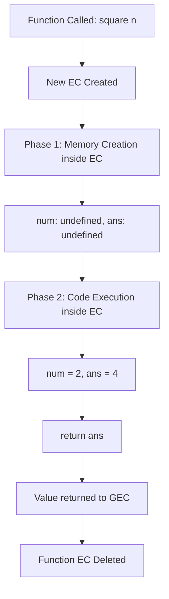

# 🚀 JavaScript Deep Dive Notes - Section 1A: Execution Context & Call Stack <a id="section-1a-top"></a>

## 📑 Table of Contents
<a id="section-1a-toc"></a>

- <a href="#what-is-execution-context">1A.1 What is Execution Context?</a>
- <a href="#where-does-ec-lie">1A.2 Where Does Execution Context Lie?</a>
- <a href="#variable-environment">1A.3 Variable Environment of Execution Context</a>
- <a href="#single-threaded">1A.4 JavaScript is Synchronous Single-Threaded</a>
- <a href="#two-phases">1A.5 Two Phases of Execution Context</a>
  - <a href="#memory-creation-phase">Memory Creation Phase</a>
  - <a href="#code-execution-phase">Code Execution Phase</a>
- <a href="#phase1-diagram">1A.6 Phase 1 Diagram (Memory Creation)</a>
- <a href="#phase2-diagram">1A.7 Phase 2 Diagram (Code Execution + Function EC)</a>
- <a href="#gec">1A.8 Global Execution Context (GEC)</a>
- <a href="#function-invocation">1A.9 What Happens When a Function is Invoked?</a>
- <a href="#return-keyword">1A.10 What Does the `return` Keyword Do?</a>
- <a href="#call-stack">1A.11 What is the Call Stack?</a>
- <a href="#where-everything-lies">1A.12 Where Does Everything Live? (Master Diagram)</a>
- <a href="#interview-cheatsheet-1a">1A.13 Interview Cheat Sheet</a>

<a href="#section-1a-top">⬆ Back to Top</a>

---

## <a id="what-is-execution-context"></a>1A.1 What is Execution Context?

> **The most important concept in all of JavaScript.**  
> Everything in JavaScript happens *inside* an Execution Context.

An **Execution Context** is like a **box / container** that holds all the information needed to run a piece of JavaScript code.

Think of it as:
```
┌────────────────────────────────────────┐
│         EXECUTION CONTEXT             │
│                                        │
│  ┌─────────────────┬────────────────┐  │
│  │    MEMORY       │     CODE       │  │
│  │  (Variable Env) │  (Thread of    │  │
│  │                 │   Execution)   │  │
│  │  key: value     │                │  │
│  │  fn: {...}      │  line by line  │  │
│  └─────────────────┴────────────────┘  │
└────────────────────────────────────────┘
```

**Two components:**

| Component | Also Called | What It Stores |
|---|---|---|
| Memory | Variable Environment | Variables, functions as key-value pairs |
| Code | Thread of Execution | Executes code line by line |

<a href="#section-1a-toc">⬅ Back to TOC</a> | <a href="#section-1a-top">⬆ Back to Top</a>

---

## <a id="where-does-ec-lie"></a>1A.2 Where Does Execution Context Lie?

This is the **big picture** — where does everything physically live?

```
YOUR COMPUTER
┌─────────────────────────────────────────────────────────┐
│                         RAM                             │
│                                                         │
│  ┌───────────────────────────────────────────────────┐  │
│  │              JAVASCRIPT RUNTIME                   │  │
│  │                                                   │  │
│  │  ┌─────────────────────┐  ┌────────────────────┐  │  │
│  │  │    CALL STACK       │  │       HEAP         │  │  │
│  │  │                     │  │                    │  │  │
│  │  │ ┌─────────────────┐ │  │  Objects           │  │  │
│  │  │ │ Function EC     │ │  │  Arrays            │  │  │
│  │  │ ├─────────────────┤ │  │  Closures          │  │  │
│  │  │ │ Global EC (GEC) │ │  │                    │  │  │
│  │  │ └─────────────────┘ │  └────────────────────┘  │  │
│  │  │                     │                           │  │
│  │  └���────────────────────┘                           │  │
│  └───────────────────────────────────────────────────┘  │
└─────────────────────────────────────────────────────────┘
```

**Key insight**:
- **Execution Contexts live inside the Call Stack**
- **Call Stack lives inside RAM**
- **Objects/Arrays live in the Heap (also in RAM)**

<a href="#section-1a-toc">⬅ Back to TOC</a> | <a href="#section-1a-top">⬆ Back to Top</a>

---

## <a id="variable-environment"></a>1A.3 Variable Environment of Execution Context

The **Memory Component** (Variable Environment) stores everything as **key-value pairs**:

```
┌─────────────────────────────────────────┐
│          EXECUTION CONTEXT              │
├─────────────────────┬───────────────────┤
│       MEMORY        │       CODE        │
│  (Variable Env)     │ (Thread of Exec)  │
├─────────────────────┼───────────────────┤
│  n     → undefined  │                   │
│  square→ {...}      │  ← runs here      │
│  square2→ undefined │     line by line  │
│  square4→ undefined │                   │
└─────────────────────┴───────────────────┘
```

> **Interview Answer**: The Variable Environment is the memory space inside an Execution Context where all variables and functions are stored as key-value pairs *before* the code runs.

<a href="#section-1a-toc">⬅ Back to TOC</a> | <a href="#section-1a-top">⬆ Back to Top</a>

---

## <a id="single-threaded"></a>1A.4 JavaScript is Synchronous Single-Threaded

```
┌──────────────────────────────────────────────────┐
│           JAVASCRIPT ENGINE                      │
│                                                  │
│   ONE THREAD                                     │
│   ──────────────────────────────────────────►   │
│   Line 1 → Line 2 → Line 3 → Line 4 ...         │
│                                                  │
│   ✅ One command at a time                        │
│   ✅ In a specific order                          │
│   ✅ Cannot do two things simultaneously          │
└──────────────────────────────────────────────────┘
```

| Term | Meaning |
|---|---|
| **Single-Threaded** | Only ONE thread of execution (one command at a time) |
| **Synchronous** | Executes in a specific sequential order — next line runs only after current line finishes |

> **Interview Answer**: JavaScript is single-threaded because it has only one Call Stack. It is synchronous because it executes one line at a time in order. Asynchronous behavior (setTimeout, fetch) is handled by the Browser/Node APIs + Event Loop — not by changing the thread.

<a href="#section-1a-toc">⬅ Back to TOC</a> | <a href="#section-1a-top">⬆ Back to Top</a>

---

## <a id="two-phases"></a>1A.5 Two Phases of Execution Context

When JavaScript runs your code, it goes through **exactly 2 phases**:

```
┌─────────────────────────────────────────────────────────┐
│              EXECUTION CONTEXT LIFECYCLE                │
│                                                         │
│   PHASE 1                      PHASE 2                  │
│  ┌──────────────────┐         ┌──────────────────────┐  │
│  │  MEMORY CREATION │   then  │   CODE EXECUTION     │  │
│  │      PHASE       │  ────►  │       PHASE          │  │
│  │                  │         │                      │  │
│  │ Scan all code    │         │ Execute line by line │  │
│  │ Store variables  │         │ Assign real values   │  │
│  │ as undefined     │         │ Invoke functions     │  │
│  │ Store functions  │         │                      │  │
│  │ as full code     │         │                      │  │
│  └──────────────────┘         └──────────────────────┘  │
└─────────────────────────────────────────────────────────┘
```

**Code used for all examples:**
```javascript
var n = 2;

function square(num) {
  var ans = num * num;
  return ans;
}

var square2 = square(n);
var square4 = square(4);
```

---

### <a id="memory-creation-phase"></a>Phase 1: Memory Creation Phase

JavaScript **scans the entire code first** before running anything:

```
┌──────────────────────────────────────────────┐
│        PHASE 1: MEMORY CREATION              │
│        Global Execution Context              │
│                                              │
│  ┌─────────────────────┬──────────────────┐  │
│  │      MEMORY         │      CODE        │  │
│  ├─────────────────────┼──────────────────┤  │
│  │  n      → undefined │                  │  │
│  │  square → { ... }   │  (empty for now) │  │
│  │  square2→ undefined │                  │  │
│  │  square4→ undefined │                  │  │
│  └─────────────────────┴──────────────────┘  │
└──────────────────────────────────────────────┘
```

**Rules during Phase 1:**
- `var` variables → stored as `undefined`
- `function` declarations → stored as the **entire function body**
- `let`/`const` → stored in **Temporal Dead Zone** (TDZ)

---

### <a id="code-execution-phase"></a>Phase 2: Code Execution Phase

Now JS runs the code **line by line**:

```
Line 1: var n = 2;
        ↓ Memory updates: n → 2

Line 2-5: function square(...)
        ↓ Already stored in Phase 1, skip

Line 6: var square2 = square(n);
        ↓ New Execution Context created for square()!

Line 7: var square4 = square(4);
        ↓ Another new Execution Context created!
```

<a href="#section-1a-toc">⬅ Back to TOC</a> | <a href="#section-1a-top">⬆ Back to Top</a>

---

## <a id="phase1-diagram"></a>1A.6 Phase 1 Diagram — Memory Creation (From Image)

This exactly matches what you see in the image:

```
┌────────────────────────────────────────────────────┐
│          GLOBAL EXECUTION CONTEXT                  │
│             PHASE 1: Memory Creation               │
│                                                    │
│  ┌───────────────────────┬──────────────────────┐  │
│  │        MEMORY         │        CODE          │  │
│  ├───────────────────────┼──────────────────────┤  │
│  │                       │                      │  │
│  │  n       : undefined  │                      │  │
│  │                       │                      │  │
│  │  square  : { ... }    │   (not running yet)  │  │
│  │                       │                      │  │
│  │  square2 : undefined  │                      │  │
│  │                       │                      │  │
│  │  square4 : undefined  │                      │  │
│  │                       │                      │  │
│  └───────────────────────┴──────────────────────┘  │
└────────────────────────────────────────────────────┘

Code being processed:
  Line 1: var n = 2          → n: undefined
  Line 2: function square()  → square: {full code}
  Line 6: var square2        → square2: undefined
  Line 7: var square4        → square4: undefined
```

<a href="#section-1a-toc">⬅ Back to TOC</a> | <a href="#section-1a-top">⬆ Back to Top</a>

---

## <a id="phase2-diagram"></a>1A.7 Phase 2 Diagram — Code Execution + Function EC (From Image)

This exactly matches the second image (nested execution contexts):

```
┌────────────────────────────────────────────────────────────────┐
│                  GLOBAL EXECUTION CONTEXT                      │
│                   PHASE 2: Code Execution                      │
│                                                                │
│  ┌─────────────────────┬────────────────────────────────────┐  │
│  │       MEMORY        │              CODE                  │  │
│  ├─────────────────────┼────────────────────────────────────┤  │
│  │  n       : 2        │                                    │  │
│  │  square  : {...}    │  ┌──────────────────────────────┐  │  │
│  │  square2 : 4        │  │  Function EC for square(n)   │  │  │
│  │  square4 : undefined│  │  ┌───────────┬────────────┐  │  │  │
│  │                     │  │  │  MEMORY   │    CODE    │  │  │  │
│  │                     │  │  ├───────────┼────────────┤  │  │  │
│  │                     │  │  │ num: 2    │ return ans │  │  │  │
│  │                     │  │  │ ans: 4    │            │  │  │  │
│  │                     │  │  └───────────┴────────────┘  │  │  │
│  │                     │  └──────────────────────────────┘  │  │
│  │                     │                                    │  │
│  │                     │  ┌──────────────────────────────┐  │  │
│  │                     │  │  Function EC for square(4)   │  │  │
│  │  square4 : 16       │  │  ┌───────────┬────────────┐  │  │  │
│  │                     │  │  │  MEMORY   │    CODE    │  │  │  │
│  │                     │  │  ├───────────┼────────────┤  │  │  │
│  │                     │  │  │ num: 4    │ return ans │  │  │  │
│  │                     │  │  │ ans: 16   │            │  │  │  │
│  │                     │  │  └───────────┴────────────┘  │  │  │
│  │                     │  └──────────────────────────────┘  │  │
│  └─────────────────────┴────────────────────────────────────┘  │
└────────────────────────────────────────────────────────────────┘
```

<a href="#section-1a-toc">⬅ Back to TOC</a> | <a href="#section-1a-top">⬆ Back to Top</a>

---

## <a id="gec"></a>1A.8 Global Execution Context (GEC)

The **Global Execution Context** is the very first EC created when JavaScript starts running.

```
┌─────────────────────────────────────────────────┐
│              JAVASCRIPT RUNTIME                 │
│                                                 │
│  ┌───────────────────────────────────────────┐  │
│  │         CALL STACK                        │  │
│  │                                           │  │
│  │  ┌─────────────────────────────────────┐  │  │
│  │  │     GLOBAL EXECUTION CONTEXT        │  │  │
│  │  │  (Created automatically by JS)      │  │  │
│  │  │                                     │  │  │
│  │  │  • Created when JS file runs        │  │  │
│  │  │  • window/globalThis bound here     │  │  │
│  │  │  • Only ONE GEC per program         │  │  │
│  │  │  • Destroyed when program ends      │  │  │
│  │  └─────────────────────────────────────┘  │  │
│  └───────────────────────────────────────────┘  │
└─────────────────────────────────────────────────┘
```

> **Interview Answer**: The Global Execution Context is automatically created by JavaScript before any code runs. In browsers, it also creates the `window` object and sets `this = window`. There is only ONE Global EC per JavaScript program.

<a href="#section-1a-toc">⬅ Back to TOC</a> | <a href="#section-1a-top">⬆ Back to Top</a>

---

## <a id="function-invocation"></a>1A.9 What Happens When a Function is Invoked?

Every time a function is called, a **brand new Execution Context** is created:

```
Step 1: square(n) is called
        ↓
Step 2: Brand new EC created for square()
        ↓
Step 3: Phase 1 (Memory) runs inside new EC
        → num: undefined
        → ans: undefined
        ↓
Step 4: Phase 2 (Code) runs inside new EC
        → num = 2 (argument passed)
        → ans = 2 * 2 = 4
        ↓
Step 5: return ans
        → Returns value to GEC
        → square2 = 4 in GEC memory
        ↓
Step 6: Function EC is DELETED
```



<a href="#section-1a-toc">⬅ Back to TOC</a> | <a href="#section-1a-top">⬆ Back to Top</a>

---

## <a id="return-keyword"></a>1A.10 What Does the `return` Keyword Do?

```javascript
function square(num) {
  var ans = num * num;
  return ans;       // ← What does this do?
}
```

```
┌─────────────────────────────────────────────────┐
│           WHAT return DOES                      │
│                                                 │
│  1. Takes the value of ans                      │
│                                                 │
│  2. Hands it back to whoever called this fn     │
│                                                 │
│  3. DESTROYS the entire function EC             │
│     (memory freed, EC removed from Call Stack)  │
│                                                 │
│  4. Control goes back to GEC                    │
│     where square2 = (returned value)            │
└─────────────────────────────────────────────────┘
```

> **Interview Answer**: The `return` keyword does 3 things:
> 1. Returns a value back to the calling context
> 2. Stops execution of the current function
> 3. Destroys the function's Execution Context — it is popped off the Call Stack

<a href="#section-1a-toc">⬅ Back to TOC</a> | <a href="#section-1a-top">⬆ Back to Top</a>

---

## <a id="call-stack"></a>1A.11 What is the Call Stack?

The **Call Stack** manages the ORDER of execution of all Execution Contexts.

```
CALL STACK (for our square example)
─────────────────────────────────────────────────

STEP 1: Program starts
┌─────────────────┐
│      GEC        │  ← GEC pushed first
└─────────────────┘

STEP 2: square(n) called (Line 6)
┌─────────────────┐
│  EC: square(n)  │  ← Pushed on top
├─────────────────┤
│      GEC        │
└─────────────────┘

STEP 3: square(n) returns
┌─────────────────┐
│      GEC        │  ← EC for square(n) popped
└─────────────────┘

STEP 4: square(4) called (Line 7)
┌─────────────────┐
│  EC: square(4)  │  ← New EC pushed
├─────────────────┤
│      GEC        │
└─────────────────┘

STEP 5: square(4) returns
┌─────────────────┐
│      GEC        │  ← EC for square(4) popped
└─────────────────┘

STEP 6: Program ends
(empty)               ← GEC also popped
```

**Properties of the Call Stack:**
| Property | Detail |
|---|---|
| Data structure | Stack (LIFO — Last In, First Out) |
| Also called | Execution Stack, Program Stack, Control Stack, Runtime Stack |
| Purpose | Manages order of Execution Contexts |
| Overflow | Too many nested calls → Stack Overflow |

<a href="#section-1a-toc">⬅ Back to TOC</a> | <a href="#section-1a-top">⬆ Back to Top</a>

---

## <a id="where-everything-lies"></a>1A.12 Where Does Everything Live? (Master Diagram)

This is the **complete picture** of where every concept lives:

```
YOUR COMPUTER (Physical Hardware)
┌──────────────────────────────────────────────────────────────────┐
│                            RAM                                   │
│  ┌────────────────────────────────────────────────────────────┐  │
│  │                  JAVASCRIPT RUNTIME                        │  │
│  │                                                            │  │
│  │  ┌──────────────────────────┐  ┌──────────────────────┐   │  │
│  │  │       CALL STACK         │  │        HEAP           │   │  │
│  │  │                          │  │                       │   │  │
│  │  │  ┌────────────────────┐  │  │  • Objects  {}        │   │  │
│  │  │  │  Function EC       │  │  │  • Arrays   []        │   │  │
│  │  │  │  ┌──────┬───────┐  │  │  │  • Closures           │   │  │
│  │  │  │  │Memory│ Code  │  │  │  │  • Functions (ref)    │   │  │
│  │  │  │  │num:2 │return │  │  │  │                       │   │  │
│  │  │  │  │ans:4 │       │  │  │  └──────────────────────┘   │  │
│  │  │  │  └──────┴───────┘  │  │                             │  │
│  │  │  ├────────────────────┤  │                             │  │
│  │  │  │  Global EC (GEC)   │  │                             │  │
│  │  │  │  ┌──────┬───────┐  │  │                             │  │
│  │  │  │  │Memory│ Code  │  │  │                             │  │
│  │  │  │  │n:2   │Line by│  │  │                             │  │
│  │  │  │  │sq:{} │Line   │  │  │                             │  │
│  │  │  │  │sq2:4 │       │  │  │                             │  │
│  │  │  │  │sq4:16│       │  │  │                             │  │
│  │  │  │  └──────┴───────┘  │  │                             │  │
│  │  │  └────────────────────┘  │                             │  │
│  │  └──────────────────────────┘                             │  │
│  └────────────────────────────────────────────────────────────┘  │
└──────────────────────────────────────────────────────────────────┘
                              │
                          CPU reads
                          from RAM
                          and runs
```

**Quick Reference — Where does each thing live?**

| Concept | Lives Inside | Notes |
|---|---|---|
| **GEC** | Bottom of Call Stack | Created automatically, exists for program lifetime |
| **Function EC** | Call Stack (on top of GEC) | Created on function call, destroyed on return |
| **Call Stack** | RAM (JS Runtime) | Manages all ECs in LIFO order |
| **Heap** | RAM (JS Runtime) | Stores objects, arrays, closures |
| **Memory (Variable Env)** | Inside each EC | Stores key-value pairs |
| **Code (Thread of Exec)** | Inside each EC | Runs line by line |
| **Variables (primitives)** | EC Memory | Stored directly as value |
| **Objects/Arrays** | Heap | EC stores only a reference/pointer |
| **JS Runtime** | RAM | Entire engine lives in RAM |
| **CPU** | Processor chip | Reads from RAM, executes |

<a href="#section-1a-toc">⬅ Back to TOC</a> | <a href="#section-1a-top">⬆ Back to Top</a>

---

## <a id="interview-cheatsheet-1a"></a>1A.13 Interview Cheat Sheet

| Question | Answer |
|---|---|
| What is Execution Context? | A container with Memory + Code components where JS code runs |
| How many phases does EC have? | 2 — Memory Creation Phase, Code Execution Phase |
| What happens in Phase 1? | Variables → undefined, Functions → full code stored |
| What happens in Phase 2? | Code runs line by line, values assigned, functions invoked |
| What is GEC? | The first EC created automatically when JS program starts |
| What happens on function call? | New EC is created, pushed onto Call Stack |
| What does `return` do? | Returns value, destroys function EC, pops it from Call Stack |
| What is the Call Stack? | LIFO data structure that manages order of EC execution |
| Where does Call Stack live? | Inside RAM as part of the JS Runtime |
| Where do objects live? | In the Heap (also in RAM) |
| Is JS single-threaded? | Yes — one Call Stack, one command at a time |
| What is Stack Overflow? | Too many nested function calls fill the Call Stack completely |

---

> ⚠️ **Most Important Interview Insight**:  
> When people ask "how does JavaScript work?" — the full answer is:  
> **Global EC created → Phase 1 (memory) → Phase 2 (code) → function calls create new ECs → Call Stack manages order → return destroys EC → program ends → GEC destroyed.**

<a href="#section-1a-top">⬆ Back to Top</a> | <a href="#section-1a-toc">⬅ Back to TOC</a>