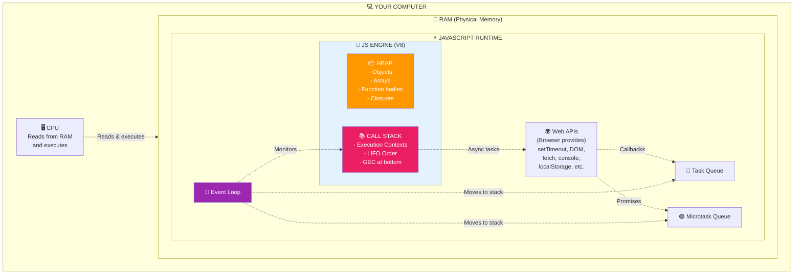
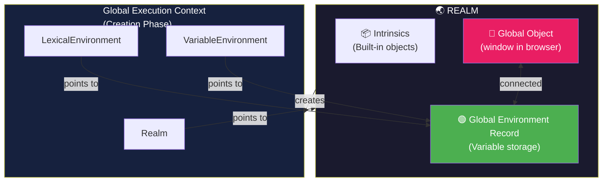
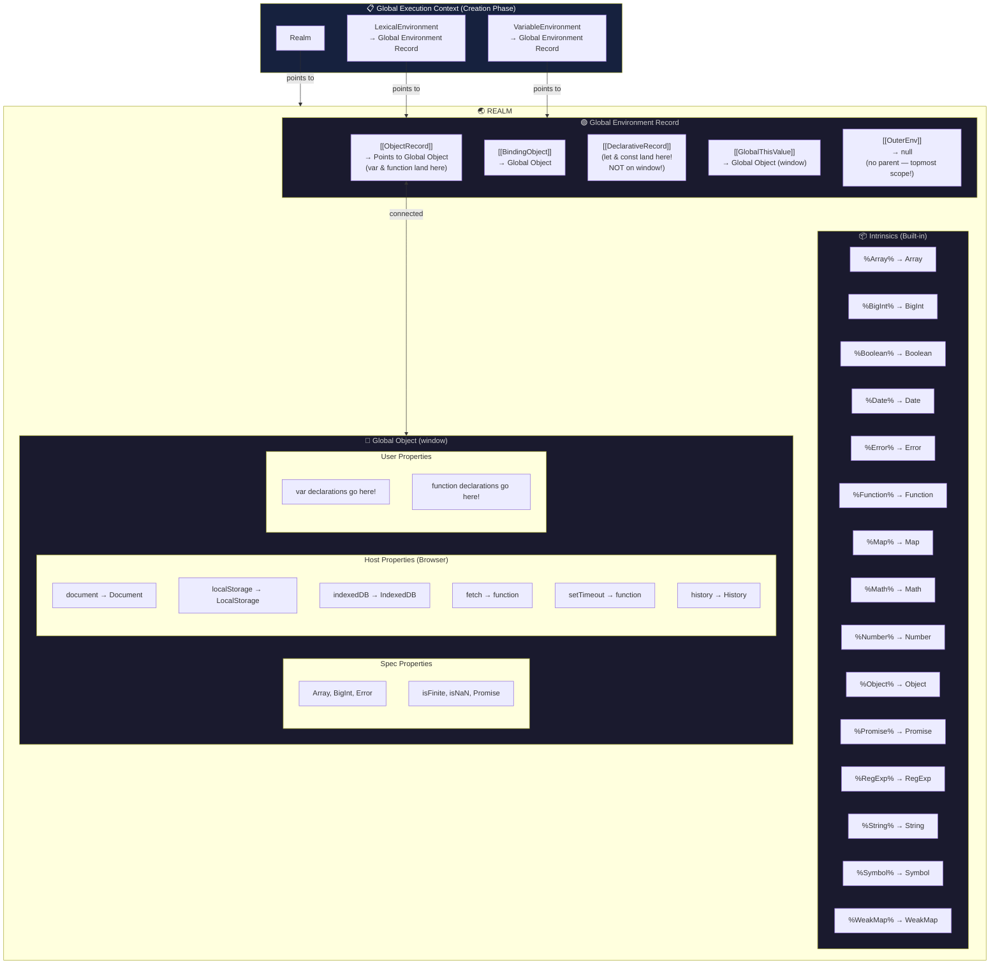
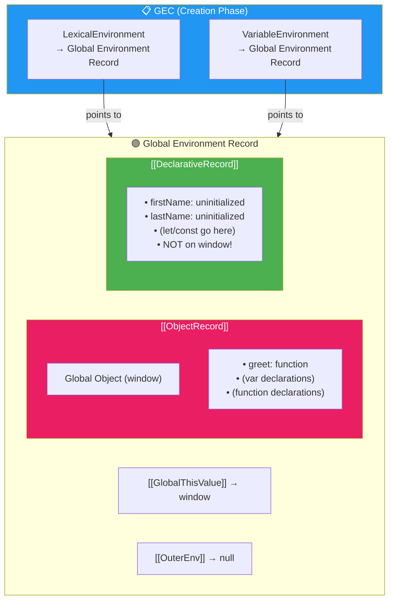
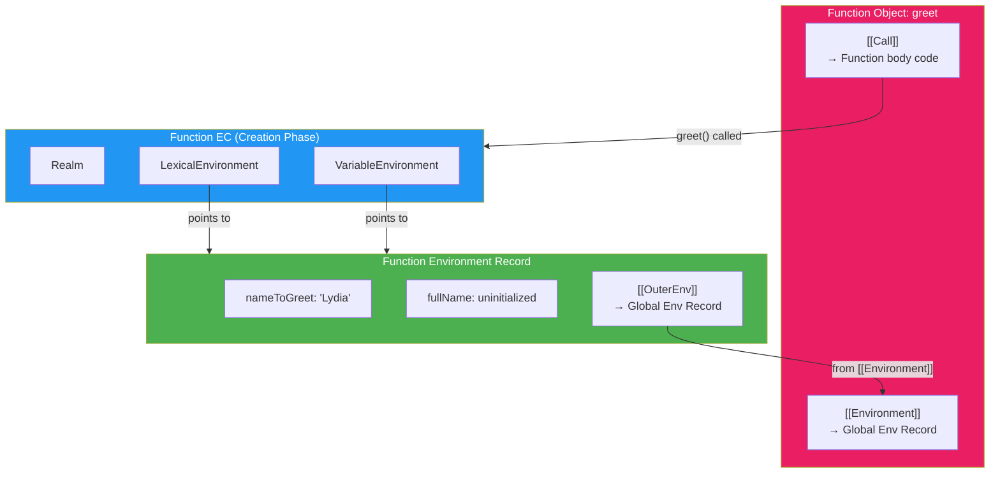
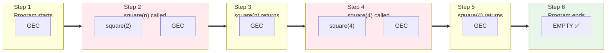
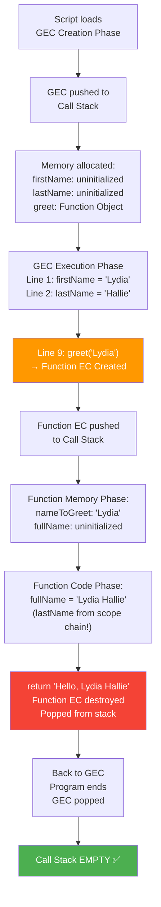

<a id="section-1a-top"></a>

# 🚀 Section 1A: Execution Context & Call Stack — The Complete Deep Dive

> **Everything in JavaScript Happens Inside an Execution Context**
> JS Runtime • Realm • Global Object • Environment Records • Call Stack • GEC vs Function EC
> Interview Focused — Explained in Simple Hinglish with ECMAScript Spec Insights

---

## 📑 Table of Contents
<a id="section-1a-toc"></a>

| # | Topic |
|---|-------|
| 1 | <a href="#what-is-ec">1A.1 What is Execution Context?</a> |
|   | &nbsp;&nbsp;&nbsp;&nbsp;<a href="#ec-why-needed">Why is it Needed? What Problem Does it Solve?</a> |
|   | &nbsp;&nbsp;&nbsp;&nbsp;<a href="#ec-real-life">Real-Life Analogy — The Office Desk</a> |
|   | &nbsp;&nbsp;&nbsp;&nbsp;<a href="#ec-two-components">Two Components — Memory & Code</a> |
|   | &nbsp;&nbsp;&nbsp;&nbsp;<a href="#ec-abstract-concept">Abstract Concept — No Physical Box!</a> |
|   | &nbsp;&nbsp;&nbsp;&nbsp;<a href="#ec-who-allocates">Who Allocates Execution Context?</a> |
| 2 | <a href="#js-runtime">1A.2 What is JavaScript Runtime?</a> |
|   | &nbsp;&nbsp;&nbsp;&nbsp;<a href="#runtime-components">Runtime Components Breakdown</a> |
|   | &nbsp;&nbsp;&nbsp;&nbsp;<a href="#where-ec-lies">Where Does Execution Context Live?</a> |
|   | &nbsp;&nbsp;&nbsp;&nbsp;<a href="#runtime-diagram">Full Runtime Architecture Diagram</a> |
| 3 | <a href="#realm-global-object">1A.3 Realm, Global Object & Intrinsics (Spec Deep Dive)</a> |
|   | &nbsp;&nbsp;&nbsp;&nbsp;<a href="#what-is-realm">What is a Realm?</a> |
|   | &nbsp;&nbsp;&nbsp;&nbsp;<a href="#global-object-detail">Global Object — Spec, Host & User Properties</a> |
|   | &nbsp;&nbsp;&nbsp;&nbsp;<a href="#intrinsics">Intrinsics — Built-in Objects</a> |
|   | &nbsp;&nbsp;&nbsp;&nbsp;<a href="#realm-diagram">Complete Realm Diagram</a> |
| 4 | <a href="#gec-deep-dive">1A.4 Global Execution Context — Deep Dive (From Image)</a> |
|   | &nbsp;&nbsp;&nbsp;&nbsp;<a href="#gec-creation-phase-spec">GEC Creation Phase (ECMAScript Spec View)</a> |
|   | &nbsp;&nbsp;&nbsp;&nbsp;<a href="#global-environment-record">Global Environment Record — [[ObjectRecord]] & [[DeclarativeRecord]]</a> |
|   | &nbsp;&nbsp;&nbsp;&nbsp;<a href="#lexical-vs-variable-env">LexicalEnvironment vs VariableEnvironment</a> |
|   | &nbsp;&nbsp;&nbsp;&nbsp;<a href="#global-this-value">[[GlobalThisValue]] & [[OuterEnv]]</a> |
|   | &nbsp;&nbsp;&nbsp;&nbsp;<a href="#gec-confusion">GEC vs EC — Clearing the Confusion</a> |
| 5 | <a href="#variable-environment">1A.5 Variable Environment of Execution Context</a> |
|   | &nbsp;&nbsp;&nbsp;&nbsp;<a href="#var-env-key-value">Key-Value Pair Storage</a> |
|   | &nbsp;&nbsp;&nbsp;&nbsp;<a href="#var-vs-let-const-storage">var vs let/const — Where are they stored?</a> |
| 6 | <a href="#single-threaded">1A.6 JavaScript is Synchronous Single-Threaded</a> |
|   | &nbsp;&nbsp;&nbsp;&nbsp;<a href="#single-thread-meaning">What Does Single-Threaded Mean?</a> |
|   | &nbsp;&nbsp;&nbsp;&nbsp;<a href="#sync-meaning">What Does Synchronous Mean?</a> |
|   | &nbsp;&nbsp;&nbsp;&nbsp;<a href="#why-single-threaded">Why is JS Single-Threaded?</a> |
| 7 | <a href="#two-phases">1A.7 Two Phases of Execution Context</a> |
|   | &nbsp;&nbsp;&nbsp;&nbsp;<a href="#memory-creation-phase">Phase 1: Memory Creation Phase (Creation Phase)</a> |
|   | &nbsp;&nbsp;&nbsp;&nbsp;<a href="#code-execution-phase">Phase 2: Code Execution Phase</a> |
|   | &nbsp;&nbsp;&nbsp;&nbsp;<a href="#phase1-diagram">Phase 1 Diagram</a> |
|   | &nbsp;&nbsp;&nbsp;&nbsp;<a href="#phase2-diagram">Phase 2 Diagram with Function EC</a> |
| 8 | <a href="#function-invocation">1A.8 What Happens When a Function is Invoked?</a> |
|   | &nbsp;&nbsp;&nbsp;&nbsp;<a href="#function-object-spec">Function Object — [[Environment]] & [[Call]] (From Image)</a> |
|   | &nbsp;&nbsp;&nbsp;&nbsp;<a href="#function-ec-creation">Function EC Creation Phase (From Image)</a> |
|   | &nbsp;&nbsp;&nbsp;&nbsp;<a href="#function-ec-vs-gec">Function EC vs GEC — Key Differences</a> |
| 9 | <a href="#return-keyword">1A.9 What Does the `return` Keyword Do?</a> |
| 10 | <a href="#call-stack">1A.10 Call Stack — Managing Execution Contexts</a> |
|   | &nbsp;&nbsp;&nbsp;&nbsp;<a href="#call-stack-lifo">LIFO — Last In, First Out</a> |
|   | &nbsp;&nbsp;&nbsp;&nbsp;<a href="#call-stack-step-by-step">Step-by-Step Walkthrough with Code</a> |
|   | &nbsp;&nbsp;&nbsp;&nbsp;<a href="#stack-overflow">Stack Overflow</a> |
| 11 | <a href="#where-everything-lives">1A.11 Where Does Everything Live? (Master Diagram)</a> |
| 12 | <a href="#code-walkthrough-complete">1A.12 Complete Code Walkthrough — Every Line Traced</a> |
| 13 | <a href="#interview-cheatsheet">1A.13 Interview Cheat Sheet & Must-Know Points</a> |
| 14 | <a href="#practice-questions-ec">1A.14 Practice Questions & Projects</a> |

<a href="#section-1a-top">⬆ Back to Top</a>

---

<a id="what-is-ec"></a>

## 1A.1 🎯 What is Execution Context?

> **"Everything in JavaScript happens inside an Execution Context"**
> — This is the MOST important concept in all of JavaScript.

<a id="ec-why-needed"></a>

### Why is it Needed? What Problem Does it Solve?

```
PROBLEM imagine karo:

JavaScript engine ko code milta hai:
    var name = "Aadi";
    function greet() { return "Hello " + name; }
    greet();

Engine ko bahut saare questions ke jawab chahiye:
❓ "name" ka value kya hai?
❓ "greet" function ka code kahan hai?
❓ Konsa function abhi run ho raha hai?
❓ Jab greet() return karega toh control kahan jayega?
❓ name variable ka scope kya hai?
❓ "this" ka value kya hoga?

SOLUTION → EXECUTION CONTEXT!

Execution Context = Ek organized environment jismein:
✅ Saari variables/functions ki info hai (MEMORY)
✅ Code ko line-by-line run karne ka system hai (CODE)
✅ Scope chain defined hai (kahan se variables milenge)
✅ "this" ka value decide hai

Basically, EC = woh DUNIYA jismein tumhara code JEETA hai!
```

<a id="ec-real-life"></a>

### 🏢 Real-Life Analogy — The Office Desk

```
Execution Context = Ek employee ka OFFICE DESK

Jab ek employee (function) ko kaam diya jaata hai:
1. Usse ek DESK milta hai (Execution Context created)
2. Desk pe FILES rakhte hain (Memory — variables, functions)
3. Desk pe ek CHECKLIST hoti hai (Code — line by line kya karna hai)
4. Desk pe BOSS ka name hota hai (this — kon call kiya)
5. Jab kaam khatam → Desk SAAF kar dete hain (EC destroyed)

Office = JavaScript Runtime
Desk = Execution Context
Files = Variable Environment (memory)
Checklist = Thread of Execution (code)
Building ka main desk = Global Execution Context (GEC)
Employee ka personal desk = Function Execution Context
```

<a id="ec-two-components"></a>

### Two Components — Memory & Code

```
┌────────────────────────────────────────────┐
│           EXECUTION CONTEXT                │
│                                            │
│  ┌───────────────────┬──────────────────┐  │
│  │     MEMORY        │      CODE        │  │
│  │  (Variable        │  (Thread of      │  │
│  │   Environment)    │   Execution)     │  │
│  │                   │                  │  │
│  │  key : value      │                  │  │
│  │  name: "Aadi"     │  Executes        │  │
│  │  age : 22         │  one line        │  │
│  │  fn  : {...}      │  at a time       │  │
│  │                   │                  │  │
│  └───────────────────┴──────────────────┘  │
└────────────────────────────────────────────┘
```

| Component | Also Called | What It Does |
|-----------|-----------|-------------|
| **Memory** | Variable Environment / Environment Record | Stores variables & functions as key-value pairs |
| **Code** | Thread of Execution | Runs code line by line, one command at a time |

<a id="ec-abstract-concept"></a>

### Abstract Concept — Execution Context is NOT a Physical Box!

```
BAHUT IMPORTANT POINT:

Execution Context ek ABSTRACT concept hai — ye koi physical box
ya file nahi hai jo RAM mein sit karta ho as-is.

Ye ek SPECIFICATION CONCEPT hai jo ECMAScript spec ne define kiya.

Real mein kya hota hai:
- V8 Engine internally C++ objects create karta hai
- Environment Records create hoti hain
- Scope chains setup hoti hain
- "this" binding hota hai

Hum jab "EC created" bolte hain, toh matlab:
"Engine ne saari necessary info organize kar di ki ye code
 ab SAFELY aur CORRECTLY run ho sake"

Jaise "gravity" ek concept hai — tum usse dekh nahi sakte,
but effects dekh sakte ho — waise hi EC ek concept hai
jiske EFFECTS (hoisting, scope, this) tum experience karte ho!
```

<a id="ec-who-allocates"></a>

### Who Allocates Execution Context?

```
Q: "Execution Context kaunse allocate karta hai?"
A: JavaScript ENGINE itself!

Flow:
1. JS file browser mein load hoti hai
2. Browser JS Engine ko file deta hai (V8 in Chrome)
3. V8 Engine AUTOMATICALLY:
   a. Global Execution Context (GEC) create karta hai
   b. GEC ko Call Stack mein push karta hai
   c. Code ko parse karta hai (Phase 1: Memory)
   d. Code execute karta hai (Phase 2: Code)
   e. Jab function call hota hai → naya EC create + push
   f. Jab function return hota hai → EC destroy + pop

Toh answer hai: JS ENGINE (V8/SpiderMonkey/JavaScriptCore)
automatically allocate karta hai EC ko!

Developer ko kuch nahi karna padta — ye INTERNAL mechanism hai.
```

### 🎯 Must-Know Points for Interview

```
✅ EC = abstract concept, not physical memory location
✅ Two components: Memory (Variable Environment) + Code (Thread of Execution)
✅ JS Engine (V8) allocates EC — developer doesn't create it manually
✅ Every piece of JS code runs INSIDE an EC
✅ EC solves: scope, hoisting, this binding, execution order
✅ Without EC → JS wouldn't know where variables live or what code to run next
✅ EC is a "specification device" defined in ECMAScript spec
✅ GEC is created automatically, Function EC on function invocation
```

---

<a href="#section-1a-top">⬆ Back to Top</a>

---

<a id="js-runtime"></a>

## 1A.2 🌐 What is JavaScript Runtime?

<a id="runtime-components"></a>

### Runtime Components Breakdown

```
JavaScript Runtime = COMPLETE ENVIRONMENT jahan JS code run hota hai

Ye sochna galat hai ki "JS Engine = JavaScript Runtime"
JS Engine sirf EK PART hai runtime ka!

JavaScript Runtime ke components:
━━━━━━━━━━━━━━━━━━━━━━━━━━━━━━━

1. JS ENGINE (V8, SpiderMonkey, etc.)
   ├── Memory Heap (data storage)
   └── Call Stack (execution tracker)

2. WEB APIs (Browser provides — NOT in engine!)
   ├── setTimeout, setInterval
   ├── fetch, XMLHttpRequest
   ├── DOM APIs (document)
   ├── console
   ├── localStorage, sessionStorage
   ├── indexedDB
   └── ...many more

3. TASK QUEUE (Callback Queue)
   └── setTimeout/setInterval/DOM event callbacks

4. MICROTASK QUEUE
   └── Promise .then/.catch/.finally, MutationObserver, queueMicrotask

5. EVENT LOOP
   └── Monitors Call Stack & Queues
```

<a id="where-ec-lies"></a>

### Where Does Execution Context Live?

```
YOUR COMPUTER
┌─────────────────────────────────────────────────────────────┐
│                           RAM                               │
│                                                             │
│  ┌───────────────────────────────────────────────────────┐  │
│  │              JAVASCRIPT RUNTIME                       │  │
│  │                                                       │  │
│  │  ┌─────────────────────┐  ┌────────────────────────┐  │  │
│  │  │    CALL STACK       │  │       HEAP             │  │  │
│  │  │                     │  │                        │  │  │
│  │  │ ┌─────────────────┐ │  │  Objects               │  │  │
│  │  │ │ Function EC     │ │  │  Arrays                │  │  │
│  │  │ │ (Desk #2)       │ │  │  Closures              │  │  │
│  │  │ ├─────────────────┤ │  │  Function bodies       │  │  │
│  │  │ │ Global EC (GEC) │ │  │                        │  │  │
│  │  │ │ (Main Desk)     │ │  │                        │  │  │
│  │  │ └─────────────────┘ │  └────────────────────────┘  │  │
│  │  └─────────────────────┘                               │  │
│  │                                                       │  │
│  │  ┌───────────────┐ ┌───────────────┐ ┌─────────────┐  │  │
│  │  │ Task Queue    │ │Microtask Queue│ │ Event Loop  │  │  │
│  │  └───────────────┘ └───────────────┘ └─────────────┘  │  │
│  └───────────────────────────────────────────────────────┘  │
└─────────────────────────────────────────────────────────────┘
```

```
KEY INSIGHT:
━━━━━━━━━━━

Execution Contexts LIVE INSIDE the CALL STACK
Call Stack LIVES INSIDE RAM (as part of JS Runtime)
Objects/Arrays LIVE INSIDE the HEAP (also in RAM)
Both are managed by the JS ENGINE (V8)
```

<a id="runtime-diagram"></a>

### Full Runtime Architecture Diagram


```mermaid
flowchart TD
    subgraph Computer["💻 YOUR COMPUTER"]
        subgraph RAM["🧠 RAM (Physical Memory)"]
            subgraph Runtime["⚡ JAVASCRIPT RUNTIME"]
                subgraph Engine["🔧 JS ENGINE (V8)"]
                    Heap["📦 HEAP\n- Objects\n- Arrays\n- Function bodies\n- Closures"]
                    Stack["📚 CALL STACK\n- Execution Contexts\n- LIFO Order\n- GEC at bottom"]
                end

                APIs["🌍 Web APIs\n(Browser provides)\nsetTimeout, DOM,\nfetch, console,\nlocalStorage, etc."]
                TQ["🔴 Task Queue"]
                MQ["🟢 Microtask Queue"]
                EL["🔄 Event Loop"]
            end
        end
        CPU["🖥️ CPU\nReads from RAM\nand executes"]
    end

    Stack -.->|"Async tasks"| APIs
    APIs -.->|"Callbacks"| TQ
    APIs -.->|"Promises"| MQ
    EL -.->|"Monitors"| Stack
    EL -.->|"Moves to stack"| TQ
    EL -.->|"Moves to stack"| MQ
    CPU -.->|"Reads & executes"| RAM

    style Engine fill:#E3F2FD
    style Stack fill:#E91E63,color:white
    style Heap fill:#FF9800,color:white
    style EL fill:#9C27B0,color:white
```

### 🎯 Must-Know Points for Interview

```
✅ JavaScript Runtime ≠ JavaScript Engine
✅ Runtime = Engine + Web APIs + Queues + Event Loop
✅ Engine has ONLY Heap + Call Stack
✅ Web APIs, Queues, Event Loop are OUTSIDE engine
✅ ECs live INSIDE Call Stack (which is inside engine)
✅ Objects/large data live in Heap
✅ Primitives stored directly in EC's variable environment
✅ Everything ultimately lives in RAM
✅ CPU reads from RAM and executes instructions
✅ Browser provides the Runtime environment
✅ Node.js provides a different Runtime (no DOM, has fs, http, etc.)
```

---

<a href="#section-1a-top">⬆ Back to Top</a>

---

<a id="realm-global-object"></a>

## 1A.3 🌏 Realm, Global Object & Intrinsics (Spec Deep Dive)

> This section explains what the ECMAScript Specification actually defines.
> The images from "JavaScript Visualized" show this deep architecture.

<a id="what-is-realm"></a>

### What is a Realm?

```
Realm = Ek ISOLATED UNIVERSE jismein JavaScript code run hota hai

Imagine karo ek apartment building:
🏢 Building = Browser
🏠 Each apartment = One Realm

Har Realm ke paas APNA:
- Global Object (window)
- Set of Intrinsics (Array, Object, Promise, etc.)
- Global Environment (variables ka scope)

Kab naya Realm banta hai?
- Har browser tab = naya Realm
- Har iframe = naya Realm
- Har Worker = naya Realm

Isliye ek tab ka Array constructor DUSRE tab ke Array constructor
se ALAG hai — alag Realms hain!
```


```mermaid
flowchart TD
    subgraph Realm["🌏 REALM"]
        I["📦 Intrinsics\n(Built-in objects)"]
        GO["🔴 Global Object\n(window in browser)"]
        GER["🟢 Global Environment Record\n(Variable storage)"]
    end

    subgraph GEC["Global Execution Context\n(Creation Phase)"]
        R["Realm"]
        LE["LexicalEnvironment"]
        VE["VariableEnvironment"]
    end

    GO <-->|"connected"| GER
    Realm -->|"creates"| GEC
    R -->|"points to"| Realm
    LE -->|"points to"| GER
    VE -->|"points to"| GER

    style Realm fill:#1a1a2e,color:white
    style GEC fill:#16213e,color:white
    style GO fill:#E91E63,color:white
    style GER fill:#4CAF50,color:white
```

<a id="global-object-detail"></a>

### Global Object — Spec Properties, Host Properties & User Properties

```
Global Object = wo object jisko browser mein "window" kehte hain

Iske andar TEEN type ke properties hote hain:

1. SPEC PROPERTIES (ECMAScript defines these)
   ━━━━━━━━━━━━━━━━━━━━━━━━━━━━━━━━━━━━━━━━━
   Ye har JS engine mein GUARANTEED hoti hain:
   - Array, BigInt, Error, Promise
   - isFinite, isNaN (functions)
   - Object, String, Number, Boolean
   - Date, RegExp, Map, Set
   - Math, JSON, Reflect, Proxy
   
2. HOST PROPERTIES (Browser/Node provides these)
   ━━━━━━━━━━━━━━━━━━━━━━━━━━━━━━━━━━━━━━━━━━━
   Browser mein: document, localStorage, indexedDB,
                 fetch, setTimeout, history, console
   Node.js mein: process, Buffer, __dirname, require
   
3. USER PROPERTIES (Tumhare code se add hoti hain)
   ━━━━━━━━━━━━━━━━━━━━━━━━━━━━━━━━━━━━━━━━━━━━━
   var x = 10;    → window.x = 10 (var goes to Global Object!)
   function greet() {} → window.greet = function...
   // BUT let/const DON'T go to Global Object!
```

```javascript
// Proof: var adds to Global Object, let/const don't!
var myVar = "I'm on window!";
let myLet = "I'm NOT on window!";
const myConst = "I'm also NOT on window!";

console.log(window.myVar);   // "I'm on window!" ✅
console.log(window.myLet);   // undefined ❌
console.log(window.myConst); // undefined ❌

// This is because var goes to [[ObjectRecord]] of Global Environment
// But let/const go to [[DeclarativeRecord]]!
```

<a id="intrinsics"></a>

### Intrinsics — Built-in Objects

```
Intrinsics = JavaScript ke BUILT-IN objects jo PEHLE SE available hain

Ye %PercentSign% notation mein likhe jaate hain spec mein:

%Array%        → Array
%BigInt%       → BigInt
%Boolean%      → Boolean
%Date%         → Date
%Error%        → Error
%Function%     → Function
%Map%          → Map
%Math%         → Math
%Number%       → Number
%Object%       → Object
%Promise%      → Promise
%RegExp%       → RegExp
%String%       → String
%Symbol%       → Symbol
%WeakMap%      → WeakMap
%isFinite%     → isFinite (function)
%isNaN%        → isNaN (function)
%parseFloat%   → parseFloat (function)
%eval%         → eval (function)
%AsyncFunction% → AsyncFunction
%BigInt64Array% → BigInt64Array
%DataView%     → DataView
%Int32Array%   → Int32Array
%TypedArray%   → TypedArray
... and more!

Ye sab PEHLE SE memory mein loaded rehte hain
BEFORE your code even runs!
```

<a id="realm-diagram"></a>

### Complete Realm Diagram (From Image)


```mermaid
flowchart TD
    subgraph Realm["🌏 REALM"]
        subgraph Intrinsics["📦 Intrinsics (Built-in)"]
            I1["%Array% → Array"]
            I2["%BigInt% → BigInt"]
            I3["%Boolean% → Boolean"]
            I4["%Date% → Date"]
            I5["%Error% → Error"]
            I6["%Function% → Function"]
            I7["%Map% → Map"]
            I8["%Math% → Math"]
            I9["%Number% → Number"]
            I10["%Object% → Object"]
            I11["%Promise% → Promise"]
            I12["%RegExp% → RegExp"]
            I13["%String% → String"]
            I14["%Symbol% → Symbol"]
            I15["%WeakMap% → WeakMap"]
        end

        subgraph GlobalObj["🔴 Global Object (window)"]
            subgraph SpecProps["Spec Properties"]
                SP1["Array, BigInt, Error"]
                SP2["isFinite, isNaN, Promise"]
            end
            subgraph HostProps["Host Properties (Browser)"]
                HP1["document → Document"]
                HP2["localStorage → LocalStorage"]
                HP3["indexedDB → IndexedDB"]
                HP4["fetch → function"]
                HP5["setTimeout → function"]
                HP6["history → History"]
            end
            subgraph UserProps["User Properties"]
                UP1["var declarations go here!"]
                UP2["function declarations go here!"]
            end
        end

        subgraph GER["🟢 Global Environment Record"]
            OR["[[ObjectRecord]]\n→ Points to Global Object\n(var & function land here)"]
            BO["[[BindingObject]]\n→ Global Object"]
            DR["[[DeclarativeRecord]]\n(let & const land here!\nNOT on window!)"]
            GTV["[[GlobalThisValue]]\n→ Global Object (window)"]
            OE["[[OuterEnv]]\n→ null\n(no parent — topmost scope!)"]
        end
    end

    subgraph GECBox["📋 Global Execution Context (Creation Phase)"]
        GECR["Realm"]
        GECLE["LexicalEnvironment\n→ Global Environment Record"]
        GECVE["VariableEnvironment\n→ Global Environment Record"]
    end

    OR <-->|"connected"| GlobalObj
    GECR -->|"points to"| Realm
    GECLE -->|"points to"| GER
    GECVE -->|"points to"| GER

    style Intrinsics fill:#1a1a2e,color:#ccc
    style GlobalObj fill:#1a1a2e,color:#ccc
    style GER fill:#1a1a2e,color:#ccc
    style GECBox fill:#16213e,color:white
```

### 🎯 Must-Know Points for Interview

```
✅ Realm = Isolated JS universe (each tab/iframe has one)
✅ Global Object = window (browser) / globalThis (universal)
✅ Intrinsics = Built-in objects (Array, Promise, etc.) pre-loaded
✅ Global Object has: Spec properties + Host properties + User properties
✅ var declarations → go to Global Object (window.x)
✅ let/const declarations → DO NOT go to Global Object
✅ This is because var goes to [[ObjectRecord]], let/const to [[DeclarativeRecord]]
✅ [[OuterEnv]] of Global Environment = null (no parent scope)
✅ [[GlobalThisValue]] = Global Object (window in browser)
```

---

<a href="#section-1a-top">⬆ Back to Top</a>

---

<a id="gec-deep-dive"></a>

## 1A.4 🌍 Global Execution Context — Deep Dive (From Image)

<a id="gec-creation-phase-spec"></a>

### GEC Creation Phase (ECMAScript Spec View)

```
Jab JS file load hoti hai, engine sabse PEHLE GEC create karta hai.

GEC Creation Phase mein ye cheezein setup hoti hain:

┌──────────────────────────────────────────────────────┐
│         GLOBAL EXECUTION CONTEXT                     │
│              Creation Phase                          │
│  ┌────────────────────────────────────────────────┐  │
│  │  Realm                                         │  │
│  │  ├── Intrinsics (Array, Object, Promise...)    │  │
│  │  ├── Global Object (window)                    │  │
│  │  └── Global Environment Record                 │  │
│  ├────────────────────────────────────────────────┤  │
│  │  LexicalEnvironment                            │  │
│  │  └── Points to Global Environment Record       │  │
│  ├────────────────────────────────────────────────┤  │
│  │  VariableEnvironment                           │  │
│  │  └── Points to Global Environment Record       │  │
│  └────────────────────────────────────────────────┘  │
└──────────────────────────────────────────────────────┘
```

<a id="global-environment-record"></a>

### Global Environment Record — [[ObjectRecord]] & [[DeclarativeRecord]]

```
Ye SABSE important concept hai jo images mein dikhta hai!

Global Environment Record ke andar DO stores hain:

1. [[ObjectRecord]] — connected to Global Object (window)
   ━━━━━━━━━━━━━━━━━━━━━━━━━━━━━━━━━━━━━━━━━━━━━━━━━━
   - var declarations yahaan jaati hain
   - function declarations yahaan jaati hain
   - Isliye var x = 10 → window.x = 10 ban jaata hai!

2. [[DeclarativeRecord]] — SEPARATE storage
   ━━━━━━━━━━━━━━━━━━━━━━━━━━━━━━━━━━━━━━━━
   - let declarations yahaan jaati hain
   - const declarations yahaan jaati hain
   - Ye Global Object se CONNECTED NAHI hai!
   - Isliye let y = 20 → window.y = undefined!
```

```javascript
// Code example to understand this:
const firstName = "Lydia";   // Goes to [[DeclarativeRecord]]
let lastName = "Hallie";     // Goes to [[DeclarativeRecord]]

function greet(nameToGreet) {  // Goes to [[ObjectRecord]] → window
    const fullName = nameToGreet + " " + lastName;
    return "Hello, " + fullName;
}

greet(firstName);

// During GEC Creation Phase:
// [[ObjectRecord]] (connected to Global Object/window):
//   - greet: function object
//
// [[DeclarativeRecord]] (separate, NOT on window):
//   - firstName: <uninitialized> (TDZ!)
//   - lastName: <uninitialized> (TDZ!)
//
// This is WHY let/const have Temporal Dead Zone
// but var doesn't!
```


```mermaid
flowchart TD
    subgraph GER["🟢 Global Environment Record"]
        subgraph OR["[[ObjectRecord]]"]
            ORGO["Global Object (window)"]
            ORItems["• greet: function\n• (var declarations)\n• (function declarations)"]
        end
        subgraph DR["[[DeclarativeRecord]]"]
            DRItems["• firstName: uninitialized\n• lastName: uninitialized\n• (let/const go here)\n• NOT on window!"]
        end
        GTV["[[GlobalThisValue]] → window"]
        OuterEnv["[[OuterEnv]] → null"]
    end

    subgraph GEC["📋 GEC (Creation Phase)"]
        LE["LexicalEnvironment\n→ Global Environment Record"]
        VE["VariableEnvironment\n→ Global Environment Record"]
    end

    LE -->|"points to"| GER
    VE -->|"points to"| GER

    style OR fill:#E91E63,color:white
    style DR fill:#4CAF50,color:white
    style GEC fill:#2196F3,color:white
```

<a id="lexical-vs-variable-env"></a>

### LexicalEnvironment vs VariableEnvironment

```
DONO GEC mein Global Environment Record ko point karte hain!
But unke roles alag hain:

LexicalEnvironment:
- let/const declarations track karta hai
- Block scope maintain karta hai
- { } blocks ke andar change hota hai

VariableEnvironment:
- var declarations track karta hai
- Function scope maintain karta hai
- Blocks mein NAHI change hota (var block-scoped nahi hai!)

GEC mein DONO same jagah point karte hain (Global Env Record)
But Function EC mein ye alag ho sakte hain!
```

<a id="global-this-value"></a>

### [[GlobalThisValue]] & [[OuterEnv]]

```javascript
// [[GlobalThisValue]] = window (in browser)
console.log(this === window); // true (in global scope, non-strict)

// [[OuterEnv]] = null (GEC has NO parent scope!)
// That's why if you use a variable not declared anywhere:
console.log(randomVar); // ReferenceError!
// JS looked in GEC → [[OuterEnv]] = null → nowhere else to look → ERROR!
```

<a id="gec-confusion"></a>

### GEC vs EC — Clearing the Confusion

```
COMMON CONFUSION:
━━━━━━━━━━━━━━━━

"GEC aur EC mein kya farak hai?"

EC (Execution Context) = GENERIC term
   - Har ek code execution ka apna EC hota hai
   - Two types: Global EC and Function EC

GEC (Global Execution Context) = EC ka SPECIFIC type
   - Program start hone par banta hai
   - SIRF EK hota hai per program
   - Sabse pehle Call Stack mein jaata hai
   - Sabse last mein Stack se nikalega (program end)

Function EC = EC ka DUSRA type
   - Jab function CALL hota hai tab banta hai
   - Bahut saare ho sakte hain (per function call = new EC)
   - Function return → EC destroyed

Analogy:
EC = "Room" (general concept)
GEC = "Living Room" (specific — sirf ek hota hai ghar mein)
Function EC = "Bedroom" (specific — multiple ho sakte hain)
```

| Feature | GEC | Function EC |
|---------|-----|-------------|
| When created | Program starts | Function is called |
| How many | Only ONE per program | Multiple (one per function call) |
| `this` value | `window` (browser) | Depends on how function is called |
| `[[OuterEnv]]` | `null` (no parent) | Points to parent's environment |
| Destroyed when | Program ends | Function returns |
| Position in stack | BOTTOM (always) | ON TOP of GEC |
| Has Realm? | YES | YES (same Realm) |

### 🎯 Must-Know Points for Interview

```
✅ GEC is created AUTOMATICALLY before any code runs
✅ GEC has: Realm + LexicalEnvironment + VariableEnvironment
✅ Global Environment Record has TWO stores:
   - [[ObjectRecord]] → for var & function → connected to window
   - [[DeclarativeRecord]] → for let/const → NOT on window
✅ This explains WHY var is on window but let/const isn't!
✅ [[GlobalThisValue]] = window (browser) / globalThis (universal)
✅ [[OuterEnv]] = null for GEC (no parent — topmost scope!)
✅ EC is the general concept, GEC is a specific instance
✅ Only ONE GEC exists, multiple Function ECs can exist
✅ LexicalEnvironment tracks let/const, VariableEnvironment tracks var
```

---

<a href="#section-1a-top">⬆ Back to Top</a>

---

<a id="variable-environment"></a>

## 1A.5 📦 Variable Environment of Execution Context

<a id="var-env-key-value"></a>

### Key-Value Pair Storage

```
Variable Environment mein sab kuch KEY : VALUE pairs mein store hota hai

┌─────────────────────────────────────────────────────┐
│           EXECUTION CONTEXT                         │
│  ┌─────────────────────┬─────────────────────────┐  │
│  │      MEMORY         │         CODE             │  │
│  │  (Variable Env)     │  (Thread of Execution)   │  │
│  ├─────────────────────┼─────────────────────────┤  │
│  │                     │                         │  │
│  │  n       : undefined│                         │  │
│  │  square  : { ... }  │    Runs line by line    │  │
│  │  square2 : undefined│                         │  │
│  │  square4 : undefined│                         │  │
│  │                     │                         │  │
│  └─────────────────────┴─────────────────────────┘  │
└─────────────────────────────────────────────────────┘

KEY = variable/function ka NAME
VALUE = uska current VALUE (initially undefined for var)
```

<a id="var-vs-let-const-storage"></a>

### var vs let/const — Where are they stored?

```javascript
// In Global scope:
var x = 10;          // Goes to [[ObjectRecord]] → window.x = 10
let y = 20;          // Goes to [[DeclarativeRecord]] → NOT on window
const z = 30;        // Goes to [[DeclarativeRecord]] → NOT on window
function foo() {}    // Goes to [[ObjectRecord]] → window.foo

// During Memory Phase:
// var x → stored as undefined (then gets 10 in execution phase)
// let y → stored as <uninitialized> (TDZ — can't access before declaration!)
// const z → stored as <uninitialized> (TDZ)
// function foo → stored as {entire function code} (fully hoisted!)

// This is why:
console.log(x);  // undefined (hoisted, but value not assigned yet)
console.log(y);  // ReferenceError! (TDZ — let is uninitialized)
console.log(foo); // function foo() {} (fully hoisted!)
```

### 🎯 Must-Know Points for Interview

```
✅ Memory stores everything as key-value pairs
✅ var → hoisted with undefined | let/const → hoisted with <uninitialized> (TDZ)
✅ function declarations → hoisted with COMPLETE code (full body stored!)
✅ var goes to [[ObjectRecord]] → window.varName = value
✅ let/const go to [[DeclarativeRecord]] → NOT accessible via window
✅ This explains Temporal Dead Zone (TDZ) for let/const!
✅ Arrow functions assigned to var/let/const behave like variables (not like function declarations)
```

---

<a href="#section-1a-top">⬆ Back to Top</a>

---

<a id="single-threaded"></a>

## 1A.6 🧵 JavaScript is Synchronous Single-Threaded

<a id="single-thread-meaning"></a>

### What Does Single-Threaded Mean?

```
Single-Threaded = Ek time pe ek hi kaam!

┌──────────────────────────────────────────────────┐
│           JAVASCRIPT ENGINE                      │
│                                                  │
│   ONE THREAD ═══════════════════════════════►    │
│   Line 1 → Line 2 → Line 3 → Line 4 ...         │
│                                                  │
│   ✅ One command at a time                        │
│   ✅ In a specific order                          │
│   ✅ Cannot do two things simultaneously          │
│   ✅ Only ONE Call Stack                           │
└──────────────────────────────────────────────────┘

Real-life: Ek cook jo ek time pe ek hi dish bana sakta hai
WRONG: Cooking roti + making sabzi + frying pakoda AT SAME TIME
RIGHT: Roti banao → sabzi banao → pakoda banao (one by one)
```

<a id="sync-meaning"></a>

### What Does Synchronous Mean?

```
Synchronous = Order mein, ek ke baad ek
"Jab tak ek line complete na ho, dusri line START nahi hogi"

console.log("Line 1");  // Pehle ye run hoga
console.log("Line 2");  // Jab Line 1 COMPLETE ho, tab ye
console.log("Line 3");  // Jab Line 2 COMPLETE ho, tab ye

Output: ALWAYS 1 → 2 → 3 (NEVER 2 → 1 → 3 or 3 → 1 → 2)
```

<a id="why-single-threaded"></a>

### Why is JS Single-Threaded?

```
WHY was JavaScript designed as Single-Threaded?

1. DOM SAFETY:
   Agar 2 threads ek saath DOM ko modify karen:
   Thread 1: "Delete this button"
   Thread 2: "Change this button's color"
   CONFLICT! Which one wins? CRASH! 💥

   Single thread → only one can modify DOM at a time → SAFE!

2. SIMPLICITY:
   No race conditions, no deadlocks, no mutexes
   Easier to write, debug, and understand

3. HISTORICAL:
   Brendan Eich created JS in 10 days (1995)
   For simple web page interactions
   Multi-threading was overkill for that era

4. ASYNC SOLUTION:
   Event Loop + Web APIs give the ILLUSION of multi-threading
   Without the complexity!
```

### 🎯 Must-Know Points for Interview

```
✅ JS is synchronous = runs code in order, one line at a time
✅ JS is single-threaded = only ONE Call Stack
✅ Designed this way for DOM safety (no race conditions)
✅ Async behavior (setTimeout, fetch) = NOT multi-threading!
✅ Async = Browser's Web APIs + Event Loop (separate from JS engine)
✅ Web Workers = true separate thread BUT cannot access DOM
✅ "Single-threaded with non-blocking I/O" = most accurate description
```

---

<a href="#section-1a-top">⬆ Back to Top</a>

---

<a id="two-phases"></a>

## 1A.7 ⚡ Two Phases of Execution Context

> **"JS sabse pehle jaise hi aapka code dekhta hai, sabse pehle JS banata hai Execution Context. Ye ek process hai jo do different phases mein chalta hai — Memory Phase aur Execution Phase"** — (From Image)

```javascript
// This code will be used for all phase examples:
var n = 2;

function square(num) {
    var ans = num * num;
    return ans;
}

var square2 = square(n);
var square4 = square(4);
```

<a id="memory-creation-phase"></a>

### Phase 1: Memory Creation Phase (Creation Phase)

```
PHASE 1 mein JS engine POORA code scan karta hai
Ek bhi line execute NAHI hoti — sirf MEMORY allocate hota hai!

Rules:
━━━━━
1. var variable dikha → memory mein store karo as 'undefined'
2. function declaration dikha → POORA function code store karo
3. let/const dikha → store karo as '<uninitialized>' (TDZ)
4. Koi code RUN nahi hota is phase mein!
```

<a id="phase1-diagram"></a>

### Phase 1 Diagram

```
┌──────────────────────────────────────────────────┐
│          GLOBAL EXECUTION CONTEXT                │
│            PHASE 1: Memory Creation              │
│                                                  │
│  ┌─────────────────────┬──────────────────────┐  │
│  │      MEMORY         │        CODE          │  │
│  │  (Variable Env)     │  (Thread of Exec)    │  │
│  ├─────────────────────┼──────────────────────┤  │
│  │                     │                      │  │
│  │  n       : undefined│                      │  │
│  │                     │   (empty —           │  │
│  │  square  : {        │    nothing runs      │  │
│  │    function body    │    in Phase 1!)      │  │
│  │  }                  │                      │  │
│  │                     │                      │  │
│  │  square2 : undefined│                      │  │
│  │                     │                      │  │
│  │  square4 : undefined│                      │  │
│  │                     │                      │  │
│  └─────────────────────┴──────────────────────┘  │
└──────────────────────────────────────────────────┘

What happened:
Line 1: var n        → memory: n = undefined
Line 3: function square  → memory: square = {full function code}
Line 8: var square2  → memory: square2 = undefined
Line 9: var square4  → memory: square4 = undefined
```

<a id="code-execution-phase"></a>

### Phase 2: Code Execution Phase

```
PHASE 2 mein code LINE BY LINE execute hota hai!
Ab variables ko actual values milti hain aur functions call hote hain.
```

<a id="phase2-diagram"></a>

### Phase 2 Diagram with Function EC

```
┌───────────────────────────────────────────────────────────────────┐
│                GLOBAL EXECUTION CONTEXT                           │
│                  PHASE 2: Code Execution                          │
│                                                                   │
│  ┌───────────────────┬─────────────────────────────────────────┐  │
│  │     MEMORY        │                CODE                     │  │
│  ├───────────────────┼─────────────────────────────────────────┤  │
│  │ n       : 2  ←──  │  Line 1: n = 2 ✅ assigned              │  │
│  │ square  : {...}   │  Line 3-6: already stored ✅             │  │
│  │ square2 : ?  ←──  │  Line 8: square(n) called!              │  │
│  │ square4 : ?       │                                         │  │
│  │                   │  ┌─────────────────────────────────┐    │  │
│  │                   │  │  FUNCTION EC for square(2)      │    │  │
│  │                   │  │  ┌───────────┬───────────────┐  │    │  │
│  │                   │  │  │  MEMORY   │    CODE       │  │    │  │
│  │                   │  │  ├───────────┼───────────────┤  │    │  │
│  │                   │  │  │ num: 2    │ ans = 2*2     │  │    │  │
│  │ square2 : 4  ←──  │  │  │ ans: 4   │ return 4      │  │    │  │
│  │                   │  │  └───────────┴───────────────┘  │    │  │
│  │                   │  └─── EC destroyed after return ──┘    │  │
│  │                   │                                         │  │
│  │                   │  Line 9: square(4) called!              │  │
│  │                   │  ┌─────────────────────────────────┐    │  │
│  │                   │  │  FUNCTION EC for square(4)      │    │  │
│  │                   │  │  ┌───────────┬───────────────┐  │    │  │
│  │                   │  │  │  MEMORY   │    CODE       │  │    │  │
│  │                   │  │  ├───────────┼───────────────┤  │    │  │
│  │                   │  │  │ num: 4    │ ans = 4*4     │  │    │  │
│  │ square4 : 16 ←──  │  │  │ ans: 16  │ return 16     │  │    │  │
│  │                   │  │  └───────────┴───────────────┘  │    │  │
│  │                   │  └─── EC destroyed after return ──┘    │  │
│  └───────────────────┴─────────────────────────────────────────┘  │
└───────────────────────────────────────────────────────────────────┘
```

### 🎯 Must-Know Points for Interview

```
✅ ALWAYS 2 phases: Memory Creation → Code Execution
✅ Phase 1: NO code runs — only memory allocated
✅ Phase 1: var → undefined | function → full code stored
✅ Phase 1: let/const → <uninitialized> (causes TDZ!)
✅ Phase 2: Code runs LINE BY LINE
✅ Phase 2: Variables get ACTUAL values
✅ Phase 2: Function calls create NEW Function EC
✅ Function EC ALSO has 2 phases (Memory + Code)!
✅ Function EC is DESTROYED after return
✅ This is why hoisting works — Phase 1 stores everything BEFORE Phase 2 runs!
```

---

<a href="#section-1a-top">⬆ Back to Top</a>

---

<a id="function-invocation"></a>

## 1A.8 🔧 What Happens When a Function is Invoked?

<a id="function-object-spec"></a>

### Function Object — [[Environment]] & [[Call]] (From Image)

```
Jab Phase 1 mein function declaration process hota hai,
engine ek FUNCTION OBJECT create karta hai.

Ye Function Object ke andar ye special internal slots hote hain:

┌──────────────────────────────────────────────┐
│              FUNCTION OBJECT                 │
│               "greet"                        │
│  ┌────────────────────────────────────────┐  │
│  │  [[Environment]]                       │  │
│  │  → Points to Global Environment Record │  │
│  │  (Ye decide karta hai ki function ko   │  │
│  │   outer scope mein kya accessible hai  │  │
│  │   — THIS is what creates CLOSURES!)    │  │
│  ├────────────────────────────────────────┤  │
│  │  [[Call]]                              │  │
│  │  → Contains the function body code     │  │
│  │  (Jab function call hoga tab ye run    │  │
│  │   hoga — new EC create hoga)           │  │
│  └────────────────────────────────────────┘  │
└──────────────────────────────────────────────┘
```

```javascript
// Example:
const firstName = "Lydia";
let lastName = "Hallie";

function greet(nameToGreet) {
    const fullName = nameToGreet + " " + lastName;
    return "Hello, " + fullName;
}

greet(firstName);

// When "greet" function declaration is processed:
// Engine creates a Function Object:
// {
//   name: "greet",
//   [[Environment]]: GlobalEnvironmentRecord  ← CLOSURE MAGIC!
//   [[Call]]: <function body code>
// }
//
// [[Environment]] remembers WHERE the function was CREATED
// Not where it's called! This is LEXICAL SCOPING!
// This is how closures work internally!
```

<a id="function-ec-creation"></a>

### Function EC Creation Phase (From Image)

```
Jab greet(firstName) call hota hai (Line 9):

1. Engine [[Call]] internal slot trigger karta hai
2. Naya FUNCTION EXECUTION CONTEXT banata hai

Function EC structure:
┌──────────────────────────────────────────────────┐
│         FUNCTION EXECUTION CONTEXT               │
│              "greet" — Creation Phase             │
│  ┌────────────────────────────────────────────┐  │
│  │  Realm  → same as GEC                      │  │
│  ├────────────────────────────────────────────┤  │
│  │  LexicalEnvironment                        │  │
│  │  → Function Environment Record              │  │
│  │    (let/const local variables yahaan)       │  │
│  ├────────────────────────────────────────────┤  │
│  │  VariableEnvironment                       │  │
│  │  → Function Environment Record              │  │
│  │    (var local variables yahaan)             │  │
│  └────────────────────────────────────────────┘  │
│                                                  │
│  Function Environment Record:                    │
│  ┌────────────────────────────────────────────┐  │
│  │  nameToGreet: "Lydia" (argument)           │  │
│  │  fullName: <uninitialized> (const — TDZ)   │  │
│  │  [[OuterEnv]]: GlobalEnvironmentRecord     │  │
│  │   ↑ THIS is from [[Environment]] slot!     │  │
│  │   This is how it accesses 'lastName'!      │  │
│  └────────────────────────────────────────────┘  │
└──────────────────────────────────────────────────┘
```


```mermaid
flowchart TD
    subgraph FuncObj["Function Object: greet"]
        FE["[[Environment]]\n→ Global Env Record"]
        FC["[[Call]]\n→ Function body code"]
    end

    subgraph FuncEC["Function EC (Creation Phase)"]
        FR["Realm"]
        FLE["LexicalEnvironment"]
        FVE["VariableEnvironment"]
    end

    subgraph FER["Function Environment Record"]
        P["nameToGreet: 'Lydia'"]
        LV["fullName: uninitialized"]
        OE["[[OuterEnv]]\n→ Global Env Record"]
    end

    FC -->|"greet() called"| FuncEC
    FLE -->|"points to"| FER
    FVE -->|"points to"| FER
    OE -->|"from [[Environment]]"| FE

    style FuncObj fill:#E91E63,color:white
    style FuncEC fill:#2196F3,color:white
    style FER fill:#4CAF50,color:white
```

<a id="function-ec-vs-gec"></a>

### Function EC vs GEC — Key Differences

| Feature | GEC | Function EC |
|---------|-----|-------------|
| When created | Script loads | Function is called |
| How many | Only ONE | Multiple (per call) |
| Realm | Has its own Realm | Shares parent Realm |
| `this` | `window` (browser) | Depends on call method |
| `[[OuterEnv]]` | `null` | Parent's Environment Record |
| Environment Record | Global Environment Record | Function Environment Record |
| Destroyed when | Script ends | Function returns |
| Has `arguments` | NO | YES |
| `[[ObjectRecord]]` | YES (for var→window) | NO |
| `[[DeclarativeRecord]]` | YES (for let/const) | NO (uses Function Env Record directly) |

### 🎯 Must-Know Points for Interview

```
✅ Function Object has [[Environment]] → stores WHERE function was created (lexical scope!)
✅ [[Environment]] is what makes CLOSURES possible!
✅ [[Call]] contains the function body that runs when function is invoked
✅ Function EC has same structure: Realm + LexicalEnv + VariableEnv
✅ Function Environment Record stores local variables + arguments
✅ [[OuterEnv]] of Function EC → points to PARENT's Environment Record
✅ This [[OuterEnv]] chain = SCOPE CHAIN
✅ Function EC shares same Realm as GEC (same intrinsics)
✅ arguments object is created inside Function EC (not in GEC!)
✅ Arrow functions DON'T get their own `this` — they inherit from [[Environment]]
```

---

<a href="#section-1a-top">⬆ Back to Top</a>

---

<a id="return-keyword"></a>

## 1A.9 🔙 What Does the `return` Keyword Do?

```javascript
function square(num) {
    var ans = num * num;
    return ans;       // ← What does this ACTUALLY do?
}
```

```
return keyword ke 3 KAAM hain:
━━━━━━━━━━━━━━━━━━━━━━━━━━━━

1. VALUE RETURN 📤
   → ans ka value (e.g., 4) uthata hai
   → Calling context mein "hand over" karta hai
   → GEC mein square2 = 4 ho jaata hai

2. EXECUTION STOP 🛑
   → Function ke baaki code RUN NAHI hota
   → return ke baad koi bhi line SKIP ho jaati hai

3. EC DESTROY 💥
   → Function ka POORA Execution Context destroy hota hai
   → Memory FREE hoti hai (Garbage Collected)
   → Call Stack se POP hota hai
   → Control WAPAS calling EC mein jaata hai (GEC)
```

```javascript
// Proof of stopping execution:
function test() {
    console.log("A"); // Runs ✅
    return 42;
    console.log("B"); // NEVER runs ❌ — dead code!
    console.log("C"); // NEVER runs ❌
}

const result = test(); // Only "A" is printed
console.log(result);   // 42
```

### 🎯 Must-Know Points for Interview

```
✅ return does 3 things: returns value + stops execution + destroys EC
✅ Code AFTER return never runs (dead code)
✅ If no return statement → function returns 'undefined' implicitly
✅ return in constructor (new) → returns the 'this' object (not undefined)
✅ Arrow functions with implicit return: (x) => x * 2 (no return keyword needed!)
✅ Destroyed EC's memory is garbage collected eventually
✅ After return → control goes to calling EC (parent)
```

---

<a href="#section-1a-top">⬆ Back to Top</a>

---

<a id="call-stack"></a>

## 1A.10 📚 Call Stack — Managing Execution Contexts

<a id="call-stack-lifo"></a>

### LIFO — Last In, First Out

```
Call Stack = Thaalio ka stack!
Sabse upar wali plate pehle nikalogi (LIFO).

Also known as:
- Execution Stack
- Program Stack
- Control Stack
- Runtime Stack
- Machine Stack

Kaam:
- ECs ko ORDER mein manage karta hai
- Jo function LAST mein call hua → uska EC sabse UPAR
- Jo function PEHLE return hoga → wahi pehle POP hoga
```

<a id="call-stack-step-by-step"></a>

### Step-by-Step Walkthrough with Code

```javascript
var n = 2;
function square(num) {
    var ans = num * num;
    return ans;
}
var square2 = square(n);
var square4 = square(4);
```


```mermaid
flowchart LR
    subgraph T1["Step 1\nProgram starts"]
        S1["GEC"]
    end
    subgraph T2["Step 2\nsquare(n) called"]
        S2a["square(2)"]
        S2b["GEC"]
    end
    subgraph T3["Step 3\nsquare(n) returns"]
        S3["GEC"]
    end
    subgraph T4["Step 4\nsquare(4) called"]
        S4a["square(4)"]
        S4b["GEC"]
    end
    subgraph T5["Step 5\nsquare(4) returns"]
        S5["GEC"]
    end
    subgraph T6["Step 6\nProgram ends"]
        S6["EMPTY ✅"]
    end

    T1 ==> T2 ==> T3 ==> T4 ==> T5 ==> T6

    style T2 fill:#FFEBEE
    style T4 fill:#FFEBEE
    style T6 fill:#E8F5E9
```

<a id="stack-overflow"></a>

### Stack Overflow

```javascript
// Infinite recursion → Stack Overflow
function forever() {
    forever(); // No base case!
}
forever();
// RangeError: Maximum call stack size exceeded

// Call Stack fills up:
// | forever() | ← millionth call
// | forever() |
// | forever() |
// | ... 10,000+ frames ... |
// | forever() |
// | GEC       |
// 💥 BOOM! Stack has limited size!
```

### 🎯 Must-Know Points for Interview

```
✅ Call Stack = LIFO data structure managing EC execution order
✅ GEC is always at BOTTOM — pushed first, popped last
✅ Function call → new EC PUSHED on top
✅ Function return → EC POPPED from top
✅ Stack has limited size (~10,000-16,000 frames in Chrome)
✅ Stack Overflow = too many nested calls (infinite recursion)
✅ JS has ONE Call Stack = Single Threaded proof!
✅ Also called: Execution Stack, Program Stack, Control Stack
✅ When Stack is EMPTY → Event Loop can push callbacks from Queue
```

---

<a href="#section-1a-top">⬆ Back to Top</a>

---

<a id="where-everything-lives"></a>

## 1A.11 🗺️ Where Does Everything Live? (Master Diagram)

```
YOUR COMPUTER (Physical Hardware)
┌──────────────────────────────────────────────────────────────────┐
│                            RAM                                   │
│  ┌────────────────────────────────────────────────────────────┐  │
│  │                  JAVASCRIPT RUNTIME                        │  │
│  │                                                            │  │
│  │  ┌──────────────────────────┐  ┌──────────────────────┐   │  │
│  │  │       CALL STACK         │  │        HEAP           │   │  │
│  │  │                          │  │                       │   │  │
│  │  │  ┌────────────────────┐  │  │  Objects              │   │  │
│  │  │  │  Function EC       │  │  │  Arrays               │   │  │
│  │  │  │  ┌──────┬───────┐  │  │  │  Closures             │   │  │
│  │  │  │  │Memory│ Code  │  │  │  │  Function bodies      │   │  │
│  │  │  │  │num:2 │return │  │  │  │  (large data)         │   │  │
│  │  │  │  │ans:4 │       │  │  │  └──────────────────────┘   │  │
│  │  │  │  └──────┴───────┘  │  │                             │  │
│  │  │  ├────────────────────┤  │                             │  │
│  │  │  │  Global EC (GEC)   │  │                             │  │
│  │  │  │  ┌──────┬───────┐  │  │                             │  │
│  │  │  │  │Memory│ Code  │  │  │                             │  │
│  │  │  │  │n:2   │Line by│  │  │                             │  │
│  │  │  │  │sq:{} │Line   │  │  │                             │  │
│  │  │  │  │sq2:4 │       │  │  │                             │  │
│  │  │  │  │sq4:16│       │  │  │                             │  │
│  │  │  │  └──────┴───────┘  │  │                             │  │
│  │  │  └────────────────────┘  │                             │  │
│  │  └──────────────────────────┘                             │  │
│  └────────────────────────────────────────────────────────────┘  │
│                                                                  │
│                         CPU reads from RAM and executes          │
└──────────────────────────────────────────────────────────────────┘
```

| Concept | Lives Inside | Notes |
|---------|-------------|-------|
| **GEC** | Bottom of Call Stack | Created automatically, lifetime = program |
| **Function EC** | Call Stack (on top) | Created on call, destroyed on return |
| **Call Stack** | RAM (JS Engine) | LIFO, manages all ECs |
| **Heap** | RAM (JS Engine) | Objects, arrays, closures |
| **Memory (Var Env)** | Inside each EC | Key-value pairs |
| **Code (Thread)** | Inside each EC | Line by line executor |
| **Realm** | Part of Runtime | Intrinsics + Global Object + Env Record |
| **Global Object** | Inside Realm | window (browser) / globalThis |
| **Environment Records** | Inside Realm | [[ObjectRecord]] + [[DeclarativeRecord]] |
| **Primitives** | EC Memory directly | Stored by value |
| **Objects/Arrays** | Heap | EC stores reference/pointer |

---

<a href="#section-1a-top">⬆ Back to Top</a>

---

<a id="code-walkthrough-complete"></a>

## 1A.12 🔍 Complete Code Walkthrough — Every Line Traced

```javascript
const firstName = "Lydia";
let lastName = "Hallie";

function greet(nameToGreet) {
    const fullName = nameToGreet + " " + lastName;
    return "Hello, " + fullName;
}

greet(firstName);
```

```
STEP 1: GEC CREATION PHASE
━━━━━━━━━━━━━━━━━━━━━━━━━

Realm created:
  - Intrinsics loaded (Array, Object, Promise...)
  - Global Object (window) created
  - Global Environment Record created

Global Environment Record:
  [[ObjectRecord]] → Global Object:
    - greet: Function Object { [[Environment]]: GER, [[Call]]: <body> }

  [[DeclarativeRecord]]:
    - firstName: <uninitialized>  (TDZ — const)
    - lastName: <uninitialized>   (TDZ — let)

  [[GlobalThisValue]]: window
  [[OuterEnv]]: null

Call Stack: | GEC |


STEP 2: GEC EXECUTION PHASE
━━━━━━━━━━━━━━━━━━━━━━━━━━━

Line 1: const firstName = "Lydia"
  → [[DeclarativeRecord]]: firstName = "Lydia" ✅

Line 2: let lastName = "Hallie"
  → [[DeclarativeRecord]]: lastName = "Hallie" ✅

Lines 4-7: function greet already stored in Phase 1 ✅

Line 9: greet(firstName) → greet("Lydia") called!
  → Engine reads greet Function Object
  → [[Call]] triggered
  → NEW FUNCTION EC CREATED!
  → Function EC PUSHED to Call Stack

Call Stack: | greet("Lydia") |
            | GEC            |


STEP 3: FUNCTION EC CREATION PHASE
━━━━━━━━━━━━━━━━━━━━━━━━━━━━━━━━━━

Function Environment Record created:
  - nameToGreet: "Lydia" (argument)
  - fullName: <uninitialized> (const — TDZ)
  - [[OuterEnv]]: Global Environment Record ← from [[Environment]]!


STEP 4: FUNCTION EC EXECUTION PHASE
━━━━━━━━━━━━━━━━━━━━━━━━━━━━━━━━━━

Line 5: const fullName = nameToGreet + " " + lastName
  → nameToGreet = "Lydia" (from local env)
  → lastName = ??? (not in local env!)
  → Engine follows [[OuterEnv]] → Global Environment Record
  → Found! lastName = "Hallie" ← SCOPE CHAIN in action!
  → fullName = "Lydia Hallie" ✅

Line 6: return "Hello, " + fullName
  → Returns "Hello, Lydia Hallie"
  → Function EC DESTROYED
  → POPPED from Call Stack

Call Stack: | GEC |


STEP 5: PROGRAM ENDS
━━━━━━━━━━━━━━━━━━━

GEC POPPED from Call Stack

Call Stack: | EMPTY ✅ |
```


```mermaid
flowchart TD
    A["Script loads\nGEC Creation Phase"] --> B["GEC pushed to\nCall Stack"]
    B --> C["Memory allocated:\nfirstName: uninitialized\nlastName: uninitialized\ngreet: Function Object"]
    C --> D["GEC Execution Phase\nLine 1: firstName = 'Lydia'\nLine 2: lastName = 'Hallie'"]
    D --> E["Line 9: greet('Lydia')\n→ Function EC Created"]
    E --> F["Function EC pushed\nto Call Stack"]
    F --> G["Function Memory Phase:\nnameToGreet: 'Lydia'\nfullName: uninitialized"]
    G --> H["Function Code Phase:\nfullName = 'Lydia Hallie'\n(lastName from scope chain!)"]
    H --> I["return 'Hello, Lydia Hallie'\nFunction EC destroyed\nPopped from stack"]
    I --> J["Back to GEC\nProgram ends\nGEC popped"]
    J --> K["Call Stack EMPTY ✅"]

    style E fill:#FF9800,color:white
    style I fill:#f44336,color:white
    style K fill:#4CAF50,color:white
```

---

<a href="#section-1a-top">⬆ Back to Top</a>

---

<a id="interview-cheatsheet"></a>

## 1A.13 🔥 Interview Cheat Sheet & Must-Know Points

| Question | Answer |
|----------|--------|
| What is Execution Context? | Abstract concept — a container with Memory + Code where JS code runs |
| Who creates EC? | JS Engine (V8) automatically — developer doesn't create it |
| How many phases? | 2 — Memory Creation (Phase 1) + Code Execution (Phase 2) |
| What happens in Phase 1? | var → undefined, function → full code, let/const → uninitialized (TDZ) |
| What happens in Phase 2? | Code runs line by line, values assigned, functions invoked |
| What is GEC? | Global Execution Context — first EC, created when program starts |
| GEC vs Function EC? | GEC: one per program, bottom of stack. Function EC: per call, on top |
| What is Realm? | Isolated JS universe — Intrinsics + Global Object + Env Record |
| What is Global Object? | `window` (browser) — has Spec + Host + User properties |
| Where does var live? | [[ObjectRecord]] → connected to Global Object (window.x) |
| Where does let/const live? | [[DeclarativeRecord]] → NOT on window! |
| Why TDZ for let/const? | They're stored as `<uninitialized>` in Phase 1 — can't access before declaration |
| What is [[Environment]]? | Internal slot on Function Object — stores where function was CREATED (closure!) |
| What does return do? | Returns value + stops execution + destroys function EC |
| What is Call Stack? | LIFO structure managing EC execution order — JS has only ONE |
| What is Stack Overflow? | Too many nested calls fill the Call Stack beyond its limit |
| What is JavaScript Runtime? | Engine (Heap+Stack) + Web APIs + Queues + Event Loop |
| Where do objects live? | Heap (separate from Call Stack) |
| Is EC a physical thing? | NO — it's an abstract specification concept! |
| What is scope chain? | Chain of [[OuterEnv]] links from current EC to GEC |

> ⚠️ **The Ultimate Interview Answer**:
> When JavaScript code runs — Engine first creates GEC, allocates memory (Phase 1: variables=undefined, functions=full code), then executes code line by line (Phase 2). Each function call creates a new Function EC with its own memory/code phases. Call Stack manages all ECs in LIFO order. Function Object's [[Environment]] creates closures. var goes to Global Object, let/const to DeclarativeRecord (explaining TDZ). Everything happens inside a Realm with its Intrinsics. When function returns — EC destroyed, popped from stack. Program ends — GEC popped — stack empty.

---

<a href="#section-1a-top">⬆ Back to Top</a>

---

<a id="practice-questions-ec"></a>

## 1A.14 🎯 Practice Questions & Projects

### Output-Based Questions

```javascript
// Q1: What is the output?
console.log(a);
console.log(b);
var a = 10;
let b = 20;
// Answer: undefined, ReferenceError!
// a: var → Phase 1 → undefined (hoisted)
// b: let → Phase 1 → <uninitialized> (TDZ) → Error!

// Q2: What is the output?
var x = 1;
function foo() {
    console.log(x);
    var x = 2;
}
foo();
// Answer: undefined
// foo's Phase 1: x = undefined (local var shadows global!)
// foo's Phase 2: console.log(x) → undefined (x not yet assigned in this EC)

// Q3: How many ECs are created?
var a = 10;
function foo() {
    var b = 20;
    function bar() {
        var c = 30;
    }
    bar();
}
foo();
// Answer: 3 ECs
// 1. GEC (always created)
// 2. foo() EC (when foo() is called)
// 3. bar() EC (when bar() is called inside foo)

// Q4: What is the output?
function outer() {
    var x = 10;
    function inner() {
        console.log(x); // Which x?
    }
    return inner;
}
const fn = outer(); // outer EC destroyed!
fn(); // But inner still accesses x! HOW?
// Answer: 10
// [[Environment]] of inner → outer's Environment Record
// Even after outer EC is destroyed, the Environment Record SURVIVES
// because inner's [[Environment]] still references it!
// THIS IS A CLOSURE!

// Q5: What is the output?
console.log(typeof foo);
console.log(typeof bar);
function foo() {}
var bar = function() {};
// Answer: "function", "undefined"
// foo: function declaration → fully hoisted in Phase 1
// bar: var → hoisted as undefined (function expression NOT hoisted!)
```

### Mini Projects

```
PROJECT 1: Execution Context Tracer
━━━━━━━━━━━━━━━━━━━━━━━━━━━━━━━━━━━
Build a function that logs when ECs are created and destroyed.
Use console.trace() and track call stack depth.
Concepts: EC lifecycle, Call Stack, Phase 1 & 2

PROJECT 2: Hoisting Demonstrator
━━━━━━━━━━━━━━━━━━━━━━━━━━━━━━━
Write 10 different code snippets that demonstrate hoisting
(var, let, const, function declaration, function expression,
arrow function, class). Predict output BEFORE running!
Concepts: Memory Phase, [[ObjectRecord]] vs [[DeclarativeRecord]]

PROJECT 3: Scope Chain Visualizer
━━━━━━━━━━━━━━━━━━━━━━━━━━━━━━━━
Create nested functions 5 levels deep.
At each level, access a variable from different scopes.
Log the scope chain using console.dir() on functions.
Concepts: [[OuterEnv]], Scope Chain, Closures

PROJECT 4: var vs let/const Window Test
━━━━━━━━━━━━━━━━━━━━━━━━━━━━━━━━━━━━━━━
Declare variables with var, let, const in global scope.
Check which ones appear on window object.
Demonstrates: [[ObjectRecord]] vs [[DeclarativeRecord]]
```

---

<a href="#section-1a-top">⬆ Back to Top</a>
```