# 🚀 JavaScript Deep Dive Notes - Section 2A: Hoisting

### **Akshay Saini Style | Deep Technical Analysis | Interview Mastery Edition**

> **⚠️ Disclaimer:** This section is the **"Make or Break"** for JavaScript interviews. If you don't understand the *why* behind hoisting, you won't understand Closures, Scopes, or the Event Loop. Every concept here is explained with **programs, flowcharts, diagrams, and real-world use cases.**

---

## 📑 Table of Contents

1. [🧠 Introduction: Apni Bhasha Mein](#introduction)
2. [📌 TOPIC 1: Execution Context & The Two Phases](#topic-1)
3. [📌 TOPIC 2: Undefined vs. Not Defined](#topic-2)
4. [📌 TOPIC 3: Variable Hoisting (var, let, const & TDZ)](#topic-3)
5. [📌 TOPIC 4: Function Hoisting (The Big Difference)](#topic-4)
6. [📌 TOPIC 5: Hoisting Priority (Variables vs. Functions)](#topic-5)
7. [📌 TOPIC 6: Call Stack & Execution Context Visualization](#topic-6)
8. [📌 TOPIC 7: Hoisting in Loops (The Interviewer's Favorite)](#topic-7)
9. [📌 TOPIC 8: Class Hoisting](#topic-8)
10. [📌 TOPIC 9: Using the Debugger (Practical Skill)](#topic-9)
11. [📌 TOPIC 10: Advanced Interview Questions (Brain Teasers)](#topic-10)
12. [📌 TOPIC 11: Real-World Use Cases & Best Practices](#topic-11)
13. [📌 TOPIC 12: Common Pitfalls & Anti-Patterns](#topic-12)
14. [📌 TOPIC 13: The Ultimate Hoisting Cheat Sheet](#topic-13)
15. [📌 TOPIC 14: Mock Interview & Practice Problems](#topic-14)

---

<a id="introduction"></a>
## 🧠 Introduction: Apni Bhasha Mein

### Formal Definition
> **Hoisting** is a behavior in JavaScript where variable and function declarations are moved to the top of their containing scope during the **compile phase**, before the code is executed.

### Apni Bhasha Mein (In Simple Words)

Hoisting ka matlab hai **"Memory Reserve Kar Lena Pehle Se."**

Socho tum ek hostel mein ja rahe ho. Check-in se pehle, warden tumhara **naam register** mein likh leta hai aur ek **room number assign** kar deta hai — lekin tum abhi room mein gaye nahi ho, saamaan nahi rakha. Bas naam aur room reserved hai.

JavaScript mein bhi yahi hota hai:

```
┌─────────────────────────────────────────────────────────┐
│                    HOISTING ANALOGY                     │
├─────────────────────────────────────────────────────────┤
│                                                         │
│   Hostel Check-in = Memory Creation Phase               │
│   Naam Register   = Variable/Function Declaration       │
│   Room Assign     = Memory Allocation                   │
│   Saamaan Rakhna  = Actual Value Assignment (Phase 2)   │
│                                                         │
└─────────────────────────────────────────────────────────┘
```

### How Different Things Get Hoisted

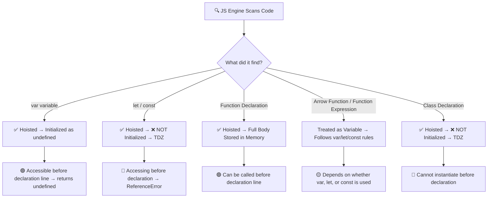

### Quick Proof Program

```javascript
// ═══════════════════════════════════════════════
// PROGRAM: Quick Hoisting Proof
// ═══════════════════════════════════════════════

console.log("=== HOISTING PROOF ===");

// 1. var — hoisted with undefined
console.log(myVar);        // Output: undefined
var myVar = "Hello Var";

// 2. Function Declaration — fully hoisted
myFunc();                  // Output: "I am fully hoisted!"
function myFunc() {
    console.log("I am fully hoisted!");
}

// 3. let — hoisted but in TDZ
try {
    console.log(myLet);   // ReferenceError
} catch (e) {
    console.log("let error:", e.message);
    // Output: let error: Cannot access 'myLet' before initialization
}
let myLet = "Hello Let";

// 4. Arrow Function with var — hoisted as undefined
try {
    myArrow();             // TypeError: myArrow is not a function
} catch (e) {
    console.log("Arrow error:", e.message);
    // Output: Arrow error: myArrow is not a function
}
var myArrow = () => console.log("Arrow!");

console.log("=== END ===");
```

**Output:**
```
=== HOISTING PROOF ===
undefined
I am fully hoisted!
let error: Cannot access 'myLet' before initialization
Arrow error: myArrow is not a function
=== END ===
```

---

<a id="topic-1"></a>
## 📌 TOPIC 1: Execution Context & The Two Phases

### What is an Execution Context?

> **Definition:** An **Execution Context** is an abstract environment created by the JS Engine where your code is evaluated and executed. Think of it as a **box** that contains everything a piece of code needs to run — its variables, its functions, and its `this` binding.

### Types of Execution Context

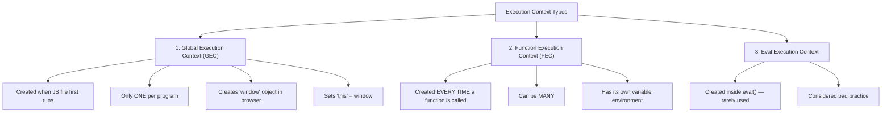

### The Two Phases — Deep Dive

Every Execution Context goes through **exactly two phases:**

```
╔═══════════════════════════════════════════════════════════════════╗
║                    EXECUTION CONTEXT LIFECYCLE                    ║
╠═══════════════════════════════════════════════════════════════════╣
║                                                                   ║
║   ┌─────────────────────────┐   ┌─────────────────────────────┐  ║
║   │  PHASE 1: MEMORY        │   │  PHASE 2: CODE EXECUTION    │  ║
║   │  (Creation Phase)       │   │  (Run Phase)                │  ║
║   │                         │   │                             │  ║
║   │  • Scan ALL code        │   │  • Execute line by line     │  ║
║   │  • Allocate memory      │   │  • Assign actual values     │  ║
║   │  • var → undefined      │   │  • Run function calls       │  ║
║   │  • function → full body │   │  • Handle expressions       │  ║
║   │  • let/const → TDZ      │   │  • Return values            │  ║
║   │  • Set up scope chain   │   │  • Pop from call stack      │  ║
║   └─────────────────────────┘   └─────────────────────────────┘  ║
║                                                                   ║
║              Phase 1 happens BEFORE any code runs                 ║
╚═══════════════════════════════════════════════════════════════════╝
```

### Complete Program: Watching Both Phases

```javascript
// ═══════════════════════════════════════════════
// PROGRAM: Execution Context Phases Demo
// ═══════════════════════════════════════════════

var x = 7;
var y = 10;

function add(a, b) {
    var result = a + b;
    return result;
}

function multiply(a, b) {
    var result = a * b;
    return result;
}

var sum = add(x, y);
var product = multiply(x, y);

console.log("Sum:", sum);         // Output: Sum: 17
console.log("Product:", product); // Output: Product: 70
```

### Phase-by-Phase Breakdown

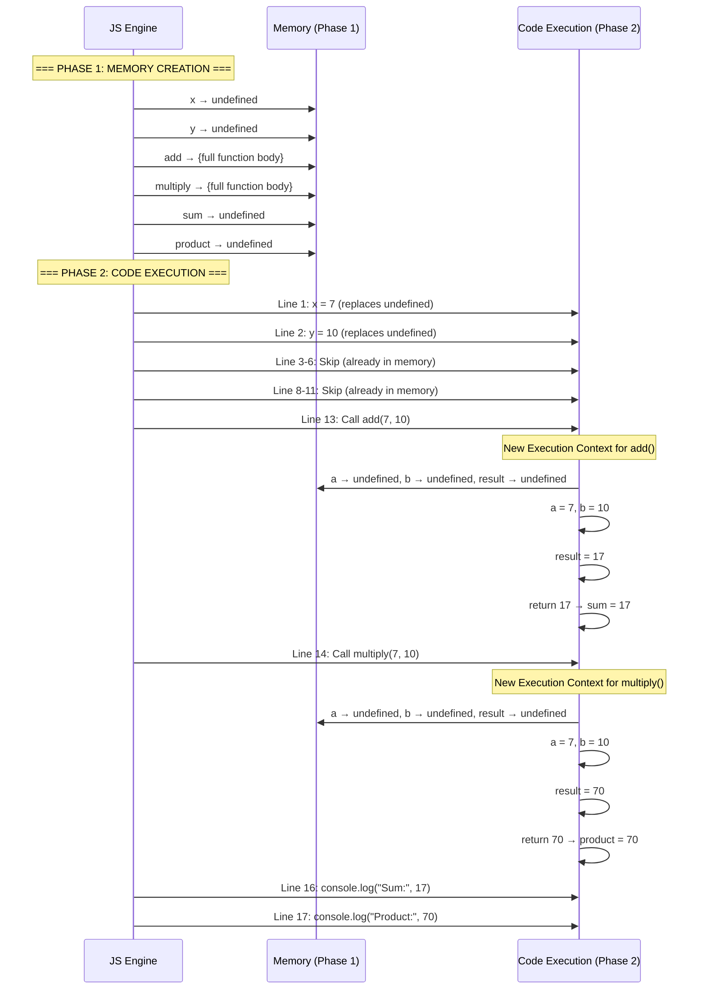

### Memory Snapshot Table

```
┌────────────────────────────────────────────────────────────┐
│              GLOBAL EXECUTION CONTEXT                      │
├────────────────────┬───────────────────────────────────────┤
│     MEMORY         │           CODE EXECUTION              │
│  (Phase 1)         │           (Phase 2)                   │
├────────────────────┼───────────────────────────────────────┤
│  x: undefined      │  x: 7                                │
│  y: undefined      │  y: 10                               │
│  add: fn(){...}    │  add: fn(){...} (unchanged)          │
│  multiply: fn(){}  │  multiply: fn(){...} (unchanged)     │
│  sum: undefined    │  sum: 17 (after add() returns)       │
│  product: undefined│  product: 70 (after multiply() ret.) │
└────────────────────┴───────────────────────────────────────┘
```

### Use Case: Why Understanding Phases Matters

```javascript
// ═══════════════════════════════════════════════
// USE CASE: API Data Processing
// Understanding phases helps debug "undefined" bugs
// ═══════════════════════════════════════════════

// Scenario: You're building a dashboard
var userName;
var userAge;

// This function works because it's hoisted (Phase 1)
displayUserInfo();

function displayUserInfo() {
    // At this point, userName and userAge are "undefined"
    // because Phase 2 hasn't assigned them yet
    console.log("Name:", userName);  // Name: undefined
    console.log("Age:", userAge);    // Age: undefined
}

// Values are assigned HERE in Phase 2
userName = "Akshay";
userAge = 30;

// Now calling again works correctly
displayUserInfo();
// Name: Akshay
// Age: 30
```

### Execution Context Internal Structure

```javascript
// ═══════════════════════════════════════════════
// PROGRAM: Visualizing Execution Context Structure
// ═══════════════════════════════════════════════

/*
 Every Execution Context has 3 components:
 
 ExecutionContext = {
     VariableEnvironment: {
         // Variables and function declarations
         environmentRecord: {
             x: undefined,      // Phase 1
             myFunc: fn(){...}  // Phase 1
         },
         outer: null  // Reference to parent scope
     },
     
     LexicalEnvironment: {
         // let, const declarations
         environmentRecord: {
             y: <uninitialized>,  // TDZ
             z: <uninitialized>   // TDZ
         },
         outer: null
     },
     
     ThisBinding: window  // (in browser) or global (in Node)
 }
*/

// Proof:
var x = 10;
let y = 20;
const z = 30;

function myFunc() {
    var localVar = 100;
    let localLet = 200;
    
    console.log("localVar:", localVar);  // 100
    console.log("localLet:", localLet);  // 200
    console.log("x from parent:", x);    // 10 (scope chain)
}

myFunc();
```

---

<a id="topic-2"></a>
## 📌 TOPIC 2: Undefined vs. Not Defined

### Why This Matters

> This is the **#1 most confused concept** in JS interviews. Interviewers LOVE to ask: *"Is `undefined` the same as `not defined`?"*

### The Core Difference

```
┌─────────────────────────────────────────────────────────────────┐
│                                                                 │
│   undefined ≠ Not Defined                                       │
│                                                                 │
│   ┌──────────────────────┐    ┌──────────────────────────────┐  │
│   │     undefined        │    │      Not Defined             │  │
│   │                      │    │                              │  │
│   │  • It's a VALUE      │    │  • It's an ERROR             │  │
│   │  • It's a TYPE       │    │  • ReferenceError            │  │
│   │  • Memory IS alloc.  │    │  • Memory NOT allocated      │  │
│   │  • Variable EXISTS   │    │  • Variable DOESN'T EXIST    │  │
│   │  • Just no value yet │    │  • Never declared anywhere   │  │
│   │  • typeof → undefined│    │  • Crashes the program       │  │
│   └──────────────────────┘    └──────────────────────────────┘  │
│                                                                 │
└─────────────────────────────────────────────────────────────────┘
```

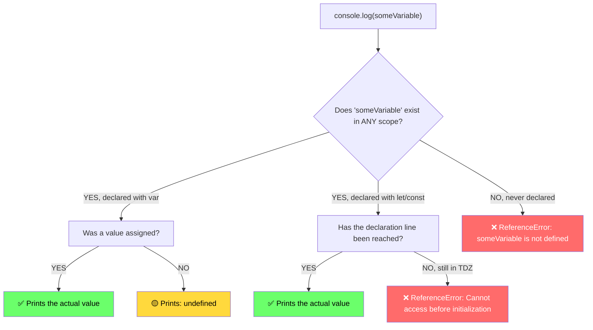

### Complete Program: All Cases

```javascript
// ═══════════════════════════════════════════════
// PROGRAM: undefined vs Not Defined — ALL Cases
// ═══════════════════════════════════════════════

// ────────────────────────────────
// CASE 1: var — declared, no value
// ────────────────────────────────
var a;
console.log(a);           // undefined
console.log(typeof a);    // "undefined"

// ────────────────────────────────
// CASE 2: var — declared, value assigned later
// ────────────────────────────────
console.log(b);            // undefined (hoisted)
var b = 42;
console.log(b);            // 42

// ────────────────────────────────
// CASE 3: Not Defined — never declared
// ────────────────────────────────
try {
    console.log(neverDeclared);
} catch (e) {
    console.log(e.name + ": " + e.message);
    // ReferenceError: neverDeclared is not defined
}

// ────────────────────────────────
// CASE 4: typeof trick (safe check)
// ────────────────────────────────
console.log(typeof neverDeclared);  // "undefined" (no error!)
// This is the ONLY operator that doesn't throw ReferenceError

// ────────────────────────────────
// CASE 5: Explicitly set to undefined
// ────────────────────────────────
var c = 100;
c = undefined;    // Manually set
console.log(c);   // undefined

// ────────────────────────────────
// CASE 6: undefined in functions
// ────────────────────────────────
function greet(name) {
    console.log("Hello, " + name);
}
greet();           // "Hello, undefined" (parameter not passed)

// ────────────────────────────────
// CASE 7: undefined in objects
// ────────────────────────────────
var obj = { name: "Akshay" };
console.log(obj.name);    // "Akshay"
console.log(obj.age);     // undefined (property doesn't exist)

// ────────────────────────────────
// CASE 8: undefined in arrays
// ────────────────────────────────
var arr = [1, 2, 3];
console.log(arr[0]);      // 1
console.log(arr[10]);     // undefined (index doesn't exist)

// ────────────────────────────────
// CASE 9: Function with no return
// ────────────────────────────────
function doSomething() {
    var x = 10;
    // no return statement
}
var result = doSomething();
console.log(result);       // undefined
```

**Output:**
```
undefined
undefined
undefined
42
ReferenceError: neverDeclared is not defined
undefined
undefined
Hello, undefined
Akshay
undefined
1
undefined
undefined
```

### Use Case: Safe Variable Checking

```javascript
// ═══════════════════════════════════════════════
// USE CASE: Feature Detection in Browser
// ═══════════════════════════════════════════════

// WRONG WAY — might crash if variable doesn't exist
// if (myLibrary) { ... }  // ReferenceError if not loaded

// RIGHT WAY — using typeof
if (typeof jQuery !== "undefined") {
    console.log("jQuery is loaded, version:", jQuery.fn.jquery);
} else {
    console.log("jQuery is NOT loaded. Loading fallback...");
}

// RIGHT WAY — using typeof for API check
if (typeof fetch !== "undefined") {
    console.log("Fetch API is available");
} else {
    console.log("Using XMLHttpRequest as fallback");
}

// RIGHT WAY — checking optional config
function initApp(config) {
    var port = (typeof config !== "undefined" && config.port) 
               ? config.port 
               : 3000;
    
    var host = (typeof config !== "undefined" && config.host) 
               ? config.host 
               : "localhost";
    
    console.log("Server: " + host + ":" + port);
}

initApp();                        // Server: localhost:3000
initApp({ port: 8080 });         // Server: localhost:8080
initApp({ host: "0.0.0.0", port: 9000 }); // Server: 0.0.0.0:9000
```

### The `undefined` is a Special Primitive

```javascript
// ═══════════════════════════════════════════════
// PROGRAM: Proving undefined is a real value/type
// ═══════════════════════════════════════════════

// 1. undefined is a type
console.log(typeof undefined);      // "undefined"

// 2. undefined is falsy
console.log(Boolean(undefined));    // false
console.log(!undefined);           // true

// 3. undefined in comparisons
console.log(undefined == null);     // true  (loose equality)
console.log(undefined === null);    // false (strict equality)
console.log(undefined == false);    // false
console.log(undefined == 0);       // false
console.log(undefined == "");      // false

// 4. undefined in arithmetic
console.log(undefined + 1);        // NaN
console.log(undefined * 10);       // NaN
console.log("Hello " + undefined); // "Hello undefined" (string concat)

// 5. The void operator always returns undefined
console.log(void 0);               // undefined
console.log(void "anything");      // undefined
console.log(void(100));            // undefined
```

---

<a id="topic-3"></a>
## 📌 TOPIC 3: Variable Hoisting (var, let, const & TDZ)

### 3.1 `var` Hoisting — The OG Behavior

> **Rule:** `var` declarations are hoisted to the top of their **function scope** (or global scope) and initialized with `undefined`.

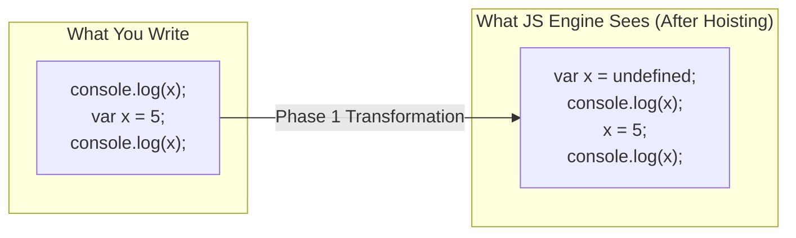

#### Program: `var` Hoisting in Detail

```javascript
// ═══════════════════════════════════════════════
// PROGRAM: var Hoisting — Complete Analysis
// ═══════════════════════════════════════════════

// ── Example 1: Basic hoisting ──
console.log(greeting);   // undefined
var greeting = "Namaste JavaScript";
console.log(greeting);   // "Namaste JavaScript"

// ── Example 2: var in function scope ──
function demo() {
    console.log(localVar);   // undefined (hoisted to function top)
    var localVar = "I am local";
    console.log(localVar);   // "I am local"
}
demo();

// ── Example 3: var does NOT respect block scope ──
console.log("Before block:", score);  // undefined
{
    var score = 100;
    console.log("Inside block:", score);  // 100
}
console.log("After block:", score);   // 100 (LEAKED out of block!)

// ── Example 4: var in if-else ──
console.log("Before if:", status);    // undefined
if (true) {
    var status = "active";
}
console.log("After if:", status);     // "active" (LEAKED!)

// ── Example 5: Multiple declarations ──
var x = 1;
var x = 2;  // No error! var allows re-declaration
var x = 3;
console.log(x);  // 3
```

**Output:**
```
undefined
Namaste JavaScript
undefined
I am local
Before block: undefined
Inside block: 100
After block: 100
Before if: undefined
After if: active
3
```

#### `var` Scope Diagram

```
┌──────────────────────────────────────────────────────┐
│ GLOBAL SCOPE                                         │
│                                                      │
│   var globalVar = "I'm global";                      │
│                                                      │
│   ┌──────────────────────────────────────────────┐   │
│   │ function myFunc() {                          │   │
│   │                                              │   │
│   │   var funcVar = "I'm function-scoped";       │   │
│   │                                              │   │
│   │   ┌──────────────────────────────────────┐   │   │
│   │   │ if (true) {                          │   │   │
│   │   │   var blockVar = "I LEAK!";          │   │   │
│   │   │   // blockVar is actually hoisted    │   │   │
│   │   │   // to myFunc's scope, NOT here     │   │   │
│   │   │ }                                    │   │   │
│   │   └──────────────────────────────────────┘   │   │
│   │                                              │   │
│   │   console.log(blockVar); // "I LEAK!" ✅    │   │
│   │                                              │   │
│   │ }                                            │   │
│   └──────────────────────────────────────────────┘   │
│                                                      │
│   console.log(funcVar); // ReferenceError ❌         │
│                                                      │
└──────────────────────────────────────────────────────┘
```

### 3.2 `let` Hoisting & The Temporal Dead Zone (TDZ)

> **Rule:** `let` IS hoisted, but it is NOT initialized. It stays in a **Temporal Dead Zone (TDZ)** from the start of the block until the declaration line.

#### What is the Temporal Dead Zone?

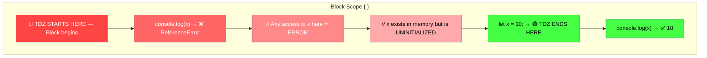

#### Program: TDZ in Action

```javascript
// ═══════════════════════════════════════════════
// PROGRAM: Temporal Dead Zone — Complete Demo
// ═══════════════════════════════════════════════

// ── Example 1: Basic TDZ ──
{
    // TDZ for 'name' starts here
    try {
        console.log(name);  // ReferenceError
    } catch (e) {
        console.log("TDZ Error:", e.message);
        // "Cannot access 'name' before initialization"
    }
    
    let name = "Akshay";  // TDZ ends here
    console.log(name);    // "Akshay" ✅
}

// ── Example 2: TDZ is about TIME, not POSITION ──
{
    // Even though 'getValue' function is ABOVE 'myVal' declaration,
    // the function runs AFTER 'myVal' is declared, so it works!
    
    function getValue() {
        return myVal;  // This line is defined above myVal
    }
    
    let myVal = 42;
    console.log(getValue());  // 42 ✅ (called after myVal is initialized)
}

// ── Example 3: TDZ catches bugs ──
{
    // Without TDZ (var behavior), this bug goes unnoticed:
    var price = 100;
    // ... 200 lines of code later ...
    var price = undefined;  // Oops! Accidentally re-declared
    // No error! Bug silently introduced.
    
    // With TDZ (let behavior), this is caught:
    let cost = 100;
    // let cost = 200;  // SyntaxError: Already declared
}

// ── Example 4: typeof in TDZ ──
{
    try {
        console.log(typeof tdzVar);  // ReferenceError (even typeof!)
    } catch (e) {
        console.log("Even typeof fails in TDZ:", e.message);
    }
    let tdzVar = "hello";
}

// Compare with undeclared variable:
console.log(typeof completelyUndeclared);  // "undefined" (no error)
```

**Output:**
```
TDZ Error: Cannot access 'name' before initialization
Akshay
42
Even typeof fails in TDZ: Cannot access 'tdzVar' before initialization
undefined
```

### 3.3 `const` Hoisting

> **Rule:** `const` behaves exactly like `let` regarding hoisting and TDZ, but with ONE additional constraint: it MUST be initialized at declaration and cannot be reassigned.

```javascript
// ═══════════════════════════════════════════════
// PROGRAM: const Hoisting & Rules
// ═══════════════════════════════════════════════

// ── TDZ applies to const too ──
{
    try {
        console.log(PI);
    } catch (e) {
        console.log("const TDZ:", e.message);
        // "Cannot access 'PI' before initialization"
    }
    
    const PI = 3.14159;
    console.log("PI:", PI);  // 3.14159
}

// ── const MUST be initialized ──
try {
    eval("const x;");  // SyntaxError: Missing initializer
} catch (e) {
    console.log("const without value:", e.message);
}

// ── const cannot be reassigned ──
const MAX_SIZE = 100;
try {
    // MAX_SIZE = 200;  // TypeError: Assignment to constant variable
    console.log("Cannot reassign const");
} catch (e) {
    console.log("Reassign error:", e.message);
}

// ── BUT const objects CAN be mutated! ──
const user = { name: "Akshay", age: 30 };
user.age = 31;           // ✅ This works! (mutating, not reassigning)
user.city = "Bangalore"; // ✅ This works too!
console.log(user);       // { name: "Akshay", age: 31, city: "Bangalore" }

// user = { name: "New" };  // ❌ TypeError (reassigning the reference)

// ── Same with const arrays ──
const colors = ["red", "blue"];
colors.push("green");    // ✅ Works!
console.log(colors);     // ["red", "blue", "green"]

// colors = ["yellow"];  // ❌ TypeError
```

### 3.4 Complete Comparison: var vs let vs const

```javascript
// ═══════════════════════════════════════════════
// PROGRAM: var vs let vs const — Side by Side
// ═══════════════════════════════════════════════

console.log("=== HOISTING ===");

// var: hoisted + initialized as undefined
console.log("var:", typeof varVariable);     // "undefined"

// let: hoisted + NOT initialized (TDZ)
// console.log("let:", typeof letVariable);  // ReferenceError

// const: hoisted + NOT initialized (TDZ)  
// console.log("const:", typeof constVar);   // ReferenceError

var varVariable = "var value";
let letVariable = "let value";
const constVariable = "const value";

console.log("\n=== RE-DECLARATION ===");

var varVariable = "var re-declared";    // ✅ No error
// let letVariable = "let re-declared"; // ❌ SyntaxError
// const constVariable = "re-declared"; // ❌ SyntaxError

console.log("var re-declared:", varVariable);

console.log("\n=== RE-ASSIGNMENT ===");

varVariable = "var reassigned";    // ✅
letVariable = "let reassigned";    // ✅
// constVariable = "reassigned";   // ❌ TypeError

console.log("var:", varVariable);
console.log("let:", letVariable);
console.log("const:", constVariable);  // Still "const value"

console.log("\n=== SCOPE ===");

function scopeTest() {
    if (true) {
        var varInBlock = "var";
        let letInBlock = "let";
        const constInBlock = "const";
    }
    
    console.log("var after block:", varInBlock);    // ✅ "var"
    // console.log("let after block:", letInBlock);  // ❌ ReferenceError
    // console.log("const after block:", constInBlock); // ❌ ReferenceError
}

scopeTest();
```

### Visual Comparison Table

```
┌─────────────┬──────────────┬──────────────┬──────────────┐
│  Feature     │    var       │    let       │    const     │
├─────────────┼──────────────┼──────────────┼──────────────┤
│  Hoisted?    │  ✅ Yes      │  ✅ Yes      │  ✅ Yes      │
│  Initialized │  undefined   │  ❌ No (TDZ) │  ❌ No (TDZ) │
│  Scope       │  Function    │  Block       │  Block       │
│  Re-declare  │  ✅ Yes      │  ❌ No       │  ❌ No       │
│  Re-assign   │  ✅ Yes      │  ✅ Yes      │  ❌ No       │
│  TDZ?        │  ❌ No       │  ✅ Yes      │  ✅ Yes      │
│  Must Init?  │  ❌ No       │  ❌ No       │  ✅ Yes      │
│  window prop │  ✅ Yes      │  ❌ No       │  ❌ No       │
└─────────────┴──────────────┴──────────────┴──────────────┘
```

### Use Case: Why TDZ is Good

```javascript
// ═══════════════════════════════════════════════
// USE CASE: TDZ Prevents Subtle Bugs
// ═══════════════════════════════════════════════

// ── Scenario: Order processing system ──

// WITHOUT TDZ (using var) — BUG GOES UNNOTICED
function processOrderVar() {
    console.log("Tax rate:", taxRate);  // undefined (not caught!)
    
    var totalPrice = 100;
    var taxRate = 0.18;   // Developer forgot to put this first
    
    var finalPrice = totalPrice + (totalPrice * taxRate);
    console.log("Final price:", finalPrice);  // 118 ✅ only by luck
    // If processOrder was called before taxRate was set,
    // it would silently use undefined and compute NaN
}

// WITH TDZ (using let) — BUG IS CAUGHT IMMEDIATELY
function processOrderLet() {
    try {
        console.log("Tax rate:", taxRate);  // 💥 ReferenceError!
    } catch (e) {
        console.log("🐛 Bug caught:", e.message);
        // "Cannot access 'taxRate' before initialization"
    }
    
    let totalPrice = 100;
    let taxRate = 0.18;
    
    let finalPrice = totalPrice + (totalPrice * taxRate);
    console.log("Final price:", finalPrice);
}

processOrderVar();
processOrderLet();
```

---

<a id="topic-4"></a>
## 📌 TOPIC 4: Function Hoisting (The Big Difference)

### 4.1 Function Declaration — Fully Hoisted

> **Rule:** Function declarations are hoisted with their **complete body**. You can call them before they appear in the code.

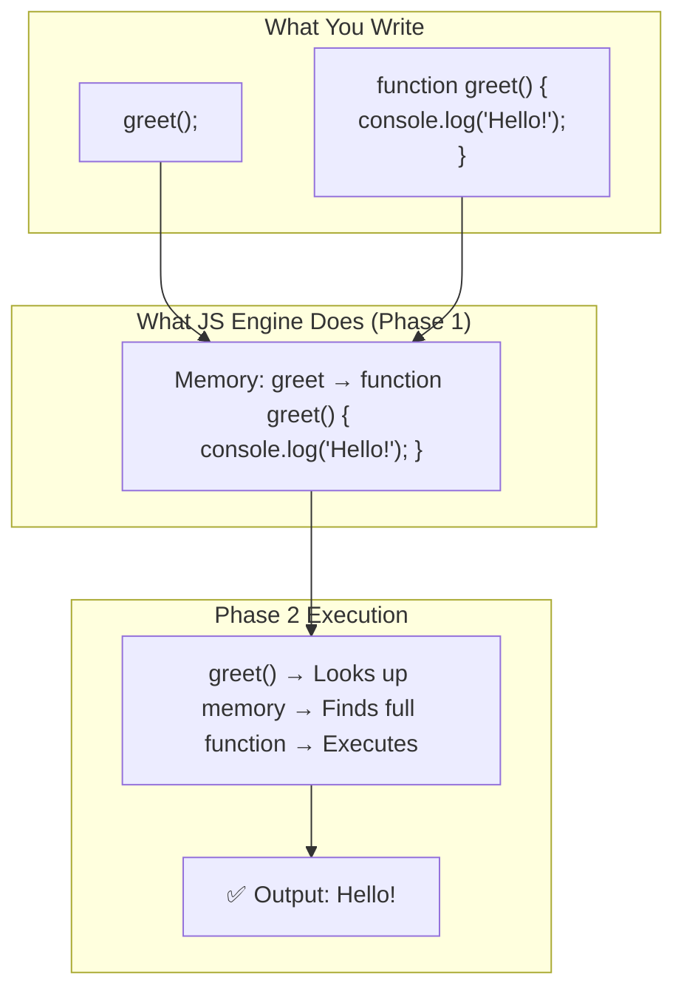

#### Program: Function Declaration Hoisting

```javascript
// ═══════════════════════════════════════════════
// PROGRAM: Function Declaration Hoisting
// ═══════════════════════════════════════════════

// ── Calling BEFORE declaration ──
console.log("1:", sayHello());      // ✅ "Hello, World!"
console.log("2:", add(5, 3));       // ✅ 8
console.log("3:", factorial(5));    // ✅ 120

// All these functions are declared BELOW but work ABOVE

function sayHello() {
    return "Hello, World!";
}

function add(a, b) {
    return a + b;
}

function factorial(n) {
    if (n <= 1) return 1;
    return n * factorial(n - 1);
}

// ── Nested function hoisting ──
function outer() {
    console.log("4:", inner());  // ✅ "I'm inner!"
    
    function inner() {
        return "I'm inner!";
    }
}
outer();

// ── Function hoisting respects scope ──
function scopeDemo() {
    console.log("5:", typeof localFunc);  // "function"
    
    function localFunc() {
        return "I'm local";
    }
}
scopeDemo();

// localFunc is NOT available here
console.log("6:", typeof localFunc);  // "undefined"
```

**Output:**
```
1: Hello, World!
2: 8
3: 120
4: I'm inner!
5: function
6: undefined
```

### 4.2 Function Expression — Variable Hoisting Rules Apply

> **Rule:** A function expression is treated as a **variable**. The variable is hoisted, but the function body is NOT.

```javascript
// ═══════════════════════════════════════════════
// PROGRAM: Function Expression Hoisting
// ═══════════════════════════════════════════════

// ── With var ──
console.log("typeof greet:", typeof greet);  // "undefined"

try {
    greet();  // TypeError: greet is not a function
} catch (e) {
    console.log("var error:", e.message);
}

var greet = function() {
    console.log("Hello from expression!");
};

greet();  // ✅ "Hello from expression!" (now it works)

// ── With let ──
try {
    // farewell();  // ReferenceError (TDZ)
    console.log("let is in TDZ");
} catch (e) {
    console.log("let error:", e.message);
}

let farewell = function() {
    console.log("Goodbye!");
};

farewell();  // ✅ "Goodbye!"

// ── Named Function Expression ──
try {
    myFunc();
} catch (e) {
    console.log("Named expr error:", e.message);
    // "myFunc is not a function"
}

var myFunc = function actualName() {
    console.log("Named expression");
    // console.log(actualName);  // Works inside!
};

myFunc();       // ✅ "Named expression"
// actualName(); // ❌ ReferenceError (name only available inside)
```

### 4.3 Arrow Functions — Same as Function Expression

```javascript
// ═══════════════════════════════════════════════
// PROGRAM: Arrow Function Hoisting
// ═══════════════════════════════════════════════

// Arrow functions follow the VARIABLE hoisting rule
// of whatever keyword they're declared with

// ── Arrow with var ──
console.log("arrow1:", typeof arrow1);  // "undefined"
try {
    arrow1();  // TypeError: arrow1 is not a function
} catch (e) {
    console.log("arrow var error:", e.message);
}
var arrow1 = () => console.log("Arrow 1");

// ── Arrow with let ──
try {
    arrow2();  // ReferenceError (TDZ)
} catch (e) {
    console.log("arrow let error:", e.message);
}
let arrow2 = () => console.log("Arrow 2");

// ── Arrow with const ──
try {
    arrow3();  // ReferenceError (TDZ)
} catch (e) {
    console.log("arrow const error:", e.message);
}
const arrow3 = () => console.log("Arrow 3");

// After declarations, all work:
arrow1();  // ✅ Arrow 1
arrow2();  // ✅ Arrow 2
arrow3();  // ✅ Arrow 3
```

### 4.4 Complete Comparison Diagram

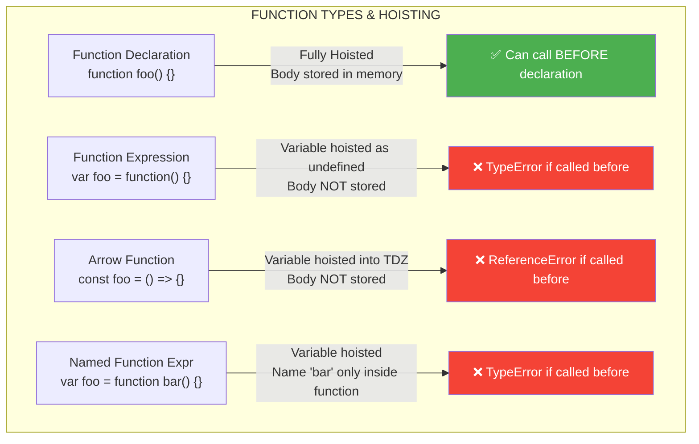

### Use Case: Code Organization Pattern

```javascript
// ═══════════════════════════════════════════════
// USE CASE: Top-Down Code Organization
// Using function hoisting for readable code
// ═══════════════════════════════════════════════

// ── HIGH-LEVEL LOGIC AT THE TOP ──
// (This is the "story" of your program)

function main() {
    const users = fetchUsers();
    const activeUsers = filterActive(users);
    const report = generateReport(activeUsers);
    displayReport(report);
}

// ── IMPLEMENTATION DETAILS AT THE BOTTOM ──
// (Reader can skip these if they just want the overview)

function fetchUsers() {
    return [
        { name: "Akshay", active: true },
        { name: "Rahul", active: false },
        { name: "Priya", active: true },
    ];
}

function filterActive(users) {
    return users.filter(u => u.active);
}

function generateReport(users) {
    return {
        total: users.length,
        names: users.map(u => u.name),
        generatedAt: new Date().toISOString()
    };
}

function displayReport(report) {
    console.log("=== Active Users Report ===");
    console.log("Total:", report.total);
    console.log("Names:", report.names.join(", "));
    console.log("Generated:", report.generatedAt);
}

main();
```

**Output:**
```
=== Active Users Report ===
Total: 2
Names: Akshay, Priya
Generated: 2024-01-15T10:30:00.000Z
```

---

<a id="topic-5"></a>
## 📌 TOPIC 5: Hoisting Priority (Variables vs. Functions)

### The Rule

> When a **variable declaration** and a **function declaration** have the **same name**, the **function declaration takes priority** during hoisting (Phase 1). However, during execution (Phase 2), the variable assignment can **overwrite** the function.

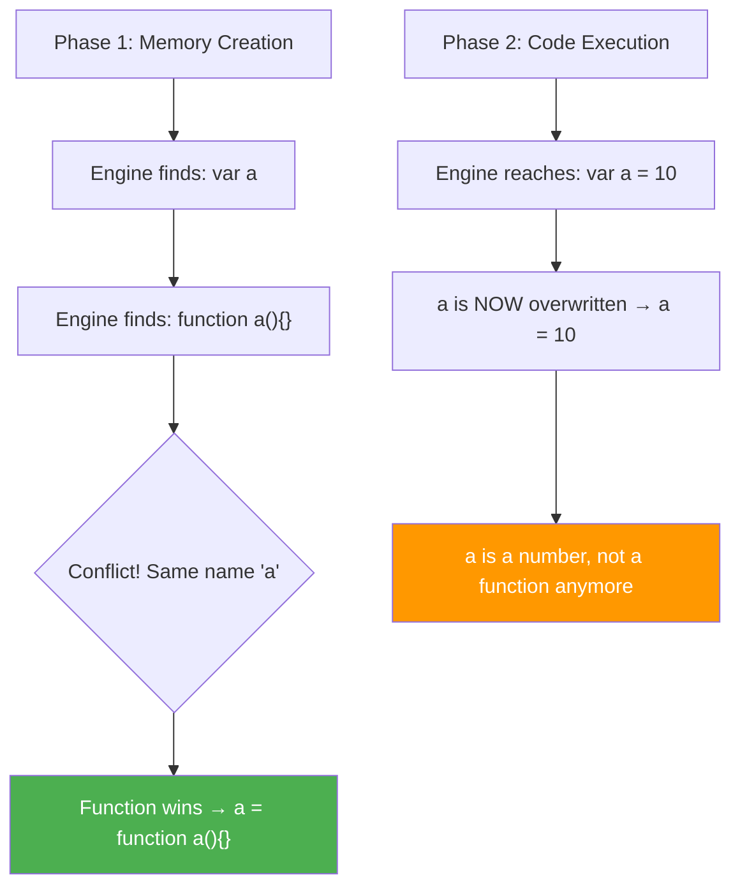

### Program: Priority Deep Dive

```javascript
// ═══════════════════════════════════════════════
// PROGRAM: Hoisting Priority — Functions vs Variables
// ═══════════════════════════════════════════════

// ── Example 1: Function wins in Phase 1 ──
console.log(typeof a);  // "function" (NOT "undefined")

var a = 10;
function a() {
    return "I am function a";
}

console.log(typeof a);  // "number" (overwritten in Phase 2)
console.log(a);          // 10

/*
 EXPLANATION:
 Phase 1:
   1. var a → memory allocated, a = undefined
   2. function a() → OVERWRITES a with function body
   So after Phase 1: a = function a() { return "I am function a"; }
 
 Phase 2:
   1. console.log(typeof a) → "function"
   2. a = 10 → overwrites function with number
   3. (function declaration is skipped — already processed in Phase 1)
   4. console.log(typeof a) → "number"
   5. console.log(a) → 10
*/

console.log("─".repeat(40));

// ── Example 2: Multiple functions with same name ──
console.log(b());  // "second" — last function declaration wins

function b() {
    return "first";
}

function b() {
    return "second";
}

/*
 Phase 1: 
   b = function() { return "first"; }
   b = function() { return "second"; }  // overwrites
*/

console.log("─".repeat(40));

// ── Example 3: var doesn't overwrite function in Phase 1 ──
console.log(c);  // function c() { return "function c"; }

var c;           // This does NOT reset c to undefined
                 // because function already claimed the name

function c() {
    return "function c";
}

console.log(c);  // Still: function c() { return "function c"; }

// BUT if var has an assignment:
var c = "overwritten";
console.log(c);  // "overwritten"

console.log("─".repeat(40));

// ── Example 4: The tricky one ──
function d() { return 1; }
var d;
console.log(typeof d);  // "function" (var without assignment doesn't override)

function e() { return 1; }
var e = undefined;       // explicit assignment
console.log(typeof e);   // "undefined" (assignment overwrites)

console.log("─".repeat(40));

// ── Example 5: Order of function declarations ──
console.log(foo());  // 3

function foo() { return 1; }
function foo() { return 2; }
function foo() { return 3; }  // Last one wins
```

**Output:**
```
function
number
10
────────────────────────────────────────
second
────────────────────────────────────────
[Function: c]
[Function: c]
overwritten
────────────────────────────────────────
function
undefined
────────────────────────────────────────
3
```

### Use Case: Avoiding Name Collisions

```javascript
// ═══════════════════════════════════════════════
// USE CASE: Name Collision in Large Codebases
// ═══════════════════════════════════════════════

// ── THE BUG ──
// Developer A writes a utility function
function validate(input) {
    return input.length > 0;
}

// ... 500 lines later ...

// Developer B creates a variable with the same name
var validate = true;  // Oops!

// Developer C tries to use Developer A's function
try {
    console.log(validate("hello"));  // TypeError: validate is not a function
} catch (e) {
    console.log("🐛 BUG:", e.message);
}

// ── THE FIX: Use modules, namespaces, or const ──
const ValidationUtils = {
    validate: function(input) {
        return input.length > 0;
    },
    validateEmail: function(email) {
        return email.includes("@");
    }
};

console.log(ValidationUtils.validate("hello"));     // true
console.log(ValidationUtils.validateEmail("a@b.c")); // true
```

---

<a id="topic-6"></a>
## 📌 TOPIC 6: Call Stack & Execution Context Visualization

### What is the Call Stack?

> **Definition:** The Call Stack is a **LIFO (Last In, First Out)** data structure that the JS engine uses to keep track of function execution. Every time a function is called, a new Execution Context is pushed onto the stack. When the function returns, it's popped off.

### Visual: Call Stack in Action

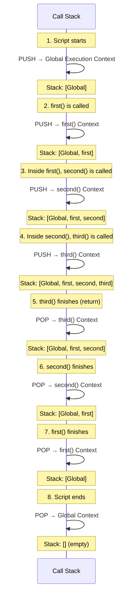

### Program: Call Stack with Hoisting

```javascript
// ═══════════════════════════════════════════════
// PROGRAM: Call Stack & Execution Context
// ═══════════════════════════════════════════════

var globalVar = "Global";

function first() {
    var firstVar = "First";
    console.log("Inside first()");
    console.log("  globalVar:", globalVar);     // "Global"
    console.log("  firstVar:", firstVar);       // "First"
    second();
    console.log("Back in first()");
}

function second() {
    var secondVar = "Second";
    console.log("  Inside second()");
    console.log("    globalVar:", globalVar);   // "Global"
    // console.log("    firstVar:", firstVar);  // ReferenceError!
    console.log("    secondVar:", secondVar);   // "Second"
    third();
    console.log("  Back in second()");
}

function third() {
    var thirdVar = "Third";
    console.log("    Inside third()");
    console.log("      globalVar:", globalVar); // "Global"
    console.log("      thirdVar:", thirdVar);   // "Third"
}

console.log("Script starts");
first();
console.log("Script ends");
```

**Output:**
```
Script starts
Inside first()
  globalVar: Global
  firstVar: First
  Inside second()
    globalVar: Global
    secondVar: Second
    Inside third()
      globalVar: Global
      thirdVar: Third
  Back in second()
Back in first()
Script ends
```

### Call Stack Snapshot at Each Step

```
Step 1: Script starts            Step 2: first() called
┌─────────────────┐              ┌─────────────────┐
│                 │              │   first()       │ ← TOP
│                 │              ├─────────────────┤
│   Global()      │ ← TOP       │   Global()      │
└─────────────────┘              └─────────────────┘

Step 3: second() called          Step 4: third() called
┌─────────────────┐              ┌─────────────────┐
│   second()      │ ← TOP       │   third()       │ ← TOP
├─────────────────┤              ├─────────────────┤
│   first()       │              │   second()      │
├─────────────────┤              ├─────────────────┤
│   Global()      │              │   first()       │
└─────────────────┘              ├─────────────────┤
                                 │   Global()      │
                                 └─────────────────┘

Step 5: third() returns          Step 6: second() returns
┌─────────────────┐              ┌─────────────────┐
│   second()      │ ← TOP       │   first()       │ ← TOP
├─────────────────┤              ├─────────────────┤
│   first()       │              │   Global()      │
├─────────────────┤              └─────────────────┘
│   Global()      │              
└─────────────────┘              

Step 7: first() returns          Step 8: Script ends
┌─────────────────┐              ┌─────────────────┐
│   Global()      │ ← TOP       │     (empty)     │
└─────────────────┘              └─────────────────┘
```

### Program: Each Context Has Its Own Memory

```javascript
// ═══════════════════════════════════════════════
// PROGRAM: Variable Shadowing with Call Stack
// ═══════════════════════════════════════════════

var x = 1;   // Global x

function a() {
    var x = 10;    // a()'s own x (shadows global x)
    console.log("In a(), x =", x);    // 10
    b();
    console.log("Back in a(), x =", x); // 10 (unchanged)
}

function b() {
    var x = 100;   // b()'s own x
    console.log("In b(), x =", x);    // 100
}

console.log("Global x =", x);   // 1
a();
console.log("Global x =", x);   // 1 (unchanged)
```

**Memory at the point when b() is executing:**

```
┌────────────────────────────────────────────────┐
│  CALL STACK                                    │
│                                                │
│  ┌──────────────────────────────────────────┐  │
│  │  b() Execution Context                   │  │
│  │  Memory: { x: 100 }                     │  │
│  │  Scope Chain: b → Global                │  │  ← TOP
│  └──────────────────────────────────────────┘  │
│  ┌──────────────────────────────────────────┐  │
│  │  a() Execution Context                   │  │
│  │  Memory: { x: 10 }                      │  │
│  │  Scope Chain: a → Global                │  │
│  └──────────────────────────────────────────┘  │
│  ┌──────────────────────────────────────────┐  │
│  │  Global Execution Context                │  │
│  │  Memory: { x: 1, a: fn, b: fn }        │  │
│  └──────────────────────────────────────────┘  │
└────────────────────────────────────────────────┘
```

### Use Case: Stack Overflow

```javascript
// ═══════════════════════════════════════════════
// USE CASE: Understanding Stack Overflow
// ═══════════════════════════════════════════════

// ── Infinite Recursion ──
function infinite() {
    console.log("Calling...");
    infinite();  // Calls itself forever
}

try {
    // infinite();  // Uncomment to see: 
    // "RangeError: Maximum call stack size exceeded"
    console.log("Stack overflow would happen here");
} catch (e) {
    console.log("Error:", e.message);
}

// ── Proper Recursion with Base Case ──
function countdown(n) {
    if (n <= 0) {
        console.log("Liftoff! 🚀");
        return;  // Base case — stops recursion
    }
    console.log(n);
    countdown(n - 1);
}

countdown(5);
// 5, 4, 3, 2, 1, Liftoff! 🚀
```

---

<a id="topic-7"></a>
## 📌 TOPIC 7: Hoisting in Loops (The Interviewer's Favorite)

### The Classic Problem

> This is asked in **90% of JS interviews**. The interviewer wants to see if you understand `var` scoping, closures, and the event loop.

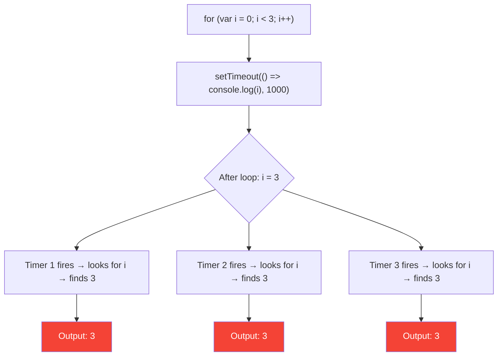

### Program: The Problem & All Solutions

```javascript
// ═══════════════════════════════════════════════
// PROGRAM: var in Loops — The Classic Bug
// ═══════════════════════════════════════════════

// ────────────────────────────────
// PROBLEM: var version (WRONG OUTPUT)
// ────────────────────────────────
console.log("=== var (BUGGY) ===");
for (var i = 0; i < 3; i++) {
    setTimeout(function() {
        console.log("var:", i);
    }, 100);
}
// Output: var: 3, var: 3, var: 3 ❌

/*
 WHY?
 
 ┌─────────────────────────────────────────────────┐
 │  Memory: Only ONE 'i' exists (function-scoped)  │
 │                                                  │
 │  Loop:                                          │
 │    i=0 → setTimeout scheduled (closure → i)     │
 │    i=1 → setTimeout scheduled (closure → i)     │
 │    i=2 → setTimeout scheduled (closure → i)     │
 │    i=3 → loop condition fails, loop ends        │
 │                                                  │
 │  After 100ms, all callbacks run:                │
 │    Callback 1: console.log(i) → i is 3         │
 │    Callback 2: console.log(i) → i is 3         │
 │    Callback 3: console.log(i) → i is 3         │
 │                                                  │
 │  All three share the SAME variable i!           │
 └─────────────────────────────────────────────────┘
*/
```

### Solution 1: Use `let` (Best Solution)

```javascript
// ════════════════════════════════
// SOLUTION 1: let (Block Scope)
// ════════════════════════════════
console.log("=== let (CORRECT) ===");
for (let i = 0; i < 3; i++) {
    setTimeout(function() {
        console.log("let:", i);
    }, 200);
}
// Output: let: 0, let: 1, let: 2 ✅

/*
 WHY?
 
 ┌─────────────────────────────────────────────────┐
 │  Each iteration creates a NEW block scope       │
 │  with its OWN copy of i                         │
 │                                                  │
 │  Iteration 1: { let i = 0; setTimeout(→ i=0) }  │
 │  Iteration 2: { let i = 1; setTimeout(→ i=1) }  │
 │  Iteration 3: { let i = 2; setTimeout(→ i=2) }  │
 │                                                  │
 │  Three SEPARATE variables, three separate values│
 └─────────────────────────────────────────────────┘
*/
```

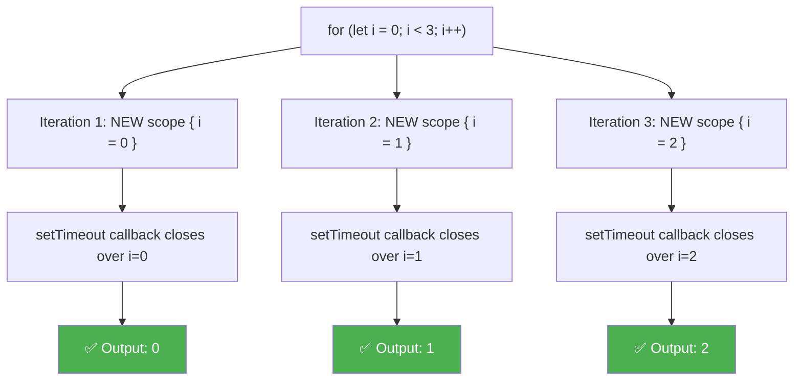

### Solution 2: IIFE (Immediately Invoked Function Expression)

```javascript
// ════════════════════════════════
// SOLUTION 2: IIFE
// ════════════════════════════════
console.log("=== IIFE (CORRECT) ===");
for (var i = 0; i < 3; i++) {
    (function(j) {  // j is a NEW variable for each call
        setTimeout(function() {
            console.log("IIFE:", j);
        }, 300);
    })(i);  // Pass current i as argument
}
// Output: IIFE: 0, IIFE: 1, IIFE: 2 ✅

/*
 WHY?
 
 Each IIFE creates a new function scope with its own 'j'.
 
 Iteration 1: (function(j=0) { setTimeout(→ j=0) })()
 Iteration 2: (function(j=1) { setTimeout(→ j=1) })()
 Iteration 3: (function(j=2) { setTimeout(→ j=2) })()
*/
```

### Solution 3: Using `bind` or Separate Function

```javascript
// ════════════════════════════════
// SOLUTION 3: Using .bind()
// ════════════════════════════════
console.log("=== bind (CORRECT) ===");
for (var i = 0; i < 3; i++) {
    setTimeout(function(j) {
        console.log("bind:", j);
    }.bind(null, i), 400);  // Bind current i as first argument
}
// Output: bind: 0, bind: 1, bind: 2 ✅

// ════════════════════════════════
// SOLUTION 4: Third argument of setTimeout
// ════════════════════════════════
console.log("=== setTimeout arg (CORRECT) ===");
for (var i = 0; i < 3; i++) {
    setTimeout(function(j) {
        console.log("arg:", j);
    }, 500, i);  // Third param passed as arg to callback
}
// Output: arg: 0, arg: 1, arg: 2 ✅
```

### Advanced: The Same Problem with Event Listeners

```javascript
// ═══════════════════════════════════════════════
// USE CASE: DOM Event Listeners (Common Bug)
// ═══════════════════════════════════════════════

/*
 // ❌ BUGGY (if using var):
 var buttons = document.querySelectorAll('.btn');
 
 for (var i = 0; i < buttons.length; i++) {
     buttons[i].addEventListener('click', function() {
         console.log('Button', i, 'clicked');
         // Always logs the last value of i!
     });
 }
 
 // ✅ FIXED (using let):
 for (let i = 0; i < buttons.length; i++) {
     buttons[i].addEventListener('click', function() {
         console.log('Button', i, 'clicked');
         // Correctly logs 0, 1, 2, etc.
     });
 }
*/

// Simulating without DOM:
function simulateButtonClicks() {
    var handlers = [];
    
    // ❌ Bug with var
    for (var i = 0; i < 3; i++) {
        handlers.push(function() {
            return "Button " + i + " clicked";
        });
    }
    
    console.log(handlers[0]());  // "Button 3 clicked" ❌
    console.log(handlers[1]());  // "Button 3 clicked" ❌
    console.log(handlers[2]());  // "Button 3 clicked" ❌
    
    // ✅ Fix with let
    var fixedHandlers = [];
    
    for (let i = 0; i < 3; i++) {
        fixedHandlers.push(function() {
            return "Button " + i + " clicked";
        });
    }
    
    console.log(fixedHandlers[0]());  // "Button 0 clicked" ✅
    console.log(fixedHandlers[1]());  // "Button 1 clicked" ✅
    console.log(fixedHandlers[2]());  // "Button 2 clicked" ✅
}

simulateButtonClicks();
```

---

<a id="topic-8"></a>
## 📌 TOPIC 8: Class Hoisting

### The Rule

> **Classes ARE hoisted**, but they behave like `let` and `const` — they're placed in the **Temporal Dead Zone**. You CANNOT use a class before its declaration.

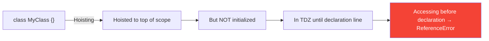

### Program: Class Hoisting Complete Demo

```javascript
// ═══════════════════════════════════════════════
// PROGRAM: Class Hoisting — All Scenarios
// ═══════════════════════════════════════════════

// ── 1. Class Declaration — TDZ applies ──
try {
    const person = new Person();
} catch (e) {
    console.log("Class TDZ:", e.message);
    // "Cannot access 'Person' before initialization"
}

class Person {
    constructor(name) {
        this.name = name || "Default";
    }
    
    greet() {
        return `Hi, I'm ${this.name}`;
    }
}

const person = new Person("Akshay");
console.log(person.greet());  // "Hi, I'm Akshay" ✅

// ── 2. Class Expression — Same as variable ──
try {
    const car = new Car();
} catch (e) {
    console.log("Class expr:", e.message);
    // "Cannot access 'Car' before initialization"
}

const Car = class {
    constructor(make) {
        this.make = make || "Unknown";
    }
};

const car = new Car("Toyota");
console.log("Car:", car.make);  // "Toyota" ✅

// ── 3. var with Class Expression — undefined ──
try {
    const animal = new Animal();
} catch (e) {
    console.log("var class:", e.message);
    // "Animal is not a constructor"
}

var Animal = class {
    constructor(type) {
        this.type = type;
    }
};

const animal = new Animal("Dog");
console.log("Animal:", animal.type);  // "Dog" ✅

// ── 4. Class with Inheritance — Both must be declared first ──
// const s = new Student(); // ReferenceError

class Human {
    constructor(name) {
        this.name = name;
    }
}

class Student extends Human {
    constructor(name, grade) {
        super(name);
        this.grade = grade;
    }
}

const student = new Student("Priya", "A+");
console.log("Student:", student.name, student.grade);
```

**Output:**
```
Class TDZ: Cannot access 'Person' before initialization
Hi, I'm Akshay
Class expr: Cannot access 'Car' before initialization
Car: Toyota
var class: Animal is not a constructor
Animal: Dog
Student: Priya A+
```

### Use Case: Why Class TDZ Makes Sense

```javascript
// ═══════════════════════════════════════════════
// USE CASE: Preventing Incomplete Class Usage
// ═══════════════════════════════════════════════

// If classes were like var (initialized as undefined),
// you could accidentally create objects from "undefined"
// This would be catastrophic in large applications.

// Imagine a payment system:
// const payment = new PaymentProcessor();  // Must fail if class isn't ready!

class PaymentProcessor {
    #apiKey;  // Private field
    
    constructor(apiKey) {
        if (!apiKey) throw new Error("API key required!");
        this.#apiKey = apiKey;
    }
    
    processPayment(amount) {
        console.log(`Processing $${amount} with key ${this.#apiKey.slice(0, 4)}...`);
        return { success: true, amount };
    }
}

const processor = new PaymentProcessor("sk_live_abc123");
console.log(processor.processPayment(99.99));
```

---

<a id="topic-9"></a>
## 📌 TOPIC 9: Using the Debugger (Practical Skill)

### Why This Matters

> In real interviews and jobs, you need to PROVE hoisting happens. The debugger is your **microscope** to see the Memory Creation Phase in action.

### Step-by-Step Guide

```
╔═══════════════════════════════════════════════════════════════╗
║              HOW TO USE THE DEBUGGER FOR HOISTING             ║
╠═══════════════════════════════════════════════════════════════╣
║                                                               ║
║  Step 1: Add 'debugger;' at the very TOP of your script      ║
║  Step 2: Open Chrome → F12 → Sources Tab                     ║
║  Step 3: Run the code (refresh page)                         ║
║  Step 4: Code pauses at debugger statement                   ║
║  Step 5: Look at RIGHT PANEL → "Scope" section               ║
║  Step 6: Expand "Local" or "Script" or "Global"              ║
║  Step 7: You'll SEE variables as 'undefined' and             ║
║          functions with their full body — BEFORE any         ║
║          code has executed!                                   ║
║  Step 8: Press F10 (Step Over) to watch values change        ║
║                                                               ║
╚═══════════════════════════════════════════════════════════════╝
```

### Program: Debugger Demo

```javascript
// ═══════════════════════════════════════════════
// PROGRAM: Debugger Proof of Hoisting
// Copy this into Chrome DevTools Console
// ═══════════════════════════════════════════════

debugger;  // Code pauses HERE

// At this point, in Scope panel you'll see:
// x: undefined
// y: undefined
// greet: ƒ greet()
// arrow: undefined

var x = 10;
debugger;  // Check Scope: x is now 10

var y = 20;
debugger;  // Check Scope: y is now 20

function greet(name) {
    debugger;  // Check Scope: name = "Akshay", message = undefined
    var message = "Hello, " + name;
    debugger;  // Check Scope: message = "Hello, Akshay"
    return message;
}

var arrow = (a, b) => a + b;
debugger;  // Check Scope: arrow is now a function

var result = greet("Akshay");
debugger;  // Check Scope: result = "Hello, Akshay"

console.log(result);
```

### What You See in DevTools

```
┌─────────────────────────────────────────────────────────┐
│  Chrome DevTools - Sources Tab                          │
│                                                         │
│  ┌────────────────────────────────────────────────────┐  │
│  │  Code                    │  Scope (at debugger 1) │  │
│  │                          │                        │  │
│  │  > debugger; ◄ paused    │  ▼ Local               │  │
│  │    var x = 10;           │    this: Window        │  │
│  │    var y = 20;           │                        │  │
│  │    function greet()...   │  ▼ Script              │  │
│  │    var arrow = ...       │    (empty)             │  │
│  │    var result = ...      │                        │  │
│  │                          │  ▼ Global              │  │
│  │                          │    x: undefined        │  │
│  │                          │    y: undefined        │  │
│  │                          │    greet: ƒ greet()    │  │
│  │                          │    arrow: undefined    │  │
│  │                          │    result: undefined   │  │
│  └────────────────────────────────────────────────────┘  │
│                                                         │
│  ┌────────────────────────────────────────────────────┐  │
│  │  Call Stack:                                      │  │
│  │    ▸ (anonymous) — script.js:1                    │  │
│  └────────────────────────────────────────────────────┘  │
└─────────────────────────────────────────────────────────┘
```

### Debugger with `let` and TDZ

```javascript
// ═══════════════════════════════════════════════
// PROGRAM: Debugger showing TDZ
// ═══════════════════════════════════════════════

{
    debugger;  // At this point:
    // In Scope panel, you WON'T see 'a' at all,
    // or you'll see it marked as "<value unavailable>"
    // This proves TDZ — the variable is hoisted but uninitialized
    
    // Trying to access it would throw ReferenceError
    
    let a = 42;
    debugger;  // Now you'll see: a = 42
    
    console.log(a);  // 42
}
```

### Use Case: Debugging Production Issues

```javascript
// ═══════════════════════════════════════════════
// USE CASE: Finding the "undefined" bug in production
// ═══════════════════════════════════════════════

function calculateDiscount(cart) {
    debugger;  // Step 1: Check what 'discount' is
    
    console.log("Applying discount:", discount);  // undefined!
    
    var total = cart.reduce((sum, item) => sum + item.price, 0);
    
    var discount = 0.1;  // 10% — but this is too late!
    
    var finalPrice = total - (total * discount);
    
    debugger;  // Step 2: Verify finalPrice
    
    return finalPrice;
}

var cart = [
    { name: "Shoes", price: 1000 },
    { name: "Shirt", price: 500 }
];

console.log("Final Price:", calculateDiscount(cart));
// Without debugger, you'd wonder why discount isn't applied correctly

// FIX: Move var discount = 0.1 to the top of the function
```

---

<a id="topic-10"></a>
## 📌 TOPIC 10: Advanced Interview Questions (Brain Teasers)

### Q1: Mixed Hoisting

```javascript
// ═══════════════════════════════════════════════
// INTERVIEW Q1: What is the output?
// ═══════════════════════════════════════════════

console.log(a);

var a = 1;

function a() {
    console.log("I am a function");
}

console.log(a);

// ──────────────────────
// ANSWER & EXPLANATION:
// ──────────────────────

/*
 Phase 1 (Memory):
   var a → undefined
   function a() → overwrites a with function body
   
 Phase 2 (Execution):
   console.log(a) → prints: ƒ a() { console.log("I am a function") }
   a = 1           → overwrites function with number
   (function declaration skipped — already processed)
   console.log(a) → prints: 1
   
 OUTPUT:
   ƒ a() { console.log("I am a function") }
   1
*/
```

### Q2: The Tricky `let` Question

```javascript
// ═══════════════════════════════════════════════
// INTERVIEW Q2: What is the output?
// ═══════════════════════════════════════════════

let x = 10;

function foo() {
    console.log(x);
    let x = 20;
}

try {
    foo();
} catch (e) {
    console.log("Error:", e.message);
}

// ──────────────────────
// ANSWER & EXPLANATION:
// ──────────────────────

/*
 Many people think: "x = 10 (from outer scope)"
 
 WRONG! 
 
 Inside foo(), there's a `let x = 20` declaration.
 This creates a NEW x in foo()'s scope.
 This new x is hoisted to the top of foo().
 But it's in TDZ until `let x = 20` is reached.
 
 So console.log(x) tries to access the LOCAL x,
 which is in TDZ → ReferenceError!
 
 OUTPUT:
   Error: Cannot access 'x' before initialization
*/
```

### Q3: The `y = 10` Trap

```javascript
// ═══════════════════════════════════════════════
// INTERVIEW Q3: Explain let x = y = 10;
// ═══════════════════════════════════════════════

function demo() {
    let x = y = 10;
    console.log("Inside - x:", x);  // 10
    console.log("Inside - y:", y);  // 10
}

demo();

// console.log("Outside - x:", x); // ReferenceError (x is let, block-scoped)
console.log("Outside - y:", y);    // 10 ← SURPRISE!

// ──────────────────────
// EXPLANATION:
// ──────────────────────

/*
 let x = y = 10; is evaluated RIGHT TO LEFT:
 
 Step 1: y = 10
   - y is NOT declared with let/var/const
   - So y becomes a GLOBAL variable (implicit global)
   - In strict mode, this would throw ReferenceError
 
 Step 2: let x = (result of y = 10) = 10
   - x is declared with let, so it's block-scoped to demo()
 
 Result:
   x → local to demo() (dies when function ends)
   y → GLOBAL (accessible everywhere)
*/

// ── PROOF: In strict mode ──
// "use strict";
// function strictDemo() {
//     let x = y = 10;  // ReferenceError: y is not defined
// }
```

### Q4: Function Scope vs Block Scope

```javascript
// ═══════════════════════════════════════════════
// INTERVIEW Q4: What is the output?
// ═══════════════════════════════════════════════

function test() {
    console.log("1:", a);     // ?
    console.log("2:", b);     // ?
    // console.log("3:", c);  // ?
    
    if (true) {
        var a = 1;
        let b = 2;
        const c = 3;
        
        console.log("4:", a);  // ?
        console.log("5:", b);  // ?
        console.log("6:", c);  // ?
    }
    
    console.log("7:", a);      // ?
    // console.log("8:", b);   // ?
    // console.log("9:", c);   // ?
}

test();

// ──────────────────────
// ANSWERS:
// ──────────────────────

/*
 1: undefined    (var hoisted to function top, initialized as undefined)
 2: ReferenceError (let hoisted to block top, in TDZ)
 
 But wait — if line 2 throws, the code stops!
 So let's comment out line 2 and analyze:
 
 1: undefined    (var a hoisted)
 4: 1            (a is assigned)
 5: 2            (b is assigned)
 6: 3            (c is assigned)
 7: 1            (var a is function-scoped, still accessible)
 8: ReferenceError (let b is block-scoped, gone after if-block)
 9: ReferenceError (const c is block-scoped, gone after if-block)
*/
```

### Q5: Complex Hoisting Chain

```javascript
// ═══════════════════════════════════════════════
// INTERVIEW Q5: Trace the output step by step
// ═══════════════════════════════════════════════

var a = 1;
function b() {
    a = 10;
    return;
    function a() {}
}
b();
console.log(a);

// ──────────────────────
// ANSWER: 1
// ──────────────────────

/*
 This is TRICKY! 
 
 Inside function b():
   Phase 1: function a() {} is hoisted to the top of b()
   This creates a LOCAL variable 'a' inside b()
   
   Phase 2: a = 10 → assigns 10 to the LOCAL 'a' (not global!)
   return → function exits
   
 The global 'a' is NEVER touched!
 So console.log(a) → 1
 
 It's as if b() looked like this:
 
 function b() {
     var a = function a() {};  // hoisted
     a = 10;                   // overwrites local a
     return;
 }
*/
```

### Q6: Arguments and Hoisting

```javascript
// ═══════════════════════════════════════════════
// INTERVIEW Q6: What is the output?
// ═══════════════════════════════════════════════

function foo(a) {
    console.log("1:", a);
    var a = 10;
    console.log("2:", a);
    function a() {}
    console.log("3:", a);
}

foo(100);

// ──────────────────────
// ANSWER:
// ──────────────────────

/*
 Phase 1 (Memory Creation for foo's context):
   1. Parameter a → initialized with argument value 100
   2. var a → already exists, so ignored (no re-initialization)
   3. function a() {} → OVERWRITES a with function body
   
   After Phase 1: a = function a() {}
   
 Phase 2 (Execution):
   console.log("1:", a) → function a() {}
   a = 10               → overwrites with 10
   console.log("2:", a) → 10
   (function declaration skipped) 
   console.log("3:", a) → 10
   
 OUTPUT:
   1: function a() {}
   2: 10
   3: 10
*/
```

### Q7: The `var` in `catch` Block

```javascript
// ═══════════════════════════════════════════════
// INTERVIEW Q7: Error handling and hoisting
// ═══════════════════════════════════════════════

console.log(x);  // undefined (var is hoisted)

try {
    throw new Error("Oops");
    var x = 10;   // Never executed, but var is STILL hoisted!
} catch (e) {
    console.log("Error caught:", e.message);
    console.log("x inside catch:", x);  // undefined
    var y = 20;   // This var is also hoisted to function/global scope
}

console.log("x after:", x);  // undefined (never assigned)
console.log("y after:", y);  // 20

/*
 EXPLANATION:
 var declarations are hoisted during Phase 1
 regardless of whether they're in unreachable code!
 The ASSIGNMENT doesn't happen (because throw stops execution),
 but the DECLARATION is hoisted.
*/
```

---

<a id="topic-11"></a>
## 📌 TOPIC 11: Real-World Use Cases & Best Practices

### Use Case 1: Module Pattern (Using Hoisting)

```javascript
// ═══════════════════════════════════════════════
// USE CASE 1: Clean API Design with Hoisting
// ═══════════════════════════════════════════════

// PUBLIC API — Easy to read at a glance
var UserModule = createUserModule();

console.log(UserModule.createUser("Akshay", 30));
console.log(UserModule.getUsers());
UserModule.deleteUser("Akshay");
console.log(UserModule.getUsers());

// IMPLEMENTATION — Hidden below
function createUserModule() {
    var users = [];  // Private
    
    return {
        createUser: createUser,    // These work because
        getUsers: getUsers,        // function declarations
        deleteUser: deleteUser     // are fully hoisted
    };
    
    // ── All implementation details below ──
    
    function createUser(name, age) {
        var user = { name: name, age: age, id: Date.now() };
        users.push(user);
        return user;
    }
    
    function getUsers() {
        return [...users];  // Return copy
    }
    
    function deleteUser(name) {
        users = users.filter(u => u.name !== name);
    }
}
```

### Use Case 2: Configuration Setup

```javascript
// ═══════════════════════════════════════════════
// USE CASE 2: App Configuration (const prevents bugs)
// ═══════════════════════════════════════════════

// Using const ensures config can't be accidentally overwritten
const APP_CONFIG = Object.freeze({
    API_URL: "https://api.example.com",
    TIMEOUT: 5000,
    MAX_RETRIES: 3,
    DEBUG: false
});

// Using let for values that change
let currentUser = null;
let isAuthenticated = false;

// This will throw an error — preventing accidental config change
try {
    // APP_CONFIG = {};  // TypeError: Assignment to constant
    APP_CONFIG.NEW_PROP = "test";  // Silently fails (frozen)
    console.log("NEW_PROP:", APP_CONFIG.NEW_PROP);  // undefined
} catch (e) {
    console.log("Config protected:", e.message);
}

console.log("Config:", APP_CONFIG);
```

### Use Case 3: State Management

```javascript
// ═══════════════════════════════════════════════
// USE CASE 3: Simple State Management
// ═══════════════════════════════════════════════

function createStore(initialState) {
    let state = initialState;          // let — will be reassigned
    const listeners = [];              // const — array reference won't change
    
    return {
        getState: getState,
        dispatch: dispatch,
        subscribe: subscribe
    };
    
    function getState() {
        return { ...state };  // Return copy
    }
    
    function dispatch(action) {
        // Functions hoisted — can use reducer before it's defined in code
        state = reducer(state, action);
        notifyListeners();
    }
    
    function subscribe(listener) {
        listeners.push(listener);
        return function unsubscribe() {
            const index = listeners.indexOf(listener);
            listeners.splice(index, 1);
        };
    }
    
    function reducer(currentState, action) {
        switch (action.type) {
            case "INCREMENT":
                return { ...currentState, count: currentState.count + 1 };
            case "DECREMENT":
                return { ...currentState, count: currentState.count - 1 };
            case "RESET":
                return { ...currentState, count: 0 };
            default:
                return currentState;
        }
    }
    
    function notifyListeners() {
        listeners.forEach(listener => listener(state));
    }
}

// Usage
const store = createStore({ count: 0 });

const unsubscribe = store.subscribe(state => {
    console.log("State changed:", state);
});

store.dispatch({ type: "INCREMENT" });  // State changed: { count: 1 }
store.dispatch({ type: "INCREMENT" });  // State changed: { count: 2 }
store.dispatch({ type: "DECREMENT" });  // State changed: { count: 1 }
store.dispatch({ type: "RESET" });      // State changed: { count: 0 }

unsubscribe();  // Stop listening
store.dispatch({ type: "INCREMENT" });  // No log (unsubscribed)
console.log(store.getState());          // { count: 1 }
```

### Best Practices Summary

```
╔═══════════════════════════════════════════════════════════════════╗
║                    BEST PRACTICES CHECKLIST                       ║
╠═══════════════════════════════════════════════════════════════════╣
║                                                                   ║
║  ✅ DO:                                                           ║
║  ────                                                             ║
║  1. Use 'const' by default                                        ║
║  2. Use 'let' only when reassignment is needed                   ║
║  3. Declare variables at the TOP of their scope                  ║
║  4. Use function declarations for main logic (hoisting benefit)  ║
║  5. Use 'use strict' to catch accidental globals                 ║
║  6. Initialize variables when declaring                          ║
║                                                                   ║
║  ❌ DON'T:                                                        ║
║  ──────                                                           ║
║  1. Never use 'var' (unless maintaining legacy code)             ║
║  2. Never rely on hoisting for variable values                   ║
║  3. Never declare variables inside loops (if not needed)         ║
║  4. Never use the same name for variables and functions          ║
║  5. Never omit var/let/const (creates implicit globals)          ║
║  6. Never use eval() — it messes with scope chain               ║
║                                                                   ║
╚═══════════════════════════════════════════════════════════════════╝
```

---

<a id="topic-12"></a>
## 📌 TOPIC 12: Common Pitfalls & Anti-Patterns

### Pitfall 1: Accidental Global Variables

```javascript
// ═══════════════════════════════════════════════
// PITFALL 1: Accidental Globals
// ═══════════════════════════════════════════════

function processData() {
    result = "processed";  // ❌ Missing var/let/const!
    // 'result' becomes a GLOBAL variable
}

processData();
console.log(result);  // "processed" — accessible everywhere! 😱

// ── THE FIX ──
"use strict";  // Add this at the top of your file

function processDataFixed() {
    // result = "processed";  // In strict mode: ReferenceError!
    const result = "processed";  // ✅ Properly scoped
    return result;
}
```

### Pitfall 2: var Hoisting in Switch Statements

```javascript
// ═══════════════════════════════════════════════
// PITFALL 2: var in switch
// ═══════════════════════════════════════════════

function getDiscount(tier) {
    switch (tier) {
        case "gold":
            var discount = 0.3;   // Hoisted to function scope!
            break;
        case "silver":
            var discount = 0.2;   // Same variable — re-declaration
            break;
        default:
            var discount = 0;
    }
    return discount;
}

console.log(getDiscount("gold"));    // 0.3
console.log(getDiscount("silver"));  // 0.2
console.log(getDiscount("bronze"));  // 0

// This works, but it's confusing and error-prone

// ── THE FIX: Use let with block scope ──
function getDiscountFixed(tier) {
    let discount;
    
    switch (tier) {
        case "gold":
            discount = 0.3;
            break;
        case "silver":
            discount = 0.2;
            break;
        default:
            discount = 0;
    }
    return discount;
}
```

### Pitfall 3: Shadowing Confusion

```javascript
// ═══════════════════════════════════════════════
// PITFALL 3: Variable Shadowing
// ═══════════════════════════════════════════════

var count = 100;  // Global

function updateCount() {
    console.log("Before:", count);  // undefined (NOT 100!)
    
    // Developer expects count to be 100 here,
    // but the var below hoists a LOCAL count
    
    var count = 200;
    console.log("After:", count);   // 200
}

updateCount();
console.log("Global:", count);     // 100 (unchanged)

// ── THE FIX: Use different names or be intentional ──
let globalCount = 100;

function updateCountFixed() {
    console.log("Global:", globalCount);  // 100 ✅
    
    let localCount = 200;
    console.log("Local:", localCount);    // 200 ✅
}

updateCountFixed();
```

### Pitfall 4: Hoisting in Conditional Blocks

```javascript
// ═══════════════════════════════════════════════
// PITFALL 4: Functions in Conditional Blocks
// ═══════════════════════════════════════════════

// This behavior is UNDEFINED by spec and varies by engine!

console.log(typeof doSomething);  // Varies: "function" or "undefined"

if (true) {
    function doSomething() {
        console.log("I exist!");
    }
}

// In some engines, doSomething is hoisted
// In others, it's NOT

// ── THE FIX: Use function expressions ──
let doWork;

if (true) {
    doWork = function() {
        console.log("I definitely exist!");
    };
}

if (doWork) {
    doWork();  // ✅ Safe
}
```

### Pitfall 5: Silent Undefined Bugs

```javascript
// ═══════════════════════════════════════════════
// PITFALL 5: The Worst Bug — Silent undefined
// ═══════════════════════════════════════════════

function calculateTax(income) {
    // Developer's intention: use tax rate of 18%
    // But variable is used BEFORE assignment
    
    var taxAmount = income * taxRate;
    console.log("Tax:", taxAmount);  // NaN! (income * undefined = NaN)
    
    var taxRate = 0.18;
    
    return taxAmount;
}

console.log(calculateTax(50000));  // NaN — silently wrong!
// No error thrown, but the answer is completely wrong

// ── THE FIX: Use let/const — error is caught immediately ──
function calculateTaxFixed(income) {
    const taxRate = 0.18;  // Declare first!
    const taxAmount = income * taxRate;
    console.log("Tax:", taxAmount);  // 9000 ✅
    return taxAmount;
}

console.log(calculateTaxFixed(50000));  // 9000 ✅
```

### Anti-Pattern Summary

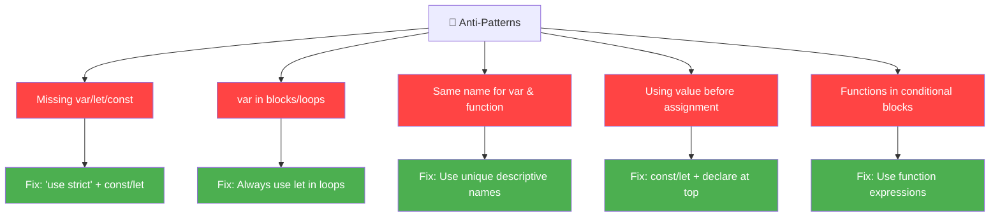

---

<a id="topic-13"></a>
## 📌 TOPIC 13: The Ultimate Hoisting Cheat Sheet

### Master Reference Table

```
╔══════════════════╦══════════╦══════════════════╦══════════╦═══════╦════════════════════╗
║ Declaration      ║ Hoisted? ║ Initial Value    ║ Scope    ║ TDZ?  ║ Use Before Decl.   ║
╠══════════════════╬══════════╬══════════════════╬══════════╬═══════╬════════════════════╣
║ var x = 5        ║ ✅ Yes   ║ undefined        ║ Function ║ ❌ No ║ undefined          ║
║ let x = 5        ║ ✅ Yes   ║ <uninitialized>  ║ Block    ║ ✅ Yes║ ReferenceError     ║
║ const x = 5      ║ ✅ Yes   ║ <uninitialized>  ║ Block    ║ ✅ Yes║ ReferenceError     ║
║ function f(){}   ║ ✅ Yes   ║ Full function    ║ Function ║ ❌ No ║ ✅ Works perfectly ║
║ var f = func(){} ║ ✅ Yes   ║ undefined        ║ Function ║ ❌ No ║ TypeError          ║
║ var f = () => {} ║ ✅ Yes   ║ undefined        ║ Function ║ ❌ No ║ TypeError          ║
║ let f = () => {} ║ ✅ Yes   ║ <uninitialized>  ║ Block    ║ ✅ Yes║ ReferenceError     ║
║ const f = () => {}║ ✅ Yes  ║ <uninitialized>  ║ Block    ║ ✅ Yes║ ReferenceError     ║
║ class C {}       ║ ✅ Yes   ║ <uninitialized>  ║ Block    ║ ✅ Yes║ ReferenceError     ║
║ import x from    ║ ✅ Yes   ║ Module binding   ║ Module   ║ ✅ Yes║ Works (live bind)  ║
╚══════════════════╩══════════╩══════════════════╩══════════╩═══════╩════════════════════╝
```

### Decision Flowchart: Which Keyword to Use?

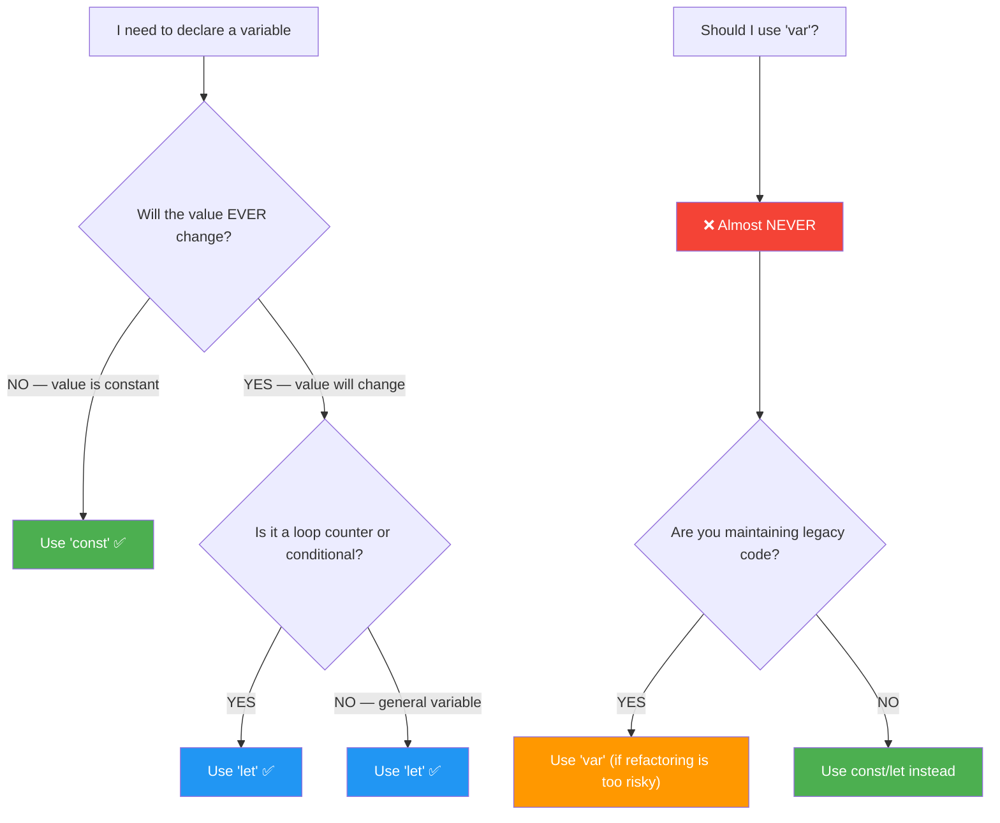

### Quick Error Reference

```
┌────────────────────────────────────────────────────────────────┐
│                    ERROR TYPE REFERENCE                         │
├────────────────────────────────────────────────────────────────┤
│                                                                │
│  "undefined"                                                   │
│    → Variable declared with var, but value not yet assigned    │
│    → NOT an error, just a value                                │
│                                                                │
│  ReferenceError: x is not defined                              │
│    → Variable was NEVER declared anywhere in scope chain       │
│                                                                │
│  ReferenceError: Cannot access 'x' before initialization      │
│    → Variable declared with let/const, but in TDZ             │
│    → The variable EXISTS but isn't ready yet                   │
│                                                                │
│  TypeError: x is not a function                                │
│    → Variable exists but its value is NOT a function           │
│    → Usually: var x = fn; called before assignment             │
│    → x is 'undefined', and undefined() is a TypeError          │
│                                                                │
│  SyntaxError: Identifier 'x' has already been declared         │
│    → Trying to re-declare a let/const variable                 │
│                                                                │
│  SyntaxError: Missing initializer in const declaration         │
│    → const x; (no value given)                                 │
│                                                                │
│  TypeError: Assignment to constant variable                    │
│    → Trying to reassign a const variable                       │
│                                                                │
└────────────────────────────────────────────────────────────────┘
```

### Memory Model Cheat Sheet

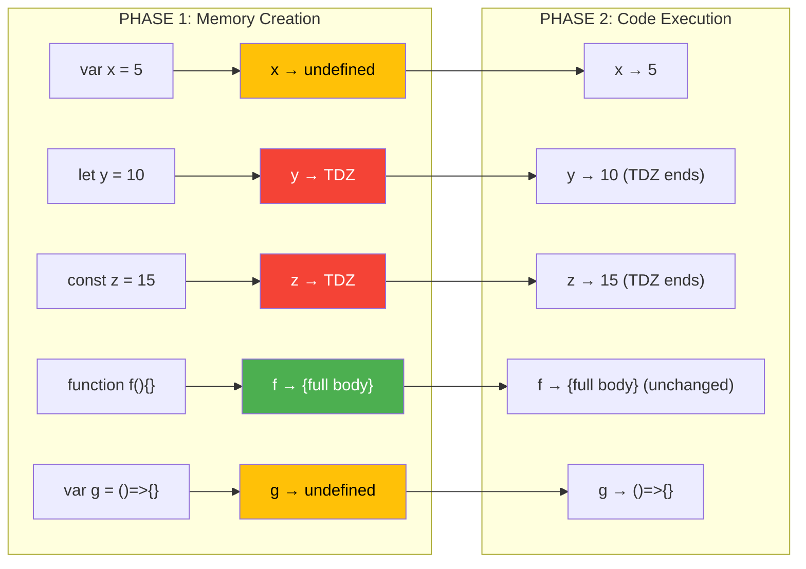

---

<a id="topic-14"></a>
## 📌 TOPIC 14: Mock Interview & Practice Problems

### 🏆 Challenge 1: Predict the Output (Easy)

```javascript
// ═══════════════════════════════════════════════
// CHALLENGE 1: Basic Hoisting
// ═══════════════════════════════════════════════

console.log(foo);       // ?
var foo = "bar";
console.log(foo);       // ?
```

<details>
<summary>🔍 Click to see Answer</summary>

```
Output:
  undefined
  "bar"

Explanation:
  Phase 1: var foo → undefined
  Phase 2: 
    console.log(foo) → undefined
    foo = "bar"
    console.log(foo) → "bar"
```
</details>

---

### 🏆 Challenge 2: Function vs Variable (Medium)

```javascript
// ═══════════════════════════════════════════════
// CHALLENGE 2: Priority
// ═══════════════════════════════════════════════

var a = 1;
function a() {
    console.log("Function");
}
console.log(typeof a);  // ?
```

<details>
<summary>🔍 Click to see Answer</summary>

```
Output:
  "number"

Explanation:
  Phase 1:
    var a → undefined
    function a() → overwrites a with function
    After Phase 1: a = function a() { ... }
  
  Phase 2:
    a = 1 → overwrites function with number
    function declaration → already processed, skipped
    console.log(typeof a) → "number"
```
</details>

---

### 🏆 Challenge 3: Loop with setTimeout (Medium)

```javascript
// ═══════════════════════════════════════════════
// CHALLENGE 3: Classic Loop Problem
// ═══════════════════════════════════════════════

for (var i = 0; i < 3; i++) {
    setTimeout(() => console.log("var:", i), 1);
}

for (let j = 0; j < 3; j++) {
    setTimeout(() => console.log("let:", j), 1);
}
```

<details>
<summary>🔍 Click to see Answer</summary>

```
Output:
  var: 3
  var: 3
  var: 3
  let: 0
  let: 1
  let: 2

Explanation:
  var loop: Only ONE i exists. After loop ends, i = 3.
           All three callbacks reference the SAME i.
           
  let loop: THREE separate j variables exist (one per iteration).
           Each callback has its OWN j.
```
</details>

---

### 🏆 Challenge 4: Nested Functions (Hard)

```javascript
// ═══════════════════════════════════════════════
// CHALLENGE 4: Nested Scope
// ═══════════════════════════════════════════════

var x = "global";

function outer() {
    console.log("1:", x);      // ?
    
    var x = "outer";
    console.log("2:", x);      // ?
    
    function inner() {
        console.log("3:", x);  // ?
        var x = "inner";
        console.log("4:", x);  // ?
    }
    
    inner();
    console.log("5:", x);      // ?
}

outer();
console.log("6:", x);          // ?
```

<details>
<summary>🔍 Click to see Answer</summary>

```
Output:
  1: undefined
  2: "outer"
  3: undefined
  4: "inner"
  5: "outer"
  6: "global"

Explanation:
  outer() Phase 1:
    x → undefined (local x shadows global x)
    inner → function body
    
  outer() Phase 2:
    console.log(x) → undefined (local x exists but not assigned)
    x = "outer"
    console.log(x) → "outer"
    
  inner() Phase 1:
    x → undefined (local x shadows outer's x)
    
  inner() Phase 2:
    console.log(x) → undefined (inner's own x, not assigned yet)
    x = "inner"
    console.log(x) → "inner"
    
  Back in outer():
    console.log(x) → "outer" (inner's x is dead, outer's x is unchanged)
    
  Global:
    console.log(x) → "global" (never touched)
```
</details>

---

### 🏆 Challenge 5: The Nightmare Question (Expert)

```javascript
// ═══════════════════════════════════════════════
// CHALLENGE 5: Everything Combined
// ═══════════════════════════════════════════════

console.log("1:", typeof a);      // ?
console.log("2:", typeof b);      // ?
console.log("3:", typeof c);      // ?

var a = "variable";
function a() { return "function"; }

var b = function() { return "expression"; };

// let c = "let variable";  // Would this line change anything about line 3?

console.log("4:", typeof a);      // ?
console.log("5:", typeof b);      // ?

function test() {
    console.log("6:", typeof a);  // ?
    console.log("7:", typeof b);  // ?
    
    var a = "local";
    var b = () => "arrow";
    
    console.log("8:", typeof a);  // ?
    console.log("9:", typeof b);  // ?
}

test();

console.log("10:", typeof a);    // ?
```

<details>
<summary>🔍 Click to see Answer</summary>

```
Output:
  1: "function"    → function a() wins over var a in Phase 1
  2: "undefined"   → var b hoisted as undefined
  3: "undefined"   → c not declared with var (typeof is safe for undeclared)
                     (If uncommented let c → ReferenceError due to TDZ!)
  4: "string"      → a = "variable" in Phase 2
  5: "function"    → b = function(){} in Phase 2
  6: "undefined"   → local var a shadows global, hoisted as undefined
  7: "undefined"   → local var b shadows global, hoisted as undefined
  8: "string"      → a = "local"
  9: "function"    → b = arrow function
  10: "string"     → global a is still "variable"
```
</details>

---

### 🏆 Challenge 6: Real-World Debugging (Expert)

```javascript
// ═══════════════════════════════════════════════
// CHALLENGE 6: Find and Fix the Bug
// ═══════════════════════════════════════════════

// This e-commerce cart has a hoisting bug. Find it!

function calculateTotal(items) {
    var total = 0;
    
    for (var i = 0; i < items.length; i++) {
        var price = items[i].price;
        var quantity = items[i].quantity;
        
        // Apply discount
        var discountedPrice = applyDiscount(price);
        total += discountedPrice * quantity;
    }
    
    // Apply tax
    total = total + (total * taxRate);
    
    var taxRate = 0.18;  // 🐛 BUG: Used BEFORE assignment!
    
    return total;
}

var cart = [
    { name: "Laptop", price: 50000, quantity: 1 },
    { name: "Mouse", price: 500, quantity: 2 }
];

function applyDiscount(price) {
    if (price > 10000) return price * 0.9;  // 10% discount
    return price;
}

console.log("Total:", calculateTotal(cart));

// What's the output? Why? How to fix it?
```

<details>
<summary>🔍 Click to see Answer</summary>

```
Output: NaN

Why?
  var taxRate is hoisted to top of calculateTotal() as undefined.
  total = total + (total * undefined) → NaN
  
Fix: Move var taxRate = 0.18 BEFORE the line that uses it.
     Or better: use const taxRate = 0.18 at the top.

Fixed version:
  function calculateTotal(items) {
      const taxRate = 0.18;  // ✅ Declared at the top!
      let total = 0;
      
      for (let i = 0; i < items.length; i++) {
          const price = items[i].price;
          const quantity = items[i].quantity;
          const discountedPrice = applyDiscount(price);
          total += discountedPrice * quantity;
      }
      
      total = total + (total * taxRate);
      return total;
  }
  
  // Output: Total: 59590
  // (50000*0.9 + 500*2 = 45000 + 1000 = 46000)
  // (46000 + 46000*0.18 = 46000 + 8280 = 54280)
```
</details>

---

### Mock Interview Script

```
╔══════════════════════════════════════════════════════════════════╗
║                    MOCK INTERVIEW SCRIPT                         ║
║                    (Practice with a friend)                      ║
╠══════════════════════════════════════════════════════════════════╣
║                                                                  ║
║  Interviewer: "What is hoisting in JavaScript?"                  ║
║  You: "Hoisting is a JS behavior where declarations are moved   ║
║        to the top of their scope during the memory creation      ║
║        phase. Variables declared with var are initialized as     ║
║        undefined, while functions are stored with their full     ║
║        body. let and const are hoisted too but remain in a       ║
║        Temporal Dead Zone until the declaration is reached."     ║
║                                                                  ║
║  Interviewer: "Is let/const hoisted?"                            ║
║  You: "Yes! They ARE hoisted. The key difference is they're     ║
║        not initialized. They exist in a TDZ where accessing     ║
║        them throws a ReferenceError. This is different from     ║
║        var which is initialized as undefined."                   ║
║                                                                  ║
║  Interviewer: "Can you prove let is hoisted?"                    ║
║  You: "Yes! If let weren't hoisted, accessing it before         ║
║        declaration would give 'x is not defined'. But instead   ║
║        we get 'Cannot access x before initialization'. This     ║
║        means JS KNOWS x exists (hoisted) but it's not ready    ║
║        yet (TDZ)."                                               ║
║                                                                  ║
║  Interviewer: "What happens with var in a for loop with         ║
║               setTimeout?"                                       ║
║  You: "Only one variable exists because var is function-scoped. ║
║        All callbacks close over the same variable. After the    ║
║        loop, the variable holds the final value. Using let      ║
║        creates a new variable per iteration, fixing the issue." ║
║                                                                  ║
╚══════════════════════════════════════════════════════════════════╝
```

---

## 🎯 Final Key Takeaways

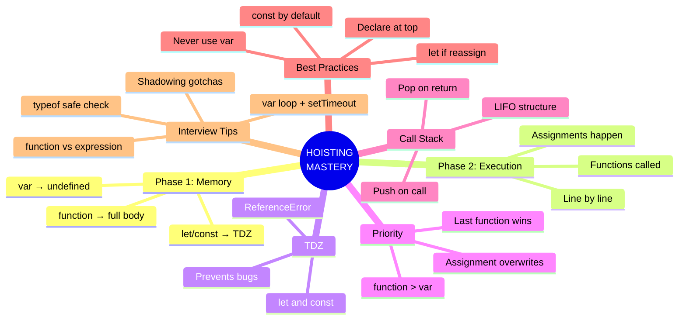

### The Golden Rules

```
┌─────────────────────────────────────────────────────────────┐
│                                                             │
│  🥇 RULE 1: Phase 1 is Memory, Phase 2 is Execution        │
│                                                             │
│  🥈 RULE 2: Functions hoist fully, var hoists as undefined, │
│             let/const hoist into TDZ                        │
│                                                             │
│  🥉 RULE 3: Function Declarations > var Declarations        │
│                                                             │
│  🏅 RULE 4: let in loops = new variable per iteration       │
│                                                             │
│  🏅 RULE 5: const by default, let when needed, var NEVER    │
│                                                             │
│  🏅 RULE 6: TDZ exists to catch bugs early                  │
│                                                             │
│  🏅 RULE 7: typeof is the only safe way to check            │
│             undeclared variables                             │
│                                                             │
│  🏅 RULE 8: Each function call creates a new                │
│             Execution Context with its own memory            │
│                                                             │
└─────────────────────────────────────────────────────────────┘
```

---

> **🚀 Master this section, and you have mastered the FOUNDATION of JavaScript.**
> 
> **Next Section: Closures & Scope Chain** — which builds directly on everything you learned here.

---

*📝 Notes compiled with ❤️ for deep understanding, not just memorization.*
*🎯 Every concept has: Definition → Diagram → Program → Use Case → Interview Tip*