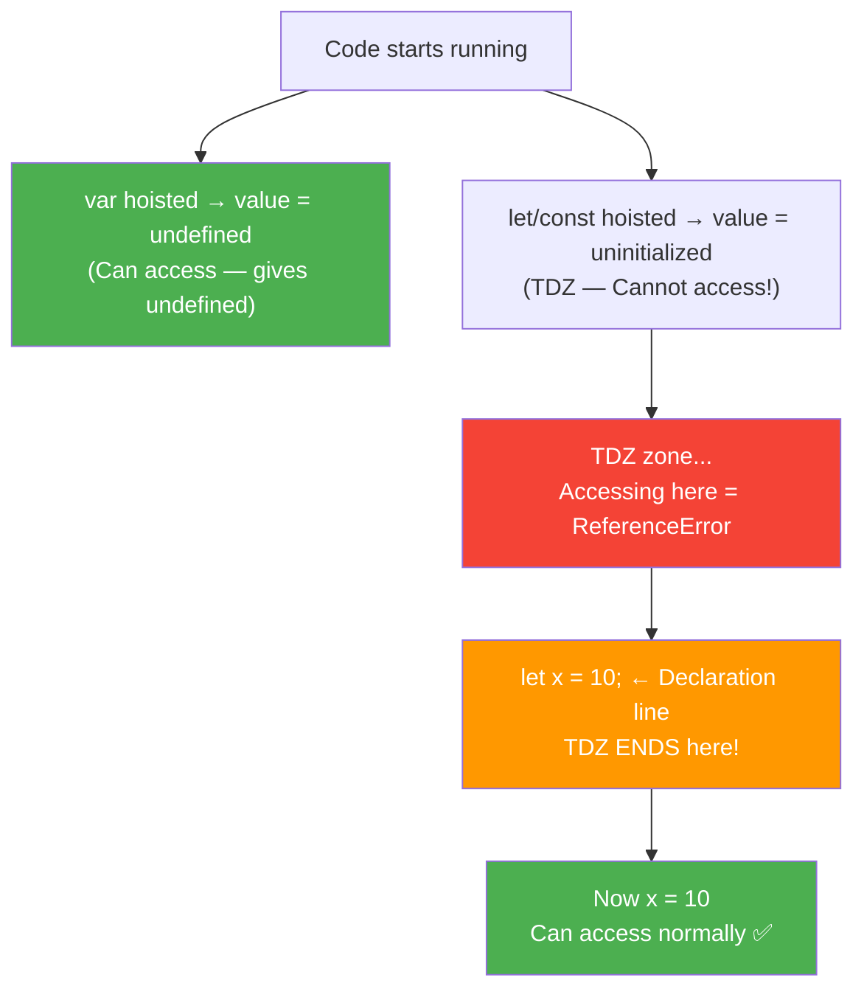
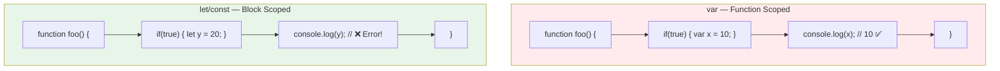
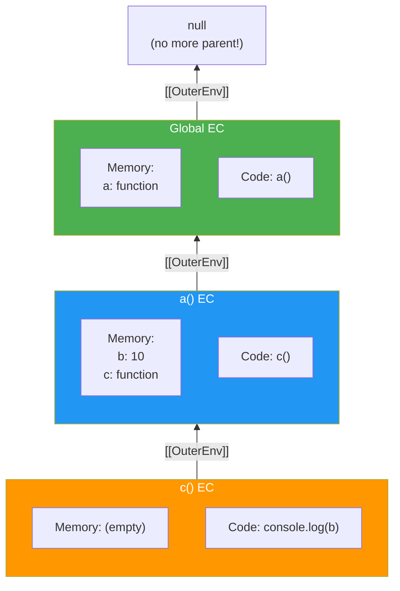
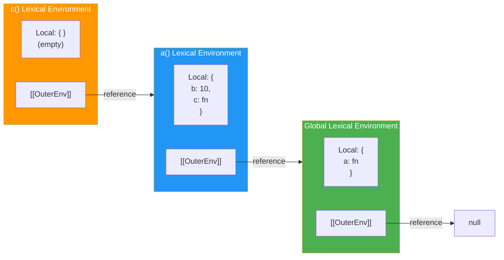
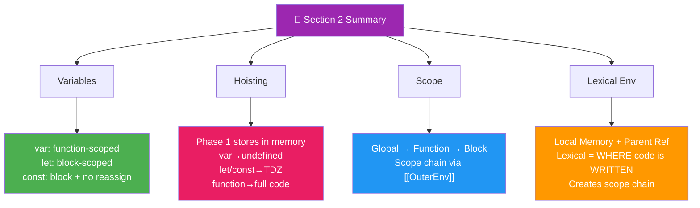

<a id="section-2-top"></a>

# 📘 Section 2: JavaScript Basics — Variables, Hoisting, Scope & Lexical Environment

> **Variables • Hoisting • var/let/const • Data Types • Operators • Scope Chain • Lexical Environment**
> Interview Focused — Explained in Simple Hinglish with Diagrams & Tricky Output Questions

---

## 📑 Table of Contents
<a id="section-2-toc"></a>

| # | Topic |
|---|-------|
| 1 | <a href="#variables">2.1 Variables — What, Why, How?</a> |
|   | &nbsp;&nbsp;&nbsp;&nbsp;<a href="#what-is-variable">What is a Variable?</a> |
|   | &nbsp;&nbsp;&nbsp;&nbsp;<a href="#why-variables-needed">Why Variables Are Needed</a> |
|   | &nbsp;&nbsp;&nbsp;&nbsp;<a href="#declaring-variables">Declaring Variables — var, let, const</a> |
| 2 | <a href="#hoisting">2.2 Hoisting ⭐⭐⭐ (Most Asked!)</a> |
|   | &nbsp;&nbsp;&nbsp;&nbsp;<a href="#what-is-hoisting">What is Hoisting?</a> |
|   | &nbsp;&nbsp;&nbsp;&nbsp;<a href="#hoisting-var">Hoisting with var</a> |
|   | &nbsp;&nbsp;&nbsp;&nbsp;<a href="#hoisting-let-const">Hoisting with let/const (TDZ)</a> |
|   | &nbsp;&nbsp;&nbsp;&nbsp;<a href="#hoisting-functions">Hoisting with Functions</a> |
|   | &nbsp;&nbsp;&nbsp;&nbsp;<a href="#hoisting-tricky">Tricky Interview Questions</a> |
| 3 | <a href="#var-let-const">2.3 var vs let vs const — Complete Comparison</a> |
|   | &nbsp;&nbsp;&nbsp;&nbsp;<a href="#scope-difference">Scope Difference</a> |
|   | &nbsp;&nbsp;&nbsp;&nbsp;<a href="#redeclaration-reassignment">Redeclaration & Reassignment</a> |
|   | &nbsp;&nbsp;&nbsp;&nbsp;<a href="#hoisting-difference">Hoisting Difference</a> |
|   | &nbsp;&nbsp;&nbsp;&nbsp;<a href="#when-to-use-which">When to Use Which?</a> |
|   | &nbsp;&nbsp;&nbsp;&nbsp;<a href="#var-let-const-comparison-table">Full Comparison Table</a> |
| 4 | <a href="#data-types">2.4 Built-in Data Types</a> |
|   | &nbsp;&nbsp;&nbsp;&nbsp;<a href="#primitive-types">Primitive Types (7)</a> |
|   | &nbsp;&nbsp;&nbsp;&nbsp;<a href="#number-type">Number — Complete Guide</a> |
|   | &nbsp;&nbsp;&nbsp;&nbsp;<a href="#string-type">String — Complete Guide with All Methods</a> |
|   | &nbsp;&nbsp;&nbsp;&nbsp;<a href="#boolean-type">Boolean — Truthy & Falsy</a> |
|   | &nbsp;&nbsp;&nbsp;&nbsp;<a href="#null-undefined">null vs undefined</a> |
|   | &nbsp;&nbsp;&nbsp;&nbsp;<a href="#symbol-bigint">Symbol & BigInt</a> |
|   | &nbsp;&nbsp;&nbsp;&nbsp;<a href="#object-type">Object Type</a> |
|   | &nbsp;&nbsp;&nbsp;&nbsp;<a href="#array-type">Arrays — Complete Guide with All Methods</a> |
|   | &nbsp;&nbsp;&nbsp;&nbsp;<a href="#typeof-operator">typeof Operator — Tricky Results</a> |
| 5 | <a href="#comments">2.5 Comments in JavaScript</a> |
| 6 | <a href="#js-pros-cons">2.6 JavaScript Pros & Cons</a> |
| 7 | <a href="#operators">2.7 All Types of Operators</a> |
|   | &nbsp;&nbsp;&nbsp;&nbsp;<a href="#arithmetic-operators">Arithmetic Operators</a> |
|   | &nbsp;&nbsp;&nbsp;&nbsp;<a href="#assignment-operators">Assignment Operators</a> |
|   | &nbsp;&nbsp;&nbsp;&nbsp;<a href="#comparison-operators">Comparison Operators (== vs ===)</a> |
|   | &nbsp;&nbsp;&nbsp;&nbsp;<a href="#logical-operators">Logical Operators (&&, \|\|, !)</a> |
|   | &nbsp;&nbsp;&nbsp;&nbsp;<a href="#combining-conditions">Combining Multiple Conditions</a> |
|   | &nbsp;&nbsp;&nbsp;&nbsp;<a href="#increment-decrement-tricks">Increment/Decrement on Non-Numeric Values</a> |
|   | &nbsp;&nbsp;&nbsp;&nbsp;<a href="#nullish-coalescing">Nullish Coalescing (??) & Optional Chaining (?.)</a> |
| 8 | <a href="#undefined-vs-not-defined">2.8 undefined vs Not Defined ⭐⭐⭐</a> |
|   | &nbsp;&nbsp;&nbsp;&nbsp;<a href="#what-is-undefined">What is undefined?</a> |
|   | &nbsp;&nbsp;&nbsp;&nbsp;<a href="#what-is-not-defined">What is "Not Defined"?</a> |
|   | &nbsp;&nbsp;&nbsp;&nbsp;<a href="#undefined-not-empty">undefined is NOT "empty"</a> |
|   | &nbsp;&nbsp;&nbsp;&nbsp;<a href="#undefined-tricky">Tricky Interview Questions</a> |
| 9 | <a href="#scope">2.9 Scope — Where Variables Live</a> |
|   | &nbsp;&nbsp;&nbsp;&nbsp;<a href="#global-scope">Global Scope</a> |
|   | &nbsp;&nbsp;&nbsp;&nbsp;<a href="#function-scope">Function Scope</a> |
|   | &nbsp;&nbsp;&nbsp;&nbsp;<a href="#block-scope">Block Scope</a> |
| 10 | <a href="#scope-chain">2.10 Scope Chain — Visual Explanation ⭐⭐⭐</a> |
|   | &nbsp;&nbsp;&nbsp;&nbsp;<a href="#scope-chain-diagram">Scope Chain Diagram from Image</a> |
|   | &nbsp;&nbsp;&nbsp;&nbsp;<a href="#scope-chain-code">Code Walkthrough</a> |
|   | &nbsp;&nbsp;&nbsp;&nbsp;<a href="#scope-chain-how-js-finds">How JS Finds Variables</a> |
| 11 | <a href="#lexical-environment">2.11 Lexical Environment — The Complete Picture</a> |
|   | &nbsp;&nbsp;&nbsp;&nbsp;<a href="#lexical-meaning">What Does "Lexical" Mean?</a> |
|   | &nbsp;&nbsp;&nbsp;&nbsp;<a href="#what-is-lexical-env">What is Lexical Environment?</a> |
|   | &nbsp;&nbsp;&nbsp;&nbsp;<a href="#lexical-env-visualization">Visualization of Lexical Environment</a> |
|   | &nbsp;&nbsp;&nbsp;&nbsp;<a href="#lexical-parent">Lexical Parent</a> |
|   | &nbsp;&nbsp;&nbsp;&nbsp;<a href="#lexical-env-code-flow">Complete Code Flow with Diagrams</a> |
|   | &nbsp;&nbsp;&nbsp;&nbsp;<a href="#debugger-console">Explain with Debugger in Console</a> |
| 12 | <a href="#mini-project-variables">2.12 Mini Project — Variable Explorer</a> |
| 13 | <a href="#interview-cheatsheet-2">2.13 Interview Cheat Sheet & Tricky Questions</a> |
| 14 | <a href="#practice-section-2">2.14 Practice Questions & Projects</a> |

<a href="#section-2-top">⬆ Back to Top</a>

---

<a id="variables"></a>

## 2.1 📦 Variables — What, Why, How?

<a id="what-is-variable"></a>

### What is a Variable?

```
Variable = ek DABBA (container) jismein data store hota hai

Real Life:
🏷️ Name Tag = Variable name
📦 Box Content = Variable value

var name = "Aadi";
    ↑        ↑
    |        |
  DABBA    CONTENT
  (name)   (value)

JavaScript mein variable ka matlab hai:
"Ek naam diya hua memory location jismein koi value stored hai"
```

> 💡 **Interview Definition:** "A variable is a named reference to a value stored in memory. It acts as a container that holds data which can be used and modified throughout the program."

<a id="why-variables-needed"></a>

### Why Variables Are Needed

```
WITHOUT variables:
━━━━━━━━━━━━━━━━━
console.log(2 * 3.14 * 5);  // Circle circumference
console.log(3.14 * 5 * 5);  // Circle area
// Agar radius change karna hai toh DONO jagah change karo!
// 100 jagah use kiya toh? 100 jagah change! 😱

WITH variables:
━━━━━━━━━━━━━━
const pi = 3.14;
const radius = 5;
console.log(2 * pi * radius);     // Circumference
console.log(pi * radius * radius); // Area
// Radius change? SIRF EK JAGAH change karo!
```

```
PROBLEMS variables solve:
✅ Data ko naam dena (readability)
✅ Data ko reuse karna (DRY — Don't Repeat Yourself)
✅ Data ko change karna (flexibility)
✅ Data ko pass karna functions mein
✅ State maintain karna (user logged in? cart items?)
```

<a id="declaring-variables"></a>

### Declaring Variables — var, let, const

```javascript
// 3 ways to declare variables in JavaScript:

// 1. var — OLD way (ES5 and before)
var name = "Aadi";
var age = 22;

// 2. let — NEW way (ES6+) — for values that CHANGE
let score = 0;
score = 10;  // ✅ Allowed — value can change
score = 20;  // ✅ Allowed

// 3. const — NEW way (ES6+) — for values that DON'T change
const PI = 3.14;
// PI = 3.15;  // ❌ TypeError: Assignment to constant variable

// NAMING RULES:
// ✅ Start with letter, _ or $
// ✅ Can contain letters, numbers, _, $
// ❌ Cannot start with number
// ❌ Cannot use reserved words (let, class, return, etc.)
// ✅ Case-sensitive: name ≠ Name ≠ NAME

let _private = true;      // ✅
let $dollar = 100;        // ✅
let myAge = 22;            // ✅ camelCase (convention)
let MY_CONSTANT = "fixed"; // ✅ UPPER_SNAKE for constants
// let 2fast = true;       // ❌ Cannot start with number
// let my-name = "Aadi";   // ❌ Hyphen not allowed
```

### 🎯 Must-Know Points for Interview

```
✅ 3 ways: var, let, const
✅ var is function-scoped, let/const are block-scoped
✅ const MUST be initialized at declaration
✅ const prevents REASSIGNMENT, not MUTATION (objects can change!)
✅ let/const were added in ES6 (2015)
✅ Use const by default, let when value needs to change, avoid var
✅ Variables are just named references to memory locations
✅ Naming convention: camelCase for variables, UPPER_SNAKE for constants
```

---

<a href="#section-2-top">⬆ Back to Top</a>

---

<a id="hoisting"></a>

## 2.2 🏗️ Hoisting ⭐⭐⭐ (Most Asked Interview Topic!)

<a id="what-is-hoisting"></a>

### What is Hoisting?

```
Hoisting = Memory Phase mein variables/functions ko
           memory mein store karna BEFORE code runs!

Simple bhasha mein:
"JS engine pehle POORA code scan karta hai,
 saare variables aur functions ko PEHLE memory mein daal deta hai,
 PHIR code execute karta hai"

Isliye hum variable ko DECLARE karne se PEHLE bhi access kar sakte hain!
(only var — let/const mein error aata hai)

Ye actually code ko "upar move" NAHI karta —
ye sirf Phase 1 (Memory Creation) ka result hai!
```

> 💡 **Interview Definition:** "Hoisting is JavaScript's default behavior of moving declarations to the top of the current scope during the Memory Creation Phase. Variables declared with `var` are hoisted with value `undefined`, while `let`/`const` are hoisted but remain in the Temporal Dead Zone until their declaration line."

<a id="hoisting-var"></a>

### Hoisting with var

```javascript
// ✅ This WORKS — because of hoisting!
console.log(name);  // undefined (NOT error!)
var name = "Aadi";
console.log(name);  // "Aadi"

// What JS engine actually does (conceptually):
// PHASE 1 (Memory): name = undefined
// PHASE 2 (Code):
//   console.log(name) → undefined
//   name = "Aadi"
//   console.log(name) → "Aadi"
```

```
WHY undefined and not "Aadi"?

Phase 1 mein: name ko memory mein daala gaya → value = undefined
Phase 2 mein: Line 1 execute hua → name abhi bhi undefined hai!
              Line 2 execute hua → name = "Aadi" assign hua
              Line 3 execute hua → name ab "Aadi" hai
```

<a id="hoisting-let-const"></a>

### Hoisting with let/const (Temporal Dead Zone — TDZ)

```javascript
// ❌ This DOES NOT work with let/const!
console.log(age);  // ReferenceError: Cannot access 'age' before initialization
let age = 22;

// ❌ Same with const
console.log(PI);   // ReferenceError!
const PI = 3.14;
```

```
BUT WAIT — let/const bhi HOISTED hote hain!
Lekin unki value <uninitialized> hoti hai (not undefined!)

Phase 1: age = <uninitialized>  ← ye TEMPORAL DEAD ZONE (TDZ) hai!
Phase 2: console.log(age) → TDZ mein hai → ReferenceError!

TDZ = wo time period jab variable HOISTED hai
      but INITIALIZED nahi hai.
      Declaration line tak ye zone rehta hai!
```

```javascript
// TDZ VISUALIZATION:
//
// ←───── TDZ START (Phase 1 mein hoisted) ─────→
//
console.log(x); // ❌ ReferenceError — TDZ!
console.log(x); // ❌ ReferenceError — still TDZ!
let x = 10;     // ← TDZ END — x initialized here!
//
// ←───── TDZ OVER ─────→
//
console.log(x); // ✅ 10
```



<a id="hoisting-functions"></a>

### Hoisting with Functions

```javascript
// ✅ Function DECLARATION — fully hoisted!
greet();  // "Hello!" — works BEFORE declaration!

function greet() {
    console.log("Hello!");
}

// ❌ Function EXPRESSION — NOT fully hoisted!
sayHi();  // TypeError: sayHi is not a function

var sayHi = function() {
    console.log("Hi!");
};
// var sayHi is hoisted as undefined → undefined() → TypeError!

// ❌ Arrow function with var — same problem!
fly();  // TypeError: fly is not a function
var fly = () => console.log("Flying!");

// ❌ Arrow function with let — TDZ error!
swim(); // ReferenceError: Cannot access before initialization
let swim = () => console.log("Swimming!");
```

```
HOISTING RULES SUMMARY:
━━━━━━━━━━━━━━━━━━━━━━

var → hoisted with undefined ✅ (can access, gets undefined)
let → hoisted with <uninitialized> ❌ (TDZ → ReferenceError)
const → hoisted with <uninitialized> ❌ (TDZ → ReferenceError)
function declaration → hoisted with FULL CODE ✅ (can call before)
function expression (var) → hoisted as undefined ❌ (TypeError)
function expression (let/const) → TDZ ❌ (ReferenceError)
class → hoisted with <uninitialized> ❌ (TDZ → ReferenceError)
```

<a id="hoisting-tricky"></a>

### Tricky Interview Questions on Hoisting

```javascript
// Q1: What is the output?
var x = 1;
function foo() {
    console.log(x);  // ?
    var x = 2;
    console.log(x);  // ?
}
foo();
// Answer: undefined, 2
// foo() ka APNA Phase 1 → local x = undefined
// Local x shadows global x!
// Line 1: x is local undefined
// Line 2: x = 2 assigned
// Line 3: x is now 2

// Q2: What is the output?
console.log(a);
console.log(b);
var a = 10;
let b = 20;
// Answer: undefined (for a), then ReferenceError (for b)
// Note: Program STOPS at ReferenceError — line 2 crashes!

// Q3: What is the output?
foo();
bar();

function foo() {
    console.log("foo");
}

var bar = function() {
    console.log("bar");
};
// Answer: "foo" prints, then TypeError: bar is not a function
// foo: function declaration → fully hoisted
// bar: var → hoisted as undefined → undefined() → TypeError

// Q4: What is the output?
var a = 1;
var a = 2;   // ✅ var allows redeclaration!
console.log(a); // 2

let b = 1;
// let b = 2;  // ❌ SyntaxError: Identifier 'b' has already been declared

// Q5: What about this?
function test() {
    console.log(typeof x); // ?
    console.log(typeof y); // ?
    var x = 10;
    let y = 20;
}
test();
// typeof x → "undefined" (var hoisted with undefined, typeof doesn't throw)
// typeof y → ReferenceError! (let is in TDZ, typeof DOES throw for TDZ!)
// WAIT — actually typeof on TDZ DOES throw in strict engines!
// In some environments: "undefined" (typeof is special)
// This is a debated behavior — mention this nuance in interviews!
```

### 🎯 Must-Know Points for Interview

```
✅ Hoisting is NOT "moving code to top" — it's Phase 1 (Memory Creation)
✅ var → hoisted with undefined
✅ let/const → hoisted but in TDZ (uninitialized) → ReferenceError
✅ function declarations → FULLY hoisted (can call before)
✅ function expressions → follow their variable's hoisting rules (var/let/const)
✅ TDZ = Temporal Dead Zone = time between hoisting and declaration line
✅ TDZ exists to catch errors early (using before declaring = likely a bug)
✅ var inside function → local scope (shadows global var with same name)
✅ Hoisting is the reason why function declarations can be called anywhere
✅ Arrow functions are NEVER hoisted as functions (they follow variable rules)
```

---

<a href="#section-2-top">⬆ Back to Top</a>

---

<a id="var-let-const"></a>

## 2.3 🔀 var vs let vs const — Complete Comparison

<a id="scope-difference"></a>

### Scope Difference

```javascript
// var = FUNCTION scoped (ignores blocks!)
function testVar() {
    if (true) {
        var x = 10;  // Accessible EVERYWHERE in function!
    }
    console.log(x); // 10 ✅ — var ignores if block!
}

// let/const = BLOCK scoped (respects blocks!)
function testLet() {
    if (true) {
        let y = 20;  // Only accessible INSIDE this block!
    }
    console.log(y); // ❌ ReferenceError: y is not defined
}

// Block scope example:
{
    var a = 1;   // Goes to GLOBAL scope (or function scope)
    let b = 2;   // Stays in this block only
    const c = 3; // Stays in this block only
}
console.log(a); // 1 ✅
// console.log(b); // ❌ ReferenceError
// console.log(c); // ❌ ReferenceError

// Loop scope — MOST IMPORTANT INTERVIEW QUESTION!
for (var i = 0; i < 3; i++) {
    setTimeout(() => console.log(i), 100);
}
// Output: 3, 3, 3  — var is function-scoped, shares same 'i'!

for (let j = 0; j < 3; j++) {
    setTimeout(() => console.log(j), 100);
}
// Output: 0, 1, 2  — let is block-scoped, each iteration gets its own 'j'!
```



<a id="redeclaration-reassignment"></a>

### Redeclaration & Reassignment

```javascript
// var — allows BOTH redeclaration and reassignment
var x = 1;
var x = 2;   // ✅ Redeclaration allowed
x = 3;       // ✅ Reassignment allowed
console.log(x); // 3

// let — allows reassignment but NOT redeclaration
let y = 1;
// let y = 2;  // ❌ SyntaxError: already declared
y = 3;         // ✅ Reassignment allowed
console.log(y); // 3

// const — NO redeclaration AND NO reassignment
const z = 1;
// const z = 2; // ❌ SyntaxError: already declared
// z = 3;       // ❌ TypeError: Assignment to constant variable

// BUT const with objects/arrays — can MUTATE! ⚠️
const user = { name: "Aadi" };
user.name = "Rahul"; // ✅ Mutation allowed!
user.age = 22;       // ✅ Adding property allowed!
console.log(user);   // { name: "Rahul", age: 22 }
// user = {};        // ❌ Reassignment NOT allowed!

const arr = [1, 2, 3];
arr.push(4);         // ✅ Mutation allowed!
// arr = [5, 6];     // ❌ Reassignment NOT allowed!
```

```
IMPORTANT DISTINCTION:
━━━━━━━━━━━━━━━━━━━━

const prevents REASSIGNMENT (changing the reference/pointer)
const does NOT prevent MUTATION (changing the contents)

const user = { name: "Aadi" };

user.name = "Rahul";  ← MUTATION (changing what's inside the box)
                         ✅ Allowed! Box stays same, content changes.

user = { name: "Neha" }; ← REASSIGNMENT (replacing the box itself)
                            ❌ Not allowed! Can't point to new box.

To prevent MUTATION → use Object.freeze()
const frozen = Object.freeze({ name: "Aadi" });
frozen.name = "Rahul"; // Silently fails (no change)
```

<a id="var-let-const-comparison-table"></a>

### Full Comparison Table

| Feature | `var` | `let` | `const` |
|---------|-------|-------|---------|
| **Scope** | Function | Block | Block |
| **Hoisting** | Yes (undefined) | Yes (TDZ — uninitialized) | Yes (TDZ — uninitialized) |
| **Redeclaration** | ✅ Allowed | ❌ SyntaxError | ❌ SyntaxError |
| **Reassignment** | ✅ Allowed | ✅ Allowed | ❌ TypeError |
| **Must initialize?** | No | No | ✅ Yes (at declaration) |
| **On window object?** | ✅ Yes (global) | ❌ No | ❌ No |
| **TDZ?** | ❌ No | ✅ Yes | ✅ Yes |
| **Loop behavior** | Shared variable | New per iteration | New per iteration |
| **Use case** | Legacy code | Values that change | Constants/defaults |
| **Introduced** | ES1 (1997) | ES6 (2015) | ES6 (2015) |

<a id="when-to-use-which"></a>

### When to Use Which?

```
MODERN BEST PRACTICE:
━━━━━━━━━━━━━━━━━━━━

1. const by DEFAULT 🟢
   Use for everything unless you NEED to reassign
   const PI = 3.14;
   const user = { name: "Aadi" }; // object can still be mutated
   const API_URL = "https://api.example.com";

2. let when value CHANGES 🔵
   Counters, accumulators, state that updates
   let score = 0;
   let isLoggedIn = false;
   for (let i = 0; i < 10; i++) { ... }

3. var NEVER (almost) 🔴
   Only in legacy code or very specific hoisting needs
   Avoid in modern code — use let/const instead
```

### 🎯 Must-Know Points for Interview

```
✅ var: function-scoped | let/const: block-scoped
✅ var allows redeclaration | let/const don't
✅ const prevents reassignment but NOT mutation
✅ All three are hoisted — but TDZ makes let/const inaccessible early
✅ var goes to window object (global scope) | let/const don't
✅ for loop with var → shared variable (3,3,3) | let → new per iteration (0,1,2)
✅ const must be initialized at declaration | var/let can be declared without value
✅ Use const > let > var in modern code
✅ const with Object.freeze() = true immutability
```

---

<a href="#section-2-top">⬆ Back to Top</a>

---

<a id="data-types"></a>

## 2.4 📊 Built-in Data Types

<a id="primitive-types"></a>

### Primitive Types (7 Types)

```javascript
// JavaScript has 7 PRIMITIVE types:

// 1. Number
let age = 22;
let price = 99.99;
let negative = -5;
let infinity = Infinity;
let notANumber = NaN;

// 2. String
let name = "Aadi";
let greeting = 'Hello';
let template = `Hi, ${name}!`; // Template literal

// 3. Boolean
let isAdult = true;
let isLoggedIn = false;

// 4. undefined
let x; // declared but no value assigned → undefined
console.log(x); // undefined

// 5. null
let empty = null; // intentionally empty

// 6. Symbol (ES6) — unique identifier
let id = Symbol("id");
let id2 = Symbol("id");
console.log(id === id2); // false — always unique!

// 7. BigInt (ES2020) — for very large numbers
let huge = 9007199254740991n; // 'n' suffix
let big = BigInt("999999999999999999999");

// NON-PRIMITIVE (Reference type):
// Object (includes arrays, functions, dates, etc.)
let obj = { name: "Aadi" };
let arr = [1, 2, 3];
let fn = function() {};
```

<a id="number-type"></a>

### Number — Complete Guide

```javascript
// Number type handles both integers and floats
let int = 42;
let float = 3.14;

// Special number values:
console.log(Infinity);         // Infinity
console.log(-Infinity);        // -Infinity
console.log(1 / 0);            // Infinity
console.log(NaN);              // NaN (Not a Number)
console.log("hello" * 2);     // NaN
console.log(NaN === NaN);     // false! NaN is NOT equal to itself!
console.log(isNaN(NaN));      // true
console.log(Number.isNaN(NaN)); // true (better — doesn't coerce)

// Number methods:
console.log(Number.isInteger(42));     // true
console.log(Number.isInteger(42.5));   // false
console.log(Number.isFinite(42));      // true
console.log(Number.isFinite(Infinity));// false
console.log(Number.MAX_SAFE_INTEGER); // 9007199254740991
console.log(Number.MIN_SAFE_INTEGER); // -9007199254740991

// Conversion:
console.log(parseInt("42px"));     // 42
console.log(parseFloat("3.14em")); // 3.14
console.log(Number("42"));         // 42
console.log(Number("hello"));      // NaN
console.log(Number(""));           // 0
console.log(Number(true));         // 1
console.log(Number(false));        // 0
console.log(Number(null));         // 0
console.log(Number(undefined));    // NaN

// Formatting:
let num = 3.14159;
console.log(num.toFixed(2));       // "3.14" (string!)
console.log(num.toPrecision(4));   // "3.142" (string!)
console.log((1000000).toLocaleString()); // "1,000,000" (or "10,00,000" in India)
```

<a id="string-type"></a>

### String — Complete Guide with All Methods

```javascript
let str = "Hello, World!";

// LENGTH
console.log(str.length); // 13

// ACCESS
console.log(str[0]);        // "H"
console.log(str.charAt(4)); // "o"
console.log(str.at(-1));    // "!" (negative index!)

// CASE
console.log(str.toUpperCase()); // "HELLO, WORLD!"
console.log(str.toLowerCase()); // "hello, world!"

// SEARCH
console.log(str.indexOf("World"));   // 7
console.log(str.includes("World"));  // true
console.log(str.startsWith("Hello")); // true
console.log(str.endsWith("!"));      // true

// EXTRACT
console.log(str.slice(0, 5));      // "Hello"
console.log(str.slice(-6));        // "orld!"
console.log(str.substring(7, 12)); // "World"

// MODIFY (returns NEW string — strings are immutable!)
console.log(str.replace("World", "JS")); // "Hello, JS!"
console.log(str.replaceAll("l", "L"));   // "HeLLo, WorLd!"
console.log("  spaces  ".trim());         // "spaces"
console.log("  spaces  ".trimStart());    // "spaces  "
console.log("abc".padStart(6, "0"));      // "000abc"
console.log("abc".padEnd(6, "0"));        // "abc000"
console.log("ha".repeat(3));              // "hahaha"

// SPLIT & JOIN
console.log("a,b,c".split(","));          // ["a", "b", "c"]
console.log(["a", "b", "c"].join("-"));   // "a-b-c"

// TEMPLATE LITERALS (ES6)
let name = "Aadi";
let age = 22;
console.log(`My name is ${name} and I am ${age} years old.`);
// Multi-line:
let multi = `
  Line 1
  Line 2
  Line 3
`;
```

<a id="boolean-type"></a>

### Boolean — Truthy & Falsy

```javascript
// FALSY values (ye sab false mein convert hote hain):
Boolean(false);      // false
Boolean(0);          // false
Boolean(-0);         // false
Boolean(0n);         // false (BigInt zero)
Boolean("");         // false (empty string)
Boolean(null);       // false
Boolean(undefined);  // false
Boolean(NaN);        // false

// EVERYTHING ELSE IS TRUTHY!
Boolean(true);       // true
Boolean(1);          // true
Boolean(-1);         // true (any non-zero number!)
Boolean("hello");    // true (any non-empty string!)
Boolean("0");        // true ⚠️ (string "0" is NOT empty!)
Boolean("false");    // true ⚠️ (string "false" is NOT boolean false!)
Boolean([]);         // true ⚠️ (empty array is truthy!)
Boolean({});         // true ⚠️ (empty object is truthy!)
Boolean(function(){}); // true
Boolean(Infinity);   // true

// TRICK QUESTION:
if ([]) console.log("runs!"); // ✅ Runs! [] is truthy!
if ("") console.log("runs!"); // ❌ Does NOT run! "" is falsy!
```

<a id="null-undefined"></a>

### null vs undefined

```javascript
// undefined = variable declared but NO VALUE assigned by you
// JavaScript AUTOMATICALLY gives undefined
let x;
console.log(x); // undefined — JS gave this

function noReturn() { /* no return statement */ }
console.log(noReturn()); // undefined — function returned nothing

// null = you INTENTIONALLY assign "nothing/empty"
let user = null; // "I know there's no user yet — INTENTIONALLY empty"

// Comparison:
console.log(typeof undefined); // "undefined"
console.log(typeof null);      // "object" ⚠️ HISTORIC BUG! Not actually object!

console.log(null == undefined);  // true  (loose equality — both are "empty")
console.log(null === undefined); // false (strict — different types)

console.log(null == 0);  // false
console.log(null > 0);   // false
console.log(null >= 0);  // true ⚠️ WTF?! (coercion inconsistency!)
```

<a id="array-type"></a>

### Arrays — Complete Guide with All Methods

```javascript
const arr = [10, 20, 30, 40, 50];

// ═══ BASIC ═══
console.log(arr.length);    // 5
console.log(arr[0]);        // 10 (first item)
console.log(arr[arr.length - 1]); // 50 (last item)
console.log(arr.at(-1));    // 50 (negative index!)

// ═══ ADD / REMOVE ═══
arr.push(60);     // Add to END → [10,20,30,40,50,60]
arr.pop();        // Remove from END → [10,20,30,40,50]
arr.unshift(0);   // Add to START → [0,10,20,30,40,50]
arr.shift();      // Remove from START → [10,20,30,40,50]
arr.splice(2, 1); // Remove at index 2 → [10,20,40,50]
arr.splice(2, 0, 30); // Insert 30 at index 2 → [10,20,30,40,50]

// ═══ TRANSFORM (return NEW array) ═══
const doubled = arr.map(n => n * 2);       // [20,40,60,80,100]
const evens = arr.filter(n => n % 2 === 0); // [10,20,30,40,50]
const sum = arr.reduce((acc, n) => acc + n, 0); // 150
const flat = [[1,2],[3,4]].flat();         // [1,2,3,4]

// ═══ SEARCH ═══
console.log(arr.find(n => n > 25));     // 30 (first match)
console.log(arr.findIndex(n => n > 25)); // 2 (index of first match)
console.log(arr.includes(30));           // true
console.log(arr.indexOf(30));            // 2
console.log(arr.some(n => n > 40));      // true (at least one)
console.log(arr.every(n => n > 0));      // true (all pass)

// ═══ SORT ═══
const nums = [3, 1, 8, 2];
nums.sort((a, b) => a - b);             // [1,2,3,8] (ascending)
nums.sort((a, b) => b - a);             // [8,3,2,1] (descending)

// ═══ OTHER ═══
console.log(arr.join("-"));              // "10-20-30-40-50"
console.log(arr.slice(1, 3));            // [20, 30] (no mutation)
console.log(arr.reverse());              // [50,40,30,20,10] (mutates!)
console.log(Array.isArray(arr));          // true
console.log([...new Set([1,1,2,2,3])]);  // [1,2,3] (remove duplicates)
```

<a id="typeof-operator"></a>

### typeof Operator — Tricky Results

```javascript
console.log(typeof 42);          // "number"
console.log(typeof "hello");     // "string"
console.log(typeof true);        // "boolean"
console.log(typeof undefined);   // "undefined"
console.log(typeof null);        // "object" ⚠️ BUG! Should be "null"
console.log(typeof {});          // "object"
console.log(typeof []);          // "object" ⚠️ Arrays are objects!
console.log(typeof function(){}); // "function"
console.log(typeof Symbol());    // "symbol"
console.log(typeof 10n);         // "bigint"
console.log(typeof NaN);         // "number" ⚠️ "Not a Number" is type number!

// How to correctly check:
Array.isArray([]);       // true  (use this for arrays!)
x === null;              // true  (use strict equality for null!)
Number.isNaN(NaN);       // true  (use this for NaN!)
```

---

<a href="#section-2-top">⬆ Back to Top</a>

---

<a id="operators"></a>

## 2.7 ⚙️ All Types of Operators

<a id="comparison-operators"></a>

### Comparison Operators — == vs === (MOST ASKED!)

```javascript
// == (Loose Equality) — Compares VALUE after type coercion
// === (Strict Equality) — Compares VALUE and TYPE (no coercion)

console.log(5 == "5");    // true  ← string "5" coerced to number 5
console.log(5 === "5");   // false ← different types (number vs string)

console.log(0 == false);  // true  ← false coerced to 0
console.log(0 === false); // false ← different types

console.log(null == undefined);  // true  ← special rule!
console.log(null === undefined); // false ← different types

console.log(NaN == NaN);  // false ← NaN is NOT equal to anything, even itself!
console.log(NaN === NaN); // false

console.log("" == false); // true  ← both coerce to 0
console.log("" == 0);     // true

// RULE: ALWAYS use === in production code!
// == can give unexpected results due to coercion!
```

```
TYPE COERCION TABLE for ==:
━━━━━━━━━━━━━━━━━━━━━━━━━━━

"" == 0     → true  (empty string → 0)
"0" == 0    → true  (string "0" → 0)
false == 0  → true  (false → 0)
false == "" → true  (false → 0, "" → 0)
null == undefined → true (special case!)
null == 0   → false (null only equals undefined, nothing else!)
NaN == NaN  → false (NaN equals nothing!)
```

<a id="increment-decrement-tricks"></a>

### Increment/Decrement on Non-Numeric Values

```javascript
// Increment/Decrement on non-numeric values:

let a = null;
a++;
console.log(a); // 1 (null → 0, then 0 + 1 = 1)

let b = undefined;
b++;
console.log(b); // NaN (undefined → NaN, NaN + 1 = NaN)

let c = true;
c++;
console.log(c); // 2 (true → 1, then 1 + 1 = 2)

let d = false;
d++;
console.log(d); // 1 (false → 0, then 0 + 1 = 1)

let e = "5";
e++;
console.log(e); // 6 (string "5" → number 5, then 5 + 1 = 6)

let f = "hello";
f++;
console.log(f); // NaN ("hello" → NaN)

let g = "";
g++;
console.log(g); // 1 (empty string → 0, then 0 + 1 = 1)

// INTERVIEW TRICKY:
console.log(null + 1);       // 1
console.log(undefined + 1);  // NaN
console.log(true + true);    // 2
console.log(false + null);   // 0
console.log("" + 1);         // "1" (string concatenation!)
console.log([] + []);         // "" (empty string!)
console.log({} + []);         // "[object Object]" or 0 (depends on context!)
```

<a id="combining-conditions"></a>

### Combining Multiple Conditions

```javascript
// && (AND) — ALL conditions must be true
if (age >= 18 && hasLicense && !isBanned) {
    console.log("Can drive!");
}

// || (OR) — AT LEAST ONE condition must be true
if (isAdmin || isModerator || isOwner) {
    console.log("Has special access!");
}

// ! (NOT) — Reverses boolean
if (!isLoggedIn) {
    console.log("Please login!");
}

// Short-circuit evaluation:
const name = user && user.name;        // If user exists, get name
const displayName = username || "Guest"; // If username is falsy, use "Guest"

// Nullish coalescing (??) — only null/undefined trigger fallback
const value = null ?? "default";     // "default"
const value2 = 0 ?? "default";      // 0 (0 is NOT null/undefined!)
const value3 = "" ?? "default";     // "" (empty string is NOT null/undefined!)

// Optional chaining (?.) — safe property access
const city = user?.address?.city; // undefined if any part is null/undefined
                                  // No TypeError even if user is null!
```

---

<a href="#section-2-top">⬆ Back to Top</a>

---

<a id="undefined-vs-not-defined"></a>

## 2.8 ❓ undefined vs Not Defined ⭐⭐⭐

<a id="what-is-undefined"></a>

### What is undefined?

```
undefined = Ek SPECIAL VALUE jo JavaScript KHUD deta hai
            jab variable DECLARE toh hua but VALUE assign NAHI hui

Ye ek PLACEHOLDER hai — "variable exist karta hai, but value nahi hai abhi"
Ye koi "empty" ya "nothing" NAHI hai — ye ek ACTUAL value hai!

var x;
console.log(x); // undefined

Yahan x EXIST karta hai memory mein!
Uska memory allocate hua Phase 1 mein!
Bas value abhi diya nahi gaya!
```

<a id="what-is-not-defined"></a>

### What is "Not Defined"?

```
Not Defined = Variable EXIST HI NAHI karta memory mein!
              Na Phase 1 mein create hua, na kahi declare hua!
              JS engine ko PATA HI NAHI ye kya hai!

console.log(y); // ReferenceError: y is not defined

Yahan y ka NAAM hi nahi hai kahi — na current scope, na parent scope!
JS ne poora scope chain check kiya — kahi nahi mila — ERROR!
```

```javascript
// CLEAR COMPARISON:
var a;        // a EXISTS in memory → value = undefined
console.log(a); // undefined ← variable hai, value nahi

console.log(b); // ReferenceError: b is not defined
                 // b ka NAAM hi nahi hai memory mein!

// AFTER assignment:
a = 10;
console.log(a); // 10 ← ab value bhi hai
```

<a id="undefined-not-empty"></a>

### undefined is NOT "empty"

```javascript
// undefined ek PROPER value hai — ye koi "empty" ya "nothing" nahi hai!

var x;
console.log(x);         // undefined
console.log(typeof x);  // "undefined"

// undefined memory leta hai! Ye ek actual value hai!
// Isliye:
x = undefined; // ❌ BAD PRACTICE! Don't manually assign undefined!
x = null;      // ✅ GOOD! Use null to intentionally clear a value!

// typeof check:
if (typeof someVar === "undefined") {
    console.log("Variable doesn't exist or has no value");
}
```

<a id="undefined-tricky"></a>

### Tricky Interview Questions

```javascript
// Q1: What is the output?
var x;
if (x === undefined) {
    console.log("x is undefined"); // ✅ This prints
}

// Q2: What is the output?
console.log(typeof y);      // "undefined" — typeof doesn't throw for undeclared!
console.log(typeof undefined); // "undefined"

// Q3: What is the output?
var a = undefined;  // ❌ Bad practice but valid
var b;              // This is the same as above
console.log(a === b); // true — both are undefined

// Q4: What is the output?
console.log(undefined == null);  // true (loose equality)
console.log(undefined === null); // false (strict — different types!)

// Q5: IMPORTANT DISTINCTION
function foo(x) {
    console.log(x); // undefined — parameter exists but no argument passed
}
foo(); // undefined (x is declared as parameter → exists → undefined)

function bar() {
    console.log(y); // ReferenceError! y is NOT DEFINED anywhere!
}
bar();
```

### 🎯 Must-Know Points for Interview

```
✅ undefined = variable EXISTS but has NO VALUE assigned
✅ not defined = variable DOES NOT EXIST in memory at all
✅ undefined is a TYPE and a VALUE in JavaScript
✅ typeof undefined → "undefined"
✅ typeof undeclaredVar → "undefined" (special behavior — no error!)
✅ undefined takes memory — it's an actual value, not empty!
✅ Don't assign undefined manually — use null for intentional emptiness
✅ undefined == null → true (both are "nothing" loosely)
✅ undefined === null → false (different types strictly)
✅ Function parameters without arguments → undefined (not "not defined")
```

---

<a href="#section-2-top">⬆ Back to Top</a>

---

<a id="scope"></a>

## 2.9 🎯 Scope — Where Variables Live

```javascript
// GLOBAL SCOPE — accessible everywhere
var globalVar = "I'm global!";
let globalLet = "I'm also global (but not on window)!";

function myFunc() {
    // FUNCTION SCOPE — only inside this function
    var funcVar = "I'm function-scoped!";
    let funcLet = "I'm also function-scoped!";

    if (true) {
        // BLOCK SCOPE — only inside this { } block
        var blockVar = "I'm function-scoped (var ignores block!)";
        let blockLet = "I'm block-scoped!";
        const blockConst = "I'm also block-scoped!";
    }

    console.log(blockVar);   // ✅ var ignores block scope
    // console.log(blockLet); // ❌ ReferenceError — let is block-scoped!
}

myFunc();
// console.log(funcVar); // ❌ ReferenceError — function-scoped!
```

---

<a href="#section-2-top">⬆ Back to Top</a>

---

<a id="scope-chain"></a>

## 2.10 🔗 Scope Chain — Visual Explanation ⭐⭐⭐

<a id="scope-chain-diagram"></a>

### Scope Chain Diagram (From Image)

```javascript
// Code from the image:
function a() {
    var b = 10;
    c();
    function c() {
        // c() can access b because of scope chain!
        console.log(b); // 10
    }
}
a();
console.log(b); // ReferenceError: b is not defined
```

```
CALL STACK with Scope Chain:
━━━━━━━━━━━━━━━━━━━━━━━━━

┌─────────────────────────┐
│   c() Execution Context │
│   ┌──────┬───────────┐  │
│   │ Mem  │   Code    │  │  c() scope → a() scope → Global scope → null
│   │      │           │  │  Looking for 'b' → not in c() → found in a()! ✅
│   └──────┴───────────┘  │
├─────────────────────────┤
│   a() Execution Context │
│   ┌──────┬───────────┐  │
│   │ Mem  │   Code    │  │  a() scope → Global scope → null
│   │b: 10 │           │  │  b = 10 stored HERE!
│   │c: {..}│          │  │
│   └──────┴───────────┘  │
├─────────────────────────┤
│   Global EC             │
│   ┌──────┬───────────┐  │
│   │ Mem  │   Code    │  │  Global scope → null (no parent!)
│   │a: {..}│          │  │
│   └──────┴───────────┘  │
└─────────────────────────┘
```



<a id="scope-chain-how-js-finds"></a>

### How JS Finds Variables — The Lookup Process

```
When console.log(b) runs inside c():
━━━━━━━━━━━━━━━━━━━━━━━━━━━━━━━━━━━

Step 1: Look in c()'s LOCAL scope → "b" nahi mila! ❌
Step 2: Follow [[OuterEnv]] → Go to a()'s scope → "b = 10" mila! ✅
Step 3: FOUND! Use b = 10.

If not found in a() either:
Step 3: Follow [[OuterEnv]] → Go to Global scope → "b" nahi mila! ❌
Step 4: Global's [[OuterEnv]] = null → NOWHERE else to look!
Step 5: ReferenceError: b is not defined!

This chain of [[OuterEnv]] links = SCOPE CHAIN!
```

---

<a href="#section-2-top">⬆ Back to Top</a>

---

<a id="lexical-environment"></a>

## 2.11 🔬 Lexical Environment — The Complete Picture

<a id="lexical-meaning"></a>

### What Does "Lexical" Mean?

```
LEXICAL = "relating to WHERE the code is WRITTEN"
          (NOT where it is called/executed!)

"Lexical" comes from "lexicon" = dictionary/words
In programming: it means the TEXTUAL POSITION of code

Example:
function outer() {        ← outer is WRITTEN in global scope
    function inner() {    ← inner is WRITTEN INSIDE outer
        console.log("hi");
    }
}

inner ka LEXICAL PARENT = outer (kyunki inner outer ke ANDAR LIKHA gaya hai!)
outer ka LEXICAL PARENT = Global (kyunki outer global scope mein LIKHA gaya hai!)

Ye WHERE the code IS WRITTEN pe depend karta hai
NOT where it is CALLED!
```

<a id="what-is-lexical-env"></a>

### What is Lexical Environment?

```
Lexical Environment = Local Memory + Reference to Parent's Lexical Environment

Har Execution Context ke saath ek Lexical Environment banta hai.
Iske do parts hain:

1. LOCAL MEMORY (Environment Record)
   → Current scope ki variables/functions

2. REFERENCE TO PARENT (Outer Environment Reference / [[OuterEnv]])
   → Parent scope ka Lexical Environment ka pointer

Lexical Environment = { localMemory, parentLexicalEnvironment }

Ye hi SCOPE CHAIN create karta hai!
Jab variable nahi milta local mein → parent check karo
Parent mein nahi → grandparent check karo → ... → null (end)
```

<a id="lexical-env-visualization"></a>

### Visualization of Lexical Environment

```javascript
function a() {
    var b = 10;
    c();
    function c() {
        console.log(b); // 10 — found via lexical environment chain!
    }
}
a();
```

```
LEXICAL ENVIRONMENT CHAIN:
━━━━━━━━━━━━━━━━━━━━━━━━━

c() Lexical Environment:
┌──────────────────────────────────────────┐
│  Local Memory: { }  (empty — no vars)   │
│  [[OuterEnv]]: → a()'s Lexical Env      │───────→
└──────────────────────────────────────────┘       │
                                                   │
a() Lexical Environment:                           │
┌──────────────────────────────────────────┐◀──────┘
│  Local Memory: { b: 10, c: fn }         │
│  [[OuterEnv]]: → Global Lexical Env     │───────→
└──────────────────────────────────────────┘       │
                                                   │
Global Lexical Environment:                        │
┌──────────────────────────────────────────┐◀──────┘
│  Local Memory: { a: fn }                │
│  [[OuterEnv]]: → null                   │───→ null (END!)
└──────────────────────────────────────────┘

Finding 'b' from c():
c() local → ❌ not found
↓ [[OuterEnv]]
a() local → ✅ FOUND! b = 10
```



<a id="lexical-parent"></a>

### Lexical Parent

```
c() ka Lexical Parent = a()
    Kyunki c() function a() ke ANDAR LIKHA gaya hai (textually)

a() ka Lexical Parent = Global
    Kyunki a() function Global scope mein LIKHA gaya hai

Global ka Lexical Parent = null
    Kyunki Global ke upar koi scope NAHI hai!

NOTE: Lexical Parent se decide hota hai ki [[OuterEnv]] kahan point karega!
This is DECIDED at CREATION time, not at CALL time!
This is why closures work — function REMEMBERS its lexical parent!
```

<a id="lexical-env-code-flow"></a>

### Complete Code Flow with Diagrams

```javascript
// Complex example with 3 levels:
var globalVar = "Global";

function first() {
    var firstVar = "First";

    function second() {
        var secondVar = "Second";

        function third() {
            console.log(secondVar); // "Second" — from second()
            console.log(firstVar);  // "First"  — from first()
            console.log(globalVar); // "Global" — from global
        }

        third();
    }

    second();
}

first();
```

```
LEXICAL ENVIRONMENT CHAIN:

third() → Local: { } → [[OuterEnv]] → second()
second() → Local: { secondVar: "Second" } → [[OuterEnv]] → first()
first() → Local: { firstVar: "First", second: fn } → [[OuterEnv]] → Global
Global → Local: { globalVar: "Global", first: fn } → [[OuterEnv]] → null

When third() looks for secondVar:
  third() local → ❌
  second() local → ✅ Found! "Second"

When third() looks for firstVar:
  third() local → ❌
  second() local → ❌
  first() local → ✅ Found! "First"

When third() looks for globalVar:
  third() local → ❌
  second() local → ❌
  first() local → ❌
  Global local → ✅ Found! "Global"

When third() looks for randomVar:
  third() → ❌ → second() → ❌ → first() → ❌ → Global → ❌ → null
  ReferenceError: randomVar is not defined!
```

<a id="debugger-console"></a>

### Explain with Debugger in Console

```javascript
// Open Chrome DevTools → Sources tab → Add this code:

function outer() {
    var a = 10;
    var b = 20;

    function inner() {
        var c = 30;
        debugger; // ← Execution PAUSES here!

        // In DevTools, when paused at debugger:
        // 1. Look at "Scope" panel on the right
        // 2. You'll see:
        //    - Local: { c: 30 }           ← inner's own variables
        //    - Closure (outer): { a: 10, b: 20 }  ← parent's variables
        //    - Global: { ... }            ← global variables

        console.log(a); // 10 — from Closure (outer)
        console.log(b); // 20 — from Closure (outer)
        console.log(c); // 30 — from Local
    }

    inner();
}

outer();

// HOW TO USE DEBUGGER:
// 1. Open Chrome → F12 → Console tab
// 2. Paste the code above → Enter
// 3. Execution pauses at "debugger"
// 4. Go to "Sources" tab (it switches automatically)
// 5. Look at RIGHT panel → "Scope" section
// 6. You'll see the EXACT lexical environment chain!
//
// This is PROOF of lexical environment and scope chain!
// Chrome literally shows you:
// Local → Closure (parent function name) → Global
```

### 🎯 Must-Know Points for Interview

```
✅ "Lexical" = relating to WHERE code is WRITTEN (position in source code)
✅ Lexical Environment = Local Memory + Reference to Parent's Lexical Env
✅ [[OuterEnv]] creates the SCOPE CHAIN
✅ JS finds variables by going UP the chain: local → parent → grandparent → global → null
✅ If variable not found anywhere → ReferenceError
✅ Lexical parent is decided at CREATION time (not call time)
✅ This is the foundation of CLOSURES
✅ Chrome debugger's "Scope" panel shows lexical environment visually
✅ Scope chain length = number of nested functions + global
✅ c() can access a()'s variables because c is LEXICALLY inside a
✅ Global's [[OuterEnv]] = null — the chain always ends here
```

---

<a href="#section-2-top">⬆ Back to Top</a>

---

<a id="mini-project-variables"></a>

## 2.12 🏗️ Mini Project — Variable & Scope Explorer

```html
<!DOCTYPE html>
<html>
<head>
    <title>Variable & Scope Explorer</title>
    <style>
        * { box-sizing: border-box; margin: 0; padding: 0; font-family: 'Segoe UI', sans-serif; }
        body { background: #1a1a2e; color: #eee; padding: 20px; }
        h1 { text-align: center; color: #e94560; margin-bottom: 20px; }
        .section { background: #16213e; border-radius: 12px; padding: 20px; margin-bottom: 15px; }
        .section h3 { color: #4CAF50; margin-bottom: 10px; }
        pre { background: #0f3460; padding: 15px; border-radius: 8px; overflow-x: auto; font-size: 14px; }
        .output { color: #4CAF50; font-weight: bold; }
        .error { color: #f44336; font-weight: bold; }
        button { padding: 10px 20px; background: #e94560; color: white; border: none; border-radius: 8px; cursor: pointer; margin: 5px; font-size: 14px; }
        button:hover { background: #c73e54; }
        #results { background: #0f3460; padding: 15px; border-radius: 8px; min-height: 100px; margin-top: 10px; }
    </style>
</head>
<body>
    <h1>🔍 Variable & Scope Explorer</h1>

    <div class="section">
        <h3>1. Hoisting Demo</h3>
        <button onclick="hoistingDemo()">Run Hoisting Test</button>
        <button onclick="tdzDemo()">Run TDZ Test</button>
        <button onclick="functionHoistDemo()">Run Function Hoisting</button>
    </div>

    <div class="section">
        <h3>2. Scope Demo</h3>
        <button onclick="scopeDemo()">Run Scope Test</button>
        <button onclick="scopeChainDemo()">Run Scope Chain</button>
        <button onclick="closureDemo()">Run Closure Demo</button>
    </div>

    <div class="section">
        <h3>3. var vs let in Loop</h3>
        <button onclick="loopVarDemo()">Run var Loop</button>
        <button onclick="loopLetDemo()">Run let Loop</button>
    </div>

    <div class="section">
        <h3>📝 Results</h3>
        <div id="results"></div>
    </div>

    <script>
        const resultsEl = document.getElementById("results");

        function log(msg, type = "output") {
            resultsEl.innerHTML += `<div class="${type}">${msg}</div>`;
        }

        function clear() { resultsEl.innerHTML = ""; }

        function hoistingDemo() {
            clear();
            log("=== Hoisting with var ===");
            log(`console.log(x) before declaration: ${(() => { console.log(x); return x; })()}`);
            var x = 42;
            log(`console.log(x) after declaration: ${x}`);
            log("");
            log("var x is hoisted with 'undefined' → accessible before declaration!");
        }

        function tdzDemo() {
            clear();
            log("=== TDZ with let ===");
            try {
                log(`Trying to access 'y' before let declaration...`);
                eval('console.log(y); let y = 100;');
            } catch (e) {
                log(`❌ ${e.name}: ${e.message}`, "error");
            }
            log("");
            log("let y is hoisted but in TDZ → ReferenceError!");
        }

        function functionHoistDemo() {
            clear();
            log("=== Function Hoisting ===");

            log(`Calling greet() BEFORE declaration: ${greet()}`);
            function greet() { return "Hello from hoisted function!"; }

            log("");
            log("Function declarations are FULLY hoisted — can call before declaration!");
        }

        function scopeDemo() {
            clear();
            log("=== Scope Demo ===");

            var varInBlock;
            if (true) {
                var varInBlock = "I leaked out of block! (var)";
                let letInBlock = "I stay in block! (let)";
                log(`Inside block — var: "${varInBlock}"`);
                log(`Inside block — let: "${letInBlock}"`);
            }
            log(`Outside block — var: "${varInBlock}"`);
            log(`Outside block — let: ReferenceError (block-scoped!)`);
        }

        function scopeChainDemo() {
            clear();
            log("=== Scope Chain Demo ===");

            var globalVar = "GLOBAL";

            function parent() {
                var parentVar = "PARENT";

                function child() {
                    var childVar = "CHILD";
                    log(`child sees childVar: "${childVar}"`);
                    log(`child sees parentVar: "${parentVar}" (from parent scope!)`);
                    log(`child sees globalVar: "${globalVar}" (from global scope!)`);
                }
                child();
            }
            parent();
            log("");
            log("Scope chain: child → parent → global → null");
        }

        function closureDemo() {
            clear();
            log("=== Closure Demo ===");

            function createCounter() {
                let count = 0;
                return function() {
                    count++;
                    return count;
                };
            }

            const counter = createCounter();
            log(`counter(): ${counter()}`);
            log(`counter(): ${counter()}`);
            log(`counter(): ${counter()}`);
            log("");
            log("count is PRIVATE — only accessible through closure!");
            log("This works because of Lexical Environment + Scope Chain!");
        }

        function loopVarDemo() {
            clear();
            log("=== var in Loop ===");
            for (var i = 0; i < 3; i++) {
                setTimeout(() => log(`var i = ${i}`), 100);
            }
            setTimeout(() => {
                log("");
                log("All print 3 — var is function-scoped, shares same i!");
            }, 200);
        }

        function loopLetDemo() {
            clear();
            log("=== let in Loop ===");
            for (let j = 0; j < 3; j++) {
                setTimeout(() => log(`let j = ${j}`), 100);
            }
            setTimeout(() => {
                log("");
                log("Prints 0, 1, 2 — let is block-scoped, each iteration has own j!");
            }, 200);
        }
    </script>
</body>
</html>
```

---

<a href="#section-2-top">⬆ Back to Top</a>

---

<a id="interview-cheatsheet-2"></a>

## 2.13 🔥 Interview Cheat Sheet & Tricky Questions

### Quick Reference Table

| Question | Answer |
|----------|--------|
| What is hoisting? | Phase 1 stores vars/functions in memory BEFORE code runs |
| var hoisting? | Hoisted with `undefined` — can access before declaration |
| let/const hoisting? | Hoisted but in TDZ — `ReferenceError` before declaration |
| What is TDZ? | Time between hoisting and declaration line where let/const can't be accessed |
| var scope? | Function-scoped |
| let/const scope? | Block-scoped |
| undefined vs not defined? | undefined = exists, no value \| not defined = doesn't exist |
| == vs ===? | == coerces types \| === strict comparison (type + value) |
| What is scope chain? | Chain of [[OuterEnv]] links from current EC to global |
| What is lexical environment? | Local memory + reference to parent's lexical environment |
| What does "lexical" mean? | "Where code is WRITTEN" — decided at creation time |
| typeof null? | "object" — historic bug in JavaScript |
| NaN === NaN? | false — NaN is not equal to anything including itself |
| typeof NaN? | "number" — ironic but correct |
| const with objects? | Can MUTATE properties but cannot REASSIGN reference |

### Tricky Output Questions

```javascript
// Q1:
let a = 10;
{
    console.log(a); // ?
    let a = 20;
}
// Answer: ReferenceError! Block-scoped 'a' is in TDZ inside the block!

// Q2:
console.log(1 + "2" + "2");   // "122" (number + string = string concatenation)
console.log(1 + +"2" + "2");  // "32"  (+"2" = 2, 1+2=3, 3+"2"="32")
console.log(1 + -"1" + "2");  // "02"  (-"1" = -1, 1+(-1)=0, 0+"2"="02")
console.log(+"1" + "1" + "2"); // "112" (+"1"=1, 1+"1"="11", "11"+"2"="112")
console.log("A" - "B" + "2"); // "NaN2" ("A"-"B"=NaN, NaN+"2"="NaN2")
console.log("A" - "B" + 2);   // NaN   ("A"-"B"=NaN, NaN+2=NaN)

// Q3:
var x = 1;
function foo() {
    console.log(x); // ?
    var x = 2;
}
foo(); // undefined — local var x hoisted, shadows global x!

// Q4:
console.log([] + []);      // "" (empty string)
console.log([] + {});      // "[object Object]"
console.log({} + []);      // 0 or "[object Object]" (depends on context!)
console.log(true + true);  // 2
console.log(true + "true"); // "truetrue"

// Q5: var in loop
for (var i = 0; i < 3; i++) {
    setTimeout(() => console.log(i), 0);
}
// Output: 3, 3, 3
// Why? var is function-scoped → all callbacks share same i → i is 3 after loop!

// Fix with let:
for (let i = 0; i < 3; i++) {
    setTimeout(() => console.log(i), 0);
}
// Output: 0, 1, 2

// Q6:
const obj = { a: 1 };
const obj2 = obj;
obj2.a = 2;
console.log(obj.a); // 2 — both point to SAME object in heap!
```

---

<a href="#section-2-top">⬆ Back to Top</a>

---

<a id="practice-section-2"></a>

## 2.14 🎯 Practice Questions & Projects

### Output Prediction Exercises

```javascript
// Exercise 1: Predict ALL outputs
console.log(a);
console.log(b);
console.log(c);
var a = 1;
let b = 2;
const c = 3;
// a: undefined, b: ReferenceError (stops here!)

// Exercise 2: Predict output
function test() {
    console.log(x);
    console.log(y);
    var x = 10;
    let y = 20;
}
test();
// x: undefined, y: ReferenceError

// Exercise 3: Scope chain
var x = "global";
function outer() {
    var x = "outer";
    function inner() {
        console.log(x); // ?
    }
    inner();
}
outer();
// Answer: "outer" — found in parent (outer) scope via scope chain

// Exercise 4: Closure + Scope
function makeCounter() {
    let count = 0;
    return {
        increment: () => ++count,
        decrement: () => --count,
        getCount: () => count
    };
}
const counter = makeCounter();
counter.increment();
counter.increment();
counter.increment();
counter.decrement();
console.log(counter.getCount()); // ?
// Answer: 2

// Exercise 5: typeof tricks
console.log(typeof typeof 42); // ?
// Step 1: typeof 42 → "number" (string)
// Step 2: typeof "number" → "string"
// Answer: "string"
```

### Mini Projects

```
PROJECT 1: Hoisting Quiz App
━━━━━━━━━━━━━━━━━━━━━━━━━━━
Show code snippets → User predicts output → Show correct answer
Covers: var/let/const hoisting, TDZ, function hoisting
Concepts: All hoisting rules

PROJECT 2: Type Checker Tool
━━━━━━━━━━━━━━━━━━━━━━━━━━━
Input any value → Show its type, truthy/falsy, typeof result
Covers: All data types, typeof quirks, truthy/falsy
Concepts: Built-in types, type coercion

PROJECT 3: Scope Chain Visualizer
━━━━━━━━━━━━━━━━━━━━━━━━━━━━━━━━
Write nested functions → Visualize scope chain
Show variable lookup path from inner to outer
Concepts: Scope, Scope Chain, Lexical Environment

PROJECT 4: Variable Declaration Comparison
━━━━━━━━━━━━━━━━━━━━━━━━━━━━━━━━━━━━━━━━━
Interactive tool showing var vs let vs const behavior
For each: scope, hoisting, redeclaration, reassignment
Include loop examples (var i vs let i)
Concepts: var/let/const differences
```

### Quick Summary



---

<a href="#section-2-top">⬆ Back to Top</a>
```