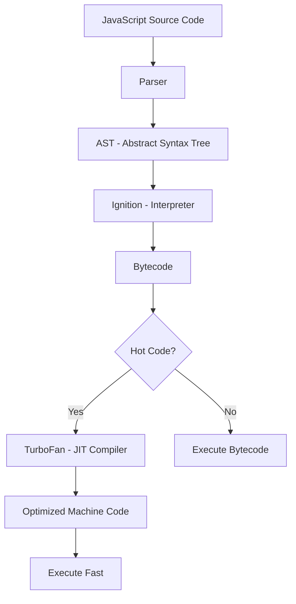
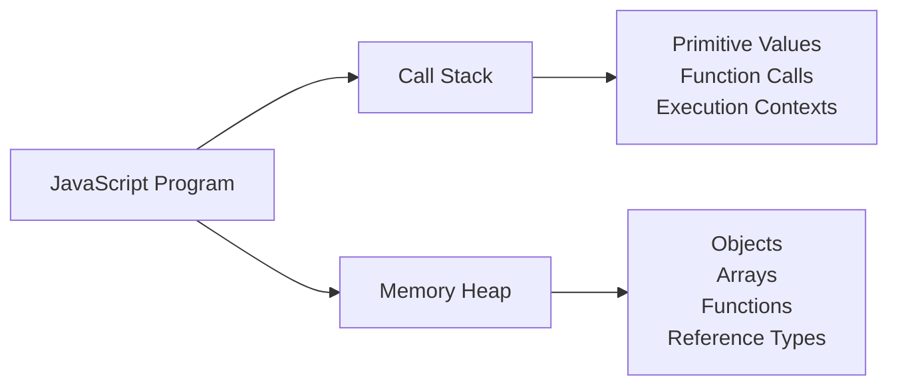
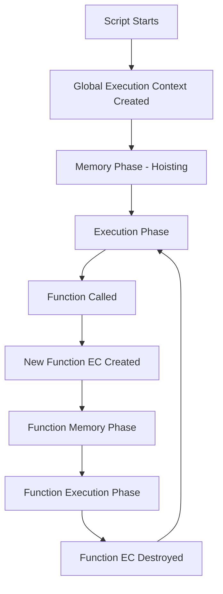
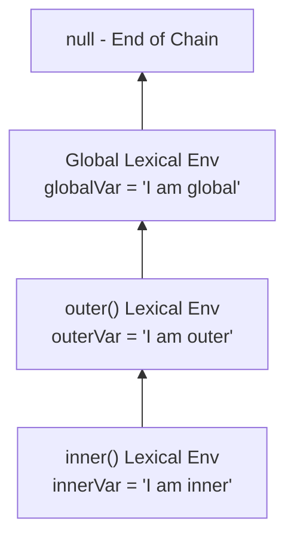
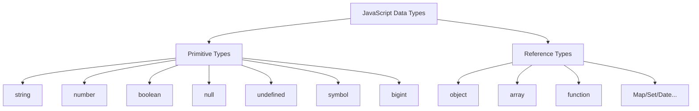
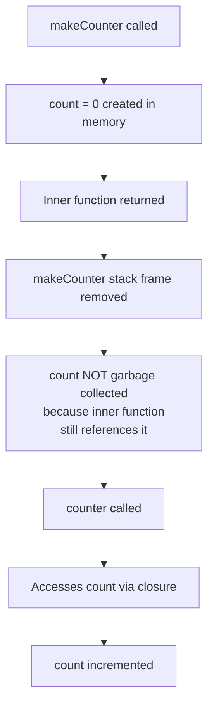
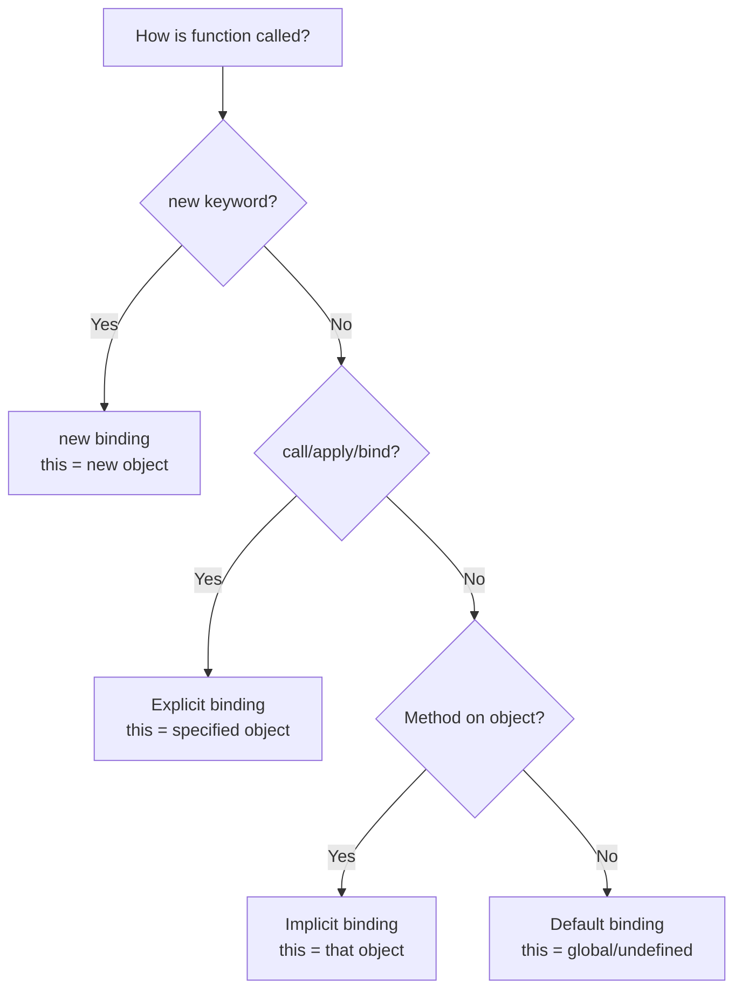
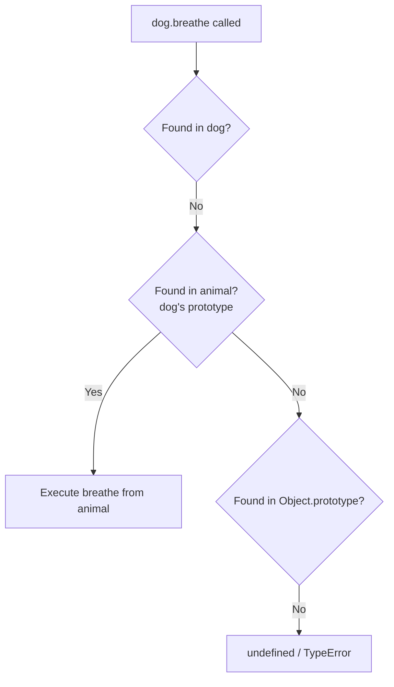

<a id="1-javascript-core-essentials-part-i"></a>

# Chapter 1: JavaScript Core Essentials — Part I

[📖 Main Index](#main-index) | [Next Chapter ➡](#2-javascript-core-essentials-part-ii)

---

## 📌 Learning Objectives

By the end of this chapter, you will:

- **Understand** how JavaScript works under the hood — engine, execution context, scope chain
- **Master** variables, data types, hoisting, TDZ, and type coercion deeply
- **Know** all function types, closures, and the `this` keyword with all binding rules
- **Explain** prototype chain, OOP with classes, and modern ES6+ syntax
- **Implement** shallow vs deep copy strategies including `structuredClone()`
- **Answer** 20+ interview questions on these topics with confidence
- **Identify** common output-based traps and explain them clearly

---

<a id="chapter-index-table-1"></a>

## 📑 Chapter Index Table

| Topic No. | Topic Name | Subtopics |
|-----------|-----------|-----------|
| 1.1 | [How JavaScript Works Under the Hood](#11-how-javascript-works-under-the-hood) | JS Engine, V8, Call Stack, Heap, JIT, Execution Context, Scope Chain, Lexical Environment |
| 1.2 | [Variables & Data Types](#12-variables-and-data-types) | var vs let vs const, Hoisting, TDZ, Primitives vs Reference, Type Coercion, typeof, instanceof, NaN, Infinity, -0 |
| 1.3 | [Functions — Complete Mastery](#13-functions-complete-mastery) | Declarations vs Expressions, Arrow Functions, IIFE, First-class, HOF, Pure Functions, Rest, Spread, Default Params |
| 1.4 | [Closures — Deep Dive](#14-closures-deep-dive) | What is Closure, Closure in Loops, Practical Patterns, Memory Implications, Module Pattern |
| 1.5 | [this Keyword — All Binding Rules](#15-this-keyword-all-binding-rules) | Default, Implicit, Explicit, new Binding, Arrow, call/apply/bind, Lost Binding |
| 1.6 | [Prototype & Prototype Chain](#16-prototype-and-prototype-chain) | [[Prototype]], \_\_proto\_\_, .prototype, Prototypal Inheritance, Object.create(), hasOwnProperty |
| 1.7 | [Object-Oriented JavaScript](#17-object-oriented-javascript) | ES6 Classes, Constructor, Static, Inheritance, Getters/Setters, Private Fields, Mixins |
| 1.8 | [Destructuring & Modern Syntax](#18-destructuring-and-modern-syntax) | Array/Object Destructuring, Nested, Defaults, Spread/Rest, Optional Chaining, Nullish Coalescing, Logical Assignment |
| 1.9 | [Copying — Shallow vs Deep](#19-copying-shallow-vs-deep) | Shallow Copy, Deep Copy, JSON method, structuredClone(), Manual Deep Clone, deepEqual, freeze |
| — | [Interview Questions](#interview-questions-chapter-1) | 20+ Conceptual, Scenario, Output-based, Advanced |
| — | [Practice Problems](#practice-problems-chapter-1) | 10 Coding + 10 Theory + Output Questions |
| — | [Quick Revision](#quick-revision-chapter-1) | Key Definitions, Traps, Bullets |
| — | [Chapter Summary](#chapter-summary-chapter-1) | Most Important Points |

---

## 1.1 How JavaScript Works Under the Hood

<a id="11-how-javascript-works-under-the-hood"></a>

### 🧠 Hinglish Intuition

> Socho JavaScript ek cook ki tarah hai. Tumne recipe (code) likhi. Ab ek head chef (JS Engine) hai jo recipe padhta hai, samajhta hai, aur step-by-step dishes (output) banata hai. V8 engine Google ka head chef hai jo Chrome aur Node.js mein kaam karta hai.

---

### What is a JavaScript Engine?

A **JavaScript Engine** is a program that reads, compiles, and executes JavaScript code. Every browser has its own engine:

| Engine | Browser / Runtime |
|--------|------------------|
| **V8** | Google Chrome, Node.js, Edge |
| **SpiderMonkey** | Firefox |
| **JavaScriptCore (Nitro)** | Safari |
| **Chakra** | Old Edge (Legacy) |

---

### How V8 Works — Step by Step



**Step-by-step explanation:**

1. **Parser** — Reads your source code and checks for syntax errors
2. **AST (Abstract Syntax Tree)** — Code is converted to a tree structure that represents its meaning
3. **Ignition (Interpreter)** — Converts AST to Bytecode and starts executing it immediately
4. **Profiler** — Monitors which functions run frequently (hot code)
5. **TurboFan (JIT Compiler)** — Compiles hot bytecode to optimized machine code
6. **Deoptimization** — If assumptions break (type changes), it falls back to bytecode

> [!NOTE]
> JIT = Just In Time. JavaScript is NOT purely interpreted. V8 compiles frequently-used code to machine code for speed.

---

### Compilation vs Interpretation vs JIT

| Type | How it works | Example |
|------|-------------|---------|
| **Compiled** | Entire code compiled before running | C, C++, Rust |
| **Interpreted** | Code read line by line at runtime | Old JS engines |
| **JIT (Hybrid)** | Start interpreting, compile hot paths | Modern JS (V8) |

> [!IMPORTANT]
> **Interview Answer:** JavaScript is a JIT-compiled language. It starts as interpreted (Ignition) and hot code paths get compiled to machine code (TurboFan).

---

### Memory: Call Stack & Heap



#### Call Stack

The **Call Stack** is a **LIFO (Last In, First Out)** data structure that tracks function calls.

```javascript
function greet(name) {       // 3. greet() pushed
  return `Hello ${name}`;    // 4. returns, greet() popped
}

function main() {            // 2. main() pushed
  const msg = greet('Raj');  // 3. greet() called
  console.log(msg);          // 5. logs "Hello Raj"
}

main();                      // 1. main() pushed onto stack
                             // 6. main() popped — stack empty
```

**Call Stack at each step:**
```
Step 1: [main()]
Step 2: [main(), greet()]
Step 3: greet() returns → [main()]
Step 4: main() returns → []  ← Empty
```

#### Memory Heap

The **Heap** is an unstructured region of memory where **objects and reference types** are stored.

```javascript
const user = { name: 'Raj', age: 25 };
// 'user' variable is in Stack (holds memory address)
// { name: 'Raj', age: 25 } object is in Heap
```

> [!TIP]
> **Stack** = small, fast, structured (primitives + execution contexts)
> **Heap** = large, slower, unstructured (objects, arrays, functions)

---

### Stack Overflow

```javascript
function infinite() {
  return infinite(); // calls itself forever
}
infinite();
// RangeError: Maximum call stack size exceeded
```

> [!NOTE]
> Stack Overflow occurs when too many function calls are pushed without returning. Each call adds a frame to the stack until memory is exhausted.

---

### Execution Context

An **Execution Context (EC)** is an environment where JavaScript code is evaluated and executed. It contains:

1. **Variable Environment** — `var` declarations, function declarations
2. **Lexical Environment** — `let`, `const`, inner functions
3. **`this` binding** — value of `this` in that context

#### Types of Execution Context

| Type | When Created |
|------|-------------|
| **Global EC** | When script first runs |
| **Function EC** | Every time a function is called |
| **Eval EC** | Inside `eval()` (avoid in practice) |



#### Two Phases of Execution Context

**Phase 1 — Memory Creation (Hoisting Phase):**
```javascript
// JavaScript does this BEFORE running any code:
// var x → allocated as undefined
// function greet → entire function stored in memory
// let/const → allocated but NOT initialized (TDZ)
```

**Phase 2 — Execution Phase:**
```javascript
var x = 10;          // now x = 10 (was undefined in Phase 1)
function greet() {   // already in memory, skipped
  return 'Hi';
}
```

---

### Scope Chain & Lexical Environment

**Lexical Environment** = current scope's local memory + reference to parent's lexical environment

```javascript
const globalVar = 'I am global';

function outer() {
  const outerVar = 'I am outer';

  function inner() {
    const innerVar = 'I am inner';
    console.log(innerVar);   // Found in inner's scope
    console.log(outerVar);   // Not in inner → look in outer → Found!
    console.log(globalVar);  // Not in outer → look in global → Found!
  }

  inner();
}

outer();
```



**Scope Chain** = the chain of lexical environments from current scope up to global scope.

> [!IMPORTANT]
> JavaScript uses **Lexical Scoping** (also called Static Scoping). A function's scope is determined by **where it is written**, not where it is called.

---

### Variable Environment vs Outer Environment

| Concept | What it contains |
|---------|-----------------|
| **Variable Environment** | `var` declarations & function declarations for THIS execution context |
| **Outer Environment** | Reference to the parent/enclosing execution context's environment |

```javascript
var a = 1;          // in Global Variable Environment

function foo() {
  var b = 2;        // in foo's Variable Environment
  // foo's Outer Environment → Global EC
  console.log(a);   // looks in foo's VE → not found → Outer (Global) → found: 1
}
```

👉 <a href="#chapter-index-table-1">Go to Top 🔝</a>

---

## 1.2 Variables & Data Types

<a id="12-variables-and-data-types"></a>

### 🧠 Hinglish Intuition

> `var` ek purana employee hai jo kahi bhi ghoom sakta hai (function scope). `let` aur `const` naye disciplined employees hain jo apne block mein rehte hain. `const` shaadi shuda hai — ek baar bind hua toh reassign nahi ho sakta!

---

### var vs let vs const — Deep Comparison

| Feature | `var` | `let` | `const` |
|---------|-------|-------|---------|
| **Scope** | Function | Block | Block |
| **Hoisting** | Yes (as `undefined`) | Yes (TDZ — not initialized) | Yes (TDZ — not initialized) |
| **Re-declaration** | ✅ Allowed | ❌ Not allowed | ❌ Not allowed |
| **Re-assignment** | ✅ Allowed | ✅ Allowed | ❌ Not allowed |
| **Global object property** | ✅ Yes | ❌ No | ❌ No |
| **Temporal Dead Zone** | ❌ No | ✅ Yes | ✅ Yes |

```javascript
// SCOPE DIFFERENCE
function scopeDemo() {
  if (true) {
    var x = 'var';    // function-scoped → accessible outside if
    let y = 'let';    // block-scoped → NOT accessible outside if
    const z = 'const'; // block-scoped → NOT accessible outside if
  }
  console.log(x); // 'var' ✅
  console.log(y); // ReferenceError ❌
  console.log(z); // ReferenceError ❌
}

// RE-DECLARATION
var a = 1;
var a = 2;       // ✅ No error
let b = 1;
let b = 2;       // ❌ SyntaxError: already declared

// GLOBAL OBJECT
var global = 'I am global';
console.log(window.global); // 'I am global' (in browser)

let notGlobal = 'test';
console.log(window.notGlobal); // undefined
```

---

### Hoisting — Deep Understanding

**Hoisting** = JavaScript's behavior of moving declarations to the top of their scope during the Memory Creation Phase.

```javascript
// What you write:
console.log(name);  // undefined (not ReferenceError!)
sayHi();            // "Hi!" (works!)

var name = 'Raj';

function sayHi() {
  console.log('Hi!');
}

// What JavaScript "sees" (conceptually):
var name;           // hoisted, initialized as undefined
function sayHi() { // hoisted completely (with body)
  console.log('Hi!');
}
console.log(name);  // undefined
sayHi();            // "Hi!"
name = 'Raj';       // assignment stays here
```

#### Hoisting Rules

| Declaration Type | Hoisted? | Initialized? | Accessible before declaration? |
|-----------------|----------|--------------|-------------------------------|
| `var` | ✅ Yes | ✅ As `undefined` | ✅ Yes (returns undefined) |
| `let` | ✅ Yes | ❌ No (TDZ) | ❌ ReferenceError |
| `const` | ✅ Yes | ❌ No (TDZ) | ❌ ReferenceError |
| `function` declaration | ✅ Yes | ✅ Fully (with body) | ✅ Yes |
| `function` expression | Same as var/let/const | — | Depends on keyword |
| `class` | ✅ Yes | ❌ No (TDZ) | ❌ ReferenceError |

---

### Temporal Dead Zone (TDZ)

The **TDZ** is the period between when a `let`/`const` variable's binding is created (hoisted) and when it is actually initialized with a value.

```javascript
console.log(x); // ❌ ReferenceError: Cannot access 'x' before initialization
let x = 5;
console.log(x); // ✅ 5

// TDZ starts here ↑ (top of block)
// TDZ ends here  ↑ (let x = 5 line)
```

> [!IMPORTANT]
> TDZ exists to catch bugs. `var`'s undefined behavior was a common source of hard-to-find bugs. TDZ makes the error explicit and early.

```javascript
// TDZ in a block
{
  // TDZ for 'a' starts here
  console.log(typeof a); // ❌ ReferenceError (NOT safe like var)
  let a = 10;            // TDZ ends here
}

// But typeof with var is always safe:
console.log(typeof b); // 'undefined' — no error (var is initialized)
var b = 5;
```

---

### Primitive vs Reference Types



#### Key Difference — Stored By Value vs By Reference

```javascript
// PRIMITIVES — stored by VALUE
let a = 10;
let b = a;    // b gets a COPY of value
b = 20;
console.log(a); // 10 — unchanged!
console.log(b); // 20

// REFERENCE TYPES — stored by REFERENCE
let obj1 = { name: 'Raj' };
let obj2 = obj1;    // obj2 gets SAME memory address
obj2.name = 'Priya';
console.log(obj1.name); // 'Priya' — CHANGED! Both point to same object
console.log(obj2.name); // 'Priya'
```

> [!NOTE]
> Primitives live in the **Stack**. Reference types live in the **Heap**, and the Stack holds a pointer (address) to the Heap location.

---

### Type Coercion — Implicit & Explicit

**Implicit coercion** = JavaScript automatically converts types.
**Explicit coercion** = You manually convert types.

```javascript
// IMPLICIT COERCION
console.log('5' + 3);    // '53'  → number 3 coerced to string
console.log('5' - 3);    // 2     → string '5' coerced to number
console.log('5' * '3');  // 15    → both coerced to numbers
console.log(true + 1);   // 2     → true coerced to 1
console.log(false + 1);  // 1     → false coerced to 0
console.log(null + 1);   // 1     → null coerced to 0
console.log(undefined + 1); // NaN → undefined coerced to NaN

// EXPLICIT COERCION
Number('42');    // 42
Number('abc');   // NaN
Number(true);    // 1
Number(null);    // 0
Number(undefined); // NaN
String(42);      // '42'
Boolean(0);      // false
Boolean('');     // false
Boolean('0');    // true  ← gotcha!
Boolean([]);     // true  ← gotcha!
Boolean({});     // true  ← gotcha!
```

#### Equality Coercion — == vs ===

```javascript
// == uses type coercion
0 == false       // true   (false → 0)
'' == false      // true   (both → 0)
null == undefined // true  (special rule)
null == false    // false  (null only == undefined)
[] == false      // true   ([] → '' → 0, false → 0)
[] == ![]        // true   ← biggest gotcha!

// === NO coercion
0 === false      // false
'' === false     // false
null === undefined // false
```

> [!IMPORTANT]
> Always use `===` in production code. `==` causes subtle bugs that are very hard to debug.

---

### typeof & instanceof

```javascript
// typeof — returns string
typeof 42           // 'number'
typeof 'hello'      // 'string'
typeof true         // 'boolean'
typeof undefined    // 'undefined'
typeof null         // 'object' ← FAMOUS BUG in JS
typeof {}           // 'object'
typeof []           // 'object' ← arrays are objects!
typeof function(){} // 'function'
typeof Symbol()     // 'symbol'
typeof 42n          // 'bigint'

// instanceof — checks prototype chain
[] instanceof Array    // true
[] instanceof Object   // true (arrays inherit from Object)
{} instanceof Object   // true
function(){} instanceof Function // true

// Reliable array check:
Array.isArray([])  // true ✅ — best practice
```

---

### NaN, Infinity, -0 Edge Cases

```javascript
// NaN (Not a Number)
console.log(typeof NaN);     // 'number' ← paradox!
console.log(NaN === NaN);    // false ← NaN is NOT equal to itself!
console.log(NaN == NaN);     // false

// Correct NaN check:
Number.isNaN(NaN);           // true ✅
Number.isNaN('NaN');         // false ✅ (unlike global isNaN)
isNaN('hello');              // true ← global isNaN coerces first
Number.isNaN('hello');       // false ✅ strict

// Infinity
console.log(1 / 0);          // Infinity
console.log(-1 / 0);         // -Infinity
console.log(Infinity + 1);   // Infinity
console.log(typeof Infinity); // 'number'
Number.isFinite(Infinity);   // false
Number.isFinite(42);         // true

// -0 (Negative Zero)
console.log(-0 === 0);       // true ← equality ignores sign!
console.log(-0 > 0);         // false
console.log(-0 < 0);         // false
console.log(String(-0));     // '0' ← loses sign!
Object.is(-0, 0);            // false ✅ — Object.is is the reliable check
Object.is(NaN, NaN);         // true  ✅ — also works for NaN
```

> [!TIP]
> Use `Object.is()` when you need to distinguish `-0` from `0` or check `NaN === NaN`.

👉 <a href="#chapter-index-table-1">Go to Top 🔝</a>

---

## 1.3 Functions — Complete Mastery

<a id="13-functions-complete-mastery"></a>

### 🧠 Hinglish Intuition

> Functions JavaScript ki roti hai. Bina functions ke JS zero hai. Function declaration ek permanent employee hai — pehle se available. Function expression ek contract employee hai — tab aata hai jab bulao. Arrow function ek new-age freelancer hai — concise, apna `this` nahi rakhta.

---

### Function Declarations vs Expressions

```javascript
// FUNCTION DECLARATION — fully hoisted
sayHello(); // ✅ Works! Hoisted completely
function sayHello() {
  console.log('Hello!');
}

// FUNCTION EXPRESSION — NOT fully hoisted
greet(); // ❌ TypeError: greet is not a function
var greet = function() {
  console.log('Greet!');
};
// (var greet is hoisted as undefined, not as a function)

// NAMED FUNCTION EXPRESSION
const factorial = function fact(n) {
  if (n <= 1) return 1;
  return n * fact(n - 1); // 'fact' only available inside itself
};
console.log(factorial(5)); // 120
// console.log(fact(5));   // ❌ ReferenceError — 'fact' not in outer scope
```

---

### Arrow Functions & this Binding Difference

```javascript
// Regular function — has its OWN this
const obj1 = {
  name: 'Raj',
  greet: function() {
    console.log(`Hello, I am ${this.name}`); // this = obj1
  }
};
obj1.greet(); // "Hello, I am Raj"

// Arrow function — INHERITS this from enclosing lexical scope
const obj2 = {
  name: 'Raj',
  greet: () => {
    console.log(`Hello, I am ${this.name}`); // this = window/global (NOT obj2!)
  }
};
obj2.greet(); // "Hello, I am undefined"

// Arrow functions are PERFECT for callbacks:
const obj3 = {
  name: 'Raj',
  greetAfterDelay: function() {
    setTimeout(() => {
      console.log(`Hello, ${this.name}`); // ✅ this = obj3 (lexically inherited)
    }, 1000);
  }
};
obj3.greetAfterDelay(); // "Hello, Raj"
```

#### Arrow Function Restrictions

```javascript
// ❌ Cannot be used as constructor
const Person = (name) => { this.name = name; };
new Person('Raj'); // TypeError: Person is not a constructor

// ❌ No 'arguments' object
const fn = () => {
  console.log(arguments); // ReferenceError in strict mode
};

// ✅ Use rest parameters instead
const fn2 = (...args) => {
  console.log(args); // ✅ [1, 2, 3]
};
fn2(1, 2, 3);

// ❌ Cannot be used as generator
const gen = *() => {}; // SyntaxError
```

---

### IIFE — Immediately Invoked Function Expression

```javascript
// Basic IIFE
(function() {
  const secret = 'I am private';
  console.log(secret); // 'I am private'
})();

// console.log(secret); // ❌ ReferenceError — secret is not accessible outside

// Arrow IIFE
(() => {
  console.log('Arrow IIFE!');
})();

// IIFE with parameter
(function(name) {
  console.log(`Hello, ${name}`);
})('Raj'); // "Hello, Raj"

// IIFE return value
const result = (function() {
  return 42;
})();
console.log(result); // 42
```

**Why IIFE?**
- Create private scope (avoid polluting global)
- Execute code immediately without naming a function
- Used historically for module patterns before ES6 modules

---

### First-Class & Higher-Order Functions

**First-class functions** = functions treated like any other value (stored in variables, passed as arguments, returned from functions).

```javascript
// Functions as VALUES
const add = function(a, b) { return a + b; };

// Functions as ARGUMENTS (callback pattern)
function doOperation(a, b, operation) {
  return operation(a, b);
}
console.log(doOperation(5, 3, add));           // 8
console.log(doOperation(5, 3, (a, b) => a * b)); // 15

// Functions RETURNED from functions
function multiplier(factor) {
  return function(number) {
    return number * factor;
  };
}
const double = multiplier(2);
const triple = multiplier(3);
console.log(double(5));  // 10
console.log(triple(5));  // 15

// HOF examples in arrays
const numbers = [1, 2, 3, 4, 5];
const doubled = numbers.map(n => n * 2);     // [2, 4, 6, 8, 10]
const evens = numbers.filter(n => n % 2 === 0); // [2, 4]
const sum = numbers.reduce((acc, n) => acc + n, 0); // 15
```

---

### Pure Functions & Side Effects

```javascript
// PURE FUNCTION — same input → always same output, no side effects
function add(a, b) {
  return a + b; // no external interaction
}
add(2, 3); // always 5

// IMPURE FUNCTION — has side effects
let total = 0;
function addToTotal(num) {
  total += num; // modifies external state ← side effect!
  return total;
}
addToTotal(5); // 5
addToTotal(5); // 10 ← same input, different output!

// Side effects include:
// - Modifying external variables
// - console.log()
// - HTTP requests
// - DOM manipulation
// - Writing to database
```

> [!NOTE]
> **React** relies heavily on pure functions for components. A component with the same props should always render the same output.

---

### Rest Parameters & Spread Operator

```javascript
// REST PARAMETERS — collect multiple args into array
function sum(...numbers) {  // must be LAST parameter
  return numbers.reduce((acc, n) => acc + n, 0);
}
console.log(sum(1, 2, 3, 4, 5)); // 15

function first(a, b, ...rest) {
  console.log(a, b, rest);
}
first(1, 2, 3, 4, 5); // 1, 2, [3, 4, 5]

// SPREAD OPERATOR — expand array/object
const arr1 = [1, 2, 3];
const arr2 = [4, 5, 6];
const combined = [...arr1, ...arr2]; // [1, 2, 3, 4, 5, 6]

const obj1 = { a: 1, b: 2 };
const obj2 = { c: 3, d: 4 };
const merged = { ...obj1, ...obj2 }; // { a: 1, b: 2, c: 3, d: 4 }

// Spread in function calls
Math.max(...arr1); // same as Math.max(1, 2, 3) → 3

// Spread to copy (shallow)
const original = [1, 2, 3];
const copy = [...original];
copy.push(4);
console.log(original); // [1, 2, 3] ← unchanged
console.log(copy);     // [1, 2, 3, 4]
```

---

### Default Parameters

```javascript
// Without default params (old way)
function greet(name) {
  name = name || 'Guest'; // problem: falsy values treated as default
  console.log(`Hello, ${name}`);
}
greet('');    // "Hello, Guest" ← incorrect! '' is falsy

// With default params (ES6+)
function greetES6(name = 'Guest') {
  console.log(`Hello, ${name}`);
}
greetES6();          // "Hello, Guest" ✅
greetES6(undefined); // "Hello, Guest" ✅ (undefined triggers default)
greetES6(null);      // "Hello, null" ← null does NOT trigger default
greetES6('');        // "Hello, " ← empty string does NOT trigger default

// Default params can be expressions
function createUser(name, role = 'user', id = Date.now()) {
  return { name, role, id };
}

// Default params can reference earlier params
function createPoint(x, y = x * 2) {
  return { x, y };
}
console.log(createPoint(5)); // { x: 5, y: 10 }
```

👉 <a href="#chapter-index-table-1">Go to Top 🔝</a>

---

## 1.4 Closures — Deep Dive

<a id="14-closures-deep-dive"></a>

### 🧠 Hinglish Intuition

> Closure ek backpack ki tarah hai. Jab function bahar nikalti hai, toh apne ghar (parent scope) ki cheezein backpack mein daal leti hai. Ghar band ho jaye, function delete ho jaye — koi baat nahi. Backpack mein saari cheezein safe hain!

---

### What is a Closure?

A **closure** is a function that **remembers the variables from its outer scope** even after the outer function has finished executing.

```javascript
function makeCounter() {
  let count = 0;  // This variable is "closed over"

  return function() {
    count++;
    console.log(count);
  };
}

const counter = makeCounter(); // makeCounter() finishes executing
// But 'count' is NOT garbage collected because counter holds reference

counter(); // 1
counter(); // 2
counter(); // 3
// Each call remembers the same 'count' variable!

const counter2 = makeCounter(); // NEW closure, NEW 'count'
counter2(); // 1 ← independent from counter
```



---

### Closure in Loops — Classic var Bug

```javascript
// ❌ PROBLEM with var
for (var i = 0; i < 3; i++) {
  setTimeout(() => {
    console.log(i); // 3, 3, 3 ← all print 3!
  }, 1000);
}
// Why? var is function-scoped, all callbacks share SAME 'i'
// By the time callbacks run, loop is done and i = 3

// ✅ SOLUTION 1: Use let (block-scoped, new i per iteration)
for (let i = 0; i < 3; i++) {
  setTimeout(() => {
    console.log(i); // 0, 1, 2 ✅
  }, 1000);
}

// ✅ SOLUTION 2: IIFE to create new scope
for (var i = 0; i < 3; i++) {
  (function(j) {
    setTimeout(() => {
      console.log(j); // 0, 1, 2 ✅
    }, 1000);
  })(i); // pass current value of i
}

// ✅ SOLUTION 3: Separate function
function createTimer(value) {
  setTimeout(() => {
    console.log(value); // 0, 1, 2 ✅
  }, 1000);
}
for (var i = 0; i < 3; i++) {
  createTimer(i);
}
```

---

### Practical Closure Patterns

```javascript
// 1. DATA PRIVACY / ENCAPSULATION
function createBankAccount(initialBalance) {
  let balance = initialBalance; // private!

  return {
    deposit(amount) {
      balance += amount;
      console.log(`Deposited ${amount}. Balance: ${balance}`);
    },
    withdraw(amount) {
      if (amount > balance) {
        console.log('Insufficient funds');
        return;
      }
      balance -= amount;
      console.log(`Withdrew ${amount}. Balance: ${balance}`);
    },
    getBalance() {
      return balance; // only way to read balance
    }
  };
}

const account = createBankAccount(1000);
account.deposit(500);   // "Deposited 500. Balance: 1500"
account.withdraw(200);  // "Withdrew 200. Balance: 1300"
console.log(account.balance); // undefined — private!

// 2. MEMOIZATION (caching results)
function memoize(fn) {
  const cache = {};
  return function(...args) {
    const key = JSON.stringify(args);
    if (cache[key] !== undefined) {
      console.log('From cache!');
      return cache[key];
    }
    cache[key] = fn(...args);
    return cache[key];
  };
}

const expensiveSquare = memoize((n) => {
  console.log('Computing...');
  return n * n;
});

expensiveSquare(4); // "Computing..." 16
expensiveSquare(4); // "From cache!" 16
expensiveSquare(5); // "Computing..." 25

// 3. PARTIAL APPLICATION
function multiply(a, b) {
  return a * b;
}

function partial(fn, ...presetArgs) {
  return function(...laterArgs) {
    return fn(...presetArgs, ...laterArgs);
  };
}

const double = partial(multiply, 2);
const triple = partial(multiply, 3);
console.log(double(5)); // 10
console.log(triple(5)); // 15
```

---

### Memory Implications of Closures

```javascript
// MEMORY LEAK via closure
function createHeavy() {
  const bigArray = new Array(1000000).fill('🔴'); // 1M items

  return function() {
    console.log(bigArray[0]); // closure keeps bigArray alive!
  };
}

const leaky = createHeavy();
// bigArray cannot be garbage collected as long as 'leaky' exists

// FIX: Set to null when done
// leaky = null; // bigArray can now be garbage collected
```

> [!IMPORTANT]
> Closures can cause **memory leaks** if long-lived functions reference large objects. Always null-out references when they're no longer needed.

---

### Module Pattern via Closures

```javascript
// Classic Module Pattern (pre-ES6)
const CounterModule = (function() {
  // Private state
  let count = 0;
  const MAX = 10;

  // Private function
  function validate(n) {
    return n >= 0 && n <= MAX;
  }

  // Public API
  return {
    increment() {
      if (validate(count + 1)) count++;
    },
    decrement() {
      if (validate(count - 1)) count--;
    },
    reset() {
      count = 0;
    },
    getCount() {
      return count;
    }
  };
})();

CounterModule.increment();
CounterModule.increment();
console.log(CounterModule.getCount()); // 2
console.log(CounterModule.count);      // undefined — private!
```

👉 <a href="#chapter-index-table-1">Go to Top 🔝</a>

---

## 1.5 this Keyword — All Binding Rules

<a id="15-this-keyword-all-binding-rules"></a>

### 🧠 Hinglish Intuition

> `this` ek pronoun hai — "main kaun hoon is waqt?" Ek actor stage pe alag role karta hai, ghar pe alag. `this` bhi context ke hisaab se change hota hai. 4 rules yaad rakho — koi bhi situation solve ho jaayegi.

---

### The 4 Binding Rules (Priority Order)



---

### Rule 1: Default Binding

When a function is called **standalone** (not as a method):

```javascript
function showThis() {
  console.log(this);
}

showThis(); // window (browser) or global (Node.js) in non-strict mode
            // undefined in strict mode

'use strict';
function strictShowThis() {
  console.log(this); // undefined in strict mode
}
strictShowThis();
```

---

### Rule 2: Implicit Binding

When a function is called **as a method** of an object:

```javascript
const person = {
  name: 'Raj',
  greet() {
    console.log(`Hello, I am ${this.name}`);
  }
};

person.greet(); // this = person → "Hello, I am Raj"

// CHAINED — this = object immediately to left of dot
const company = {
  name: 'TechCorp',
  team: {
    name: 'Dev Team',
    introduce() {
      console.log(this.name); // 'Dev Team' (immediate left = team)
    }
  }
};
company.team.introduce(); // "Dev Team"
```

#### Lost Binding — Common Trap!

```javascript
const user = {
  name: 'Raj',
  greet() {
    console.log(`Hello, ${this.name}`);
  }
};

user.greet(); // "Hello, Raj" ✅

// Lost binding!
const greetFn = user.greet; // method extracted from object
greetFn(); // "Hello, undefined" ❌ — this = window/undefined
           // Binding is LOST when method is detached

// Lost binding in callbacks
setTimeout(user.greet, 1000); // "Hello, undefined" ❌
```

---

### Rule 3: Explicit Binding — call, apply, bind

```javascript
function introduce(greeting, punctuation) {
  console.log(`${greeting}, I am ${this.name}${punctuation}`);
}

const person = { name: 'Raj' };

// call() — invoke immediately, args comma-separated
introduce.call(person, 'Hello', '!'); // "Hello, I am Raj!"

// apply() — invoke immediately, args as array
introduce.apply(person, ['Hi', '?']); // "Hi, I am Raj?"

// bind() — returns NEW function with bound this (doesn't invoke)
const boundIntroduce = introduce.bind(person);
boundIntroduce('Hey', '.'); // "Hey, I am Raj."

// bind with partial application
const helloIntroduce = introduce.bind(person, 'Hello');
helloIntroduce('!');  // "Hello, I am Raj!"
helloIntroduce('...'); // "Hello, I am Raj..."

// Fix lost binding with bind:
const user = { name: 'Raj', greet() { console.log(this.name); } };
setTimeout(user.greet.bind(user), 1000); // "Raj" ✅
```

| Method | Invokes? | Args format | Returns |
|--------|----------|-------------|---------|
| `call` | ✅ Immediately | Comma-separated | Result |
| `apply` | ✅ Immediately | Array | Result |
| `bind` | ❌ Later | Comma-separated | New function |

---

### Rule 4: new Binding

When a function is called with `new`:

```javascript
function Person(name, age) {
  // 1. New empty object created: {}
  // 2. this = that new object
  this.name = name;
  this.age = age;
  // 3. Object returned automatically
}

const raj = new Person('Raj', 25);
// raj = { name: 'Raj', age: 25 }
console.log(raj.name); // 'Raj'
console.log(raj.age);  // 25

// What 'new' does internally:
function simulateNew(Constructor, ...args) {
  const obj = Object.create(Constructor.prototype); // 1. Create object
  const result = Constructor.apply(obj, args);       // 2. Run constructor with this=obj
  return result instanceof Object ? result : obj;   // 3. Return object
}
```

---

### Arrow Function & this (Lexical Binding)

Arrow functions **do not have their own `this`**. They inherit `this` from the enclosing lexical scope.

```javascript
const timer = {
  seconds: 0,
  start() {
    // 'this' here is timer object (implicit binding)
    setInterval(() => {
      this.seconds++; // ✅ Arrow inherits 'this' from start()
      console.log(this.seconds);
    }, 1000);
  }
};
timer.start(); // 1, 2, 3...

// Arrow function — this is NOT affected by how it's called
const obj = {
  name: 'Test',
  arrow: () => {
    console.log(this.name); // undefined — this = global (defined in global scope)
  },
  regular() {
    console.log(this.name); // 'Test' — this = obj
  }
};
obj.arrow();   // undefined
obj.regular(); // 'Test'

// Arrow functions IGNORE call/apply/bind for 'this'
const arrowFn = () => console.log(this);
arrowFn.call({ name: 'ignored' }); // still global — cannot override!
```

---

### this in Classes

```javascript
class Counter {
  count = 0; // public field

  // Problem: method passed as callback loses 'this'
  increment() {
    this.count++;
    console.log(this.count);
  }

  // Solution 1: arrow function as class field
  incrementArrow = () => {
    this.count++;
    console.log(this.count);
  };
}

const c = new Counter();
c.increment();         // 1 ✅
c.incrementArrow();    // 2 ✅

// Detaching methods:
const { increment, incrementArrow } = c;
increment();       // ❌ TypeError (this = undefined in strict mode)
incrementArrow();  // ✅ Works! Arrow captures 'this' lexically
```

👉 <a href="#chapter-index-table-1">Go to Top 🔝</a>

---

## 1.6 Prototype & Prototype Chain

<a id="16-prototype-and-prototype-chain"></a>

### 🧠 Hinglish Intuition

> Prototype ek family tree ki tarah hai. Agar beta (object) ke paas koi skill nahi hai, toh wo pehle baap (prototype) mein dhundta hai. Baap ke paas nahi? Daada (Object.prototype) mein dhundta hai. Daada ke baap nahi hain (null) — game over!

---

### [[Prototype]] Internal Slot

Every JavaScript object has a hidden internal property `[[Prototype]]` that either points to another object or is `null`.

```javascript
const animal = {
  breathe() {
    console.log('Breathing...');
  }
};

const dog = {
  bark() {
    console.log('Woof!');
  }
};

// Set [[Prototype]] of dog to animal
Object.setPrototypeOf(dog, animal);

dog.bark();    // 'Woof!' — found in dog itself
dog.breathe(); // 'Breathing...' — NOT in dog → found in animal (prototype)

// Prototype chain lookup:
// dog → animal → Object.prototype → null
```



---

### \_\_proto\_\_ vs .prototype

These two are **different things** — a very common interview confusion!

```javascript
// __proto__ — instance property, points to the prototype
// .prototype — function property, blueprint for instances

function Dog(name) {
  this.name = name;
}
Dog.prototype.bark = function() {
  console.log(`${this.name} says Woof!`);
};

const rex = new Dog('Rex');

// __proto__ of instance points to constructor's .prototype
console.log(rex.__proto__ === Dog.prototype); // true ✅
console.log(Object.getPrototypeOf(rex) === Dog.prototype); // true ✅

rex.bark(); // "Rex says Woof!" — found via prototype chain

// Prototype chain:
// rex.__proto__ → Dog.prototype
// Dog.prototype.__proto__ → Object.prototype
// Object.prototype.__proto__ → null
```

| Property | On | Points to |
|----------|----|-----------|
| `__proto__` | Every object instance | Its prototype (parent) |
| `.prototype` | Function objects only | Object that instances inherit from |
| `[[Prototype]]` | Every object (internal) | Same as `__proto__` |

> [!NOTE]
> `__proto__` is deprecated. Use `Object.getPrototypeOf(obj)` and `Object.setPrototypeOf(obj, proto)` instead.

---

### Prototypal Inheritance

```javascript
function Animal(name) {
  this.name = name;
}
Animal.prototype.breathe = function() {
  console.log(`${this.name} is breathing`);
};

function Dog(name, breed) {
  Animal.call(this, name); // inherit properties
  this.breed = breed;
}

// Inherit methods from Animal
Dog.prototype = Object.create(Animal.prototype);
Dog.prototype.constructor = Dog; // fix constructor reference

Dog.prototype.bark = function() {
  console.log(`${this.name} barks!`);
};

const rex = new Dog('Rex', 'Labrador');
rex.breathe(); // "Rex is breathing" — from Animal
rex.bark();    // "Rex barks!" — from Dog
console.log(rex instanceof Dog);    // true
console.log(rex instanceof Animal); // true
```

---

### Object.create()

```javascript
// Object.create(proto) — creates new object with specified prototype
const personProto = {
  greet() {
    console.log(`Hello, I am ${this.name}`);
  }
};

const raj = Object.create(personProto);
raj.name = 'Raj';
raj.greet(); // "Hello, I am Raj"

// Object.create(null) — creates object with NO prototype
const pureObj = Object.create(null);
pureObj.key = 'value';
// pureObj has NO toString, hasOwnProperty, etc.
// Useful for creating true hash maps
```

---

### hasOwnProperty vs Inherited

```javascript
function Person(name) {
  this.name = name; // OWN property
}
Person.prototype.species = 'human'; // INHERITED property

const raj = new Person('Raj');

console.log(raj.name);    // 'Raj' — own
console.log(raj.species); // 'human' — inherited

// Check own vs inherited:
raj.hasOwnProperty('name');    // true ✅ — own
raj.hasOwnProperty('species'); // false ❌ — inherited

// for...in iterates ALL (own + inherited)
for (let key in raj) {
  console.log(key); // 'name', 'species'
}

// Object.keys() gives only OWN enumerable
Object.keys(raj); // ['name']

// Best practice: always guard for...in with hasOwnProperty
for (let key in raj) {
  if (raj.hasOwnProperty(key)) {
    console.log(key); // only 'name'
  }
}
```

👉 <a href="#chapter-index-table-1">Go to Top 🔝</a>

---

## 1.7 Object-Oriented JavaScript

<a id="17-object-oriented-javascript"></a>

### 🧠 Hinglish Intuition

> ES6 Classes ek makaan ka blueprint hai. Blueprint se multiple makaan ban sakte hain. Har makaan alag hai, lekin same blueprint follow karta hai. `extends` matlab beta baap ka ghar inherit karta hai — baap ki cheezein milti hain + apni cheezein.

---

### ES6 Classes — Syntax & Under the Hood

```javascript
class Person {
  // Class field (ES2022) — no need to define in constructor
  species = 'Human';

  constructor(name, age) {
    this.name = name; // instance property
    this.age = age;
  }

  // Instance method — on prototype
  greet() {
    return `Hi, I am ${this.name}, ${this.age} years old`;
  }

  // Static method — on class itself, not instances
  static create(name, age) {
    return new Person(name, age);
  }

  // Getter
  get info() {
    return `${this.name} (${this.age})`;
  }

  // Setter
  set info(str) {
    const [name, age] = str.split('-');
    this.name = name;
    this.age = Number(age);
  }
}

const raj = new Person('Raj', 25);
console.log(raj.greet());    // "Hi, I am Raj, 25 years old"
console.log(raj.info);       // "Raj (25)" — getter
raj.info = 'Priya-30';       // setter
console.log(raj.name);       // "Priya"

const priya = Person.create('Priya', 30); // static method
```

> [!IMPORTANT]
> Classes in JavaScript are **syntactic sugar** over prototype-based inheritance. Under the hood, they still use `[[Prototype]]`. `typeof Person === 'function'` returns `true`.

---

### Inheritance with extends & super

```javascript
class Animal {
  constructor(name) {
    this.name = name;
  }

  speak() {
    return `${this.name} makes a sound`;
  }

  toString() {
    return `Animal: ${this.name}`;
  }
}

class Dog extends Animal {
  constructor(name, breed) {
    super(name); // MUST call super() before using 'this'
    this.breed = breed;
  }

  speak() {
    // Override parent method
    return `${this.name} barks`;
  }

  fullInfo() {
    // Call parent method via super
    return `${super.speak()} — actually it barks! Breed: ${this.breed}`;
  }
}

class GoldenRetriever extends Dog {
  constructor(name) {
    super(name, 'Golden Retriever');
  }
}

const rex = new GoldenRetriever('Rex');
console.log(rex.speak());    // "Rex barks" — Dog's version
console.log(rex.fullInfo()); // "Rex makes a sound — actually it barks! Breed: Golden Retriever"
console.log(rex instanceof Dog);    // true
console.log(rex instanceof Animal); // true
```

---

### Private Fields (#) — ES2022

```javascript
class BankAccount {
  #balance = 0;        // private field
  #owner;              // private field

  constructor(owner, initialBalance) {
    this.#owner = owner;
    this.#balance = initialBalance;
  }

  deposit(amount) {
    if (amount > 0) this.#balance += amount;
  }

  get balance() {
    return this.#balance; // controlled access
  }

  #validate(amount) { // private method
    return amount > 0 && amount <= this.#balance;
  }

  withdraw(amount) {
    if (this.#validate(amount)) {
      this.#balance -= amount;
      return true;
    }
    return false;
  }
}

const acc = new BankAccount('Raj', 1000);
acc.deposit(500);
console.log(acc.balance);  // 1500 ✅
console.log(acc.#balance); // ❌ SyntaxError — private!
```

---

### Class vs Factory Function

```javascript
// CLASS
class PersonClass {
  constructor(name) {
    this.name = name;
  }
  greet() { return `Hi, ${this.name}`; }
}
const p1 = new PersonClass('Raj'); // must use new

// FACTORY FUNCTION
function createPerson(name) {
  return {
    name,
    greet() { return `Hi, ${name}`; } // closure — no 'this' needed
  };
}
const p2 = createPerson('Raj'); // no new needed
```

| Aspect | Class | Factory Function |
|--------|-------|-----------------|
| Syntax | `new` required | No `new` needed |
| `this` | Explicit | Optional (closure) |
| Inheritance | `extends` | Object composition |
| Private | `#` fields | Closure |
| `instanceof` | ✅ Works | ❌ Doesn't work |
| Memory | Methods on prototype (shared) | Methods per object (if not using closure carefully) |

---

### Mixins Pattern

```javascript
// Mixins — compose behaviors without deep inheritance
const Serializable = (Base) => class extends Base {
  serialize() {
    return JSON.stringify(this);
  }

  static deserialize(data) {
    return Object.assign(new this(), JSON.parse(data));
  }
};

const Validatable = (Base) => class extends Base {
  validate() {
    return Object.keys(this).every(key => this[key] !== null);
  }
};

class Entity {
  constructor(id) {
    this.id = id;
  }
}

// Apply multiple mixins
class User extends Serializable(Validatable(Entity)) {
  constructor(id, name, email) {
    super(id);
    this.name = name;
    this.email = email;
  }
}

const user = new User(1, 'Raj', 'raj@email.com');
console.log(user.serialize()); // '{"id":1,"name":"Raj","email":"raj@email.com"}'
console.log(user.validate());  // true
```

👉 <a href="#chapter-index-table-1">Go to Top 🔝</a>

---

## 1.8 Destructuring & Modern Syntax

<a id="18-destructuring-and-modern-syntax"></a>

### 🧠 Hinglish Intuition

> Destructuring ek dabba kholne jaisa hai. Pehle pura dabba uthana padta tha (access karna). Ab seedha bol do "mujhe sirf yeh topi aur yeh darwaza chahiye" — aur woh nikal jaata hai!

---

### Array & Object Destructuring

```javascript
// ARRAY DESTRUCTURING
const colors = ['red', 'green', 'blue'];

// Old way:
const c1 = colors[0];
const c2 = colors[1];

// Destructuring:
const [first, second, third] = colors;
console.log(first, second, third); // 'red' 'green' 'blue'

// Skip elements:
const [, , last] = colors;
console.log(last); // 'blue'

// Rest in array:
const [head, ...tail] = colors;
console.log(head); // 'red'
console.log(tail); // ['green', 'blue']

// Swap variables:
let a = 1, b = 2;
[a, b] = [b, a];
console.log(a, b); // 2 1

// OBJECT DESTRUCTURING
const person = { name: 'Raj', age: 25, city: 'Mumbai' };

const { name, age } = person;
console.log(name, age); // 'Raj' 25

// Rename while destructuring:
const { name: personName, age: personAge } = person;
console.log(personName); // 'Raj'

// Rest in object:
const { city, ...rest } = person;
console.log(city); // 'Mumbai'
console.log(rest); // { name: 'Raj', age: 25 }
```

---

### Nested Destructuring

```javascript
const user = {
  name: 'Raj',
  address: {
    city: 'Mumbai',
    zip: '400001',
    country: {
      name: 'India',
      code: 'IN'
    }
  },
  scores: [90, 85, 92]
};

// Nested object destructuring:
const {
  name,
  address: {
    city,
    country: { name: countryName }
  },
  scores: [firstScore, , thirdScore]
} = user;

console.log(name);        // 'Raj'
console.log(city);        // 'Mumbai'
console.log(countryName); // 'India'
console.log(firstScore);  // 90
console.log(thirdScore);  // 92
```

---

### Destructuring with Default Values

```javascript
// Array defaults:
const [x = 0, y = 0, z = 0] = [1, 2];
console.log(x, y, z); // 1 2 0 (z gets default)

// Object defaults:
const { name = 'Anonymous', age = 0, role = 'user' } = { name: 'Raj' };
console.log(name, age, role); // 'Raj' 0 'user'

// Rename + default:
const { score: userScore = 100 } = {};
console.log(userScore); // 100

// Function parameter destructuring with defaults:
function createUser({ name = 'Guest', role = 'user', active = true } = {}) {
  return { name, role, active };
}
createUser({ name: 'Raj' });    // { name: 'Raj', role: 'user', active: true }
createUser();                    // { name: 'Guest', role: 'user', active: true }
```

---

### Optional Chaining (?.) & Nullish Coalescing (??)

```javascript
// OPTIONAL CHAINING (?.)
const user = {
  name: 'Raj',
  address: {
    city: 'Mumbai'
  }
};

// Old way:
const zip = user && user.address && user.address.zip;

// Optional chaining:
const zip2 = user?.address?.zip;        // undefined (no error!)
const phone = user?.contact?.phone;     // undefined (no error!)

// With methods:
const upper = user?.name?.toUpperCase(); // 'RAJ'
const result = user?.nonExistent?.();   // undefined (no error!)

// With arrays:
const arr = null;
const item = arr?.[0]; // undefined (no error!)

// NULLISH COALESCING (??)
// Returns right side only when left is null OR undefined
const score = null;
console.log(score ?? 'No score');     // 'No score'
console.log(score || 'No score');     // 'No score' (same here)

const count = 0;
console.log(count ?? 'No count');     // 0  ← 0 is NOT null/undefined
console.log(count || 'No count');     // 'No count' ← 0 is falsy!

// Combining:
const city = user?.address?.city ?? 'Unknown city';
console.log(city); // 'Mumbai'
```

> [!IMPORTANT]
> **??** vs **||**: `||` returns right side for ALL falsy values (0, '', false, null, undefined). `??` returns right side ONLY for null/undefined. Use `??` for default values!

---

### Logical Assignment Operators

```javascript
// &&= (Logical AND assignment)
// Assigns only if left side is TRUTHY
let a = 1;
a &&= 5;  // a = 5 (because a is truthy, assign 5)
let b = 0;
b &&= 5;  // b = 0 (because b is falsy, don't assign)

// ||= (Logical OR assignment)
// Assigns only if left side is FALSY
let c = null;
c ||= 'default'; // c = 'default' (null is falsy)
let d = 'existing';
d ||= 'default'; // d = 'existing' (not falsy, don't assign)

// ??= (Nullish assignment)
// Assigns only if left side is null or undefined
let e = null;
e ??= 'value'; // e = 'value'
let f = 0;
f ??= 'value'; // f = 0 (0 is NOT null/undefined)

// Practical: Initialize object properties
const config = {};
config.timeout ??= 3000;
config.retries ??= 3;
console.log(config); // { timeout: 3000, retries: 3 }
```

---

### Object Shorthand & Computed Keys

```javascript
// SHORTHAND PROPERTIES
const name = 'Raj';
const age = 25;

// Old:
const person1 = { name: name, age: age };

// Shorthand:
const person2 = { name, age }; // same!

// SHORTHAND METHODS
const obj = {
  // Old:
  greet: function() { return 'hi'; },
  // Shorthand:
  greet2() { return 'hi'; },
  // Arrow:
  greet3: () => 'hi',
};

// COMPUTED PROPERTY KEYS
const prefix = 'user';
const dynamicObj = {
  [`${prefix}Name`]: 'Raj',
  [`${prefix}Age`]: 25,
  [Symbol('id')]: 12345,
};
console.log(dynamicObj.userName); // 'Raj'
console.log(dynamicObj.userAge);  // 25
```

👉 <a href="#chapter-index-table-1">Go to Top 🔝</a>

---

## 1.9 Copying — Shallow vs Deep

<a id="19-copying-shallow-vs-deep"></a>

### 🧠 Hinglish Intuition

> Shallow copy ek xerox ki tarah hai — bahar se same dikhta hai, lekin andar ka reference same hai. Deep copy ek manual recreation hai — ek naya object bilkul alag jagah banao, koi reference share nahi.

---

### Shallow Copy Methods

```javascript
const original = {
  name: 'Raj',
  scores: [90, 85],     // nested reference
  address: { city: 'Mumbai' }  // nested reference
};

// Method 1: Spread operator
const spread = { ...original };

// Method 2: Object.assign()
const assigned = Object.assign({}, original);

// Both are SHALLOW copies:
spread.name = 'Priya';   // ✅ Doesn't affect original (primitive)
spread.scores.push(100);  // ❌ MUTATES original! (same array reference)

console.log(original.scores); // [90, 85, 100] ← changed!
console.log(spread === original); // false (different top-level object)
console.log(spread.scores === original.scores); // true (SAME array!)
```

---

### Deep Copy Strategies — Comparison Table

| Method | Works with | Fails with | Performance |
|--------|-----------|-----------|-------------|
| `JSON.parse(JSON.stringify())` | Plain objects, arrays, primitives | Functions, undefined, Symbol, Date, RegExp, circular refs | Slow |
| `structuredClone()` | Most types, Date, RegExp, Map, Set, ArrayBuffer | Functions, DOM nodes, class instances with methods | Fast |
| Manual recursive | Everything (customizable) | Complex without careful implementation | Depends |
| Lodash `_.cloneDeep()` | Most types | DOM nodes | Moderate |

---

### JSON Method — Limitations

```javascript
const obj = {
  name: 'Raj',
  date: new Date(),              // ❌ becomes string
  greet: function() {},          // ❌ REMOVED entirely!
  score: undefined,              // ❌ REMOVED entirely!
  sym: Symbol('id'),             // ❌ REMOVED entirely!
  nested: { city: 'Mumbai' }    // ✅ works
};

const jsonCopy = JSON.parse(JSON.stringify(obj));
console.log(jsonCopy.date);      // string, not Date object
console.log(jsonCopy.greet);     // undefined — GONE!
console.log(jsonCopy.score);     // undefined — GONE!
console.log(jsonCopy.nested);    // { city: 'Mumbai' } ✅

// Circular reference causes error:
const circular = { a: 1 };
circular.self = circular;
JSON.parse(JSON.stringify(circular)); // ❌ TypeError: Converting circular structure
```

---

### structuredClone() — Modern Standard

```javascript
// Available in Node 17+, modern browsers
const original = {
  name: 'Raj',
  date: new Date(),              // ✅ properly cloned as Date
  scores: [90, 85],             // ✅ deep cloned
  nested: { city: 'Mumbai' },  // ✅ deep cloned
  map: new Map([['key', 'val']]), // ✅ works!
  set: new Set([1, 2, 3]),       // ✅ works!
};

const clone = structuredClone(original);
clone.nested.city = 'Delhi';

console.log(original.nested.city); // 'Mumbai' ✅ not affected!
console.log(clone.date instanceof Date); // true ✅

// What structuredClone CANNOT handle:
const withFn = {
  name: 'Raj',
  greet: function() {} // ❌ throws DataCloneError
};
structuredClone(withFn); // ❌ Error!

// Class instances lose methods:
class Person {
  constructor(name) { this.name = name; }
  greet() { return `Hi ${this.name}`; }
}
const p = new Person('Raj');
const pClone = structuredClone(p);
console.log(pClone.name);    // 'Raj' ✅ (data cloned)
console.log(pClone.greet()); // ❌ TypeError — greet not cloned!
```

---

### Manual Deep Clone Implementation

```javascript
function deepClone(value, seen = new WeakMap()) {
  // Handle null and primitives
  if (value === null || typeof value !== 'object') {
    return value;
  }

  // Handle circular references
  if (seen.has(value)) {
    return seen.get(value);
  }

  // Handle Date
  if (value instanceof Date) {
    return new Date(value.getTime());
  }

  // Handle RegExp
  if (value instanceof RegExp) {
    return new RegExp(value.source, value.flags);
  }

  // Handle Array
  if (Array.isArray(value)) {
    const arrClone = [];
    seen.set(value, arrClone);
    value.forEach((item, i) => {
      arrClone[i] = deepClone(item, seen);
    });
    return arrClone;
  }

  // Handle plain Object
  const objClone = Object.create(Object.getPrototypeOf(value));
  seen.set(value, objClone);
  for (const key of Reflect.ownKeys(value)) { // includes Symbols
    objClone[key] = deepClone(value[key], seen);
  }
  return objClone;
}

// Test:
const original = {
  name: 'Raj',
  date: new Date(),
  nested: { city: 'Mumbai' },
  arr: [1, [2, 3]],
};
original.self = original; // circular!

const clone = deepClone(original);
clone.nested.city = 'Delhi';
console.log(original.nested.city); // 'Mumbai' ✅
console.log(clone.date instanceof Date); // true ✅
```

---

### Deep Equality — deepEqual Implementation

```javascript
function deepEqual(a, b) {
  // Same reference or primitive equality
  if (a === b) return true;

  // One is null/non-object
  if (a === null || b === null) return false;
  if (typeof a !== 'object' || typeof b !== 'object') return false;

  // Different constructors
  if (a.constructor !== b.constructor) return false;

  // Arrays
  if (Array.isArray(a)) {
    if (a.length !== b.length) return false;
    return a.every((item, i) => deepEqual(item, b[i]));
  }

  // Objects
  const keysA = Object.keys(a);
  const keysB = Object.keys(b);
  if (keysA.length !== keysB.length) return false;

  return keysA.every(key =>
    Object.prototype.hasOwnProperty.call(b, key) &&
    deepEqual(a[key], b[key])
  );
}

console.log(deepEqual({ a: 1, b: { c: 2 } }, { a: 1, b: { c: 2 } })); // true
console.log(deepEqual([1, [2, 3]], [1, [2, 3]]));                       // true
console.log(deepEqual({ a: 1 }, { a: 2 }));                             // false
```

---

### Object.freeze() — Shallow Freeze & Deep Freeze

```javascript
// SHALLOW FREEZE
const config = Object.freeze({
  name: 'App',
  settings: { theme: 'dark' }
});

config.name = 'Changed';         // ❌ silently fails (or TypeError in strict mode)
config.settings.theme = 'light'; // ✅ Works! (nested object not frozen)
console.log(config.name);        // 'App' — unchanged
console.log(config.settings.theme); // 'light' — changed!

// DEEP FREEZE implementation:
function deepFreeze(obj) {
  Object.getOwnPropertyNames(obj).forEach(name => {
    const value = obj[name];
    if (value && typeof value === 'object') {
      deepFreeze(value); // recursively freeze nested objects
    }
  });
  return Object.freeze(obj);
}

const frozen = deepFreeze({
  name: 'App',
  settings: { theme: 'dark' }
});

frozen.settings.theme = 'light'; // ❌ fails silently (strict: TypeError)
console.log(frozen.settings.theme); // 'dark' — unchanged ✅
```

> [!TIP]
> In React, **never mutate state directly**. Always create new copies. This is why understanding shallow vs deep copy is critical for React development.

👉 <a href="#chapter-index-table-1">Go to Top 🔝</a>

---

<a id="interview-questions-chapter-1"></a>

## 💡 Interview Questions

### Conceptual Questions

**Q1. What is the difference between JIT compilation and interpretation in JavaScript?**

> **Answer:** JavaScript engines use **JIT (Just-In-Time) compilation**. Code initially runs through an interpreter (Ignition in V8) which produces bytecode. The profiler monitors execution and identifies "hot" code paths that run frequently. TurboFan then compiles these hot paths to optimized machine code. If type assumptions change (deoptimization), it falls back to bytecode. This hybrid approach gives both fast startup (interpreter) and fast execution (compiler).

---

**Q2. What is the Temporal Dead Zone? Why does it exist?**

> **Answer:** TDZ is the period between when a `let`/`const` variable's binding is created in memory (during hoisting) and when it's initialized with a value. During TDZ, accessing the variable throws a `ReferenceError`. It exists because `var`'s behavior of returning `undefined` before declaration was a source of many bugs. TDZ makes the error explicit and early, forcing developers to declare before use.

---

**Q3. Explain the difference between `==` and `===` with examples of surprising behavior.**

> **Answer:** `===` (strict equality) checks value AND type with no coercion. `==` (loose equality) performs type coercion before comparison. Surprising cases:
> - `[] == false` → `true` ([] → '' → 0, false → 0)
> - `null == undefined` → `true` (special rule)
> - `null == false` → `false` (null only equals undefined with ==)
> - `[] == ![]` → `true` (biggest gotcha)
> Always use `===` in production code.

---

**Q4. What are all 4 binding rules for `this` in JavaScript and what is their priority?**

> **Answer:** Priority (highest to lowest):
> 1. **new binding** — `new Fn()` → this = new object
> 2. **Explicit binding** — `fn.call(obj)`, `fn.apply(obj)`, `fn.bind(obj)` → this = obj
> 3. **Implicit binding** — `obj.fn()` → this = obj (the object to the left of the dot)
> 4. **Default binding** — `fn()` → this = global (non-strict) or undefined (strict)
> Arrow functions don't have their own `this` — they inherit lexically.

---

**Q5. What is a closure and how can it cause memory leaks?**

> **Answer:** A closure is a function that retains access to its outer scope's variables even after the outer function has returned. Memory leaks occur when closures reference large objects that can't be garbage collected because the closure itself is kept alive (e.g., stored in a global variable or attached as an event listener). Fix: set the reference to null when done — `myHandler = null`.

---

**Q6. What is the difference between `__proto__` and `.prototype`?**

> **Answer:** `.prototype` is a property on **function objects** that serves as the blueprint for objects created by that constructor. `__proto__` (or `[[Prototype]]`) is a property on **every object instance** that points to its prototype (parent). When you do `new Foo()`, the instance's `__proto__` is set to `Foo.prototype`. Use `Object.getPrototypeOf(obj)` instead of `__proto__` in modern code.

---

**Q7. When would you use `structuredClone()` vs JSON method for deep cloning?**

> **Answer:** Use `structuredClone()` when: you need to clone Date objects, RegExp, Map, Set, ArrayBuffer, or handle circular references. Use JSON method when: you need maximum browser compatibility (very old browsers) and your data is simple plain objects/arrays with no special types. Avoid JSON method if your data has functions, undefined values, Symbol keys, Date objects, or circular references.

---

### Scenario-Based Questions

**Q8. Why does this code print `3, 3, 3` and how do you fix it?**

```javascript
for (var i = 0; i < 3; i++) {
  setTimeout(() => console.log(i), 1000);
}
```

> **Answer:** It prints `3, 3, 3` because `var` is function-scoped — all three callbacks share the **same `i` variable**. By the time the callbacks execute (after 1 second), the loop has completed and `i = 3`. 
> **Fix 1:** Replace `var` with `let` (block-scoped, new `i` per iteration).
> **Fix 2:** Use an IIFE to create a new scope per iteration.
> **Fix 3:** Use a separate function that takes the current value as argument.

---

**Q9. What will this output?**

```javascript
const obj = { name: 'Raj' };
const fn = obj.greet = function() { console.log(this.name); };
fn();
obj.greet();
```

> **Answer:** 
> - `fn()` → `undefined` (or error in strict mode). `fn` is called standalone → default binding → `this` = global → `global.name` is undefined.
> - `obj.greet()` → `'Raj'`. Called as method → implicit binding → `this` = `obj`.

---

**Q10. What is the difference between `Object.freeze()` and `const`?**

> **Answer:** `const` prevents **reassignment** of the variable (the binding is constant). The object it references can still be mutated. `Object.freeze()` prevents **mutation** of the object itself (properties can't be added, removed, or changed). But `freeze()` is shallow — nested objects are still mutable. Neither `const` nor `freeze()` provides true deep immutability.

---

### Output-Based Questions

**Q11. What is the output?**

```javascript
console.log(typeof null);
console.log(typeof undefined);
console.log(typeof NaN);
console.log(null instanceof Object);
```

> **Answer:**
> - `'object'` — famous JS bug
> - `'undefined'`
> - `'number'` — NaN is a number type!
> - `false` — `instanceof` checks prototype chain; null has no prototype

---

**Q12. What is the output?**

```javascript
let x = 1;
function foo() {
  console.log(x);
  let x = 2;
}
foo();
```

> **Answer:** `ReferenceError: Cannot access 'x' before initialization`. The `let x` inside `foo` is hoisted to the top of foo's block, putting it in TDZ. The `console.log(x)` accesses it during TDZ → ReferenceError. It does NOT access the outer `x = 1`.

---

**Q13. What is the output?**

```javascript
const a = {};
const b = {};
const c = a;

console.log(a == b);
console.log(a === b);
console.log(a == c);
console.log(a === c);
```

> **Answer:**
> - `false` — different objects in memory
> - `false` — different objects in memory
> - `true` — same reference
> - `true` — same reference

---

**Q14. What is the output?**

```javascript
function makeAdder(x) {
  return function(y) {
    return x + y;
  };
}
const add5 = makeAdder(5);
const add10 = makeAdder(10);
console.log(add5(3));
console.log(add10(3));
console.log(add5(3) === add10(3) - 5);
```

> **Answer:**
> - `8` — closure captures x=5, y=3
> - `13` — closure captures x=10, y=3
> - `true` — 8 === 13-5 → 8 === 8

---

**Q15. What is the output?**

```javascript
const count = 0;
count ??= 5;
console.log(count);

let score = null;
score ??= 10;
console.log(score);

let name = '';
name ||= 'Guest';
console.log(name);
```

> **Answer:**
> - First `console.log`: TypeError — `const` cannot be reassigned (??= tries to assign)
> - `10` — null triggers ??=
> - `'Guest'` — empty string is falsy, triggers ||=

---

👉 <a href="#chapter-index-table-1">Go to Top 🔝</a>

---

<a id="practice-problems-chapter-1"></a>

## 🧪 Practice Problems

### Coding Questions

**Problem 1:** Implement a `memoize` function that caches results based on all arguments.

```javascript
function memoize(fn) {
  // Your implementation here
  // Should work with multiple arguments
  // memoize((a, b) => a + b)(2, 3) // 5, cached
}
```

<details>
<summary>Solution</summary>

```javascript
function memoize(fn) {
  const cache = new Map();
  return function(...args) {
    const key = JSON.stringify(args);
    if (cache.has(key)) return cache.get(key);
    const result = fn.apply(this, args);
    cache.set(key, result);
    return result;
  };
}

const memoAdd = memoize((a, b) => {
  console.log('Computing...');
  return a + b;
});
memoAdd(2, 3); // "Computing..." 5
memoAdd(2, 3); // 5 (from cache)
```

</details>

---

**Problem 2:** Implement `deepClone` that handles objects, arrays, Date, and circular references.

<details>
<summary>Solution</summary>

```javascript
function deepClone(value, seen = new WeakMap()) {
  if (value === null || typeof value !== 'object') return value;
  if (seen.has(value)) return seen.get(value);
  if (value instanceof Date) return new Date(value);
  if (value instanceof RegExp) return new RegExp(value.source, value.flags);
  const clone = Array.isArray(value) ? [] : {};
  seen.set(value, clone);
  Reflect.ownKeys(value).forEach(key => {
    clone[key] = deepClone(value[key], seen);
  });
  return clone;
}
```

</details>

---

**Problem 3:** Implement `Function.prototype.myBind` polyfill.

<details>
<summary>Solution</summary>

```javascript
Function.prototype.myBind = function(context, ...preArgs) {
  const originalFn = this;
  return function(...laterArgs) {
    return originalFn.apply(context, [...preArgs, ...laterArgs]);
  };
};

function greet(greeting, punctuation) {
  return `${greeting}, ${this.name}${punctuation}`;
}
const boundGreet = greet.myBind({ name: 'Raj' }, 'Hello');
console.log(boundGreet('!')); // "Hello, Raj!"
```

</details>

---

**Problem 4:** Implement a `createPrivateCounter` using closures that exposes `increment`, `decrement`, `reset`, and `getCount`.

<details>
<summary>Solution</summary>

```javascript
function createPrivateCounter(initial = 0) {
  let count = initial;
  return {
    increment: () => ++count,
    decrement: () => --count,
    reset: () => { count = initial; },
    getCount: () => count
  };
}
const c = createPrivateCounter(10);
c.increment(); // 11
c.increment(); // 12
c.decrement(); // 11
c.reset();     // back to 10
console.log(c.getCount()); // 10
```

</details>

---

**Problem 5:** Fix the `this` binding problem in this code:

```javascript
class Timer {
  constructor() {
    this.seconds = 0;
  }
  start() {
    setInterval(function() {
      this.seconds++; // BUG: this is wrong
      console.log(this.seconds);
    }, 1000);
  }
}
// Fix it two ways
```

<details>
<summary>Solution</summary>

```javascript
// Fix 1: Arrow function
class Timer1 {
  constructor() { this.seconds = 0; }
  start() {
    setInterval(() => {
      this.seconds++;
      console.log(this.seconds);
    }, 1000);
  }
}

// Fix 2: bind
class Timer2 {
  constructor() { this.seconds = 0; }
  start() {
    setInterval(function() {
      this.seconds++;
      console.log(this.seconds);
    }.bind(this), 1000);
  }
}
```

</details>

---

### Theory Questions

**T1.** What is the difference between Lexical Scope and Dynamic Scope? Which does JavaScript use?

**T2.** Explain what happens in the Memory Creation Phase vs Execution Phase for this code:

```javascript
console.log(a);
var a = 5;
function foo() { return 10; }
let b = foo();
```

**T3.** What is the difference between `call()`, `apply()`, and `bind()`? When would you use each?

**T4.** Why is `typeof null === 'object'` a bug? How do you properly check for null?

**T5.** What are the limitations of `structuredClone()`? When would you fall back to a manual deep clone?

**T6.** Explain the difference between `hasOwnProperty` and `in` operator for checking object properties.

**T7.** Why should arrow functions NOT be used as object methods? Give a concrete example.

**T8.** What is the difference between `Number.isNaN()` and the global `isNaN()`? Which should you use and why?

**T9.** Explain how `Object.create(null)` differs from `{}` and when you'd use it.

**T10.** What happens when you call `new` on a constructor function that explicitly returns an object?

---

### 🔥 Output-Based Questions

**O1.**
```javascript
var x = 10;
function foo() {
  console.log(x);
  var x = 20;
  console.log(x);
}
foo();
console.log(x);
```

<details>
<summary>Answer</summary>

```
undefined  (var x hoisted inside foo, shadow's outer x)
20
10  (outer x unchanged)
```

</details>

---

**O2.**
```javascript
const arr = [1, 2, 3];
const copy = arr;
const spread = [...arr];

copy.push(4);
spread.push(99);

console.log(arr);
console.log(copy);
console.log(spread);
```

<details>
<summary>Answer</summary>

```
[1, 2, 3, 4]     (arr and copy are SAME reference)
[1, 2, 3, 4]     (same as arr)
[1, 2, 3, 99]    (spread is independent shallow copy)
```

</details>

---

**O3.**
```javascript
console.log(0.1 + 0.2 === 0.3);
console.log(typeof NaN === 'number');
console.log(NaN === NaN);
console.log(null == undefined);
console.log(null === undefined);
```

<details>
<summary>Answer</summary>

```
false  (floating point: 0.30000000000000004)
true   (NaN is type 'number')
false  (NaN is not equal to itself)
true   (special rule: null == undefined)
false  (different types in strict)
```

</details>

---

**O4.**
```javascript
function Person(name) {
  this.name = name;
}
Person.prototype.greet = function() {
  return `Hi, ${this.name}`;
};
const p = new Person('Raj');
console.log(p.hasOwnProperty('name'));
console.log(p.hasOwnProperty('greet'));
console.log('greet' in p);
console.log(p instanceof Person);
```

<details>
<summary>Answer</summary>

```
true   (name is own property)
false  (greet is on prototype)
true   (in checks prototype chain too)
true
```

</details>

---

**O5.**
```javascript
const obj = { a: 1 };
Object.freeze(obj);
obj.a = 999;
obj.b = 2;
console.log(obj.a);
console.log(obj.b);
```

<details>
<summary>Answer</summary>

```
1         (freeze prevents mutation, silently fails in non-strict)
undefined (new property not added)
```

</details>

---

👉 <a href="#chapter-index-table-1">Go to Top 🔝</a>

---

<a id="quick-revision-chapter-1"></a>

## ⚡ Quick Revision

### Key Definitions

| Term | Definition |
|------|-----------|
| **JIT** | Just-In-Time compiler — interprets first, compiles hot paths |
| **Call Stack** | LIFO structure tracking function execution contexts |
| **Heap** | Unstructured memory for objects and reference types |
| **Execution Context** | Environment for code evaluation — Global or Function |
| **Hoisting** | Memory allocation during creation phase before execution |
| **TDZ** | Period between let/const hoisting and initialization |
| **Closure** | Function retaining access to outer scope after outer function returns |
| **Prototype Chain** | Chain of [[Prototype]] links used for property lookup |
| **JIT Compilation** | Compiling hot bytecode to machine code at runtime |
| **Lexical Scope** | Scope determined by where code is written, not where called |

---

### Common Interview Traps

| Trap | Correct Understanding |
|------|----------------------|
| `typeof null === 'object'` | It's a historic bug. null is NOT an object |
| `NaN === NaN` is `false` | Use `Number.isNaN()` to check for NaN |
| `var` in loops with closures | All share same variable — use `let` or IIFE |
| Arrow functions as methods | `this` will be global/undefined, not the object |
| `0 === -0` is `true` | Use `Object.is(-0, 0)` → false to distinguish |
| `[] == false` is `true` | Both coerce to 0. Use `===` always |
| `const` prevents mutation | Only prevents reassignment, NOT mutation |
| `structuredClone` with functions | Throws DataCloneError — functions cannot be cloned |
| `__proto__` is deprecated | Use `Object.getPrototypeOf()` instead |
| Lost `this` in callbacks | Fix with `.bind()`, arrow function, or class field arrow |

---

### Revision Bullets

- ✅ V8 uses **Ignition (interpreter)** + **TurboFan (JIT compiler)**
- ✅ **Call Stack** = function calls, **Heap** = objects
- ✅ **Execution Context** has two phases: Memory Creation + Execution
- ✅ `var` → function scope, hoisted as `undefined`
- ✅ `let`/`const` → block scope, hoisted but in TDZ
- ✅ **TDZ** = ReferenceError when accessing before initialization
- ✅ Primitives: `string, number, boolean, null, undefined, symbol, bigint`
- ✅ Reference types stored in Heap; Stack holds pointer
- ✅ `==` does coercion; `===` does not — always prefer `===`
- ✅ `typeof null === 'object'` — historic bug
- ✅ `NaN !== NaN` — use `Number.isNaN()`
- ✅ Arrow functions: no own `this`, no `arguments`, no `new`
- ✅ IIFE = immediately invoked, creates private scope
- ✅ Closure = function + outer scope reference surviving GC
- ✅ 4 `this` rules: new > explicit (call/apply/bind) > implicit (obj.fn) > default
- ✅ `__proto__` = instance property; `.prototype` = constructor property
- ✅ `Object.create(proto)` = creates object inheriting from proto
- ✅ `hasOwnProperty` = own only; `in` = own + prototype chain
- ✅ Shallow copy = spread/Object.assign — nested objects shared
- ✅ `structuredClone()` = modern deep copy, fails on functions
- ✅ `Object.freeze()` = shallow freeze; write deepFreeze recursively
- ✅ `??` = nullish only; `||` = all falsy values

---

👉 <a href="#chapter-index-table-1">Go to Top 🔝</a>

---

<a id="chapter-summary-chapter-1"></a>

## 📌 Chapter Summary

### Most Important Interview Points

1. **JavaScript uses JIT compilation** — starts interpreted (Ignition/bytecode), compiles hot paths (TurboFan/machine code). NOT purely interpreted.

2. **Execution Context has two phases** — Memory Creation (hoisting) and Execution. Understanding this explains why `var` is `undefined` before declaration and why `let`/`const` throw TDZ errors.

3. **var vs let vs const** — `var` is function-scoped and hoisted as `undefined`. `let`/`const` are block-scoped and in TDZ until initialized. `const` prevents reassignment, not mutation.

4. **Closures** = function + lexical scope surviving outer function's end. They enable data privacy, memoization, and module patterns. They can cause memory leaks.

5. **The 4 `this` rules** in priority order: new > explicit (call/apply/bind) > implicit (obj.method) > default (global/undefined). Arrow functions inherit `this` lexically and ignore all rules.

6. **Prototype chain** — every object has `[[Prototype]]`. Property lookup traverses the chain until found or null. `__proto__` is deprecated; use `Object.getPrototypeOf()`.

7. **ES6 Classes** are syntactic sugar over prototypal inheritance. `typeof ClassName === 'function'`. Private fields (`#`) are truly private at engine level.

8. **`structuredClone()`** is the modern deep clone standard — supports Date, RegExp, Map, Set, circular references. Fails on functions and DOM nodes.

9. **Always use `===`** over `==`. Know the coercion traps: `null == undefined`, `[] == false`, `NaN !== NaN`.

10. **Optional chaining (`?.`)** and **nullish coalescing (`??`)** — essential modern patterns. `??` only triggers on null/undefined (not all falsy values like `||`).

---

### Practical Takeaways

- Always declare variables at the top of their scope
- Use `let`/`const` over `var` in all modern code
- Use `===` over `==` always
- Use `Number.isNaN()` over global `isNaN()`
- Use `Array.isArray()` over `typeof` for arrays
- Use `Object.getPrototypeOf()` over `__proto__`
- Use `structuredClone()` for deep copying in modern environments
- Always bind callbacks or use arrow functions to preserve `this`
- Use closures for encapsulation, be mindful of memory implications

---

[📖 Main Index](#main-index) | [Next Chapter ➡](#2-javascript-core-essentials-part-ii)

---

*Chapter 1 of 64 | Part A: JavaScript Essentials*