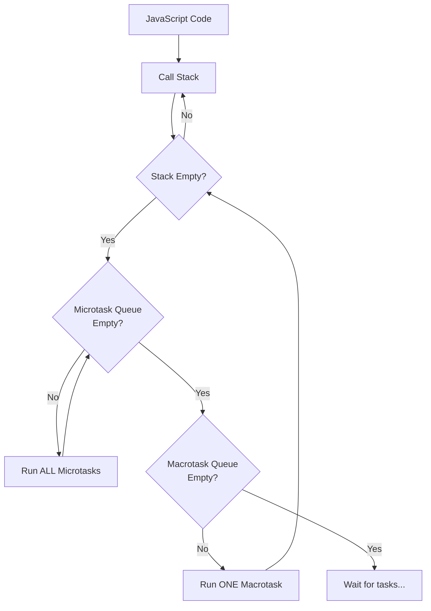
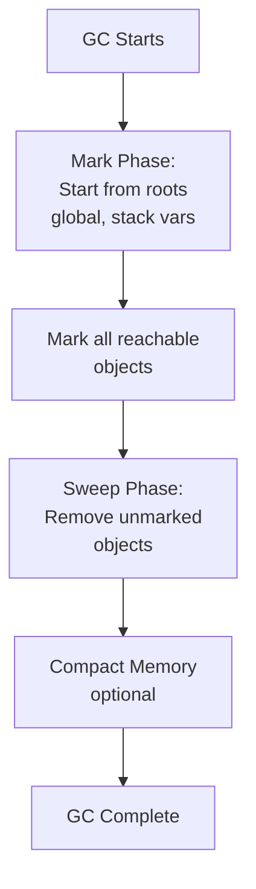

<a id="2-javascript-core-essentials-part-ii"></a>

# Chapter 2: JavaScript Core Essentials — Part II

[⬅ Previous Chapter](#1-javascript-core-essentials-part-i) | [📖 Main Index](#main-index) | [Next Chapter ➡](#3-javascript-browser-apis-patterns-and-performance)

---

## 📌 Learning Objectives

By the end of this chapter, you will:

- **Master** all array and object methods with mutating vs non-mutating distinction
- **Deeply understand** the Event Loop — Call Stack, Web APIs, Microtask Queue, Macrotask Queue
- **Explain** Promises, async/await, and all Promise combinators with confidence
- **Handle** errors properly — custom errors, async error propagation, global handlers
- **Know** ES Modules vs CommonJS, tree shaking, and dynamic imports
- **Use** Iterators, Generators, Map, Set, WeakMap, WeakSet, Symbols, Proxy, Reflect
- **Understand** garbage collection, memory leaks, and WeakRef
- **Apply** the Intl API for internationalization
- **Implement** EventEmitter, curry, pipe, compose, memoize from scratch
- **Answer** 20+ interview questions and explain output-based questions accurately

---

<a id="chapter-index-table-2"></a>

## 📑 Chapter Index Table

| Topic No. | Topic Name | Subtopics |
|-----------|-----------|-----------|
| 2.1 | [Arrays — Complete Mastery](#21-arrays-complete-mastery) | map, filter, reduce, find, flat, flatMap, sort, Array.from, chaining |
| 2.2 | [Objects — Complete Mastery](#22-objects-complete-mastery) | keys/values/entries, freeze/seal, defineProperty, descriptors, fromEntries |
| 2.3 | [Asynchronous JavaScript](#23-asynchronous-javascript) | Event Loop, Microtasks, Callbacks, Promises, async/await, combinators |
| 2.4 | [Error Handling](#24-error-handling) | Error types, Custom Errors, try/catch/finally, async errors, global handlers |
| 2.5 | [Modules — ES Modules vs CommonJS](#25-modules-es-modules-vs-commonjs) | import/export, dynamic import, require, tree shaking, circular deps |
| 2.6 | [Iterators & Generators](#26-iterators-and-generators) | Iterator protocol, for...of, function*, yield, async generators |
| 2.7 | [Map, Set, WeakMap, WeakSet](#27-map-set-weakmap-weakset) | Map vs Object, Set dedup, WeakMap GC, use cases |
| 2.8 | [Symbols & Well-Known Symbols](#28-symbols-and-well-known-symbols) | Symbol(), Symbol.iterator, Symbol.toPrimitive, Symbol.toStringTag |
| 2.9 | [Proxy & Reflect](#29-proxy-and-reflect) | Proxy traps, Reflect API, validation, reactive programming |
| 2.10 | [Garbage Collection & Memory](#210-garbage-collection-and-memory) | Mark & sweep, memory leaks, React leaks, WeakRef, Chrome DevTools |
| 2.11 | [Internationalization — Intl API](#211-internationalization-intl-api) | DateTimeFormat, NumberFormat, Collator, RelativeTimeFormat, PluralRules |
| 2.12 | [Utility Implementations](#212-utility-implementations) | UUID, EventEmitter, memoize, curry, pipe, compose |
| — | [Interview Questions](#interview-questions-chapter-2) | 20+ Conceptual, Scenario, Output-based, Advanced |
| — | [Practice Problems](#practice-problems-chapter-2) | 10 Coding + 10 Theory + Output Questions |
| — | [Quick Revision](#quick-revision-chapter-2) | Key Definitions, Traps, Bullets |
| — | [Chapter Summary](#chapter-summary-chapter-2) | Most Important Points |

---

## 2.1 Arrays — Complete Mastery

<a id="21-arrays-complete-mastery"></a>

### 🧠 Hinglish Intuition

> Array ek dabba hai jisme items rakhe hain. JavaScript ne arrays ko bahut powerful banaya hai — map, filter, reduce jaisi methods ke saath tum ek line mein kaam kar sakte ho jo pehle 10 lines mein hota tha. Lekin dhyan raho — kuch methods dabba badal dete hain (mutating), kuch naya dabba banate hain (non-mutating).

---

### Mutating vs Non-Mutating Methods

> [!IMPORTANT]
> In React, you must **never mutate arrays in state directly**. Always use non-mutating methods that return a new array.

| Mutating (Modifies original) | Non-Mutating (Returns new) |
|------------------------------|---------------------------|
| `push()` | `map()` |
| `pop()` | `filter()` |
| `shift()` | `reduce()` |
| `unshift()` | `slice()` |
| `splice()` | `concat()` |
| `sort()` | `flat()` |
| `reverse()` | `flatMap()` |
| `fill()` | `find()` |
| `copyWithin()` | `findIndex()` |
| — | `some()`, `every()` |
| — | `includes()`, `indexOf()` |
| — | `join()`, `toString()` |
| — | `[...spread]` |

---

### map() — Transform Each Element

```javascript
const numbers = [1, 2, 3, 4, 5];

// map returns a NEW array of same length
const doubled = numbers.map(n => n * 2);
console.log(doubled);  // [2, 4, 6, 8, 10]
console.log(numbers);  // [1, 2, 3, 4, 5] — unchanged

// map with index and array
const withIndex = numbers.map((n, i, arr) => ({
  value: n,
  index: i,
  isLast: i === arr.length - 1
}));

// Transforming objects
const users = [
  { name: 'Raj', age: 25 },
  { name: 'Priya', age: 30 }
];
const names = users.map(u => u.name); // ['Raj', 'Priya']
const upperNames = users.map(u => u.name.toUpperCase()); // ['RAJ', 'PRIYA']
```

---

### filter() — Select Elements

```javascript
const numbers = [1, 2, 3, 4, 5, 6, 7, 8, 9, 10];

const evens = numbers.filter(n => n % 2 === 0);
console.log(evens); // [2, 4, 6, 8, 10]

const users = [
  { name: 'Raj', active: true },
  { name: 'Priya', active: false },
  { name: 'Sam', active: true }
];

const activeUsers = users.filter(u => u.active);
// [{ name: 'Raj', active: true }, { name: 'Sam', active: true }]

// Remove item by id (React pattern):
const removeUser = (users, idToRemove) =>
  users.filter(u => u.id !== idToRemove);
```

---

### reduce() — Accumulate to Single Value

```javascript
const numbers = [1, 2, 3, 4, 5];

// Sum
const sum = numbers.reduce((accumulator, current) => accumulator + current, 0);
console.log(sum); // 15

// Max value
const max = numbers.reduce((acc, cur) => Math.max(acc, cur), -Infinity);
console.log(max); // 5

// Group by
const people = [
  { name: 'Raj', dept: 'Engineering' },
  { name: 'Priya', dept: 'Design' },
  { name: 'Sam', dept: 'Engineering' },
  { name: 'Anita', dept: 'Design' }
];

const byDept = people.reduce((acc, person) => {
  const dept = person.dept;
  if (!acc[dept]) acc[dept] = [];
  acc[dept].push(person);
  return acc;
}, {});
// { Engineering: [...], Design: [...] }

// Flatten with reduce
const nested = [[1, 2], [3, 4], [5]];
const flat = nested.reduce((acc, arr) => [...acc, ...arr], []);
// [1, 2, 3, 4, 5]

// Count occurrences
const fruits = ['apple', 'banana', 'apple', 'orange', 'banana', 'apple'];
const count = fruits.reduce((acc, fruit) => {
  acc[fruit] = (acc[fruit] || 0) + 1;
  return acc;
}, {});
// { apple: 3, banana: 2, orange: 1 }
```

> [!NOTE]
> Always provide an **initial value** to `reduce()`. Without it, reduce uses the first element as accumulator and starts from index 1 — this can cause bugs on empty arrays.

---

### find() & findIndex()

```javascript
const users = [
  { id: 1, name: 'Raj' },
  { id: 2, name: 'Priya' },
  { id: 3, name: 'Sam' }
];

// find — returns first ELEMENT matching condition
const user = users.find(u => u.id === 2);
console.log(user); // { id: 2, name: 'Priya' }
console.log(users.find(u => u.id === 99)); // undefined

// findIndex — returns first INDEX matching condition
const idx = users.findIndex(u => u.id === 2);
console.log(idx); // 1
console.log(users.findIndex(u => u.id === 99)); // -1

// findLast() and findLastIndex() — ES2023
const nums = [1, 2, 3, 4, 5];
nums.findLast(n => n % 2 === 0);      // 4 (last even)
nums.findLastIndex(n => n % 2 === 0); // 3 (index of 4)
```

---

### some() & every()

```javascript
const numbers = [1, 2, 3, 4, 5];

// some — at least ONE matches
console.log(numbers.some(n => n > 4));  // true (5 > 4)
console.log(numbers.some(n => n > 10)); // false

// every — ALL must match
console.log(numbers.every(n => n > 0)); // true
console.log(numbers.every(n => n > 2)); // false

// Practical: validate form fields
const fields = [
  { name: 'email', valid: true },
  { name: 'password', valid: true },
  { name: 'name', valid: false }
];
const allValid = fields.every(f => f.valid); // false
const hasInvalid = fields.some(f => !f.valid); // true
```

---

### flat() & flatMap()

```javascript
// flat() — flatten nested arrays
const nested = [1, [2, 3], [4, [5, 6]]];
console.log(nested.flat());    // [1, 2, 3, 4, [5, 6]] — depth 1
console.log(nested.flat(2));   // [1, 2, 3, 4, 5, 6]  — depth 2
console.log(nested.flat(Infinity)); // [1, 2, 3, 4, 5, 6] — all depths

// flatMap() — map then flatten by 1 level
const sentences = ['Hello World', 'JavaScript is great'];
const words = sentences.flatMap(s => s.split(' '));
console.log(words); // ['Hello', 'World', 'JavaScript', 'is', 'great']

// vs map + flat:
const same = sentences.map(s => s.split(' ')).flat();
// ['Hello', 'World', 'JavaScript', 'is', 'great']

// Real use case:
const orders = [
  { user: 'Raj', items: ['Book', 'Pen'] },
  { user: 'Priya', items: ['Laptop', 'Mouse', 'Keyboard'] }
];
const allItems = orders.flatMap(order => order.items);
// ['Book', 'Pen', 'Laptop', 'Mouse', 'Keyboard']
```

---

### Sorting — Custom Comparator

```javascript
const numbers = [10, 1, 21, 2];

// Default sort — lexicographic (string comparison)!
console.log(numbers.sort()); // [1, 10, 2, 21] ← WRONG for numbers!

// Custom comparator for numbers
console.log(numbers.sort((a, b) => a - b)); // [1, 2, 10, 21] ✅ ascending
console.log(numbers.sort((a, b) => b - a)); // [21, 10, 2, 1] descending

// Sort strings
const names = ['Priya', 'raj', 'Sam', 'anita'];
names.sort(); // ['Priya', 'Sam', 'anita', 'raj'] — uppercase before lowercase!
names.sort((a, b) => a.localeCompare(b)); // locale-aware, case-insensitive option

// Sort objects by property
const users = [
  { name: 'Sam', age: 30 },
  { name: 'Raj', age: 25 },
  { name: 'Priya', age: 28 }
];
users.sort((a, b) => a.age - b.age);
// [{ Raj, 25 }, { Priya, 28 }, { Sam, 30 }]

// Multi-property sort
users.sort((a, b) => {
  if (a.age !== b.age) return a.age - b.age;
  return a.name.localeCompare(b.name);
});
```

> [!IMPORTANT]
> `sort()` is **mutating** — it modifies the original array! To sort without mutation: `[...arr].sort(...)` or `arr.slice().sort(...)`

---

### Array.from() & Array-Like Objects

```javascript
// Array-like objects — have length and indices but not Array methods
const nodeList = document.querySelectorAll('div'); // NodeList (array-like)
const args = arguments; // Arguments object (array-like)

// Convert to real array:
const realArr1 = Array.from(nodeList);
const realArr2 = [...nodeList];
const realArr3 = Array.prototype.slice.call(nodeList);

// Array.from with mapping
Array.from({ length: 5 }, (_, i) => i);     // [0, 1, 2, 3, 4]
Array.from({ length: 5 }, (_, i) => i * 2); // [0, 2, 4, 6, 8]
Array.from('hello');                          // ['h','e','l','l','o']
Array.from(new Set([1, 2, 2, 3]));           // [1, 2, 3]
Array.from(new Map([['a', 1]]));             // [['a', 1]]

// Array.of() — creates array from arguments (vs Array() quirk)
Array.of(3);    // [3] — one element
Array(3);       // [,,] — empty array of length 3!
Array.of(1, 2, 3); // [1, 2, 3]
```

---

### Chaining Array Methods

```javascript
const students = [
  { name: 'Raj', score: 85, grade: 'A' },
  { name: 'Priya', score: 92, grade: 'A' },
  { name: 'Sam', score: 60, grade: 'B' },
  { name: 'Anita', score: 95, grade: 'A' },
  { name: 'Ravi', score: 45, grade: 'C' }
];

// Get sorted names of grade A students with score > 85
const result = students
  .filter(s => s.grade === 'A')        // [Raj:85, Priya:92, Anita:95]
  .filter(s => s.score > 85)           // [Priya:92, Anita:95]
  .sort((a, b) => b.score - a.score)   // [Anita:95, Priya:92]
  .map(s => s.name);                   // ['Anita', 'Priya']

console.log(result); // ['Anita', 'Priya']

// Performance note: each method creates a new array
// For large datasets, consider a single reduce or loop
```

👉 <a href="#chapter-index-table-2">Go to Top 🔝</a>

---

## 2.2 Objects — Complete Mastery

<a id="22-objects-complete-mastery"></a>

### 🧠 Hinglish Intuition

> Object ek dictionary hai — key se value dhundho. JavaScript ka Object prototype-based hai. Modern JS mein Object ko manipulate karne ke bohot tarike hain — freeze karo, seal karo, descriptors define karo. Yeh sab interview mein puchha jaata hai!

---

### Object.keys(), values(), entries()

```javascript
const person = {
  name: 'Raj',
  age: 25,
  city: 'Mumbai'
};

Object.keys(person);    // ['name', 'age', 'city']
Object.values(person);  // ['Raj', 25, 'Mumbai']
Object.entries(person); // [['name','Raj'], ['age',25], ['city','Mumbai']]

// Iteration patterns:
Object.entries(person).forEach(([key, value]) => {
  console.log(`${key}: ${value}`);
});

// Transform object values:
const doubled = Object.fromEntries(
  Object.entries({ a: 1, b: 2, c: 3 }).map(([k, v]) => [k, v * 2])
);
console.log(doubled); // { a: 2, b: 4, c: 6 }

// Filter object by key:
const { name, ...rest } = person; // rest = { age: 25, city: 'Mumbai' }

// Filter object by value:
const nonNullValues = Object.fromEntries(
  Object.entries(person).filter(([_, v]) => v !== null)
);
```

---

### Object.assign() vs Spread

```javascript
const target = { a: 1 };
const source1 = { b: 2 };
const source2 = { c: 3, a: 99 }; // 'a' will override

// Object.assign() — mutates target, returns target
const result = Object.assign(target, source1, source2);
console.log(target); // { a: 99, b: 2, c: 3 } ← MUTATED
console.log(result === target); // true

// Spread — creates new object, doesn't mutate
const safe = { ...target, ...source1, ...source2 };
// { a: 99, b: 2, c: 3 } — new object

// Both are SHALLOW copies:
const obj = { nested: { x: 1 } };
const copy = { ...obj };
copy.nested.x = 999;
console.log(obj.nested.x); // 999 ← mutation leaked!

// Safe pattern — no mutation:
Object.assign({}, target, source1); // empty target = no mutation
```

---

### Object.freeze() vs Object.seal()

```javascript
// Object.freeze() — NO add, remove, OR modify
const frozen = Object.freeze({ name: 'Raj', age: 25 });
frozen.name = 'Priya';   // ❌ silently fails
frozen.city = 'Mumbai';  // ❌ silently fails
delete frozen.age;        // ❌ silently fails
console.log(frozen); // { name: 'Raj', age: 25 }

// Object.seal() — NO add OR remove, but CAN modify
const sealed = Object.seal({ name: 'Raj', age: 25 });
sealed.name = 'Priya';   // ✅ modification allowed
sealed.city = 'Mumbai';  // ❌ add not allowed
delete sealed.age;        // ❌ delete not allowed
console.log(sealed); // { name: 'Priya', age: 25 }

// Check status:
Object.isFrozen(frozen);     // true
Object.isSealed(sealed);     // true
Object.isExtensible(frozen); // false (frozen implies sealed implies non-extensible)
```

| Operation | Normal | `seal()` | `freeze()` |
|-----------|--------|----------|------------|
| Add property | ✅ | ❌ | ❌ |
| Delete property | ✅ | ❌ | ❌ |
| Modify value | ✅ | ✅ | ❌ |

---

### Object.fromEntries()

```javascript
// Convert Map to Object
const map = new Map([['name', 'Raj'], ['age', 25]]);
const obj = Object.fromEntries(map);
console.log(obj); // { name: 'Raj', age: 25 }

// Convert entries back to object
const entries = [['a', 1], ['b', 2]];
Object.fromEntries(entries); // { a: 1, b: 2 }

// Transform query string
const queryString = 'name=Raj&age=25&city=Mumbai';
const params = Object.fromEntries(
  new URLSearchParams(queryString)
);
console.log(params); // { name: 'Raj', age: '25', city: 'Mumbai' }
```

---

### Property Descriptors

Every object property has a **descriptor** — metadata about how the property behaves.

```javascript
const obj = { name: 'Raj' };

// Get descriptor
console.log(Object.getOwnPropertyDescriptor(obj, 'name'));
// {
//   value: 'Raj',
//   writable: true,      ← can be changed
//   enumerable: true,    ← shows in for...in, Object.keys
//   configurable: true   ← descriptor can be changed, property can be deleted
// }

// Define a property with custom descriptor
Object.defineProperty(obj, 'id', {
  value: 42,
  writable: false,      // cannot change value
  enumerable: false,    // hidden from Object.keys, for...in
  configurable: false   // cannot delete or redefine
});

obj.id = 99;            // ❌ silently fails (writable: false)
console.log(obj.id);    // 42
Object.keys(obj);       // ['name'] — 'id' not shown (enumerable: false)
delete obj.id;          // ❌ fails (configurable: false)

// defineProperties — multiple at once
Object.defineProperties(obj, {
  readOnly: { value: 'fixed', writable: false, enumerable: true, configurable: false },
  hidden: { value: 'secret', writable: true, enumerable: false, configurable: true }
});
```

---

### Computed Property Names (Advanced Use)

```javascript
// Runtime key names
const prefix = 'user';
const fields = ['Name', 'Age', 'Email'];

const config = fields.reduce((obj, field) => {
  obj[`${prefix}${field}`] = null;
  return obj;
}, {});
// { userName: null, userAge: null, userEmail: null }

// Dynamic form state in React pattern:
function handleChange(e) {
  const { name, value } = e.target;
  setForm(prev => ({
    ...prev,
    [name]: value // computed key!
  }));
}
```

👉 <a href="#chapter-index-table-2">Go to Top 🔝</a>

---

## 2.3 Asynchronous JavaScript

<a id="23-asynchronous-javascript"></a>

### 🧠 Hinglish Intuition

> JavaScript single-threaded hai — ek waqt mein ek kaam. Lekin browser multi-tasker hai. Server se data maango, browser background mein fetch karta hai. Jab response aaye, toh JS ko batata hai. Yeh sab Event Loop ki magic hai. Samajhlo — yeh sabse zyada interview mein puchha jaata hai!

---

### Event Loop — Complete Mental Model



#### Components

```javascript
// CALL STACK — synchronous execution
function a() { b(); }
function b() { c(); }
function c() { console.log('c'); }
a(); // Stack: [a → b → c] → c pops → b pops → a pops

// WEB APIS — browser-handled async (setTimeout, fetch, DOM events)
setTimeout(() => console.log('timeout'), 0);
// ↑ Browser handles the timer, puts callback in Macrotask Queue when done

// MICROTASK QUEUE — Promise callbacks, queueMicrotask, MutationObserver
Promise.resolve().then(() => console.log('microtask'));
// ↑ Goes to Microtask Queue

// MACROTASK QUEUE (Task Queue) — setTimeout, setInterval, setImmediate, I/O
setTimeout(() => console.log('macrotask'), 0);
```

---

### Macrotasks vs Microtasks — Execution Order

```javascript
// CRITICAL ORDER TO MEMORIZE:
// 1. All synchronous code (Call Stack)
// 2. ALL Microtasks (entire queue drained)
// 3. ONE Macrotask
// 4. ALL Microtasks again (from step 2)
// 5. Repeat

console.log('1 — sync');

setTimeout(() => console.log('2 — macrotask'), 0);

Promise.resolve()
  .then(() => console.log('3 — microtask 1'))
  .then(() => console.log('4 — microtask 2'));

queueMicrotask(() => console.log('5 — microtask 3'));

console.log('6 — sync');

// OUTPUT ORDER:
// 1 — sync
// 6 — sync
// 3 — microtask 1
// 5 — microtask 3
// 4 — microtask 2
// 2 — macrotask
```

| Queue Type | What goes in | Priority |
|-----------|-------------|----------|
| **Microtask** | Promise.then/catch/finally, queueMicrotask, MutationObserver | Higher — ALL drain before macrotask |
| **Macrotask** | setTimeout, setInterval, setImmediate, fetch callbacks (after response), I/O | Lower — ONE per event loop iteration |

> [!IMPORTANT]
> Microtasks are processed **completely** (entire queue drained) before ANY macrotask runs. This is the #1 most-asked event loop question in interviews.

---

### Callbacks & Callback Hell

```javascript
// Callbacks — passing function to be called later
function fetchUser(id, callback) {
  setTimeout(() => {
    callback(null, { id, name: 'Raj' }); // (error, data) pattern
  }, 1000);
}

fetchUser(1, (err, user) => {
  if (err) { console.error(err); return; }
  console.log(user);
});

// CALLBACK HELL — deeply nested, hard to read/maintain
getUser(userId, (err, user) => {
  if (err) return handleError(err);
  getOrders(user.id, (err, orders) => {
    if (err) return handleError(err);
    getProduct(orders[0].productId, (err, product) => {
      if (err) return handleError(err);
      getReviews(product.id, (err, reviews) => {
        // The "pyramid of doom"
        console.log(reviews);
      });
    });
  });
});
// Problems: hard to read, error handling repeated, hard to compose
```

---

### Promises — Deep Dive

```javascript
// Promise states: pending → fulfilled OR rejected (settled, irreversible)
const promise = new Promise((resolve, reject) => {
  // executor runs synchronously!
  const success = true;
  if (success) {
    resolve('Data fetched!'); // fulfill with value
  } else {
    reject(new Error('Fetch failed!')); // reject with error
  }
});

// Consuming:
promise
  .then(data => {
    console.log(data); // 'Data fetched!'
    return data.toUpperCase(); // can return value or another promise
  })
  .then(upper => console.log(upper)) // 'DATA FETCHED!'
  .catch(err => console.error(err))  // catches ANY rejection in chain
  .finally(() => console.log('Done')); // always runs

// Promise chaining vs nesting
// ✅ CHAIN (flat):
fetch(url)
  .then(res => res.json())
  .then(data => processData(data))
  .then(result => saveResult(result))
  .catch(err => handleError(err));

// ❌ NESTING (pyramid):
fetch(url).then(res => {
  res.json().then(data => {
    processData(data).then(result => {
      saveResult(result);
    });
  });
});
```

---

### Promise Combinators

```javascript
const p1 = Promise.resolve(1);
const p2 = new Promise(res => setTimeout(() => res(2), 1000));
const p3 = Promise.reject(new Error('Failed'));
const p4 = Promise.resolve(4);

// Promise.all — ALL must succeed, FAIL FAST on any rejection
Promise.all([p1, p2, p4])
  .then(values => console.log(values)) // [1, 2, 4] when all resolve
  .catch(err => console.error(err));    // if ANY rejects, catches here

Promise.all([p1, p3, p4])
  .catch(err => console.log(err.message)); // 'Failed' — p3 rejected immediately

// Promise.allSettled — waits for ALL, never rejects
Promise.allSettled([p1, p3, p4])
  .then(results => {
    results.forEach(r => {
      if (r.status === 'fulfilled') console.log('✅', r.value);
      if (r.status === 'rejected') console.log('❌', r.reason.message);
    });
  });
// ✅ 1
// ❌ Failed
// ✅ 4

// Promise.race — first to SETTLE wins (could be rejection!)
Promise.race([p2, p1])
  .then(val => console.log(val)); // 1 (p1 resolves immediately, faster)

// Promise.any — first to FULFILL wins (ignores rejections)
Promise.any([p3, p1, p2])
  .then(val => console.log(val)); // 1 (first fulfilled, p3's rejection ignored)

Promise.any([p3, Promise.reject('another')])
  .catch(err => console.log(err)); // AggregateError: All promises rejected
```

| Combinator | Resolves when | Rejects when |
|-----------|--------------|-------------|
| `Promise.all` | ALL fulfill | ANY rejects (fail fast) |
| `Promise.allSettled` | ALL settle (fulfill or reject) | Never |
| `Promise.race` | FIRST settles (fulfill or reject) | FIRST settles with rejection |
| `Promise.any` | FIRST fulfills | ALL reject (AggregateError) |

---

### async/await — Complete Guide

```javascript
// async function always returns a Promise
async function fetchUser(id) {
  return { id, name: 'Raj' }; // automatically wrapped in Promise.resolve()
}
fetchUser(1).then(u => console.log(u)); // { id: 1, name: 'Raj' }

// await — pause execution until Promise resolves
async function loadUserData(userId) {
  try {
    const user = await fetchUser(userId);       // waits for user
    const orders = await fetchOrders(user.id);  // waits for orders
    const product = await fetchProduct(orders[0].productId); // waits
    return { user, orders, product };
  } catch (err) {
    console.error('Error:', err.message);
    throw err; // re-throw if needed
  } finally {
    console.log('Cleanup done');
  }
}

// Sequential vs Parallel:
// ❌ SEQUENTIAL (slow — each waits for previous)
async function sequential() {
  const a = await fetchA(); // wait 1s
  const b = await fetchB(); // wait 1s — total: 2s
  return [a, b];
}

// ✅ PARALLEL (fast — start both simultaneously)
async function parallel() {
  const [a, b] = await Promise.all([fetchA(), fetchB()]); // total: 1s
  return [a, b];
}

// ✅ Start both, await individually
async function parallelV2() {
  const promiseA = fetchA(); // starts immediately
  const promiseB = fetchB(); // starts immediately
  const a = await promiseA;  // wait for a
  const b = await promiseB;  // wait for b (might already be done)
  return [a, b];
}
```

---

### Top-Level await

```javascript
// Available in ES Modules (type="module" or .mjs files)
// Cannot use in CommonJS

// In a module file:
const data = await fetch('https://api.example.com/data').then(r => r.json());
console.log(data); // works! No async function wrapper needed

// Use cases:
const config = await import('./config.js');
const db = await connectDatabase();
```

> [!NOTE]
> Top-level `await` blocks the module from being imported until the awaited operation completes. Use carefully to avoid blocking module initialization.

---

### try/catch/finally with async

```javascript
async function riskyOperation() {
  let connection;
  try {
    connection = await openConnection();
    const data = await fetchData(connection);
    await saveData(data);
    return data;
  } catch (err) {
    // Catches both sync throws AND rejected promises
    if (err instanceof NetworkError) {
      console.log('Network issue, retrying...');
    } else {
      throw err; // re-throw unknown errors
    }
  } finally {
    // ALWAYS runs — perfect for cleanup
    if (connection) await connection.close();
  }
}

// Error handling without try/catch — using .catch() on async function
const result = await riskyOperation().catch(err => {
  console.error(err);
  return defaultValue; // provide fallback
});
```

👉 <a href="#chapter-index-table-2">Go to Top 🔝</a>

---

## 2.4 Error Handling

<a id="24-error-handling"></a>

### 🧠 Hinglish Intuition

> Error handling woh safety net hai jo tumhare code ko crash hone se bachata hai. Ek achha developer woh nahi jo errors nahi karta — woh hai jo errors ko sahi se handle karta hai. Custom errors bana ke professional bano!

---

### Built-in Error Types

```javascript
// TypeError — wrong type operation
null.toString();          // TypeError: Cannot read properties of null
undefined();              // TypeError: undefined is not a function

// ReferenceError — variable doesn't exist
console.log(notDefined);  // ReferenceError: notDefined is not defined

// SyntaxError — invalid syntax (caught at parse time)
// eval('if (');          // SyntaxError: Unexpected end of input

// RangeError — value out of valid range
new Array(-1);            // RangeError: Invalid array length
(1).toFixed(200);         // RangeError: toFixed() digits out of range

// URIError — malformed URI
decodeURIComponent('%');  // URIError: URI malformed

// EvalError — eval() misuse (rare, legacy)

// All inherit from Error:
const err = new TypeError('bad type');
console.log(err instanceof TypeError); // true
console.log(err instanceof Error);     // true
console.log(err.name);    // 'TypeError'
console.log(err.message); // 'bad type'
console.log(err.stack);   // stack trace string
```

---

### Custom Error Classes

```javascript
// Basic custom error
class AppError extends Error {
  constructor(message, code) {
    super(message);          // sets this.message
    this.name = 'AppError';  // override name
    this.code = code;
    // Fix stack trace in V8:
    if (Error.captureStackTrace) {
      Error.captureStackTrace(this, this.constructor);
    }
  }
}

// Specialized errors
class ValidationError extends AppError {
  constructor(field, message) {
    super(message, 'VALIDATION_ERROR');
    this.name = 'ValidationError';
    this.field = field;
  }
}

class NetworkError extends AppError {
  constructor(statusCode, message) {
    super(message, 'NETWORK_ERROR');
    this.name = 'NetworkError';
    this.statusCode = statusCode;
  }
}

class NotFoundError extends AppError {
  constructor(resource) {
    super(`${resource} not found`, 'NOT_FOUND');
    this.name = 'NotFoundError';
    this.resource = resource;
  }
}

// Usage:
function validateUser(user) {
  if (!user.email) throw new ValidationError('email', 'Email is required');
  if (!user.name) throw new ValidationError('name', 'Name is required');
}

// Type-safe error handling:
try {
  validateUser({ name: 'Raj' });
} catch (err) {
  if (err instanceof ValidationError) {
    console.log(`Field: ${err.field}, Message: ${err.message}`);
  } else if (err instanceof NetworkError) {
    console.log(`HTTP ${err.statusCode}: ${err.message}`);
  } else {
    throw err; // re-throw unknown errors!
  }
}
```

---

### Error Propagation in async

```javascript
// Errors propagate up the async call chain automatically
async function level3() {
  throw new Error('Deep error');
}

async function level2() {
  await level3(); // error propagates up (no try/catch here)
}

async function level1() {
  try {
    await level2(); // catches error from level3
  } catch (err) {
    console.log('Caught:', err.message); // 'Caught: Deep error'
  }
}

// Unhandled rejection — dangerous!
async function forgottenHandler() {
  throw new Error('Unhandled!');
}
forgottenHandler(); // No .catch()! Triggers unhandledRejection event

// Always handle:
forgottenHandler().catch(console.error); // ✅
// OR:
try { await forgottenHandler(); } catch(e) { console.error(e); }
```

---

### Global Error Handlers

```javascript
// Browser — synchronous errors
window.onerror = function(message, source, lineno, colno, error) {
  console.error('Global error:', message);
  // Return true to prevent default browser error logging
  return true;
};

// Browser — unhandled Promise rejections
window.addEventListener('unhandledrejection', (event) => {
  console.error('Unhandled rejection:', event.reason);
  event.preventDefault(); // prevent console error in some browsers
});

// Node.js equivalents:
process.on('uncaughtException', (err) => {
  console.error('Uncaught:', err);
  process.exit(1); // recommended: exit after uncaught exception
});

process.on('unhandledRejection', (reason, promise) => {
  console.error('Unhandled rejection:', reason);
});
```

> [!IMPORTANT]
> Global error handlers are a **last resort** for logging/alerting. Always handle errors locally where they occur. In React, use Error Boundaries for component errors.

👉 <a href="#chapter-index-table-2">Go to Top 🔝</a>

---

## 2.5 Modules — ES Modules vs CommonJS

<a id="25-modules-es-modules-vs-commonjs"></a>

### 🧠 Hinglish Intuition

> Modules code ko alag-alag files mein baantne ka system hai. CJS purana dost hai (Node.js wala), ESM naya professional hai (browser + modern Node). React aur Next.js dono ESM use karte hain. Tree shaking sirf ESM ke saath kaam karta hai — isliye bundles chhote hote hain.

---

### ES Modules — Named & Default Export

```javascript
// math.js — NAMED exports (multiple per file)
export const PI = 3.14159;
export function add(a, b) { return a + b; }
export function subtract(a, b) { return a - b; }
export class Calculator { /* ... */ }

// math.js — DEFAULT export (one per file)
export default function multiply(a, b) { return a * b; }

// Importing NAMED exports — must use exact name or alias
import { PI, add, subtract } from './math.js';
import { add as addNumbers } from './math.js'; // alias

// Importing DEFAULT export — any name you want
import multiply from './math.js';
import myMultiply from './math.js'; // same thing, different name

// Importing ALL named exports as namespace
import * as MathUtils from './math.js';
MathUtils.add(2, 3);    // 5
MathUtils.PI;            // 3.14159
MathUtils.default(2, 3); // 6 (default export)

// Re-exporting (barrel file pattern)
// index.js
export { add, subtract } from './math.js';
export { default as multiply } from './math.js';
export * from './utils.js';
```

---

### Dynamic import() — Code Splitting

```javascript
// Static import — loaded at startup (sync, top of file)
import { heavy } from './heavy-module.js';

// Dynamic import — loaded on demand (async, anywhere in code)
async function loadFeature() {
  const module = await import('./heavy-module.js');
  module.heavyFunction();
}

// Conditional loading:
if (userPreference === 'dark') {
  const { darkTheme } = await import('./themes/dark.js');
  applyTheme(darkTheme);
}

// Route-based code splitting (React pattern):
const Dashboard = lazy(() => import('./pages/Dashboard'));

// Dynamic import with error handling:
try {
  const module = await import('./optional-feature.js');
  module.init();
} catch (err) {
  console.log('Feature not available');
}
```

---

### CommonJS vs ES Modules

```javascript
// COMMONJS (Node.js traditional)
const fs = require('fs');                    // require — sync
const { join } = require('path');            // destructure
module.exports = { myFunction };             // single export
module.exports.helper = function() {};       // add to exports
exports.helper = function() {};              // shorthand

// ES MODULES (modern)
import fs from 'fs';                        // import
import { join } from 'path';               // named import
export { myFunction };                      // named export
export default myFunction;                  // default export
```

| Feature | CommonJS (CJS) | ES Modules (ESM) |
|---------|---------------|-----------------|
| Syntax | `require()` / `module.exports` | `import` / `export` |
| Loading | Synchronous | Asynchronous |
| Time | Runtime | Parse time (static) |
| Tree shaking | ❌ No | ✅ Yes |
| Top-level await | ❌ No | ✅ Yes |
| `__dirname`, `__filename` | ✅ Available | ❌ Not available (use `import.meta.url`) |
| File extension | `.js` (with `"type":"commonjs"`) | `.mjs` or `.js` (with `"type":"module"`) |
| Circular deps | Handled (partially) | Handled (live bindings) |

---

### Tree Shaking

```javascript
// utils.js
export function used() { return 'I am used'; }
export function unused() { return 'I am unused'; }
export function alsoUnused() { return 'Also unused'; }

// main.js
import { used } from './utils.js'; // only import 'used'
used();

// After bundling with tree shaking (Rollup/Webpack/Vite):
// 'unused' and 'alsoUnused' are ELIMINATED from the bundle!
// Final bundle only contains 'used'

// Tree shaking REQUIRES:
// 1. ES Modules (static analysis possible)
// 2. Named exports (not 'export default { used, unused }')
// 3. No side effects in the module (or sideEffects: false in package.json)

// CJS cannot be tree-shaken:
const utils = require('./utils'); // bundler can't know what you'll use at runtime
```

---

### Circular Dependencies

```javascript
// a.js
import { b } from './b.js';
export const a = 'a uses: ' + b; // 'b' might be undefined here!

// b.js
import { a } from './a.js';
export const b = 'b uses: ' + a; // 'a' might be undefined here!

// Solution: use functions instead of values at module level
// a.js
import { getB } from './b.js';
export function getA() { return 'a uses: ' + getB(); }

// b.js
import { getA } from './a.js';
export function getB() { return 'b uses: ' + getA(); }
// Functions are called after modules fully initialize
```

> [!NOTE]
> Circular dependencies are a **design smell**. They usually indicate your modules should be restructured. Extract shared code to a third module that both can import.

👉 <a href="#chapter-index-table-2">Go to Top 🔝</a>

---

## 2.6 Iterators & Generators

<a id="26-iterators-and-generators"></a>

### 🧠 Hinglish Intuition

> Iterator ek book ki tarah hai jisme ek bookmark hai. Har baar `next()` call karo — bookmark aage baDh jaata hai. Generator ek magic wand hai — code beech mein rok sakte ho (yield) aur phir shuru kar sakte ho jahan choda tha!

---

### Iterator Protocol

```javascript
// An object is an iterator if it has a next() method
// that returns { value: any, done: boolean }

// Manual iterator:
function createRangeIterator(start, end) {
  let current = start;
  return {
    next() {
      if (current <= end) {
        return { value: current++, done: false };
      }
      return { value: undefined, done: true };
    }
  };
}

const iter = createRangeIterator(1, 3);
console.log(iter.next()); // { value: 1, done: false }
console.log(iter.next()); // { value: 2, done: false }
console.log(iter.next()); // { value: 3, done: false }
console.log(iter.next()); // { value: undefined, done: true }

// Iterable protocol — object with [Symbol.iterator] method
// Arrays, Strings, Maps, Sets are built-in iterables
const arr = [1, 2, 3];
const iterator = arr[Symbol.iterator](); // get iterator from iterable
iterator.next(); // { value: 1, done: false }

// Custom iterable:
const range = {
  from: 1,
  to: 5,
  [Symbol.iterator]() {
    let current = this.from;
    const last = this.to;
    return {
      next() {
        return current <= last
          ? { value: current++, done: false }
          : { value: undefined, done: true };
      }
    };
  }
};

// Now works with for...of, spread, destructuring:
for (const num of range) {
  console.log(num); // 1, 2, 3, 4, 5
}
console.log([...range]); // [1, 2, 3, 4, 5]
const [first, second] = range; // destructuring works!
```

---

### for...of vs for...in

```javascript
const arr = ['a', 'b', 'c'];
arr.custom = 'property'; // add non-index property

// for...of — iterates VALUES (uses [Symbol.iterator])
for (const val of arr) {
  console.log(val); // 'a', 'b', 'c' — only values, not 'custom'
}

// for...in — iterates KEYS (including inherited enumerable!)
for (const key in arr) {
  console.log(key); // '0', '1', '2', 'custom' ← includes non-index!
}
// for...in should NOT be used with arrays!
// Use for...of or forEach for arrays
// Use for...in for plain objects
```

---

### Generator Functions

```javascript
// Generator — function* — can yield multiple values, pauses between yields
function* counter(start = 0) {
  while (true) { // infinite loop is OK in generators!
    yield start++;
  }
}

const gen = counter(1);
console.log(gen.next()); // { value: 1, done: false }
console.log(gen.next()); // { value: 2, done: false }
console.log(gen.next()); // { value: 3, done: false }
// Pauses between yields — doesn't block!

// Finite generator:
function* fibonacci() {
  let [a, b] = [0, 1];
  while (true) {
    yield a;
    [a, b] = [b, a + b];
  }
}

const fib = fibonacci();
const firstTen = Array.from({ length: 10 }, () => fib.next().value);
console.log(firstTen); // [0, 1, 1, 2, 3, 5, 8, 13, 21, 34]

// Generator as iterable:
function* range(start, end, step = 1) {
  for (let i = start; i <= end; i += step) {
    yield i;
  }
}

console.log([...range(1, 10, 2)]); // [1, 3, 5, 7, 9]
for (const n of range(0, 5)) {
  console.log(n); // 0, 1, 2, 3, 4, 5
}
```

---

### yield & next() — Bidirectional Communication

```javascript
function* dialog() {
  const name = yield 'What is your name?';
  const age = yield `Hello ${name}! How old are you?`;
  return `${name} is ${age} years old.`;
}

const gen = dialog();
console.log(gen.next());          // { value: 'What is your name?', done: false }
console.log(gen.next('Raj'));     // { value: 'Hello Raj! How old are you?', done: false }
console.log(gen.next(25));        // { value: 'Raj is 25 years old.', done: true }
```

---

### Async Generators

```javascript
// Async generator — yields Promises, use for await...of
async function* fetchPages(baseUrl, totalPages) {
  for (let page = 1; page <= totalPages; page++) {
    const response = await fetch(`${baseUrl}?page=${page}`);
    const data = await response.json();
    yield data;
  }
}

// Consuming with for await...of:
async function processAllPages() {
  for await (const pageData of fetchPages('/api/items', 5)) {
    console.log('Processing page:', pageData);
    // Each page is processed as it arrives
  }
}
```

👉 <a href="#chapter-index-table-2">Go to Top 🔝</a>

---

## 2.7 Map, Set, WeakMap, WeakSet

<a id="27-map-set-weakmap-weakset"></a>

### 🧠 Hinglish Intuition

> Map aur Object bhai hain, lekin Map zyada capable hai — koi bhi key ho sakti hai (object, function, number). Set ek unique items wali list hai. WeakMap aur WeakSet ko items ki pehchaan rakhni hai, lekin memory rokni nahi — GC ko kaam karne dete hain!

---

### Map — Key-Value with Any Key Type

```javascript
const map = new Map();

// Any value as key — objects, functions, primitives!
const objKey = { id: 1 };
const fnKey = () => {};

map.set('string', 'value1');
map.set(42, 'value2');
map.set(true, 'value3');
map.set(objKey, 'value4');   // object as key!
map.set(fnKey, 'value5');    // function as key!

map.get(objKey);  // 'value4'
map.get(42);      // 'value2'
map.size;         // 5

map.has(42);      // true
map.delete(42);   // removes entry
map.has(42);      // false

// Initialize from array:
const map2 = new Map([['a', 1], ['b', 2], ['c', 3]]);

// Iteration:
for (const [key, value] of map2) {
  console.log(key, value);
}
map2.keys();   // MapIterator { 'a', 'b', 'c' }
map2.values(); // MapIterator { 1, 2, 3 }
map2.entries();// MapIterator { ['a',1], ['b',2], ['c',3] }
map2.forEach((value, key) => console.log(key, value));

// Convert:
Object.fromEntries(map2); // { a: 1, b: 2, c: 3 }
[...map2];                // [['a',1], ['b',2], ['c',3]]
```

#### Map vs Object

| Feature | Object | Map |
|---------|--------|-----|
| Key types | String, Symbol only | Any value |
| Key order | Not guaranteed (older JS) | Insertion order |
| Size | Manual (`Object.keys(o).length`) | `.size` property |
| Iteration | Indirect (`Object.entries()`) | Direct (iterable) |
| Prototype | Has inherited properties | No inherited keys |
| Performance | OK for small | Better for frequent add/delete |
| JSON | ✅ `JSON.stringify()` | ❌ Needs conversion |

---

### Set — Unique Values Collection

```javascript
const set = new Set([1, 2, 3, 2, 1, 3]); // duplicates removed!
console.log(set); // Set { 1, 2, 3 }
console.log(set.size); // 3

set.add(4);
set.add(1); // already exists, ignored
set.has(3); // true
set.delete(2);

// DEDUPLICATION — most common use case!
const arr = [1, 2, 2, 3, 3, 3, 4];
const unique = [...new Set(arr)]; // [1, 2, 3, 4]
// OR:
const unique2 = Array.from(new Set(arr));

// Dedup objects by property (Set uses reference equality for objects):
const users = [{ id: 1 }, { id: 2 }, { id: 1 }]; // { id: 1 } appears twice
const uniqueIds = [...new Set(users.map(u => u.id))]; // [1, 2]

// Set operations:
const setA = new Set([1, 2, 3, 4]);
const setB = new Set([3, 4, 5, 6]);

// Union
const union = new Set([...setA, ...setB]); // {1,2,3,4,5,6}

// Intersection
const intersection = new Set([...setA].filter(x => setB.has(x))); // {3,4}

// Difference (A - B)
const difference = new Set([...setA].filter(x => !setB.has(x))); // {1,2}
```

---

### WeakMap & WeakSet

```javascript
// WeakMap — keys must be OBJECTS, values can be anything
// Keys are weakly held — if no other reference exists, GC can collect them

const weakMap = new WeakMap();
let user = { name: 'Raj' };
weakMap.set(user, { sessionData: '...' });

weakMap.get(user);  // { sessionData: '...' }
weakMap.has(user);  // true
weakMap.delete(user);

user = null; // user object can now be GC'd
// weakMap entry for this object is automatically removed!

// Use cases:
// 1. Private data per object instance
const _private = new WeakMap();
class Person {
  constructor(name, secret) {
    _private.set(this, { secret });
    this.name = name;
  }
  getSecret() {
    return _private.get(this).secret;
  }
}

// 2. Caching (auto-cleanup when key is GC'd)
const cache = new WeakMap();
function processElement(element) {
  if (cache.has(element)) return cache.get(element);
  const result = expensiveProcess(element);
  cache.set(element, result);
  return result;
}

// WeakSet — stores OBJECTS only, weakly held
const weakSet = new WeakSet();
let obj = { id: 1 };
weakSet.add(obj);
weakSet.has(obj);   // true
weakSet.delete(obj);

// Use case: tracking processed items
const processed = new WeakSet();
function process(item) {
  if (processed.has(item)) return; // already processed
  doWork(item);
  processed.add(item);
}
```

| Feature | Map | WeakMap |
|---------|-----|---------|
| Key types | Any | Objects only |
| GC behavior | Prevents GC of keys | Keys can be GC'd |
| Iterable | ✅ Yes | ❌ No |
| `.size` | ✅ Yes | ❌ No |
| Use case | General key-value | Private data, caches |

👉 <a href="#chapter-index-table-2">Go to Top 🔝</a>

---

## 2.8 Symbols & Well-Known Symbols

<a id="28-symbols-and-well-known-symbols"></a>

### 🧠 Hinglish Intuition

> Symbol ek unique ID hai — har baar nayi value. Kabhi duplicate nahi. Well-known Symbols JavaScript ke internal behaviors ko override karne dete hain — jaise apne object ko for...of ke saath kaise behave karna hai.

---

### Symbol() — Unique Identifiers

```javascript
// Every Symbol() call creates a unique value
const sym1 = Symbol('description');
const sym2 = Symbol('description');
console.log(sym1 === sym2); // false — always unique!
console.log(sym1.toString()); // 'Symbol(description)'
console.log(sym1.description); // 'description'

// Symbol as object key — never conflicts with string keys!
const ID = Symbol('id');
const user = {
  name: 'Raj',
  [ID]: 12345  // Symbol key — computed property syntax required
};
console.log(user[ID]); // 12345
console.log(user.ID);  // undefined — must use bracket notation

// Symbol keys are hidden:
Object.keys(user);                     // ['name'] — Symbol not included!
Object.getOwnPropertySymbols(user);    // [Symbol(id)]
Reflect.ownKeys(user);                 // ['name', Symbol(id)] — includes both!

// Global Symbol registry:
const s1 = Symbol.for('shared'); // create or retrieve from global registry
const s2 = Symbol.for('shared');
console.log(s1 === s2); // true! (same registry key)
Symbol.keyFor(s1); // 'shared'
```

---

### Well-Known Symbols

```javascript
// Symbol.iterator — make custom object iterable
class Range {
  constructor(start, end) {
    this.start = start;
    this.end = end;
  }

  [Symbol.iterator]() {
    let current = this.start;
    const end = this.end;
    return {
      next() {
        return current <= end
          ? { value: current++, done: false }
          : { value: undefined, done: true };
      }
    };
  }
}

const range = new Range(1, 5);
console.log([...range]); // [1, 2, 3, 4, 5]
for (const n of range) console.log(n); // 1, 2, 3, 4, 5

// Symbol.toPrimitive — customize type conversion
class Money {
  constructor(amount, currency) {
    this.amount = amount;
    this.currency = currency;
  }

  [Symbol.toPrimitive](hint) {
    if (hint === 'number') return this.amount;
    if (hint === 'string') return `${this.amount} ${this.currency}`;
    return this.amount; // default
  }
}

const price = new Money(100, 'USD');
console.log(`${price}`);    // '100 USD' (string hint)
console.log(+price);        // 100 (number hint)
console.log(price + 50);    // 150 (default hint)

// Symbol.hasInstance — customize instanceof behavior
class EvenNumber {
  static [Symbol.hasInstance](num) {
    return Number.isInteger(num) && num % 2 === 0;
  }
}
console.log(2 instanceof EvenNumber);  // true
console.log(3 instanceof EvenNumber);  // false

// Symbol.toStringTag — customize Object.prototype.toString
class Collection {
  get [Symbol.toStringTag]() {
    return 'Collection';
  }
}
const col = new Collection();
Object.prototype.toString.call(col); // '[object Collection]'
```

👉 <a href="#chapter-index-table-2">Go to Top 🔝</a>

---

## 2.9 Proxy & Reflect

<a id="29-proxy-and-reflect"></a>

### 🧠 Hinglish Intuition

> Proxy ek security guard ki tarah hai — jo bhi operation hoga object par, pehle guard ke paas aayega. Guard decide karega — allow karo, block karo, ya modify karo. Reflect wahi operation cleanly karta hai jo normally hota.

---

### Proxy — Intercepting Object Operations

```javascript
// new Proxy(target, handler)
const target = { name: 'Raj', age: 25 };

const handler = {
  // get trap — intercept property access
  get(target, prop, receiver) {
    console.log(`Getting: ${prop}`);
    return prop in target ? target[prop] : `Property '${prop}' not found`;
  },

  // set trap — intercept property assignment
  set(target, prop, value, receiver) {
    if (prop === 'age' && typeof value !== 'number') {
      throw new TypeError('Age must be a number!');
    }
    if (prop === 'age' && value < 0) {
      throw new RangeError('Age cannot be negative!');
    }
    console.log(`Setting ${prop} = ${value}`);
    target[prop] = value;
    return true; // must return true for strict mode compatibility
  },

  // has trap — intercept 'in' operator
  has(target, prop) {
    return prop in target;
  },

  // deleteProperty trap
  deleteProperty(target, prop) {
    if (prop === 'name') {
      throw new Error('Cannot delete name!');
    }
    delete target[prop];
    return true;
  }
};

const proxy = new Proxy(target, handler);
proxy.name;             // logs "Getting: name", returns 'Raj'
proxy.unknown;          // logs "Getting: unknown", returns "Property 'unknown' not found"
proxy.age = 30;         // logs "Setting age = 30"
proxy.age = 'thirty';   // throws TypeError!
```

---

### Reactive Programming with Proxy

```javascript
// Simple reactive state (like Vue 3's reactivity)
function reactive(obj, onChange) {
  return new Proxy(obj, {
    set(target, prop, value) {
      const oldValue = target[prop];
      target[prop] = value;
      if (oldValue !== value) {
        onChange(prop, oldValue, value);
      }
      return true;
    },
    get(target, prop) {
      const value = target[prop];
      // If nested object, make it reactive too
      if (typeof value === 'object' && value !== null) {
        return reactive(value, onChange);
      }
      return value;
    }
  });
}

const state = reactive({ count: 0, name: 'Raj' }, (prop, old, next) => {
  console.log(`${prop} changed: ${old} → ${next}`);
  updateUI(); // trigger re-render
});

state.count = 1; // "count changed: 0 → 1"
state.name = 'Priya'; // "name changed: Raj → Priya"
```

---

### Reflect API

```javascript
// Reflect provides methods that correspond to Proxy traps
// It's the "default behavior" implementation

const obj = { name: 'Raj' };

// Reflect.get — same as obj[prop]
Reflect.get(obj, 'name');         // 'Raj'

// Reflect.set — same as obj[prop] = value
Reflect.set(obj, 'age', 25);     // true

// Reflect.has — same as 'prop' in obj
Reflect.has(obj, 'name');        // true

// Reflect.deleteProperty — same as delete obj[prop]
Reflect.deleteProperty(obj, 'age'); // true

// Reflect.ownKeys — gets all keys (string + Symbol)
Reflect.ownKeys(obj); // ['name']

// Best practice: use Reflect in Proxy handlers
const safeProxy = new Proxy(target, {
  get(target, prop, receiver) {
    console.log(`Getting ${prop}`);
    return Reflect.get(target, prop, receiver); // preserves correct 'this'
  },
  set(target, prop, value, receiver) {
    console.log(`Setting ${prop}`);
    return Reflect.set(target, prop, value, receiver);
  }
});
```

> [!TIP]
> Always use `Reflect` methods inside Proxy traps instead of directly accessing `target[prop]`. Reflect correctly handles edge cases like prototype chain and receiver (this) context.

👉 <a href="#chapter-index-table-2">Go to Top 🔝</a>

---

## 2.10 Garbage Collection & Memory

<a id="210-garbage-collection-and-memory"></a>

### 🧠 Hinglish Intuition

> Garbage Collection ek cleaning service hai jo unused objects ko memory se saaf karta hai. Mark & Sweep algorithm pehle sab living objects ko mark karta hai, phir baaki sab saaf kar deta hai. Memory leak tab hota hai jab cleanup service ko pata nahi chal raha ki kab saaf karna hai.

---

### Mark & Sweep Algorithm



```javascript
// Reachable = accessible from "roots" (global, stack, registers)
let obj = { name: 'Raj' };  // reachable via 'obj' variable

obj = null; // no more references → object becomes unreachable → GC collects it

// Reference counting (old algorithm, not V8's main):
let a = { x: 1 };
let b = a;       // ref count = 2
a = null;        // ref count = 1
b = null;        // ref count = 0 → collected

// Problem with ref counting — circular references:
let o1 = {};
let o2 = {};
o1.ref = o2;     // o2 ref count: 1
o2.ref = o1;     // o1 ref count: 1
o1 = null;       // o1 ref count: still 1 (o2 holds it) ← leak with ref counting!
o2 = null;       // o2 ref count: still 1 (o1 holds it) ← leak!
// Mark & Sweep handles this: neither is reachable from roots → both collected!
```

---

### Common Memory Leaks

```javascript
// 1. GLOBAL VARIABLES — never collected
function leak() {
  undeclaredVar = 'leaked'; // becomes global!
}

// 2. FORGOTTEN TIMERS
function startPolling() {
  const data = fetchLargeData(); // data captured in closure
  setInterval(() => {
    use(data); // timer keeps reference to data!
  }, 1000);
  // If setInterval is never cleared, 'data' is never collected
}
// Fix:
const timerId = setInterval(callback, 1000);
// Later:
clearInterval(timerId);

// 3. EVENT LISTENERS not removed
function addListeners() {
  const heavyObject = createHeavyObject();
  document.addEventListener('click', () => {
    use(heavyObject); // closure holds heavyObject!
  });
  // If listener never removed, heavyObject lives forever
}
// Fix:
const handler = () => use(heavyObject);
document.addEventListener('click', handler);
// Later:
document.removeEventListener('click', handler);

// 4. DETACHED DOM NODES
let detachedNode;
function createDetached() {
  const div = document.createElement('div');
  detachedNode = div; // variable holds reference
  document.body.appendChild(div);
  document.body.removeChild(div); // removed from DOM, but JS still holds reference!
}
```

---

### Memory Leaks in React Apps

```javascript
// 1. ASYNC OPERATIONS after unmount
function UserComponent({ userId }) {
  const [user, setUser] = useState(null);

  useEffect(() => {
    // ❌ LEAK: setUser called even if component unmounted!
    fetchUser(userId).then(data => setUser(data));
  }, [userId]);
}

// ✅ Fix: cleanup with ignore flag
useEffect(() => {
  let ignore = false;
  fetchUser(userId).then(data => {
    if (!ignore) setUser(data); // only update if still mounted
  });
  return () => { ignore = true; }; // cleanup: set ignore on unmount
}, [userId]);

// 2. EVENT LISTENERS
useEffect(() => {
  const handleResize = () => setSize(window.innerWidth);
  window.addEventListener('resize', handleResize);
  return () => window.removeEventListener('resize', handleResize); // ✅ cleanup!
}, []);

// 3. SUBSCRIPTION not cleaned up
useEffect(() => {
  const subscription = eventBus.subscribe('event', handler);
  return () => subscription.unsubscribe(); // ✅ cleanup!
}, []);
```

---

### WeakRef & FinalizationRegistry

```javascript
// WeakRef — weak reference that doesn't prevent GC
let obj = { name: 'Large Object', data: new Array(1000000) };
const weakRef = new WeakRef(obj);

// Access the object (might return undefined if GC'd!)
const derefed = weakRef.deref();
if (derefed) {
  console.log(derefed.name); // 'Large Object'
}

obj = null; // object can now be GC'd
// weakRef.deref() may return undefined now

// FinalizationRegistry — callback when object is GC'd
const registry = new FinalizationRegistry((heldValue) => {
  console.log(`Object with id ${heldValue} was garbage collected`);
});

let resource = { data: 'something' };
registry.register(resource, 'resource-123'); // register with held value

resource = null; // object can be GC'd
// Eventually: "Object with id resource-123 was garbage collected"
```

> [!IMPORTANT]
> `WeakRef` and `FinalizationRegistry` are advanced features. GC timing is non-deterministic — don't rely on them for critical application logic.

👉 <a href="#chapter-index-table-2">Go to Top 🔝</a>

---

## 2.11 Internationalization — Intl API

<a id="211-internationalization-intl-api"></a>

### 🧠 Hinglish Intuition

> Intl API JavaScript ka built-in translator hai — dates, numbers, currencies alag-alag languages aur regions ke hisaab se format karta hai. Ek hi code India mein ₹1,00,000 dikhayega aur USA mein $1,000.

---

### Intl.DateTimeFormat

```javascript
const date = new Date('2024-01-15T10:30:00');

// Different locales:
new Intl.DateTimeFormat('en-US').format(date);  // '1/15/2024'
new Intl.DateTimeFormat('en-IN').format(date);  // '15/1/2024'
new Intl.DateTimeFormat('de-DE').format(date);  // '15.1.2024'
new Intl.DateTimeFormat('ja-JP').format(date);  // '2024/1/15'

// With options:
new Intl.DateTimeFormat('en-US', {
  year: 'numeric',
  month: 'long',
  day: 'numeric',
  weekday: 'long',
  hour: '2-digit',
  minute: '2-digit',
  timeZone: 'Asia/Kolkata'
}).format(date);
// 'Monday, January 15, 2024 at 04:00 PM'
```

---

### Intl.NumberFormat

```javascript
// Currency:
new Intl.NumberFormat('en-IN', { style: 'currency', currency: 'INR' }).format(100000);
// '₹1,00,000.00'

new Intl.NumberFormat('en-US', { style: 'currency', currency: 'USD' }).format(1000);
// '$1,000.00'

new Intl.NumberFormat('de-DE', { style: 'currency', currency: 'EUR' }).format(1000);
// '1.000,00 €'

// Percentage:
new Intl.NumberFormat('en-US', { style: 'percent' }).format(0.25);
// '25%'

// Compact notation:
new Intl.NumberFormat('en', { notation: 'compact' }).format(1000000);
// '1M'

new Intl.NumberFormat('en-IN', { notation: 'compact' }).format(1000000);
// '10L' (lakhs)
```

---

### Intl.RelativeTimeFormat

```javascript
const rtf = new Intl.RelativeTimeFormat('en', { numeric: 'auto' });

rtf.format(-1, 'day');    // 'yesterday'
rtf.format(0, 'day');     // 'today'
rtf.format(1, 'day');     // 'tomorrow'
rtf.format(-3, 'day');    // '3 days ago'
rtf.format(2, 'week');    // 'in 2 weeks'
rtf.format(-1, 'month');  // 'last month'
rtf.format(-2, 'hour');   // '2 hours ago'

// Practical: time ago function
function timeAgo(date) {
  const rtf = new Intl.RelativeTimeFormat('en', { numeric: 'auto' });
  const seconds = Math.floor((date - new Date()) / 1000);
  const intervals = [
    [60, 'second'],
    [3600, 'minute'],
    [86400, 'hour'],
    [604800, 'day'],
    [2592000, 'week'],
    [31536000, 'month'],
    [Infinity, 'year']
  ];
  for (const [secs, unit] of intervals) {
    const diff = Math.floor(seconds / (secs / 60));
    if (Math.abs(diff) < (secs / (intervals[intervals.indexOf([secs,unit])-1]?.[0] || 1))) {
      return rtf.format(diff, unit);
    }
  }
}
```

---

### Intl.Collator (Locale-aware Sorting)

```javascript
// Default JS sort — problematic with non-ASCII:
['Raj', 'anita', 'Priya'].sort(); // ['Priya', 'Raj', 'anita'] ← uppercase first!

// Intl.Collator — correct locale-aware sorting:
const collator = new Intl.Collator('en', { sensitivity: 'base' });
['Raj', 'anita', 'Priya', 'PRIYA'].sort((a, b) => collator.compare(a, b));
// ['anita', 'Priya', 'PRIYA', 'Raj'] — case-insensitive, locale correct

// Hindi sort:
['ब', 'अ', 'क'].sort(new Intl.Collator('hi').compare);
// Correct Hindi alphabetical order
```

---

### Intl.PluralRules & Intl.ListFormat

```javascript
// PluralRules:
const pr = new Intl.PluralRules('en');
pr.select(0);  // 'other'
pr.select(1);  // 'one'
pr.select(2);  // 'other'

// Usage:
function itemCount(count) {
  const pr = new Intl.PluralRules('en');
  const labels = { one: 'item', other: 'items' };
  return `${count} ${labels[pr.select(count)]}`;
}
itemCount(1); // '1 item'
itemCount(5); // '5 items'

// ListFormat:
const lf = new Intl.ListFormat('en', { style: 'long', type: 'conjunction' });
lf.format(['Raj', 'Priya', 'Sam']); // 'Raj, Priya, and Sam'
lf.format(['Raj', 'Priya']);         // 'Raj and Priya'

const lfOr = new Intl.ListFormat('en', { type: 'disjunction' });
lfOr.format(['Raj', 'Priya', 'Sam']); // 'Raj, Priya, or Sam'
```

👉 <a href="#chapter-index-table-2">Go to Top 🔝</a>

---

## 2.12 Utility Implementations

<a id="212-utility-implementations"></a>

### 🧠 Hinglish Intuition

> Yeh sab interview mein "from scratch implement karo" wale questions hain. Ek baar sahi se samajh lo — curry, compose, EventEmitter — yeh sab patterns real projects mein bhi kaam aate hain.

---

### UUID Generation

```javascript
// Modern: crypto.randomUUID() — built-in!
const uuid = crypto.randomUUID();
// 'b4f4d7b3-1c2a-4f3e-9a1b-2c3d4e5f6789'

// Manual UUID v4 (for older environments):
function generateUUID() {
  return 'xxxxxxxx-xxxx-4xxx-yxxx-xxxxxxxxxxxx'.replace(/[xy]/g, (c) => {
    const r = Math.random() * 16 | 0;
    const v = c === 'x' ? r : (r & 0x3 | 0x8);
    return v.toString(16);
  });
}
```

---

### Custom EventEmitter Implementation

```javascript
class EventEmitter {
  #events = {};

  on(event, listener) {
    if (!this.#events[event]) {
      this.#events[event] = [];
    }
    this.#events[event].push(listener);
    return this; // chainable
  }

  off(event, listener) {
    if (!this.#events[event]) return this;
    this.#events[event] = this.#events[event].filter(l => l !== listener);
    return this;
  }

  once(event, listener) {
    const wrapper = (...args) => {
      listener(...args);
      this.off(event, wrapper); // auto-remove after first call
    };
    wrapper._original = listener; // store reference for off()
    return this.on(event, wrapper);
  }

  emit(event, ...args) {
    if (!this.#events[event]) return false;
    this.#events[event].forEach(listener => listener(...args));
    return true;
  }

  listeners(event) {
    return this.#events[event] || [];
  }

  removeAllListeners(event) {
    if (event) {
      delete this.#events[event];
    } else {
      this.#events = {};
    }
    return this;
  }
}

// Usage:
const emitter = new EventEmitter();

const handler = (data) => console.log('Received:', data);
emitter.on('message', handler);
emitter.emit('message', 'Hello!');   // "Received: Hello!"
emitter.emit('message', 'World!');   // "Received: World!"
emitter.off('message', handler);
emitter.emit('message', 'Gone!');    // nothing — listener removed

emitter.once('login', (user) => console.log('User logged in:', user));
emitter.emit('login', 'Raj');        // "User logged in: Raj"
emitter.emit('login', 'Priya');      // nothing — once listener removed itself
```

---

### Memoization Implementation

```javascript
function memoize(fn) {
  const cache = new Map();

  function memoized(...args) {
    const key = JSON.stringify(args);

    if (cache.has(key)) {
      return cache.get(key);
    }

    const result = fn.apply(this, args);
    cache.set(key, result);
    return result;
  }

  // Allow cache inspection and clearing:
  memoized.cache = cache;
  memoized.clear = () => cache.clear();

  return memoized;
}

// Usage:
const expensiveFib = memoize(function fib(n) {
  if (n <= 1) return n;
  return expensiveFib(n - 1) + expensiveFib(n - 2);
});

console.time('first');
expensiveFib(40); // slow first time
console.timeEnd('first');

console.time('second');
expensiveFib(40); // instant from cache
console.timeEnd('second');
```

---

### Curry Function Implementation

```javascript
// Currying — transform f(a,b,c) to f(a)(b)(c)
function curry(fn) {
  return function curried(...args) {
    if (args.length >= fn.length) {
      // Have enough args — call the function
      return fn.apply(this, args);
    }
    // Need more args — return new function
    return function(...moreArgs) {
      return curried.apply(this, [...args, ...moreArgs]);
    };
  };
}

// Usage:
function add(a, b, c) {
  return a + b + c;
}

const curriedAdd = curry(add);

curriedAdd(1)(2)(3);   // 6 — one at a time
curriedAdd(1, 2)(3);   // 6 — partial application
curriedAdd(1)(2, 3);   // 6 — partial application
curriedAdd(1, 2, 3);   // 6 — all at once

// Real use:
const multiply = curry((factor, number) => factor * number);
const double = multiply(2);  // partially applied
const triple = multiply(3);

[1, 2, 3, 4, 5].map(double); // [2, 4, 6, 8, 10]
[1, 2, 3, 4, 5].map(triple); // [3, 6, 9, 12, 15]
```

---

### pipe() & compose() Implementations

```javascript
// pipe — left to right: pipe(f, g, h)(x) = h(g(f(x)))
function pipe(...fns) {
  return function(value) {
    return fns.reduce((acc, fn) => fn(acc), value);
  };
}

// compose — right to left: compose(f, g, h)(x) = f(g(h(x)))
function compose(...fns) {
  return function(value) {
    return fns.reduceRight((acc, fn) => fn(acc), value);
  };
}

// Usage:
const double = x => x * 2;
const addTen = x => x + 10;
const square = x => x * x;

// pipe: left to right execution
const transform = pipe(double, addTen, square);
transform(3); // double(3)=6 → addTen(6)=16 → square(16)=256

// compose: right to left execution
const transform2 = compose(square, addTen, double);
transform2(3); // double(3)=6 → addTen(6)=16 → square(16)=256 (same result here)

// Real-world example:
const processUserData = pipe(
  (data) => data.trim(),
  (data) => data.toLowerCase(),
  (data) => data.replace(/\s+/g, '_'),
  (data) => `user_${data}`
);

processUserData('  Raj Kumar  '); // 'user_raj_kumar'

// Async pipe:
function pipeAsync(...fns) {
  return function(value) {
    return fns.reduce(
      (acc, fn) => acc.then(fn),
      Promise.resolve(value)
    );
  };
}

const processAsync = pipeAsync(
  async (id) => await fetchUser(id),
  async (user) => await fetchOrders(user.id),
  (orders) => orders.filter(o => o.status === 'active')
);
```

👉 <a href="#chapter-index-table-2">Go to Top 🔝</a>

---

<a id="interview-questions-chapter-2"></a>

## 💡 Interview Questions

### Conceptual Questions

**Q1. What is the Event Loop and how do microtasks differ from macrotasks?**

> **Answer:** The Event Loop is JavaScript's mechanism for handling asynchronous operations in a single-threaded environment. It continuously monitors the Call Stack and task queues. **Microtasks** (Promise callbacks, `queueMicrotask`, MutationObserver) have higher priority — the entire microtask queue is drained after each Call Stack empties, before any macrotask runs. **Macrotasks** (setTimeout, setInterval, I/O callbacks) are processed one at a time per event loop iteration. This means: sync code → all microtasks → one macrotask → all microtasks → one macrotask...

---

**Q2. What is the difference between Promise.all, Promise.allSettled, Promise.race, and Promise.any?**

> **Answer:**
> - `Promise.all` — resolves when ALL fulfill; rejects immediately (fail fast) if ANY rejects
> - `Promise.allSettled` — resolves when ALL settle (never rejects); result has status+value/reason for each
> - `Promise.race` — resolves/rejects with the FIRST promise to settle (regardless of fulfilled/rejected)
> - `Promise.any` — resolves with FIRST fulfilled; rejects with `AggregateError` only if ALL reject

---

**Q3. Why can't you use `async/await` at the top level (outside a module) traditionally?**

> **Answer:** `async` functions return a Promise. `await` can only be used inside `async` functions. Top-level `await` is only available in **ES Modules** (files with `type: "module"` or `.mjs`). In CommonJS or classic scripts, you'd need to wrap in an IIFE: `(async () => { await something(); })()`. Modern bundlers (Vite, Next.js) support top-level await in module context.

---

**Q4. What is tree shaking and why does it require ES Modules?**

> **Answer:** Tree shaking is the process of eliminating unused code (dead code) from the final bundle. It requires ES Modules because ESM uses **static imports** — the bundler can analyze at build time exactly which exports are used without running the code. CommonJS uses dynamic `require()` — the bundler can't know at build time which exports will be accessed, so it must include everything.

---

**Q5. What is the difference between Map and Object? When would you use Map?**

> **Answer:** Use **Map** when: (1) keys are not strings/Symbols, (2) you need insertion order guaranteed, (3) you need `.size`, (4) you frequently add/delete entries (Map is optimized for this), (5) you want no inherited properties. Use **Object** when: (1) structure is fixed, (2) you need JSON serialization, (3) keys are known strings/Symbols, (4) you use property access syntax.

---

**Q6. Explain WeakMap vs Map for memory management.**

> **Answer:** WeakMap holds **weak references** to its keys — if the key object has no other references, the GC can collect it and the WeakMap entry is automatically removed. This prevents memory leaks when using objects as keys. Map holds **strong references** — the key object lives as long as the Map exists. Use WeakMap for: private data per object instance, per-element caching, associating data with DOM nodes without preventing their GC.

---

**Q7. What is a Generator function and when would you use it?**

> **Answer:** A Generator function (`function*`) can pause its execution at `yield` statements and resume later. It returns a Generator object (iterator). Use generators when: (1) generating large/infinite sequences lazily, (2) implementing custom iterators, (3) writing async control flow (before async/await), (4) implementing co-routines or state machines. The key advantage is **lazy evaluation** — values are computed only when requested via `next()`.

---

### Scenario-Based Questions

**Q8. What will this output and why?**

```javascript
console.log('A');
setTimeout(() => console.log('B'), 0);
Promise.resolve().then(() => console.log('C'));
console.log('D');
```

> **Answer:** `A, D, C, B`
> - `A` — synchronous
> - `D` — synchronous  
> - `C` — microtask (Promise.then runs before macrotasks)
> - `B` — macrotask (setTimeout, even with 0ms, runs after microtasks)

---

**Q9. How would you implement a retry mechanism for async operations?**

```javascript
async function withRetry(fn, retries = 3, delay = 1000) {
  for (let attempt = 1; attempt <= retries; attempt++) {
    try {
      return await fn();
    } catch (err) {
      if (attempt === retries) throw err; // exhausted retries
      console.log(`Attempt ${attempt} failed. Retrying in ${delay}ms...`);
      await new Promise(res => setTimeout(res, delay * attempt)); // exponential backoff
    }
  }
}

// Usage:
const data = await withRetry(() => fetch('/api/data').then(r => r.json()));
```

---

**Q10. What is a Proxy use case for validation in forms?**

```javascript
function createValidatedForm(schema) {
  const data = {};
  return new Proxy(data, {
    set(target, field, value) {
      if (schema[field]) {
        const { type, required, min, max } = schema[field];
        if (required && !value) throw new Error(`${field} is required`);
        if (type && typeof value !== type) throw new TypeError(`${field} must be ${type}`);
        if (min && value.length < min) throw new RangeError(`${field} min length: ${min}`);
      }
      target[field] = value;
      return true;
    }
  });
}
```

---

### Output-Based Questions

**Q11. What is the output?**

```javascript
async function main() {
  console.log('1');
  await Promise.resolve();
  console.log('2');
}
console.log('3');
main();
console.log('4');
```

<details>
<summary>Answer</summary>

```
3
1
4
2
```

- `3` — sync before main() call
- `1` — sync inside main() before await
- `4` — sync after main() call (await yields control back)
- `2` — microtask after Promise resolves

</details>

---

**Q12. What is the output?**

```javascript
const arr = [1, 2, 3];
const result = arr
  .map(x => x * 2)
  .filter(x => x > 2)
  .reduce((acc, x) => acc + x, 0);
console.log(result);
```

<details>
<summary>Answer</summary>

```
10
```
map: [2, 4, 6] → filter: [4, 6] → reduce: 0+4+6 = 10

</details>

---

**Q13. What is the output?**

```javascript
const map = new Map();
const key = {};
map.set(key, 'value');
map.set({}, 'another'); // different object!

console.log(map.size);
console.log(map.get({}));
console.log(map.get(key));
```

<details>
<summary>Answer</summary>

```
2
undefined  (new {} — different reference from the one added)
'value'    (same reference as 'key')
```

</details>

---

**Q14. What is the output?**

```javascript
function* gen() {
  yield 1;
  yield 2;
  return 3;
  yield 4; // unreachable
}

const g = gen();
console.log(g.next());
console.log(g.next());
console.log(g.next());
console.log(g.next());
```

<details>
<summary>Answer</summary>

```
{ value: 1, done: false }
{ value: 2, done: false }
{ value: 3, done: true }    ← return value, done: true
{ value: undefined, done: true }
```

</details>

---

**Q15. What is the output?**

```javascript
const promise = new Promise((resolve) => {
  console.log('1 — executor');
  resolve('resolved');
  console.log('2 — after resolve');
});

promise.then(val => console.log('3 —', val));
console.log('4 — after then');
```

<details>
<summary>Answer</summary>

```
1 — executor      (executor runs synchronously!)
2 — after resolve  (code after resolve() still runs synchronously)
4 — after then    (sync code outside promise)
3 — resolved      (microtask — runs after sync code)
```

</details>

---

**Q16. What is the output?**

```javascript
Promise.all([
  Promise.resolve(1),
  Promise.reject('error'),
  Promise.resolve(3)
]).then(values => {
  console.log('resolved:', values);
}).catch(err => {
  console.log('rejected:', err);
});
```

<details>
<summary>Answer</summary>

```
rejected: error
```

`Promise.all` fails fast — the rejection of the second promise immediately causes the whole thing to reject.

</details>

---

👉 <a href="#chapter-index-table-2">Go to Top 🔝</a>

---

<a id="practice-problems-chapter-2"></a>

## 🧪 Practice Problems

### Coding Questions

**Problem 1:** Implement `Promise.all` from scratch.

<details>
<summary>Solution</summary>

```javascript
function promiseAll(promises) {
  return new Promise((resolve, reject) => {
    if (promises.length === 0) return resolve([]);

    const results = [];
    let resolved = 0;

    promises.forEach((promise, index) => {
      Promise.resolve(promise).then(value => {
        results[index] = value;
        resolved++;
        if (resolved === promises.length) {
          resolve(results);
        }
      }).catch(reject); // fail fast on first rejection
    });
  });
}

// Test:
promiseAll([
  Promise.resolve(1),
  Promise.resolve(2),
  Promise.resolve(3)
]).then(console.log); // [1, 2, 3]

promiseAll([
  Promise.resolve(1),
  Promise.reject('error'),
  Promise.resolve(3)
]).catch(console.log); // 'error'
```

</details>

---

**Problem 2:** Implement a function that runs async tasks with a concurrency limit.

```javascript
// Run promises with at most 'limit' concurrent
async function runWithConcurrency(tasks, limit) {
  // Your implementation
}
```

<details>
<summary>Solution</summary>

```javascript
async function runWithConcurrency(tasks, limit) {
  const results = [];
  const running = new Set();
  let index = 0;

  async function runNext() {
    if (index >= tasks.length) return;
    const currentIndex = index++;
    const task = tasks[currentIndex];
    const promise = Promise.resolve(task()).then(result => {
      results[currentIndex] = result;
      running.delete(promise);
    });
    running.add(promise);
    if (running.size >= limit) {
      await Promise.race(running); // wait for one to finish
    }
    await runNext();
  }

  const initial = Array.from({ length: Math.min(limit, tasks.length) }, runNext);
  await Promise.all(initial);
  await Promise.all([...running]);
  return results;
}
```

</details>

---

**Problem 3:** Implement `Array.prototype.myReduce` from scratch.

<details>
<summary>Solution</summary>

```javascript
Array.prototype.myReduce = function(callback, initialValue) {
  if (this.length === 0 && initialValue === undefined) {
    throw new TypeError('Reduce of empty array with no initial value');
  }

  let accumulator = initialValue !== undefined ? initialValue : this[0];
  const startIndex = initialValue !== undefined ? 0 : 1;

  for (let i = startIndex; i < this.length; i++) {
    if (i in this) { // skip holes in sparse arrays
      accumulator = callback(accumulator, this[i], i, this);
    }
  }

  return accumulator;
};

[1, 2, 3, 4].myReduce((acc, n) => acc + n, 0); // 10
```

</details>

---

**Problem 4:** Implement a debounce function.

<details>
<summary>Solution</summary>

```javascript
function debounce(fn, delay) {
  let timerId;

  function debounced(...args) {
    clearTimeout(timerId);
    timerId = setTimeout(() => {
      fn.apply(this, args);
      timerId = null;
    }, delay);
  }

  debounced.cancel = () => {
    clearTimeout(timerId);
    timerId = null;
  };

  debounced.flush = function(...args) {
    clearTimeout(timerId);
    fn.apply(this, args);
  };

  return debounced;
}

// Usage:
const debouncedSearch = debounce((query) => {
  console.log('Searching:', query);
}, 500);

// Only fires 500ms after last call:
debouncedSearch('r');
debouncedSearch('ra');
debouncedSearch('raj'); // ← this one fires after 500ms of silence
```

</details>

---

**Problem 5:** Group an array of objects by a property.

```javascript
// Input:
const people = [
  { name: 'Raj', dept: 'Engineering' },
  { name: 'Priya', dept: 'Design' },
  { name: 'Sam', dept: 'Engineering' },
  { name: 'Anita', dept: 'Design' },
  { name: 'Ravi', dept: 'HR' }
];
// Output: { Engineering: [...], Design: [...], HR: [...] }
```

<details>
<summary>Solution</summary>

```javascript
// Solution 1: reduce
function groupBy(arr, key) {
  return arr.reduce((groups, item) => {
    const groupKey = typeof key === 'function' ? key(item) : item[key];
    if (!groups[groupKey]) groups[groupKey] = [];
    groups[groupKey].push(item);
    return groups;
  }, {});
}

// Solution 2: Object.groupBy (ES2024 — still Stage 3/4)
// Object.groupBy(people, p => p.dept);

groupBy(people, 'dept');
// { Engineering: [Raj, Sam], Design: [Priya, Anita], HR: [Ravi] }

groupBy(people, p => p.name.length); // group by name length
```

</details>

---

### Theory Questions

**T1.** Explain the difference between `for...of` and `for...in`. When should you use each?

**T2.** What happens if you don't provide an initial value to `reduce()` on an empty array?

**T3.** How does tree shaking work? Why is it not possible with CommonJS?

**T4.** What is the difference between `WeakMap` and `Map` for caching? Which is better for memory?

**T5.** Explain what `Symbol.iterator` does and how it makes a custom object work with `for...of`.

**T6.** What is the difference between `Object.freeze()` and `const`? What does each actually prevent?

**T7.** Why should you always use `Array.isArray()` instead of `typeof` to check if something is an array?

**T8.** What are the use cases for `Promise.allSettled` vs `Promise.all`?

**T9.** What is a circular dependency in ES Modules and how do you resolve it?

**T10.** Explain `Intl.NumberFormat` and why it's better than manual string formatting for currencies.

---

### 🔥 Output-Based Questions

**O1.**
```javascript
const set = new Set([1, '1', true, 1, '1']);
console.log(set.size);
console.log([...set]);
```

<details>
<summary>Answer</summary>

```
3
[1, '1', true]
```
Set uses strict equality — `1` (number), `'1'` (string), `true` are all different.

</details>

---

**O2.**
```javascript
const arr = [1, 2, 3, 4, 5];
const result = arr.reduce((acc, num) => {
  if (num % 2 === 0) acc.evens.push(num);
  else acc.odds.push(num);
  return acc;
}, { odds: [], evens: [] });
console.log(result);
```

<details>
<summary>Answer</summary>

```javascript
{ odds: [1, 3, 5], evens: [2, 4] }
```

</details>

---

**O3.**
```javascript
async function foo() {
  return 1;
}
async function bar() {
  return Promise.resolve(2);
}

foo().then(v => console.log(v));
bar().then(v => console.log(v));
```

<details>
<summary>Answer</summary>

```
1
2
```
Both work the same — returning a value from async wraps it in Promise.resolve(), returning a Promise from async just uses that Promise.

</details>

---

**O4.**
```javascript
const nums = [3, 1, 4, 1, 5, 9, 2, 6];
const sorted = nums.sort();
console.log(sorted);
console.log(nums === sorted);
```

<details>
<summary>Answer</summary>

```
[1, 1, 2, 3, 4, 5, 6, 9]   ← works correctly here by coincidence
                              (single digits sort same lexically and numerically)
true  ← sort() mutates original array and returns SAME array
```

Note: `[10, 9, 2, 1].sort()` → `[1, 10, 2, 9]` ← wrong for numbers!

</details>

---

**O5.**
```javascript
function* numbers() {
  yield 1;
  yield* [2, 3, 4]; // yield* delegates to another iterable
  yield 5;
}

console.log([...numbers()]);
```

<details>
<summary>Answer</summary>

```
[1, 2, 3, 4, 5]
```
`yield*` delegates to another iterable (array, generator, etc.).

</details>

---

👉 <a href="#chapter-index-table-2">Go to Top 🔝</a>

---

<a id="quick-revision-chapter-2"></a>

## ⚡ Quick Revision

### Key Definitions

| Term | Definition |
|------|-----------|
| **Microtask** | Promise.then, queueMicrotask — runs before macrotasks |
| **Macrotask** | setTimeout, setInterval, I/O — runs one per event loop tick |
| **Generator** | Function that can pause (yield) and resume |
| **Iterator** | Object with `next()` returning `{value, done}` |
| **Tree Shaking** | Removing unused exports at build time (requires ESM) |
| **WeakMap** | Map with weak object keys — allows GC |
| **Proxy** | Object that intercepts operations on another object |
| **Reflect** | API that provides default implementation of Proxy traps |
| **Curry** | Transform f(a,b,c) into f(a)(b)(c) |
| **pipe** | Chain functions left-to-right |
| **compose** | Chain functions right-to-left |

---

### Common Interview Traps

| Trap | Correct Understanding |
|------|----------------------|
| `arr.sort()` on numbers | Sorts lexicographically! Always use `(a,b) => a-b` comparator |
| Promise executor is async | ❌ Executor runs SYNCHRONOUSLY |
| Microtask vs Macrotask order | Microtasks ALL drain BEFORE any macrotask |
| `map.get({})` returns undefined | Map uses reference equality for object keys |
| `for...in` on arrays | ❌ Includes non-index properties. Use `for...of` |
| `Array.sort()` returns original | Sort MUTATES and returns SAME array |
| `Promise.all` fail fast | First rejection rejects entire result |
| `reduce` without initial value on `[]` | Throws TypeError |
| WeakMap is iterable | ❌ WeakMap/WeakSet are NOT iterable |
| Top-level await everywhere | Only in ES Modules (type="module") |

---

### Revision Bullets

- ✅ **Event Loop order**: sync → all microtasks → one macrotask → repeat
- ✅ **Microtasks**: Promise.then/catch/finally, queueMicrotask, MutationObserver
- ✅ **Macrotasks**: setTimeout, setInterval, setImmediate, I/O, UI events
- ✅ **Promise.all** = fail fast; **Promise.allSettled** = never rejects
- ✅ **Promise.race** = first to settle; **Promise.any** = first to fulfill
- ✅ `async` always returns Promise; `await` pauses until Promise settles
- ✅ **Map** can have any key type; **Object** only string/Symbol
- ✅ **Set** automatically removes duplicates; `[...new Set(arr)]` deduplication
- ✅ **WeakMap/WeakSet** — keys are weakly held, NOT iterable, NO size
- ✅ **ESM** = static, tree-shakeable; **CJS** = dynamic, not tree-shakeable
- ✅ `Array.sort()` is **mutating** — use `[...arr].sort()` for immutability
- ✅ `flat(Infinity)` flattens all depths; `flatMap` = map + flat(1)
- ✅ **Generator** — `function*`, `yield`, `.next()` → `{value, done}`
- ✅ **Proxy** intercepts: get, set, has, deleteProperty, apply traps
- ✅ **Reflect** = default implementations of Proxy traps
- ✅ **curry** transforms multi-arg function to sequence of single-arg functions
- ✅ **pipe** = left to right; **compose** = right to left
- ✅ **EventEmitter**: on, off, once, emit — implement from scratch
- ✅ `structuredClone()` for deep clone; fails on functions
- ✅ **Intl** API for locale-aware dates, numbers, currencies, relative time

---

👉 <a href="#chapter-index-table-2">Go to Top 🔝</a>

---

<a id="chapter-summary-chapter-2"></a>

## 📌 Chapter Summary

### Most Important Interview Points

1. **Event Loop** — JavaScript is single-threaded. Sync code runs first, then ALL microtasks (Promise chains), then ONE macrotask, then ALL microtasks again. This cycle repeats. This is the #1 asked async question.

2. **Promise combinators** — Know all four: `all` (fail-fast), `allSettled` (never rejects), `race` (first settler), `any` (first fulfilled). Know when to use each.

3. **async/await** — `await` pauses execution inside `async` function, not the whole program. Code after the `async` call continues. Use `Promise.all()` for parallel operations, not multiple `await`s sequentially.

4. **Array sort is mutating** — `arr.sort()` modifies original. Always use `(a, b) => a - b` comparator for numbers. Use `[...arr].sort()` for non-mutating sort.

5. **Map vs Object** — Map for non-string keys, frequent add/delete, guaranteed order, `.size`. Object for JSON serialization, fixed structure, string keys.

6. **WeakMap/WeakSet** — object keys only, weakly held (allows GC), NOT iterable. Perfect for private data and caches tied to object lifetime.

7. **ESM vs CJS** — ESM is static (import at parse time, tree-shakeable), CJS is dynamic (require at runtime, not tree-shakeable). Modern React/Next.js uses ESM.

8. **Generator functions** — Lazy evaluation, pauseable with `yield`. Use for infinite sequences, custom iterators, async control flow.

9. **Proxy** — Intercept object operations (get, set, has, delete). Use for validation, reactive state, logging, access control.

10. **Implement from scratch** — Be ready to implement: `Promise.all`, `debounce`, `throttle`, `curry`, `pipe`, `EventEmitter`, `memoize`, `deepClone`, `Array.prototype.reduce`.

---

### Practical Takeaways

- Use `[...new Set(arr)]` for fast array deduplication
- Always provide initial value to `reduce()` for safety
- Use `Promise.allSettled` when you need all results regardless of failures
- Prefer `async/await` over `.then()` chains for readability
- Use `for...of` for arrays, `for...in` for objects (with `hasOwnProperty` guard)
- Use `Map` when you need non-string keys or frequent insertions/deletions
- Use `WeakMap` for per-object private data to prevent memory leaks
- Use `Intl` API for all locale-aware formatting (never manually format currencies)

---

[⬅ Previous Chapter](#1-javascript-core-essentials-part-i) | [📖 Main Index](#main-index) | [Next Chapter ➡](#3-javascript-browser-apis-patterns-and-performance)

---

*Chapter 2 of 64 | Part A: JavaScript Essentials*