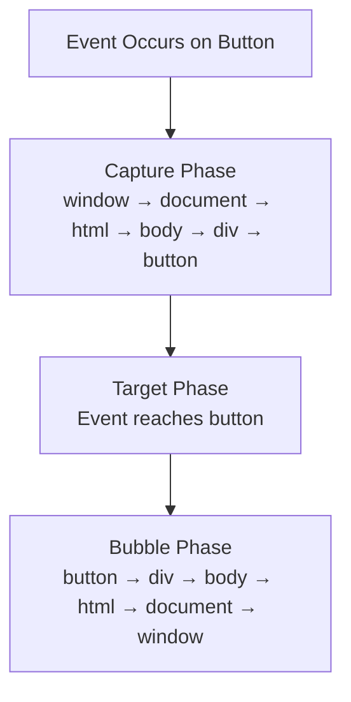
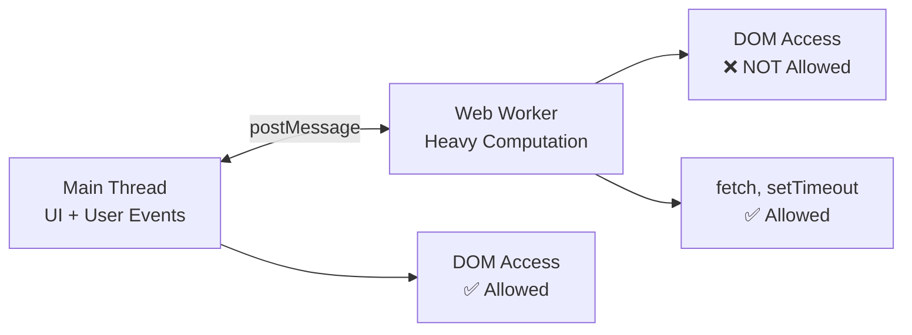
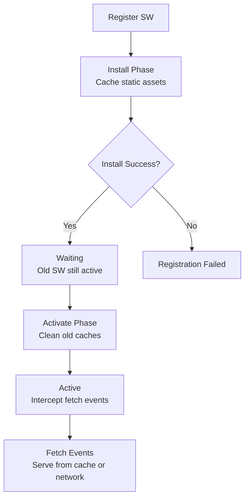

<a id="3-javascript-browser-apis-patterns-and-performance"></a>

# Chapter 3: JavaScript — Browser APIs, Patterns & Performance

[⬅ Previous Chapter](#2-javascript-core-essentials-part-ii) | [📖 Main Index](#main-index) | [Next Chapter ➡](#4-browser-rendering-pipeline)

---

## 📌 Learning Objectives

By the end of this chapter, you will:

- **Master** DOM manipulation — selecting, creating, modifying, removing elements
- **Understand** the complete event system — bubbling, capturing, delegation, custom events
- **Use** Fetch API, WebSocket, SSE for all networking patterns
- **Know** all storage APIs — localStorage, sessionStorage, cookies, IndexedDB, Cache API
- **Work with** File API, Blob, FileReader, Drag & Drop, Clipboard API
- **Implement** Web Workers, Shared Workers, BroadcastChannel for multi-threading
- **Understand** Service Workers, PWA patterns, offline-first design
- **Use** Observer APIs — IntersectionObserver, MutationObserver, ResizeObserver, PerformanceObserver
- **Apply** Performance APIs — rAF, requestIdleCallback, performance.now()
- **Implement** all major Design Patterns — Module, Singleton, Observer, Factory, Strategy
- **Build** debounce, throttle, EventEmitter, deepClone, Promise from scratch
- **Explain** security — XSS, CSRF, CSP, CORS, SameSite cookies
- **Answer** 25+ interview questions with complete, confident answers

---

<a id="chapter-index-table-3"></a>

## 📑 Chapter Index Table

| Topic No. | Topic Name | Subtopics |
|-----------|-----------|-----------|
| 3.1 | [DOM Manipulation](#31-dom-manipulation) | querySelector, createElement, innerHTML vs textContent, classList, dataset |
| 3.2 | [Event System](#32-event-system) | addEventListener options, bubbling/capturing, delegation, CustomEvent |
| 3.3 | [Networking APIs](#33-networking-apis) | Fetch, AbortController, WebSocket, SSE, comparison table |
| 3.4 | [Storage APIs](#34-storage-apis) | localStorage, sessionStorage, Cookies, IndexedDB, Cache API |
| 3.5 | [File & Binary APIs](#35-file-and-binary-apis) | Blob, File, FileReader, Drag & Drop, Clipboard |
| 3.6 | [Web Workers](#36-web-workers) | Dedicated Workers, Shared Workers, BroadcastChannel, MessageChannel |
| 3.7 | [Service Workers & PWA](#37-service-workers-and-pwa) | Lifecycle, Caching strategies, Push Notifications, manifest.json |
| 3.8 | [Observer APIs](#38-observer-apis) | IntersectionObserver, MutationObserver, ResizeObserver, PerformanceObserver |
| 3.9 | [Performance APIs](#39-performance-apis) | performance.now(), rAF, requestIdleCallback, Navigation Timing |
| 3.10 | [Miscellaneous Browser APIs](#310-miscellaneous-browser-apis) | History, URL, Geolocation, Notifications, Permissions, Crypto |
| 3.11 | [Streams API](#311-streams-api) | ReadableStream, WritableStream, TransformStream, piping |
| 3.12 | [Functional Programming Patterns](#312-functional-programming-patterns) | Pure functions, compose, pipe, curry, memoization, point-free |
| 3.13 | [Design Patterns in JavaScript](#313-design-patterns-in-javascript) | Module, Singleton, Observer, Factory, Strategy, Decorator, Command |
| 3.14 | [Performance Optimization Patterns](#314-performance-optimization-patterns) | Debounce, Throttle, Lazy loading, Virtual scrolling |
| 3.15 | [Security in JavaScript](#315-security-in-javascript) | XSS, CSRF, Clickjacking, CSP, CORS, SameSite, HttpOnly |
| 3.16 | [Polyfill Implementations](#316-polyfill-implementations) | map, filter, reduce, bind, Promise, deepClone, debounce, throttle |
| 3.17 | [Tricky Output Questions Bank](#317-tricky-output-questions-bank) | Coercion, Closure, Event Loop, this binding, Hoisting |
| — | [Interview Questions](#interview-questions-chapter-3) | 25+ Conceptual, Scenario, Output-based |
| — | [Practice Problems](#practice-problems-chapter-3) | 10 Coding + 10 Theory + Machine Coding |
| — | [Mini Project](#mini-project-chapter-3) | Utility Library from scratch |
| — | [Quick Revision](#quick-revision-chapter-3) | Key bullets, traps, cheat sheet |
| — | [Chapter Summary](#chapter-summary-chapter-3) | Most important points |

---

## 3.1 DOM Manipulation

<a id="31-dom-manipulation"></a>

### 🧠 Hinglish Intuition

> DOM ek tree hai jo browser banata hai tumhare HTML se. JavaScript se tum us tree ke nodes ko select kar sakte ho, badal sakte ho, naye nodes daal sakte ho. React internally yahi karta hai — sirf virtual layer add karke. DOM APIs seedha samajhna React ko deeply samajhne ke liye zaroori hai.

---

### Selecting Elements

```javascript
// Single element selectors
document.getElementById('myId');           // by ID — fastest
document.querySelector('.myClass');        // CSS selector — first match
document.querySelector('#id .class > p'); // complex CSS selector

// Multiple element selectors
document.querySelectorAll('.items');       // NodeList (static snapshot)
document.getElementsByClassName('items'); // HTMLCollection (live)
document.getElementsByTagName('div');      // HTMLCollection (live)

// Relative selection
const parent = document.getElementById('container');
parent.querySelector('.child');            // search within parent
parent.children;                           // direct children (HTMLCollection)
parent.firstElementChild;                  // first child element
parent.lastElementChild;                   // last child element
element.parentElement;                     // parent element
element.nextElementSibling;               // next sibling
element.previousElementSibling;           // prev sibling
element.closest('.ancestor');             // walk up DOM tree — first matching ancestor

// NodeList vs HTMLCollection
const nodeList = document.querySelectorAll('div');    // static — won't update
const htmlColl = document.getElementsByTagName('div'); // live — updates with DOM

// Convert to Array for full array methods:
Array.from(nodeList).filter(el => el.classList.contains('active'));
[...nodeList].map(el => el.textContent);
```

---

### Creating, Inserting, Removing Elements

```javascript
// CREATE
const div = document.createElement('div');
div.id = 'myDiv';
div.className = 'card active';
div.textContent = 'Hello World';
div.setAttribute('data-id', '123');

// INSERT — modern methods (much better than appendChild alone)
const container = document.getElementById('app');

container.append(div);                    // insert at END (accepts multiple nodes/strings)
container.prepend(div);                   // insert at BEGINNING
container.before(div);                    // insert BEFORE container (as sibling)
container.after(div);                     // insert AFTER container (as sibling)

// Insert at specific position with insertBefore:
container.insertBefore(newEl, referenceEl); // insert newEl before referenceEl

// insertAdjacentHTML — insert HTML string at specific position
container.insertAdjacentHTML('beforebegin', '<div>Before container</div>');
container.insertAdjacentHTML('afterbegin', '<div>First child</div>');
container.insertAdjacentHTML('beforeend', '<div>Last child</div>');
container.insertAdjacentHTML('afterend', '<div>After container</div>');
// Positions: beforebegin | afterbegin | beforeend | afterend

// insertAdjacentElement — insert element at specific position
container.insertAdjacentElement('beforeend', div);

// REMOVE
div.remove();                             // remove element itself
container.removeChild(div);              // remove child (older API)

// REPLACE
container.replaceChild(newEl, oldEl);
oldEl.replaceWith(newEl);                // modern

// CLONE
const clone = div.cloneNode(true);       // true = deep clone (with children)
const shallowClone = div.cloneNode(false); // false = element only
```

---

### innerHTML vs textContent vs innerText

```javascript
const el = document.getElementById('content');

// innerHTML — parses HTML, can create elements
el.innerHTML = '<strong>Hello</strong> World'; // renders bold "Hello"
el.innerHTML = ''; // ❌ XSS RISK!

// textContent — raw text, does NOT parse HTML (safe)
el.textContent = '<strong>Hello</strong>'; // displays literally "<strong>Hello</strong>"
el.textContent; // returns text of ALL descendants, including hidden elements

// innerText — visible text only (respects CSS)
el.innerText = 'Hello World';
// innerText reads trigger layout/reflow (performance impact)
// textContent is faster than innerText for reads

// When to use which:
// ✅ textContent — setting/getting text safely, no HTML needed
// ✅ innerHTML — when you need to insert HTML (sanitize first!)
// ✅ innerText — when you need visible text only (rarely)
// ❌ Never use innerHTML with user input directly!
```

> [!IMPORTANT]
> **Security Rule:** Never set `innerHTML` with unsanitized user input. Always use `textContent` for text, or sanitize with `DOMPurify` library before using `innerHTML`.

---

### classList API

```javascript
const el = document.getElementById('btn');

el.classList.add('active');              // add class
el.classList.add('large', 'primary');   // add multiple
el.classList.remove('inactive');        // remove class
el.classList.toggle('open');            // add if absent, remove if present
el.classList.toggle('dark', true);      // force add (second arg = boolean)
el.classList.toggle('dark', false);     // force remove
el.classList.contains('active');        // true/false check
el.classList.replace('old', 'new');     // replace one class with another
el.classList.item(0);                   // get class at index
el.classList.length;                    // number of classes
[...el.classList];                      // convert to array

// className — full string (older API)
el.className = 'btn primary large';    // replaces ALL classes
el.className += ' active';             // append (error-prone)
```

---

### dataset Attributes

```javascript
// HTML: <div id="user" data-user-id="123" data-role="admin" data-is-active="true">

const el = document.getElementById('user');

// Read dataset attributes
el.dataset.userId;     // '123' (camelCase from kebab-case)
el.dataset.role;       // 'admin'
el.dataset.isActive;   // 'true' (always string!)

// Write dataset attributes
el.dataset.userId = '456';
el.dataset.newProp = 'value'; // creates data-new-prop attribute

// Delete dataset attribute
delete el.dataset.role;

// getAttribute/setAttribute (more explicit)
el.getAttribute('data-user-id'); // '123'
el.setAttribute('data-user-id', '789');
el.removeAttribute('data-role');
el.hasAttribute('data-user-id'); // true
```

👉 <a href="#chapter-index-table-3">Go to Top 🔝</a>

---

## 3.2 Event System

<a id="32-event-system"></a>

### 🧠 Hinglish Intuition

> Event system ek telephone network ki tarah hai. Jab user kuch karta hai (click, key press), ek call aati hai. Bubbling matlab call neeche se upar jaati hai. Capturing matlab upar se neeche. Delegation ka matlab hai — ek receptionist sab calls handle kare rather than har employee ke paas phone ho.

---

### addEventListener — All Options

```javascript
const btn = document.getElementById('btn');

// Basic
btn.addEventListener('click', handler);

// With options object:
btn.addEventListener('click', handler, {
  capture: false,  // use bubble phase (default)
  once: true,      // auto-remove after first fire
  passive: true,   // hints browser: we won't call preventDefault()
                   // → browser can optimize scroll performance!
  signal: abortController.signal // remove listener when signal aborts
});

// Remove listener (must pass same function reference!)
btn.removeEventListener('click', handler);

// ❌ This won't work — different function reference:
btn.addEventListener('click', () => console.log('hi'));
btn.removeEventListener('click', () => console.log('hi')); // doesn't remove!

// ✅ This works — same reference:
const handler = () => console.log('hi');
btn.addEventListener('click', handler);
btn.removeEventListener('click', handler); // ✅ removed!

// Remove with AbortController (modern pattern):
const controller = new AbortController();
btn.addEventListener('click', handler, { signal: controller.signal });
// Later:
controller.abort(); // removes ALL listeners registered with this signal
```

---

### Event Bubbling & Capturing — Complete Flow



```html
<div id="outer">
  <div id="inner">
    <button id="btn">Click Me</button>
  </div>
</div>
```

```javascript
// BUBBLING (default) — inner to outer
document.getElementById('btn').addEventListener('click', e => {
  console.log('1. Button');    // fires first
});
document.getElementById('inner').addEventListener('click', e => {
  console.log('2. Inner div'); // fires second
});
document.getElementById('outer').addEventListener('click', e => {
  console.log('3. Outer div'); // fires third
});
// Click button → logs: 1, 2, 3

// CAPTURING — outer to inner (use {capture: true})
document.getElementById('outer').addEventListener('click', e => {
  console.log('1. Outer (capture)'); // fires first
}, { capture: true });
document.getElementById('inner').addEventListener('click', e => {
  console.log('2. Inner (capture)'); // fires second
}, { capture: true });
document.getElementById('btn').addEventListener('click', e => {
  console.log('3. Button'); // fires third
});
// Click button → logs: 1, 2, 3

// Stop bubbling:
document.getElementById('btn').addEventListener('click', e => {
  e.stopPropagation();    // stops bubble/capture chain
  // e.stopImmediatePropagation(); // also stops other listeners on SAME element
});

// e.target vs e.currentTarget
document.getElementById('outer').addEventListener('click', e => {
  console.log(e.target);        // element that was ACTUALLY clicked (button)
  console.log(e.currentTarget); // element this listener is attached to (outer div)
});
```

---

### Event Delegation Pattern

```javascript
// ❌ WITHOUT delegation — a listener per item
const items = document.querySelectorAll('.list-item');
items.forEach(item => {
  item.addEventListener('click', handleClick);
});
// Problem: 1000 items = 1000 listeners!
// Problem: doesn't work for dynamically added items!

// ✅ WITH delegation — one listener on parent
const list = document.getElementById('list');
list.addEventListener('click', (e) => {
  // Check if the clicked element matches what we care about
  const item = e.target.closest('.list-item');
  if (!item) return; // clicked outside list items

  const id = item.dataset.id;
  console.log('Clicked item:', id);
  item.classList.toggle('selected');
});

// Works for dynamically added items too!
const newItem = document.createElement('li');
newItem.className = 'list-item';
newItem.dataset.id = '999';
newItem.textContent = 'New Item';
list.appendChild(newItem); // click handler works immediately!

// Multiple action types via delegation:
document.getElementById('todo-list').addEventListener('click', e => {
  if (e.target.matches('.delete-btn')) {
    const todoItem = e.target.closest('.todo-item');
    todoItem.remove();
  }
  if (e.target.matches('.complete-btn')) {
    const todoItem = e.target.closest('.todo-item');
    todoItem.classList.toggle('completed');
  }
  if (e.target.matches('.edit-btn')) {
    const todoItem = e.target.closest('.todo-item');
    startEditing(todoItem);
  }
});
```

---

### Custom Events

```javascript
// Create custom event
const event = new CustomEvent('user:login', {
  bubbles: true,      // should it bubble?
  cancelable: true,   // can it be preventDefault'd?
  detail: {           // custom data payload
    userId: 123,
    username: 'Raj',
    timestamp: Date.now()
  }
});

// Dispatch the event
document.getElementById('loginBtn').dispatchEvent(event);

// Listen for custom event (anywhere in bubble chain)
document.addEventListener('user:login', (e) => {
  console.log('User logged in:', e.detail.username); // 'Raj'
  console.log('At:', new Date(e.detail.timestamp));
});

// Real-world: cross-component communication (without React/framework)
function notifyCartUpdate(item) {
  const event = new CustomEvent('cart:updated', {
    bubbles: true,
    detail: { item, action: 'add' }
  });
  document.dispatchEvent(event);
}

document.addEventListener('cart:updated', ({ detail }) => {
  updateCartUI(detail);
  updateCartCount(detail);
});
```

👉 <a href="#chapter-index-table-3">Go to Top 🔝</a>

---

## 3.3 Networking APIs

<a id="33-networking-apis"></a>

### 🧠 Hinglish Intuition

> Fetch API modern XMLHttpRequest hai — Promise-based, clean. WebSocket ek phone call hai — dono taraf baat ho sakti hai real-time mein. SSE ek radio broadcast hai — server sirf bhejta hai, client sunता hai. Kab kya use karna hai — yeh samajhna zaroori hai.

---

### Fetch API — Complete Guide

```javascript
// Basic GET request
const response = await fetch('https://api.example.com/users');
// fetch ONLY rejects on network failure, NOT on 4xx/5xx!
if (!response.ok) { // always check response.ok!
  throw new Error(`HTTP error! status: ${response.status}`);
}
const data = await response.json();

// Full fetch with options
const response2 = await fetch('https://api.example.com/users', {
  method: 'POST',
  headers: {
    'Content-Type': 'application/json',
    'Authorization': `Bearer ${token}`,
    'X-Custom-Header': 'value'
  },
  body: JSON.stringify({ name: 'Raj', age: 25 }),
  credentials: 'include',    // send cookies with cross-origin requests
  mode: 'cors',              // cors | no-cors | same-origin
  cache: 'no-cache',         // default | no-cache | reload | force-cache
  redirect: 'follow',        // follow | error | manual
  signal: controller.signal  // AbortController signal
});

// Response methods (each returns Promise, can only be consumed ONCE):
response.json();        // parse as JSON
response.text();        // parse as text
response.blob();        // parse as Blob
response.arrayBuffer(); // parse as ArrayBuffer
response.formData();    // parse as FormData

// Response properties:
response.status;    // 200, 404, 500...
response.ok;        // true if status 200-299
response.statusText; // 'OK', 'Not Found'...
response.headers;   // Headers object
response.url;       // final URL after redirects
response.redirected; // true if redirected

// Wrapper function — best practice:
async function apiFetch(url, options = {}) {
  const response = await fetch(url, {
    headers: { 'Content-Type': 'application/json' },
    ...options
  });
  if (!response.ok) {
    const error = await response.json().catch(() => ({ message: response.statusText }));
    throw Object.assign(new Error(error.message), { status: response.status });
  }
  return response.json();
}
```

---

### AbortController — Cancelling Fetch Requests

```javascript
// AbortController — cancel ongoing fetch
const controller = new AbortController();
const signal = controller.signal;

// Start fetch with signal
const fetchPromise = fetch('/api/large-data', { signal });

// Cancel after 5 seconds
setTimeout(() => controller.abort(), 5000);

try {
  const data = await fetchPromise;
} catch (err) {
  if (err.name === 'AbortError') {
    console.log('Fetch was cancelled'); // handle cancellation
  } else {
    throw err; // re-throw other errors
  }
}

// React pattern — cancel on unmount or dependency change:
useEffect(() => {
  const controller = new AbortController();

  fetch('/api/data', { signal: controller.signal })
    .then(res => res.json())
    .then(data => setData(data))
    .catch(err => {
      if (err.name !== 'AbortError') setError(err);
    });

  return () => controller.abort(); // cleanup: cancel on unmount
}, [dependency]);

// Cancel multiple requests at once:
const controller = new AbortController();
Promise.all([
  fetch('/api/users', { signal: controller.signal }),
  fetch('/api/posts', { signal: controller.signal }),
  fetch('/api/comments', { signal: controller.signal })
]);
controller.abort(); // cancels ALL three!
```

---

### WebSocket — Full-duplex Communication

```javascript
// Create WebSocket connection
const ws = new WebSocket('wss://api.example.com/socket');
// ws:// for HTTP, wss:// for HTTPS (secure)

// Connection lifecycle events:
ws.addEventListener('open', (event) => {
  console.log('Connected!');
  ws.send(JSON.stringify({ type: 'join', room: 'general' }));
});

ws.addEventListener('message', (event) => {
  const data = JSON.parse(event.data);
  console.log('Received:', data);
});

ws.addEventListener('close', (event) => {
  console.log(`Closed: code=${event.code}, reason=${event.reason}`);
  // Reconnect logic here
});

ws.addEventListener('error', (event) => {
  console.error('WebSocket error:', event);
});

// Sending data:
ws.send('Hello text');                        // text
ws.send(JSON.stringify({ type: 'message', content: 'Hi' })); // JSON

// WebSocket states:
ws.readyState; // 0=CONNECTING, 1=OPEN, 2=CLOSING, 3=CLOSED

// Close connection:
ws.close(1000, 'Normal closure'); // code 1000 = normal

// Reconnection pattern:
class ReconnectingWebSocket {
  #ws = null;
  #url;
  #retryDelay;

  constructor(url, retryDelay = 3000) {
    this.#url = url;
    this.#retryDelay = retryDelay;
    this.#connect();
  }

  #connect() {
    this.#ws = new WebSocket(this.#url);
    this.#ws.addEventListener('open', () => console.log('Connected'));
    this.#ws.addEventListener('message', (e) => this.onmessage?.(e));
    this.#ws.addEventListener('close', () => {
      console.log(`Disconnected. Retrying in ${this.#retryDelay}ms...`);
      setTimeout(() => this.#connect(), this.#retryDelay);
    });
  }

  send(data) {
    if (this.#ws.readyState === WebSocket.OPEN) {
      this.#ws.send(typeof data === 'string' ? data : JSON.stringify(data));
    }
  }
}
```

---

### Server-Sent Events (SSE)

```javascript
// SSE — one-way server → client streaming
const eventSource = new EventSource('/api/events');
// Automatically adds auth cookies, supports CORS with withCredentials

// Receive events:
eventSource.addEventListener('message', (e) => {
  console.log('Default event:', e.data);
});

// Named event types (server sends: event: notification)
eventSource.addEventListener('notification', (e) => {
  const data = JSON.parse(e.data);
  console.log('Notification:', data);
});

eventSource.addEventListener('update', (e) => {
  updateUI(JSON.parse(e.data));
});

// Connection events:
eventSource.addEventListener('open', () => console.log('SSE connected'));
eventSource.addEventListener('error', (e) => {
  if (eventSource.readyState === EventSource.CLOSED) {
    console.log('SSE connection closed');
  }
});

// Close connection:
eventSource.close();

// Auto-reconnect: SSE automatically reconnects after network failure!
// Server can control retry delay: retry: 5000 (milliseconds)

// With authentication (SSE doesn't support custom headers natively):
const eventSource2 = new EventSource(`/api/events?token=${authToken}`);
// OR use withCredentials for cookies:
const eventSource3 = new EventSource('/api/events', { withCredentials: true });
```

---

### WebSocket vs SSE vs Long Polling Comparison

| Feature | WebSocket | SSE | Long Polling |
|---------|-----------|-----|-------------|
| **Direction** | Bidirectional | Server → Client only | Server → Client |
| **Protocol** | WS/WSS | HTTP | HTTP |
| **Auto-reconnect** | Manual | ✅ Built-in | Manual |
| **Binary support** | ✅ Yes | ❌ Text only | ❌ Text only |
| **Browser support** | Excellent | Good (not IE) | Universal |
| **Firewall friendly** | Sometimes blocked | ✅ Yes | ✅ Yes |
| **Complexity** | Higher | Low | Medium |
| **Use case** | Chat, games, trading | Notifications, live feeds | Legacy, simple updates |
| **HTTP/2** | Separate connection | ✅ Multiplexed | Separate |

> [!TIP]
> **Decision guide:** Use **WebSocket** for real-time bidirectional (chat, multiplayer). Use **SSE** for server-push notifications (news feed, live scores, AI streaming). Use **Long Polling** only for legacy browser support or simple polling needs.

👉 <a href="#chapter-index-table-3">Go to Top 🔝</a>

---

## 3.4 Storage APIs

<a id="34-storage-apis"></a>

### 🧠 Hinglish Intuition

> Browser mein data store karne ke kai tarike hain. localStorage permanent hai jab tak tum delete nahi karte. sessionStorage tab close hone par saaf ho jaata hai. Cookie server ke paas bhi jaati hai. IndexedDB ek poora database hai browser mein. Kab kya use karna — yeh samajhna interview mein puchhte hain.

---

### localStorage & sessionStorage

```javascript
// localStorage — persists across sessions, tabs, browser restarts
localStorage.setItem('user', JSON.stringify({ name: 'Raj', role: 'admin' }));
const user = JSON.parse(localStorage.getItem('user'));
localStorage.removeItem('user');
localStorage.clear(); // removes ALL items!
localStorage.length;  // number of items
localStorage.key(0);  // get key by index

// sessionStorage — same API, but cleared when tab closes
sessionStorage.setItem('token', 'abc123');
sessionStorage.getItem('token');

// Custom localStorage wrapper with expiry:
const storage = {
  set(key, value, ttlMs) {
    const item = {
      value,
      expiry: ttlMs ? Date.now() + ttlMs : null
    };
    localStorage.setItem(key, JSON.stringify(item));
  },

  get(key) {
    const itemStr = localStorage.getItem(key);
    if (!itemStr) return null;
    const item = JSON.parse(itemStr);
    if (item.expiry && Date.now() > item.expiry) {
      localStorage.removeItem(key); // expired
      return null;
    }
    return item.value;
  },

  remove(key) {
    localStorage.removeItem(key);
  }
};

storage.set('cache', { data: [...] }, 60 * 60 * 1000); // 1 hour TTL
storage.get('cache'); // returns null if expired

// Storage event — cross-tab sync!
window.addEventListener('storage', (e) => {
  console.log('Storage changed in another tab!');
  console.log('Key:', e.key);
  console.log('Old value:', e.oldValue);
  console.log('New value:', e.newValue);
  console.log('URL:', e.url);
});
```

| Feature | localStorage | sessionStorage | Cookie |
|---------|-------------|----------------|--------|
| **Capacity** | ~5-10MB | ~5MB | ~4KB |
| **Expiry** | Never (manual) | Tab close | Can set |
| **Server access** | ❌ No | ❌ No | ✅ Yes |
| **Cross-tab** | ✅ Yes | ❌ No (same tab) | ✅ Yes |
| **HTTPS only** | No | No | Can set |
| **JS access** | ✅ Yes | ✅ Yes | Depends on HttpOnly |

---

### Cookies — Complete Guide

```javascript
// Read all cookies
document.cookie; // 'name=Raj; theme=dark; session=abc123'
// Note: can't read HttpOnly cookies!

// Write a cookie
document.cookie = 'username=Raj';
document.cookie = 'theme=dark; max-age=86400'; // expires in 1 day (seconds)
document.cookie = 'token=xyz; expires=Thu, 31 Dec 2025 23:59:59 GMT';
document.cookie = 'session=abc; path=/';       // available at all paths
document.cookie = 'auth=xyz; domain=.example.com'; // all subdomains
document.cookie = 'token=xyz; secure';         // HTTPS only
document.cookie = 'id=123; SameSite=Strict';   // no cross-site sending

// Note: each assignment ADDS/UPDATES one cookie, doesn't replace all!

// Parse all cookies into object:
function getCookies() {
  return Object.fromEntries(
    document.cookie.split('; ')
      .filter(Boolean)
      .map(c => c.split('=').map(decodeURIComponent))
  );
}
getCookies(); // { username: 'Raj', theme: 'dark', ... }

// Get specific cookie:
function getCookie(name) {
  const value = `; ${document.cookie}`;
  const parts = value.split(`; ${name}=`);
  if (parts.length === 2) return decodeURIComponent(parts.pop().split(';').shift());
  return null;
}

// Delete cookie (set expires in past):
document.cookie = 'username=; expires=Thu, 01 Jan 1970 00:00:00 GMT; path=/';
```

#### Cookie Security Attributes

| Attribute | Purpose |
|-----------|---------|
| `HttpOnly` | JS cannot read — prevents XSS cookie theft. Server-set only |
| `Secure` | Only sent over HTTPS |
| `SameSite=Strict` | Never sent cross-site — strong CSRF protection |
| `SameSite=Lax` | Sent for top-level navigation GET only |
| `SameSite=None; Secure` | Always sent cross-site (requires HTTPS) |
| `Path=/` | Available on all routes |
| `Domain=.example.com` | Available on all subdomains |

---

### IndexedDB — Overview

```javascript
// IndexedDB — structured database in browser
// Asynchronous, supports transactions, indexes

// Open database
const request = indexedDB.open('MyDatabase', 1); // name, version

request.onupgradeneeded = (event) => {
  const db = event.target.result;
  // Create object store (like a table)
  const store = db.createObjectStore('users', {
    keyPath: 'id',         // primary key field
    autoIncrement: true    // auto-increment IDs
  });
  store.createIndex('name', 'name', { unique: false });
  store.createIndex('email', 'email', { unique: true });
};

request.onsuccess = (event) => {
  const db = event.target.result;

  // ADD data
  const tx = db.transaction('users', 'readwrite');
  const store = tx.objectStore('users');
  store.add({ name: 'Raj', email: 'raj@example.com' });

  // GET data
  const getTx = db.transaction('users', 'readonly');
  const getStore = getTx.objectStore('users');
  const getReq = getStore.get(1); // by primary key
  getReq.onsuccess = () => console.log(getReq.result);
};

// Modern: use idb library for Promise-based API
// import { openDB } from 'idb';
```

---

### Cache API — Programmatic Caching

```javascript
// Cache API — for Service Workers primarily (also usable in main thread)
const CACHE_NAME = 'my-cache-v1';

// Open a cache
const cache = await caches.open(CACHE_NAME);

// Add to cache
await cache.add('/api/data'); // fetches URL and stores response
await cache.addAll(['/index.html', '/app.js', '/styles.css']);

// Store custom response
await cache.put('/api/user', new Response(JSON.stringify({ name: 'Raj' })));

// Retrieve from cache
const response = await caches.match('/api/data');
if (response) {
  const data = await response.json();
}

// Delete from cache
await cache.delete('/api/old-data');

// List all caches
const cacheNames = await caches.keys(); // ['my-cache-v1', 'static-v2']

// Delete entire cache
await caches.delete('my-cache-v1');
```

👉 <a href="#chapter-index-table-3">Go to Top 🔝</a>

---

## 3.5 File & Binary APIs

<a id="35-file-and-binary-apis"></a>

### 🧠 Hinglish Intuition

> File aur Blob APIs browser ko ek mini file system dete hain. FileReader se file ka content read karo — text ho ya image. Drag & Drop se UX smooth banao. Clipboard API se copy-paste control karo. Yeh sab file upload features mein kaam aate hain.

---

### Blob — Binary Large Object

```javascript
// Create Blob
const textBlob = new Blob(['Hello, World!'], { type: 'text/plain' });
const jsonBlob = new Blob([JSON.stringify({ name: 'Raj' })], { type: 'application/json' });
const imageBlob = new Blob([arrayBuffer], { type: 'image/png' });

// Blob properties
textBlob.size; // byte size
textBlob.type; // MIME type

// Read Blob content
const text = await textBlob.text();          // as string
const buffer = await textBlob.arrayBuffer(); // as ArrayBuffer
const stream = textBlob.stream();            // as ReadableStream

// Blob URL — create temporary URL for Blob
const url = URL.createObjectURL(imageBlob);
img.src = url; // use as image source
a.href = url;  // use as download link

// IMPORTANT: release memory when done!
URL.revokeObjectURL(url);

// Practical: download generated file
function downloadJSON(data, filename) {
  const blob = new Blob([JSON.stringify(data, null, 2)], { type: 'application/json' });
  const url = URL.createObjectURL(blob);
  const a = document.createElement('a');
  a.href = url;
  a.download = filename;
  a.click();
  URL.revokeObjectURL(url); // cleanup
}

// Slice large Blob (for chunked upload):
const chunk1 = largeBlob.slice(0, 1024 * 1024);     // first 1MB
const chunk2 = largeBlob.slice(1024 * 1024, 2 * 1024 * 1024); // second 1MB
```

---

### File API & FileReader

```javascript
// File input element
const fileInput = document.getElementById('fileInput');
fileInput.addEventListener('change', (e) => {
  const files = e.target.files; // FileList object
  const file = files[0];        // File object

  // File properties:
  file.name;         // 'document.pdf'
  file.size;         // bytes
  file.type;         // 'application/pdf'
  file.lastModified; // timestamp
  file instanceof Blob; // true — File extends Blob!
});

// FileReader — async file reading
function readFileAsText(file) {
  return new Promise((resolve, reject) => {
    const reader = new FileReader();

    reader.onload = (e) => resolve(e.target.result);
    reader.onerror = (e) => reject(e.target.error);
    reader.onprogress = (e) => {
      if (e.lengthComputable) {
        const percent = (e.loaded / e.total) * 100;
        console.log(`Progress: ${percent.toFixed(0)}%`);
      }
    };

    reader.readAsText(file);        // text files
    // reader.readAsDataURL(file);  // images — returns base64 data URL
    // reader.readAsArrayBuffer(file); // binary files
    // reader.readAsBinaryString(file); // deprecated
  });
}

// Image preview before upload:
fileInput.addEventListener('change', (e) => {
  const file = e.target.files[0];
  if (!file.type.startsWith('image/')) return;

  const reader = new FileReader();
  reader.onload = (e) => {
    document.getElementById('preview').src = e.target.result;
  };
  reader.readAsDataURL(file); // returns 'data:image/png;base64,...'
});

// Modern alternative: URL.createObjectURL (faster, no base64 conversion)
fileInput.addEventListener('change', (e) => {
  const file = e.target.files[0];
  const url = URL.createObjectURL(file);
  img.src = url; // instantly available
  img.onload = () => URL.revokeObjectURL(url); // cleanup after load
});
```

---

### Drag & Drop API

```javascript
// Make element draggable
const draggable = document.getElementById('card');
draggable.draggable = true; // or HTML: draggable="true"

draggable.addEventListener('dragstart', (e) => {
  e.dataTransfer.setData('text/plain', draggable.id);
  e.dataTransfer.setData('application/json', JSON.stringify({ id: 1 }));
  e.dataTransfer.effectAllowed = 'move'; // copy | move | link
  draggable.classList.add('dragging');
});

draggable.addEventListener('dragend', () => {
  draggable.classList.remove('dragging');
});

// Drop zone
const dropZone = document.getElementById('dropZone');

dropZone.addEventListener('dragover', (e) => {
  e.preventDefault(); // MUST prevent default to allow drop!
  e.dataTransfer.dropEffect = 'move';
  dropZone.classList.add('drag-over');
});

dropZone.addEventListener('dragleave', () => {
  dropZone.classList.remove('drag-over');
});

dropZone.addEventListener('drop', (e) => {
  e.preventDefault();
  dropZone.classList.remove('drag-over');

  // Get dragged data
  const id = e.dataTransfer.getData('text/plain');
  const data = JSON.parse(e.dataTransfer.getData('application/json'));

  // Handle dropped files
  const files = [...e.dataTransfer.files]; // FileList → Array
  files.forEach(file => {
    console.log('Dropped file:', file.name, file.size);
    processFile(file);
  });
});

// File drag & drop upload zone:
dropZone.addEventListener('drop', async (e) => {
  e.preventDefault();
  const files = [...e.dataTransfer.files];

  for (const file of files) {
    const formData = new FormData();
    formData.append('file', file);
    await fetch('/api/upload', { method: 'POST', body: formData });
  }
});
```

---

### Clipboard API

```javascript
// Write to clipboard
async function copyToClipboard(text) {
  try {
    await navigator.clipboard.writeText(text);
    console.log('Copied!');
  } catch (err) {
    // Fallback for older browsers
    const input = document.createElement('input');
    input.value = text;
    document.body.appendChild(input);
    input.select();
    document.execCommand('copy'); // deprecated but fallback
    document.body.removeChild(input);
  }
}

// Read from clipboard
async function pasteFromClipboard() {
  try {
    const text = await navigator.clipboard.readText();
    console.log('Pasted:', text);
    return text;
  } catch (err) {
    console.error('No clipboard permission:', err);
  }
}

// Copy rich content (images, HTML)
async function copyImage(imgElement) {
  const canvas = document.createElement('canvas');
  canvas.drawImage(imgElement, 0, 0);
  canvas.toBlob(async (blob) => {
    await navigator.clipboard.write([
      new ClipboardItem({ 'image/png': blob })
    ]);
  });
}

// Clipboard events (intercept copy/paste)
document.addEventListener('copy', (e) => {
  const selectedText = window.getSelection().toString();
  e.clipboardData.setData('text/plain', selectedText.toUpperCase()); // modify!
  e.preventDefault();
});

document.addEventListener('paste', (e) => {
  const text = e.clipboardData.getData('text/plain');
  console.log('User pasted:', text);
  // e.preventDefault(); // prevent default paste
});
```

👉 <a href="#chapter-index-table-3">Go to Top 🔝</a>

---

## 3.6 Web Workers

<a id="36-web-workers"></a>

### 🧠 Hinglish Intuition

> JavaScript ek restaurant ka chef hai — ek waqt mein ek dish. Agar chef 10 minute ki dish bana raha ho, sab baaki orders ruk jaate hain (main thread block). Web Worker ek alag kitchen hai — wahan heavy kaam karo, main kitchen free rehti hai users ke liye.

---

### Dedicated Workers



```javascript
// worker.js — separate file
self.addEventListener('message', (e) => {
  const { type, data } = e.data;

  if (type === 'SORT') {
    // Heavy computation without blocking UI!
    const sorted = data.sort((a, b) => a - b);
    self.postMessage({ type: 'SORT_DONE', result: sorted });
  }

  if (type === 'COMPUTE') {
    const result = heavyComputation(data);
    self.postMessage({ type: 'COMPUTE_DONE', result });
  }
});

function heavyComputation(n) {
  let result = 0;
  for (let i = 0; i < n; i++) result += Math.sqrt(i);
  return result;
}

// main.js — using the worker
const worker = new Worker('./worker.js');
// OR (inline worker with Blob — no separate file needed):
const workerCode = `
  self.onmessage = (e) => {
    const result = e.data * 2;
    self.postMessage(result);
  };
`;
const blob = new Blob([workerCode], { type: 'application/javascript' });
const inlineWorker = new Worker(URL.createObjectURL(blob));

// Send data TO worker
worker.postMessage({ type: 'SORT', data: [3, 1, 4, 1, 5, 9] });

// Receive FROM worker
worker.addEventListener('message', (e) => {
  const { type, result } = e.data;
  if (type === 'SORT_DONE') {
    console.log('Sorted:', result); // UI update — back on main thread
  }
});

worker.addEventListener('error', (e) => {
  console.error('Worker error:', e.message);
});

// Terminate worker
worker.terminate();

// Transferable objects — zero-copy transfer (huge arrays)
const largeBuffer = new ArrayBuffer(1024 * 1024 * 100); // 100MB
worker.postMessage({ buffer: largeBuffer }, [largeBuffer]);
// largeBuffer is now TRANSFERRED — no longer accessible in main thread!
// No copying — O(1) transfer regardless of size!
```

---

### Shared Workers — Cross-tab Communication

```javascript
// shared-worker.js
const connections = new Set();

self.addEventListener('connect', (e) => {
  const port = e.ports[0];
  connections.add(port);

  port.addEventListener('message', (event) => {
    // Broadcast to ALL connected tabs
    connections.forEach(p => {
      p.postMessage({ from: 'worker', data: event.data });
    });
  });

  port.start(); // required for SharedWorker
  port.postMessage('Connected!');
});

// main.js (tab 1 and tab 2 both use same worker instance!)
const sharedWorker = new SharedWorker('./shared-worker.js');
sharedWorker.port.start();

sharedWorker.port.addEventListener('message', (e) => {
  console.log('From shared worker:', e.data);
});

sharedWorker.port.postMessage('Hello from tab!');
```

---

### BroadcastChannel API

```javascript
// Much simpler than Shared Workers for cross-tab messaging
const channel = new BroadcastChannel('auth-channel');

// Send to ALL other tabs (not the sender tab):
channel.postMessage({
  type: 'USER_LOGGED_OUT',
  timestamp: Date.now()
});

// Receive in all other tabs:
channel.addEventListener('message', (e) => {
  const { type, timestamp } = e.data;

  if (type === 'USER_LOGGED_OUT') {
    // Force all tabs to log out!
    clearAuthState();
    redirectToLogin();
  }

  if (type === 'THEME_CHANGED') {
    applyTheme(e.data.theme);
  }
});

// Close channel when done:
channel.close();

// Real-world use cases:
// ✅ Sync auth state across tabs (login/logout)
// ✅ Sync theme/preferences changes
// ✅ Invalidate cache in all tabs
// ✅ Broadcast real-time updates
```

---

### MessageChannel — Private Two-way Channels

```javascript
// MessageChannel — two ports connected to each other
const channel = new MessageChannel();
const { port1, port2 } = channel;

// port1 and port2 are connected — what's sent to one, received by the other
port1.onmessage = (e) => console.log('port1 received:', e.data);
port2.onmessage = (e) => console.log('port2 received:', e.data);

port1.postMessage('Hello from port1');  // port2 receives
port2.postMessage('Hello from port2');  // port1 receives

// iframe communication:
const iframe = document.getElementById('myFrame');

window.addEventListener('load', () => {
  const { port1, port2 } = new MessageChannel();

  // Send port2 to iframe
  iframe.contentWindow.postMessage('init', '*', [port2]);

  // Use port1 to communicate
  port1.onmessage = (e) => console.log('From iframe:', e.data);
  port1.postMessage('Hello iframe!');
});

// Inside iframe:
window.addEventListener('message', (e) => {
  if (e.data === 'init') {
    const port = e.ports[0];
    port.onmessage = (e) => console.log('From parent:', e.data);
    port.postMessage('Hello parent!');
  }
});
```

👉 <a href="#chapter-index-table-3">Go to Top 🔝</a>

---

## 3.7 Service Workers & PWA

<a id="37-service-workers-and-pwa"></a>

### 🧠 Hinglish Intuition

> Service Worker ek middleman hai browser aur network ke beech. Har fetch request pehle Service Worker ke paas jaati hai. SW decide karta hai — cache se doon ya network se fetch karoon. Offline kaam karna isi se possible hota hai.

---

### Service Worker Lifecycle



```javascript
// Registration (in main JS):
if ('serviceWorker' in navigator) {
  navigator.serviceWorker.register('/sw.js', {
    scope: '/' // control all pages from root
  })
  .then(reg => {
    console.log('SW registered:', reg.scope);

    // Check for updates:
    reg.addEventListener('updatefound', () => {
      const newWorker = reg.installing;
      newWorker.addEventListener('statechange', () => {
        if (newWorker.state === 'installed' && navigator.serviceWorker.controller) {
          // New SW available — prompt user to refresh
          showUpdateBanner();
        }
      });
    });
  })
  .catch(err => console.error('SW registration failed:', err));
}

// sw.js — Service Worker file
const CACHE_NAME = 'app-cache-v2';
const STATIC_ASSETS = [
  '/',
  '/index.html',
  '/app.js',
  '/styles.css',
  '/logo.png'
];

// INSTALL — cache static assets
self.addEventListener('install', (event) => {
  event.waitUntil(
    caches.open(CACHE_NAME)
      .then(cache => cache.addAll(STATIC_ASSETS))
      .then(() => self.skipWaiting()) // activate immediately
  );
});

// ACTIVATE — clean old caches
self.addEventListener('activate', (event) => {
  event.waitUntil(
    caches.keys()
      .then(keys => Promise.all(
        keys
          .filter(key => key !== CACHE_NAME)
          .map(key => caches.delete(key)) // delete old caches
      ))
      .then(() => self.clients.claim()) // take control immediately
  );
});
```

---

### Caching Strategies

```javascript
// sw.js — fetch event handler

// STRATEGY 1: Cache First (best for static assets)
self.addEventListener('fetch', (event) => {
  event.respondWith(
    caches.match(event.request)
      .then(cached => cached || fetch(event.request))
  );
});

// STRATEGY 2: Network First (best for API data)
self.addEventListener('fetch', (event) => {
  event.respondWith(
    fetch(event.request)
      .then(response => {
        const clone = response.clone();
        caches.open(CACHE_NAME).then(cache => cache.put(event.request, clone));
        return response;
      })
      .catch(() => caches.match(event.request)) // fallback to cache on failure
  );
});

// STRATEGY 3: Stale While Revalidate (best of both)
self.addEventListener('fetch', (event) => {
  event.respondWith(
    caches.open(CACHE_NAME).then(cache => {
      return cache.match(event.request).then(cached => {
        const fetchPromise = fetch(event.request).then(response => {
          cache.put(event.request, response.clone()); // update cache
          return response;
        });
        return cached || fetchPromise; // return cached immediately, update in background
      });
    })
  );
});

// SMART STRATEGY: Different strategies per URL
self.addEventListener('fetch', (event) => {
  const { request } = event;
  const url = new URL(request.url);

  if (url.pathname.startsWith('/api/')) {
    // API: Network first, cache fallback
    event.respondWith(networkFirst(request));
  } else if (url.pathname.match(/\.(js|css|png|jpg|svg)$/)) {
    // Static assets: Cache first
    event.respondWith(cacheFirst(request));
  } else {
    // HTML pages: Stale while revalidate
    event.respondWith(staleWhileRevalidate(request));
  }
});
```

---

### PWA — manifest.json & Installability

```json
// manifest.json
{
  "name": "My Awesome App",
  "short_name": "AwesomeApp",
  "description": "A Progressive Web App",
  "start_url": "/",
  "display": "standalone",
  "background_color": "#ffffff",
  "theme_color": "#007bff",
  "orientation": "portrait-primary",
  "icons": [
    {
      "src": "/icons/icon-192.png",
      "sizes": "192x192",
      "type": "image/png",
      "purpose": "maskable any"
    },
    {
      "src": "/icons/icon-512.png",
      "sizes": "512x512",
      "type": "image/png"
    }
  ],
  "screenshots": [
    {
      "src": "/screenshots/home.png",
      "sizes": "1080x1920",
      "type": "image/png"
    }
  ]
}
```

```html
<!-- Link in HTML head -->
<link rel="manifest" href="/manifest.json">
<meta name="theme-color" content="#007bff">
<meta name="apple-mobile-web-app-capable" content="yes">
```

```javascript
// Install prompt handling
let deferredPrompt;

window.addEventListener('beforeinstallprompt', (e) => {
  e.preventDefault(); // prevent auto-prompt
  deferredPrompt = e; // save for later
  showInstallButton(); // show your custom install button
});

installButton.addEventListener('click', async () => {
  deferredPrompt.prompt(); // show browser install prompt
  const { outcome } = await deferredPrompt.userChoice;
  console.log('Install outcome:', outcome); // 'accepted' or 'dismissed'
  deferredPrompt = null;
});

window.addEventListener('appinstalled', () => {
  console.log('PWA installed!');
});
```

👉 <a href="#chapter-index-table-3">Go to Top 🔝</a>

---

## 3.8 Observer APIs

<a id="38-observer-apis"></a>

### 🧠 Hinglish Intuition

> Observer APIs browser ke aankhein hain. IntersectionObserver dekhta hai kaunsa element screen mein aa gaya. MutationObserver DOM mein changes dekhta hai. ResizeObserver element ka size dekhta hai. PerformanceObserver performance metrics dekhta hai. Sab event-based hain — polling ki zaroorat nahi!

---

### IntersectionObserver — Lazy Loading & Infinite Scroll

```javascript
// Callback when elements enter/leave viewport
const observer = new IntersectionObserver((entries, observer) => {
  entries.forEach(entry => {
    if (entry.isIntersecting) {
      // Element is now visible in viewport
      const img = entry.target;
      img.src = img.dataset.src;    // lazy load image
      img.classList.add('loaded');
      observer.unobserve(img);      // stop observing once loaded
    }
  });
}, {
  root: null,          // null = viewport as root
  rootMargin: '200px', // start loading 200px before entering viewport
  threshold: 0.1       // trigger when 10% visible (0 to 1, or array [0, 0.5, 1])
});

// Observe all lazy images
document.querySelectorAll('img[data-src]').forEach(img => {
  observer.observe(img);
});

// Infinite scroll pattern:
const sentinel = document.getElementById('load-more-sentinel');
const scrollObserver = new IntersectionObserver((entries) => {
  if (entries[0].isIntersecting && !isLoading) {
    loadNextPage();
  }
}, { threshold: 0 });

scrollObserver.observe(sentinel); // sentinel is at bottom of list

// Animate on scroll:
const animObserver = new IntersectionObserver((entries) => {
  entries.forEach(entry => {
    entry.target.classList.toggle('animate', entry.isIntersecting);
  });
}, { threshold: 0.2 });

document.querySelectorAll('.animate-on-scroll').forEach(el => {
  animObserver.observe(el);
});
```

---

### MutationObserver — DOM Changes

```javascript
// Observe DOM mutations
const observer = new MutationObserver((mutations) => {
  mutations.forEach(mutation => {
    if (mutation.type === 'childList') {
      console.log('Children added:', mutation.addedNodes);
      console.log('Children removed:', mutation.removedNodes);
    }
    if (mutation.type === 'attributes') {
      console.log(`Attribute '${mutation.attributeName}' changed`);
      console.log('Old value:', mutation.oldValue);
    }
    if (mutation.type === 'characterData') {
      console.log('Text content changed');
    }
  });
});

const targetNode = document.getElementById('dynamic-content');

observer.observe(targetNode, {
  childList: true,      // observe child additions/removals
  subtree: true,        // observe all descendants
  attributes: true,     // observe attribute changes
  attributeFilter: ['class', 'style'], // only these attributes
  attributeOldValue: true,   // record old attribute value
  characterData: true,       // observe text content
  characterDataOldValue: true
});

// Stop observing:
observer.disconnect();
observer.takeRecords(); // get pending mutations before disconnecting

// Use case: third-party DOM manipulation detection
// Use case: React/Vue-like dirty checking (conceptual)
// Use case: watching for dynamically injected content
```

---

### ResizeObserver & PerformanceObserver

```javascript
// ResizeObserver — element size changes
const resizeObserver = new ResizeObserver((entries) => {
  entries.forEach(entry => {
    const { width, height } = entry.contentRect;
    console.log(`Element is now ${width}x${height}`);

    // Responsive component:
    if (width < 600) {
      entry.target.classList.add('compact');
    } else {
      entry.target.classList.remove('compact');
    }
  });
});

resizeObserver.observe(document.getElementById('chart-container'));
resizeObserver.unobserve(element); // stop observing one element
resizeObserver.disconnect();       // stop all observations

// PerformanceObserver — observe web vitals
const perfObserver = new PerformanceObserver((list) => {
  list.getEntries().forEach(entry => {
    if (entry.entryType === 'largest-contentful-paint') {
      console.log('LCP:', entry.startTime); // should be < 2500ms
    }
    if (entry.entryType === 'layout-shift') {
      if (!entry.hadRecentInput) {
        console.log('CLS shift:', entry.value); // cumulative layout shift
      }
    }
    if (entry.entryType === 'first-input') {
      console.log('FID:', entry.processingStart - entry.startTime);
    }
    if (entry.entryType === 'longtask') {
      console.log('Long task detected:', entry.duration, 'ms');
    }
  });
});

perfObserver.observe({
  entryTypes: ['largest-contentful-paint', 'layout-shift', 'first-input', 'longtask']
});
```

👉 <a href="#chapter-index-table-3">Go to Top 🔝</a>

---

## 3.9 Performance APIs

<a id="39-performance-apis"></a>

### 🧠 Hinglish Intuition

> Performance APIs developer ka stopwatch hai. `performance.now()` microsecond accuracy deta hai. rAF animation ke liye hai — browser ke next paint ke saath sync karta hai. requestIdleCallback ka matlab hai "jab koi kaam nahi ho, tab yeh karo."

---

### performance.now() & Marking

```javascript
// performance.now() — high resolution timestamp (microseconds)
const start = performance.now();
doExpensiveWork();
const end = performance.now();
console.log(`Took ${end - start}ms`); // e.g., "Took 123.456ms"
// More accurate than Date.now() (millisecond) for profiling

// Performance marks & measures
performance.mark('fetchStart');
await fetchData();
performance.mark('fetchEnd');

performance.measure('fetchDuration', 'fetchStart', 'fetchEnd');
const measures = performance.getEntriesByName('fetchDuration');
console.log(measures[0].duration); // duration in ms

// Get all marks:
performance.getEntriesByType('mark');
performance.getEntriesByType('measure');
performance.clearMarks();
performance.clearMeasures();

// Navigation Timing:
const nav = performance.getEntriesByType('navigation')[0];
nav.domContentLoadedEventEnd - nav.startTime; // DOMContentLoaded time
nav.loadEventEnd - nav.startTime;             // full page load time
nav.responseStart - nav.requestStart;          // server response time
```

---

### requestAnimationFrame (rAF)

```javascript
// requestAnimationFrame — runs before next browser paint (~60fps)
// NEVER use setInterval for animations!

// Basic animation loop:
function animate(timestamp) {
  // timestamp = DOMHighResTimeStamp (same as performance.now())
  const elapsed = timestamp - startTime;

  // Move element:
  element.style.transform = `translateX(${elapsed * 0.1}px)`;

  if (elapsed < 2000) { // animate for 2 seconds
    requestAnimationFrame(animate); // schedule next frame
  }
}

let startTime;
function startAnimation(timestamp) {
  startTime = timestamp;
  requestAnimationFrame(animate);
}
requestAnimationFrame(startAnimation);

// Cancel animation:
const rafId = requestAnimationFrame(animate);
cancelAnimationFrame(rafId);

// Smooth counter animation:
function animateCounter(element, from, to, duration) {
  const startTime = performance.now();

  function update(currentTime) {
    const elapsed = currentTime - startTime;
    const progress = Math.min(elapsed / duration, 1); // 0 to 1
    const eased = easeOutCubic(progress);             // easing function
    const current = Math.floor(from + (to - from) * eased);

    element.textContent = current.toLocaleString();

    if (progress < 1) {
      requestAnimationFrame(update);
    }
  }

  requestAnimationFrame(update);
}

function easeOutCubic(t) {
  return 1 - Math.pow(1 - t, 3);
}
```

---

### requestIdleCallback

```javascript
// requestIdleCallback — run low-priority tasks during browser idle time
// Perfect for: analytics, pre-fetching, non-urgent updates

function sendAnalytics(data) {
  requestIdleCallback((deadline) => {
    // deadline.timeRemaining() — ms left before next frame
    // deadline.didTimeout — true if forced to run after timeout

    while (deadline.timeRemaining() > 0 && analyticsQueue.length > 0) {
      const event = analyticsQueue.shift();
      sendToServer(event); // non-urgent analytics
    }

    if (analyticsQueue.length > 0) {
      // More work to do — schedule again
      requestIdleCallback(sendAnalytics);
    }
  }, {
    timeout: 5000 // force run after 5 seconds even if not idle
  });
}

// Prefetch on idle:
requestIdleCallback(() => {
  const link = document.createElement('link');
  link.rel = 'prefetch';
  link.href = '/next-page.html';
  document.head.appendChild(link);
});

// Polyfill for Safari (doesn't support requestIdleCallback):
const requestIdleCallback = window.requestIdleCallback ||
  function(cb, options) {
    const start = Date.now();
    return setTimeout(() => {
      cb({
        didTimeout: false,
        timeRemaining: () => Math.max(0, 50 - (Date.now() - start))
      });
    }, 1);
  };
```

👉 <a href="#chapter-index-table-3">Go to Top 🔝</a>

---

## 3.10 Miscellaneous Browser APIs

<a id="310-miscellaneous-browser-apis"></a>

### History API & URL

```javascript
// History API — client-side routing
history.pushState({ page: 'about' }, 'About', '/about');
history.replaceState({ page: 'home' }, 'Home', '/');
history.back();    // go back
history.forward(); // go forward
history.go(-2);    // go back 2 pages

// popstate fires when user navigates back/forward
window.addEventListener('popstate', (e) => {
  console.log('State:', e.state);
  renderPage(e.state?.page || 'home');
});

// URL & URLSearchParams
const url = new URL('https://example.com/search?q=react&page=2&sort=date');
url.hostname;   // 'example.com'
url.pathname;   // '/search'
url.search;     // '?q=react&page=2&sort=date'

const params = new URLSearchParams(url.search);
params.get('q');        // 'react'
params.get('page');     // '2'
params.has('sort');     // true
params.set('page', '3');
params.append('lang', 'en');
params.delete('sort');
params.toString();      // 'q=react&page=3&lang=en'

// Build URL with params:
const apiUrl = new URL('/api/search', window.location.origin);
apiUrl.searchParams.set('q', 'javascript');
apiUrl.searchParams.set('limit', '10');
console.log(apiUrl.toString()); // 'https://example.com/api/search?q=javascript&limit=10'
```

---

### Geolocation, Notifications & Permissions API

```javascript
// GEOLOCATION
navigator.geolocation.getCurrentPosition(
  (position) => {
    const { latitude, longitude, accuracy } = position.coords;
    console.log(`Location: ${latitude}, ${longitude} (±${accuracy}m)`);
  },
  (error) => {
    switch (error.code) {
      case error.PERMISSION_DENIED: console.log('User denied location'); break;
      case error.POSITION_UNAVAILABLE: console.log('Position unavailable'); break;
      case error.TIMEOUT: console.log('Request timed out'); break;
    }
  },
  { enableHighAccuracy: true, timeout: 5000, maximumAge: 0 }
);

// Watch position (continuous tracking):
const watchId = navigator.geolocation.watchPosition(successCallback, errorCallback);
navigator.geolocation.clearWatch(watchId); // stop tracking

// PERMISSIONS API
const result = await navigator.permissions.query({ name: 'geolocation' });
console.log(result.state); // 'granted' | 'denied' | 'prompt'

result.addEventListener('change', () => {
  console.log('Permission changed to:', result.state);
});

// NOTIFICATIONS API
const permission = await Notification.requestPermission();
if (permission === 'granted') {
  const notification = new Notification('Hello!', {
    body: 'You have a new message',
    icon: '/icon.png',
    badge: '/badge.png',
    tag: 'message-1',    // replace existing notification with same tag
    requireInteraction: true, // don't auto-dismiss
    data: { url: '/messages' }
  });

  notification.addEventListener('click', () => {
    window.focus();
    window.location.href = notification.data.url;
    notification.close();
  });
}
```

---

### Crypto API

```javascript
// crypto.randomUUID() — standards-compliant UUID v4
const uuid = crypto.randomUUID();
// 'f47ac10b-58cc-4372-a567-0e02b2c3d479'

// crypto.getRandomValues() — cryptographically secure random
const array = new Uint8Array(16);
crypto.getRandomValues(array); // fills with random bytes
// Perfect for: session tokens, CSRF tokens, OTP generation

// Generate random token:
function generateToken(length = 32) {
  const bytes = new Uint8Array(length);
  crypto.getRandomValues(bytes);
  return [...bytes].map(b => b.toString(16).padStart(2, '0')).join('');
}
generateToken(16); // 32-char hex string

// SubtleCrypto — hashing (SHA-256)
async function sha256(message) {
  const msgBuffer = new TextEncoder().encode(message);
  const hashBuffer = await crypto.subtle.digest('SHA-256', msgBuffer);
  const hashArray = Array.from(new Uint8Array(hashBuffer));
  return hashArray.map(b => b.toString(16).padStart(2, '0')).join('');
}

const hash = await sha256('Hello World');
// 'a591a6d40bf420404a011733cfb7b190d62c65bf0bcda32b57b277d9ad9f146e'

// SubtleCrypto — AES encryption (overview)
const key = await crypto.subtle.generateKey(
  { name: 'AES-GCM', length: 256 },
  true, // extractable
  ['encrypt', 'decrypt']
);
```

👉 <a href="#chapter-index-table-3">Go to Top 🔝</a>

---

## 3.11 Streams API

<a id="311-streams-api"></a>

### 🧠 Hinglish Intuition

> Streams ek water pipe ki tarah hai — pura data ek saath lene ki zaroorat nahi. Thoda thoda aata hai, thoda thoda process hota hai. 1GB file ko pura memory mein load karna vs stream karke process karna — yeh farak hai.

---

### ReadableStream, WritableStream, TransformStream

```javascript
// READABLE STREAM — consuming data piece by piece
const response = await fetch('/api/large-data');
const reader = response.body.getReader(); // ReadableStream reader

// Read chunks:
async function processStream(response) {
  const reader = response.body.getReader();
  const decoder = new TextDecoder();
  let result = '';

  while (true) {
    const { done, value } = await reader.read();
    if (done) break;
    result += decoder.decode(value, { stream: true }); // value is Uint8Array chunk
    updateProgressUI(result.length);
  }
  return result;
}

// CUSTOM ReadableStream
const customStream = new ReadableStream({
  start(controller) {
    // Called when stream is created
    controller.enqueue('Hello ');
    controller.enqueue('World');
    controller.close(); // signal end of stream
  }
});

// WRITABLE STREAM
const writableStream = new WritableStream({
  write(chunk) {
    console.log('Received chunk:', chunk);
  },
  close() {
    console.log('Stream complete');
  },
  abort(reason) {
    console.log('Stream aborted:', reason);
  }
});

// TRANSFORM STREAM — transform data as it passes through
const uppercaseTransform = new TransformStream({
  transform(chunk, controller) {
    controller.enqueue(chunk.toUpperCase()); // transform each chunk
  }
});

// PIPING streams together:
const source = new ReadableStream({ /* ... */ });
const destination = new WritableStream({ /* ... */ });

// Source → Transform → Destination
await source
  .pipeThrough(uppercaseTransform)
  .pipeTo(destination);

// Real use: streaming AI responses (Next.js/React pattern)
const response = await fetch('/api/ai/generate', {
  method: 'POST',
  body: JSON.stringify({ prompt: 'Tell me about React' })
});

const reader = response.body.getReader();
const decoder = new TextDecoder();
let text = '';

while (true) {
  const { done, value } = await reader.read();
  if (done) break;
  text += decoder.decode(value);
  setStreamedText(text); // update UI with each chunk!
}
```

👉 <a href="#chapter-index-table-3">Go to Top 🔝</a>

---

## 3.12 Functional Programming Patterns

<a id="312-functional-programming-patterns"></a>

### 🧠 Hinglish Intuition

> Functional programming mein functions ek-ek lego block hain. Pure functions predictable hain. Compose aur pipe se blocks chain karo. Currying se flexible reusable functions banao. Point-free style mein data hide ho jaata hai — sirf transformations dikhti hain.

---

### Pure Functions & Immutability

```javascript
// PURE — same input → same output, no side effects
const add = (a, b) => a + b;
const capitalize = str => str.charAt(0).toUpperCase() + str.slice(1);
const double = arr => arr.map(n => n * 2); // returns new array!

// IMPURE — side effects or external dependency
let count = 0;
const impureAdd = (n) => count += n; // modifies external state
const getTime = () => Date.now(); // different output each call
const fetchData = () => fetch('/api'); // side effect

// IMMUTABILITY patterns
// ❌ Mutating:
function addItem(arr, item) {
  arr.push(item);     // mutates!
  return arr;
}
// ✅ Immutable:
const addItem = (arr, item) => [...arr, item]; // new array

// ❌ Mutating object:
function updateName(user, name) {
  user.name = name; // mutates!
  return user;
}
// ✅ Immutable:
const updateName = (user, name) => ({ ...user, name }); // new object

// ✅ Updating nested immutably:
const updateCity = (user, city) => ({
  ...user,
  address: { ...user.address, city }
});
```

---

### Function Composition & Point-Free Style

```javascript
// COMPOSE — right to left
const compose = (...fns) => x => fns.reduceRight((acc, fn) => fn(acc), x);

// PIPE — left to right
const pipe = (...fns) => x => fns.reduce((acc, fn) => fn(acc), x);

// Individual pure functions:
const trim = str => str.trim();
const toLowerCase = str => str.toLowerCase();
const removeSpaces = str => str.replace(/\s+/g, '-');
const addPrefix = prefix => str => `${prefix}${str}`;

// Compose into a slug generator:
const createSlug = pipe(
  trim,
  toLowerCase,
  removeSpaces,
  addPrefix('post-')
);

createSlug('  Hello World  '); // 'post-hello-world'

// Point-free style — no explicit data argument:
const numbers = [1, 2, 3, 4, 5];

// ❌ Not point-free (explicit n):
const doubled = numbers.map(n => n * 2);

// ✅ Point-free:
const double = x => x * 2;
const doubled2 = numbers.map(double); // data (numbers) implied

// More point-free:
const isEven = n => n % 2 === 0;
const toUpperCase = str => str.toUpperCase();

const getEvenNumbers = arr => arr.filter(isEven); // point-free style
const upperCaseAll = arr => arr.map(toUpperCase);

const processNames = pipe(
  arr => arr.filter(Boolean),
  arr => arr.map(toUpperCase),
  arr => arr.sort()
);
```

---

### Currying & Partial Application

```javascript
// CURRY — convert f(a, b, c) to f(a)(b)(c)
const curry = fn => {
  const arity = fn.length;
  return function curried(...args) {
    if (args.length >= arity) return fn(...args);
    return (...moreArgs) => curried(...args, ...moreArgs);
  };
};

const add = curry((a, b, c) => a + b + c);
add(1)(2)(3);    // 6
add(1, 2)(3);    // 6
add(1)(2, 3);    // 6

// Practical curried functions:
const filter = curry((predicate, arr) => arr.filter(predicate));
const map = curry((transform, arr) => arr.map(transform));
const reduce = curry((reducer, initial, arr) => arr.reduce(reducer, initial));

// Create specialized functions:
const getEvens = filter(n => n % 2 === 0);
const doubleAll = map(n => n * 2);
const sum = reduce((a, b) => a + b, 0);

const result = pipe(getEvens, doubleAll, sum)([1, 2, 3, 4, 5]);
// [2, 4] → [4, 8] → 12

// PARTIAL APPLICATION — fix some arguments
function partial(fn, ...presetArgs) {
  return function(...laterArgs) {
    return fn(...presetArgs, ...laterArgs);
  };
}

const multiply = (factor, number) => factor * number;
const double = partial(multiply, 2);
const triple = partial(multiply, 3);

[1, 2, 3].map(double);  // [2, 4, 6]
[1, 2, 3].map(triple);  // [3, 6, 9]
```

---

### Memoization

```javascript
// Memoization with Map (referential equality):
function memoize(fn, getKey = (...args) => JSON.stringify(args)) {
  const cache = new Map();

  const memoized = function(...args) {
    const key = getKey(...args);

    if (cache.has(key)) {
      return cache.get(key);
    }

    const result = fn.apply(this, args);
    cache.set(key, result);
    return result;
  };

  memoized.cache = cache;
  memoized.clear = () => cache.clear();
  return memoized;
}

// Fibonacci with memoization — O(2^n) → O(n)
const fib = memoize(function(n) {
  if (n <= 1) return n;
  return fib(n - 1) + fib(n - 2);
});

console.time('fib');
fib(45); // instant with memoization
console.timeEnd('fib');

// WeakMap memoization for objects (avoids memory leaks):
function memoizeWeak(fn) {
  const cache = new WeakMap();
  return function(obj) {
    if (cache.has(obj)) return cache.get(obj);
    const result = fn(obj);
    cache.set(obj, result);
    return result;
  };
}
```

👉 <a href="#chapter-index-table-3">Go to Top 🔝</a>

---

## 3.13 Design Patterns in JavaScript

<a id="313-design-patterns-in-javascript"></a>

### 🧠 Hinglish Intuition

> Design Patterns proven solutions hain common problems ke liye. Singleton ek akela manager hai. Observer ek newsletter subscription hai. Factory ek machine hai jo objects banati hai. Decorator ek gift wrapping ki tarah hai — object ke upar features add karo. Yeh sab interviews mein puchhe jaate hain.

---

### Module Pattern

```javascript
// ES6 Modules are the modern module pattern
// Classic IIFE module (still useful for understanding):
const UserModule = (function() {
  // Private
  let _users = [];
  let _nextId = 1;

  function _validate(user) {
    return user.name && user.email;
  }

  // Public API
  return {
    addUser(user) {
      if (!_validate(user)) throw new Error('Invalid user');
      const newUser = { ...user, id: _nextId++ };
      _users.push(newUser);
      return newUser;
    },
    getUsers() {
      return [..._users]; // return copy — protect internal state
    },
    getUserById(id) {
      return _users.find(u => u.id === id);
    }
  };
})();

UserModule.addUser({ name: 'Raj', email: 'raj@test.com' });
UserModule.getUsers(); // [{ id: 1, name: 'Raj', ... }]
UserModule._users;     // undefined — private!
```

---

### Singleton Pattern

```javascript
class ConfigManager {
  static #instance = null;

  #config = {};

  // Private constructor — cannot use new directly
  constructor() {
    if (ConfigManager.#instance) {
      throw new Error('Use ConfigManager.getInstance()');
    }
    // Initialize config
    this.#config = {
      theme: 'light',
      language: 'en',
      apiUrl: 'https://api.example.com'
    };
  }

  static getInstance() {
    if (!ConfigManager.#instance) {
      ConfigManager.#instance = new ConfigManager();
    }
    return ConfigManager.#instance;
  }

  get(key) { return this.#config[key]; }
  set(key, value) { this.#config[key] = value; }
  getAll() { return { ...this.#config }; }
}

const config1 = ConfigManager.getInstance();
const config2 = ConfigManager.getInstance();
console.log(config1 === config2); // true — same instance!

config1.set('theme', 'dark');
console.log(config2.get('theme')); // 'dark' — same object!
```

---

### Observer / PubSub Pattern

```javascript
class EventEmitter {
  #listeners = new Map();

  on(event, listener) {
    if (!this.#listeners.has(event)) {
      this.#listeners.set(event, new Set());
    }
    this.#listeners.get(event).add(listener);
    return () => this.off(event, listener); // return unsubscribe function
  }

  off(event, listener) {
    this.#listeners.get(event)?.delete(listener);
  }

  once(event, listener) {
    const wrapper = (...args) => {
      listener(...args);
      this.off(event, wrapper);
    };
    return this.on(event, wrapper);
  }

  emit(event, ...args) {
    this.#listeners.get(event)?.forEach(listener => {
      try { listener(...args); }
      catch (err) { console.error('Listener error:', err); }
    });
  }
}

// PubSub (global event bus):
const eventBus = new EventEmitter();

// Subscribe:
const unsubTheme = eventBus.on('theme:change', ({ theme }) => {
  document.body.className = `theme-${theme}`;
});

eventBus.on('user:login', (user) => {
  console.log('User logged in:', user.name);
});

// Publish:
eventBus.emit('theme:change', { theme: 'dark' });
eventBus.emit('user:login', { name: 'Raj', id: 1 });

// Unsubscribe:
unsubTheme(); // call returned function
```

---

### Factory Pattern

```javascript
// Simple Factory — create objects without exposing creation logic
class UserFactory {
  static create(type, data) {
    const creators = {
      admin: (data) => ({
        ...data,
        role: 'admin',
        permissions: ['read', 'write', 'delete', 'manage'],
        canManageUsers: true
      }),
      editor: (data) => ({
        ...data,
        role: 'editor',
        permissions: ['read', 'write'],
        canManageUsers: false
      }),
      viewer: (data) => ({
        ...data,
        role: 'viewer',
        permissions: ['read'],
        canManageUsers: false
      })
    };

    const creator = creators[type];
    if (!creator) throw new Error(`Unknown user type: ${type}`);
    return creator(data);
  }
}

const admin = UserFactory.create('admin', { name: 'Raj', email: 'raj@test.com' });
const editor = UserFactory.create('editor', { name: 'Priya', email: 'priya@test.com' });
```

---

### Strategy Pattern

```javascript
// Strategy — swap algorithms without changing context
class PaymentProcessor {
  #strategy;

  constructor(strategy) {
    this.#strategy = strategy;
  }

  setStrategy(strategy) {
    this.#strategy = strategy;
  }

  processPayment(amount) {
    return this.#strategy.process(amount);
  }
}

// Concrete strategies:
const CreditCardStrategy = {
  process(amount) {
    console.log(`Processing ₹${amount} via Credit Card`);
    return { success: true, method: 'credit_card', amount };
  }
};

const UPIStrategy = {
  process(amount) {
    console.log(`Processing ₹${amount} via UPI`);
    return { success: true, method: 'upi', amount };
  }
};

const NetBankingStrategy = {
  process(amount) {
    console.log(`Processing ₹${amount} via Net Banking`);
    return { success: true, method: 'net_banking', amount };
  }
};

const processor = new PaymentProcessor(UPIStrategy);
processor.processPayment(500); // UPI

processor.setStrategy(CreditCardStrategy);
processor.processPayment(1000); // Credit Card
```

---

### Decorator Pattern

```javascript
// Decorator — add features to objects without modifying them
function readonly(target, key, descriptor) {
  descriptor.writable = false;
  return descriptor;
}

// Function decorator:
function withLogging(fn, name = fn.name) {
  return function(...args) {
    console.log(`[${name}] called with:`, args);
    const result = fn.apply(this, args);
    console.log(`[${name}] returned:`, result);
    return result;
  };
}

function withTiming(fn, name = fn.name) {
  return function(...args) {
    const start = performance.now();
    const result = fn.apply(this, args);
    console.log(`[${name}] took ${(performance.now() - start).toFixed(2)}ms`);
    return result;
  };
}

function withRetry(fn, retries = 3) {
  return async function(...args) {
    for (let i = 0; i < retries; i++) {
      try {
        return await fn.apply(this, args);
      } catch (err) {
        if (i === retries - 1) throw err;
        console.log(`Retry ${i + 1}/${retries}`);
      }
    }
  };
}

// Apply decorators:
const add = (a, b) => a + b;
const loggedAdd = withLogging(withTiming(add));
loggedAdd(2, 3);
// [add] called with: [2, 3]
// [add] took 0.01ms
// [add] returned: 5
```

---

### Command Pattern

```javascript
// Command — encapsulate actions as objects (supports undo/redo)
class TextEditor {
  #content = '';
  #history = [];
  #redoStack = [];

  execute(command) {
    command.execute(this);
    this.#history.push(command);
    this.#redoStack = []; // clear redo on new command
  }

  undo() {
    const command = this.#history.pop();
    if (command) {
      command.undo(this);
      this.#redoStack.push(command);
    }
  }

  redo() {
    const command = this.#redoStack.pop();
    if (command) {
      command.execute(this);
      this.#history.push(command);
    }
  }

  getText() { return this.#content; }
  setText(text) { this.#content = text; }
}

class InsertCommand {
  #text;
  #position;
  #prevContent;

  constructor(text, position) {
    this.#text = text;
    this.#position = position;
  }

  execute(editor) {
    this.#prevContent = editor.getText();
    const content = editor.getText();
    editor.setText(
      content.slice(0, this.#position) + this.#text + content.slice(this.#position)
    );
  }

  undo(editor) {
    editor.setText(this.#prevContent);
  }
}

const editor = new TextEditor();
editor.execute(new InsertCommand('Hello', 0));
editor.execute(new InsertCommand(' World', 5));
console.log(editor.getText()); // 'Hello World'
editor.undo();
console.log(editor.getText()); // 'Hello'
editor.redo();
console.log(editor.getText()); // 'Hello World'
```

👉 <a href="#chapter-index-table-3">Go to Top 🔝</a>

---

## 3.14 Performance Optimization Patterns

<a id="314-performance-optimization-patterns"></a>

### 🧠 Hinglish Intuition

> Debounce aur throttle performance ke bodyguard hain. Debounce: "Jab tak tum ruko nahi, main kaam nahi karoonga." Throttle: "Kitna bhi press karo, main sirf ek baar per second karoonga." Lazy loading: "Jab zaroorat ho tab load karo." Virtual scroll: "Sirf screen pe jo dikhe woh render karo."

---

### Debounce — Complete Implementation

```javascript
function debounce(fn, delay, options = {}) {
  const { leading = false, trailing = true } = options;
  let timerId = null;
  let lastArgs = null;

  function debounced(...args) {
    lastArgs = args;

    if (leading && timerId === null) {
      fn.apply(this, args); // call immediately on leading edge
    }

    clearTimeout(timerId);
    timerId = setTimeout(() => {
      timerId = null;
      if (trailing && (!leading || lastArgs !== args)) {
        fn.apply(this, lastArgs); // call on trailing edge
      }
    }, delay);
  }

  debounced.cancel = function() {
    clearTimeout(timerId);
    timerId = null;
  };

  debounced.flush = function() {
    if (timerId) {
      clearTimeout(timerId);
      timerId = null;
      fn.apply(this, lastArgs);
    }
  };

  return debounced;
}

// Use cases:
// Search input — wait until user stops typing
const handleSearch = debounce(async (query) => {
  const results = await searchAPI(query);
  renderResults(results);
}, 300);

searchInput.addEventListener('input', (e) => handleSearch(e.target.value));

// Window resize — wait until resize stops
const handleResize = debounce(() => {
  recalculateLayout();
}, 200);

window.addEventListener('resize', handleResize);
```

---

### Throttle — Complete Implementation

```javascript
function throttle(fn, limit, options = {}) {
  const { leading = true, trailing = true } = options;
  let lastCallTime = 0;
  let timerId = null;
  let lastArgs = null;

  return function throttled(...args) {
    const now = Date.now();
    lastArgs = args;

    if (!lastCallTime && !leading) {
      lastCallTime = now;
    }

    const remaining = limit - (now - lastCallTime);

    if (remaining <= 0) {
      if (timerId) {
        clearTimeout(timerId);
        timerId = null;
      }
      lastCallTime = now;
      fn.apply(this, args);
    } else if (!timerId && trailing) {
      timerId = setTimeout(() => {
        lastCallTime = leading ? Date.now() : 0;
        timerId = null;
        fn.apply(this, lastArgs);
      }, remaining);
    }
  };
}

// Use cases:
// Scroll events — limit to 60fps (every 16ms)
const handleScroll = throttle(() => {
  const scrollTop = window.scrollY;
  updateScrollProgress(scrollTop);
  checkInfiniteScroll(scrollTop);
}, 16); // ~60fps

window.addEventListener('scroll', handleScroll, { passive: true });

// Mouse move tracking — limit expensive operations
const handleMouseMove = throttle((e) => {
  updateCursorPosition(e.clientX, e.clientY);
}, 50); // max 20 times per second
```

#### Debounce vs Throttle

| Aspect | Debounce | Throttle |
|--------|----------|----------|
| **Behavior** | Wait until idle, then call once | Call at most once per interval |
| **Best for** | Search input, resize end, form save | Scroll, mouse move, rate limiting |
| **Guarantee** | Calls AFTER user stops | Calls at REGULAR intervals |
| **Example** | Type 10 chars → 1 API call | Scroll 1000px → max 60 calls |

---

### Lazy Loading Strategy

```javascript
// 1. Native lazy loading (HTML)

<iframe src="map.html" loading="lazy"></iframe>

// 2. IntersectionObserver lazy loading
const lazyImages = document.querySelectorAll('img[data-src]');
const imageObserver = new IntersectionObserver((entries) => {
  entries.forEach(entry => {
    if (entry.isIntersecting) {
      const img = entry.target;
      img.src = img.dataset.src;
      img.removeAttribute('data-src');
      imageObserver.unobserve(img);
    }
  });
}, { rootMargin: '200px 0px' }); // preload 200px before visible

lazyImages.forEach(img => imageObserver.observe(img));

// 3. Dynamic import — code lazy loading
const loadEditor = async () => {
  const { default: Editor } = await import('./rich-text-editor.js');
  return new Editor('#content');
};

// Only load when needed:
document.getElementById('editBtn').addEventListener('click', async () => {
  const editor = await loadEditor();
  editor.init();
});
```

---

### Virtual Scrolling Concept

```javascript
// Virtual scrolling — render only visible items
class VirtualList {
  #itemHeight;
  #items;
  #container;
  #visibleCount;

  constructor(container, items, itemHeight) {
    this.#container = container;
    this.#items = items;
    this.#itemHeight = itemHeight;
    this.#visibleCount = Math.ceil(container.clientHeight / itemHeight) + 2; // buffer

    // Set total height to maintain scroll bar
    container.style.position = 'relative';
    const totalHeight = items.length * itemHeight;
    const spacer = document.createElement('div');
    spacer.style.height = `${totalHeight}px`;
    container.appendChild(spacer);

    container.addEventListener('scroll', () => this.#render());
    this.#render();
  }

  #render() {
    const scrollTop = this.#container.scrollTop;
    const startIndex = Math.floor(scrollTop / this.#itemHeight);
    const endIndex = Math.min(startIndex + this.#visibleCount, this.#items.length);

    // Remove previous rendered items
    this.#container.querySelectorAll('.virtual-item').forEach(el => el.remove());

    // Render only visible items
    for (let i = startIndex; i < endIndex; i++) {
      const item = document.createElement('div');
      item.className = 'virtual-item';
      item.style.position = 'absolute';
      item.style.top = `${i * this.#itemHeight}px`;
      item.style.height = `${this.#itemHeight}px`;
      item.textContent = this.#items[i];
      this.#container.appendChild(item);
    }
    // Only renders ~20 items regardless of list size!
  }
}

const list = new VirtualList(
  document.getElementById('list'),
  Array.from({ length: 100000 }, (_, i) => `Item ${i}`),
  40 // each item is 40px tall
);
```

👉 <a href="#chapter-index-table-3">Go to Top 🔝</a>

---

## 3.15 Security in JavaScript

<a id="315-security-in-javascript"></a>

### 🧠 Hinglish Intuition

> Security mein ek galti poori application ko barbad kar sakti hai. XSS matlab attacker tumhare page pe apna script chala sakta hai. CSRF matlab unke click se tumhara server galat kaam kar sakta hai. CSP ek whitelist hai jo batati hai kaun se scripts allowed hain.

---

### XSS — Cross-Site Scripting

```javascript
// 3 Types of XSS:

// 1. STORED XSS — malicious script stored in DB, served to all users
// Example: Comment stored as: <script>document.cookie = 'stolen=' + document.cookie + '; domain=attacker.com'</script>

// 2. REFLECTED XSS — script in URL parameter, reflected by server
// URL: https://site.com/search?q=<script>alert(document.cookie)</script>

// 3. DOM-based XSS — client-side JS uses URL params dangerously
// ❌ VULNERABLE:
const query = new URLSearchParams(location.search).get('q');
document.getElementById('output').innerHTML = query; // XSS!

// ✅ SAFE:
document.getElementById('output').textContent = query; // escapes HTML

// PREVENTION:
// ❌ NEVER:
element.innerHTML = userInput;
document.write(userInput);
eval(userInput);

// ✅ ALWAYS:
element.textContent = userInput; // auto-escapes
// OR sanitize with DOMPurify:
import DOMPurify from 'dompurify';
element.innerHTML = DOMPurify.sanitize(userInput);

// Context-specific escaping:
function escapeHTML(str) {
  const div = document.createElement('div');
  div.appendChild(document.createTextNode(str));
  return div.innerHTML;
}
```

---

### CSRF — Cross-Site Request Forgery

```javascript
// CSRF Attack:
// User is logged into bank.com (has auth cookie)
// Attacker's site has: 
// Browser automatically sends bank.com cookies with the request!

// PREVENTION:
// 1. CSRF Token (synchronized token pattern):
// Server sends token in page, client sends token in header:
async function apiRequest(url, data) {
  const csrfToken = document.cookie
    .split('; ')
    .find(c => c.startsWith('csrf='))
    ?.split('=')[1];

  return fetch(url, {
    method: 'POST',
    headers: {
      'Content-Type': 'application/json',
      'X-CSRF-Token': csrfToken // custom header — cross-site forms can't set this!
    },
    body: JSON.stringify(data),
    credentials: 'include'
  });
}

// 2. SameSite Cookie (most effective modern defense):
// Server sets: Set-Cookie: session=abc; SameSite=Strict; HttpOnly; Secure
// SameSite=Strict: cookie NOT sent for any cross-site requests
// SameSite=Lax: cookie sent only for top-level navigation GETs

// 3. Verify Origin header (server-side):
// Check request.headers.origin or referer matches your domain
```

---

### Content Security Policy (CSP)

```javascript
// CSP — whitelist of trusted content sources
// Delivered via HTTP header or meta tag

// HTTP Header (preferred):
// Content-Security-Policy: default-src 'self'; script-src 'self' https://trusted.cdn.com; style-src 'self' 'unsafe-inline'; img-src *;

// Meta tag (limited):
// <meta http-equiv="Content-Security-Policy" content="default-src 'self'">

// CSP Directives:
/*
default-src 'self'         — default for all types
script-src 'self' https://cdn.jsdelivr.net — allowed JS sources
style-src 'self' 'unsafe-inline'           — CSS sources ('unsafe-inline' needed for some libs)
img-src * data:            — any image source plus data URLs
font-src 'self' https://fonts.googleapis.com
connect-src 'self' https://api.example.com — fetch, XHR, WebSocket
frame-src 'none'           — no iframes
object-src 'none'          — no Flash/plugins
upgrade-insecure-requests  — upgrade HTTP to HTTPS
*/

// CSP with NONCES (for inline scripts):
// Server generates random nonce per request:
const nonce = crypto.randomUUID();
// Header: Content-Security-Policy: script-src 'nonce-{nonce}'
// HTML: <script nonce="{nonce}">...</script>
// Only scripts with matching nonce are allowed!

// Report-only mode (learn before enforcing):
// Content-Security-Policy-Report-Only: default-src 'self'; report-uri /csp-report

// CSP violations are reported to:
fetch('/csp-report', {
  method: 'POST',
  body: JSON.stringify({ /* violation details */ })
});
```

---

### CORS — Complete Understanding

```javascript
// Same-origin policy: scripts can only request same origin
// Origin = protocol + hostname + port
// https://app.com vs https://api.app.com — DIFFERENT origins!

// CORS headers (server must send):
/*
Access-Control-Allow-Origin: https://app.com  (or *)
Access-Control-Allow-Methods: GET, POST, PUT, DELETE
Access-Control-Allow-Headers: Content-Type, Authorization
Access-Control-Allow-Credentials: true  (for cookies)
Access-Control-Max-Age: 86400  (preflight cache duration)
*/

// Simple requests (no preflight):
// Method: GET, POST, HEAD
// Headers: only safe headers
// Content-Type: text/plain, multipart/form-data, application/x-www-form-urlencoded

// Preflight requests (OPTIONS sent first):
// When method is PUT/DELETE/PATCH
// When custom headers like 'Authorization'
// When Content-Type is application/json

// Client-side CORS configuration:
fetch('https://api.example.com/data', {
  credentials: 'include',     // send cookies (server must set Allow-Credentials: true)
  mode: 'cors',               // default
  // mode: 'no-cors',         // can't read response but can make request
  headers: {
    'Authorization': 'Bearer token' // triggers preflight
  }
});

// Proxy to avoid CORS in development (Vite/Next.js):
// vite.config.js:
export default {
  server: {
    proxy: {
      '/api': { target: 'http://localhost:3001', changeOrigin: true }
    }
  }
};
```

---

### SameSite Cookies & HttpOnly

```javascript
// Cookie security attributes (server-side, but understand as frontend dev):
/*
Set-Cookie: session=abc123;
  HttpOnly;           — JS cannot access (document.cookie won't show it)
  Secure;             — only sent over HTTPS
  SameSite=Strict;    — never sent for cross-site requests
  Path=/;             — available on all routes
  Max-Age=3600;       — expires in 1 hour
  Domain=.example.com — all subdomains
*/

// SameSite comparison:
/*
SameSite=Strict:
  - Cookie NOT sent when navigating from external site
  - Most secure — prevents CSRF
  - Problem: user loses session when clicking external link to your site

SameSite=Lax (default in modern browsers):
  - Cookie sent for top-level navigation (clicking links)
  - NOT sent for sub-requests (img src, fetch from external)
  - Good balance of security and usability

SameSite=None; Secure:
  - Cookie sent for all requests (cross-site included)
  - MUST use Secure attribute
  - Required for third-party cookies, OAuth
*/

// Frontend: detect if cookies are available
function areCookiesEnabled() {
  document.cookie = 'test=1; SameSite=Strict';
  const result = document.cookie.indexOf('test=') !== -1;
  document.cookie = 'test=; expires=Thu, 01 Jan 1970 00:00:00 GMT';
  return result;
}

// Input sanitization:
function sanitizeInput(input) {
  return input
    .replace(/&/g, '&amp;')
    .replace(/</g, '&lt;')
    .replace(/>/g, '&gt;')
    .replace(/"/g, '&quot;')
    .replace(/'/g, '&#x27;');
}
```

👉 <a href="#chapter-index-table-3">Go to Top 🔝</a>

---

## 3.16 Polyfill Implementations

<a id="316-polyfill-implementations"></a>

### 🧠 Hinglish Intuition

> Polyfills purani browsers ke liye modern features dete hain. Lekin interviews mein yeh isliye puchhe jaate hain kyunki agar tum `map` implement kar sakte ho, toh tum samajhte ho `map` andar se kaise kaam karta hai. Yeh deep understanding dikhata hai.

---

### Array Methods Polyfills

```javascript
// Array.prototype.map
if (!Array.prototype.myMap) {
  Array.prototype.myMap = function(callback, thisArg) {
    if (this == null) throw new TypeError('Array.prototype.myMap called on null');
    if (typeof callback !== 'function') throw new TypeError(callback + ' is not a function');

    const arr = Object(this);
    const len = arr.length >>> 0; // convert to unsigned 32-bit int
    const result = new Array(len);

    for (let i = 0; i < len; i++) {
      if (i in arr) { // skip holes in sparse arrays
        result[i] = callback.call(thisArg, arr[i], i, arr);
      }
    }
    return result;
  };
}

// Array.prototype.filter
Array.prototype.myFilter = function(callback, thisArg) {
  const result = [];
  for (let i = 0; i < this.length; i++) {
    if (i in this && callback.call(thisArg, this[i], i, this)) {
      result.push(this[i]);
    }
  }
  return result;
};

// Array.prototype.reduce
Array.prototype.myReduce = function(callback, initialValue) {
  if (this.length === 0 && initialValue === undefined) {
    throw new TypeError('Reduce of empty array with no initial value');
  }
  let acc = initialValue !== undefined ? initialValue : this[0];
  let startIndex = initialValue !== undefined ? 0 : 1;

  for (let i = startIndex; i < this.length; i++) {
    if (i in this) acc = callback(acc, this[i], i, this);
  }
  return acc;
};

// Array.prototype.flat
Array.prototype.myFlat = function(depth = 1) {
  function flattenRecursive(arr, depth) {
    return arr.reduce((acc, item) => {
      if (Array.isArray(item) && depth > 0) {
        acc.push(...flattenRecursive(item, depth - 1));
      } else {
        acc.push(item);
      }
      return acc;
    }, []);
  }
  return flattenRecursive(this, depth);
};

// Array.prototype.find
Array.prototype.myFind = function(callback, thisArg) {
  for (let i = 0; i < this.length; i++) {
    if (i in this && callback.call(thisArg, this[i], i, this)) {
      return this[i];
    }
  }
  return undefined;
};
```

---

### Function Polyfills

```javascript
// Function.prototype.call
Function.prototype.myCall = function(context = globalThis, ...args) {
  if (typeof this !== 'function') {
    throw new TypeError('myCall must be called on a function');
  }
  const sym = Symbol('fn'); // unique key to avoid collision
  context[sym] = this;
  const result = context[sym](...args);
  delete context[sym];
  return result;
};

// Function.prototype.apply
Function.prototype.myApply = function(context = globalThis, args = []) {
  const sym = Symbol('fn');
  context[sym] = this;
  const result = context[sym](...args);
  delete context[sym];
  return result;
};

// Function.prototype.bind
Function.prototype.myBind = function(context, ...preArgs) {
  const originalFn = this;
  if (typeof originalFn !== 'function') {
    throw new TypeError('myBind must be called on a function');
  }

  function boundFn(...laterArgs) {
    // If used as constructor with new, 'this' overrides bound context
    const isNew = this instanceof boundFn;
    return originalFn.apply(
      isNew ? this : context,
      [...preArgs, ...laterArgs]
    );
  }

  // Maintain prototype chain for 'new' usage:
  boundFn.prototype = Object.create(originalFn.prototype);
  return boundFn;
};
```

---

### Promise from Scratch

```javascript
class MyPromise {
  #state = 'pending';
  #value = undefined;
  #callbacks = [];

  constructor(executor) {
    const resolve = (value) => {
      if (this.#state !== 'pending') return;
      this.#state = 'fulfilled';
      this.#value = value;
      this.#callbacks.forEach(cb => cb.onFulfilled && cb.onFulfilled(value));
    };

    const reject = (reason) => {
      if (this.#state !== 'pending') return;
      this.#state = 'rejected';
      this.#value = reason;
      this.#callbacks.forEach(cb => cb.onRejected && cb.onRejected(reason));
    };

    try {
      executor(resolve, reject);
    } catch (err) {
      reject(err);
    }
  }

  then(onFulfilled, onRejected) {
    return new MyPromise((resolve, reject) => {
      const handleFulfilled = (value) => {
        if (typeof onFulfilled !== 'function') { resolve(value); return; }
        try { resolve(onFulfilled(value)); }
        catch (err) { reject(err); }
      };

      const handleRejected = (reason) => {
        if (typeof onRejected !== 'function') { reject(reason); return; }
        try { resolve(onRejected(reason)); }
        catch (err) { reject(err); }
      };

      if (this.#state === 'fulfilled') {
        queueMicrotask(() => handleFulfilled(this.#value));
      } else if (this.#state === 'rejected') {
        queueMicrotask(() => handleRejected(this.#value));
      } else {
        this.#callbacks.push({ onFulfilled: handleFulfilled, onRejected: handleRejected });
      }
    });
  }

  catch(onRejected) { return this.then(null, onRejected); }
  finally(onFinally) {
    return this.then(
      value => MyPromise.resolve(onFinally()).then(() => value),
      reason => MyPromise.resolve(onFinally()).then(() => { throw reason; })
    );
  }

  static resolve(value) { return new MyPromise(resolve => resolve(value)); }
  static reject(reason) { return new MyPromise((_, reject) => reject(reason)); }

  static all(promises) {
    return new MyPromise((resolve, reject) => {
      const results = [];
      let settled = 0;
      if (!promises.length) return resolve([]);
      promises.forEach((p, i) => {
        MyPromise.resolve(p).then(val => {
          results[i] = val;
          if (++settled === promises.length) resolve(results);
        }).catch(reject);
      });
    });
  }

  static allSettled(promises) {
    return new MyPromise(resolve => {
      const results = [];
      let settled = 0;
      if (!promises.length) return resolve([]);
      promises.forEach((p, i) => {
        MyPromise.resolve(p)
          .then(value => { results[i] = { status: 'fulfilled', value }; })
          .catch(reason => { results[i] = { status: 'rejected', reason }; })
          .finally(() => {
            if (++settled === promises.length) resolve(results);
          });
      });
    });
  }

  static race(promises) {
    return new MyPromise((resolve, reject) => {
      promises.forEach(p => MyPromise.resolve(p).then(resolve).catch(reject));
    });
  }
}
```

---

### Object.create & Object.assign Polyfills

```javascript
// Object.create polyfill
if (!Object.create) {
  Object.create = function(proto, propertiesObject) {
    if (typeof proto !== 'object' && typeof proto !== 'function') {
      throw new TypeError('Object prototype must be an Object');
    }
    function F() {}
    F.prototype = proto;
    const obj = new F();
    if (propertiesObject !== undefined) {
      Object.defineProperties(obj, propertiesObject);
    }
    return obj;
  };
}

// Object.assign polyfill
if (!Object.assign) {
  Object.assign = function(target, ...sources) {
    if (target == null) throw new TypeError('Cannot convert undefined or null to object');
    const to = Object(target);
    sources.forEach(source => {
      if (source != null) {
        Object.keys(source).forEach(key => {
          if (Object.prototype.hasOwnProperty.call(source, key)) {
            to[key] = source[key];
          }
        });
      }
    });
    return to;
  };
}
```

---

### throttle from scratch

```javascript
function throttle(fn, limit) {
  let inThrottle = false;
  let lastArgs = null;
  let lastThis = null;

  return function throttled(...args) {
    if (!inThrottle) {
      fn.apply(this, args); // execute immediately
      inThrottle = true;
      setTimeout(() => {
        inThrottle = false;
        if (lastArgs) {  // execute with latest args if called during throttle
          throttled.apply(lastThis, lastArgs);
          lastArgs = null;
          lastThis = null;
        }
      }, limit);
    } else {
      lastArgs = args;  // save latest args
      lastThis = this;
    }
  };
}
```

👉 <a href="#chapter-index-table-3">Go to Top 🔝</a>

---

## 3.17 Tricky Output Questions Bank

<a id="317-tricky-output-questions-bank"></a>

### Type Coercion Traps

```javascript
// Q1: What is the output?
console.log([] + []);        // ''  (both convert to '')
console.log([] + {});        // '[object Object]'
console.log({} + []);        // '[object Object]' (or 0 in some contexts)
console.log(+[]);            // 0   ([] → '' → 0)
console.log(+{});            // NaN ({} → '[object Object]' → NaN)
console.log(!!null);         // false
console.log(!!'0');          // true (non-empty string is truthy)
console.log(null + 1);       // 1   (null → 0)
console.log(undefined + 1); // NaN (undefined → NaN)
console.log('5' - 3);        // 2   (coerces '5' to 5)
console.log('5' + 3);        // '53' (coerces 3 to '3')
console.log(true + true);    // 2   (true → 1)
console.log(false == null);  // false (null only == undefined)
console.log(null == 0);      // false (null only == undefined)
console.log([] == false);    // true ([] → '' → 0, false → 0)
console.log([] == ![]);      // true (! converts [] to false, then [] == false is true)
```

---

### Closure Output Questions

```javascript
// Q2: What is the output?
function createFunctions() {
  const fns = [];
  for (var i = 0; i < 3; i++) {
    fns.push(function() { return i; });
  }
  return fns;
}
const fns = createFunctions();
console.log(fns[0]()); // 3 — all share same 'i'
console.log(fns[1]()); // 3
console.log(fns[2]()); // 3

// Q3: With let
function createFunctionsFixed() {
  const fns = [];
  for (let i = 0; i < 3; i++) { // 'let' — new i per iteration
    fns.push(function() { return i; });
  }
  return fns;
}
const fixed = createFunctionsFixed();
console.log(fixed[0]()); // 0
console.log(fixed[1]()); // 1
console.log(fixed[2]()); // 2

// Q4: What is the output?
let x = 1;
const getX = () => x;
x = 2;
console.log(getX()); // 2 — arrow closes over 'x' binding, not value at creation
```

---

### Event Loop Ordering Questions

```javascript
// Q5: Order of output?
console.log('1');

setTimeout(() => console.log('2'), 0);

new Promise(resolve => {
  console.log('3');
  resolve();
}).then(() => console.log('4'))
  .then(() => console.log('5'));

setTimeout(() => console.log('6'), 0);

console.log('7');

// Output: 1, 3, 7, 4, 5, 2, 6
// Explanation:
// Sync: 1, 3 (executor is sync!), 7
// Microtasks: 4, 5 (both .then() before any macrotask)
// Macrotask 1: 2
// Macrotask 2: 6

// Q6: What is the output?
async function asyncFunc() {
  console.log('A');
  await null; // awaiting resolved value — still goes to microtask queue
  console.log('B');
}

console.log('C');
asyncFunc();
console.log('D');
// Output: C, A, D, B
```

---

### this Binding Output Questions

```javascript
// Q7: What is the output?
const obj = {
  name: 'Obj',
  getName: function() {
    return this.name;
  },
  getNameArrow: () => {
    return this.name; // 'this' is global/undefined
  }
};

console.log(obj.getName());       // 'Obj'
console.log(obj.getNameArrow());  // undefined (global.name)

const fn = obj.getName;
console.log(fn());                // undefined (lost binding)
console.log(fn.call(obj));        // 'Obj'
console.log(fn.bind(obj)());      // 'Obj'

// Q8:
function Person(name) {
  this.name = name;
}
Person.prototype.greet = function() {
  return `Hi, ${this.name}`;
};

const raj = new Person('Raj');
const greet = raj.greet;
console.log(greet());       // 'Hi, undefined' (this = global)
console.log(raj.greet());   // 'Hi, Raj'
```

---

### Hoisting Questions

```javascript
// Q9: What is the output?
console.log(typeof foo); // 'function' — function declaration hoisted
console.log(typeof bar); // 'undefined' — var declaration hoisted, not initialization
console.log(typeof baz); // 'undefined' — var bar = () => {} — same as var

function foo() { return 'foo'; }
var bar = function() { return 'bar'; };
var baz = () => 'baz';

// Q10: What is the output?
var a = 1;
function outer() {
  console.log(a);   // undefined — local 'a' is hoisted (shadows outer)
  var a = 2;
  function inner() {
    console.log(a); // 2 — from outer's scope
    var a = 3;
    console.log(a); // 3 — local
  }
  inner();
  console.log(a); // 2 — outer's a (inner's a is separate)
}
outer();
console.log(a); // 1 — global a unchanged
```

👉 <a href="#chapter-index-table-3">Go to Top 🔝</a>

---

<a id="interview-questions-chapter-3"></a>

## 💡 Interview Questions

### Conceptual Questions

**Q1. What is event delegation and why is it preferred over adding listeners to each element?**

> **Answer:** Event delegation uses a single event listener on a parent element to handle events from all its children, leveraging event bubbling. Benefits: (1) **Memory efficiency** — one listener vs thousands, (2) **Dynamic elements** — works for elements added after listener attached, (3) **Less code** — single handler for multiple elements. Implementation: attach listener to parent, check `e.target.closest('.selector')` to identify which child triggered it.

---

**Q2. What is the difference between `e.target` and `e.currentTarget`?**

> **Answer:** `e.target` is the element that **originally triggered** the event (the actual clicked element). `e.currentTarget` is the element the **event listener is attached to**. They differ when using event delegation — clicking a child button: `e.target` = button, `e.currentTarget` = parent container.

---

**Q3. What is the Service Worker lifecycle and how does caching work?**

> **Answer:** Lifecycle: (1) **Register** — browser downloads sw.js, (2) **Install** — cache static assets (`waitUntil`), (3) **Waiting** — new SW waits for old to release clients, (4) **Activate** — clean old caches, claim clients, (5) **Fetch** — intercept all network requests. `skipWaiting()` + `clients.claim()` allows immediate activation. Three main caching strategies: Cache First (performance), Network First (freshness), Stale-While-Revalidate (balance).

---

**Q4. How do Web Workers help with JavaScript's single-threaded nature?**

> **Answer:** Web Workers run scripts in background threads separate from the main thread. They can perform CPU-intensive operations (sorting, image processing, data manipulation) without blocking the UI. Communication via `postMessage`/`onmessage` (structured cloning). Limitations: no DOM access, no window object. Use Transferable objects (ArrayBuffer) for zero-copy large data transfer. Terminate with `worker.terminate()` when done.

---

**Q5. Explain XSS types and prevention strategies.**

> **Answer:** Three types: (1) **Stored** — malicious script in database, served to all users, (2) **Reflected** — script in URL parameter echoed by server, (3) **DOM-based** — client JS inserts URL params into DOM dangerously. Prevention: use `textContent` instead of `innerHTML`, sanitize with DOMPurify, implement CSP headers, escape HTML in user input, use HttpOnly cookies (so XSS can't steal them), never use `eval()` with user input.

---

**Q6. What is CORS and when do preflight requests happen?**

> **Answer:** CORS (Cross-Origin Resource Sharing) is a security mechanism allowing servers to specify which origins can access resources. **Simple requests** (GET/POST with basic headers) are sent directly. **Preflight requests** (OPTIONS method) are sent first when: custom headers are included (`Authorization`), method is PUT/DELETE/PATCH, `Content-Type` is `application/json`. Server must respond with appropriate `Access-Control-Allow-*` headers. Setting `credentials: 'include'` for cookies requires `Access-Control-Allow-Credentials: true` and specific origin (not `*`).

---

### Scenario Questions

**Q7. How would you implement lazy image loading without a library?**

```javascript
// Answer — using IntersectionObserver:
const observer = new IntersectionObserver((entries) => {
  entries.forEach(entry => {
    if (entry.isIntersecting) {
      const img = entry.target;
      img.src = img.dataset.src;
      observer.unobserve(img);
    }
  });
}, { rootMargin: '200px' }); // load 200px before visible

document.querySelectorAll('img[data-src]').forEach(img => observer.observe(img));
```

---

**Q8. How do you prevent multiple rapid API calls when user types in search box?**

```javascript
// Debounce the API call:
const handleSearch = debounce(async (query) => {
  if (!query.trim()) return;
  const controller = new AbortController();
  try {
    const data = await fetch(`/api/search?q=${query}`, {
      signal: controller.signal
    }).then(r => r.json());
    renderResults(data);
  } catch (err) {
    if (err.name !== 'AbortError') handleError(err);
  }
}, 300);

input.addEventListener('input', (e) => {
  handleSearch(e.target.value);
});
```

---

### Output Questions

**Q9. What is the output?**

```javascript
const btn = document.getElementById('btn');
btn.addEventListener('click', () => console.log('listener 1'));
btn.addEventListener('click', () => console.log('listener 2'), { once: true });
btn.click(); // 1st click
btn.click(); // 2nd click
```

<details>
<summary>Answer</summary>

```
listener 1   (1st click)
listener 2   (1st click — once fires once)
listener 1   (2nd click — only listener 1 remains)
```

</details>

---

**Q10. What is the output?**

```javascript
const channel = new MessageChannel();
channel.port1.onmessage = e => console.log('port1:', e.data);
channel.port2.onmessage = e => console.log('port2:', e.data);

channel.port1.postMessage('from 1');
channel.port2.postMessage('from 2');
```

<details>
<summary>Answer</summary>

```
port2: from 1   (port1 sends → port2 receives)
port1: from 2   (port2 sends → port1 receives)
```

</details>

👉 <a href="#chapter-index-table-3">Go to Top 🔝</a>

---

<a id="practice-problems-chapter-3"></a>

## 🧪 Practice Problems

### Coding Questions

**Problem 1:** Implement a complete throttle with leading and trailing edge support.

<details>
<summary>Solution</summary>

```javascript
function throttle(fn, wait, { leading = true, trailing = true } = {}) {
  let timer = null;
  let lastCallTime = 0;

  return function(...args) {
    const now = Date.now();

    if (!lastCallTime && !leading) lastCallTime = now;

    const remaining = wait - (now - lastCallTime);

    if (remaining <= 0 || remaining > wait) {
      if (timer) { clearTimeout(timer); timer = null; }
      lastCallTime = now;
      fn.apply(this, args);
    } else if (!timer && trailing) {
      timer = setTimeout(() => {
        lastCallTime = leading ? Date.now() : 0;
        timer = null;
        fn.apply(this, args);
      }, remaining);
    }
  };
}
```

</details>

---

**Problem 2:** Implement a `pipe` function that supports async functions.

<details>
<summary>Solution</summary>

```javascript
const pipeAsync = (...fns) => (value) =>
  fns.reduce((promise, fn) => promise.then(fn), Promise.resolve(value));

const process = pipeAsync(
  async (n) => n * 2,
  async (n) => n + 10,
  async (n) => n.toString()
);

process(5).then(console.log); // '20'
```

</details>

---

**Problem 3:** Build a `createStore` function (mini Redux) with subscribe pattern.

<details>
<summary>Solution</summary>

```javascript
function createStore(reducer, initialState) {
  let state = initialState;
  const listeners = new Set();

  return {
    getState: () => state,
    dispatch(action) {
      state = reducer(state, action);
      listeners.forEach(listener => listener(state));
    },
    subscribe(listener) {
      listeners.add(listener);
      return () => listeners.delete(listener); // unsubscribe
    }
  };
}

// Usage:
const store = createStore(
  (state, action) => {
    if (action.type === 'INCREMENT') return { count: state.count + 1 };
    if (action.type === 'DECREMENT') return { count: state.count - 1 };
    return state;
  },
  { count: 0 }
);

store.subscribe(state => console.log('State:', state));
store.dispatch({ type: 'INCREMENT' }); // State: { count: 1 }
store.dispatch({ type: 'INCREMENT' }); // State: { count: 2 }
```

</details>

---

**Problem 4:** Implement `Promise.race` from scratch.

<details>
<summary>Solution</summary>

```javascript
function myRace(promises) {
  return new Promise((resolve, reject) => {
    if (!promises.length) return; // never resolves for empty array
    promises.forEach(p => {
      Promise.resolve(p).then(resolve, reject);
      // First to call resolve/reject wins — subsequent calls ignored
    });
  });
}
```

</details>

---

**Problem 5:** Implement a function to safely get nested object property (like `_.get`).

<details>
<summary>Solution</summary>

```javascript
function get(obj, path, defaultValue = undefined) {
  const keys = Array.isArray(path) ? path : path.split('.');

  let result = obj;
  for (const key of keys) {
    if (result == null || typeof result !== 'object') {
      return defaultValue;
    }
    result = result[key];
  }
  return result === undefined ? defaultValue : result;
}

const user = { address: { city: { name: 'Mumbai' } } };
get(user, 'address.city.name');           // 'Mumbai'
get(user, ['address', 'city', 'name']);   // 'Mumbai'
get(user, 'address.zip.code', 'N/A');     // 'N/A'
get(null, 'anything', 'default');         // 'default'
```

</details>

---

### Theory Questions

**T1.** Explain `passive: true` in addEventListener. Why is it important for scroll performance?

**T2.** What is the difference between WebSocket and Server-Sent Events? When would you use each?

**T3.** How does `IntersectionObserver` differ from listening to scroll events for infinite scroll?

**T4.** What is the difference between `requestAnimationFrame` and `setTimeout(fn, 16)`?

**T5.** Why should you always `revokeObjectURL` after using `URL.createObjectURL()`?

**T6.** Explain the Stale-While-Revalidate caching strategy and when it's best used.

**T7.** What does `event.stopPropagation()` do vs `event.stopImmediatePropagation()`?

**T8.** Why is the Singleton pattern considered an anti-pattern in some contexts?

**T9.** What is the Command pattern and how does it enable undo/redo functionality?

**T10.** Explain the difference between Stored XSS, Reflected XSS, and DOM-based XSS.

---

### 🔥 Machine Coding Problems

**MC1: Build a complete EventEmitter with on, off, once, emit**

Already implemented in section 3.13. Extend it with:
- `onAny` — listen to all events
- `offAll` — remove all listeners
- `listenerCount(event)` — count listeners
- Error handling per listener (don't let one listener break others)

---

**MC2: Build a complete fetch wrapper with retry, timeout, and cancellation**

```javascript
async function fetchWithOptions(url, options = {}) {
  const {
    retries = 3,
    timeout = 5000,
    retryDelay = 1000,
    ...fetchOptions
  } = options;

  for (let attempt = 1; attempt <= retries; attempt++) {
    const controller = new AbortController();
    const timeoutId = setTimeout(() => controller.abort(), timeout);

    try {
      const response = await fetch(url, {
        ...fetchOptions,
        signal: controller.signal
      });
      clearTimeout(timeoutId);

      if (!response.ok) throw new Error(`HTTP ${response.status}`);
      return await response.json();
    } catch (err) {
      clearTimeout(timeoutId);
      if (err.name === 'AbortError') throw new Error('Request timeout');
      if (attempt === retries) throw err;
      await new Promise(res => setTimeout(res, retryDelay * attempt));
    }
  }
}
```

---

**MC3: Build a Virtual DOM mini-implementation (conceptual)**

```javascript
// vdom.js — minimal Virtual DOM
function createElement(type, props = {}, ...children) {
  return { type, props, children: children.flat() };
}

function render(vnode, container) {
  if (typeof vnode === 'string' || typeof vnode === 'number') {
    container.appendChild(document.createTextNode(String(vnode)));
    return;
  }

  const el = document.createElement(vnode.type);

  // Set props
  Object.entries(vnode.props || {}).forEach(([key, value]) => {
    if (key.startsWith('on')) {
      el.addEventListener(key.slice(2).toLowerCase(), value);
    } else if (key === 'className') {
      el.className = value;
    } else {
      el.setAttribute(key, value);
    }
  });

  // Render children
  vnode.children.forEach(child => render(child, el));
  container.appendChild(el);
}

// Usage:
const vdom = createElement('div', { className: 'container' },
  createElement('h1', {}, 'Hello World'),
  createElement('button', { onClick: () => alert('clicked') }, 'Click Me')
);
render(vdom, document.getElementById('app'));
```

---

👉 <a href="#chapter-index-table-3">Go to Top 🔝</a>

---

<a id="mini-project-chapter-3"></a>

## 🚀 Mini Project: JavaScript Utility Library

### Problem Statement

Build a production-quality **JavaScript Utility Library** (`utils.js`) that implements the most commonly used patterns from scratch. This project demonstrates mastery of all concepts covered in Chapters 1–3.

---

### Features

- ✅ `debounce(fn, delay)` — with cancel & flush
- ✅ `throttle(fn, limit)` — with leading/trailing
- ✅ `EventEmitter` — on, off, once, emit
- ✅ `deepClone(value)` — handles all types + circular refs
- ✅ `deepEqual(a, b)` — structural equality
- ✅ `pipe(...fns)` — sync & async
- ✅ `curry(fn)` — variable arity
- ✅ `memoize(fn)` — with cache control
- ✅ `retry(fn, options)` — with exponential backoff

---

### Folder Structure

```
utils-library/
├── src/
│   ├── function/
│   │   ├── debounce.js
│   │   ├── throttle.js
│   │   ├── curry.js
│   │   ├── memoize.js
│   │   └── pipe.js
│   ├── object/
│   │   ├── deepClone.js
│   │   └── deepEqual.js
│   ├── async/
│   │   └── retry.js
│   ├── event/
│   │   └── EventEmitter.js
│   └── index.js        ← barrel export
├── tests/
│   ├── debounce.test.js
│   └── EventEmitter.test.js
├── demo/
│   └── index.html      ← browser demo
└── package.json
```

---

### Complete Implementation

```javascript
// src/index.js — the complete utility library

// ============= DEBOUNCE =============
export function debounce(fn, delay) {
  let timerId = null;
  let lastArgs = null;

  function debounced(...args) {
    lastArgs = args;
    clearTimeout(timerId);
    timerId = setTimeout(() => {
      timerId = null;
      fn.apply(this, lastArgs);
    }, delay);
  }

  debounced.cancel = () => { clearTimeout(timerId); timerId = null; };
  debounced.flush = function() {
    if (timerId) { clearTimeout(timerId); timerId = null; fn.apply(this, lastArgs); }
  };

  return debounced;
}

// ============= THROTTLE =============
export function throttle(fn, limit) {
  let inThrottle = false;
  let lastResult;

  return function(...args) {
    if (!inThrottle) {
      lastResult = fn.apply(this, args);
      inThrottle = true;
      setTimeout(() => { inThrottle = false; }, limit);
    }
    return lastResult;
  };
}

// ============= EVENT EMITTER =============
export class EventEmitter {
  #events = new Map();

  on(event, listener) {
    if (!this.#events.has(event)) this.#events.set(event, new Set());
    this.#events.get(event).add(listener);
    return () => this.off(event, listener); // return unsubscribe
  }

  off(event, listener) {
    this.#events.get(event)?.delete(listener);
    return this;
  }

  once(event, listener) {
    const wrapper = (...args) => { listener(...args); this.off(event, wrapper); };
    wrapper._original = listener;
    return this.on(event, wrapper);
  }

  emit(event, ...args) {
    const listeners = this.#events.get(event);
    if (!listeners?.size) return false;
    listeners.forEach(listener => {
      try { listener(...args); }
      catch (err) { console.error(`EventEmitter listener error [${event}]:`, err); }
    });
    return true;
  }

  listenerCount(event) { return this.#events.get(event)?.size ?? 0; }

  removeAllListeners(event) {
    if (event) this.#events.delete(event);
    else this.#events.clear();
    return this;
  }
}

// ============= DEEP CLONE =============
export function deepClone(value, seen = new WeakMap()) {
  if (value === null || typeof value !== 'object') return value;
  if (seen.has(value)) return seen.get(value);
  if (value instanceof Date) return new Date(value.getTime());
  if (value instanceof RegExp) return new RegExp(value.source, value.flags);
  if (value instanceof Map) {
    const clone = new Map();
    seen.set(value, clone);
    value.forEach((v, k) => clone.set(deepClone(k, seen), deepClone(v, seen)));
    return clone;
  }
  if (value instanceof Set) {
    const clone = new Set();
    seen.set(value, clone);
    value.forEach(v => clone.add(deepClone(v, seen)));
    return clone;
  }
  const clone = Array.isArray(value) ? [] : Object.create(Object.getPrototypeOf(value));
  seen.set(value, clone);
  Reflect.ownKeys(value).forEach(key => { clone[key] = deepClone(value[key], seen); });
  return clone;
}

// ============= DEEP EQUAL =============
export function deepEqual(a, b) {
  if (Object.is(a, b)) return true;
  if (a === null || b === null) return false;
  if (typeof a !== 'object' || typeof b !== 'object') return false;
  if (a.constructor !== b.constructor) return false;
  if (Array.isArray(a)) {
    if (a.length !== b.length) return false;
    return a.every((item, i) => deepEqual(item, b[i]));
  }
  const keysA = Reflect.ownKeys(a);
  const keysB = Reflect.ownKeys(b);
  if (keysA.length !== keysB.length) return false;
  return keysA.every(key => deepEqual(a[key], b[key]));
}

// ============= CURRY =============
export function curry(fn) {
  return function curried(...args) {
    if (args.length >= fn.length) return fn.apply(this, args);
    return function(...moreArgs) { return curried.apply(this, [...args, ...moreArgs]); };
  };
}

// ============= PIPE =============
export const pipe = (...fns) => x => fns.reduce((v, fn) => fn(v), x);
export const pipeAsync = (...fns) => x => fns.reduce((p, fn) => p.then(fn), Promise.resolve(x));
export const compose = (...fns) => x => fns.reduceRight((v, fn) => fn(v), x);

// ============= MEMOIZE =============
export function memoize(fn, keyFn = (...args) => JSON.stringify(args)) {
  const cache = new Map();
  const memoized = function(...args) {
    const key = keyFn(...args);
    if (cache.has(key)) return cache.get(key);
    const result = fn.apply(this, args);
    cache.set(key, result);
    return result;
  };
  memoized.cache = cache;
  memoized.clear = () => cache.clear();
  return memoized;
}

// ============= RETRY =============
export async function retry(fn, { retries = 3, delay = 1000, exponential = true } = {}) {
  for (let attempt = 1; attempt <= retries; attempt++) {
    try {
      return await fn();
    } catch (err) {
      if (attempt === retries) throw err;
      const waitTime = exponential ? delay * Math.pow(2, attempt - 1) : delay;
      console.log(`Attempt ${attempt} failed. Retrying in ${waitTime}ms...`);
      await new Promise(res => setTimeout(res, waitTime));
    }
  }
}
```

---

### Demo HTML

```html
<!DOCTYPE html>
<html>
<head><title>Utility Library Demo</title></head>
<body>
  <input id="search" placeholder="Type to search (debounced)..." style="width:300px;padding:8px">
  <div id="results"></div>
  <button id="scroll-btn">Simulate rapid clicks (throttled)</button>
  <div id="click-count">Actual calls: 0 | Throttled calls: 0</div>

  <script type="module">
    import { debounce, throttle, EventEmitter, deepClone, curry } from './src/index.js';

    // Debounce demo
    let apiCalls = 0;
    const handleSearch = debounce(async (query) => {
      apiCalls++;
      document.getElementById('results').textContent =
        `API call #${apiCalls}: searching for "${query}"`;
    }, 500);

    document.getElementById('search').addEventListener('input', e => {
      handleSearch(e.target.value);
    });

    // Throttle demo
    let totalClicks = 0, throttledCalls = 0;
    const throttledHandler = throttle(() => {
      throttledCalls++;
      document.getElementById('click-count').textContent =
        `Actual clicks: ${totalClicks} | Throttled calls: ${throttledCalls}`;
    }, 1000);

    document.getElementById('scroll-btn').addEventListener('click', () => {
      totalClicks++;
      throttledHandler();
    });

    // EventEmitter demo
    const bus = new EventEmitter();
    bus.on('test', data => console.log('EventEmitter works:', data));
    bus.emit('test', { message: 'Hello!' });

    // deepClone demo
    const original = { a: 1, b: { c: [1, 2, 3] } };
    const clone = deepClone(original);
    clone.b.c.push(4);
    console.log('Original unchanged:', original.b.c); // [1, 2, 3]

    // Curry demo
    const add = curry((a, b, c) => a + b + c);
    console.log('Curry:', add(1)(2)(3)); // 6
  </script>
</body>
</html>
```

---

### Interview Discussion Points

When asked about this project in an interview:

1. **"Why did you use WeakMap in deepClone?"** → To handle circular references without preventing GC of the cloned objects.

2. **"How does your EventEmitter handle errors in listeners?"** → Each listener is wrapped in try/catch so one bad listener doesn't break others.

3. **"What's the difference between your debounce and throttle?"** → Debounce fires after silence period ends; throttle fires at most once per time interval regardless of how many calls.

4. **"Why return unsubscribe function from EventEmitter.on()?"** → Pattern similar to React's useEffect cleanup — makes removing listeners easy without keeping reference to the listener.

5. **"How would you add TypeScript types to this library?"** → Export type definitions, use generics for memoize and curry.

---

👉 <a href="#chapter-index-table-3">Go to Top 🔝</a>

---

<a id="quick-revision-chapter-3"></a>

## ⚡ Quick Revision

### Key Definitions

| Term | Definition |
|------|-----------|
| **Event Bubbling** | Event propagates from target up to document |
| **Event Capturing** | Event propagates from document down to target |
| **Event Delegation** | Single parent listener handles children events via bubbling |
| **Service Worker** | Script that acts as network proxy, enables offline |
| **Web Worker** | Background thread for CPU-intensive tasks |
| **IntersectionObserver** | Observe when element enters/leaves viewport |
| **Debounce** | Delay execution until idle period |
| **Throttle** | Limit execution to max once per interval |
| **BroadcastChannel** | Cross-tab messaging API |
| **CSP** | Whitelist of allowed content sources |
| **XSS** | Injecting malicious scripts into web pages |
| **CSRF** | Tricking authenticated user to make unwanted request |
| **SameSite=Strict** | Cookie never sent cross-site |
| **requestAnimationFrame** | Callback before next browser repaint |
| **requestIdleCallback** | Callback when browser is idle |

---

### Common Traps

| Trap | Correct Understanding |
|------|-----------------------|
| `fetch` doesn't reject on 4xx/5xx | Always check `response.ok` |
| `addEventListener` without same reference can't be removed | Store handler reference |
| SW doesn't activate immediately by default | Use `skipWaiting()` + `clients.claim()` |
| `innerHTML` with user input | Always use textContent or DOMPurify |
| Cookies sent cross-site | SameSite=Strict prevents this |
| Web Worker can access DOM | ❌ Workers have NO DOM access |
| `passive: true` prevents `preventDefault` | Yes — can't call it in passive listeners |
| rAF and setTimeout(fn, 16) are equivalent | ❌ rAF is synced to actual paint cycle |
| All cookies visible via `document.cookie` | ❌ HttpOnly cookies are invisible to JS |

---

### Revision Bullets

- ✅ Event flow: capture ↓ → target → bubble ↑
- ✅ `e.target` = clicked element; `e.currentTarget` = listener element
- ✅ Delegation = one listener on parent using `e.target.closest()`
- ✅ `fetch` rejects only on network failure, NOT HTTP errors
- ✅ `AbortController` cancels fetch + any listeners attached to its signal
- ✅ WebSocket = bidirectional; SSE = server→client only; SSE auto-reconnects
- ✅ `localStorage` = permanent; `sessionStorage` = tab lifetime
- ✅ `HttpOnly` cookie = invisible to JS; prevents XSS token theft
- ✅ `SameSite=Strict` prevents CSRF by not sending cookie cross-site
- ✅ Web Workers = background threads, no DOM, use postMessage
- ✅ BroadcastChannel = cross-tab messaging (auth sync)
- ✅ Service Worker = network proxy; intercepts fetch events
- ✅ Cache strategies: Cache First | Network First | Stale While Revalidate
- ✅ IntersectionObserver = lazy loading / infinite scroll (better than scroll event)
- ✅ `performance.now()` = microsecond accuracy
- ✅ `requestAnimationFrame` = synced to 60fps paint cycle
- ✅ `requestIdleCallback` = run low-priority tasks during idle time
- ✅ XSS prevention: textContent, CSP, DOMPurify, HttpOnly cookies
- ✅ CSRF prevention: SameSite=Strict, CSRF tokens, Verify Origin header
- ✅ CSP nonces = per-request random value allowing specific inline scripts
- ✅ Debounce = wait until idle → fire; Throttle = fire at most once/interval
- ✅ Singleton = one instance; Observer = pub/sub; Strategy = swap algorithms
- ✅ Decorator = add features without modifying; Command = encapsulate actions (undo/redo)

---

👉 <a href="#chapter-index-table-3">Go to Top 🔝</a>

---

<a id="chapter-summary-chapter-3"></a>

## 📌 Chapter Summary

### Most Important Interview Points

1. **Event system** — know bubbling vs capturing, delegation pattern, `e.target` vs `e.currentTarget`. Event delegation is the most commonly asked DOM question.

2. **Fetch API** — always check `response.ok`, use `AbortController` for cancellation, understand preflight requests. `fetch()` only rejects on network failure, NOT HTTP errors.

3. **WebSocket vs SSE** — WebSocket for bidirectional real-time (chat, games), SSE for server push (notifications, live feeds, AI streaming). SSE auto-reconnects, WebSocket doesn't.

4. **Storage** — `localStorage` persists forever, `sessionStorage` per tab, cookies sent to server. `HttpOnly` cookies can't be read by JS (XSS protection). `SameSite=Strict` prevents CSRF.

5. **Web Workers** — background threads for heavy computation without blocking UI. No DOM access. Use `postMessage` + Transferable objects for zero-copy large data.

6. **Service Workers** — network proxy enabling offline. Three caching strategies: Cache First, Network First, Stale While Revalidate. Lifecycle: install → waiting → activate → fetch.

7. **Observer APIs** — prefer IntersectionObserver over scroll events for lazy loading (no layout thrashing). MutationObserver for DOM changes. ResizeObserver for element sizing.

8. **requestAnimationFrame** — ALWAYS use rAF for animations, never `setInterval`. Synced to browser paint cycle at ~60fps.

9. **Security** — XSS: use textContent, DOMPurify, CSP, HttpOnly. CSRF: SameSite=Strict cookies, CSRF tokens. CORS: understand preflight, credentials, `Access-Control-Allow-*` headers.

10. **Design Patterns** — know all 7 patterns with implementation: Module, Singleton, Observer, Factory, Strategy, Decorator, Command. Strategy and Observer are most commonly asked.

---

### Practical Takeaways

- Always use `response.ok` check after fetch
- Always add `passive: true` to scroll/touch listeners
- Always `removeEventListener` / `unobserve` / `disconnect` observers on cleanup
- Always `revokeObjectURL` after using blob URLs
- Always use `textContent` not `innerHTML` for untrusted content
- Use event delegation for dynamic lists
- Use IntersectionObserver instead of scroll events for lazy loading
- Use Web Workers for heavy sync computations (sorting, image processing)
- Store `requestAnimationFrame` ID to cancel with `cancelAnimationFrame`
- Use `SameSite=Strict` + `HttpOnly` + `Secure` for auth cookies

---

[⬅ Previous Chapter](#2-javascript-core-essentials-part-ii) | [📖 Main Index](#main-index) | [Next Chapter ➡](#4-browser-rendering-pipeline)

---

*Chapter 3 of 64 | Part A: JavaScript Essentials*