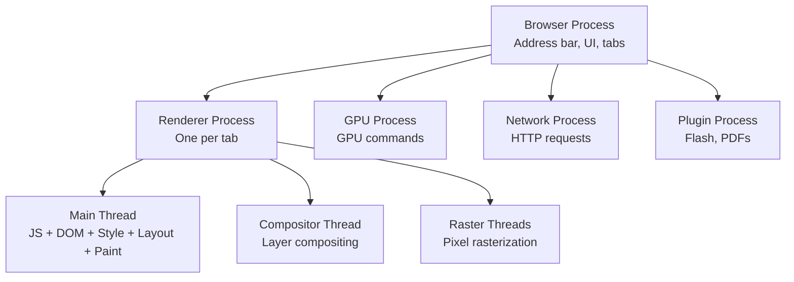
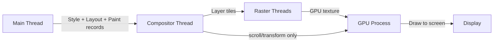
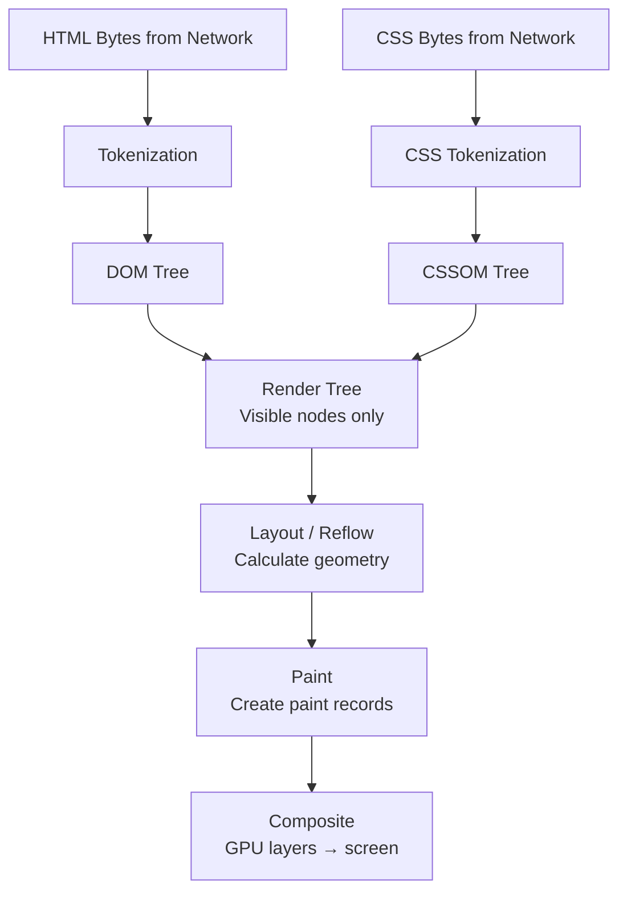
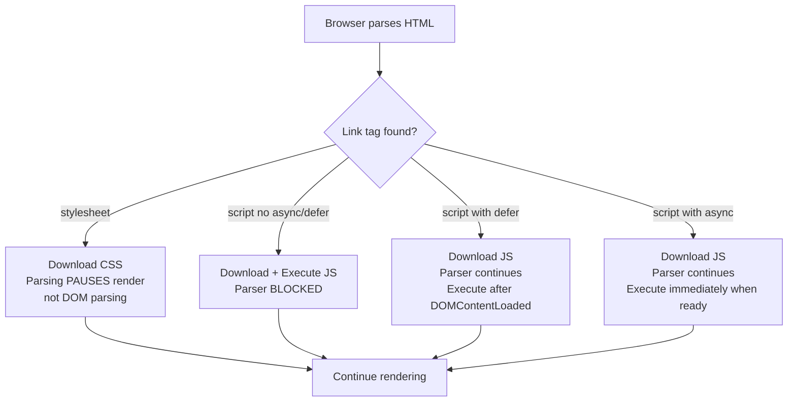
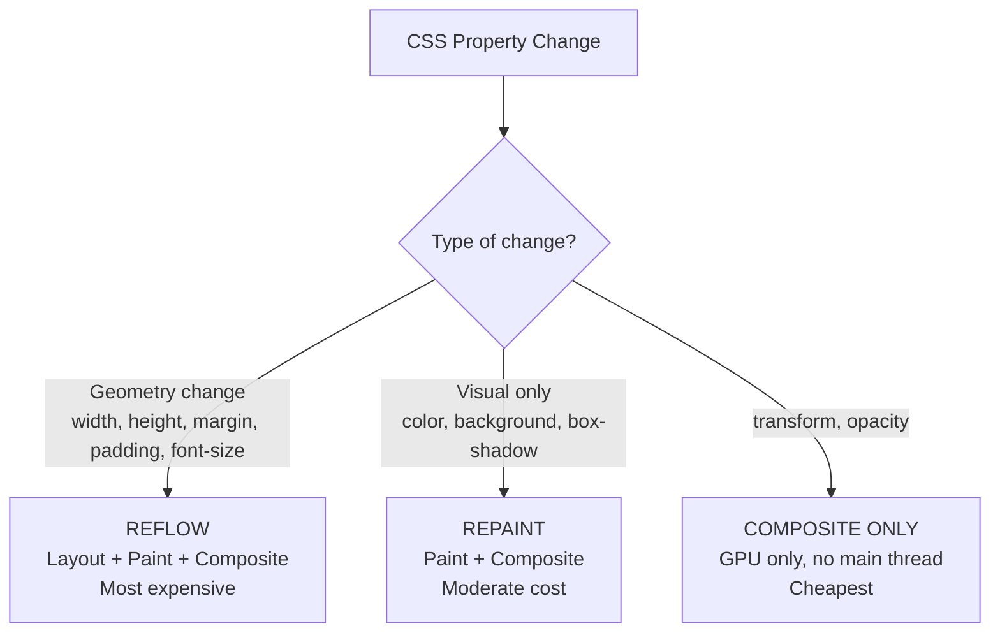

<a id="4-browser-rendering-pipeline"></a>

# Chapter 4: Browser Rendering Pipeline

[⬅ Previous Chapter](#3-javascript-browser-apis-patterns-and-performance) | [📖 Main Index](#main-index) | [Next Chapter ➡](#5-networking-http-and-protocols)

---

## 📌 Learning Objectives

By the end of this chapter, you will:

- **Understand** how browsers work internally — processes, threads, and their responsibilities
- **Explain** the complete Critical Rendering Path from HTML bytes to pixels on screen
- **Distinguish** between Reflow, Repaint, and Composite — and what triggers each
- **Use** GPU acceleration correctly without causing layer explosion
- **Identify** render-blocking resources and fix them with `async`/`defer`
- **Understand** all Core Web Vitals — LCP, CLS, INP, FCP, TTFB — from browser's perspective
- **Read** Chrome DevTools Performance panel, flame charts, and memory snapshots
- **Run** Lighthouse audits and interpret results for performance budgeting
- **Answer** 15+ interview questions on browser performance with confidence

---

<a id="chapter-index-table-4"></a>

## 📑 Chapter Index Table

| Topic No. | Topic Name | Subtopics |
|-----------|-----------|-----------|
| 4.1 | [How Browsers Work — Overview](#41-how-browsers-work-overview) | Browser architecture, processes, threads, main thread, compositor |
| 4.2 | [Critical Rendering Path](#42-critical-rendering-path) | HTML→DOM, CSS→CSSOM, Render Tree, Layout, Paint, Composite, blocking resources |
| 4.3 | [Reflow, Repaint & Composite](#43-reflow-repaint-and-composite) | Triggers, CSS property table, forced synchronous layout, batching |
| 4.4 | [GPU Acceleration](#44-gpu-acceleration) | Layers, will-change, transform, layer explosion |
| 4.5 | [CSSOM & Style Calculation](#45-cssom-and-style-calculation) | Selector performance, specificity, style recalculation |
| 4.6 | [JavaScript & Rendering Interaction](#46-javascript-and-rendering-interaction) | Render blocking, async vs defer, DOMContentLoaded vs load |
| 4.7 | [Web Vitals — Browser Perspective](#47-web-vitals-browser-perspective) | LCP, CLS, INP, FCP, TTFB |
| 4.8 | [Chrome DevTools — Performance](#48-chrome-devtools-performance) | Performance panel, flame chart, long tasks, memory, network waterfall |
| 4.9 | [Lighthouse — Audit Tool](#49-lighthouse-audit-tool) | Running audits, metrics, performance budget, CI integration |
| — | [Interview Questions](#interview-questions-chapter-4) | 15+ Conceptual, Scenario, Output-based |
| — | [Practice Problems](#practice-problems-chapter-4) | 5 Theory Problems |
| — | [Quick Revision](#quick-revision-chapter-4) | Key bullets, traps, cheat sheet |
| — | [Chapter Summary](#chapter-summary-chapter-4) | Most important points |

---

## 4.1 How Browsers Work — Overview

<a id="41-how-browsers-work-overview"></a>

### 🧠 Hinglish Intuition

> Browser ek factory hai. Factory mein alag-alag departments hain — network department, rendering department, JavaScript department. Har department ek alag process ya thread mein kaam karta hai. Chrome ne yeh sab alag-alag kiya taaki ek department crash ho toh poori factory band na ho.

---

### Browser Architecture — Multi-Process Model



#### Why Multiple Processes?

```
ISOLATION:
- Each tab = separate Renderer Process
- If one tab crashes → only that tab dies, browser lives
- Security: cross-origin iframes in separate processes (Site Isolation)

PARALLELISM:
- GPU Process runs parallel to Renderer Process
- Network Process fetches while Renderer renders
- Multiple Raster Threads paint in parallel
```

---

### Main Thread — The Most Important Thread

The **Main Thread** in the Renderer Process does almost everything:

```
Main Thread Responsibilities:
├── Parse HTML → Build DOM
├── Parse CSS → Build CSSOM
├── Execute JavaScript
├── Calculate Styles (Style recalculation)
├── Calculate Layout (Reflow)
├── Create Paint records (Paint)
└── Handle user events (clicks, key presses)
```

> [!IMPORTANT]
> The Main Thread is **single-threaded**. Any long-running JavaScript **blocks** the entire rendering pipeline. This is why we use Web Workers for heavy computation and why `requestAnimationFrame` exists.

---

### Compositor Thread

The **Compositor Thread** works separately from the Main Thread:

```
Compositor Thread:
├── Receives layer information from Main Thread
├── Manages GPU layers (promoted elements)
├── Handles scroll and certain CSS transforms WITHOUT involving Main Thread
├── Sends draw calls to GPU Process
└── Can produce frames even when Main Thread is busy!
```

> [!TIP]
> When you animate using `transform` and `opacity`, the Compositor Thread handles it entirely — the Main Thread is NOT involved. This is why these are the smoothest animations.

---

### Thread Model Visual



👉 <a href="#chapter-index-table-4">Go to Top 🔝</a>

---

## 4.2 Critical Rendering Path

<a id="42-critical-rendering-path"></a>

### 🧠 Hinglish Intuition

> Browser ko HTML milta hai — bytes milte hain. Browser ek carpenter ki tarah hai. Pehle blueprint (DOM + CSSOM) banata hai, phir structure (Render Tree), phir measure karta hai kahan kya jaayega (Layout), phir paint karta hai (Paint), phir GPU pe bhejta hai (Composite). Yeh poora process = Critical Rendering Path.

---

### Complete CRP Flow



---

### Step 1: HTML → DOM Tree

```html
<!-- Source HTML -->
<!DOCTYPE html>
<html>
  <head>
    <link rel="stylesheet" href="styles.css">  <!-- render blocking! -->
    <script src="app.js"></script>              <!-- parser blocking! -->
  </head>
  <body>
    <div class="container">
      <h1>Hello</h1>
      <p>World</p>
    </div>
  </body>
</html>
```

```
DOM Tree:
Document
└── html
    ├── head
    │   ├── link (stylesheet)
    │   └── script
    └── body
        └── div.container
            ├── h1 ("Hello")
            └── p ("World")
```

**How parsing works:**

```
1. Bytes → Characters (decode UTF-8)
2. Characters → Tokens (start tag, end tag, text, comment)
3. Tokens → Nodes (each token becomes a node)
4. Nodes → DOM Tree (establish parent-child relationships)

This is INCREMENTAL — browser renders as it parses!
Browser does not wait for full HTML before starting render.
```

---

### Step 2: CSS → CSSOM Tree

```css
/* styles.css */
body { font-size: 16px; }
.container { margin: 0 auto; width: 800px; }
h1 { font-size: 2em; color: blue; }
p { font-size: 1em; color: gray; }
```

```
CSSOM Tree (computed styles — cascade applied):
html
  body [font-size: 16px]
    div.container [margin: 0 auto, width: 800px, font-size: 16px (inherited)]
      h1 [font-size: 32px (2em × 16px), color: blue]
      p  [font-size: 16px, color: gray]
```

> [!IMPORTANT]
> **CSS is render-blocking!** The browser CANNOT build the Render Tree without CSSOM. It MUST download and parse ALL CSS before rendering begins. This is why CSS should be in `<head>` and loaded ASAP.

---

### Step 3: DOM + CSSOM → Render Tree

```
Render Tree (only VISIBLE nodes):
- 'display: none' nodes → EXCLUDED (not in render tree at all)
- 'visibility: hidden' nodes → INCLUDED (takes up space but invisible)
- <head>, <script>, <style> → EXCLUDED
- ::before, ::after pseudo-elements → INCLUDED

Render Tree:
body
└── div.container [width: 800px, margin: 0 auto]
    ├── h1 [font-size: 32px, color: blue]  → "Hello"
    └── p  [font-size: 16px, color: gray]  → "World"
```

---

### Step 4: Layout (Reflow)

```
Layout calculates exact pixel position and size of every Render Tree node.

Inputs: Render Tree + viewport dimensions
Output: Box model for every element

What Layout calculates:
- x, y position
- width, height
- margin, padding, border
- Overflow, wrapping

Layout is EXPENSIVE — it must calculate relative units (%, em, vw)
and CSS flexbox/grid relationships, which cascade through the tree.
```

```javascript
// Layout is triggered when you access:
element.offsetWidth;   // triggers layout
element.offsetHeight;  // triggers layout
element.clientWidth;   // triggers layout
element.getBoundingClientRect(); // triggers layout
element.scrollTop;     // triggers layout

// Reading these forces browser to flush pending style changes
// and calculate layout synchronously — can kill performance
```

---

### Step 5: Paint

```
Paint = converting Layout output into actual drawing instructions.
Browser creates a "paint record" — a list of drawing calls:

"Draw rectangle at (0,0) size 800x600 color #fff"
"Draw text 'Hello' at (16, 32) font 32px blue"
"Draw text 'World' at (16, 80) font 16px gray"

Paint is done per LAYER (not the whole page).
Different layers are painted separately.
Paint records are sent to Raster Threads.
```

---

### Step 6: Compositing

```
Raster Threads rasterize paint records into bitmaps (textures).
Compositor Thread arranges all layer bitmaps in correct order.
Final frame is sent to GPU → displayed on screen.

Key insight: Only compositing step requires GPU.
Compositor Thread can handle scroll + transform WITHOUT main thread.
```

---

### Blocking vs Non-Blocking Resources

```html
<!-- RENDER BLOCKING — browser must download + parse before rendering -->
<link rel="stylesheet" href="critical.css">     <!-- always blocks render -->
<script src="app.js"></script>                   <!-- blocks HTML parsing + render -->

<!-- PARSER BLOCKING (but not render blocking) -->
<!-- None by default for modern CSS -->

<!-- NON-BLOCKING — don't delay first render -->
<link rel="stylesheet" href="print.css" media="print">     <!-- non-blocking (different media) -->
<link rel="stylesheet" href="portrait.css" media="(orientation: portrait)"> <!-- conditional -->
<script src="app.js" async></script>            <!-- non-blocking parse, runs when ready -->
<script src="app.js" defer></script>            <!-- non-blocking, runs after DOM ready -->
<link rel="preload" href="font.woff2" as="font"> <!-- preload hint, non-blocking -->
```



👉 <a href="#chapter-index-table-4">Go to Top 🔝</a>

---

## 4.3 Reflow, Repaint & Composite

<a id="43-reflow-repaint-and-composite"></a>

### 🧠 Hinglish Intuition

> Socho ghar ko renovate karna. Reflow = poora structure badlo (load-bearing wall todna — sab kuch reset). Repaint = sirf paint karo (deewar ka colour badlo — structure theek hai). Composite = sirf furniture arrange karo (koi construction nahi). Har ek pehle wale se cheaper hai.

---

### What Triggers What



---

### CSS Properties — Complete Comparison Table

| CSS Property | Triggers | Cost |
|-------------|----------|------|
| `width`, `height` | Reflow + Repaint + Composite | 🔴 Expensive |
| `margin`, `padding` | Reflow + Repaint + Composite | 🔴 Expensive |
| `top`, `left`, `right`, `bottom` (positioned) | Reflow + Repaint + Composite | 🔴 Expensive |
| `font-size`, `font-family` | Reflow + Repaint + Composite | 🔴 Expensive |
| `display`, `position` | Reflow + Repaint + Composite | 🔴 Expensive |
| `border-width` | Reflow + Repaint + Composite | 🔴 Expensive |
| `color` | Repaint + Composite | 🟡 Moderate |
| `background-color` | Repaint + Composite | 🟡 Moderate |
| `box-shadow` | Repaint + Composite | 🟡 Moderate |
| `border-color` | Repaint + Composite | 🟡 Moderate |
| `outline` | Repaint + Composite | 🟡 Moderate |
| `visibility` | Repaint + Composite | 🟡 Moderate |
| `transform` | Composite only | 🟢 Cheap (GPU) |
| `opacity` | Composite only | 🟢 Cheap (GPU) |
| `filter` (with GPU layer) | Composite only | 🟢 Cheap (GPU) |
| `will-change` | Creates GPU layer | 🟢 Preparation |

> [!IMPORTANT]
> **Golden Rule for animations:** Only animate `transform` and `opacity`. Everything else triggers reflow or repaint, causing janky animations. Use `translate()` instead of `left/top`, use `scale()` instead of `width/height`.

---

### Forced Synchronous Layout — The Performance Trap

```javascript
// ❌ FORCED SYNCHRONOUS LAYOUT — very expensive!
// This pattern causes "layout thrashing"

function badLoop() {
  const items = document.querySelectorAll('.item');

  items.forEach(item => {
    // READ layout property — browser must flush pending layout changes!
    const width = item.offsetWidth;  // 🔴 FORCES LAYOUT

    // WRITE layout — invalidates layout, schedules new layout
    item.style.width = (width * 2) + 'px'; // 🔴 INVALIDATES LAYOUT
  });
  // Each iteration: read forces layout, write invalidates it → loop = N layouts!
}

// ✅ BATCH reads and writes — only 1 layout calculation!
function goodLoop() {
  const items = document.querySelectorAll('.item');

  // ALL READS FIRST
  const widths = [...items].map(item => item.offsetWidth); // 1 layout calculation

  // ALL WRITES AFTER
  items.forEach((item, i) => {
    item.style.width = (widths[i] * 2) + 'px'; // just schedule, no forced layout
  });
}

// ✅ EVEN BETTER — use requestAnimationFrame to batch
function rafLoop() {
  const items = [...document.querySelectorAll('.item')];
  const widths = items.map(item => item.offsetWidth); // reads

  requestAnimationFrame(() => {
    items.forEach((item, i) => {
      item.style.width = (widths[i] * 2) + 'px'; // writes in rAF
    });
  });
}
```

---

### What Reads Force Layout

```javascript
// Reading ANY of these forces browser to compute layout synchronously:
element.offsetTop, element.offsetLeft
element.offsetWidth, element.offsetHeight
element.offsetParent
element.clientTop, element.clientLeft
element.clientWidth, element.clientHeight
element.scrollTop, element.scrollLeft
element.scrollWidth, element.scrollHeight
element.getBoundingClientRect()
element.getClientRects()
window.innerWidth, window.innerHeight
window.scrollX, window.scrollY
document.scrollingElement.scrollTop
document.elementFromPoint(x, y)
```

---

### Batching DOM Operations

```javascript
// ❌ SLOW — many individual DOM updates
function slowUpdate(data) {
  const list = document.getElementById('list');
  data.forEach(item => {
    const li = document.createElement('li');
    li.textContent = item;
    list.appendChild(li); // each append causes repaint!
  });
}

// ✅ FAST — DocumentFragment batch
function fastUpdate(data) {
  const fragment = document.createDocumentFragment();
  data.forEach(item => {
    const li = document.createElement('li');
    li.textContent = item;
    fragment.appendChild(li); // no repaint — fragment is off-screen
  });
  document.getElementById('list').appendChild(fragment); // ONE DOM update!
}

// ✅ ALSO FAST — innerHTML batch
function fastUpdateHTML(data) {
  const html = data.map(item => `<li>${escapeHTML(item)}</li>`).join('');
  document.getElementById('list').innerHTML = html; // ONE operation
}

// ✅ FAST — classList batch (use cssText or classList.add multiple)
element.style.cssText = 'width: 100px; height: 200px; color: red;'; // ONE repaint
// vs
element.style.width = '100px';   // repaint
element.style.height = '200px';  // repaint
element.style.color = 'red';     // repaint
```

👉 <a href="#chapter-index-table-4">Go to Top 🔝</a>

---

## 4.4 GPU Acceleration

<a id="44-gpu-acceleration"></a>

### 🧠 Hinglish Intuition

> GPU layer ek separate glass sheet hai. Normal elements sab ek sheet pe hain. Jab tum `transform` ya `will-change` use karte ho, browser ek alag glass sheet banata hai us element ke liye. Compositor sirf sheets ko arrange karta hai — main thread ko involve kiye bina. Lekin bahut saari sheets = bahut saari memory = problem.

---

### Creating GPU Layers

```css
/* These CSS properties promote an element to its own GPU compositing layer: */

/* Method 1: transform (most common, recommended) */
.animated {
  transform: translateZ(0);    /* classic "GPU hack" */
  transform: translate3d(0, 0, 0); /* same effect */
}

/* Method 2: will-change (modern, declarative) */
.will-animate {
  will-change: transform;      /* tell browser in advance */
  will-change: opacity;
  will-change: transform, opacity;
}

/* Method 3: opacity < 1 (creates stacking context) */
.faded {
  opacity: 0.99; /* hack — avoid this */
}

/* Method 4: position + z-index */
.overlay {
  position: fixed; /* or sticky, absolute + z-index */
  z-index: 100;
}
```

---

### When GPU Helps vs Hurts

```css
/* ✅ GPU HELPS: smooth animations of transform/opacity */
.smooth-animation {
  will-change: transform;
  transition: transform 0.3s ease;
}
.smooth-animation:hover {
  transform: scale(1.1); /* handled by compositor — no main thread! */
}

/* ✅ GPU HELPS: fixed headers, modals, overlays */
.fixed-header {
  position: fixed;
  will-change: transform; /* browser may promote to GPU layer */
}

/* ❌ GPU HURTS: too many layers = memory waste */
/* Applying will-change to everything */
* { will-change: transform; } /* ❌ NEVER DO THIS */

/* ❌ GPU HURTS: large layers consume lots of texture memory */
.full-page-layer {
  width: 100vw;
  height: 100vh;
  will-change: transform; /* huge GPU texture! */
}
```

---

### Layer Explosion Problem

```javascript
// Chrome DevTools → Layers panel shows all GPU layers

// ❌ LAYER EXPLOSION — too many GPU layers
// Each of these creates a new layer:
document.querySelectorAll('.list-item').forEach(item => {
  item.style.willChange = 'transform'; // 1000 items = 1000 GPU layers!
});

// ✅ FIX: only promote elements that are ABOUT to animate
function startAnimation(element) {
  element.style.willChange = 'transform'; // promote just before
  element.classList.add('animating');
}

function endAnimation(element) {
  element.addEventListener('transitionend', () => {
    element.style.willChange = 'auto'; // demote after animation!
    element.classList.remove('animating');
  }, { once: true });
}

// ✅ FIX: use CSS, promote only during :hover or :active
.card {
  transition: transform 0.2s;
}
.card:hover {
  will-change: transform; /* only promoted when actually hovering */
  transform: translateY(-4px);
}
```

> [!NOTE]
> **Debugging layers:** Chrome DevTools → More Tools → Layers (shows 3D view of all GPU layers). Rendering tab → Layer borders (shows layer boundaries on page). Too many green borders = layer explosion.

👉 <a href="#chapter-index-table-4">Go to Top 🔝</a>

---

## 4.5 CSSOM & Style Calculation

<a id="45-cssom-and-style-calculation"></a>

### 🧠 Hinglish Intuition

> CSS selector matching browser right-to-left karta hai. `.nav .menu li a` selector mein browser pehle `a` dhundta hai, phir check karta hai — kya yeh `li` ke andar hai? Phir kya woh `menu` ke andar hai? Isliye simple selectors zyada fast hain complex se.

---

### CSS Selector Matching Performance

```css
/* Browser matches selectors RIGHT TO LEFT */

/* ❌ SLOW selectors — match many elements first, then filter */
.header .nav ul li a {}
/* Browser: find ALL <a> tags → check each → is it in li? → in ul? → in nav? → in .header? */

div * {}         /* very expensive — matches all elements, checks each */
[type="text"] {} /* attribute selectors — slower than class */
:nth-child(2n+1) {} /* expensive pseudo-class calculation */

/* ✅ FAST selectors — specific, shallow */
.nav-link {}           /* class selector — fast */
#header {}             /* ID — fastest */
.card-title {}         /* single class */
.btn.btn-primary {}    /* two classes — still fast */
```

```javascript
// Rule of thumb for selector performance:
// 1. ID (#id) — fastest
// 2. Class (.class) — very fast
// 3. Element (div, p) — fast
// 4. Attribute ([type]) — slower
// 5. Pseudo-class (:hover, :nth-child) — slowest
// 6. Universal (*) — avoid!

// In practice: with modern browsers, selector performance
// is rarely the bottleneck. Focus on reducing DOM size first.
```

---

### Style Recalculation Triggers

```javascript
// These actions trigger style recalculation:
element.className = 'new-class';      // class change
element.classList.add('active');      // class change
element.style.color = 'red';          // inline style
document.documentElement.style.setProperty('--color', 'blue'); // CSS var change

// Adding/removing stylesheets:
const link = document.createElement('link');
link.rel = 'stylesheet';
link.href = 'new-styles.css';
document.head.appendChild(link); // triggers style recalc after load

// DOM structure changes:
parent.appendChild(newChild);  // triggers recalc
element.remove();              // triggers recalc

// Pseudo-class state changes:
// :hover triggered by mouse movement
// :focus triggered by focus events
// :checked triggered by checkbox state

// Performance tip: use CSS classes, not inline styles
// Batch class changes to minimize recalculations
```

---

### CSS Specificity — Quick Reference

```
Specificity = (inline styles, IDs, Classes/Attributes/Pseudo-classes, Elements)

Inline styles:      (1, 0, 0, 0) = 1000
ID:                 (0, 1, 0, 0) = 100
Class, [attr], :pseudo-class: (0, 0, 1, 0) = 10
Element, ::pseudo-element:    (0, 0, 0, 1) = 1

Examples:
style="color:red"          = (1,0,0,0) — always wins (except !important)
#header .nav li a          = (0,1,1,1) = 112
.nav li.active a:hover     = (0,0,3,2) = 32
div p                      = (0,0,0,2) = 2
* {}                       = (0,0,0,0) = 0

!important overrides all specificity (avoid using!)
```

👉 <a href="#chapter-index-table-4">Go to Top 🔝</a>

---

## 4.6 JavaScript & Rendering Interaction

<a id="46-javascript-and-rendering-interaction"></a>

### 🧠 Hinglish Intuition

> JavaScript parser ko rok sakta hai — jaise ek road pe roadblock. `async` matlab "roadblock hata do, JS apne aap chal jaayega jab ready ho." `defer` matlab "roadblock hata do, JS DOMContentLoaded ke baad chalega." Koi bhi script `<head>` mein bina `async`/`defer` ke = bad idea.

---

### Script Loading Strategies

```html
<!-- SCENARIO 1: Normal script — PARSER BLOCKING -->
<script src="app.js"></script>
<!-- ❌ HTML parsing STOPS until app.js downloads AND executes -->
<!-- Render is blocked too! -->

<!-- SCENARIO 2: async — non-blocking download, executes immediately when ready -->
<script async src="analytics.js"></script>
<!-- ✅ HTML parsing continues during download -->
<!-- ⚠️ Executes as soon as downloaded — order not guaranteed! -->
<!-- ⚠️ DOM might not be ready when it executes -->
<!-- Best for: independent scripts (analytics, ads) -->

<!-- SCENARIO 3: defer — non-blocking download, executes after DOM ready -->
<script defer src="app.js"></script>
<!-- ✅ HTML parsing continues during download -->
<!-- ✅ Executes AFTER HTML parsing complete (before DOMContentLoaded) -->
<!-- ✅ Execution ORDER is preserved for multiple deferred scripts -->
<!-- Best for: scripts that need DOM -->

<!-- SCENARIO 4: Module scripts — defer by default -->
<script type="module" src="app.js"></script>
<!-- ✅ Behaves like defer automatically -->
<!-- ✅ Strict mode, import/export -->
```

---

### Execution Timeline Comparison

```
HTML Parsing:  ████████████████████████████████ Complete
Network:       ████████████████████████████████

NORMAL script (no attr):
HTML: ████|   wait   |████████████████████████
JS:        |download |execute|
              BLOCKED!

ASYNC script:
HTML: ████████████████|  |██████████████████
JS:   |    download   |execute|
      Runs when ready — order not guaranteed

DEFER script:
HTML: ████████████████████████████████
JS:   |    download    |             |execute|
      Runs after DOM ready — order preserved
      Just before DOMContentLoaded fires

MODULE script:
HTML: ████████████████████████████████
JS:   |    download    |             |execute|
      Same as defer + module features
```

---

### DOMContentLoaded vs load Event

```javascript
// DOMContentLoaded — DOM is ready, stylesheets/images may not be
document.addEventListener('DOMContentLoaded', () => {
  console.log('DOM ready!');
  // ✅ Safe to query DOM elements
  // ❌ Images might not be loaded
  // ❌ External stylesheets might not be applied (depends)
});

// load — EVERYTHING loaded: DOM + CSS + images + scripts
window.addEventListener('load', () => {
  console.log('Everything loaded!');
  // ✅ All resources loaded
  // ❌ Later than DOMContentLoaded — don't use for critical UI
});

// ✅ Use DOMContentLoaded for most DOM manipulation
// ✅ Use load for: image dimensions, iframe content, video duration

// readyState — check current document state
document.readyState; // 'loading' | 'interactive' | 'complete'

document.addEventListener('readystatechange', () => {
  if (document.readyState === 'interactive') {
    // Same as DOMContentLoaded
  }
  if (document.readyState === 'complete') {
    // Same as window.load
  }
});
```

---

### JavaScript & Paint Timing

```javascript
// JS changes don't immediately paint — browser batches them

element.style.color = 'red';   // scheduled, not painted yet
element.style.color = 'blue';  // overrides previous — only 'blue' will paint

// Reading layout properties FORCES synchronous layout + style:
element.style.width = '100px'; // write — schedule
element.offsetWidth;           // read — FORCE layout to happen NOW!
element.style.width = '200px'; // write — schedule again

// The forced synchronous layout is very expensive!
// Solution: batch reads before writes (see section 4.3)

// rAF ensures your JS runs before next frame's paint:
requestAnimationFrame(() => {
  // This runs at the start of a frame
  // Any DOM changes here will be painted in THIS frame
  element.style.transform = 'translateX(100px)';
});
```

👉 <a href="#chapter-index-table-4">Go to Top 🔝</a>

---

## 4.7 Web Vitals — Browser Perspective

<a id="47-web-vitals-browser-perspective"></a>

### 🧠 Hinglish Intuition

> Web Vitals browser ke report card hain. LCP = hero image ya heading kitni jaldi dikhi. CLS = page load ke time kitna layout shift hua (irritating jumps). INP = button click ke baad kitni jaldi response mila. Yeh sab Google ranking mein use hote hain — isliye developer ke liye important hain.

---

### Overview Table

| Metric | Full Name | Good | Needs Improvement | Poor | Measures |
|--------|-----------|------|-------------------|------|---------|
| **LCP** | Largest Contentful Paint | ≤ 2.5s | 2.5–4.0s | > 4.0s | Loading performance |
| **CLS** | Cumulative Layout Shift | ≤ 0.1 | 0.1–0.25 | > 0.25 | Visual stability |
| **INP** | Interaction to Next Paint | ≤ 200ms | 200–500ms | > 500ms | Interactivity |
| **FCP** | First Contentful Paint | ≤ 1.8s | 1.8–3.0s | > 3.0s | First content |
| **TTFB** | Time to First Byte | ≤ 800ms | 800ms–1.8s | > 1.8s | Server response |

---

### LCP — Largest Contentful Paint

```
What LCP measures: When was the LARGEST visible element painted?
LCP candidates: , <video poster>, CSS background-image, block-level text

How browser determines LCP:
1. Track all "content" elements as they load
2. Find the one with largest area in viewport
3. Record its paint time
4. LCP can change multiple times (updates as larger elements appear)
5. LCP is "finalized" when user first interacts (scroll, click, keypress)

Common LCP elements:
- Hero images
- Large text headings
- Above-the-fold product images
- Video poster frames
```

```html
<!-- ✅ Optimize LCP: -->
<!-- 1. Preload the LCP image -->
<link rel="preload" as="image" href="hero.jpg">

<!-- 2. Priority hint for LCP image -->


<!-- 3. Avoid lazy loading LCP image! -->
<!-- ❌ Bad: -->

<!-- ✅ Good (no lazy for LCP): -->


<!-- 4. Serve correct size, modern format -->

```

---

### CLS — Cumulative Layout Shift

```
What CLS measures: Total unexpected layout shift score across page lifetime

Layout shift = element moves unexpectedly (not due to user action)
Score formula: impact fraction × distance fraction per shift
Cumulative = sum of all shift scores (with session windowing in v2)

Common CLS causes:
❌ Images without width/height attributes (reserves no space)
❌ Ads/embeds without reserved space
❌ Dynamically injected content above existing content
❌ Web fonts causing FOUT (Flash of Unstyled Text)
❌ Animations that change layout (top, left, width, height)
```

```html
<!-- ✅ Fix CLS: -->
<!-- 1. Always specify image dimensions -->

<!-- OR: use aspect-ratio CSS -->


<!-- 2. Reserve space for ads -->
<div style="min-height: 90px; width: 728px;">
  <!-- Ad will load here -->
</div>

<!-- 3. Use font-display: optional or swap + size-adjust -->
@font-face {
  font-family: 'MyFont';
  src: url('font.woff2') format('woff2');
  font-display: optional; /* don't show fallback — prevent FOUT shift */
}

<!-- 4. Use transform instead of position for animations -->
/* ❌ Causes CLS: */
.slide { animation: slideIn 0.3s; }
@keyframes slideIn { from { top: -100px; } to { top: 0; } }

/* ✅ No CLS: */
.slide { animation: slideIn 0.3s; }
@keyframes slideIn { from { transform: translateY(-100px); } to { transform: translateY(0); } }
```

---

### INP — Interaction to Next Paint

```
Replaced FID (First Input Delay) in March 2024.

What INP measures: Longest interaction-to-paint delay across ALL interactions
(clicks, key presses, taps — not hover, scroll)

INP = max(interaction duration) at 98th percentile

Interaction duration = event processing time + rendering time + painting time

Common INP causes:
❌ Long JavaScript tasks on main thread during interaction
❌ Heavy event handlers
❌ Synchronous XHR (avoid!)
❌ Excessive DOM size (slow style calculations)
❌ Heavy rendering work after interaction
```

```javascript
// ✅ Fix INP:
// 1. Break up long tasks with scheduler
async function handleComplexClick() {
  // Do part 1
  doPartOne();

  // Yield to browser — let it paint and handle other events
  await new Promise(resolve => setTimeout(resolve, 0));
  // OR: await scheduler.postTask(() => {}, { priority: 'background' });

  // Do part 2
  doPartTwo();
}

// 2. Use web workers for computation
button.addEventListener('click', () => {
  worker.postMessage({ type: 'COMPUTE', data: largeData });
  // Main thread free immediately — good INP!
});

// 3. Debounce expensive operations triggered by interaction
const handleInput = debounce(processInput, 100);
```

---

### FCP & TTFB

```
FCP — First Contentful Paint:
- When browser paints FIRST content (text, image, SVG, canvas)
- Measures loading experience — "is something happening?"
- Affected by: TTFB, render-blocking resources, connection speed

TTFB — Time to First Byte:
- Time from request to first byte of response received
- Measures server performance
- Affected by: server processing, CDN, network latency
- Fix: CDN, server caching, faster hosting, edge functions

TTFB → FCP → LCP → Page Load
 ↑         ↑         ↑
Server   First     Main
speed    paint     content

Measuring with PerformanceObserver:
```

```javascript
// Measure all Core Web Vitals:
const observer = new PerformanceObserver((list) => {
  for (const entry of list.getEntries()) {
    console.log(entry.name, entry.startTime, entry.value || entry.duration);
  }
});

observer.observe({ type: 'largest-contentful-paint', buffered: true });
observer.observe({ type: 'layout-shift', buffered: true });
observer.observe({ type: 'first-input', buffered: true });
observer.observe({ type: 'paint', buffered: true }); // FCP

// Or use web-vitals library (recommended for production):
import { getLCP, getCLS, getINP, getFCP, getTTFB } from 'web-vitals';
getLCP(metric => sendToAnalytics(metric));
getCLS(metric => sendToAnalytics(metric));
getINP(metric => sendToAnalytics(metric));
```

👉 <a href="#chapter-index-table-4">Go to Top 🔝</a>

---

## 4.8 Chrome DevTools — Performance

<a id="48-chrome-devtools-performance"></a>

### 🧠 Hinglish Intuition

> Chrome DevTools Performance panel ek X-ray machine hai tumhari website ke liye. Jo andar ho raha hai — JS execution, style recalc, layout, paint — sab dikhta hai. Flame chart = ek pyramid — neeche jo hai woh upar wale ne call kiya. Long red tasks = problem.

---

### Performance Panel — Recording & Reading

```
How to record:
1. Open DevTools (F12 or Cmd+Opt+I)
2. Go to Performance tab
3. Click Record (⏺) or press Ctrl+Shift+E
4. Interact with page
5. Stop recording

OR for page load:
1. Performance tab
2. Click reload button (⟳) in DevTools
3. Records automatically during page load

Key sections in recording:
┌─────────────────────────────────────┐
│ FPS/CPU/NET timeline (top)          │
│ Main thread activity (middle)        │
│ Frames, Timings (bottom)            │
└─────────────────────────────────────┘

FPS chart:
- Green bars = frames rendered
- Red bars = dropped frames (janky!)
- Gaps = no frames rendered

CPU chart:
- Yellow = JS execution
- Purple = Style/Layout
- Green = Paint
- Gray = Other/Idle

Flame chart reading:
- Each bar = function call
- Width = duration
- Height = call stack depth
- Long bars at top = slow functions
- Click to see source location
```

---

### Flame Chart Reading

```
Flame Chart (call tree visualized):

main → handleClick → processData → filterItems → sortResults
|___________________________________|
         handleClick: 150ms total

Stack:
sortResults (8ms)
filterItems (20ms)
processData (120ms)
handleClick (150ms)
main

The WIDE bars at the bottom are the callers.
The NARROW bars on top are individual operations.
Red bars = "Long tasks" (>50ms) — should be broken up!

Reading strategy:
1. Find the widest bar (most time)
2. Click on it to zoom in
3. Find which function inside is slow
4. Look for patterns (repeated calls, unexpected depth)
```

---

### Long Tasks Identification

```javascript
// A "Long Task" = any main thread task > 50ms
// Long tasks block input responsiveness (bad INP!)

// DevTools shows Long Tasks in Performance panel:
// Red bar with diagonal stripes = long task

// Programmatically detect:
const observer = new PerformanceObserver((list) => {
  list.getEntries().forEach(entry => {
    if (entry.duration > 50) {
      console.warn(`Long task detected: ${entry.duration.toFixed(0)}ms`);
      console.log('Attribution:', entry.attribution);
    }
  });
});
observer.observe({ type: 'longtask', buffered: true });

// Fix long tasks by "yielding":
async function processLargeList(items) {
  for (let i = 0; i < items.length; i++) {
    processItem(items[i]);

    // Yield every 50 items to let browser breathe:
    if (i % 50 === 0) {
      await new Promise(resolve => setTimeout(resolve, 0));
    }
  }
}
```

---

### Memory Panel — Heap Snapshots

```
Memory panel — find memory leaks:

1. Take Heap Snapshot (before)
2. Perform action (navigate, click, etc.)
3. Take another Heap Snapshot (after)
4. Compare — look for objects that grew unexpectedly

Key memory types shown:
- Shallow size: memory of object itself
- Retained size: memory that would be freed if object was GC'd

Red objects = GC roots preventing collection
Detached DOM nodes = biggest leak indicator!

"Detached HTMLDivElement" = element removed from DOM
but still referenced by JS → MEMORY LEAK

Common leak patterns in DevTools:
- Growing "Array" or "Object" after each action
- Detached DOM tree growing
- EventListener count growing
```

---

### Network Waterfall Analysis

```
Network panel Waterfall column shows request timeline:

Color coding:
Queued (white) → DNS (dark green) → Connection (orange) →
SSL (purple) → Waiting/TTFB (green) → Content Download (blue)

What to look for:
- Long TTFB (green) = slow server
- Long content download (blue) = large file or slow network
- Many parallel requests = check if all are needed
- Render-blocking requests at top (red dot in timeline)
- Cascading waterfall = sequential deps (bad)
- Parallel waterfall = good resource loading

Priority:
- Highest (orange) = render-blocking CSS, preloaded resources
- High (red) = early scripts, fonts
- Medium (yellow) = images
- Low (blue) = defer/async scripts, fetch

Optimizations visible in waterfall:
- Preload: resources start earlier
- HTTP/2: parallel requests without connection limit
- CDN: reduced latency (shown in shorter DNS/connection times)
```

---

### Rendering Tab — Paint Flashing

```
DevTools → More Tools → Rendering → Check options:

"Paint flashing" (green overlay):
- Highlights areas being repainted in GREEN
- More green = more repaints = bad
- Goal: only repaint changed areas

"Layout Shift Regions" (blue overlay):
- Shows which elements cause CLS
- Helps identify CLS causes

"Layer borders" (orange/cyan):
- Shows GPU compositing layers
- Too many layers = layer explosion

"FPS meter":
- Real-time FPS counter on page
- Shows when frames drop below 60fps

"Scrolling performance issues":
- Red highlights elements that slow scrolling
- Common cause: non-passive scroll listeners
```

👉 <a href="#chapter-index-table-4">Go to Top 🔝</a>

---

## 4.9 Lighthouse — Audit Tool

<a id="49-lighthouse-audit-tool"></a>

### 🧠 Hinglish Intuition

> Lighthouse ek automated tester hai. Tumhara page simulate karta hai 3G phone pe, report deta hai — kya galat hai, kaise fix karo, score kya hai. Performance budget set karo aur CI mein run karo — deployment se pehle performance regression pakad lo.

---

### Running Lighthouse Audits

```
Method 1: Chrome DevTools
1. DevTools → Lighthouse tab
2. Select: Performance, Accessibility, Best Practices, SEO, PWA
3. Choose: Mobile or Desktop
4. Click "Analyze page load"

Method 2: CLI
npm install -g lighthouse
lighthouse https://example.com --output html --output-path report.html

# With specific settings:
lighthouse https://example.com \
  --only-categories=performance \
  --throttling-method=simulate \
  --emulated-form-factor=mobile \
  --output=json

Method 3: PageSpeed Insights (Google)
https://pagespeed.web.dev
- Shows real-world (CrUX data) AND lab data
- Free, no installation needed

Method 4: web.dev/measure
https://web.dev/measure
- Similar to PSI, more developer-focused
```

---

### Interpreting Lighthouse Metrics

```
Lighthouse Performance Score = weighted average:

Metric               Weight
────────────────────────────
FCP                  10%
Speed Index          10%
LCP                  25%
TBT (Total Blocking Time)  30%
CLS                  25%

TBT = sum of blocking time for all Long Tasks between FCP and TTI
     (tasks > 50ms count their excess time above 50ms)

Score ranges:
0-49:  🔴 Poor
50-89: 🟡 Needs improvement
90+:   🟢 Good

Key opportunities Lighthouse shows:
- "Eliminate render-blocking resources" (add defer/async)
- "Properly size images" (responsive images)
- "Remove unused JavaScript" (code splitting)
- "Remove unused CSS" (PurgeCSS)
- "Enable text compression" (gzip/brotli)
- "Preconnect to required origins" (preconnect hints)
- "Serve images in next-gen formats" (WebP/AVIF)
- "Reduce initial server response time" (TTFB fix)
```

---

### Performance Budget

```javascript
// Performance budget = limits on resource sizes and timing metrics
// Lighthouse supports budgets via budget.json:

// budget.json
[
  {
    "path": "/*",
    "timings": [
      { "metric": "first-contentful-paint", "budget": 1800 },
      { "metric": "largest-contentful-paint", "budget": 2500 },
      { "metric": "cumulative-layout-shift", "budget": 0.1 },
      { "metric": "interactive", "budget": 3500 }
    ],
    "resourceSizes": [
      { "resourceType": "script", "budget": 150 },     // max 150KB JS
      { "resourceType": "stylesheet", "budget": 50 },  // max 50KB CSS
      { "resourceType": "image", "budget": 500 },      // max 500KB images
      { "resourceType": "total", "budget": 800 }       // max 800KB total
    ],
    "resourceCounts": [
      { "resourceType": "third-party", "budget": 10 }  // max 10 third-party requests
    ]
  }
]

// Run with budget:
lighthouse https://example.com --budget-path=budget.json
```

---

### CI Integration with Lighthouse

```yaml
# GitHub Actions — Lighthouse CI
# .github/workflows/lighthouse.yml

name: Lighthouse CI
on: [push, pull_request]

jobs:
  lighthouse:
    runs-on: ubuntu-latest
    steps:
      - uses: actions/checkout@v3

      - name: Setup Node
        uses: actions/setup-node@v3
        with:
          node-version: 18

      - name: Install dependencies
        run: npm ci

      - name: Build
        run: npm run build

      - name: Run Lighthouse CI
        uses: treosh/lighthouse-ci-action@v10
        with:
          urls: |
            http://localhost:3000/
            http://localhost:3000/about
          budgetPath: ./budget.json
          uploadArtifacts: true
          temporaryPublicStorage: true
```

```javascript
// lighthouserc.js — Lighthouse CI configuration
module.exports = {
  ci: {
    collect: {
      startServerCommand: 'npm start',
      url: ['http://localhost:3000'],
      numberOfRuns: 3
    },
    assert: {
      assertions: {
        'categories:performance': ['error', { minScore: 0.9 }],
        'categories:accessibility': ['warn', { minScore: 0.9 }],
        'first-contentful-paint': ['error', { maxNumericValue: 1800 }],
        'largest-contentful-paint': ['error', { maxNumericValue: 2500 }],
        'cumulative-layout-shift': ['error', { maxNumericValue: 0.1 }]
      }
    },
    upload: {
      target: 'temporary-public-storage'
    }
  }
};
```

> [!TIP]
> Run Lighthouse 3+ times and take the median — results vary due to network conditions and background processes. Always use "throttled" mobile mode for realistic production scores.

👉 <a href="#chapter-index-table-4">Go to Top 🔝</a>

---

<a id="interview-questions-chapter-4"></a>

## 💡 Interview Questions

### Conceptual Questions

**Q1. What is the Critical Rendering Path and why does it matter for performance?**

> **Answer:** The Critical Rendering Path (CRP) is the sequence of steps browsers take to convert HTML, CSS, and JavaScript into pixels: HTML → DOM, CSS → CSSOM, DOM+CSSOM → Render Tree, Layout, Paint, Composite. It matters because **every step must complete before anything appears on screen**. Optimizing CRP means: eliminating render-blocking resources, minimizing CSS and HTML bytes, deferring non-critical JavaScript. Faster CRP = faster FCP and LCP = better user experience and Google ranking.

---

**Q2. What is the difference between Reflow, Repaint, and Composite? Which is most expensive?**

> **Answer:**
> - **Reflow (Layout)** — browser recalculates geometry (position, size) of elements. Cascades through DOM. Most expensive — O(n) or worse. Triggered by: changing width/height, margin, font-size, display.
> - **Repaint (Paint)** — browser redraws pixels. No geometry change. Moderate cost. Triggered by: changing color, background, visibility, box-shadow.
> - **Composite** — browser rearranges GPU layers. No main thread work. Cheapest. Triggered by: transform, opacity on promoted elements.
>
> **Reflow is most expensive** — it invalidates the entire layout subtree. Always prefer `transform`/`opacity` for animations to stay in composite-only path.

---

**Q3. What is "Forced Synchronous Layout" and how do you prevent it?**

> **Answer:** Forced Synchronous Layout (also called "layout thrashing") occurs when JavaScript reads a layout property (like `offsetWidth`, `getBoundingClientRect()`) after making DOM changes. The browser must flush all pending style/layout changes synchronously before returning the value. In a loop, this causes N separate layout calculations instead of one.
>
> **Prevention:** Batch all reads before writes. Read properties first, store values, then apply all writes. Use `requestAnimationFrame` to separate read and write phases. Use FastDOM library for automatic batching.

---

**Q4. What is the difference between `async` and `defer` script attributes?**

> **Answer:** Both prevent script from blocking HTML parsing during download.
> - **`async`** — executes immediately when downloaded, regardless of DOM state. Order not guaranteed for multiple async scripts. Best for: independent scripts (analytics, ads).
> - **`defer`** — executes after HTML parsing completes, just before `DOMContentLoaded`. Order IS guaranteed for multiple deferred scripts. Best for: scripts that need DOM ready.
>
> **Rule:** Use `defer` for application scripts, `async` for independent third-party scripts. Without either, script blocks HTML parser entirely.

---

**Q5. How does the browser determine the LCP element?**

> **Answer:** Browser tracks all "content" elements as they render — specifically: ``, `<video>` poster, CSS background-image, and block-level text elements. It measures the **pixel area** of each rendered candidate within the viewport. The LCP candidate is the one with the largest area. LCP can update multiple times as larger elements load. It's "finalized" when the user first interacts (scroll, click, keypress) — because user interaction means they can see the page. For most sites, LCP is the hero image or the largest heading.

---

**Q6. What causes CLS and how do you fix it?**

> **Answer:** CLS (Cumulative Layout Shift) measures unexpected visual shifts. Common causes and fixes:
> 1. **Images without dimensions** → Always set `width`/`height` or use `aspect-ratio`
> 2. **Ads/embeds** → Reserve space with `min-height`
> 3. **Dynamic content inserted above** → Don't inject content above existing content unless user triggered
> 4. **Web fonts (FOUT)** → Use `font-display: optional` or `size-adjust` to match fallback metrics
> 5. **Animations changing layout properties** → Use `transform` instead of `top/left/width/height`

---

**Q7. What is `will-change` and when should you use it?**

> **Answer:** `will-change` is a CSS hint telling the browser that an element will be animated, so it should promote it to a GPU compositing layer in advance. This prevents the promotion from happening mid-animation (which can cause a frame drop). **When to use:** Only on elements that WILL animate, added just before animation starts and removed after. **When NOT to use:** On every element (layer explosion), on large elements (wastes GPU memory), on static elements. Modern best practice: let the browser decide via the animating property itself (transform/opacity already get promoted).

---

**Q8. What is the difference between `DOMContentLoaded` and `load` events?**

> **Answer:** `DOMContentLoaded` fires when the HTML has been fully parsed and the DOM is ready — stylesheets, images, and subframes may still be loading. `load` fires when everything has finished loading — all resources including images, stylesheets, scripts, and iframes. Use `DOMContentLoaded` for most DOM manipulation (it fires earlier). Use `load` only when you specifically need resources to be available (e.g., reading image dimensions, getting video duration).

---

**Q9. How do you identify and fix Long Tasks?**

> **Answer:** Long Tasks are main thread tasks taking more than 50ms. They're visible in Chrome DevTools Performance panel as red bars with diagonal stripes. Programmatically detected via `PerformanceObserver` with `type: 'longtask'`. 
>
> **Fixes:** (1) Break up work with `setTimeout(0)` or `scheduler.yield()`, (2) Move heavy computation to Web Workers, (3) Use `requestIdleCallback` for non-urgent work, (4) Virtualize long lists, (5) Code-split JavaScript bundles.

---

### Scenario Questions

**Q10. A user reports that the page feels janky during scroll. How would you investigate?**

> **Answer:** 
> 1. Open Chrome DevTools → Performance tab → Record during scroll
> 2. Check FPS chart — are there frame drops (red areas)?
> 3. Look at Main thread during scroll — purple (Layout) or green (Paint) = problem
> 4. Check for scroll event listeners without `passive: true` (blocks Compositor)
> 5. Rendering tab → Paint flashing — look for excessive green
> 6. Look for long `scroll` event handlers running > 16ms
>
> **Common fixes:**
> - Add `{passive: true}` to scroll listeners
> - Debounce/throttle scroll handlers
> - Use IntersectionObserver instead of scroll events
> - Remove fixed backgrounds (`background-attachment: fixed` = expensive)
> - Use `will-change: transform` on sticky headers

---

**Q11. How would you optimize the LCP of a landing page?**

> **Answer:** 
> 1. **Identify LCP element** via DevTools → Performance → "Largest Contentful Paint" in timings
> 2. **Preload LCP image:** `<link rel="preload" as="image" href="hero.jpg">`
> 3. **Add fetchpriority:** ``
> 4. **Remove lazy loading from LCP image** — never `loading="lazy"` on LCP
> 5. **Optimize image:** WebP/AVIF, correct dimensions, proper compression
> 6. **Reduce TTFB:** CDN, server caching
> 7. **Eliminate render-blocking CSS** that delays LCP image
> 8. **Preconnect to image origin:** `<link rel="preconnect" href="https://cdn.example.com">`

---

### Output Questions

**Q12. In what order do these events fire?**

```javascript
document.addEventListener('DOMContentLoaded', () => console.log('A'));
window.addEventListener('load', () => console.log('B'));
// <script defer> containing: console.log('C');
// <link rel="stylesheet"> loaded
```

<details>
<summary>Answer</summary>

```
C  ← defer script runs after parsing, before DOMContentLoaded
A  ← DOMContentLoaded fires after DOM ready + deferred scripts
B  ← load fires after everything (CSS, images, etc.) loaded
```

</details>

---

**Q13. Which of these will cause Reflow?**

```javascript
// A
element.style.color = 'red';

// B
element.style.width = '200px';

// C
element.style.transform = 'translateX(100px)';

// D
element.style.opacity = '0.5';

// E
element.getBoundingClientRect();
```

<details>
<summary>Answer</summary>

```
A — Repaint only (color change)
B — Reflow (geometry change — width)
C — Composite only (transform = GPU layer)
D — Composite only (opacity)
E — Forced synchronous layout (read forces layout flush)
```

</details>

---

**Q14. What's wrong with this code and how do you fix it?**

```javascript
const boxes = document.querySelectorAll('.box');
boxes.forEach(box => {
  const height = box.offsetHeight;  // read
  box.style.height = height * 2 + 'px'; // write
});
```

<details>
<summary>Answer</summary>

**Problem:** Layout thrashing — each iteration reads (forces layout) then writes (invalidates layout) — causes N layout recalculations.

**Fix:**
```javascript
const boxes = [...document.querySelectorAll('.box')];
// All reads first:
const heights = boxes.map(box => box.offsetHeight);
// All writes after:
boxes.forEach((box, i) => {
  box.style.height = heights[i] * 2 + 'px';
});
// Only 1 layout calculation!
```

</details>

---

**Q15. A page has a Lighthouse performance score of 45. What are the first things you would check?**

<details>
<summary>Answer</summary>

```
In priority order:

1. LCP > 4s? → Preload LCP image, add fetchpriority="high", optimize image
2. TBT > 600ms? → Look for long tasks, split JS bundles, defer non-critical JS
3. CLS > 0.25? → Add image dimensions, reserve space for ads
4. Render-blocking resources? → Add defer/async to scripts, inline critical CSS
5. Large JS bundles? → Code split, tree shake, remove unused JS
6. Large images? → Convert to WebP/AVIF, resize correctly
7. No compression? → Enable gzip/brotli on server
8. High TTFB? → Use CDN, implement server caching
9. No resource hints? → Add preconnect, preload for critical resources
10. Unused CSS? → PurgeCSS, remove unused stylesheets
```

</details>

👉 <a href="#chapter-index-table-4">Go to Top 🔝</a>

---

<a id="practice-problems-chapter-4"></a>

## 🧪 Practice Problems

### Theory Questions

**T1. Critical Rendering Path Analysis**

Given this HTML, identify all render-blocking resources and explain exactly what blocks what:

```html
<!DOCTYPE html>
<html>
<head>
  <link rel="stylesheet" href="styles.css">
  <link rel="stylesheet" href="print.css" media="print">
  <script src="tracking.js"></script>
  <script src="app.js" defer></script>
  <script src="polyfill.js" async></script>
</head>
<body>
  
  
</body>
</html>
```

<details>
<summary>Answer</summary>

```
RENDER BLOCKING:
✅ styles.css — render blocking (all CSS blocks render)
✅ tracking.js — parser AND render blocking (no async/defer)

NON-BLOCKING:
✅ print.css — NOT blocking (media="print" — different media)
✅ app.js defer — NOT parser blocking (downloads in parallel, runs after DOM)
✅ polyfill.js async — NOT parser blocking (runs when ready, order not guaranteed)

IMAGES:
✅ hero.jpg loading="lazy" — won't load until near viewport
✅ logo.png — loads normally (not lazy)

RECOMMENDATION:
- Move tracking.js to defer or async
- Consider inlining critical CSS from styles.css
- Preload logo.png if above fold: <link rel="preload" as="image" href="logo.png">
```

</details>

---

**T2. Identify Performance Issues**

Analyze this code for browser performance problems:

```javascript
function updateAllItems() {
  const items = document.querySelectorAll('.item');

  for (let i = 0; i < items.length; i++) {
    items[i].style.display = 'none';
    const height = items[i].parentElement.offsetHeight;
    items[i].style.height = height + 'px';
    items[i].style.display = 'block';
    items[i].style.backgroundColor = i % 2 === 0 ? 'white' : 'grey';
  }
}
```

<details>
<summary>Answer</summary>

```
Problems:
1. Layout thrashing — each iteration:
   - style.display = 'none' → invalidates layout
   - offsetHeight → forces synchronous layout!
   - style.height → invalidates again
   - style.display = 'block' → invalidates again
   = 4 layout-triggering operations × N items = very expensive

2. Multiple style changes causing multiple repaints:
   - Separate style.display, style.height, style.backgroundColor changes

Fix:
function updateAllItems() {
  const items = [...document.querySelectorAll('.item')];

  // ALL reads first (1 layout calculation):
  const heights = items.map(item => item.parentElement.offsetHeight);

  // Batch writes — use cssText to minimize repaints:
  items.forEach((item, i) => {
    item.style.cssText = `
      height: ${heights[i]}px;
      background-color: ${i % 2 === 0 ? 'white' : 'grey'};
    `;
  });
}
```

</details>

---

**T3. GPU Layer Decision**

For each scenario, decide whether to use `will-change: transform` or not:

```
A) A button that scales on :hover
B) A modal that slides in once when opened
C) Every card in a 100-card grid
D) A sticky navigation header
E) An image that never moves
F) A progress bar that changes width
```

<details>
<summary>Answer</summary>

```
A) Button :hover scale:
   ✅ Add will-change in :hover CSS (promoted only while hovering)

B) Modal slide-in (once):
   ✅ Add will-change before animation, remove after
   JS: el.style.willChange = 'transform'; → animate → el.style.willChange = 'auto';

C) Every card in 100-card grid:
   ❌ DON'T add will-change to all — layer explosion!
   Only add when individual card is being animated

D) Sticky navigation:
   ✅ will-change: transform — browser will try to keep on GPU layer
   (scroll is handled by compositor — sticky elements benefit)

E) Static image that never moves:
   ❌ No benefit — wastes GPU memory

F) Progress bar changing width:
   ❌ width change = reflow. Fix: use transform: scaleX() instead
   Then ✅ will-change: transform on progress bar
```

</details>

---

**T4. Web Vitals Diagnosis**

A website has these metrics. Diagnose the issue for each and suggest ONE fix:

```
LCP: 5.2s  (Poor)
CLS: 0.32  (Poor)
INP: 380ms (Needs Improvement)
FCP: 1.2s  (Good)
TTFB: 180ms (Good)
```

<details>
<summary>Answer</summary>

```
LCP: 5.2s — Poor
Diagnosis: LCP element loads late despite fast FCP/TTFB.
TTFB is fine, FCP is fine → issue is the LCP resource itself.
Fix: Preload the LCP image: <link rel="preload" as="image" href="hero.jpg">
+ Add fetchpriority="high" to the img tag
+ Remove loading="lazy" if present on LCP image

CLS: 0.32 — Poor
Diagnosis: Content is shifting significantly after initial load.
Fix: Add width and height to images.
OR: Check for ads/embeds without reserved space.
OR: Check for late-loading fonts causing text to reflow.

INP: 380ms — Needs Improvement
Diagnosis: User interactions are slow to respond.
FCP/LCP are fine → rendering is OK → issue is event handling.
Fix: Profile interaction in DevTools → find slow event handler.
Break up long synchronous work with setTimeout/scheduler.yield.
Move computation to Web Worker if possible.

FCP: 1.2s — Good (no action needed)
TTFB: 180ms — Good (no action needed)
```

</details>

---

**T5. Lighthouse Score Improvement Plan**

A Next.js e-commerce site has Lighthouse score of 62 on mobile. List a prioritized action plan (minimum 8 actions):

<details>
<summary>Answer</summary>

```
Priority 1 (Biggest impact):
1. Code splitting — ensure dynamic import() for route-level JS
   Impact: reduces TBT significantly
   
2. Preload LCP product image
   <link rel="preload" as="image" href="product-hero.jpg">
   Impact: improves LCP

3. Add image dimensions to prevent CLS
   All  must have width and height
   Impact: improves CLS

Priority 2 (Medium impact):
4. Enable Brotli/gzip compression on server
   Impact: reduces JS/CSS transfer size by 70-80%

5. Use next/image for automatic optimization
   WebP conversion, responsive sizes, lazy loading
   Impact: improves LCP, reduces bytes

6. Defer non-critical third-party scripts
   Analytics, chat widgets — add defer or load after user interaction
   Impact: reduces TBT

7. Remove unused CSS with PurgeCSS or Tailwind's built-in purge
   Impact: reduces render-blocking CSS size

Priority 3 (Fine-tuning):
8. Add preconnect for external resources
   <link rel="preconnect" href="https://fonts.googleapis.com">
   Impact: reduces connection time

9. Implement proper caching headers
   Cache-Control: max-age=31536000 for hashed assets
   Impact: improves repeat visits

10. Self-host fonts or use font-display: swap
    Impact: reduces CLS and FCP
```

</details>

👉 <a href="#chapter-index-table-4">Go to Top 🔝</a>

---

<a id="quick-revision-chapter-4"></a>

## ⚡ Quick Revision

### Critical Rendering Path — Quick Reference

```
HTML bytes → DOM
CSS bytes  → CSSOM
DOM + CSSOM → Render Tree (visible elements only)
Render Tree → Layout (geometry calculations)
Layout → Paint (drawing instructions)
Paint → Composite (GPU layers → screen)
```

### CSS Property Cost Reference

```
🔴 REFLOW:   width, height, margin, padding, top, left, font-size, display
🟡 REPAINT:  color, background, box-shadow, outline, visibility
🟢 COMPOSITE: transform, opacity (on GPU layer elements)
```

### Script Loading Quick Reference

```
<script>           → Blocks parser + render
<script async>     → Downloads in parallel, executes when ready (order ?)
<script defer>     → Downloads in parallel, executes after DOM (order ✅)
<script type="module"> → Like defer + module features
```

### Web Vitals Quick Reference

```
LCP ≤ 2.5s  → Largest Contentful Paint (loading)
CLS ≤ 0.1   → Cumulative Layout Shift (stability)
INP ≤ 200ms → Interaction to Next Paint (interactivity)
FCP ≤ 1.8s  → First Contentful Paint (first content)
TTFB ≤ 800ms → Time to First Byte (server speed)
```

### Common Interview Traps

| Trap | Correct Answer |
|------|---------------|
| CSS is NOT render blocking | ❌ CSS IS render blocking — always |
| `visibility: hidden` removes from Render Tree | ❌ It stays in Render Tree (occupies space) |
| `display: none` stays in Render Tree | ❌ Removed from Render Tree |
| `async` scripts maintain execution order | ❌ Order NOT guaranteed for async |
| `will-change` should be on everything | ❌ Only on elements about to animate |
| `transform` causes reflow | ❌ `transform` = composite only |
| Reading offsetWidth is free | ❌ Forces synchronous layout! |
| LCP fires only once | ❌ LCP can update multiple times until user interaction |

---

### Revision Bullets

- ✅ Main Thread = JS + DOM + Style + Layout + Paint (single-threaded!)
- ✅ Compositor Thread handles scroll + transform without main thread
- ✅ CSS is always render-blocking — load it first, minimize it
- ✅ Normal `<script>` blocks HTML parser AND render
- ✅ `defer` = parse parallel, execute after DOM, order preserved
- ✅ `async` = parse parallel, execute when ready, order NOT preserved
- ✅ `display: none` → NOT in Render Tree; `visibility: hidden` → IN Render Tree
- ✅ Reflow > Repaint > Composite (cost order)
- ✅ Only animate `transform` and `opacity` for smooth 60fps
- ✅ Reading layout props (offsetWidth etc.) forces synchronous layout
- ✅ Batch DOM reads before writes to prevent layout thrashing
- ✅ `DocumentFragment` for batch DOM insertions
- ✅ `will-change: transform` promotes to GPU layer (use sparingly!)
- ✅ Layer explosion = too many GPU layers = memory problem
- ✅ LCP ≤ 2.5s, CLS ≤ 0.1, INP ≤ 200ms
- ✅ LCP fix: preload + fetchpriority="high" + no lazy loading on LCP
- ✅ CLS fix: image dimensions, reserved ad space, no layout animations
- ✅ INP fix: break up long tasks, web workers, defer non-critical work
- ✅ Long task = main thread task > 50ms → blocks INP
- ✅ Lighthouse TBT = sum of blocking time above 50ms threshold
- ✅ `DOMContentLoaded` = DOM ready; `load` = everything ready
- ✅ Paint flashing (green overlay in DevTools) = repaint areas
- ✅ Performance budget = enforceable size/timing limits per route

👉 <a href="#chapter-index-table-4">Go to Top 🔝</a>

---

<a id="chapter-summary-chapter-4"></a>

## 📌 Chapter Summary

### Most Important Interview Points

1. **Critical Rendering Path sequence** — HTML→DOM, CSS→CSSOM, Render Tree, Layout, Paint, Composite. Every step must complete in order. CSS blocks render. Normal `<script>` blocks parser.

2. **Main Thread is single-threaded** — JS execution, style calculation, layout, and paint ALL happen here. Long JS tasks block rendering. Compositor Thread handles scroll/transform separately.

3. **Reflow vs Repaint vs Composite** — Reflow (geometry change) is most expensive, cascades through DOM. Repaint (visual change) is moderate. Composite (transform/opacity) is cheapest — happens on GPU without main thread.

4. **Layout thrashing** — reading layout properties (offsetWidth, getBoundingClientRect) after DOM changes forces synchronous layout. Fix: batch all reads before writes.

5. **async vs defer** — Both prevent blocking HTML parser during download. `defer` maintains order and waits for DOM. `async` executes immediately when downloaded (order not guaranteed). Use `defer` for application code.

6. **GPU layers** — `transform` and `opacity` on promoted elements run on Compositor Thread without main thread. Use `will-change: transform` sparingly — only for elements about to animate. Too many layers = layer explosion.

7. **Web Vitals** — LCP (loading ≤2.5s), CLS (stability ≤0.1), INP (interactivity ≤200ms). Google uses these for ranking. Fix: preload LCP, add image dimensions for CLS, break up long tasks for INP.

8. **Chrome DevTools Performance** — Flame chart shows call stack over time. Red bars = long tasks. Purple = layout. Green = paint. Paint flashing shows repaint areas. Layers panel shows GPU compositing layers.

9. **Lighthouse** — Weighted score: TBT 30%, LCP 25%, CLS 25%, FCP 10%, Speed Index 10%. Run via DevTools, CLI, or CI. Performance budgets enforce limits per deployment.

10. **Practical optimizations** — Preload LCP image, use `defer`/`async`, batch DOM operations, use `transform` not `top/left` for animation, set image dimensions, use `passive: true` for scroll listeners.

---

### Practical Takeaways

- Add `defer` to all your `<script>` tags unless they need to run before DOM
- Always set `width` and `height` on images to prevent CLS
- Never use `loading="lazy"` on your LCP image
- Add `<link rel="preload" as="image" href="hero.jpg">` for LCP images
- Use `transform: translateX()` instead of `left:` for animations
- Add `{passive: true}` to scroll event listeners
- Batch DOM reads before writes to avoid layout thrashing
- Use `requestAnimationFrame` for smooth animations
- Only apply `will-change` to elements that are actually about to animate
- Run Lighthouse in CI to catch performance regressions before deployment

---

[⬅ Previous Chapter](#3-javascript-browser-apis-patterns-and-performance) | [📖 Main Index](#main-index) | [Next Chapter ➡](#5-networking-http-and-protocols)

---

*Chapter 4 of 64 | Part B: Browser, Networking & Security*