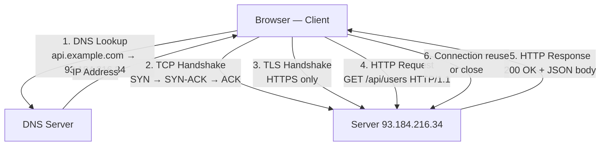
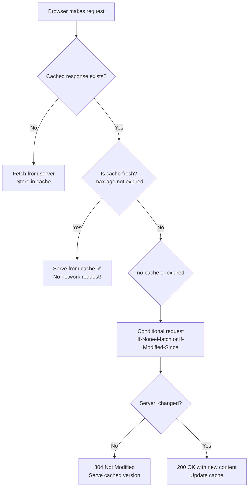
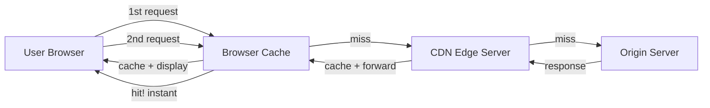
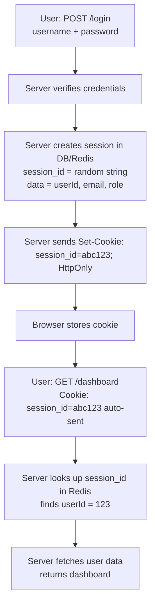
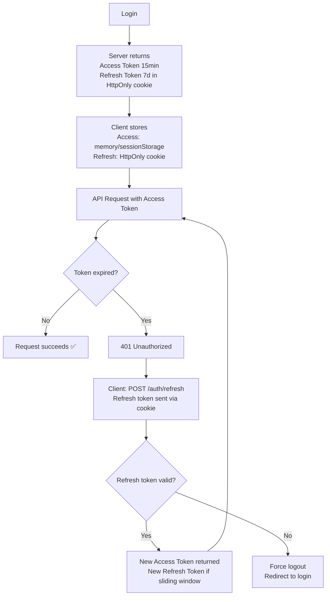
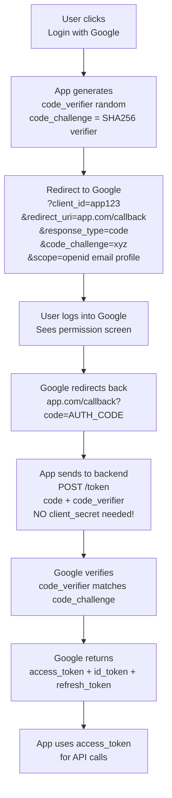
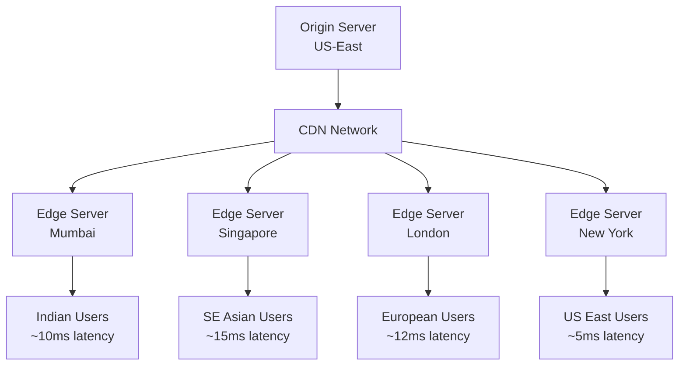

<a id="5-networking-http-and-protocols"></a>

# Chapter 5: Networking — HTTP & Protocols

[⬅ Previous Chapter](#4-browser-rendering-pipeline) | [📖 Main Index](#main-index) | [Next Chapter ➡](#6-build-tools-and-modern-toolchain)

---

## 📌 Learning Objectives

By the end of this chapter, you will:

- **Explain** the complete HTTP request-response cycle with all methods and status codes
- **Distinguish** HTTP/1.1 vs HTTP/2 vs HTTP/3 and their performance implications
- **Design** proper REST APIs following all 6 constraints
- **Understand** GraphQL — queries, mutations, subscriptions, and the N+1 problem
- **Implement** correct caching strategies — Cache-Control, ETags, CDN, cache busting
- **Compare** Cookie sessions vs JWT tokens with security implications
- **Explain** OAuth 2.0 flows and implement Authorization Code + PKCE for SPAs
- **Debug** CORS issues — simple requests, preflight, credentials mode
- **Understand** WebSocket internals — handshake, frames, heartbeat, reconnection
- **Explain** CDN architecture and edge functions concept
- **Answer** 15+ interview questions on networking with confidence

---

<a id="chapter-index-table-5"></a>

## 📑 Chapter Index Table

| Topic No. | Topic Name | Subtopics |
|-----------|-----------|-----------|
| 5.1 | [HTTP Fundamentals](#51-http-fundamentals) | Request-Response, Methods, Status Codes, Headers, Stateless |
| 5.2 | [HTTP/1.1 vs HTTP/2 vs HTTP/3](#52-http11-vs-http2-vs-http3) | HOL blocking, Multiplexing, QUIC, Performance impact |
| 5.3 | [REST API Design](#53-rest-api-design) | Constraints, Resource naming, HATEOAS, REST vs RPC |
| 5.4 | [GraphQL Overview](#54-graphql-overview) | Query, Mutation, Subscription, N+1, Apollo, urql |
| 5.5 | [Caching Strategies](#55-caching-strategies) | Cache-Control, ETag, Browser/CDN/Server cache, Cache busting, SWR |
| 5.6 | [Cookies, Sessions & Tokens](#56-cookies-sessions-and-tokens) | Cookie attributes, Sessions, JWT, Refresh tokens, Comparison |
| 5.7 | [OAuth 2.0 & OpenID Connect](#57-oauth-20-and-openid-connect) | Flows, PKCE, OIDC, Scopes |
| 5.8 | [CORS — Cross-Origin Resource Sharing](#58-cors-cross-origin-resource-sharing) | Same-origin, Preflight, Headers, Credentials |
| 5.9 | [WebSocket Deep Dive](#59-websocket-deep-dive) | Handshake, Frames, Heartbeat, Reconnection, Load balancing |
| 5.10 | [Content Delivery Networks](#510-content-delivery-networks) | Edge locations, Static assets, Edge functions |
| — | [Interview Questions](#interview-questions-chapter-5) | 15+ Conceptual, Scenario, Output-based |
| — | [Practice Problems](#practice-problems-chapter-5) | 5 Theory Problems |
| — | [Quick Revision](#quick-revision-chapter-5) | Key bullets, traps, cheat sheet |
| — | [Chapter Summary](#chapter-summary-chapter-5) | Most important points |

---

## 5.1 HTTP Fundamentals

<a id="51-http-fundamentals"></a>

### 🧠 Hinglish Intuition

> HTTP ek waiter ki tarah hai restaurant mein. Client (customer) order deta hai (Request), waiter kitchen (server) tak jaata hai, kitchen khana banata hai, waiter wapis laata hai (Response). Har order independent hai — waiter ko pehla order yaad nahi rehta jab doosra aata hai (stateless).

---

### Request-Response Cycle — Complete Flow



```http
<!-- HTTP REQUEST structure -->
GET /api/users?page=1&limit=10 HTTP/1.1
Host: api.example.com
Accept: application/json
Authorization: Bearer eyJhbGciOi...
Content-Type: application/json
User-Agent: Mozilla/5.0 Chrome/120
Cache-Control: no-cache
^
[blank line = end of headers]

{  ← Request body (POST/PUT/PATCH only)
  "name": "Raj"
}

<!-- HTTP RESPONSE structure -->
HTTP/1.1 200 OK
Content-Type: application/json; charset=utf-8
Content-Length: 1234
Cache-Control: max-age=3600
ETag: "abc123"
X-Request-Id: req-789
^
[blank line = end of headers]

{  ← Response body
  "users": [...],
  "total": 100
}
```

---

### HTTP Methods — Complete Guide

| Method | Purpose | Has Body | Safe | Idempotent | Cacheable |
|--------|---------|----------|------|------------|-----------|
| **GET** | Retrieve resource | No | ✅ | ✅ | ✅ |
| **POST** | Create resource | Yes | ❌ | ❌ | Rarely |
| **PUT** | Replace resource entirely | Yes | ❌ | ✅ | ❌ |
| **PATCH** | Update resource partially | Yes | ❌ | ❌ | ❌ |
| **DELETE** | Remove resource | Rarely | ❌ | ✅ | ❌ |
| **HEAD** | GET but response body only | No | ✅ | ✅ | ✅ |
| **OPTIONS** | What methods allowed? | No | ✅ | ✅ | ❌ |
| **CONNECT** | Tunnel (for HTTPS proxy) | — | ❌ | ❌ | ❌ |
| **TRACE** | Diagnostic echo | No | ✅ | ✅ | ❌ |

```
Safe = no side effects (read only)
Idempotent = same result regardless of how many times called
  PUT /users/1 {name: "Raj"} called 5 times = same result as once ✅
  POST /users {name: "Raj"} called 5 times = 5 users created ❌

PUT vs PATCH:
PUT replaces entire resource:
  PUT /users/1 { name: "Raj" } → { name: "Raj" } (email is GONE)
PATCH updates partial:
  PATCH /users/1 { name: "Raj" } → { name: "Raj", email: "old@email.com" } (email preserved)
```

---

### Status Codes — Complete Reference

```
1xx — Informational (request received, processing continues)
  100 Continue        — send request body
  101 Switching Protocols — WebSocket upgrade
  103 Early Hints     — preload resources before final response

2xx — Success
  200 OK              — general success
  201 Created         — resource created (POST success)
  204 No Content      — success but no body (DELETE success)
  206 Partial Content — range request (video streaming)

3xx — Redirection
  301 Moved Permanently  — permanent redirect, browser caches
  302 Found              — temporary redirect, not cached
  304 Not Modified       — cached response is still valid (ETag match)
  307 Temporary Redirect — like 302 but preserves HTTP method
  308 Permanent Redirect — like 301 but preserves HTTP method

4xx — Client Error (your fault)
  400 Bad Request     — malformed request, invalid data
  401 Unauthorized    — not authenticated (login required)
  403 Forbidden       — authenticated but not authorized (wrong role)
  404 Not Found       — resource doesn't exist
  405 Method Not Allowed — wrong HTTP method
  409 Conflict        — state conflict (duplicate email)
  410 Gone            — resource permanently deleted
  422 Unprocessable Entity — validation errors (common in APIs)
  429 Too Many Requests — rate limited

5xx — Server Error (server's fault)
  500 Internal Server Error — generic server crash
  502 Bad Gateway     — upstream server error
  503 Service Unavailable — server overloaded or maintenance
  504 Gateway Timeout — upstream server timeout
```

> [!IMPORTANT]
> **401 vs 403 — Most asked interview question:**
> - **401 Unauthorized** = "Who are you? Please log in" (authentication missing/invalid)
> - **403 Forbidden** = "I know who you are, but you can't access this" (authorization denied)

---

### Important HTTP Headers

```http
<!-- REQUEST HEADERS -->
Host: api.example.com              ← required in HTTP/1.1
Accept: application/json           ← what content type we want
Accept-Language: en-US,en;q=0.9   ← language preference
Accept-Encoding: gzip, deflate, br ← compression support
Content-Type: application/json     ← body format (POST/PUT/PATCH)
Content-Length: 42                 ← body size in bytes
Authorization: Bearer token        ← auth credential
Cookie: session=abc123             ← cookies sent to server
Cache-Control: no-cache            ← client cache directive
If-None-Match: "abc123"            ← conditional GET (ETag)
If-Modified-Since: Wed, 21 Oct...  ← conditional GET (date)
Origin: https://app.example.com   ← CORS origin
Referer: https://example.com/page ← where request came from
User-Agent: Mozilla/5.0...         ← browser/client info

<!-- RESPONSE HEADERS -->
Content-Type: application/json     ← response body format
Content-Length: 1234               ← response size
Content-Encoding: gzip             ← body is compressed
Cache-Control: max-age=3600        ← cache duration
ETag: "abc123"                     ← version identifier
Last-Modified: Wed, 21 Oct 2024... ← last change date
Location: /api/users/123           ← redirect URL (3xx) or new resource (201)
Set-Cookie: session=abc; HttpOnly  ← set cookie in browser
Access-Control-Allow-Origin: *     ← CORS allowed origins
X-Request-Id: req-789-xyz          ← correlation ID (custom)
Strict-Transport-Security: max-age=31536000 ← HTTPS only (HSTS)
X-Content-Type-Options: nosniff   ← prevent MIME sniffing
```

---

### HTTP is Stateless — What That Means

```
STATELESS = server remembers NOTHING between requests.
Every request must contain ALL information needed to process it.

Problem:
Request 1: POST /login {username: "raj", password: "123"}
           Server: "OK logged in" → forgets immediately!
Request 2: GET /dashboard
           Server: "Who are you? I don't know you!"

Solutions:
1. Cookies — browser automatically sends with every request
2. JWT in Authorization header — client sends token every request
3. Session ID in cookie → server looks up session store
4. URL parameters (bad practice for auth)

Statelessness benefits:
✅ Scalability — any server can handle any request
✅ Reliability — server crash doesn't lose session
✅ Simple server design — no state management
```

👉 <a href="#chapter-index-table-5">Go to Top 🔝</a>

---

## 5.2 HTTP/1.1 vs HTTP/2 vs HTTP/3

<a id="52-http11-vs-http2-vs-http3"></a>

### 🧠 Hinglish Intuition

> HTTP/1.1 = single lane road — ek gaadi ek time pe. HTTP/2 = multi-lane highway — kai gaadiyaan saath. HTTP/3 = helicopter — road pe hi nahi (UDP use karta hai, TCP nahi).

---

### HTTP/1.1 — Problems

```
HTTP/1.1 (1997):
- Text-based protocol
- One request per connection at a time
- Head-of-line (HOL) blocking: request 3 must wait for request 2 to complete
- Solution: open multiple TCP connections (browsers allow 6 per domain)
- Headers sent as plain text — repeated on every request
- No server push

HOL Blocking example:
Connection 1: [Request A ← waiting for response] [Request B] [Request C]
If A is slow (large image), B and C wait → BLOCKED

Workarounds (hacky):
- Domain sharding: use cdn1.example.com, cdn2.example.com to get more connections
- Concatenate JS files (bundling)
- CSS sprites (combine images)
- Inline small resources
```

---

### HTTP/2 — Solutions

```
HTTP/2 (2015):
Binary protocol (not text) — efficient parsing
Multiplexing: multiple requests over ONE TCP connection simultaneously
Header compression (HPACK): headers compressed, deduplicated
Server Push: server can send resources client hasn't asked for yet
Stream prioritization: important resources first

Multiplexing visualization:
HTTP/1.1:  [Req A] → [Resp A] → [Req B] → [Resp B] → [Req C] → [Resp C]
HTTP/2:    [Req A, Req B, Req C] simultaneously →
           [Resp A, Resp B, Resp C] as they complete (any order!)

HPACK header compression:
- Static table of 61 common headers
- Dynamic table built per connection
- Instead of sending "Content-Type: application/json" (26 bytes)
  → Send index number (1-2 bytes)!

Server Push:
Client: GET /index.html
Server: sends /index.html + pushes /styles.css + /app.js
Client: doesn't need to ask for CSS/JS separately!
(Modern browsers deprecated server push — often counterproductive)
```

---

### HTTP/3 — QUIC Protocol

```
HTTP/3 (2022):
Built on QUIC instead of TCP
QUIC runs on UDP (not TCP!)

Why UDP?
TCP problems:
- TCP HOL blocking at transport layer (even HTTP/2 can't fix this)
- If ONE TCP packet is lost, ALL streams wait for retransmission
  (HTTP/2 multiplexes over ONE TCP connection — one loss blocks all!)
- TCP handshake = 1-2 RTTs (round trips) before data
- TLS handshake on top = more RTTs

QUIC solutions:
- UDP (connectionless) — no connection overhead
- QUIC handles reliability and ordering PER STREAM (not all streams!)
  So packet loss in stream 1 doesn't block stream 2!
- 0-RTT handshake on repeat connections (no round trips!)
- Built-in TLS 1.3 (combined with QUIC handshake)
- Connection migration: change IP/network without reconnecting
  (Great for mobile users switching WiFi → 4G!)
```

---

### Performance Impact Comparison

| Feature | HTTP/1.1 | HTTP/2 | HTTP/3 |
|---------|---------|--------|--------|
| Protocol | Text | Binary | Binary (QUIC/UDP) |
| Connections per domain | 6 (browser limit) | 1 | 1 |
| Multiplexing | ❌ No | ✅ Yes | ✅ Yes |
| HOL blocking | ❌ Yes (both layers) | ❌ Yes (TCP layer) | ✅ No (per-stream) |
| Header compression | ❌ No | ✅ HPACK | ✅ QPACK |
| Server Push | ❌ No | ✅ Yes (deprecated) | ✅ Yes (deprecated) |
| 0-RTT | ❌ No | ❌ No | ✅ Yes (repeat visits) |
| Connection migration | ❌ No | ❌ No | ✅ Yes |
| TLS required | Optional | Effectively required | Built-in |
| Adoption (2024) | Universal | ~65% | ~30% |

```javascript
// Check HTTP version in DevTools:
// Network tab → click any request → Headers tab → look for
// "HTTP/2" or "h2" in Request Headers or status line

// Check via Response Headers:
// Look for "Alt-Svc: h3=":443"; ma=86400" → server supports HTTP/3

// Frontend implications:
// HTTP/1.1: concatenate files, use sprites, domain shard
// HTTP/2: DON'T concatenate! Small files preferable, HTTP/2 handles parallelism
// HTTP/3: same as HTTP/2 + better on lossy networks (mobile)

// Next.js automatically uses HTTP/2+ when deployed on Vercel
```

> [!NOTE]
> With HTTP/2, the old best practice of **bundling everything into one file** is actually counterproductive! Smaller files are preferred because they can be updated individually and loaded in parallel. However, some bundling is still good for reducing request overhead.

👉 <a href="#chapter-index-table-5">Go to Top 🔝</a>

---

## 5.3 REST API Design

<a id="53-rest-api-design"></a>

### 🧠 Hinglish Intuition

> REST ek design philosophy hai — rules ka set. Resource = noun (user, post, product). Method = verb (GET, POST, DELETE). URL mein actions mat daalo — `/getUser` wrong hai, `/users/1` sahi hai. Yeh rules follow karne se APIs predictable aur maintainable banti hain.

---

### REST Constraints (6 Principles)

```
1. CLIENT-SERVER
   - Separation of concerns
   - Client handles UI, Server handles data
   - They can evolve independently

2. STATELESS
   - Server stores NO client state between requests
   - Every request must be self-contained
   - Client sends all context (token, session ID) each time

3. CACHEABLE
   - Responses must label themselves as cacheable or not
   - Cache-Control headers indicate cacheability
   - Clients and intermediaries can cache responses

4. UNIFORM INTERFACE
   - Resource identification via URI
   - Manipulation via representations (JSON, XML)
   - Self-descriptive messages (Content-Type)
   - HATEOAS (Hypermedia as the Engine of Application State)

5. LAYERED SYSTEM
   - Client doesn't know if it's talking to actual server or proxy/CDN
   - Intermediaries can be inserted transparently

6. CODE ON DEMAND (optional)
   - Server can send executable code to client (JavaScript)
   - Least commonly implemented constraint
```

---

### Resource Naming Conventions

```
REST URL Design Rules:

✅ Use NOUNS for resources (not verbs):
GET    /users           → list all users
GET    /users/123       → get user 123
POST   /users           → create new user
PUT    /users/123       → replace user 123
PATCH  /users/123       → update user 123 partially
DELETE /users/123       → delete user 123

❌ WRONG — using verbs:
GET /getUser/123
POST /createUser
DELETE /deleteUser/123
GET /users/fetchAll

✅ Nested resources (relationships):
GET  /users/123/orders       → all orders for user 123
GET  /users/123/orders/456   → order 456 of user 123
POST /users/123/orders       → create order for user 123
DELETE /users/123/orders/456 → delete order 456 of user 123

✅ Query parameters for filtering/sorting/pagination:
GET /products?category=electronics&sort=price&order=asc&page=2&limit=20
GET /users?active=true&role=admin
GET /posts?search=react&tags=javascript,tutorial

✅ Plural nouns for collections:
/users  (not /user)
/posts  (not /post)
/orders (not /order)

✅ lowercase, kebab-case for multi-word:
/product-categories  (not /productCategories or /product_categories)
/user-profiles

✅ Versioning:
/api/v1/users   (URL versioning — most common)
/api/v2/users
OR via headers: Accept: application/vnd.api.v2+json
```

---

### REST vs RPC Comparison

```javascript
// REST — resource-based
GET    /users/123         → get user
PUT    /users/123         → update user
DELETE /users/123         → delete user

// RPC (Remote Procedure Call) — action-based
POST /getUserById         { id: 123 }
POST /updateUser          { id: 123, name: "Raj" }
POST /deleteUser          { id: 123 }

// gRPC (Google RPC) — binary protocol, typed contracts
// Used for microservice communication
// service UserService {
//   rpc GetUser(GetUserRequest) returns (User);
//   rpc CreateUser(CreateUserRequest) returns (User);
// }

// tRPC — TypeScript RPC for full-stack
// Shares types between frontend and backend
// No separate API contract needed

// When to use what:
// REST: public APIs, browser clients, CRUD operations, standard tools
// gRPC: microservices, high-performance, streaming, polyglot systems
// tRPC: full-stack TypeScript (Next.js), internal APIs, type safety
// GraphQL: complex data requirements, mobile, multiple clients
```

---

### HATEOAS — Hypermedia as Engine of Application State

```json
// HATEOAS response includes links for possible actions:
// GET /users/123

{
  "id": 123,
  "name": "Raj",
  "email": "raj@example.com",
  "status": "active",
  "_links": {
    "self": { "href": "/users/123" },
    "orders": { "href": "/users/123/orders" },
    "update": { "href": "/users/123", "method": "PATCH" },
    "deactivate": { "href": "/users/123/deactivate", "method": "POST" }
  }
}

// Client doesn't need to hard-code URLs — follows links from responses
// In practice: rarely fully implemented, but concept is important to know
```

👉 <a href="#chapter-index-table-5">Go to Top 🔝</a>

---

## 5.4 GraphQL Overview

<a id="54-graphql-overview"></a>

### 🧠 Hinglish Intuition

> REST mein server decide karta hai kya milega. GraphQL mein CLIENT decide karta hai. "Mujhe sirf user ka naam aur email chahiye, orders nahi" — GraphQL mein yeh possible hai. REST mein ya toh sab milega ya alag endpoint. GraphQL = flexible menu jahan aap apna khana choose karo.

---

### Query, Mutation, Subscription

```graphql
# QUERY — fetch data (like GET)
query GetUser($id: ID!) {
  user(id: $id) {
    id
    name
    email          # only what we need!
    orders {
      id
      total
      items {
        product {
          name
          price
        }
      }
    }
  }
}

# MUTATION — modify data (like POST/PUT/DELETE)
mutation CreateUser($input: CreateUserInput!) {
  createUser(input: $input) {
    id
    name
    email
    createdAt
  }
}

mutation UpdateUser($id: ID!, $name: String!) {
  updateUser(id: $id, name: $name) {
    id
    name
    updatedAt
  }
}

mutation DeleteUser($id: ID!) {
  deleteUser(id: $id) {
    success
    message
  }
}

# SUBSCRIPTION — real-time data (like WebSocket)
subscription OnNewMessage($roomId: ID!) {
  messageAdded(roomId: $roomId) {
    id
    content
    sender {
      name
      avatar
    }
    timestamp
  }
}
```

---

### GraphQL vs REST Comparison

| Feature | REST | GraphQL |
|---------|------|---------|
| **Data fetching** | Fixed endpoints, fixed shapes | Request exactly what you need |
| **Over-fetching** | ❌ Often (too much data) | ✅ Never (ask for exactly needed) |
| **Under-fetching** | ❌ Often (multiple endpoints) | ✅ Never (one request, nested) |
| **Endpoints** | Multiple (one per resource) | Single endpoint `/graphql` |
| **Versioning** | `/api/v1`, `/api/v2` | Schema evolution (additive) |
| **Caching** | ✅ HTTP caching built-in | ❌ Complex (POST requests) |
| **File upload** | ✅ Simple multipart | ❌ Workarounds needed |
| **Learning curve** | Low | Higher |
| **Tooling** | Universal | Good (Apollo, etc.) |
| **Type system** | None built-in (OpenAPI) | ✅ Strong (Schema first) |

---

### N+1 Problem

```javascript
// N+1 Problem — classic GraphQL performance issue

// Query: Get all posts with their authors
// SELECT * FROM posts → returns 100 posts (1 query)
// FOR EACH post: SELECT * FROM users WHERE id = post.author_id
// → 100 additional queries! = N+1 queries total

// Example in GraphQL resolver (naive):
const resolvers = {
  Query: {
    posts: () => db.query('SELECT * FROM posts'), // 1 query
  },
  Post: {
    author: (post) => db.query(  // N queries — one per post!
      'SELECT * FROM users WHERE id = ?', [post.authorId]
    )
  }
};

// Solution 1: DataLoader (batch + cache per request)
const DataLoader = require('dataloader');

const userLoader = new DataLoader(async (userIds) => {
  // Called ONCE with all user IDs from all posts!
  const users = await db.query(
    'SELECT * FROM users WHERE id IN (?)', [userIds]
  );
  // Return in same order as input IDs
  return userIds.map(id => users.find(u => u.id === id));
});

const resolvers = {
  Query: {
    posts: () => db.query('SELECT * FROM posts'), // 1 query
  },
  Post: {
    author: (post) => userLoader.load(post.authorId) // batched!
    // All 100 author loads are batched into ONE query!
  }
};

// Solution 2: JOIN at database level
const resolvers = {
  Query: {
    posts: () => db.query(`
      SELECT posts.*, users.name as authorName, users.email as authorEmail
      FROM posts
      JOIN users ON posts.author_id = users.id
    `), // 1 query with JOIN — no N+1!
  }
};
```

---

### GraphQL in React — Apollo Client

```javascript
// Setup
import { ApolloClient, InMemoryCache, ApolloProvider } from '@apollo/client';

const client = new ApolloClient({
  uri: 'https://api.example.com/graphql',
  cache: new InMemoryCache(),
  headers: {
    authorization: `Bearer ${localStorage.getItem('token')}`
  }
});

function App() {
  return (
    <ApolloProvider client={client}>
      <Router />
    </ApolloProvider>
  );
}

// QUERY hook
import { useQuery, gql } from '@apollo/client';

const GET_USERS = gql`
  query GetUsers($page: Int!) {
    users(page: $page) {
      id
      name
      email
    }
    total
  }
`;

function UserList() {
  const { loading, error, data, refetch } = useQuery(GET_USERS, {
    variables: { page: 1 },
    fetchPolicy: 'cache-and-network', // use cache + always refetch
    pollInterval: 30000,             // auto-refetch every 30s
  });

  if (loading) return <Spinner />;
  if (error) return <Error message={error.message} />;
  return <UserGrid users={data.users} />;
}

// MUTATION hook
import { useMutation, gql } from '@apollo/client';

const CREATE_USER = gql`
  mutation CreateUser($name: String!, $email: String!) {
    createUser(name: $name, email: $email) {
      id
      name
      email
    }
  }
`;

function CreateUserForm() {
  const [createUser, { loading, error }] = useMutation(CREATE_USER, {
    onCompleted: (data) => {
      console.log('Created:', data.createUser);
    },
    // Update cache after mutation:
    update(cache, { data: { createUser } }) {
      cache.modify({
        fields: {
          users(existingUsers = []) {
            const newUserRef = cache.writeFragment({
              data: createUser,
              fragment: gql`fragment NewUser on User { id name email }`
            });
            return [...existingUsers, newUserRef];
          }
        }
      });
    }
  });

  const handleSubmit = (name, email) => {
    createUser({ variables: { name, email } });
  };
}
```

👉 <a href="#chapter-index-table-5">Go to Top 🔝</a>

---

## 5.5 Caching Strategies

<a id="55-caching-strategies"></a>

### 🧠 Hinglish Intuition

> Cache ek shortcut hai. Pehle baar data server se mangao, store kar lo. Doosri baar — cache se lo, server pe mat jao. Lekin purana data bhi problem hai. Cache-Control headers batate hain — kitni der tak fresh hai yeh data? ETag batata hai — kya kuch badla hai?

---

### Cache-Control Header — Complete Guide

```http
<!-- Response from server -->
Cache-Control: max-age=3600              ← cache for 3600 seconds (1 hour)
Cache-Control: no-cache                  ← always validate with server (not "don't cache"!)
Cache-Control: no-store                  ← don't cache at all (sensitive data)
Cache-Control: must-revalidate           ← after max-age expires, MUST validate (not serve stale)
Cache-Control: public                    ← CDNs and all caches can store
Cache-Control: private                   ← browser only (not CDNs) — personalized data
Cache-Control: s-maxage=3600            ← CDN cache duration (overrides max-age for CDNs)
Cache-Control: stale-while-revalidate=60 ← serve stale for 60s while fetching fresh
Cache-Control: immutable                 ← never check for update (content-hashed files)

<!-- Combinations -->
Cache-Control: public, max-age=31536000, immutable
← For hashed assets: cache forever, never validate
← Example: app.abc123.js (hash changes when content changes)

Cache-Control: private, no-cache
← For user-specific data: cache in browser, always validate

Cache-Control: no-store
← For sensitive data (banking, medical): NEVER cache

Cache-Control: max-age=0, must-revalidate
← Functionally same as no-cache
```



---

### ETag & Last-Modified — Conditional Requests

```http
<!-- INITIAL REQUEST -->
GET /api/users HTTP/1.1

<!-- SERVER RESPONSE with validators -->
HTTP/1.1 200 OK
ETag: "abc123xyz"
Last-Modified: Wed, 15 Jan 2025 10:30:00 GMT
Cache-Control: max-age=0, must-revalidate
Content-Type: application/json

[response body]

<!-- BROWSER caches response AND the ETag/Last-Modified values -->

<!-- SUBSEQUENT REQUEST (after max-age expires) -->
GET /api/users HTTP/1.1
If-None-Match: "abc123xyz"           ← Send back the ETag
If-Modified-Since: Wed, 15 Jan...    ← Send back Last-Modified

<!-- SERVER RESPONSE: nothing changed -->
HTTP/1.1 304 Not Modified
ETag: "abc123xyz"                    ← Same ETag
                                     ← NO BODY! (saves bandwidth)
<!-- Browser uses cached response body — only header cost! -->

<!-- SERVER RESPONSE: data changed -->
HTTP/1.1 200 OK
ETag: "def456uvw"                    ← NEW ETag
[new response body]
```

```javascript
// Implementing ETag on server (Node.js/Express example):
const crypto = require('crypto');

app.get('/api/users', (req, res) => {
  const users = getUsers();
  const etag = crypto
    .createHash('md5')
    .update(JSON.stringify(users))
    .digest('hex');

  // Check if client sent matching ETag
  if (req.headers['if-none-match'] === etag) {
    return res.status(304).end(); // Not Modified — no body!
  }

  res.set({
    'ETag': etag,
    'Cache-Control': 'max-age=0, must-revalidate'
  });
  res.json(users);
});
```

---

### Browser Cache vs CDN Cache vs Server Cache



```
BROWSER CACHE:
- Stored on user's device
- Only for THAT user
- Duration: set by Cache-Control headers
- Fastest — no network at all!
- Private (personal data OK here)

CDN CACHE (Content Delivery Network):
- Stored at edge server close to user (geographically)
- Shared cache — same cached response for all users
- Reduces load on origin server
- Global distribution (100+ locations worldwide)
- Only for PUBLIC, non-personalized data (images, JS, CSS)
- Duration: controlled by Cache-Control: s-maxage or public max-age

SERVER CACHE (Application Cache):
- Redis, Memcached, in-memory
- Cache expensive DB queries or computations
- Application-level control
- Can invalidate programmatically

Which cache to use for what:
Static assets (JS, CSS, images): Browser + CDN cache
API responses: Browser cache for personal, CDN for public
Database queries: Server cache (Redis)
Sessions: Server cache (Redis with TTL)
```

---

### Cache Busting Strategies

```javascript
// Problem: How to tell browser to use NEW version of cached file?

// Strategy 1: Content hash in filename (BEST for static assets)
// Old: /app.js → cached forever
// New: /app.abc123.js → new filename = new cache!

// In Next.js — automatic content hashing:
// /_next/static/chunks/app-abc123.js
// /_next/static/css/main-def456.css
// These files use: Cache-Control: public, max-age=31536000, immutable

// Strategy 2: Query string versioning
// /app.js?v=1.2.0  ← works but CDNs sometimes ignore query strings!
// /app.js?t=1705320000 ← timestamp

// Strategy 3: URL versioning
// /v2/api/users (for APIs)

// Strategy 4: Cache invalidation (CDN purge)
// After deploying: call CDN API to purge specific paths
// Vercel: automatic deployment = automatic cache invalidation
// Cloudflare: curl -X DELETE https://api.cloudflare.com/client/v4/zones/.../purge_cache

// In Next.js App Router (on-demand revalidation):
import { revalidatePath, revalidateTag } from 'next/cache';

// Revalidate a specific page:
await revalidatePath('/products');

// Revalidate all routes with a tag:
await revalidateTag('products');
// Routes that used: fetch('/api/products', { next: { tags: ['products'] } })
// will be regenerated on next request
```

---

### Stale-While-Revalidate Strategy

```http
Cache-Control: max-age=60, stale-while-revalidate=300

Behavior:
0-60 seconds: Serve from cache (fresh, no network request)
60-360 seconds: Serve STALE cache immediately (good UX!)
                Simultaneously fetch fresh data in background
After 360 seconds: Must wait for fresh data

Benefits:
✅ Always fast responses (no waiting)
✅ Data is eventually consistent
✅ Great for non-critical data (news, social feeds, product lists)

Bad for:
❌ Real-time data (stock prices, inventory)
❌ User-specific data that changes frequently
❌ Data where stale info could cause issues (banking, medical)
```

```javascript
// React: SWR library uses this pattern as its core strategy
import useSWR from 'swr';

function ProductList() {
  const { data, error, isLoading } = useSWR('/api/products', fetcher, {
    // Stale-while-revalidate: show cached data while refreshing
    revalidateOnFocus: true,       // refresh when tab gets focus
    revalidateOnReconnect: true,   // refresh when network reconnects
    refreshInterval: 60000,        // auto-refresh every 60s
    dedupingInterval: 2000,        // deduplicate requests within 2s
  });
  // Always shows cached data immediately, even while fetching fresh
}
```

👉 <a href="#chapter-index-table-5">Go to Top 🔝</a>

---

## 5.6 Cookies, Sessions & Tokens

<a id="56-cookies-sessions-and-tokens"></a>

### 🧠 Hinglish Intuition

> Session = restaurant ka numbered token — tum number dikhao, waiter record dhundta hai server pe. JWT = passport — sab kuch passport mein hi likha hai, server kuch yaad nahi rakhta. Cookie = wo envelope jisme token/session ID rakha hota hai — browser automatically bhejta hai.

---

### Cookie Attributes — Complete Security Guide

```javascript
// Setting cookies (server-side headers):
Set-Cookie: session_id=abc123;
  HttpOnly;              // JS cannot read — prevents XSS theft
  Secure;               // HTTPS only
  SameSite=Strict;      // CSRF protection
  Path=/;               // all routes
  Max-Age=3600;         // 1 hour (seconds)
  Domain=.example.com   // all subdomains

// SameSite options:
// Strict: Cookie NOT sent for ANY cross-site request (most secure)
//         Problem: users lose session when clicking external link to your site!
// Lax:    Cookie sent for top-level navigation GET (browser default since Chrome 80)
//         Won't send for AJAX requests from other sites
// None:   Always send cross-site (requires Secure attribute!)
//         Needed for: third-party integrations, OAuth, embedded widgets

// Cookie vs localStorage security:
// HttpOnly cookie: JS can't read → XSS can't steal token ✅
// localStorage: JS can read → XSS can steal token ❌
// Best practice: Store auth tokens in HttpOnly cookies
```

---

### Session-Based Authentication Flow



```javascript
// Server session example (Express + Redis):
const session = require('express-session');
const RedisStore = require('connect-redis')(session);
const redis = require('redis');

const redisClient = redis.createClient({ url: process.env.REDIS_URL });

app.use(session({
  store: new RedisStore({ client: redisClient }),
  secret: process.env.SESSION_SECRET,
  resave: false,
  saveUninitialized: false,
  cookie: {
    secure: true,       // HTTPS only
    httpOnly: true,     // no JS access
    sameSite: 'lax',   // CSRF protection
    maxAge: 24 * 60 * 60 * 1000 // 24 hours
  }
}));

app.post('/login', async (req, res) => {
  const user = await verifyCredentials(req.body);
  req.session.userId = user.id;    // stored in Redis
  req.session.role = user.role;
  res.json({ success: true });
});

app.get('/me', (req, res) => {
  if (!req.session.userId) return res.status(401).json({ error: 'Not logged in' });
  res.json({ userId: req.session.userId, role: req.session.role });
});
```

---

### JWT — Structure, Claims & Signing

```
JWT = JSON Web Token
Format: header.payload.signature (base64url encoded, dot-separated)

HEADER (algorithm + type):
{
  "alg": "HS256",   ← HMAC-SHA256 (symmetric — one secret)
  "typ": "JWT"      ← or "RS256" (asymmetric — public/private key)
}

PAYLOAD (claims):
{
  "sub": "123",          ← subject (user ID)
  "name": "Raj Kumar",
  "email": "raj@example.com",
  "role": "admin",
  "iat": 1705320000,     ← issued at (Unix timestamp)
  "exp": 1705406400,     ← expires at (Unix timestamp)
  "iss": "api.example.com", ← issuer
  "aud": "app.example.com"  ← audience
}

SIGNATURE:
HMAC-SHA256(
  base64url(header) + "." + base64url(payload),
  secret_key
)

Full JWT:
eyJhbGciOiJIUzI1NiIsInR5cCI6IkpXVCJ9.
eyJzdWIiOiIxMjMiLCJuYW1lIjoiUmFqIiwiaWF0IjoxNzA1MzIwMDAwfQ.
SflKxwRJSMeKKF2QT4fwpMeJf36POk6yJV_adQssw5c
```

```javascript
// JWT implementation (Node.js):
const jwt = require('jsonwebtoken');

// Create JWT:
function generateTokens(user) {
  const accessToken = jwt.sign(
    { sub: user.id, email: user.email, role: user.role },
    process.env.JWT_SECRET,
    { expiresIn: '15m' }  // short-lived access token
  );

  const refreshToken = jwt.sign(
    { sub: user.id },
    process.env.REFRESH_TOKEN_SECRET,
    { expiresIn: '7d' }   // long-lived refresh token
  );

  return { accessToken, refreshToken };
}

// Verify JWT:
function verifyAccessToken(token) {
  try {
    return jwt.verify(token, process.env.JWT_SECRET);
    // Returns decoded payload if valid
    // Throws if expired or invalid signature
  } catch (err) {
    if (err.name === 'TokenExpiredError') throw new Error('Token expired');
    if (err.name === 'JsonWebTokenError') throw new Error('Invalid token');
    throw err;
  }
}

// Middleware:
function authenticate(req, res, next) {
  const authHeader = req.headers.authorization;
  if (!authHeader?.startsWith('Bearer ')) {
    return res.status(401).json({ error: 'No token' });
  }

  try {
    const token = authHeader.slice(7); // remove "Bearer "
    const payload = verifyAccessToken(token);
    req.user = payload;
    next();
  } catch (err) {
    res.status(401).json({ error: err.message });
  }
}
```

---

### JWT Security — Algorithm Confusion & Best Practices

```javascript
// ALGORITHM CONFUSION ATTACK — critical vulnerability!
// If server accepts both HS256 and RS256:

// Attacker takes RS256 JWT header, changes alg to "none":
{ "alg": "none", "typ": "JWT" }  // some libraries accept this!

// Fix: always specify allowed algorithm:
jwt.verify(token, secret, { algorithms: ['HS256'] }); // only HS256!

// NEVER use "none" algorithm
// NEVER accept tokens without verifying algorithm

// Other JWT security issues:
// 1. Using symmetric HS256 when public key needed (RSA better for multiple services)
// 2. Storing JWT in localStorage → XSS can steal it
//    Fix: Use HttpOnly cookies for JWT storage

// 3. Not validating expiry
//    Fix: jwt.verify() checks exp automatically

// 4. No token revocation (JWTs are stateless — can't invalidate individual tokens)
//    Fix: Use short expiry (15min) + refresh token pattern
//         OR maintain a revocation list (defeats stateless benefit)
//         OR use opaque tokens for critical security

// 5. Sensitive data in payload (payload is base64 NOT encrypted!)
//    Fix: Never store passwords, sensitive PII in JWT payload
//         Use JWE (JSON Web Encryption) if you need encrypted payload
```

---

### Access + Refresh Token Pattern



```javascript
// Client-side token refresh (axios interceptor):
import axios from 'axios';

const api = axios.create({ baseURL: '/api' });
let isRefreshing = false;
let failedQueue = [];

api.interceptors.response.use(
  response => response,
  async error => {
    const originalRequest = error.config;

    if (error.response?.status === 401 && !originalRequest._retry) {
      if (isRefreshing) {
        // Queue request while refresh is in progress
        return new Promise((resolve, reject) => {
          failedQueue.push({ resolve, reject });
        }).then(token => {
          originalRequest.headers.Authorization = `Bearer ${token}`;
          return api(originalRequest);
        });
      }

      originalRequest._retry = true;
      isRefreshing = true;

      try {
        const { data } = await axios.post('/api/auth/refresh');
        // Refresh token sent via cookie automatically
        const newToken = data.accessToken;

        // Retry all queued requests
        failedQueue.forEach(({ resolve }) => resolve(newToken));
        failedQueue = [];

        originalRequest.headers.Authorization = `Bearer ${newToken}`;
        return api(originalRequest);
      } catch (err) {
        failedQueue.forEach(({ reject }) => reject(err));
        failedQueue = [];
        window.location.href = '/login'; // force logout
        return Promise.reject(err);
      } finally {
        isRefreshing = false;
      }
    }
    return Promise.reject(error);
  }
);
```

---

### JWT vs Cookie Sessions — Comparison

| Aspect | JWT (Stateless) | Session Cookies (Stateful) |
|--------|----------------|--------------------------|
| **Server storage** | None | Redis/DB per session |
| **Scalability** | ✅ Any server | ❌ Need shared store |
| **Revocation** | ❌ Hard (wait for expiry) | ✅ Easy (delete from DB) |
| **Payload size** | ❌ Larger (all claims in token) | ✅ Small (just session ID) |
| **XSS risk** | ❌ If in localStorage | ✅ HttpOnly cookie safe |
| **CSRF risk** | ✅ Header-based (no auto-send) | ❌ Cookies auto-sent |
| **Microservices** | ✅ Self-contained | ❌ Need centralized session |
| **Debugging** | ✅ jwt.io decode | ❌ Need server lookup |
| **Best for** | APIs, microservices, SPAs | Traditional web apps |

👉 <a href="#chapter-index-table-5">Go to Top 🔝</a>

---

## 5.7 OAuth 2.0 & OpenID Connect

<a id="57-oauth-20-and-openid-connect"></a>

### 🧠 Hinglish Intuition

> OAuth = "Google se login karo, mujhe tumhara password mat do." Tum Google ko bolta ho "yeh app ko meri basic info dene ki permission do." Google token deta hai. App woh token se tumhara data access karta hai — bina tumhara password jaane. OIDC = OAuth ke upar authentication layer — "yeh user kaun hai" bhi batata hai.

---

### OAuth 2.0 Roles

```
RESOURCE OWNER: The user (who owns the data)
CLIENT: Your application (wants access to user's data)
AUTHORIZATION SERVER: Google, GitHub, etc. (issues tokens)
RESOURCE SERVER: API that has user's data (Google Calendar, etc.)

Common OAuth flows:
1. Authorization Code + PKCE (SPAs, mobile apps) ← STANDARD for frontend
2. Client Credentials (server-to-server, no user) ← Machine-to-machine
3. Authorization Code (server-side apps with client secret)
4. Implicit (DEPRECATED — don't use)
5. Device Code (TV, IoT, no browser)
```

---

### Authorization Code + PKCE Flow (SPA Standard)



```javascript
// PKCE Implementation (frontend):
async function initiateOAuth() {
  // 1. Generate code verifier (random string 43-128 chars)
  const codeVerifier = generateRandomString(64);

  // 2. Generate code challenge = BASE64URL(SHA256(codeVerifier))
  const encoder = new TextEncoder();
  const data = encoder.encode(codeVerifier);
  const digest = await crypto.subtle.digest('SHA-256', data);
  const codeChallenge = base64URLEncode(new Uint8Array(digest));

  // 3. Store verifier in sessionStorage (needed for callback)
  sessionStorage.setItem('pkce_verifier', codeVerifier);
  sessionStorage.setItem('oauth_state', generateRandomString(16)); // CSRF protection

  // 4. Redirect to authorization server
  const params = new URLSearchParams({
    client_id: 'your-client-id',
    redirect_uri: 'https://yourapp.com/callback',
    response_type: 'code',
    scope: 'openid email profile',
    code_challenge: codeChallenge,
    code_challenge_method: 'S256',
    state: sessionStorage.getItem('oauth_state')
  });

  window.location.href = `https://accounts.google.com/o/oauth2/v2/auth?${params}`;
}

// Callback handler:
async function handleOAuthCallback() {
  const params = new URLSearchParams(window.location.search);
  const code = params.get('code');
  const state = params.get('state');

  // Verify state (CSRF check)
  if (state !== sessionStorage.getItem('oauth_state')) {
    throw new Error('State mismatch — potential CSRF!');
  }

  const codeVerifier = sessionStorage.getItem('pkce_verifier');
  sessionStorage.removeItem('pkce_verifier');
  sessionStorage.removeItem('oauth_state');

  // Exchange code for tokens (via your backend to hide client_secret):
  const response = await fetch('/api/auth/oauth/callback', {
    method: 'POST',
    headers: { 'Content-Type': 'application/json' },
    body: JSON.stringify({ code, codeVerifier })
  });

  const { user } = await response.json();
  // User is now authenticated!
}
```

---

### OpenID Connect — ID Token & UserInfo

```javascript
// OAuth = Authorization (can access data)
// OIDC = Authentication (who is the user) built on OAuth

// When scope includes "openid", you get an ID Token (JWT):
// ID Token contains user identity claims:
{
  "iss": "https://accounts.google.com",    // issuer
  "sub": "110169484474386276334",          // stable user ID
  "aud": "your-client-id",                 // your app
  "email": "raj@gmail.com",
  "email_verified": true,
  "name": "Raj Kumar",
  "picture": "https://lh3.googleusercontent.com/...",
  "iat": 1705320000,
  "exp": 1705323600
}

// Common OIDC scopes:
// openid   → sub (user ID) only
// email    → email, email_verified
// profile  → name, picture, given_name, family_name, locale
// address  → street, city, country
// phone    → phone_number

// UserInfo endpoint (alternative to ID Token):
GET https://openidconnect.googleapis.com/v1/userinfo
Authorization: Bearer access_token
→ Returns same user claims

// In Next.js with Auth.js (NextAuth):
import NextAuth from 'next-auth';
import GoogleProvider from 'next-auth/providers/google';

export const authOptions = {
  providers: [
    GoogleProvider({
      clientId: process.env.GOOGLE_CLIENT_ID,
      clientSecret: process.env.GOOGLE_CLIENT_SECRET,
      // Auth.js handles PKCE automatically for you!
    }),
  ],
  callbacks: {
    async session({ session, token }) {
      session.user.id = token.sub;
      return session;
    }
  }
};
```

👉 <a href="#chapter-index-table-5">Go to Top 🔝</a>

---

## 5.8 CORS — Cross-Origin Resource Sharing

<a id="58-cors-cross-origin-resource-sharing"></a>

### 🧠 Hinglish Intuition

> Same-origin policy browser ka security guard hai — sirf apne ghar wale (same domain) ke saath baat karo. CORS uski permission system hai — server bolta hai "theek hai, example.com ko aane do, baaki ko nahi." Preflight = pehle knock karo, permission maango, phir andar aao.

---

### Same-Origin Policy

```
ORIGIN = protocol + hostname + port

https://app.example.com:443  ← origin

Same origin examples (all match above):
https://app.example.com:443/about  ← same (path doesn't matter)
https://app.example.com/api        ← same (default port 443)

Different origin (cross-origin) examples:
http://app.example.com      ← different protocol (http vs https)
https://api.example.com     ← different subdomain!
https://app.example.com:8080 ← different port!
https://other-site.com       ← different domain

What same-origin policy blocks:
- fetch/XHR to different origin
- Reading iframe content from different origin
- Reading localStorage from different origin

What it does NOT block (no CORS):
-  ← allowed
- <script src="cdn.example.com/lib.js">   ← allowed
- <link href="fonts.googleapis.com/...">  ← allowed
- Form submission to cross-origin         ← allowed (!)
```

---

### Simple vs Preflight Requests

```javascript
// SIMPLE REQUEST — no preflight needed
// Conditions: GET/HEAD/POST + simple headers + simple Content-Type
fetch('https://api.example.com/data', {
  method: 'GET',           // GET, HEAD, or POST
  headers: {
    'Content-Type': 'text/plain'  // simple content type
    // Simple Content-Types: text/plain, multipart/form-data, application/x-www-form-urlencoded
  }
  // No custom headers!
});
// Browser directly sends request + includes Origin header

// PREFLIGHT REQUEST — required when:
// - Method is PUT, DELETE, PATCH
// - Custom headers (Authorization, X-Custom-Header, Content-Type: application/json)
// - credentials: 'include'

fetch('https://api.example.com/users', {
  method: 'DELETE',                    // non-simple method
  headers: {
    'Content-Type': 'application/json', // non-simple content type
    'Authorization': 'Bearer token'    // custom header
  }
});

// Browser FIRST sends preflight:
OPTIONS /users HTTP/1.1
Host: api.example.com
Origin: https://app.example.com
Access-Control-Request-Method: DELETE
Access-Control-Request-Headers: Content-Type, Authorization

// Server must respond to preflight:
HTTP/1.1 204 No Content
Access-Control-Allow-Origin: https://app.example.com
Access-Control-Allow-Methods: GET, POST, PUT, DELETE, PATCH
Access-Control-Allow-Headers: Content-Type, Authorization
Access-Control-Max-Age: 86400          ← cache preflight for 24 hours
Access-Control-Allow-Credentials: true ← if credentials needed

// After preflight succeeds, actual request is sent
```

---

### CORS Headers — Complete Reference

```javascript
// Server-side CORS setup (Express):
const cors = require('cors');

// Allow specific origin:
app.use(cors({
  origin: ['https://app.example.com', 'https://admin.example.com'],
  methods: ['GET', 'POST', 'PUT', 'DELETE', 'PATCH', 'OPTIONS'],
  allowedHeaders: ['Content-Type', 'Authorization', 'X-Request-Id'],
  credentials: true,    // allow cookies
  maxAge: 86400         // cache preflight 24 hours
}));

// Dynamic origin (for development):
app.use(cors({
  origin: (origin, callback) => {
    const allowedOrigins = ['https://app.example.com'];
    if (!origin || allowedOrigins.includes(origin)) {
      callback(null, true); // allow
    } else {
      callback(new Error('Not allowed by CORS')); // block
    }
  },
  credentials: true
}));

// Manual CORS headers:
app.use((req, res, next) => {
  res.header('Access-Control-Allow-Origin', 'https://app.example.com');
  res.header('Access-Control-Allow-Credentials', 'true');
  res.header('Access-Control-Allow-Methods', 'GET,POST,PUT,DELETE,OPTIONS');
  res.header('Access-Control-Allow-Headers', 'Content-Type,Authorization');

  if (req.method === 'OPTIONS') {
    res.header('Access-Control-Max-Age', '86400');
    return res.status(204).end(); // preflight response
  }
  next();
});
```

---

### Credentials Mode — Sending Cookies Cross-Origin

```javascript
// PROBLEM: cookies not sent cross-origin by default

// SOLUTION: credentials: 'include' on client
fetch('https://api.example.com/me', {
  credentials: 'include' // send cookies!
});

// SERVER MUST respond with (or CORS will block):
// Access-Control-Allow-Origin: https://app.example.com  ← SPECIFIC origin, NOT '*'!
// Access-Control-Allow-Credentials: true

// ❌ This doesn't work with credentials:
// Access-Control-Allow-Origin: *  ← wildcard NOT allowed with credentials!

// Axios equivalent:
axios.get('https://api.example.com/me', {
  withCredentials: true
});

// Next.js proxy approach (avoid CORS entirely):
// next.config.js
module.exports = {
  async rewrites() {
    return [{
      source: '/api/:path*',
      destination: 'https://api.external.com/:path*'
      // Browser hits your domain, Next.js proxies to external API
      // No CORS! Both are same origin from browser perspective
    }];
  }
};
```

👉 <a href="#chapter-index-table-5">Go to Top 🔝</a>

---

## 5.9 WebSocket Deep Dive

<a id="59-websocket-deep-dive"></a>

### 🧠 Hinglish Intuition

> WebSocket ek phone call hai — connection establish karo, dono taraf baat karo, jab khatam ho tab bandh karo. HTTP ek SMS hai — ek message bhejo, ek reply aata hai, connection khatam. Real-time chat, live scores, collaborative tools — yeh sab WebSocket ke bagair possible nahi.

---

### WebSocket Handshake — HTTP to WS Upgrade

```http
<!-- Step 1: Client sends HTTP upgrade request -->
GET /ws HTTP/1.1
Host: api.example.com
Upgrade: websocket              ← magic header!
Connection: Upgrade
Sec-WebSocket-Key: dGhlIHNhbXBsZSBub25jZQ== ← random base64 key
Sec-WebSocket-Version: 13
Sec-WebSocket-Protocol: chat, superchat      ← optional sub-protocols
Origin: https://app.example.com

<!-- Step 2: Server responds with 101 -->
HTTP/1.1 101 Switching Protocols
Upgrade: websocket
Connection: Upgrade
Sec-WebSocket-Accept: s3pPLMBiTxaQ9kYGzzhZRbK+xOo= ← derived from client key
Sec-WebSocket-Protocol: chat                          ← chosen sub-protocol

<!-- Now connection is upgraded — no more HTTP!
     Both sides can send frames at any time. -->
```

---

### WebSocket Frames & Opcodes

```
WebSocket communication happens via FRAMES (not complete messages):

Frame structure:
┌─────────────┬──────────────┬───────────────┬────────────┐
│ FIN RSV OPC │ MASK LEN     │ Masking Key   │ Payload    │
│ (1 byte)    │ (1-9 bytes)  │ (0 or 4 bytes)│ (variable) │
└─────────────┴──────────────┴───────────────┴────────────┘

Opcodes:
0x0 = Continuation frame
0x1 = Text frame (UTF-8 text)
0x2 = Binary frame (ArrayBuffer, Blob)
0x8 = Close frame
0x9 = Ping frame
0xA = Pong frame

Client → Server: frames are MASKED (security requirement)
Server → Client: frames are NOT masked

Text vs Binary:
ws.send('Hello');                    // Text frame (opcode 0x1)
ws.send(new ArrayBuffer(1024));      // Binary frame (opcode 0x2)
ws.send(new Blob(['binary data']));  // Binary frame
```

---

### Heartbeat / Ping-Pong Pattern

```javascript
// Problem: WebSocket connections can drop silently
// Network timeouts, proxy timeouts, NAT table expiry
// How to detect dead connections?

// Solution: Ping-Pong heartbeat

// Browser-side heartbeat:
class HeartbeatWebSocket {
  #ws;
  #heartbeatInterval;
  #heartbeatTimeout;
  #url;
  #pingInterval;

  constructor(url, pingInterval = 30000) {
    this.#url = url;
    this.#pingInterval = pingInterval;
    this.onmessage = null;
    this.connect();
  }

  connect() {
    this.#ws = new WebSocket(this.#url);

    this.#ws.addEventListener('open', () => {
      console.log('Connected');
      this.#startHeartbeat();
    });

    this.#ws.addEventListener('message', (e) => {
      if (e.data === 'pong') {
        // Server is alive! Reset timeout
        clearTimeout(this.#heartbeatTimeout);
        return;
      }
      this.onmessage?.(e);
    });

    this.#ws.addEventListener('close', () => {
      this.#stopHeartbeat();
      console.log('Disconnected, reconnecting in 3s...');
      setTimeout(() => this.connect(), 3000);
    });

    this.#ws.addEventListener('error', () => {
      this.#ws.close();
    });
  }

  #startHeartbeat() {
    this.#heartbeatInterval = setInterval(() => {
      if (this.#ws.readyState === WebSocket.OPEN) {
        this.#ws.send('ping');

        // If no pong received in 5 seconds, connection is dead
        this.#heartbeatTimeout = setTimeout(() => {
          console.log('Heartbeat timeout — closing connection');
          this.#ws.close();
        }, 5000);
      }
    }, this.#pingInterval);
  }

  #stopHeartbeat() {
    clearInterval(this.#heartbeatInterval);
    clearTimeout(this.#heartbeatTimeout);
  }

  send(data) {
    if (this.#ws.readyState === WebSocket.OPEN) {
      this.#ws.send(typeof data === 'string' ? data : JSON.stringify(data));
    }
  }
}

// Server-side heartbeat (Node.js ws library):
const WebSocket = require('ws');
const wss = new WebSocket.Server({ port: 8080 });

wss.on('connection', (ws) => {
  ws.isAlive = true;

  ws.on('pong', () => { ws.isAlive = true; }); // browser responds to WS ping automatically

  ws.on('message', (data) => {
    if (data.toString() === 'ping') {
      ws.send('pong'); // app-level ping-pong
      return;
    }
    handleMessage(ws, data);
  });
});

// Check all connections every 30 seconds:
const interval = setInterval(() => {
  wss.clients.forEach((ws) => {
    if (!ws.isAlive) {
      console.log('Dead connection detected, terminating');
      return ws.terminate();
    }
    ws.isAlive = false;
    ws.ping(); // WS protocol-level ping
  });
}, 30000);
```

---

### Reconnection Logic — Production Pattern

```javascript
class RobustWebSocket {
  #url;
  #protocols;
  #ws = null;
  #retryCount = 0;
  #maxRetries = 10;
  #baseDelay = 1000;  // 1 second base
  #maxDelay = 30000;  // 30 second max
  #messageQueue = []; // queue messages when disconnected

  constructor(url, protocols = []) {
    this.#url = url;
    this.#protocols = protocols;
    this.onmessage = null;
    this.onopen = null;
    this.onclose = null;
    this.connect();
  }

  connect() {
    this.#ws = new WebSocket(this.#url, this.#protocols);

    this.#ws.onopen = () => {
      this.#retryCount = 0; // reset on successful connection
      console.log('WebSocket connected');
      this.onopen?.();

      // Flush queued messages:
      while (this.#messageQueue.length > 0) {
        this.#ws.send(this.#messageQueue.shift());
      }
    };

    this.#ws.onmessage = (e) => {
      this.onmessage?.(e.data);
    };

    this.#ws.onclose = (e) => {
      this.onclose?.(e);
      if (!e.wasClean && this.#retryCount < this.#maxRetries) {
        const delay = Math.min(
          this.#baseDelay * Math.pow(2, this.#retryCount), // exponential backoff
          this.#maxDelay
        );
        const jitter = Math.random() * 1000; // add jitter to prevent thundering herd
        console.log(`Reconnecting in ${delay + jitter}ms (attempt ${this.#retryCount + 1})`);
        setTimeout(() => this.connect(), delay + jitter);
        this.#retryCount++;
      }
    };

    this.#ws.onerror = () => {
      this.#ws.close(); // triggers onclose → reconnect logic
    };
  }

  send(data) {
    const message = typeof data === 'string' ? data : JSON.stringify(data);
    if (this.#ws?.readyState === WebSocket.OPEN) {
      this.#ws.send(message);
    } else {
      this.#messageQueue.push(message); // queue for when reconnected
    }
  }

  close() {
    this.#maxRetries = 0; // prevent reconnection
    this.#ws?.close(1000, 'Client closed');
  }
}
```

---

### Load Balancing — Sticky Sessions

```
Problem with WebSocket + Load Balancers:
- Multiple server instances running
- WebSocket is stateful (connection to specific server)
- If load balancer routes request to DIFFERENT server = connection lost!

Solution 1: Sticky Sessions (Session Affinity)
- Load balancer remembers which server each client connected to
- Subsequent requests from same client → same server
- AWS ALB: enable "Stickiness" on target group
- Nginx: ip_hash; directive

Solution 2: Shared State (Redis Pub/Sub)
- Each WebSocket server subscribes to Redis channel
- When message arrives: publish to Redis
- Redis broadcasts to all servers
- All servers forward to their connected clients
- No sticky sessions needed!

architecture nginx sticky sessions:
upstream ws_servers {
  ip_hash;                     ← sticky by client IP
  server server1:8080;
  server server2:8080;
  server server3:8080;
}

Solution 3: Dedicated WebSocket service
- One service handles all WebSocket connections
- Main app uses pub/sub (Redis) to send events to WS service
- WS service delivers to connected clients
```

👉 <a href="#chapter-index-table-5">Go to Top 🔝</a>

---

## 5.10 Content Delivery Networks

<a id="510-content-delivery-networks"></a>

### 🧠 Hinglish Intuition

> CDN ek global delivery system hai. Amazon US pe hai, lekin CDN ke edge servers India, Europe, sab jagah hain. Mumbai wala Mumbai server se file lega — US tak nahi jaayega. Speed = proximity. CDN ke bina India wala user US server se file maangta — 200ms extra latency. CDN se — 10ms!

---

### CDN Architecture — Edge Locations



```
How CDN Works:

1. User requests: cdn.example.com/app.js
2. DNS resolves to nearest CDN edge server (anycast routing)
3. Edge server checks: do I have app.js cached?
4. Cache HIT: serve from edge (fast!) → response in ~10ms
5. Cache MISS: fetch from origin → store in edge → serve → response in ~200ms
6. Next user from same region: cache HIT again!

CDN Caching:
- CDN respects Cache-Control: public, max-age, s-maxage headers
- s-maxage overrides max-age for CDN caches specifically
- cdn.example.com/app.abc123.js with s-maxage=31536000 → cached 1 year!
- After deployment: purge CDN cache or use content-hashed filenames

Popular CDNs:
- Cloudflare (most popular, free tier)
- AWS CloudFront (integrates with S3, EC2)
- Fastly (real-time purging, edge computing)
- Vercel Edge Network (built-in for Next.js)
- Akamai (enterprise)
```

---

### What to Put on CDN

```javascript
// ✅ GOOD for CDN: (static, public, cacheable)
// JavaScript bundles: /app.abc123.js → s-maxage=31536000, immutable
// CSS files: /styles.def456.css → same
// Images: /logo.png → s-maxage=86400 (1 day)
// Fonts: /fonts/Inter.woff2 → s-maxage=31536000
// Static HTML (SSG pages)
// Video/audio files

// ❌ BAD for CDN: (dynamic, private, user-specific)
// API responses with user data
// Authentication tokens
// Shopping cart contents
// Personalized pages
// Real-time data

// Next.js + Vercel (automatic CDN):
// All static assets in /_next/static/ → automatically on Vercel Edge
// SSG pages → cached on Edge
// SSR pages → NOT cached (dynamic per request)
// API routes → NOT cached by default
// ISR pages → cached + revalidated on Edge

// Cache-Control for Next.js:
// Hashed static assets:
// Cache-Control: public, max-age=31536000, immutable

// SSG pages:
// Cache-Control: public, s-maxage=31536000, stale-while-revalidate

// SSR pages:
// Cache-Control: private, no-cache, no-store (no CDN caching)
```

---

### Edge Functions Concept

```javascript
// Edge Functions = serverless functions running on CDN edge nodes
// Runs at the location CLOSEST to the user
// Much faster than traditional serverless (no cold starts, closer network)

// Use cases:
// - Authentication checks (verify JWT before origin request)
// - A/B testing (vary response by user segment)
// - Geolocation-based routing
// - Request/response transformation
// - Bot detection
// - Rate limiting

// Next.js Middleware runs at Edge:
// middleware.ts
import { NextRequest, NextResponse } from 'next/server';

export function middleware(request: NextRequest) {
  // This runs at CDN edge — before your Next.js server!
  const country = request.geo?.country;

  if (country === 'CN') {
    return NextResponse.redirect(new URL('/cn', request.url));
  }

  const token = request.cookies.get('auth-token')?.value;
  if (!token && request.nextUrl.pathname.startsWith('/dashboard')) {
    return NextResponse.redirect(new URL('/login', request.url));
  }

  return NextResponse.next();
}

export const config = {
  matcher: ['/((?!api|_next/static|_next/image|favicon.ico).*)']
};

// Vercel Edge Functions:
export const runtime = 'edge'; // in any route file

// Cloudflare Workers:
export default {
  async fetch(request) {
    const url = new URL(request.url);
    if (url.pathname === '/fast') {
      return new Response('Hello from edge!', {
        headers: { 'Content-Type': 'text/plain' }
      });
    }
    return fetch(request); // pass through to origin
  }
};
```

---

### CDN Performance Benefits

```
WITHOUT CDN:
Mumbai user → US Server: 200ms round trip × 10 requests = 2 seconds extra!

WITH CDN:
Mumbai user → Mumbai Edge: 10ms round trip × 10 requests = 100ms total

CDN Benefits:
✅ Reduced latency (geographic proximity)
✅ Reduced origin server load (edge serves cached)
✅ DDoS protection (CDN absorbs attack traffic)
✅ Automatic failover (if one edge fails, routes to next)
✅ Better Core Web Vitals (TTFB, LCP)
✅ Global availability (even if origin is down, cached content served)
✅ Bandwidth cost reduction (CDN cheaper than origin egress)
```

👉 <a href="#chapter-index-table-5">Go to Top 🔝</a>

---

<a id="interview-questions-chapter-5"></a>

## 💡 Interview Questions

### Conceptual Questions

**Q1. What is the difference between HTTP/1.1 and HTTP/2? How does it affect frontend development?**

> **Answer:** HTTP/1.1 is text-based, allows only one request per TCP connection at a time (head-of-line blocking), requires 6 parallel connections per domain as workaround, and has uncompressed headers. HTTP/2 is binary, supports **multiplexing** (multiple requests on one connection simultaneously), uses **HPACK** header compression (deduplicated, smaller), and supports server push. Frontend impact: With HTTP/1.1, bundle everything into few large files to reduce requests. With HTTP/2, smaller separate files are preferred — HTTP/2 handles parallelism efficiently, and you don't need domain sharding or sprite sheets.

---

**Q2. What is the difference between 401 and 403 HTTP status codes?**

> **Answer:** **401 Unauthorized** means the client is NOT authenticated — it hasn't proved who it is. The server is saying "I don't know who you are, please log in." It should include a `WWW-Authenticate` header. **403 Forbidden** means the client IS authenticated (we know who you are) but does NOT have permission to access this resource. Think of it as: 401 = "Who are you?" and 403 = "I know who you are, but you can't come in." Common mistake: using 401 when user is logged in but lacks permission (should be 403).

---

**Q3. Explain Cache-Control: no-cache vs no-store. Which is more restrictive?**

> **Answer:** `no-store` is more restrictive. `no-cache` does NOT mean "don't cache" — it means "cache but always validate with server before using." Browser stores the response but sends a conditional request (If-None-Match/If-Modified-Since) every time. If server says 304 Not Modified, browser uses cached version. `no-store` means "don't store this response at all — fetch fresh every time." Use `no-store` for sensitive data (banking, medical). Use `no-cache` when you want caching benefits but need freshness guarantees.

---

**Q4. What is the N+1 problem in GraphQL and how do you solve it?**

> **Answer:** N+1 occurs when resolving a field requires N additional database queries (one per parent item). For example: fetching 100 posts (1 query) then fetching each post's author (100 more queries) = 101 queries total. **Solutions:** (1) **DataLoader** — batches all author lookups into a single query per request tick, using a batch function and cache, (2) **SQL JOINs** — fetch related data in a single query with JOIN, (3) **Query analysis** — some GraphQL servers can detect N+1 patterns and optimize. DataLoader is the standard solution — it batches and caches per request.

---

**Q5. Explain the difference between JWT and session-based authentication. When would you choose each?**

> **Answer:** **Sessions** — server stores session data in Redis/DB, sends session ID in HttpOnly cookie. Stateful — server must look up every request. Easy to revoke. Better for traditional web apps. **JWT** — all data in token, server stores nothing. Stateless — scales to multiple servers without shared store. Hard to revoke before expiry (need revocation list or short expiry). Better for APIs, microservices, SPAs. **Choice:** Use sessions when you need instant revocation, have a traditional web app. Use JWT when you need stateless scalability, microservices, or mobile apps. Hybrid: JWT access token (15min) + refresh token in HttpOnly cookie.

---

**Q6. What is PKCE and why is it required for SPAs?**

> **Answer:** PKCE (Proof Key for Code Exchange) is an OAuth 2.0 extension that protects against authorization code interception attacks. Traditional OAuth uses a `client_secret` to exchange the code for tokens — but SPAs can't securely store client secrets (source code is public). PKCE replaces the secret with: (1) Generate random `code_verifier`, (2) Compute `code_challenge = SHA256(code_verifier)`, (3) Send `code_challenge` with auth request, (4) Send original `code_verifier` when exchanging code for tokens, (5) Server verifies they match. Even if attacker intercepts the code, they don't have the `code_verifier` and can't exchange it.

---

**Q7. What is a CORS preflight request? When is it triggered?**

> **Answer:** A preflight is an automatic `OPTIONS` request the browser sends BEFORE the actual cross-origin request, to check if the server allows it. Triggered when: method is not GET/HEAD/POST, or Content-Type is not a simple type (`application/json` triggers it), or request includes custom headers (`Authorization`, `X-Custom-Header`). The browser sends `Access-Control-Request-Method` and `Access-Control-Request-Headers` in the OPTIONS request. Server must respond with appropriate `Access-Control-Allow-*` headers. `Access-Control-Max-Age` caches the preflight result to avoid repeated OPTIONS requests.

---

**Q8. How does WebSocket differ from HTTP? Describe the upgrade process.**

> **Answer:** HTTP is request-response (client initiates, server responds, connection closes/reuses). WebSocket is bidirectional (either side can send anytime, connection stays open). The upgrade: client sends an HTTP GET with `Upgrade: websocket` and `Connection: Upgrade` headers, plus a random base64 `Sec-WebSocket-Key`. Server responds with **101 Switching Protocols**, `Upgrade: websocket`, and `Sec-WebSocket-Accept` (derived from client key using SHA-1 + base64). After 101, connection is no longer HTTP — both sides communicate via WebSocket frames.

---

### Scenario Questions

**Q9. Your REST API returns user profile data. What Cache-Control headers would you set and why?**

> **Answer:** User profile data is private (personalized), so:
> ```
> Cache-Control: private, max-age=300
> ETag: "user-123-v5"
> ```
> `private` prevents CDN from caching (different for each user). `max-age=300` allows browser to cache for 5 minutes (reduce API calls for same user). `ETag` enables efficient revalidation — when 5 min expires, browser sends `If-None-Match` — if profile unchanged, server returns 304 with no body (fast!). For non-personalized public data (like product catalog), use `public, s-maxage=3600` to enable CDN caching.

---

**Q10. A user reports they're being logged in on logout. What could cause this and how do you fix it?**

> **Answer:** This is likely a **CSRF attack** or **token not properly invalidated**:
> 1. **CSRF:** Attacker's page sends POST to `/login` with victim's credentials in a form. Fix: SameSite=Strict cookies prevent cross-site form submission.
> 2. **Session not destroyed:** Backend `logout` endpoint doesn't destroy server-side session. Fix: `req.session.destroy()` + delete from Redis.
> 3. **Refresh token not revoked:** Client logs out but refresh token can still get new access tokens. Fix: Add refresh tokens to a revocation list (Redis set with TTL).
> 4. **JWT not expiring:** Old JWT still valid. Fix: Short access token expiry (15min).

---

### Output/Scenario Questions

**Q11. Trace what happens when you visit `https://api.example.com/users` from `https://app.example.com`**

<details>
<summary>Answer</summary>

```
1. Browser checks if request is cross-origin:
   app.example.com vs api.example.com → DIFFERENT SUBDOMAIN = Cross-origin!

2. Request has custom header Authorization → PREFLIGHT needed:
   OPTIONS /users HTTP/1.1
   Origin: https://app.example.com
   Access-Control-Request-Method: GET
   Access-Control-Request-Headers: Authorization

3. Server responds:
   204 No Content
   Access-Control-Allow-Origin: https://app.example.com
   Access-Control-Allow-Methods: GET, POST, ...
   Access-Control-Allow-Headers: Authorization
   Access-Control-Max-Age: 86400

4. Browser checks: is app.example.com in Allow-Origin? YES → proceed

5. Actual request sent:
   GET /users HTTP/1.1
   Origin: https://app.example.com
   Authorization: Bearer token

6. Server responds with data + CORS headers

7. Browser checks Allow-Origin again → delivers to JavaScript
```

</details>

---

**Q12. What's wrong with this JWT implementation?**

```javascript
const token = jwt.sign(
  { userId: user.id, password: user.password }, // ❌
  'secret',                                       // ❌
  { algorithm: 'HS256' }
);

jwt.verify(token, 'secret'); // ❌ no algorithm check
```

<details>
<summary>Answer</summary>

```
Problems:
1. password in payload — JWT payload is base64 NOT encrypted!
   Anyone can decode it. Never store sensitive data in JWT.
   Fix: { userId: user.id } only

2. Hardcoded string 'secret' — must use environment variable
   Fix: process.env.JWT_SECRET (long, random, stored securely)

3. No expiry — token valid forever!
   Fix: { expiresIn: '15m' }

4. No algorithm in verify — vulnerable to algorithm confusion attack
   Fix: jwt.verify(token, secret, { algorithms: ['HS256'] })

5. Symmetric key (HS256) — fine for single service, but consider RS256
   for microservices (each service verifies with public key, only auth
   service has private key)
```

</details>

---

👉 <a href="#chapter-index-table-5">Go to Top 🔝</a>

---

<a id="practice-problems-chapter-5"></a>

## 🧪 Practice Problems

### Theory Questions

**T1. Design the Cache-Control strategy for these resources:**

```
A) /static/app.a1b2c3.js  (content-hashed bundle)
B) /api/products           (public product list, updates hourly)
C) /api/user/profile       (personal user data)
D) /api/transactions       (financial data, never cache)
E) /images/hero.webp       (never changes, CDN served)
```

<details>
<summary>Answer</summary>

```
A) Content-hashed JS bundle:
   Cache-Control: public, max-age=31536000, immutable
   → Cache 1 year, never validate — filename changes on update!

B) Public product list (updates hourly):
   Cache-Control: public, s-maxage=3600, stale-while-revalidate=600
   → CDN caches 1 hour, serve stale while revalidating in background
   OR: Cache-Control: public, max-age=3600 (simpler)
   + ETag for conditional requests

C) Personal user profile:
   Cache-Control: private, max-age=300
   ETag: "user-{id}-{version}"
   → Browser cache only (not CDN), 5 min, validate with ETag

D) Financial transactions:
   Cache-Control: no-store, private
   → Never cache anywhere — always fetch fresh

E) CDN hero image (never changes):
   Cache-Control: public, max-age=31536000, immutable
   → Same as JS bundle — cache forever on CDN and browser
```

</details>

---

**T2. Design a REST API for a blog platform:**

```
Resources: users, posts, comments, tags
Requirements:
- List all published posts
- Get single post with author and comments
- Create post (authenticated)
- Update post (author only)
- Delete post (author or admin)
- Add comment to post
- Search posts by tag
- Get all posts by specific user
```

<details>
<summary>Answer</summary>

```
GET    /api/v1/posts                      → list published posts (paginated)
GET    /api/v1/posts?tag=javascript       → filter by tag
GET    /api/v1/posts?search=react        → search posts
GET    /api/v1/posts/{id}               → single post with author
GET    /api/v1/posts/{id}/comments      → post's comments
POST   /api/v1/posts                    → create post (auth required)
PUT    /api/v1/posts/{id}               → replace post (author only)
PATCH  /api/v1/posts/{id}               → update post partially (author only)
DELETE /api/v1/posts/{id}               → delete post (author or admin)

POST   /api/v1/posts/{id}/comments      → add comment to post
DELETE /api/v1/comments/{id}            → delete comment

GET    /api/v1/users/{id}/posts         → all posts by user

GET    /api/v1/tags                     → list all tags
GET    /api/v1/tags/{slug}/posts        → posts with this tag

Response codes:
200 → list/get success
201 → created (with Location header)
204 → deleted (no body)
400 → validation error
401 → not authenticated
403 → not authorized (not author/admin)
404 → not found
429 → rate limited
```

</details>

---

**T3. Explain what happens during OAuth login with Google on a Next.js SPA:**

<details>
<summary>Answer</summary>

```
Step-by-step:
1. User clicks "Login with Google" button

2. App generates PKCE pair:
   - code_verifier = random 64-char string
   - code_challenge = BASE64URL(SHA256(code_verifier))
   - Stores code_verifier in sessionStorage
   - Generates random 'state' value for CSRF protection

3. App redirects browser to Google:
   https://accounts.google.com/o/oauth2/v2/auth?
     client_id=YOUR_CLIENT_ID
     &redirect_uri=https://yourapp.com/auth/callback
     &response_type=code
     &scope=openid email profile
     &code_challenge=BASE64URL_HASH
     &code_challenge_method=S256
     &state=RANDOM_STATE

4. User sees Google login form, enters credentials
5. User sees permission screen ("App wants to see your email...")
6. User clicks "Allow"

7. Google redirects to:
   https://yourapp.com/auth/callback?code=AUTHORIZATION_CODE&state=RANDOM_STATE

8. Callback page verifies state matches stored value (CSRF check!)

9. Frontend sends to YOUR backend:
   POST /api/auth/callback
   { code: AUTHORIZATION_CODE, code_verifier: STORED_VERIFIER }

10. Backend exchanges with Google:
    POST https://oauth2.googleapis.com/token
    { client_id, client_secret, code, code_verifier, redirect_uri,
      grant_type: 'authorization_code' }
    Note: client_secret stays on server — never exposed to browser!

11. Google returns: access_token, id_token, refresh_token

12. Backend:
    - Verifies id_token signature
    - Extracts user email, name, Google ID from id_token
    - Creates or finds user in database
    - Creates your app's session/JWT
    - Sets HttpOnly cookie with session token

13. Browser is now authenticated with your app!
```

</details>

---

**T4. Debug this CORS error:**

```
Access to fetch at 'https://api.example.com/users'
from origin 'https://app.example.com' has been blocked by CORS policy:
Response to preflight request doesn't pass access control check:
The value of the 'Access-Control-Allow-Origin' header in the response
must not be the wildcard '*' when the request's credentials mode is 'include'.
```

<details>
<summary>Answer</summary>

```
Problem:
Server is returning: Access-Control-Allow-Origin: *
But client is using: fetch(url, { credentials: 'include' })

Wildcard origin is NOT allowed when sending credentials (cookies, auth headers)!

Fix on SERVER:
// Instead of:
res.header('Access-Control-Allow-Origin', '*'); // ❌

// Use specific origin:
const allowedOrigins = ['https://app.example.com'];
const origin = req.headers.origin;
if (allowedOrigins.includes(origin)) {
  res.header('Access-Control-Allow-Origin', origin); // ✅ specific origin
}
res.header('Access-Control-Allow-Credentials', 'true'); // ✅ required for credentials

// With cors package:
app.use(cors({
  origin: 'https://app.example.com', // specific, not '*'
  credentials: true
}));

// Also verify client sends correct credentials:
fetch('https://api.example.com/users', {
  credentials: 'include' // needed for cookies
});
```

</details>

---

**T5. Design a WebSocket architecture for a real-time chat app with 3 server instances:**

<details>
<summary>Answer</summary>

```
Architecture:
                    Load Balancer (nginx)
                   /        |          \
            Server1    Server2      Server3
              |            |            |
         Redis Pub/Sub (shared message broker)

Flow when User A (Server1) sends message to Room "general":

1. User A → WebSocket → Server1
2. Server1 receives message
3. Server1 publishes to Redis:
   PUBLISH room:general { message, sender, timestamp }

4. Redis broadcasts to ALL servers subscribed to room:general:
   Server1, Server2, Server3 all receive it

5. Each server forwards message to all their connected clients
   in room "general"

Implementation (Node.js + ws + Redis):
const { createClient } = require('redis');

const publisher = createClient();
const subscriber = createClient();

await publisher.connect();
await subscriber.connect();

// When message received from WebSocket:
ws.on('message', async (data) => {
  const msg = JSON.parse(data);
  if (msg.type === 'chat') {
    await publisher.publish(`room:${msg.roomId}`, JSON.stringify(msg));
  }
});

// Subscribe to room messages:
await subscriber.subscribe('room:general', (message) => {
  // Broadcast to all clients in this room on THIS server:
  wss.clients.forEach(client => {
    if (client.roomId === 'general' && client.readyState === WebSocket.OPEN) {
      client.send(message);
    }
  });
});

// Sticky sessions (alternative to Redis):
// nginx:
upstream ws_backend {
  ip_hash;  // same IP → same server
  server server1:8080;
  server server2:8080;
  server server3:8080;
}

// Better: Redis approach (no single point of connection failure)
```

</details>

---

👉 <a href="#chapter-index-table-5">Go to Top 🔝</a>

---

<a id="quick-revision-chapter-5"></a>

## ⚡ Quick Revision

### HTTP Methods Quick Reference

```
GET    → Read, safe, idempotent, cacheable
POST   → Create, not safe, not idempotent, rarely cached
PUT    → Replace ALL, idempotent (same result every time)
PATCH  → Update PARTIAL, not idempotent
DELETE → Delete, idempotent
HEAD   → GET without body (check headers)
OPTIONS→ What methods allowed? (used in CORS preflight)
```

### Status Code Quick Reference

```
200 OK, 201 Created, 204 No Content
301 Permanent Redirect, 302 Temp Redirect, 304 Not Modified
400 Bad Request, 401 Unauthorized (not authenticated)
403 Forbidden (authenticated, not authorized)
404 Not Found, 409 Conflict, 422 Validation Error, 429 Rate Limited
500 Server Error, 502 Bad Gateway, 503 Unavailable, 504 Timeout
```

### Cache-Control Quick Reference

```
max-age=3600        → cache for 1 hour
s-maxage=3600       → CDN cache for 1 hour (overrides max-age for CDN)
no-cache            → cache but always validate (NOT "don't cache"!)
no-store            → never cache (most restrictive)
public              → CDN + browser can cache
private             → browser only (not CDN)
immutable           → never revalidate (for hashed files)
stale-while-revalidate=60 → serve stale, refresh in background
```

### Common Interview Traps

| Trap | Correct Answer |
|------|---------------|
| `no-cache` means don't cache | ❌ It means "cache but always validate" |
| `no-store` is weaker than `no-cache` | ❌ `no-store` is MORE restrictive |
| `Access-Control-Allow-Origin: *` works with credentials | ❌ Must be specific origin |
| CORS is a browser restriction | ✅ Yes — servers don't enforce it |
| JWT payload is encrypted | ❌ Base64 encoded, NOT encrypted |
| 401 = logged in but no permission | ❌ 401 = not authenticated |
| HTTP/2 requires bundling | ❌ HTTP/2 prefers smaller separate files |
| `async` maintains script order | ❌ `async` order NOT guaranteed |
| WebSocket uses HTTP | Only for initial handshake (101) |
| SameSite=Lax prevents all CSRF | ❌ Only protects from some, not top-level POST |

---

### Revision Bullets

- ✅ HTTP stateless — every request must be self-contained
- ✅ PUT = replace ALL; PATCH = replace PARTIAL
- ✅ 401 = not authenticated; 403 = authenticated, not authorized
- ✅ 304 = Not Modified (cached response is valid)
- ✅ HTTP/2 = multiplexing (multiple requests on ONE TCP connection)
- ✅ HTTP/3 = QUIC/UDP (no TCP HOL blocking)
- ✅ REST = resource-based URLs (nouns), HTTP methods as verbs
- ✅ GraphQL = one endpoint, client specifies exactly what data needed
- ✅ N+1 = 1 query for list + N queries for each item → fix with DataLoader
- ✅ `no-cache` = cache + validate; `no-store` = never cache
- ✅ ETag = version ID for conditional requests (304 on match)
- ✅ CDN cache = `public, s-maxage` headers; Browser cache = `private`
- ✅ Cache busting = content hash in filename (`.abc123.js`)
- ✅ JWT = header.payload.signature (base64, not encrypted!)
- ✅ HttpOnly cookie = JS can't read → protects from XSS
- ✅ SameSite=Strict = cookie never sent cross-site → CSRF protection
- ✅ JWT short expiry (15min) + refresh token (7 days, HttpOnly cookie)
- ✅ OAuth = authorization; OIDC = authentication on top of OAuth
- ✅ PKCE = no client secret needed for SPAs
- ✅ CORS = browser restriction (servers don't enforce it)
- ✅ Preflight (OPTIONS) triggered by: non-simple method, custom headers, JSON content-type
- ✅ `credentials: 'include'` requires specific origin (not `*`)
- ✅ WebSocket handshake = 101 Switching Protocols
- ✅ Sticky sessions for WebSocket load balancing (or Redis pub/sub)
- ✅ CDN = geographic distribution, edge caching, DDoS protection
- ✅ Edge functions = serverless at CDN edge, runs close to user

---

👉 <a href="#chapter-index-table-5">Go to Top 🔝</a>

---

<a id="chapter-summary-chapter-5"></a>

## 📌 Chapter Summary

### Most Important Interview Points

1. **HTTP Methods** — GET (safe, idempotent, cacheable), POST (create, neither), PUT (replace all, idempotent), PATCH (partial update), DELETE (idempotent). PUT vs PATCH is commonly asked.

2. **Status Codes** — 401 (not authenticated = "who are you?") vs 403 (not authorized = "I know you, but no"). 304 (Not Modified — use cache). 429 (rate limited). 422 (validation error).

3. **HTTP/2 multiplexing** — multiple requests on ONE TCP connection. HTTP/3 uses QUIC/UDP — no TCP HOL blocking at all. Impact: with HTTP/2, don't over-bundle JS files.

4. **REST naming** — use nouns for resources, HTTP methods as verbs. `/users` not `/getUsers`. Nested: `/users/123/orders`. Query params for filtering/sorting/pagination.

5. **Cache-Control** — `no-cache` ≠ "don't cache" (it means "validate before use"). `no-store` = truly don't cache. `public` for CDN, `private` for browser only. `immutable` for content-hashed files.

6. **ETag** — version identifier enabling conditional requests. Server returns 304 if unchanged — no body = faster. Essential for efficient API caching.

7. **JWT security** — payload is base64 NOT encrypted (don't put sensitive data). Always specify algorithm in `verify()`. Short expiry + refresh token pattern. Store in HttpOnly cookie, not localStorage.

8. **OAuth PKCE** — SPAs can't store client secrets, so PKCE replaces it with a verifiable random challenge. `code_verifier` + `code_challenge = SHA256(verifier)`.

9. **CORS** — browser restriction (servers don't enforce it). Preflight (OPTIONS) for non-simple requests. `credentials: 'include'` requires specific origin, not wildcard `*`. Common debug: check `Access-Control-Allow-Origin` header.

10. **WebSocket** — starts as HTTP, upgrades to WS via 101. Bidirectional, persistent connection. Needs heartbeat/ping-pong to detect dead connections. Load balancing needs sticky sessions or Redis pub/sub.

---

### Practical Takeaways

- Use `PUT` when replacing entire resource, `PATCH` for partial updates
- Always return `201` with `Location` header when creating resources
- Use `Cache-Control: public, max-age=31536000, immutable` for content-hashed assets
- Store JWTs in HttpOnly cookies for XSS protection
- Use short-lived access tokens (15min) + long-lived refresh tokens (7 days)
- Implement PKCE for OAuth in SPAs — never expose client_secret
- Always check `response.ok` in fetch (only network errors throw, not 4xx/5xx)
- Add `Access-Control-Max-Age` header to cache preflight responses
- Use Redis pub/sub for WebSocket horizontal scaling
- Use CDN for all static assets with content-hashed filenames

---

[⬅ Previous Chapter](#4-browser-rendering-pipeline) | [📖 Main Index](#main-index) | [Next Chapter ➡](#6-build-tools-and-modern-toolchain)

---

*Chapter 5 of 64 | Part B: Browser, Networking & Security*