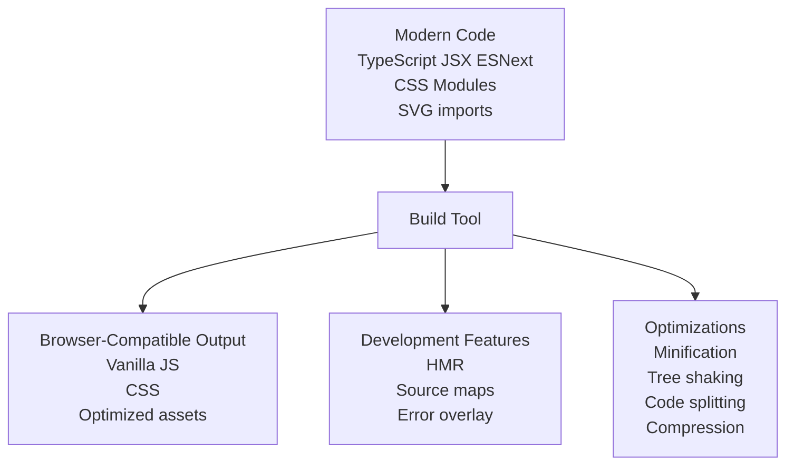
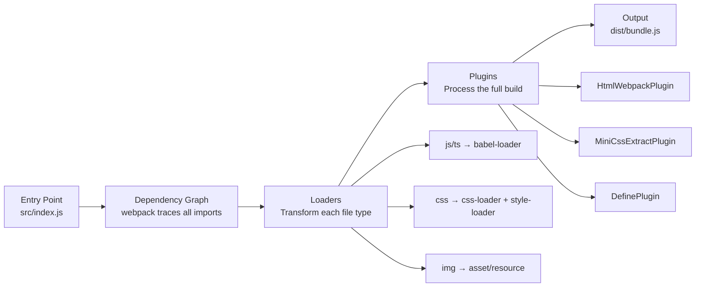

<a id="6-build-tools-and-modern-toolchain"></a>

# Chapter 6: Build Tools & Modern Toolchain

[⬅ Previous Chapter](#5-networking-http-and-protocols) | [📖 Main Index](#main-index) | [Next Chapter ➡](#7-accessibility-a11y-complete-guide)

---

## 📌 Learning Objectives

By the end of this chapter, you will:

- **Understand** why build tools exist and what problems they solve
- **Explain** how Babel transforms code — presets, plugins, configuration
- **Compare** Babel vs SWC vs esbuild — speed, use cases, differences
- **Deep-dive** into Vite — ESM-based dev server, HMR internals, production Rollup build
- **Know** Rollup's tree shaking excellence and output format options
- **Understand** Webpack fundamentals — entry, loaders, plugins, code splitting
- **Explain** Turbopack and incremental computation concept
- **Compare** npm vs yarn vs pnpm with pnpm's symlink efficiency
- **Analyze** bundle size with visualizer tools and apply optimization strategies
- **Answer** 15+ interview questions on build tools confidently

---

<a id="chapter-index-table-6"></a>

## 📑 Chapter Index Table

| Topic No. | Topic Name | Subtopics |
|-----------|-----------|-----------|
| 6.1 | [Why Build Tools?](#61-why-build-tools) | Module bundling, Transpilation, Minification, Tree shaking, HMR |
| 6.2 | [Babel — JavaScript Transpiler](#62-babel-javascript-transpiler) | Transforms, Presets, Plugins, Config files, Babel vs SWC |
| 6.3 | [SWC — Speedy Web Compiler](#63-swc-speedy-web-compiler) | Rust-based, Drop-in replacement, Next.js & Vite usage |
| 6.4 | [esbuild](#64-esbuild) | Go-based, Speed comparison, Vite's engine |
| 6.5 | [Vite — The Modern Dev Tool](#65-vite-the-modern-dev-tool) | ESM dev server, HMR, Production Rollup, vite.config.ts |
| 6.6 | [Rollup](#66-rollup) | Library bundling, Tree shaking, Output formats, When to use |
| 6.7 | [Webpack — Legacy but Important](#67-webpack-legacy-but-important) | Entry/output/loaders/plugins, Code splitting, Module Federation |
| 6.8 | [Turbopack](#68-turbopack) | Rust-based, Incremental computation, Next.js dev |
| 6.9 | [Package Managers](#69-package-managers) | npm vs yarn vs pnpm, symlinks, workspaces, lock files |
| 6.10 | [Bundle Analysis & Optimization](#610-bundle-analysis-and-optimization) | Visualizers, Finding large deps, Dynamic imports |
| — | [Interview Questions](#interview-questions-chapter-6) | 15+ Conceptual, Scenario |
| — | [Practice Problems](#practice-problems-chapter-6) | 5 Theory Problems |
| — | [Quick Revision](#quick-revision-chapter-6) | Key bullets, traps, cheat sheet |
| — | [Chapter Summary](#chapter-summary-chapter-6) | Most important points |

---

## 6.1 Why Build Tools?

<a id="61-why-build-tools"></a>

### 🧠 Hinglish Intuition

> 2010 mein browser sirf simple JS samajhta tha. Lekin developers chahte the — modules, new syntax, TypeScript, JSX. Build tools ek translator ki tarah hain — tumhara advanced code leke browser ka samajhne wala code banate hain. Plus speed improvements — minification, tree shaking, caching.

---

### Problems Build Tools Solve



---

### Problem 1: Module Bundling

```javascript
// Before bundlers: browsers didn't support modules
// You had to use global variables and script order mattered!

// index.html (old way — fragile!)
<script src="jquery.js"></script>      // must be first!
<script src="utils.js"></script>       // depends on jquery
<script src="app.js"></script>         // depends on both
// One wrong order = broken app
// Global namespace pollution

// With bundlers: use modules freely
// app.js
import { formatDate } from './utils.js';
import React from 'react';
import styles from './app.module.css';
import logo from './logo.svg';
import data from './config.json';

// Bundler resolves all imports → creates single optimized bundle
// Browser gets ONE file with everything needed
```

---

### Problem 2: Transpilation

```javascript
// You write (modern JS / TypeScript / JSX):
const greet = (name: string): string => `Hello, ${name}!`;

interface User {
  id: number;
  name: string;
}

const App = () => <div className="app">Hello React</div>;

// Browser (2018 and below) can't understand this!
// Transpiler converts to:

"use strict";
var greet = function(name) {
  return "Hello, " + name + "!";
};

var App = function() {
  return React.createElement("div", { className: "app" }, "Hello React");
};
```

---

### Problem 3: Minification

```javascript
// Your code (1000 lines, readable):
function calculateTaxForUser(userIncome, taxBracket, deductions) {
  const taxableIncome = userIncome - deductions;
  if (taxableIncome <= 0) {
    return 0;
  }
  return taxableIncome * taxBracket;
}

// Minified (same functionality, fraction of size):
function c(a,b,d){let e=a-d;return e<=0?0:e*b}

// Size reduction: typically 60-80% smaller
// Also: remove comments, whitespace, rename variables
// Gzip on top: another 60-80% reduction
```

---

### Problem 4: Tree Shaking (Dead Code Elimination)

```javascript
// utils.js — a large utility library
export function used() { return 'I am used'; }
export function unused1() { /* 100 lines of code */ }
export function unused2() { /* 200 lines of code */ }
export function unused3() { /* 50 lines of code */ }

// app.js — only imports one function
import { used } from './utils.js';
used();

// WITHOUT tree shaking: bundle includes all 350+ lines
// WITH tree shaking: bundle includes ONLY 'used' — 1 line!
// Requires: ESM (static imports), not CJS (dynamic require)
```

---

### Problem 5: Dev Server with HMR

```
Without build tools:
- Edit file → manually refresh browser → lose application state
- Have to re-navigate to where you were
- Takes 2-5 seconds per change

With HMR (Hot Module Replacement):
- Edit file → only changed module replaced in running app
- Application state PRESERVED
- Changes visible in 50-200ms
- No full page reload!

Example: Edit a React component's CSS
- HMR replaces just the CSS module
- Component re-renders with new styles
- Your form data, open modals, etc. all preserved
```

---

### Build Tool Responsibilities Summary

| Responsibility | What it does |
|---------------|-------------|
| **Module Resolution** | Follow import chains, handle aliases |
| **Transformation** | TypeScript → JS, JSX → JS, SASS → CSS |
| **Bundling** | Multiple files → optimized output |
| **Minification** | Remove whitespace, shorten names |
| **Tree Shaking** | Remove unused exports |
| **Code Splitting** | Split bundle into lazy-loadable chunks |
| **Asset Processing** | Images, fonts, SVGs → optimized output |
| **Source Maps** | Map minified code back to source |
| **HMR** | Hot module replacement during dev |
| **Dev Server** | Serve files, proxy API, HTTPS |

👉 <a href="#chapter-index-table-6">Go to Top 🔝</a>

---

## 6.2 Babel — JavaScript Transpiler

<a id="62-babel-javascript-transpiler"></a>

### 🧠 Hinglish Intuition

> Babel ek translator hai — aapka modern JS/JSX/TypeScript leke purana browser-compatible JS mein convert karta hai. Ek Babel transform teen steps mein hota hai — parse (samajhna), transform (badalna), generate (naya code likhna). Presets = bundles of plugins hain.

---

### How Babel Transforms Code — 3 Phases

```mermaid
flowchart LR
    A[Source Code\nconst x = () => {}] --> B[Parser\nBabel Parser / @babel/parser]
    B --> C[AST\nAbstract Syntax Tree]
    C --> D[Transformer\nPlugins traverse & modify AST]
    D --> E[Modified AST]
    E --> F[Code Generator\n@babel/generator]
    F --> G[Output Code\nvar x = function x {}]
```

```javascript
// Input source code:
const greet = (name) => `Hello ${name}`;

// AST representation (simplified):
{
  "type": "Program",
  "body": [{
    "type": "VariableDeclaration",
    "kind": "const",
    "declarations": [{
      "type": "VariableDeclarator",
      "id": { "type": "Identifier", "name": "greet" },
      "init": {
        "type": "ArrowFunctionExpression",
        "params": [{ "type": "Identifier", "name": "name" }],
        "body": {
          "type": "TemplateLiteral",
          // ...
        }
      }
    }]
  }]
}

// After transform (arrow function plugin):
// ArrowFunctionExpression → FunctionExpression
// TemplateLiteral → BinaryExpression (string concat)

// Output code:
"use strict";
var greet = function greet(name) {
  return "Hello " + name;
};
```

---

### Presets — Bundles of Plugins

```javascript
// @babel/preset-env — transform modern JS to target environments
// Automatically determines which transforms needed based on targets

// babel.config.js
module.exports = {
  presets: [
    ['@babel/preset-env', {
      targets: {
        browsers: ['> 1%', 'last 2 versions', 'not dead'],
        // OR: node: 'current' for Node.js
      },
      modules: false,     // keep ES modules (for tree shaking)
      useBuiltIns: 'usage', // auto-add polyfills based on usage
      corejs: 3,          // specify core-js version for polyfills
      // debug: true,     // see which transforms are applied
    }],
    ['@babel/preset-react', {
      runtime: 'automatic', // new JSX transform — no React import needed
      // runtime: 'classic' // old: requires import React from 'react'
    }],
    ['@babel/preset-typescript', {
      // TypeScript support — strips types (no type checking!)
      allExtensions: true,
    }],
  ],
  plugins: [
    '@babel/plugin-transform-class-properties',
    ['@babel/plugin-transform-runtime', {
      corejs: 3,         // use polyfills from @babel/runtime
    }],
    // Environment-specific:
    process.env.NODE_ENV === 'development' && 'react-refresh/babel',
  ].filter(Boolean)
};
```

---

### Configuration Files

```javascript
// Option 1: babel.config.js (project-wide — recommended for monorepos)
// Applies to node_modules too if configured
module.exports = {
  presets: ['@babel/preset-env', '@babel/preset-react'],
};

// Option 2: .babelrc (file-relative — applies to files in same dir/subdirs)
// Doesn't apply to node_modules
{
  "presets": ["@babel/preset-env"],
  "env": {
    "test": {
      "plugins": ["@babel/plugin-transform-modules-commonjs"]
      // Jest requires CommonJS, so transform ESM to CJS in test env
    }
  }
}

// Option 3: babel.config.json (same as .js but JSON syntax)
// Option 4: package.json "babel" field
{
  "name": "my-app",
  "babel": {
    "presets": ["@babel/preset-env"]
  }
}

// Priority: babel.config.js > .babelrc > package.json
```

---

### Babel vs SWC Performance Comparison

```
BABEL:
- Written in JavaScript
- Single-threaded
- Very mature, extensive plugin ecosystem
- Speed: ~1x (baseline)
- Transform time for large project: ~30 seconds

SWC:
- Written in Rust
- Parallel processing
- Growing plugin ecosystem
- Speed: ~70x faster than Babel
- Transform time for same project: ~0.5 seconds

Why so much faster?
- Rust is compiled, not interpreted
- Rust has no garbage collection pauses
- SWC uses true parallelism (Rust threads)
- WASM for browser, native binary for Node

When Babel is still needed:
- Custom Babel plugins with no SWC equivalent
- Legacy projects with complex Babel configs
- Specific transforms only Babel supports
- babel-plugin-import, babel-plugin-styled-components (being ported)
```

> [!NOTE]
> Next.js switched from Babel to SWC as default compiler in Next.js 12. It automatically detects if you have a `.babelrc` file — if found, it falls back to Babel (slower). Remove custom Babel config to get SWC speed benefits.

👉 <a href="#chapter-index-table-6">Go to Top 🔝</a>

---

## 6.3 SWC — Speedy Web Compiler

<a id="63-swc-speedy-web-compiler"></a>

### 🧠 Hinglish Intuition

> SWC Rust mein likha gaya hai — Rust ek language hai jo C++ jitna fast hai lekin safe. Babel ka ek ek kaam SWC karta hai — sirf 70x tezi se. Next.js ne Babel chod ke SWC adopt kar liya kyunki build times dramatically kam ho gaaye.

---

### SWC — Core Capabilities

```javascript
// SWC can handle (without Babel):
// ✅ TypeScript → JavaScript
// ✅ JSX → JavaScript
// ✅ ESNext → older JS (like @babel/preset-env)
// ✅ Minification (like Terser/UglifyJS)
// ✅ Bundling (limited, via @swc/core)

// Installation:
npm install @swc/core @swc/cli

// .swcrc — SWC configuration
{
  "jsc": {
    "parser": {
      "syntax": "typescript",  // or "ecmascript"
      "tsx": true,            // enable JSX in .tsx files
      "decorators": true      // TypeScript decorators
    },
    "transform": {
      "react": {
        "runtime": "automatic",  // new JSX transform
        "refresh": true          // React Refresh in dev
      }
    },
    "target": "es2020",
    "loose": false,
    "externalHelpers": true  // use @swc/helpers instead of inline
  },
  "module": {
    "type": "es6"     // "commonjs" for CJS output
  },
  "minify": false,    // true for production
  "sourceMaps": true
}

// CLI usage:
swc src -d dist                    // transpile directory
swc src/app.ts -o dist/app.js      // transpile single file

// Programmatic API:
const swc = require('@swc/core');

const result = await swc.transform(`
  const x: number = 42;
  const greet = (name: string) => \`Hello \${name}\`;
`, {
  filename: 'app.ts',
  jsc: {
    parser: { syntax: 'typescript' },
    target: 'es2018'
  }
});

console.log(result.code);
// const x = 42;
// const greet = (name) => `Hello ${name}`;
```

---

### SWC in Next.js

```javascript
// next.config.js — SWC is default, configure transforms here:
/** @type {import('next').NextConfig} */
const nextConfig = {
  swcMinify: true,  // use SWC for minification (default true in Next.js 13+)

  compiler: {
    // SWC plugins (replacing common Babel plugins):
    styledComponents: true,  // replaces babel-plugin-styled-components
    removeConsole: {
      exclude: ['error', 'warn'],  // remove console.log in production
    },
    emotion: true,     // CSS-in-JS emotion
    reactRemoveProperties: true,  // remove data-testid in production
  },

  // If you have .babelrc, Next.js uses Babel instead of SWC!
  // Remove .babelrc to use SWC
};

module.exports = nextConfig;

// Performance impact (Next.js docs):
// Build 50% faster with SWC vs Babel
// Fast Refresh 3x faster
// Memory usage: significantly lower
```

---

### SWC in Vite

```javascript
// Vite uses SWC via @vitejs/plugin-react-swc:
// (Alternative to @vitejs/plugin-react which uses Babel)

// Installation:
npm install @vitejs/plugin-react-swc

// vite.config.ts:
import { defineConfig } from 'vite';
import react from '@vitejs/plugin-react-swc'; // SWC version

export default defineConfig({
  plugins: [react()],
  // SWC handles JSX transformation + React Refresh
  // No Babel config needed!
});
```

👉 <a href="#chapter-index-table-6">Go to Top 🔝</a>

---

## 6.4 esbuild

<a id="64-esbuild"></a>

### 🧠 Hinglish Intuition

> esbuild Go language mein likha gaya — sirf speed ke liye. Webpack jo kaam 60 seconds mein karta tha, esbuild 0.5 seconds mein. Vite ne esbuild ko apna internal engine banaya — dependency pre-bundling ke liye. Itna fast kyun? Go compiler compiled hai, parallel processing karta hai, aur bhut smart caching use karta hai.

---

### esbuild — Speed & Capabilities

```javascript
// esbuild speed benchmark (from esbuild docs):
// Three.js library (complex):
// esbuild: 0.37s
// Parcel 2: 34.9s
// Webpack 5: 41.4s
// Rollup: 42.4s
// 100x faster than competitors!

// Why so fast?
// 1. Written in Go (compiled language, no JIT warmup)
// 2. Uses all CPU cores in parallel (Go goroutines)
// 3. Efficient memory layout — avoids unnecessary allocations
// 4. Single pass over AST (most bundlers do multiple passes)
// 5. Written from scratch — no legacy architecture decisions

// esbuild capabilities:
// ✅ JavaScript/TypeScript bundling
// ✅ JSX transformation
// ✅ Minification (fast!)
// ✅ Tree shaking
// ✅ Code splitting (basic)
// ✅ CSS bundling (basic)
// ✅ Source maps

// esbuild limitations:
// ❌ No type checking (TypeScript types stripped, not checked)
// ❌ No support for decorators (TypeScript decorators)
// ❌ Limited plugin ecosystem vs Webpack/Rollup
// ❌ No CommonJS → ESM conversion (partial)

// Installation:
npm install esbuild

// CLI:
esbuild src/app.tsx --bundle --minify --outfile=dist/app.js \
  --platform=browser --target=es2020

// API:
const esbuild = require('esbuild');

await esbuild.build({
  entryPoints: ['src/app.tsx'],
  bundle: true,           // bundle all imports
  minify: true,           // minify output
  sourcemap: true,        // generate source maps
  target: ['es2020', 'chrome90', 'firefox88'],
  platform: 'browser',
  format: 'esm',          // output format: esm | cjs | iife
  outfile: 'dist/app.js',
  define: {
    'process.env.NODE_ENV': '"production"'
  },
  loader: {
    '.png': 'dataurl',  // inline images as base64
    '.svg': 'text',     // import SVG as string
  },
  plugins: [myPlugin()], // minimal plugin API
});
```

---

### esbuild as Vite's Engine

```
Vite uses esbuild for two specific things:

1. DEPENDENCY PRE-BUNDLING (during dev startup):
   - When you start 'npm run dev' for first time
   - Vite scans your source code for bare imports (react, lodash, etc.)
   - These dependencies are bundled ONCE with esbuild → .vite/ cache
   - Result: node_modules imports are served as single ESM bundle
   - Why? node_modules are CommonJS or have hundreds of files → needs bundling

2. TRANSFORMATION (during dev):
   - TypeScript → JavaScript stripping (esbuild is very fast at this)
   - JSX → JavaScript transformation
   - CSS preprocessing basic transforms
   - NOT for transpilation to older browsers — esbuild only targets modern browsers

Production build uses ROLLUP (not esbuild):
   - Rollup better for tree shaking
   - Better code splitting
   - Better plugin ecosystem for production
   - More mature optimization strategies
```

👉 <a href="#chapter-index-table-6">Go to Top 🔝</a>

---

## 6.5 Vite — The Modern Dev Tool

<a id="65-vite-the-modern-dev-tool"></a>

### 🧠 Hinglish Intuition

> Vite French mein "fast" hai. Webpack dev server mein pehle pura bundle banata tha THEN browser mein serve karta tha. Vite seedha browser ke ESM support use karta hai — browser khud import dhundta hai, Vite sirf us file ko transform karke bhejta hai. Isliye Vite instant start hota hai chahe project kitna bhi bada ho.

---

### How Vite Dev Server Works — ESM-Based

```mermaid
flowchart TD
    subgraph Webpack Dev Server Old Approach
    A1[npm run dev] --> B1[Bundle ALL files\nJS + CSS + assets]
    B1 --> C1[Server ready\n30-60 seconds for large projects]
    C1 --> D1[Browser loads bundle.js]
    end

    subgraph Vite New Approach
    A2[npm run dev] --> B2[Pre-bundle node_modules\nwith esbuild 0.5s]
    B2 --> C2[Server ready INSTANTLY\n~300ms always!]
    C2 --> D2[Browser requests /src/app.tsx]
    D2 --> E2[Vite transforms ONLY requested file\non demand]
    E2 --> F2[Browser receives transformed file]
    F2 --> G2[Browser imports dependencies\nnext request]
    end
```



```
Key Vite insight:
Modern browsers (Chrome 90+, Firefox 88+) natively support ESM imports!

Browser can do:
<script type="module" src="/src/main.tsx"></script>

When browser encounters: import { useState } from 'react'
→ Browser makes HTTP request to Vite dev server for 'react'
→ Vite returns pre-bundled react.js from cache

When browser encounters: import App from './App.tsx'
→ Browser makes HTTP request to Vite for /src/App.tsx
→ Vite transforms App.tsx (TypeScript → JS) on the fly
→ Returns transformed JS to browser

No bundling needed in development!
Each file is transformed independently and cached.
```

---

### Why Vite Is Fast — Detailed Explanation

```
PROBLEM with Webpack dev server:
Large project with 1000 files:
- Webpack builds dependency graph of ALL 1000 files
- Transforms ALL of them (TypeScript, JSX, CSS Modules)
- Creates bundle.js with all 1000 files concatenated
- THEN starts serving
- Result: 30-60 second startup time
- Code change? Re-bundle affected module + all dependents = slow HMR

VITE SOLUTION:
Same 1000-file project:
1. Pre-bundle node_modules with esbuild (0.5s, cached)
2. Start server (no bundling!) — instant!
3. Browser requests / → Vite serves index.html
4. Browser sees <script type="module" src="/src/main.tsx">
5. Browser requests /src/main.tsx → Vite transforms ONLY that file
6. Browser sees imports in main.tsx → requests those files
7. Lazy cascade: only files actually needed are transformed
8. Unvisited pages/routes = never transformed (truly lazy!)
9. Result: startup always ~300ms regardless of project size!

HMR with Vite:
Code change → Vite determines which module changed
→ Sends HMR update to browser (tiny patch)
→ Browser replaces only that module
→ Time: ~50ms (independent of project size!)
```

---

### HMR Internals

```javascript
// How HMR works under the hood:

// 1. Vite server watches files for changes
// 2. File changes → Vite analyzes import graph
// 3. Finds shortest path to "hot module boundary"
// 4. Sends HMR payload to browser via WebSocket

// HMR WebSocket message:
{
  "type": "update",
  "updates": [{
    "type": "js-update",
    "path": "/src/components/Button.tsx",
    "acceptedPath": "/src/components/Button.tsx",
    "timestamp": 1705320000
  }]
}

// Browser HMR client (injected by Vite):
// Receives WebSocket message → imports new module version
// React Refresh handles React component replacement:
// - New component code is evaluated
// - React re-renders affected components
// - State is PRESERVED (the magic!)

// In your code: Vite auto-adds HMR handling for React via plugin
// If you're NOT using React, you can add manual HMR:
if (import.meta.hot) {
  import.meta.hot.accept('./utils.js', (newModule) => {
    // newModule is the updated module
    // manually apply update if needed
  });

  import.meta.hot.dispose(() => {
    // cleanup before module is replaced (clear timers, etc.)
  });
}

// React components: @vitejs/plugin-react handles this automatically
// via React Refresh — no manual HMR code needed
```

---

### Production Build — Rollup Under the Hood

```javascript
// 'npm run build' uses Rollup (not esbuild!) for:
// - Better tree shaking
// - Better code splitting  
// - Better plugin ecosystem

// What happens:
// 1. Rollup builds full dependency graph
// 2. Tree shaking — removes unused exports
// 3. Code splitting — creates chunks
// 4. Rollup plugins run (CSS extraction, etc.)
// 5. esbuild used for MINIFICATION (fast!)
// 6. Output: dist/ folder with optimized chunks

// Why not esbuild for production?
// Rollup has more mature code splitting
// Better dead code elimination
// More flexible output options
// Vite uses both strategically: Rollup (bundling) + esbuild (minification)
```

---

### vite.config.ts — Complete Configuration

```typescript
// vite.config.ts
import { defineConfig, loadEnv } from 'vite';
import react from '@vitejs/plugin-react';
import path from 'path';

export default defineConfig(({ command, mode }) => {
  // Load env variables based on mode (development, production)
  const env = loadEnv(mode, process.cwd(), '');

  return {
    plugins: [
      react({
        // Babel plugins for React (SWC alternative: @vitejs/plugin-react-swc)
        babel: {
          plugins: ['styled-components'],
        },
      }),
    ],

    // Path aliases
    resolve: {
      alias: {
        '@': path.resolve(__dirname, './src'),
        '@components': path.resolve(__dirname, './src/components'),
        '@utils': path.resolve(__dirname, './src/utils'),
      },
    },

    // Dev server configuration
    server: {
      port: 3000,
      open: true,        // auto-open browser
      https: false,
      proxy: {
        // Proxy API calls to avoid CORS in development
        '/api': {
          target: 'http://localhost:8080',
          changeOrigin: true,
          rewrite: (path) => path.replace(/^\/api/, ''),
        },
      },
    },

    // Build configuration
    build: {
      outDir: 'dist',
      sourcemap: true,          // generate source maps
      minify: 'esbuild',        // esbuild (fast) or 'terser' (better compression)
      target: 'es2020',         // browser target for output
      chunkSizeWarningLimit: 500, // warn if chunk > 500KB

      rollupOptions: {
        output: {
          // Manual chunk splitting
          manualChunks: {
            vendor: ['react', 'react-dom'],       // react in separate chunk
            ui: ['@radix-ui/react-dialog', '@radix-ui/react-dropdown-menu'],
            router: ['react-router-dom'],
          },
          // File naming with content hash
          entryFileNames: 'assets/[name].[hash].js',
          chunkFileNames: 'assets/[name].[hash].js',
          assetFileNames: 'assets/[name].[hash].[ext]',
        },
      },
    },

    // CSS configuration
    css: {
      modules: {
        localsConvention: 'camelCaseOnly', // import { myClass } (not 'my-class')
      },
      preprocessorOptions: {
        scss: {
          additionalData: `@use "@/styles/variables" as *;`,
        },
      },
    },

    // Preview server (to test production build locally)
    preview: {
      port: 4173,
    },

    // Environment variables — prefix 'VITE_' to expose to client
    // Access as: import.meta.env.VITE_API_URL
    envPrefix: 'VITE_',

    // Optimize dependencies
    optimizeDeps: {
      include: ['react', 'react-dom'],    // pre-bundle these
      exclude: ['@vite/client'],          // don't pre-bundle these
    },
  };
});
```

👉 <a href="#chapter-index-table-6">Go to Top 🔝</a>

---

## 6.6 Rollup

<a id="66-rollup"></a>

### 🧠 Hinglish Intuition

> Rollup library developers ka bundler hai. Agar tum React, Lodash jaise library bana rahe ho — Rollup best choice hai. ESM, CJS, UMD — sab formats mein output deta hai. Tree shaking bahut perfect karta hai. Vite internally Rollup use karta hai production build ke liye.

---

### Rollup — Library Bundling

```javascript
// rollup.config.js — typical library configuration
import resolve from '@rollup/plugin-node-resolve';
import commonjs from '@rollup/plugin-commonjs';
import typescript from '@rollup/plugin-typescript';
import terser from '@rollup/plugin-terser';
import peerDepsExternal from 'rollup-plugin-peer-deps-external';
import dts from 'rollup-plugin-dts';

const packageJson = require('./package.json');

export default [
  // Main build — JS output
  {
    input: 'src/index.ts',  // library entry point
    output: [
      {
        file: packageJson.main,     // 'dist/index.cjs.js'
        format: 'cjs',              // CommonJS — for require()
        sourcemap: true,
        exports: 'named',
      },
      {
        file: packageJson.module,   // 'dist/index.esm.js'
        format: 'esm',              // ES Modules — for import
        sourcemap: true,
      },
      {
        name: 'MyLibrary',          // global variable name
        file: 'dist/index.umd.js',
        format: 'umd',              // Universal — works everywhere
        sourcemap: true,
        globals: {
          react: 'React',           // map peer dep to global
          'react-dom': 'ReactDOM',
        },
      },
    ],
    plugins: [
      peerDepsExternal(),  // exclude react, react-dom from bundle (peer deps)
      resolve(),           // resolve node_modules
      commonjs(),          // convert CJS dependencies to ESM
      typescript({
        tsconfig: './tsconfig.json',
        declaration: true,
        declarationDir: 'dist/types',
      }),
      terser(),            // minify
    ],
    // Don't bundle peer dependencies:
    external: ['react', 'react-dom', 'react/jsx-runtime'],
  },

  // TypeScript declaration files build
  {
    input: 'dist/types/index.d.ts',
    output: [{ file: 'dist/index.d.ts', format: 'esm' }],
    plugins: [dts()],
  },
];
```

---

### Output Formats — ESM, CJS, UMD

```javascript
// INPUT (your source code):
export function add(a, b) { return a + b; }
export const PI = 3.14159;

// ─────────────────────────────────────────────
// OUTPUT FORMAT: ESM (ES Modules)
// ─────────────────────────────────────────────
export function add(a, b) { return a + b; }
export const PI = 3.14159;
// Use case: Modern bundlers (Webpack, Rollup, Vite)
// import { add } from 'your-library'
// ✅ Tree shakeable — bundlers can eliminate unused exports

// ─────────────────────────────────────────────
// OUTPUT FORMAT: CJS (CommonJS)
// ─────────────────────────────────────────────
'use strict';
Object.defineProperty(exports, '__esModule', { value: true });
function add(a, b) { return a + b; }
const PI = 3.14159;
exports.add = add;
exports.PI = PI;
// Use case: Node.js, older bundlers
// const { add } = require('your-library')
// ❌ NOT tree shakeable by default

// ─────────────────────────────────────────────
// OUTPUT FORMAT: IIFE (Immediately Invoked Function Expression)
// ─────────────────────────────────────────────
var MyLibrary = (function () {
  'use strict';
  function add(a, b) { return a + b; }
  const PI = 3.14159;
  return { add, PI };
})();
// Use case: browser <script> tag (no module system)
// <script src="library.iife.js"></script>
// MyLibrary.add(2, 3)

// ─────────────────────────────────────────────
// OUTPUT FORMAT: UMD (Universal Module Definition)
// ─────────────────────────────────────────────
(function (global, factory) {
  typeof exports === 'object' && typeof module !== 'undefined' ? factory(exports) :
  typeof define === 'function' && define.amd ? define(['exports'], factory) :
  (global = typeof globalThis !== 'undefined' ? globalThis : global || self,
  factory(global.MyLibrary = {}));
})(this, function(exports) {
  // works as CJS, AMD, or global variable!
});
// Use case: CDN distribution, works everywhere
// ❌ Largest output, use IIFE for browser-only
```

---

### When to Use Rollup vs Vite

| Scenario | Tool | Reason |
|---------|------|--------|
| Building a React/Vue app | **Vite** | Dev server, HMR, full app features |
| Building a npm library | **Rollup** | Multiple output formats, no dev server needed |
| Building a component library | **Rollup** or **Vite library mode** | Both work well |
| Production app build | **Vite** (uses Rollup internally) | Best of both |
| Complex micro frontend | **Webpack** with Module Federation | Module Federation |
| Ultra-fast bundling needed | **esbuild** | Fastest option |

```javascript
// Vite library mode — using Vite to build libraries:
// vite.config.ts
import { defineConfig } from 'vite';
import react from '@vitejs/plugin-react';
import { resolve } from 'path';
import dts from 'vite-plugin-dts';

export default defineConfig({
  plugins: [react(), dts()],
  build: {
    lib: {
      entry: resolve(__dirname, 'src/index.ts'),
      name: 'MyLibrary',
      formats: ['es', 'cjs'],
      fileName: (format) => `my-library.${format}.js`
    },
    rollupOptions: {
      external: ['react', 'react-dom'],  // don't bundle peer deps
      output: {
        globals: { react: 'React', 'react-dom': 'ReactDOM' }
      }
    }
  }
});
```

👉 <a href="#chapter-index-table-6">Go to Top 🔝</a>

---

## 6.7 Webpack — Legacy but Important

<a id="67-webpack-legacy-but-important"></a>

### 🧠 Hinglish Intuition

> Webpack purana soldier hai — 2012 se hai, battle-tested hai. Agar tum interview mein ho ya purani company join karo, Webpack zaroor milega. Entry point se shuru karo, dependency graph banao, output mein optimized bundle do. Loaders = file transformers, Plugins = build process extenders.

---

### Webpack Core Concepts



```javascript
// webpack.config.js — Complete configuration
const path = require('path');
const HtmlWebpackPlugin = require('html-webpack-plugin');
const MiniCssExtractPlugin = require('mini-css-extract-plugin');
const TerserPlugin = require('terser-webpack-plugin');
const CssMinimizerPlugin = require('css-minimizer-webpack-plugin');
const { DefinePlugin, BannerPlugin } = require('webpack');
const BundleAnalyzerPlugin = require('webpack-bundle-analyzer').BundleAnalyzerPlugin;

const isDevelopment = process.env.NODE_ENV !== 'production';

module.exports = {
  // ─── ENTRY ───────────────────────────────────
  entry: {
    main: './src/index.tsx',
    // Multiple entry points (for MPAs):
    // admin: './src/admin/index.tsx',
    // landing: './src/landing/index.tsx',
  },

  // ─── OUTPUT ──────────────────────────────────
  output: {
    path: path.resolve(__dirname, 'dist'),
    filename: isDevelopment
      ? '[name].js'
      : '[name].[contenthash:8].js',      // content hash for cache busting!
    chunkFilename: isDevelopment
      ? '[name].chunk.js'
      : '[name].[contenthash:8].chunk.js',
    assetModuleFilename: 'assets/[hash][ext][query]',
    clean: true,                           // clean dist before build
    publicPath: '/',                       // base URL for all assets
  },

  // ─── MODE ────────────────────────────────────
  mode: isDevelopment ? 'development' : 'production',

  // ─── SOURCE MAPS ─────────────────────────────
  devtool: isDevelopment ? 'eval-source-map' : 'source-map',

  // ─── RESOLVE ─────────────────────────────────
  resolve: {
    extensions: ['.tsx', '.ts', '.jsx', '.js', '.json'],
    alias: {
      '@': path.resolve(__dirname, 'src'),
      '@components': path.resolve(__dirname, 'src/components'),
    },
  },

  // ─── LOADERS ─────────────────────────────────
  module: {
    rules: [
      // TypeScript + React JSX
      {
        test: /\.(ts|tsx)$/,
        use: [
          {
            loader: 'babel-loader',
            options: {
              presets: [
                '@babel/preset-env',
                '@babel/preset-react',
                '@babel/preset-typescript',
              ],
            },
          },
          // OR use swc-loader for speed:
          // { loader: 'swc-loader' }
        ],
        exclude: /node_modules/,
      },

      // CSS + CSS Modules
      {
        test: /\.module\.css$/,
        use: [
          isDevelopment ? 'style-loader' : MiniCssExtractPlugin.loader,
          {
            loader: 'css-loader',
            options: {
              modules: {
                localIdentName: isDevelopment
                  ? '[name]__[local]--[hash:base64:5]'
                  : '[hash:base64]',
              },
            },
          },
        ],
      },

      // Global CSS
      {
        test: /\.css$/,
        exclude: /\.module\.css$/,
        use: [
          isDevelopment ? 'style-loader' : MiniCssExtractPlugin.loader,
          'css-loader',
          'postcss-loader',   // for Tailwind, autoprefixer
        ],
      },

      // SCSS
      {
        test: /\.scss$/,
        use: ['style-loader', 'css-loader', 'sass-loader'],
      },

      // Images (Webpack 5 Asset Modules — replaces file-loader, url-loader)
      {
        test: /\.(png|jpg|jpeg|gif|svg|webp|avif)$/i,
        type: 'asset',   // auto: inline if < 8KB, file if larger
        parser: {
          dataUrlCondition: {
            maxSize: 8 * 1024, // 8KB threshold
          },
        },
      },

      // Fonts
      {
        test: /\.(woff|woff2|eot|ttf|otf)$/i,
        type: 'asset/resource',
      },
    ],
  },

  // ─── PLUGINS ─────────────────────────────────
  plugins: [
    // Generate index.html with script tag
    new HtmlWebpackPlugin({
      template: './public/index.html',
      minify: !isDevelopment,
    }),

    // Extract CSS to separate file (production)
    !isDevelopment && new MiniCssExtractPlugin({
      filename: 'styles/[name].[contenthash:8].css',
    }),

    // Define global constants
    new DefinePlugin({
      'process.env.NODE_ENV': JSON.stringify(process.env.NODE_ENV),
      'process.env.API_URL': JSON.stringify(process.env.API_URL),
    }),

    // Analyze bundle size
    process.env.ANALYZE && new BundleAnalyzerPlugin(),
  ].filter(Boolean),

  // ─── OPTIMIZATION ────────────────────────────
  optimization: {
    minimize: !isDevelopment,
    minimizer: [
      new TerserPlugin({
        parallel: true,          // use multiple CPU cores
        terserOptions: {
          compress: {
            drop_console: true,  // remove console.log in production
          },
        },
      }),
      new CssMinimizerPlugin(),
    ],

    // Code splitting
    splitChunks: {
      chunks: 'all',
      cacheGroups: {
        vendor: {
          test: /[\\/]node_modules[\\/]/,
          name: 'vendors',
          chunks: 'all',
        },
        react: {
          test: /[\\/]node_modules[\\/](react|react-dom)[\\/]/,
          name: 'react-vendor',
          chunks: 'all',
          priority: 20,   // higher priority than vendor
        },
      },
    },

    // Keep runtime in separate chunk (for long-term caching)
    runtimeChunk: 'single',
  },

  // ─── DEV SERVER ──────────────────────────────
  devServer: {
    port: 3000,
    hot: true,             // HMR
    historyApiFallback: true, // SPA routing — 404 → index.html
    proxy: {
      '/api': 'http://localhost:8080',
    },
    static: {
      directory: path.join(__dirname, 'public'),
    },
  },
};
```

---

### Code Splitting with SplitChunksPlugin

```javascript
// Dynamic imports trigger code splitting:

// Before optimization — everything in one bundle:
import HeavyChart from './HeavyChart'; // always included!

// After — lazy loaded only when needed:
const HeavyChart = React.lazy(() => import('./HeavyChart'));

// Webpack creates:
// main.abc123.js — main app code
// HeavyChart.def456.js — lazy chunk (only loaded when user visits chart page)

// SplitChunksPlugin configuration:
optimization: {
  splitChunks: {
    chunks: 'all',        // 'async' (default), 'initial', 'all'
    minSize: 20000,       // 20KB minimum for new chunk
    minRemainingSize: 0,
    minChunks: 1,         // min imports for a chunk to be created
    maxAsyncRequests: 30, // max parallel requests for async chunks
    maxInitialRequests: 30,
    enforceSizeThreshold: 50000,

    cacheGroups: {
      // Vendor chunk (node_modules)
      defaultVendors: {
        test: /[\\/]node_modules[\\/]/,
        priority: -10,
        reuseExistingChunk: true,
        name: 'vendors',
      },
      default: {
        minChunks: 2,     // if imported in 2+ places → separate chunk
        priority: -20,
        reuseExistingChunk: true,
      },
    },
  },
}
```

---

### Module Federation — Micro Frontends

```javascript
// Module Federation allows sharing code between separate Webpack builds!
// Each micro frontend is a separate build that can expose and consume modules.

// HOST APP (shell) — webpack.config.js
const { ModuleFederationPlugin } = require('webpack').container;

module.exports = {
  plugins: [
    new ModuleFederationPlugin({
      name: 'host',
      remotes: {
        // Load 'nav' micro frontend from remote URL:
        nav: 'nav@https://nav.example.com/remoteEntry.js',
        cart: 'cart@https://cart.example.com/remoteEntry.js',
      },
      shared: {
        // Share react between host and remotes (one instance!)
        react: { singleton: true, requiredVersion: '^18.0.0' },
        'react-dom': { singleton: true, requiredVersion: '^18.0.0' },
      },
    }),
  ],
};

// REMOTE APP (nav micro frontend) — webpack.config.js
module.exports = {
  plugins: [
    new ModuleFederationPlugin({
      name: 'nav',
      filename: 'remoteEntry.js',  // manifest file consumed by host
      exposes: {
        './Navigation': './src/components/Navigation', // what we expose
        './useAuth': './src/hooks/useAuth',
      },
      shared: {
        react: { singleton: true, requiredVersion: '^18.0.0' },
        'react-dom': { singleton: true, requiredVersion: '^18.0.0' },
      },
    }),
  ],
};

// Host usage:
const Navigation = React.lazy(() => import('nav/Navigation'));
const { useAuth } = await import('cart/useAuth');
```

👉 <a href="#chapter-index-table-6">Go to Top 🔝</a>

---

## 6.8 Turbopack

<a id="68-turbopack"></a>

### 🧠 Hinglish Intuition

> Turbopack Webpack ka next generation hai — Rust mein likha gaya, Vercel ne banaya. Webpack jo decades mein seekha, Turbopack wohi logic Rust mein implement karta hai — bahut fast. Incremental computation matlab sirf jo badla hai woh rebuild karo — baar baar poora nahi.

---

### Turbopack — Key Concepts

```
Turbopack:
- Written in Rust (like SWC and Biome)
- Created by Vercel (same team as Next.js)
- Designed as Webpack successor
- Used in Next.js 13+ for development (--turbo flag)
- 700x faster than Webpack (benchmarks)
- 10x faster than Vite (benchmarks — disputed)

Core innovation: Incremental Computation
- Traditional bundler: any change → rebuild affected subgraph
- Turbopack: function-level memoization
  - Every computation is memoized
  - Input changes? Only affected functions re-run
  - Most granular invalidation possible
  
Architecture:
- Turbo Engine: incremental computation engine (reusable!)
- Can be used for other tools (Turborepo uses it too)
- Each "task" is a pure function: input → output
- Task results cached in memory (and optionally on disk)
- Content-addressable cache: same input = same output, reuse!
```

```javascript
// Using Turbopack in Next.js:
// next.config.js (currently dev only):
/** @type {import('next').NextConfig} */
const nextConfig = {
  experimental: {
    turbo: {
      // Turbopack-specific options:
      rules: {
        '*.svg': {
          loaders: ['@svgr/webpack'],
          as: '*.js',
        },
      },
      resolveAlias: {
        '@': './src',
      },
    },
  },
};

// package.json:
{
  "scripts": {
    "dev": "next dev --turbo",     // enable Turbopack for dev
    "build": "next build",         // still uses Webpack/SWC for now
    "start": "next start"
  }
}

// Status (2024):
// - Next.js dev with --turbo: stable, recommended
// - Production builds: still in progress (using Webpack)
// - Standalone use: @vercel/next (in progress)
```

---

### Turbopack vs Vite vs Webpack

| Feature | Webpack | Vite | Turbopack |
|---------|---------|------|-----------|
| Language | JavaScript | JavaScript | Rust |
| Dev startup | Slow (bundle) | Fast (ESM) | Very fast (incremental) |
| HMR speed | Moderate | Fast | Very fast |
| Ecosystem | Massive | Growing | Early |
| Production | Mature | Rollup | In progress |
| Module Federation | ✅ | ❌ (partial) | In progress |
| Status | Mature/Legacy | Current standard | Emerging |

👉 <a href="#chapter-index-table-6">Go to Top 🔝</a>

---

## 6.9 Package Managers

<a id="69-package-managers"></a>

### 🧠 Hinglish Intuition

> npm pehla tha — slow tha, disk space waste karta tha. Yarn ne caching introduce ki — faster. pnpm ne symlinks use kiye — ek package ek baar download karo, har project mein symlink karo. 1GB disk vs 100MB disk — yahi farak hai. Monorepos ke liye pnpm workspaces best hai.

---

### npm vs yarn vs pnpm — Complete Comparison

```
NPM (Node Package Manager):
- Default with Node.js
- package-lock.json for deterministic installs
- Slow for large projects
- Each project gets its own copy of every package
- node_modules can be GBs large
- npm workspaces (added later)

YARN (Yet Another Resource Negotiator):
- Facebook created it in 2016
- Faster than npm (parallel downloads, better caching)
- yarn.lock for deterministic installs
- yarn.lock is more readable than package-lock.json
- Plug'n'Play (PnP) — no node_modules! (zero-install)
- Yarn workspaces — good monorepo support
- Yarn 3+ (Berry) very different from Yarn 1

PNPM (Performant npm):
- Uses content-addressable store + symlinks
- All packages stored ONCE globally (~/.pnpm-store)
- Each project gets symlinks to shared store
- 3x-5x less disk space than npm/yarn
- Faster installs (already downloaded? link, don't copy)
- Strict: can't access packages not in package.json
- pnpm workspaces: best monorepo support
- Growing fast — used by Vue, Nuxt, etc.
```

---

### pnpm — How Symlinks Work

```
npm/yarn approach:
Project A: node_modules/react/... (full copy, 5MB)
Project B: node_modules/react/... (full copy, 5MB)
Project C: node_modules/react/... (full copy, 5MB)
Total: 15MB for react alone!

pnpm approach:
Global store: ~/.pnpm-store/v3/files/react@18.2.0/... (5MB, once!)

Project A: node_modules/react → symlink to global store
Project B: node_modules/react → symlink to global store
Project C: node_modules/react → symlink to global store
Total: 5MB for react, shared by all projects!

disk savings: Dramatic for large teams with many projects

pnpm virtual store structure:
node_modules/
├── .pnpm/                          ← pnpm virtual store
│   ├── react@18.2.0/
│   │   └── node_modules/
│   │       └── react/              ← actual files (symlinked to global store)
│   └── react-dom@18.2.0/
│       └── node_modules/
│           └── react-dom/
├── react → .pnpm/react@18.2.0/node_modules/react   ← symlink
└── react-dom → .pnpm/react-dom@18.2.0/node_modules/react-dom  ← symlink
```

```bash
# pnpm commands (similar to npm):
pnpm install           # install all deps
pnpm add react         # add dependency
pnpm add -D typescript # add devDependency
pnpm remove react      # remove
pnpm run build         # run script
pnpm dlx create-next-app@latest  # like npx

# pnpm workspace commands:
pnpm install --filter @myapp/web  # install for specific workspace
pnpm run build --filter @myapp/*  # run in all packages matching pattern
```

---

### Workspace Monorepo Support

```
MONOREPO = multiple packages in one repository

Workspaces allow:
- Shared dependencies (install once for all packages)
- Cross-package imports (import from internal packages)
- Run scripts across all packages

pnpm-workspace.yaml (pnpm):
packages:
  - 'packages/*'    ← all folders in packages/
  - 'apps/*'        ← all apps

package.json (npm/yarn):
{
  "workspaces": ["packages/*", "apps/*"]
}

Directory structure:
my-monorepo/
├── package.json                    ← root (no code)
├── pnpm-workspace.yaml
├── apps/
│   ├── web/                       ← Next.js app
│   │   └── package.json: { "name": "@myapp/web" }
│   └── mobile/                    ← React Native
│       └── package.json: { "name": "@myapp/mobile" }
└── packages/
    ├── ui/                        ← shared component library
    │   └── package.json: { "name": "@myapp/ui" }
    ├── utils/                     ← shared utilities
    │   └── package.json: { "name": "@myapp/utils" }
    └── config/                    ← shared configs
        └── package.json: { "name": "@myapp/config" }

Cross-package usage in apps/web/package.json:
{
  "dependencies": {
    "@myapp/ui": "workspace:*",     ← reference internal package!
    "@myapp/utils": "workspace:*"
  }
}
```

---

### Lock Files — Why Critical

```
LOCK FILE = exact snapshot of all installed packages + their dependencies

Why lock files matter:
WITHOUT lock file:
  package.json: { "react": "^18.2.0" }
  Developer A installs: react@18.2.0 (Dec 2023)
  Developer B installs: react@18.2.5 (March 2024) ← different!
  CI installs: react@18.2.7 (May 2024) ← different!
  "Works on my machine" bug!

WITH lock file:
  package-lock.json / yarn.lock / pnpm-lock.yaml
  Everyone installs: react@18.2.0 EXACTLY
  CI installs: react@18.2.0 EXACTLY
  Reproducible builds!

Lock file rules:
✅ ALWAYS commit lock files to git
❌ NEVER manually edit lock files
✅ Use 'npm ci' (not 'npm install') in CI (uses lock file strictly)
✅ Update with: npm update package-name (updates lock file)

npm ci vs npm install:
npm install: reads package.json, installs compatible versions, may update lock file
npm ci: reads lock file exactly, fails if lock file and package.json are inconsistent
         ALWAYS use npm ci in CI/CD pipelines!
```

👉 <a href="#chapter-index-table-6">Go to Top 🔝</a>

---

## 6.10 Bundle Analysis & Optimization

<a id="610-bundle-analysis-and-optimization"></a>

### 🧠 Hinglish Intuition

> Bundle analyzer ek X-ray machine hai tumhare JS bundle ke liye. Dekhte ho — "yaar, moment.js 300KB le raha hai sirf ek date format ke liye!" Phir fix karo — day.js se replace karo jo 2KB hai. Yahi bundle optimization ka game hai.

---

### Bundle Analyzer Tools

```bash
# Vite — rollup-plugin-visualizer
npm install rollup-plugin-visualizer --save-dev
```

```typescript
// vite.config.ts
import { visualizer } from 'rollup-plugin-visualizer';

export default defineConfig({
  plugins: [
    react(),
    visualizer({
      filename: 'dist/stats.html',
      open: true,        // auto-open in browser after build
      gzipSize: true,    // show gzip sizes
      brotliSize: true,  // show brotli sizes
      template: 'treemap' // treemap | sunburst | network
    }),
  ],
});

// Run: npm run build → opens visual bundle report
```

```bash
# Next.js — @next/bundle-analyzer
npm install @next/bundle-analyzer --save-dev
```

```javascript
// next.config.js
const withBundleAnalyzer = require('@next/bundle-analyzer')({
  enabled: process.env.ANALYZE === 'true',
});

module.exports = withBundleAnalyzer({
  // your next.js config
});

// package.json:
{
  "scripts": {
    "analyze": "ANALYZE=true next build"
  }
}
// Run: npm run analyze → opens two interactive charts
// (client-side bundle + server-side bundle)
```

```bash
# Webpack — webpack-bundle-analyzer
npm install webpack-bundle-analyzer --save-dev
```

```javascript
// webpack.config.js
const BundleAnalyzerPlugin = require('webpack-bundle-analyzer').BundleAnalyzerPlugin;

module.exports = {
  plugins: [
    process.env.ANALYZE && new BundleAnalyzerPlugin({
      analyzerMode: 'static',      // generate static HTML (good for CI)
      openAnalyzer: true,          // auto-open
      reportFilename: 'bundle-report.html',
    }),
  ].filter(Boolean),
};
```

---

### Reading Bundle Reports — What to Look For

```
Treemap reading:
- Larger box = more code = bigger bundle contribution
- Hover to see: filename, raw size, gzip size
- Color indicates module type

Red flags to find:
1. LARGE MOMENT.JS (300KB) — replace with day.js (2KB) or date-fns
2. LODASH ENTIRE LIBRARY (70KB) — use lodash-es with tree shaking
   OR import individual functions: import cloneDeep from 'lodash/cloneDeep'
3. DUPLICATE PACKAGES — two versions of react, lodash, etc.
4. LARGE IMAGES in JS — should be external files, not base64 in bundle
5. ENTIRE ICON LIBRARIES — import { IconName } from '@heroicons/react/24/solid'
   NOT import * from '@heroicons/react'
6. polyfills you don't need — check browserslist targets
7. Dev-only packages in production bundle (should be devDependencies)
```

---

### Finding & Eliminating Large Dependencies

```javascript
// Problem 1: Moment.js (300KB gzipped: 66KB — still large for just dates!)
import moment from 'moment'; // imports EVERYTHING including all locales!

// Fix: Use Day.js (2KB) or date-fns (tree-shakeable)
import dayjs from 'dayjs'; // 2KB!
import relativeTime from 'dayjs/plugin/relativeTime';
dayjs.extend(relativeTime);
dayjs('2024-01-15').fromNow(); // 'a few seconds ago'

// OR date-fns (fully tree-shakeable):
import { format, differenceInDays } from 'date-fns'; // only imports what you use

// Problem 2: Full Lodash import
import _ from 'lodash'; // imports 70KB of utilities

// Fix: Named imports from lodash-es (tree-shakeable)
import { cloneDeep, merge, debounce } from 'lodash-es'; // only imports needed

// OR individual paths:
import cloneDeep from 'lodash/cloneDeep'; // CJS path import (works without tree shaking)

// Problem 3: Large icon library
import { AiOutlineClose, AiFillStar } from 'react-icons/ai'; // entire ai icon set!

// Fix: Import from specific file
import { AiOutlineClose } from 'react-icons/ai/index.esm';
// OR use @heroicons/react — each icon in own file:
import { XMarkIcon } from '@heroicons/react/24/solid'; // single icon

// Problem 4: Chart.js — huge library
import Chart from 'chart.js'; // all chart types!

// Fix: Import only needed components
import {
  Chart,
  LineElement,
  CategoryScale,
  LinearScale,
} from 'chart.js';
Chart.register(LineElement, CategoryScale, LinearScale); // only what's needed

// Problem 5: Material UI v4 — imports all components
import { Button } from '@mui/material'; // tree-shakeable in v5!

// In v4 (old), use path imports:
import Button from '@mui/material/Button'; // direct path import
```

---

### Dynamic Imports for Code Splitting

```javascript
// Static import — always in bundle:
import HeavyEditor from './HeavyEditor'; // 500KB always loaded!

// Dynamic import — loaded only when needed:
const loadEditor = () => import('./HeavyEditor');

// React.lazy for component lazy loading:
const HeavyEditor = React.lazy(() => import('./HeavyEditor'));

function App() {
  const [showEditor, setShowEditor] = useState(false);

  return (
    <>
      <button onClick={() => setShowEditor(true)}>Open Editor</button>
      {showEditor && (
        <Suspense fallback={<div>Loading editor...</div>}>
          <HeavyEditor />  {/* 500KB chunk loaded ONLY when showEditor is true */}
        </Suspense>
      )}
    </>
  );
}

// Route-based code splitting (React Router):
import { lazy, Suspense } from 'react';

const Home = lazy(() => import('./pages/Home'));
const Dashboard = lazy(() => import('./pages/Dashboard'));
const Settings = lazy(() => import('./pages/Settings'));
// Each page in separate chunk — users only download pages they visit!

// Named chunk (better debugging):
const Dashboard = lazy(() =>
  import(/* webpackChunkName: "dashboard" */ './pages/Dashboard')
);
// Creates: dashboard.abc123.js (named, not just numbers)

// Preloading (load before user navigates):
const prefetchDashboard = () => import('./pages/Dashboard'); // start loading
document.getElementById('dashLink').addEventListener('mouseenter', prefetchDashboard);
// When user hovers over Dashboard link → preload chunk → instant navigation!

// Next.js dynamic imports:
import dynamic from 'next/dynamic';

const HeavyComponent = dynamic(() => import('./HeavyComponent'), {
  loading: () => <Skeleton />,  // show while loading
  ssr: false,                   // don't render on server (no window access)
});
```

---

### Bundle Optimization Checklist

```
BUNDLE SIZE OPTIMIZATION CHECKLIST:

□ Run bundle analyzer (find what's large)
□ Replace moment.js with day.js/date-fns
□ Use lodash-es with tree shaking
□ Route-based code splitting (lazy load pages)
□ Component-level lazy loading for heavy components
□ Externalize large peer dependencies (CDN)
□ Check for duplicate packages (npm ls react — should be one version)
□ Use production build (NODE_ENV=production)
□ Enable gzip/brotli compression on server
□ Use content hashing for long-term caching
□ Optimize images (WebP, appropriate sizes)
□ Tree shake icon libraries (import specific icons)
□ Remove unused CSS (PurgeCSS for Tailwind, etc.)
□ Split vendor chunk separately (for better caching)
□ Check browserslist — don't include unnecessary polyfills

SPEED OPTIMIZATION CHECKLIST:

□ Use SWC instead of Babel (Next.js: remove .babelrc)
□ Use Vite instead of CRA/Webpack for new projects
□ Enable Turbopack in Next.js dev (--turbo flag)
□ Pre-bundle heavy dependencies (Vite optimizeDeps.include)
□ Use pnpm for faster installs
□ Use npm ci (not npm install) in CI
□ Cache node_modules in CI (cache key: package-lock.json hash)
```

👉 <a href="#chapter-index-table-6">Go to Top 🔝</a>

---

<a id="interview-questions-chapter-6"></a>

## 💡 Interview Questions

### Conceptual Questions

**Q1. Why is Vite faster than Webpack in development? Explain the fundamental architectural difference.**

> **Answer:** Webpack's dev server bundles ALL modules into one or more files before serving — for a 1000-file project, it must process all files first (30-60 second startup). Vite leverages native **ES Modules** support in modern browsers — it doesn't bundle in development. Instead: (1) Browser requests a file, (2) Vite transforms ONLY that specific file on demand, (3) Browser follows import statements and requests more files lazily. Node modules are pre-bundled ONCE with esbuild (0.5 seconds, cached). Result: server starts in ~300ms regardless of project size. HMR is also faster because only the changed module is replaced.

---

**Q2. What is tree shaking? What does it require to work correctly?**

> **Answer:** Tree shaking is dead code elimination — removing unused exports from the final bundle. If you import `{ used }` from a file that also exports `unused`, only `used` goes into the bundle. Requirements: (1) **ES Modules** (static imports/exports — not CommonJS's dynamic `require()`), (2) **Static analysis** — bundler must know at build time what's imported, (3) **No side effects** — modules must declare `"sideEffects": false` in `package.json` or the bundler won't eliminate them. CommonJS can't be tree-shaken because `require()` is dynamic — bundler can't know at build time what you'll access.

---

**Q3. What is the difference between a Babel preset and a Babel plugin?**

> **Answer:** A **plugin** is a single transform — one specific transformation (e.g., `@babel/plugin-transform-arrow-functions` converts arrow functions to regular functions). A **preset** is a curated collection of plugins bundled together for a common use case. `@babel/preset-env` includes dozens of plugins for transforming modern JS syntax based on your browser targets. `@babel/preset-react` includes plugins for JSX transformation, display names, etc. Use plugins when you need a specific transform. Use presets for common setups — they automatically include all needed plugins.

---

**Q4. Why did Next.js switch from Babel to SWC? What are the tradeoffs?**

> **Answer:** Speed — SWC is ~70x faster than Babel because it's written in Rust (compiled, parallel, no GC pauses vs JavaScript's single-threaded GC-affected execution). Next.js 12 introduced SWC as default, cutting build times by ~50% and Fast Refresh by ~3x. **Tradeoffs:** SWC has a smaller plugin ecosystem — some Babel plugins have no SWC equivalent yet (though most common ones are being ported). If you have a `.babelrc` file, Next.js automatically falls back to Babel. For projects using complex Babel plugins (babel-plugin-import, custom macros), migration to SWC may require work.

---

**Q5. Explain Webpack Module Federation. What problem does it solve?**

> **Answer:** Module Federation allows separate Webpack builds (separate deployments!) to share code at runtime. It solves the **micro-frontend** problem: how do you split a large frontend into independently deployable parts that can still share common dependencies like React? Without Module Federation, you'd either bundle everything together (monolith) or duplicate React in each micro-frontend. With Module Federation: Host app lists remote apps, remote apps expose specific modules, both mark React as `singleton: true` (shared, one instance). At runtime, host dynamically imports from remote URLs — no rebuild needed. Each team can deploy their micro-frontend independently.

---

**Q6. What is the difference between `npm install` and `npm ci`?**

> **Answer:** `npm install` reads `package.json`, installs compatible versions (respects `^` and `~` ranges), may update `package-lock.json` if versions change, and installs even if lock file is inconsistent. `npm ci` reads `package-lock.json` EXACTLY, fails if `package.json` and lock file are inconsistent, never updates the lock file, deletes `node_modules` first (clean install). Always use `npm ci` in CI/CD pipelines for **reproducible builds** — you want exact same versions as tested locally.

---

**Q7. How does pnpm save disk space? What is its content-addressable store?**

> **Answer:** pnpm maintains a **global content-addressable store** (usually `~/.pnpm-store/`). Each package is stored ONCE in this global store, identified by its content hash. Projects don't get copies — they get **symlinks** to the global store. If 10 projects use React 18.2.0, only one copy exists on disk, shared via symlinks. Additionally, pnpm is **strict** — packages can only access what's listed in their `package.json` (no hoisted phantom dependencies). This prevents bugs where projects accidentally use packages they didn't explicitly install.

---

**Q8. What are the Rollup output formats? When would you use each?**

> **Answer:** 
> - **ESM (es)** — ES Modules output. Use for: npm libraries, bundler consumption. Tree-shakeable. `import { fn } from 'lib'` syntax.
> - **CJS (cjs)** — CommonJS. Use for: Node.js consumption, `require()` environments. Not tree-shakeable.
> - **IIFE** — Immediately Invoked Function Expression. Use for: direct `<script>` tags in HTML, sets a global variable. No module system needed.
> - **UMD** — Universal Module Definition. Use for: CDN distribution, works as CJS + AMD + global variable. Most compatible but largest output.
> - **AMD** — Asynchronous Module Definition. Use for: RequireJS environments (legacy, rarely needed now).
> Library authors typically publish both ESM (for bundler tree shaking) and CJS (for Node.js) — specified in `package.json` `exports` field.

---

**Q9. What is HMR (Hot Module Replacement) and how does it preserve state?**

> **Answer:** HMR allows individual modules to be replaced in a running application without a full page reload. The process: (1) Developer saves a file, (2) Build tool (Vite/Webpack) detects change via file system watcher, (3) Transforms only the changed module, (4) Sends HMR update to browser via WebSocket, (5) Browser accepts the module update and replaces just that module. **State preservation** is handled by React Refresh — it preserves React component state (like useState values) when a component's code changes, because it updates the component code without unmounting/remounting. However, state is lost if you change a hook call order or component structure dramatically.

---

**Q10. What is dynamic import and how does it enable code splitting?**

> **Answer:** Dynamic `import()` is an ES proposal allowing modules to be loaded asynchronously at runtime (not at startup). `const mod = await import('./heavy.js')` returns a Promise resolving to the module. This tells bundlers (Webpack, Rollup, Vite) to create a **separate chunk** for that module — it's not included in the main bundle. Code splitting strategies: (1) **Route-based** — each page/route is a separate chunk, loaded when user navigates there, (2) **Component-based** — large components (modals, editors, charts) loaded on demand with `React.lazy()`, (3) **Feature-based** — heavy features (PDF viewer, video editor) loaded when feature is activated.

---

### Scenario Questions

**Q11. Your Vite React project's build output shows `vendor.js` is 800KB. How would you investigate and fix it?**

> **Answer:**
> 1. Run bundle analyzer: add `rollup-plugin-visualizer` to see what's in vendor
> 2. Open treemap report — identify the largest packages
> 3. Common findings and fixes:
>    - `moment.js` → replace with `dayjs` (2KB) or `date-fns`
>    - `lodash` → use `lodash-es` with named imports
>    - Entire icon library → import only used icons from specific paths
>    - Duplicate React versions → check for version conflicts
> 4. Split vendor chunk: separate React from other vendors
> 5. Use dynamic imports for routes/heavy components
> 6. In `vite.config.ts`, configure `manualChunks` to split large deps into separate chunks
> 7. Check if any dev-only packages accidentally in production

---

**Q12. Explain how you would set up a monorepo for a full-stack app with a Next.js frontend and an Express API.**

<details>
<summary>Answer</summary>

```
Structure:
my-app/
├── package.json              (root — workspaces config)
├── pnpm-workspace.yaml       (if using pnpm)
├── turbo.json               (if using Turborepo)
├── apps/
│   ├── web/                 (Next.js)
│   │   ├── package.json: { "name": "@myapp/web" }
│   │   └── ...
│   └── api/                 (Express)
│       ├── package.json: { "name": "@myapp/api" }
│       └── ...
└── packages/
    ├── ui/                  (@myapp/ui — shared components)
    ├── types/               (@myapp/types — shared TypeScript types)
    └── config/              (@myapp/config — shared ESLint, TS config)

pnpm-workspace.yaml:
packages:
  - 'apps/*'
  - 'packages/*'

Root package.json:
{
  "scripts": {
    "dev": "turbo dev",
    "build": "turbo build",
    "lint": "turbo lint"
  },
  "devDependencies": {
    "turbo": "^1.x"
  }
}

turbo.json (pipeline):
{
  "pipeline": {
    "build": {
      "dependsOn": ["^build"],  // build packages before apps
      "outputs": [".next/**", "dist/**"]
    },
    "dev": {
      "cache": false,
      "persistent": true
    }
  }
}

Usage in web/package.json:
{
  "dependencies": {
    "@myapp/ui": "workspace:*",
    "@myapp/types": "workspace:*"
  }
}
```

</details>

---

👉 <a href="#chapter-index-table-6">Go to Top 🔝</a>

---

<a id="practice-problems-chapter-6"></a>

## 🧪 Practice Problems

### Theory Questions

**T1. Trace what happens when you run `npm run dev` with Vite for the first time on a project:**

<details>
<summary>Answer</summary>

```
Step-by-step:
1. Vite CLI starts
2. Vite scans source files (src/) for bare imports (react, react-dom, etc.)
3. Vite runs esbuild to PRE-BUNDLE node_modules dependencies:
   - react + react-dom → single .vite/deps/react.js (fast, cached)
   - All node_modules deps bundled into .vite/deps/
   - Time: ~0.5 seconds (first time), instant after (cached)
4. Vite starts HTTP dev server (port 3000 by default)
5. Server ready! (~300ms total — no app code processed yet)

6. Browser opens http://localhost:3000
7. Vite serves index.html (no transformation needed)
8. Browser parses index.html → finds <script type="module" src="/src/main.tsx">
9. Browser requests /src/main.tsx from Vite
10. Vite transforms main.tsx: TypeScript → JS, JSX → JS (esbuild)
11. Browser receives main.js, parses it, sees: import React from 'react'
12. Browser requests /node_modules/.vite/deps/react.js (pre-bundled!)
    → Served from disk cache instantly
13. Browser sees: import App from './App.tsx'
14. Browser requests /src/App.tsx → Vite transforms → serve
15. Continue for all imported modules (lazy cascade)
16. App fully rendered — only requested files were ever transformed!

WebSocket connection established for HMR updates.
```

</details>

---

**T2. Compare the output of these three import styles and explain why they produce different bundle sizes:**

```javascript
// Style A:
import _ from 'lodash';
const result = _.cloneDeep(obj);

// Style B:
import { cloneDeep } from 'lodash';
const result = cloneDeep(obj);

// Style C:
import cloneDeep from 'lodash/cloneDeep';
const result = cloneDeep(obj);
```

<details>
<summary>Answer</summary>

```
Style A: import _ from 'lodash'
Bundle size: +70KB (entire lodash library)
Why: Imports default export which includes ALL lodash functions.
Even though only cloneDeep is used, bundler can't tree shake CJS modules.
lodash is CommonJS — no tree shaking possible.

Style B: import { cloneDeep } from 'lodash'
Bundle size: +70KB (entire lodash library — SAME as A!)
Why: lodash uses CommonJS (require/module.exports).
Even named imports from CJS can't be tree-shaken.
Bundler must include entire module because CJS is dynamic.
(Would work with lodash-es which is ES Modules)

Style C: import cloneDeep from 'lodash/cloneDeep'
Bundle size: +5KB (just cloneDeep + its dependencies)
Why: Direct path import to the specific module file.
Bypasses the issue — directly imports only the needed file.
Works with lodash (CJS) because you're not importing the index.

Best fix for lodash:
import { cloneDeep } from 'lodash-es'; // ES Modules version!
Bundle size: Only cloneDeep + deps (tree-shakeable properly)
```

</details>

---

**T3. Design the build configuration for a component library npm package. What output formats do you need and why?**

<details>
<summary>Answer</summary>

```
Package: @mycompany/ui-components
Entry: src/index.ts
Exports: Button, Input, Modal, DataTable, etc.

Required output formats:

1. ESM (dist/index.esm.js):
   Why: Used by modern bundlers (Vite, Webpack 5, Rollup)
   Benefits: Tree-shakeable — apps only bundle components they use
   Usage: import { Button } from '@mycompany/ui-components'

2. CJS (dist/index.cjs.js):
   Why: Node.js consumption, Jest testing, older tooling
   Usage: const { Button } = require('@mycompany/ui-components')

3. TypeScript declarations (dist/index.d.ts):
   Why: TypeScript support — consumers get autocomplete, type checking
   Not a format — generated alongside JS files

Optional:
4. IIFE/UMD (dist/index.umd.js):
   Why: CDN distribution — <script src="cdn.../ui.js">
   Less common for component libraries

package.json exports field:
{
  "main": "dist/index.cjs.js",        // Node.js require()
  "module": "dist/index.esm.js",      // bundlers (tree shaking)
  "types": "dist/index.d.ts",         // TypeScript
  "exports": {
    ".": {
      "import": "./dist/index.esm.js",  // ESM
      "require": "./dist/index.cjs.js", // CJS
      "types": "./dist/index.d.ts"
    }
  },
  "sideEffects": false  // CRITICAL: tells bundlers this is tree-shakeable!
}
```

</details>

---

**T4. Your CI/CD pipeline is slow — npm install takes 3 minutes every run. How do you fix it?**

<details>
<summary>Answer</summary>

```
Strategies to speed up CI npm install:

1. Cache node_modules between runs (biggest impact):
   GitHub Actions:
   - uses: actions/cache@v3
     with:
       path: ~/.npm (or node_modules)
       key: ${{ runner.os }}-node-${{ hashFiles('**/package-lock.json') }}
       restore-keys: ${{ runner.os }}-node-
   Cache key based on lock file hash — invalidates only when dependencies change

2. Use npm ci instead of npm install:
   npm ci: faster (no dependency resolution), uses lock file directly
   Also: npm ci --prefer-offline (use cache without checking npm registry)

3. Switch to pnpm:
   pnpm install: faster due to hard links (no file copying between runs)
   Cache: ~/.pnpm-store (shared content store)

4. Use sparse checkout (if large monorepo):
   Only checkout files needed for this package

5. Parallel package installation (npm already does this, pnpm better)

6. .npmrc optimization:
   prefer-offline=true          # use cache first
   audit=false                  # skip audit (do separately)
   fund=false                   # skip funding messages

7. Docker layer caching:
   COPY package*.json ./
   RUN npm ci                   # ← separate layer, only re-runs when package.json changes
   COPY . .                     # other files in next layer
   RUN npm run build

Result: From 3 minutes to 10-30 seconds after first cached run
```

</details>

---

**T5. Explain what happens when Webpack encounters this import:**

```javascript
const Dashboard = React.lazy(() => import(/* webpackChunkName: "dashboard" */ './pages/Dashboard'));
```

<details>
<summary>Answer</summary>

```
Step-by-step Webpack processing:

1. PARSE PHASE:
   Webpack encounters dynamic import() — this is a code splitting signal
   Magic comment "webpackChunkName: dashboard" → chunk will be named "dashboard"

2. BUILD PHASE:
   Webpack creates a separate dependency graph starting from ./pages/Dashboard
   All modules imported by Dashboard.tsx (and their imports) are traced
   These form a separate "chunk"

3. OUTPUT PHASE:
   Main bundle: main.[hash].js (doesn't include Dashboard code)
   New chunk: dashboard.[hash].js (Dashboard + its dependencies)

4. RUNTIME:
   Main bundle includes: React.lazy + webpack's chunk loader
   When component is rendered (wrapped in Suspense):
   → webpack's __webpack_require__.e("dashboard") is called
   → Creates <script> tag: src="/dashboard.abc123.js"
   → Script downloads in background
   → Resolves promise with the Dashboard module
   → React.lazy resolves → component renders
   → Suspense shows fallback while loading, component after

5. CACHING:
   dashboard.[hash].js has content hash in name
   Browser caches it with far-future expiry
   If Dashboard code changes → new hash → new filename → new download
   If only other pages change → dashboard chunk unchanged → still cached

Result in network:
   Initial load: main.abc123.js (no Dashboard code)
   Navigate to Dashboard route: dashboard.def456.js (loaded on demand)
   Navigate back and forward: dashboard from cache (instant)
```

</details>

---

👉 <a href="#chapter-index-table-6">Go to Top 🔝</a>

---

<a id="quick-revision-chapter-6"></a>

## ⚡ Quick Revision

### Build Tool Summary Table

| Tool | Language | Role | Used By |
|------|---------|------|---------|
| **Babel** | JavaScript | Transpiler (JS → older JS) | Legacy projects, custom transforms |
| **SWC** | Rust | Transpiler (70x faster than Babel) | Next.js, Vite (optional) |
| **esbuild** | Go | Bundler + Transpiler (100x faster) | Vite (pre-bundling, minification) |
| **Vite** | JavaScript | Dev server + Build tool | React, Vue, Svelte apps |
| **Rollup** | JavaScript | Bundler (library focus) | npm libraries, Vite production |
| **Webpack** | JavaScript | Bundler (app focus) | Legacy apps, complex configs, MF |
| **Turbopack** | Rust | Bundler (Webpack successor) | Next.js dev (emerging) |

### Speed Comparison (Approximate)

```
Bundle/Transform Speed (roughly):
Webpack: 1x (baseline)
Rollup:  ~1x
Vite build: ~2x (uses Rollup)
esbuild: ~100x (Go, parallel)
SWC:     ~70x (Rust, parallel)
Turbopack: experimental (claims much faster)
```

### Package Manager Comparison

```
npm:  Mature, slow, each project gets own copy of packages
yarn: Faster than npm, good DX, Plug'n'Play option
pnpm: Fastest, shared content store, symlinks, most disk efficient
      Best for monorepos
```

### Common Interview Traps

| Trap | Correct Answer |
|------|---------------|
| Vite bundles in development | ❌ No bundling in dev — ESM-based |
| esbuild is Vite's bundler | ❌ esbuild is for pre-bundling + minification; Rollup bundles |
| Tree shaking works with CJS | ❌ Requires ES Modules (static imports) |
| `no-cache` means don't cache | ❌ (wrong chapter but common confusion) |
| SWC replaces Babel 100% | ❌ SWC lacks some Babel plugins |
| npm install in CI is fine | ❌ Use npm ci for reproducible builds |
| .babelrc works with SWC in Next.js | ❌ Having .babelrc makes Next.js fall back to Babel |
| Vite uses esbuild in production | ❌ Vite uses Rollup for production builds |
| All lock files are interchangeable | ❌ Use the same package manager that generated the lock |

### Revision Bullets

- ✅ Build tools solve: bundling, transpilation, minification, tree shaking, HMR
- ✅ Babel: JS/TS transpiler, plugin-based, preset = collection of plugins
- ✅ SWC: Rust-based, 70x faster than Babel, used by Next.js (if no .babelrc)
- ✅ esbuild: Go-based, 100x faster, used by Vite for pre-bundling + minification
- ✅ Vite: NO bundling in dev (native ESM), pre-bundle node_modules with esbuild
- ✅ Vite production: uses Rollup (better tree shaking)
- ✅ Rollup: best for library bundling, multiple output formats (ESM, CJS, UMD, IIFE)
- ✅ Webpack: entry → loaders → plugins → output; SplitChunksPlugin for code splitting
- ✅ Module Federation: share code between separate deployments (micro frontends)
- ✅ Turbopack: Rust-based, incremental computation, Next.js dev with --turbo
- ✅ npm ci: uses lock file exactly — always use in CI/CD
- ✅ pnpm: global content store + symlinks → disk efficient, strict, best monorepo
- ✅ Lock files: always commit, never manually edit
- ✅ Bundle analyzer: find large deps, replace moment→dayjs, lodash→lodash-es
- ✅ Dynamic import = code splitting = lazy load chunks on demand
- ✅ Tree shaking requires: ES Modules + static analysis + sideEffects: false

---

👉 <a href="#chapter-index-table-6">Go to Top 🔝</a>

---

<a id="chapter-summary-chapter-6"></a>

## 📌 Chapter Summary

### Most Important Interview Points

1. **Why build tools exist** — Browsers don't understand TypeScript, JSX, or modern module syntax. Build tools transpile, bundle, minify, tree-shake, and enable HMR for development speed.

2. **Babel is a transpiler, not a bundler** — It transforms code (modern JS/TS/JSX → older JS) via plugins and presets. It doesn't bundle files together. Presets are plugin collections.

3. **SWC = Babel but 70x faster** — Rust-based, parallel. Next.js uses it by default. Presence of `.babelrc` makes Next.js fall back to Babel. SWC has fewer plugins but covers most common cases.

4. **Vite's key innovation** — No bundling in development. Uses native browser ESM + transforms files on-demand. Pre-bundles node_modules with esbuild once. Startup is always ~300ms regardless of project size. Production uses Rollup.

5. **esbuild vs SWC** — Both are blazing fast. esbuild: Go-based, used for bundling + minification (Vite pre-bundling). SWC: Rust-based, used for transpilation (Next.js, Vite plugin option).

6. **Rollup for libraries** — Best for npm library publishing with multiple output formats (ESM for tree shaking, CJS for Node). Include `"sideEffects": false` in package.json for tree shaking.

7. **Webpack is legacy but still important** — Used by older projects and Create React App. Entry/loaders/plugins/output model. Module Federation is Webpack's unique feature for micro frontends.

8. **pnpm advantages** — Global content store + symlinks = less disk space, faster installs. Strict mode prevents phantom dependencies. Best workspace support for monorepos.

9. **Always use `npm ci` in CI/CD** — Reads lock file exactly, ensures reproducible builds. `npm install` may update lock file and install slightly different versions.

10. **Bundle optimization** — Run bundle analyzer first (find the problem). Replace moment.js, full lodash imports. Use dynamic imports for route and component code splitting.

---

### Practical Takeaways

- For new React projects: use Vite (fast dev, good DX)
- For Next.js: SWC is automatic (remove .babelrc to enable it)
- For npm libraries: use Rollup with ESM + CJS output
- For enterprise/micro-frontends: Webpack with Module Federation
- Use pnpm for monorepos and teams (disk efficiency)
- Always commit lock files, use `npm ci` in CI
- Run bundle analyzer before optimizing
- Replace moment.js with day.js, use lodash-es with named imports
- Add dynamic imports for heavy routes and components

---

[⬅ Previous Chapter](#5-networking-http-and-protocols) | [📖 Main Index](#main-index) | [Next Chapter ➡](#7-accessibility-a11y-complete-guide)

---

*Chapter 6 of 64 | Part C: Build Tools & Toolchain*