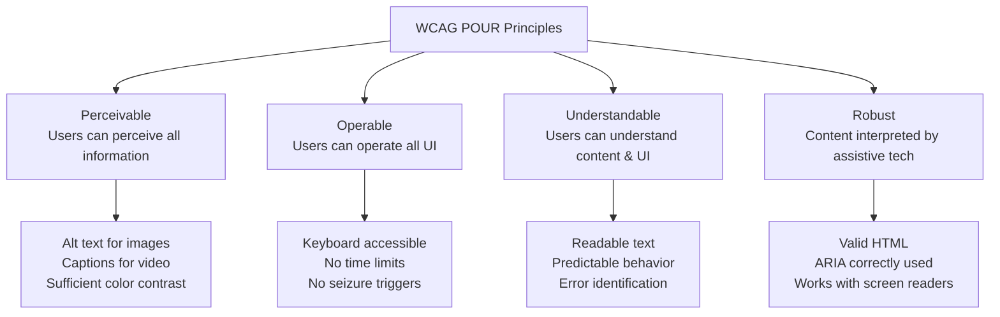

<a id="7-accessibility-a11y-complete-guide"></a>

# Chapter 7: Accessibility (A11y) — Complete Guide

[⬅ Previous Chapter](#6-build-tools-and-modern-toolchain) | [📖 Main Index](#main-index) | [Next Chapter ➡](#8-introduction-to-react)

---

## 📌 Learning Objectives

By the end of this chapter, you will:

- **Understand** why accessibility matters — legal, business, and moral reasons
- **Apply** WCAG 2.1 POUR principles and know the A/AA/AAA level differences
- **Write** semantic HTML correctly — proper landmark elements, heading hierarchy
- **Use** ARIA attributes correctly — labels, live regions, roles, states
- **Implement** complete keyboard navigation — tab order, focus trap, skip links
- **Manage** focus in React apps — useRef, dialog open/close, navigation changes
- **Build** accessible forms — labels, error messages, validation announcements
- **Test** accessibility — axe DevTools, jest-axe, VoiceOver, NVDA, Lighthouse
- **Handle** color contrast and motion preferences
- **Answer** 10+ interview questions on accessibility

---

<a id="chapter-index-table-7"></a>

## 📑 Chapter Index Table

| Topic No. | Topic Name | Subtopics |
|-----------|-----------|-----------|
| 7.1 | [Why Accessibility Matters](#71-why-accessibility-matters) | Legal, Business case, Types of disabilities |
| 7.2 | [WCAG Guidelines](#72-wcag-web-content-accessibility-guidelines) | POUR principles, Levels A/AA/AAA, Success criteria |
| 7.3 | [Semantic HTML for Accessibility](#73-semantic-html-for-accessibility) | Landmarks, article vs section, Button vs div, Headings |
| 7.4 | [ARIA — Accessible Rich Internet Applications](#74-aria-accessible-rich-internet-applications) | aria-label, aria-live, roles, states, First rule |
| 7.5 | [Keyboard Navigation](#75-keyboard-navigation) | Tab order, Focus management, Focus trap, Skip links |
| 7.6 | [Focus Management in React](#76-focus-management-in-react) | useRef, Dialog focus, Navigation, React Aria |
| 7.7 | [Accessible Forms](#77-accessible-forms) | Labels, Error messages, Required, Validation |
| 7.8 | [Screen Reader Testing](#78-screen-reader-testing) | VoiceOver, NVDA, Virtual cursor |
| 7.9 | [Color & Visual Accessibility](#79-color-and-visual-accessibility) | Contrast ratio, Color independence, prefers-reduced-motion |
| 7.10 | [Accessibility Testing Tools](#710-accessibility-testing-tools) | axe, jest-axe, Lighthouse, WAVE |
| — | [Interview Questions](#interview-questions-chapter-7) | 10+ Conceptual, Scenario |
| — | [Practice Problems](#practice-problems-chapter-7) | 5 Theory Problems |
| — | [Quick Revision](#quick-revision-chapter-7) | Key bullets, traps, cheat sheet |
| — | [Chapter Summary](#chapter-summary-chapter-7) | Most important points |

---

## 7.1 Why Accessibility Matters

<a id="71-why-accessibility-matters"></a>

### 🧠 Hinglish Intuition

> Accessibility ka matlab hai ki tumhara website sab ke liye kaam kare — chahe wo blind ho, deaf ho, haath nahi hila sakta ho, ya bahut bright light mein ho. Yeh sirf "achi baat" nahi hai — legally required hai, aur business ke liye bhi faydemand hai. 15% population kisi na kisi disability ke saath jeeti hai.

---

### Legal Requirements

```
United States:
- ADA (Americans with Disabilities Act) — applies to websites of businesses
  open to the public. Courts have ruled websites are "places of public accommodation."
  Non-compliance → lawsuits, fines
- Section 508 — federal agencies MUST be WCAG 2.1 AA compliant
- CVAA (21st Century Communications and Video Accessibility Act)

European Union:
- European Accessibility Act (EAA) — effective June 2025
  Required for: e-commerce, banking, transport, e-books, telecom
- EN 301 549 — European standard, references WCAG 2.1 AA

India:
- Rights of Persons with Disabilities Act 2016
- Guidelines for Indian Government Websites (GIGW) — WCAG 2.0 AA

Consequences of non-compliance:
- Lawsuits (thousands filed yearly in USA)
- Government contract exclusion
- Brand damage / negative PR
- Fines: up to $75,000 per violation in USA
```

---

### Business Case for Accessibility

```
Market size:
- 1.3 billion people worldwide live with some form of disability (WHO)
- 15% of global population
- $490 billion+ in disposable income (US disabled community)
- Temporary disabilities: broken arm, eye surgery, bright sunlight
- Situational disabilities: holding baby, noisy environment, slow connection

SEO benefits:
- Screen reader = search engine bot
- Good heading structure → better SEO
- Alt text for images → indexed by Google
- Semantic HTML → better understanding by search engines

Usability benefits:
- Captions help in noisy environments
- High contrast helps in bright sunlight
- Keyboard navigation helps power users
- Clear error messages help everyone

Legal risk mitigation:
- USA: 4,000+ ADA website lawsuits per year (growing)
- "Accessibility retrofit" costs 10x more than building in from start
```

---

### Types of Disabilities to Design For

```
VISUAL:
- Blindness → screen readers (NVDA, JAWS, VoiceOver)
- Low vision → zoom, high contrast, large text
- Color blindness → don't rely on color alone (8% of men!)
- Light sensitivity → dark mode, reduced contrast option

AUDITORY:
- Deafness → captions, transcripts for audio/video
- Hard of hearing → visual cues + audio

MOTOR/PHYSICAL:
- Paralysis / limited hand movement → keyboard only navigation
- Tremors → large click targets, no drag-only interactions
- One hand use → keyboard shortcuts, switch access
- Voice control → proper labels (Dragon NaturallySpeaking)

COGNITIVE:
- Dyslexia → clear fonts, sufficient spacing, simple language
- ADHD → no auto-playing content, clear structure
- Memory issues → consistent navigation, clear labels
- Anxiety → no time limits, error recovery

SPEECH:
- Affects voice-only interfaces (growing importance with voice UX)

TEMPORARY & SITUATIONAL:
- Broken arm → keyboard only
- Bright sunlight → high contrast
- Noisy environment → captions
- Slow network → text alternatives to images
- Distracted user → clear, predictable UI
```

👉 <a href="#chapter-index-table-7">Go to Top 🔝</a>

---

## 7.2 WCAG — Web Content Accessibility Guidelines

<a id="72-wcag-web-content-accessibility-guidelines"></a>

### 🧠 Hinglish Intuition

> WCAG ek rulebook hai jo W3C ne banaya. 4 principles hain — POUR. Level A = minimum, Level AA = industry standard (mostly required legally), Level AAA = best possible. Senior developers ko Level AA properly implement karna aana chahiye.

---

### POUR Principles



---

### WCAG 2.1 Levels — A, AA, AAA

```
LEVEL A (Minimum — must have to be accessible at all):
- Images have alt text
- Videos have captions
- No keyboard traps
- Page has a title
- Links have descriptive text
- No content that flashes > 3 times per second

LEVEL AA (Standard — legal requirement in most contexts):
- Color contrast: 4.5:1 for normal text, 3:1 for large text
- Resize text to 200% without loss of content
- Navigation is consistent across pages
- Error messages clearly identify the problem
- Focus indicator is visible
- Live captions for audio content
- Proper heading structure

LEVEL AAA (Enhanced — ideal but not legally required):
- Color contrast: 7:1 for normal text
- Sign language for audio content
- Extended audio descriptions
- No time limits on any content
- Context-sensitive help

Most organizations target: WCAG 2.1 Level AA
```

---

### Common WCAG Success Criteria for Developers

```
1.1.1 Non-text Content (A): All images have alt text
1.3.1 Info and Relationships (A): Semantic HTML communicates structure
1.3.3 Sensory Characteristics (A): Don't use "click the red button" (color/shape only)
1.4.3 Contrast (Minimum) (AA): 4.5:1 for normal text
1.4.4 Resize Text (AA): 200% zoom without horizontal scroll
1.4.5 Images of Text (AA): Use actual text, not text as images
1.4.10 Reflow (AA): Content usable at 320px width (mobile)
1.4.11 Non-text Contrast (AA): 3:1 for UI components
1.4.12 Text Spacing (AA): Adjustable line height, spacing
2.1.1 Keyboard (A): All functionality via keyboard
2.1.2 No Keyboard Trap (A): Can always tab out
2.4.1 Bypass Blocks (A): Skip to main content link
2.4.2 Page Titled (A): Meaningful <title>
2.4.3 Focus Order (A): Logical tab order
2.4.4 Link Purpose (A): Link text makes sense alone
2.4.7 Focus Visible (AA): Visible focus indicator
2.5.3 Label in Name (A): Button label matches accessible name
3.1.1 Language of Page (A): <html lang="en">
3.2.3 Consistent Navigation (AA): Same nav in same location
3.3.1 Error Identification (A): Error field identified + described
3.3.2 Labels or Instructions (A): All inputs have labels
4.1.1 Parsing (A): Valid HTML (no duplicate IDs)
4.1.2 Name, Role, Value (A): All UI components have name, role, value
4.1.3 Status Messages (AA): Status messages announced without focus
```

👉 <a href="#chapter-index-table-7">Go to Top 🔝</a>

---

## 7.3 Semantic HTML for Accessibility

<a id="73-semantic-html-for-accessibility"></a>

### 🧠 Hinglish Intuition

> Semantic HTML = HTML jisme meaning hai. `<button>` browser ko batata hai "yeh clickable hai, keyboard se activate karo, screen reader ko announce karo." `<div onClick>` ke saath yeh sab manually karna padta hai. Semantic HTML free accessibility deta hai.

---

### Why Semantic Elements Matter

```html
<!-- ❌ NON-SEMANTIC — just styled divs -->
<div class="header">
  <div class="nav">
    <div class="nav-item" onclick="...">Home</div>
  </div>
</div>
<div class="main-content">
  <div class="article">
    <div class="heading">Welcome</div>
  </div>
</div>

<!-- Problems:
  - Screen reader can't identify navigation, main content, article
  - No keyboard access to nav-item (div isn't focusable)
  - "heading" is just text — no heading level announced
  - Assistive technology has no structure to navigate
-->

<!-- ✅ SEMANTIC — meaningful elements -->
<header>
  <nav aria-label="Main navigation">
    <a href="/home">Home</a>
  </nav>
</header>
<main>
  <article>
    <h1>Welcome</h1>
  </article>
</main>

<!-- Benefits:
  - Screen reader announces: "banner landmark", "navigation landmark"
  - <a> is keyboard focusable by default
  - h1 announced as "Welcome, heading level 1"
  - Users can jump between landmarks using screen reader shortcuts
-->
```

---

### HTML Landmark Elements

```html
<!DOCTYPE html>
<html lang="en">  <!-- lang is REQUIRED for WCAG compliance! -->
<head>
  <title>Page Title — Company Name</title>  <!-- meaningful title required -->
</head>
<body>

<!-- header: Introductory content, site logo, navigation -->
<header>
  <a href="/" aria-label="Company Name — Go to homepage">
      <!-- alt="" because logo described by link text -->
  </a>
  <nav aria-label="Main navigation">  <!-- aria-label when multiple navs on page -->
    <ul>
      <li><a href="/about" aria-current="page">About</a></li>  <!-- current page! -->
      <li><a href="/products">Products</a></li>
    </ul>
  </nav>
</header>

<!-- main: Primary content — only ONE per page -->
<main id="main-content">  <!-- id for skip link target -->
  
  <!-- article: Self-contained content (blog post, news article, comment) -->
  <!-- Can be distributed/syndicated independently -->
  <article>
    <h1>Article Title</h1>  <!-- h1 = page's main heading (one per page) -->
    <p>Content...</p>
    
    <section>  <!-- Thematic grouping within article -->
      <h2>Section Title</h2>
      <p>Section content...</p>
    </section>
  </article>

  <!-- aside: Tangentially related content (sidebar, callout, ads) -->
  <aside aria-label="Related articles">
    <h2>Related</h2>
  </aside>

</main>

<!-- footer: Footer content, copyright, secondary navigation -->
<footer>
  <nav aria-label="Footer navigation">
    <a href="/privacy">Privacy Policy</a>
  </nav>
  <p>© 2025 Company Name</p>
</footer>

</body>
</html>
```

---

### article vs section — Key Difference

```html
<!-- ARTICLE: Self-contained, independent, can be extracted and read alone -->
<article>
  <h2>React 19 Released</h2>
  <p>Published: Jan 15, 2025</p>
  <p>React team has released React 19...</p>
  <!-- Makes complete sense if shared on social media, emailed, etc. -->
</article>

<!-- SECTION: Thematic grouping within larger content, NOT standalone -->
<article>
  <h1>Complete React Guide</h1>
  
  <section>
    <h2>Introduction</h2>
    <!-- Not meaningful without the article context -->
  </section>
  
  <section>
    <h2>Core Concepts</h2>
  </section>
</article>

<!-- Key test: "Would this make sense if extracted from the page?"
  Yes → <article>
  No  → <section>
  Just styling? → <div>
-->
```

---

### Button vs Div — Critical Distinction

```html
<!-- ❌ WRONG: div/span with click handler -->
<div class="btn" onclick="handleClick()">Submit</div>

<!-- Problems:
  1. Not keyboard focusable (can't Tab to it)
  2. Not activated by Enter/Space keys
  3. Screen reader doesn't announce as "button"
  4. No disabled state support
  5. No :focus styles by default
  6. Must manually add role, tabindex, keydown handler, aria states
  SOLUTION: Use <button> !
-->

<!-- ✅ CORRECT: Use the right semantic element -->
<button type="button" onclick="handleClick()">Submit</button>
<!-- Free features:
  ✅ Keyboard focusable
  ✅ Enter + Space activate it
  ✅ Screen reader: "Submit, button"
  ✅ disabled attribute works
  ✅ :focus styles available
-->

<!-- When IS a div/span acceptable? -->
<!-- When it's truly not interactive — just a visual decoration -->
<div class="badge">New</div>  <!-- OK if not clickable -->

<!-- If you MUST use non-semantic element (e.g., library constraint): -->
<div
  role="button"
  tabIndex={0}
  aria-label="Close dialog"
  onClick={handleClose}
  onKeyDown={(e) => {
    if (e.key === 'Enter' || e.key === ' ') {
      e.preventDefault();
      handleClose();
    }
  }}
>
  ×
</div>
<!-- But seriously — just use <button> -->
```

---

### Heading Hierarchy — h1 to h6

```html
<!-- ❌ WRONG: Headings used for styling, not structure -->
<h1>Page Title</h1>
<h3>Section</h3>  <!-- skipped h2! -->
<h1>Another Big Title</h1>  <!-- multiple h1s -->
<h6>Small text I want</h6>  <!-- used for size, not hierarchy -->

<!-- ✅ CORRECT: Headings create document outline -->
<h1>Web Accessibility Guide</h1>  <!-- ONE h1 per page, main topic -->

  <h2>Why It Matters</h2>  <!-- major sections -->
    <h3>Legal Requirements</h3>  <!-- subsections -->
    <h3>Business Case</h3>

  <h2>Implementation</h2>
    <h3>Semantic HTML</h3>
      <h4>Landmark Elements</h4>  <!-- sub-subsections -->
      <h4>Heading Hierarchy</h4>
    <h3>ARIA</h3>

<!-- Rule: Never skip heading levels (h1 → h3 skipping h2)
     Use CSS for styling size, not heading level
     Screen reader users navigate by headings — it's like a table of contents -->

<!-- React: set page title and h1 on route change! -->
useEffect(() => {
  document.title = `${pageTitle} — MyApp`;
  // Focus h1 or announce page change for SPA navigation
}, [pageTitle]);
```

👉 <a href="#chapter-index-table-7">Go to Top 🔝</a>

---

## 7.4 ARIA — Accessible Rich Internet Applications

<a id="74-aria-accessible-rich-internet-applications"></a>

### 🧠 Hinglish Intuition

> ARIA ek bridge hai jo browser aur screen reader ke beech additional information share karta hai. Lekin ARIA is ek double-edged sword hai — galat ARIA = broken accessibility. Pehla rule: agar semantic HTML se kaam ho, ARIA mat use karo.

---

### First Rule of ARIA (Most Important!)

```
"If you can use a native HTML element or attribute with the semantics
and behavior you require already built in, instead of re-purposing an
element and adding an ARIA role, state or property to make it accessible,
then do so."
— W3C ARIA Authoring Practices

In simple terms:
✅ Use <button> not <div role="button">
✅ Use <input type="checkbox"> not <div role="checkbox">
✅ Use <nav> not <div role="navigation">
✅ Use <header> not <div role="banner">
✅ Use required attribute not aria-required="true" (when HTML supports it)
```

---

### aria-label, aria-labelledby, aria-describedby

```html
<!-- aria-label: Provides accessible name when no visible text label -->

<!-- Icon button without visible text: -->
<button aria-label="Close dialog">
  <svg aria-hidden="true" ...>×</svg>  <!-- hide decorative SVG from AT -->
</button>
<!-- Screen reader: "Close dialog, button" instead of just "button" -->

<!-- Multiple navs on page: -->
<nav aria-label="Main navigation">...</nav>
<nav aria-label="Breadcrumb navigation">...</nav>
<nav aria-label="Footer navigation">...</nav>

<!-- aria-labelledby: Points to element containing the label -->
<h2 id="dialog-title">Confirm Deletion</h2>
<dialog aria-labelledby="dialog-title">
  <!-- Dialog is labelled by the h2 heading -->
</dialog>

<!-- Search form: -->
<h2 id="search-heading">Search Products</h2>
<form aria-labelledby="search-heading">
  <input type="search" ...>
</form>

<!-- aria-describedby: Points to supplementary description -->
<label htmlFor="password">Password</label>
<input
  id="password"
  type="password"
  aria-describedby="password-requirements"
  aria-invalid={hasError}
/>
<div id="password-requirements">
  Must be at least 8 characters with one uppercase letter
</div>
<!-- Screen reader reads: "Password, edit text.
     Must be at least 8 characters with one uppercase letter" -->

<!-- Error message: -->
<input
  id="email"
  type="email"
  aria-describedby="email-error"
  aria-invalid="true"
/>
<span id="email-error" role="alert">
  Please enter a valid email address
</span>
```

---

### aria-hidden — Hiding from Screen Readers

```html
<!-- Hide decorative/redundant content from assistive technology -->

<!-- Decorative icon next to labeled text: -->
<button>
  <svg aria-hidden="true" focusable="false" ...>
    <!-- icon -->
  </svg>
  Submit Order
</button>
<!-- Without aria-hidden: "Submit Order, group, button" (weird!)
     With aria-hidden: "Submit Order, button" -->

<!-- Duplicate information: -->
<div class="rating">
  <span aria-hidden="true">★★★★☆</span>  <!-- visual stars -->
  <span class="sr-only">4 out of 5 stars</span>  <!-- screen reader text -->
</div>

<!-- CSS utility class for screen reader only text: -->
.sr-only {
  position: absolute;
  width: 1px;
  height: 1px;
  padding: 0;
  margin: -1px;
  overflow: hidden;
  clip: rect(0, 0, 0, 0);
  white-space: nowrap;
  border-width: 0;
}
/* Visually hidden but announced by screen readers */

<!-- ❌ DANGEROUS: Never hide interactive content! -->
<button aria-hidden="true">Submit</button>  <!-- ❌ button hidden but still focusable! -->
<!-- Fix: also add tabIndex={-1} or use display:none -->

<!-- ❌ DANGEROUS: Never hide parent of focused element -->
<div aria-hidden="true">
  <button>Submit</button>  <!-- ❌ child focusable, parent hidden — broken! -->
</div>
```

---

### aria-live Regions — Dynamic Content Announcements

```html
<!-- Problem: Screen readers only announce content when focus moves to it.
     Dynamic content updates (notifications, search results, chat) aren't announced!
     Solution: aria-live regions -->

<!-- aria-live="polite": announces after current speech finishes (most common) -->
<div aria-live="polite" aria-atomic="true">
  {/* Content changes here are announced politely */}
  {searchResults.length > 0 
    ? `${searchResults.length} results found`
    : 'No results found'
  }
</div>

<!-- aria-live="assertive": interrupts current speech immediately (urgent only!) -->
<div aria-live="assertive" role="alert">
  {/* Only for critical errors/alerts */}
  {criticalError && `Error: ${criticalError}`}
</div>

<!-- aria-atomic="true": announce entire region when any part changes
     aria-atomic="false": announce only changed parts (default) -->

<!-- role="status" = aria-live="polite" + aria-atomic="true" -->
<div role="status">Loading complete</div>

<!-- role="alert" = aria-live="assertive" + aria-atomic="true" -->
<div role="alert">Session expired. Please log in again.</div>

<!-- React implementation: -->
function LiveRegion({ message, type = 'polite' }) {
  return (
    <div
      aria-live={type}
      aria-atomic="true"
      className="sr-only"
    >
      {message}
    </div>
  );
}

// Usage:
const [announcement, setAnnouncement] = useState('');

const handleSearch = async (query) => {
  const results = await search(query);
  setSearchResults(results);
  setAnnouncement(`${results.length} results found for "${query}"`);
};

return (
  <>
    <LiveRegion message={announcement} />
    <SearchResults results={searchResults} />
  </>
);
```

---

### ARIA States — aria-expanded, aria-selected, aria-checked

```html
<!-- aria-expanded: collapsible content is open/closed -->
<button
  aria-expanded={isOpen}
  aria-controls="dropdown-menu"
  onClick={() => setIsOpen(!isOpen)}
>
  Menu
</button>
<ul id="dropdown-menu" hidden={!isOpen}>
  <li><a href="/about">About</a></li>
</ul>
<!-- Screen reader: "Menu, button, collapsed" / "Menu, button, expanded" -->

<!-- aria-selected: selected state in listbox, tabs, tree -->
<div role="tablist">
  <button
    role="tab"
    aria-selected={activeTab === 'overview'}
    aria-controls="overview-panel"
    id="overview-tab"
  >
    Overview
  </button>
  <button
    role="tab"
    aria-selected={activeTab === 'details'}
    aria-controls="details-panel"
    id="details-tab"
  >
    Details
  </button>
</div>
<div
  role="tabpanel"
  id="overview-panel"
  aria-labelledby="overview-tab"
  hidden={activeTab !== 'overview'}
>
  Overview content
</div>

<!-- aria-checked: checkbox/switch/radio state -->
<button
  role="switch"  <!-- like a toggle -->
  aria-checked={isDarkMode}
  onClick={() => setIsDarkMode(!isDarkMode)}
>
  Dark Mode
</button>
<!-- Better: use <input type="checkbox"> with CSS styling! -->

<!-- aria-disabled: element exists but is disabled (different from HTML disabled) -->
<!-- aria-disabled allows focus, HTML disabled prevents focus -->
<button
  aria-disabled="true"
  onClick={(e) => { if (isDisabled) { e.preventDefault(); return; } handleSubmit(); }}
>
  Submit
</button>
<!-- Use aria-disabled when you want to explain WHY it's disabled on focus -->
```

---

### ARIA Roles — Key Roles to Know

```html
<!-- role="dialog": modal overlay -->
<div
  role="dialog"
  aria-modal="true"
  aria-labelledby="dialog-title"
  aria-describedby="dialog-description"
>
  <h2 id="dialog-title">Confirm Action</h2>
  <p id="dialog-description">Are you sure you want to delete this item?</p>
  <button>Cancel</button>
  <button>Confirm</button>
</div>

<!-- role="alertdialog": urgent dialog requiring response -->
<div role="alertdialog" aria-modal="true" aria-labelledby="alert-title">
  <h2 id="alert-title">Session Expiring</h2>
  <p>Your session expires in 1 minute.</p>
  <button>Continue Session</button>
</div>

<!-- role="listbox": custom select/dropdown -->
<div role="listbox" aria-label="Select country" aria-activedescendant={selectedId}>
  <div role="option" aria-selected="true" id="opt-india">India</div>
  <div role="option" aria-selected="false" id="opt-usa">USA</div>
</div>

<!-- role="combobox": input + listbox (autocomplete) -->
<div role="combobox" aria-expanded={isOpen} aria-owns="suggestions-list">
  <input aria-autocomplete="list" aria-controls="suggestions-list" />
  <ul id="suggestions-list" role="listbox">
    <li role="option">React</li>
  </ul>
</div>

<!-- role="progressbar": loading/progress -->
<div
  role="progressbar"
  aria-valuenow={progress}
  aria-valuemin={0}
  aria-valuemax={100}
  aria-label="File upload progress"
>
  <div style={{ width: `${progress}%` }}></div>
</div>

<!-- role="tooltip": hover tooltip -->
<button aria-describedby="tooltip-1">Help</button>
<div role="tooltip" id="tooltip-1">
  Click for detailed help documentation
</div>
```

👉 <a href="#chapter-index-table-7">Go to Top 🔝</a>

---

## 7.5 Keyboard Navigation

<a id="75-keyboard-navigation"></a>

### 🧠 Hinglish Intuition

> Bahut log keyboard se kaam karte hain — blind users, motor disability wale, power users. Tab se elements pe jaao, Enter/Space se activate karo, Escape se close karo. Yeh natural flow hona chahiye. Focus trap ka matlab hai modal open hone par focus bahar na jaaye.

---

### Tab Order — tabIndex

```html
<!-- Natural tab order: same as DOM order (preferred!) -->
<!-- Don't use positive tabindex — breaks natural order -->

<!-- tabIndex={0}: make non-focusable element focusable -->
<div
  role="button"
  tabIndex={0}  <!-- now in tab order -->
  onClick={handleClick}
  onKeyDown={(e) => e.key === 'Enter' && handleClick()}
>
  Custom Button
</div>

<!-- tabIndex={-1}: make element programmatically focusable, NOT in tab order -->
<div ref={dialogRef} tabIndex={-1}>
  <!-- Dialog content — focused programmatically on open -->
  <!-- Not in tab order, but can be focused via .focus() -->
</div>

<!-- ❌ NEVER use positive tabindex -->
<button tabIndex={3}>Third</button>  <!-- ❌ breaks natural flow -->
<button tabIndex={1}>First</button>  <!-- ❌ confusing, hard to maintain -->
<button tabIndex={2}>Second</button> <!-- ❌ -->

<!-- ✅ Fix: reorder in DOM instead -->
<button>First</button>
<button>Second</button>
<button>Third</button>

<!-- Keyboard interaction patterns:
  Tab: move to next focusable element
  Shift+Tab: move to previous focusable element
  Enter: activate links, buttons, submit forms
  Space: activate buttons, checkboxes, expand/collapse
  Escape: close modals, dropdowns, menus
  Arrow keys: navigate within components (tabs, menus, radios)
  Home/End: first/last item in a list
-->
```

---

### Focus Trap — Modal Pattern

```javascript
// Focus trap: when modal is open, Tab cycles only within modal
// Without focus trap: Tab can go behind modal, confusing for screen reader users

function useFocusTrap(isActive) {
  const trapRef = useRef(null);

  useEffect(() => {
    if (!isActive || !trapRef.current) return;

    const focusableElements = trapRef.current.querySelectorAll(
      'a[href], button:not([disabled]), textarea, input:not([disabled]), ' +
      'select:not([disabled]), [tabindex]:not([tabindex="-1"])'
    );

    const firstElement = focusableElements[0];
    const lastElement = focusableElements[focusableElements.length - 1];

    // Focus first element when trap activates
    firstElement?.focus();

    function handleKeyDown(e) {
      if (e.key !== 'Tab') return;

      if (e.shiftKey) {
        // Shift+Tab: going backwards
        if (document.activeElement === firstElement) {
          e.preventDefault();
          lastElement?.focus(); // wrap to last
        }
      } else {
        // Tab: going forward
        if (document.activeElement === lastElement) {
          e.preventDefault();
          firstElement?.focus(); // wrap to first
        }
      }
    }

    document.addEventListener('keydown', handleKeyDown);
    return () => document.removeEventListener('keydown', handleKeyDown);
  }, [isActive]);

  return trapRef;
}

// Modal component using focus trap:
function Modal({ isOpen, onClose, title, children }) {
  const trapRef = useFocusTrap(isOpen);
  const previousFocusRef = useRef(null);

  useEffect(() => {
    if (isOpen) {
      // Store what was focused before modal
      previousFocusRef.current = document.activeElement;
    } else {
      // Return focus to previous element when modal closes
      previousFocusRef.current?.focus();
    }
  }, [isOpen]);

  // Close on Escape
  useEffect(() => {
    if (!isOpen) return;
    const handleEscape = (e) => {
      if (e.key === 'Escape') onClose();
    };
    document.addEventListener('keydown', handleEscape);
    return () => document.removeEventListener('keydown', handleEscape);
  }, [isOpen, onClose]);

  if (!isOpen) return null;

  return createPortal(
    <>
      {/* Backdrop */}
      <div
        className="modal-backdrop"
        onClick={onClose}
        aria-hidden="true"
      />
      {/* Modal */}
      <div
        ref={trapRef}
        role="dialog"
        aria-modal="true"
        aria-labelledby="modal-title"
        className="modal"
      >
        <h2 id="modal-title">{title}</h2>
        <button
          aria-label="Close dialog"
          onClick={onClose}
          className="modal-close"
        >
          ×
        </button>
        {children}
      </div>
    </>,
    document.body
  );
}
```

---

### Skip Links Pattern

```html
<!-- Skip to main content — first thing in page, visible on focus -->
<!-- Allows keyboard users to skip repetitive navigation -->

<!-- In HTML (or React component): -->
<a href="#main-content" className="skip-link">
  Skip to main content
</a>

<header>
  <nav>
    <!-- Many navigation items... -->
  </nav>
</header>

<main id="main-content" tabIndex={-1}>  <!-- tabIndex for programmatic focus -->
  <!-- Main content -->
</main>

<!-- CSS — visible only on focus: -->
.skip-link {
  position: absolute;
  top: -40px;         /* hidden above viewport */
  left: 0;
  padding: 8px 16px;
  background: #007bff;
  color: white;
  text-decoration: none;
  z-index: 9999;
  border-radius: 0 0 4px 0;
  transition: top 0.1s;
}

.skip-link:focus {
  top: 0;             /* visible when focused! */
}

/* React component: */
function SkipLink() {
  return (
    <a href="#main-content" className="skip-link">
      Skip to main content
    </a>
  );
}

/* Multiple skip links for complex pages: */
function SkipLinks() {
  return (
    <div className="skip-links">
      <a href="#main-content">Skip to main content</a>
      <a href="#main-nav">Skip to navigation</a>
      <a href="#search">Skip to search</a>
    </div>
  );
}
```

---

### Keyboard Shortcuts

```javascript
// Global keyboard shortcuts — implement carefully!
// Must not conflict with browser or AT shortcuts
// Provide a way to disable/remap

function useKeyboardShortcut(key, callback, options = {}) {
  const { ctrl = false, alt = false, shift = false, enabled = true } = options;

  useEffect(() => {
    if (!enabled) return;

    function handleKeyDown(e) {
      const modifiers =
        (ctrl ? e.ctrlKey || e.metaKey : true) &&  // Ctrl or Cmd on Mac
        (alt ? e.altKey : !e.altKey) &&
        (shift ? e.shiftKey : !e.shiftKey);

      if (e.key === key && modifiers) {
        // Don't fire in input fields unless explicitly wanted
        const isInput = ['INPUT', 'TEXTAREA', 'SELECT'].includes(
          document.activeElement?.tagName
        );
        if (!isInput || options.allowInInputs) {
          e.preventDefault();
          callback(e);
        }
      }
    }

    document.addEventListener('keydown', handleKeyDown);
    return () => document.removeEventListener('keydown', handleKeyDown);
  }, [key, callback, enabled, ctrl, alt, shift]);
}

// Usage:
useKeyboardShortcut('k', openSearch, { ctrl: true }); // Ctrl+K to open search
useKeyboardShortcut('/', openSearch);                  // / to open search

// Keyboard shortcut hints in UI:
function Button({ label, shortcut, onClick }) {
  return (
    <button onClick={onClick}>
      {label}
      {shortcut && (
        <kbd aria-label={`Keyboard shortcut: ${shortcut}`}>
          {shortcut}
        </kbd>
      )}
    </button>
  );
}
```

👉 <a href="#chapter-index-table-7">Go to Top 🔝</a>

---

## 7.6 Focus Management in React

<a id="76-focus-management-in-react"></a>

### 🧠 Hinglish Intuition

> React SPA mein page reload nahi hota — isliye screen reader ko pata nahi chalta ki page change hua. Focus manually manage karna padta hai. Dialog open hua — focus andar daalo. Dialog close hua — focus wapas laao. Route change hua — announce karo.

---

### useRef for Focus

```javascript
// Focus element on mount or after action
function AutoFocusInput() {
  const inputRef = useRef(null);

  useEffect(() => {
    // Focus on component mount
    inputRef.current?.focus();
  }, []);

  return (
    <input
      ref={inputRef}
      type="text"
      label="Search"
    />
  );
}

// Focus after async operation:
function SearchResults() {
  const resultsRef = useRef(null);
  const [results, setResults] = useState([]);

  const handleSearch = async (query) => {
    const data = await searchAPI(query);
    setResults(data);
    // Focus results after they appear
    // setTimeout because React batches state + DOM updates
    setTimeout(() => {
      resultsRef.current?.focus();
    }, 0);
  };

  return (
    <>
      <SearchInput onSearch={handleSearch} />
      <div
        ref={resultsRef}
        tabIndex={-1}  // allow programmatic focus
        aria-live="polite"
        className="results"
      >
        {results.length > 0
          ? <ResultsList results={results} />
          : <p>No results</p>
        }
      </div>
    </>
  );
}
```

---

### Focus After Navigation (SPA Problem)

```javascript
// Problem: In SPAs, route changes don't move focus or announce new page
// Screen reader users may not know they navigated!

// Solution 1: Focus the h1/main-heading after navigation
function useNavigationFocus() {
  const location = useLocation();
  const headingRef = useRef(null);

  useEffect(() => {
    // Small delay to let DOM update first
    const timer = setTimeout(() => {
      if (headingRef.current) {
        headingRef.current.focus();
      } else {
        // Fallback: focus main content area
        document.getElementById('main-content')?.focus();
      }
    }, 100);

    return () => clearTimeout(timer);
  }, [location.pathname]);

  return headingRef;
}

// In page component:
function AboutPage() {
  const headingRef = useNavigationFocus();

  return (
    <main id="main-content">
      <h1 ref={headingRef} tabIndex={-1}>About Us</h1>
      {/* tabIndex={-1} allows focus without showing focus ring on page load */}
    </main>
  );
}

// Solution 2: Announce page change via live region
function RouteAnnouncer() {
  const location = useLocation();
  const [announcement, setAnnouncement] = useState('');

  useEffect(() => {
    // Get page title from document
    const title = document.title;
    setAnnouncement('');  // clear first to re-trigger announcement
    setTimeout(() => setAnnouncement(`Navigated to ${title}`), 100);
  }, [location.pathname]);

  return (
    <div
      aria-live="assertive"
      aria-atomic="true"
      className="sr-only"
    >
      {announcement}
    </div>
  );
}
```

---

### Focus After Dialog Open/Close

```javascript
// Complete accessible dialog with proper focus management:
function useDialog() {
  const [isOpen, setIsOpen] = useState(false);
  const triggerRef = useRef(null);      // element that opened dialog
  const dialogRef = useRef(null);       // dialog container

  const openDialog = () => {
    // Store reference to trigger before opening
    triggerRef.current = document.activeElement;
    setIsOpen(true);
  };

  const closeDialog = () => {
    setIsOpen(false);
    // Return focus to trigger after state update
    setTimeout(() => {
      triggerRef.current?.focus();
    }, 0);
  };

  useEffect(() => {
    if (isOpen && dialogRef.current) {
      // Find first focusable element in dialog
      const focusable = dialogRef.current.querySelector(
        'button, [href], input, select, textarea, [tabindex]:not([tabindex="-1"])'
      );
      focusable?.focus();
    }
  }, [isOpen]);

  return { isOpen, openDialog, closeDialog, dialogRef };
}

function DeleteConfirmation({ itemName, onDelete }) {
  const { isOpen, openDialog, closeDialog, dialogRef } = useDialog();

  const handleDelete = () => {
    onDelete();
    closeDialog();
    // Announce success to screen reader
    announceToScreenReader('Item deleted successfully');
  };

  return (
    <>
      <button ref={/* trigger button */} onClick={openDialog}>
        Delete {itemName}
      </button>

      {isOpen && (
        <div
          ref={dialogRef}
          role="dialog"
          aria-modal="true"
          aria-labelledby="confirm-title"
          aria-describedby="confirm-desc"
        >
          <h2 id="confirm-title">Confirm Deletion</h2>
          <p id="confirm-desc">
            Are you sure you want to delete "{itemName}"? This cannot be undone.
          </p>
          <button onClick={closeDialog}>Cancel</button>  {/* first focus here */}
          <button onClick={handleDelete}>Delete</button>
        </div>
      )}
    </>
  );
}
```

---

### React Aria Library — Production-Ready Solution

```javascript
// @adobe/react-aria — comprehensive accessible component primitives
// Handles: keyboard, focus, ARIA, screen reader, touch, internationalization
// Used by Tailwind UI, Adobe Spectrum, many component libraries

import { useButton } from '@react-aria/button';
import { useDialog } from '@react-aria/dialog';
import { FocusScope } from '@react-aria/focus';
import { useOverlay, useModal, OverlayContainer } from '@react-aria/overlays';
import { useRef } from 'react';

// Accessible button using react-aria:
function AccessibleButton({ children, onPress, isDisabled }) {
  const ref = useRef(null);
  const { buttonProps } = useButton({
    onPress,
    isDisabled,
    elementType: 'button',
  }, ref);

  return (
    <button {...buttonProps} ref={ref}>
      {children}
    </button>
  );
  // buttonProps automatically includes:
  // onClick, onKeyDown, onKeyUp, aria-disabled, role, etc.
}

// Accessible modal using react-aria:
function Dialog({ title, children, onClose }) {
  const ref = useRef(null);
  const { overlayProps } = useOverlay(
    { onClose, isOpen: true, isDismissable: true },
    ref
  );
  const { modalProps } = useModal();
  const { dialogProps, titleProps } = useDialog({ 'aria-label': title }, ref);

  return (
    <FocusScope contain autoFocus restoreFocus>  {/* automatic focus trap! */}
      <div
        {...overlayProps}
        {...dialogProps}
        {...modalProps}
        ref={ref}
      >
        <h3 {...titleProps}>{title}</h3>
        {children}
        <button onClick={onClose}>Close</button>
      </div>
    </FocusScope>
  );
}
```

👉 <a href="#chapter-index-table-7">Go to Top 🔝</a>

---

## 7.7 Accessible Forms

<a id="77-accessible-forms"></a>

### 🧠 Hinglish Intuition

> Forms accessibility mein sabse zyada impactful hai. Blind user ko pata hona chahiye — yeh field kya maangta hai, kya bhara, kya galat hua, aur kaise theek karna hai. Label, error messages, aur validation announcements — yeh teen cheezein accessible form banati hain.

---

### Label Association — htmlFor

```jsx
// ❌ WRONG: Label not associated
<label>Email</label>
<input type="email" />
<!-- Screen reader: "edit text" — what field is this?! -->

// ❌ WRONG: Visual label only (placeholder)
<input type="email" placeholder="Enter email" />
<!-- Placeholder disappears on type! And poor contrast -->

// ✅ CORRECT: Explicit label with htmlFor
<label htmlFor="email">Email Address</label>
<input
  type="email"
  id="email"          // must match htmlFor!
  name="email"
  autoComplete="email"
/>
<!-- Screen reader: "Email Address, edit text" -->

// ✅ CORRECT: Wrapping label (implicit association)
<label>
  Email Address
  <input type="email" name="email" />
</label>

// ✅ CORRECT: Required field indication
<label htmlFor="email">
  Email Address
  <span aria-hidden="true"> *</span>  <!-- visual asterisk, hidden from SR -->
</label>
<input
  type="email"
  id="email"
  required                          // HTML required attribute
  aria-required="true"             // ARIA for older AT
/>
<!-- Also: add text "* Required fields" at form top -->

// ✅ CORRECT: Complex label with description
<label htmlFor="username">
  Username
  <span className="field-hint">
    3-20 characters, letters and numbers only
  </span>
</label>
<input
  type="text"
  id="username"
  aria-describedby="username-hint"
/>
<div id="username-hint" className="sr-only">
  Username must be 3-20 characters, letters and numbers only
</div>
```

---

### Error Messages — aria-describedby & aria-invalid

```jsx
// Complete accessible form field with error handling:
function FormField({
  id,
  label,
  type = 'text',
  required = false,
  error,
  description,
  ...inputProps
}) {
  const descriptionId = description ? `${id}-description` : undefined;
  const errorId = error ? `${id}-error` : undefined;

  // aria-describedby can reference multiple IDs!
  const describedBy = [descriptionId, errorId].filter(Boolean).join(' ');

  return (
    <div className="form-field">
      <label htmlFor={id}>
        {label}
        {required && <span aria-hidden="true"> *</span>}
      </label>

      {description && (
        <div id={descriptionId} className="field-description">
          {description}
        </div>
      )}

      <input
        id={id}
        type={type}
        required={required}
        aria-required={required}
        aria-invalid={error ? 'true' : undefined}  // only set when invalid!
        aria-describedby={describedBy || undefined}
        {...inputProps}
      />

      {error && (
        <div
          id={errorId}
          role="alert"               // announces immediately to screen reader
          className="error-message"
          aria-live="polite"
        >
          {/* Include field name in error — some screen readers don't re-read label */}
          <span aria-hidden="true">⚠️ </span>
          {label}: {error}
        </div>
      )}
    </div>
  );
}

// Usage:
<FormField
  id="email"
  label="Email Address"
  type="email"
  required
  error={errors.email}  // "Please enter a valid email address"
  description="We'll never share your email"
/>
```

---

### Form Validation Announcements

```jsx
// Form with accessible validation:
function AccessibleRegistrationForm() {
  const [values, setValues] = useState({ email: '', password: '' });
  const [errors, setErrors] = useState({});
  const [submitStatus, setSubmitStatus] = useState('');
  const firstErrorRef = useRef(null);

  const validate = () => {
    const newErrors = {};
    if (!values.email) newErrors.email = 'Email is required';
    else if (!/\S+@\S+\.\S+/.test(values.email)) {
      newErrors.email = 'Please enter a valid email address';
    }
    if (!values.password) newErrors.password = 'Password is required';
    else if (values.password.length < 8) {
      newErrors.password = 'Password must be at least 8 characters';
    }
    return newErrors;
  };

  const handleSubmit = async (e) => {
    e.preventDefault();
    const newErrors = validate();

    if (Object.keys(newErrors).length > 0) {
      setErrors(newErrors);
      // Announce errors to screen reader
      setSubmitStatus(`Form has ${Object.keys(newErrors).length} errors. Please fix them.`);
      // Move focus to first error
      setTimeout(() => firstErrorRef.current?.focus(), 100);
      return;
    }

    // Submit...
    setSubmitStatus('');
    try {
      await submitForm(values);
      setSubmitStatus('Registration successful! Check your email.');
    } catch (err) {
      setSubmitStatus('Submission failed. Please try again.');
    }
  };

  const errorKeys = Object.keys(errors);

  return (
    <form onSubmit={handleSubmit} noValidate>  {/* noValidate: use custom validation */}

      {/* Summary of errors at top (helpful for screen readers) */}
      {errorKeys.length > 0 && (
        <div
          role="alert"
          aria-label={`${errorKeys.length} errors found`}
          tabIndex={-1}
          ref={firstErrorRef}
          className="error-summary"
        >
          <h3>Please fix these errors:</h3>
          <ul>
            {errorKeys.map(key => (
              <li key={key}>
                <a href={`#${key}`}>{errors[key]}</a>  {/* link to field! */}
              </li>
            ))}
          </ul>
        </div>
      )}

      {/* Live region for submit status */}
      <div aria-live="polite" aria-atomic="true" className="sr-only">
        {submitStatus}
      </div>

      <FormField
        id="email"
        label="Email Address"
        type="email"
        required
        value={values.email}
        onChange={e => setValues(prev => ({ ...prev, email: e.target.value }))}
        error={errors.email}
      />

      <FormField
        id="password"
        label="Password"
        type="password"
        required
        description="At least 8 characters"
        value={values.password}
        onChange={e => setValues(prev => ({ ...prev, password: e.target.value }))}
        error={errors.password}
      />

      <button type="submit">Create Account</button>
    </form>
  );
}
```

👉 <a href="#chapter-index-table-7">Go to Top 🔝</a>

---

## 7.8 Screen Reader Testing

<a id="78-screen-reader-testing"></a>

### 🧠 Hinglish Intuition

> Screen reader testing woh hai jo automated tools nahi pakad sakti. Ek screen reader use karo — feel karo user kya experience karta hai. VoiceOver macOS par free hai. NVDA Windows par free hai. Testing ke liye visual mode band karo — sirf screen reader se navigate karo.

---

### VoiceOver — macOS & iOS

```
macOS VoiceOver:
Enable:  Cmd + F5 (toggle)
         System Settings → Accessibility → VoiceOver

Common shortcuts:
VO = Control + Option (the "VoiceOver modifier")

VO + A: read all (start reading from cursor)
VO + →: next item
VO + ←: previous item
VO + U: open Rotor (navigation menu)
VO + Space: activate/click element
Tab: move to next focusable element
Shift + Tab: previous focusable element
Escape: exit mode / close overlay

Rotor navigation (VO + U):
- Headings: jump between h1-h6
- Links: list all links on page
- Form controls: inputs, buttons, checkboxes
- Landmarks: navigate header, nav, main, footer
- Tables: navigate table structure

iOS VoiceOver:
Settings → Accessibility → VoiceOver → On
Swipe right: next element
Swipe left: previous element
Double tap: activate
Three finger swipe: scroll
Two finger swipe up: read all
```

---

### NVDA — Windows (Free Screen Reader)

```
NVDA (NonVisual Desktop Access):
Download: nvaccess.org (free!)
Most used screen reader in screen reader surveys

Common shortcuts:
Insert key = "NVDA modifier" key

Insert + Space: toggle browse/forms mode
H: next heading (Shift+H: previous)
B: button
E: edit field / input
F: form element
G: graphic / image
L: list
T: table
Tab: focusable elements

Browse mode: reading content (like a document)
Forms mode: interacting with inputs (auto-switches on focus)

JAWS (Job Access With Screen): Paid, most used in enterprise
Windows Narrator: built into Windows

Testing process:
1. Close your eyes (or turn monitor off)
2. Use only keyboard + screen reader
3. Navigate to your feature
4. Check: Is everything announced correctly?
5. Can you complete all tasks?
6. Are errors communicated clearly?
```

---

### Screen Reader Virtual Cursor

```
Virtual cursor / Browse mode:
- Screen readers have their own cursor (separate from keyboard focus!)
- Can navigate by arrows through ALL content, not just focusable elements
- Reads headings, paragraphs, lists, etc. without focus

This is why:
- aria-live matters (announces dynamic content changes)
- aria-hidden matters (hides decorative content from this cursor)
- Heading structure matters (users jump between headings)
- Link text matters (read in isolation from context)

Common screen reader announcements:

Good:
"Main Navigation, navigation landmark"
"Search Products, heading level 2"
"Email Address, required, edit text"
"Submit, button"
"Error: Email Address: Please enter a valid email"
"3 results found, status"

Bad (missing accessibility):
"navigation"  (no label when multiple navs)
"heading"     (no level)
"edit text"   (no label)
"button"      (no name)
"x"           (close button with only × text)
"image"       (missing alt text)
```

👉 <a href="#chapter-index-table-7">Go to Top 🔝</a>

---

## 7.9 Color & Visual Accessibility

<a id="79-color-and-visual-accessibility"></a>

### 🧠 Hinglish Intuition

> Color blindness 8% purush mein hoti hai — yeh bahut common hai. Agar tumhara UI red = error, green = success batata hai aur color ke alawa koi aur indicator nahi hai — 8% users ke liye UI kaam nahi karega. Plus contrast low hoga toh sunny day pe mobile pe padha nahi jaayega.

---

### Color Contrast Ratios — WCAG Requirements

```
Contrast ratio = ratio of luminance between text and background

WCAG 2.1 Requirements:
Level AA (minimum for compliance):
  Normal text (< 18pt regular, < 14pt bold): 4.5:1
  Large text (≥ 18pt regular, ≥ 14pt bold): 3:1
  UI components & focus indicators: 3:1

Level AAA (enhanced):
  Normal text: 7:1
  Large text: 4.5:1

Common failures:
Gray text on white:  #999999 on #ffffff = 2.85:1  ❌ (too low!)
Light blue on white: #4A90E2 on #ffffff = 3.06:1  ❌ (too low!)
Dark text on white:  #595959 on #ffffff = 7.0:1   ✅ (passes AAA!)
White on blue:       #ffffff on #2B6CB0 = 7.2:1   ✅

Checking contrast:
1. Chrome DevTools: inspect element → Accessibility panel → color contrast
2. Browser extension: axe DevTools, Color Contrast Analyzer
3. Online: webaim.org/resources/contrastchecker
4. Design tools: Figma has built-in contrast checker

CSS custom properties with good contrast:
--text-primary: #1a1a1a;    /* on white: 16.75:1 ✅ */
--text-secondary: #595959;  /* on white: 7.0:1 ✅ */
--text-muted: #767676;      /* on white: 4.54:1 ✅ (barely AA) */
--text-disabled: #9ca3af;   /* on white: 2.9:1 ❌ (use aria-disabled) */
```

---

### Don't Rely on Color Alone

```jsx
// ❌ WRONG: Color is the only indicator
<span style={{ color: 'red' }}>Invalid email</span>
<div className={isValid ? 'green-border' : 'red-border'}>Field</div>

// For 8% of men with red-green color blindness:
// red and green look similar — can't tell valid from invalid!

// ✅ CORRECT: Color + additional indicator
// Error state: color + icon + text
<div className={`field ${hasError ? 'field-error' : ''}`}>
  <input aria-invalid={hasError} />
  {hasError && (
    <span className="error-message">
      <span aria-hidden="true">⚠️ </span>  {/* icon (decorative, hidden) */}
      Invalid email address               {/* text (actual info) */}
    </span>
  )}
</div>

// Status badges: color + text + icon
<span className="badge badge-success">
  <span aria-hidden="true">✓ </span>
  Active
</span>
<span className="badge badge-error">
  <span aria-hidden="true">✗ </span>
  Inactive
</span>

// Charts/graphs: don't use color alone to distinguish data
// Use patterns + colors, or include data labels
// Provide data table as alternative to chart
```

---

### prefers-color-scheme & prefers-reduced-motion

```css
/* Respect user's OS dark mode preference */
@media (prefers-color-scheme: dark) {
  :root {
    --bg-primary: #1a1a1a;
    --text-primary: #f5f5f5;
    --border-color: #404040;
  }
}

/* Better: CSS custom properties + JavaScript for manual toggle */
:root {
  --bg-primary: #ffffff;
  --text-primary: #1a1a1a;
}

[data-theme="dark"] {
  --bg-primary: #1a1a1a;
  --text-primary: #f5f5f5;
}

/* Respect user's reduced motion preference */
/* Some users have vestibular disorders — motion causes nausea/dizziness */
@media (prefers-reduced-motion: reduce) {
  *,
  *::before,
  *::after {
    animation-duration: 0.01ms !important;
    animation-iteration-count: 1 !important;
    transition-duration: 0.01ms !important;
    scroll-behavior: auto !important;
  }
}

/* Better: use prefers-reduced-motion in individual animations */
.spinner {
  animation: spin 1s linear infinite;
}

@media (prefers-reduced-motion: reduce) {
  .spinner {
    animation: none;
    /* Show static indicator instead */
  }
}

/* Fade animations: OK to keep (not vestibular-triggering) */
.modal-enter {
  opacity: 0;
  transition: opacity 0.3s ease;
}

/* Translate animations: reduce for motion-sensitive users */
.slide-in {
  transform: translateX(-100%);
  transition: transform 0.3s ease;
}

@media (prefers-reduced-motion: reduce) {
  .slide-in {
    transform: none;  /* no movement */
    transition: opacity 0.3s ease;  /* use fade instead */
  }
}
```

```javascript
// React: check prefers-reduced-motion
function useReducedMotion() {
  const [reducedMotion, setReducedMotion] = useState(
    window.matchMedia('(prefers-reduced-motion: reduce)').matches
  );

  useEffect(() => {
    const mq = window.matchMedia('(prefers-reduced-motion: reduce)');
    const handleChange = (e) => setReducedMotion(e.matches);
    mq.addEventListener('change', handleChange);
    return () => mq.removeEventListener('change', handleChange);
  }, []);

  return reducedMotion;
}

// Usage in animation:
function AnimatedComponent() {
  const reducedMotion = useReducedMotion();

  return (
    <motion.div
      initial={reducedMotion ? {} : { opacity: 0, y: 20 }}
      animate={reducedMotion ? {} : { opacity: 1, y: 0 }}
      transition={{ duration: reducedMotion ? 0 : 0.3 }}
    >
      Content
    </motion.div>
  );
}
```

---

### prefers-contrast

```css
/* Some users need higher contrast than default */
@media (prefers-contrast: more) {
  :root {
    --border-color: #000000;  /* stronger borders */
    --text-secondary: #000000; /* maximum contrast for all text */
  }

  button {
    border: 2px solid currentColor;
    outline: 2px solid currentColor;
  }
}

/* Windows High Contrast Mode (forced colors): */
@media (forced-colors: active) {
  .custom-checkbox {
    border: 2px solid ButtonText;  /* use system colors */
  }

  .badge {
    border: 1px solid;  /* outline for visibility in high contrast */
  }
}
```

👉 <a href="#chapter-index-table-7">Go to Top 🔝</a>

---

## 7.10 Accessibility Testing Tools

<a id="710-accessibility-testing-tools"></a>

### 🧠 Hinglish Intuition

> Automated testing 30-40% accessibility issues pakad sakta hai. Baaki 60-70% ke liye manual testing + screen reader testing chahiye. axe best automated tool hai. jest-axe CI mein integrate karo. Phir manually VoiceOver se test karo.

---

### axe DevTools — Browser Extension

```
axe DevTools (by Deque Systems):
- Most popular accessibility testing browser extension
- Available for Chrome, Firefox, Edge
- Free version covers WCAG 2.1 A + AA issues

How to use:
1. Install axe DevTools extension
2. Open DevTools (F12)
3. Go to "axe DevTools" tab
4. Click "Analyze"
5. View violations with:
   - Issue description
   - WCAG criterion violated
   - How to fix it
   - Code snippet showing the problem
   - "Highlight" to see it on page

axe categories:
Violations: definite accessibility failures (fix these!)
Needs review: may be an issue (requires human judgment)
Passed: passing checks
Inapplicable: rule doesn't apply to this page

What axe catches:
- Missing image alt text
- Missing form labels
- Insufficient color contrast
- Missing document language
- Improper ARIA usage
- Missing page title
- Empty links/buttons
- Duplicate IDs

What axe CANNOT catch:
- Logical reading order (you read it)
- Meaningful alt text ("image1.jpg" vs description)
- Keyboard navigation UX
- Screen reader announcements quality
- Focus management correctness
- Cognitive accessibility
```

---

### jest-axe — Automated Testing in CI

```javascript
// Install:
npm install --save-dev jest-axe @testing-library/react @testing-library/jest-dom

// Setup in jest.setup.js:
import { toHaveNoViolations } from 'jest-axe';
expect.extend(toHaveNoViolations);

// Basic component test:
import { render } from '@testing-library/react';
import { axe } from 'jest-axe';
import Button from './Button';

test('Button has no accessibility violations', async () => {
  const { container } = render(
    <Button onClick={() => {}}>Submit</Button>
  );

  const results = await axe(container);
  expect(results).toHaveNoViolations();
});

// Testing a form:
test('Login form is accessible', async () => {
  const { container } = render(
    <LoginForm onSubmit={() => {}} />
  );

  const results = await axe(container);
  expect(results).toHaveNoViolations();
  // Will fail if: missing labels, no error announcements, etc.
});

// Testing with specific axe configuration:
test('Page is accessible', async () => {
  const { container } = render(<App />);

  const results = await axe(container, {
    rules: {
      // Disable specific rule if needed (with justification!)
      'color-contrast': { enabled: false }, // design team decision
    },
  });

  expect(results).toHaveNoViolations();
});

// Custom matcher for debugging:
test('component violations', async () => {
  const { container } = render(<BadComponent />);
  const results = await axe(container);

  if (results.violations.length > 0) {
    console.log('Violations found:');
    results.violations.forEach(v => {
      console.log(`Rule: ${v.id} - ${v.description}`);
      v.nodes.forEach(node => {
        console.log(`  Element: ${node.html}`);
        console.log(`  Fix: ${node.failureSummary}`);
      });
    });
  }

  expect(results).toHaveNoViolations();
});

// Testing focus management:
import { render, screen } from '@testing-library/react';
import userEvent from '@testing-library/user-event';

test('Modal traps focus correctly', async () => {
  const user = userEvent.setup();
  render(<Modal isOpen={true} onClose={() => {}} title="Test Modal" />);

  // First focusable element should be focused on open
  expect(screen.getByRole('button', { name: /close/i })).toHaveFocus();

  // Tab through all elements
  await user.tab();
  // Should stay within modal
  expect(screen.getByRole('button', { name: /confirm/i })).toHaveFocus();

  // Shift+Tab should wrap to last element
  await user.tab();
  // Should wrap to first element
  expect(screen.getByRole('button', { name: /close/i })).toHaveFocus();
});
```

---

### Lighthouse Accessibility Audit

```
Lighthouse Accessibility Score:
- Part of Lighthouse built into Chrome DevTools
- Scores based on axe rules (weighted by impact)
- Not a comprehensive accessibility audit! (automated only)

Categories scored:
- Best practices for accessibility
- Contrast ratios
- ARIA usage
- Form labels
- Image alt text
- Navigation landmarks

Running:
1. Chrome DevTools → Lighthouse tab
2. Check "Accessibility" category
3. Click "Analyze page load"
4. View score 0-100 + specific issues

Score interpretation:
90-100: Excellent (automated checks pass)
50-89: Needs work
0-49: Poor — many basic issues

Important: 100/100 Lighthouse score ≠ fully accessible!
Lighthouse only catches ~25-30% of accessibility issues.
Must combine with manual testing.
```

---

### WAVE — Web Accessibility Evaluation Tool

```
WAVE (by WebAIM):
- Browser extension or wave.webaim.org (paste URL)
- Injects visual indicators into page
- Shows issues IN CONTEXT on the page

Visual indicators:
Red icons: Errors (definite problems)
Yellow icons: Alerts (potential problems)
Green icons: Features (good accessibility practices)
Blue icons: Structure (headings, landmarks)
Purple icons: ARIA attributes

Red errors include:
- Missing alt text
- Missing form labels
- Empty button/link
- Broken ARIA reference
- Duplicate ID

WAVE shows issues visually — great for:
- Understanding WHERE issues are on the page
- Showing structure (headings, landmarks, reading order)
- Teaching visual designers about accessibility

Testing strategy (combine tools):
1. axe DevTools: automated issues during development
2. jest-axe: catch regressions in CI/CD
3. WAVE: visual structure review
4. Lighthouse: score monitoring
5. VoiceOver/NVDA: real screen reader experience
6. Manual keyboard testing: navigate without mouse
```

---

### Complete Testing Checklist

```
AUTOMATED (use tools):
□ Run axe DevTools — fix all violations
□ jest-axe in component tests — catch regressions
□ Lighthouse score ≥ 90

KEYBOARD TESTING (manual, no mouse):
□ Tab through entire page — focus visible at all times?
□ All interactive elements reachable by keyboard?
□ No keyboard traps?
□ Skip link works?
□ Modal focus trapped correctly?
□ Escape closes modals/dropdowns?
□ Arrow keys work in menus/tabs/carousels?

SCREEN READER TESTING:
□ VoiceOver (macOS) — navigate by headings, landmarks
□ Read page with eyes closed — makes sense?
□ Form filling — labels announced?
□ Error states — errors announced?
□ Dynamic content — changes announced?

VISUAL TESTING:
□ Color contrast passes 4.5:1 for text
□ UI components 3:1 contrast
□ Zoom to 200% — no horizontal scroll?
□ Dark mode works?
□ High contrast mode works?
□ No color as only indicator?
□ prefers-reduced-motion: animations disabled?

CONTENT TESTING:
□ Images have meaningful alt text
□ Videos have captions
□ Links have descriptive text (not "click here")
□ Headings form logical hierarchy
□ Language attribute on <html>
□ Page title is descriptive and unique
```

👉 <a href="#chapter-index-table-7">Go to Top 🔝</a>

---

<a id="interview-questions-chapter-7"></a>

## 💡 Interview Questions

### Conceptual Questions

**Q1. What is the First Rule of ARIA and why is it important?**

> **Answer:** The first rule of ARIA is: "Don't use ARIA if you can use native HTML." If a semantic HTML element already provides the semantics and behavior you need, use it instead of re-purposing a generic element with ARIA. Use `<button>` not `<div role="button">`. Use `<nav>` not `<div role="navigation">`. Why important: (1) Native HTML elements have built-in keyboard behavior (buttons respond to Space/Enter), (2) Browsers handle state correctly, (3) Less code to write and maintain, (4) Less risk of incorrect ARIA that breaks accessibility. Bad ARIA is worse than no ARIA — incorrect roles/states can make things less accessible than they would be with a plain div.

---

**Q2. What is the difference between aria-label, aria-labelledby, and aria-describedby?**

> **Answer:** All three provide accessible text, but for different purposes:
> - **aria-label**: Directly provides the accessible name as a string. Used when no visible text label exists. Example: `<button aria-label="Close dialog">×</button>`
> - **aria-labelledby**: References another element's text as the label via ID. Used when a visible heading/text serves as the label. Example: `<dialog aria-labelledby="title-id">`. Preferred over aria-label when visible text exists — it reflects the visible text, maintaining consistency.
> - **aria-describedby**: References supplementary description (not the primary name). Read after the label. Used for hints, error messages, additional context. Example: `<input aria-describedby="error-id hint-id">`.
> Priority: aria-labelledby > aria-label > element's content.

---

**Q3. When would you use aria-live="polite" vs aria-live="assertive"?**

> **Answer:** `aria-live="polite"` announces changes after the current screen reader speech finishes — use for non-urgent updates: search results count, status messages, success notifications. `aria-live="assertive"` immediately interrupts whatever the screen reader is saying — use only for urgent information: error messages for time-sensitive operations, session expiry warnings, security alerts. **Never overuse assertive** — it interrupts the user mid-sentence and is very disruptive. 90% of cases should use polite. `role="status"` = polite + atomic. `role="alert"` = assertive + atomic.

---

**Q4. How do you handle focus management when a modal opens and closes in React?**

> **Answer:** Three things to handle: (1) **On open** — save reference to the trigger element that opened the modal, then focus the first focusable element inside the modal (or the dialog container if you want the heading read first). (2) **While open** — implement focus trap: Tab wraps forward within modal elements, Shift+Tab wraps backward, Escape closes the modal. Also set `aria-modal="true"` on the dialog so screen readers understand only modal content is relevant. (3) **On close** — return focus to the element that triggered the modal. Without this, keyboard users lose their place in the page. Use React refs and useEffect to implement these behaviors, or use React Aria's FocusScope for automatic focus trapping.

---

**Q5. What is the difference between `display: none`, `visibility: hidden`, and `aria-hidden="true"` for hiding content?**

> **Answer:**
> - **`display: none`**: Removes element from layout AND accessibility tree. Completely hidden — not focusable, not readable by screen readers. Use for content that shouldn't exist at all.
> - **`visibility: hidden`**: Invisible but occupies space in layout. Hidden from screen readers. Not focusable. Use when layout space should be maintained.
> - **`aria-hidden="true"`**: Hides from accessibility tree only — still VISIBLE and interactive on screen. Screen reader ignores it. Use for decorative elements, icons, duplicate information. **Warning:** Never apply to a focused element or parent of a focused element — creates a "ghost" that keyboard users can reach but screen readers can't see.
> - **`.sr-only` CSS class**: Visually hidden but in accessibility tree — opposite of aria-hidden! Use for screen reader only text (icon button labels, skip links).

---

**Q6. Why should you avoid using positive tabindex values?**

> **Answer:** Positive tabindex (tabindex="1", tabindex="2") creates a tab order that is separate from and precedes the natural DOM order. Problems: (1) Confusing UX — keyboard users navigate elements in unexpected order, (2) Hard to maintain — as DOM changes, the numbered order breaks, (3) Overrides natural flow — all elements with positive tabindex are focused BEFORE any with tabindex="0", regardless of position, (4) Easy to create gaps and duplicate numbers. **Best practice:** Only use tabindex="0" (make element focusable in natural order) or tabindex="-1" (make element focusable programmatically but not in tab flow). Reorder DOM to change tab order.

---

**Q7. How does a skip link work and why is it important?**

> **Answer:** A skip link is the first focusable element on a page — typically hidden until focused — that links to the main content area via `<a href="#main-content">Skip to main content</a>`. When keyboard users Tab to it and press Enter, they jump directly to main content, bypassing repetitive navigation. Without it, keyboard users must Tab through every navigation item on every page load (WCAG 2.4.1, Level A requirement). Implementation: (1) First element in HTML, (2) Hidden off-screen normally (absolute position, top: -40px), (3) Visible on :focus (top: 0), (4) Main content has `id="main-content"` and `tabIndex="-1"` to accept focus programmatically.

---

**Q8. What color contrast ratio does WCAG AA require for normal text?**

> **Answer:** WCAG 2.1 Level AA requires **4.5:1** contrast ratio for normal text (body text, labels, etc.). For large text (18pt+ regular or 14pt+ bold, approximately 24px or 18.67px bold), the requirement is **3:1**. For UI components (input borders, focus indicators, icons conveying meaning) it's **3:1**. WCAG AAA raises these to 7:1 and 4.5:1 respectively. Color blindness (8% of men have red-green) doesn't affect contrast calculations — contrast is about luminance difference regardless of hue. Common failures: light gray text (#999 on white = 2.85:1), placeholder text (usually fails), disabled state text (intentionally often low contrast, but consider using aria-disabled instead).

---

**Q9. How do you test accessibility in a React component with jest-axe?**

> **Answer:** Import `axe` from `jest-axe` and `toHaveNoViolations` matcher. In the test: (1) Render component with React Testing Library, (2) Run `axe(container)` on the rendered container, (3) Assert `expect(results).toHaveNoViolations()`. This runs all axe rules against the rendered HTML and fails if any violations are found. Should be added to CI pipeline so accessibility regressions are caught automatically. Combine with behavioral tests: test that error messages are associated with inputs via aria-describedby, that buttons have accessible names, that focus moves correctly. Remember: jest-axe catches ~30% of issues — still need manual screen reader testing.

---

**Q10. What is the problem with using `<div onClick>` instead of `<button>`, and how do you make it accessible if you must use a div?**

> **Answer:** `<button>` has free built-in accessibility: keyboard focusable, activated by Enter/Space, announced as "button" by screen readers, supports disabled state, has :focus styles. A `<div>` with onClick has none of this — it's not in tab order, only mouse-clickable, not announced to screen readers. If you absolutely must use a div (e.g., third-party library constraint), you need to manually add: (1) `role="button"` — announces as button to screen readers, (2) `tabIndex={0}` — makes it keyboard focusable, (3) `onKeyDown` handler checking for Enter and Space keys, (4) `aria-disabled` if disabled, (5) Focus styles in CSS. Total: 4+ manual additions vs just using `<button>`. The answer is always: "Use `<button>` — the semantic HTML element is better in every way."

---

### Scenario Questions

**Q11. A user reports they can't submit your checkout form using a screen reader. How would you debug this?**

<details>
<summary>Answer</summary>

```
Debugging approach:

1. Enable VoiceOver or NVDA on test machine

2. Navigate to form with screen reader:
   - Use Tab to move through fields
   - Listen to what gets announced for each field
   
3. Check each field:
   a. Is the label announced? (Label association issue?)
   b. Is the input type correct? (type="text" vs type="email")
   c. Is required status announced? (aria-required missing?)
   
4. Try to submit with errors:
   - Is the error announced? (Missing aria-live or role="alert"?)
   - Can user navigate to error field? (No error summary link?)
   - Is error message associated with field? (Missing aria-describedby?)
   
5. Check submit button:
   - Is it announced as "button"? (div used instead of button?)
   - Is it reachable by keyboard?
   - Is it disabled? (aria-disabled vs disabled attribute)
   
6. Run axe DevTools to catch obvious violations

Common culprits found:
- Labels not associated (htmlFor doesn't match input id)
- Error messages not programmatically linked (no aria-describedby)
- Success/error not announced (no aria-live region)
- Submit button is a div (not keyboard accessible)
- Focus moves to wrong place after submission

Fix order:
1. Label association
2. Error message association with aria-describedby
3. Error announcement with role="alert" or aria-live="polite"
4. Fix button element type
5. Focus management after submission
```

</details>

---

**Q12. How would you implement an accessible custom dropdown (select menu)?**

<details>
<summary>Summary Answer</summary>

```
Prefer native <select> when possible — free accessibility!

If custom UI is required:
Pattern: Combobox (ARIA Authoring Practices Guide pattern)

HTML structure:
<div>
  <label htmlFor="country-input">Country</label>
  <div
    role="combobox"
    aria-expanded={isOpen}
    aria-owns="country-listbox"
    aria-haspopup="listbox"
  >
    <input
      id="country-input"
      type="text"
      aria-autocomplete="list"
      aria-controls="country-listbox"
      aria-activedescendant={selectedId}
    />
    <button aria-label="Toggle country dropdown">▼</button>
  </div>
  <ul
    role="listbox"
    id="country-listbox"
    aria-label="Country"
  >
    {options.map(option => (
      <li
        role="option"
        id={`option-${option.id}`}
        aria-selected={option.id === selectedId}
      >
        {option.label}
      </li>
    ))}
  </ul>
</div>

Keyboard behavior:
- Enter/Space: open/close
- Arrow Down/Up: navigate options
- Home/End: first/last option
- Type to filter (if combobox)
- Escape: close without selecting
- Enter on option: select and close

Or better: use Radix UI Select or React Aria Select
— they implement all of this correctly already!
```

</details>

---

👉 <a href="#chapter-index-table-7">Go to Top 🔝</a>

---

<a id="practice-problems-chapter-7"></a>

## 🧪 Practice Problems

### Theory Questions

**T1. Find all accessibility issues in this code:**

```jsx
function UserCard({ user }) {
  return (
    <div class="card" onclick={() => viewUser(user.id)}>
      
      <div class="name" style={{ fontSize: '24px', fontWeight: 'bold' }}>
        {user.name}
      </div>
      <div class="role" style={{ color: '#aaa' }}>
        {user.role}
      </div>
      <div
        class="status"
        style={{ color: user.isActive ? 'green' : 'red' }}
      >
        {user.isActive ? '●' : '●'}
      </div>
      <button onclick={() => deleteUser(user.id)}>×</button>
    </div>
  );
}
```

<details>
<summary>Answer</summary>

```
Issues found:

1. class should be className (React syntax — though minor, JSX issue)

2. <div onclick> not keyboard accessible:
   - div not in tab order
   - click handler only (no keyboard handler)
   - No role announced to screen reader
   Fix: Use <article> or <button>, or add role="button", tabIndex={0}, onKeyDown

3.  missing alt text:
   - Screen reader: "image" (useless)
   Fix: 
   OR if decorative: alt="" aria-hidden="true"

4. <div class="name"> used for heading:
   - Not announced as heading by screen reader
   Fix: Use <h2> or <h3> for the user name

5. Role text (#aaa on white) — very likely fails 4.5:1 contrast:
   #aaa on #fff = 2.32:1 ❌
   Fix: Use #767676 minimum (4.54:1), better: #595959

6. Status indicator uses color alone:
   - Both active and inactive show same "●" symbol
   - Only color differentiates them (red-green color blind users can't tell!)
   Fix: <span className="status" aria-label={user.isActive ? 'Active' : 'Inactive'}>
         {user.isActive ? '● Active' : '● Inactive'}
        </span>

7. Delete button × has no accessible name:
   - Screen reader announces: "×, button" or just "button"
   - No context that this deletes THIS user
   Fix: <button aria-label={`Delete ${user.name}`} onClick={...}>×</button>
   OR: <button><span aria-hidden="true">×</span><span className="sr-only">Delete {user.name}</span></button>

Fixed version:
<article className="card">
    // decorative
  <h3 className="name">{user.name}</h3>
  <p className="role" style={{ color: '#595959' }}>{user.role}</p>
  <span aria-label={user.isActive ? 'Status: Active' : 'Status: Inactive'}>
    <span aria-hidden="true" style={{ color: user.isActive ? '#2d8a3e' : '#c53030' }}>●</span>
    <span className="sr-only">{user.isActive ? 'Active' : 'Inactive'}</span>
  </span>
  <button
    aria-label={`View ${user.name}'s profile`}
    onClick={() => viewUser(user.id)}
    className="card-link"
  >
    View Profile
  </button>
  <button
    aria-label={`Delete ${user.name}`}
    onClick={() => deleteUser(user.id)}
  >
    <span aria-hidden="true">×</span>
  </button>
</article>
```

</details>

---

**T2. Design an accessible notification/toast system in React:**

<details>
<summary>Answer</summary>

```jsx
// Accessible toast notification system

// 1. Live region for announcements
function ToastLiveRegion({ message }) {
  return (
    <div
      aria-live="polite"
      aria-atomic="true"
      className="sr-only"
      aria-relevant="additions"
    >
      {message}
    </div>
  );
}

// 2. Individual Toast component
function Toast({ id, message, type, onDismiss }) {
  const timeoutRef = useRef(null);

  useEffect(() => {
    // Auto-dismiss after 5 seconds
    timeoutRef.current = setTimeout(() => onDismiss(id), 5000);
    return () => clearTimeout(timeoutRef.current);
  }, [id, onDismiss]);

  return (
    <div
      role="status"  // for success/info
      // role="alert" for errors
      aria-label={`${type}: ${message}`}
      className={`toast toast-${type}`}
    >
      <span className="toast-icon" aria-hidden="true">
        {type === 'success' ? '✓' : type === 'error' ? '✗' : 'ℹ'}
      </span>
      <span className="toast-message">{message}</span>
      <button
        aria-label="Dismiss notification"
        onClick={() => onDismiss(id)}
        className="toast-dismiss"
      >
        <span aria-hidden="true">×</span>
      </button>
    </div>
  );
}

// 3. Toast container
function ToastContainer({ toasts, onDismiss }) {
  return (
    <>
      {/* Screen reader announcements (invisible) */}
      {toasts.map(toast => (
        <ToastLiveRegion
          key={`sr-${toast.id}`}
          message={`${toast.type}: ${toast.message}`}
        />
      ))}

      {/* Visual toasts */}
      <div
        aria-label="Notifications"
        className="toast-container"
        role="region"
      >
        {toasts.map(toast => (
          <Toast
            key={toast.id}
            {...toast}
            onDismiss={onDismiss}
          />
        ))}
      </div>
    </>
  );
}

// Key points:
// - Live region announces to screen readers even when focus doesn't move
// - role="status" for polite, role="alert" for urgent
// - Dismiss button has aria-label (not just ×)
// - Auto-dismiss pauses on hover (add onMouseEnter/Leave handlers)
// - Icons are aria-hidden (decorative)
// - Type announced as part of label
```

</details>

---

**T3. What WCAG criteria does each of these patterns address?**

```
A) 
B) <html lang="en">
C) @media (prefers-reduced-motion: reduce) { animation: none; }
D) <a href="#main-content">Skip to main content</a>
E) Color contrast ratio of 4.5:1 for body text
F) <label htmlFor="email">Email Address</label><input id="email">
```

<details>
<summary>Answer</summary>

```
A) 
   WCAG 1.1.1 Non-text Content (Level A)
   All non-text content has text alternative
   
B) <html lang="en">
   WCAG 3.1.1 Language of Page (Level A)
   Language of page can be programmatically determined
   (Screen readers use this to use correct pronunciation!)
   
C) prefers-reduced-motion
   WCAG 2.3.3 Animation from Interactions (Level AAA)
   AND good practice for WCAG 2.1.1 (Keyboard) via vestibular safety
   Motion triggered by interaction can be disabled
   
D) Skip link
   WCAG 2.4.1 Bypass Blocks (Level A)
   Mechanism to bypass blocks of content repeated on multiple pages
   
E) 4.5:1 color contrast
   WCAG 1.4.3 Contrast (Minimum) (Level AA)
   Text and images of text have 4.5:1 contrast ratio minimum
   
F) Label association
   WCAG 1.3.1 Info and Relationships (Level A)
   WCAG 3.3.2 Labels or Instructions (Level A)
   All form inputs have descriptive labels
   (Also: 4.1.2 Name, Role, Value — accessible name provided)
```

</details>

---

**T4. How would you implement a screen-reader-only announcement after a form submission?**

<details>
<summary>Answer</summary>

```jsx
// Pattern: Use aria-live region for status announcements

function ContactForm() {
  const [announcement, setAnnouncement] = useState('');
  const [isSubmitting, setIsSubmitting] = useState(false);

  const handleSubmit = async (e) => {
    e.preventDefault();
    setIsSubmitting(true);
    setAnnouncement(''); // clear previous

    try {
      await submitForm(formData);
      // Clear first, then set — ensures re-announcement even if same message
      setTimeout(() => {
        setAnnouncement('Your message has been sent successfully. We will contact you within 24 hours.');
      }, 100);
    } catch (error) {
      setTimeout(() => {
        setAnnouncement('Failed to send message. Please try again or contact us by phone.');
      }, 100);
    } finally {
      setIsSubmitting(false);
    }
  };

  return (
    <form onSubmit={handleSubmit}>
      {/* Invisible live region — screen reader announces changes */}
      <div
        aria-live="polite"
        aria-atomic="true"
        className="sr-only"
      >
        {announcement}
      </div>

      {/* Form fields... */}

      <button type="submit" disabled={isSubmitting}>
        {isSubmitting ? (
          <>
            <span aria-hidden="true">⏳ </span>
            <span className="sr-only">Sending, please wait...</span>
            Sending...
          </>
        ) : 'Send Message'}
      </button>
    </form>
  );
}

// Key points:
// 1. aria-live="polite" — announces after current speech
// 2. Clear then set (setTimeout) — ensures re-announcement
// 3. sr-only class — invisible but in accessibility tree
// 4. Button disabled state communicated correctly
// 5. Loading state announced via sr-only span
```

</details>

---

**T5. Explain how to test keyboard accessibility manually. What should you check?**

<details>
<summary>Answer</summary>

```
Manual Keyboard Testing Procedure:

SETUP:
1. Disconnect/ignore mouse (or wear oven mitt!)
2. Use Chrome or Firefox (best keyboard support)
3. Start at top of page

BASIC NAVIGATION:
□ Press Tab repeatedly — does focus move through page?
□ Is focus ALWAYS visible? (outline/ring visible on every focused element)
   If not: CSS is removing outlines without alternative
□ Press Shift+Tab — does focus go backwards?
□ Does Tab order match visual/logical reading order?

INTERACTIVE ELEMENTS:
□ Tab to every button → press Enter and Space (both should work)
□ Tab to every link → press Enter (should navigate)
□ Tab to checkboxes → press Space (should toggle)
□ Tab to radio groups → press Arrow keys (should move within group)
□ Tab to select → press Arrow keys (should change selection)

FORMS:
□ Tab to each input → is label readable?
□ Submit form with empty required fields
   → Are error messages announced? (watch what screen reader does)
   → Does focus move to error or error summary?
□ Fix errors and submit → is success announced?

MODALS/DIALOGS:
□ Open modal
   → Does focus move into modal?
   → Is focus trapped (Tab cycles within modal only)?
□ Press Escape → does modal close?
   → Does focus return to element that opened modal?

DROPDOWN MENUS:
□ Tab to trigger → Enter to open
   → Arrow keys navigate options?
   → Escape closes without selecting?
   → Enter/Space selects?

SKIP LINKS:
□ On page load, press Tab once
   → "Skip to main content" visible?
   → Press Enter → does focus jump to main content?

DYNAMIC CONTENT:
□ Filter/search something
   → Is result count announced? (without moving focus)
□ Add/remove cart item
   → Is change announced to screen reader?

COMPLETE CHECK:
□ Can you complete ALL tasks without a mouse?
□ At no point was focus lost or trapped incorrectly?
□ All interactive elements reachable and operable?
```

</details>

---

👉 <a href="#chapter-index-table-7">Go to Top 🔝</a>

---

<a id="quick-revision-chapter-7"></a>

## ⚡ Quick Revision

### WCAG POUR Quick Reference

```
P — Perceivable: Users can perceive all information
    → Alt text, captions, sufficient contrast

O — Operable: Users can operate all UI
    → Keyboard accessible, no traps, no seizure triggers

U — Understandable: Users can understand content
    → Readable text, predictable behavior, error help

R — Robust: Content works with assistive technology
    → Valid HTML, correct ARIA, semantic elements
```

### Key Numbers

```
4.5:1  — WCAG AA contrast for normal text
3:1    — WCAG AA contrast for large text / UI components
7:1    — WCAG AAA contrast for normal text
8%     — Men with red-green color blindness (don't use color alone!)
30-40% — Accessibility issues that automated tools catch
1.3B   — People worldwide with some form of disability
```

### ARIA Quick Reference

```
aria-label        → Provides name when no visible text
aria-labelledby   → References visible text as name (preferred)
aria-describedby  → References supplementary description
aria-hidden="true" → Hides from screen reader (NOT interactive!)
aria-live="polite" → Announce after current speech
aria-live="assertive" → Interrupt immediately (urgent only)
aria-expanded     → Open/closed state for toggles
aria-invalid      → Field has validation error
aria-required     → Field is required
aria-disabled     → Disabled (still focusable unlike HTML disabled)
aria-current="page" → Current page in navigation
```

### Common Mistakes & Traps

| Mistake | Correct Approach |
|---------|-----------------|
| Using `<div>` for clickable elements | Use `<button>` for actions, `<a>` for navigation |
| Skip heading levels (h1→h3) | Never skip — use for structure, not size |
| aria-hidden on interactive content | Never — use display:none or disabled instead |
| Positive tabindex | Only tabindex="0" or "-1" |
| Color as sole indicator | Always add text, icon, or pattern |
| Missing alt text on images | Always add alt="" (empty if decorative) |
| Placeholder as only label | Always use `<label>` — placeholders disappear |
| Not returning focus after modal | Always restore focus to trigger element |
| aria-live="assertive" overuse | Use polite for most; assertive only for urgent |
| 100 Lighthouse score = accessible | No — automated tools catch ~30% of issues |

---

### Revision Bullets

- ✅ WCAG 2.1 AA is legal standard in most contexts
- ✅ POUR = Perceivable, Operable, Understandable, Robust
- ✅ First Rule of ARIA: use semantic HTML before ARIA
- ✅ `<button>` is ALWAYS better than `<div role="button">`
- ✅ One `<h1>` per page, never skip heading levels
- ✅ `<label htmlFor="id">` must match input `id`
- ✅ `aria-describedby` for error messages and hints
- ✅ `aria-invalid="true"` on fields with errors
- ✅ `aria-live="polite"` for dynamic announcements (search results, status)
- ✅ `role="alert"` = assertive + atomic (only for urgent errors)
- ✅ Focus trap in modals: Tab cycles within, Escape closes
- ✅ Return focus to trigger element when modal closes
- ✅ Skip link: first focusable element, visible on focus
- ✅ Normal text: 4.5:1 contrast; Large text: 3:1
- ✅ Never use color as the ONLY indicator
- ✅ `@media (prefers-reduced-motion: reduce)` → disable animations
- ✅ axe DevTools: best automated testing tool
- ✅ jest-axe: run in CI to catch regressions
- ✅ VoiceOver (Mac): Cmd+F5, VO+U for Rotor navigation
- ✅ NVDA (Windows): free screen reader for testing
- ✅ Automated tools catch only 30-40% of issues — manual testing required
- ✅ `<html lang="en">` required for WCAG compliance
- ✅ `` (empty) for decorative images + aria-hidden="true"

---

👉 <a href="#chapter-index-table-7">Go to Top 🔝</a>

---

<a id="chapter-summary-chapter-7"></a>

## 📌 Chapter Summary

### Most Important Interview Points

1. **Accessibility is required, not optional** — Legal requirements (ADA, EAA), business case (1.3B users), and ethical responsibility. WCAG 2.1 Level AA is the standard for legal compliance.

2. **POUR principles** — Perceivable (alt text, captions, contrast), Operable (keyboard, no traps), Understandable (clear labels, error messages), Robust (valid HTML, correct ARIA).

3. **First Rule of ARIA** — Use semantic HTML before ARIA. `<button>` not `<div role="button">`. Native elements have free built-in accessibility: keyboard handling, screen reader announcements, focus management.

4. **Semantic HTML landmarks** — `<header>`, `<nav>`, `<main>`, `<aside>`, `<footer>` let screen reader users navigate page structure. `<article>` = standalone content, `<section>` = thematic grouping. One `<h1>` per page, never skip heading levels.

5. **ARIA key attributes** — `aria-label` for accessible names, `aria-describedby` for descriptions and errors, `aria-live="polite"` for dynamic announcements, `aria-invalid` for error states, `aria-expanded` for toggles.

6. **Keyboard navigation** — ALL functionality must be keyboard accessible. Tab order follows DOM order. Only tabindex="0" or "-1" (never positive). Escape closes overlays. Focus must always be visible.

7. **Focus management in React** — Save focus before opening dialogs, trap focus within modals, return focus on close. Announce SPA route changes via aria-live or by focusing the new page's h1.

8. **Accessible forms** — Every input needs a `<label htmlFor="id">`. Errors use `aria-describedby` + `aria-invalid`. Required fields use `required` + `aria-required`. Error summary with links to error fields.

9. **Color and visual** — 4.5:1 contrast for normal text. Never rely on color alone (add text/icon). `prefers-reduced-motion` to disable animations for vestibular disorder users. `prefers-color-scheme` for dark mode.

10. **Testing strategy** — axe DevTools (automated, browser), jest-axe (CI integration), Lighthouse (score monitoring), WAVE (visual structure), VoiceOver/NVDA (real experience). Automated tools catch only ~30% — manual testing is essential.

---

### Practical Takeaways

- Use `<button>` for actions, `<a href>` for navigation — always
- Add `lang="en"` to every `<html>` element
- Write meaningful alt text (describe what the image conveys, not just what it is)
- Associate every label with its input via `htmlFor`/`id`
- Use `role="alert"` sparingly — only for truly urgent information
- Test your site with keyboard only (no mouse) regularly
- Run axe DevTools before every PR
- Add jest-axe tests for all interactive components
- Return focus to trigger element when closing dialogs
- Check color contrast with DevTools or axe before finalizing designs

---

[⬅ Previous Chapter](#6-build-tools-and-modern-toolchain) | [📖 Main Index](#main-index) | [Next Chapter ➡](#8-introduction-to-react)

---

*Chapter 7 of 64 | Part D: Accessibility & Web Standards*