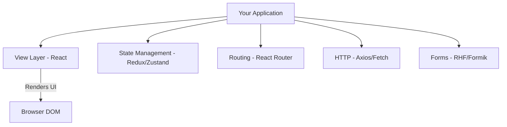
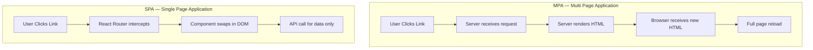
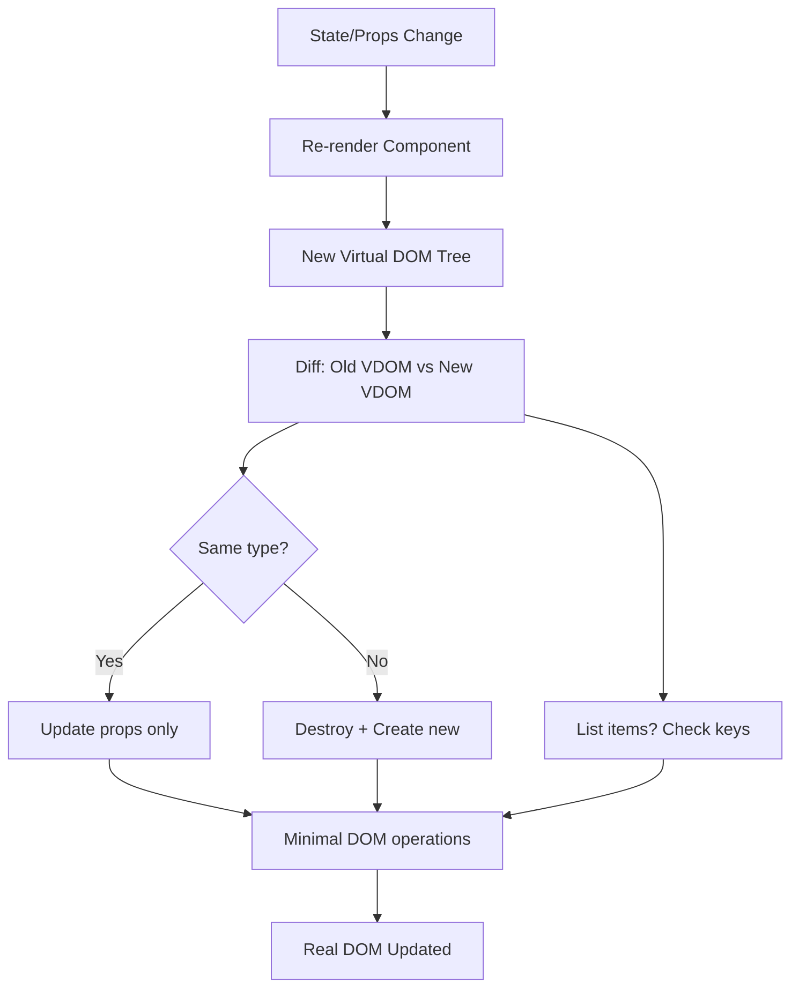
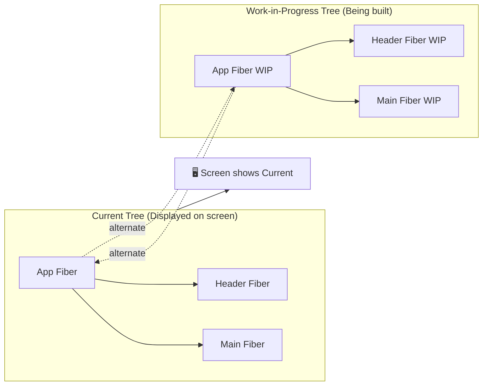
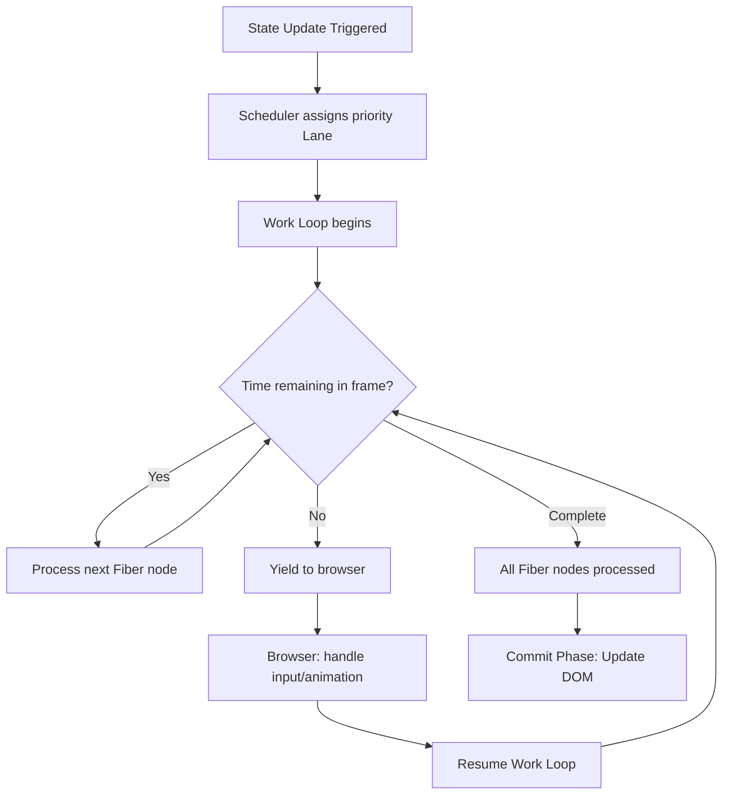
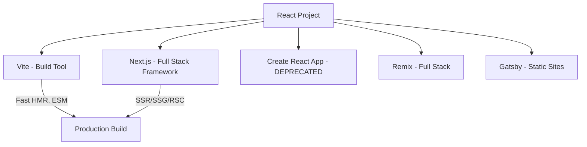
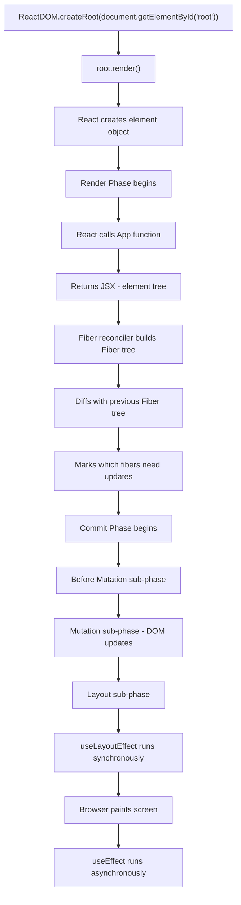
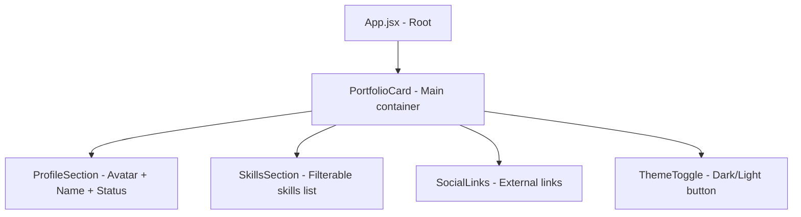

<a id="8-introduction-to-react"></a>

[⬅ Previous Chapter](#7-accessibility-a11y-complete-guide) | [📖 Main Index](#main-index) | [Next Chapter ➡](#9-jsx-javascript-xml)

---

# Chapter 8: Introduction to React

## 📌 Learning Objectives

By the end of this chapter, you will:

- **Understand** what React is, where it came from, and why it was built
- **Distinguish** between a UI library and a full framework
- **Master** the difference between Imperative vs Declarative UI programming
- **Compare** SPA and MPA architectures with real-world trade-offs
- **Deeply understand** React Element Object — its shape, purpose, and immutability
- **Demystify** the Virtual DOM — what it actually is, how diffing works, and what reconciliation means
- **Comprehend** React Fiber Architecture — the internals that power modern React
- **Navigate** the React Ecosystem — packages, tooling, state management, testing
- **Set up** a production-ready React dev environment with Vite
- **Understand** package.json in depth — versioning, scripts, lock files
- **Trace** the exact render pipeline — from `ReactDOM.createRoot()` to DOM paint
- **Answer 15+ interview questions** confidently on React internals

---

<a id="chapter-index-table-8"></a>

## Chapter Index Table

| Topic No. | Topic Name | Subtopics |
|-----------|-----------|-----------|
| 8.1 | [What is React?](#81-what-is-react) | UI library vs Framework<br>Facebook origin<br>React's job — only the view |
| 8.2 | [Why React? (Problems it solves)](#82-why-react-problems-it-solves) | Imperative vs Declarative<br>DOM pain at scale<br>Reusability<br>Predictable state → UI |
| 8.3 | [SPA vs MPA — Detailed Comparison](#83-spa-vs-mpa-detailed-comparison) | Architecture differences<br>Routing behavior<br>SEO implications<br>Bundle size<br>When to choose |
| 8.4 | [React Element Object](#84-react-element-object) | createElement() return value<br>Element shape<br>Element vs Component vs Instance<br>Immutability |
| 8.5 | [Virtual DOM — Deep Dive](#85-virtual-dom-deep-dive) | What is VDOM<br>In-memory representation<br>Diffing algorithm<br>Reconciliation |
| 8.6 | [React Fiber Architecture — Deep Dive](#86-react-fiber-architecture-deep-dive) | Why Fiber<br>Fiber node structure<br>Fiber tree<br>Work Loop<br>Lanes<br>Concurrent rendering |
| 8.7 | [React Ecosystem Overview](#87-react-ecosystem-overview) | Core packages<br>Tooling<br>State management<br>Testing |
| 8.8 | [Development Environment Setup](#88-development-environment-setup) | Vite setup<br>Folder structure<br>ESLint & Prettier<br>VS Code extensions |
| 8.9 | [package.json Deep Dive](#89-packagejson-deep-dive) | dependencies vs devDependencies<br>scripts<br>Semantic versioning<br>lock file |
| 8.10 | [How React Renders — Under the Hood](#810-how-react-renders-under-the-hood) | createRoot()<br>Render Phase<br>Commit Phase<br>Concurrent Mode |
| 💡 | [Interview Questions](#-interview-questions) | 15+ Questions with Answers |
| 🧪 | [Practice Problems](#-practice-problems) | 5 Coding + 5 Theory |
| 🚀 | [Mini Project](#-mini-project) | First React App with Vite |
| ⚡ | [Quick Revision](#-quick-revision) | Key bullets, traps, revision |
| 📌 | [Chapter Summary](#-chapter-summary) | Final takeaways |

---

## 8.1 What is React?

<a id="81-what-is-react"></a>

### What is it?

React is an **open-source JavaScript library** for building **user interfaces**. It was created by **Jordan Walke** at Facebook in 2011, first deployed on Facebook's News Feed, later on Instagram in 2012, and open-sourced at **JSConf US in May 2013**.

React's core philosophy:

> "React is just the VIEW layer. Nothing more. Nothing less."

### 🧠 Hinglish Intuition

Socho ek restaurant hai. React sirf **waiter** hai — customer ko khana serve karta hai (UI dikhata hai). Lekin kitchen ka kaam (business logic), payment system (state management), delivery (routing) — yeh sab alag log handle karte hain. React sirf dikhane ka kaam karta hai. Aur woh apna kaam **bahut achhe se** karta hai.

Framework vs Library ka fark samjho aise:
- **Framework (Angular)** — Poora ghar bana ke deta hai. Tu sirf furniture rakh.
- **Library (React)** — Sirf bricks deta hai. Tu khud decide karta hai kahan kya banana hai.

---

### UI Library vs Framework — The Exact Distinction

| Feature | Library (React) | Framework (Angular) |
|---------|----------------|---------------------|
| **Control** | You call the library | Framework calls your code |
| **Routing** | External (React Router) | Built-in |
| **HTTP** | External (Axios, fetch) | Built-in (HttpClient) |
| **Form handling** | External (React Hook Form) | Built-in |
| **Opinionation** | Low — choose your stack | High — follow the pattern |
| **Bundle size** | Smaller core | Larger |
| **Learning curve** | Moderate | Steeper |
| **Flexibility** | Very high | Structured |

> [!IMPORTANT]
> In interviews, when asked "Is React a framework?", always say: **React is a JavaScript library, not a framework**. It handles only the View layer. Angular is a full framework. Vue is a progressive framework. React is intentionally minimal.

---

### Facebook Origin & Open Source Story

```
Timeline:
2011 → Jordan Walke creates FaxJS (internal prototype)
2011 → Deployed on Facebook News Feed
2012 → Used on Instagram
2013 → Open-sourced at JSConf US
2015 → React Native released
2016 → React Fiber development begins
2017 → React 16 (Fiber released)
2020 → React 17 (no new features, upgrade improvements)
2022 → React 18 (Concurrent Mode, automatic batching)
2024 → React 19 (Server Actions, use() hook, compiler)
```

---

### React's Job — Only the View



React only owns the **B → G** connection. Everything else is your choice.

---

👉 <a href="#chapter-index-table-8">Go to Top 🔝</a>

---

## 8.2 Why React? (Problems it solves)

<a id="82-why-react-problems-it-solves"></a>

### What problem does it solve?

Before React, building complex UIs meant manually manipulating the DOM using jQuery or vanilla JavaScript. This caused:

1. **Spaghetti code** — Event listeners everywhere, inconsistent state
2. **DOM manipulation pain** — Updating 50 elements on one button click
3. **No reusability** — Same UI card written 20 times with slight variations
4. **Unpredictable UI** — State and DOM out of sync constantly

---

### Imperative vs Declarative UI

This is one of the most important conceptual distinctions in React.

#### Imperative Approach (jQuery / Vanilla JS)

```javascript
// ❌ Imperative — You tell HOW to do it, step by step
function updateUserName(newName) {
  const element = document.getElementById('username');
  element.textContent = newName;
  
  const greeting = document.getElementById('greeting');
  greeting.textContent = `Hello, ${newName}`;
  
  const avatar = document.querySelector('.avatar-initials');
  avatar.textContent = newName.charAt(0).toUpperCase();
  
  // Now update the nav bar too...
  const navUser = document.querySelector('.nav-username');
  navUser.textContent = newName;
  
  // And the profile section...
  // ... and so on for 20 more places
}
```

**Problem:** You must manually track **every** DOM node and update each one yourself.

#### Declarative Approach (React)

```jsx
// ✅ Declarative — You tell WHAT the UI should look like
function UserProfile({ userName }) {
  return (
    <div>
      <h1 id="username">{userName}</h1>
      <p id="greeting">Hello, {userName}</p>
      <div className="avatar-initials">
        {userName.charAt(0).toUpperCase()}
      </div>
    </div>
  );
}

// Usage: Just change the data — React handles the DOM
<UserProfile userName={newName} />
```

**You describe WHAT the UI should look like** for a given state. React figures out HOW to update the DOM.

---

### 🧠 Hinglish Intuition

**Imperative** = Cab driver ko poora route batana: "Seedha jao, phir left, phir right, phir U-turn..."

**Declarative** = Ola/Uber app mein destination type karna: "Mujhe Connaught Place jaana hai." App khud figure out karta hai kaise jana hai.

React mein tu sirf bolta hai: "Agar user logged in hai toh yeh dikhao, nahi toh login page dikhao." React khud decide karta hai DOM mein kya badalna hai.

---

### DOM Manipulation Pain at Scale

```javascript
// Imagine a Facebook feed with 500 posts
// Each "Like" click requires:

// 1. Find the specific post's like button
const likeBtn = document.querySelector(`[data-post-id="${postId}"] .like-btn`);

// 2. Update the count
const countEl = document.querySelector(`[data-post-id="${postId}"] .like-count`);
countEl.textContent = parseInt(countEl.textContent) + 1;

// 3. Toggle the liked state
likeBtn.classList.toggle('liked');

// 4. Update the liked users tooltip
const tooltipEl = document.querySelector(`[data-post-id="${postId}"] .liked-by`);
tooltipEl.textContent = `You and ${othersCount} others`;

// 5. Sync with server...
// 6. Handle error states...
// 7. Revert on failure...

// ❌ This becomes IMPOSSIBLE to maintain at Facebook scale
```

With React:

```jsx
// ✅ React handles all DOM updates
function Post({ post }) {
  const [liked, setLiked] = useState(post.liked);
  const [likeCount, setLikeCount] = useState(post.likes);

  const handleLike = async () => {
    setLiked(prev => !prev);           // UI updates instantly
    setLikeCount(prev => liked ? prev - 1 : prev + 1);
    await api.toggleLike(post.id);     // Sync with server
  };

  return (
    <div>
      <button onClick={handleLike} className={liked ? 'liked' : ''}>
        👍 {likeCount}
      </button>
    </div>
  );
}
```

---

### Component Reusability

```jsx
// Define once, use everywhere
function Card({ title, description, imageUrl, author }) {
  return (
    <div className="card">
      
      <h2>{title}</h2>
      <p>{description}</p>
      <span>By {author}</span>
    </div>
  );
}

// Reuse for blog posts
<Card title="React Hooks" description="..." imageUrl="..." author="Dan" />

// Reuse for products
<Card title="iPhone 15" description="..." imageUrl="..." author="Apple" />

// Reuse for user profiles
<Card title="John Doe" description="..." imageUrl="..." author="Admin" />
```

> [!TIP]
> Component reusability is why React scales from small startups to Facebook-scale apps. One well-designed component can be reused thousands of times across your application.

---

### Predictable State → UI

React's core mental model:

```
UI = f(state)
```

**UI is a pure function of state.** Same state always produces same UI. No hidden mutations, no out-of-sync DOM.

```jsx
// State changes → React re-renders → DOM updates
// This is predictable, traceable, debuggable

function Counter() {
  const [count, setCount] = useState(0);  // State

  // UI is ALWAYS a reflection of count
  return (
    <div>
      <p>Count: {count}</p>  {/* Always shows current count */}
      <button onClick={() => setCount(c => c + 1)}>+</button>
    </div>
  );
}
```

---

👉 <a href="#chapter-index-table-8">Go to Top 🔝</a>

---

## 8.3 SPA vs MPA — Detailed Comparison

<a id="83-spa-vs-mpa-detailed-comparison"></a>

### What is it?

**SPA (Single Page Application):** The browser loads ONE HTML file. JavaScript dynamically renders content and handles navigation without full page reloads.

**MPA (Multi Page Application):** Every route/page is a separate HTML file served by the server. Navigation causes full page reloads.

---

### 🧠 Hinglish Intuition

**MPA** = Purani Doordarshan wali TV. Har channel ke liye antenna adjust karo, signal aane ka wait karo. Matlab har page pe server se naya HTML mangna padta hai.

**SPA** = Smart TV with Netflix. App ek baar load hota hai, phir sab kuch andar andar switch hota hai. Server se sirf data aata hai (JSON), HTML nahi.

---

### Architecture Differences



---

### Detailed Comparison Table

| Feature | SPA | MPA |
|---------|-----|-----|
| **Initial Load** | Slower (loads full JS bundle) | Faster (small HTML) |
| **Subsequent Navigation** | Instant (no reload) | Slower (full reload) |
| **Server Load** | Low (serves API data only) | High (renders full HTML) |
| **SEO** | Harder (JS-rendered content) | Easy (HTML ready) |
| **User Experience** | App-like, smooth | Page-reload feel |
| **Caching** | JS bundle cached | Each page separately cached |
| **Examples** | Gmail, Figma, Notion | Amazon, Wikipedia, News sites |
| **Tech** | React, Vue, Angular | PHP, Rails, traditional HTML |
| **Bundle size** | Large upfront | Small per page |
| **Back button** | Requires router config | Works natively |
| **Analytics** | Requires SPA tracking | Works natively |
| **Security** | XSS risk higher | CSRF risk more common |

---

### Routing Behavior

```javascript
// MPA Routing — Full HTTP Request each time
// User clicks /about → Browser sends GET /about → Server returns about.html

// SPA Routing — JavaScript intercepts
// User clicks /about → React Router intercepts → Renders <AboutPage /> component
// URL changes (history.pushState) but NO server request

// React Router Example
import { BrowserRouter, Routes, Route } from 'react-router-dom';

function App() {
  return (
    <BrowserRouter>
      <Routes>
        <Route path="/" element={<Home />} />       {/* No reload */}
        <Route path="/about" element={<About />} /> {/* No reload */}
        <Route path="/blog" element={<Blog />} />   {/* No reload */}
      </Routes>
    </BrowserRouter>
  );
}
```

---

### SEO Implications

> [!IMPORTANT]
> This is a critical interview topic. SEO is SPA's biggest weakness.

**The Problem:**

```
Google Bot arrives at your SPA → Receives:
<html>
  <body>
    <div id="root"></div>  ← EMPTY! JavaScript hasn't run yet
    <script src="bundle.js"></script>
  </body>
</html>

Google Bot sees: NOTHING useful
Result: Poor SEO ranking
```

**Solutions:**

| Solution | How | Example |
|----------|-----|---------|
| **SSR (Server Side Rendering)** | Server pre-renders HTML | Next.js |
| **SSG (Static Site Generation)** | Build-time HTML generation | Next.js, Gatsby |
| **Dynamic Rendering** | Detect bots, serve pre-rendered | Puppeteer |
| **React Helmet** | Manage meta tags | react-helmet |

---

### Bundle Size Trade-offs

```
MPA:
Page 1: 50KB HTML + 10KB CSS
Page 2: 48KB HTML + 10KB CSS
Page 3: 52KB HTML + 10KB CSS
Total per visit: ~60KB per page (but cached separately)

SPA:
Initial: 200KB JavaScript bundle (all routes included)
Subsequent: 0KB (JS already cached)
With code splitting: ~50KB initial + lazy load rest
```

---

### When to Choose Which

| Choose SPA | Choose MPA |
|-----------|-----------|
| Dashboard / Admin panels | E-commerce / Product pages |
| Real-time apps (chat, trading) | Content-heavy blogs |
| Complex user interactions | Marketing websites |
| Offline capability needed | News portals |
| App-like experience | SEO-critical sites |
| Internal tools | Public-facing landing pages |

> [!TIP]
> **Next.js is the best of both worlds** — it gives you React (SPA experience) with SSR/SSG for SEO. This is why Next.js is the industry standard for production React apps.

---

👉 <a href="#chapter-index-table-8">Go to Top 🔝</a>

---

## 8.4 React Element Object

<a id="84-react-element-object"></a>

### What is it?

A **React Element** is a plain JavaScript object that describes what you want to see on screen. It is the **smallest building block** in React. It is NOT a DOM element — it is a lightweight description of one.

> [!NOTE]
> React Element is just a plain JS object. It has no methods, no prototypes, nothing fancy. Just a POJO (Plain Old JavaScript Object) with specific keys.

---

### React.createElement() — The Return Value

Every piece of JSX you write compiles down to `React.createElement()`:

```jsx
// JSX you write:
const element = <h1 className="title">Hello React</h1>;

// What Babel compiles it to:
const element = React.createElement(
  'h1',                        // type
  { className: 'title' },      // props
  'Hello React'                // children (rest args)
);

// What React.createElement() RETURNS:
// A plain JavaScript object:
{
  $$typeof: Symbol(react.element),  // Security marker
  type: 'h1',
  key: null,
  ref: null,
  props: {
    className: 'title',
    children: 'Hello React'
  },
  _owner: null,
  _store: {}
}
```

---

### Element Object Shape — All Properties

```javascript
const element = React.createElement('div', {
  id: 'container',
  className: 'box',
  onClick: handleClick
}, 'Click me');

// Resulting element object:
{
  $$typeof: Symbol(react.element),
  // ↑ Security: Prevents XSS via JSON injection
  // JSON cannot contain Symbols, so injected JSON can't fake a React element

  type: 'div',
  // ↑ Can be:
  //   - String: 'div', 'h1', 'span' (DOM elements)
  //   - Function: MyComponent (functional component)
  //   - Class: MyClassComponent (class component)
  //   - Symbol: React.Fragment, React.StrictMode

  key: null,
  // ↑ Special prop for list reconciliation
  // Helps React identify which items changed in lists

  ref: null,
  // ↑ Special prop to access DOM node or component instance
  // Removed from props, stored separately

  props: {
    id: 'container',
    className: 'box',
    onClick: handleClick,
    children: 'Click me'
    // ↑ children is just another prop!
  },

  _owner: null,
  // ↑ Which Fiber node is responsible for creating this element

  _store: {}
  // ↑ Development-only: validation data
}
```

---

### 🧠 Hinglish Intuition

React Element ek **recipe** hai, actual khana nahi. Jab tu `<h1>Hello</h1>` likhta hai, React ek recipe card banata hai: "Ek h1 chahiye, jisme text 'Hello' ho." Yeh recipe card (element object) ko baad mein React DOM actual DOM mein convert karta hai — actual khana banata hai.

Recipe kabhi khana nahi ban sakti akele. Usse cook (ReactDOM) chahiye. Aur recipe immutable hoti hai — ek baar likh di toh change nahi hoti.

---

### Nested Elements

```jsx
// JSX:
const element = (
  <div className="parent">
    <h1>Title</h1>
    <p>Paragraph</p>
  </div>
);

// Compiled React Element Object:
{
  type: 'div',
  props: {
    className: 'parent',
    children: [
      {
        type: 'h1',
        props: { children: 'Title' },
        key: null,
        ref: null
      },
      {
        type: 'p',
        props: { children: 'Paragraph' },
        key: null,
        ref: null
      }
    ]
  }
}
// ↑ A TREE of plain JavaScript objects!
// This is the "Virtual DOM"
```

---

### Element vs Component vs Instance

This is a critical distinction that trips up many developers.

| Concept | What it is | Example |
|---------|-----------|---------|
| **Element** | Plain JS object describing UI | `{ type: 'div', props: {...} }` |
| **Component** | A function/class that RETURNS elements | `function Button() { return <button>Click</button> }` |
| **Instance** | Internal React object tracking a mounted component | Created by React internally, you don't create these manually |

```jsx
// Component — A blueprint/factory
function Button({ label }) {
  return <button>{label}</button>;  // Returns an Element
}

// Element — Describing what we want
const buttonElement = <Button label="Click me" />;
// This is: { type: Button, props: { label: 'Click me' }, key: null, ref: null }
// Note: type is the FUNCTION itself, not a string!

// Instance — React creates this internally when it mounts the component
// You cannot access this directly in functional components (only in class components via 'this')

// React's internal process:
// 1. Sees element { type: Button, props: {label: 'Click me'} }
// 2. Calls Button({ label: 'Click me' })
// 3. Gets back { type: 'button', props: { children: 'Click me' } }
// 4. Renders <button>Click me</button> to DOM
```

---

### Immutable Elements

> [!IMPORTANT]
> React Elements are **immutable**. Once created, you cannot change their children or props. To update the UI, you create a NEW element and React diffs it with the old one.

```javascript
const element = <h1>Hello</h1>;

// ❌ This does NOT work — elements are immutable
element.props.children = 'World'; // Cannot and should not do this!

// ✅ Correct approach — create new element
const newElement = <h1>World</h1>;
// React will diff old vs new and update only what changed in the DOM
```

---

👉 <a href="#chapter-index-table-8">Go to Top 🔝</a>

---

## 8.5 Virtual DOM — Deep Dive

<a id="85-virtual-dom-deep-dive"></a>

### What is it?

The **Virtual DOM (VDOM)** is an **in-memory JavaScript representation** of the actual browser DOM. It is essentially the tree of React Element objects we saw in 8.4.

### Why does it exist?

The real DOM is **expensive to manipulate**. Reading/writing DOM properties triggers browser operations like layout recalculation, style computation, and repainting. React maintains a lightweight JS copy, diffs it, and makes **only the minimum necessary changes** to the real DOM.

---

### 🧠 Hinglish Intuition

Socho tu ek large document edit kar raha hai — 10,000 words ka essay. Har sentence ke baad agar tu print karta raha (real DOM update), toh bahut paper aur ink waste hoti.

VDOM aise hai jaise tu Word doc mein changes karta hai (in-memory), phir end mein ek hi baar print karta hai — sirf jo pages change hue unhe reprint karta hai.

Real DOM = Actual printer output (expensive)
Virtual DOM = Word document in memory (cheap to edit)

---

### In-Memory Representation of UI

```javascript
// The browser's real DOM (expensive C++ objects):
// <div id="app">
//   <h1>Hello</h1>
//   <p>World</p>
// </div>

// React's Virtual DOM (cheap JS objects):
const virtualDOM = {
  type: 'div',
  props: {
    id: 'app',
    children: [
      { type: 'h1', props: { children: 'Hello' } },
      { type: 'p', props: { children: 'World' } }
    ]
  }
};

// Operations on virtualDOM: Microseconds (JS object operations)
// Operations on real DOM: Milliseconds (browser engine involved)
// That's 100-1000x faster for the diffing step
```

---

### The Diffing Algorithm — Heuristics

React's diffing algorithm (also called **Reconciliation**) uses two key heuristics to achieve O(n) complexity instead of the theoretical O(n³) for tree diffing:

1. **Elements of different types produce different trees**
2. **Developer can hint stable children using `key` prop**

#### Heuristic 1: Different Types → Destroy & Rebuild

```jsx
// Before update:
<div>
  <Counter />
</div>

// After update:
<span>  {/* type changed: div → span */}
  <Counter />
</span>

// React's decision:
// div !== span → DESTROY entire subtree (including Counter)
// Create fresh span + fresh Counter instance
// ❗ Counter's state is LOST — it was destroyed and recreated
```

```jsx
// Why this matters:
function App() {
  const [isLoggedIn, setIsLoggedIn] = useState(false);
  
  return (
    <div>
      {/* ❌ BAD: Changes element type → loses state */}
      {isLoggedIn ? <UserForm /> : <GuestForm />}
      
      {/* ✅ BETTER: Same type, different props → preserves structure */}
      <Form isLoggedIn={isLoggedIn} />
    </div>
  );
}
```

#### Heuristic 2: Same Type → Update Props

```jsx
// Before:
<div className="old-class" id="box">Content</div>

// After:
<div className="new-class" id="box">Content</div>

// React's decision:
// div === div → KEEP the DOM node, just update changed attributes
// Only: className changes from "old-class" to "new-class"
// id stays the same → no DOM operation for id
// DOM node is REUSED → very efficient
```

#### Heuristic 3: Lists → Key-Based Matching

```jsx
// ❌ WITHOUT keys — React struggles
// Before:
<ul>
  <li>Apple</li>
  <li>Banana</li>
</ul>

// After prepending "Orange":
<ul>
  <li>Orange</li>  {/* React thinks: update Apple → Orange */}
  <li>Apple</li>   {/* React thinks: update Banana → Apple */}
  <li>Banana</li>  {/* React thinks: new item */}
  {/* Result: 2 updates + 1 insert (INEFFICIENT) */}
</ul>

// ✅ WITH keys — React correctly identifies items
// Before:
<ul>
  <li key="apple">Apple</li>
  <li key="banana">Banana</li>
</ul>

// After:
<ul>
  <li key="orange">Orange</li>  {/* New item — INSERT */}
  <li key="apple">Apple</li>    {/* Existing — MOVE, no update */}
  <li key="banana">Banana</li>  {/* Existing — MOVE, no update */}
  {/* Result: 1 insert + 2 moves (EFFICIENT) */}
</ul>
```

> [!IMPORTANT]
> **NEVER use array index as key when the list can reorder.** Use stable, unique identifiers (like database IDs). Using index as key when items can be reordered causes bugs with component state.

---

### Reconciliation Algorithm — Full Flow



---

### VDOM is NOT Magic — The Real Benefit

> [!NOTE]
> Virtual DOM is NOT faster than direct DOM manipulation for every use case. Its real benefit is **predictability** and **developer experience**. React batches and optimizes DOM operations behind the scenes so you don't have to manually optimize.

```
Direct DOM (manual):  You manage what to update → Error-prone
Virtual DOM (React):  You describe full UI → React optimizes → Correct
```

---

👉 <a href="#chapter-index-table-8">Go to Top 🔝</a>

---

## 8.6 React Fiber Architecture — Deep Dive

<a id="86-react-fiber-architecture-deep-dive"></a>

### Why Fiber Replaced the Stack Reconciler

Before React 16, React used a **Stack Reconciler** — a synchronous, recursive algorithm. When React started reconciling a component tree, it could NOT stop until the entire tree was processed.

```
Stack Reconciler Problem:
React starts rendering a large tree (e.g., 1000 components)
JavaScript main thread is BLOCKED for 200ms
Browser CANNOT:
  - Handle user input (button clicks feel unresponsive)
  - Run animations (janky 60fps → drops to 10fps)
  - Update other UI

User Experience: "The app is frozen!"
```

**React Fiber** was a complete rewrite of the reconciler (released React 16, 2017) that made rendering **interruptible, prioritized, and incremental**.

---

### 🧠 Hinglish Intuition

**Old Stack Reconciler** = Ek factory worker jo kaam shuru kare toh tab tak khatam nahi karta jab tak poora batch complete na ho. Agar bich mein urgent order aaye, toh woh bolega "Wait karo, main abhi busy hoon."

**React Fiber** = Smart factory manager. Kaam ko chote chote tasks mein tod deta hai. Boss ka urgent order aaya? Ruk jao, pehle woh karo, phir waapis aao. Koi kaam miss nahi hota, priorities maintain hoti hain.

---

### Fiber Node Structure

A **Fiber node** is a JavaScript object that represents a **unit of work** for React. Every component in your tree has a corresponding Fiber node.

```javascript
// Conceptual Fiber node structure (simplified)
const fiberNode = {
  // === Identity ===
  tag: FunctionComponent,      // Type: 0=FunctionComponent, 1=ClassComponent, 5=HostComponent(div/span)
  type: MyComponent,           // The function/class/string ('div')
  key: null,                   // Same key as React element
  
  // === State & Props ===
  pendingProps: { name: 'Alice' },  // New props being processed
  memoizedProps: { name: 'Bob' },   // Last rendered props
  memoizedState: null,              // Hooks linked list (useState, useEffect, etc.)
  
  // === DOM Reference ===
  stateNode: domElement,       // Actual DOM node (for host components like 'div')
                               // Or class component instance
  
  // === Tree Structure (Fiber forms a linked list tree) ===
  return: parentFiber,         // Parent fiber node
  child: firstChildFiber,      // First child fiber
  sibling: nextSiblingFiber,   // Next sibling fiber
  
  // === Work ===
  effectTag: Update,           // What work needs to be done (Placement, Update, Deletion)
  updateQueue: null,           // Queue of state updates
  
  // === Alternate (Double Buffering) ===
  alternate: workInProgressFiber,  // The "other" version of this fiber
  
  // === Priority ===
  lanes: DefaultLane,          // Priority of this work
  childLanes: 0,               // Priority of child work
};
```

---

### Fiber Tree — Work-in-Progress vs Current

React maintains **TWO fiber trees** simultaneously:



**Double Buffering:**
1. React builds the **Work-in-Progress (WIP) tree** based on state updates
2. WIP tree is built incrementally (can be paused/resumed)
3. Once WIP is complete → it becomes the **Current tree**
4. Old current tree becomes the new WIP tree for next update
5. This ensures the screen always shows a **consistent, complete UI** — never a partial update

---

### Update Queue per Fiber Node

```javascript
// Every fiber node has an update queue (linked list of updates)
// When you call setState multiple times:

function Counter() {
  const [count, setCount] = useState(0);
  
  const handleClick = () => {
    setCount(c => c + 1);  // Update 1 → added to queue
    setCount(c => c + 1);  // Update 2 → added to queue
    setCount(c => c + 1);  // Update 3 → added to queue
  };
  // React processes all 3 in the queue → count becomes 3
  // This is "batching" — only ONE re-render happens!
}

// Internal update queue structure:
// fiber.updateQueue = {
//   baseState: 0,
//   firstBaseUpdate: null,
//   lastBaseUpdate: null,
//   shared: {
//     pending: Update3 → Update1 → Update2 (circular linked list)
//   }
// }
```

---

### Work Loop — Interruptible Rendering

```javascript
// Simplified Fiber work loop concept
function workLoop(deadline) {
  let shouldYield = false;
  
  while (nextUnitOfWork !== null && !shouldYield) {
    // Do a small unit of work (one fiber node)
    nextUnitOfWork = performUnitOfWork(nextUnitOfWork);
    
    // Check: do we still have time in this frame?
    shouldYield = deadline.timeRemaining() < 1;
    // ↑ This is the KEY DIFFERENCE from Stack Reconciler
    // If browser needs the thread → we YIELD (pause)
    // Browser handles input/animation → then we resume
  }
  
  // If there's more work left, schedule continuation
  if (nextUnitOfWork !== null) {
    requestIdleCallback(workLoop);  // Come back when browser is free
  }
}

// React actually uses its own scheduler (not requestIdleCallback directly)
// But the concept is the same: check remaining time, yield if needed
```

---

### Lanes Architecture — Priority Levels

React 18 introduced **Lanes** — a bitmask system for prioritizing different types of updates:

```javascript
// Conceptual Lanes (actual values are bitmasks)
const SyncLane          = 0b0000000000000000000000000000001; // Highest priority
const InputContinuousLane = 0b0000000000000000000000000000100; // User input
const DefaultLane       = 0b0000000000000000000000000010000; // Normal updates
const TransitionLane    = 0b0000000000000000000001000000000; // startTransition
const IdleLane          = 0b0100000000000000000000000000000; // Lowest priority
```

**Priority in action:**

```jsx
import { startTransition } from 'react';

function SearchPage() {
  const [query, setQuery] = useState('');
  const [results, setResults] = useState([]);

  const handleSearch = (e) => {
    // HIGH priority — user typing → SyncLane
    // Update input immediately, don't defer
    setQuery(e.target.value);
    
    // LOW priority — search results → TransitionLane
    // Can be interrupted if user types more
    startTransition(() => {
      setResults(searchDatabase(e.target.value));
    });
  };

  return (
    <>
      <input value={query} onChange={handleSearch} />
      {/* Input always responds instantly */}
      {/* Results may lag slightly if search is slow */}
      <ResultsList results={results} />
    </>
  );
}
```

---

### Concurrent Rendering — Time-Slicing



**The Result:** React can work on 100 component re-renders without ever blocking the main thread for more than ~5ms (one frame at 60fps = 16.6ms).

---

### Scheduling Priorities Summary

| Lane | Priority | Triggered By | Behavior |
|------|----------|-------------|---------|
| **SyncLane** | Highest | `ReactDOM.flushSync()` | Synchronous, cannot interrupt |
| **InputContinuousLane** | Very High | Mouse move, scroll | Process quickly |
| **DefaultLane** | Normal | `setState`, `useState` | Standard async rendering |
| **TransitionLane** | Low | `startTransition()` | Can be interrupted/deferred |
| **IdleLane** | Lowest | Offscreen rendering | Only when browser is completely idle |

---

### Render Phase vs Commit Phase

```
┌─────────────────────────────────────────────────────────────────┐
│ RENDER PHASE (Reconciliation)                                   │
│ ─────────────────────────────                                   │
│ • Pure computation — no side effects                            │
│ • Interruptible (can pause, resume, restart)                    │
│ • Builds Work-in-Progress Fiber tree                            │
│ • Determines what changed (diffs)                               │
│ • Your component functions are called here                       │
│ • Can run multiple times for same update (StrictMode)           │
└─────────────────────────────────────────────────────────────────┘
                              ↓
┌─────────────────────────────────────────────────────────────────┐
│ COMMIT PHASE (DOM Mutations)                                    │
│ ─────────────────────────────                                   │
│ • Synchronous — cannot be interrupted                           │
│ • Applies all DOM changes at once                               │
│ • Runs effects (useEffect, useLayoutEffect)                     │
│ • Three sub-phases:                                             │
│   1. Before mutation (getSnapshotBeforeUpdate)                  │
│   2. Mutation (insertBefore, removeChild, textContent)          │
│   3. Layout (useLayoutEffect runs synchronously)                │
└─────────────────────────────────────────────────────────────────┘
```

> [!IMPORTANT]
> Because the **Render Phase is interruptible**, your component functions (and their bodies) can be called multiple times for a single update in Concurrent Mode. This is why React StrictMode calls your function twice in development — to help you detect unintentional side effects in the render phase.

---

👉 <a href="#chapter-index-table-8">Go to Top 🔝</a>

---

## 8.7 React Ecosystem Overview

<a id="87-react-ecosystem-overview"></a>

### Core Packages

| Package | Purpose | Who uses it |
|---------|---------|-------------|
| `react` | Core library — component model, hooks API, reconciler | All React apps |
| `react-dom` | DOM renderer — bridges React to browser DOM | Browser apps |
| `react-dom/server` | Server-side rendering (renderToString, renderToPipeableStream) | SSR (Next.js) |
| `react-native` | Mobile renderer — bridges React to iOS/Android native views | Mobile apps |
| `react-test-renderer` | Test renderer — renders to JSON for testing | Unit tests |
| `scheduler` | Fiber scheduler — manages priorities | Used internally by React |

---

### 🧠 Hinglish Intuition

React packages aise hain jaise engine aur body alag hoti hai gaadi mein:
- `react` = Engine (core logic, reconciliation)
- `react-dom` = Car body for road (browser)
- `react-native` = Jeep body for off-road (mobile)
- `react-dom/server` = Formula 1 body for racing (SSR)

Same engine, alag body for alag terrain.

---

### Tooling Landscape



| Tool | Best For | Status |
|------|---------|--------|
| **Vite** | SPAs, learning, dashboards | ✅ Recommended |
| **Next.js** | Production apps, full-stack | ✅ Industry standard |
| **Remix** | Full-stack, web fundamentals | ✅ Growing |
| **Gatsby** | Static sites, blogs | ⚠️ Declining |
| **Create React App** | Nothing | ❌ Deprecated |

---

### State Management Landscape

| Tool | Philosophy | Bundle Size | Learning Curve |
|------|-----------|------------|----------------|
| **React Context + useState** | Built-in, simple | 0KB | Low |
| **Redux Toolkit** | Predictable, time-travel debug | 11KB | High |
| **Zustand** | Minimal, no boilerplate | 1KB | Very Low |
| **Jotai** | Atomic state | 3KB | Low |
| **Recoil** | Atomic (Facebook) | 21KB | Medium |
| **TanStack Query** | Server state (NOT UI state) | 13KB | Medium |

---

### Testing Ecosystem

| Tool | Purpose | Used With |
|------|---------|----------|
| **Vitest** | Unit testing (fast, Vite-native) | Vite projects |
| **Jest** | Unit testing (traditional) | All |
| **React Testing Library** | Component testing | Jest/Vitest |
| **Cypress** | E2E testing | All |
| **Playwright** | E2E testing (Microsoft) | All |
| **Storybook** | Component development/docs | All |
| **MSW** | API mocking | All |

---

👉 <a href="#chapter-index-table-8">Go to Top 🔝</a>

---

## 8.8 Development Environment Setup

<a id="88-development-environment-setup"></a>

### Vite React Project Setup — Step by Step

#### Step 1: Create project

```bash
# Node.js 18+ required
node -v  # Check version

# Create Vite + React project
npm create vite@latest my-react-app -- --template react

# Or with TypeScript (recommended for production)
npm create vite@latest my-react-app -- --template react-ts

# Navigate to project
cd my-react-app

# Install dependencies
npm install

# Start development server
npm run dev
# → http://localhost:5173
```

#### Step 2: Project Structure (Default Vite)

```
my-react-app/
├── public/
│   └── vite.svg            # Static assets (not processed by Vite)
├── src/
│   ├── assets/
│   │   └── react.svg
│   ├── App.css
│   ├── App.jsx             # Root component
│   ├── index.css           # Global styles
│   └── main.jsx            # Entry point
├── .gitignore
├── eslint.config.js
├── index.html              # HTML template (Vite uses this as entry)
├── package.json
├── README.md
└── vite.config.js          # Vite configuration
```

#### Step 3: Recommended Production Folder Structure

```
src/
├── assets/             # Images, fonts, static files
├── components/         # Reusable UI components
│   ├── common/         # Truly generic (Button, Input, Modal)
│   └── layout/         # Layout components (Header, Footer, Sidebar)
├── pages/              # Page-level components (route targets)
│   ├── Home/
│   │   ├── Home.jsx
│   │   ├── Home.test.jsx
│   │   └── Home.module.css
│   └── About/
├── hooks/              # Custom hooks
├── context/            # Context providers
├── services/           # API calls, external services
├── utils/              # Pure utility functions
├── constants/          # App-wide constants
├── types/              # TypeScript types (if using TS)
├── App.jsx
└── main.jsx
```

---

### ESLint Configuration

```bash
# ESLint comes pre-configured with Vite React template
# eslint.config.js (flat config format):
```

```javascript
// eslint.config.js
import js from '@eslint/js';
import globals from 'globals';
import reactHooks from 'eslint-plugin-react-hooks';
import reactRefresh from 'eslint-plugin-react-refresh';

export default [
  { ignores: ['dist'] },
  {
    files: ['**/*.{js,jsx}'],
    languageOptions: {
      ecmaVersion: 2020,
      globals: globals.browser,
      parserOptions: {
        ecmaVersion: 'latest',
        ecmaFeatures: { jsx: true },
        sourceType: 'module',
      },
    },
    plugins: {
      'react-hooks': reactHooks,
      'react-refresh': reactRefresh,
    },
    rules: {
      ...reactHooks.configs.recommended.rules,
      // Rules of Hooks enforced here!
      'react-refresh/only-export-components': [
        'warn',
        { allowConstantExport: true },
      ],
      // Custom rules
      'no-unused-vars': 'warn',
      'no-console': 'warn',
    },
  },
];
```

---

### Prettier Configuration

```bash
npm install --save-dev prettier eslint-config-prettier
```

```json
// .prettierrc
{
  "semi": true,
  "singleQuote": true,
  "tabWidth": 2,
  "trailingComma": "es5",
  "printWidth": 100,
  "jsxSingleQuote": false,
  "bracketSpacing": true,
  "jsxBracketSameLine": false,
  "arrowParens": "always"
}
```

```json
// .prettierignore
node_modules
dist
build
coverage
```

---

### VS Code Extensions for React

```
Essential Extensions:
├── ESLint (Microsoft)              — Real-time lint errors
├── Prettier (Prettier.io)          — Auto format on save
├── ES7+ React Snippets             — rfc, useState, useEffect snippets
├── Auto Import                     — Auto-import components
├── Bracket Pair Colorizer          — Color-matched brackets
└── GitLens                         — Git blame, history

Helpful Extensions:
├── Error Lens                      — Inline error display
├── Code Spell Checker              — Catch typos
├── Import Cost                     — See bundle size of imports
└── React Developer Tools           — Chrome DevTools extension (install in browser)
```

```json
// .vscode/settings.json
{
  "editor.formatOnSave": true,
  "editor.defaultFormatter": "esbenp.prettier-vscode",
  "editor.codeActionsOnSave": {
    "source.fixAll.eslint": true
  },
  "[javascript]": {
    "editor.defaultFormatter": "esbenp.prettier-vscode"
  },
  "[javascriptreact]": {
    "editor.defaultFormatter": "esbenp.prettier-vscode"
  }
}
```

---

👉 <a href="#chapter-index-table-8">Go to Top 🔝</a>

---

## 8.9 package.json Deep Dive

<a id="89-packagejson-deep-dive"></a>

### Complete package.json Anatomy

```json
{
  "name": "my-react-app",
  "version": "1.0.0",
  "private": true,

  "dependencies": {
    "react": "^18.3.1",
    "react-dom": "^18.3.1"
  },

  "devDependencies": {
    "@eslint/js": "^9.9.0",
    "@types/react": "^18.3.1",
    "@types/react-dom": "^18.3.1",
    "@vitejs/plugin-react": "^4.3.1",
    "eslint": "^9.9.0",
    "prettier": "^3.3.3",
    "vite": "^5.4.1",
    "vitest": "^1.6.0"
  },

  "scripts": {
    "dev": "vite",
    "build": "vite build",
    "preview": "vite preview",
    "lint": "eslint . --ext js,jsx --report-unused-disable-directives",
    "lint:fix": "eslint . --fix",
    "format": "prettier --write src/**/*.{js,jsx,css}",
    "test": "vitest",
    "test:ui": "vitest --ui",
    "test:coverage": "vitest --coverage"
  },

  "engines": {
    "node": ">=18.0.0",
    "npm": ">=9.0.0"
  },

  "browserslist": {
    "production": [
      ">0.2%",
      "not dead",
      "not op_mini all"
    ],
    "development": [
      "last 1 chrome version",
      "last 1 firefox version",
      "last 1 safari version"
    ]
  }
}
```

---

### dependencies vs devDependencies

> [!IMPORTANT]
> This is a frequent interview question. The distinction matters for production bundle size.

| | `dependencies` | `devDependencies` |
|--|---------------|-------------------|
| **When needed** | Runtime (in production) | Build time only |
| **Examples** | react, react-dom, axios | vite, eslint, vitest, prettier |
| **Installed in production?** | ✅ Yes | ❌ No (`npm ci --production`) |
| **Bundled in output?** | ✅ Yes (if imported) | ❌ No (tree-shaken) |

```bash
# Install as runtime dependency
npm install axios react-router-dom

# Install as dev dependency
npm install --save-dev vitest eslint prettier
```

---

### Semantic Versioning (^, ~, *)

```
Version format: MAJOR.MINOR.PATCH
Example:        18   . 3  .  1

MAJOR: Breaking changes (API incompatible)
MINOR: New features (backward compatible)
PATCH: Bug fixes (backward compatible)
```

| Prefix | Meaning | Example | Allows |
|--------|---------|---------|--------|
| `^18.3.1` | Compatible | Caret | `>=18.3.1 <19.0.0` (minor + patch) |
| `~18.3.1` | Approximately | Tilde | `>=18.3.1 <18.4.0` (patch only) |
| `18.3.1` | Exact | None | Only `18.3.1` |
| `*` | Any | Wildcard | Any version (dangerous!) |
| `>=18.0.0` | Range | Range | 18.0.0 and above |

```json
// package.json version examples:
{
  "dependencies": {
    "react": "^18.3.1",        // Will update: 18.3.2, 18.4.0 ✅ | 19.0.0 ❌
    "axios": "~1.6.0",         // Will update: 1.6.1, 1.6.2 ✅ | 1.7.0 ❌
    "lodash": "4.17.21",       // Exact only: 4.17.21 ✅ | any other ❌
    "some-package": "*"        // ⚠️ Dangerous: any version including breaking
  }
}
```

---

### package-lock.json Purpose

```
package.json says:  "react": "^18.3.1"
(Could install any version from 18.3.1 to 18.9.99)

package-lock.json records:
{
  "react": {
    "version": "18.3.1",           ← Exact version installed
    "resolved": "https://...",      ← Exact registry URL
    "integrity": "sha512-...",      ← File hash (security)
    "dependencies": { ... }         ← Exact dependency tree
  }
}

Result:
npm install → checks lock file → installs EXACT same versions
→ "Works on my machine" problem SOLVED
```

> [!TIP]
> **Always commit `package-lock.json`** to version control. Never commit `node_modules/`. Use `npm ci` (not `npm install`) in CI/CD pipelines — it respects the lock file exactly and never modifies it.

---

### scripts Section Deep Dive

```json
"scripts": {
  "dev": "vite",
  // ↑ vite = Vite CLI. Starts dev server with HMR at localhost:5173

  "build": "vite build",
  // ↑ Creates optimized production bundle in /dist
  // Minification, tree-shaking, code-splitting, asset hashing

  "preview": "vite preview",
  // ↑ Serves the /dist folder locally to test production build

  "lint": "eslint src --ext .js,.jsx",
  // ↑ Run ESLint on all JS/JSX files in src/

  "test": "vitest",
  // ↑ Run tests in watch mode

  "test:run": "vitest run"
  // ↑ Run tests once (for CI)
}
```

```bash
# Run any script:
npm run dev
npm run build
npm run test

# Special cases (no 'run' needed):
npm start    # = npm run start
npm test     # = npm run test
```

---

👉 <a href="#chapter-index-table-8">Go to Top 🔝</a>

---

## 8.10 How React Renders — Under the Hood

<a id="810-how-react-renders-under-the-hood"></a>

### The Complete Render Pipeline



---

### Step 1: ReactDOM.createRoot()

```javascript
// main.jsx — The entry point of every React app
import { StrictMode } from 'react';
import { createRoot } from 'react-dom/client';
import App from './App.jsx';

// createRoot: Creates a React root — a container React will manage
const root = createRoot(document.getElementById('root'));
//                       ↑ The single <div id="root"> in index.html
// React claims this DOM node. NEVER touch it directly with JS after this.

// Render App into the root
root.render(
  <StrictMode>
    <App />
  </StrictMode>
);
```

**What `createRoot()` does internally:**
1. Creates a **FiberRoot** object (the top of the Fiber tree)
2. Creates the first **HostRoot Fiber** node
3. Sets up the scheduler
4. Returns a `ReactRoot` object with `.render()` and `.unmount()` methods

---

### Step 2: Render Phase (Reconciliation)

```javascript
// When root.render(<App />) is called:
// 1. React creates element: { type: App, props: {}, ... }
// 2. Schedules work on the FiberRoot
// 3. Work Loop begins:

// For each Fiber node, React does:
function performUnitOfWork(fiber) {
  // beginWork: Calls the component function / processes the element
  // Gets children back as elements
  const children = beginWork(fiber);
  
  // Creates child fibers for returned elements
  reconcileChildren(fiber, children);
  
  // Returns next unit of work (child first, then sibling, then parent's sibling)
  if (fiber.child) return fiber.child;        // Go down
  if (fiber.sibling) return fiber.sibling;    // Go sideways
  return fiber.return;                         // Go up
}

// This is depth-first traversal of the component tree
// Each fiber node is processed one at a time
// Can yield between fibers (this is Concurrent Mode magic!)
```

---

### Step 3: Commit Phase (DOM Mutations)

```javascript
// Once entire WIP Fiber tree is built:
// Commit Phase is SYNCHRONOUS — no interruptions

// Sub-phase 1: beforeMutation
// - getSnapshotBeforeUpdate() for class components
// - Reads DOM before any mutations

// Sub-phase 2: mutation
// For each fiber with effect flags:
if (effectTag === Placement) {
  parentDOM.insertBefore(newNode, anchor);  // Insert new node
}
if (effectTag === Update) {
  domElement.textContent = newText;         // Update existing node
  domElement.setAttribute('class', cls);   // Update attributes
}
if (effectTag === Deletion) {
  parentDOM.removeChild(domNode);           // Remove node
}

// Sub-phase 3: layout
// - useLayoutEffect runs synchronously HERE
// - componentDidMount / componentDidUpdate runs here
// - DOM is updated, browser hasn't painted yet
```

---

### Step 4: React 18 Concurrent Mode

```jsx
// React 18 — Two ways to render

// ❌ Legacy Mode (React 17 and below behavior):
import ReactDOM from 'react-dom';
ReactDOM.render(<App />, document.getElementById('root'));
// Synchronous, blocking, no concurrent features

// ✅ Concurrent Mode (React 18):
import { createRoot } from 'react-dom/client';
createRoot(document.getElementById('root')).render(<App />);
// Enables: startTransition, useDeferredValue, Suspense, automatic batching

// What Concurrent Mode enables:
// 1. Automatic Batching — multiple setState calls → 1 re-render
// 2. startTransition — mark non-urgent updates
// 3. useDeferredValue — defer expensive computations
// 4. Suspense for data fetching
// 5. useId — stable IDs for SSR hydration
```

---

### Automatic Batching in React 18

```jsx
// React 17: Only batched in React event handlers
// React 18: Batches EVERYWHERE

function handleClick() {
  setCount(c => c + 1);     // No re-render yet
  setName('Alice');          // No re-render yet
  setActive(true);           // No re-render yet
  // → 1 re-render at the end (batched)
}

// React 17 — NOT batched outside event handlers:
setTimeout(() => {
  setCount(c => c + 1);  // Re-render 1
  setName('Alice');      // Re-render 2 — SEPARATE re-render!
}, 1000);

// React 18 — BATCHED everywhere:
setTimeout(() => {
  setCount(c => c + 1);  // No re-render yet
  setName('Alice');      // No re-render yet
  // → 1 re-render (batched even in setTimeout!)
}, 1000);

// To opt-out of batching (rare):
import { flushSync } from 'react-dom';
flushSync(() => setCount(c => c + 1));  // Forces immediate re-render
flushSync(() => setName('Alice'));       // Another immediate re-render
```

---

### index.html — The Entry Point

```html
<!DOCTYPE html>
<html lang="en">
  <head>
    <meta charset="UTF-8" />
    <link rel="icon" type="image/svg+xml" href="/vite.svg" />
    <meta name="viewport" content="width=device-width, initial-scale=1.0" />
    <title>My React App</title>
  </head>
  <body>
    <!-- React mounts into this div -->
    <div id="root"></div>
    
    <!-- Vite injects the script tag during build -->
    <script type="module" src="/src/main.jsx"></script>
  </body>
</html>
```

> [!NOTE]
> In Vite, `index.html` is the actual entry point (not `src/main.jsx`). Vite reads `index.html`, finds the script tag pointing to `main.jsx`, and builds the dependency graph from there. This is different from Webpack/CRA where `main.jsx` was the webpack entry.

---

👉 <a href="#chapter-index-table-8">Go to Top 🔝</a>

---

## 💡 Interview Questions

<a id="-interview-questions"></a>

### Conceptual Questions

---

**Q1. Is React a library or a framework? What's the difference?**

**Answer:**
React is a **JavaScript library**, not a framework. The key distinction is **Inversion of Control**:
- **Library:** You call it when you need it. You control the flow.
- **Framework:** It calls your code. Framework controls the flow.

React only handles the **View layer** — rendering UI. Everything else (routing, HTTP, forms, state management) is your choice. Angular, on the other hand, provides all of these built-in — making it a framework.

In interviews, add: "React is often used within a framework like **Next.js**, which adds SSR, routing, and more on top of React."

---

**Q2. Explain Declarative vs Imperative programming in the context of React.**

**Answer:**
- **Imperative:** You describe HOW to do something, step by step. You manually update each DOM element.
- **Declarative:** You describe WHAT the UI should look like for a given state. React figures out HOW to update the DOM.

React is declarative because you write `<button onClick={handleClick}>{isLiked ? '❤️' : '🤍'}</button>` and React handles all DOM operations when `isLiked` changes. You don't write `document.querySelector('.btn').textContent = '❤️'`.

---

**Q3. What is `$$typeof` in a React element and why does it exist?**

**Answer:**
`$$typeof` is a **Symbol** (`Symbol(react.element)`) attached to every React element. It exists as a **security measure** against XSS (Cross-Site Scripting) attacks.

The attack scenario: If a server sends user-controlled JSON that gets rendered as a React element, it could inject malicious components. But JSON **cannot contain Symbols** — only strings, numbers, objects, arrays, null, and booleans. So even if an attacker injects `{ type: 'script', props: { ... } }` as JSON, React won't render it as a React element because `$$typeof` (a Symbol) will be missing.

---

**Q4. What is the Virtual DOM and is it always faster than direct DOM manipulation?**

**Answer:**
The Virtual DOM is an **in-memory JavaScript representation** of the real DOM — a tree of plain JS objects (React elements). React maintains this tree, diffs it when state changes, and applies only the minimum necessary changes to the real DOM.

**Is it always faster?** No. For simple, targeted DOM updates, direct DOM manipulation can be faster. The VDOM adds overhead (creating objects, diffing). The VDOM's real benefits are:
1. **Predictability** — You describe UI as a function of state
2. **Developer experience** — No manual DOM management
3. **Cross-platform** — Same model works for React Native
4. **Optimization** — React batches DOM updates

For large, complex UIs with many state changes, VDOM's batching and minimal update strategy typically wins.

---

**Q5. Why was React Fiber created? What problem did the Stack Reconciler have?**

**Answer:**
The **Stack Reconciler** (pre-React 16) processed the entire component tree synchronously and recursively. Once it started, it **couldn't be interrupted** until the entire tree was processed.

**Problem:** For large trees (e.g., 1000 components), this could block the main thread for 200ms+. During this time:
- User input (typing, clicking) wasn't processed → UI felt frozen
- Animations dropped frames → janky experience
- No way to prioritize urgent updates over background ones

**Fiber** solved this by:
1. Making rendering **interruptible** — work is split into small units (fibers)
2. **Prioritizing** work — urgent updates (user input) interrupt lower-priority work
3. **Scheduling** — yielding to the browser between work units
4. Enabling **Concurrent Mode** features in React 18

---

**Q6. Explain React Fiber's double-buffering (current tree vs work-in-progress tree).**

**Answer:**
React maintains **two fiber trees**:
1. **Current Tree:** The currently displayed UI on screen
2. **Work-in-Progress (WIP) Tree:** Being built for the next update

When a state update occurs, React builds the WIP tree (based on the current tree + updates). This process can be paused and resumed. Once complete, React "commits" the WIP tree — it atomically becomes the new Current tree, and the old Current tree becomes the basis for the next WIP tree.

**Why two trees?**
- The screen always shows the **complete, consistent Current tree** — never a half-updated UI
- The WIP tree can be thrown away if a higher-priority update comes in (e.g., user input while loading results)
- Each fiber node has an `alternate` pointer linking it to its counterpart in the other tree

---

**Q7. What are React Lanes?**

**Answer:**
Lanes are a **bitmask-based priority system** introduced in React 18 to categorize and prioritize different types of updates.

Key lanes:
- `SyncLane` — Highest priority, used for `flushSync`. Synchronous, blocking.
- `InputContinuousLane` — User interactions like mousemove, scroll. Very responsive.
- `DefaultLane` — Normal `setState` updates. Standard async.
- `TransitionLane` — Updates wrapped in `startTransition()`. Can be interrupted.
- `IdleLane` — Lowest priority, offscreen content.

Lanes are bitmasks so React can efficiently check if multiple lanes have pending work using bitwise operations. This is more efficient than an array of priorities.

---

**Q8. What's the difference between SPA and MPA? When would you choose an MPA?**

**Answer:**
- **SPA:** One HTML file, JavaScript handles routing. Fast navigation after initial load. Poor SEO without SSR.
- **MPA:** Separate HTML per page, server renders each. Good SEO natively. Each navigation causes full page reload.

**Choose MPA (or SSR/SSG) when:**
- Content is primarily static or SEO-critical (e-commerce, blogs, news)
- First Contentful Paint speed is critical (landing pages)
- Target audience may have slow devices/networks

**Choose SPA when:**
- App-like experience needed (dashboards, tools, admin panels)
- Heavy client-side interactivity (real-time, drag-drop, canvas)
- Behind login (SEO not needed)

In practice, **Next.js** blurs this line — you can have React's component model with SSR/SSG for SEO.

---

**Q9. What is the Render Phase vs Commit Phase in React?**

**Answer:**
**Render Phase (Reconciliation):**
- Pure computation — no side effects
- React calls component functions, builds VDOM
- Diffs old vs new fiber tree
- Determines minimum DOM operations needed
- **Interruptible** — can be paused, resumed, or restarted
- Can run multiple times for same update (Concurrent Mode + StrictMode)

**Commit Phase:**
- **Synchronous** — cannot be interrupted
- Applies all calculated DOM mutations at once
- Three sub-phases: beforeMutation → mutation → layout
- `useLayoutEffect` runs synchronously after mutation
- `useEffect` runs asynchronously after browser paint
- Guarantees the screen always shows a consistent state

---

**Q10. What is automatic batching in React 18?**

**Answer:**
**Batching** = Multiple `setState` calls in one event handler → **one re-render** instead of one per call.

**React 17:** Only batched inside React event handlers. `setTimeout`, `Promise.then`, native event listeners caused separate re-renders per `setState`.

**React 18:** Automatically batches **everywhere** — setTimeout, Promises, native events, even third-party library callbacks.

```jsx
// React 18 — all batched → 1 re-render
setTimeout(() => {
  setA(1);
  setB(2);
  setC(3);
  // ONE re-render
}, 0);
```

To opt out: use `ReactDOM.flushSync()`.

---

### Scenario-Based Questions

---

**Q11. A component re-renders and you notice state is lost. What could cause this?**

**Answer:**
Most likely cause: **The element type changed between renders.**

```jsx
// ❌ BUG: isAdmin changes → type changes → Counter state LOST
{isAdmin ? <AdminCounter /> : <UserCounter />}

// ✅ FIX: Same type, different props → state preserved
<Counter isAdmin={isAdmin} />
```

Other causes:
- Using array index as `key` in a sorted/filtered list — React thinks it's a different item
- Unmounting and remounting the component (conditional rendering that removes the element entirely)

---

**Q12. Why should you not use array index as the key prop for a reorderable list?**

**Answer:**
When you use index as key and items reorder, React compares by index. If item at index 0 changes from "Apple" to "Orange", React thinks it needs to UPDATE the item at position 0 (from Apple to Orange), rather than recognizing it as a completely new item.

For items **with state** (e.g., a counter inside each list item), this is catastrophic — React preserves the state from the old index-0 item and assigns it to whatever is now at index-0. The state gets "stuck" to the position, not the actual item.

**Always use stable, unique IDs** (database IDs, UUID, etc.) as keys.

---

### Output-Based Questions

---

**Q13. What does this code log?**

```javascript
const element = <div>Hello</div>;
console.log(typeof element);
console.log(element.type);
console.log(element.props.children);
```

**Answer:**
```
"object"    ← React element is a plain JS object
"div"       ← type is the HTML tag name (string)
"Hello"     ← children is the text content
```

---

**Q14. What is the difference between these two?**

```javascript
// A
const element1 = React.createElement('div', null, 'Hello');

// B
const element2 = <div>Hello</div>;
```

**Answer:**
They are **identical**. JSX is syntactic sugar that Babel compiles to `React.createElement()`. Both produce the exact same React element object:
```javascript
{ type: 'div', props: { children: 'Hello' }, key: null, ref: null }
```

---

### Advanced Questions

---

**Q15. How does React's key-based reconciliation work for lists? What's the time complexity of React's diffing algorithm?**

**Answer:**
React's diffing algorithm operates in **O(n)** time (linear to number of elements), compared to the theoretical **O(n³)** for general tree diffing. This is achieved through two heuristics:

1. Different types → destroy subtree → O(1) decision per node
2. Keys → O(n) scan with hash map to match items by key, not position

For lists with keys:
1. React builds a map: `{ key → oldFiber }`
2. For each new element, look up key in map → O(1) per item
3. Reuse fiber if found (preserve state), create new if not
4. Delete remaining old fibers not matched

This gives O(n) for list reconciliation where n = number of list items.

---

👉 <a href="#chapter-index-table-8">Go to Top 🔝</a>

---

## 🧪 Practice Problems

<a id="-practice-problems"></a>

### Coding Questions

---

**1. Manually create a React element using createElement (no JSX)**

```javascript
// Task: Create this structure without JSX:
// <div className="card">
//   <h1>Title</h1>
//   <p>Description here</p>
// </div>

import React from 'react';
import ReactDOM from 'react-dom/client';

const element = React.createElement(
  'div',
  { className: 'card' },
  React.createElement('h1', null, 'Title'),
  React.createElement('p', null, 'Description here')
);

// Log the element object to see its shape
console.log(JSON.stringify(element, null, 2));

// Render it
ReactDOM.createRoot(document.getElementById('root')).render(element);
```

**What to notice:**
- `type` is `'div'` (string for HTML elements)
- `props.children` is an array when multiple children
- The nesting creates a tree of plain objects

---

**2. Implement a component that demonstrates immutability of React elements**

```jsx
import { useState } from 'react';

function ImmutabilityDemo() {
  const [text, setText] = useState('Hello');
  
  // ❌ This won't work — elements are immutable
  const element = <p>{text}</p>;
  // element.props.children = 'Changed'; // TypeError!
  
  return (
    <div>
      <p>Current text: {text}</p>
      {/* ✅ React creates a NEW element on each render */}
      <button onClick={() => setText('World')}>
        Change Text
      </button>
      <p style={{ fontSize: '12px', color: 'gray' }}>
        React creates a new element object on every render.
        Old elements are discarded.
      </p>
    </div>
  );
}
```

---

**3. Demonstrate key prop bug vs fix**

```jsx
import { useState } from 'react';

// Counter with internal state to demonstrate key bug
function Counter({ label }) {
  const [count, setCount] = useState(0);
  return (
    <div style={{ border: '1px solid #ccc', padding: '10px', margin: '5px' }}>
      <strong>{label}</strong>: {count}
      <button onClick={() => setCount(c => c + 1)}>+</button>
    </div>
  );
}

function KeyDemo() {
  const [items, setItems] = useState(['Apple', 'Banana', 'Cherry']);

  const shuffle = () => {
    setItems(prev => [...prev].sort(() => Math.random() - 0.5));
  };

  return (
    <div>
      <h2>Key Bug Demo</h2>
      <button onClick={shuffle}>Shuffle Items</button>
      
      {/* ❌ BAD: Index as key — counts get mixed up after shuffle */}
      <h3>❌ With Index Key (buggy after shuffle)</h3>
      {items.map((item, index) => (
        <Counter key={index} label={item} />
      ))}
      
      {/* ✅ GOOD: Stable key — counts stay with their item */}
      <h3>✅ With Stable Key (correct)</h3>
      {items.map((item) => (
        <Counter key={item} label={item} />  {/* item name is stable key */}
      ))}
    </div>
  );
}

export default KeyDemo;
```

---

**4. Build a simple SPA navigation without React Router**

```jsx
import { useState } from 'react';

// Pages
const Home = () => <div><h2>🏠 Home Page</h2><p>Welcome to our SPA demo!</p></div>;
const About = () => <div><h2>ℹ️ About Page</h2><p>This is a Single Page Application.</p></div>;
const Contact = () => <div><h2>📬 Contact Page</h2><p>Reach us at demo@example.com</p></div>;

// Pages registry
const PAGES = {
  home: Home,
  about: About,
  contact: Contact,
};

function SimpleSPA() {
  const [currentPage, setCurrentPage] = useState('home');

  // No browser reload — just state change!
  const navigate = (page) => setCurrentPage(page);

  const CurrentComponent = PAGES[currentPage];

  return (
    <div>
      {/* Navigation */}
      <nav style={{ display: 'flex', gap: '10px', marginBottom: '20px' }}>
        {Object.keys(PAGES).map(page => (
          <button
            key={page}
            onClick={() => navigate(page)}
            style={{
              fontWeight: currentPage === page ? 'bold' : 'normal',
              backgroundColor: currentPage === page ? '#007bff' : '#f0f0f0',
              color: currentPage === page ? 'white' : 'black',
              padding: '8px 16px',
              border: 'none',
              cursor: 'pointer',
              borderRadius: '4px'
            }}
          >
            {page.charAt(0).toUpperCase() + page.slice(1)}
          </button>
        ))}
      </nav>

      {/* Page Content — no reload! */}
      <div style={{ padding: '20px', border: '1px solid #ccc', borderRadius: '8px' }}>
        <CurrentComponent />
      </div>

      <p style={{ color: 'gray', fontSize: '12px', marginTop: '10px' }}>
        ✅ Notice: Page changes without browser reload — this is SPA behavior
      </p>
    </div>
  );
}

export default SimpleSPA;
```

---

**5. Log the Fiber-like tree structure of a React element tree**

```jsx
import React from 'react';

// Helper to visualize element tree
function logElementTree(element, depth = 0) {
  const indent = '  '.repeat(depth);
  const type = typeof element.type === 'string'
    ? element.type
    : element.type?.name || 'Unknown';

  console.log(`${indent}<${type}>`);

  const children = element.props?.children;
  if (children) {
    const childArray = Array.isArray(children) ? children : [children];
    childArray.forEach(child => {
      if (typeof child === 'string' || typeof child === 'number') {
        console.log(`${indent}  "${child}"`);
      } else if (child && typeof child === 'object') {
        logElementTree(child, depth + 1);
      }
    });
  }
}

// Example usage
const tree = (
  <div className="app">
    <header>
      <h1>React App</h1>
    </header>
    <main>
      <p>Hello World</p>
      <ul>
        <li>Item 1</li>
        <li>Item 2</li>
      </ul>
    </main>
  </div>
);

// Call before render to see tree
logElementTree(tree);
// Output:
// <div>
//   <header>
//     <h1>
//       "React App"
//   <main>
//     <p>
//       "Hello World"
//     <ul>
//       <li>
//         "Item 1"
//       <li>
//         "Item 2"

export default function App() {
  return tree;
}
```

---

### Theory Questions

---

**T1. Explain in your own words why React elements are immutable. What advantage does this give?**

**Expected Answer Points:**
- Immutability means once created, an element's props/children cannot change
- This enables **predictable rendering**: same input → same output
- React can safely compare old element vs new element (they won't change mid-comparison)
- Enables **pure functional component model**: given same state, always same elements
- Makes **time-travel debugging** possible (React DevTools)
- Enables **memoization** (React.memo, useMemo) — if element hasn't changed, skip re-render

---

**T2. What happens if two sibling components have the same key?**

**Expected Answer:**
React will warn in development: "Warning: Encountered two children with the same key." Behavior is undefined — React may render one, both, or neither correctly. Keys must be unique among siblings (not globally unique, just within the same list/parent level).

---

**T3. Why can React Fiber pause work but the Stack Reconciler couldn't?**

**Expected Answer:**
The Stack Reconciler used **recursive function calls** — the call stack itself maintained the traversal state. Once a recursive call started, JavaScript's call stack couldn't be abandoned mid-way (without throwing an error).

Fiber replaced recursion with a **linked-list traversal** using explicit pointers (`child`, `sibling`, `return`). The current position in the traversal is stored in the fiber nodes themselves (not in the JS call stack). This means React can save `nextUnitOfWork` (the next fiber to process), yield to the browser, and resume from exactly where it left off.

---

**T4. What is the difference between `dependencies` and `devDependencies`? Give 3 examples of each.**

**Expected Answer:**
- `dependencies`: Needed at **runtime** (in the production app)
  - `react` — The React library itself
  - `react-dom` — DOM renderer
  - `axios` — HTTP requests in the app
- `devDependencies`: Needed only during **development and build**
  - `vite` — Build tool (not shipped to users)
  - `eslint` — Code linting (only needed in dev)
  - `vitest` — Testing framework (tests don't ship to production)

---

**T5. Describe the complete sequence of events from `root.render(<App />)` to pixels appearing on screen.**

**Expected Answer (Full Pipeline):**
1. `createRoot()` creates FiberRoot with HostRoot fiber
2. `root.render(<App />)` schedules work with DefaultLane priority
3. **Render Phase:** Work Loop calls `performUnitOfWork` for each fiber
4. React calls `App()` function, gets JSX → element tree
5. Reconciler builds WIP fiber tree, diffs with current (initially empty)
6. All fibers marked with appropriate effect tags (Placement for first render)
7. **Commit Phase begins** (synchronous from here):
8. Before mutation sub-phase runs
9. Mutation sub-phase: React calls `insertBefore`/`appendChild` for all Placement effects
10. Layout sub-phase: `useLayoutEffect` fires synchronously
11. WIP tree becomes Current tree (pointer swap)
12. Browser paints the committed DOM changes to screen
13. `useEffect` fires asynchronously after paint

---

### Machine Coding Problems

---

**M1. Build a "Theme Toggle" React App demonstrating declarative UI**

```jsx
// App.jsx
import { useState } from 'react';
import './App.css';

// Pure component — same props → same output (declarative)
function ThemeButton({ theme, onToggle }) {
  return (
    <button
      onClick={onToggle}
      style={{
        padding: '10px 20px',
        fontSize: '16px',
        cursor: 'pointer',
        backgroundColor: theme === 'dark' ? '#333' : '#f0f0f0',
        color: theme === 'dark' ? '#fff' : '#333',
        border: 'none',
        borderRadius: '8px',
        transition: 'all 0.3s ease'
      }}
    >
      Switch to {theme === 'dark' ? '☀️ Light' : '🌙 Dark'} Mode
    </button>
  );
}

// Declarative card component
function Card({ title, description, theme }) {
  return (
    <div style={{
      padding: '20px',
      margin: '10px',
      borderRadius: '12px',
      backgroundColor: theme === 'dark' ? '#1e1e1e' : '#ffffff',
      color: theme === 'dark' ? '#fff' : '#333',
      boxShadow: '0 2px 8px rgba(0,0,0,0.2)',
      transition: 'all 0.3s ease'
    }}>
      <h3>{title}</h3>
      <p>{description}</p>
    </div>
  );
}

// Main App — UI = f(state)
function App() {
  const [theme, setTheme] = useState('light');

  const toggleTheme = () => {
    setTheme(prev => prev === 'light' ? 'dark' : 'light');
  };

  // App body style is a function of theme state
  const appStyle = {
    minHeight: '100vh',
    backgroundColor: theme === 'dark' ? '#121212' : '#f5f5f5',
    padding: '40px',
    transition: 'all 0.3s ease',
    fontFamily: 'sans-serif'
  };

  return (
    <div style={appStyle}>
      <h1 style={{ color: theme === 'dark' ? '#fff' : '#333' }}>
        {theme === 'dark' ? '🌙' : '☀️'} Theme Demo
      </h1>

      <p style={{ color: theme === 'dark' ? '#aaa' : '#666' }}>
        UI = f(state) — Same theme state always produces same UI
      </p>

      <ThemeButton theme={theme} onToggle={toggleTheme} />

      <div style={{ display: 'flex', flexWrap: 'wrap', marginTop: '20px' }}>
        <Card
          theme={theme}
          title="React Elements"
          description="Plain JS objects describing what to render"
        />
        <Card
          theme={theme}
          title="Virtual DOM"
          description="In-memory representation of UI"
        />
        <Card
          theme={theme}
          title="Fiber Architecture"
          description="Interruptible, prioritized rendering"
        />
      </div>
    </div>
  );
}

export default App;
```

---

**M2. Build an element inspector that shows the React element tree**

```jsx
// ElementInspector.jsx
import React, { useState } from 'react';

// Recursive component to display element tree
function ElementNode({ element, depth = 0 }) {
  const [expanded, setExpanded] = useState(true);
  
  if (!element || typeof element !== 'object') {
    return (
      <div style={{ paddingLeft: depth * 20, color: '#22863a' }}>
        "{String(element)}"
      </div>
    );
  }
  
  const typeName = typeof element.type === 'string'
    ? element.type
    : element.type?.name || 'Unknown';
  
  const children = element.props?.children;
  const childArray = children
    ? (Array.isArray(children) ? children : [children])
    : [];
  
  const propsDisplay = Object.entries(element.props || {})
    .filter(([key]) => key !== 'children')
    .map(([key, val]) => `${key}="${val}"`)
    .join(' ');
  
  return (
    <div style={{ paddingLeft: depth * 20, fontFamily: 'monospace', fontSize: '13px' }}>
      <span
        onClick={() => setExpanded(e => !e)}
        style={{ cursor: 'pointer', color: '#0000cc' }}
      >
        {childArray.length > 0 ? (expanded ? '▼ ' : '▶ ') : '  '}
        <span style={{ color: '#882222' }}>
          &lt;{typeName}{propsDisplay ? ` ${propsDisplay}` : ''}&gt;
        </span>
      </span>
      
      {expanded && childArray.map((child, i) => (
        <ElementNode key={i} element={child} depth={depth + 1} />
      ))}
      
      {expanded && childArray.length > 0 && (
        <span style={{ color: '#882222' }}>&lt;/{typeName}&gt;</span>
      )}
    </div>
  );
}

function App() {
  // The element tree to inspect
  const myTree = (
    <div className="app">
      <header>
        <h1>My App Title</h1>
        <nav>
          <a href="/">Home</a>
          <a href="/about">About</a>
        </nav>
      </header>
      <main>
        <p>Hello World</p>
        <ul>
          <li>React</li>
          <li>Virtual DOM</li>
          <li>Fiber</li>
        </ul>
      </main>
    </div>
  );

  return (
    <div style={{ padding: '20px', fontFamily: 'sans-serif' }}>
      <h1>React Element Tree Inspector</h1>
      
      <div style={{ display: 'flex', gap: '40px' }}>
        {/* Left: Rendered output */}
        <div style={{ flex: 1 }}>
          <h3>Rendered Output:</h3>
          <div style={{ border: '1px solid #ccc', padding: '10px', borderRadius: '8px' }}>
            {myTree}
          </div>
        </div>
        
        {/* Right: Element object tree */}
        <div style={{ flex: 1 }}>
          <h3>Element Tree (VDOM):</h3>
          <div style={{
            backgroundColor: '#f6f8fa',
            border: '1px solid #ccc',
            padding: '10px',
            borderRadius: '8px'
          }}>
            <ElementNode element={myTree} />
          </div>
        </div>
      </div>
      
      <div style={{ marginTop: '20px', backgroundColor: '#e8f4fd', padding: '15px', borderRadius: '8px' }}>
        <h4>💡 Key Insight:</h4>
        <p>The Element Tree on the right is what React's Virtual DOM looks like in memory.
        It's just plain JavaScript objects — not real DOM elements.
        React uses this tree to diff and determine minimal DOM updates.</p>
      </div>
    </div>
  );
}

export default App;
```

---

👉 <a href="#chapter-index-table-8">Go to Top 🔝</a>

---

## 🚀 Mini Project

<a id="-mini-project"></a>

### First React App with Vite — "Dev Portfolio Card"

---

### Problem Statement

Build a **Developer Portfolio Card** — a clean, professional card that displays a developer's info and skills. This project exercises everything learned in Chapter 8: component model, declarative UI, element objects, state, and the React render pipeline — all without any future concepts.

---

### Features

- ✅ Display developer name, title, bio
- ✅ Skills list with categories (color-coded tags)
- ✅ Social links (GitHub, LinkedIn, Twitter)
- ✅ "Available for work" toggle (demonstrates state → UI)
- ✅ Skill filter by category (demonstrates declarative rendering)
- ✅ Dark/Light mode toggle
- ✅ Responsive design

---

### Architecture



---

### Folder Structure

```
src/
├── components/
│   ├── PortfolioCard.jsx
│   ├── ProfileSection.jsx
│   ├── SkillsSection.jsx
│   ├── SocialLinks.jsx
│   └── ThemeToggle.jsx
├── data/
│   └── portfolioData.js
├── App.jsx
├── main.jsx
└── index.css
```

---

### Implementation

#### portfolioData.js

```javascript
// src/data/portfolioData.js
export const developer = {
  name: 'Arjun Sharma',
  title: 'Frontend Developer',
  bio: 'Passionate about building beautiful, accessible web experiences. React enthusiast.',
  avatar: '👨‍💻',
  availableForWork: true,
  social: {
    github: 'https://github.com',
    linkedin: 'https://linkedin.com',
    twitter: 'https://twitter.com',
  },
  skills: [
    { name: 'React', category: 'frontend' },
    { name: 'JavaScript', category: 'frontend' },
    { name: 'HTML/CSS', category: 'frontend' },
    { name: 'TypeScript', category: 'frontend' },
    { name: 'Node.js', category: 'backend' },
    { name: 'Express', category: 'backend' },
    { name: 'MongoDB', category: 'database' },
    { name: 'PostgreSQL', category: 'database' },
    { name: 'Git', category: 'tools' },
    { name: 'Vite', category: 'tools' },
  ]
};

export const CATEGORY_COLORS = {
  frontend: { bg: '#dbeafe', text: '#1d4ed8', border: '#93c5fd' },
  backend:  { bg: '#dcfce7', text: '#166534', border: '#86efac' },
  database: { bg: '#fef9c3', text: '#854d0e', border: '#fde047' },
  tools:    { bg: '#f3e8ff', text: '#7e22ce', border: '#d8b4fe' },
  all:      { bg: '#f0f0f0', text: '#333',    border: '#ccc'    },
};
```

---

#### ThemeToggle.jsx

```jsx
// src/components/ThemeToggle.jsx
function ThemeToggle({ theme, onToggle }) {
  return (
    <button
      onClick={onToggle}
      title={`Switch to ${theme === 'dark' ? 'light' : 'dark'} mode`}
      style={{
        position: 'absolute',
        top: '16px',
        right: '16px',
        background: 'none',
        border: 'none',
        fontSize: '24px',
        cursor: 'pointer',
        borderRadius: '50%',
        width: '40px',
        height: '40px',
        display: 'flex',
        alignItems: 'center',
        justifyContent: 'center',
      }}
    >
      {theme === 'dark' ? '☀️' : '🌙'}
    </button>
  );
}

export default ThemeToggle;
```

---

#### ProfileSection.jsx

```jsx
// src/components/ProfileSection.jsx
function ProfileSection({ developer, theme, onAvailabilityToggle }) {
  const textColor = theme === 'dark' ? '#f0f0f0' : '#1a1a1a';
  const subtextColor = theme === 'dark' ? '#aaa' : '#666';

  return (
    <div style={{ textAlign: 'center', marginBottom: '24px' }}>
      {/* Avatar */}
      <div style={{
        fontSize: '72px',
        width: '100px',
        height: '100px',
        margin: '0 auto 12px',
        backgroundColor: theme === 'dark' ? '#2d2d2d' : '#f0f0f0',
        borderRadius: '50%',
        display: 'flex',
        alignItems: 'center',
        justifyContent: 'center',
      }}>
        {developer.avatar}
      </div>

      {/* Name */}
      <h1 style={{ margin: '0 0 4px', color: textColor, fontSize: '24px' }}>
        {developer.name}
      </h1>

      {/* Title */}
      <p style={{ margin: '0 0 12px', color: subtextColor, fontSize: '14px' }}>
        {developer.title}
      </p>

      {/* Availability Toggle */}
      <div
        onClick={onAvailabilityToggle}
        style={{
          display: 'inline-flex',
          alignItems: 'center',
          gap: '8px',
          padding: '6px 14px',
          borderRadius: '20px',
          cursor: 'pointer',
          backgroundColor: developer.availableForWork
            ? (theme === 'dark' ? '#14532d' : '#dcfce7')
            : (theme === 'dark' ? '#450a0a' : '#fee2e2'),
          border: `1px solid ${developer.availableForWork ? '#86efac' : '#fca5a5'}`,
          marginBottom: '12px',
          transition: 'all 0.2s ease',
        }}
      >
        <span style={{
          width: '8px',
          height: '8px',
          borderRadius: '50%',
          backgroundColor: developer.availableForWork ? '#22c55e' : '#ef4444',
          display: 'inline-block',
        }} />
        <span style={{
          fontSize: '12px',
          fontWeight: '600',
          color: developer.availableForWork ? '#166534' : '#991b1b',
        }}>
          {developer.availableForWork ? 'Available for Work' : 'Not Available'}
        </span>
      </div>

      {/* Bio */}
      <p style={{ color: subtextColor, fontSize: '14px', lineHeight: '1.6', margin: 0 }}>
        {developer.bio}
      </p>
    </div>
  );
}

export default ProfileSection;
```

---

#### SkillsSection.jsx

```jsx
// src/components/SkillsSection.jsx
import { useState } from 'react';
import { CATEGORY_COLORS } from '../data/portfolioData';

function SkillsSection({ skills, theme }) {
  const [activeFilter, setActiveFilter] = useState('all');

  const categories = ['all', ...new Set(skills.map(s => s.category))];

  // Declarative filtering — UI is a function of activeFilter state
  const filteredSkills = activeFilter === 'all'
    ? skills
    : skills.filter(s => s.category === activeFilter);

  const textColor = theme === 'dark' ? '#f0f0f0' : '#1a1a1a';

  return (
    <div style={{ marginBottom: '20px' }}>
      <h2 style={{ color: textColor, fontSize: '16px', marginBottom: '12px' }}>
        🛠️ Skills
      </h2>

      {/* Category Filter Tabs */}
      <div style={{ display: 'flex', gap: '6px', flexWrap: 'wrap', marginBottom: '12px' }}>
        {categories.map(category => {
          const isActive = activeFilter === category;
          const colors = CATEGORY_COLORS[category] || CATEGORY_COLORS.all;
          return (
            <button
              key={category}
              onClick={() => setActiveFilter(category)}
              style={{
                padding: '4px 12px',
                borderRadius: '12px',
                border: `1px solid ${isActive ? colors.border : (theme === 'dark' ? '#444' : '#ddd')}`,
                backgroundColor: isActive ? colors.bg : 'transparent',
                color: isActive ? colors.text : (theme === 'dark' ? '#aaa' : '#666'),
                cursor: 'pointer',
                fontSize: '12px',
                fontWeight: isActive ? '600' : '400',
                transition: 'all 0.2s ease',
              }}
            >
              {category.charAt(0).toUpperCase() + category.slice(1)}
            </button>
          );
        })}
      </div>

      {/* Skills Tags */}
      <div style={{ display: 'flex', flexWrap: 'wrap', gap: '8px' }}>
        {filteredSkills.map(skill => {
          const colors = CATEGORY_COLORS[skill.category] || CATEGORY_COLORS.all;
          return (
            <span
              key={skill.name}
              style={{
                padding: '4px 12px',
                borderRadius: '12px',
                backgroundColor: colors.bg,
                color: colors.text,
                border: `1px solid ${colors.border}`,
                fontSize: '13px',
                fontWeight: '500',
              }}
            >
              {skill.name}
            </span>
          );
        })}
      </div>

      {/* Declarative empty state */}
      {filteredSkills.length === 0 && (
        <p style={{ color: '#888', fontSize: '14px' }}>
          No skills in this category.
        </p>
      )}
    </div>
  );
}

export default SkillsSection;
```

---

#### SocialLinks.jsx

```jsx
// src/components/SocialLinks.jsx
function SocialLinks({ social, theme }) {
  const links = [
    { key: 'github', label: 'GitHub', emoji: '💻' },
    { key: 'linkedin', label: 'LinkedIn', emoji: '🔗' },
    { key: 'twitter', label: 'Twitter/X', emoji: '🐦' },
  ];

  return (
    <div style={{ display: 'flex', gap: '8px', justifyContent: 'center' }}>
      {links.map(({ key, label, emoji }) => (
        <a
          key={key}
          href={social[key]}
          target="_blank"
          rel="noopener noreferrer"
          style={{
            display: 'flex',
            alignItems: 'center',
            gap: '4px',
            padding: '8px 16px',
            borderRadius: '8px',
            border: `1px solid ${theme === 'dark' ? '#444' : '#e0e0e0'}`,
            backgroundColor: theme === 'dark' ? '#2d2d2d' : '#f9f9f9',
            color: theme === 'dark' ? '#f0f0f0' : '#333',
            textDecoration: 'none',
            fontSize: '13px',
            transition: 'all 0.2s ease',
          }}
        >
          {emoji} {label}
        </a>
      ))}
    </div>
  );
}

export default SocialLinks;
```

---

#### PortfolioCard.jsx

```jsx
// src/components/PortfolioCard.jsx
import ProfileSection from './ProfileSection';
import SkillsSection from './SkillsSection';
import SocialLinks from './SocialLinks';
import ThemeToggle from './ThemeToggle';

function PortfolioCard({ developer, theme, onThemeToggle, onAvailabilityToggle }) {
  const cardBg = theme === 'dark' ? '#1e1e2e' : '#ffffff';
  const borderColor = theme === 'dark' ? '#333' : '#e0e0e0';

  return (
    <div style={{
      position: 'relative',
      backgroundColor: cardBg,
      border: `1px solid ${borderColor}`,
      borderRadius: '16px',
      padding: '32px',
      maxWidth: '420px',
      width: '100%',
      boxShadow: theme === 'dark'
        ? '0 8px 32px rgba(0,0,0,0.5)'
        : '0 8px 32px rgba(0,0,0,0.1)',
      transition: 'all 0.3s ease',
    }}>
      <ThemeToggle theme={theme} onToggle={onThemeToggle} />

      <ProfileSection
        developer={developer}
        theme={theme}
        onAvailabilityToggle={onAvailabilityToggle}
      />

      <hr style={{ border: 'none', borderTop: `1px solid ${borderColor}`, margin: '20px 0' }} />

      <SkillsSection skills={developer.skills} theme={theme} />

      <hr style={{ border: 'none', borderTop: `1px solid ${borderColor}`, margin: '20px 0' }} />

      <SocialLinks social={developer.social} theme={theme} />
    </div>
  );
}

export default PortfolioCard;
```

---

#### App.jsx

```jsx
// src/App.jsx
import { useState } from 'react';
import PortfolioCard from './components/PortfolioCard';
import { developer as initialDeveloper } from './data/portfolioData';

function App() {
  // State 1: Theme (demonstrates theme → UI)
  const [theme, setTheme] = useState('light');

  // State 2: Developer data (demonstrates state → UI for availability toggle)
  const [developer, setDeveloper] = useState(initialDeveloper);

  const toggleTheme = () => {
    setTheme(prev => prev === 'light' ? 'dark' : 'light');
  };

  const toggleAvailability = () => {
    setDeveloper(prev => ({
      ...prev,
      availableForWork: !prev.availableForWork
    }));
  };

  // UI = f(theme, developer) — fully declarative
  const pageStyle = {
    minHeight: '100vh',
    backgroundColor: theme === 'dark' ? '#0d0d1a' : '#f0f4f8',
    display: 'flex',
    flexDirection: 'column',
    alignItems: 'center',
    justifyContent: 'center',
    padding: '20px',
    transition: 'background-color 0.3s ease',
    fontFamily: '-apple-system, BlinkMacSystemFont, "Segoe UI", sans-serif',
  };

  return (
    <div style={pageStyle}>
      <PortfolioCard
        developer={developer}
        theme={theme}
        onThemeToggle={toggleTheme}
        onAvailabilityToggle={toggleAvailability}
      />

      {/* Debug info — shows React internals concept */}
      <div style={{
        marginTop: '20px',
        padding: '12px 20px',
        backgroundColor: theme === 'dark' ? '#1a1a2e' : '#e8f4fd',
        borderRadius: '8px',
        fontSize: '12px',
        color: theme === 'dark' ? '#aaa' : '#555',
        maxWidth: '420px',
        width: '100%',
        textAlign: 'center',
      }}>
        💡 <strong>React Concepts Demonstrated:</strong><br />
        Declarative UI • Component Tree • Props flow • State → UI • Virtual DOM diffing
      </div>
    </div>
  );
}

export default App;
```

---

#### main.jsx

```jsx
// src/main.jsx
import { StrictMode } from 'react';
import { createRoot } from 'react-dom/client';
import App from './App.jsx';

// ReactDOM.createRoot — React 18 Concurrent Mode entry point
createRoot(document.getElementById('root')).render(
  <StrictMode>
    <App />
    {/* StrictMode: Calls component functions twice in dev to detect side effects */}
    {/* Enables additional runtime warnings */}
    {/* No visual difference in production */}
  </StrictMode>
);
```

---

### Interview Discussion Points

After building this project, be ready to discuss:

1. **Why is the component tree structured this way?** → Separation of concerns, single responsibility
2. **Why is `developer` state in `App` and not `PortfolioCard`?** → State is lifted to where it's needed; both `ProfileSection` and the card need it
3. **How does theme state flow?** → Top-down via props (prop drilling — later chapters cover Context)
4. **What happens in the Virtual DOM when theme changes?** → React diffs old vs new element tree, updates only the style attributes that changed
5. **Why use `useState` instead of a plain variable?** → Plain variable changes don't trigger re-render; `useState` tells React "this is data that affects the view"
6. **Why does `StrictMode` call your function twice in dev?** → To detect side effects in the render phase (render phase should be pure)

---

👉 <a href="#chapter-index-table-8">Go to Top 🔝</a>

---

## ⚡ Quick Revision

<a id="-quick-revision"></a>

### Key Definitions

| Term | One-Line Definition |
|------|-------------------|
| **React** | JavaScript library for building UI — View layer only |
| **Declarative UI** | Describe WHAT the UI should look like; React handles HOW |
| **React Element** | Plain JS object describing a UI node — immutable |
| **$$typeof** | Symbol on React elements for XSS security |
| **Virtual DOM** | In-memory JS tree of React elements |
| **Reconciliation** | Process of diffing old and new VDOM trees |
| **Fiber** | Unit of work in React; also the new reconciler architecture |
| **Fiber tree** | Linked-list tree of Fiber nodes React uses for rendering |
| **Current tree** | Currently displayed fiber tree |
| **WIP tree** | Fiber tree being built for next render |
| **Lanes** | Bitmask priority system for scheduling updates |
| **Render Phase** | Interruptible reconciliation — no DOM mutations |
| **Commit Phase** | Synchronous DOM mutations — cannot be interrupted |
| **SPA** | Single Page Application — one HTML file, JS handles routing |
| **MPA** | Multi Page Application — separate HTML per route |
| **Semantic Versioning** | MAJOR.MINOR.PATCH — `^` allows minor, `~` allows patch only |

---

### Common Interview Traps

> [!IMPORTANT]
> **Trap 1:** "Virtual DOM is faster than real DOM."
> **Reality:** VDOM has overhead. It's not always faster. The benefit is **predictability and developer experience**, not raw speed.

> [!IMPORTANT]
> **Trap 2:** "React.createElement() and JSX are different."
> **Reality:** JSX compiles EXACTLY to React.createElement(). They are identical at runtime.

> [!IMPORTANT]
> **Trap 3:** "Index as key is fine for static lists."
> **Reality:** Only safe if: list never reorders, never filters, items have no internal state, and list never changes length. For any dynamic list, use stable IDs.

> [!IMPORTANT]
> **Trap 4:** "React Fiber is about performance optimization."
> **Reality:** Fiber is primarily about **correctability** — making rendering interruptible. Performance is a benefit, but the goal was to enable prioritized, interruptible rendering.

> [!IMPORTANT]
> **Trap 5:** "devDependencies are not installed in production."
> **Reality:** They're not installed when you run `npm ci --production`. But they ARE installed in `npm install` (which most hosting environments run). The key point: they're not BUNDLED into your output JS.

---

### Revision Bullets

- React is a **library** (not framework) — only handles View
- JSX → `React.createElement()` via Babel
- React Element = plain JS object with: `type`, `key`, `ref`, `props`, `$$typeof`
- `$$typeof` = Symbol — prevents JSON injection XSS attacks
- Elements are **immutable** — update by creating new elements
- VDOM = tree of React element objects in memory
- Diffing heuristics: different types → destroy; same type → update props; lists → key matching
- Stack reconciler: synchronous, uninterruptible → janky for large trees
- Fiber reconciler: interruptible, prioritized, concurrent
- Each Fiber node has: `type`, `stateNode`, `child`, `sibling`, `return`, `alternate`, `lanes`
- Double buffering: Current tree (displayed) + WIP tree (being built)
- Lanes = bitmask priority: SyncLane > InputContinuous > Default > Transition > Idle
- Render Phase: interruptible, pure, no DOM mutations
- Commit Phase: synchronous, DOM mutations, useLayoutEffect, then useEffect
- React 18: `createRoot()` enables Concurrent Mode, automatic batching
- SPA: one HTML, JS routing, good UX, bad SEO
- MPA: multiple HTML files, full reloads, good SEO
- `^` = compatible (minor+patch updates); `~` = approximately (patch only); no prefix = exact
- Always commit `package-lock.json`; use `npm ci` in CI/CD

---

👉 <a href="#chapter-index-table-8">Go to Top 🔝</a>

---

## 📌 Chapter Summary

<a id="-chapter-summary"></a>

### Most Important Interview Points

1. **React = View library, not framework.** It solves one problem excellently: rendering UI declaratively.

2. **Declarative > Imperative.** `UI = f(state)` is React's core mental model. You describe what, React handles how.

3. **React Element Object** is a plain JS object `{ type, key, ref, props, $$typeof }`. Not a DOM element. Immutable. Created by `React.createElement()` (which JSX compiles to).

4. **Virtual DOM** is the in-memory tree of React elements. Diffing uses O(n) heuristics: different types destroy subtrees, same types update props, lists use keys.

5. **React Fiber** replaced the Stack reconciler to make rendering interruptible. Each Fiber node is a unit of work with explicit tree pointers (`child`, `sibling`, `return`). React maintains two trees (current + WIP) for consistent rendering.

6. **Lanes** are a bitmask priority system. SyncLane is highest (blocking). TransitionLane is interruptible. This enables Concurrent Mode features like `startTransition`.

7. **Render Phase** = pure, interruptible reconciliation. **Commit Phase** = synchronous DOM mutations. `useLayoutEffect` fires in commit phase (before paint). `useEffect` fires after paint.

8. **React 18** enables: automatic batching everywhere, Concurrent Mode via `createRoot()`, `startTransition`, `useDeferredValue`, Suspense for data.

9. **SPA vs MPA**: SPAs have great UX but poor SEO (without SSR). MPAs have natural SEO but page-reload experience. Next.js bridges both.

10. **`^` vs `~` vs exact** in semantic versioning is a real interview question. `^18.3.1` allows up to but not including `19.0.0`.

### Key Practical Takeaways

- Start new projects with **Vite** (`npm create vite@latest`)
- Always use **stable unique IDs** (not array indices) as React keys
- Never use `#top` or `#backtotop` — always use chapter-specific anchors
- `createRoot()` (not `ReactDOM.render()`) for React 18+
- Commit `package-lock.json`, never commit `node_modules/`
- `devDependencies` = build-time only (Vite, ESLint, Vitest, Prettier)
- `dependencies` = runtime (react, react-dom, axios)

### Common Mistakes

❌ Saying React is a framework
❌ Thinking VDOM is always faster than direct DOM
❌ Using `index` as list key in dynamic/reorderable lists
❌ Mutating React element props (they're immutable)
❌ Using `ReactDOM.render()` in React 18 (use `createRoot`)
❌ Forgetting that `useEffect` runs AFTER paint (not during commit)
❌ `devDependencies` vs `dependencies` confusion
❌ Thinking StrictMode's double-invocation is a bug

---

[⬅ Previous Chapter](#7-accessibility-a11y-complete-guide) | [📖 Main Index](#main-index) | [Next Chapter ➡](#9-jsx-javascript-xml)

---

*Chapter 8 Complete — Introduction to React | Part E*