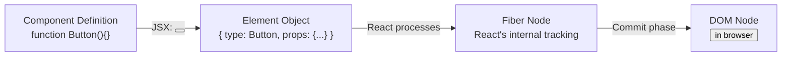
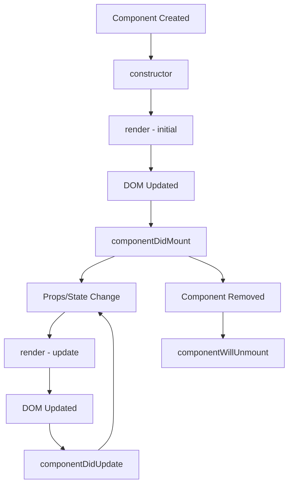
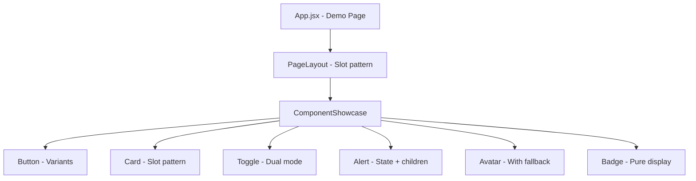

<a id="10-components-the-building-blocks"></a>

[⬅ Previous Chapter](#9-jsx-javascript-xml) | [📖 Main Index](#main-index) | [Next Chapter ➡](#11-props-passing-data)

---

# Chapter 10: Components — The Building Blocks

## 📌 Learning Objectives

By the end of this chapter, you will:

- **Understand** the mental model of a React component — what it is, what it does, and how React uses it
- **Master** functional components completely — syntax variations, exports, naming
- **Know** class components for interviews — render(), this.props, this.state, lifecycle
- **Explain** why PascalCase naming is not just convention but a technical requirement
- **Apply** component composition — children, slots, and the composition-over-inheritance principle
- **Use** the 5-step "Thinking in React" process to architect any UI
- **Organize** component files professionally — feature-based structure, barrel exports
- **Design** controlled vs uncontrolled components — the dual-mode pattern used in real component libraries
- **Answer 10+ interview questions** on component design and architecture

---

<a id="chapter-index-table-10"></a>

## Chapter Index Table

| Topic No. | Topic Name | Subtopics |
|-----------|-----------|-----------|
| 10.1 | [What is a Component? Mental Model](#101-what-is-a-component-mental-model) | Functions returning UI<br>Custom HTML elements<br>Instance vs element |
| 10.2 | [Functional Components — Complete Guide](#102-functional-components-complete-guide) | Arrow vs declaration<br>Named vs default export<br>Export preferences |
| 10.3 | [Class Components — Interview Must-Know](#103-class-components-interview-must-know) | render()<br>this.props/state<br>Lifecycle<br>Why replaced |
| 10.4 | [Component Naming Rules & Conventions](#104-component-naming-rules-and-conventions) | PascalCase requirement<br>Naming guidelines |
| 10.5 | [Component Composition](#105-component-composition) | Nesting<br>children<br>Slot pattern<br>Composition vs inheritance |
| 10.6 | [Thinking in React — 5 Step Process](#106-thinking-in-react-5-step-process) | Break UI<br>Static version<br>Minimal state<br>State location<br>Inverse data flow |
| 10.7 | [Component File Organization](#107-component-file-organization) | Feature-based vs Type-based<br>Barrel pattern<br>Co-location |
| 10.8 | [Controlled vs Uncontrolled Component Design](#108-controlled-vs-uncontrolled-component-design) | Library-quality design<br>State Initializer<br>Dual mode |
| 💡 | [Interview Questions](#-interview-questions) | 10+ Questions with Answers |
| 🧪 | [Practice Problems](#-practice-problems) | 5 Coding + 5 Theory |
| 🚀 | [Mini Project](#-mini-project) | Component Library Starter |
| ⚡ | [Quick Revision](#-quick-revision) | Key bullets, traps, revision |
| 📌 | [Chapter Summary](#-chapter-summary) | Final takeaways |

---

## 10.1 What is a Component? Mental Model

<a id="101-what-is-a-component-mental-model"></a>

### What is it?

A **React component** is a **JavaScript function that returns JSX** (React elements describing UI). Components are the fundamental building blocks of every React application — they encapsulate markup, logic, and styling into reusable, self-contained units.

React's model: **Your entire UI is a tree of components.** Every visual piece — a button, a card, a form, a page — is a component or a composition of components.

---

### 🧠 Hinglish Intuition

Component ek **stamp** ki tarah hai. Jaise tum ek rubber stamp banate ho — ek baar banao, baar baar istemal karo. Har baar stamp karo toh same shape aati hai, lekin ink color alag ho sakta hai (props). 

React application ek **Lego set** hai. Har Lego brick ek component hai. Chhoti bricks se badi structures banti hain. Alag alag shapes milake complex cheezein banate hain. Aur agar ek brick ka design change karo, har jagah woh automatically update ho jata hai.

---

### Components as Functions Returning UI

```jsx
// The simplest possible component:
function Greeting() {
  return <h1>Hello, World!</h1>;
}

// What React does with it:
// 1. Sees <Greeting /> in JSX
// 2. Calls Greeting() — a plain function call
// 3. Gets back React elements: { type: 'h1', props: { children: 'Hello, World!' } }
// 4. Renders those elements to the DOM

// The mental model:
// Component = Function that takes input (props) → returns UI description (JSX)
// UI = f(props, state)
```

```jsx
// More realistic component:
function UserCard({ name, role, avatarUrl, isOnline }) {
  return (
    <div className="user-card">
      
      <div className="user-info">
        <h2>{name}</h2>
        <p>{role}</p>
        <span className={`status ${isOnline ? 'online' : 'offline'}`}>
          {isOnline ? '🟢 Online' : '⚫ Offline'}
        </span>
      </div>
    </div>
  );
}

// Now it's a custom HTML-like element:
<UserCard
  name="Alice Johnson"
  role="Senior Developer"
  avatarUrl="/alice.jpg"
  isOnline={true}
/>
```

---

### Custom HTML Elements Concept

Components let you **extend HTML with your own elements** — with meaningful, domain-specific names:

```jsx
// Vanilla HTML — no semantics, hard to understand at a glance:
<div class="nav-container">
  <div class="nav-header">
    <div class="nav-logo">...</div>
    <div class="nav-links">...</div>
  </div>
</div>

// React components — self-documenting, semantic:
<NavigationBar>
  <Logo />
  <NavLinks links={mainNavLinks} />
  <UserMenu user={currentUser} />
</NavigationBar>

// Reading JSX = Reading the intention of the UI
// No need to decode div soup
```

---

### Component Instance vs Element

This is a subtle but interview-critical distinction:

```jsx
// ELEMENT: A plain JS object describing what to render
// Created by: React.createElement() or JSX
const buttonElement = <Button color="blue">Click me</Button>;
// This is: { type: Button, props: { color: 'blue', children: 'Click me' } }
// It's just DATA — no component has run yet

// INSTANCE: React's internal representation of a mounted component
// Created by: React internally when it processes an element
// For class components — the instance is the 'this' object
// For function components — there is NO instance (hence no 'this')

// COMPONENT: The function/class definition itself
// It's the blueprint/factory
function Button({ color, children }) {
  return <button style={{ backgroundColor: color }}>{children}</button>;
}

// The relationship:
// Button (component definition)
//   → <Button color="blue"> (element — a description)
//     → React processes it → calls Button({ color: 'blue' })
//       → Returns JSX → Fiber node is created (the "instance" React manages)
```



---

### Pure Components Mental Model

```jsx
// Core mental model: Component is a PURE function
// Same props + same state = same output (always)

// ✅ Pure component — predictable
function PriceDisplay({ price, currency }) {
  return <span>{currency}{price.toFixed(2)}</span>;
}
// PriceDisplay({ price: 9.99, currency: '$' }) → always "$9.99"

// ❌ Impure component — unpredictable (anti-pattern)
function TimeDisplay() {
  return <span>{new Date().toString()}</span>;
  // Same props, different output every millisecond!
  // (Should use useEffect + state for this)
}
```

> [!IMPORTANT]
> React's Concurrent Mode (React 18) may call your component function multiple times for a single update. If your component has side effects directly in the function body (not in useEffect), it will cause bugs. Components must be pure — same input, same output, no side effects.

---

👉 <a href="#chapter-index-table-10">Go to Top 🔝</a>

---

## 10.2 Functional Components — Complete Guide

<a id="102-functional-components-complete-guide"></a>

### Syntax Variations — Arrow vs Function Declaration

Both are valid React components. They behave identically for React's purposes — React doesn't care which syntax you use as long as it's a function that starts with uppercase and returns JSX.

```jsx
// ===== Variation 1: Function Declaration =====
function WelcomeMessage({ userName }) {
  return <h1>Welcome, {userName}!</h1>;
}

// ===== Variation 2: Arrow Function (const) =====
const WelcomeMessage = ({ userName }) => {
  return <h1>Welcome, {userName}!</h1>;
};

// ===== Variation 3: Arrow Function (implicit return) =====
const WelcomeMessage = ({ userName }) => (
  <h1>Welcome, {userName}!</h1>
);

// ===== Variation 4: Arrow Function (single line, no parens) =====
const WelcomeMessage = ({ userName }) => <h1>Welcome, {userName}!</h1>;

// ===== Variation 5: With TypeScript =====
// (Preview — covered fully in TypeScript chapters)
interface Props {
  userName: string;
}
const WelcomeMessage: React.FC<Props> = ({ userName }) => (
  <h1>Welcome, {userName}!</h1>
);
// Note: React.FC is debated — many prefer plain function typing
```

---

### Arrow vs Function Declaration — Key Differences

| Feature | Function Declaration | Arrow Function (const) |
|---------|---------------------|----------------------|
| **Hoisting** | ✅ Hoisted — can use before definition | ❌ Not hoisted |
| **`this` binding** | Has own `this` | No own `this` (irrelevant for hooks) |
| **Readability** | Named in stack traces | Anonymous (unless named) |
| **Usage in hooks** | Both work identically | Both work identically |
| **Default export** | Can export directly | Must assign to const first |
| **Industry preference** | Function declaration for components | Arrow for callbacks/utils |

```jsx
// Hoisting example (rarely matters but good to know):
function App() {
  return <Header />;  // ✅ Works — Header is hoisted
}

function Header() {
  return <header>App Header</header>;
}

// Arrow function — order matters:
const App = () => {
  return <Header />;  // ❌ ReferenceError: Cannot access 'Header' before init
};

const Header = () => {
  return <header>App Header</header>;
};
```

---

### Named vs Default Export

```jsx
// ===== Default Export =====
// ONE per file
// Consumer can import with ANY name

// Exporting:
function UserProfile({ user }) {
  return <div>{user.name}</div>;
}
export default UserProfile;

// Or combined:
export default function UserProfile({ user }) {
  return <div>{user.name}</div>;
}

// Importing:
import UserProfile from './UserProfile';     // ✅ Standard
import Profile from './UserProfile';         // ✅ Any name works
import UP from './UserProfile';              // ✅ Works but confusing

// ===== Named Export =====
// MULTIPLE per file
// Consumer must use exact name (or rename with 'as')

// Exporting:
export function Button({ children, onClick }) {
  return <button onClick={onClick}>{children}</button>;
}

export function IconButton({ icon, onClick }) {
  return <button onClick={onClick}>{icon}</button>;
}

// Importing:
import { Button, IconButton } from './Button';            // ✅ Exact names
import { Button as Btn } from './Button';                 // ✅ Rename with 'as'

// ===== Mixed (Default + Named) =====
export function PrimaryButton({ children }) {
  return <button className="btn-primary">{children}</button>;
}

export function SecondaryButton({ children }) {
  return <button className="btn-secondary">{children}</button>;
}

export default PrimaryButton;  // Also the default

// Import:
import PrimaryButton, { SecondaryButton } from './Button';
```

---

### When Each Export Style is Preferred

| Situation | Preferred Export | Reason |
|-----------|----------------|--------|
| Single component per file | Default export | Convention, simpler import |
| Multiple utility components | Named exports | Explicit, tree-shakeable |
| Component library (multiple exports) | Named exports | Better for IDEs and tree-shaking |
| Context + Provider together | Named exports | Both need to be imported |
| Custom hooks | Named exports | Multiple hooks per file common |
| Page components (Next.js) | Default export | Framework requirement |

```jsx
// ✅ Best practice example — Mixed approach:
// Button.jsx

// Named exports for all variants
export function PrimaryButton({ children, ...props }) {
  return <button className="btn btn--primary" {...props}>{children}</button>;
}

export function SecondaryButton({ children, ...props }) {
  return <button className="btn btn--secondary" {...props}>{children}</button>;
}

export function DangerButton({ children, ...props }) {
  return <button className="btn btn--danger" {...props}>{children}</button>;
}

// Default export = the main/default one
export default PrimaryButton;
```

---

### Component Must Return

```jsx
// ✅ Return JSX
function Good1() { return <div>Hello</div>; }

// ✅ Return null (renders nothing)
function Good2({ show }) {
  if (!show) return null;
  return <div>Visible</div>;
}

// ✅ Return array of elements (each needs key)
function Good3() {
  return [
    <li key="a">First</li>,
    <li key="b">Second</li>,
  ];
}

// ✅ Return Fragment
function Good4() { return <><span>A</span><span>B</span></>; }

// ❌ Return undefined (implicit — no return statement)
function Bad1() {
  <div>Forgot return</div>;  // Undefined returned — React error
}

// ❌ Return a plain object
function Bad2() {
  return { name: 'Alice' };  // Objects are not valid React children
}
```

---

👉 <a href="#chapter-index-table-10">Go to Top 🔝</a>

---

## 10.3 Class Components — Interview Must-Know

<a id="103-class-components-interview-must-know"></a>

### What is it?

Before React 16.8 (hooks era), the only way to have **state and lifecycle methods** was to use **Class Components**. You still encounter them in legacy codebases, and they appear frequently in senior-level interviews as a way to test your React history knowledge.

---

### 🧠 Hinglish Intuition

Class components React ka **purana zamana** hai — jaise purani Maruti 800 jo still roads pe milti hai. Functional components modern Tesla hain — zyada efficient, cleaner, same kaam. Lekin interview mein purani Maruti ka bhi knowledge chahiye — koi pooch sakta hai "pehle kya hota tha?"

---

### render() Method

The `render()` method is the **only required method** in a class component. It must return JSX (or null).

```jsx
import { Component } from 'react';

class UserProfile extends Component {
  render() {
    // ✅ this.props contains all passed props
    const { name, role, imageUrl } = this.props;

    return (
      <div className="profile">
        
        <h1>{name}</h1>
        <p>{role}</p>
      </div>
    );
  }
}

// Usage: Exactly same as functional component
<UserProfile name="Alice" role="Developer" imageUrl="/alice.jpg" />
```

---

### this.props and this.state

```jsx
import { Component } from 'react';

class Counter extends Component {
  // Initialize state in constructor (or class field shorthand)
  constructor(props) {
    super(props);  // ← MUST call super(props) first
    this.state = {
      count: this.props.initialCount || 0,
    };
    // Manual binding required for class methods
    this.handleIncrement = this.handleIncrement.bind(this);
  }

  // Or using class field syntax (no constructor needed):
  // state = { count: 0 };

  handleIncrement() {
    // setState is async — batches updates
    this.setState(prevState => ({
      count: prevState.count + 1,
    }));
  }

  handleDecrement = () => {
    // Arrow class field — auto-bound, no constructor binding needed
    this.setState(prevState => ({
      count: prevState.count - 1,
    }));
  };

  render() {
    return (
      <div>
        <h1>Count: {this.state.count}</h1>
        <button onClick={this.handleIncrement}>+</button>
        <button onClick={this.handleDecrement}>-</button>
        {/* Access props: */}
        <p>Step: {this.props.step}</p>
      </div>
    );
  }
}
```

---

### Lifecycle Methods Overview



```jsx
import { Component } from 'react';

class DataFetcher extends Component {
  state = {
    data: null,
    loading: true,
    error: null,
  };

  // ===== MOUNTING PHASE =====

  // 1. constructor() — initialize state, bind methods
  // 2. render() — first render (DOM not ready yet)

  componentDidMount() {
    // 3. Called AFTER first render, DOM is ready
    // ✅ Perfect for: API calls, subscriptions, timers
    fetch(`/api/data/${this.props.id}`)
      .then(res => res.json())
      .then(data => this.setState({ data, loading: false }))
      .catch(error => this.setState({ error, loading: false }));
  }

  // ===== UPDATING PHASE =====
  // render() called on every state/prop change

  componentDidUpdate(prevProps, prevState) {
    // Called AFTER re-render with previous props and state
    // ✅ Respond to prop changes:
    if (prevProps.id !== this.props.id) {
      // ID changed — fetch new data
      this.fetchData(this.props.id);
    }

    // ✅ Respond to state changes:
    if (prevState.count !== this.state.count) {
      document.title = `Count: ${this.state.count}`;
    }
  }

  shouldComponentUpdate(nextProps, nextState) {
    // ✅ Performance optimization — prevent unnecessary re-renders
    // return false to skip render
    return nextProps.userId !== this.props.userId
      || nextState.data !== this.state.data;
  }

  // ===== UNMOUNTING PHASE =====

  componentWillUnmount() {
    // Called before component is removed from DOM
    // ✅ Cleanup: cancel timers, cancel subscriptions, abort fetches
    clearInterval(this.timer);
    this.subscription.unsubscribe();
    this.abortController.abort();
  }

  // ===== ERROR HANDLING =====

  componentDidCatch(error, errorInfo) {
    // Catches errors in child components
    logErrorToService(error, errorInfo);
  }

  static getDerivedStateFromError(error) {
    // Update state to show fallback UI
    return { hasError: true };
  }

  render() {
    if (this.state.loading) return <LoadingSpinner />;
    if (this.state.error) return <Error message={this.state.error.message} />;
    return <DataDisplay data={this.state.data} />;
  }
}
```

---

### Class vs Functional — Side by Side

```jsx
// ===== CLASS COMPONENT =====
import { Component } from 'react';

class FetchUser extends Component {
  state = { user: null, loading: true };

  componentDidMount() {
    fetch(`/api/users/${this.props.userId}`)
      .then(r => r.json())
      .then(user => this.setState({ user, loading: false }));
  }

  componentDidUpdate(prevProps) {
    if (prevProps.userId !== this.props.userId) {
      this.setState({ loading: true });
      fetch(`/api/users/${this.props.userId}`)
        .then(r => r.json())
        .then(user => this.setState({ user, loading: false }));
    }
  }

  render() {
    if (this.state.loading) return <Spinner />;
    return <UserCard user={this.state.user} />;
  }
}

// ===== EQUIVALENT FUNCTIONAL COMPONENT =====
import { useState, useEffect } from 'react';

function FetchUser({ userId }) {
  const [user, setUser] = useState(null);
  const [loading, setLoading] = useState(true);

  useEffect(() => {
    setLoading(true);
    fetch(`/api/users/${userId}`)
      .then(r => r.json())
      .then(user => {
        setUser(user);
        setLoading(false);
      });
  }, [userId]);  // Re-runs when userId changes — replaces componentDidUpdate

  if (loading) return <Spinner />;
  return <UserCard user={user} />;
}
```

---

### Why Functional Components Replaced Class Components

| Pain Point (Class) | Solution (Functional + Hooks) |
|-------------------|-------------------------------|
| `this` binding confusion | No `this` — just variables |
| Logic split across lifecycle methods | Co-located in `useEffect` |
| Reusing stateful logic requires HOC/render props | Custom hooks — clean reuse |
| Verbose boilerplate (constructor, bind) | Concise function body |
| Hard to test | Easy to test — pure functions |
| Hard to understand for beginners | Intuitive — just JavaScript functions |
| No tree shaking for methods | Functions are tree-shakeable |

> [!NOTE]
> Class components are **not deprecated** and are unlikely to be removed. React team guarantees backward compatibility. But all new React development should use functional components with hooks. You still need class components for **Error Boundaries** (until React 19's `use()` makes them less necessary).

---

👉 <a href="#chapter-index-table-10">Go to Top 🔝</a>

---

## 10.4 Component Naming Rules & Conventions

<a id="104-component-naming-rules-and-conventions"></a>

### PascalCase Requirement — Technical, Not Optional

**PascalCase for components is NOT just a convention — it is a technical requirement enforced by React.**

React uses the case of the first letter to determine whether a JSX tag is a **native DOM element** or a **user-defined component**:

```jsx
// React's rule:
// Lowercase first letter → Native DOM element → rendered as HTML tag
// Uppercase first letter → User-defined component → calls the function

<div />     // → document.createElement('div')   — native DOM
<span />    // → document.createElement('span')  — native DOM
<input />   // → document.createElement('input') — native DOM

<Button />  // → calls Button() function          — user component
<UserCard /> // → calls UserCard() function       — user component
<App />     // → calls App() function             — user component
```

```jsx
// ❌ What happens with lowercase component:
function button({ children }) {
  return <button>{children}</button>;
}

// Usage:
<button>Click me</button>
// React thinks: "button" = native HTML button element
// Does NOT call your function!
// Renders a plain <button> — not your component

// ✅ Fix: PascalCase
function Button({ children }) {
  return <button>{children}</button>;
}

<Button>Click me</Button>
// React thinks: "Button" = user component → calls Button()
```

---

### 🧠 Hinglish Intuition

React ko batana padta hai ki yeh tumhara banana wala cheez hai ya browser ka built-in cheez. Uppercase se React samajhta hai: "Yeh developer ki custom component hai, isko call karo." Lowercase se React samajhta hai: "Yeh HTML ka element hai, directly DOM mein daalo." Isliye `Button` alag hai aur `button` alag hai — React ki nazron mein yeh do completely different cheezein hain.

---

### Naming Guidelines & Patterns

```jsx
// ===== GOOD Naming Patterns =====

// Describe WHAT it renders (noun-based):
UserCard          ✅
ProductList       ✅
NavigationBar     ✅
LoginForm         ✅
ErrorMessage      ✅

// Describe its PURPOSE or ROLE:
AuthGuard         ✅  (wraps routes needing authentication)
DataProvider      ✅  (provides data via context)
ErrorBoundary     ✅  (catches errors)
LazyLoader        ✅  (lazy loads content)

// Page components (for routing):
HomePage          ✅
UserProfilePage   ✅
CheckoutPage      ✅

// Layout components:
PageLayout        ✅
DashboardLayout   ✅
SidebarLayout     ✅

// Higher-Order Components (HOC) — prefix with 'with':
withAuth          ✅
withTheme         ✅
withErrorBoundary ✅

// Custom hooks — prefix with 'use':
useAuth           ✅  (not a component, but same file naming rule)
useLocalStorage   ✅
useFetch          ✅
```

```jsx
// ===== BAD Naming Patterns =====

button            ❌  (lowercase — treated as DOM element)
BUTTON            ❌  (all caps — not idiomatic React)
renderUserCard    ❌  (sounds like a function, not a component)
HandleClick       ❌  (sounds like an event handler)
CardComponent     ❌  (redundant — all React components are components)
NewCard           ❌  (vague — new compared to what?)
Card2             ❌  (use CardV2 or CardLarge or CardExpanded)
MyCard            ❌  (vague — "my" adds no information)
```

---

### File Naming Conventions

```
Component file naming options:
1. PascalCase (matches component name): UserCard.jsx ✅ (most common)
2. kebab-case: user-card.jsx ✅ (common in Next.js, Linux-friendly)
3. camelCase: userCard.jsx ❌ (avoid)

Folder naming:
components/UserCard/
├── UserCard.jsx       (component)
├── UserCard.test.jsx  (tests)
├── UserCard.stories.jsx (Storybook)
└── UserCard.module.css (styles)

Or flat:
components/
├── UserCard.jsx
├── UserCard.test.jsx
└── UserCard.module.css
```

---

👉 <a href="#chapter-index-table-10">Go to Top 🔝</a>

---

## 10.5 Component Composition

<a id="105-component-composition"></a>

### What is Composition?

**Composition** is the practice of building complex UI by combining simpler components. Instead of making one giant component, you create small, focused components and combine them.

React strongly favors **composition over inheritance** — the pattern used in object-oriented design.

---

### 🧠 Hinglish Intuition

Composition ek sandwich banane jaisa hai. Tumhare paas bread, vegetables, sauce alag alag components hain. Inhe milake sandwich banta hai. Tum fresh ingredients (components) mix karte ho apne recipe (layout) ke hisaab se. Inheritance jaisa nahi hai jahan ek cheez doosri cheez "ban jati hai" (bread IS a sandwich) — yahan components milke kuch bante hain.

---

### Nesting Components

```jsx
// Small, focused components:
function Avatar({ src, alt, size = 'medium' }) {
  const sizes = { small: 32, medium: 48, large: 80 };
  return (
    
  );
}

function UserName({ name, isVerified }) {
  return (
    <span>
      {name}
      {isVerified && <span title="Verified">✓</span>}
    </span>
  );
}

function FollowButton({ isFollowing, onToggle }) {
  return (
    <button
      onClick={onToggle}
      className={isFollowing ? 'btn-unfollow' : 'btn-follow'}
    >
      {isFollowing ? 'Unfollow' : 'Follow'}
    </button>
  );
}

// Composed from small components:
function UserCard({ user, isFollowing, onFollowToggle }) {
  return (
    <div className="user-card">
      <Avatar src={user.avatar} alt={user.name} size="medium" />
      <div className="user-card__info">
        <UserName name={user.name} isVerified={user.isVerified} />
        <p className="user-card__bio">{user.bio}</p>
      </div>
      <FollowButton isFollowing={isFollowing} onToggle={onFollowToggle} />
    </div>
  );
}

// Further composed into a feed:
function UserFeed({ users }) {
  const [following, setFollowing] = useState(new Set());

  const toggleFollow = (userId) => {
    setFollowing(prev => {
      const next = new Set(prev);
      next.has(userId) ? next.delete(userId) : next.add(userId);
      return next;
    });
  };

  return (
    <div className="feed">
      {users.map(user => (
        <UserCard
          key={user.id}
          user={user}
          isFollowing={following.has(user.id)}
          onFollowToggle={() => toggleFollow(user.id)}
        />
      ))}
    </div>
  );
}
```

---

### children Composition

The `children` prop is the most powerful composition tool — it lets parent components render arbitrary content passed by the consumer.

```jsx
// ===== Basic children usage =====
function Card({ children, className = '' }) {
  return (
    <div className={`card ${className}`}>
      {children}
    </div>
  );
}

// Consumer decides what goes inside:
<Card className="featured">
  <h2>Article Title</h2>
  <p>Article content here...</p>
  <button>Read More</button>
</Card>

// ===== Typed children sections =====
function Modal({ title, children, footer }) {
  return (
    <div className="modal-overlay">
      <div className="modal">
        <div className="modal__header">
          <h2>{title}</h2>
          <button className="modal__close">×</button>
        </div>
        <div className="modal__body">
          {children}
        </div>
        {footer && (
          <div className="modal__footer">
            {footer}
          </div>
        )}
      </div>
    </div>
  );
}

// Usage:
<Modal
  title="Confirm Delete"
  footer={
    <>
      <button onClick={onCancel}>Cancel</button>
      <button onClick={onConfirm} className="btn-danger">Delete</button>
    </>
  }
>
  <p>Are you sure you want to delete this item?</p>
  <p>This action cannot be undone.</p>
</Modal>
```

---

### Slot Pattern

The Slot pattern extends children to **named slots** — multiple named content areas in a component. This is extremely common in component library design.

```jsx
// ===== Slot Pattern — Multiple Named Areas =====
function PageLayout({ header, sidebar, children, footer }) {
  return (
    <div className="page-layout">
      <header className="page-layout__header">
        {header}
      </header>
      <div className="page-layout__body">
        <aside className="page-layout__sidebar">
          {sidebar}
        </aside>
        <main className="page-layout__main">
          {children}
        </main>
      </div>
      <footer className="page-layout__footer">
        {footer}
      </footer>
    </div>
  );
}

// Usage — caller decides what goes in each slot:
<PageLayout
  header={<NavigationBar user={currentUser} />}
  sidebar={<SidebarMenu items={navItems} />}
  footer={<Footer links={footerLinks} />}
>
  {/* children = main content area */}
  <ArticleList articles={articles} />
</PageLayout>
```

```jsx
// ===== Advanced Slot Pattern — Card with flexible areas =====
function DataCard({
  icon,
  title,
  subtitle,
  children,    // Main content slot
  actions,     // Action buttons slot
  badge,       // Optional badge slot
}) {
  return (
    <div className="data-card">
      {badge && <div className="data-card__badge">{badge}</div>}
      <div className="data-card__header">
        {icon && <span className="data-card__icon">{icon}</span>}
        <div>
          <h3 className="data-card__title">{title}</h3>
          {subtitle && <p className="data-card__subtitle">{subtitle}</p>}
        </div>
      </div>
      <div className="data-card__content">{children}</div>
      {actions && <div className="data-card__actions">{actions}</div>}
    </div>
  );
}

// Usage:
<DataCard
  icon="📊"
  title="Revenue"
  subtitle="Last 30 days"
  badge={<span className="badge badge--new">New</span>}
  actions={
    <>
      <button>Export</button>
      <button>Details</button>
    </>
  }
>
  <RevenueChart data={revenueData} />
  <p>Total: $128,400</p>
</DataCard>
```

---

### Composition vs Inheritance — The React Way

React **deliberately does not provide a mechanism for component inheritance**. The React team's guidance:

> "We haven't found any use cases where we would recommend creating component inheritance hierarchies. Props and composition give you all the flexibility you need to customize a component's look and behavior." — React Docs

```jsx
// ❌ Inheritance approach (anti-pattern in React):
class BaseButton extends Component {
  render() {
    return <button style={this.getStyle()}>{this.props.children}</button>;
  }
}

class PrimaryButton extends BaseButton {
  getStyle() { return { backgroundColor: 'blue', color: 'white' }; }
}

class DangerButton extends BaseButton {
  getStyle() { return { backgroundColor: 'red', color: 'white' }; }
}

// ✅ Composition approach (React way):
function Button({ variant = 'primary', size = 'medium', children, ...props }) {
  const styles = {
    primary: { backgroundColor: '#3b82f6', color: '#fff' },
    secondary: { backgroundColor: '#6b7280', color: '#fff' },
    danger: { backgroundColor: '#ef4444', color: '#fff' },
    ghost: { backgroundColor: 'transparent', color: '#3b82f6' },
  };

  const sizes = {
    small: { padding: '4px 12px', fontSize: '12px' },
    medium: { padding: '8px 20px', fontSize: '14px' },
    large: { padding: '12px 28px', fontSize: '16px' },
  };

  return (
    <button
      style={{ ...styles[variant], ...sizes[size], borderRadius: '6px', border: 'none', cursor: 'pointer' }}
      {...props}
    >
      {children}
    </button>
  );
}

// All variations from ONE component via props:
<Button variant="primary">Submit</Button>
<Button variant="danger" size="large">Delete Account</Button>
<Button variant="ghost" size="small">Cancel</Button>
```

---

### Children API Utilities

```jsx
import { Children, cloneElement, isValidElement } from 'react';

// Children.map — iterate children safely
function RadioGroup({ children, name }) {
  return (
    <div role="radiogroup">
      {Children.map(children, (child, index) => {
        if (!isValidElement(child)) return child;
        // Inject 'name' prop into each Radio child
        return cloneElement(child, { name, id: `radio-${index}` });
      })}
    </div>
  );
}

// Usage:
<RadioGroup name="payment">
  <Radio value="card">Credit Card</Radio>
  <Radio value="paypal">PayPal</Radio>
  <Radio value="upi">UPI</Radio>
</RadioGroup>
// Each Radio automatically gets name="payment"

// Children.count — count children
function Carousel({ children, ...props }) {
  const count = Children.count(children);
  return (
    <div>
      <p>{count} slides</p>
      <div className="carousel">{children}</div>
    </div>
  );
}
```

> [!TIP]
> The `Children` API is considered somewhat of a React antipattern in modern code because it relies on implicit child structure. The modern preference is to use **context** or **explicit props** (slot pattern) for component communication. However, it's still used in component libraries.

---

👉 <a href="#chapter-index-table-10">Go to Top 🔝</a>

---

## 10.6 Thinking in React — 5 Step Process

<a id="106-thinking-in-react-5-step-process"></a>

### Overview

The official React documentation describes a **5-step process** for building any React application. Mastering this process is critical for system design interviews and for architecting real-world applications.

---

### Example UI: Product Filter Dashboard

We'll apply all 5 steps to build a product filter dashboard.

```
Design mockup:
┌─────────────────────────────────────────┐
│  🔍 [Search Products...]               │
├─────────────────────────────────────────┤
│  ☐ In Stock Only                       │
├──────────────┬────────────┬────────────┤
│ Product      │ Price      │ Category   │
├──────────────┼────────────┼────────────┤
│ iPhone 15    │ $999       │ Electronics│
│ MacBook Pro  │ $1999      │ Electronics│
│ ✗ AirPods   │ $249       │ Electronics│ ← Out of stock
│ Running Shoes│ $89        │ Sports     │
│ Yoga Mat     │ $45        │ Sports     │
└──────────────┴────────────┴────────────┘
```

---

### Step 1: Break UI into Component Hierarchy

Identify components by the **single responsibility principle** — a component should ideally do only one thing.

```
FilterableProductTable (root)
├── SearchBar
│   ├── SearchInput
│   └── InStockCheckbox
└── ProductTable
    ├── ProductTableHeader
    └── ProductTableBody
        ├── CategoryRow (for each category)
        └── ProductRow (for each product)
```

```jsx
// Visual hierarchy:
<FilterableProductTable>
  <SearchBar />
  <ProductTable>
    <ProductTableHeader />
    <ProductTableBody>
      <CategoryRow category="Electronics" />
      <ProductRow product={iphone} />
      <ProductRow product={macbook} />
      <CategoryRow category="Sports" />
      <ProductRow product={shoes} />
    </ProductTableBody>
  </ProductTable>
</FilterableProductTable>
```

---

### Step 2: Build a Static Version

Build the UI without any interactivity — no state, only props flowing top-down.

```jsx
// Static data (will come from API later)
const PRODUCTS = [
  { id: 1, name: 'iPhone 15', price: 999, category: 'Electronics', inStock: true },
  { id: 2, name: 'MacBook Pro', price: 1999, category: 'Electronics', inStock: true },
  { id: 3, name: 'AirPods', price: 249, category: 'Electronics', inStock: false },
  { id: 4, name: 'Running Shoes', price: 89, category: 'Sports', inStock: true },
  { id: 5, name: 'Yoga Mat', price: 45, category: 'Sports', inStock: true },
];

// Step 2: Pure, static components — only props, no state
function ProductRow({ product }) {
  return (
    <tr style={{ color: product.inStock ? '#111' : '#aaa' }}>
      <td>{product.name}</td>
      <td>${product.price}</td>
      <td>{product.category}</td>
    </tr>
  );
}

function CategoryRow({ category }) {
  return (
    <tr>
      <td colSpan={3} style={{ fontWeight: 'bold', backgroundColor: '#f3f4f6' }}>
        {category}
      </td>
    </tr>
  );
}

function ProductTable({ products }) {
  const categories = [...new Set(products.map(p => p.category))];

  return (
    <table>
      <thead>
        <tr>
          <th>Product</th><th>Price</th><th>Category</th>
        </tr>
      </thead>
      <tbody>
        {categories.map(category => (
          <>
            <CategoryRow key={`cat-${category}`} category={category} />
            {products
              .filter(p => p.category === category)
              .map(product => (
                <ProductRow key={product.id} product={product} />
              ))
            }
          </>
        ))}
      </tbody>
    </table>
  );
}

function SearchBar() {
  return (
    <div>
      <input type="text" placeholder="Search products..." />
      <label>
        <input type="checkbox" /> In Stock Only
      </label>
    </div>
  );
}

function FilterableProductTable({ products }) {
  return (
    <div>
      <SearchBar />
      <ProductTable products={products} />
    </div>
  );
}
```

---

### Step 3: Identify Minimal State

Ask three questions for every piece of data:
1. Is it passed in as props from parent? → **NOT state** (it's a prop)
2. Does it remain unchanged over time? → **NOT state** (it's a constant)
3. Can it be computed from existing state/props? → **NOT state** (it's derived)

```
Data in our app:
1. Original products list        → NOT state (passed as props/fetched once)
2. Search text                   → ✅ STATE (changes on user input)
3. "In Stock Only" checkbox      → ✅ STATE (toggles on user action)
4. Filtered products list        → NOT state (computed from 1+2+3)
5. Product categories            → NOT state (derived from products)
6. Number of results             → NOT state (derived from filtered list)

Minimal state needed:
- filterText: string
- showOnlyInStock: boolean
```

---

### Step 4: Identify State Location

Apply **"lift state up"** — state should live in the **lowest common ancestor** of all components that need it.

```
Which components use filterText?
→ SearchBar (to display current value in input)
→ ProductTable (to filter displayed products)

Lowest common ancestor of SearchBar and ProductTable?
→ FilterableProductTable ✅ ← State lives HERE

Which components use showOnlyInStock?
→ SearchBar (to show checkbox checked state)
→ ProductTable (to filter)

Lowest common ancestor?
→ FilterableProductTable ✅ ← Same component
```

```jsx
// Step 4: State added to lowest common ancestor
function FilterableProductTable({ products }) {
  // ✅ State lives here — both SearchBar and ProductTable need it
  const [filterText, setFilterText] = useState('');
  const [showOnlyInStock, setShowOnlyInStock] = useState(false);

  return (
    <div>
      <SearchBar
        filterText={filterText}          // Pass state down
        showOnlyInStock={showOnlyInStock}  // Pass state down
      />
      <ProductTable
        products={products}
        filterText={filterText}           // Pass state down
        showOnlyInStock={showOnlyInStock}  // Pass state down
      />
    </div>
  );
}
```

---

### Step 5: Add Inverse Data Flow

Children need to update parent state. The pattern: **parent passes handler functions as props** — children call them to trigger state updates.

```jsx
// Step 5: Complete — Inverse data flow
function SearchBar({ filterText, showOnlyInStock, onFilterChange, onStockChange }) {
  return (
    <div style={{ marginBottom: '16px' }}>
      <input
        type="text"
        value={filterText}
        onChange={e => onFilterChange(e.target.value)}
        placeholder="Search products..."
        style={{ padding: '8px', width: '100%', marginBottom: '8px' }}
      />
      <label>
        <input
          type="checkbox"
          checked={showOnlyInStock}
          onChange={e => onStockChange(e.target.checked)}
        />
        {' '}In Stock Only
      </label>
    </div>
  );
}

function ProductTable({ products, filterText, showOnlyInStock }) {
  // ✅ Filtering is DERIVED from props — not state
  const filteredProducts = products
    .filter(p => p.name.toLowerCase().includes(filterText.toLowerCase()))
    .filter(p => !showOnlyInStock || p.inStock);

  const categories = [...new Set(filteredProducts.map(p => p.category))];

  if (filteredProducts.length === 0) {
    return <p>No products match your search.</p>;
  }

  return (
    <table style={{ width: '100%', borderCollapse: 'collapse' }}>
      <thead>
        <tr>
          {['Product', 'Price', 'Category'].map(h => (
            <th key={h} style={{ padding: '10px', textAlign: 'left', borderBottom: '2px solid #e5e7eb' }}>
              {h}
            </th>
          ))}
        </tr>
      </thead>
      <tbody>
        {categories.map(category => (
          <Fragment key={category}>
            <tr>
              <td colSpan={3} style={{ padding: '8px 10px', backgroundColor: '#f9fafb', fontWeight: '700', fontSize: '13px', color: '#6b7280' }}>
                {category}
              </td>
            </tr>
            {filteredProducts
              .filter(p => p.category === category)
              .map(product => (
                <tr key={product.id} style={{ opacity: product.inStock ? 1 : 0.4 }}>
                  <td style={{ padding: '10px' }}>
                    {product.name}
                    {!product.inStock && <span style={{ marginLeft: '8px', fontSize: '11px', color: '#ef4444' }}>Out of stock</span>}
                  </td>
                  <td style={{ padding: '10px' }}>${product.price}</td>
                  <td style={{ padding: '10px' }}>{product.category}</td>
                </tr>
              ))
            }
          </Fragment>
        ))}
      </tbody>
    </table>
  );
}

// ✅ Complete: State in parent, handlers flow down, events flow up
function FilterableProductTable({ products }) {
  const [filterText, setFilterText] = useState('');
  const [showOnlyInStock, setShowOnlyInStock] = useState(false);

  return (
    <div style={{ padding: '20px', fontFamily: 'sans-serif', maxWidth: '700px' }}>
      <h1>Products</h1>
      <SearchBar
        filterText={filterText}
        showOnlyInStock={showOnlyInStock}
        onFilterChange={setFilterText}          // Handler passed as prop
        onStockChange={setShowOnlyInStock}       // Handler passed as prop
      />
      <ProductTable
        products={products}
        filterText={filterText}
        showOnlyInStock={showOnlyInStock}
      />
    </div>
  );
}
```

---

👉 <a href="#chapter-index-table-10">Go to Top 🔝</a>

---

## 10.7 Component File Organization

<a id="107-component-file-organization"></a>

### Feature-Based vs Type-Based Folder Structure

```
TYPE-BASED (Group by what it IS):
src/
├── components/    ← All components
│   ├── Button.jsx
│   ├── Card.jsx
│   ├── Modal.jsx
│   └── UserProfile.jsx
├── hooks/         ← All hooks
│   ├── useAuth.js
│   └── useFetch.js
├── pages/         ← All pages
│   ├── Home.jsx
│   └── Settings.jsx
└── utils/         ← All utilities
    └── formatDate.js

✅ Good for: Small apps, component libraries, beginners
❌ Bad for: Large apps (hard to find all pieces of one feature)

FEATURE-BASED (Group by what it DOES):
src/
├── features/
│   ├── auth/
│   │   ├── components/
│   │   │   ├── LoginForm.jsx
│   │   │   └── RegisterForm.jsx
│   │   ├── hooks/
│   │   │   └── useAuth.js
│   │   ├── utils/
│   │   │   └── validatePassword.js
│   │   └── index.js    ← Public API of this feature
│   │
│   ├── products/
│   │   ├── components/
│   │   │   ├── ProductCard.jsx
│   │   │   ├── ProductList.jsx
│   │   │   └── ProductFilter.jsx
│   │   ├── hooks/
│   │   │   └── useProducts.js
│   │   └── index.js
│   │
│   └── cart/
│       ├── components/
│       │   ├── CartItem.jsx
│       │   └── CartSummary.jsx
│       └── index.js
│
├── shared/           ← Shared across features
│   ├── components/
│   │   ├── Button/
│   │   ├── Modal/
│   │   └── Input/
│   └── hooks/
│       └── useDebounce.js
│
└── pages/            ← Route-level components only
    ├── HomePage.jsx
    └── ProductsPage.jsx

✅ Good for: Large apps, teams, scalable architecture
❌ More setup required initially
```

---

### index.js Barrel Pattern — Pros & Cons

```javascript
// WITHOUT barrel:
// Every import needs full path:
import Button from '../components/Button/Button';
import Input from '../components/Input/Input';
import Modal from '../components/Modal/Modal';

// WITH barrel (index.js in each folder):
// components/index.js
export { default as Button } from './Button/Button';
export { default as Input } from './Input/Input';
export { default as Modal } from './Modal/Modal';
export { default as Card } from './Card/Card';

// Now consumer imports cleanly:
import { Button, Input, Modal, Card } from '../components';
```

```javascript
// PROS of barrel exports:
// ✅ Cleaner import paths
// ✅ Encapsulates internal folder structure
// ✅ Easy to refactor internals without changing consumer imports
// ✅ Single source of truth for public API

// CONS of barrel exports:
// ❌ Can break tree-shaking (bundler imports everything, even unused)
// ❌ Circular dependency risks in large apps
// ❌ Slower initial build (must process all exports)
// ❌ IDE may slow down with many barrels

// BEST PRACTICE:
// Use barrels at feature boundary level (not deeply nested)
// Keep barrels thin — only export what's truly public
```

---

### Co-locating Styles, Tests, Stories

```
src/components/Button/
├── Button.jsx              ← Component
├── Button.module.css       ← Styles (CSS Modules)
├── Button.test.jsx         ← Unit tests
├── Button.stories.jsx      ← Storybook stories
├── Button.types.ts         ← TypeScript types (if separate)
└── index.js                ← Barrel: export { default } from './Button';
```

```jsx
// Button.jsx — Co-located styles example
import styles from './Button.module.css';

function Button({ variant = 'primary', size = 'md', children, ...props }) {
  return (
    <button
      className={`${styles.button} ${styles[variant]} ${styles[size]}`}
      {...props}
    >
      {children}
    </button>
  );
}

export default Button;
```

```css
/* Button.module.css — Co-located with component */
.button {
  border: none;
  border-radius: 6px;
  cursor: pointer;
  font-weight: 600;
  transition: all 0.2s;
}

.primary { background-color: #3b82f6; color: white; }
.secondary { background-color: #6b7280; color: white; }
.danger { background-color: #ef4444; color: white; }

.sm { padding: 6px 12px; font-size: 12px; }
.md { padding: 8px 20px; font-size: 14px; }
.lg { padding: 12px 28px; font-size: 16px; }
```

---

👉 <a href="#chapter-index-table-10">Go to Top 🔝</a>

---

## 10.8 Controlled vs Uncontrolled Component Design

<a id="108-controlled-vs-uncontrolled-component-design"></a>

### The Distinction

This topic goes deeper than form inputs — it's about **who owns the state** of a component.

```
CONTROLLED: Parent owns the state, passes it as value prop
           Component has no internal state for the value
           Parent fully controls the component's behavior

UNCONTROLLED: Component owns its own state internally
             Parent can provide initial value (defaultValue)
             Parent cannot directly control the current value
```

---

### 🧠 Hinglish Intuition

**Controlled** = TV remote jo sirf tab kaam kare jab tum button dabao. Remote (parent) mein control hai. TV (component) sirf obey karta hai.

**Uncontrolled** = Purani clock jo tum ek baar set karte ho, phir apne aap chalta hai. Tumne initial time set kiya (defaultValue), ab woh khud manage karta hai.

---

### Designing Library-Quality Controlled Components

```jsx
// ===== CONTROLLED design (parent fully controls) =====

function RatingInput({ value, onChange, max = 5, disabled = false }) {
  // ✅ No internal state — value comes from prop
  // This component is a "controlled" component

  return (
    <div className="rating" role="group" aria-label="Rating">
      {Array.from({ length: max }, (_, i) => i + 1).map(star => (
        <button
          key={star}
          type="button"
          onClick={() => !disabled && onChange(star)}
          aria-label={`Rate ${star} of ${max}`}
          aria-pressed={star <= value}
          disabled={disabled}
          style={{
            fontSize: '24px',
            background: 'none',
            border: 'none',
            cursor: disabled ? 'default' : 'pointer',
            color: star <= value ? '#f59e0b' : '#d1d5db',
          }}
        >
          ★
        </button>
      ))}
    </div>
  );
}

// Usage — parent manages state:
function ReviewForm() {
  const [rating, setRating] = useState(0);  // Parent owns the state

  return (
    <form>
      <RatingInput
        value={rating}
        onChange={setRating}  // Parent's setter passed as callback
      />
      <p>Your rating: {rating}/5</p>
    </form>
  );
}
```

---

### State Initializer Pattern

```jsx
// Pattern: Accept initial value, manage internally after mount
// Useful when: Parent only cares about the final value (onSubmit)
// Not useful for: Real-time controlled scenarios

function SearchInput({ initialValue = '', onSearch, debounceMs = 300 }) {
  // ✅ State Initializer — uses initialValue ONCE to seed state
  const [query, setQuery] = useState(initialValue);
  // After mount, parent does not control 'query' — component manages it

  // Parent only gets value when user submits:
  const handleSubmit = (e) => {
    e.preventDefault();
    onSearch(query);
  };

  return (
    <form onSubmit={handleSubmit}>
      <input
        value={query}
        onChange={e => setQuery(e.target.value)}
        placeholder="Search..."
      />
      <button type="submit">Search</button>
    </form>
  );
}
```

---

### Controlled/Uncontrolled Dual Mode

The most flexible pattern — supporting both controlled and uncontrolled usage. This is how React's own `<input>` and popular libraries like Radix UI work.

```jsx
import { useState, useRef } from 'react';

// A component that works in BOTH modes:
// Controlled: <Toggle value={on} onChange={setOn} />
// Uncontrolled: <Toggle defaultValue={false} onChange={notify} />

function useControllableState({ value, defaultValue, onChange }) {
  // Internal state (used only in uncontrolled mode)
  const [internalValue, setInternalValue] = useState(defaultValue);

  // Determine if we're in controlled mode
  const isControlled = value !== undefined;

  // The effective value — from prop if controlled, from internal state if not
  const effectiveValue = isControlled ? value : internalValue;

  // Unified setter — updates internal state if uncontrolled, calls onChange always
  const setValue = (newValue) => {
    if (!isControlled) {
      setInternalValue(newValue);  // Only update internal state if uncontrolled
    }
    onChange?.(newValue);           // Always notify parent (if they care)
  };

  return [effectiveValue, setValue];
}

// Toggle component supporting both modes:
function Toggle({
  value,              // Controlled: parent provides current value
  defaultValue = false, // Uncontrolled: initial value
  onChange,           // Called on change in both modes
  label,
  disabled = false,
}) {
  const [isOn, setIsOn] = useControllableState({
    value,
    defaultValue,
    onChange,
  });

  return (
    <label style={{ display: 'flex', alignItems: 'center', gap: '8px', cursor: disabled ? 'default' : 'pointer' }}>
      <div
        role="switch"
        aria-checked={isOn}
        aria-disabled={disabled}
        onClick={() => !disabled && setIsOn(!isOn)}
        style={{
          width: '44px',
          height: '24px',
          borderRadius: '12px',
          backgroundColor: isOn ? '#3b82f6' : '#d1d5db',
          position: 'relative',
          transition: 'background-color 0.2s',
          cursor: disabled ? 'not-allowed' : 'pointer',
          opacity: disabled ? 0.6 : 1,
        }}
      >
        <div style={{
          position: 'absolute',
          top: '2px',
          left: isOn ? '22px' : '2px',
          width: '20px',
          height: '20px',
          borderRadius: '50%',
          backgroundColor: '#fff',
          transition: 'left 0.2s',
          boxShadow: '0 1px 3px rgba(0,0,0,0.3)',
        }} />
      </div>
      {label && <span>{label}</span>}
    </label>
  );
}

// ===== Usage in CONTROLLED mode =====
function ControlledExample() {
  const [darkMode, setDarkMode] = useState(false);
  return (
    <Toggle
      value={darkMode}           // ← Controlled: we provide value
      onChange={setDarkMode}     // ← We handle changes
      label="Dark Mode"
    />
  );
}

// ===== Usage in UNCONTROLLED mode =====
function UncontrolledExample() {
  return (
    <Toggle
      defaultValue={true}        // ← Initial value only
      onChange={(val) => console.log('Changed to:', val)}  // ← Notification only
      label="Notifications"
    />
    // No value prop → component manages its own state
  );
}
```

---

### Warning: Don't Mix Controlled and Uncontrolled

```jsx
// ❌ WRONG: Switching between controlled and uncontrolled
function BadParent() {
  const [value, setValue] = useState(undefined);

  return (
    <input
      value={value}              // undefined initially → uncontrolled
      onChange={e => setValue(e.target.value)}  // After typing → controlled
    />
    // React Warning: "A component is changing an uncontrolled input to be controlled"
  );
}

// ✅ FIX: Start with empty string, not undefined
function GoodParent() {
  const [value, setValue] = useState('');  // '' → controlled from the start

  return (
    <input
      value={value}
      onChange={e => setValue(e.target.value)}
    />
  );
}
```

---

👉 <a href="#chapter-index-table-10">Go to Top 🔝</a>

---

## 💡 Interview Questions

<a id="-interview-questions"></a>

### Conceptual Questions

---

**Q1. What is a React component? What is the difference between a component, an element, and an instance?**

**Answer:**

- **Component:** A JavaScript function (or class) that accepts props and returns JSX. It's a blueprint/factory — a reusable piece of UI logic.

- **Element:** A plain JavaScript object (POJO) that describes what to render. Created by JSX / `React.createElement()`. It's lightweight, immutable, and just data: `{ type: Button, props: { color: 'blue' } }`.

- **Instance:** React's internal representation of a mounted component. For class components, it's the `this` object (with state, lifecycle methods). For function components, there is NO user-accessible instance — React manages Fiber nodes internally instead.

The flow: Component definition → JSX creates element → React processes element → Fiber node created → DOM node committed.

---

**Q2. Why does React require component names to be PascalCase?**

**Answer:**
This is a **technical requirement, not just a convention.** React uses the first letter's case to distinguish between native DOM elements and user-defined components during JSX compilation:

- `<div />` → lowercase → `React.createElement('div', null)` — creates a DOM element
- `<Button />` → uppercase → `React.createElement(Button, null)` — calls the Button function

If you name your component `button`, React treats it as a native `<button>` HTML element and your function is never called. The resulting output will be a plain HTML button, not your component.

---

**Q3. What is "Thinking in React" and what are the 5 steps?**

**Answer:**
"Thinking in React" is the official mental model for building React UIs:

1. **Break UI into component hierarchy** — identify components using single responsibility principle; each component does one thing
2. **Build a static version** — build with only props, no state; get the data flowing top-down first
3. **Identify minimal state** — eliminate: props (not state), computed values (not state), constants (not state); only keep what truly changes
4. **Identify state location** — use "lift state up" — find the lowest common ancestor of all components that need the state
5. **Add inverse data flow** — pass callback functions as props so child components can update parent state

---

**Q4. What is the difference between a controlled and uncontrolled component?**

**Answer:**

**Controlled:** The component's value is controlled by the parent via props. The component has no internal state for the value. The parent must handle all state changes via an `onChange` callback. Example: `<input value={val} onChange={setVal} />`

**Uncontrolled:** The component manages its own internal state. Parent provides only an initial value (`defaultValue`). The DOM (or component internals) manages the current value. Example: `<input defaultValue="initial" />`

**Dual-mode design:** Professional components support both — if `value` prop is provided, act as controlled; if `defaultValue` is provided without `value`, act as uncontrolled. Libraries like Radix UI implement this pattern.

---

**Q5. Explain composition vs inheritance in React. Why does React prefer composition?**

**Answer:**
React **does not support component inheritance** in any meaningful sense. The React team explicitly recommends composition over inheritance.

**Why?** Because:
1. Props + children give you all the flexibility you need
2. Inheritance creates tight coupling between components
3. Composition is more flexible — components can be combined in arbitrary ways
4. It matches React's declarative, functional nature better

**Composition patterns:**
- **children prop** — slot arbitrary content inside a component
- **Slot pattern** — multiple named content areas (header, footer, sidebar props)
- **HOC** — wrap a component to add behavior
- **Render props** — pass render function as prop
- **Hooks** — share stateful logic between components

---

**Q6. What are the class component lifecycle methods and their hook equivalents?**

**Answer:**

| Lifecycle Method | Hook Equivalent |
|-----------------|-----------------|
| `componentDidMount` | `useEffect(() => {...}, [])` |
| `componentDidUpdate` | `useEffect(() => {...}, [deps])` |
| `componentWillUnmount` | `useEffect(() => { return () => cleanup() }, [])` |
| `shouldComponentUpdate` | `React.memo` + `useMemo`/`useCallback` |
| `getDerivedStateFromProps` | Render-time derived state (no hook needed) |
| `getSnapshotBeforeUpdate` | `useLayoutEffect` (partial) |
| `componentDidCatch` | (No hook equivalent — must use class component) |

The key insight: `useEffect` with different dependency arrays replaces the three main lifecycle methods. One hook, three behaviors depending on dependencies.

---

**Q7. What is the barrel export (index.js) pattern? What are its trade-offs?**

**Answer:**
The barrel pattern uses an `index.js` file to re-export multiple modules from a folder, creating a clean public API:

```javascript
// components/index.js
export { default as Button } from './Button/Button';
export { default as Input } from './Input/Input';
// Consumer: import { Button, Input } from '../components';
```

**Pros:** Clean import paths, encapsulates internal structure, easy refactoring.

**Cons:** Can break tree-shaking (bundler may include all exports even if only one is used), circular dependency risks, slower builds in large apps.

**Best practice:** Use at feature boundary level, not for deeply nested internal files. Keep barrel files thin.

---

### Scenario-Based Questions

---

**Q8. You have a Modal component. How would you design it to accept custom header, body, and footer content from the consumer?**

**Answer:**
Use the **Slot pattern** — named props for each content area:

```jsx
function Modal({ isOpen, onClose, title, children, footer, size = 'medium' }) {
  if (!isOpen) return null;

  return (
    <div className="modal-overlay" onClick={onClose}>
      <div
        className={`modal modal--${size}`}
        onClick={e => e.stopPropagation()}
        role="dialog"
        aria-modal="true"
        aria-labelledby="modal-title"
      >
        <div className="modal__header">
          <h2 id="modal-title">{title}</h2>
          <button onClick={onClose} aria-label="Close">×</button>
        </div>
        <div className="modal__body">{children}</div>
        {footer && <div className="modal__footer">{footer}</div>}
      </div>
    </div>
  );
}
```

`children` = body content slot. `footer` = named slot. `title` = named string slot. This gives consumers maximum flexibility without the component knowing what content goes inside.

---

**Q9. A developer is building a `Tabs` component. Where should the "active tab" state live?**

**Answer:**
Apply "Thinking in React" Step 4:

Which components need `activeTab`?
- `TabBar` (to show which tab is selected/highlighted)
- `TabPanel` (to show the correct content panel)

Lowest common ancestor: `Tabs` (the container component).

```jsx
function Tabs({ tabs, defaultTab }) {
  const [activeTab, setActiveTab] = useState(defaultTab || tabs[0].id);

  return (
    <div className="tabs">
      <TabBar tabs={tabs} activeTab={activeTab} onTabChange={setActiveTab} />
      <TabPanels tabs={tabs} activeTab={activeTab} />
    </div>
  );
}
```

However, if the parent needs to control which tab is shown (e.g., programmatically navigate to a tab), then `Tabs` should support **dual-mode**: controlled via `value` prop + `onChange`, or uncontrolled via `defaultValue`.

---

### Output-Based Question

---

**Q10. What does this component render and why?**

```jsx
function List() {
  return (
    <ul>
      {['Apple', 'Banana', 'Cherry'].map((fruit, index) => {
        <li key={index}>{fruit}</li>
      })}
    </ul>
  );
}
```

**Answer:**
It renders an **empty `<ul>`** — no list items appear.

**Why?** The `.map()` callback uses curly braces `{}` without a `return` statement. The arrow function body does NOT return anything — it implicitly returns `undefined`. The JSX `<li>` is evaluated but immediately discarded because it's not returned.

**Fix:**
```jsx
// Option 1: Add return
{['Apple', 'Banana', 'Cherry'].map((fruit, index) => {
  return <li key={index}>{fruit}</li>;
})}

// Option 2: Parentheses (implicit return)
{['Apple', 'Banana', 'Cherry'].map((fruit, index) => (
  <li key={index}>{fruit}</li>
))}
```

---

👉 <a href="#chapter-index-table-10">Go to Top 🔝</a>

---

## 🧪 Practice Problems

<a id="-practice-problems"></a>

### Coding Questions

---

**1. Implement a `PageLayout` component using the Slot pattern**

```jsx
// Build a layout that accepts: navbar, sidebar, content, footer slots
// Must handle cases where sidebar and footer are optional

function PageLayout({ navbar, sidebar, children, footer, hasSidebar = true }) {
  return (
    <div style={{ display: 'flex', flexDirection: 'column', minHeight: '100vh' }}>
      {/* Navbar slot */}
      <nav style={{
        backgroundColor: '#1e293b',
        color: '#fff',
        padding: '0 24px',
        height: '60px',
        display: 'flex',
        alignItems: 'center',
      }}>
        {navbar}
      </nav>

      {/* Body area */}
      <div style={{ display: 'flex', flex: 1 }}>
        {/* Sidebar slot — conditionally rendered */}
        {hasSidebar && sidebar && (
          <aside style={{
            width: '240px',
            backgroundColor: '#f8fafc',
            borderRight: '1px solid #e2e8f0',
            padding: '24px 16px',
          }}>
            {sidebar}
          </aside>
        )}

        {/* Main content slot (children) */}
        <main style={{ flex: 1, padding: '24px' }}>
          {children}
        </main>
      </div>

      {/* Footer slot — optional */}
      {footer && (
        <footer style={{
          backgroundColor: '#1e293b',
          color: '#94a3b8',
          padding: '16px 24px',
          textAlign: 'center',
          fontSize: '14px',
        }}>
          {footer}
        </footer>
      )}
    </div>
  );
}

// Usage:
function App() {
  return (
    <PageLayout
      navbar={<span style={{ fontWeight: 'bold' }}>🚀 MyApp</span>}
      sidebar={
        <nav>
          <p style={{ fontWeight: '600', marginBottom: '8px' }}>Navigation</p>
          {['Dashboard', 'Products', 'Orders', 'Settings'].map(item => (
            <p key={item} style={{ padding: '8px 0', cursor: 'pointer', color: '#475569' }}>
              {item}
            </p>
          ))}
        </nav>
      }
      footer={<span>© 2024 MyApp. All rights reserved.</span>}
    >
      <h1>Dashboard</h1>
      <p>Welcome to your dashboard. This is the main content area.</p>
    </PageLayout>
  );
}

export default App;
```

---

**2. Convert a Class Component to a Functional Component**

```jsx
// ===== Original Class Component =====
import { Component } from 'react';

class ClickTracker extends Component {
  constructor(props) {
    super(props);
    this.state = {
      clicks: 0,
      lastClickTime: null,
    };
    this.handleClick = this.handleClick.bind(this);
  }

  componentDidMount() {
    document.title = `Clicks: ${this.state.clicks}`;
  }

  componentDidUpdate(prevProps, prevState) {
    if (prevState.clicks !== this.state.clicks) {
      document.title = `Clicks: ${this.state.clicks}`;
    }
  }

  componentWillUnmount() {
    document.title = 'React App';  // Reset on unmount
  }

  handleClick() {
    this.setState({
      clicks: this.state.clicks + 1,
      lastClickTime: new Date().toLocaleTimeString(),
    });
  }

  render() {
    return (
      <div>
        <button onClick={this.handleClick}>
          Clicked {this.state.clicks} times
        </button>
        {this.state.lastClickTime && (
          <p>Last click: {this.state.lastClickTime}</p>
        )}
      </div>
    );
  }
}

// ===== Converted Functional Component =====
import { useState, useEffect } from 'react';

function ClickTracker() {
  const [clicks, setClicks] = useState(0);
  const [lastClickTime, setLastClickTime] = useState(null);

  useEffect(() => {
    document.title = `Clicks: ${clicks}`;
    return () => {
      document.title = 'React App';  // Cleanup on unmount
    };
  }, [clicks]);  // Re-run when clicks changes

  const handleClick = () => {
    setClicks(c => c + 1);
    setLastClickTime(new Date().toLocaleTimeString());
  };

  return (
    <div>
      <button onClick={handleClick}>
        Clicked {clicks} times
      </button>
      {lastClickTime && <p>Last click: {lastClickTime}</p>}
    </div>
  );
}

export default ClickTracker;
```

---

**3. Apply the 5-Step "Thinking in React" process to a simple app**

```jsx
// Build a simple student grade tracker
// Step 1: Components: GradeTracker > StudentList > StudentRow, GradeInput, GradeStats
// Step 2: Static version first
// Step 3: State = students array (grades change)
// Step 4: State lives in GradeTracker (all children need it)
// Step 5: Inverse data flow = update handlers passed down

import { useState } from 'react';

// Step 2: Small focused components
function StudentRow({ student, onGradeChange }) {
  const gradeColor = student.grade >= 90 ? '#16a34a'
    : student.grade >= 75 ? '#d97706'
    : '#dc2626';

  return (
    <tr>
      <td style={{ padding: '10px' }}>{student.name}</td>
      <td style={{ padding: '10px' }}>
        <input
          type="number"
          min="0"
          max="100"
          value={student.grade}
          onChange={e => onGradeChange(student.id, Number(e.target.value))}
          style={{ width: '70px', padding: '4px 8px', borderRadius: '4px', border: '1px solid #e5e7eb' }}
        />
      </td>
      <td style={{ padding: '10px', color: gradeColor, fontWeight: '600' }}>
        {student.grade >= 90 ? 'A'
          : student.grade >= 80 ? 'B'
          : student.grade >= 70 ? 'C'
          : student.grade >= 60 ? 'D'
          : 'F'}
      </td>
    </tr>
  );
}

function GradeStats({ students }) {
  if (students.length === 0) return null;

  const grades = students.map(s => s.grade);
  const average = grades.reduce((a, b) => a + b, 0) / grades.length;
  const highest = Math.max(...grades);
  const lowest = Math.min(...grades);
  const passing = students.filter(s => s.grade >= 60).length;

  return (
    <div style={{ display: 'flex', gap: '16px', marginBottom: '20px', flexWrap: 'wrap' }}>
      {[
        { label: 'Average', value: average.toFixed(1) },
        { label: 'Highest', value: highest },
        { label: 'Lowest', value: lowest },
        { label: 'Passing', value: `${passing}/${students.length}` },
      ].map(({ label, value }) => (
        <div key={label} style={{
          flex: 1,
          minWidth: '100px',
          padding: '12px',
          backgroundColor: '#f8fafc',
          borderRadius: '8px',
          textAlign: 'center',
          border: '1px solid #e2e8f0',
        }}>
          <p style={{ margin: 0, fontSize: '12px', color: '#64748b' }}>{label}</p>
          <p style={{ margin: '4px 0 0', fontSize: '20px', fontWeight: '700', color: '#1e293b' }}>{value}</p>
        </div>
      ))}
    </div>
  );
}

// Step 4+5: State in root component, handlers flow down
function GradeTracker() {
  const [students, setStudents] = useState([
    { id: 1, name: 'Arjun Sharma', grade: 92 },
    { id: 2, name: 'Priya Patel', grade: 78 },
    { id: 3, name: 'Rahul Singh', grade: 65 },
    { id: 4, name: 'Anjali Kumar', grade: 88 },
  ]);

  // Inverse data flow handler
  const updateGrade = (studentId, newGrade) => {
    setStudents(prev =>
      prev.map(s => s.id === studentId ? { ...s, grade: newGrade } : s)
    );
  };

  return (
    <div style={{ padding: '24px', fontFamily: 'sans-serif', maxWidth: '600px' }}>
      <h1 style={{ marginBottom: '20px' }}>Grade Tracker</h1>

      <GradeStats students={students} />

      <table style={{ width: '100%', borderCollapse: 'collapse' }}>
        <thead>
          <tr style={{ backgroundColor: '#f1f5f9' }}>
            <th style={{ padding: '12px', textAlign: 'left' }}>Student</th>
            <th style={{ padding: '12px', textAlign: 'left' }}>Grade</th>
            <th style={{ padding: '12px', textAlign: 'left' }}>Letter</th>
          </tr>
        </thead>
        <tbody>
          {students.map(student => (
            <StudentRow
              key={student.id}
              student={student}
              onGradeChange={updateGrade}
            />
          ))}
        </tbody>
      </table>
    </div>
  );
}

export default GradeTracker;
```

---

**4. Build a dual-mode (controlled/uncontrolled) Accordion component**

```jsx
import { useState } from 'react';

// Custom hook for controllable state (reusable)
function useControllableState({ value, defaultValue, onChange }) {
  const [internalValue, setInternalValue] = useState(defaultValue);
  const isControlled = value !== undefined;
  const currentValue = isControlled ? value : internalValue;

  const setValue = (newValue) => {
    if (!isControlled) setInternalValue(newValue);
    onChange?.(newValue);
  };

  return [currentValue, setValue];
}

function AccordionItem({ item, isOpen, onToggle }) {
  return (
    <div style={{ border: '1px solid #e2e8f0', borderRadius: '8px', marginBottom: '8px', overflow: 'hidden' }}>
      <button
        onClick={onToggle}
        style={{
          width: '100%',
          padding: '14px 16px',
          display: 'flex',
          justifyContent: 'space-between',
          alignItems: 'center',
          backgroundColor: isOpen ? '#f0f9ff' : '#fff',
          border: 'none',
          cursor: 'pointer',
          fontSize: '15px',
          fontWeight: '600',
          color: '#1e293b',
          textAlign: 'left',
        }}
      >
        {item.question}
        <span style={{
          transform: isOpen ? 'rotate(180deg)' : 'rotate(0deg)',
          transition: 'transform 0.2s',
          fontSize: '12px',
        }}>▼</span>
      </button>
      {isOpen && (
        <div style={{ padding: '14px 16px', backgroundColor: '#f8fafc', color: '#475569', fontSize: '14px', lineHeight: '1.6' }}>
          {item.answer}
        </div>
      )}
    </div>
  );
}

// Dual-mode Accordion:
function Accordion({
  items,
  openItem,          // Controlled: parent provides open item id
  defaultOpenItem,   // Uncontrolled: initial open item
  onOpenChange,      // Called when open item changes (both modes)
  allowMultiple = false,
}) {
  const [activeId, setActiveId] = useControllableState({
    value: openItem,
    defaultValue: defaultOpenItem ?? null,
    onChange: onOpenChange,
  });

  const handleToggle = (id) => {
    setActiveId(activeId === id ? null : id);
  };

  return (
    <div>
      {items.map(item => (
        <AccordionItem
          key={item.id}
          item={item}
          isOpen={activeId === item.id}
          onToggle={() => handleToggle(item.id)}
        />
      ))}
    </div>
  );
}

// Demo:
const FAQ_ITEMS = [
  { id: '1', question: 'What is React?', answer: 'React is a JavaScript library for building user interfaces.' },
  { id: '2', question: 'What is JSX?', answer: 'JSX is a syntax extension that lets you write HTML-like markup inside JavaScript.' },
  { id: '3', question: 'What are hooks?', answer: 'Hooks are functions that let you use state and lifecycle features in function components.' },
];

function App() {
  // Controlled mode demo
  const [openFaq, setOpenFaq] = useState('1');

  return (
    <div style={{ padding: '24px', fontFamily: 'sans-serif', maxWidth: '600px' }}>
      <h2>Controlled Mode</h2>
      <p>Open item ID: {openFaq || 'none'}</p>
      <Accordion
        items={FAQ_ITEMS}
        openItem={openFaq}           // Controlled
        onOpenChange={setOpenFaq}    // Parent handles state
      />

      <h2 style={{ marginTop: '32px' }}>Uncontrolled Mode</h2>
      <Accordion
        items={FAQ_ITEMS}
        defaultOpenItem="2"          // Uncontrolled — starts with item 2 open
        onOpenChange={(id) => console.log('Changed to:', id)}
      />
    </div>
  );
}

export default App;
```

---

**5. Create a feature-based folder structure and barrel exports for a "Products" feature**

```jsx
// Simulated feature-based structure:
// features/products/
// ├── components/
// │   ├── ProductCard.jsx
// │   ├── ProductList.jsx
// │   └── ProductFilter.jsx
// ├── hooks/
// │   └── useProducts.js (mock)
// └── index.js (barrel)

// ProductCard.jsx
export function ProductCard({ product }) {
  return (
    <div style={{
      border: '1px solid #e2e8f0',
      borderRadius: '12px',
      overflow: 'hidden',
      transition: 'transform 0.2s, box-shadow 0.2s',
    }}
    onMouseEnter={e => e.currentTarget.style.transform = 'translateY(-2px)'}
    onMouseLeave={e => e.currentTarget.style.transform = 'translateY(0)'}
    >
      <div style={{ backgroundColor: '#f8fafc', height: '140px', display: 'flex', alignItems: 'center', justifyContent: 'center', fontSize: '48px' }}>
        {product.emoji}
      </div>
      <div style={{ padding: '12px' }}>
        <h3 style={{ margin: '0 0 4px', fontSize: '14px' }}>{product.name}</h3>
        <p style={{ margin: '0 0 8px', color: '#64748b', fontSize: '12px' }}>{product.category}</p>
        <div style={{ display: 'flex', justifyContent: 'space-between', alignItems: 'center' }}>
          <span style={{ fontWeight: '700', color: '#1e293b' }}>${product.price}</span>
          <span style={{
            fontSize: '11px',
            padding: '2px 8px',
            borderRadius: '10px',
            backgroundColor: product.inStock ? '#dcfce7' : '#fee2e2',
            color: product.inStock ? '#166534' : '#991b1b',
          }}>
            {product.inStock ? 'In Stock' : 'Out of Stock'}
          </span>
        </div>
      </div>
    </div>
  );
}

// ProductFilter.jsx
export function ProductFilter({ categories, activeCategory, onCategoryChange }) {
  return (
    <div style={{ display: 'flex', gap: '8px', marginBottom: '20px', flexWrap: 'wrap' }}>
      {['All', ...categories].map(cat => (
        <button
          key={cat}
          onClick={() => onCategoryChange(cat)}
          style={{
            padding: '6px 16px',
            borderRadius: '20px',
            border: 'none',
            cursor: 'pointer',
            backgroundColor: activeCategory === cat ? '#3b82f6' : '#f1f5f9',
            color: activeCategory === cat ? '#fff' : '#475569',
            fontWeight: activeCategory === cat ? '600' : '400',
          }}
        >
          {cat}
        </button>
      ))}
    </div>
  );
}

// ProductList.jsx
export function ProductList({ products }) {
  if (products.length === 0) {
    return (
      <div style={{ textAlign: 'center', padding: '40px', color: '#94a3b8' }}>
        <p style={{ fontSize: '32px' }}>📦</p>
        <p>No products found</p>
      </div>
    );
  }

  return (
    <div style={{ display: 'grid', gridTemplateColumns: 'repeat(auto-fill, minmax(200px, 1fr))', gap: '16px' }}>
      {products.map(product => (
        <ProductCard key={product.id} product={product} />
      ))}
    </div>
  );
}

// App.jsx — Using the feature components
import { useState } from 'react';

const PRODUCTS = [
  { id: 1, name: 'MacBook Pro', category: 'Electronics', price: 1999, emoji: '💻', inStock: true },
  { id: 2, name: 'AirPods Pro', category: 'Electronics', price: 249, emoji: '🎧', inStock: false },
  { id: 3, name: 'Running Shoes', category: 'Sports', price: 89, emoji: '👟', inStock: true },
  { id: 4, name: 'Yoga Mat', category: 'Sports', price: 45, emoji: '🧘', inStock: true },
  { id: 5, name: 'Coffee Maker', category: 'Kitchen', price: 129, emoji: '☕', inStock: true },
  { id: 6, name: 'Water Bottle', category: 'Kitchen', price: 25, emoji: '💧', inStock: true },
];

function App() {
  const [activeCategory, setActiveCategory] = useState('All');
  const categories = [...new Set(PRODUCTS.map(p => p.category))];

  const filteredProducts = activeCategory === 'All'
    ? PRODUCTS
    : PRODUCTS.filter(p => p.category === activeCategory);

  return (
    <div style={{ padding: '24px', fontFamily: 'sans-serif', maxWidth: '900px', margin: '0 auto' }}>
      <h1 style={{ marginBottom: '20px' }}>🛍️ Product Catalog</h1>
      <ProductFilter
        categories={categories}
        activeCategory={activeCategory}
        onCategoryChange={setActiveCategory}
      />
      <ProductList products={filteredProducts} />
    </div>
  );
}

export default App;
```

---

### Theory Questions

---

**T1. Why does React recommend functional components over class components for new code?**

**Expected Answer:**
Functional components with hooks are preferred because:
1. No `this` confusion — no manual binding
2. Better code organization — related logic co-located in hooks instead of split across lifecycle methods
3. Easy logic reuse via custom hooks (vs complex HOC/render props patterns)
4. Less boilerplate — no constructor, no render method
5. Better tree-shaking and minification
6. Easier to test — pure functions
7. Better TypeScript inference
8. React's future features are built with functional components in mind

Class components are not deprecated but are legacy. Error Boundaries are the only remaining use case requiring class components.

---

**T2. What is the purpose of `super(props)` in a class component constructor?**

**Expected Answer:**
`super(props)` calls the parent class constructor (`React.Component`'s constructor). This is required because:

1. JavaScript requires `super()` before accessing `this` in a subclass constructor
2. Passing `props` to `super()` ensures `this.props` is available inside the constructor itself

If you call `super()` without `props`, `this.props` will be `undefined` inside the constructor body (though React fixes this after the constructor runs). This is a subtle React gotcha — always pass `props` to `super()` in class components.

---

**T3. Explain the difference between `children` and named slot props. When would you use each?**

**Expected Answer:**

**`children` prop:**
- Implicit — any content between opening and closing tags
- Single content area
- Good for: wrappers, cards, modals where one content area is needed
- Natural syntax: `<Card><p>content</p></Card>`

**Named slot props:**
- Explicit — passed as regular props
- Multiple content areas with semantic names
- Good for: complex layouts, components with header/footer/sidebar
- Syntax: `<Layout header={<Nav />} footer={<Footer />}>content</Layout>`

**Use `children` when:** One main content area needed. **Use named slots when:** Multiple distinct content areas needed, or when the content placement is not "main body" (footer, sidebar, toolbar, actions).

---

**T4. Why should you not store derived state in `useState`?**

**Expected Answer:**
Derived state is any value that can be computed from existing state or props. Storing it causes:

1. **Sync bugs** — you have to remember to update the derived state whenever the source changes
2. **Stale data** — easy to forget an update path and end up with inconsistent state
3. **Extra re-renders** — updating two pieces of state separately causes two renders
4. **Complexity** — more state = more bugs

Instead, compute derived values during render:

```jsx
// ❌ Bad — storing derived state
const [items, setItems] = useState([...]);
const [filteredItems, setFilteredItems] = useState([]); // Derived!

// ✅ Good — compute during render
const [items, setItems] = useState([...]);
const [filter, setFilter] = useState('');
const filteredItems = items.filter(i => i.name.includes(filter)); // Derived
```

---

**T5. What is the "lift state up" principle and when do you apply it?**

**Expected Answer:**
When two or more sibling components need to share or react to the same state, you **lift the state up** to their closest common ancestor component. The ancestor owns the state and passes it down via props along with handler functions to update it.

**When to apply:**
- Two sibling components need to reflect the same changing data
- A parent needs to know about something happening in a child
- Multiple children need to stay in sync

**Signs you need to lift state:**
- You're duplicating state in multiple components
- Components are getting out of sync
- You need to pass data "across" a sibling (A → parent → B)

The alternative (for deeply nested components) is Context API or state management libraries — covered in later chapters.

---

👉 <a href="#chapter-index-table-10">Go to Top 🔝</a>

---

## 🚀 Mini Project

<a id="-mini-project"></a>

### Component Library Starter

---

### Problem Statement

Build a **mini component library** that demonstrates all concepts from Chapter 10: functional components, composition, slot pattern, PascalCase naming, dual-mode (controlled/uncontrolled), and feature-based organization. The "library" will be a set of reusable UI components used together in a demo app.

---

### Features

- ✅ `Button` component — variants (primary, secondary, danger, ghost), sizes
- ✅ `Card` component — slot pattern (header, children, footer)
- ✅ `Badge` component — status indicator
- ✅ `Alert` component — dismissible notifications
- ✅ `Toggle` component — dual-mode (controlled + uncontrolled)
- ✅ `Avatar` component — user avatars with fallback
- ✅ Demo app using all components in a composed layout

---

### Architecture



---

### Implementation

```jsx
// ============================================================
// COMPONENT LIBRARY — All components in one file for demo
// In real project: separate files with barrel exports
// ============================================================

import { useState } from 'react';

// ===== 1. BUTTON COMPONENT =====
// Demonstrates: functional component, variant/size props, composition
function Button({
  variant = 'primary',
  size = 'md',
  disabled = false,
  fullWidth = false,
  children,
  onClick,
  type = 'button',
  ...rest
}) {
  const baseStyle = {
    display: 'inline-flex',
    alignItems: 'center',
    justifyContent: 'center',
    gap: '6px',
    border: 'none',
    borderRadius: '8px',
    cursor: disabled ? 'not-allowed' : 'pointer',
    fontWeight: '600',
    transition: 'all 0.15s ease',
    width: fullWidth ? '100%' : 'auto',
    opacity: disabled ? 0.6 : 1,
    fontFamily: 'inherit',
  };

  const variants = {
    primary:   { backgroundColor: '#3b82f6', color: '#fff' },
    secondary: { backgroundColor: '#e2e8f0', color: '#1e293b' },
    danger:    { backgroundColor: '#ef4444', color: '#fff' },
    ghost:     { backgroundColor: 'transparent', color: '#3b82f6', border: '1px solid #3b82f6' },
    success:   { backgroundColor: '#22c55e', color: '#fff' },
  };

  const sizes = {
    sm: { padding: '6px 12px', fontSize: '12px' },
    md: { padding: '10px 20px', fontSize: '14px' },
    lg: { padding: '14px 28px', fontSize: '16px' },
  };

  return (
    <button
      type={type}
      disabled={disabled}
      onClick={onClick}
      style={{ ...baseStyle, ...variants[variant], ...sizes[size] }}
      {...rest}
    >
      {children}
    </button>
  );
}

// ===== 2. BADGE COMPONENT =====
// Demonstrates: pure display component, variant props
function Badge({ children, variant = 'default', size = 'md' }) {
  const variants = {
    default: { backgroundColor: '#e2e8f0', color: '#475569' },
    success: { backgroundColor: '#dcfce7', color: '#166534' },
    warning: { backgroundColor: '#fef9c3', color: '#854d0e' },
    danger:  { backgroundColor: '#fee2e2', color: '#991b1b' },
    info:    { backgroundColor: '#dbeafe', color: '#1e40af' },
  };

  const sizes = {
    sm: { fontSize: '10px', padding: '2px 6px' },
    md: { fontSize: '12px', padding: '3px 8px' },
    lg: { fontSize: '13px', padding: '4px 12px' },
  };

  return (
    <span style={{
      borderRadius: '20px',
      fontWeight: '600',
      display: 'inline-block',
      ...variants[variant],
      ...sizes[size],
    }}>
      {children}
    </span>
  );
}

// ===== 3. AVATAR COMPONENT =====
// Demonstrates: fallback rendering, conditional display
function Avatar({ src, name, size = 48 }) {
  const [imgError, setImgError] = useState(false);

  const initials = name
    ? name.split(' ').map(n => n[0]).join('').slice(0, 2).toUpperCase()
    : '?';

  const colors = ['#3b82f6', '#8b5cf6', '#ec4899', '#f59e0b', '#22c55e'];
  const colorIndex = name ? name.charCodeAt(0) % colors.length : 0;

  return (
    <div style={{
      width: size,
      height: size,
      borderRadius: '50%',
      overflow: 'hidden',
      flexShrink: 0,
      backgroundColor: colors[colorIndex],
      display: 'flex',
      alignItems: 'center',
      justifyContent: 'center',
      color: '#fff',
      fontWeight: '700',
      fontSize: size * 0.35,
    }}>
      {src && !imgError ? (
         setImgError(true)}
          style={{ width: '100%', height: '100%', objectFit: 'cover' }}
        />
      ) : (
        initials
      )}
    </div>
  );
}

// ===== 4. ALERT COMPONENT =====
// Demonstrates: children composition, dismissible state, conditional render
function Alert({ variant = 'info', title, children, dismissible = false, onDismiss }) {
  const [dismissed, setDismissed] = useState(false);

  const variants = {
    info:    { bg: '#dbeafe', border: '#93c5fd', color: '#1e40af', icon: 'ℹ️' },
    success: { bg: '#dcfce7', border: '#86efac', color: '#166534', icon: '✅' },
    warning: { bg: '#fef9c3', border: '#fde047', color: '#854d0e', icon: '⚠️' },
    danger:  { bg: '#fee2e2', border: '#fca5a5', color: '#991b1b', icon: '❌' },
  };

  if (dismissed) return null;

  const style = variants[variant];

  const handleDismiss = () => {
    setDismissed(true);
    onDismiss?.();
  };

  return (
    <div style={{
      backgroundColor: style.bg,
      border: `1px solid ${style.border}`,
      borderRadius: '8px',
      padding: '12px 16px',
      color: style.color,
      display: 'flex',
      alignItems: 'flex-start',
      gap: '10px',
    }}>
      <span>{style.icon}</span>
      <div style={{ flex: 1 }}>
        {title && <strong style={{ display: 'block', marginBottom: '4px' }}>{title}</strong>}
        <div style={{ fontSize: '14px' }}>{children}</div>
      </div>
      {dismissible && (
        <button
          onClick={handleDismiss}
          style={{
            background: 'none',
            border: 'none',
            color: style.color,
            cursor: 'pointer',
            fontSize: '16px',
            padding: '0 4px',
            lineHeight: 1,
          }}
          aria-label="Dismiss"
        >
          ×
        </button>
      )}
    </div>
  );
}

// ===== 5. CARD COMPONENT =====
// Demonstrates: Slot pattern (header, children, footer props)
function Card({ header, children, footer, padding = '20px', shadow = true }) {
  return (
    <div style={{
      backgroundColor: '#fff',
      borderRadius: '12px',
      border: '1px solid #e2e8f0',
      overflow: 'hidden',
      boxShadow: shadow ? '0 2px 8px rgba(0,0,0,0.06)' : 'none',
    }}>
      {header && (
        <div style={{
          padding,
          borderBottom: '1px solid #f1f5f9',
          backgroundColor: '#fafafa',
        }}>
          {header}
        </div>
      )}
      <div style={{ padding }}>{children}</div>
      {footer && (
        <div style={{
          padding,
          borderTop: '1px solid #f1f5f9',
          backgroundColor: '#fafafa',
        }}>
          {footer}
        </div>
      )}
    </div>
  );
}

// ===== 6. TOGGLE COMPONENT =====
// Demonstrates: Dual-mode (controlled + uncontrolled)
function useControllableState({ value, defaultValue, onChange }) {
  const [internal, setInternal] = useState(defaultValue ?? false);
  const isControlled = value !== undefined;
  const current = isControlled ? value : internal;
  const set = (v) => {
    if (!isControlled) setInternal(v);
    onChange?.(v);
  };
  return [current, set];
}

function Toggle({ value, defaultValue, onChange, label, disabled = false, size = 'md' }) {
  const [isOn, setIsOn] = useControllableState({ value, defaultValue, onChange });

  const sizes = {
    sm: { track: { width: 36, height: 20 }, thumb: { size: 16, onLeft: 18 } },
    md: { track: { width: 44, height: 24 }, thumb: { size: 20, onLeft: 22 } },
    lg: { track: { width: 56, height: 30 }, thumb: { size: 26, onLeft: 28 } },
  };

  const s = sizes[size];

  return (
    <label style={{
      display: 'inline-flex',
      alignItems: 'center',
      gap: '10px',
      cursor: disabled ? 'not-allowed' : 'pointer',
      opacity: disabled ? 0.5 : 1,
    }}>
      <div
        role="switch"
        aria-checked={isOn}
        onClick={() => !disabled && setIsOn(!isOn)}
        style={{
          width: s.track.width,
          height: s.track.height,
          borderRadius: s.track.height,
          backgroundColor: isOn ? '#3b82f6' : '#cbd5e1',
          position: 'relative',
          transition: 'background-color 0.2s',
          cursor: disabled ? 'not-allowed' : 'pointer',
        }}
      >
        <div style={{
          position: 'absolute',
          top: (s.track.height - s.thumb.size) / 2,
          left: isOn ? s.thumb.onLeft : (s.track.height - s.thumb.size) / 2,
          width: s.thumb.size,
          height: s.thumb.size,
          borderRadius: '50%',
          backgroundColor: '#fff',
          boxShadow: '0 1px 4px rgba(0,0,0,0.25)',
          transition: 'left 0.2s',
        }} />
      </div>
      {label && <span style={{ fontSize: '14px', fontWeight: '500', color: '#374151' }}>{label}</span>}
    </label>
  );
}

// ===== DIVIDER UTILITY =====
function Divider({ label }) {
  return (
    <div style={{ display: 'flex', alignItems: 'center', gap: '12px', margin: '32px 0 20px' }}>
      <div style={{ flex: 1, height: '1px', backgroundColor: '#e2e8f0' }} />
      {label && <span style={{ color: '#94a3b8', fontSize: '12px', fontWeight: '600', whiteSpace: 'nowrap' }}>{label}</span>}
      <div style={{ flex: 1, height: '1px', backgroundColor: '#e2e8f0' }} />
    </div>
  );
}

// ===== MAIN APP — COMPONENT SHOWCASE =====
function App() {
  // Controlled state for some demos
  const [darkMode, setDarkMode] = useState(false);
  const [notifications, setNotifications] = useState(true);

  return (
    <div style={{
      minHeight: '100vh',
      backgroundColor: '#f8fafc',
      fontFamily: '-apple-system, BlinkMacSystemFont, "Segoe UI", sans-serif',
      color: '#1e293b',
    }}>
      {/* Header */}
      <div style={{
        backgroundColor: '#fff',
        borderBottom: '1px solid #e2e8f0',
        padding: '0 32px',
        height: '60px',
        display: 'flex',
        alignItems: 'center',
        justifyContent: 'space-between',
        position: 'sticky',
        top: 0,
        zIndex: 100,
      }}>
        <h1 style={{ margin: 0, fontSize: '18px', fontWeight: '700' }}>
          🧩 Component Library Starter
        </h1>
        <Badge variant="info">Chapter 10 Demo</Badge>
      </div>

      <div style={{ maxWidth: '900px', margin: '0 auto', padding: '32px 24px' }}>

        {/* Alert Section */}
        <Divider label="ALERT COMPONENT — Children Composition" />
        <div style={{ display: 'flex', flexDirection: 'column', gap: '10px' }}>
          <Alert variant="info" title="Info Alert">
            This demonstrates the <strong>children composition</strong> pattern. Content is passed as children.
          </Alert>
          <Alert variant="success" title="Success!" dismissible>
            Task completed successfully. This alert is <strong>dismissible</strong> — click × to hide.
          </Alert>
          <Alert variant="warning">
            ⚠️ No <code>title</code> prop — title slot is optional.
          </Alert>
          <Alert variant="danger" title="Error" dismissible>
            Something went wrong. This uses internal state for dismiss behavior.
          </Alert>
        </div>

        {/* Button Section */}
        <Divider label="BUTTON COMPONENT — Variants & Sizes" />
        <Card header={<h3 style={{ margin: 0, fontSize: '14px', color: '#64748b' }}>Variants</h3>}>
          <div style={{ display: 'flex', gap: '10px', flexWrap: 'wrap', marginBottom: '16px' }}>
            <Button variant="primary">Primary</Button>
            <Button variant="secondary">Secondary</Button>
            <Button variant="danger">Danger</Button>
            <Button variant="ghost">Ghost</Button>
            <Button variant="success">Success</Button>
            <Button variant="primary" disabled>Disabled</Button>
          </div>
          <div style={{ display: 'flex', gap: '10px', alignItems: 'center', flexWrap: 'wrap' }}>
            <Button variant="primary" size="sm">Small</Button>
            <Button variant="primary" size="md">Medium</Button>
            <Button variant="primary" size="lg">Large</Button>
          </div>
        </Card>

        {/* Badge Section */}
        <Divider label="BADGE COMPONENT — Pure Display" />
        <Card>
          <div style={{ display: 'flex', gap: '10px', flexWrap: 'wrap', alignItems: 'center' }}>
            <Badge variant="default">Default</Badge>
            <Badge variant="success">Active</Badge>
            <Badge variant="warning">Pending</Badge>
            <Badge variant="danger">Rejected</Badge>
            <Badge variant="info">Info</Badge>
            <Badge variant="success" size="lg">Large Success</Badge>
          </div>
        </Card>

        {/* Avatar Section */}
        <Divider label="AVATAR COMPONENT — With Fallback" />
        <Card>
          <div style={{ display: 'flex', gap: '16px', alignItems: 'center', flexWrap: 'wrap' }}>
            <Avatar name="Arjun Sharma" size={48} />
            <Avatar name="Priya Patel" size={48} />
            <Avatar name="Rahul Singh" size={48} />
            <Avatar name="Zara Khan" size={64} />
            <Avatar src="https://broken-url.jpg" name="With Broken Src" size={48} />
            <Avatar size={32} />
          </div>
          <p style={{ margin: '12px 0 0', fontSize: '12px', color: '#94a3b8' }}>
            Images with broken URLs fall back to initials. No src → fallback to '?'.
          </p>
        </Card>

        {/* Toggle Section */}
        <Divider label="TOGGLE COMPONENT — Controlled & Uncontrolled Dual Mode" />
        <Card
          header={<h3 style={{ margin: 0, fontSize: '14px', color: '#64748b' }}>Toggle Variants</h3>}
          footer={
            <div style={{ fontSize: '12px', color: '#94a3b8' }}>
              Controlled: parent manages state | Uncontrolled: component manages own state
            </div>
          }
        >
          <div style={{ display: 'flex', flexDirection: 'column', gap: '16px' }}>
            <div style={{ display: 'flex', alignItems: 'center', justifyContent: 'space-between' }}>
              <span style={{ fontSize: '14px' }}>Dark Mode (Controlled)</span>
              <Toggle
                value={darkMode}
                onChange={setDarkMode}
                label={darkMode ? 'ON' : 'OFF'}
              />
            </div>
            <div style={{ display: 'flex', alignItems: 'center', justifyContent: 'space-between' }}>
              <span style={{ fontSize: '14px' }}>Notifications (Controlled)</span>
              <Toggle
                value={notifications}
                onChange={setNotifications}
                size="sm"
              />
            </div>
            <div style={{ display: 'flex', alignItems: 'center', justifyContent: 'space-between' }}>
              <span style={{ fontSize: '14px' }}>Auto Save (Uncontrolled, default ON)</span>
              <Toggle
                defaultValue={true}
                onChange={v => console.log('Auto save:', v)}
                size="lg"
              />
            </div>
            <div style={{ display: 'flex', alignItems: 'center', justifyContent: 'space-between' }}>
              <span style={{ fontSize: '14px' }}>Disabled Toggle</span>
              <Toggle value={true} disabled label="Locked" />
            </div>
          </div>
        </Card>

        {/* Card Slot Pattern Section */}
        <Divider label="CARD COMPONENT — Slot Pattern" />
        <div style={{ display: 'grid', gridTemplateColumns: '1fr 1fr', gap: '16px' }}>
          <Card
            header={
              <div style={{ display: 'flex', alignItems: 'center', gap: '8px' }}>
                <Avatar name="Arjun Sharma" size={32} />
                <div>
                  <p style={{ margin: 0, fontWeight: '600', fontSize: '14px' }}>Arjun Sharma</p>
                  <p style={{ margin: 0, fontSize: '11px', color: '#94a3b8' }}>Frontend Dev</p>
                </div>
              </div>
            }
            footer={
              <div style={{ display: 'flex', gap: '8px' }}>
                <Button variant="primary" size="sm" fullWidth>Follow</Button>
                <Button variant="secondary" size="sm" fullWidth>Message</Button>
              </div>
            }
          >
            <p style={{ margin: 0, fontSize: '13px', color: '#475569', lineHeight: '1.5' }}>
              Passionate about building accessible, performant React applications. React Fiber enthusiast.
            </p>
            <div style={{ marginTop: '10px', display: 'flex', gap: '6px' }}>
              <Badge variant="info">React</Badge>
              <Badge variant="success">TypeScript</Badge>
              <Badge variant="warning">Next.js</Badge>
            </div>
          </Card>

          <Card
            header={<h3 style={{ margin: 0, fontSize: '16px' }}>📊 Stats</h3>}
            footer={
              <Button variant="ghost" size="sm" fullWidth>View Details →</Button>
            }
          >
            {[
              { label: 'Components Built', value: '47', trend: '↑' },
              { label: 'Tests Written', value: '132', trend: '↑' },
              { label: 'PRs Merged', value: '28', trend: '→' },
            ].map(({ label, value, trend }) => (
              <div key={label} style={{
                display: 'flex',
                justifyContent: 'space-between',
                padding: '8px 0',
                borderBottom: '1px solid #f1f5f9',
                fontSize: '14px',
              }}>
                <span style={{ color: '#64748b' }}>{label}</span>
                <span style={{ fontWeight: '700' }}>{value} {trend}</span>
              </div>
            ))}
          </Card>
        </div>

        {/* Status Footer */}
        <div style={{
          marginTop: '40px',
          padding: '16px',
          backgroundColor: '#1e293b',
          borderRadius: '12px',
          color: '#94a3b8',
          fontSize: '13px',
          display: 'flex',
          justifyContent: 'space-between',
          alignItems: 'center',
        }}>
          <span>🧩 Component Library Starter — Chapter 10</span>
          <div style={{ display: 'flex', gap: '8px' }}>
            <Badge variant="success">Functional Components</Badge>
            <Badge variant="info">Composition</Badge>
          </div>
        </div>
      </div>
    </div>
  );
}

export default App;
```

---

### Interview Discussion Points

1. **Why is each component kept small and focused?**
   → Single Responsibility Principle — easier to test, reuse, and maintain.

2. **How does the Card component demonstrate the Slot pattern?**
   → `header`, `children`, `footer` are all separate slots — consumer decides what content goes where.

3. **How does Toggle support both controlled and uncontrolled modes?**
   → The `useControllableState` hook checks if `value` prop is provided (controlled) or not (uncontrolled using `defaultValue`).

4. **Why is Avatar's imgError state inside the component and not lifted up?**
   → It's internal UI state — the parent doesn't need to know if the image failed. Encapsulation.

5. **What would you change for production use?**
   → Separate files, TypeScript types, CSS modules/Tailwind for styles, Storybook stories, unit tests, ARIA attributes for full accessibility.

---

👉 <a href="#chapter-index-table-10">Go to Top 🔝</a>

---

## ⚡ Quick Revision

<a id="-quick-revision"></a>

### Key Definitions

| Term | One-Line Definition |
|------|-------------------|
| **Component** | JavaScript function returning JSX — a reusable UI unit |
| **Element** | Plain JS object describing what to render — `{ type, props, key }` |
| **Instance** | React's internal tracking of a mounted component (Fiber node) |
| **PascalCase** | Required for components — React uses it to distinguish from DOM elements |
| **Functional Component** | Function that accepts props and returns JSX |
| **Class Component** | ES6 class extending Component with a `render()` method |
| **Composition** | Building complex UI by combining simpler components |
| **children prop** | Special prop holding content between opening/closing tags |
| **Slot pattern** | Named props for multiple content areas |
| **Controlled component** | Value owned by parent via props |
| **Uncontrolled component** | Value owned internally (defaultValue sets initial) |
| **Dual-mode** | Component works in both controlled and uncontrolled mode |
| **Lift state up** | Move state to lowest common ancestor of components that need it |
| **Barrel export** | index.js re-exporting multiple modules for clean imports |

---

### Common Interview Traps

> [!IMPORTANT]
> **Trap 1:** "PascalCase is just a convention."
> **Reality:** It's a TECHNICAL requirement. Lowercase = DOM element. Uppercase = component call.

> [!IMPORTANT]
> **Trap 2:** "Store filtered data in state."
> **Reality:** Derived state causes sync bugs. Compute during render from minimal state.

> [!IMPORTANT]
> **Trap 3:** "Class components are deprecated."
> **Reality:** NOT deprecated. Error Boundaries still require class components. But new code should use functional components.

> [!IMPORTANT]
> **Trap 4:** "You should extend components via inheritance."
> **Reality:** React recommends composition over inheritance. There's no mechanism for component inheritance in React.

> [!IMPORTANT]
> **Trap 5:** "Uncontrolled components are bad."
> **Reality:** Both have valid use cases. Uncontrolled is simpler for forms where you only need the value on submit. Controlled is needed for real-time validation, syncing values across components.

---

### Revision Bullets

- Component = function returning JSX | Element = plain object | Instance = Fiber node
- PascalCase is technically required — React uses it to decide: DOM vs component
- `super(props)` required in class constructor before accessing `this`
- Class lifecycle: constructor → render → componentDidMount → (update: render → componentDidUpdate) → componentWillUnmount
- `useEffect(fn, [])` = componentDidMount | `useEffect(fn, [deps])` = componentDidUpdate | `return fn` = componentWillUnmount
- Composition over inheritance — always in React
- `children` = single content slot | Named props = multiple named slots
- Controlled = parent owns state | Uncontrolled = component owns state | Dual-mode = supports both
- "Thinking in React" 5 steps: Break UI → Static version → Minimal state → State location → Inverse data flow
- Lift state up = lowest common ancestor that needs the state
- Barrel exports: clean imports but can break tree-shaking
- Feature-based > Type-based for large apps
- Named exports for component libraries, default export for page components

---

👉 <a href="#chapter-index-table-10">Go to Top 🔝</a>

---

## 📌 Chapter Summary

<a id="-chapter-summary"></a>

### Most Important Interview Points

1. **Component, Element, Instance are three different things.** Component = blueprint. Element = description object (immutable). Instance = what React manages internally (Fiber node).

2. **PascalCase is a technical requirement.** Lowercase JSX tags → native DOM elements. Uppercase → user components. This is enforced at the JSX compilation level.

3. **Class components: know for interviews.** `render()`, `this.props`, `this.state`, `componentDidMount`, `componentDidUpdate`, `componentWillUnmount`. Know the hook equivalents. Know why they were replaced.

4. **Composition is React's inheritance.** Use `children` for single content slots, named props for multiple slots (Slot pattern). Never use class inheritance for UI composition.

5. **"Thinking in React" 5 steps.** This is a system design interview framework — know it by heart: Break → Static → Minimal state → State location → Inverse data flow.

6. **Controlled vs Uncontrolled.** Know the difference, when to use each, and how to build dual-mode components. This appears in component design questions.

7. **Never store derived state.** Compute during render. State = minimal set of values that change. Everything else = derived during render.

8. **Lift state up = lowest common ancestor.** State lives where ALL components that need it can access it via props.

### Key Practical Takeaways

- Use function declarations for component definitions (hoisting, better stack traces)
- Use arrow functions for callbacks, event handlers, and utilities
- Default export for single-component files; named exports for component libraries
- Feature-based folder structure for large apps; type-based for small/medium
- Co-locate tests, stories, and styles with components
- Only use barrel exports at feature boundary level to avoid tree-shaking issues
- Generate stable IDs at data creation time, not render time
- `useControllableState` pattern enables dual-mode components

### Common Mistakes

❌ Lowercase component names (they're treated as DOM elements)
❌ Storing derived/computed values in state
❌ Using inheritance for component variation (use composition + props)
❌ Putting state in child when siblings need it (should be lifted up)
❌ Forgetting `super(props)` in class constructors
❌ Switching between controlled and uncontrolled (`undefined` → defined value)
❌ Using index as key in dynamic lists
❌ Deep barrel exports causing circular dependencies and tree-shaking issues

---

[⬅ Previous Chapter](#9-jsx-javascript-xml) | [📖 Main Index](#main-index) | [Next Chapter ➡](#11-props-passing-data)

---

*Chapter 10 Complete — Components: The Building Blocks | Part E*