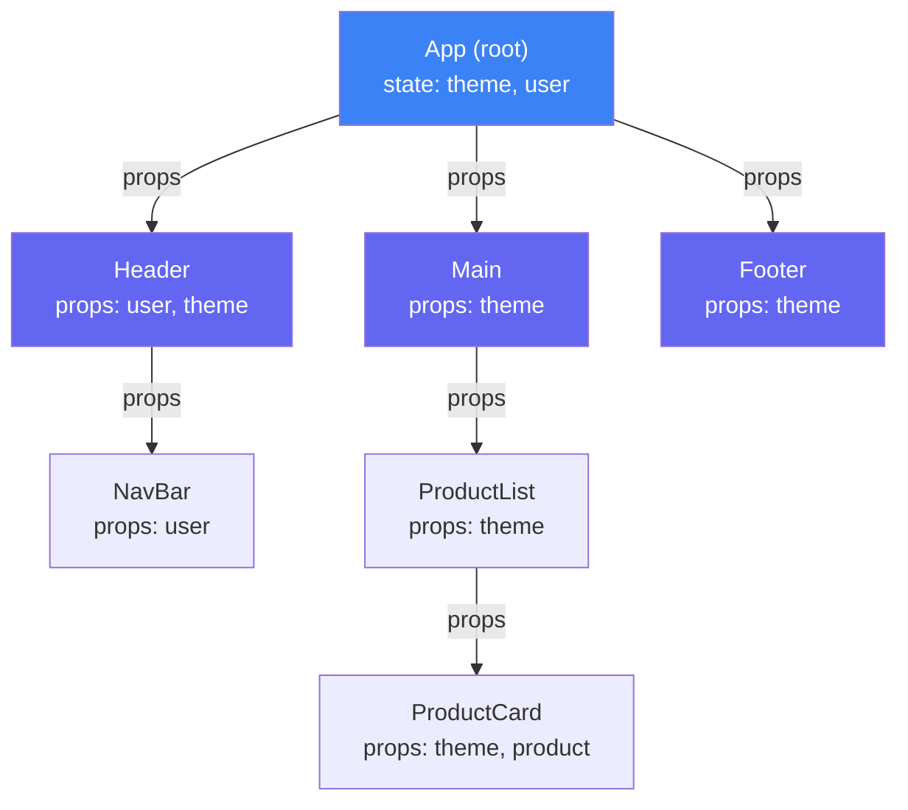
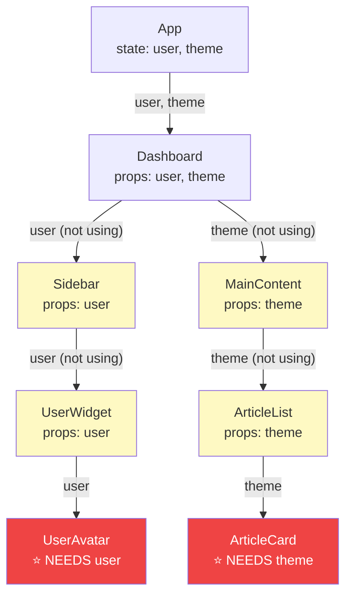
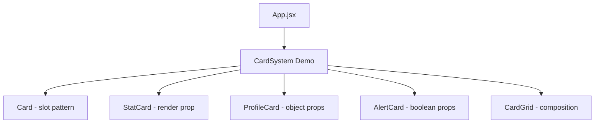

<a id="11-props-passing-data"></a>

[⬅ Previous Chapter](#10-components-the-building-blocks) | [📖 Main Index](#main-index) | [Next Chapter ➡](#12-state-making-components-interactive)

---

# Chapter 11: Props — Passing Data

## 📌 Learning Objectives

By the end of this chapter, you will:

- **Understand** what props are, why they are read-only, and how one-way data flow works
- **Master** all patterns of passing and receiving props — strings, numbers, booleans, arrays, objects, functions, JSX
- **Know** all types of props — data props, event handlers, render props, props getter, props collection
- **Use** the `children` prop correctly — ReactNode, React.Children API, named slots
- **Apply** the spread props pattern safely — when to use it and when it causes prop leaks
- **Set** default props using modern parameter syntax and legacy `defaultProps`
- **Validate** props at runtime using PropTypes — all validators, isRequired, custom validators
- **Identify** prop drilling — when it's acceptable and when to solve it
- **Compare** Props vs State clearly for interviews
- **Answer 10+ interview questions** on props concepts confidently

---

<a id="chapter-index-table-11"></a>

## Chapter Index Table

| Topic No. | Topic Name | Subtopics |
|-----------|-----------|-----------|
| 11.1 | [What are Props? Props are read-only](#111-what-are-props-props-are-read-only) | One-way data flow<br>Props as function arguments |
| 11.2 | [Passing & Receiving Props — All Patterns](#112-passing--receiving-props--all-patterns) | String/number/boolean<br>Array & object<br>Function props<br>JSX as prop |
| 11.3 | [Types of Props](#113-types-of-props) | Data props<br>Event handlers<br>Render props<br>Props getter<br>Props collection |
| 11.4 | [The children Prop](#114-the-children-prop) | ReactNode<br>React.Children API<br>children vs render prop<br>Named slots |
| 11.5 | [Spread Props Pattern](#115-spread-props-pattern) | When useful<br>When dangerous |
| 11.6 | [Default Props](#116-default-props) | Default parameter syntax<br>defaultProps legacy |
| 11.7 | [PropTypes — Runtime Validation](#117-proptypes--runtime-validation) | All validators<br>isRequired<br>Custom validators<br>vs TypeScript |
| 11.8 | [Prop Drilling — Problem & Solutions](#118-prop-drilling--problem--solutions) | What is it<br>When acceptable<br>Solutions |
| 11.9 | [Props vs State — Comparison](#119-props-vs-state--comparison) | Full comparison table |
| 💡 | [Interview Questions](#-interview-questions) | 10+ with Answers |
| 🧪 | [Practice Problems](#-practice-problems) | 5 Coding + 5 Theory |
| 🚀 | [Mini Project](#-mini-project) | Reusable Card Component System |
| ⚡ | [Quick Revision](#-quick-revision) | Key bullets, traps |
| 📌 | [Chapter Summary](#-chapter-summary) | Final takeaways |

---

## 11.1 What are Props? Props are read-only

<a id="111-what-are-props-props-are-read-only"></a>

### What is it?

**Props** (short for **properties**) are the mechanism React uses to pass data from a **parent component to a child component**. They are the primary way components communicate in React's one-way data flow model.

Technically, props are nothing more than a **plain JavaScript object** — the first argument that React passes to your component function when it calls it.

```jsx
// When React sees: <UserCard name="Alice" age={25} />
// It calls: UserCard({ name: "Alice", age: 25 })
// The argument { name: "Alice", age: 25 } IS the props object

function UserCard(props) {
  console.log(props);
  // { name: "Alice", age: 25 }
  
  return (
    <div>
      <h2>{props.name}</h2>
      <p>Age: {props.age}</p>
    </div>
  );
}
```

---

### Props are Read-Only — The Golden Rule

> **All React components must act like pure functions with respect to their props.**

This is one of React's core rules. You must **never mutate props**.

```jsx
// ❌ NEVER mutate props — this breaks React's model
function BadComponent(props) {
  props.count = props.count + 1;     // ❌ Mutating prop
  props.user.name = 'Changed';       // ❌ Mutating nested prop object
  delete props.onClick;              // ❌ Deleting prop
  
  return <div>{props.count}</div>;
}

// Why is mutation bad?
// 1. Props come from the parent — mutation silently changes parent data
// 2. React cannot detect the change → no re-render triggered
// 3. Other components using the same prop data get corrupted data
// 4. Debugging becomes a nightmare — data changes with no trace

// ✅ CORRECT — treat props as read-only, use state for changes
function GoodComponent({ count, onIncrement }) {
  return (
    <div>
      <p>Count: {count}</p>
      <button onClick={onIncrement}>Increment</button>
      {/* onIncrement is the parent's handler — parent decides how count changes */}
    </div>
  );
}
```

---

### 🧠 Hinglish Intuition

Props ek **sealed envelope** ki tarah hai. Koi cheez andar bhejo — envelope band ho jata hai. Jo andar hai woh padh sakte ho, lekin content change nahi kar sakte without ek naya envelope banaye. Agar tum change karna chahte ho, toh apna naya state banao (open notebook) aur wahan changes karo.

Ek aur analogy: Props passport jaisa hai — sirf read karo, modify mat karo. State driving license jaisa hai — tum khud control karte ho, renew kar sakte ho.

---

### One-Way Data Flow

React implements **unidirectional data flow** — data always flows in one direction: **parent → child** via props.



```
Data flows: App → Header → NavBar
           App → Main → ProductList → ProductCard
           App → Footer

Data NEVER flows: ProductCard → App (directly)

To send data UP: Use callback functions passed as props (inverse data flow)
```

**Why one-way data flow?**
- **Predictable** — easy to trace where data comes from
- **Debuggable** — data change has a single source
- **Maintainable** — component behavior is determined by input props
- **Testable** — pure functions with defined inputs → defined outputs

---

### Props as Function Arguments

The mental model: **A component is just a function. Props are its arguments.**

```jsx
// This is literally what React does:
function Button({ label, onClick, disabled }) {
  return (
    <button onClick={onClick} disabled={disabled}>
      {label}
    </button>
  );
}

// React calls it like:
Button({ label: 'Submit', onClick: handleSubmit, disabled: false });

// So all JavaScript function concepts apply:
// ✅ Default parameters
// ✅ Destructuring
// ✅ Rest parameters
// ✅ TypeScript types on parameters
```

---

👉 <a href="#chapter-index-table-11">Go to Top 🔝</a>

---

## 11.2 Passing & Receiving Props — All Patterns

<a id="112-passing--receiving-props--all-patterns"></a>

### String Props

```jsx
// Passing strings:
<UserCard name="Alice Johnson" role="Senior Developer" />
<Input placeholder="Enter your email" type="email" />

// Receiving:
function UserCard({ name, role }) {
  return <p>{name} — {role}</p>;
}

// String is the ONLY prop type that doesn't need {}
// These are equivalent:
<Button label="Submit" />
<Button label={"Submit"} />
```

---

### Number Props

```jsx
// ✅ Numbers must use {} — not quotes
<ProductCard price={99.99} stock={42} rating={4.5} />
// price="99.99" ← This would be a STRING "99.99", not number 99.99!

function ProductCard({ price, stock, rating }) {
  return (
    <div>
      <p>Price: ${price.toFixed(2)}</p>   {/* .toFixed works because it's a number */}
      <p>Stock: {stock} units</p>
      <p>Rating: {rating}/5</p>
    </div>
  );
}
```

---

### Boolean Props

```jsx
// Boolean shorthand — just writing the prop name = true
<Button disabled />           // disabled={true}
<Input required />            // required={true}
<Modal isOpen />              // isOpen={true}

// Explicit false must use {}:
<Button disabled={false} />   // ✅ Explicit false
// <Button disabled="false" /> // ❌ String "false" is truthy!

function Button({ disabled = false, children }) {
  return (
    <button disabled={disabled}>
      {children}
    </button>
  );
}
```

---

### Array Props

```jsx
// Passing arrays:
<TagList tags={['React', 'TypeScript', 'Node.js']} />
<DataTable columns={['Name', 'Age', 'City']} rows={userData} />

function TagList({ tags }) {
  return (
    <div className="tags">
      {tags.map(tag => (
        <span key={tag} className="tag">{tag}</span>
      ))}
    </div>
  );
}

// Arrays of objects:
const users = [
  { id: 1, name: 'Alice', role: 'Admin' },
  { id: 2, name: 'Bob', role: 'User' },
];
<UserTable users={users} />
```

---

### Object Props

```jsx
// Passing objects:
const user = { name: 'Alice', age: 28, avatar: '/alice.jpg' };
<UserProfile user={user} />

// Or inline (double curly braces — outer = JSX expression, inner = object literal):
<UserProfile user={{ name: 'Alice', age: 28 }} />

function UserProfile({ user }) {
  return (
    <div>
      
      <h2>{user.name}</h2>
      <p>Age: {user.age}</p>
    </div>
  );
}

// Spreading an object as props:
const buttonProps = { disabled: true, type: 'submit', className: 'btn-primary' };
<Button {...buttonProps}>Submit</Button>
// Equivalent to: <Button disabled={true} type="submit" className="btn-primary">
```

---

### Function Props (Callbacks)

```jsx
// Passing functions as props:
<Button onClick={handleClick} />
<Input onChange={handleChange} onBlur={handleBlur} />
<Form onSubmit={handleSubmit} onReset={handleReset} />

// Inline arrow function (creates new function on each render — use carefully):
<Button onClick={() => console.log('Clicked')} />
<Button onClick={() => deleteUser(user.id)} />

// Passing with arguments:
function UserList({ users, onDelete, onEdit }) {
  return (
    <ul>
      {users.map(user => (
        <li key={user.id}>
          {user.name}
          <button onClick={() => onEdit(user.id)}>Edit</button>
          <button onClick={() => onDelete(user.id)}>Delete</button>
        </li>
      ))}
    </ul>
  );
}

// Parent:
<UserList
  users={users}
  onDelete={(id) => setUsers(prev => prev.filter(u => u.id !== id))}
  onEdit={(id) => setEditingId(id)}
/>
```

---

### JSX Element as Prop

```jsx
// Passing JSX as a prop value:
<Card
  header={<h2>Card Title</h2>}
  footer={<button>See More</button>}
  icon={<StarIcon size={24} />}
/>

// More complex JSX prop:
<Modal
  title="Confirm Action"
  actions={
    <div style={{ display: 'flex', gap: '8px' }}>
      <Button variant="ghost" onClick={onCancel}>Cancel</Button>
      <Button variant="danger" onClick={onConfirm}>Delete</Button>
    </div>
  }
>
  <p>This action cannot be undone.</p>
</Modal>

function Modal({ title, actions, children }) {
  return (
    <div className="modal">
      <div className="modal__header">{title}</div>
      <div className="modal__body">{children}</div>
      <div className="modal__footer">{actions}</div>
    </div>
  );
}
```

---

### Receiving Props — All Destructuring Patterns

```jsx
// Pattern 1: Direct destructuring (most common)
function UserCard({ name, age, role }) {
  return <div>{name} ({age}) — {role}</div>;
}

// Pattern 2: With defaults in destructuring
function UserCard({ name, age = 18, role = 'User', isActive = false }) {
  return <div>{name}</div>;
}

// Pattern 3: Props object (less common)
function UserCard(props) {
  return <div>{props.name}</div>;
}

// Pattern 4: Nested destructuring
function UserCard({ user: { name, email }, settings: { theme } }) {
  return <div className={theme}>{name} — {email}</div>;
}

// Pattern 5: Rest props (collect remaining props)
function Button({ label, variant, size, ...rest }) {
  // rest contains all OTHER props (id, className, data-*, aria-*, etc.)
  return <button className={`btn btn--${variant}`} {...rest}>{label}</button>;
}

// Pattern 6: Rename on destructure
function UserCard({ name: userName, role: userRole }) {
  // 'name' prop → 'userName' variable
  return <div>{userName} — {userRole}</div>;
}
```

---

👉 <a href="#chapter-index-table-11">Go to Top 🔝</a>

---

## 11.3 Types of Props

<a id="113-types-of-props"></a>

### Data Props

The most common — plain data passed for display or logic.

```jsx
// Data props: strings, numbers, booleans, arrays, objects
function ProductCard({
  name,           // string
  price,          // number
  rating,         // number
  inStock,        // boolean
  tags,           // array
  seller,         // object
}) {
  return (
    <div className={`product ${!inStock ? 'out-of-stock' : ''}`}>
      <h3>{name}</h3>
      <p>${price.toFixed(2)}</p>
      <Stars rating={rating} />
      {!inStock && <Badge>Out of Stock</Badge>}
      <TagList tags={tags} />
      <p>Sold by: {seller.name}</p>
    </div>
  );
}
```

---

### Event Handler Props

Functions passed as callbacks — naming convention: `on` + EventName.

```jsx
// Convention: on[EventName] for handler props
function SearchBar({
  onSearch,          // called when user submits search
  onChange,          // called on each keystroke
  onClear,           // called when clear button clicked
  onFocus,           // called when input receives focus
}) {
  const [value, setValue] = useState('');

  const handleChange = (e) => {
    setValue(e.target.value);
    onChange?.(e.target.value);  // Optional chaining — call if provided
  };

  const handleSubmit = (e) => {
    e.preventDefault();
    onSearch?.(value);
  };

  const handleClear = () => {
    setValue('');
    onClear?.();
  };

  return (
    <form onSubmit={handleSubmit}>
      <input value={value} onChange={handleChange} onFocus={onFocus} />
      <button type="button" onClick={handleClear}>✕</button>
      <button type="submit">Search</button>
    </form>
  );
}
```

---

### Render Props Pattern

A **render prop** is a function prop whose return value is JSX. It inverts control — the child component decides WHEN to call the function, the parent decides WHAT to render.

```jsx
// ===== Render Prop Pattern =====
// The component provides DATA/BEHAVIOR, the caller provides the UI

function MouseTracker({ render }) {
  const [position, setPosition] = useState({ x: 0, y: 0 });

  const handleMouseMove = (e) => {
    setPosition({ x: e.clientX, y: e.clientY });
  };

  return (
    <div
      style={{ height: '300px', border: '1px solid #ccc' }}
      onMouseMove={handleMouseMove}
    >
      {/* Call the render prop function with current data */}
      {render(position)}
    </div>
  );
}

// Usage — caller decides how to render the position:
<MouseTracker
  render={({ x, y }) => (
    <div>
      <h3>Mouse Position</h3>
      <p>X: {x}, Y: {y}</p>
    </div>
  )}
/>

// Reuse with different UI:
<MouseTracker
  render={({ x, y }) => (
    <div
      style={{
        position: 'absolute',
        left: x,
        top: y,
        width: '10px',
        height: '10px',
        borderRadius: '50%',
        backgroundColor: 'red',
        transform: 'translate(-50%, -50%)',
        pointerEvents: 'none',
      }}
    />
  )}
/>
```

```jsx
// ===== Render prop with children (children-as-function pattern) =====
function DataFetcher({ url, children }) {
  const [data, setData] = useState(null);
  const [loading, setLoading] = useState(true);
  const [error, setError] = useState(null);

  useEffect(() => {
    fetch(url)
      .then(r => r.json())
      .then(data => { setData(data); setLoading(false); })
      .catch(err => { setError(err); setLoading(false); });
  }, [url]);

  // children is a FUNCTION — called with state data
  return children({ data, loading, error });
}

// Usage:
<DataFetcher url="/api/users">
  {({ data, loading, error }) => {
    if (loading) return <Spinner />;
    if (error) return <Error message={error.message} />;
    return <UserList users={data} />;
  }}
</DataFetcher>
```

> [!NOTE]
> **Render props vs Custom Hooks:** In modern React, custom hooks largely replace render props for sharing behavior. But render props still appear in interviews and legacy codebases, and are still valid when you need JSX flexibility. Libraries like React Router and Formik still use patterns similar to render props.

---

### Props Getter Pattern

Returns an object of props that the consumer can spread onto their element. Provides default behavior while allowing the consumer to extend/override.

```jsx
// Props Getter Pattern — common in headless UI libraries
function useToggle(initialValue = false) {
  const [isOn, setIsOn] = useState(initialValue);

  // "Props getter" — returns props object to spread on the element
  const getTogglerProps = ({ onClick, ...rest } = {}) => ({
    'aria-pressed': isOn,
    onClick: () => {
      setIsOn(prev => !prev);
      onClick?.();  // Also call any onClick the consumer provided
    },
    ...rest,
  });

  const getContainerProps = (props = {}) => ({
    'aria-live': 'polite',
    ...props,
  });

  return { isOn, setIsOn, getTogglerProps, getContainerProps };
}

// Usage — consumer uses spread to apply props + can add their own:
function DarkModeToggle() {
  const { isOn, getTogglerProps } = useToggle(false);

  return (
    <button
      {...getTogglerProps({
        onClick: () => console.log('Also do this on click'),
        className: 'dark-mode-btn',
        'aria-label': 'Toggle dark mode',
      })}
    >
      {isOn ? '🌙 Dark' : '☀️ Light'}
    </button>
  );
}
```

---

### Props Collection Pattern

Returns a pre-built set of related props — like a "bundle" that can be spread on an element. Simpler than props getter.

```jsx
// Props Collection Pattern
function useInput(initialValue = '') {
  const [value, setValue] = useState(initialValue);

  // A "collection" of props that belong together on an input
  const inputProps = {
    value,
    onChange: (e) => setValue(e.target.value),
    onBlur: () => console.log('Input blurred'),
  };

  const resetInputProps = {
    type: 'button',
    onClick: () => setValue(initialValue),
    children: 'Reset',
  };

  return { value, inputProps, resetInputProps };
}

// Usage — spread the collection:
function NameForm() {
  const { value: name, inputProps: nameProps, resetInputProps } = useInput('');
  const { value: email, inputProps: emailProps } = useInput('');

  return (
    <form>
      <input placeholder="Name" {...nameProps} />     {/* Spreads value + onChange */}
      <input placeholder="Email" {...emailProps} />
      <button {...resetInputProps} />                  {/* Spreads onClick + type */}
      <p>Name: {name}, Email: {email}</p>
    </form>
  );
}
```

---

### 🧠 Hinglish Intuition

Props ke types samjho aise:
- **Data props** = Khaana order karna. "Mujhe pizza chahiye." Static information.
- **Event handler props** = Emergency number dena. "Kuch hua toh call karo." Function jo situation pe call hoga.
- **Render prop** = Khali dabba dena. "Is dabba mein jo chahiye bharo." Component data deta hai, tum decide karte ho UI.
- **Props getter** = Pre-filled form dena jo extend kar sako. "Yeh base form lelo, apni cheezein add karo."
- **Props collection** = Poora toolkit dena. "Yeh sab tools ek saath lelo."

---

👉 <a href="#chapter-index-table-11">Go to Top 🔝</a>

---

## 11.4 The children Prop

<a id="114-the-children-prop"></a>

### What is children?

`children` is a **special built-in prop** that React automatically populates with whatever is placed between a component's opening and closing tags. It's just a regular prop — but React handles its population automatically.

```jsx
// children is populated automatically:
<Button>Click Me</Button>
// React passes: { children: 'Click Me' }

<Card>
  <h2>Title</h2>
  <p>Description</p>
</Card>
// React passes: { children: [<h2>Title</h2>, <p>Description</p>] }

// Accessing children:
function Button({ children, onClick }) {
  return <button onClick={onClick}>{children}</button>;
}

// children can be:
// - String: <Button>Text</Button>
// - Number: <Badge>{42}</Badge>
// - JSX element: <Card><UserInfo /></Card>
// - Array of elements: <List><Item/><Item/></List>
// - Function: <Fetcher>{(data) => <UI data={data}/>}</Fetcher>
// - null/undefined: <Card></Card> or <Card />
```

---

### ReactNode Type

In TypeScript, `children` has type `ReactNode` — the broadest type for renderable content:

```typescript
// ReactNode includes:
type ReactNode =
  | ReactElement          // JSX elements
  | string                // Text strings
  | number                // Numbers
  | boolean               // Booleans (render nothing)
  | null                  // Renders nothing
  | undefined             // Renders nothing
  | ReactFragment         // Fragment/array of nodes
  | ReactPortal           // Portal
  | Iterable<ReactNode>;  // Array of ReactNodes

// In TypeScript component:
interface CardProps {
  children: React.ReactNode;   // Most permissive — anything renderable
  title: string;
}

// More specific:
interface ButtonProps {
  children: React.ReactElement;  // Must be a JSX element
}

interface LabelProps {
  children: string;              // Only strings
}
```

---

### React.Children API

The `React.Children` API provides utilities for iterating, counting, and transforming the children prop safely (handles cases where children could be null, a single element, or an array).

```jsx
import { Children, cloneElement, isValidElement } from 'react';

// ===== Children.map =====
function RadioGroup({ children, name, onChange }) {
  let index = 0;
  return (
    <div role="radiogroup">
      {Children.map(children, (child) => {
        if (!isValidElement(child)) return child;
        // Inject additional props into each child
        return cloneElement(child, {
          name,                           // All radios share same name
          id: `radio-${name}-${index}`,
          onChange,
          inputRef: index++,
        });
      })}
    </div>
  );
}

// ===== Children.count =====
function Carousel({ children }) {
  const count = Children.count(children);
  const [current, setCurrent] = useState(0);

  return (
    <div>
      <p>Slide {current + 1} of {count}</p>
      {Children.toArray(children)[current]}
      <button onClick={() => setCurrent(c => Math.min(c + 1, count - 1))}>Next</button>
    </div>
  );
}

// ===== Children.only =====
// Ensures exactly ONE child — throws if not
function Tooltip({ children, text }) {
  Children.only(children);  // ← Throws if children is not exactly one element
  return (
    <div className="tooltip-wrapper" title={text}>
      {children}
    </div>
  );
}

// ===== Children.toArray =====
// Converts children to flat array with stable keys
function SortableList({ children }) {
  const items = Children.toArray(children);
  const sorted = [...items].sort((a, b) =>
    a.props.priority - b.props.priority
  );
  return <ul>{sorted}</ul>;
}
```

---

### children vs Render Prop

```jsx
// children = STATIC content
// Render prop = DYNAMIC content that receives data

// ===== children (static) =====
<Modal>
  <p>Are you sure?</p>  {/* This JSX is created BEFORE Modal renders */}
</Modal>
// children is just JSX — doesn't receive any data from Modal

// ===== render prop (dynamic) =====
<DataFetcher url="/api">
  {(data) => <p>{data.message}</p>}  {/* This function is called WITH data from DataFetcher */}
</DataFetcher>
// Children-as-function receives data from the parent component at render time

// ===== When to use which? =====
// children: Container components — cards, modals, layouts, wrappers
// render prop: Data sharing — when child needs access to parent's internal state/data
```

---

### Named Slot Pattern via Props

```jsx
// Multiple named content areas via props (Slot pattern):
function PageTemplate({
  children,    // Main content
  header,      // Top navigation slot
  sidebar,     // Side navigation slot
  footer,      // Bottom content slot
  toolbar,     // Optional action toolbar
}) {
  return (
    <div className="page">
      {header && <header className="page__header">{header}</header>}
      <div className="page__body">
        {sidebar && <aside className="page__sidebar">{sidebar}</aside>}
        <main className="page__main">
          {toolbar && <div className="page__toolbar">{toolbar}</div>}
          {children}
        </main>
      </div>
      {footer && <footer className="page__footer">{footer}</footer>}
    </div>
  );
}

// Usage:
<PageTemplate
  header={<NavBar user={currentUser} />}
  sidebar={<SideMenu items={menuItems} />}
  toolbar={<ActionBar onSave={save} onDiscard={discard} />}
  footer={<Footer links={footerLinks} />}
>
  {/* Main content = children */}
  <ArticleEditor article={article} />
</PageTemplate>
```

---

👉 <a href="#chapter-index-table-11">Go to Top 🔝</a>

---

## 11.5 Spread Props Pattern

<a id="115-spread-props-pattern"></a>

### When Useful — Forwarding Props

The spread props pattern (`{...props}`) is used to pass down props without explicitly listing them — commonly when building wrapper components.

```jsx
// ===== Useful Case 1: Wrapper components =====
// You want to add behavior/styling but pass remaining props through

function CustomInput({ label, error, ...inputProps }) {
  // Destructure OUR props, spread the rest to native <input>
  // inputProps = everything the native input understands:
  // type, value, onChange, placeholder, disabled, maxLength, autoFocus, etc.
  return (
    <div className="input-wrapper">
      {label && <label>{label}</label>}
      <input
        className={`input ${error ? 'input--error' : ''}`}
        {...inputProps}    // ← All remaining props forwarded to native input
      />
      {error && <span className="error-msg">{error}</span>}
    </div>
  );
}

// Consumer can pass any native input prop:
<CustomInput
  label="Email"
  error={emailError}
  type="email"                    // ← Goes to inputProps
  value={email}                   // ← Goes to inputProps
  onChange={handleChange}         // ← Goes to inputProps
  placeholder="Enter email"       // ← Goes to inputProps
  autoComplete="email"            // ← Goes to inputProps
  maxLength={100}                 // ← Goes to inputProps
/>
```

```jsx
// ===== Useful Case 2: Spreading known safe prop objects =====
const buttonDefaults = {
  type: 'button',
  className: 'btn',
};

function Button({ children, variant = 'primary', ...rest }) {
  return (
    <button
      {...buttonDefaults}
      className={`btn btn--${variant}`}  // Overrides buttonDefaults.className
      {...rest}                           // Consumer's additional props
    >
      {children}
    </button>
  );
}

// Order matters for overrides:
// {...buttonDefaults} = sets defaults
// className={...} = overrides className from defaults
// {...rest} = consumer can override anything above
```

---

### When Dangerous — Prop Leaks

```jsx
// ❌ DANGEROUS: Spreading all props onto DOM elements
// Non-DOM props get passed to the DOM → React warnings

function BadCard({ children, isHighlighted, cardData, ...props }) {
  return (
    // ❌ If 'props' contains: isHighlighted (boolean), cardData (object)
    // These are not valid HTML attributes → React warns
    <div {...props}>
      {children}
    </div>
  );
}

// Usage:
<BadCard isHighlighted={true} cardData={{ id: 1 }} className="card">
  Content
</BadCard>
// Warning: "Unknown prop `isHighlighted` on <div> tag. Remove this prop from the element."
// Warning: "Unknown prop `cardData` on <div> tag."

// ✅ CORRECT: Destructure component-specific props, spread only valid HTML props
function GoodCard({ children, isHighlighted, cardData, className, ...htmlProps }) {
  // isHighlighted = our custom prop (used for logic)
  // cardData = our custom prop (used for logic)
  // className = we handle this
  // htmlProps = only native HTML attributes (id, onClick, style, etc.)
  return (
    <div
      className={`card ${isHighlighted ? 'card--highlighted' : ''} ${className || ''}`}
      {...htmlProps}   // ← Only valid DOM attributes spread here
    >
      {children}
    </div>
  );
}
```

```jsx
// ❌ Another dangerous pattern: spreading in wrong order
function Button({ children, className, ...rest }) {
  return (
    <button
      className="default-class"  // Intended default
      {...rest}                   // ← If rest has className, it OVERRIDES the default
      // Result: consumer's className replaces "default-class" entirely
    >
      {children}
    </button>
  );
}

// ✅ Correct order for merging:
function Button({ children, className = '', ...rest }) {
  return (
    <button
      {...rest}                          // Apply consumer's props first
      className={`default-class ${className}`}  // Then apply merged className last
    >
      {children}
    </button>
  );
}
```

---

### 🧠 Hinglish Intuition

Spread props ek **photocopy machine** jaisi hai. Ek cheez copy karo aur aage bhejo. Useful hai jab wrapper component hai — sab kuch copy karke andar bhej do. Dangerous hai jab bina check kiye sab kuch DOM ko bhej do — jaise kisi aur ka letter bina padhke poste kar do, usme kuch bhi ho sakta hai (invalid HTML attributes, sensitive data).

---

👉 <a href="#chapter-index-table-11">Go to Top 🔝</a>

---

## 11.6 Default Props

<a id="116-default-props"></a>

### Modern Way — Default Parameter Syntax

The current best practice is to use **JavaScript's native default parameter syntax** directly in the destructuring pattern.

```jsx
// ===== Default values in destructuring (MODERN — recommended) =====
function Button({
  variant = 'primary',        // Default variant
  size = 'md',               // Default size
  disabled = false,          // Default disabled state
  fullWidth = false,         // Default width behavior
  type = 'button',           // Default HTML button type
  children,                  // No default — required
  onClick,                   // No default — optional callback
}) {
  return (
    <button
      type={type}
      disabled={disabled}
      style={{ width: fullWidth ? '100%' : 'auto' }}
      className={`btn btn--${variant} btn--${size}`}
      onClick={onClick}
    >
      {children}
    </button>
  );
}

// Usage with various combinations:
<Button>Submit</Button>                            // Uses all defaults
<Button variant="danger" size="lg">Delete</Button> // Override variant + size
<Button disabled fullWidth>Loading...</Button>     // Override disabled + fullWidth
```

```jsx
// Nested defaults with objects:
function UserCard({
  user = {},
  settings = { theme: 'light', showBio: true },
}) {
  const { name = 'Anonymous', avatar = '/default-avatar.png' } = user;
  return (
    <div className={settings.theme}>
      
      <h2>{name}</h2>
    </div>
  );
}
```

---

### defaultProps — Legacy (Still Asked in Interviews)

Before destructuring defaults were common, React provided `defaultProps` as a static property on the component. **Still seen in older codebases and class components.**

```jsx
// ===== defaultProps for function components (legacy) =====
function Button({ variant, size, disabled, children }) {
  return (
    <button
      disabled={disabled}
      className={`btn btn--${variant} btn--${size}`}
    >
      {children}
    </button>
  );
}

// Static property sets defaults:
Button.defaultProps = {
  variant: 'primary',
  size: 'md',
  disabled: false,
};

// ===== defaultProps for class components =====
class Button extends Component {
  render() {
    const { variant, size, disabled, children } = this.props;
    return (
      <button disabled={disabled} className={`btn btn--${variant} btn--${size}`}>
        {children}
      </button>
    );
  }
}

Button.defaultProps = {
  variant: 'primary',
  size: 'md',
  disabled: false,
};

// Or as static class field:
class Button extends Component {
  static defaultProps = {
    variant: 'primary',
    size: 'md',
    disabled: false,
  };
  // ...
}
```

> [!IMPORTANT]
> `defaultProps` for function components is **deprecated** as of React 18.3 and will be removed in a future major version. Always use default parameter syntax for new functional component code. For class components, `defaultProps` still works and has no deprecation notice.

---

### Default Props — Priority Rules

```jsx
// Priority order (highest to lowest):
// 1. Explicitly passed prop value
// 2. Default parameter value (if prop is undefined)

function Component({ value = 'default' }) {
  console.log(value);
}

<Component value="explicit" />   // → "explicit"   (passed value wins)
<Component value={undefined} />  // → "default"    (undefined → default kicks in)
<Component value={null} />       // → null         (null is NOT undefined — no default!)
<Component value={false} />      // → false        (false is NOT undefined — no default!)
<Component value={0} />          // → 0            (0 is NOT undefined — no default!)
<Component />                    // → "default"    (not passed = undefined → default)
```

> [!IMPORTANT]
> **Common interview gotcha:** `null` does NOT trigger default parameters. Only `undefined` does. `<Component value={null} />` → value is `null`, not the default. This is standard JavaScript behavior.

---

👉 <a href="#chapter-index-table-11">Go to Top 🔝</a>

---

## 11.7 PropTypes — Runtime Validation

<a id="117-proptypes--runtime-validation"></a>

### What is PropTypes?

PropTypes is a **runtime prop validation library** that ships separately from React (`prop-types` package). It checks that the props passed to a component match the expected types — and logs warnings in development when they don't.

```bash
npm install prop-types
```

> [!NOTE]
> PropTypes validation **only runs in development mode** and is stripped in production builds for performance. For compile-time type checking, use TypeScript (covered in Part P).

---

### All PropType Validators

```jsx
import PropTypes from 'prop-types';

function ComplexComponent({
  // Basic types...
}) {
  return <div>Component</div>;
}

ComplexComponent.propTypes = {
  // ===== Primitive types =====
  name: PropTypes.string,
  age: PropTypes.number,
  isActive: PropTypes.bool,
  onClick: PropTypes.func,
  uniqueId: PropTypes.symbol,

  // ===== Collection types =====
  tags: PropTypes.array,                  // Any array
  user: PropTypes.object,                 // Any object
  children: PropTypes.node,               // Anything renderable (ReactNode)
  icon: PropTypes.element,                // Must be React element
  elementType: PropTypes.elementType,     // Component constructor/function

  // ===== Specific array type =====
  scores: PropTypes.arrayOf(PropTypes.number),
  items: PropTypes.arrayOf(PropTypes.shape({
    id: PropTypes.number.isRequired,
    name: PropTypes.string.isRequired,
  })),

  // ===== Specific object shape =====
  user: PropTypes.shape({
    id: PropTypes.number.isRequired,
    name: PropTypes.string.isRequired,
    email: PropTypes.string,
    role: PropTypes.oneOf(['admin', 'user', 'guest']),
  }),

  // ===== Exact object (warns if extra keys) =====
  config: PropTypes.exact({
    width: PropTypes.number,
    height: PropTypes.number,
    color: PropTypes.string,
  }),

  // ===== One of specific values =====
  variant: PropTypes.oneOf(['primary', 'secondary', 'danger', 'ghost']),
  size: PropTypes.oneOf(['sm', 'md', 'lg']),

  // ===== One of multiple types =====
  value: PropTypes.oneOfType([
    PropTypes.string,
    PropTypes.number,
    PropTypes.bool,
  ]),

  // ===== Instance of class =====
  date: PropTypes.instanceOf(Date),
  error: PropTypes.instanceOf(Error),

  // ===== Object with specific value types =====
  styles: PropTypes.objectOf(PropTypes.string),    // { color: 'red', ... }
  counts: PropTypes.objectOf(PropTypes.number),    // { a: 1, b: 2 }
};
```

---

### isRequired Usage

```jsx
import PropTypes from 'prop-types';

function UserProfile({ name, email, age, onFollow }) {
  return (
    <div>
      <h2>{name}</h2>
      <p>{email}</p>
      <p>Age: {age}</p>
      <button onClick={onFollow}>Follow</button>
    </div>
  );
}

UserProfile.propTypes = {
  name: PropTypes.string.isRequired,    // Required string
  email: PropTypes.string.isRequired,   // Required string
  age: PropTypes.number,                // Optional number
  onFollow: PropTypes.func.isRequired,  // Required function
};

// Warning if name is not passed:
// "Warning: Failed prop type: The prop `name` is marked as required in
//  `UserProfile`, but its value is `undefined`."
```

---

### Custom Validators

```jsx
// Custom validator signature: (props, propName, componentName) => Error | null

UserProfile.propTypes = {
  // ===== Custom: email format validation =====
  email: function(props, propName, componentName) {
    const email = props[propName];

    if (!email) return null;  // Not required — skip if not provided

    const emailRegex = /^[^\s@]+@[^\s@]+\.[^\s@]+$/;
    if (!emailRegex.test(email)) {
      return new Error(
        `Invalid prop \`${propName}\` supplied to \`${componentName}\`. ` +
        `Expected a valid email address, got: "${email}"`
      );
    }
    return null;  // Valid!
  },

  // ===== Custom: positive number =====
  age: function(props, propName, componentName) {
    const age = props[propName];
    if (age !== undefined && (typeof age !== 'number' || age <= 0 || age > 150)) {
      return new Error(
        `Prop \`${propName}\` in \`${componentName}\` must be a positive number between 1-150.`
      );
    }
    return null;
  },

  // ===== Custom: URL validator =====
  avatarUrl: function(props, propName, componentName) {
    const url = props[propName];
    if (!url) return null;
    try {
      new URL(url);
      return null;
    } catch {
      return new Error(`\`${propName}\` in \`${componentName}\` is not a valid URL.`);
    }
  },
};

// ===== Reusable custom validators =====
const validators = {
  positiveNumber: (props, propName, componentName) => {
    const val = props[propName];
    if (val !== undefined && (typeof val !== 'number' || val < 0)) {
      return new Error(`\`${propName}\` in \`${componentName}\` must be a positive number.`);
    }
    return null;
  },

  hexColor: (props, propName, componentName) => {
    const val = props[propName];
    if (val && !/^#([0-9A-F]{3}){1,2}$/i.test(val)) {
      return new Error(`\`${propName}\` in \`${componentName}\` must be a valid hex color.`);
    }
    return null;
  },
};

ColorSwatch.propTypes = {
  color: validators.hexColor,
  size: validators.positiveNumber,
};
```

---

### PropTypes vs TypeScript Comparison

| Feature | PropTypes | TypeScript |
|---------|-----------|-----------|
| **When checked** | Runtime (in browser, dev only) | Compile time (before build) |
| **Catches errors** | While app is running | Before app runs |
| **Performance** | Slight overhead in dev | Zero runtime cost |
| **Setup** | `npm install prop-types` | TypeScript setup |
| **Coverage** | Props only | Entire codebase |
| **IDE support** | Limited autocomplete | Full IntelliSense |
| **Error messages** | Console warnings | Build errors |
| **Complex types** | Possible but verbose | Elegant, powerful |
| **Refactoring safety** | Low | High |
| **Legacy support** | Works in all JS React | Requires TS setup |

```typescript
// PropTypes (JS):
Button.propTypes = {
  variant: PropTypes.oneOf(['primary', 'secondary']).isRequired,
  onClick: PropTypes.func.isRequired,
  children: PropTypes.node.isRequired,
};

// TypeScript equivalent (compile-time):
interface ButtonProps {
  variant: 'primary' | 'secondary';
  onClick: () => void;
  children: React.ReactNode;
}

function Button({ variant, onClick, children }: ButtonProps) {
  // TypeScript enforces these types at compile time
}
```

> [!TIP]
> Modern React projects use TypeScript for type safety. PropTypes is mainly encountered in legacy JS codebases or simple projects. However, interviews often ask about PropTypes as it tests your understanding of React's core API.

---

👉 <a href="#chapter-index-table-11">Go to Top 🔝</a>

---

## 11.8 Prop Drilling — Problem & Solutions

<a id="118-prop-drilling--problem--solutions"></a>

### What is Prop Drilling?

**Prop drilling** occurs when you pass props through multiple intermediate components that don't need the data themselves — they just forward it down to a deeply nested child that does.



```jsx
// ❌ Prop Drilling Example (3 levels deep)
function App() {
  const [user, setUser] = useState({ name: 'Alice', avatar: '/alice.jpg' });
  const [theme, setTheme] = useState('light');

  return <Dashboard user={user} theme={theme} />;
}

// Dashboard doesn't use user or theme — just passes them down
function Dashboard({ user, theme }) {
  return (
    <div>
      <Sidebar user={user} />
      <MainContent theme={theme} />
    </div>
  );
}

// Sidebar doesn't use user — just passes down
function Sidebar({ user }) {
  return (
    <div>
      <UserWidget user={user} />
    </div>
  );
}

// UserWidget doesn't use user — just passes down
function UserWidget({ user }) {
  return <UserAvatar user={user} />;
}

// FINALLY — the component that actually needs user
function UserAvatar({ user }) {
  return ;
}
```

---

### When Prop Drilling is Acceptable

> [!NOTE]
> **Not all prop drilling is bad!** Context has a cost too (re-renders). Don't reach for Context at the first sign of prop drilling.

```
Prop drilling is ACCEPTABLE when:
✅ Only 2-3 levels deep
✅ Props are used by intermediate components too (not pure passthrough)
✅ Data changes infrequently
✅ Only a few props are passed
✅ App is small/medium sized

Prop drilling is a PROBLEM when:
❌ 4+ levels deep (data passes through components that don't use it)
❌ Many components need the same data
❌ Adding new features requires changing every intermediate component
❌ Intermediate components become "prop tunnels" — only pass data through
```

---

### Solutions

#### Solution 1: Component Composition (often overlooked!)

Before reaching for Context, try **component composition** — pass the component itself instead of its data.

```jsx
// ❌ Prop drilling — passing user data through Dashboard
function App() {
  const [user] = useState({ name: 'Alice', avatar: '/alice.jpg' });
  return <Dashboard user={user} />;
}

function Dashboard({ user }) {
  return <Sidebar user={user} />;  // Just passing through
}

function Sidebar({ user }) {
  return <UserAvatar user={user} />;  // Just passing through
}

// ✅ Composition — App assembles the component tree
// Dashboard/Sidebar don't need to know about user at all
function App() {
  const [user] = useState({ name: 'Alice', avatar: '/alice.jpg' });

  return (
    <Dashboard
      sidebar={
        <Sidebar>
          <UserAvatar user={user} />  {/* App knows about user */}
        </Sidebar>
      }
    />
  );
}

// Dashboard just renders what it receives — no user knowledge needed
function Dashboard({ sidebar }) {
  return <div className="layout">{sidebar}</div>;
}

// Sidebar just renders children — no user knowledge needed
function Sidebar({ children }) {
  return <aside>{children}</aside>;
}
```

#### Solution 2: Context API

For truly global state (theme, auth user, locale) that many components need:

```jsx
// Context API (full coverage in Chapter 18)
import { createContext, useContext, useState } from 'react';

const UserContext = createContext(null);

// Provider — wraps the app
function App() {
  const [user] = useState({ name: 'Alice', avatar: '/alice.jpg' });
  return (
    <UserContext.Provider value={user}>
      <Dashboard />  {/* No user prop needed! */}
    </UserContext.Provider>
  );
}

// ANY descendant can access user without drilling
function UserAvatar() {
  const user = useContext(UserContext);  // ← Direct access, no props needed
  return ;
}

// Intermediate components don't need any user-related props
function Dashboard() { return <Sidebar />; }
function Sidebar() { return <UserWidget />; }
function UserWidget() { return <UserAvatar />; }
```

#### Solution 3: State Management Libraries

For complex state shared across many features (Redux Toolkit, Zustand — covered in Chapters 30-31):

```jsx
// Zustand example (simple alternative):
import { create } from 'zustand';

const useUserStore = create(set => ({
  user: null,
  setUser: (user) => set({ user }),
}));

// Any component can access user directly:
function UserAvatar() {
  const user = useUserStore(state => state.user);
  return ;
}
```

---

### 🧠 Hinglish Intuition

Prop drilling ek telephone game jaisi hai — ek message 5 logon se guzarta hai aur thoda thoda badal sakta hai. Composition bolna hai ki seedha delivery karo — jaise Amazon direct delivery karna aur 5 alag logon se forward karwane ki jagah. Context API ek notice board jaisi hai — ek jagah likho, sab padh sakte hain bina kisi se request kiye.

---

👉 <a href="#chapter-index-table-11">Go to Top 🔝</a>

---

## 11.9 Props vs State — Comparison

<a id="119-props-vs-state--comparison"></a>

### 🧠 Hinglish Intuition

**Props** = Dukaan mein customer ka order. "Mujhe large pizza chahiye." Customer decide karta hai (parent), waiter deliver karta hai (component).

**State** = Chef ka kitchen notebook. Chef apna kaam track karta hai — kitna cheese bacha, oven ka temperature. Bahar se koi nahi dekhta, sirf chef use karta hai apne andar.

---

### Complete Comparison Table

| Feature | Props | State |
|---------|-------|-------|
| **Owner** | Parent component | The component itself |
| **Mutability** | Read-only (immutable) | Mutable (via setState/useState setter) |
| **Who sets it** | Parent sets props | Component manages its own state |
| **When changes** | When parent re-renders with new value | When setState/useState setter is called |
| **Triggers re-render** | ✅ Yes (when parent re-renders) | ✅ Yes (when setter called) |
| **Default value** | Passed by parent or default params | Set in useState(initialValue) |
| **Access in child** | `props.value` or destructuring | `const [value, setValue] = useState()` |
| **Passed to children** | ✅ Can pass as props to children | Only if explicitly passed as props |
| **Data flow** | Top-down (parent → child) | Internal to the component |
| **Analogous to** | Function parameter | Variable inside function body |
| **TypeScript** | Defined in interface | Typed in useState<Type>() |

---

### Code Comparison

```jsx
// ===== PROPS — owned by parent =====
function Parent() {
  const title = "Hello";  // Parent owns this
  return <Child title={title} />;
}

function Child({ title }) {
  // title comes from parent
  // Child CANNOT change title directly
  // Can only notify parent via callback: onTitleChange(newTitle)
  return <h1>{title}</h1>;
}

// ===== STATE — owned by component =====
function Counter() {
  const [count, setCount] = useState(0);  // Component owns this
  // Only Counter can change count
  // No parent involved
  return (
    <div>
      <p>{count}</p>
      <button onClick={() => setCount(c => c + 1)}>+</button>
    </div>
  );
}
```

---

### When to Use Props vs State

```
USE PROPS for:
→ Data that comes from outside the component
→ Configuration values (variant, size, theme)
→ Callbacks/event handlers from parent
→ Content that parent controls (labels, titles, children)
→ Initial values (then use state for current value)

USE STATE for:
→ Data that changes over time due to user interaction
→ UI state (open/closed, selected, loading, error)
→ Values that are internal to the component
→ Data that triggers re-renders when changed
→ Form input values (in controlled components)
→ Current step in a multi-step process
```

```jsx
// Example: What should be props vs state in a Dropdown?
function Dropdown({
  // ===== PROPS (from parent) =====
  options,          // List of options — from parent
  placeholder,      // Display text — from parent (config)
  onSelect,         // What to do on selection — parent's callback
  defaultValue,     // Initial selection — from parent

  // ===== Could be either (controlled vs uncontrolled) =====
  value,            // If provided = controlled (parent owns selected value)
}) {
  // ===== STATE (owned by this component) =====
  const [isOpen, setIsOpen] = useState(false);        // UI state — only Dropdown cares
  const [selectedValue, setSelectedValue] = useState(defaultValue);  // Uncontrolled state
  // If 'value' prop is provided → controlled mode, no internal selectedValue state used

  const currentValue = value !== undefined ? value : selectedValue;

  return (
    <div className="dropdown">
      <button onClick={() => setIsOpen(o => !o)}>
        {currentValue || placeholder}
      </button>
      {isOpen && (
        <ul>
          {options.map(opt => (
            <li
              key={opt.value}
              onClick={() => {
                setSelectedValue(opt.value);  // Update internal state (uncontrolled)
                onSelect?.(opt.value);         // Notify parent
                setIsOpen(false);             // Close dropdown (UI state)
              }}
            >
              {opt.label}
            </li>
          ))}
        </ul>
      )}
    </div>
  );
}
```

---

👉 <a href="#chapter-index-table-11">Go to Top 🔝</a>

---

## 💡 Interview Questions

<a id="-interview-questions"></a>

### Conceptual Questions

---

**Q1. What are props in React and why are they read-only?**

**Answer:**
Props (properties) are the mechanism for passing data from parent to child components in React. They are a plain JavaScript object passed as the first argument to the component function.

Props are read-only because React enforces **unidirectional data flow** — data flows from parent to child only. If child components could modify their props:

1. They'd be silently modifying parent's data
2. React's reconciliation couldn't reliably track changes
3. Multiple children sharing the same prop could corrupt each other's view of the data
4. The component behavior would become unpredictable and untestable

React's rule: "All React components must act like pure functions with respect to their props."

---

**Q2. What is the difference between props and state?**

**Answer:**

| | Props | State |
|--|-------|-------|
| **Owned by** | Parent component | The component itself |
| **Mutability** | Read-only | Mutable via setter |
| **Who controls** | Parent | Component |
| **Re-render trigger** | Parent re-renders | setState called |

**Props** = external input, like function parameters — given by the caller, cannot be changed by the callee.

**State** = internal memory, like local variables — managed by the component itself, triggers re-renders when changed.

Analogy: Props are what a customer orders (external), state is the kitchen's tracking of what's cooking (internal).

---

**Q3. Explain the render props pattern. What problem does it solve?**

**Answer:**
A **render prop** is a function prop whose return value is JSX. The component calls this function during render to determine what to display.

**Problem it solves:** Sharing behavior/state between components without inheritance. The component owns the logic (like tracking mouse position, handling data fetching), while the consumer decides how to render the result.

```jsx
<MouseTracker render={({ x, y }) => <Cursor x={x} y={y} />} />
```

**vs Custom Hooks (modern alternative):**
```jsx
const { x, y } = useMouse();
return <Cursor x={x} y={y} />;
```

Custom hooks achieve the same behavior sharing more cleanly in modern React. But render props are still valid and found in many libraries.

---

**Q4. What is prop drilling and what are the solutions?**

**Answer:**
Prop drilling is passing props through multiple intermediate components that don't need the data themselves — they only forward it to a deeply nested descendant.

**Problem:**
- Intermediate components get cluttered with props they don't use
- Adding or renaming a prop requires changing every component in the chain
- Hard to maintain as the app grows

**Solutions (in order of preference):**
1. **Component composition** — pass the assembled component instead of data (most underused solution)
2. **Context API** — for truly global data (theme, auth user, locale)
3. **State management** (Redux Toolkit, Zustand) — for complex shared state

**When prop drilling is acceptable:** 2-3 levels deep, data is used by intermediate components too, app is small.

---

**Q5. What is the difference between `defaultProps` and default parameter syntax?**

**Answer:**

**Default parameters (MODERN — recommended):**
```jsx
function Button({ variant = 'primary' }) { ... }
```
- Native JavaScript syntax
- Works at the function call level
- `defaultProps` is deprecated for function components in React 18.3+

**defaultProps (LEGACY):**
```jsx
Button.defaultProps = { variant: 'primary' };
```
- React-specific static property
- Applied BEFORE the component function receives props
- Still works in class components
- Deprecated for function components

**Critical difference:** With default parameters, `null` does NOT trigger the default (only `undefined` does). This matches JavaScript's standard behavior. `defaultProps` had the same behavior — null was treated as a passed value.

---

**Q6. When would you use the spread props pattern and when would you avoid it?**

**Answer:**

**Use when:**
- Building wrapper/HOC components that need to forward props to native elements
- Creating component variants that pass through HTML attributes (`id`, `aria-*`, `data-*`, `style`, etc.)

```jsx
function CustomInput({ label, error, ...inputProps }) {
  return <input {...inputProps} />;  // ✅ Forwards native input props
}
```

**Avoid when:**
- You might accidentally pass non-DOM props to HTML elements (causes React warnings)
- You spread without knowing what's in the object (security/data leaks)
- Prop override order is unclear

**Best practice:** Always destructure your component-specific props first, then spread only the remaining `...rest` onto DOM elements.

---

**Q7. What is PropTypes and how does it differ from TypeScript?**

**Answer:**
PropTypes is a runtime prop validation library — it checks prop types while the app is running (development only) and logs console warnings.

TypeScript is a compile-time type system — catches type errors before the code ever runs, during development.

| | PropTypes | TypeScript |
|--|-----------|-----------|
| When | Runtime | Compile time |
| Cost | Dev-only overhead | Zero runtime cost |
| Coverage | Props only | Entire codebase |
| Errors | Console warnings | Build failures |

Modern React projects prefer TypeScript. PropTypes is used in legacy JS codebases or quick JS-only projects.

---

### Scenario-Based Questions

---

**Q8. A developer passes `value={null}` to a component with a default: `function X({ value = 'default' })`. What is the value?**

**Answer:**
`null` — not `'default'`.

Default parameters only activate when the value is `undefined`. `null` is an explicit value — the developer intentionally passed null. This is standard JavaScript behavior:

```javascript
function greet(name = 'World') {
  console.log(`Hello, ${name}`);
}
greet(undefined);  // → "Hello, World"  (undefined triggers default)
greet(null);       // → "Hello, null"   (null doesn't trigger default)
```

This is a very common interview gotcha.

---

**Q9. How would you design a `Button` component that:**
- Has variant prop with valid values: 'primary', 'secondary', 'danger'
- Has required onClick prop
- Has optional disabled prop (default false)
- Forwards all other HTML button attributes
- Validates props in development

**Answer:**

```jsx
import PropTypes from 'prop-types';

function Button({
  variant = 'primary',
  onClick,
  disabled = false,
  children,
  ...rest
}) {
  return (
    <button
      type="button"
      disabled={disabled}
      onClick={onClick}
      className={`btn btn--${variant}`}
      {...rest}
    >
      {children}
    </button>
  );
}

Button.propTypes = {
  variant: PropTypes.oneOf(['primary', 'secondary', 'danger']),
  onClick: PropTypes.func.isRequired,
  disabled: PropTypes.bool,
  children: PropTypes.node.isRequired,
};

export default Button;
```

---

### Output-Based Question

---

**Q10. What does this code render and what is the issue?**

```jsx
function Parent() {
  const config = { size: 'lg', variant: 'primary', isAdmin: true };
  return <Button {...config}>Submit</Button>;
}

function Button({ size, variant, children, ...rest }) {
  return <button className={`btn-${variant} btn-${size}`} {...rest}>{children}</button>;
}
```

**Answer:**
Renders: `<button class="btn-primary btn-lg" isadmin="true">Submit</button>`

**The issue:** `isAdmin` is not destructured, so it ends up in `...rest` and gets spread onto the native `<button>` DOM element. `isAdmin` is not a valid HTML attribute, so React will log:
`Warning: Unknown prop 'isAdmin' on <button> tag. Remove this prop from the element.`

Browsers also lowercase unknown DOM attributes → `isadmin="true"` in the actual HTML.

**Fix:** Destructure and discard `isAdmin`:
```jsx
function Button({ size, variant, isAdmin, children, ...rest }) {
  // isAdmin is destructured and not used — doesn't spread to DOM
  return <button className={`btn-${variant} btn-${size}`} {...rest}>{children}</button>;
}
```

---

### Advanced Questions

---

**Q11. What is the difference between `children` as a prop and `render props`? When would you use each?**

**Answer:**

**children:** Content is provided as static JSX between tags. The child component can render it but cannot pass data back to it. Children is JSX that is evaluated in the parent's scope.

```jsx
<Modal><p>Static content — Modal can't inject data into it</p></Modal>
```

**Render props:** A function prop whose return value is JSX. The component calls it with internal data, so the consumer can use that data in their UI.

```jsx
<DataFetcher url="/api/users">
  {(users) => <UserList users={users} />}  // Receives data from DataFetcher
</DataFetcher>
```

**Use children when:** Component is a container/wrapper — card, modal, layout. Content is static from the parent's perspective.

**Use render prop when:** Component has internal data/state the consumer needs to use for rendering. (Note: custom hooks are the modern alternative.)

---

**Q12. Explain the Props Getter pattern. How is it different from Props Collection?**

**Answer:**

**Props Collection:** Returns a pre-built object of related props that can be spread directly.
```jsx
const { inputProps } = useInput();
<input {...inputProps} />  // All input-related props ready to spread
```

**Props Getter:** Returns a function that BUILDS the props object. The function accepts additional props from the consumer — allowing them to extend or override the built-in props, while maintaining the component's core behavior.

```jsx
const { getInputProps } = useInput();
<input {...getInputProps({ className: 'my-input', onFocus: handleFocus })} />
// getInputProps merges consumer's props with the built-in props
// Built-in onChange still fires, plus consumer's onFocus also fires
```

**Key difference:** Props getter allows composition of behaviors — consumer's event handlers are merged with the component's handlers, not replaced. Props collection gives you the props as-is.

---

👉 <a href="#chapter-index-table-11">Go to Top 🔝</a>

---

## 🧪 Practice Problems

<a id="-practice-problems"></a>

### Coding Questions

---

**1. Build a fully validated Form Field component with PropTypes**

```jsx
import PropTypes from 'prop-types';

// FormField: label + input + helper text + error state
function FormField({
  label,
  type,
  value,
  onChange,
  placeholder,
  error,
  helperText,
  required,
  disabled,
  id,
  ...rest
}) {
  const fieldId = id || `field-${label.toLowerCase().replace(/\s+/g, '-')}`;

  return (
    <div style={{ marginBottom: '16px' }}>
      <label
        htmlFor={fieldId}
        style={{
          display: 'block',
          marginBottom: '4px',
          fontWeight: '600',
          fontSize: '14px',
          color: '#374151',
        }}
      >
        {label}
        {required && (
          <span style={{ color: '#ef4444', marginLeft: '4px' }} aria-hidden>*</span>
        )}
      </label>

      <input
        id={fieldId}
        type={type}
        value={value}
        onChange={onChange}
        placeholder={placeholder}
        disabled={disabled}
        required={required}
        aria-invalid={!!error}
        aria-describedby={error ? `${fieldId}-error` : helperText ? `${fieldId}-helper` : undefined}
        style={{
          width: '100%',
          padding: '10px 12px',
          borderRadius: '6px',
          border: `1px solid ${error ? '#ef4444' : '#d1d5db'}`,
          fontSize: '14px',
          outline: 'none',
          backgroundColor: disabled ? '#f9fafb' : '#fff',
          boxSizing: 'border-box',
        }}
        {...rest}
      />

      {error && (
        <p id={`${fieldId}-error`} role="alert" style={{ margin: '4px 0 0', fontSize: '12px', color: '#ef4444' }}>
          ❌ {error}
        </p>
      )}

      {!error && helperText && (
        <p id={`${fieldId}-helper`} style={{ margin: '4px 0 0', fontSize: '12px', color: '#6b7280' }}>
          {helperText}
        </p>
      )}
    </div>
  );
}

// PropTypes validation
FormField.propTypes = {
  label: PropTypes.string.isRequired,
  type: PropTypes.oneOf(['text', 'email', 'password', 'number', 'tel', 'url', 'search']),
  value: PropTypes.oneOfType([PropTypes.string, PropTypes.number]).isRequired,
  onChange: PropTypes.func.isRequired,
  placeholder: PropTypes.string,
  error: PropTypes.string,
  helperText: PropTypes.string,
  required: PropTypes.bool,
  disabled: PropTypes.bool,
  id: PropTypes.string,
};

FormField.defaultProps = {
  type: 'text',
  required: false,
  disabled: false,
};

// Demo
import { useState } from 'react';

function App() {
  const [form, setForm] = useState({ name: '', email: '', password: '' });
  const [errors, setErrors] = useState({});

  const validate = (field, value) => {
    if (field === 'email' && value && !/\S+@\S+\.\S+/.test(value)) {
      return 'Please enter a valid email address';
    }
    if (field === 'password' && value && value.length < 8) {
      return 'Password must be at least 8 characters';
    }
    return '';
  };

  const handleChange = (field) => (e) => {
    const value = e.target.value;
    setForm(prev => ({ ...prev, [field]: value }));
    setErrors(prev => ({ ...prev, [field]: validate(field, value) }));
  };

  return (
    <div style={{ padding: '32px', maxWidth: '400px', fontFamily: 'sans-serif' }}>
      <h1 style={{ marginBottom: '24px' }}>Registration Form</h1>
      <FormField
        label="Full Name"
        value={form.name}
        onChange={handleChange('name')}
        placeholder="Enter your full name"
        required
        helperText="First and last name"
      />
      <FormField
        label="Email Address"
        type="email"
        value={form.email}
        onChange={handleChange('email')}
        placeholder="you@example.com"
        error={errors.email}
        required
      />
      <FormField
        label="Password"
        type="password"
        value={form.password}
        onChange={handleChange('password')}
        placeholder="Min 8 characters"
        error={errors.password}
        helperText="Use letters, numbers and symbols"
        required
      />
      <button
        type="button"
        style={{
          width: '100%',
          padding: '12px',
          backgroundColor: '#3b82f6',
          color: '#fff',
          border: 'none',
          borderRadius: '6px',
          fontSize: '14px',
          fontWeight: '600',
          cursor: 'pointer',
        }}
        onClick={() => alert(`Form submitted!\n${JSON.stringify(form, null, 2)}`)}
      >
        Create Account
      </button>
    </div>
  );
}

export default App;
```

---

**2. Implement the Render Props pattern for a sortable data list**

```jsx
import { useState } from 'react';

// SortableList — provides sorting logic via render prop
function SortableList({ data, defaultSortKey, children }) {
  const [sortKey, setSortKey] = useState(defaultSortKey);
  const [sortDir, setSortDir] = useState('asc');

  const handleSort = (key) => {
    if (key === sortKey) {
      setSortDir(d => d === 'asc' ? 'desc' : 'asc');
    } else {
      setSortKey(key);
      setSortDir('asc');
    }
  };

  const sortedData = [...data].sort((a, b) => {
    const aVal = a[sortKey];
    const bVal = b[sortKey];
    const direction = sortDir === 'asc' ? 1 : -1;
    if (typeof aVal === 'string') return aVal.localeCompare(bVal) * direction;
    return (aVal - bVal) * direction;
  });

  // Pass sorting state AND handlers to the render function
  return children({ sortedData, sortKey, sortDir, onSort: handleSort });
}

// Usage — consumer decides how to render
function App() {
  const employees = [
    { id: 1, name: 'Alice Johnson', department: 'Engineering', salary: 95000 },
    { id: 2, name: 'Bob Smith', department: 'Marketing', salary: 72000 },
    { id: 3, name: 'Carol White', department: 'Engineering', salary: 105000 },
    { id: 4, name: 'David Lee', department: 'HR', salary: 68000 },
    { id: 5, name: 'Eve Chen', department: 'Engineering', salary: 115000 },
  ];

  return (
    <div style={{ padding: '24px', fontFamily: 'sans-serif' }}>
      <h1>Employees</h1>
      <SortableList data={employees} defaultSortKey="name">
        {({ sortedData, sortKey, sortDir, onSort }) => (
          <table style={{ width: '100%', borderCollapse: 'collapse' }}>
            <thead>
              <tr style={{ backgroundColor: '#f8fafc' }}>
                {[
                  { key: 'name', label: 'Name' },
                  { key: 'department', label: 'Department' },
                  { key: 'salary', label: 'Salary' },
                ].map(col => (
                  <th
                    key={col.key}
                    onClick={() => onSort(col.key)}
                    style={{
                      padding: '12px',
                      textAlign: 'left',
                      cursor: 'pointer',
                      userSelect: 'none',
                      color: sortKey === col.key ? '#3b82f6' : '#1e293b',
                    }}
                  >
                    {col.label}
                    {sortKey === col.key && (
                      <span style={{ marginLeft: '4px' }}>
                        {sortDir === 'asc' ? '↑' : '↓'}
                      </span>
                    )}
                  </th>
                ))}
              </tr>
            </thead>
            <tbody>
              {sortedData.map(emp => (
                <tr key={emp.id} style={{ borderBottom: '1px solid #e2e8f0' }}>
                  <td style={{ padding: '12px' }}>{emp.name}</td>
                  <td style={{ padding: '12px' }}>{emp.department}</td>
                  <td style={{ padding: '12px' }}>${emp.salary.toLocaleString()}</td>
                </tr>
              ))}
            </tbody>
          </table>
        )}
      </SortableList>
    </div>
  );
}

export default App;
```

---

**3. Demonstrate and fix a prop drilling scenario using composition**

```jsx
import { useState } from 'react';

// ===== BEFORE: Prop Drilling =====
// theme is drilled through 4 levels

function AppBefore() {
  const [theme, setTheme] = useState('light');
  return (
    <div style={{ minHeight: '100vh', backgroundColor: theme === 'dark' ? '#111' : '#f8fafc' }}>
      <h2>❌ Before: Prop Drilling</h2>
      <button onClick={() => setTheme(t => t === 'light' ? 'dark' : 'light')}>
        Toggle Theme
      </button>
      <LevelOne_Before theme={theme} />
    </div>
  );
}

function LevelOne_Before({ theme }) {
  // Doesn't use theme — just passes it
  return <LevelTwo_Before theme={theme} />;
}

function LevelTwo_Before({ theme }) {
  // Doesn't use theme — just passes it
  return <LevelThree_Before theme={theme} />;
}

function LevelThree_Before({ theme }) {
  // Finally uses theme
  return (
    <div style={{
      padding: '20px',
      backgroundColor: theme === 'dark' ? '#1e293b' : '#fff',
      color: theme === 'dark' ? '#f8fafc' : '#1e293b',
      margin: '10px',
      borderRadius: '8px',
    }}>
      Theme: {theme} — 3 levels of drilling!
    </div>
  );
}

// ===== AFTER: Composition Solution =====
function AppAfter() {
  const [theme, setTheme] = useState('light');

  // App assembles the deeply nested component with theme directly
  const themedCard = (
    <div style={{
      padding: '20px',
      backgroundColor: theme === 'dark' ? '#1e293b' : '#fff',
      color: theme === 'dark' ? '#f8fafc' : '#1e293b',
      margin: '10px',
      borderRadius: '8px',
    }}>
      Theme: {theme} — No drilling!
    </div>
  );

  return (
    <div style={{ minHeight: '100vh', backgroundColor: theme === 'dark' ? '#111' : '#f8fafc' }}>
      <h2>✅ After: Composition</h2>
      <button onClick={() => setTheme(t => t === 'light' ? 'dark' : 'light')}>
        Toggle Theme
      </button>
      {/* Pass assembled component — LevelOne/Two don't need to know about theme */}
      <LevelOne_After content={themedCard} />
    </div>
  );
}

// These components are now truly generic — no theme prop!
function LevelOne_After({ content }) {
  return <LevelTwo_After content={content} />;
}

function LevelTwo_After({ content }) {
  return <LevelThree_After content={content} />;
}

function LevelThree_After({ content }) {
  return <div>{content}</div>;
}

// Demo both approaches
function App() {
  return (
    <div style={{ fontFamily: 'sans-serif', padding: '20px' }}>
      <AppBefore />
      <hr style={{ margin: '30px 0' }} />
      <AppAfter />
    </div>
  );
}

export default App;
```

---

**4. Build a Props Collection custom hook for form inputs**

```jsx
import { useState } from 'react';

// useField — Props Collection hook for form fields
function useField(initialValue = '', validators = []) {
  const [value, setValue] = useState(initialValue);
  const [touched, setTouched] = useState(false);
  const [error, setError] = useState('');

  const validate = (val) => {
    for (const validator of validators) {
      const error = validator(val);
      if (error) return error;
    }
    return '';
  };

  const handleChange = (e) => {
    const newValue = e.target.value;
    setValue(newValue);
    if (touched) setError(validate(newValue));
  };

  const handleBlur = () => {
    setTouched(true);
    setError(validate(value));
  };

  const reset = () => {
    setValue(initialValue);
    setTouched(false);
    setError('');
  };

  // Props Collection — ready to spread
  const inputProps = {
    value,
    onChange: handleChange,
    onBlur: handleBlur,
  };

  return {
    value,
    error: touched ? error : '',
    touched,
    isValid: !validate(value),
    reset,
    inputProps,
  };
}

// Built-in validators
const required = (msg = 'This field is required') =>
  (value) => !value.trim() ? msg : '';

const minLength = (min, msg) =>
  (value) => value.length < min ? (msg || `Minimum ${min} characters`) : '';

const emailFormat =
  (value) => value && !/\S+@\S+\.\S+/.test(value) ? 'Invalid email format' : '';

// Usage:
function LoginForm() {
  const emailField = useField('', [required('Email is required'), emailFormat]);
  const passwordField = useField('', [required('Password is required'), minLength(8)]);

  const isFormValid = emailField.isValid && passwordField.isValid;

  const handleSubmit = (e) => {
    e.preventDefault();
    if (isFormValid) alert(`Login: ${emailField.value}`);
  };

  const inputStyle = (field) => ({
    width: '100%',
    padding: '10px 12px',
    borderRadius: '6px',
    border: `1px solid ${field.error ? '#ef4444' : '#d1d5db'}`,
    fontSize: '14px',
    marginBottom: '4px',
    boxSizing: 'border-box',
  });

  return (
    <div style={{ padding: '32px', maxWidth: '400px', fontFamily: 'sans-serif' }}>
      <h1>Login</h1>
      <form onSubmit={handleSubmit}>

        <label style={{ display: 'block', marginBottom: '4px', fontWeight: '600', fontSize: '14px' }}>
          Email *
        </label>
        <input
          type="email"
          placeholder="you@example.com"
          style={inputStyle(emailField)}
          {...emailField.inputProps}   // ← Spread the props collection
        />
        {emailField.error && (
          <p style={{ color: '#ef4444', fontSize: '12px', margin: '0 0 12px' }}>
            {emailField.error}
          </p>
        )}

        <label style={{ display: 'block', marginBottom: '4px', fontWeight: '600', fontSize: '14px', marginTop: '8px' }}>
          Password *
        </label>
        <input
          type="password"
          placeholder="Min 8 characters"
          style={inputStyle(passwordField)}
          {...passwordField.inputProps}  // ← Spread the props collection
        />
        {passwordField.error && (
          <p style={{ color: '#ef4444', fontSize: '12px', margin: '0 0 12px' }}>
            {passwordField.error}
          </p>
        )}

        <div style={{ display: 'flex', gap: '8px', marginTop: '16px' }}>
          <button
            type="submit"
            disabled={!isFormValid}
            style={{
              flex: 1,
              padding: '12px',
              backgroundColor: isFormValid ? '#3b82f6' : '#93c5fd',
              color: '#fff',
              border: 'none',
              borderRadius: '6px',
              cursor: isFormValid ? 'pointer' : 'not-allowed',
              fontWeight: '600',
            }}
          >
            Login
          </button>
          <button
            type="button"
            onClick={() => { emailField.reset(); passwordField.reset(); }}
            style={{ padding: '12px 20px', border: '1px solid #e2e8f0', borderRadius: '6px', cursor: 'pointer' }}
          >
            Reset
          </button>
        </div>
      </form>
    </div>
  );
}

export default LoginForm;
```

---

**5. Implement a type-safe component with all PropTypes validators**

```jsx
import PropTypes from 'prop-types';

function UserDashboard({
  user,
  stats,
  permissions,
  theme,
  onAction,
  lastLogin,
  tags,
}) {
  return (
    <div style={{
      padding: '24px',
      backgroundColor: theme === 'dark' ? '#1e293b' : '#f8fafc',
      color: theme === 'dark' ? '#f8fafc' : '#1e293b',
      fontFamily: 'sans-serif',
      minHeight: '400px',
      borderRadius: '12px',
    }}>
      <div style={{ display: 'flex', alignItems: 'center', gap: '12px', marginBottom: '20px' }}>
        <div style={{
          width: 56, height: 56, borderRadius: '50%',
          backgroundColor: '#3b82f6', color: '#fff',
          display: 'flex', alignItems: 'center', justifyContent: 'center',
          fontSize: '20px', fontWeight: '700',
        }}>
          {user.name.charAt(0)}
        </div>
        <div>
          <h2 style={{ margin: 0 }}>{user.name}</h2>
          <p style={{ margin: 0, opacity: 0.7, fontSize: '14px' }}>{user.email}</p>
        </div>
        <span style={{
          marginLeft: 'auto',
          padding: '4px 12px',
          borderRadius: '12px',
          backgroundColor: user.role === 'admin' ? '#fef9c3' : '#dbeafe',
          color: user.role === 'admin' ? '#854d0e' : '#1e40af',
          fontSize: '12px', fontWeight: '600',
        }}>
          {user.role}
        </span>
      </div>

      <div style={{ display: 'grid', gridTemplateColumns: 'repeat(3, 1fr)', gap: '12px', marginBottom: '20px' }}>
        {Object.entries(stats).map(([key, value]) => (
          <div key={key} style={{
            padding: '12px',
            backgroundColor: theme === 'dark' ? '#0f172a' : '#fff',
            borderRadius: '8px',
            textAlign: 'center',
          }}>
            <p style={{ margin: 0, fontSize: '24px', fontWeight: '700', color: '#3b82f6' }}>{value}</p>
            <p style={{ margin: '4px 0 0', fontSize: '12px', opacity: 0.7 }}>{key}</p>
          </div>
        ))}
      </div>

      <div style={{ display: 'flex', gap: '8px', flexWrap: 'wrap', marginBottom: '16px' }}>
        {tags.map(tag => (
          <span key={tag} style={{
            padding: '4px 10px',
            backgroundColor: '#dbeafe',
            color: '#1e40af',
            borderRadius: '12px',
            fontSize: '12px',
          }}>
            {tag}
          </span>
        ))}
      </div>

      <div style={{ display: 'flex', gap: '8px' }}>
        {permissions.includes('edit') && (
          <button onClick={() => onAction('edit')} style={{ padding: '8px 16px', backgroundColor: '#3b82f6', color: '#fff', border: 'none', borderRadius: '6px', cursor: 'pointer' }}>
            Edit
          </button>
        )}
        {permissions.includes('delete') && (
          <button onClick={() => onAction('delete')} style={{ padding: '8px 16px', backgroundColor: '#ef4444', color: '#fff', border: 'none', borderRadius: '6px', cursor: 'pointer' }}>
            Delete
          </button>
        )}
      </div>

      <p style={{ marginTop: '16px', fontSize: '12px', opacity: 0.5 }}>
        Last login: {lastLogin.toLocaleDateString()}
      </p>
    </div>
  );
}

// ALL PropTypes validators demonstrated:
UserDashboard.propTypes = {
  user: PropTypes.shape({
    name: PropTypes.string.isRequired,
    email: PropTypes.string.isRequired,
    role: PropTypes.oneOf(['admin', 'user', 'guest']).isRequired,
  }).isRequired,

  stats: PropTypes.objectOf(PropTypes.number).isRequired,

  permissions: PropTypes.arrayOf(
    PropTypes.oneOf(['view', 'edit', 'delete', 'admin'])
  ).isRequired,

  theme: PropTypes.oneOf(['light', 'dark']),

  onAction: PropTypes.func.isRequired,

  lastLogin: PropTypes.instanceOf(Date).isRequired,

  tags: PropTypes.arrayOf(PropTypes.string),
};

UserDashboard.defaultProps = {
  theme: 'light',
  tags: [],
};

// Demo:
function App() {
  return (
    <div style={{ padding: '20px', maxWidth: '600px', fontFamily: 'sans-serif' }}>
      <UserDashboard
        user={{ name: 'Arjun Sharma', email: 'arjun@example.com', role: 'admin' }}
        stats={{ Posts: 42, Followers: 1280, Following: 95 }}
        permissions={['view', 'edit', 'delete']}
        theme="light"
        onAction={(action) => alert(`Action: ${action}`)}
        lastLogin={new Date('2024-01-15')}
        tags={['React', 'TypeScript', 'Node.js', 'GraphQL']}
      />
    </div>
  );
}

export default App;
```

---

### Theory Questions

---

**T1. Why does one-way data flow make React applications easier to debug?**

**Expected Answer:**
With one-way data flow, data has a single source of truth and travels in one direction: parent → child via props. When a bug occurs:
1. You know where data CAME from (the parent that passed the prop)
2. You know data can only CHANGE through setState in the owning component
3. You can trace the data flow by reading the component tree top-down
4. There are no circular dependencies or two-way bindings that create feedback loops

Compare to two-way data binding (Angular v1's $scope): a change anywhere could trigger changes everywhere, creating unpredictable cascades. React's one-way flow means any state change has exactly one source.

---

**T2. What happens if you call `null` vs `undefined` vs not-passing a prop with a default parameter?**

**Expected Answer:**
- **Not passed:** `<Comp />` → value is `undefined` → default activates
- **undefined:** `<Comp value={undefined} />` → value is `undefined` → default activates  
- **null:** `<Comp value={null} />` → value is `null` → default does NOT activate
- **false:** `<Comp value={false} />` → value is `false` → default does NOT activate
- **0:** `<Comp value={0} />` → value is `0` → default does NOT activate

Only `undefined` triggers default parameter syntax. This is JavaScript standard behavior, not React-specific.

---

**T3. When would you choose PropTypes over TypeScript for a project?**

**Expected Answer:**
PropTypes when:
- Working in an existing JavaScript codebase (no TypeScript setup)
- Quick prototype or small project where TS setup overhead isn't worth it
- Team has no TypeScript experience
- Legacy project maintenance

TypeScript when:
- Starting a new project (Vite's `--template react-ts` makes setup trivial)
- Large team/codebase (compile-time errors catch bugs earlier)
- Long-lived production application
- Better IDE autocomplete is important for productivity
- Need types across the entire codebase, not just props

In 2024, TypeScript is the industry standard default. PropTypes is legacy/niche.

---

**T4. Explain the children prop: what type is it, how can you validate it, and what are the gotchas?**

**Expected Answer:**
`children` can be: ReactNode (most permissive — string, number, JSX element, array, null, undefined, boolean, Fragment, Portal).

**Validation:**
- `PropTypes.node` — anything renderable
- `PropTypes.element` — must be exactly one React element
- `PropTypes.elementType` — component constructor/function (not rendered element)

**Gotchas:**
1. When ONE child: `children` is a single element (not array)
2. When MULTIPLE children: `children` is an array
3. When ZERO children: `children` is `undefined`
4. `Children.map()` handles all these cases safely — plain `.map()` breaks for single child
5. `Children.only()` throws if children is not exactly one element — use for strict components
6. `key` prop on children is accessible via `child.key` after `Children.toArray()`

---

**T5. Why is prop drilling sometimes actually acceptable?**

**Expected Answer:**
Prop drilling is acceptable when:
1. **Shallow depth (2-3 levels)** — not a real problem, overhead of Context isn't worth it
2. **Props are used by intermediate components** — they're not pure "tunnels"
3. **Data is component-specific** — not truly global state (theme, auth)
4. **Performance matters** — Context causes all consumers to re-render when the context value changes; for frequently-changing data, prop drilling to specific consumers is more efficient
5. **Explicit is better** — seeing props passed explicitly makes data flow traceable and self-documenting

Context is not a silver bullet — it has its own costs (re-renders, complexity). The React team's advice: try component composition first, then Context, then state management libraries.

---

👉 <a href="#chapter-index-table-11">Go to Top 🔝</a>

---

## 🚀 Mini Project

<a id="-mini-project"></a>

### Reusable Card Component System

---

### Problem Statement

Build a **flexible, reusable Card component system** that showcases all props concepts from Chapter 11: all prop types, children/slot pattern, render props, spread props, default props, PropTypes validation, and demonstrates how to avoid prop drilling via composition.

---

### Features

- ✅ `Card` — flexible slot-based card with header/body/footer/actions
- ✅ `StatCard` — data display card with render prop for custom metric display
- ✅ `ProfileCard` — user profile card demonstrating object props and callbacks
- ✅ `AlertCard` — notification card with boolean props and dismissible state
- ✅ Full PropTypes validation on all components
- ✅ Demo app using composition to avoid prop drilling

---

### Architecture



---

### Implementation

```jsx
// Complete Card Component System — App.jsx
import { useState } from 'react';
import PropTypes from 'prop-types';

// ================================================================
// DESIGN TOKENS
// ================================================================
const COLORS = {
  primary:   { bg: '#dbeafe', text: '#1e40af', border: '#93c5fd' },
  success:   { bg: '#dcfce7', text: '#166534', border: '#86efac' },
  warning:   { bg: '#fef9c3', text: '#854d0e', border: '#fde047' },
  danger:    { bg: '#fee2e2', text: '#991b1b', border: '#fca5a5' },
  neutral:   { bg: '#f8fafc', text: '#475569', border: '#e2e8f0' },
};

// ================================================================
// BASE CARD — Slot Pattern
// ================================================================
function Card({
  header,
  children,
  footer,
  actions,
  variant,
  elevated,
  padding,
  className,
  onClick,
  ...rest
}) {
  const colors = COLORS[variant];
  const isClickable = !!onClick;

  return (
    <div
      onClick={onClick}
      style={{
        backgroundColor: colors.bg,
        border: `1px solid ${colors.border}`,
        borderRadius: '12px',
        overflow: 'hidden',
        boxShadow: elevated ? '0 4px 16px rgba(0,0,0,0.1)' : '0 1px 4px rgba(0,0,0,0.06)',
        cursor: isClickable ? 'pointer' : 'default',
        transition: 'transform 0.15s, box-shadow 0.15s',
      }}
      onMouseEnter={isClickable ? (e) => {
        e.currentTarget.style.transform = 'translateY(-2px)';
        e.currentTarget.style.boxShadow = '0 8px 24px rgba(0,0,0,0.12)';
      } : undefined}
      onMouseLeave={isClickable ? (e) => {
        e.currentTarget.style.transform = 'translateY(0)';
        e.currentTarget.style.boxShadow = elevated ? '0 4px 16px rgba(0,0,0,0.1)' : '0 1px 4px rgba(0,0,0,0.06)';
      } : undefined}
      {...rest}
    >
      {/* Header slot */}
      {header && (
        <div style={{
          padding: `${padding}px ${padding}px ${padding * 0.75}px`,
          borderBottom: `1px solid ${colors.border}`,
        }}>
          {header}
        </div>
      )}

      {/* Body slot (children) */}
      <div style={{ padding }}>
        {children}
      </div>

      {/* Actions slot */}
      {actions && (
        <div style={{
          padding: `${padding * 0.75}px ${padding}px`,
          borderTop: `1px solid ${colors.border}`,
          display: 'flex',
          gap: '8px',
          justifyContent: 'flex-end',
        }}>
          {actions}
        </div>
      )}

      {/* Footer slot */}
      {footer && (
        <div style={{
          padding: `${padding * 0.75}px ${padding}px`,
          borderTop: `1px solid ${colors.border}`,
          fontSize: '12px',
          color: colors.text,
          opacity: 0.7,
        }}>
          {footer}
        </div>
      )}
    </div>
  );
}

Card.propTypes = {
  header: PropTypes.node,
  children: PropTypes.node.isRequired,
  footer: PropTypes.node,
  actions: PropTypes.node,
  variant: PropTypes.oneOf(['primary', 'success', 'warning', 'danger', 'neutral']),
  elevated: PropTypes.bool,
  padding: PropTypes.number,
  onClick: PropTypes.func,
};

Card.defaultProps = {
  variant: 'neutral',
  elevated: false,
  padding: 20,
};

// ================================================================
// STAT CARD — Render Prop Pattern
// ================================================================
function StatCard({ title, value, unit, trend, trendValue, renderMetric, variant }) {
  const trendColor = trend === 'up' ? '#22c55e' : trend === 'down' ? '#ef4444' : '#94a3b8';
  const trendIcon = trend === 'up' ? '↑' : trend === 'down' ? '↓' : '→';

  return (
    <Card
      variant={variant}
      header={
        <p style={{ margin: 0, fontSize: '13px', fontWeight: '600', color: COLORS[variant].text, opacity: 0.8 }}>
          {title}
        </p>
      }
    >
      <div style={{ display: 'flex', alignItems: 'flex-end', gap: '8px', marginBottom: '8px' }}>
        <span style={{ fontSize: '32px', fontWeight: '800', color: COLORS[variant].text }}>
          {value}
        </span>
        {unit && (
          <span style={{ fontSize: '16px', color: COLORS[variant].text, opacity: 0.7, marginBottom: '4px' }}>
            {unit}
          </span>
        )}
        <span style={{ marginLeft: 'auto', color: trendColor, fontWeight: '700', fontSize: '14px' }}>
          {trendIcon} {trendValue}
        </span>
      </div>
      {/* RENDER PROP — consumer customizes the metric visualization */}
      {renderMetric && renderMetric({ value, trend, trendColor })}
    </Card>
  );
}

StatCard.propTypes = {
  title: PropTypes.string.isRequired,
  value: PropTypes.oneOfType([PropTypes.string, PropTypes.number]).isRequired,
  unit: PropTypes.string,
  trend: PropTypes.oneOf(['up', 'down', 'flat']),
  trendValue: PropTypes.string,
  renderMetric: PropTypes.func,  // Render prop
  variant: PropTypes.oneOf(['primary', 'success', 'warning', 'danger', 'neutral']),
};

StatCard.defaultProps = {
  variant: 'neutral',
  trend: 'flat',
  trendValue: '0%',
};

// ================================================================
// PROFILE CARD — Object Props + Callbacks
// ================================================================
function ProfileCard({ user, stats, onConnect, onMessage, onViewProfile, compact }) {
  return (
    <Card
      elevated
      header={
        <div style={{ display: 'flex', alignItems: 'center', gap: '12px' }}>
          <div style={{
            width: compact ? 40 : 56,
            height: compact ? 40 : 56,
            borderRadius: '50%',
            backgroundColor: '#3b82f6',
            display: 'flex',
            alignItems: 'center',
            justifyContent: 'center',
            color: '#fff',
            fontWeight: '700',
            fontSize: compact ? '16px' : '20px',
            flexShrink: 0,
          }}>
            {user.name.charAt(0).toUpperCase()}
          </div>
          <div style={{ minWidth: 0 }}>
            <h3 style={{ margin: 0, fontSize: compact ? '14px' : '16px', whiteSpace: 'nowrap', overflow: 'hidden', textOverflow: 'ellipsis' }}>
              {user.name}
            </h3>
            <p style={{ margin: 0, fontSize: '12px', color: '#64748b' }}>{user.title}</p>
            <p style={{ margin: '2px 0 0', fontSize: '11px', color: '#94a3b8' }}>
              📍 {user.location}
            </p>
          </div>
          <span style={{
            marginLeft: 'auto',
            padding: '2px 8px',
            borderRadius: '10px',
            fontSize: '11px',
            fontWeight: '700',
            backgroundColor: user.available ? '#dcfce7' : '#f1f5f9',
            color: user.available ? '#166534' : '#64748b',
            flexShrink: 0,
          }}>
            {user.available ? '● Available' : '○ Busy'}
          </span>
        </div>
      }
      actions={
        <>
          <button
            onClick={() => onViewProfile(user.id)}
            style={{ padding: '6px 12px', border: '1px solid #e2e8f0', borderRadius: '6px', backgroundColor: '#fff', cursor: 'pointer', fontSize: '13px' }}
          >
            View
          </button>
          <button
            onClick={() => onMessage(user.id)}
            style={{ padding: '6px 12px', border: 'none', borderRadius: '6px', backgroundColor: '#f1f5f9', cursor: 'pointer', fontSize: '13px' }}
          >
            Message
          </button>
          <button
            onClick={() => onConnect(user.id)}
            style={{ padding: '6px 12px', border: 'none', borderRadius: '6px', backgroundColor: '#3b82f6', color: '#fff', cursor: 'pointer', fontSize: '13px', fontWeight: '600' }}
          >
            Connect
          </button>
        </>
      }
    >
      {!compact && user.bio && (
        <p style={{ margin: '0 0 12px', fontSize: '13px', color: '#475569', lineHeight: '1.5' }}>
          {user.bio}
        </p>
      )}
      {stats && (
        <div style={{ display: 'flex', gap: '16px' }}>
          {Object.entries(stats).map(([key, val]) => (
            <div key={key} style={{ textAlign: 'center' }}>
              <p style={{ margin: 0, fontWeight: '700', fontSize: '16px', color: '#1e293b' }}>{val}</p>
              <p style={{ margin: 0, fontSize: '11px', color: '#94a3b8' }}>{key}</p>
            </div>
          ))}
        </div>
      )}
    </Card>
  );
}

ProfileCard.propTypes = {
  user: PropTypes.shape({
    id: PropTypes.number.isRequired,
    name: PropTypes.string.isRequired,
    title: PropTypes.string.isRequired,
    location: PropTypes.string,
    bio: PropTypes.string,
    available: PropTypes.bool,
  }).isRequired,
  stats: PropTypes.objectOf(PropTypes.oneOfType([PropTypes.number, PropTypes.string])),
  onConnect: PropTypes.func.isRequired,
  onMessage: PropTypes.func.isRequired,
  onViewProfile: PropTypes.func.isRequired,
  compact: PropTypes.bool,
};

ProfileCard.defaultProps = {
  compact: false,
};

// ================================================================
// ALERT CARD — Boolean Props + Dismissible
// ================================================================
function AlertCard({ title, children, variant, dismissible, icon, onDismiss, actionLabel, onAction }) {
  const [dismissed, setDismissed] = useState(false);

  if (dismissed) return null;

  const ICONS = { primary: 'ℹ️', success: '✅', warning: '⚠️', danger: '🚨', neutral: '📢' };

  const handleDismiss = () => {
    setDismissed(true);
    onDismiss?.();
  };

  return (
    <Card
      variant={variant}
      header={
        <div style={{ display: 'flex', alignItems: 'center', gap: '8px' }}>
          <span style={{ fontSize: '18px' }}>{icon || ICONS[variant]}</span>
          <strong style={{ flex: 1, color: COLORS[variant].text }}>{title}</strong>
          {dismissible && (
            <button
              onClick={handleDismiss}
              style={{ background: 'none', border: 'none', cursor: 'pointer', fontSize: '18px', color: COLORS[variant].text, opacity: 0.7, lineHeight: 1, padding: '0 4px' }}
              aria-label="Dismiss"
            >
              ×
            </button>
          )}
        </div>
      }
      actions={actionLabel && onAction ? (
        <button
          onClick={onAction}
          style={{
            padding: '6px 16px',
            backgroundColor: COLORS[variant].text,
            color: '#fff',
            border: 'none',
            borderRadius: '6px',
            cursor: 'pointer',
            fontSize: '13px',
            fontWeight: '600',
          }}
        >
          {actionLabel}
        </button>
      ) : null}
    >
      <div style={{ fontSize: '14px', color: COLORS[variant].text, opacity: 0.9, lineHeight: '1.5' }}>
        {children}
      </div>
    </Card>
  );
}

AlertCard.propTypes = {
  title: PropTypes.string.isRequired,
  children: PropTypes.node.isRequired,
  variant: PropTypes.oneOf(['primary', 'success', 'warning', 'danger', 'neutral']),
  dismissible: PropTypes.bool,
  icon: PropTypes.string,
  onDismiss: PropTypes.func,
  actionLabel: PropTypes.string,
  onAction: PropTypes.func,
};

AlertCard.defaultProps = {
  variant: 'neutral',
  dismissible: false,
};

// ================================================================
// MINI SPARKLINE — For render prop demo
// ================================================================
function Sparkline({ data, color = '#3b82f6' }) {
  const max = Math.max(...data);
  const min = Math.min(...data);
  const range = max - min || 1;
  const width = 120;
  const height = 32;

  const points = data.map((val, i) => ({
    x: (i / (data.length - 1)) * width,
    y: height - ((val - min) / range) * height,
  }));

  const pathD = points.map((p, i) =>
    `${i === 0 ? 'M' : 'L'} ${p.x} ${p.y}`
  ).join(' ');

  return (
    <svg width={width} height={height} style={{ display: 'block' }}>
      <path d={pathD} stroke={color} strokeWidth="2" fill="none" strokeLinecap="round" />
      <circle cx={points[points.length - 1].x} cy={points[points.length - 1].y} r="3" fill={color} />
    </svg>
  );
}

// ================================================================
// MAIN APP
// ================================================================
function App() {
  const handleAction = (action, id) => alert(`${action}: ${id}`);

  const users = [
    {
      id: 1, name: 'Arjun Sharma', title: 'Senior Frontend Dev',
      location: 'Mumbai, India', bio: 'React & TypeScript enthusiast. Building beautiful UIs.',
      available: true,
    },
    {
      id: 2, name: 'Priya Patel', title: 'Full Stack Engineer',
      location: 'Bangalore, India', bio: 'Node.js + React developer. OSS contributor.',
      available: false,
    },
    {
      id: 3, name: 'Rahul Singh', title: 'UI/UX Designer',
      location: 'Delhi, India', bio: 'Design systems and component libraries.',
      available: true,
    },
  ];

  return (
    <div style={{ minHeight: '100vh', backgroundColor: '#f1f5f9', fontFamily: '-apple-system, BlinkMacSystemFont, "Segoe UI", sans-serif' }}>
      {/* Header */}
      <div style={{ backgroundColor: '#1e293b', color: '#f8fafc', padding: '16px 32px', display: 'flex', justifyContent: 'space-between', alignItems: 'center' }}>
        <h1 style={{ margin: 0, fontSize: '18px' }}>🃏 Card Component System</h1>
        <span style={{ fontSize: '13px', backgroundColor: '#334155', padding: '4px 12px', borderRadius: '20px' }}>
          Chapter 11 — Props Demo
        </span>
      </div>

      <div style={{ maxWidth: '1000px', margin: '0 auto', padding: '32px 24px' }}>

        {/* Alerts Section */}
        <h2 style={{ marginBottom: '16px', fontSize: '16px', color: '#475569', fontWeight: '600', letterSpacing: '0.05em' }}>
          ALERT CARDS — Boolean Props + Dismissible State
        </h2>
        <div style={{ display: 'flex', flexDirection: 'column', gap: '10px', marginBottom: '32px' }}>
          <AlertCard title="System Update" variant="primary" dismissible>
            A new version is available. <strong>React 19</strong> includes Server Components and the <code>use()</code> hook.
          </AlertCard>
          <AlertCard title="Deployment Successful" variant="success" dismissible actionLabel="View Logs" onAction={() => alert('Opening logs...')}>
            Production deployment completed at 14:32 UTC. All 12 checks passed.
          </AlertCard>
          <AlertCard title="Storage Warning" variant="warning" dismissible>
            You're using 85% of your storage quota. Consider cleaning up old files.
          </AlertCard>
          <AlertCard title="API Key Expired" variant="danger" actionLabel="Renew Now" onAction={() => alert('Renewing...')}>
            Your API key expired 2 days ago. Services may be interrupted.
          </AlertCard>
        </div>

        {/* Stat Cards Section */}
        <h2 style={{ marginBottom: '16px', fontSize: '16px', color: '#475569', fontWeight: '600', letterSpacing: '0.05em' }}>
          STAT CARDS — Render Prop for Custom Metric Display
        </h2>
        <div style={{ display: 'grid', gridTemplateColumns: 'repeat(auto-fill, minmax(200px, 1fr))', gap: '16px', marginBottom: '32px' }}>
          <StatCard
            title="Monthly Revenue"
            value="$48.2K"
            trend="up"
            trendValue="+12%"
            variant="success"
            renderMetric={({ trendColor }) => (
              <Sparkline data={[30, 35, 28, 40, 38, 45, 48]} color={trendColor} />
            )}
          />
          <StatCard
            title="Active Users"
            value="2,847"
            trend="up"
            trendValue="+8.3%"
            variant="primary"
            renderMetric={() => (
              <Sparkline data={[2100, 2300, 2400, 2600, 2700, 2800, 2847]} />
            )}
          />
          <StatCard
            title="Error Rate"
            value="0.12"
            unit="%"
            trend="down"
            trendValue="-0.05%"
            variant="warning"
            renderMetric={({ value }) => (
              <div style={{ height: '4px', backgroundColor: '#e2e8f0', borderRadius: '2px', marginTop: '4px' }}>
                <div style={{ height: '100%', width: `${value * 100}%`, backgroundColor: '#f59e0b', borderRadius: '2px' }} />
              </div>
            )}
          />
          <StatCard
            title="Uptime"
            value="99.97"
            unit="%"
            trend="flat"
            trendValue="~0%"
            variant="neutral"
          />
        </div>

        {/* Profile Cards Section */}
        <h2 style={{ marginBottom: '16px', fontSize: '16px', color: '#475569', fontWeight: '600', letterSpacing: '0.05em' }}>
          PROFILE CARDS — Object Props + Multiple Callbacks
        </h2>
        <div style={{ display: 'grid', gridTemplateColumns: 'repeat(auto-fill, minmax(280px, 1fr))', gap: '16px', marginBottom: '32px' }}>
          {users.map(user => (
            <ProfileCard
              key={user.id}
              user={user}
              stats={{ Projects: 12, Stars: 847, Followers: 203 }}
              onConnect={(id) => handleAction('Connect', id)}
              onMessage={(id) => handleAction('Message', id)}
              onViewProfile={(id) => handleAction('View Profile', id)}
            />
          ))}
        </div>

        {/* Composition Demo */}
        <h2 style={{ marginBottom: '16px', fontSize: '16px', color: '#475569', fontWeight: '600', letterSpacing: '0.05em' }}>
          BASE CARD — Slot Pattern (children + header + footer + actions)
        </h2>
        <div style={{ display: 'grid', gridTemplateColumns: '1fr 1fr', gap: '16px' }}>
          <Card
            elevated
            header={<h3 style={{ margin: 0, color: '#1e40af' }}>📚 Learning Progress</h3>}
            footer="Last updated: 5 minutes ago"
            actions={
              <>
                <button style={{ padding: '6px 12px', border: '1px solid #93c5fd', borderRadius: '6px', backgroundColor: '#fff', cursor: 'pointer', fontSize: '12px' }}>
                  Reset
                </button>
                <button style={{ padding: '6px 12px', border: 'none', borderRadius: '6px', backgroundColor: '#3b82f6', color: '#fff', cursor: 'pointer', fontSize: '12px' }}>
                  Continue →
                </button>
              </>
            }
            variant="primary"
          >
            <div>
              {[
                { chapter: 'JSX', progress: 100 },
                { chapter: 'Components', progress: 100 },
                { chapter: 'Props', progress: 75 },
                { chapter: 'State', progress: 0 },
              ].map(({ chapter, progress }) => (
                <div key={chapter} style={{ marginBottom: '10px' }}>
                  <div style={{ display: 'flex', justifyContent: 'space-between', marginBottom: '4px', fontSize: '13px' }}>
                    <span>Ch. {chapter}</span>
                    <span style={{ fontWeight: '600' }}>{progress}%</span>
                  </div>
                  <div style={{ height: '6px', backgroundColor: '#dbeafe', borderRadius: '3px' }}>
                    <div style={{ height: '100%', width: `${progress}%`, backgroundColor: '#3b82f6', borderRadius: '3px', transition: 'width 0.3s' }} />
                  </div>
                </div>
              ))}
            </div>
          </Card>

          <Card
            elevated
            variant="success"
            header={<h3 style={{ margin: 0, color: '#166534' }}>🏆 Achievements</h3>}
            footer={<span>8 of 24 achievements unlocked</span>}
          >
            <div style={{ display: 'flex', flexWrap: 'wrap', gap: '10px' }}>
              {[
                { emoji: '🎯', name: 'First Lesson', unlocked: true },
                { emoji: '🔥', name: '7-Day Streak', unlocked: true },
                { emoji: '🧩', name: 'JSX Master', unlocked: true },
                { emoji: '🌟', name: 'Props Pro', unlocked: false },
                { emoji: '⚡', name: 'Hook Expert', unlocked: false },
                { emoji: '🚀', name: 'Full Stack', unlocked: false },
              ].map(({ emoji, name, unlocked }) => (
                <div key={name} style={{
                  textAlign: 'center',
                  opacity: unlocked ? 1 : 0.3,
                  filter: unlocked ? 'none' : 'grayscale(100%)',
                }}>
                  <div style={{ fontSize: '28px' }}>{emoji}</div>
                  <div style={{ fontSize: '10px', color: '#475569', marginTop: '2px' }}>{name}</div>
                </div>
              ))}
            </div>
          </Card>
        </div>
      </div>
    </div>
  );
}

export default App;
```

---

### Interview Discussion Points

1. **How does the `Card` component demonstrate the Slot pattern?**
   → `header`, `children`, `footer`, `actions` are four distinct content slots. Consumer decides what goes in each — Card just provides layout.

2. **Where is the Render Prop used and why?**
   → `StatCard`'s `renderMetric` prop — consumer provides custom visualization (sparkline, progress bar). StatCard provides the data, consumer provides the UI.

3. **How are multiple callbacks handled in `ProfileCard`?**
   → Three separate callbacks (`onConnect`, `onMessage`, `onViewProfile`) — each has a single responsibility. All are validated with `PropTypes.func.isRequired`.

4. **How does `AlertCard` use boolean props?**
   → `dismissible` prop controls whether the close button shows. `elevated` in Card controls shadow. Boolean shorthand: `<AlertCard dismissible>`.

5. **How does the spread props pattern (`...rest`) work in `Card`?**
   → Custom Card props are destructured. `...rest` collects remaining props (id, aria-*, data-*) and spreads onto the DOM element without causing prop leaks.

---

👉 <a href="#chapter-index-table-11">Go to Top 🔝</a>

---

## ⚡ Quick Revision

<a id="-quick-revision"></a>

### Key Definitions

| Term | One-Line Definition |
|------|-------------------|
| **Props** | Read-only data passed from parent to child as function arguments |
| **One-way data flow** | Data flows parent → child only, never the reverse directly |
| **children prop** | Special prop for content between opening/closing tags |
| **Render prop** | Function prop that returns JSX — inverts rendering control |
| **Props getter** | Function returning spreadable props object — allows extension |
| **Props collection** | Pre-built object of related props ready to spread |
| **Prop drilling** | Passing props through intermediate components that don't use them |
| **Spread props** | `{...props}` — forward props without listing each one |
| **defaultProps** | Legacy React static property for default values (deprecated for FC) |
| **PropTypes** | Runtime prop validation library — development-only warnings |
| **ReactNode** | TypeScript type for anything renderable: elements, strings, null, etc. |
| **isRequired** | PropTypes modifier that warns when prop is not provided |

---

### All Prop Types Quick Reference

```jsx
// Primitive
name: PropTypes.string
age: PropTypes.number
isActive: PropTypes.bool
onClick: PropTypes.func
children: PropTypes.node      // Anything renderable
icon: PropTypes.element       // React element only

// Collections
items: PropTypes.array
user: PropTypes.object
scores: PropTypes.arrayOf(PropTypes.number)
user: PropTypes.shape({ id: PropTypes.number.isRequired })
config: PropTypes.exact({ width: PropTypes.number })

// Constraints
variant: PropTypes.oneOf(['primary', 'secondary'])
value: PropTypes.oneOfType([PropTypes.string, PropTypes.number])
date: PropTypes.instanceOf(Date)
styles: PropTypes.objectOf(PropTypes.string)

// Required
name: PropTypes.string.isRequired
onClick: PropTypes.func.isRequired
```

---

### Common Interview Traps

> [!IMPORTANT]
> **Trap 1:** "Props can be modified inside a component."
> **Reality:** Never. Props are read-only. Mutating them silently corrupts parent data without triggering re-renders.

> [!IMPORTANT]
> **Trap 2:** "`null` triggers default parameter values."
> **Reality:** Only `undefined` triggers defaults. `null`, `false`, `0`, `""` do NOT activate defaults.

> [!IMPORTANT]
> **Trap 3:** "Always use Context to solve prop drilling."
> **Reality:** Try component composition first. Context has performance costs (all consumers re-render on value change). Composition is often simpler and more efficient.

> [!IMPORTANT]
> **Trap 4:** "Spreading all props on DOM elements is fine."
> **Reality:** Non-DOM props (like `isAdmin`, `userData`) cause React warnings when spread on DOM elements. Always destructure component-specific props first.

> [!IMPORTANT]
> **Trap 5:** "PropTypes replaces TypeScript."
> **Reality:** PropTypes = runtime validation in dev only. TypeScript = compile-time validation everywhere. They solve different problems. Modern projects use TypeScript, not PropTypes.

---

### Revision Bullets

- Props = plain JS object passed as first argument to component function
- Props are read-only — mutating them breaks React's mental model
- One-way data flow: parent → child via props only
- To send data UP: pass callback functions as props (inverse data flow)
- `children` is just a regular prop — React populates it with JSX between tags
- `React.Children.map()` handles null, single element, and array children safely
- Render prop = function prop returning JSX — shares behavior, consumer decides UI
- Props getter = function returning props object — allows consumer to extend
- Props collection = pre-built props object ready to spread
- Spread props safely: destructure component props, spread `...rest` to DOM
- Default parameters: `null` doesn't trigger, only `undefined` does
- `defaultProps` deprecated for function components (React 18.3+)
- PropTypes: runtime, dev-only, props only | TypeScript: compile-time, entire codebase
- Prop drilling: acceptable 2-3 levels; problematic when components become pure tunnels
- Solutions to drilling: 1) composition, 2) Context, 3) state management
- Props vs State: props owned by parent (read-only), state owned by component (mutable)

---

👉 <a href="#chapter-index-table-11">Go to Top 🔝</a>

---

## 📌 Chapter Summary

<a id="-chapter-summary"></a>

### Most Important Interview Points

1. **Props are read-only** — never mutate them. They are the component's external interface, owned by the parent. React's unidirectional data flow depends on this immutability.

2. **One-way data flow** — data flows parent → child via props. To send data up, pass callback functions as props (inverse data flow).

3. **Null vs undefined for defaults** — `null` does NOT activate default parameters. Only `undefined` does. `<Comp value={null} />` → value is null, not the default.

4. **Spread props safety** — always destructure component-specific props first. Only spread `...rest` onto DOM elements to avoid prop leaks and React warnings.

5. **Render prop pattern** — a function prop returning JSX. The component provides data/behavior, the consumer provides UI. Modern alternative: custom hooks.

6. **children vs render props** — `children` = static JSX, cannot receive component's internal data. Render prop = function that receives component data.

7. **Prop drilling solutions in order** — 1) Component composition (most underused), 2) Context API, 3) State management libraries.

8. **PropTypes runtime validation** — dev-only, props-only. TypeScript is the modern standard for production. Know all PropTypes validators for interviews.

9. **`defaultProps` deprecated** — for function components in React 18.3+. Use default parameter syntax.

### Key Practical Takeaways

- Use destructuring with defaults in the function signature for all components
- Name event handler props with `on` prefix: `onClick`, `onChange`, `onSubmit`
- Spread props pattern: destructure your props, spread `...rest` to native elements
- PropTypes: use `PropTypes.shape()` for object props, `PropTypes.arrayOf()` for typed arrays
- Try composition before Context for prop drilling
- `React.Children.map()` — always use instead of plain `.map()` on children
- Props collection pattern: great for form field hooks
- Props getter pattern: great for headless UI components that need extension

### Common Mistakes

❌ Mutating props directly (`props.count++`)
❌ Passing `null` and expecting default value to activate
❌ Spreading all props on DOM elements without destructuring first
❌ Using `prop-types` when project already has TypeScript
❌ Jumping to Context/Redux for 2-3 level prop drilling (use composition)
❌ Forgetting `isRequired` on critical props
❌ Naming handlers without the `on` prefix (use `onClick` not `click` or `handleClick`)
❌ Using `Math.random()` or `index` as keys in dynamic lists
❌ Not using optional chaining (`onClick?.()`) for optional callback props

---

[⬅ Previous Chapter](#10-components-the-building-blocks) | [📖 Main Index](#main-index) | [Next Chapter ➡](#12-state-making-components-interactive)

---

*Chapter 11 Complete — Props: Passing Data | Part E*