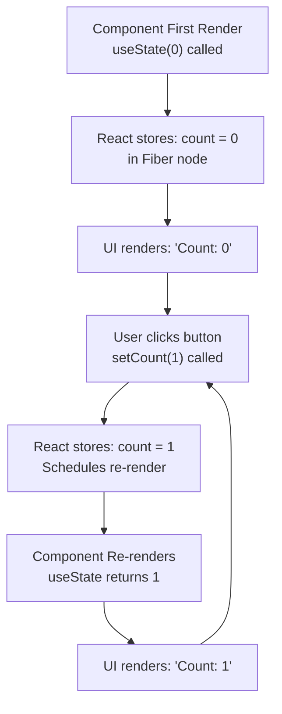
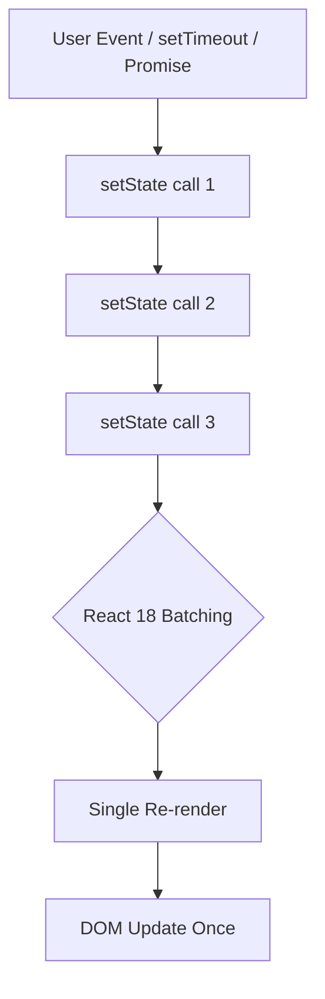
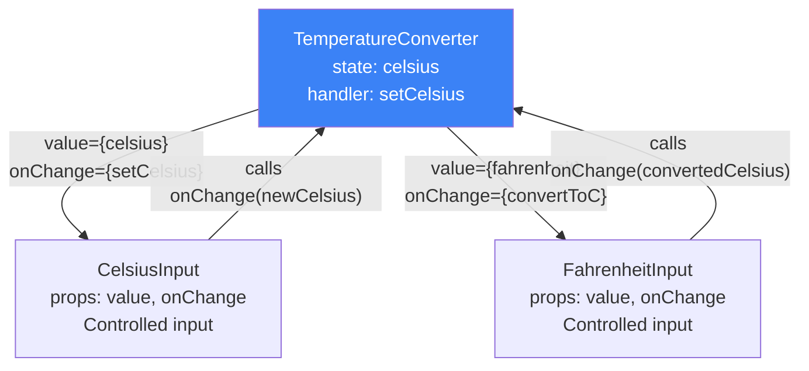

<a id="12-state-making-components-interactive"></a>

[⬅ Previous Chapter](#11-props-passing-data) | [📖 Main Index](#main-index) | [Next Chapter ➡](#13-event-handling-in-react)

---

# Chapter 12: State — Making Components Interactive

## 📌 Learning Objectives

By the end of this chapter, you will:

- **Understand** what state is, why React manages it, and how it differs from regular variables
- **Master** `useState` completely — syntax, setter behavior, multiple state variables
- **Explain** the State Snapshot mental model — why state feels "stale" and how to fix it
- **Use** lazy initialization for expensive initial state computations
- **Update** objects and arrays in state correctly without direct mutation
- **Understand** React 18's automatic batching and when to use `flushSync`
- **Fix** stale state bugs using the functional updater pattern
- **Identify** derived state anti-patterns and compute values during render instead
- **Apply** the lift state up pattern to share state between siblings
- **Know** `this.setState()` merging behavior for class component interviews
- **Decide** when to switch from `useState` to `useReducer`
- **Answer 15+ interview questions** on state concepts confidently

---

<a id="chapter-index-table-12"></a>

## Chapter Index Table

| Topic No. | Topic Name | Subtopics |
|-----------|-----------|-----------|
| 12.1 | [What is State? Why React manages it](#121-what-is-state-why-react-manages-it) | Component memory<br>State triggers re-render |
| 12.2 | [useState Hook — Complete Guide](#122-usestate-hook-complete-guide) | Syntax & initial value<br>Setter function<br>Multiple state variables |
| 12.3 | [State Snapshot Behavior](#123-state-snapshot-behavior) | State is a snapshot<br>Same value no re-render |
| 12.4 | [Lazy Initialization](#124-lazy-initialization) | useState(() => expensiveCompute()) |
| 12.5 | [State with Objects](#125-state-with-objects) | Spread to update<br>Nested updates |
| 12.6 | [State with Arrays](#126-state-with-arrays) | Add/remove/update<br>Non-mutating methods |
| 12.7 | [State Batching (React 18+)](#127-state-batching-react-18) | Automatic batching<br>flushSync<br>React 17 behavior |
| 12.8 | [Stale State — All Scenarios](#128-stale-state--all-scenarios) | Why not immediate<br>Functional updater |
| 12.9 | [Derived State — Compute Don't Store](#129-derived-state--compute-dont-store) | Anti-pattern detection |
| 12.10 | [Lifting State Up](#1210-lifting-state-up) | Sharing between siblings |
| 12.11 | [Common State Mistakes](#1211-common-state-mistakes) | Direct mutation<br>Stale state<br>Redundant state |
| 12.12 | [Class Component State (Legacy)](#1212-class-component-state-legacy) | this.setState() merging |
| 12.13 | [useState vs useReducer](#1213-usestate-vs-usereducer--when-to-switch) | When to switch |
| 💡 | [Interview Questions](#-interview-questions) | 15+ with Answers |
| 🧪 | [Practice Problems](#-practice-problems) | 5 Coding + 5 Theory + 2 Machine Coding |
| 🚀 | [Mini Project](#-mini-project) | Shopping Cart with State Management |
| ⚡ | [Quick Revision](#-quick-revision) | Key bullets, traps |
| 📌 | [Chapter Summary](#-chapter-summary) | Final takeaways |

---

## 12.1 What is State? Why React manages it

<a id="121-what-is-state-why-react-manages-it"></a>

### What is it?

**State** is a component's **private memory** — data that the component owns, that can change over time, and whose changes cause the component to **re-render** and update the UI.

State is what makes React applications **interactive**. Without state, a React app is static HTML that never changes.

---

### Why Regular Variables Don't Work

```jsx
// ❌ Why a plain variable fails as "state":
function Counter() {
  let count = 0;  // Regular variable — lives only during this function call

  const increment = () => {
    count = count + 1;     // Variable changes...
    console.log(count);    // ...logs correctly: 1, 2, 3...
    // BUT: React doesn't know count changed!
    // React doesn't re-render!
    // The UI stays at "Count: 0" forever
  };

  return (
    <div>
      <p>Count: {count}</p>   {/* Always shows 0 — function runs fresh each time */}
      <button onClick={increment}>+</button>
    </div>
  );
}
// Two problems:
// 1. React doesn't know the variable changed → no re-render triggered
// 2. Even if React re-rendered, count resets to 0 (function re-runs from scratch)
```

```jsx
// ✅ Why useState works:
import { useState } from 'react';

function Counter() {
  const [count, setCount] = useState(0);
  // useState does two things:
  // 1. Stores 'count' OUTSIDE the component function (in React's Fiber tree)
  // 2. Returns the CURRENT value from React's storage
  // 3. setCount triggers React to re-render AND updates stored value

  const increment = () => {
    setCount(count + 1);
    // React:
    // 1. Stores new value (1) in Fiber node's state queue
    // 2. Schedules a re-render
    // 3. On re-render, useState returns 1 (the new stored value)
    // 4. UI updates to show "Count: 1"
  };

  return (
    <div>
      <p>Count: {count}</p>
      <button onClick={increment}>+</button>
    </div>
  );
}
```

---

### State as Component Memory



```
React's Fiber node for Counter:
{
  memoizedState: {
    queue: [...],
    memoizedState: 1,   ← Current state value (persists between renders)
    next: null,
  }
}

Each render: useState() reads this persisted value
             Returns [currentValue, setterFunction]
```

---

### 🧠 Hinglish Intuition

State component ki **personal diary** hai. Har baar function call hota hai (render), diary wahi page khulta hai jahan kal chhood a tha. Regular variable ek sticky note hai — function khatam, sticky note gir jata hai. Diary (state) React ki safe mein rakhi hai — function khatam hone par bhi safe hai.

`setCount` bolna hai diary mein naya entry karna aur React se bolna: "Abhi meri diary badli hai, please mujhe redraw karo."

---

### State Triggers Re-render — The Contract

```jsx
// React's guarantee:
// When you call a state setter (setCount, setUser, etc.):
// 1. React schedules a re-render of that component (and its children)
// 2. On the next render, useState() returns the NEW value
// 3. React diffs old vs new output and updates the DOM minimally

// This is the fundamental React loop:
// State change → Re-render → New JSX → Diff → DOM update → UI change
```

---

👉 <a href="#chapter-index-table-12">Go to Top 🔝</a>

---

## 12.2 useState Hook — Complete Guide

<a id="122-usestate-hook-complete-guide"></a>

### Syntax & Initial Value

```jsx
import { useState } from 'react';

// Syntax:
const [stateVariable, setterFunction] = useState(initialValue);

// Examples of valid initial values:
const [count, setCount] = useState(0);              // Number
const [name, setName] = useState('');               // String (empty)
const [isOpen, setIsOpen] = useState(false);        // Boolean
const [user, setUser] = useState(null);             // Null (common for async data)
const [items, setItems] = useState([]);             // Empty array
const [form, setForm] = useState({                  // Object
  email: '',
  password: '',
});
const [error, setError] = useState(undefined);     // Undefined

// Naming convention:
// [noun, setNoun] — always 'set' prefix for setter
// [isAdjective, setIsAdjective] — for booleans
const [isLoading, setIsLoading] = useState(false);
const [hasError, setHasError] = useState(false);
const [isDarkMode, setIsDarkMode] = useState(false);
```

---

### Initial Value Only Used Once

```jsx
// ⚠️ Critical: Initial value is ONLY used on the FIRST render
// After that, React ignores it completely

function Component({ userId }) {
  const [data, setData] = useState(null);
  // Even if 'userId' prop changes, useState(null) does NOT reset data
  // Initial value is read exactly ONCE — during mount
  // This is why lazy initialization matters (see 12.4)
}
```

---

### Setter Function — How It Works

```jsx
function Demo() {
  const [count, setCount] = useState(0);

  // ===== Direct value (replaces current state) =====
  const setToFive = () => setCount(5);
  // Next render: count = 5 (regardless of current value)

  // ===== Functional updater (based on current state) =====
  const increment = () => setCount(prev => prev + 1);
  // prev = guaranteed current state value at time of update
  // Next render: count = prev + 1

  // ===== When to use which =====
  // Direct value: when new value doesn't depend on old value
  //   setIsOpen(false)
  //   setUser(responseData)
  //   setError(null)

  // Functional updater: when new value depends on old value
  //   setCount(c => c + 1)
  //   setItems(items => [...items, newItem])
  //   setSelected(sel => sel.has(id) ? remove : add)

  return (
    <div>
      <p>Count: {count}</p>
      <button onClick={() => setCount(5)}>Set to 5</button>
      <button onClick={() => setCount(prev => prev + 1)}>Increment</button>
      <button onClick={() => setCount(0)}>Reset</button>
    </div>
  );
}
```

---

### React Bails Out of Re-render — Same Value Optimization

```jsx
// React uses Object.is() to compare old and new state
// If they're the same → React skips re-render (bail-out optimization)

const [count, setCount] = useState(0);
setCount(0);           // Object.is(0, 0) = true → NO re-render ✅
setCount(prev => prev); // Same → NO re-render

const [user, setUser] = useState({ name: 'Alice' });
setUser({ name: 'Alice' }); // Object.is({...}, {...}) = false → RE-RENDERS ⚠️
// New object reference! Even though values are the same → React re-renders

// This is why you must create new references for objects/arrays in state:
setUser(prev => ({ ...prev, name: 'Alice' })); // Still re-renders if reference changes
// But if content didn't change, consider useMemo (Chapter 20)
```

---

### Multiple State Variables

```jsx
// ✅ Multiple useState calls — each is independent
function UserForm() {
  const [firstName, setFirstName] = useState('');
  const [lastName, setLastName] = useState('');
  const [email, setEmail] = useState('');
  const [age, setAge] = useState(18);
  const [newsletter, setNewsletter] = useState(false);
  const [errors, setErrors] = useState({});

  // Each setter only affects its own state
  // Updating firstName doesn't change email, etc.

  return (
    <form>
      <input value={firstName} onChange={e => setFirstName(e.target.value)} />
      <input value={lastName} onChange={e => setLastName(e.target.value)} />
      <input value={email} onChange={e => setEmail(e.target.value)} />
      {/* ... */}
    </form>
  );
}

// Group related state:
// ✅ Separate: when values change independently
const [isLoading, setIsLoading] = useState(false);
const [error, setError] = useState(null);
const [data, setData] = useState(null);

// ✅ Group: when values always change together
const [position, setPosition] = useState({ x: 0, y: 0 });
// (x and y always update together)

// ❌ Don't group unrelated state:
const [state, setState] = useState({
  isLoading: false,  // UI state
  userName: '',      // Form state
  theme: 'light',    // App config
  // These change independently — separate them!
});
```

---

👉 <a href="#chapter-index-table-12">Go to Top 🔝</a>

---

## 12.3 State Snapshot Behavior

<a id="123-state-snapshot-behavior"></a>

### State is a Snapshot — Not Live

This is the **most important conceptual insight** about React state. Each render has its OWN snapshot of state — like a photograph taken at that moment.

```jsx
// Classic demonstration of snapshot behavior:
function SnapshotDemo() {
  const [count, setCount] = useState(0);

  const handleClick = () => {
    // These three lines run in the SAME render
    // 'count' is the SNAPSHOT value (0) throughout this entire event handler
    // Calling setCount does NOT immediately update 'count' here

    setCount(count + 1);   // count = 0 → schedules: set to 0+1 = 1
    setCount(count + 1);   // count = 0 → schedules: set to 0+1 = 1 (SAME VALUE!)
    setCount(count + 1);   // count = 0 → schedules: set to 0+1 = 1 (SAME AGAIN!)

    console.log(count);    // Logs: 0 — NOT 3! 'count' is still the snapshot value
    // After ALL three setCount calls process, count becomes 1, NOT 3
  };

  return (
    <div>
      <p>Count: {count}</p>
      <button onClick={handleClick}>+3 (but actually +1)</button>
    </div>
  );
}
```

---

### 🧠 Hinglish Intuition

State snapshot aise samjho jaise **WhatsApp screenshot**. Screenshot liya — us moment ki photo. Ab original chat mein changes aaye, screenshot nahi badla. Har render ek naya screenshot hai — us moment ki state ki photo. Event handler ke andar usi snapshot ka use hota hai, live state ka nahi.

Yahi reason hai ki `setCount(count + 1)` teen baar bolne par bhi count sirf 1 badha — kyunki teeno times `count` wahi purani snapshot value thi (0).

---

### The Timer Stale Closure Problem

```jsx
// Classic interview question — what does this log?
function TimerDemo() {
  const [count, setCount] = useState(0);

  const handleClick = () => {
    // This setTimeout captures the SNAPSHOT of count at time of click
    setTimeout(() => {
      // 5 seconds later, count is still the SNAPSHOT value (0 or whatever it was when clicked)
      // Even if user clicked many times in those 5 seconds
      alert(`Count is: ${count}`);  // Stale! Shows old snapshot
    }, 5000);
  };

  return (
    <div>
      <p>Count: {count}</p>
      <button onClick={() => setCount(c => c + 1)}>Increment</button>
      <button onClick={handleClick}>Alert in 5s</button>
    </div>
  );
}
// If you click "Increment" 3 times then "Alert in 5s":
// Alert shows: "Count is: 0" — stale closure!

// ✅ Fix: Use a ref to always get current value (covered in Chapter 17)
// Or use functional updater when the timer needs to update based on current state
```

---

### Why Same Value Doesn't Re-render

```jsx
function SameValueDemo() {
  const [count, setCount] = useState(5);

  // React uses Object.is(oldValue, newValue) to check if re-render needed
  const handleClick = () => {
    setCount(5);     // Object.is(5, 5) = true → React skips re-render
    // React "bails out" — component function doesn't even run again
    // Optimization: if state hasn't changed, why re-render?
  };

  // Edge case with objects:
  const [user, setUser] = useState({ name: 'Alice' });

  const handleUserClick = () => {
    setUser({ name: 'Alice' });
    // Object.is({ name: 'Alice' }, { name: 'Alice' }) = FALSE!
    // Different object reference → React re-renders even though values are same
    // Solution: use useMemo, or avoid unnecessary object creation
  };

  return <button onClick={handleClick}>Click (no re-render)</button>;
}
```

---

👉 <a href="#chapter-index-table-12">Go to Top 🔝</a>

---

## 12.4 Lazy Initialization

<a id="124-lazy-initialization"></a>

### What is it?

**Lazy initialization** is passing a **function** to `useState()` instead of a value. React calls this function **only on the first render** — preventing expensive computation on every re-render.

```jsx
// ❌ Problem: Expensive computation runs on EVERY render
function TodoList() {
  const [todos, setTodos] = useState(
    JSON.parse(localStorage.getItem('todos')) || []
    // ↑ This runs every render — even when state doesn't need to be reset!
    // localStorage.getItem is fast, but JSON.parse can be slow for large data
  );
}

// ✅ Solution: Lazy initialization — function called ONCE on mount
function TodoList() {
  const [todos, setTodos] = useState(() => {
    // This function runs ONLY on first render
    const saved = localStorage.getItem('todos');
    return saved ? JSON.parse(saved) : [];
    // Subsequent renders ignore this function entirely
  });
}
```

---

### When to Use Lazy Initialization

```jsx
// 1. Reading from localStorage/sessionStorage
const [theme, setTheme] = useState(() => {
  return localStorage.getItem('theme') || 'light';
});

// 2. Expensive calculations
const [processedData, setProcessedData] = useState(() => {
  return heavyDataProcessing(rawData);  // Only runs once
});

// 3. URL/search params reading
const [filters, setFilters] = useState(() => {
  const params = new URLSearchParams(window.location.search);
  return {
    category: params.get('category') || 'all',
    sort: params.get('sort') || 'newest',
    page: Number(params.get('page')) || 1,
  };
});

// 4. Creating initial complex state
const [matrix, setMatrix] = useState(() => {
  return Array.from({ length: 10 }, () =>
    Array.from({ length: 10 }, () => 0)
  );  // Create 10x10 grid once, not on every render
});

// Key rule: Pass a FUNCTION, not a function CALL
// ✅ useState(() => compute())  — lazy, called once
// ❌ useState(compute())        — eager, called every render
```

---

### 🧠 Hinglish Intuition

Lazy initialization aise hai jaise alarm clock. "Sirf pehli baar bajao, phir mujhe mat jagao." Agar tum `useState(compute())` likhte ho, toh `compute()` har render pe chalti hai (bekar kaam). Agar `useState(() => compute())` likhte ho, toh React bolti hai "pehli render mein function call karo, baad mein mat karo."

---

👉 <a href="#chapter-index-table-12">Go to Top 🔝</a>

---

## 12.5 State with Objects

<a id="125-state-with-objects"></a>

### The Immutability Requirement

When state is an object, you must **create a NEW object** with your changes — never mutate the existing one. React uses reference equality to detect changes.

```jsx
// ❌ WRONG — Mutating state directly
function BadForm() {
  const [user, setUser] = useState({ name: 'Alice', age: 28, city: 'Mumbai' });

  const updateName = (newName) => {
    user.name = newName;     // ❌ Mutating existing object
    setUser(user);           // ❌ Same reference → React.is() = true → NO RE-RENDER!
    // UI doesn't update — React thinks nothing changed
  };
}

// ✅ CORRECT — Spread to create new object
function GoodForm() {
  const [user, setUser] = useState({ name: 'Alice', age: 28, city: 'Mumbai' });

  const updateName = (newName) => {
    setUser({ ...user, name: newName });
    // Creates NEW object with all old props + updated name
    // New reference → React detects change → re-renders
  };

  const updateAge = (newAge) => {
    setUser(prev => ({ ...prev, age: newAge }));
    // Using functional updater — safer when update depends on current state
  };

  return (
    <div>
      <input
        value={user.name}
        onChange={e => setUser(prev => ({ ...prev, name: e.target.value }))}
      />
      <input
        type="number"
        value={user.age}
        onChange={e => setUser(prev => ({ ...prev, age: Number(e.target.value) }))}
      />
      <p>Name: {user.name}, Age: {user.age}</p>
    </div>
  );
}
```

---

### Spread to Update Pattern — All Variations

```jsx
function ObjectStatePatterns() {
  const [product, setProduct] = useState({
    id: 1,
    name: 'iPhone 15',
    price: 999,
    specs: {
      storage: '256GB',
      color: 'Black',
    },
    tags: ['apple', 'smartphone'],
  });

  // ===== Update single field =====
  const updateName = (name) => setProduct(prev => ({ ...prev, name }));
  const updatePrice = (price) => setProduct(prev => ({ ...prev, price }));

  // ===== Update multiple fields at once =====
  const applyDiscount = (percent) => setProduct(prev => ({
    ...prev,
    price: prev.price * (1 - percent / 100),
    name: `${prev.name} (SALE)`,
  }));

  // ===== Add new field =====
  const addField = () => setProduct(prev => ({
    ...prev,
    discount: 10,  // New field added
  }));

  // ===== Remove field =====
  const removeField = () => setProduct(prev => {
    const { discount, ...rest } = prev;  // Destructure to omit 'discount'
    return rest;
  });

  return (
    <div>
      <p>{product.name} — ${product.price}</p>
      <button onClick={() => updateName('iPhone 15 Pro')}>Rename</button>
      <button onClick={() => applyDiscount(20)}>20% Off</button>
    </div>
  );
}
```

---

### Nested Object Updates

```jsx
// ⚠️ Nested objects need careful spreading at EACH level

function NestedStateDemo() {
  const [user, setUser] = useState({
    name: 'Alice',
    address: {
      city: 'Mumbai',
      state: 'Maharashtra',
      pincode: '400001',
    },
    preferences: {
      theme: 'light',
      language: 'en',
    },
  });

  // ❌ WRONG — only shallow spread doesn't deep-copy nested objects
  const wrongUpdate = () => {
    setUser(prev => ({
      ...prev,
      address: {
        // Only updating city — but need to spread address too!
        city: 'Pune',
        // state and pincode are LOST! Spread was incomplete
      },
    }));
  };

  // ✅ CORRECT — spread at each nesting level
  const updateCity = (city) => {
    setUser(prev => ({
      ...prev,              // Copy top-level fields
      address: {
        ...prev.address,    // Copy all address fields
        city,               // Override only city
      },
    }));
  };

  const updateTheme = (theme) => {
    setUser(prev => ({
      ...prev,
      preferences: {
        ...prev.preferences,
        theme,
      },
    }));
  };

  // For deeply nested state, consider Immer library:
  // import { produce } from 'immer';
  // setUser(produce(draft => { draft.address.city = 'Pune'; }));
  // Immer handles immutability for you internally

  return (
    <div>
      <p>City: {user.address.city}</p>
      <p>Theme: {user.preferences.theme}</p>
      <button onClick={() => updateCity('Pune')}>Move to Pune</button>
      <button onClick={() => updateTheme('dark')}>Dark Mode</button>
    </div>
  );
}
```

> [!TIP]
> For deeply nested state (3+ levels), consider using the **Immer** library (`npm install immer`). Immer lets you write seemingly mutating code that's actually immutable under the hood. This is also how Redux Toolkit works internally.

---

👉 <a href="#chapter-index-table-12">Go to Top 🔝</a>

---

## 12.6 State with Arrays

<a id="126-state-with-arrays"></a>

### Non-Mutating Methods for React

React requires you to create a NEW array — never modify the existing one. Know which methods mutate and which don't:

```
MUTATING (❌ Don't use directly on state):    SAFE (✅ Create new array):
push, pop, shift, unshift                     map
splice                                        filter
sort (mutates in place)                       reduce
reverse (mutates in place)                    slice
arr[0] = newValue (direct assignment)         concat
                                              [...spread]
                                              Array.from()
```

---

### Add Item Patterns

```jsx
function AddItemPatterns() {
  const [items, setItems] = useState(['Apple', 'Banana']);

  // ===== Add to END =====
  const addToEnd = (newItem) => {
    setItems(prev => [...prev, newItem]);
    // ✅ Spread creates new array + appends
  };

  // ===== Add to BEGINNING =====
  const addToStart = (newItem) => {
    setItems(prev => [newItem, ...prev]);
  };

  // ===== Add at SPECIFIC INDEX =====
  const addAtIndex = (newItem, index) => {
    setItems(prev => [
      ...prev.slice(0, index),    // Before insertion point
      newItem,                     // New item
      ...prev.slice(index),        // After insertion point
    ]);
  };

  // ===== Add if not already exists (toggle) =====
  const addIfNotExists = (item) => {
    setItems(prev =>
      prev.includes(item) ? prev : [...prev, item]
    );
  };

  return (
    <div>
      <ul>{items.map((item, i) => <li key={i}>{item}</li>)}</ul>
      <button onClick={() => addToEnd('Cherry')}>Add Cherry to End</button>
      <button onClick={() => addToStart('Mango')}>Add Mango to Start</button>
      <button onClick={() => addAtIndex('Orange', 1)}>Add Orange at Index 1</button>
    </div>
  );
}
```

---

### Remove Item Patterns

```jsx
function RemoveItemPatterns() {
  const [users, setUsers] = useState([
    { id: 1, name: 'Alice' },
    { id: 2, name: 'Bob' },
    { id: 3, name: 'Carol' },
  ]);

  // ===== Remove by ID =====
  const removeById = (id) => {
    setUsers(prev => prev.filter(user => user.id !== id));
    // filter returns NEW array without the matching item
  };

  // ===== Remove by INDEX =====
  const removeByIndex = (index) => {
    setUsers(prev => prev.filter((_, i) => i !== index));
  };

  // ===== Remove first occurrence of value =====
  const removeFirst = (name) => {
    setUsers(prev => {
      const index = prev.findIndex(u => u.name === name);
      if (index === -1) return prev;  // Not found — return same array (no re-render)
      return [...prev.slice(0, index), ...prev.slice(index + 1)];
    });
  };

  return (
    <ul>
      {users.map(user => (
        <li key={user.id}>
          {user.name}
          <button onClick={() => removeById(user.id)}>Remove</button>
        </li>
      ))}
    </ul>
  );
}
```

---

### Update Item Patterns

```jsx
function UpdateItemPatterns() {
  const [todos, setTodos] = useState([
    { id: 1, text: 'Learn React', completed: false },
    { id: 2, text: 'Build app', completed: false },
    { id: 3, text: 'Deploy', completed: false },
  ]);

  // ===== Toggle a boolean field =====
  const toggleComplete = (id) => {
    setTodos(prev =>
      prev.map(todo =>
        todo.id === id
          ? { ...todo, completed: !todo.completed }  // New object for changed item
          : todo  // Same reference for unchanged items (optimization)
      )
    );
  };

  // ===== Update a specific field =====
  const updateText = (id, newText) => {
    setTodos(prev =>
      prev.map(todo =>
        todo.id === id ? { ...todo, text: newText } : todo
      )
    );
  };

  // ===== Sort array (non-mutating) =====
  const sortByText = () => {
    setTodos(prev => [...prev].sort((a, b) => a.text.localeCompare(b.text)));
    // ↑ CRITICAL: spread first to create new array, THEN sort
    // [].sort() mutates in place — must copy first!
  };

  // ===== Replace entire item =====
  const replaceItem = (id, newItem) => {
    setTodos(prev =>
      prev.map(todo => todo.id === id ? newItem : todo)
    );
  };

  return (
    <div>
      {todos.map(todo => (
        <div key={todo.id} style={{ display: 'flex', gap: '8px', marginBottom: '8px' }}>
          <input
            type="checkbox"
            checked={todo.completed}
            onChange={() => toggleComplete(todo.id)}
          />
          <span style={{ textDecoration: todo.completed ? 'line-through' : 'none' }}>
            {todo.text}
          </span>
        </div>
      ))}
      <button onClick={sortByText}>Sort A-Z</button>
    </div>
  );
}
```

---

### 🧠 Hinglish Intuition

Array state update aise hai jaise **photocopy + modification**. Original document mat kaato-phaado (mutate mat karo). Pehle photocopy karo (`[...prev]`), phir photocopy pe changes karo, phir woh naya document React ko do. React original se compare karega, difference dikhayega, DOM update karega.

---

👉 <a href="#chapter-index-table-12">Go to Top 🔝</a>

---

## 12.7 State Batching (React 18+)

<a id="127-state-batching-react-18"></a>

### What is Batching?

**Batching** is React's optimization where multiple state updates in the same event are grouped into a single re-render instead of causing one re-render per setState call.

---

### React 17: Partial Batching

```jsx
// React 17 behavior:
function OldBatching() {
  const [count, setCount] = useState(0);
  const [name, setName] = useState('');

  // ✅ React 17: Batched inside React event handlers
  const handleClick = () => {
    setCount(c => c + 1);  // No re-render
    setName('Alice');       // No re-render
    // → 1 re-render total (batched)
  };

  // ❌ React 17: NOT batched outside React events
  const handleAsyncClick = () => {
    setTimeout(() => {
      setCount(c => c + 1);  // Re-render 1
      setName('Bob');         // Re-render 2 ← Separate! Not batched
      // → 2 re-renders in React 17
    }, 100);
  };

  // ❌ React 17: NOT batched in Promises
  const handleFetch = async () => {
    await fetchData();
    setCount(c => c + 1);  // Re-render 1
    setName('Carol');       // Re-render 2 ← Not batched in React 17
  };
}
```

---

### React 18: Automatic Batching Everywhere

```jsx
// React 18 behavior (with createRoot):
function NewBatching() {
  const [count, setCount] = useState(0);
  const [name, setName] = useState('');
  const [loading, setLoading] = useState(false);

  // ✅ React 18: Batched in React events (same as before)
  const handleClick = () => {
    setCount(c => c + 1);
    setName('Alice');
    // → 1 re-render (batched)
  };

  // ✅ React 18: NOW batched in setTimeout
  const handleAsync = () => {
    setTimeout(() => {
      setCount(c => c + 1);  // No re-render yet
      setName('Bob');         // No re-render yet
      // → 1 re-render total (batched! New in React 18)
    }, 100);
  };

  // ✅ React 18: NOW batched in Promises
  const handleFetch = async () => {
    const data = await fetchData();
    setLoading(false);       // No re-render yet
    setCount(c => c + 1);   // No re-render yet
    setName(data.name);     // No re-render yet
    // → 1 re-render total (batched! New in React 18)
  };

  // ✅ React 18: NOW batched in native event listeners
  useEffect(() => {
    document.addEventListener('click', () => {
      setCount(c => c + 1);  // No re-render yet
      setName('Dave');        // No re-render yet
      // → 1 re-render (batched! New in React 18)
    });
  }, []);
}
```

---

### flushSync — Force Immediate Update

```jsx
import { flushSync } from 'react-dom';

function FlushSyncDemo() {
  const [count, setCount] = useState(0);
  const [name, setName] = useState('');

  // flushSync: Force React to flush state update synchronously
  // React commits to DOM immediately — no batching with anything after it

  const handleClick = () => {
    // Use case: you need DOM to update before doing something else

    flushSync(() => {
      setCount(c => c + 1);
      // React immediately re-renders and commits to DOM
    });
    // ↑ By this point, DOM is updated with new count

    // Now you can safely read updated DOM measurements:
    const element = document.getElementById('counter');
    console.log(element.textContent);  // Shows new count value

    // Then continue with more updates (batched normally)
    setName('Alice');
  };

  // Real use case: scroll to newly added item
  const addItemAndScroll = () => {
    flushSync(() => {
      setItems(prev => [...prev, { id: Date.now(), text: 'New item' }]);
    });
    // DOM has new item now — we can scroll to it
    listRef.current.lastElementChild.scrollIntoView();
  };

  return <div id="counter">{count}</div>;
}
```

> [!IMPORTANT]
> `flushSync` is rarely needed — most use cases don't require it. Use it only when you need DOM measurements or side effects that depend on an immediately committed DOM state. Overusing it defeats batching optimization.

---

### Batching Diagram



---

👉 <a href="#chapter-index-table-12">Go to Top 🔝</a>

---

## 12.8 Stale State — All Scenarios

<a id="128-stale-state--all-scenarios"></a>

### Why State Updates Are Not Immediate

State updates are **asynchronous** in React — they're scheduled, not applied immediately. The current render's state value is fixed for that render's duration.

```jsx
function StaleDemo() {
  const [count, setCount] = useState(0);

  const handleTripleIncrement = () => {
    console.log('Before updates, count:', count);  // 0

    setCount(count + 1);  // count is 0 → schedules: set to 1
    setCount(count + 1);  // count is STILL 0 → schedules: set to 1 (overwrites!)
    setCount(count + 1);  // count is STILL 0 → schedules: set to 1 (overwrites!)

    console.log('After updates, count:', count);  // Still 0! Not yet applied
    // Result after re-render: count = 1 (not 3!)
  };

  return (
    <div>
      <p>Count: {count}</p>
      <button onClick={handleTripleIncrement}>+3 (broken)</button>
    </div>
  );
}
```

---

### Functional Updater — The Fix

```jsx
function FixedDemo() {
  const [count, setCount] = useState(0);

  // ✅ Functional updater: prev is always the LATEST queued value
  const handleTripleIncrement = () => {
    setCount(prev => prev + 1);  // prev=0, queues: 1
    setCount(prev => prev + 1);  // prev=1 (latest queued), queues: 2
    setCount(prev => prev + 1);  // prev=2 (latest queued), queues: 3
    // Result: count = 3 ✅
  };

  // How it works internally:
  // React processes the update queue:
  // Start: baseState = 0
  // Update 1: fn(0) → 1
  // Update 2: fn(1) → 2
  // Update 3: fn(2) → 3
  // Final state: 3

  return (
    <div>
      <p>Count: {count}</p>
      <button onClick={handleTripleIncrement}>+3 (fixed)</button>
    </div>
  );
}
```

---

### Stale State in setTimeout

```jsx
function TimerStaleState() {
  const [count, setCount] = useState(0);

  // ❌ Stale closure in timer:
  const staleTimer = () => {
    setTimeout(() => {
      // 'count' captured at time of click — stale!
      setCount(count + 1);  // Will always use the count value from when timer was set
    }, 3000);
    // If user clicks multiple times, only first click's count is used
  };

  // ✅ Fix: Functional updater always uses LATEST state:
  const fixedTimer = () => {
    setTimeout(() => {
      setCount(prev => prev + 1);  // prev = latest state at time of execution
    }, 3000);
    // Multiple clicks → multiple timers → each increments from latest value
  };

  return (
    <div>
      <p>Count: {count}</p>
      <button onClick={staleTimer}>Stale +1 after 3s</button>
      <button onClick={fixedTimer}>Fixed +1 after 3s</button>
    </div>
  );
}
```

---

### Stale State in Event Handlers with Multiple setStates

```jsx
function FormWithStale() {
  const [form, setForm] = useState({ name: '', email: '' });

  // ❌ Stale state — second update overwrites first
  const badUpdate = () => {
    setForm({ ...form, name: 'Alice' });   // form snapshot used
    setForm({ ...form, email: 'a@b.com' }); // form snapshot AGAIN! name is lost!
    // Result: { name: '', email: 'a@b.com' } — name update is LOST
  };

  // ✅ Fix 1: Chain with functional updater
  const goodUpdate = () => {
    setForm(prev => ({ ...prev, name: 'Alice' }));
    setForm(prev => ({ ...prev, email: 'a@b.com' }));
    // Result: { name: 'Alice', email: 'a@b.com' } ✅
    // Each updater receives the result of the previous one
  };

  // ✅ Fix 2: Single update with all changes
  const singleUpdate = () => {
    setForm({ ...form, name: 'Alice', email: 'a@b.com' });
    // Only one setState — no stale issue
  };

  return <div>{form.name} | {form.email}</div>;
}
```

---

### 🧠 Hinglish Intuition

Stale state aise hai jaise **purani newsprint**. Tumhare haath mein kal ka newspaper hai. Tum bol rahe ho "aaj breaking news yeh hai" — lekin actually woh kal ki news hai. Functional updater `prev => prev + 1` aise hai jaise live TV news — jo abhi chal raha hai wahi batata hai, na ki kal ki recording.

---

👉 <a href="#chapter-index-table-12">Go to Top 🔝</a>

---

## 12.9 Derived State — Compute Don't Store

<a id="129-derived-state--compute-dont-store"></a>

### The Anti-Pattern

**Derived state** is any value that can be computed from existing state or props. Storing it separately creates sync problems.

```jsx
// ❌ ANTI-PATTERN: Storing derived state
function ShoppingCart() {
  const [items, setItems] = useState([
    { id: 1, name: 'Book', price: 299, quantity: 2 },
    { id: 2, name: 'Pen', price: 15, quantity: 5 },
  ]);

  // ❌ These are DERIVED from items — don't store them!
  const [totalPrice, setTotalPrice] = useState(0);
  const [itemCount, setItemCount] = useState(0);
  const [hasExpensiveItem, setHasExpensiveItem] = useState(false);

  // Now you have to sync them manually — error-prone!
  const updateQuantity = (id, qty) => {
    const newItems = items.map(i => i.id === id ? { ...i, quantity: qty } : i);
    setItems(newItems);
    // Oops — did you remember to update totalPrice, itemCount, hasExpensiveItem?
    // Easy to forget! → Bugs, inconsistent UI
    setTotalPrice(newItems.reduce((sum, i) => sum + i.price * i.quantity, 0));
    setItemCount(newItems.reduce((sum, i) => sum + i.quantity, 0));
    setHasExpensiveItem(newItems.some(i => i.price > 200));
  };
}

// ✅ CORRECT: Compute derived values during render
function ShoppingCart() {
  const [items, setItems] = useState([
    { id: 1, name: 'Book', price: 299, quantity: 2 },
    { id: 2, name: 'Pen', price: 15, quantity: 5 },
  ]);

  // ✅ Derived — computed fresh on every render from 'items'
  // Always in sync — impossible to get out of sync!
  const totalPrice = items.reduce((sum, item) => sum + item.price * item.quantity, 0);
  const itemCount = items.reduce((sum, item) => sum + item.quantity, 0);
  const hasExpensiveItem = items.some(item => item.price > 200);
  const discountedTotal = hasExpensiveItem ? totalPrice * 0.9 : totalPrice;

  const updateQuantity = (id, qty) => {
    setItems(prev => prev.map(i => i.id === id ? { ...i, quantity: qty } : i));
    // Just update items — everything else auto-updates!
  };

  return (
    <div>
      <p>Items: {itemCount}</p>
      <p>Total: ₹{totalPrice}</p>
      {hasExpensiveItem && <p>10% discount applied: ₹{discountedTotal}</p>}
    </div>
  );
}
```

---

### When Computation is Expensive — useMemo

```jsx
import { useMemo } from 'react';

function ExpensiveComputation({ items, filter }) {
  // ❌ Runs on EVERY render (including unrelated state changes)
  const processed = heavyProcessing(items);

  // ✅ useMemo: only recomputes when 'items' or 'filter' changes
  const processedItems = useMemo(() => {
    return items
      .filter(item => item.category === filter)
      .map(item => heavyTransform(item))
      .sort((a, b) => b.score - a.score);
  }, [items, filter]);  // Dependencies — only recompute when these change

  // useMemo is for PERFORMANCE — functionally same as computing directly
  // Only add it when you measure a performance problem

  return <DataGrid rows={processedItems} />;
}
```

> [!IMPORTANT]
> **Don't prematurely optimize with useMemo.** Compute directly during render first. Only add `useMemo` when you've measured an actual performance problem. Most computations are fast enough to run on every render.

---

👉 <a href="#chapter-index-table-12">Go to Top 🔝</a>

---

## 12.10 Lifting State Up

<a id="1210-lifting-state-up"></a>

### The Problem

Two sibling components need to share state — but they can't directly communicate.

```jsx
// ❌ Problem: Siblings can't share state
function TemperatureApp() {
  return (
    <>
      <CelsiusInput />    {/* Has its own state */}
      <FahrenheitInput /> {/* Has its own state */}
      {/* When Celsius changes, Fahrenheit doesn't update! */}
    </>
  );
}
```

---

### The Solution — Lift State to Common Ancestor

```jsx
// ✅ Solution: Lift temperature to parent
function TemperatureConverter() {
  // State lives in parent — "lifted up"
  const [celsius, setCelsius] = useState(0);

  // Derived value — computed from celsius
  const fahrenheit = celsius * 9 / 5 + 32;
  const kelvin = celsius + 273.15;

  return (
    <div style={{ padding: '24px', fontFamily: 'sans-serif' }}>
      <h2>Temperature Converter</h2>

      {/* Parent passes state AND handler to children */}
      <CelsiusInput
        value={celsius}
        onChange={setCelsius}  // Parent's setter = inverse data flow
      />

      {/* FahrenheitInput is now controlled */}
      <FahrenheitInput
        value={fahrenheit}
        onChange={(f) => setCelsius((f - 32) * 5 / 9)}  // Convert back to Celsius
      />

      <p style={{ marginTop: '12px', color: '#64748b' }}>
        {celsius}°C = {fahrenheit.toFixed(1)}°F = {kelvin.toFixed(1)}K
      </p>
    </div>
  );
}

function CelsiusInput({ value, onChange }) {
  return (
    <div style={{ marginBottom: '12px' }}>
      <label>Celsius: </label>
      <input
        type="number"
        value={value}
        onChange={e => onChange(Number(e.target.value))}
        style={{ padding: '6px 10px', border: '1px solid #d1d5db', borderRadius: '6px' }}
      />
    </div>
  );
}

function FahrenheitInput({ value, onChange }) {
  return (
    <div style={{ marginBottom: '12px' }}>
      <label>Fahrenheit: </label>
      <input
        type="number"
        value={value.toFixed(1)}
        onChange={e => onChange(Number(e.target.value))}
        style={{ padding: '6px 10px', border: '1px solid #d1d5db', borderRadius: '6px' }}
      />
    </div>
  );
}
```

---

### Lifting State — Visual Flow



---

### 🧠 Hinglish Intuition

Lift state up aise hai jaise school mein common notice board. Agar sirf ek class room mein likho, doosra class nahi dekh sakta. Common corridor mein likho (parent component), sab deko (sibling components). Board owner (parent) decide karta hai kya likha hai, doosri classes sirf read karte hain ya updates ke liye principal ko bolta hain (callbacks).

---

👉 <a href="#chapter-index-table-12">Go to Top 🔝</a>

---

## 12.11 Common State Mistakes

<a id="1211-common-state-mistakes"></a>

### Mistake 1: Mutating State Directly

```jsx
// ❌ NEVER DO THIS:
const [todos, setTodos] = useState([...]);

const toggleTodo = (id) => {
  const todo = todos.find(t => t.id === id);
  todo.completed = !todo.completed;  // ❌ Mutating!
  setTodos(todos);                   // ❌ Same reference → no re-render

  // Why? React uses Object.is([...], [...]) = true (same reference!)
  // React thinks: "Nothing changed, skip re-render"
  // UI doesn't update!
};

// ✅ CORRECT:
const toggleTodo = (id) => {
  setTodos(prev =>
    prev.map(todo =>
      todo.id === id ? { ...todo, completed: !todo.completed } : todo
    )
  );
};
```

---

### Mistake 2: Using Stale State

```jsx
// ❌ Stale state — common in timers and async operations
const [count, setCount] = useState(0);

useEffect(() => {
  const interval = setInterval(() => {
    setCount(count + 1);  // ❌ 'count' is captured once at mount (= 0)
    // count always = 0 here → always sets to 1!
  }, 1000);
  return () => clearInterval(interval);
}, []);  // ← Empty deps — count closure is stale

// ✅ Fix: Functional updater
useEffect(() => {
  const interval = setInterval(() => {
    setCount(prev => prev + 1);  // ✅ prev = latest value each time
  }, 1000);
  return () => clearInterval(interval);
}, []);  // ← Still empty deps — functional updater doesn't need count in deps
```

---

### Mistake 3: Storing Derived/Redundant State

```jsx
// ❌ Redundant state — two pieces of state that represent the same thing
const [firstName, setFirstName] = useState('');
const [lastName, setLastName] = useState('');
const [fullName, setFullName] = useState('');  // ❌ Derived! Remove this

const handleFirstNameChange = (e) => {
  setFirstName(e.target.value);
  setFullName(`${e.target.value} ${lastName}`);  // Must manually sync!
  // Easy to forget → bugs when lastName changes
};

// ✅ Compute fullName during render:
const [firstName, setFirstName] = useState('');
const [lastName, setLastName] = useState('');
const fullName = `${firstName} ${lastName}`.trim();  // Always in sync!
```

---

### Mistake 4: Initializing State from Props Incorrectly

```jsx
// ❌ Common mistake: "prop sync" anti-pattern
function ProductCard({ initialPrice }) {
  // Problem: if initialPrice prop changes, price state does NOT update
  // useState only reads initialValue ONCE (on mount)
  const [price, setPrice] = useState(initialPrice);

  // If parent sends new initialPrice → price stays at original value
}

// ✅ Fix 1: If you genuinely want "initial value only" — name it clearly
function ProductCard({ defaultPrice }) {
  const [price, setPrice] = useState(defaultPrice);
  // "default" in the prop name signals this is one-time initialization
  // User edits via setPrice after mounting
}

// ✅ Fix 2: If you want price to sync with prop — use prop directly (no state!)
function ProductCard({ price }) {
  // price is a prop — just use it. No state needed.
  return <div>${price}</div>;
}

// ✅ Fix 3: If you want to sync with prop changes — use key prop to remount
<ProductCard key={product.id} defaultPrice={product.price} />
// Changing key remounts component → useState re-initializes
```

---

### Mistake 5: State in Wrong Component

```jsx
// ❌ State too low — sibling can't access it
function Tabs() {
  return (
    <div>
      <TabBar />   {/* Has its own activeTab state */}
      <TabContent /> {/* Can't know which tab is active! */}
    </div>
  );
}

// ✅ Lifted to lowest common ancestor
function Tabs() {
  const [activeTab, setActiveTab] = useState('home');

  return (
    <div>
      <TabBar activeTab={activeTab} onTabChange={setActiveTab} />
      <TabContent activeTab={activeTab} />
    </div>
  );
}
```

---

👉 <a href="#chapter-index-table-12">Go to Top 🔝</a>

---

## 12.12 Class Component State (Legacy)

<a id="1212-class-component-state-legacy"></a>

### this.setState() — Merging Behavior

The critical difference between class component `setState` and functional component `useState`: **`setState` in class components MERGES, `useState` setter REPLACES.**

```jsx
// ===== Class Component — setState MERGES =====
class UserProfile extends Component {
  state = {
    name: 'Alice',
    age: 28,
    city: 'Mumbai',
    email: 'alice@example.com',
  };

  updateName = () => {
    this.setState({ name: 'Bob' });
    // ✅ Only 'name' updates — age, city, email are PRESERVED
    // Equivalent to: { ...prevState, name: 'Bob' }
    // Result: { name: 'Bob', age: 28, city: 'Mumbai', email: 'alice@example.com' }
  };

  updateMultiple = () => {
    this.setState({ name: 'Carol', age: 30 });
    // Only name and age update — city and email preserved
    // Result: { name: 'Carol', age: 30, city: 'Mumbai', email: 'alice@example.com' }
  };

  // Functional updater (same concept as useState):
  safeIncrement = () => {
    this.setState(prevState => ({
      count: prevState.count + 1,
    }));
  };
}

// ===== Functional Component — useState REPLACES =====
function UserProfile() {
  const [user, setUser] = useState({
    name: 'Alice',
    age: 28,
    city: 'Mumbai',
    email: 'alice@example.com',
  });

  const updateName = () => {
    setUser({ name: 'Bob' });
    // ❌ REPLACES entire state!
    // Result: { name: 'Bob' } — age, city, email are GONE!
  };

  // ✅ Must spread to preserve other fields:
  const updateNameCorrect = () => {
    setUser(prev => ({ ...prev, name: 'Bob' }));
    // Result: { name: 'Bob', age: 28, city: 'Mumbai', email: 'alice@example.com' }
  };
}
```

---

### this.setState() is Also Asynchronous

```jsx
class Counter extends Component {
  state = { count: 0 };

  increment = () => {
    this.setState({ count: this.state.count + 1 });
    this.setState({ count: this.state.count + 1 });
    this.setState({ count: this.state.count + 1 });
    // this.state.count is still 0 in all three lines (snapshot!)
    // Result: count = 1 (same issue as useState!)

    // ✅ Fix with functional updater:
    this.setState(prev => ({ count: prev.count + 1 }));
    this.setState(prev => ({ count: prev.count + 1 }));
    this.setState(prev => ({ count: prev.count + 1 }));
    // Result: count = 3 ✅
  };

  // ✅ Reading state after setState:
  afterUpdate = () => {
    this.setState({ count: 5 }, () => {
      // Callback runs AFTER state is applied and component re-renders
      console.log(this.state.count);  // 5 — safe to read here
    });
  };
}
```

> [!IMPORTANT]
> **Key interview point:** `this.setState()` (class) MERGES with existing state. `useState` setter REPLACES entirely. This is why you must spread in `useState` but don't need to in `this.setState()`.

---

👉 <a href="#chapter-index-table-12">Go to Top 🔝</a>

---

## 12.13 useState vs useReducer — When to Switch

<a id="1213-usestate-vs-usereducer--when-to-switch"></a>

### Quick Comparison

```jsx
// useState — for simple, independent state
const [count, setCount] = useState(0);
const [name, setName] = useState('');
const [isOpen, setIsOpen] = useState(false);

// useReducer — for complex state with multiple sub-values
// and when next state depends on previous state logic
const [state, dispatch] = useReducer(reducer, { count: 0, name: '', isOpen: false });
dispatch({ type: 'INCREMENT' });
dispatch({ type: 'SET_NAME', payload: 'Alice' });
```

---

### When to Use Each

| Situation | useState | useReducer |
|-----------|----------|-----------|
| **Simple value** (number, string, bool) | ✅ | ❌ Overkill |
| **Few independent state variables** | ✅ | ❌ Overkill |
| **Related state that changes together** | ❌ Risk of sync bugs | ✅ |
| **Next state depends on previous state** | ✅ (functional updater) | ✅ (reducer) |
| **Complex update logic** | ❌ Logic in component | ✅ Logic in reducer |
| **Multiple actions on same state** | ❌ Many handlers | ✅ Single dispatch |
| **State logic needs testing** | ❌ Hard to test handlers | ✅ Reducer is pure function |
| **>3 related state updates** | ❌ Prop drilling callbacks | ✅ dispatch is stable |

```jsx
// Signs it's time to switch from useState to useReducer:

// 1. Many related state variables that always change together:
const [loading, setLoading] = useState(false);
const [data, setData] = useState(null);
const [error, setError] = useState(null);
// → Switch: all three change together on fetch start/success/error

// 2. Complex logic duplicated in many handlers:
const handleAdd = () => {
  setItems(prev => [...prev, newItem]);
  setCount(prev => prev + 1);
  setTotal(prev => prev + newItem.price);
};
const handleRemove = () => {
  setItems(prev => prev.filter(i => i.id !== id));
  setCount(prev => prev - 1);
  setTotal(prev => prev - item.price);
};
// → Switch: multiple pieces of state always updated together

// useReducer equivalent:
function reducer(state, action) {
  switch (action.type) {
    case 'ADD_ITEM':
      return {
        items: [...state.items, action.payload],
        count: state.count + 1,
        total: state.total + action.payload.price,
      };
    case 'REMOVE_ITEM':
      const item = state.items.find(i => i.id === action.payload);
      return {
        items: state.items.filter(i => i.id !== action.payload),
        count: state.count - 1,
        total: state.total - item.price,
      };
    default:
      return state;
  }
}
```

> [!NOTE]
> `useReducer` is covered in full depth in Chapter 19. This section establishes when to make the switch — the "why" before the "how."

---

👉 <a href="#chapter-index-table-12">Go to Top 🔝</a>

---

## 💡 Interview Questions

<a id="-interview-questions"></a>

### Conceptual Questions

---

**Q1. What is React state and why can't you use a regular variable instead?**

**Answer:**
State is React's mechanism for storing data that persists between renders and triggers UI updates when changed. Regular variables fail for two reasons:

1. **No persistence** — every render calls the component function fresh, resetting all local variables to their initial values
2. **No trigger** — changing a regular variable doesn't notify React to re-render the component

`useState` stores data in React's Fiber tree (outside the component function), persisting it between renders. The setter function both updates the stored value AND schedules a re-render.

---

**Q2. What does "state is a snapshot" mean?**

**Answer:**
Each render captures a fixed snapshot of state. Within a single render (and its event handlers), state values are fixed — they don't change even if you call setters.

```jsx
// In one event handler, count = 0 throughout:
const handleClick = () => {
  setCount(count + 1);  // schedules: 1
  setCount(count + 1);  // count is STILL 0 — schedules: 1 (overwrites)
  setCount(count + 1);  // count is STILL 0 — schedules: 1 (overwrites)
  // Result: count becomes 1, not 3
};
```

This is why functional updater (`setCount(prev => prev + 1)`) is needed when multiple updates depend on previous values — `prev` always represents the latest queued value, not the snapshot.

---

**Q3. What is the difference between `setCount(count + 1)` and `setCount(prev => prev + 1)`?**

**Answer:**

**`setCount(count + 1)`** — Direct value. Uses the `count` variable from the current render snapshot. If called multiple times in the same event handler, all calls see the same `count` value. Risk of stale state.

**`setCount(prev => prev + 1)`** — Functional updater. React passes the latest queued state as `prev`. Each call receives the result of the previous call. Safe for multiple consecutive updates.

Use functional updater when:
- Calling setState multiple times in one handler
- In async operations (setTimeout, fetch callbacks)
- In useEffect with empty deps
- Any time new value depends on previous value

---

**Q4. Explain automatic batching in React 18.**

**Answer:**
**Batching** = grouping multiple state updates into a single re-render.

**React 17:** Only batched inside React event handlers. `setTimeout`, `Promise.then`, native listeners each caused separate re-renders per setState.

**React 18 (automatic batching):** Batches EVERYWHERE — setTimeout, Promises, native events, async functions — all get batched automatically when using `createRoot`.

```jsx
// React 18 — ALL batched → 1 re-render
setTimeout(() => {
  setA(1);
  setB(2);
  setC(3);
}, 0);
```

**`flushSync`** is the escape hatch to force immediate synchronous DOM update when you need DOM measurements before continuing.

---

**Q5. What is lazy initialization in `useState`? When would you use it?**

**Answer:**
Passing a function to `useState` instead of a value. The function runs **only on first render**, not on subsequent re-renders.

```jsx
// ❌ Runs on EVERY render:
useState(JSON.parse(localStorage.getItem('data')) || [])

// ✅ Runs only ONCE:
useState(() => JSON.parse(localStorage.getItem('data')) || [])
```

Use when:
- Reading from localStorage/sessionStorage
- Expensive computations for initial state
- Parsing URL params for initial state
- Creating large initial data structures

---

**Q6. Why must you not mutate state directly in React?**

**Answer:**
React uses **reference equality** (`Object.is()`) to determine if state changed. If you mutate an object/array and pass the same reference to the setter, React sees `Object.is(old, new) === true` and skips re-rendering entirely.

```jsx
// ❌ Mutation — same reference → no re-render
const todo = todos[0];
todo.completed = true;  // Mutated
setTodos(todos);        // Same array reference → React bails out!
```

Additionally, mutation breaks React's Concurrent Mode because React may need to "replay" renders and expects state to be immutable between renders.

---

**Q7. What is the key difference between `setState` in class components and `useState` setter in functional components?**

**Answer:**
**Class component `setState` MERGES** with existing state (shallow merge):
```jsx
this.setState({ name: 'Bob' });
// Preserves age, city, email — only updates name
```

**Functional component `useState` setter REPLACES** entirely:
```jsx
setUser({ name: 'Bob' });
// ❌ age, city, email are LOST

setUser(prev => ({ ...prev, name: 'Bob' }));
// ✅ Must spread manually to preserve other fields
```

This is a classic senior interview question — many developers don't know this distinction.

---

**Q8. When would you choose `useReducer` over `useState`?**

**Answer:**
Switch to `useReducer` when:
1. **Multiple related state values** that always change together
2. **Complex update logic** that would be duplicated across many handlers
3. **Next state depends on previous** in complex ways
4. **Many different actions** on the same state object
5. **Testing** — reducers are pure functions, easier to unit test
6. **`dispatch` stability** — useful when passing update mechanism deeply (dispatch is stable, doesn't need useCallback)

Simple rule: start with useState, switch to useReducer when you have 3+ related states that change together or 3+ different handlers that all update the same state object.

---

### Scenario-Based Questions

---

**Q9. A counter component increments by 3 but only shows 1. What's wrong?**

```jsx
const increment = () => {
  setCount(count + 1);
  setCount(count + 1);
  setCount(count + 1);
};
```

**Answer:**
All three calls use the same snapshot value of `count`. React batches them — the last write wins, and since all three write `count + 1`, the result is `count + 1` (not +3).

**Fix:**
```jsx
const increment = () => {
  setCount(prev => prev + 1);
  setCount(prev => prev + 1);
  setCount(prev => prev + 1);
};
// Each prev receives the result of the previous update
```

---

**Q10. What is wrong with this code?**

```jsx
const [items, setItems] = useState([1, 2, 3]);

const addItem = (item) => {
  items.push(item);    // Push to existing array
  setItems(items);     // Pass same reference
};
```

**Answer:**
Direct mutation + same reference = no re-render. `items.push()` mutates the array in place. `setItems(items)` passes the same array reference. `Object.is(oldItems, newItems)` = `true` → React bails out.

**Fix:**
```jsx
const addItem = (item) => {
  setItems(prev => [...prev, item]);  // New array reference
};
```

---

**Q11. A component initializes state from a prop. The prop changes but the state doesn't update. Why?**

```jsx
function Display({ value }) {
  const [displayValue, setDisplayValue] = useState(value);
  // value prop changes, but displayValue stays at initial value
}
```

**Answer:**
`useState` only uses the initial value argument **on the first render**. Subsequent renders — even with new `value` props — don't reset state. `useState` ignores the argument after mount.

**Solutions:**
1. Don't use state at all — render `value` directly if parent controls it
2. Use `useEffect` to sync: `useEffect(() => setDisplayValue(value), [value])`
3. Use `key` prop on the component — changing key unmounts/remounts, resetting state
4. Design as truly controlled component — use `value` directly as prop

---

### Output-Based Questions

---

**Q12. What does this render on button click?**

```jsx
function Quiz() {
  const [score, setScore] = useState(0);

  const handleClick = () => {
    setScore(score + 1);
    setScore(score + 1);
    setScore(score + 1);
    setScore(prev => prev * 2);
  };

  return <button onClick={handleClick}>{score}</button>;
}
```

**Answer:**
Starting from 0, clicking the button:
1. `setScore(0 + 1)` → schedules: 1 (replaces)
2. `setScore(0 + 1)` → schedules: 1 (replaces previous schedule)
3. `setScore(0 + 1)` → schedules: 1 (replaces again)
4. `setScore(prev => prev * 2)` → functional updater: `fn(1) = 2`

**Result: 2**

React processes the update queue:
- baseState = 0
- `(direct) 1` → state becomes 1
- `(direct) 1` → state becomes 1  
- `(direct) 1` → state becomes 1
- `(fn) prev * 2` → `fn(1) = 2` → state becomes 2

---

**Q13. What is logged?**

```jsx
function App() {
  const [count, setCount] = useState(0);

  const handleClick = () => {
    setCount(prev => prev + 1);
    console.log(count);  // What is logged?
  };

  return <button onClick={handleClick}>{count}</button>;
}
```

**Answer:**
Logs `0` (the current snapshot value). `setCount` doesn't immediately update `count` — it schedules an update for the next render. `count` remains `0` throughout this event handler (it's a snapshot).

After the re-render, the button shows `1`, but the console.log shows `0`.

---

### Advanced Questions

---

**Q14. Explain how React stores state between renders.**

**Answer:**
React stores state in the **Fiber node** corresponding to the component. Each component has a linked list of state cells (`memoizedState` chain), one for each `useState` call in order.

```
Component Fiber node:
memoizedState → hook1 → hook2 → hook3 → null
                {         {         {
                 queue,    queue,    queue,
                 state: 0  state:'', state:[]
                }         }         }
```

This is why **hooks must be called in the same order** on every render — React uses call order (not names) to match state cells to their `useState` calls. If you conditionally call a hook, the cell order shifts and React reads wrong values.

---

**Q15. What is the "0 bug" with state and how does it relate to state concepts?**

**Answer:**
```jsx
const [count, setCount] = useState(0);
{count && <Badge>{count}</Badge>}
// When count = 0: renders "0" in the DOM!
```

This is actually a JSX rendering rule (not a state bug): `0 && x` → `0` (falsy but React renders numbers). But it directly relates to state: when state holds a number that can be 0, short-circuit rendering causes this bug.

**Fixes:**
- `{count > 0 && <Badge />}` — explicit boolean comparison
- `{!!count && <Badge />}` — double negation
- `{count ? <Badge /> : null}` — ternary

This demonstrates the intersection of state values and JSX rendering behavior.

---

👉 <a href="#chapter-index-table-12">Go to Top 🔝</a>

---

## 🧪 Practice Problems

<a id="-practice-problems"></a>

### Coding Questions

---

**1. Fix all state bugs in this component**

```jsx
// ❌ BUG-FILLED component — find and fix all 5 bugs

import { useState } from 'react';

function BuggyCounter() {
  const [count, setCount] = useState(0);
  const [history, setHistory] = useState([]);
  const [doubled, setDoubled] = useState(0);  // BUG 1: derived state

  // BUG 2: Direct mutation
  const addToHistory = (val) => {
    history.push(val);
    setHistory(history);
  };

  // BUG 3: Stale state (multiple updates)
  const tripleIncrement = () => {
    setCount(count + 1);
    setCount(count + 1);
    setCount(count + 1);
    addToHistory(count);  // BUG 4: Uses old snapshot
  };

  // BUG 5: Expensive computation in useState (should be lazy)
  const [initialValue] = useState(
    Array.from({ length: 10000 }, (_, i) => i).reduce((a, b) => a + b, 0)
  );

  return (
    <div>
      <p>Count: {count} (Doubled: {doubled})</p>
      <p>History: {history.join(', ')}</p>
      <button onClick={tripleIncrement}>+3</button>
    </div>
  );
}
```

```jsx
// ✅ FIXED version:
import { useState } from 'react';

function FixedCounter() {
  const [count, setCount] = useState(0);
  const [history, setHistory] = useState([]);

  // Fix 1: Remove derived state — compute during render
  const doubled = count * 2;

  // Fix 2: Don't mutate — create new array
  const addToHistory = (val) => {
    setHistory(prev => [...prev, val]);  // New array!
  };

  // Fix 3 + 4: Use functional updaters + capture value correctly
  const tripleIncrement = () => {
    let latestCount;
    setCount(prev => {
      latestCount = prev + 3;  // Track the final value
      return prev + 1;
    });
    setCount(prev => prev + 1);
    setCount(prev => {
      const newCount = prev + 1;
      // Fix 4: Use the updater to get current value for history
      setHistory(h => [...h, newCount]);
      return newCount;
    });
  };

  // Cleaner approach for tripleIncrement:
  const tripleIncrementClean = () => {
    setCount(prev => {
      const newCount = prev + 3;
      setHistory(h => [...h, newCount]);  // Log final value
      return newCount;
    });
  };

  // Fix 5: Lazy initialization
  const [initialValue] = useState(() =>
    Array.from({ length: 10000 }, (_, i) => i).reduce((a, b) => a + b, 0)
  );

  return (
    <div>
      <p>Count: {count} (Doubled: {doubled})</p>
      <p>History: {history.join(', ')}</p>
      <button onClick={tripleIncrementClean}>+3</button>
      <p>Initial value: {initialValue}</p>
    </div>
  );
}

export default FixedCounter;
```

---

**2. Build an Object State form with proper immutable updates**

```jsx
import { useState } from 'react';

function ProfileEditor() {
  const [profile, setProfile] = useState({
    firstName: '',
    lastName: '',
    email: '',
    bio: '',
    social: {
      github: '',
      twitter: '',
      linkedin: '',
    },
    skills: [],
    isPublic: true,
  });

  // Generic field updater for flat fields
  const updateField = (field) => (e) => {
    setProfile(prev => ({ ...prev, [field]: e.target.value }));
  };

  // Nested object updater
  const updateSocial = (platform) => (e) => {
    setProfile(prev => ({
      ...prev,
      social: { ...prev.social, [platform]: e.target.value },
    }));
  };

  // Array state: add skill
  const addSkill = (skill) => {
    if (!skill.trim() || profile.skills.includes(skill)) return;
    setProfile(prev => ({ ...prev, skills: [...prev.skills, skill] }));
  };

  // Array state: remove skill
  const removeSkill = (skill) => {
    setProfile(prev => ({
      ...prev,
      skills: prev.skills.filter(s => s !== skill),
    }));
  };

  // Boolean toggle
  const togglePublic = () => {
    setProfile(prev => ({ ...prev, isPublic: !prev.isPublic }));
  };

  const inputStyle = {
    width: '100%',
    padding: '8px 12px',
    border: '1px solid #d1d5db',
    borderRadius: '6px',
    fontSize: '14px',
    marginBottom: '12px',
    boxSizing: 'border-box',
  };

  const [newSkill, setNewSkill] = useState('');

  return (
    <div style={{ padding: '24px', maxWidth: '500px', fontFamily: 'sans-serif' }}>
      <h1>Edit Profile</h1>

      <div style={{ display: 'flex', gap: '12px' }}>
        <input style={inputStyle} placeholder="First Name" value={profile.firstName} onChange={updateField('firstName')} />
        <input style={inputStyle} placeholder="Last Name" value={profile.lastName} onChange={updateField('lastName')} />
      </div>
      <input style={inputStyle} type="email" placeholder="Email" value={profile.email} onChange={updateField('email')} />
      <textarea
        style={{ ...inputStyle, height: '80px', resize: 'vertical' }}
        placeholder="Bio"
        value={profile.bio}
        onChange={updateField('bio')}
      />

      <h3 style={{ fontSize: '14px', margin: '4px 0 12px' }}>Social Links</h3>
      <input style={inputStyle} placeholder="GitHub URL" value={profile.social.github} onChange={updateSocial('github')} />
      <input style={inputStyle} placeholder="Twitter URL" value={profile.social.twitter} onChange={updateSocial('twitter')} />
      <input style={inputStyle} placeholder="LinkedIn URL" value={profile.social.linkedin} onChange={updateSocial('linkedin')} />

      <h3 style={{ fontSize: '14px', margin: '4px 0 12px' }}>Skills</h3>
      <div style={{ display: 'flex', gap: '8px', marginBottom: '8px' }}>
        <input
          style={{ ...inputStyle, marginBottom: 0, flex: 1 }}
          placeholder="Add skill"
          value={newSkill}
          onChange={e => setNewSkill(e.target.value)}
          onKeyDown={e => { if (e.key === 'Enter') { addSkill(newSkill); setNewSkill(''); } }}
        />
        <button onClick={() => { addSkill(newSkill); setNewSkill(''); }}
          style={{ padding: '8px 16px', backgroundColor: '#3b82f6', color: '#fff', border: 'none', borderRadius: '6px', cursor: 'pointer' }}>
          Add
        </button>
      </div>
      <div style={{ display: 'flex', flexWrap: 'wrap', gap: '6px', marginBottom: '16px' }}>
        {profile.skills.map(skill => (
          <span key={skill} style={{ padding: '4px 10px', backgroundColor: '#dbeafe', color: '#1e40af', borderRadius: '12px', fontSize: '13px', display: 'flex', alignItems: 'center', gap: '6px' }}>
            {skill}
            <button onClick={() => removeSkill(skill)} style={{ background: 'none', border: 'none', cursor: 'pointer', color: '#1e40af', fontWeight: '700', fontSize: '14px', lineHeight: 1, padding: 0 }}>×</button>
          </span>
        ))}
      </div>

      <label style={{ display: 'flex', alignItems: 'center', gap: '8px', cursor: 'pointer' }}>
        <input type="checkbox" checked={profile.isPublic} onChange={togglePublic} />
        <span style={{ fontSize: '14px' }}>Public Profile</span>
      </label>

      <details style={{ marginTop: '20px' }}>
        <summary style={{ cursor: 'pointer', color: '#64748b', fontSize: '13px' }}>Debug: Current State</summary>
        <pre style={{ backgroundColor: '#f8fafc', padding: '12px', borderRadius: '6px', fontSize: '11px', overflow: 'auto' }}>
          {JSON.stringify(profile, null, 2)}
        </pre>
      </details>
    </div>
  );
}

export default ProfileEditor;
```

---

**3. Demonstrate all batching scenarios (React 17 vs React 18)**

```jsx
import { useState, useEffect } from 'react';
import { flushSync } from 'react-dom';

function BatchingDemo() {
  const [renderCount, setRenderCount] = useState(0);
  const [a, setA] = useState(0);
  const [b, setB] = useState(0);
  const [c, setC] = useState(0);

  // Track renders
  const renders = [];

  useEffect(() => {
    setRenderCount(prev => prev + 1);
  });

  // Test 1: React event handler (always batched)
  const test1_reactEvent = () => {
    setA(prev => prev + 1);  // No render
    setB(prev => prev + 1);  // No render
    setC(prev => prev + 1);  // No render
    // → 1 render total
  };

  // Test 2: setTimeout (batched in React 18, not in React 17)
  const test2_setTimeout = () => {
    setTimeout(() => {
      setA(prev => prev + 1);  // React 18: No render | React 17: Render!
      setB(prev => prev + 1);  // React 18: No render | React 17: Render!
      setC(prev => prev + 1);  // React 18: 1 render  | React 17: Render!
      // React 18 → 1 render | React 17 → 3 renders
    }, 10);
  };

  // Test 3: Promise/async (batched in React 18)
  const test3_async = async () => {
    await Promise.resolve();
    setA(prev => prev + 1);  // React 18: No render
    setB(prev => prev + 1);  // React 18: No render
    setC(prev => prev + 1);  // React 18: 1 render
    // → 1 render in React 18
  };

  // Test 4: flushSync — forces immediate render
  const test4_flushSync = () => {
    flushSync(() => {
      setA(prev => prev + 1);  // Immediate render 1
    });
    // DOM committed here
    flushSync(() => {
      setB(prev => prev + 1);  // Immediate render 2
    });
    // DOM committed here
    setC(prev => prev + 1);    // Batched with nothing else → render 3
    // → 3 renders total
  };

  const buttonStyle = {
    padding: '8px 16px',
    margin: '6px',
    borderRadius: '6px',
    border: 'none',
    cursor: 'pointer',
    fontSize: '13px',
  };

  return (
    <div style={{ padding: '24px', fontFamily: 'sans-serif' }}>
      <h1>State Batching Demo</h1>
      <div style={{ marginBottom: '16px', padding: '12px', backgroundColor: '#f8fafc', borderRadius: '8px' }}>
        <p style={{ margin: 0, fontSize: '14px' }}>
          Total renders: <strong>{renderCount}</strong> | a: {a} | b: {b} | c: {c}
        </p>
      </div>

      <button style={{ ...buttonStyle, backgroundColor: '#3b82f6', color: '#fff' }} onClick={test1_reactEvent}>
        Test 1: React Event (1 render)
      </button>
      <button style={{ ...buttonStyle, backgroundColor: '#8b5cf6', color: '#fff' }} onClick={test2_setTimeout}>
        Test 2: setTimeout (React 18: 1 render)
      </button>
      <button style={{ ...buttonStyle, backgroundColor: '#22c55e', color: '#fff' }} onClick={test3_async}>
        Test 3: Async/Await (React 18: 1 render)
      </button>
      <button style={{ ...buttonStyle, backgroundColor: '#ef4444', color: '#fff' }} onClick={test4_flushSync}>
        Test 4: flushSync (3 renders)
      </button>

      <div style={{ marginTop: '16px', padding: '12px', backgroundColor: '#eff6ff', borderRadius: '8px', fontSize: '13px' }}>
        <strong>React 18 Automatic Batching:</strong> All state updates in any context are batched into one render.
        <strong> flushSync</strong> bypasses batching for immediate DOM updates.
      </div>
    </div>
  );
}

export default BatchingDemo;
```

---

**4. Build a multi-step form using lifted state**

```jsx
import { useState } from 'react';

const STEPS = ['Personal', 'Address', 'Review'];

function StepIndicator({ currentStep, steps }) {
  return (
    <div style={{ display: 'flex', marginBottom: '24px', gap: '0' }}>
      {steps.map((step, i) => (
        <div key={step} style={{ flex: 1, textAlign: 'center' }}>
          <div style={{
            width: '32px', height: '32px',
            borderRadius: '50%',
            backgroundColor: i <= currentStep ? '#3b82f6' : '#e2e8f0',
            color: i <= currentStep ? '#fff' : '#94a3b8',
            display: 'inline-flex', alignItems: 'center', justifyContent: 'center',
            fontWeight: '700', fontSize: '14px', marginBottom: '4px',
          }}>
            {i < currentStep ? '✓' : i + 1}
          </div>
          <p style={{ margin: 0, fontSize: '12px', color: i <= currentStep ? '#3b82f6' : '#94a3b8' }}>
            {step}
          </p>
        </div>
      ))}
    </div>
  );
}

function PersonalStep({ data, onChange }) {
  return (
    <div>
      <h3>Personal Information</h3>
      {['name', 'email', 'phone'].map(field => (
        <div key={field} style={{ marginBottom: '12px' }}>
          <label style={{ display: 'block', fontSize: '13px', marginBottom: '4px', fontWeight: '600', textTransform: 'capitalize' }}>
            {field}
          </label>
          <input
            type={field === 'email' ? 'email' : 'text'}
            value={data[field] || ''}
            onChange={e => onChange(field, e.target.value)}
            style={{ width: '100%', padding: '8px 12px', border: '1px solid #d1d5db', borderRadius: '6px', boxSizing: 'border-box' }}
          />
        </div>
      ))}
    </div>
  );
}

function AddressStep({ data, onChange }) {
  return (
    <div>
      <h3>Address Details</h3>
      {['street', 'city', 'state', 'pincode'].map(field => (
        <div key={field} style={{ marginBottom: '12px' }}>
          <label style={{ display: 'block', fontSize: '13px', marginBottom: '4px', fontWeight: '600', textTransform: 'capitalize' }}>
            {field}
          </label>
          <input
            value={data[field] || ''}
            onChange={e => onChange(field, e.target.value)}
            style={{ width: '100%', padding: '8px 12px', border: '1px solid #d1d5db', borderRadius: '6px', boxSizing: 'border-box' }}
          />
        </div>
      ))}
    </div>
  );
}

function ReviewStep({ formData }) {
  return (
    <div>
      <h3>Review & Submit</h3>
      {Object.entries(formData).map(([key, value]) => (
        <div key={key} style={{ display: 'flex', justifyContent: 'space-between', padding: '8px 0', borderBottom: '1px solid #f1f5f9', fontSize: '14px' }}>
          <span style={{ color: '#64748b', textTransform: 'capitalize' }}>{key}</span>
          <span style={{ fontWeight: '600' }}>{value || <em style={{ color: '#94a3b8' }}>Not provided</em>}</span>
        </div>
      ))}
    </div>
  );
}

// STATE LIFTED TO ROOT — all steps share the same formData
function MultiStepForm() {
  const [currentStep, setCurrentStep] = useState(0);

  // ALL form data in one place — lifted up
  const [formData, setFormData] = useState({
    name: '', email: '', phone: '',
    street: '', city: '', state: '', pincode: '',
  });

  const updateField = (field, value) => {
    setFormData(prev => ({ ...prev, [field]: value }));
  };

  const handleSubmit = () => {
    alert(`Form submitted!\n${JSON.stringify(formData, null, 2)}`);
  };

  const navStyle = { display: 'flex', justifyContent: 'space-between', marginTop: '24px' };
  const btnStyle = (primary) => ({
    padding: '10px 24px',
    backgroundColor: primary ? '#3b82f6' : '#f1f5f9',
    color: primary ? '#fff' : '#374151',
    border: 'none',
    borderRadius: '8px',
    cursor: 'pointer',
    fontWeight: '600',
    fontSize: '14px',
  });

  return (
    <div style={{ padding: '32px', maxWidth: '500px', fontFamily: 'sans-serif', margin: '0 auto' }}>
      <h1 style={{ marginBottom: '24px' }}>Registration</h1>
      <StepIndicator currentStep={currentStep} steps={STEPS} />

      <div style={{ padding: '24px', backgroundColor: '#fff', borderRadius: '12px', border: '1px solid #e2e8f0' }}>
        {currentStep === 0 && <PersonalStep data={formData} onChange={updateField} />}
        {currentStep === 1 && <AddressStep data={formData} onChange={updateField} />}
        {currentStep === 2 && <ReviewStep formData={formData} />}

        <div style={navStyle}>
          <button
            style={btnStyle(false)}
            onClick={() => setCurrentStep(prev => Math.max(0, prev - 1))}
            disabled={currentStep === 0}
          >
            ← Back
          </button>

          {currentStep < STEPS.length - 1 ? (
            <button
              style={btnStyle(true)}
              onClick={() => setCurrentStep(prev => prev + 1)}
            >
              Next →
            </button>
          ) : (
            <button style={btnStyle(true)} onClick={handleSubmit}>
              Submit ✓
            </button>
          )}
        </div>
      </div>
    </div>
  );
}

export default MultiStepForm;
```

---

**5. Implement a localStorage-synced state with lazy initialization**

```jsx
import { useState, useEffect } from 'react';

// Custom hook: state that persists to localStorage
function useLocalState(key, defaultValue) {
  // Lazy initialization — reads localStorage ONCE on mount
  const [state, setState] = useState(() => {
    try {
      const stored = localStorage.getItem(key);
      return stored !== null ? JSON.parse(stored) : defaultValue;
    } catch {
      return defaultValue;  // JSON.parse failed — use default
    }
  });

  // Sync to localStorage whenever state changes
  useEffect(() => {
    try {
      localStorage.setItem(key, JSON.stringify(state));
    } catch {
      console.warn(`Failed to save ${key} to localStorage`);
    }
  }, [key, state]);

  return [state, setState];
}

// Demo app using localStorage-synced state
function PersistentApp() {
  const [theme, setTheme] = useLocalState('app-theme', 'light');
  const [name, setName] = useLocalState('user-name', '');
  const [bookmarks, setBookmarks] = useLocalState('bookmarks', []);

  const addBookmark = (url) => {
    if (!url.trim() || bookmarks.includes(url)) return;
    setBookmarks(prev => [...prev, url]);
  };

  const removeBookmark = (url) => {
    setBookmarks(prev => prev.filter(b => b !== url));
  };

  const isDark = theme === 'dark';

  return (
    <div style={{
      minHeight: '100vh',
      backgroundColor: isDark ? '#0f172a' : '#f8fafc',
      color: isDark ? '#f8fafc' : '#0f172a',
      padding: '24px',
      fontFamily: 'sans-serif',
      transition: 'all 0.2s',
    }}>
      <div style={{ maxWidth: '500px', margin: '0 auto' }}>
        <div style={{ display: 'flex', justifyContent: 'space-between', alignItems: 'center', marginBottom: '24px' }}>
          <h1>Persistent State Demo</h1>
          <button
            onClick={() => setTheme(t => t === 'light' ? 'dark' : 'light')}
            style={{ padding: '8px 16px', border: 'none', borderRadius: '8px', cursor: 'pointer', backgroundColor: isDark ? '#334155' : '#e2e8f0', color: isDark ? '#f8fafc' : '#374151' }}
          >
            {isDark ? '☀️ Light' : '🌙 Dark'}
          </button>
        </div>

        <div style={{ padding: '16px', backgroundColor: isDark ? '#1e293b' : '#fff', borderRadius: '12px', marginBottom: '16px', border: `1px solid ${isDark ? '#334155' : '#e2e8f0'}` }}>
          <label style={{ display: 'block', marginBottom: '8px', fontWeight: '600', fontSize: '14px' }}>Your Name</label>
          <input
            value={name}
            onChange={e => setName(e.target.value)}
            placeholder="Enter your name"
            style={{ width: '100%', padding: '8px 12px', border: '1px solid #d1d5db', borderRadius: '6px', backgroundColor: isDark ? '#0f172a' : '#fff', color: isDark ? '#f8fafc' : '#0f172a', boxSizing: 'border-box' }}
          />
          {name && <p style={{ margin: '8px 0 0', fontSize: '13px', color: '#64748b' }}>Hello, {name}! 👋</p>}
        </div>

        <BookmarkManager
          bookmarks={bookmarks}
          onAdd={addBookmark}
          onRemove={removeBookmark}
          isDark={isDark}
        />

        <p style={{ fontSize: '12px', color: '#94a3b8', textAlign: 'center', marginTop: '24px' }}>
          💾 State persists in localStorage — refresh to verify!
        </p>
      </div>
    </div>
  );
}

function BookmarkManager({ bookmarks, onAdd, onRemove, isDark }) {
  const [input, setInput] = useState('');

  return (
    <div style={{ padding: '16px', backgroundColor: isDark ? '#1e293b' : '#fff', borderRadius: '12px', border: `1px solid ${isDark ? '#334155' : '#e2e8f0'}` }}>
      <h3 style={{ margin: '0 0 12px' }}>📑 Bookmarks ({bookmarks.length})</h3>
      <div style={{ display: 'flex', gap: '8px', marginBottom: '12px' }}>
        <input
          value={input}
          onChange={e => setInput(e.target.value)}
          onKeyDown={e => { if (e.key === 'Enter') { onAdd(input); setInput(''); } }}
          placeholder="https://example.com"
          style={{ flex: 1, padding: '8px 12px', border: '1px solid #d1d5db', borderRadius: '6px', backgroundColor: isDark ? '#0f172a' : '#fff', color: isDark ? '#f8fafc' : '#0f172a' }}
        />
        <button
          onClick={() => { onAdd(input); setInput(''); }}
          style={{ padding: '8px 16px', backgroundColor: '#3b82f6', color: '#fff', border: 'none', borderRadius: '6px', cursor: 'pointer', fontSize: '13px' }}
        >
          Add
        </button>
      </div>
      {bookmarks.length === 0 ? (
        <p style={{ color: '#94a3b8', fontSize: '13px', textAlign: 'center' }}>No bookmarks yet</p>
      ) : (
        bookmarks.map(url => (
          <div key={url} style={{ display: 'flex', justifyContent: 'space-between', alignItems: 'center', padding: '6px 0', borderBottom: `1px solid ${isDark ? '#334155' : '#f1f5f9'}` }}>
            <span style={{ fontSize: '13px', overflow: 'hidden', textOverflow: 'ellipsis', whiteSpace: 'nowrap', maxWidth: '300px' }}>{url}</span>
            <button onClick={() => onRemove(url)} style={{ background: 'none', border: 'none', cursor: 'pointer', color: '#ef4444', fontSize: '16px' }}>×</button>
          </div>
        ))
      )}
    </div>
  );
}

export default PersistentApp;
```

---

### Theory Questions

---

**T1. Explain why React state is called a "snapshot." What are the practical implications?**

**Expected Answer:**
Each render captures state as a fixed snapshot. Within that render's event handlers and effects, state values don't change — they are the values from when the render occurred. Calling setState doesn't update the variable immediately.

**Practical implications:**
1. Multiple `setState(value + 1)` calls = only increments by 1 (all see same snapshot)
2. `console.log(state)` after setState shows old value
3. setTimeout captures old state values (stale closures)
4. `async/await` code after a setState sees old state values
5. Solution: functional updater `setState(prev => prev + 1)` for state-dependent updates

---

**T2. Why does React require immutable state updates? What happens if you mutate?**

**Expected Answer:**
React uses `Object.is()` (reference equality) to detect state changes. If you mutate state and pass the same reference:
- `Object.is(mutatedArr, mutatedArr)` = `true` → React thinks state didn't change → No re-render
- UI stays stale, bugs appear

Additionally:
- Mutation breaks Concurrent Mode — React may replay renders and needs original state
- Breaks time-travel debugging (React DevTools)
- Breaks React.memo and useMemo optimization (they also use reference equality)
- Mutation makes debugging harder — can't inspect old state

---

**T3. What is the difference between initializing state with a value vs a function?**

**Expected Answer:**

| | Value | Function (Lazy) |
|--|-------|----------------|
| When runs | Every render | Only first render |
| Use for | Cheap values | Expensive computations |
| Syntax | `useState(value)` | `useState(() => value)` |

```jsx
useState(compute())      // compute() runs every render
useState(() => compute()) // compute() runs once
```

Use lazy initialization for: localStorage reads, URL param parsing, expensive calculations, large initial data structures.

---

**T4. Explain `this.setState` merging vs `useState` setter replacement.**

**Expected Answer:**
Class component `setState` does a **shallow merge**:
```jsx
this.setState({ name: 'Bob' }); // Merges — preserves other fields
```

Functional component `useState` setter **completely replaces**:
```jsx
setUser({ name: 'Bob' }); // Replaces — other fields GONE
setUser(prev => ({ ...prev, name: 'Bob' })); // Must spread manually
```

Why the difference? Class components have ONE `this.state` object. It makes sense to merge partial updates. Functional components can have many independent state variables — replacing is simpler and more predictable.

---

**T5. When does React bail out of re-rendering due to state?**

**Expected Answer:**
React bails out (skips re-render) when the new state value is the same as the current, determined by `Object.is()`:
- `Object.is(0, 0)` = true → No re-render
- `Object.is('hello', 'hello')` = true → No re-render
- `Object.is(null, null)` = true → No re-render
- `Object.is({}, {})` = false → Re-renders (different references!)
- `Object.is([], [])` = false → Re-renders (different references!)

**Implication:** Returning a new object/array with the same content still triggers a re-render because references differ. For performance, you'd need `useMemo` to preserve references when content hasn't changed.

---

### Machine Coding Problems

---

**MC1: Tic-Tac-Toe with Complete State Management**

```jsx
import { useState } from 'react';

function calculateWinner(squares) {
  const lines = [
    [0, 1, 2], [3, 4, 5], [6, 7, 8], // rows
    [0, 3, 6], [1, 4, 7], [2, 5, 8], // cols
    [0, 4, 8], [2, 4, 6],             // diagonals
  ];
  for (const [a, b, c] of lines) {
    if (squares[a] && squares[a] === squares[b] && squares[a] === squares[c]) {
      return { winner: squares[a], line: [a, b, c] };
    }
  }
  if (squares.every(Boolean)) return { winner: 'Draw', line: [] };
  return null;
}

function Square({ value, onClick, isWinning }) {
  return (
    <button
      onClick={onClick}
      style={{
        width: '80px', height: '80px',
        fontSize: '32px', fontWeight: '700',
        border: '2px solid #e2e8f0',
        backgroundColor: isWinning ? '#fef9c3' : '#fff',
        cursor: value ? 'default' : 'pointer',
        transition: 'background-color 0.2s',
        borderRadius: '8px',
        color: value === 'X' ? '#3b82f6' : '#ef4444',
      }}
    >
      {value}
    </button>
  );
}

function TicTacToe() {
  // All state for the game
  const [squares, setSquares] = useState(Array(9).fill(null));
  const [isXTurn, setIsXTurn] = useState(true);
  const [history, setHistory] = useState([Array(9).fill(null)]);
  const [historyStep, setHistoryStep] = useState(0);

  const result = calculateWinner(squares);
  const winningLine = result?.line || [];

  const handleClick = (index) => {
    if (squares[index] || result) return;

    const newSquares = [...squares];
    newSquares[index] = isXTurn ? 'X' : 'O';

    // Update state
    setSquares(newSquares);
    setIsXTurn(prev => !prev);

    // History: slice to current point and add new state
    const newHistory = [...history.slice(0, historyStep + 1), newSquares];
    setHistory(newHistory);
    setHistoryStep(newHistory.length - 1);
  };

  const jumpTo = (step) => {
    setHistoryStep(step);
    setSquares(history[step]);
    setIsXTurn(step % 2 === 0);
  };

  const resetGame = () => {
    setSquares(Array(9).fill(null));
    setIsXTurn(true);
    setHistory([Array(9).fill(null)]);
    setHistoryStep(0);
  };

  const status = result
    ? result.winner === 'Draw'
      ? "It's a Draw! 🤝"
      : `Winner: ${result.winner}! 🎉`
    : `Next: ${isXTurn ? 'X' : 'O'}`;

  return (
    <div style={{ padding: '24px', fontFamily: 'sans-serif', display: 'flex', gap: '32px', flexWrap: 'wrap' }}>
      <div>
        <h1 style={{ marginBottom: '8px' }}>Tic-Tac-Toe</h1>
        <p style={{ marginBottom: '16px', fontWeight: '600', color: result ? '#22c55e' : '#1e293b' }}>{status}</p>

        <div style={{ display: 'grid', gridTemplateColumns: 'repeat(3, 1fr)', gap: '8px', marginBottom: '16px' }}>
          {squares.map((square, i) => (
            <Square
              key={i}
              value={square}
              onClick={() => handleClick(i)}
              isWinning={winningLine.includes(i)}
            />
          ))}
        </div>

        <button
          onClick={resetGame}
          style={{ padding: '10px 24px', backgroundColor: '#3b82f6', color: '#fff', border: 'none', borderRadius: '8px', cursor: 'pointer', fontSize: '14px', fontWeight: '600' }}
        >
          New Game
        </button>
      </div>

      <div>
        <h3 style={{ marginBottom: '12px' }}>Move History</h3>
        <div style={{ display: 'flex', flexDirection: 'column', gap: '6px' }}>
          {history.map((_, step) => (
            <button
              key={step}
              onClick={() => jumpTo(step)}
              style={{
                padding: '6px 12px',
                border: '1px solid #e2e8f0',
                borderRadius: '6px',
                cursor: 'pointer',
                backgroundColor: historyStep === step ? '#3b82f6' : '#fff',
                color: historyStep === step ? '#fff' : '#374151',
                fontSize: '13px',
              }}
            >
              {step === 0 ? 'Game Start' : `Move #${step}`}
            </button>
          ))}
        </div>
      </div>
    </div>
  );
}

export default TicTacToe;
```

---

**MC2: Kanban Board with State Management**

```jsx
import { useState } from 'react';

const COLUMNS = ['Todo', 'In Progress', 'Done'];

const INITIAL_TASKS = [
  { id: 1, title: 'Learn React State', column: 'Done', priority: 'high' },
  { id: 2, title: 'Build Kanban Board', column: 'In Progress', priority: 'high' },
  { id: 3, title: 'Write Tests', column: 'Todo', priority: 'medium' },
  { id: 4, title: 'Deploy App', column: 'Todo', priority: 'low' },
  { id: 5, title: 'Code Review', column: 'In Progress', priority: 'medium' },
];

const PRIORITY_COLORS = {
  high:   { bg: '#fee2e2', text: '#991b1b' },
  medium: { bg: '#fef9c3', text: '#854d0e' },
  low:    { bg: '#dcfce7', text: '#166534' },
};

let nextId = INITIAL_TASKS.length + 1;

function TaskCard({ task, onMove, onDelete }) {
  const priority = PRIORITY_COLORS[task.priority];
  return (
    <div style={{
      padding: '12px',
      backgroundColor: '#fff',
      borderRadius: '8px',
      border: '1px solid #e2e8f0',
      marginBottom: '8px',
      boxShadow: '0 1px 4px rgba(0,0,0,0.06)',
    }}>
      <div style={{ display: 'flex', justifyContent: 'space-between', alignItems: 'flex-start', marginBottom: '8px' }}>
        <p style={{ margin: 0, fontSize: '14px', fontWeight: '500', flex: 1 }}>{task.title}</p>
        <button onClick={() => onDelete(task.id)} style={{ background: 'none', border: 'none', cursor: 'pointer', color: '#94a3b8', fontSize: '16px', lineHeight: 1 }}>×</button>
      </div>
      <div style={{ display: 'flex', justifyContent: 'space-between', alignItems: 'center' }}>
        <span style={{ fontSize: '11px', padding: '2px 8px', borderRadius: '10px', backgroundColor: priority.bg, color: priority.text, fontWeight: '600' }}>
          {task.priority}
        </span>
        <div style={{ display: 'flex', gap: '4px' }}>
          {COLUMNS.filter(col => col !== task.column).map(col => (
            <button key={col} onClick={() => onMove(task.id, col)}
              style={{ fontSize: '11px', padding: '2px 8px', border: '1px solid #e2e8f0', borderRadius: '4px', cursor: 'pointer', backgroundColor: '#f8fafc' }}>
              → {col}
            </button>
          ))}
        </div>
      </div>
    </div>
  );
}

function AddTaskForm({ onAdd, column }) {
  const [title, setTitle] = useState('');
  const [priority, setPriority] = useState('medium');

  const handleAdd = () => {
    if (!title.trim()) return;
    onAdd({ id: nextId++, title: title.trim(), column, priority });
    setTitle('');
  };

  return (
    <div style={{ marginTop: '8px' }}>
      <input
        value={title}
        onChange={e => setTitle(e.target.value)}
        onKeyDown={e => e.key === 'Enter' && handleAdd()}
        placeholder="Task title..."
        style={{ width: '100%', padding: '6px 10px', border: '1px solid #d1d5db', borderRadius: '6px', fontSize: '13px', marginBottom: '6px', boxSizing: 'border-box' }}
      />
      <div style={{ display: 'flex', gap: '6px' }}>
        <select value={priority} onChange={e => setPriority(e.target.value)}
          style={{ flex: 1, padding: '5px 8px', border: '1px solid #d1d5db', borderRadius: '6px', fontSize: '12px' }}>
          <option value="high">High</option>
          <option value="medium">Medium</option>
          <option value="low">Low</option>
        </select>
        <button onClick={handleAdd}
          style={{ padding: '5px 12px', backgroundColor: '#3b82f6', color: '#fff', border: 'none', borderRadius: '6px', cursor: 'pointer', fontSize: '12px' }}>
          Add
        </button>
      </div>
    </div>
  );
}

function KanbanBoard() {
  // All board state in one place
  const [tasks, setTasks] = useState(INITIAL_TASKS);
  const [showAddForm, setShowAddForm] = useState({});

  // Array state: add task
  const addTask = (newTask) => {
    setTasks(prev => [...prev, newTask]);
    setShowAddForm(prev => ({ ...prev, [newTask.column]: false }));
  };

  // Array state: move task (update column field)
  const moveTask = (taskId, newColumn) => {
    setTasks(prev =>
      prev.map(task =>
        task.id === taskId ? { ...task, column: newColumn } : task
      )
    );
  };

  // Array state: delete task
  const deleteTask = (taskId) => {
    setTasks(prev => prev.filter(t => t.id !== taskId));
  };

  // Derived state — computed during render
  const tasksByColumn = COLUMNS.reduce((acc, col) => {
    acc[col] = tasks.filter(t => t.column === col);
    return acc;
  }, {});

  const colColors = { 'Todo': '#f1f5f9', 'In Progress': '#eff6ff', 'Done': '#f0fdf4' };
  const colBorders = { 'Todo': '#cbd5e1', 'In Progress': '#93c5fd', 'Done': '#86efac' };

  return (
    <div style={{ padding: '24px', fontFamily: 'sans-serif', minHeight: '100vh', backgroundColor: '#f8fafc' }}>
      <h1 style={{ marginBottom: '8px' }}>📋 Kanban Board</h1>
      <p style={{ marginBottom: '24px', color: '#64748b', fontSize: '14px' }}>
        Total: {tasks.length} tasks — Drag concept demonstrated with move buttons
      </p>

      <div style={{ display: 'grid', gridTemplateColumns: 'repeat(3, 1fr)', gap: '16px' }}>
        {COLUMNS.map(column => (
          <div key={column} style={{
            backgroundColor: colColors[column],
            borderRadius: '12px',
            padding: '16px',
            border: `1px solid ${colBorders[column]}`,
          }}>
            <div style={{ display: 'flex', justifyContent: 'space-between', alignItems: 'center', marginBottom: '12px' }}>
              <h3 style={{ margin: 0, fontSize: '15px', fontWeight: '700' }}>{column}</h3>
              <span style={{ backgroundColor: '#fff', borderRadius: '12px', padding: '2px 8px', fontSize: '13px', fontWeight: '600', color: '#64748b', border: '1px solid #e2e8f0' }}>
                {tasksByColumn[column].length}
              </span>
            </div>

            {tasksByColumn[column].map(task => (
              <TaskCard key={task.id} task={task} onMove={moveTask} onDelete={deleteTask} />
            ))}

            {showAddForm[column] ? (
              <AddTaskForm column={column} onAdd={addTask} />
            ) : (
              <button
                onClick={() => setShowAddForm(prev => ({ ...prev, [column]: true }))}
                style={{ width: '100%', padding: '8px', border: '1px dashed #94a3b8', borderRadius: '6px', backgroundColor: 'transparent', cursor: 'pointer', color: '#94a3b8', fontSize: '13px' }}
              >
                + Add Task
              </button>
            )}
          </div>
        ))}
      </div>
    </div>
  );
}

export default KanbanBoard;
```

---

👉 <a href="#chapter-index-table-12">Go to Top 🔝</a>

---

## 🚀 Mini Project

<a id="-mini-project"></a>

### Shopping Cart with Complete State Management

---

### Problem Statement

Build a **fully functional Shopping Cart** that applies every state concept from Chapter 12: object state, array state, derived state, lifting state, batching, functional updaters, and lazy initialization from localStorage.

---

### Features

- ✅ Product catalog with category filter (derived state)
- ✅ Add to cart / Remove from cart (array state)
- ✅ Quantity controls with stale-state-safe functional updaters
- ✅ Cart total, item count, discount (all derived — not stored)
- ✅ Persist cart to localStorage (lazy initialization)
- ✅ Clear cart / Checkout

---

### Implementation

```jsx
import { useState } from 'react';

// ================================================================
// DATA
// ================================================================
const PRODUCTS = [
  { id: 1, name: 'MacBook Pro 14"', price: 159900, category: 'Laptops', emoji: '💻', stock: 5 },
  { id: 2, name: 'iPhone 15 Pro', price: 134900, category: 'Phones', emoji: '📱', stock: 8 },
  { id: 3, name: 'AirPods Pro', price: 24900, category: 'Audio', emoji: '🎧', stock: 15 },
  { id: 4, name: 'iPad Air', price: 59900, category: 'Tablets', emoji: '📟', stock: 6 },
  { id: 5, name: 'Apple Watch', price: 41900, category: 'Wearables', emoji: '⌚', stock: 10 },
  { id: 6, name: 'Magic Keyboard', price: 9900, category: 'Accessories', emoji: '⌨️', stock: 20 },
  { id: 7, name: 'MX Master 3', price: 8900, category: 'Accessories', emoji: '🖱️', stock: 12 },
  { id: 8, name: 'Sony WH-1000XM5', price: 29900, category: 'Audio', emoji: '🎵', stock: 7 },
];

// ================================================================
// UTILITIES
// ================================================================
const formatPrice = (price) => `₹${price.toLocaleString('en-IN')}`;

function loadCart() {
  try {
    const saved = localStorage.getItem('shopping-cart');
    return saved ? JSON.parse(saved) : [];
  } catch { return []; }
}

function saveCart(cart) {
  try {
    localStorage.setItem('shopping-cart', JSON.stringify(cart));
  } catch {}
}

// ================================================================
// PRODUCT CARD
// ================================================================
function ProductCard({ product, cartItem, onAdd, onRemove, onUpdateQty }) {
  const inCart = !!cartItem;
  const cartQty = cartItem?.quantity || 0;

  return (
    <div style={{
      border: `2px solid ${inCart ? '#3b82f6' : '#e2e8f0'}`,
      borderRadius: '12px',
      padding: '16px',
      backgroundColor: '#fff',
      transition: 'all 0.2s',
      position: 'relative',
    }}>
      {inCart && (
        <div style={{
          position: 'absolute', top: '8px', right: '8px',
          backgroundColor: '#3b82f6', color: '#fff',
          borderRadius: '12px', padding: '2px 8px', fontSize: '11px', fontWeight: '700',
        }}>
          In Cart: {cartQty}
        </div>
      )}

      <div style={{ fontSize: '40px', textAlign: 'center', marginBottom: '8px' }}>{product.emoji}</div>
      <h3 style={{ margin: '0 0 4px', fontSize: '14px', fontWeight: '600' }}>{product.name}</h3>
      <p style={{ margin: '0 0 4px', color: '#64748b', fontSize: '12px' }}>{product.category}</p>
      <p style={{ margin: '0 0 12px', fontWeight: '700', color: '#1e293b', fontSize: '15px' }}>
        {formatPrice(product.price)}
      </p>
      <p style={{ margin: '0 0 12px', fontSize: '11px', color: product.stock < 5 ? '#ef4444' : '#22c55e' }}>
        {product.stock < 5 ? `Only ${product.stock} left!` : `${product.stock} in stock`}
      </p>

      {!inCart ? (
        <button
          onClick={() => onAdd(product)}
          style={{ width: '100%', padding: '8px', backgroundColor: '#3b82f6', color: '#fff', border: 'none', borderRadius: '8px', cursor: 'pointer', fontWeight: '600', fontSize: '13px' }}
        >
          Add to Cart
        </button>
      ) : (
        <div style={{ display: 'flex', alignItems: 'center', gap: '8px' }}>
          <button
            onClick={() => cartQty === 1 ? onRemove(product.id) : onUpdateQty(product.id, -1)}
            style={{ width: '32px', height: '32px', border: '1px solid #e2e8f0', borderRadius: '6px', cursor: 'pointer', backgroundColor: '#f8fafc', fontSize: '16px' }}
          >
            -
          </button>
          <span style={{ flex: 1, textAlign: 'center', fontWeight: '600' }}>{cartQty}</span>
          <button
            onClick={() => onUpdateQty(product.id, 1)}
            disabled={cartQty >= product.stock}
            style={{ width: '32px', height: '32px', border: '1px solid #e2e8f0', borderRadius: '6px', cursor: cartQty >= product.stock ? 'not-allowed' : 'pointer', backgroundColor: '#3b82f6', color: '#fff', fontSize: '16px' }}
          >
            +
          </button>
          <button
            onClick={() => onRemove(product.id)}
            style={{ width: '32px', height: '32px', border: '1px solid #fee2e2', borderRadius: '6px', cursor: 'pointer', backgroundColor: '#fee2e2', color: '#991b1b', fontSize: '13px' }}
          >
            🗑
          </button>
        </div>
      )}
    </div>
  );
}

// ================================================================
// CART SIDEBAR
// ================================================================
function CartSidebar({ cartItems, products, onUpdateQty, onRemove, onClear, onCheckout }) {
  const productMap = Object.fromEntries(products.map(p => [p.id, p]));

  // ✅ ALL DERIVED STATE — computed during render, never stored
  const subtotal = cartItems.reduce((sum, item) => {
    return sum + (productMap[item.productId]?.price || 0) * item.quantity;
  }, 0);
  const itemCount = cartItems.reduce((sum, item) => sum + item.quantity, 0);
  const discount = subtotal > 100000 ? subtotal * 0.1 : 0;
  const total = subtotal - discount;

  return (
    <div style={{
      width: '320px',
      backgroundColor: '#fff',
      border: '1px solid #e2e8f0',
      borderRadius: '16px',
      padding: '20px',
      height: 'fit-content',
      position: 'sticky',
      top: '16px',
    }}>
      <div style={{ display: 'flex', justifyContent: 'space-between', alignItems: 'center', marginBottom: '16px' }}>
        <h2 style={{ margin: 0, fontSize: '18px' }}>🛒 Cart ({itemCount})</h2>
        {cartItems.length > 0 && (
          <button onClick={onClear} style={{ fontSize: '12px', color: '#ef4444', border: 'none', background: 'none', cursor: 'pointer' }}>
            Clear All
          </button>
        )}
      </div>

      {cartItems.length === 0 ? (
        <div style={{ textAlign: 'center', padding: '40px 0', color: '#94a3b8' }}>
          <p style={{ fontSize: '32px' }}>🛒</p>
          <p style={{ fontSize: '14px' }}>Your cart is empty</p>
        </div>
      ) : (
        <>
          <div style={{ maxHeight: '350px', overflowY: 'auto', marginBottom: '16px' }}>
            {cartItems.map(item => {
              const product = productMap[item.productId];
              if (!product) return null;
              return (
                <div key={item.productId} style={{ display: 'flex', gap: '10px', padding: '10px 0', borderBottom: '1px solid #f1f5f9' }}>
                  <span style={{ fontSize: '24px' }}>{product.emoji}</span>
                  <div style={{ flex: 1, minWidth: 0 }}>
                    <p style={{ margin: '0 0 2px', fontSize: '13px', fontWeight: '600', whiteSpace: 'nowrap', overflow: 'hidden', textOverflow: 'ellipsis' }}>{product.name}</p>
                    <p style={{ margin: 0, fontSize: '12px', color: '#64748b' }}>{formatPrice(product.price)} × {item.quantity}</p>
                  </div>
                  <div style={{ display: 'flex', flexDirection: 'column', alignItems: 'flex-end', gap: '4px' }}>
                    <p style={{ margin: 0, fontSize: '13px', fontWeight: '700' }}>
                      {formatPrice(product.price * item.quantity)}
                    </p>
                    <div style={{ display: 'flex', gap: '4px' }}>
                      <button onClick={() => onUpdateQty(item.productId, -1)} style={{ width: '22px', height: '22px', border: '1px solid #e2e8f0', borderRadius: '4px', cursor: 'pointer', fontSize: '12px', backgroundColor: '#f8fafc' }}>-</button>
                      <button onClick={() => onUpdateQty(item.productId, 1)} style={{ width: '22px', height: '22px', border: '1px solid #e2e8f0', borderRadius: '4px', cursor: 'pointer', fontSize: '12px', backgroundColor: '#f8fafc' }}>+</button>
                      <button onClick={() => onRemove(item.productId)} style={{ width: '22px', height: '22px', border: '1px solid #fee2e2', borderRadius: '4px', cursor: 'pointer', fontSize: '11px', backgroundColor: '#fee2e2', color: '#991b1b' }}>×</button>
                    </div>
                  </div>
                </div>
              );
            })}
          </div>

          {/* Price Summary — all derived */}
          <div style={{ borderTop: '2px solid #e2e8f0', paddingTop: '12px' }}>
            <div style={{ display: 'flex', justifyContent: 'space-between', fontSize: '14px', marginBottom: '6px' }}>
              <span style={{ color: '#64748b' }}>Subtotal ({itemCount} items)</span>
              <span>{formatPrice(subtotal)}</span>
            </div>
            {discount > 0 && (
              <div style={{ display: 'flex', justifyContent: 'space-between', fontSize: '14px', marginBottom: '6px', color: '#22c55e' }}>
                <span>Discount (10% off ₹1L+)</span>
                <span>-{formatPrice(discount)}</span>
              </div>
            )}
            <div style={{ display: 'flex', justifyContent: 'space-between', fontSize: '16px', fontWeight: '700', marginTop: '8px', paddingTop: '8px', borderTop: '1px solid #e2e8f0' }}>
              <span>Total</span>
              <span style={{ color: '#3b82f6' }}>{formatPrice(total)}</span>
            </div>
          </div>

          <button
            onClick={onCheckout}
            style={{ width: '100%', marginTop: '16px', padding: '12px', backgroundColor: '#22c55e', color: '#fff', border: 'none', borderRadius: '8px', cursor: 'pointer', fontWeight: '700', fontSize: '15px' }}
          >
            Checkout ✓
          </button>
        </>
      )}
    </div>
  );
}

// ================================================================
// MAIN APP — All state managed here
// ================================================================
function ShoppingCart() {
  // ✅ LAZY INITIALIZATION — reads localStorage once on mount
  const [cartItems, setCartItems] = useState(() => loadCart());
  const [activeCategory, setActiveCategory] = useState('All');
  const [searchQuery, setSearchQuery] = useState('');

  // ✅ DERIVED STATE — computed during render, not stored
  const categories = ['All', ...new Set(PRODUCTS.map(p => p.category))];
  const filteredProducts = PRODUCTS
    .filter(p => activeCategory === 'All' || p.category === activeCategory)
    .filter(p => p.name.toLowerCase().includes(searchQuery.toLowerCase()));

  // Create a map for quick cart lookups — derived
  const cartMap = Object.fromEntries(cartItems.map(item => [item.productId, item]));

  // ✅ ARRAY STATE: Add product to cart
  const addToCart = (product) => {
    setCartItems(prev => {
      const exists = prev.find(item => item.productId === product.id);
      const newCart = exists
        ? prev.map(item => item.productId === product.id
            ? { ...item, quantity: item.quantity + 1 }
            : item
          )
        : [...prev, { productId: product.id, quantity: 1 }];
      saveCart(newCart);  // Sync to localStorage
      return newCart;
    });
  };

  // ✅ ARRAY STATE: Remove from cart
  const removeFromCart = (productId) => {
    setCartItems(prev => {
      const newCart = prev.filter(item => item.productId !== productId);
      saveCart(newCart);
      return newCart;
    });
  };

  // ✅ FUNCTIONAL UPDATER: Update quantity safely
  const updateQuantity = (productId, delta) => {
    setCartItems(prev => {
      const newCart = prev
        .map(item => {
          if (item.productId !== productId) return item;
          const product = PRODUCTS.find(p => p.id === productId);
          const newQty = Math.max(1, Math.min(item.quantity + delta, product?.stock || 99));
          return { ...item, quantity: newQty };
        })
        .filter(item => item.quantity > 0);
      saveCart(newCart);
      return newCart;
    });
  };

  const clearCart = () => {
    setCartItems([]);
    saveCart([]);
  };

  const handleCheckout = () => {
    const total = cartItems.reduce((sum, item) => {
      const product = PRODUCTS.find(p => p.id === item.productId);
      return sum + (product?.price || 0) * item.quantity;
    }, 0);
    alert(`Order placed! Total: ${formatPrice(total)}\nThank you for shopping! 🎉`);
    clearCart();
  };

  return (
    <div style={{ minHeight: '100vh', backgroundColor: '#f8fafc', fontFamily: '-apple-system, sans-serif' }}>
      {/* Header */}
      <div style={{ backgroundColor: '#1e293b', color: '#fff', padding: '16px 24px', display: 'flex', justifyContent: 'space-between', alignItems: 'center' }}>
        <h1 style={{ margin: 0, fontSize: '20px' }}>🛍️ TechStore</h1>
        <span style={{ backgroundColor: '#3b82f6', padding: '4px 12px', borderRadius: '20px', fontSize: '13px' }}>
          🛒 {cartItems.reduce((s, i) => s + i.quantity, 0)} items
        </span>
      </div>

      <div style={{ maxWidth: '1200px', margin: '0 auto', padding: '24px', display: 'flex', gap: '24px' }}>
        {/* Product Area */}
        <div style={{ flex: 1 }}>
          {/* Search + Filter */}
          <div style={{ display: 'flex', gap: '12px', marginBottom: '20px', flexWrap: 'wrap' }}>
            <input
              value={searchQuery}
              onChange={e => setSearchQuery(e.target.value)}
              placeholder="Search products..."
              style={{ flex: 1, minWidth: '200px', padding: '10px 14px', border: '1px solid #e2e8f0', borderRadius: '8px', fontSize: '14px' }}
            />
            <div style={{ display: 'flex', gap: '6px', flexWrap: 'wrap' }}>
              {categories.map(cat => (
                <button key={cat} onClick={() => setActiveCategory(cat)} style={{
                  padding: '8px 16px',
                  borderRadius: '20px',
                  border: 'none',
                  cursor: 'pointer',
                  backgroundColor: activeCategory === cat ? '#3b82f6' : '#e2e8f0',
                  color: activeCategory === cat ? '#fff' : '#475569',
                  fontWeight: activeCategory === cat ? '600' : '400',
                  fontSize: '13px',
                }}>
                  {cat}
                </button>
              ))}
            </div>
          </div>

          {/* Product Grid */}
          {filteredProducts.length === 0 ? (
            <div style={{ textAlign: 'center', padding: '60px', color: '#94a3b8' }}>
              <p style={{ fontSize: '32px' }}>🔍</p>
              <p>No products found</p>
            </div>
          ) : (
            <div style={{ display: 'grid', gridTemplateColumns: 'repeat(auto-fill, minmax(200px, 1fr))', gap: '16px' }}>
              {filteredProducts.map(product => (
                <ProductCard
                  key={product.id}
                  product={product}
                  cartItem={cartMap[product.id]}
                  onAdd={addToCart}
                  onRemove={removeFromCart}
                  onUpdateQty={updateQuantity}
                />
              ))}
            </div>
          )}
        </div>

        {/* Cart Sidebar */}
        <CartSidebar
          cartItems={cartItems}
          products={PRODUCTS}
          onUpdateQty={updateQuantity}
          onRemove={removeFromCart}
          onClear={clearCart}
          onCheckout={handleCheckout}
        />
      </div>
    </div>
  );
}

export default ShoppingCart;
```

---

### State Concepts Demonstrated

| Concept | Where Used |
|---------|-----------|
| `useState` with lazy initialization | `useState(() => loadCart())` — reads localStorage once |
| Array state — add | `addToCart` — spread to create new array |
| Array state — remove | `removeFromCart` — filter creates new array |
| Array state — update | `updateQuantity` — map creates new array |
| Functional updater | All cart operations use `setCartItems(prev => ...)` |
| Derived state | `subtotal`, `itemCount`, `discount`, `total`, `filteredProducts` — computed during render |
| Object spread | Cart items updated with `{ ...item, quantity: newQty }` |
| Lifted state | `cartItems` in App, passed to ProductCard and CartSidebar |
| Inverse data flow | `onAdd`, `onRemove`, `onUpdateQty` callbacks |

---

👉 <a href="#chapter-index-table-12">Go to Top 🔝</a>

---

## ⚡ Quick Revision

<a id="-quick-revision"></a>

### Key Definitions

| Term | One-Line Definition |
|------|-------------------|
| **State** | Component memory stored outside the function, triggers re-renders when changed |
| **useState** | Hook returning [currentValue, setter] — stores value in Fiber node |
| **State snapshot** | Each render has fixed state values — changes only apply on next render |
| **Functional updater** | `setState(prev => newValue)` — uses latest queued state, not snapshot |
| **Lazy initialization** | `useState(() => compute())` — function called only on first render |
| **Batching** | Grouping multiple setState calls into one re-render |
| **Stale state** | Using old snapshot value when latest value is needed |
| **flushSync** | Forces React to flush state immediately and synchronously |
| **Derived state** | Value computed from existing state — should NOT be stored in state |
| **Lift state up** | Move state to lowest common ancestor so siblings can share it |
| **Object.is()** | React's comparison function — same value = bail out (no re-render) |
| **Immutable update** | Creating new object/array instead of modifying existing one |

---

### State Update Patterns Quick Reference

```jsx
// PRIMITIVE
setCount(5);               // Direct value
setCount(prev => prev + 1); // Functional updater

// OBJECT — must spread
setUser(prev => ({ ...prev, name: 'Alice' }));
// NESTED OBJECT
setUser(prev => ({
  ...prev,
  address: { ...prev.address, city: 'Pune' }
}));

// ARRAY — ADD
setItems(prev => [...prev, newItem]);
// ARRAY — REMOVE
setItems(prev => prev.filter(item => item.id !== id));
// ARRAY — UPDATE
setItems(prev => prev.map(item =>
  item.id === id ? { ...item, completed: !item.completed } : item
));
// ARRAY — SORT (must copy first!)
setItems(prev => [...prev].sort((a, b) => a.name.localeCompare(b.name)));
```

---

### Common Interview Traps

> [!IMPORTANT]
> **Trap 1:** Multiple `setState(value + 1)` calls → only increments once
> **Fix:** `setState(prev => prev + 1)` for each call

> [!IMPORTANT]
> **Trap 2:** Mutating state then calling setter → no re-render
> **Fix:** Always create new object/array — never mutate

> [!IMPORTANT]
> **Trap 3:** `null` passed as initial value → default param doesn't activate
> **Reality:** `useState(null)` = state is null. Only `undefined` triggers defaults in JS.

> [!IMPORTANT]
> **Trap 4:** `this.setState` merges, `useState` setter replaces
> **Class:** `this.setState({ name: 'Bob' })` — other fields preserved
> **Functional:** `setUser({ name: 'Bob' })` — ALL other fields LOST (must spread)

> [!IMPORTANT]
> **Trap 5:** Storing derived state → sync bugs
> **Fix:** Compute during render — `const total = items.reduce(...)`

> [!IMPORTANT]
> **Trap 6:** `useState(expensiveCompute())` runs on every render
> **Fix:** `useState(() => expensiveCompute())` — lazy, runs once

---

### Revision Bullets

- State = persistent memory in Fiber node, triggers re-render when changed
- Regular variables reset each render and don't trigger re-renders
- State is a snapshot — values fixed for current render's event handlers
- Direct value setter: uses snapshot. Functional updater: uses latest queued value
- Use functional updater whenever: multiple calls, async operations, useEffect
- Lazy initialization: `useState(() => fn())` — fn runs only once on mount
- Object state: ALWAYS spread to create new object. Never mutate.
- Nested objects: spread at EACH level (or use Immer library)
- Array add: `[...prev, newItem]` | Remove: `.filter()` | Update: `.map()`
- Array sort: `[...prev].sort()` — must copy first, sort mutates in place!
- React 18: automatic batching in setTimeout, Promises, everywhere
- React 17: only batched in React event handlers
- `flushSync`: force immediate DOM commit — use sparingly
- Derived state: NEVER store what you can compute. Compute during render.
- Lift state up: move to lowest common ancestor of all components that need it
- `this.setState` (class) = MERGES | `useState` setter = REPLACES (must spread)
- `Object.is(new {}, new {})` = false → always re-renders for objects even if values same
- `useState` vs `useReducer`: switch when 3+ related states always change together

---

👉 <a href="#chapter-index-table-12">Go to Top 🔝</a>

---

## 📌 Chapter Summary

<a id="-chapter-summary"></a>

### Most Important Interview Points

1. **State is component memory stored in React's Fiber tree** — survives re-renders unlike regular variables, and triggers re-renders when changed via the setter function.

2. **State is a snapshot** — within any render's event handlers, state values are fixed at that render's snapshot. Calling setter doesn't change `count` in the current handler.

3. **Functional updater for consecutive updates** — `setCount(prev => prev + 1)` gets latest queued value; `setCount(count + 1)` three times = count only +1 (all use same snapshot).

4. **Immutable updates are required** — mutating state directly gives same reference → `Object.is()` returns true → React bails out → no re-render. Always create new objects/arrays.

5. **Lazy initialization** — pass function to `useState`: `useState(() => compute())`. The function runs once. `useState(compute())` runs compute on every render.

6. **React 18 automatic batching** — all setState calls everywhere (setTimeout, Promises, native events) are batched into one re-render. Use `flushSync` for immediate commits.

7. **Derived state: compute, don't store** — `totalPrice`, `filteredItems`, `itemCount` should be computed during render from minimal state. Storing them creates sync bugs.

8. **Lift state up** — when siblings need shared state, move it to their lowest common ancestor. Pass state down as props and handlers back up as callbacks.

9. **`this.setState` merges; `useState` setter replaces** — critical class vs functional difference. Must spread in `useState`: `setUser(prev => ({ ...prev, name: 'Bob' }))`.

10. **Switch to useReducer** when 3+ related state values always change together, or update logic is complex enough that separate handlers are error-prone.

### Key Practical Takeaways

- Always use functional updater when new value depends on old value
- Group related state (x, y coordinates) in one `useState`; separate unrelated state
- Sort arrays: `[...prev].sort()` — always copy before sorting (sort mutates!)
- Lazy initialization for localStorage, URL params, expensive computations
- Derive computed values during render — never sync state with state
- Name setters: `setCount`, `setIsOpen`, `setUserData` — always `set` prefix
- When lifting state up, identify the lowest common ancestor, not the highest

### Common Mistakes

❌ Using regular variables instead of useState (no persistence, no re-render)
❌ Calling `setCount(count + 1)` multiple times expecting cumulative effect
❌ Mutating objects/arrays directly then calling setter (no re-render!)
❌ Storing derived state (sync bugs, redundant state)
❌ `useState(expensiveCompute())` — should be `useState(() => expensiveCompute())`
❌ Using `setCount(count + 1)` in useEffect with empty deps (stale closure)
❌ Updating nested objects without spreading at each level (data loss!)
❌ Using sort/reverse directly on state array (they mutate — copy first!)
❌ `this.setState` assumption that useState setter merges (it doesn't — it replaces!)
❌ State too low when siblings need it (should be lifted to common ancestor)

---

[⬅ Previous Chapter](#11-props-passing-data) | [📖 Main Index](#main-index) | [Next Chapter ➡](#13-event-handling-in-react)

---

*Chapter 12 Complete — State: Making Components Interactive | Part E*