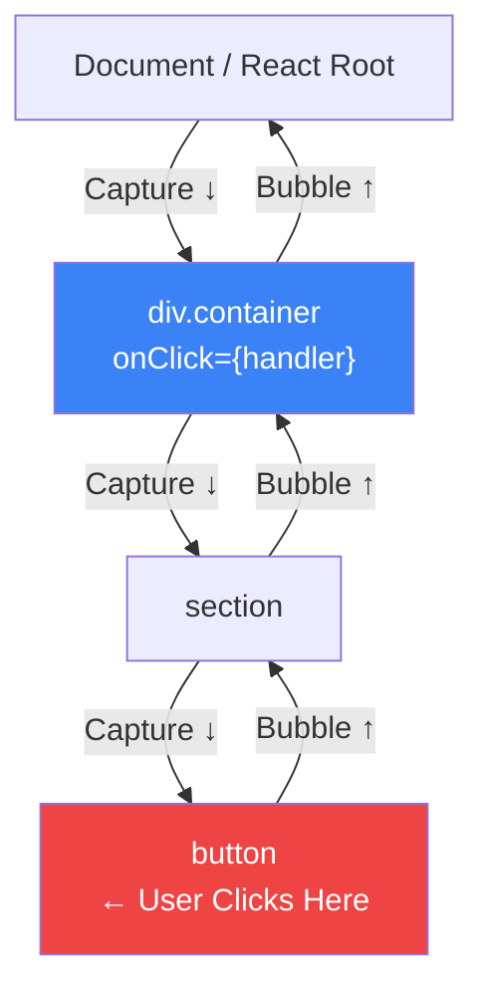

<a id="13-event-handling-in-react"></a>

[⬅ Previous Chapter](#12-state-making-components-interactive) | [📖 Main Index](#main-index) | [Next Chapter ➡](#14-component-lifecycle)

---

# Chapter 13: Event Handling in React

## 📌 Learning Objectives

By the end of this chapter, you will:

- **Understand** what Synthetic Events are, why React uses them, and what event pooling was
- **Master** all event handler syntax patterns — inline, external, passing arguments correctly
- **Know** every common React event — onClick, onChange, onSubmit, keyboard, mouse, drag
- **Use** `e.target` vs `e.currentTarget`, `preventDefault()`, `stopPropagation()`, `nativeEvent`
- **Build** form handling patterns — controlled inputs, single handler with `e.target.name`
- **Explain** React's event delegation and event propagation model
- **Implement** keyboard accessibility patterns for custom interactive elements
- **Answer 10+ interview questions** on React events confidently

---

<a id="chapter-index-table-13"></a>

## Chapter Index Table

| Topic No. | Topic Name | Subtopics |
|-----------|-----------|-----------|
| 13.1 | [Synthetic Events](#131-synthetic-events--what--why) | SyntheticEvent wrapper<br>Cross-browser normalization<br>Event pooling legacy |
| 13.2 | [Event Handler Syntax](#132-event-handler-syntax) | Inline vs external<br>Passing arguments<br>Calling vs passing |
| 13.3 | [Common Events in React](#133-common-events-in-react) | onClick, onChange, onSubmit<br>Focus/blur<br>Keyboard<br>Mouse<br>Drag |
| 13.4 | [Event Object Properties](#134-event-object-properties) | target vs currentTarget<br>preventDefault<br>stopPropagation<br>nativeEvent |
| 13.5 | [Form Handling Patterns](#135-form-handling-patterns) | Controlled vs uncontrolled<br>Single handler pattern |
| 13.6 | [Event Propagation in React](#136-event-propagation-in-react) | Bubbling<br>Event delegation<br>Capture phase |
| 13.7 | [Keyboard Accessibility in Events](#137-keyboard-accessibility-in-events) | ARIA patterns<br>Keyboard navigation |
| 💡 | [Interview Questions](#-interview-questions) | 10+ with Answers |
| 🧪 | [Practice Problems](#-practice-problems) | 5 Coding + 5 Theory |
| 🚀 | [Mini Project](#-mini-project) | Interactive Form with Validation |
| ⚡ | [Quick Revision](#-quick-revision) | Key bullets, traps |
| 📌 | [Chapter Summary](#-chapter-summary) | Final takeaways |

---

## 13.1 Synthetic Events — What & Why

<a id="131-synthetic-events--what--why"></a>

### What is it?

A **SyntheticEvent** is React's cross-browser wrapper around the browser's native event. When you write `onClick`, `onChange`, `onSubmit` etc., the event object `e` passed to your handler is NOT the browser's native event — it's React's `SyntheticEvent` object that wraps and normalizes the native event.

```jsx
function Demo() {
  const handleClick = (e) => {
    console.log(e);                    // SyntheticBaseEvent (React's wrapper)
    console.log(e.type);               // "click"
    console.log(e.target);            // The DOM element clicked
    console.log(e.nativeEvent);       // The actual browser MouseEvent
    console.log(e instanceof MouseEvent);  // false! It's a SyntheticEvent
  };

  return <button onClick={handleClick}>Click me</button>;
}
```

---

### Why Does React Use SyntheticEvents?

```
Problem: Different browsers implement events differently.
- IE used event.srcElement instead of event.target
- IE used event.cancelBubble instead of event.stopPropagation()
- Chrome, Firefox, Safari had subtle behavior differences
- event.which vs event.keyCode vs event.charCode for keys

Solution: React creates SyntheticEvent as a normalized wrapper
- Same API regardless of browser
- Same properties and methods everywhere
- Developers write one codebase, React handles browser differences
```

---

### Cross-Browser Normalization Examples

```jsx
// React normalizes these browser inconsistencies:

// 1. Event target
//    IE: event.srcElement
//    Others: event.target
//    React SyntheticEvent: ALWAYS e.target ✅

// 2. Prevent default
//    IE: event.returnValue = false
//    Others: event.preventDefault()
//    React: ALWAYS e.preventDefault() ✅

// 3. Stop propagation
//    IE: event.cancelBubble = true
//    Others: event.stopPropagation()
//    React: ALWAYS e.stopPropagation() ✅

// 4. Key codes (mostly normalized)
//    Old browsers: event.which, event.charCode, event.keyCode
//    React: e.key (recommended), e.keyCode (deprecated but works)

// You write this — works in ALL browsers:
function Form() {
  const handleKeyDown = (e) => {
    if (e.key === 'Enter') {  // Normalized — works everywhere
      submitForm();
    }
  };
  return <input onKeyDown={handleKeyDown} />;
}
```

---

### SyntheticEvent Properties

```jsx
function EventInspector() {
  const handleEvent = (e) => {
    // All these are available on SyntheticEvent:
    console.log(e.type);           // Event type: "click", "change", "submit"
    console.log(e.target);         // Element that triggered the event
    console.log(e.currentTarget);  // Element the handler is attached to
    console.log(e.bubbles);        // Does this event bubble?
    console.log(e.cancelable);     // Can we preventDefault?
    console.log(e.defaultPrevented); // Was preventDefault already called?
    console.log(e.eventPhase);     // 1=capture, 2=target, 3=bubbling
    console.log(e.isTrusted);      // Was event triggered by user (true) or JS (false)?
    console.log(e.timeStamp);      // When event occurred
    console.log(e.nativeEvent);    // The original browser event
  };

  return <div onClick={handleEvent}>Inspect me</div>;
}
```

---

### Event Pooling — Legacy React 16 Behavior

> [!IMPORTANT]
> **Event pooling was removed in React 17.** You only need to know this for legacy codebase interviews or explaining React 16 behavior.

```jsx
// ===== React 16 and below — Event Pooling =====
// React 16 reused SyntheticEvent objects for performance
// After the event handler finished, the event was "nullified" (all properties set to null)

// React 16 PROBLEM:
function OldReact() {
  const handleClick = (e) => {
    // At this point, e is valid
    console.log(e.type); // "click" ✅

    setTimeout(() => {
      // React 16: Event was returned to pool! Properties are null!
      console.log(e.type); // null ❌ (pooled and cleared)
    }, 100);
  };
}

// React 16 FIX: Call e.persist() to keep event alive
function OldReactFixed() {
  const handleClick = (e) => {
    e.persist();  // Remove from pool — don't nullify after handler
    setTimeout(() => {
      console.log(e.type); // "click" ✅ (persisted)
    }, 100);
  };
}

// ===== React 17+ — No Event Pooling =====
// SyntheticEvent is NOT reused — no need for e.persist()
// The event remains valid indefinitely
function ModernReact() {
  const handleClick = (e) => {
    setTimeout(() => {
      console.log(e.type); // "click" ✅ Works fine — no pooling!
    }, 100);
  };
}
```

---

### 🧠 Hinglish Intuition

SyntheticEvent ek **universal translator** hai. Alag alag browsers alag alag bhasha bolte hain (event ke liye different properties). React ka SyntheticEvent bolna hai: "Tum sabse ek hi bhasha mein baat karo — mujhse. Main sab ko samajhta hoon aur tumhe ek consistent API deta hoon."

Event pooling (React 16) ek reusable glass ki tarah tha — peene ke baad dhoke phir se fill karte the. React 17 se har event ka apna fresh glass hai — dhone ki zarurat nahi.

---

👉 <a href="#chapter-index-table-13">Go to Top 🔝</a>

---

## 13.2 Event Handler Syntax

<a id="132-event-handler-syntax"></a>

### Inline vs External Handlers

```jsx
// ===== External Handler (Preferred for complex logic) =====
function Button() {
  const handleClick = () => {
    console.log('Clicked!');
    // Can be multiple lines
    // Easy to test, name appears in stack traces
    // Not recreated on every render if moved outside component or wrapped in useCallback
  };

  return <button onClick={handleClick}>Click</button>;
}

// ===== Inline Arrow Function =====
function Button() {
  return (
    <button onClick={() => console.log('Clicked!')}>
      Click
    </button>
  );
  // ✅ Fine for simple one-liners
  // ⚠️ Creates new function reference on every render
  // ⚠️ Can cause child re-renders if passed as prop (fix with useCallback)
}

// ===== Comparison =====
// External:
// - Named → better debugging (function appears in DevTools)
// - Stable reference (if outside component) → no child re-renders
// - Reusable — can be called from multiple places

// Inline:
// - Quick for simple operations
// - Convenient for wrapping calls with arguments
// - Creates new function each render (minor perf cost)
```

---

### Why NOT `onClick={fn()}` — Calling vs Passing

This is one of the most common beginner mistakes in React.

```jsx
function ClickExample() {
  const showAlert = () => alert('Button clicked!');
  const deleteItem = (id) => console.log('Delete:', id);

  return (
    <div>
      {/* ✅ CORRECT: Passing the function reference */}
      <button onClick={showAlert}>
        {/* showAlert is passed as prop — React calls it when clicked */}
        Show Alert
      </button>

      {/* ❌ WRONG: CALLING the function immediately */}
      <button onClick={showAlert()}>
        {/* showAlert() executes NOW during render! */}
        {/* The alert fires when the component renders, not when button is clicked */}
        {/* onClick receives the RETURN VALUE (undefined) as its handler */}
        Wrong Way
      </button>

      {/* ✅ CORRECT: Passing function that takes argument */}
      <button onClick={() => deleteItem(42)}>
        {/* Wrapper arrow function delays execution */}
        {/* When clicked → runs () => deleteItem(42) → calls deleteItem(42) */}
        Delete Item 42
      </button>

      {/* ❌ WRONG: Calling function with argument directly */}
      <button onClick={deleteItem(42)}>
        {/* deleteItem(42) runs IMMEDIATELY during render */}
        {/* React calls deleteItem(42) now and uses its return value as handler */}
        Wrong
      </button>
    </div>
  );
}
```

---

### Passing Arguments to Handlers

```jsx
function ProductList({ products }) {
  // ===== Pattern 1: Inline arrow wrapper (most common) =====
  const handleDelete = (id) => {
    if (confirm(`Delete product ${id}?`)) {
      deleteProduct(id);
    }
  };

  // ===== Pattern 2: Curried function (returns a function) =====
  const handleEdit = (id) => () => {
    // Returns a function — when onClick fires, it calls this function
    openEditModal(id);
  };

  // ===== Pattern 3: data-* attributes (avoid for objects) =====
  const handleClick = (e) => {
    const id = e.currentTarget.dataset.productId;
    // id is always a STRING — must convert: Number(id)
    handleDelete(Number(id));
  };

  return (
    <ul>
      {products.map(product => (
        <li key={product.id}>
          {product.name}

          {/* Pattern 1: Inline arrow */}
          <button onClick={() => handleDelete(product.id)}>Delete</button>

          {/* Pattern 2: Curried */}
          <button onClick={handleEdit(product.id)}>
            {/* handleEdit(product.id) RUNS during render → returns a function */}
            {/* That returned function is used as the onClick handler */}
            Edit
          </button>

          {/* Pattern 3: data-* attribute */}
          <button
            data-product-id={product.id}
            onClick={handleClick}
          >
            Click
          </button>
        </li>
      ))}
    </ul>
  );
}
```

---

### Handler Naming Conventions

```jsx
// Convention: handle[EventType] for internal handlers
// Convention: on[EventType] for prop callbacks

function SearchBar({ onSearch, onChange }) {
  // Internal handlers — prefix with 'handle'
  const handleInputChange = (e) => {
    onChange(e.target.value);  // Calls parent's 'on' callback
  };

  const handleFormSubmit = (e) => {
    e.preventDefault();
    onSearch(query);  // Calls parent's 'on' callback
  };

  const handleClearClick = () => {
    setQuery('');
    onChange('');
  };

  return (
    <form onSubmit={handleFormSubmit}>
      <input onChange={handleInputChange} />
      <button type="button" onClick={handleClearClick}>Clear</button>
    </form>
  );
}
```

---

👉 <a href="#chapter-index-table-13">Go to Top 🔝</a>

---

## 13.3 Common Events in React

<a id="133-common-events-in-react"></a>

### onClick

```jsx
function ClickExamples() {
  return (
    <div>
      {/* Basic click */}
      <button onClick={() => console.log('clicked')}>Click</button>

      {/* With event object */}
      <button onClick={(e) => {
        console.log('Button:', e.target.textContent);
        console.log('Coordinates:', e.clientX, e.clientY);
      }}>
        Inspect Click
      </button>

      {/* Double click */}
      <div onDoubleClick={() => console.log('Double clicked')}>
        Double-click me
      </div>

      {/* Right click (context menu) */}
      <div
        onContextMenu={(e) => {
          e.preventDefault();  // Prevent browser context menu
          showCustomMenu(e.clientX, e.clientY);
        }}
      >
        Right-click for custom menu
      </div>
    </div>
  );
}
```

---

### onChange

```jsx
function InputExamples() {
  const [values, setValues] = useState({
    text: '',
    number: 0,
    checked: false,
    radio: '',
    select: '',
    textarea: '',
    file: null,
  });

  return (
    <div>
      {/* Text input */}
      <input
        type="text"
        value={values.text}
        onChange={(e) => setValues(prev => ({ ...prev, text: e.target.value }))}
      />

      {/* Number input */}
      <input
        type="number"
        value={values.number}
        onChange={(e) => setValues(prev => ({
          ...prev,
          number: Number(e.target.value)  // Convert to number!
        }))}
      />

      {/* Checkbox — uses checked, not value */}
      <input
        type="checkbox"
        checked={values.checked}
        onChange={(e) => setValues(prev => ({
          ...prev,
          checked: e.target.checked  // NOT e.target.value!
        }))}
      />

      {/* Radio group */}
      {['option1', 'option2', 'option3'].map(opt => (
        <label key={opt}>
          <input
            type="radio"
            name="myRadio"
            value={opt}
            checked={values.radio === opt}
            onChange={(e) => setValues(prev => ({ ...prev, radio: e.target.value }))}
          />
          {opt}
        </label>
      ))}

      {/* Select */}
      <select
        value={values.select}
        onChange={(e) => setValues(prev => ({ ...prev, select: e.target.value }))}
      >
        <option value="">Choose...</option>
        <option value="a">Option A</option>
        <option value="b">Option B</option>
      </select>

      {/* File input — uncontrolled (no value prop) */}
      <input
        type="file"
        onChange={(e) => {
          const file = e.target.files[0];
          console.log('File:', file.name, file.size, file.type);
          setValues(prev => ({ ...prev, file }));
        }}
      />
    </div>
  );
}
```

---

### onSubmit

```jsx
function LoginForm() {
  const [form, setForm] = useState({ email: '', password: '' });

  const handleSubmit = (e) => {
    e.preventDefault();  // ALWAYS prevent default on form submit!
    // Without this: browser reloads the page (traditional form behavior)

    // Now handle the submission:
    console.log('Form data:', form);
    // await loginUser(form.email, form.password);
  };

  return (
    <form onSubmit={handleSubmit}>
      <input
        type="email"
        value={form.email}
        onChange={e => setForm(prev => ({ ...prev, email: e.target.value }))}
        required
      />
      <input
        type="password"
        value={form.password}
        onChange={e => setForm(prev => ({ ...prev, password: e.target.value }))}
        required
      />
      {/* type="submit" triggers form's onSubmit */}
      <button type="submit">Login</button>
      {/* Also triggers if user presses Enter in any input */}
    </form>
  );
}
```

---

### onFocus and onBlur

```jsx
function FocusDemo() {
  const [isFocused, setIsFocused] = useState(false);
  const [touched, setTouched] = useState(false);
  const [value, setValue] = useState('');
  const [error, setError] = useState('');

  // Validation on blur (user leaves field):
  const handleBlur = () => {
    setIsFocused(false);
    setTouched(true);
    if (!value) setError('Email is required');
    else if (!/\S+@\S+\.\S+/.test(value)) setError('Invalid email');
    else setError('');
  };

  return (
    <div>
      <input
        type="email"
        value={value}
        onFocus={() => {
          setIsFocused(true);
          // Could clear error on focus
        }}
        onBlur={handleBlur}
        onChange={e => setValue(e.target.value)}
        style={{
          border: `2px solid ${
            isFocused ? '#3b82f6' :
            touched && error ? '#ef4444' :
            touched && !error ? '#22c55e' :
            '#d1d5db'
          }`,
          padding: '8px 12px',
          borderRadius: '6px',
          outline: 'none',
        }}
        placeholder="Email address"
      />
      {touched && error && (
        <p style={{ color: '#ef4444', fontSize: '12px', margin: '4px 0 0' }}>{error}</p>
      )}

      {/* onFocusCapture / onBlurCapture for capture phase */}
      {/* Use onFocus for individual elements */}
      {/* Note: React's onFocus bubbles (unlike native focus) */}
    </div>
  );
}
```

---

### Keyboard Events

```jsx
function KeyboardDemo() {
  const [log, setLog] = useState([]);

  const addLog = (msg) => setLog(prev => [msg, ...prev.slice(0, 9)]);

  return (
    <div>
      <input
        placeholder="Type here and watch keyboard events"
        style={{ padding: '8px 12px', width: '300px', border: '1px solid #d1d5db', borderRadius: '6px' }}

        onKeyDown={(e) => {
          // Fires when key is pressed down (BEFORE character appears)
          // Best for: shortcuts, preventing default, navigation
          addLog(`keyDown: key="${e.key}" code="${e.code}"`);

          // Common key checks:
          if (e.key === 'Enter') addLog('Enter pressed!');
          if (e.key === 'Escape') addLog('Escape pressed!');
          if (e.key === 'ArrowDown') addLog('Arrow down!');
          if (e.key === 'Tab') addLog('Tab pressed!');

          // Modifier keys:
          if (e.ctrlKey && e.key === 's') {
            e.preventDefault();  // Prevent browser save dialog
            addLog('Ctrl+S — Save!');
          }
          if (e.metaKey && e.key === 'z') addLog('Cmd+Z — Undo!');  // Mac
          if (e.shiftKey && e.key === 'Enter') addLog('Shift+Enter!');
          if (e.altKey && e.key === 'ArrowRight') addLog('Alt+Right!');
        }}

        onKeyUp={(e) => {
          // Fires when key is released
          // Less common use case: detecting when key combo finishes
          addLog(`keyUp: "${e.key}"`);
        }}

        // onKeyPress is DEPRECATED — don't use
        // Use onKeyDown for most cases
      />

      <div style={{ marginTop: '12px', padding: '12px', backgroundColor: '#f8fafc', borderRadius: '8px', fontFamily: 'monospace', fontSize: '12px' }}>
        {log.map((entry, i) => <div key={i}>{entry}</div>)}
      </div>
    </div>
  );
}
```

> [!IMPORTANT]
> `onKeyPress` is **deprecated** and removed from modern browsers. Use `onKeyDown` for most keyboard handling. `onKeyDown` fires for ALL keys including non-printable ones (Escape, Arrow keys, F1-F12). `onKeyUp` fires after the key is released.

---

### Mouse Events — onMouseEnter vs onMouseOver

```jsx
// CRITICAL DISTINCTION:
// onMouseOver — BUBBLES — fires when mouse enters AND when entering child elements
// onMouseEnter — Does NOT bubble — fires ONLY when entering the element itself

function MouseEventDemo() {
  const [overCount, setOverCount] = useState(0);
  const [enterCount, setEnterCount] = useState(0);

  return (
    <div style={{ display: 'flex', gap: '20px', padding: '20px' }}>
      {/* onMouseOver: fires for parent AND child elements */}
      <div
        onMouseOver={() => setOverCount(c => c + 1)}
        style={{ padding: '20px', border: '2px solid #3b82f6', borderRadius: '8px' }}
      >
        <p>onMouseOver count: {overCount}</p>
        <button>I'm a child — hovering me fires parent's onMouseOver!</button>
      </div>

      {/* onMouseEnter: only fires for the specific element */}
      <div
        onMouseEnter={() => setEnterCount(c => c + 1)}
        style={{ padding: '20px', border: '2px solid #22c55e', borderRadius: '8px' }}
      >
        <p>onMouseEnter count: {enterCount}</p>
        <button>I'm a child — hovering me does NOT fire parent's onMouseEnter!</button>
      </div>
    </div>
  );
}

// Similarly:
// onMouseLeave — does NOT bubble
// onMouseOut — DOES bubble (fires when leaving element OR leaving child)

// Full mouse event set:
function AllMouseEvents() {
  return (
    <div
      onMouseEnter={() => {}}    // Enters the element (no bubble)
      onMouseLeave={() => {}}    // Leaves the element (no bubble)
      onMouseOver={() => {}}     // Enters element OR any descendant (bubbles)
      onMouseOut={() => {}}      // Leaves element OR any descendant (bubbles)
      onMouseMove={(e) => {}}    // Moves within element
      onMouseDown={(e) => {}}    // Mouse button pressed
      onMouseUp={(e) => {}}      // Mouse button released
    >
      Hover me
    </div>
  );
}
```

---

### Drag and Drop Events

```jsx
import { useState } from 'react';

function DragDropDemo() {
  const [isDragOver, setIsDragOver] = useState(false);
  const [draggedItem, setDraggedItem] = useState(null);
  const [items, setItems] = useState(['Apple', 'Banana', 'Cherry', 'Date']);
  const [dropped, setDropped] = useState([]);

  return (
    <div style={{ display: 'flex', gap: '24px', fontFamily: 'sans-serif', padding: '20px' }}>
      {/* Draggable items */}
      <div>
        <h3>Drag these:</h3>
        {items.map(item => (
          <div
            key={item}
            draggable                              // Make element draggable
            onDragStart={(e) => {
              setDraggedItem(item);
              e.dataTransfer.setData('text/plain', item);  // Store data to transfer
              e.dataTransfer.effectAllowed = 'move';
            }}
            onDragEnd={() => setDraggedItem(null)}         // Cleanup after drag
            style={{
              padding: '8px 16px',
              margin: '6px 0',
              backgroundColor: draggedItem === item ? '#dbeafe' : '#f8fafc',
              border: '1px solid #d1d5db',
              borderRadius: '6px',
              cursor: 'grab',
              userSelect: 'none',
            }}
          >
            {item}
          </div>
        ))}
      </div>

      {/* Drop zone */}
      <div
        onDragOver={(e) => {
          e.preventDefault();            // REQUIRED: enables dropping
          setIsDragOver(true);
          e.dataTransfer.dropEffect = 'move';
        }}
        onDragEnter={(e) => {
          e.preventDefault();
          setIsDragOver(true);
        }}
        onDragLeave={() => setIsDragOver(false)}
        onDrop={(e) => {
          e.preventDefault();
          const item = e.dataTransfer.getData('text/plain');
          setDropped(prev => [...new Set([...prev, item])]);  // No duplicates
          setIsDragOver(false);
        }}
        style={{
          minWidth: '200px',
          minHeight: '150px',
          border: `2px dashed ${isDragOver ? '#3b82f6' : '#d1d5db'}`,
          borderRadius: '8px',
          padding: '16px',
          backgroundColor: isDragOver ? '#eff6ff' : '#fafafa',
          transition: 'all 0.2s',
          display: 'flex',
          flexDirection: 'column',
          gap: '6px',
        }}
      >
        <h3 style={{ margin: '0 0 8px' }}>Drop here:</h3>
        {dropped.length === 0 ? (
          <p style={{ color: '#94a3b8', fontSize: '14px' }}>No items dropped yet</p>
        ) : (
          dropped.map(item => (
            <div key={item} style={{ padding: '6px 12px', backgroundColor: '#dcfce7', borderRadius: '6px', fontSize: '14px' }}>
              ✓ {item}
            </div>
          ))
        )}
      </div>
    </div>
  );
}

export default DragDropDemo;
```

---

### 🧠 Hinglish Intuition

Events React mein ek **receptionist system** jaisa hai. Har event ek visitor hai (click, keypress, change). SyntheticEvent receptionist hai jo visitor ki details normalize karta hai (browser differences handle karta hai) phir tumhare handler ko bhejta hai. `onMouseEnter` VIP security jaisi hai — sirf main door pe notice hoti hai. `onMouseOver` CCTV camera jaisi hai — har movement track karta hai, andar bahar sab.

---

👉 <a href="#chapter-index-table-13">Go to Top 🔝</a>

---

## 13.4 Event Object Properties

<a id="134-event-object-properties"></a>

### e.target vs e.currentTarget

This is a critical interview question.

```jsx
// e.target     = The element that TRIGGERED the event (where user interacted)
// e.currentTarget = The element where the EVENT HANDLER is ATTACHED

function PropagationExample() {
  const handleClick = (e) => {
    console.log('target:', e.target.tagName);          // What was clicked
    console.log('currentTarget:', e.currentTarget.tagName); // Where handler is
  };

  return (
    <div onClick={handleClick} id="outer">  {/* Handler attached HERE */}
      <section id="middle">
        <button id="inner">Click Me</button>  {/* User clicks HERE */}
      </section>
    </div>
  );
}

// When user clicks the button:
// e.target = BUTTON (what was actually clicked)
// e.currentTarget = DIV (where onClick handler is attached)

// When user clicks the div directly:
// e.target = DIV (what was clicked)
// e.currentTarget = DIV (same — handler is here)
```

```jsx
// Practical use: Single handler for multiple items
function ButtonGroup() {
  const handleGroupClick = (e) => {
    // e.target = the specific button clicked
    // e.currentTarget = the div wrapper (where handler is attached)
    const buttonId = e.target.dataset.id;
    console.log('Clicked button:', buttonId);
  };

  return (
    <div onClick={handleGroupClick}>  {/* One handler for all buttons */}
      <button data-id="btn-1">Button 1</button>
      <button data-id="btn-2">Button 2</button>
      <button data-id="btn-3">Button 3</button>
    </div>
  );
}
```

---

### e.preventDefault()

```jsx
function PreventDefaultExamples() {
  return (
    <div>
      {/* ===== Form submission — prevent page reload ===== */}
      <form onSubmit={(e) => {
        e.preventDefault();  // Stop browser's default form submission (page reload)
        // Now handle with JavaScript:
        handleFormData(new FormData(e.target));
      }}>
        <input name="email" type="email" />
        <button type="submit">Submit</button>
      </form>

      {/* ===== Anchor tags — prevent navigation ===== */}
      <a
        href="/delete-all-data"
        onClick={(e) => {
          e.preventDefault();  // Stop browser from navigating
          if (window.confirm('Are you sure?')) {
            deleteAllData();
          }
          // If user says no, nothing happens
        }}
      >
        Delete All Data
      </a>

      {/* ===== Context menu — custom right-click menu ===== */}
      <div
        onContextMenu={(e) => {
          e.preventDefault();  // Stop browser's context menu
          showCustomContextMenu(e.clientX, e.clientY);
        }}
      >
        Right-click me for custom menu
      </div>

      {/* ===== Drag and drop — required to allow dropping ===== */}
      <div
        onDragOver={(e) => {
          e.preventDefault();  // MUST call this to allow drop events
          // Without this, onDrop never fires!
        }}
        onDrop={(e) => {
          e.preventDefault();  // Prevent browser from handling the drop (e.g., opening files)
          handleDrop(e);
        }}
      >
        Drop zone
      </div>

      {/* ===== Input — prevent specific characters ===== */}
      <input
        type="text"
        onKeyDown={(e) => {
          // Prevent number input in a text field:
          if (/[0-9]/.test(e.key)) {
            e.preventDefault();  // Character doesn't appear in input
          }
        }}
        placeholder="Letters only"
      />
    </div>
  );
}
```

---

### e.stopPropagation()

```jsx
// stopPropagation: Stops event from bubbling up the DOM tree
// After calling, parent handlers are NOT notified

function StopPropExample() {
  const handleDivClick = () => console.log('Div clicked!');
  const handleButtonClick = (e) => {
    e.stopPropagation();  // ← Stop event from reaching parent div
    console.log('Button clicked!');
    // 'Div clicked!' will NOT log because propagation stopped
  };

  return (
    <div onClick={handleDivClick} style={{ padding: '20px', border: '1px solid #ccc' }}>
      <p>Click me → Div clicked!</p>
      <button onClick={handleButtonClick}>
        Click me → Button clicked (NOT Div!)
      </button>
    </div>
  );
}

// Real-world use: Modal — clicking content shouldn't close the modal
function Modal({ isOpen, onClose, children }) {
  if (!isOpen) return null;

  return (
    <div
      // Click on backdrop → closes modal
      onClick={onClose}
      style={{ position: 'fixed', inset: 0, backgroundColor: 'rgba(0,0,0,0.5)', display: 'flex', alignItems: 'center', justifyContent: 'center' }}
    >
      <div
        // Click inside modal → DON'T close (stop propagation to backdrop)
        onClick={(e) => e.stopPropagation()}
        style={{ backgroundColor: '#fff', padding: '24px', borderRadius: '12px', minWidth: '300px' }}
      >
        {children}
      </div>
    </div>
  );
}
```

---

### e.stopImmediatePropagation()

```jsx
// stopPropagation: Stops event from reaching PARENT elements
// stopImmediatePropagation: Also stops OTHER handlers on the SAME element

function ImmediatePropExample() {
  const element = useRef(null);

  useEffect(() => {
    const el = element.current;

    const handler1 = (e) => {
      console.log('Handler 1 runs');
      e.stopImmediatePropagation();
      // Handler 2 on the SAME element will NOT run
    };

    const handler2 = () => {
      console.log('Handler 2 — this will NOT run if handler1 calls stopImmediatePropagation');
    };

    el.addEventListener('click', handler1);
    el.addEventListener('click', handler2);

    return () => {
      el.removeEventListener('click', handler1);
      el.removeEventListener('click', handler2);
    };
  }, []);

  return <div ref={element}>Click me (check console)</div>;
}
```

---

### e.nativeEvent

```jsx
// Access the browser's original native event object:

function NativeEventExample() {
  const handleClick = (e) => {
    // e = SyntheticEvent (React's wrapper)
    // e.nativeEvent = browser's original MouseEvent
    console.log(e);              // SyntheticBaseEvent
    console.log(e.nativeEvent);  // MouseEvent

    // Cases where you might need nativeEvent:
    // 1. Accessing properties not on SyntheticEvent
    console.log(e.nativeEvent.path);          // DOM path (non-standard)
    console.log(e.nativeEvent.composedPath()); // Standardized path

    // 2. Third-party libraries expecting native events
    someLibrary.handleEvent(e.nativeEvent);

    // 3. Adding listeners to the native event
    e.nativeEvent.stopImmediatePropagation();
  };

  return <button onClick={handleClick}>Access nativeEvent</button>;
}
```

---

👉 <a href="#chapter-index-table-13">Go to Top 🔝</a>

---

## 13.5 Form Handling Patterns

<a id="135-form-handling-patterns"></a>

### Controlled vs Uncontrolled Inputs

```jsx
// ===== CONTROLLED: React controls the value =====
function ControlledInput() {
  const [value, setValue] = useState('');

  return (
    <input
      value={value}             // React provides the value
      onChange={(e) => setValue(e.target.value)}  // React updates on change
      placeholder="Controlled"
    />
  );
  // React IS the source of truth for input value
  // Every keystroke: onChange fires → setState → re-render → input shows new value
  // ✅ Real-time validation, instant character filtering, controlled clearing
}

// ===== UNCONTROLLED: DOM controls the value =====
function UncontrolledInput() {
  const inputRef = useRef(null);

  const handleSubmit = () => {
    // Read value WHEN NEEDED (on submit)
    console.log(inputRef.current.value);
  };

  return (
    <>
      <input
        defaultValue="Initial value"   // Sets initial value (not controlled)
        ref={inputRef}                 // Access DOM node to read value
        placeholder="Uncontrolled"
      />
      <button onClick={handleSubmit}>Get Value</button>
    </>
  );
  // DOM IS the source of truth
  // ✅ Simpler, good for simple forms where you only need value on submit
  // ❌ Can't do real-time validation, can't programmatically reset easily
}
```

---

### Single Handler with e.target.name

A clean pattern for handling multiple inputs with one onChange handler:

```jsx
function RegistrationForm() {
  const [form, setForm] = useState({
    firstName: '',
    lastName: '',
    email: '',
    password: '',
    age: '',
    role: 'user',
    newsletter: false,
  });

  // Single handler for ALL inputs — uses name attribute
  const handleChange = (e) => {
    const { name, value, type, checked } = e.target;
    setForm(prev => ({
      ...prev,
      // For checkboxes: use checked. For all others: use value
      [name]: type === 'checkbox' ? checked : value,
    }));
  };

  const handleSubmit = (e) => {
    e.preventDefault();
    console.log('Form submitted:', form);
  };

  const inputStyle = {
    padding: '8px 12px',
    border: '1px solid #d1d5db',
    borderRadius: '6px',
    width: '100%',
    boxSizing: 'border-box',
    marginBottom: '12px',
  };

  return (
    <form onSubmit={handleSubmit} style={{ maxWidth: '400px', padding: '24px', fontFamily: 'sans-serif' }}>
      <input
        style={inputStyle}
        name="firstName"         // ← name matches state key
        value={form.firstName}
        onChange={handleChange}  // ← Same handler for all!
        placeholder="First Name"
      />
      <input
        style={inputStyle}
        name="lastName"
        value={form.lastName}
        onChange={handleChange}
        placeholder="Last Name"
      />
      <input
        style={inputStyle}
        type="email"
        name="email"
        value={form.email}
        onChange={handleChange}
        placeholder="Email"
      />
      <input
        style={inputStyle}
        type="password"
        name="password"
        value={form.password}
        onChange={handleChange}
        placeholder="Password"
      />
      <input
        style={inputStyle}
        type="number"
        name="age"
        value={form.age}
        onChange={handleChange}
        placeholder="Age"
        min="18"
        max="100"
      />
      <select
        style={inputStyle}
        name="role"
        value={form.role}
        onChange={handleChange}
      >
        <option value="user">User</option>
        <option value="admin">Admin</option>
        <option value="moderator">Moderator</option>
      </select>
      <label style={{ display: 'flex', alignItems: 'center', gap: '8px', marginBottom: '12px' }}>
        <input
          type="checkbox"
          name="newsletter"
          checked={form.newsletter}
          onChange={handleChange}  // Uses e.target.checked via type check
        />
        Subscribe to newsletter
      </label>

      <button type="submit" style={{ width: '100%', padding: '10px', backgroundColor: '#3b82f6', color: '#fff', border: 'none', borderRadius: '6px', cursor: 'pointer', fontWeight: '600' }}>
        Register
      </button>

      <pre style={{ marginTop: '16px', backgroundColor: '#f8fafc', padding: '12px', borderRadius: '6px', fontSize: '12px' }}>
        {JSON.stringify(form, null, 2)}
      </pre>
    </form>
  );
}

export default RegistrationForm;
```

---

### Real-time Validation Pattern

```jsx
function ValidatedForm() {
  const [form, setForm] = useState({ email: '', password: '' });
  const [errors, setErrors] = useState({});
  const [touched, setTouched] = useState({});

  const validators = {
    email: (v) => {
      if (!v) return 'Email is required';
      if (!/\S+@\S+\.\S+/.test(v)) return 'Invalid email format';
      return '';
    },
    password: (v) => {
      if (!v) return 'Password is required';
      if (v.length < 8) return 'Minimum 8 characters';
      if (!/[A-Z]/.test(v)) return 'Needs an uppercase letter';
      if (!/[0-9]/.test(v)) return 'Needs a number';
      return '';
    },
  };

  const handleChange = (e) => {
    const { name, value } = e.target;
    setForm(prev => ({ ...prev, [name]: value }));
    // Validate immediately if field has been touched
    if (touched[name]) {
      setErrors(prev => ({ ...prev, [name]: validators[name]?.(value) || '' }));
    }
  };

  const handleBlur = (e) => {
    const { name, value } = e.target;
    setTouched(prev => ({ ...prev, [name]: true }));
    setErrors(prev => ({ ...prev, [name]: validators[name]?.(value) || '' }));
  };

  const isValid = Object.values(form).every(Boolean) && Object.values(errors).every(v => !v);

  const fieldProps = (name) => ({
    name,
    value: form[name],
    onChange: handleChange,
    onBlur: handleBlur,
    style: {
      width: '100%',
      padding: '10px 12px',
      border: `2px solid ${
        touched[name] && errors[name] ? '#ef4444' :
        touched[name] && !errors[name] ? '#22c55e' :
        '#d1d5db'
      }`,
      borderRadius: '8px',
      fontSize: '14px',
      outline: 'none',
      boxSizing: 'border-box',
      marginBottom: '4px',
    },
  });

  return (
    <form onSubmit={(e) => { e.preventDefault(); if (isValid) alert('Submitted!'); }}
      style={{ padding: '24px', maxWidth: '360px', fontFamily: 'sans-serif' }}>
      <h2>Sign In</h2>
      <div style={{ marginBottom: '16px' }}>
        <input type="email" placeholder="Email" {...fieldProps('email')} />
        {touched.email && errors.email && (
          <p style={{ color: '#ef4444', fontSize: '12px', margin: 0 }}>{errors.email}</p>
        )}
        {touched.email && !errors.email && (
          <p style={{ color: '#22c55e', fontSize: '12px', margin: 0 }}>✓ Valid email</p>
        )}
      </div>
      <div style={{ marginBottom: '16px' }}>
        <input type="password" placeholder="Password" {...fieldProps('password')} />
        {touched.password && errors.password && (
          <p style={{ color: '#ef4444', fontSize: '12px', margin: 0 }}>{errors.password}</p>
        )}
      </div>
      <button type="submit" disabled={!isValid} style={{
        width: '100%', padding: '12px',
        backgroundColor: isValid ? '#3b82f6' : '#93c5fd',
        color: '#fff', border: 'none', borderRadius: '8px',
        cursor: isValid ? 'pointer' : 'not-allowed', fontWeight: '600',
      }}>
        Sign In
      </button>
    </form>
  );
}
```

---

👉 <a href="#chapter-index-table-13">Go to Top 🔝</a>

---

## 13.6 Event Propagation in React

<a id="136-event-propagation-in-react"></a>

### Event Propagation: Three Phases

```
1. CAPTURE PHASE: Event travels DOWN the DOM tree from root to target
2. TARGET PHASE: Event reaches the element that was clicked
3. BUBBLING PHASE: Event travels UP the DOM tree from target to root

DOM Structure:
document
  └── html
        └── body
              └── div#app (React root)
                    └── div.container    ← Handler here sees bubbled events
                          └── section    ← No handler
                                └── button ← User clicks here (target)

Event flow:
CAPTURE: document → html → body → div#app → div.container → section → button
TARGET:  button  ← event fires here
BUBBLE:  button → section → div.container → div#app → body → html → document
```

---

### React's Event Delegation Model

```jsx
// React doesn't actually attach event handlers to individual DOM elements!
// React attaches ONE listener at the ROOT (#root div)
// All events bubble up to root → React routes to correct component's handler

// Why? Performance — one listener instead of thousands
// React 17+ attaches to: document.getElementById('root') (the React root)
// React 16: attached to document itself

// This means:
// 1. React intercepts events at the root
// 2. React knows which component's fiber subtree the event came from
// 3. React calls the appropriate handler

// IMPORTANT implication:
// If you use e.stopPropagation() in a React handler, it stops WITHIN React's system
// But it might not stop native DOM listeners added to parent elements

// If you use e.nativeEvent.stopImmediatePropagation(), it prevents React's root listener
// from handling the event at all
```

---

### Capture Phase Events

```jsx
// React provides Capture phase variants of all events:
// onClickCapture, onChangeCapture, onFocusCapture, etc.

function CaptureDemo() {
  return (
    <div
      onClick={() => console.log('3. Div - Bubble')}
      onClickCapture={() => console.log('1. Div - Capture')}  // Fires FIRST
    >
      <button
        onClick={() => console.log('2. Button - Target/Bubble')}
        onClickCapture={() => console.log('2a. Button - Capture')}
      >
        Click Me
      </button>
    </div>
  );
}

// When button is clicked, console output:
// 1. Div - Capture      ← Capture fires top-down first
// 2a. Button - Capture  ← Button's capture
// 2. Button - Target/Bubble  ← Target fires
// 3. Div - Bubble       ← Bubble fires bottom-up

// When to use onClickCapture?
// When you need to intercept events BEFORE they reach children
// Example: Preventing all clicks in a disabled overlay
function DisabledOverlay({ disabled, children }) {
  return (
    <div
      onClickCapture={disabled ? (e) => {
        e.stopPropagation();
        console.log('Interaction blocked — overlay is disabled');
      } : undefined}
      style={{ opacity: disabled ? 0.5 : 1, pointerEvents: disabled ? 'none' : 'auto' }}
    >
      {children}
    </div>
  );
}
```

---

### Propagation Diagram



---

### 🧠 Hinglish Intuition

Event propagation aise hai jaise ek announcement school mein. Principal (document) se shuruaat hoti hai, class room tak aati hai (capture), phir wapas principal ke paas jaati hai (bubble). React event delegation bolna hai: ek hi chowkidar (listener) school ke gate pe (root element) hai — woh sab ko filter karta hai. Seedha har class room mein alag alag chowkidar nahi rakhte.

---

👉 <a href="#chapter-index-table-13">Go to Top 🔝</a>

---

## 13.7 Keyboard Accessibility in Events

<a id="137-keyboard-accessibility-in-events"></a>

### Why Keyboard Accessibility Matters

Many users cannot use a mouse — they rely on keyboard navigation (Tab, Enter, Space, Arrow keys). Screen reader users also navigate primarily via keyboard. Making interactive elements keyboard accessible is both a legal requirement (WCAG 2.1) and good UX.

---

### The Core Rule

```jsx
// ✅ Use semantic HTML first — it's keyboard accessible by default
<button onClick={handleClick}>Click me</button>
// ↑ Already keyboard accessible: Tab to focus, Enter/Space to activate

<a href="/page" onClick={handleNav}>Link</a>
// ↑ Already keyboard accessible: Tab to focus, Enter to activate

// ❌ div/span with onClick — NOT keyboard accessible
<div onClick={handleClick}>Not accessible</div>
// Cannot be focused via Tab
// Cannot be activated via keyboard
// Screen readers don't know it's interactive

// ✅ If you MUST use div — add ARIA + keyboard handlers
<div
  role="button"          // Tells screen readers this is a button
  tabIndex={0}           // Makes it focusable via Tab
  onClick={handleClick}
  onKeyDown={(e) => {
    if (e.key === 'Enter' || e.key === ' ') {
      e.preventDefault(); // Prevent Space from scrolling page
      handleClick();
    }
  }}
  aria-label="Custom button"
>
  Custom interactive element
</div>
```

---

### Keyboard Navigation Patterns

```jsx
// ===== Tab Navigation =====
// tabIndex values:
// tabIndex={0}   → Adds to normal tab order
// tabIndex={-1}  → Focusable programmatically but NOT in tab order
// tabIndex={1+}  → Avoid! Disrupts natural tab order

function TabNavigation() {
  return (
    <nav>
      {/* Natural tab order — preferred */}
      <a href="/">Home</a>          {/* tabIndex=0 by default */}
      <a href="/about">About</a>    {/* tabIndex=0 by default */}
      <button>Click</button>        {/* tabIndex=0 by default */}

      {/* Modal close button — only accessible programmatically */}
      <button tabIndex={-1} ref={closeBtnRef}>
        Hidden from tab order but focusable via JS
      </button>
    </nav>
  );
}
```

---

### Custom Dropdown with Full Keyboard Support

```jsx
import { useState, useRef, useEffect } from 'react';

function AccessibleDropdown({ options, value, onChange, label }) {
  const [isOpen, setIsOpen] = useState(false);
  const [focusedIndex, setFocusedIndex] = useState(0);
  const buttonRef = useRef(null);
  const listRef = useRef(null);

  const selectedOption = options.find(o => o.value === value);

  // Close on outside click
  useEffect(() => {
    const handleOutside = (e) => {
      if (!listRef.current?.contains(e.target) && !buttonRef.current?.contains(e.target)) {
        setIsOpen(false);
      }
    };
    document.addEventListener('mousedown', handleOutside);
    return () => document.removeEventListener('mousedown', handleOutside);
  }, []);

  // Focus first item when opening
  useEffect(() => {
    if (isOpen && listRef.current) {
      const items = listRef.current.querySelectorAll('[role="option"]');
      items[focusedIndex]?.focus();
    }
  }, [isOpen]);

  const handleButtonKeyDown = (e) => {
    switch (e.key) {
      case 'Enter':
      case ' ':
      case 'ArrowDown':
        e.preventDefault();
        setIsOpen(true);
        setFocusedIndex(0);
        break;
      case 'Escape':
        setIsOpen(false);
        buttonRef.current?.focus();
        break;
    }
  };

  const handleOptionKeyDown = (e, index) => {
    switch (e.key) {
      case 'ArrowDown':
        e.preventDefault();
        const nextIndex = Math.min(index + 1, options.length - 1);
        setFocusedIndex(nextIndex);
        listRef.current.querySelectorAll('[role="option"]')[nextIndex]?.focus();
        break;
      case 'ArrowUp':
        e.preventDefault();
        if (index === 0) {
          setIsOpen(false);
          buttonRef.current?.focus();
        } else {
          const prevIndex = index - 1;
          setFocusedIndex(prevIndex);
          listRef.current.querySelectorAll('[role="option"]')[prevIndex]?.focus();
        }
        break;
      case 'Enter':
      case ' ':
        e.preventDefault();
        onChange(options[index].value);
        setIsOpen(false);
        buttonRef.current?.focus();
        break;
      case 'Escape':
        setIsOpen(false);
        buttonRef.current?.focus();
        break;
      case 'Home':
        e.preventDefault();
        setFocusedIndex(0);
        listRef.current.querySelectorAll('[role="option"]')[0]?.focus();
        break;
      case 'End':
        e.preventDefault();
        const lastIdx = options.length - 1;
        setFocusedIndex(lastIdx);
        listRef.current.querySelectorAll('[role="option"]')[lastIdx]?.focus();
        break;
    }
  };

  return (
    <div style={{ position: 'relative', width: '240px', fontFamily: 'sans-serif' }}>
      {label && (
        <label
          id="dropdown-label"
          style={{ display: 'block', marginBottom: '4px', fontWeight: '600', fontSize: '14px' }}
        >
          {label}
        </label>
      )}

      {/* Trigger button — ARIA combobox pattern */}
      <button
        ref={buttonRef}
        onClick={() => { setIsOpen(o => !o); setFocusedIndex(0); }}
        onKeyDown={handleButtonKeyDown}
        aria-haspopup="listbox"
        aria-expanded={isOpen}
        aria-labelledby="dropdown-label"
        style={{
          width: '100%',
          padding: '10px 12px',
          backgroundColor: '#fff',
          border: `2px solid ${isOpen ? '#3b82f6' : '#d1d5db'}`,
          borderRadius: '8px',
          cursor: 'pointer',
          textAlign: 'left',
          display: 'flex',
          justifyContent: 'space-between',
          alignItems: 'center',
          fontSize: '14px',
        }}
      >
        {selectedOption?.label || 'Select an option...'}
        <span style={{ fontSize: '12px', transform: isOpen ? 'rotate(180deg)' : 'none', transition: 'transform 0.2s' }}>▼</span>
      </button>

      {/* Options list — ARIA listbox pattern */}
      {isOpen && (
        <ul
          ref={listRef}
          role="listbox"
          aria-labelledby="dropdown-label"
          style={{
            position: 'absolute',
            top: '100%',
            left: 0,
            right: 0,
            marginTop: '4px',
            padding: '4px',
            backgroundColor: '#fff',
            border: '2px solid #d1d5db',
            borderRadius: '8px',
            boxShadow: '0 4px 16px rgba(0,0,0,0.12)',
            zIndex: 100,
            listStyle: 'none',
          }}
        >
          {options.map((option, index) => (
            <li
              key={option.value}
              role="option"
              tabIndex={-1}  // In tab order only when list is open via focus management
              aria-selected={value === option.value}
              onClick={() => {
                onChange(option.value);
                setIsOpen(false);
                buttonRef.current?.focus();
              }}
              onKeyDown={(e) => handleOptionKeyDown(e, index)}
              style={{
                padding: '8px 12px',
                borderRadius: '6px',
                cursor: 'pointer',
                fontSize: '14px',
                backgroundColor: value === option.value ? '#dbeafe' : 'transparent',
                color: value === option.value ? '#1e40af' : '#374151',
                outline: 'none',
              }}
              onFocus={(e) => e.target.style.backgroundColor = '#f1f5f9'}
              onBlur={(e) => e.target.style.backgroundColor = value === option.value ? '#dbeafe' : 'transparent'}
            >
              {value === option.value && <span style={{ marginRight: '8px' }}>✓</span>}
              {option.label}
            </li>
          ))}
        </ul>
      )}
    </div>
  );
}

// Demo
function DropdownDemo() {
  const [selected, setSelected] = useState('');

  const options = [
    { value: 'react', label: 'React' },
    { value: 'vue', label: 'Vue.js' },
    { value: 'angular', label: 'Angular' },
    { value: 'svelte', label: 'Svelte' },
  ];

  return (
    <div style={{ padding: '40px' }}>
      <AccessibleDropdown
        options={options}
        value={selected}
        onChange={setSelected}
        label="Favorite Framework"
      />
      {selected && <p style={{ marginTop: '12px', color: '#64748b' }}>Selected: {selected}</p>}
      <p style={{ marginTop: '16px', fontSize: '12px', color: '#94a3b8' }}>
        Try: Tab to focus → Enter/Space/ArrowDown to open → Arrow keys to navigate → Enter to select → Escape to close
      </p>
    </div>
  );
}

export default DropdownDemo;
```

---

### ARIA Keyboard Patterns Quick Reference

```jsx
// ARIA KEYBOARD PATTERNS (WAI-ARIA specification):

// BUTTON: Enter, Space → activate
// LINK: Enter → navigate
// CHECKBOX: Space → toggle
// RADIO GROUP: Arrow keys → navigate between options
// COMBOBOX/SELECT: Enter/Space/ArrowDown → open; Arrow keys → navigate; Enter → select; Escape → close
// DIALOG/MODAL: Escape → close; Tab → cycle focus inside (focus trap)
// MENU: Arrow keys → navigate; Enter → select; Escape → close
// TAB PANEL: Arrow keys → switch tabs; Enter/Space → activate
// SLIDER: Arrow keys → change value; Home → min; End → max

// Focus Trap for Modals:
function FocusTrap({ isActive, children }) {
  const trapRef = useRef(null);

  useEffect(() => {
    if (!isActive) return;

    const focusable = trapRef.current?.querySelectorAll(
      'button, [href], input, select, textarea, [tabindex]:not([tabindex="-1"])'
    );
    const firstFocusable = focusable?.[0];
    const lastFocusable = focusable?.[focusable.length - 1];

    firstFocusable?.focus();

    const handleTab = (e) => {
      if (e.key !== 'Tab') return;
      if (e.shiftKey) {
        if (document.activeElement === firstFocusable) {
          e.preventDefault();
          lastFocusable?.focus();
        }
      } else {
        if (document.activeElement === lastFocusable) {
          e.preventDefault();
          firstFocusable?.focus();
        }
      }
    };

    document.addEventListener('keydown', handleTab);
    return () => document.removeEventListener('keydown', handleTab);
  }, [isActive]);

  return <div ref={trapRef}>{children}</div>;
}
```

---

👉 <a href="#chapter-index-table-13">Go to Top 🔝</a>

---

## 💡 Interview Questions

<a id="-interview-questions"></a>

### Conceptual Questions

---

**Q1. What is a SyntheticEvent in React? Why does React use it?**

**Answer:**
A SyntheticEvent is React's cross-browser wrapper around the browser's native event object. React creates it to normalize browser inconsistencies — different browsers implement events differently (IE had `event.srcElement`, others had `event.target`; IE had `event.cancelBubble`, others had `event.stopPropagation()`).

The SyntheticEvent provides a consistent API regardless of browser. It wraps the native event and provides the same properties and methods (`target`, `currentTarget`, `preventDefault()`, `stopPropagation()`) in all browsers.

**React 17+:** Event pooling (reusing SyntheticEvent objects) was removed. Events are now kept alive as long as needed without calling `e.persist()`.

---

**Q2. What is the difference between `e.target` and `e.currentTarget`?**

**Answer:**
- **`e.target`** = The DOM element that **triggered** the event (where the user actually interacted)
- **`e.currentTarget`** = The DOM element that **has the event handler attached** to it

```jsx
<div onClick={(e) => {
  e.target;         // The button (what was clicked)
  e.currentTarget;  // The div (where onClick is attached)
}}>
  <button>Click Me</button>
</div>
```

When the handler is on the exact element that was clicked (no bubbling), `target === currentTarget`.

**Practical use:** `e.target` in a parent click handler tells you which child was clicked — enables event delegation pattern.

---

**Q3. What is event delegation and how does React implement it?**

**Answer:**
Event delegation is attaching ONE listener to a parent element instead of separate listeners on each child. Events bubble up from child to parent — the parent's listener handles all children's events and determines which child was the source using `e.target`.

**React's implementation:**
- React attaches ONE event listener to the React root element (`#root`) for each event type
- When any event fires anywhere in the app, it bubbles up to the root
- React's root listener intercepts it, looks at `e.target`, traverses the Fiber tree to find the right component handlers, and calls them

This means React's event delegation is more efficient — thousands of components have click handlers but only ONE DOM listener exists per event type.

**Important:** This is why `e.stopPropagation()` in a React handler stops the event in React's system but may not stop native DOM listeners added to parent elements (they're at the root level).

---

**Q4. Why should you write `onClick={handleClick}` and not `onClick={handleClick()}`?**

**Answer:**
- **`onClick={handleClick}`** — passes the function REFERENCE. React stores it and calls it when the click event fires.
- **`onClick={handleClick()}`** — CALLS the function immediately during render. The return value of `handleClick()` (usually `undefined`) becomes the onClick handler. The function runs during rendering, not on click.

```jsx
// handleClick() runs during render — WRONG
<button onClick={handleClick()}>Wrong</button>

// handleClick is stored, called on click — CORRECT
<button onClick={handleClick}>Correct</button>

// When you need to pass arguments, wrap in arrow function:
<button onClick={() => handleDelete(id)}>Correct with args</button>
```

---

**Q5. What is the difference between `onMouseEnter` and `onMouseOver`?**

**Answer:**
- **`onMouseEnter`** — Does NOT bubble. Fires ONLY when the mouse enters the element itself, not when entering child elements.
- **`onMouseOver`** — DOES bubble. Fires when the mouse enters the element AND when entering any child element.

```jsx
<div onMouseEnter={() => count++}>  // Fires once when entering div
  <button>Child</button>            // Entering button doesn't fire onMouseEnter again
</div>

<div onMouseOver={() => count++}>   // Fires when entering div AND button
  <button>Child</button>            // Entering button fires parent's onMouseOver!
</div>
```

**Use `onMouseEnter`** for hover effects that should only trigger when the element itself is hovered. `onMouseOver` triggers repeatedly as you move between children — usually not desired.

---

**Q6. When would you use `e.stopPropagation()`?**

**Answer:**
When you want to prevent an event from bubbling up to parent elements' handlers.

Common use cases:
1. **Modal** — clicking inside modal content shouldn't trigger the backdrop's onClick (which closes the modal)
2. **Nested interactive elements** — a dropdown button inside a card should only handle the button click, not trigger the card's click handler too
3. **Accordion within accordion** — inner accordion shouldn't trigger outer one

```jsx
// Modal: clicking content stops propagation to backdrop
<div onClick={closeModal}>  {/* Backdrop */}
  <div onClick={e => e.stopPropagation()}>  {/* Modal content */}
    {children}
  </div>
</div>
```

**Warning:** Use sparingly — stopping propagation can break other listeners that expect to receive the event (analytics tracking, global keyboard handlers).

---

**Q7. What was event pooling in React 16? Why was it removed?**

**Answer:**
**Event pooling** = React 16 reused SyntheticEvent objects for performance. After each event handler finished, React "nullified" the event — all properties were set to null — and returned it to a pool for reuse.

**Problem:** Accessing event properties asynchronously (in setTimeout, setState callbacks) would fail because the event was nullified:
```jsx
// React 16 bug:
onClick={(e) => {
  setTimeout(() => {
    console.log(e.type); // null! Event was pooled
  }, 0);
}}
// Fix: e.persist() to remove from pool
```

**Why removed:** Modern JavaScript engines are efficient at creating objects — the performance benefit of pooling was minimal. But the developer confusion and bugs from nullified events were significant costs. React 17 removed pooling entirely — events now remain valid indefinitely.

---

### Scenario-Based Questions

---

**Q8. A user complains that clicking a "Delete" button inside a card also selects the card. How do you fix this?**

**Answer:**
The Delete button's click event is bubbling up to the card's onClick handler. Fix with `e.stopPropagation()`:

```jsx
function ProductCard({ product, onSelect, onDelete }) {
  return (
    <div onClick={() => onSelect(product.id)} className="card">
      <h3>{product.name}</h3>
      <button
        onClick={(e) => {
          e.stopPropagation();  // Prevent card's onClick from firing
          onDelete(product.id);
        }}
      >
        Delete
      </button>
    </div>
  );
}
```

---

**Q9. How would you make a custom `<div>` tag act as a button for keyboard users?**

**Answer:**
Add `role="button"`, `tabIndex={0}`, and handle keyboard events:

```jsx
<div
  role="button"
  tabIndex={0}
  onClick={handleAction}
  onKeyDown={(e) => {
    if (e.key === 'Enter' || e.key === ' ') {
      e.preventDefault();  // Prevent Space from scrolling
      handleAction();
    }
  }}
  aria-label="Descriptive action label"
  style={{ cursor: 'pointer' }}
>
  Custom Button
</div>
```

**Better answer:** Prefer using a native `<button>` element which is keyboard accessible by default, has proper ARIA role, proper focus styles, and correct behavior without any extra code.

---

**Q10. What's wrong with this code? How do you fix it?**

```jsx
function List({ items }) {
  return (
    <ul>
      {items.map((item) => (
        <li key={item.id} onClick={handleItemClick(item.id)}>
          {item.name}
        </li>
      ))}
    </ul>
  );
}
```

**Answer:**
`handleItemClick(item.id)` is being **called during render**, not passed as a handler. The return value of `handleItemClick(item.id)` (whatever it returns, usually `undefined`) is used as the onClick. The function executes for every item on every render — not on click.

**Fix:**
```jsx
// Option 1: Wrap in arrow function
<li key={item.id} onClick={() => handleItemClick(item.id)}>

// Option 2: Curried function (returns a function)
// handleItemClick = (id) => () => { /* handle */ }
<li key={item.id} onClick={handleItemClick(item.id)}>
// This works IF handleItemClick is curried (returns a function)
```

---

### Output Questions

---

**Q11. In what order do these logs appear when the span is clicked?**

```jsx
function App() {
  return (
    <div
      onClick={() => console.log('div bubble')}
      onClickCapture={() => console.log('div capture')}
    >
      <p
        onClick={() => console.log('p bubble')}
        onClickCapture={() => console.log('p capture')}
      >
        <span onClick={() => console.log('span')}>Click</span>
      </p>
    </div>
  );
}
```

**Answer:**
```
1. div capture     ← Capture fires top-down first
2. p capture       ← Then child capture
3. span            ← Target fires
4. p bubble        ← Bubble fires bottom-up
5. div bubble      ← Bubble continues up
```

Capture phase goes from outer to inner (top-down). Bubble phase goes from inner to outer (bottom-up). Target fires between capture and bubble on the element itself.

---

👉 <a href="#chapter-index-table-13">Go to Top 🔝</a>

---

## 🧪 Practice Problems

<a id="-practice-problems"></a>

### Coding Questions

---

**1. Build a click-outside hook to close a dropdown**

```jsx
import { useEffect, useRef, useState } from 'react';

// Reusable hook: detect click outside an element
function useClickOutside(handler) {
  const ref = useRef(null);

  useEffect(() => {
    const handleClick = (event) => {
      // If ref exists and click was outside the ref'd element
      if (ref.current && !ref.current.contains(event.target)) {
        handler();
      }
    };

    // Listen on the document
    document.addEventListener('mousedown', handleClick);
    document.addEventListener('touchstart', handleClick);  // Mobile support

    return () => {
      document.removeEventListener('mousedown', handleClick);
      document.removeEventListener('touchstart', handleClick);
    };
  }, [handler]);

  return ref;
}

// Demo dropdown using the hook:
function Dropdown({ trigger, children }) {
  const [isOpen, setIsOpen] = useState(false);

  const dropdownRef = useClickOutside(() => setIsOpen(false));

  return (
    <div ref={dropdownRef} style={{ position: 'relative', display: 'inline-block' }}>
      <button
        onClick={() => setIsOpen(o => !o)}
        aria-expanded={isOpen}
        aria-haspopup="true"
        style={{ padding: '8px 16px', border: '1px solid #d1d5db', borderRadius: '8px', cursor: 'pointer', backgroundColor: '#fff' }}
      >
        {trigger} {isOpen ? '▲' : '▼'}
      </button>

      {isOpen && (
        <div style={{
          position: 'absolute',
          top: '100%',
          left: 0,
          marginTop: '4px',
          backgroundColor: '#fff',
          border: '1px solid #e2e8f0',
          borderRadius: '8px',
          boxShadow: '0 4px 16px rgba(0,0,0,0.1)',
          zIndex: 50,
          minWidth: '160px',
          padding: '4px',
        }}>
          {children}
        </div>
      )}
    </div>
  );
}

function DropdownItem({ onClick, children }) {
  return (
    <button
      onClick={onClick}
      style={{ display: 'block', width: '100%', padding: '8px 12px', textAlign: 'left', border: 'none', background: 'none', cursor: 'pointer', borderRadius: '6px', fontSize: '14px' }}
      onMouseEnter={e => e.target.style.backgroundColor = '#f1f5f9'}
      onMouseLeave={e => e.target.style.backgroundColor = 'transparent'}
    >
      {children}
    </button>
  );
}

function App() {
  return (
    <div style={{ padding: '40px', fontFamily: 'sans-serif' }}>
      <Dropdown trigger="Options">
        <DropdownItem onClick={() => alert('Edit')}>✏️ Edit</DropdownItem>
        <DropdownItem onClick={() => alert('Duplicate')}>📋 Duplicate</DropdownItem>
        <DropdownItem onClick={() => alert('Delete')}>🗑️ Delete</DropdownItem>
      </Dropdown>
      <p style={{ marginTop: '16px', color: '#64748b', fontSize: '13px' }}>
        Click outside the dropdown to close it
      </p>
    </div>
  );
}

export default App;
```

---

**2. Build a keyboard shortcut system**

```jsx
import { useEffect, useState } from 'react';

// Custom hook for keyboard shortcuts
function useKeyboardShortcut(shortcuts) {
  useEffect(() => {
    const handler = (e) => {
      // Build the shortcut key string
      const keys = [];
      if (e.ctrlKey || e.metaKey) keys.push('ctrl');
      if (e.shiftKey) keys.push('shift');
      if (e.altKey) keys.push('alt');
      keys.push(e.key.toLowerCase());
      const combo = keys.join('+');

      // Find and execute matching shortcut
      const shortcut = shortcuts.find(s => s.keys === combo);
      if (shortcut) {
        e.preventDefault();
        shortcut.action();
      }
    };

    window.addEventListener('keydown', handler);
    return () => window.removeEventListener('keydown', handler);
  }, [shortcuts]);
}

function TextEditor() {
  const [text, setText] = useState('Try the keyboard shortcuts!\n\nCtrl+B = Bold\nCtrl+S = Save\nCtrl+Z = Undo\nEsc = Clear selection');
  const [saved, setSaved] = useState(false);
  const [history, setHistory] = useState([]);
  const [bold, setBold] = useState(false);

  const save = () => {
    setSaved(true);
    setTimeout(() => setSaved(false), 2000);
    console.log('Saved:', text);
  };

  const undo = () => {
    if (history.length > 0) {
      setText(history[history.length - 1]);
      setHistory(prev => prev.slice(0, -1));
    }
  };

  useKeyboardShortcut([
    { keys: 'ctrl+s', action: save },
    { keys: 'ctrl+z', action: undo },
    { keys: 'ctrl+b', action: () => setBold(b => !b) },
    { keys: 'escape', action: () => document.activeElement?.blur() },
  ]);

  const handleChange = (e) => {
    setHistory(prev => [...prev.slice(-19), text]);  // Keep 20 history items
    setText(e.target.value);
    setSaved(false);
  };

  return (
    <div style={{ padding: '24px', fontFamily: 'sans-serif', maxWidth: '600px' }}>
      <div style={{ display: 'flex', justifyContent: 'space-between', alignItems: 'center', marginBottom: '12px' }}>
        <h2 style={{ margin: 0 }}>📝 Text Editor</h2>
        <span style={{ fontSize: '13px', color: saved ? '#22c55e' : '#94a3b8' }}>
          {saved ? '✓ Saved!' : 'Unsaved changes'}
        </span>
      </div>

      <div style={{ display: 'flex', gap: '6px', marginBottom: '8px' }}>
        {[
          { label: 'Bold (Ctrl+B)', active: bold, action: () => setBold(b => !b) },
          { label: 'Save (Ctrl+S)', active: false, action: save },
          { label: 'Undo (Ctrl+Z)', active: false, action: undo },
        ].map(btn => (
          <button
            key={btn.label}
            onClick={btn.action}
            style={{
              padding: '6px 12px',
              border: '1px solid #d1d5db',
              borderRadius: '6px',
              cursor: 'pointer',
              backgroundColor: btn.active ? '#dbeafe' : '#fff',
              fontWeight: btn.label.includes('Bold') ? '700' : 'normal',
              fontSize: '13px',
            }}
          >
            {btn.label}
          </button>
        ))}
      </div>

      <textarea
        value={text}
        onChange={handleChange}
        style={{
          width: '100%',
          height: '200px',
          padding: '12px',
          border: '2px solid #d1d5db',
          borderRadius: '8px',
          fontSize: '14px',
          fontWeight: bold ? '700' : 'normal',
          resize: 'vertical',
          fontFamily: 'inherit',
          boxSizing: 'border-box',
          outline: 'none',
        }}
      />

      <p style={{ marginTop: '8px', fontSize: '12px', color: '#94a3b8' }}>
        History depth: {history.length} | Shortcuts work even when textarea is focused
      </p>
    </div>
  );
}

export default TextEditor;
```

---

**3. Implement event delegation for a large list**

```jsx
import { useState } from 'react';

// Event delegation: ONE onClick on the container instead of one per item
function LargeList() {
  const [items] = useState(() =>
    Array.from({ length: 1000 }, (_, i) => ({
      id: i + 1,
      name: `Item ${i + 1}`,
      category: ['Electronics', 'Books', 'Clothing'][i % 3],
    }))
  );
  const [selected, setSelected] = useState(new Set());
  const [lastAction, setLastAction] = useState('');

  // ONE handler for ALL 1000 items — event delegation!
  const handleListClick = (e) => {
    // Walk up from e.target to find the list item
    const item = e.target.closest('[data-item-id]');
    if (!item) return;  // Click was on container, not an item

    const id = Number(item.dataset.itemId);
    const action = e.target.dataset.action;

    if (action === 'select') {
      setSelected(prev => {
        const next = new Set(prev);
        next.has(id) ? next.delete(id) : next.add(id);
        return next;
      });
      setLastAction(`${selected.has(id) ? 'Deselected' : 'Selected'} item ${id}`);
    } else if (action === 'delete') {
      setLastAction(`Would delete item ${id}`);
    } else if (action === 'edit') {
      setLastAction(`Would edit item ${id}`);
    }
  };

  return (
    <div style={{ padding: '20px', fontFamily: 'sans-serif' }}>
      <h2>Event Delegation Demo (1000 items, 1 handler)</h2>
      <p style={{ color: '#64748b', fontSize: '14px', marginBottom: '8px' }}>
        Last action: <strong>{lastAction || 'None yet'}</strong>
      </p>
      <p style={{ fontSize: '12px', color: '#94a3b8', marginBottom: '16px' }}>
        Selected: {selected.size} items | ONE onClick on the container handles ALL interactions
      </p>

      {/* ONE onClick here — handles all 1000 items! */}
      <div
        onClick={handleListClick}
        style={{ border: '1px solid #e2e8f0', borderRadius: '8px', overflow: 'hidden', maxHeight: '400px', overflowY: 'auto' }}
      >
        {items.map(item => (
          <div
            key={item.id}
            data-item-id={item.id}  // ← data-* attribute for identification
            style={{
              display: 'flex',
              alignItems: 'center',
              padding: '10px 16px',
              borderBottom: '1px solid #f1f5f9',
              backgroundColor: selected.has(item.id) ? '#eff6ff' : '#fff',
              transition: 'background-color 0.1s',
            }}
          >
            <input
              type="checkbox"
              data-action="select"
              checked={selected.has(item.id)}
              onChange={() => {}} // Controlled — handled by parent onClick
              style={{ marginRight: '12px', cursor: 'pointer' }}
            />
            <span style={{ flex: 1, fontSize: '14px' }}>{item.name}</span>
            <span style={{ fontSize: '12px', color: '#64748b', marginRight: '12px' }}>
              {item.category}
            </span>
            <button
              data-action="edit"
              style={{ padding: '4px 10px', border: '1px solid #d1d5db', borderRadius: '4px', backgroundColor: '#fff', cursor: 'pointer', fontSize: '12px', marginRight: '6px' }}
            >
              Edit
            </button>
            <button
              data-action="delete"
              style={{ padding: '4px 10px', border: '1px solid #fca5a5', borderRadius: '4px', backgroundColor: '#fee2e2', color: '#991b1b', cursor: 'pointer', fontSize: '12px' }}
            >
              Delete
            </button>
          </div>
        ))}
      </div>
    </div>
  );
}

export default LargeList;
```

---

**4. Build a drag-to-reorder list**

```jsx
import { useState } from 'react';

function DragToReorder() {
  const [items, setItems] = useState([
    { id: 1, text: 'Learn React Events', emoji: '📚' },
    { id: 2, text: 'Build a Project', emoji: '🏗️' },
    { id: 3, text: 'Write Tests', emoji: '🧪' },
    { id: 4, text: 'Deploy to Production', emoji: '🚀' },
    { id: 5, text: 'Monitor & Iterate', emoji: '📊' },
  ]);

  const [draggedId, setDraggedId] = useState(null);
  const [dragOverId, setDragOverId] = useState(null);

  const handleDragStart = (e, id) => {
    setDraggedId(id);
    e.dataTransfer.effectAllowed = 'move';
  };

  const handleDragOver = (e, id) => {
    e.preventDefault();
    e.dataTransfer.dropEffect = 'move';
    if (id !== draggedId) setDragOverId(id);
  };

  const handleDrop = (e, targetId) => {
    e.preventDefault();
    if (draggedId === targetId) return;

    setItems(prev => {
      const draggedIndex = prev.findIndex(i => i.id === draggedId);
      const targetIndex = prev.findIndex(i => i.id === targetId);
      const newItems = [...prev];
      const [dragged] = newItems.splice(draggedIndex, 1);
      newItems.splice(targetIndex, 0, dragged);
      return newItems;
    });

    setDraggedId(null);
    setDragOverId(null);
  };

  const handleDragEnd = () => {
    setDraggedId(null);
    setDragOverId(null);
  };

  return (
    <div style={{ padding: '24px', maxWidth: '400px', fontFamily: 'sans-serif' }}>
      <h2>Drag to Reorder</h2>
      <p style={{ color: '#64748b', fontSize: '13px', marginBottom: '16px' }}>
        Drag items to change their order
      </p>

      <div>
        {items.map(item => (
          <div
            key={item.id}
            draggable
            onDragStart={(e) => handleDragStart(e, item.id)}
            onDragOver={(e) => handleDragOver(e, item.id)}
            onDrop={(e) => handleDrop(e, item.id)}
            onDragEnd={handleDragEnd}
            style={{
              display: 'flex',
              alignItems: 'center',
              gap: '12px',
              padding: '12px 16px',
              marginBottom: '8px',
              backgroundColor: draggedId === item.id ? '#f1f5f9' : '#fff',
              border: `2px solid ${dragOverId === item.id ? '#3b82f6' : '#e2e8f0'}`,
              borderRadius: '10px',
              cursor: 'grab',
              opacity: draggedId === item.id ? 0.5 : 1,
              transition: 'border-color 0.15s, opacity 0.15s',
              userSelect: 'none',
              transform: dragOverId === item.id ? 'scale(1.01)' : 'scale(1)',
            }}
          >
            <span style={{ color: '#94a3b8', fontSize: '16px', cursor: 'grab' }}>⠿</span>
            <span style={{ fontSize: '20px' }}>{item.emoji}</span>
            <span style={{ flex: 1, fontSize: '14px', fontWeight: '500' }}>{item.text}</span>
          </div>
        ))}
      </div>

      <div style={{ marginTop: '16px', padding: '12px', backgroundColor: '#f8fafc', borderRadius: '8px', fontSize: '12px', color: '#64748b' }}>
        Current order: {items.map(i => i.id).join(' → ')}
      </div>
    </div>
  );
}

export default DragToReorder;
```

---

**5. Create a rich text input with keyboard shortcuts**

```jsx
import { useState, useRef } from 'react';

function RichTextInput({ placeholder = 'Type here...', onChange }) {
  const [text, setText] = useState('');
  const [charCount, setCharCount] = useState(0);
  const MAX_CHARS = 280;
  const textareaRef = useRef(null);

  const handleChange = (e) => {
    const newText = e.target.value;
    if (newText.length <= MAX_CHARS) {
      setText(newText);
      setCharCount(newText.length);
      onChange?.(newText);
    }
  };

  const handleKeyDown = (e) => {
    // Submit on Ctrl+Enter
    if ((e.ctrlKey || e.metaKey) && e.key === 'Enter') {
      e.preventDefault();
      if (text.trim()) {
        alert(`Submitted: ${text}`);
        setText('');
        setCharCount(0);
      }
      return;
    }

    // Tab inserts 2 spaces instead of moving focus
    if (e.key === 'Tab') {
      e.preventDefault();
      const start = e.target.selectionStart;
      const end = e.target.selectionEnd;
      const newText = text.substring(0, start) + '  ' + text.substring(end);
      if (newText.length <= MAX_CHARS) {
        setText(newText);
        // Restore cursor position after React re-renders
        requestAnimationFrame(() => {
          textareaRef.current.selectionStart = start + 2;
          textareaRef.current.selectionEnd = start + 2;
        });
      }
      return;
    }

    // Ctrl+A selects all (native behavior — but show we can intercept)
    // Escape clears the input
    if (e.key === 'Escape') {
      e.preventDefault();
      setText('');
      setCharCount(0);
      textareaRef.current.blur();
    }
  };

  const percentage = (charCount / MAX_CHARS) * 100;
  const isNearLimit = charCount >= MAX_CHARS * 0.8;
  const isAtLimit = charCount >= MAX_CHARS;

  return (
    <div style={{ fontFamily: 'sans-serif', padding: '20px', maxWidth: '480px' }}>
      <div style={{
        border: `2px solid ${isAtLimit ? '#ef4444' : isNearLimit ? '#f59e0b' : '#d1d5db'}`,
        borderRadius: '12px',
        overflow: 'hidden',
        backgroundColor: '#fff',
      }}>
        <textarea
          ref={textareaRef}
          value={text}
          onChange={handleChange}
          onKeyDown={handleKeyDown}
          placeholder={placeholder}
          style={{
            width: '100%',
            minHeight: '120px',
            padding: '16px',
            border: 'none',
            outline: 'none',
            fontSize: '15px',
            lineHeight: '1.5',
            resize: 'vertical',
            boxSizing: 'border-box',
            fontFamily: 'inherit',
          }}
        />

        <div style={{
          display: 'flex',
          justifyContent: 'space-between',
          alignItems: 'center',
          padding: '8px 16px',
          borderTop: '1px solid #f1f5f9',
          backgroundColor: '#fafafa',
        }}>
          <div style={{ display: 'flex', gap: '12px', fontSize: '12px', color: '#94a3b8' }}>
            <span>Ctrl+Enter to submit</span>
            <span>Tab for indent</span>
            <span>Esc to clear</span>
          </div>
          <div style={{ display: 'flex', alignItems: 'center', gap: '8px' }}>
            {/* Progress circle */}
            <svg width="24" height="24" viewBox="0 0 24 24">
              <circle cx="12" cy="12" r="10" fill="none" stroke="#e2e8f0" strokeWidth="2.5" />
              <circle
                cx="12" cy="12" r="10"
                fill="none"
                stroke={isAtLimit ? '#ef4444' : isNearLimit ? '#f59e0b' : '#3b82f6'}
                strokeWidth="2.5"
                strokeDasharray={`${2 * Math.PI * 10}`}
                strokeDashoffset={`${2 * Math.PI * 10 * (1 - percentage / 100)}`}
                transform="rotate(-90 12 12)"
                style={{ transition: 'stroke-dashoffset 0.2s' }}
              />
            </svg>
            <span style={{
              fontSize: '13px',
              fontWeight: '600',
              color: isAtLimit ? '#ef4444' : isNearLimit ? '#f59e0b' : '#64748b',
            }}>
              {MAX_CHARS - charCount}
            </span>
          </div>
        </div>
      </div>

      <p style={{ fontSize: '12px', color: '#94a3b8', marginTop: '8px' }}>
        {charCount}/{MAX_CHARS} characters
      </p>
    </div>
  );
}

function App() {
  return (
    <div style={{ padding: '20px' }}>
      <h1>Rich Text Input</h1>
      <RichTextInput
        placeholder="What's on your mind? (Ctrl+Enter to submit, Esc to clear)"
        onChange={(text) => console.log('Changed:', text)}
      />
    </div>
  );
}

export default App;
```

---

### Theory Questions

---

**T1. Explain how React's event delegation works. What are the implications?**

**Expected Answer:**
React attaches ONE listener per event type to the React root element (`#root`). When any event fires anywhere in the app, it naturally bubbles up to the root. React's single listener intercepts it, inspects `e.target`, traverses the Fiber tree to find the appropriate component's event handler, and calls it.

**Implications:**
1. Performance — thousands of components don't need individual DOM listeners
2. Dynamic rendering — handlers work for components added/removed dynamically
3. `e.stopPropagation()` stops bubbling within React's system but doesn't affect native listeners attached to ancestors outside React's root
4. In React 16, all events were delegated to `document`; React 17+ uses the React root, making it easier to embed multiple React apps

---

**T2. What's the difference between `preventDefault()` and `stopPropagation()`?**

**Expected Answer:**
- **`preventDefault()`** — Stops the BROWSER's DEFAULT BEHAVIOR for the event
  - `<form>` submit → prevents page reload
  - `<a>` click → prevents navigation
  - `onDragOver` → enables dropping (browsers disallow drop by default)
  - `<input onKeyDown>` → prevents character from appearing

- **`stopPropagation()`** — Stops the event from TRAVELING UP the DOM tree
  - Prevents parent elements' event handlers from receiving the event
  - Does NOT prevent browser's default behavior

They are independent — you can call one without the other, or call both.

---

**T3. When should you use capture phase events (`onClickCapture`) vs bubble phase events?**

**Expected Answer:**
**Bubble phase (default, `onClick`):** Used for 99% of cases. Event handlers respond after user interaction has been determined.

**Capture phase (`onClickCapture`):** Used when you need to intercept events BEFORE they reach children. Use cases:
1. Blocking all interactions in a disabled overlay (capture and stopPropagation before children see the event)
2. Analytics tracking that must fire regardless of child stopPropagation calls
3. Focus management that needs to override child behavior
4. Rare cases where you need to see events in the correct top-down order

Default to bubbling — only use capture when you have a specific reason to intercept events before they reach their target.

---

**T4. Why might `e.target.value` be empty in an async operation?**

**Expected Answer:**
In **React 16** with event pooling, accessing event properties asynchronously (after the handler function returns) would show `null` because the event was returned to the pool and nullified.

In **React 17+**, event pooling was removed — `e.target.value` should be accessible asynchronously.

However, there's still a pattern issue: even in React 17, the best practice is to capture the value at handler time:
```jsx
const handleChange = (e) => {
  const value = e.target.value; // Capture immediately
  setTimeout(() => {
    console.log(value); // Use captured value, not e.target.value
  }, 100);
};
```

This is defensive coding and works in all React versions.

---

**T5. How does keyboard navigation benefit from event propagation?**

**Expected Answer:**
**Bubbling enables efficient keyboard delegation** — similar to click delegation:

```jsx
// One onKeyDown on container handles keyboard for all children:
<ul onKeyDown={handleListKeyboard}>
  <li tabIndex={-1}>Item 1</li>
  <li tabIndex={-1}>Item 2</li>
  <li tabIndex={-1}>Item 3</li>
</ul>

// handleListKeyboard checks e.target to know which item is focused
// Arrow keys can navigate between items by calling item.focus()
// Enter/Space can activate the focused item
```

**Capture phase for focus trapping** — Modal dialogs use capture phase to intercept Tab key before it leaves the modal, redirecting focus back to the first/last focusable element inside.

---

👉 <a href="#chapter-index-table-13">Go to Top 🔝</a>

---

## 🚀 Mini Project

<a id="-mini-project"></a>

### Interactive Form with Complete Validation

---

### Problem Statement

Build a **multi-field registration form** demonstrating all Chapter 13 concepts: SyntheticEvent handling, controlled inputs, `preventDefault()`, real-time validation, single handler pattern, onBlur validation, keyboard accessibility, and accessible error reporting.

---

### Features

- ✅ Controlled inputs with single handler using `e.target.name`
- ✅ `onSubmit` with `preventDefault()` 
- ✅ Real-time validation on change (after field touched)
- ✅ `onBlur` to mark fields as touched
- ✅ Visual feedback — border color, error messages, success states
- ✅ Keyboard accessible — Tab navigation, Enter to submit
- ✅ Password strength indicator
- ✅ Password show/hide toggle with keyboard support
- ✅ ARIA attributes for screen reader accessibility

---

### Implementation

```jsx
import { useState, useId } from 'react';

// ================================================================
// VALIDATORS
// ================================================================
const VALIDATORS = {
  name: (v) => {
    if (!v.trim()) return 'Full name is required';
    if (v.trim().length < 2) return 'Name must be at least 2 characters';
    if (!/^[a-zA-Z\s'-]+$/.test(v)) return 'Name contains invalid characters';
    return '';
  },
  email: (v) => {
    if (!v) return 'Email is required';
    if (!/^[^\s@]+@[^\s@]+\.[^\s@]+$/.test(v)) return 'Enter a valid email address';
    return '';
  },
  password: (v) => {
    if (!v) return 'Password is required';
    if (v.length < 8) return 'At least 8 characters required';
    if (!/[A-Z]/.test(v)) return 'Include at least one uppercase letter';
    if (!/[0-9]/.test(v)) return 'Include at least one number';
    if (!/[!@#$%^&*]/.test(v)) return 'Include at least one special character (!@#$%^&*)';
    return '';
  },
  confirmPassword: (v, form) => {
    if (!v) return 'Please confirm your password';
    if (v !== form.password) return 'Passwords do not match';
    return '';
  },
  phone: (v) => {
    if (!v) return '';  // Optional field
    if (!/^[+]?[\d\s\-()]{10,15}$/.test(v)) return 'Enter a valid phone number';
    return '';
  },
  role: (v) => {
    if (!v) return 'Please select a role';
    return '';
  },
  terms: (v) => {
    if (!v) return 'You must accept the terms and conditions';
    return '';
  },
};

// Password strength calculator
function getPasswordStrength(password) {
  let score = 0;
  if (password.length >= 8) score++;
  if (password.length >= 12) score++;
  if (/[A-Z]/.test(password)) score++;
  if (/[0-9]/.test(password)) score++;
  if (/[!@#$%^&*]/.test(password)) score++;

  if (score <= 1) return { level: 'Weak', color: '#ef4444', width: '20%' };
  if (score <= 2) return { level: 'Fair', color: '#f59e0b', width: '40%' };
  if (score <= 3) return { level: 'Good', color: '#3b82f6', width: '65%' };
  if (score <= 4) return { level: 'Strong', color: '#22c55e', width: '85%' };
  return { level: 'Very Strong', color: '#16a34a', width: '100%' };
}

// ================================================================
// FORM FIELD COMPONENT
// ================================================================
function FormField({ label, error, hint, touched, required, children, id }) {
  const fieldId = id;
  const errorId = `${fieldId}-error`;
  const hintId = `${fieldId}-hint`;

  return (
    <div style={{ marginBottom: '20px' }}>
      <label
        htmlFor={fieldId}
        style={{
          display: 'block',
          marginBottom: '6px',
          fontWeight: '600',
          fontSize: '14px',
          color: '#374151',
        }}
      >
        {label}
        {required && <span style={{ color: '#ef4444', marginLeft: '3px' }} aria-hidden>*</span>}
      </label>

      {/* Children (the actual input) gets aria-describedby injected */}
      <div aria-describedby={[touched && error ? errorId : '', hint ? hintId : ''].filter(Boolean).join(' ')}>
        {children}
      </div>

      {hint && !error && (
        <p id={hintId} style={{ margin: '4px 0 0', fontSize: '12px', color: '#6b7280' }}>
          {hint}
        </p>
      )}

      {touched && error && (
        <p
          id={errorId}
          role="alert"
          aria-live="polite"
          style={{ margin: '4px 0 0', fontSize: '12px', color: '#ef4444', display: 'flex', alignItems: 'center', gap: '4px' }}
        >
          <span aria-hidden>⚠</span> {error}
        </p>
      )}

      {touched && !error && (
        <p style={{ margin: '4px 0 0', fontSize: '12px', color: '#22c55e', display: 'flex', alignItems: 'center', gap: '4px' }}>
          <span aria-hidden>✓</span> Looks good!
        </p>
      )}
    </div>
  );
}

// ================================================================
// INPUT STYLE HELPER
// ================================================================
const getInputStyle = (touched, error) => ({
  width: '100%',
  padding: '10px 14px',
  border: `2px solid ${
    touched && error ? '#ef4444' :
    touched && !error ? '#22c55e' :
    '#d1d5db'
  }`,
  borderRadius: '8px',
  fontSize: '14px',
  outline: 'none',
  boxSizing: 'border-box',
  transition: 'border-color 0.15s',
  backgroundColor: '#fff',
});

// ================================================================
// MAIN FORM
// ================================================================
function RegistrationForm() {
  const formId = useId();  // Stable IDs for accessibility

  const [form, setForm] = useState({
    name: '',
    email: '',
    password: '',
    confirmPassword: '',
    phone: '',
    role: '',
    terms: false,
  });

  const [errors, setErrors] = useState({});
  const [touched, setTouched] = useState({});
  const [showPassword, setShowPassword] = useState(false);
  const [showConfirmPassword, setShowConfirmPassword] = useState(false);
  const [submitted, setSubmitted] = useState(false);
  const [isSubmitting, setIsSubmitting] = useState(false);

  // SINGLE HANDLER for all input changes
  const handleChange = (e) => {
    const { name, value, type, checked } = e.target;
    const newValue = type === 'checkbox' ? checked : value;

    setForm(prev => ({ ...prev, [name]: newValue }));

    // Re-validate on change if field was touched
    if (touched[name]) {
      const error = VALIDATORS[name]?.(newValue, { ...form, [name]: newValue }) || '';
      setErrors(prev => ({ ...prev, [name]: error }));

      // Also re-validate confirmPassword when password changes
      if (name === 'password' && touched.confirmPassword) {
        const confirmError = VALIDATORS.confirmPassword?.(form.confirmPassword, { ...form, password: newValue }) || '';
        setErrors(prev => ({ ...prev, confirmPassword: confirmError }));
      }
    }
  };

  // Mark field as touched on blur and validate
  const handleBlur = (e) => {
    const { name, value, type, checked } = e.target;
    const fieldValue = type === 'checkbox' ? checked : value;

    setTouched(prev => ({ ...prev, [name]: true }));
    const error = VALIDATORS[name]?.(fieldValue, form) || '';
    setErrors(prev => ({ ...prev, [name]: error }));
  };

  // Validate ALL fields on submit attempt
  const validateAll = () => {
    const allTouched = Object.keys(form).reduce((acc, key) => ({ ...acc, [key]: true }), {});
    const allErrors = {};

    Object.keys(form).forEach(key => {
      allErrors[key] = VALIDATORS[key]?.(form[key], form) || '';
    });

    setTouched(allTouched);
    setErrors(allErrors);

    return Object.values(allErrors).every(err => !err);
  };

  const handleSubmit = async (e) => {
    e.preventDefault();  // ← CRITICAL: prevent form's default page reload behavior

    if (!validateAll()) {
      // Focus first error field
      const firstError = Object.keys(errors).find(key => errors[key]);
      document.getElementById(`${formId}-${firstError}`)?.focus();
      return;
    }

    setIsSubmitting(true);

    // Simulate API call
    await new Promise(resolve => setTimeout(resolve, 1500));

    setIsSubmitting(false);
    setSubmitted(true);
  };

  const handleReset = () => {
    setForm({ name: '', email: '', password: '', confirmPassword: '', phone: '', role: '', terms: false });
    setErrors({});
    setTouched({});
    setSubmitted(false);
  };

  const passwordStrength = form.password ? getPasswordStrength(form.password) : null;
  const isFormDirty = Object.values(form).some(v => v !== '' && v !== false);

  if (submitted) {
    return (
      <div style={{ padding: '40px', textAlign: 'center', fontFamily: 'sans-serif' }}>
        <div style={{ fontSize: '64px', marginBottom: '16px' }}>🎉</div>
        <h2 style={{ color: '#22c55e', marginBottom: '8px' }}>Registration Successful!</h2>
        <p style={{ color: '#64748b', marginBottom: '24px' }}>
          Welcome, <strong>{form.name}</strong>! Check {form.email} for confirmation.
        </p>
        <button
          onClick={handleReset}
          style={{ padding: '10px 24px', backgroundColor: '#3b82f6', color: '#fff', border: 'none', borderRadius: '8px', cursor: 'pointer', fontWeight: '600' }}
        >
          Register Another
        </button>
      </div>
    );
  }

  const fieldProps = (name) => ({
    name,
    value: form[name],
    onChange: handleChange,
    onBlur: handleBlur,
    id: `${formId}-${name}`,
    'aria-invalid': touched[name] && !!errors[name],
    style: getInputStyle(touched[name], errors[name]),
  });

  return (
    <div style={{ minHeight: '100vh', backgroundColor: '#f8fafc', display: 'flex', alignItems: 'flex-start', justifyContent: 'center', padding: '40px 16px', fontFamily: '-apple-system, BlinkMacSystemFont, "Segoe UI", sans-serif' }}>
      <div style={{ width: '100%', maxWidth: '480px' }}>
        {/* Header */}
        <div style={{ textAlign: 'center', marginBottom: '32px' }}>
          <h1 style={{ margin: '0 0 8px', fontSize: '28px', fontWeight: '800', color: '#1e293b' }}>Create Account</h1>
          <p style={{ margin: 0, color: '#64748b', fontSize: '15px' }}>Join us today — it's free</p>
        </div>

        <form
          onSubmit={handleSubmit}
          noValidate  // Disable native browser validation — we handle it
          style={{ backgroundColor: '#fff', borderRadius: '16px', padding: '32px', boxShadow: '0 4px 24px rgba(0,0,0,0.08)', border: '1px solid #e2e8f0' }}
        >
          {/* Full Name */}
          <FormField
            label="Full Name"
            error={errors.name}
            touched={touched.name}
            required
            id={`${formId}-name`}
          >
            <input
              type="text"
              placeholder="Arjun Sharma"
              autoComplete="name"
              {...fieldProps('name')}
            />
          </FormField>

          {/* Email */}
          <FormField
            label="Email Address"
            error={errors.email}
            touched={touched.email}
            required
            id={`${formId}-email`}
          >
            <input
              type="email"
              placeholder="arjun@example.com"
              autoComplete="email"
              {...fieldProps('email')}
            />
          </FormField>

          {/* Password */}
          <FormField
            label="Password"
            error={errors.password}
            touched={touched.password}
            hint="8+ chars, uppercase, number, special character"
            required
            id={`${formId}-password`}
          >
            <div style={{ position: 'relative' }}>
              <input
                type={showPassword ? 'text' : 'password'}
                placeholder="Create a strong password"
                autoComplete="new-password"
                style={{ ...getInputStyle(touched.password, errors.password), paddingRight: '44px' }}
                {...fieldProps('password')}
              />
              <button
                type="button"
                onClick={() => setShowPassword(s => !s)}
                onKeyDown={(e) => { if (e.key === 'Enter' || e.key === ' ') { e.preventDefault(); setShowPassword(s => !s); } }}
                aria-label={showPassword ? 'Hide password' : 'Show password'}
                style={{ position: 'absolute', right: '12px', top: '50%', transform: 'translateY(-50%)', background: 'none', border: 'none', cursor: 'pointer', color: '#64748b', fontSize: '16px', padding: '4px', lineHeight: 1 }}
              >
                {showPassword ? '🙈' : '👁'}
              </button>
            </div>
            {/* Password strength indicator */}
            {form.password && (
              <div style={{ marginTop: '8px' }}>
                <div style={{ height: '4px', backgroundColor: '#e2e8f0', borderRadius: '2px', overflow: 'hidden' }}>
                  <div style={{ height: '100%', width: passwordStrength.width, backgroundColor: passwordStrength.color, transition: 'width 0.3s, background-color 0.3s', borderRadius: '2px' }} />
                </div>
                <p style={{ margin: '4px 0 0', fontSize: '11px', color: passwordStrength.color, fontWeight: '600' }}>
                  Strength: {passwordStrength.level}
                </p>
              </div>
            )}
          </FormField>

          {/* Confirm Password */}
          <FormField
            label="Confirm Password"
            error={errors.confirmPassword}
            touched={touched.confirmPassword}
            required
            id={`${formId}-confirmPassword`}
          >
            <div style={{ position: 'relative' }}>
              <input
                type={showConfirmPassword ? 'text' : 'password'}
                placeholder="Repeat your password"
                autoComplete="new-password"
                style={{ ...getInputStyle(touched.confirmPassword, errors.confirmPassword), paddingRight: '44px' }}
                {...fieldProps('confirmPassword')}
              />
              <button
                type="button"
                onClick={() => setShowConfirmPassword(s => !s)}
                aria-label={showConfirmPassword ? 'Hide confirm password' : 'Show confirm password'}
                style={{ position: 'absolute', right: '12px', top: '50%', transform: 'translateY(-50%)', background: 'none', border: 'none', cursor: 'pointer', color: '#64748b', fontSize: '16px', padding: '4px', lineHeight: 1 }}
              >
                {showConfirmPassword ? '🙈' : '👁'}
              </button>
            </div>
          </FormField>

          {/* Phone — optional */}
          <FormField
            label="Phone Number"
            error={errors.phone}
            touched={touched.phone}
            hint="Optional — include country code (e.g., +91 98765 43210)"
            id={`${formId}-phone`}
          >
            <input
              type="tel"
              placeholder="+91 98765 43210"
              autoComplete="tel"
              {...fieldProps('phone')}
            />
          </FormField>

          {/* Role select */}
          <FormField
            label="Account Type"
            error={errors.role}
            touched={touched.role}
            required
            id={`${formId}-role`}
          >
            <select
              {...fieldProps('role')}
              style={{ ...getInputStyle(touched.role, errors.role), cursor: 'pointer' }}
            >
              <option value="">Select your role...</option>
              <option value="developer">👨‍💻 Developer</option>
              <option value="designer">🎨 Designer</option>
              <option value="manager">📋 Project Manager</option>
              <option value="student">📚 Student</option>
              <option value="other">🔹 Other</option>
            </select>
          </FormField>

          {/* Terms checkbox */}
          <div style={{ marginBottom: '24px' }}>
            <label style={{ display: 'flex', alignItems: 'flex-start', gap: '10px', cursor: 'pointer' }}>
              <input
                type="checkbox"
                id={`${formId}-terms`}
                name="terms"
                checked={form.terms}
                onChange={handleChange}
                onBlur={handleBlur}
                aria-invalid={touched.terms && !!errors.terms}
                style={{ width: '18px', height: '18px', marginTop: '2px', cursor: 'pointer', flexShrink: 0 }}
              />
              <span style={{ fontSize: '14px', color: '#374151', lineHeight: '1.5' }}>
                I agree to the{' '}
                <a href="#terms" onClick={(e) => e.preventDefault()} style={{ color: '#3b82f6', fontWeight: '600' }}>
                  Terms of Service
                </a>
                {' '}and{' '}
                <a href="#privacy" onClick={(e) => e.preventDefault()} style={{ color: '#3b82f6', fontWeight: '600' }}>
                  Privacy Policy
                </a>
              </span>
            </label>
            {touched.terms && errors.terms && (
              <p role="alert" style={{ margin: '4px 0 0 28px', fontSize: '12px', color: '#ef4444' }}>
                ⚠ {errors.terms}
              </p>
            )}
          </div>

          {/* Submit button */}
          <button
            type="submit"
            disabled={isSubmitting}
            style={{
              width: '100%',
              padding: '13px',
              backgroundColor: isSubmitting ? '#93c5fd' : '#3b82f6',
              color: '#fff',
              border: 'none',
              borderRadius: '10px',
              cursor: isSubmitting ? 'not-allowed' : 'pointer',
              fontWeight: '700',
              fontSize: '15px',
              transition: 'background-color 0.2s',
              display: 'flex',
              alignItems: 'center',
              justifyContent: 'center',
              gap: '8px',
            }}
          >
            {isSubmitting ? (
              <>
                <span style={{ display: 'inline-block', width: '16px', height: '16px', border: '2px solid rgba(255,255,255,0.3)', borderTopColor: '#fff', borderRadius: '50%', animation: 'spin 0.8s linear infinite' }}>
                </span>
                Creating account...
              </>
            ) : (
              'Create Account →'
            )}
          </button>

          {/* Reset link */}
          {isFormDirty && (
            <button
              type="button"
              onClick={handleReset}
              style={{ width: '100%', marginTop: '10px', padding: '10px', background: 'none', border: 'none', color: '#64748b', cursor: 'pointer', fontSize: '13px' }}
            >
              Reset form
            </button>
          )}
        </form>

        {/* Keyboard hints */}
        <p style={{ textAlign: 'center', marginTop: '16px', fontSize: '12px', color: '#94a3b8' }}>
          Tab through fields · Enter to submit · All fields marked * are required
        </p>

        <style>{`
          @keyframes spin {
            to { transform: rotate(360deg); }
          }
          input:focus, select:focus, textarea:focus {
            outline: none;
            box-shadow: 0 0 0 3px rgba(59, 130, 246, 0.15);
          }
          button:focus-visible {
            outline: 2px solid #3b82f6;
            outline-offset: 2px;
          }
        `}</style>
      </div>
    </div>
  );
}

export default RegistrationForm;
```

---

### Event Concepts Demonstrated

| Concept | Where Used |
|---------|-----------|
| `e.preventDefault()` | Form `onSubmit` — prevents page reload |
| Single `onChange` handler | `handleChange` using `e.target.name` + `e.target.type` |
| `onBlur` for validation | `handleBlur` — marks fields as touched |
| `onKeyDown` | Show/hide password buttons |
| Checkbox event | `e.target.checked` for terms checkbox |
| SyntheticEvent | All events — `e.target`, `e.currentTarget`, `e.type` |
| `aria-invalid` | Set on inputs based on validation state |
| `role="alert"` + `aria-live` | Error messages announced to screen readers |
| `aria-label` | Show/hide password buttons |
| Keyboard accessible buttons | All buttons work with Enter/Space |
| `noValidate` | Disables browser validation in favor of custom |
| `autoComplete` | Hints for password managers |

---

👉 <a href="#chapter-index-table-13">Go to Top 🔝</a>

---

## ⚡ Quick Revision

<a id="-quick-revision"></a>

### Key Definitions

| Term | One-Line Definition |
|------|-------------------|
| **SyntheticEvent** | React's cross-browser wrapper normalizing native events |
| **Event pooling** | React 16 reused SyntheticEvent objects (removed in React 17) |
| **e.target** | Element that triggered the event (where user interacted) |
| **e.currentTarget** | Element with the event handler attached |
| **preventDefault()** | Stops browser's default behavior (form reload, link navigate) |
| **stopPropagation()** | Stops event from bubbling up to parent handlers |
| **Event delegation** | One listener on parent handles events for all children |
| **Capture phase** | Event travels DOWN from root to target (onClickCapture) |
| **Bubble phase** | Event travels UP from target to root (onClick default) |
| **onMouseEnter** | Mouse enters element — does NOT bubble |
| **onMouseOver** | Mouse enters element or child — DOES bubble |
| **onKeyDown** | Key pressed — fires for ALL keys including special keys |
| **onKeyPress** | Deprecated — don't use |
| **tabIndex** | Controls keyboard focus order (0=natural, -1=programmatic only) |

---

### Event Handler Rules Quick Reference

```jsx
// ✅ Pass reference — called on click
<button onClick={handleClick}>OK</button>

// ❌ Calling function — fires during render
<button onClick={handleClick()}>WRONG</button>

// ✅ Passing args — wrap in arrow function
<button onClick={() => handleDelete(id)}>Delete</button>

// ✅ Curried function
const handleDelete = (id) => () => deleteItem(id);
<button onClick={handleDelete(id)}>Delete</button>  // OK — returns function

// ✅ e.preventDefault() for forms
<form onSubmit={(e) => { e.preventDefault(); submit(); }}>

// ✅ e.stopPropagation() for modal content
<div onClick={(e) => e.stopPropagation()}>Modal body</div>
```

---

### Common Interview Traps

> [!IMPORTANT]
> **Trap 1:** `onClick={fn()}` — calls function during render!
> **Fix:** `onClick={fn}` or `onClick={() => fn(arg)}`

> [!IMPORTANT]
> **Trap 2:** `e.target` vs `e.currentTarget` confusion
> **Remember:** target = what was clicked | currentTarget = where handler is

> [!IMPORTANT]
> **Trap 3:** `onMouseOver` fires for child elements too (bubbles)
> **Fix:** Use `onMouseEnter` for enter-only behavior (no bubble)

> [!IMPORTANT]
> **Trap 4:** `onKeyPress` is deprecated — use `onKeyDown`

> [!IMPORTANT]
> **Trap 5:** Accessing `e.target.value` in async → was null in React 16 (event pooling)
> **Fix:** Capture value first: `const value = e.target.value`

> [!IMPORTANT]
> **Trap 6:** `div onClick` — not keyboard accessible
> **Fix:** Use `<button>` or add `role="button" tabIndex={0} onKeyDown`

---

### Revision Bullets

- SyntheticEvent = cross-browser normalized wrapper over native event
- Event pooling removed in React 17 — no need for `e.persist()`
- React delegates events to root element (one listener per event type)
- `e.target` = element that was clicked | `e.currentTarget` = element with handler
- `preventDefault()` = stop browser default | `stopPropagation()` = stop bubbling
- Forms ALWAYS need `e.preventDefault()` in onSubmit
- `onMouseEnter` = no bubble | `onMouseOver` = bubbles
- Keyboard events: `onKeyDown` for all keys | `onKeyUp` for release | `onKeyPress` deprecated
- `e.key` = readable key name ('Enter', 'Escape', 'ArrowDown') — use this
- Modifier keys: `e.ctrlKey`, `e.metaKey`, `e.shiftKey`, `e.altKey`
- Capture phase: `onClickCapture` — fires top-down before children's handlers
- Bubble phase: `onClick` (default) — fires bottom-up after children's handlers
- Custom interactive elements: add `role`, `tabIndex={0}`, `onKeyDown`
- Checkbox: use `e.target.checked`, not `e.target.value`
- Single form handler: use `e.target.name` + computed property key `[name]: value`
- `onDragOver` must call `e.preventDefault()` to enable drop

---

👉 <a href="#chapter-index-table-13">Go to Top 🔝</a>

---

## 📌 Chapter Summary

<a id="-chapter-summary"></a>

### Most Important Interview Points

1. **SyntheticEvent normalizes browser differences** — React's wrapper provides consistent API (`target`, `currentTarget`, `preventDefault()`, `stopPropagation()`) regardless of browser. Event pooling was a React 16 optimization that was removed in React 17.

2. **`onClick={fn}` not `onClick={fn()}`** — Passing function reference (not calling it). Calling during render = executes on render, not click.

3. **`e.target` vs `e.currentTarget`** — `e.target` = element clicked. `e.currentTarget` = element where handler is attached. Critical when events bubble.

4. **Event delegation at React root** — React attaches one listener per event type at the root, not on individual elements. Performance optimization — works for all components.

5. **`onMouseEnter` does NOT bubble; `onMouseOver` DOES bubble** — Use `onMouseEnter` for hover effects on specific elements (child mouse movement won't trigger it).

6. **`preventDefault()` for forms** — ALWAYS call in `onSubmit` to prevent page reload. Also for links, drag-over, context menus.

7. **`stopPropagation()` for overlapping handlers** — Modal content, nested interactive elements. Use sparingly — can break analytics/global listeners.

8. **Capture phase (`onClickCapture`)** — fires top-down before children. For intercepting events before they reach children (disabled overlays, analytics).

9. **Keyboard accessibility** — Non-semantic elements need `role`, `tabIndex={0}`, `onKeyDown` (Enter + Space). Prefer native `<button>` and `<a>` — they're accessible by default.

10. **Single form handler pattern** — `handleChange` using `e.target.name` as dynamic key, `e.target.type === 'checkbox'` for checked vs value.

### Key Practical Takeaways

- Use `onKeyDown` (not deprecated `onKeyPress`) for keyboard handling
- Use `e.key` ('Enter', 'Escape') not `e.keyCode` (deprecated)
- Capture `e.target.value` immediately in async handlers
- Always test interactive custom components with keyboard navigation
- For `onDragOver` — must call `e.preventDefault()` to enable `onDrop`
- `e.nativeEvent` for accessing browser-specific properties not on SyntheticEvent
- Form onSubmit receives the form element as `e.target` — can use `new FormData(e.target)`

### Common Mistakes

❌ `onClick={handleClick()}` — calling instead of passing function
❌ Using `onMouseOver` when `onMouseEnter` is intended (bubbling surprise)
❌ Using `onKeyPress` (deprecated) — use `onKeyDown`
❌ Forgetting `e.preventDefault()` in form onSubmit
❌ Making `<div>` clickable without keyboard support
❌ Using `e.keyCode` (deprecated) — use `e.key`
❌ Calling `e.stopPropagation()` globally — breaks analytics, parent handlers
❌ Not calling `e.preventDefault()` in `onDragOver` — onDrop never fires
❌ Checkbox: using `e.target.value` instead of `e.target.checked`
❌ Thinking `stopPropagation` also calls `preventDefault` (they're independent)

---

[⬅ Previous Chapter](#12-state-making-components-interactive) | [📖 Main Index](#main-index) | [Next Chapter ➡](#14-component-lifecycle)

---

*Chapter 13 Complete — Event Handling in React | Part E*