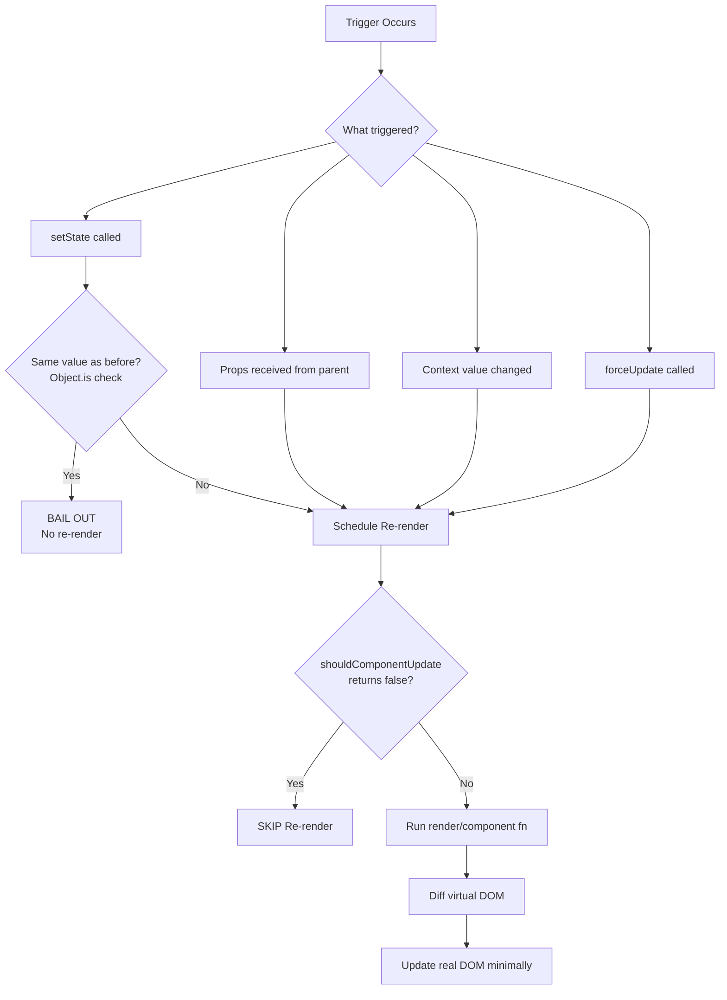
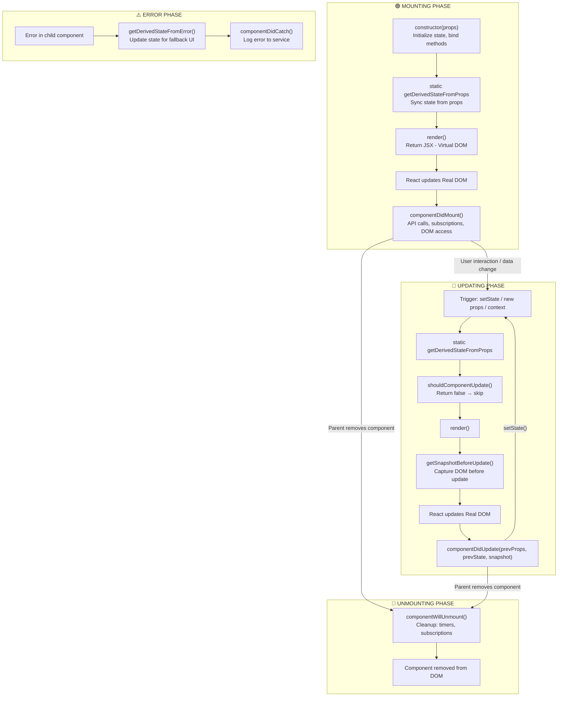
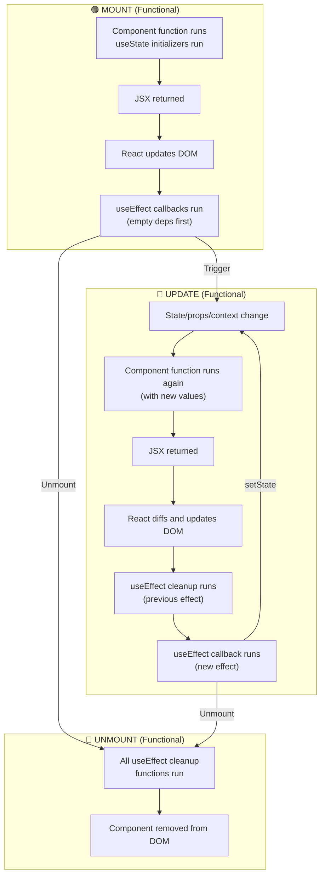

<a id="14-component-lifecycle"></a>

[⬅ Previous Chapter](#13-event-handling-in-react) | [📖 Main Index](#main-index) | [Next Chapter ➡](#15-useeffect-complete-mastery)

---

# Chapter 14: Component Lifecycle

## 📌 Learning Objectives

By the end of this chapter, you will:

- **Understand** the three phases of component lifecycle — Mount, Update, Unmount
- **Know** exactly when React triggers a re-render — all scenarios
- **Master** every class component lifecycle method — constructor through componentDidCatch
- **Map** every lifecycle method to its functional component hook equivalent
- **Read** and explain the complete lifecycle flow diagram
- **Explain** why getDerivedStateFromProps and getSnapshotBeforeUpdate exist
- **Answer 10+ interview questions** on lifecycle concepts confidently

---

<a id="chapter-index-table-14"></a>

## Chapter Index Table

| Topic No. | Topic Name | Subtopics |
|-----------|-----------|-----------|
| 14.1 | [Component Lifecycle — Three Phases](#141-component-lifecycle--three-phases) | Mounting<br>Updating<br>Unmounting |
| 14.2 | [When Does React Re-render?](#142-when-does-react-re-render) | State change<br>Props change<br>Parent cascade<br>Context<br>forceUpdate |
| 14.3 | [Class Component Lifecycle Methods](#143-class-component-lifecycle-methods) | All 8 methods detailed |
| 14.4 | [Lifecycle to Hooks Mapping](#144-lifecycle-to-hooks-mapping) | Each method → hook equivalent |
| 14.5 | [Lifecycle Diagram — Visual Flow](#145-lifecycle-diagram--visual-flow) | Complete visual |
| 💡 | [Interview Questions](#-interview-questions) | 10+ with Answers |
| 🧪 | [Practice Problems](#-practice-problems) | 5 Coding + 5 Theory |
| 🚀 | [Mini Project](#-mini-project) | Lifecycle Logger Component |
| ⚡ | [Quick Revision](#-quick-revision) | Key bullets, traps |
| 📌 | [Chapter Summary](#-chapter-summary) | Final takeaways |

---

## 14.1 Component Lifecycle — Three Phases

<a id="141-component-lifecycle--three-phases"></a>

### What is Component Lifecycle?

A React component goes through a predictable sequence of events from the moment it appears on screen to the moment it's removed. Understanding this sequence is fundamental to knowing when to fetch data, set up subscriptions, and clean up resources.

```
LIFECYCLE PHASES:

┌─────────────────────────────────────────────────────────────┐
│ MOUNTING (Birth)                                            │
│ Component appears in the DOM for the first time            │
│ constructor() → render() → DOM update → componentDidMount  │
├─────────────────────────────────────────────────────────────┤
│ UPDATING (Growth)                                          │
│ Component re-renders due to state/props/context change      │
│ render() → DOM update → componentDidUpdate                 │
├─────────────────────────────────────────────────────────────┤
│ UNMOUNTING (Death)                                         │
│ Component is removed from the DOM                          │
│ componentWillUnmount() → DOM removal                       │
└─────────────────────────────────────────────────────────────┘
```

---

### Phase 1: Mounting (Birth)

Mounting occurs when a component is **inserted into the DOM for the first time**.

```jsx
class UserProfile extends Component {
  // STEP 1: constructor() — component is born
  constructor(props) {
    super(props);
    this.state = { userData: null, loading: true };
    // DOM does NOT exist yet — cannot access DOM nodes here
    // Only initialize state and bind methods
  }

  // STEP 2: static getDerivedStateFromProps()
  // Runs before every render including mount

  // STEP 3: render() — creates the virtual DOM
  render() {
    return (
      <div>
        {this.state.loading ? 'Loading...' : this.state.userData?.name}
      </div>
    );
    // DOM does NOT exist yet after this — React calculates what DOM should look like
  }

  // STEP 4: React updates the real DOM

  // STEP 5: componentDidMount() — component is "born" in the DOM
  componentDidMount() {
    // DOM NOW EXISTS — safe to access DOM nodes
    // Perfect for: API calls, subscriptions, timers, DOM measurements
    fetch('/api/user').then(r => r.json()).then(data => {
      this.setState({ userData: data, loading: false });
    });
  }
}
```

---

### Phase 2: Updating (Growth)

Updating occurs when the component **re-renders** due to state changes, prop changes, or context changes.

```jsx
class Counter extends Component {
  state = { count: 0 };

  componentDidUpdate(prevProps, prevState) {
    // Called AFTER re-render completes and DOM is updated
    // prevProps = props before this update
    // prevState = state before this update

    // ✅ Always compare before acting to avoid infinite loops
    if (prevState.count !== this.state.count) {
      document.title = `Count: ${this.state.count}`;
    }

    // Respond to prop changes:
    if (prevProps.userId !== this.props.userId) {
      this.fetchUserData(this.props.userId);  // Fetch new user's data
    }
  }

  render() {
    return (
      <div>
        <p>{this.state.count}</p>
        <button onClick={() => this.setState(p => ({ count: p.count + 1 }))}>+</button>
      </div>
    );
  }
}
```

---

### Phase 3: Unmounting (Death)

Unmounting occurs when a component is **removed from the DOM**.

```jsx
class DataSubscription extends Component {
  subscription = null;
  timer = null;

  componentDidMount() {
    // Setup subscriptions and timers
    this.subscription = dataService.subscribe(this.handleData);
    this.timer = setInterval(() => this.refreshData(), 5000);
    document.addEventListener('visibilitychange', this.handleVisibility);
  }

  componentWillUnmount() {
    // CLEANUP — runs just before component is removed from DOM
    // ✅ Cancel subscriptions
    this.subscription?.unsubscribe();
    // ✅ Clear timers
    clearInterval(this.timer);
    // ✅ Remove event listeners
    document.removeEventListener('visibilitychange', this.handleVisibility);
    // ✅ Cancel pending API requests
    this.abortController?.abort();

    // After this, the component is gone from DOM
    // Memory is freed if no other references exist
  }

  render() { return <div>Subscribed</div>; }
}
```

---

### 🧠 Hinglish Intuition

Component lifecycle ek **student ke school life** jaisa hai:
- **Mounting (Birth)** = Pehla din school mein. Nayi class mein entry. Teacher se milna (API calls), seat dhundhna (DOM access).
- **Updating (Growth)** = Roz ka din. Homework aata hai (props/state change), tum react karte ho (re-render).
- **Unmounting (Death)** = School khatam, graduation. Apni cheezein pack karo (cleanup — timers, subscriptions), door bandh karo (event listeners remove karo).

---

👉 <a href="#chapter-index-table-14">Go to Top 🔝</a>

---

## 14.2 When Does React Re-render?

<a id="142-when-does-react-re-render"></a>

### Re-render Trigger 1: State Change

```jsx
function StateDemo() {
  const [count, setCount] = useState(0);

  // setCount called → React schedules re-render of THIS component
  // On re-render: function runs again, returns new JSX
  // React diffs old vs new JSX, updates DOM minimally

  return <button onClick={() => setCount(c => c + 1)}>{count}</button>;
}

// EXCEPTION: Same value → React bails out (no re-render)
setCount(0);  // count already 0 → Object.is(0, 0) = true → NO re-render
```

---

### Re-render Trigger 2: Props Change

```jsx
function Parent() {
  const [name, setName] = useState('Alice');

  // When name changes → Parent re-renders → Child receives new props → Child re-renders
  return <Child name={name} />;
}

function Child({ name }) {
  // Re-renders when name prop changes
  // ALSO re-renders when Parent re-renders (even if name didn't change!)
  return <p>Hello {name}</p>;
}
```

---

### Re-render Trigger 3: Parent Re-render Cascade

```jsx
// IMPORTANT: By default, when a parent re-renders, ALL children re-render
// Even if their props didn't change!

function Parent() {
  const [count, setCount] = useState(0);

  return (
    <div>
      <p>Count: {count}</p>
      <button onClick={() => setCount(c => c + 1)}>+</button>
      <ExpensiveChild />  {/* ← Re-renders EVERY time Parent re-renders */}
      {/* Even though ExpensiveChild receives no props and nothing changed for it! */}
    </div>
  );
}

function ExpensiveChild() {
  console.log('ExpensiveChild rendered!');
  return <div>I render unnecessarily</div>;
}

// Solution: React.memo (Chapter 20)
const MemoizedChild = React.memo(ExpensiveChild);
// Now only re-renders when its own props change
```

---

### Re-render Trigger 4: Context Value Change

```jsx
const ThemeContext = createContext('light');

function App() {
  const [theme, setTheme] = useState('light');

  return (
    <ThemeContext.Provider value={theme}>
      <DeepChild />  {/* Will re-render when theme changes */}
    </ThemeContext.Provider>
  );
}

function DeepChild() {
  const theme = useContext(ThemeContext);
  // Re-renders when ThemeContext value changes
  // No matter how deep in the tree
  return <div className={theme}>Deep child</div>;
}
```

---

### Re-render Trigger 5: forceUpdate (Class Components Only)

```jsx
class WeatherWidget extends Component {
  // forceUpdate bypasses shouldComponentUpdate
  // Forces a re-render even if props and state haven't changed
  // Very rare — usually indicates a design smell

  render() {
    return (
      <div>
        <p>Time: {new Date().toLocaleTimeString()}</p>
        <button onClick={() => this.forceUpdate()}>
          Refresh Time
        </button>
        {/* forceUpdate forces re-render to show updated time */}
      </div>
    );
  }
}

// Functional equivalent: use state to trigger re-render
function WeatherWidget() {
  const [, forceRender] = useState(0);
  return (
    <div>
      <p>Time: {new Date().toLocaleTimeString()}</p>
      <button onClick={() => forceRender(n => n + 1)}>Refresh</button>
    </div>
  );
}
```

---

### Re-render Decision Tree



---

👉 <a href="#chapter-index-table-14">Go to Top 🔝</a>

---

## 14.3 Class Component Lifecycle Methods

<a id="143-class-component-lifecycle-methods"></a>

### Complete Lifecycle Timeline

```
MOUNTING:
constructor(props)
  ↓
static getDerivedStateFromProps(props, state)
  ↓
render()
  ↓
[React updates DOM]
  ↓
componentDidMount()

UPDATING (triggered by setState, new props, forceUpdate):
static getDerivedStateFromProps(props, state)
  ↓
shouldComponentUpdate(nextProps, nextState)
  ↓ (if returns true)
render()
  ↓
getSnapshotBeforeUpdate(prevProps, prevState)
  ↓
[React updates DOM]
  ↓
componentDidUpdate(prevProps, prevState, snapshot)

UNMOUNTING:
componentWillUnmount()

ERROR HANDLING:
static getDerivedStateFromError(error)
componentDidCatch(error, errorInfo)
```

---

### 1. constructor(props)

```jsx
class MyComponent extends Component {
  constructor(props) {
    super(props);  // REQUIRED — sets up this.props
    // ✅ Initialize state
    this.state = {
      count: props.initialCount || 0,
      data: null,
    };
    // ✅ Bind event handlers (or use arrow class fields)
    this.handleClick = this.handleClick.bind(this);
    // ❌ No side effects here (no API calls, no DOM access)
    // ❌ No setState() — state is initialized directly
  }
}
```

---

### 2. componentDidMount()

```jsx
class DataComponent extends Component {
  state = { data: null, loading: true, error: null };
  abortController = new AbortController();

  componentDidMount() {
    // ✅ API calls
    fetch('/api/data', { signal: this.abortController.signal })
      .then(r => r.json())
      .then(data => this.setState({ data, loading: false }))
      .catch(error => {
        if (error.name !== 'AbortError') {
          this.setState({ error, loading: false });
        }
      });

    // ✅ Set up subscriptions
    this.subscription = eventBus.subscribe(this.handleEvent);

    // ✅ Set up timers
    this.timer = setInterval(this.refresh, 30000);

    // ✅ DOM measurements (DOM now exists)
    this.setState({ containerWidth: this.containerRef.current.offsetWidth });

    // ✅ Third-party library initialization
    this.chart = new Chart(this.canvasRef.current, chartOptions);
  }

  componentWillUnmount() {
    // Always clean up what you set up in componentDidMount
    this.abortController.abort();
    this.subscription?.unsubscribe();
    clearInterval(this.timer);
    this.chart?.destroy();
  }

  render() { return <div ref={this.containerRef}>...</div>; }
}
```

---

### 3. componentDidUpdate(prevProps, prevState, snapshot)

```jsx
class UserProfile extends Component {
  componentDidUpdate(prevProps, prevState, snapshot) {
    // ALWAYS compare before acting — prevent infinite loops!

    // Respond to prop change:
    if (prevProps.userId !== this.props.userId) {
      this.fetchUser(this.props.userId);
    }

    // Respond to state change:
    if (prevState.count !== this.state.count) {
      localStorage.setItem('count', this.state.count);
    }

    // Use snapshot from getSnapshotBeforeUpdate:
    if (snapshot !== null) {
      const list = this.listRef.current;
      list.scrollTop = list.scrollHeight - snapshot;
      // snapshot was the old scroll height — maintain scroll position
    }

    // ❌ INFINITE LOOP — no condition!
    // this.setState({ something: 'new' });
    // → triggers componentDidUpdate → setState → componentDidUpdate → ...
  }
}
```

---

### 4. componentWillUnmount()

```jsx
class SubscribedComponent extends Component {
  componentWillUnmount() {
    // This is the ONLY cleanup lifecycle method
    // Called BEFORE component is removed from DOM

    // Clean up EVERYTHING you set up:
    clearInterval(this.intervalId);
    clearTimeout(this.timeoutId);
    this.subscription?.unsubscribe();
    this.socket?.close();
    this.abortController?.abort();
    document.removeEventListener('keydown', this.handleKeyDown);
    window.removeEventListener('resize', this.handleResize);
    this.resizeObserver?.disconnect();
    this.mutationObserver?.disconnect();
    this.intersectionObserver?.disconnect();
    this.chart?.destroy();  // Third-party cleanup

    // ❌ Cannot call setState here — component is about to be removed
    // React will warn: "Can't call setState on unmounted component"
  }

  render() { return <div>...</div>; }
}
```

---

### 5. shouldComponentUpdate(nextProps, nextState)

```jsx
class ExpensiveComponent extends Component {
  // Called BEFORE render during updates
  // Return true → proceed with re-render
  // Return false → skip re-render (optimization)
  shouldComponentUpdate(nextProps, nextState) {
    // Only re-render if relevant data changed:
    return (
      nextProps.userId !== this.props.userId ||
      nextState.data !== this.state.data
    );
    // All other prop/state changes → skipped!
  }

  // Simpler alternative: extend PureComponent
  // PureComponent does SHALLOW comparison automatically
  render() { return <div>...</div>; }
}

class OptimizedComponent extends PureComponent {
  // PureComponent implements shouldComponentUpdate with shallow comparison
  // No need to write shouldComponentUpdate manually
  render() { return <div>...</div>; }
}

// Functional equivalent: React.memo (Chapter 20)
const MemoizedComponent = React.memo(ExpensiveComponent, (prevProps, nextProps) => {
  // Return true = SKIP re-render (props are equal)
  // Return false = RE-RENDER (props changed)
  return prevProps.userId === nextProps.userId;
});
```

---

### 6. static getDerivedStateFromProps(props, state)

```jsx
// Called before EVERY render (mount AND update)
// Used to sync state with props (rare use case)
// STATIC — cannot access 'this' — pure function

class ColorInput extends Component {
  state = { internalColor: this.props.defaultColor };

  static getDerivedStateFromProps(props, state) {
    // If controlled (value prop provided), sync internal state
    if (props.value !== undefined && props.value !== state.internalColor) {
      return { internalColor: props.value };  // Merged into state
    }
    return null;  // No state update
  }

  render() {
    return (
      <input
        type="color"
        value={this.state.internalColor}
        onChange={e => {
          this.setState({ internalColor: e.target.value });
          this.props.onChange?.(e.target.value);
        }}
      />
    );
  }
}

// ⚠️ getDerivedStateFromProps is complex and rarely needed
// Most cases can be solved with:
// 1. Fully controlled component (pass value as prop)
// 2. Fully uncontrolled component (use defaultValue + key prop reset)
// React docs call this a "derived state anti-pattern" in most cases
```

---

### 7. getSnapshotBeforeUpdate(prevProps, prevState)

```jsx
// Called AFTER render but BEFORE React commits to DOM
// Can read DOM before it changes (e.g., scroll position)
// Whatever it returns goes to componentDidUpdate as 'snapshot'

class ScrollableChat extends Component {
  listRef = createRef();

  getSnapshotBeforeUpdate(prevProps, prevState) {
    // Was a new message added?
    if (prevProps.messages.length < this.props.messages.length) {
      const list = this.listRef.current;
      // Capture current scroll position from bottom
      return list.scrollHeight - list.scrollTop;
    }
    return null;
  }

  componentDidUpdate(prevProps, prevState, snapshot) {
    // Restore scroll position
    if (snapshot !== null) {
      const list = this.listRef.current;
      list.scrollTop = list.scrollHeight - snapshot;
      // Maintains user's scroll position when new messages arrive at top
    }
  }

  render() {
    return (
      <div ref={this.listRef} style={{ overflowY: 'auto', height: '400px' }}>
        {this.props.messages.map(msg => (
          <div key={msg.id}>{msg.text}</div>
        ))}
      </div>
    );
  }
}
```

---

### 8. componentDidCatch() & getDerivedStateFromError()

```jsx
// These two work TOGETHER to create Error Boundaries
// Error Boundaries are CLASS COMPONENT ONLY (no hook equivalent yet)
// They catch errors from CHILD components (not their own)

class ErrorBoundary extends Component {
  state = { hasError: false, error: null };

  // Called during render phase when error is thrown
  // Updates state to show fallback UI
  static getDerivedStateFromError(error) {
    return { hasError: true, error };
  }

  // Called during commit phase with full error info
  // Use for logging to error tracking services
  componentDidCatch(error, errorInfo) {
    console.error('Error caught:', error);
    console.error('Component stack:', errorInfo.componentStack);
    logErrorToSentry(error, errorInfo);
  }

  render() {
    if (this.state.hasError) {
      return (
        <div style={{ padding: '20px', backgroundColor: '#fee2e2', borderRadius: '8px' }}>
          <h2>Something went wrong 😕</h2>
          <p>{this.state.error?.message}</p>
          <button onClick={() => this.setState({ hasError: false, error: null })}>
            Try Again
          </button>
        </div>
      );
    }
    return this.props.children;
  }
}

// Usage:
<ErrorBoundary>
  <ComponentThatMightThrow />
</ErrorBoundary>
```

---

👉 <a href="#chapter-index-table-14">Go to Top 🔝</a>

---

## 14.4 Lifecycle to Hooks Mapping

<a id="144-lifecycle-to-hooks-mapping"></a>

### Complete Mapping Table

| Class Lifecycle | Functional Hook Equivalent |
|----------------|--------------------------|
| `constructor` | `useState(initialValue)` or `useState(() => compute())` |
| `componentDidMount` | `useEffect(() => { ... }, [])` |
| `componentDidUpdate` | `useEffect(() => { ... }, [deps])` |
| `componentWillUnmount` | Cleanup function in `useEffect` return |
| `shouldComponentUpdate` | `React.memo` + `useMemo`/`useCallback` |
| `getDerivedStateFromProps` | Render-time derived state (no hook needed) |
| `getSnapshotBeforeUpdate` | `useLayoutEffect` (partial) |
| `componentDidCatch` | No hook — must use class ErrorBoundary |
| `getDerivedStateFromError` | No hook — must use class ErrorBoundary |
| `PureComponent` | `React.memo` |
| `forceUpdate` | `useState` / `useReducer` setter called with new reference |

---

### Detailed Mapping with Code

```jsx
// ===== componentDidMount → useEffect(fn, []) =====
// Class:
componentDidMount() {
  fetch('/api/data').then(r => r.json()).then(setData);
}

// Functional:
useEffect(() => {
  fetch('/api/data').then(r => r.json()).then(setData);
}, []);  // ← [] = run once on mount

// ===== componentDidUpdate → useEffect(fn, [deps]) =====
// Class:
componentDidUpdate(prevProps) {
  if (prevProps.userId !== this.props.userId) {
    fetchUser(this.props.userId);
  }
}

// Functional:
useEffect(() => {
  fetchUser(userId);
}, [userId]);  // ← Runs when userId changes (automatic comparison)
// Note: Runs on mount too (no prevProps comparison needed — just always fetch)

// ===== componentWillUnmount → cleanup function =====
// Class:
componentDidMount() {
  this.timer = setInterval(this.tick, 1000);
}
componentWillUnmount() {
  clearInterval(this.timer);
}

// Functional:
useEffect(() => {
  const timer = setInterval(tick, 1000);
  return () => clearInterval(timer);  // ← Cleanup runs on unmount (and before next effect)
}, []);

// ===== Mount + Update + Unmount — combined =====
// Class:
componentDidMount() { this.setup(); }
componentDidUpdate(prevProps) {
  if (prevProps.id !== this.props.id) { this.setup(); }
}
componentWillUnmount() { this.cleanup(); }

// Functional:
useEffect(() => {
  setup();
  return () => cleanup();
}, [id]);  // Runs on mount, re-runs when id changes, cleans up before each run
```

---

### getDerivedStateFromProps — Functional Equivalent

```jsx
// Class: getDerivedStateFromProps (complex, error-prone)
static getDerivedStateFromProps(props, state) {
  if (props.externalValue !== state.internalValue) {
    return { internalValue: props.externalValue };
  }
  return null;
}

// Functional: Just compute during render — simpler!
function Component({ externalValue }) {
  const [internalValue, setInternalValue] = useState(externalValue);

  // Option 1: Fully controlled — use prop directly
  // No state needed at all:
  // return <div>{externalValue}</div>;

  // Option 2: If you truly need derived state:
  // Compute it during render — no useEffect, no getDerivedStateFromProps
  const derivedValue = externalValue ?? internalValue;

  return <div>{derivedValue}</div>;
}
```

---

### shouldComponentUpdate — Functional Equivalent

```jsx
// Class:
class Item extends Component {
  shouldComponentUpdate(nextProps) {
    return nextProps.id !== this.props.id || nextProps.name !== this.props.name;
  }
  render() { return <div>{this.props.name}</div>; }
}

// Functional equivalent 1: React.memo (default — shallow comparison)
const Item = React.memo(function Item({ id, name }) {
  return <div>{name}</div>;
});
// Now only re-renders when id or name changes (shallow comparison)

// Functional equivalent 2: React.memo with custom comparison
const Item = React.memo(
  function Item({ id, name, complexData }) {
    return <div>{name}</div>;
  },
  (prevProps, nextProps) => {
    // Return true = SAME = SKIP re-render
    // Return false = DIFFERENT = RE-RENDER
    return prevProps.id === nextProps.id &&
           prevProps.name === nextProps.name;
    // Ignore complexData in comparison
  }
);
```

---

### Side-by-Side Full Example

```jsx
// ===== CLASS COMPONENT =====
class UserDashboard extends Component {
  state = { user: null, loading: true, error: null };
  abortController = new AbortController();

  componentDidMount() {
    this.fetchUser(this.props.userId);
  }

  componentDidUpdate(prevProps) {
    if (prevProps.userId !== this.props.userId) {
      this.setState({ loading: true, error: null });
      this.fetchUser(this.props.userId);
    }
  }

  componentWillUnmount() {
    this.abortController.abort();
  }

  fetchUser(id) {
    fetch(`/api/users/${id}`, { signal: this.abortController.signal })
      .then(r => r.json())
      .then(user => this.setState({ user, loading: false }))
      .catch(error => {
        if (error.name !== 'AbortError') {
          this.setState({ error, loading: false });
        }
      });
  }

  render() {
    const { user, loading, error } = this.state;
    if (loading) return <p>Loading...</p>;
    if (error) return <p>Error: {error.message}</p>;
    return <div>{user?.name}</div>;
  }
}

// ===== FUNCTIONAL COMPONENT (Equivalent) =====
import { useState, useEffect } from 'react';

function UserDashboard({ userId }) {
  const [user, setUser] = useState(null);
  const [loading, setLoading] = useState(true);
  const [error, setError] = useState(null);

  useEffect(() => {
    const controller = new AbortController();

    setLoading(true);
    setError(null);

    fetch(`/api/users/${userId}`, { signal: controller.signal })
      .then(r => r.json())
      .then(user => {
        setUser(user);
        setLoading(false);
      })
      .catch(err => {
        if (err.name !== 'AbortError') {
          setError(err);
          setLoading(false);
        }
      });

    return () => controller.abort();  // Cleanup: cancel fetch on unmount or userId change
  }, [userId]);  // Re-run when userId changes

  if (loading) return <p>Loading...</p>;
  if (error) return <p>Error: {error.message}</p>;
  return <div>{user?.name}</div>;
}
```

---

👉 <a href="#chapter-index-table-14">Go to Top 🔝</a>

---

## 14.5 Lifecycle Diagram — Visual Flow

<a id="145-lifecycle-diagram--visual-flow"></a>

### Complete Lifecycle Flow



---

### Functional Component Equivalent Flow



---

### Timeline View — What Runs When

```
USER ACTION: Component is rendered for first time

TIME ──────────────────────────────────────────────────────────►

[JS Thread]  constructor() → getDerivedStateFromProps() → render()
[React]                                                          ↓ diff virtual DOM
[DOM]                                                            DOM updated
[JS Thread]                                                               componentDidMount()

USER ACTION: State changes (e.g., button click)

[JS Thread]  getDerivedStateFromProps() → shouldComponentUpdate() → render()
[React]                                                                     ↓ diff
[JS Thread]                                                              getSnapshotBeforeUpdate()
[DOM]                                                                            DOM updated
[JS Thread]                                                                               componentDidUpdate()

USER ACTION: Parent removes this component (e.g., conditional render becomes false)

[JS Thread]  componentWillUnmount()
[DOM]                               DOM node removed
```

---

👉 <a href="#chapter-index-table-14">Go to Top 🔝</a>

---

## 💡 Interview Questions

<a id="-interview-questions"></a>

### Conceptual Questions

---

**Q1. What are the three phases of a React component lifecycle?**

**Answer:**
1. **Mounting** — Component is created and inserted into the DOM. Methods run: constructor → getDerivedStateFromProps → render → DOM update → componentDidMount
2. **Updating** — Component re-renders due to state/props/context change. Methods: getDerivedStateFromProps → shouldComponentUpdate → render → getSnapshotBeforeUpdate → DOM update → componentDidUpdate
3. **Unmounting** — Component is removed from the DOM. Method: componentWillUnmount

Each phase has specific purposes — mounting for initial setup, updating for responding to changes, unmounting for cleanup.

---

**Q2. When does React trigger a re-render?**

**Answer:**
React re-renders a component when:
1. **`setState` is called** (or `useState` setter) — with a new value (`Object.is` check)
2. **Props change** — parent re-renders and passes new props
3. **Parent re-renders** — even if props didn't change (unless `React.memo` is used)
4. **Context value changes** — any component consuming the context re-renders
5. **`forceUpdate()` called** — class components only, bypasses shouldComponentUpdate

**Exception:** React bails out of re-render if state setter is called with the same value (`Object.is(oldState, newState) === true`).

---

**Q3. What is `componentDidMount` used for? Why can't you do those things in the constructor?**

**Answer:**
`componentDidMount` is called after the component's first render and after React has committed to the DOM. Use it for:
- API/data fetching
- Setting up subscriptions and event listeners
- Starting timers
- DOM measurements (reading `offsetWidth`, `scrollHeight`, etc.)
- Initializing third-party DOM libraries

**Why not in constructor?**
- The DOM doesn't exist yet during constructor
- `setState` in constructor would cause issues (use direct state assignment instead)
- Constructor should be lightweight — just initialize state and bind methods
- Side effects in constructor make testing harder

---

**Q4. Why must you always compare `prevProps`/`prevState` in `componentDidUpdate`?**

**Answer:**
Without comparison, you risk creating an **infinite loop**:

```jsx
componentDidUpdate() {
  this.setState({ something: 'new' });  // ← No condition!
  // setState triggers componentDidUpdate → setState → componentDidUpdate → ...
  // Stack overflow / infinite loop!
}

// ✅ Always guard with comparison:
componentDidUpdate(prevProps) {
  if (prevProps.id !== this.props.id) {
    this.fetchData(this.props.id);  // Only fetch if id actually changed
  }
}
```

---

**Q5. What is `getSnapshotBeforeUpdate` and when would you use it?**

**Answer:**
`getSnapshotBeforeUpdate` is called AFTER render but BEFORE React commits changes to the DOM. It's the only moment where you can read the DOM in its pre-update state. Whatever it returns is passed as the third argument (`snapshot`) to `componentDidUpdate`.

**Classic use case:** Maintaining scroll position in a chat app when new messages are added:

```jsx
getSnapshotBeforeUpdate(prevProps) {
  if (prevProps.messages.length < this.props.messages.length) {
    const list = this.listRef.current;
    return list.scrollHeight - list.scrollTop;  // Capture before DOM changes
  }
  return null;
}

componentDidUpdate(prevProps, prevState, snapshot) {
  if (snapshot !== null) {
    this.listRef.current.scrollTop = this.listRef.current.scrollHeight - snapshot;
  }
}
```

---

**Q6. What are Error Boundaries? Why must they be class components?**

**Answer:**
Error Boundaries are React components that catch JavaScript errors in their **child component tree**, log them, and display a fallback UI instead of crashing the entire app.

They use two lifecycle methods:
- `static getDerivedStateFromError(error)` — updates state to show fallback UI (render phase)
- `componentDidCatch(error, errorInfo)` — logs error details (commit phase)

**Why class components only?** These lifecycle methods haven't been implemented as hooks. The React team has indicated this will likely change in future versions (possibly with `use()` hook in React 19 for error handling), but as of React 18, Error Boundaries require class components.

**Errors NOT caught by Error Boundaries:**
- Event handlers (use try/catch)
- Async code (setTimeout, Promises)
- Server-side rendering
- Errors in the Error Boundary itself

---

**Q7. Map each class lifecycle method to its functional hook equivalent.**

**Answer:**

| Class | Functional |
|-------|-----------|
| `constructor` | `useState(initialValue)` |
| `componentDidMount` | `useEffect(fn, [])` |
| `componentDidUpdate` | `useEffect(fn, [deps])` |
| `componentWillUnmount` | Return function in `useEffect` |
| `shouldComponentUpdate` | `React.memo` |
| `getDerivedStateFromProps` | Compute during render |
| `getSnapshotBeforeUpdate` | `useLayoutEffect` (partial) |
| `componentDidCatch` | No hook — class only |

---

**Q8. What is `PureComponent` and what is its functional equivalent?**

**Answer:**
`PureComponent` is a base class that automatically implements `shouldComponentUpdate` with a **shallow comparison** of props and state. If none changed (shallow), it skips the re-render.

```jsx
// Class:
class MyComponent extends PureComponent {
  // Automatically skips re-render if props/state shallowly equal
}

// Functional equivalent:
const MyComponent = React.memo(function MyComponent(props) {
  return <div>{props.name}</div>;
});
// Same effect: skips re-render if props shallowly equal
```

**Shallow comparison means:** For primitive values (strings, numbers, booleans) — value comparison. For objects/arrays — reference comparison (not deep equality). A new array reference `[]` would trigger re-render even if contents are the same.

---

### Scenario-Based Questions

---

**Q9. A component fetches data when `userId` prop changes. Write both the class and functional version.**

**Answer:**

```jsx
// Class:
class UserProfile extends Component {
  state = { user: null, loading: true };

  componentDidMount() {
    this.fetchUser(this.props.userId);
  }

  componentDidUpdate(prevProps) {
    if (prevProps.userId !== this.props.userId) {
      this.setState({ loading: true });
      this.fetchUser(this.props.userId);
    }
  }

  fetchUser(id) {
    fetch(`/api/users/${id}`)
      .then(r => r.json())
      .then(user => this.setState({ user, loading: false }));
  }

  render() {
    return this.state.loading ? <p>Loading...</p> : <p>{this.state.user?.name}</p>;
  }
}

// Functional:
function UserProfile({ userId }) {
  const [user, setUser] = useState(null);
  const [loading, setLoading] = useState(true);

  useEffect(() => {
    setLoading(true);
    fetch(`/api/users/${userId}`)
      .then(r => r.json())
      .then(user => { setUser(user); setLoading(false); });
  }, [userId]);  // Handles both mount AND userId change

  return loading ? <p>Loading...</p> : <p>{user?.name}</p>;
}
```

The functional version is ~40% less code and handles both mount and update in one `useEffect`.

---

**Q10. What happens if you call `setState` in `componentWillUnmount`?**

**Answer:**
React will display a warning (in development):
> "Warning: Can't perform a React state update on an unmounted component. This is a no-op, but it indicates a memory leak in your application."

The component is being removed from the DOM — setting state on it is pointless (nothing will re-render) and indicates a resource leak (probably an async operation that wasn't cancelled before unmounting).

**Fix:** Cancel async operations in `componentWillUnmount`:
```jsx
componentWillUnmount() {
  this.abortController.abort();  // Cancel pending fetch
  clearTimeout(this.timer);      // Clear pending setTimeout
}
```

---

👉 <a href="#chapter-index-table-14">Go to Top 🔝</a>

---

## 🧪 Practice Problems

<a id="-practice-problems"></a>

### Coding Questions

---

**1. Convert a class component with full lifecycle to functional**

```jsx
// ===== Original Class Component =====
import { Component } from 'react';

class WindowSize extends Component {
  state = {
    width: window.innerWidth,
    height: window.innerHeight,
  };

  handleResize = () => {
    this.setState({
      width: window.innerWidth,
      height: window.innerHeight,
    });
  };

  componentDidMount() {
    window.addEventListener('resize', this.handleResize);
  }

  componentWillUnmount() {
    window.removeEventListener('resize', this.handleResize);
  }

  render() {
    return (
      <p>
        Window: {this.state.width} × {this.state.height}
      </p>
    );
  }
}

// ===== Functional Equivalent =====
import { useState, useEffect } from 'react';

function WindowSize() {
  const [size, setSize] = useState({
    width: window.innerWidth,
    height: window.innerHeight,
  });

  useEffect(() => {
    const handleResize = () => {
      setSize({ width: window.innerWidth, height: window.innerHeight });
    };

    window.addEventListener('resize', handleResize);
    return () => window.removeEventListener('resize', handleResize);
    // ↑ Cleanup runs on unmount — equivalent to componentWillUnmount
  }, []);  // ← [] = only mount/unmount — equivalent to componentDidMount/WillUnmount

  return <p>Window: {size.width} × {size.height}</p>;
}

// Even better: Extract as custom hook
function useWindowSize() {
  const [size, setSize] = useState({
    width: window.innerWidth,
    height: window.innerHeight,
  });

  useEffect(() => {
    const handleResize = () => setSize({
      width: window.innerWidth,
      height: window.innerHeight,
    });
    window.addEventListener('resize', handleResize);
    return () => window.removeEventListener('resize', handleResize);
  }, []);

  return size;
}

// Usage:
function MyComponent() {
  const { width, height } = useWindowSize();
  return <p>{width} × {height}</p>;
}

export default MyComponent;
```

---

**2. Build a component that demonstrates all three lifecycle phases**

```jsx
import { useState, useEffect } from 'react';

function LifecycleLogger({ itemId }) {
  const [data, setData] = useState(null);
  const [logs, setLogs] = useState([]);

  const addLog = (phase, message, color = '#374151') => {
    const entry = {
      id: Date.now(),
      time: new Date().toLocaleTimeString('en-US', { hour12: false, hour: '2-digit', minute: '2-digit', second: '2-digit', fractionalSecondDigits: 3 }),
      phase,
      message,
      color,
    };
    setLogs(prev => [entry, ...prev].slice(0, 20));
  };

  // MOUNT (componentDidMount equivalent)
  useEffect(() => {
    addLog('MOUNT', `Component mounted with itemId: ${itemId}`, '#16a34a');

    // Simulate API fetch
    const timer = setTimeout(() => {
      setData({ id: itemId, name: `Item ${itemId}`, status: 'active' });
      addLog('MOUNT', `Data fetched for item ${itemId}`, '#16a34a');
    }, 500);

    // UNMOUNT (componentWillUnmount equivalent)
    return () => {
      clearTimeout(timer);
      addLog('UNMOUNT', `Component unmounted, itemId was: ${itemId}`, '#dc2626');
    };
  }, []);  // Empty deps = mount/unmount only

  // UPDATE (componentDidUpdate equivalent — itemId changes)
  useEffect(() => {
    if (!data) return;  // Skip initial mount data fetch
    addLog('UPDATE', `itemId changed to: ${itemId}`, '#2563eb');
    setData(null);

    const timer = setTimeout(() => {
      setData({ id: itemId, name: `Item ${itemId}`, status: 'active' });
      addLog('UPDATE', `New data fetched for item ${itemId}`, '#2563eb');
    }, 500);

    return () => clearTimeout(timer);
  }, [itemId]);  // Runs when itemId changes

  return (
    <div style={{ fontFamily: 'monospace' }}>
      <h3>Current Data:</h3>
      {data ? (
        <pre style={{ backgroundColor: '#f8fafc', padding: '12px', borderRadius: '8px', fontSize: '13px' }}>
          {JSON.stringify(data, null, 2)}
        </pre>
      ) : (
        <p style={{ color: '#94a3b8' }}>Loading...</p>
      )}

      <h3>Lifecycle Log:</h3>
      <div style={{ maxHeight: '300px', overflowY: 'auto' }}>
        {logs.map(log => (
          <div key={log.id} style={{
            padding: '6px 10px',
            marginBottom: '4px',
            backgroundColor: '#f8fafc',
            borderLeft: `4px solid ${log.color}`,
            borderRadius: '4px',
            fontSize: '12px',
          }}>
            <span style={{ color: '#94a3b8', marginRight: '8px' }}>{log.time}</span>
            <span style={{ color: log.color, fontWeight: '700', marginRight: '8px' }}>[{log.phase}]</span>
            <span>{log.message}</span>
          </div>
        ))}
      </div>
    </div>
  );
}

function App() {
  const [itemId, setItemId] = useState(1);
  const [isMounted, setIsMounted] = useState(true);

  return (
    <div style={{ padding: '24px', maxWidth: '600px', fontFamily: 'sans-serif' }}>
      <h1>Lifecycle Demo</h1>

      <div style={{ display: 'flex', gap: '8px', marginBottom: '20px', flexWrap: 'wrap' }}>
        <button onClick={() => setItemId(i => i + 1)}
          style={{ padding: '8px 16px', backgroundColor: '#3b82f6', color: '#fff', border: 'none', borderRadius: '6px', cursor: 'pointer' }}>
          Change Item (trigger UPDATE)
        </button>
        <button onClick={() => setIsMounted(m => !m)}
          style={{ padding: '8px 16px', backgroundColor: isMounted ? '#ef4444' : '#22c55e', color: '#fff', border: 'none', borderRadius: '6px', cursor: 'pointer' }}>
          {isMounted ? 'Unmount' : 'Mount'} Component
        </button>
      </div>

      {isMounted ? (
        <div style={{ border: '1px solid #e2e8f0', borderRadius: '12px', padding: '16px' }}>
          <LifecycleLogger itemId={itemId} />
        </div>
      ) : (
        <p style={{ color: '#94a3b8', textAlign: 'center', padding: '40px' }}>
          Component is unmounted. Click "Mount" to bring it back.
        </p>
      )}
    </div>
  );
}

export default App;
```

---

**3. Implement an Error Boundary class component**

```jsx
import { Component, useState } from 'react';

// ===== Error Boundary (must be class component) =====
class ErrorBoundary extends Component {
  state = {
    hasError: false,
    error: null,
    errorInfo: null,
    errorCount: 0,
  };

  static getDerivedStateFromError(error) {
    // Called during render phase — update state to show fallback
    return { hasError: true, error };
  }

  componentDidCatch(error, errorInfo) {
    // Called during commit phase — log to service
    this.setState(prev => ({ errorInfo, errorCount: prev.errorCount + 1 }));
    console.error('ErrorBoundary caught:', error);
    console.error('Stack:', errorInfo.componentStack);
    // In production: logToSentry(error, errorInfo);
  }

  handleReset = () => {
    this.setState({ hasError: false, error: null, errorInfo: null });
  };

  render() {
    if (this.state.hasError) {
      return (
        <div style={{
          padding: '24px',
          backgroundColor: '#fff5f5',
          border: '2px solid #feb2b2',
          borderRadius: '12px',
          maxWidth: '500px',
          fontFamily: 'sans-serif',
        }}>
          <div style={{ fontSize: '40px', marginBottom: '8px' }}>💥</div>
          <h2 style={{ color: '#c53030', margin: '0 0 8px' }}>
            {this.props.fallbackTitle || 'Something went wrong'}
          </h2>
          <p style={{ color: '#742a2a', fontSize: '14px', margin: '0 0 16px' }}>
            {this.state.error?.message || 'An unexpected error occurred'}
          </p>

          {process.env.NODE_ENV === 'development' && this.state.errorInfo && (
            <details style={{ marginBottom: '16px' }}>
              <summary style={{ cursor: 'pointer', fontSize: '12px', color: '#9b2c2c' }}>
                Stack trace (development only)
              </summary>
              <pre style={{ fontSize: '10px', overflow: 'auto', backgroundColor: '#fff', padding: '8px', borderRadius: '4px', marginTop: '8px' }}>
                {this.state.errorInfo.componentStack}
              </pre>
            </details>
          )}

          <div style={{ display: 'flex', gap: '8px' }}>
            <button
              onClick={this.handleReset}
              style={{ padding: '8px 16px', backgroundColor: '#c53030', color: '#fff', border: 'none', borderRadius: '6px', cursor: 'pointer', fontSize: '14px' }}
            >
              Try Again
            </button>
            <button
              onClick={() => window.location.reload()}
              style={{ padding: '8px 16px', backgroundColor: '#fff', border: '1px solid #c53030', color: '#c53030', borderRadius: '6px', cursor: 'pointer', fontSize: '14px' }}
            >
              Reload Page
            </button>
          </div>

          <p style={{ fontSize: '11px', color: '#9b2c2c', margin: '12px 0 0' }}>
            Error occurred {this.state.errorCount} time(s)
          </p>
        </div>
      );
    }

    return this.props.children;
  }
}

// ===== Component that sometimes throws =====
function BuggyCounter() {
  const [count, setCount] = useState(0);

  if (count === 5) {
    throw new Error(`Counter reached ${count} — this is intentional for demo!`);
  }

  return (
    <div style={{ padding: '16px', border: '1px solid #e2e8f0', borderRadius: '8px' }}>
      <p style={{ fontWeight: '600' }}>Count: {count}</p>
      <p style={{ fontSize: '13px', color: '#64748b' }}>Will throw error at count = 5</p>
      <button
        onClick={() => setCount(c => c + 1)}
        style={{ padding: '8px 16px', backgroundColor: '#3b82f6', color: '#fff', border: 'none', borderRadius: '6px', cursor: 'pointer' }}
      >
        Increment (count: {count})
      </button>
    </div>
  );
}

function App() {
  return (
    <div style={{ padding: '24px', fontFamily: 'sans-serif' }}>
      <h1>Error Boundary Demo</h1>
      <p style={{ color: '#64748b', marginBottom: '24px' }}>
        Click the button 5 times to trigger an error. Error Boundary will catch it.
      </p>

      <ErrorBoundary fallbackTitle="Counter Error!">
        <BuggyCounter />
      </ErrorBoundary>
    </div>
  );
}

export default App;
```

---

**4. Demonstrate the re-render cascade and React.memo optimization**

```jsx
import { useState, memo } from 'react';

let renderCounts = { Parent: 0, ChildA: 0, ChildB: 0, MemoChildA: 0, MemoChildB: 0 };

// Without memo — re-renders whenever parent re-renders
function ChildA({ name }) {
  renderCounts.ChildA++;
  return (
    <div style={{ padding: '10px', backgroundColor: '#fee2e2', borderRadius: '6px', marginBottom: '8px' }}>
      <strong>ChildA (no memo)</strong> — Renders: {renderCounts.ChildA} | Name: {name}
    </div>
  );
}

function ChildB() {
  renderCounts.ChildB++;
  return (
    <div style={{ padding: '10px', backgroundColor: '#fee2e2', borderRadius: '6px', marginBottom: '8px' }}>
      <strong>ChildB (no memo)</strong> — Renders: {renderCounts.ChildB} | No props
    </div>
  );
}

// With memo — only re-renders when own props change
const MemoChildA = memo(function MemoChildA({ name }) {
  renderCounts.MemoChildA++;
  return (
    <div style={{ padding: '10px', backgroundColor: '#dcfce7', borderRadius: '6px', marginBottom: '8px' }}>
      <strong>MemoChildA (React.memo)</strong> — Renders: {renderCounts.MemoChildA} | Name: {name}
    </div>
  );
});

const MemoChildB = memo(function MemoChildB() {
  renderCounts.MemoChildB++;
  return (
    <div style={{ padding: '10px', backgroundColor: '#dcfce7', borderRadius: '6px', marginBottom: '8px' }}>
      <strong>MemoChildB (React.memo)</strong> — Renders: {renderCounts.MemoChildB} | No props
    </div>
  );
});

function Parent() {
  renderCounts.Parent++;
  const [count, setCount] = useState(0);
  const [name, setName] = useState('Alice');

  return (
    <div style={{ padding: '24px', fontFamily: 'sans-serif', maxWidth: '500px' }}>
      <h2>Re-render Cascade Demo</h2>
      <p style={{ color: '#64748b', fontSize: '14px', marginBottom: '16px' }}>
        Parent renders: <strong>{renderCounts.Parent}</strong>
      </p>

      <div style={{ display: 'flex', gap: '8px', marginBottom: '20px', flexWrap: 'wrap' }}>
        <button
          onClick={() => setCount(c => c + 1)}
          style={{ padding: '8px 16px', backgroundColor: '#3b82f6', color: '#fff', border: 'none', borderRadius: '6px', cursor: 'pointer' }}
        >
          Increment Count ({count})
        </button>
        <button
          onClick={() => setName(n => n === 'Alice' ? 'Bob' : 'Alice')}
          style={{ padding: '8px 16px', backgroundColor: '#8b5cf6', color: '#fff', border: 'none', borderRadius: '6px', cursor: 'pointer' }}
        >
          Toggle Name ({name})
        </button>
      </div>

      <p style={{ fontSize: '13px', color: '#64748b', marginBottom: '8px' }}>
        ❌ <strong>Without memo</strong> — re-renders on EVERY parent re-render:
      </p>
      <ChildA name={name} />
      <ChildB />

      <p style={{ fontSize: '13px', color: '#64748b', marginBottom: '8px', marginTop: '16px' }}>
        ✅ <strong>With React.memo</strong> — only re-renders when OWN props change:
      </p>
      <MemoChildA name={name} />
      <MemoChildB />

      <div style={{ marginTop: '16px', padding: '12px', backgroundColor: '#eff6ff', borderRadius: '8px', fontSize: '12px' }}>
        <strong>Observation:</strong> When you click "Increment Count":
        ChildA and ChildB ALWAYS re-render (no memo).
        MemoChildA and MemoChildB do NOT re-render (name didn't change).
        When you click "Toggle Name": ALL re-render (name changed).
      </div>
    </div>
  );
}

export default Parent;
```

---

**5. Build a subscription component demonstrating proper cleanup**

```jsx
import { useState, useEffect, useCallback } from 'react';

// Simulated event emitter (like a WebSocket or pub/sub system)
const eventBus = {
  listeners: {},
  subscribe(event, callback) {
    if (!this.listeners[event]) this.listeners[event] = [];
    this.listeners[event].push(callback);
    console.log(`Subscribed to: ${event}`);
    return () => {
      this.listeners[event] = this.listeners[event].filter(cb => cb !== callback);
      console.log(`Unsubscribed from: ${event}`);
    };
  },
  emit(event, data) {
    this.listeners[event]?.forEach(cb => cb(data));
  },
};

// Simulate real-time updates
setInterval(() => {
  eventBus.emit('price-update', {
    BTC: (40000 + Math.random() * 2000).toFixed(2),
    ETH: (2500 + Math.random() * 200).toFixed(2),
  });
}, 2000);

function PriceWidget({ symbol }) {
  const [price, setPrice] = useState(null);
  const [history, setHistory] = useState([]);
  const [isConnected, setIsConnected] = useState(false);

  useEffect(() => {
    setIsConnected(true);
    setPrice(null);
    setHistory([]);

    // Subscribe to price updates
    const unsubscribe = eventBus.subscribe('price-update', (prices) => {
      if (prices[symbol]) {
        setPrice(prices[symbol]);
        setHistory(prev => [...prev.slice(-9), prices[symbol]]);
      }
    });

    // Cleanup: unsubscribe when symbol changes or component unmounts
    return () => {
      setIsConnected(false);
      unsubscribe();
    };
  }, [symbol]);  // Re-subscribe when symbol changes

  const mini = history.length > 0 ? Math.min(...history.map(Number)) : 0;
  const maxi = history.length > 0 ? Math.max(...history.map(Number)) : 0;
  const current = Number(price || 0);
  const trend = history.length > 1
    ? current > Number(history[history.length - 2]) ? 'up' : 'down'
    : 'flat';

  return (
    <div style={{
      padding: '16px',
      border: '1px solid #e2e8f0',
      borderRadius: '12px',
      backgroundColor: '#fff',
      minWidth: '180px',
    }}>
      <div style={{ display: 'flex', justifyContent: 'space-between', alignItems: 'center', marginBottom: '8px' }}>
        <span style={{ fontWeight: '700', fontSize: '16px' }}>{symbol}</span>
        <span style={{
          width: '8px', height: '8px', borderRadius: '50%',
          backgroundColor: isConnected ? '#22c55e' : '#94a3b8',
        }} title={isConnected ? 'Connected' : 'Disconnected'} />
      </div>
      <div style={{
        fontSize: '24px',
        fontWeight: '800',
        color: trend === 'up' ? '#16a34a' : trend === 'down' ? '#dc2626' : '#374151',
      }}>
        ${price || '...'}
        <span style={{ fontSize: '16px', marginLeft: '4px' }}>
          {trend === 'up' ? '↑' : trend === 'down' ? '↓' : '→'}
        </span>
      </div>
      <div style={{ marginTop: '8px', fontSize: '12px', color: '#94a3b8', display: 'flex', gap: '12px' }}>
        <span>H: ${maxi.toFixed(0)}</span>
        <span>L: ${mini.toFixed(0)}</span>
      </div>
      {/* Mini sparkline */}
      {history.length > 1 && (
        <svg width="100%" height="30" style={{ marginTop: '8px' }}>
          {history.map((val, i) => {
            if (i === 0) return null;
            const range = maxi - mini || 1;
            const x1 = ((i - 1) / (history.length - 1)) * 100 + '%';
            const x2 = (i / (history.length - 1)) * 100 + '%';
            const y1 = (1 - (Number(history[i-1]) - mini) / range) * 28 + 1;
            const y2 = (1 - (Number(val) - mini) / range) * 28 + 1;
            return (
              <line key={i} x1={x1} y1={y1} x2={x2} y2={y2}
                stroke={trend === 'up' ? '#22c55e' : '#ef4444'}
                strokeWidth="2" strokeLinecap="round" />
            );
          })}
        </svg>
      )}
    </div>
  );
}

function App() {
  const [symbols, setSymbols] = useState(['BTC', 'ETH']);
  const [showBTC, setShowBTC] = useState(true);
  const [showETH, setShowETH] = useState(true);

  return (
    <div style={{ padding: '24px', fontFamily: 'sans-serif' }}>
      <h1>Crypto Price Feed</h1>
      <p style={{ color: '#64748b', fontSize: '14px', marginBottom: '20px' }}>
        Demonstrates lifecycle: mount = subscribe, unmount = unsubscribe
      </p>

      <div style={{ display: 'flex', gap: '8px', marginBottom: '20px' }}>
        <button onClick={() => setShowBTC(b => !b)} style={{ padding: '8px 16px', border: '1px solid #e2e8f0', borderRadius: '6px', cursor: 'pointer', backgroundColor: showBTC ? '#fef9c3' : '#fff' }}>
          {showBTC ? 'Hide' : 'Show'} BTC
        </button>
        <button onClick={() => setShowETH(b => !b)} style={{ padding: '8px 16px', border: '1px solid #e2e8f0', borderRadius: '6px', cursor: 'pointer', backgroundColor: showETH ? '#eff6ff' : '#fff' }}>
          {showETH ? 'Hide' : 'Show'} ETH
        </button>
      </div>

      <div style={{ display: 'flex', gap: '16px', flexWrap: 'wrap' }}>
        {showBTC && <PriceWidget symbol="BTC" />}
        {showETH && <PriceWidget symbol="ETH" />}
      </div>

      <p style={{ marginTop: '20px', fontSize: '12px', color: '#94a3b8' }}>
        💡 Watch the browser console — subscribe/unsubscribe logs show lifecycle in action. Toggle widgets to see mount/unmount.
      </p>
    </div>
  );
}

export default App;
```

---

### Theory Questions

---

**T1. What is the difference between `componentDidMount` and `componentDidUpdate`? When does each run?**

**Expected Answer:**
- `componentDidMount` runs **once** — after the component's FIRST render and initial DOM update. Used for initial setup: API calls, subscriptions, DOM measurements.
- `componentDidUpdate` runs **after every subsequent re-render** (not the first). Receives `prevProps` and `prevState` to compare with current. Must use conditional checks to avoid infinite loops.

Key difference: `componentDidMount` = birth/setup. `componentDidUpdate` = response to change.

---

**T2. Why doesn't React re-render when you mutate state directly?**

**Expected Answer:**
React uses reference equality (`Object.is()`) to detect state changes. Mutating an object/array gives you the same reference — `Object.is(mutatedObj, mutatedObj)` = `true` → React sees no change → no re-render.

Additionally, even if React did re-render, Concurrent Mode might "replay" renders and needs the original state values to compare different renders. Mutation makes this impossible.

The fix: always create new objects/arrays — `setItems([...items, newItem])` creates a new array reference that React detects as a change.

---

**T3. Explain the phrase "React re-renders are cheap but DOM updates are expensive."**

**Expected Answer:**
- **React re-render** = calling the component function again, getting new JSX (Virtual DOM object tree). This is just JavaScript object creation — very fast.
- **DOM update** = browser modifying the actual DOM structure. This triggers layout calculations, style recalculations, and repaints — relatively slow.

React's strategy: re-render cheaply (JavaScript) to calculate the MINIMUM set of DOM changes needed, then make only those specific DOM changes. This is more efficient than re-building the entire DOM section on every update.

The Virtual DOM is the in-memory intermediate representation that enables this minimal-change strategy.

---

**T4. When would you use `getSnapshotBeforeUpdate` vs `componentDidUpdate`?**

**Expected Answer:**
Use `getSnapshotBeforeUpdate` when you need to capture DOM state BEFORE React makes changes — the DOM is still in its old state at this point. Whatever you return is passed to `componentDidUpdate` as the `snapshot`.

Use `componentDidUpdate` for everything else — reacting to changes, making API calls, updating DOM after the new state has been applied.

Classic example: In a chat app, capture scroll position BEFORE new messages are added (`getSnapshotBeforeUpdate`), then use that snapshot AFTER the DOM updates (`componentDidUpdate`) to restore the scroll position.

---

**T5. Why do functional components (with hooks) generally replace class components? What are the advantages?**

**Expected Answer:**
Functional components with hooks offer:
1. **No `this` keyword** — no binding confusion, no class instance
2. **Co-located logic** — related code stays together in one `useEffect` instead of split across `componentDidMount`, `componentDidUpdate`, `componentWillUnmount`
3. **Reusable stateful logic** — custom hooks extract and share behavior cleanly (vs HOC/render props complexity)
4. **Less boilerplate** — no constructor, no super(props), no render() method
5. **Easier to understand** — just functions, no class mental model
6. **Better testing** — pure functions are easier to test
7. **Future-proof** — React team focuses new features on hooks

The only remaining reason for class components: **Error Boundaries** (no hook equivalent yet).

---

👉 <a href="#chapter-index-table-14">Go to Top 🔝</a>

---

## 🚀 Mini Project

<a id="-mini-project"></a>

### Lifecycle Logger Component

---

### Problem Statement

Build a **visual Lifecycle Logger** — an interactive dashboard that makes React component lifecycle completely visible. Users can mount/unmount components, trigger updates, and watch the lifecycle events stream in real-time with color-coded logs, timing information, and phase visualization.

---

### Features

- ✅ Real-time lifecycle event log with timestamps and phase colors
- ✅ Mount/Unmount toggle to see mounting and unmounting events
- ✅ Multiple components with independent lifecycle tracking
- ✅ Update triggers: state change, simulated prop change
- ✅ API fetch simulation showing mount → fetch → update flow
- ✅ Cleanup demonstration (timers, subscriptions)
- ✅ Phase indicator showing current component state
- ✅ Error boundary wrapper

---

### Implementation

```jsx
import { useState, useEffect, useCallback, Component } from 'react';

// ================================================================
// LOGGING SYSTEM
// ================================================================
const PHASE_COLORS = {
  MOUNT:   { bg: '#dcfce7', text: '#166534', border: '#86efac', dot: '#22c55e' },
  UPDATE:  { bg: '#dbeafe', text: '#1e40af', border: '#93c5fd', dot: '#3b82f6' },
  UNMOUNT: { bg: '#fee2e2', text: '#991b1b', border: '#fca5a5', dot: '#ef4444' },
  CLEANUP: { bg: '#fef9c3', text: '#854d0e', border: '#fde047', dot: '#f59e0b' },
  FETCH:   { bg: '#f3e8ff', text: '#7e22ce', border: '#d8b4fe', dot: '#8b5cf6' },
  ERROR:   { bg: '#fee2e2', text: '#991b1b', border: '#fca5a5', dot: '#ef4444' },
};

// ================================================================
// ERROR BOUNDARY
// ================================================================
class ErrorBoundary extends Component {
  state = { hasError: false };
  static getDerivedStateFromError() { return { hasError: true }; }
  componentDidCatch(error, info) { console.error(error, info); }
  render() {
    if (this.state.hasError) return (
      <div style={{ padding: '16px', backgroundColor: '#fee2e2', borderRadius: '8px', color: '#991b1b' }}>
        ❌ Component crashed. <button onClick={() => this.setState({ hasError: false })} style={{ marginLeft: '8px', cursor: 'pointer', color: '#991b1b', border: '1px solid #991b1b', borderRadius: '4px', padding: '2px 8px', backgroundColor: '#fff' }}>Reset</button>
      </div>
    );
    return this.props.children;
  }
}

// ================================================================
// TRACKED COMPONENT — uses all lifecycle hooks visibly
// ================================================================
function TrackedComponent({ componentId, externalProp, onLog }) {
  const [internalCount, setInternalCount] = useState(0);
  const [fetchedData, setFetchedData] = useState(null);
  const [isFetching, setIsFetching] = useState(false);
  const [currentPhase, setCurrentPhase] = useState('MOUNT');

  const log = useCallback((phase, message) => {
    onLog(componentId, phase, message);
    setCurrentPhase(phase);
  }, [componentId, onLog]);

  // MOUNT — equivalent to componentDidMount
  useEffect(() => {
    log('MOUNT', `Mounted with externalProp="${externalProp}"`);

    // Start a timer to simulate ongoing activity
    const intervalId = setInterval(() => {
      // Silent tick — don't log to avoid noise
    }, 5000);

    // Add a global listener
    const handleKeyPress = (e) => {
      if (e.key === 'm' && e.altKey) {
        log('UPDATE', 'Alt+M key detected — external event');
      }
    };
    document.addEventListener('keydown', handleKeyPress);

    // UNMOUNT cleanup — equivalent to componentWillUnmount
    return () => {
      log('UNMOUNT', `Unmounting — cleaning up timer and listener`);
      clearInterval(intervalId);
      document.removeEventListener('keydown', handleKeyPress);
      log('CLEANUP', 'Cleanup complete — timer cleared, listener removed');
    };
  }, []);  // Empty deps = mount/unmount only

  // UPDATE — equivalent to componentDidUpdate for externalProp
  useEffect(() => {
    log('UPDATE', `externalProp changed to: "${externalProp}"`);
  }, [externalProp]);

  // FETCH simulation
  const simulateFetch = () => {
    setIsFetching(true);
    log('FETCH', 'Starting data fetch...');

    const controller = new AbortController();

    // Simulate API call
    const fetchTimer = setTimeout(() => {
      const mockData = {
        id: Math.floor(Math.random() * 1000),
        name: ['Alice', 'Bob', 'Carol', 'Dave'][Math.floor(Math.random() * 4)],
        timestamp: new Date().toLocaleTimeString(),
      };
      setFetchedData(mockData);
      setIsFetching(false);
      log('FETCH', `Data received: ${JSON.stringify(mockData)}`);
    }, 1000);

    return () => {
      clearTimeout(fetchTimer);
      controller.abort();
    };
  };

  const phaseStyle = PHASE_COLORS[currentPhase] || PHASE_COLORS.MOUNT;

  return (
    <div style={{
      border: `2px solid ${phaseStyle.border}`,
      borderRadius: '12px',
      padding: '16px',
      backgroundColor: phaseStyle.bg,
      transition: 'all 0.3s',
      fontFamily: 'sans-serif',
    }}>
      <div style={{ display: 'flex', justifyContent: 'space-between', alignItems: 'center', marginBottom: '12px' }}>
        <h3 style={{ margin: 0, fontSize: '15px', color: phaseStyle.text }}>
          Component {componentId}
        </h3>
        <div style={{ display: 'flex', alignItems: 'center', gap: '6px' }}>
          <div style={{ width: '8px', height: '8px', borderRadius: '50%', backgroundColor: phaseStyle.dot }} />
          <span style={{ fontSize: '12px', fontWeight: '700', color: phaseStyle.text }}>{currentPhase}</span>
        </div>
      </div>

      <div style={{ fontSize: '13px', color: phaseStyle.text, marginBottom: '12px' }}>
        <div>External Prop: <strong>"{externalProp}"</strong></div>
        <div>Internal Count: <strong>{internalCount}</strong></div>
        {fetchedData && (
          <div style={{ marginTop: '4px' }}>
            Fetched: <strong>{fetchedData.name}</strong> (ID: {fetchedData.id})
          </div>
        )}
      </div>

      <div style={{ display: 'flex', gap: '6px', flexWrap: 'wrap' }}>
        <button
          onClick={() => {
            setInternalCount(c => c + 1);
            log('UPDATE', `Internal state updated: count → ${internalCount + 1}`);
          }}
          style={{ padding: '5px 10px', backgroundColor: '#fff', border: `1px solid ${phaseStyle.border}`, borderRadius: '6px', cursor: 'pointer', fontSize: '12px', color: phaseStyle.text }}
        >
          Update State (+1)
        </button>
        <button
          onClick={simulateFetch}
          disabled={isFetching}
          style={{ padding: '5px 10px', backgroundColor: '#fff', border: `1px solid ${phaseStyle.border}`, borderRadius: '6px', cursor: isFetching ? 'wait' : 'pointer', fontSize: '12px', color: phaseStyle.text }}
        >
          {isFetching ? '⏳ Fetching...' : '📡 Fetch Data'}
        </button>
      </div>
    </div>
  );
}

// ================================================================
// LOG ENTRY COMPONENT
// ================================================================
function LogEntry({ entry }) {
  const colors = PHASE_COLORS[entry.phase] || PHASE_COLORS.MOUNT;
  return (
    <div style={{
      display: 'flex',
      gap: '8px',
      padding: '6px 10px',
      borderLeft: `3px solid ${colors.dot}`,
      backgroundColor: entry.highlight ? colors.bg : 'transparent',
      borderRadius: '0 4px 4px 0',
      marginBottom: '2px',
      transition: 'background-color 0.3s',
    }}>
      <span style={{ color: '#94a3b8', fontSize: '11px', minWidth: '80px', fontFamily: 'monospace' }}>
        {entry.time}
      </span>
      <span style={{ fontSize: '11px', color: '#94a3b8', minWidth: '20px' }}>C{entry.componentId}</span>
      <span style={{
        fontSize: '10px',
        fontWeight: '700',
        color: colors.text,
        backgroundColor: colors.bg,
        padding: '1px 6px',
        borderRadius: '10px',
        whiteSpace: 'nowrap',
        minWidth: '60px',
        textAlign: 'center',
      }}>
        {entry.phase}
      </span>
      <span style={{ fontSize: '12px', color: '#374151', flex: 1 }}>{entry.message}</span>
    </div>
  );
}

// ================================================================
// MAIN LIFECYCLE DASHBOARD
// ================================================================
function LifecycleDashboard() {
  const [logs, setLogs] = useState([]);
  const [components, setComponents] = useState([
    { id: 1, mounted: true, prop: 'initial' },
  ]);
  const [propValue, setPropValue] = useState('initial');
  const [nextId, setNextId] = useState(2);

  const addLog = useCallback((componentId, phase, message) => {
    const entry = {
      id: Date.now() + Math.random(),
      time: new Date().toLocaleTimeString('en-US', {
        hour12: false,
        hour: '2-digit', minute: '2-digit', second: '2-digit',
        fractionalSecondDigits: 2
      }),
      componentId,
      phase,
      message,
      highlight: true,
    };
    setLogs(prev => {
      const updated = [entry, ...prev.slice(0, 49)];
      return updated;
    });
    // Remove highlight after animation
    setTimeout(() => {
      setLogs(prev => prev.map(l => l.id === entry.id ? { ...l, highlight: false } : l));
    }, 1000);
  }, []);

  const addComponent = () => {
    setComponents(prev => [...prev, { id: nextId, mounted: true, prop: propValue }]);
    setNextId(n => n + 1);
  };

  const toggleComponent = (id) => {
    setComponents(prev => prev.map(c => c.id === id ? { ...c, mounted: !c.mounted } : c));
  };

  const removeComponent = (id) => {
    setComponents(prev => prev.filter(c => c.id !== id));
  };

  const updateProp = () => {
    const newProp = ['alpha', 'beta', 'gamma', 'delta', 'epsilon'][Math.floor(Math.random() * 5)];
    setPropValue(newProp);
    setComponents(prev => prev.map(c => ({ ...c, prop: newProp })));
  };

  const clearLogs = () => setLogs([]);

  const phaseStats = logs.reduce((acc, log) => {
    acc[log.phase] = (acc[log.phase] || 0) + 1;
    return acc;
  }, {});

  return (
    <div style={{ minHeight: '100vh', backgroundColor: '#0f172a', color: '#f8fafc', fontFamily: '-apple-system, BlinkMacSystemFont, "Segoe UI", sans-serif' }}>
      {/* Header */}
      <div style={{ backgroundColor: '#1e293b', padding: '16px 24px', borderBottom: '1px solid #334155', display: 'flex', justifyContent: 'space-between', alignItems: 'center' }}>
        <h1 style={{ margin: 0, fontSize: '18px', fontWeight: '700' }}>
          🔬 React Lifecycle Logger
        </h1>
        <div style={{ display: 'flex', gap: '16px' }}>
          {Object.entries(phaseStats).map(([phase, count]) => {
            const colors = PHASE_COLORS[phase];
            return colors ? (
              <span key={phase} style={{ fontSize: '12px', color: colors.dot }}>
                {phase}: {count}
              </span>
            ) : null;
          })}
        </div>
      </div>

      <div style={{ display: 'grid', gridTemplateColumns: '1fr 1fr', gap: '0', height: 'calc(100vh - 57px)' }}>

        {/* LEFT PANEL: Controls + Components */}
        <div style={{ padding: '20px', borderRight: '1px solid #334155', overflowY: 'auto' }}>
          {/* Controls */}
          <div style={{ marginBottom: '20px', padding: '16px', backgroundColor: '#1e293b', borderRadius: '12px', border: '1px solid #334155' }}>
            <h2 style={{ margin: '0 0 12px', fontSize: '14px', color: '#94a3b8', fontWeight: '600', letterSpacing: '0.05em' }}>CONTROLS</h2>
            <div style={{ display: 'flex', gap: '8px', flexWrap: 'wrap' }}>
              <button onClick={addComponent} style={{ padding: '8px 14px', backgroundColor: '#22c55e', color: '#fff', border: 'none', borderRadius: '6px', cursor: 'pointer', fontSize: '13px', fontWeight: '600' }}>
                + Add Component
              </button>
              <button onClick={updateProp} style={{ padding: '8px 14px', backgroundColor: '#3b82f6', color: '#fff', border: 'none', borderRadius: '6px', cursor: 'pointer', fontSize: '13px', fontWeight: '600' }}>
                Change Prop
              </button>
              <button onClick={clearLogs} style={{ padding: '8px 14px', backgroundColor: '#475569', color: '#fff', border: 'none', borderRadius: '6px', cursor: 'pointer', fontSize: '13px' }}>
                Clear Logs
              </button>
            </div>
            <p style={{ margin: '10px 0 0', fontSize: '12px', color: '#64748b' }}>
              Current prop value: <span style={{ color: '#f59e0b', fontFamily: 'monospace' }}>"{propValue}"</span>
            </p>
          </div>

          {/* Component list */}
          <h2 style={{ margin: '0 0 12px', fontSize: '14px', color: '#94a3b8', fontWeight: '600', letterSpacing: '0.05em' }}>
            COMPONENTS ({components.length})
          </h2>

          <div style={{ display: 'flex', flexDirection: 'column', gap: '12px' }}>
            {components.map(comp => (
              <div key={comp.id}>
                <div style={{ display: 'flex', justifyContent: 'space-between', alignItems: 'center', marginBottom: '6px' }}>
                  <span style={{ fontSize: '12px', color: '#64748b', fontFamily: 'monospace' }}>
                    Component {comp.id} — {comp.mounted ? '🟢 Mounted' : '🔴 Unmounted'}
                  </span>
                  <div style={{ display: 'flex', gap: '4px' }}>
                    <button
                      onClick={() => toggleComponent(comp.id)}
                      style={{ padding: '3px 10px', border: 'none', borderRadius: '4px', cursor: 'pointer', fontSize: '11px', fontWeight: '600', backgroundColor: comp.mounted ? '#ef4444' : '#22c55e', color: '#fff' }}
                    >
                      {comp.mounted ? 'Unmount' : 'Mount'}
                    </button>
                    <button
                      onClick={() => removeComponent(comp.id)}
                      style={{ padding: '3px 8px', border: '1px solid #475569', borderRadius: '4px', cursor: 'pointer', fontSize: '11px', backgroundColor: 'transparent', color: '#94a3b8' }}
                    >
                      ×
                    </button>
                  </div>
                </div>
                {comp.mounted && (
                  <ErrorBoundary>
                    <TrackedComponent
                      componentId={comp.id}
                      externalProp={comp.prop}
                      onLog={addLog}
                    />
                  </ErrorBoundary>
                )}
                {!comp.mounted && (
                  <div style={{ padding: '12px', border: '1px dashed #334155', borderRadius: '8px', textAlign: 'center', color: '#475569', fontSize: '13px' }}>
                    Component unmounted — click "Mount" to restore
                  </div>
                )}
              </div>
            ))}
          </div>
        </div>

        {/* RIGHT PANEL: Live Log */}
        <div style={{ padding: '20px', overflowY: 'auto', backgroundColor: '#0f172a' }}>
          <div style={{ display: 'flex', justifyContent: 'space-between', alignItems: 'center', marginBottom: '12px' }}>
            <h2 style={{ margin: 0, fontSize: '14px', color: '#94a3b8', fontWeight: '600', letterSpacing: '0.05em' }}>
              LIVE LIFECYCLE LOG ({logs.length})
            </h2>
            <div style={{ display: 'flex', gap: '8px' }}>
              {Object.entries(PHASE_COLORS).map(([phase, colors]) => (
                <span key={phase} style={{ fontSize: '10px', color: colors.dot, display: 'flex', alignItems: 'center', gap: '3px' }}>
                  <span style={{ width: '6px', height: '6px', borderRadius: '50%', backgroundColor: colors.dot, display: 'inline-block' }} />
                  {phase}
                </span>
              ))}
            </div>
          </div>

          <div style={{ backgroundColor: '#1e293b', borderRadius: '12px', border: '1px solid #334155', overflow: 'hidden' }}>
            {logs.length === 0 ? (
              <div style={{ padding: '40px', textAlign: 'center', color: '#475569' }}>
                <p style={{ fontSize: '24px', margin: '0 0 8px' }}>📝</p>
                <p style={{ margin: 0, fontSize: '14px' }}>No lifecycle events yet</p>
                <p style={{ margin: '4px 0 0', fontSize: '12px' }}>Add a component or trigger an update to see events</p>
              </div>
            ) : (
              <div style={{ padding: '8px', maxHeight: 'calc(100vh - 140px)', overflowY: 'auto' }}>
                {logs.map(entry => <LogEntry key={entry.id} entry={entry} />)}
              </div>
            )}
          </div>

          {/* Legend */}
          <div style={{ marginTop: '16px', padding: '12px', backgroundColor: '#1e293b', borderRadius: '8px', fontSize: '12px', color: '#64748b' }}>
            <p style={{ margin: '0 0 6px', fontWeight: '600', color: '#94a3b8' }}>Lifecycle Guide:</p>
            <p style={{ margin: '2px 0' }}><span style={{ color: '#22c55e' }}>MOUNT</span> = componentDidMount | <span style={{ color: '#3b82f6' }}>UPDATE</span> = componentDidUpdate</p>
            <p style={{ margin: '2px 0' }}><span style={{ color: '#ef4444' }}>UNMOUNT</span> = componentWillUnmount | <span style={{ color: '#f59e0b' }}>CLEANUP</span> = effect cleanup</p>
            <p style={{ margin: '2px 0' }}><span style={{ color: '#8b5cf6' }}>FETCH</span> = async operation (simulated API call)</p>
          </div>
        </div>
      </div>
    </div>
  );
}

export default LifecycleDashboard;
```

---

### Lifecycle Concepts Demonstrated

| Concept | Where Demonstrated |
|---------|-------------------|
| Mount phase | Component mounts → green MOUNT log entry |
| Update phase | State change / prop change → blue UPDATE log |
| Unmount phase | Toggle unmount → red UNMOUNT log |
| Cleanup | After unmount → yellow CLEANUP log |
| `useEffect(fn, [])` | Mount/unmount tracking |
| `useEffect(fn, [externalProp])` | Prop change tracking |
| Cleanup function | Timer/listener cleanup on unmount |
| AbortController | Fetch cancellation on unmount |
| Error Boundary | Wraps each component |
| Multiple instances | Each component has independent lifecycle |

---

👉 <a href="#chapter-index-table-14">Go to Top 🔝</a>

---

## ⚡ Quick Revision

<a id="-quick-revision"></a>

### Key Definitions

| Term | One-Line Definition |
|------|-------------------|
| **Mounting** | Component inserted into DOM for the first time |
| **Updating** | Component re-renders due to state/props/context change |
| **Unmounting** | Component removed from the DOM |
| **componentDidMount** | Called after first render — DOM exists, use for API calls |
| **componentDidUpdate** | Called after every update — compare prevProps/prevState |
| **componentWillUnmount** | Called before removal — use for cleanup |
| **shouldComponentUpdate** | Controls if re-render happens — return true/false |
| **getDerivedStateFromProps** | Static method — sync state from props before render |
| **getSnapshotBeforeUpdate** | Capture DOM state before update — passed to componentDidUpdate |
| **componentDidCatch** | Log errors from child components |
| **getDerivedStateFromError** | Update state to show error fallback UI |
| **PureComponent** | Base class with automatic shallow comparison shouldComponentUpdate |
| **Error Boundary** | Class component that catches child errors and shows fallback |
| **forceUpdate** | Class-only — force re-render bypassing shouldComponentUpdate |

---

### Lifecycle to Hooks Quick Reference

```
componentDidMount     →  useEffect(() => { ... }, [])
componentDidUpdate    →  useEffect(() => { ... }, [deps])
componentWillUnmount  →  return () => cleanup() in useEffect
shouldComponentUpdate →  React.memo
getDerivedStateFromProps → compute during render
getSnapshotBeforeUpdate  → useLayoutEffect (partial)
componentDidCatch     →  ❌ No hook — class component only
PureComponent         →  React.memo
```

---

### Re-render Triggers

```
✅ setState() called with new value
✅ Props change (parent re-renders with new values)
✅ Parent re-renders (even if props same — unless React.memo)
✅ Context value changes
✅ forceUpdate() called (class only)

❌ setState() with SAME value (Object.is check — bail out)
❌ Mutating state directly (same reference — bail out)
```

---

### Common Interview Traps

> [!IMPORTANT]
> **Trap 1:** "You can access the DOM in the constructor."
> **Reality:** DOM doesn't exist yet in constructor. Use `componentDidMount`.

> [!IMPORTANT]
> **Trap 2:** "componentDidUpdate runs after the first render too."
> **Reality:** `componentDidMount` runs after first render. `componentDidUpdate` runs after UPDATES only (not first render).

> [!IMPORTANT]
> **Trap 3:** "Error Boundaries can be implemented as functional components."
> **Reality:** No hook equivalent exists (as of React 18). Error Boundaries MUST be class components using `componentDidCatch` and `getDerivedStateFromError`.

> [!IMPORTANT]
> **Trap 4:** "Calling setState in componentDidUpdate is safe."
> **Reality:** It can cause infinite loops unless wrapped in a conditional comparison with prevProps/prevState.

> [!IMPORTANT]
> **Trap 5:** "`shouldComponentUpdate` returning false prevents componentDidMount."
> **Reality:** `shouldComponentUpdate` only affects UPDATES (not the initial mount). The first render always happens.

---

### Revision Bullets

- Three lifecycle phases: Mounting (birth) → Updating (growth) → Unmounting (death)
- Mounting order: constructor → getDerivedStateFromProps → render → DOM update → componentDidMount
- Updating order: getDerivedStateFromProps → shouldComponentUpdate → render → getSnapshotBeforeUpdate → DOM update → componentDidUpdate
- Unmounting: componentWillUnmount (only method) → DOM removal
- componentDidMount: DOM exists, use for API calls, subscriptions, timers, DOM measurements
- componentDidUpdate: always compare prevProps/prevState to avoid infinite loops
- componentWillUnmount: cancel fetches, clear timers, remove listeners, unsubscribe
- getDerivedStateFromProps: static, pure, runs before every render, rare use case
- getSnapshotBeforeUpdate: captures DOM before update → passed to componentDidUpdate as snapshot
- shouldComponentUpdate: return false to skip re-render (optimization)
- PureComponent: auto shallow comparison in shouldComponentUpdate
- componentDidCatch + getDerivedStateFromError: Error Boundary pattern — class ONLY
- React.memo = functional equivalent of PureComponent
- Parent re-render cascades to ALL children unless React.memo
- forceUpdate: class-only, bypasses shouldComponentUpdate, rare use
- `useEffect(fn, [])` = componentDidMount + componentWillUnmount (with return)
- `useEffect(fn, [deps])` = componentDidUpdate for those specific deps

---

👉 <a href="#chapter-index-table-14">Go to Top 🔝</a>

---

## 📌 Chapter Summary

<a id="-chapter-summary"></a>

### Most Important Interview Points

1. **Three lifecycle phases** — Mounting (constructor → render → componentDidMount), Updating (render → componentDidUpdate), Unmounting (componentWillUnmount). Know the exact order of methods in each phase.

2. **componentDidMount vs componentDidUpdate** — `componentDidMount` fires ONCE after first render. `componentDidUpdate` fires after EVERY update (not first render). Always compare `prevProps`/`prevState` in `componentDidUpdate`.

3. **componentWillUnmount for cleanup** — Cancel fetches (`AbortController`), clear timers, remove event listeners, unsubscribe. Failing to clean up causes memory leaks and "setState on unmounted component" warnings.

4. **Re-render triggers** — state change (new value), props change, parent re-render, context change, forceUpdate. Parent re-render cascades to ALL children unless `React.memo` is used.

5. **Error Boundaries are class-only** — `componentDidCatch` + `getDerivedStateFromError` have no hook equivalent. Every production React app should wrap major sections in Error Boundaries.

6. **getSnapshotBeforeUpdate** — Captures DOM state BEFORE React commits. Result passed as `snapshot` to `componentDidUpdate`. Classic use: chat scroll position preservation.

7. **getDerivedStateFromProps** — Static, pure function, runs before every render. Rarely needed — most cases solved by fully controlled or fully uncontrolled design.

8. **Lifecycle → Hooks mapping** — Know `useEffect(fn, [])` = mount, `useEffect(fn, [deps])` = update, `return () => cleanup()` = unmount. This mapping appears in EVERY React interview.

9. **`shouldComponentUpdate` → `React.memo`** — PureComponent and `shouldComponentUpdate` prevent unnecessary renders. `React.memo` is the functional equivalent with optional custom comparison.

10. **The cascade problem** — Parent re-renders cause all children to re-render by default. This is intentional and usually fine. `React.memo` when performance matters.

### Key Practical Takeaways

- Always clean up in componentWillUnmount (or useEffect return)
- Never call setState without conditions in componentDidUpdate
- Don't access DOM in constructor — only in componentDidMount+
- getDerivedStateFromProps is almost always the wrong solution — consider redesigning
- getSnapshotBeforeUpdate is niche — mainly for scroll restoration in lists
- Wrap Error Boundaries around each major section of your app
- Use AbortController to cancel in-flight fetches on unmount

### Common Mistakes

❌ DOM access in constructor (DOM doesn't exist yet)
❌ Unconditional setState in componentDidUpdate (infinite loop!)
❌ Forgetting to clean up timers/subscriptions in componentWillUnmount
❌ Thinking componentDidUpdate runs after the first render (it doesn't)
❌ Using getDerivedStateFromProps when a controlled component would work
❌ Thinking `shouldComponentUpdate` affects mounting (it doesn't)
❌ Not using Error Boundaries in production apps
❌ Thinking Error Boundaries can be functional components (they can't)
❌ Calling setState in componentWillUnmount (component being removed!)
❌ Assuming parent re-render won't affect children (it does — unless React.memo)

---

[⬅ Previous Chapter](#13-event-handling-in-react) | [📖 Main Index](#main-index) | [Next Chapter ➡](#15-useeffect-complete-mastery)

---

*Chapter 14 Complete — Component Lifecycle | Part F*