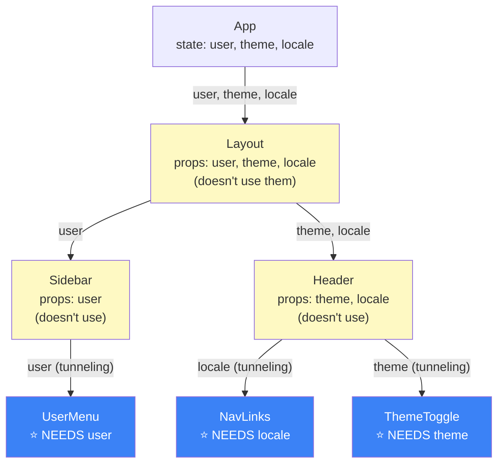
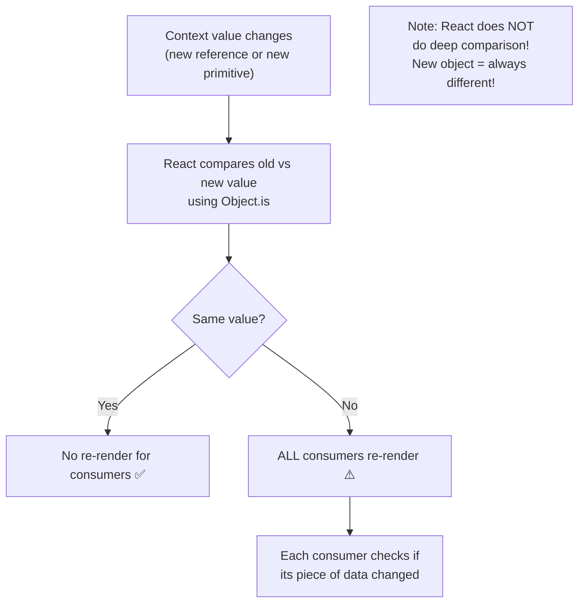
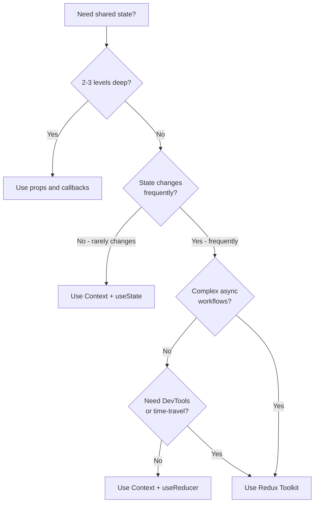

<a id="18-usecontext-context-api"></a>

[⬅ Previous Chapter](#17-useref-complete-guide) | [📖 Main Index](#main-index) | [Next Chapter ➡](#19-usereducer-redux-like-state)

---

# Chapter 18: useContext — Context API

## 📌 Learning Objectives

By the end of this chapter, you will:

- **Understand** what Context API solves and when NOT to use it
- **Build** the complete Provider pattern — createContext, Provider, useContext
- **Diagnose** and fix Context performance issues — unnecessary re-renders
- **Split** contexts for performance — value context vs dispatch context
- **Combine** `useReducer + Context` for scalable global state
- **Compare** Context vs Redux — make the right architectural choice
- **Answer 10+ interview questions** on Context deeply

---

<a id="chapter-index-table-18"></a>

## Chapter Index Table

| Topic No. | Topic Name | Subtopics |
|-----------|-----------|-----------|
| 18.1 | [Context API — What & Why](#181-context-api--what--why) | Prop drilling problem<br>When NOT to use |
| 18.2 | [Provider Pattern](#182-provider-pattern) | createContext<br>Provider<br>useContext |
| 18.3 | [Performance Issues](#183-performance-issues) | Re-render cascade<br>Split contexts<br>memo optimization |
| 18.4 | [useReducer + Context — Global State](#184-usereducer--context--global-state-pattern) | Complete pattern |
| 18.5 | [Redux vs Context](#185-redux-vs-context--when-to-use-which) | Comparison, decision guide |
| 💡 | [Interview Questions](#-interview-questions) | 10+ with Answers |
| 🧪 | [Practice Problems](#-practice-problems) | 5 Coding + 5 Theory |
| 🚀 | [Mini Project](#-mini-project) | Theme + Auth Context System |
| ⚡ | [Quick Revision](#-quick-revision) | Key bullets, traps |
| 📌 | [Chapter Summary](#-chapter-summary) | Final takeaways |

---

## 18.1 Context API — What & Why

<a id="181-context-api--what--why"></a>

### The Prop Drilling Problem (Review)

Context API solves **prop drilling** — the anti-pattern where props are passed through many intermediate components that don't use the data themselves, just to reach a deeply nested consumer.



**Context solves this by broadcasting data** — any descendant can subscribe directly without passing through intermediaries.

---

### When NOT to Use Context

> [!IMPORTANT]
> Context is a tool, not a default choice. Many developers overuse it. Understand when to avoid it.

```
DO NOT use Context for:
❌ Data that only 2-3 levels deep → use props (simpler)
❌ Data that changes very frequently → causes too many re-renders
❌ State that belongs to only ONE component → use local useState
❌ State that's already handled by a form library → unnecessary duplication
❌ Simple parent-child communication → use props and callbacks
❌ Data that could be computed locally → don't need context at all

DO use Context for:
✅ Theme (light/dark) — needed across entire app
✅ Current authenticated user — needed across many features
✅ Locale/language — needed everywhere for i18n
✅ Feature flags — app-wide configuration
✅ Complex state shared across unrelated components
✅ Avoiding prop drilling through 4+ levels
```

---

### 🧠 Hinglish Intuition

Context ek **school notice board** ki tarah hai. Principal (App) ek notice lagata hai — sab students (components) directly padh sakte hain bina class teacher (intermediate components) se guzre. Lekin yeh efficient nahi hai agar notice bahut baar change hota ho — har change pe sab students class chhod ke notice board dekhne jaate hain (re-renders). Isliye sirf important, rarely-changing announcements notice board pe lagao.

---

👉 <a href="#chapter-index-table-18">Go to Top 🔝</a>

---

## 18.2 Provider Pattern

<a id="182-provider-pattern"></a>

### Step 1: createContext()

```jsx
import { createContext } from 'react';

// createContext(defaultValue)
// defaultValue: Used ONLY when a component uses the context without any Provider above it
// (rare — mostly for testing/documentation)

const ThemeContext = createContext('light');  // Default value: 'light'
const UserContext = createContext(null);      // Default: null
const CountContext = createContext({          // Default: object
  count: 0,
  increment: () => {},
});

// The context object has two important parts:
// ThemeContext.Provider — wraps components that need access
// ThemeContext.Consumer — old way to consume (replaced by useContext)
```

---

### Step 2: Provider

```jsx
// Provider wraps the part of the tree that needs the context
// All descendants can access the value

function App() {
  const [theme, setTheme] = useState('light');
  const [user, setUser] = useState(null);

  return (
    // Provider supplies the value
    <ThemeContext.Provider value={theme}>
      <UserContext.Provider value={{ user, setUser }}>
        {/* Every child, grandchild, etc. can access theme and user */}
        <Layout />
      </UserContext.Provider>
    </ThemeContext.Provider>
  );
}

// Rules for Provider:
// 1. Can be nested — inner Provider overrides outer for its subtree
// 2. Value prop can be anything: primitive, object, function, array
// 3. When value changes → ALL consumers re-render (see section 18.3)
// 4. Provider itself re-renders when its parent renders
```

---

### Step 3: useContext Consumer

```jsx
import { useContext } from 'react';

// Deep in the component tree — no props needed!
function ThemeToggle() {
  // Access directly — no prop drilling!
  const theme = useContext(ThemeContext);

  return (
    <button style={{ backgroundColor: theme === 'dark' ? '#1e293b' : '#f8fafc' }}>
      Current theme: {theme}
    </button>
  );
}

function UserAvatar() {
  const { user } = useContext(UserContext);
  if (!user) return <button>Login</button>;
  return ;
}
```

---

### Complete Pattern — Organized with Custom Hook

```jsx
// ===== themes/ThemeContext.jsx =====
import { createContext, useContext, useState } from 'react';

// 1. Create context (often with undefined default for error checking)
const ThemeContext = createContext(undefined);

// 2. Create Provider component (encapsulates state logic)
export function ThemeProvider({ children, defaultTheme = 'light' }) {
  const [theme, setTheme] = useState(defaultTheme);

  const toggleTheme = () => setTheme(t => t === 'light' ? 'dark' : 'light');
  const setLightTheme = () => setTheme('light');
  const setDarkTheme = () => setTheme('dark');

  const value = {
    theme,
    toggleTheme,
    setLightTheme,
    setDarkTheme,
    isDark: theme === 'dark',
  };

  return (
    <ThemeContext.Provider value={value}>
      {children}
    </ThemeContext.Provider>
  );
}

// 3. Create custom hook (error checking + convenience)
export function useTheme() {
  const context = useContext(ThemeContext);

  if (context === undefined) {
    throw new Error('useTheme must be used within a ThemeProvider');
    // This error message tells developers exactly what went wrong!
    // Without this check: "Cannot read properties of undefined" — confusing!
  }

  return context;
}

// ===== Usage in App.jsx =====
import { ThemeProvider } from './ThemeContext';

function App() {
  return (
    <ThemeProvider defaultTheme="light">
      <Router>
        <Routes>
          <Route path="/" element={<Home />} />
        </Routes>
      </Router>
    </ThemeProvider>
  );
}

// ===== Usage anywhere in tree =====
import { useTheme } from './ThemeContext';

function Navbar() {
  const { theme, toggleTheme, isDark } = useTheme();  // Clean!

  return (
    <nav style={{ backgroundColor: isDark ? '#1e293b' : '#fff' }}>
      <button onClick={toggleTheme}>
        {isDark ? '☀️' : '🌙'}
      </button>
    </nav>
  );
}
```

---

### Nested Providers — Inner Overrides Outer

```jsx
// Nested providers: inner provider wins for its subtree
<ThemeContext.Provider value="light">
  <Header />  {/* Gets "light" */}
  <ThemeContext.Provider value="dark">
    <Modal />   {/* Gets "dark" — inner provider wins! */}
  </ThemeContext.Provider>
  <Footer />  {/* Gets "light" — back to outer */}
</ThemeContext.Provider>
```

---

### Default Value — When No Provider is Above

```jsx
const CountContext = createContext({ count: 42, increment: () => {} });

// If a component uses useContext(CountContext) with NO provider above it:
// It gets the default value: { count: 42, increment: () => {} }

// Useful for:
// 1. Testing components in isolation (no provider needed in tests)
// 2. Documentation — default shows the expected shape
// 3. Components that work with or without a provider

// Common pattern: undefined default + error in custom hook
const UserContext = createContext(undefined);  // undefined default

function useUser() {
  const ctx = useContext(UserContext);
  if (!ctx) throw new Error('useUser must be used within UserProvider');
  return ctx;
}
// Now if someone forgets the provider, they get a clear error message
```

---

👉 <a href="#chapter-index-table-18">Go to Top 🔝</a>

---

## 18.3 Performance Issues

<a id="183-performance-issues"></a>

### The Problem: Context Causes All Consumers to Re-render

When the context VALUE changes, **every component that calls `useContext(MyContext)`** re-renders — regardless of whether the specific piece of data they use changed.

```jsx
// ❌ Performance Problem: Single context with multiple values
const AppContext = createContext(null);

function AppProvider({ children }) {
  const [user, setUser] = useState(null);
  const [theme, setTheme] = useState('light');
  const [count, setCount] = useState(0);

  // ❌ All three in one object:
  const value = { user, theme, count, setUser, setTheme, setCount };
  // When 'count' changes → value is a NEW object → ALL consumers re-render
  // Even consumers that only use 'theme' re-render when 'count' changes!

  return <AppContext.Provider value={value}>{children}</AppContext.Provider>;
}

// Component that only cares about theme:
function ThemeToggle() {
  const { theme, setTheme } = useContext(AppContext);
  // Re-renders EVERY TIME count changes — even though it doesn't use count!
  return <button onClick={() => setTheme(t => t === 'light' ? 'dark' : 'light')}>{theme}</button>;
}
```

---

### Fix 1: Split Contexts

The most effective solution — separate concerns into different contexts.

```jsx
// ✅ Separate contexts — each consumer only re-renders when its own context changes
const ThemeContext = createContext(null);
const UserContext = createContext(null);
const CountContext = createContext(null);

function AppProvider({ children }) {
  const [theme, setTheme] = useState('light');
  const [user, setUser] = useState(null);
  const [count, setCount] = useState(0);

  return (
    <ThemeContext.Provider value={{ theme, setTheme }}>
      <UserContext.Provider value={{ user, setUser }}>
        <CountContext.Provider value={{ count, setCount }}>
          {children}
        </CountContext.Provider>
      </UserContext.Provider>
    </ThemeContext.Provider>
  );
}

// Now ThemeToggle ONLY re-renders when theme changes:
function ThemeToggle() {
  const { theme, setTheme } = useContext(ThemeContext);  // Only ThemeContext
  // count changes → CountContext changes → ThemeContext unchanged → NO re-render! ✅
  return <button onClick={() => setTheme(t => t === 'light' ? 'dark' : 'light')}>{theme}</button>;
}
```

---

### Fix 2: Split Value Context from Dispatch Context

A powerful pattern for reducers — stable dispatch function separate from changing state.

```jsx
// State changes every dispatch → causes re-renders
const CartStateContext = createContext(null);

// Dispatch NEVER changes (stable reference from useReducer) → no re-renders
const CartDispatchContext = createContext(null);

function CartProvider({ children }) {
  const [state, dispatch] = useReducer(cartReducer, initialCartState);

  return (
    <CartStateContext.Provider value={state}>
      <CartDispatchContext.Provider value={dispatch}>
        {children}
      </CartDispatchContext.Provider>
    </CartStateContext.Provider>
  );
}

// Components that only dispatch actions (no state reading):
// DON'T re-render when state changes!
function AddToCartButton({ productId }) {
  const dispatch = useContext(CartDispatchContext);  // Stable — never changes!
  // ✅ This component NEVER re-renders due to cart state changes
  return (
    <button onClick={() => dispatch({ type: 'ADD_ITEM', payload: productId })}>
      Add to Cart
    </button>
  );
}

// Components that read state:
function CartBadge() {
  const { items } = useContext(CartStateContext);  // Re-renders when items change
  return <span>{items.length}</span>;
}
```

---

### Fix 3: React.memo with Context

Wrap frequently rendered children with `React.memo` to prevent unnecessary re-renders.

```jsx
// ❌ Without memo: re-renders even when its own data didn't change
function CartItem({ itemId }) {
  const state = useContext(CartStateContext);
  const item = state.items.find(i => i.id === itemId);
  // Re-renders whenever ANY cart state changes, even other items
  return <div>{item.name}: {item.quantity}</div>;
}

// ✅ With memo + stable context:
const CartItem = React.memo(function CartItem({ itemId }) {
  const state = useContext(CartStateContext);
  const item = state.items.find(i => i.id === itemId);
  return <div>{item.name}: {item.quantity}</div>;
});
// Still re-renders when CartStateContext changes
// memo only prevents re-renders from parent re-renders, not context changes
// For context-based optimization, splitting contexts is more effective

// ✅ Better: useMemo for derived values
function CartItem({ itemId }) {
  const state = useContext(CartStateContext);
  // Only recalculate when state changes
  const item = useMemo(() => state.items.find(i => i.id === itemId), [state.items, itemId]);
  return <div>{item?.name}: {item?.quantity}</div>;
}
```

---

### Fix 4: useMemo for Stable Context Values

```jsx
function ThemeProvider({ children }) {
  const [theme, setTheme] = useState('light');

  // ❌ Without useMemo: new object every render → all consumers re-render
  // const value = { theme, setTheme };

  // ✅ With useMemo: stable object when theme hasn't changed
  const value = useMemo(() => ({
    theme,
    setTheme,
    isDark: theme === 'dark',
  }), [theme]);  // Only recreated when theme changes

  return (
    <ThemeContext.Provider value={value}>
      {children}
    </ThemeContext.Provider>
  );
}

// Note: setTheme from useState is already stable (same function reference)
// So useMemo mainly prevents recreation of the wrapper object
```

---

### Understanding When Re-renders Happen



```jsx
// ✅ Primitive values: React can detect no-change
const ThemeContext = createContext('light');
// 'light' === 'light' → Object.is('light', 'light') = true → no re-render ✅

// ❌ Object values: new object = always different to Object.is
const UserContext = createContext(null);
// { user: alice } vs { user: alice } → Object.is({...}, {...}) = false → ALWAYS re-renders ❌
// Even if user didn't change — new object = re-render!
// Solution: useMemo or split into smaller contexts
```

---

👉 <a href="#chapter-index-table-18">Go to Top 🔝</a>

---

## 18.4 useReducer + Context — Global State Pattern

<a id="184-usereducer--context--global-state-pattern"></a>

### Why Combine useReducer with Context?

- `useReducer` handles complex state logic with predictable updates
- `Context` makes that state accessible to any component in the tree
- Together: a lightweight Redux-like global state solution without external dependencies

---

### Complete Shopping Cart Implementation

```jsx
// ===== context/CartContext.jsx =====
import { createContext, useContext, useReducer, useMemo } from 'react';

// 1. Define the state shape and initial state
const initialState = {
  items: [],        // [{ id, name, price, quantity, imageUrl }]
  isOpen: false,    // Cart drawer open/closed
  couponCode: '',
  discount: 0,
};

// 2. Define the reducer (pure function — no side effects)
function cartReducer(state, action) {
  switch (action.type) {
    case 'ADD_ITEM': {
      const existingIndex = state.items.findIndex(item => item.id === action.payload.id);
      if (existingIndex >= 0) {
        // Item exists → increase quantity
        return {
          ...state,
          items: state.items.map((item, i) =>
            i === existingIndex
              ? { ...item, quantity: item.quantity + 1 }
              : item
          ),
        };
      }
      // New item → append
      return {
        ...state,
        items: [...state.items, { ...action.payload, quantity: 1 }],
      };
    }

    case 'REMOVE_ITEM':
      return {
        ...state,
        items: state.items.filter(item => item.id !== action.payload),
      };

    case 'UPDATE_QUANTITY':
      return {
        ...state,
        items: state.items
          .map(item =>
            item.id === action.payload.id
              ? { ...item, quantity: Math.max(0, action.payload.quantity) }
              : item
          )
          .filter(item => item.quantity > 0),  // Auto-remove if qty → 0
      };

    case 'CLEAR_CART':
      return { ...state, items: [], couponCode: '', discount: 0 };

    case 'TOGGLE_CART':
      return { ...state, isOpen: !state.isOpen };

    case 'OPEN_CART':
      return { ...state, isOpen: true };

    case 'CLOSE_CART':
      return { ...state, isOpen: false };

    case 'APPLY_COUPON':
      const discount = action.payload === 'REACT10' ? 10 : 0;
      return { ...state, couponCode: action.payload, discount };

    default:
      return state;
  }
}

// 3. Create separate contexts for state and dispatch (performance!)
const CartStateContext = createContext(undefined);
const CartDispatchContext = createContext(undefined);

// 4. Provider component
export function CartProvider({ children }) {
  const [state, dispatch] = useReducer(cartReducer, initialState);

  // Compute derived values in the provider (not repeated in every consumer)
  const cartState = useMemo(() => ({
    ...state,
    // Derived values — computed once in provider
    itemCount: state.items.reduce((sum, item) => sum + item.quantity, 0),
    subtotal: state.items.reduce((sum, item) => sum + item.price * item.quantity, 0),
    total: state.items.reduce((sum, item) => sum + item.price * item.quantity, 0) *
           (1 - state.discount / 100),
  }), [state]);

  // dispatch is stable (guaranteed by useReducer) — no useMemo needed
  return (
    <CartDispatchContext.Provider value={dispatch}>
      <CartStateContext.Provider value={cartState}>
        {children}
      </CartStateContext.Provider>
    </CartDispatchContext.Provider>
  );
}

// 5. Custom hooks for consumers
export function useCartState() {
  const context = useContext(CartStateContext);
  if (context === undefined) throw new Error('useCartState must be used within CartProvider');
  return context;
}

export function useCartDispatch() {
  const context = useContext(CartDispatchContext);
  if (context === undefined) throw new Error('useCartDispatch must be used within CartProvider');
  return context;
}

// 6. Optional: Action creators for type safety and DRY code
export const cartActions = {
  addItem: (item) => ({ type: 'ADD_ITEM', payload: item }),
  removeItem: (id) => ({ type: 'REMOVE_ITEM', payload: id }),
  updateQuantity: (id, quantity) => ({ type: 'UPDATE_QUANTITY', payload: { id, quantity } }),
  clearCart: () => ({ type: 'CLEAR_CART' }),
  toggleCart: () => ({ type: 'TOGGLE_CART' }),
  openCart: () => ({ type: 'OPEN_CART' }),
  closeCart: () => ({ type: 'CLOSE_CART' }),
  applyCoupon: (code) => ({ type: 'APPLY_COUPON', payload: code }),
};

// ===== Usage: Consumer components =====

// Only reads state — re-renders when state changes
function CartBadge() {
  const { itemCount } = useCartState();
  if (itemCount === 0) return null;
  return (
    <span style={{
      backgroundColor: '#ef4444', color: '#fff',
      borderRadius: '50%', padding: '2px 6px', fontSize: '11px', fontWeight: '700',
    }}>
      {itemCount}
    </span>
  );
}

// Only dispatches — NEVER re-renders due to cart state changes!
function QuickAddButton({ product }) {
  const dispatch = useCartDispatch();  // Stable reference!
  return (
    <button onClick={() => dispatch(cartActions.addItem(product))}>
      Quick Add
    </button>
  );
}

// Reads and dispatches
function CartItem({ item }) {
  const dispatch = useCartDispatch();
  return (
    <div>
      <span>{item.name}</span>
      <span>${item.price}</span>
      <button onClick={() => dispatch(cartActions.updateQuantity(item.id, item.quantity - 1))}>-</button>
      <span>{item.quantity}</span>
      <button onClick={() => dispatch(cartActions.updateQuantity(item.id, item.quantity + 1))}>+</button>
      <button onClick={() => dispatch(cartActions.removeItem(item.id))}>Remove</button>
    </div>
  );
}

// App wrapper
function App() {
  return (
    <CartProvider>
      <Header />  {/* Contains CartBadge */}
      <ProductGrid />  {/* Contains QuickAddButtons */}
      <CartDrawer />  {/* Contains CartItems */}
    </CartProvider>
  );
}
```

---

### Multiple Contexts Composition Pattern

```jsx
// Combine all providers in one place — App.jsx
function AppProviders({ children }) {
  return (
    <AuthProvider>
      <ThemeProvider>
        <CartProvider>
          <NotificationProvider>
            {children}
          </NotificationProvider>
        </CartProvider>
      </ThemeProvider>
    </AuthProvider>
  );
}

function App() {
  return (
    <AppProviders>
      <Router>
        <Routes>
          <Route path="/" element={<HomePage />} />
          <Route path="/shop" element={<ShopPage />} />
          <Route path="/profile" element={<ProfilePage />} />
        </Routes>
      </Router>
    </AppProviders>
  );
}
```

---

👉 <a href="#chapter-index-table-18">Go to Top 🔝</a>

---

## 18.5 Redux vs Context — When to Use Which

<a id="185-redux-vs-context--when-to-use-which"></a>

### Detailed Comparison

| Feature | Context API | Redux Toolkit |
|---------|------------|---------------|
| **Setup complexity** | Minimal — built-in | Moderate — external package |
| **Bundle size** | 0KB (part of React) | ~11KB (redux + react-redux) |
| **Performance** | All consumers re-render | Selective re-renders (connect/useSelector) |
| **DevTools** | ❌ None by default | ✅ Redux DevTools Extension |
| **Time-travel debugging** | ❌ No | ✅ Yes |
| **Middleware** | ❌ No built-in | ✅ Redux Thunk, Saga, etc. |
| **Normalized state** | ❌ Manual | ✅ createEntityAdapter |
| **Async handling** | ❌ Manual (useEffect) | ✅ createAsyncThunk |
| **Boilerplate** | Low | Low (with RTK) |
| **Learning curve** | Low | Medium |
| **Team size** | Small-medium | Medium-large |
| **Scalability** | Limited | High |
| **Testing** | Component-level | Reducer unit tests |

---

### When to Choose Context

```
✅ Choose Context API when:
- App is small to medium (< 50 components using shared state)
- Global state is simple: theme, auth user, locale, preferences
- State changes infrequently (theme, user login/logout)
- No time-travel debugging needed
- No complex async workflows (simple fetches with useState)
- Learning React or building a prototype
- Team is small (1-5 developers)
- Performance optimization is achievable by splitting contexts

Examples:
- Theme switcher (light/dark)
- Authentication state (logged in user)
- Language/locale settings
- Shopping cart for small e-commerce
- User preferences
```

---

### When to Choose Redux

```
✅ Choose Redux (Toolkit) when:
- App is large and complex (many components, many features)
- State changes frequently and drives many parts of the UI
- Need Redux DevTools for debugging state flow
- Complex async workflows (multiple sequential API calls, optimistic updates)
- Multiple developers need to understand state changes
- Need middleware for logging, analytics, error handling
- Normalized state (entities) for large data sets
- Need full-featured time-travel debugging
- State logic is complex enough to benefit from isolated reducer tests

Examples:
- Admin dashboards with complex data
- Real-time collaboration tools
- E-commerce with complex cart logic, inventory, pricing
- Social media feed with complex state
- Financial applications with audit trails
```

---

### 🧠 Hinglish Intuition

Context vs Redux aise socho:
- **Context** = Ghar ka fridge — shared hai, sab family members access kar sakte hain, but agar tum kuch nikalte ho toh sab ko pata nahi chalata. Simple, local, fast.
- **Redux** = Official company inventory system — har action logged hai, koi bhi dekh sakta hai kya aaya gaya, history hai, complex workflows handle karta hai. Powerful but setup required hai.

Chhoti app ke liye fridge kaafi hai. Badi company ke liye inventory system chahiye.

---

### Decision Flowchart



---

👉 <a href="#chapter-index-table-18">Go to Top 🔝</a>

---

## 💡 Interview Questions

<a id="-interview-questions"></a>

### Conceptual Questions

---

**Q1. What is Context API and what problem does it solve?**

**Answer:**
Context API is React's built-in solution for sharing data across a component tree without manually passing props at each level. It solves **prop drilling** — the anti-pattern where data passes through many intermediate components that don't need it, just to reach a deeply nested component that does.

Context provides a "broadcasting" mechanism: a `Provider` sets a value, and any descendant `Consumer` (via `useContext`) can access that value directly, regardless of depth.

**Key components:**
1. `createContext(defaultValue)` — creates the context
2. `Context.Provider` — supplies the value to the tree
3. `useContext(Context)` — consumes the value in any descendant

---

**Q2. When should you NOT use Context?**

**Answer:**
Context is not always the right choice:

1. **For shallow prop passing (2-3 levels)** — props are simpler and more explicit
2. **For frequently changing data** — every context change re-renders ALL consumers, which is expensive
3. **For local component state** — if only one or two components need data, use local state
4. **For data that can be computed locally** — don't lift state unnecessarily
5. **For simple parent-child communication** — callbacks and props are clearer

The classic mistake: using Context for everything just to "avoid prop drilling" even when there are only 2 levels. This creates unnecessary complexity and performance issues.

---

**Q3. What happens to all consumers when a Context value changes?**

**Answer:**
When a Context value changes, **every component that calls `useContext(MyContext)` re-renders** — regardless of whether the specific part of the value they use actually changed.

This is React's current design limitation: Context doesn't support selector-based subscriptions. There's no way to say "only re-render if `user.name` changed." The entire context value is compared using `Object.is()` — if it's a new object reference (even with same content), all consumers re-render.

**Solutions:**
1. **Split contexts** — separate frequently-changing from rarely-changing data
2. **Split state from dispatch** — dispatch is stable, separate it into its own context
3. **useMemo** for context values — prevent unnecessary new object creation
4. **React.memo** on consumer components — prevents parent-triggered re-renders

---

**Q4. Why is separating `state` and `dispatch` contexts a performance optimization?**

**Answer:**
When using `useReducer`, the `dispatch` function returned is **stable** — it has the same reference across ALL renders (React guarantees this). The `state` object changes with every dispatch.

If you put both in one context, every dispatch triggers a new context object → all consumers (both state readers AND action dispatchers) re-render.

By putting `dispatch` in a separate context:
- State consumers re-render when state changes ✅ (expected)
- Action-only components NEVER re-render due to state changes ✅ (optimization!)

Components like "Add to Cart" buttons, "Delete" buttons, "Toggle" buttons often only dispatch actions — they don't read state. With split contexts, they're completely isolated from state changes.

---

**Q5. What is the default value of `createContext` and when is it used?**

**Answer:**
The default value is used when a component calls `useContext(MyContext)` and there is **no `Provider` of that context above it** in the component tree.

```jsx
const ThemeContext = createContext('light');  // default = 'light'

function Button() {
  const theme = useContext(ThemeContext);
  // If no ThemeContext.Provider above this: theme = 'light' (default)
  // If ThemeContext.Provider above: theme = the Provider's value
}
```

**Common patterns:**
1. `createContext(undefined)` + error in custom hook — forces the provider to be present
2. `createContext(defaultValue)` — component works standalone (useful for testing)
3. `createContext(null)` — explicit "not provided" state

The default value does NOT need a Provider to work — it's the fallback for no-Provider scenarios.

---

**Q6. How does `useContext` differ from the old `Context.Consumer` API?**

**Answer:**

```jsx
// Old way: Context.Consumer (render prop pattern — verbose)
function ThemeButton() {
  return (
    <ThemeContext.Consumer>
      {(theme) => (
        <button style={{ background: theme === 'dark' ? '#000' : '#fff' }}>
          {theme}
        </button>
      )}
    </ThemeContext.Consumer>
  );
}

// New way: useContext (hook — clean and simple)
function ThemeButton() {
  const theme = useContext(ThemeContext);
  return (
    <button style={{ background: theme === 'dark' ? '#000' : '#fff' }}>
      {theme}
    </button>
  );
}
```

`useContext` is cleaner, composable (can use multiple contexts easily), and works with other hooks. `Context.Consumer` required the render prop pattern which added nesting.

Both trigger re-renders when context changes — same performance characteristics.

---

**Q7. What happens when you have nested Providers of the same context?**

**Answer:**
The inner (closest ancestor) Provider wins for its subtree. This enables theme overrides, localization scoping, and other cases where a subtree needs different context values.

```jsx
<ThemeContext.Provider value="light">
  <Header />      {/* Gets "light" */}
  <ThemeContext.Provider value="dark">
    <Modal />     {/* Gets "dark" — inner Provider wins */}
    <Sidebar />   {/* Gets "dark" */}
  </ThemeContext.Provider>
  <Footer />      {/* Gets "light" — back to outer */}
</ThemeContext.Provider>
```

This is useful for component libraries that need to apply their own theme within the consumer's theme, or for A/B testing different themes in parts of the UI.

---

**Q8. Explain the `useReducer + Context` pattern and when to use it.**

**Answer:**
Combining `useReducer` with Context creates a lightweight global state management system:

1. `useReducer` provides predictable state updates via a reducer function
2. `Context` makes the state and dispatch accessible throughout the tree

**When to use:**
- Multiple related actions on the same state (cart: add, remove, update, clear)
- State logic too complex for useState (dependencies between fields)
- Multiple components need to trigger the same actions
- State logic needs to be testable in isolation

**Pattern:**
```jsx
const [state, dispatch] = useReducer(reducer, initialState);
// Two contexts for performance:
<StateContext.Provider value={state}>
  <DispatchContext.Provider value={dispatch}>
    {children}
  </DispatchContext.Provider>
</StateContext.Provider>
```

---

**Q9. Why should you always create a custom hook for consuming context?**

**Answer:**

```jsx
// ❌ Without custom hook:
function UserAvatar() {
  const { user } = useContext(UserContext);
  // Consumers need to import both UserContext and useContext
  // Error if context is undefined is generic
  // No place to add access control
}

// ✅ With custom hook:
function useUser() {
  const ctx = useContext(UserContext);
  if (ctx === undefined) {
    throw new Error('useUser must be used within UserProvider');
  }
  // Can add: permission checks, data transformation, memoization
  return ctx;
}

function UserAvatar() {
  const { user } = useUser();  // Cleaner import, better errors
}
```

Benefits of custom hooks:
1. **Clear error messages** when Provider is missing
2. **Encapsulation** — consumers don't need to import the context object
3. **Additional logic** — permission checks, derived data, memoization
4. **Type safety** — single place to add TypeScript types
5. **Future flexibility** — can switch from Context to Zustand/Redux without changing consumers

---

**Q10. Context API vs Redux — when would you choose one over the other?**

**Answer:**

**Choose Context when:**
- Small-medium app (< 50 components using shared state)
- State changes infrequently (theme, auth, locale)
- Simple state shape (no complex normalization needed)
- No need for time-travel debugging or Redux DevTools
- No complex async workflows
- Want zero external dependencies

**Choose Redux Toolkit when:**
- Large app with many features and complex state
- State changes frequently and many components depend on it
- Need Redux DevTools for debugging
- Complex async workflows (createAsyncThunk)
- Multiple developers maintaining the state logic
- Need normalized entity state (createEntityAdapter)
- Need middleware (logging, analytics, error reporting)
- State updates have side effects that need middleware

**Important nuance:** With `react-redux`'s `useSelector`, Redux consumers only re-render when the specific data they select changes — more fine-grained than Context's all-or-nothing re-render.

---

👉 <a href="#chapter-index-table-18">Go to Top 🔝</a>

---

## 🧪 Practice Problems

<a id="-practice-problems"></a>

### Coding Questions

---

**1. Build a complete Theme Context with dark/light/system modes**

```jsx
import { createContext, useContext, useState, useEffect, useMemo } from 'react';

const ThemeContext = createContext(undefined);

const THEMES = {
  light: {
    background: '#ffffff',
    surface: '#f8fafc',
    border: '#e2e8f0',
    text: '#1e293b',
    textSecondary: '#64748b',
    primary: '#3b82f6',
    name: 'light',
  },
  dark: {
    background: '#0f172a',
    surface: '#1e293b',
    border: '#334155',
    text: '#f8fafc',
    textSecondary: '#94a3b8',
    primary: '#60a5fa',
    name: 'dark',
  },
};

function getSystemTheme() {
  return window.matchMedia('(prefers-color-scheme: dark)').matches ? 'dark' : 'light';
}

export function ThemeProvider({ children }) {
  const [mode, setMode] = useState(() => {
    const saved = localStorage.getItem('theme-mode');
    return saved || 'system';  // 'light', 'dark', or 'system'
  });

  const [systemTheme, setSystemTheme] = useState(getSystemTheme);

  // Listen to system theme changes
  useEffect(() => {
    const mediaQuery = window.matchMedia('(prefers-color-scheme: dark)');
    const handleChange = (e) => setSystemTheme(e.matches ? 'dark' : 'light');
    mediaQuery.addEventListener('change', handleChange);
    return () => mediaQuery.removeEventListener('change', handleChange);
  }, []);

  // Persist mode preference
  useEffect(() => {
    localStorage.setItem('theme-mode', mode);
  }, [mode]);

  const activeTheme = mode === 'system' ? systemTheme : mode;
  const colors = THEMES[activeTheme];

  // Apply to document
  useEffect(() => {
    document.documentElement.setAttribute('data-theme', activeTheme);
    document.documentElement.style.colorScheme = activeTheme;
  }, [activeTheme]);

  const value = useMemo(() => ({
    mode,
    setMode,
    activeTheme,
    colors,
    isDark: activeTheme === 'dark',
    isLight: activeTheme === 'light',
    isSystem: mode === 'system',
  }), [mode, activeTheme, colors]);

  return (
    <ThemeContext.Provider value={value}>
      <div style={{ backgroundColor: colors.background, color: colors.text, minHeight: '100vh', transition: 'all 0.2s' }}>
        {children}
      </div>
    </ThemeContext.Provider>
  );
}

export function useTheme() {
  const ctx = useContext(ThemeContext);
  if (!ctx) throw new Error('useTheme must be used within ThemeProvider');
  return ctx;
}

// Theme Toggle Component
function ThemeToggle() {
  const { mode, setMode, colors } = useTheme();

  const modes = [
    { value: 'light', icon: '☀️', label: 'Light' },
    { value: 'dark', icon: '🌙', label: 'Dark' },
    { value: 'system', icon: '💻', label: 'System' },
  ];

  return (
    <div style={{ display: 'flex', gap: '4px', backgroundColor: colors.surface, padding: '4px', borderRadius: '10px', border: `1px solid ${colors.border}` }}>
      {modes.map(m => (
        <button
          key={m.value}
          onClick={() => setMode(m.value)}
          style={{
            padding: '6px 12px',
            borderRadius: '8px',
            border: 'none',
            cursor: 'pointer',
            backgroundColor: mode === m.value ? colors.primary : 'transparent',
            color: mode === m.value ? '#fff' : colors.textSecondary,
            fontSize: '13px',
            transition: 'all 0.15s',
          }}
        >
          {m.icon} {m.label}
        </button>
      ))}
    </div>
  );
}

// Demo app
function DemoCard({ title, description }) {
  const { colors } = useTheme();
  return (
    <div style={{
      padding: '20px',
      backgroundColor: colors.surface,
      border: `1px solid ${colors.border}`,
      borderRadius: '12px',
      marginBottom: '12px',
    }}>
      <h3 style={{ margin: '0 0 8px', color: colors.text }}>{title}</h3>
      <p style={{ margin: 0, color: colors.textSecondary, fontSize: '14px' }}>{description}</p>
    </div>
  );
}

function App() {
  const { colors, isDark, mode, activeTheme } = useTheme();

  return (
    <div style={{ maxWidth: '600px', margin: '0 auto', padding: '32px' }}>
      <div style={{ display: 'flex', justifyContent: 'space-between', alignItems: 'center', marginBottom: '32px' }}>
        <h1 style={{ margin: 0, color: colors.text }}>Theme Demo</h1>
        <ThemeToggle />
      </div>

      <p style={{ color: colors.textSecondary, marginBottom: '24px', fontSize: '14px' }}>
        Mode: <strong style={{ color: colors.primary }}>{mode}</strong> | Active: <strong style={{ color: colors.primary }}>{activeTheme}</strong>
      </p>

      <DemoCard title="Card 1" description="This card adapts to the current theme." />
      <DemoCard title="Card 2" description="System mode follows your OS preference automatically." />
      <DemoCard title="Card 3" description="Preference is saved to localStorage." />
    </div>
  );
}

export default function Root() {
  return <ThemeProvider><App /></ThemeProvider>;
}
```

---

**2. Implement context with `useReducer` for a notification system**

```jsx
import { createContext, useContext, useReducer, useCallback, useMemo } from 'react';

// Types
const NOTIF_TYPES = { INFO: 'info', SUCCESS: 'success', WARNING: 'warning', ERROR: 'error' };

const TYPE_STYLES = {
  info:    { bg: '#dbeafe', border: '#93c5fd', text: '#1e40af', icon: 'ℹ️' },
  success: { bg: '#dcfce7', border: '#86efac', text: '#166534', icon: '✅' },
  warning: { bg: '#fef9c3', border: '#fde047', text: '#854d0e', icon: '⚠️' },
  error:   { bg: '#fee2e2', border: '#fca5a5', text: '#991b1b', icon: '❌' },
};

// Reducer
function notifReducer(state, action) {
  switch (action.type) {
    case 'ADD':
      return [...state, { id: Date.now() + Math.random(), ...action.payload }];
    case 'REMOVE':
      return state.filter(n => n.id !== action.payload);
    case 'CLEAR_ALL':
      return [];
    default:
      return state;
  }
}

// Contexts
const NotifStateContext = createContext(undefined);
const NotifDispatchContext = createContext(undefined);

export function NotificationProvider({ children }) {
  const [notifications, dispatch] = useReducer(notifReducer, []);

  return (
    <NotifDispatchContext.Provider value={dispatch}>
      <NotifStateContext.Provider value={notifications}>
        {children}
        <NotificationContainer />
      </NotifStateContext.Provider>
    </NotifDispatchContext.Provider>
  );
}

// State hook
function useNotifState() {
  const ctx = useContext(NotifStateContext);
  if (!ctx === undefined) throw new Error('useNotifState: missing provider');
  return ctx;
}

// Action hook with convenience methods
export function useNotifications() {
  const dispatch = useContext(NotifDispatchContext);
  if (!dispatch) throw new Error('useNotifications: missing provider');

  const notify = useCallback((message, type = NOTIF_TYPES.INFO, duration = 4000) => {
    const id = Date.now() + Math.random();
    dispatch({ type: 'ADD', payload: { message, type, duration } });

    if (duration > 0) {
      setTimeout(() => dispatch({ type: 'REMOVE', payload: id }), duration);
    }
  }, [dispatch]);

  return useMemo(() => ({
    info:    (msg, dur) => notify(msg, 'info', dur),
    success: (msg, dur) => notify(msg, 'success', dur),
    warning: (msg, dur) => notify(msg, 'warning', dur),
    error:   (msg, dur) => notify(msg, 'error', dur),
    dismiss: (id) => dispatch({ type: 'REMOVE', payload: id }),
    clearAll: () => dispatch({ type: 'CLEAR_ALL' }),
  }), [notify, dispatch]);
}

// Notification Container (reads state)
function NotificationContainer() {
  const notifications = useNotifState();
  const { dismiss } = useNotifications();

  return (
    <div style={{
      position: 'fixed', top: '16px', right: '16px',
      zIndex: 9999, display: 'flex', flexDirection: 'column', gap: '8px',
      maxWidth: '380px', width: '100%',
    }}>
      {notifications.map(notif => {
        const style = TYPE_STYLES[notif.type] || TYPE_STYLES.info;
        return (
          <div key={notif.id} style={{
            display: 'flex', alignItems: 'flex-start', gap: '10px',
            padding: '12px 16px',
            backgroundColor: style.bg,
            border: `1px solid ${style.border}`,
            borderRadius: '10px',
            boxShadow: '0 4px 12px rgba(0,0,0,0.08)',
            animation: 'slideIn 0.2s ease-out',
          }}>
            <span style={{ fontSize: '16px', flexShrink: 0 }}>{style.icon}</span>
            <span style={{ flex: 1, fontSize: '14px', color: style.text, lineHeight: '1.4' }}>
              {notif.message}
            </span>
            <button
              onClick={() => dismiss(notif.id)}
              style={{ background: 'none', border: 'none', cursor: 'pointer', color: style.text, opacity: 0.6, fontSize: '18px', lineHeight: 1, padding: '0 2px', flexShrink: 0 }}
            >
              ×
            </button>
          </div>
        );
      })}
    </div>
  );
}

// Demo
function DemoButtons() {
  const notify = useNotifications();

  return (
    <div style={{ padding: '32px', fontFamily: 'sans-serif' }}>
      <h1>Notification System</h1>
      <p style={{ color: '#64748b', marginBottom: '20px' }}>
        Uses useReducer + split contexts (state and dispatch)
      </p>
      <div style={{ display: 'flex', gap: '10px', flexWrap: 'wrap' }}>
        <button onClick={() => notify.info('This is an info message!')} style={{ padding: '8px 16px', backgroundColor: '#dbeafe', color: '#1e40af', border: 'none', borderRadius: '6px', cursor: 'pointer' }}>ℹ️ Info</button>
        <button onClick={() => notify.success('Action completed successfully!')} style={{ padding: '8px 16px', backgroundColor: '#dcfce7', color: '#166534', border: 'none', borderRadius: '6px', cursor: 'pointer' }}>✅ Success</button>
        <button onClick={() => notify.warning('Please review this carefully.')} style={{ padding: '8px 16px', backgroundColor: '#fef9c3', color: '#854d0e', border: 'none', borderRadius: '6px', cursor: 'pointer' }}>⚠️ Warning</button>
        <button onClick={() => notify.error('Something went wrong!')} style={{ padding: '8px 16px', backgroundColor: '#fee2e2', color: '#991b1b', border: 'none', borderRadius: '6px', cursor: 'pointer' }}>❌ Error</button>
        <button onClick={() => notify.success('This stays until dismissed!', 0)} style={{ padding: '8px 16px', backgroundColor: '#f3e8ff', color: '#7e22ce', border: 'none', borderRadius: '6px', cursor: 'pointer' }}>📌 Persistent</button>
        <button onClick={notify.clearAll} style={{ padding: '8px 16px', backgroundColor: '#f1f5f9', color: '#475569', border: 'none', borderRadius: '6px', cursor: 'pointer' }}>Clear All</button>
      </div>
      <style>{`@keyframes slideIn { from { transform: translateX(100%); opacity: 0; } to { transform: translateX(0); opacity: 1; } }`}</style>
    </div>
  );
}

export default function App() {
  return (
    <NotificationProvider>
      <DemoButtons />
    </NotificationProvider>
  );
}
```

---

**3. Demonstrate Context performance issue and fix with split contexts**

```jsx
import { createContext, useContext, useState, useReducer, memo, useMemo, useRef } from 'react';

// Track renders
const renderLog = [];
const logRender = (name) => {
  renderLog.push({ name, time: Date.now() });
};

// ===== BAD: Single context causes all consumers to re-render =====
const BadContext = createContext(null);

function BadProvider({ children }) {
  const [count, setCount] = useState(0);
  const [theme, setTheme] = useState('light');
  const [user] = useState({ name: 'Alice', role: 'admin' });

  // New object EVERY render → all consumers re-render!
  const value = { count, theme, user, setCount, setTheme };

  return <BadContext.Provider value={value}>{children}</BadContext.Provider>;
}

function BadCounter() {
  const { count, setCount } = useContext(BadContext);
  logRender('BadCounter');
  return <div>Counter: {count} <button onClick={() => setCount(c => c + 1)}>+</button></div>;
}

function BadThemeDisplay() {
  const { theme } = useContext(BadContext);
  logRender('BadThemeDisplay');
  return <div>Theme: {theme}</div>;  // Re-renders when count changes! Unnecessary!
}

function BadUserDisplay() {
  const { user } = useContext(BadContext);
  logRender('BadUserDisplay');
  return <div>User: {user.name}</div>;  // Re-renders when count changes! Unnecessary!
}

// ===== GOOD: Split contexts =====
const CountContext = createContext(null);
const ThemeContext = createContext(null);
const UserContext = createContext(null);

function GoodProvider({ children }) {
  const [count, setCount] = useState(0);
  const [theme, setTheme] = useState('light');
  const [user] = useState({ name: 'Alice', role: 'admin' });

  const countValue = useMemo(() => ({ count, setCount }), [count]);
  const themeValue = useMemo(() => ({ theme, setTheme }), [theme]);
  // user never changes — no useMemo needed (same reference from useState)

  return (
    <CountContext.Provider value={countValue}>
      <ThemeContext.Provider value={themeValue}>
        <UserContext.Provider value={user}>
          {children}
        </UserContext.Provider>
      </ThemeContext.Provider>
    </CountContext.Provider>
  );
}

const GoodCounter = memo(function GoodCounter() {
  const { count, setCount } = useContext(CountContext);
  logRender('GoodCounter');
  return <div>Counter: {count} <button onClick={() => setCount(c => c + 1)}>+</button></div>;
});

const GoodThemeDisplay = memo(function GoodThemeDisplay() {
  const { theme } = useContext(ThemeContext);
  logRender('GoodThemeDisplay');
  return <div>Theme: {theme}</div>;  // ONLY re-renders when theme changes!
});

const GoodUserDisplay = memo(function GoodUserDisplay() {
  const user = useContext(UserContext);
  logRender('GoodUserDisplay');
  return <div>User: {user.name}</div>;  // NEVER re-renders (user is stable)!
});

function App() {
  const [, forceRender] = useState(0);
  const logRef = useRef([]);

  return (
    <div style={{ padding: '24px', fontFamily: 'sans-serif', maxWidth: '700px' }}>
      <h1>Context Performance Demo</h1>

      <div style={{ display: 'grid', gridTemplateColumns: '1fr 1fr', gap: '24px' }}>
        {/* BAD */}
        <div style={{ border: '2px solid #fca5a5', borderRadius: '12px', padding: '16px' }}>
          <h2 style={{ color: '#dc2626', margin: '0 0 16px', fontSize: '16px' }}>❌ Single Context (Bad)</h2>
          <BadProvider>
            <BadCounter />
            <BadThemeDisplay />
            <BadUserDisplay />
          </BadProvider>
          <p style={{ fontSize: '12px', color: '#dc2626', marginTop: '12px' }}>
            Clicking counter re-renders ALL components!
          </p>
        </div>

        {/* GOOD */}
        <div style={{ border: '2px solid #86efac', borderRadius: '12px', padding: '16px' }}>
          <h2 style={{ color: '#16a34a', margin: '0 0 16px', fontSize: '16px' }}>✅ Split Contexts (Good)</h2>
          <GoodProvider>
            <GoodCounter />
            <GoodThemeDisplay />
            <GoodUserDisplay />
          </GoodProvider>
          <p style={{ fontSize: '12px', color: '#16a34a', marginTop: '12px' }}>
            Clicking counter only re-renders GoodCounter!
          </p>
        </div>
      </div>

      <div style={{ marginTop: '20px', padding: '12px', backgroundColor: '#f8fafc', borderRadius: '8px', fontSize: '12px', color: '#64748b' }}>
        💡 Open React DevTools Profiler to see the difference in render counts
      </div>
    </div>
  );
}

export default App;
```

---

**4. Build a multi-step wizard with Context**

```jsx
import { createContext, useContext, useReducer, useMemo } from 'react';

// Wizard State
const initialWizardState = {
  currentStep: 0,
  steps: ['Personal Info', 'Address', 'Payment', 'Review'],
  data: { name: '', email: '', street: '', city: '', cardNumber: '', expiry: '' },
  completed: [],
  errors: {},
};

function wizardReducer(state, action) {
  switch (action.type) {
    case 'NEXT_STEP':
      return {
        ...state,
        currentStep: Math.min(state.currentStep + 1, state.steps.length - 1),
        completed: [...new Set([...state.completed, state.currentStep])],
        errors: {},
      };
    case 'PREV_STEP':
      return { ...state, currentStep: Math.max(state.currentStep - 1, 0), errors: {} };
    case 'GO_TO_STEP':
      return { ...state, currentStep: action.payload, errors: {} };
    case 'UPDATE_FIELD':
      return { ...state, data: { ...state.data, [action.field]: action.value } };
    case 'SET_ERRORS':
      return { ...state, errors: action.payload };
    case 'RESET':
      return initialWizardState;
    default:
      return state;
  }
}

const WizardStateContext = createContext(undefined);
const WizardDispatchContext = createContext(undefined);

function WizardProvider({ children }) {
  const [state, dispatch] = useReducer(wizardReducer, initialWizardState);

  const enrichedState = useMemo(() => ({
    ...state,
    isFirstStep: state.currentStep === 0,
    isLastStep: state.currentStep === state.steps.length - 1,
    progress: ((state.currentStep) / (state.steps.length - 1)) * 100,
  }), [state]);

  return (
    <WizardDispatchContext.Provider value={dispatch}>
      <WizardStateContext.Provider value={enrichedState}>
        {children}
      </WizardStateContext.Provider>
    </WizardDispatchContext.Provider>
  );
}

function useWizardState() {
  const ctx = useContext(WizardStateContext);
  if (!ctx) throw new Error('useWizardState: missing WizardProvider');
  return ctx;
}

function useWizardDispatch() {
  const ctx = useContext(WizardDispatchContext);
  if (!ctx) throw new Error('useWizardDispatch: missing WizardProvider');
  return ctx;
}

// Step Indicator Component
function StepIndicator() {
  const { steps, currentStep, completed } = useWizardState();
  const dispatch = useWizardDispatch();

  return (
    <div style={{ display: 'flex', marginBottom: '32px' }}>
      {steps.map((step, i) => (
        <div key={step} style={{ flex: 1, display: 'flex', alignItems: 'center' }}>
          <button
            onClick={() => completed.includes(i) && dispatch({ type: 'GO_TO_STEP', payload: i })}
            style={{
              width: '32px', height: '32px', borderRadius: '50%', border: 'none',
              backgroundColor: i === currentStep ? '#3b82f6'
                : completed.includes(i) ? '#22c55e'
                : '#e2e8f0',
              color: i <= currentStep || completed.includes(i) ? '#fff' : '#94a3b8',
              fontWeight: '700', fontSize: '13px',
              cursor: completed.includes(i) ? 'pointer' : 'default',
              flexShrink: 0,
            }}
          >
            {completed.includes(i) && i !== currentStep ? '✓' : i + 1}
          </button>
          <div style={{ flex: 1, display: 'flex', flexDirection: 'column', marginLeft: '8px' }}>
            <span style={{ fontSize: '12px', fontWeight: '600', color: i === currentStep ? '#3b82f6' : '#64748b' }}>
              {step}
            </span>
          </div>
          {i < steps.length - 1 && (
            <div style={{ width: '100%', height: '2px', backgroundColor: completed.includes(i) ? '#22c55e' : '#e2e8f0', margin: '0 8px' }} />
          )}
        </div>
      ))}
    </div>
  );
}

function FieldInput({ label, field, type = 'text', placeholder }) {
  const { data, errors } = useWizardState();
  const dispatch = useWizardDispatch();

  return (
    <div style={{ marginBottom: '16px' }}>
      <label style={{ display: 'block', marginBottom: '4px', fontWeight: '600', fontSize: '14px', color: '#374151' }}>{label}</label>
      <input
        type={type}
        value={data[field] || ''}
        onChange={e => dispatch({ type: 'UPDATE_FIELD', field, value: e.target.value })}
        placeholder={placeholder}
        style={{
          width: '100%', padding: '10px 12px',
          border: `2px solid ${errors[field] ? '#ef4444' : '#d1d5db'}`,
          borderRadius: '8px', fontSize: '14px', outline: 'none', boxSizing: 'border-box',
        }}
      />
      {errors[field] && <p style={{ color: '#ef4444', fontSize: '12px', margin: '4px 0 0' }}>{errors[field]}</p>}
    </div>
  );
}

function PersonalStep() {
  return (
    <div>
      <h3 style={{ margin: '0 0 20px' }}>Personal Information</h3>
      <FieldInput label="Full Name" field="name" placeholder="Arjun Sharma" />
      <FieldInput label="Email" field="email" type="email" placeholder="arjun@example.com" />
    </div>
  );
}

function AddressStep() {
  return (
    <div>
      <h3 style={{ margin: '0 0 20px' }}>Delivery Address</h3>
      <FieldInput label="Street Address" field="street" placeholder="123 Main Street" />
      <FieldInput label="City" field="city" placeholder="Mumbai" />
    </div>
  );
}

function PaymentStep() {
  return (
    <div>
      <h3 style={{ margin: '0 0 20px' }}>Payment Details</h3>
      <FieldInput label="Card Number" field="cardNumber" placeholder="4111 1111 1111 1111" />
      <FieldInput label="Expiry" field="expiry" placeholder="MM/YY" />
    </div>
  );
}

function ReviewStep() {
  const { data } = useWizardState();
  return (
    <div>
      <h3 style={{ margin: '0 0 20px' }}>Review Your Order</h3>
      {Object.entries(data).filter(([, v]) => v).map(([key, value]) => (
        <div key={key} style={{ display: 'flex', justifyContent: 'space-between', padding: '8px 0', borderBottom: '1px solid #f1f5f9', fontSize: '14px' }}>
          <span style={{ color: '#64748b', textTransform: 'capitalize' }}>{key.replace(/([A-Z])/g, ' $1')}</span>
          <span style={{ fontWeight: '600' }}>{value}</span>
        </div>
      ))}
    </div>
  );
}

function WizardNavigation() {
  const { currentStep, isFirstStep, isLastStep, data } = useWizardState();
  const dispatch = useWizardDispatch();

  const validate = () => {
    const validators = [
      () => { if (!data.name) return { name: 'Required' }; if (!data.email?.includes('@')) return { email: 'Valid email required' }; },
      () => { if (!data.street) return { street: 'Required' }; if (!data.city) return { city: 'Required' }; },
      () => { if (!data.cardNumber) return { cardNumber: 'Required' }; },
    ];
    return validators[currentStep]?.() || null;
  };

  const handleNext = () => {
    const errors = validate();
    if (errors) { dispatch({ type: 'SET_ERRORS', payload: errors }); return; }
    if (isLastStep) { alert('Order placed! 🎉'); dispatch({ type: 'RESET' }); }
    else dispatch({ type: 'NEXT_STEP' });
  };

  return (
    <div style={{ display: 'flex', justifyContent: 'space-between', marginTop: '24px' }}>
      <button
        onClick={() => dispatch({ type: 'PREV_STEP' })}
        disabled={isFirstStep}
        style={{ padding: '10px 24px', border: '1px solid #e2e8f0', borderRadius: '8px', cursor: isFirstStep ? 'not-allowed' : 'pointer', backgroundColor: '#fff', opacity: isFirstStep ? 0.4 : 1 }}
      >
        ← Back
      </button>
      <button
        onClick={handleNext}
        style={{ padding: '10px 24px', backgroundColor: '#3b82f6', color: '#fff', border: 'none', borderRadius: '8px', cursor: 'pointer', fontWeight: '600' }}
      >
        {isLastStep ? 'Place Order ✓' : 'Next →'}
      </button>
    </div>
  );
}

function Wizard() {
  const { currentStep, progress } = useWizardState();
  const steps = [PersonalStep, AddressStep, PaymentStep, ReviewStep];
  const StepComponent = steps[currentStep];

  return (
    <div style={{ maxWidth: '500px', margin: '0 auto', padding: '32px', fontFamily: 'sans-serif' }}>
      <div style={{ height: '4px', backgroundColor: '#e2e8f0', borderRadius: '2px', marginBottom: '24px', overflow: 'hidden' }}>
        <div style={{ height: '100%', width: `${progress}%`, backgroundColor: '#3b82f6', transition: 'width 0.3s', borderRadius: '2px' }} />
      </div>
      <StepIndicator />
      <div style={{ padding: '24px', border: '1px solid #e2e8f0', borderRadius: '12px' }}>
        <StepComponent />
        <WizardNavigation />
      </div>
    </div>
  );
}

export default function App() {
  return <WizardProvider><Wizard /></WizardProvider>;
}
```

---

**5. Build a locale/i18n context**

```jsx
import { createContext, useContext, useState, useMemo } from 'react';

const translations = {
  en: {
    greeting: 'Hello',
    welcome: 'Welcome to our app!',
    login: 'Login',
    logout: 'Logout',
    settings: 'Settings',
    language: 'Language',
    price: (amount) => `$${amount.toFixed(2)}`,
    items: (n) => `${n} item${n !== 1 ? 's' : ''}`,
  },
  hi: {
    greeting: 'नमस्ते',
    welcome: 'हमारे ऐप में आपका स्वागत है!',
    login: 'लॉगिन',
    logout: 'लॉगआउट',
    settings: 'सेटिंग्स',
    language: 'भाषा',
    price: (amount) => `₹${(amount * 83).toFixed(0)}`,
    items: (n) => `${n} आइटम`,
  },
  ja: {
    greeting: 'こんにちは',
    welcome: 'アプリへようこそ！',
    login: 'ログイン',
    logout: 'ログアウト',
    settings: '設定',
    language: '言語',
    price: (amount) => `¥${Math.round(amount * 150)}`,
    items: (n) => `${n}個`,
  },
};

const LocaleContext = createContext(undefined);

export function LocaleProvider({ children, defaultLocale = 'en' }) {
  const [locale, setLocale] = useState(defaultLocale);

  const value = useMemo(() => ({
    locale,
    setLocale,
    t: translations[locale] || translations.en,
    availableLocales: Object.keys(translations),
    localeNames: { en: 'English', hi: 'हिंदी', ja: '日本語' },
  }), [locale]);

  return <LocaleContext.Provider value={value}>{children}</LocaleContext.Provider>;
}

export function useLocale() {
  const ctx = useContext(LocaleContext);
  if (!ctx) throw new Error('useLocale must be used within LocaleProvider');
  return ctx;
}

// Language Switcher
function LanguageSwitcher() {
  const { locale, setLocale, availableLocales, localeNames } = useLocale();

  return (
    <select
      value={locale}
      onChange={e => setLocale(e.target.value)}
      style={{ padding: '6px 10px', border: '1px solid #d1d5db', borderRadius: '6px', fontSize: '14px' }}
    >
      {availableLocales.map(loc => (
        <option key={loc} value={loc}>{localeNames[loc]}</option>
      ))}
    </select>
  );
}

// Demo App
function ShopPage() {
  const { t } = useLocale();
  const products = [
    { id: 1, name: 'React Book', price: 29.99 },
    { id: 2, name: 'TypeScript Course', price: 49.99 },
    { id: 3, name: 'Next.js Pack', price: 79.99 },
  ];

  return (
    <div style={{ maxWidth: '500px', margin: '0 auto', padding: '32px', fontFamily: 'sans-serif' }}>
      <div style={{ display: 'flex', justifyContent: 'space-between', alignItems: 'center', marginBottom: '24px' }}>
        <h1 style={{ margin: 0 }}>{t.greeting}! 👋</h1>
        <LanguageSwitcher />
      </div>

      <p style={{ color: '#64748b', marginBottom: '24px' }}>{t.welcome}</p>

      <h2 style={{ marginBottom: '16px' }}>{t.items(products.length)}</h2>

      {products.map(p => (
        <div key={p.id} style={{ display: 'flex', justifyContent: 'space-between', alignItems: 'center', padding: '12px 16px', border: '1px solid #e2e8f0', borderRadius: '8px', marginBottom: '8px' }}>
          <span style={{ fontWeight: '500' }}>{p.name}</span>
          <span style={{ color: '#3b82f6', fontWeight: '700' }}>{t.price(p.price)}</span>
        </div>
      ))}

      <div style={{ marginTop: '20px', display: 'flex', gap: '10px' }}>
        <button style={{ padding: '8px 20px', backgroundColor: '#3b82f6', color: '#fff', border: 'none', borderRadius: '6px', cursor: 'pointer' }}>
          {t.login}
        </button>
        <button style={{ padding: '8px 20px', border: '1px solid #e2e8f0', borderRadius: '6px', cursor: 'pointer' }}>
          {t.settings}
        </button>
      </div>
    </div>
  );
}

export default function App() {
  return <LocaleProvider><ShopPage /></LocaleProvider>;
}
```

---

### Theory Questions

---

**T1. Why does creating a new object in the Provider's value cause all consumers to re-render, even if the data is the same?**

**Expected Answer:**
React compares context values using `Object.is()` — reference equality. When you write `value={{ user, theme }}` directly in JSX, JavaScript creates a NEW object literal on every render. Even if `user` and `theme` haven't changed, the object itself is new (different memory reference). `Object.is(oldObj, newObj)` = `false` → React triggers all consumer re-renders.

Fix: Use `useMemo` to stabilize the object reference:
```jsx
const value = useMemo(() => ({ user, theme }), [user, theme]);
```
Now the object is only recreated when `user` or `theme` actually changes.

---

**T2. Explain the Context "waterfall" or "cascade" problem.**

**Expected Answer:**
When a Context value changes, React does a tree traversal to find all consumers. Every component with `useContext(SameContext)` in the subtree re-renders — this can cascade into their child trees re-rendering too.

For example: `ThemeContext` value changes → 50 components that use `useContext(ThemeContext)` re-render → each of those might render 3-5 children → potentially 150-250 additional renders from one theme change.

Solutions:
1. Split contexts so each component subscribes only to what it needs
2. `React.memo` on frequently-rendered children to short-circuit parent-triggered re-renders
3. Use a state management library (Redux `useSelector`) for selector-based subscriptions

---

**T3. What is the Context API NOT designed for?**

**Expected Answer:**
Context is NOT designed for:

1. **High-frequency updates** (mouse position, scroll, animation state) — every value change re-renders all consumers, causing performance issues at 60fps
2. **Local component state** — adds unnecessary complexity when `useState` suffices
3. **Complex async state management** — no built-in middleware, error handling, or cancellation (use Redux Toolkit or React Query)
4. **Server state** — data from APIs is better managed by React Query, SWR, or RTK Query
5. **Selective subscriptions** — can't say "re-render only when `user.name` changes" — entire context value triggers re-render

Context IS designed for: truly global UI state that doesn't change frequently (theme, authenticated user, locale, feature flags).

---

**T4. How does the Context API interact with React's rendering model?**

**Expected Answer:**
When a Provider's `value` prop changes:
1. React marks all components that called `useContext(SameContext)` as needing re-render
2. React re-renders them in the next render cycle
3. This bypasses the normal re-render prevention mechanisms — even `React.memo` doesn't prevent context-triggered re-renders (memo only prevents prop-change renders from parent)
4. There's no "selector" mechanism — the entire value is compared, not individual fields

This is fundamentally different from how libraries like Redux work. Redux uses `useSelector` which subscribes to specific slices of state — only re-renders when the selected data changes. React Context has no equivalent built-in.

---

**T5. Why is `dispatch` from `useReducer` stable and safe to put in a separate context?**

**Expected Answer:**
The React documentation guarantees that the `dispatch` function returned by `useReducer` is **stable across renders** — it has the same reference every time the component renders. This is similar to how `setState` from `useState` is stable.

Why? React stores the dispatch function in a ref internally. The function doesn't close over state — it only closes over the queue it dispatches to, which is also stable. When state changes, a new state snapshot is created, but the dispatch function itself doesn't need to change.

Since `dispatch` is stable, putting it in a separate context means:
- The dispatch context NEVER triggers re-renders (because the value never changes)
- Action-only components (buttons, form submits) can subscribe to dispatch context without ever re-rendering due to state changes
- Only state-reading components subscribe to the state context (and re-render when state changes)

---

👉 <a href="#chapter-index-table-18">Go to Top 🔝</a>

---

## 🚀 Mini Project

<a id="-mini-project"></a>

### Theme + Auth Context System

---

### Problem Statement

Build a **complete authentication + theme system** using Context API that demonstrates all Chapter 18 concepts: split contexts, performance optimization, useReducer + Context, custom hooks with error checking, and realistic global state patterns.

---

### Features

- ✅ Authentication context — login, logout, user state
- ✅ Theme context — light/dark/system with localStorage persistence
- ✅ Split contexts for performance (state + dispatch)
- ✅ Protected routes via context
- ✅ Custom hooks with error messages for missing providers
- ✅ useMemo for stable context values

---

### Implementation

```jsx
import { createContext, useContext, useReducer, useState, useMemo, useEffect, useCallback } from 'react';

// ================================================================
// AUTH CONTEXT
// ================================================================
const AuthStateContext = createContext(undefined);
const AuthDispatchContext = createContext(undefined);

const initialAuthState = {
  user: null,
  isAuthenticated: false,
  isLoading: false,
  error: null,
};

function authReducer(state, action) {
  switch (action.type) {
    case 'LOGIN_START':
      return { ...state, isLoading: true, error: null };
    case 'LOGIN_SUCCESS':
      return { ...state, isLoading: false, user: action.payload, isAuthenticated: true, error: null };
    case 'LOGIN_FAILURE':
      return { ...state, isLoading: false, error: action.payload, isAuthenticated: false };
    case 'LOGOUT':
      return { ...initialAuthState };
    case 'UPDATE_PROFILE':
      return { ...state, user: { ...state.user, ...action.payload } };
    default:
      return state;
  }
}

function AuthProvider({ children }) {
  const [state, dispatch] = useReducer(authReducer, initialAuthState);

  // Check for saved session on mount
  useEffect(() => {
    const savedUser = localStorage.getItem('auth-user');
    if (savedUser) {
      try {
        dispatch({ type: 'LOGIN_SUCCESS', payload: JSON.parse(savedUser) });
      } catch {
        localStorage.removeItem('auth-user');
      }
    }
  }, []);

  return (
    <AuthDispatchContext.Provider value={dispatch}>
      <AuthStateContext.Provider value={state}>
        {children}
      </AuthStateContext.Provider>
    </AuthDispatchContext.Provider>
  );
}

function useAuthState() {
  const ctx = useContext(AuthStateContext);
  if (ctx === undefined) throw new Error('useAuthState must be used within AuthProvider');
  return ctx;
}

function useAuthDispatch() {
  const ctx = useContext(AuthDispatchContext);
  if (ctx === undefined) throw new Error('useAuthDispatch must be used within AuthProvider');
  return ctx;
}

// Convenience hook with action creators
function useAuth() {
  const state = useAuthState();
  const dispatch = useAuthDispatch();

  const login = useCallback(async (email, password) => {
    dispatch({ type: 'LOGIN_START' });
    try {
      // Simulate API call
      await new Promise(resolve => setTimeout(resolve, 1200));
      if (password !== 'password123') throw new Error('Invalid credentials');

      const user = {
        id: 1,
        name: email.split('@')[0].charAt(0).toUpperCase() + email.split('@')[0].slice(1),
        email,
        role: email.includes('admin') ? 'admin' : 'user',
        avatar: `https://api.dicebear.com/7.x/initials/svg?seed=${email}`,
        joinedAt: new Date().toISOString(),
      };
      localStorage.setItem('auth-user', JSON.stringify(user));
      dispatch({ type: 'LOGIN_SUCCESS', payload: user });
      return { success: true };
    } catch (error) {
      dispatch({ type: 'LOGIN_FAILURE', payload: error.message });
      return { success: false, error: error.message };
    }
  }, [dispatch]);

  const logout = useCallback(() => {
    localStorage.removeItem('auth-user');
    dispatch({ type: 'LOGOUT' });
  }, [dispatch]);

  const updateProfile = useCallback((data) => {
    dispatch({ type: 'UPDATE_PROFILE', payload: data });
  }, [dispatch]);

  return { ...state, login, logout, updateProfile };
}

// ================================================================
// THEME CONTEXT
// ================================================================
const ThemeContext = createContext(undefined);

const COLORS = {
  light: {
    bg: '#ffffff', surface: '#f8fafc', border: '#e2e8f0',
    text: '#1e293b', textSecondary: '#64748b',
    primary: '#3b82f6', primaryHover: '#2563eb',
    success: '#22c55e', error: '#ef4444',
    card: '#fff', shadow: '0 2px 8px rgba(0,0,0,0.06)',
  },
  dark: {
    bg: '#0f172a', surface: '#1e293b', border: '#334155',
    text: '#f8fafc', textSecondary: '#94a3b8',
    primary: '#60a5fa', primaryHover: '#3b82f6',
    success: '#4ade80', error: '#f87171',
    card: '#1e293b', shadow: '0 2px 8px rgba(0,0,0,0.3)',
  },
};

function ThemeProvider({ children }) {
  const [theme, setTheme] = useState(() => localStorage.getItem('theme') || 'light');

  useEffect(() => { localStorage.setItem('theme', theme); }, [theme]);

  const value = useMemo(() => ({
    theme,
    setTheme,
    toggleTheme: () => setTheme(t => t === 'light' ? 'dark' : 'light'),
    colors: COLORS[theme] || COLORS.light,
    isDark: theme === 'dark',
  }), [theme]);

  return <ThemeContext.Provider value={value}>{children}</ThemeContext.Provider>;
}

function useTheme() {
  const ctx = useContext(ThemeContext);
  if (!ctx) throw new Error('useTheme must be used within ThemeProvider');
  return ctx;
}

// ================================================================
// COMBINED PROVIDERS
// ================================================================
function AppProviders({ children }) {
  return (
    <AuthProvider>
      <ThemeProvider>
        {children}
      </ThemeProvider>
    </AuthProvider>
  );
}

// ================================================================
// UI COMPONENTS
// ================================================================
function LoginPage() {
  const { login, isLoading, error } = useAuth();
  const { colors } = useTheme();
  const [email, setEmail] = useState('');
  const [password, setPassword] = useState('');
  const [localError, setLocalError] = useState('');

  const handleSubmit = async (e) => {
    e.preventDefault();
    setLocalError('');
    if (!email || !password) { setLocalError('Please fill all fields'); return; }
    await login(email, password);
  };

  const inputStyle = {
    width: '100%', padding: '10px 14px',
    border: `2px solid ${colors.border}`,
    borderRadius: '8px', fontSize: '14px',
    backgroundColor: colors.bg, color: colors.text,
    outline: 'none', boxSizing: 'border-box',
  };

  return (
    <div style={{ minHeight: '100vh', backgroundColor: colors.bg, display: 'flex', alignItems: 'center', justifyContent: 'center', fontFamily: 'sans-serif' }}>
      <div style={{ width: '100%', maxWidth: '400px', padding: '32px', backgroundColor: colors.surface, borderRadius: '16px', border: `1px solid ${colors.border}`, boxShadow: colors.shadow }}>
        <h1 style={{ margin: '0 0 8px', color: colors.text, textAlign: 'center' }}>Welcome Back</h1>
        <p style={{ margin: '0 0 28px', color: colors.textSecondary, textAlign: 'center', fontSize: '14px' }}>
          Sign in to continue
        </p>

        {(error || localError) && (
          <div style={{ padding: '10px 14px', backgroundColor: '#fee2e2', border: '1px solid #fca5a5', borderRadius: '8px', color: '#991b1b', fontSize: '14px', marginBottom: '16px' }}>
            {error || localError}
          </div>
        )}

        <form onSubmit={handleSubmit}>
          <div style={{ marginBottom: '16px' }}>
            <label style={{ display: 'block', marginBottom: '6px', fontWeight: '600', fontSize: '14px', color: colors.text }}>Email</label>
            <input style={inputStyle} type="email" value={email} onChange={e => setEmail(e.target.value)} placeholder="you@example.com" />
          </div>
          <div style={{ marginBottom: '24px' }}>
            <label style={{ display: 'block', marginBottom: '6px', fontWeight: '600', fontSize: '14px', color: colors.text }}>Password</label>
            <input style={inputStyle} type="password" value={password} onChange={e => setPassword(e.target.value)} placeholder="password123" />
          </div>

          <button
            type="submit"
            disabled={isLoading}
            style={{
              width: '100%', padding: '12px',
              backgroundColor: isLoading ? colors.textSecondary : colors.primary,
              color: '#fff', border: 'none', borderRadius: '10px',
              cursor: isLoading ? 'not-allowed' : 'pointer',
              fontWeight: '700', fontSize: '15px',
            }}
          >
            {isLoading ? '⏳ Signing in...' : 'Sign In →'}
          </button>
        </form>

        <div style={{ marginTop: '16px', padding: '12px', backgroundColor: colors.bg, borderRadius: '8px', fontSize: '12px', color: colors.textSecondary, textAlign: 'center' }}>
          Demo: use any email + <code>password123</code><br />
          Try: <code>admin@test.com</code> for admin role
        </div>
      </div>
    </div>
  );
}

function Dashboard() {
  const { user, logout, updateProfile } = useAuth();
  const { colors, theme, toggleTheme, isDark } = useTheme();

  const stats = [
    { label: 'Projects', value: '12', color: colors.primary },
    { label: 'Tasks', value: '48', color: colors.success },
    { label: 'Messages', value: '7', color: '#f59e0b' },
  ];

  return (
    <div style={{ minHeight: '100vh', backgroundColor: colors.bg, fontFamily: 'sans-serif', transition: 'all 0.2s' }}>
      {/* Navbar */}
      <nav style={{ backgroundColor: colors.surface, borderBottom: `1px solid ${colors.border}`, padding: '0 24px', height: '60px', display: 'flex', alignItems: 'center', justifyContent: 'space-between', boxShadow: colors.shadow }}>
        <div style={{ display: 'flex', alignItems: 'center', gap: '12px' }}>
          <span style={{ fontSize: '20px' }}>🚀</span>
          <span style={{ fontWeight: '800', color: colors.text, fontSize: '16px' }}>MyApp</span>
        </div>

        <div style={{ display: 'flex', alignItems: 'center', gap: '16px' }}>
          {/* Theme toggle */}
          <button
            onClick={toggleTheme}
            style={{ padding: '6px 12px', border: `1px solid ${colors.border}`, borderRadius: '8px', backgroundColor: 'transparent', cursor: 'pointer', color: colors.text, fontSize: '13px' }}
          >
            {isDark ? '☀️ Light' : '🌙 Dark'}
          </button>

          {/* User menu */}
          <div style={{ display: 'flex', alignItems: 'center', gap: '10px' }}>
            <div>
              <p style={{ margin: 0, fontSize: '14px', fontWeight: '600', color: colors.text }}>{user?.name}</p>
              <p style={{ margin: 0, fontSize: '11px', color: colors.textSecondary, textTransform: 'capitalize' }}>{user?.role}</p>
            </div>
            <button
              onClick={logout}
              style={{ padding: '6px 14px', backgroundColor: '#fee2e2', color: '#991b1b', border: 'none', borderRadius: '8px', cursor: 'pointer', fontSize: '13px', fontWeight: '600' }}
            >
              Logout
            </button>
          </div>
        </div>
      </nav>

      {/* Content */}
      <div style={{ maxWidth: '900px', margin: '0 auto', padding: '32px 24px' }}>
        <div style={{ marginBottom: '32px' }}>
          <h1 style={{ margin: '0 0 8px', color: colors.text, fontSize: '28px' }}>
            Good day, {user?.name}! 👋
          </h1>
          <p style={{ margin: 0, color: colors.textSecondary }}>
            {new Date().toLocaleDateString('en-US', { weekday: 'long', year: 'numeric', month: 'long', day: 'numeric' })}
          </p>
        </div>

        {/* Stats */}
        <div style={{ display: 'grid', gridTemplateColumns: 'repeat(3, 1fr)', gap: '16px', marginBottom: '32px' }}>
          {stats.map(stat => (
            <div key={stat.label} style={{ padding: '20px', backgroundColor: colors.card, border: `1px solid ${colors.border}`, borderRadius: '12px', boxShadow: colors.shadow }}>
              <p style={{ margin: '0 0 8px', fontSize: '13px', color: colors.textSecondary, fontWeight: '600' }}>{stat.label}</p>
              <p style={{ margin: 0, fontSize: '32px', fontWeight: '800', color: stat.color }}>{stat.value}</p>
            </div>
          ))}
        </div>

        {/* Context info */}
        <div style={{ padding: '20px', backgroundColor: colors.card, border: `1px solid ${colors.border}`, borderRadius: '12px', boxShadow: colors.shadow }}>
          <h2 style={{ margin: '0 0 16px', color: colors.text, fontSize: '16px' }}>🔍 Context State Inspector</h2>
          <div style={{ display: 'grid', gridTemplateColumns: '1fr 1fr', gap: '12px', fontSize: '13px' }}>
            <div style={{ padding: '12px', backgroundColor: colors.surface, borderRadius: '8px' }}>
              <p style={{ margin: '0 0 6px', fontWeight: '700', color: colors.text }}>Auth Context</p>
              <p style={{ margin: '2px 0', color: colors.textSecondary }}>Name: {user?.name}</p>
              <p style={{ margin: '2px 0', color: colors.textSecondary }}>Email: {user?.email}</p>
              <p style={{ margin: '2px 0', color: colors.textSecondary }}>Role: <span style={{ color: colors.primary, fontWeight: '600' }}>{user?.role}</span></p>
              <p style={{ margin: '2px 0', color: colors.textSecondary }}>Auth: <span style={{ color: colors.success }}>✓ Authenticated</span></p>
            </div>
            <div style={{ padding: '12px', backgroundColor: colors.surface, borderRadius: '8px' }}>
              <p style={{ margin: '0 0 6px', fontWeight: '700', color: colors.text }}>Theme Context</p>
              <p style={{ margin: '2px 0', color: colors.textSecondary }}>Theme: <span style={{ color: colors.primary, fontWeight: '600' }}>{theme}</span></p>
              <p style={{ margin: '2px 0', color: colors.textSecondary }}>Bg: <code style={{ fontSize: '11px' }}>{colors.bg}</code></p>
              <p style={{ margin: '2px 0', color: colors.textSecondary }}>Text: <code style={{ fontSize: '11px' }}>{colors.text}</code></p>
              <p style={{ margin: '2px 0', color: colors.textSecondary }}>Saved in: localStorage</p>
            </div>
          </div>
        </div>
      </div>
    </div>
  );
}

// ================================================================
// APP ROOT — Protected routing via Context
// ================================================================
function App() {
  const { isAuthenticated, isLoading } = useAuth();

  if (isLoading) {
    return (
      <div style={{ display: 'flex', alignItems: 'center', justifyContent: 'center', minHeight: '100vh' }}>
        <div>⏳ Loading...</div>
      </div>
    );
  }

  return isAuthenticated ? <Dashboard /> : <LoginPage />;
}

export default function Root() {
  return (
    <AppProviders>
      <App />
    </AppProviders>
  );
}
```

---

### Context Concepts Demonstrated

| Concept | Where |
|---------|-------|
| `createContext` + default value | Both ThemeContext and AuthStateContext |
| Split contexts (state + dispatch) | Auth: AuthStateContext + AuthDispatchContext |
| `useReducer` + Context | Auth system with authReducer |
| Custom hooks with error checks | `useAuth()`, `useTheme()` throw if no provider |
| `useMemo` for stable value | ThemeProvider's value object |
| `localStorage` persistence | Both theme and auth session |
| Multiple providers composition | `AppProviders` wraps both |
| `useEffect` for side effects | Theme persistence, session restoration |
| `useCallback` in action creators | `login`, `logout`, `updateProfile` |

---

👉 <a href="#chapter-index-table-18">Go to Top 🔝</a>

---

## ⚡ Quick Revision

<a id="-quick-revision"></a>

### Key Definitions

| Term | One-Line Definition |
|------|-------------------|
| **Context API** | React's built-in mechanism for sharing data across the component tree without prop drilling |
| **createContext** | Creates a Context object with a default value |
| **Provider** | Component that supplies context value to its subtree |
| **useContext** | Hook that subscribes to a context value in a component |
| **Default value** | Used when no Provider exists above the component in the tree |
| **Context re-render** | When Provider's value changes, all consumers re-render |
| **Split contexts** | Separate concerns into multiple contexts for performance |
| **Dispatch context** | Stable dispatch function in its own context — consumers never re-render |
| **Custom hook** | Wrapper for useContext with error checking and convenience methods |
| **Context waterfall** | One context change triggering many consumer re-renders cascade |

---

### Provider Pattern Quick Template

```jsx
// 1. Create
const MyContext = createContext(undefined);

// 2. Provider
export function MyProvider({ children }) {
  const [state, setState] = useState(initialValue);
  const value = useMemo(() => ({ state, setState }), [state]);
  return <MyContext.Provider value={value}>{children}</MyContext.Provider>;
}

// 3. Custom hook
export function useMyContext() {
  const ctx = useContext(MyContext);
  if (!ctx) throw new Error('useMyContext must be used within MyProvider');
  return ctx;
}

// 4. Use anywhere
function MyComponent() {
  const { state, setState } = useMyContext();
}
```

---

### Common Interview Traps

> [!IMPORTANT]
> **Trap 1:** "Context prevents all re-renders (like Redux)."
> **Reality:** Context re-renders ALL consumers when value changes. Redux's `useSelector` only re-renders when selected data changes.

> [!IMPORTANT]
> **Trap 2:** "The default value in `createContext` is used as initial state."
> **Reality:** Default is used ONLY when no Provider is above the component. Not for Provider initialization.

> [!IMPORTANT]
> **Trap 3:** "`React.memo` prevents context-triggered re-renders."
> **Reality:** `React.memo` prevents parent prop-change re-renders. It does NOT prevent context value change re-renders.

> [!IMPORTANT]
> **Trap 4:** "Context is the best solution for all shared state."
> **Reality:** Context is NOT suitable for frequently-changing data (causes too many re-renders) or complex async state (use Redux Toolkit or React Query).

> [!IMPORTANT]
> **Trap 5:** "You need Redux if you need global state."
> **Reality:** Context + useReducer is a valid lightweight alternative for simpler apps. Redux adds value when you need DevTools, middleware, complex async, or normalized data.

---

### When Each Solution is Right

```
2-3 component levels → PROPS
Rarely-changing global data → CONTEXT
Frequently-changing, many consumers → SPLIT CONTEXTS + useMemo
Complex state logic → useReducer + Context
Large app, complex async, DevTools → REDUX TOOLKIT
Server/async state → REACT QUERY / SWR / RTK QUERY
```

---

### Revision Bullets

- Context solves prop drilling — broadcaster pattern, any descendant subscribes
- Three parts: `createContext(default)` → `Provider` → `useContext(ctx)`
- Default value used ONLY when no Provider is above in the tree
- Provider value change → ALL consumers re-render (Object.is comparison)
- New object in value `={{ ... }}` = new reference every render = all consumers re-render
- Fix: `useMemo` for value object, or split into multiple contexts
- Split contexts: `StateContext` (changes) + `DispatchContext` (stable) for performance
- `dispatch` from `useReducer` is stable — always same reference — safe in its own context
- `React.memo` prevents parent re-renders, NOT context re-renders
- Custom hook pattern: wrap `useContext` + throw error if used outside Provider
- Nested providers: inner Provider wins for its subtree
- `useReducer + Context` = lightweight Redux alternative (no external deps)
- Context is NOT for: high-frequency data, local state, complex async
- Redux over Context when: DevTools, middleware, selective updates, large teams

---

👉 <a href="#chapter-index-table-18">Go to Top 🔝</a>

---

## 📌 Chapter Summary

<a id="-chapter-summary"></a>

### Most Important Interview Points

1. **Context solves prop drilling** — broadcasts data to all descendants without passing through intermediaries. Useful for theme, auth, locale, global preferences.

2. **All consumers re-render when context value changes** — this is the fundamental performance characteristic. `Object.is()` comparison — new object reference = all consumers re-render.

3. **Split contexts for performance** — put frequently-changing data in its own context. Components only subscribe to what they need. State context changes, dispatch context never changes.

4. **`dispatch` from `useReducer` is stable** — always same reference. Safe to put in its own context so action-dispatching components never re-render due to state changes.

5. **`useMemo` for stable context values** — prevents creating new object on every render. `useMemo(() => ({ user, theme }), [user, theme])` only creates new object when dependencies change.

6. **Custom hooks for consuming context** — provide clear error messages when Provider is missing, encapsulate access patterns, enable future implementation changes.

7. **Default value semantics** — `createContext(defaultValue)` — default is used ONLY when no Provider is above. Most use cases: `createContext(undefined)` + error in custom hook.

8. **`React.memo` doesn't stop context re-renders** — `memo` prevents parent-prop-change renders. Context value changes always trigger consumer re-renders.

9. **`useReducer + Context` = lightweight global state** — predictable reducer logic + tree-wide accessibility. No external dependencies. Good alternative to Redux for medium complexity.

10. **Context vs Redux** — Context for simple/infrequent global state. Redux for complex apps needing DevTools, middleware, selective subscriptions, normalized data, or large teams.

### Key Practical Takeaways

- Always create a custom hook (e.g., `useTheme()`) — never expose the Context object directly
- Throw meaningful errors in custom hooks: `throw new Error('useTheme must be within ThemeProvider')`
- Separate providers by concern — don't put all global state in one context
- Use `useMemo` for all context values that are objects
- Keep the dispatch context separate from state context for `useReducer` patterns
- Combine all providers in one `AppProviders` component for clean App.jsx

### Common Mistakes

❌ Putting all global state in one Context object (performance)
❌ Not using `useMemo` for object context values (new reference every render)
❌ Using Context for frequently-changing data (mouse position, scroll)
❌ Thinking `React.memo` prevents context re-renders (it doesn't)
❌ Not creating custom hooks (consumers import Context object + useContext directly)
❌ No error checking in custom hooks (confusing "undefined" errors)
❌ Using Context for local component state (over-engineering)
❌ Putting `dispatch` and `state` in the same context (dispatch-only consumers re-render unnecessarily)
❌ Choosing Redux for simple apps that Context would handle well (over-engineering)

---

[⬅ Previous Chapter](#17-useref-complete-guide) | [📖 Main Index](#main-index) | [Next Chapter ➡](#19-usereducer-redux-like-state)

---

*Chapter 18 Complete — useContext: Context API | Part G*